# 作って分かった LLM の中身【技術版・完全版】― 推論エンジンを自作し、公式実装と誤差ゼロで再現して覗いた構造の全て

著者: 古瀬 和文（ぷるやん）

本記事は、連載「作って分かった LLM の中身 ― 自作言語モデルで覗く構造」技術版(全7回)を1本に統合した完全版です。
25 年以上「カメラで見て、機械を動かす」計測・制御の現場でシステムを作ってきたエンジニアが、LLM(Large Language Model)の推論エンジンをフレームワークの中身に頼らずゼロから組み直し、公式実装と実測して確かめた一次体験を土台に、部品を一つずつ分解して見せます。
このシリーズの信頼の核は、二種類の「ゼロ」です――自作 forward と公式実装の logits が 2e-4(浮動小数点の丸め誤差の域＝実質誤差ゼロ)で一致したこと、そしてメモリ最適化版ローダーが素の実装とビット単位で完全一致(max|Δ|=0.0)したこと。
約12万字の長編なので、想定読了時間はかなり長めです。通読はもちろん、目次から必要な部だけ拾い読みしても、各部が「用語ミニ辞典→かみくだき→詳細」で自己完結する構成にしてあります。
同じ地図を比喩と絵の高度で通る二本立てのもう片方――一般版・完全版(<<LINK:MEGA_G>>)――もあります。数式より比喩で読みたい方はそちらからどうぞ。

## 目次

- 第0部 序章 ― 自作して誤差ゼロで確かめる、という読み方
- 第1部 言葉を座標に変える ― トークン化と埋め込み
- 第2部 注意機構の正体 ― 文脈を配る仕組み
- 第3部 Transformer ブロックの全体像 ― 知識はどこに住むか
- 第4部 なぜ「事前学習済み」が効くのか ― 学習と推論
- 第5部 メモリと速度の壁 ― KVキャッシュ・量子化・線形化
- 第6部 実務編 ― モデル選定・評価・進化・責任ある設計

---

# 第0部 序章 ― 自作して誤差ゼロで確かめる、という読み方

> この技術版では、同じ地図を数式・擬似コード・実測値の高度で通ります。一般版が「絵で腑に落とす」担当なら、
> こちらは「組み直して測って納得する」担当です。第0部の主題はただ一つ――**なぜ「自作して誤差ゼロで再現する」と、
> LLM の中身を説明できるのか**。この一点を、実測した数値で丁寧に据えます。

---

大規模言語モデル(Large Language Model, LLM)の解説は、すでに世の中に山ほどあります。それでも私がこのシリーズを
書くのは、付け加えたいものが一つだけあるからです。それは、**フレームワークのブラックボックスを開けて推論エンジンを
自分で組み直し、公式のリファレンス実装と実測して、誤差が丸め込みの域まで一致した**――という一次体験です。

図を眺めるのと、部品を自分で削り出して組み立て、動かして測るのとでは、理解の質が変わります。私は後者をやりました。
そして、うまくいったこと（実質誤差ゼロの再現）だけでなく、**うまくいかなかったこと**（自作の文字言語モデルが会話に
ならなかった、極端な圧縮でモデルが壊れた、素朴な進化探索が単純な貪欲法に負けた）も、このシリーズでは消さずに残します。
それが、このシリーズを貫く**誠実な開示(honest disclosure)** の約束です。

この序章は長めです。用語ミニ辞典 → かみくだき → 詳細、の順で進みます。①②だけ読んでも筋が通るように書いたので、
急ぐ方は③の細部を後回しにしても構いません。


---

## ① 用語ミニ辞典（この部で使う言葉）

まず、この記事で繰り返し出てくる言葉を先に置きます。ここを読んでおくと、後半の詳細がすっと入ります。

- **大規模言語モデル(Large Language Model, LLM)** … 膨大なテキストで訓練された「次の一語を当てる」予測器。以降 LLM。
- **トークン化(tokenization)** … 文章を「トークン(token)」という小さな断片へ刻む処理。1トークンは1単語より細かいことが多い。
- **埋め込み(embedding)** … 各トークンを、意味を表す高次元ベクトル（「意味の座標」）へ変換すること。学習で獲得される。
- **注意機構(attention)** … 「今の語が、これまでのどの語にどれだけ注目するか」を動的に決める仕組み。Transformer の心臓。
- **順伝播層(feed-forward network, FFN)** … 注意機構のあとに置かれる2層の多層パーセプトロン。知識の貯蔵庫としての性格が強い。
- **順伝播(forward pass)** … 入力から出力（次トークンのスコア）まで、モデルを一方向に通す計算。以降 forward。
- **ロジット(logits)** … 出力層が語彙全体の各トークンに付ける、softmax 前の生スコア。ここに次の一語の「なりやすさ」が乗る。
- **自己回帰(autoregression)** … 一語出す → その語を末尾に足して全部読み直す → 次を出す、を繰り返す生成の仕方。
- **貪欲(greedy)な生成** … 各ステップで、ロジット最大のトークン（argmax）を機械的に選ぶ決定論的な生成。乱数を使わない。
- **推論(inference)** … 学習済みの重みを使って、実際に次トークンを計算・生成する運用フェーズ。学習(training)の対義。
- **浮動小数点(floating point)** … 小数を有限桁で近似して扱う計算方式。演算順序が変わるだけで最下位桁がわずかにずれる。
- **誠実な開示(honest disclosure)** … 数値は実測だけを載せ、失敗も留保も隠さず、うますぎる結果はまず内訳を疑う、という発信の作法。

4文字以下の略語（LLM, FFN, KV など）はこの初出で一度だけ展開し、以降は略語で通します。

---

## ② かみくだき：なぜ「組み直すと分かる」のか

いちばん短い言い方をします。**LLM は「次の一語を当てる機械」** です。あなたが打ち込んだ文章を細かい断片（トークン）に
刻み、それぞれを「意味の座標」に置き、「どこに注目すべきか」を計算し、「知識」を引き出し、最後に**語彙のすべての語に
点数(ロジット)をつけて、いちばん点の高い一語を選ぶ**。そしてその一語を末尾に足して、また最初から読み直す。この繰り返し
（自己回帰）だけで、質問に答え、翻訳し、コードまで書きます。

この「地図」は、実は既存の解説記事でも見られます。私が付け加えたいのは、その地図が**本当に正しいと、どうやって
自分で確かめたか**の部分です。

私のやり方は、私の職業病そのものでした。私はこの25年、計測・制御の現場で「カメラで見て、機械を動かす」装置を作ってきた
エンジニアです。その世界には鉄則があります――**「図面や仕様書を信じる前に、現物を測れ」**。うまく動いた気がしても、
実際にノギスを当て、干渉縞を数え、基準器と突き合わせるまでは「分かった」とは言いません。

だから LLM でも同じことをしました。**フレームワークが用意した推論エンジンを使わず、自分で一から推論エンジンを書き、
公式のリファレンス実装と同じ入力を与えて、出力（ロジット）を一つ残らず突き合わせた**のです。

結果は――**フルシーケンス（全位置・全語彙）のロジットが、浮動小数点の丸め誤差の域で一致**しました。数値でいうと
差の最大が 2e-4（0.0002）のオーダー。さらに、メモリを切り詰めた読み込み方式どうしを比べたときは、**1ビットの狂いも
なく完全一致**しました（差の最大がきっかり 0.0）。

ここが肝です。**組み直したものが、寸分違わず同じ答えを返した。だから私は、各部品が何をしているかを取り違えていない、
と言える。** もし埋め込みの意味を勘違いしていたら、注意機構の割り算を一つ落としていたら、位置の付け方を間違えていたら、
出力はどこかで必ずずれます。それがずれなかった、という事実が、このシリーズ全体の信頼の土台です。

> **語呂で覚える**：このシリーズの読み方は「**測って確かめる**」。図で分かった気になる前に、
> 組み直して、突き合わせて、差を見る。計測の現場も、LLM の中身も、そこは同じでした。

一つだけ、最初に正直に線を引いておきます。**「同じ出力が出せた」ことが証明するのは、"計算を正しく組めた" ことまで**です。
会話が上手いこと、賢いことそのものを私が作ったわけではありません。**会話の賢さは、学習済みの重みに宿っています。**
私が作ったのは「その中身を検査・改造できる、検証済みの推論ランタイム（ブラックボックスでない箱）」であって、
賢さの出どころではない。この継ぎ目は、シリーズを通してぼかしません。

---

## ③ 詳細

ここからは数式・擬似コード・実測値で、②の話を裏打ちします。コードは**教育用の最小例**です（PyTorch 風に読める形。
私の実コードそのものではありません）。

### 3-1. パイプライン地図：テキストが一語になるまで

LLM の内部を、入口から出口まで一本の地図にすると、次のようになります。このシリーズは、この地図の各駅を一つずつ
降りて見ていく旅です。

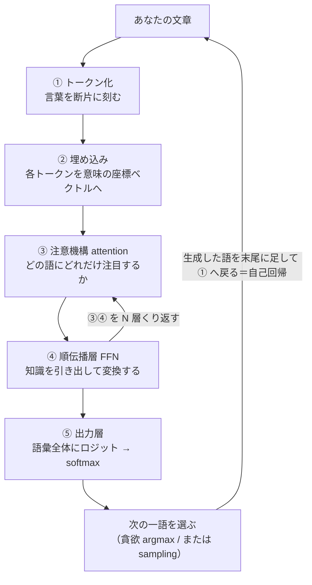

各駅を一言ずつ:

1. **トークン化**: 「今日はいい天気」のような文を、「今日 / は / いい / 天気」のような断片（トークン）に刻みます。
   1トークンは1単語とは限りません。日本語は英語より細かく刻まれがちで、これは後の章で扱う「速さ・重さ」に効いてきます。
2. **埋め込み**: 各トークンの ID を、数百〜数千次元のベクトルに変換します。このベクトルが「意味の座標」で、
   似た意味の語は近くに配置されるように学習されます（第1部の主役）。
3. **注意機構(attention)**: 各トークンが「これまでのどの語に注目すべきか」を動的に計算し、文脈を混ぜ合わせます。
   LLM が長い文脈を扱えるのは、ここのおかげです（第2部の主役・★心臓）。
4. **順伝播層(FFN)**: 注意で混ぜた情報を、2層の多層パーセプトロンで非線形に変換します。ここは「知識の貯蔵庫」としての
   性格が強いことが、複数の研究で示唆されています（第3部で慎重に扱います）。
5. **③④を N 層くり返す**: 注意機構と順伝播層のペア（Transformer ブロック）を何十層も積みます。私が扱った
   0.5B（約5億パラメータ）のモデルでは24層でした。層を通るたびに、ベクトルは少しずつ「次の一語に必要な情報」へ
   煮詰まっていきます。
6. **出力層**: 最後に、語彙のすべてのトークンに対してロジット（生スコア）を出し、softmax で確率にします。
7. **次の一語を選ぶ → 自己回帰**: 確率が一番高い語（貪欲 argmax）か、確率に応じてサイコロを振る（sampling）かで
   一語を選び、その語を末尾に足して、また①へ戻ります。この繰り返しが「文章を生成する」の正体です。

擬似コードにすると、生成ループの骨格はたったこれだけです。

```python
# 教育用の擬似コード：自己回帰生成の骨格
tokens = tokenizer.encode(prompt)          # ① テキスト → トークン列
for _ in range(max_new_tokens):
    logits = model(tokens)                  # ②〜⑤ を通して、次トークンのスコアを得る
    next_id = argmax(logits[-1])            # 末尾位置の最大スコア＝貪欲（sampling は第4部）
    tokens.append(next_id)                  # 生成した一語を末尾に足す
    if next_id == EOS_ID:                   # 終端トークンなら打ち切り
        break
text = tokenizer.decode(tokens)             # トークン列 → テキスト
```

この `model(tokens)` の中身――②埋め込みから⑤出力層までを、フレームワークに頼らず自分で書き、公式と突き合わせた、
というのが次の話です。

計測の現場の言い方をすると、この地図は「画像処理パイプライン」とよく似ています。前処理（正規化）→ 特徴抽出 →
判定、という段構えは、トークン化 → 埋め込み・注意・順伝播 → 出力層、とほぼ同じ骨格です。私が装置で毎日組んでいた
パイプラインが、名前を変えてここにいる――最初に地図を見たとき、そう感じました。

### 3-2. 検証哲学：自作して誤差ゼロで確かめる

ここが第0部の本題です。

#### なぜ、わざわざ組み直すのか

既製の推論エンジンを呼べば、LLM は動きます。では、なぜ一から書き直すのか。理由は「中身を説明できるようになるため」
です。ブラックボックスを外から叩いて挙動を眺めるのと、内部の一つ一つの行列積・正規化・位置の付け方を自分の手で
配線するのとでは、分かり方がまるで違います。そして自作には、避けて通れない検問所があります――**本当に正しく組めたのか、
どう証明するのか**。

計測の世界では、これは日常です。私は昔、公式の開発環境も SDK も無い双腕ロボットを、付属の Windows アプリを
Windows メッセージ経由で操作する自作プログラムで動かしたことがあります。きれいな API が無くても現物を動かす、という
仕事です。ただし「動いた気がする」では検収になりません。両目と腕先のカメラで校正プレートの位置・姿勢を推定し、
基準と突き合わせて初めて「合っている」と言える。**自作 LLM の検証も、まったく同じ発想でやりました。**

#### 自作したもの：Qwen2 系デコーダ

私が自分で実装したのは、公開されている学習済みモデルと同じ構造を持つデコーダです。構成部品は次のとおり
（各部品の中身は各部で分解します。ここでは名前だけ）:

- **RMSNorm(Root Mean Square Normalization)** … 平均引き算を省いた軽量な正規化（第3部）。
- **RoPE(Rotary Position Embedding, 回転位置埋め込み) θ=1e6** … 位置を「回転（位相）」として注意機構に乗せる方式（第2部）。
- **GQA(Grouped-Query Attention)** … Key・Value のヘッドを複数の Query ヘッドで共有し、KV キャッシュを節約する方式（第2部）。
- **SwiGLU** … ゲート付き活性化を持つ順伝播層（第3部）。
- **重み共有埋め込み(tied embeddings)** … 入力の埋め込み行列と出力層の重みを共有し、巨大行列を二重に持たない設計（第1部）。

モジュール名を公式の実装に合わせ、**公式が公開している学習済み重みをそのまま読み込んで**、自作の forward に流しました。
つまり「同じ重み・同じ入力」で、「別々に書いた計算経路」を突き合わせる、という構図です。これは計測でいう
**基準器との突き合わせ**そのものです。基準器（公式実装）と自作器（自作ランタイム）に同じ被測定物（重みと入力）を
与えて、目盛りが一致するかを見る。

#### ゴールデンテスト：三つの一致

突き合わせの結果は、次の三点でした。

1. **フルシーケンスのロジットが 2e-4 で一致。** これは最終トークンだけでなく、**全位置・全語彙のロジット**を要素ごとに
   比べた差の最大が 2e-4（0.0002）のオーダーだった、という意味です。ここが一番情報量の多い一致です。もし途中の
   どこか一箇所でも計算を取り違えていれば、その差は下流で増幅され、2e-4 では収まりません。
2. **貪欲(greedy)生成のトークンが完全一致。** 各ステップで argmax を取ると、自作と公式で選ばれるトークン ID が
   ぴったり同じでした。
3. **KV キャッシュ経路の出力が、フル forward の出力に一致。** 生成を速くするために過去の Key・Value を再利用する
   経路（KV キャッシュ）を通しても、毎回すべてを計算し直すフル forward と同じ結果になりました。実装のショートカットが
   結果を変えていない、という確認です。

擬似コードで書くと、突き合わせの心臓部はこうです。

```python
# 教育用の擬似コード：自作 forward と公式 forward を突き合わせる
ids = tokenizer.encode(prompt)                    # 同じ入力

logits_mine = my_decoder(ids)                     # 自作の推論ランタイム
logits_ref  = official_model(ids).logits          # 公式リファレンス実装（同じ重み）

# フルシーケンス（全位置・全語彙）を要素ごとに比較
max_abs_diff = (logits_mine - logits_ref).abs().max()
print(max_abs_diff)          # → 2e-4 のオーダー（浮動小数点の丸め域）

# 貪欲（各位置で最大スコアのトークン）なら完全一致
assert (argmax(logits_mine, dim=-1) == argmax(logits_ref, dim=-1)).all()
```

#### 二種類の「ゼロ」を、正確に区別する

ここは、このシリーズで最も過大表現をしてはいけない箇所です。私が言う「誤差ゼロ」には、**性質の違う二種類**があります。
両者を混ぜると誠実さが崩れるので、丁寧に分けます。

**(a) 実質誤差ゼロ（浮動小数点の丸め域）＝ 2e-4。**
自作 forward と公式 forward の突き合わせは、差の最大が 2e-4 のオーダーでした。これは**文字通りの 0 ではありません**。
なぜ 0 にならないかというと、浮動小数点の計算は**演算の順序が変わるだけで最下位桁がわずかに揺れる**からです。
自作と公式では、行列積をまとめる順序や中間計算の刻み方が微妙に違います。だから最下位桁レベルの差は必ず出る。
2e-4 という値は、その「避けられない揺れ」の大きさに収まっている、という意味であって、**「実質的に同じ計算をしている」
ことの証拠**です。計測でいえば、同じ長さを二つの高精度な干渉計で測って、最下位の桁だけがちらつくのと同じ。
「一致した」と言ってよいが、「ビットまで同じ」とは言えない。

**(b) ビット完全一致（文字通りのゼロ）＝ max|Δ| = 0.0。**
一方、私は重みの**読み込み方式**を最適化しました。全部の重みを一度にメモリへ展開する素朴なローダーと、
重みを1テンソルずつ順に流し込むメモリ最適化ローダー（streaming loader）です。この**二つのローダーどうし**で
forward の出力を比べると、差の最大がきっかり **0.0**でした。0.5B モデルで、ロジットの max|Δ| = 0.0。
別の実験では、メモリ写像(mmap)で重みを読む経路と、素直に全展開する経路の出力が、やはり完全一致（max|Δ|=0.0）。
さらに、使用 RAM の上限をモデルサイズ以下に絞ったプロセスでも forward は完走し、絞った場合と絞らない場合の
ロジットのチェックサムが完全一致しました。

なぜ (b) は文字通り 0 になるのか。**やっている演算そのものが同一で、値を運ぶ経路（どこから読むか）だけを変えた**
からです。演算順序を変えていないので、浮動小数点の揺れすら発生しない。**「1ビットも違わず」と言えるのは、この (b) の
場合だけ**です。(a) は「実質誤差ゼロ（浮動小数点の丸め域）」と書く。私はこの二つを、記事の中で決して混同しません。

図にすると、こうです。

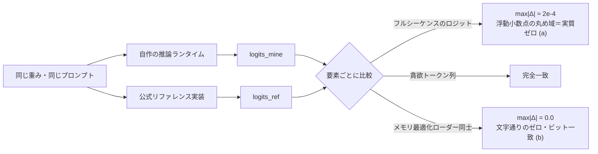

擬似コードでも、(b) の性質ははっきり見えます。

```python
# 教育用の擬似コード：素のローダー vs メモリ最適化ローダー（同じ演算・違う読み方）
logits_plain    = forward(load_all_weights_into_ram(model_dir))
logits_streamed = forward(stream_weights_one_by_one(model_dir))   # 1テンソルずつ流し込む

# 演算順序が同一なので、浮動小数点の揺れすら出ない
assert (logits_plain - logits_streamed).abs().max() == 0.0        # 文字通りのゼロ
```


*図: 左＝自作 forward vs 公式実装（logits 2e-4＝浮動小数点の丸め域＝実質ゼロ）／右＝メモリ最適化ローダー vs 素の実装（max|Δ|=0.0＝ビット完全一致）。※ int8 圧縮の側は別で極小の測定損失あり。*

#### 20ターン耐久テストと、その正直な但し書き

もう一つ、生成を長く続けても崩れないかを見る耐久テストをしました。同一の乱数種(seed)・同一プロンプトで、貪欲生成の
まま、自作と公式に**20ターンの会話**をさせたところ、**20/20ターン、バイト単位で同一の返答**になりました。

ここで、うますぎる結果はまず内訳を疑う、という規律を自分に適用します。この「20/20 バイト一致」は、**独立した新しい
証拠ではありません**。理由はこうです。貪欲生成は各ステップで argmax を取る決定論的な操作です。3-2 のゴールデンテストで
「各ステップの argmax が一致する」ことはすでに分かっている。すると、各ステップで同じトークンを選ぶ以上、その積み重ねで
ある20ターン全体が同一になるのは**当たり前の帰結（決定論の系）**であって、ゴールデンテスト以上のことは何も言っていない。

さらに正直に言えば、私はこの一致検証について、**確率的なサンプリング(do_sample=True)・int8 量子化版・1.5B モデル・
線形化した改造版**が公式と一致するかは、**主張していません**。それらは別の話で、このシリーズの範囲で扱える部分と、
未測定・範囲外の部分を分けて書きます。「一致した」と言えるのは、あくまで**貪欲・fp32・突き合わせた構成**についてだけ。
この線引きを曖昧にしないことが、私にとっての誠実な開示です。

#### 「メモリを切り詰めても壊れない」の予告

検証哲学のご褒美として、実務で効く一つの数字を先に置いておきます。行列演算の線形層だけを int8（8ビット整数）に
量子化し、埋め込みと出力層は fp32 のまま保つ方式で、常駐メモリを次のように減らせました。

- 0.5B: 約 2.0GB → **約 1.21GB**（会話を維持）
- 1.5B: 約 5.7GB → **約 2.44GB**（fp32 のスパイク無しで、会話を維持）

ただし CPU 単体では速度が約 0.7 トークン/秒に落ちます。毎回の forward で int8 を元に戻す(dequant)負荷が乗るためで、
int8 の**速度**の恩恵は、GPU の int8 行列積を待つ――つまり「良いハードウェアほど効く」性質のものです。この
「タダではない（メモリは得するが速度や品質にコストが乗る）」という話は、第5部でまるごと扱います。ここでは
「中身を自作したからこそ、こういう切り詰めを自分で設計して測れる」という一点だけ持ち帰ってください。

#### 会話の実結果と、賢さの継ぎ目

では、自作 forward で実際に会話はできたのか。できました。ただし、**できた理由をぼかさない**のが約束です。

- **0.5B を自作 forward で駆動**（CPU fp32, 約 5〜6 トークン/秒）: 「日本の首都は？」→「東京都です」は正解。
  一方「3たす5は？」→「18」と外しました。0.5B は算数が弱い、という素直な結果です。
- **1.5B を自作 forward で駆動**（約 1〜3 トークン/秒）: 「3たす5は？数字だけ」→「8」と正解、敬語変換もでき、
  「日本で一番高い山は？」→「富士山です」も正解。しりとりのような遊びは弱いままでした。
  総じて、一般的な質問応答・簡単な算数・指示追従で「まともに会話できる」水準には届きました。

ここで肝心なのは、**この会話能力は、学習済みの重みに宿っているものだ**という点です。私が自作したのは推論ランタイム
――forward の計算経路であって、賢さそのものではありません。私の貢献は「その賢さの中身を、外から検査し、部品ごとに
改造し、メモリや速度を作り替えられる、検証済みの箱を用意したこと」です。そして、改造版（後の章で触れる線形化・蒸留版）が
素のモデルより会話が**上手くなる**とは、私は主張しません。改造の目的は賢くすることではなく、**同じ賢さを、より少ない
メモリ・より検査しやすい構造で運ぶこと**だからです。この継ぎ目は、シリーズの最後までぼかしません。

### 3-3. 著者紹介：25年、測って動かしてきた人間が LLM を分解する

なぜ私がこれを書くのか、少し長めに自己紹介させてください（この節だけは第0部でフルに書きます。以降の部では冒頭で
一行触れるだけにします）。所属や固有名詞は伏せますが、経歴は事実のままです。

私は25年以上にわたり、「カメラで見て、機械を動かす」仕事を続けてきました。外観検査、実装部品の位置決め、X線検査、
三次元計測、レーザ干渉計測などの装置で、「現場で不良を取りこぼさず、ラインを止めない」ことを目標に、画像処理と制御の
両面からシステムを作ってきたエンジニアです。

ソフトウェア面では、C/C++ による画像処理ライブラリ開発を中心に、多項式近似、スプライン補間、フーリエ変換、
主成分分析(Principal Component Analysis, PCA)などの数値・統計アルゴリズムを、必要に応じて自分で実装してきました。
Python で周辺ツールやアプリを組むことも多く、定型業務の自動化(Robotic Process Automation, RPA)も自作します。
アルゴリズム検討からライブラリ実装、装置への組み込みまで一気通貫で対応してきました。計測業界にいたので、数理解析
（数値・統計解析）は得意分野です。

ハードウェア・計測面では、結像光学系の検討、近赤外・短波赤外カメラ、レーザ干渉計、導波路・ファイバー芯合わせ、
モアレによる位置決めなど、光学とセンサの設計・評価にも深く関わってきました。DIO/AIO、各種ステージ制御、EtherCAT
といったインターフェースで、装置全体を動かすところまで踏み込んでいます。

少し特徴的な経験として、双腕ロボットのキャリブレーション実験があります。ロボット側に開発環境も公式 SDK も無い状況から、
付属の Windows アプリを Windows メッセージ経由で操作する小さなプログラムを C++/Python で自作し、ロボットの両目と
腕先のカメラでキャリブレーションプレートの位置・姿勢を推定しながら、頭部・腰部・両腕・手首の角度を自動で合わせる
制御ループを構築しました。「きれいな API が無くても、現物をどうにかして動かす」タイプの仕事は、かなり場数を
踏んでいます。

このシリーズは、その延長線上にあります。**「測って・動かす」を25年やってきた人間が、その同じ規律で LLM を分解したら
何が見えたか。** 面白いことに、現場で使ってきた道具が、LLM の中でそのまま顔を出します。

| 私が現場で使ってきた道具 | LLM の中での顔 | 詳しく扱う回 |
|---|---|---|
| フーリエ変換／位相・周波数 | 回転位置埋め込み(RoPE)＝位置を周波数で符号化 | 第2部 |
| テンプレートマッチング／相関 | 注意スコア(QKᵀ)＝内積の類似度 | 第2部 |
| 主成分分析(PCA)／次元圧縮 | 埋め込み空間・意味の座標軸 | 第1部 |
| スプライン補間・多項式近似 | ニューラルネット＝汎用の関数近似器・順伝播層 | 第3・4章 |
| キャリブレーションループ（誤差を測って補正） | 学習ループ（誤差 loss を測って勾配降下） | 第4部 |
| モアレ／レーザ干渉計測（微小変位を高精度に測る） | 2e-4・max\|Δ\|=0.0 の精密な一致検証 | 第0部（この部） |
| SDK なしで現物を動かす（自作制御・RPA） | フレームワークに頼らず forward を自作する | 第0・2章 |

自慢をしたいのではありません。言いたいのは一貫性です。**「測って確かめる」「現物を動かす」という古典的な現場力は、
そのまま LLM の内部実装と検証に効く**――その地続きを、事実で示したいのです。フーリエ変換を光学系で使ってきた人間が、
位置エンコーディングの回転を見て「これは知っている土俵だ」と分かる。その感覚を、読者にもお裾分けできればと思います。

### 3-4. 誠実な開示(honest disclosure)憲章

このシリーズが自分に課すルールを、憲章として明文化しておきます。以降の全章がこれに従います。

1. **数値は実測だけを載せる。** 本文に出るベンチマーク・モデル名・一致誤差は、すべて私が自分の環境で測った実測値です。
   キリのいい概数（「約 5〜6 トークン/秒」など）は概数と分かる書き方にし、**測っていない数字を「盛って」書くことはしません**。
   分からないことは「未測定」「本シリーズの範囲外」と正直に書きます。
2. **失敗を消さない。** うまくいかなかった実験を、教訓として残します。予告すると――自宅の CPU でゼロから作った
   **文字単位の言語モデルは会話にならなかった**（規模・データ・計算量の壁、第4部）。**極端な圧縮（2ビット）は
   モデルを壊した**（第5部）。**素朴な進化探索は単純な貪欲法に負けた**（第6部）。これらは失敗ではなく、構造を
   教えてくれる一次データです。
3. **異常に良い結果は、まず内訳を疑う。** これは計測の現場で、うますぎる測定値をまず校正から疑うのと同じ規律です。
   前述の「20/20 バイト一致」を独立証拠と誇らなかったのが、その実践例です。良い数字が出たら、喜ぶ前に
   「これは何の帰結か」を分解する。
4. **賢さの継ぎ目をぼかさない。** 会話の賢さは学習済みの重み由来であり、自作がもたらしたのは「検査・改造できる
   検証済みランタイム」です。改造版が素のモデルより賢いとは主張しません。
5. **二種類のゼロを混同しない。** 実質誤差ゼロ（浮動小数点の丸め域・2e-4）と、ビット完全一致（文字通りゼロ・
   max|Δ|=0.0）を、毎回きちんと区別して書きます。
6. **各部に、読者が持ち帰れるものを一つ必ず置く。** 気づき・道具・人に話したくなる話題のどれか。読者への
   プレゼントとして書きます。

計測の現場には「校正されていない測定器の数字は、桁が合っていても信じるな」という戒めがあります。私はこのシリーズの
数字にも、それを適用します。桁が良く見えたら、まず自分の測り方を疑う。この姿勢そのものが、LLM を語るうえでの
私の一番の持ち味だと思っています。

### 3-5. 各部の予告と、読む順

このシリーズは、3-1 のパイプライン地図を各駅で降りていく構成です。技術版のラインナップと核を先に置きます。

| 回 | タイトル | 技術的な核 |
|---|---|---|
| **第0部（この部）** | 序章 ― 自作して誤差ゼロで確かめる | 検証哲学（2e-4 / max\|Δ\|=0.0）、パイプライン地図、著者紹介、誠実な開示憲章 |
| **第1部** | 言葉を座標に変える ― トークン化と埋め込み | tokenizer、埋め込み、重み共有埋め込み(tied embeddings)、PCA との地続き |
| **第2部** | 注意機構の正体 ― 文脈を配る仕組み ★心臓 | softmax(QKᵀ/√d)V、RoPE(フーリエ橋)、GQA、KV キャッシュ、**2e-4 一致の詳述** |
| **第3部** | Transformer ブロックの全体像 ― 知識はどこに住むか | RMSNorm、残差接続、SwiGLU/順伝播層、知識の局在（慎重な留保付き） |
| **第4部** | なぜ「事前学習済み」が効くのか ― 学習と推論 | next-token 学習＝校正ループ、文字言語モデルが会話できない話、能力は重みに宿る |
| **第5部** | メモリと速度の壁 ― KVキャッシュ・量子化・線形化 | 線形膨張、int8 で 5.7GB→2.44GB、定数状態、蒸留回復、「タダではない」 |
| **第6部** | 実務編 ― モデル選定・評価・進化・責任ある設計 | ライセンス、RAG/微調整/蒸留、評価の罠、進化的探索、責任ある AI |

読む順のおすすめ:

- **LLM をよく使うが中身は初めて、という方** → 各部、先に**一般版**(<<LINK:MEGA_G>>)で全体像を掴んでから、この技術版で深掘りすると
  楽に入れます。一般版は絵と比喩だけで通れます。
- **実際に開発をする／レポートとして読みたい方** → この技術版を第0部から順に。とくに**モデル選定・評価の罠・
  メモリ最適化・責任ある設計**を実務目線で知りたい方は、第5部・第6部が中心になります。
- **どこから読んでもいい設計**にしています。各部が「用語ミニ辞典 → かみくだき → 詳細」で自己完結するので、
  興味のある駅から降りても迷いません。

一つだけ順番の勘どころを。**第2部（注意機構）が、このシリーズの心臓**です。第0部で「自作 forward が公式と 2e-4 で
一致した」と述べた、その一致の中身を最も詳しく開けるのが第2部です。回転位置埋め込み(RoPE)やグループ化クエリ注意(GQA)、
KV キャッシュといった「一致を成立させた部品」を、そこで一つずつ突き合わせます。

---

## 次の部に続く

この序章で据えたのは、**「組み直して、測って、差を見る」というこのシリーズの読み方**でした。フルシーケンスのロジットが
2e-4 で一致し、メモリ最適化ローダーどうしは max|Δ|=0.0 で完全一致した――だから私は、各部品が何をしているかを
取り違えていない、と言える。そして、賢さそのものは学習済みの重み由来であり、私が作ったのは「その中身を検査・改造できる
検証済みランタイム」である、という継ぎ目も引きました。

> 🎁 **この部で持ち帰ってほしいもの**
> 「誤差ゼロ」には二種類ある。**2e-4（浮動小数点の丸め域＝実質ゼロ）** と **max|Δ|=0.0（文字通りのゼロ・ビット一致）**。
> この二つを区別できるだけで、他人の「完全一致しました」という主張を、一段深く読めるようになります。
> 演算順序が変わったのか（丸めの揺れが出る）、読み方だけを変えたのか（ビットまで同じ）――そこを問えるのが、
> 測るエンジニアの目線です。

次の第1部は、地図の最初の駅――**「言葉を座標に変える」** 話です。コンピュータは文字をそのまま計算できません。
「りんご」も「king」も、いったん**数字の並び（ベクトル）** に翻訳しないと足し算すらできない。そこで LLM は、言葉を
「意味の地図の上の座標」に置きます。この地図の上では、**「王様」から「男」を引いて「女」を足すと「女王」に近づく**、
という一見魔法のようなことが起きます。なぜそれが可能なのか。そして、私が現場で使ってきた**主成分分析(PCA)** と、
その意味の座標軸は、どこで地続きなのか。次の部で、トークン化と埋め込みの中を覗きます。

---

*このシリーズは、自作の小さな LLM を実装しながら書いています。一般版では同じテーマを比喩と絵で、技術版では
数式・擬似コード・実測値で通ります。「仕組みで納得したい」あとに「絵で腑に落としたい」方は、一般版(<<LINK:MEGA_G>>)もあわせてどうぞ。*


---

# 第1部 言葉を座標に変える ― トークン化と埋め込み

> このシリーズは、大規模言語モデル(LLM: Large Language Model)の推論エンジンを、フレームワークの中身に頼らず
> ゼロから組み直し、公式実装と実測して**浮動小数点の丸め誤差の域(logits 2e-4)で一致**させた一次体験を土台に、
> 部品を一つずつ分解して見せる連載です。第0部では「なぜ組み直すと分かるのか」という検証哲学を置きました。
> 今回からいよいよ、実際にパイプラインの最初の駅――**言葉を数に、そして意味の座標に変える**ところ――を開けていきます。


私は 25 年以上、「カメラで見て、機械を動かす」計測・制御の現場で、画像処理と数値・統計アルゴリズムを実装してきたエンジニアです。
今回のテーマである埋め込み(embedding)は、実はその現場道具――**主成分分析(PCA)や三次元計測の座標**――と地続きでした。
その驚きも含めて、最初の駅をゆっくり通ります。

一般版の第0部の最後で、こんな予告をしました。「言葉を『意味の地図の上の座標』に置くと、**『王様』から『男』を引いて『女』を足すと
『女王』に近づく**、ちょっと魔法みたいなことが起きる」。今回はその魔法の正体――と、正直に言えば「魔法ではない」ところ――を、
数式とコードで覗きます。

---

## ① 用語ミニ辞典

まず、この記事で使う言葉を先に並べておきます。ここだけ眺めて全体の見取り図を掴んでから、②③に進んでください。

- **トークン化(tokenization)** … 文章を「トークン」という小さな単位に区切る前処理。LLM が最初にやること。
- **トークン(token)** … 区切られた言葉のかけら。1トークン ≠ 1単語で、単語よりやや細かいことが多い。
- **語彙(vocabulary)** … モデルが扱えるトークンの全種類（辞書）。ふつう数万〜十数万種類。各トークンに整数の ID が振られている。
- **BPE(Byte Pair Encoding)** … トークン化の代表的な方式。「よく一緒に出る文字の並び」を貪欲にくっつけて語彙を作る。
- **トークン肥沃度(fertility)** … 1つの単語（や文字のまとまり）が平均で何トークンに分かれるか。日本語は英語より高くなりやすい。
- **埋め込み(embedding)** … トークン ID を、決まった長さのベクトル（数の並び）に対応させる操作、またはそのベクトルそのもの。「意味の座標」。
- **隠れ次元(hidden dimension)** … 埋め込みベクトルの長さ（次元数）。モデル内部で言葉を表す座標の「軸の本数」。数百〜数千。
- **埋め込み行列(embedding matrix)** … 語彙のトークンごとに1本ずつベクトルを並べた表。形は「語彙数 × 隠れ次元」の巨大な行列。
- **ワンホット(one-hot)** … ある ID の位置だけ 1、あとは全部 0 のベクトル。「どのトークンか」を素朴に表す方式。
- **出力層(lm_head)** … 最後に、内部ベクトルから「次に来る各トークンの点数」を計算する層。lm_head は language model head の略。
- **ロジット(logits)** … 出力層が出す、語彙全体ぶんの生スコア。softmax にかけると確率になる（次トークンの候補点数）。
- **重み共有埋め込み(tied embeddings)** … 入力の埋め込み行列と、出力層(lm_head)の行列を**同じ1枚**にする設計。巨大行列を二重に持たずに済む。
- **主成分分析(PCA: Principal Component Analysis)** … 高次元データを「ばらつきの大きい軸」から順に並べ直し、少ない軸で要約する古典的な統計手法。
- **順伝播(forward pass)** … 入力から出力まで、計算を前向きに一度通すこと。学習ではなく「使う」ときの流れ。

4文字以下の略語はここで一度だけ開きました。以降は日本語か略語で通します。

---

## ② かみくだき：文字は計算できない。だから「座標」に置き換える

コンピュータは、文字をそのままでは計算できません。「りんご」も「king」も、足したり掛けたりできる**数**に翻訳しないと、
ニューラルネットワークの中を流せない。この記事のテーマは、その**最初の翻訳**です。翻訳は2段構えになっています。

**第1段：言葉を「かけら」に刻む（トークン化）。**
文章をいきなり丸ごと数にするのは無理があるので、まず短い単位に区切ります。かといって「1文字ずつ」だと細かすぎて長くなり、
「1単語ずつ」だと知らない単語（新語・固有名詞・打ち間違い）に対応できない。そこで LLM は、その中間の**「部分語（サブワード）」**
という粒度を使います。「よく一緒に出てくる文字の並び」を、あらかじめ辞書（語彙）に登録しておき、入力文をその辞書のかけらに割る。
各かけらには背番号（整数の ID）が振ってあるので、文章はまず「整数の並び」になります。ここまでで、文字は数になりました。

ただし、この背番号はただの通し番号で、**それ自体には意味がありません**。ID 100 と ID 101 が似た言葉である保証はどこにもない。
辞書順に並んでいるだけの番号です。これでは「りんごとみかんは似ている」といった関係を計算に乗せられません。そこで第2段です。

**第2段：背番号を「意味の座標」に置き換える（埋め込み）。**
モデルは、トークンごとに1本ずつ、決まった長さのベクトル（たとえば数百個の数の並び）を持っています。ID を見たら、
対応するベクトルを取り出す。これが埋め込みです。**やっていることは「表引き」だけ**――巨大な表（埋め込み行列）から、
その ID の行を1本抜き出しているにすぎません。

この一手間が効くのは、ベクトルが**空間の中の位置（座標）**として振る舞うからです。似た意味の言葉は近くに、
違う意味の言葉は遠くに配置される。すると「近い／遠い」「どちらの方向か」といった**幾何（図形）の言葉で意味を扱える**ようになる。
「王様 − 男 + 女 ≈ 女王」という有名な話は、この座標の上でベクトルを足し引きすると、意味の足し引きに近いことが起きる、という現象です。

私はこれを見たとき、既視感がありました。計測の現場では、たくさんの測定値を高次元の点として扱い、**主成分分析(PCA)で
「ばらつきの大きい軸」を見つけて次元を減らす**ことを日常的にやります。三次元計測なら、物体の位置は (x, y, z) の座標一点で表す。
「モノやコトを、空間の中の一点に置いて、位置と方向で扱う」――埋め込みは、まさにこの発想の言語版でした。

ひとことで言えば、**トークンは「言葉のかけら」、埋め込みはその「番地（座標）」**。かけらに番地を与えて地図に置く、
ここまでが第1部です。地図に置いたあと、その座標をどう混ぜ合わせて文脈を作るか――それが次の部の注意機構(attention)の仕事です。

---

## ③ 詳細：トークン化・埋め込み・重み共有

ここからは、②の各段を数式とコードで掘ります。読まなくても②で筋は通りますが、「実装として何が起きているか」を
見たい方はどうぞ。擬似コードはすべて、実装の要点だけを抜いた**教育用の最小例**（PyTorch 風）です。

### 3-1. トークン化：なぜ「文字」でも「単語」でもなく「部分語」なのか

トークン化の設計は、2つの失敗の間を縫う綱渡りです。

- **文字単位（char）**：語彙は小さくて済む（ひらがな・漢字・記号で数千種）が、系列が長くなる。1文が何十トークンにも伸び、
  後段の計算（特に次の部の注意機構は系列長の2乗で効いてくる）が重くなる。
- **単語単位（word）**：系列は短いが、語彙が爆発する上に、**辞書に無い単語（未知語）**に無力。新語・固有名詞・タイプミス・
  複合語のたびに「知らない」となる。

その中間が**部分語（サブワード）**です。頻出する文字の並びは1トークンにまとめ、珍しい並びは細かいかけらに割る。
これなら「語彙は有限のまま、どんな文字列も表現できる」を両立できます。未知語は、最悪でも1文字ずつ（あるいはバイト単位）に
分解すれば必ず表現できるからです。この「必ず表せる」保証が、部分語方式の肝です。

その代表が **BPE(Byte Pair Encoding)** です。仕組みは驚くほど素朴で、次の貪欲な繰り返しだけです。

1. 最初は全部を最小単位（バイトや文字）に割る。
2. 大量のテキストの中で「最も頻繁に隣り合っているペア」を1つ見つけ、それを新しい1トークンとして**併合(merge)**する。
3. これを、語彙が目標サイズになるまで繰り返す。

たとえば `l o w`、`l o w e r`、`n e w e s t` … といった塊が多ければ、`l o` → `lo`、`lo w` → `low` のように、
頻出の並びが1トークンへ育っていきます。学習が終わると「どの順で併合するか（マージ規則）」の一覧が固定され、
本番ではその規則に沿って文を割るだけになります。

擬似コードで、BPE 学習の骨格だけ示します（実装の細部――正規化・特殊トークン・バイト境界の扱い――は省いた教育用の骨です）。

```python
from collections import Counter

def learn_bpe(words: list[list[str]], num_merges: int):
    """words: 各単語を最小単位のリストにしたもの（例 [["l","o","w"], ...]）。
    最頻ペアを貪欲に併合していき、マージ規則の列を返す。"""
    merges = []
    for _ in range(num_merges):
        # 1) 隣り合う記号ペアの出現回数を数える
        pair_counts = Counter()
        for symbols in words:
            for a, b in zip(symbols, symbols[1:]):
                pair_counts[(a, b)] += 1
        if not pair_counts:
            break
        # 2) 最頻ペアを選ぶ（＝貪欲）
        best = max(pair_counts, key=pair_counts.get)
        merges.append(best)
        # 3) そのペアを全単語で1トークンに結合する
        merged = best[0] + best[1]
        words = [_apply_merge(sym, best, merged) for sym in words]
    return merges
```

ここで大事なのは、**BPE は「意味」を一切見ていない**という点です。見ているのは頻度だけ。にもかかわらず、
頻出語がまとまり珍しい語が割れるという振る舞いが、後段の学習にとって都合の良い粒度を生みます。
「意味を教えていないのに意味に効く前処理ができる」――このあたりから、LLM の「素朴な仕組みが積み重なって効く」味が出てきます。

#### 日本語は「細かく割れやすい」：トークン肥沃度(fertility)

ここで**トークン肥沃度(fertility)**――1つの単語（あるいは一定量の文字）が平均で何トークンに分かれるか――の話をします。
多くの公開トークナイザは、学習コーパスに英語などの空白区切り言語を多く含みます。BPE は頻度で併合を決めるので、
コーパスで頻出する英語の綴りは長い並びが1トークンに育ちやすい。一方、**相対的に露出の少ない日本語は、
併合が十分に進まず、細かいかけらに割れやすい**のです。分かち書き（単語の間に空白）が無いことも、単位を掴みにくくします。

具体的な分かれ方はトークナイザごとに異なるので断定はしませんが、傾向として、英語の1単語が1〜数トークンで済むのに対し、
同じ意味の日本語は文字ごと・部分ごとに割れて**トークン数が増えがち**です。これは実務で効きます。

- 同じ内容でも、日本語は消費トークンが増える → 文脈長の予算を食う → 実質的に扱える文脈が短くなる、コストが上がる。
- モデルによっては、日本語の細切れが「言葉のまとまり」を壊し、性能に響くことがある（このシリーズの範囲では数値評価はしていません。
  第6部のモデル選定で「日本語品質」を軸の1つに置くのは、この現実があるためです）。

計測の言葉で言えば、これは**分解能とダイナミックレンジのトレードオフ**に似ています。細かく刻めば表現力は上がるが、
系列が伸びて後段が重くなる。どこで刻むかは、性能とコストの綱引きなのです。

### 3-2. 埋め込み：ID をベクトルに ―― 実体は「表引き」

トークン化で文章は整数の並びになりました。次は、その各 ID を隠れ次元(hidden dimension)のベクトルに変えます。

素朴に考えると、ID を**ワンホット(one-hot)**ベクトル――たとえば語彙が V 種類なら、長さ V で、その ID の位置だけ 1、
残りは全部 0 のベクトル――にして、そこに重み行列を掛ければベクトルになります。式で書くと、埋め込み行列を W（形は
「語彙数 V × 隠れ次元 H」）として、

```
埋め込みベクトル = one_hot(id) @ W       # 形: (1×V) @ (V×H) = (1×H)
```

です。ところがワンホットは1か所しか 1 が立っていないので、この掛け算の結果は**「W の id 行目をそのまま抜き出す」だけ**に
なります。V が十数万もあると、律儀に行列積を計算するのは無駄で、実装は「行を取り出す(gather)」だけをやります。
これが `nn.Embedding` の正体です。**掛け算に見えて、実は表引き**。ここを取り違えると、埋め込みを「重い計算」だと誤解します。

擬似コードで最小の埋め込み層を書きます。

```python
import torch
import torch.nn as nn

class TokenEmbedding(nn.Module):
    """トークンID列を hidden 次元のベクトル列へ変換する最小実装。
    やっているのは『行列の行を引く』だけ（nn.Embedding 相当）。"""
    def __init__(self, vocab_size: int, hidden: int):
        super().__init__()
        # 語彙のトークンごとに1本のベクトル(= 行列の1行)を持つ。
        # 形状は (vocab_size, hidden)。学習でこの中身が決まる。
        self.weight = nn.Parameter(torch.randn(vocab_size, hidden) * 0.02)

    def forward(self, token_ids: torch.LongTensor) -> torch.Tensor:
        # token_ids: (batch, seq_len) の整数
        # 返り値  : (batch, seq_len, hidden) のベクトル列
        # ここが肝 ―― 行列積ではなく『行の取り出し』。
        return self.weight[token_ids]
```

`self.weight` の1行1行が、トークン1個ぶんの「意味の座標」です。初期値はランダム（上のコードでは小さな正規乱数）で、
**この座標は学習を通じて決まっていきます**。ここで、このシリーズが何度も戻ってくる正直な継ぎ目を先に置きます。

> **正直な継ぎ目（今回ぶん）**：私は推論エンジンを自作しましたが、この埋め込み行列の**中身（各トークンの座標）を
> 学習したのは私ではありません**。公開されている学習済みモデル（Qwen2 系の重み）を読み込み、その座標をそのまま使っています。
> 私の自作が担保したのは、「その表引きを公式実装と取り違えずに再現できること／中身を検査・改造できること」であって、
> 「意味そのものをより上手に配置したこと」ではありません。座標に宿る意味は、巨大な事前学習が入れたものです。この継ぎ目をぼかしません。

#### 座標に「意味」が乗るとは、どういうことか

学習が終わった埋め込み行列を眺めると、**似た使われ方をする言葉のベクトルが近くに集まる**傾向が見えます。
なぜそうなるかは、第4部（学習と推論）の主題ですが、直観だけ先取りすると、モデルは「次のトークンを当てる」ために学習され、
**似た文脈で入れ替え可能な言葉は、当てるうえで似た役割を果たす**ので、近い座標に押し込まれていくのです。
「意味が先にあって座標を決めた」のではなく、「予測がうまくなるように座標を動かしたら、結果として意味の地図になった」――
順番はこちらです。ここも、盛らずに書いておきたいところです。

### 3-3. 「王様 − 男 + 女 ≈ 女王」と、PCA の地続き

さて、予告した魔法です。単語をベクトルにする古典的な手法（word2vec などの語ベクトル）で、次のような足し算が近似的に
成り立つことが知られています。

```
vec(王様) − vec(男) + vec(女) ≈ vec(女王)
```

直観としては、「王様 − 男」というベクトルの差が**『王位という属性』の方向**を、残った差が**『性別』の方向**を表していて、
その方向に沿って移動すると対応する言葉に近づく、という話です。意味の空間の中に「性別の軸」「単数複数の軸」「時制の軸」
のような**方向**が立っている、というイメージです。

ここが、私の得意分野――**主成分分析(PCA)**――とまっすぐ地続きでした。PCA は、高次元データを「ばらつきの大きい方向」から
順に軸として取り出し、少数の軸でデータを要約する手法です。計測の現場では、たくさんの測定値を高次元の点群として PCA にかけ、
「実は2〜3本の軸でほとんど説明できる」と分かることが日常的にあります。埋め込み空間で「性別の方向」「王位の方向」を探す発想は、
**『データの中に意味のある軸を見つけて、その軸で分解する』という PCA と同じ精神**なのです。実際、埋め込み行列に PCA をかけて
2次元・3次元に落とし、言葉の散らばりを目で見る――というのは、私が測定データでやってきた次元圧縮そのままの操作でした。

ただし、ここは**正直に留保を付けます**。この足し算は、あくまで**近似**であって、厳密な等式ではありません。

- 実際の埋め込み空間は**非線形**な構造を持ち、「引いて足す」という直線的な操作でいつでもきれいに対応語へ着地するわけではない。
  有名な例がうまくいくのは、性別や単複のように分かりやすい方向が比較的まっすぐ乗っている一部のケースです。
- PCA は**線形**の手法なので、非線形な意味構造を2〜3軸に落とすと、あくまで**影（射影）**しか見えません。「軸で分解できる」は
  直観を掴む足場としては正しいが、「意味が完全に線形の軸に分かれている」と受け取ると行き過ぎです。
- そして、有名な「王様 − 男 + 女」は歴史的には**語単位の静的な埋め込み**（word2vec 等）で語られた現象です。現代の LLM の
  埋め込みは**部分語単位**で、しかも生の埋め込みはまだ「出発点の座標」にすぎません。文脈に応じた本当の意味は、この後の
  注意機構(attention)や順伝播層(FFN)が何十層もかけて磨き上げます。同じ「bank」でも「川岸」か「銀行」かは、生の埋め込みでは
  まだ決まっておらず、文脈が決める。**生の座標は下書き、文脈が清書する**――この感覚が次の部への橋になります。

つまり「意味の座標」は、**魔法ではなく幾何**です。方向と距離で意味を扱えるという、地に足の着いた話。魔法らしく見えるのは、
その幾何が数百次元という、私たちの直観が届かない広さで起きているからにすぎません。三次元計測なら点は (x, y, z) の3座標でしたが、
言葉の座標は数百本の軸を持つ――高次元という一点を除けば、やっていることは「点を空間に置く」という、計測の人間には馴染み深い操作です。


### 3-4. 重み共有埋め込み(tied embeddings)：巨大行列を二重に持たない

ここで、実装とメモリの話に踏み込みます。パイプラインの**入口**では、ID をベクトルに変えるために「語彙数 × 隠れ次元」の
埋め込み行列を使いました。では**出口**はどうか。最後の**出力層(lm_head)**は、内部で磨き上げた1本のベクトルから、
「次に来る各トークンの点数（ロジット(logits)）」を計算します。これは各トークンの座標との内積――つまり
「この内部ベクトルは、どのトークンの座標にどれだけ近いか」を語彙ぶん全部測る操作で、やはり「語彙数 × 隠れ次元」の行列を使います。

入口と出口、どちらも「語彙 × 隠れ次元」の巨大行列。語彙が十数万・隠れ次元が数百〜数千ともなれば、これは1枚でも
モデル全体のパラメータの中でかなりの割合を占める、重い行列です。**それを2枚別々に持つのは、もったいない。**

そこで多くのモデル（今回の自作対象の Qwen2 系もそう）が採る設計が、**重み共有埋め込み(tied embeddings)**です。
入口の埋め込み行列と、出口の出力層行列を、**物理的に同じ1枚**にしてしまう。入口では「行を引く」向きに、
出口では「各行と内積を取る」向きに、**同じ行列を両方向に使い回す**のです。考えてみれば、これは自然な対称性です。
入口は「ID → 座標」、出口は「座標 → 各 ID との近さ」。**同じ『トークンの座標表』を、行きと帰りで読んでいるだけ**なのですから。

擬似コードで、出力層を埋め込みと共有する形を示します。

```python
class TiedLMHead(nn.Module):
    """出力層(lm_head)。入力埋め込みと同じ行列を転置して使い回す。
    これで『語彙 × 隠れ次元』の巨大行列を2枚持たずに済む。"""
    def __init__(self, embedding: TokenEmbedding):
        super().__init__()
        self.embedding = embedding  # 参照を共有する（コピーしない）

    def forward(self, hidden_states: torch.Tensor) -> torch.Tensor:
        # hidden_states: (batch, seq_len, hidden)
        # 各位置の隠れベクトルを、全語彙のベクトルと内積 → ロジット。
        # weight: (vocab_size, hidden) → 転置して (hidden, vocab_size)
        # 出力  : (batch, seq_len, vocab_size)
        return hidden_states @ self.embedding.weight.t()
```

`self.embedding` を**コピーせず参照で持つ**のがポイントです。別の行列を新たに確保しないので、この巨大行列のぶんの
メモリが丸ごと1枚ぶん浮きます。

数字で感触を掴んでおきます（**あくまで説明のための仮の例**で、特定モデルの実値ではありません）。仮に語彙 15 万・
隠れ次元 1,000 とすると、埋め込み行列は 15 万 × 1,000 = 1.5 億パラメータ。32ビット浮動小数点なら1つ4バイトなので、
**約 600MB**になります。tied なら、この 600MB を**二重に持たずに済む**。自宅の限られた RAM で大きめのモデルを動かそうとする
とき、この「1枚ぶん」は効きます。私が自作の推論ランタイムでこの共有を再現したのも、まさに小さな RAM で動かすための、
メモリの上で正しい設計だからです。

> **正直な補足**：重み共有は「常に正しい唯一解」ではありません。ごく大きなモデルでは、あえて入口と出口を**共有しない
> （untie する）**設計もあります。共有すると入口と出口に同じ制約がかかるので、規模に余裕があるなら別々にした方が表現力を
> 使い切れる、という判断です。今回の自作対象は共有する設計だったので共有を再現した、というだけで、「共有が絶対」ではない――
> ここも盛らずに。


### 3-5. ここまでを1本につなぐ：入口から出口までの最小骨格

第1部の部品（埋め込みと、それと共有する出力層）が、パイプライン全体のどこに座るかを、最小の骨格コードで示します。
真ん中の「ブロック × N層」の中身――**注意機構(attention)と順伝播層(FFN)**――が、それぞれ第2部・第3部の主役です。
ここでは「入口と出口が第1部、中身は次の部から」という位置関係だけ掴んでください。

```python
class MiniLM(nn.Module):
    def __init__(self, vocab_size: int, hidden: int, n_layers: int):
        super().__init__()
        self.embed   = TokenEmbedding(vocab_size, hidden)      # ← 第1部（入口）
        self.blocks  = nn.ModuleList([Block(hidden) for _ in range(n_layers)])
        self.norm    = RMSNorm(hidden)                          # ← 第3部
        self.lm_head = TiedLMHead(self.embed)                  # ← 第1部（出口・重み共有）

    def forward(self, token_ids: torch.LongTensor) -> torch.Tensor:
        x = self.embed(token_ids)        # ID列 → 意味の座標列   （本章）
        for blk in self.blocks:
            x = blk(x)                   # 注意機構(第2部) + 順伝播層(第3部) を N 回
        x = self.norm(x)                 # 仕上げの正規化        （第3部）
        logits = self.lm_head(x)         # 座標列 → 語彙スコア   （重み共有した出口）
        return logits                    # softmax にかけて次トークンを選ぶ（第4部）
```

この骨格は、②の地図をそのままコードにしたものです。**入口（埋め込み）で座標に置き、真ん中で座標を混ぜ、
出口（共有した出力層）で語彙の点数に戻す。** 第1部で扱ったのは、この行きと帰りの「両端」でした。

### 3-6. なぜ「取り違えていない」と言えるのか（検証との接続）

第0部で、このシリーズの信頼の核として「自作した順伝播の出力が、公式実装と**logits 2e-4（浮動小数点の丸め誤差の域）で
一致した**」という事実を置きました。今回扱った埋め込み参照と、重み共有した出力層も、その一致に含まれる経路です。
入口の表引きも、出口の内積（共有行列の転置を使う）も、公式と取り違えていれば、最終の logits がこんな精度で揃うはずがありません。
つまり、**「埋め込みは掛け算でなく表引き」「入口と出口は同じ行列を両方向に使う」という今回の理解は、実測で裏を取ってある**、
ということです。この 2e-4 一致の中身と、その意味（なぜ丸め誤差の域と言えるのか）は、心臓部である注意機構を扱う**次の第2部で
詳しく開きます**。ここでは「今回の部品も、その一致の一部だった」とだけ受け取ってください。

---

## この章の一枚図

第1部がパイプライン全体のどこかを、最後に一枚で置いておきます。

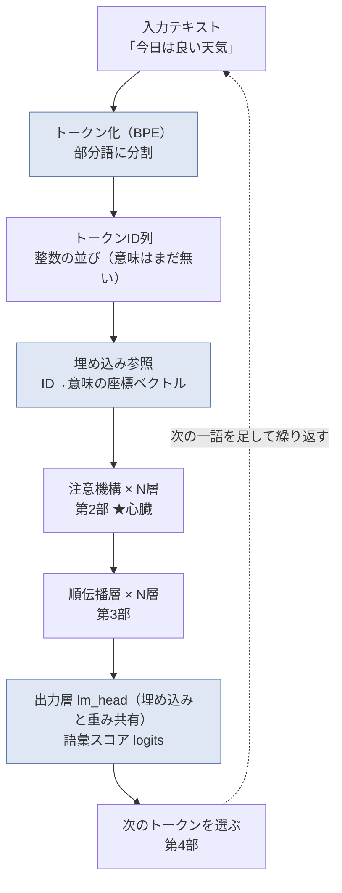

青く塗った3つ――**トークン化・埋め込み・重み共有した出力層**――が、今回の担当範囲です。入口と出口が同じ「意味の座標表」を
分け合っている、という対称性が、図でも見えます。

埋め込み参照（表引き）の一枚図も置きます。

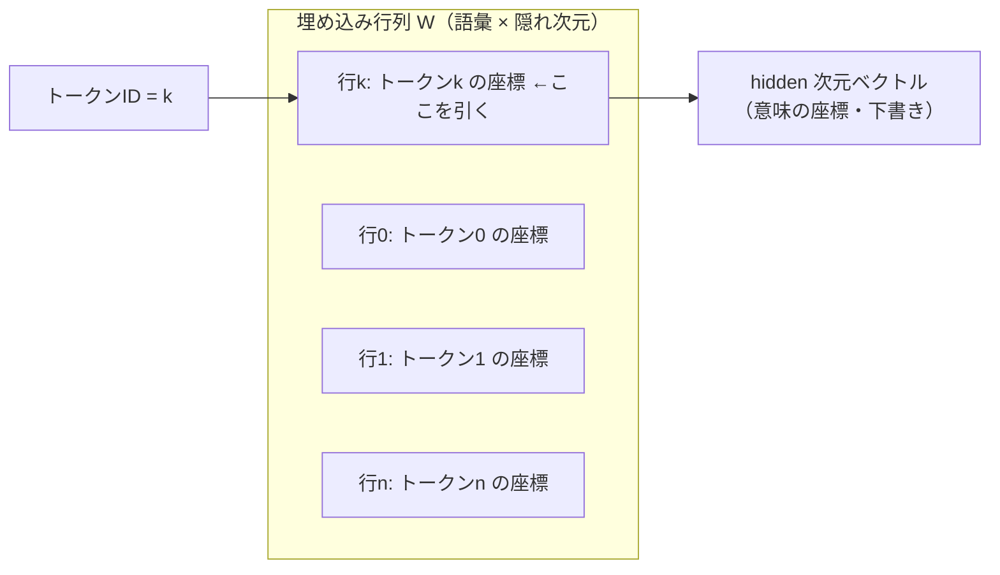

---

## 次の部に続く

今回、言葉は「かけら（トークン）」に刻まれ、「番地（意味の座標）」を与えられて、数百次元の地図の上に置かれました。
でも、3-3 の終わりで正直に書いたとおり、**生の座標はまだ「下書き」**です。「bank」が川岸か銀行か、「はし」が箸か橋か端か――
それは1語だけ見ても決まらない。**周りの言葉を見て、どこに注目するかを決めて、初めて意味が定まる**。

その「どこに注目するか」を動的に配る仕組みが、次の第2部の主役――**注意機構(attention)**です。LLM が急に賢くなった立役者であり、
このシリーズの★心臓。そして私にとっては、注意スコアの計算 `softmax(QKᵀ/√d)` が、画像処理で使ってきた
**相関・テンプレートマッチング**と、位置エンコーディング(RoPE)が**フーリエ変換・位相**と、まっすぐ地続きだった――
という、いちばん驚いた章でもあります。あわせて、第0部で予告した「自作が公式と 2e-4 で一致した」話も、ここで詳しく開きます。

> **この章の持ち帰り（1つ）**
> **「埋め込みは、掛け算ではなく“表引き”。そして入口と出口は、同じ1枚の座標表を行き帰りで読んでいるだけ（重み共有）。」**
> ――LLM の中で言葉は「意味の座標」として扱われ、その座標表はメモリを二重に持たないよう賢く共有されています。
> 次にモデルのメモリ消費の話を聞いたら、「あの巨大な埋め込み行列、入口と出口で共有してるんだよね」と思い出してください。
> それだけで、AI の中身が少しだけ透けて見えるはずです。

---

*このシリーズは、自作の小さな LLM を実装しながら書いています。数値・ベンチ・モデル名は実測・実在のものだけを使い、
うまくいかなかったこと（このあとの章で出てくる、自作の文字言語モデルが会話にならなかった話など）も消さずに残します。
「絵で分かった」あとに「仕組みで納得したい」方は、一般版(<<LINK:MEGA_G>>)の第1部とあわせてどうぞ。*


---

# 第2部 注意機構の正体 ― 文脈を配る仕組み

> 大規模言語モデル（LLM: Large Language Model）を、フレームワークの中身に頼らず推論エンジンごと自分で組み直し、
> 公式実装と実測して誤差ゼロで再現した一次体験をもとに、部品を一つずつ分解します。今回は心臓部――注意機構です。


第1部で、言葉は「意味の座標（埋め込みベクトル）」に変換されるところまで来ました。
ただし、この段階のベクトルは **一語ずつ孤立** しています。「銀行」というトークンのベクトルは、
それが「川の土手（bank）」なのか「金融機関（bank）」なのかを、まだ自分では区別できません。
区別するには **前後の言葉を見て、文脈を混ぜ込む** 仕組みが要ります。それが今回の主役、注意機構（attention）です。

そして、一般版の第0部の最後に置いた予告――「作って動かして、いちばん体で分かったのは *長い文章ほど急に重くなる* ことだった」。
あの「重さ」の発生源も、実はこの注意機構の中にあります。本章の終盤でその正体（計算量 O(T²) と KV キャッシュ）に触れ、
第5部への伏線を張ります。

> 🧑‍🔧 私は 25 年以上、「カメラで見て、機械を動かす」計測・制御の現場で、画像処理と数値解析を実装してきました。
> 面白いことに、注意機構の中核には **相関（テンプレートマッチング）** と **フーリエ変換（位相・周波数）** という、
> 私が現場で毎日使ってきた道具がそのまま埋まっています。今回はその地続きを、遠慮なく前面に出します。

---

## ① 用語ミニ辞典

まず、この記事で出てくる言葉を先に並べておきます。②で全体像、③で数式とコードに降りていきます。

- **注意機構（attention）** … 各トークンが「文中のどこに、どれだけ注目するか」を動的に決め、注目先の情報を集めてくる仕組み。
- **自己注意（self-attention）** … 同じ一つの文の中で、トークン同士が互いに注目し合う注意機構。LLM の中身はほぼこれ。
- **クエリ（Query, Q）／キー（Key, K）／バリュー（Value, V）** … 各トークンが自分の埋め込みから作る3種類のベクトル。
  Q＝「私は何を探しているか（問い合わせ）」、K＝「私は何を持っているかの見出し」、V＝「実際に渡す中身」。
- **スコア（score）** … あるトークンの Q と、別のトークンの K の「合い具合」。大きいほど強く注目する。
- **ソフトマックス関数（softmax）** … スコアの並びを「合計1の割合（確率）」に変換する関数。注目を配分する“分け前計算”。
- **ヘッド（head）／マルチヘッド注意（multi-head attention）** … 注意を複数系統に分け、別々の観点で同時に注目する仕組み。
- **RoPE（Rotary Position Embedding：回転位置埋め込み, θ=1e6）** … 語の「位置」を、ベクトルの回転（＝位相）として符号化する方式。
- **GQA（Grouped-Query Attention：グループ化クエリ注意）** … K と V のヘッドを複数の Q ヘッドで共有し、記憶（KV キャッシュ）を節約する方式。
- **KV（Key-Value）キャッシュ** … 一度計算した K と V を保存して使い回す仕掛け。生成を速くする代わりに、文脈長に比例してメモリを食う。
- **計算量 O(T²)** … 文脈長 T が2倍になると計算がおよそ4倍になる、という「重さ」の増え方。T＝いま見ているトークン数。

4文字以下の略語（LLM／Q／K／V／KV／RoPE／GQA）は、以降このまま使います。

---

## ② かみくだき ― 「気を配る」を計算にする

### 注意機構は「そっくりさん探し」と「中身の取り寄せ」

小難しい言葉が並びましたが、やっていることは驚くほど素朴です。ひとことで言うと、

> **いま注目している語が、過去の全部の語を見渡して「自分に関係が深いのはどれ？」と探し、
> 関係が深い語ほど多めに、その語の中身を自分に取り込む。**

これだけです。図書館で調べ物をする場面に置き換えると、こうなります。

- あなたの頭の中の「知りたいこと」＝ **クエリ（Q）**。「“それ”って何を指してるんだっけ？」という問い合わせ。
- 棚に並ぶ本の背表紙（見出し）＝ 各語の **キー（K）**。「私はこういう話題を持っています」という札。
- 本の中身＝ 各語の **バリュー（V）**。実際に読んで持ち帰る情報。

あなたは背表紙（K）を眺めて、自分の問い（Q）に合いそうな本を見つけます。ぴったりの本は熟読し、
関係なさそうな本はチラ見で済ませる。そうやって **合い具合（スコア）に応じて重みを付け、中身（V）を混ぜて持ち帰る**。
これが注意機構の一回分の仕事です。

ここで大事なのは、**「合い具合」を測るのが内積（掛けて足す）** だという点です。
私の現場の言葉で言えば、これは **相関（テンプレートマッチング）** そのものです。
検査画像の中から「探したい形（テンプレート）」に一番よく似た場所を、ずらしながら掛け合わせて探す――
あの操作と、注意機構の「Q と K を掛け合わせて似ている語を探す」は、同じ考え方の上に立っています。
（詳しくは③で。）

### 「気の配り方」を、文脈ごとに作り直す

もう一つの勘どころは、**注目先が固定ではなく、そのつど計算で決まる** ことです。

「彼女は鞄を置いて、**それ** を開けた」――この「それ」が鞄を指すと分かるのは、
「それ」の Q が、少し前の「鞄」の K と強く合うからです。文が変われば注目先も変わる。
辞書のように答えが決め打ちされているのではなく、**その文脈に合わせて毎回“気の配り方”を作り直している**。
これが、注意機構が「文脈を配る仕組み」と呼ばれる理由です。

> **語呂で覚える**：注意機構は「**そっくりさん探し（相関）＋中身の取り寄せ（V）**」。
> Q で問い、K で照合し、V で持ち帰る。図書館で本を探すのと同じ動きだと思うと、式もすっと入ります。

### 位置はどうやって教える？――「回転」で刻む

素朴な注意機構には、実は弱点があります。**語の順番を区別できない** のです。
Q と K を掛け合わせるだけだと、「犬が猫を追う」も「猫が犬を追う」も、含まれる語が同じなら似た結果になってしまう。
これでは意味が壊れます。

そこで LLM は、各語のベクトルに **「何番目の語か」という位置の情報を、回転として埋め込みます**。これが RoPE です。
位置が進むほどベクトルを少しずつ回す。回す角度を「速く回る成分」と「ゆっくり回る成分」に分けておく――
これは、私が現場で扱ってきた **フーリエ変換（周波数と位相）** の考え方と、同じ土俵の話です。
「位置を周波数で符号化する」。この一点だけでも、フーリエをやってきた人間にはご褒美のような設計でした。（詳しくは③で。）

---

## ③ 詳細 ― 式・コード・そして「正しく組めた証拠」

ここからは、②の直観を数式と擬似コードに落とします。コードはすべて **教育用に書き起こしたクリーンな最小例**（PyTorch 風の擬似コード）で、
私の実コードそのものではありません。要点だけを、読める形で示します。

### 3.1 self-attention の式

入力を、T 個のトークンそれぞれについての埋め込みベクトルの列 `X`（形は `T × d_model`）とします。
各トークンから、3種類のベクトルを **線形変換（行列を掛ける）** で作ります。

```
Q = X · W_Q      # 問い合わせ（何を探すか）
K = X · W_K      # 見出し（何を持っているか）
V = X · W_V      # 中身（実際に渡す情報）
```

`W_Q, W_K, W_V` は学習で獲得される重み行列です。ここで作った Q, K, V を使って、注意機構の中核は次の一行で書けます。

> **スコア = softmax( Q·Kᵀ / √d )**
> **出力 = スコア · V**

まとめると、教科書に載る有名な形になります。

> **Attention(Q, K, V) = softmax( Q·Kᵀ / √d ) · V**

一行ずつ意味を追います。

1. **`Q·Kᵀ`** … Q の各行（各トークンの問い）と、K の各行（各トークンの見出し）の **内積** を総当たりで取る。
   結果は `T × T` の表で、`(i, j)` 成分は「トークン i がトークン j にどれだけ合うか」の生スコア。
2. **`/ √d`** … スケール調整。`d` は1ヘッドあたりのベクトル次元。理由は 3.3 で。
3. **`softmax(...)`** … 表の **各行を** 「合計1の割合」に変換する。トークン i が、どの語にどれだけ注目するかの配分（注意の重み）。
4. **`... · V`** … その配分で V を **重み付き平均**。注目した語の中身ほど濃く混ざった、新しいベクトルが出てくる。

つまり注意機構の出力は、**「文脈に応じて選び取った V の加重平均」** です。
入力の各トークンのベクトルが、関連する語の情報を吸い込んで、より“文脈込み”のベクトルへ更新される、と捉えてください。

```python
# 教育用の最小例（1ヘッド・因果マスクなしの素の self-attention）
import torch, torch.nn.functional as F

def self_attention(X, W_q, W_k, W_v):
    Q = X @ W_q                       # (T, d)
    K = X @ W_k                       # (T, d)
    V = X @ W_v                       # (T, d)
    d = Q.shape[-1]
    scores = (Q @ K.transpose(-2, -1)) / (d ** 0.5)   # (T, T) 生スコア
    weights = F.softmax(scores, dim=-1)               # 行ごとに合計1
    out = weights @ V                                 # (T, d) 加重平均
    return out
```


### 3.2 QKᵀ ＝ 内積類似度 ＝ 相関（テンプレートマッチング）

`Q·Kᵀ` の一つ一つの成分は、2本のベクトルの **内積** です。内積は「掛けて足す」だけの操作ですが、
これは幾何学的には **「2本のベクトルがどれだけ同じ向きを向いているか」** を測る量です（向きが揃うほど大きく、直交すると0）。

ここが、私の本業と地続きになる部分です。画像検査での **テンプレートマッチング（正規化相互相関）** は、
探したい形（テンプレート）を画像の上でずらしながら、重なった画素同士を **掛けて足し合わせ**、
最も値が大きい位置を「一致点」とします。式の骨格は、まさに内積です。

注意機構がやっているのも同じ構図です。

| 画像処理（相関・テンプレートマッチング） | 注意機構（self-attention） |
|---|---|
| 探したい形（テンプレート） | クエリ Q |
| 画像上の各候補位置の見え方 | 各トークンのキー K |
| 掛けて足す（相互相関） | 内積 Q·Kᵀ |
| 相関が最大の位置を選ぶ | softmax で合う語を強く選ぶ（“やわらかい” 最大値選び） |
| 一致位置の画素値を取り出す | 選んだ語の V を加重平均で取り出す |

違いは、テンプレートマッチングが「一番合う1か所」を **硬く** 選ぶ（argmax）のに対し、
注意機構は softmax で **やわらかく** 複数箇所に配分する点だけです。
「相関で似た場所を探し、そこの中身を取り寄せる」――計測の現場で数え切れないほど書いてきた操作が、
LLM の心臓部で動いていた。これは自分で組み直して、静かに驚いたところでした。


### 3.3 なぜ √d で割るのか（スケーリングの理屈）

`/ √d` は飾りではありません。内積 `Q·K` は、`d` 個の積の和です。
仮に Q, K の各成分が互いに独立で分散1程度だとすると、その和である内積の **分散はおよそ d**、標準偏差は **√d** に膨らみます。
`d` が大きいほどスコアの振れ幅が大きくなり、softmax に通す前の値が極端になりがちです。

softmax は、入力の値が極端に大きい/小さいと **ほぼ1か0に振り切れて（飽和して）** しまい、
出力がほとんど一点集中の“硬い”配分になります。飽和した領域では勾配がほぼ消えるため、学習も進みにくくなります。
そこで **√d で割って** スコアの大きさを O(1) の範囲に戻し、softmax が滑らかに働く帯域に収めているわけです。
計測でいえば、A/D 変換の前に信号のレンジを合わせておく（飽和させない）のと同じ、ごく実務的な配慮です。

### 3.4 因果マスク ― 未来を見てはいけない

LLM は「次の一語を当てる」機械でした（第0部）。学習でも推論でも、**位置 i のトークンを予測するときに、
位置 i より後ろ（未来）の語を見てはいけません**。答えを先に見てカンニングするようなもので、それでは予測を学べません。

そこで、`T × T` のスコア表のうち **「未来を指す成分」を softmax の前に −∞ 相当にして潰します**。これが **因果マスク（causal mask）** です。
潰した成分は softmax 後に重み0になり、過去と自分自身だけに注目が配られます。

```python
def causal_self_attention(X, W_q, W_k, W_v):
    Q, K, V = X @ W_q, X @ W_k, X @ W_v      # 各 (T, d)
    T, d = Q.shape
    scores = (Q @ K.transpose(-2, -1)) / (d ** 0.5)    # (T, T)
    # 上三角（未来）を -inf に。i 行は j<=i だけ残る
    mask = torch.triu(torch.ones(T, T), diagonal=1).bool()
    scores = scores.masked_fill(mask, float("-inf"))
    weights = F.softmax(scores, dim=-1)      # 未来の重みは 0 に
    return weights @ V
```

この「未来を隠す」設計が、後で KV キャッシュ（3.9）を成立させる伏線にもなります。
過去は変わらないからこそ、一度計算した K, V を保存して使い回せるのです。

### 3.5 マルチヘッド注意 ― 複数の観点で同時に見る

実際の LLM は、注意を1系統ではなく **複数のヘッド** に分けて並行して行います。
`d_model` 次元のベクトルを H 個のヘッドに分割し（1ヘッドあたり `d = d_model / H` 次元）、
ヘッドごとに別々の `W_Q, W_K, W_V` で注意を計算し、最後に結果を連結して1本の線形変換でまとめます。

なぜ分けるのか。ヘッドごとに **違う観点** で注目できるからです。
あるヘッドは「主語と述語の対応」を、別のヘッドは「直前の語との連結」を、また別のヘッドは「離れた指示語の先」を追う、
というように、複数の相関を **同時に** かけられる。1枚の相関フィルタで全部を捉えるより、
役割分担したフィルタ群のほうが表現力が高い――これも、画像処理で複数の特徴フィルタを並べる発想と重なります。

### 3.6 RoPE ― 位置を「回転（位相）」で刻む＝フーリエと同じ土俵

ここが、私が個人的に一番わくわくした部分です。少していねいに書きます。

**問題**：3.1 の素の注意機構は、語の **順番** を区別できません。
Q·Kᵀ は語のベクトルの内積で決まり、そこに「何番目か」という情報が入っていないからです。

**RoPE の答え**：Q と K に、**位置に応じた回転** をかけてから内積を取る。
ベクトルの成分を2つずつ **ペア** にし、各ペアを2次元平面上のベクトルとみなして、位置 `m` に比例した角度だけ回します。
ペア `i` を回す角速度（周波数）は

> ω_i = θ^( −2i / d )　（θ = 1e6）

とします。`i` が小さいペアは **速く回る（高周波）**、`i` が大きいペアは **ゆっくり回る（低周波）**。
つまり RoPE は、次元のペアごとに **高周波から低周波までの周波数を敷き詰めて**、位置 `m` を各周波数の **位相** として書き込んでいます。

もうお分かりの通り、これは **フーリエ変換の考え方そのもの** です。

- 信号を「いろいろな周波数の重ね合わせ」として捉える → RoPE は次元ペアを周波数帯として並べる。
- ずらし（平行移動）は、周波数領域では **位相のかけ算** になる（フーリエのシフト定理） → RoPE で位置が位相になる。

そして、この設計の“うまさ”は次の性質に凝縮されます。位置 `m` で回した Q と、位置 `n` で回した K の内積は、
**絶対位置 `m`, `n` そのものではなく、相対位置 `m − n` だけに依存する** のです。

> （回転を R(·) と書くと）　( R(m)·q ) · ( R(n)·k ) は m−n だけで決まる

これはまさに、シフト定理――「平行移動は位相差になる」――の御利益です。
おかげで RoPE を積んだ注意機構は、**「絶対に何番目か」ではなく「どれだけ離れているか」** を自然に捉えられます。
「2語前」「10語前」という相対的な間隔こそ、言語では効くのですから、これは理にかなった符号化です。

そして θ = 1e6 という **大きな底** の意味も、周波数の言葉で説明できます。
θ を大きく取ると、いちばんゆっくり回る成分の **波長が非常に長くなる**。波長が長いほど、
ずっと離れた位置どうしでも位相が一周して重複せず、区別が付きます。
つまり θ を大きくすることは、**長い文脈でも位置を取り違えないための“物差しの長さ”を伸ばす** 操作にあたります。
（「長い文脈」に効く、という話は第5部の伏線でもあります。）

```python
# 教育用の最小例：RoPE の考え方（ペアごとの回転）
def rope_angles(T, d, theta=1e6):
    # 周波数：i が小さいほど速く回る（高周波）
    i = torch.arange(0, d, 2)                 # ペアのインデックス
    freq = theta ** (-i / d)                  # ω_i
    pos = torch.arange(T).unsqueeze(1)        # 位置 m（0,1,2,...）
    ang = pos * freq                          # (T, d/2) 各位置・各ペアの回転角
    return ang

def apply_rope(x, ang):
    # x を2成分ずつペアにして、角度 ang だけ回す（複素回転と同じ）
    x1, x2 = x[..., 0::2], x[..., 1::2]
    cos, sin = torch.cos(ang), torch.sin(ang)
    x1r = x1 * cos - x2 * sin
    x2r = x1 * sin + x2 * cos
    return torch.stack([x1r, x2r], dim=-1).flatten(-2)

# Q, K に RoPE をかけてから内積 → 相対位置が内積に反映される
# Q_rot = apply_rope(Q, ang);  K_rot = apply_rope(K, ang)
# scores = (Q_rot @ K_rot.transpose(-2,-1)) / sqrt(d)
```

注意してほしいのは、RoPE は **Q と K にだけ** かけて、V にはかけない点です。
位置を効かせたいのは「どの語に注目するか（＝ Q·Kᵀ の相関）」の部分であって、
取り寄せる中身 V そのものを回す必要はないからです。ここも、組み直してみて腑に落ちた設計判断でした。


### 3.7 GQA ― K・V を共有して、記憶を軽くする

マルチヘッド（3.5）では、Q・K・V それぞれをヘッド数 H 個に分けました。素直に作ると、K も V も H 系統持つことになります。
ところが推論では、この **K・V を全トークン分ずっと保持し続ける**（次の 3.9 で説明する KV キャッシュ）ため、
K・V のヘッド数がそのままメモリ量に効いてきます。

GQA（Grouped-Query Attention）は、ここに手を入れます。**Q のヘッドは H 個のまま持ちつつ、
K・V のヘッドは少ない G 個（G < H）だけ用意し、複数の Q ヘッドで1組の K・V を共有** します。

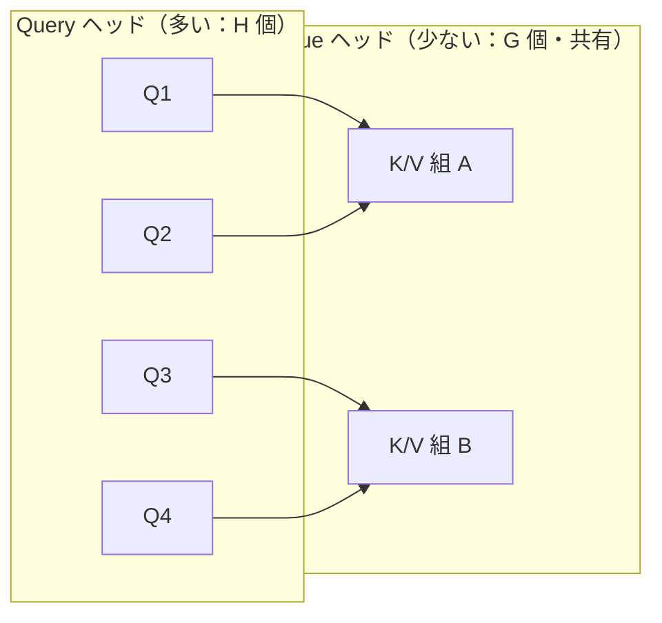

たとえば上図のように Q が4ヘッド、K・V が2組なら、2つの Q が1組の K・V を共有します
（この 4:2 はあくまで説明用の数で、実際のヘッド数はモデルごとに異なります）。
K・V のヘッドが減る分だけ、保持すべき K・V が減り、**KV キャッシュのメモリが H/G 倍軽くなります**。
極端に G＝1 まで削ったものは MQA（Multi-Query Attention：マルチクエリ注意）と呼ばれ、GQA はその中間の折衷案です。

```python
# 教育用の最小例：GQA は K,V ヘッドを Q ヘッド数に「複製して広げる」
def expand_kv_for_gqa(K, V, num_q_heads, num_kv_heads):
    # K,V: (num_kv_heads, T, d)
    group = num_q_heads // num_kv_heads          # 1組の K,V を何個の Q が共有するか
    K = K.repeat_interleave(group, dim=0)        # (num_q_heads, T, d)
    V = V.repeat_interleave(group, dim=0)
    return K, V                                  # あとは通常のマルチヘッド注意
```

GQA は「品質をなるべく落とさずにメモリを削る」ための実務的な妥協点です。
Q の多様性（観点の数）は保ったまま、記憶のかさばる K・V だけを共有して間引く――
どこを削るとどこが痛むかを見極める、いかにも現場的なトレードオフだと感じます。

### 3.8 計算量 O(T²) と KV キャッシュ O(T) ―「長文で重くなる」の正体

さて、一般版の第0部で予告した「長い文章ほど急に重くなる」の正体に踏み込みます。

self-attention は、T 個のトークンそれぞれが、T 個のトークン全部と照合します。
スコア表は `T × T`。だから、文脈長 T が伸びると **注意の計算量はおよそ T² に比例** します（これが **O(T²)**）。
T が2倍になれば、注意のスコア計算はおよそ **4倍**。10倍なら **100倍**。
「短い質問はサッと、長い会話はじわじわ重く」の体感は、この二乗の効き方から来ています。

一方、生成時に使い回す KV キャッシュ（次節）は、**保存すべき K・V が T 個分** なので、メモリは **O(T)**、文脈長に **線形** で膨らみます。
「計算は二乗、キャッシュのメモリは線形」――この2本立てが、長い文脈でのコストの実像です。

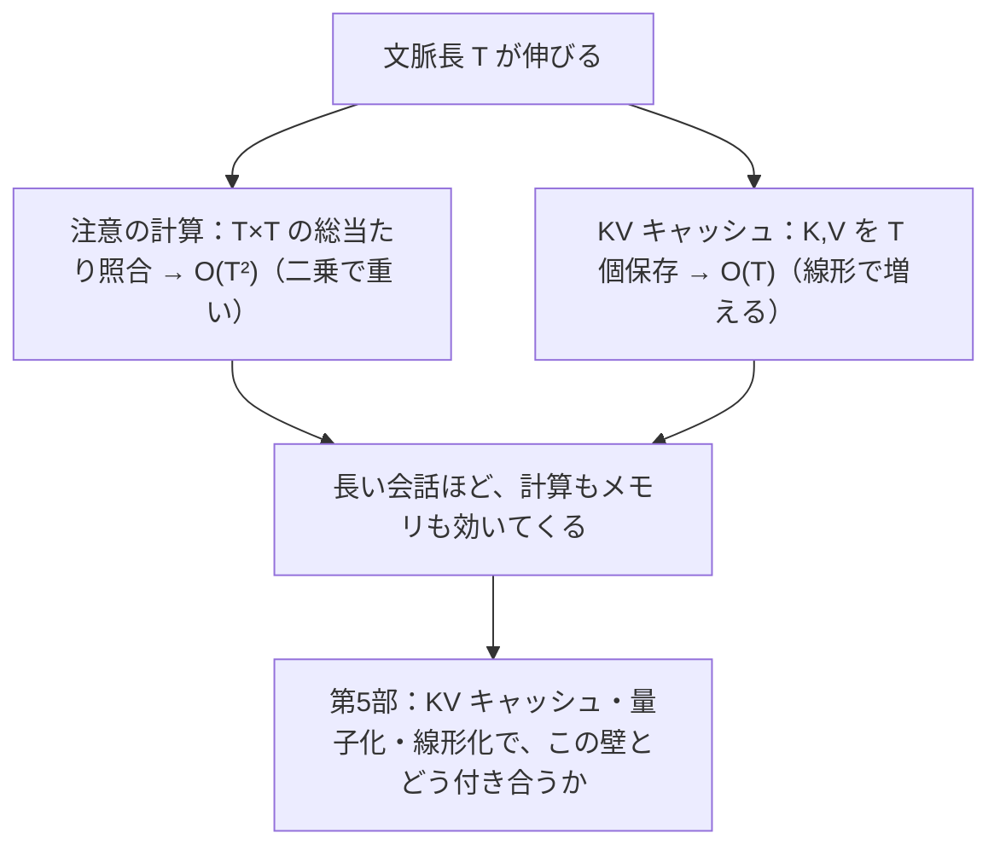

この「壁」とどう付き合うか――KV キャッシュを線形状態に置き換える線形化、重みを軽くする量子化――は、
まさに第5部（メモリと速度の壁）の主題です。ここでは「重さの出どころは注意機構の二乗性にある」ことだけ、
しっかり押さえておいてください。


### 3.9 KV キャッシュ ― 過去は変わらないから、使い回せる

LLM は一語ずつ生成します（自己回帰）。素直に実装すると、新しい語を1個出すたびに、
**それまでの全トークンの Q・K・V を最初から計算し直す** ことになり、これは大変な無駄です。

ここで 3.4 の因果マスクが効いてきます。因果マスクのおかげで、**過去のトークンの K・V は、
後から新しい語が増えても変化しません**（未来を見ないので、後ろが増えても過去の計算は不変）。
ならば、一度計算した過去の K・V を **保存しておいて使い回せばいい**。これが KV キャッシュです。

生成の各ステップでやることは、こう単純化されます。

1. **新しい1トークンぶんだけ** q, k, v を計算する。
2. k, v をキャッシュ（過去の K, V）に **追記** する。
3. その q を、キャッシュ内の **全 K と照合**（softmax）し、**全 V の加重平均** を取る。
4. k, v を残したまま次のステップへ。

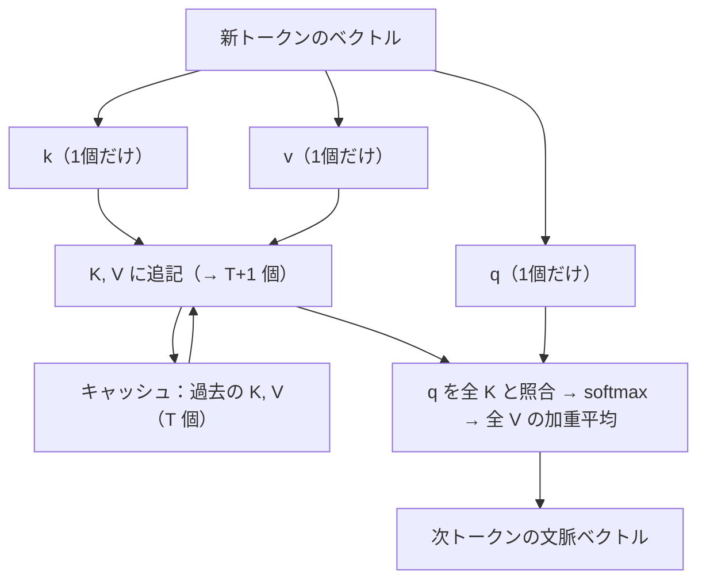

```python
# 教育用の最小例：KV キャッシュ付きの1ステップ生成（1ヘッド）
def step_with_cache(x_new, W_q, W_k, W_v, k_cache, v_cache):
    q = x_new @ W_q                      # (1, d) 新トークンの問い
    k = x_new @ W_k                      # (1, d)
    v = x_new @ W_v                      # (1, d)
    K = torch.cat([k_cache, k], dim=0)   # 過去 + 今 → (T+1, d)
    V = torch.cat([v_cache, v], dim=0)
    d = q.shape[-1]
    scores = (q @ K.transpose(-2, -1)) / (d ** 0.5)   # (1, T+1)
    weights = F.softmax(scores, dim=-1)               # 因果マスクは「今まで」に自然に限定
    out = weights @ V                                 # (1, d)
    return out, K, V                     # K, V を次ステップのキャッシュとして返す
```

この仕掛けのおかげで、生成の1ステップは「過去全部の再計算」から「新1語ぶんの計算＋キャッシュ参照」に軽くなります。
ただし代償として、キャッシュは 3.8 の通り **文脈長に比例して膨らむ**（O(T)）。速さのためにメモリを差し出す取引です。
GQA（3.7）で K・V のヘッドを間引くのは、まさにこのキャッシュの重さを削るための一手だった、とつながります。

### 3.10 ★ そして「正しく組めた」証拠 ― 公式と 2e-4 で一致

ここまで、注意機構を Q·Kᵀ／softmax／因果マスク／マルチヘッド／RoPE／GQA／KV キャッシュと分解してきました。
これだけの部品を一つでも取り違えると、出力は静かに、しかし確実にずれます。
たとえば――

- RoPE の回転の **向きや周波数** を間違える、
- GQA の K・V を Q ヘッドに割り当てる **対応** を間違える、
- 因果マスクで隠す **範囲** を1個ずらす（未来を1語見てしまう）、
- KV キャッシュに追記する **位置** をずらす、

こうしたミスは、どれも logits（最終スコア）を大きく揺らします。だからこそ、逆に――
**組み直したものが公式実装と精密に一致すれば、これらの部品を正しく組めた強い証拠になる**。
これが、このシリーズの信頼の核です。

私は、フレームワークの中身に頼らず、ある公開モデル（Qwen2 系のデコーダ；RMSNorm／RoPE θ=1e6／GQA／SwiGLU／
tied embeddings という構成）を **ゼロから実装** しました。モジュール名を公式（HuggingFace transformers）に合わせ、
**公式の学習済み重みをそのまま読み込んで**、公式実装（`transformers` の因果言語モデル）と出力を突き合わせる
**ゴールデンテスト**を行いました。結果は次の通りです。

- **フルシーケンスの logits が 2e-4 で一致**。これは浮動小数点の丸め誤差の域で、実質同一と言える差です。
- **greedy（各ステップで最尤の1語を選ぶ）生成のトークンが完全一致**。
- **KV キャッシュ経路の出力が、キャッシュを使わないフル forward の出力と一致**。

3番目が、本章にとって特に嬉しい結果でした。KV キャッシュは、位置の扱いや追記のタイミングを少しでも間違えると
フル計算とずれます。そこが一致したということは、**3.9 のキャッシュ論理と、3.6 の位置符号化が噛み合って正しく動いている**、
という直接の裏付けだからです。RoPE を取り違えていたら、まずここが合いません。

用語の正確さのために、二種類の「一致」を区別しておきます。

- **(a) 自作 forward vs 公式：logits 2e-4** … 浮動小数点の丸めノイズの域。「実質誤差ゼロ」。
- **(b) メモリ最適化版のローダー vs 素の実装：ビット完全一致（max|Δ| = 0.0）** … 文字通り1ビットも違わない。

本章の主役は (a) です。「1ビットも違わない」と言い切れるのは (b) の方（重みの読み込み経路の話で、第5部で扱います）。
私は、この二つを混同して「完全にゼロ」と大きく言うことはしません。**測ったままを、測った言葉で書く** ――
計測の現場で叩き込まれた作法です。

#### 正直な留保（ここは誠実に）

同じ条件で20ターン会話させても、自作と公式は **20/20 ターン、バイト単位で同一** の返答でした。
ただし、これは独立した新しい証拠 **ではありません**。greedy は各ステップで最尤の1語を選ぶ決定論的な手続きなので、
1ステップの一致（logits の一致）が続けば、20ターン一致するのは論理的な帰結です。
派手な数字ですが、上の (a) を言い換えているだけだと正直に受け止めています。
確率的サンプリング（temperature を上げる等）や、int8 化・別サイズ・改造版については、この一致は **何も保証しません**。
それらは本シリーズの別の回、あるいは範囲外の話です。

#### 継ぎ目をぼかさない

そして、いちばん大事な線引き。**この自作実装がまともに会話できるのは、公開モデルの学習済み重みが賢いからです。**
実際、0.5B（約5億パラメータ）のモデルを自作 forward で駆動すると、「日本の首都は？」→「東京都です」は正しく答えますが、
「3たす5は？」には「18」と外します（小さいモデルは算数が弱い）。1.5B に上げると「3たす5は？ 数字だけ」→「8」は通り、
敬語変換や「日本で一番高い山は？」→「富士山です」も概ね通るようになります。
この賢さの差は、**どちらも重みの側**の話であって、私の実装が生んだものではありません。

自作した推論ランタイムがもたらした価値は、賢さそのものではなく、**「中身を検査でき、改造でき、
公式と一致することを実測で保証できる、正直なオンプレ実装」** であることです。
注意機構という心臓を、ブラックボックスの外から眺めるのではなく、開けて、組み直して、測って、
「確かにこう動いている」と言える――その一点に、このシリーズの価値を置いています。

---

## 「作って分かったこと」box

> 📦 **図では気づけない、組んで初めて分かったこと**
>
> 注意機構の式 `softmax(QKᵀ/√d)·V` は、教科書では1行で優雅に流れていきます。
> でも自分で組むと、**この式のほとんどは「素朴な相関」で、難しさは “周辺” にあった** と体で分かりました。
>
> - `QKᵀ` は、相関（テンプレートマッチング）そのもの。ここは現場の道具でそのまま読める。
> - 本当に神経を使うのは、**RoPE（位置を回転で刻む）** と **KV キャッシュ（過去を使い回す）** の噛み合わせ。
>   ここを1個ずらすと、logits が静かにずれる。逆にここが公式と 2e-4 で合った時、
>   「注意機構を、部品まで正しく理解できた」と初めて胸を張れました。
>
> 相関とフーリエ――25年使ってきた道具が、AI の心臓の中で動いていた。
> **中身を知ると、道具は分野を越えて“同じもの”だと気づけます。** これが、組み直して得た一番の土産でした。

---

## この章の持ち帰り（ひとつだけ）

**注意機構は「相関で似た語を探し（QKᵀ）、その中身を加重平均で取り寄せる（×V）」仕組み。**
位置は回転＝周波数（RoPE）で刻み、記憶は K・V の共有（GQA）とキャッシュ（KV cache）で節約する。
そして「長い文章ほど重い」の正体は、総当たり照合の **O(T²)** にある。
この一文だけ持って帰れれば、あなたはもう LLM の心臓の鼓動を、外から言葉で説明できます。

---

## 次の部に続く

注意機構は「どこを見るか」を決める仕組みでした。では――**引き出してきた情報を使って“考える”のは、どの部品でしょう？**
そして、AI の「知識」そのものは、いったい体のどこにしまわれているのでしょう？

次の第3部「Transformer ブロックの全体像 ― 知識はどこに住むか」では、注意機構の隣に座る **順伝播層（FFN）** と、
それらを束ねる **残差接続** と **RMSNorm** を開けます。そこで、研究がだんだん明らかにしてきた不思議な役割分担――
**「注目は注意機構が、記憶は足し算の層が担っているらしい」** という話に踏み込みます。
心臓（注意）の次は、脳のしまい場所（FFN）へ。組み直して覗いた中身を、引き続きお目にかけます。

---

*このシリーズは、自作の小さな LLM を実装しながら書いています。数値・実測はすべて自分の手元の記録に基づき、
うまくいかなかったことも含めて、測ったままを載せます。「絵で分かった」あとに「仕組みで納得したい」方は、
一般版(<<LINK:MEGA_G>>)と行き来しながらどうぞ。*


---

# 第3部 Transformer ブロックの全体像 ― 知識はどこに住むか

> このシリーズは、フレームワークの中身に頼らず推論エンジンを自分で組み直し、公式実装と実測して
> 誤差ゼロで再現した一次体験を土台に、大規模言語モデル(LLM: Large Language Model)の部品を一つずつ
> 分解して見せる連載です。一般版が絵で腑に落とす担当、この技術版は数式・擬似コード・実測値で納得する担当です。


私は 25 年ほど、計測・制御の現場で「カメラで見て、機械を動かす」装置を作ってきたエンジニアです。
多項式近似・スプライン補間・フーリエ変換・主成分分析といった数値アルゴリズムを、必要に応じて自分で
実装してきました。今回の主役である順伝播層(FFN)は、その数理解析の延長線上にあります。「関数を近似する箱」
という見方が、そのまま Transformer の心臓の隣に座っている――そんな地続きの話です。

第2部では、注意機構(attention)を「どこを見るか」を動的に決める仕組みとして解剖しました。各トークンが
Query/Key/Value を作り、`softmax(QKᵀ/√d)V` で過去の語に重み付き平均をかける。位置は RoPE(回転位置埋め込み)で
周波数として符号化し、KV(Key-Value)キャッシュで計算を使い回す。そして自作した forward pass の出力が、公式の
リファレンス実装と **logits で 2e-4（浮動小数点の丸め誤差の域）まで一致**した、というところまで話しました。

今回はその一歩先です。**「注目したその先で、実際に『考える』のはどこなのか」**。
注意機構がテーブルに材料を集めてくれたとして、その材料を使って「日本の首都は東京都だ」と思い出し、
「3 たす 5 は 8 だ」と計算する部品は、いったいブロックのどこに住んでいるのか。
この章の副題「知識はどこに住むか」は、そのまま今回の問いです。

---

## ① 用語ミニ辞典

先に、この章で出てくる部品の名前だけ通しておきます。②③で全部くわしく開けます。

- **Transformer ブロック(Transformer block)** … LLM の本体を構成する「1 段分の処理ユニット」。
  中身は **注意機構 + 順伝播層** の 2 パートで、それぞれに残差接続と正規化が付く。これを何十段も積む。
- **順伝播層(FFN: Feed-Forward Network)** … 各トークンを独立に通す 2 層の多層パーセプトロン(MLP)。
  「広げてから畳む」形。この章の主眼で、**知識の貯蔵庫**の最有力候補。
- **SwiGLU(Swish-Gated Linear Unit)** … 順伝播層の中身に使われる、ゲート(門)付きの活性化方式。
  片方の枝で「どれだけ通すか」を決め、もう片方の枝の信号にかけ合わせる。
- **残差接続(residual connection)** … 部品を通した結果を、**元の入力に足し戻す**配線。
  `y = x + f(x)`。深いネットワークが学習できるようになった立役者。
- **正規化(normalization) / RMSNorm(Root Mean Square Normalization)** … 信号の大きさをそろえて数値を安定させる工程。
  RMSNorm は正規化の一種で、**平均引き算を省き、二乗平均の平方根で割るだけ**の軽量版。
- **pre-norm(pre-normalization)** … 「部品に入れる前に正規化する」配置。今どきの LLM の標準。
  逆に「部品を通した後で正規化する」のが post-norm。
- **汎用関数近似器(universal function approximator)** … 「十分な幅・深さがあれば、どんな連続関数も
  好きな精度で近似できる」というニューラルネットの性質。スプライン補間や多項式近似の親戚。
- **知識の局在(knowledge localization)** … 「世界知識や事実は、モデルのどの部品に蓄えられているのか」を
  調べる研究テーマ。**主に順伝播層と出力層**に効く、という複数系列の証拠がある（ただし断定はしない）。

略語はここで一度だけ展開しました。以降は日本語または略語で通します。

---

## ② かみくだき：ブロックは「気配り役」と「物知り役」の二人組

まず全体像を、数式なしの絵で。

前の部までで、文章はトークンに刻まれ(第1部)、意味の座標＝ベクトルに変換され(第1部)、注意機構で「どの語に注目するか」が
決まりました(第2部)。ここまでを工場のラインにたとえるなら、私が現場でやってきた**画像処理パイプライン**とそっくりです。
生の画像を前処理し、特徴を抽出し、最後に判定する――LLM も、生のテキストを刻んで、特徴（意味ベクトル）にして、
最後に「次の一語」を判定する。同じ骨格です。

その特徴処理の心臓部が **Transformer ブロック**で、中身は二人組の職人だと思うと腑に落ちます。

- **気配り役 ＝ 注意機構(attention)**。「今この語を出すには、さっきの文のどこを見ればいい？」を判断して、
  必要な材料を机の上に集めてくる係。第2部の主役です。
- **物知り役 ＝ 順伝播層(FFN)**。気配り役が集めてくれた材料を受け取り、**自分の中に貯めこんだ知識を使って加工する**係。
  「東京」という材料が来たら「＝日本の首都」という知識を上乗せする。この第3部の主役です。

この二人が一組。そして、二人ともに共通の作法が二つ付きます。

- **残差接続(residual)** ＝ **元の原稿を捨てずに、赤字を重ねる**やり方。
  職人が加工しても、元の材料は横に取ってあって、「元 ＋ 加工分」を次に渡す。だから途中で職人がしくじっても、
  元の情報は失われない。何十段も職人を並べても情報が薄れないのは、この「元を捨てない」配線のおかげです。
- **正規化(RMSNorm)** ＝ **音量そろえ**。職人に渡す前に、信号のボリュームを一定にそろえておく。
  大きすぎ・小さすぎで計算が暴れないように、毎回レベルを整える小さな前処理です。

そして、この二人組を **24 段**（自作で動かした 0.5B モデルの場合）積み重ねる。1 段目の出力が 2 段目の入力になり…と
バケツリレーで意味が磨かれていきます。最後に出力層が「次の一語」に点数(logits)をつける(第4部で扱います)。

ここで、この章のいちばん持ち帰ってほしい話を先に置きます。

> **賢さは足し算層に、注目は attention に。**
>
> 「どこを見るか（検索・ルーティング）」は気配り役＝注意機構の仕事。
> 「何を思い出すか（事実・知識）」は物知り役＝順伝播層の仕事。
> ――この**分業**が、近年の研究で少しずつ見えてきました。断定はできませんが、有力な見立てです。

「足し算層」というのは私の語呂合わせです。順伝播層は残差接続で結果を**足し算**で戻すので、
「賢さ（知識）を足し込む層」＝足し算層、と覚えると、注意機構との役割分担が忘れにくくなります。

では、ここから数式と擬似コードで中を開けます。

---

## ③ 詳細：ブロックを解剖する

### 3-1. ブロックの骨格 ― pre-norm と残差接続

現代の LLM デコーダの 1 ブロックは、驚くほど単純な 2 行で書けます。`x` を「そのトークンの意味ベクトル」とすると、

```
x = x + Attention(RMSNorm(x))     # ① 気配り役：どこを見るか
x = x + FFN(RMSNorm(x))           # ② 物知り役：知識で加工する
```

この 2 行に、この章の主要部品が全部入っています。順に読み解きます。

**残差接続 `x = x + f(x)`。**
部品 `f`（注意でも FFN でも）を通した結果を、元の `x` に**足し戻す**。これがなぜ効くのか。
深いネットワークは、素朴に積むと勾配が層を遡るうちに消えたり暴れたりして、うまく学習できません。
残差接続を入れると、`x` から出力までを**そのまま通り抜ける一本道（恒等写像の経路）**ができます。
学習時の勾配は、この一本道を減衰せずに流れて各層に届く。俗に「勾配のハイウェイ」と呼ばれる構造です。

見方を変えると、各ブロックは「意味ベクトルを一から作り直す」のではなく、**共有の帯（残差ストリーム）に、
自分の担当分の情報を少しずつ書き足していく**。注意は「関連する語から集めた文脈」を書き足し、
順伝播層は「思い出した知識」を書き足す。24 段ぶんの書き足しが積み重なって、最終的な意味ベクトルになる。
この「共有の帯に少しずつ上乗せ」というイメージは、後で「知識の局在」を考えるときに効いてきます。

**pre-norm（正規化を先にかける）。**
上の式で、正規化 `RMSNorm` は部品 `f` の**手前**に入っています。これが pre-norm 配置です。
古い Transformer は部品の**後**に正規化を置く post-norm でしたが、深く積むと不安定になりやすい。
pre-norm は残差の一本道を正規化で邪魔しない（`x` 本体はそのまま足し戻す）ので、
深いモデルでも安定して学習でき、今の主流になりました。自作したデコーダもこの pre-norm 配置です。

### 3-2. RMSNorm ― 平均引き算を省いた正規化

正規化の役割は「信号の大きさをそろえて、計算を安定させる」こと。まず親にあたる LayerNorm(Layer Normalization)を
思い出します。LayerNorm はベクトル `x`（長さ `d`）に対し、**平均を引いて、標準偏差で割って、学習パラメータで
スケール・シフト**します。

```
LayerNorm(x) = γ · (x − mean(x)) / sqrt(var(x) + ε) + β
```

RMSNorm はここから**平均引き算（センタリング）を丸ごと省きます**。平均を引かず、二乗平均の平方根(RMS)で割るだけ。

```
RMS(x) = sqrt( (1/d) · Σ xᵢ²  + ε )
RMSNorm(x) = g · x / RMS(x)
```

擬似コードにすると、その軽さがよく見えます。

```python
class RMSNorm(nn.Module):
    def __init__(self, dim, eps=1e-6):
        # 学習で得るゲイン g（各次元に 1 個）。バイアス β も平均も無い。
        self.weight = nn.Parameter(torch.ones(dim))
        self.eps = eps

    def forward(self, x):
        # 平均は引かない。二乗平均の平方根で割るだけ。
        rms = torch.rsqrt(x.pow(2).mean(dim=-1, keepdim=True) + self.eps)
        return self.weight * (x * rms)
```

省いたのは、平均を計算して引く手間と、シフト用パラメータ `β`。それだけで何がうれしいのか。

- **軽い**：平均・分散の二パス計算が、二乗平均の一パスで済む。要素数の多い巨大モデルでは、この差が効く。
- **安定して、精度も落ちない**：経験的に、平均引き算を省いても言語モデルの性能はほとんど変わらないことが
  報告され、多くの現代 LLM が RMSNorm を採用しています。「効くのに軽い方を採る」という素直な設計判断です。

計測の現場でも、前処理でオフセット（平均）を引くべき場面と、ゲイン（大きさ）だけそろえれば十分な場面があります。
RMSNorm は「大きさだけそろえれば十分だった」という後者の割り切りだ、と読むと私にはしっくりきます。

### 3-3. 順伝播層(FFN) ― SwiGLU と「広げて畳む」

さて主役です。注意機構が机の上に材料を集めた後、その材料を**各トークンごとに独立に**通すのが順伝播層。
古典的な FFN は、単純な 2 層 MLP でした。

```
FFN(x) = W_down · activation(W_up · x)        # 広げて（up）→ 非線形 → 畳む（down）
```

`W_up` で hidden 次元 `d` を**より広い中間次元** `h`（`h > d`。ざっくり数倍）へ拡大し、活性化関数で非線形をかけ、
`W_down` で `d` に戻す。「いったん高次元に広げて、非線形で捏ねて、また畳む」――これが順伝播層の基本形です。

現代の LLM（自作で扱った Qwen2 系デコーダを含む）は、ここに **SwiGLU** というゲート機構を入れます。
入力を**二つの枝**に分け、片方を「門番」、もう片方を「素材」にして、要素ごとにかけ合わせます。

```
SwiGLU_FFN(x) = W_down · ( SiLU(W_gate · x) ⊙ (W_up · x) )
```

`SiLU`（＝Swish、`SiLU(z) = z · sigmoid(z)`）を通した **ゲート枝**が「この成分をどれだけ通すか」を 0〜1 近辺で決め、
**アップ枝**の信号 `W_up · x` に要素ごとの積 `⊙` でかける。門を開け閉めしながら情報を通す、という発想です。

```python
import torch.nn.functional as F

class SwiGLU_FFN(nn.Module):
    def __init__(self, dim, hidden):        # hidden > dim（広げてから畳む）
        self.gate = nn.Linear(dim, hidden, bias=False)   # 門番の枝
        self.up   = nn.Linear(dim, hidden, bias=False)   # 素材の枝
        self.down = nn.Linear(hidden, dim, bias=False)   # 畳んで戻す

    def forward(self, x):
        # SiLU(=Swish) をゲートにして、素材と要素ごとに掛け合わせる
        return self.down(F.silu(self.gate(x)) * self.up(x))
```

ゲートを足すと重み行列が 2 枚から 3 枚に増えますが（`gate`/`up`/`down`）、そのぶん表現力が上がり、
同じパラメータ規模でも性能が出やすい、と経験的に選ばれています。ここは「なぜ SwiGLU がベストか」を
理論から一意に導けるわけではなく、**多くのモデルで良かったから使われている**、という正直な現状です。

注目してほしいのは規模感です。**モデルの全パラメータのかなりの割合が、この順伝播層の 3 枚の行列に集中**します。
注意機構よりも順伝播層の方が、多くの構成でパラメータを食う。「賢さは足し算層に」という見立ての、
まず物量面の裏付けがここにあります。**知識をしまう場所には、それ相応の容量が要る**からです。

### 3-4. 順伝播層は「汎用関数近似器」――スプライン・多項式近似との地続き

ここで少し、私の元いた数理解析の畑に引き寄せます。

順伝播層は「線形変換 → 非線形 → 線形変換」でした。これは、ニューラルネットの古典的性質
**汎用関数近似器**そのものの形です。「十分な幅があれば、1 枚の隠れ層と非線形活性化で、任意の連続関数を
好きな精度で近似できる」という定理（普遍近似定理）が知られています。順伝播層は、その近似器を各層に置いて、
入力の意味ベクトルを別の意味ベクトルへ写す**関数**を、データから学び取っているわけです。

計測の現場で私がやってきた**スプライン補間や多項式近似**も、根っこは同じ「関数近似」です。
とびとびの測定点から、その間をなめらかに埋める関数を作る。多項式で近似する、区分ごとに低次多項式を
つなぐ（スプライン）、といった手当てをします。実は、`ReLU` のような区分線形な活性化を使ったニューラルネットは、
数学的には**高次元の区分線形関数＝多次元スプラインの親戚**と見なせます。`SiLU` はそれをなめらかにした版です。

だから私にとって順伝播層は、目新しい魔法ではなく、**「入力空間を折り紙のように折り畳んで、
必要な形の関数を組み立てる、なじみの近似器」**でした。違うのは次元と規模だけ。
現場で 1 次元・2 次元の曲線を近似していた道具が、数千次元の意味空間で同じことをやっている。
この地続き感が、私が「中身を説明できる」と言える理由の一つです。近似器としての順伝播層は、
**「材料（ベクトル）を受け取って、覚えた対応関係で別のベクトルへ写す」箱**。次にその「覚えた対応関係」の
中身を見にいきます。

### 3-5. 知識はどこに住むか ― 順伝播層＝キー・バリュー記憶という見立て（適度に留保を付けて）

いよいよ副題の問いです。**「日本の首都は東京都」「富士山は日本一高い山」といった事実は、モデルのどこに蓄えられているのか。**

近年の複数系列の研究が、共通して指し示しているのは **「主に順伝播層（と最終的な出力層）」** です。
決定的・唯一の答えではありませんが、有力な見立てとして紹介します（**断定はしません**。理由は後述）。

- **順伝播層＝キー・バリュー記憶(key-value memory)説（Geva ら）**。
  順伝播層の 1 枚目の行列（`up`/`gate` 側）を「キー」、2 枚目（`down` 側）を「バリュー」と見ると、
  入力パターンにマッチしたキーが対応するバリュー（＝特定の語彙方向への寄与）を呼び出す、
  連想メモリのように振る舞う、という分析です。ある「キー」は「首都の話題」に反応し、
  対応する「バリュー」が「東京」方向へ残差ストリームを押す――というイメージです。
- **事実の書き換えが順伝播層で効く（ROME / MEMIT）**。
  ROME(Rank-One Model Editing) や MEMIT(Mass-Editing Memory in Transformer) は、
  「特定の事実（例：ある事物の所在）」を、**中間層の順伝播層の重みをピンポイントに書き換える**ことで
  編集できると示しました。順伝播層をいじると特定の事実が差し替わる。これは「事実がそこに関係して住んでいる」ことの
  傍証になります。
- **線形化レシピの実務的事実（自作の一次体験に近い側）**。
  softmax の注意を軽い線形注意へ置き換える「線形化」の手順では、**順伝播層を凍結したまま、注意まわりだけを
  蒸留し直す**のが定石です（第5部でくわしく扱います）。もし順伝播層に知識が入っていなければ、
  そこを凍結して能力が保てる説明がつきにくい。「知識は順伝播層に、置き換えたいのは注意の計算様式だけ」という
  役割分担が、この手続きの前提になっています。

これらを総合すると、**「注目（どの語を見るか）は注意機構、記憶（何を思い出すか）は順伝播層」**という分業像が浮かびます。
注意機構は**検索・ルーティング**――関連する過去の語から材料を集めてくる。順伝播層は**貯蔵庫**――集まった材料に対して、
覚えた知識を上乗せする。冒頭の語呂「**賢さは足し算層に、注目は attention に**」は、この総合の要約です。

**ここで正直に、留保を三つ置きます。**

1. **これは研究の総合であって、確定した唯一解ではありません。** 知識は 1 か所に集中して住むのではなく、
   複数の層・複数の部品に**分散**しているのが実態です。「首都」のような単純な事実と、多段の推論が要る知識とでは
   居場所も様子も違うはずです。
2. **「編集が効く場所」＝「知識が住む唯一の場所」ではない**、という反証的な指摘もあります。
   ROME/MEMIT の成功は「そこを触ると事実が変わる」ことは示しますが、「事実がそこ**だけ**に蓄えられている」ことまでは
   保証しません。因果的に編集できる箇所と、情報が符号化されている箇所は、必ずしも一致しない、という議論です。
   だから私は「主に」「〜に効く」という言い方に留め、「知識は順伝播層に**ある**」と言い切りません。
3. **そして最大の継ぎ目**：ここまでの「知識」「賢さ」は、すべて **学習済みの重みに宿ったもの**です。
   私が自作したのは、その重みを**中身を検査・改造できる形で正しく走らせる、検証済みのオンプレ推論ランタイム**であって、
   賢さそのものを作ったわけではありません。0.5B が「日本の首都は？」に「東京都です」と正しく答えられたのは
   Qwen の学習済み重みの手柄で、私の貢献は「その forward を公式と 2e-4 で一致するまで正しく組み、
   どの層の順伝播層が何をしているかを開けて見られるようにした」ことです。**この継ぎ目はぼかしません。**

> 📦 **作って分かったこと**
>
> 「知識が順伝播層に住む」を、私は自作エンジンで**間接的に**体感しました。
> 同じ 24 層の骨格でも、**0.5B は「3 たす 5 は？」に「18」と間違え**、より大きい **1.5B は「8」と正しく**答えます
> （どちらも自作 forward で駆動、いずれも学習済み重みの実力）。構造（ブロックの設計図）は両者ほぼ同じなのに、
> 賢さが違う。つまり**差は設計図でなく、順伝播層をはじめとする重みに詰まった中身**にある――
> これが「知識は構造ではなく重みに住む」の、手触りのある証拠でした。次の第4部で、その重みがどう入るかを扱います。

### 3-6. これを N 層積む ― そして「初期層は改造に弱い」という伏線

ここまでが 1 ブロック。あとはこれを積むだけです。**自作で動かした 0.5B デコーダは 24 層**。
各層が残差ストリームに情報を書き足しながら、意味ベクトルを磨いていきます。

```python
class Decoder(nn.Module):
    def __init__(self, n_layers=24, dim=..., n_heads=..., hidden=...):   # 0.5B は 24 層
        self.layers = nn.ModuleList(
            [TransformerBlock(dim, n_heads, hidden) for _ in range(n_layers)]
        )
        self.final_norm = RMSNorm(dim)     # 出力層へ渡す前の総仕上げ
        # lm_head は入力埋め込みと共有（tied embeddings, 第1部 参照）

    def forward(self, x, mask=None, kv_cache=None):
        for layer in self.layers:
            x = layer(x, mask, kv_cache)   # 残差ストリームを層から層へ受け渡す
        return self.final_norm(x)          # この後 logits へ（第4部）
```

そして 1 ブロックは、これまでの部品を組み上げるだけです。

```python
class TransformerBlock(nn.Module):
    def __init__(self, dim, n_heads, hidden):
        self.attn_norm = RMSNorm(dim)
        self.attn      = SelfAttention(dim, n_heads)   # 第2部で組んだ注意（RoPE / GQA / KVキャッシュ込み）
        self.ffn_norm  = RMSNorm(dim)
        self.ffn       = SwiGLU_FFN(dim, hidden)

    def forward(self, x, mask=None, kv_cache=None):
        # ① 注意：正規化 → 注意 → 残差で足し戻す（pre-norm）
        x = x + self.attn(self.attn_norm(x), mask, kv_cache)
        # ② 順伝播：正規化 → FFN → 残差で足し戻す（pre-norm）
        x = x + self.ffn(self.ffn_norm(x))
        return x
```

たったこれだけの部品――RMSNorm・注意・SwiGLU・残差――の組み合わせを 24 回繰り返す。
そのシンプルさに反して、公式実装と **greedy 生成のトークンが完全一致**し、**logits が 2e-4 で一致**するところまで
再現できました。**部品は単純なのに、積むと会話が立ち上がる**。この落差こそ、私が自作してみて一番おもしろかった点です。

最後に、次の部以降への伏線を一つ。**全部の層が、同じように「差し替え可能」なわけではありません。**

自作エンジンで層ごとに注意の様式を線形化して耐性を測ると（詳細は第5部）、**層 0 やいくつかの初期層は、
注意機構が「本当の仕事」をしていて、改造に対して非常にもろい**ことが分かりました。
具体的な手触りだけ先に置くと、あるベースライン（perplexity 68.74）に対して、**層 0 を単独で線形化しただけで
perplexity が 160 まで跳ね上がる**――序盤の層をいじると、モデル全体が一気に崩れます。
一方で、中盤から後段の層は同じ改造でもほとんどコストがない層が多い。

つまり **「知識は主に順伝播層」だとしても、初期層の注意機構は"配線の要"として別格に重要**で、
そこは触ると壊れる。この**耐性プロファイル**――どの層が頑丈で、どの層がもろいか――を、
量子化・線形化・蒸留回復とあわせて解剖するのが第5部です。今回の「知識の局在」は、その地図の最初の一枚です。

---

## 図：ブロックの解剖と分業


**1 ブロックの信号の流れ（pre-norm + 残差）：**

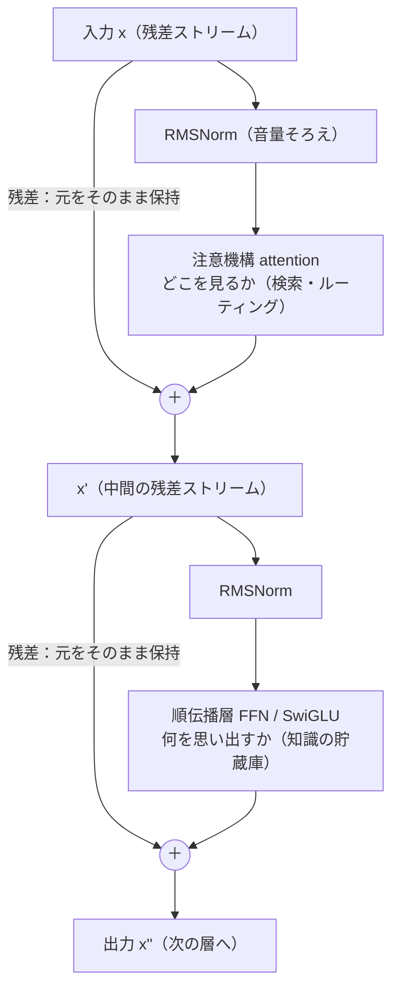

**注目と記憶の分業（この章の核）：**

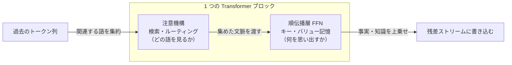

**24 層を積む（初期層はもろい、という伏線つき）：**

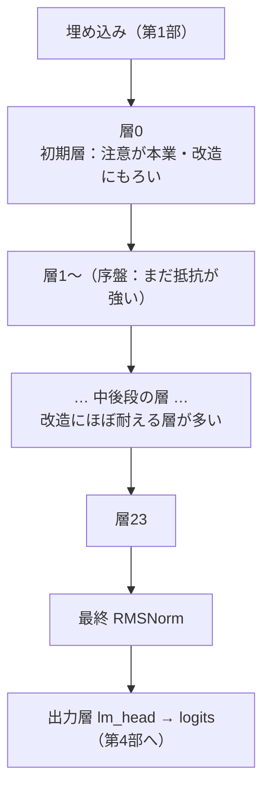


---

## まとめ ― この章の持ち帰り

- **Transformer ブロック = 注意機構 + 順伝播層**。各パートに **残差接続（元を捨てず足し戻す）** と
  **RMSNorm（平均引き算を省いた軽い正規化）** が付き、**pre-norm** で配置する。これを 24 層積む（0.5B の場合）。
- **順伝播層(FFN)は SwiGLU**：門番の枝と素材の枝を要素積でかけ合わせ、「広げて畳む」。
  モデルのパラメータの多くがここに集まる。数理的には**汎用関数近似器**＝スプライン・多項式近似の親戚で、
  私の数理解析の畑と地続き。
- **知識はどこに住むか**：複数系列の研究（順伝播層＝キー・バリュー記憶説、ROME/MEMIT の事実編集、
  線形化での順伝播層凍結）が、**「注目は注意機構、記憶は順伝播層」**の分業を指し示す。
  ただし**知識は分散**しており、「編集が効く場所＝住む唯一の場所」ではない、と**断定は避ける**。
- **最大の継ぎ目**：賢さは**学習済みの重み**由来。自作の貢献は、それを**検査・改造できる形で公式と誤差ゼロまで
  正しく走らせた検証済みランタイム**であって、賢さそのものではない。0.5B が算数を間違え 1.5B が正解するのも、
  差は設計図でなく重みの中身。

> **今日の一つの持ち帰り**：AI の「賢さ（知っていること）」と「気の配り方（どこを見るか）」は、
> ブロックの中で**別々の部品**が担っている。誰かに話すなら――
> **「AI は"物知り役"と"気配り役"の二人一組を何十段も積んでできている」**。この一言で十分伝わります。

---

## 次の部に続く

部品はそろいました。単純な二人組を積むだけで、公式と誤差ゼロまで一致する会話エンジンが立ち上がる。
でも、ここまで一度も答えていない問いが残っています。

**その順伝播層の"貯蔵庫"に、そもそも知識はどうやって入ったのか？**

設計図（ブロックの構造）は、この記事のとおり単純です。にもかかわらず 0.5B は算数を間違え、
1.5B は正しく答える。差は重みの中身にある――なら、その重みは**どうやって決まった**のか。

次の第4部は「なぜ『事前学習済み』が効くのか ― 学習と推論」。
大量のテキストで「次トークン予測」の誤差を測り、勾配で少しずつ直していく――それは私が現場でやってきた
**キャリブレーション（校正）ループ**とそっくりです。そして、そこで待っているのが今シリーズいちばんの正直な失敗談：
**自宅の CPU で、ゼロから作った文字単位の言語モデルは、どうしても会話できなかった**という一次記録です。
最良でも文語の物真似どまり。なぜか。ボトルネックはアーキテクチャではなく、規模・データ・計算でした。

**賢さは重みに宿る。そして重みは、巨大な事前学習でしか入らない。** その「入れる」側の話を、次の部でします。

---

*このシリーズは、自作の小さな LLM を実装しながら書いています。数値はすべて自作エンジンでの実測に基づき、
うまくいかなかったことも消さずに残します。図で全体像を掴みたい方は、同テーマの一般版(<<LINK:MEGA_G>>)もあわせてどうぞ。*


---

# 第4部 なぜ「事前学習済み」が効くのか ― 学習と推論

> 第3部では、Transformer ブロックの中で「知識は主に順伝播層(FFN)に住み、注意機構(attention)は
> どこを見るかを配る」という分業を見ました。では――その「知識」、つまり**重み(weights)** は、
> そもそもどこから来たのでしょうか。今回は「学習」と「推論」を、計測現場の校正ループと地続きの視点で開けます。


前の部の最後に、こう書きました。「賢さは足し算層に、注目は attention に住む」。
これは**でき上がったモデルの中を覗いた**話でした。今回は時間を巻き戻します。
その足し算層に、いったい**どうやって**知識が入ったのか。そして、入り終わった重みを使って、
モデルは**どうやって**一語ずつ文章を紡ぐのか。

先に結論を一言で置きます。**学習とは、誤差を測って少しずつ直す「校正(calibration)」の繰り返し**です。
私が 25 年やってきた計測・制御の現場でいう、あの校正ループとほぼ同じ形をしています。
そして今回のいちばんの見どころは、成功談ではありません。**自宅の CPU でゼロから言語モデルを学習させたら、
会話にならなかった**という、正直な失敗です。この失敗こそが、「なぜ既製の事前学習済みモデルが効くのか」を
いちばん鋭く教えてくれました。

---

## ① 用語ミニ辞典（この部で使う言葉）

- **事前学習(pre-training)** … 大量の一般テキストで「次に来る語」を当てる訓練を、あらかじめ大規模にやっておくこと。
  ここで世界の言葉のクセ・知識が重みに刻まれる。ChatGPT などが「賢い」のは、この工程の成果物。
- **重み(weights)** … モデル内部の膨大な数値パラメータ。ここに「学んだこと」が全部入っている。推論時は固定して使う。
- **損失(loss)** … 予測がどれだけ外れたかの数値。小さいほど良い。言語モデルでは主に**交差エントロピー(cross-entropy)**を使う。
- **交差エントロピー(cross-entropy)** … 「正解の語に、モデルがどれだけ低い確率しか割り当てなかったか」を測る損失。
  正解を高い確率で当てれば小さく、外せば大きくなる。
- **困惑度(perplexity, 以下 ppl)** … 損失を「実感できる分岐数」に直したもの。おおまかに「平均して何択で迷っているか」。
  ppl=2 ならコイン投げ級（2択）、ppl=38 なら平均 38 通りの候補で迷っている状態。小さいほど良い。
- **勾配降下(gradient descent)** … 損失を小さくする向きへ、重みを少しずつずらしていく最適化法。「坂を下る」イメージ。
- **誤差逆伝播(backpropagation)** … 出口で測った誤差を、各重みが「どれだけ悪さをしたか」に分解して配る計算（連鎖律）。
- **自己回帰(autoregressive)** … 1語出す→ここまで全部を読み直す→次の1語を出す、を繰り返す生成の仕方。
- **推論(inference)** … 学習を終えた固定重みで、実際に文章を生成すること。訓練の逆で、重みは動かさない。
- **サンプリング(sampling)** … 予測された確率分布から、実際に出す1語を「どう選ぶか」。**温度(temperature)**と**核サンプリング(top-p)**が主役。
- **文字単位LM(character-level language model)** … 文章を1文字ずつ予測するモデル。トークン単位より素朴で小さく作れるが、その分不利。
- **単文字頻度基準(unigram baseline)** … 「文脈を一切見ず、単に出やすい文字を出すだけ」の最弱の対照。学習の効果はこれとの差で測る。

まずは **loss（外れ具合）→ 勾配降下（外れを直す）→ ppl（迷いの度合い）** の3つだけ握れば、今回の芯は通ります。

---

## ② かみくだき：学習は「採点つき穴埋めドリル」を何十億回

### 学習の全体像 ― 誤差を測って、少し直す

大規模言語モデル(LLM: Large Language Model)の学習は、実はとても単純な作業の繰り返しです。

1. 文章の途中まで（例:「日本の首都は」）をモデルに見せる。
2. モデルに「次の1語は？」と予測させる。モデルは語彙全体に確率を振る（「東京 40%、大阪 5%、……」）。
3. 正解（例:「東京」）と比べて、**どれだけ外したか＝損失(loss)** を測る。
4. 外した分だけ、内部の重みを**ほんの少し**、当たる方向へずらす。
5. これを、文章を変え、場所を変え、**何十億回**繰り返す。

穴埋めドリルを、採点つきで、気の遠くなる回数こなす。ただそれだけです。
にもかかわらず、この単調な作業を極限までやり込むと、副産物として「世界のことを分かっている」重みが出来上がる。
第0部で書いた「次の一語オタクが、当てたい一心で世界中を勉強してしまう」の、内側の仕組みがこれです。

### これは、私が現場でやってきた「校正」とほぼ同じ形

この「測って・直す」ループを見て、私は自分の仕事を思い出しました。

私は長年、装置の**校正(calibration)** を仕事にしてきました。とりわけ記憶に残っているのは、
公式の開発環境も SDK も無い双腕ロボットを、付属アプリを Windows メッセージ経由で叩く自作プログラムで動かし、
両目と腕先のカメラで校正プレートの位置・姿勢を推定しながら、頭・腰・両腕・手首の角度を自動で合わせた仕事です。
あのループの骨格は、こうでした。

> カメラで**測る** → 目標位置とのズレ（誤差）を出す → 誤差が減る向きに関節角を**少し動かす** → また測る → …… → 誤差が十分小さくなったら完了。

言語モデルの学習と、並べてみます。

| 計測・制御の校正ループ | 言語モデルの学習ループ |
|---|---|
| カメラで現在位置を**測る** | テキストで次トークンを**予測**する |
| 目標とのズレ（誤差）を出す | 正解との**損失(loss)** を出す |
| 誤差が減る向きに関節角を**少し動かす** | 損失が減る向きに**重みを少しずらす**（勾配降下） |
| また測る（反復） | また予測する（反復） |
| 誤差が十分小さくなったら完了 | 損失が下げ止まったら完了 |

**測る対象がカメラ画像か言葉か、動かす対象が関節角か重みか、が違うだけ**で、
「誤差を測って、減る向きに少し直す」という背骨は同じです。
機械学習の教科書用語（勾配降下・誤差逆伝播）に身構える必要はありません。あれは、
**現場の校正ループを、何百万次元の関節角に対して自動でやっているだけ**なのです。

### そして、正直な失敗 ― 自宅で作ったら会話にならなかった

ここからがこの部の本題であり、私がいちばんお伝えしたい部分です。

「学習＝校正ループなら、自宅の CPU でゼロからやれば、小さくても会話するモデルができるのでは？」
――そう思って、実際にやりました。青空文庫などの日本語テキストで、文字を1つずつ当てる**文字単位LM**を、
自分の手で最初から学習させたのです。

結果は、**会話には、まったく、届きませんでした**。

いちばん出来の良かったモデルでも、規模は約 1,190 万パラメータ、ppl は 38（何も学ばない単文字頻度基準が 215）。
確かに「学習の効果」は出ています。215 通りで迷っていたのが 38 通りまで絞れた。
けれど生成させると、**日本語の「文語（書き言葉）の物真似」まで**でした。
それらしい語感で文字は続くのに、意味が通らない。質問に答えるどころではありません。

なぜか。ボトルネックは**アーキテクチャ（設計）ではありませんでした**。
同じ次トークン予測の原理・同じ Transformer 系の部品を使っても、**規模・データ・計算量**が桁違いに足りない。
校正ループの形は正しくても、**回す回数と、見せるテキストの量が、何桁も足りなかった**のです。

ここから、この部でいちばん持ち帰ってほしい一文が出ます。

> **賢さは、重みに宿る。そして重みは、巨大な事前学習でしか入らない。**

だから「事前学習済み」が効く。既製のモデルをダウンロードして使うのは、手抜きではなく、
**個人の計算力では絶対に届かない規模の校正ループの成果物を、正直に借りている**ということなのです。

---

## ③ 詳細：損失・勾配降下・推論を、式とコードで

ここからは数式と擬似コードで、②を裏づけていきます。掲載するコードはすべて**教育用の最小例**で、
私の実装そのものではありません（PyTorch 風の読みやすさ優先の擬似コードです）。

### 3-1. 次トークン予測を、損失として定式化する

モデルは、ここまでのトークン列 \(x_1, \dots, x_t\) を入力に、次トークン \(x_{t+1}\) の**確率分布**を出します。
語彙全体（数万語）に確率を振る、と言ってもよいです。学習の目標は「正解トークンに、なるべく高い確率を割り当てる」こと。
これを1トークンあたりの損失として書くと、交差エントロピーになります。

```
loss_t = - log p_model( x_{t+1} | x_1 … x_t )
```

正解トークンにモデルが割り当てた確率 \(p\) の対数に、マイナスを付けただけです。
\(p=1.0\)（完璧に当てた）なら loss=0、\(p\) が小さい（外した）ほど loss は大きくなる。
文章全体・大量の文章にわたって、この loss の平均を最小化する。これが「学習」の数学的な中身です。

ここで大切なのは、**モデルは「真実」や「面白さ」を直接には最適化していない**、という点です。
最適化しているのは、あくまで「次トークンの当たりやすさ」だけ。
第0部で触れた「知識や推論は副産物として身につく」というのは、この意味です。
真実らしさや一貫性は、**次を当てるために結果的に必要になったから**獲得される。目的関数は、驚くほど素っ気ないのです。

### 3-2. ppl（困惑度）は「平均して何択で迷っているか」

loss は対数の世界の数字で直感が湧きにくいので、実務では ppl に直します。定義はシンプルです。

```
perplexity = exp( 平均 loss )   ← loss を自然対数で測った場合
```

ppl は「**平均して何通りの候補で迷っているか**（実効的な分岐数）」と読めます。
完璧なら ppl=1（迷いゼロ）、コイン投げ級の五分五分なら ppl=2、まったくの当てずっぽうなら「語彙サイズ」に近づきます。

これで、さっきの自作モデルの数字が読めます。

- 文字を一切予測せず出やすい文字を出すだけの**単文字頻度基準**: ppl 215（＝平均 215 通りで迷う）。
- 自作の文字単位LM（約 1,190 万パラメータ）: **ppl 38**（215 → 38 に低下）。

215 択が 38 択まで絞れた。学習は確かに効いた。**けれど、平均 38 通りで迷っている文字予測器では、
筋の通った会話は組み立てられません。** これが「ppl は下がったのに会話にならない」という、正直な現実です。

> ★注意（正直な内訳）: ppl は**同じ設定内での比較にしか使えません**。文字単位モデルの ppl と
> トークン単位モデルの ppl は、そもそも「何を1単位と数えるか」が違うので直接は比べられません。
> 「ppl が下がった＝賢くなった」と単純に喜ぶと足をすくわれます。この「単一指標を疑う」姿勢は、
> 計測現場で「うますぎる測定値は、まず校正を疑う」のと同じ規律で、第5部・第6部でも繰り返し効いてきます。

### 3-3. 勾配降下と誤差逆伝播 ― 校正ループの自動化

では「損失が減る向きに重みをずらす」を、どう自動化するのか。ここで**勾配(gradient)** が登場します。

勾配とは、「各重みを少し増やしたら loss がどう変わるか」の傾きです。傾きの**逆向き**に重みを動かせば、loss は下がる。
坂道で、足元がいちばん急に下る方向へ一歩踏み出すのに似ています。何百万次元の坂を、全部の重みについて同時に下る。
その傾きを、出口の誤差から入口へ効率よく配って計算するのが**誤差逆伝播(backpropagation)**（連鎖律の適用）です。

教育用の最小トレーニングループを、擬似コードで置きます。

```python
# 教育用・最小の「次トークン予測」学習ループ（概念コード / 実装そのものではない）
for batch in text_batches:                 # 大量テキストを小分けにして
    inputs  = batch[:, :-1]                # 「ここまで」（各位置の入力）
    targets = batch[:,  1:]                # 「次の1トークン」（1つずらした正解）

    logits = model(inputs)                 # 語彙全体へのスコア（各位置ごと）
    loss   = cross_entropy(logits, targets)  # 予測分布 vs 正解 の外れ具合

    loss.backward()                        # 誤差を各重みへ逆伝播（＝勾配を出す）
    optimizer.step()                       # 勾配の逆向きに、重みをほんの少し動かす
    optimizer.zero_grad()                  # 勾配をリセットして次のバッチへ
```

ポイントは3行目・4行目の **`inputs` と `targets` が「1つずらし」の関係**にあること。
「ここまで」に対する正解が「その次の1文字」なので、正解ラベルは入力を1つずらすだけで自動的に手に入ります。
**人間が正解を付けなくても、テキストそれ自体が答えを持っている**――これが、言語モデルを
インターネット規模のテキストで学習できる理由です（自己教師あり学習）。ラベル付けの人件費が要らない。
だから「大量に」回せる。そして「大量に」回せることこそが、②で見た規模の差を生みます。

`optimizer.step()` の1回が、校正ループの「関節角をほんの少し動かす」1回に対応します。
**1回では何も起きません。** 何十億回積み重ねて、初めて重みに世界が刻まれる。
私の自宅実験が届かなかったのは、まさにこの「積み重ねの回数×見せたテキスト量」でした。

この「1回でどれだけ動かすか／何回まわすか」を握るのが、学習の主なつまみです。
**学習率(learning rate)** は1歩の大きさ――校正でいえば「関節角を一度にどれだけ動かすか」。
大きすぎると目標を通り越して発散し、小さすぎると永遠に着かない。ここも校正の勘所とそっくりです。
**バッチ(batch)** は一度に見せるテキストの束の大きさ（傾きをまとめて平均するので推定が安定する）、
**エポック(epoch)** はデータ全体を何周させるか。個人の実験でこれらを丁寧に調整しても、
**土台の規模（パラメータ数・データ量・総計算量）が足りなければ、つまみの妙では埋まらない**――
これが、私が回してみて骨身にしみた順序です。つまみは規模の上でしか効かない。

### 3-4. もう一つの正直な失敗 ― 定数メモリでも「文脈」は伸びなかった

自作実験では、別方向の工夫も試しました。**定数状態の再帰型(recurrent)文字LM**です。
これは第5部で扱う「線形化・定数メモリ」の思想を先取りしたもので、
文脈が長くなっても内部状態のサイズが一定（メモリが膨らまない）という利点を狙ったものでした。

結果を正直に並べます。約 130 万パラメータで、ppl 22（この設定の単文字頻度基準は 207）。
**予測力にして約 9.4 倍**、次の1文字を当てる正解率（top-1）は 0.38 でした。
しかも、位置 8192 文字あたりまで ppl は約 21 でほぼ平坦――**長い位置でも性能が劣化しない**という、
狙い通りの「定数メモリ・非劣化」は達成できました。

ただし、ここに**もう一つの honest null（正直な限界）**があります。
性能が位置で劣化しないことと、**遠くの文脈を実際に使えること**は、別問題でした。
このモデルが実効的に参照できる文脈は、学習時の窓幅（block size、およそ 128 文字）どまり。
それより前に出てきた事実を、後で引っぱってくることはできませんでした。
「メモリは一定に保てたが、記憶の射程は窓の外へ伸びなかった」。
**都合の良い性質（定数メモリ）と、欲しい能力（長い文脈の活用）は、自動では両立しない。** この教訓は、
第5部で「線形化はタダではない（メモリは得するが、別のコストを払う）」として、もっと精密に回収します。

> ※ ここで並べた2つの数字（1,190 万パラメータ・ppl 38 と、130 万パラメータ・ppl 22）は、
> **コーパスも対照基準も違う別々の実験**なので、ppl の大小を直接くらべて優劣を語ることはできません。
> それぞれ「その設定の中で、学習が効いた／会話には届かなかった／長文脈は使えなかった」を示す独立した観察です。

### 3-5. 継ぎ目を、はっきり見せる ― 会話できるのは「借りた重み」の力

ここで、このシリーズがいちばんぼかしたくない継ぎ目に触れます。

私は同じ自作の推論ランタイム（フレームワークの中身に頼らず、順伝播を自分で組み直したもの）で、
既製の**事前学習済みモデル（0.5B / 1.5B パラメータ級）** も動かしました。そちらの結果は、まるで違いました。

- 0.5B を自作の順伝播で駆動: 「日本の首都は？」→「東京都です」（正解）。ただし「3 たす 5 は？」→「18」（誤り。0.5B は算数が弱い）。
- 1.5B を自作の順伝播で駆動: 「3 たす 5 は？ 数字だけ」→「8」（正解）、敬語への変換も成功、
  「日本で一番高い山は？」→「富士山です」（正解）。しりとりのような遊びは苦手。
  一般的な質問・簡単な算数・指示追従で、**「まともに会話できる」水準に到達**しました。

同じ人間が、同じ自作ランタイムで動かして、**自宅でゼロから学習した文字LMは会話できず、
ダウンロードした事前学習済みの重みは会話できた**。差は一点、**重みの中身**だけです。
アーキテクチャの独創でも、推論コードの巧拙でもありません。巨大な事前学習を通った重みか、そうでないか。

だから、継ぎ目を正直に書きます。

> **会話の賢さは、学習済みの重み（他者による巨大な事前学習の成果）に由来する。**
> **私の自作の貢献は、その重みを「中身を検査・改造できる、検証済みのオンプレ推論ランタイム」で動かしたこと**――
> ブラックボックスでなく、一つずつ部品を確かめられる形にしたこと、であって、賢さそのものを生み出したことではありません。

そしてその「検証済み」の中身が、第2部で詳しく触れた**誤差ゼロ再現**です。
自作した順伝播の出力（logits）は、公式リファレンス実装と**浮動小数点の丸め誤差の域（2e-4）で一致**し、
貪欲法(greedy)で選ぶ生成トークンは**完全に一致**しました。
「組み直したら寸分違わず同じ答えが出た」から、私は中身を説明できる。けれど、
**その中身が賢いのは、私のおかげではない**。この2つは、はっきり分けて語らねばなりません。

なお、既製のチャットモデルが「会話の作法」まで身につけているのは、事前学習の**上に**、
指示追従のための追加の学習段階（微調整・整列）が乗っているためです。
その工程の話（自分の道具として学習を足す／知識を貸す）は、第6部で扱います。今回の芯は、
**土台の世界知識は事前学習で入り、それは個人の計算力では届かない規模を要する**、という一点です。


*図: 同じ自作ランタイムで動かしても、会話できるかどうかは「重みが巨大な事前学習を通ったか」で決まる。賢さは重みに宿る。*

### 3-6. 学習ループを図にする（校正ループと同じ形）

②で並べた「校正ループ＝学習ループ」を、フローで置きます。

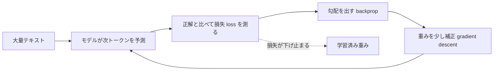

計測現場の校正ループを重ねると、対応はこうです。「測る＝予測」「ズレ＝損失」「関節角を動かす＝重みを補正」。
図の左上の入口が**テキストの量**、ループの回転数が**計算量**。
私の自宅実験が届かなかったのは、この2つの規模でした。設計（図の形）は正しくても、**入口の量と回転数が桁違いに足りなかった**。


### 3-7. 推論 ― 固定した重みで、一語ずつ

学習が終わると、重みは**凍結**します。推論(inference)では、この固定重みを使って、実際に文章を生成する。
学習との決定的な違いは、**もう重みを動かさない**こと。誤差逆伝播もしません。順伝播（forward）を、前へ流すだけです。

生成は**自己回帰**で進みます。1トークン出したら、それを入力の末尾に足して、ここまで全部を読み直し、また次を出す。

```python
# 教育用・自己回帰デコード（概念コード / 実装そのものではない）
tokens = tokenize(prompt)                 # 入力を数値の並びに
while not done(tokens):
    logits  = model(tokens)[-1]           # 「末尾の次」に来るトークンの分布（語彙全体のスコア）
    next_id = sample_next(logits, temperature=0.7, top_p=0.9)  # 分布から1つ選ぶ（3-8）
    tokens.append(next_id)                # 出したものを入力に足して…
    # …また丸ごと読み直して次へ。この「毎回読み直す」重さが、第5部の主役になる。
```

最終行のコメントが、次の部への伏線です。1語ごとに「ここまで全部」を読み直すので、
会話が長くなるほど読み直す量が増える。第0部・一般版で予告した「長い文章ほど、急に重くなる」の正体は、まさにここにあります。
その重さを賢くやり過ごす仕掛け（KV(Key-Value)キャッシュ）を、第5部で開けます。

### 3-8. サンプリング ― 分布から「どう1語を選ぶか」

モデルが出すのは、**次トークンの確率分布**です（「東京 40%、京都 6%、大阪 5%、……」）。
そこから実際に出す1語を選ぶ方法が、**サンプリング**。ここは学習とは無関係で、
**同じ重み・同じ分布でも、選び方を変えれば出力の性格が変わります**。主な旋回ノブは2つです。

- **温度(temperature)**: 分布の「尖り具合」を調整する。値を小さくすると分布が尖り、
  いつも高確率の語を選ぶ**堅実**な文章に。大きくすると分布が平らになり、低確率の語も選ばれる**多様**な文章に。
  温度 0 は事実上、常に最大確率を選ぶ**貪欲法(greedy)** と同じ（毎回同じ出力になる＝決定論的）。
- **核サンプリング(top-p)**: 確率の高い順に足していき、合計が p（例: 0.9）を超えたところで候補を打ち切り、
  残った上位候補だけから選ぶ。ありえない裾の語を締め出しつつ、ほどよい多様性を残す。

```python
# 教育用・サンプリング（概念コード / 実装そのものではない）
def sample_next(logits, temperature=1.0, top_p=1.0):
    logits = logits / temperature          # 温度: 小→尖る(堅実), 大→平ら(多様)
    probs  = softmax(logits)               # スコアを確率分布に

    # top-p（核サンプリング）: 高確率の順に足して p を超えるまでを残し、裾を捨てる
    sorted_probs, index = sort_desc(probs)
    keep   = cumulative_sum(sorted_probs) <= top_p
    probs  = renormalize(sorted_probs[keep])   # 残った候補で確率を振り直す

    return index[ random_choice(probs) ]   # 残った候補から、確率に比例して1つ引く
```

第2部で触れた「自作の順伝播が公式と 2e-4 一致し、**貪欲法(greedy)のトークンは完全一致**した」検証は、
このうち**温度 0（貪欲法）の経路**での話です。各ステップで最大確率のトークンを選ぶので、
分布がわずかに違っても順位が変わらなければ同じトークンが出る――という決定論的な帰結でした。
一方で、温度を上げた**確率的サンプリング**の経路まで公式とバイト単位で一致することは、
別途の検証が必要で、**本シリーズの範囲では未検証**です。ここも正直に、境界を引いておきます
（「greedy が一致した」＝「あらゆるサンプリングが一致する」ではない）。

推論ループ全体を図にすると、こうなります。

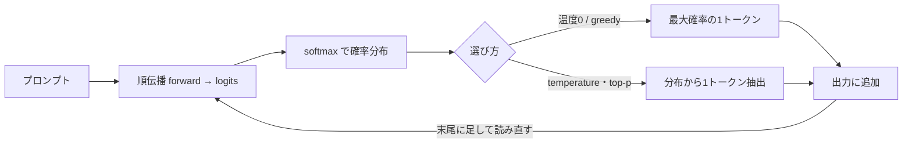


*図: 推論は固定した重みで一語ずつ。「分布から選ぶ」ノブが温度と top-p。選び方を変えても賢さ（重み）は変わらない。*

---

## この部の「作って分かったこと」box

> 📦 **作って初めて腹落ちしたこと**
>
> 「学習＝校正ループ」と頭で分かっていても、自分の CPU でゼロから回すまで、私は**規模の壁**を甘く見ていました。
> 同じ原理・同じ設計でも、自宅で学習した文字単位LM（約 1,190 万パラメータ・ppl 38）は、文語の物真似止まりで会話にならない。
> 一方、ダウンロードした事前学習済みの重み（0.5B/1.5B）を**同じ自作ランタイム**で動かすと、質問に答える。
>
> **設計が正しくても、賢さは湧いてこない。賢さは、巨大な事前学習を通った重みにしか宿らない。**
> 「事前学習済みモデルを使う」のは近道でも手抜きでもなく、**個人には届かない規模の校正の成果物を、正直に借りる**という選択でした。
> そして自作の値打ちは、賢さを生むことではなく、その重みを**中身が見える・改造できる形で、誤差ゼロで再現して動かせる**ことにあります。

---

## 次の部の予告

今回、推論ループの擬似コードに、こんなコメントを1行だけ埋めておきました。
「**…また丸ごと読み直して次へ。この『毎回読み直す』重さが、第5部の主役になる。**」

一語出すたびに「ここまで全部」を読み直す――自己回帰は、この読み直しから逃れられません。
会話が長くなるほど、読み直す量は増え、メモリと速度が音を立てて壁になります。
第0部で私が「作って初めて体で分かった」と書いた、あの**「長い文章ほど、急に重くなる」**の正体です。

次の第5部「メモリと速度の壁」では、その壁を計測エンジニアの目で分解します。
KV(Key-Value)キャッシュがなぜ文脈長に比例して膨らむのか、量子化(quantization)で重みをどこまで削れて
どこで崩れるのか（そして「困惑度(ppl)だけで合否を出すと足をすくわれる」実例）、
定数メモリの線形化が**なぜタダではないのか**――このあたりを、実測値と正直な失敗込みで開けていきます。

> **この部の持ち帰り**: 「事前学習済み」が効くのは、賢さが**重み**に宿り、その重みは
> **巨大な学習でしか入らない**から。学習は誤差を測って直す**校正ループ**、推論はその固定重みで一語ずつ選ぶだけ。
> ――今度あなたがモデルを選ぶとき、見るべきは「アーキテクチャの新しさ」より、まず「**どんな事前学習を通った重みか**」です。

---

*このシリーズは、自作の小さな言語モデルを実装しながら書いています。数値・ベンチはすべて実測で、
うまくいかなかったこと（自宅の文字LMが会話にならない、定数メモリでも文脈が伸びない）も消さずに残しています。
「異常に良い結果は、まず内訳を疑う」――計測の現場で染みついた規律を、そのまま持ち込んでいます。*


---

# 第5部 メモリと速度の壁 ― KVキャッシュ・量子化・線形化

> 第4部では「賢さは重みに宿る。重みは巨大な事前学習でしか入らない」という結論に着きました。
> では、その重みを**自宅の PC で、まともに動かし続ける**には何が壁になるのか。今回はメモリと速度の話です。
> ――計測・制御の現場で 25 年、「不良を取りこぼさず、ラインを止めない」を目標にシステムを作ってきた人間として、
> 実はここが私のいちばんの得意領域（メモリ効率）でもあります。


一般版の第0部で、私はひとつ予告をしていました。「図で見ると LLM は一本道に流れるように描かれるけれど、
自分で動かして体でいちばん分かるのは、**長い文章ほど急に重くなる**ことだった」と。今回はその回収です。
なぜ長い会話は重くなるのか。重い重みをどうやって自宅の常駐メモリに収めたのか。
そして、**メモリを平らにする（文脈長に依存させない）代わりに、何を差し出すことになったのか**。

大きく三つの壁を、実測値とともに一つずつ開けていきます。

- **壁1: KVキャッシュ** ── 文脈が伸びるほどメモリが線形に膨らむ。
- **壁2: 重みのサイズ** ── 量子化で圧縮する。ただし「PPL だけ見て通す」と壊れたものを取りこぼす。
- **壁3: softmax の二次コスト** ── 線形化で「定数状態」にできる。ただし**タダではない**。

最初に断っておきます。今回登場する「int8 で 5.7GB → 2.44GB に収めても会話が続いた」という結果は、
**会話の賢さそのものが自作の成果だ、という意味ではありません**。賢さは学習済みの重み由来です。
私が確かめたのは、「中身を検査・改造できる、正直なオンプレ推論ランタイムの上で、
重みの情報を**1ビットも失わずに**（ローダーが `max|Δ|=0.0`）圧縮配置できた」という一点。
その継ぎ目は、最後まではっきりさせておきます。

---

## ① 用語ミニ辞典

まず、この記事に出てくる言葉を先に並べます。ここだけ読んでも、話の骨組みは掴めるようにしてあります。

- **LLM（Large Language Model：大規模言語モデル）** … 膨大な文章で訓練された「次トークン予測器」。1語出しては全部読み直して次を出す、自己回帰の機械。
- **トークン(token)** … 文章を区切った小さな断片。文脈長 T はこのトークンの本数。
- **KVキャッシュ(KV cache)** … KV は Key-Value（鍵と値）。注意機構が過去の各トークンから作った鍵 K と値 V を、次のトークンを出すたびに使い回すため**ためておく**保存領域。文脈が伸びるほど溜まる。
- **文脈長(context length, T)** … いままでに読んだトークンの本数。長い会話・長い文書ほど大きい。
- **常駐メモリ(RSS：Resident Set Size)** … プロセスが実際に物理メモリ上に確保している量。「PC の RAM をどれだけ食っているか」の実測値。
- **量子化(quantization)** … 重みや計算を、fp32（32ビット浮動小数点）より少ないビット数（int8＝8ビット整数など）で表すこと。器を小さくしてメモリを減らす。
- **weight-only 量子化** … **重みだけ**を低ビットにし、計算の途中や活性は高精度のまま扱う方式。今回の常駐削減はこれ。
- **per-channel / per-tensor** … 量子化の刻み幅（スケール）を、行列全体で1つにするか(per-tensor)、出力チャネルごとに1つ持つか(per-channel)。細かく持つほど誤差が小さい。
- **PTQ(Post-Training Quantization：学習後量子化)** … 学習済みモデルを、そのまま後から量子化する。安いが低ビットに弱い。
- **QAT(Quantization-Aware Training：量子化を意識した学習)** … 量子化の丸めを織り込んで学習し直す。強いが高コスト。LSQ(Learned Step Size Quantization) はその一種。
- **パープレキシティ(perplexity, PPL)** … 「次の1語をどれだけ迷わず当てられるか」の指標。低いほど良い。予測分布の困り度。
- **top-1保持率** … 量子化・改造の前後で、「最有力候補として選ぶ1語」がどれだけ一致するか。会話の骨（実際に選ぶ語）が壊れていないかの指標。
- **pp(percentage point：パーセントポイント)** … 割合の差。「50% が 36.5% になった」なら -13.5pp。
- **fail-closed（フェイルクローズド）** … 判定に迷ったら「通さない（拒否する）」側に倒す設計。計測現場の「疑わしきは不良」と同じ。
- **線形化(linearization)** … softmax の注意機構を、**定数サイズの状態**で逐次更新できる「線形注意」に置き換えること。
- **線形注意(linear attention)** … スコアの softmax をやめ、鍵と値を state = Σ φ(k)⊗v の形で足し込む方式。φ(feature map：特徴写像) は非負に写す関数（例: elu+1）。文脈が伸びても状態のサイズは変わらない。
- **定数状態(constant state)** … 文脈長 T が増えても大きさが O(1) で変わらないメモリ。KVキャッシュ（O(T)）の対極。
- **蒸留(distillation)** … 教師モデルの出力を生徒モデルに真似させて能力を移す学習。ここでは「素の softmax 層」を教師、「線形化した層」を生徒にする。
- **恒等初期化(identity initialization)** … 学習パラメータを、最初は「何もしない（入力＝出力）」状態から始めること。壊さずに学習を始める安全策。
- **GEMM(General Matrix Multiply：汎用行列積)** … ニューラルネットの計算時間の大半を占める行列と行列の掛け算。int8 の**速度**利得はここが int8 対応の HW で速くなって初めて出る。

> **語呂で覚える**：メモリの壁は三兄弟。**「溜まる(KV)・重い(量子化)・二次的(線形化)」**。
> 長男 KV は文脈で太る、次男は器を小さくして痩せさせる、三男は太り方そのものを平らにする。ただし三男には後述の月謝がかかる。

---

## ② かみくだき ── なぜ重いのか、対策は何を差し出すのか

LLM が重くなる理由は、実は二つの「別々の重さ」が混ざっています。ここを分けると一気に見通しが良くなります。

**重さその1：文脈が伸びると溜まる（KVキャッシュ）。**
注意機構は、次の1語を出すために「これまでの全トークンをもう一度見に行く」仕組みです（第2部でやりました）。
毎回ゼロから全部を計算し直すと無駄なので、各トークンから作った鍵 K と値 V を保存して使い回します。これが KVキャッシュ。
便利ですが、**トークンが増えるたびに1トークン分ずつ確実に増えていく**。長い会話がじわじわ重くなる正体はこれです。
文脈長 T に対してメモリは O(T)、計算は O(T²) で効いてきます。

**重さその2：重みそのものが大きい（サイズ）。**
15億パラメータ級のモデルを 32ビット浮動小数点(fp32) で持つと、それだけで数 GB を占めます。
これは会話の長短に関係なく、**モデルを開いた瞬間から常にかかる固定費**です。ここを減らすのが量子化。
数の「器」を小さくして、同じ情報をより少ないビットで持ちます。

対策は素直に効きます。が、私が現場で 25 年叩き込まれた規律が、ここで顔を出します。
**「異常に良い結果は、まず内訳を疑え」**。量子化には、**指標を一つしか見ないと壊れたモデルを『合格』にしてしまう**落とし穴があります。
極端に圧縮したモデルが、PPL（予測の困り度）というよく使う指標では合格ラインを通ったのに、
**実際に選ぶ1語（top-1）が大きく崩れていた**、という実例を後で見せます。検査でいう「見逃し（不良の取りこぼし）」です。

そして三つめ。KVキャッシュの O(T) をそもそも O(1) にできないか、というのが**線形化**です。
softmax をやめて、過去を「定数サイズの状態」に畳み込んでしまう。文脈がどれだけ伸びても状態は太らない。
夢のようですが、ここでも私は正直に言わなければなりません。**これはタダではありません。**
得られるのは「長い文脈でのメモリ」だけ。代わりに「品質の小さな（しかしゼロでない）劣化」と「短い文脈ではむしろ余計な計算」を差し出します。
無料の昼食ではなく、**トレード（交換）**です。

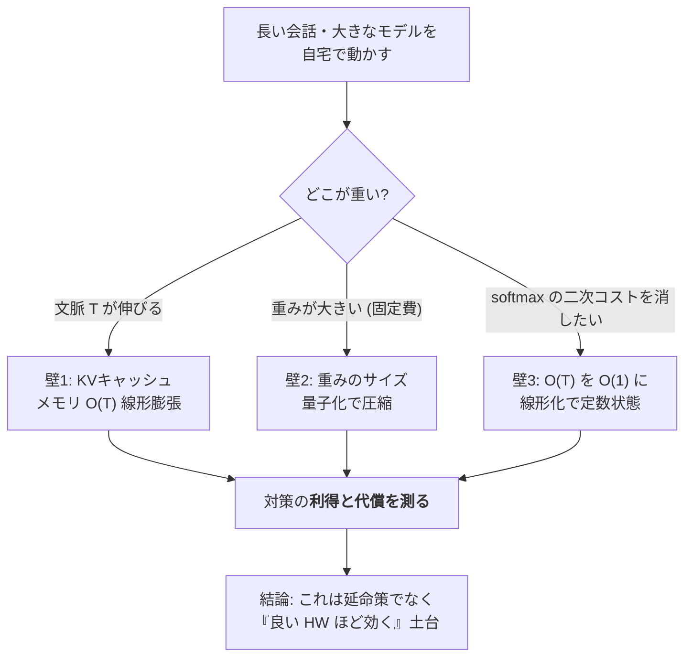

ここから③で、それぞれを実測値・擬似コード・正直な内訳とともに開けていきます。

---

## ③-1 壁1：KVキャッシュは文脈長に線形膨張する

### 何が溜まるのか

第2部でやった通り、自己回帰生成は「1語出す → これまで全部を読み直す → 次を出す」を繰り返します。
毎ステップで過去の全トークンについて鍵 K と値 V を計算し直すのは二重の無駄なので、実装は K と V を保存して使い回します。
これが KVキャッシュです。次の擬似コードが、softmax 注意の1ステップと「キャッシュがどう伸びるか」を示します。

```python
# softmax 注意 + KV キャッシュ: 1 ステップ
# K_cache, V_cache は「過去の全トークン分」たまっていく。
def sdpa_step(q_t, k_t, v_t, K_cache, V_cache, d):
    K_cache = cat([K_cache, k_t], dim=0)   # (T, d) ← T とともに1行ずつ伸びる
    V_cache = cat([V_cache, v_t], dim=0)   # (T, d) ← 同上
    scores  = (q_t @ K_cache.T) / sqrt(d)  # (T,)   ← 過去 T 個との相関（内積類似度）
    attn    = softmax(scores)              # (T,)
    out     = attn @ V_cache               # (d,)   ← 重み付き平均
    return out, K_cache, V_cache
```

`K_cache`・`V_cache` の行数がそのまま文脈長 T です。**T に比例して確実に増える**。これがメモリ O(T)、
スコア計算 `q_t @ K_cache.T` が T に比例するので、全トークンを出すまでの総計算は O(T²) になります。

### 実測：×8 の文脈長で、KVは×8

概念だけでは腹落ちしないので、softmax 型（GPT系）のモデルと、後述の定数状態（recurrent系）のモデルとで、
KVキャッシュのサイズを実測して並べました。

| モデル型 | 文脈長 T=256 | 文脈長 T=2048 | 伸び方 |
|---|---|---|---|
| softmax型（GPT系）KVキャッシュ | 4.72 MB | 37.75 MB | **×8（線形）** |
| 定数状態（recurrent系）の状態 | 平坦 | 平坦 | **×1.00（不変）** |

文脈長を 8 倍（256→2048）にすると、softmax の KVキャッシュもきれいに 8 倍（4.72→37.75MB）。
教科書通りの線形膨張です。一方、定数状態のモデルは文脈が伸びても状態サイズが変わりません（平坦）。

ここで正直な補足を一つ。KVキャッシュだけを見ると ×8 ですが、**プロセス全体の常駐メモリ(RSS)** で測ると、
同じ 256→2048 で **×2.65** でした。理由は単純で、RSS には「文脈に依存しない固定費（重み本体・実行環境）」が大きく乗っているから。
KVは全体の一部なので、KV が 8 倍でも全体は 2.65 倍に薄まる。**「どこを測っているか」で数字が変わる**という、
計測では当たり前だけれど見落とされがちな点です。指標の定義を曖昧にしたまま「8 倍だ／2.65 倍だ」と言い合っても噛み合いません。

もっと文脈を伸ばすと差は開きます。**T=4096 で、softmax 型は常駐 ~1.67GB、定数状態は 205MB。約 8 倍の開き**です。
長文脈になるほど、O(T) と O(1) の差は容赦なく効いてきます。


### 持ち帰り（壁1）

長い会話が重くなるのは「賢さが足りないから」ではなく、**構造上、過去を全部ためて使い回しているから**。
これは第2部の「注意は O(T²)、KVは O(T)」の予告の、実測での回収です。
この O(T) を消せないか――が壁3（線形化）への伏線になります。その前に、まず「固定費」の壁2へ。

---

## ③-2 壁2：量子化 ── 器を小さくする。ただし「PPLだけ」で通さない

### weight-only int8 で ~3.9倍圧縮

重み本体は、会話の長短に関係なくかかる固定費です。ここを削るのが量子化。いちばん素直で堅いのが
**weight-only int8（重みだけを 8ビット整数に）**。fp32（4バイト）を int8（1バイト）にするので、素朴には 4 倍。
実測では、スケール等のオーバーヘッドを含めて **約 3.9 倍（74–75%）圧縮**でした。

肝心の品質は、**held-out（学習に使っていない別テキスト）での PPL 劣化が 0.1% 未満**。
つまり「予測の困り度」はほぼ無傷でこのサイズ削減。weight-only int8 が実務の定番なのは伊達ではありません。
擬似コードで刻み方を示します。ポイントは、スケール（刻み幅）を**出力チャネルごとに1つ持つ（per-channel）**こと。

```python
# int8 weight-only 量子化（per-channel スケール）
def quantize_per_channel(W):               # W: (out, in) fp32
    scale   = W.abs().amax(dim=1) / 127    # 出力チャネルごとに1つ（per-channel）
    W_int8  = round(W / scale[:, None]).clamp(-127, 127).to(int8)
    return W_int8, scale

def linear_int8(x, W_int8, scale, bias):
    W = W_int8.to(fp32) * scale[:, None]   # forward 時に元スケールへ復元（dequant）
    return x @ W.T + bias
```

per-channel は per-tensor（行列全体で1スケール）より一貫して誤差が小さい。理由は直感的です。
チャネルごとに重みの大きさの分布が違うのに、全体で1つの物差しを使うと、小さいチャネルの分解能が犠牲になる。
現場で言えば「ワークごとにレンジが違うのに、1本のゲージで全部測る」のと同じで、細かく物差しを合わせたほうが取りこぼしが減ります。

### 自作ランタイムでの実測：1.5B を 5.7GB → 2.44GB で会話維持

ここが、私が自作の推論ランタイム（フレームワークのブラックボックスに頼らず、中身を検査・改造できるオンプレ実装）で
実際に測った数字です。行列演算の Linear だけを int8 化し、埋め込みと出力層(lm_head)は fp32 のまま維持しました。

| モデル | fp32 常駐 | int8 ストリーミング常駐 | 状態 |
|---|---|---|---|
| 0.5B | 約 2.0 GB | **約 1.21 GB** | 会話維持 |
| 1.5B | 約 5.7 GB | **約 2.44 GB** | 会話維持（fp32 スパイク無し） |

「ストリーミング」と書いたのは、重みを**1テンソルずつ流し込んで**その場で int8 化し、
**途中で fp32 の巨大な山（スパイク）を作らない**ようにしたからです。ロード中に一瞬でも fp32 全体を展開すると、
そのピークで RAM が足りなくなる。小 RAM 環境では「平均」でなく「瞬間最大」が命取りになる、という計測現場の感覚がそのまま効きます。

そして最も大事な、正直に言うべき点。このローダー（重みを1テンソルずつ mmap から流す方式）は、
素朴な dict ローダーと **`max|Δ|=0.0`、ビット単位で完全一致**します。**配置の仕方を変えても、出す答えは1ビットも変わらない**。
「メモリを削るために精度をこっそり落とした」のではなく、「重みの情報を保ったまま、置き方だけを効率化した」ことを、
差分ゼロで確認しています。これは第0部で掲げた「測って確かめる（`max|Δ|=0.0`）」規律の、メモリ側での実践です。

### 速度は、正直に言うと int8 でもまだ遅い

ただし、**メモリと速度は別の話**です。CPU 上でこの int8 版を回すと **約 0.7 tok/s**。
むしろ fp32 の素の 0.5B（5–6 tok/s）より遅いくらいです。なぜか。

**毎回の順伝播(forward)で、int8 の重みを fp32 に復元(dequant)してから掛け算しているから**です。
CPU には「int8 のまま速く掛ける」専用の行列積(GEMM) 経路が乏しく、結局 fp32 に戻して計算するので、
復元の手間ぶんだけ遅くなる。つまり **int8 の速度利得は、int8 GEMM を高速実行できる HW（GPU/対応アクセラレータ）でこそ出る**。
「良い HW ほど効く」というこの記事の通奏低音が、ここで最初に鳴ります。**メモリは今すぐ効く、速度は良い HW を待つ**――
この非対称を曖昧にすると「int8 にしたのに速くならない、話が違う」となる。分けて語るのが誠実です。

### ビット幅の崖：3bit が実用の床、2bit は QAT でも小モデルには届かない

int8 はほぼ無傷でした。では、もっと削って 4bit・3bit・2bit にできるか。ここに**ビット幅の崖(cliff)**があります。

- 崖の**位置はモデルサイズに依存**します。大きいモデルほど低ビットに頑健（同じ 3bit でも大モデルは耐え、小モデルは崩れやすい）。
- 経験則として、**3bit が学習後量子化(PTQ) の実用的な床**。ここまでは後から量子化するだけで実用に乗せられることが多い。
- **2bit は量子化を意識した学習(QAT) の領域**。LSQ のような QAT 手法を使ってすら、**小さいモデルでは「97% 保持」のゲートに届かない**ことがある。

つまり「ビットは減らせるだけ減らせばいい」わけではなく、**モデルサイズと手法（PTQ か QAT か）で、越えられる崖と越えられない崖がある**。


### ★核心：PPL だけのゲートは危険（2bit の実例）

ここが、この記事で最も持ち帰ってほしい規律です。量子化の合否を **PPL（予測の困り度）だけ**で決めると、
**壊れたモデルを『合格』にしてしまう**ことがあります。

実例：ある 2bit 設定は、**PPL のゲートを通過した**のに、**top-1（実際に最有力として選ぶ1語）の保持率が -13.5pp 崩壊**していました。
PPL は「分布全体のなだらかさ」を測るので、確率質量が全体的に少しずつ均されても大きくは動かないことがある。
でも会話が実際に出力するのは **argmax で選ぶ1語**。そこが 13.5 ポイントもズレていたら、文は目に見えて崩れます。
**PPL は通ったが、能力は崩れていた。** これは検査でいう典型的な「見逃し（不良の取りこぼし）」です。

だから私は、量子化の検収を **capability ゲート（top-1 保持率）で fail-closed** にします。
「PPL が良い」だけでは通さない。**実際に選ぶ語が保たれていること**を、独立した物差しで確認して初めて合格。

```python
# capability ゲート: PPL だけで通さない。top-1 保持率で fail-closed。
def accept_quantized(model_fp, model_q, texts,
                     ppl_tol=0.01, top1_floor=0.97):
    ppl_ratio = perplexity(model_q, texts) / perplexity(model_fp, texts)
    top1_keep = top1_agreement(model_q, model_fp, texts)  # 最有力1語の一致率

    ppl_ok = (ppl_ratio <= 1 + ppl_tol)
    cap_ok = (top1_keep >= top1_floor)

    if ppl_ok and not cap_ok:
        # PPL は通ったのに能力が崩れている＝取りこぼしてはいけない不良
        return "REJECT"          # fail-closed: 疑わしきは通さない
    return "ACCEPT" if (ppl_ok and cap_ok) else "REJECT"
```

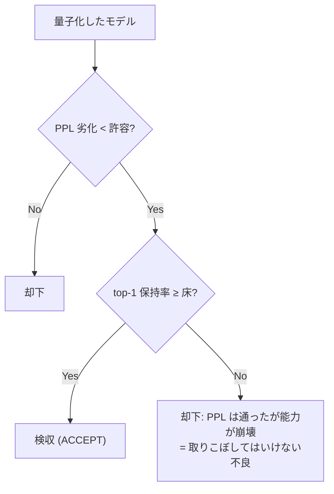

これは私の職業病の直輸入です。外観検査で「明るさの平均が基準内」だけを合格条件にすると、
局所的な深い傷を見逃す。だから「平均」と「最悪値（極値）」を別々のゲートで見る。
LLM の量子化でも同じで、**PPL（平均的ななだらかさ）と top-1（実際の出力の当たり）を別ゲートにして、fail-closed で締める**。
「異常に良い（PPL がやけに良い）結果は、まず内訳を疑う」――第0部の憲章の、量子化での実装です。

### 持ち帰り（壁2）

量子化は「器を小さくする」だけの単純な操作に見えて、**どの指標で合否を決めるか**という計測設計の問題を内包しています。
int8 weight-only は安全牌（~3.9倍・PPL 劣化 0.1% 未満・ビット完全一致で配置）。
低ビットに攻めるほど崖が近づき、**単一指標のゲートは壊れたモデルを通す**。top-1 保持で締める。これが持ち帰り。

---

## ③-3 壁3：線形化 ── O(T) を O(1) に。ただしタダではない

### 定数状態という発想

壁1で見た KVキャッシュの O(T) は、softmax という「全トークンとの相対比較」を毎回やる限り消えません。
そこで発想を変えます。**過去を『定数サイズの状態』に畳み込んでしまえないか**。これが線形化（線形注意）です。

線形注意は、softmax をやめて、鍵と値の外積を状態 S に足し込みます。

$$ S = \sum_i \phi(k_i)\otimes v_i,\qquad \text{out}_t = \frac{\phi(q_t)\, S}{\phi(q_t)\, z},\quad z=\sum_i \phi(k_i) $$

φ(feature map) は鍵と問い合わせを非負に写す関数（例：elu+1）。ここで大事なのは、**S のサイズが per-head で O(d²)、
文脈長 T に一切依存しない**こと。トークンが 100 個来ようが 10 万個来ようが、状態の器は同じ大きさです。
逐次更新の擬似コードはこうなります。

```python
# 線形注意（linear attention）: 定数状態で逐次更新
# φ = elu + 1 （非負の特徴写像 feature map）
def linear_attention_step(q_t, k_t, v_t, S, z):
    # S: 状態 (d_k, d_v) ← 文脈長に依存しない定数サイズ！
    # z: 正規化用の鍵の総和 (d_k,)
    phi_k = elu(k_t) + 1
    phi_q = elu(q_t) + 1
    S = S + outer(phi_k, v_t)           # 今のトークンを状態に畳み込む
    z = z + phi_k
    out = (phi_q @ S) / (phi_q @ z + eps)
    return out, S, z
```

`sdpa_step` と見比べてください。softmax 版は `cat` で `K_cache`・`V_cache` が伸び続けました。
線形版は `S`・`z` が**足し算で更新されるだけで、大きさが変わらない**。これが定数状態の正体です。

### 実測：36倍の差、しかし交差点は 227 トークン

長文脈でどれだけ効くか。per-head で実測しました。

- **線形状態：232,960 バイト/層（文脈長によらず一定）**
- **softmax KVキャッシュ @ T=8192：8,388,608 バイト/層**

比は **36 倍**。8192 トークンの文脈では、線形状態は softmax KV の 36 分の 1 です。長文脈での勝ちは明白。

――ですが、ここで**タダではない**の第一撃。softmax KV は T=8192 で 8,388,608 バイト、
1トークンあたりに直すと 8,388,608 ÷ 8192 = **1024 バイト/トークン**。線形状態は 232,960 バイトの定数。
両者が釣り合うのは 1024 × T = 232,960、すなわち **T ≈ 227 トークン**。

**つまり 227 トークンより短い文脈では、定数状態の方が『大きい』**。線形化は「常に軽い」のではなく、
**長い文脈でだけ軽い**。短い会話しかしないなら、線形状態は固定費として損をします。
「線形注意＝省メモリ」と無条件に信じると、短文脈のアプリでかえって太る。**交差点を測ってから選ぶ**べきものです。


### タダではない、の第二撃：品質の代償と層別の耐性

メモリ以外にも代償があります。線形化は softmax を近似する以上、**品質に小さな（しかしゼロでない）劣化 Δnll** が出ます。
そして重要なのは、**その劣化がどの層でも同じではない**こと。ここを自作の 0.5B（24 層）で、1層ずつ測りました。

zero-shot（追加学習なし）で、baseline の PPL は **68.74**。そこから各層を1つだけ線形化して測ると：

- **層0 が最も非耐性**。この層だけを線形化しただけで **PPL 160**（68.74 → 160 は壊滅的）。
- 層 11・9・3・1 も抵抗が強い（劣化が大きい）。
- 一方、**中盤〜後段はほぼゼロコスト**。たとえば**層22 は Δ +0.0007**（誤差の域）。
- 累積すると：耐性のある上位4層をまとめて線形化して **+7% PPL**、12 層まとめると **破綻（PPL 167）**、**全24層では壊滅**。

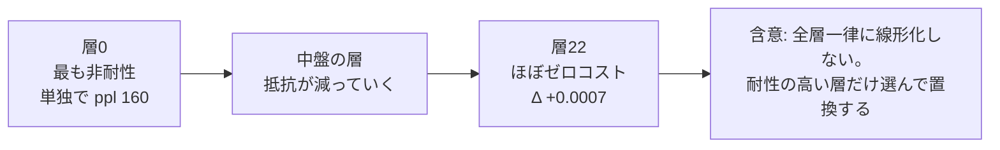

これは第3部の伏線の回収でもあります。**層0や初期層の注意は『本当の仕事』をしている**――
どこを見るかというルーティングの根っこを担っていて、softmax の相対比較を近似で潰すと壊れる。
逆に中後段は、注意の役割が定型化していて、定数状態でも十分近似できる。
だから正しい戦略は「全層を一律に線形化する」ではなく、**耐性の高い層だけを選んで置き換える**。
現場の言葉なら「効く工程と効かない工程を切り分けてから、効く工程だけ差し替える」。全部いっぺんに変えると、ラインは止まります。

### 蒸留回復：最悪の層でも 92–101% 取り戻す

では、層0のような非耐性の層は永久に線形化できないのか。ここで**蒸留(distillation)による回復**が効きます。
LoLCATs 流のレシピ：小さな**学習可能 feature map** を足し、**恒等初期化（最初は素の elu+1 と一致＝壊さない）**から始め、
**Q/K/V や出力の projection は凍結**して、**教師（素の softmax 層）の出力に、生徒（線形化層）の出力を合わせる**。

```python
# 蒸留回復: 小さな学習可能 feature map、恒等初期化、projection 凍結
class LearnableFeatureMap(nn.Module):
    def __init__(self, d):
        self.proj = nn.Linear(d, d, bias=False)
        nn.init.eye_(self.proj.weight)     # 恒等初期化＝最初は素の elu+1 と一致（壊さない）
    def forward(self, x):
        return elu(self.proj(x)) + 1

# 学習するのは feature map のみ。Q/K/V/出力 projection は凍結。
# 教師 = 素の softmax 層の出力、生徒 = 線形化層の出力。両者を合わせる（出力蒸留）。
```

結果、**最も非耐性の層を、held-out（未知テキスト）で 92–101% 回復**しました。
具体的には**層9 が 96%、層11 が 101%**の回復。101% は「教師をわずかに上回った」のではなく、
proxy 指標上の測定のばらつきの範囲と読むのが誠実で、要は**ほぼ完全に取り戻せた**ということです。
そして大事なのは、これが学習に使ったテキストだけの暗記ではなく、**未知テキストにも汎化した**こと。

**★ここで正直な内訳を全部出します**（都合の良いところだけ言わないために）：

- これは**出力蒸留**（最終出力を合わせる）であって、中間表現まで完全一致させたわけではない。
- **1層ずつ**回復させた結果で、全層同時の相互作用は別問題。
- **小さな CPU モデル**での実験。大規模モデルで同じ比率が出る保証はしていない。
- 指標は **PPL proxy**（会話品質そのものの直接評価ではない）。「PPL で回復」＝「会話が同じ」とまでは言っていない。
- そして数字の訂正：この feature map は「~4 パラメータ」ではなく、実測**3,584 パラメータ/層（約 14.3KB）**。
  「ほぼゼロ追加」と言うのは不正確です。**ただし、この追加は文脈長に対して O(1)** なので、
  「文脈が伸びても状態が太らない（bounded-memory）」という線形化の主張自体は保たれます。器の話とパラメータ数の話は別、というだけ。

「小さな feature map を足すだけで最悪層まで戻る」は聞こえが良すぎるので、**3,584 params/層という実数**を明記しておきます。
異常に良い話は内訳を疑う、を自分の成果にも適用する――それがこのシリーズの約束です。

### 「タダではない」の総括

線形化の損益を、正直に一枚にまとめます。

| 項目 | 中身 |
|---|---|
| **利得** | 長文脈のメモリ（T=8192 で softmax KV の 36 分の 1、O(T)→O(1)） |
| **代償1（メモリ）** | 短文脈では定数状態が損（交差点 ≈ 227 トークン、それ以下は KV の方が小さい） |
| **代償2（品質）** | 小さいがゼロでない Δnll。層依存が激しい（層0 は単独で壊滅、層22 はほぼ無害） |
| **代償3（計算）** | 短文脈では余計な計算ペナルティ |
| **緩和策** | 耐性の高い層だけ選ぶ + 蒸留回復（最悪層でも 92–101%、追加 3,584 params/層） |

**利得はメモリ（長文脈のみ）、コストは品質と短文脈計算。無料の昼食ではなく、条件つきの良いトレード。**
これが線形化の実像です。

### 持ち帰り（壁3）

線形化は「O(T) を O(1) にする魔法」ではなく、**「長い文脈でだけ効き、層ごとに向き不向きがあり、
蒸留で最悪層を救える、条件つきの交換」**。交差点（227トークン）と層別耐性を**測ってから**適用範囲を決める。
測らずに全層一律に掛けると壊れる。ここでも規律は同じ――**測って、切り分けて、fail-closed で締める**。

---

## ④ 設計指針：これは「CPU 延命策」ではなく「良い HW ほど効く」土台

最後に、三つの壁の対策を貫く思想を一つ。これらは「非力な CPU でなんとか動かすための我慢」ではありません。
**良い HW を積んだときに、真価が出る土台**です。

- **量子化 int8**：CPU では dequant のオーバーヘッドで ~0.7 tok/s と遅い。でも int8 GEMM を高速実行できる GPU/アクセラレータでは、
  **メモリ削減がそのまま速度に化ける**。今は「メモリだけ」効いて「速度は良い HW 待ち」。この非対称は HW が解く。
- **定数状態（線形化）**：短文脈では損だが、GPU で長文脈を扱うほど、softmax の二次メモリ壁が消える恩恵が大きくなる。
  文脈が長いほど、O(1) と O(T) の差（実測で T=4096 なら約 8 倍）が効く。

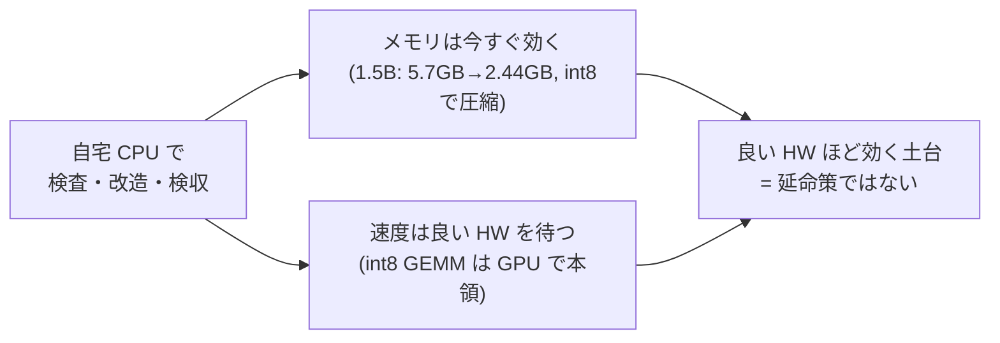

だから私は、これらを「弱い環境の言い訳」ではなく「強い環境への投資」と位置づけています。
自宅 CPU でやるのは、**中身を検査・改造・検収できる正直なランタイムを作る**ため。
その上で、int8 も定数状態も、**HW が良くなるほど利得が増える方向**に設計してある――ここが設計思想の核です。

そしてもう一度、継ぎ目を明示します。**会話が続いたのは Qwen の学習済み重みが賢いから**であって、
私の貢献は「その重みを自宅の常駐メモリに収め、中身を測りながら改造できるランタイムを作った」こと。
ここは二種類の精度を混同しないよう、正直に切り分けます。**ロードの仕組みそのもの**（重みの置き方を変える部分）は
`max|Δ|=0.0` のビット完全一致で、出す答えは1ビットも変わりません。一方 **int8 化**（5.7GB→2.44GB の圧縮）は、
測定された小さな損失（held-out PPL 劣化 0.1% 未満）を **ゼロではなく** 受け入れています。
つまり「置き方はビット完全一致、圧縮だけは極小の測定された損失」。**賢さを作ったのではなく、賢さを正直に運べる器を作った**――この区別は曲げません。

---

## まとめ ── 三つの壁と、一つの規律

- **壁1 KVキャッシュ**：文脈長 T に O(T) で線形膨張（×8 文脈で KV ×8、RSS では ×2.65、T=4096 で softmax ~1.67GB vs 定数状態 205MB ≒ 8倍）。長い会話が重くなる正体。
- **壁2 量子化**：int8 weight-only は ~3.9倍圧縮・PPL 劣化 0.1% 未満（ロード機構自体は `max|Δ|=0.0` のビット一致、int8 化だけは極小の測定された損失）で配置（1.5B: 5.7GB→2.44GB）。低ビットには崖（3bit=PTQ の床、2bit=QAT 領域）。**PPL だけのゲートは危険（2bit で top-1 -13.5pp 崩壊）→ top-1 保持で fail-closed 検収**。
- **壁3 線形化**：定数状態 O(1)（T=8192 で softmax KV の 36分の1）。**タダではない**――交差点 227 トークン、層別耐性（層0 壊滅／層22 ほぼ無害）、蒸留回復（最悪層 92–101%、追加 3,584 params/層）。

貫く規律は、25 年の計測現場からの直輸入です。**「測る物差しを一つにしない。異常に良い結果は内訳を疑う。疑わしきは通さない（fail-closed）。」**
LLM のメモリ最適化は、突き詰めると「不良を取りこぼさない検査設計」そのものでした。

> **この記事から持ち帰る一つ**：
> **「PPL が良い」は合格ではない。**
> 量子化でも線形化でも、指標を一つだけ見て「軽くなったのに性能そのまま！」と喜んだ瞬間が、いちばん危ない。
> メモリの利得は、必ず**別の物差し（top-1 保持・交差点・層別耐性）と一緒に**測る。
> これは AI に限らず、あなたが何かを「最適化した」と言うとき全部に効く護身術です。

---

## 次の部に続く

ここまでで、LLM の中身（トークン→埋め込み→注意→順伝播→学習→メモリの壁）をひと通り分解しました。
残るは、いちばん実務に近い問い――**「じゃあ、自分の道具として、どのモデルをどう選び、どう信じ、どう任せるのか」**です。

次の第6部（実務編）では：

- **モデル選定はライセンスが生命線**。「商用で使えるつもりが、実は非商用の罠だった」を避ける4軸（日本語品質・サイズ・数学力・ライセンス）。
- **RAG か、ファインチューニングか、蒸留か**。知識を「検索で貸す」か「重みに焼く」か。教師の出力ライセンスという落とし穴。
- **評価の罠**。今回の「PPL だけで通すな」を、さらに**勝者の呪い(winner's curse)**・**文脈長スイープ**・多窓 proxy まで広げます。「たくさんの候補から最良を選ぶと、その最良値は楽観に偏る」――なぜ新鮮な holdout で測り直すのか。
- そして、**素朴な進化探索が単純な貪欲法に負けた話**（消さずに残す教訓）と、**それでも進化が効く一点**。

今回の「測って、切り分けて、fail-closed で締める」が、実務では**モデルを選び・評価し・責任を持つ**という形で結晶します。
自宅の PC で動く、正直で、おせっかいな AI を、どう組み上げるか。シリーズの着地点でお会いしましょう。

---

*このシリーズは、自作の小さな推論ランタイム（llcore）で LLM を組み直しながら書いています。
本記事の数値は、その一次記録の実測値のみを使い、未測定のことは「未測定」と書いています。
「絵で分かった」あとに「仕組みで納得したい」方は、対応する一般版(<<LINK:MEGA_G>>)もどうぞ。*


---

# 第6部 実務編 ― モデル選定・評価・進化・責任ある設計

> 第5部では、メモリと速度の三つの壁を実測で開けながら、貫く規律を一つ立てました――
> **「測る物差しを一つにしない。異常に良い結果は内訳を疑う。疑わしきは通さない（fail-closed）。」**
> 今回はその規律が、実務では **「モデルを選び・評価し・責任を持つ」** という三つの形に結晶します。
> ――計測・制御の現場で 25 年、「不良を取りこぼさず、ラインを止めない」を目標にしてきた人間として、
> ここは中身の解剖から一歩出て、**「自分の道具として、どのモデルをどう選び、どう信じ、どう任せるか」** を扱います。


前の部の終わりに、私はこう予告しました。「今回の『PPL だけで通すな』を、さらに勝者の呪い・文脈長スイープ・
多窓 proxy まで広げます」。そして「素朴な進化探索が単純な貪欲法に負けた話（消さずに残す教訓）と、
それでも進化が効く一点」。この二つが、本章の山場です。加えて、実務でいちばん最初に効くのに一番見落とされがちな
**ライセンス（商用で使えるかどうか）** の話から始めます。

このシリーズはここまで、LLM(Large Language Model：大規模言語モデル)の中身――トークン化・埋め込み・注意機構・
順伝播層・学習・メモリの壁――を一つずつ分解してきました。最終部のこの章は、**分解して得た理解を、実際に手を動かす
判断に変える**ための回です。中身が分かったからこそ選べる、評価できる、責任が持てる。その地続きを、
実測値と honest（正直）な失敗も添えて、最後まで通します。

---

## ① 用語ミニ辞典（この部で使う言葉）

まず、この記事で繰り返し出てくる言葉を先に置きます。①だけ読んでも、話の骨組みは掴めるようにしてあります。

- **ライセンス(license)** … そのモデル（重み）や、そこから作った派生物を、どこまで・どう使ってよいかを定める利用許諾。商用可否の生命線。
- **Apache-2.0 / MIT** … 代表的な「商用でも素直に使える(permissive)」オープンソースライセンス。改変・再配布・商用利用を広く許す。
- **派生物伝播条項(copyleft / derivative propagation)** … 「これを使って作ったものにも、同じ条件を引き継がせる」という縛り。permissive の対極。
- **利用規約(Terms of Service, ToS)** … サービス提供者が定める使い方のルール。API の出力の再利用を禁じる条項が入っていることがある。
- **RAG(Retrieval-Augmented Generation：検索拡張生成)** … モデルの外に知識ベースを置き、質問時に関連文書を**検索して差し込む**方式。重みは触らない。
- **ファインチューニング(fine-tuning)** … 学習済みモデルの重みを、追加のデータで少し学習し直して調整すること。以降 微調整。
- **蒸留(distillation)** … 教師モデルの出力を生徒モデルに真似させ、能力を移す学習（第5部で線形化層の回復に使ったのと同じ枠組み）。
- **来歴(provenance)** … 「その答えが、どの情報源から来たか」の出どころ・追跡可能性。RAG は来歴を残しやすい。
- **パープレキシティ(perplexity, PPL)** … 「次の1語をどれだけ迷わず当てられるか」の指標。低いほど良い。予測分布の困り度。
- **top-1保持率** … 改造の前後で「最有力として選ぶ1語(argmax)」がどれだけ一致するか。実際に出力する語が壊れていないかの物差し。
- **nll(negative log-likelihood：負の対数尤度)** … 正解トークンに割り当てた確率の対数の符号を反転した値。小さいほど良い。PPL は nll の指数。Δnll は改造前後の差。
- **holdout（ホールドアウト）** … 選定・調整に使っていない、取り置きの評価用データ。「本番で初見の問題」の代わり。
- **勝者の呪い(winner's curse)** … たくさんの候補から「最良」を選ぶと、その最良値が本来の実力より**楽観的に偏る**現象。選定と評価が同じデータだと必ず起きる。
- **信頼区間(Confidence Interval, CI)** … 測定値の「ブレの幅」。点推定（1つの数字）だけでなく、どのくらい揺れるかを併記するための区間。
- **ブートストラップ(bootstrap)** … 手元のデータを何度も取り直す（再標本化する）ことで、測定値のブレ幅（CI）を見積もる統計手法。
- **文脈長スイープ(context-length sweep)** … 短い文脈から長い文脈まで、文脈長を段階的に変えながら劣化を測ること。短文脈だけの評価が見逃す劣化を炙り出す。
- **NAS(Neural Architecture Search：ニューラルアーキテクチャ探索)** … 「どんな構造（層の並べ方・部品の選び方）が良いか」を自動で探索すること。
- **ミキサー(mixer)** … 各層で「トークン同士をどう混ぜるか」を担う部品。ここでは softmax 注意／窓つき注意(sliding-window)／線形注意 の三択。
- **貪欲法(greedy algorithm)** … 「その場で一番得な選択」を順に積み重ねる素直な最適化。速いが、局所最適に嵌まりうる。
- **遺伝的アルゴリズム(Genetic Algorithm, GA)** … 候補を「個体」とみなし、交叉・突然変異・選択で世代を回して探索する進化的手法。
- **memetic（ミーメティック）GA** … GA に局所探索（各個体をその場で磨く手続き）を組み合わせた手法。「進化＋その場の努力」の合わせ技。
- **分離可能(separable)な問題** … 各要素の良し悪しがほぼ独立で決まる問題。要素ごとに最善を選べば全体も最善に近い＝貪欲法が強い地形。
- **パレート最適(Pareto optimal)** … 「あれを良くすればこれが悪くなる」という、どれも譲れない最良の組み合わせの集まり（フロント）。
- **ハイパーボリューム(hypervolume)** … パレートフロントが目的空間で「占める体積」。多目的トレードオフの良さを一つの数字で表す指標。大きいほど良い。
- **HITL(Human-in-the-Loop：人間参加型)** … 自動化のループの要所に、人間の判断・承認を挟む設計。
- **承認バス(Approval Bus)** … 重要な行動の前に必ず承認点を通す仕組み。人間の「はい／いいえ」を、迂回できない場所に置く設計。
- **fail-closed（フェイルクローズド）** … 判定に迷ったら「通さない（拒否する）」側に倒す設計。計測現場の「疑わしきは不良」と同じ。
- **誠実な開示(honest disclosure)** … 数値は実測だけを載せ、失敗も留保も隠さず、うますぎる結果はまず内訳を疑う、という発信の作法。

4文字以下の略語（RAG, FT, GA, ToS, CI, NAS など）はこの初出で一度だけ展開し、以降は略語または日本語で通します。

> **語呂で覚える**：実務の四択は **「選ぶ・入れる・測る・任せる」**。
> どのモデルを**選ぶ**か（ライセンス）、知識をどう**入れる**か（RAG/微調整/蒸留）、
> 本当に良くなったか**測る**（評価の罠）、そして人にどう**任せる**か（責任ある設計）。
> 中身が分かっていると、この四つの判断が全部「測って確かめる」一本の規律でつながります。

---

## ② かみくだき：中身が分かると、実務の判断が変わる

ここまでの5章で、LLM の中身を部品ごとに分解してきました。最終章の問いはこうです――
**「では、その理解を、実際にモデルを選び・育て・使う判断に、どう変えるのか」**。

実務で手を動かすとき、判断は大きく四つに分かれます。順に、かみくだいて全体像を置きます。

**判断1：どのモデルを選ぶか ― ライセンスが商用の生命線。**
性能表だけ見てモデルを選ぶと、後で足元をすくわれます。いちばん最初に効くのは、実は**ライセンス**です。
「性能が良い、日本語も強い」と喜んで採用したモデルが、規約をよく読むと**商用利用は不可**だった――これは
本当によくある落とし穴です。だから私は、モデル選定を **日本語品質・サイズ・数学力・ライセンス** の4軸で見ます。
そして4軸目のライセンスは、他の3軸がどれだけ良くても**通らなければ即失格**の、fail-closed なゲートとして扱います。

**判断2：知識をどう入れるか ― 検索で「貸す」か、重みに「焼く」か。**
モデルに自分のデータや知識を持たせる方法は、大きく三つ。**RAG（検索で外から差し込む）／微調整（重みを少し学習し直す）
／蒸留（教師の出力を真似させて能力を移す）**。ざっくり言うと、RAG は**安くて・すぐ更新でき・来歴が残る**。
知識を重みに焼き込むのでなく「検索で貸す」イメージです。微調整・蒸留は**能力そのものを移植**できますが、
ここに大きな落とし穴があります――**教師（真似させる相手）の出力ライセンス**です。そして移植には天井があります。
**生徒は教師を超えられない**。

**判断3：本当に良くなったか、どう測るか ― 評価の罠。**
これが本章のレポート性の核であり、前の部の「PPL だけで通すな」の全面展開です。良い数字が出たとき、
**その良さが本物か、測り方の産物か**を見抜けないと、壊れたモデルを「合格」にしてしまう。
とくに危ないのが **勝者の呪い**――たくさんの候補から「最良」を選ぶと、その最良値は必ず楽観に偏る、という統計の罠です。
これは計測現場の「うますぎる測定値は、まず校正から疑う」と、まったく同じ規律で対処します。

**判断4：どう任せるか ― 責任ある設計。**
最後は、賢いモデルを「どう安全に人の役に立てるか」。データを外に出さないローカル完結、人間の承認点(HITL)、
迷ったら止める fail-closed、そして数字を盛らない誠実な開示。これは自慢の飾りではなく、
**計測装置の「ラインを止めない・不良を取りこぼさない」品質思想と、構造が同じ**です。「賢くする」だけでなく「責任を持つ」。

そしてこの四つの合間に、もう一つ――**「構造そのものを進化で探索できるか」**という実験の話を挟みます。
ここで私は、消したくなる失敗を一つ、正直に出します。**ゼロから始めた素朴な進化探索は、単純な貪欲法に負けました。**
けれど、その負けの内訳を分解すると、**進化がちゃんと効く一点**が見えてきます。この「負けと、その先の勝ち」の弧が、
このシリーズが最後に伝えたい「honest disclosure（失敗を消さず教訓に）」の集大成です。

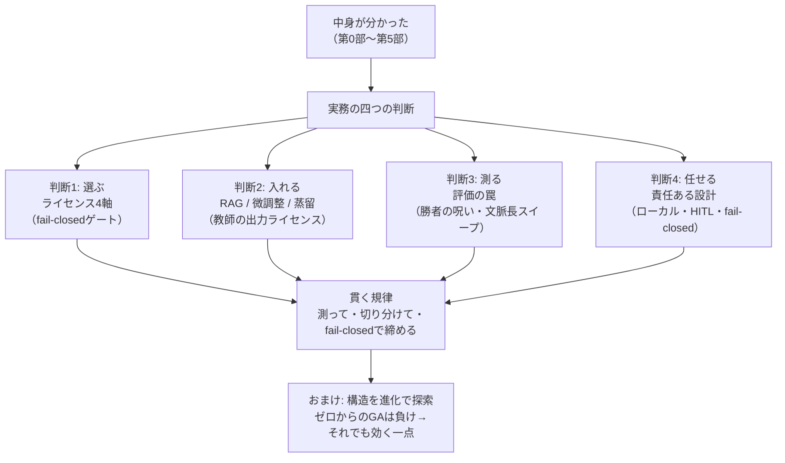

ここから③で、それぞれを実測値・擬似コード・正直な内訳とともに開けていきます。

---

## ③-1 判断1：モデル選定 ― ライセンスが商用の生命線

### 4軸で選ぶ。ただしライセンスだけは「性質が違う」

自分の道具として、あるいは製品の中核として LLM を選ぶとき、私は次の4軸で見ます。

1. **日本語品質** … 日本語の文が自然か、指示に日本語で従えるか。海外発モデルは英語中心の訓練で、日本語が弱いことがある。
2. **サイズ** … パラメータ数。動かす環境（自宅 CPU か、GPU か、常駐メモリの上限か）で許容が決まる。第5部のメモリの壁が直に効く。
3. **数学力** … 簡単な算数・数式・論理に耐えるか。第4部で見たように、小さいモデルは算数から崩れる（0.5B は「3たす5」を「18」と外しました）。
4. **ライセンス** … 商用で使ってよいか、派生物にどんな縛りが伝播するか。

ここで大事なのは、**1〜3 は「程度の軸（連続的に良い／悪い）」だが、4だけは「可否の軸（通る／通らない）」**だということです。
日本語がやや弱くても他で補える。サイズが大きすぎれば量子化で削れる（第5部）。数学が弱ければ RAG や外部ツールで補える。
けれど**ライセンスが商用不可なら、他の3軸がどれだけ満点でも、商用の道は閉じます**。だから4軸目は、
連続値として点数化するのでなく、**最初に通す fail-closed のゲート**として扱うのが実務の作法です。

これは私の職業病の直輸入です。検査装置では「明るさ」「寸法」「傷」を連続的な良否で採点しますが、
**「安全規格に適合しているか」だけは、点数でなく可否のゲート**にします。どれだけ性能が良くても、規格を通らない装置は
出荷できない。ライセンスは、LLM 選定における「安全規格」に当たります。

### 商用でクリーンな例と、非商用の罠

具体的に、商用でクリーン（Apache-2.0 / MIT）に使えるものと、うっかり踏みがちな非商用の罠を並べます。
※以下はライセンスの**性質の型**を示すための整理です。ライセンスは版・改定で変わり得るので、採用時には必ず各モデルの
最新の許諾を一次情報で確認してください（これも「仕様書より現物を測れ」の一種です）。

**商用でクリーンに使える型（permissive: Apache-2.0 / MIT）:**

- **Qwen2.5 / Qwen3** … Apache-2.0 系で提供される版があり、permissive に使える。日本語も比較的こなれている。
- **Ministral-3** … permissive 系。小型で扱いやすい。
- **Phi-4-mini** … **MIT ライセンス**。小型・permissive の代表格。
- **SmolLM3** … Apache-2.0。ただし**日本語は弱め**。ライセンスは通っても、4軸の「日本語品質」で減点され得る好例。

**非商用の罠（性能表だけ見ると見落とす）:**

- **Qwen2.5-3B** … 同じ Qwen ファミリーでも、**この 3B の版は Qwen Research ライセンス（非商用）**という落とし穴があります。
  「Qwen だから Apache だろう」と型で決めつけると踏む。**同じ名前のファミリーでも、サイズ違いでライセンスが違う**ことがある。
- **Gemma** … **派生物伝播条項**を持つ型。これを使って作った微調整版・蒸留版にも、元の利用条件が引き継がれます。
  「元は自由に見えたのに、派生物に縛りが伝播していた」を避けるには、伝播条項の有無を最初に確認する必要があります。

つまりライセンスは、**モデル単体だけでなく「そこから作る派生物にどう伝播するか」まで**見なければなりません。
これは判断2（微調整・蒸留）と直結します。**「良いモデルを見つけた」の次に、必ず「これで作ったものは自由に使えるか」を問う。**

```python
# 教育用の擬似コード：モデル選定を fail-closed ゲートで締める
# ライセンスは連続点数でなく「可否」。通らなければ他が満点でも失格。
def select_model(candidates, need_commercial=True):
    passed = []
    for m in candidates:
        # 4軸目: ライセンスは最初の関門（fail-closed）
        if need_commercial and not m.license.is_commercial_clean():
            continue                     # 商用不可 → 即除外（点数化しない）
        if m.license.propagates_to_derivatives() and plan_to_finetune:
            continue                     # 派生物に縛りが伝播 → 微調整予定なら除外

        # ここを通った候補だけ、残り3軸で連続採点する
        score = (w_ja  * m.japanese_quality        # 日本語品質
               + w_sz  * m.size_fit(target_env)    # サイズ（動かす環境に収まるか）
               + w_math* m.math_score)             # 数学力
        passed.append((score, m))
    if not passed:
        return None    # 全滅なら「無い」を正直に返す（無理に通さない）
    return max(passed)[1]
```

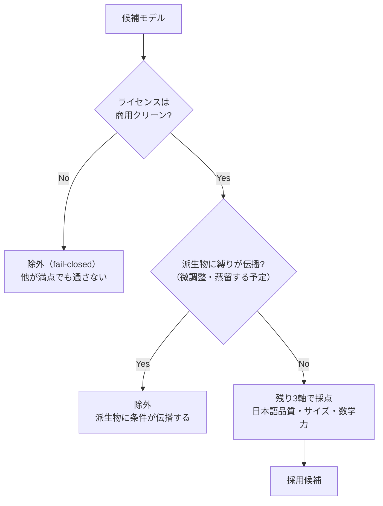

### 持ち帰り（判断1）

モデル選定は性能表の勝負に見えて、実は**最初にライセンスという可否のゲートを通す**設計問題です。
Apache-2.0 / MIT はクリーン。**同じファミリーでもサイズ違いで非商用の版がある（Qwen2.5-3B）**、
**派生物に条件が伝播する型がある（Gemma）**。性能は連続点数、ライセンスは fail-closed ゲート――この分け方が、
「商用で使えるつもりが実は使えなかった」を防ぎます。

---

## ③-2 判断2：知識をどう入れるか ― RAG か、微調整か、蒸留か

### 三つの入れ方と、その性格

モデルに「自分の知識・自分のデータ」を持たせたいとき、道は大きく三つです。性格がはっきり違うので、まず対比します。

- **RAG（検索拡張生成）** … 知識をモデルの**外**（検索できる知識ベース）に置き、質問のたびに関連文書を引いて
  プロンプトに差し込む。重みは一切触らない。
- **微調整（fine-tuning）** … 学習済みモデルの**重みを、追加データで少し学習し直す**。知識・作法をある程度まで
  重みに焼き込む。
- **蒸留（distillation）** … **教師モデルの出力**を生徒モデルに真似させ、能力を移植する。第5部で線形化層を
  回復させたのと同じ枠組みを、こんどは「能力を丸ごと移す」目的で使う。

それぞれの性格を、実務で効く3点（コスト・更新のしやすさ・来歴）で並べます。

| 観点 | RAG | 微調整 | 蒸留 |
|---|---|---|---|
| **コスト** | 安い（学習不要、知識ベースを作るだけ） | 中〜高（追加学習が要る） | 高（教師の出力を大量に集めて学習） |
| **更新のしやすさ** | **即時**（文書を差し替えるだけ） | 遅い（再学習が要る） | 遅い（再蒸留が要る） |
| **来歴（出どころ）** | **残る**（どの文書から答えたか辿れる） | 残りにくい（重みに溶ける） | 残りにくい（重みに溶ける） |
| **できること** | 知識を「貸す」（参照させる） | 作法・知識を重みに「焼く」 | 能力そのものを「移植」 |

要点はこうです。**大きな知識・頻繁に変わる知識は、RAG で「検索して貸す」のが基本**。安く、すぐ更新でき、
「その答えはこの文書から」という来歴が残る。これは、私が計測の現場で大事にしてきた**トレーサビリティ（追跡可能性）**
そのものです。検査装置は「なぜこのワークを不良と判定したか」を必ず根拠つきで残します。答えだけ返して根拠を残さない装置は、
現場では信用されません。RAG が来歴を残せるのは、実務では性能表に出ない大きな美点です。

一方、**「振る舞いの型」や「暗黙の作法」を身につけさせたい**ときは、RAG では届きにくく、微調整・蒸留の出番になります。
ただしここに、判断1と地続きの落とし穴が待っています。

### ★教師の出力ライセンスが命 ― OpenAI / Anthropic の出力は ToS で禁止

微調整、とくに蒸留の核心は「教師の出力を生徒に真似させる」ことです。ということは、**教師の出力を、そういう用途で
使ってよいか**が死活問題になります。ここを踏むと、作った生徒モデルごと使えなくなる。

- **教師の出力を学習に使うなら、その出力が Apache-2.0 / MIT 相当でクリーンに使えるものに限る。**
- **商用サービスの API 出力（例：OpenAI / Anthropic などの生成結果）は、利用規約(ToS)で「自社の競合モデルの学習に
  使うこと」を禁じている**のが通例です。「良い答えを大量に生成させて、それを教師データにする」は、規約上できません。

つまり、判断1で「モデル本体のライセンス」を通しても、判断2では**「教師の出力のライセンス」という第二のゲート**を
もう一度通さなければならない。**モデルが permissive でも、教師データの出どころが規約違反なら、生徒は最初から
汚染されている**。ここも fail-closed で締めるべき場所です。

```python
# 教育用の擬似コード：蒸留・微調整の前に「教師の出力ライセンス」を締める
def can_use_as_teacher(teacher_output_source):
    # 教師の「出力」が学習利用可能か（本体ライセンスとは別のゲート）
    if teacher_output_source.is_permissive():        # Apache-2.0 / MIT 相当
        return True
    if teacher_output_source.is_commercial_api():
        # 競合モデルの学習利用を ToS で禁止しているのが通例
        return False                                  # fail-closed: 踏まない
    return False    # 不明なら通さない（疑わしきは使わない）
```

### 天井：生徒は教師を超えられない。そして cross-corpus 評価が要る

もう一つ、蒸留・微調整には構造的な天井があります。**生徒は、教師を超えられない**。蒸留は「教師の振る舞いを真似する」
学習なので、原理的に**生徒 ≤ 教師**。教師が間違える問いは、生徒も間違えるように学びます。「小さな生徒が、教師より賢くなった」
という結果が出たら、それこそ**内訳を疑うべき異常値**です。たいていは評価データが蒸留分布に寄っていて、
「教師の土俵でだけ良く見えている」状態です。

だからこそ、**cross-corpus 評価（蒸留に使ったのとは別の、性質の違うテキストでの評価）が必須**になります。
第5部の線形化・蒸留回復のときも、私は同じ規律を使いました――**held-out（未知テキスト）で 92–101% 回復**したことを
確認して初めて「回復した」と言った。学習に使ったテキストだけで測れば、暗記でいくらでも良い数字が出てしまう。
「蒸留した分布で良く見えて、別の分布で崩れる」を炙り出すのが cross-corpus 評価の仕事です。

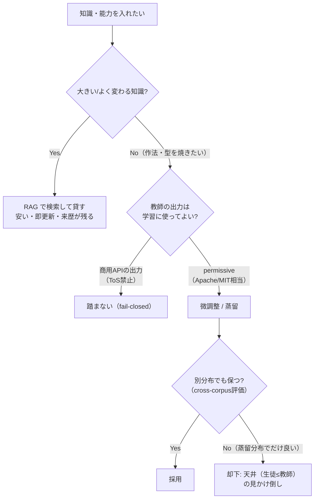


### 持ち帰り（判断2）

知識の入れ方は三択。**大きく変わる知識は RAG で「貸す」（安い・即更新・来歴が残る）**。
作法を重みに焼くなら微調整・蒸留だが、**教師の出力ライセンスという第二のゲート**（商用 API 出力は ToS で学習利用不可）を
必ず通す。そして**生徒は教師を超えられない**天井があり、蒸留分布での好成績は cross-corpus 評価で裏を取る。
本体ライセンス（判断1）と教師出力ライセンス（判断2）は、別々のゲートです。

---

## ③-3 判断3：評価の罠 ― 良い数字を、疑う技術

ここが本章のレポート性の核であり、シリーズ全体の規律「異常に良い結果は内訳を疑う」の総仕上げです。
第5部で「PPL だけで通すな（2bit が PPL ゲートを通ったのに top-1 が -13.5pp 崩壊した）」を見ました。
今回はその話を、**評価そのものの三つの罠**へ広げます。

### 罠その1：勝者の呪い ― 「最良を選ぶ」と、その値は楽観に偏る

いちばん見落とされ、いちばん高くつくのが**勝者の呪い(winner's curse)**です。仕組みはこうです。

たくさんの候補（量子化設定、層の線形化パターン、ハイパーパラメータ……）を、あるデータで評価して「最良」を選ぶとします。
どの測定にも、実力ぶんと**ノイズ（測定のブレ）**が混じっています。候補が多いほど、「たまたまノイズが良い方に転んだ候補」が
最良に選ばれやすい。つまり**選ばれた最良値は、実力＋幸運なノイズ**で、本来の実力より**楽観的に上振れ**しています。
これが勝者の呪いです。

計測の現場では、これは骨身に沁みた話です。多数の測定の中から「一番良かった一発」を製品スペックとして掲げると、
量産では再現しません。**「ベストショット」はカタログには魅力的でも、現場では嘘になる**。だから私たちは、
選定に使った測定とは別に、**取り置きの検体で測り直す**。LLM でもまったく同じで、

- **選定（多数の候補から最良を選ぶ）に使ったデータで、その最良値を報告してはいけない。**
- **選定に一切使っていない、新鮮な holdout で測り直した値を報告する。**

こうすると、幸運なノイズは holdout では再現しないので、上振れが剥がれ、**素の実力**が見えます。
たいてい holdout の数字は選定時より少し悪くなります。それが正常です。「選定時と holdout でほぼ同じ」なら、
それは**幸運が乗っていなかった＝信頼できる**という良い兆候です。

```python
# 教育用の擬似コード：勝者の呪いを、新鮮な holdout で剥がす
def honest_best(candidates, select_data, fresh_holdout):
    # 1) 選定は select_data で（ここで最良を選ぶと楽観に偏る）
    best = min(candidates, key=lambda c: c.evaluate(select_data))

    # 2) 報告は fresh_holdout で測り直す（選定に一切使っていない）
    reported = best.evaluate(fresh_holdout)   # ← こちらを報告する
    optimism = best.evaluate(select_data)     # 参考: 選定時の（上振れした）値

    # 選定時だけ良くて holdout で崩れるなら、それは幸運（ノイズ）だった
    return best, reported, (optimism - reported)   # 差＝勝者の呪いの大きさ
```

### 罠その2：PPL だけで判断しない（第5部の回収）

第5部の核をもう一度。**PPL（予測の困り度）は「分布全体のなだらかさ」を測る**ので、確率質量が全体に少しずつ均されても
大きくは動きません。でも会話が実際に出力するのは **argmax で選ぶ1語**。ある 2bit 設定は PPL ゲートを通ったのに、
**top-1 保持率が -13.5pp 崩壊**していました。PPL は平均的な指標、top-1 は実際の出力の当たり。**別の物差しを二本、
並べて締める**。これは判断3のすべての罠に共通する原則です――**一本の物差しを信じない**。

### 罠その3：文脈長スイープ ― 短文脈の proxy は、長文脈のコストを過小に見る

第5部の線形化で、劣化は**層ごとに違う**と見ました。今回はもう一つの次元――**文脈長ごとに違う**を加えます。
これが実務で本当に効きます。

多くの評価は、手早さのために**短い文脈（proxy）**で測ります。ところが、線形化のような近似の劣化は、
**長い文脈でこそ牙をむく**（定数状態は長文脈のメモリで勝つ代わりに、softmax の細かな相対比較を近似で潰しているから）。
短文脈だけで測ると、この長文脈コストを**過小検出**します。だから、短文脈から長文脈まで段階的に測る
**文脈長スイープ**が要る。実際に測ると、こうなりました。

- あるアグレッシブ（攻めた）な線形化設定で、劣化 Δnll が **文脈が伸びるほど単調に悪化**：短文脈で **+0.45** →
  長文脈で **+0.49**。**文脈長とともに一方向に悪くなる**（改善に転じる点がない）。
- これは PPL に直すと、およそ **1.6 倍の悪化**に相当します。短文脈だけ見て「+0.45 なら許容」と通すと、
  長文脈で 1.6 倍まで膨らむのを見逃す。
- 逆に、**控えめな削減に留めた「実用の帯(usable band)」**では、**30.8% の削減で +7% PPL** に収まりました。
  攻めれば長文脈で崩れ、控えれば実用に乗る。**どこまで攻めてよいかは、文脈長スイープを測ってからでないと決められない**。

つまり評価は、**「一点で測る」から「軸に沿って掃く（スイープする）」へ**上げる必要があります。
これは計測の常識そのものです。装置の性能は「一つの動作点」でなく、**温度・速度・負荷を振ったスイープ特性**で
評価します。一点だけ良くても、実運用の範囲で単調に悪化するなら、それは使えない。文脈長は、LLM 評価における
その「掃くべき軸」です。

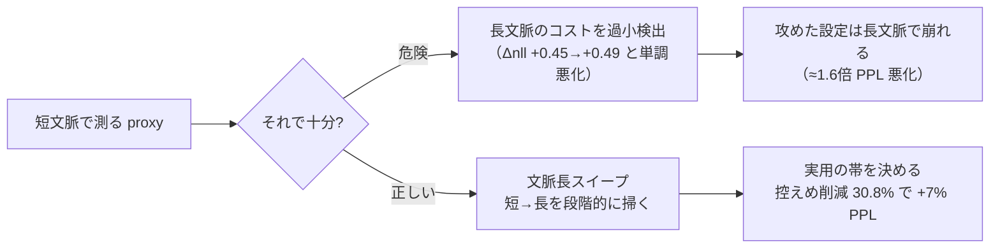


### 三つの罠をまとめて封じる ― 多窓 proxy と honest_verdict

これら三つの罠（勝者の呪い・単一指標・短文脈 proxy）を、一つの評価設計に畳み込むと、私が実際に使っている
**proxy-v2 の思想**になります。核は四つです。

1. **paired 多窓 Δnll** … 同じテキストの**複数の文脈窓**で、改造前後を**対にして（paired）**差 Δnll を測る。
   一点でなく、窓を複数取ることで文脈長依存を捉える（罠3への対処）。
2. **ブートストラップ信頼区間(CI)** … 点推定だけでなく、再標本化でブレ幅を出す。「+0.45 ± どれだけか」を併記する。
3. **勝者の呪い補正** … 多候補から最良を選ぶ構造には、上振れ補正をかける／新鮮な holdout で測り直す（罠1への対処）。
4. **honest_verdict のチョークポイント** … これが要です。この proxy が測っているのは**「次トークンの nll」だけ**だと、
   評価の出力に**明示的に刻む**。スコープを `next_token_nll_proxy` に固定し、**「会話品質が良くなった」という主張を、
   構造的に封じる**。具体的には、判定オブジェクトに `conversational_claim = None` を持たせ、
   「この評価から会話品質は主張できない」を**設計として強制**します。

この4番目が、このシリーズの背骨と直結します。第0部から繰り返してきた**「会話の賢さは学習済み重み由来、
自作の貢献は検証済みランタイム」という継ぎ目**を、評価装置のレベルで**機械的に守る**ということです。
proxy が測れるのは nll まで。だから「会話が良くなった」とは、この proxy からは**言わせない**。言えないことを
言わない仕組みを、評価の中に組み込む。

```python
# 教育用の擬似コード：proxy-v2 の honest_verdict チョークポイント
def proxy_v2_verdict(model_before, model_after, texts):
    # paired 多窓 Δnll（複数の文脈窓で対にして測る）
    deltas = [paired_delta_nll(model_before, model_after, w) for w in windows(texts)]
    point  = mean(deltas)
    ci_lo, ci_hi = bootstrap_ci(deltas)          # ブレ幅（信頼区間）を併記

    return {
        "scope": "next_token_nll_proxy",         # 測っているのは次トークン nll だけ
        "delta_nll": point,
        "ci": (ci_lo, ci_hi),
        # ここがチョークポイント：会話品質は、この proxy からは主張しない
        "conversational_claim": None,            # 構造的に封印（言えないことを言わせない）
    }
```

計測の現場には「校正されていない測定器の数字は、桁が合っていても信じるな」という戒めがあります。
proxy-v2 は、その戒めをコードにしたものです。**測れる範囲を宣言し、その外を主張しない**。
「異常に良い結果は内訳を疑う」を、最終的には**評価装置の設計そのものに埋め込む**――これが、
25 年の計測規律から私が LLM 評価に持ち込んだ、一番の実装です。

### 持ち帰り（判断3）

評価には三つの罠がある。**勝者の呪い**（多候補の最良は楽観に偏る→新鮮な holdout で測り直す）、
**単一指標**（PPL だけで通すと壊れたモデルを合格させる→top-1 など二本目の物差し）、
**短文脈 proxy**（長文脈コストを過小検出→文脈長スイープで掃く。攻めた設定は Δnll +0.45→+0.49 と単調悪化）。
そして三つを畳み込んだ **proxy-v2**（paired 多窓・CI・勝者の呪い補正・honest_verdict でスコープ固定）で、
**「言えないことを言わせない」評価装置**にする。良い数字が出たら、喜ぶ前に測り方を疑う。


---

## ③-4 判断の合間に：進化 × 構造 ― 負けと、その先の勝ち（memetic NAS）

ここで、実務判断の合間に、このシリーズの honest disclosure の集大成となる実験を一つ、正直に開きます。
テーマは**「構造そのものを、進化で探索できるか」**。第5部で、層ごとに線形化の向き不向きがある（層0は壊滅、層22は無害）と
見ました。ならば一歩進めて、**各層にどのミキサー(mixer)を使うか**――softmax 注意／窓つき注意(sliding-window)／
線形注意 の三択――を、**自動で探索**できないか。これがニューラルアーキテクチャ探索(NAS)の問いです。

### 失敗を消さない：ゼロからの素朴な GA は、単純な貪欲法に負けた

最初、私は素直に**ゼロから遺伝的アルゴリズム(GA)**を回しました。各層を「線形化する／しない」の二値マスクで表し、
「線形化した層の数（＝メモリ予算）」を制約に、品質を最大化する。個体を交叉・突然変異させ、世代を回す。
進化計算らしい、格好のよい設定です。

結果は――**負けました**。単純な**貪欲法**（第5部で見た「耐性の高い層から順に線形化していく」あの素直なやり方）に、
GA は勝てなかった。世代を回すぶんだけ計算を無駄にして、貪欲法とほぼ同じか、それ以下。

なぜか。内訳を分解すると、理由ははっきりしていました。**この問題は分離可能(separable)だったから**です。

- **二値マスク（線形化する／しない）× 単調な予算制約**という設定では、各層の「線形化したときの損」がほぼ独立に決まる。
- 各層の損は第5部で層別に測れています（層0は大損、層22はほぼ無損）。ならば**損の小さい層から順に線形化する**だけで、
  どの予算でもほぼ最適な組み合わせが得られる。これが貪欲法です。
- 各要素が独立に決まる分離可能な地形では、**貪欲法が近似最適**。GA が交叉や突然変異で探し回っても、
  貪欲法がすでに届いている解の周りをうろつくだけで、**足せるものが無い**。

これは進化計算への皮肉でも、GA が劣った手法だという話でもありません。**問題の地形が、その道具を要らなくしていた**だけです。
計測の現場でも同じ経験があります。パラメータが互いに独立なら、一つずつ最適点を探る単純な一次元探索で十分で、
凝った多次元最適化を持ち込むと、かえって遅くなり、結果も変わらない。**道具は地形に合わせる**。

### それでも進化が効く一点：非分離な地形を、greedy 解を種にして磨く

では進化は無駄だったのか。**いいえ**。負けの内訳が、勝てる条件を教えてくれました。**分離可能だから貪欲法が強い**のなら、
**分離不可能（非分離）な地形を作れば、貪欲法は届かなくなり、進化の出番が生まれる**はずです。

そこで、二値（線形化する／しない）でなく、**三択のミキサー空間**（softmax／窓つき／線形）に広げました。
すると層どうしの相互作用が効いてきます。「ある層を窓つきにすると、隣の層は線形でも耐える」といった、
**組み合わせでしか決まらない効果**が現れる。もう各層を独立には決められない――非分離な地形です。ここで貪欲法は、
「その場で一番得な一手」を積むだけなので、**組み合わせの妙**に届かず、局所最適で止まります。

ここで効くのが **memetic GA**（進化＋局所探索）です。しかも大事なのは初期化。**ゼロから始めるのでなく、
まず貪欲法で良い解を作り、それを種(seed)として GA の初期集団に入れる**。貪欲法が届く範囲は最初から確保したうえで、
GA と局所探索が、貪欲法の届かない**非分離な組み合わせ**を磨く。「進化＋その場の努力」で、
貪欲解の一歩先へ押し込む。

結果、この 3-ミキサー空間で、**パレートハイパーボリュームが +34.3%** 向上しました。ハイパーボリュームは
「メモリと品質のトレードオフのフロント（パレート最適の集まり）が、目的空間でどれだけ広い領域を支配するか」を
一つの数字にしたもので、大きいほど**良いトレードオフの選択肢が増えた**ことを意味します。貪欲解だけのフロントより、
memetic GA で磨いたフロントの方が、34.3% 広く支配した――**非分離な地形では、進化がちゃんと足し算をした**。

```mermaid
flowchart TD
    subgraph 分離可能な地形
      A1["二値マスク × 単調予算"] --> A2["各層の損が独立"]
      A2 --> A3["貪欲法が近似最適"]
      A3 --> A4["ゼロからのGAは負け\n（足せるものが無い）"]
    end
    subgraph 非分離な地形
      B1["3択ミキサー空間\nsoftmax/窓つき/線形"] --> B2["層どうしが相互作用"]
      B2 --> B3["貪欲は局所最適で停止"]
      B3 --> B4["greedy解を種に\nmemetic GAで磨く"]
      B4 --> B5["パレートHV +34.3%\n進化が足し算をした"]
    end
    A4 -.-> L["教訓: 進化は万能でなく\n非分離な地形の精緻化器"]
    B5 -.-> L
```

```python
# 教育用の擬似コード：負けと勝ちの弧（memetic NAS）
# 1) 分離可能な二値問題：貪欲法が近似最適。GAは足せない。
def greedy_binarize(layers, budget):
    # 各層を「線形化したときの損」の小さい順に、予算まで選ぶ
    order = sorted(layers, key=lambda L: L.linearize_cost)  # 第5部の層別耐性
    return order[:budget]                                   # ← これでほぼ最適（分離可能）

# 2) 非分離な三択問題：greedy 解を種に、memetic GA で磨く
def memetic_search(layers, mixers=("softmax", "sliding_window", "linear")):
    seed = greedy_seed(layers, mixers)          # まず貪欲解を作る（届く範囲を確保）
    population = [seed] + random_individuals()   # 種を初期集団に入れる（ゼロから始めない）
    for _ in range(generations):
        offspring = crossover_and_mutate(population)
        offspring = [local_search(ind) for ind in offspring]  # ← memetic: その場で磨く
        population = select_pareto(population + offspring)     # メモリと品質の両目的
    return population       # 貪欲解の一歩先の、非分離な組み合わせを含むフロント
```

### 正直な内訳（都合のいいところだけ言わない）

この「負けて、勝った」弧にも、正直な留保をつけます。

- **+34.3% はパレートハイパーボリューム**という多目的の proxy 指標上の改善であって、会話品質そのものの向上ではありません。
  判断3の honest_verdict と同じ線引きで、**会話が良くなったとは言っていません**。
- 探索は**小さな CPU モデル**での実験。大規模モデルで同じ比率が出る保証はしていません。
- 品質の測定は、判断3の評価規律（多窓・holdout）に乗せていますが、それでも proxy は proxy です。

それでも、この弧が伝えたい教訓は一つに絞れます。**進化は「万能の魔法」ではなく、「貪欲法が届かない非分離な地形での
精緻化器(refiner)」である**。分離可能な地形では、素直な貪欲法に敬意を払って任せる。非分離な地形に踏み込んで初めて、
進化は自分の仕事を持つ。**道具を地形に合わせる**――この判断こそが、探索の実務です。

### 持ち帰り（進化×構造）

**ゼロからの素朴な GA は、貪欲法に負けた**（二値マスク×単調予算は分離可能で、貪欲法が近似最適だから）。
でも**三択ミキサー空間という非分離な地形で、貪欲解を種にした memetic GA は勝った**（パレートHV +34.3%）。
教訓は「進化＝万能」でも「進化＝無駄」でもなく、**進化は非分離な地形の精緻化器**。負けの内訳が、勝ちの条件を教える。

---

## ③-5 判断4：責任ある設計 ― 賢くするだけでなく、責任を持つ

最後の判断です。ここまでの三つ（選ぶ・入れる・測る）は「賢く・正しく」の話でした。四つめは**「どう任せるか」**――
賢いモデルを、どう安全に人の役に立てるか。これは自慢の飾りではなく、**設計思想**として書きます。

私が置く柱は四つ。そしてこの四つは、私が 25 年やってきた**計測装置の品質思想と、構造がそっくり同じ**です。

1. **ローカル完結（データを外に出さない）** … 個人情報・企業機密・センサーデータを外部に送らず、自宅／オンプレの
   環境で完結させる。第5部で「自宅の常駐メモリに 1ビットも損なわず収めた」のは、この柱の技術的な足場です。
   量子化・線形化でメモリを削るのは、**外に出さずに手元で回せる規模に収める**ためでもあります。
2. **人間の承認点（HITL / 承認バス）** … 重要な行動の前に、**迂回できない場所に人間の「はい／いいえ」を置く**。
   自動化のループを、要所で人間が締める。承認バスは、その承認点を「短絡できない構造」として設計に埋め込む考え方です。
3. **fail-closed（迷ったら止める）** … 判断3・判断2・判断1で繰り返し使ったあの規律。検証に迷ったら通さない。
   これは検査装置の**「疑わしきは不良」**の直輸入です。
4. **誠実な開示（honest disclosure）** … 数字を盛らない。失敗を消さない。測れる範囲の外を主張しない
   （proxy-v2 の honest_verdict）。異常に良い結果は内訳を疑う。

この四つを、計測装置の品質思想と並べると、対応が見えます。

| 計測装置の品質思想 | 責任ある LLM 設計 |
|---|---|
| 現場のデータを外へ持ち出さない（機密・トレーサビリティ） | ローカル完結（データを外に出さない） |
| 危険動作の前に人が承認する（安全インタロック） | 人間の承認点（HITL / 承認バス） |
| 疑わしきは不良（fail-closed） | 迷ったら通さない（fail-closed） |
| 校正されていない数字は信じない／うますぎる値は疑う | 誠実な開示（proxy の外を主張しない・内訳を疑う） |
| ラインを止めない・不良を取りこぼさない | 賢くする「かつ」責任を持つ、を両立させる |

つまり、**責任ある AI の設計は、私にとって新しい哲学ではなく、計測・制御の現場でずっとやってきたことの延長**でした。
「賢いか」だけを競う装置は、現場では使われません。「機密を漏らさないか」「危険な動作を人が止められるか」
「異常値を見逃さないか」――**責任の担保が、性能と同じ重みで問われる**。LLM も同じ段階に来ています。
中身を検査・改造できる正直なランタイム（第0部からの継ぎ目）は、この四つの柱を**自分の手で確かめられる**ための土台でもあります。
ブラックボックスの外からでは、「本当にデータを外に出していないか」「本当に承認点を迂回していないか」を、
自分で検証できません。**中身が見えるからこそ、責任が持てる**。

```mermaid
flowchart TD
    Smart["賢さ\n（学習済み重み由来）"] --> Stack["責任ある設計スタック"]
    Stack --> L1["ローカル完結\nデータを外に出さない"]
    Stack --> L2["人間の承認点\nHITL / 承認バス（迂回不可）"]
    Stack --> L3["fail-closed\n迷ったら止める"]
    Stack --> L4["誠実な開示\nproxyの外を主張しない"]
    L1 --> Trust["中身が見える正直なランタイム\n= 責任を自分で検証できる"]
    L2 --> Trust
    L3 --> Trust
    L4 --> Trust
    Trust --> Goal["賢くする『かつ』責任を持つ"]
```


### 持ち帰り（判断4）

責任ある設計は、**ローカル完結・人間の承認点（HITL/承認バス）・fail-closed・誠実な開示**の四本柱。
これは新しい理念ではなく、**計測装置の品質思想（機密・安全インタロック・疑わしきは不良・校正）と同型**です。
そして**中身が見える正直なランタイムだからこそ、この四つを自分で検証できる**。賢さは重み由来、
責任は設計で担保する。両者は別の仕事です。

---

## ④ シリーズ総括：一本の規律が、全章を貫いていた

最終部なので、第0部から第6部までを一本の糸で結び直します。振り返ると、部ごとにテーマは違っても、
貫いていた規律はずっと同じでした――**測って、切り分けて、fail-closed で締める。異常に良い結果は、まず内訳を疑う。**

| 回 | 分解したもの | そこで働いた同じ規律 |
|---|---|---|
| **第0部 序章** | 検証哲学 | 自作 forward を公式と**突き合わせて測る**（2e-4／max\|Δ\|=0.0 を**区別**して。盛らない） |
| **第1部 トークンと埋め込み** | 言葉→座標 | 埋め込みは学習で獲得。「王−男+女≈女王」も**比喩を盛らず**（非線形で完全一致ではない）に語る |
| **第2部 注意機構** | 文脈を配る心臓 | この attention を正しく組めた証拠が **2e-4 一致**。組み直して測って確かめた |
| **第3部 Transformer ブロック** | 知識はどこに住むか | 知識の局在は**適度な留保**付きで（研究の総合、確定した唯一解ではない、と切り分ける） |
| **第4部 学習と推論** | なぜ事前学習が効くか | **文字LMは会話できない**（失敗を消さない）。賢さは重みに宿る、を honest null で示す |
| **第5部 メモリと速度の壁** | KV・量子化・線形化 | **PPL だけで通さない**（2bit top-1 -13.5pp）。線形化は**タダではない**（交差点227・層別耐性） |
| **第6部 実務編（この部）** | 選ぶ・入れる・測る・任せる | ライセンスは fail-closed ゲート。評価は勝者の呪い/文脈長スイープで疑う。**GAは負けたが非分離で勝つ** |

そして、シリーズを通してぼかさなかった継ぎ目を、最後にもう一度、はっきり言います。
**会話の賢さそのものは、学習済みの重みに宿っています。私が自作したのは、その中身を検査・改造・検収できる、
検証済みの推論ランタイムです。** 改造版（線形化・蒸留版）が素のモデルより賢くなるとは、一度も主張していません。
私の貢献は「賢さを作ったこと」ではなく、**「賢さを、1ビットも損なわず正直に運び、測り、責任を持てる器を作ったこと」**。
この区別を曲げないことが、このシリーズが自分に課した誠実さでした。

計測エンジニアとして 25 年、私は「図面より現物を測れ」「うますぎる値は校正から疑え」「疑わしきは不良」で
仕事をしてきました。LLM の中身を組み直して分かったのは、**その古典的な現場力が、そのまま LLM の内部実装と検証と
運用に効く**ということでした。フーリエ変換は位置エンコーディング(RoPE)として、相関・テンプレートマッチングは
注意スコアとして、主成分分析(PCA)は埋め込み空間の直観として、キャリブレーションは学習ループとして、
そして**「不良を取りこぼさない品質規律」は、honest 評価ゲートと fail-closed と責任ある設計として**――
現場の道具は、名前を変えて LLM の中に、ちゃんといました。

---

## まとめ ― 実務の四判断と、貫く一つの規律

- **判断1 選ぶ**：日本語品質・サイズ・数学力・ライセンスの4軸。**ライセンスだけは連続点数でなく fail-closed ゲート**。
  Apache-2.0/MIT はクリーン（Qwen2.5/Qwen3・Ministral-3・Phi-4-mini(MIT)・SmolLM3(Apache だが日本語弱)）。
  **非商用の罠**（Qwen2.5-3B は Qwen Research／Gemma は派生物伝播）。
- **判断2 入れる**：大きく変わる知識は **RAG で貸す**（安い・即更新・来歴が残る）。作法を焼くなら微調整・蒸留だが、
  **教師の出力ライセンスが命**（商用 API 出力は ToS で学習利用不可）。**生徒 ≤ 教師**の天井、cross-corpus 評価必須。
- **判断3 測る**：**勝者の呪い**（最良は楽観に偏る→新鮮 holdout）、**単一指標の罠**（PPL だけで通さない）、
  **短文脈 proxy の罠**（文脈長スイープで掃く。攻めた設定 Δnll +0.45→+0.49 単調悪化、控えめ 30.8%削減で +7%PPL）。
  三つを畳んだ **proxy-v2**（多窓・CI・呪い補正・honest_verdict でスコープ固定、会話品質主張を封印）。
- **判断4 任せる**：**ローカル完結・人間の承認点(HITL/承認バス)・fail-closed・誠実な開示**の四本柱。
  計測装置の品質思想と同型。中身が見えるから責任を検証できる。
- **合間の弧**：**ゼロからの GA は貪欲法に負け**（分離可能な地形）、**非分離な三択空間で greedy 解を種にした
  memetic GA が勝つ**（パレートHV +34.3%）。進化は万能でなく、非分離地形の精緻化器。

貫く規律は、25 年の計測現場からの直輸入でした。**「測る物差しを一つにしない。異常に良い結果は内訳を疑う。
疑わしきは通さない（fail-closed）。」** 実務では、これが「選ぶ・入れる・測る・任せる」の四つに結晶します。

> **この記事から持ち帰る一つ**：
> **「良い数字が出たときが、いちばん危ない。」**
> モデル選定で性能表が魅力的なとき（ライセンスを見落とす）、蒸留で生徒が教師より良く見えたとき（分布が寄っている）、
> 評価で最良候補が光ったとき（勝者の呪い）、短文脈で劣化が小さいとき（長文脈で崩れる）、進化探索が良い解を出したとき
> （実は貪欲法で十分）――**うまくいったように見えた瞬間に、内訳を疑う**。これは AI に限らず、
> あなたが何かを「選んだ・良くした・任せた」と言うとき全部に効く、測るエンジニアの護身術です。

---

## 次回に続く ― モデルの「外側」へ

このシリーズで、私たちは LLM の**中身**を、入口から出口まで組み直して分解しました。
トークン化・埋め込み・注意機構・順伝播層・学習・メモリの壁・そして実務の四判断。ここまで来て見えてきたのは、
面白いことに、**「賢いモデル一つ」だけでは、まだ道具として足りない**という事実です。

第6部で置いた四本柱――ローカル完結・人間の承認点・fail-closed・誠実な開示――は、実はモデルの**内部**の話ではありません。
モデルの**周りに被せる仕組み**の話でした。賢さは重みに宿る。けれど、**記憶を持ち続けること・自分の判断を人に諮ること・
間違えたら止まること・自分を少しずつ良くしていくこと**は、モデル単体には無い。それは、モデルの**外側**に、
別のスタックとして設計するものです。

次のシリーズでは、その**「モデルの外側」**を組み直してみたいと思っています。
賢い次トークン予測器の周りに、**記憶の層・承認のループ・そして自分の構造を（今回の memetic NAS のように）
少しずつ進化させていく仕組み**を被せると、何が変わるのか。「次の一語を当てる機械」は、
「責任を持って、記憶して、人と一緒に判断する道具」に、どこまで育てられるのか。

第6部で「進化は非分離な地形の精緻化器」と言いました。次のシリーズは、その進化を**モデルの外側の設計そのもの**に
向けたら何が起きるか――そんな、少し欲張った問いから始めます。中身を組み直して分かった規律を持って、
今度は外側へ。またお会いしましょう。

---

*このシリーズは、自作の小さな推論ランタイム（llcore）で LLM を組み直しながら書きました。
本記事の数値は、その一次記録の実測値のみを使い、未測定のことは「未測定」「本シリーズの範囲外」と正直に書いています。
ライセンスは版・改定で変わり得るため、採用時は必ず各モデルの最新の許諾を一次情報で確認してください。
「仕組みで納得した」あとに「絵で腑に落としたい」方は、対応する一般版(<<LINK:MEGA_G>>)もどうぞ。*
