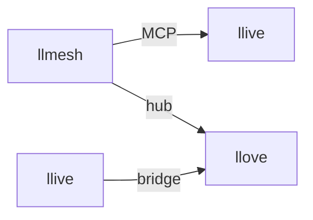

# Benchmark — 2026-05-16 Mermaid Brief

> First A/B-style benchmark of the FullSense stack (llive) vs the field on a
> small, well-specified Brief. Methodology: [feedback_competitor_benchmark](https://github.com/furuse-kazufumi/raptor/blob/main/.claude/projects/C--Users-puruy-raptor/memory/feedback_competitor_benchmark.md).

## The Brief (55 words)

> Generate a Mermaid flowchart titled 'FullSense Family' showing nodes:
> llmesh (secure LLM hub), llive (self-evolving memory), llove (TUI/HITL
> workbench). Connections: llmesh<->llive labeled MCP, llive<->llove labeled
> bridge, llmesh<->llove labeled hub. Use kramdown-safe syntax (no inline
> HTML tags inside the mermaid block, no `<br/>` or `<b>`). Output: ONLY the
> mermaid fenced code block, no commentary, no preamble.

Stored at `docs/benchmarks/2026-05-16/_brief.txt`. Raw responses under the
same directory (`a_*.json`, `b_*.json`, etc.).

## Scoreboard

| AI | Status | Wall (ms) | Output | Syntax valid | Bidirectional edges | No typo | No HTML | No preamble |
|---|---|---|---|---|---|---|---|---|
| **llive** (`FullSenseLoop`) | run | **0.46** | — (no generation) | n/a | n/a | n/a | n/a | n/a |
| **ollama** (`llama3.2:3b`, on-prem) | run | 23 000 | 148 chars | ✅ | ❌ (single `-->`) | ❌ (`lllive`) | ✅ | ✅ |
| **Perplexity Sonar** | run | **2 068** | 161 chars | ✅ | ✅ | ✅ | ✅ | ✅ |
| Codex CLI (gpt-5.3-codex) | error | 5 125 | — | — | — | — | — | — (quota exceeded) |
| Anthropic API (Claude Haiku 4.5) | error | 400 | — | — | — | — | — | — (401 invalid x-api-key) |
| Gemini API (gemini-2.0-flash) | error | 280 | — | — | — | — | — | — (429 quota exceeded) |

## Headline findings

- **llive does not yet generate** — `FullSenseLoop.process()` is a thinking
  evaluator with no LLM backend wired in. Headline gap, tracked as
  [LLIVE-001 / LLIVE-002](https://github.com/furuse-kazufumi/llive/blob/main/docs/BUGS_2026-05-16_brief_ab.md).
  Design sketch at `D:/projects/llive/docs/proposals/brief_api_design.md`.
- **Perplexity Sonar is the lone working cloud LLM today** (~2 s, fully
  spec-compliant output). Anthropic + Gemini + OpenAI Codex all failed for
  this run for environmental reasons (key revoke / quota). Fixing those
  unblocks a 4-way comparison next time.
- **ollama `llama3.2:3b` is the only on-prem option exercised today** —
  ~50× slower than Perplexity, and made two semantic errors (typo `lllive`
  and unidirectional edges). For real lldesign use we will need a larger
  on-prem model (qwen2.5:14b or similar).

## Outputs

### A — llive (decision: note, no generation)

```
{
  "plan": {"decision": "note", "rationale": "novel territory; record for later consolidation"},
  "stages": {
    "salience":  {"score": 0.7, "pass": true},
    "curiosity": {"score": 1.0, "novelty": 1.0},
    "thought":   "Observation about 'manual': Generate a Mermaid flowchart titled 'FullSense Family' showing nodes: llmesh (secure ..."
  }
}
```

llive truncates the Brief to 140 chars, never invokes an LLM, and emits a
`note` decision. The output is structurally identical to what it would emit
for any other 55-word Brief.

### B — ollama llama3.2:3b (~23 s, 148 chars)



Issues:

1. **Typo** — `lllive` (three Ls) on line 3
2. **Unidirectional edges** — Brief specified `<->`, model used `-->`
3. No title

### C — Perplexity Sonar (~2 s, 161 chars)

```mermaid
flowchart TD
  A[llmesh secure LLM hub]
  B[llive self-evolving memory]
  C[llove TUI/HITL workbench]

  A <--> |MCP| B
  B <--> |bridge| C
  A <--> |hub| C

  title FullSense Family
```

Issues:

1. `title FullSense Family` — this directive isn't standard mermaid and is
   silently ignored by the just-the-docs renderer. Cosmetic only.

Spec compliance otherwise full marks: bidirectional, no inline HTML, no
preamble, no commentary, valid syntax, correct node descriptions.

## Implications for the FullSense differentiation story

| Differentiator | Status today | Implication |
|---|---|---|
| **End-to-end OSS + on-prem** | ollama works but quality gap is real | We need a recommended on-prem model (qwen2.5:14b? mistral-small?) in the lldesign / lltrade install docs |
| **Audit Ledger** | not exercised on Brief path (LLIVE-008) | A Brief run that records nothing to the Ledger doesn't deliver the SIL claim |
| **HITL** | not exercised (no llove handshake yet) | Brief Runner proposal handles this (Section 5 of `brief_api_design.md`) |
| **Brief API** | absent (LLIVE-002) | Even talking about a comparison is awkward — clients have to import `FullSenseLoop` directly |

## Next benchmarks (queued)

1. Larger Brief — "write the full lldesign README from scratch" — measures
   long-form synthesis
2. Realistic on-prem model — `qwen2.5:14b` once disk space and download
   permit
3. Fixed cloud-key environment — re-run Anthropic + Gemini + Codex with
   restored credentials
4. lltrade-flavoured Brief — "propose a paper-trading strategy YAML for
   tech-earnings dispersion" — measures domain-specific reasoning + constraint
   enforcement (the lltrade differentiator)
5. Same Brief through llive **after** LLIVE-001 + LLIVE-002 land — direct
   "before / after" measurement of the v0.7 work
