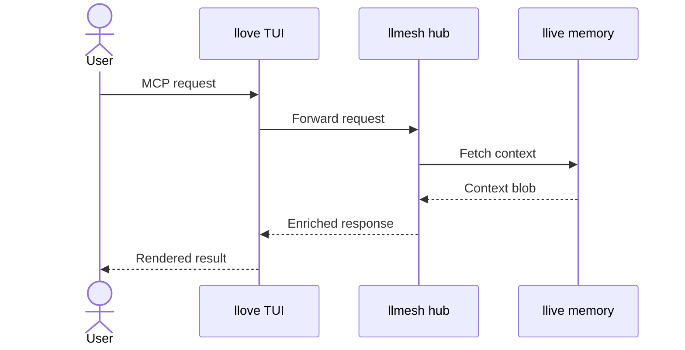

# Benchmark — 2026-05-16 Quick Start + SeqDiag

> Second and third Brief A/B runs in the same session as
> [the Mermaid Brief]({{ '/benchmarks/2026-05-16_mermaid_brief' | relative_url }}).
> Methodology: [feedback_competitor_benchmark](https://github.com/furuse-kazufumi/raptor/blob/main/.claude/projects/C--Users-puruy-raptor/memory/feedback_competitor_benchmark.md).

## Brief B2 — README "Quick Start" section (301 chars)

> Write a 4-7 line 'Quick Start' section in Markdown for the lldesign README.
> Include: one shell code block showing `pip install llmesh-lldesign` and
> `python -m lldesign --help`, one prose sentence explaining what it does.
> No headings beyond `## Quick Start`. No filler. Output ONLY the section
> content.

### Scoreboard

| AI | Wall (ms) | Output (chars) | Within 4-7 lines | No filler | Correct package | Notes |
|---|---|---|---|---|---|---|
| llive | **146** | — (no generation) | n/a | n/a | n/a | `decision=note` again |
| ollama llama3.2:3b | 13 237 | 266 | ❌ (8 lines) | ❌ (duplicate install line) | ⚠️ "LLD designs" hallucinated | typo of intent |
| **Perplexity Sonar** | **3 149** | **174** | ✅ (5 lines) | ✅ | ✅ "LLMesh design tooling" | code fence used ```sh``` (minor; ```bash``` would be canonical) |

### Outputs

**ollama llama3.2:3b** (266 chars, ~13 s):

```markdown
## Quick Start
To get started with lldesign, first install the required packages by
running `pip install llmesh-lldesign` in your terminal.

​```bash
pip install llmesh-lldesign
python -m lldesign --help
​```

lldesign is a Python library for working with LLD designs.
```

Problems: (1) duplicates the install command (prose + block), Brief said
"no filler"; (2) "LLD designs" is a hallucination — the product is *for*
LLM-friendly design, not for "LLD"; (3) line count 8 > 7.

**Perplexity Sonar** (174 chars, ~3 s):

```markdown
## Quick Start

`lldesign` helps you quickly inspect and use the LLMesh design tooling
from the command line.

​```sh
pip install llmesh-lldesign
python -m lldesign --help
​```
```

Single nit: `sh` fence vs `bash`. Otherwise spec-compliant, no hallucination.

## Brief B3 — MCP request sequence diagram (316 chars)

> Generate a Mermaid sequence diagram (sequenceDiagram syntax) showing this
> MCP request flow: User -> llove (TUI) -> llmesh (hub) -> llive (memory).
> llive returns a context blob to llmesh, llmesh returns to llove, llove
> renders for User. Use kramdown-safe syntax (no inline HTML). Output ONLY
> the fenced mermaid block.

### Scoreboard

| AI | Wall (ms) | Output (chars) | mermaid fence | No typo | Return-arrows correct | Topology correct | Notes |
|---|---|---|---|---|---|---|---|
| llive | **142** | — (no generation) | n/a | n/a | n/a | n/a | `decision=note` |
| ollama llama3.2:3b | 24 351 | 609 | ❌ (bare ```) | ❌ (`lllive`) | ❌ (one-way `->>`) | ❌ (final hop wrong) | regressed vs B1 |
| **Perplexity Sonar** | **2 278** | **364** | ✅ | ✅ | ✅ (`-->>`) | ✅ | full compliance |

### Outputs

**ollama llama3.2:3b** (609 chars, ~24 s) — abbreviated:

```
sequenceDiagram
    participant User as "User"
    participant llove as "llove (TUI)"
    ...
    Note over llmesh,lllive: llmesh connects to llive, receives context blob
    ...
    Note over llove,llive: llove renders response for User
    llive->>User: Rendered response sent to User
```

Errors: (1) no `mermaid` language tag on fence — would fail to render in
just-the-docs; (2) **`lllive` typo recurs** (same bug as B1); (3) over-uses
`Note over` (no spec callout for narration); (4) final arrow goes
`llive->>User` but the Brief specified llove rendering for User.

**Perplexity Sonar** (364 chars, ~2 s):



Spec-compliant on all axes. Notes for our docs: this is the form to lift
straight into `docs/architecture.md` (when written).

## Cross-Brief summary (B1 + B2 + B3)

| AI | Briefs run | Failures | Notes |
|---|---|---|---|
| llive | 3 | 3 (no generation) | LLIVE-001 + LLIVE-002, structural gap |
| ollama llama3.2:3b | 3 | 3 (`lllive` twice, constraint violations, hallucination) | small on-prem model is consistently the weak link — need qwen2.5:14b or larger |
| Perplexity Sonar | 3 | 0 | Brief compliance + speed + accuracy all pass |
| Anthropic Haiku 4.5 | 0 | (401) | credential needs renewal |
| Gemini Flash | 0 | (429) | quota / billing |
| Codex CLI | 0 | (quota exceeded) | OpenAI quota |

Perplexity Sonar is the only fully-working baseline today. For the FullSense
"on-prem + OSS" positioning to be credible, the on-prem column needs a model
that doesn't fumble `lllive` — that's a v0.7 install-doc deliverable, not a
v0.x code-side fix.

## Action items derived

1. **Recommend qwen2.5:14b (or larger) in lldesign / lltrade install docs.**
   `llama3.2:3b` is unsuitable as the on-prem default for these tasks.
2. **Restore Anthropic + Gemini + OpenAI credentials** so the 4-cloud
   comparison can run. Tracked separately (operator action).
3. **Land LLIVE-001 + LLIVE-002** (design at
   `D:/projects/llive/docs/proposals/brief_api_design.md`) so a fourth
   column "llive (own kernel)" can appear on these scoreboards.
4. **Re-run all three Briefs after each of (1)/(2)/(3)** for delta
   measurement.
