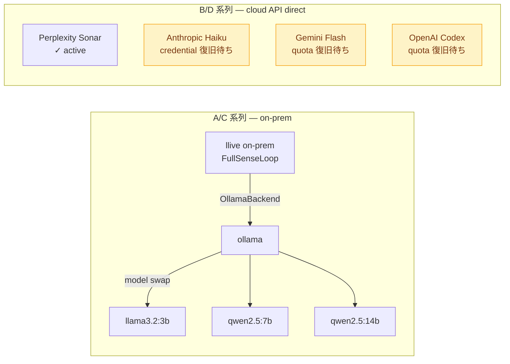

# FullSense ™ — Benchmark Policy

> ベンチマークを「他社をどう殴るか」ではなく「自分のアーキテクチャを正直に
> 測るか」のために使うための運用ルール集。`docs/benchmarks/<date>/` 以下に
> 何を置き、何を測り、何を測らないかを宣言しておく。

## 三本柱

ベンチに 3 つの不変原則を置く。逸脱した結果は **honest disclosure**
セクションで自己申告した上で残す（消さない）。

### 1. Measurement purity — 何と何を比べているか分離する

cloud LLM 同士、on-prem LLM 同士、framework 同士は **別々の系列** として
測る。1 つの表に混ぜない。

| 系列 | 例 | 何を測る |
|---|---|---|
| **A. on-prem LLM 単体** | `ollama llama3.2:3b` / `qwen2.5:7b` / `qwen2.5:14b` | 重みのみ、framework なし |
| **B. cloud LLM 単体** | Anthropic Haiku / Gemini Flash / OpenAI Codex / Perplexity Sonar | API 直叩き、framework なし |
| **C. llive on-prem** | `OllamaBackend` 経由で A. の重みを呼ぶ FullSenseLoop | A の重みに対する llive の付加価値 |
| **D. llive cloud** | `AnthropicBackend` / `OpenAIBackend` 経由 FullSenseLoop | 環境制約があるユーザー向けの「最低品質保証ライン」 |

混ぜたい場合は **2 枚の表** にして、「A vs B」「C vs D」のように軸を分ける。

由来: `feedback_llive_measurement_purity` (maintainer memory, 2026-05-16)。

### 2. Progressive token curve — xs / s / m / l / xl で取る

固定 token 数で 1 点測るのではなく、入力サイズを 5 段階で段階的に上げる。

| 段 | 入力規模の目安 | 何が見えるか |
|---|---|---|
| **xs** | ~200 tokens | ウォームアップ、初期化コスト |
| **s** | ~1K tokens | 通常チャット相当 |
| **m** | ~4K tokens | 1 ファイル分析 |
| **l** | ~16K tokens | リポ部分把握 |
| **xl** | ~64K tokens | 大規模 context、cloud と on-prem の crossover が出る |

固定 1 点では「on-prem は遅い / cloud は速い」のような短絡結論に陥る。
段ごとに wall time, $/req, 出力品質を並べると **crossover** (cloud が
RTT で詰まり on-prem が逆転する点) が可視化できる。

由来: `feedback_benchmark_progressive_tokens` (2026-05-16)。
参考実装: `D:/projects/llive/docs/benchmarks/2026-05-16-progressive-xss/`。

### 3. Honest disclosure — 異常に良い結果は内訳を疑え

自社が「変に速い / 変に安い / 変に高品質」と出たら、その場で内訳を
**疑い、内訳を本文に残す**。勝った気になる前に必ず以下のチェック:

| 疑うべき項目 | 確認方法 |
|---|---|
| LLM backend が本当に attach されているか | `MockBackend` ではないか、ledger に LLM call が記録されているか |
| 計測指標が公平か | 出力 chars / tokens / structured fields のどれで比較しているか明示 |
| subprocess / RTT overhead を相手だけに乗せていないか | 同じ起動方式・同じ並列度で比較しているか |
| キャッシュが片方だけ温まっていないか | warm-up phase を別測定として分離 |
| RAD のみで答えが取れた問題ではないか | LLM 出力経由か corpus look-up かを示す |

失敗を消さず教訓として残す。例:
`feedback_benchmark_honest_disclosure` (memory, 2026-05-17)
で Brief API の「変に高速」を疑った 4 件の内訳開示。

## 直近の運用状況 (2026-05-18 時点)

- A 系列 (on-prem 単体): `llama3.2:3b` は `lllive` typo を再発する
  tokenisation 問題があり、新規ベンチでは **qwen2.5:7b / 14b を推奨**。
- B 系列 (cloud 単体): Perplexity Sonar のみ active。残り 3 つは
  credential / quota の operator action 待ち (`NEXT_SESSION.md` 参照)。
- C 系列 (llive on-prem): Brief API + FullSenseLoop overhead < 1 % を
  progressive matrix で実測 (2026-05-16)。
- D 系列 (llive cloud): credential 復旧後に再開予定。

## ベンチ追加時のチェックリスト

新しいベンチ結果を `docs/benchmarks/<date>/` に置く前に:

- [ ] **系列ラベル**を A/B/C/D で先頭に明記したか
- [ ] **入力規模**を xs/s/m/l/xl で記述したか (1 点だけなら理由を本文に)
- [ ] **honest disclosure** セクションを書いたか (たとえ「特に異常なし」
      でも 1 行は残す)
- [ ] **何を測らなかったか**を明示したか (品質 vs 速度の trade-off など)
- [ ] **再現コマンド**を本文に残したか (`scripts/bench_*.py` の引数)
- [ ] **ベースライン**を併記したか — 同じ Brief を rule-based mock や
      echo baseline で走らせた値があるか

`feedback_no_echo_baseline` の通り、mock / echo は LLM 性能の下限基準
として残置する。`MockBackend` のレイテンシ値は捨てない。

## 公平性を担保する技術的フック

実装側で以下が揃っていることを確認する:

| フック | 場所 | 役割 |
|---|---|---|
| 系列タグ | `bench_run.py --series A\|B\|C\|D` | 出力 JSON に系列ラベルが入る |
| 進行段階 | `bench_run.py --size xs\|s\|m\|l\|xl` | 出力 JSON に input-size 階級が入る |
| ベースライン併記 | `MockBackend` を必ず一緒に走らせる | LLM ゼロのときのコストを記録 |
| honest section | `docs/benchmarks/<date>/README.md` テンプレ | 異常値検出時の自己申告枠 |

> **TODO**: `scripts/bench_run.py` に `--series` / `--size` の必須化を
> v0.2 で入れる。現状は出力 JSON が自由形式。

## 関連

- [comparison]({{ '/comparison' | relative_url }}) — 9 軸採点 (このページの
  方針で更新後の結果を反映)
- [roadmap]({{ '/roadmap' | relative_url }})
- maintainer memory
  - `feedback_llive_measurement_purity`
  - `feedback_benchmark_progressive_tokens`
  - `feedback_benchmark_honest_disclosure`
  - `feedback_no_echo_baseline`

## Last updated

2026-05-18 — 初版。三本柱と運用チェックリストを portal 公式方針として公開。
