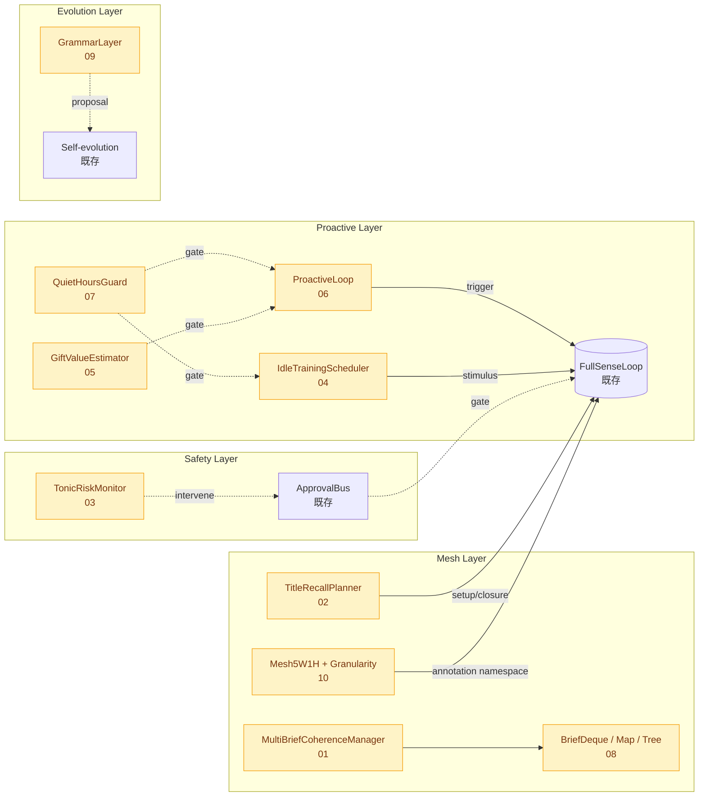
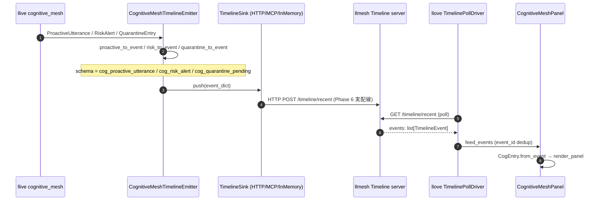

# FullSense ™ — Cognitive Mesh (llive v0.8)

> **クラウド AI には絶対できない 3 つ**を architecture level で実装する
> 試み。`docs/requirements_v0.8_cognitive_mesh.md` (llive 側) を portal 視点で
> 要約した概観ページ。詳細は llive 側を参照。

## なぜ Cognitive Mesh が必要か

ユーザ (Kazufumi Furuse, 2026-05-18) が言語化した **人間の認知構造**:

1. **1 つの主セッション**を常駐させながら、
2. **複数の並列セッション**を同時に持ち、
3. **5W1H メッシュ + 起承転結 + 伏線回収**で意味を組み上げ、
4. **小脳的常時 KYT** で危険を検知し、
5. **空き時間に自発トレーニング**で知識を拡張する

LLM デフォルトの「1 セッション固定、受動応答のみ」では届かない領域。
FullSense 哲学「責任所在を architecture level に持ち込む」(CLAUDE.md
グローバル規約) の延長で、これらを **クラスとプロトコル** で解決する。

## 10 サブシステム (COG-MESH-01〜10)

| ID | 名称 | 何をするか | Phase |
|---|---|---|---|
| 01 | MultiBriefCoherenceManager | 並列 Brief 保持 + coherence_graph で cross-brief 相互更新 | 7 |
| 02 | TitleRecallPlanner | 起承転結 + 伏線回収率採点、プレゼン品質指標 | 6 |
| 03 | TonicRiskMonitor | 別スレッド常時 KYT、`ApprovalBus.intervene` 連動、エッジでは NPU 視野 | 6 |
| 04 | IdleTrainingScheduler | Quiet Hours 外の自発 ingest (RSS / arXiv / RAD 差分)、SEC-01/02 経由 | 5 |
| 05 | GiftValueEstimator | 発話前 gate、novelty / relevance / risk_avoidance / cost の重み付き aggregate | 5 |
| 06 | ProactiveLoop | timer / event / curiosity / consistency の 4 mode、能動発話の出口 | 5 |
| 07 | QuietHoursGuard | env LLIVE_QUIET_HOURS_*、fail-closed、就寝中の沈黙保証 | 5 |
| 08 | BriefDeque / BriefMap / BriefTree | flat list 廃止、入れ替え + ブランチ対応の STL 相当 | 5 |
| 09 | GrammarLayer | 言語別文法 snapshot、時代変化を継続学習 (EVO-04/06/07 と接続) | 7 |
| 10 | Mesh5W1H + Granularity | 5W1H メッシュ namespace + 6 階層粒度 (word〜topic) | 6 |

## architecture イメージ



## 設計指針

倫理を後付けの policy ではなく **architecture の一部** にする:

| 指針 | 実装での反映 |
|---|---|
| 倫理は architecture の一部 | `ProactiveLoop` / `IdleTrainingScheduler` は `QuietHoursGuard` 必須依存、None で TypeError |
| fail-closed in Quiet Hours | TZ / env 欠落で常に Quiet 扱い、proactive / ingest 抑止 |
| 例外通過カテゴリ | `risk_alert` / `audit_alert` は Quiet Hours 中でも emit OK |
| 副作用分離 | Risk Alert の state_snapshot は dict copy |
| HITL ゲート維持 | 能動発話は ApprovalBus を迂回しない |
| エッジ展開を意識 | TonicRiskMonitor は別チップ (NPU/MCU) 実装も視野 |

## 統計 (2026-05-19 昼前 時点)

- 実装完了: **10/10 サブシステム 本実装完了** (M8.2〜M8.9)
- llive 単体テスト: **1470 PASS** (前回 1272 + 新規 198)
- ファイル: 14 module + 1 拡張 demo CLI (9 セクション) + 35+ __all__ 公開シンボル
- regress: 無し
- 残: **M8.1** (llove F25 連携 TUI) のみ — agent 単独着手不可、別セッション/操作者待ち

## 触ってみる

```bash
# llive を install
pip install llmesh-llive

# Quiet Hours 設定 (PowerShell)
$env:LLIVE_TZ = "Asia/Tokyo"
$env:LLIVE_QUIET_HOURS_START = "22"
$env:LLIVE_QUIET_HOURS_END   = "8"
$env:LLIVE_QUIET_HOURS_ENABLED = "1"

# 統合 demo (Active 中)
$env:LLIVE_DEMO_FORCE_TIME = "2026-05-19T10:00:00+09:00"
py -3.11 -m llive.cognitive_mesh.demo

# 統合 demo (Quiet 中)
$env:LLIVE_DEMO_FORCE_TIME = "2026-05-19T02:00:00+09:00"
py -3.11 -m llive.cognitive_mesh.demo
```

Active と Quiet で 9 セクションの挙動が変わる様子を確認できる
(demo CLI 拡張 — 2026-05-19 朝):

| セクション | Active (10:00) | Quiet (02:00) |
|---|---|---|
| ProactiveLoop (timer) | 発話 | 抑制 ✓ |
| IdleTrainingScheduler | ingest 実行 | no ingest ✓ |
| TonicRiskMonitor + ApprovalBus 配線 | ALERT 発火 + intervene 要求 emit | ALERT 発火 ✓ (例外通過) |
| TitleRecallPlanner | recall_rate 0.75 | recall_rate 0.75 (時刻独立) |
| Mesh5W1H Annotator | annotations 4 件 | annotations 4 件 (時刻独立) |
| Quarantined Memory (Ed25519) | signed→active / unsigned→pending | quiet hours で ingest skip |
| Proactive event / consistency | tick fired | silent ✓ |
| BriefDeque Bridge | 3 件 submit (時刻独立) | 3 件 submit (時刻独立) |

## 本実装進捗 (2026-05-19 朝〜昼前)

llive 側 roadmap.md Phase 8 参照:

- [/] **M8.1** ProactiveLoop を llove F25 経由で TUI 表示、asciinema 録画
      — llove 側 skeleton **配備済 2026-05-19** (CognitiveMeshPanel +
      dispatch 配線 + 15 件テスト)。実 Timeline emit (llive → Timeline
      server → llove panel) の配線と asciinema 録画は次セッション
- [x] **M8.2** IdleTraining を Quarantined Memory + Ed25519 と統合
      (SignedPayload / Ed25519Verifier / QuarantinedMemory + 16 テスト)
- [x] **M8.3** BriefDeque/Map/Tree を実 Brief / BriefRunner と接続
      (BriefDequeRunnerBridge + 6 テスト)
- [x] **M8.4** TitleRecall を embedding semantic similarity で本実装
      (EmbeddingSimilarityFn + similarity_fn 注入 + 9 テスト)
- [x] **M8.5** TonicRiskMonitor を threading 化 + ApprovalBus.intervene 配線
      (RiskInterventionAdapter + 5 テスト)
- [x] **M8.6** Mesh5W1H を実 Annotation Channel と統合
      (Mesh5W1HAnnotator + 7 テスト)
- [x] **M8.7** ProactiveLoop に event / curiosity / consistency モード
      (ProactiveEvent / ConsistencyViolation + tick_event/tick_consistency + 12 テスト)
- [x] **M8.8** MultiBriefCoherenceManager に graph analytics + 実 Brief 統合
      (BFS / DFS / centrality + register_brief + 14 テスト、networkx は将来 swap 候補)
- [x] **M8.9** GrammarLayer ↔ EVO 接続 + 言語別 layer
      (GrammarChangeSink Protocol + MultilingualGrammar (ja/en/zh/ko) + 8 テスト)

## M8.1 Timeline Contract — llive ↔ llmesh ↔ llove (2026-05-19)

llive cognitive_mesh の emit を llmesh Timeline server 経由で llove TUI に
表示する 3 者契約。schema は両側で `cog_proactive_utterance` /
`cog_risk_alert` / `cog_quarantine_pending` の 3 種 event_type で固定済。



**現状 (2026-05-19)**: emit / event_dict / panel skeleton まで両側に配備済 +
契約 schema が unit test でロック (llive: 10 件, llove: 15 件)。実 HTTP/MCP
push (`SK ↔ TM` 線) は Phase 6 で別 module 配備予定 (operator 承認待ち).

## How to wire HTTP push (Phase 6 配線)

llive cognitive_mesh の emit を llmesh Timeline server に **HTTP で**
流し、llove TUI panel で受ける一連の配線例 (現在は両側 skeleton 配備済).

### 1. llmesh Timeline server を起動 (URL を控える)

```powershell
# llmesh は別途インストール / 起動 (詳細は llmesh repo 参照)
# 例えば http://localhost:8080 で /timeline/ingest を受ける状態にする
```

### 2. llive 側: HttpTimelineSink を CognitiveMeshTimelineEmitter に注入

```powershell
# env で URL を設定
$env:LLIVE_LLMESH_TIMELINE_URL = "http://localhost:8080"
```

```python
# Python から (実 production 配線、Phase 6 完成後)
from llive.cognitive_mesh import (
    CognitiveMeshTimelineEmitter,
    http_sink_from_env,
)

sink = http_sink_from_env(node_id="prod-node-1")
emitter = CognitiveMeshTimelineEmitter(
    sink=sink, task_id="brief-001", node_id="prod-node-1",
)
# ProactiveLoop / TonicRiskMonitor / QuarantinedMemory の emit 全てを
# emitter.emit_* で流すと、自動的に sink 経由で llmesh に POST される
```

### 3. llove 側: TimelinePollDriver を起動

```powershell
# llove 側でも同じ URL を参照する想定 (poll 周期は config)
$env:LLOVE_TIMELINE_URL = "http://localhost:8080"

py -3.11 -m llove.demo.cog_mesh_demo
```

将来的に LoveApp 本体側に `CognitiveMeshPanel` を統合すれば、上記
stand-alone demo の代わりに `llove` 起動だけで Timeline event を
panel で確認できる (LoveApp 統合は今後の M8.1 残作業).

### 4. asciinema 録画 (operator 作業)

```powershell
asciinema rec demo-cog-mesh-m81.cast

# 中で 2 つを並列再生:
# - llive 側: py -3.11 -m llive.cognitive_mesh.demo (10 sections)
# - llove 側: py -3.11 -m llove.demo.cog_mesh_demo (stand-alone TUI)
```

## 関連

- llive 側
  - [`requirements_v0.8_cognitive_mesh.md`](https://github.com/furuse-kazufumi/llive/blob/main/docs/requirements_v0.8_cognitive_mesh.md) — 要件文書 (462 行)
  - [`architecture.md` §8](https://github.com/furuse-kazufumi/llive/blob/main/docs/architecture.md) — v0.8 拡張ポイント
  - [`roadmap.md` Phase 8](https://github.com/furuse-kazufumi/llive/blob/main/docs/roadmap.md) — マイルストーン進捗
  - [`glossary.md`](https://github.com/furuse-kazufumi/llive/blob/main/docs/glossary.md) — COG-MESH 用語
  - [`src/llive/cognitive_mesh/`](https://github.com/furuse-kazufumi/llive/tree/main/src/llive/cognitive_mesh) — 実装
- portal 側
  - [Spec hub]({{ '/spec/' | relative_url }})
  - [Roadmap]({{ '/roadmap' | relative_url }})
  - [Benchmark Policy]({{ '/benchmarks/policy/' | relative_url }})

## Last updated

2026-05-19 — 初版。COG-MESH 全 10 件 skeleton 完了を機に portal 配下に
概観ページを設置。
