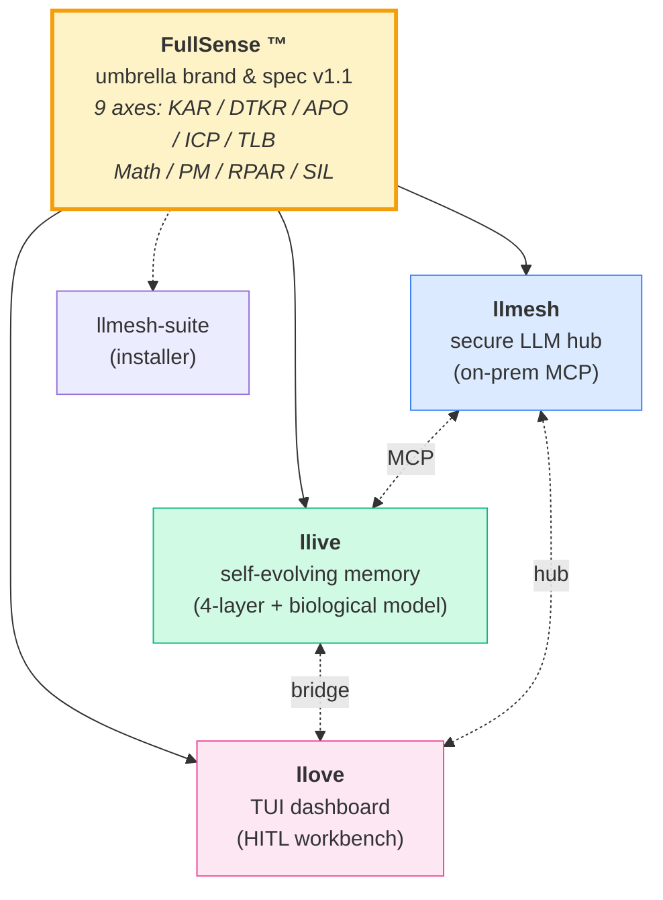

# FullSense ™

> **Umbrella brand & specification** for an open-source family of products
> targeting **self-evolving, on-prem, audit-friendly LLM systems**.

---

## Family Tree



## Product Sites

| Product | Description | Docs (Pages) | Source |
|---------|-------------|--------------|--------|
| **llmesh** | Secure LLM hub / on-prem MCP server | [llmesh docs](https://furuse-kazufumi.github.io/llmesh/) | [GitHub](https://github.com/furuse-kazufumi/llmesh) |
| **llive** | Self-evolving modular memory LLM framework | [llive docs](https://furuse-kazufumi.github.io/llive/) | [GitHub](https://github.com/furuse-kazufumi/llive) |
| **llove** | TUI dashboard / HITL workbench | [llove docs](https://furuse-kazufumi.github.io/llove/) | [GitHub](https://github.com/furuse-kazufumi/llove) |
| llmesh-suite | One-shot installer | — | [GitHub](https://github.com/furuse-kazufumi/llmesh-suite) |

## Quick Demos

Visual demos live in each product. The portal links them here:

- **TUI scenarios (17 ×  ja/en, vector SVG)** — <https://furuse-kazufumi.github.io/llove/scenarios/>
- **Animated SVG (5 × ja/en, CSS keyframes)** — same page, Animated section
- **Shogi animation (動きで魅せる代表例)** — <https://furuse-kazufumi.github.io/llove/scenarios/anim/shogi/ja.svg>
- **Clustering demo (Phase 2a P2P discovery)** — <https://furuse-kazufumi.github.io/llmesh/demos/clustering_demo>

## Install

```bash
# Suite (all-in-one)
pip install llmesh-suite

# Individual
pip install llmesh           # hub
pip install llmesh-llive     # memory
pip install llmesh-llove     # TUI
```

PyPI rename to `fullsense-*` is planned at v1.0 — see
[llive v1.0 migration plan](https://github.com/furuse-kazufumi/llive/blob/main/docs/v1.0_migration_plan.md).

## Spec & RFC

- **FullSense Spec v1.1** — [llive/docs/fullsense_spec_eternal.md](https://github.com/furuse-kazufumi/llive/blob/main/docs/fullsense_spec_eternal.md)
- **P2P mesh RFC (Winny 思想を技術導入)** — [llive/docs/llmesh_p2p_mesh_rfc.md](https://github.com/furuse-kazufumi/llive/blob/main/docs/llmesh_p2p_mesh_rfc.md)
- **EDLA 歴史的参照 (金子勇 1999)** — [llive/docs/references/historical/edla_kaneko_1999.md](https://github.com/furuse-kazufumi/llive/blob/main/docs/references/historical/edla_kaneko_1999.md)
- **v1.0 PyPI rename plan** — [llive/docs/v1.0_migration_plan.md](https://github.com/furuse-kazufumi/llive/blob/main/docs/v1.0_migration_plan.md)
- **Trademark drafts (FullSense × JP/US/EU)** — [llive/docs/legal/trademark/](https://github.com/furuse-kazufumi/llive/tree/main/docs/legal/trademark)

## License

All product code: **Apache-2.0** with optional separate **Commercial License**.
- License text: <https://github.com/furuse-kazufumi/llive/blob/main/LICENSE>
- Commercial: <https://github.com/furuse-kazufumi/llive/blob/main/LICENSE-COMMERCIAL>
- Trademark policy: <https://github.com/furuse-kazufumi/llive/blob/main/TRADEMARK.md>

## Articles

Most up-to-date posts are in `llive/docs/linkedin/` and `llive/docs/qiita/`:

- LinkedIn ja/en/zh: [overview](https://github.com/furuse-kazufumi/llive/blob/main/docs/linkedin/post_2026-05-14_overview.ja.md)
  + [v0.6.0 update](https://github.com/furuse-kazufumi/llive/blob/main/docs/linkedin/post_2026-05-16_update.ja.md)
- Qiita: [overview](https://github.com/furuse-kazufumi/llive/blob/main/docs/qiita/qiita-overview.md)
- Authoring guide (画像 / Mermaid / アニメ): [llove](https://github.com/furuse-kazufumi/llove/blob/main/docs/qiita/AUTHORING.md) / [llive](https://github.com/furuse-kazufumi/llive/blob/main/docs/qiita/AUTHORING.md)

## Portal meta

- [Progress log]({{ '/PROGRESS' | relative_url }}) — portal-side changelog
- [Design notes]({{ '/NOTES' | relative_url }}) — decisions, link-rot watch
- [Security policy](https://github.com/furuse-kazufumi/fullsense/blob/main/SECURITY.md)
- [Contributing](https://github.com/furuse-kazufumi/fullsense/blob/main/CONTRIBUTING.md)
- [License (Apache-2.0)](https://github.com/furuse-kazufumi/fullsense/blob/main/LICENSE)
- [Notice](https://github.com/furuse-kazufumi/fullsense/blob/main/NOTICE)

## Contact

- Email: `kazufumi@furuse.work`
- GitHub: [@furuse-kazufumi](https://github.com/furuse-kazufumi)

---

*FullSense ™ / llmesh ™ / llive ™ / llove ™ are trademarks of Kazufumi Furuse.*
*Code distributed under Apache-2.0; commercial license available on request.*
