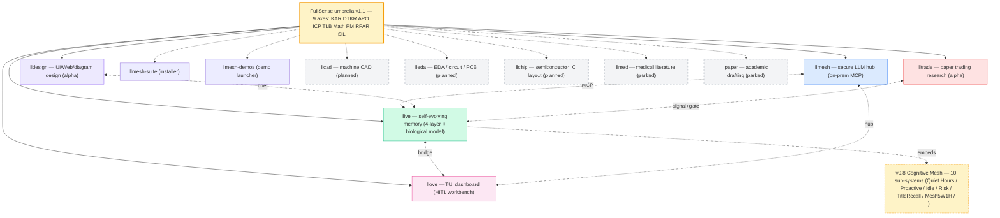

# FullSense ™

> **Umbrella brand & specification** for an open-source family of products
> targeting **self-evolving, on-prem, audit-friendly LLM systems**.

---

## Family Tree



> Cognitive Mesh の詳細は [Cognitive Mesh hub]({{ '/cognitive-mesh/' | relative_url }}) を参照。
> 10 サブシステム全て **skeleton 完了** (2026-05-19、llive 1379 PASS)。

## Product Sites

| Product | Status | Description | Docs (Pages) | Source |
|---------|--------|-------------|--------------|--------|
| **llmesh** | stable | Secure LLM hub / on-prem MCP server | [llmesh docs](https://furuse-kazufumi.github.io/llmesh/) | [GitHub](https://github.com/furuse-kazufumi/llmesh) |
| **llive** | beta | Self-evolving modular memory LLM framework | [llive docs](https://furuse-kazufumi.github.io/llive/) | [GitHub](https://github.com/furuse-kazufumi/llive) |
| **llove** | beta | TUI dashboard / HITL workbench | [llove docs](https://furuse-kazufumi.github.io/llove/) | [GitHub](https://github.com/furuse-kazufumi/llove) |
| **lldesign** | alpha | UI / Web / diagram design via LLM-friendly DSLs | [lldesign docs](https://furuse-kazufumi.github.io/lldesign/) | [GitHub](https://github.com/furuse-kazufumi/lldesign) |
| **lltrade** | alpha | Trading research — **paper-trading only** (v0.x) | [lltrade docs](https://furuse-kazufumi.github.io/lltrade/) | [GitHub](https://github.com/furuse-kazufumi/lltrade) |
| llmesh-suite | stable | One-shot installer (`pip install llmesh-suite`) | — | [GitHub](https://github.com/furuse-kazufumi/llmesh-suite) |
| llmesh-demos | alpha | 3 製品 demo launcher + F25 audience cinematic HTML (stdlib only) | — | (local-only, GitHub 公開 TBD) |

Planned (parked, see [roadmap]({{ '/roadmap' | relative_url }})): **llcad** (machine CAD) · **lleda** (EDA / PCB) · **llchip** (IC layout) · **llmed** (medical literature) · **llpaper** (academic drafting)

## Quick Demos

Visual demos live in each product. The portal links them here:

- **TUI scenarios (17 ×  ja/en, vector SVG)** — <https://furuse-kazufumi.github.io/llove/scenarios/>
- **Animated SVG (5 × ja/en, CSS keyframes)** — same page, Animated section
- **Shogi animation (動きで魅せる代表例)** — <https://furuse-kazufumi.github.io/llove/scenarios/anim/shogi/ja.svg>
- **Clustering demo (Phase 2a P2P discovery)** — <https://furuse-kazufumi.github.io/llmesh/demos/clustering_demo>

## Install

```bash
# Suite (all-in-one)
pip install llmesh-suite

# Individual
pip install llmesh           # hub
pip install llmesh-llive     # memory
pip install llmesh-llove     # TUI
```

PyPI rename to `fullsense-*` is planned at v1.0 — see
[llive v1.0 migration plan](https://github.com/furuse-kazufumi/llive/blob/main/docs/v1.0_migration_plan.md).

## Spec & RFC

- **FullSense Spec v1.1** — [llive/docs/fullsense_spec_eternal.md](https://github.com/furuse-kazufumi/llive/blob/main/docs/fullsense_spec_eternal.md)
- **P2P mesh RFC (Winny 思想を技術導入)** — [llive/docs/llmesh_p2p_mesh_rfc.md](https://github.com/furuse-kazufumi/llive/blob/main/docs/llmesh_p2p_mesh_rfc.md)
- **EDLA 歴史的参照 (金子勇 1999)** — [llive/docs/references/historical/edla_kaneko_1999.md](https://github.com/furuse-kazufumi/llive/blob/main/docs/references/historical/edla_kaneko_1999.md)
- **v1.0 PyPI rename plan** — [llive/docs/v1.0_migration_plan.md](https://github.com/furuse-kazufumi/llive/blob/main/docs/v1.0_migration_plan.md)
- **Trademark drafts (FullSense × JP/US/EU)** — [llive/docs/legal/trademark/](https://github.com/furuse-kazufumi/llive/tree/main/docs/legal/trademark)

## License

All product code: **Apache-2.0** with optional separate **Commercial License**.
- License text: <https://github.com/furuse-kazufumi/llive/blob/main/LICENSE>
- Commercial: <https://github.com/furuse-kazufumi/llive/blob/main/LICENSE-COMMERCIAL>
- Trademark policy: <https://github.com/furuse-kazufumi/llive/blob/main/TRADEMARK.md>

## Articles

**Qiita 投稿済み記事の正本**: [`docs/articles/`]({{ '/articles/' | relative_url }}) 以下。番号連番管理 (#14〜)。

### llive 技術シリーズ連載 (#24-00〜08)

| 連載 index | [#24-00 — llive 完全解説 9 本 series index]({{ '/articles/QIITA_#24_00_llive_tech_series_index' | relative_url }}) |
|---|---|
| #24-01 | [メモリ 4 層アーキテクチャ]({{ '/articles/QIITA_#24_01_memory_layer' | relative_url }}) |
| #24-02 | [10 思考因子 × Cognitive Mesh]({{ '/articles/QIITA_#24_02_thought_factors_cog_mesh' | relative_url }}) |
| #24-03 | [構造進化 × TRIZ]({{ '/articles/QIITA_#24_03_structural_evolution_triz' | relative_url }}) |
| #24-04 | [収束最適化 B シリーズ]({{ '/articles/QIITA_#24_04_convergent_optimization_b_series' | relative_url }}) |
| #24-05 | [集団進化 v0.B〜v0.E]({{ '/articles/QIITA_#24_05_evolutionary_v0BCDE' | relative_url }}) |
| #24-06 | [LLM バックエンド × 非 Transformer]({{ '/articles/QIITA_#24_06_llm_backend_non_transformer' | relative_url }}) |
| #24-07 | [可観測性 + ガバナンス]({{ '/articles/QIITA_#24_07_observability_governance' | relative_url }}) |
| #24-08 | [lleval 評価フレームワーク]({{ '/articles/QIITA_#24_08_lleval_eval_framework' | relative_url }}) |

### lldarwin アーク (#25〜28)

| # | ファイル | 内容 |
|---|---|---|
| #25 | [monoculture の失敗]({{ '/articles/QIITA_#25_monoculture_evolution_lldarwin' | relative_url }}) | 進化が多様性を失った夜 |
| #26 | [multi-pressure 設計編](articles/drafts/QIITA_#26_lldarwin_multi_pressure_selection.md) | 設計的解決 (draft) |
| #27 | [overnight marathon — climax]({{ '/articles/QIITA_#27_lldarwin_v2_overnight_marathon' | relative_url }}) | 6 PoC × Perplexity 収束 |
| #28 | [実装編 — オーケストラ型 AI](articles/drafts/QIITA_#28_lldarwin_v2_phase1_orchestra.md) | Phase1 実装 (draft) |

### その他番号付き記事 (#14〜#23)

#14〜#23 は `docs/articles/QIITA_#14_*` 〜 `QIITA_#23_*` を参照。旧日付フォルダ分は `docs/articles/archive/` に保存済み。

過去の posts は `llive/docs/linkedin/` および `llive/docs/qiita/`:

- LinkedIn ja/en/zh: [overview](https://github.com/furuse-kazufumi/llive/blob/main/docs/linkedin/post_2026-05-14_overview.ja.md)
  + [v0.6.0 update](https://github.com/furuse-kazufumi/llive/blob/main/docs/linkedin/post_2026-05-16_update.ja.md)
- Qiita: [overview](https://github.com/furuse-kazufumi/llive/blob/main/docs/qiita/qiita-overview.md)
- Authoring guide (画像 / Mermaid / アニメ): [llove](https://github.com/furuse-kazufumi/llove/blob/main/docs/qiita/AUTHORING.md) / [llive](https://github.com/furuse-kazufumi/llive/blob/main/docs/qiita/AUTHORING.md)

## Reference hubs (2026-05-18 追加)

> 個別 product README で drift しがちなトピックを **portal 公式 hub** に集約:

- [Spec hub]({{ '/spec/' | relative_url }}) — FullSense Eternal Spec v1.1 章直リンク + 要件定義 8 本一覧 (v0.1〜v0.8 cognitive mesh)
- [Benchmark Policy]({{ '/benchmarks/policy/' | relative_url }}) — 系列 A/B/C/D + xs/s/m/l/xl progressive curve + honest disclosure 運用ルール
- [Recommended models]({{ '/recommended-models/' | relative_url }}) — 用途別推奨 on-prem モデル (`llama3.2:3b` 非推奨の根拠含む) + Mermaid 判断軸 + 共通 install スニペット
- [Cognitive Mesh]({{ '/cognitive-mesh/' | relative_url }}) — llive v0.8 cognitive mesh (COG-MESH-01〜10) の portal 視点 overview、統合 demo の触り方、現在 10/10 skeleton 完了

## ll- プロジェクト → FullSense フィードバック (単一の真実)

> ll- プロジェクトの設計判断・実験結果・進捗を FullSense portal へ反映する際は、以下の 2 ファイルが **単一の真実**:
>
> - **[Research index]({{ '/research/' | relative_url }})** — 先行研究 / 実験結果の詳細 (新規追加場所)
> - **[Doc map]({{ '/doc_map' | relative_url }})** — 全ドキュメントの地図 (新規ファイルの登録場所)
>
> セッション進捗は [Progress log]({{ '/PROGRESS' | relative_url }})、次回引継は [Next session handoff]({{ '/NEXT_SESSION' | relative_url }}) に書く。

## Portal meta

- [Doc map]({{ '/doc_map' | relative_url }}) — one-page index of every doc across the portal + 4 product repos + maintainer memory
- [Roadmap]({{ '/roadmap' | relative_url }}) — live + planned + parked products with trigger conditions + ステータス遷移 / 依存グラフ / タイムライン
- [Comparison]({{ '/comparison' | relative_url }}) — honest vs Claude Code / Perplexity / Codex / Gemini + Honest disclosure
- [Progress log]({{ '/PROGRESS' | relative_url }}) — portal-side changelog
- [Design notes]({{ '/NOTES' | relative_url }}) — decisions, link-rot watch
- [Next session handoff]({{ '/NEXT_SESSION' | relative_url }}) — queued operator + agent work (manual)
- [Next session auto-snapshot]({{ '/NEXT_SESSION.auto' | relative_url }}) — git/test/operator status, regenerated every Stop hook
- [Security policy](https://github.com/furuse-kazufumi/fullsense/blob/main/SECURITY.md)
- [Contributing](https://github.com/furuse-kazufumi/fullsense/blob/main/CONTRIBUTING.md)
- [License (Apache-2.0)](https://github.com/furuse-kazufumi/fullsense/blob/main/LICENSE)
- [Notice](https://github.com/furuse-kazufumi/fullsense/blob/main/NOTICE)

## Contact

- Email: `kazufumi@furuse.work`
- GitHub: [@furuse-kazufumi](https://github.com/furuse-kazufumi)

---

*FullSense ™ / llmesh ™ / llive ™ / llove ™ are trademarks of Kazufumi Furuse.*
*Code distributed under Apache-2.0; commercial license available on request.*
