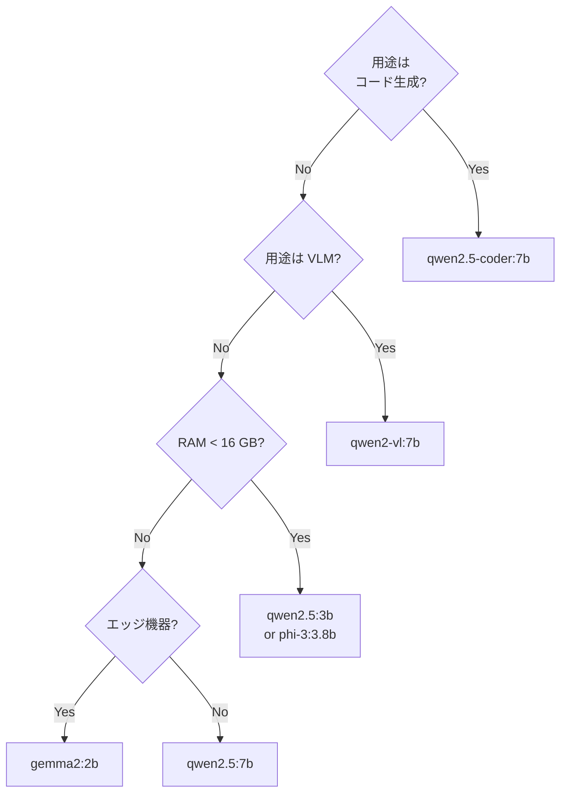

# FullSense ™ — Recommended on-prem models

> どの OSS LLM を Ollama / LM Studio / vLLM で動かすと FullSense (llive /
> llove / lldesign / lltrade) が **意図通り動くか**。各 product README で
> 個別に書くと drift するので、portal を真実ソースにする。

## 結論 (2026-05-18)

| 用途 | 推奨 | 補助選択肢 | 非推奨 |
|---|---|---|---|
| **日常対話 / Brief 駆動** | `qwen2.5:7b` | `qwen2.5:14b`, `gemma2:9b` | `llama3.2:3b` |
| **コード生成 (lldesign / lltrade)** | `qwen2.5-coder:7b` | `qwen2.5-coder:14b`, `deepseek-coder-v2:16b` | `llama3.2:3b` |
| **VLM (image describe)** | `qwen2-vl:7b` | `llama3.2-vision:11b` (warm 後), `llava:7b` | 未 warm の vision モデル |
| **小型 / エッジ実機 (RPi / Jetson Nano 等)** | `phi-3:3.8b`, `qwen2.5:3b` | `gemma2:2b` | `llama3.2:3b` (`ll*` typo 再発) |

## なぜ llama3.2:3b は非推奨か

`feedback_competitor_benchmark` の 2026-05-16 progressive validation matrix
+ 4-Brief A/B 結果で **2 度の `lllive` typo (3 Ls)** が出現。これは
`ll*` で始まる FullSense ブランドの命名規則と **直接的に競合する
tokenisation 問題**。具体出現箇所は
[`llmesh/docs/qiita/qiita-overview.md`](https://github.com/furuse-kazufumi/llive/blob/main/docs/qiita/qiita-overview.md)
他参照。

> このため、llive / llove / lldesign / lltrade のいずれの README でも
> **llama3.2:3b を install スニペットの第一推奨にしない**。

## 推奨選定の判断軸



## install スニペット (実用)

各 product 共通の最小手順:

```bash
# 1. Ollama 起動 (デフォルトは http://localhost:11434)
ollama serve &

# 2. 推奨モデルを pull (~5 GB)
ollama pull qwen2.5:7b

# 3. llive (任意の FullSense 製品も同じ env で動く)
$env:LLIVE_LLM_BACKEND = "ollama"
$env:LLIVE_OLLAMA_MODEL = "qwen2.5:7b"
$env:LLIVE_OLLAMA_HOST  = "http://localhost:11434"
py -3.11 -m llive.cli brief submit ./my-brief.yaml
```

llama.cpp `llama-server` 経由運用も同等。詳細は
[`llive/docs/setup/llama-server-company-setup.md`](https://github.com/furuse-kazufumi/llive/blob/main/docs/setup/llama-server-company-setup.md)。

## モデル更新ポリシー

- **Honest disclosure**: 推奨は **2026-05-18 時点のベンチ結果**に基づく。
  最新ベンチ ([Benchmarks Policy]({{ '/benchmarks/policy/' | relative_url }})
  に従う) で順位が変動したら本ページを更新する。
- 推奨変更時は本ページ + llive README + lldesign / lltrade docs の
  該当箇所を **1 commit でまとめて更新**する (drift 防止)。
- 推奨外モデルでも動作する。`feedback_no_echo_baseline` の通り、mock /
  rule-based baseline を含めて全モデル比較は CI ベンチで継続。

## 関連

- [Comparison]({{ '/comparison' | relative_url }}) — vs 各社 AI CLI / Web
- [Benchmark Policy]({{ '/benchmarks/policy/' | relative_url }}) — 系列 A/B/C/D + xs/s/m/l/xl 運用
- [Spec hub]({{ '/spec/' | relative_url }})
- maintainer memory:
  - `feedback_llive_spelling` (`llive` = L 2 個、`lllive` 禁止)
  - `feedback_competitor_benchmark` (ベンチ運用 4 軸)
  - `feedback_llive_measurement_purity` (cloud vs on-prem 系列分離)

## Last updated

2026-05-18 — 初版。lldesign / lltrade README で具体モデル名を書かず
本ページにリンクする hub 方針を採用。
