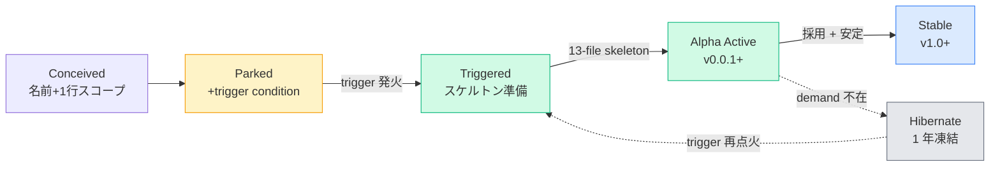
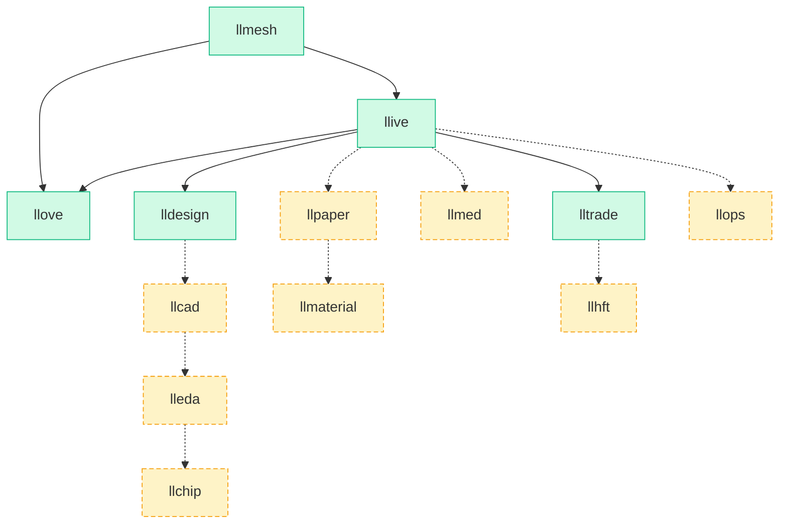
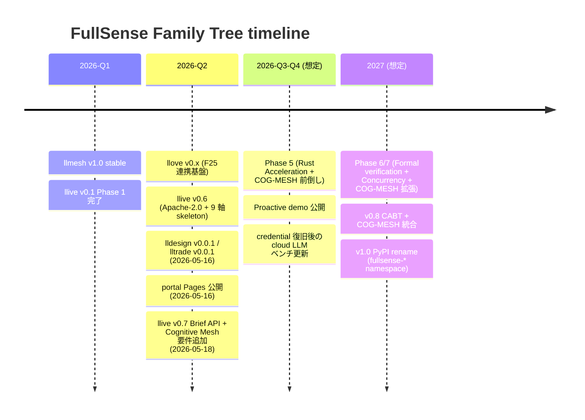

# FullSense ™ — Roadmap

> What is shipping, what is planned, and what is parked with trigger conditions.

## Live products (5)

| Product | Status | Next milestone |
|---|---|---|
| [llmesh](https://github.com/furuse-kazufumi/llmesh) | stable v1.5 | v1.6 (OPC-UA + MQTT) |
| [llive](https://github.com/furuse-kazufumi/llive) | beta v0.6 | C-2 (`@govern` → ProductionOutputBus) |
| [llove](https://github.com/furuse-kazufumi/llove) | beta v0.6 | F23/F24 (PowerShell shell + Claude Code integration) |
| [lldesign](https://github.com/furuse-kazufumi/lldesign) | alpha v0.0.1 | v0.1 (Mermaid generator + llove HITL) |
| [lltrade](https://github.com/furuse-kazufumi/lltrade) | alpha v0.0.1 (paper only) | v0.1 (Backtrader adapter) |

## Planned — design / engineering family

| Product | Scope | **Trigger condition for skeleton bootstrap** |
|---|---|---|
| **llcad** | Machine CAD operator emulation via code-CAD (OpenSCAD / CadQuery / Build123d) | OpenSCAD / CadQuery / Build123d become stable RAD references + user requests a machine-design task |
| **lleda** | Electronic design automation: schematic + PCB (KiCad CLI + JITX-style DSL) | KiCad Python API or JITX DSL becomes stable LLM target with reproducible sample |
| **llchip** | Semiconductor IC layout (OpenLane / Magic VLSI orchestration, RL-assisted floorplan) | OpenLane / Magic VLSI installable on Windows/WSL + test chip GDSII generated |

## Planned — domain research family

| Product | Scope | **Trigger condition** |
|---|---|---|
| **llmed** | Medical literature curation, evidence synthesis | A medical-domain user adopts FullSense + RAD `medicine` corpus reaches > 5K documents |
| **llpaper** | Academic drafting (LaTeX / Pandoc + citation graph) | Stable Zotero / arXiv MCP server + user submits a real paper through the loop |
| **llmaterial** | Materials science — phase diagrams, simulation orchestration | RAD `materials` corpus + user with materials-domain pain |
| **llops** | DevOps / SRE — incident response, runbook execution | RAD `devops` / `sre` corpus + Approval Bus matured enough for production change |
| **llhft** | High-frequency / market-making — **out of lltrade scope** | Audited release process + dedicated infra. Never on `lltrade` main. |

## Parking rules

A "parked" product is a name + 1-line scope + trigger condition. It is **not**:

- A skeleton repository (none created yet)
- A PyPI reservation (no `llmesh-llcad` etc. registered)
- A promise of delivery

The point of parking is **architectural foresight without commitment**. The
moment a trigger condition fires, the corresponding product gets the same
13-file skeleton treatment as lldesign / lltrade.

## Naming convention

All FullSense products use the prefix `ll` followed by a 4–8 character domain
hint. Trademarks are registered umbrella-wide (`FullSense ™` covers all
`ll*` derivatives) — see [trademark drafts](https://github.com/furuse-kazufumi/llive/tree/main/docs/legal/trademark).

## Versioning gates

| Version line | Hard rules |
|---|---|
| **v0.x** | API may break between minors. Public alpha. |
| **v1.0** | PyPI rename to `fullsense-*` namespace. API stabilises. lltrade enters live-trading audit branch (separate). |
| **v2.0+** | P2P mesh (LLMesh v2.x, Winny-inspired) + cross-product knowledge fusion |

## ステータス遷移モデル

各 product は **5 状態**を辿る:

## Live / Planned マトリクス

| Product | 状態 | 起点 | 直近マイルストーン | 依存 |
|---|---|---|---|---|
| llmesh | **Stable** | 2026 初期 | v1.6 (OPC-UA + MQTT) | — |
| llive | **Alpha Active** (beta) | 2026-05-13 | COG-MESH 本実装 M8.2〜M8.9 完了 (2026-05-19) / 次は C-2 (`@govern` → ProductionOutputBus) / M8.1 (llove TUI 統合) | llmesh (optional) |
| llove | **Alpha Active** (beta) | 2026 初期 | F23/F24 (PowerShell shell + Claude Code integration) | llive (F25 連携) |
| lldesign | **Alpha Active** | 2026-05-16 | v0.1 (Mermaid generator + llove HITL) | llive Brief API |
| lltrade | **Alpha Active** | 2026-05-16 | v0.1 (Backtrader adapter) | llive Brief API |
| llcad | **Parked** | — | trigger: OpenSCAD/CadQuery/Build123d 安定 + machine-design タスク | lldesign 成熟 |
| lleda | **Parked** | — | trigger: KiCad/JITX LLM 対応 + sample 再現 | lldesign + llcad |
| llchip | **Parked** | — | trigger: OpenLane/Magic Windows/WSL install + GDSII 生成 | lleda |
| llmed | **Parked** | — | trigger: 医療ドメインユーザー + RAD medicine > 5K docs | llive 安定 |
| llpaper | **Parked** | — | trigger: Zotero/arXiv MCP + 実 paper 投稿 | llive Brief API |
| llmaterial | **Parked** | — | trigger: RAD materials + 材料ドメインユーザー | llive + llpaper |
| llops | **Parked** | — | trigger: RAD devops/sre + Approval Bus 本番準備 | llive C-2 完了 |
| llhft | **Parked** | — | trigger: 監査 release + 専用 infra (lltrade main から完全分離) | lltrade Stable |

## 依存グラフ

各 product の依存関係 (live は実線、planned/parked は破線):

## タイムライン (実績 + 直近想定)

> タイムラインは roadmap であって commit ではない。trigger 発火状況と
> credential / community 状況によって順序は変わる。

## マトリクスの読み方 (ステータス遷移ルール)

- **新規追加** = Conceived 状態で 1 行追加 (まだ Parking rules を満たさない)
- **Parking** = trigger condition を明文化、PyPI 名 / repo は確保しない
- **Trigger** = condition を満たす事実 (RAD 拡充 / ユーザー要望 / 上流 OSS 成熟等) が
  発生した瞬間、Triggered に遷移
- **Skeleton** = lldesign / lltrade と同じ 13-file 雛形を 1 commit で配布
- **Hibernate** = Alpha のまま 1 年活動が無ければ Hibernate へ降格 (削除はしない)

各遷移は portal 側 `PROGRESS.md` に **why / when / who** で記録する。
