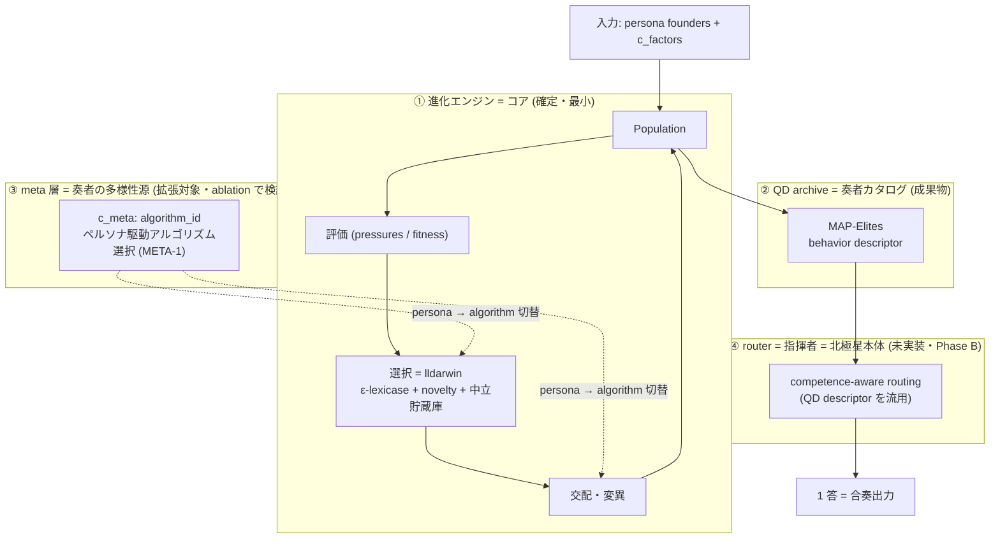

# llive 北極星アーキテクチャ — ブロック図と「矛盾→単純化」設計 (2026-05-27)

> 目的: 拡張示唆 (統計ペルソナ / meta dispatch / router / ablation) を積みすぎて複雑化したため、**全体をブロック図で俯瞰し、矛盾を単純化方向で解消**する (ユーザー指示)。設計原則: **矛盾を含む箇所は単純化を優先**。

## 北極星
**連続進化 × ライブ MoA オーケストラ** — 進化し続ける多様な個体集団を、答えが要る瞬間に competence-aware routing (指揮者) で合奏させ 1 答する。

## ブロック図

## 層の役割と確度

| 層 | 役割 | 確度 | 構成 |
|---|---|---|---|
| ① 進化エンジン (コア) | 多様な奏者を絶やさず進化 | **確定** (proxy ablation 裏付け) | ε-lexicase + novelty + 中立貯蔵庫 + コア24本 |
| ② QD archive | 奏者カタログ (descriptor で索引) | コア候補だが proxy では選択圧に再帰せず | MAP-Elites |
| ③ meta 層 | 奏者ごとにアルゴリズムを変える多様性源 | **拡張対象** (要 ablation) | c_meta / MetaChromosome / dispatch (要配線) |
| ④ router (指揮者) | 奏者を選び合奏 = 北極星本体 | **未実装** (Phase B) | competence-aware routing |

## 矛盾 → 単純化 (設計判断)

進化研究では「矛盾を統合で解く」のが理想だが、本フェーズは**キャパ制約下の収束**なので **TRIZ #1 分離 / 単純化を優先**する。

1. **矛盾: 収束 (frozen で機能削減) ↔ 拡張 (meta/統計ペルソナ追加)**
   → **単純化**: 「コアは①の最小固定。②③④の拡張は **1 つずつ** ablation で寄与率を測って足す/淘汰」。同時に複数を積まない (今回複雑化した反省)。拡張↔縮小は**逐次**回す。

2. **矛盾: proxy で削減候補 (adaptive_difficulty / factor_subspace_qd / map_elites) ↔ 実 LLM では効く設計**
   → **単純化**: **デフォルトを単純側に倒す**。proxy で効かない要素は **既定 off** にし (lldarwin v2 既定の見直し候補)、実 LLM ablation で有意な効果が出た要素だけ既定 on に昇格。「効果が証明されるまでは付けない」。

3. **矛盾: 多様性 (novelty/QD) ↔ 品質 (適応難易度の選択圧)**
   → **単純化**: **ε-lexicase が構造的に両立**を担う (集約しない多目的選択 = 各軸の specialist が共存)。追加の調整器 (adaptive 等) は「lexicase で足りない分だけ」最小投入。調整器を増やす前に lexicase の軸設計を見直す。

4. **矛盾: meta (個体ごとに algorithm 違う) ↔ 単純なループ (全個体同じ algorithm)**
   → **単純化**: meta は **c_meta の algorithm_id を 2-3 個の離散選択に限定**して始める (連続パラメータ空間でなく)。persona → algorithm の写像も最初は単純な表引き。効けば拡張。

5. **統合ビジョン: persona-indexed genome (ユーザー示唆群 2026-05-27)**
   ユーザーの一連の示唆 — ①各層にペルソナ配置 ②因子ごとにペルソナ自由選択 ③因子間の紐づけ判断もペルソナ ④アルゴリズムもペルソナ選択 — は **1 つの原理に統合できる**:
   > **進化ゲノムの各「決定点」(層 / 因子 / 因子間結合 / アルゴリズム) に persona が選択を持つ**。
   → **現状**: `Persona` は 10 思考因子に `factor_affinity` を持ち、個体は `PersonaComposition` (persona 重み付き混合) で**因子間共通**の合成 affinity を得る。Genome3D は 4 層 (c_impl/c_prompt/c_meta/c_factors)。
   → **矛盾 (複雑爆発)**: ペルソナを全粒度 (層×因子×因子間結合×algorithm) に同時導入すると選択空間が爆発し、既存 composition と二重定義になる。
   → **単純化 (前指示「矛盾は単純化」に従う)**: **1 つの一般表現 (persona-index) に統一**し、**最小粒度から段階化 + 各段階 ablation で寄与率検証** (拡張↔縮小の淘汰圧):

   | 段階 | 粒度 | 最小形 | 対応する示唆 |
   |---|---|---|---|
   | 1 | **層** | 各層に担当 persona (長4 index) | 各層にペルソナ |
   | 2 | 因子 | 各因子に persona (長10 index)。composition は「全因子同一」の特殊ケースとして包含 | 因子ごとペルソナ |
   | 3 | 因子間結合 | 因子間結合に persona 判断 (疎な結合のみ、全結合行列でなく) | 因子間紐づけ |
   | 4 | アルゴリズム | c_meta の algorithm_id を persona 駆動 (離散2-3) | アルゴリズム選択 (META-1) |

   → **段階1 (層粒度) から実装 → ablation (多様性/品質の寄与) → 効けば段階2へ**。一度に全粒度を作らない。連続な重み matrix や全結合は複雑なので、離散 index / 疎な結合から始める。③④ は同じ「個体内多様性源」の責務として meta 層に統合設計。

## 当面の単純化アクション (Phase A 締め → B)

- **コア確定**: ①(ε-lexicase + novelty + reservoir + コア24本) を「変えない土台」とする。
- **既定の単純化**: lldarwin v2 の proxy 無効要素 (adaptive/factor-subspace) を**既定 off に倒す**ことを検討 (実 LLM で昇格)。← 矛盾2 の解消。
- **拡張は逐次**: ④ router を**最小の 1 機能**として次に実装 (meta③ はその後、1 つずつ)。
- frozen (experimental/) で①外を隔離しコアを小さく保つ。

## HONEST
本図は設計の現時点スナップショット。proxy 限界 (①の ablation 裏付けは proxy mechanism feasibility) と未実装 (④) を明示。実 LLM 段で②③④の確度が変わる。新 doc は `docs/research/index.md` / `doc_map.md` に登録すること ([[feedback_fullsense_feedback_smart]])。
