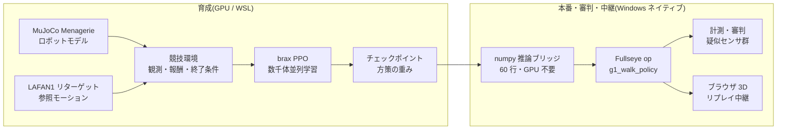

In 2025, humanoid robots ran a half-marathon in Beijing, China, and that summer the first World Humanoid Robot Games were held: bipedal robots ran footraces, played soccer, and danced. And by sheer coincidence, today, as I write this article (August 22, 2026), **the 2nd World Humanoid Robot Games are opening** at the National Speed Skating Oval in Beijing. This time it's 16 countries, 666 teams, and 2,056 robots across 51 events (nearly double the first edition's 26), and the headline attraction is reportedly a "fully autonomous category with no remote operation" (sources for these numbers are collected in the survey table in Section 16.0). Following the news, one thought kept circling in my head.

**"I want to do this myself, at home."**

Of course, I can't set up a venue with 500 physical robots. I don't have the budget, the space, or — crucially — the family buy-in. But I do have a PC with a single GPU in it. Build the stadium inside a physics simulation, raise the athletes, run the events, station referees, and broadcast to the spectator seats (a browser) — **building every component of a sports meet, right on my own desk** — that much, I should be able to do.

This article is the record of hosting that "Home Humanoid Games." At the same time, it's a development log of me trying to build an **integrated development environment (IDE) for Physical AI**, bringing along my day-job experience in image processing (industrial machine vision). Behind the events, the referee's gaze (measurement and cheat detection), the broadcasting equipment (a browser 3D viewer), and the athletes' training environment (a reinforcement learning pipeline) all flow into one and the same toolbox — my homegrown vision toolkit, **Fullseye**.

It's a long article. I wrote it so it works either way: read it straight through as a story, or cherry-pick events from the table of contents.

Note: text overlays baked into the GIFs are in Japanese (from the original edition); the captions carry the meaning.

*Games poster (illustration by an image-generation AI (Gemini). Generated text tends to get mangled, so the image is generated with a blank banner and I add the lettering myself)*

> **On attribution of ideas and implementation (stated up front)**
> The directional judgments and ideas in this article (the games concept itself, designing observations around real-robot sensors, introducing event-camera-style temporal differences, the "reciprocal + co-contraction" two-command scheme for the musculoskeletal body, per-body-part simplification, turning trained policies into Studio ops, the browser broadcast...) are mine; the hands-on implementation, experiments, and measurement were run by an AI coding agent (Claude Code). **Every number, from the experiments that worked to the ones that failed, is a real measurement.** Hiding failures would only hurt my future self, so the events we lost are published as losses. The first person "I" in this text is the subject of judgment and direction-setting, but in moments of discovery the boundary between human and AI sometimes blurs. Where attribution can't be pinned down, please read it as meaning "me and the AI as a team" — not dressing up the subject is part of honest disclosure too.

## How to read this article (3 courses)

It's a very long article, so here's the course menu up front.

- **5-minute course (just watch the motion)**: Scroll through and watch only the videos (GIFs). The straight-walk finish, the obstacle run, the parade of 67 robots, the 700-muscle human body striking poses, all the way to it crumpling while standing still — they're arranged so the skeleton of the story comes through from motion alone.
- **30-minute course (the main event)**: Chapters 1–15. The record of hosting the games + failure stories + a development log. The "🍙 Plain-Language Corner" at the end of each chapter is your refuge whenever the main text feels stiff.
- **Full course (through the reference volumes)**: Appendices A–G. The complete experimental record, a who's-who of 67 robots, a sensor field guide, a book of lessons, a glossary, the full op index, and a future-readings collection. Meant as an encyclopedia — look things up when you need them.

# Table of Contents (Competition Program)

1. Opening Ceremony — Why host a sports meet as one person
2. Glossary — Chewing the terms first
3. Building the Venue — Physics simulation and the GPU
4. Athletes' Entrance — Unitree G1 and evis, my homemade 700-muscle human body
5. Event 1: Sprint (20m straight) — Three straight losses, then the one-two punch of "it couldn't see the white line"
6. Event 2: Obstacle Run — Pseudo-LiDAR and a 1-D event camera
7. Event 3: Group Performance — Driving 700 muscles with keyframes
8. Event 4: Balance Beam (quiet standing) — The plainest event turned out to be the hardest
9. The Referee Crew — A vision engineer builds "instruments that catch cheating"
10. The Broadcast Station — 3D replay that runs in nothing but a browser
11. Toward an IDE — The ambition called Fullseye Studio
12. Meet Regulations — A parts list for hosting it yourself
13. Toward the Future — Simulating the state of the art as a way to play
14. The Disciplines Mixed into These Games — From DNA to optics
15. Exhibition Events — Arms, sky, hands, chopsticks (all real physics)
16. Closing Ceremony and the Next Events
Appendices A–I — Chronicle of experiments / Robot who's-who (67 robots) / Sensor field guide / Book of lessons / Extended glossary / Full Fullseye op index (1,606) / Future readings / Measured training-log excerpts / FAQ

---

# 1. Opening Ceremony — Why Host a Sports Meet as One Person

*Illustration: by an image-generation AI (Gemini). The athlete lying fallen on the track is in perfect agreement with the content of this article*

What made the Beijing games interesting, I think, is that they asked not "can it walk?" but "**can it compete?**" If walking were the whole story, robots had been walking (while falling) since around the 2015 DARPA Robotics Challenge. Becoming a competition means racing for speed, staying on the course, having disqualification conditions, and leaving records. In other words, **measurement and discipline** enter the picture.

To head off any misunderstanding: this is not remotely a story of "an individual taking on China." That scale, that speed, and above all the **sheer freedom of imagination** in "let's have robots run a marathon," "let's just throw a sports meet" — that is something to learn from, plainly and honestly. What I want isn't competition; it's to try translating that jolt of inspiration into a form within my own reach. And the important part is that **we now live in an era where that translation is actually possible**. Open models, open data, and compute genuinely mesh together on an individual's desk. The person who got inspired no longer has to stay in the audience. I find that a rather hopeful state of affairs.

I'm someone who has spent his career in industrial image processing, and in the world of factory inspection equipment the house rules are "you can't improve what you can't measure" and "distrust your method of measurement." Soon after I started playing at raising robots with Reinforcement Learning, I noticed these two worlds share the same skeleton. **Designing the reward (the score) is designing an inspection standard, and the agent is a test subject that will unfailingly poke holes in that standard.** So the sports-meet frame, jokey as it sounds, turned out to be essential. Competition rules (rewards and termination conditions), timing and measurement (logs and rollouts — a rollout being one full run of the policy from start to finish), doping tests (cheat detection), and the broadcast to the audience (visualization). Unless you build all of it, a sports meet doesn't happen.

Let me also write down why doing it as an individual matters. The control stacks of the robots at the big games are each company's secret sauce, but **a sports meet inside a simulation can be assembled entirely from open models, data, and training code**. I used MuJoCo (physics engine), MuJoCo Menagerie (robot model collection), Unitree's official LAFAN1 retargeted motions (published on HuggingFace; the source data is from Ubisoft La Forge, under the CC BY-NC-ND 4.0 non-commercial license — details in the acknowledgments at the end), brax/MJX (GPU physics and training), and homemade code. With one GPU, anyone can build a stadium at home. That era has genuinely arrived.

# 2. Glossary — Chewing the Terms First

So you can flip back here while reading, the key terms up front. The format is "term — one-line definition → plain-language chew."

- **Reinforcement Learning (RL)** — A learning method that acquires behavior through trial and error and rewards. → Dog training: do the trick, get a treat. Except this dog is vastly more calculating than yours and will attack every loophole in the treat rules at full power.
- **Policy** — A function that takes the state as input and outputs an action; the product of training. → The athlete's "habits of moving their body," as such. The policies in this article are small neural nets (about 4 layers × 32 units).
- **Reward** — Points granted every single step. → The event's scoring rules. A design mistake here will be exploited, guaranteed.
- **Observation** — The input vector shown to the policy. → The athlete's five senses. **Anything not in here does not exist for the athlete** (the single biggest lesson of this article).
- **PPO (Proximal Policy Optimization)** — The go-to reinforcement learning algorithm. → A practice method of "never change drastically at once; improve a little but surely."
- **Training steps and the "26M" / "150M" notation** — This article expresses an athlete's degree of growth in "training steps," with M meaning million (mega). 26M = 26 million steps, 150M = 150 million steps. **This is distinct from meters of distance (lowercase m, as in "20.5m of forward travel")** — read it as "big numbers with a capital M are practice volume; lowercase m is distance." → In school-sports terms, it's like saying "as of practice swing number 26,000,000."
- **Reference motion for imitation learning (reference motion / mocap)** — Human movement recorded and mapped onto the robot's joints as a model to follow. → The choreography video for a dance. LAFAN1 is a public collection of such data, officially converted by Unitree for their own robots.
- **Residual control** — A scheme where the policy adds only a small correction (residual) to the reference joint angles. → "Follow the choreography; the balance adjustments are on you." Don't make it invent movement from scratch.
- **POMDP / partial observability** — A situation where only part of the environment's state can be observed. → Tightrope walking blindfolded. The cause of defeat in Event 1.
- **Pseudo-LiDAR** — A virtual sensor that measures distance by casting rays inside the simulation. → A bat's echolocation. Mimics the properties of a real LiDAR (laser rangefinder) in computation.
- **Event camera (DVS)** — A camera that outputs only *changes* in brightness. → An eye that can't take a still photo but is hypersensitive to "something moved." This article hand-rolls a 1-D version.
- **Musculoskeletal model** — A human-body model whose joints are driven not by motors but by muscle tension. → Not a robot; an anatomical human. evis carries 700 muscles.
- **Torque** — The moment of force that rotates a joint. **Muscles can't push, only pull** (this cost us one defeat).
- **WBC-QP (Whole-Body Control via Quadratic Programming)** — The standard recipe of control that "decides all joint accelerations and contact forces optimally while satisfying the physics." → Solving the whole body's force allocation by mathematical optimization, every instant.
- **MJX / brax** — The GPU-parallel version of MuJoCo, and the training framework on top of it. → The technology of building thousands of stadiums at once and training thousands of athletes simultaneously.
- **XLA** — A compute compiler for GPUs. → The venue's building contractor. Blueprints that don't match its preferred construction methods (fixed-shape matrix computation) — like the sparse tension computation of 700 muscles — simply don't get built. This constraint bites later.

# 3. Building the Venue — Physics Simulation and the GPU

The venue is software through and through. Here's the layout.

- **Physics engine**: MuJoCo. The de facto standard for robot learning right now, for its balance of contact-computation reliability and speed.
- **Parallelization**: MJX (the GPU version of MuJoCo) + brax's PPO implementation. Build thousands of stadiums on the GPU simultaneously, run copies of the same athlete in all of them at once, and learn from everyone's experience pooled together.
- **Hardware**: a single RTX 5090 (32GB). The training in this article ran two events concurrently at **a combined ~9,700 training steps/second** (co-residing with memory allocation throttled to 0.35 each). One event's practice (~100 million steps) takes roughly 3–4 hours. Your life settles into a rhythm: set up practice in the evening, check results after dinner. Mostly I'm the guy sighing at robot-falling videos after a bath.
- **Training lives on the Linux side (WSL), everything else on Windows.** For JAX/XLA reasons the training is pushed into WSL, while measurement, visualization, and the article's figures are done in native Windows Python. This division of labor became the motive for the "numpy inference bridge" described later.

*Figure: measured training throughput for this article. Even with 2–3 training runs sharing one GPU, each gets 8,000–10,000 steps/s. The quadruped (a separate trainer) uses a different unit system, hence the separate panel (plotted from measured logs)*

The first constraint that bites during venue construction is the **XLA preferred-construction-method problem** mentioned in the glossary. An ordinary robot that turns its joints with motors (like the G1) parallelizes to thousands on a GPU, but **evis, my homemade human body driven by 700 muscles, could not be GPU-parallelized: its muscle-tension computation doesn't fit XLA**. So evis's events run on CPU, and for a future move to GPU we keep a "twin with the muscles replaced by equivalent joint torques" (torque-twin) — a two-tier arrangement. Think of the venue as having a main stadium (GPU) and a small gymnasium (CPU).

> **🍙 Plain-Language Corner (venue edition)**
> The same "physics engine" that powers games also serves as the venue for robotics research. Mario jumping and falling, and our robot toppling over here, are the same family of computation inside. The difference is seriousness: a research-grade physics engine computes "the force at the instant of contact" with the fine-print thoroughness of an insurance contract. And with a GPU, you can copy this venue thousands of times and run them all at once — like 4,000 robots doing one robot's practice simultaneously. That's how a single night amounts to years of human practice.

## 3.1 Deep Dive: The Venue's Underground Works — What Does a Physics Engine Do in One Step?
(supplement to Chapter 3, "Building the Venue")

A simulator is not a magic box. Every time you call `mj_step()`, a fixed sequence of computations runs inside. Here, let's lift the lid of that box and peek in together.

### 3.1.1 Inside one step: the forward dynamics pipeline

One MuJoCo step passes roughly through the following stages in order (the Computation chapter of the official docs [^mjc-comp] explains every stage).

| Stage | What it does | Algorithm used |
|---|---|---|
| 1. Forward kinematics | Compute every body's position and orientation from joint angles | Propagation through the tree from root to leaves |
| 2. Bias forces | Compute gravity, Coriolis, and centrifugal forces together | Recursive Newton-Euler (RNE) |
| 3. Inertia matrix | Compute the matrix M of "push this joint, get that much motion" | Composite Rigid-Body (CRB) |
| 4. Collision detection | Enumerate which geometries are touching | broad-phase → narrow-phase |
| 5. Constraint-force solve | Determine contact forces, joint-limit forces, friction | **Convex optimization** (below) |
| 6. Numerical integration | Integrate acceleration to advance velocity and position one frame | Euler / RK4 / implicit family (below) |

There are two key points.

**Generalized coordinates.** MuJoCo doesn't hold each body's xyz coordinates separately; it represents the whole body's state as "a vector of joint angles." As long as bodies are connected by joints, there is structurally no risk of them flying apart. The official docs introduce the engine saying "MuJoCo pioneered the combination of simulation in generalized coordinates with optimization-based contact dynamics" [^mjc-overview]. This is the single biggest design difference from game physics engines (Cartesian coordinates + springs approximating constraints).

**Forward dynamics.** The computation of "from the forces currently applied, find the next instant's acceleration." The equation of motion M(q)·q̈ = external forces + constraint forces is solved after gathering the ingredients from the table above (M, bias forces, contact forces).

#### Plain language: one frame of a flipbook

A simulation is a flipbook. One step = one frame. Each frame repeats: check everyone's position → find who is touching whom → decide the pushing forces → move everyone a tiny bit under those forces. In our G1 training, one frame is 0.002 seconds. Behind one second of walking, every stage of that table runs 500 times.

### 3.1.2 Why contact is hard — how MuJoCo dropped LCP and chose convex optimization

The hardest part of a physics engine is "contact." The moment a foot touches the ground, with how much force should the ground push back? This is a surprisingly hard problem even to define.

The classical formulation was the **LCP (linear complementarity problem)**: write down "contact forces only push (never pull)," "zero force if separated," and "friction stays inside the Coulomb cone" as complementarity conditions. But LCP with friction can lack a unique solution, and in general belongs to an NP-hard class.

Here, MuJoCo's author Todorov and colleagues changed the framing: **by accepting contact as slightly "soft," they converted the whole problem into convex optimization** (the IROS 2012 paper [^todorov2012], and the docs' Computation chapter [^mjc-comp]). The docs state the dual problem explicitly:

> f = argmin_λ ½ λᵀ(A+R)λ + λᵀ(a₀ − aᵣ)  subject to λ ∈ Ω

You don't need to chase the details. What matters is that **(A+R) is positive definite = there is only one valley.** Contact forces therefore emerge as "the unique global optimum," giving the same answer every time. None of LCP's "sometimes solvable, sometimes not, sometimes multiple answers."

The price is **soft contact**. As the docs' "Physical realism and soft contacts" section says, complementarity doesn't hold exactly — "contact force and velocity along the contact normal can be simultaneously positive," i.e., a slight penetration is permitted [^mjc-comp]. But this is a design philosophy, not a defect: real objects also deform microscopically at contact surfaces (a laptop set on a futon sinks in a little, doesn't it?). The position is that "perfectly rigid contact" is the greater physical fiction.

The convex formulation also has a by-product. In the docs' words, a "uniquely-defined inverse" [^mjc-overview] — inverse dynamics with a unique answer. Being able to back-compute "what forces were needed to realize this motion" is one reason this engine has been the choice of optimal control and robotics research.

#### solref / solimp — specifying contact stiffness in the language of springs and dampers

So how do you decide *how* soft? That's the `solref` and `solimp` you keep seeing in XML (docs, Modeling chapter, "Solver parameters" section [^mjc-solver]).

| Parameter | Meaning | Intuition |
|---|---|---|
| `solref = (timeconst, dampratio)` | Re-parameterizes the constraint as a mass-spring-damper system | timeconst = how fast penetration recovers; dampratio = 1 means it settles back smoothly without bouncing (critical damping) |
| `solimp = (d₀, d_width, width, midpoint, power)` | Impedance d ∈ (0,1) = "the constraint's ability to produce force," specified as a function of penetration depth | small d = weak (soft) constraint; large d = strong (hard) constraint |

To borrow the docs' words, solref "re-parameterizes the model in the mass-spring-damper language of time constant and damping ratio," and for solimp's d, "small values of d correspond to weak constraints while large values of d correspond to strong constraints" [^mjc-solver]. In other words, it's an interface that translates the abstract regularization terms inside the optimization solver into "spring stiffness and damper strength" — things a human can hold intuitions about. When contact jitters, when feet sink into the floor — these two were what we had actually been turning.

### 3.1.3 Integrators and the timestep — why muscles and tendons make things "explode"

The table's final stage, numerical integration, comes with choices (docs, "Numerical Integration" section [^mjc-comp]).

| Integrator | Character | Suited / not suited |
|---|---|---|
| Euler (semi-implicit) | Semi-implicit Euler treating only joint damping implicitly | The standard. Fast |
| RK4 | 4th-order Runge-Kutta; 4 evaluations per step | Strong on energy-conserving systems. 4× the cost |
| implicit | Implicit down to the derivatives of velocity-dependent forces (incl. Coriolis and centrifugal) | Most stable. Requires LU decomposition |
| implicitfast | implicit minus the Coriolis-family derivatives | Docs-recommended. Fast via Cholesky |

What does "implicit" mean? Explicit integration says "decide the next position from the current forces." Implicit integration says "advance by solving simultaneous equations so that the next instant's state is self-consistent." The former is fast, but **with a stiff spring present (a fast-changing force), the force runs wild within one frame and diverges**. That is the true identity of a numerical "explosion."

Muscles and tendons are exactly a bundle of such "stiff springs." Muscle passive elasticity and tendon tension change force sharply with tiny stretch = short time constants. If the timestep dt is coarser than that time constant, the oscillation of "overestimate the force → overshoot → an even bigger force the other way → …" amplifies within a frame. That evis (the muscle-driven humanoid) demanded a smaller dt than the G1 was not laziness but mathematical necessity. The docs likewise say that in systems dominated by velocity-dependent forces the implicit family offers "significantly more stability" than RK4, and declare the timestep "perhaps the single most important parameter" [^mjc-comp].

#### Plain language: a flipbook with dropped frames

A stiff spring plus a coarse dt is like "drawing a kendo strike in a flipbook that skimps on frames." The tip of the shinai moves a long way within one frame, so if you thin out the frames, the trajectory can't be drawn and the picture falls apart. A slow walking scene survives frame-thinning just fine. **Choose dt to match the fastest-moving thing** — that's numerical stability in one line.

### 3.1.4 MJX — rewriting MuJoCo in the GPU's language

Training takes tens of millions of steps. A single CPU MuJoCo would take forever. Enter **MJX**.

MJX is MuJoCo **rewritten in JAX**. Per the official docs [^mjx], the aim is to run MuJoCo "on every compute hardware the XLA compiler supports." With JAX's `vmap` (automatic vectorization), thousands of copies of the same scene are lined up and streamed in bulk into the GPU's SIMD units. In the docs' phrasing, what MJX is good at is "simulating big batches of parallel identical physics scenes using algorithms that can be efficiently vectorized on SIMD hardware" — an engine made precisely for RL.

But GPU-ification isn't free. Constraints the docs honestly state [^mjx]:

- **Branching hurts**: "accelerators exhibit poor performance for branching code." Collision detection's broad-phase is branch-heavy work ("skip object pairs that aren't near each other"), so on GPU you tend to evaluate all pairs brute-force.
- **Variable sizes hurt**: XLA fixes array sizes at compile time. The number of contacts changes every step, yet MJX always reserves and computes memory for the "maximum contact count." Where the CPU version gets away with "three contacts today," the GPU version computes a full house every time.
- **Keep meshes light**: collision meshes are recommended at "about 200 vertices or fewer."
- **A single instance is slow**: for one scene, "MJX-JAX can be 10x slower than MuJoCo" (the CPU version). MJX's value isn't the speed of one — it's throughput that **barely changes whether you run 1 or 4096 at once**.

(Note: as of 2026 the docs split MJX into two lines: MJX-JAX, the JAX reimplementation (autodifferentiable), and MJX-Warp, faster but without autodiff [^mjx]. The training in this article used the JAX pipeline.)

#### The brax PPO training loop

Paired with MJX we used the training-algorithm implementations of **brax** [^brax]. brax is a JAX-based physics engine + training library, shipping implementations of PPO / SAC / ARS / evolution strategies and more, as its README says. One cycle of its PPO turns like this:

1. **rollout**: run the current policy for a short stretch (unroll) in thousands of parallel environments, collecting (observation, action, reward)
2. **GAE**: from the collected rewards, estimate advantage (how much better than average each action was) (detailed in Part 2)
3. **minibatch SGD**: split the data into minibatches and update the policy net and value net for several epochs with PPO's clipped objective
4. return to 1 with the new policy

This whole loop — physics simulation and neural-net updates alike — is JIT-compiled (converted en bloc to GPU code just before execution) and spins **without ever stepping off the GPU**; that's the wellspring of the MJX + brax setup's speed. The biggest bottleneck, CPU↔GPU data transfer, disappears.

#### Part 1 sources

[^mjc-comp]: MuJoCo official docs, Computation chapter (pipeline, convex optimization, soft contact, integrators): https://mujoco.readthedocs.io/en/stable/computation/index.html
[^mjc-overview]: MuJoCo official docs, Overview (generalized coordinates, convex contact, unique inverse dynamics, tendons): https://mujoco.readthedocs.io/en/stable/overview.html
[^mjc-solver]: MuJoCo official docs, Modeling chapter, Solver parameters (solref / solimp): https://mujoco.readthedocs.io/en/stable/modeling.html#solver-parameters
[^todorov2012]: Todorov, Erez, Tassa, "MuJoCo: A physics engine for model-based control," IROS 2012: https://doi.org/10.1109/IROS.2012.6386109
[^mjx]: MuJoCo official docs, MJX chapter (JAX/XLA, batch parallelism, branching/variable-size constraints): https://mujoco.readthedocs.io/en/stable/mjx.html
[^brax]: google/brax (JAX physics engine + PPO/SAC etc. training implementations): https://github.com/google/brax

---

## 3.2 Deep Dive: The Venue's History — A Genealogy of Physics Simulators
Whether it's evolution or RL, what provides the "world" for selection is the physics engine. Over these 25 years, the world itself has evolved dramatically too.

### 3.2.1 Timeline: seven generations of physics engines

| Year | Engine | In 2–3 lines | Sources |
|---|---|---|---|
| 2001 | **ODE** | Open-source rigid-body dynamics library released by Russell Smith (first release 2001-05-08). With joints, contacts, and collision detection, it defined an era as the standard component of research simulators (Gazebo etc.) | [^ode] [^ode-wiki] |
| 2000s | **Bullet** | Led by Erwin Coumans. Collision detection + multibody physics with game/VFX roots. Its Python binding PyBullet became the staple environment of early deep RL | [^bullet] |
| 2000s〜 | **PhysX** | NVIDIA's real-time physics SDK. Hardened in the game market; its GPU implementation later became the heart of Isaac Gym. Now open source | [^physx] |
| 2012 | **MuJoCo** | Todorov, Erez, Tassa, "MuJoCo: A physics engine for model-based control" (IROS 2012). Research-specialized design: generalized coordinates + convex-optimization-based contact | [^mujoco-paper] |
| 2021-22 | **MuJoCo acquired → open-sourced** | DeepMind acquired it and made it free (2021-10-18), then opened the full code under Apache-2.0 (2022-05-23). The standard research engine became something that "belongs to everyone" | [^mujoco-blog1] [^mujoco-blog2] [^mujoco-gh] |
| 2021 | **Isaac Gym** | Makoviychuk et al. (NVIDIA). Physics and reward computation both run **entirely on the GPU**; thousands of environments simulated simultaneously on one GPU. Changed RL data collection by orders of magnitude | [^isaacgym] |
| 2021-23 | **Brax / MJX** | The JAX family. Brax is a differentiable physics engine (Freeman et al. 2021); MJX is the JAX implementation of MuJoCo proper — thousand-way parallelism wherever XLA runs (GPU/TPU) | [^brax] [^mjx] |
| 2024 | **Genesis** | A new-generation platform aiming to unify multi-physics (rigid, fluid, soft), photoreal rendering, and fast GPU parallelism in one | [^genesis] |

### 3.2.2 Where game physics and research physics parted ways

There is an invisible watershed running through this genealogy: **game physics, where "not falling apart at 60 fps" means winning**, versus **research physics, where "contact forces that aren't physically correct are meaningless."**

Game physics (the origins of Bullet and PhysX) may approximate as long as players see something natural. Push out penetrations, fudge the sinking, quietly bleed energy for stability's sake — all fair in the name of real-time. That pragmatism honed performance in the enormous game market and, as a result, supplied research with inexpensive physics. That many early deep-RL benchmarks ran on PyBullet or MuJoCo environments is a dividend of this legacy.

Research physics (late ODE → MuJoCo), conversely, obsesses over **the correctness of contact and its derivatives** — because a robot's control law is determined precisely by the contact-force response; the story of MuJoCo choosing convex-optimization contact is what we saw in Section 3.1. The split shows in the details too. Game physics prioritizes "surviving the current frame" at fixed steps synced to the render loop, while research physics exposes timestep, solver iterations, and contact softness all to the user and makes you choose "what you're giving up with that approximation." And where MuJoCo advertises uniquely computable inverse dynamics (back-computing the forces a motion required), game physics has almost no serious use for inverse dynamics — **who the engine's "customer" was still determines its design philosophy 20 years later**. A policy trained in a simulator that fudges this gets punched by the **sim-to-real gap** (reality gap) the moment you take it to a real robot. Prescriptions like domain randomization (Tobin et al. 2017 [^tobin]) — deliberately scattering the simulator's parameters to raise policies that work in any world — were born precisely because the gap is structurally unavoidable (the particulars of sim-to-real are handled in 6.5 and 6.6; here, just its place in the genealogy).

### 3.2.3 GPU parallelism changed RL

The impact of the Isaac Gym paper (2021) [^isaacgym] boils down to a single point. Classic RL ran "physics on CPU, learning on GPU," bottlenecked by data transport between the two. Isaac Gym completed physics simulation, observations, and reward computation **all on GPU tensors**, running thousands of environments simultaneously on one GPU. The same year, Rudin et al.'s "Learning to Walk in Minutes Using Massively Parallel Deep Reinforcement Learning" [^rudin] showed this machinery could train a walking policy for the quadruped ANYmal on a **single workstation GPU in minutes** — work that had been "days on a cluster."

This was not mere acceleration; it changed the etiquette of research. If training takes minutes, reward-design trial and error goes from "a gamble measured in days" to "an experiment over a cup of coffee." That we could rebuild the G1's reward through 12 generations on one home GPU is exactly the dividend of that 2021 turn.

MJX [^mjx] and Brax [^brax] are the JAX versions of the same philosophy. Writing the physics step as a JAX function means the machine-learning idioms — compile with `jit`, bundle thousands of environments with `vmap` — apply to physics as-is. Brax further hung **differentiable physics** on its signboard — "simulation results can be differentiated with respect to parameters." A bridge from a world where a fall could be used only as a reward signal, to one where (on paper) you can directly take gradients of "which parameter, moved which way, would have prevented the fall." Differentiating discontinuous phenomena like contact remains the hard part, but the genealogy's next fork is thought to be here.

GPU parallelism has its price, though. To cram thousands of environments onto one card, the per-environment contact solver is lightened, and complex closed-loop mechanisms or large-scale contact (say, 700 muscles) sometimes simply won't fit — our evis experience ("the musculoskeletal model couldn't be GPU-ified; we detoured to the torque-twin") is a live example of this design trade-off. "Fast physics" and "physics that can express anything" do not yet live in the same engine.

#### Plain language: 4,096 students in the gym

Old RL was the method of "a craftsman coaches one robot hands-on and mails the diary to the GPU." GPU-parallel physics is "line up 4,096 bodies in the gymnasium, teach them all the same class at the same time, and grade on the spot." The class quality per student is the same; the amount of experience gathered per day differs by orders of magnitude. The true identity of walking learning going from "weeks" to "minutes" is not better teaching — it's **a gigantic classroom**.

### 3.2.4 Robot-learning benches: the state of play (2026)

One line each on the staples that someone who wants to "make it walk, make it grasp" touches first.

- **MuJoCo Playground** [^playground] — MJX-based GPU-parallel environment collection. Quadrupeds, humanoids, manipulation — sim-to-real-minded tasks all present (our G1 walking is built on this lineage).
- **Isaac Lab** [^isaaclab] — The integrated robot-learning framework on Isaac Sim. The current answer in the NVIDIA ecosystem, in the successor position to Isaac Gym.
- **ManiSkill** [^maniskill] — SAPIEN-based GPU-parallel simulation + rendering. Strong on manipulation tasks.
- **Genesis** [^genesis] — The ambition slot, integrating multi-physics beyond rigid bodies with rendering. Being new, its ecosystem is still developing.

Step back and the current position comes into view: MuJoCo, which chose "research-physics correctness" in 2012, and the GPU physics hardened for speed in the game market (the PhysX line) converged in the 2020s on "GPU parallelism × contact correctness." Twenty-five years on from wobbling a single body along in ODE, thousands of humanoids now stand in rows inside one home GPU, falling over and over.

---

#### Part 1 sources

[^sims-page]: Karl Sims, "Evolved Virtual Creatures," 1994 (explainer page on his own site): https://www.karlsims.com/evolved-virtual-creatures.html
[^sims-paper]: Karl Sims, "Evolving Virtual Creatures," SIGGRAPH '94 paper PDF (author's site): https://www.karlsims.com/papers/siggraph94.pdf
[^sims-acm]: The same paper's ACM DL page (SIGGRAPH '94 Proceedings, pp.15-22): https://dl.acm.org/doi/10.1145/192161.192167
[^sims-video]: The film "Evolved Virtual Creatures" (Internet Archive): https://archive.org/details/sims_evolved_virtual_creatures_1994
[^sims-youtube]: The same film (YouTube upload, "Karl Sims - Evolved Virtual Creatures, Evolution Simulation, 1994"): https://www.youtube.com/watch?v=JBgG_VSP7f8
[^es-wiki]: Wikipedia "Evolution strategy" (on the 1960s founding by Rechenberg and Schwefel): https://en.wikipedia.org/wiki/Evolution_strategy
[^holland]: Wikipedia "John Henry Holland" (1975, "Adaptation in Natural and Artificial Systems"): https://en.wikipedia.org/wiki/John_Henry_Holland
[^cmaes]: Hansen & Ostermeier, "Completely Derandomized Self-Adaptation in Evolution Strategies," Evolutionary Computation 9(2), 2001: https://doi.org/10.1162/106365601750190398
[^cmaes-tutorial]: Hansen, "The CMA Evolution Strategy: A Tutorial," 2016: https://arxiv.org/abs/1604.00772
[^cmaes-site]: CMA-ES official site: https://cma-es.github.io/
[^neat]: Stanley & Miikkulainen, "Evolving Neural Networks through Augmenting Topologies," Evolutionary Computation 10(2), 2002: https://nn.cs.utexas.edu/downloads/papers/stanley.ec02.pdf
[^novelty]: Lehman & Stanley, "Abandoning Objectives: Evolution Through the Search for Novelty Alone," Evolutionary Computation 19(2), 2011: https://doi.org/10.1162/EVCO_a_00025
[^mapelites]: Mouret & Clune, "Illuminating search spaces by mapping elites," 2015: https://arxiv.org/abs/1504.04909
[^cully]: Cully, Clune, Tarapore & Mouret, "Robots that can adapt like animals," Nature 521, 2015: https://www.nature.com/articles/nature14422
[^openai-es]: Salimans, Ho, Chen, Sidor & Sutskever, "Evolution Strategies as a Scalable Alternative to Reinforcement Learning," 2017: https://arxiv.org/abs/1703.03864
[^wright]: Sewall Wright, "The roles of mutation, inbreeding, crossbreeding and selection in evolution," Proc. 6th Int. Congress of Genetics, 1932 (facsimile PDF of the original paper): http://www.blackwellpublishing.com/ridley/classictexts/wright.pdf
[^landscape-wiki]: Wikipedia "Fitness landscape" (noting Wright 1932 as the origin): https://en.wikipedia.org/wiki/Fitness_landscape
[^afterman]: Wikipedia "After Man: A Zoology of the Future" (Dougal Dixon, 1981): https://en.wikipedia.org/wiki/After_Man
[^cheney]: Cheney, MacCurdy, Clune & Lipson, "Unshackling evolution: evolving soft robots with multiple materials and a powerful generative encoding," GECCO 2013: https://doi.org/10.1145/2463372.2463404
[^xenobots]: Kriegman, Blackiston, Levin & Bongard, "A scalable pipeline for designing reconfigurable organisms," PNAS 117(4), 2020: https://doi.org/10.1073/pnas.1910837117

#### Part 2 sources

[^ode]: Open Dynamics Engine official site (author Russ Smith): https://www.ode.org/
[^ode-wiki]: Wikipedia "Open Dynamics Engine" (first release 2001-05-08): https://en.wikipedia.org/wiki/Open_Dynamics_Engine
[^bullet]: Bullet Physics SDK (Erwin Coumans et al.): https://github.com/bulletphysics/bullet3
[^physx]: NVIDIA PhysX SDK (open-source repository): https://github.com/NVIDIA-Omniverse/PhysX
[^mujoco-paper]: Todorov, Erez & Tassa, "MuJoCo: A physics engine for model-based control," IEEE/RSJ IROS 2012: https://doi.org/10.1109/IROS.2012.6386109
[^mujoco-blog1]: DeepMind Blog, "Opening up a physics simulator for robotics," 2021-10-18 (announcing the acquisition and free release): https://deepmind.google/discover/blog/opening-up-a-physics-simulator-for-robotics/
[^mujoco-blog2]: DeepMind Blog, "Open sourcing MuJoCo," 2022-05-23 (announcing the full open-sourcing): https://deepmind.google/discover/blog/open-sourcing-mujoco/
[^mujoco-gh]: MuJoCo repository (maintained by Google DeepMind): https://github.com/google-deepmind/mujoco
[^isaacgym]: Makoviychuk et al., "Isaac Gym: High Performance GPU-Based Physics Simulation For Robot Learning," 2021: https://arxiv.org/abs/2108.10470
[^rudin]: Rudin, Hoeller, Reist & Hutter, "Learning to Walk in Minutes Using Massively Parallel Deep Reinforcement Learning," 2021: https://arxiv.org/abs/2109.11978
[^genesis]: Genesis (Genesis-Embodied-AI): https://github.com/Genesis-Embodied-AI/Genesis
[^playground]: MuJoCo Playground (Google DeepMind): https://github.com/google-deepmind/mujoco_playground
[^isaaclab]: Isaac Lab official documentation: https://isaac-sim.github.io/IsaacLab/main/index.html
[^maniskill]: ManiSkill (SAPIEN-based): https://github.com/haosulab/ManiSkill
[^tobin]: Tobin et al., "Domain Randomization for Transferring Deep Neural Networks from Simulation to the Real World," 2017: https://arxiv.org/abs/1703.06907

# 4. Athletes' Entrance

*Figure: height comparison of the five main athletes (strictly common scale, with 1.0m/1.8m reference lines. Background brightness comes from each robot's scene). From left: G1, H1, Go2, Spot, evis (simulation renders)*

## Athlete 1: Unitree G1 (simulation model of a commercial humanoid)

The small humanoid from Unitree that shone at the Beijing games — its official simulation model is included in MuJoCo Menagerie. About 1.3m tall, **29 actuated joints**. What matters is that **the real machine exists in this world**. A policy raised in simulation has, in principle, a road to the real robot, provided its observations are matched to the real sensors (as described later, the observation design was matched to the real sensor configuration from the very start).

*Figure: Unitree G1 (official simulation model, 29 actuated joints)*

For the reference motion we use the **LAFAN1 retargeting dataset** that Unitree publishes officially (HuggingFace: `lvhaidong/LAFAN1_Retargeting_Dataset`) — human motion capture already converted to the G1's 29 joints, as 30fps joint-angle time series. From it we cut out one walking cycle (detected as 30 frames via the knee angle's autocorrelation), closed the loop so it connects smoothly, removed the yaw (heading) component, and shaped it into a straight-walking reference (1.47m/s).

## Athlete 2: evis (my homemade anatomical human body with 700 muscles)

The other athlete is not a robot bought off the shelf but a **musculoskeletal human model assembled from anatomical data**. 84 degrees of freedom (nq=85), **700 muscle actuators**. The skeleton follows human inertia parameters from the literature; the muscles are planted as tension elements with origins, insertions, and via points. There is not a single motor. Raising the upper arm is the deltoid's job; bending the elbow is the biceps'.

*Figure: evis, full body. Driven by a skeleton and 700 muscles (the red fibers) (simulation render)*

Why raise something this troublesome? Because when you think about nursing care and daily-life support, **something that moves with the same structure as a human can explain the "why" of human movement**. And besides — if you're hosting a sports meet, you want at least one homegrown athlete representing the local club, don't you?

*Figure: Unitree H1 (large humanoid, 19 actuated joints)*

## Athlete 3 (entry paperwork in progress): Unitree H1, and the "every event, every athlete" ambition

Behind the writing of this article, I'm working on adapting the training pipeline built for the G1 to the **H1 (large humanoid)**. The LAFAN1 retarget has an h1 edition too, so swapping the converter and the robot config should be enough to enter it. And beyond that, I've started **taking inventory of every robot in Menagerie — all 67 models, quadrupeds, arms, hands, and drones included**.

*Video: H1 replaying a LAFAN1-retargeted reference motion (kinematic playback = not yet walking under physics; the stage before training makes it "really walk." 10.5m stretch, simulation)*
Eventually I intend to widen the events to a quadruped division, a manipulation division, even an aerial division — a literal "all-around games."

*Figure: group photo of all 67 athletes (a "composite photo" assembling each robot's actually measured render into a grid — not one shared scene)*

*Video: entrance parade of all 67 models (0.5 s each, in the order humanoids → quadrupeds → arms → hands. MuJoCo Menagerie, simulation)*

## 4.1 Deep Dive: Athlete Register, Real-Machine Edition — The Price Tag Fell Two Orders of Magnitude

*Figure: humanoid price trend (log axis; manufacturer-announced and reported values). Two orders of magnitude down in five years (plotted from published values)*
### 4.1.1 The star: Unitree G1 — the very robot this article simulates

The protagonist of this series: the G1 from Unitree Robotics (Hangzhou). Key specs listed on the official page
(<https://www.unitree.com/g1>) are as follows (viewed 2026-08-22).

| Item | Official figure | Notes |
|---|---|---|
| Height | 1320 mm (standing) | ~690 mm folded (reported) |
| Mass | ~35 kg (battery included) | |
| Degrees of freedom | 23 (base) / 23–43 (G1 EDU) | Legs 6×2 + arms 5×2 + waist; EDU adds hands etc. |
| Max knee torque | 90 N·m (G1) / 120 N·m (EDU) | |
| Battery | 13-cell series lithium, 9000 mAh | ~2 hours operation (reported) |
| Sensors | 3D LiDAR + depth camera | The head-mounted Livox Mid-360 + Intel RealSense D435i configuration is typical |
| Price | US $13.5K+ (official page; tax/shipping extra) | Reported at $16K at announcement (2024-05) |

- Announcement coverage: The Robot Report, "Unitree Robotics unveils G1 humanoid for $16K" (2024-05)
  <https://www.therobotreport.com/unitree-robotics-unveils-g1-humanoid-for-16k/>
- Also listed in IEEE's ROBOTS guide: <https://robotsguide.com/robots/unitree-g1>

The "90 N·m knee," "23 DOF," and "Mid-360 + D435i" that shaped the reward design in the main text are
all grounded in these official specs — the policy of **matching the simulation's observation design to the real sensors**
(Story B) was decided while staring at this very table.

### 4.1.2 The big brother: Unitree H1 — the 1500 m gold medalist

The H1 is the full-size machine Unitree released in 2023. Official figures from <https://www.unitree.com/h1>
(viewed 2026-08-22):

| Item | Official figure |
|---|---|
| Height / mass | ~180 cm / ~47 kg |
| Degrees of freedom | 5 per leg + 4 per arm (expandable) |
| Joint torque | Knee 360 N·m, hip 220 N·m, ankle 59 N·m, arm 75 N·m |
| Speed | 3.3 m/s (claimed as the speed record for electric humanoids), potential >5 m/s |
| Price | Not listed on the official page. The direct-sales page quotes $90,000 (quote-based, configuration-dependent) <https://shop.unitree.com/products/unitree-h1> |

**Competition record (the juiciest part for a sports-meet article)**: at the 1st World Humanoid Robot Games,
held in Beijing on August 15–17, 2025, the H1
**won the 1500 m in 6:34.40** (the games' very first gold medal, on day one), and **took the 400 m gold too, at 1:28.03**.
Unitree collected 11 medals overall, including 4 golds.

- Robotics 24/7, "Unitree H1 earns two gold medals at World Humanoid Robot Games"
  <https://www.robotics247.com/article/unitree_h1_earns_two_gold_medals_at_world_humanoid_robot_games>
- Unitree official X (primary announcement of the 1500m 6:34.40)
  <https://x.com/UnitreeRobotics/status/1956231617372152139>
- South China Morning Post (overall medal tally; 280 teams / 16 countries / 26 events)
  <https://www.scmp.com/tech/tech-trends/article/3322251/chinas-unitree-x-humanoid-top-medal-total-worlds-first-humanoid-robot-games>

The human 1500 m world record is 3:26 (H. El Guerrouj), so the H1 is still at a bit under half the pace of the human elite.
Even so, the sheer fact that 2025 brought "bipedal robots finishing a 1500 m without falling and contesting placings"
lends real-world backing to the entrance parade in Chapter 4 (67 MuJoCo Menagerie robots).
The LAFAN1 retarget data used for this article's H1 GIF (`h1_lafan_parade.gif`) is likewise
Unitree's official distribution (HF `lvhaidong/LAFAN1_Retargeting_Dataset`).

### 4.1.3 A world roster (one-line profiles)

2–3 lines each, with sources. **Every price swings widely with configuration and timing — read them by digit count.**

**Tesla Optimus (US)** — 173 cm, 57 kg (AI Day 2022 figures). Musk's target price of
$20,000–30,000 is a goal "once mass production ramps"; as of 2026 it is unreleased and in
trial operation inside Tesla factories. <https://www.tomsguide.com/news/elon-musk-demos-the-human-like-optimus-tesla-bot-and-it-walks-on-its-own> (AI Day demo coverage)

**Figure 03 (US, Figure AI)** — Third generation, announced 2025-10-09. The first design to explicitly commit to home deployment:
fabric exterior, wireless charging, 3-gram fingertip tactile sensors, and a dedicated BotQ factory scaled for 12,000 units/year.
Price undisclosed (press estimates run above $100K). Official announcement:
<https://www.figure.ai/news/introducing-figure-03>

**Boston Dynamics new Atlas (US, under Hyundai)** — Converted from hydraulics to all-electric in 2024.
Official specs: 56 DOF, 1.9 m, 90 kg, 2.3 m reach, 50 kg peak / 30 kg continuous payload, IP67.
Parts sequencing at a Hyundai plant as the first pilot; the product version was unveiled at CES 2026-01.
<https://bostondynamics.com/atlas/>

**Apptronik Apollo (US)** — 5'8" (~173 cm), 160 lb (~73 kg), 25 kg payload,
4-hour swappable battery. Aimed at logistics and manufacturing. Official:
<https://apptronik.com/apollo/apollo-2> / launch release:
<https://apptronik.com/news-collection/apptronik-unveils-apollo>

**Fourier GR-3 (Shanghai, China)** — 165 cm, 71 kg, 55 DOF total, 12-DOF hands.
True to the company's rehab-equipment roots, it bills itself as a "Care-bot" (care and conversational support), selling
fabric covering and multimodal audio-visual-tactile interaction. Official documentation:
<https://support.fftai.com/en/docs/GR-X-Humanoid-Robot/GR3/GR-3_Introduction/>

**Booster T1 (Beijing, China — Booster Robotics)** — A 30 kg, 23 DOF (41 expanded) developer-oriented small machine.
Platform of the RoboCup 2025 AdultSize champion team (Tsinghua's Hephaestus), adopted by 50+
university teams. Official price on inquiry; distributor listings around $30K (as of 2026). Official:
<https://www.booster.tech/> / RoboCup coverage:
<https://botinfo.ai/articles/booster-t1-robot>

**Tiangong (Beijing, China — X-Humanoid, the Beijing Humanoid Robot Innovation Center)** — On 2025-04-19,
Tiangong Ultra finished and won the world's first humanoid half-marathon (Beijing Yizhuang, 21.0975 km)
in 2:40:42. About 1.8 m tall, ~55 kg, peak speed 12 km/h.
CGTN coverage: <https://news.cgtn.com/news/2025-04-19/-Tiangong-Ultra-wins-world-s-first-ever-humanoid-robot-half-marathon-1CHdanwJVzG/p.html> /
Beijing municipal government English site: <https://english.beijing.gov.cn/latest/news/202504/t20250421_4070140.html>

**UBTech Walker S2 (Shenzhen, China)** — The first industrial machine to implement "swaps its own battery
and works 24 hours" (swap ~3 minutes, zero downtime). Deployed in NIO and BYD factories; mass production began 2025-11.
Official: <https://www.ubtrobot.com/en/humanoid/products/walker-s2> / coverage:
<https://cnevpost.com/2025/07/17/ubtech-humanoid-robot-autonomous-battery-swap/>

**AgiBot A2 (Shanghai, China)** — 175 cm, 55 kg, ~2 hours of operation on hot-swappable batteries.
Aimed at customer service and logistics; reported cumulative shipments of 5,168 units by end of 2025 (a claim to the world lead by shipments).
Official: <https://www.agibot.com/> / listing:  <https://humanoid.guide/product/a2/>

**Unitree R1 (Hangzhou, China)** — 121 cm, ~25 kg, 26 DOF. A lightweight developer machine announced at the
2025-07 World Artificial Intelligence Conference at the shock price of **$5,900**.
<https://roboticsandautomationnews.com/2025/07/29/shock-price-unitree-launches-5900-humanoid-robot/93357/>

### 4.1.4 "Prices are dropping by orders of magnitude," in numbers

Sorted by announcement date, the price of acquiring a humanoid fell **two orders of magnitude** in these three years:

| Year | Machine | Price (at announcement) | Source |
|---|---|---|---|
| ~2023 | Agility Digit | ~$250K (reported) | <https://standardbots.com/blog/tesla-robot> (comparison table) |
| 2023 | Unitree H1 | ~$90K (quote-based) | <https://shop.unitree.com/products/unitree-h1> |
| 2024-05 | Unitree G1 | $16K → now official $13.5K+ | <https://www.therobotreport.com/unitree-robotics-unveils-g1-humanoid-for-16k/> / <https://www.unitree.com/g1> |
| 2025-07 | Unitree R1 | $5,900 | <https://roboticsandautomationnews.com/2025/07/29/shock-price-unitree-launches-5900-humanoid-robot/93357/> |
| 2025 | Booster K1 | $5,000 (the accessible descendant of the RoboCup-winning platform's lineage) | <https://www.humanoidsdaily.com/news/booster-robotics-launches-k1-robocup-champion-platform> |

Of course the $90K H1 and the $5,900 R1 differ wildly in output and payload, so this is not
"the same thing for 1/15th the price." But the threshold of "can a lab afford one?" really did descend from
**a new car → a used car → a moped**, and that is the direct reason university teams could pour into
physical-robot competitions (RoboCup AdultSize, WHRG) all at once in 2025.

> **Plain language**: It's advancing the same way the history of the personal computer did. Mainframe (hundreds of millions of yen) →
> minicomputer (tens of millions) → PC (hundreds of thousands): each dropped digit multiplied "the people who can touch one" by 100,
> and software exploded. Humanoids are right now at the minicomputer → PC step.
> $5,900 is the first price at which buying a humanoid feels like buying a high-end PC —
> and, as in this article, **those who can't buy one can still train the same machine (G1) in a simulator** —
> the real-machine + simulation two-tier setup corresponds exactly to the PC era's "develop on an emulator even without the hardware."

---

## 4.2 Deep Dive: The Athletes' Family Tree — 50 Years of Bipedal Robots
### Deep-dive supplement text: 50 years of bipedal robots — from WABOT-1 to the GPU at home

---

### 0. The timeline first — 50 years on one page

| Year | Event | That era's breakthrough (one line) |
|---|---|---|
| 1968-72 | Vukobratović et al. propose the ZMP concept [^zmp35] | "Not falling over" became definable in equations |
| 1973 | Waseda's WABOT-1 completed (world's first full-scale humanoid) [^robogaku][^waseda50] | Walking, object grasping, and Japanese conversation integrated in one body |
| 1984 | WABOT-2 plays the electronic organ [^wabot2] | The "specialist robot" — reads sheet music, accompanies a human singer |
| 1986 | Honda secretly begins bipedal walking research (E series) [^honda-st] | From static to dynamic walking; a corporation got serious |
| 1990 | McGeer's "passive dynamic walking" paper [^mcgeer] | Walks down a slope with zero motors — walking is a natural mode of dynamics |
| 1996 | Honda announces P2 [^honda-p2] | A self-contained humanoid (onboard power and computer) walked, "normally" |
| 2000 | ASIMO announced [^miraikan-a] | Practical polish in walking, and 20 years of public demonstrations |
| 2002 | HRP-2 Promet (Kawada Industries + AIST) [^hrp2] | Getting up after a fall — the escape from "fall = end of experiment" |
| 2003 | Sony's QRIO runs (Guinness "world's first running biped") [^qrio] / Kajita et al.'s preview control [^kajita] | Entertainment-machine polish, and the standard theory of gait-pattern generation |
| 2006 | QRIO development cancelled [^qrio] / Pratt et al.'s Capture Point [^pratt] | The start of the winter, and the theory of not falling when pushed |
| 2009 | HRP-4C (AIST) [^hrp4c] | Human-size, human-proportioned walking and entertainment applications |
| 2013-15 | DARPA Robotics Challenge [^drc-kaist][^drc-ieee] | Disaster response exposed the world's true level — the shock of the "fall compilation" |
| 2016 | Atlas's optimization-based control (MIT/IHMC-line results published) [^kuindersma] | Real-time whole-body optimization via QP/MPC |
| 2017 | Agility's Cassie goes on sale / Toyota T-HR3 [^agility][^toyota-wiki] | The camp that commits to legs only, and the camp that commits to teleoperation |
| 2019 | RL sim-to-real lands decisively on hardware (ANYmal) [^hwangbo] | From "writing control laws" to "training control laws" |
| 2021 | Cassie climbs stairs "without seeing them" via RL [^siekmann] | The victory of proprioception-only + domain randomization |
| 2022 | ASIMO retires [^miraikan-p] / Cassie's 100 m Guinness record [^agility] | The end of one era, and the starting gun of the next |
| 2024 | Hydraulic Atlas retires, electric Atlas announced [^bd-atlas][^tc-atlas] / Unitree G1 (low $10Ks) [^g1] | Research's pinnacle turns commercial; prices fell two orders of magnitude |
| 2025 | World's first humanoid half-marathon in Beijing (April) [^cgtn]; World Humanoid Robot Games (August) [^whrg][^cnbc] | Chinese quantity and speed — 500 robots competing in one venue |
| 2026 | Honda's P2 receives IEEE Milestone recognition [^honda-ieee] | A step taken 30 years ago is officially engraved as "history" |

Below, we walk this timeline again, as a story.

---

### 1. Waseda's dawn (1970s) — it began at 45 seconds per step

In 1970 the WABOT project was founded in Ichiro Kato's laboratory at Waseda University, and in 1973 **WABOT-1** was completed. The world's first full-scale humanoid robot, it walked on two legs, grasped objects with its hands, and even managed simple Japanese conversation [^robogaku][^waseda50]. Its walking, though, was static walking that kept the center of mass over the sole at all times — **45 seconds per step** [^nikkei-w1].

The successor WABOT-2 (1980-84) changed direction and aimed to be a "specialist robot": reading sheet music with a camera, playing an electronic organ, accompanying a person's singing [^wabot2]. The approach of "pick one job that demands human dexterity and intelligence, and master it" feels fresh even now.

The theoretical foundation arrived from Yugoslavia at almost the same time: the concept Vukobratović et al. proposed at a 1968 conference in Moscow and formalized in 1970-72 as the "Zero-Moment Point (ZMP)" [^zmp35]. The place where ZMP took root in real-machine dynamic walking is also held to be Waseda's WL series (WL-10RD, 1984) (this one point is unconfirmed at a primary URL; see the end).
