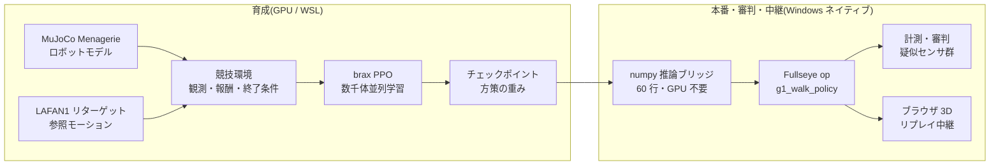

2025 年、中国・北京でヒューマノイドロボットのハーフマラソンが走り、夏には第 1 回の世界ヒューマノイドロボット運動会が開かれて、二足歩行ロボットが徒競走をし、サッカーをし、ダンスを踊りました。そして偶然にも、この記事を書いている今日(2026 年 8 月 22 日)、北京の国家スピードスケート館で **第 2 回世界ヒューマノイドロボット運動会が開幕**しています。今回は 16 カ国・666 チーム・2,056 台、種目は 51(第 1 回の 26 からほぼ倍増)、目玉は「リモコン操作を排した完全自律カテゴリ」だそうです(数字の出典は 16.0 節の調査表にまとめてあります)。ニュースを追いながら、ずっと思っていたのです。

**「これ、個人でやりたい」**

もちろん実機を 500 台並べる会場は用意できません。予算も、場所も、あと家族の理解も足りません。でも、いま手元には GPU が 1 枚載った PC があります。物理シミュレーションの中に競技場を建て、選手を育て、競技をやらせ、審判を置き、観客席(ブラウザ)へ中継する — **運動会を構成する要素を全部、自分の机の上で作る**ことなら、できるはずです。

この記事は、その「自宅ヒューマノイド運動会」の開催記です。そして同時に、私が本業の画像処理(産業用マシンビジョン)の経験を持ち込みながら、**Physical AI の統合開発環境(IDE)を作ろうとしている**開発記でもあります。競技の裏側では、審判のまなざし(計測とズル検知)も、中継設備(ブラウザ 3D ビューア)も、選手の育成環境(強化学習パイプライン)も、ぜんぶ同じ一つの道具箱 — 自作の視覚ツールキット **Fullseye** — に流れ込んでいきます。

長い記事です。読み物として頭から読んでも、目次から競技だけ拾い読みしても成立するように書きました。

*大会ポスター(挿絵は画像生成 AI(Gemini)。文字が化けやすいので、空白バナー付きで生成して文字は自分で入れる方式)*

> **発案と実装の帰属について(最初に明記)**
> この記事に出てくる方向性の判断・アイデア(運動会という企画そのもの、実機センサに合わせた観測設計、イベントカメラ的な時間差分の導入、筋骨格の「相反+共収縮」2 指令化、部位単位の単純化、学習済みポリシーの Studio op 化、ブラウザ中継…)は私が出し、実装・実験・計測の実務は AI コーディングエージェント(Claude Code)が回しています。**うまくいった実験も、失敗した実験も、数字はすべて実測**です。失敗を隠すと次の自分が困るので、負けた競技も負けたまま載せています。なお本文の一人称「私」は判断と方向づけの主語ですが、発見の瞬間には人間と AI の境目が曖昧な場面もあります。帰属を断定できない記述は「私と AI のチームとして」の意味に読んでください — 主語を格好よく盛らないのも honest disclosure のうちです。

## この記事の読み方(3 コース)

とても長い記事なので、先にコース案内です。

- **5 分コース(動きだけ見る)**: スクロールしながら動画(GIF)だけ眺めてください。直進歩行の完走、障害物走、67 体の入場行進、700 筋人体のポーズ、立位で崩れるところまで、動きだけで話の骨格がわかるように並べてあります。
- **30 分コース(本編)**: 第 1〜15 章。運動会の開催記+失敗談+開発記です。各章末の「🍙 かみ砕きコーナー」は、本文が硬いなと思ったときの避難所です。
- **フルコース(資料編まで)**: 付録 A〜G。実験の全記録、ロボット 67 機の名鑑、センサ図鑑、教訓集、用語集、op 全索引、未来資料集。事典として、必要になったときに引く用です。

# 目次(競技プログラム)

1. 開会式 — なぜ個人で運動会か
2. 用語集 — 先にかみ砕いておく
3. 会場建設 — 物理シミュレーションと GPU
4. 選手入場 — Unitree G1 と自作 700 筋人体 evis
5. 種目 1: 徒競走(20m 直進) — 3 連敗から「白線が見えていなかった」一撃まで
6. 種目 2: 障害物走 — 疑似 LiDAR と 1 次元イベントカメラ
7. 種目 3: 団体演技 — 700 本の筋肉をキーフレームで動かす
8. 種目 4: 平均台(静止立位) — いちばん地味な種目が、いちばん難しかった
9. 審判団 — 画像処理屋が作る「ズルを見抜く計器」
10. 中継局 — ブラウザだけで動く 3D リプレイ
11. 統合開発環境へ — Fullseye Studio という野望
12. 開催要項 — 個人でやるための構成表
13. 未来に向けて — 最先端をシミュレーションするという遊び方
14. この運動会に混ざっている学問たち — DNA から光学まで
15. 番外競技 — 腕・空・ハンド・箸(全部、本物の物理)
16. 閉会式と次の種目
付録 A〜I — 実験年代記 / ロボット名鑑(67 機)/ センサ図鑑 / 教訓集 / 拡張用語集 / Fullseye op 全索引(1,606)/ 未来資料集 / 学習ログ実測抄 / FAQ

---

# 1. 開会式 — なぜ個人で運動会か

*挿絵: 画像生成 AI(Gemini)による。転んでいる選手がいるのが、この記事の内容と完全に一致しています*

北京の大会が面白かったのは、「歩けるか」ではなく「**競技になるか**」を問うたところだと思っています。歩くだけなら 2015 年の DARPA Robotics Challenge の頃からロボットは(転びながら)歩いていました。競技になるというのは、速さを競い、コースを守り、失格条件があり、記録が残るということです。つまり **計測と規律** が入るということ。

誤解のないように書いておくと、「個人で中国に勝とう」という話では全くありません。あの規模とスピード、そして何より「ロボットにマラソンを走らせてみよう」「運動会を開いてしまおう」という**自由な発想そのものが、素直に見習うべきもの**だと思っています。私がやりたいのは競争ではなく、あの刺激を自分の手の届く形に翻訳してみることです。そして重要なのは、それが**翻訳できてしまう時代が来ている**ということ。オープンなモデルとデータと計算資源が、個人の机の上で本当に噛み合う。刺激を受けた側が、観客のままでいなくていい。これはずいぶん希望のある話だと思うのです。

私はふだん産業用の画像処理をやってきた人間で、工場の検査装置の世界では「測れないものは改善できない」「測り方を疑え」が家訓です。強化学習(Reinforcement Learning)でロボットを育てる遊びを始めてすぐ、この 2 つの世界が同じ骨格を持っていることに気づきました。**報酬(スコア)の設計は検査基準の設計であり、エージェントは基準の穴を必ず突いてくる被検体**です。だから運動会というフレームは冗談のようでいて、実は本質的でした。競技規則(報酬・終了条件)、計時と計測(ログとロールアウト=方策を最初から最後まで走らせた 1 回分の実走)、ドーピング検査(ズル検知)、そして観客への中継(可視化)。この全部を作らないと、運動会は成立しません。

個人でやる意味も書いておきます。大会に出てくるロボットの制御は各社の秘伝ですが、**シミュレーションの中の運動会は、モデルもデータも学習コードも全部オープンなもので組めます**。使ったのは MuJoCo(物理エンジン)、MuJoCo Menagerie(ロボットモデル集)、Unitree 公式の LAFAN1 リターゲットモーション(HuggingFace 公開。元データは Ubisoft La Forge、CC BY-NC-ND 4.0 の非商用ライセンス — 詳細は末尾の謝辞)、brax/MJX(GPU 物理と学習)、そして自作コード。GPU 1 枚あれば、誰でも自宅に競技場を建てられる時代が、本当に来ています。

# 2. 用語集 — 先にかみ砕いておく

本文を読みながら戻ってこられるように、主要な用語を先にまとめます。形式は「用語(English) — 一言定義 → かみ砕き」です。

- **強化学習(Reinforcement Learning, RL)** — 試行錯誤と報酬でふるまいを獲得する学習法。→ 犬のしつけ。お手ができたらおやつ。ただし犬より圧倒的に打算的で、おやつの規則の穴を全力で突いてくる。
- **方策(policy)** — 状態を入力に行動を出す関数。学習の成果物。→ 選手の「体の動かし方のクセ」そのもの。本記事の方策は小さなニューラルネット(4 層×32 ユニット程度)。
- **報酬(reward)** — 1 ステップごとに与える点数。→ 競技の採点規則。ここの設計ミスは必ず悪用される。
- **観測(observation)** — 方策に見せる入力ベクトル。→ 選手の五感。**ここに入っていないものは、選手には存在しない**(本記事最大の教訓)。
- **PPO(Proximal Policy Optimization)** — 定番の強化学習アルゴリズム。→ 「一度に極端に変えず、少しずつ確実に上達する」練習法。
- **学習ステップと「26M」「150M」表記** — 本記事では選手の成長度合いを「学習ステップ数」で表し、M は百万(mega)の意味で使います。26M = 2,600 万ステップ、150M = 1 億 5,000 万ステップ。**距離のメートル(小文字 m。「20.5m 前進」など)とは別物**なので、「大文字 M が付く大きな数字は練習量、小文字 m は距離」と読み分けてください。→ 部活でいうと「素振り 2,600 万回目の時点」みたいな言い方です。
- **模倣学習の参照モーション(reference motion / mocap)** — 人間の動きを記録してロボットの関節に写した「お手本」。→ ダンスの振り付けビデオ。LAFAN1 はその公開データ集で、Unitree が自社ロボット向けに公式変換している。
- **残差制御(residual control)** — お手本の関節角に、方策が小さな修正量(残差)だけ足す方式。→ 「振り付けは守れ、ただしバランス調整は自分でやれ」。ゼロから動きを発明させない。
- **POMDP / 部分観測** — 環境の状態の一部しか観測できない状況。→ 目隠しでの綱渡り。種目 1 の敗因。
- **疑似 LiDAR(pseudo-LiDAR)** — シミュレーション内で光線を飛ばして距離を測る仮想センサ。→ コウモリの超音波。実機の LiDAR(レーザー距離計)の性質を計算で真似る。
- **イベントカメラ(event camera / DVS)** — 明るさの「変化」だけを出すカメラ。→ 静止画は撮れないが「動いたもの」に超敏感な目。本記事では 1 次元版を自作。
- **筋骨格モデル(musculoskeletal model)** — 関節をモーターでなく「筋肉の張力」で動かす人体モデル。→ ロボットではなく解剖学の人体。evis は 700 本の筋を持つ。
- **トルク(torque)** — 関節を回す力のモーメント。**筋は押せない、引くだけ**(これで一敗している)。
- **WBC-QP(全身制御の二次計画法, Whole-Body Control via Quadratic Programming)** — 「全関節の加速度と接触力を、物理条件を満たしつつ最適に決める」制御の定石。→ 全身の力配分を毎瞬間、数学の最適化で解く。
- **MJX / brax** — MuJoCo の GPU 並列版と、その上の学習フレームワーク。→ 競技場を数千面同時に建てて、数千人の選手を同時に練習させる技術。
- **XLA** — GPU 用の計算コンパイラ。→ 会場の施工業者。得意工法(固定形状の行列計算)に合わない設計図(700 筋の疎な張力計算)は建ててくれない、という制約が後で効いてくる。

# 3. 会場建設 — 物理シミュレーションと GPU

会場はまるごとソフトウェアです。構成はこうなっています。

- **物理エンジン**: MuJoCo。接触計算の信頼性と速度のバランスで、いまロボット学習のデファクトです。
- **並列化**: MJX(MuJoCo の GPU 版)+ brax の PPO 実装。数千の競技場を GPU 上に同時に建てて、同じ選手のコピーを一斉に走らせ、全員分の経験をまとめて学習します。
- **ハードウェア**: RTX 5090(32GB)1 枚。本記事の学習は 2 種目を同時に走らせて**合計 約 9,700 学習ステップ/秒**が出ています(メモリ割当を 0.35 ずつに絞って同居)。1 つの種目の練習(約 1 億ステップ)がおよそ 3〜4 時間。夕方に練習を仕込んで、夕食後に結果を見る、という生活リズムになります。だいたい風呂上がりに転倒動画を眺めてため息をつく係です。
- **学習は Linux 側(WSL)、それ以外は Windows 側**という分業です。JAX/XLA の都合で学習は WSL に寄せ、計測・可視化・記事の図表づくりは Windows ネイティブの Python でやっています。この分業が後述の「numpy 推論ブリッジ」の動機になりました。

*図: 本記事の学習スループット実測。GPU 1 枚で 2〜3 本の学習を同居させても各 8,000〜10,000 ステップ/秒。四足(別トレーナ)は単位系が異なるため別パネル(実測ログより作図)*

会場建設で最初に効いてくる制約が、用語集にも書いた **XLA の得意工法問題**です。関節をモーターで回す普通のロボット(G1 など)は GPU で数千並列にできますが、**700 本の筋で動く自作人体 evis は、筋張力の計算が XLA に載らず GPU 並列化できません**でした。そこで evis の競技は CPU で行い、将来 GPU に載せるときは「筋を等価な関節トルクに置き換えた双子(torque-twin)」を使う、という二段構えにしています。会場に大競技場(GPU)と小体育館(CPU)がある、と思ってください。

> **🍙 かみ砕きコーナー(会場編)**
> ゲームの「物理エンジン」と同じものが、ロボット研究でも会場になります。マリオがジャンプして落ちるのも、ここでロボットが転ぶのも、中でやっている計算は同族です。違いは真剣さで、研究用の物理エンジンは「接触した瞬間の力」を保険の約款みたいな細かさで計算します。そして GPU を使うと、この会場を数千個コピーして同時に動かせます。ロボット 1 体の練習を 4,000 体が同時にやる感じ。だから一晩で人間の数年分の練習量になるのです。

## 3.1 深掘り: 会場の地下設備 — 物理エンジンは 1 ステップで何をしているのか
(第 3 章「会場建設」の増補)

シミュレータは「魔法の箱」ではありません。`mj_step()` を 1 回呼ぶたびに、中では決まった順番の計算が走っています。ここでは、その箱のフタを開けて一緒に覗いてみます。

### 3.1.1 1 ステップの中身: 順動力学パイプライン

MuJoCo の 1 ステップは、おおまかに次の段階を順に通ります(公式 docs の Computation 章 [^mjc-comp] に全段の解説があります)。

| 段階 | やること | 使われるアルゴリズム |
|---|---|---|
| 1. 前向き運動学 | 関節角度から、全ボディの位置・姿勢を計算 | 木構造をルートから葉へ伝播 |
| 2. バイアス力 | 重力・コリオリ力・遠心力をまとめて計算 | Recursive Newton-Euler(RNE) |
| 3. 慣性行列 | 「どの関節を押すとどれだけ動くか」の行列 M を計算 | Composite Rigid-Body(CRB) |
| 4. 衝突検出 | どのジオメトリ同士が触れているかを列挙 | broad-phase → narrow-phase |
| 5. 制約力の解法 | 接触力・関節リミット力・摩擦を決める | **凸最適化**(後述) |
| 6. 数値積分 | 加速度を積分して速度・位置を 1 コマ進める | Euler / RK4 / implicit 系(後述) |

ポイントは 2 つです。

**一般化座標(generalized coordinates)**。MuJoCo は各ボディの xyz 座標を別々に持つのではなく、「関節角度のベクトル」で全身の状態を表します。関節でつながっている限り、ボディがバラバラに吹き飛ぶ心配が構造的にありません。公式 docs は「MuJoCo pioneered the combination of simulation in generalized coordinates with optimization-based contact dynamics(一般化座標でのシミュレーションと最適化ベースの接触力学の組み合わせを開拓した)」と自己紹介しています [^mjc-overview]。ゲーム物理エンジン(直交座標+バネで拘束を近似)との一番大きな設計差がここです。

**順動力学(forward dynamics)**。「いま加わっている力から、次の瞬間の加速度を求める」計算です。運動方程式 M(q)·q̈ = 外力 + 制約力 を、上の表の材料(M、バイアス力、接触力)を揃えてから解きます。

#### かみ砕き: パラパラ漫画の 1 コマ

シミュレーションはパラパラ漫画です。1 ステップ = 1 コマ。各コマで「全員の位置を確認 → 誰と誰がぶつかっているか調べ → 押し合う力を決め → その力で全員をほんの少し動かす」を繰り返します。私たちの G1 の学習では 1 コマ 0.002 秒。1 秒の歩行の裏で 500 コマ分、この表の全段が走っています。

### 3.1.2 接触はなぜ難しいか — LCP を捨てて凸最適化を選んだ MuJoCo

物理エンジンの一番の難所は「接触」です。足が地面に触れた瞬間、地面はどれだけの力で押し返すべきか? これは意外と定義が難しい問題です。

古典的な定式化は **LCP(線形相補性問題)** でした。「接触力は押す方向のみ(引っ張らない)」「離れているなら力ゼロ」「摩擦はクーロン錐の中」という条件を相補性条件として書き下ろします。ところが摩擦付き LCP は解が一意に定まらないことがあり、一般には NP 困難なクラスに属します。

MuJoCo の作者 Todorov らはここで発想を変えました。**接触を少しだけ「柔らかく」認めることで、問題全体を凸最適化に変換した**のです(IROS 2012 論文 [^todorov2012]、および docs の Computation 章 [^mjc-comp])。docs には双対問題の形が明示されています:

> f = argmin_λ ½ λᵀ(A+R)λ + λᵀ(a₀ − aᵣ)  subject to λ ∈ Ω

細部は追わなくて大丈夫です。大事なのは **(A+R) が正定値 = 谷がひとつしかない**こと。つまり接触力は「唯一の大域最適解」として毎回同じ答えが出ます。LCP のように「解けたり解けなかったり、答えが複数あったり」がありません。

その代償が **soft contact(柔らかい接触)** です。docs の「Physical realism and soft contacts」節にある通り、相補性が厳密には成り立たず、「接触力と接触法線方向の速度が同時に正になれる」= わずかなめり込みが許されます [^mjc-comp]。ただしこれは欠陥ではなく設計思想で、現実の物体も接触面はミクロには変形しています(布団に置いたノート PC は少し沈みますよね)。「完全剛体の接触」のほうがむしろ物理的フィクションだ、という立場です。

さらに凸定式化には副産物があります。docs いわく「uniquely-defined inverse(逆動力学が一意に定義される)」[^mjc-overview]。「この動きを実現するには何の力が要ったか」を逆算できるのは、最適制御・ロボティクス研究でこのエンジンが選ばれてきた理由のひとつです。

#### solref / solimp — 接触の硬さを「バネとダンパの言葉」で指定する

では「どのくらい柔らかいか」はどう決めるのか。それが XML でよく見かける `solref` と `solimp` です(docs の Modeling 章「Solver parameters」節 [^mjc-solver])。

| パラメータ | 意味 | 直感 |
|---|---|---|
| `solref = (timeconst, dampratio)` | 制約を質量-バネ-ダンパ系として再パラメータ化 | timeconst = めり込みが戻る速さ、dampratio = 1 なら跳ね返らずスッと戻る(臨界減衰) |
| `solimp = (d₀, d_width, width, midpoint, power)` | インピーダンス d ∈ (0,1) = 「制約が力を出す能力」をめり込み量の関数で指定 | d が小さい = 弱い(柔らかい)制約、大きい = 強い(硬い)制約 |

docs の言葉を借りると、solref は「時定数と減衰比という質量-バネ-ダンパ系の言葉でモデルを再パラメータ化する」もの、solimp の d は「small values of d correspond to weak constraints while large values of d correspond to strong constraints」[^mjc-solver]。つまり最適化ソルバの中の抽象的な正則化項を、人間が直感を持てる「バネの硬さ・ダンパの効き」に翻訳してくれるインターフェースです。接触がプルプル震えるとき・足がめり込むとき、私たちがいじっていたのは実はこの 2 つでした。

### 3.1.3 積分器と時間刻み — なぜ筋肉やテンドンで「爆発」するのか

表の最終段、数値積分には選択肢があります(docs「Numerical Integration」節 [^mjc-comp])。

| 積分器 | 特徴 | 向き不向き |
|---|---|---|
| Euler(semi-implicit) | 関節ダンピングだけ陰的に扱う半陰的オイラー | 標準。速い |
| RK4 | 4 次のルンゲ=クッタ。1 ステップに 4 回評価 | エネルギー保存系に強い。コスト 4 倍 |
| implicit | 速度依存力(コリオリ・遠心力含む)の微分まで陰的に | 最も安定。LU 分解が必要 |
| implicitfast | implicit からコリオリ系の微分を省いた版 | docs 推奨。Cholesky で速い |

「陰的(implicit)」とは何か。陽的な積分は「今の力で次の位置を決める」。陰的な積分は「次の瞬間の状態でつじつまが合うように連立方程式を解いて進める」。前者は速いが、**硬いバネ(変化の速い力)があると 1 コマの間に力が暴れて発散**します。これが数値的な「爆発」の正体です。

筋肉・テンドン(腱)はまさにこの「硬いバネ」の塊です。筋の受動弾性・テンドンの張力は、わずかな伸びで大きく力が変わる = 時定数が短い。時間刻み dt がその時定数より粗いと、1 コマの間に「力を過大に見積もる → 行きすぎる → 反対向きにもっと大きい力 → …」の振動が増幅します。evis(筋駆動ヒューマノイド)が G1 より小さい dt を要求したのは、怠慢ではなく数学的な必然でした。docs も速度依存の力が支配的な系では implicit 系が「RK4 より大幅に安定(significantly more stability)」だとし、**時間刻みは「おそらく唯一最重要のパラメータ(perhaps the single most important parameter)」**だと明言しています [^mjc-comp]。

#### かみ砕き: コマ落ちしたパラパラ漫画

硬いバネと粗い dt の組み合わせは、「コマ数を節約したパラパラ漫画で剣道の面打ちを描く」ようなものです。竹刀の先端は 1 コマの間に大きく動くので、コマを間引くと軌道が描けず、絵が破綻します。ゆっくり歩くシーンなら間引いても大丈夫。**dt は「一番速く動くもの」に合わせて選ぶ**——これが数値安定性の一行まとめです。

### 3.1.4 MJX — MuJoCo を GPU の言葉に書き直す

学習には数千万ステップが要ります。CPU の MuJoCo 1 個では日が暮れる。そこで **MJX** です。

MJX は MuJoCo を **JAX で書き直した**実装です。公式 docs [^mjx] によれば、狙いは「XLA コンパイラがサポートするあらゆる計算ハードウェアで MuJoCo を動かす」こと。JAX の `vmap`(自動ベクトル化)で同一シーンを数千個並べ、GPU の SIMD 演算器に一括で流し込みます。docs の表現では、MJX が得意なのは「simulating big batches of parallel identical physics scenes using algorithms that can be efficiently vectorized on SIMD hardware(SIMD ハードウェアで効率よくベクトル化できるアルゴリズムによる、同一物理シーンの大バッチ並列シミュレーション)」——まさに RL のためのエンジンです。

ただし GPU 化はタダではありません。docs が正直に書いている制約 [^mjx]:

- **分岐(branching)が苦手**: 「accelerators exhibit poor performance for branching code(アクセラレータは分岐コードの性能が悪い)」。衝突検出の broad-phase は「近くにない物体ペアをスキップする」分岐だらけの処理なので、GPU では全ペアを愚直に評価しがちになります。
- **可変長が苦手**: XLA は配列サイズをコンパイル時に固定します。接触の数はステップごとに変わるのに、MJX では「最大接触数」分のメモリを常に確保して計算します。CPU 版なら「今日は接触 3 件」で済むところを、GPU 版は毎回満席分の計算をするわけです。
- **メッシュは軽く**: 衝突メッシュは「200 頂点程度以下」が推奨。
- **1 個だけなら遅い**: 単一シーンでは「MJX-JAX can be 10x slower than MuJoCo(CPU 版 MuJoCo の 10 倍遅くなりうる)」。MJX の価値は 1 個の速さではなく、**4096 個同時に走らせても 1 個分とさほど変わらない**スループットにあります。

(補足: 2026 年現在の docs では MJX は 2 系統に分かれています。JAX 再実装の MJX-JAX(自動微分可能)と、より高速だが自動微分非対応の MJX-Warp です [^mjx]。本記事の学習で使ったのは JAX 系のパイプラインです。)

#### brax PPO の学習ループ

MJX とペアで使ったのが **brax** [^brax] の学習アルゴリズム実装です。brax は JAX ベースの物理エンジン + 学習ライブラリで、README にある通り PPO / SAC / ARS / 進化戦略などの実装を同梱しています。その PPO の 1 サイクルはこう回ります:

1. **rollout**: 数千の並列環境で現在の方策を短い区間(unroll)走らせ、(観測, 行動, 報酬) を収集
2. **GAE**: 集めた報酬から advantage(その行動が平均よりどれだけ良かったか)を推定(パート 2 で詳述)
3. **minibatch SGD**: データをミニバッチに割り、PPO のクリップ付き目的関数で方策ネットと価値ネットを数エポック更新
4. 新しい方策で 1 に戻る

このループ全体——物理シミュレーションもニューラルネット更新も——が JIT コンパイル(実行直前にまとめて GPU 用コードへ変換)されて **GPU から一度も降りずに**回るのが、MJX + brax 構成の速さの源泉です。CPU↔GPU 間のデータ転送という最大のボトルネックが消えます。

#### パート 1 出典

[^mjc-comp]: MuJoCo 公式 docs, Computation 章(パイプライン・凸最適化・soft contact・積分器): https://mujoco.readthedocs.io/en/stable/computation/index.html
[^mjc-overview]: MuJoCo 公式 docs, Overview(一般化座標・凸接触・一意な逆動力学・テンドン): https://mujoco.readthedocs.io/en/stable/overview.html
[^mjc-solver]: MuJoCo 公式 docs, Modeling 章 Solver parameters(solref / solimp): https://mujoco.readthedocs.io/en/stable/modeling.html#solver-parameters
[^todorov2012]: Todorov, Erez, Tassa, "MuJoCo: A physics engine for model-based control," IROS 2012: https://doi.org/10.1109/IROS.2012.6386109
[^mjx]: MuJoCo 公式 docs, MJX 章(JAX/XLA・バッチ並列・分岐/可変長の制約): https://mujoco.readthedocs.io/en/stable/mjx.html
[^brax]: google/brax(JAX 物理エンジン + PPO/SAC 等の学習実装): https://github.com/google/brax

---

## 3.2 深掘り: 会場の歴史 — 物理シミュレータの系譜
進化にせよ RL にせよ、淘汰の「世界」を提供するのは物理エンジンです。この 25 年で世界のほうも劇的に進化しました。

### 3.2.1 年表: 7 世代の物理エンジン

| 年 | エンジン | 2〜3 行で | 出典 |
|---|---|---|---|
| 2001 | **ODE** | Russell Smith が公開したオープンソース剛体動力学ライブラリ(初版 2001-05-08)。関節・接触・衝突検出を備え、研究用シミュレータ(Gazebo 等)の標準部品として一時代を築いた | [^ode] [^ode-wiki] |
| 2000s | **Bullet** | Erwin Coumans 主導。ゲーム・VFX 出身の衝突検出+多体物理。Python バインディング PyBullet が深層 RL 初期の定番環境になった | [^bullet] |
| 2000s〜 | **PhysX** | NVIDIA のリアルタイム物理 SDK。ゲーム市場で鍛えられ、のちに GPU 実装が Isaac Gym の心臓部になる。現在はオープンソース | [^physx] |
| 2012 | **MuJoCo** | Todorov・Erez・Tassa "MuJoCo: A physics engine for model-based control"(IROS 2012)。一般化座標+凸最適化ベースの接触という研究特化設計 | [^mujoco-paper] |
| 2021-22 | **MuJoCo 買収→OSS 化** | DeepMind が買収して無償公開(2021-10-18)、続いて全コードを Apache-2.0 で開源(2022-05-23)。研究標準エンジンが「誰のものでもある」状態に | [^mujoco-blog1] [^mujoco-blog2] [^mujoco-gh] |
| 2021 | **Isaac Gym** | Makoviychuk ら(NVIDIA)。物理も報酬計算も**全部 GPU 上**で回し、1 枚の GPU で数千環境を同時シミュレーション。RL のデータ収集を桁違いに変えた | [^isaacgym] |
| 2021-23 | **Brax / MJX** | JAX 系。Brax は微分可能物理エンジン(Freeman ら 2021)、MJX は MuJoCo 本体の JAX 実装で、XLA が動くハードウェア(GPU/TPU)なら千並列が書ける | [^brax] [^mjx] |
| 2024 | **Genesis** | マルチフィジックス(剛体・流体・軟体)+フォトリアル描画+高速 GPU 並列を一体で狙う新世代プラットフォーム | [^genesis] |

### 3.2.2 ゲーム物理と研究物理の分岐

この系譜には見えない分水嶺があります。**「60 fps で破綻しなければ勝ち」のゲーム物理**と、**「接触力が物理的に正しくないと意味がない」の研究物理**です。

ゲーム物理(Bullet、PhysX の出自)は、プレイヤーが見て自然なら近似で構いません。貫通を押し戻す、めり込みをごまかす、安定性のためにエネルギーを勝手に減らす——リアルタイム性のためなら全部あり。この割り切りが膨大なゲーム市場で性能を鍛え、結果的に研究にも安価な物理を供給しました。深層 RL 初期のベンチマークの多くが PyBullet や MuJoCo の環境で走ったのは、この蓄積の恩恵です。

研究物理(ODE 後期→MuJoCo)は逆に、**接触とその微分の正しさ**にこだわります。ロボットの制御則はまさに接触力の応答で決まるからで、MuJoCo が凸最適化で接触を解く設計を選んだ経緯は 3.1 節で見た通りです。分岐は細部にも現れます。ゲーム物理は描画フレームに同期した固定ステップで「今フレームを乗り切る」ことを優先しますが、研究物理は時間刻み・ソルバ反復数・接触の柔らかさを全部ユーザーに露出し、「その近似で何を失っているか」を選ばせます。また MuJoCo が逆動力学(この動きに必要だった力の逆算)を一意に計算できることを売りにするのに対し、ゲーム物理で逆動力学を真面目に使う場面はほぼありません——**誰がそのエンジンの「顧客」だったか**が、20 年後の設計思想まで決めているわけです。ここをごまかしたシミュレータで学習した方策は、実機に持っていった瞬間に **sim-to-real gap**(reality gap)に殴られます。ドメインランダム化(Tobin ら 2017 [^tobin])のような「シミュレータのパラメータをわざとバラつかせて、どの世界でも通用する方策を育てる」処方箋が生まれたのも、ギャップが構造的に避けられないからです(sim-to-real の各論は 6.5 節・6.6 節で扱うので、ここでは系譜の位置づけだけ)。

### 3.2.3 GPU 並列が RL を変えた

Isaac Gym 論文(2021)[^isaacgym] のインパクトは一点に尽きます。従来の RL は「物理は CPU、学習は GPU」で、CPU↔GPU 間のデータ輸送がボトルネックでした。Isaac Gym は物理シミュレーション・観測・報酬計算を**すべて GPU テンソル上**で完結させ、1 枚の GPU で数千環境を同時に走らせます。同年の Rudin らの "Learning to Walk in Minutes Using Massively Parallel Deep Reinforcement Learning" [^rudin] は、この仕組みで四足ロボット ANYmal の歩行方策を**単一ワークステーション GPU・数分**で学習できることを示しました。それまで「クラスタで数日」だった作業です。

これは単なる高速化ではなく、研究の作法を変えました。学習が数分なら、報酬設計の試行錯誤が「日単位の博打」から「コーヒーを淹れる間の実験」になります。私たちが自宅の 1 枚の GPU で G1 の報酬を 12 世代も作り直せたのは、まさにこの 2021 年の転換の恩恵です。

MJX [^mjx] と Brax [^brax] は同じ思想の JAX 版です。物理ステップを JAX の関数として書くことで、`jit` でコンパイルし `vmap` で数千環境ぶん束ねる、という機械学習側の作法がそのまま物理に使えます。Brax はさらに**微分可能物理**——「シミュレーション結果をパラメータで微分できる」——を看板に掲げました。転んだ結果を報酬信号としてしか使えなかった世界から、「どのパラメータをどちらに動かせば転ばなかったか」の勾配が(理屈の上では)直接取れる世界への橋です。接触のような不連続現象の微分は今も難所ですが、系譜の次の分岐点はここにあると見られています。

ただし GPU 並列にも代償はあります。数千環境を 1 枚に詰めるため、1 環境あたりの接触ソルバは軽量化され、複雑な閉ループ機構や大規模な接触(たとえば 700 本の筋肉)はそもそも載らないことがある——私たちが evis で経験した「筋骨格モデルは GPU 化できず torque-twin に迂回した」件は、この設計トレードオフの実例です。「速い物理」と「何でも表せる物理」は、まだ同じエンジンには同居していません。

#### かみ砕き: 体育館に 4,096 人の生徒

昔の RL は「職人が 1 体のロボットに付きっきりで教え、日誌を GPU に郵送する」方式でした。GPU 並列物理は「体育館に 4,096 体を並べ、全員に同時に同じ授業をして、その場で採点まで済ませる」方式。1 体あたりの授業の質は同じでも、1 日に集まる経験の量が桁で違います。歩行学習が「数週間」から「数分」になった正体は、教え方の進歩ではなく**教室の巨大化**です。

### 3.2.4 ロボット学習ベンチの現在地(2026)

いま「歩かせたい・掴ませたい」人が最初に触る定番を 1 行ずつ。

- **MuJoCo Playground** [^playground] — MJX ベースの GPU 並列環境集。四足・ヒューマノイド・マニピュレーションの sim-to-real 志向タスクが揃う(私たちの G1 歩行の土台もこの系)。
- **Isaac Lab** [^isaaclab] — Isaac Sim 上のロボット学習統合フレームワーク。NVIDIA エコシステムの現行正解で、Isaac Gym の後継ポジション。
- **ManiSkill** [^maniskill] — SAPIEN ベースの GPU 並列シミュレーション+レンダリング。マニピュレーション(操作)課題に強い。
- **Genesis** [^genesis] — 剛体に閉じないマルチフィジックスと描画を統合する野心枠。新しい分、エコシステムは発展途上。

眺めると、2012 年に「研究物理の正しさ」を選んだ MuJoCo と、ゲーム市場で速度を鍛えた GPU 物理(PhysX 系)が、2020 年代に「GPU 並列 × 接触の正しさ」で合流したのが現在地だと分かります。ODE で 1 体をよろよろ歩かせていた時代から 25 年、いま自宅の 1 枚の GPU の中では、数千体のヒューマノイドが並んで転び続けています。

---

#### パート 1 出典

[^sims-page]: Karl Sims, "Evolved Virtual Creatures," 1994(本人サイトの解説ページ): https://www.karlsims.com/evolved-virtual-creatures.html
[^sims-paper]: Karl Sims, "Evolving Virtual Creatures," SIGGRAPH '94 論文 PDF(本人サイト): https://www.karlsims.com/papers/siggraph94.pdf
[^sims-acm]: 同論文の ACM DL 掲載ページ(SIGGRAPH '94 Proceedings, pp.15-22): https://dl.acm.org/doi/10.1145/192161.192167
[^sims-video]: 映像 "Evolved Virtual Creatures"(Internet Archive): https://archive.org/details/sims_evolved_virtual_creatures_1994
[^sims-youtube]: 同映像(YouTube 転載版, "Karl Sims - Evolved Virtual Creatures, Evolution Simulation, 1994"): https://www.youtube.com/watch?v=JBgG_VSP7f8
[^es-wiki]: Wikipedia "Evolution strategy"(Rechenberg・Schwefel による 1960 年代創始の記述): https://en.wikipedia.org/wiki/Evolution_strategy
[^holland]: Wikipedia "John Henry Holland"(1975 年『Adaptation in Natural and Artificial Systems』): https://en.wikipedia.org/wiki/John_Henry_Holland
[^cmaes]: Hansen & Ostermeier, "Completely Derandomized Self-Adaptation in Evolution Strategies," Evolutionary Computation 9(2), 2001: https://doi.org/10.1162/106365601750190398
[^cmaes-tutorial]: Hansen, "The CMA Evolution Strategy: A Tutorial," 2016: https://arxiv.org/abs/1604.00772
[^cmaes-site]: CMA-ES 公式サイト: https://cma-es.github.io/
[^neat]: Stanley & Miikkulainen, "Evolving Neural Networks through Augmenting Topologies," Evolutionary Computation 10(2), 2002: https://nn.cs.utexas.edu/downloads/papers/stanley.ec02.pdf
[^novelty]: Lehman & Stanley, "Abandoning Objectives: Evolution Through the Search for Novelty Alone," Evolutionary Computation 19(2), 2011: https://doi.org/10.1162/EVCO_a_00025
[^mapelites]: Mouret & Clune, "Illuminating search spaces by mapping elites," 2015: https://arxiv.org/abs/1504.04909
[^cully]: Cully, Clune, Tarapore & Mouret, "Robots that can adapt like animals," Nature 521, 2015: https://www.nature.com/articles/nature14422
[^openai-es]: Salimans, Ho, Chen, Sidor & Sutskever, "Evolution Strategies as a Scalable Alternative to Reinforcement Learning," 2017: https://arxiv.org/abs/1703.03864
[^wright]: Sewall Wright, "The roles of mutation, inbreeding, crossbreeding and selection in evolution," Proc. 6th Int. Congress of Genetics, 1932(原論文の複写 PDF): http://www.blackwellpublishing.com/ridley/classictexts/wright.pdf
[^landscape-wiki]: Wikipedia "Fitness landscape"(Wright 1932 が起源との記述): https://en.wikipedia.org/wiki/Fitness_landscape
[^afterman]: Wikipedia "After Man: A Zoology of the Future"(Dougal Dixon, 1981): https://en.wikipedia.org/wiki/After_Man
[^cheney]: Cheney, MacCurdy, Clune & Lipson, "Unshackling evolution: evolving soft robots with multiple materials and a powerful generative encoding," GECCO 2013: https://doi.org/10.1145/2463372.2463404
[^xenobots]: Kriegman, Blackiston, Levin & Bongard, "A scalable pipeline for designing reconfigurable organisms," PNAS 117(4), 2020: https://doi.org/10.1073/pnas.1910837117

#### パート 2 出典

[^ode]: Open Dynamics Engine 公式サイト(作者 Russ Smith): https://www.ode.org/
[^ode-wiki]: Wikipedia "Open Dynamics Engine"(初版リリース 2001-05-08): https://en.wikipedia.org/wiki/Open_Dynamics_Engine
[^bullet]: Bullet Physics SDK(Erwin Coumans ら): https://github.com/bulletphysics/bullet3
[^physx]: NVIDIA PhysX SDK(オープンソースリポジトリ): https://github.com/NVIDIA-Omniverse/PhysX
[^mujoco-paper]: Todorov, Erez & Tassa, "MuJoCo: A physics engine for model-based control," IEEE/RSJ IROS 2012: https://doi.org/10.1109/IROS.2012.6386109
[^mujoco-blog1]: DeepMind Blog, "Opening up a physics simulator for robotics," 2021-10-18(買収と無償公開の発表): https://deepmind.google/discover/blog/opening-up-a-physics-simulator-for-robotics/
[^mujoco-blog2]: DeepMind Blog, "Open sourcing MuJoCo," 2022-05-23(全コード開源の発表): https://deepmind.google/discover/blog/open-sourcing-mujoco/
[^mujoco-gh]: MuJoCo リポジトリ(Google DeepMind 管理): https://github.com/google-deepmind/mujoco
[^isaacgym]: Makoviychuk et al., "Isaac Gym: High Performance GPU-Based Physics Simulation For Robot Learning," 2021: https://arxiv.org/abs/2108.10470
[^rudin]: Rudin, Hoeller, Reist & Hutter, "Learning to Walk in Minutes Using Massively Parallel Deep Reinforcement Learning," 2021: https://arxiv.org/abs/2109.11978
[^genesis]: Genesis(Genesis-Embodied-AI): https://github.com/Genesis-Embodied-AI/Genesis
[^playground]: MuJoCo Playground(Google DeepMind): https://github.com/google-deepmind/mujoco_playground
[^isaaclab]: Isaac Lab 公式ドキュメント: https://isaac-sim.github.io/IsaacLab/main/index.html
[^maniskill]: ManiSkill(SAPIEN ベース): https://github.com/haosulab/ManiSkill
[^tobin]: Tobin et al., "Domain Randomization for Transferring Deep Neural Networks from Simulation to the Real World," 2017: https://arxiv.org/abs/1703.06907

# 4. 選手入場

*図: 主力 5 選手の身長比較(縮尺は厳密に共通、1.0m/1.8m の基準線入り。背景の明るさは各シーン由来)。左から G1、H1、Go2、Spot、evis(シミュレーションレンダ)*

## 選手 1: Unitree G1(市販ヒューマノイドのシミュレーションモデル)

北京の大会で活躍していた Unitree 社の小型ヒューマノイド、その公式シミュレーションモデルが MuJoCo Menagerie に収録されています。身長約 1.3m、**駆動関節 29**。重要なのは、**実機がこの世に存在する**ことです。シミュレーションで育てた方策は、観測を実機センサに合わせておけば、原理的には実機へ持っていく道があります(後述のとおり、観測設計は最初から実機センサ構成に合わせました)。

*図: Unitree G1(公式シミュレーションモデル、駆動 29 関節)*

お手本の動きは Unitree が公式公開している **LAFAN1 リターゲットデータセット**(HuggingFace: `lvhaidong/LAFAN1_Retargeting_Dataset`)を使います。人間のモーションキャプチャを G1 の 29 関節に変換済みの、30fps の関節角時系列です。ここから歩行 1 周期(膝角度の自己相関で 30 フレームと検出)を切り出し、ループが滑らかにつながるよう閉合し、ヨー(向き)成分を除去してまっすぐ歩く参照(1.47m/s)に加工しました。

## 選手 2: evis(自作 700 筋の解剖学的人体)

もう一人の選手は買ってきたロボットではなく、**解剖学データから組んだ筋骨格の人体モデル**です。自由度 84(nq=85)、**筋アクチュエータ 700 本**。骨格は文献の人体慣性パラメータに基づき、筋は起始・停止・経由点を持つ張力要素として植えてあります。モーターは一つもありません。上腕を上げるのは三角筋で、肘を曲げるのは上腕二頭筋です。

*図: evis 全身。骨格と 700 本の筋(赤い線維)で動く(シミュレーションレンダ)*

なぜこんな面倒なものを育てるのか。介護や生活支援を考えたとき、**人と同じ構造で動くものは、人の動きの「理由」を説明できる**からです。それに、運動会に出すなら、地元代表の自前選手も一人は欲しいじゃないですか。

*図: Unitree H1(大型ヒューマノイド、駆動 19 関節)*

## 選手 3(参入手続き中): Unitree H1、そして「全種目・全選手」構想

この記事を書いている裏で、G1 用に組んだ育成パイプラインの **H1(大型ヒューマノイド)対応**を進めています。LAFAN1 リターゲットには h1 版もあるので、変換器とロボット設定の差し替えで参入できる見込みです。さらにその先として、Menagerie に収録されている**全ロボット(四足・アーム・ハンド・ドローン含めて 67 モデル)の棚卸し**を始めました。

*動画: H1 が LAFAN1 リターゲットのお手本モーションを再生する様子(キネマティック再生 = まだ物理で歩いているわけではなく、これから学習で「本当に歩ける」ようにする前段階。10.5m 区間、シミュレーション)*
ゆくゆくは四足の部、マニピュレーションの部、空の部まで種目を広げ、文字どおりの「総合運動会」にするつもりです。

*図: 全 67 選手の集合写真(各機の実測レンダを段組合成した「合成写真」— 1 シーン同居ではありません)*

*動画: 全 67 モデルの入場行進(各 0.5 秒、ヒューマノイド → 四足 → アーム → ハンドの順。MuJoCo Menagerie、シミュレーション)*

## 4.1 深掘り: 選手名鑑・実機編 — 値札が 2 桁下がった

*図: ヒューマノイド価格の推移(対数軸、各社公表・報道値)。5 年で 2 桁下がった(公表値より作図)*
### 4.1.1 主役: Unitree G1 — この記事でシミュレーションしている本人

本連載の主役、宇樹科技(Unitree Robotics、杭州)の G1。公式ページ
(<https://www.unitree.com/g1>)に記載の主要スペックは次のとおり(2026-08-22 閲覧)。

| 項目 | 公称値 | 備考 |
|---|---|---|
| 身長 | 1320 mm(立位) | 折りたたみ時は約 690 mm(報道値) |
| 質量 | 約 35 kg(バッテリー込み) | |
| 自由度 | 23(基本)/ 23〜43(G1 EDU) | 脚 6×2 + 腕 5×2 + 腰、EDU はハンド等で増える |
| 膝関節最大トルク | 90 N·m(G1)/ 120 N·m(EDU) | |
| バッテリー | 13 直列リチウム、9000 mAh | 稼働約 2 時間(報道値) |
| センサ | 3D LiDAR + 深度カメラ | 頭頂の Livox Mid-360 + Intel RealSense D435i 構成が代表的 |
| 価格 | US $13.5K〜(公式ページ、税・送料別) | 発表時(2024-05)は $16K と報道 |

- 発表時の報道: The Robot Report「Unitree Robotics unveils G1 humanoid for $16K」(2024-05)
  <https://www.therobotreport.com/unitree-robotics-unveils-g1-humanoid-for-16k/>
- IEEE の ROBOTS ガイドにも収載: <https://robotsguide.com/robots/unitree-g1>

記事本編で報酬設計に効いた「膝 90 N·m」「23 DOF」「Mid-360 + D435i」は、
全部この公称スペックに根拠がある——**シミュレーションの観測設計を実機センサに合わせる**
(ストーリー B)という方針は、この表を見ながら決めたもの。

### 4.1.2 兄貴分: Unitree H1 — 1500m 金メダリスト

H1 は Unitree が 2023 年に出したフルサイズ機。公式ページ(<https://www.unitree.com/h1>)の
公称値(2026-08-22 閲覧):

| 項目 | 公称値 |
|---|---|
| 身長 / 質量 | 約 180 cm / 約 47 kg |
| 自由度 | 各脚 5 + 各腕 4(拡張可) |
| 関節トルク | 膝 360 N·m、股関節 220 N·m、足首 59 N·m、腕 75 N·m |
| 移動速度 | 3.3 m/s(電動ヒューマノイドの速度記録として公称)、潜在 >5 m/s |
| 価格 | 公式ページ記載なし。直販ページの提示は $90,000(見積ベース、構成依存)<https://shop.unitree.com/products/unitree-h1> |

**大会実績(ここが「運動会」記事的に一番おいしい)**: 2025 年 8 月 15〜17 日、北京で開催された
第 1 回世界ヒューマノイドロボット競技大会(World Humanoid Robot Games)で、H1 が
**1500 m 走を 6 分 34 秒 40 で優勝**(初日にいきなり大会第 1 号の金メダル)、**400 m も 1 分 28 秒 03 で金**。
Unitree は大会全体で金 4 を含む 11 メダルを獲得した。

- Robotics 24/7「Unitree H1 earns two gold medals at World Humanoid Robot Games」
  <https://www.robotics247.com/article/unitree_h1_earns_two_gold_medals_at_world_humanoid_robot_games>
- Unitree 公式 X(1500m 6:34.40 の一次発表)
  <https://x.com/UnitreeRobotics/status/1956231617372152139>
- South China Morning Post(大会全体のメダル集計、280 チーム / 16 か国 / 26 種目)
  <https://www.scmp.com/tech/tech-trends/article/3322251/chinas-unitree-x-humanoid-top-medal-total-worlds-first-humanoid-robot-games>

人間の 1500m 世界記録は 3 分 26 秒(H. エルゲルージ)なので、H1 はまだ人間トップの半分弱のペース。
それでも「二足歩行ロボットが 1500m を転ばず走り切って順位を争う」時代が 2025 年に来たこと自体が、
本編第 4 章の入場行進(MuJoCo Menagerie 67 体)に現実の裏付けを与えてくれる。
なお本記事の H1 GIF(`h1_lafan_parade.gif`)で使った LAFAN1 リターゲットデータも
Unitree 公式配布(HF `lvhaidong/LAFAN1_Retargeting_Dataset`)である。

### 4.1.3 世界の選手名鑑(一言プロフィール)

各 2〜3 行+出典。**価格はどれも構成・時点で大きく動くので「桁」で読む**こと。

**Tesla Optimus(米)** — 身長 173 cm・57 kg(AI Day 2022 公表値)。Musk の目標価格
$20,000〜30,000 は「量産が軌道に乗れば」という目標値で、2026 年時点で未発売・Tesla 工場内での
試験運用段階。<https://www.tomsguide.com/news/elon-musk-demos-the-human-like-optimus-tesla-bot-and-it-walks-on-its-own>(AI Day デモ報道)

**Figure 03(米 Figure AI)** — 2025-10-09 発表の第 3 世代。家庭投入を明言した初の設計で、
布製外装・無線充電・指先 3 グラムの触覚センサ、専用工場 BotQ で年 1.2 万台の量産体制。
価格は非公表(報道の推定は $100K 超)。公式発表:
<https://www.figure.ai/news/introducing-figure-03>

**Boston Dynamics 新 Atlas(米、現代自動車傘下)** — 2024 年に油圧から全電動へ転換。
公式スペックは 56 DOF・身長 1.9 m・90 kg・リーチ 2.3 m・瞬間 50 kg / 連続 30 kg 可搬・IP67。
Hyundai 工場での部品シーケンシングを最初のパイロットに、2026-01 の CES で製品版を発表。
<https://bostondynamics.com/atlas/>

**Apptronik Apollo(米)** — 身長 5'8"(約 173 cm)・160 lb(約 73 kg)・25 kg 可搬・
バッテリー 4 時間、交換式。物流・製造向け。公式:
<https://apptronik.com/apollo/apollo-2> / 発表リリース:
<https://apptronik.com/news-collection/apptronik-unveils-apollo>

**Fourier GR-3(中国・上海、傅利葉)** — 身長 165 cm・71 kg・全身 55 DOF・12 DOF ハンド。
リハビリ機器出身の会社らしく「Care-bot」(介護・対話ケア)を掲げ、布張り外装と
視聴触覚のマルチモーダル対話が売り。公式ドキュメント:
<https://support.fftai.com/en/docs/GR-X-Humanoid-Robot/GR3/GR-3_Introduction/>

**Booster T1(中国・北京、加速進化)** — 30 kg・23 DOF(拡張 41)の開発者向け小型機。
RoboCup 2025 AdultSize 優勝チーム(清華 Hephaestus)の機体プラットフォームで、50 以上の
大学チームが採用。公式価格は問い合わせ制、代理店表示は $30K 前後(2026 年時点)。公式:
<https://www.booster.tech/> / RoboCup 実績報道:
<https://botinfo.ai/articles/booster-t1-robot>

**Tiangong / 天工(中国・北京、X-Humanoid = 北京人形機器人創新中心)** — 2025-04-19、
世界初のヒューマノイドハーフマラソン(北京亦荘、21.0975 km)を Tiangong Ultra が
2 時間 40 分 42 秒で完走・優勝。身長約 1.8 m・約 55 kg、ピーク時速 12 km。
CGTN 報道: <https://news.cgtn.com/news/2025-04-19/-Tiangong-Ultra-wins-world-s-first-ever-humanoid-robot-half-marathon-1CHdanwJVzG/p.html> /
北京市政府英文サイト: <https://english.beijing.gov.cn/latest/news/202504/t20250421_4070140.html>

**UBTech Walker S2(中国・深圳、優必選)** — 「自分で電池を交換して 24 時間働く」を初めて
実装した産業機(交換約 3 分、無停止)。NIO・BYD 等の工場に導入、2025-11 に量産開始。
公式: <https://www.ubtrobot.com/en/humanoid/products/walker-s2> / 報道:
<https://cnevpost.com/2025/07/17/ubtech-humanoid-robot-autonomous-battery-swap/>

**AgiBot / 智元 A2(中国・上海)** — 身長 175 cm・55 kg、ホットスワップ電池で約 2 時間稼働。
接客・物流向けで、2025 年末までに累計 5,168 台出荷と報道(出荷台数ベースで世界首位の主張)。
公式: <https://www.agibot.com/> / 収載:  <https://humanoid.guide/product/a2/>

**Unitree R1(中国・杭州)** — 身長 121 cm・約 25 kg・26 DOF。2025-07 の世界人工知能大会で
**$5,900** という衝撃価格で発表された開発者向け軽量機。
<https://roboticsandautomationnews.com/2025/07/29/shock-price-unitree-launches-5900-humanoid-robot/93357/>

### 4.1.4 「価格が桁で下がっている」を数字で

発表時期順に並べると、ヒューマノイドの入手価格はこの 3 年で **2 桁**下がった:

| 年 | 機体 | 価格(発表・時点) | 出典 |
|---|---|---|---|
| 〜2023 | Agility Digit | 約 $250K(報道) | <https://standardbots.com/blog/tesla-robot>(比較表) |
| 2023 | Unitree H1 | 約 $90K(見積ベース) | <https://shop.unitree.com/products/unitree-h1> |
| 2024-05 | Unitree G1 | $16K → 現在公式 $13.5K〜 | <https://www.therobotreport.com/unitree-robotics-unveils-g1-humanoid-for-16k/> / <https://www.unitree.com/g1> |
| 2025-07 | Unitree R1 | $5,900 | <https://roboticsandautomationnews.com/2025/07/29/shock-price-unitree-launches-5900-humanoid-robot/93357/> |
| 2025 | Booster K1 | $5,000(RoboCup 優勝機の系譜の普及版) | <https://www.humanoidsdaily.com/news/booster-robotics-launches-k1-robocup-champion-platform> |

もちろん $90K の H1 と $5,900 の R1 では出力もペイロードもまるで違うので
「同じものが 1/15 になった」わけではない。ただし「研究室が 1 台買えるか」の閾値が
**車 1 台分 → 中古車 → 原付**まで降りてきたのは事実で、これが 2025 年に大学チームが
一斉に実機大会(RoboCup AdultSize、WHRG)へ出てこられた直接の理由になっている。

> **かみ砕き**: パソコンの歴史と同じ進み方をしている。メインフレーム(数億円)→
> ミニコン(数千万)→ PC(数十万)と桁が下がるたびに「触れる人」が 100 倍になり、
> ソフトウェアが爆発した。ヒューマノイドはいま「ミニコン → PC」の段差のところにいる。
> $5,900 は「ハイエンド PC を買う感覚でヒューマノイドが買える」最初の価格であり、
> この記事のように**買えない人もシミュレータで同じ機体(G1)を訓練できる**——
> 実機とシミュの二段構えが、ちょうど PC 時代の「実機がなくてもエミュレータで開発」に相当する。

---

## 4.2 深掘り: 選手たちの家系図 — 二足歩行ロボットの 50 年
### 深掘り増補テキスト: 二足歩行ロボットの 50 年史 — WABOT-1 から自宅の GPU まで

---

### 0. まず年表 — 50 年を 1 枚で

| 年 | 出来事 | その時代のブレークスルー(1 行) |
|---|---|---|
| 1968-72 | Vukobratović らが ZMP 概念を提唱 [^zmp35] | 「倒れない」を数式で定義できるようになった |
| 1973 | 早稲田 WABOT-1 完成(世界初のフルスケール人間型)[^robogaku][^waseda50] | 歩行・物体把持・日本語会話を 1 体に統合 |
| 1984 | WABOT-2 が電子オルガンを演奏 [^wabot2] | 「専門家ロボット」— 楽譜を読み、人の歌に伴奏 |
| 1986 | ホンダが極秘で二足歩行研究を開始(E シリーズ)[^honda-st] | 静歩行から動歩行へ、企業が本気を出した |
| 1990 | McGeer「受動歩行」論文 [^mcgeer] | モーターゼロでも坂を歩ける — 歩行は力学の固有モード |
| 1996 | ホンダ P2 発表 [^honda-p2] | 自立(電源・計算機内蔵)ヒューマノイドが「普通に」歩いた |
| 2000 | ASIMO 発表 [^miraikan-a] | 歩行の実用的完成度と 20 年の一般公開 |
| 2002 | HRP-2 Promet(川田工業+産総研)[^hrp2] | 転倒からの起き上がり — 「倒れたら終わり」からの脱却 |
| 2003 | ソニー QRIO が走行(ギネス「世界初の走る二足」)[^qrio] / 梶田らの予見制御 [^kajita] | エンタメ機の完成度と、歩行パターン生成の標準理論 |
| 2006 | QRIO 開発中止 [^qrio] / Pratt らの Capture Point [^pratt] | 冬の時代の始まりと、押されても倒れない理論 |
| 2009 | HRP-4C(産総研)[^hrp4c] | 人間サイズ・人間体型での歩行とエンタメ応用 |
| 2013-15 | DARPA Robotics Challenge [^drc-kaist][^drc-ieee] | 災害対応で世界の実力が露呈 — 「転倒集」の衝撃 |
| 2016 | Atlas の最適化ベース制御(MIT/IHMC 系の成果公開)[^kuindersma] | QP/MPC で全身をリアルタイム最適化 |
| 2017 | Agility Cassie 販売 / トヨタ T-HR3 [^agility][^toyota-wiki] | 脚だけに割り切る派と、遠隔操縦で全身を割り切る派 |
| 2019 | RL sim-to-real が実機で決定打(ANYmal)[^hwangbo] | 「制御則を書く」から「制御則を学習させる」へ |
| 2021 | Cassie が RL で階段を「見ずに」上る [^siekmann] | 固有受容感覚のみ+ドメインランダム化の勝利 |
| 2022 | ASIMO 引退 [^miraikan-p] / Cassie 100m ギネス記録 [^agility] | 一つの時代の終わりと、次の時代の号砲 |
| 2024 | 油圧 Atlas 引退、電動 Atlas 発表 [^bd-atlas][^tc-atlas] / Unitree G1(1 万ドル台)[^g1] | 研究の頂点が商用へ、価格が 2 桁下がった |
| 2025 | 北京で世界初のヒューマノイド半マラソン(4 月)[^cgtn]、世界ヒューマノイドロボット競技大会(8 月)[^whrg][^cnbc] | 中国勢の物量と速度 — 500 体が同じ会場で競技 |
| 2026 | ホンダ P2 が IEEE マイルストーン認定 [^honda-ieee] | 30 年前の一歩が「歴史」として公式に刻まれた |

以下、この年表を物語として歩き直します。

---

### 1. 早稲田の夜明け(1970 年代)— 1 歩 45 秒から始まった

1970 年、早稲田大学の加藤一郎研究室で WABOT プロジェクトが発足し、1973 年に **WABOT-1** が完成します。世界初のフルスケール人間型ロボットで、二足で歩き、手で物を掴み、簡単な日本語会話までこなしました [^robogaku][^waseda50]。ただし歩行は重心を常に足裏の上に置く静歩行で、**1 歩に 45 秒** [^nikkei-w1]。

続く WABOT-2(1980-84)は方向性を変え、「専門家ロボット」を目指しました。カメラで楽譜を読み、電子オルガンを演奏し、人の歌に合わせて伴奏する [^wabot2]。「人間の器用さと知能を要する仕事を 1 つ選んで極める」というアプローチは、いま見ても新鮮です。

理論面の土台はほぼ同時期にユーゴスラビアから来ました。Vukobratović らが 1968 年のモスクワの会議で提唱し、1970-72 年に「Zero-Moment Point(ZMP)」として定式化した概念です [^zmp35]。ZMP を実機の動歩行に定着させた場も早稲田の WL シリーズ(WL-10RD、1984 年)とされます(この 1 点は一次 URL 未確認、末尾参照)。
