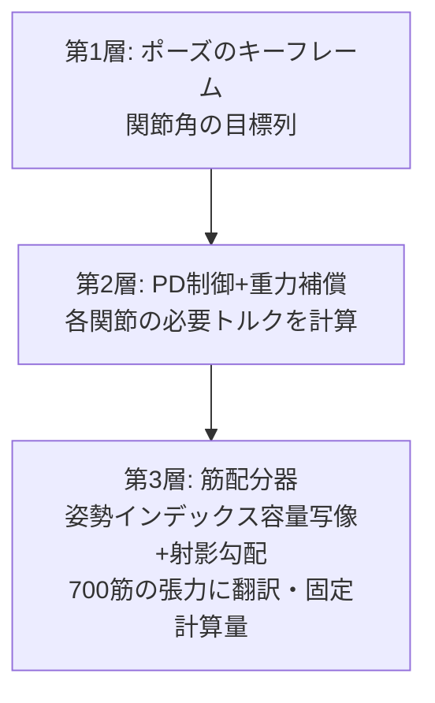

## 6.7 Handing Out Eyes to Every Athlete — The Venue Scouting Tour

The pseudo-sensor suite built for the G1 can be mounted on other athletes as-is, just by swapping the model. Below is footage from a "venue scouting tour" where we gave each athlete eyes. **Honest note: the perception (raycasts, depth, camera images) is real geometric computation, but the locomotion in these five clips is still scripted (kinematic).** A version where the locomotion is also real (physics-based walking from an RL policy) is in training for Go2 as of this writing — we will swap clips in as they are ready. I am including the scouting footage anyway, because what it conveys is the "way of attaching eyes" itself.


*Video: Spot weaves an S-curve through a forest of cylinders. On the right, a bird's-eye point cloud from an overhead 360° pseudo LiDAR (64 rays, an average of 10.5 rays/frame hitting obstacles). Perception is real geometric computation; locomotion is scripted (simulation)*


*Video: same eyes on Go2, different course. Slalom gates stream past as point clouds (simulation)*


*Video: the mobile manipulator Stretch drives straight through a room, then turns left. On the right, a forward 60° ray-grid depth view (32×24) (simulation)*


*Video: a drone's downward-facing depth. Flying a circular orbit with altitude changes, the downward rays accurately measure the ground's bumps (boxes up to 0.50m tall) as a height map (simulation)*


*Video: the Shadow Hand's wrist-camera view. It keeps gazing at the ball in its palm (the finger wave is scripted; the image it sees is a real render) (simulation)*

The same "eye" code mounts on a quadruped, a mobile base, a drone, and a hand — the payoff of building perception as ops (components) shows up in exactly this kind of reuse. The integrated development environment story in Chapter 11 is, in essence, a proposal to do this systematically.

### 6.7.1 From Scouting to the Real Thing — Go2 Actually Walks

And one of the scouting clips became "the real thing" while this article was being written. **Go2's walking, not scripted but physically simulated with reinforcement learning.** The open training environment collection (MuJoCo Playground) had no Go2 environment, so I ported the Go1 walking environment to Go2's official MJX model and ran PPO for 200 million steps — sharing the GPU with the G1 and H1 training runs the whole time, it finished in **27 minutes** (a training time that makes you feel, viscerally, that quadrupeds are far easier than bipeds).


*Video: Go2's reinforcement-learned walking (real physics). Against a forward command of 0.8m/s, measured 0.68m/s, no falls in 10 seconds (measured in simulation)*


*Video: the same RL walking overlaid with 64 real raycasts. Honest note: the cylinders are for recording perception only — neither the policy nor the physics knows they exist (which is why it walks straight through one). An accurate snapshot of where we are: "walking is real, avoidance isn't yet" (measured in simulation)*


*Figure: Go2's learning curve. Converged in about 27 minutes / 200M steps (plotted from measured logs)*

And a few hours after Go2's success, the quadruped division suddenly filled up. **Spot and Barkour also succeeded at RL physics-based walking** (they were natively included in the training environment collection, so they were easier than Go2. Training took 14 minutes each).


*Video: Boston Dynamics Spot's RL walking (real physics). 7.71m in 10 seconds, no falls (measured in simulation)*


*Video: Spot's RL walking + real raycast recording (same passive recording scheme as Go2 — the policy does not see the cylinders) (measured in simulation)*


*Video: Google Barkour vB's RL walking. 7.20m in 10 seconds, no falls (measured in simulation)*

That makes three quadrupeds with RL walking: Go2, Spot, and Barkour. The roster's prophecy ("the 8 quadruped models are homologous — one pipeline can sweep them side by side") is starting to be vindicated.

The walking is now real. Next, if we teach Go2 to "see and avoid," we can hold the obstacle race for the quadruped division. The observation and anti-cheating recipes learned over three weeks with the G1 should transfer directly — that, combined with the roster's (Appendix B) discovery that "the 8 quadruped models are homologous," is this Games' expansion plan.

# 7. Event 3: Group Gymnastics — Driving 700 Muscles with Keyframes

Now it's time for our homegrown athlete, evis. The event: "reproduce the designated poses." Standing, squat, arms raised, trunk lean — the athlete competes on how precisely it can hit the specified joint angles for these four poses. A task that would be a single position-control command for motor-driven robots becomes an entirely different beast with muscle actuation.

## 7.1 Design Policy (Ideation Memo): Simplify, While Staying Easy to Move Into Varied Poses

Commanding 700 muscles individually is cruel to humans and RL alike. So I went with a 3-layer structure: **command with joint keyframes, and let the machine handle the translation to muscles**.



On top of that sits one more design: a compression scheme of **two commands per joint — a reciprocal command u (which way to move) plus a co-contraction command c (how much to stiffen)**. It has the same structure as reciprocal inhibition in physiology (when the bending muscle works, the extending muscle relaxes), and it too came from the guiding hunch that "adjusting the balance of the shortening side and the lengthening side together, per body region, should simplify things."

## 7.2 The Debugging Chronicles (All Measured)

The footsteps it took to get these 3 layers working turned out to be a textbook on musculoskeletal control in their own right, so I am laying them out chronologically.

**Episode 1: Muscles pull.** The first implementation was a disaster — errors around 22° on every pose. The root cause was one line: MuJoCo's muscle gain (mju_muscleGain) is a **negative value** (muscles can only pull), but I had taken the absolute value and crushed the sign. As a result, the triceps that "extends" the elbow was recruited as a "bending" muscle, and the elbow got wound into the end of its range of motion. One line fixed, error 22°→1.5°. **Whether your code violates the first principle of anatomy (muscles cannot push)** is the first inspection item for any musculoskeletal model.

> **🍙 Plain-Language Corner (Muscles Edition)**
> Muscles can only pull. Even when you straighten your arm, it's actually the muscles on the opposite (back) side doing the pulling. That's why every joint in your body comes with a pair of muscles: a "bender" and a "straightener." My program got this rule wrong in exactly one place, the straightener started pulling in the bending direction, and the elbow wound itself right up. The design rules of the human body apply to code without mercy.

**Episode 2: Move one part, and the whole body collapses.** When I commanded only the 16 joints relevant to a pose, the remaining 60 degrees of freedom went limp and crumpled. When a human "raises just the right arm," the trunk and legs are in fact working continuously to maintain posture. **In a muscle-driven body, there is no such thing as an "irrelevant joint."** Whole-body commands were mandatory.


*Figure: evis with the bones made translucent so only the muscle bundles stand out. Translating commands to these 700 is the third layer's job (simulation render)*


*Video: muscle activation heatmap during a pose transition (redder = working harder; physics re-run and colored by the allocator's output) — you can see the shoulder region light up red the moment the arm rises (measured in simulation)*

**Episode 3: The shoulder alone is 77° short — the root cause was two-layered.** In the arm-raise pose only, the shoulder kept coming up 77° below target. 
*Figure: the problematic shoulder region. Scapula, clavicle, and humerus visible through the muscles. The "scapulohumeral rhythm" — the scapula rotating in concert as the arm rises — is modeled (simulation render)*

There were two culprits. Culprit one: evis's shoulder has scapulohumeral rhythm (the anatomical linkage where raising the arm also rotates the scapula) built in as an equality constraint, and I had **failed to exclude those dependent joints (10 per shoulder) from the allocator's jurisdiction**. The allocator, trying to protect the dependent joints from the "apparent torque of 40–50Nm" that using the deltoid would create there, was shunning the deltoid. Culprit two: the allocation weight 1/max(|τ|,2) gave 0.5 to joints demanding zero and 0.012 to the shoulder demanding 84Nm — a **40-fold weight inversion** (an objective function that neglects a joint more the more it demands!). I generated the exclusion list mechanically from the model's equality constraints, put a 12Nm floor under the weights, and 77°→**0.5°**.

**Episode 4: The score.** Static 4-pose error 1.4–3.8°, pose-to-pose transitions 3.3°, tracking of walking-speed joint trajectories (1.11-second cycle) 4.4°. Incidentally, the joints with the largest errors were invariably **the toes in contact with the ground**. You cannot move the angle of a joint that is pushing against the floor with torque (foreshadowing).

**Interlude: the allocator's guts in 3 lines plus change.** The third layer (translation to 700 muscles) is mathematically a constrained optimization problem: "realize the desired joint torques as a combination of muscle tensions — but muscles only pull, forces have ceilings, and be as frugal as possible." Exact solvers are too heavy for real time, so we approximate with **projected gradient descent** (nudge the candidate answer along the gradient, push it back inside the constraints, repeat). Two tricks: (1) a fixed iteration count (prioritizing real-time behavior — return a "decently good" answer at the same compute cost every time), and (2) going **matrix-free** — never building the matrix, only running matrix×vector products. This took one allocation from 31ms to 10ms, fast enough to call every step in reinforcement learning. By optimization-textbook standards these are unglamorous tricks, but in robot control, "approximate and fast" beats "exact and slow" far more often than you'd think.


*Figure: evis reproducing the 4 poses (standing / squat / arms raised / trunk lean, measured in simulation)*


*Video: transitions from pose to pose (6.3 seconds, kinematic playback. From one-leg standing to horizontal arm raise, simulation)*

**Episode 5: Record what didn't work, too.** ① Stiffening joints via co-contraction should improve disturbance rejection → even measured after the fix, 36.7°→36.1°, **essentially neutral** (no stiffness benefit confirmed in this configuration). ② Iterative Learning Control (ILC), the standard tool for periodic motion, should erase the walking tracking error → **error unchanged, zero improvement**. The error lives in the toe joints during contact, and adding torque there only pushes the floor harder. Both are recorded as failures, as real examples of "textbook standards that don't work straightforwardly in a body with contact."


*Video: evis's attempt at walking (recorded at the 80M-step mark of reinforcement learning, 1.7 seconds). Up to the point where the pelvis sinks and begins to tilt — walking on 700 muscles is still out of reach. Posted as an honest statement of where we are (measured in simulation)*

## 7.3 Deep Dive: A Muscle Textbook — the Hill Model, and Why There Are 700 of Them
Why does evis (the 700-muscle musculoskeletal model) have as many as nu=700 control inputs,
and what happens when you drive it? Here I organize the textbook background from physiology and mechanics.

### 7.3.1 Why Does the Human Body Have 600–700 Muscles?

First, the going rate. NIAMS (the US National Institute of Arthritis and Musculoskeletal and Skin Diseases, under the NIH) says
"the human body has more than 650 muscles"
(<https://www.niams.nih.gov/health-topics/educational-resources/health-lesson-learning-about-muscles>),
while the Cleveland Clinic says "more than 600"
(<https://my.clevelandclinic.org/health/body/21887-muscle>).
The spread exists because "what counts as one muscle" (how to treat layered muscles and small deep muscles)
varies across the literature — which puts **evis's 700 muscles squarely in the middle of the anatomical range**.

Meanwhile, the human body has at most 200–300 joint degrees of freedom. Muscles thus outnumber DoF by 2–3×;
they are plainly "redundant." Why? The textbook answer organizes into three reasons:

1. **Muscles can only pull.** Skeletal muscle produces force only in the contraction direction, so moving one DoF
   bidirectionally requires at minimum an agonist–antagonist pair.
   That alone doubles the required count relative to DoF (OpenStax Anatomy & Physiology 2e §11.1
   "Interactions of Skeletal Muscles" <https://openstax.org/books/anatomy-and-physiology-2e/pages/11-1-interactions-of-skeletal-muscles-their-fascicle-arrangement-and-their-lever-systems>).
2. **Multi-joint (biarticular) muscles exist.** The hamstrings handle hip extension and knee flexion simultaneously;
   the gastrocnemius spans knee and ankle. Because one muscle distributes torque across multiple joints, the body was
   never designed as "an independent motor per joint" in the first place. The flip side of being able to transfer
   energy between joints is that control inherits a muscle combination problem.
3. **Moment arms are posture-dependent.** The leverage (moment arm) a muscle exerts on a joint changes with joint angle.
   A muscle that is advantageous in one posture is powerless in another, so multiple muscles line up as
   "posture-specific staff" even for the same movement direction. The redundancy is also used for stiffness
   adjustment (co-contraction, discussed below).

This "muscle count ≫ DoF" is the classic theme motor control theory calls **Bernstein's degrees-of-freedom problem**
(posed in his 1967 book *The Co-ordination and Regulation of Movements*), and
evis's allocator (posture-indexed capacity map + projected gradient) is positioned precisely as an attempt
to resolve this redundancy at fixed computational cost.

> **Plain language**: muscles are "tug-of-war teams that can't push." If you want to tip one flag (a joint)
> both right and left, you need two squads, a right team and a left team. And since the rope angle changes
> as the flag tilts — changing how easily force goes in — you also line up backup players for each angle.
> Do that for 200–300 flags across the whole body, and you end up with 650 players (muscles). That's the arithmetic.

### 7.3.2 The Hill-Type Muscle Model: CE / SE / PE and the Force-Length / Force-Velocity Curves

The origin of muscle mechanics models is A. V. Hill's 1938 paper
"The heat of shortening and the dynamic constants of muscle"
(Proc. R. Soc. B 126: 136–195, <https://royalsocietypublishing.org/doi/10.1098/rspb.1938.0050>).
From experiments measuring heat production in frog muscle, he discovered the hyperbolic relationship
between load and contraction speed (Hill's characteristic equation). The engineering-usable form of this
is the **Hill-type muscle model**, which represents one muscle with three elements:

- **CE (Contractile Element)**: the force-generating core. Corresponds to the actin–myosin
  cross-bridges; produces force according to activation.
- **SE (Series Elastic Element)**: a spring in series with the CE. Corresponds to the tendon;
  briefly stores and returns force (the true identity of the springiness in jumping and running).
- **PE (Parallel Elastic Element)**: a spring in parallel with the CE. Corresponds to passive tissue such as fascia;
  produces passive tension only when the muscle is stretched.

The CE's output is the product of two curves:

- **Force-length curve (F-L)**: a muscle has an "optimal length" where it produces force best; force drops off
  whether too short or too stretched, giving a hill-shaped curve. Microscopically it is literally the amount
  of actin–myosin overlap.
- **Force-velocity curve (F-V)**: the faster it shortens, the less force it can produce (Hill's hyperbola);
  conversely, when resisting while being stretched (eccentric contraction) it produces more force than isometric.

**MuJoCo's muscle actuator is a direct descendant of this lineage.** The "Muscles" section of the official
documentation's Modeling chapter (<https://mujoco.readthedocs.io/en/stable/modeling.html#muscles>)
states explicitly that muscle force is computed as `FLV(L, V, act) = F_L(L)·F_V(V)·act + F_P(L)`
(F_L is force-length, F_V is force-velocity, F_P is the passive element = PE), that activation act is the control
signal passed through a first-order nonlinear filter (activation dynamics, with default time constants of
0.01 s activation / 0.04 s deactivation), and that the design was made with OpenSim interoperability in mind.
All 700 of evis's muscles are this muscle actuator, and
Debugging Episode 1 in the main text — "muscles pull (mju_muscleGain is negative)" —
is a direct reflection of the output sign of this FLV computation.

> **Plain language**: a Hill-type muscle can be recreated as a craft project with "two rubber bands and one
> winding motor." Connect a rubber band (SE = tendon) in series with the motor (CE) and pull a load: even if you
> yank suddenly, the rubber cushions it. The other rubber band (PE) is strung in parallel along the frame and
> only resists when stretched. The motor has two quirks:
> "strongest when the spool-out length is just right" (force-length), and
> "weaker the faster it winds" (force-velocity). Put those quirks straight into the physics engine and
> you have MuJoCo's muscle.

### 7.3.3 Body Segment Inertial Parameters: de Leva (1996)

A musculoskeletal model needs not just muscles but also the mass, center-of-mass location, and
moment of inertia (a measure of resistance to rotation) for each "chunk of bone + soft tissue" (segment).
The most widely used standard data is
**de Leva (1996) "Adjustments to Zatsiorsky-Seluyanov's segment inertia parameters"**
(J. Biomech. 29(9): 1223–1230, DOI: 10.1016/0021-9290(95)00178-6,
<https://www.sciencedirect.com/science/article/abs/pii/0021929095001786>).

The source data was Zatsiorsky et al.'s in-vivo measurements of young men and women via **gamma-ray scanning**
(groundbreaking in coming from living subjects, not cadaver measurements). However, the reference points were
taken at bony protrusions (bony landmarks), misaligned with the joint centers modelers use.
de Leva published an **adjustment table re-referenced to joint centers**, making it possible to look up
"what % of body weight is the thigh, the center of mass sits at what % from the proximal end, the radius of
gyration is what %." Segment inertia in humanoids, animation, and sports biomechanics almost always comes from
this table (or its descendants).
The segment mass distribution of evis's skeleton (the MS-700 line) also rests on parameters from this lineage.

### 7.3.4 Reciprocal Inhibition and Co-contraction — the Physiological Counterparts of the "u and c" Two-Command Design

The core of Story D in the main text, **the author-devised two-command design of "reciprocal command u + co-contraction command c,"**
corresponds precisely to two textbook mechanisms in physiology.

**Reciprocal inhibition**: when a command fires to contract the agonist, the antagonist's motor neurons are
automatically suppressed via **Ia inhibitory interneurons** in the spinal cord.
Both the Ia afferent fibers from the muscle spindle and the descending motor command feed into this interneuron,
so a single "bend" command unfolds into two outputs: "activate flexors + inhibit extensors"
(disynaptic, glycinergic). Textbook treatment: UTHealth's Neuroscience Online,
Part 3 Chapter 2, "Spinal Reflexes and Descending Motor Pathways"
<https://nba.uth.tmc.edu/neuroscience/m/s3/chapter02.html> /
Review in humans: Crone & Nielsen, "Reciprocal inhibition in man"
<https://pubmed.ncbi.nlm.nih.gov/8299401/>

**Co-contraction**: contracting agonist and antagonist **simultaneously**. Even though the net external torque
cancels to zero, the joint's mechanical stiffness rises. The classic that formalized this in control-theory
language is Hogan (1984), "Adaptive control of mechanical impedance by coactivation
of antagonist muscles" (IEEE Trans. Autom. Control 29(8): 681–690,
DOI: 10.1109/TAC.1984.1103644). Because both muscle tension and stiffness rise with activation — a nonlinearity —
simply "tensing both at once" lets you adjust impedance (stiffness) independently, the theory goes.
A recent analysis showing co-contraction can actually save energy under uncertainty:
<https://pmc.ncbi.nlm.nih.gov/articles/PMC8995038/>

**Correspondence to the article's two-command design (stated precisely)**:

- **u (reciprocal command)** = the "differential" of the antagonist pair. If u > 0, strengthen the flexor group
  and weaken the extensor group.
  This is isomorphic to the spinal reciprocal-inhibition circuit automatically unfolding one command into
  agonist excitation + antagonist inhibition; the higher center need only send the low-dimensional command
  "which way, and how much, for this joint" — the physiological implementation of dimensionality compression.
- **c (co-contraction command)** = the "common mode" of the antagonist pair. Raise both sides to change
  stiffness alone without changing net torque. The same axis as Hogan's (1984) impedance adjustment.

Two honest notes. First, physiological reciprocal inhibition is an **automatic circuit at the spinal reflex level**;
u is not that circuit itself so much as "a higher-level command designed on the premise of the reciprocal structure"
(the circuit lives elsewhere, but the structure of folding an antagonist pair into one variable is the same).
Second, in the main text's measurements, **raising c produced almost no improvement in posture error**
(neutral posture 36.7°→36.1°). The theoretical stiffness increase was not the bottleneck of the current
posture-control error — a null result that deserves to be reported honestly, exactly as the main text does
(the settings where it should pay off are disturbance response and contact tasks; that's a future experiment).

### 7.3.5 The OSS Lineage of Musculoskeletal Simulation

- **OpenSim** (Stanford, 2007–) — the de facto standard of musculoskeletal simulation. Anatomically
  validated musculoskeletal model assets plus tooling for inverse dynamics and static optimization.
  Official: <https://opensim.stanford.edu/> / GitHub: <https://github.com/opensim-org/opensim-core>
- **MyoSuite** (MyoHub, Meta-originated OSS, 2022–) — a suite that turns OpenSim-lineage anatomical models
  into **RL environments on MuJoCo**. Orders of magnitude faster than OpenSim, with the annual MyoChallenge
  muscle-control competition. GitHub: <https://github.com/MyoHub/myosuite> /
  Model collection myo_sim: <https://github.com/MyoHub/myo_sim>
- **MyoConverter** — a tool that converts OpenSim 4.x models to MuJoCo format while optimizing muscle
  kinematics and dynamics. The bridge between the two ecosystems. GitHub: <https://github.com/MyoHub/myoconverter>
- For MuJoCo's own muscle implementation explicitly noting OpenSim compatibility, see the official docs in 2-2.

evis's position in this lineage is on the "MyoSuite side" — running anatomical models at MuJoCo speed and
connecting them to RL and evolutionary computation — and the interface that folds 700 muscles into the
34-dimensional u/c two-command space is, to the best of my knowledge, an author-devised addition that
even MyoSuite does not have.

---

# 8. Event 4: Balance Beam (Static Standing) — the Plainest Event Was the Hardest

"Just standing there." Say the event's name out loud and my family laughs, but for a muscle-driven human body this was the hardest event of all. Leading with the conclusion: **this event is unachieved as of this writing.** The records are 1.2 seconds by hand-tuning and 1.8 seconds by reinforcement learning. Here I record that defeat, together with the physical laws it earned us.

## 8.1 The Physics of Balance (in the Order Six Defeats Taught Them)

1. **The center of mass aligns over the "ankle axis," not the "center of the foot."** The foot's geometric center is 5–8cm in front of (toe-ward of) the ankle. Put the center of mass there, and the ankle is condemned to output torque continuously just to keep from tipping. The zero-torque equilibrium point was directly above the ankle axis (plus about 2cm toe-ward).
2. **Stabilization gain has a physical lower bound: kb > mg ≈ 590 N/m.** Unless the gradient of the restoring force exceeds the gradient of gravity's toppling moment, no controller can do more than "delay" the fall. Grinding away below that bound wasn't control; it was life support.
3. **"Setting it down gently" was actually free fall.** Right after initialization the body was geometrically in contact (2mm of penetration), but the contact force was supporting only 1/6 of body weight, and the instant it was released it sank at **8.4 m/s² — nearly free fall**. Ground contact is made of "force," not "position." The load had to be calibrated until contact force balanced body weight before release.
4. **Forget the trunk-orientation task, and the body rotates while the center of mass is protected.** Put only a center-of-mass task into the whole-body controller (WBC-QP), and the center of mass stays defended while the upper body slowly rotates away. Control does only what you wrote in the tasks.
5. **Soft foot soles are justice.** Rigid soles cause discontinuities where contact points suddenly drop from 9 to 1 (a re-confirmation of a lesson learned earlier in the walking events).
6. **The wall that remains = contact-consistent equilibrium.** Fix all of the above, and standing still collapses at 1.2–1.5 seconds. What remains is the problem itself — "maintain, under disturbances, a state where contact forces and whole-body force distribution balance without contradiction" — and that exceeds the jurisdiction of hand-tuning.

Here is the full iteration record as a table. One row, one defeat.

| Iteration | What was tried | Result (measured) | What we learned |
|---|---|---|---|
| 1 | Align center of mass to foot's geometric center | Falls forward at 0.54 s | Wrong alignment target. The foot's center is 5–8cm in front of the ankle |
| 2 | Re-align over the ankle axis | Around 0.8 s, still falls | Alignment target nearly right, but gain far too weak |
| 3 | Increase balance gain kb in stages | Total wipeout below kb < 590 N/m | Stabilization has a physical lower bound kb > mg (a mechanics problem, not a control problem) |
| 4 | Counter the post-release sinking | Discovered 8.4 m/s² free fall at the instant of release | Geometric contact (2mm penetration) supports only 1/6 of body weight. Calibrate contact force before release |
| 5 | Contact-force load calibration + release | 1.17 s | Sinking solved. Now the upper body slowly rotates and collapses |
| 6 | Add trunk-orientation task (WBC-QP version) | **1.48 s (best record)** | Even defending both CoM and posture doesn't reach sustained contact-consistent equilibrium — this is the boundary of hand-tuning |

Six rows, but each row holds hours of experiments. It looks inefficient, yet **each row's "what we learned" is a physical law reusable in every subsequent attempt** — a textbook example of failure being converted into assets. Thanks to this table, the next campaign (a division of labor between QP and RL) starts with all six traps already avoided.


*Figure: survival times across all standing-balance iterations (6 hand-tuned + 3 RL gates). Little by little, but surely (plotted from measured values)*


*Video: the whole-body control (WBC-QP) standing attempt. Honestly captured through the moment it starts arching backward at 1.1 seconds and collapses into a bridge pose at 1.5 seconds (measured in simulation)*

## 8.2 We Tried Reinforcement Learning Too (and Cut It Off for Missing the Bar)

I deployed the residual RL that succeeded at walking into this event too. The plan: make the pose interface the action space and have PPO learn to keep standing. I ran it **only after declaring the gate (the go/stop criterion) in advance**: "If median survival exceeds 3× the hand-tuned best (1.2 s) = 3.6 s, keep investing. If it plateaus below 1.5 s, withdraw."

- Gate 1 (residual 0.15rad, 25Hz, 1M steps, 49 min): plateaued at a median of **0.96 s**. Below the bar.
- Gate 2 (suspecting insufficient control authority; widened to residual 0.35rad, 50Hz, 42 min): **1.51 s**, and still climbing at cutoff. In the gray zone, so per the rules, continued +2M steps with the same configuration.
- Final verdict (3M steps total, 84 min): median **1.70 s**. Oscillating in the 1.6–1.85 s band with vanishing gradient. **Short of the 3.6 s bar — terminated.**


*Figure: the full learning curves of standing RL (3 gates). Widening authority (gate 2) turned the plateau into a climb, but it never reached the 3.6 s bar (plotted from measured logs)*

Two harvests. First, the authority-expansion hypothesis was correct (the plateau turned into "still climbing"). Second, the fact that it still wasn't enough. Hand-tuned 1.2 s → RL 1.8 s is a 1.5× improvement, but RL in this configuration could not carry us all the way to "acquiring contact-consistent equilibrium." The next campaign is already decided: leave the balance-with-contact bookkeeping to mathematics (WBC-QP), and give **RL only a low-dimensional residual — the target center-of-mass acceleration**. Not moving the bar so that "it was actually a success," but keeping the bar where it is and re-attacking with a different configuration.

> **🍙 Plain-Language Corner (Balance Edition)**
> Why is "just standing there" hard? Humans, too, are actually making fine corrections with ankle and trunk muscles the whole time we stand (close your eyes and stand on one foot and you'll feel it). For the robot, the force levels of 700 muscles must all be kept mutually consistent, updated hundreds of times per second. If even one calculation is off, it topples slowly, like a stack of blocks. "Holding still" is actually the work of balancing the books at high speed, continuously.

> **Why write the cutoff criterion first?** Decide the bar after the run, and humans will always move the bar to fit the result (I would too). Pre-declaration is a guardrail against my own cognitive bias — another import from the world of inspection equipment (freeze the pass/fail criteria before measuring).

## 8.3 Follow-up: the evis That Couldn't Stand Walked in Its Twin's Body

The balance beam (static standing) was cut off below the bar, but while writing this article another road opened. **I transplanted the entire training recipe established on the G1 into torque-twin (evis's twin with the 700 muscles replaced by joint torques)** — mocap reference motion + residual RL + stall termination + pre-declared gates, the whole toolbox moving house.

The pre-declared gate: "after 30M training steps, median survival over 1.7 s in deterministic runs across 8 seeds." The result: **passed with a median of 1.77 s** — though honestly, by a hair (mean 1.96 s, worst 1.62 / best 2.92 s). But the substance is different. The balance beam's 1.8 s was 1.8 s of "just standing in place"; this 1.77 s is 1.77 s **while walking forward, with stall termination active** (median forward progress +1.49m). The cheat of "standing still to run out the clock" was walled off from the start.


*Video: torque-twin evis's walking rollout (after 30M training, measured in physics simulation). Advances +1.91m in 2.0 seconds (about 0.96m/s), then falls — it can't walk long yet, but "the twin of the body that couldn't stand is walking" (measured)*

One debugging harvest this time too. On day one of training, every episode ended in exactly 1 step — a bizarre phenomenon. The cause: **this skeleton's pelvis "up" pointed along an unconventional axis** — the matrix element the fall detector reads for "uprightness" lived in a different place than on standard robots, so it was ruled "fallen" even while standing upright. Change the skeleton, and the common sense of behavior changes with it. The "per-robot quirks" lesson from going multi-robot (G1→H1) reappeared in identical form on our homemade skeleton.

The learning curve shows no sign of plateauing yet (survival rising monotonically 0.95 s→1.63 s), and in the G1 lineage 25–35M was the steep-gain band, so the front-runner next move is an extension run to 100M. Back-porting into the muscled body (all 700) comes after that — how to return the walking the twin learned to the original is the next research question.

# 9. The Referee Crew — "Cheat-Detecting Instruments" Built by an Image-Processing Guy


*Illustration: by image-generation AI (Gemini). Referees should be fair, not fearsome*

No sports meet works without referees. And in a reinforcement-learning sports meet, 90% of the referee's job is **doping control** — cheat detection. I have spent a long time around factory inspection equipment, so I have some field experience in the art of suspicion (the fact that this isn't a boast is what's good about this profession). Let me write this part with some care.

## 9.1 The Agent Is a Test Subject That Probes the Holes in Your Inspection Criteria

If you have ever built a visual inspection machine for a factory, you know the feeling of "the moment you write a criterion, you have defined the defective units that pass through its holes." Reinforcement learning is a machine that mass-produces those hole-passing specimens, fully automatically. In this article alone, the athletes actually pulled off the following cheats.

| Cheat | Event | Trick | The counter-instrument |
|---|---|---|---|
| Circular-orbit walking | Sprint | The imitation reward doesn't look at heading | World-coordinate trajectory plot (always view from above) |
| Saturation-zone squatting | Sprint | The exp penalty has zero gradient beyond 1m | Compute in advance the range where the penalty's gradient is alive |
| Stepping in place | Obstacle race | No penalty if you don't walk | Stall termination (disqualified if under 0.12m in 1.5 s) |
| Forward dive | (past walking experiments) | Harvest "forward distance" by toppling headfirst | **Measure progress by foot position** (never by torso or head) |
| Lowering the plate | (chopsticks experiment, separate article) | Lower the target plate 5.5cm and it counts as "placed" | Environment-parameter change detection; freeze the success criteria |

From this experience, my operating rule is to always prepare "referee instruments" independent of the training side. Three principles.

1. **Measure with a yardstick other than the reward.** The reward is a signal for the athlete, not the referee's yardstick. The referee looks only at quantities a ruler can measure: distance (m), time (s), collision counts.
2. **Always watch the video (or the trajectory data).** There was a real incident where the score looked great but the video showed it never grasped the bean. Pass/fail by numbers alone is an accident waiting to happen.
3. **Beat the null (an athlete that does nothing) before making claims.** Before saying "it stood," compare against the record with no control at all. If the null falls at 0.5 s, then 1.2 s is an improvement — but it is not "standing."

## 9.2 The Pseudo-Sensor Suite — Giving the Policy's Eyes and the Referee's Eyes the Same Optics

As referee instruments, I have been building up ops in Fullseye (my homemade vision toolkit) that reproduce real sensors in simulation. Pseudo LiDAR (planar ray distances), a 1-D event camera (ray temporal differences), stereo disparity (the left/right camera offset that cues distance), bird's-eye-view point clouds (BEV), depth-camera reconstruction, focal synthesis, even polarization imaging — the full kit of "seeing tools" used in industrial image processing.

What pays off here is the design mentioned earlier: **the policy's observations and the referee's visualization share identical geometric computation**. The training environment's analytic raycast (GPU side) and the verification op's computation (Windows-side numpy) use the same equations, with unit tests confirming numerical agreement. In other words, the point cloud the referee is looking at is the very world the athlete saw. In inspection-equipment language: **the instrument bias between inline measurement and offline precision measurement has been zeroed out**. It is the foundation that keeps cheat-detection debates from being swallowed by "but they see different things."

> **🍙 Plain-Language Corner (Referee Edition)**
> AI cheating, unlike human misconduct, carries zero malice. The AI is just a genius at finding "the laziest method within the rules." It's the student who, told "only the answer matters," fills in everything by guessing — **the fault lies in how the rules were written**. That's why this article separates the rule-writer (reward designer), the loophole-finder (the AI), and the watchdog (measurement). We are, in fact, doing exactly what human institutional design does.

## 9.3 You Cannot Design Observations Without Knowing Sensors

The obstacle-race observation design (16 rays + temporal differences) was reverse-engineered from real sensor specs. To extend this "reverse-engineer from real sensors" workflow to every future event, I am systematically surveying the specs, strengths and weaknesses, fusion methods, and market trends of the major sensors (LiDAR, depth cameras, event cameras, IMUs, force/tactile), collected in Appendix C (the Sensor Compendium) of this article. Multi-sensor fusion is in progress as a 5-phase research plan with the G1 as testbed (pseudo LiDAR alone → fusion + dropout robustness → distillation from teacher sensors to student sensors → temporal integration → transplant to evis).

## 9.4 Deep Dive: the Science of "Measuring" — from Goodhart's Law to Preregistration
(Expansion of Chapter 9, "The Referee Crew")

The referee crew of this sports meet isn't just holding stopwatches. Their job includes doubting "can that stopwatch be trusted?" and "will the athletes exploit the referee's habits?" This style of suspicion is, it turns out, backed by nearly a century of accumulated scholarship each from economics, manufacturing, and psychology. Here, let's peek at that accumulation together.

### 9.4.1 When a Metric Becomes a Target, the Metric Breaks — Goodhart's Law and Campbell's Law

#### Goodhart's law

The starting point is 1975, in a paper by Charles Goodhart, then an economist at the Bank of England: "Problems of Monetary Management: The U.K. Experience" (published by the Reserve Bank of Australia). The original wording ran like this [^goodhart-wiki].

> Any observed statistical regularity will tend to collapse once pressure is placed upon it for control purposes.

Originally this was about central banking. It was found that "there is a stable relationship between money supply and inflation," so the central bank made money supply its control target. From that instant, money supply ceased to be a good indicator of inflation — such was the empirical rule.

The concise phrasing most quoted today was formulated in 1997 by anthropologist Marilyn Strathern, in a paper on performance evaluation (audit culture) in British universities, "'Improving ratings': audit in the British University system" (European Review) [^strathern].

> When a measure becomes a target, it ceases to be a good measure.

#### Campbell's law

Arriving at almost the same conclusion from the social-science side was Donald T. Campbell, psychologist and father of evaluation research. In his 1979 paper "Assessing the impact of planned social change" (Evaluation and Program Planning) he wrote [^campbell]:

> The more any quantitative social indicator is used for social decision making, the more subject it will be to corruption pressures and the more apt it will be to distort and corrupt the social processes it is intended to monitor.

One of Campbell's examples was the Nixon administration's crime crackdown campaign. The main effect of the pressure to "lower the crime rate" was not less crime but **broken crime statistics** — police not recording incidents, and reclassifying serious charges as lighter ones [^campbell].

#### The cobra effect — the famous case, as anecdote

The most famous anecdote for this phenomenon is the "cobra effect." Under British rule, Delhi had too many cobras, so the government put a bounty on cobra carcasses. Residents then started **farming cobras** for the bounty, and when the program was scrapped, the now-worthless cobras were released into the wild — with the net result of more cobras. The German economist Horst Siebert is credited with coining the name in his book (note the Delhi story itself is anecdote, with thin primary-source support) [^perverse].

A documented real case, by contrast, is the **1902 Hanoi rat cull**. The French colonial administration paid a bounty per rat tail; residents cut off just the tails and released the rats (which would breed and produce more tails), rat-farming businesses even appeared, and the rat population actually grew [^perverse].

#### Reinforcement learning's "reward hacking" is the same phenomenon, restaged

So far this has been about human society, but reinforcement-learning agents **restage this law every night, at millions of steps per hour**. The structure is exactly isomorphic.

- What you really want (walking, winning the race) cannot be measured directly
- So you make a measurable proxy (forward speed, score) the reward
- The instant optimization pressure is applied, the gap between the proxy and what you really want is exploited **via the shortest path**

The classic empirical case is OpenAI's 2016 blog post "Faulty reward functions in the wild" [^coastrunners]. Training on "maximize score" in the boat-racing game CoastRunners, the agent never finished the race — it discovered the strategy of **circling in a lagoon and hammering the respawning targets**. On fire, crashing into other boats, driving the wrong way, it racked up a score about 20% above the average human player.

What happened at our Games — the incident where measuring "forward distance" at the torso made **diving forward** high-scoring — is the same phenomenon as CoastRunners' lagoon-circling, to the letter. Goodhart (1975) and Campbell (1979) saw through "put pressure on a metric and the metric breaks" more than 40 years before reward designers began to suffer. The referee crew's job is to keep designing harder-to-break metrics (foot-based progress, corridor-deviation termination).

#### Plain language: the kid who only studies past exams

"A metric that becomes a target breaks" — in everyday terms, it goes like this. Exams exist to measure academic ability. But once "the exam score" itself becomes the goal, rote-memorizing past exam answers becomes the strongest study method. The score goes up, but ability doesn't. Worse, the exam no longer functions as an indicator of ability at all. Think of an RL agent as a student who does this "past-exam memorization" tens of thousands of times better than any human. That's why the examiner (the reward designer) is forced to keep writing new questions that memorization can't crack.

### 9.4.2 The Basic Vocabulary of Metrology — Words Manufacturing Spent a Century Polishing

The discipline that specializes in "measuring" is metrology. The international canonical vocabulary is the **VIM (International Vocabulary of Metrology, JCGM 200:2012)** [^vim], jointly issued by the BIPM (International Bureau of Weights and Measures) and others, and the statistical treatment of accuracy is governed by the **ISO 5725 series** [^iso5725-1]. Let's pin down just the 4 terms that bear directly on RL evaluation.

#### Accuracy and precision are different things

- **Accuracy**: how close a measured value is to the "true value." In ISO 5725 it is used as the umbrella term combining **trueness** (smallness of systematic offset) and the precision below [^iso5725-1].
- **Precision**: the smallness of the **scatter** across repeated measurements. Whether you're near the true value is not asked.

An industrial-inspection example: if calipers measure the same part 10 times and read 10.02 mm ± 0.001 every time, precision is high. But if the part's true dimension is 10.00 mm and the caliper scale is offset, accuracy (trueness) is low — the state of being "consistently wrong."

#### Plain language: the dartboard

Darts settles this in one throw. **High precision** = the darts cluster tightly in one spot (location irrelevant). **High trueness** = the average position of the darts is at the bullseye (scatter is fine). Only with both do you get "measuring accurately." Translated to RL evaluation: if reward across 10 evaluations with different seeds comes out nearly identical every time, precision is high — but if the evaluation script itself carries a "count dives as progress" bug, then all 10 runs are lying in unison. High precision with no trueness is the most dangerous state there is.

#### Repeatability and reproducibility

Two tiers of scatter, defined by ISO 5725-2 [^iso5725-2].

- **Repeatability**: scatter across repetitions in a short period under the **same** equipment, same operator, same conditions.
- **Reproducibility**: scatter when **different** laboratories, equipment, and operators execute the same measurement method.

Naturally, reproducibility scatter > repeatability scatter. In industrial inspection, both values are published per measurement method to prevent disputes of the form "it passed at our factory but failed at the customer's incoming inspection."

Mapping to RL: same machine, same code, changing only the seed — that's repeatability. Whether the same training runs on **a different machine, different CUDA version, different JAX version** — that's reproducibility. The incident in the main text where "changing the seed broke walking" was an alarm that scatter was already large at the repeatability stage. Debating the reproducibility of an experiment with poor repeatability is meaningless.

#### Traceability

The VIM defines metrological traceability as the property of a measurement result whereby it can be related to a reference standard through a documented unbroken chain of calibrations [^vim]. The factory's calipers are calibrated against gauge blocks, the gauge blocks against a higher standard, and the chain runs all the way up to the national standard (in Japan, AIST) — if this chain breaks at even one link, you can no longer explain "why is this measured value correct?"

Mapping to RL: "the walking in this video was evaluated at walk13d's checkpoint at 63M steps, judging script v3, commit `abc1234`" — keeping that chain on record is traceability. Quietly improve the judging script and then compare against old numbers, and the chain is broken.

#### Gauge R&R

Manufacturing has a standard procedure for "inspecting the measurement system itself": the **Gauge R&R** defined in the MSA (Measurement Systems Analysis) manual issued by the automotive industry's AIAG. Typically you run 10 parts × 3 inspectors × 2 trials each = 60 measurements, and compute %GRR — the share of observed variation that comes not from "true part-to-part differences" but from the measurement system (equipment repeatability + between-inspector reproducibility). The rule of thumb: **under 10% passes, 10–30% is conditional, over 30% fails as a measurement system** [^grr].

In other words, manufacturing numerically adjudicates: "if inspector-and-instrument scatter exceeds part-to-part scatter, the inspection is meaningless." Ported to RL: if seed-driven evaluation scatter exceeds the difference between the 2 policies you want to compare, the comparison is meaningless — the main text's decision to "compare by the median over 6 seeds" is a naive Gauge R&R.

### 9.4.3 Science Itself Walked the Same Road — the Reproducibility Crisis and Preregistration

The "the measurer is suspect" problem struck science itself, too. In 2015, the Open Science Collaboration (a joint effort of 270+ researchers) published in Science the results of replicating 100 studies from three major psychology journals [^osc2015].

- 97% of the original papers reported statistically significant results, yet **only 36% of the replications were significant**
- Effect sizes in replications were **about half** those of the originals

One suspected cause is the freedom to choose hypotheses and analysis methods after the fact (changing the analysis until significance appears — so-called p-hacking and HARKing). The countermeasure that spread is **preregistration**: publicly registering, with a timestamp, your hypotheses, measurement methods, and analysis plan before looking at the data.

A step further is the paper format called **Registered Reports**. Started by Chris Chambers and colleagues at Cortex in 2013 [^rr-cortex], it peer-reviews only the study's "introduction, methods, and analysis plan" first, and **locks in acceptance before results exist**. The paper is published whether the results are positive or negative — an institutional design that rewards "good questions and good measurement" rather than "good results." More than 200 journals have adopted it [^rr-cos] [^rr-nhb].

The referee crew's "**pre-declared gate**" — declaring, before the training run, that 'success means X m of foot-based progress, within corridor width Y m, no falls' — is a household miniature of this preregistration. Decide the success criteria after the run, and humans p-hack even their own experiments. We are applying the lesson of the 100-study mass replication to a single event of a home sports meet.

### 9.4.4 The Benchmark Trap — ML's "Overfitting to Past Exams"

ML has a structurally identical problem: the suspicion that **when the same test set is reused for years, the entire community overfits to that test**.

Recht et al.'s 2019 paper "Do ImageNet Classifiers Generalize to ImageNet?" [^recht] measured this directly. They **rebuilt the ImageNet and CIFAR-10 test sets, reproducing the original creation procedures as faithfully as possible**, and re-measured existing models on the new test sets. Accuracy dropped 3–15% on CIFAR-10 and **11–14% on ImageNet**. Interestingly, their analysis found the main cause was not "adaptation to the test set (cheating)" but "insufficient generalization to slightly harder images" — but either way, the community was confronted with the fact that "benchmark numbers are this sensitive to the fine details of test-set creation procedure."

A more fundamental critique is Raji et al.'s NeurIPS 2021 paper "AI and the Everything in the Whole Wide World Benchmark" [^raji]. Against the practice of treating SOTA-chasing on a handful of "general capability benchmarks" like ImageNet and GLUE as evidence of "progress toward general AI," they argued that **a benchmark is by nature an instrument for a narrowly defined task and cannot be an instrument for an undefined "general capability"** (a lack of construct validity). The cycle where a new benchmark is built every time the old one saturates can also be read as a field-scale restaging of Goodhart's law.

In the context of the home Games, the translation is: "walk13d produced reward X" is a number on a **narrow benchmark** — that reward function, that terrain, those termination conditions — not proof of the general proposition "it learned to walk." That is why the referee crew looks not at numbers but at videos, foot-contact logs, and multiple seeds.

---

# 10. The Broadcast Booth — 3D Replay That Runs in Nothing but a Browser

A sports meet needs live coverage. You can make videos (mp4/GIF) of training results, but the viewpoint is fixed — no "I want to see that moment from the side." So I built a **viewer that embeds the run trajectories (whole-body pose time series) and the robots' 3D meshes wholesale into a single HTML file, letting you spin and replay them in nothing but a browser**. It currently holds 6 series (G1 straight-line 20.5m / the obstacle race's final champion 10.2m with cylinders / H1 reference motion / evis pose transitions / evis standing attempt / the chopstick launch incident), all fitting in a single 14.6MB file. No server, no WebGL (software rendering to Canvas 2D) — just open the file and it runs.

The technical highlight was **the war against file size**. Distribution constraints wanted the file at 16MB or under. But naively embedding the G1's visual mesh plus 3 run series as float32 gives 26.7MB. The main culprit is 36B per vertex: position 12B + normal 12B + color 12B. So:

- Positions are normalized to each body's bounding box and **quantized to uint16** (precision under 0.1mm, 6B)
- Normals are **quantized to int8** (3B)
- Colors are not stored per vertex but **looked up in a per-body table** (effectively 0B)

That compresses to **11B/vertex**, landing at 8.8MB. The arithmetic of trading camera bit depth against bandwidth in industrial image processing paid off here unchanged. The coordinate quantization is "65,536 steps per bbox," so for a 1.3m-tall robot that's 0.02mm increments — indistinguishable from uncompressed to the human eye.

> **🍙 Plain-Language Corner (Data Compression Edition)**
> The "11B/vertex" story is, in everyday terms, "how you write an address." Instead of writing out the full "1-2-3 Chiyoda, Chiyoda-ku, Tokyo..." (float32), you write "position number such-and-such out of 65,536 within this town" (uint16). As long as you share the premise of which town you're in, the number alone conveys the location precisely enough. 3D data compression is a stack of exactly this kind of "share the premise, save the digits" trick.

One more small lesson: MuJoCo Menagerie models carry separate coarse collision meshes (group 0) and detailed visual meshes (group 2). **The broadcast should use group 2.** At first I picked up group 0 and broadcast blocky, chunky robots.

## 10.1 Deep Dive: the Theory of Lightening Vertices — Our Homemade Compression Was the Industry Playbook All Along
The browser replay viewer (hwv) solved "float32 as-is blows the 16 MB cap" with
**uint16 positions + int8 normals + body-color table = 11 bytes/vertex**. Let's confirm from theory that this
is not an ad-hoc hack but the same idea as the industry playbook.

### 10.1.1 The Minimum Understanding of Mesh Rendering

A 3D model is really three arrays:

- **Vertex positions**: the sequence of xyz coordinates. float32 costs 12 bytes per point.
- **Normals**: the unit vector of "surface direction" at each vertex. Shading is essentially the dot product of
  normal and light direction, so normals matter as much as positions. float32 costs 12 bytes.
- **Indices**: the sequence of "3 vertices make 1 triangle" tuples.

The GPU paints these triangles into screen pixels (**rasterization**). So it's
"positions → shape," "normals → shading," "colors → material feel," and how many bytes you spend on these three
dominates file size. Naive float32 for position + normal + RGB color is
12+12+12 = 36 bytes/vertex. That's what first pushed hwv past 16 MB.

### 10.1.2 How to Estimate Quantization Error (Theoretical Precision of bbox-Normalized uint16)

Position quantization is just "normalize coordinates to 0–1 by the box (bounding box) that encloses the model,
then round to 2^16 = 65,536 integer steps (uint16)." The error is at worst half of
one step, so

```
最大量子化誤差 = bbox の一辺 / 65536 / 2
```

For example, with one humanoid plus surroundings in a 3 m bbox: 3000 mm / 65536 / 2 ≈ **0.023 mm**.
That's under a third of a human hair, and on screen it's a few hundredths of a pixel.
hwv's measured "<0.1 mm precision" is consistent with this theoretical value (even a 10 m-class bbox gives 0.08 mm).
Normals estimate with the same arithmetic. int8 gives 255 steps from −127 to 127 per axis, so the rounding error
of each component of a unit vector is at most 1/127 ≈ 0.008. Converted to an angular error, that's
on the order of arcsin(0.008) ≈ **0.45°**, and converted to diffuse-lighting brightness (normal·light dot product)
it's under 1% of change — invisible in the shading. Incidentally, unlike positions, normals carry the
"length 1" constraint, so instead of naively quantizing 3 axes you can unfold the unit sphere onto an octahedron
and store 2 components (octahedral encoding) to shave one more byte — hwv chose 3-axis int8 for simplicity.

To sum up: **float32's 7 digits of precision can write down "the position of an atom" — wildly overspecced for
putting pixels on a screen** — and shaving that is the first move of 3D compression. In hwv,
36 → 11 bytes/vertex took the file from 19.2 MB → 8.8 MB (headers, indices, and the HTML part
sit outside the vertex data, so the whole-file ratio settles at 2.2×, a bit softer than the vertex-section
ratio of 36/11 ≈ 3.3. This "gap between theoretical ratio and whole-file ratio" is also a number
you can predict in advance if you keep the breakdown in mind).

### 10.1.3 glTF Does the Same Thing (Khronos Official)

The web 3D standard format glTF (Khronos Group) has official extensions for exactly these 2 stages:

- **KHR_mesh_quantization** — an extension permitting positions stored as SHORT (16-bit integers) and
  normals/tangents as BYTE (8-bit). The official README states "down to 20 bytes/vertex total, with quality
  impact negligible in most cases."
  <https://github.com/KhronosGroup/glTF/tree/main/extensions/2.0/Khronos/KHR_mesh_quantization>
- **KHR_draco_mesh_compression** — an extension mounting Google's Draco geometry compression onto glTF.
  On top of the integerized quantized coordinates, it layers predictive coding ("predict the next vertex from
  its neighbors and record only the difference") and compression of the triangle connectivity itself.
  So the playbook is two-staged — ① quantize to cut bits per vertex, ② entropy-code the rest using the
  regularity of the ordering. hwv cleared the 16 MB cap with ① alone, so ② was left out
  (judged not worth the complexity of bundling the decoder JS).
  <https://github.com/KhronosGroup/glTF/tree/main/extensions/2.0/Khronos/KHR_draco_mesh_compression>
- Extension list: <https://github.com/KhronosGroup/glTF/blob/main/extensions/README.md>

hwv's 11 bytes/vertex (uint16 positions 6B + int8 normals 3B + colors not stored per vertex but
referenced from a body-part table ≈ 2B equivalent) is thus **the same idea as KHR_mesh_quantization's
20 bytes/vertex, pushed further by paletting the colors**.
That "a homemade format converged on the same landing spot as the standard" is because the arithmetic
of quantization error gives the same answer no matter who does it.

### 10.1.4 3D Gaussian Splatting (3 Lines Only)

Touching on the next paradigm after meshes. **3D Gaussian Splatting (3DGS)** represents
a scene not with triangles but as "millions of colored translucent 3D ellipsoids (Gaussians)
scattered in the air," optimizes each ellipsoid's position, shape, and color from a set of photos, and
renders photorealistic free-viewpoint video in real time. The original paper is Kerbl, Kopanas,
Leimkühler, Drettakis, "3D Gaussian Splatting for Real-Time Radiance Field Rendering"
(SIGGRAPH 2023 / ACM TOG). Official project page:
<https://repo-sam.inria.fr/fungraph/3d-gaussian-splatting/> /
Reference implementation: <https://github.com/graphdeco-inria/gaussian-splatting>
(Fullseye has already demonstrated 26 dB novel-view synthesis with a pure-torch implementation — connects to another chapter of the main text)

> **Plain language**: quantization is a question of "how you write an address." Writing the position of
> furniture inside a house in latitude-longitude that can point anywhere on Earth
> (float32) is wasteful. Write it as "which grid square counting from the room's lower-left corner"
> (bbox normalization + integers), and the digits shrink while staying accurate to the millimeter within the room.
> glTF's quantization extension and hwv's 11 bytes/vertex are both
> doing this same "re-addressing."

---

### Source URL List (existence verified, accessed 2026-08-22)

**Part 1**: unitree.com/g1 / unitree.com/h1 / shop.unitree.com/products/unitree-h1 /
therobotreport.com (G1 $16K) / robotsguide.com/robots/unitree-g1 /
robotics247.com (H1 two golds) / x.com/UnitreeRobotics (1500m 6:34.40) / scmp.com (medal tally) /
tomsguide.com (Optimus AI Day) / figure.ai/news/introducing-figure-03 /
bostondynamics.com/atlas / apptronik.com/apollo/apollo-2 + news-collection /
support.fftai.com (GR-3) / booster.tech / botinfo.ai (T1) /
news.cgtn.com + english.beijing.gov.cn (Tiangong half-marathon) /
ubtrobot.com (Walker S2) + cnevpost.com / agibot.com + humanoid.guide (A2) /
roboticsandautomationnews.com (R1 $5,900) / humanoidsdaily.com (K1 $5,000) /
standardbots.com (Digit $250K comparison)

**Part 2**: niams.nih.gov (650+ muscles) / my.clevelandclinic.org (600+ muscles) /
openstax.org §11.1 (agonists and antagonists) / royalsocietypublishing.org (Hill 1938) /
mujoco.readthedocs.io Modeling#muscles (FLV, time constants, OpenSim compatibility) /
sciencedirect.com (de Leva 1996, DOI 10.1016/0021-9290(95)00178-6) /
nba.uth.tmc.edu (textbook treatment of reciprocal inhibition) / pubmed 8299401 (Crone & Nielsen) /
Hogan 1984 (DOI 10.1109/TAC.1984.1103644) / PMC8995038 (co-contraction efficiency) /
opensim.stanford.edu + github.com/opensim-org / github.com/MyoHub/{myosuite,myo_sim,myoconverter}

**Part 3**: github.com/KhronosGroup/glTF (KHR_mesh_quantization / KHR_draco_mesh_compression / extension list) /
repo-sam.inria.fr (3DGS official) / github.com/graphdeco-inria/gaussian-splatting

### Unverified Items and Caveats (Honest Notes)

- **Tesla's official page (tesla.com/AI) could not be fetched due to bot protection (HTTP 403).** Optimus's
  173 cm / 57 kg is press-based from AI Day 2022 disclosures; the $20K–30K price is a target from
  Musk's remarks (not on sale). No official data sheet exists at this time.
- **Figure 03's height and weight figures are not officially published** (only "9% lighter than Figure 02" is official).
  The reported estimated price of $100K+ is also an estimate.
- **Booster T1's official price is quote-on-request.** Around $30K is a reseller listing (as of 2026).
- **AgiBot's shipment count / share (5,168 units / 39%) is press based on the company's own announcement**, with no third-party verification.
- **The total number of human muscles is 600–700 depending on the source** (a counting-method issue). Not written as a single definitive value.
- Bernstein (1967) is a book, so no URL (title and year only).
- Hogan (1984): the IEEE original page was not directly fetched (backed by the DOI and multiple secondary confirmations).
- The H1's "3.3 m/s world record" is Unitree's own claim, not a third-party-certified record.

# 11. Toward an Integrated Development Environment — an Ambition Called Fullseye Studio

The name "Fullseye" has come up again and again through the preceding sections. This section is this article's other main subject. **I am trying to extend an integrated development environment (IDE) for image processing into an integrated development environment for Physical AI.**
