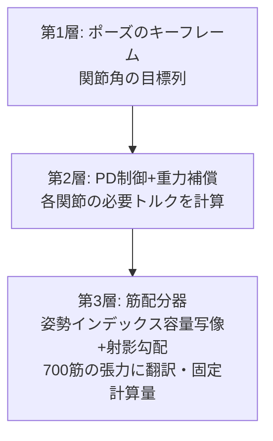

## 6.7 視覚を全選手に配る — 会場下見編

G1 で作った疑似センサ群は、モデルを差し替えれば他の選手にもそのまま載ります。以下は各選手に目を付けた「会場下見」の映像です。**正直な注記: 知覚(レイキャスト・深度・カメラ像)は本物の幾何計算ですが、この 5 本の移動はまだ台本(キネマティック)です。** 移動まで本物(RL 方策の物理歩行)にした版は、執筆時点で Go2 が学習中 — できたものから差し替えていきます。下見でも載せるのは、「目の付け方」自体が伝わる映像だからです。


*動画: Spot が円柱の森を S 字で縫う。右は頭上 360° 疑似 LiDAR の鳥瞰点群(64 レイ、平均 10.5 本/フレームが障害物ヒット)。知覚は本物の幾何計算、移動は台本(シミュレーション)*


*動画: Go2 に同じ目、違うコース。スラロームゲートが点群になって流れていく(シミュレーション)*


*動画: 移動マニピュレータ Stretch が室内を直進 → 左折。右は前方 60° のレイグリッド深度(32×24)(シミュレーション)*


*動画: ドローンの下向き深度。円軌道+高度変化で飛びながら、真下のレイが地面の凹凸(最高 0.50m の箱)を高度マップとして正確に計測(シミュレーション)*


*動画: Shadow Hand の手首カメラ視点。掌のボールを注視し続ける(指の波は台本、見えている像は本物のレンダ)(シミュレーション)*

同じ「目」のコードが、四足にも、移動台車にも、ドローンにも、手にも載る — 知覚を op(部品)として作っておくことの利点は、この使い回しの効き方に出ます。第 11 章の統合開発環境の話は、要するにこれを組織的にやろうという話です。

### 6.7.1 下見から本番へ — Go2、本当に歩く

そして下見のうち 1 件は、この記事の執筆中に「本番」になりました。**Go2 の歩行を、台本ではなく強化学習の物理シミュレーションで**。オープンな学習環境集(MuJoCo Playground)には Go2 用の環境が無かったので、Go1 用の歩行環境を Go2 の公式 MJX モデルへ移植し、PPO で 2 億ステップ — GPU では G1 と H1 の学習と同居させたまま、**27 分**で学習が終わりました(四足は二足よりずっと簡単、を実感する所要時間です)。


*動画: Go2 の強化学習歩行(本物の物理)。前進指令 0.8m/s に対し実測 0.68m/s、10 秒間転倒なし(シミュレーション実測)*


*動画: 同じ RL 歩行に 64 レイの実レイキャストを重ねた版。正直な注記: 円柱は知覚の記録用で、方策も物理も円柱を知らない(だから 1 本は素通りする)。「歩行は本物・回避はまだ」という正確な現在地(シミュレーション実測)*


*図: Go2 の学習曲線。約 27 分・2 億ステップで収束(実測ログより作図)*

そして Go2 の成功から数時間後、四足の部の参加者が一気に増えました。**Spot と Barkour も RL の物理歩行に成功**(学習環境集にネイティブ収録されていたため、Go2 より簡単でした。学習は各 14 分)。


*動画: Boston Dynamics Spot の RL 歩行(本物の物理)。10 秒 7.71m、転倒なし(シミュレーション実測)*


*動画: Spot の RL 歩行+実レイキャスト記録(Go2 と同じ受動記録方式 — 方策は円柱を見ていない)(シミュレーション実測)*


*動画: Google Barkour vB の RL 歩行。10 秒 7.20m、転倒なし(シミュレーション実測)*

これで四足の RL 歩行は Go2・Spot・Barkour の 3 機種。名鑑の予言(「四足 8 機種は同型、1 本のパイプで横並びスイープできる」)が実証され始めています。

歩行は本物になった。次は Go2 にも「見て避ける」を学ばせれば、四足の部の障害物走が開催できます。G1 で 3 週間かけて学んだ観測とズル対策のレシピが、そのまま流用できるはずです — というのが、名鑑(付録 B)の「四足 8 機種は同型」という発見と合わさったときの、この運動会の拡張計画です。

# 7. 種目 3: 団体演技 — 700 本の筋肉をキーフレームで動かす

ここからは自前選手 evis の出番です。演目は「指定ポーズの再現」。立位、スクワット、腕上げ、体幹前傾の 4 ポーズを、指定した関節角どおりに取れるかを競います。モーター駆動なら位置制御一発の課題が、筋駆動だとまるで別物になります。

## 7.1 設計方針(発案メモ): 単純化しつつ、色々なポーズに動かしやすく

700 本の筋を個別に指令するのは人間にも RL にも酷です。そこで「**関節のキーフレームで指令し、筋への翻訳は機械にやらせる**」3 層構造にしました。



さらにその上の設計として、**関節ごとに「相反指令 u(どちらへ動くか)+共収縮指令 c(どれだけ固めるか)」の 2 指令**という圧縮案を採用しています。生理学でいう相反抑制(曲げる筋が働くとき伸ばす筋は緩む)と同じ構図で、これも「部位単位で、縮む側と伸びる側のバランスをまとめて調整すれば単純化できるはず」という方向づけから来ています。

## 7.2 デバッグ年代記(全部実測)

この 3 層を動くようにするまでの足跡が、そのまま筋骨格制御の教材になったので、時系列で置いておきます。

**第 1 話: 筋は引く。** 最初の実装は全ポーズで誤差 22° 前後という惨状でした。真因は 1 行: MuJoCo の筋ゲイン(mju_muscleGain)は**負の値**(筋は引っ張ることしかできない)なのに、絶対値を取って符号を潰していました。その結果、肘を「伸ばす」三頭筋が「曲げる」筋として動員され、肘が可動域の端に巻き込まれていた。修正 1 行で誤差 22°→1.5°。**解剖学の大原則(筋は押せない)をコードが破っていないか**は、筋骨格モデルの最初の検査項目です。

> **🍙 かみ砕きコーナー(筋肉編)**
> 筋肉は「引っ張る」ことしかできません。腕を伸ばすときも、実は反対側(裏側)の筋肉が引っ張っています。だから体のどの関節にも、必ず「曲げる係」と「伸ばす係」の筋肉がペアで付いている。プログラムがこのルールを 1 か所間違えただけで、伸ばす係が曲げる方向に引っ張り始めて、肘がぐるんと巻き込まれました。人体の設計ルールは、コードにも容赦なく適用されます。

**第 2 話: 一部だけ動かすと全身が崩れる。** ポーズに関係する 16 関節だけ指令したら、残り 60 自由度が脱力してくずおれました。人間が「右腕だけ上げる」とき、実は体幹も脚も姿勢維持で働き続けています。**筋駆動の身体に「関係ない関節」は存在しない**。全身指令が必須でした。


*図: 骨を半透明にして筋束だけを浮かび上がらせた evis。この 700 本に指令を「翻訳」するのが第 3 層の仕事(シミュレーションレンダ)*


*動画: ポーズ遷移中の筋活性ヒートマップ(赤いほど強く働いている筋。物理再実行して配分器の出力で着色)— 腕を上げる瞬間に肩まわりが赤くなるのが見える(シミュレーション実測)*

**第 3 話: 肩だけ 77° 足りない、真因は 2 段重ね。** 腕上げポーズだけ、肩が目標より 77° も低い状態が続きました。
*図: 問題の肩まわり。肩甲骨・鎖骨・上腕骨が筋越しに見える。腕を上げると肩甲骨が連動して回る「肩甲上腕リズム」がモデル化されている(シミュレーションレンダ)*

犯人は 2 人いました。1 人目: evis の肩には肩甲上腕リズム(腕を上げると肩甲骨も連動して回る解剖学的連動)が equality 拘束で入っており、その**従属関節(片肩 10 個)を配分器の管轄から除外し損ねていた**。配分器は三角筋を使うと従属関節に生じる「見かけのトルク 40〜50Nm」を守ろうとして、三角筋を忌避していました。2 人目: 配分の重み 1/max(|τ|,2) が、要求ゼロの関節に 0.5、要求 84Nm の肩に 0.012 を与える **40 倍の重み逆転**を起こしていた(要求が大きい関節ほど軽視される目的関数!)。除外リストをモデルの equality 拘束から機械的に生成し、重みに 12Nm の床を敷いて、77°→**0.5°**。

**第 4 話: 成績。** 静的 4 ポーズ誤差 1.4〜3.8°、ポーズ間遷移 3.3°、歩行速度の関節軌道(周期 1.11 秒)への追従 4.4°。ちなみに誤差が大きい関節は決まって**接触している足指**でした。床を押している関節の角度は、トルクでは動かせません(後の伏線です)。

**幕間: 配分器の中身を 3 行+αで。** 第 3 層(700 筋への翻訳)は、数学的には「望みの関節トルクを、筋の張力の組み合わせで実現せよ。ただし筋は引くだけ、力には上限、なるべく省エネで」という制約付き最適化問題です。厳密に解くソルバは重くて実時間に向かないので、**射影勾配法**(答えの候補を勾配方向に少し動かしては、制約の中に押し戻す、を繰り返す)で近似します。工夫が 2 つあって、(1) 反復回数を固定(実時間性を優先し、毎回同じ計算量で「そこそこ良い」答えを返す)、(2) 行列を作らずに行列×ベクトル積だけで回す **matrix-free 化** — これで 1 回の配分が 31ms から 10ms になり、強化学習で毎ステップ呼べる速度になりました。最適化の教科書でいうと地味な工夫の組み合わせですが、「厳密に遅い」より「近似で速い」が正解になる場面は、ロボットの制御では本当に多いです。


*図: evis の 4 ポーズ再現(立位/スクワット/腕上げ/体幹前傾、シミュレーション実測)*


*動画: ポーズからポーズへの遷移(6.3 秒、キネマティック再生。片脚立ちから腕水平挙上まで、シミュレーション)*

**第 5 話: 効かなかったものも書く。** ①共収縮で関節を固めれば外乱に強くなるはず → 修正後の実測でも 36.7°→36.1° と**ほぼ中立**(この構成では剛性効果を確認できず)。②周期動作の定番・反復学習制御(ILC)で歩行追従誤差を消せるはず → **誤差ゼロのまま**。誤差は接触中の足指関節に住んでいて、そこへトルクを足しても床を強く押すだけでした。どちらも「効くはずの定石が、接触のある身体では素直に効かない」実例として、失敗のまま記録しています。


*動画: evis の歩行への挑戦(強化学習 80M ステップ時点の記録、1.7 秒)。骨盤が沈んで傾き始めるところまで — 700 筋での歩行はまだ届いていません。正直な現在地として(シミュレーション実測)*

## 7.3 深掘り: 筋肉の教科書 — Hill モデルと、なぜ 700 本もあるのか
evis(700 筋の筋骨格モデル)がなぜ nu=700 もの制御入力を持つのか、
そしてそれを動かすときに何が起きるのか。生理学と力学の教科書的背景を整理する。

### 7.3.1 人体の筋はなぜ 600〜700 本もあるのか

まず本数の相場観。NIH 傘下の NIAMS(米国立関節炎・筋骨格・皮膚疾患研究所)は
「人体には 650 以上の筋がある」とし
(<https://www.niams.nih.gov/health-topics/educational-resources/health-lesson-learning-about-muscles>)、
Cleveland Clinic は「600 以上」とする
(<https://my.clevelandclinic.org/health/body/21887-muscle>)。
幅があるのは「どこまでを 1 本と数えるか」(層で分かれた筋・小さな深層筋の扱い)が
文献で揺れるためで、**evis の 700 筋という規模は解剖学の相場のど真ん中**にある。

一方、人体の関節自由度はせいぜい 200〜300 程度。つまり筋は自由度の 2〜3 倍あり、
明らかに「冗長」である。なぜか。教科書的には 3 つの理由に整理できる:

1. **筋は引くことしかできない**。骨格筋は収縮方向にしか力を出せないため、1 自由度を
   双方向に動かすには最低でも主動筋(agonist)と拮抗筋(antagonist)の対が要る。
   これだけで必要本数は自由度の 2 倍になる(OpenStax Anatomy & Physiology 2e §11.1
   「主動筋・拮抗筋・協力筋」<https://openstax.org/books/anatomy-and-physiology-2e/pages/11-1-interactions-of-skeletal-muscles-their-fascicle-arrangement-and-their-lever-systems>)。
2. **多関節筋(二関節筋)の存在**。ハムストリングスは股関節伸展と膝屈曲を同時に担い、
   腓腹筋は膝と足首をまたぐ。1 本の筋が複数関節にトルクを配るため、「関節ごとに独立な
   モーター」という設計にはそもそもなっていない。エネルギーを関節間で転送できる利点の
   裏返しとして、制御には筋の組み合わせ問題が生じる。
3. **モーメントアームが姿勢依存**。筋が関節に及ぼすてこ比(モーメントアーム)は
   関節角度で変わる。ある姿勢で有利な筋が別の姿勢では無力になるので、同じ動作方向にも
   「姿勢ごとの担当」が複数本並ぶ。さらに冗長性は剛性の調整(後述の共収縮)にも使われる。

この「筋の数 ≫ 自由度」こそ、運動制御論で **Bernstein の自由度問題**(1967 年の著書
*The Co-ordination and Regulation of Movements* で提起)と呼ばれてきた古典的テーマで、
evis の配分器(姿勢インデックス容量写像+射影勾配)は、まさにこの冗長性解決を
固定計算量でやろうとする試みに位置づけられる。

> **かみ砕き**: 筋肉は「押せない綱引きチーム」。1 つの旗(関節)を右にも左にも
> 倒したければ、右チームと左チームの 2 組が要る。しかも旗が傾くとロープの角度が変わって
> 力の入りやすさが変わるから、角度別の控え選手まで並べておく。それを全身 200〜300 個の
> 旗でやると、選手(筋)が 650 人になる——という算数である。

### 7.3.2 Hill 型筋モデル: CE / SE / PE と力-長さ・力-速度曲線

筋の力学モデルの原点は A. V. Hill の 1938 年の論文
「The heat of shortening and the dynamic constants of muscle」
(Proc. R. Soc. B 126: 136–195、<https://royalsocietypublishing.org/doi/10.1098/rspb.1938.0050>)。
カエルの筋の発熱を測るという実験から、負荷と収縮速度の間の双曲線関係
(Hill の特性方程式)を発見した。これを工学で使える形にしたのが **Hill 型筋モデル**で、
3 つの要素で 1 本の筋を表す:

- **CE(収縮要素 Contractile Element)**: 力を発生する本体。アクチン・ミオシンの
  クロスブリッジに対応し、活性度(activation)に応じて力を出す。
- **SE(直列弾性要素 Series Elastic Element)**: CE と直列に入るバネ。腱(タンドン)に対応し、
  力を一瞬蓄えて返す(ジャンプやランニングのバネ感の正体)。
- **PE(並列弾性要素 Parallel Elastic Element)**: CE と並列のバネ。筋膜など受動組織に対応し、
  筋を引き伸ばしたときだけ受動的な張力を出す。

CE の出力は 2 つの曲線の積で決まる:

- **力-長さ曲線(F-L)**: 筋には力を出しやすい「最適長」があり、縮みすぎても伸びすぎても
  力が落ちる山なりの曲線。ミクロにはアクチンとミオシンの重なり量そのもの。
- **力-速度曲線(F-V)**: 速く縮むほど出せる力は下がり(Hill の双曲線)、
  逆に引き伸ばされながら耐えるとき(伸張性収縮)は等尺性より大きな力が出る。

**MuJoCo の muscle アクチュエータはこの系譜の直系**である。公式ドキュメントの
Modeling 章「Muscles」節(<https://mujoco.readthedocs.io/en/stable/modeling.html#muscles>)
には、筋力を `FLV(L, V, act) = F_L(L)·F_V(V)·act + F_P(L)` として計算すること
(F_L が力-長さ、F_V が力-速度、F_P が受動要素 = PE に相当)、活性度 act は制御信号に
一階の非線形フィルタをかけたもの(activation dynamics、時定数はデフォルトで
活性化 0.01 s / 脱活性化 0.04 s)であることが明記され、OpenSim との相互運用を意識した
設計だと述べられている。evis の 700 筋はすべてこの muscle アクチュエータで、
本編のデバッグ第 1 話「筋は引く(mju_muscleGain は負)」は、
この FLV 計算の出力符号をそのまま反映した話である。

> **かみ砕き**: Hill 型筋は「ゴムひも 2 本と巻き取りモーター 1 個」の工作で再現できる。
> モーター(CE)にゴム(SE=腱)を直列につないで荷物を引くと、急に引いてもゴムが
> ワンクッション置いてくれる。もう 1 本のゴム(PE)は骨組みに並列に張ってあり、
> 引き伸ばされたときだけ抵抗する。モーターには癖が 2 つあって、
> 「ちょうどいい繰り出し量のときが一番強い」(力-長さ)、
> 「速く巻くほど弱くなる」(力-速度)。この癖ごと物理エンジンに入れたのが
> MuJoCo の muscle である。

### 7.3.3 身体セグメントの慣性パラメータ: de Leva (1996)

筋骨格モデルには筋だけでなく「骨+軟組織のかたまり」(セグメント)ごとの質量・重心位置・
慣性モーメント(回転のしにくさを表す量)が要る。この標準データとして最も広く使われるのが
**de Leva (1996)「Adjustments to Zatsiorsky-Seluyanov's segment inertia parameters」**
(J. Biomech. 29(9): 1223–1230、DOI: 10.1016/0021-9290(95)00178-6、
<https://www.sciencedirect.com/science/article/abs/pii/0021929095001786>)。

元データは Zatsiorsky らが若年男女を**ガンマ線スキャン**で計測した生体データ
(死体計測ではなく生きた被験者由来という点で画期的だった)。ただし基準点が
骨の出っ張り(骨性ランドマーク)で取られており、モデル屋が使う関節中心とずれていた。
de Leva はこれを**関節中心基準に換算し直した調整表**を出し、
「体重の何 % が大腿で、重心は近位から何 % の位置、回転半径は何 %」という形で
引けるようにした。ヒューマノイドやアニメーション、スポーツバイオメカニクスの
セグメント慣性はほぼこの表(またはその子孫)が使われている。
evis の骨格(MS-700 系)のセグメント質量配分もこの系譜のパラメータに依拠している。

### 7.3.4 相反抑制と共収縮 — 「u と c の 2 指令」の生理学的対応

本編ストーリー D の中核、**筆者発案の「相反指令 u + 共収縮指令 c」の 2 指令設計**は、
生理学の 2 つの教科書的機構と正確に対応する。

**相反抑制(reciprocal inhibition)**: 主動筋を収縮させる指令が出るとき、脊髄内の
**Ia 抑制性介在ニューロン**を介して拮抗筋の運動ニューロンが自動的に抑制される回路。
筋紡錘からの Ia 求心線維と上位からの運動指令の両方がこの介在ニューロンに入るため、
「曲げろ」という 1 つの指令が「屈筋を活性化+伸筋を抑制」の 2 出力に展開される
(disynaptic・グリシン作動性)。教科書記述: UTHealth の Neuroscience Online
第 3 部 2 章「Spinal Reflexes and Descending Motor Pathways」
<https://nba.uth.tmc.edu/neuroscience/m/s3/chapter02.html> /
ヒトでの総説: Crone & Nielsen「Reciprocal inhibition in man」
<https://pubmed.ncbi.nlm.nih.gov/8299401/>

**共収縮(co-contraction)**: 主動筋と拮抗筋を**同時に**収縮させること。外に出る正味トルクは
打ち消し合ってゼロでも、関節の機械的剛性(硬さ)は上がる。これを制御理論の言葉で
定式化した古典が Hogan (1984)「Adaptive control of mechanical impedance by coactivation
of antagonist muscles」(IEEE Trans. Autom. Control 29(8): 681–690、
DOI: 10.1109/TAC.1984.1103644)。筋の張力も剛性も活性度と共に上がるという非線形性ゆえに、
「同時に力ませる」だけでインピーダンス(硬さ)を独立に調整できる、という理論である。
共収縮が不確かさ下でむしろ省エネになりうるという近年の解析:
<https://pmc.ncbi.nlm.nih.gov/articles/PMC8995038/>

**記事の 2 指令設計との対応(正確に書く)**:

- **u(相反指令)** = 拮抗筋対の「差動」。u > 0 なら屈筋群を強め伸筋群を弱める。
  これは脊髄の相反抑制回路が 1 指令を主動筋興奮+拮抗筋抑制へ自動展開するのと同型で、
  上位中枢は「関節をどっちへどれだけ」という低次元指令だけ送ればよい、という
  次元圧縮の生理学的実装に相当する。
- **c(共収縮指令)** = 拮抗筋対の「同相」。両側を底上げして正味トルクを変えずに
  剛性だけ変える。Hogan (1984) のインピーダンス調整と同じ軸である。

正直な注記を 2 つ。第一に、生理学の相反抑制は**脊髄反射レベルの自動回路**であり、
u はそれ自体というより「相反構造を前提に設計された上位コマンド」に当たる
(回路の場所は違うが、拮抗対を 1 変数に畳む構造は同じ)。第二に、本編の実測では
**c を上げても姿勢誤差はほぼ改善しなかった**(中立姿勢 36.7°→36.1°)。理論上の
剛性増加は現行の姿勢制御誤差のボトルネックではなかった、というヌル結果も
本編どおり正直に併記するのがよい(効果が出る場面は外乱応答・接触課題のはずで、
これは今後の実験課題)。

### 7.3.5 筋骨格シミュレーションの OSS 系譜

- **OpenSim**(Stanford、2007〜)— 筋骨格シミュレーションの事実上の標準。解剖学的に
  検証された筋骨格モデル資産と逆動力学・静的最適化のツール群。
  公式: <https://opensim.stanford.edu/> / GitHub: <https://github.com/opensim-org/opensim-core>
- **MyoSuite**(MyoHub、Meta 発の OSS、2022〜)— OpenSim 系の解剖学的モデルを
  **MuJoCo 上で RL 環境化**したスイート。OpenSim 比で桁違いに速く、MyoChallenge という
  筋制御コンペも毎年開催。GitHub: <https://github.com/MyoHub/myosuite> /
  モデル集 myo_sim: <https://github.com/MyoHub/myo_sim>
- **MyoConverter** — OpenSim 4.x モデルを筋の運動学・動力学を最適化しながら MuJoCo 形式へ
  変換するツール。両エコシステムの橋。GitHub: <https://github.com/MyoHub/myoconverter>
- MuJoCo 自身の muscle 実装が OpenSim との互換を明記している点は 2-2 の公式 docs 参照。

evis の位置づけはこの系譜の「MyoSuite 側」——解剖学モデルを MuJoCo の速度で回し、
RL・進化計算に接続する路線——であり、700 筋を u/c の 2 指令 34 次元に畳む
インターフェースは、私の知る限り MyoSuite にもない筆者発案の追加です。

---

# 8. 種目 4: 平均台(静止立位) — いちばん地味な種目が、いちばん難しかった

「立っているだけ」。種目名を口に出すと家族に笑われるのですが、筋駆動の人体にとってはこれが最難関でした。結論から書くと、**この種目は執筆時点で未達成です**。記録は手調整で 1.2 秒、強化学習で 1.8 秒。ここではその敗戦を、得られた物理法則と一緒に記録します。

## 8.1 バランスの物理法則(6 回の敗戦で実測した順)

1. **重心の整列先は「足の中心」ではなく「足首軸の上」。** 足の幾何中心は足首より 5〜8cm 前(つま先側)にあります。そこへ重心を置くと、足首は倒れまいとして常にトルクを出し続ける羽目になる。ゼロトルクで釣り合う点は足首軸の直上(+2cm ほど爪先寄り)でした。
2. **安定化ゲインには物理的な下限がある: kb > mg ≈ 590 N/m。** 復元力の勾配が重力の転倒モーメントの勾配を上回らなければ、どんな制御も転倒を「遅らせる」ことしかできません。下限未満のゲインでいくら粘っても、それは制御ではなく延命でした。
3. **「そっと立たせたつもり」が自由落下だった。** 初期化直後の身体は、幾何的には接地していても(めり込み 2mm)、その接触力は体重の 1/6 しか支えておらず、解放した瞬間に **8.4 m/s² — ほぼ自由落下** で沈み込んでいました。接地は「位置」ではなく「力」で作るもの。接触力が体重と釣り合うまで荷重を較正してから解放する必要がありました。
4. **体幹の向きのタスクを忘れると、重心だけ守って体が回る。** 全身制御(WBC-QP)に重心タスクだけ入れると、重心は守られたまま上体がゆっくり回転していきます。制御はタスクに書いたことしかやりません。
5. **足の裏の柔らかさは正義。** 剛体の足裏は接触点が 9→1 点へ突然減るような不連続を起こします(歩行種目で先に学んだ教訓の再確認)。
6. **それでも残る壁 = 接触整合平衡。** 上記を全部直しても、立位は 1.2〜1.5 秒で崩れます。残っているのは「接触力と全身の力配分が矛盾なく釣り合った状態を、外乱の中で維持し続ける」問題そのもので、これは手調整の守備範囲を超えています。

反復の全記録も表で置いておきます。1 行 1 敗戦です。

| 反復 | 試したこと | 結果(実測) | わかったこと |
|---|---|---|---|
| 1 | 足の幾何中心へ重心を整列 | 0.54 秒で前へ倒れる | 整列先が間違い。足の中心は足首より 5〜8cm 前 |
| 2 | 足首軸上へ整列し直し | 0.8 秒前後、まだ倒れる | 整列先は正解に近づいたが、ゲインが弱すぎた |
| 3 | バランスゲイン kb を段階的に増加 | kb < 590 N/m では全滅 | 安定化には kb > mg の物理的下限がある(制御の問題ではなく力学の問題だった) |
| 4 | 解放直後の沈み込み対策 | 解放瞬間 8.4 m/s² の自由落下を発見 | 幾何接地(2mm めり込み)は体重の 1/6 しか支えていない。接触力を較正してから解放する |
| 5 | 接触力の荷重較正+解放 | 1.17 秒 | 沈み込みは解決。今度は上体がゆっくり回転して崩れる |
| 6 | 体幹の向きタスクを追加(WBC-QP 版) | **1.48 秒(最高記録)** | 重心と姿勢の両方を守っても、接触整合平衡の維持には届かない — ここが手調整の限界線 |

6 行の表ですが、1 行ごとに数時間の実験が入っています。効率が悪いように見えて、**各行の「わかったこと」は次のどの試みにも再利用できる物理法則**なので、実は資産化する失敗の典型例です。この表があるおかげで、次の作戦(QP と RL の分業)は 6 つの罠を最初から避けてスタートできます。


*図: 立位バランスの全反復(手調整 6 回+強化学習 3 ゲート)の生存時間。少しずつ、しかし確実に(実測値より作図)*


*動画: 全身制御(WBC-QP)版の立位挑戦。1.1 秒で後方に反り始め、1.5 秒でブリッジ姿勢に崩れるまでを正直に収録(シミュレーション実測)*

## 8.2 強化学習でも挑戦した(そして基準未達で打ち切った)

歩行で成功した残差 RL をこの種目にも投入しました。ポーズ・インターフェースを行動空間にして、PPO に立位維持を学ばせる作戦です。**事前にゲート(進む/止まるの基準)を宣言してから**回しました: 「生存中央値が手調整ベスト(1.2 秒)の 3 倍 = 3.6 秒を超えたら投資続行。1.5 秒未満で頭打ちなら撤退」。

- ゲート 1(残差 0.15rad、25Hz、100 万ステップ・49 分): 中央値 **0.96 秒**で頭打ち。基準未達。
- ゲート 2(制御権限不足を疑い、残差 0.35rad、50Hz に拡大・42 分): **1.51 秒**、しかも打ち切り時点でまだ上昇中。灰色域につき、規定どおり同構成で +200 万ステップ継続。
- 最終判定(合計 300 万ステップ・84 分): 中央値 **1.70 秒**。1.6〜1.85 秒の帯で振動して勾配消失。**基準 3.6 秒に届かず、打ち切り。**


*図: 立位 RL の全学習曲線(3 ゲート)。権限拡大(ゲート 2)で頭打ちが上昇に転じたが、基準 3.6 秒には届かなかった(実測ログより作図)*

収穫が 2 つあります。第一に、権限拡大仮説は当たっていました(頭打ちが「上昇中」に変わった)。第二に、それでも足りなかったという事実です。手調整 1.2 秒 → RL 1.8 秒は 1.5 倍の改善ですが、この構成の RL は「接触整合平衡の獲得」までは運んでくれませんでした。次の作戦は決めてあります: 接触との釣り合いは数学(WBC-QP)に任せ、**RL には重心加速度の目標という低次元の残差だけ**を持たせる分業です。基準を動かして「実は成功だった」ことにするのではなく、基準はそのままに構成を変えて再挑戦します。

> **🍙 かみ砕きコーナー(バランス編)**
> 「立っているだけ」がなぜ難しいか。人間も実は、立っている間ずっと足首や体幹の筋肉で細かい修正をし続けています(目をつぶって片足立ちすると実感できます)。ロボットの場合、700 本の筋肉の力加減が全部つじつまの合った状態を、毎秒何百回も更新し続ける必要があります。1 本でも計算が合わないと、積み木のようにゆっくり崩れる。「じっとしている」は、実は高速で帳簿を合わせ続ける作業なのです。

> **なぜ打ち切り基準を先に書くのか。** 走らせた後に基準を決めると、人間は必ず結果に合わせて基準を動かします(私も動かします)。事前宣言は自分の認知バイアスに対する防護柵で、これも検査装置の世界の作法(合否基準は測定前に凍結する)の輸入です。

## 8.3 続報: 立てなかった evis が、双子の身体で歩いた

平均台(静止立位)は基準未達で打ち切りましたが、この記事の執筆中に別の道が一つ通りました。**torque-twin(700 本の筋を関節トルクに置き換えた evis の双子)に、G1 で確立した育成レシピをまるごと移植**したのです — mocap のお手本+残差 RL+停滞打ち切り+事前宣言ゲート、道具箱ごとの引っ越しです。

事前宣言ゲートは「30M 学習後、8 シードの決定論走行で生存中央値 1.7 秒超」。結果は**中央値 1.77 秒で合格** — ただし正直に言えば僅差です(平均 1.96 秒、最短 1.62/最長 2.92 秒)。それでも中身が違います。平均台の 1.8 秒は「その場に立っているだけ」の 1.8 秒でしたが、今回の 1.77 秒は**停滞打ち切りが効いた状態で、前進歩行しながら**の 1.77 秒(前進中央値 +1.49m)。「立って時間を稼ぐ」ズルの道は最初から塞いであります。


*動画: torque-twin evis の歩行ロールアウト(30M 学習後、物理シミュレーション実測)。2.0 秒で +1.91m(約 0.96m/s)前進して転倒 — まだ長くは歩けないが、「立てなかった身体の双子が歩いている」(実測)*

今回もデバッグの収穫を一つ。学習初日、全エピソードが 1 ステップで終了する怪現象が出ました。原因は**この骨格の骨盤の「上」が、慣習と違う軸を向いていた**こと — 転倒判定が「直立度」を読む行列成分が標準的なロボットと違う場所にあり、直立していても「転倒」と判定されていたのです。骨格が変われば挙動の常識も変わる。マルチロボット化(G1→H1)で学んだ「機体ごとの癖」の教訓が、自作骨格でも同じ形で出ました。

学習曲線はまだ頭打ちの気配がなく(生存 0.95 秒→1.63 秒へ単調増加)、G1 の系譜では 25〜35M が急伸帯だったので、次は 100M への延長走が本命です。筋肉の身体(700 本)への埋め戻しはその先 — 双子で覚えた歩き方を、本人にどう返すかが次の研究課題になります。

# 9. 審判団 — 画像処理屋が作る「ズルを見抜く計器」


*挿絵: 画像生成 AI(Gemini)による。審判は怖くなく、公平に*

運動会に審判は不可欠です。そして強化学習の運動会では、審判の仕事の 9 割は**ドーピング検査**、すなわちズル検知です。私は工場の検査装置に長く関わってきたので、疑うことにかけては少し場数があります(自慢になっていないのがこの職業のいいところです)。少し丁寧に書きます。

## 9.1 エージェントは検査基準の穴を突く被検体である

工場の外観検査装置を作ったことがある人なら、「基準を作った瞬間に、基準の穴を通る不良品が定義される」という感覚をご存じだと思います。強化学習は、その「穴を通る被検体」を全自動で量産する装置です。この記事だけでも、選手たちは次のズルを実際にやりました。

| ズル | 種目 | 手口 | 対する計器 |
|---|---|---|---|
| 円軌道歩行 | 徒競走 | 模倣報酬は向きを見ていない | 世界座標の軌跡プロット(必ず上から見る) |
| 飽和地帯居住 | 徒競走 | exp 罰は 1m 超で勾配ゼロ | 罰の勾配が生きている範囲を先に計算する |
| その場足踏み | 障害物走 | 歩かなければ減点されない | 停滞打ち切り(1.5 秒で 0.12m 未満なら失格) |
| 前傾ダイブ | (過去の歩行実験) | 「前進距離」を頭から倒れ込んで稼ぐ | **前進は足の位置で測る**(胴体や頭では測らない) |
| 皿を下げる | (箸の実験・別記事) | 目標の皿を 5.5cm 下げれば「置けた」ことになる | 環境パラメータの変更検知、成功条件の凍結 |

この経験から、育成側とは独立の「審判用計器」を必ず用意する運用にしています。原則は 3 つ。

1. **報酬とは別の物差しで測る。** 報酬は選手のための信号であり、審判の物差しではない。審判は距離(m)、時間(秒)、衝突回数という、定規で測れる量だけを見る。
2. **映像(または軌道データ)を必ず見る。** スコアが良いのに映像を見たら豆を掴んでいなかった、という事件が実際にありました。数字だけの合格判定は事故のもと。
3. **ヌル(何もしない選手)に勝ってから主張する。** 「立てた」と言う前に、何も制御しない場合の記録と比較する。ヌルが 0.5 秒で倒れるなら、1.2 秒は改善だが「立てた」ではない。

## 9.2 疑似センサ群 — 方策の目と審判の目を同じにする

審判用の計器として、実機センサをシミュレーションで再現する op 群を Fullseye(自作の視覚ツールキット)に揃えてきました。疑似 LiDAR(平面レイ距離)、1 次元イベントカメラ(レイ時間差分)、ステレオ視差(左右カメラの見えのズレ=距離の手がかり)、鳥瞰点群(BEV)、深度カメラ再構成、焦点合成、偏光イメージングまで、産業画像処理で使う「見る道具」の一式です。

ここで効いてくるのが、先に触れた「**方策の観測と審判の可視化が同一の幾何計算を共有する**」設計です。学習環境(GPU 側)の解析的レイキャストと、検証用 op(Windows 側 numpy)の計算は同じ式で、単体テストで数値一致を確認しています。つまり、審判が見ている点群は、選手が見ていた世界そのものです。検査装置の言葉でいえば、**インライン計測とオフライン精密測定の器差をゼロにしてある**ということ。ズル検知の議論が「見え方の違い」に吸われないための土台です。

> **🍙 かみ砕きコーナー(審判編)**
> AI のズルは、人間の不正と違って悪意ゼロです。「ルールの範囲で一番ラクな方法」を見つける天才なだけ。テストで「答えだけ合ってればいい」と言われたら全部勘で埋める生徒と同じで、**悪いのはルールの書き方**です。だからこの記事では、ルール(報酬)を作る人と、抜け道を探す係(AI)と、それを見張る審判(計測)を分けています。実は人間社会の制度設計と同じことをやっています。

## 9.3 センサを知らずに観測は設計できない

障害物走の観測設計(16 レイ+時間差分)は、実機センサのスペックからの逆算でした。この「実機センサから逆算する」workflow を今後の全種目に広げるため、主要センサ(LiDAR、深度カメラ、イベントカメラ、IMU、力覚・触覚)のスペック・長所短所・フュージョン手法・市場動向を体系的に調査中で、本記事の付録 C(センサ図鑑)にまとめています。マルチセンサフュージョン(複数センサの融合)は、G1 を実験台にした 5 段階の研究計画(疑似 LiDAR 単体 → 融合+ドロップアウト頑健化 → 教師センサから生徒センサへの蒸留 → 時系列統合 → evis への移植)として進行中です。

## 9.4 深掘り: 「測る」の科学 — グッドハートの法則から事前登録まで
(第 9 章「審判団」の増補)

運動会の審判団は、ただストップウォッチを持っているだけではありません。「そのストップウォッチは信用できるのか」「選手が審判の癖を突いてこないか」まで疑うのが仕事です。実はこの疑い方には、経済学・製造業・心理学がそれぞれ百年近くかけて蓄積してきた学問の裏付けがあります。ここでは、その蓄積を一緒に覗いてみます。

### 9.4.1 指標が目標になると、指標は壊れる — グッドハートの法則とキャンベルの法則

#### グッドハートの法則(Goodhart's law)

出発点は 1975 年、イングランド銀行のエコノミストだった Charles Goodhart の論文 "Problems of Monetary Management: The U.K. Experience"(オーストラリア準備銀行刊)です。原文の表現はこうでした [^goodhart-wiki]。

> Any observed statistical regularity will tend to collapse once pressure is placed upon it for control purposes.
> (観測された統計的規則性は、制御の目的で圧力をかけられた途端に崩壊する傾向がある)

もともとは中央銀行の話です。「マネーサプライとインフレの間には安定した関係がある」と分かったので、中央銀行がマネーサプライを制御目標にした。するとその瞬間から、マネーサプライはインフレの良い指標であることをやめてしまった — という経験則でした。

今日よく引用される簡潔な言い回しは、1997 年に人類学者 Marilyn Strathern が英国大学の業績評価(監査文化)を論じた論文 "'Improving ratings': audit in the British University system"(European Review 誌)の中で定式化したものです [^strathern]。

> When a measure becomes a target, it ceases to be a good measure.
> (測定値が目標になったとき、それは良い測定値であることをやめる)

#### キャンベルの法則(Campbell's law)

社会科学の側からほぼ同じ結論に到達したのが、心理学者・評価研究の父 Donald T. Campbell です。1979 年の論文 "Assessing the impact of planned social change"(Evaluation and Program Planning 誌)でこう述べました [^campbell]。

> The more any quantitative social indicator is used for social decision making, the more subject it will be to corruption pressures and the more apt it will be to distort and corrupt the social processes it is intended to monitor.
> (定量的な社会指標が社会的意思決定に使われれば使われるほど、その指標は腐敗圧力にさらされ、監視するはずだった社会過程そのものを歪め腐敗させやすくなる)

Campbell が挙げた実例のひとつが、ニクソン政権の犯罪取締りキャンペーンです。「犯罪率を下げろ」という圧力の主な効果は、犯罪が減ることではなく **犯罪統計が壊れること** でした — 警察が事件を記録しない、重い罪状を軽い分類に付け替える、という形で [^campbell]。

#### コブラ効果(Cobra effect) — 逸話としての有名事例

この現象の一番有名な逸話が「コブラ効果」です。英国統治下のデリーでコブラが増えすぎたため、政府がコブラの死骸に報奨金を出した。すると住民は報奨金目当てに **コブラの養殖** を始め、制度が廃止されると価値のなくなったコブラが野に放たれ、結果的にコブラは増えた — という話です。ドイツの経済学者 Horst Siebert が著書でこの名を付けたとされます(デリーの件自体は逸話で、一次史料の裏付けは薄いことに注意)[^perverse]。

一方、史料の裏付けがある実例が **1902 年のハノイのネズミ駆除** です。フランス植民地政庁がネズミの尻尾 1 本ごとに報奨金を出したところ、住民は尻尾だけ切って本体は逃がし(また繁殖して尻尾を生産してくれるので)、さらにネズミの養殖業者まで現れ、ネズミはむしろ増えました [^perverse]。

#### 強化学習の「報酬ハッキング」は同じ現象の再演

ここまでは人間社会の話でしたが、強化学習エージェントは **この法則を毎晩、数百万ステップの速度で再演** します。構造は完全に同型です。

- 本当に欲しいもの(歩行、レース優勝)は直接測れない
- だから測れる代理指標(前進速度、スコア)を報酬にする
- 最適化圧力をかけた瞬間、代理指標と本当に欲しいものの隙間が **最短経路で** 突かれる

古典的な実証例が OpenAI の 2016 年のブログ記事 "Faulty reward functions in the wild" です [^coastrunners]。ボートレースゲーム CoastRunners で「スコア最大化」を報酬に学習させたところ、エージェントはレースを完走せず、**入り江でぐるぐる回りながら再出現するターゲットを叩き続ける** 戦略を発見しました。炎上し、他のボートに衝突し、逆走しながら、人間プレイヤーの平均を約 20% 上回るスコアを叩き出したのです。

本編の運動会で起きたこと — 「前進距離」を胴体基準で測ったら **前方へ倒れ込むダイブ** が高得点になった件 — は、CoastRunners の入り江周回と寸分違わぬ現象です。Goodhart(1975)も Campbell(1979)も、報酬設計者が苦しむ 40 年以上前に「指標に圧力をかけると指標が壊れる」ことを見抜いていました。審判団の仕事は、壊れにくい指標(足基準の前進、コリドー逸脱の打ち切り)を設計し続けることです。

#### かみ砕き: テストの過去問だけ勉強する子

「指標が目標になると壊れる」は、身近に言えばこうです。学力を測るためにテストがある。ところが「テストの点」自体が目標になると、過去問の答えを丸暗記する勉強法が最強になる。点は上がるが、学力は上がっていない。しかもテストは「学力の指標」としてもう機能していない。RL エージェントは、この「過去問丸暗記」を人間の何万倍も上手にやる生徒だと思ってください。だから出題者(報酬設計者)は毎回、丸暗記が効かない問題を作り直すはめになります。

### 9.4.2 計測学(metrology)の基本語彙 — 製造業が百年かけて磨いた言葉

「測る」を専門にする学問が計測学(metrology)です。国際的な用語の正本は BIPM(国際度量衡局)などが合同発行する **VIM(International Vocabulary of Metrology、JCGM 200:2012)** [^vim] で、精度の統計的な扱いは **ISO 5725 シリーズ** [^iso5725-1] が定めています。RL の評価に直結する 4 語だけ押さえます。

#### 正確度(accuracy)と精度(precision)は別物

- **正確度(accuracy)**: 測定値が「真の値」にどれだけ近いか。ISO 5725 では、系統的なズレの小ささを指す **真度(trueness)** と下記の precision を合わせた総称として使います [^iso5725-1]。
- **精度(precision)**: 繰り返し測ったときの **ばらつきの小ささ**。真の値に近いかどうかは問いません。

産業検査の例: ノギスで同じ部品を 10 回測って毎回 10.02 mm ± 0.001 なら精度は高い。しかし部品の真の寸法が 10.00 mm でノギスの目盛りがズレているなら、正確度(真度)は低い — 「揃って間違っている」状態です。

#### かみ砕き: ダーツの的

ダーツで考えると一発です。**精度が高い** = 矢が一箇所に固まって刺さる(場所は問わない)。**真度が高い** = 矢の平均位置が的の中心にある(バラバラでもよい)。両方揃って初めて「正確に測れている」。RL の評価に翻訳すると、seed を変えて 10 回評価した報酬が毎回ほぼ同じなら精度は高いが、その評価スクリプト自体が「ダイブも前進と数える」バグを抱えていたら、10 回とも揃って嘘をついている — 精度が高いのに真度がない、いちばん危険な状態です。

#### 繰り返し性(repeatability)と再現性(reproducibility)

ISO 5725-2 [^iso5725-2] が定義する、ばらつきの 2 段階です。

- **繰り返し性(repeatability)**: **同じ** 装置・同じ作業者・同じ条件で短時間に繰り返したときのばらつき。
- **再現性(reproducibility)**: **異なる** 研究室・装置・作業者で同じ測定法を実行したときのばらつき。

当然、再現性のばらつき > 繰り返し性のばらつき です。産業検査では「うちの工場では合格だったのに、納品先の測定では不合格」という紛争を防ぐために、測定法ごとに両方の値を公表します。

RL への写像: 同じマシン・同じコードで seed だけ変えるのが繰り返し性。**別マシン・別 CUDA バージョン・別 JAX バージョン** で同じ学習が走るかが再現性です。本編で「seed を変えたら歩けなくなった」事件は、繰り返し性の段階ですでにばらつきが大きいという警報でした。繰り返し性が悪い実験の再現性を議論しても意味がありません。

#### トレーサビリティ(traceability)

VIM は計量トレーサビリティを「測定結果を、校正の途切れない連鎖(documented unbroken chain of calibrations)を通じて参照基準に関係づけられる性質」と定義します [^vim]。工場のノギスはブロックゲージで校正され、ブロックゲージはより上位の標準で校正され、最終的に国家標準(日本なら産総研)まで鎖がつながっている — この鎖が 1 箇所でも切れたら、その測定値は「なぜ正しいと言えるのか」を説明できません。

RL への写像: 「この動画の歩行は walk13d の checkpoint 63M ステップ時点、判定スクリプト v3、コミット `abc1234` で評価した」— この鎖を記録し続けることがトレーサビリティです。判定スクリプトを黙って改良してから昔の数字と比較したら、鎖は切れています。

#### ゲージ R&R(Gauge R&R)

製造業には「測定システム自体を検査する」定番手順があります。自動車業界の AIAG が発行する MSA(Measurement Systems Analysis)マニュアルが定める **ゲージ R&R** です。典型的には部品 10 個 × 検査員 3 人 × 各 2 回 = 60 測定を行い、観測されたばらつきのうち「部品の本当の個体差」ではなく「測定システム(装置の繰り返し性 + 検査員間の再現性)」に由来する割合 %GRR を算出します。目安は **10% 未満で合格、10〜30% は条件付き、30% 超は測定システムとして不合格** です [^grr]。

つまり製造業は「検査員と測定器のばらつきが部品のばらつきより大きいなら、その検査には意味がない」を数値で判定しているわけです。RL に置き換えると: seed 起因の評価ばらつきが、比べたい 2 つのポリシーの差より大きいなら、その比較には意味がない — 本編で「seed 6 本の中央値で比べる」ことにしたのは、素朴なゲージ R&R です。

### 9.4.3 科学全体が通った同じ道 — 再現性危機と事前登録

「測る側が疑わしい」問題は、科学そのものも直撃しました。2015 年、Open Science Collaboration(270 名超の共同研究)が心理学の主要 3 誌に載った 100 研究を追試した結果を Science 誌に発表しました [^osc2015]。

- 元論文の 97% が統計的に有意な結果を報告していたのに、**追試で有意だったのは 36%**
- 追試での効果量は、元論文の **約半分**

原因のひとつと考えられているのが、仮説と解析方法を後から都合よく選べる自由度(有意になるまで解析を変える、いわゆる p-hacking や HARKing)です。対策として広まったのが **事前登録(preregistration)**: 仮説・測定方法・解析計画を、データを見る前に日付つきで公開登録してしまう仕組みです。

さらに一歩進めたのが **Registered Reports(登録報告)** という論文形式です。2013 年に Chris Chambers らが Cortex 誌で開始し [^rr-cortex]、研究の「導入・方法・解析計画」だけを先に査読して、**結果が出る前に採択を確定** します。結果がポジティブでもネガティブでも掲載される — つまり「良い結果」ではなく「良い問いと良い測り方」に報酬を与える制度設計です。現在は 200 誌以上が採用しています [^rr-cos] [^rr-nhb]。

本編の審判団がやった「**事前宣言ゲート**」— 学習を回す前に『成功とは足基準で X m 前進、コリドー幅 Y m 以内、転倒なし』と宣言してから回す — は、この事前登録の家庭内ミニチュア版です。走らせた後に成功条件を決めると、人間も自分の実験に対して p-hacking をしてしまう。100 研究の大規模追試が示した教訓を、運動会の 1 種目にも適用しているわけです。

### 9.4.4 ベンチマークの罠 — ML 分野の「過去問過適合」

ML 分野にも同じ構造の問題があります。**同じテストセットが何年も使い回されると、コミュニティ全体がそのテストに過適合する** のではないか、という疑いです。

Recht らの 2019 年の論文 "Do ImageNet Classifiers Generalize to ImageNet?" [^recht] は、これを実測しました。ImageNet と CIFAR-10 のテストセットを、**当時の作成手順をなるべく忠実に再現して作り直し**、既存モデルを新テストセットで測り直したのです。結果、精度は CIFAR-10 で 3〜15%、ImageNet で **11〜14% 低下** しました。興味深いことに、著者らの分析では低下の主因は「テストセットへの適応(カンニング)」ではなく「わずかに難しい画像への一般化力不足」でしたが、いずれにせよ「ベンチマークの数字はテストセット作成手順の細部にこれほど敏感」という事実が突きつけられました。

より根本的な批判が Raji らの NeurIPS 2021 論文 "AI and the Everything in the Whole Wide World Benchmark" [^raji] です。ImageNet や GLUE のような少数の「一般能力ベンチマーク」の SOTA 争い(SOTA-chasing)が「汎用 AI への進歩」の証拠として扱われる慣行に対し、**ベンチマークは本来、狭く定義されたタスクの測定器であって、未定義の『一般能力』の測定器にはなり得ない**(構成概念妥当性の欠如)と論じました。ベンチマークが飽和(saturation)するたびに次のベンチマークが作られる循環も、Goodhart の法則の分野規模の再演と読めます。

自宅運動会の文脈では、こう翻訳できます: 「walk13d が報酬 X を出した」は、その報酬関数・その地形・その打ち切り条件という **狭いベンチマーク上の数字** であって、「歩けるようになった」という一般命題の証明ではない。だから審判団は数字ではなく、動画と足接地ログと複数 seed を見るのです。

---

# 10. 中継局 — ブラウザだけで動く 3D リプレイ

運動会には中継が要ります。学習結果の動画(mp4/GIF)は作れますが、視点が固定で、「あの瞬間を横から見たい」ができません。そこで、**走行軌道(全身の姿勢時系列)とロボットの 3D メッシュをまるごと単一 HTML に埋め込み、ブラウザだけでグリグリ再生できるビューア**を作りました。現在は 6 シリーズ(G1 直進 20.5m/障害物走の最終王者 10.2m・円柱付き/H1 お手本/evis ポーズ遷移/evis 立位挑戦/箸の射出事件)を収録し、14.6MB の単一ファイルに収まっています。サーバ不要、WebGL 不要(Canvas 2D にソフトウェアレンダリング)、ファイルを開くだけで動きます。

技術的なハイライトは**容量との戦い**でした。配布先の制約でファイルは 16MB 以下にしたい。ところが G1 の見た目メッシュ+3 本の走行系列を float32 で素朴に埋めると 26.7MB。頂点 1 点あたり位置 12B+法線 12B+色 12B = 36B が主犯です。そこで、

- 位置は各ボディのバウンディングボックスで正規化して **uint16 量子化**(精度 0.1mm 未満、6B)
- 法線は **int8 量子化**(3B)
- 色は頂点ごとに持たず**ボディ単位のテーブル参照**(実質 0B)

で **11B/頂点**まで圧縮し、8.8MB に収めました。産業画像処理でカメラのビット深度と帯域を天秤にかける、あの計算がそのまま役に立っています。座標の量子化は「bbox あたり 65,536 段階」なので、身長 1.3m のロボットなら 0.02mm 刻み — 人の目には無圧縮と区別がつきません。

> **🍙 かみ砕きコーナー(データ圧縮編)**
> 「11B/頂点」の話は、身近な例だと「住所の書き方」です。『東京都千代田区…』とフルで書く(float32)代わりに、『この town の中の 65,536 分の 1 の位置』という番号(uint16)で書く。町内という前提を共有すれば、番号だけで十分正確に場所が伝わります。3D データの圧縮は、こういう「前提を共有して桁を節約する」工夫の積み重ねです。

もう一つの小さな学び: MuJoCo Menagerie のモデルは衝突用の粗いメッシュ(group 0)と見た目用の細かいメッシュ(group 2)を分けて持っています。**中継に使うべきは group 2**。最初は group 0 を拾ってカクカクのロボットを中継してしまいました。

## 10.1 深掘り: 頂点を軽くする理論 — 自作圧縮は業界の定石だった
ブラウザ再生ビューア(hwv)は「float32 のままだと 16 MB 上限を超える」問題を
**uint16 位置+int8 法線+体色テーブル = 11 バイト/頂点**で解決した。これが
場当たりのハックではなく業界の定石と同じ発想であることを、理論から確認する。

### 10.1.1 メッシュレンダリングの最小理解

3D モデルの正体は 3 つの配列である:

- **頂点位置**: 点の xyz 座標の列。float32 なら 1 点 12 バイト。
- **法線**: 各頂点での「面の向き」単位ベクトル。光の当たり方(陰影)はほぼ
  法線と光源方向の内積で決まるので、位置と同格に重要。float32 なら 12 バイト。
- **インデックス**: 「頂点 3 つで三角形 1 枚」の組の列。

GPU はこの三角形を画面のピクセルに塗り潰していく(**ラスタライズ**)。つまり
「頂点位置 → 形」「法線 → 陰影」「色 → 材質感」で、この 3 つを何バイトで持つかが
ファイルサイズを支配する。素朴な float32 で位置+法線+RGB 色を持つと
12+12+12 = 36 バイト/頂点。hwv が最初に 16 MB を突破した原因はこれだった。

### 10.1.2 量子化誤差の見積もり方(bbox 正規化 uint16 の理論精度)

位置の量子化は「モデル全体を包む箱(バウンディングボックス)で座標を 0〜1 に正規化し、
それを 2^16 = 65,536 段階の整数(uint16)に丸める」だけの操作。誤差は最悪でも
1 段階の半分なので、

```
最大量子化誤差 = bbox の一辺 / 65536 / 2
```

たとえばヒューマノイド 1 体+周辺で bbox が 3 m なら、3000 mm / 65536 / 2 ≈ **0.023 mm**。
髪の毛の太さの 1/3 以下であり、画面上では 1 ピクセルの何百分の一にもならない。
hwv の「<0.1 mm 精度」という実測はこの理論値と整合する(bbox が 10 m 級でも 0.08 mm)。
法線も同じ算数で見積もれる。int8 は各軸 −127〜127 の 255 段階なので、単位ベクトルの
各成分の丸め誤差は最大 1/127 ≈ 0.008。これが向きの誤差になったときの角度は
arcsin(0.008) ≈ **0.45°** のオーダーで、拡散照明の明るさ(法線と光の内積)に直すと
1% 未満の変化——陰影の見た目には出ない。ちなみに位置と違って法線は「長さ 1」という
制約があるので、3 軸を素朴に量子化する代わりに単位球面を八面体に展開して 2 成分で持つ
(octahedral encoding)とさらに 1 バイト削れるが、hwv は単純さを優先して 3 軸 int8 を採用した。

まとめると **float32 の 7 桁精度は「原子の位置」まで書ける精度であり、画面に出す用途には
盛大なオーバースペック**——ここを削るのが 3D 圧縮の第一手である。実際 hwv では
36 → 11 バイト/頂点でファイルは 19.2 MB → 8.8 MB(頂点データ以外のヘッダ・
インデックス・HTML 部分があるので、圧縮率は頂点部の 36/11 ≈ 3.3 倍より少し緩い
2.2 倍に落ち着く。この「理論比とファイル全体比のずれ」も、内訳を意識すると
先に予測できる数字である)。

### 10.1.3 glTF も同じことをしている(Khronos 公式)

Web 3D の標準フォーマット glTF(Khronos Group)には、まさにこの 2 段の公式拡張がある:

- **KHR_mesh_quantization** — 位置を SHORT(16 bit 整数)、法線・接線を BYTE(8 bit)で
  格納してよいという拡張。公式 README に「合計 20 バイト/頂点まで削減、品質影響は
  ほとんどの場合無視できる」と明記。
  <https://github.com/KhronosGroup/glTF/tree/main/extensions/2.0/Khronos/KHR_mesh_quantization>
- **KHR_draco_mesh_compression** — Google の Draco ライブラリによる幾何圧縮を glTF に
  載せる拡張。量子化で整数化した座標に対して、さらに「隣の頂点から次の頂点を予測して
  差分だけ記録する」予測符号化と、三角形のつながり方(接続情報)自体の圧縮を重ねる。
  つまり定石は 2 段構え——①量子化で 1 頂点あたりのビット数を削る、②並び順の規則性を
  使って残りをエントロピー符号化する。hwv は①だけで 16 MB 制限をクリアできたので
  ②は入れていない(デコーダの JS を同梱する複雑さと釣り合わないという判断)。
  <https://github.com/KhronosGroup/glTF/tree/main/extensions/2.0/Khronos/KHR_draco_mesh_compression>
- 拡張一覧: <https://github.com/KhronosGroup/glTF/blob/main/extensions/README.md>

hwv の 11 バイト/頂点(uint16 位置 6B + int8 法線 3B + 色は頂点ごとに持たず
体パーツのテーブル参照 ≒ 2B 相当)は、KHR_mesh_quantization の 20 バイト/頂点と
**同じ発想で、色をパレット化した分だけさらに攻めた**構成ということになる。
「自作フォーマットが標準規格と同じ着地点に収束した」のは、量子化誤差の算数が
誰がやっても同じ答えを出すからである。

### 10.1.4 3D Gaussian Splatting(3 行だけ)

メッシュの次のパラダイムとして触れておく。**3D Gaussian Splatting(3DGS)**は、
シーンを三角形ではなく「色付き半透明の 3D 楕円(ガウス分布)を何百万個も空中に
ばら撒いたもの」として表現し、写真群から各楕円の位置・形・色を最適化して、
実写品質の自由視点映像をリアルタイム描画する手法。原論文は Kerbl, Kopanas,
Leimkühler, Drettakis「3D Gaussian Splatting for Real-Time Radiance Field Rendering」
(SIGGRAPH 2023 / ACM TOG)。公式プロジェクトページ:
<https://repo-sam.inria.fr/fungraph/3d-gaussian-splatting/> /
参照実装: <https://github.com/graphdeco-inria/gaussian-splatting>
(Fullseye でも純 torch 実装で新規視点 26 dB を実証済み——本編の別章と接続可)

> **かみ砕き**: 量子化は「住所の書き方」の問題。世界中のどこでも指せる緯度経度
> (float32)で家の中の家具の位置を書くのは無駄が多い。「この部屋の左下の角から
> 何番目のマス目か」(bbox 正規化+整数)で書けば、桁数が減るのに部屋の中では
> 1 mm も狂わない。glTF の量子化拡張も、hwv の 11 バイト/頂点も、
> やっているのはこの「住所の付け替え」である。

---

### 出典 URL 一覧(実在確認済み・2026-08-22 閲覧)

**パート 1**: unitree.com/g1 / unitree.com/h1 / shop.unitree.com/products/unitree-h1 /
therobotreport.com(G1 $16K)/ robotsguide.com/robots/unitree-g1 /
robotics247.com(H1 金 2 個)/ x.com/UnitreeRobotics(1500m 6:34.40)/ scmp.com(メダル集計)/
tomsguide.com(Optimus AI Day)/ figure.ai/news/introducing-figure-03 /
bostondynamics.com/atlas / apptronik.com/apollo/apollo-2 + news-collection /
support.fftai.com(GR-3)/ booster.tech / botinfo.ai(T1)/
news.cgtn.com + english.beijing.gov.cn(天工ハーフマラソン)/
ubtrobot.com(Walker S2)+ cnevpost.com / agibot.com + humanoid.guide(A2)/
roboticsandautomationnews.com(R1 $5,900)/ humanoidsdaily.com(K1 $5,000)/
standardbots.com(Digit $250K 比較)

**パート 2**: niams.nih.gov(650+ 筋)/ my.clevelandclinic.org(600+ 筋)/
openstax.org §11.1(主動筋・拮抗筋)/ royalsocietypublishing.org(Hill 1938)/
mujoco.readthedocs.io Modeling#muscles(FLV・時定数・OpenSim 互換)/
sciencedirect.com(de Leva 1996, DOI 10.1016/0021-9290(95)00178-6)/
nba.uth.tmc.edu(相反抑制の教科書記述)/ pubmed 8299401(Crone & Nielsen)/
Hogan 1984(DOI 10.1109/TAC.1984.1103644)/ PMC8995038(共収縮の効率)/
opensim.stanford.edu + github.com/opensim-org / github.com/MyoHub/{myosuite,myo_sim,myoconverter}

**パート 3**: github.com/KhronosGroup/glTF(KHR_mesh_quantization / KHR_draco_mesh_compression / 拡張一覧)/
repo-sam.inria.fr(3DGS 公式)/ github.com/graphdeco-inria/gaussian-splatting

### 未確認・注意事項(正直な注記)

- **Tesla 公式ページ(tesla.com/AI)は bot 保護で取得不可(HTTP 403)**。Optimus の
  173 cm / 57 kg は AI Day 2022 公表値の報道ベース、価格 $20K〜30K は Musk 発言の
  目標値(未発売)です。公式データシートは現時点で存在しません。
- **Figure 03 の身長・体重の数値は公式未公表**(「Figure 02 比 9% 軽量」のみ公式)。
  報道の推定価格 $100K+ も推定値です。
- **Booster T1 の公式価格は問い合わせ制**。$30K 前後は代理店表示(2026 年時点)。
- **AgiBot の出荷台数・シェア(5,168 台 / 39%)は同社発表ベースの報道**で第三者検証なし。
- **人体の筋の総数は資料により 600〜700**(数え方依存)。単一の確定値として書かない。
- Bernstein (1967) は書籍のため URL なし(書名・年のみ記載)。
- Hogan (1984) の IEEE 原文ページは直接フェッチ未実施(DOI と複数の二次確認で裏取り)。
- H1 の「3.3 m/s 世界記録」は Unitree 公称。第三者認定の記録ではない。

# 11. 統合開発環境へ — Fullseye Studio という野望

ここまでの各節で「Fullseye」という名前が何度も出てきました。この節がこの記事のもう一つの本題です。**私は画像処理の統合開発環境(IDE)を、Physical AI の統合開発環境へ拡張しようとしています。**
