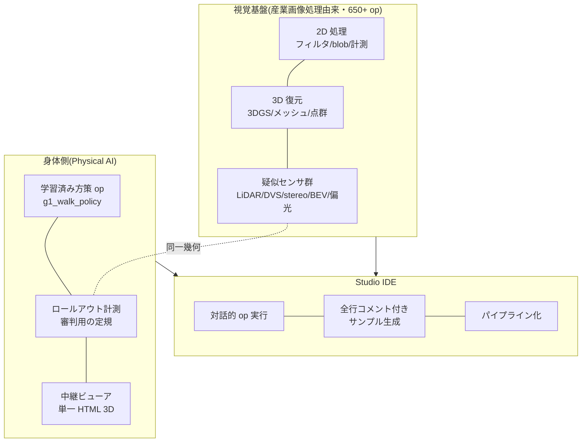

## 11.1 The Starting Point: I Was Building My Own Industrial Image-Processing Toolkit

Fullseye began as a homemade vision toolkit aiming for the same feel as the commercial industrial image-processing libraries (HALCON class). Filters, morphology (fattening/thinning shapes), blob analysis (detecting and measuring blobs — connected regions in an image), calibration, 3D reconstruction... I stacked up **over 650 ops (processing units)**, and also built "Fullseye Studio," an IDE for interactively trying and chaining ops (the equivalent of HDevelop in the commercial world). On the 3D side it reaches 3D Gaussian Splatting (3D reconstruction from multi-view images) and mesh reconstruction.

### 11.1.1 Processing Examples of Representative Ops — 16 in a Row

Result images are faster than words, so here are 16 across the domains, inputs and outputs side by side (all actually executed through Fullseye's registry).


*Figure: real processing example from Filters — gauss_image applied to noisy inputs at the same σ. The right column is the removed component (almost pure noise, with structure confined to edge neighborhoods) (Fullseye real output). Inputs are skimage camera and 2 AI-generated images (Gemini).*


*Figure: median filter — erases only the salt-and-pepper noise (contours preserved) (Fullseye execution result)*


*Figure: Sobel gradient magnitude — draws the strength of brightness change (Fullseye execution result)*


*Figure: real processing example from edges — on the same noisy input, a fixed threshold on gradient magnitude gives thick, broken edges and picks up noise, while canny (non-maximum suppression + hysteresis) returns thin, continuous contours (Fullseye real output). Inputs are skimage camera, AI-generated (Gemini), and homemade synthetic — 3 kinds.*


*Figure: binarization + connected components — puts things into countable form (color-coding = individual identification) (Fullseye execution result)*


*Figure: opening — removes small protrusions (salt noise) (Fullseye execution result)*


*Figure: closing — fills small holes (Fullseye execution result)*


*Figure: real processing example from frequency — periodic stripe noise won't vanish under spatial smoothing (the stripes just blur), but automatic notch removal of the peaks in the FFT domain (cx_fft → transfer function → cx_ifft, ops from the complexops chapter) erases only the stripes (Fullseye real output). The same automatic notch rule applied to 3 inputs with different stripe angles and frequencies (skimage camera / 2 AI-generated).*


*Figure: low-pass restoration — drops high-frequency noise on the frequency side (measured energy 0.0042→0.0021) (Fullseye execution result)*


*Figure: real processing example from texture — regions with the same mean brightness but different patterns can't be separated by binarization, but texture_laws (Laws texture energy) images the strength of the texture and separates them (Fullseye real output). Inputs are 2 homemade synthetics + 1 bundled sample.*


*Figure: Harris corners — detects the corners that serve as references for tracking and calibration (49 points) (Fullseye execution result)*


*Figure: applying lens distortion — barrel (κ=+0.25) and pincushion (κ=−0.25). Note: this model has no exact inverse, so no "correction demo" is shown (honesty) (Fullseye execution result)*


*Figure: area and centroid measurement — the bread and butter of inspection machines; measuring 25 blobs (Fullseye execution result)*


*Figure: real processing example from segmentation — touching objects fuse into one lump under simple binarization + labeling, but the fixed pipeline otsu → distance_transform → local_max → watersheds_marker (marker-controlled watershed) separates them individually (Fullseye real output). Inputs are 2 AI-generated images (Gemini) + 1 homemade synthetic.*


*Figure: distance transform — a map of each pixel's distance to the background (Fullseye execution result)*


*Figure: depth → point cloud — from 2.5D to 3D (76,800 points) (Fullseye execution result)*


## 11.2 The Turning Point: "Just Make the Trained Policy an Op Too"

Soon after starting robot reinforcement learning, I was troubled by a rupture in the development experience. Training lives in the WSL+GPU+JAX world; verification and visualization live in the Windows+numpy world. Just running a trained policy to check it demands a cross-environment ritual.

That's when the thought struck: "**wouldn't it be nice if this stuff could be implemented as Fullseye ops in Studio**." I tried, and it went through astonishingly cleanly.

- The inside of a brax PPO policy is observation normalization + **a small 4-layer × 32-unit MLP** (a perfectly plain multi-layer neural net) + tanh. **Inference alone is 60 lines of numpy.**
- The checkpoint (pickle) demands brax's class definitions, but if you resurrect the classes on the spot as stubs (shape-only stand-ins), you can extract the weights **without installing brax**.
- Faithfully port the training environment's observation construction, residual control, and contact settings to native MuJoCo (Windows build), and rollouts complete on Windows too.

The output difference between the reimplemented numpy inference and genuine brax inference: **at most 1.8×10⁻⁷** (float32 rounding error itself). Numerically identical, in other words. With that,

```python
import fullseye
# 学習済みチェックポイントを渡すと、その場でロールアウト(実測)が走る
result = fullseye.g1_walk_policy("mjx_g1_walk12c_ckpt.pkl")
print(result["distance_m"], result["mean_speed"])  # 20.46 / 1.36 など実測値
```

— one line, and the training results run **in an environment with no GPU, no WSL, no brax**. "Training on a GPU, execution in 60 lines of numpy" — I have never felt the asymmetry between deep learning's training and inference as viscerally as at that moment.

### 11.2.1 Studio, the Actual Screens

Illustrations alone aren't persuasive, so here are the real screens. An HDevelop-style 4-pane layout (image view / op browser / generated code / variable watch).


*Figure: Fullseye Studio right after launch. The op browser lists 791 ops (the subset of the unified registry's 1,606 exposed to Studio's interactive UI). Actual screen capture*


*Figure: the sample gallery. Each sample generates code in both forms, a "one-liner version" and a "staged API version" (the two-tier API convention implemented). Actual screen capture*


*Figure: execution result of the edge detection (Canny) sample. Each pipeline stage remains as a thumbnail in the variable watch. Actual screen capture*


*Figure: segmentation display of a coin image (contour overlay + annotations). Recreates the "see the result on the spot" I always wanted on the inspection-equipment floor. Actual screen capture*

One honest note: g1_walk_policy (the trained-policy op), the star of this chapter, is callable from the API via the unified registry, but is **not yet exposed in Studio's interactive browser** (not among the 791). "Running a walking policy inside the IDE" is, at present, a one-line-of-API experience; as a GUI experience it is under construction — honesty here too.

> **🍙 Plain-Language Corner (Training and Inference Edition)**
> "Three hours on a GPU to train, an instant on any PC to run" may look mysterious. In cooking terms, training is **developing the recipe** (thousands of test batches to tune the flavor), and execution is **cooking it once from the finished recipe**. The test kitchen needs to be huge, but the recipe itself is just a sheet of paper — the policies in this article are, inside, nothing but tables of a few thousand numbers, and reading them takes only a 60-line program.


*Illustration: by image-generation AI (Gemini) — an image of the workbench where ops are chained*

## 11.3 The Toolbox's Design Conventions

Fullseye's ops follow a two-tier API convention. A **one-line facade** (functions like `g1_walk_policy` above that just run, immediately), and a **staged API** (the lower layer where you create a session, step through reset/step, and touch observations and trajectories). Furthermore, Studio's sample code is generated with every line commented plus "rewrite here to extend" markers (EXTEND markers). Because the first user is myself, months from now, having forgotten everything.

## 11.4 A Map of the Physical AI IDE

Here is a one-page summary of what rides on Fullseye/Studio now, and what I am trying to put on it.



The goal is "**an environment where a robot's eyes (sensors), body (policies), and referees (measurement) are all handled as equals — as ops in one IDE**." With the same hand motions you use to chain image-processing ops, you compose the pipeline "pseudo LiDAR op → trained walking-policy op → collision-measurement op → 3D broadcast op." The Games' venue, referees, and broadcast all ride on top of this. That is the integrated development environment being built behind this personal sports meet.

Let me also write down the honest current position: the policy ops cover only the G1 walking line; evis's musculoskeletal side runs on CPU with Studio integration still to come; multi-robot support beyond the H1 is in progress (see Appendix B). We are "holding the games in a stadium still under construction, while adding spectator seating."

# 12. The Meet Handbook — a Bill of Materials for Doing This as an Individual

For anyone who wants to reproduce the "Home Humanoid Games," here is the actual configuration.

| Item | What was used | Notes |
|---|---|---|
| Physics engine | MuJoCo (+ the GPU build, MJX) | OSS. The de facto standard for robot learning |
| Training | brax's PPO implementation | OSS. JAX-based |
| Robot models | MuJoCo Menagerie | OSS. 67 models included; G1/H1 are official-lineage models |
| Reference motion | LAFAN1 retargeted (published on HuggingFace) | Human mocap already converted to G1/H1 joints. License is CC BY-NC-ND (non-commercial), so mind the use case |
| GPU | RTX 5090 (32GB) ×1 | About 9,700 steps/s total with 2 events training simultaneously |
| Practice time per event | About 3–4 hours (100M steps) | Set it up in the evening, see results at night |
| Verification, refereeing, broadcast | Native Windows Python (numpy + MuJoCo) | No GPU needed. Trained policies infer in 60 lines of numpy |
| Musculoskeletal athlete (evis) | Homemade (from anatomical data) | Trains on CPU (muscle computation doesn't ride on XLA) |

In terms of cost, the only extra investment is the GPU. The venue, athletes, reference motions, and referee tools are all covered by OSS and homemade code. Experiments that would have needed a lab compute cluster 10 years ago genuinely run on one person's desk today.

One tip on time management. Training runs in multi-hour units, so the essence of hosting solo is to **build referee tools and broadcast equipment during the "waiting for training" time**. The pseudo-sensors in this article, the viewer, the H1 support — all were built in the background of some training run.

## 12.1 Deep Dive: Venue Operations in Practice — GPU Choice, Electricity Bills, and Environment-Setup Pitfalls
(Expansion of Chapter 12, "The Meet Handbook")

From here on, no more philosophy — let's talk wallets and wall outlets. What do you need to run robot RL at home, what does electricity actually cost, is renting cloud compute the better deal — we check it all with numbers.

### 12.1.1 How to Choose a GPU — Why "VRAM Is Justice"

GPU catalogs line up CUDA core counts, clocks, and TFLOPS, but for personal research the first thing to look at is **VRAM capacity**. The reason is simple: **slow compute can be waited out, but insufficient memory means the experiment won't run at all**. Speed can be bought back with time; capacity cannot.

The official specs of the RTX 5090 in this meet's host machine are as follows (NVIDIA official page [^rtx5090]).

| Item | Official value |
|---|---|
| VRAM | 32 GB GDDR7 (512-bit) |
| Total Graphics Power (TGP) | 575 W |
| Recommended system power supply | 1000 W (more depending on configuration) |

At 32 GB it is the largest among consumer (GeForce) cards, sitting midway to the data-center class (H100's 80 GB, etc.).

Let me be honest here: **robot RL does not eat VRAM the way LLMs do**. LLM training demands tens of GB just for model parameters, gradients, and optimizer state, but a robot RL policy network is a small MLP or GRU of a few MB to a few tens of MB. So what does VRAM buy in robot RL? — **the number of parallel environments**. GPU simulators like MJX (MuJoCo's JAX implementation) run thousands of physical worlds simultaneously to collect experience. More parallel envs means more experience gathered per second, which shrinks wall-clock time. And the ceiling on env count is VRAM. In short: for LLMs, "VRAM = does the model fit"; for robot RL, "VRAM = how many athletes can run at once." The 32 GB works as "the entry quota of the Games."

#### Plain language: the size of your desk

GPU compute speed is "how fast your hands are"; VRAM is "how big your desk is." Slow hands can finish the homework by pulling an all-nighter, but if the textbooks don't fit on the desk, the homework can't even start. In robot RL, what you spread on the desk isn't one giant dictionary (an LLM) but 4096 copies of the same problem set (parallel environments). The bigger the desk, the more pages get solved in one night.

### 12.1.2 An Honest Electricity Estimate — What Does One Event Cost?

Let's put down numbers. Two unit prices.

- **Reference rate 31 yen/kWh**: the national guideline set by the Japan Electrical Home Appliances Fair Trade Council for catalog electricity-cost labeling. Revised from 27 to 31 yen in July 2022 [^eftc] [^mynavi].
- **TEPCO's metered plan B, tier 2 (120–300 kWh), 36.40 yen/kWh (tax included)**: from the 2026 rate table [^tepco-tanka]. Note that TEPCO's official rate page could not be fetched directly at the time of writing (HTTP 403), so this number comes from a third-party rate summary; when signing up, confirm on the official page. Actual bills additionally carry the fuel cost adjustment and the renewable energy surcharge [^tepco-saiene].

Assuming the GPU stays pinned at the official TGP of 575 W throughout training — an **upper-bound estimate** — we compute "1 event = 4 hours of training" (in reality power draw fluctuates as physics simulation and learning alternate, so this is a ceiling. To know precisely, measuring with a watt meter is the honest path).

| Scenario | Power assumption | Energy | 31 yen/kWh | 36.40 yen/kWh |
|---|---|---|---|---|
| 1 event (4 h), GPU-only ceiling | 575 W | 2.3 kWh | **about 71 yen** | about 84 yen |
| 1 event (4 h), whole system (assumed 750 W) | GPU 575 + CPU etc. 175 W | 3.0 kWh | about 93 yen | about 109 yen |
| One night (8 h), whole system | 750 W | 6.0 kWh | about 186 yen | about 218 yen |
| Every night 8 h × 30 days | 750 W | 180 kWh | **about 5,580 yen** | about 6,552 yen |

(The 750 W whole-system figure is the Fermi assumption "GPU 575 W + CPU, motherboard, fans etc. 175 W." Not a measurement.)

The conclusion is rather mild. **One event costs a bit less than a can of coffee; running every night is 5–7 thousand yen a month.** People often say "RL at home — the electricity must be brutal," but even the upper-bound estimate lands here. That said, 180 kWh from 8 hours × 30 nights piles wholesale onto a typical household's monthly usage, so it does have the effect of pushing you into the metered plan's tier 3 (over 300 kWh; 40.49 yen/kWh at TEPCO [^tepco-tanka]).

### 12.1.3 The WSL2 + CUDA + JAX Pitfalls — What to Read in the Official Docs

This meet's training runs in WSL2 (Ubuntu) on a Windows machine. Here are the easy-to-hit snags in this setup, with the relevant official documentation.

**No. 1: install the NVIDIA driver on the Windows side only.** This is the most important one. In the configuration defined by NVIDIA's "CUDA on WSL User Guide" [^cuda-wsl], the GPU visible from Linux inside WSL2 is one that the Windows-side driver **maps through** to WSL. You must not install a Linux GPU driver inside WSL's Ubuntu (it breaks the Windows driver's mapping). The CUDA Toolkit installer for WSL (the WSL-Ubuntu build) is deliberately distributed as a package that **contains no driver** for exactly this reason [^cuda-wsl]. Most "I copy-pasted the steps from an Ubuntu setup article and the GPU disappeared" accidents are this.

**No. 2: JAX preallocates 75% of VRAM by default.** As JAX's official "GPU memory allocation" page [^jax-mem] states, a JAX process **preallocates 75% of total GPU memory** at startup. It's a design to prevent fragmentation, but if you don't know it, you'll be startled that "training hasn't even started and 24 GB of VRAM is already gone." The behavior is changed via environment variables [^jax-mem].

- `XLA_PYTHON_CLIENT_MEM_FRACTION=.XX` — change the preallocation fraction (e.g. `.90` for 90%)
- `XLA_PYTHON_CLIENT_PREALLOCATE=false` — stop preallocating and allocate as needed (at the cost of fragmentation risk)

To run "a training process + an evaluation process for recording" on the same GPU simultaneously, splitting the shares with this variable is the officially recommended way [^jax-mem]. This meet, too, uses it to assign seats when shooting videos in a separate process during training.

**No. 3: install per JAX's official combination table.** JAX's GPU build is sensitive to CUDA/cuDNN version combinations; using the pip extras specified by the official documentation's (docs.jax.dev) installation section (`jax[cuda12]` etc.) as-is is the shortest path. Mixing in rogue builds or steps from old articles here can produce accidents where things appear to run but the numbers are corrupted. I have not verified the individual URLs of the installation section for this article, so I won't list them (navigate to Installation from the docs.jax.dev top page).

### 12.1.4 Buy or Rent — the Break-Even Against Cloud Alternatives

Let me also honestly compare the option of renting cloud GPUs instead of buying. Ballpark as of August 2026 (cloud prices change often — always check the official pages for current values).

| Service | Ballpark rate | Source |
|---|---|---|
| Google Colab (paid plans) | Monthly fee + metered compute units. See the official pricing page [^colab] | Official |
| RunPod (RTX 4090) | Secure Cloud about $0.69/h, Community about $0.34/h [^runpod] [^runpod-3rd] | Official page + third-party aggregation |
| Lambda (A100 40GB) | About $1.99/h [^lambda-3rd] | Third-party aggregation (final check on official page advised) |

A Fermi estimate of the break-even. Suppose a complete RTX 5090 machine at 500,000 yen (**street prices fluctuate wildly and are unverified**; this is strictly an order-of-magnitude estimate). RunPod Secure's RTX 4090 at $0.69/h ≈ about 100 yen/h (assuming 150 yen to the dollar — **the exchange rate is also an unverified placeholder**), so:

- 500,000 yen ÷ 100 yen/h = **about 5,000 hours** is the naive break-even
- Running 8 hours every night: 5,000 ÷ 8 ≈ 625 days, so buying wins after **about 1 year 9 months** (adding home electricity of ~200 yen/night for 8h pushes the break-even out only about 10%)

But the real lesson of this calculation isn't "which is cheaper." It's decided by **the character of your usage**.

- **Renting suits**: occasional big training runs / temporarily needing H100-class VRAM / wanting to try first
- **Buying suits**: running every night, a research style that wins by trial count / not wanting data to leave the house / wanting the psychological hurdle of "if in doubt whether to run it, run it" at zero

For personal research, the last point is decisive. Metered billing makes you ask "is this run worth it?" every single time; once you've bought, a failed experiment costs 71 yen of electricity. In evolutionary, exploratory research where trial count is what talks, that psychological difference becomes, directly, a difference in experiment count.

### 12.1.5 Noise, Heat, Power — Notes for Cohabiting with Daily Life

Finally, the life-side items that don't appear on spec sheets.

**Power supply capacity**: the RTX 5090's official recommended system power supply is **1000 W** [^rtx5090]. To the question "will my existing 850 W unit do?" the only answer is: it's below the official recommendation. The GPU alone draws up to 575 W; add a CPU (150–250 W class at the high end) and the rest, and at 850 W the peak headroom (the rule of thumb being to run a PSU at 50–80% of rating for efficiency and lifespan) all but vanishes. This is a band where shutdowns from momentary power spikes are reported, so if you buy a 5090, budgeting a PSU upgrade to 1000 W+ is the honest recommendation.

**Heat**: 575 W is the same heat output as running a **575 W electric space heater** in the room. Run it overnight in a closed room in summer and the temperature will rise, full stop, and the air-conditioning bill stacks onto the estimates above. In winter, conversely, it's warm enough to genuinely register as heating. This is not a joke: when you discuss power consumption, the air conditioning belongs in the ledger.

**Noise**: GPU fans under training load can get quite loud. If it runs every night in the same room you sleep in, the realistic fixes are fan-curve tuning, case soundproofing, or simply putting the machine in another room and using it remotely (the WSL2 + SSH setup pairs well with this). Continuous late-night operation is an item that belongs in the "meet handbook" — family consensus included.

**Breakers**: Japanese household outlets are typically 15–20 A per circuit (1,500–2,000 W). Put the training PC (peak ~1 kW) + air conditioner + microwave on the same circuit and it trips. The Games' venue deserves a dedicated circuit, electrically speaking — that, too, is part of the practical reality of "hosting at home."

---

### Sources

[^goodhart-wiki]: Goodhart's law (includes the bibliography of the original 1975 paper and the original quotation): <https://en.wikipedia.org/wiki/Goodhart%27s_law>
[^strathern]: Strathern, M. (1997). "'Improving ratings': audit in the British University system." European Review, 5(3), 305–321: <https://www.cambridge.org/core/journals/european-review/article/improving-ratings-audit-in-the-british-university-system/FC2EE640C0C44E3DB87C29FB666E9AAB>
[^campbell]: Campbell, D. T. (1979). "Assessing the impact of planned social change." Evaluation and Program Planning (commentary: Psych Safety "Goodhart's Law, Campbell's Law, and the Cobra Effect"): <https://psychsafety.com/goodharts-law-campbells-law-and-the-cobra-effect/>
[^perverse]: Perverse incentive (see the cobra effect and the 1902 Hanoi rat cull entries): <https://en.wikipedia.org/wiki/Perverse_incentive>
[^coastrunners]: OpenAI (2016). "Faulty reward functions in the wild": <https://openai.com/index/faulty-reward-functions/>
[^vim]: JCGM 200:2012 "International vocabulary of metrology – Basic and general concepts and associated terms (VIM)" 3rd ed. (BIPM): <https://www.bipm.org/documents/20126/2071204/JCGM_200_2012.pdf>
[^iso5725-1]: ISO 5725-1:2023 "Accuracy (trueness and precision) of measurement methods and results — Part 1": <https://www.iso.org/standard/69418.html>
[^iso5725-2]: ISO 5725-2:2019 "— Part 2: Basic method for the determination of repeatability and reproducibility": <https://www.iso.org/standard/69419.html>
[^grr]: Gage R&R Study Procedure & Acceptance Criteria (AIAG MSA) (explains the 10×3×2 design and the %GRR 10/30% criteria): <https://calibrationos.com/learn/gage-rr-study-procedure>
[^osc2015]: Open Science Collaboration (2015). "Estimating the reproducibility of psychological science." Science 349(6251): <https://www.science.org/doi/10.1126/science.aac4716>
[^rr-cortex]: Chambers, C. D. (2013). "Registered reports: a new publishing initiative at Cortex." Cortex 49(3): <https://pubmed.ncbi.nlm.nih.gov/23347556/>
[^rr-cos]: Center for Open Science: Registered Reports: <https://www.cos.io/initiatives/registered-reports>
[^rr-nhb]: Chambers & Tzavella (2022). "The past, present and future of Registered Reports." Nature Human Behaviour: <https://www.nature.com/articles/s41562-021-01193-7>
[^recht]: Recht, B., Roelofs, R., Schmidt, L., & Shankar, V. (2019). "Do ImageNet Classifiers Generalize to ImageNet?" ICML 2019: <https://arxiv.org/abs/1902.10811>
[^raji]: Raji, I. D., Bender, E. M., Paullada, A., Denton, E., & Hanna, A. (2021). "AI and the Everything in the Whole Wide World Benchmark." NeurIPS 2021 Datasets and Benchmarks: <https://arxiv.org/abs/2111.15366>
[^rtx5090]: NVIDIA GeForce RTX 5090 official page (Specs: TGP 575W / recommended system power 1000W / 32GB GDDR7): <https://www.nvidia.com/en-us/geforce/graphics-cards/50-series/rtx-5090/>
[^eftc]: Japan Electrical Home Appliances Fair Trade Council, FAQ (electricity-cost reference rate): <https://www.eftc.or.jp/qa/>
[^mynavi]: Mynavi News (2022-08-09), "Electricity reference rate revised from 27 yen/kWh to 31 yen/kWh": <https://news.mynavi.jp/article/20220809-2421349/>
[^tepco-tanka]: TEPCO metered plan B rate table summary (29.80 / 36.40 / 40.49 yen/kWh, as of 2026. TEPCO's official rate page returned 403 at the time of writing, hence a third-party summary): <https://enegent.jp/articles/tepco-juryou-b-tanka>
[^tepco-saiene]: TEPCO EP notice of renewable energy surcharge rates (billing method for metered plan B): <https://www.tepco.co.jp/ep/renewable_energy/institution/pdf/20260501.pdf>
[^cuda-wsl]: NVIDIA "CUDA on WSL User Guide": <https://docs.nvidia.com/cuda/wsl-user-guide/index.html>
[^jax-mem]: JAX official documentation "GPU memory allocation": <https://docs.jax.dev/en/latest/gpu_memory_allocation.html>
[^colab]: Google Colab pricing (official): <https://cloud.google.com/colab/pricing>
[^runpod]: RunPod RTX 4090 official page: <https://www.runpod.io/gpu-models/rtx-4090>
[^runpod-3rd]: Third-party aggregation of RunPod RTX 4090 pricing (Secure $0.69/h, Community $0.34/h, 2026): <https://www.synpixcloud.com/blog/rtx-4090-cloud-rental-worth-it>
[^lambda-3rd]: Third-party aggregation of Lambda GPU Cloud pricing (A100 40GB $1.99/h etc.): <https://gpuvec.com/providers/lambda>

# 13. Toward the Future — the Game of Simulating the Cutting Edge


*Illustration: by image-generation AI (Gemini). A space elevator, and future animals walking the Milky Way*

Finally, let me talk about the scenery beyond this sports meet. It amounts to "the list of things I want to play with next," but when I looked into it, the roads ran farther than I expected — so I'm sharing the whole map.

## 13.1 An Ideation Tool: Thinking from Contradictions

When hunting for new themes, I borrow the "contradiction" idea from TRIZ (the Theory of Inventive Problem Solving). The view is that the dead end of "improving A makes B worse" is exactly where the next theme lives. Looking back, every experiment in this article was the resolution of a contradiction.

| Contradiction (raise A and B falls) | Resolution in this article | In TRIZ terms |
|---|---|---|
| Want the corridor respected ⇔ punishment shrivels exploration | Give observation instead of punishment (2D steering) | "Prior action" — before punishing, hand over the information needed to avoid |
| Want survival ⇔ standing still becomes optimal | Stall termination | "Inversion" — instead of adding punishment, make doing nothing a disqualification |
| The rawness of muscles ⇔ the speed of GPU parallelism | Learn on torque-twin (the torque twin), return to muscles | "Mediation" — insert an intermediate representation between two parties that can't be solved directly |
| Precise sensors ⇔ absent on real hardware | Train with a privileged teacher, distill to real-sensor students | "Copying" — train on a cheap copy instead of the expensive original |

Take this tool and look toward "sensing" and "space," and there are still contradictions lying around that simulation can play with.

## 13.2 Contradictions at the Frontier of Sensing

- **Event cameras**: the very resolution of "want to capture fast motion ⇔ raising frame rate floods you with data" (send only the changes). Simulators (v2e, ESIM) are public, so **you can generate "the world as seen by an event camera" at home and feed it to a policy**. It's the real 2-D version of this article's 1-D one.
- **Quantum sensing**: quantum mechanics' answer to "want more sensitivity ⇔ noise grows too." Inertial navigation where GPS can't reach has advanced to on-orbit tests of atom interferometers and to the patent stage. An individual can't own the hardware, but simulating quantum states (QuTiP) is free to touch.
- **Tactile / electronic skin**: "want to know the grip force ⇔ more sensors, and the wiring collapses." The approach of watching fingertip deformation with a camera (the GelSight family) is a domain where image processing becomes touch, directly — a happy entrance for vision people. It's also technology evis's chopstick event will eventually need.

## 13.3 Contradictions in Space Development

Space is the king of domains that "can only be practiced in simulation." Failure is too expensive, so everything runs virtually before the real thing. Which means **it sits right on the extension of the games we've been playing in this article**.

- **Debris capture**: "want to grab it ⇔ touch it and you push it away." A freely floating object flees the moment you touch it, as momentum transfers. In fact, turn gravity off in this article's body simulation (MuJoCo) and "capture of a free-floating object" is a theme you can experiment with at home as-is (I've touched it in another experimental rig; it smells exactly like the chopsticks' "can grasp but can't carry"). With Japanese players (Astroscale, JAXA CRD2) advancing from approach demonstrations to capture demonstrations, the field is hot right now.
- **Lunar robotics**: "want to walk on sand ⇔ sand physics is computationally heavy." Running walking RL at the Moon's 1/6 gravity is possible today by changing a single parameter (sand is hard — which is why it's interesting).
- **Planetary helicopters**: Mars's atmospheric density is 1% of Earth's — the extreme contradiction of "want lift ⇔ there's no air," which Ingenuity solved with rotor speed. On the extension of the drone division (Crazyflie, see the roster) lies a planet's sky.

And there is one more realistic outlook I want to write down. **Space is going to become an arena of competition over resources.** The Moon's south pole is believed to hold water ice in permanently shadowed craters, and water splits into oxygen and hydrogen — breath and fuel — hence the analogy "the Moon's oil fields." Asteroids carry platinum-group metals. So national and corporate lunar and asteroid exploration carries the character of "resource scouting" as much as pure science, and the parallel tracks of the US-centered Artemis Accords and the China-Russia-centered lunar base concept look, frankly, like the entrance to a scramble.

I write this not to stoke alarm. Rather the opposite, in two senses of "which is exactly why." First, **the protagonists of this competition are robots, not humans**. Inside permanently shadowed craters it is below −170°C and humans cannot enter; the digging, hauling, and building will be the work of the kind of Physical AI this article has been playing with. Locomotion and excavation at 1/6 gravity on regolith (lunar sand) is precisely the class of problem you rehearse in physics simulation first, and on the extension of this article's games waits demand more serious than expected. Second, whether it becomes a scramble also depends on **rule-making**. The Outer Space Treaty (1967) forbids claiming celestial bodies, but the detailed rules for extracting and using resources are still developing. Whether people who know the technology's substance can participate in the rules debate will change the future's scenery — the point of learning technology is not only to win the competition, but to be on the side that tames it wisely.

## 13.4 The Roads Were All Contiguous

The fields around here — papers, labs, simulators, competitions — are astonishingly open. In Appendix G I compiled a resource collection (official galleries, laboratories, strong universities, conferences, expos, competitions) using only URLs whose existence I verified. My personally recommended on-ramp is 3 steps: "be amazed by official videos → imitate in a free simulator → go watch a competition (something an individual can enter, like ROBO-ONE)." I myself started from footage of the Beijing games and arrived at this article, so I'm something of a live demo of this on-ramp.

## 13.5 Farther Still — Space Elevators, a Yardstick for Civilizations, and After Man

So far the talk has been on the scale of years, but I'll confess: I have always loved wandering through the farther stuff — space elevators, the evolutionary level of civilizations, imagined fauna after humanity is gone. "What is this doing at the end of a sports-meet article," you may think, but it is all in fact contiguous, as "seeds for simulation."

**The space elevator** is the concept of hanging a cable from geostationary orbit to the ground and riding a climber to space. 130 years after Tsiolkovsky's 1895 conception, the biggest reason it still doesn't exist is the material (the required specific strength demands something of carbon-nanotube class) — but the interesting part is that **many of the non-material problems can be played with in simulation first**. The vibration and resonance of a cable tens of thousands of km long, the deflection from Coriolis forces as the climber ascends, active control for debris avoidance — these are numerical experiments in cable dynamics, and in fact, with the physics engine used in this article, a model of "a short tether + a weight" can be assembled today. Inside the grand vision, home-sized practice problems lie buried.

**The yardstick for civilizations (the Kardashev scale)** is the famous classification measuring civilizations by energy use (planetary-scale Type I, stellar-scale Type II, galactic-scale Type III). By Carl Sagan's interpolation formula, present humanity sits at roughly the low 0.7s. This too looks like a distant story, but it has exactly one point of contact with this article: **learning intelligence takes energy**. The present, where one GPU can host a sports meet, means — inverted — that we live in an era where the scale of intelligence you can play with is a function of "the energy and compute an individual can use." There is a strange thrill in realizing that the far end of the civilization yardstick connects to your home electricity bill.

**After Man (After Man: A Zoology of the Future)** is the "zoology of animals 50 million years after human extinction" drawn by zoologist Dougal Dixon in 1981. It is the classic of speculative evolution — scientifically imagining future creatures from skeletons and ecology — and I suspect that reading it in a library as a boy is the headwater of my "I want to move things that are anatomically correct." And the modern delight is that **this game can move from pictures to physics**. This article's evis is a model of present-day humans driven by 700 muscles, but with the same toolkit you can stretch the skeleton, re-rig the muscles, and walk it with evolutionary computation — and that is already "After Man inside a physics engine." I have in fact played at swimming dozens of speculative-creature models in another experimental rig, and it felt like turning the pages of Dixon's zoology in simulation.

The distance between dream-stuff and the lab bench is much shorter than people think. The Beijing games, the space elevator's cable vibrations, creatures 50 million years hence — all are the same game of "test what holds within the laws of physics," differing only in scale.

## 13.6 Connecting to the Brain, and a Future Where Memory Lives Outside

One more story that seems far but is unexpectedly near: **the brain-computer interface (BCI)**. Invasive clinical trials — electrodes implanted in the skull, cursors moved by thought — are already underway at multiple companies, and a staircase of "connections" at various depths is heading toward practical use: electrodes delivered through blood vessels, and non-invasive devices reading "the finger you meant to move" from wrist EMG. Research reconstructing sentences from the brain activity of patients who cannot speak has also become suddenly real in the last few years. In this article's context, BCI is the ultimate input sensor — a technology that fundamentally changes how prostheses and robots are "piloted." An experiment like driving evis's muscle model directly from EMG will probably become possible at home within my lifetime.

And paired with connection comes **the future where memory lives outside**. Actually, it's not even the future — humanity has always done this. Writing is the externalization of memory; books are searchable memory; the smartphone is carry-along memory. On that same line comes a life where "an AI that remembers your conversations and working context, and reminds you when needed" is ordinary — I predict this with something close to conviction. To confess: this long article itself is being written with an AI shouldering the working memory (the experiment numbers and the histories of failure live in the record layer, not in my brain, while I concentrate on judgment and direction — a division of labor). Having used it, the felt change is not "it's easier" but "**I can think without fearing forgetting**" — a change in kind.

Of course, if you deposit your memory, the character of the depository comes into question. Whose server is it on, will it vanish, will it be peeked at? Personally I believe the more important the memory, the more it belongs **on a machine at your own hand** (held by an AI that runs locally) — and in fact, behind this sports meet, I am building exactly such a mechanism. The future where the distance between brain and machine shrinks is probably unavoidable. In that case, I want to be on the side that chooses the connection's specification and the data's location — this too, I think, is one form of "you don't have to stay in the audience."

## 13.7 Memory Externalization, Practicum — the Paper Warehouse, the "Second Brain," and Honest Doubt

I wrote about external memory in the future tense, but I also practice it in the present tense — so here are the actual operations, and the doubts I carry while operating them. Writing only the success stories wouldn't be fair, so the doubts come included.

**First: a private corpus of papers and articles.** I maintain a locally accumulated store of paper metadata across 20-odd fields (tens of thousands of entries), layered by field, as a "substrate for surveys." Before touching a new theme, I first have (the AI) consult this warehouse to grasp the terrain of prior work and the "gaps nobody seems to have done" before starting — behind this article's deep-dive chapters, too, this two-stage rig of warehouse plus external search was at work. Today as well, I added several resources found during this article's research (training environment collections, motion data, retargeters) to the robotics shelf. The operating rule: restock the warehouse on the day you use it.

**Second: the "second brain."** In a memo app's vault, I bank project decisions, experimental lessons, and signposts to resources as notes, connected by cross-links — a Zettelkasten-style operation. In the division of labor with AI, it also functions as shared memory so the AI can recall my judgments and their context in the next session; this article's "11 commandments of reward design" and "physics of balance" both have their originals living there.

Now, the honest part. **This second brain — I use it while doubting whether it's actually right.** Three specific doubts:

1. **The problem of being left with only the comfort of having written.** A note feels best at the moment of writing. But unsearched, it's just a warehouse — and burial and preservation are indistinguishable from the outside. There are, without question, notes I wrote once and have never reread.
2. **The problem that the more places there are, the less you know where you wrote it.** The corpus, the vault, the AI-side memory, the repo docs — pushing memory externalization created a new job called "managing the externalization destinations." This smells like the cart before the horse.
3. **Goodhart's law, again.** It's easy to mistake "more notes = more knowledge," but note count is a metric, not a target. Having watched reward hacking all through Chapter 9, I need to periodically doubt whether my own knowledge management has fallen into the same hole.

The single reason I continue anyway: **measured by "times cited," it is clearly in the black**. In the course of writing this article, past notes were cited dozens of times in the form of measured values, lessons, and URLs (the 11 commandments and the 6 standing iterations would have been re-experiments without the notes). Even if most written notes lie in dead storage, the living 10% saves days of re-experimentation over and over — the current verdict is "continue, while doubting." The final ruling on whether it's right will probably be made by me, one year from now.

## 13.8 Graphing the Work — Also Self-Taught, I Confess

One more thing, about the production system of this article itself. This article is not the fruit of me working through tasks one by one — it was made by **running 20+ AI agents in parallel**. While training runs on the GPU, the waiting time hosts researcher, figure-maker, renderer, and verifier agents running side by side, and I stick to traffic control (what to parallelize, what to serialize, which reports to doubt) — an operation that designs work not as a "line" but as a "graph of dependencies," which I privately call graph engineering. Walking training (hours), a sensor survey (30 minutes), and figure generation (10 minutes) have no dependencies, so they run simultaneously. The chopstick diagnosis is a prerequisite of its fix, so it's serial. This design alone changes felt throughput by an order of magnitude.

But I am **aware this too is self-taught**. I know that workflow engines and DAG orchestrators are an established field — and yet what I use are homemade operating rules and heuristics. The weaknesses of being self-taught are visible too:

1. **Losing to the temptation of parallelism.** Just because things can be parallelized doesn't mean they should be. Somewhere past 8 concurrent monitored jobs, I (the traffic controller) become the bottleneck.
2. **An agent's report is not a result until verified.** The phantom of "lifted 48mm" (section 15.1) was precisely an accident of nearly swallowing a report whole. The higher the parallelism, the stronger the pressure for verification to thin out — the biggest trap lives here.
3. **The graph design itself becomes personal lore.** What granularity to cut at, where to place gates — for now, it's my intuition. Intuition is another name for undocumented knowledge, so this too is homework bound for the second brain.

Still, the fact stands that one day moved this volume (7 training runs, 5 surveys, 100+ assets), so the verdict here is also "continue, while doubting." I suspect an era is arriving where personal-development productivity is decided less by AI performance itself than by "**how you arrange the AIs**" — I will write about this head-on in another article someday.


# 14. The Disciplines Mixed Into This Sports Meet — from DNA to Optics


*Illustration: by image-generation AI (Gemini)*

Approaching the end of writing, I noticed: this sports meet has more academic disciplines than events. Disguised as a robot article, it has actually been talking about evolution, statistics, physics, and optics the whole time (with a little quantum at the end). So here is a floor map of what was mixed in where. I'd be delighted if you browse it as a sample of "how the subjects you learn at school connect on a lab bench."

## 14.1 Evolution and DNA — Athletes Walking a Fitness Landscape

Reinforcement learning and biological evolution share a mathematically quite similar structure. The policy's parameters (thousands of numbers) are the **genotype**, the actual gait is the **phenotype**, and the reward is the **fitness**. And the "local optima" that battered us throughout the main text are, in the words of the **fitness landscape** drawn by evolutionary biologist Sewall Wright in 1932, exactly the phenomenon of "settling contentedly on top of a low hill." That both walk13 lines independently converged on "stepping in place" was the computational version of **convergent evolution** in biology (sharks and dolphins arriving at the same shape from separate lineages). Populations departing from different initial values arrive at the same answer under the same environmental pressure — a demonstration, in ironic form, of evolution's reproducibility.

One metaphor from the molecular biology side, too. If the trained checkpoint (a lump of numbers) is DNA, then the 60 lines of numpy inference code correspond to the **ribosome** that reads it and translates it into motion. The DNA (weights) is the same, but a different reading machine (brax or numpy) produces the same protein (motion) — the 1.8×10⁻⁷ agreement was a proof of translation-machinery compatibility. The design philosophy of "separating information from execution" in biology's central dogma (DNA→RNA→protein) really does resemble software's.

And the 13d vs 13e A/B test is, in essence, **selective breeding**. From the same ancestor (12c), raise 2 lineages differing only in environmental pressure (reward) and compare. You could say we do, every night and at a much smaller scale, what After Man (section 13.5) did in imagination.

## 14.2 Statistics — a Toolkit for Doubting

The true identity of this article's "referee crew" is, mostly, statistics.

- **Report the median**: survival-time distributions are skewed by "occasionally lives long," so we reported the median rather than the mean. Choosing a representative value robust to outliers — statistics' opening move.
- **What are the 8 seeds for?**: success on 1 course might be luck. Measuring on 8 obstacle layouts (= samples) is securing sample size, the foundation for judging that the difference between "collisions 2/8" and "collisions 8/8" is hard to explain by chance. The sense that 8 is still few — that's statistics too.
- **The pre-declared gate is "preregistration"**: documenting the standing RL's pass/fail criterion (3.6 seconds) before running it imitates **preregistration** from clinical trials and the psychology reproducibility movement. Because if you move the criterion after seeing the result, a human can make any result look like "success."
- **Comparison against the null model**: measure "0.5 seconds with no control" before speaking of "1.2 seconds with control." Reject the null hypothesis (it happens even doing nothing) before claiming — the basic form of science.
- **Finding the period with autocorrelation**: extracting one walking cycle (30 frames) was just finding the peak of the **autocorrelation function** (agreement of the knee-angle time series with a time-shifted copy of itself). A tool from about chapter 2 of a time-series statistics textbook, working as-is on the mocap-processing floor.

## 14.3 Physics — the Laws You Cannot Escape

Simulation is physics' private tutor. Cut corners, and you are graded on the spot.

- **kb > mg ≈ 590 N/m** (Event 4): no stabilization unless the restoring-force gradient exceeds the gradient of gravity's toppling moment — it looks like a control story, but it's just mechanics (the sign of the potential's second derivative). The inverted pendulum, that classical-physics homework problem, was assigned word-for-word to a 700-muscle human body.
- **Muscles pull**: tension can only be positive. This simple constraint (an inequality constraint) shapes the whole optimization problem of muscle allocation.
- **Contact is made of force**: geometrically touching but force-unbalanced means falling (the 8.4 m/s² incident). The duality of position and force is the most-stepped-on landmine in solving physics numerically.
- **Moment arms**: the same muscle force yields different torque in different postures. The lever principle is the true identity of the long-named component "posture-indexed capacity map."
- Incidentally, section 13.5's space elevator is also, at heart, a classical mechanics problem of "a giant pendulum + Coriolis forces in a rotating frame." The farther the dream, the more its roots tend to be high-school physics.

## 14.4 Optics — Robot Eyes Are Made of Physics

The section closest to my day job. A robot's "eyes" are all applications of the physics of light.

- **LiDAR is time of flight**: distance from the round-trip time at light speed. "An echo, but with light" is a plain-language gloss that is also physically accurate.
- **Stereo cameras are triangulation**: reconstruct distance from binocular disparity. The constraint that baseline length (distance between the eyes) determines ranging precision is an example of geometry becoming the spec sheet, verbatim.
- **Event cameras are logarithmic response**: each pixel fires only at the instant the log change in luminance crosses a threshold. The human retina also responds logarithmically to brightness (the Weber–Fechner law), so the device is the retina's design philosophy transcribed into silicon.
- **Polarization imaging**: the polarization state of reflected light reveals material and surface orientation. A complement for seeing what depth cameras struggle with — glass, water surfaces — a sensor that uses light's wave nature.
- **Lens distortion**: the op catalog in Appendix F lists `change_radial_distortion_points` (Brown's distortion model, 1971), a classic of camera calibration. A 1971 optics paper still on active duty calibrating robot eyes in 2026 — good physics has a long shelf life.

## 14.5 Quantum Computers — Still in the Stands, Bound to Crash the Field Eventually

Honestly: quantum computers have not entered this sports meet. But they are in the front row of the stands, and the possibility of their eventually storming the field is being discussed in concrete terms, so let me record the current position.

- **What quantum computers are good and bad at today**: the expected strengths are combinatorial optimization, simulation of quantum systems themselves (molecules, materials), and certain linear algebra. The weakness is, in fact, the **iterative learning over massive data** that this article runs on. Reinforcement learning's main arena (thousands of parallel environments on a GPU) will remain classical computing's home turf for the time being — that, I think, is the sober forecast. The story that "quantum will make AI suddenly smarter" is, at present, honestly heard with a discount.
- **Yet the points of contact are concrete**: first, **optimization**. This article's muscle allocation (assigning 700 tensions) and whole-body control (WBC-QP) are optimization problems through and through, a domain where QAOA (a method approximating optimization with quantum circuits) and quantum annealing could become future competitors (the honest current position: classical solvers are overwhelmingly faster and cheaper). Second, **materials**. The space elevator section named the material as the biggest wall, and new-material search is one of quantum computing's flagship applications — the roundabout route that might help that dream most. Third, the **quantum sensing** touched on in 13.2 — that one, a step ahead of the computers, has already reached real hardware and patents.
- **You can already touch it at home**: quantum-circuit simulation (QuTiP, Qiskit, etc.) is free, and a few qubits' worth of world runs on an ordinary PC. Real hardware too — this is the era when you can submit circuits to genuine quantum processors via the cloud (small and noisy, but the impact of "touching the real thing" is large). In sports-meet terms: they can't compete yet, but the athlete-registration desk is already open.
- **Plain language**: if a classical computer is a calculation that "checks each coin, heads or tails, one at a time," a quantum computer is a device that "keeps calculating while the coin is spinning, in a superposition of heads and tails." But look at the answer (measure), and it collapses to one — so you need the peculiar art of **skillfully raising the probability of the answer you want before measuring** (interference). This sense of "weaving probabilities" is what's utterly different from classical, and also why the strengths and weaknesses split so sharply.

---

That so many fields mix naturally into a single game is, I think, the character of the domain called Physical AI. Body (physics, anatomy), learning (statistics, evolution), perception (optics), and measurement (all of the above). Being good at just one subject gets you in the door, and there is also the route I took: enter through one subject (images) and learn the rest while being scolded by experiments.

## 14.6 Deep Dive: the Lineage of Evolutionary Computation — from Virtual Creatures to Xenobots
The game we were playing at home — "evolve walking" — actually carries 60 years of accumulated scholarship. Here we trace that lineage in one pass, from the classics to today's Quality-Diversity.

### 14.6.1 The Origin: Karl Sims's Virtual Creatures (1994)

When people speak of this field, there is footage everyone names first: Karl Sims's **Evolved Virtual Creatures** (1994) [^sims-page]. In the SIGGRAPH '94 paper "Evolving Virtual Creatures" [^sims-paper] [^sims-acm], Sims used genetic algorithms to auto-generate **both the body's shape (morphology) and the neural circuits driving the muscles**. The genome is written as "a directed graph of nodes and connections," and the graph naturally expresses repeated body segments (symmetric legs, arthropod-like segmentation). Just by changing the fitness function — "swimming speed," "walking speed," "jump height," "light-following ability" — creatures of utterly different builds evolved.

The footage is still viewable as-is (Internet Archive [^sims-video] / YouTube [^sims-youtube]). Things that undulate like snakes to swim, things that flap paddle-like boards, oddities that roll to advance — **"solutions the designer never imagined welling up out of physics simulation"** — the field's charm and eeriness are condensed into 3 minutes. The footage is 30 years old, yet the sensation is exactly the one we get when our evis "invents" a strange gait.

### 14.6.2 The Lineage, One Line Each: from GA to Quality-Diversity

Evolutionary computation is not one method but a clan. The major branches, one line apiece.

| Era | Method | In one sentence | Source |
|---|---|---|---|
| 1960s | **ES (evolution strategies)** | Founded by Rechenberg and Schwefel at TU Berlin. Mutate real-valued vectors to optimize engineering designs (nozzle shapes etc.) | [^es-wiki] |
| 1975 | **GA (genetic algorithms)** | John Holland, *Adaptation in Natural and Artificial Systems*. Formalized the classic form: bit-string genomes + crossover + mutation | [^holland] |
| 2001 | **CMA-ES** | Hansen & Ostermeier. Adapts the "shape" of mutation (the covariance matrix) itself from search history. The de facto standard of continuous optimization | [^cmaes] [^cmaes-tutorial] [^cmaes-site] |
| 2002 | **NEAT** | Stanley & Miikkulainen. Evolves not just a neural net's weights but its **topology (wiring), starting small and building out** | [^neat] |
| 2011 | **Novelty search** | Lehman & Stanley: "abandon objectives." Reward **"behavior never seen before"** instead of fitness, and deceptive problems get solved — you reach the objective anyway | [^novelty] |
| 2015 | **MAP-Elites / QD** | Mouret & Clune. Instead of "the single best," build **a map placing, in each cell of a behavioral-feature grid, the best solution for that cell** (Quality-Diversity optimization) | [^mapelites] |

Three supplements to the table.

**CMA-ES** [^cmaes] is the algorithm that "learns, while climbing, the stride and directional habits of the climb." Because it updates a covariance matrix (= the ellipse of which directions and how far to leap) from the history of successful mutations, it remains a first candidate for optimizing tens-to-hundreds of continuous parameters — gait CPG parameters, say, or reward weights. Needing no derivatives, its practical strength is that it runs on nothing more than the simulator's "fell / advanced."

**NEAT** [^neat] was invented as the answer to "evolve the wiring along with the net, and crossover wrecks the circuits." It tags genes with history markers (which generation a connection was born in) so that only homologous parts cross over, and protects novel topologies via speciation so they aren't "killed by competition right after birth." The philosophy of **starting with a small net and building out only as needed** was inherited by the generative encodings of morphology-evolution research (the soft-robotics line below).

**Novelty search** [^novelty] has a signature experiment: the "deceptive maze." Make distance-to-goal the fitness, and the population gets sucked into a cul-de-sac charging at a wall (close to the goal, but impassable) and the maze goes unsolved. But reward only "did you reach a place different from past individuals," ignoring goal distance entirely, and the search spreads across the whole maze — and reaches the goal as a result. **The objective function itself can be the trap** — a fact that hits home in proportion to how much you have suffered over reward design.

What showed the world QD's power was Cully et al.'s Nature paper "Robots that can adapt like animals" (2015) [^cully]. A hexapod robot pre-builds, via MAP-Elites, a "map of gaits" (a repertoire of diverse gaits differing in how the legs are used); when a leg breaks, it consults the map and finds a substitute gait **within 2 minutes**. A robot holding only "the single best" is finished when it breaks; a robot with "diverse drawers" can behave like an injured animal — the turn of thought that diversity is itself performance.

#### Plain language: the single fastest kid vs. filling in the field guide

Ordinary optimization is the task of "picking the one fastest runner in the school year." MAP-Elites is the task of "pasting into every cell of the class field guide the best kid for that cell — the strong swimmer, the strong-armed one, the tallest..." It looks like a detour, but when someone says "starting tomorrow, run the relay on one leg," only the team holding the field guide can field a different ace immediately.

### 14.6.3 RL vs. Evolution — the Modern Division of Labor

"If deep reinforcement learning can learn walking, why evolution now?" is a fair question. The turning point was OpenAI's "Evolution Strategies as a Scalable Alternative to Reinforcement Learning" (Salimans et al. 2017) [^openai-es]. The paper showed that a plain ES with no gradient backpropagation and no value function is competitive on the MuJoCo and Atari RL benchmarks — and that because inter-worker communication amounts to little more than random seeds, **parallelization is absurdly easy**.

The settlement since then goes roughly like this.

- **If gradients work cleanly, use gradients (RL).** Policy parameter spaces run to millions of dimensions, and with dense per-step rewards there is no reason to throw gradient information away. Our G1 walking (PPO) is on this side.
- **Evolution wins where gradients are broken.** Sparse or deceptive rewards (novelty search's main arena), evaluations that only come per episode, and above all the search over **discrete structures like morphology and topology** (body shape, joint count, net wiring). Sims's virtual creatures and NEAT live exactly here.
- **The two are not exclusive.** The nesting "body shape by evolution, movement by RL" is the modern version of the royal road since Sims. Evolving hyperparameters (learning rates and other hand-set values) or reward weights in an outer loop while RL runs inside is everyday practice.

One more practical lesson from the 2017 paper: **the cheapness of communication**. Distributed RL shuttles gradients (millions of dimensions) between workers, but ES workers need only report "the random seed I used and my score." Scaling to hundreds or thousands of CPUs is structurally easy, and it showed there are settings where "1,000 simple machines" beat "1 clever machine." In our home setup, the G1 running PPO on the GPU and the evolutionary jobs scattering ES individuals across all CPU cores are a microcosm of exactly this division of labor.

### 14.6.4 Fitness Landscapes — the Theory Behind the Freeze Local Optimum and "2 Lineages into the Same Hollow"

The metaphor of the **fitness landscape** was introduced by population geneticist Sewall Wright in his 1932 International Congress of Genetics paper [^wright] [^landscape-wiki]. Picture the space of genotypes as terrain, with fitness as elevation. Evolution is mountain climbing in fog: **reach a spot higher than its neighborhood (a local optimum), and you cannot move unless you first descend into a valley**. Wright made "how to cross from peak to peak" the central problem of evolution. A 90-year-old tool of population genetics has become, unchanged, the language of our optimization.

The phenomena in the main text explain cleanly in this terrain language. The **freeze local optimum** is "the whole population sitting down on the first low peak it managed to climb in the fog." And **2 separately run lineages arriving at the same gait** is the computational version of convergent evolution. In biology, dolphins, ichthyosaurs, and sharks reached the same streamlined form from separate lineages. If the terrain holds a deep, wide hollow, water gathers there regardless of where it starts — the observation that 2 lineages fell into the same hollow is corroboration that the hollow was the terrain's structure, not "chance." Conversely, novelty search and QD are tools invented as "pumps that bail the water out of the hollow."
