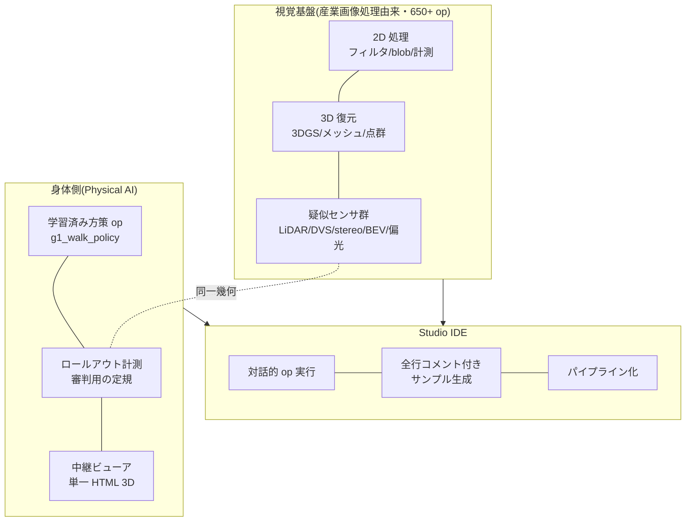

## 11.1 出発点: 産業画像処理のツールキットを自作していた

もともと Fullseye は、産業画像処理の商用ライブラリ(HALCON 級)と同じ操作感を目指して自作してきた視覚ツールキットです。フィルタ、モフォロジー(形を太らせ/痩せさせる処理)、blob 解析(ブロブ=画像内のひとかたまり領域の検出・計測)、キャリブレーション、3D 再構成…と**650 個超の op(処理単位)**を積み上げ、対話的に op を試して繋ぐ IDE「Fullseye Studio」(商用でいう HDevelop に相当するもの)も作りました。3D 側は 3D Gaussian Splatting(多視点画像からの 3D 復元)やメッシュ再構成まで届いています。

### 11.1.1 代表 op の処理例 — 16 連発

言葉より結果画像のほうが早いので、分野を横断して 16 個、入力と出力を並べます(すべて実際に Fullseye のレジストリ経由で実行した結果です)。


*図: Filters の実処理例 — 雑音入り入力へ gauss_image を同一 σ で適用。右列は除去された成分(ほぼ雑音のみで、構造はエッジ近傍に限られる)(Fullseye 実出力)。入力は skimage camera と AI 生成画像(Gemini)2 種。*


*図: メディアンフィルタ — ごま塩ノイズだけを消す(輪郭は保つ)(Fullseye 実行結果)*


*図: Sobel 勾配強度 — 明るさの変化の強さを描く(Fullseye 実行結果)*


*図: edges の実処理例 — 同じ雑音入り入力に対し、勾配強度の固定閾値ではエッジが太く途切れ、ノイズも拾うが、canny(非最大抑制+ヒステリシス)は細く連続した輪郭を返す(Fullseye 実出力)。入力は skimage camera・AI 生成(Gemini)・自前合成の 3 種。*


*図: 二値化+連結成分 — 「何個あるか」を数えられる形にする(色分け=個体識別)(Fullseye 実行結果)*


*図: オープニング — 小さな出っ張り(塩ノイズ)を除去(Fullseye 実行結果)*


*図: クロージング — 小さな穴を埋める(Fullseye 実行結果)*


*図: frequency の実処理例 — 周期縞ノイズは空間平滑化では消えない(縞ごとボケるだけ)が、FFT 領域でピークを自動ノッチ除去(cx_fft → transfer function → cx_ifft、complexops 章の op)すると縞だけが消える(Fullseye 実出力)。縞の角度・周波数を変えた 3 入力(skimage camera / AI 生成 2 種)に同一の自動ノッチ規則を適用。*


*図: ローパス復元 — 高周波ノイズを周波数側で落とす(エネルギー実測 0.0042→0.0021)(Fullseye 実行結果)*


*図: texture の実処理例 — 平均輝度が同じで模様だけが違う領域は二値化では分離できないが、texture_laws(Laws テクスチャエネルギー)は肌理の強さを画像化して分離する(Fullseye 実出力)。入力は自前合成 2 種+同梱サンプル 1 種。*


*図: Harris コーナー — 追跡・較正の基準になる角を検出(49 点)(Fullseye 実行結果)*


*図: レンズ歪みの付与 — 樽型(κ=+0.25)と糸巻き型(κ=−0.25)。※このモデルは厳密な逆変換を持たないため「補正デモ」は載せない(正直)(Fullseye 実行結果)*


*図: 面積・重心計測 — 検査装置の基本、25 個の blob を測る(Fullseye 実行結果)*


*図: segmentation の実処理例 — 接触する物体は単純二値化+ラベリングでは 1 塊に融合するが、otsu → distance_transform → local_max → watersheds_marker(マーカー制御分水嶺)の固定パイプラインで個々に分離できる(Fullseye 実出力)。入力は AI 生成画像(Gemini)2 種+自前合成 1 種。*


*図: 距離変換 — 各画素から背景までの距離の地図(Fullseye 実行結果)*


*図: 深度→点群 — 2.5D から 3D へ(76,800 点)(Fullseye 実行結果)*


## 11.2 転機: 「学習済みポリシーも op にしてしまえばいい」

ロボットの強化学習を始めてすぐ、開発体験の断絶に悩みました。学習は WSL+GPU+JAX の世界、検証や可視化は Windows+numpy の世界。学習済みの方策を動かして確認するだけで、環境をまたぐ儀式が要る。

ここで「**Studio 上の Fullseye op としてこの辺りも実装できたらいいのに**」と思い立ちます。やってみると、これが驚くほど素直に通りました。

- brax PPO の方策の中身は、観測正規化+**4 層×32 ユニットの小さな MLP**(ごく素朴な多層ニューラルネット)+tanh。**推論だけなら numpy 60 行**で書けます。
- チェックポイント(pickle)は brax のクラス定義を要求してきますが、クラスをその場でスタブ(形だけの代役)として復元すれば、**brax をインストールせずに**重みを取り出せます。
- 学習環境の観測構成・残差制御・接触設定をネイティブ MuJoCo(Windows 版)に忠実移植すれば、ロールアウトも Windows で完結します。

再実装した numpy 推論と brax 純正推論の出力差は **最大 1.8×10⁻⁷**(float32 の丸め誤差そのもの)。つまり数値的に同一です。これで、

```python
import fullseye
# 学習済みチェックポイントを渡すと、その場でロールアウト(実測)が走る
result = fullseye.g1_walk_policy("mjx_g1_walk12c_ckpt.pkl")
print(result["distance_m"], result["mean_speed"])  # 20.46 / 1.36 など実測値
```

の 1 行で、**GPU も WSL も brax も無い環境で**学習成果が動くようになりました。「学習は GPU、実行は numpy 60 行」— 深層学習の学習と推論がいかに非対称かを、これほど体感した瞬間はありません。

### 11.2.1 Studio の実画面

挿絵ばかりでは説得力がないので、実物の画面を貼ります。HDevelop 風の 4 面構成(画像ビュー / op ブラウザ / 生成コード / 変数ウォッチ)です。


*図: Fullseye Studio 起動直後。op ブラウザには 791 個の op が並ぶ(統合レジストリ 1,606 のうち Studio の対話 UI に露出させている部分集合)。実画面キャプチャ*


*図: サンプルギャラリー。各サンプルは「1 行版」と「段階 API 版」の両形式でコードが生成される(二層 API 規約の実装)。実画面キャプチャ*


*図: エッジ検出(Canny)サンプルの実行結果。パイプラインの各段が変数ウォッチにサムネイルで残る。実画面キャプチャ*


*図: コイン画像のセグメンテーション表示(輪郭オーバレイ+注記)。検査装置の現場で欲しかった「結果がその場で見える」を再現している。実画面キャプチャ*

正直な注記を一つ: 本章の主役だった g1_walk_policy(学習済み方策 op)は、統合レジストリ経由の API からは呼べますが、**Studio の対話ブラウザにはまだ露出していません**(791 に入っていない)。「IDE の中で歩行方策を回す」は、現時点では API 一行の体験で、GUI 体験としては工事中 — ここも正直に。

> **🍙 かみ砕きコーナー(学習と推論編)**
> 「学習に GPU で 3 時間、実行はどのパソコンでも一瞬」が不思議に見えるかもしれません。料理に例えると、学習は**レシピの開発**(何千回も試作して味を調整する)、実行は**完成したレシピで 1 回作る**こと。試作は大厨房が要るけれど、レシピ自体はただの紙 1 枚 — この記事の方策も、中身は数千個の数字の表にすぎず、それを読むだけなら 60 行のプログラムで足りるのです。


*挿絵: 画像生成 AI(Gemini)による — op を繋ぐ作業台のイメージ*

## 11.3 道具箱の設計規約

Fullseye の op には二層 API の規約を敷いています。**1 行ファサード**(上の `g1_walk_policy` のような、とにかくすぐ動く関数)と、**段階的 API**(セッションを作り、reset/step を刻み、観測や軌道に触れる低層)。さらに Studio のサンプルコードは全行コメント+「ここを書き換えて拡張する」目印(EXTEND マーカー)付きで生成されます。自分が数か月後に忘れた頃の自分こそが、最初のユーザーだからです。

## 11.4 Physical AI IDE の見取り図

いま Fullseye/Studio に載っているもの、載せようとしているものを一枚にまとめます。



目指す姿は「**ロボットの目(センサ)と身体(方策)と審判(計測)を、一つの IDE の op として同列に扱える環境**」です。画像処理の op を繋ぐのと同じ手つきで、「疑似 LiDAR op → 学習済み歩行方策 op → 衝突計測 op → 3D 中継 op」というパイプラインが組める。運動会の会場・審判・中継が全部この上に載る。それが、この個人運動会の裏で作っている統合開発環境です。

正直な現在地も書いておきます: 方策 op は G1 の歩行系のみ、evis の筋骨格系は CPU 実行で Studio 統合はこれから、H1 以降のマルチロボット対応は進行中(付録 B 参照)。「まだ工事中の競技場で運動会をやりながら、観客席を増設している」状態です。

# 12. 開催要項 — 個人でやるための構成表

「自宅ヒューマノイド運動会」を再現したい人向けに、実際の構成を置いておきます。

| 項目 | 使ったもの | 補足 |
|---|---|---|
| 物理エンジン | MuJoCo(+ GPU 版 MJX) | OSS。ロボット学習のデファクト |
| 学習 | brax の PPO 実装 | OSS。JAX ベース |
| ロボットモデル | MuJoCo Menagerie | OSS。67 モデル収録、G1/H1 も公式系モデル |
| お手本モーション | LAFAN1 リターゲット(HuggingFace 公開) | 人のモーキャプを G1/H1 関節へ変換済み。ライセンスは CC BY-NC-ND(非商用)なので用途に注意 |
| GPU | RTX 5090(32GB)×1 | 2 種目同時学習で計 約 9,700 steps/s |
| 1 種目の練習時間 | 約 3〜4 時間(1 億ステップ) | 夕方に仕込んで夜に結果を見る |
| 検証・審判・中継 | Windows ネイティブ Python(numpy+MuJoCo) | GPU 不要。学習済み方策は numpy 60 行で推論 |
| 筋骨格選手(evis) | 自作(解剖学データより) | 学習は CPU(XLA に筋計算が載らないため) |

費用感で言えば、追加投資は GPU だけです。会場も選手もお手本も審判道具も、全部 OSS と自作コードでまかなえます。10 年前なら研究室の計算クラスタが要った規模の実験が、いま本当に個人の机で回ります。

時間の使い方のコツも一つ。学習は数時間単位なので、**「学習を待つ時間」に審判道具や中継設備を作る**のが個人開催の要諦です。この記事の疑似センサも、ビューアも、H1 対応も、全部どれかの学習のバックグラウンドで作られました。

## 12.1 深掘り: 会場運営の実務 — GPU 選び・電気代・環境構築の落とし穴
(第 12 章「開催要項」の増補)

ここからは思想の話をやめて、財布とコンセントの話をします。自宅でロボット RL を回すのに何が要るのか、電気代は実際いくらか、クラウドを借りる方が得なのか — 全部数字で確かめてみます。

### 12.1.1 GPU 選びの観点 — なぜ「VRAM が正義」なのか

GPU のカタログには CUDA コア数、クロック、TFLOPS と数字が並びますが、個人研究でまず見るべきは **VRAM 容量** です。理由は単純で、**演算が遅いのは待てば済むが、メモリが足りないと実験自体が走らない** からです。速度は時間で買い戻せますが、容量は買い戻せません。

本運動会の主催マシンに載っている RTX 5090 の公式スペックは次の通りです(NVIDIA 公式ページ [^rtx5090])。

| 項目 | 公式値 |
|---|---|
| VRAM | 32 GB GDDR7(512-bit) |
| Total Graphics Power(TGP) | 575 W |
| 推奨システム電源 | 1000 W(構成により増) |

コンシューマ向け(GeForce)としては最大の 32 GB で、データセンター向け(H100 の 80 GB 等)との中間に位置します。

ここで正直に言っておくと、**ロボット RL は LLM ほど VRAM を食いません**。LLM の学習はモデルパラメータ・勾配・オプティマイザ状態だけで数十 GB を要求しますが、ロボット RL の方策ネットワークは数 MB〜数十 MB 程度の小さな MLP や GRU です。ではロボット RL で VRAM は何に効くのか — **並列環境数** です。MJX(MuJoCo の JAX 実装)のような GPU シミュレータは、数千の物理世界を同時に走らせて経験を集めます。並列 env 数を増やすほど 1 秒あたりの経験収集量が増え、壁時計時間が縮む。その env 数の上限を決めるのが VRAM です。つまり LLM では「VRAM = モデルが載るか」、ロボット RL では「VRAM = 何人の選手を同時に走らせられるか」。32 GB は「運動会の参加人数枠」として効いています。

#### かみ砕き: 作業机の広さ

GPU の演算速度は「手の速さ」、VRAM は「机の広さ」です。手が遅くても徹夜すれば宿題は終わりますが、机に教科書が広げられなければ宿題は始まりません。ロボット RL の場合、机の上に広げるのは巨大な 1 冊の辞書(LLM)ではなく、同じ問題集の 4096 冊のコピー(並列環境)です。机が広いほど一晩で解けるページ数が増えます。

### 12.1.2 電気代の正直な試算 — 1 種目いくらかかるのか

数字を置きます。使う単価は 2 通りです。

- **目安単価 31 円/kWh**: 公益社団法人 全国家庭電気製品公正取引協議会がカタログの電気代表示用に定める全国目安。2022 年 7 月に 27 円から 31 円に改定されました [^eftc] [^mynavi]。
- **東京電力 従量電灯 B の第 2 段階(120〜300 kWh)36.40 円/kWh(税込)**: 2026 年時点の単価表より [^tepco-tanka]。なお東京電力公式の単価表ページは本稿執筆時に直接取得できなかった(HTTP 403)ため、この数字は第三者の単価表まとめによるもので、契約時は公式ページでの確認をおすすめします。実際の請求にはこの他に燃料費調整と再エネ賦課金 [^tepco-saiene] が乗ります。

学習中の GPU が公式 TGP の 575 W に張り付き続けると仮定した **上限見積もり** で、「1 種目 = 4 時間学習」を計算します(実際には物理シミュレーションと学習の切り替わりで消費電力は上下するので、これは天井値です。正確に知りたければワットチェッカーで実測が正道)。

| シナリオ | 消費電力の仮定 | 電力量 | 31 円/kWh | 36.40 円/kWh |
|---|---|---|---|---|
| 1 種目(4 h)、GPU 単体上限 | 575 W | 2.3 kWh | **約 71 円** | 約 84 円 |
| 1 種目(4 h)、システム全体(仮定 750 W) | GPU 575 + CPU 等 175 W | 3.0 kWh | 約 93 円 | 約 109 円 |
| 一晩(8 h)、システム全体 | 750 W | 6.0 kWh | 約 186 円 | 約 218 円 |
| 毎晩 8 h × 30 日 | 750 W | 180 kWh | **約 5,580 円** | 約 6,552 円 |

(システム全体 750 W は「GPU 575 W + CPU・マザーボード・ファン等で 175 W」というフェルミ仮定です。実測ではありません。)

結論はかなり穏やかです。**1 種目あたり缶コーヒー 1 本弱、毎晩回しても月 5〜7 千円**。「自宅で RL なんて電気代が大変でしょう」とよく言われますが、上限見積もりでもこの程度でした。ただし毎晩 8 時間 × 30 日の 180 kWh は一般家庭の月間使用量に丸ごと上乗せされる規模なので、従量電灯の第 3 段階(300 kWh 超、東電で 40.49 円/kWh [^tepco-tanka])に押し込む効果はあります。

### 12.1.3 WSL2 + CUDA + JAX の落とし穴 — 公式ドキュメントの読みどころ

本運動会の学習は Windows マシン上の WSL2(Ubuntu)で回しています。この構成でハマりやすい点を、公式ドキュメントの該当箇所つきで挙げます。

**その 1: NVIDIA ドライバは Windows 側にだけ入れる。** これが最重要です。NVIDIA の「CUDA on WSL User Guide」[^cuda-wsl] が定める構成では、WSL2 内の Linux から見える GPU は、Windows 側のドライバが WSL に **マップして** 提供しているものです。WSL の Ubuntu 内に Linux 用 GPU ドライバを入れてはいけません(Windows 側ドライバのマッピングを壊します)。WSL 用の CUDA Toolkit インストーラ(WSL-Ubuntu 版)は、このためにわざわざ **ドライバを含まない** パッケージとして配布されています [^cuda-wsl]。「Ubuntu のセットアップ記事の手順をそのままコピペしたら GPU が見えなくなった」事故の大半はこれです。

**その 2: JAX はデフォルトで VRAM の 75% を先取りする。** JAX 公式の「GPU memory allocation」ページ [^jax-mem] にある通り、JAX プロセスは起動時に **GPU メモリ全体の 75% をプリアロケート(先行確保)** します。断片化を防ぐための仕様ですが、知らないと「学習は始まってもいないのに VRAM が 24 GB 埋まっている」と驚くことになります。挙動は環境変数で変えられます [^jax-mem]。

- `XLA_PYTHON_CLIENT_MEM_FRACTION=.XX` — 先行確保の割合を変更(例 `.90` で 90%)
- `XLA_PYTHON_CLIENT_PREALLOCATE=false` — 先行確保をやめ、必要になった分だけ確保(断片化リスクと引き換え)

同じ GPU で「学習プロセス + 録画用の評価プロセス」を同時に走らせたい場合は、この変数で取り分を割るのが公式推奨です [^jax-mem]。本運動会でも、学習中に別プロセスで動画を撮るときはこれで席を分けています。

**その 3: インストールは JAX 公式の組合せ表に従う。** JAX の GPU 版は CUDA/cuDNN のバージョン組合せに敏感で、公式ドキュメント(docs.jax.dev)のインストール節が指定する pip の extras(`jax[cuda12]` 等)をそのまま使うのが最短です。ここで野良ビルドや古い記事の手順を混ぜると、動くように見えて数値が壊れる事故もあり得ます。なおインストール節の個別 URL は本稿では実在確認していないため挙げません(docs.jax.dev トップから Installation を辿ってください)。

### 12.1.4 買うか、借りるか — クラウド代替との損益分岐

GPU を買わずにクラウドで借りる選択肢も、正直に比較しておきます。2026 年 8 月時点の目安です(クラウド料金は改定が頻繁なので、必ず公式ページで最新値を確認してください)。

| サービス | 目安単価 | 出典 |
|---|---|---|
| Google Colab(有料プラン) | 月額制 + コンピューティングユニット従量。公式料金ページ参照 [^colab] | 公式 |
| RunPod(RTX 4090) | Secure Cloud 約 $0.69/h、Community 約 $0.34/h [^runpod] [^runpod-3rd] | 公式ページ + 第三者集計 |
| Lambda(A100 40GB) | 約 $1.99/h [^lambda-3rd] | 第三者集計(公式ページで要最終確認) |

損益分岐をフェルミ試算してみます。仮に RTX 5090 マシン一式を 50 万円と置くと(**実売価格は変動が激しく未確認**。あくまで桁の試算です)、RunPod Secure の RTX 4090 が $0.69/h ≒ 約 100 円/h(1 ドル 150 円と仮定、**為替レートも未確認の仮置き**)なので、

- 50 万円 ÷ 100 円/h = **約 5,000 時間** が単純な分岐点
- 毎晩 8 時間回すなら 5,000 ÷ 8 ≒ 625 日、**約 1 年 9 か月** で買った方が安くなる計算(自宅の電気代 8h 約 200 円/晩を足しても分岐点は 1 割ほど遠のく程度)

ただしこの計算が示す本当の教訓は「どちらが安いか」ではありません。**使い方の性質** で決まります。

- **借りる方が向く**: たまに大きい学習を回す/H100 クラスの VRAM が一時的に要る/まず試したい
- **買う方が向く**: 毎晩回す・試行回数で殴る研究スタイル/データを外に出したくない/「回すかどうか迷ったら回す」の心理的ハードルをゼロにしたい

個人研究では最後の点が効きます。従量課金は 1 回ごとに「回す価値があるか」を自問させますが、買ってしまえば失敗実験のコストは電気代 71 円です。試行回数が物を言う進化的・探索的な研究では、この心理的差がそのまま実験数の差になります。

### 12.1.5 騒音・熱・電源 — 生活と同居させるための注意

最後に、スペック表に載らない生活面です。

**電源容量**: RTX 5090 の公式推奨システム電源は **1000 W** です [^rtx5090]。「手持ちの 850 W 電源で足りるか?」という質問には、公式推奨を下回る、と答えるしかありません。GPU 単体で最大 575 W を引くため、CPU(ハイエンドで 150〜250 W 級)とその他を足すと 850 W ではピーク時の余裕(電源は定格の 5〜8 割で運用するのが効率・寿命面のセオリー)がほぼ消えます。瞬間的な電力スパイクで落ちる事故も報告される帯域なので、5090 を買うなら電源も 1000 W 以上への更新を予算に入れるのが正直な推奨です。

**熱**: 575 W は、そのまま **575 W の電気ストーブ** を部屋で焚くのと同じ発熱です。夏場に締め切った部屋で一晩回すと室温は確実に上がり、エアコンの電気代が上の試算に上乗せされます。逆に冬は暖房として実感できる程度には暖かい。これは冗談ではなく、消費電力の話をするときはエアコン分も勘定に入れるべき、という話です。

**騒音**: 学習中の GPU ファンは負荷次第でかなりの音を出します。寝室と同じ部屋で毎晩回すなら、ファンカーブの調整・ケースの防音・そもそも別室に置いてリモートで使う(WSL2 + SSH の構成はこれと相性が良い)あたりが現実解です。深夜帯の連続稼働は、家族との合意形成も含めて「開催要項」に書いておくべき項目です。

**ブレーカー**: 日本の家庭用コンセントは 1 回路 15〜20 A(1,500〜2,000 W)が普通です。学習 PC(ピーク約 1 kW)+ エアコン + 電子レンジが同一回路に載ると落ちます。運動会の会場は、電気的にも専用回路が望ましい — というところまで含めて「自宅で開催する」ことの実務です。

---

### 出典一覧

[^goodhart-wiki]: Goodhart's law(原論文 1975 の書誌と原文引用を含む): <https://en.wikipedia.org/wiki/Goodhart%27s_law>
[^strathern]: Strathern, M. (1997). "'Improving ratings': audit in the British University system." European Review, 5(3), 305–321: <https://www.cambridge.org/core/journals/european-review/article/improving-ratings-audit-in-the-british-university-system/FC2EE640C0C44E3DB87C29FB666E9AAB>
[^campbell]: Campbell, D. T. (1979). "Assessing the impact of planned social change." Evaluation and Program Planning(解説: Psych Safety "Goodhart's Law, Campbell's Law, and the Cobra Effect"): <https://psychsafety.com/goodharts-law-campbells-law-and-the-cobra-effect/>
[^perverse]: Perverse incentive(コブラ効果・1902 年ハノイのネズミ駆除の項): <https://en.wikipedia.org/wiki/Perverse_incentive>
[^coastrunners]: OpenAI (2016). "Faulty reward functions in the wild": <https://openai.com/index/faulty-reward-functions/>
[^vim]: JCGM 200:2012 "International vocabulary of metrology – Basic and general concepts and associated terms (VIM)" 3rd ed.(BIPM): <https://www.bipm.org/documents/20126/2071204/JCGM_200_2012.pdf>
[^iso5725-1]: ISO 5725-1:2023 "Accuracy (trueness and precision) of measurement methods and results — Part 1": <https://www.iso.org/standard/69418.html>
[^iso5725-2]: ISO 5725-2:2019 "— Part 2: Basic method for the determination of repeatability and reproducibility": <https://www.iso.org/standard/69419.html>
[^grr]: Gage R&R Study Procedure & Acceptance Criteria (AIAG MSA)(10×3×2 設計、%GRR 10/30% 基準の解説): <https://calibrationos.com/learn/gage-rr-study-procedure>
[^osc2015]: Open Science Collaboration (2015). "Estimating the reproducibility of psychological science." Science 349(6251): <https://www.science.org/doi/10.1126/science.aac4716>
[^rr-cortex]: Chambers, C. D. (2013). "Registered reports: a new publishing initiative at Cortex." Cortex 49(3): <https://pubmed.ncbi.nlm.nih.gov/23347556/>
[^rr-cos]: Center for Open Science: Registered Reports: <https://www.cos.io/initiatives/registered-reports>
[^rr-nhb]: Chambers & Tzavella (2022). "The past, present and future of Registered Reports." Nature Human Behaviour: <https://www.nature.com/articles/s41562-021-01193-7>
[^recht]: Recht, B., Roelofs, R., Schmidt, L., & Shankar, V. (2019). "Do ImageNet Classifiers Generalize to ImageNet?" ICML 2019: <https://arxiv.org/abs/1902.10811>
[^raji]: Raji, I. D., Bender, E. M., Paullada, A., Denton, E., & Hanna, A. (2021). "AI and the Everything in the Whole Wide World Benchmark." NeurIPS 2021 Datasets and Benchmarks: <https://arxiv.org/abs/2111.15366>
[^rtx5090]: NVIDIA GeForce RTX 5090 公式ページ(Specs: TGP 575W / 推奨システム電源 1000W / 32GB GDDR7): <https://www.nvidia.com/en-us/geforce/graphics-cards/50-series/rtx-5090/>
[^eftc]: 公益社団法人 全国家庭電気製品公正取引協議会 よくある質問(電気料金目安単価): <https://www.eftc.or.jp/qa/>
[^mynavi]: マイナビニュース (2022-08-09) 「電気料金の目安単価、27円/kWhから31円/kWhに」: <https://news.mynavi.jp/article/20220809-2421349/>
[^tepco-tanka]: 東京電力 従量電灯 B 単価表まとめ(29.80 / 36.40 / 40.49 円/kWh、2026 年時点。東電公式単価表ページは執筆時 403 のため第三者まとめ): <https://enegent.jp/articles/tepco-juryou-b-tanka>
[^tepco-saiene]: 東京電力 EP 再エネ賦課金単価のお知らせ(従量電灯 B の料金算定方法): <https://www.tepco.co.jp/ep/renewable_energy/institution/pdf/20260501.pdf>
[^cuda-wsl]: NVIDIA "CUDA on WSL User Guide": <https://docs.nvidia.com/cuda/wsl-user-guide/index.html>
[^jax-mem]: JAX 公式ドキュメント "GPU memory allocation": <https://docs.jax.dev/en/latest/gpu_memory_allocation.html>
[^colab]: Google Colab 料金(公式): <https://cloud.google.com/colab/pricing>
[^runpod]: RunPod RTX 4090 公式ページ: <https://www.runpod.io/gpu-models/rtx-4090>
[^runpod-3rd]: RunPod RTX 4090 料金の第三者集計(Secure $0.69/h、Community $0.34/h、2026 年): <https://www.synpixcloud.com/blog/rtx-4090-cloud-rental-worth-it>
[^lambda-3rd]: Lambda GPU Cloud 料金の第三者集計(A100 40GB $1.99/h 等): <https://gpuvec.com/providers/lambda>

# 13. 未来に向けて — 最先端をシミュレーションするという遊び方


*挿絵: 画像生成 AI(Gemini)による。宇宙エレベーターと、天の川を歩く未来の動物たち*

最後に、この運動会の先にある景色の話をさせてください。要するに「私が次に遊びたいことリスト」なのですが、調べてみたら思いのほか遠くまで道がつながっていたので、地図ごと共有します。

## 13.1 発想の道具: 矛盾から考える

新しいテーマを探すとき、私は TRIZ(発明的問題解決理論)の「矛盾」の考え方を借りています。「A を良くすると B が悪くなる」という行き詰まりこそが、次のテーマの在り処だという見方です。この記事の実験も、振り返ればぜんぶ矛盾の解決でした。

| 矛盾(A を立てると B が立たず) | この記事での解決 | TRIZ 的にいうと |
|---|---|---|
| コースを守らせたい ⇔ 罰すると探索が萎縮する | 罰でなく観測を与える(操舵 2 次元) | 「事前作用」— 罰する前に、避けるための情報を先に渡す |
| 生存させたい ⇔ 止まるのが最適になる | 停滞打ち切り | 「逆転」— 罰を加えるのでなく、何もしないことを失格にする |
| 筋の生々しさ ⇔ GPU 並列の速さ | torque-twin(トルクの双子)で学び、筋に戻す | 「仲介」— 直接解けない二者の間に中間表現を挟む |
| 精密なセンサ ⇔ 実機に無い | 特権教師で育てて実機センサの生徒に蒸留 | 「コピー」— 高価な本物の代わりに安価な写しで訓練する |

この道具を手に「センシング」と「宇宙」へ目を向けると、シミュレーションで遊べる矛盾がまだまだ転がっています。

## 13.2 センシングの最前線にある矛盾

- **イベントカメラ**: 「速い動きを撮りたい ⇔ フレームレートを上げるとデータが溢れる」の解決策そのもの(変化だけ送る)。シミュレータ(v2e、ESIM)が公開されているので、**自宅で「イベントカメラで見た世界」を生成して方策に食わせる実験ができます**。本記事の 1 次元版の、本物の 2 次元版です。
- **量子センシング**: 「感度を上げたい ⇔ ノイズも増える」への量子力学からの回答。GPS の届かない場所での慣性航法が、原子干渉計の軌道上試験や特許の段階まで来ています。個人で実機は無理でも、量子状態のシミュレーション(QuTiP)は無料で触れます。
- **触覚・電子皮膚**: 「摑む力を知りたい ⇔ センサを増やすと配線が破綻する」。カメラで指先の変形を見る方式(GelSight 系)は、画像処理がそのまま触覚になる領域で、視覚屋には嬉しい入口です。evis の箸種目でいずれ必要になる技術でもあります。

## 13.3 宇宙開発にある矛盾

宇宙は「シミュレーションでしか練習できない」領域の王様です。失敗が高価すぎて、本番前に必ず仮想で回す。つまり **この記事でやってきた遊びの延長線上に、そのまま載っています**。

- **デブリ捕獲**: 「摑みたい ⇔ 触ると押してしまい逃げる」。自由に浮かぶ物体は、触れた瞬間に運動量が移って逃げていきます。実は本記事の身体シミュレーション(MuJoCo)で重力を切れば、この「自由浮遊物体の捕獲」はそのまま自宅で実験できるテーマです(私も別の実験系で触っており、箸の「摑めるのに運べない」と同じ匂いのする問題です)。日本勢(Astroscale、JAXA CRD2)が接近実証から捕獲実証へ進んでいる、いま熱い分野です。
- **月面ロボティクス**: 「砂地で歩きたい ⇔ 砂の物理は計算が重い」。月の重力 1/6 で歩行 RL を回すのは、パラメータを 1 つ変えるだけで今日から可能です(砂は難しい。だから面白い)。
- **惑星ヘリコプター**: 火星の大気密度は地球の 1% — 「揚力が欲しい ⇔ 空気がない」の極端な矛盾を、Ingenuity は回転数で解きました。ドローンの部(Crazyflie、名鑑参照)の延長に、惑星の空があります。

そしてもう一つ、書いておきたい現実的な見通しがあります。**宇宙は今後、資源をめぐる競争の舞台になっていく**ということです。月の南極には永久影クレーターに水の氷があると見られていて、水は分解すれば酸素と水素 — つまり呼吸と燃料になるので「月の油田」に例えられます。小惑星には白金族などの金属資源。だから各国・各企業の月・小惑星探査は、純粋な科学と同じくらい「資源の下見」の性格を帯びていて、米国中心のアルテミス合意と中国・ロシア中心の月面基地構想が並走する構図は、率直に言って争奪戦の入口に見えます。

これを書くのは、煽りたいからではありません。むしろ逆で、2 つの意味で「だからこそ」の話です。第一に、**この競争の主役は人間ではなくロボット**だということ。永久影クレーターの中はマイナス 170℃ 以下で人は入れず、掘るのも運ぶのも建てるのも、本記事でやってきたような Physical AI の仕事になります。月の重力 1/6・レゴリス(月の砂)の上での移動や掘削は、まさに物理シミュレーションで先に練習しておく類いの問題で、この記事の遊びの延長線上に、思ったより真面目な需要が待っています。第二に、争奪戦になるかどうかは**ルール作り次第**でもあるということ。宇宙条約(1967)は天体の領有を禁じていますが、資源の採取・利用の細則はまだ発展途上です。技術の中身を知っている人がルールの議論に参加できるかどうかで、未来の景色は変わる — 技術を学ぶ意味は、競争に勝つためだけではなく、競争を賢く飼いならす側に回るためでもあると思っています。

## 13.4 道はぜんぶ地続きだった

このあたりの分野は、論文・研究室・シミュレータ・競技会が驚くほどオープンです。付録 G に、実在を確認した URL だけで資料集(公式ギャラリー、研究室、強い大学、学会・展示会・競技会)をまとめました。個人的なおすすめの導線は「公式動画で驚く → 無料シミュレータで真似する → 競技会(ROBO-ONE のような個人参加可能なもの)を見に行く」の 3 段です。私自身、北京の運動会の映像から始まってこの記事に至ったので、この導線の実演サンプルみたいなものです。

## 13.5 もっと遠くの話 — 宇宙エレベーター、文明のものさし、アフターマン

ここまでは数年スケールの話でしたが、白状すると私はもっと遠い話 — 宇宙エレベーターとか、文明の進化レベルとか、人類がいなくなった後の生物の想像図とか — を調べて回るのが昔から好きです。運動会の記事の最後で何の話だと思われそうですが、実はぜんぶ「シミュレーションの種」として地続きなのです。

**宇宙エレベーター(space elevator)** は、静止軌道から地上へケーブルを垂らして昇降機で宇宙へ行く構想です。1895 年のツィオルコフスキーの着想から数えて 130 年、いまだ実現していない最大の理由は素材(必要な比強度にカーボンナノチューブ級が要る)ですが、面白いのは**素材以外の問題の多くがシミュレーションで先に遊べる**ことです。数万 km のケーブルの振動・共振、昇降機が登る際のコリオリ力によるたわみ、デブリ回避のための能動制御 — これらはケーブル力学の数値実験で、実は本記事で使った物理エンジンでも「短いテザー+おもり」の模型なら今日から組めます。壮大な構想の中に、自宅サイズの練習問題が埋まっている。

**文明のものさし(カルダシェフ・スケール)** は、文明をエネルギー利用量で測る有名な分類です(惑星規模の Type I、恒星規模の Type II、銀河規模の Type III)。カール・セーガンの補間式で現在の人類はおよそ 0.7 前半と言われます。これも遠い話に見えて、この記事と一つだけ接点があります: **知能の学習にはエネルギーが要る**ということ。GPU 1 枚で運動会が開ける現在は、逆にいえば「個人が使えるエネルギーと計算量」の関数として、遊べる知能の規模が決まる時代です。文明のものさしの端っこに、自宅の電気代がつながっている、という実感には妙な迫力があります。

**アフターマン(After Man: A Zoology of the Future)** は、動物学者ドゥーガル・ディクソンが 1981 年に描いた「人類絶滅から 5,000 万年後の動物図鑑」です。骨格や生態から未来の生物を科学的に空想する speculative evolution(思弁的進化)というジャンルの古典で、少年時代に図書館でこれを読んだ体験が、私の「解剖学的に正しいものを動かしたい」の源流にある気がしています。そして現代の面白さは、**この遊びが絵から物理に移れる**こと。本記事の evis は 700 本の筋で動く現生人類の模型ですが、同じ道具立てで骨格を伸ばし、筋を付け替え、進化計算で歩かせれば、それはもう「物理エンジンの中のアフターマン」です。実際、私は別の実験系で数十体の空想生物モデルを泳がせる遊びをしたことがあり、あれはディクソンの図鑑のページをシミュレーションでめくる感覚でした。

夢物語と実験机の距離は、思っているよりずっと近い。北京の運動会も、宇宙エレベーターのケーブル振動も、5,000 万年後の生物も、「物理法則の中で何が成り立つかを試す」という同じ遊びの、スケール違いにすぎません。

## 13.6 脳との接続と、記憶を外に置く未来

もう一つ、遠いようで意外と近い話を。**脳インターフェース(Brain-Computer Interface, BCI)**です。頭蓋に電極を埋め込んで思考でカーソルを動かす侵襲型の臨床試験は既に複数社で進んでいて、血管経由で電極を届ける方式や、手首の筋電(EMG)から「動かそうとした指」を読む非侵襲デバイスまで、階段状にいろいろな深さの「接続」が実用化に向かっています。発話できない患者さんの脳活動から文章を復元する研究も、ここ数年で急に現実味を帯びました。この記事の文脈でいえば、BCI は究極の入力センサであり、義手・義足やロボットの「操縦」が根本から変わる技術です。筋電で evis の筋モデルを直接動かす、なんて実験は、たぶん私が生きているうちに自宅で試せるようになります。

そして接続の話とセットで来るのが、**記憶を外に置く未来**です。というより、これは未来ですらなくて、人類はずっとやってきました。文字は記憶の外部化、本は検索できる記憶、スマホは持ち歩ける記憶。その延長線上に「自分との会話や作業の文脈を覚えていて、必要なときに思い出させてくれる AI」が普通にある生活が来る — 私はこれを確信に近い形で予想しています。白状すると、この長い記事自体、AI に作業記憶を肩代わりしてもらいながら書いています(実験の数値も失敗の経緯も、私の脳ではなく記録層が覚えていて、私は判断と方向づけに集中する分業です)。使ってみた実感として、これは「楽になる」というより「**忘れることを恐れずに考えられる**」という質の変化でした。

もちろん、記憶を預けるなら預け先の性質が問われます。誰のサーバにあるのか、消えないのか、覗かれないのか。個人的には、大事な記憶ほど**自分の手元の機械に置く**(ローカルで動く AI に持たせる)のが筋だと思っていて、実はこの運動会の裏でそういう仕組みも作っています。脳と機械の距離が縮む未来は、たぶん避けられません。だったら、接続の仕様とデータの置き場所を自分で選べる側にいたい — これも「観客のままでいなくていい」の一つの形だと思います。

## 13.7 記憶の外部化・実践編 — 論文倉庫と「第二の脳」と、正直な疑い

外部記憶の話を未来形で書きましたが、実は現在形でもやっているので、実物の運用と、運用しながら抱えている疑問を書いておきます。うまくいっている話だけ書くのはフェアじゃないので、疑いも込みで。

**1 つ目: 論文・記事の私設コーパス。** 20 分野強の論文メタデータ(数万件規模)をローカルに集積して、分野ごとに階層化した「調査の下敷き」を運用しています。新しいテーマに手を付ける前に、まずこの倉庫を(AI に)当たらせて、先行研究の地形と「まだ誰もやっていなさそうな隙間」を掴んでから着手する — この記事の深掘り章の裏でも、この倉庫と外部検索の二段構えが働いています。今日もロボット分野の棚に、この記事の調査で見つけた資源(学習環境集、モーションデータ、リターゲッタ)を数件追加しました。倉庫は使った日に補充する、が運用ルールです。

**2 つ目: 「第二の脳」。** メモアプリの vault に、プロジェクトの決定・実験の教訓・資源への道標をノートとして貯め、相互リンクで繋ぐ、いわゆる Zettelkasten 風の運用です。AI との分業では、私の判断や経緯を AI が次のセッションで思い出すための共有メモリとしても機能していて、この記事の「報酬設計 11 箇条」も「バランスの物理法則」も、原本はそこに住んでいます。

で、正直な話。**この第二の脳、本当に合っているのか、疑いながら使っています。** 具体的な疑いは 3 つ:

1. **書いた安心感だけが残る問題。** ノートは書いた瞬間がいちばん気持ちいい。でも検索されなければただの倉庫で、埋葬と保存は外から見分けが付きません。実際、書いたきり一度も再読していないノートは確実にあります。
2. **置き場所が増えるほど、どこに書いたか分からなくなる問題。** コーパス、vault、AI 側の記憶、リポジトリの docs — 記憶の外部化を進めた結果、「外部化先の管理」という新しい仕事が生まれました。これは本末転倒の匂いがします。
3. **グッドハートの法則、再び。** 「ノート数が増える=知識が増えた」と錯覚しがちですが、ノート数は指標であって目標ではない。第 9 章で報酬ハッキングを散々見てきた身としては、自分の知識管理が同じ穴に落ちていないか、定期的に疑う必要があります。

それでも続けている理由は一つで、**「引用された回数」で測ると、明確に黒字だから**です。この記事を書く過程で、過去のノートが実測値・教訓・URL の形で何十回も引用されました(11 箇条も、立位の 6 反復も、ノートがなければ再実験でした)。書いたノートの大半は死蔵でも、生きた 1 割が再実験の数日を何度も節約してくれる — いまのところの判定は「疑いながら継続」です。合っているかの最終判定は、たぶん 1 年後の自分がします。

## 13.8 作業のグラフ化 — これも自己流と白状しておく

もう一つ、この記事の製作体制そのものについて。実はこの記事は、私が 1 本ずつ作業した成果ではなく、**20 体以上の AI エージェントを並列に走らせて作っています**。学習を GPU で回しながら、その待ち時間に調査係・図版係・レンダ係・検証係を並走させ、私は交通整理(何を並列にし、何を直列にし、どの報告を疑うか)に徹する — 作業を「線」ではなく「依存関係のグラフ」として設計する運用で、勝手にグラフエンジニアリングと呼んでいます。歩行の学習(数時間)とセンサ調査(30 分)と図版生成(10 分)は依存が無いので同時に走る。箸の診断は修正の前提なので直列。この設計だけで、体感のスループットは 1 桁変わります。

ただ、これも**自己流である自覚があります**。ワークフローエンジンや DAG オーケストレータという確立した分野があるのは知っていて、でも使っているのは自作の運用ルールと経験則です。自己流ゆえの弱点も見えていて:

1. **並列の誘惑に負ける。** 並列にできるからといって並列にすべきとは限らない。監視対象が 8 本を超えたあたりから、私(交通整理係)が律速になります。
2. **エージェントの報告は検証するまで成果ではない。** 「48mm 持ち上げた」の幻(15.1 節)はまさに、報告を鵜呑みにしかけた事故でした。並列度を上げるほど検証が薄くなる圧力がかかる — ここに一番の罠があります。
3. **グラフの設計自体が属人化する。** どの粒度で切るか、どこにゲートを置くかは、いまのところ私の勘です。勘は文書化できていない知識の別名なので、これも第二の脳行きの宿題です。

それでも 1 日でこの物量(学習 7 本・調査 5 本・素材 100 点超)が回ったのは事実なので、判定はこれも「疑いながら継続」。個人開発の生産性は、AI の性能そのものより「**AI たちの並べ方**」で決まる時代が来ている気がします — ここはいずれ、別の記事で正面から書きます。


# 14. この運動会に混ざっている学問たち — DNA から光学まで


*挿絵: 画像生成 AI(Gemini)による*

書き終わりに近づいて気づいたのですが、この運動会、種目より学問の数のほうが多い。ロボットの記事のふりをして、実は進化論と統計学と物理と光学の話をずっとしていました(最後に量子の話も少しだけ)。せっかくなので、どこに何が混ざっていたかの見取り図を置いておきます。学校で習う科目が「実験机の上でどう繋がるか」のサンプルとして眺めてもらえたら嬉しいです。

## 14.1 進化論と DNA — 適応度地形の上を歩く選手たち

強化学習と生物進化は、数学的にかなり似た構造をしています。方策のパラメータ(数千個の数値)は**遺伝子型(genotype)**、実際の歩き方は**表現型(phenotype)**、報酬は**適応度(fitness)**。そして本編で散々やられた「局所解」は、進化生物学者シューアル・ライトが 1932 年に描いた**適応度地形(fitness landscape)**の言葉でいえば「低い丘の頂上で満足してしまう」現象そのものです。walk13 系が 2 系統とも独立に「その場足踏み」へ収束したのは、生物でいう**収斂進化**(サメとイルカが別系統なのに同じ形になる)の計算機版でした。別々の初期値から出発した集団が、同じ環境圧の下で同じ答えに行き着く — 進化の再現性を、皮肉な形で実演してくれたわけです。

分子生物学の側の比喩も一つ。学習済みチェックポイント(数値の塊)が DNA だとすると、numpy 60 行の推論コードは、それを読んで動きに翻訳する**リボソーム**に相当します。DNA(重み)は同じでも、読む機械が違えば(brax でも numpy でも)同じタンパク質(動き)が出てくる — 誤差 1.8×10⁻⁷ の一致は、翻訳装置の互換性の証明でした。生物の中心教義(DNA→RNA→タンパク質)の「情報と実行の分離」という設計思想は、ソフトウェアのそれと本当によく似ています。

そして 13d vs 13e の A/B テストは、要するに**品種改良**です。同じ祖先(12c)から、環境圧(報酬)だけ変えた 2 系統を育てて比べる。アフターマン(13.5 節)が空想でやったことを、うんと小さいスケールで毎晩やっている、とも言えます。

## 14.2 統計学 — 疑うための道具一式

この記事の「審判団」の正体は、ほぼ統計学です。

- **中央値で報告する**: 生存時間の分布は「たまに長生き」に引っ張られて歪むので、平均でなく中央値(median)で報告しました。外れ値に強い代表値を選ぶ、統計の初手です。
- **8 シードは何のためか**: 1 コースの成功は偶然かもしれない。8 通りの障害物配置(=標本)で測るのはサンプルサイズの確保で、「衝突 2/8」と「衝突 8/8」の差は偶然では説明しにくい、という判断の土台になります。8 はまだ少ない、という感覚も含めて統計学です。
- **事前宣言ゲートは「事前登録」**: 立位 RL の合否基準(3.6 秒)を走らせる前に文書化したのは、臨床試験や心理学再現性運動でいう**プレレジストレーション(事前登録)**の真似です。結果を見てから基準を動かすと、人間はどんな結果でも「成功」に見せられてしまうので。
- **ヌルモデルとの比較**: 「制御なしで 0.5 秒」を測ってから「制御ありで 1.2 秒」を語る。帰無仮説(何もしなくてもそうなる)を棄却してから主張する、という科学の基本形。
- **自己相関で周期を見つける**: 歩行 1 周期の抽出(30 フレーム)は、膝角度の時系列の**自己相関関数**(時間をずらした自分自身との一致度)のピークを探しただけです。時系列統計の教科書 2 章くらいの道具が、mocap 加工の現場でそのまま働きます。

## 14.3 物理 — 逃げられない法則たち

シミュレーションは物理の家庭教師です。ごまかすと、その場で採点されます。

- **kb > mg ≈ 590 N/m**(種目 4): 復元力の勾配が重力転倒モーメントの勾配を超えない限り安定化しない — これは制御の話に見えて、実はただの力学(ポテンシャルの二階微分の符号)です。倒立振子という古典物理の宿題が、700 筋の人体でも一字一句そのまま出題されました。
- **筋は引く**: 張力は正にしかならない。この単純な制約(不等式拘束)が、筋配分という最適化問題の形を決めています。
- **接触は力で作る**: 幾何的に触れていても、力が釣り合っていなければ落ちる(8.4 m/s² 事件)。位置と力の二重性は、物理を数値で解くときに一番よく踏む地雷です。
- **モーメントアーム**: 同じ筋力でも姿勢で出せるトルクが変わる。てこの原理が、姿勢インデックス容量写像という長い名前の部品の正体です。
- ついでに 13.5 節の宇宙エレベーターも、本質は「巨大な振り子+回転系のコリオリ力」という古典力学の問題です。遠くの夢ほど、根っこは高校物理だったりします。

## 14.4 光学 — ロボットの目は物理でできている

私の本業に一番近い節です。ロボットの「目」は、どれも光の物理の応用です。

- **LiDAR は光の飛行時間(Time of Flight)**: 光速で往復した時間から距離を出す。やまびこの光版、というかみ砕きは物理的にも正確です。
- **ステレオカメラは三角測量**: 両目の視差から距離を復元する。基線長(目と目の距離)が測距精度を決める、という制約は幾何学がそのまま仕様書になる例です。
- **イベントカメラは対数応答**: 画素ごとに輝度の**対数変化**が閾値を超えた瞬間だけ発火します。人間の網膜も明るさに対数的に応答する(ウェーバー・フェヒナーの法則)ので、あれは網膜の設計思想をシリコンに写した装置です。
- **偏光イメージング**: 反射光の偏光状態から材質や面の向きがわかる。ガラスや水面など「深度カメラが苦手なもの」を見る補完役で、光の波としての性質を使うセンサです。
- **レンズ歪み**: 付録 F の op カタログに `change_radial_distortion_points`(Brown の歪みモデル、1971)が載っていますが、これはカメラ較正の古典です。1971 年の光学の論文が、2026 年のロボットの目の較正で現役 — 良い物理は寿命が長い。

## 14.5 量子コンピューター — まだ観客席にいる、いずれ乱入してくる技術

正直に書くと、この運動会に量子コンピューターはまだ出場していません。でも観客席の最前列にはいて、いずれ競技に乱入してくる可能性が具体的に語られている技術なので、現在地を書いておきます。

- **いま量子コンピューターが得意なこと・苦手なこと**: 得意(になると期待されている)のは、組合せ最適化、量子系そのもののシミュレーション(分子・材料)、特定の線形代数。苦手なのは、実は本記事のような**大量データの反復学習**です。強化学習の主戦場(GPU で数千環境を並列に回す)は、当面は古典計算機の土俵が続くというのが穏当な見立てだと思います。「量子で AI が一気に賢くなる」という話は、現時点では割り引いて聞くのが誠実です。
- **それでも接点は具体的にある**: 一つ目は**最適化**。この記事の筋配分(700 本の張力の割り当て)や全身制御(WBC-QP)は最適化問題そのもので、QAOA(量子回路で最適化を近似する手法)や量子アニーリングが将来競合になり得る領域です(現状は古典ソルバが圧倒的に速くて安い、というのが正直な現在地)。二つ目は**材料**。宇宙エレベーターの節で「素材が最大の壁」と書きましたが、新素材探索は量子コンピューターの本命応用の一つで、遠回りに見えてあの夢に一番効くかもしれないルートです。三つ目は 13.2 節で触れた**量子センシング** — こちらはコンピューターより一足先に、既に実機・特許の段階まで来ています。
- **自宅で触る方法は既にある**: 量子回路のシミュレーション(QuTiP、Qiskit 等)は無料で、数量子ビットの世界なら普通の PC で遊べます。実機も、クラウド経由で本物の量子プロセッサに回路を投げられる時代です(小規模・ノイズありですが、「本物に触れる」インパクトは大きい)。運動会にたとえるなら、まだ競技はできないけれど、選手登録の窓口はもう開いている感じです。
- **かみ砕き**: 古典コンピューターが「コインの表か裏かを 1 枚ずつ確かめる」計算だとすると、量子コンピューターは「コインが回転している間に、表と裏の重ね合わせのまま計算を進める」装置です。ただし答えを見る(観測する)と 1 つに確定してしまうので、**欲しい答えの確率だけをうまく高めてから観測する**、という独特の技(干渉)が要る。この「確率を編む」感覚が古典と全然違うところで、得意・不得意がはっきり分かれる理由でもあります。

---

一つの遊びにこれだけの分野が自然に混ざってくるのは、Physical AI という領域の性格だと思います。身体(物理・解剖学)、学習(統計・進化)、知覚(光学)、そして計測(全部)。どれか一科目だけ得意でも入口になるし、私のように一科目(画像)から入って残りを実験に叱られながら覚える、という順路もあります。

## 14.6 深掘り: 進化計算の系譜 — 仮想生物からゼノボットまで
私たちが自宅でやっていた「歩行を進化させる」遊びには、じつは 60 年分の学問の蓄積があります。ここではその系譜を、古典から現在の Quality-Diversity まで一気に辿ります。

### 14.6.1 原点: Karl Sims の仮想生物(1994)

この分野を語るとき、誰もが最初に挙げる映像があります。Karl Sims の **Evolved Virtual Creatures**(1994)[^sims-page] です。SIGGRAPH '94 論文 "Evolving Virtual Creatures" [^sims-paper] [^sims-acm] で Sims は、**体の形(形態)と、筋肉を動かす神経回路の両方**を遺伝的アルゴリズムで自動生成しました。遺伝子は「ノードと接続の有向グラフ」で書かれており、グラフが体節の繰り返し(対称な足、節足動物のような分節)を自然に表現できます。適応度関数を「泳ぐ速さ」「歩く速さ」「跳ぶ高さ」「光を追う能力」などに変えるだけで、まったく違う体つきの生物が進化してきました。

映像は今もそのまま見られます(Internet Archive [^sims-video] / YouTube [^sims-youtube])。ヘビのようにうねって泳ぐもの、水かきのような板をパタパタさせるもの、転がって前進する珍妙なもの——**「設計者が想像しなかった解」が物理シミュレーションの中から湧いてくる**という、この分野の魅力と不気味さが 3 分に凝縮されています。30 年前の映像なのに、私たちの evis が変な歩き方を「発明」してきたときの感覚とまったく同じです。

### 14.6.2 系譜を 1 行ずつ: GA から Quality-Diversity まで

進化計算はひとつの手法ではなく、一族です。主要な枝を 1 行ずつ。

| 年代 | 手法 | 一言でいうと | 出典 |
|---|---|---|---|
| 1960s | **ES(進化戦略)** | Rechenberg と Schwefel がベルリン工科大で創始。実数ベクトルを突然変異させて工学設計(ノズル形状など)を最適化 | [^es-wiki] |
| 1975 | **GA(遺伝的アルゴリズム)** | John Holland『Adaptation in Natural and Artificial Systems』。ビット列の遺伝子+交叉+突然変異という古典形を定式化 | [^holland] |
| 2001 | **CMA-ES** | Hansen & Ostermeier。突然変異の「形」(共分散行列)自体を探索の履歴から適応させる。連続最適化のデファクト | [^cmaes] [^cmaes-tutorial] [^cmaes-site] |
| 2002 | **NEAT** | Stanley & Miikkulainen。ニューラルネットの重みだけでなく**トポロジー(配線)を小さく始めて増築しながら**進化させる | [^neat] |
| 2011 | **ノベルティ探索** | Lehman & Stanley「目的を捨てよ」。適応度でなく**「過去に見たことのない行動」**に報酬を与えると、騙し(deception)のある問題でかえって目的に到達する | [^novelty] |
| 2015 | **MAP-Elites / QD** | Mouret & Clune。「一番良い 1 個」でなく、**行動特徴の格子の各マスに、そのマスで最良の解を並べた地図**を作る(Quality-Diversity 最適化) | [^mapelites] |

表の中で 3 つだけ補足します。

**CMA-ES** [^cmaes] は「山登りの歩幅と歩く方向の癖を、登りながら学ぶ」アルゴリズムです。成功した突然変異の履歴から共分散行列(= どの方向にどれだけ跳ぶと良いかの楕円)を更新していくため、数十〜数百次元の連続パラメータ——たとえば歩容の CPG パラメータや報酬の重み——の最適化で今も第一候補に挙がります。導関数が要らないので、シミュレータが返す「転んだ/進んだ」だけで回せるのが実務上の強みです。

**NEAT** [^neat] の発明は「ネットの配線ごと進化させると、交叉で回路が壊れる」問題への解でした。遺伝子に履歴マーカー(どの世代で生まれた接続か)を付けて相同な部位同士だけを交叉させ、さらに種分化(speciation)で新奇なトポロジーを「生まれた直後に競争で殺さない」よう保護する。**小さいネットから始めて必要な分だけ増築する**という思想は、体の形態を進化させる研究(後述の soft robotics 系)の生成エンコーディングに受け継がれています。

**ノベルティ探索** [^novelty] の看板実験は「騙しの迷路」です。ゴールへの距離を適応度にすると、壁に向かって突進する袋小路(ゴールに近いが通れない)に集団が吸い込まれて解けない。ところが「ゴールに近いか」を一切見ず「過去の個体と違う場所に到達したか」だけに報酬を与えると、探索が迷路全体に広がり、結果としてゴールに到達する。**目的関数それ自体が罠になる**ことがある、という事実は、報酬設計に苦しんだ人ほど身に染みるはずです。

QD の威力を世に知らしめたのが Cully らの Nature 論文 "Robots that can adapt like animals"(2015)[^cully] です。6 脚ロボットに事前に MAP-Elites で「歩き方の地図」(脚の使い方が違う多様な歩容のレパートリー)を作らせておき、脚が壊れたら地図を頼りに**2 分以内**に代替の歩き方を見つける。「最良の 1 つ」しか持たないロボットは壊れたら終わりですが、「多様な引き出し」を持つロボットは怪我した動物のように振る舞える——多様性それ自体が性能だ、という転回です。

#### かみ砕き: 一番速い 1 匹 vs 図鑑を埋める

ふつうの最適化は「学年で一番足が速い子を 1 人選ぶ」作業です。MAP-Elites は「泳ぎが得意な子、腕力のある子、背の高い子……クラスの図鑑の全マスに、そのマスで一番の子を貼っていく」作業。一見遠回りですが、「明日から片足でリレーに出ろ」と言われたとき、図鑑を持っているチームだけが即座に別のエースを出せます。

### 14.6.3 RL vs 進化 — 現代的な使い分け

「歩行学習なら深層強化学習(RL)があるのに、なぜ今さら進化?」は正当な疑問です。転機になったのが OpenAI の "Evolution Strategies as a Scalable Alternative to Reinforcement Learning"(Salimans et al. 2017)[^openai-es] でした。勾配逆伝播もバリュー関数も使わない単純な ES が、MuJoCo や Atari の RL ベンチマークで競争力を持つこと、そしてワーカー間の通信が乱数シード程度で済むため**並列化が異様に楽**なことを示した論文です。

その後の整理は、おおむねこう落ち着いています。

- **勾配が素直に使えるなら勾配(RL)**。方策のパラメータ空間は数百万次元あり、1 ステップごとの密な報酬があるなら、勾配情報を捨てる理由はない。私たちの G1 の歩行(PPO)はこちら側です。
- **進化が勝つのは、勾配が壊れている場所**。報酬が疎・騙しがある(ノベルティ探索の主戦場)、評価がエピソード単位でしか出ない、そして何より**形態やトポロジーのような離散構造**(体の形、関節の数、ネットの配線)の探索。Sims の仮想生物や NEAT はまさにここです。
- **両者は排他ではない**。「体の形は進化で、動かし方は RL で」という入れ子構造は、Sims 以来の王道の現代版です。ハイパーパラメータ(学習率など人が手で決める設定値)や報酬の重みを外側のループで進化させ、内側で RL を回す構成も実務では日常的に使われます。

もうひとつ、2017 年論文が示した実務的な教訓は**通信の安さ**です。RL の分散学習は勾配(数百万次元)をワーカー間でやり取りしますが、ES は各ワーカーが「自分の使った乱数シードと得点」を報告するだけでよい。数百〜数千 CPU への拡張が構造的に楽で、「賢い 1 台」より「単純な 1,000 台」が勝つ場面があることを見せました。私たちの自宅環境で言えば、GPU で PPO を回す G1 と、CPU の全コアで ES の個体をばら撒く進化系ジョブは、まさにこの分業の縮図です。

### 14.6.4 適応度地形 — 凍結局所解と「2 系統が同じ窪みへ」の理論的背景

**適応度地形(fitness landscape)** という比喩は、集団遺伝学者 Sewall Wright が 1932 年の国際遺伝学会議論文で導入しました [^wright] [^landscape-wiki]。遺伝子型の空間を地形に見立て、適応度の高さを標高とする。進化は霧の中の山登りで、**近所より高い場所(局所解)に着くと、いったん谷に降りない限りそこから動けない**。Wright はこの「峰から峰へどう渡るか」を進化の中心問題に据えました。90 年前の集団遺伝学の道具が、そのまま私たちの最適化の言葉になっています。

本編で見た現象は、この地形の言葉できれいに説明できます。**凍結局所解**は「霧の中で最初に登れた低い峰に、集団全体が座り込んでしまった」状態。そして**別々に走らせた 2 系統が同じ歩容に行き着いた**のは、収斂進化(convergent evolution)の計算機版です。生物ではイルカと魚竜とサメが別系統から同じ流線形に到達しました。地形の側に深くて広い窪みがあれば、出発点が違っても水はそこに集まる——2 系統が同じ窪みに落ちたという観察は、その窪みが「たまたま」ではなく地形の構造だったことの傍証になります。逆に言えば、ノベルティ探索や QD は「水を窪みの外へ汲み出すポンプ」として発明された道具です。
