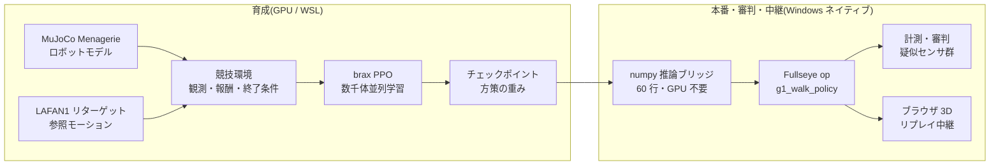

2025년, 중국 베이징에서 휴머노이드 로봇의 하프마라톤이 열렸고, 여름에는 제1회 세계 휴머노이드 로봇 운동회가 개최되어 이족보행 로봇들이 달리기를 하고, 축구를 하고, 춤을 추었다. 그리고 공교롭게도 이 글을 쓰고 있는 오늘(2026년 8월 22일), 베이징의 국가 스피드스케이팅 경기장에서 **제2회 세계 휴머노이드 로봇 운동회가 개막**하고 있다. 이번에는 16개국·666팀·2,056대, 종목은 51개(제1회의 26개에서 거의 두 배), 하이라이트는 "리모컨 조작을 배제한 완전 자율 카테고리"라고 한다(숫자의 출처는 16.0절의 조사표에 정리해 두었다). 뉴스를 따라가면서, 줄곧 이런 생각을 했다.

(먼저 한 가지 안내해 둔다: 이 글의 GIF와 그림 안에 새겨진 텍스트는 일본어 원본이며, 의미는 캡션에 있다.)

**"이거, 개인이 해 보고 싶다"**

물론 실기 500대를 늘어세울 경기장은 마련할 수 없다. 예산도, 장소도, 그리고 가족의 이해도 부족하다. 하지만 지금 손 안에는 GPU가 1장 실린 PC가 있다. 물리 시뮬레이션 안에 경기장을 짓고, 선수를 키우고, 경기를 시키고, 심판을 세우고, 관중석(브라우저)으로 중계한다 — **운동회를 구성하는 요소 전부를 내 책상 위에서 만드는 것**이라면, 할 수 있을 터였다.

이 글은 그 "자택 휴머노이드 운동회"의 개최기다. 그리고 동시에, 내가 본업인 영상 처리(산업용 머신 비전)의 경험을 들고 오면서 **Physical AI의 통합 개발 환경(IDE)을 만들려 하고 있는** 개발기이기도 하다. 경기의 무대 뒤에서는 심판의 시선(계측과 꼼수 검출)도, 중계 설비(브라우저 3D 뷰어)도, 선수 육성 환경(강화학습 파이프라인)도, 전부 같은 하나의 공구함 — 자작 시각 툴킷 **Fullseye** — 으로 흘러들어 간다.

긴 글이다. 읽을거리로 처음부터 읽어도, 목차에서 경기만 골라 읽어도 성립하도록 썼다.

*대회 포스터(삽화는 이미지 생성 AI(Gemini). 글자가 깨지기 쉬워서, 빈 배너가 있는 상태로 생성하고 글자는 직접 넣는 방식)*

> **발안과 구현의 귀속에 대하여(처음에 명기)**
> 이 글에 나오는 방향성 판단과 아이디어(운동회라는 기획 그 자체, 실기 센서에 맞춘 관측 설계, 이벤트 카메라식 시간 차분의 도입, 근골격의 "상반+공수축" 2지령화, 부위 단위 단순화, 학습된 정책의 Studio op화, 브라우저 중계…)는 내가 냈고, 구현·실험·계측의 실무는 AI 코딩 에이전트(Claude Code)가 돌리고 있다. **잘된 실험도, 실패한 실험도, 숫자는 전부 실측**이다. 실패를 숨기면 다음의 내가 곤란해지므로, 진 경기도 진 채로 실었다. 참고로 본문의 1인칭 "나"는 판단과 방향 설정의 주어이지만, 발견의 순간에는 인간과 AI의 경계가 모호한 장면도 있다. 귀속을 단정할 수 없는 서술은 "나와 AI의 팀으로서"의 의미로 읽어 주기 바란다 — 주어를 멋지게 부풀리지 않는 것도 honest disclosure의 일부다.

## 이 글을 읽는 법(3가지 코스)

매우 긴 글이므로, 먼저 코스 안내부터.

- **5분 코스(움직임만 본다)**: 스크롤하면서 동영상(GIF)만 훑어보면 된다. 직진 보행 완주, 장애물 달리기, 67대의 입장 행진, 700근 인체의 포즈, 선 자세에서 무너지는 장면까지, 움직임만으로 이야기의 뼈대를 알 수 있게 배치해 두었다.
- **30분 코스(본편)**: 제1~15장. 운동회 개최기 + 실패담 + 개발기다. 각 장 끝의 "🍙 쉽게 풀기 코너"는 본문이 딱딱하다 싶을 때의 대피소다.
- **풀코스(자료편까지)**: 부록 A~G. 실험 전체 기록, 로봇 67기의 명감, 센서 도감, 교훈집, 용어집, op 전체 색인, 미래 자료집. 사전으로서, 필요해졌을 때 찾아보는 용도다.

# 목차(경기 프로그램)

1. 개회식 — 왜 개인이 운동회인가
2. 용어집 — 먼저 쉽게 풀어 둔다
3. 경기장 건설 — 물리 시뮬레이션과 GPU
4. 선수 입장 — Unitree G1과 자작 700근 인체 evis
5. 종목 1: 달리기(20m 직진) — 3연패에서 "흰 선이 보이지 않았다"는 일격까지
6. 종목 2: 장애물 달리기 — 의사 LiDAR와 1차원 이벤트 카메라
7. 종목 3: 단체 연기 — 700가닥의 근육을 키프레임으로 움직인다
8. 종목 4: 평균대(정지 직립) — 가장 수수한 종목이, 가장 어려웠다
9. 심판진 — 영상 처리쟁이가 만드는 "꼼수를 간파하는 계기"
10. 중계국 — 브라우저만으로 도는 3D 리플레이
11. 통합 개발 환경으로 — Fullseye Studio라는 야망
12. 개최 요강 — 개인이 하기 위한 구성표
13. 미래를 향해 — 최첨단을 시뮬레이션한다는 놀이법
14. 이 운동회에 섞여 있는 학문들 — DNA에서 광학까지
15. 번외 경기 — 팔·하늘·핸드·젓가락(전부, 진짜 물리)
16. 폐회식과 다음 종목
부록 A~I — 실험 연대기 / 로봇 명감(67기) / 센서 도감 / 교훈집 / 확장 용어집 / Fullseye op 전체 색인(1,606) / 미래 자료집 / 학습 로그 실측 초록 / FAQ

---

# 1. 개회식 — 왜 개인이 운동회인가

*삽화: 이미지 생성 AI(Gemini). 넘어져 있는 선수가 있다는 점이, 이 글의 내용과 완전히 일치한다*

베이징 대회가 재미있었던 것은, "걸을 수 있는가"가 아니라 "**경기가 되는가**"를 물었다는 점이라고 생각한다. 걷기만 하는 것이라면 2015년 DARPA Robotics Challenge 무렵부터 로봇은 (넘어지면서도) 걷고 있었다. 경기가 된다는 것은, 속도를 겨루고, 코스를 지키고, 실격 조건이 있고, 기록이 남는다는 뜻이다. 즉 **계측과 규율**이 들어온다는 것.

오해가 없도록 적어 두자면, "개인이 중국을 이기자"는 이야기가 전혀 아니다. 그 규모와 속도, 그리고 무엇보다 "로봇에게 마라톤을 뛰게 해 보자" "운동회를 열어 버리자"는 **자유로운 발상 그 자체가, 순수하게 본받아야 할 것**이라고 생각한다. 내가 하고 싶은 것은 경쟁이 아니라, 그 자극을 내 손이 닿는 형태로 번역해 보는 일이다. 그리고 중요한 것은, 그것이 **번역 가능해져 버린 시대가 오고 있다**는 점. 오픈된 모델과 데이터와 계산 자원이, 개인의 책상 위에서 정말로 맞물린다. 자극을 받은 쪽이, 관객으로만 머물지 않아도 된다. 이것은 꽤나 희망적인 이야기라고 생각한다.

나는 평소 산업용 영상 처리를 해 온 사람이고, 공장 검사 장비의 세계에서는 "측정할 수 없는 것은 개선할 수 없다" "측정 방법을 의심하라"가 가훈이다. 강화학습(Reinforcement Learning)으로 로봇을 키우는 놀이를 시작하자마자, 이 두 세계가 같은 골격을 가지고 있다는 것을 깨달았다. **보상(점수)의 설계는 검사 기준의 설계이고, 에이전트는 기준의 구멍을 반드시 파고드는 피검체**다. 그래서 운동회라는 프레임은 농담 같으면서도, 사실은 본질적이었다. 경기 규칙(보상·종료 조건), 계시와 계측(로그와 롤아웃 = 정책을 처음부터 끝까지 달리게 한 1회분의 실주행), 도핑 검사(꼼수 검출), 그리고 관중을 향한 중계(가시화). 이 전부를 만들지 않으면, 운동회는 성립하지 않는다.

개인이 하는 의미도 적어 둔다. 대회에 나오는 로봇의 제어는 각 회사의 비전(祕傳)이지만, **시뮬레이션 속 운동회는 모델도 데이터도 학습 코드도 전부 오픈된 것으로 짤 수 있다**. 사용한 것은 MuJoCo(물리 엔진), MuJoCo Menagerie(로봇 모델집), Unitree 공식의 LAFAN1 리타깃 모션(HuggingFace 공개. 원본 데이터는 Ubisoft La Forge, CC BY-NC-ND 4.0 비상업 라이선스 — 자세한 내용은 글 말미의 감사의 말), brax/MJX(GPU 물리와 학습), 그리고 자작 코드. GPU 1장만 있으면 누구나 자기 집에 경기장을 지을 수 있는 시대가, 정말로 와 있다.

# 2. 용어집 — 먼저 쉽게 풀어 둔다

본문을 읽다가 되돌아올 수 있도록, 주요 용어를 먼저 정리한다. 형식은 "용어(English) — 한 줄 정의 → 쉽게 풀기"다.

- **강화학습(Reinforcement Learning, RL)** — 시행착오와 보상으로 행동을 획득하는 학습법. → 개 훈련. "손"을 하면 간식. 다만 개보다 압도적으로 타산적이어서, 간식 규칙의 구멍을 전력으로 파고든다.
- **정책(policy)** — 상태를 입력받아 행동을 내는 함수. 학습의 성과물. → 선수의 "몸 움직이는 버릇" 그 자체. 이 글의 정책은 작은 신경망(4층×32유닛 정도).
- **보상(reward)** — 1스텝마다 주는 점수. → 경기의 채점 규칙. 여기의 설계 실수는 반드시 악용된다.
- **관측(observation)** — 정책에게 보여 주는 입력 벡터. → 선수의 오감. **여기에 들어 있지 않은 것은, 선수에게는 존재하지 않는다**(이 글 최대의 교훈).
- **PPO(Proximal Policy Optimization)** — 정석 강화학습 알고리즘. → "한 번에 극단적으로 바꾸지 않고, 조금씩 확실하게 실력을 올리는" 연습법.
- **학습 스텝과 "26M" "150M" 표기** — 이 글에서는 선수의 성장 정도를 "학습 스텝 수"로 나타내며, M은 백만(mega)의 의미로 쓴다. 26M = 2,600만 스텝, 150M = 1억 5,000만 스텝. **거리의 미터(소문자 m. "20.5m 전진" 등)와는 별개**이므로, "대문자 M이 붙은 큰 숫자는 연습량, 소문자 m은 거리"로 구분해 읽어 주기 바란다. → 동아리 활동으로 치면 "스윙 연습 2,600만 번째 시점" 같은 말투다.
- **모방학습의 참조 모션(reference motion / mocap)** — 인간의 움직임을 기록해 로봇의 관절에 옮긴 "본보기". → 댄스 안무 비디오. LAFAN1은 그 공개 데이터집이고, Unitree가 자사 로봇용으로 공식 변환하고 있다.
- **잔차 제어(residual control)** — 본보기의 관절각에, 정책이 작은 수정량(잔차)만 더하는 방식. → "안무는 지켜라, 다만 균형 조정은 스스로 해라". 처음부터 움직임을 발명하게 하지 않는다.
- **POMDP / 부분 관측** — 환경 상태의 일부만 관측할 수 있는 상황. → 눈 가리고 외줄 타기. 종목 1의 패인.
- **의사 LiDAR(pseudo-LiDAR)** — 시뮬레이션 안에서 광선을 쏘아 거리를 재는 가상 센서. → 박쥐의 초음파. 실기 LiDAR(레이저 거리계)의 성질을 계산으로 흉내 낸다.
- **이벤트 카메라(event camera / DVS)** — 밝기의 "변화"만 내보내는 카메라. → 정지 화면은 못 찍지만 "움직인 것"에 초민감한 눈. 이 글에서는 1차원판을 자작했다.
- **근골격 모델(musculoskeletal model)** — 관절을 모터가 아니라 "근육의 장력"으로 움직이는 인체 모델. → 로봇이 아니라 해부학의 인체. evis는 700가닥의 근육을 가진다.
- **토크(torque)** — 관절을 돌리는 힘의 모멘트. **근육은 밀지 못한다, 당길 뿐**(이걸로 한 번 패했다).
- **WBC-QP(전신 제어의 이차 계획법, Whole-Body Control via Quadratic Programming)** — "전 관절의 가속도와 접촉력을, 물리 조건을 만족하면서 최적으로 정하는" 제어의 정석. → 전신의 힘 배분을 매 순간, 수학의 최적화로 푼다.
- **MJX / brax** — MuJoCo의 GPU 병렬판과, 그 위의 학습 프레임워크. → 경기장을 수천 면 동시에 지어서, 수천 명의 선수를 동시에 연습시키는 기술.
- **XLA** — GPU용 계산 컴파일러. → 경기장의 시공업자. 잘하는 공법(고정 형상의 행렬 계산)에 맞지 않는 설계도(700근의 희소한 장력 계산)는 지어 주지 않는다, 는 제약이 나중에 효력을 발휘한다.

# 3. 경기장 건설 — 물리 시뮬레이션과 GPU

경기장은 통째로 소프트웨어다. 구성은 이렇게 되어 있다.

- **물리 엔진**: MuJoCo. 접촉 계산의 신뢰성과 속도의 균형에서, 현재 로봇 학습의 사실상 표준이다.
- **병렬화**: MJX(MuJoCo의 GPU판) + brax의 PPO 구현. 수천 개의 경기장을 GPU 위에 동시에 지어서, 같은 선수의 복사본을 일제히 달리게 하고, 전원분의 경험을 모아 학습한다.
- **하드웨어**: RTX 5090(32GB) 1장. 이 글의 학습은 2개 종목을 동시에 돌려 **합계 약 9,700 학습 스텝/초**가 나오고 있다(메모리 할당을 0.35씩으로 좁혀 동거). 한 종목의 연습(약 1억 스텝)이 대략 3~4시간. 저녁에 연습을 걸어 두고, 저녁 식사 후에 결과를 보는 생활 리듬이 된다. 대체로 목욕 후에 전도(轉倒) 동영상을 바라보며 한숨 쉬는 담당이다.
- **학습은 Linux 쪽(WSL), 그 외에는 Windows 쪽**이라는 분업이다. JAX/XLA의 사정으로 학습은 WSL로 몰고, 계측·가시화·글의 도표 만들기는 Windows 네이티브 Python으로 하고 있다. 이 분업이 뒤에 나올 "numpy 추론 브리지"의 동기가 되었다.

*그림: 이 글의 학습 스루풋 실측. GPU 1장에 학습 2~3개를 동거시켜도 각각 8,000~10,000 스텝/초. 사족(별도 트레이너)은 단위계가 달라 별도 패널(실측 로그로 작도)*

경기장 건설에서 가장 먼저 효력을 발휘하는 제약이, 용어집에도 적은 **XLA의 특기 공법 문제**다. 관절을 모터로 돌리는 보통 로봇(G1 등)은 GPU로 수천 병렬이 가능하지만, **700가닥의 근육으로 움직이는 자작 인체 evis는 근장력 계산이 XLA에 실리지 않아 GPU 병렬화가 불가능**했다. 그래서 evis의 경기는 CPU로 진행하고, 나중에 GPU에 실을 때는 "근육을 등가의 관절 토크로 치환한 쌍둥이(torque-twin)"를 쓰는 이단 구성으로 하고 있다. 경기장에 대경기장(GPU)과 소체육관(CPU)이 있다고 생각하면 된다.

> **🍙 쉽게 풀기 코너(경기장편)**
> 게임의 "물리 엔진"과 같은 것이, 로봇 연구에서도 경기장이 된다. 마리오가 점프해서 떨어지는 것도, 여기서 로봇이 넘어지는 것도, 안에서 하고 있는 계산은 동족이다. 차이는 진지함으로, 연구용 물리 엔진은 "접촉한 순간의 힘"을 보험 약관 같은 세밀함으로 계산한다. 그리고 GPU를 쓰면 이 경기장을 수천 개 복사해서 동시에 돌릴 수 있다. 로봇 1대의 연습을 4,000대가 동시에 하는 느낌. 그래서 하룻밤에 인간의 수년치 연습량이 되는 것이다.

## 3.1 깊이 파기: 경기장의 지하 설비 — 물리 엔진은 1스텝에 무엇을 하고 있는가
(제3장 "경기장 건설"의 증보)

시뮬레이터는 "마법의 상자"가 아니다. `mj_step()`을 한 번 부를 때마다, 안에서는 정해진 순서의 계산이 돌고 있다. 여기서는 그 상자의 뚜껑을 열고 함께 들여다본다.

### 3.1.1 1스텝의 내용물: 순동역학 파이프라인

MuJoCo의 1스텝은 대략 다음 단계를 순서대로 거친다(공식 docs의 Computation 장 [^mjc-comp]에 전 단계의 해설이 있다).

| 단계 | 하는 일 | 사용되는 알고리즘 |
|---|---|---|
| 1. 순방향 운동학 | 관절 각도로부터, 모든 보디의 위치·자세를 계산 | 트리 구조를 루트에서 잎으로 전파 |
| 2. 바이어스력 | 중력·코리올리력·원심력을 한꺼번에 계산 | Recursive Newton-Euler(RNE) |
| 3. 관성 행렬 | "어느 관절을 밀면 얼마나 움직이는가"의 행렬 M을 계산 | Composite Rigid-Body(CRB) |
| 4. 충돌 검출 | 어느 지오메트리끼리 닿아 있는지를 열거 | broad-phase → narrow-phase |
| 5. 구속력의 해법 | 접촉력·관절 리밋력·마찰을 결정 | **볼록 최적화**(후술) |
| 6. 수치 적분 | 가속도를 적분해 속도·위치를 1컷 진행 | Euler / RK4 / implicit 계(후술) |

포인트는 2가지다.

**일반화 좌표(generalized coordinates)**. MuJoCo는 각 보디의 xyz 좌표를 따로따로 갖는 것이 아니라, "관절 각도의 벡터"로 전신의 상태를 나타낸다. 관절로 이어져 있는 한, 보디가 뿔뿔이 날아가 버릴 걱정이 구조적으로 없다. 공식 docs는 "MuJoCo pioneered the combination of simulation in generalized coordinates with optimization-based contact dynamics(일반화 좌표에서의 시뮬레이션과 최적화 기반 접촉 동역학의 조합을 개척했다)"라고 자기소개하고 있다 [^mjc-overview]. 게임 물리 엔진(직교 좌표 + 스프링으로 구속을 근사)과의 가장 큰 설계 차이가 여기다.

**순동역학(forward dynamics)**. "지금 가해지고 있는 힘으로부터, 다음 순간의 가속도를 구하는" 계산이다. 운동 방정식 M(q)·q̈ = 외력 + 구속력 을, 위 표의 재료(M, 바이어스력, 접촉력)를 갖춘 뒤에 푼다.

#### 쉽게 풀기: 플립북의 1컷

시뮬레이션은 플립북(파라파라 만화)이다. 1스텝 = 1컷. 각 컷에서 "전원의 위치를 확인 → 누구와 누가 부딪치고 있는지 조사 → 서로 미는 힘을 결정 → 그 힘으로 전원을 아주 조금 움직인다"를 반복한다. 우리 G1의 학습에서는 1컷이 0.002초. 1초의 보행 뒤에서 500컷분, 이 표의 전 단계가 돌고 있다.

### 3.1.2 접촉은 왜 어려운가 — LCP를 버리고 볼록 최적화를 택한 MuJoCo

물리 엔진의 최대 난소는 "접촉"이다. 발이 지면에 닿는 순간, 지면은 얼마만큼의 힘으로 되밀어야 하는가? 이것은 의외로 정의하기 어려운 문제다.

고전적인 정식화는 **LCP(선형 상보성 문제)**였다. "접촉력은 미는 방향만(당기지 않는다)" "떨어져 있으면 힘은 제로" "마찰은 쿨롱 원뿔 안"이라는 조건을 상보성 조건으로 써 내려간다. 그런데 마찰이 붙은 LCP는 해가 유일하게 정해지지 않는 경우가 있고, 일반적으로는 NP-난해 클래스에 속한다.

MuJoCo의 저자 Todorov 등은 여기서 발상을 바꿨다. **접촉을 아주 조금 "부드럽게" 인정함으로써, 문제 전체를 볼록 최적화로 변환한** 것이다(IROS 2012 논문 [^todorov2012], 그리고 docs의 Computation 장 [^mjc-comp]). docs에는 쌍대 문제의 형태가 명시되어 있다:

> f = argmin_λ ½ λᵀ(A+R)λ + λᵀ(a₀ − aᵣ)  subject to λ ∈ Ω

세부는 따라가지 않아도 괜찮다. 중요한 것은 **(A+R)이 양의 정부호 = 골짜기가 하나뿐**이라는 점. 즉 접촉력은 "유일한 대역 최적해"로서 매번 같은 답이 나온다. LCP처럼 "풀리기도 하고 안 풀리기도 하고, 답이 여러 개이기도" 하는 일이 없다.

그 대가가 **soft contact(부드러운 접촉)**다. docs의 "Physical realism and soft contacts" 절에 있는 대로, 상보성이 엄밀하게는 성립하지 않고, "접촉력과 접촉 법선 방향의 속도가 동시에 양수가 될 수 있다" = 미세한 파고듦이 허용된다 [^mjc-comp]. 다만 이것은 결함이 아니라 설계 사상으로, 현실의 물체도 접촉면은 미시적으로는 변형되어 있다(이불 위에 놓은 노트북은 조금 가라앉지 않던가). "완전 강체의 접촉" 쪽이 오히려 물리적 픽션이다, 라는 입장이다.

게다가 볼록 정식화에는 부산물이 있다. docs 왈 "uniquely-defined inverse(역동역학이 유일하게 정의된다)" [^mjc-overview]. "이 움직임을 실현하려면 무슨 힘이 필요했는가"를 역산할 수 있다는 것은, 최적 제어·로보틱스 연구에서 이 엔진이 선택되어 온 이유 중 하나다.

#### solref / solimp — 접촉의 단단함을 "스프링과 댐퍼의 언어"로 지정한다

그렇다면 "얼마나 부드러운가"는 어떻게 정하는가. 그것이 XML에서 자주 보게 되는 `solref`와 `solimp`다(docs의 Modeling 장 "Solver parameters" 절 [^mjc-solver]).

| 파라미터 | 의미 | 직관 |
|---|---|---|
| `solref = (timeconst, dampratio)` | 구속을 질량-스프링-댐퍼계로 재파라미터화 | timeconst = 파고듦이 되돌아오는 속도, dampratio = 1이면 튀지 않고 스윽 돌아온다(임계 감쇠) |
| `solimp = (d₀, d_width, width, midpoint, power)` | 임피던스 d ∈ (0,1) = "구속이 힘을 내는 능력"을 파고듦 양의 함수로 지정 | d가 작다 = 약한(부드러운) 구속, 크다 = 강한(단단한) 구속 |

docs의 말을 빌리면, solref는 "시정수와 감쇠비라는 질량-스프링-댐퍼계의 언어로 모델을 재파라미터화하는" 것이고, solimp의 d는 "small values of d correspond to weak constraints while large values of d correspond to strong constraints" [^mjc-solver]. 즉 최적화 솔버 안의 추상적인 정칙화 항을, 인간이 직관을 가질 수 있는 "스프링의 단단함·댐퍼의 효력"으로 번역해 주는 인터페이스다. 접촉이 부들부들 떨릴 때·발이 파고들 때, 우리가 만지고 있던 것은 사실 이 2가지였다.

### 3.1.3 적분기와 시간 간격 — 왜 근육이나 텐던에서 "폭발"하는가

표의 마지막 단, 수치 적분에는 선택지가 있다(docs "Numerical Integration" 절 [^mjc-comp]).

| 적분기 | 특징 | 적합·부적합 |
|---|---|---|
| Euler(semi-implicit) | 관절 댐핑만 음적으로 다루는 반음적 오일러 | 표준. 빠르다 |
| RK4 | 4차 룽게-쿠타. 1스텝에 4회 평가 | 에너지 보존계에 강하다. 비용 4배 |
| implicit | 속도 의존력(코리올리·원심력 포함)의 미분까지 음적으로 | 가장 안정. LU 분해 필요 |
| implicitfast | implicit에서 코리올리계의 미분을 생략한 판 | docs 추천. Cholesky로 빠르다 |

"음적(implicit)"이란 무엇인가. 양적(explicit) 적분은 "지금의 힘으로 다음 위치를 정한다". 음적 적분은 "다음 순간의 상태에서 앞뒤가 맞도록 연립 방정식을 풀어 나아간다". 전자는 빠르지만, **단단한 스프링(변화가 빠른 힘)이 있으면 1컷 사이에 힘이 날뛰어 발산**한다. 이것이 수치적인 "폭발"의 정체다.

근육·텐던(힘줄)은 바로 이 "단단한 스프링"의 덩어리다. 근육의 수동 탄성·텐던의 장력은, 미세한 늘어남으로 힘이 크게 변한다 = 시정수가 짧다. 시간 간격 dt가 그 시정수보다 거칠면, 1컷 사이에 "힘을 과대하게 어림한다 → 지나쳐 간다 → 반대 방향으로 더 큰 힘 → …"의 진동이 증폭된다. evis(근구동 휴머노이드)가 G1보다 작은 dt를 요구한 것은, 태만이 아니라 수학적 필연이었다. docs도 속도 의존의 힘이 지배적인 계에서는 implicit 계가 "RK4보다 대폭 안정(significantly more stability)"하다고 하며, **시간 간격은 "아마도 유일하게 가장 중요한 파라미터(perhaps the single most important parameter)"**라고 명언하고 있다 [^mjc-comp].

#### 쉽게 풀기: 컷이 빠진 플립북

단단한 스프링과 거친 dt의 조합은, "컷 수를 아낀 플립북으로 검도의 머리치기를 그리는" 것과 같다. 죽도의 끝은 1컷 사이에 크게 움직이므로, 컷을 솎아내면 궤도를 그릴 수 없어 그림이 파탄난다. 천천히 걷는 장면이라면 솎아내도 괜찮다. **dt는 "가장 빨리 움직이는 것"에 맞춰 고른다**——이것이 수치 안정성의 한 줄 요약이다.

### 3.1.4 MJX — MuJoCo를 GPU의 언어로 다시 쓰다

학습에는 수천만 스텝이 필요하다. CPU의 MuJoCo 1개로는 해가 저문다. 그래서 **MJX**다.

MJX는 MuJoCo를 **JAX로 다시 쓴** 구현이다. 공식 docs [^mjx]에 따르면, 목표는 "XLA 컴파일러가 지원하는 모든 계산 하드웨어에서 MuJoCo를 돌리는" 것. JAX의 `vmap`(자동 벡터화)으로 동일 씬을 수천 개 늘어놓고, GPU의 SIMD 연산기에 일괄로 흘려 넣는다. docs의 표현으로는, MJX가 잘하는 것은 "simulating big batches of parallel identical physics scenes using algorithms that can be efficiently vectorized on SIMD hardware(SIMD 하드웨어에서 효율적으로 벡터화할 수 있는 알고리즘에 의한, 동일 물리 씬의 대배치 병렬 시뮬레이션)"——바로 RL을 위한 엔진이다.

다만 GPU화는 공짜가 아니다. docs가 정직하게 적고 있는 제약 [^mjx]:

- **분기(branching)에 약하다**: "accelerators exhibit poor performance for branching code(가속기는 분기 코드의 성능이 나쁘다)". 충돌 검출의 broad-phase는 "가까이에 없는 물체 쌍을 건너뛰는" 분기투성이의 처리이므로, GPU에서는 전체 쌍을 우직하게 평가하기 쉬워진다.
- **가변 길이에 약하다**: XLA는 배열 크기를 컴파일 시에 고정한다. 접촉 수는 스텝마다 바뀌는데도, MJX에서는 "최대 접촉 수"만큼의 메모리를 항상 확보해 계산한다. CPU판이라면 "오늘은 접촉 3건"으로 끝날 것을, GPU판은 매번 만석분의 계산을 하는 셈이다.
- **메시는 가볍게**: 충돌 메시는 "200 정점 정도 이하"가 권장.
- **1개만이라면 느리다**: 단일 씬에서는 "MJX-JAX can be 10x slower than MuJoCo(CPU판 MuJoCo의 10배 느려질 수 있다)". MJX의 가치는 1개의 속도가 아니라, **4096개를 동시에 돌려도 1개분과 그다지 다르지 않은** 스루풋에 있다.

(보충: 2026년 현재의 docs에서 MJX는 2계통으로 나뉘어 있다. JAX 재구현인 MJX-JAX(자동 미분 가능)와, 더 고속이지만 자동 미분 비대응인 MJX-Warp다 [^mjx]. 이 글의 학습에서 쓴 것은 JAX 계열의 파이프라인이다.)

#### brax PPO의 학습 루프

MJX와 짝지어 쓴 것이 **brax** [^brax]의 학습 알고리즘 구현이다. brax는 JAX 기반의 물리 엔진 + 학습 라이브러리로, README에 있는 대로 PPO / SAC / ARS / 진화 전략 등의 구현을 동봉하고 있다. 그 PPO의 1사이클은 이렇게 돈다:

1. **rollout**: 수천 개의 병렬 환경에서 현재의 정책을 짧은 구간(unroll) 달리게 하여, (관측, 행동, 보상)을 수집
2. **GAE**: 모은 보상으로부터 advantage(그 행동이 평균보다 얼마나 좋았는가)를 추정(파트 2에서 상술)
3. **minibatch SGD**: 데이터를 미니배치로 나누고, PPO의 클립 부착 목적 함수로 정책 네트와 가치 네트를 몇 에폭 갱신
4. 새로운 정책으로 1로 돌아간다

이 루프 전체——물리 시뮬레이션도 신경망 갱신도——가 JIT 컴파일(실행 직전에 한꺼번에 GPU용 코드로 변환)되어 **GPU에서 한 번도 내려오지 않고** 도는 것이, MJX + brax 구성의 속도의 원천이다. CPU↔GPU 간 데이터 전송이라는 최대의 병목이 사라진다.

#### 파트 1 출전

[^mjc-comp]: MuJoCo 공식 docs, Computation 장(파이프라인·볼록 최적화·soft contact·적분기): https://mujoco.readthedocs.io/en/stable/computation/index.html
[^mjc-overview]: MuJoCo 공식 docs, Overview(일반화 좌표·볼록 접촉·유일한 역동역학·텐던): https://mujoco.readthedocs.io/en/stable/overview.html
[^mjc-solver]: MuJoCo 공식 docs, Modeling 장 Solver parameters(solref / solimp): https://mujoco.readthedocs.io/en/stable/modeling.html#solver-parameters
[^todorov2012]: Todorov, Erez, Tassa, "MuJoCo: A physics engine for model-based control," IROS 2012: https://doi.org/10.1109/IROS.2012.6386109
[^mjx]: MuJoCo 공식 docs, MJX 장(JAX/XLA·배치 병렬·분기/가변 길이의 제약): https://mujoco.readthedocs.io/en/stable/mjx.html
[^brax]: google/brax(JAX 물리 엔진 + PPO/SAC 등의 학습 구현): https://github.com/google/brax

---

## 3.2 깊이 파기: 경기장의 역사 — 물리 시뮬레이터의 계보
진화든 RL이든, 도태의 "세계"를 제공하는 것은 물리 엔진이다. 이 25년 동안 세계 쪽도 극적으로 진화했다.

### 3.2.1 연표: 7세대의 물리 엔진

| 연도 | 엔진 | 2~3줄로 | 출전 |
|---|---|---|---|
| 2001 | **ODE** | Russell Smith가 공개한 오픈소스 강체 동역학 라이브러리(초판 2001-05-08). 관절·접촉·충돌 검출을 갖추고, 연구용 시뮬레이터(Gazebo 등)의 표준 부품으로 한 시대를 이루었다 | [^ode] [^ode-wiki] |
| 2000s | **Bullet** | Erwin Coumans 주도. 게임·VFX 출신의 충돌 검출 + 다체 물리. Python 바인딩 PyBullet이 심층 RL 초기의 정석 환경이 되었다 | [^bullet] |
| 2000s~ | **PhysX** | NVIDIA의 실시간 물리 SDK. 게임 시장에서 단련되어, 훗날 GPU 구현이 Isaac Gym의 심장부가 된다. 현재는 오픈소스 | [^physx] |
| 2012 | **MuJoCo** | Todorov·Erez·Tassa "MuJoCo: A physics engine for model-based control"(IROS 2012). 일반화 좌표 + 볼록 최적화 기반 접촉이라는 연구 특화 설계 | [^mujoco-paper] |
| 2021-22 | **MuJoCo 인수→OSS화** | DeepMind가 인수해 무상 공개(2021-10-18), 이어서 전체 코드를 Apache-2.0으로 오픈(2022-05-23). 연구 표준 엔진이 "누구의 것도 아닌 모두의 것"인 상태가 되었다 | [^mujoco-blog1] [^mujoco-blog2] [^mujoco-gh] |
| 2021 | **Isaac Gym** | Makoviychuk 등(NVIDIA). 물리도 보상 계산도 **전부 GPU 위**에서 돌리고, GPU 1장으로 수천 환경을 동시 시뮬레이션. RL의 데이터 수집을 자릿수 단위로 바꿨다 | [^isaacgym] |
| 2021-23 | **Brax / MJX** | JAX 계열. Brax는 미분 가능 물리 엔진(Freeman 등 2021), MJX는 MuJoCo 본체의 JAX 구현으로, XLA가 도는 하드웨어(GPU/TPU)라면 천 병렬을 쓸 수 있다 | [^brax] [^mjx] |
| 2024 | **Genesis** | 멀티피직스(강체·유체·연체) + 포토리얼 묘사 + 고속 GPU 병렬을 일체로 노리는 신세대 플랫폼 | [^genesis] |

### 3.2.2 게임 물리와 연구 물리의 분기

이 계보에는 보이지 않는 분수령이 있다. **"60 fps에서 파탄나지 않으면 승리"인 게임 물리**와, **"접촉력이 물리적으로 올바르지 않으면 의미가 없다"인 연구 물리**다.

게임 물리(Bullet, PhysX의 출신)는, 플레이어가 보기에 자연스러우면 근사여도 상관없다. 관통을 되민다, 파고듦을 얼버무린다, 안정성을 위해 에너지를 멋대로 줄인다——실시간성을 위해서라면 전부 허용. 이 결단이 방대한 게임 시장에서 성능을 단련했고, 결과적으로 연구에도 저렴한 물리를 공급했다. 심층 RL 초기의 벤치마크 다수가 PyBullet이나 MuJoCo의 환경에서 돌았던 것은, 이 축적의 은혜다.

연구 물리(ODE 후기→MuJoCo)는 반대로, **접촉과 그 미분의 올바름**에 집착한다. 로봇의 제어 법칙은 바로 접촉력의 응답으로 정해지기 때문으로, MuJoCo가 볼록 최적화로 접촉을 푸는 설계를 택한 경위는 3.1절에서 본 대로다. 분기는 세부에도 나타난다. 게임 물리는 묘사 프레임에 동기한 고정 스텝으로 "이번 프레임을 넘기는" 것을 우선하지만, 연구 물리는 시간 간격·솔버 반복 수·접촉의 부드러움을 전부 사용자에게 노출하고, "그 근사로 무엇을 잃고 있는가"를 고르게 한다. 또 MuJoCo가 역동역학(이 움직임에 필요했던 힘의 역산)을 유일하게 계산할 수 있음을 세일즈 포인트로 삼는 데 비해, 게임 물리에서 역동역학을 진지하게 쓰는 장면은 거의 없다——**누가 그 엔진의 "고객"이었는가**가, 20년 후의 설계 사상까지 결정하고 있는 셈이다. 여기를 얼버무린 시뮬레이터로 학습한 정책은, 실기에 가져간 순간 **sim-to-real gap**(reality gap)에 얻어맞는다. 도메인 랜덤화(Tobin 등 2017 [^tobin]) 같은 "시뮬레이터의 파라미터를 일부러 흩뜨려서, 어느 세계에서도 통용되는 정책을 키우는" 처방전이 태어난 것도, 갭이 구조적으로 피할 수 없는 것이기 때문이다(sim-to-real의 각론은 6.5절·6.6절에서 다루므로, 여기서는 계보상의 위치만).

### 3.2.3 GPU 병렬이 RL을 바꿨다

Isaac Gym 논문(2021) [^isaacgym]의 임팩트는 한 점으로 요약된다. 종래의 RL은 "물리는 CPU, 학습은 GPU"여서, CPU↔GPU 간 데이터 수송이 병목이었다. Isaac Gym은 물리 시뮬레이션·관측·보상 계산을 **전부 GPU 텐서 위**에서 완결시켜, GPU 1장으로 수천 환경을 동시에 달리게 한다. 같은 해 Rudin 등의 "Learning to Walk in Minutes Using Massively Parallel Deep Reinforcement Learning" [^rudin]은, 이 구조로 사족 로봇 ANYmal의 보행 정책을 **단일 워크스테이션 GPU·수 분**에 학습할 수 있음을 보였다. 그때까지 "클러스터로 며칠"이었던 작업이다.

이것은 단순한 고속화가 아니라, 연구의 작법을 바꿨다. 학습이 수 분이라면, 보상 설계의 시행착오가 "일 단위의 도박"에서 "커피 내리는 사이의 실험"이 된다. 우리가 자택의 GPU 1장으로 G1의 보상을 12세대나 다시 만들 수 있었던 것은, 바로 이 2021년 전환의 은혜다.

MJX [^mjx]와 Brax [^brax]는 같은 사상의 JAX판이다. 물리 스텝을 JAX의 함수로 씀으로써, `jit`로 컴파일하고 `vmap`으로 수천 환경분을 묶는다, 는 기계학습 쪽의 작법이 그대로 물리에 쓸 수 있다. Brax는 더 나아가 **미분 가능 물리**——"시뮬레이션 결과를 파라미터로 미분할 수 있다"——를 간판으로 내걸었다. 넘어진 결과를 보상 신호로밖에 쓸 수 없던 세계에서, "어느 파라미터를 어느 쪽으로 움직이면 넘어지지 않았을까"의 기울기를 (이론상으로는) 직접 얻을 수 있는 세계로의 다리다. 접촉 같은 불연속 현상의 미분은 지금도 난소지만, 계보의 다음 분기점은 여기에 있다고 여겨지고 있다.

다만 GPU 병렬에도 대가는 있다. 수천 환경을 1장에 눌러 담기 위해, 1환경당 접촉 솔버는 경량화되고, 복잡한 폐루프 기구나 대규모 접촉(예컨대 700가닥의 근육)은 애초에 실리지 않는 경우가 있다——우리가 evis에서 경험한 "근골격 모델은 GPU화할 수 없어 torque-twin으로 우회했다"는 건은, 이 설계 트레이드오프의 실례다. "빠른 물리"와 "무엇이든 나타낼 수 있는 물리"는, 아직 같은 엔진에 동거하고 있지 않다.

#### 쉽게 풀기: 체육관에 4,096명의 학생

옛날의 RL은 "장인이 로봇 1대에 붙어서 가르치고, 일지를 GPU로 우편 발송하는" 방식이었다. GPU 병렬 물리는 "체육관에 4,096대를 늘어세우고, 전원에게 동시에 같은 수업을 하고, 그 자리에서 채점까지 끝내는" 방식. 1대당 수업의 질은 같아도, 하루에 모이는 경험의 양이 자릿수로 다르다. 보행 학습이 "몇 주"에서 "몇 분"이 된 정체는, 가르치는 법의 진보가 아니라 **교실의 거대화**다.

### 3.2.4 로봇 학습 벤치의 현재 위치(2026)

지금 "걷게 하고 싶다·잡게 하고 싶다"는 사람이 처음 만지는 정석을 한 줄씩.

- **MuJoCo Playground** [^playground] — MJX 기반의 GPU 병렬 환경집. 사족·휴머노이드·머니퓰레이션의 sim-to-real 지향 태스크가 갖춰져 있다(우리 G1 보행의 토대도 이 계열).
- **Isaac Lab** [^isaaclab] — Isaac Sim 위의 로봇 학습 통합 프레임워크. NVIDIA 에코시스템의 현행 정답으로, Isaac Gym의 후계 포지션.
- **ManiSkill** [^maniskill] — SAPIEN 기반의 GPU 병렬 시뮬레이션 + 렌더링. 머니퓰레이션(조작) 과제에 강하다.
- **Genesis** [^genesis] — 강체에 닫히지 않는 멀티피직스와 묘사를 통합하는 야심 카테고리. 새로운 만큼 에코시스템은 발전 도상.

훑어보면, 2012년에 "연구 물리의 올바름"을 택한 MuJoCo와, 게임 시장에서 속도를 단련한 GPU 물리(PhysX 계열)가, 2020년대에 "GPU 병렬 × 접촉의 올바름"으로 합류한 것이 현재 위치임을 알 수 있다. ODE로 1대를 비틀비틀 걷게 하던 시대로부터 25년, 지금 자택의 GPU 1장 안에서는 수천 대의 휴머노이드가 나란히 계속 넘어지고 있다.

---

#### 파트 1 출전

[^sims-page]: Karl Sims, "Evolved Virtual Creatures," 1994(본인 사이트의 해설 페이지): https://www.karlsims.com/evolved-virtual-creatures.html
[^sims-paper]: Karl Sims, "Evolving Virtual Creatures," SIGGRAPH '94 논문 PDF(본인 사이트): https://www.karlsims.com/papers/siggraph94.pdf
[^sims-acm]: 같은 논문의 ACM DL 게재 페이지(SIGGRAPH '94 Proceedings, pp.15-22): https://dl.acm.org/doi/10.1145/192161.192167
[^sims-video]: 영상 "Evolved Virtual Creatures"(Internet Archive): https://archive.org/details/sims_evolved_virtual_creatures_1994
[^sims-youtube]: 같은 영상(YouTube 전재판, "Karl Sims - Evolved Virtual Creatures, Evolution Simulation, 1994"): https://www.youtube.com/watch?v=JBgG_VSP7f8
[^es-wiki]: Wikipedia "Evolution strategy"(Rechenberg·Schwefel에 의한 1960년대 창시 기술): https://en.wikipedia.org/wiki/Evolution_strategy
[^holland]: Wikipedia "John Henry Holland"(1975년 『Adaptation in Natural and Artificial Systems』): https://en.wikipedia.org/wiki/John_Henry_Holland
[^cmaes]: Hansen & Ostermeier, "Completely Derandomized Self-Adaptation in Evolution Strategies," Evolutionary Computation 9(2), 2001: https://doi.org/10.1162/106365601750190398
[^cmaes-tutorial]: Hansen, "The CMA Evolution Strategy: A Tutorial," 2016: https://arxiv.org/abs/1604.00772
[^cmaes-site]: CMA-ES 공식 사이트: https://cma-es.github.io/
[^neat]: Stanley & Miikkulainen, "Evolving Neural Networks through Augmenting Topologies," Evolutionary Computation 10(2), 2002: https://nn.cs.utexas.edu/downloads/papers/stanley.ec02.pdf
[^novelty]: Lehman & Stanley, "Abandoning Objectives: Evolution Through the Search for Novelty Alone," Evolutionary Computation 19(2), 2011: https://doi.org/10.1162/EVCO_a_00025
[^mapelites]: Mouret & Clune, "Illuminating search spaces by mapping elites," 2015: https://arxiv.org/abs/1504.04909
[^cully]: Cully, Clune, Tarapore & Mouret, "Robots that can adapt like animals," Nature 521, 2015: https://www.nature.com/articles/nature14422
[^openai-es]: Salimans, Ho, Chen, Sidor & Sutskever, "Evolution Strategies as a Scalable Alternative to Reinforcement Learning," 2017: https://arxiv.org/abs/1703.03864
[^wright]: Sewall Wright, "The roles of mutation, inbreeding, crossbreeding and selection in evolution," Proc. 6th Int. Congress of Genetics, 1932(원논문의 복사 PDF): http://www.blackwellpublishing.com/ridley/classictexts/wright.pdf
[^landscape-wiki]: Wikipedia "Fitness landscape"(Wright 1932가 기원이라는 기술): https://en.wikipedia.org/wiki/Fitness_landscape
[^afterman]: Wikipedia "After Man: A Zoology of the Future"(Dougal Dixon, 1981): https://en.wikipedia.org/wiki/After_Man
[^cheney]: Cheney, MacCurdy, Clune & Lipson, "Unshackling evolution: evolving soft robots with multiple materials and a powerful generative encoding," GECCO 2013: https://doi.org/10.1145/2463372.2463404
[^xenobots]: Kriegman, Blackiston, Levin & Bongard, "A scalable pipeline for designing reconfigurable organisms," PNAS 117(4), 2020: https://doi.org/10.1073/pnas.1910837117

#### 파트 2 출전

[^ode]: Open Dynamics Engine 공식 사이트(저자 Russ Smith): https://www.ode.org/
[^ode-wiki]: Wikipedia "Open Dynamics Engine"(초판 릴리스 2001-05-08): https://en.wikipedia.org/wiki/Open_Dynamics_Engine
[^bullet]: Bullet Physics SDK(Erwin Coumans 등): https://github.com/bulletphysics/bullet3
[^physx]: NVIDIA PhysX SDK(오픈소스 리포지토리): https://github.com/NVIDIA-Omniverse/PhysX
[^mujoco-paper]: Todorov, Erez & Tassa, "MuJoCo: A physics engine for model-based control," IEEE/RSJ IROS 2012: https://doi.org/10.1109/IROS.2012.6386109
[^mujoco-blog1]: DeepMind Blog, "Opening up a physics simulator for robotics," 2021-10-18(인수와 무상 공개의 발표): https://deepmind.google/discover/blog/opening-up-a-physics-simulator-for-robotics/
[^mujoco-blog2]: DeepMind Blog, "Open sourcing MuJoCo," 2022-05-23(전체 코드 오픈의 발표): https://deepmind.google/discover/blog/open-sourcing-mujoco/
[^mujoco-gh]: MuJoCo 리포지토리(Google DeepMind 관리): https://github.com/google-deepmind/mujoco
[^isaacgym]: Makoviychuk et al., "Isaac Gym: High Performance GPU-Based Physics Simulation For Robot Learning," 2021: https://arxiv.org/abs/2108.10470
[^rudin]: Rudin, Hoeller, Reist & Hutter, "Learning to Walk in Minutes Using Massively Parallel Deep Reinforcement Learning," 2021: https://arxiv.org/abs/2109.11978
[^genesis]: Genesis(Genesis-Embodied-AI): https://github.com/Genesis-Embodied-AI/Genesis
[^playground]: MuJoCo Playground(Google DeepMind): https://github.com/google-deepmind/mujoco_playground
[^isaaclab]: Isaac Lab 공식 문서: https://isaac-sim.github.io/IsaacLab/main/index.html
[^maniskill]: ManiSkill(SAPIEN 기반): https://github.com/haosulab/ManiSkill
[^tobin]: Tobin et al., "Domain Randomization for Transferring Deep Neural Networks from Simulation to the Real World," 2017: https://arxiv.org/abs/1703.06907

# 4. 선수 입장

*그림: 주력 5선수의 신장 비교(축척은 엄밀하게 공통, 1.0m/1.8m 기준선 포함. 배경의 밝기는 각 씬 유래). 왼쪽부터 G1, H1, Go2, Spot, evis(시뮬레이션 렌더)*

## 선수 1: Unitree G1(시판 휴머노이드의 시뮬레이션 모델)

베이징 대회에서 활약하던 Unitree사의 소형 휴머노이드, 그 공식 시뮬레이션 모델이 MuJoCo Menagerie에 수록되어 있다. 신장 약 1.3m, **구동 관절 29**. 중요한 것은 **실기가 이 세상에 존재한다**는 점이다. 시뮬레이션에서 키운 정책은, 관측을 실기 센서에 맞춰 두면 원리적으로는 실기로 가져갈 길이 있다(후술하는 대로, 관측 설계는 처음부터 실기 센서 구성에 맞췄다).

*그림: Unitree G1(공식 시뮬레이션 모델, 구동 29 관절)*

본보기 움직임은 Unitree가 공식 공개하고 있는 **LAFAN1 리타깃 데이터셋**(HuggingFace: `lvhaidong/LAFAN1_Retargeting_Dataset`)을 쓴다. 인간의 모션 캡처를 G1의 29 관절로 변환해 둔, 30fps의 관절각 시계열이다. 여기서 보행 1주기(무릎 각도의 자기상관으로 30프레임으로 검출)를 잘라내고, 루프가 매끄럽게 이어지도록 닫고, 요(방향) 성분을 제거해 곧게 걷는 참조(1.47m/s)로 가공했다.

## 선수 2: evis(자작 700근의 해부학적 인체)

또 한 명의 선수는 사 온 로봇이 아니라, **해부학 데이터로 조립한 근골격 인체 모델**이다. 자유도 84(nq=85), **근육 액추에이터 700가닥**. 골격은 문헌의 인체 관성 파라미터에 기초하고, 근육은 기시·정지·경유점을 가진 장력 요소로 심어져 있다. 모터는 하나도 없다. 위팔을 드는 것은 삼각근이고, 팔꿈치를 굽히는 것은 위팔두갈래근이다.

*그림: evis 전신. 골격과 700가닥의 근육(붉은 섬유)으로 움직인다(시뮬레이션 렌더)*

왜 이렇게 번거로운 것을 키우는가. 돌봄이나 생활 지원을 생각했을 때, **사람과 같은 구조로 움직이는 것은, 사람 움직임의 "이유"를 설명할 수 있기** 때문이다. 게다가, 운동회에 내보낸다면 지역 대표인 자기 집 선수도 한 명은 있어야 하지 않겠는가.

*그림: Unitree H1(대형 휴머노이드, 구동 19 관절)*

## 선수 3(참가 수속 중): Unitree H1, 그리고 "전 종목·전 선수" 구상

이 글을 쓰는 뒤편에서, G1용으로 짠 육성 파이프라인의 **H1(대형 휴머노이드) 대응**을 진행하고 있다. LAFAN1 리타깃에는 h1판도 있으므로, 변환기와 로봇 설정의 교체만으로 참가할 수 있을 전망이다. 나아가 그다음으로, Menagerie에 수록된 **전체 로봇(사족·암·핸드·드론 포함 67 모델)의 재고 조사**를 시작했다.

*동영상: H1이 LAFAN1 리타깃의 본보기 모션을 재생하는 모습(키네마틱 재생 = 아직 물리로 걷고 있는 것이 아니라, 이제부터 학습으로 "정말로 걸을 수 있게" 만들기 전 단계. 10.5m 구간, 시뮬레이션)*
장차 사족의 부, 머니퓰레이션의 부, 하늘의 부까지 종목을 넓혀, 글자 그대로의 "종합 운동회"로 만들 생각이다.

*그림: 전 67 선수의 단체 사진(각 기체의 실측 렌더를 단 배열로 합성한 "합성 사진" — 1개 씬 동거가 아니다)*

*동영상: 전 67 모델의 입장 행진(각 0.5초, 휴머노이드 → 사족 → 암 → 핸드 순. MuJoCo Menagerie, 시뮬레이션)*

## 4.1 깊이 파기: 선수 명감·실기편 — 가격표가 2자릿수 내려갔다

*그림: 휴머노이드 가격의 추이(로그축, 각사 공표·보도 값). 5년에 2자릿수 내려갔다(공표 값으로 작도)*
### 4.1.1 주역: Unitree G1 — 이 글에서 시뮬레이션하고 있는 본인

이 연재의 주역, 위슈커지(Unitree Robotics, 항저우)의 G1. 공식 페이지
(<https://www.unitree.com/g1>)에 기재된 주요 스펙은 다음과 같다(2026-08-22 열람).

| 항목 | 공칭값 | 비고 |
|---|---|---|
| 신장 | 1320 mm(입위) | 접었을 때는 약 690 mm(보도 값) |
| 질량 | 약 35 kg(배터리 포함) | |
| 자유도 | 23(기본)/ 23~43(G1 EDU) | 다리 6×2 + 팔 5×2 + 허리, EDU는 핸드 등으로 늘어난다 |
| 무릎 관절 최대 토크 | 90 N·m(G1)/ 120 N·m(EDU) | |
| 배터리 | 13 직렬 리튬, 9000 mAh | 가동 약 2시간(보도 값) |
| 센서 | 3D LiDAR + 깊이 카메라 | 정수리의 Livox Mid-360 + Intel RealSense D435i 구성이 대표적 |
| 가격 | US $13.5K~(공식 페이지, 세금·배송비 별도) | 발표 시(2024-05)는 $16K로 보도 |

- 발표 시의 보도: The Robot Report「Unitree Robotics unveils G1 humanoid for $16K」(2024-05)
  <https://www.therobotreport.com/unitree-robotics-unveils-g1-humanoid-for-16k/>
- IEEE의 ROBOTS 가이드에도 수록: <https://robotsguide.com/robots/unitree-g1>

본편에서 보상 설계에 효력을 발휘한 "무릎 90 N·m" "23 DOF" "Mid-360 + D435i"는,
전부 이 공칭 스펙에 근거가 있다——**시뮬레이션의 관측 설계를 실기 센서에 맞춘다**
(스토리 B)는 방침은, 이 표를 보면서 정한 것.

### 4.1.2 형님뻘: Unitree H1 — 1500m 금메달리스트

H1은 Unitree가 2023년에 낸 풀사이즈 기체. 공식 페이지(<https://www.unitree.com/h1>)의
공칭값(2026-08-22 열람):

| 항목 | 공칭값 |
|---|---|
| 신장 / 질량 | 약 180 cm / 약 47 kg |
| 자유도 | 각 다리 5 + 각 팔 4(확장 가능) |
| 관절 토크 | 무릎 360 N·m, 고관절 220 N·m, 발목 59 N·m, 팔 75 N·m |
| 이동 속도 | 3.3 m/s(전동 휴머노이드의 속도 기록으로 공칭), 잠재 >5 m/s |
| 가격 | 공식 페이지 기재 없음. 직판 페이지의 제시는 $90,000(견적 기반, 구성 의존)<https://shop.unitree.com/products/unitree-h1> |

**대회 실적(여기가 "운동회" 기사적으로 가장 맛있는 부분)**: 2025년 8월 15~17일, 베이징에서 개최된
제1회 세계 휴머노이드 로봇 경기 대회(World Humanoid Robot Games)에서, H1이
**1500 m 달리기를 6분 34초 40으로 우승**(첫날에 곧바로 대회 제1호 금메달), **400 m도 1분 28초 03으로 금**.
Unitree는 대회 전체에서 금 4를 포함해 11개의 메달을 획득했다.

- Robotics 24/7「Unitree H1 earns two gold medals at World Humanoid Robot Games」
  <https://www.robotics247.com/article/unitree_h1_earns_two_gold_medals_at_world_humanoid_robot_games>
- Unitree 공식 X(1500m 6:34.40의 1차 발표)
  <https://x.com/UnitreeRobotics/status/1956231617372152139>
- South China Morning Post(대회 전체의 메달 집계, 280팀 / 16개국 / 26 종목)
  <https://www.scmp.com/tech/tech-trends/article/3322251/chinas-unitree-x-humanoid-top-medal-total-worlds-first-humanoid-robot-games>

인간의 1500m 세계 기록은 3분 26초(H. 엘 게루지)이므로, H1은 아직 인간 톱의 절반 못 미치는 페이스.
그래도 "이족보행 로봇이 1500m를 넘어지지 않고 완주해 순위를 다투는" 시대가 2025년에 왔다는 것 자체가,
본편 제4장의 입장 행진(MuJoCo Menagerie 67대)에 현실의 뒷받침을 준다.
참고로 이 글의 H1 GIF(`h1_lafan_parade.gif`)에서 쓴 LAFAN1 리타깃 데이터도
Unitree 공식 배포(HF `lvhaidong/LAFAN1_Retargeting_Dataset`)다.

### 4.1.3 세계의 선수 명감(한 줄 프로필)

각 2~3줄 + 출전. **가격은 어느 것이든 구성·시점에 따라 크게 움직이므로 "자릿수"로 읽을 것**.

**Tesla Optimus(미국)** — 신장 173 cm·57 kg(AI Day 2022 공표 값). Musk의 목표 가격
$20,000~30,000은 "양산이 궤도에 오르면"이라는 목표치로, 2026년 시점에서 미발매·Tesla 공장 내
시험 운용 단계. <https://www.tomsguide.com/news/elon-musk-demos-the-human-like-optimus-tesla-bot-and-it-walks-on-its-own>(AI Day 데모 보도)

**Figure 03(미국 Figure AI)** — 2025-10-09 발표의 제3세대. 가정 투입을 명언한 첫 설계로,
직물제 외장·무선 충전·손끝 3그램의 촉각 센서, 전용 공장 BotQ에서 연 1.2만 대의 양산 체제.
가격은 비공표(보도의 추정은 $100K 초과). 공식 발표:
<https://www.figure.ai/news/introducing-figure-03>

**Boston Dynamics 신형 Atlas(미국, 현대자동차 산하)** — 2024년에 유압에서 전전동으로 전환.
공식 스펙은 56 DOF·신장 1.9 m·90 kg·리치 2.3 m·순간 50 kg / 연속 30 kg 가반·IP67.
Hyundai 공장에서의 부품 시퀀싱을 첫 파일럿으로, 2026-01의 CES에서 제품판을 발표.
<https://bostondynamics.com/atlas/>

**Apptronik Apollo(미국)** — 신장 5'8"(약 173 cm)·160 lb(약 73 kg)·25 kg 가반·
배터리 4시간, 교환식. 물류·제조용. 공식:
<https://apptronik.com/apollo/apollo-2> / 발표 릴리스:
<https://apptronik.com/news-collection/apptronik-unveils-apollo>

**Fourier GR-3(중국·상하이, 푸리에)** — 신장 165 cm·71 kg·전신 55 DOF·12 DOF 핸드.
재활 기기 출신의 회사답게 "Care-bot"(돌봄·대화 케어)을 내걸고, 직물 마감 외장과
시청촉각의 멀티모달 대화가 세일즈 포인트. 공식 문서:
<https://support.fftai.com/en/docs/GR-X-Humanoid-Robot/GR3/GR-3_Introduction/>

**Booster T1(중국·베이징, 자쑤진화)** — 30 kg·23 DOF(확장 41)의 개발자용 소형기.
RoboCup 2025 AdultSize 우승 팀(칭화 Hephaestus)의 기체 플랫폼으로, 50개 이상의
대학 팀이 채용. 공식 가격은 문의제, 대리점 표시는 $30K 전후(2026년 시점). 공식:
<https://www.booster.tech/> / RoboCup 실적 보도:
<https://botinfo.ai/articles/booster-t1-robot>

**Tiangong / 톈궁(중국·베이징, X-Humanoid = 베이징 휴머노이드 로봇 혁신센터)** — 2025-04-19,
세계 최초의 휴머노이드 하프마라톤(베이징 이좡, 21.0975 km)을 Tiangong Ultra가
2시간 40분 42초로 완주·우승. 신장 약 1.8 m·약 55 kg, 피크 시속 12 km.
CGTN 보도: <https://news.cgtn.com/news/2025-04-19/-Tiangong-Ultra-wins-world-s-first-ever-humanoid-robot-half-marathon-1CHdanwJVzG/p.html> /
베이징시 정부 영문 사이트: <https://english.beijing.gov.cn/latest/news/202504/t20250421_4070140.html>

**UBTech Walker S2(중국·선전, 유비테크)** — "스스로 배터리를 교환해 24시간 일한다"를 처음
구현한 산업기(교환 약 3분, 무정지). NIO·BYD 등의 공장에 도입, 2025-11에 양산 개시.
공식: <https://www.ubtrobot.com/en/humanoid/products/walker-s2> / 보도:
<https://cnevpost.com/2025/07/17/ubtech-humanoid-robot-autonomous-battery-swap/>

**AgiBot / 즈위안 A2(중국·상하이)** — 신장 175 cm·55 kg, 핫스왑 배터리로 약 2시간 가동.
접객·물류용으로, 2025년 말까지 누계 5,168대 출하로 보도(출하 대수 기준으로 세계 수위라는 주장).
공식: <https://www.agibot.com/> / 수록:  <https://humanoid.guide/product/a2/>

**Unitree R1(중국·항저우)** — 신장 121 cm·약 25 kg·26 DOF. 2025-07의 세계인공지능대회에서
**$5,900**이라는 충격 가격으로 발표된 개발자용 경량기.
<https://roboticsandautomationnews.com/2025/07/29/shock-price-unitree-launches-5900-humanoid-robot/93357/>

### 4.1.4 "가격이 자릿수로 내려가고 있다"를 숫자로

발표 시기 순으로 늘어놓으면, 휴머노이드의 입수 가격은 이 3년 사이에 **2자릿수** 내려갔다:

| 연도 | 기체 | 가격(발표·시점) | 출전 |
|---|---|---|---|
| ~2023 | Agility Digit | 약 $250K(보도) | <https://standardbots.com/blog/tesla-robot>(비교표) |
| 2023 | Unitree H1 | 약 $90K(견적 기반) | <https://shop.unitree.com/products/unitree-h1> |
| 2024-05 | Unitree G1 | $16K → 현재 공식 $13.5K~ | <https://www.therobotreport.com/unitree-robotics-unveils-g1-humanoid-for-16k/> / <https://www.unitree.com/g1> |
| 2025-07 | Unitree R1 | $5,900 | <https://roboticsandautomationnews.com/2025/07/29/shock-price-unitree-launches-5900-humanoid-robot/93357/> |
| 2025 | Booster K1 | $5,000(RoboCup 우승기 계보의 보급판) | <https://www.humanoidsdaily.com/news/booster-robotics-launches-k1-robocup-champion-platform> |

물론 $90K의 H1과 $5,900의 R1은 출력도 페이로드도 전혀 다르므로
"같은 것이 1/15이 되었다"는 아니다. 다만 "연구실이 1대 살 수 있는가"의 문턱이
**차 1대분 → 중고차 → 원동기 스쿠터**까지 내려온 것은 사실이고, 이것이 2025년에 대학 팀들이
일제히 실기 대회(RoboCup AdultSize, WHRG)에 나올 수 있게 된 직접적인 이유가 되고 있다.

> **쉽게 풀기**: PC의 역사와 같은 진행 방식이다. 메인프레임(수억 엔) →
> 미니컴(수천만) → PC(수십만)로 자릿수가 내려갈 때마다 "만질 수 있는 사람"이 100배가 되고,
> 소프트웨어가 폭발했다. 휴머노이드는 지금 "미니컴 → PC"의 단차 지점에 있다.
> $5,900은 "하이엔드 PC를 사는 감각으로 휴머노이드를 살 수 있는" 최초의 가격이고,
> 이 글처럼 **살 수 없는 사람도 시뮬레이터로 같은 기체(G1)를 훈련할 수 있다**——
> 실기와 시뮬의 이단 구성이, 바로 PC 시대의 "실기가 없어도 에뮬레이터로 개발"에 해당한다.

---

## 4.2 깊이 파기: 선수들의 가계도 — 이족보행 로봇의 50년
### 깊이 파기 증보 텍스트: 이족보행 로봇의 50년사 — WABOT-1에서 자택의 GPU까지

---

### 0. 먼저 연표 — 50년을 1장으로

| 연도 | 사건 | 그 시대의 브레이크스루(1줄) |
|---|---|---|
| 1968-72 | Vukobratović 등이 ZMP 개념을 제창 [^zmp35] | "넘어지지 않는다"를 수식으로 정의할 수 있게 되었다 |
| 1973 | 와세다 WABOT-1 완성(세계 최초의 풀스케일 인간형)[^robogaku][^waseda50] | 보행·물체 파지·일본어 회화를 1대에 통합 |
| 1984 | WABOT-2가 전자 오르간을 연주 [^wabot2] | "전문가 로봇" — 악보를 읽고, 사람의 노래에 반주 |
| 1986 | 혼다가 극비로 이족보행 연구를 개시(E 시리즈)[^honda-st] | 정보행에서 동보행으로, 기업이 본격적으로 나섰다 |
| 1990 | McGeer「수동 보행」논문 [^mcgeer] | 모터 제로여도 언덕을 걸을 수 있다 — 보행은 역학의 고유 모드 |
| 1996 | 혼다 P2 발표 [^honda-p2] | 자립(전원·계산기 내장) 휴머노이드가 "평범하게" 걸었다 |
| 2000 | ASIMO 발표 [^miraikan-a] | 보행의 실용적 완성도와 20년의 일반 공개 |
| 2002 | HRP-2 Promet(가와다공업+산총연)[^hrp2] | 전도로부터의 일어서기 — "넘어지면 끝"으로부터의 탈각 |
| 2003 | 소니 QRIO가 주행(기네스「세계 최초의 달리는 이족」)[^qrio] / 가지타 등의 예견 제어 [^kajita] | 엔터테인먼트기의 완성도와, 보행 패턴 생성의 표준 이론 |
| 2006 | QRIO 개발 중지 [^qrio] / Pratt 등의 Capture Point [^pratt] | 겨울 시대의 시작과, 밀려도 넘어지지 않는 이론 |
| 2009 | HRP-4C(산총연)[^hrp4c] | 인간 사이즈·인간 체형에서의 보행과 엔터테인먼트 응용 |
| 2013-15 | DARPA Robotics Challenge [^drc-kaist][^drc-ieee] | 재해 대응에서 세계의 실력이 노출 — "전도 모음집"의 충격 |
| 2016 | Atlas의 최적화 기반 제어(MIT/IHMC 계열의 성과 공개)[^kuindersma] | QP/MPC로 전신을 실시간 최적화 |
| 2017 | Agility Cassie 판매 / 도요타 T-HR3 [^agility][^toyota-wiki] | 다리에만 집중하는 파와, 원격 조종으로 전신을 정리하는 파 |
| 2019 | RL sim-to-real이 실기에서 결정타(ANYmal)[^hwangbo] | "제어 법칙을 쓴다"에서 "제어 법칙을 학습시킨다"로 |
| 2021 | Cassie가 RL로 계단을 "보지 않고" 오른다 [^siekmann] | 고유수용감각만 + 도메인 랜덤화의 승리 |
| 2022 | ASIMO 은퇴 [^miraikan-p] / Cassie 100m 기네스 기록 [^agility] | 한 시대의 끝과, 다음 시대의 출발 신호 |
| 2024 | 유압 Atlas 은퇴, 전동 Atlas 발표 [^bd-atlas][^tc-atlas] / Unitree G1(1만 달러대)[^g1] | 연구의 정점이 상용으로, 가격이 2자릿수 내려갔다 |
| 2025 | 베이징에서 세계 최초의 휴머노이드 하프마라톤(4월)[^cgtn], 세계 휴머노이드 로봇 경기 대회(8월)[^whrg][^cnbc] | 중국 세력의 물량과 속도 — 500대가 같은 회장에서 경기 |
| 2026 | 혼다 P2가 IEEE 마일스톤 인정 [^honda-ieee] | 30년 전의 한 걸음이 "역사"로서 공식적으로 새겨졌다 |

이하, 이 연표를 이야기로서 다시 걸어 본다.

---

### 1. 와세다의 새벽(1970년대) — 1보 45초에서 시작되었다

1970년, 와세다대학의 가토 이치로 연구실에서 WABOT 프로젝트가 발족하고, 1973년에 **WABOT-1**이 완성된다. 세계 최초의 풀스케일 인간형 로봇으로, 두 발로 걷고, 손으로 물건을 잡고, 간단한 일본어 회화까지 해냈다 [^robogaku][^waseda50]. 다만 보행은 무게중심을 항상 발바닥 위에 두는 정보행으로, **1보에 45초** [^nikkei-w1].

이어지는 WABOT-2(1980-84)는 방향성을 바꿔, "전문가 로봇"을 지향했다. 카메라로 악보를 읽고, 전자 오르간을 연주하고, 사람의 노래에 맞춰 반주한다 [^wabot2]. "인간의 손재주와 지능을 요하는 일을 하나 골라 끝까지 파고든다"는 어프로치는, 지금 봐도 신선하다.

이론 면의 토대는 거의 같은 시기에 유고슬라비아에서 왔다. Vukobratović 등이 1968년 모스크바의 회의에서 제창하고, 1970-72년에 "Zero-Moment Point(ZMP)"로 정식화한 개념이다 [^zmp35]. ZMP를 실기의 동보행에 정착시킨 장(場)도 와세다의 WL 시리즈(WL-10RD, 1984년)로 여겨진다(이 한 가지는 1차 URL 미확인, 말미 참조).
