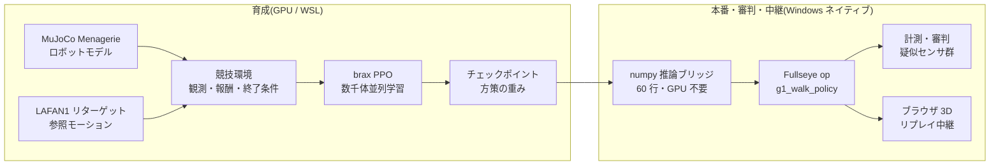

2025 年,人形机器人的半程马拉松在中国北京开跑;夏天,第一届世界人形机器人运动会举行,双足机器人赛跑、踢足球、跳起了舞。而恰好就在写这篇文章的今天(2026 年 8 月 22 日),**第二届世界人形机器人运动会正在北京的国家速滑馆开幕**。本届有 16 个国家、666 支队伍、2,056 台机器人,项目 51 个(比第一届的 26 个几乎翻倍),据说最大看点是"排除遥控操作的完全自主组别"(数字的出处汇总在 16.0 节的调查表里)。一边追着新闻,我一直在想一件事。

(注: 图内文字为日语原版,含义见图下说明。)

**"这个,我想以个人之力办一场。"**

当然,我准备不出能摆下 500 台实体机器人的场馆。预算不够,场地不够,还有家人的理解也不够。但是,我手边有一台装了一块 GPU 的 PC。在物理仿真里建起赛场、培养选手、举行比赛、设置裁判、向观众席(浏览器)转播 — **把构成一场运动会的全部要素,都在自己的书桌上做出来**,这应该是可以做到的。

这篇文章,就是那场"家庭人形机器人运动会"的举办记。同时,它也是一篇开发记:我一边带入本职工作图像处理(工业机器视觉)的经验,一边**尝试打造 Physical AI 的集成开发环境(IDE)**。在比赛的幕后,裁判的目光(测量与作弊检测)、转播设备(浏览器 3D 查看器)、选手的培养环境(强化学习流水线),全部汇入同一个工具箱 — 自制视觉工具包 **Fullseye**。

这是一篇很长的文章。我在写的时候特意让它既可以当读物从头读到尾,也可以从目录里只挑比赛跳着读。

*大会海报(插图由图像生成 AI(Gemini)绘制。因为文字容易乱码,采用先生成带空白横幅的图、再自己填入文字的方式)*

> **关于创意与实现的归属(开篇先写明)**
> 这篇文章里出现的方向性判断与创意(运动会这个企划本身、贴合实机传感器的观测设计、引入事件相机式的时间差分、肌肉骨骼的"相反+共收缩"双指令化、以部位为单位的简化、把训练好的策略做成 Studio op、浏览器转播……)由我提出,而实现・实验・测量的具体工作由 AI 编程智能体(Claude Code)来运转。**无论顺利的实验还是失败的实验,数字全部是实测值**。隐瞒失败会坑到下一个自己,所以输掉的比赛也按输掉的样子照登。另外,正文的第一人称"我"是判断与定方向的主语,但在发现的瞬间,人与 AI 的边界有时是模糊的。无法断定归属的表述,请按"我和 AI 作为一个团队"的意思来读 — 不给主语脸上贴金,也是 honest disclosure(诚实披露)的一部分。

## 这篇文章的读法(3 条路线)

文章非常长,所以先上路线指南。

- **5 分钟路线(只看动作)**: 一边滚动页面一边只看视频(GIF)就好。直线行走的完赛、障碍赛、67 台机器人的入场式、700 肌人体的姿势、直到站立时崩溃的画面,只看动作也能明白故事的骨架,我是按这个思路排布的。
- **30 分钟路线(正文)**: 第 1〜15 章。运动会的举办记+失败谈+开发记。各章末尾的"🍙 通俗讲解角",是你觉得正文太硬时的避难所。
- **全套路线(到资料篇为止)**: 附录 A〜G。实验的全记录、67 台机器人名鉴、传感器图鉴、教训集、术语集、op 全索引、未来资料集。当作词典,需要时再来查。

# 目录(竞赛日程)

1. 开幕式 — 为什么要以个人身份办运动会
2. 术语表 — 先通俗讲解一遍
3. 场馆建设 — 物理仿真与 GPU
4. 选手入场 — Unitree G1 与自制 700 肌人体 evis
5. 项目 1: 赛跑(20m 直线) — 从三连败到"原来它看不见白线"的一击
6. 项目 2: 障碍赛 — 伪 LiDAR 与一维事件相机
7. 项目 3: 团体操 — 用关键帧驱动 700 条肌肉
8. 项目 4: 平衡木(静止站立) — 最不起眼的项目,却最难
9. 裁判团 — 图像处理工程师打造的"识破作弊的仪表"
10. 转播站 — 只靠浏览器运行的 3D 回放
11. 迈向集成开发环境 — Fullseye Studio 这个野心
12. 举办要项 — 个人办赛用的配置清单
13. 面向未来 — "把最前沿仿真出来"这种玩法
14. 混进这场运动会的学科们 — 从 DNA 到光学
15. 番外项目 — 手臂・天空・灵巧手・筷子(全部是真实物理)
16. 闭幕式与下一个项目
附录 A〜I — 实验编年史 / 机器人名鉴(67 台)/ 传感器图鉴 / 教训集 / 扩展术语表 / Fullseye op 全索引(1,606)/ 未来资料集 / 训练日志实测摘录 / FAQ

---

# 1. 开幕式 — 为什么要以个人身份办运动会

*插图: 由图像生成 AI(Gemini)绘制。画面里有摔倒的选手这一点,与本文内容完全一致*

我觉得北京大会有趣的地方,在于它问的不是"能不能走",而是"**能不能成为比赛**"。单论行走,从 2015 年 DARPA Robotics Challenge 那时起,机器人就已经在(边摔边)走了。成为比赛,意味着比拼速度、遵守赛道、存在失格条件、留下记录。也就是说,**测量与规则**进了场。

为免误解先写清楚:这完全不是"个人要战胜中国"的故事。那样的规模与速度,尤其是"让机器人跑一场马拉松吧""干脆办一场运动会吧"这种**自由的想象力本身,是值得坦率学习的东西**。我想做的不是竞争,而是把那份激励翻译成自己够得着的形式试一试。而且重要的是,**能完成这种翻译的时代已经到来**:开放的模型、数据和计算资源,真的能在个人的书桌上咬合运转。被激励的一方,可以不再只当观众。我觉得这是一件相当有希望的事。

我平时是做工业图像处理的人,在工厂检测设备的世界里,"测不了的东西就改进不了""要怀疑测量方法"是家训。开始玩用强化学习(Reinforcement Learning)培养机器人之后,我很快发现这两个世界有着相同的骨架。**奖励(得分)的设计就是检测标准的设计,而智能体是必然会钻标准空子的被检对象**。所以运动会这个框架看似玩笑,实则本质。竞赛规则(奖励・终止条件)、计时与测量(日志与 rollout=让策略从头到尾跑完一次的完整试跑)、兴奋剂检测(作弊检测)、以及面向观众的转播(可视化)。这些全部做出来,运动会才能成立。

也写一下由个人来办的意义。大赛上机器人的控制是各公司的独门秘方,但**仿真里的运动会,模型、数据、训练代码全都可以用开放的东西组起来**。我用的是 MuJoCo(物理引擎)、MuJoCo Menagerie(机器人模型集)、Unitree 官方的 LAFAN1 重定向动作(HuggingFace 公开。原始数据来自 Ubisoft La Forge,CC BY-NC-ND 4.0 非商用许可 — 详见文末致谢)、brax/MJX(GPU 物理与训练),以及自制代码。只要有一块 GPU,任何人都能在家建起赛场的时代,真的来了。

# 2. 术语表 — 先通俗讲解一遍

为了方便你在读正文时随时翻回来,先把主要术语汇总在这里。格式是"术语(English) — 一句话定义 → 通俗讲解"。

- **强化学习(Reinforcement Learning, RL)** — 通过试错与奖励习得行为的学习方法。→ 像训狗:握手成功就给零食。只不过它比狗精于算计得多,会全力钻零食规则的空子。
- **策略(policy)** — 以状态为输入、输出动作的函数,是训练的成果物。→ 选手"身体动作习惯"本身。本文的策略是个小型神经网络(约 4 层×32 单元)。
- **奖励(reward)** — 每一步给出的分数。→ 比赛的评分规则。这里的设计失误必然会被利用。
- **观测(observation)** — 展示给策略的输入向量。→ 选手的五感。**不在其中的东西,对选手来说就不存在**(本文最大的教训)。
- **PPO(Proximal Policy Optimization)** — 经典的强化学习算法。→ "一次不做极端改变,一点点扎实进步"的练习法。
- **训练步数与"26M""150M"记法** — 本文用"训练步数"表示选手的成长程度,M 是百万(mega)的意思。26M = 2,600 万步,150M = 1 亿 5,000 万步。**与距离的米(小写 m,如"前进 20.5m")是两回事**,请按"带大写 M 的大数字是练习量,小写 m 是距离"来区分。→ 用社团活动打比方,就是"挥棒素振第 2,600 万次的时间点"这种说法。
- **模仿学习的参考动作(reference motion / mocap)** — 记录人类动作并映射到机器人关节上的"示范"。→ 舞蹈的示范录像。LAFAN1 是其公开数据集,Unitree 为自家机器人做了官方转换。
- **残差控制(residual control)** — 在示范关节角上,策略只叠加小的修正量(残差)的方式。→ "编舞要遵守,但平衡调整自己来"。不让它从零发明动作。
- **POMDP / 部分观测** — 只能观测到环境状态一部分的情形。→ 蒙眼走钢丝。项目 1 的败因。
- **伪 LiDAR(pseudo-LiDAR)** — 在仿真内发射光线测距的虚拟传感器。→ 蝙蝠的超声波。用计算模仿实机 LiDAR(激光测距仪)的性质。
- **事件相机(event camera / DVS)** — 只输出亮度"变化"的相机。→ 拍不了静止画面,却对"动的东西"超敏感的眼睛。本文自制了一维版。
- **肌肉骨骼模型(musculoskeletal model)** — 关节不靠马达、而靠"肌肉张力"驱动的人体模型。→ 不是机器人,而是解剖学的人体。evis 拥有 700 条肌肉。
- **力矩(torque)** — 使关节转动的力矩。**肌肉不能推,只能拉**(我们为此输过一场)。
- **WBC-QP(基于二次规划的全身控制, Whole-Body Control via Quadratic Programming)** — "在满足物理条件的前提下,最优地决定全部关节加速度与接触力"的控制经典套路。→ 每一瞬间都用数学优化求解全身的力分配。
- **MJX / brax** — MuJoCo 的 GPU 并行版,以及其上的训练框架。→ 同时建几千座赛场、让几千名选手同时练习的技术。
- **XLA** — 面向 GPU 的计算编译器。→ 场馆的施工队。不符合其拿手工法(固定形状的矩阵计算)的图纸(700 条肌肉的稀疏张力计算)不给建 — 这个限制在后面会发威。

# 3. 场馆建设 — 物理仿真与 GPU

场馆整个都是软件。构成如下。

- **物理引擎**: MuJoCo。在接触计算的可靠性与速度之间取得平衡,是当下机器人学习的事实标准。
- **并行化**: MJX(MuJoCo 的 GPU 版)+ brax 的 PPO 实现。在 GPU 上同时建起几千座赛场,让同一选手的副本一齐奔跑,把所有人的经验汇总起来学习。
- **硬件**: RTX 5090(32GB)一块。本文的训练是 2 个项目同时跑,**合计约 9,700 训练步/秒**(把显存分配各压到 0.35 共存)。一个项目的练习(约 1 亿步)大约 3〜4 小时。傍晚布置好练习,晚饭后看结果 — 生活节奏就变成了这样。基本上是洗完澡边看摔倒视频边叹气的角色。
- **训练在 Linux 侧(WSL),其余在 Windows 侧**的分工。因 JAX/XLA 的缘故,训练靠向 WSL,测量・可视化・文章图表制作则用 Windows 原生的 Python。这个分工成了后述"numpy 推理桥"的动机。

*图: 本文的训练吞吐量实测。单块 GPU 同居 2〜3 个训练,每个仍有 8,000〜10,000 步/秒。四足(另一套训练器)因单位体系不同放在单独面板(根据实测日志绘制)*

场馆建设中最先发威的限制,就是术语表里也写过的 **XLA 的拿手工法问题**。用马达转动关节的普通机器人(G1 等)可以在 GPU 上数千并行,但**由 700 条肌肉驱动的自制人体 evis,其肌张力计算上不了 XLA,无法 GPU 并行化**。因此 evis 的比赛在 CPU 上进行,将来要上 GPU 时,则使用"把肌肉替换为等价关节力矩的双胞胎(torque-twin)" — 这样的两手准备。可以理解为场馆里既有大体育场(GPU),也有小体育馆(CPU)。

> **🍙 通俗讲解角(场馆篇)**
> 游戏里的"物理引擎",在机器人研究中同样充当场馆。马里奥跳起又落下,和机器人在这里摔倒,内部做的计算是同族的。区别在于认真程度:研究用物理引擎会以保险条款般的细致程度计算"接触瞬间的力"。而用上 GPU,就能把这座场馆复制几千份同时运行。相当于 1 台机器人的练习由 4,000 台同时进行。所以一晚上就能积累出人类数年份的练习量。

## 3.1 深挖: 场馆的地下设施 — 物理引擎在一步之内做了什么
(第 3 章"场馆建设"的增补)

仿真器不是"魔法盒子"。每调用一次 `mj_step()`,内部都会按固定顺序跑一串计算。这里我们打开盒盖,一起看看里面。

### 3.1.1 一步之内: 前向动力学流水线

MuJoCo 的一步,大致依次经过下列阶段(官方 docs 的 Computation 章 [^mjc-comp] 对每一段都有讲解)。

| 阶段 | 做什么 | 使用的算法 |
|---|---|---|
| 1. 前向运动学 | 由关节角度计算所有 body 的位置・姿态 | 沿树结构从根向叶传播 |
| 2. 偏置力 | 把重力・科里奥利力・离心力一并计算 | Recursive Newton-Euler(RNE) |
| 3. 惯性矩阵 | 计算"推哪个关节会动多少"的矩阵 M | Composite Rigid-Body(CRB) |
| 4. 碰撞检测 | 列举哪些几何体彼此接触 | broad-phase → narrow-phase |
| 5. 约束力求解 | 决定接触力・关节限位力・摩擦 | **凸优化**(后述) |
| 6. 数值积分 | 对加速度积分,把速度・位置推进一帧 | Euler / RK4 / implicit 系(后述) |

要点有两个。

**广义坐标(generalized coordinates)**。MuJoCo 不是把每个 body 的 xyz 坐标分开保存,而是用"关节角度的向量"表示全身状态。只要还由关节相连,body 在结构上就不用担心四散飞出。官方 docs 自我介绍说"MuJoCo pioneered the combination of simulation in generalized coordinates with optimization-based contact dynamics(开创了广义坐标仿真与基于优化的接触动力学的结合)" [^mjc-overview]。这是它与游戏物理引擎(直角坐标+用弹簧近似约束)最大的设计差异所在。

**前向动力学(forward dynamics)**。即"从当前施加的力,求下一瞬间的加速度"的计算。把运动方程 M(q)·q̈ = 外力 + 约束力,在凑齐上表的材料(M、偏置力、接触力)之后求解。

#### 通俗讲解: 翻页动画的一帧

仿真就是翻页动画。一步 = 一帧。每一帧重复"确认所有人的位置 → 调查谁和谁撞上了 → 决定相互推挤的力 → 用这个力把所有人挪动一点点"。在我们的 G1 训练中,一帧是 0.002 秒。1 秒行走的背后,上表的全部阶段要跑 500 帧。

### 3.1.2 接触为什么难 — 抛弃 LCP、选择凸优化的 MuJoCo

物理引擎最大的难关是"接触"。脚接触地面的瞬间,地面应该用多大的力推回来? 这其实是个出人意料地难以定义的问题。

经典的形式化是 **LCP(线性互补问题)**。把"接触力只能推(不能拉)""分离时力为零""摩擦在库仑锥之内"写成互补条件。然而带摩擦的 LCP 有时解不唯一,一般属于 NP 困难的类别。

MuJoCo 的作者 Todorov 等人在这里改变了思路。**通过稍微承认接触的"柔软",把整个问题转化成了凸优化**(IROS 2012 论文 [^todorov2012],以及 docs 的 Computation 章 [^mjc-comp])。docs 里明确给出了对偶问题的形式:

> f = argmin_λ ½ λᵀ(A+R)λ + λᵀ(a₀ − aᵣ)  subject to λ ∈ Ω

细节不必深究。重要的是 **(A+R) 正定 = 山谷只有一个**。也就是说,接触力作为"唯一的全局最优解",每次都给出相同的答案。不会像 LCP 那样"有时解得出有时解不出、答案还可能有好几个"。

其代价是 **soft contact(软接触)**。如 docs 的"Physical realism and soft contacts"一节所述,互补性不再严格成立,"接触力与接触法线方向的速度可以同时为正" = 允许轻微的陷入 [^mjc-comp]。但这不是缺陷而是设计思想:现实物体的接触面在微观上也在变形(放在被褥上的笔记本电脑会稍微下陷吧)。它的立场是,"完全刚体的接触"反而才是物理上的虚构。

此外,凸形式化还有副产品。docs 说"uniquely-defined inverse(逆动力学被唯一定义)" [^mjc-overview]。能够反算"实现这个动作需要什么力",是这个引擎在最优控制・机器人学研究中被选中的原因之一。

#### solref / solimp — 用"弹簧和阻尼的语言"指定接触的硬度

那么"软到什么程度"怎么决定? 就是 XML 里常见的 `solref` 和 `solimp`(docs 的 Modeling 章"Solver parameters"节 [^mjc-solver])。

| 参数 | 含义 | 直觉 |
|---|---|---|
| `solref = (timeconst, dampratio)` | 把约束重参数化为质量-弹簧-阻尼系统 | timeconst = 陷入恢复的速度,dampratio = 1 则不反弹、顺滑归位(临界阻尼) |
| `solimp = (d₀, d_width, width, midpoint, power)` | 阻抗 d ∈ (0,1) = 以陷入量的函数指定"约束发力的能力" | d 小 = 弱(软)约束,d 大 = 强(硬)约束 |

借用 docs 的话,solref 是"用时间常数与阻尼比这种质量-弹簧-阻尼系统的语言对模型重参数化"的东西,solimp 的 d 则是"small values of d correspond to weak constraints while large values of d correspond to strong constraints" [^mjc-solver]。也就是把优化求解器内部抽象的正则化项,翻译成人类能有直觉的"弹簧多硬・阻尼多强"的接口。接触抖个不停的时候、脚往下陷的时候,我们摆弄的其实就是这两个参数。

### 3.1.3 积分器与时间步长 — 为什么肌肉和肌腱会"爆炸"

上表的最后一段,数值积分有多个选项(docs "Numerical Integration"节 [^mjc-comp])。

| 积分器 | 特点 | 适用与否 |
|---|---|---|
| Euler(semi-implicit) | 只对关节阻尼做隐式处理的半隐式欧拉 | 标准。快 |
| RK4 | 4 阶龙格-库塔。一步评估 4 次 | 擅长能量守恒系。成本 4 倍 |
| implicit | 连速度依赖力(含科里奥利・离心力)的微分也隐式处理 | 最稳定。需要 LU 分解 |
| implicitfast | 从 implicit 中省去科里奥利系微分的版本 | docs 推荐。用 Cholesky,更快 |

"隐式(implicit)"是什么。显式积分是"用现在的力决定下一个位置";隐式积分是"解联立方程,让下一瞬间的状态自洽后再前进"。前者快,但**存在硬弹簧(变化快的力)时,力会在一帧之内失控而发散**。这就是数值"爆炸"的真面目。

肌肉・肌腱(腱)正是这种"硬弹簧"的集合体。肌肉的被动弹性・肌腱的张力,稍一伸长力就大变 = 时间常数短。时间步长 dt 比那个时间常数粗的话,一帧之内"高估力 → 冲过头 → 反方向出现更大的力 → …"的振荡会被放大。evis(肌肉驱动人形)要求比 G1 更小的 dt,不是怠慢,而是数学上的必然。docs 也说,在速度依赖力占主导的系统里,implicit 系比 RK4"稳定性大幅提高(significantly more stability)",并明言**时间步长是"或许是唯一最重要的参数(perhaps the single most important parameter)"** [^mjc-comp]。

#### 通俗讲解: 掉帧的翻页动画

硬弹簧与粗 dt 的组合,就像"用省帧数的翻页动画去画剑道的击面"。竹刀尖端在一帧之内大幅移动,抽掉帧就画不出轨迹,画面崩坏。慢慢走路的场景抽帧没关系。**dt 要按"动得最快的东西"来选** — 这就是数值稳定性的一行总结。

### 3.1.4 MJX — 把 MuJoCo 改写成 GPU 的语言

训练需要几千万步。一个 CPU 的 MuJoCo 会跑到天荒地老。于是 **MJX** 登场。

MJX 是把 MuJoCo **用 JAX 重写的**实现。据官方 docs [^mjx],其目标是"让 MuJoCo 跑在 XLA 编译器支持的一切计算硬件上"。用 JAX 的 `vmap`(自动向量化)把同一场景排出几千份,一并灌入 GPU 的 SIMD 运算单元。按 docs 的表述,MJX 擅长的是"simulating big batches of parallel identical physics scenes using algorithms that can be efficiently vectorized on SIMD hardware(用可在 SIMD 硬件上高效向量化的算法,对相同物理场景做大批量并行仿真)" — 正是为 RL 而生的引擎。

不过 GPU 化不是免费的。docs 诚实写下的限制 [^mjx]:

- **不擅长分支(branching)**: "accelerators exhibit poor performance for branching code(加速器跑分支代码性能差)"。碰撞检测的 broad-phase 是充满"跳过不相邻物体对"分支的处理,在 GPU 上往往变成对所有对老老实实全算一遍。
- **不擅长可变长度**: XLA 在编译时固定数组尺寸。接触数量每步都在变,MJX 却始终按"最大接触数"预留内存来计算。CPU 版"今天接触 3 件"就能收工的地方,GPU 版每次都按满座计算。
- **网格要轻**: 碰撞网格推荐"200 顶点左右以下"。
- **只跑 1 个反而慢**: 单场景下"MJX-JAX can be 10x slower than MuJoCo(可能比 CPU 版 MuJoCo 慢 10 倍)"。MJX 的价值不在单个的速度,而在**同时跑 4096 个也和跑 1 个相差不大**的吞吐量。

(补充: 2026 年当下的 docs 中,MJX 分成了两个系列。JAX 重实现的 MJX-JAX(可自动微分)与更快但不支持自动微分的 MJX-Warp [^mjx]。本文训练用的是 JAX 系的流水线。)

#### brax PPO 的训练循环

与 MJX 搭档使用的是 **brax** [^brax] 的训练算法实现。brax 是基于 JAX 的物理引擎+训练库,如 README 所述,内置 PPO / SAC / ARS / 进化策略等实现。其 PPO 的一个循环这样转:

1. **rollout**: 在数千个并行环境中让当前策略跑一小段(unroll),收集 (观测, 动作, 奖励)
2. **GAE**: 从收集的奖励估计 advantage(该动作比平均好多少)(第 2 部分详述)
3. **minibatch SGD**: 把数据切成 minibatch,用 PPO 的带裁剪目标函数把策略网络与价值网络更新数个 epoch
4. 用新策略回到 1

这个循环的全部 — 物理仿真也好神经网络更新也好 — 都被 JIT 编译(执行前统一转换成 GPU 用代码),**一次也不从 GPU 上下来**地运转,这就是 MJX + brax 组合速度的源泉。CPU↔GPU 之间数据传输这个最大瓶颈消失了。

#### 第 1 部分出处

[^mjc-comp]: MuJoCo 官方 docs, Computation 章(流水线・凸优化・soft contact・积分器): https://mujoco.readthedocs.io/en/stable/computation/index.html
[^mjc-overview]: MuJoCo 官方 docs, Overview(广义坐标・凸接触・唯一的逆动力学・肌腱): https://mujoco.readthedocs.io/en/stable/overview.html
[^mjc-solver]: MuJoCo 官方 docs, Modeling 章 Solver parameters(solref / solimp): https://mujoco.readthedocs.io/en/stable/modeling.html#solver-parameters
[^todorov2012]: Todorov, Erez, Tassa, "MuJoCo: A physics engine for model-based control," IROS 2012: https://doi.org/10.1109/IROS.2012.6386109
[^mjx]: MuJoCo 官方 docs, MJX 章(JAX/XLA・批量并行・分支/可变长度的限制): https://mujoco.readthedocs.io/en/stable/mjx.html
[^brax]: google/brax(JAX 物理引擎 + PPO/SAC 等训练实现): https://github.com/google/brax

---

## 3.2 深挖: 场馆的历史 — 物理仿真器的谱系
无论进化还是 RL,提供淘汰之"世界"的都是物理引擎。这 25 年里,世界这一侧也发生了剧烈进化。

### 3.2.1 年表: 7 代物理引擎

| 年 | 引擎 | 用 2〜3 行说 | 出处 |
|---|---|---|---|
| 2001 | **ODE** | Russell Smith 公开的开源刚体动力学库(初版 2001-05-08)。具备关节・接触・碰撞检测,作为研究用仿真器(Gazebo 等)的标准部件开创了一个时代 | [^ode] [^ode-wiki] |
| 2000s | **Bullet** | Erwin Coumans 主导。出身游戏・VFX 的碰撞检测+多体物理。Python 绑定 PyBullet 成为深度 RL 早期的经典环境 | [^bullet] |
| 2000s〜 | **PhysX** | NVIDIA 的实时物理 SDK。在游戏市场千锤百炼,其 GPU 实现后来成为 Isaac Gym 的心脏。现已开源 | [^physx] |
| 2012 | **MuJoCo** | Todorov・Erez・Tassa "MuJoCo: A physics engine for model-based control"(IROS 2012)。广义坐标+基于凸优化的接触这一研究特化设计 | [^mujoco-paper] |
| 2021-22 | **MuJoCo 被收购→OSS 化** | DeepMind 收购后免费公开(2021-10-18),接着以 Apache-2.0 开源全部代码(2022-05-23)。研究标准引擎进入"谁都可以拥有"的状态 | [^mujoco-blog1] [^mujoco-blog2] [^mujoco-gh] |
| 2021 | **Isaac Gym** | Makoviychuk 等(NVIDIA)。物理和奖励计算**全部在 GPU 上**运转,一块 GPU 同时仿真数千环境。把 RL 的数据收集改变了一个数量级 | [^isaacgym] |
| 2021-23 | **Brax / MJX** | JAX 系。Brax 是可微分物理引擎(Freeman 等 2021),MJX 是 MuJoCo 本体的 JAX 实现,只要是 XLA 能跑的硬件(GPU/TPU)就能写出千并行 | [^brax] [^mjx] |
| 2024 | **Genesis** | 以多物理场(刚体・流体・软体)+照片级渲染+高速 GPU 并行一体化为目标的新世代平台 | [^genesis] |

### 3.2.2 游戏物理与研究物理的分岔

这条谱系里有一道看不见的分水岭。**"60 fps 下不穿帮就算赢"的游戏物理**,与**"接触力不物理正确就没有意义"的研究物理**。

游戏物理(Bullet、PhysX 的出身)只要玩家看着自然,近似就无妨。把穿透推回去、把陷入糊弄过去、为了稳定性擅自削减能量 — 只要为了实时性,全都可以。这种取舍在庞大的游戏市场中锤炼了性能,结果也为研究供给了廉价的物理。深度 RL 早期的基准大多跑在 PyBullet 或 MuJoCo 的环境上,正是这份积累的恩惠。

研究物理(ODE 后期→MuJoCo)则相反,执着于**接触及其微分的正确性**。因为机器人的控制律正是由接触力的响应决定的,MuJoCo 选择用凸优化求解接触的来龙去脉,已在 3.1 节看过。分岔也体现在细节上。游戏物理优先"扛过当前帧",用与渲染帧同步的固定步长;研究物理则把时间步长・求解器迭代数・接触的柔软度全部暴露给用户,让你选择"这个近似丢掉了什么"。另外,MuJoCo 把能唯一计算逆动力学(反算这个动作需要的力)当卖点,而游戏物理里认真使用逆动力学的场景几乎不存在 — **谁曾是那个引擎的"客户"**,决定了 20 年后的设计思想。用在这里含糊其辞的仿真器训练出的策略,拿上实机的瞬间就会被 **sim-to-real gap**(reality gap)迎头痛击。域随机化(Tobin 等 2017 [^tobin])这种"故意让仿真器参数抖动、培养在哪个世界都行得通的策略"的处方,也正因为这个鸿沟在结构上不可避免才诞生(sim-to-real 的各论放在 6.5 节・6.6 节,这里只谈谱系上的定位)。

### 3.2.3 GPU 并行改变了 RL

Isaac Gym 论文(2021)[^isaacgym] 的冲击可以归结为一点。以往的 RL 是"物理在 CPU,学习在 GPU",CPU↔GPU 之间的数据运输是瓶颈。Isaac Gym 让物理仿真・观测・奖励计算**全部在 GPU 张量上**完结,一块 GPU 同时跑数千环境。同年 Rudin 等人的 "Learning to Walk in Minutes Using Massively Parallel Deep Reinforcement Learning" [^rudin] 展示了用这套机制,四足机器人 ANYmal 的行走策略可以在**单台工作站 GPU・数分钟**内学成。这在以前是"集群跑好几天"的工作。

这不只是加速,而是改变了研究的作法。学习只要几分钟的话,奖励设计的试错就从"以天为单位的赌博"变成"冲杯咖啡工夫的实验"。我们能在家中一块 GPU 上把 G1 的奖励重做 12 代,正是 2021 年这次转折的恩惠。

MJX [^mjx] 与 Brax [^brax] 是同一思想的 JAX 版。把物理步写成 JAX 的函数,机器学习侧的作法 — `jit` 编译、`vmap` 捆出几千个环境 — 就能原样用于物理。Brax 更把**可微分物理** — "仿真结果可以对参数求微分" — 挂上招牌。从"摔倒的结果只能当奖励信号用"的世界,通往"哪个参数往哪边动就不会摔"的梯度(理论上)可以直接拿到的世界,这是一座桥。接触这类不连续现象的微分至今仍是难关,但谱系的下一个分岔点被认为就在这里。

不过 GPU 并行也有代价。为了把数千环境塞进一块卡,单环境的接触求解器被轻量化,复杂的闭环机构和大规模接触(例如 700 条肌肉)可能根本上不去 — 我们在 evis 上经历的"肌肉骨骼模型无法 GPU 化、绕道 torque-twin"一事,就是这个设计权衡的实例。"快的物理"与"什么都能表达的物理",还没有同居在同一个引擎里。

#### 通俗讲解: 体育馆里的 4,096 名学生

从前的 RL 是"工匠盯着 1 台机器人手把手教,再把日志邮寄给 GPU"的方式。GPU 并行物理是"在体育馆里排开 4,096 台,给所有人同时上同一堂课,当场连打分都做完"的方式。每台的授课质量相同,但一天收集到的经验量差着数量级。行走学习从"数周"变成"数分钟"的真相,不是教法的进步,而是**教室的巨型化**。

### 3.2.4 机器人学习基准的现状(2026)

现在"想让它走・想让它抓"的人最先接触的定番,各用一行。

- **MuJoCo Playground** [^playground] — 基于 MJX 的 GPU 并行环境集。四足・人形・操作类的 sim-to-real 取向任务齐全(我们 G1 行走的地基也属这一系)。
- **Isaac Lab** [^isaaclab] — Isaac Sim 上的机器人学习集成框架。NVIDIA 生态的现行正解,Isaac Gym 的继任位置。
- **ManiSkill** [^maniskill] — 基于 SAPIEN 的 GPU 并行仿真+渲染。擅长操作(manipulation)课题。
- **Genesis** [^genesis] — 不局限于刚体的多物理场与渲染整合的野心选手。因为新,生态仍在发展途中。

纵观下来可以看出:2012 年选择"研究物理的正确性"的 MuJoCo,与在游戏市场练出速度的 GPU 物理(PhysX 系),在 2020 年代以"GPU 并行 × 接触的正确性"合流 — 这就是现状。从用 ODE 让 1 台机器人踉跄行走的时代算起 25 年,如今在家中一块 GPU 里,数千台人形机器人正排着队不停摔倒。

---

#### 第 1 部分出处

[^sims-page]: Karl Sims, "Evolved Virtual Creatures," 1994(本人网站的解说页): https://www.karlsims.com/evolved-virtual-creatures.html
[^sims-paper]: Karl Sims, "Evolving Virtual Creatures," SIGGRAPH '94 论文 PDF(本人网站): https://www.karlsims.com/papers/siggraph94.pdf
[^sims-acm]: 同论文的 ACM DL 收录页(SIGGRAPH '94 Proceedings, pp.15-22): https://dl.acm.org/doi/10.1145/192161.192167
[^sims-video]: 影像 "Evolved Virtual Creatures"(Internet Archive): https://archive.org/details/sims_evolved_virtual_creatures_1994
[^sims-youtube]: 同影像(YouTube 转载版, "Karl Sims - Evolved Virtual Creatures, Evolution Simulation, 1994"): https://www.youtube.com/watch?v=JBgG_VSP7f8
[^es-wiki]: Wikipedia "Evolution strategy"(关于 Rechenberg・Schwefel 于 1960 年代创立的记述): https://en.wikipedia.org/wiki/Evolution_strategy
[^holland]: Wikipedia "John Henry Holland"(1975 年《Adaptation in Natural and Artificial Systems》): https://en.wikipedia.org/wiki/John_Henry_Holland
[^cmaes]: Hansen & Ostermeier, "Completely Derandomized Self-Adaptation in Evolution Strategies," Evolutionary Computation 9(2), 2001: https://doi.org/10.1162/106365601750190398
[^cmaes-tutorial]: Hansen, "The CMA Evolution Strategy: A Tutorial," 2016: https://arxiv.org/abs/1604.00772
[^cmaes-site]: CMA-ES 官方网站: https://cma-es.github.io/
[^neat]: Stanley & Miikkulainen, "Evolving Neural Networks through Augmenting Topologies," Evolutionary Computation 10(2), 2002: https://nn.cs.utexas.edu/downloads/papers/stanley.ec02.pdf
[^novelty]: Lehman & Stanley, "Abandoning Objectives: Evolution Through the Search for Novelty Alone," Evolutionary Computation 19(2), 2011: https://doi.org/10.1162/EVCO_a_00025
[^mapelites]: Mouret & Clune, "Illuminating search spaces by mapping elites," 2015: https://arxiv.org/abs/1504.04909
[^cully]: Cully, Clune, Tarapore & Mouret, "Robots that can adapt like animals," Nature 521, 2015: https://www.nature.com/articles/nature14422
[^openai-es]: Salimans, Ho, Chen, Sidor & Sutskever, "Evolution Strategies as a Scalable Alternative to Reinforcement Learning," 2017: https://arxiv.org/abs/1703.03864
[^wright]: Sewall Wright, "The roles of mutation, inbreeding, crossbreeding and selection in evolution," Proc. 6th Int. Congress of Genetics, 1932(原论文的复印 PDF): http://www.blackwellpublishing.com/ridley/classictexts/wright.pdf
[^landscape-wiki]: Wikipedia "Fitness landscape"(关于起源为 Wright 1932 的记述): https://en.wikipedia.org/wiki/Fitness_landscape
[^afterman]: Wikipedia "After Man: A Zoology of the Future"(Dougal Dixon, 1981): https://en.wikipedia.org/wiki/After_Man
[^cheney]: Cheney, MacCurdy, Clune & Lipson, "Unshackling evolution: evolving soft robots with multiple materials and a powerful generative encoding," GECCO 2013: https://doi.org/10.1145/2463372.2463404
[^xenobots]: Kriegman, Blackiston, Levin & Bongard, "A scalable pipeline for designing reconfigurable organisms," PNAS 117(4), 2020: https://doi.org/10.1073/pnas.1910837117

#### 第 2 部分出处

[^ode]: Open Dynamics Engine 官方网站(作者 Russ Smith): https://www.ode.org/
[^ode-wiki]: Wikipedia "Open Dynamics Engine"(初版发布 2001-05-08): https://en.wikipedia.org/wiki/Open_Dynamics_Engine
[^bullet]: Bullet Physics SDK(Erwin Coumans 等): https://github.com/bulletphysics/bullet3
[^physx]: NVIDIA PhysX SDK(开源仓库): https://github.com/NVIDIA-Omniverse/PhysX
[^mujoco-paper]: Todorov, Erez & Tassa, "MuJoCo: A physics engine for model-based control," IEEE/RSJ IROS 2012: https://doi.org/10.1109/IROS.2012.6386109
[^mujoco-blog1]: DeepMind Blog, "Opening up a physics simulator for robotics," 2021-10-18(收购与免费公开的公告): https://deepmind.google/discover/blog/opening-up-a-physics-simulator-for-robotics/
[^mujoco-blog2]: DeepMind Blog, "Open sourcing MuJoCo," 2022-05-23(全部代码开源的公告): https://deepmind.google/discover/blog/open-sourcing-mujoco/
[^mujoco-gh]: MuJoCo 仓库(Google DeepMind 维护): https://github.com/google-deepmind/mujoco
[^isaacgym]: Makoviychuk et al., "Isaac Gym: High Performance GPU-Based Physics Simulation For Robot Learning," 2021: https://arxiv.org/abs/2108.10470
[^rudin]: Rudin, Hoeller, Reist & Hutter, "Learning to Walk in Minutes Using Massively Parallel Deep Reinforcement Learning," 2021: https://arxiv.org/abs/2109.11978
[^genesis]: Genesis(Genesis-Embodied-AI): https://github.com/Genesis-Embodied-AI/Genesis
[^playground]: MuJoCo Playground(Google DeepMind): https://github.com/google-deepmind/mujoco_playground
[^isaaclab]: Isaac Lab 官方文档: https://isaac-sim.github.io/IsaacLab/main/index.html
[^maniskill]: ManiSkill(基于 SAPIEN): https://github.com/haosulab/ManiSkill
[^tobin]: Tobin et al., "Domain Randomization for Transferring Deep Neural Networks from Simulation to the Real World," 2017: https://arxiv.org/abs/1703.06907

# 4. 选手入场

*图: 主力 5 位选手的身高对比(比例尺严格统一,带 1.0m/1.8m 基准线。背景明暗来自各自场景)。从左到右为 G1、H1、Go2、Spot、evis(仿真渲染)*

## 选手 1: Unitree G1(市售人形机器人的仿真模型)

在北京大会上大显身手的 Unitree 公司小型人形机器人,其官方仿真模型收录在 MuJoCo Menagerie 中。身高约 1.3m,**驱动关节 29 个**。重要的是,**实机真实存在于这个世界上**。只要把观测对齐实机传感器,在仿真中培养的策略,原则上就有一条通往实机的道路(如后文所述,观测设计从一开始就对齐了实机传感器配置)。

*图: Unitree G1(官方仿真模型,驱动 29 关节)*

示范动作使用 Unitree 官方公开的 **LAFAN1 重定向数据集**(HuggingFace: `lvhaidong/LAFAN1_Retargeting_Dataset`)。这是把人类动作捕捉转换到 G1 的 29 个关节上的、30fps 的关节角时间序列。我们从中切出行走 1 个周期(通过膝角度的自相关检测为 30 帧),闭合成平滑衔接的循环,去除偏航(朝向)分量,加工成笔直行走的参考(1.47m/s)。

## 选手 2: evis(自制 700 肌的解剖学人体)

另一位选手不是买来的机器人,而是**用解剖学数据组建的肌肉骨骼人体模型**。自由度 84(nq=85),**肌肉执行器 700 条**。骨骼基于文献的人体惯性参数,肌肉则作为带起点・止点・途经点的张力元素种植其上。一台马达都没有。抬起上臂的是三角肌,弯曲肘部的是肱二头肌。

*图: evis 全身。靠骨骼与 700 条肌肉(红色纤维)运动(仿真渲染)*

为什么要培养这么麻烦的东西? 因为考虑到护理和生活支援时,**以与人相同的结构运动的东西,能够解释人类动作的"理由"**。再说,既然要办运动会,总得有一位本地代表的自家选手吧。

*图: Unitree H1(大型人形机器人,驱动 19 关节)*

## 选手 3(报名手续办理中): Unitree H1,以及"全项目・全选手"构想

在写这篇文章的幕后,为 G1 组建的培养流水线正在推进 **H1(大型人形机器人)适配**。LAFAN1 重定向也有 h1 版,预计只要替换转换器和机器人配置就能参赛。再往前一步,我们已开始对 Menagerie 收录的**全部机器人(含四足・机械臂・灵巧手・无人机共 67 个模型)做盘点**。

*视频: H1 回放 LAFAN1 重定向示范动作的样子(运动学回放 = 还不是靠物理在行走,而是接下来要通过训练让它"真正能走"的前置阶段。10.5m 区间,仿真)*
今后打算把项目扩展到四足组、操作组、飞行组,办成名副其实的"综合运动会"。

*图: 全部 67 位选手的合影(把各机的实测渲染分栏合成的"合成照片"— 并非同处一个场景)*

*视频: 全 67 个模型的入场式(每台 0.5 秒,按人形 → 四足 → 机械臂 → 灵巧手的顺序。MuJoCo Menagerie,仿真)*

## 4.1 深挖: 选手名鉴・实机篇 — 价签降了 2 个数量级

*图: 人形机器人价格的走势(对数轴,各公司公布・报道值)。5 年降了 2 个数量级(根据公开数据绘制)*
### 4.1.1 主角: Unitree G1 — 本文仿真的正主本人

本系列的主角,宇树科技(Unitree Robotics,杭州)的 G1。官方页面
(<https://www.unitree.com/g1>)记载的主要规格如下(2026-08-22 查阅)。

| 项目 | 公称值 | 备注 |
|---|---|---|
| 身高 | 1320 mm(站立) | 折叠时约 690 mm(报道值) |
| 质量 | 约 35 kg(含电池) | |
| 自由度 | 23(基本)/ 23〜43(G1 EDU) | 腿 6×2 + 臂 5×2 + 腰,EDU 因灵巧手等而增加 |
| 膝关节最大力矩 | 90 N·m(G1)/ 120 N·m(EDU) | |
| 电池 | 13 串锂电池,9000 mAh | 续航约 2 小时(报道值) |
| 传感器 | 3D LiDAR + 深度相机 | 头顶的 Livox Mid-360 + Intel RealSense D435i 为代表性配置 |
| 价格 | US $13.5K〜(官方页面,不含税・运费) | 发布时(2024-05)报道为 $16K |

- 发布时的报道: The Robot Report「Unitree Robotics unveils G1 humanoid for $16K」(2024-05)
  <https://www.therobotreport.com/unitree-robotics-unveils-g1-humanoid-for-16k/>
- 也收录于 IEEE 的 ROBOTS 指南: <https://robotsguide.com/robots/unitree-g1>

正文里影响了奖励设计的"膝 90 N·m""23 DOF""Mid-360 + D435i",
全都以这份公称规格为依据 — **让仿真的观测设计对齐实机传感器**
(故事线 B)这个方针,就是看着这张表定下来的。

### 4.1.2 大师兄: Unitree H1 — 1500m 金牌得主

H1 是 Unitree 2023 年推出的全尺寸机。官方页面(<https://www.unitree.com/h1>)的
公称值(2026-08-22 查阅):

| 项目 | 公称值 |
|---|---|
| 身高 / 质量 | 约 180 cm / 约 47 kg |
| 自由度 | 每腿 5 + 每臂 4(可扩展) |
| 关节力矩 | 膝 360 N·m,髋关节 220 N·m,踝 59 N·m,臂 75 N·m |
| 移动速度 | 3.3 m/s(公称为电动人形机器人的速度纪录),潜力 >5 m/s |
| 价格 | 官方页面未标注。直销页面的报价为 $90,000(报价基准,依配置而定)<https://shop.unitree.com/products/unitree-h1> |

**大赛战绩(这对一篇"运动会"文章来说是最香的部分)**: 2025 年 8 月 15〜17 日在北京举办的
第一届世界人形机器人运动会(World Humanoid Robot Games)上,H1
**以 6 分 34 秒 40 赢得 1500 m 跑冠军**(开赛首日就拿下大会第 1 枚金牌),**400 m 也以 1 分 28 秒 03 夺金**。
Unitree 在整个大会共获得含 4 金在内的 11 枚奖牌。

- Robotics 24/7「Unitree H1 earns two gold medals at World Humanoid Robot Games」
  <https://www.robotics247.com/article/unitree_h1_earns_two_gold_medals_at_world_humanoid_robot_games>
- Unitree 官方 X(1500m 6:34.40 的一次发布)
  <https://x.com/UnitreeRobotics/status/1956231617372152139>
- South China Morning Post(大会整体的奖牌统计,280 支队伍 / 16 个国家 / 26 个项目)
  <https://www.scmp.com/tech/tech-trends/article/3322251/chinas-unitree-x-humanoid-top-medal-total-worlds-first-humanoid-robot-games>

人类的 1500m 世界纪录是 3 分 26 秒(H. 埃尔格鲁杰),所以 H1 还不到人类顶尖配速的一半。
即便如此,"双足机器人不摔倒跑完 1500m 并争夺名次"的时代在 2025 年到来,这件事本身,
就为正文第 4 章的入场式(MuJoCo Menagerie 67 台)提供了现实的背书。
另外,本文 H1 GIF(`h1_lafan_parade.gif`)所用的 LAFAN1 重定向数据,
同样来自 Unitree 官方发布(HF `lvhaidong/LAFAN1_Retargeting_Dataset`)。

### 4.1.3 世界选手名鉴(一句话简介)

每位 2〜3 行+出处。**价格都会随配置・时点大幅变动,请只读"数量级"**。

**Tesla Optimus(美)** — 身高 173 cm・57 kg(AI Day 2022 公布值)。Musk 的目标价格
$20,000〜30,000 是"量产走上正轨之后"的目标值,2026 年时点尚未发售,处于 Tesla 工厂内的
试验运用阶段。<https://www.tomsguide.com/news/elon-musk-demos-the-human-like-optimus-tesla-bot-and-it-walks-on-its-own>(AI Day 演示报道)

**Figure 03(美 Figure AI)** — 2025-10-09 发布的第 3 代。首个明言投入家庭的设计,
布面外壳・无线充电・指尖 3 克的触觉传感器,在专用工厂 BotQ 建立年产 1.2 万台的量产体制。
价格未公布(报道推测超 $100K)。官方发布:
<https://www.figure.ai/news/introducing-figure-03>

**Boston Dynamics 新 Atlas(美,现代汽车旗下)** — 2024 年从液压转向全电动。
官方规格为 56 DOF・身高 1.9 m・90 kg・臂展 2.3 m・瞬时 50 kg / 连续 30 kg 负载・IP67。
以 Hyundai 工厂的零件排序作业为首个试点,2026-01 的 CES 上发布了产品版。
<https://bostondynamics.com/atlas/>

**Apptronik Apollo(美)** — 身高 5'8"(约 173 cm)・160 lb(约 73 kg)・25 kg 负载・
电池 4 小时,可更换。面向物流・制造。官方:
<https://apptronik.com/apollo/apollo-2> / 发布新闻稿:
<https://apptronik.com/news-collection/apptronik-unveils-apollo>

**Fourier GR-3(中国・上海,傅利叶)** — 身高 165 cm・71 kg・全身 55 DOF・12 DOF 灵巧手。
不愧是康复设备出身的公司,主打"Care-bot"(护理・对话关怀),卖点是布面外壳与
视听触觉的多模态交互。官方文档:
<https://support.fftai.com/en/docs/GR-X-Humanoid-Robot/GR3/GR-3_Introduction/>

**Booster T1(中国・北京,加速进化)** — 30 kg・23 DOF(扩展 41)的面向开发者小型机。
是 RoboCup 2025 AdultSize 冠军队(清华 Hephaestus)的机体平台,50 多所
大学队伍采用。官方价格为询价制,代理商标价 $30K 前后(2026 年时点)。官方:
<https://www.booster.tech/> / RoboCup 战绩报道:
<https://botinfo.ai/articles/booster-t1-robot>

**Tiangong / 天工(中国・北京,X-Humanoid = 北京人形机器人创新中心)** — 2025-04-19,
Tiangong Ultra 以 2 小时 40 分 42 秒跑完世界首个人形机器人半程马拉松(北京亦庄,21.0975 km)
并夺冠。身高约 1.8 m・约 55 kg,峰值时速 12 km。
CGTN 报道: <https://news.cgtn.com/news/2025-04-19/-Tiangong-Ultra-wins-world-s-first-ever-humanoid-robot-half-marathon-1CHdanwJVzG/p.html> /
北京市政府英文网站: <https://english.beijing.gov.cn/latest/news/202504/t20250421_4070140.html>

**UBTech Walker S2(中国・深圳,优必选)** — 首个实现"自己换电池 24 小时工作"的
产业机(换电约 3 分钟,不停机)。已进入 NIO・BYD 等工厂,2025-11 开始量产。
官方: <https://www.ubtrobot.com/en/humanoid/products/walker-s2> / 报道:
<https://cnevpost.com/2025/07/17/ubtech-humanoid-robot-autonomous-battery-swap/>

**AgiBot / 智元 A2(中国・上海)** — 身高 175 cm・55 kg,热插拔电池续航约 2 小时。
面向接待・物流,据报道截至 2025 年底累计出货 5,168 台(按出货量主张世界第一)。
官方: <https://www.agibot.com/> / 收录:  <https://humanoid.guide/product/a2/>

**Unitree R1(中国・杭州)** — 身高 121 cm・约 25 kg・26 DOF。2025-07 的世界人工智能大会上
以 **$5,900** 的冲击性价格发布的面向开发者轻量机。
<https://roboticsandautomationnews.com/2025/07/29/shock-price-unitree-launches-5900-humanoid-robot/93357/>

### 4.1.4 用数字看"价格正按数量级下降"

按发布时期排列,人形机器人的入手价格在这 3 年里降了 **2 个数量级**:

| 年 | 机体 | 价格(发布・时点) | 出处 |
|---|---|---|---|
| 〜2023 | Agility Digit | 约 $250K(报道) | <https://standardbots.com/blog/tesla-robot>(对比表) |
| 2023 | Unitree H1 | 约 $90K(报价基准) | <https://shop.unitree.com/products/unitree-h1> |
| 2024-05 | Unitree G1 | $16K → 现官方 $13.5K〜 | <https://www.therobotreport.com/unitree-robotics-unveils-g1-humanoid-for-16k/> / <https://www.unitree.com/g1> |
| 2025-07 | Unitree R1 | $5,900 | <https://roboticsandautomationnews.com/2025/07/29/shock-price-unitree-launches-5900-humanoid-robot/93357/> |
| 2025 | Booster K1 | $5,000(RoboCup 冠军机谱系的普及版) | <https://www.humanoidsdaily.com/news/booster-robotics-launches-k1-robocup-champion-platform> |

当然,$90K 的 H1 和 $5,900 的 R1 在输出和负载上天差地别,
并不是"同样的东西变成了 1/15"。但"研究室能不能买一台"的门槛,
确实从**一辆车 → 二手车 → 小摩托**一路降了下来,这正是 2025 年大学队伍
能一齐涌向实机大赛(RoboCup AdultSize、WHRG)的直接原因。

> **通俗讲解**: 和个人电脑的历史走着同一条路。大型机(数亿日元)→
> 小型机(数千万)→ PC(数十万),每降一个数量级,"摸得到的人"就增加 100 倍,
> 软件随之爆发。人形机器人现在正处在"小型机 → PC"的台阶上。
> $5,900 是第一个"用买高端 PC 的感觉就能买人形机器人"的价格,
> 而且像本文这样,**买不起的人也能在仿真器里训练同款机体(G1)**——
> 实机与仿真的两手准备,恰好相当于 PC 时代的"没有实机也能用模拟器开发"。

---

## 4.2 深挖: 选手们的家谱 — 双足行走机器人的 50 年
### 深挖增补文本: 双足行走机器人 50 年史 — 从 WABOT-1 到家里的 GPU

---

### 0. 先上年表 — 一张表看 50 年

| 年 | 事件 | 那个时代的突破(1 行) |
|---|---|---|
| 1968-72 | Vukobratović 等提出 ZMP 概念 [^zmp35] | "不摔倒"变得可以用数学式定义 |
| 1973 | 早稻田 WABOT-1 完成(世界首台全尺寸人形)[^robogaku][^waseda50] | 把行走・物体抓取・日语会话集成在 1 台上 |
| 1984 | WABOT-2 演奏电子管风琴 [^wabot2] | "专家机器人" — 读乐谱,为人的歌声伴奏 |
| 1986 | 本田绝密启动双足行走研究(E 系列)[^honda-st] | 从静态行走到动态行走,企业拿出了真本事 |
| 1990 | McGeer"被动行走"论文 [^mcgeer] | 零马达也能走下坡 — 行走是力学的固有模态 |
| 1996 | 本田 P2 发布 [^honda-p2] | 自立(内置电源・计算机)的人形机器人"平平常常"地走了 |
| 2000 | ASIMO 发布 [^miraikan-a] | 行走的实用级完成度与 20 年的公开展示 |
| 2002 | HRP-2 Promet(川田工业+产综研)[^hrp2] | 从摔倒中爬起 — 摆脱"倒了就结束" |
| 2003 | 索尼 QRIO 实现奔跑(吉尼斯"世界首台会跑的双足")[^qrio] / 梶田等的预观控制 [^kajita] | 娱乐机的完成度,与行走模式生成的标准理论 |
| 2006 | QRIO 开发中止 [^qrio] / Pratt 等的 Capture Point [^pratt] | 冬季时代的开始,与被推也不倒的理论 |
| 2009 | HRP-4C(产综研)[^hrp4c] | 人类尺寸・人类体型的行走与娱乐应用 |
| 2013-15 | DARPA Robotics Challenge [^drc-kaist][^drc-ieee] | 灾害应对暴露世界真实实力 — "摔倒集锦"的冲击 |
| 2016 | Atlas 的基于优化的控制(MIT/IHMC 系成果公开)[^kuindersma] | 用 QP/MPC 实时优化全身 |
| 2017 | Agility Cassie 开售 / 丰田 T-HR3 [^agility][^toyota-wiki] | 只做腿的取舍派,与遥操作全身的取舍派 |
| 2019 | RL sim-to-real 在实机上一锤定音(ANYmal)[^hwangbo] | 从"手写控制律"到"让它学习控制律" |
| 2021 | Cassie 靠 RL"看都不看"上楼梯 [^siekmann] | 仅本体感受+域随机化的胜利 |
| 2022 | ASIMO 退役 [^miraikan-p] / Cassie 100m 吉尼斯纪录 [^agility] | 一个时代的落幕,与下个时代的发令枪 |
| 2024 | 液压 Atlas 退役,电动 Atlas 发布 [^bd-atlas][^tc-atlas] / Unitree G1(1 万美元级)[^g1] | 研究的顶点走向商用,价格降了 2 个数量级 |
| 2025 | 北京举办世界首个人形机器人半程马拉松(4 月)[^cgtn]、世界人形机器人运动会(8 月)[^whrg][^cnbc] | 中国势力的数量与速度 — 500 台在同一会场竞技 |
| 2026 | 本田 P2 获 IEEE 里程碑认定 [^honda-ieee] | 30 年前的一步作为"历史"被正式铭刻 |

下面把这张年表当作故事重走一遍。

---

### 1. 早稻田的黎明(1970 年代)— 从一步 45 秒开始

1970 年,早稻田大学的加藤一郎研究室启动 WABOT 项目,1973 年 **WABOT-1** 完成。它是世界首台全尺寸人形机器人,能双足行走、用手抓取物体,甚至能进行简单的日语会话 [^robogaku][^waseda50]。不过行走是把重心始终放在脚底之上的静态行走,**一步要 45 秒** [^nikkei-w1]。

接下来的 WABOT-2(1980-84)转变了方向,瞄准"专家机器人"。用相机读乐谱,演奏电子管风琴,还能配合人的歌声伴奏 [^wabot2]。"挑一件需要人类灵巧与智能的工作做到极致"的方法论,现在看也很新鲜。

理论层面的地基几乎在同一时期来自南斯拉夫。Vukobratović 等人 1968 年在莫斯科的会议上提出、1970-72 年定式化为"Zero-Moment Point(ZMP)"的概念 [^zmp35]。把 ZMP 落到实机动态行走上的场所,据称也是早稻田的 WL 系列(WL-10RD,1984 年)(这一点未在一次 URL 中确认,参见文末)。
