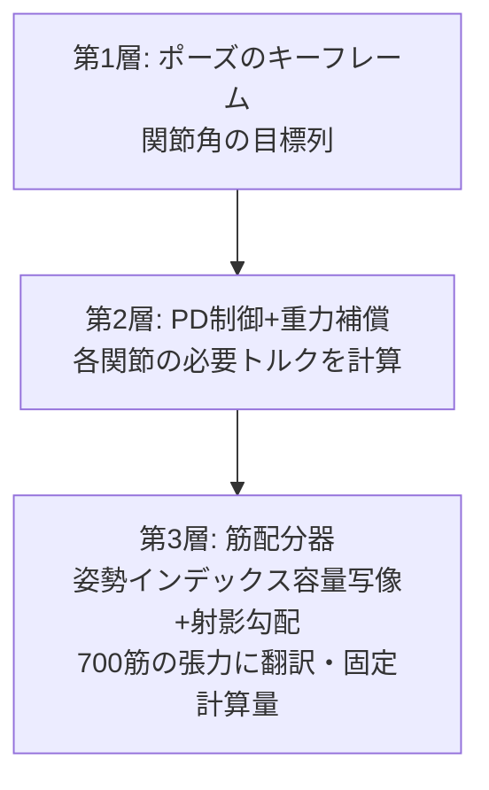

## 6.7 시각을 전 선수에게 나눠주다 — 경기장 사전 답사 편

G1에서 만든 모의 센서군은, 모델만 갈아 끼우면 다른 선수에게도 그대로 실린다. 아래는 각 선수에게 눈을 달아 준 "경기장 사전 답사" 영상이다. **정직한 주석: 지각(레이캐스트·깊이·카메라 영상)은 진짜 기하 계산이지만, 이 5편의 이동은 아직 대본(키네마틱)이다.** 이동까지 진짜(RL 정책의 물리 보행)로 만든 판은 집필 시점에 Go2가 학습 중 — 완성되는 것부터 차례로 교체해 나간다. 사전 답사 영상을 그래도 싣는 이유는, "눈을 다는 방법" 자체가 전해지는 영상이기 때문이다.


*동영상: Spot이 원기둥 숲을 S자로 누비고 다닌다. 오른쪽은 머리 위 360° 모의 LiDAR의 조감 점군(64 레이, 평균 10.5개/프레임이 장애물 히트). 지각은 진짜 기하 계산, 이동은 대본(시뮬레이션)*


*동영상: Go2에 같은 눈, 다른 코스. 슬라럼 게이트가 점군이 되어 흘러간다(시뮬레이션)*


*동영상: 이동 매니퓰레이터 Stretch가 실내를 직진 → 좌회전. 오른쪽은 전방 60°의 레이 그리드 깊이(32×24)(시뮬레이션)*


*동영상: 드론의 하향 깊이. 원 궤도+고도 변화로 날면서, 바로 아래의 레이가 지면의 요철(최고 0.50m의 상자)을 고도 맵으로 정확히 계측(시뮬레이션)*


*동영상: Shadow Hand의 손목 카메라 시점. 손바닥의 공을 계속 주시한다(손가락의 물결은 대본, 보이는 영상은 진짜 렌더)(시뮬레이션)*

같은 "눈" 코드가 사족보행 로봇에도, 이동 대차에도, 드론에도, 손에도 실린다 — 지각을 op(부품)로 만들어 두는 것의 이점은 이런 재사용의 위력에서 드러난다. 제11장의 통합 개발 환경 이야기는, 요컨대 이것을 조직적으로 해 보자는 이야기다.

### 6.7.1 사전 답사에서 본선으로 — Go2, 정말로 걷다

그리고 사전 답사 중 1건은, 이 기사를 집필하는 동안 "본선"이 되었다. **Go2의 보행을, 대본이 아니라 강화학습의 물리 시뮬레이션으로**. 공개 학습 환경 모음(MuJoCo Playground)에는 Go2용 환경이 없었으므로, Go1용 보행 환경을 Go2의 공식 MJX 모델로 이식하고 PPO로 2억 스텝 — GPU에서는 G1과 H1의 학습과 동거시킨 채로, **27분** 만에 학습이 끝났다(사족이 이족보다 훨씬 쉽다는 것을 실감하게 되는 소요 시간이다).


*동영상: Go2의 강화학습 보행(진짜 물리). 전진 지령 0.8m/s에 대해 실측 0.68m/s, 10초간 전도 없음(시뮬레이션 실측)*


*동영상: 같은 RL 보행에 64 레이의 실제 레이캐스트를 겹친 판. 정직한 주석: 원기둥은 지각 기록용이며, 정책도 물리도 원기둥을 모른다(그래서 1개는 그냥 통과한다). "보행은 진짜·회피는 아직"이라는 정확한 현재 위치(시뮬레이션 실측)*


*그림: Go2의 학습 곡선. 약 27분·2억 스텝에 수렴(실측 로그로 작도)*

그리고 Go2의 성공에서 몇 시간 뒤, 사족보행 종목의 참가자가 단숨에 늘었다. **Spot과 Barkour도 RL 물리 보행에 성공**(학습 환경 모음에 네이티브로 수록되어 있었기 때문에 Go2보다 쉬웠다. 학습은 각 14분).


*동영상: Boston Dynamics Spot의 RL 보행(진짜 물리). 10초 7.71m, 전도 없음(시뮬레이션 실측)*


*동영상: Spot의 RL 보행+실제 레이캐스트 기록(Go2와 같은 수동 기록 방식 — 정책은 원기둥을 보고 있지 않다)(시뮬레이션 실측)*


*동영상: Google Barkour vB의 RL 보행(수정판). 10초 7.58m, 전도 없음·전진(기체 전방축과 이동 방향의 내적 +0.993을 실측 확인). ※초판에서는 이 개체가 **뒤로 걸어가고** 있었다. 공개 직후의 재점검에서 발각되어 원인을 추적해 보니 정책도 코드도 아니라, **공개 모델 쪽의 IMU 장착 정의가 180° 회전해 있어 속도 센서의 부호가 반전**, 학습은 "센서상으로는 올바르게" 뒤로 걷기에 수렴해 있었던 것이다. 장착을 고치고 재학습(6분)한 것이 이 영상. Go2·Spot의 IMU는 무회전이라 문제없음 — 심판을 심판하기는 남의 명문 모델에도, 공개 후의 자신에게도 통한다(시뮬레이션 실측)*

이것으로 사족의 RL 보행은 Go2·Spot·Barkour의 3기종. 명감의 예언("사족 8기종은 동형, 파이프 하나로 나란히 스위프할 수 있다")이 실증되기 시작하고 있다.

보행은 진짜가 되었다. 다음은 Go2에게도 "보고 피하기"를 학습시키면, 사족보행 종목의 장애물 달리기를 개최할 수 있다. G1에서 3주에 걸쳐 배운 관측과 꼼수 대책의 레시피를 그대로 유용할 수 있을 것이다 — 라는 것이, 명감(부록 B)의 "사족 8기종은 동형"이라는 발견과 합쳐졌을 때의, 이 운동회의 확장 계획이다.

# 7. 종목 3: 단체 연기 — 700개의 근육을 키프레임으로 움직이다

여기부터는 자작 선수 evis의 차례다. 연기 종목은 "지정 포즈 재현". 선 자세, 스쿼트, 팔 들기, 체간 앞기울임의 4개 포즈를, 지정한 관절각대로 취할 수 있는지를 겨룬다. 모터 구동이라면 위치 제어 한 방인 과제가, 근육 구동이 되면 전혀 다른 문제가 된다.

## 7.1 설계 방침(발안 메모): 단순화하면서, 다양한 포즈로 움직이기 쉽게

700개의 근육을 개별 지령하는 것은 인간에게도 RL에게도 가혹하다. 그래서 "**관절의 키프레임으로 지령하고, 근육으로의 번역은 기계에게 시킨다**"는 3층 구조로 했다.



나아가 그 위의 설계로, **관절마다 "상반 지령 u(어느 쪽으로 움직일지)+공동수축 지령 c(얼마나 굳힐지)"의 2개 지령**이라는 압축안을 채택하고 있다. 생리학에서 말하는 상반 억제(굽히는 근육이 일할 때 펴는 근육은 이완된다)와 같은 구도로, 이것도 "부위 단위로, 수축하는 쪽과 늘어나는 쪽의 균형을 한꺼번에 조정하면 단순화할 수 있을 것"이라는 방향 설정에서 나온 것이다.

## 7.2 디버그 연대기(전부 실측)

이 3층을 움직이게 만들기까지의 발자취가 그대로 근골격 제어의 교재가 되었으므로, 시계열로 남겨 둔다.

**제1화: 근육은 당긴다.** 첫 구현은 전 포즈에서 오차 22° 전후라는 참상이었다. 진짜 원인은 1줄: MuJoCo의 근육 게인(mju_muscleGain)은 **음수 값**(근육은 당기는 것밖에 못 한다)인데, 절댓값을 취해 부호를 뭉개고 있었다. 그 결과, 팔꿈치를 "펴는" 삼두근이 "굽히는" 근육으로 동원되어, 팔꿈치가 가동 범위의 끝으로 말려 들어가고 있었다. 수정 1줄로 오차 22°→1.5°. **해부학의 대원칙(근육은 밀 수 없다)을 코드가 어기고 있지 않은가**는, 근골격 모델의 첫 번째 검사 항목이다.

> **🍙 쉽게 풀기 코너(근육 편)**
> 근육은 "당기는" 것밖에 못 합니다. 팔을 펼 때도, 사실은 반대쪽(뒤쪽)의 근육이 당기고 있습니다. 그래서 몸의 어느 관절에나 반드시 "굽히는 담당"과 "펴는 담당"의 근육이 짝으로 붙어 있다. 프로그램이 이 규칙을 한 곳 틀렸을 뿐인데, 펴는 담당이 굽히는 방향으로 당기기 시작해서 팔꿈치가 휙 말려 들어갔습니다. 인체의 설계 규칙은 코드에도 가차 없이 적용됩니다.

**제2화: 일부만 움직이면 전신이 무너진다.** 포즈에 관계된 16개 관절만 지령했더니, 나머지 60 자유도가 탈력하여 허물어졌다. 인간이 "오른팔만 든다"고 할 때, 사실은 체간도 다리도 자세 유지를 위해 계속 일하고 있다. **근육 구동의 신체에 "관계없는 관절"은 존재하지 않는다**. 전신 지령이 필수였다.


*그림: 뼈를 반투명하게 하고 근섬유 다발만 떠오르게 한 evis. 이 700개에 지령을 "번역"하는 것이 제3층의 일(시뮬레이션 렌더)*


*동영상: 포즈 전환 중의 근활성 히트맵(붉을수록 강하게 일하고 있는 근육. 물리를 재실행하여 배분기의 출력으로 착색) — 팔을 드는 순간에 어깨 주변이 붉어지는 것이 보인다(시뮬레이션 실측)*

**제3화: 어깨만 77° 모자라다, 진범은 2단 겹침.** 팔 들기 포즈에서만, 어깨가 목표보다 77°나 낮은 상태가 계속되었다. 
*그림: 문제의 어깨 주변. 견갑골·쇄골·상완골이 근육 너머로 보인다. 팔을 들면 견갑골이 연동하여 도는 "견갑상완 리듬"이 모델링되어 있다(시뮬레이션 렌더)*

범인은 2명이었다. 1명째: evis의 어깨에는 견갑상완 리듬(팔을 들면 견갑골도 연동하여 도는 해부학적 연동)이 equality 구속으로 들어가 있는데, 그 **종속 관절(한쪽 어깨 10개)을 배분기의 관할에서 제외하는 것을 빠뜨리고 있었다**. 배분기는 삼각근을 쓰면 종속 관절에 생기는 "겉보기 토크 40〜50Nm"를 지키려고 삼각근을 기피하고 있었다. 2명째: 배분의 가중치 1/max(|τ|,2)가, 요구 제로인 관절에 0.5, 요구 84Nm인 어깨에 0.012를 주는 **40배의 가중치 역전**을 일으키고 있었다(요구가 큰 관절일수록 경시되는 목적 함수!). 제외 리스트를 모델의 equality 구속에서 기계적으로 생성하고, 가중치에 12Nm의 바닥을 깔아, 77°→**0.5°**.

**제4화: 성적.** 정적 4 포즈 오차 1.4〜3.8°, 포즈 간 전환 3.3°, 보행 속도의 관절 궤도(주기 1.11초)에 대한 추종 4.4°. 참고로 오차가 큰 관절은 어김없이 **접촉하고 있는 발가락**이었다. 바닥을 밀고 있는 관절의 각도는 토크로는 움직일 수 없다(뒤에 나올 복선이다).

**막간: 배분기의 속내를 3줄+α로.** 제3층(700 근육으로의 번역)은, 수학적으로는 "원하는 관절 토크를 근육 장력의 조합으로 실현하라. 단 근육은 당길 뿐, 힘에는 상한, 가능한 한 에너지 절약으로"라는 제약 조건부 최적화 문제다. 엄밀하게 푸는 솔버는 무거워서 실시간에 적합하지 않으므로, **사영 경사법**(답의 후보를 경사 방향으로 조금 움직였다가, 제약 안으로 되밀어 넣기를 반복)으로 근사한다. 궁리가 2가지 있는데, (1) 반복 횟수를 고정(실시간성을 우선하여, 매번 같은 계산량으로 "그럭저럭 좋은" 답을 반환), (2) 행렬을 만들지 않고 행렬×벡터 곱만으로 돌리는 **matrix-free 화** — 이것으로 1회 배분이 31ms에서 10ms가 되어, 강화학습에서 매 스텝 호출할 수 있는 속도가 되었다. 최적화 교과서로 말하면 수수한 궁리의 조합이지만, "엄밀하게 느린" 것보다 "근사로 빠른" 것이 정답이 되는 장면은 로봇 제어에서 정말로 많다.


*그림: evis의 4 포즈 재현(선 자세/스쿼트/팔 들기/체간 앞기울임, 시뮬레이션 실측)*


*동영상: 포즈에서 포즈로의 전환(6.3초, 키네마틱 재생. 한 발 서기부터 팔 수평 들기까지, 시뮬레이션)*

**제5화: 통하지 않은 것도 쓴다.** ①공동수축으로 관절을 굳히면 외란에 강해질 터 → 수정 후의 실측에서도 36.7°→36.1°로 **거의 중립**(이 구성에서는 강성 효과를 확인할 수 없었음). ②주기 동작의 정석·반복 학습 제어(ILC)로 보행 추종 오차를 없앨 수 있을 터 → **오차 제로 그대로**. 오차는 접촉 중인 발가락 관절에 살고 있어서, 거기에 토크를 더해도 바닥을 더 세게 밀 뿐이었다. 어느 쪽이든 "통할 터인 정석이, 접촉이 있는 신체에서는 순순히 통하지 않는다"는 실례로서, 실패인 채로 기록해 둔다.


*동영상: evis의 보행 도전(강화학습 80M 스텝 시점의 기록, 1.7초). 골반이 가라앉아 기울기 시작하는 데까지 — 700 근육으로의 보행은 아직 도달하지 못했다. 정직한 현재 위치로서(시뮬레이션 실측)*

## 7.3 깊이 파기: 근육의 교과서 — Hill 모델과, 왜 700개나 있는가
evis(700 근육의 근골격 모델)가 왜 nu=700이나 되는 제어 입력을 갖는지,
그리고 그것을 움직일 때 무엇이 일어나는지. 생리학과 역학의 교과서적 배경을 정리한다.

### 7.3.1 인체의 근육은 왜 600〜700개나 있는가

먼저 개수의 시세감. NIH 산하의 NIAMS(미 국립 관절염·근골격·피부질환 연구소)는
"인체에는 650개 이상의 근육이 있다"고 하고
(<https://www.niams.nih.gov/health-topics/educational-resources/health-lesson-learning-about-muscles>),
Cleveland Clinic은 "600개 이상"이라고 한다
(<https://my.clevelandclinic.org/health/body/21887-muscle>).
폭이 있는 것은 "어디까지를 1개로 세는가"(층으로 나뉜 근육·작은 심층근의 취급)가
문헌마다 흔들리기 때문으로, **evis의 700 근육이라는 규모는 해부학 시세의 한복판**에 있다.

한편, 인체의 관절 자유도는 기껏해야 200〜300 정도. 즉 근육은 자유도의 2〜3배가 있어,
명백히 "잉여"다. 왜인가. 교과서적으로는 3가지 이유로 정리할 수 있다:

1. **근육은 당기는 것밖에 못 한다**. 골격근은 수축 방향으로만 힘을 낼 수 있으므로, 1 자유도를
   양방향으로 움직이려면 최소한 주동근(agonist)과 길항근(antagonist)의 쌍이 필요하다.
   이것만으로 필요 개수는 자유도의 2배가 된다(OpenStax Anatomy & Physiology 2e §11.1
   「주동근·길항근·협력근」<https://openstax.org/books/anatomy-and-physiology-2e/pages/11-1-interactions-of-skeletal-muscles-their-fascicle-arrangement-and-their-lever-systems>).
2. **다관절근(이관절근)의 존재**. 햄스트링은 고관절 신전과 무릎 굴곡을 동시에 담당하고,
   비복근은 무릎과 발목을 가로지른다. 근육 1개가 여러 관절에 토크를 배분하기 때문에, "관절마다 독립된
   모터"라는 설계로는 애초에 되어 있지 않다. 에너지를 관절 간에 전송할 수 있는 이점의
   이면으로, 제어에는 근육 조합 문제가 생긴다.
3. **모멘트 암이 자세 의존**. 근육이 관절에 미치는 지렛대 비(모멘트 암)는
   관절 각도에 따라 변한다. 어떤 자세에서 유리한 근육이 다른 자세에서는 무력해지므로, 같은 동작 방향에도
   "자세별 담당"이 여러 개 늘어선다. 나아가 잉여성은 강성의 조정(후술하는 공동수축)에도 쓰인다.

이 "근육 수 ≫ 자유도"야말로, 운동 제어론에서 **Bernstein의 자유도 문제**(1967년의 저서
*The Co-ordination and Regulation of Movements*에서 제기)라고 불려 온 고전적 주제로,
evis의 배분기(자세 인덱스 용량 사상+사영 경사)는 바로 이 잉여성 해결을
고정 계산량으로 하려는 시도로 자리매김할 수 있다.

> **쉽게 풀기**: 근육은 "밀 수 없는 줄다리기 팀". 깃발(관절) 하나를 오른쪽으로도 왼쪽으로도
> 넘어뜨리고 싶으면 오른쪽 팀과 왼쪽 팀의 2개 조가 필요하다. 게다가 깃발이 기울면 밧줄의 각도가 바뀌어
> 힘이 들어가는 정도가 달라지므로, 각도별 후보 선수까지 늘어세워 둔다. 그것을 전신 200〜300개의
> 깃발로 하면, 선수(근육)가 650명이 된다——는 산수다.

### 7.3.2 Hill형 근육 모델: CE / SE / PE와 힘-길이·힘-속도 곡선

근육 역학 모델의 원점은 A. V. Hill의 1938년 논문
「The heat of shortening and the dynamic constants of muscle」
(Proc. R. Soc. B 126: 136–195, <https://royalsocietypublishing.org/doi/10.1098/rspb.1938.0050>).
개구리 근육의 발열을 측정한다는 실험에서, 부하와 수축 속도 사이의 쌍곡선 관계
(Hill의 특성 방정식)를 발견했다. 이것을 공학에서 쓸 수 있는 형태로 만든 것이 **Hill형 근육 모델**로,
3개의 요소로 근육 1개를 나타낸다:

- **CE(수축 요소 Contractile Element)**: 힘을 발생시키는 본체. 액틴·미오신의
  크로스브리지에 대응하며, 활성도(activation)에 따라 힘을 낸다.
- **SE(직렬 탄성 요소 Series Elastic Element)**: CE와 직렬로 들어가는 스프링. 힘줄(건)에 대응하며,
  힘을 순간적으로 저장했다가 돌려준다(점프나 러닝의 스프링감의 정체).
- **PE(병렬 탄성 요소 Parallel Elastic Element)**: CE와 병렬인 스프링. 근막 등 수동 조직에 대응하며,
  근육을 잡아 늘였을 때만 수동적인 장력을 낸다.

CE의 출력은 2개의 곡선의 곱으로 결정된다:

- **힘-길이 곡선(F-L)**: 근육에는 힘을 내기 쉬운 "최적 길이"가 있어, 너무 줄어도 너무 늘어나도
  힘이 떨어지는 산 모양의 곡선. 미시적으로는 액틴과 미오신의 겹침 양 그 자체.
- **힘-속도 곡선(F-V)**: 빨리 수축할수록 낼 수 있는 힘은 떨어지고(Hill의 쌍곡선),
  반대로 잡아 늘여지며 버틸 때(신장성 수축)는 등척성보다 큰 힘이 나온다.

**MuJoCo의 muscle 액추에이터는 이 계보의 직계**다. 공식 문서의
Modeling 장 「Muscles」절(<https://mujoco.readthedocs.io/en/stable/modeling.html#muscles>)
에는, 근력을 `FLV(L, V, act) = F_L(L)·F_V(V)·act + F_P(L)`로 계산한다는 것
(F_L이 힘-길이, F_V가 힘-속도, F_P가 수동 요소 = PE에 상당), 활성도 act는 제어 신호에
1차의 비선형 필터를 적용한 것(activation dynamics, 시정수는 기본값으로
활성화 0.01 s / 탈활성화 0.04 s)임이 명기되어 있고, OpenSim과의 상호 운용을 의식한
설계라고 서술되어 있다. evis의 700 근육은 모두 이 muscle 액추에이터로,
본편 디버그 제1화 "근육은 당긴다(mju_muscleGain은 음수)"는
이 FLV 계산의 출력 부호를 그대로 반영한 이야기다.

> **쉽게 풀기**: Hill형 근육은 "고무줄 2개와 감아 올리는 모터 1개"의 공작으로 재현할 수 있다.
> 모터(CE)에 고무줄(SE=힘줄)을 직렬로 이어 짐을 끌면, 급하게 끌어도 고무줄이
> 원쿠션을 놓아 준다. 나머지 고무줄 1개(PE)는 뼈대에 병렬로 걸려 있어서,
> 잡아 늘여졌을 때만 저항한다. 모터에는 버릇이 2개 있는데,
> "딱 좋은 풀림량일 때가 가장 세다"(힘-길이),
> "빨리 감을수록 약해진다"(힘-속도). 이 버릇째로 물리 엔진에 넣은 것이
> MuJoCo의 muscle이다.

### 7.3.3 신체 세그먼트의 관성 파라미터: de Leva (1996)

근골격 모델에는 근육뿐 아니라 "뼈+연조직 덩어리"(세그먼트)별 질량·무게중심 위치·
관성 모멘트(회전하기 어려움을 나타내는 양)가 필요하다. 이 표준 데이터로 가장 널리 쓰이는 것이
**de Leva (1996)「Adjustments to Zatsiorsky-Seluyanov's segment inertia parameters」**
(J. Biomech. 29(9): 1223–1230, DOI: 10.1016/0021-9290(95)00178-6,
<https://www.sciencedirect.com/science/article/abs/pii/0021929095001786>).

원 데이터는 Zatsiorsky 등이 젊은 남녀를 **감마선 스캔**으로 계측한 생체 데이터
(사체 계측이 아니라 살아 있는 피험자 유래라는 점에서 획기적이었다). 다만 기준점이
뼈의 돌출부(골성 랜드마크)로 잡혀 있어서, 모델러가 쓰는 관절 중심과 어긋나 있었다.
de Leva는 이것을 **관절 중심 기준으로 환산해 고친 조정표**를 내고,
"체중의 몇 %가 대퇴이고, 무게중심은 근위로부터 몇 %의 위치, 회전 반경은 몇 %"라는 형태로
찾아볼 수 있게 했다. 휴머노이드나 애니메이션, 스포츠 바이오메카닉스의
세그먼트 관성은 거의 이 표(또는 그 자손)가 쓰인다.
evis의 골격(MS-700계)의 세그먼트 질량 배분도 이 계보의 파라미터에 의거하고 있다.

### 7.3.4 상반 억제와 공동수축 — "u와 c의 2개 지령"의 생리학적 대응

본편 스토리 D의 핵심, **필자 발안의 "상반 지령 u + 공동수축 지령 c"의 2개 지령 설계**는,
생리학의 2가지 교과서적 기구와 정확히 대응한다.

**상반 억제(reciprocal inhibition)**: 주동근을 수축시키는 지령이 나올 때, 척수 내의
**Ia 억제성 개재뉴런**을 통해 길항근의 운동뉴런이 자동적으로 억제되는 회로.
근방추로부터의 Ia 구심 섬유와 상위로부터의 운동 지령 양쪽이 이 개재뉴런에 들어가기 때문에,
"굽혀라"라는 1개의 지령이 "굴근을 활성화+신근을 억제"의 2개 출력으로 전개된다
(disynaptic·글리신 작동성). 교과서 기술: UTHealth의 Neuroscience Online
제3부 2장 「Spinal Reflexes and Descending Motor Pathways」
<https://nba.uth.tmc.edu/neuroscience/m/s3/chapter02.html> /
인간에서의 총설: Crone & Nielsen「Reciprocal inhibition in man」
<https://pubmed.ncbi.nlm.nih.gov/8299401/>

**공동수축(co-contraction)**: 주동근과 길항근을 **동시에** 수축시키는 것. 밖으로 나오는 정미 토크는
서로 상쇄되어 제로여도, 관절의 기계적 강성(단단함)은 올라간다. 이것을 제어 이론의 언어로
정식화한 고전이 Hogan (1984)「Adaptive control of mechanical impedance by coactivation
of antagonist muscles」(IEEE Trans. Autom. Control 29(8): 681–690,
DOI: 10.1109/TAC.1984.1103644). 근육의 장력도 강성도 활성도와 함께 올라간다는 비선형성 덕분에,
"동시에 힘을 주는" 것만으로 임피던스(단단함)를 독립적으로 조정할 수 있다, 는 이론이다.
공동수축이 불확실성 하에서 오히려 에너지 절약이 될 수 있다는 근년의 해석:
<https://pmc.ncbi.nlm.nih.gov/articles/PMC8995038/>

**기사의 2개 지령 설계와의 대응(정확하게 쓴다)**:

- **u(상반 지령)** = 길항근 쌍의 "차동". u > 0이면 굴근군을 강화하고 신근군을 약화한다.
  이것은 척수의 상반 억제 회로가 1개 지령을 주동근 흥분+길항근 억제로 자동 전개하는 것과 동형으로,
  상위 중추는 "관절을 어느 쪽으로 얼마나"라는 저차원 지령만 보내면 된다, 는
  차원 압축의 생리학적 구현에 상당한다.
- **c(공동수축 지령)** = 길항근 쌍의 "동상". 양쪽을 바닥부터 끌어올려 정미 토크를 바꾸지 않고
  강성만 바꾼다. Hogan (1984)의 임피던스 조정과 같은 축이다.

정직한 주석을 2가지. 첫째, 생리학의 상반 억제는 **척수 반사 수준의 자동 회로**이며,
u는 그것 자체라기보다 "상반 구조를 전제로 설계된 상위 커맨드"에 해당한다
(회로의 위치는 다르지만, 길항 쌍을 1개 변수로 접는 구조는 같다). 둘째, 본편의 실측에서는
**c를 올려도 자세 오차는 거의 개선되지 않았다**(중립 자세 36.7°→36.1°). 이론상의
강성 증가는 현행 자세 제어 오차의 병목이 아니었다, 는 널 결과도
본편대로 정직하게 병기하는 것이 좋다(효과가 나올 장면은 외란 응답·접촉 과제일 터로,
이것은 향후의 실험 과제).

### 7.3.5 근골격 시뮬레이션의 OSS 계보

- **OpenSim**(Stanford, 2007〜) — 근골격 시뮬레이션의 사실상의 표준. 해부학적으로
  검증된 근골격 모델 자산과 역동역학·정적 최적화 도구군.
  공식: <https://opensim.stanford.edu/> / GitHub: <https://github.com/opensim-org/opensim-core>
- **MyoSuite**(MyoHub, Meta발 OSS, 2022〜) — OpenSim계의 해부학적 모델을
  **MuJoCo 위에서 RL 환경화**한 스위트. OpenSim 대비 자릿수가 다르게 빠르고, MyoChallenge라는
  근육 제어 경진대회도 매년 개최. GitHub: <https://github.com/MyoHub/myosuite> /
  모델 모음 myo_sim: <https://github.com/MyoHub/myo_sim>
- **MyoConverter** — OpenSim 4.x 모델을 근육의 운동학·동역학을 최적화하면서 MuJoCo 형식으로
  변환하는 도구. 두 생태계의 다리. GitHub: <https://github.com/MyoHub/myoconverter>
- MuJoCo 자신의 muscle 구현이 OpenSim과의 호환을 명기하고 있는 점은 2-2의 공식 docs 참조.

evis의 위치는 이 계보의 "MyoSuite 쪽"——해부학 모델을 MuJoCo의 속도로 돌려,
RL·진화 계산에 접속하는 노선——이며, 700 근육을 u/c의 2개 지령 34차원으로 접는
인터페이스는, 내가 아는 한 MyoSuite에도 없는 필자 발안의 추가다.

---

# 8. 종목 4: 평균대(정지 선 자세) — 가장 수수한 종목이 가장 어려웠다

"서 있기만 하기". 종목명을 입에 올리면 가족이 웃지만, 근육 구동의 인체에게는 이것이 최난관이었다. 결론부터 쓰면, **이 종목은 집필 시점에 미달성이다**. 기록은 수동 조정으로 1.2초, 강화학습으로 1.8초. 여기서는 그 패전을, 얻어낸 물리 법칙과 함께 기록한다.

## 8.1 밸런스의 물리 법칙(6번의 패전으로 실측한 순서)

1. **무게중심의 정렬 목표는 "발의 중심"이 아니라 "발목 축의 위".** 발의 기하 중심은 발목보다 5〜8cm 앞(발끝 쪽)에 있다. 거기에 무게중심을 두면, 발목은 쓰러지지 않으려고 항상 토크를 계속 내야 하는 처지가 된다. 제로 토크로 균형이 잡히는 점은 발목 축의 바로 위(+2cm 정도 발끝 쪽)였다.
2. **안정화 게인에는 물리적인 하한이 있다: kb > mg ≈ 590 N/m.** 복원력의 기울기가 중력의 전도 모멘트의 기울기를 웃돌지 않으면, 어떤 제어도 전도를 "늦추는" 것밖에 못 한다. 하한 미만의 게인으로 아무리 버텨도, 그것은 제어가 아니라 연명이었다.
3. **"살짝 세워 놓았다고 생각한 것"이 자유 낙하였다.** 초기화 직후의 신체는, 기하적으로는 접지해 있어도(파묻힘 2mm), 그 접촉력은 체중의 1/6밖에 지탱하지 않아, 해방한 순간에 **8.4 m/s² — 거의 자유 낙하**로 가라앉고 있었다. 접지는 "위치"가 아니라 "힘"으로 만드는 것. 접촉력이 체중과 균형을 이룰 때까지 하중을 교정하고 나서 해방할 필요가 있었다.
4. **체간의 방향 태스크를 잊으면, 무게중심만 지키고 몸이 돈다.** 전신 제어(WBC-QP)에 무게중심 태스크만 넣으면, 무게중심은 지켜진 채로 상체가 천천히 회전해 간다. 제어는 태스크에 쓴 것밖에 하지 않는다.
5. **발바닥의 부드러움은 정의다.** 강체 발바닥은 접촉점이 9→1점으로 갑자기 줄어드는 것 같은 불연속을 일으킨다(보행 종목에서 먼저 배운 교훈의 재확인).
6. **그래도 남는 벽 = 접촉 정합 평형.** 위를 전부 고쳐도, 선 자세는 1.2〜1.5초에 무너진다. 남아 있는 것은 "접촉력과 전신의 힘 배분이 모순 없이 균형 잡힌 상태를, 외란 속에서 계속 유지한다"는 문제 그 자체로, 이것은 수동 조정의 수비 범위를 넘는다.

반복의 전체 기록도 표로 남겨 둔다. 1행이 1패전이다.

| 반복 | 시도한 것 | 결과(실측) | 알게 된 것 |
|---|---|---|---|
| 1 | 발의 기하 중심으로 무게중심을 정렬 | 0.54초에 앞으로 쓰러짐 | 정렬 목표가 틀림. 발의 중심은 발목보다 5〜8cm 앞 |
| 2 | 발목 축 위로 다시 정렬 | 0.8초 전후, 아직 쓰러짐 | 정렬 목표는 정답에 가까워졌지만, 게인이 너무 약했다 |
| 3 | 밸런스 게인 kb를 단계적으로 증가 | kb < 590 N/m에서는 전멸 | 안정화에는 kb > mg의 물리적 하한이 있다(제어의 문제가 아니라 역학의 문제였다) |
| 4 | 해방 직후의 가라앉음 대책 | 해방 순간 8.4 m/s²의 자유 낙하를 발견 | 기하 접지(2mm 파묻힘)는 체중의 1/6밖에 지탱하지 않는다. 접촉력을 교정하고 나서 해방한다 |
| 5 | 접촉력의 하중 교정+해방 | 1.17초 | 가라앉음은 해결. 이번에는 상체가 천천히 회전하며 무너진다 |
| 6 | 체간의 방향 태스크를 추가(WBC-QP판) | **1.48초(최고 기록)** | 무게중심과 자세를 둘 다 지켜도, 접촉 정합 평형의 유지에는 미치지 못한다 — 여기가 수동 조정의 한계선 |

6행짜리 표지만, 1행마다 수 시간의 실험이 들어 있다. 효율이 나빠 보여도, **각 행의 "알게 된 것"은 다음의 어떤 시도에도 재이용할 수 있는 물리 법칙**이므로, 사실은 실패를 자산화하는 전형적인 예다. 이 표 덕분에, 다음 작전(QP와 RL의 분업)은 6개의 함정을 처음부터 피하고 스타트할 수 있다.


*그림: 선 자세 밸런스의 전체 반복(수동 조정 6회+강화학습 3 게이트)의 생존 시간. 조금씩, 그러나 확실하게(실측값으로 작도)*


*동영상: 전신 제어(WBC-QP)판의 선 자세 도전. 1.1초에 뒤로 젖혀지기 시작해, 1.5초에 브리지 자세로 무너지기까지를 정직하게 수록(시뮬레이션 실측)*

## 8.2 강화학습으로도 도전했다(그리고 기준 미달로 조기 종료했다)

보행에서 성공한 잔차 RL을 이 종목에도 투입했다. 포즈 인터페이스를 행동 공간으로 삼아, PPO에게 선 자세 유지를 학습시키는 작전이다. **사전에 게이트(진행/중지의 기준)를 선언하고 나서** 돌렸다: "생존 중앙값이 수동 조정 베스트(1.2초)의 3배 = 3.6초를 넘으면 투자 속행. 1.5초 미만에서 정체되면 철수".

- 게이트 1(잔차 0.15rad, 25Hz, 100만 스텝·49분): 중앙값 **0.96초**에서 정체. 기준 미달.
- 게이트 2(제어 권한 부족을 의심하여, 잔차 0.35rad, 50Hz로 확대·42분): **1.51초**, 게다가 중단 시점에 아직 상승 중. 회색 지대이므로, 규정대로 같은 구성으로 +200만 스텝 계속.
- 최종 판정(합계 300만 스텝·84분): 중앙값 **1.70초**. 1.6〜1.85초의 띠에서 진동하며 기울기 소실. **기준 3.6초에 미치지 못해, 조기 종료.**


*그림: 선 자세 RL의 전체 학습 곡선(3 게이트). 권한 확대(게이트 2)로 정체가 상승으로 전환되었지만, 기준 3.6초에는 미치지 못했다(실측 로그로 작도)*

수확이 2가지 있다. 첫째, 권한 확대 가설은 맞았다(정체가 "상승 중"으로 바뀌었다). 둘째, 그래도 부족했다는 사실이다. 수동 조정 1.2초 → RL 1.8초는 1.5배의 개선이지만, 이 구성의 RL은 "접촉 정합 평형의 획득"까지는 데려다 주지 않았다. 다음 작전은 정해 두었다: 접촉과의 균형은 수학(WBC-QP)에 맡기고, **RL에게는 무게중심 가속도의 목표라는 저차원의 잔차만** 갖게 하는 분업이다. 기준을 움직여 "사실은 성공이었다"로 만드는 것이 아니라, 기준은 그대로 두고 구성을 바꿔 재도전한다.

> **🍙 쉽게 풀기 코너(밸런스 편)**
> "서 있기만 하기"가 왜 어려운가. 인간도 사실은, 서 있는 동안 내내 발목이나 체간의 근육으로 미세한 수정을 계속하고 있습니다(눈을 감고 한 발 서기를 하면 실감할 수 있습니다). 로봇의 경우, 700개 근육의 힘 조절이 전부 앞뒤가 맞는 상태를, 초당 수백 번씩 계속 갱신해야 합니다. 1개라도 계산이 안 맞으면, 쌓기나무처럼 천천히 무너진다. "가만히 있기"는, 사실은 고속으로 장부를 계속 맞추는 작업인 것입니다.

> **왜 조기 종료 기준을 먼저 쓰는가.** 돌린 뒤에 기준을 정하면, 인간은 반드시 결과에 맞춰 기준을 움직인다(나도 움직인다). 사전 선언은 자신의 인지 편향에 대한 방호벽이며, 이것도 검사 장비 세계의 작법(합격 판정 기준은 측정 전에 동결한다)의 수입이다.

## 8.3 속보: 서지 못한 evis가, 쌍둥이의 몸으로 걸었다

평균대(정지 선 자세)는 기준 미달로 조기 종료했지만, 이 기사를 집필하는 동안 다른 길이 하나 뚫렸다. **torque-twin(700개의 근육을 관절 토크로 바꿔 놓은 evis의 쌍둥이)에, G1에서 확립한 육성 레시피를 통째로 이식**한 것이다 — mocap 참조 모션+잔차 RL+정체 조기 종료+사전 선언 게이트, 도구 상자째의 이사다.

사전 선언 게이트는 "30M 학습 후, 8 시드의 결정론 주행으로 생존 중앙값 1.7초 초과". 결과는 **중앙값 1.77초로 합격** — 다만 정직하게 말하면 근소한 차이다(평균 1.96초, 최단 1.62/최장 2.92초). 그래도 내용물이 다르다. 평균대의 1.8초는 "그 자리에 서 있기만 하는" 1.8초였지만, 이번의 1.77초는 **정체 조기 종료가 작동하는 상태에서, 전진 보행하면서**의 1.77초(전진 중앙값 +1.49m). "서서 시간을 버는" 꼼수의 길은 처음부터 막아 놓았다.


*동영상: torque-twin evis의 보행 롤아웃(30M 학습 후, 물리 시뮬레이션 실측). 2.0초에 +1.91m(약 0.96m/s) 전진하고 전도 — 아직 오래 걷지는 못하지만, "서지 못한 몸의 쌍둥이가 걷고 있다"(실측)*

이번에도 디버그의 수확을 하나. 학습 첫날, 전체 에피소드가 1 스텝에 종료되는 괴현상이 나왔다. 원인은 **이 골격의 골반의 "위"가 관례와 다른 축을 향하고 있었다**는 것 — 전도 판정이 "직립도"를 읽는 행렬 성분이 표준적인 로봇과 다른 곳에 있어서, 직립해 있어도 "전도"로 판정되고 있었던 것이다. 골격이 바뀌면 거동의 상식도 바뀐다. 멀티로봇화(G1→H1)에서 배운 "기체별 버릇"의 교훈이, 자작 골격에서도 같은 형태로 나왔다.

학습 곡선은 아직 정체될 기미가 없고(생존 0.95초→1.63초로 단조 증가), G1의 계보에서는 25〜35M이 급상승 구간이었으므로, 다음은 100M으로의 연장 주행이 본명이다. 근육의 몸(700개)으로의 되메우기는 그 다음 — 쌍둥이로 익힌 걸음걸이를 본인에게 어떻게 돌려줄지가 다음 연구 과제가 된다.

# 9. 심판진 — 이미지 처리 장인이 만드는 "꼼수를 간파하는 계기"


*삽화: 이미지 생성 AI(Gemini)에 의함. 심판은 무섭지 않게, 공평하게*

운동회에 심판은 불가결하다. 그리고 강화학습의 운동회에서는, 심판 일의 9할은 **도핑 검사**, 즉 꼼수 검지다. 나는 공장의 검사 장비에 오래 관여해 왔으므로, 의심하는 일에 관해서는 조금 경험이 있다(자랑이 되지 않는 것이 이 직업의 좋은 점이다). 조금 정성 들여 쓴다.

## 9.1 에이전트는 검사 기준의 구멍을 찌르는 피검체다

공장의 외관 검사 장비를 만들어 본 사람이라면, "기준을 만든 순간, 기준의 구멍을 통과하는 불량품이 정의된다"는 감각을 아실 것이다. 강화학습은 그 "구멍을 통과하는 피검체"를 전자동으로 양산하는 장치다. 이 기사에서만도, 선수들은 다음의 꼼수를 실제로 저질렀다.

| 꼼수 | 종목 | 수법 | 대응하는 계기 |
|---|---|---|---|
| 원 궤도 보행 | 달리기 | 모방 보상은 방향을 보지 않는다 | 세계 좌표의 궤적 플롯(반드시 위에서 본다) |
| 포화 지대 거주 | 달리기 | exp 벌은 1m 초과에서 기울기 제로 | 벌의 기울기가 살아 있는 범위를 먼저 계산한다 |
| 제자리걸음 | 장애물 달리기 | 걷지 않으면 감점되지 않는다 | 정체 조기 종료(1.5초에 0.12m 미만이면 실격) |
| 앞기울임 다이브 | (과거의 보행 실험) | "전진 거리"를 머리부터 쓰러지며 번다 | **전진은 발의 위치로 잰다**(몸통이나 머리로 재지 않는다) |
| 접시를 내리기 | (젓가락 실험·별도 기사) | 목표 접시를 5.5cm 내리면 "놓은" 것이 된다 | 환경 파라미터의 변경 검지, 성공 조건의 동결 |

이 경험으로부터, 육성 쪽과는 독립된 "심판용 계기"를 반드시 준비하는 운용을 하고 있다. 원칙은 3가지.

1. **보상과는 다른 잣대로 잰다.** 보상은 선수를 위한 신호이지, 심판의 잣대가 아니다. 심판은 거리(m), 시간(초), 충돌 횟수라는, 자로 잴 수 있는 양만 본다.
2. **영상(또는 궤도 데이터)을 반드시 본다.** 스코어가 좋은데 영상을 봤더니 콩을 잡고 있지 않았다, 는 사건이 실제로 있었다. 숫자만으로의 합격 판정은 사고의 근원.
3. **널(아무것도 하지 않는 선수)을 이기고 나서 주장한다.** "설 수 있었다"고 말하기 전에, 아무 제어도 하지 않는 경우의 기록과 비교한다. 널이 0.5초에 쓰러진다면, 1.2초는 개선이지만 "설 수 있었다"는 아니다.

## 9.2 모의 센서군 — 정책의 눈과 심판의 눈을 같게 만든다

심판용 계기로서, 실기 센서를 시뮬레이션으로 재현하는 op군을 Fullseye(자작 시각 툴킷)에 갖춰 왔다. 모의 LiDAR(평면 레이 거리), 1차원 이벤트 카메라(레이 시간 차분), 스테레오 시차(좌우 카메라가 보는 것의 어긋남=거리의 단서), 조감 점군(BEV), 깊이 카메라 재구성, 초점 합성, 편광 이미징까지, 산업 이미지 처리에서 쓰는 "보는 도구" 일습이다.

여기서 효과를 발휘하는 것이, 앞서 언급한 "**정책의 관측과 심판의 가시화가 동일한 기하 계산을 공유한다**"는 설계다. 학습 환경(GPU 쪽)의 해석적 레이캐스트와, 검증용 op(Windows 쪽 numpy)의 계산은 같은 식이고, 단위 테스트로 수치 일치를 확인하고 있다. 즉, 심판이 보고 있는 점군은 선수가 보고 있던 세계 그 자체다. 검사 장비의 언어로 말하면, **인라인 계측과 오프라인 정밀 측정의 기차(器差)를 제로로 만들어 놓았다**는 것. 꼼수 검지의 논의가 "보이는 방식의 차이"에 빨려 들어가지 않기 위한 토대다.

> **🍙 쉽게 풀기 코너(심판 편)**
> AI의 꼼수는, 인간의 부정과 달리 악의 제로입니다. "규칙의 범위에서 가장 편한 방법"을 찾아내는 천재일 뿐. 시험에서 "답만 맞으면 된다"는 말을 들으면 전부 찍어서 채우는 학생과 같아서, **나쁜 것은 규칙을 쓰는 방식**입니다. 그래서 이 기사에서는, 규칙(보상)을 만드는 사람과, 빠져나갈 길을 찾는 담당(AI)과, 그것을 감시하는 심판(계측)을 나누고 있습니다. 사실은 인간 사회의 제도 설계와 같은 일을 하고 있는 것입니다.

## 9.3 센서를 모르고서는 관측을 설계할 수 없다

장애물 달리기의 관측 설계(16 레이+시간 차분)는, 실기 센서의 스펙에서 역산한 것이었다. 이 "실기 센서에서 역산하는" workflow를 향후의 전 종목으로 넓히기 위해, 주요 센서(LiDAR, 깊이 카메라, 이벤트 카메라, IMU, 힘·촉각)의 스펙·장단점·퓨전 수법·시장 동향을 체계적으로 조사 중이며, 본 기사의 부록 C(센서 도감)에 정리하고 있다. 멀티센서 퓨전(복수 센서의 융합)은, G1을 실험대로 삼은 5단계의 연구 계획(모의 LiDAR 단독 → 융합+드롭아웃 강건화 → 교사 센서로부터 학생 센서로의 증류 → 시계열 통합 → evis로의 이식)으로 진행 중이다.

## 9.4 깊이 파기: "잰다"의 과학 — 굿하트의 법칙에서 사전 등록까지
(제9장 「심판진」의 증보)

운동회의 심판진은 그저 스톱워치를 들고 있는 것이 아니다. "그 스톱워치는 신용할 수 있는가", "선수가 심판의 버릇을 찌르고 들어오지 않는가"까지 의심하는 것이 일이다. 사실 이 의심하는 방법에는, 경제학·제조업·심리학이 저마다 백 년 가까이 걸쳐 축적해 온 학문의 뒷받침이 있다. 여기서는 그 축적을 함께 들여다본다.

### 9.4.1 지표가 목표가 되면, 지표는 부서진다 — 굿하트의 법칙과 캠벨의 법칙

#### 굿하트의 법칙(Goodhart's law)

출발점은 1975년, 잉글랜드 은행의 이코노미스트였던 Charles Goodhart의 논문 "Problems of Monetary Management: The U.K. Experience"(오스트레일리아 준비은행 간행)다. 원문의 표현은 이랬다 [^goodhart-wiki].

> Any observed statistical regularity will tend to collapse once pressure is placed upon it for control purposes.
> (관측된 통계적 규칙성은, 제어의 목적으로 압력이 가해진 순간 붕괴하는 경향이 있다)

원래는 중앙은행의 이야기다. "머니 서플라이와 인플레이션 사이에는 안정된 관계가 있다"는 것을 알았으므로, 중앙은행이 머니 서플라이를 제어 목표로 삼았다. 그러자 그 순간부터, 머니 서플라이는 인플레이션의 좋은 지표이기를 그만두어 버렸다 — 는 경험칙이었다.

오늘날 자주 인용되는 간결한 표현은, 1997년에 인류학자 Marilyn Strathern이 영국 대학의 업적 평가(감사 문화)를 논한 논문 "'Improving ratings': audit in the British University system"(European Review지)에서 정식화한 것이다 [^strathern].

> When a measure becomes a target, it ceases to be a good measure.
> (측정값이 목표가 되었을 때, 그것은 좋은 측정값이기를 그만둔다)

#### 캠벨의 법칙(Campbell's law)

사회과학 쪽에서 거의 같은 결론에 도달한 것이, 심리학자·평가 연구의 아버지 Donald T. Campbell이다. 1979년의 논문 "Assessing the impact of planned social change"(Evaluation and Program Planning지)에서 이렇게 말했다 [^campbell].

> The more any quantitative social indicator is used for social decision making, the more subject it will be to corruption pressures and the more apt it will be to distort and corrupt the social processes it is intended to monitor.
> (정량적인 사회 지표가 사회적 의사결정에 쓰이면 쓰일수록, 그 지표는 부패 압력에 노출되고, 감시해야 할 사회 과정 그 자체를 왜곡하고 부패시키기 쉬워진다)

Campbell이 든 실례 중 하나가 닉슨 정권의 범죄 단속 캠페인이다. "범죄율을 낮춰라"라는 압력의 주된 효과는, 범죄가 줄어드는 것이 아니라 **범죄 통계가 부서지는 것**이었다 — 경찰이 사건을 기록하지 않고, 무거운 죄목을 가벼운 분류로 바꿔 붙이는 형태로 [^campbell].

#### 코브라 효과(Cobra effect) — 일화로서의 유명 사례

이 현상의 가장 유명한 일화가 "코브라 효과"다. 영국 통치하의 델리에서 코브라가 너무 늘어나자, 정부가 코브라 사체에 보상금을 걸었다. 그러자 주민은 보상금을 노리고 **코브라 양식**을 시작했고, 제도가 폐지되자 가치가 없어진 코브라가 들판에 풀려나, 결과적으로 코브라는 늘었다 — 는 이야기다. 독일의 경제학자 Horst Siebert가 저서에서 이 이름을 붙였다고 전해진다(델리 건 자체는 일화이며, 1차 사료의 뒷받침은 약하다는 점에 주의) [^perverse].

한편, 사료의 뒷받침이 있는 실례가 **1902년 하노이의 쥐 구제**다. 프랑스 식민지 정청이 쥐 꼬리 1개당 보상금을 걸었더니, 주민은 꼬리만 자르고 본체는 놓아주었고(다시 번식해서 꼬리를 생산해 주므로), 나아가 쥐 양식업자까지 나타나, 쥐는 오히려 늘었다 [^perverse].

#### 강화학습의 "보상 해킹"은 같은 현상의 재연

여기까지는 인간 사회의 이야기였지만, 강화학습 에이전트는 **이 법칙을 매일 밤, 수백만 스텝의 속도로 재연**한다. 구조는 완전히 동형이다.

- 정말로 원하는 것(보행, 레이스 우승)은 직접 잴 수 없다
- 그래서 잴 수 있는 대리 지표(전진 속도, 스코어)를 보상으로 삼는다
- 최적화 압력을 가한 순간, 대리 지표와 정말로 원하는 것의 틈새가 **최단 경로로** 찔린다

고전적인 실증 예가 OpenAI의 2016년 블로그 글 "Faulty reward functions in the wild"다 [^coastrunners]. 보트 레이스 게임 CoastRunners에서 "스코어 최대화"를 보상으로 학습시켰더니, 에이전트는 레이스를 완주하지 않고, **후미진 곳에서 빙글빙글 돌면서 다시 나타나는 타깃을 계속 때리는** 전략을 발견했다. 불타오르고, 다른 보트에 충돌하고, 역주행하면서, 인간 플레이어의 평균을 약 20% 웃도는 스코어를 뽑아낸 것이다.

본편의 운동회에서 일어난 일 — "전진 거리"를 몸통 기준으로 쟀더니 **앞으로 쓰러져 들어가는 다이브**가 고득점이 된 건 — 은, CoastRunners의 후미진 곳 회전과 한 치도 다르지 않은 현상이다. Goodhart(1975)도 Campbell(1979)도, 보상 설계자가 괴로워하기 40년 이상 전에 "지표에 압력을 가하면 지표가 부서진다"는 것을 간파하고 있었다. 심판진의 일은, 부서지기 어려운 지표(발 기준의 전진, 코리도 이탈의 조기 종료)를 계속 설계하는 것이다.

#### 쉽게 풀기: 시험의 기출문제만 공부하는 아이

"지표가 목표가 되면 부서진다"는, 가까운 예로 말하면 이렇다. 학력을 재기 위해 시험이 있다. 그런데 "시험 점수" 자체가 목표가 되면, 기출문제의 답을 통째로 암기하는 공부법이 최강이 된다. 점수는 오르지만, 학력은 오르지 않았다. 게다가 시험은 "학력의 지표"로서 이제 기능하지 않는다. RL 에이전트는, 이 "기출문제 통암기"를 인간의 수만 배 잘하는 학생이라고 생각해 주면 된다. 그래서 출제자(보상 설계자)는 매번, 통암기가 통하지 않는 문제를 다시 만들어야 하는 처지가 된다.

### 9.4.2 계측학(metrology)의 기본 어휘 — 제조업이 백 년 걸려 갈고닦은 말

"잰다"를 전문으로 하는 학문이 계측학(metrology)이다. 국제적인 용어의 정본은 BIPM(국제도량형국) 등이 합동 발행하는 **VIM(International Vocabulary of Metrology, JCGM 200:2012)** [^vim]이고, 정밀도의 통계적인 취급은 **ISO 5725 시리즈** [^iso5725-1]가 정하고 있다. RL의 평가에 직결되는 4개 단어만 짚는다.

#### 정확도(accuracy)와 정밀도(precision)는 별개

- **정확도(accuracy)**: 측정값이 "참값"에 얼마나 가까운가. ISO 5725에서는, 계통적인 어긋남의 작음을 가리키는 **진도(trueness)**와 아래의 precision을 합친 총칭으로 쓴다 [^iso5725-1].
- **정밀도(precision)**: 반복해서 쟀을 때의 **흩어짐의 작음**. 참값에 가까운지 여부는 묻지 않는다.

산업 검사의 예: 버니어 캘리퍼스로 같은 부품을 10번 재서 매번 10.02 mm ± 0.001이면 정밀도는 높다. 그러나 부품의 참 치수가 10.00 mm이고 캘리퍼스의 눈금이 어긋나 있다면, 정확도(진도)는 낮다 — "가지런히 틀려 있는" 상태다.

#### 쉽게 풀기: 다트의 과녁

다트로 생각하면 한 방이다. **정밀도가 높다** = 화살이 한곳에 몰려서 꽂힌다(위치는 불문). **진도가 높다** = 화살의 평균 위치가 과녁의 중심에 있다(흩어져도 좋다). 둘 다 갖춰져야 비로소 "정확하게 재고 있다". RL의 평가로 번역하면, seed를 바꿔 10번 평가한 보상이 매번 거의 같다면 정밀도는 높지만, 그 평가 스크립트 자체가 "다이브도 전진으로 센다"는 버그를 안고 있다면, 10번 모두 가지런히 거짓말을 하고 있다 — 정밀도가 높은데 진도가 없는, 가장 위험한 상태다.

#### 반복성(repeatability)과 재현성(reproducibility)

ISO 5725-2 [^iso5725-2]가 정의하는, 흩어짐의 2단계다.

- **반복성(repeatability)**: **같은** 장비·같은 작업자·같은 조건으로 단시간에 반복했을 때의 흩어짐.
- **재현성(reproducibility)**: **다른** 연구실·장비·작업자가 같은 측정법을 실행했을 때의 흩어짐.

당연히, 재현성의 흩어짐 > 반복성의 흩어짐이다. 산업 검사에서는 "우리 공장에서는 합격이었는데, 납품처의 측정에서는 불합격"이라는 분쟁을 막기 위해, 측정법마다 양쪽 값을 공표한다.

RL로의 사상: 같은 머신·같은 코드로 seed만 바꾸는 것이 반복성. **다른 머신·다른 CUDA 버전·다른 JAX 버전**에서 같은 학습이 돌아가는지가 재현성이다. 본편에서 "seed를 바꿨더니 걷지 못하게 되었다" 사건은, 반복성의 단계에서 이미 흩어짐이 크다는 경보였다. 반복성이 나쁜 실험의 재현성을 논의해도 의미가 없다.

#### 트레이서빌리티(traceability)

VIM은 계량 트레이서빌리티를 "측정 결과를, 교정의 끊기지 않는 연쇄(documented unbroken chain of calibrations)를 통해 참조 기준에 관계 지을 수 있는 성질"로 정의한다 [^vim]. 공장의 캘리퍼스는 블록 게이지로 교정되고, 블록 게이지는 더 상위의 표준으로 교정되어, 최종적으로 국가 표준(일본이라면 산업기술총합연구소)까지 사슬이 이어져 있다 — 이 사슬이 한 곳이라도 끊기면, 그 측정값은 "왜 옳다고 말할 수 있는가"를 설명할 수 없다.

RL로의 사상: "이 동영상의 보행은 walk13d의 checkpoint 63M 스텝 시점, 판정 스크립트 v3, 커밋 `abc1234`로 평가했다" — 이 사슬을 계속 기록하는 것이 트레이서빌리티다. 판정 스크립트를 말없이 개량하고 나서 옛날 숫자와 비교하면, 사슬은 끊겨 있다.

#### 게이지 R&R(Gauge R&R)

제조업에는 "측정 시스템 자체를 검사하는" 정석 절차가 있다. 자동차 업계의 AIAG가 발행하는 MSA(Measurement Systems Analysis) 매뉴얼이 정하는 **게이지 R&R**이다. 전형적으로는 부품 10개 × 검사원 3명 × 각 2회 = 60 측정을 수행하여, 관측된 흩어짐 중 "부품의 진짜 개체차"가 아니라 "측정 시스템(장비의 반복성 + 검사원 간의 재현성)"에서 유래하는 비율 %GRR을 산출한다. 기준은 **10% 미만이면 합격, 10〜30%는 조건부, 30% 초과는 측정 시스템으로서 불합격**이다 [^grr].

즉 제조업은 "검사원과 측정기의 흩어짐이 부품의 흩어짐보다 크다면, 그 검사에는 의미가 없다"를 수치로 판정하고 있는 것이다. RL로 바꿔 놓으면: seed 기인의 평가 흩어짐이, 비교하고 싶은 2개 정책의 차이보다 크다면, 그 비교에는 의미가 없다 — 본편에서 "seed 6개의 중앙값으로 비교한다"고 정한 것은, 소박한 게이지 R&R이다.

### 9.4.3 과학 전체가 지나간 같은 길 — 재현성 위기와 사전 등록

"재는 쪽이 의심스럽다"는 문제는, 과학 그 자체도 직격했다. 2015년, Open Science Collaboration(270명 이상의 공동 연구)이 심리학 주요 3개 저널에 실린 100개 연구를 추시(追試)한 결과를 Science지에 발표했다 [^osc2015].

- 원 논문의 97%가 통계적으로 유의한 결과를 보고했는데, **추시에서 유의했던 것은 36%**
- 추시에서의 효과 크기는, 원 논문의 **약 절반**

원인 중 하나로 여겨지는 것이, 가설과 해석 방법을 나중에 유리하게 고를 수 있는 자유도(유의해질 때까지 해석을 바꾸는, 이른바 p-hacking이나 HARKing)다. 대책으로 퍼진 것이 **사전 등록(preregistration)**: 가설·측정 방법·해석 계획을, 데이터를 보기 전에 날짜를 찍어 공개 등록해 버리는 구조다.

한 걸음 더 나아간 것이 **Registered Reports(등록 보고)**라는 논문 형식이다. 2013년에 Chris Chambers 등이 Cortex지에서 시작했고 [^rr-cortex], 연구의 "서론·방법·해석 계획"만을 먼저 사독(査読)하여, **결과가 나오기 전에 채택을 확정**한다. 결과가 긍정적이든 부정적이든 게재된다 — 즉 "좋은 결과"가 아니라 "좋은 물음과 좋은 재는 법"에 보상을 주는 제도 설계다. 현재는 200개 이상의 저널이 채택하고 있다 [^rr-cos] [^rr-nhb].

본편의 심판진이 한 "**사전 선언 게이트**" — 학습을 돌리기 전에 『성공이란 발 기준으로 X m 전진, 코리도 폭 Y m 이내, 전도 없음』이라고 선언하고 나서 돌린다 — 는, 이 사전 등록의 가정 내 미니어처판이다. 돌린 뒤에 성공 조건을 정하면, 인간도 자기 실험에 대해 p-hacking을 해 버린다. 100개 연구의 대규모 추시가 보여준 교훈을, 운동회의 한 종목에도 적용하고 있는 것이다.

### 9.4.4 벤치마크의 함정 — ML 분야의 "기출문제 과적합"

ML 분야에도 같은 구조의 문제가 있다. **같은 테스트 세트가 몇 년이고 돌려 쓰이면, 커뮤니티 전체가 그 테스트에 과적합하는** 것 아닌가, 하는 의심이다.

Recht 등의 2019년 논문 "Do ImageNet Classifiers Generalize to ImageNet?" [^recht]은, 이것을 실측했다. ImageNet과 CIFAR-10의 테스트 세트를, **당시의 작성 절차를 가능한 한 충실히 재현하여 다시 만들고**, 기존 모델을 새 테스트 세트로 다시 쟀다. 결과, 정확도는 CIFAR-10에서 3〜15%, ImageNet에서 **11〜14% 저하**했다. 흥미롭게도, 저자들의 분석에서는 저하의 주인은 "테스트 세트에의 적응(커닝)"이 아니라 "약간 어려운 이미지에 대한 일반화력 부족"이었지만, 어느 쪽이든 "벤치마크의 숫자는 테스트 세트 작성 절차의 세부에 이토록 민감하다"는 사실이 들이밀어졌다.

더 근본적인 비판이 Raji 등의 NeurIPS 2021 논문 "AI and the Everything in the Whole Wide World Benchmark" [^raji]다. ImageNet이나 GLUE 같은 소수의 "일반 능력 벤치마크"의 SOTA 경쟁(SOTA-chasing)이 "범용 AI로의 진보"의 증거로 취급되는 관행에 대해, **벤치마크는 본래, 좁게 정의된 태스크의 측정기이지, 미정의의 『일반 능력』의 측정기가 될 수 없다**(구성 개념 타당성의 결여)고 논했다. 벤치마크가 포화(saturation)할 때마다 다음 벤치마크가 만들어지는 순환도, Goodhart의 법칙의 분야 규모 재연으로 읽을 수 있다.

자택 운동회의 문맥에서는 이렇게 번역할 수 있다: "walk13d가 보상 X를 냈다"는, 그 보상 함수·그 지형·그 조기 종료 조건이라는 **좁은 벤치마크 위의 숫자**이지, "걸을 수 있게 되었다"는 일반 명제의 증명이 아니다. 그래서 심판진은 숫자가 아니라, 동영상과 발 접지 로그와 복수 seed를 보는 것이다.

---

# 10. 중계국 — 브라우저만으로 움직이는 3D 리플레이

운동회에는 중계가 필요하다. 학습 결과의 동영상(mp4/GIF)은 만들 수 있지만, 시점이 고정이라 "저 순간을 옆에서 보고 싶다"가 안 된다. 그래서, **주행 궤도(전신의 자세 시계열)와 로봇의 3D 메시를 통째로 단일 HTML에 임베드하여, 브라우저만으로 요리조리 재생할 수 있는 뷰어**를 만들었다. 현재는 6개 시리즈(G1 직진 20.5m/장애물 달리기의 최종 왕자 10.2m·원기둥 포함/H1 참조 모션/evis 포즈 전환/evis 선 자세 도전/젓가락 사출 사건)를 수록하고, 14.6MB의 단일 파일에 담겨 있다. 서버 불요, WebGL 불요(Canvas 2D에 소프트웨어 렌더링), 파일을 열기만 하면 움직인다.

기술적인 하이라이트는 **용량과의 싸움**이었다. 배포처의 제약으로 파일은 16MB 이하로 하고 싶다. 그런데 G1의 외관 메시+3개의 주행 계열을 float32로 소박하게 채우면 26.7MB. 정점 1점당 위치 12B+법선 12B+색 12B = 36B가 주범이다. 그래서,

- 위치는 각 보디의 바운딩 박스로 정규화하여 **uint16 양자화**(정밀도 0.1mm 미만, 6B)
- 법선은 **int8 양자화**(3B)
- 색은 정점마다 갖지 않고 **보디 단위의 테이블 참조**(실질 0B)

로 **11B/정점**까지 압축하여, 8.8MB에 담았다. 산업 이미지 처리에서 카메라의 비트 깊이와 대역을 저울질하는, 그 계산이 그대로 도움이 되고 있다. 좌표의 양자화는 "bbox당 65,536 단계"이므로, 신장 1.3m의 로봇이라면 0.02mm 간격 — 사람의 눈에는 무압축과 구별이 되지 않는다.

> **🍙 쉽게 풀기 코너(데이터 압축 편)**
> "11B/정점" 이야기는, 가까운 예로 말하면 "주소를 쓰는 방식"입니다. 『도쿄도 지요다구…』라고 풀로 쓰는(float32) 대신, 『이 town 안의 65,536분의 1의 위치』라는 번호(uint16)로 쓴다. 동네라는 전제를 공유하면, 번호만으로 충분히 정확하게 위치가 전해집니다. 3D 데이터의 압축은, 이런 "전제를 공유해서 자릿수를 절약하는" 궁리의 축적입니다.

또 하나의 작은 배움: MuJoCo Menagerie의 모델은 충돌용의 거친 메시(group 0)와 외관용의 세밀한 메시(group 2)를 나눠서 갖고 있다. **중계에 써야 할 것은 group 2**. 처음에는 group 0을 집어서 각진 로봇을 중계해 버렸다.

## 10.1 깊이 파기: 정점을 가볍게 하는 이론 — 자작 압축은 업계의 정석이었다
브라우저 재생 뷰어(hwv)는 "float32 그대로라면 16 MB 상한을 넘는다"는 문제를
**uint16 위치+int8 법선+보디 색 테이블 = 11바이트/정점**으로 해결했다. 이것이
임기응변의 핵이 아니라 업계의 정석과 같은 발상임을, 이론에서부터 확인한다.

### 10.1.1 메시 렌더링의 최소 이해

3D 모델의 정체는 3개의 배열이다:

- **정점 위치**: 점의 xyz 좌표의 열. float32라면 1점 12바이트.
- **법선**: 각 정점에서의 "면의 방향" 단위 벡터. 빛이 닿는 방식(음영)은 거의
  법선과 광원 방향의 내적으로 결정되므로, 위치와 동격으로 중요. float32라면 12바이트.
- **인덱스**: "정점 3개로 삼각형 1장"의 조합의 열.

GPU는 이 삼각형을 화면의 픽셀로 칠해 나간다(**래스터라이즈**). 즉
"정점 위치 → 형태" "법선 → 음영" "색 → 재질감"으로, 이 3가지를 몇 바이트로 갖느냐가
파일 크기를 지배한다. 소박한 float32로 위치+법선+RGB 색을 가지면
12+12+12 = 36바이트/정점. hwv가 처음에 16 MB를 돌파한 원인은 이것이었다.

### 10.1.2 양자화 오차의 추정 방법(bbox 정규화 uint16의 이론 정밀도)

위치의 양자화는 "모델 전체를 감싸는 상자(바운딩 박스)로 좌표를 0〜1로 정규화하고,
그것을 2^16 = 65,536 단계의 정수(uint16)로 반올림하는" 것뿐인 조작. 오차는 최악이라도
1 단계의 절반이므로,

```
最大量子化誤差 = bbox の一辺 / 65536 / 2
```

가령 휴머노이드 1체+주변으로 bbox가 3 m라면, 3000 mm / 65536 / 2 ≈ **0.023 mm**.
머리카락 굵기의 1/3 이하이며, 화면상에서는 1픽셀의 수백분의 일도 되지 않는다.
hwv의 "<0.1 mm 정밀도"라는 실측은 이 이론값과 정합한다(bbox가 10 m급이어도 0.08 mm).
법선도 같은 산수로 추정할 수 있다. int8은 각 축 −127〜127의 255 단계이므로, 단위 벡터의
각 성분의 반올림 오차는 최대 1/127 ≈ 0.008. 이것이 방향의 오차가 되었을 때의 각도는
arcsin(0.008) ≈ **0.45°** 오더로, 확산 조명의 밝기(법선과 빛의 내적)로 환산하면
1% 미만의 변화——음영의 외관에는 나타나지 않는다. 참고로 위치와 달리 법선은 "길이 1"이라는
제약이 있으므로, 3축을 소박하게 양자화하는 대신 단위 구면을 팔면체로 전개하여 2 성분으로 갖는
(octahedral encoding) 방식으로 하면 1바이트를 더 깎을 수 있지만, hwv는 단순함을 우선하여 3축 int8을 채택했다.

정리하면 **float32의 7자리 정밀도는 "원자의 위치"까지 쓸 수 있는 정밀도이며, 화면에 내보내는 용도에는
대대적인 오버스펙**——여기를 깎는 것이 3D 압축의 첫수다. 실제로 hwv에서는
36 → 11바이트/정점으로 파일은 19.2 MB → 8.8 MB(정점 데이터 이외의 헤더·
인덱스·HTML 부분이 있으므로, 압축률은 정점부의 36/11 ≈ 3.3배보다 조금 느슨한
2.2배에 안착. 이 "이론비와 파일 전체비의 어긋남"도, 내역을 의식하면
미리 예측할 수 있는 숫자다).

### 10.1.3 glTF도 같은 일을 하고 있다(Khronos 공식)

Web 3D의 표준 포맷 glTF(Khronos Group)에는, 바로 이 2단의 공식 확장이 있다:

- **KHR_mesh_quantization** — 위치를 SHORT(16 bit 정수), 법선·접선을 BYTE(8 bit)로
  저장해도 좋다는 확장. 공식 README에 "합계 20바이트/정점까지 삭감, 품질 영향은
  대부분의 경우 무시할 수 있다"고 명기.
  <https://github.com/KhronosGroup/glTF/tree/main/extensions/2.0/Khronos/KHR_mesh_quantization>
- **KHR_draco_mesh_compression** — Google의 Draco 라이브러리에 의한 기하 압축을 glTF에
  싣는 확장. 양자화로 정수화한 좌표에 대해, 나아가 "옆 정점에서 다음 정점을 예측하여
  차분만 기록하는" 예측 부호화와, 삼각형의 연결 방식(접속 정보) 자체의 압축을 겹친다.
  즉 정석은 2단 구성——①양자화로 정점 1개당 비트 수를 깎고, ②나열 순서의 규칙성을
  이용해 나머지를 엔트로피 부호화한다. hwv는 ①만으로 16 MB 제한을 클리어할 수 있었으므로
  ②는 넣지 않았다(디코더 JS를 동봉하는 복잡함과 균형이 맞지 않는다는 판단).
  <https://github.com/KhronosGroup/glTF/tree/main/extensions/2.0/Khronos/KHR_draco_mesh_compression>
- 확장 일람: <https://github.com/KhronosGroup/glTF/blob/main/extensions/README.md>

hwv의 11바이트/정점(uint16 위치 6B + int8 법선 3B + 색은 정점마다 갖지 않고
보디 파트의 테이블 참조 ≒ 2B 상당)은, KHR_mesh_quantization의 20바이트/정점과
**같은 발상으로, 색을 팔레트화한 만큼 더 공격적으로 간** 구성이라는 것이 된다.
"자작 포맷이 표준 규격과 같은 착지점에 수렴한" 것은, 양자화 오차의 산수가
누가 해도 같은 답을 내기 때문이다.

### 10.1.4 3D Gaussian Splatting(딱 3줄만)

메시의 다음 패러다임으로 짚어 둔다. **3D Gaussian Splatting(3DGS)**은,
장면을 삼각형이 아니라 "색 있는 반투명 3D 타원(가우스 분포)을 수백만 개 공중에
흩뿌린 것"으로 표현하고, 사진들로부터 각 타원의 위치·형태·색을 최적화하여,
실사 품질의 자유 시점 영상을 실시간 그리기하는 수법. 원 논문은 Kerbl, Kopanas,
Leimkühler, Drettakis「3D Gaussian Splatting for Real-Time Radiance Field Rendering」
(SIGGRAPH 2023 / ACM TOG). 공식 프로젝트 페이지:
<https://repo-sam.inria.fr/fungraph/3d-gaussian-splatting/> /
참조 구현: <https://github.com/graphdeco-inria/gaussian-splatting>
(Fullseye에서도 순수 torch 구현으로 신규 시점 26 dB를 실증 완료——본편의 다른 장과 접속 가능)

> **쉽게 풀기**: 양자화는 "주소를 쓰는 방식"의 문제. 세계 어디든 가리킬 수 있는 위도 경도
> (float32)로 집 안의 가구 위치를 쓰는 것은 낭비가 많다. "이 방의 왼쪽 아래 구석에서
> 몇 번째 칸인가"(bbox 정규화+정수)로 쓰면, 자릿수가 줄어드는데도 방 안에서는
> 1 mm도 어긋나지 않는다. glTF의 양자화 확장도, hwv의 11바이트/정점도,
> 하고 있는 것은 이 "주소 갈아 붙이기"다.

---

### 출전 URL 일람(실재 확인 완료·2026-08-22 열람)

**파트 1**: unitree.com/g1 / unitree.com/h1 / shop.unitree.com/products/unitree-h1 /
therobotreport.com(G1 $16K)/ robotsguide.com/robots/unitree-g1 /
robotics247.com(H1 금 2개)/ x.com/UnitreeRobotics(1500m 6:34.40)/ scmp.com(메달 집계)/
tomsguide.com(Optimus AI Day)/ figure.ai/news/introducing-figure-03 /
bostondynamics.com/atlas / apptronik.com/apollo/apollo-2 + news-collection /
support.fftai.com(GR-3)/ booster.tech / botinfo.ai(T1)/
news.cgtn.com + english.beijing.gov.cn(톈궁 하프마라톤)/
ubtrobot.com(Walker S2)+ cnevpost.com / agibot.com + humanoid.guide(A2)/
roboticsandautomationnews.com(R1 $5,900)/ humanoidsdaily.com(K1 $5,000)/
standardbots.com(Digit $250K 비교)

**파트 2**: niams.nih.gov(650+ 근육)/ my.clevelandclinic.org(600+ 근육)/
openstax.org §11.1(주동근·길항근)/ royalsocietypublishing.org(Hill 1938)/
mujoco.readthedocs.io Modeling#muscles(FLV·시정수·OpenSim 호환)/
sciencedirect.com(de Leva 1996, DOI 10.1016/0021-9290(95)00178-6)/
nba.uth.tmc.edu(상반 억제의 교과서 기술)/ pubmed 8299401(Crone & Nielsen)/
Hogan 1984(DOI 10.1109/TAC.1984.1103644)/ PMC8995038(공동수축의 효율)/
opensim.stanford.edu + github.com/opensim-org / github.com/MyoHub/{myosuite,myo_sim,myoconverter}

**파트 3**: github.com/KhronosGroup/glTF(KHR_mesh_quantization / KHR_draco_mesh_compression / 확장 일람)/
repo-sam.inria.fr(3DGS 공식)/ github.com/graphdeco-inria/gaussian-splatting

### 미확인·주의 사항(정직한 주석)

- **Tesla 공식 페이지(tesla.com/AI)는 bot 보호로 취득 불가(HTTP 403)**. Optimus의
  173 cm / 57 kg은 AI Day 2022 공표값의 보도 베이스, 가격 $20K〜30K는 Musk 발언의
  목표값(미발매)이다. 공식 데이터시트는 현시점에서 존재하지 않는다.
- **Figure 03의 신장·체중 수치는 공식 미공표**("Figure 02 대비 9% 경량"만 공식).
  보도의 추정 가격 $100K+도 추정값이다.
- **Booster T1의 공식 가격은 문의제**. $30K 전후는 대리점 표시(2026년 시점).
- **AgiBot의 출하 대수·셰어(5,168대 / 39%)는 동사 발표 베이스의 보도**로 제3자 검증 없음.
- **인체의 근육 총수는 자료에 따라 600〜700**(세는 방식 의존). 단일한 확정값으로 쓰지 않는다.
- Bernstein (1967)은 서적이므로 URL 없음(책 이름·연도만 기재).
- Hogan (1984)의 IEEE 원문 페이지는 직접 페치 미실시(DOI와 복수의 2차 확인으로 뒷받침).
- H1의 "3.3 m/s 세계 기록"은 Unitree 공칭. 제3자 인정 기록이 아니다.

# 11. 통합 개발 환경으로 — Fullseye Studio라는 야망

여기까지의 각 절에서 "Fullseye"라는 이름이 몇 번이나 나왔다. 이 절이 이 기사의 또 하나의 본론이다. **나는 이미지 처리의 통합 개발 환경(IDE)을, Physical AI의 통합 개발 환경으로 확장하려 하고 있다.**
