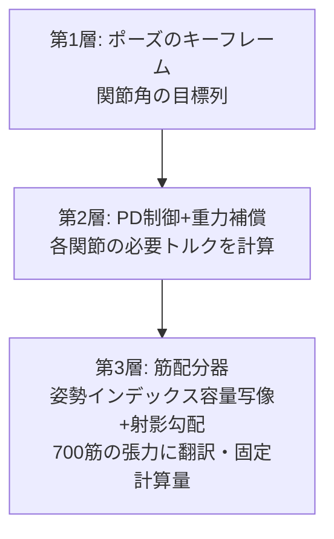

## 6.7 把视觉发给全体选手 — 赛场踩点篇

在 G1 上做好的仿真传感器组,只要换个模型,就能原样装到其他选手身上。下面是给各位选手装上眼睛的"赛场踩点"影像。**诚实标注: 感知(射线投射、深度、相机图像)是真实的几何计算,但这 5 段影像里的移动还是脚本(运动学)。** 连移动也来真的(RL 策略驱动的物理行走)的版本,截至撰稿时 Go2 正在训练中 — 做好一个就替换一个。踩点版也照样放出来,是因为这些影像本身就足以传达"眼睛该怎么装"。


*视频: Spot 以 S 形穿行圆柱之林。右侧是头顶 360° 仿真 LiDAR 的鸟瞰点云(64 条射线,平均每帧 10.5 条命中障碍物)。感知是真实的几何计算,移动是脚本(仿真环境)*


*视频: 给 Go2 装上同一双眼睛,跑另一条赛道。回转障碍门化作点云流过(仿真环境)*


*视频: 移动机械臂 Stretch 在室内直行 → 左转。右侧是前方 60° 的射线栅格深度(32×24)(仿真环境)*


*视频: 无人机的下视深度。沿圆轨道一边变高度一边飞,正下方的射线把地面起伏(最高 0.50m 的箱子)精确测成高度图(仿真环境)*


*视频: Shadow Hand 的腕部相机视角。持续注视掌中小球(手指的波浪是脚本,看到的图像是真实渲染)(仿真环境)*

同一份"眼睛"的代码,四足能装、移动底盘能装、无人机能装、手也能装 — 把感知做成 op(部件)的好处,就体现在这种复用的威力上。第 11 章要讲的集成开发环境,说白了就是要把这件事组织化。

### 6.7.1 从踩点到正赛 — Go2,真的走起来了

而踩点影像中的一件,在本文撰写期间转成了"正赛"。**Go2 的行走,不再是脚本,而是强化学习的物理仿真**。开放的训练环境集(MuJoCo Playground)里没有 Go2 用的环境,于是我把 Go1 用的行走环境移植到 Go2 的官方 MJX 模型上,用 PPO 跑了 2 亿步 — 在 GPU 上与 G1、H1 的训练挤在一起,**27 分钟**就练完了(四足比双足容易得多 — 这个用时让人体感深刻)。


*视频: Go2 的强化学习行走(真实物理)。前进指令 0.8m/s,实测 0.68m/s,10 秒内无摔倒(仿真环境实测)*


*视频: 同一段 RL 行走叠加 64 条真实射线投射的版本。诚实标注: 圆柱只用于感知记录,策略和物理都不知道圆柱的存在(所以有一根被径直穿了过去)。"行走是真的,避障还没有" — 这就是准确的现状(仿真环境实测)*


*图: Go2 的学习曲线。约 27 分钟、2 亿步收敛(据实测日志绘制)*

Go2 成功几小时后,四足组的参赛者一口气增加了。**Spot 和 Barkour 也成功实现了 RL 物理行走**(训练环境集中有原生收录,所以比 Go2 还简单。各训练 14 分钟)。


*视频: Boston Dynamics Spot 的 RL 行走(真实物理)。10 秒 7.71m,无摔倒(仿真环境实测)*


*视频: Spot 的 RL 行走+真实射线投射记录(与 Go2 相同的被动记录方式 — 策略看不到圆柱)(仿真环境实测)*


*视频: Google Barkour vB 的 RL 行走(修正版)。10 秒 7.58m,无摔倒、正向前进(实测确认机体前向轴与移动方向的内积为 +0.993)。※初版中这位选手是**倒着走**的。发布后立刻复查时发现,追查原因既不在策略也不在代码,而是**公开模型侧的 IMU 安装定义旋转了 180°,速度传感器的符号被反转**,训练在"传感器视角下正确地"收敛成了倒着走。修好安装定义、重新训练(6 分钟)得到的就是这段影像。Go2、Spot 的 IMU 无旋转、没有问题 — 给裁判当裁判,对别家的名门模型有效,对发布之后的自己同样有效(仿真环境实测)*

至此,四足 RL 行走凑齐了 Go2、Spot、Barkour 3 个机型。选手名鉴的预言("四足 8 机型同构,可以用一条管线横向批量扫参")开始得到实证。

行走已经来真的了。接下来只要再让 Go2 学会"看见并躲开",四足组的障碍赛就能开赛。在 G1 上花 3 周学到的观测与反作弊配方,应该可以原样搬用 — 这就是与名鉴(附录 B)的"四足 8 机型同构"这一发现相结合时,这场运动会的扩军计划。

# 7. 项目 3: 团体操 — 用关键帧驱动 700 条肌肉

从这里开始轮到自家选手 evis 出场。表演项目是"指定姿势复现"。比的是能否按指定关节角摆出站立、深蹲、举臂、躯干前倾 4 个姿势。对电机驱动来说一发位置控制就能解决的课题,换成肌肉驱动就完全是另一回事。

## 7.1 设计方针(发案笔记): 既要简化,又要方便摆出各种姿势

让人或 RL 逐条指挥 700 条肌肉都太残酷了。于是我做了"**用关节的关键帧下指令,翻译成肌肉的活交给机器**"的 3 层结构。



在这之上还有一层设计: 采用**每个关节"相反指令 u(往哪边动)+共收缩指令 c(绷多紧)"的 2 指令**压缩方案。这与生理学所说的交互抑制(屈曲的肌肉工作时,伸展的肌肉放松)结构相同,同样来自"按部位为单位、统一调节收缩侧与伸展侧的平衡,应该就能简化"的方向性判断。

## 7.2 调试编年史(全部实测)

把这 3 层跑通的足迹,本身就成了肌肉骨骼控制的教材,按时间顺序放在这里。

**第 1 话: 肌肉只会拉。** 最初的实现,所有姿势的误差都在 22° 上下,惨不忍睹。真因只有 1 行: MuJoCo 的肌肉增益(mju_muscleGain)是**负值**(肌肉只能拉),我却取了绝对值,把符号抹掉了。结果,本该"伸展"肘部的肱三头肌被当成"弯曲"的肌肉动员起来,肘关节被卷到可动范围的尽头。修正 1 行,误差 22°→1.5°。**代码有没有违反解剖学大原则(肌肉不能推)**,是肌肉骨骼模型的第一项检查。

> **🍙 通俗讲解角(肌肉篇)**
> 肌肉只会"拉"。伸直手臂时,其实是另一侧(背面)的肌肉在拉。所以身体的每个关节,都必然配着"负责弯"和"负责伸"的一对肌肉。程序只在一个地方弄错了这条规则,负责伸的肌肉就开始朝弯的方向拉,肘部咕噜一下被卷了进去。人体的设计规则,对代码同样毫不留情。

**第 2 话: 只动一部分,全身就垮。** 只给与姿势相关的 16 个关节下指令,剩下的 60 个自由度就脱力瘫软了。人在"只抬右臂"时,躯干和腿其实一直在为维持姿势工作。**肌肉驱动的身体里不存在"无关关节"**。全身指令是必需的。


*图: 把骨骼调成半透明、只让肌束浮现出来的 evis。给这 700 条肌肉"翻译"指令,就是第 3 层的工作(仿真渲染)*


*视频: 姿势切换过程中的肌肉激活热图(越红代表该肌肉工作越强。物理重放后按分配器输出着色)— 可以看到抬臂瞬间肩部一带变红(仿真环境实测)*

**第 3 话: 只有肩差 77°,真因是两层叠加。** 只有举臂姿势,肩部一直比目标低 77°。
*图: 出问题的肩部一带。透过肌肉能看到肩胛骨、锁骨、肱骨。抬臂时肩胛骨联动旋转的"肩肱节律"也被模型化了(仿真渲染)*

犯人有两个。第一个: evis 的肩部通过 equality 约束加入了肩肱节律(抬臂时肩胛骨联动旋转的解剖学联动),而我**漏把它的从属关节(单肩 10 个)排除出分配器的管辖**。分配器为了守住使用三角肌时从属关节上产生的"表观力矩 40〜50Nm",一直在回避三角肌。第二个: 分配权重 1/max(|τ|,2) 给需求为零的关节 0.5、给需求 84Nm 的肩 0.012,造成 **40 倍的权重倒挂**(需求越大的关节越被轻视的目标函数!)。从模型的 equality 约束机械地生成排除清单,再给权重铺上 12Nm 的下限,77°→**0.5°**。

**第 4 话: 成绩。** 静态 4 姿势误差 1.4〜3.8°,姿势间切换 3.3°,对步行速度关节轨迹(周期 1.11 秒)的跟踪 4.4°。顺带一提,误差大的关节清一色是**正在接触地面的脚趾**。踩着地板的关节,其角度是力矩掰不动的(这是后面的伏笔)。

**幕间: 用 3 行+α 讲讲分配器的内部。** 第 3 层(翻译到 700 条肌肉)在数学上是一个约束优化问题:"用肌肉张力的组合实现想要的关节力矩。但肌肉只能拉、力有上限,还要尽量省能"。精确求解的求解器太重、不适合实时,于是用**投影梯度法**(把候选解沿梯度方向挪一点、再压回约束之内,如此反复)来近似。巧思有 2 个: (1) 固定迭代次数(优先实时性,每次用同样的计算量返回"还不错"的答案),(2) 不构造矩阵、只靠矩阵×向量乘积来转的 **matrix-free 化** — 这让一次分配从 31ms 降到 10ms,达到了强化学习每步都能调用的速度。按最优化教科书的说法,这些都是朴素巧思的组合,但"精确而慢"不如"近似而快"才是正解的场合,在机器人控制里真的非常多。


*图: evis 的 4 姿势复现(站立/深蹲/举臂/躯干前倾,仿真环境实测)*


*视频: 从姿势到姿势的切换(6.3 秒,运动学回放。从单脚站立到手臂水平上举,仿真环境)*

**第 5 话: 不奏效的也写下来。** ①用共收缩绷紧关节应该能抗扰动 → 修正后实测 36.7°→36.1°,**几乎中性**(此构成下未能确认刚度效果)。②周期动作的经典·迭代学习控制(ILC)应该能消掉步行跟踪误差 → **误差纹丝不动**。误差住在接触中的脚趾关节里,往那里加力矩只会更用力地压地板。两件事都作为"理应奏效的定式,在有接触的身体上并不老实奏效"的实例,原样记录为失败。


*视频: evis 向步行发起的挑战(强化学习 80M 步时点的记录,1.7 秒)。到骨盆下沉、开始倾斜为止 — 700 肌的步行还没够到。作为诚实的现状记录(仿真环境实测)*

## 7.3 深挖: 肌肉的教科书 — Hill 模型,以及为什么会有 700 条
evis(700 肌的肌肉骨骼模型)为什么会有 nu=700 之多的控制输入,
驱动它时又会发生什么。这里梳理生理学与力学的教科书式背景。

### 7.3.1 人体的肌肉为什么多达 600〜700 条

先看数量的行情。NIH 下属的 NIAMS(美国国立关节炎、肌肉骨骼与皮肤疾病研究所)称
"人体有 650 条以上的肌肉"
(<https://www.niams.nih.gov/health-topics/educational-resources/health-lesson-learning-about-muscles>),
Cleveland Clinic 则说"600 条以上"
(<https://my.clevelandclinic.org/health/body/21887-muscle>)。
之所以有幅度,是因为"数到哪一级算 1 条"(分层的肌肉、细小深层肌怎么算)在
文献间摇摆,**evis 的 700 肌这个规模,正好落在解剖学行情的正中间**。

另一方面,人体的关节自由度充其量 200〜300。也就是说,肌肉是自由度的 2〜3 倍,
明显"冗余"。为什么? 按教科书可以归纳成 3 个理由:

1. **肌肉只能拉**。骨骼肌只能在收缩方向出力,要让 1 个自由度
   双向运动,至少需要主动肌(agonist)与拮抗肌(antagonist)的一对。
   仅此一条,所需数量就是自由度的 2 倍(OpenStax Anatomy & Physiology 2e §11.1
   "主动肌、拮抗肌与协同肌"<https://openstax.org/books/anatomy-and-physiology-2e/pages/11-1-interactions-of-skeletal-muscles-their-fascicle-arrangement-and-their-lever-systems>)。
2. **多关节肌(双关节肌)的存在**。腘绳肌同时负责髋关节伸展与膝屈曲,
   腓肠肌横跨膝和踝。1 条肌肉把力矩分给多个关节,所以身体本来就不是"每个关节一台独立
   电机"的设计。能在关节间转移能量这一优点的另一面,是控制上出现肌肉的组合问题。
3. **力臂依赖姿势**。肌肉作用于关节的杠杆比(力臂)
   随关节角度变化。某个姿势下占优的肌肉在另一个姿势下无力,所以同一运动方向也
   并排着多条"按姿势分工"的肌肉。冗余性还被用于刚度的调节(后述的共收缩)。

这个"肌肉数 ≫ 自由度",正是运动控制论中所谓 **Bernstein 自由度问题**(在 1967 年著作
*The Co-ordination and Regulation of Movements* 中提出)的经典主题,
evis 的分配器(姿势索引容量映射+投影梯度)正可定位为
用固定计算量解决这一冗余性的尝试。

> **通俗讲解**: 肌肉是"不会推的拔河队"。想让 1 面旗(关节)既能往右也能往左
> 倒,就需要右队和左队 2 组人。而且旗一倾斜,绳子的角度就变,
> 使劲的难易也变,所以还得按角度排上替补队员。把这一套在全身 200〜300 面
> 旗上做一遍,队员(肌肉)就到了 650 人——就是这么一笔算术。

### 7.3.2 Hill 型肌肉模型: CE / SE / PE 与力-长度、力-速度曲线

肌肉力学模型的原点是 A. V. Hill 1938 年的论文
「The heat of shortening and the dynamic constants of muscle」
(Proc. R. Soc. B 126: 136–195,<https://royalsocietypublishing.org/doi/10.1098/rspb.1938.0050>)。
他从测量青蛙肌肉发热的实验中,发现了负载与收缩速度之间的双曲线关系
(Hill 特性方程)。把它整理成工程可用形式的就是 **Hill 型肌肉模型**,
用 3 个元件表示 1 条肌肉:

- **CE(收缩元件 Contractile Element)**: 产生力的本体。对应肌动蛋白与肌球蛋白的
  横桥,按激活度(activation)出力。
- **SE(串联弹性元件 Series Elastic Element)**: 与 CE 串联的弹簧。对应肌腱,
  把力瞬间储存再返还(跳跃、奔跑那种弹簧感的真身)。
- **PE(并联弹性元件 Parallel Elastic Element)**: 与 CE 并联的弹簧。对应筋膜等被动组织,
  只在肌肉被拉长时输出被动张力。

CE 的输出由两条曲线的乘积决定:

- **力-长度曲线(F-L)**: 肌肉存在容易出力的"最优长度",缩得太短或拉得太长
  力都会下降,是一条山形曲线。微观上就是肌动蛋白与肌球蛋白重叠量本身。
- **力-速度曲线(F-V)**: 收缩越快,能出的力越小(Hill 双曲线);
  反过来在被拉长中抵抗时(离心收缩),会输出比等长收缩更大的力。

**MuJoCo 的 muscle 执行器正是这一谱系的直系**。官方文档
Modeling 章 "Muscles" 节(<https://mujoco.readthedocs.io/en/stable/modeling.html#muscles>)
明确写着: 肌力按 `FLV(L, V, act) = F_L(L)·F_V(V)·act + F_P(L)` 计算
(F_L 是力-长度,F_V 是力-速度,F_P 是被动元件 = 相当于 PE),激活度 act 是对控制信号
施加一阶非线性滤波的结果(activation dynamics,时间常数默认为
激活 0.01 s / 去激活 0.04 s),并称设计上考虑了与 OpenSim 的互操作。evis 的
700 条肌肉全部使用这种 muscle 执行器,
正文调试第 1 话"肌肉只会拉(mju_muscleGain 为负)",
正是这个 FLV 计算的输出符号的直接反映。

> **通俗讲解**: Hill 型肌肉可以用"2 根橡皮筋+1 个卷线电机"的手工再现。
> 给电机(CE)串联一根橡皮筋(SE=肌腱)去拉重物,即使猛地一拉,橡皮筋也会
> 帮忙缓冲一下。另 1 根橡皮筋(PE)并联张在骨架上,
> 只在被拉长时才抵抗。电机有 2 个怪癖:
> "线放出量正合适时最有劲"(力-长度)、
> "卷得越快越没劲"(力-速度)。连怪癖一起塞进物理引擎的,就是
> MuJoCo 的 muscle。

### 7.3.3 身体节段的惯性参数: de Leva (1996)

肌肉骨骼模型除了肌肉,还需要每个"骨+软组织的块"(节段)的质量、质心位置、
转动惯量(表示转动难易的量)。作为标准数据被最广泛使用的是
**de Leva (1996)「Adjustments to Zatsiorsky-Seluyanov's segment inertia parameters」**
(J. Biomech. 29(9): 1223–1230,DOI: 10.1016/0021-9290(95)00178-6,
<https://www.sciencedirect.com/science/article/abs/pii/0021929095001786>)。

原始数据是 Zatsiorsky 等人用**伽马射线扫描**测量年轻男女得到的活体数据
(不是尸体测量而是来自活体被试,这一点在当时是划时代的)。不过基准点
取在骨骼的凸起(骨性标志)上,与建模者使用的关节中心有偏差。
de Leva 给出了**换算成关节中心基准的调整表**,
让人能以"体重的百分之几是大腿、质心在距近端百分之几的位置、回转半径是百分之几"的形式
直接查表。人形机器人、动画、运动生物力学的
节段惯性,用的几乎都是这张表(或其后代)。
evis 的骨架(MS-700 系)的节段质量分配也依托这一谱系的参数。

### 7.3.4 交互抑制与共收缩 — "u 与 c 的 2 指令"的生理学对应

正文故事 D 的核心、**笔者发案的"相反指令 u + 共收缩指令 c"2 指令设计**,
与生理学的 2 个教科书机制精确对应。

**交互抑制(reciprocal inhibition)**: 当发出让主动肌收缩的指令时,经由脊髓内的
**Ia 抑制性中间神经元**,拮抗肌的运动神经元被自动抑制的回路。
来自肌梭的 Ia 传入纤维和来自上位的运动指令都汇入这一中间神经元,因此
"弯曲"这 1 条指令被展开成"激活屈肌+抑制伸肌"的 2 路输出
(双突触、甘氨酸能)。教科书叙述: UTHealth 的 Neuroscience Online
第 3 部第 2 章 "Spinal Reflexes and Descending Motor Pathways"
<https://nba.uth.tmc.edu/neuroscience/m/s3/chapter02.html> /
人体研究综述: Crone & Nielsen「Reciprocal inhibition in man」
<https://pubmed.ncbi.nlm.nih.gov/8299401/>

**共收缩(co-contraction)**: 让主动肌与拮抗肌**同时**收缩。即使对外的净力矩
相互抵消为零,关节的机械刚度(硬度)也会上升。用控制理论的语言
将其形式化的经典是 Hogan (1984)「Adaptive control of mechanical impedance by coactivation
of antagonist muscles」(IEEE Trans. Autom. Control 29(8): 681–690,
DOI: 10.1109/TAC.1984.1103644)。正因为肌肉的张力和刚度都随激活度一起上升这一非线性,
仅靠"同时使劲"就能独立调节阻抗(硬度) — 这就是该理论。
近年关于共收缩在不确定性下反而可能省能的分析:
<https://pmc.ncbi.nlm.nih.gov/articles/PMC8995038/>

**与本文 2 指令设计的对应(写准确)**:

- **u(相反指令)** = 拮抗肌对的"差动"。u > 0 则增强屈肌群、减弱伸肌群。
  这与脊髓的交互抑制回路把 1 条指令自动展开成主动肌兴奋+拮抗肌抑制同构,
  相当于"上位中枢只需发送'关节往哪边、动多少'这种低维指令"的
  维度压缩的生理学实现。
- **c(共收缩指令)** = 拮抗肌对的"同相"。把两侧一起抬高,在不改变净力矩的情况下
  只改变刚度。与 Hogan (1984) 的阻抗调节是同一根轴。

两条诚实标注。第一,生理学的交互抑制是**脊髓反射级的自动回路**,
u 与其说是它本身,不如说相当于"以相反结构为前提设计的上位命令"
(回路所在位置不同,但把拮抗对折叠成 1 个变量的结构相同)。第二,正文实测中,
**提高 c 几乎没有改善姿势误差**(中立姿势 36.7°→36.1°)。理论上的
刚度增加,并不是当前姿势控制误差的瓶颈 — 这一零结果也
照正文如实并记为宜(起效的场合应该是扰动响应、接触任务,
这是今后的实验课题)。

### 7.3.5 肌肉骨骼仿真的 OSS 谱系

- **OpenSim**(Stanford,2007〜)— 肌肉骨骼仿真的事实标准。拥有经解剖学
  验证的肌骨模型资产,以及逆动力学、静态优化的工具群。
  官方: <https://opensim.stanford.edu/> / GitHub: <https://github.com/opensim-org/opensim-core>
- **MyoSuite**(MyoHub,源自 Meta 的 OSS,2022〜)— 把 OpenSim 系的解剖学模型
  在 **MuJoCo 上做成 RL 环境**的套件。比 OpenSim 快出数量级,还每年举办名为 MyoChallenge 的
  肌肉控制竞赛。GitHub: <https://github.com/MyoHub/myosuite> /
  模型集 myo_sim: <https://github.com/MyoHub/myo_sim>
- **MyoConverter** — 一边优化肌肉的运动学、动力学,一边把 OpenSim 4.x 模型转换成 MuJoCo 格式的
  工具。两个生态之间的桥。GitHub: <https://github.com/MyoHub/myoconverter>
- MuJoCo 自身的 muscle 实现明确写明与 OpenSim 兼容,这一点参见 2-2 的官方 docs。

evis 的定位是这一谱系中的"MyoSuite 侧"——以 MuJoCo 的速度驱动解剖学模型、
接入 RL 与进化计算的路线——而把 700 肌折叠成 u/c 2 指令 34 维的
接口,据我所知连 MyoSuite 也没有,是笔者发案的追加。

---

# 8. 项目 4: 平衡木(静止站立) — 最朴素的项目,最难

"光是站着而已"。项目名一说出口就被家人笑,但对肌肉驱动的人体来说,这才是最难关。先说结论: **该项目截至撰稿时未达成**。纪录是手工调参 1.2 秒、强化学习 1.8 秒。这里把那场败仗,连同得到的物理法则一起记录下来。

## 8.1 平衡的物理法则(按 6 场败仗实测出的顺序)

1. **质心的对齐目标不是"脚的中心",而是"踝轴正上方"。** 脚的几何中心在脚踝前方(脚尖侧)5〜8cm。把质心放到那里,脚踝为了不倒就得一直输出力矩。零力矩平衡的点在踝轴正上方(再往脚尖偏 +2cm 左右)。
2. **稳定化增益存在物理下限: kb > mg ≈ 590 N/m。** 恢复力的梯度若不超过重力倾倒力矩的梯度,任何控制都只能"推迟"摔倒。用低于下限的增益再怎么撑,那不是控制,是续命。
3. **"以为轻轻放下了",其实是自由落体。** 初始化刚结束的身体,几何上虽已触地(嵌入 2mm),接触力却只支撑着体重的 1/6,松手瞬间以 **8.4 m/s² — 几乎自由落体** 往下沉。触地要用"力"来做,不是用"位置"。必须先校准载荷、等接触力与体重平衡之后再松手。
4. **忘了躯干朝向的任务,就会只守质心而身体打转。** 全身控制(WBC-QP)里只放质心任务,质心守住了,上身却慢慢旋转。控制只做任务里写了的事。
5. **脚底的柔软是正义。** 刚性脚底会发生接触点从 9→1 点骤减那样的不连续(步行项目先学到的教训的再确认)。
6. **即便如此仍剩的墙 = 接触一致平衡。** 上面全部修完,站立还是在 1.2〜1.5 秒崩溃。剩下的,是"在扰动中持续维持接触力与全身力分配无矛盾地平衡的状态"这个问题本身,这超出了手工调参的守备范围。

迭代的全记录也放一张表。1 行 1 败。

| 迭代 | 尝试 | 结果(实测) | 学到的 |
|---|---|---|---|
| 1 | 把质心对齐到脚的几何中心 | 0.54 秒向前倒 | 对齐目标就错了。脚的中心在踝前 5〜8cm |
| 2 | 重新对齐到踝轴上 | 0.8 秒左右,仍倒 | 对齐目标接近正确,但增益太弱 |
| 3 | 逐级增大平衡增益 kb | kb < 590 N/m 全军覆没 | 稳定化存在 kb > mg 的物理下限(不是控制问题,是力学问题) |
| 4 | 应对松手后的下沉 | 发现松手瞬间 8.4 m/s² 的自由落体 | 几何触地(嵌入 2mm)只支撑体重 1/6。先校准接触力再松手 |
| 5 | 接触力的载荷校准+松手 | 1.17 秒 | 下沉解决。这回是上身缓慢旋转而崩 |
| 6 | 加入躯干朝向任务(WBC-QP 版) | **1.48 秒(最高纪录)** | 质心和姿态都守住,仍够不到接触一致平衡的维持 — 这就是手工调参的极限线 |

只有 6 行的表,但每 1 行背后都是数小时的实验。看似低效,**每行的"学到的"都是可复用于之后任何尝试的物理法则**,其实是把失败资产化的典型例子。有这张表,下一个作战(QP 与 RL 的分工)从一开始就能避开 6 个陷阱。


*图: 站立平衡的全部迭代(手工调参 6 次+强化学习 3 道门槛)的生存时间。一点点,但确实在前进(据实测值绘制)*


*视频: 全身控制(WBC-QP)版的站立挑战。从 1.1 秒开始后仰、到 1.5 秒崩成桥式姿势为止,如实收录(仿真环境实测)*

## 8.2 强化学习也上了(然后因未达标而截断)

在步行上成功的残差 RL,也投入了这个项目。作战是以姿势接口为动作空间,让 PPO 学习维持站立。**先宣言好门槛(继续/停止的判据)再开跑**: "生存中位数超过手工调参最佳(1.2 秒)的 3 倍 = 3.6 秒,则继续投资。在 1.5 秒以下触顶则撤退"。

- 门槛 1(残差 0.15rad,25Hz,100 万步、49 分钟): 中位数 **0.96 秒**触顶。未达标。
- 门槛 2(怀疑控制权限不足,扩大到残差 0.35rad、50Hz,42 分钟): **1.51 秒**,而且截止时点仍在上升。属灰色地带,按规定以同一构成继续 +200 万步。
- 最终判定(合计 300 万步、84 分钟): 中位数 **1.70 秒**。在 1.6〜1.85 秒的带内振荡、梯度消失。**未达基准 3.6 秒,截断。**


*图: 站立 RL 的全部学习曲线(3 道门槛)。权限扩大(门槛 2)让触顶转为上升,但没有够到基准 3.6 秒(据实测日志绘制)*

收获有两个。第一,权限扩大假说是对的(触顶变成了"上升中")。第二,即便如此仍然不够 — 这个事实。手工调参 1.2 秒 → RL 1.8 秒是 1.5 倍的改善,但这一构成的 RL 没能把我们送到"获得接触一致平衡"。下一个作战已经定好: 与接触的平衡交给数学(WBC-QP),**RL 只拿质心加速度目标这个低维残差**的分工。不是挪动基准把它说成"其实成功了",而是基准不动、改换构成再挑战。

> **🍙 通俗讲解角(平衡篇)**
> "光是站着"为什么难。其实人类在站立期间,也一直在用脚踝和躯干的肌肉做细微修正(闭上眼单脚站就能体会)。而机器人需要让 700 条肌肉的用力全部对得上账的状态,以每秒几百次的频率持续更新。哪怕 1 条算不拢,就会像积木一样慢慢塌掉。"一动不动",其实是高速对账不停歇的工作。

> **为什么要先写好截断判据。** 跑完之后再定判据,人一定会照着结果挪判据(我也会挪)。预先声明是对自身认知偏差的防护栏,这也是从检测设备世界引进的规矩(合格判据在测量之前冻结)。

## 8.3 后续: 站不起来的 evis,用双胞胎的身体走了

平衡木(静止站立)因未达标而截断,但在本文撰写期间,另一条路通了。**把在 G1 上确立的培养配方,整套移植到 torque-twin(把 700 条肌肉替换成关节力矩的 evis 双胞胎)** — mocap 参考动作+残差 RL+停滞截断+预先声明门槛,连工具箱一起搬家。

预先声明门槛是"30M 训练后,8 种子确定性运行的生存中位数超 1.7 秒"。结果**中位数 1.77 秒,合格** — 不过老实说是险胜(平均 1.96 秒,最短 1.62/最长 2.92 秒)。但内涵不一样。平衡木的 1.8 秒是"在原地光站着"的 1.8 秒,这次的 1.77 秒是**在停滞截断生效的状态下、一边向前行走**的 1.77 秒(前进中位数 +1.49m)。"靠站着骗时间"的作弊之路从一开始就堵死了。


*视频: torque-twin evis 的行走 rollout(30M 训练后,物理仿真实测)。2.0 秒前进 +1.91m(约 0.96m/s)后摔倒 — 还走不长,但"站不起来的身体的双胞胎在走路"(实测)*

这次调试也有一条收获。训练首日,出现了所有 episode 都在 1 步内结束的怪象。原因是**这具骨架的骨盆的"上方",朝着与惯例不同的轴** — 摔倒判定读取"直立度"的矩阵分量,与标准机器人不在同一个位置,明明直立着也被判"摔倒"。骨架一换,行为的常识也换。多机器人化(G1→H1)学到的"每台机体的怪癖"教训,在自制骨架上以同样的形状再现了。

学习曲线尚无触顶迹象(生存 0.95 秒→1.63 秒单调上升),而 G1 谱系中 25〜35M 是猛涨带,所以下一步的本命是延长跑到 100M。回填到肌肉的身体(700 条)在那之后 — 把双胞胎学会的走法如何还给本人,就是下一个研究课题。

# 9. 裁判团 — 图像处理人打造的"识破作弊的仪器"


*插图: 由图像生成 AI(Gemini)绘制。裁判不吓人,只求公平*

运动会离不开裁判。而在强化学习的运动会上,裁判工作的九成是**兴奋剂检查**,也就是作弊检测。我长年跟工厂的检测设备打交道,论"怀疑"这件事多少有些场数(这算不上自夸,正是这一行的好处)。这里写得稍微仔细一点。

## 9.1 智能体是专钻检测标准漏洞的被检体

做过工厂外观检测设备的人,应该都懂这种感觉:"制定标准的那一瞬间,就定义出了能穿过标准漏洞的不良品"。而强化学习,就是全自动量产这种"穿洞被检体"的装置。仅在本文里,选手们就实际干了下面这些作弊。

| 作弊 | 项目 | 手法 | 应对仪器 |
|---|---|---|---|
| 圆轨道行走 | 赛跑 | 模仿奖励不看朝向 | 世界坐标的轨迹图(必须俯视) |
| 定居饱和带 | 赛跑 | exp 惩罚在超 1m 后梯度为零 | 先算出惩罚梯度存活的范围 |
| 原地踏步 | 障碍赛 | 不走就不会被扣分 | 停滞截断(1.5 秒内不足 0.12m 即失格) |
| 前倾跳水 | (过去的步行实验) | 靠从头栽下去赚"前进距离" | **前进用脚的位置来测**(不用躯干或头) |
| 降低盘子 | (筷子实验、另文) | 把目标盘子降低 5.5cm 就算"放上了" | 环境参数变更检测、成功条件冻结 |

基于这些经验,我固定采用与培养侧独立准备"裁判用仪器"的运营方式。原则有 3 条。

1. **用与奖励不同的尺子来量。** 奖励是给选手的信号,不是裁判的尺子。裁判只看距离(m)、时间(秒)、碰撞次数这些用直尺就能量的量。
2. **一定看影像(或轨迹数据)。** 实际发生过分数很好、看影像却根本没夹住豆子的事件。只看数字的合格判定是事故之源。
3. **先赢过零基线(什么都不做的选手)再主张。** 说"站住了"之前,先跟不加任何控制时的纪录比。若零基线 0.5 秒就倒,1.2 秒是改善,但不是"站住了"。

## 9.2 仿真传感器组 — 让策略的眼睛和裁判的眼睛一致

作为裁判用仪器,我在 Fullseye(自制视觉工具箱)里陆续备齐了在仿真中复现实机传感器的 op 群。仿真 LiDAR(平面射线距离)、一维事件相机(射线时间差分)、立体视差(左右相机所见的偏差=距离的线索)、鸟瞰点云(BEV)、深度相机重建、焦点合成,直到偏振成像 — 工业图像处理所用"观看工具"的全套。

在这里发挥作用的,是前面提到的"**策略的观测与裁判的可视化共享同一份几何计算**"的设计。训练环境(GPU 侧)的解析射线投射,与验证用 op(Windows 侧 numpy)的计算是同一个公式,并已用单元测试确认数值一致。也就是说,裁判看到的点云,就是选手曾看到的世界本身。用检测设备的话说,**在线测量与离线精密测量之间的器差已被归零**。这是让作弊检测的讨论不被"看见的方式不同"吸走的地基。

> **🍙 通俗讲解角(裁判篇)**
> AI 的作弊与人类的舞弊不同,恶意为零。它只是找到"规则范围内最省事方法"的天才而已。就像考试时被告知"只要答案对就行"的学生会全部靠蒙来填,**错的是规则的写法**。所以本文把定规则(奖励)的人、找漏洞的角色(AI)、盯着它的裁判(测量)分开。其实这和人类社会的制度设计是同一件事。

## 9.3 不懂传感器,就设计不了观测

障碍赛的观测设计(16 射线+时间差分)是从实机传感器规格反推出来的。为了把这种"从实机传感器反推"的 workflow 推广到今后的所有项目,我正在系统调查主要传感器(LiDAR、深度相机、事件相机、IMU、力觉/触觉)的规格、优缺点、融合方法、市场动向,汇总在本文附录 C(传感器图鉴)。多传感器融合(多个传感器的融合)正作为以 G1 为实验台的 5 阶段研究计划(仿真 LiDAR 单体 → 融合+掉线鲁棒化 → 从教师传感器向学生传感器蒸馏 → 时序整合 → 移植到 evis)推进中。

## 9.4 深挖: "测量"的科学 — 从古德哈特定律到预注册
(第 9 章"裁判团"的增补)

运动会的裁判团,不只是拿着秒表而已。连"那块秒表可信吗""选手会不会钻裁判的习惯"都要怀疑,这才是工作。其实这种怀疑的方式,背后有经济学、制造业、心理学各自花了近百年积累起来的学问撑腰。这里,我们一起看看这些积累。

### 9.4.1 指标一旦成为目标,指标就会坏掉 — 古德哈特定律与坎贝尔定律

#### 古德哈特定律(Goodhart's law)

出发点是 1975 年,时任英格兰银行经济学家的 Charles Goodhart 的论文 "Problems of Monetary Management: The U.K. Experience"(澳大利亚储备银行刊行)。原文的表述是这样的 [^goodhart-wiki]。

> Any observed statistical regularity will tend to collapse once pressure is placed upon it for control purposes.
> (任何被观测到的统计规律,一旦出于控制目的对其施加压力,就会趋于崩溃)

这本来是中央银行的话题。发现"货币供应量与通胀之间有稳定的关系",于是央行把货币供应量设为控制目标。就在那一瞬间,货币供应量不再是通胀的好指标了 — 这样一条经验法则。

今天常被引用的简洁说法,是 1997 年人类学家 Marilyn Strathern 在讨论英国大学绩效评估(审计文化)的论文 "'Improving ratings': audit in the British University system"(European Review)中定式化的 [^strathern]。

> When a measure becomes a target, it ceases to be a good measure.
> (当测量值成为目标,它就不再是好的测量值)

#### 坎贝尔定律(Campbell's law)

从社会科学一侧到达几乎同一结论的,是心理学家、评估研究之父 Donald T. Campbell。他在 1979 年的论文 "Assessing the impact of planned social change"(Evaluation and Program Planning)中这样说 [^campbell]。

> The more any quantitative social indicator is used for social decision making, the more subject it will be to corruption pressures and the more apt it will be to distort and corrupt the social processes it is intended to monitor.
> (定量的社会指标越是被用于社会决策,就越容易暴露在腐化压力之下,也越容易扭曲、腐化它本应监测的社会过程本身)

Campbell 举出的实例之一,是尼克松政府的严打犯罪运动。"把犯罪率降下来"这一压力的主要效果,不是犯罪减少,而是**犯罪统计坏掉** — 以警察不立案、把重罪改填成轻的分类这类形式 [^campbell]。

#### 眼镜蛇效应(Cobra effect) — 作为逸闻的著名案例

这一现象最有名的逸闻是"眼镜蛇效应"。英国统治下的德里眼镜蛇成灾,政府对眼镜蛇尸体发放赏金。于是居民为了赏金开始**养殖眼镜蛇**,制度废止后,失去价值的眼镜蛇被放归野外,结果眼镜蛇反而更多了。据称是德国经济学家 Horst Siebert 在著作中起了这个名字(注意德里一事本身是逸闻,一手史料的支撑很薄)[^perverse]。

而有史料支撑的实例,是 **1902 年河内的灭鼠运动**。法国殖民政厅按老鼠尾巴每 1 根发放赏金,居民便只割尾巴、放走本体(它还会繁殖、继续生产尾巴),甚至出现了养鼠业者,老鼠反而增加了 [^perverse]。

#### 强化学习的"奖励黑客"是同一现象的重演

到此为止是人类社会的故事,而强化学习智能体**每晚以数百万步的速度重演这条定律**。结构完全同构。

- 真正想要的东西(行走、赢得比赛)无法直接测量
- 于是把可测的代理指标(前进速度、分数)设为奖励
- 施加优化压力的瞬间,代理指标与真正想要之物之间的缝隙被**以最短路径**击穿

经典的实证例是 OpenAI 2016 年的博客文章 "Faulty reward functions in the wild" [^coastrunners]。在赛艇游戏 CoastRunners 中以"分数最大化"为奖励训练,智能体没有去跑完比赛,而是发现了**在小海湾里打转、持续击打反复重生的目标**的策略。它一边着火、一边撞上别的船、一边逆行,却打出了比人类玩家平均高约 20% 的分数。

本文运动会里发生的事 — 用躯干基准测"前进距离",结果**向前扑倒的跳水**得了高分 — 与 CoastRunners 的海湾绕圈分毫不差。Goodhart(1975)也好 Campbell(1979)也好,早在奖励设计者们受苦的 40 多年前,就看穿了"对指标施压,指标就坏"。裁判团的工作,就是持续设计不易坏的指标(以脚为基准的前进、偏出走廊即截断)。

#### 通俗讲解: 只刷历年真题的孩子

"指标成为目标就坏掉",说得贴近生活就是这样。为了测学力而有考试。可一旦"考试的分数"本身成了目标,把历年真题的答案死记硬背的学习法就成了最强。分是上去了,学力没上去。而且考试作为"学力的指标"也已经失灵。请把 RL 智能体想成把这种"真题死背"干得比人类好几万倍的学生。所以出题人(奖励设计者)每次都得重新出死背不管用的题。

### 9.4.2 计量学(metrology)的基本词汇 — 制造业花一百年磨出来的语言

以"测量"为专业的学问是计量学(metrology)。国际术语的正本是 BIPM(国际计量局)等联合发布的 **VIM(International Vocabulary of Metrology,JCGM 200:2012)** [^vim],精度的统计处理由 **ISO 5725 系列** [^iso5725-1] 规定。这里只抓与 RL 评估直接相关的 4 个词。

#### 准确度(accuracy)与精密度(precision)是两回事

- **准确度(accuracy)**: 测量值离"真值"有多近。ISO 5725 中,作为表示系统性偏差之小的**正确度(trueness)**与下述 precision 合起来的总称使用 [^iso5725-1]。
- **精密度(precision)**: 反复测量时**分散的小**。不问是否接近真值。

工业检测的例子: 用游标卡尺把同一个零件量 10 次,每次都是 10.02 mm ± 0.001,精密度就高。但若零件的真实尺寸是 10.00 mm、卡尺的刻度偏了,那么准确度(正确度)就低 — 处于"整齐划一地错着"的状态。

#### 通俗讲解: 飞镖靶

用飞镖来想,一发就懂。**精密度高** = 镖聚在一处扎着(位置不问)。**正确度高** = 镖的平均位置在靶心(散一点也行)。两者齐备,才第一次算"量得准"。翻译到 RL 评估: 换 seed 评 10 次,奖励每次都差不多,精密度是高;但如果评估脚本自身抱着"跳水也算前进"的 bug,那 10 次就是整整齐齐地一起撒谎 — 精密度高而没有正确度,是最危险的状态。

#### 重复性(repeatability)与再现性(reproducibility)

ISO 5725-2 [^iso5725-2] 定义的、分散的 2 个层级。

- **重复性(repeatability)**: 用**相同**装置、相同操作者、相同条件短时间内重复时的分散。
- **再现性(reproducibility)**: 由**不同**实验室、装置、操作者执行同一测量方法时的分散。

当然,再现性的分散 > 重复性的分散。工业检测中,为了防止"我们工厂合格、交货方一测不合格"的纠纷,每种测量方法都公布这两个值。

映射到 RL: 同一台机器、同一份代码、只换 seed,是重复性。**换机器、换 CUDA 版本、换 JAX 版本**还能跑出同样的训练,是再现性。正文中"换了 seed 就不会走了"的事件,是在重复性阶段分散就已经很大的警报。讨论重复性差的实验的再现性,没有意义。

#### 溯源性(traceability)

VIM 把计量溯源性定义为"通过不间断且有文档记录的校准链(documented unbroken chain of calibrations),把测量结果与参考标准联系起来的性质" [^vim]。工厂的卡尺用块规校准,块规用更上位的标准校准,链条最终一直连到国家标准(在日本是产综研) — 这条链哪怕断 1 处,那个测量值就无法解释"凭什么说它是对的"。

映射到 RL: "这段视频的行走,是用 walk13d 的 checkpoint 63M 步时点、判定脚本 v3、commit `abc1234` 评估的" — 持续记录这条链,就是溯源性。悄悄改良判定脚本之后再去跟过去的数字比较,链就断了。

#### 量具 R&R(Gauge R&R)

制造业有"检查测量系统本身"的成熟流程,即汽车行业的 AIAG 发行的 MSA(Measurement Systems Analysis)手册规定的**量具 R&R**。典型做法是零件 10 个 × 检验员 3 人 × 各 2 次 = 60 次测量,算出观测到的分散中,来自"测量系统(装置的重复性 + 检验员间的再现性)"而非"零件真正的个体差"的占比 %GRR。经验判据是 **10% 以下合格、10〜30% 有条件接受、超 30% 作为测量系统不合格** [^grr]。

也就是说,制造业在用数字判定"如果检验员和量具的分散比零件的分散还大,这项检验就没有意义"。换到 RL: 如果 seed 引起的评估分散,比想比较的 2 个策略之差还大,这个比较就没有意义 — 正文决定"以 6 个 seed 的中位数来比",正是朴素版的量具 R&R。

### 9.4.3 整个科学走过的同一条路 — 再现性危机与预注册

"测量方本身可疑"的问题,也直击了科学自身。2015 年,Open Science Collaboration(270 多人的合作研究)把发表在心理学主要 3 种期刊上的 100 项研究做了重复实验,结果发表在 Science [^osc2015]。

- 原论文的 97% 报告了统计显著的结果,**重复实验中显著的只有 36%**
- 重复实验中的效应量,是原论文的**约一半**

被认为是原因之一的,是可以事后随意挑选假设和分析方法的自由度(改分析改到显著为止,即所谓 p-hacking 和 HARKing)。作为对策普及开来的是**预注册(preregistration)**: 在看到数据之前,把假设、测量方法、分析计划带着日期公开登记的机制。

再往前一步的是名为 **Registered Reports(注册报告)** 的论文形式。2013 年由 Chris Chambers 等人在 Cortex 开创 [^rr-cortex],只对研究的"引言、方法、分析计划"先行评审,**在结果出来之前敲定录用**。结果无论积极还是消极都会刊出 — 也就是把奖励给"好的问题和好的测法"而非"好的结果"的制度设计。目前已有 200 多种期刊采用 [^rr-cos] [^rr-nhb]。

正文裁判团做的"**预先声明门槛**" — 在训练开跑之前宣言『成功 = 以脚为基准前进 X m、走廊宽 Y m 以内、无摔倒』再开跑 — 就是这种预注册的家庭迷你版。跑完之后再定成功条件,人也会对自己的实验做 p-hacking。100 项研究的大规模重复实验给出的教训,也被应用在运动会的一个项目上。

### 9.4.4 基准测试的陷阱 — ML 领域的"真题过拟合"

ML 领域也有同一结构的问题。**同一个测试集被用上好几年,整个社区会不会对这个测试过拟合** — 这样一种怀疑。

Recht 等人 2019 年的论文 "Do ImageNet Classifiers Generalize to ImageNet?" [^recht] 对此做了实测。他们**尽量忠实地复现当年的制作流程**,重新制作了 ImageNet 和 CIFAR-10 的测试集,再用新测试集重测既有模型。结果,精度在 CIFAR-10 上下降 3〜15%,在 ImageNet 上下降 **11〜14%**。有意思的是,作者们的分析认为下降的主因不是"对测试集的适应(作弊)",而是"对稍难图像的泛化力不足",但无论如何,"基准测试的数字对测试集制作流程的细节竟如此敏感"这一事实被摆在了眼前。

更根本的批评是 Raji 等人的 NeurIPS 2021 论文 "AI and the Everything in the Whole Wide World Benchmark" [^raji]。针对把 ImageNet、GLUE 这类少数"通用能力基准"上的 SOTA 争夺(SOTA-chasing)当作"迈向通用 AI 的进步"证据的惯例,论文指出,**基准本来是狭窄定义任务的测量器,当不了未定义的『通用能力』的测量器**(构念效度的缺失)。每当基准饱和(saturation)就再造下一个基准的循环,也可以读作古德哈特定律的领域级重演。

放到家庭运动会的语境里,可以这样翻译: "walk13d 打出了奖励 X",只是在那个奖励函数、那种地形、那个截断条件这一**狭窄基准上的数字**,不是"学会走路了"这个一般命题的证明。所以裁判团看的不是数字,而是视频、脚部触地日志和多个 seed。

---

# 10. 转播台 — 只用浏览器就能跑的 3D 回放

运动会需要转播。训练结果的视频(mp4/GIF)能做,但视点固定,做不到"那个瞬间想从侧面看"。于是,我做了一个**把运行轨迹(全身姿态时序)和机器人的 3D 网格整个嵌进单个 HTML、只用浏览器就能任意拖转播放的查看器**。目前收录 6 个系列(G1 直线 20.5m/障碍赛最终王者 10.2m·带圆柱/H1 参考动作/evis 姿势切换/evis 站立挑战/筷子弹射事件),装进 14.6MB 的单个文件。无需服务器、无需 WebGL(Canvas 2D 软件渲染),打开文件就能动。

技术上的高光是**与容量的搏斗**。受分发条件限制,文件想压在 16MB 以下。可是 G1 的外观网格+3 条运行序列用 float32 朴素地埋进去就是 26.7MB。每顶点位置 12B+法线 12B+颜色 12B = 36B 是主犯。于是,

- 位置按各 body 的包围盒归一化后做 **uint16 量化**(精度 0.1mm 以内,6B)
- 法线做 **int8 量化**(3B)
- 颜色不按顶点持有,改为**按 body 为单位查表引用**(实质 0B)

压到 **11B/顶点**,收进了 8.8MB。工业图像处理中权衡相机位深与带宽的那套计算,原封不动地派上了用场。坐标量化是"每 bbox 65,536 级",身高 1.3m 的机器人就是 0.02mm 步进 — 人眼分不出与无压缩的区别。

> **🍙 通俗讲解角(数据压缩篇)**
> "11B/顶点"的话题,贴近的例子是"地址的写法"。与其全文写『东京都千代田区…』(float32),不如写成『这个街区之内 65,536 分之 1 的位置』这样的编号(uint16)。只要共享"同一个街区"这个前提,光靠编号也能足够精确地传达位置。3D 数据的压缩,就是这类"共享前提、节省位数"的巧思的叠加。

还有一个小小的收获: MuJoCo Menagerie 的模型分开持有碰撞用的粗网格(group 0)和外观用的细网格(group 2)。**转播该用的是 group 2**。一开始我错拿了 group 0,转播出一台棱棱角角的机器人。

## 10.1 深挖: 给顶点减重的理论 — 自制压缩原来是业界定式
浏览器播放查看器(hwv)用 **uint16 位置+int8 法线+体色查表 = 11 字节/顶点**
解决了"保持 float32 会超过 16 MB 上限"的问题。这不是
临场的 hack,而是与业界定式同源的想法 — 下面从理论上确认这一点。

### 10.1.1 网格渲染的最小理解

3D 模型的真身是 3 个数组:

- **顶点位置**: 点的 xyz 坐标的序列。float32 下 1 点 12 字节。
- **法线**: 各顶点处"面的朝向"的单位向量。光照效果(明暗)基本由
  法线与光源方向的内积决定,所以与位置同等重要。float32 下 12 字节。
- **索引**: "3 个顶点组成 1 个三角形"的组的序列。

GPU 把这些三角形涂满屏幕的像素(**光栅化**)。也就是
"顶点位置 → 形状""法线 → 明暗""颜色 → 材质感",这 3 者各用几字节持有,
支配着文件大小。朴素地用 float32 持有位置+法线+RGB 颜色,就是
12+12+12 = 36 字节/顶点。hwv 最初突破 16 MB 的原因就在这里。

### 10.1.2 量化误差的估算方法(bbox 归一化 uint16 的理论精度)

位置的量化,只是"用包住整个模型的箱子(包围盒)把坐标归一化到 0〜1,
再舍入到 2^16 = 65,536 级的整数(uint16)"的操作。误差最坏也只有
1 级的一半,所以

```
最大量子化誤差 = bbox の一辺 / 65536 / 2
```

比如人形机器人 1 台+周边的 bbox 是 3 m,则 3000 mm / 65536 / 2 ≈ **0.023 mm**。
不到头发丝粗细的 1/3,在屏幕上连 1 像素的几百分之一都不到。
hwv 的"<0.1 mm 精度"这一实测与这个理论值吻合(bbox 到 10 m 级也只有 0.08 mm)。
法线也能用同一套算术估算。int8 是每轴 −127〜127 的 255 级,单位向量的
各分量的舍入误差最大 1/127 ≈ 0.008。换算成朝向误差的角度是
arcsin(0.008) ≈ **0.45°** 的量级,折算到漫反射亮度(法线与光的内积)
是不到 1% 的变化——在阴影的观感上出不来。顺带一提,与位置不同,法线有"长度为 1"的
约束,所以与其朴素地量化 3 轴,不如把单位球面展开成八面体、用 2 个分量持有
(octahedral encoding),还能再省 1 字节,但 hwv 优先简单,采用了 3 轴 int8。

总结起来,**float32 的 7 位精度是能写到"原子的位置"的精度,对上屏用途来说
是盛大的过度规格**——砍这里是 3D 压缩的第一手。实际上 hwv 中
36 → 11 字节/顶点,文件从 19.2 MB → 8.8 MB(因为还有顶点数据以外的头、
索引、HTML 部分,压缩率比顶点部分的 36/11 ≈ 3.3 倍略缓,
落在 2.2 倍。这个"理论比与文件整体比的偏差",也是留意明细就能
提前预测的数字)。

### 10.1.3 glTF 也在做同样的事(Khronos 官方)

Web 3D 的标准格式 glTF(Khronos Group)里,恰好有这两级的官方扩展:

- **KHR_mesh_quantization** — 允许把位置用 SHORT(16 bit 整数)、法线和切线用 BYTE(8 bit)
  存储的扩展。官方 README 明确写着"可削减到合计 20 字节/顶点,对品质的影响在
  绝大多数情况下可以忽略"。
  <https://github.com/KhronosGroup/glTF/tree/main/extensions/2.0/Khronos/KHR_mesh_quantization>
- **KHR_draco_mesh_compression** — 把 Google 的 Draco 库的几何压缩装进 glTF 的
  扩展。对量化成整数的坐标,再叠加"从相邻顶点预测下一个顶点、只记录差分"的
  预测编码,以及三角形连接方式(连接信息)本身的压缩。
  也就是说,定式是两级——①用量化削减每顶点的比特数,②利用排列顺序的规律性
  对剩余做熵编码。hwv 只靠①就过了 16 MB 限制,所以
  没有上②(判断是与同捆解码器 JS 的复杂度不相称)。
  <https://github.com/KhronosGroup/glTF/tree/main/extensions/2.0/Khronos/KHR_draco_mesh_compression>
- 扩展一览: <https://github.com/KhronosGroup/glTF/blob/main/extensions/README.md>

hwv 的 11 字节/顶点(uint16 位置 6B + int8 法线 3B + 颜色不按顶点持有、
按身体部件查表引用 ≒ 相当于 2B),与 KHR_mesh_quantization 的 20 字节/顶点是
**同一思路,再把颜色调色板化之后又进了一步**的构成。
"自制格式与标准规格收敛到同一落点",是因为量化误差的算术
谁来做都得出同一个答案。

### 10.1.4 3D Gaussian Splatting(只写 3 行)

作为网格之后的下一个范式提一笔。**3D Gaussian Splatting(3DGS)**,
是把场景表示成"往空中撒几百万个带颜色的半透明 3D 椭球(高斯分布)"而非三角形,
从照片群优化各椭球的位置、形状、颜色,
以实拍品质实时渲染自由视点影像的方法。原论文是 Kerbl, Kopanas,
Leimkühler, Drettakis「3D Gaussian Splatting for Real-Time Radiance Field Rendering」
(SIGGRAPH 2023 / ACM TOG)。官方项目页:
<https://repo-sam.inria.fr/fungraph/3d-gaussian-splatting/> /
参考实现: <https://github.com/graphdeco-inria/gaussian-splatting>
(Fullseye 也已用纯 torch 实现验证了新视点 26 dB——可与本文别章衔接)

> **通俗讲解**: 量化是"地址写法"的问题。用能指到世界任何角落的经纬度
> (float32)来写家里家具的位置,浪费太多。写成"从这个房间左下角
> 数第几格"(bbox 归一化+整数),位数变少,在房间之内却
> 连 1 mm 也不差。glTF 的量化扩展也好,hwv 的 11 字节/顶点也好,
> 做的都是这种"换个地址写法"。

---

### 出典 URL 一览(已确认实际存在,2026-08-22 查阅)

**第 1 部分**: unitree.com/g1 / unitree.com/h1 / shop.unitree.com/products/unitree-h1 /
therobotreport.com(G1 $16K)/ robotsguide.com/robots/unitree-g1 /
robotics247.com(H1 金牌 2 枚)/ x.com/UnitreeRobotics(1500m 6:34.40)/ scmp.com(奖牌统计)/
tomsguide.com(Optimus AI Day)/ figure.ai/news/introducing-figure-03 /
bostondynamics.com/atlas / apptronik.com/apollo/apollo-2 + news-collection /
support.fftai.com(GR-3)/ booster.tech / botinfo.ai(T1)/
news.cgtn.com + english.beijing.gov.cn(天工半程马拉松)/
ubtrobot.com(Walker S2)+ cnevpost.com / agibot.com + humanoid.guide(A2)/
roboticsandautomationnews.com(R1 $5,900)/ humanoidsdaily.com(K1 $5,000)/
standardbots.com(Digit $250K 对比)

**第 2 部分**: niams.nih.gov(650+ 肌)/ my.clevelandclinic.org(600+ 肌)/
openstax.org §11.1(主动肌、拮抗肌)/ royalsocietypublishing.org(Hill 1938)/
mujoco.readthedocs.io Modeling#muscles(FLV、时间常数、OpenSim 兼容)/
sciencedirect.com(de Leva 1996, DOI 10.1016/0021-9290(95)00178-6)/
nba.uth.tmc.edu(交互抑制的教科书叙述)/ pubmed 8299401(Crone & Nielsen)/
Hogan 1984(DOI 10.1109/TAC.1984.1103644)/ PMC8995038(共收缩的效率)/
opensim.stanford.edu + github.com/opensim-org / github.com/MyoHub/{myosuite,myo_sim,myoconverter}

**第 3 部分**: github.com/KhronosGroup/glTF(KHR_mesh_quantization / KHR_draco_mesh_compression / 扩展一览)/
repo-sam.inria.fr(3DGS 官方)/ github.com/graphdeco-inria/gaussian-splatting

### 未确认与注意事项(诚实标注)

- **Tesla 官方页(tesla.com/AI)因 bot 防护无法获取(HTTP 403)**。Optimus 的
  173 cm / 57 kg 是基于 AI Day 2022 公布值的报道口径,价格 $20K〜30K 是 Musk 发言中的
  目标值(未发售)。官方数据表目前不存在。
- **Figure 03 的身高、体重数值官方未公布**(官方只说"比 Figure 02 轻 9%")。
  报道中的估计价格 $100K+ 也是估计值。
- **Booster T1 的官方价格为询价制**。$30K 上下是代理商标价(2026 年时点)。
- **AgiBot 的出货台数、份额(5,168 台 / 39%)是基于该公司发布的报道**,无第三方验证。
- **人体肌肉的总数因资料而异,600〜700**(取决于数法)。不写成单一确定值。
- Bernstein (1967) 是书籍,无 URL(只记书名与年份)。
- Hogan (1984) 的 IEEE 原文页未直接抓取(以 DOI 与多个二次来源交叉核对)。
- H1 的"3.3 m/s 世界纪录"是 Unitree 公称,不是第三方认证的纪录。

# 11. 迈向集成开发环境 — 名为 Fullseye Studio 的野望

前面各节里,"Fullseye"这个名字出现了很多次。本节是这篇文章的另一个正题。**我正在把图像处理的集成开发环境(IDE),扩展成 Physical AI 的集成开发环境。**
