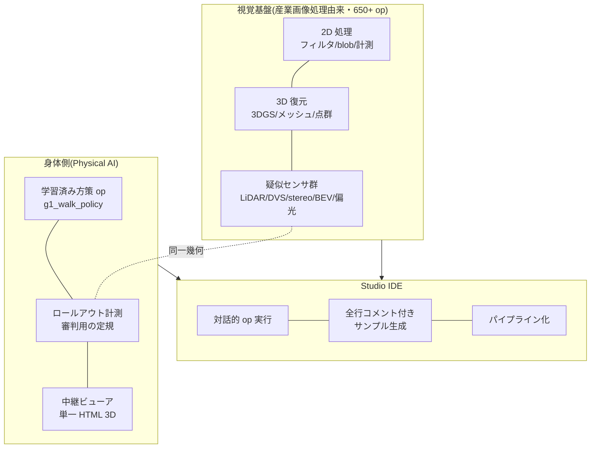

## 11.1 출발점: 산업 이미지 처리의 툴킷을 자작하고 있었다

원래 Fullseye는, 산업 이미지 처리의 상용 라이브러리(HALCON급)와 같은 조작감을 목표로 자작해 온 시각 툴킷이다. 필터, 모폴로지(형태를 살찌우고/여위게 하는 처리), blob 해석(블롭=이미지 내의 한 덩어리 영역의 검출·계측), 캘리브레이션, 3D 재구성…으로 **650개 초과의 op(처리 단위)**를 쌓아 올렸고, 대화적으로 op를 시험하고 잇는 IDE "Fullseye Studio"(상용으로 치면 HDevelop에 상당하는 것)도 만들었다. 3D 쪽은 3D Gaussian Splatting(다시점 이미지로부터의 3D 복원)이나 메시 재구성까지 도달해 있다.

### 11.1.1 대표 op의 처리 예 — 16연발

말보다 결과 이미지가 빠르므로, 분야를 횡단하여 16개, 입력과 출력을 나란히 놓는다(모두 실제로 Fullseye의 레지스트리 경유로 실행한 결과다).


*그림: Filters의 실처리 예 — 잡음 섞인 입력에 gauss_image를 동일 σ로 적용. 오른쪽 열은 제거된 성분(거의 잡음뿐이며, 구조는 에지 근방에 한정된다)(Fullseye 실출력). 입력은 skimage camera와 AI 생성 이미지(Gemini) 2종.*


*그림: 메디안 필터 — 소금·후추 노이즈만 지운다(윤곽은 보존)(Fullseye 실행 결과)*


*그림: Sobel 기울기 강도 — 밝기 변화의 세기를 그린다(Fullseye 실행 결과)*


*그림: edges의 실처리 예 — 같은 잡음 섞인 입력에 대해, 기울기 강도의 고정 임곗값으로는 에지가 굵고 끊기며 노이즈도 줍지만, canny(비최대 억제+히스테리시스)는 가늘고 연속된 윤곽을 반환한다(Fullseye 실출력). 입력은 skimage camera·AI 생성(Gemini)·자체 합성의 3종.*


*그림: 이진화+연결 성분 — "몇 개 있는가"를 셀 수 있는 형태로 만든다(색 구분=개체 식별)(Fullseye 실행 결과)*


*그림: 오프닝 — 작은 돌출부(솔트 노이즈)를 제거(Fullseye 실행 결과)*


*그림: 클로징 — 작은 구멍을 메운다(Fullseye 실행 결과)*


*그림: frequency의 실처리 예 — 주기 줄무늬 노이즈는 공간 평활화로는 지워지지 않지만(줄무늬째 흐려질 뿐), FFT 영역에서 피크를 자동 노치 제거(cx_fft → transfer function → cx_ifft, complexops 장의 op)하면 줄무늬만 사라진다(Fullseye 실출력). 줄무늬의 각도·주파수를 바꾼 3개 입력(skimage camera / AI 생성 2종)에 동일한 자동 노치 규칙을 적용.*


*그림: 로패스 복원 — 고주파 노이즈를 주파수 쪽에서 떨어뜨린다(에너지 실측 0.0042→0.0021)(Fullseye 실행 결과)*


*그림: texture의 실처리 예 — 평균 휘도가 같고 무늬만 다른 영역은 이진화로는 분리할 수 없지만, texture_laws(Laws 텍스처 에너지)는 결의 세기를 이미지화하여 분리한다(Fullseye 실출력). 입력은 자체 합성 2종+동봉 샘플 1종.*


*그림: Harris 코너 — 추적·교정의 기준이 되는 모서리를 검출(49점)(Fullseye 실행 결과)*


*그림: 렌즈 왜곡의 부여 — 배럴형(κ=+0.25)과 실패형(κ=−0.25). ※이 모델은 엄밀한 역변환을 갖지 않으므로 "보정 데모"는 싣지 않는다(정직)(Fullseye 실행 결과)*


*그림: 면적·무게중심 계측 — 검사 장비의 기본, 25개의 blob을 잰다(Fullseye 실행 결과)*


*그림: segmentation의 실처리 예 — 접촉하는 물체는 단순 이진화+라벨링으로는 한 덩어리로 융합하지만, otsu → distance_transform → local_max → watersheds_marker(마커 제어 분수령)의 고정 파이프라인으로 개별 분리할 수 있다(Fullseye 실출력). 입력은 AI 생성 이미지(Gemini) 2종+자체 합성 1종.*


*그림: 거리 변환 — 각 화소에서 배경까지의 거리 지도(Fullseye 실행 결과)*


*그림: 깊이→점군 — 2.5D에서 3D로(76,800점)(Fullseye 실행 결과)*


## 11.2 전기: "학습 완료 정책도 op로 만들어 버리면 된다"

로봇의 강화학습을 시작하자마자, 개발 체험의 단절에 시달렸다. 학습은 WSL+GPU+JAX의 세계, 검증이나 가시화는 Windows+numpy의 세계. 학습 완료 정책을 움직여 확인하는 것만으로 환경을 넘나드는 의식이 필요하다.

여기서 "**Studio 위의 Fullseye op로서 이 부분도 구현할 수 있으면 좋을 텐데**"라는 생각이 떠오른다. 해 보니, 이것이 놀랄 만큼 순순히 통했다.

- brax PPO 정책의 속내는, 관측 정규화+**4층×32 유닛의 작은 MLP**(아주 소박한 다층 신경망)+tanh. **추론만이라면 numpy 60줄**로 쓸 수 있다.
- 체크포인트(pickle)는 brax의 클래스 정의를 요구해 오지만, 클래스를 그 자리에서 스텁(형태뿐인 대역)으로 복원하면, **brax를 설치하지 않고** 가중치를 꺼낼 수 있다.
- 학습 환경의 관측 구성·잔차 제어·접촉 설정을 네이티브 MuJoCo(Windows판)로 충실히 이식하면, 롤아웃도 Windows에서 완결된다.

재구현한 numpy 추론과 brax 순정 추론의 출력 차이는 **최대 1.8×10⁻⁷**(float32의 반올림 오차 그 자체). 즉 수치적으로 동일하다. 이것으로,

```python
import fullseye
# 学習済みチェックポイントを渡すと、その場でロールアウト(実測)が走る
result = fullseye.g1_walk_policy("mjx_g1_walk12c_ckpt.pkl")
print(result["distance_m"], result["mean_speed"])  # 20.46 / 1.36 など実測値
```

이 1줄로, **GPU도 WSL도 brax도 없는 환경에서** 학습 성과가 움직이게 되었다. "학습은 GPU, 실행은 numpy 60줄" — 딥러닝의 학습과 추론이 얼마나 비대칭인지를, 이토록 체감한 순간은 없다.

### 11.2.1 Studio의 실제 화면

삽화만으로는 설득력이 없으므로, 실물 화면을 붙인다. HDevelop풍의 4면 구성(이미지 뷰 / op 브라우저 / 생성 코드 / 변수 워치)이다.


*그림: Fullseye Studio 기동 직후. op 브라우저에는 791개의 op가 늘어선다(통합 레지스트리 1,606 중 Studio의 대화 UI에 노출시키고 있는 부분집합). 실화면 캡처*


*그림: 샘플 갤러리. 각 샘플은 "1줄판"과 "단계 API판"의 양 형식으로 코드가 생성된다(이층 API 규약의 구현). 실화면 캡처*


*그림: 에지 검출(Canny) 샘플의 실행 결과. 파이프라인의 각 단이 변수 워치에 섬네일로 남는다. 실화면 캡처*


*그림: 코인 이미지의 세그멘테이션 표시(윤곽 오버레이+주석). 검사 장비의 현장에서 갖고 싶었던 "결과가 그 자리에서 보인다"를 재현하고 있다. 실화면 캡처*

정직한 주석을 하나: 본 장의 주역이었던 g1_walk_policy(학습 완료 정책 op)는, 통합 레지스트리 경유의 API에서는 부를 수 있지만, **Studio의 대화 브라우저에는 아직 노출되어 있지 않다**(791에 들어 있지 않다). "IDE 안에서 보행 정책을 돌린다"는, 현시점에서는 API 한 줄의 체험이고, GUI 체험으로서는 공사 중 — 여기도 정직하게.

> **🍙 쉽게 풀기 코너(학습과 추론 편)**
> "학습에 GPU로 3시간, 실행은 어느 컴퓨터에서나 한순간"이 이상하게 보일지도 모릅니다. 요리에 비유하면, 학습은 **레시피의 개발**(수천 번 시제품을 만들어 맛을 조정), 실행은 **완성된 레시피로 1번 만드는** 것. 시제품 제작에는 큰 주방이 필요하지만, 레시피 자체는 그저 종이 1장 — 이 기사의 정책도, 속내는 수천 개의 숫자 표에 지나지 않으며, 그것을 읽기만 한다면 60줄의 프로그램으로 충분한 것입니다.


*삽화: 이미지 생성 AI(Gemini)에 의함 — op를 잇는 작업대의 이미지*

## 11.3 도구 상자의 설계 규약

Fullseye의 op에는 이층 API의 규약을 깔아 놓았다. **1줄 퍼사드**(위의 `g1_walk_policy` 같은, 어쨌든 바로 움직이는 함수)와, **단계적 API**(세션을 만들고, reset/step을 새기고, 관측이나 궤도에 손을 대는 저층). 나아가 Studio의 샘플 코드는 전 행 코멘트+"여기를 고쳐 써서 확장한다"는 표시(EXTEND 마커) 포함으로 생성된다. 몇 달 뒤에 잊어버린 시점의 나 자신이야말로 첫 번째 사용자이기 때문이다.

## 11.4 Physical AI IDE의 조감도

지금 Fullseye/Studio에 실려 있는 것, 실으려 하는 것을 한 장에 정리한다.



목표하는 모습은 "**로봇의 눈(센서)과 신체(정책)와 심판(계측)을, 하나의 IDE의 op로서 동렬로 다룰 수 있는 환경**"이다. 이미지 처리의 op를 잇는 것과 같은 손놀림으로, "모의 LiDAR op → 학습 완료 보행 정책 op → 충돌 계측 op → 3D 중계 op"라는 파이프라인을 짤 수 있다. 운동회의 경기장·심판·중계가 전부 이 위에 실린다. 그것이, 이 개인 운동회의 뒤에서 만들고 있는 통합 개발 환경이다.

정직한 현재 위치도 써 둔다: 정책 op는 G1의 보행계뿐, evis의 근골격계는 CPU 실행으로 Studio 통합은 이제부터, H1 이후의 멀티로봇 대응은 진행 중(부록 B 참조). "아직 공사 중인 경기장에서 운동회를 하면서, 관중석을 증설하고 있는" 상태다.

# 12. 개최 요강 — 개인이 하기 위한 구성표

"자택 휴머노이드 운동회"를 재현하고 싶은 사람을 위해, 실제의 구성을 남겨 둔다.

| 항목 | 사용한 것 | 보충 |
|---|---|---|
| 물리 엔진 | MuJoCo(+ GPU판 MJX) | OSS. 로봇 학습의 디팩토 |
| 학습 | brax의 PPO 구현 | OSS. JAX 기반 |
| 로봇 모델 | MuJoCo Menagerie | OSS. 67 모델 수록, G1/H1도 공식계 모델 |
| 참조 모션 | LAFAN1 리타깃(HuggingFace 공개) | 사람의 모캡을 G1/H1 관절로 변환 완료. 라이선스는 CC BY-NC-ND(비상업)이므로 용도에 주의 |
| GPU | RTX 5090(32GB)×1 | 2 종목 동시 학습으로 합계 약 9,700 steps/s |
| 1 종목의 연습 시간 | 약 3〜4시간(1억 스텝) | 저녁에 걸어 두고 밤에 결과를 본다 |
| 검증·심판·중계 | Windows 네이티브 Python(numpy+MuJoCo) | GPU 불요. 학습 완료 정책은 numpy 60줄로 추론 |
| 근골격 선수(evis) | 자작(해부학 데이터로부터) | 학습은 CPU(XLA에 근육 계산이 실리지 않기 때문) |

비용감으로 말하면, 추가 투자는 GPU뿐이다. 경기장도 선수도 참조 모션도 심판 도구도, 전부 OSS와 자작 코드로 조달할 수 있다. 10년 전이라면 연구실의 계산 클러스터가 필요했을 규모의 실험이, 지금 정말로 개인의 책상에서 돌아간다.

시간 사용법의 요령도 하나. 학습은 수 시간 단위이므로, **"학습을 기다리는 시간"에 심판 도구나 중계 설비를 만드는** 것이 개인 개최의 요체다. 이 기사의 모의 센서도, 뷰어도, H1 대응도, 전부 어느 학습인가의 백그라운드에서 만들어졌다.

## 12.1 깊이 파기: 경기장 운영의 실무 — GPU 고르기·전기 요금·환경 구축의 함정
(제12장 「개최 요강」의 증보)

여기서부터는 사상 이야기를 그만두고, 지갑과 콘센트 이야기를 한다. 집에서 로봇 RL을 돌리는 데 무엇이 필요한가, 전기 요금은 실제로 얼마인가, 클라우드를 빌리는 쪽이 이득인가 — 전부 숫자로 확인해 본다.

### 12.1.1 GPU 고르기의 관점 — 왜 "VRAM이 정의"인가

GPU의 카탈로그에는 CUDA 코어 수, 클록, TFLOPS 등 숫자가 늘어서 있지만, 개인 연구에서 먼저 봐야 할 것은 **VRAM 용량**이다. 이유는 단순해서, **연산이 느린 것은 기다리면 되지만, 메모리가 부족하면 실험 자체가 돌지 않기** 때문이다. 속도는 시간으로 되살 수 있지만, 용량은 되살 수 없다.

본 운동회의 주최 머신에 실려 있는 RTX 5090의 공식 스펙은 다음과 같다(NVIDIA 공식 페이지 [^rtx5090]).

| 항목 | 공식값 |
|---|---|
| VRAM | 32 GB GDDR7(512-bit) |
| Total Graphics Power(TGP) | 575 W |
| 권장 시스템 전원 | 1000 W(구성에 따라 증가) |

컨슈머용(GeForce)으로는 최대인 32 GB로, 데이터센터용(H100의 80 GB 등)과의 중간에 위치한다.

여기서 정직하게 말해 두면, **로봇 RL은 LLM만큼 VRAM을 먹지 않는다**. LLM의 학습은 모델 파라미터·기울기·옵티마이저 상태만으로 수십 GB를 요구하지만, 로봇 RL의 정책 네트워크는 수 MB〜수십 MB 정도의 작은 MLP나 GRU다. 그러면 로봇 RL에서 VRAM은 어디에 효력을 발휘하는가 — **병렬 환경 수**다. MJX(MuJoCo의 JAX 구현) 같은 GPU 시뮬레이터는, 수천 개의 물리 세계를 동시에 돌려 경험을 모은다. 병렬 env 수를 늘릴수록 1초당 경험 수집량이 늘고, 벽시계 시간이 줄어든다. 그 env 수의 상한을 결정하는 것이 VRAM이다. 즉 LLM에서는 "VRAM = 모델이 실리는가", 로봇 RL에서는 "VRAM = 몇 명의 선수를 동시에 달리게 할 수 있는가". 32 GB는 "운동회의 참가 인원 정원"으로 작동하고 있다.

#### 쉽게 풀기: 작업 책상의 넓이

GPU의 연산 속도는 "손의 빠르기", VRAM은 "책상의 넓이"다. 손이 느려도 밤을 새우면 숙제는 끝나지만, 책상에 교과서를 펼칠 수 없으면 숙제는 시작되지 않는다. 로봇 RL의 경우, 책상 위에 펼치는 것은 거대한 사전 1권(LLM)이 아니라, 같은 문제집의 4096권의 복사본(병렬 환경)이다. 책상이 넓을수록 하룻밤에 풀 수 있는 페이지 수가 늘어난다.

### 12.1.2 전기 요금의 정직한 시산 — 1 종목에 얼마 드는가

숫자를 놓는다. 사용하는 단가는 2가지다.

- **기준 단가 31엔/kWh**: 공익사단법인 전국가정전기제품공정거래협의회가 카탈로그의 전기 요금 표시용으로 정한 전국 기준. 2022년 7월에 27엔에서 31엔으로 개정되었다 [^eftc] [^mynavi].
- **도쿄전력 종량전등 B의 제2단계(120〜300 kWh) 36.40엔/kWh(세금 포함)**: 2026년 시점의 단가표에서 [^tepco-tanka]. 다만 도쿄전력 공식 단가표 페이지는 본고 집필 시에 직접 취득할 수 없었으므로(HTTP 403), 이 숫자는 제3자의 단가표 정리에 의한 것이며, 계약 시에는 공식 페이지에서의 확인을 권한다. 실제 청구에는 이 외에 연료비 조정과 재생에너지 부과금 [^tepco-saiene]이 얹힌다.

학습 중의 GPU가 공식 TGP인 575 W에 계속 들러붙는다고 가정한 **상한 견적**으로, "1 종목 = 4시간 학습"을 계산한다(실제로는 물리 시뮬레이션과 학습의 전환으로 소비 전력은 오르내리므로, 이것은 천장값이다. 정확히 알고 싶다면 와트 체커로 실측하는 것이 정도).

| 시나리오 | 소비 전력의 가정 | 전력량 | 31엔/kWh | 36.40엔/kWh |
|---|---|---|---|---|
| 1 종목(4 h), GPU 단독 상한 | 575 W | 2.3 kWh | **약 71엔** | 약 84엔 |
| 1 종목(4 h), 시스템 전체(가정 750 W) | GPU 575 + CPU 등 175 W | 3.0 kWh | 약 93엔 | 약 109엔 |
| 하룻밤(8 h), 시스템 전체 | 750 W | 6.0 kWh | 약 186엔 | 약 218엔 |
| 매일 밤 8 h × 30일 | 750 W | 180 kWh | **약 5,580엔** | 약 6,552엔 |

(시스템 전체 750 W는 "GPU 575 W + CPU·메인보드·팬 등으로 175 W"라는 페르미 가정이다. 실측이 아니다.)

결론은 꽤 온화하다. **1 종목당 캔 커피 1개 미만, 매일 밤 돌려도 월 5〜7천 엔**. "집에서 RL이라니 전기 요금이 굉장하겠죠"라는 말을 자주 듣지만, 상한 견적으로도 이 정도였다. 다만 매일 밤 8시간 × 30일의 180 kWh는 일반 가정의 월간 사용량에 통째로 얹히는 규모이므로, 종량전등의 제3단계(300 kWh 초과, 도쿄전력에서 40.49엔/kWh [^tepco-tanka])로 밀어 넣는 효과는 있다.

### 12.1.3 WSL2 + CUDA + JAX의 함정 — 공식 문서에서 읽어야 할 곳

본 운동회의 학습은 Windows 머신 위의 WSL2(Ubuntu)에서 돌리고 있다. 이 구성에서 빠지기 쉬운 점을, 공식 문서의 해당 부분과 함께 든다.

**그 1: NVIDIA 드라이버는 Windows 쪽에만 넣는다.** 이것이 가장 중요하다. NVIDIA의 「CUDA on WSL User Guide」[^cuda-wsl]가 정하는 구성에서는, WSL2 내의 Linux에서 보이는 GPU는, Windows 쪽 드라이버가 WSL에 **매핑하여** 제공하는 것이다. WSL의 Ubuntu 안에 Linux용 GPU 드라이버를 넣어서는 안 된다(Windows 쪽 드라이버의 매핑을 부순다). WSL용 CUDA Toolkit 인스톨러(WSL-Ubuntu판)는, 이를 위해 일부러 **드라이버를 포함하지 않는** 패키지로 배포되고 있다 [^cuda-wsl]. "Ubuntu 셋업 기사의 절차를 그대로 복붙했더니 GPU가 안 보이게 되었다" 사고의 대부분은 이것이다.

**그 2: JAX는 기본값으로 VRAM의 75%를 선점한다.** JAX 공식의 「GPU memory allocation」페이지 [^jax-mem]에 있는 대로, JAX 프로세스는 기동 시에 **GPU 메모리 전체의 75%를 프리얼로케이트(선행 확보)**한다. 단편화를 막기 위한 사양이지만, 모르면 "학습은 시작도 안 했는데 VRAM이 24 GB 차 있다"고 놀라게 된다. 거동은 환경 변수로 바꿀 수 있다 [^jax-mem].

- `XLA_PYTHON_CLIENT_MEM_FRACTION=.XX` — 선행 확보의 비율을 변경(예 `.90`으로 90%)
- `XLA_PYTHON_CLIENT_PREALLOCATE=false` — 선행 확보를 그만두고, 필요해진 만큼만 확보(단편화 리스크와 맞바꿈)

같은 GPU에서 "학습 프로세스 + 녹화용 평가 프로세스"를 동시에 돌리고 싶은 경우는, 이 변수로 몫을 나누는 것이 공식 권장이다 [^jax-mem]. 본 운동회에서도, 학습 중에 다른 프로세스로 동영상을 찍을 때는 이것으로 자리를 나누고 있다.

**그 3: 설치는 JAX 공식의 조합표에 따른다.** JAX의 GPU판은 CUDA/cuDNN의 버전 조합에 민감하여, 공식 문서(docs.jax.dev)의 설치 절이 지정하는 pip의 extras(`jax[cuda12]` 등)를 그대로 쓰는 것이 최단이다. 여기서 야생 빌드나 오래된 기사의 절차를 섞으면, 움직이는 것처럼 보여도 수치가 부서지는 사고도 있을 수 있다. 또한 설치 절의 개별 URL은 본고에서는 실재 확인을 하지 않았으므로 들지 않는다(docs.jax.dev 톱에서 Installation을 따라가기 바란다).

### 12.1.4 살 것인가, 빌릴 것인가 — 클라우드 대체와의 손익분기

GPU를 사지 않고 클라우드에서 빌리는 선택지도, 정직하게 비교해 둔다. 2026년 8월 시점의 기준이다(클라우드 요금은 개정이 잦으므로, 반드시 공식 페이지에서 최신값을 확인하기 바란다).

| 서비스 | 기준 단가 | 출전 |
|---|---|---|
| Google Colab(유료 플랜) | 월정액제 + 컴퓨팅 유닛 종량. 공식 요금 페이지 참조 [^colab] | 공식 |
| RunPod(RTX 4090) | Secure Cloud 약 $0.69/h, Community 약 $0.34/h [^runpod] [^runpod-3rd] | 공식 페이지 + 제3자 집계 |
| Lambda(A100 40GB) | 약 $1.99/h [^lambda-3rd] | 제3자 집계(공식 페이지에서 최종 확인 요) |

손익분기를 페르미 시산해 본다. 가령 RTX 5090 머신 일습을 50만 엔으로 두면(**실판매 가격은 변동이 심해 미확인**. 어디까지나 자릿수의 시산이다), RunPod Secure의 RTX 4090이 $0.69/h ≒ 약 100엔/h(1달러 150엔으로 가정, **환율도 미확인의 임시값**)이므로,

- 50만 엔 ÷ 100엔/h = **약 5,000시간**이 단순한 분기점
- 매일 밤 8시간 돌린다면 5,000 ÷ 8 ≒ 625일, **약 1년 9개월**이면 사는 쪽이 싸지는 계산(자택의 전기 요금 8h 약 200엔/밤을 더해도 분기점은 1할 정도 멀어지는 정도)

다만 이 계산이 보여주는 진짜 교훈은 "어느 쪽이 싼가"가 아니다. **사용법의 성질**로 결정된다.

- **빌리는 쪽이 맞는 경우**: 가끔 큰 학습을 돌린다/H100급의 VRAM이 일시적으로 필요/일단 시험해 보고 싶다
- **사는 쪽이 맞는 경우**: 매일 밤 돌린다·시행 횟수로 밀어붙이는 연구 스타일/데이터를 밖에 내보내고 싶지 않다/"돌릴지 말지 망설이면 돌린다"의 심리적 허들을 제로로 만들고 싶다

개인 연구에서는 마지막 점이 효력을 발휘한다. 종량 과금은 1회마다 "돌릴 가치가 있는가"를 자문하게 만들지만, 사 버리면 실패 실험의 비용은 전기 요금 71엔이다. 시행 횟수가 말을 하는 진화적·탐색적 연구에서는, 이 심리적 차이가 그대로 실험 수의 차이가 된다.

### 12.1.5 소음·열·전원 — 생활과 동거시키기 위한 주의

마지막으로, 스펙표에 실리지 않는 생활면이다.

**전원 용량**: RTX 5090의 공식 권장 시스템 전원은 **1000 W**다 [^rtx5090]. "갖고 있는 850 W 전원으로 충분한가?"라는 질문에는, 공식 권장을 밑돈다, 고 답할 수밖에 없다. GPU 단독으로 최대 575 W를 끌어가므로, CPU(하이엔드로 150〜250 W급)와 기타를 더하면 850 W로는 피크 시의 여유(전원은 정격의 5〜8할로 운용하는 것이 효율·수명 면의 정석)가 거의 사라진다. 순간적인 전력 스파이크로 꺼지는 사고도 보고되는 대역이므로, 5090을 산다면 전원도 1000 W 이상으로의 갱신을 예산에 넣는 것이 정직한 권장이다.

**열**: 575 W는, 그대로 **575 W의 전기 히터**를 방에서 때는 것과 같은 발열이다. 여름철에 닫아 놓은 방에서 하룻밤 돌리면 실온은 확실히 오르고, 에어컨의 전기 요금이 위의 시산에 얹힌다. 반대로 겨울에는 난방으로 실감할 수 있을 정도로는 따뜻하다. 이것은 농담이 아니라, 소비 전력 이야기를 할 때는 에어컨 몫도 계산에 넣어야 한다, 는 이야기다.

**소음**: 학습 중의 GPU 팬은 부하에 따라 상당한 소리를 낸다. 침실과 같은 방에서 매일 밤 돌린다면, 팬 커브의 조정·케이스의 방음·애초에 다른 방에 두고 원격으로 쓰는(WSL2 + SSH 구성은 이것과 궁합이 좋다) 근처가 현실해다. 심야 시간대의 연속 가동은, 가족과의 합의 형성도 포함하여 "개최 요강"에 써 두어야 할 항목이다.

**차단기**: 일본의 가정용 콘센트는 1 회로 15〜20 A(1,500〜2,000 W)가 보통이다. 학습 PC(피크 약 1 kW)+ 에어컨 + 전자레인지가 동일 회로에 실리면 떨어진다. 운동회의 경기장은, 전기적으로도 전용 회로가 바람직하다 — 는 데까지 포함해서 "집에서 개최한다"는 것의 실무다.

---

### 출전 일람

[^goodhart-wiki]: Goodhart's law(원 논문 1975의 서지와 원문 인용을 포함): <https://en.wikipedia.org/wiki/Goodhart%27s_law>
[^strathern]: Strathern, M. (1997). "'Improving ratings': audit in the British University system." European Review, 5(3), 305–321: <https://www.cambridge.org/core/journals/european-review/article/improving-ratings-audit-in-the-british-university-system/FC2EE640C0C44E3DB87C29FB666E9AAB>
[^campbell]: Campbell, D. T. (1979). "Assessing the impact of planned social change." Evaluation and Program Planning(해설: Psych Safety "Goodhart's Law, Campbell's Law, and the Cobra Effect"): <https://psychsafety.com/goodharts-law-campbells-law-and-the-cobra-effect/>
[^perverse]: Perverse incentive(코브라 효과·1902년 하노이 쥐 구제의 항목): <https://en.wikipedia.org/wiki/Perverse_incentive>
[^coastrunners]: OpenAI (2016). "Faulty reward functions in the wild": <https://openai.com/index/faulty-reward-functions/>
[^vim]: JCGM 200:2012 "International vocabulary of metrology – Basic and general concepts and associated terms (VIM)" 3rd ed.(BIPM): <https://www.bipm.org/documents/20126/2071204/JCGM_200_2012.pdf>
[^iso5725-1]: ISO 5725-1:2023 "Accuracy (trueness and precision) of measurement methods and results — Part 1": <https://www.iso.org/standard/69418.html>
[^iso5725-2]: ISO 5725-2:2019 "— Part 2: Basic method for the determination of repeatability and reproducibility": <https://www.iso.org/standard/69419.html>
[^grr]: Gage R&R Study Procedure & Acceptance Criteria (AIAG MSA)(10×3×2 설계, %GRR 10/30% 기준의 해설): <https://calibrationos.com/learn/gage-rr-study-procedure>
[^osc2015]: Open Science Collaboration (2015). "Estimating the reproducibility of psychological science." Science 349(6251): <https://www.science.org/doi/10.1126/science.aac4716>
[^rr-cortex]: Chambers, C. D. (2013). "Registered reports: a new publishing initiative at Cortex." Cortex 49(3): <https://pubmed.ncbi.nlm.nih.gov/23347556/>
[^rr-cos]: Center for Open Science: Registered Reports: <https://www.cos.io/initiatives/registered-reports>
[^rr-nhb]: Chambers & Tzavella (2022). "The past, present and future of Registered Reports." Nature Human Behaviour: <https://www.nature.com/articles/s41562-021-01193-7>
[^recht]: Recht, B., Roelofs, R., Schmidt, L., & Shankar, V. (2019). "Do ImageNet Classifiers Generalize to ImageNet?" ICML 2019: <https://arxiv.org/abs/1902.10811>
[^raji]: Raji, I. D., Bender, E. M., Paullada, A., Denton, E., & Hanna, A. (2021). "AI and the Everything in the Whole Wide World Benchmark." NeurIPS 2021 Datasets and Benchmarks: <https://arxiv.org/abs/2111.15366>
[^rtx5090]: NVIDIA GeForce RTX 5090 공식 페이지(Specs: TGP 575W / 권장 시스템 전원 1000W / 32GB GDDR7): <https://www.nvidia.com/en-us/geforce/graphics-cards/50-series/rtx-5090/>
[^eftc]: 공익사단법인 전국가정전기제품공정거래협의회 자주 묻는 질문(전기 요금 기준 단가): <https://www.eftc.or.jp/qa/> (일본어)
[^mynavi]: 마이나비 뉴스 (2022-08-09) 「전기 요금의 기준 단가, 27엔/kWh에서 31엔/kWh로」: <https://news.mynavi.jp/article/20220809-2421349/> (일본어)
[^tepco-tanka]: 도쿄전력 종량전등 B 단가표 정리(29.80 / 36.40 / 40.49엔/kWh, 2026년 시점. 도쿄전력 공식 단가표 페이지는 집필 시 403이므로 제3자 정리): <https://enegent.jp/articles/tepco-juryou-b-tanka> (일본어)
[^tepco-saiene]: 도쿄전력 EP 재생에너지 부과금 단가 안내(종량전등 B의 요금 산정 방법): <https://www.tepco.co.jp/ep/renewable_energy/institution/pdf/20260501.pdf> (일본어)
[^cuda-wsl]: NVIDIA "CUDA on WSL User Guide": <https://docs.nvidia.com/cuda/wsl-user-guide/index.html>
[^jax-mem]: JAX 공식 문서 "GPU memory allocation": <https://docs.jax.dev/en/latest/gpu_memory_allocation.html>
[^colab]: Google Colab 요금(공식): <https://cloud.google.com/colab/pricing>
[^runpod]: RunPod RTX 4090 공식 페이지: <https://www.runpod.io/gpu-models/rtx-4090>
[^runpod-3rd]: RunPod RTX 4090 요금의 제3자 집계(Secure $0.69/h, Community $0.34/h, 2026년): <https://www.synpixcloud.com/blog/rtx-4090-cloud-rental-worth-it>
[^lambda-3rd]: Lambda GPU Cloud 요금의 제3자 집계(A100 40GB $1.99/h 등): <https://gpuvec.com/providers/lambda>

# 13. 미래를 향하여 — 최첨단을 시뮬레이션한다는 노는 법


*삽화: 이미지 생성 AI(Gemini)에 의함. 우주 엘리베이터와, 은하수를 걷는 미래의 동물들*

마지막으로, 이 운동회의 앞에 있는 풍경 이야기를 하고 싶다. 요컨대 "내가 다음에 놀고 싶은 것 리스트"인데, 조사해 봤더니 생각보다 멀리까지 길이 이어져 있었으므로, 지도째로 공유한다.

## 13.1 발상의 도구: 모순에서 생각하기

새로운 주제를 찾을 때, 나는 TRIZ(발명적 문제 해결 이론)의 "모순"이라는 사고방식을 빌리고 있다. "A를 좋게 하면 B가 나빠진다"는 막다른 길이야말로 다음 주제가 있는 곳이라는 관점이다. 이 기사의 실험도, 돌아보면 전부 모순의 해결이었다.

| 모순(A를 세우면 B가 서지 않는다) | 이 기사에서의 해결 | TRIZ식으로 말하면 |
|---|---|---|
| 코스를 지키게 하고 싶다 ⇔ 벌하면 탐색이 위축된다 | 벌이 아니라 관측을 준다(조타 2차원) | 「사전 작용」— 벌하기 전에, 피하기 위한 정보를 먼저 건넨다 |
| 생존시키고 싶다 ⇔ 멈추는 것이 최적이 된다 | 정체 조기 종료 | 「역전」— 벌을 가하는 것이 아니라, 아무것도 하지 않는 것을 실격으로 한다 |
| 근육의 생생함 ⇔ GPU 병렬의 속도 | torque-twin(토크의 쌍둥이)으로 배우고, 근육으로 되돌린다 | 「중개」— 직접 풀 수 없는 둘 사이에 중간 표현을 끼운다 |
| 정밀한 센서 ⇔ 실기에 없다 | 특권 교사로 키워 실기 센서의 학생에게 증류 | 「복사」— 비싼 진짜 대신 싼 사본으로 훈련한다 |

이 도구를 들고 "센싱"과 "우주"로 눈을 돌리면, 시뮬레이션으로 놀 수 있는 모순이 아직도 널려 있다.

## 13.2 센싱의 최전선에 있는 모순

- **이벤트 카메라**: "빠른 움직임을 찍고 싶다 ⇔ 프레임레이트를 올리면 데이터가 넘친다"의 해결책 그 자체(변화만 보낸다). 시뮬레이터(v2e, ESIM)가 공개되어 있으므로, **집에서 "이벤트 카메라로 본 세계"를 생성하여 정책에 먹이는 실험을 할 수 있다**. 본 기사의 1차원판의, 진짜 2차원판이다.
- **양자 센싱**: "감도를 올리고 싶다 ⇔ 노이즈도 는다"에 대한 양자역학으로부터의 회답. GPS가 닿지 않는 곳에서의 관성 항법이, 원자 간섭계의 궤도상 시험이나 특허의 단계까지 와 있다. 개인이 실기는 무리여도, 양자 상태의 시뮬레이션(QuTiP)은 무료로 만질 수 있다.
- **촉각·전자 피부**: "잡는 힘을 알고 싶다 ⇔ 센서를 늘리면 배선이 파탄난다". 카메라로 손끝의 변형을 보는 방식(GelSight계)은, 이미지 처리가 그대로 촉각이 되는 영역으로, 시각 장인에게는 반가운 입구다. evis의 젓가락 종목에서 언젠가 필요해질 기술이기도 하다.

## 13.3 우주 개발에 있는 모순

우주는 "시뮬레이션으로밖에 연습할 수 없는" 영역의 왕이다. 실패가 너무 비싸서, 본번 전에 반드시 가상으로 돌린다. 즉 **이 기사에서 해 온 놀이의 연장선 위에, 그대로 실려 있다**.

- **데브리 포획**: "잡고 싶다 ⇔ 닿으면 밀어 버려서 달아난다". 자유롭게 떠 있는 물체는, 닿는 순간에 운동량이 옮겨가 달아나 버린다. 사실 본 기사의 신체 시뮬레이션(MuJoCo)에서 중력을 끄면, 이 "자유 부유 물체의 포획"은 그대로 집에서 실험할 수 있는 주제다(나도 다른 실험계에서 만지고 있으며, 젓가락의 "잡을 수는 있는데 옮기지 못한다"와 같은 냄새가 나는 문제다). 일본 세력(Astroscale, JAXA CRD2)이 접근 실증에서 포획 실증으로 나아가고 있는, 지금 뜨거운 분야다.
- **월면 로보틱스**: "모래땅에서 걷고 싶다 ⇔ 모래의 물리는 계산이 무겁다". 달의 중력 1/6로 보행 RL을 돌리는 것은, 파라미터를 1개 바꾸는 것만으로 오늘부터 가능하다(모래는 어렵다. 그래서 재미있다).
- **행성 헬리콥터**: 화성의 대기 밀도는 지구의 1% — "양력이 필요하다 ⇔ 공기가 없다"라는 극단적인 모순을, Ingenuity는 회전수로 풀었다. 드론 종목(Crazyflie, 명감 참조)의 연장에, 행성의 하늘이 있다.

그리고 하나 더, 써 두고 싶은 현실적인 전망이 있다. **우주는 앞으로, 자원을 둘러싼 경쟁의 무대가 되어 간다**는 것이다. 달의 남극에는 영구 그림자 크레이터에 물 얼음이 있다고 여겨지고 있고, 물은 분해하면 산소와 수소 — 즉 호흡과 연료가 되므로 "달의 유전"에 비유된다. 소행성에는 백금족 등의 금속 자원. 그래서 각국·각 기업의 달·소행성 탐사는, 순수한 과학과 같은 정도로 "자원의 사전 답사"의 성격을 띠고 있고, 미국 중심의 아르테미스 합의와 중국·러시아 중심의 월면 기지 구상이 병주하는 구도는, 솔직히 말해 쟁탈전의 입구로 보인다.

이것을 쓰는 것은, 부추기고 싶어서가 아니다. 오히려 반대로, 2가지 의미에서 "그렇기 때문에"의 이야기다. 첫째, **이 경쟁의 주역은 인간이 아니라 로봇**이라는 것. 영구 그림자 크레이터 안은 마이너스 170℃ 이하로 사람은 들어갈 수 없고, 파는 것도 나르는 것도 짓는 것도, 본 기사에서 해 온 것 같은 Physical AI의 일이 된다. 달의 중력 1/6·레골리스(달의 모래) 위에서의 이동이나 굴삭은, 바로 물리 시뮬레이션으로 먼저 연습해 두는 부류의 문제로, 이 기사의 놀이의 연장선 위에, 생각보다 진지한 수요가 기다리고 있다. 둘째, 쟁탈전이 될지 여부는 **규칙 만들기 나름**이기도 하다는 것. 우주 조약(1967)은 천체의 영유를 금지하고 있지만, 자원의 채취·이용의 세칙은 아직 발전 도상이다. 기술의 속내를 아는 사람이 규칙의 논의에 참가할 수 있는지 여부로, 미래의 풍경은 바뀐다 — 기술을 배우는 의미는, 경쟁에 이기기 위해서만이 아니라, 경쟁을 슬기롭게 길들이는 쪽에 서기 위해서이기도 하다고 생각한다.

## 13.4 길은 전부 이어진 땅이었다

이 근처의 분야는, 논문·연구실·시뮬레이터·경진대회가 놀랄 만큼 오픈이다. 부록 G에, 실재를 확인한 URL만으로 자료집(공식 갤러리, 연구실, 강한 대학, 학회·전시회·경진대회)을 정리했다. 개인적으로 추천하는 동선은 "공식 동영상으로 놀란다 → 무료 시뮬레이터로 흉내 낸다 → 경진대회(ROBO-ONE 같은 개인 참가 가능한 것)를 보러 간다"의 3단이다. 나 자신, 베이징의 운동회 영상에서 시작하여 이 기사에 이르렀으므로, 이 동선의 실연 샘플 같은 것이다.

## 13.5 더 먼 이야기 — 우주 엘리베이터, 문명의 잣대, 애프터맨

여기까지는 몇 년 스케일의 이야기였지만, 고백하자면 나는 더 먼 이야기 — 우주 엘리베이터라든가, 문명의 진화 레벨이라든가, 인류가 사라진 뒤의 생물 상상도라든가 — 를 조사하고 다니는 것을 옛날부터 좋아한다. 운동회 기사의 마지막에 무슨 이야기냐고 생각될 것 같지만, 사실은 전부 "시뮬레이션의 씨앗"으로서 이어진 땅이다.

**우주 엘리베이터(space elevator)**는, 정지 궤도에서 지상으로 케이블을 늘어뜨려 승강기로 우주에 가는 구상이다. 1895년 치올콥스키의 착상에서 세어 130년, 아직 실현되지 않은 최대의 이유는 소재(필요한 비강도에 카본 나노튜브급이 필요)이지만, 재미있는 것은 **소재 이외의 문제 대부분을 시뮬레이션으로 먼저 갖고 놀 수 있다**는 점이다. 수만 km 케이블의 진동·공진, 승강기가 오를 때의 코리올리력에 의한 휘어짐, 데브리 회피를 위한 능동 제어 — 이것들은 케이블 역학의 수치 실험으로, 사실 본 기사에서 쓴 물리 엔진으로도 "짧은 테더+추"의 모형이라면 오늘부터 짤 수 있다. 장대한 구상 안에, 자택 사이즈의 연습 문제가 묻혀 있다.

**문명의 잣대(카르다쇼프 스케일)**는, 문명을 에너지 이용량으로 재는 유명한 분류다(행성 규모의 Type I, 항성 규모의 Type II, 은하 규모의 Type III). 칼 세이건의 보간식으로 현재의 인류는 대략 0.7 초반이라고 한다. 이것도 먼 이야기로 보이지만, 이 기사와 딱 하나 접점이 있다: **지능의 학습에는 에너지가 필요하다**는 것. GPU 1장으로 운동회를 열 수 있는 현재는, 뒤집어 말하면 "개인이 쓸 수 있는 에너지와 계산량"의 함수로서, 놀 수 있는 지능의 규모가 결정되는 시대다. 문명의 잣대 끄트머리에, 자택의 전기 요금이 이어져 있다, 는 실감에는 묘한 박력이 있다.

**애프터맨(After Man: A Zoology of the Future)**은, 동물학자 두걸 딕슨이 1981년에 그린 "인류 절멸로부터 5,000만 년 후의 동물 도감"이다. 골격이나 생태로부터 미래의 생물을 과학적으로 공상하는 speculative evolution(사변적 진화)이라는 장르의 고전으로, 소년 시절에 도서관에서 이것을 읽은 체험이, 나의 "해부학적으로 올바른 것을 움직이고 싶다"의 원류에 있는 것 같다. 그리고 현대의 재미는, **이 놀이가 그림에서 물리로 옮겨갈 수 있다**는 것. 본 기사의 evis는 700개의 근육으로 움직이는 현생 인류의 모형이지만, 같은 도구 세트로 골격을 늘이고, 근육을 바꿔 달고, 진화 계산으로 걷게 하면, 그것은 이미 "물리 엔진 속의 애프터맨"이다. 실제로, 나는 다른 실험계에서 수십 체의 공상 생물 모델을 헤엄치게 하는 놀이를 한 적이 있는데, 그것은 딕슨의 도감 페이지를 시뮬레이션으로 넘기는 감각이었다.

꿈 이야기와 실험 책상의 거리는, 생각하는 것보다 훨씬 가깝다. 베이징의 운동회도, 우주 엘리베이터의 케이블 진동도, 5,000만 년 후의 생물도, "물리 법칙 안에서 무엇이 성립하는지를 시험한다"는 같은 놀이의, 스케일 차이에 지나지 않는다.

## 13.6 뇌와의 접속과, 기억을 밖에 두는 미래

하나 더, 먼 것 같으면서 의외로 가까운 이야기를. **뇌 인터페이스(Brain-Computer Interface, BCI)**다. 두개골에 전극을 심어 생각으로 커서를 움직이는 침습형 임상 시험은 이미 여러 회사에서 진행 중이고, 혈관 경유로 전극을 보내는 방식이나, 손목의 근전(EMG)에서 "움직이려고 한 손가락"을 읽는 비침습 디바이스까지, 계단식으로 다양한 깊이의 "접속"이 실용화를 향하고 있다. 발화할 수 없는 환자의 뇌 활동에서 문장을 복원하는 연구도, 최근 몇 년 사이에 급격히 현실감을 띠었다. 이 기사의 문맥으로 말하면, BCI는 궁극의 입력 센서이며, 의수·의족이나 로봇의 "조종"이 근본부터 바뀌는 기술이다. 근전으로 evis의 근육 모델을 직접 움직인다, 같은 실험은, 아마 내가 살아 있는 동안에 집에서 시험할 수 있게 된다.

그리고 접속 이야기와 세트로 오는 것이, **기억을 밖에 두는 미래**다. 라기보다, 이것은 미래조차 아니어서, 인류는 계속 해 왔다. 문자는 기억의 외부화, 책은 검색할 수 있는 기억, 스마트폰은 들고 다닐 수 있는 기억. 그 연장선 위에 "나와의 대화나 작업의 문맥을 기억하고 있다가, 필요할 때 떠올리게 해 주는 AI"가 아무렇지 않게 있는 생활이 온다 — 나는 이것을 확신에 가까운 형태로 예상하고 있다. 고백하자면, 이 긴 기사 자체, AI에게 작업 기억을 대신 지게 하면서 쓰고 있다(실험의 수치도 실패의 경위도, 내 뇌가 아니라 기록층이 기억하고 있고, 나는 판단과 방향 설정에 집중하는 분업이다). 써 본 실감으로는, 이것은 "편해진다"기보다 "**잊는 것을 두려워하지 않고 생각할 수 있다**"는 질의 변화였다.

물론, 기억을 맡긴다면 맡기는 곳의 성질이 추궁된다. 누구의 서버에 있는가, 사라지지 않는가, 들여다보이지 않는가. 개인적으로는, 소중한 기억일수록 **내 수중의 기계에 두는**(로컬에서 움직이는 AI에게 갖게 하는) 것이 도리라고 생각하고 있고, 사실 이 운동회의 뒤에서 그런 구조도 만들고 있다. 뇌와 기계의 거리가 줄어드는 미래는, 아마 피할 수 없다. 그렇다면, 접속의 사양과 데이터를 두는 곳을 스스로 고를 수 있는 쪽에 있고 싶다 — 이것도 "관객인 채로 있지 않아도 된다"의 한 형태라고 생각한다.

## 13.7 기억의 외부화·실천편 — 논문 창고와 "제2의 뇌"와, 정직한 의심

외부 기억 이야기를 미래형으로 썼지만, 사실은 현재형으로도 하고 있으므로, 실물의 운용과, 운용하면서 안고 있는 의문을 써 둔다. 잘되고 있는 이야기만 쓰는 것은 페어하지 않으므로, 의심도 포함해서.

**1번째: 논문·기사의 사설 코퍼스.** 20여 개 분야의 논문 메타데이터(수만 건 규모)를 로컬에 집적하여, 분야별로 계층화한 "조사의 밑받침"을 운용하고 있다. 새로운 주제에 손을 대기 전에, 먼저 이 창고를 (AI에게) 뒤지게 해서, 선행 연구의 지형과 "아직 아무도 하지 않은 것 같은 틈새"를 파악하고 나서 착수한다 — 이 기사의 깊이 파기 장의 뒤에서도, 이 창고와 외부 검색의 2단 구성이 작동하고 있다. 오늘도 로봇 분야의 선반에, 이 기사의 조사에서 찾아낸 자원(학습 환경 모음, 모션 데이터, 리타깃터)을 몇 건 추가했다. 창고는 쓴 날에 보충한다, 가 운용 규칙이다.

**2번째: "제2의 뇌".** 메모 앱의 vault에, 프로젝트의 결정·실험의 교훈·자원으로의 이정표를 노트로 쌓고, 상호 링크로 잇는, 이른바 Zettelkasten풍의 운용이다. AI와의 분업에서는, 나의 판단이나 경위를 AI가 다음 세션에서 떠올리기 위한 공유 메모리로도 기능하고 있고, 이 기사의 "보상 설계 11개조"도 "밸런스의 물리 법칙"도, 원본은 거기에 살고 있다.

그런데, 정직한 이야기. **이 제2의 뇌, 정말로 맞는 것인지, 의심하면서 쓰고 있다.** 구체적인 의심은 3가지:

1. **쓴 안심감만 남는 문제.** 노트는 쓴 순간이 가장 기분 좋다. 하지만 검색되지 않으면 그저 창고이고, 매장과 보존은 밖에서 봐서는 구별이 안 된다. 실제로, 쓴 채로 한 번도 다시 읽지 않은 노트는 확실히 있다.
2. **두는 곳이 늘수록, 어디에 썼는지 모르게 되는 문제.** 코퍼스, vault, AI 쪽의 기억, 리포지토리의 docs — 기억의 외부화를 진행한 결과, "외부화한 곳의 관리"라는 새로운 일이 생겼다. 이것은 본말전도의 냄새가 난다.
3. **굿하트의 법칙, 다시.** "노트 수가 는다=지식이 늘었다"고 착각하기 쉽지만, 노트 수는 지표이지 목표가 아니다. 제9장에서 보상 해킹을 실컷 봐 온 몸으로서는, 자신의 지식 관리가 같은 구멍에 빠져 있지 않은지, 정기적으로 의심할 필요가 있다.

그래도 계속하고 있는 이유는 하나로, **"인용된 횟수"로 재면, 명확하게 흑자이기 때문**이다. 이 기사를 쓰는 과정에서, 과거의 노트가 실측값·교훈·URL의 형태로 수십 번 인용되었다(11개조도, 선 자세의 6 반복도, 노트가 없었다면 재실험이었다). 쓴 노트의 대부분은 사장되어도, 살아 있는 1할이 재실험의 며칠을 몇 번이고 절약해 준다 — 지금 시점의 판정은 "의심하면서 계속"이다. 맞는지의 최종 판정은, 아마 1년 후의 내가 한다.

## 13.8 작업의 그래프화 — 이것도 자기류라고 고백해 둔다

하나 더, 이 기사의 제작 체제 그 자체에 대해서. 사실 이 기사는, 내가 1개씩 작업한 성과가 아니라, **20체 이상의 AI 에이전트를 병렬로 달리게 해서 만들고 있다**. 학습을 GPU로 돌리면서, 그 대기 시간에 조사 담당·도판 담당·렌더 담당·검증 담당을 병주시키고, 나는 교통정리(무엇을 병렬로 하고, 무엇을 직렬로 하고, 어느 보고를 의심할지)에 전념한다 — 작업을 "선"이 아니라 "의존 관계의 그래프"로 설계하는 운용으로, 멋대로 그래프 엔지니어링이라고 부르고 있다. 보행의 학습(수 시간)과 센서 조사(30분)와 도판 생성(10분)은 의존이 없으므로 동시에 달린다. 젓가락의 진단은 수정의 전제이므로 직렬. 이 설계만으로, 체감의 스루풋은 자릿수 하나가 바뀐다.

다만, 이것도 **자기류라는 자각이 있다**. 워크플로 엔진이나 DAG 오케스트레이터라는 확립된 분야가 있는 것은 알고 있고, 그래도 쓰고 있는 것은 자작의 운용 규칙과 경험칙이다. 자기류이기에 생기는 약점도 보이고 있어서:

1. **병렬의 유혹에 진다.** 병렬로 할 수 있다고 해서 병렬로 해야 한다고는 할 수 없다. 감시 대상이 8개를 넘는 즈음부터, 나(교통정리 담당)가 율속이 된다.
2. **에이전트의 보고는 검증할 때까지 성과가 아니다.** "48mm 들어 올렸다"의 환상(15.1절)은 바로, 보고를 곧이곧대로 믿을 뻔한 사고였다. 병렬도를 올릴수록 검증이 얇아지는 압력이 걸린다 — 여기에 가장 큰 함정이 있다.
3. **그래프의 설계 자체가 속인화된다.** 어느 알갱이로 자를지, 어디에 게이트를 둘지는, 지금으로서는 나의 감이다. 감은 문서화되지 않은 지식의 별명이므로, 이것도 제2의 뇌행 숙제다.

그래도 하루에 이 물량(학습 7건·조사 5건·소재 100점 초과)이 돌아간 것은 사실이므로, 판정은 이것도 "의심하면서 계속". 개인 개발의 생산성은, AI의 성능 그 자체보다 "**AI들을 늘어세우는 방식**"으로 결정되는 시대가 오고 있는 것 같다 — 여기는 언젠가, 다른 기사에서 정면으로 쓴다.


# 14. 이 운동회에 섞여 있는 학문들 — DNA에서 광학까지


*삽화: 이미지 생성 AI(Gemini)에 의함*

다 써 갈 무렵에 깨달았는데, 이 운동회, 종목보다 학문의 수가 더 많다. 로봇 기사인 척하면서, 사실은 진화론과 통계학과 물리와 광학 이야기를 계속하고 있었다(마지막에 양자 이야기도 조금만). 모처럼이니, 어디에 무엇이 섞여 있었는지의 조감도를 남겨 둔다. 학교에서 배우는 과목이 "실험 책상 위에서 어떻게 이어지는가"의 샘플로 봐 주면 기쁘겠다.

## 14.1 진화론과 DNA — 적응도 지형 위를 걷는 선수들

강화학습과 생물 진화는, 수학적으로 꽤 닮은 구조를 하고 있다. 정책의 파라미터(수천 개의 수치)는 **유전자형(genotype)**, 실제의 걸음걸이는 **표현형(phenotype)**, 보상은 **적응도(fitness)**. 그리고 본편에서 실컷 당한 "국소해"는, 진화생물학자 시월 라이트가 1932년에 그린 **적응도 지형(fitness landscape)**의 언어로 말하면 "낮은 언덕의 정상에서 만족해 버리는" 현상 그 자체다. walk13계가 2 계통 모두 독립적으로 "제자리걸음"에 수렴한 것은, 생물로 말하면 **수렴 진화**(상어와 돌고래가 다른 계통인데 같은 형태가 된다)의 계산기판이었다. 서로 다른 초깃값에서 출발한 집단이, 같은 환경압 아래에서 같은 답에 도달한다 — 진화의 재현성을, 얄궂은 형태로 실연해 준 셈이다.

분자생물학 쪽의 비유도 하나. 학습 완료 체크포인트(수치 덩어리)가 DNA라면, numpy 60줄의 추론 코드는, 그것을 읽어 움직임으로 번역하는 **리보솜**에 상당한다. DNA(가중치)는 같아도, 읽는 기계가 달라도(brax든 numpy든) 같은 단백질(움직임)이 나온다 — 오차 1.8×10⁻⁷의 일치는, 번역 장치의 호환성 증명이었다. 생물의 중심 교의(DNA→RNA→단백질)의 "정보와 실행의 분리"라는 설계 사상은, 소프트웨어의 그것과 정말로 많이 닮았다.

그리고 13d vs 13e의 A/B 테스트는, 요컨대 **품종 개량**이다. 같은 조상(12c)에서, 환경압(보상)만 바꾼 2 계통을 키워 비교한다. 애프터맨(13.5절)이 공상으로 한 것을, 훨씬 작은 스케일로 매일 밤 하고 있다, 고도 말할 수 있다.

## 14.2 통계학 — 의심하기 위한 도구 일습

이 기사의 "심판진"의 정체는, 거의 통계학이다.

- **중앙값으로 보고한다**: 생존 시간의 분포는 "가끔 오래 살기"에 끌려가 일그러지므로, 평균이 아니라 중앙값(median)으로 보고했다. 이상치에 강한 대푯값을 고르는, 통계의 첫수다.
- **8 시드는 무엇을 위한 것인가**: 1개 코스의 성공은 우연일지도 모른다. 8가지의 장애물 배치(=표본)로 재는 것은 샘플 사이즈의 확보로, "충돌 2/8"과 "충돌 8/8"의 차이는 우연으로는 설명하기 어렵다, 는 판단의 토대가 된다. 8은 아직 적다, 는 감각도 포함해서 통계학이다.
- **사전 선언 게이트는 "사전 등록"**: 선 자세 RL의 합격 기준(3.6초)을 돌리기 전에 문서화한 것은, 임상 시험이나 심리학 재현성 운동에서 말하는 **프리레지스트레이션(사전 등록)**의 흉내다. 결과를 보고 나서 기준을 움직이면, 인간은 어떤 결과든 "성공"으로 보이게 만들 수 있으므로.
- **널 모델과의 비교**: "제어 없이 0.5초"를 재고 나서 "제어 있이 1.2초"를 이야기한다. 귀무가설(아무것도 하지 않아도 그렇게 된다)을 기각하고 나서 주장한다, 는 과학의 기본형.
- **자기상관으로 주기를 찾는다**: 보행 1 주기의 추출(30 프레임)은, 무릎 각도 시계열의 **자기상관 함수**(시간을 어긋나게 한 자기 자신과의 일치도)의 피크를 찾았을 뿐이다. 시계열 통계의 교과서 2장 정도의 도구가, mocap 가공의 현장에서 그대로 일한다.

## 14.3 물리 — 도망칠 수 없는 법칙들

시뮬레이션은 물리의 가정교사다. 속이면, 그 자리에서 채점된다.

- **kb > mg ≈ 590 N/m**(종목 4): 복원력의 기울기가 중력 전도 모멘트의 기울기를 넘지 않는 한 안정화되지 않는다 — 이것은 제어 이야기로 보여도, 사실은 그저 역학(퍼텐셜의 2계 미분의 부호)이다. 도립 진자라는 고전 물리의 숙제가, 700 근육의 인체에서도 한 글자 한 구절 그대로 출제되었다.
- **근육은 당긴다**: 장력은 양수밖에 되지 않는다. 이 단순한 제약(부등식 구속)이, 근육 배분이라는 최적화 문제의 형태를 결정하고 있다.
- **접촉은 힘으로 만든다**: 기하적으로 닿아 있어도, 힘이 균형 잡혀 있지 않으면 떨어진다(8.4 m/s² 사건). 위치와 힘의 이중성은, 물리를 수치로 풀 때 가장 자주 밟는 지뢰다.
- **모멘트 암**: 같은 근력이라도 자세에 따라 낼 수 있는 토크가 변한다. 지렛대의 원리가, 자세 인덱스 용량 사상이라는 긴 이름의 부품의 정체다.
- 덧붙여 13.5절의 우주 엘리베이터도, 본질은 "거대한 진자+회전계의 코리올리력"이라는 고전 역학의 문제다. 먼 꿈일수록, 뿌리는 고등학교 물리이거나 한다.

## 14.4 광학 — 로봇의 눈은 물리로 되어 있다

내 본업에 가장 가까운 절이다. 로봇의 "눈"은, 어느 것이나 빛의 물리의 응용이다.

- **LiDAR는 빛의 비행 시간(Time of Flight)**: 광속으로 왕복한 시간에서 거리를 낸다. 메아리의 빛 버전, 이라는 쉽게 풀기는 물리적으로도 정확하다.
- **스테레오 카메라는 삼각 측량**: 양눈의 시차에서 거리를 복원한다. 기선장(눈과 눈의 거리)이 측거 정밀도를 결정한다, 는 제약은 기하학이 그대로 사양서가 되는 예다.
- **이벤트 카메라는 대수 응답**: 화소마다 휘도의 **대수 변화**가 임곗값을 넘은 순간에만 발화한다. 인간의 망막도 밝기에 대수적으로 응답하므로(베버·페히너의 법칙), 저것은 망막의 설계 사상을 실리콘에 옮긴 장치다.
- **편광 이미징**: 반사광의 편광 상태에서 재질이나 면의 방향을 알 수 있다. 유리나 수면 등 "깊이 카메라가 어려워하는 것"을 보는 보완역으로, 빛의 파동으로서의 성질을 쓰는 센서다.
- **렌즈 왜곡**: 부록 F의 op 카탈로그에 `change_radial_distortion_points`(Brown의 왜곡 모델, 1971)가 실려 있는데, 이것은 카메라 교정의 고전이다. 1971년의 광학 논문이, 2026년의 로봇 눈의 교정에서 현역 — 좋은 물리는 수명이 길다.

## 14.5 양자 컴퓨터 — 아직 관중석에 있는, 언젠가 난입해 올 기술

정직하게 쓰면, 이 운동회에 양자 컴퓨터는 아직 출전하지 않았다. 하지만 관중석의 맨 앞줄에는 있고, 언젠가 경기에 난입해 올 가능성이 구체적으로 이야기되고 있는 기술이므로, 현재 위치를 써 둔다.

- **지금 양자 컴퓨터가 잘하는 것·못하는 것**: 잘하는(잘하게 될 것으로 기대되는) 것은, 조합 최적화, 양자계 그 자체의 시뮬레이션(분자·재료), 특정한 선형대수. 못하는 것은, 사실은 본 기사 같은 **대량 데이터의 반복 학습**이다. 강화학습의 주전장(GPU로 수천 환경을 병렬로 돌린다)은, 당분간은 고전 계산기의 씨름판이 계속된다는 것이 온당한 전망이라고 생각한다. "양자로 AI가 단숨에 똑똑해진다"는 이야기는, 현시점에서는 할인해서 듣는 것이 성실하다.
- **그래도 접점은 구체적으로 있다**: 첫째는 **최적화**. 이 기사의 근육 배분(700개의 장력 할당)이나 전신 제어(WBC-QP)는 최적화 문제 그 자체로, QAOA(양자 회로로 최적화를 근사하는 수법)나 양자 어닐링이 장래 경합이 될 수 있는 영역이다(현상은 고전 솔버가 압도적으로 빠르고 싸다, 는 것이 정직한 현재 위치). 둘째는 **재료**. 우주 엘리베이터의 절에서 "소재가 최대의 벽"이라고 썼는데, 신소재 탐색은 양자 컴퓨터의 본명 응용 중 하나로, 멀리 도는 것처럼 보여도 그 꿈에 가장 잘 듣을지도 모르는 루트다. 셋째는 13.2절에서 언급한 **양자 센싱** — 이쪽은 컴퓨터보다 한발 앞서, 이미 실기·특허의 단계까지 와 있다.
- **집에서 만지는 방법은 이미 있다**: 양자 회로의 시뮬레이션(QuTiP, Qiskit 등)은 무료이고, 몇 큐비트의 세계라면 보통의 PC로 놀 수 있다. 실기도, 클라우드 경유로 진짜 양자 프로세서에 회로를 던질 수 있는 시대다(소규모·노이즈 있음이지만, "진짜에 닿는다"는 임팩트는 크다). 운동회에 비유하면, 아직 경기는 못 하지만, 선수 등록의 창구는 이미 열려 있는 느낌이다.
- **쉽게 풀기**: 고전 컴퓨터가 "동전의 앞인지 뒤인지를 1장씩 확인하는" 계산이라면, 양자 컴퓨터는 "동전이 회전하고 있는 동안에, 앞과 뒤의 중첩인 채로 계산을 진행하는" 장치다. 다만 답을 보면(관측하면) 하나로 확정되어 버리므로, **원하는 답의 확률만을 잘 높이고 나서 관측한다**, 는 독특한 기술(간섭)이 필요하다. 이 "확률을 엮는" 감각이 고전과 전혀 다른 점이고, 잘하고 못하는 것이 뚜렷이 갈리는 이유이기도 하다.

---

하나의 놀이에 이만큼의 분야가 자연스럽게 섞여 오는 것은, Physical AI라는 영역의 성격이라고 생각한다. 신체(물리·해부학), 학습(통계·진화), 지각(광학), 그리고 계측(전부). 어느 한 과목만 잘해도 입구가 되고, 나처럼 한 과목(이미지)에서 들어가 나머지를 실험에게 혼나면서 익힌다, 는 순로도 있다.

## 14.6 깊이 파기: 진화 계산의 계보 — 가상 생물에서 제노봇까지
우리가 집에서 하고 있던 "보행을 진화시키는" 놀이에는, 사실 60년치의 학문의 축적이 있다. 여기서는 그 계보를, 고전에서 현재의 Quality-Diversity까지 단숨에 따라간다.

### 14.6.1 원점: Karl Sims의 가상 생물(1994)

이 분야를 이야기할 때, 누구나 가장 먼저 드는 영상이 있다. Karl Sims의 **Evolved Virtual Creatures**(1994)[^sims-page]다. SIGGRAPH '94 논문 "Evolving Virtual Creatures" [^sims-paper] [^sims-acm]에서 Sims는, **몸의 형태(형태)와, 근육을 움직이는 신경 회로의 양쪽**을 유전 알고리즘으로 자동 생성했다. 유전자는 "노드와 접속의 유향 그래프"로 쓰여 있어, 그래프가 체절의 반복(대칭인 다리, 절지동물 같은 분절)을 자연스럽게 표현할 수 있다. 적응도 함수를 "헤엄치는 속도", "걷는 속도", "뛰는 높이", "빛을 쫓는 능력" 등으로 바꾸는 것만으로, 전혀 다른 체격의 생물이 진화해 왔다.

영상은 지금도 그대로 볼 수 있다(Internet Archive [^sims-video] / YouTube [^sims-youtube]). 뱀처럼 굼틀거리며 헤엄치는 것, 물갈퀴 같은 판을 파닥거리는 것, 굴러서 전진하는 진묘한 것——**"설계자가 상상하지 않은 해"가 물리 시뮬레이션 속에서 솟아 나온다**는, 이 분야의 매력과 섬뜩함이 3분에 응축되어 있다. 30년 전의 영상인데, 우리의 evis가 이상한 걸음걸이를 "발명"해 왔을 때의 감각과 완전히 같다.

### 14.6.2 계보를 1줄씩: GA에서 Quality-Diversity까지

진화 계산은 하나의 수법이 아니라, 일족이다. 주요한 가지를 1줄씩.

| 연대 | 수법 | 한마디로 말하면 | 출전 |
|---|---|---|---|
| 1960s | **ES(진화 전략)** | Rechenberg와 Schwefel이 베를린 공과대학에서 창시. 실수 벡터를 돌연변이시켜 공학 설계(노즐 형상 등)를 최적화 | [^es-wiki] |
| 1975 | **GA(유전 알고리즘)** | John Holland『Adaptation in Natural and Artificial Systems』. 비트열의 유전자+교차+돌연변이라는 고전형을 정식화 | [^holland] |
| 2001 | **CMA-ES** | Hansen & Ostermeier. 돌연변이의 "형태"(공분산 행렬) 자체를 탐색의 이력으로부터 적응시킨다. 연속 최적화의 디팩토 | [^cmaes] [^cmaes-tutorial] [^cmaes-site] |
| 2002 | **NEAT** | Stanley & Miikkulainen. 신경망의 가중치뿐 아니라 **토폴로지(배선)를 작게 시작해 증축하면서** 진화시킨다 | [^neat] |
| 2011 | **노벨티 탐색** | Lehman & Stanley「목적을 버려라」. 적응도가 아니라 **"과거에 본 적 없는 행동"**에 보상을 주면, 속임수(deception)가 있는 문제에서 오히려 목적에 도달한다 | [^novelty] |
| 2015 | **MAP-Elites / QD** | Mouret & Clune. "가장 좋은 1개"가 아니라, **행동 특징의 격자의 각 칸에, 그 칸에서 최량인 해를 늘어놓은 지도**를 만든다(Quality-Diversity 최적화) | [^mapelites] |

표 안에서 3가지만 보충한다.

**CMA-ES** [^cmaes]는 "산 오르기의 보폭과 걷는 방향의 버릇을, 오르면서 배우는" 알고리즘이다. 성공한 돌연변이의 이력으로부터 공분산 행렬(= 어느 방향으로 얼마나 뛰면 좋은지의 타원)을 갱신해 나가기 때문에, 수십〜수백 차원의 연속 파라미터——예를 들면 보용의 CPG 파라미터나 보상의 가중치——의 최적화에서 지금도 첫 번째 후보로 꼽힌다. 도함수가 필요 없으므로, 시뮬레이터가 반환하는 "넘어졌다/나아갔다"만으로 돌릴 수 있는 것이 실무상의 강점이다.

**NEAT** [^neat]의 발명은 "네트워크의 배선째 진화시키면, 교차로 회로가 부서진다"는 문제에 대한 해였다. 유전자에 이력 마커(어느 세대에 태어난 접속인가)를 붙여 상동인 부위끼리만 교차시키고, 나아가 종분화(speciation)로 신기한 토폴로지를 "태어난 직후에 경쟁으로 죽이지 않도록" 보호한다. **작은 네트워크에서 시작해 필요한 만큼만 증축한다**는 사상은, 몸의 형태를 진화시키는 연구(후술하는 soft robotics계)의 생성 인코딩에 계승되고 있다.

**노벨티 탐색** [^novelty]의 간판 실험은 "속임수의 미로"다. 골까지의 거리를 적응도로 삼으면, 벽을 향해 돌진하는 막다른 골목(골에 가깝지만 지나갈 수 없다)에 집단이 빨려 들어가 풀리지 않는다. 그런데 "골에 가까운가"를 일절 보지 않고 "과거의 개체와 다른 장소에 도달했는가"에만 보상을 주면, 탐색이 미로 전체로 퍼지고, 결과적으로 골에 도달한다. **목적 함수 그 자체가 함정이 되는** 일이 있다, 는 사실은, 보상 설계에 시달린 사람일수록 뼈에 사무칠 것이다.

QD의 위력을 세상에 알린 것이 Cully 등의 Nature 논문 "Robots that can adapt like animals"(2015)[^cully]다. 6족 로봇에게 미리 MAP-Elites로 "걸음걸이의 지도"(다리 사용법이 다른 다양한 보용의 레퍼토리)를 만들게 해 두고, 다리가 부서지면 지도에 의지해 **2분 이내**에 대체 걸음걸이를 찾아낸다. "최량의 1개"밖에 갖지 않은 로봇은 부서지면 끝이지만, "다양한 서랍"을 가진 로봇은 다친 동물처럼 행동할 수 있다——다양성 그 자체가 성능이다, 라는 전회다.

#### 쉽게 풀기: 가장 빠른 1마리 vs 도감을 채우기

보통의 최적화는 "학년에서 가장 발이 빠른 아이를 1명 고르는" 작업이다. MAP-Elites는 "수영을 잘하는 아이, 팔힘이 센 아이, 키가 큰 아이……반 도감의 전체 칸에, 그 칸에서 제일인 아이를 붙여 나가는" 작업. 언뜻 돌아가는 길로 보이지만, "내일부터 한 발로 릴레이에 나가라"는 말을 들었을 때, 도감을 가진 팀만이 즉시 다른 에이스를 내보낼 수 있다.

### 14.6.3 RL vs 진화 — 현대적인 구분 사용

"보행 학습이라면 심층 강화학습(RL)이 있는데, 왜 이제 와서 진화?"는 정당한 의문이다. 전기가 된 것이 OpenAI의 "Evolution Strategies as a Scalable Alternative to Reinforcement Learning"(Salimans et al. 2017)[^openai-es]이었다. 기울기 역전파도 가치 함수도 쓰지 않는 단순한 ES가, MuJoCo나 Atari의 RL 벤치마크에서 경쟁력을 갖는다는 것, 그리고 워커 간의 통신이 난수 시드 정도로 끝나기 때문에 **병렬화가 이상하리만치 편하다**는 것을 보인 논문이다.

그 후의 정리는, 대략 이렇게 안착해 있다.

- **기울기를 순순히 쓸 수 있다면 기울기(RL)**. 정책의 파라미터 공간은 수백만 차원이 있고, 1 스텝마다의 밀한 보상이 있다면, 기울기 정보를 버릴 이유는 없다. 우리의 G1의 보행(PPO)은 이쪽이다.
- **진화가 이기는 것은, 기울기가 부서져 있는 곳**. 보상이 희소·속임수가 있다(노벨티 탐색의 주전장), 평가가 에피소드 단위로밖에 나오지 않는다, 그리고 무엇보다 **형태나 토폴로지 같은 이산 구조**(몸의 형태, 관절의 수, 네트워크의 배선)의 탐색. Sims의 가상 생물이나 NEAT는 바로 여기다.
- **양자는 배타가 아니다**. "몸의 형태는 진화로, 움직이는 법은 RL로"라는 중첩 구조는, Sims 이래의 왕도의 현대판이다. 하이퍼파라미터(학습률 등 사람이 손으로 정하는 설정값)나 보상의 가중치를 바깥쪽 루프에서 진화시키고, 안쪽에서 RL을 돌리는 구성도 실무에서는 일상적으로 쓰인다.

하나 더, 2017년 논문이 보여준 실무적인 교훈은 **통신의 저렴함**이다. RL의 분산 학습은 기울기(수백만 차원)를 워커 간에 주고받지만, ES는 각 워커가 "자기가 쓴 난수 시드와 득점"을 보고하기만 하면 된다. 수백〜수천 CPU로의 확장이 구조적으로 편해서, "똑똑한 1대"보다 "단순한 1,000대"가 이기는 장면이 있음을 보여주었다. 우리의 자택 환경으로 말하면, GPU로 PPO를 돌리는 G1과, CPU의 전체 코어로 ES의 개체를 흩뿌리는 진화계 잡은, 바로 이 분업의 축소판이다.

### 14.6.4 적응도 지형 — 얼어붙기 국소해와 "2 계통이 같은 웅덩이로"의 이론적 배경

**적응도 지형(fitness landscape)**이라는 비유는, 집단유전학자 Sewall Wright가 1932년의 국제유전학회의 논문에서 도입했다 [^wright] [^landscape-wiki]. 유전자형의 공간을 지형에 빗대어, 적응도의 높이를 표고로 삼는다. 진화는 안개 속의 산 오르기로, **근처보다 높은 곳(국소해)에 도착하면, 일단 골짜기로 내려가지 않는 한 거기서 움직일 수 없다**. Wright는 이 "봉우리에서 봉우리로 어떻게 건너는가"를 진화의 중심 문제로 삼았다. 90년 전의 집단유전학의 도구가, 그대로 우리의 최적화의 언어가 되어 있다.

본편에서 본 현상은, 이 지형의 언어로 깔끔하게 설명할 수 있다. **얼어붙기 국소해**는 "안개 속에서 처음 오를 수 있었던 낮은 봉우리에, 집단 전체가 주저앉아 버린" 상태. 그리고 **따로따로 돌린 2 계통이 같은 보용에 도달한** 것은, 수렴 진화(convergent evolution)의 계산기판이다. 생물에서는 돌고래와 어룡과 상어가 다른 계통에서 같은 유선형에 도달했다. 지형 쪽에 깊고 넓은 웅덩이가 있으면, 출발점이 달라도 물은 거기에 모인다——2 계통이 같은 웅덩이에 떨어졌다는 관찰은, 그 웅덩이가 "우연"이 아니라 지형의 구조였다는 것의 방증이 된다. 뒤집어 말하면, 노벨티 탐색이나 QD는 "물을 웅덩이 밖으로 퍼내는 펌프"로서 발명된 도구다.
