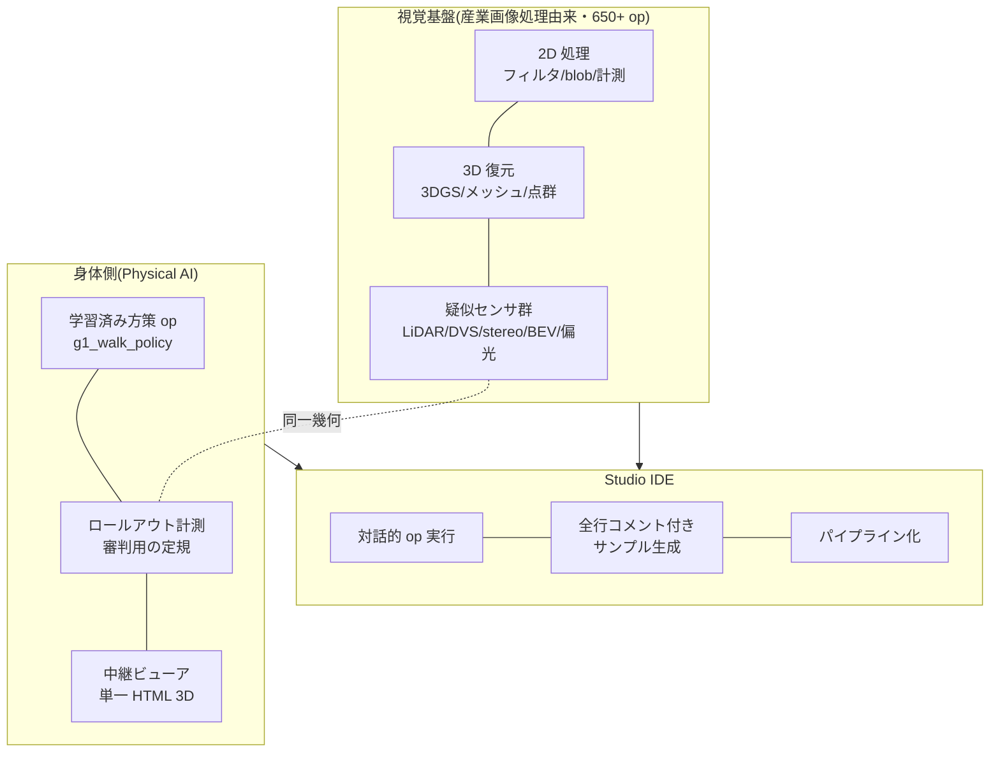

## 11.1 出发点: 我一直在自制工业图像处理工具箱

Fullseye 原本是以做到与工业图像处理的商用库(HALCON 级)相同操作手感为目标、一路自制积累起来的视觉工具箱。滤波、形态学(把形状加粗/变瘦的处理)、blob 分析(blob=图像内成块区域的检测与测量)、标定、3D 重建……堆起了**超过 650 个 op(处理单元)**,还做了可以交互式试 op、连 op 的 IDE "Fullseye Studio"(相当于商用界的 HDevelop)。3D 一侧已经够到 3D Gaussian Splatting(从多视点图像做 3D 复原)和网格重建。

### 11.1.1 代表性 op 的处理示例 — 连发 16 张

结果图比语言快,所以跨领域挑 16 个,把输入和输出摆在一起(全部是实际经由 Fullseye 注册表执行的结果)。


*图: Filters 的实际处理示例 — 对带噪输入以同一 σ 应用 gauss_image。右列是被去除的成分(几乎只有噪声,结构仅限边缘附近)(Fullseye 实际输出)。输入为 skimage camera 与 AI 生成图像(Gemini)2 种。*


*图: 中值滤波 — 只消掉椒盐噪声(保住轮廓)(Fullseye 运行结果)*


*图: Sobel 梯度幅值 — 画出亮度变化的强弱(Fullseye 运行结果)*


*图: edges 的实际处理示例 — 对同一带噪输入,梯度幅值的固定阈值给出的边缘又粗又断、还会捡噪声,而 canny(非极大值抑制+滞后阈值)返回细而连续的轮廓(Fullseye 实际输出)。输入为 skimage camera、AI 生成(Gemini)、自制合成 3 种。*


*图: 二值化+连通域 — 变成能数"有几个"的形式(着色=个体识别)(Fullseye 运行结果)*


*图: 开运算 — 去除小突起(盐噪声)(Fullseye 运行结果)*


*图: 闭运算 — 填补小孔(Fullseye 运行结果)*


*图: frequency 的实际处理示例 — 周期条纹噪声靠空间平滑消不掉(只是连条纹一起变糊),而在 FFT 域对峰做自动陷波去除(cx_fft → transfer function → cx_ifft,complexops 章的 op)后,只有条纹消失(Fullseye 实际输出)。对条纹角度、频率各异的 3 个输入(skimage camera / AI 生成 2 种)应用同一条自动陷波规则。*


*图: 低通复原 — 在频率侧滤掉高频噪声(能量实测 0.0042→0.0021)(Fullseye 运行结果)*


*图: texture 的实际处理示例 — 平均亮度相同、只有纹样不同的区域,用二值化无法分离,而 texture_laws(Laws 纹理能量)把肌理的强度图像化后即可分离(Fullseye 实际输出)。输入为自制合成 2 种+同捆样例 1 种。*


*图: Harris 角点 — 检测作为跟踪、标定基准的角(49 点)(Fullseye 运行结果)*


*图: 施加镜头畸变 — 桶形(κ=+0.25)与枕形(κ=−0.25)。※该模型不具有严格的逆变换,所以不放"校正演示"(诚实)(Fullseye 运行结果)*


*图: 面积、质心测量 — 检测设备的基本功,量 25 个 blob(Fullseye 运行结果)*


*图: segmentation 的实际处理示例 — 相互接触的物体用简单二值化+标注会融成 1 块,而 otsu → distance_transform → local_max → watersheds_marker(标记控制分水岭)的固定流水线能把它们逐个分离(Fullseye 实际输出)。输入为 AI 生成图像(Gemini)2 种+自制合成 1 种。*


*图: 距离变换 — 各像素到背景的距离的地图(Fullseye 运行结果)*


*图: 深度→点云 — 从 2.5D 到 3D(76,800 点)(Fullseye 运行结果)*


## 11.2 转机: "把训练好的策略也做成 op 不就行了"

开始搞机器人强化学习没多久,我就被开发体验的断裂困扰。训练在 WSL+GPU+JAX 的世界,验证和可视化在 Windows+numpy 的世界。只是想跑一下训练好的策略确认效果,都需要跨环境的仪式。

这时冒出一个念头:"**要是这一带也能作为 Studio 上的 Fullseye op 来实现就好了**"。一试,顺利得出奇。

- brax PPO 策略的内部,是观测归一化+**4 层×32 单元的小 MLP**(极朴素的多层神经网络)+tanh。**只做推理的话,numpy 60 行**就能写完。
- checkpoint(pickle)会索要 brax 的类定义,但把类当场恢复成桩(stub,只有形状的替身),就能**不安装 brax** 取出权重。
- 只要把训练环境的观测构成、残差控制、接触设定忠实移植到原生 MuJoCo(Windows 版),rollout 也能在 Windows 内完结。

重新实现的 numpy 推理与 brax 原生推理的输出差为 **最大 1.8×10⁻⁷**(正是 float32 的舍入误差本身)。也就是数值上同一。这样一来,

```python
import fullseye
# 学習済みチェックポイントを渡すと、その場でロールアウト(実測)が走る
result = fullseye.g1_walk_policy("mjx_g1_walk12c_ckpt.pkl")
print(result["distance_m"], result["mean_speed"])  # 20.46 / 1.36 など実測値
```

只用这 1 行,就能**在没有 GPU、没有 WSL、没有 brax 的环境里**跑起训练成果。"训练靠 GPU,执行靠 numpy 60 行" — 深度学习的训练与推理何等不对称,没有哪个瞬间让我体感得比这更彻底。

### 11.2.1 Studio 的实际画面

光放插图没有说服力,贴实物画面。HDevelop 风的 4 面板布局(图像视图 / op 浏览器 / 生成代码 / 变量监视)。


*图: Fullseye Studio 刚启动。op 浏览器里排着 791 个 op(统一注册表 1,606 个中暴露给 Studio 交互 UI 的子集)。实际截屏*


*图: 样例画廊。每个样例都会以"1 行版"和"分步 API 版"两种形式生成代码(二层 API 规约的实现)。实际截屏*


*图: 边缘检测(Canny)样例的运行结果。流水线的每一段都以缩略图留在变量监视里。实际截屏*


*图: 硬币图像的分割显示(轮廓叠加+标注)。复现了检测设备现场想要的"结果当场可见"。实际截屏*

一条诚实标注: 本章的主角 g1_walk_policy(训练好的策略 op),从统一注册表经由 API 可以调用,但**尚未暴露到 Studio 的交互浏览器**(不在那 791 个之内)。"在 IDE 里面跑行走策略",现时点是 API 一行的体验,作为 GUI 体验还在施工中 — 这里也照实说。

> **🍙 通俗讲解角(训练与推理篇)**
> "训练要 GPU 跑 3 小时,执行在哪台电脑上都是一瞬",可能显得不可思议。用做菜打比方,训练是**研发菜谱**(试做几千次来调整味道),执行是**照着完成的菜谱做 1 次**。试做需要大厨房,菜谱本身却只是 1 张纸 — 本文的策略,内部也不过是几千个数字的表,只是读它的话,60 行的程序就够了。


*插图: 由图像生成 AI(Gemini)绘制 — 连接 op 的工作台的意象*

## 11.3 工具箱的设计规约

Fullseye 的 op 实行二层 API 的规约。**1 行门面**(像上面的 `g1_walk_policy` 那样,总之立刻能动的函数)与**分步 API**(建会话、逐步 reset/step、能触碰观测与轨迹的低层)。另外,Studio 的样例代码在生成时全行带注释+"从这里改起来做扩展"的记号(EXTEND 标记)。因为几个月后忘光了的自己,才是第一个用户。

## 11.4 Physical AI IDE 的蓝图

把现在 Fullseye/Studio 上已经载着的、和正要载上去的,汇成一张图。



想要抵达的样子,是"**机器人的眼睛(传感器)、身体(策略)、裁判(测量),能在一个 IDE 里作为 op 平起平坐的环境**"。用连接图像处理 op 的同一种手法,组出"仿真 LiDAR op → 训练好的行走策略 op → 碰撞测量 op → 3D 转播 op"这样的流水线。运动会的赛场、裁判、转播全都落在它上面。这,就是我在这场个人运动会的幕后打造的集成开发环境。

诚实的现状也写上: 策略 op 只有 G1 的行走系,evis 的肌骨系是 CPU 执行、Studio 集成还在后头,H1 以后的多机器人支持进行中(见附录 B)。属于"一边在还没完工的体育场里开运动会,一边加盖观众席"的状态。

# 12. 举办要项 — 个人操办用的配置表

给想复现"家庭人形机器人运动会"的人,放上实际的配置。

| 项目 | 用了什么 | 补充 |
|---|---|---|
| 物理引擎 | MuJoCo(+ GPU 版 MJX) | OSS。机器人学习的事实标准 |
| 训练 | brax 的 PPO 实现 | OSS。基于 JAX |
| 机器人模型 | MuJoCo Menagerie | OSS。收录 67 个模型,G1/H1 也是官方系模型 |
| 参考动作 | LAFAN1 重定向(HuggingFace 公开) | 已把人的动捕转换到 G1/H1 关节。许可为 CC BY-NC-ND(非商用),用途注意 |
| GPU | RTX 5090(32GB)×1 | 2 个项目同时训练合计 约 9,700 steps/s |
| 1 个项目的练习时间 | 约 3〜4 小时(1 亿步) | 傍晚布置好,晚上看结果 |
| 验证、裁判、转播 | Windows 原生 Python(numpy+MuJoCo) | 无需 GPU。训练好的策略用 numpy 60 行推理 |
| 肌骨选手(evis) | 自制(据解剖学数据) | 训练用 CPU(肌肉计算上不了 XLA) |

从花费上说,追加投资只有 GPU。赛场、选手、参考动作、裁判工具,全部由 OSS 和自制代码包办。10 年前需要研究室计算集群的实验规模,现在真的能在个人的书桌上转起来。

时间安排的诀窍也给一条。训练以小时为单位,所以**利用"等训练的时间"制作裁判工具和转播设备**,是个人办赛的要诀。本文的仿真传感器也好、查看器也好、H1 支持也好,全部是在某场训练的后台做出来的。

## 12.1 深挖: 赛场运营的实务 — 选 GPU、电费、环境搭建的坑
(第 12 章"举办要项"的增补)

从这里开始不谈思想,谈钱包和插座。在自宅跑机器人 RL 需要什么、电费实际是多少、租云是不是更划算 — 全部用数字来验证。

### 12.1.1 选 GPU 的视角 — 为什么"VRAM 为王"

GPU 的产品目录上排着 CUDA 核心数、频率、TFLOPS 等数字,但个人研究首先该看的是 **VRAM 容量**。理由很简单: **运算慢可以等,内存不够,实验本身就跑不起来**。速度能用时间买回来,容量买不回来。

本运动会主办机上载着的 RTX 5090 的官方规格如下(NVIDIA 官方页 [^rtx5090])。

| 项目 | 官方值 |
|---|---|
| VRAM | 32 GB GDDR7(512-bit) |
| Total Graphics Power(TGP) | 575 W |
| 推荐系统电源 | 1000 W(视配置增加) |

作为消费级(GeForce)是最大的 32 GB,位于与数据中心级(H100 的 80 GB 等)之间。

这里先诚实说一句: **机器人 RL 不像 LLM 那样吃 VRAM**。LLM 的训练光是模型参数、梯度、优化器状态就要求几十 GB,而机器人 RL 的策略网络是几 MB〜几十 MB 级的小 MLP 或 GRU。那机器人 RL 里 VRAM 到底作用在哪 — **并行环境数**。MJX(MuJoCo 的 JAX 实现)这类 GPU 仿真器,同时跑数千个物理世界来收集经验。并行 env 数越多,每秒的经验采集量越大,壁钟时间越短。而决定 env 数上限的,就是 VRAM。也就是说,LLM 里"VRAM = 模型装不装得下",机器人 RL 里"VRAM = 能同时让多少选手上场"。32 GB 是作为"运动会的参赛名额"在起作用。

#### 通俗讲解: 书桌的大小

GPU 的运算速度是"手速",VRAM 是"书桌的大小"。手慢,熬夜也能把作业写完;书桌上摊不开课本,作业根本没法开始。机器人 RL 的情况,摊在桌上的不是一本巨大的辞典(LLM),而是同一本习题集的 4096 份复印件(并行环境)。桌子越大,一晚能解完的页数越多。

### 12.1.2 电费的诚实试算 — 1 个项目要花多少钱

摆数字。单价用 2 种。

- **参考单价 31 日元/kWh**: 公益社团法人 全国家庭电气制品公正取引协议会为产品目录的电费标示制定的全国参考值。2022 年 7 月从 27 日元改定为 31 日元 [^eftc] [^mynavi]。
- **东京电力 从量电灯 B 第 2 档(120〜300 kWh)36.40 日元/kWh(含税)**: 据 2026 年时点的单价表 [^tepco-tanka]。另外,东京电力官方的单价表页在本文撰写时无法直接获取(HTTP 403),此数字来自第三方的单价表汇总,签约时建议在官方页面确认。实际账单还要在此之上加燃料费调整和可再生能源附加费 [^tepco-saiene]。

以训练中 GPU 一直贴在官方 TGP 575 W 上的假设做**上限估算**,计算"1 个项目 = 4 小时训练"(实际上物理仿真与训练交替切换、功耗上下波动,这是天花板值。想准确知道,正道是用功率计实测)。

| 场景 | 功耗假设 | 电量 | 31 日元/kWh | 36.40 日元/kWh |
|---|---|---|---|---|
| 1 个项目(4 h),GPU 单体上限 | 575 W | 2.3 kWh | **约 71 日元** | 约 84 日元 |
| 1 个项目(4 h),整机(假设 750 W) | GPU 575 + CPU 等 175 W | 3.0 kWh | 约 93 日元 | 约 109 日元 |
| 一晚(8 h),整机 | 750 W | 6.0 kWh | 约 186 日元 | 约 218 日元 |
| 每晚 8 h × 30 天 | 750 W | 180 kWh | **约 5,580 日元** | 约 6,552 日元 |

(整机 750 W 是"GPU 575 W + CPU、主板、风扇等 175 W"的费米假设,不是实测。)

结论相当温和。**每个项目不到一罐咖啡,每晚都跑也就每月 5〜7 千日元**。常有人说"在自宅搞 RL,电费不得了吧",上限估算也不过这个程度。不过,每晚 8 小时 × 30 天的 180 kWh 是整个叠加在普通家庭月用电量之上的规模,确实有把用电推进从量电灯第 3 档(超 300 kWh,东电 40.49 日元/kWh [^tepco-tanka])的效果。

### 12.1.3 WSL2 + CUDA + JAX 的坑 — 官方文档的必读处

本运动会的训练跑在 Windows 机器上的 WSL2(Ubuntu)里。这一配置容易踩的点,附上官方文档的对应位置列出。

**其一: NVIDIA 驱动只装在 Windows 侧。** 这是最重要的。按 NVIDIA 的 "CUDA on WSL User Guide" [^cuda-wsl] 规定的配置,WSL2 内的 Linux 看到的 GPU,是 Windows 侧的驱动**映射**给 WSL 提供的。不要在 WSL 的 Ubuntu 里装 Linux 用的 GPU 驱动(会破坏 Windows 侧驱动的映射)。WSL 用的 CUDA Toolkit 安装包(WSL-Ubuntu 版),正是为此特意作为**不含驱动**的包发布的 [^cuda-wsl]。"把 Ubuntu 配置文章的步骤原样照抄,结果 GPU 不见了"的事故,大半是这个。

**其二: JAX 默认先占 VRAM 的 75%。** 如 JAX 官方的 "GPU memory allocation" 页 [^jax-mem] 所写,JAX 进程在启动时会**预分配(预先确保)GPU 内存整体的 75%**。这是防止碎片化的设计,但不知道的话会吓一跳:"训练都还没开始,VRAM 已经被埋掉 24 GB"。行为可以用环境变量改变 [^jax-mem]。

- `XLA_PYTHON_CLIENT_MEM_FRACTION=.XX` — 更改预分配的比例(例 `.90` 为 90%)
- `XLA_PYTHON_CLIENT_PREALLOCATE=false` — 停止预分配,需要多少确保多少(以碎片化风险为代价)

想在同一块 GPU 上同时跑"训练进程 + 录像用的评估进程"时,用这个变量分配份额是官方推荐 [^jax-mem]。本运动会在训练中另起进程录视频时,也是这样分座位的。

**其三: 安装遵照 JAX 官方的组合表。** JAX 的 GPU 版对 CUDA/cuDNN 的版本组合敏感,直接使用官方文档(docs.jax.dev)安装节指定的 pip extras(`jax[cuda12]` 等)是最短路径。在这里混入野生 build 或旧文章的步骤,可能发生看似能跑、数值却坏掉的事故。另外,安装节的具体 URL 本文未确认实际存在,故不列出(请从 docs.jax.dev 首页找 Installation)。

### 12.1.4 买,还是租 — 与云替代方案的盈亏分界

不买 GPU、租云的选项,也诚实比较一下。这是 2026 年 8 月时点的参考(云价格改定频繁,请务必在官方页面确认最新值)。

| 服务 | 参考单价 | 出处 |
|---|---|---|
| Google Colab(付费方案) | 月费制 + 计算单元按量。参见官方价格页 [^colab] | 官方 |
| RunPod(RTX 4090) | Secure Cloud 约 $0.69/h,Community 约 $0.34/h [^runpod] [^runpod-3rd] | 官方页 + 第三方汇总 |
| Lambda(A100 40GB) | 约 $1.99/h [^lambda-3rd] | 第三方汇总(最终请在官方页确认) |

来做一发盈亏分界的费米试算。假设 RTX 5090 整机一套 50 万日元(**实售价格波动剧烈、未确认**,只是数量级的试算),RunPod Secure 的 RTX 4090 是 $0.69/h ≒ 约 100 日元/h(按 1 美元 150 日元假设,**汇率也是未确认的暂定值**),于是

- 50 万日元 ÷ 100 日元/h = **约 5,000 小时** 是单纯的分界点
- 每晚跑 8 小时,则 5,000 ÷ 8 ≒ 625 天,**约 1 年 9 个月**后买比租便宜(把自家电费每晚 8h 约 200 日元加进去,分界点也只远 1 成左右)

不过,这笔账给出的真正教训不是"哪个便宜",而是由**使用方式的性质**决定。

- **适合租**: 偶尔跑大训练/临时需要 H100 级的 VRAM/想先试试
- **适合买**: 每晚都跑、靠试错次数硬刚的研究风格/数据不想外流/想把"犹豫要不要跑就跑"的心理门槛降到零

个人研究里,最后一点最要命。按量计费让你每一次都自问"这一跑值不值",买断之后,失败实验的成本就是电费 71 日元。在试错次数说话的进化式、探索式研究里,这种心理差就直接变成实验数量的差。

### 12.1.5 噪音、发热、电源 — 与生活同居的注意事项

最后是规格表上不写的生活面。

**电源容量**: RTX 5090 的官方推荐系统电源是 **1000 W** [^rtx5090]。"手头的 850 W 电源够吗?"这个问题,只能回答: 低于官方推荐。GPU 单体最大拉 575 W,加上 CPU(高端 150〜250 W 级)和其他部件,850 W 在峰值时的余量(电源按额定的 5〜8 成运行是效率、寿命上的定石)就基本消失。这也是有瞬时功率尖峰导致掉电事故报告的区间,所以要买 5090,诚实的建议是把电源更新到 1000 W 以上也列入预算。

**发热**: 575 W,就等于在房间里烧一台 **575 W 的电暖炉**。夏天在关紧的房间跑一晚,室温必然上升,空调的电费会叠加到上面的试算上。反过来冬天暖和到能当暖气来体感。这不是玩笑,而是说谈功耗时,应该把空调的份也算进账。

**噪音**: 训练中的 GPU 风扇视负载会发出相当大的声音。要在与卧室同一个房间每晚跑,现实解是调整风扇曲线、机箱隔音、或者干脆放到别的房间远程使用(WSL2 + SSH 的配置与此非常合拍)。深夜时段的连续运转,包括与家人达成共识在内,都是该写进"举办要项"的条目。

**断路器**: 日本的家用插座一般是 1 回路 15〜20 A(1,500〜2,000 W)。训练 PC(峰值约 1 kW)+ 空调 + 微波炉挂在同一回路上会跳闸。运动会的赛场,在电气上也最好有专用回路 — 连这些都算进去,才是"在自宅举办"的实务。

---

### 出典一览

[^goodhart-wiki]: Goodhart's law(含 1975 年原论文的书目与原文引用): <https://en.wikipedia.org/wiki/Goodhart%27s_law>
[^strathern]: Strathern, M. (1997). "'Improving ratings': audit in the British University system." European Review, 5(3), 305–321: <https://www.cambridge.org/core/journals/european-review/article/improving-ratings-audit-in-the-british-university-system/FC2EE640C0C44E3DB87C29FB666E9AAB>
[^campbell]: Campbell, D. T. (1979). "Assessing the impact of planned social change." Evaluation and Program Planning(解说: Psych Safety "Goodhart's Law, Campbell's Law, and the Cobra Effect"): <https://psychsafety.com/goodharts-law-campbells-law-and-the-cobra-effect/>
[^perverse]: Perverse incentive(眼镜蛇效应、1902 年河内灭鼠的条目): <https://en.wikipedia.org/wiki/Perverse_incentive>
[^coastrunners]: OpenAI (2016). "Faulty reward functions in the wild": <https://openai.com/index/faulty-reward-functions/>
[^vim]: JCGM 200:2012 "International vocabulary of metrology – Basic and general concepts and associated terms (VIM)" 3rd ed.(BIPM): <https://www.bipm.org/documents/20126/2071204/JCGM_200_2012.pdf>
[^iso5725-1]: ISO 5725-1:2023 "Accuracy (trueness and precision) of measurement methods and results — Part 1": <https://www.iso.org/standard/69418.html>
[^iso5725-2]: ISO 5725-2:2019 "— Part 2: Basic method for the determination of repeatability and reproducibility": <https://www.iso.org/standard/69419.html>
[^grr]: Gage R&R Study Procedure & Acceptance Criteria (AIAG MSA)(10×3×2 设计、%GRR 10/30% 判据的解说): <https://calibrationos.com/learn/gage-rr-study-procedure>
[^osc2015]: Open Science Collaboration (2015). "Estimating the reproducibility of psychological science." Science 349(6251): <https://www.science.org/doi/10.1126/science.aac4716>
[^rr-cortex]: Chambers, C. D. (2013). "Registered reports: a new publishing initiative at Cortex." Cortex 49(3): <https://pubmed.ncbi.nlm.nih.gov/23347556/>
[^rr-cos]: Center for Open Science: Registered Reports: <https://www.cos.io/initiatives/registered-reports>
[^rr-nhb]: Chambers & Tzavella (2022). "The past, present and future of Registered Reports." Nature Human Behaviour: <https://www.nature.com/articles/s41562-021-01193-7>
[^recht]: Recht, B., Roelofs, R., Schmidt, L., & Shankar, V. (2019). "Do ImageNet Classifiers Generalize to ImageNet?" ICML 2019: <https://arxiv.org/abs/1902.10811>
[^raji]: Raji, I. D., Bender, E. M., Paullada, A., Denton, E., & Hanna, A. (2021). "AI and the Everything in the Whole Wide World Benchmark." NeurIPS 2021 Datasets and Benchmarks: <https://arxiv.org/abs/2111.15366>
[^rtx5090]: NVIDIA GeForce RTX 5090 官方页(Specs: TGP 575W / 推荐系统电源 1000W / 32GB GDDR7): <https://www.nvidia.com/en-us/geforce/graphics-cards/50-series/rtx-5090/>
[^eftc]: 公益社団法人 全国家庭電気製品公正取引協議会 よくある質問(电费参考单价): <https://www.eftc.or.jp/qa/>(日文)
[^mynavi]: マイナビニュース (2022-08-09) 「電気料金の目安単価、27円/kWhから31円/kWhに」: <https://news.mynavi.jp/article/20220809-2421349/>(日文)
[^tepco-tanka]: 东京电力 从量电灯 B 单价表汇总(29.80 / 36.40 / 40.49 日元/kWh,2026 年时点。东电官方单价表页撰写时 403,故用第三方汇总): <https://enegent.jp/articles/tepco-juryou-b-tanka>(日文)
[^tepco-saiene]: 东京电力 EP 可再生能源附加费单价通知(从量电灯 B 的费用计算方法): <https://www.tepco.co.jp/ep/renewable_energy/institution/pdf/20260501.pdf>(日文)
[^cuda-wsl]: NVIDIA "CUDA on WSL User Guide": <https://docs.nvidia.com/cuda/wsl-user-guide/index.html>
[^jax-mem]: JAX 官方文档 "GPU memory allocation": <https://docs.jax.dev/en/latest/gpu_memory_allocation.html>
[^colab]: Google Colab 价格(官方): <https://cloud.google.com/colab/pricing>
[^runpod]: RunPod RTX 4090 官方页: <https://www.runpod.io/gpu-models/rtx-4090>
[^runpod-3rd]: RunPod RTX 4090 价格的第三方汇总(Secure $0.69/h、Community $0.34/h,2026 年): <https://www.synpixcloud.com/blog/rtx-4090-cloud-rental-worth-it>
[^lambda-3rd]: Lambda GPU Cloud 价格的第三方汇总(A100 40GB $1.99/h 等): <https://gpuvec.com/providers/lambda>

# 13. 面向未来 — 把最前沿拿来仿真的玩法


*插图: 由图像生成 AI(Gemini)绘制。太空电梯,与走在银河上的未来动物们*

最后,请允许我聊聊这场运动会前方的风景。说白了就是"我接下来想玩的清单",但一查发现,路比想象中通得更远,所以连地图一起分享。

## 13.1 发想的工具: 从矛盾出发思考

寻找新主题时,我借用 TRIZ(发明问题解决理论)的"矛盾"思路。"把 A 弄好,B 就变坏"的僵局,恰恰是下一个主题的所在 — 这样一种看法。回头看,本文的实验也全是矛盾的解决。

| 矛盾(立 A 则 B 不立) | 本文中的解决 | 用 TRIZ 的话说 |
|---|---|---|
| 想让它守赛道 ⇔ 一惩罚探索就萎缩 | 不给惩罚给观测(转向 2 维) | "预先作用"— 惩罚之前,先把用于躲避的信息递过去 |
| 想让它活下去 ⇔ 站着不动成了最优 | 停滞截断 | "反向"— 不是加惩罚,而是把什么都不做定为失格 |
| 肌肉的鲜活 ⇔ GPU 并行的速度 | 用 torque-twin(力矩双胞胎)学习,再还给肌肉 | "中介"— 在无法直接求解的两者之间插入中间表示 |
| 精密的传感器 ⇔ 实机上没有 | 用特权教师培养,再蒸馏给实机传感器的学生 | "复制"— 用便宜的复制品代替昂贵的真品来训练 |

握着这件工具把目光投向"传感"和"宇宙",能在仿真里玩的矛盾还遍地都是。

## 13.2 传感最前线的矛盾

- **事件相机**: 正是"想拍高速运动 ⇔ 提高帧率数据就溢出"的解本身(只发送变化)。仿真器(v2e、ESIM)已经公开,**在自宅就能做"用事件相机看到的世界"生成出来喂给策略的实验**。是本文一维版的、真正的二维版。
- **量子传感**: 对"想提高灵敏度 ⇔ 噪声也一起涨"的、来自量子力学的回答。GPS 到不了的场所的惯性导航,已经走到原子干涉仪的在轨试验和专利的阶段。个人玩不了实机,量子态的仿真(QuTiP)却可以免费上手。
- **触觉、电子皮肤**: "想知道抓握的力 ⇔ 传感器一多布线就崩"。用相机看指尖形变的方式(GelSight 系),是图像处理直接变成触觉的领域,对视觉出身的人是个可喜的入口。也是 evis 的筷子项目早晚需要的技术。

## 13.3 宇宙开发里的矛盾

宇宙是"只能在仿真里练习"领域的王者。失败太昂贵,正式上场前必定先在虚拟里跑。也就是说,**它就摆在本文这套玩法的延长线上**。

- **太空垃圾捕获**: "想抓住 ⇔ 一碰就把它推跑"。自由漂浮的物体,在触碰瞬间动量转移过去就逃走了。其实在本文的身体仿真(MuJoCo)里把重力关掉,这个"自由漂浮物体的捕获"就是在自宅原样能做实验的主题(我在另一套实验系里也摸过,是和筷子的"抓得住却运不走"同一股味道的问题)。日本阵营(Astroscale、JAXA CRD2)正从接近验证走向捕获验证,是当下正热的领域。
- **月面机器人**: "想在沙地上走 ⇔ 沙的物理计算太重"。在月球 1/6 重力下跑行走 RL,只改 1 个参数今天就能开始(沙很难。所以有趣)。
- **行星直升机**: 火星的大气密度是地球的 1% — "想要升力 ⇔ 没有空气"这一极端矛盾,Ingenuity 用转速解掉了。无人机组(Crazyflie,见名鉴)的延长线上,是行星的天空。

还有一条想写下来的现实展望。**宇宙今后会成为围绕资源的竞争舞台**。月球南极的永久阴影坑里据信有水冰,水分解开就是氧和氢 — 也就是呼吸和燃料,所以被比作"月球的油田"。小行星上有铂族等金属资源。因此各国、各公司的月球和小行星探测,与纯科学同样程度地带着"资源踩点"的性格,以美国为中心的阿尔忒弥斯协定与以中俄为中心的月面基地构想并行的格局,坦率地说,看起来就是争夺战的入口。

写这些不是想煽动。毋宁说相反,有两层意义上的"正因如此"。第一,**这场竞争的主角不是人,而是机器人**。永久阴影坑内低于零下 170℃,人进不去,挖、运、建,都会是本文所做的这类 Physical AI 的工作。月球 1/6 重力、月壤(月球的沙)上的移动和挖掘,正是该先在物理仿真里练习的那类问题,在本文玩法的延长线上,等着比想象中更严肃的需求。第二,会不会变成争夺战,也**取决于规则的制定**。《外层空间条约》(1967)禁止对天体的领有,但资源开采、利用的细则仍在发展途中。懂技术内情的人能否参与规则的讨论,未来的景色会不一样 — 学技术的意义,不只是为了在竞争中取胜,也是为了站到把竞争驯得聪明的那一侧。

## 13.4 路,全是连着的

这一带的领域,论文、研究室、仿真器、竞技会开放得惊人。附录 G 里,只用确认过实际存在的 URL 汇总了资料集(官方画廊、研究室、强校、学会/展会/竞技会)。个人推荐的路线是"被官方视频震撼 → 用免费仿真器模仿 → 去看竞技会(ROBO-ONE 这类个人也能参加的)"3 段。我自己就是从北京运动会的影像开始走到这篇文章的,算是这条路线的现场演示样本。

## 13.5 更远的话 — 太空电梯、文明的量尺、After Man

到此为止是几年尺度的话,但坦白说,我从以前就喜欢到处调查更远的东西 — 太空电梯啦、文明的进化等级啦、人类消失之后生物的想象图啦。可能会被问"运动会文章的结尾谈什么呢",但其实全部作为"仿真的种子"连成一片。

**太空电梯(space elevator)**是从静止轨道向地面垂下缆绳、用升降机上太空的构想。从 1895 年齐奥尔科夫斯基的着想算起 130 年,至今未实现的最大理由是材料(所需的比强度要碳纳米管级),但有意思的是,**材料以外的许多问题可以先在仿真里玩**。数万 km 缆绳的振动与共振、升降机攀爬时科里奥利力造成的挠曲、规避碎片的主动控制 — 这些都是缆绳力学的数值实验,其实用本文用过的物理引擎,"短系绳+配重"的模型今天就能搭。宏大的构想里,埋着自宅尺寸的练习题。

**文明的量尺(卡尔达肖夫等级)**是用能量利用量给文明分级的著名分类(行星规模的 Type I、恒星规模的 Type II、星系规模的 Type III)。按卡尔·萨根的插值式,现在的人类大约是 0.7 出头。这也看似遥远,却与本文有一个接点: **智能的学习需要能量**。1 块 GPU 就能开运动会的现在,反过来说,是能玩的智能的规模,作为"个人可用的能量与计算量"的函数被决定的时代。文明的量尺的末端,连着自家的电费 — 这种实感有一股奇妙的迫力。

**After Man(After Man: A Zoology of the Future)**是动物学者 Dougal Dixon 1981 年描绘的"人类灭绝 5,000 万年后的动物图鉴"。这是从骨骼和生态出发、科学地空想未来生物的 speculative evolution(思辨演化)体裁的经典,少年时代在图书馆读到它的体验,我觉得就是我"想让解剖学上正确的东西动起来"的源流。而现代的有趣之处在于,**这种游戏能从图画挪到物理**。本文的 evis 是靠 700 条肌肉运动的现生人类的模型,但用同一套道具拉长骨架、改接肌肉、用进化计算让它行走,那就已经是"物理引擎里的 After Man"。实际上,我在另一套实验系里玩过让几十只空想生物游泳,那感觉就像在用仿真翻动 Dixon 图鉴的书页。

梦话与实验桌的距离,比想象的近得多。北京的运动会也好,太空电梯的缆绳振动也好,5,000 万年后的生物也好,不过是"在物理法则之中试验什么能成立"这同一种游戏的、不同尺度而已。

## 13.6 与大脑的连接,和把记忆放在外面的未来

再来一个看似遥远、其实意外地近的话题。**脑机接口(Brain-Computer Interface, BCI)**。往颅骨内植入电极、用思维移动光标的侵入式临床试验已在多家公司推进,还有经血管把电极送达的方式、从手腕肌电(EMG)读取"想要动的手指"的非侵入设备,各种深度的"连接"正阶梯式地走向实用。从无法发声的患者的脑活动复原文句的研究,这几年也突然有了现实感。放在本文的语境里,BCI 是终极的输入传感器,是让假手假脚和机器人的"驾驶"发生根本变化的技术。用肌电直接驱动 evis 的肌肉模型这样的实验,大概在我有生之年就能在自宅试。

而与连接的话题成套而来的,是**把记忆放在外面的未来**。倒不如说,这根本不是未来,人类一直在做。文字是记忆的外部化,书是可检索的记忆,手机是随身携带的记忆。在它的延长线上,"记得与自己的对话和工作的上下文、需要时帮你想起来的 AI"平常地存在的生活会到来 — 我以近乎确信的形式这样预想。坦白说,这篇长文本身,就是一边让 AI 替我分担工作记忆一边写的(实验的数值也好失败的经过也好,记着的不是我的大脑而是记录层,我专注于判断和方向 — 这样的分工)。用过之后的实感是,这与其说"变轻松",不如说是"**能够不惧怕忘记地思考**"的质变。

当然,要托付记忆,托付处的性质就要被追问。在谁的服务器上、会不会消失、会不会被偷看。个人认为,越是重要的记忆越该**放在自己手边的机器上**(交给本地运行的 AI 持有)才是正道,而且其实在这场运动会的幕后,我也在做这样的机制。脑与机器的距离缩短的未来,大概躲不开。既然如此,就想站在能自己选择连接的规格和数据存放处的一侧 — 我想这也是"不必一直当观众"的一种形态。

## 13.7 记忆外部化实践篇 — 论文仓库、"第二大脑",与诚实的怀疑

外部记忆刚才是用将来时写的,其实现在进行时也在做,所以把实物的运营、和一边运营一边抱着的疑问写下来。只写顺利的部分不公平,连怀疑一起。

**第 1 件: 论文、文章的私设语料库。** 把 20 多个领域的论文元数据(数万条规模)聚在本地、按领域分层的"调查的垫布"在运营中。对新主题动手之前,先让(AI 去)查这座仓库,摸清先行研究的地形和"好像还没人做的缝隙"再开工 — 本文深挖章的幕后,也是这座仓库与外部检索的两级配置在工作。今天也往机器人领域的架子上,补了几件本文调查中找到的资源(训练环境集、动作数据、重定向器)。仓库在用到的那天补货,是运营规则。

**第 2 件: "第二大脑"。** 在笔记应用的 vault 里,把项目的决定、实验的教训、通往资源的路标存成笔记、用互链连起来,即所谓 Zettelkasten 风格的运营。在与 AI 的分工中,它也作为让 AI 在下一个会话想起我的判断和经过的共享内存来发挥作用,本文的"奖励设计 11 条"也好"平衡的物理法则"也好,原本都住在那里。

然后,说实话。**这个第二大脑,到底对不对,我是一边怀疑一边用的。** 具体的怀疑有 3 个:

1. **只留下写了的安心感的问题。** 笔记在写下的瞬间最舒服。可是不被检索就只是仓库,埋葬和保存从外面分不出来。实际上,写完一次也没再读过的笔记确实存在。
2. **存放处越多,越不知道写在哪的问题。** 语料库、vault、AI 侧的记忆、代码仓库的 docs — 推进记忆外部化的结果,是诞生了"管理外部化目的地"这份新工作。这有本末倒置的味道。
3. **古德哈特定律,再一次。** 容易错觉"笔记数增加=知识增加了",但笔记数是指标不是目标。在第 9 章把奖励黑客看了个够的人,需要定期怀疑自己的知识管理是不是掉进了同一个坑。

即便如此还在继续的理由只有一个: **用"被引用的次数"来量,明确是黑字**。写这篇文章的过程中,过去的笔记以实测值、教训、URL 的形式被引用了几十次(11 条也好、站立的 6 次迭代也好,没有笔记就得重做实验)。写下的笔记大半死藏,活着的一成却一次次省下重做实验的好几天 — 目前的判定是"边怀疑边继续"。对不对的终审,大概由 1 年后的自己来做。

## 13.8 工作的图化 — 也坦白这是自成一派

再说一件,关于这篇文章的制作体制本身。其实这篇文章不是我一件一件干出来的成果,而是**并行跑着 20 多个 AI 智能体做出来的**。一边在 GPU 上跑训练,一边利用等待时间让调查员、图版员、渲染员、验证员并跑,我专职交通整理(什么并行、什么串行、怀疑哪份报告)— 把工作设计成"依赖关系的图"而非"线"的运营,我私下称之为图工程。行走的训练(几小时)、传感器调查(30 分钟)、图版生成(10 分钟)之间没有依赖,所以同时跑。筷子的诊断是修正的前提,所以串行。仅凭这个设计,体感的吞吐就差一个数量级。

不过,**我有自知,这也是自成一派**。工作流引擎、DAG 编排器这些成熟领域的存在我是知道的,但在用的是自制的运营规则和经验法则。自成一派的弱点也看得见:

1. **敌不过并行的诱惑。** 能并行不等于该并行。监视对象超过 8 条左右,我(交通整理员)就成了限速瓶颈。
2. **智能体的报告在验证之前不是成果。** "举起 48mm"的幻影(15.1 节)正是差点轻信报告的事故。并行度越高,验证被摊薄的压力越大 — 最大的陷阱在这里。
3. **图的设计本身在属人化。** 以什么粒度切、把门槛放在哪,目前靠我的直觉。直觉是未文档化知识的别名,所以这也是要进第二大脑的作业。

即便如此,1 天转完这个体量(训练 7 条、调查 5 条、素材 100 多件)是事实,所以判定同样是"边怀疑边继续"。个人开发的生产率,由"**AI 们的摆法**"而非 AI 性能本身决定的时代,感觉正在到来 — 这一块,以后会用另一篇文章正面来写。


# 14. 混进这场运动会的学问们 — 从 DNA 到光学


*插图: 由图像生成 AI(Gemini)绘制*

临近收尾才发现,这场运动会,学科比项目还多。装作机器人的文章,其实一直在讲进化论、统计学、物理和光学(最后还有一点量子)。趁此机会,放一张"哪里混了什么"的示意地图。如果能当成学校里学的科目"在实验桌上如何连起来"的样本来看,我会很高兴。

## 14.1 进化论与 DNA — 走在适应度地形上的选手们

强化学习与生物进化,在数学上结构相当相似。策略的参数(几千个数值)是**基因型(genotype)**,实际的走法是**表现型(phenotype)**,奖励是**适应度(fitness)**。而正文里被折腾够呛的"局部最优",用进化生物学家 Sewall Wright 1932 年画出的**适应度地形(fitness landscape)**的话说,就是"在低矮山丘的山顶自满"的现象本身。walk13 系的 2 个谱系各自独立收敛到"原地踏步",是生物学里**趋同进化**(鲨鱼和海豚不同谱系却长成同一形状)的计算机版。从不同初始值出发的种群,在同一环境压之下走到同一答案 — 以讽刺的形式,给我们演示了进化的可再现性。

分子生物学侧的比喻也来一个。若训练好的 checkpoint(数值的团块)是 DNA,那 numpy 60 行的推理代码,就相当于读取它并翻译成动作的**核糖体**。DNA(权重)相同,读取的机器不同(brax 也好 numpy 也好)也出来同一种蛋白质(动作) — 误差 1.8×10⁻⁷ 的一致,是翻译装置兼容性的证明。生物的中心法则(DNA→RNA→蛋白质)那种"信息与执行的分离"的设计思想,和软件的真的很像。

而 13d vs 13e 的 A/B 测试,说白了就是**育种**。从同一祖先(12c)出发,只改环境压(奖励)养出 2 个谱系来比较。也可以说,After Man(13.5 节)在空想里做的事,我们在小得多的尺度上每晚都在做。

## 14.2 统计学 — 用来怀疑的一套工具

本文"裁判团"的真身,几乎就是统计学。

- **用中位数报告**: 生存时间的分布被"偶尔的长寿"拽歪,所以不用平均而用中位数(median)报告。选择对离群值稳健的代表值,是统计的第一手。
- **8 个种子是为了什么**: 1 条赛道的成功可能是偶然。用 8 种障碍物布置(=样本)来测是确保样本量,是"碰撞 2/8 与碰撞 8/8 之差很难用偶然解释"这一判断的地基。8 还是太少 — 这种感觉也包括在统计学之内。
- **预先声明门槛是"预注册"**: 把站立 RL 的合格判据(3.6 秒)在开跑之前文档化,是临床试验和心理学再现性运动所说的**预注册(preregistration)**的模仿。看了结果再挪判据,人能把任何结果都包装成"成功"。
- **与零模型的比较**: 先测"无控制 0.5 秒",再谈"有控制 1.2 秒"。先拒绝零假设(什么都不做也会那样)再主张,是科学的基本形。
- **用自相关找周期**: 步行 1 周期的提取(30 帧),只是找了膝角度时序的**自相关函数**(与错开时间的自己的一致度)的峰。时序统计教科书第 2 章级别的工具,在 mocap 加工的现场原样干活。

## 14.3 物理 — 逃不掉的法则们

仿真是物理的家庭教师。想糊弄,当场就被打分。

- **kb > mg ≈ 590 N/m**(项目 4): 恢复力的梯度不超过重力倾倒力矩的梯度就不会稳定 — 这看着像控制的话题,其实只是力学(势能二阶导数的符号)。倒立摆这道经典物理的作业题,在 700 肌的人体上也一字一句原样出题。
- **肌肉只会拉**: 张力只能为正。这个简单的约束(不等式约束)决定了肌肉分配这个优化问题的形状。
- **接触要用力来做**: 几何上碰着,力不平衡照样往下掉(8.4 m/s² 事件)。位置与力的二重性,是用数值解物理时最常踩的地雷。
- **力臂**: 同样的肌力,姿势不同能输出的力矩不同。杠杆原理,就是"姿势索引容量映射"这个长名字部件的真身。
- 顺带,13.5 节的太空电梯,本质也是"巨大的摆+旋转系的科里奥利力"这道经典力学题。越远的梦,根越是高中物理。

## 14.4 光学 — 机器人的眼睛由物理构成

离我本行最近的一节。机器人的"眼睛",全是光的物理的应用。

- **LiDAR 是光的飞行时间(Time of Flight)**: 从光速往返的时间算出距离。"山谷回声的光版"这个通俗说法,在物理上也是准确的。
- **立体相机是三角测量**: 从双目的视差复原距离。基线长(两眼间的距离)决定测距精度 — 这是几何学直接变成规格书的例子。
- **事件相机是对数响应**: 每个像素只在亮度的**对数变化**超过阈值的瞬间发放。人类的视网膜对亮度也是对数响应(韦伯-费希纳定律),所以那是把视网膜的设计思想印进硅片的装置。
- **偏振成像**: 从反射光的偏振状态得知材质与面的朝向。是看"深度相机不擅长的东西"(玻璃、水面等)的补位角色,是利用光作为波的性质的传感器。
- **镜头畸变**: 附录 F 的 op 目录里载着 `change_radial_distortion_points`(Brown 畸变模型,1971),这是相机标定的经典。1971 年的光学论文,在 2026 年机器人眼睛的标定里现役 — 好的物理,寿命长。

## 14.5 量子计算机 — 还坐在观众席、早晚会乱入的技术

诚实地写,量子计算机还没有出场这届运动会。但它坐在观众席的最前排,是被具体谈论着早晚可能乱入赛场的技术,所以把现在地写下来。

- **量子计算机现在擅长什么、不擅长什么**: 擅长(被期待会擅长)的是组合优化、量子系统本身的仿真(分子、材料)、特定的线性代数。不擅长的,其实是本文这类**大量数据的反复学习**。强化学习的主战场(在 GPU 上并行跑数千环境)当面仍是经典计算机的擂台 — 我认为这是稳妥的看法。"量子让 AI 一口气变聪明"的说法,现时点打折扣来听才诚实。
- **接点却具体存在**: 一是**优化**。本文的肌肉分配(700 条张力的分派)和全身控制(WBC-QP)本身就是优化问题,是 QAOA(用量子电路近似优化的方法)和量子退火将来可能参战的领域(现状是经典求解器压倒性地又快又便宜 — 这是诚实的现在地)。二是**材料**。太空电梯的一节写了"材料是最大的墙",而新材料探索是量子计算机的本命应用之一,看似绕路,却可能是对那个梦最有效的路线。三是 13.2 节提过的**量子传感** — 这边比计算机先行一步,已经到了实机、专利的阶段。
- **在自宅上手的方法已经有**: 量子电路的仿真(QuTiP、Qiskit 等)免费,几个量子比特的世界用普通 PC 就能玩。实机也进入了能经云端把电路投给真正的量子处理器的时代(规模小、有噪声,但"摸到真家伙"的冲击很大)。用运动会打比方,虽然还不能比赛,选手报名的窗口已经开了。
- **通俗讲解**: 如果经典计算机是"把硬币一枚一枚翻开确认正反"的计算,量子计算机就是"趁硬币还在旋转,保持正反叠加的状态继续计算"的装置。只是一看答案(观测)就确定成一个,所以需要**先巧妙地把想要的答案的概率抬高再观测**这门独特的技艺(干涉)。这种"编织概率"的感觉与经典完全不同,也是它擅长与不擅长分明的原因。

---

一场游戏里自然混进这么多领域,我想是 Physical AI 这个领域的性格。身体(物理、解剖学)、学习(统计、进化)、感知(光学),还有测量(全部)。只擅长其中一科也能成为入口,也有像我这样从一科(图像)进来、剩下的被实验骂着记住的顺路。

## 14.6 深挖: 进化计算的谱系 — 从虚拟生物到 Xenobot
我们在自宅玩的"让步行进化"的游戏,其实背后有 60 年份的学问积累。这里把那份谱系,从古典到当下的 Quality-Diversity 一口气捋一遍。

### 14.6.1 原点: Karl Sims 的虚拟生物(1994)

谈这个领域时,谁都会最先举出一段影像。Karl Sims 的 **Evolved Virtual Creatures**(1994)[^sims-page]。在 SIGGRAPH '94 论文 "Evolving Virtual Creatures" [^sims-paper] [^sims-acm] 中,Sims 用遗传算法自动生成了**身体的形状(形态)和驱动肌肉的神经回路两者**。基因用"节点与连接的有向图"来写,图能自然表达体节的重复(对称的腿、节肢动物式的分节)。只是把适应度函数换成"游泳的速度""行走的速度""跳跃的高度""追光的能力"等,就进化出了体格完全不同的生物。

影像至今照样能看(Internet Archive [^sims-video] / YouTube [^sims-youtube])。像蛇一样扭动游泳的、把桨一样的板子啪嗒啪嗒扇动的、靠翻滚前进的怪家伙——**"设计者没有想象过的解"从物理仿真之中涌出来** — 这个领域的魅力与不祥,浓缩在 3 分钟里。明明是 30 年前的影像,却和我们的 evis "发明"出奇怪走法时的感觉一模一样。

### 14.6.2 谱系每支 1 行: 从 GA 到 Quality-Diversity

进化计算不是一种手法,是一个家族。主要的分支各 1 行。

| 年代 | 手法 | 一句话说 | 出处 |
|---|---|---|---|
| 1960s | **ES(进化策略)** | Rechenberg 与 Schwefel 在柏林工业大学创立。让实数向量突变,优化工程设计(喷嘴形状等) | [^es-wiki] |
| 1975 | **GA(遗传算法)** | John Holland《Adaptation in Natural and Artificial Systems》。把比特串基因+交叉+突变的古典形定式化 | [^holland] |
| 2001 | **CMA-ES** | Hansen & Ostermeier。让突变的"形状"(协方差矩阵)自身根据探索的历史自适应。连续优化的事实标准 | [^cmaes] [^cmaes-tutorial] [^cmaes-site] |
| 2002 | **NEAT** | Stanley & Miikkulainen。不只神经网络的权重,**拓扑(接线)也从小开始一边增筑一边**进化 | [^neat] |
| 2011 | **新奇性搜索** | Lehman & Stanley "抛弃目标吧"。不按适应度,而给**"过去没见过的行为"**发奖励,在有欺骗性(deception)的问题上反而能到达目标 | [^novelty] |
| 2015 | **MAP-Elites / QD** | Mouret & Clune。不做"最好的 1 个",而是**在行为特征网格的每一格里,摆上该格最优解的地图**(Quality-Diversity 优化) | [^mapelites] |

就表里的 3 个再补充几句。

**CMA-ES** [^cmaes] 是"一边爬山,一边学习步幅和走向的癖好"的算法。根据成功突变的历史更新协方差矩阵(= 往哪个方向跳多远才好的椭圆),因此在几十〜几百维的连续参数——比如步态的 CPG 参数、奖励的权重——的优化上,至今仍被列为第一候选。不需要导数,只靠仿真器返回的"倒了/前进了"就能转,是实务上的强项。

**NEAT** [^neat] 的发明是对"连网络的接线一起进化,交叉会弄坏回路"问题的解。给基因贴上历史标记(这条连接在哪一代出生),只让同源的部位互相交叉,再用物种分化(speciation)保护新奇拓扑"别在刚出生时就被竞争杀死"。**从小网络开始、只按需要增筑**的思想,被进化身体形态的研究(后述 soft robotics 系)的生成式编码继承。

**新奇性搜索** [^novelty] 的招牌实验是"欺骗性迷宫"。把到终点的距离设为适应度,种群会被吸进朝墙壁冲刺的死胡同(离终点近但走不通)而解不开。而完全不看"离终点近不近"、只给"到达了与过去个体不同的地方"发奖励,探索会铺满整座迷宫,结果反而到达终点。**目标函数它自己会成为陷阱** — 这个事实,被奖励设计折磨过的人应该最有体会。

让 QD 的威力天下皆知的,是 Cully 等人的 Nature 论文 "Robots that can adapt like animals"(2015)[^cully]。让 6 足机器人预先用 MAP-Elites 造好"走法的地图"(腿的用法各异的多样步态的清单),腿坏了就靠地图**在 2 分钟以内**找到替代走法。只有"最优的 1 个"的机器人坏了就完,而拥有"多样的抽屉"的机器人能像受伤的动物那样应变——多样性本身就是性能,这样一个转向。

#### 通俗讲解: 最快的 1 只 vs 填满图鉴

普通的优化是"在年级里选出跑得最快的 1 个孩子"的作业。MAP-Elites 是"擅长游泳的孩子、臂力强的孩子、个子高的孩子……往班级图鉴的每一格,贴上那一格里最棒的孩子"的作业。看似绕远,但当被要求"明天起单脚跑接力"时,只有握着图鉴的队伍能立刻派出另一位王牌。

### 14.6.3 RL vs 进化 — 现代的用法区分

"步行学习明明有深度强化学习(RL),为什么现在还要进化?"是正当的疑问。转机是 OpenAI 的 "Evolution Strategies as a Scalable Alternative to Reinforcement Learning"(Salimans et al. 2017)[^openai-es]。这篇论文表明: 既不用梯度反传也不用价值函数的朴素 ES,在 MuJoCo 和 Atari 的 RL 基准上有竞争力,而且 worker 之间的通信只需随机种子的程度,**并行化异常轻松**。

之后的整理,大体落定成这样。

- **梯度能老实用就用梯度(RL)**。策略的参数空间有数百万维,又有每步的稠密奖励,就没有理由扔掉梯度信息。我们 G1 的行走(PPO)在这一侧。
- **进化赢在梯度坏掉的地方**。奖励稀疏、有欺骗性(新奇性搜索的主战场),评估只按 episode 为单位出,以及最重要的——**形态、拓扑这类离散结构**(身体的形状、关节的数量、网络的接线)的探索。Sims 的虚拟生物和 NEAT 正是这里。
- **两者不是互斥的**。"身体的形状用进化,动法用 RL"的嵌套结构,是 Sims 以来王道的现代版。在外环进化超参数(学习率等由人手定的设定值)和奖励权重、在内环跑 RL 的配置,实务中也日常使用。

2017 年论文给出的另一条实务教训是**通信的便宜**。RL 的分布式训练要在 worker 间搬运梯度(数百万维),而 ES 的每个 worker 只需报告"自己用过的随机种子和得分"。向数百〜数千 CPU 的扩展在结构上轻松,展示了"聪明的 1 台"不如"简单的 1,000 台"的场面是存在的。就我们的自宅环境来说,在 GPU 上跑 PPO 的 G1,和在 CPU 全核上撒 ES 个体的进化系作业,正是这种分工的缩影。

### 14.6.4 适应度地形 — 冻结局部最优与"2 谱系落进同一洼地"的理论背景

**适应度地形(fitness landscape)**这一比喻,由群体遗传学家 Sewall Wright 在 1932 年国际遗传学大会的论文中引入 [^wright] [^landscape-wiki]。把基因型的空间看作地形,以适应度的高低为海拔。进化是雾中的登山,**一旦到达比四邻都高的地方(局部最优),不先降到谷里就动弹不得**。Wright 把这个"从峰到峰怎么渡"放在了进化的中心问题上。90 年前群体遗传学的道具,原样成了我们优化的语言。

正文所见的现象,用这套地形的语言能解释得很漂亮。**冻结局部最优**是"在雾中最先登上的矮峰上,整个种群坐下不走了"的状态。而**分开跑的 2 个谱系走到同一步态**,是趋同进化(convergent evolution)的计算机版。生物界,海豚、鱼龙和鲨鱼从不同的谱系到达了同一种流线形。只要地形一侧存在又深又宽的洼地,出发点再不同,水也会聚到那里——2 个谱系落进同一洼地的观察,是那个洼地并非"碰巧"、而是地形结构的旁证。反过来说,新奇性搜索和 QD,就是作为"把水从洼地之外抽出去的泵"被发明的道具。
