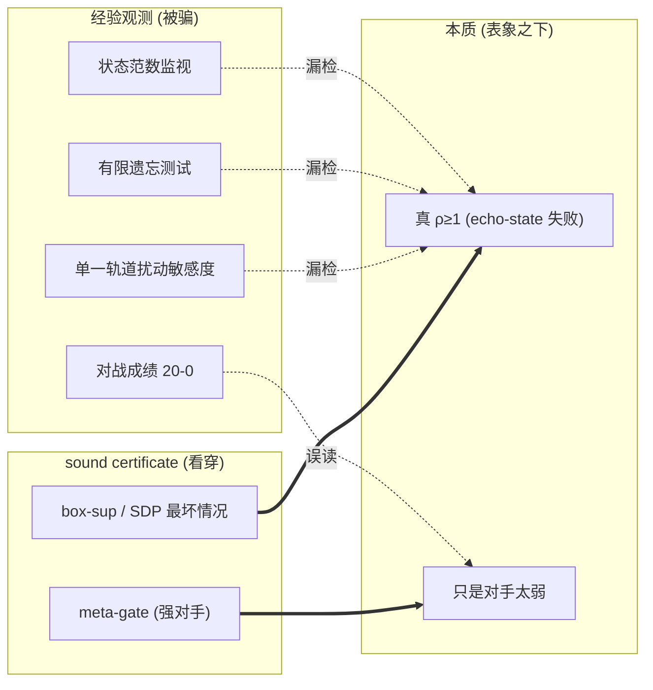
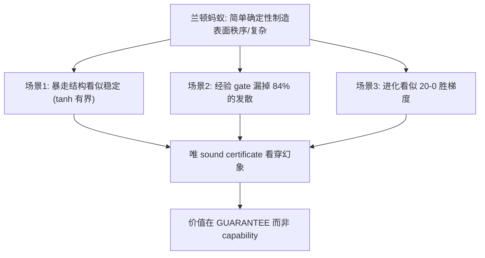
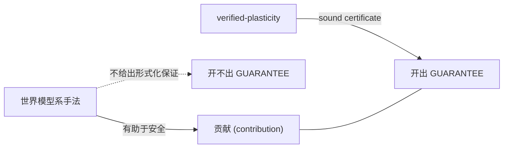
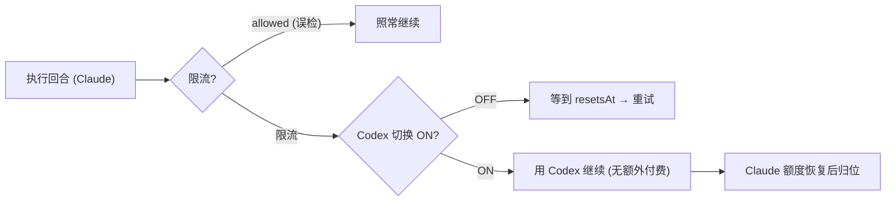
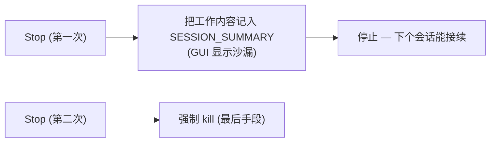

# llcore 验证 arc 合集(#38–#42):防御性公开 × 2ⁿ 壁垒 × 强梯度胜过进化 × 兰顿蚂蚁的幻象 + 补遗

<!-- TOPICNAV -->
> **🌐 语言**: [日本語](https://qiita.com/furuse-kazufumi/items/cc0713ab78a5b390df76) | [English](https://qiita.com/furuse-kazufumi/items/525cd01eda5c1ad707ef) | **中文** | [한국어](https://qiita.com/furuse-kazufumi/items/a5ebb3992e4c28862f47)
>
> **📚 FullSense 合集系列**
> - **llcore 验证 arc 合集（this）**
> - [lldarwin / 进化 arc 合集](https://qiita.com/furuse-kazufumi/items/93f3cf1bb7b14650bbca)
> - [llive 完全解说合集](https://qiita.com/furuse-kazufumi/items/6da5a883fb2ed651edd8)
> - [llmesh 合集](https://qiita.com/furuse-kazufumi/items/42a555f691ebc44cb040)
> - [通俗版合集](https://qiita.com/furuse-kazufumi/items/fa0890f136636d495ea6)
<!-- /TOPICNAV -->

## 目录

1. [一天之内跑完「反证检验 → 专利清查 → 放弃申请 → 防御性公开」](#第1章-一天之内跑完反证检验--专利清查--放弃申请--防御性公开)
2. [「窗在实现里关上了，但墙纹丝不动」的报告](#第2章-窗在实现里关上了但墙纹丝不动的报告)
3. [「我以为赢了的那一刻，自己的框架把自己拦住了」的报告](#第3章-我以为赢了的那一刻自己的框架把自己拦住了的报告)
4. [把三篇束于一点：「简单的确定性规则制造出表面的秩序」](#第4章-把三篇束于一点简单的确定性规则制造出表面的秩序)
5. [为什么我想要一幅「在 3D 里漫步 LLM」的画面](#第5章-为什么我想要一幅在-3d-里漫步-llm-的画面)
6. [进度条不动时，你能等几分钟](#第6章-进度条不动时你能等几分钟)

---

## 第1章 一天之内跑完「反证检验 → 专利清查 → 放弃申请 → 防御性公开」

<!-- KAMI -->
> 📖 **一句话概括**
>
> 一句话概括，这是花一整天去彻底怀疑「我们的研究，真的钻进了世界上谁都没做过的缝隙里吗？」的故事。我们让 56 个充当批判角色的 AI 去搜寻「这个主张应该早就有先行研究了」的反例，连专利数据库都拿来比对，最后确认到「四个条件在同一个点上同时重叠的缝隙」确实还空着。一般来说这时就该去申请专利了，但权衡了金钱与时间之后，我们放弃申请，转而选了一招防守棋——「把技术连同日期全部公开、先把旗插上（= 防止日后被别人用专利圈起来）」。这是一份关于这个决策的记录。
<!-- KAMI -->

2026 年 6 月 6 日，我（笔者）向 AI（Claude Code）提出 **「请检验我们所做的事情是否真的具有差异化」**。AI 以 **反证检验（adversarial verification）** —— 让大量验证角色的 AI 故意去反证、否定我们自己的主张，看它是否仍能存活的方法 —— 来回应。56 个验证代理从 7 + 3 个角度去搜寻「这个主张应该能用先行研究反证」的反例，另一支别动队甚至查询了专利数据库。

结果如下。

- **学术文献中的反证（breaks）：0 件**（对 44 个候选逐个判定，没有任何人填满了「四隅同时」）。
- **专利中的反证：0 件**（在英文 14 + 日文 3 个查询里，没有专利占据这个交叉点）。
- 于是我决定**不申请专利**（成本判断），转而立起一面叫**防御性公开（defensive publication）**的旗。

这篇文章，是那一天的故事（反证检验的设计与结果、以及决策）加上**我们所公开的内容（= 四点交叉点的技术）**的拆解版。文章的顺序一如既往：①术语说明 → ②拆解（平易） → ③详细。

---

### ① 术语小辞典（免得在正文里卡住）

| 术语 | 一句话 |
|---|---|
| **反证检验 (adversarial verification)** | 不是去肯定自己的主张，而是让大量验证角色（AI）故意去反证、否定它，再以它是否仍能存活来衡量主张的强度。可以想象成雇批评者而非捧场者。 |
| **防御性公开 (defensive publication)** | 不是去「取得」专利，而是**把技术公开、使其成为先行技术**。这是一种「先立旗」的防御，让某人（包括大厂）日后无法用同一发明申请专利来束缚我方或公众。 |
| **先行技术 (prior art)** | 能让你说出「那个发明已经是公知了」的既有公开物。否定新颖性的材料。日期是命门。 |
| **收缩性 (contraction, ρ<1)** | 回声（过去的扰动）随时间**衰减**的性质。谱半径 ρ 小于 1。可以想象成一根弹簧总会回到静止位置。记忆核不暴走、会「遗忘」的性质。 |
| **健全的证明 (sound proof)** | 一旦说「证明出来了」就**真的正确**（绝不发出假合格）的证明。与统计上「大概安全」是两回事。 |
| **prove-then-reject 门** | 一道关卡，**证明之后才采用**变异（更新），不行就**棄却**。fail-closed（无法证明就不放行）。 |
| **记忆核 (memory core)** | 罩在 LLM 周围的「记忆部件」。本研究中是带漏与饱和的递归（RWKV 系）`s_{t+1} = decay⊙s + (1−decay)⊙tanh(W s + V x)`。 |
| **进化循环 (evolution loop)** | 转动变异 → 选择 → 下一代来搜寻优秀个体的最优化。这里把证明门放在那个选择的关卡上。 |
| **SMT 求解器 (Z3 等)** | 解判逻辑式是否可满足的万能求解器。很重。本研究的结论是它「其实并不需要（只是装饰）」。 |
| **tracking tube（追踪管）** | 保证实际与「理想轨道」的偏差收在一个**管（半径 r）**之内。`r = G·w̄/(1−L)`。 |
| **SSGM** | **仅以理论**提出「统御进化记忆」write 门的先行研究（[arXiv:2603.11768](https://arxiv.org/abs/2603.11768), 2026）。在招牌上最接近的对手。 |
| **navigability（可探索性）** | 进化是否「易于移动的地形」。与学习变聪明是两回事。验证器的功效在这一侧。 |

---

### ② 拆解 —— 3 分钟看懂全貌

先从生物学的生态位（niche）讲起。在进化里，「钻进了一个生态位 —— 一个还没有其他物种占据的缝隙 —— 的物种」会存活下来。AI 的世界也类似。大厂（OpenAI/Google 等）是「平均上聪明的大型物种」，占据着广阔的平原。我们在那片平原上赢不了。所以我们去找**谁都没填的缝隙**，再造一个正好嵌进去的部件。这一次，恰好嵌进那个缝隙的，是一个叫 `llcore` 的具体系统。

`llcore` 用一句话说，就是 **「一个拥有记忆的 AI 部件，为了不让自己暴走，给自己加上了一道『证明的关卡』的系统」**。记忆核每更新一次就会变异（进化），但在采用任何变异之前，都必须先通过这道关卡（门）。关卡只放行**能在数学上证明「即便加入这次更新、记忆也不会暴走」**的那些变异，证明不出来就一律拒之门外（fail-closed）。

这个系统之所以能恰好嵌进那个「缝隙」，是因为下面 4 个条件在**同一个点上重叠**。

1. **健全的收缩性证明**（在数学上保证回声必定衰减，而且绝不发出假合格）。
2. 把它打在**LLM 记忆核的内部**（不是控制机器人也不是分类器，而是「记忆部件」本身）。
3. **在进化循环之中**，把不行的变异**棄却**（丢掉 = 不是把它推回去 = 不是射影）。
4. 而且**有能跑的实现与实验**（不止步于纸上谈兵）。

把这 4 件**同时**满足的先行研究，即便让 56 个验证角色 AI 来批判性地检验、查询专利 DB，也没找到。每一个条件都有先行（我们诚实地把名字全部列出）。但没有人「同时占据四隅」。这就是**四点交叉点（four-point intersection）**。用生物学的生态位来说，`llcore` 正好坐落在那四条边界线交汇的**那一个点的缝隙**里（用孙子的话说，「避实击虚」）。

还有一个重要决策。这个缝隙在**专利里也是空白**。一般来说接下来就会是「那就去申请专利吧」。但专利又花钱又花时间。我**放过了那里**，转而选择了**「公开、先立旗」的防御性公开**。目的不是进取而是**防御** —— **未雨绸缪地使其失效**：日后有人（大厂，或 SSGM 的后续实现）用同一概念申请专利来束缚我方或公众。只要带着日期公开了，它就成了公知的先行技术，后出的专利会因新颖性而被否定。

不过 —— 这是我们一以贯之的纪律 —— **我们不注水**。我们不说「世界首创」。正确的说法是**「在我们反证检验的范围内，同时占据四隅的先行为零」**。我们一定保留「探索范围之外不得而知」的留白。

---

### ③ 详细 —— 一天的会话，以及所公开技术的内容

#### 3.1 反证检验的设计（为了可复现）

自己说「我的研究很强」没有意义。所以 AI 搭了一套**反证主导的工作流**。

- **从 7 个角度搜寻反证**：证明门的谱系 / certified training / Transformer 稳定性 / 进化 × 验证 / verified memory / runtime assurance / 产业·专利。
- **追加 critic 指出的 3 个盲点角度**：从形式方法会议一侧的反查 / certified continual learning 的词汇系 / 内部状态·SSM 的解释。
- **用 5 轴评分表对 44 个候选逐个判定**（是否对更新设门 / 是否健全证明 / 是否 LLM 记忆核 / 是否在进化循环内 / 是否有实现）。判定方的 AI **必定用 WebFetch 确认一手信息（arXiv 的 abstract/HTML）**（禁止道听途说）。
- 并行地，**内部的 AI 抽取我们自己论文草稿的弱点**（honest disclosure：自家人挑刺）。

确定结论是 **breaks 0 / narrows 36 / background 8（44 件）**。存活下来的差异化核心，就是上面的四点交叉点。

#### 3.2 「四隅」各自最接近的对手（全部列名）

新颖性的诚实，取决于「能否用一句话点名全部」。逐隅，用一句话点出最接近的先行：

- **SSGM（[arXiv:2603.11768](https://arxiv.org/abs/2603.11768)）** —— **仅以理论**抢先拿下「统御进化记忆」的招牌。门是 NLI（矛盾检测），**并非健全的形式证明**，也没有实现。→ 作为扛招牌的对手**必须引用**。实现 + 证明的窗口是空着的。
- **SEVerA（[arXiv:2603.25111](https://arxiv.org/abs/2603.25111)）** —— 对自进化代理施以 Dafny/SMT 验证。但对象是**输出契约**，不是对记忆核收缩性的每次更新设门。
- **PSV-Verus（[arXiv:2512.18160](https://arxiv.org/abs/2512.18160)）** —— self-play 循环内的健全 SMT 门。但验证对象是**生成代码的正确性**。
- **Provably Safe Model Updates / LID（[arXiv:2512.01899](https://arxiv.org/abs/2512.01899)）** —— 用抽象解释把更新认证为 δ-safe。但它是**射影（推回去）**而非 prove-then-reject，对象是 frozen-embedding 的分类 head。
- **GP × 模型检查（Katz & Peled, [arXiv:1402.6785](https://arxiv.org/abs/1402.6785), 2014）** —— 在进化循环里放一道健全检查门的**模式先例**。所以我们**不主张门这个模式本身是新颖的**。只有把它应用到记忆核的收缩性上，才是未踏之地。
- **Enforced-Lipschitz Transformers（[arXiv:2507.13338](https://arxiv.org/abs/2507.13338)）/ R2DN（[arXiv:2504.01250](https://arxiv.org/abs/2504.01250)）** —— 用**结构来强制（by-construction）**收缩性。这是最强的对抗设计：「根本不需要门，一开始就内嵌进去」。我们把**by-construction 对 prove-then-reject**作为设计轴来对比（结构强制牺牲表现力，棄却门则在无结构约束下检查任意更新）。
- **Safeguarded AI（ARIA programme）** —— 最具权威的 proof-gated-gatekeeper 概念。但门的对象是**行为/计划**（输出门），不是对权重/记忆更新设门，而且还停留在 programme 阶段。
- **Emergent FV / substrate-guard（[arXiv:2603.21149](https://arxiv.org/abs/2603.21149)）** —— 用 Z3 验证 AI 的**输出**的、能跑的系统。但它是事后监视，不是每次更新设门。

（以上 arXiv ID 只使用在论文草稿中已与 abstract 核对过的那些。）

> 🗒️ *「唔…考察还是太浅了。不能再深入想想吗…？」—— 仅把先行研究列个名就满足，是我们的自戒*（© Forbidden shibukawa / SHUEISHA・Snack Basue）

#### 3.3 专利面的查询（补学术审计留下的窟窿）

学术审计**只看了文献**，没看专利 DB（作为不在证据偏弱）。于是一支别动队用**英文 14 + 日文 3** 个查询，查询了 Google Patents / USPTO。

- **占据交叉点的专利：零件。**
- 最接近的专利只有 3 个谱系，且都在交叉点之外：
  - **[US11715005B2](https://patents.google.com/patent/US11715005B2)** —— 用哈希匹配来验证 NN 的真正性（是密码哈希，不是健全证明）。
  - **[US10896032](https://patents.google.com/patent/US10896032)** —— certify-then-deploy 的治理门（根据是程序性 attestation）。
  - **[US11868855](https://patents.google.com/patent/US11868855)** —— 模型/权重的「stability」验证（但大概率是可用性·耐故障意义上的蓋然性）。
- 一个有趣的结构性证据：当你查询「**用健全证明对更新/记忆/进化设门**」时，即便对专利 DB 指定了 site，结果也几乎全部**偏到了 arXiv**。这是「这个概念还停留在学术阶段、尚未被专利化」的间接证据。

→ 结论：**专利面也 clear**。不过由于 US10896032 / US11868855 在词汇上部分重叠，我们在论文的 related work 里先发地放了 1～2 句对比：「与展开治理型门 / 运营稳定性验证不同，本研究是用健全证明对权重更新的解析性 contraction 性质设门」。

#### 3.4 所公开技术的内容（防御性披露的本体）

防御性公开如果不写到「当业者可实施的详细度」，作为先行技术就会偏弱。所以披露文件里，把以下内容写到了**可实现的层级**。

**(a) 健全收缩性证明器的梯子（ladder）。** 从便宜的开始，共 3 级：
- `cert_inf` —— 闭式 ∞-范数上界（`O(n²)`）。利用各行绝对值之和在端点处取最大的性质，**无需求解器**。
- `cert_two` —— 在全部 `2^n` 个顶点上做 SVD。
- `cert_sdp` —— 用凸 LMI（内点 SDP, CLARABEL）求共同 Lyapunov 矩阵。

**这里是诚实点**：项目的旧俗称是「Z3-gated」，但**实际的门并没有用 SMT(Z3)**。专门跑了一条 Z3 收缩性轨道来确认后，它与闭式 ∞-范数证明器**逐字节一致（3270 件中 0 件不一致，连边界附近也是 8000 件中 0 件）**。也就是说，在这个不变量类里，**Z3 是装饰**。所以我们把招牌改正为「健全收缩性证明器的梯子」（这不是撤退而是强项 —— 可以规避求解器依赖与不完全性）。

**(b) prove-then-reject 门（fail-closed）。** 提出一个子个体 → 证明通过则采用，不行则 resample 直到上限，再不行就采用一个**已知安全的 fallback**。**未证明的子绝不采用**。我们把 `gate_mode="contraction"` / `"state_norm"` additive 地加入，而默认的 `"none"` 与既往行为逐字节一致（= 对既有进化基盘的纯粹罩层）。

**(c) tracking tube 检查指标。** 这是对用户要求「不只要『收缩到某处』，还要看『追踪理想轨道』」的回答。复用门已经在算的量（状态 Lipschitz `L`、输入增益 `G`）与外扰上界 `w̄`，以**零额外证明成本**报告追踪误差收住的管 `r = G·w̄/(1−L)`。即便在小规模实测里，收缩性 PASS 的 3 gene 误差/外扰比为 0.50/0.78/1.04，处于理论管之内；而非收缩性的对照则**放大 9.3 倍**（= 门是 load-bearing，不是装饰）。

**(d) verified memory evolution 的 2 条路线。**
- 路线 (a)：用健全证明对代理**记忆库**的更新设门（与 SSGM 的 NLI 理论之差 = 健全证明 + 能跑的门）。
- 路线 (b)：对记忆核的**内部状态 dynamics**设门（本书已实施）。

**(e) 合成：SPC 管制图 runtime 门 + 双层伦理门。** 把进化指标通过管制图（X̄–R / CUSUM），在线对时间方向的异常设门。再加上**探索自由·采用验证**的双层伦理（探索层遵循孙子的「诡道」= 奇手 OK，采用层遵循论语的「仁」= 诚实、门不可避）。

#### 3.5 本日的实现事实（reduced to practice）

它不是纸上谈兵的证据：

- 证明门已**正式配线进出货侧的 `evolve()`**（additive 地追加 `gate_mode` / `resample_cap`，默认 `"none"` 逐字节一致，并以测试实证与 research 侧的参考实现全模式一致）。
- tracking tube 报告器也落地了（`r = G·w̄/(1−L)`，限定 `cert_inf`，read-only，golden 值一致）。
- 覆盖门 + 报告器的测试 **294 件**。
- **观测到的门的成本约为 20～60 倍**（不隐瞒地披露：证明不是免费的）。

#### 3.6 honest 局限（不弱化）

即便是防御性披露，我们也不弯折 honest disclosure。

- **规模小**：核是 `n=8`（72 个实数 gene）、16 KB 语料、byte vocab。「LLM 记忆核」是**机构实证**的意思。
- **验证器的 payoff 是 navigability 而非学习（L3）**：效果是 EA 固有的，在梯度法里会消失。
- **门是 ~20～60 倍的成本**：只在短训练里看着像免费。
- **「false admit 为零」是经验观测，而非机器检查**：证明器的*条件*是健全的，但承载它的*实现*并未做端到端的形式验证。
- **「未发现」的范围**：仅限于反证检验 + 表层专利检索的范围。CNIPA（中文）未查询，专利最长有 18 个月的公开滞后。「在探索范围内」的留白始终保留。

---

### 总结 —— 旗是为了「守」而非「攻」才立起来的

今天一天，我们让 56 个验证角色 AI 批判性地检验自己的研究，连专利 DB 都查询了，还是确认到了残留的「四隅空白」。一般来说这时就会去谋求专利，但权衡成本之后，我们**放过了申请**，转而用**带日期的防御性公开**立起一面旗。

目的很简单 —— **未雨绸缪地使日后有人用专利把这个空白圈起来、束缚我方或公众的企图失效**。为此，我们以当业者可实现的详细度把一切都公开了。并且自始至终，守住不注水的说法：**不说「世界首创」，而说「在我们检验的范围内，同时占据四隅的先行为零」**。

防御性公开的本体（带日期的开示），如下方追记所述，已升格为**包含实现与全部数据的 public 仓库**：[github.com/furuse-kazufumi/llcore](https://github.com/furuse-kazufumi/llcore)。

下一回（#39 以后），打算 report 这个四点交叉点的本丸 —— verified memory evolution 的小 PoC（记忆库更新路线）的落地。趁 SSGM 以理论拿下招牌的那扇窗，还没被实现合上之前。

### 追记（2026-06-07）—— 旗变成了实现

本文的次日，预告过的 verified memory evolution PoC **完成了，防御性公开也从「文件」升格为「实物」**。

- **public 仓库**: [github.com/furuse-kazufumi/llcore](https://github.com/furuse-kazufumi/llcore) —— 论文草稿（[PAPER_DRAFT.md](https://github.com/furuse-kazufumi/llcore/blob/main/research/paper/PAPER_DRAFT.md)）+ 全部实验代码/数据（570 个文件、318 个测试 green），以带日期的单一提交公开
- **trajectory-tube gate**（预告过的本丸）: 以预注册 n=40 的决着确认了对记忆 horizon 的效果（论文 §9）
- **更进一步**: 「让 AI 自己持有验证器会怎样」—— 在可致死环境中对记忆形成 3 机构（自我预见/复活修复/社会观察）的测量也包含在公开内容里（论文 §9.6）
- **知见幻灯片（CC BY 4.0）**: [slides/](https://github.com/furuse-kazufumi/llcore/tree/main/slides) —— 注明出处即可商用的 10 页摘要（日英）。**当前版本是信息密度有限的摘要版 —— 随着研究推进，今后一年将持续扩充（实验设计细节、完整图表、复现步骤、采用决策材料）**

「趁 SSGM 的窗被实现合上之前」的预告，就这样兑现了。

---

---

## 第2章 「窗在实现里关上了，但墙纹丝不动」的报告

<!-- KAMI -->
> 📖 **一句话概括**
>
> 这是把上一章立起的「带证明地进化的记忆 AI 部件」那面旗，从纸面上的话推进到真正能跑的程序的报告。打个比方，就是把设计图（理论）做成了真正的机器（实现），而且一个危险部件都没漏掉地让它跑了起来 —— 这是前进。不过老实说，也留下了没攻克的作业：每当部件尺寸增大、确认安全与否的计算量就指数级膨胀的「2 的 n 次方之墙」，这次依然没破，能安全进化的暂时只限于极小的部件 —— 这个极限被如实地写了下来。是赢了一半、作业留一半的一天。
<!-- KAMI -->

上一回（#38）结尾，我们这样预告：「下一回将 report 四点交叉点的本丸 —— verified memory evolution 的小 PoC。趁 SSGM 以理论拿下招牌的那扇窗，还没被实现合上之前。」

2026 年 6 月 9 日，那个 PoC 跑完了。用一句话说结论：**「窗在实现里关上了。但墙（可扩展性的墙）纹丝不动。」**

具体来说：

- 我们让**带证明地进化的记忆核**（包含真正把结构变大的手术 `width_grow`）在 **零观测 false-admit** 下跑了起来（= 一件假合格都没发，就完成了进化）。
- 同时，把此前一直诚实地留作「未测定」的 **cert_sdp（SDP 证明器）首次测量**，发现它是**最「易通过」（navigable）的健全证明器**（把真正收缩的个体的 90～99% 判为合格）。
- **尽管如此，包括 cert_sdp 在内，计算成本仍是 `2^n`（维度 n 的指数）。** 也就是说，**「既易通过、在大规模下又便宜」的证明器，这次也没找到。** 目前能 verified 地做结构进化的，仅限于**小部件（n≤6）。**

这篇文章，按惯例的顺序 ①术语 → ②拆解 → ③详细，不注水地写下那一天「能做到的」与「做不到的」。最后还公开把自己的数值主张**让 6 个验证 AI 并行反证**的结果（零 MAJOR 不一致）。

正本数据：[github.com/furuse-kazufumi/llcore](https://github.com/furuse-kazufumi/llcore)（论文草稿 + 全部实验代码/数据）。

---

### ① 术语小辞典（免得在正文里卡住）

| 术语 | 一句话 |
|---|---|
| **可塑性 (plasticity)** | 通过学习/进化能「改变形状」的性质。这里指事后把记忆核自身的结构（矩阵大小=维度）变大。 |
| **verified-plasticity（带验证的可塑性）** | 每次「改变形状」时，都**先证明该变更安全（不暴走）再采用**。本研究的主轴。 |
| **width_grow（宽度成长）** | 把网络层从 `n → n+1` 变大的**结构手术**（Net2Net 系）。是实际执行的，不是纸上。 |
| **收缩性 (contraction, ρ<1)** | 过去的扰动随时间**衰减**的性质。谱半径 ρ 小于 1。记忆不暴走、会「遗忘」的性质。 |
| **false-admit（假合格）** | 明明危险（ρ≥1=可能暴走），证明器却放行为「安全」的漏检。这一项为零是健全性的命门。 |
| **健全 (sound)** | 一旦说「合格」就**真的安全**（绝不发假合格）的性质。与统计上「大概安全」是两回事。 |
| **navigability（易通过/可探索性）** | 「能把多少真正安全的个体判为合格」。过严的证明器连安全个体也弹掉=进化动不了。越高，进化越能在地形上自由移动。 |
| **证明器格子 (cert ladder)** | 按便宜优先三级：`cert_inf`（∞-范数上界、无需求解器）→ `cert_two`（全 `2^n` 顶点 SVD）→ `cert_sdp`（凸 LMI/SDP）。 |
| **prove-then-reject 门** | **证明之后才采用**变异，不行则**棄却**的关卡。fail-closed（无法证明就不放行）。 |
| **SSGM** | **仅以理论**提出「统御进化记忆」write 门的先行研究（[arXiv:2603.11768](https://arxiv.org/abs/2603.11768)）。实现 + 健全证明的窗口对它而言是空着的。 |
| **empirical_rho（经验 ρ）** | 用大量采样**从下方**逼近真谱半径的预言机。「零观测 false-admit」是这种从下方审计的结果（=强一致性证据，但非绝对证明）。 |
| **2^n 墙** | 证明成本对维度 n 呈指数 `2^n` 增长的极限。`cert_two`/`cert_sdp` 要看全部顶点，所以撞上这堵墙。 |

> 🗒️ *注：此图标签为日语。（2ⁿ 壁垒＝随着块尺寸增大，证明成本呈指数级膨胀。）*

---

### ② 拆解 —— 3 分钟看懂全貌

#38 立的旗是**「带证明地进化的记忆核」**。记忆核每次更新都会变异（进化），但在采用任何变异前，都必须先过关卡（门），只放行**能在数学上证明不暴走**的变异，证明不出来就拒之门外（fail-closed）。这就是 prove-then-reject 门。

这次做的，是把那面旗**从「文件」推进到「能跑的实物」**。有三件「能做到」。

**能做到①：一边把形状变大，一边零假合格。** 此前只试到「证明变异（内部微调）」。这次实际跑了**把结构本身变大的手术（`width_grow`，n→n+1）**，确认变大之后证明器仍以**零观测 false-admit**保持「安全（ρ<1）」。发散域（ρ 达 1.85～2.21 的危险个体）全部被正确棄却。

**能做到②：第一次测到了最「易通过」的证明器。** 把此前诚实留下的「cert_sdp 未测定」这个洞补上了。在能用 SDP 求解器（CLARABEL）的环境里首次测量，发现 **cert_sdp 是三级证明器中最「易通过」的** —— 把真正收缩的个体的 90～99% 判合格（便宜的 `cert_inf` 只通 20～40%，中位的 `cert_two` 40～50%）。「太严、进化动不了」的问题，被 SDP 大幅缓解。

**能做到③：小部件的话，计算轻松够用。** n≤6 的小核，verified 进化的整个循环只吃 **30 小时预算的 0.04%（0.013 小时）**。「带证明的进化是不是太重跑不动？」的担心，在小规模下是杞人忧天。

…听到这里像是「全赢了」。但 honest disclosure（诚实开示）是我们的纪律。把**没赢的三件事**明明白白写下来。

**没做到①：2^n 墙没破。** cert_sdp 确实抬高了「易通过性的天花板」。但代价是成本仍为 `2^n`（看全部顶点）。`cert_two` 在 n=12 是 1 次证明 1.3 秒，n=14 超预算。**「既易通过、大规模下又便宜」的证明器，这次也不存在。** 所以目前能 verified 地做结构进化的仅限**小部件（n≤6）** —— 这个结论与上一回（Phase −1）**没有变**。SDP 不是**翻过**了墙，而只是在墙前**抬高**了天花板。

**没做到②：「零假合格」是经验观测，并非机器证明出来的。** 零观测 false-admit，是用**从下方**逼近真 ρ 的预言机（大量采样）去找反证的结果。证明器的*条件*在数学上健全，但承载它的*实现*并未做端到端的形式验证。「零观测」是强一致性证据，不是「对所有输入都安全」的绝对证明 —— 这里不夸张。

**没做到③：模型并没变聪明。** 证明器的功效是 **navigability（进化的可移动性）**，不是模型变聪明（学习性能提升）。而且效果是进化算法（EA）固有的，在梯度法里会消失。再者这次的适应度（fitness）是**合成 proxy**，实 GPU 训练下的确认留到下一阶段（Phase 2）。

总之这一天是「机构在实现里证明了，规模的墙诚实地留着」—— 赢一半、作业留一半的一天。

---

### ③ 详细 —— 五个实验，以及没能潰掉的留白

主轴是 **Verified-Plasticity Evaluation Framework**（带验证的可塑性测量框架）。在主张「我们的方法强」之前，先造**度量的尺子**。用那把尺子跑了五个实验（全部 `$0` / CPU、torch 2.12+cpu、固定 seed、可复现）。

#### 3.1 固定结构下证明器的健全性与格子

在 n={4,6,8} 各采样数百个跨越收缩～发散的个体，把 3 证明器的合格与真 ρ（empirical_rho 6000 采样）做突合。

| n | 收缩(ρ<1) | false-admit (inf/two/sdp) | 真正收缩个体的合格率 (inf/two/**sdp**) |
|---|---|---|---|
| 4 | 453/600 | **0 / 0 / 0** | 0.41 / 0.51 / **0.95** |
| 6 | 426/600 | **0 / 0 / 0** | 0.29 / 0.43 / **0.94** |
| 8 | 280/400 | **0 / 0 / 0** | 0.23 / 0.40 / **0.91** |

确定知见：
1. **三个证明器全部零观测 false-admit**（首次确认 cert_sdp 的健全性）。与证明器的数学健全性一致。
2. **cert_sdp 压倒性 navigable** —— 真正收缩的个体中，便宜的 cert_inf 只通 23～41%、cert_two 40～51%，而 **cert_sdp 通 91～95%**。注：`two⊆sdp`（cert_two 通则 cert_sdp 通）是实现 fast-path 带来的**结构性保证（同义反复）**，不是经验发现 —— 为不注水而写明。

#### 3.2 实结构手术（width_grow）下的健全性 × 非平凡性

实际用 `width_grow`（Net2Net/fresh）把 base 从 n→n+1 变大，判定各门是否**在成长下仍保持零 false-admit ∧ 开出≥1 个非平凡合格**（1 格 = 1536 个成长后个体）。

- **成长下健全性：全 16（格×门）零观测 false-admit。** 成长 ρ 最大 1.85～2.21（发散域）全部正确棄却。这是 **North Star #1（成长操作下零假合格）** 在实结构手术下的确认。
- **便宜门（cert_inf）健全但在小 n 脆弱** —— n=6 最保守边缘（headroom 0）非平凡合格 **0 个** → 门 FAIL。即便有 headroom，非平凡合格也仅 3 个，卡在 τ 边缘。= 「便宜门的 navigability 脆弱」。
- **navigable 门（cert_two/cert_sdp）全格 PASS** —— cert_two 开 114～168、cert_sdp 开 673～733 个非平凡健全合格。→ **「把 per-component 门升级到 cert_two/sdp、限定 small-n」由数据正当化。**

#### 3.3 块间结合（coupling）的盲点

把 2 个块残差结合，用真 ρ 测**「各块单独合格、合成却暴走」的盲点**。

- **per-block AND（把各块单独合格做 AND）在结合下确实不健全** —— 结合强度 γ≥1.0 时，单独合格里的 **24～34%（γ=1.0）～ 80～96%（γ=2.0）合成真 ρ≥1**（暴走）。→ **per-block AND 禁止确定。**
- **full-system cert（把整个系统一次性证明）全 γ 零 false-admit = 健全。**
- 这里同样 **cert_sdp 最 navigable**，但抬高维度（块数 2→3）与结合强度，coverage 会下降（full=6、γ=1.0 时 cert_inf/cert_two 为 0%，仅 cert_sdp 75.8%）。= SDP 解决过保守，但**维度墙对 SDP 也起作用。**
- ⚠ 诚实留白：块数 3 时 SDP 求解器发了几条「解可能不准确」警告。**用独立特征值复检保证健全性（false-admit=0）**，但 coverage 数值可能含近似解带来的微小抖动。

#### 3.4 feasibility（是否真能在预算内跑）

由实测 per-op wall-time 外推到 30 小时预算。

| n | 每次 eval | 总时间 | 30h 内 |
|---|---|---|---|
| 4 | 769μs | **0.011h** | 是 |
| 6 | 912μs | **0.013h** | 是 |
| 8 | 9.2ms | 0.131h | 是 |
| 10 | 38.6ms | 0.550h | 是 |
| 12 | 1.31s | **18.6h** | 勉强 |
| 14 | — | (cert_two 2^14 外推 = 不能) | 否 |

确定知见：
1. **small-n（n≤6）计算上自明 feasible** —— 预算的 0.04%。
2. **2^n 墙在 n≥10～12 binding** —— cert_two 在 n=12 是 1.3 秒/证明（=18.6h，余量薄），n=14 超预算。
3. ⚠ 留白：此处 fitness 是 `RotationNDObjective` 的**合成 adapter proxy**，实 GPU 训练里 base forward（CE）会成为 dominant。该外推是「每次 eval 课金一次证明的保守上限」，实 GPU 实测留待 Phase 2 确认。

#### 3.5 向第 2 个 base（Mamba）的可移植性

确认框架是否能载到 SmolLM2 以外的 base。**Mamba-130M 在 CPU 上 load 成功**（确认了 coherent 生成），在其 hidden 上 cert_two 门 load-bearing（有/无门合格率移动 +0.287，与 SmolLM2 的 +0.320 相洽）。= 「换上新 base」plug-point 的实证。
- ⚠ 留白：此处健全性预言机不是 §3.1-3.4 的 empirical_rho，而是**弱预言机（单一摄动）**，合格 n=7 的小集团。Mamba 自身的固有稳定性（base-level Lyapunov）未测定，留待 Phase 2。本阶段 deliverable 仅限「框架可移植性 + Mamba CPU 动作确认」（不是固有稳定性的正对照）。

#### 3.6 综合判定 —— Decision gate 1 = PASS（small-n）

| gate | 条件 | 判定 |
|---|---|---|
| 成长下 soundness ∧ 非平凡 admit≥1 | width_grow N 次 false-admit=0 ∧ 非平凡合格≥1 | **PASS**（便宜门在 n=6 trivial → 必须 cert_two/sdp） |
| coupling-aware 合成 soundness | per-block AND 禁止 + full cert 健全 | **PASS** |
| feasibility | small-n 循环在 30h 预算内 | **PASS**（small-n） |

→ **Decision gate 1 = PASS → 进入 Phase 2（small-n per-component 域，在 Phase −1 确定的约束内）。** Phase 1 的 deliverable 是**「健全·feasible 的 small-n verified 结构适应测量框架 + 证明器格子（inf/two/sdp）的完整特性评价」**。

#### 3.7 honest 局限（没能潰掉的）

即便是防御性开示，honest disclosure 也不弯折。把这次测量潰掉/留下的，叠在 #38 的留白之上。

- **2^n scalability 墙不变（最大作业）**：cert_sdp 把 navigability 天花板抬到 ~0.9（从 Phase −1 的 cert_two ~0.45 大幅改善），但 **2^n 顶点成本不变**。「navigable 且 scalable 的健全证明器依然不在」= 高维 verified 结构进化不成立 **堅持**。SDP 只抬了天花板，没破墙。
- **empirical_rho 是从下方估计**：零观测 false-admit 是强一致性，不是「对全部 (s,x) ρ<1」的绝对证明。可能漏掉 near-boundary。
- **net2net 是 incoming-copy 近似**（非 exact function-preserving）→ 函数变化 Δfunc 是近似评估。
- **fitness 是合成 proxy**：实 SmolLM2 CE 上的 capability 副线（EXISTS/NULL/ARTIFACT）是 Phase 2 必须。
- **Mamba 固有稳定性未测定**：门挂在 adapter 上，Mamba base 自身的 Lyapunov 未验证 → 留待 Phase 2。

---

### 敌对验证 —— 让 6 个 AI 并行反证自己的数值

honest disclosure 的核心是「出现异常好的结果时，在自觉赢之前先怀疑内訳」（[feedback_benchmark_honest_disclosure]）。于是把本 verdict 的数值主张，对各实验的 `results.json` + 实现 `.py`，让**6 个独立验证 AI 并行**突合。

**结果 = 零 MAJOR issue（无能覆盖结论的不一致），全是 MINOR。** 检出的指摘已反映进正文：
- 修正 4 件转记舍入误差（maxΔfunc 0.108→0.107 等）。
- §3.1 的 `two⊆sdp` 写明是实现上的同义反复，而非经验发现。
- 把「便宜门在 n=6 trivial」精炼为「仅 n=6 最保守边缘 trivial、有 headroom 也脆弱」。
- 「cert_sdp 98% 救济」写明限块数 2，块数 3 是 75.8% / inf·two 0%。
- 透明化 fitness 是合成 proxy、外推的保守性、CPU→GPU 外推前提。

→ **验证后 Decision gate 1 = PASS、SDP navigability 知见、small-n 限定结论不变。** 指摘全是 honest-disclosure 的精度提升，无一动摇机构性结论。

---

### 总结 —— 「窗关上了，墙留下了」

#38 立的旗，这次**从文件推进到了能跑的实物**。我们让带证明地进化的记忆核，一边真把结构变大，一边以**零观测 false-admit**跑起来，补上了此前未测定的 SDP 证明器，确认了 small-n 的 feasibility。SSGM 以理论拿下招牌的「实现 + 健全证明」的窗，就这样在实现侧关上了。

另一方面，最大作业 **2^n 墙** 这次也纹丝不动。「既易通过、大规模下又便宜」的证明器依然不存在。所以我们不注水：堅持上一回的结论 —— 能 verified 地做结构进化的，**目前仅限 n≤6 的小部件**。

下一回（#40 以后）是 Phase 2 —— 把校准好的「多峰性 instrument」当到实损失地形上，以 proper power 确定一件关于进化如何在地形上移动的事（capability 副线）。尺子造好了。下一步，是用那把尺子去量实地形。

正本：[github.com/furuse-kazufumi/llcore](https://github.com/furuse-kazufumi/llcore) —— 论文草稿 + 全部实验代码/数据（5 实验 + 敌对验证 workflow）。

---

<!-- INTERLUDE -->

### ☕ 闲话休题 —— 为什么「证明不是免费的」

正文里轻描淡写地写着「证明的成本约为 20～60 倍」，这里不妨停一停，把它翻译成日常的感觉。把一个计算「做出来」，和「确认这个计算绝对没错」，后者要费力得多。心算出一个答案很快，但要让第三者相信这个答案真的对，你得把每一步算式都写出来、用另一种方法验算、连极端情况都试一遍 —— 转眼就成了好几倍的时间。AI 的世界里也一样，「加入这个更新」只是一瞬，而「用数学保证加入这个更新后绝对不会暴走」，要花上几十倍的计算。

所以靠速度打招牌的项目，多半都偷偷省掉了「确认」这道工序。正文之所以反复披露「证明不是免费的」，也是一种宣言：这种省略，我不允许自己去做。不掩盖重量、把它摆出来 —— 这件事本身，也许最能体现这项研究的姿态。

<!-- INTERLUDE -->

---

## 第3章 「我以为赢了的那一刻，自己的框架把自己拦住了」的报告

<!-- KAMI -->
> 📖 **一句话概括**
>
> 这是讲研究里最可怕的瞬间 ——「结果好得过头时」—— 我是如何怀疑自己的。在真实的小型 LLM 所造的地形上，进化（一种搜索手法）以 20 比 0 战胜了普通的学习法。一瞬间我以为「赢了！」。但就像在棒球里对业余球队 20 连胜也证明不了自己强一样，也许只是对手（弱的学习法）太弱。于是我遵循自己定下的「赢了就请强对手」的规矩，请来了认真的学习法（真正的 LLM 训练所用的那种），结果这次反而输了。也就是说胜利是幻觉。「进化更聪明」无法主张 —— 但这个结果同时也确认了：一开始就决定不拿聪明、而拿安全性来一决高下的方针是对的。
<!-- KAMI -->

上一篇（#39）我们这样收尾：「带证明地进化的记忆核心做出来了。但只到 n≤6 的小部件。可扩展性的墙纹丝不动。」

这次（2026 年 6 月 10 日）我们终于回答了一直被搁置的**核心问题**：

> **「那么，这个『会进化的记忆』真的会变聪明吗？比梯度法（普通的学习）更强吗？」**

一句话结论：**「在真实小型 LLM 生成的真实地形上，进化以 20 比 0 战胜了普通梯度法。一瞬间我以为赢了。但遵循自己框架的纪律换上『强对手』之后，那场胜利只是幻觉。」**

这是研究中最可怕的瞬间 —— **「出现了异常好的结果的瞬间」** —— 在得意之前如何怀疑自己的记录。仍按 ①术语 → ②通俗解释 → ③细节 的顺序，不夸张地写。最后公开让**验证 AI 并行反驳**我的数值主张的结果（零个 MAJOR 不一致）。

正本数据：[github.com/furuse-kazufumi/llcore](https://github.com/furuse-kazufumi/llcore)（全部实验代码/数据 + verdict）。

---

### ① 术语小词典

| 术语 | 一句话 |
|---|---|
| **capability(性能)** | "会变聪明吗"。这里指预测下一个的好坏(交叉熵 CE 越小越好)。 |
| **guarantee(保证)** | "会不会失控"。带证明地保持稳定(收缩 ρ<1)。本研究的主轴。**不混淆这两者是 honest-disclosure 的生命线。** |
| **MAP-Elites(进化)** | 在格子里囤积多样解同时搜索的进化式探索。这里的"进化"方。 |
| **finite-diff 梯度(弱)** | 通过微调函数值来**估计**斜率的朴素梯度法。每步要维数+1 次评估＝**慢而弱**。 |
| **解析(exact)梯度(强)** | 用自动微分(backprop)一次得到**精确**斜率。真实 LLM 训练用的就是它。本次的决定因素。 |
| **meta-gate** | 当进化"赢了"，换上**更强的对手**确认增益是否消失。消失则是幻觉(ARTIFACT)。 |
| **ARTIFACT(假象)** | 不是真实性能差，而是因**对手太弱**产生的表面胜利。 |
| **兰顿蚂蚁** | 规则简单却先显混乱后突现秩序的著名系统。比喻"表象 ≠ 本质"。 |

---

### ② 通俗解释 — "对弱对手 20 连胜，什么也说明不了"

用棒球打比方。你的队(进化)对某对手(finite-diff 梯度)**20 比 0**。强，没话说。

…但如果那对手是**业余球队**呢？20 连胜不能证明*你*强 —— 也许只是*对手弱*。

在研究里这么干会出大事故。你在论文里写"进化赢了梯度！"，后来有人说"不，你比的那个梯度法太弱了"。这就是 **capability 的陷阱**。

所以我们的框架从一开始就内置了**规矩(meta-gate)**：

> **进化赢了，得意之前先请"职业选手"再战。**

我们请来了职业选手(解析梯度＝真实 LLM 训练用的精确梯度)。结果：

- 对业余(finite-diff)：进化 **20–0**(平均 CE 领先 +0.029)
- 对职业(解析梯度)：进化 **1–19**(职业反超)

也就是说**进化能赢只是因为对手弱**。换上强梯度，梯度更好。**"进化会变聪明(capability)"无法主张。**

关键在于：**输本身不是失败。** 我们框架的价值从一开始就不在"聪明"一侧(capability)，而在**"不失控"一侧(guarantee)**。这次的结果意味着那个方针**在数据上是对的** —— 没拿聪明来卖是对的。

> 🗒️ *「这家伙……无聊死了！！」—— 对弱对手 20 连胜，只是无聊，什么也说明不了（风间）*（© Forbidden shibukawa / SHUEISHA・Snack Basue）

---

### ③ 细节 — 在真实 LLM 地形上，测了什么、怎么测

#### 3-1. 地形从"合成"到"真实"

此前的 capability 实验在**人工多峰地形**(造出来的有多个山的地貌)上测。我们诚实地留了保留："这不是真实 LLM 的损失地形。"

这次用**真实的 SmolLM2-135M**(Apache-2.0 小型 LLM)补上：

1. 让文本通过 SmolLM2，取出中间层(layer 15)的**真实内部表示(hidden state)**。
2. 投影到小维度(n=6)，构造**预测"下一个内部表示的簇"的 CE 地形** —— 不是合成高斯，而是**源自模型自身内部动态的真实预测任务**。
3. 在该地形上，用同样的预算(评估次数)跑进化(MAP-Elites)/随机/弱梯度/**强解析梯度**，在**未见过的句子(held-out)**上以 20 个种子比较。

#### 3-2. 结果(held-out 平均 fitness = −CE，越高越好)

| 方法 | held-out 平均 | 备注 |
|---|---|---|
| **强解析梯度(torch Adam)** | **−1.446** | **全部最佳** |
| 进化(MAP-Elites) | −1.454 | 第 2 |
| 随机 | −1.473 | |
| 弱梯度(多重启) | −1.481 | |
| 弱梯度(finite-diff) | −1.483 | **最末** |
| 进化+ρ<1 gate | −1.483 | 加 gate 后探索被约束到 finite-diff 水平 |

- 进化 vs **弱梯度**：+0.029 平均，**20–0**，p<1e-6 → 4 条件 AND **成立**(看似 EXISTS)。
- 进化 vs **强解析梯度**：−0.008 平均，**1–19**，梯度以 p=3.5e-4 反超 → 4 条件 AND **不成立**。

**→ 判定 = ARTIFACT+NEGATIVE。** 进化的胜利源于对手弱。换强梯度，梯度 ≥ 进化 = **即便在真实 LLM 地形上 capability 也是 NEGATIVE**。

#### 3-3. 还确认了两种地形上一致(cross-check)

"那之前合成地形的'平局(NULL_TIE)'是不是也被弱梯度低估了？" —— 这个疑问也**用数据确认了**。给合成地形加上强解析梯度重跑，**解析梯度平均最高**(0.575 > 进化 0.535)。只是合成地形运气波动(方差)大，配对检验止于平局。真实地形波动小，梯度的优势达到了**显著**(19/20)。

**结论：capability NEGATIVE 在两种地形上一致**(强梯度在两边都最佳)。区别只在方差。

#### 3-4. "框架看穿真相"的一侧 PASS

capability 卖不了。那么立得住的是 —— **guarantee(安全性的判别力)**。同一节里确认了三点：

- **判别力**：基于经验的 gate **漏掉 84%** 的"危险结构"(会失控却当作"安全"放行)。**健全证明器漏 0%**。尤其 cert_sdp 零误许且过度拒绝仅 4.6%＝**健全且最易通过**。
- **base 级判别**：Mamba(结构上稳定的 SSM)全 24 层固有稳定 → 自明通过。标准 Transformer 的 SmolLM2 没有状态递归 → **安全性必须靠后加的 gate 才被赋予**。框架能在 base 级分开"安全底座"和"需要 gate 的底座"。
- **可扩展性(framework 性)**：基质·目的·证明器三个插口，可用**单对象替换**载入(单元测试 17 项 green)。但"多样性帮助泛化"的假说为 **NULL**(不成立) —— 也诚实公开。

#### 3-5. 用"动"来看 —— 范数不会暴走，只有敏感度暴走

附带发现。这个基质用 tanh 让状态始终有界，所以**即使不稳定，输出范数也不发散**。更甚，ρ≈2.9 的失控个体在某一条轨道上扰动**看起来在衰减**(正是兰顿蚂蚁＝表象背叛本质)。看状态范数、做有限视野的"遗忘测试"，**都看不穿 ρ≥1**。能看穿的只有**证明器的最坏情况评估(box-sup)**。demo 把这"经验被骗、唯证明器能看穿"做成了一张图(`phase2_demo_gate_discrimination.svg`)。

---

### honest disclosure — 最可怕的瞬间，我怀疑了什么

最危险的是**看到"进化 20–0"的瞬间**。一个适合社交媒体的标题闪过("发现进化战胜梯度的真实 LLM 地形！")。

拦住我的不是新灵感，而是**从一开始就内置的规矩(meta-gate)**："赢了就请强对手。"请了，输了。所以不能写。

这不是输的报告，而是**框架奏效的报告**。没有 meta-gate，我就会发布一个谎言。"异常好的结果，得意之前先怀疑内幕" —— 这条纪律，在数据上实实在在地拦下了一个假阳性。

剩余的诚实保留：
- 是隐藏簇 CE 的 proxy，不是全词表 softmax CE(小 n 下全词表会退化)。
- 加 gate 在真实地形上掉 −0.028 性能(可测量地削减可塑性)。但因进化没有 capability 优势，不影响结论。
- "强梯度最佳"的前提是 backprop 免费给出精确梯度 —— 这正是真实 LLM 训练所做的，所以是现实的比较。

> 🗒️ *「撒谎可不行啊！」—— 弹掉「20 胜」表象的验证（meta-gate）的拟人化*（© Forbidden shibukawa / SHUEISHA・Snack Basue）

### 验证 — 让 AI 反驳我自己的主张(MAJOR 0)

最后，让**独立的验证 AI 并行反驳**三个实验的数值主张。尤其主结果(capability)，验证 AI **自己加载 SmolLM2 独立重跑 3 个种子**，确定性地重现"强梯度胜过进化"。**零个 MAJOR 不一致。** 所有指摘都是改善可复现性/措辞/保留精度，无一推翻结论(一处发现验证用随机数不可复现的缺陷，当场改为确定性并重跑)。

---

### 总结 — "可进化的 LLM"的真面目

三篇(#38→#39→#40)的弧，我们落到这里：

- **#38**：防御性公开 —— "带证明的记忆"的窗在理论上打开。
- **#39**：窗在实现上关闭。但**可扩展性的墙**纹丝不动(带证明地进化只到 n≤6)。
- **#40(本篇)**：那会变聪明吗？→ **不会。** 即便在真实 LLM 地形上，强梯度也胜过进化。**capability 卖不了。**

所以"可进化的 LLM"的真面目是：**不是"进化在性能上取胜的 AI"，而是"对在线改变结构也不失控·不灾难性遗忘这一点，带证明地保证并测量的框架"。** 朴素。但既然决定**不夸大聪明、以安全取胜**，这就是诚实的样子。

下次计划用"看穿兰顿蚂蚁幻象之眼"这一比喻来总结这个框架。经验被表象欺骗；唯证明器看见本质 —— 在这一点上，三篇的 honest disclosure 全部汇聚。

---

### ☕ 闲话休题 —— 我问 AI「这幅画，你看像什么？」

稍微离开正题一下。我试着给写这个 arc 的 AI（Claude）看了 Forbidden 澁川老师《Snack Basue》里的一格 —— 一幅故意把背景画得乱糟糟的「看图猜物」游戏画 —— 然后问它「看像什么？」。它给自己打的分是这样的：**「氛围和搞笑的套路能读懂八成。但角色是什么动物、手里拿的是什么这些细节只有五成，没把握。」**省略线条、靠留白说话的画，AI 越容易看走眼。

> 🗒️ *「这幅画」「看像什么？」—— 把图给 AI 看并发问这件事，格子里的角色已经抢先替我们做了*（© Forbidden shibukawa / SHUEISHA・Snack Basue）

这跟正文简直一模一样。AI 能抓住「大概是那么个样子」的整体，一到「细节真伪」就靠不住了。所以我们决定，不用表象（像不像）、而用证明书（数学）来度量 —— 这恰恰是下一章的脊梁。把图给 AI 看，一张就能看清它的弱点。

---

## 第4章 把三篇束于一点：「简单的确定性规则制造出表面的秩序」

<!-- KAMI -->
> 📖 **一句话概括**
>
> 这一章是用「兰顿蚂蚁」这一个比喻，把至今三篇捆束起来的总结章。兰顿蚂蚁只靠两条极简单的规则移动，却会先无序地走一阵、然后突然造出漂亮的图案，是「简单之物制造出表面的秩序·表面的聪明」的著名例子。在这项研究里我们一次次撞上的，正是同一个陷阱 —— 本该暴走的部件一观测起来却看似稳定，本该是托弱对手的福进化却看似很强。经验（用眼睛看到的观测）必定被这种表象欺骗，唯有数学证明才看穿藏在底下的本质。所以价值不在「变聪明」，而在「能保证不暴走」—— 全部收束到这一点。
<!-- KAMI -->

这是 llcore 验证 arc(#38 → #39 → #40)的**总括(capstone)**。上一篇(#40)结尾我们预告："下次计划用'看穿兰顿蚂蚁幻象之眼'这一比喻来总结这个框架。经验被表象欺骗；唯证明器看见本质 —— 在这一点上，三篇的 honest disclosure 全部汇聚。"

兑现这个承诺。先说一句话：

> **"越用越聪明/自我进化的 AI"和"世界模型给你安全"都是悦耳的标题。但若不能用 sound certificate(健全证明)falsifiable 地判别"变聪明了/稳定了"是真是幻，那就只是"表象"。verified-plasticity 正是那个判别器。价值在 GUARANTEE(保证)，不在 capability(聪明)。**

概念钩子是**兰顿蚂蚁**。仅由几条确定性规则驱动的蚂蚁，先无序地走一阵，然后突然开始建造称为"高速公路"的规则轨迹。**简单的规则制造出表面的秩序与表面的复杂。** 这是核心比喻：我们在 #38-#40 反复撞到的，正是"**经验观测被简单之物制造的'表象'所欺骗**"。

- 本该发散(暴走)的结构，观测起来**看似稳定**(#40 的兰顿蚂蚁)。
- 进化，观测起来**像是 20 比 0 战胜梯度**(#40 的兰顿蚂蚁 ver.2)。

两者都是"表象"，其下的本质(真正的不稳定、真正弱的对手)**经验看不穿，唯 sound certificate 看穿**。在这一点上，三篇合为一体。

仍按 ①术语 → ②通俗 → ③详细。不注水。只用确定的 verified 数值，未验证就写"未验证"。**绝不混淆** capability(进化胜过梯度)与 guarantee(带证明的稳定) —— honest disclosure 的生命线。

正本：[github.com/furuse-kazufumi/llcore](https://github.com/furuse-kazufumi/llcore)。

---

### ① 术语小词典

| 术语 | 一句话 |
|---|---|
| **verified-plasticity** | 在真实小型 LLM 上后加小结构块(n≤16 的 verified recurrent adapter),把其在线结构适应"是否不发散/是否收缩(健全地保持 ρ<1)"作为第一级指标,可证伪地衡量任意方法的评价框架。本研究主轴。 |
| **capability(性能)** | "会变聪明吗"。预测下一个的好坏(交叉熵 CE 越小越好)。 |
| **guarantee(保证)** | "会不会失控"。用 sound certificate 保持稳定(收缩 ρ<1)。**不混淆这两者是 honest disclosure 的生命线。** |
| **收缩性 (contraction, ρ<1)** | 过去的扰动随时间被**遗忘(衰减)**。谱半径小于 1。echo-state property 的合格条件。 |
| **echo-state property** | 状态由输入历史决定,初始扰动被遗忘。"成立(ρ<1)"=安全,"失败(ρ≥1)"=可能暴走。 |
| **false-admit(假合格)** | 明明危险(ρ≥1)却被 gate 当作"安全"放行的漏检。为零是健全性命门。 |
| **sound(健全)** | 一旦说"合格"就**真的安全**(绝不假合格)。与统计"大概安全"是两回事。 |
| **navigability(易通过)** | "能把多少真正安全的个体判为合格"。过严的 gate 连安全个体也弹掉=进化动不了。越高越好。 |
| **经验 gate** | 不是健全证明,而靠有限视野观测(遗忘测试等)判"看似安全"的 gate。本研究负对照之一(STABLE 风)。 |
| **sound certificate(健全证明器)** | 带保证地从上方压住最坏情况的证明器(cert_inf / cert_two / cert_sdp)。唯它看穿"表象"。 |
| **MAP-Elites(进化)** | 在格子里囤多样解同时搜索的进化探索。"进化"方。 |
| **finite-diff / 解析梯度** | 弱梯度(微调估计斜率,dim+1 评估/步) vs 强梯度(backprop 一次得精确斜率)。 |
| **meta-gate** | 进化"赢了"时换更强对手(解析梯度)确认增益是否消失。消失则是幻觉(ARTIFACT)。 |
| **兰顿蚂蚁** | 由几条确定性规则驱动的蚂蚁;先无序后突现"高速公路"。**简单确定性制造表面秩序/复杂**的比喻。 |

---

### ② 通俗 —— 兰顿蚂蚁的幻象,三个场景

#### 场景 0: 兰顿蚂蚁是什么(为何用此比喻)

兰顿蚂蚁在格子上只靠两条规则("白格右转并翻色"/"黑格左转并翻色")移动。最初几百步无序乱走,但约一万步后突然建出称为"高速公路"的**104 步周期规则模式**并径直前进。

这里藏着本研究两大核心:(1)**简单的确定性规则制造表面的秩序/复杂** —— 规则极简,结果却看似复杂("无序→突现秩序")。(2)**表象与本质相背** —— 观测乱走中的蚂蚁无法预见高速公路,反之亦然。**经验观测被简单之物制造的"表象"欺骗。**

主张:AI 世界也如此。"表面的稳定"和"表面的进化(monoculture=表面优势)"在其下都坍缩为 **deterministic-simple(简单确定性)**。经验被骗,唯 sound certificate 看穿幻象。

#### 场景 1: "表面的稳定" —— 暴走结构观测起来看似稳定

后加于 LLM 的小记忆块用 `tanh` 让状态始终有界。所以**即便不稳定(ρ≥1),输出范数也不发散**。

于是:**真 ρ=2.9(完全发散域)的结构,沿某一条轨道观测,初始扰动也"看似在衰减"** —— 实测扰动 1 缩到 `2e-14`,宛如安全。这是 `tanh` 饱和 + 扰动方向错位偶然叠加之果。

朴素手段全军覆没:看状态范数→有界无异常(被骗);有限视野"遗忘测试"→看似遗忘(被骗);单一轨道扰动敏感度→看似衰减(被骗)。这正是兰顿蚂蚁。**简单力学(tanh 有界)给危险结构制造"安全"表象。** 唯一看穿的是 **sound certificate 的最坏情况评估(box-sup)** —— 它压住所有输入/状态的最大放大,不被偶然安全的一条轨道骗。实测 `σ_max = 4.87 > 1` 并正确 reject。

#### 场景 2: "经验 gate 漏掉 84%" —— 幻象的规模

群体规模:95 个发散 gene(真暴走)+ 305 个收缩 gene(真安全)的 400 个集团,各方法漏检多少危险(false-admit)?

- **无 gate**:把 95/95 发散全当"安全" = **false-admit 100%**。
- **STABLE 风经验 gate**:95 个发散中**漏 80 个(84.2%)**。
- **sound certificate**:发散 false-admit **0%**。

84% 的冲击在于:它几乎没比"不检查 100%"改善。经验 gate **以为在检查,却被兰顿蚂蚁幻象骗了 84%**。原因如场景 1:`tanh` 有界力学下,发散结构在有限视野观测里"看似遗忘扰动",经验 gate 立足于有限视野观测,便照单全收。sound certificate 带保证地压最坏情况,不被表象左右。尤其 **cert_sdp 保持 false-admit 0% 而过度拒绝仅 4.6%** —— 健全且最易通过。

#### 场景 3: "表面的进化" —— 进化看似 20 比 0 取胜(却是幻)

兰顿蚂蚁 ver.2 发生在 capability 侧。

在真实 SmolLM2 造的真实地形上,进化(MAP-Elites)对弱梯度(finite-diff)→ **进化 20 比 0**(平均 CE +0.029,p=9.5e-7)。看似出现进化胜梯度的"秩序",适合社媒的标题闪过。

但这也是兰顿蚂蚁。**对手(finite-diff)只是弱。** 框架从一开始就内置 meta-gate(赢了就请强对手)。换强解析梯度(backprop=真实 LLM 训练用的精确梯度)同预算,**梯度以 19/20 反超**(diff +0.008,p=3.5e-4)。进化的胜利是弱对手的 artifact。判定 = **ARTIFACT + NEGATIVE**。

最关键:**没有 meta-gate(健全的比较对手),我就会发布"进化在真实地形 20/20 capability 取胜"的 false-positive。**"得意之前先怀疑内幕"在数据上拦下一个假阳性 —— 这也是健全判别器看穿兰顿蚂蚁。

#### 本文主张(三场景的统合)

经验被表象欺骗。唯 sound certificate(及其 capability 版的 meta-gate)看见本质。所以 verified-plasticity 的价值不在"变聪明"(capability),而在"能保证·测量不暴走"(GUARANTEE)。

---

### ③ 详细 —— H-discriminative 数值、capability 顛末、framework 性、small-n 墙

#### 3.1 verified-plasticity 测什么

主轴是 **Verified-Plasticity Evaluation Framework**。主张"我们强"前先造**尺子**。尺子由六装置守护:(1)预登记 (2)Holm 连言判定 (3)artifact 纪律 (4)反证条款 (5)自检出力审计(正对照) (6)反 over-claim critic。

被测方法四个:**VSOA**(cert-gated 拓扑进化,本命)、**无 gate**(负对照)、**STABLE 风经验 gate**(既踏比较)、**Mamba-130M**(stable-by-construction 正对照)。

准确说,稳定性指标不是"状态是否发散"而是 **"echo-state 扰动遗忘"**。kernel 用 `tanh` 始终有界(场景 1 幻象之源),测的是"初始扰动是否被遗忘(收缩 ρ<1 = echo-state property 成立)"。

#### 3.2 H-discriminative —— 框架判别力(核心数值)

n=6,95 发散 / 305 收缩 集团。

| method | 是否 sound | false-admit(漏检发散) | 过度拒绝(收缩) |
|---|---|---|---|
| 无 gate | ✗ | **95/95 = 100%** | 0% |
| STABLE 风经验 gate | ✗ | **80/95 = 84.2%** | (经验 gate) |
| cert_inf | ✓ | **0%** | 70.5% |
| cert_two | ✓ | **0%** | 52.8% |
| **cert_sdp** | ✓ | **0%** | **4.6%(最易通过)** |

正对照(0 发散安全 family 集团,Mamba 风)中**全 method 0 false-admit** —— 不会误弃安全 family。

**为何 STABLE 风 gate 漏 84%(教育性):** echo-state 合格条件是"真 ρ<1"。但 kernel `tanh` 始终有界时,**真 ρ≥1 的发散结构在有限视野观测里也看似遗忘扰动** —— `tanh` 饱和把暴走放大藏在观测窗内。STABLE 风 gate 立足有限视野观测,便把此表象判为"安全"。这就是兰顿蚂蚁幻象。sound certificate 从上方压最坏情况(证明而非观测),不被左右。

**更深的幻象(连单轨道敏感度都被骗):** ρ≈2.9 的发散 gene **连单轨道扰动敏感度都不发散**(实测 1→2e-14),因 `tanh` 饱和 + 扰动方向错位叠加。于是状态范数监视、有限遗忘测试、单轨道敏感度三重漏掉 ρ≥1 —— 唯 box-sup sound certificate(`σ_max=4.87>1` reject)看穿。这是"非 sound certificate 看不穿"最强实证。

#### 3.3 capability 诚实顛末 —— synthetic NULL_TIE → 实 CE ARTIFACT+NEGATIVE

**(1) synthetic 多峰地形(K=6 basin)= NULL_TIE。** ME ≈ gradient ≈ random。ME vs gradient mean_diff +0.028 / Wilcoxon p=0.39 / sign_delta=0(n=20)。四条件 AND 全向不成立 = **纯平局** = capability 优势**未实证**。

**(2) 实 SmolLM2-CE 地形 = ARTIFACT + NEGATIVE。** 由 SmolLM2 layer 15 hidden state 造"预测下一内部表示簇"的 CE 地形,同预算四法对战(held-out 平均,越高越好):

| 方法 | held-out 平均 | 名次 |
|---|---|---|
| **解析梯度(torch Adam)** | **-1.446** | **第 1(全部最佳)** |
| 进化(MAP-Elites) | -1.454 | 第 2 |
| random | -1.473 | 第 3 |
| finite-diff(弱梯度) | -1.483 | 第 4 |

- 进化 vs finite-diff:ME **20/20 胜**(diff +0.029,p=9.5e-7,看似 EXISTS)。
- 进化 vs 解析梯度:解析 **19/20 反超**(diff +0.008,p=3.5e-4)。

→ ME 的胜是 finite-diff 弱(cold-start / dim+1 评估/步 / 预算内 ~95 步)的 **artifact**。强梯度下 gradient > evolution = **实地形上 capability 也 NEGATIVE**。

**honest disclosure 真价(拦下假阳性):** 没有 strong-gradient meta-gate,我就会**误结论"进化在实地形 20/20 capability 取胜"的 false-positive**。"得意前疑内幕"实际排除一个假阳性 —— 健全判别器(meta-gate)看穿兰顿蚂蚁 ver.2。

#### 3.4 framework 性(F8)—— (b) PASS / (a) NULL

**(b) 3 plug-point swap = PASS。** GeneCodec / Objective / VerifierBackend 三插口各以**单对象替换**,src 无改(git diff 空),pytest 17 green;per-gene two⇒sdp / inf⇒sdp 在 3000 gene 上 0 违反。

**(a) 结构多样性 → 泛化 load-bearing = NULL。** "结构多样性帮助泛化"假说**不成立**(held-out diff +0.011,p=0.55,第一级 NULL)。诚实公开 —— 可替换属实,但"多样性有效"未实证。

#### 3.5 Mamba SSM Lyapunov 正对照(§7.3)

为审计尺子自检出力(能否把安全底座正确判安全),用 Mamba。**Mamba-130M 全 24 层 A=-exp(A_log)<0(589,824 ch)** → λ_max≤0 自明 → stable-by-construction PASS。**SmolLM2 无 SSM**(llama 架构,仅 self_attn+mlp,无状态递归)→ 安全须靠后加 gate。框架在 base 级区分"安全底座(Mamba)"与"需 gate 底座(SmolLM2)"(PASS)。留保:这是 parameterization 的自明性 —— 任意 valid Mamba 结构性成立,检定的是"参数化保证稳定"而非"学到稳定"。

#### 3.6 敌对验证

用 **3 独立 skeptic + 实机 3 seed 再跑** 突合本 verdict 数值主张。结果 = **MAJOR 0 / 全 MINOR**,数值零 mismatch,无推翻机构结论的指摘。尤其主结果(capability),验证方实际加载 SmolLM2 独立再跑 3 seed,确定性重现"强梯度胜进化"。

#### 3.7 small-n 墙(第一级 negative)

guarantee 立得住,但**规模墙**诚实地留着。verified 结构进化仅限 **small-n per-component(n≤4-6)**。高维 navigable 且 sound 的 certifier **不存在**(第一级 negative)—— #39 的 2^n 墙之续。SDP(cert_sdp)只抬高 navigability 天花板,没破 2^n 成本墙。

---

### honest 留保(禁止 over-claim)

作为三篇总括,所有留保集于一处。为不混淆 capability 与 guarantee,务必一读。

- **capability NULL_TIE 是"非显著平局"**。既非"进化劣于梯度的 decisive proof",也非"powered 等价 proof"(power 未分析)。不可把 NULL_TIE 断定为"进化的失败" = **未实证**。
- **40 basin 可能是高维 hillclimb 不收敛 artifact**。稳健只说"多峰(>1)"。
- **gate 中立性仅限 held-out、capability flat regime 观测**。train 侧在 0.25 差有 archive 探索约束。
- **STABLE 84% 设定依赖**(EPS_FORGET=1e-2 / T=64 / K_PROBE=8 固定,敏感度未测)。方向(STABLE 漏危险)稳健,但"84%"非设定无关数值。
- **empirical_rho 从下方**。0 观测 false-admit 是强一致性,非绝对/机械证明。
- **实 CE 是 hidden 簇 CE proxy**(非全词表 softmax;小 n 全词表退化)。
- **verified 结构进化仅 small-n per-component(n≤4-6)**。高维 navigable-sound certifier 不在(第一级 negative)。
- **实 LLM transfer(tiny→SmolLM2 的 load-bearing)未验证**。

> 🗒️ *「这种事，犯不着那么认真啦。」—— 连发八条留保之后的一口气*（© Forbidden shibukawa / SHUEISHA・Snack Basue）

---

### 关于竞品的自我改进主张 —— 不贬低,只述"未验证"之事实

"越用越聪明/自我进化"的潮流是真的。2026-06-10 竞品扫描:**hermes-agent**(NousResearch, 189k★)—"20+ 技能快 40%";**ECC**(211.8k★)— Continuous Learning;**headroom learn** — 持续学习系。但这些性能主张**全为第三方未验证的自家 benchmark**(截至 2026-06-10)。star 数证明人气,不证明性能优势。

重点**不是贬低竞品**。它们"变聪明"的主张可能真,可能是兰顿蚂蚁幻象 —— **没有可证伪判别工具,外人无法区分**。verified-plasticity 正是此工具。连我们自己的主张(#40 进化 20-0)都在 meta-gate 下被证为幻,判别器的必要性已自证。

---

### 连世界模型都开不出保证 —— 区分贡献与保证

另一大潮流是**世界模型**:agent 内置环境模拟器预测行动。很强,也有助于安全设计。但作为技术事实,世界模型系手法一般有助于安全设计,**却不给出形式化的保证(guarantee)**。这是技术社区广泛共有的观察(2026 年的讲演也表达了同旨。藤吉弘亘教授)。贡献(contribution)与保证(guarantee)须作为两回事对待。

verified-plasticity 的定位由此清晰。世界模型系手法止于"贡献",而 **verified-plasticity 用 sound certificate 开出 GUARANTEE** —— 用证明而非表象压住"收缩(ρ<1,不暴走)"。非替代而是互补:世界模型聪明地预测行动,verified-plasticity 保证其结构适应不暴走。

从技术上说,这与一个一般观察一致:AI 历史一直朝着"机器自我获得(进化)原先靠人手设计的结构"的方向前进。本研究的进化命题也在同一方向上。谁来保证那"自我获得的结构"不暴走?verified-plasticity 的回答:"sound certificate 保证。"

---

### 总结 —— 三弧汇于一点

把 #38 → #39 → #40 → #41 的弧,用兰顿蚂蚁这一点捆束。

- **#38**:防御性公开 —— 理论上拿下"带证明记忆"的四点交叉点,以公开而非专利立旗。
- **#39**:窗在实现关闭,但 2^n 墙(small-n 墙)纹丝不动。
- **#40**:会变聪明吗?→ 不会。实地形上强梯度也胜进化。capability 卖不了(meta-gate 看穿兰顿蚂蚁 ver.2)。
- **#41(本篇)**:全部汇于一点 —— **"简单确定性制造表面秩序/复杂,经验被骗,唯 sound certificate 看见本质。"**

"可进化的 LLM"的真面目是 **"不是进化在性能取胜的 AI,而是用 sound certificate 保证并测量在线结构改变不暴走·不灾难性遗忘的框架"**。朴素。但"越用越聪明"和"世界模型给你安全"虽是悦耳标题,**可证伪地判别"变聪明了/稳定了"是真是幻的工具**却几乎没有。verified-plasticity 就是那个判别器。

价值在 **GUARANTEE 而非 capability**。世界模型开不出保证(止于贡献);verified-plasticity 用 sound certificate 开出保证。经验被表象欺骗 —— 唯证明器是看穿兰顿蚂蚁幻象之眼。

正本:[github.com/furuse-kazufumi/llcore](https://github.com/furuse-kazufumi/llcore) — 论文草稿 + 全部实验代码/数据。

---

<!-- INTERLUDE -->

### ☕ 闲话休题 —— 和 AI 玩二人羽织，最后却抢起了光标

前面接连几章都很重，说一段离正题稍远的后台话。这个连载的实验与验证，并不是笔者一个人写的，而是和 AI 编程环境（Claude Code）三脚并行地推进。可这套「二人羽织」，一跳起舞来意外地常踩脚。比如在开发一个让 AI 自走的个人工具时，屏幕上什么都不显示，笔者判断「坏了」就把它停了，结果背地里 AI 正默默工作了几分钟 —— 它不是沉默，只是被显示的接线给憋住了，这就是个包袱（详见第 6 章）。

更不起眼也更顽固的，是和日文输入法（IME）的搏斗。在终端画面上，正在转换、尚未确定的文字，和 AI 频繁改写的画面，争抢着同一块地方，光标互相撞车，显示动不动就崩。对手是几十年累积下来的终端历史规格，修好一处，另一种组合又坏。最后，笔者干脆把终端本身扔了，搬进普通的 GUI。本以为在和 AI 一起做最前沿的研究，到头来最折磨人的，竟是「把日文干净地显示在屏幕上」这个半世纪前就存在的不起眼问题 —— 我觉得这是个相当有味道的包袱。

<!-- INTERLUDE -->

---

## 第5章 为什么我想要一幅「在 3D 里漫步 LLM」的画面

<!-- KAMI -->
> 📖 **一句话概括**
>
> 这是一份记录，从「想用漂亮的 3D 影像，走进研究的内核来展示」这份憧憬开始，绕了一大圈，最后连计划都重做了一遍。我把一个有名的 3D 可视化工具复制（fork）过来一试，发现有两个窟窿 —— ①这个工具没有许可证，要做一个公开的改造版就得拿到授权；②说到底，要映出来的「自己的内核」（一个像样的 LLM）本身还很薄。打磨一个没有引擎的驾驶舱毫无意义。于是笔者下定决心「比起好看的画面，先做出真正该被映出来的内核」，把做验证器的事先搁一边，把计划改向「先自己做一个真正能跑的 LLM」。这是一个领悟的故事：可视化不是目的，而是用来照出内核是否货真价实的诊断仪器。
<!-- KAMI -->

> 【前置知识】GPT 系 LLM 极粗略的内部（嵌入→注意力→输出），以及「训练＝降低损失」这种程度即可。难懂的术语正文里会随时拆开讲。
> 【整体脉络】3D 可视化的 fork → 借来之物的极限（许可证 ＋「内核太薄」）→ 自制的实数据验证查看器 → 意料之外的转折 → 重画计划。
> 【到达目标】(1) 让真实数据带上「来历」的可视化范式，(2) 比起「好看的画面」更优先「内核」的判断基准，(3) 失败（fork 看似近路实为远路）的诚实记录。全部都带着实际跑出来的数字。

fork 了 Brendan Bycroft 先生的 [`llm-viz`](https://github.com/bbycroft/llm-viz) 的头一天，屏幕里 token 正美丽地在 3D 空间中流动。完美。

**正因如此，我不相信那幅画面。** 因为那个 3D，没有映出我的模型的任何一个真实数字。

这篇文章，从那幅「美得让人无法相信的画面」开始，做出自制的**实数据验证查看器**，最终连项目计划都重画了一遍 —— 是这一天的记录。先把结论说出来——**我扔掉了 fork，把 `llcore` 重新设计为「优先确保作为 LLM 的功能」。** 为什么我要暂时放手「会动的 3D」、转向那个方向，下面带着跑出来的实数据一起拆开讲。

---

我在做一个叫 `llcore` 的研究项目。让 Transformer 的核「进化」，并对它的稳定性做形式化验证 —— 这是个尖锐（而且老实说，有点朴素）的题目。越是朴素的题目，越需要**会动的画面**。

于是我盯上了 Bycroft 先生的 `llm-viz`（[bbycroft.net/llm](https://bbycroft.net/llm)）。这是用 WebGL2 + TypeScript 自研 3D 引擎做的名作，**能真正在 3D 里漫步一个会跑的 nano-GPT 的 forward pass**。源自 Andrej Karpathy 先生的 minGPT 的极小模型（只做 A/B/C 重排、3 层·3 头·嵌入 48 维·词表 3 的「豆 GPT」）的权重是真的，token 穿过矩阵化为预测的过程，真的能用眼睛跟着看。

「把它 fork 过来，让自己的模型在 3D 里漫步就行了。是近路。」—— 我这么想。

先跑起来。`corepack yarn install` → `yarn dev` → 在浏览器里打开 `/llm`。**HTTP 200，717 个模块在 Node v24 上编译成功。** 借来的引擎，确实转起来了。到这里都很顺。

*到这里为止。*

---

### 借来的画面，有两个「窟窿」

以为是近路的 fork，头一天就开了两个窟窿。

**窟窿①：没有许可证。** `llm-viz` 的仓库里**不存在 LICENSE 文件**（`package.json` 也是 `"private": true`）。按著作权法的默认，这意味着「all rights reserved（不得擅自使用）」。公开在 GitHub 上 ≠ 可以自由公开衍生作品。

> 【拆解】「没有许可证」不是「自由」，而是「全部不行」。clone 到本地学习·实验是通常的使用范围，但**要公开·发布改造版，就得拿到作者的授权。** 顺带一提，随附字体的一部分（BaKoMa Computer Modern）也是 "All Rights Reserved"。minGPT 的权重是 MIT（Karpathy 先生），那部分是另一回事。

这里我意识到一条重要的界线。**「在 3D 里漫步 GPT」这个想法本身，不属于任何人。** 著作权保护的是 Bycroft 先生「代码的具体表达」，而不是「发想」。也就是说，想公开的话，有一条不用他的代码、**自己重写（clean-room，洁净室）**的路。fork 的本质不是「代码的复制」，而是「想法的再利用」—— 正是这一句，结果让今天的成果物「从一开始就可公开」。

**窟窿②：说到底要映出来的「内核」太薄了。** 这个更痛。正想把自己的数据灌进借来的引擎时，我猛然发觉：我想在 3D 里漫步的 `llcore` 的核，连豆 GPT 解的「A/B/C 重排」那种「像模像样的语言任务」都还做不利索。

没有值得用漂亮 3D 来映的、拿得出手的内核。**就像一个带驾驶舱的飞行模拟器，关键的引擎却没装上去**（而且更糟——「准备飞却飞不了」。比喻好用，但不说清它在哪里会失效，就会把读者带向错误的笃定）。

本该是近路的 fork，忽然看起来像远路了。**但是**，跌倒了也别空手起来。借来的东西用不了，那就**用自己的代码、把自己的实数据、诚实地映出来**——从这里重做就行。

---

### 转折点：比起「会动的画面」，更要「实数据的来历」

我扔掉借来的东西，决定把**实数据**灌进自制的 Apache-2.0 工具（`raptor-render-landscape`，一个从 JSON 规格画出「点在适应度地形上攀登」动画 SVG 的自制工具。这次为了实数据做了改动）。完全不碰 Bycroft 先生的代码 ＝ **从一开始就可公开**。

题材是 `llcore` 的实验结果：对某「进化出来的小型递归核」的 900 个个体，分别测了 (a) 作为语言模型的性能（held-out 交叉熵 ＝ 越低越好）和 (b) 稳定性分数 ρ（contraction 的实测值。**ρ<1 是「不发散的健全系统」，ρ≥1 是「可能暴走的系统」**）—— 这是一张真实的表。

> 【拆解】**perplexity / 交叉熵**：「能多准地猜中下一个字」的指标。明确低于瞎猜（均匀分布）就说明「至少，是个语言模型了」。
> **ρ（contraction）**：反复做递归计算时，状态是缩小(<1)还是膨胀(≥1)。膨胀的话输出就暴走。是「安全阀有没有关上」的仪表。
> 后面出现的地形的**高度「获得 bits」**，就是把上面的交叉熵比基线（瞎猜）下降了多少 ＝**变聪明了多少**，直接当成海拔。

这里撞上了**诚实的墙**。表里有性能和 ρ，但**各个个体的「基因本身」（72 维向量）没有被保存下来**。地形的 (x,y) 坐标是由基因生成的，可那个基因没了。捏造坐标蒙混过去？—— 那违背 `llcore` 最讨厌的「诚实开示」。

**但是**，有一条出路。实验是从固定种子（`20260604`）采样基因的。那么就能**从同一个种子「确定性地再生」基因**。而且，作为再生正确的证据，把再生出的每个基因都送进 `classify_region`（决定该基因属于哪个安全区域的纯函数），**与保存下来的区域标签比对**。

结果：**900 个全部区域一致（900/900）。** 证明了坐标不是捏造，而是「源自真实的基因」。把 72 维用标准化 PCA 降到 2D（＝把 72 维的基因，尽量保留特征地压缩到地图的横纵两轴）。然后地形的高度＝「获得的 bits（比 unigram 多得几个比特）」，点的颜色＝实测 ρ（绿 ρ<1 ＝ 691 个／红 ρ≥1 ＝ 209 个），就这样画了出来。

这里招认一下 `llcore` Phase 2 的诚实结论。**「进化能造出比梯度（gradient）更好的 LLM 吗？」的答案，是平局～负。** 一遇上强解析梯度，进化的胜利就消失了（capability 是负面）。剩下的价值是「健全性的**保证**」，而不是「强 LLM」。

…于是「以为赢了的高光 → 诚实的内幕 → 剩下的价值」这三幕，我一边做着这份可视化，一边对自己上演了一遍。然后我醒悟。**这不是可视化的问题。是要映出来的「本体（＝像样的 LLM）」太薄的问题。**

---

### 实数据上的决着：点，真的越过了边界

转折之后，最后再推一把。我把**实际的进化轨迹（点在攀登的动画）**叠到同一张地形上。不过——按 `llcore` 的规矩，**用同一基质·同一 PCA 基底**跑真正的 GA，把每一代的最佳个体投影上去。跑两条：

- 🟠 **无门**（只追性能）
- 🟢 **cert_inf 门**（用 fail-closed 强制健全性）

两者从同一初始群体出发（差别只在门 ＝ 公平）。结果——不捏造，照原样写：

| 跑者 | 交叉熵（改善） | ρ（安全性） | 落点 |
|---|---|---|---|
| 🟠 无门 | 3.589 → **3.536** | 0.992 → **1.038** | **越过了健全边界（ρ≥1）** |
| 🟢 cert_inf | 3.594 → **3.564** | 0.936 → **0.915** | **保持 ρ<1 的同时改善** |

无门的那条，以降低性能为代价，**让点物理地越过了 ρ=1 的安全边界**。带门的那条几乎同等地降性能，却守在了健全的一侧。安全的代价（safety tax）在交叉熵上**仅 0.028**。

这是统计变成悬念的一刻。

> （这幅图不是理想化的示意图，而是**实终端运行的 replay** ＝「动起来的，就是数据本身」。在某些显示环境下动画可能变成静止图，但地形、900 个个体、两条轨迹的最终状态依然可读。）

而就在这幅画面做完的瞬间，开头那个问题的答案已经出来了。

---

### 退一步看：可视化不是目的，是诊断仪器

请回想最初那幅「美得让人不信的 3D」。那是「借来的动」，没有持有我的模型的任何一个数字。如今手里这幅，也许朴素，但它**带着实数据的来历，让真实的点越过了 ρ=1 的边界**。**这一次，数字可以相信了。**

但更重要的领悟在更深处。**打磨可视化这件事本身，并不是目的。** 它只是照出「内核是否货真价实」的诊断仪器。而对转折点抛来的「本体太薄」这个诊断，我在这里下了决心。

老实说，比起一个劲地造验证器，**我更想做 LLM 本身。** 这不是逃避，而是顺着自己的 bench 结果（capability 负面）的正确嗅觉。所以我重画了计划：

**`llcore` 重新规划（capability-first）**
- **最优先＝确保 LLM 功能。** 验证可塑性·可视化降格为「功能／说明物」（但不丢弃）。
- **不丢弃进化。** 但不抹掉「在权重最优化上输给梯度」这一事实，把进化重新部署到**进化能赢的擂台＝架构搜索（NAS）**。权重＝梯度，结构＝进化。
- **第一合格线**：日文 char-LM 能生成自然的续写，且 held-out perplexity 明确低于 unigram。**先在 CPU（无 GPU）上**，用 tiny-shakespeare 规模（数 MB 级）的小日文语料，自己训练出一个「最低限度的 LLM」。
- 然后——**让训练好的「自己的模型」，在洁净室 3D 里漫步。** 「造」与「看」，到这里才终于对齐。

最初想要的是「在 3D 里漫步 LLM 的画面」。绕了一大圈才明白，**赋予那幅画面价值的，是该被漫步的「真正的内核」那一侧**。fork 看似近路，实为远路。但正是那段远路，决定了「该先做什么」。远路，不坏。

> 🗒️ *「这不就是科学怪人的烦恼嘛」—— 比起验证器，更想创造一个真正的 LLM*（© Forbidden shibukawa / SHUEISHA・Snack Basue）

---

### 带得走的东西（以可复用的形式）

- **fork 的本质是「想法的再利用」**，而非「代码的复制」。没有许可证的名作，本地学习，公开部分用洁净室重写。
- **可视化只有带上实数据的「来历」才成为价值。** 连坐标都不捏造。从固定种子确定性地再生 ＋ 区域一致（900/900），就能证明「真」。
- **把「动＝数据」**。比起示意图，更要实跑的 replay（点真的越过边界）。3DGS 那种重表达对低维是过剩，看得清第一。
- **诚实的失败（fork 是远路／capability 负面），是最强的高潮。** 比起隐藏，剖开它，才能赢得读者的信任和下一步的正确落子。

下一回打算写「让在 CPU 上训练的『自己的小 LLM』在 3D 里漫步」的故事。这次，先装上引擎，再坐进驾驶舱。

---

#### 附录（复现·出处）

- `llm-viz`：Brendan Bycroft 先生 / https://github.com/bbycroft/llm-viz （无许可证＝仅限本地研究。公开部分用洁净室重新实现）
- minGPT：Andrej Karpathy 先生 / MIT
- 验证地形·轨迹的绘制：自制 Apache-2.0 工具（实 900 个体 / 实 GA 2 系 / 区域一致 900/900）
- 环境：Python 3.11·torch 2.12+cpu（无 GPU）·Node v24·Next 13.4.19

<!-- INTERLUDE -->

### ☕ 闲话休题 —— 一旦决定「不注水」，文章就会变得朴素

读这个连载，你也许会注意到，「世界首创」「碾压级」这类华丽的词几乎不出现。这是有意为之。写作者决定了，要像「在我们检验的范围内先行为零」那样，必定带着但书来说。夸张能让读者一瞬间兴奋，可一旦日后发现「其实也没那么厉害」，此前积累的信任就会一下子崩塌。所以宁可忍住华丽，也要选朴素却经得起验算的说法。

有意思的是，越是一丝不苟地加但书，文章就越变越朴素。「结果好得过头就在高兴之前先怀疑内幕」这条纪律，会从写作者手里拿走「能上热搜的标题」。但放长远看，正是这些朴素的但书，才是让读者能安心相信这些数字的地基。华丽与信任常常是此消彼长的，而这个连载毫不犹豫地选了信任 —— 带着这种眼光去读，每一章的「诚实的局限」一节，就不再是无聊的收尾，而会显出它最诚实的看点。

<!-- INTERLUDE -->

---

## 第6章 进度条不动时，你能等几分钟

<!-- KAMI -->
> 📖 **一句话概括**
>
> 这一章从硬核的研究话题里抽身出来，是一本轻松的小故事集，收的全是笔者为了让 AI 通宵自走而做的个人工具「llterm」开发中真实发生的失败谈。第一话是：进度条不动，我以为「坏了」按了 Stop，其实背地里 AI 一直在好好工作 —— 以此开头，还有占用率仪表指到 156%（桌上摊着桌子 1.5 倍的文件）的 bug、把不存在的设定当成标准的误会、限流时把接力棒交给另一个 AI 的巧思、与日文输入显示崩坏搏斗到最后扔掉终端的决断，以及「停的方式才是 UX」的收尾，共六话。聪明 AI 的桥段几乎不出现，出场的全是显示的诚实、仪表的诚实、交接备忘这类老派的工程学和职场智慧 —— 是一章卸下力气的轻松章。
<!-- KAMI -->

> **概念钩子**
> 安装程序的进度条卡住不动，你等了 3 分钟，按下了取消。后来才知道「其实背地里它一直在好好跑」，是不是有点尴尬？
> 我就在昨天，对着 AI 干了这事。**屏幕的那一头，AI 在默默工作。它太安静了，安静到我判定它故障，按了 Stop。** 错在 AI，还是我？—— 都不是。**错在做出「默默工作的设计」的我。**
> 本稿是用自走循环来驱动 Claude Code 的个人 GUI 工具 **llterm** 在 2026-06-12 真实会话里实际发生过的事，结集成的**小故事集**。AI 沉默的话、上下文仪表指到 156% 的话、点菜点了菜单上没有的超大份的话 —— 每一话都带着小小的包袱，和只有在现场才捡得到的教训。

先用三行把本文的教训说尽。

> **沉默 ≠ 故障。但让人沉默的 UI，就是故障。**
> **仪表指出离谱的值时，要怀疑的不是燃料，而是仪表的实现。**
> **停的方式的设计才是 UX —— Stop 按钮可以不是「杀死按钮」，而是「交接按钮」。**

仍按 ①术语 → ②前提的拆解 → ③正题（小故事）的顺序，不注水地写。出现的数值全部来自实会话的记录（ledger / 会话记录）。

---

### ① 术语小辞典（免得在正文里卡住）

| 术语 | 一句话 |
|---|---|
| **Claude Code** | Anthropic 的 AI 编程代理 CLI。以对话写代码、跑测试、改文件。 |
| **llterm** | 本稿的主角。用**自走循环**驱动 Claude Code 的个人 GUI 工具（基于 Qt）。未公开的个人工具。 |
| **自走循环** | 不是人每次逐条下指令，而是 AI 自己持续转动会话的运转模式。详见 ②。 |
| **上下文窗口** | LLM 一次能参照的「工作桌面的大小」（token 数）。装满了就得叠起来交接。详见 ②。 |
| **rotate（轮转）** | 在桌面（上下文）装满之前，写下交接备忘把会话叠起来，在新会话里接着开始。 |
| **ConPTY** | Windows 的伪终端（pseudo console）机构。夹在终端应用与 CLI 程序之间的「翻译间」。详见 ②。 |
| **IME / composition** | 日文输入的转换引擎，及其「正在转换、尚未确定的悬空字符串」。在终端上它容易与画面重绘冲突。 |
| **限流（rate limit）** | 单位时间内的使用量上限。定额订阅的约束不来自钱，而来自频率。详见 ②。 |
| **提供方链（provider chain）** | 把多个 AI 提供方（这里是 Claude / Codex）按优先级排好，只在一方不可用期间自动切到下一个的机制。 |
| **ledger** | 仅追加（append-only）的审计记录。把发生过的事以日后无法篡改的形式留存的「航海日志」。本稿的小故事都靠它佐证。 |
| **stream-json** | Claude Code 无头（无画面）执行模式的输出格式。1 行 = 1 个事件的 JSON 流过来。 |
| **`communicate()`** | Python 标准库 `subprocess` 里的函数。等子进程**结束为止**，最后把输出一次性全部接收。第一话的真凶。 |
| **graceful shutdown** | 不是立刻杀掉进程，而是做完善后（这里是记下交接备忘）再停止。第六话的主角。 |

---

### ② 拆解 —— 前提只讲三个，讲得长一点

在进入小故事之前，请让我只共享三个前提。这里讲细一点，各话的包袱就能当「常见梗」笑出来。赶时间的读者跳到 ③ 也能读。

#### 前提 1：「自走循环」是什么

Claude Code 通常是人打入「做这个」、AI 回应、人再打入 —— 这种**对话式**用法。相对地，自走循环是 **AI 自己持续转动下一回合**的运转模式。

打个比方，对话式是「坐在旁边一起做菜」，那自走循环就是「夜里把备料交给它，让它在天亮前做好」。睡前交代「把这个测试修好」，AI 就自己读代码、改、跑测试、记下结果，再进到下一项工作。

为什么能这样？因为 Claude Code 有**无头模式**（无画面地执行一回合、以 stream-json 返回结果）和**会话续接**（从上次的续上重开）。llterm 用这两样转出一个循环：「开新会话 → 续接上次 → 上下文快满就写交接备忘叠起来 → 在新会话里继续」。作为安全装置，里面装了「连续出错就停」、成本上限、全事件 ledger 记录等等。

这里关键是，**自走的一回合要花数分钟～数十分钟**。AI 要读一大片代码库、思考、改写、跑测试，自然如此。这个「一回合很长」的性质，生出了第一话的事件。

#### 前提 2：「上下文窗口」是什么，为什么需要仪表

LLM 有一次能参照的信息量上限，叫**上下文窗口**。单位是 token（大致是单词的碎片）。

打个比方，就是**工作桌面的大小**。桌上能摊开的文件量有限。对话历史、读过的代码、写过的代码，全堆在这张桌上。桌子满了，新文件就没地方放了。

与人对话的话，一句「差不多该总结一下重开吧」就行；但在自走循环里，AI 得**自己**判断桌面的拥挤程度，在装满**之前**写好交接备忘、轮换（rotate）桌子。换得晚了，连写交接备忘的空白都不剩。所以 llterm 的 GUI 里显示着一个「桌面占用率仪表」—— ctx% 条。

从实现侧说为什么能这样：Claude Code 的无头输出里，含有每回合用了多少 token 的信息（usage）。读取它算出「用了窗口的百分之几」，超过阈值（比如 70%）就 rotate —— 这是自走循环的基本动作。**也就是说这个仪表不是装饰，而是自走的生命线。** 那仪表一旦失灵会怎样，是第二话。

#### 前提 3：「ConPTY」「IME」「限流」—— 三个伏兵

**ConPTY** 是 Windows 的伪终端机构。请把它想成夹在终端应用（外观）与 CLI 程序（内核）之间，转传光标移动、颜色等画面控制码的「翻译间」。Unix 系 OS 很早就有 PTY 这种类似机制，但 Windows 装上 ConPTY 是相对晚近的事，留有一些行为上的怪癖。翻译间会重新解释控制码再转发，所以视时机和实现的组合，绘制有时会崩。

**IME** 是日文输入的转换引擎。出问题的是「正在转换、尚未确定的字符串」（composition），它一边在画面某处临时显示，一边得和应用侧的绘制协调。可像 Claude Code 这样的 TUI（终端上的对话画面）会频繁重绘。**正在转换的那一刻画面被改写，未确定字符的显示就会崩。** 长文、多行、日文这几个条件一叠加，越容易崩。这是第五话积年的怨念。

**限流**是单位时间内的使用量上限。用定额订阅时，约束以「钱花光」之外的形式来 —— 是「单位时间的额度用尽」。像自助餐（定额），但一次能给你端上来的盘子数有限。额度恢复的时刻（resetsAt）会作为事件通知，所以能机械地知道「要等到什么时候」。这是第四话的前提。

> 🍵 **休息点**：到这里是前提。一句话，llterm 是「让 AI 干夜班的装置」，靠桌面占用率仪表和交接备忘运转。那么，这台装置头一天闯了什么祸 —— 小故事开始。

---

### ③ 正题 —— llterm 小故事集（全六话）

#### 第一话 「AI 沉默了」

把自走循环装上 GUI，第一次实跑的日子。按下 Start，AI 的会话开始了。

…………。

屏幕上什么都没出。过了 1 分钟，过了 2 分钟。窗口没卡死。但什么都不显示。我判断了：「这坏了。」按下了 Stop。

后来查 ledger（实跑的仅追加记录），上面这样记着 —— **会话开始 2.5 分钟后 cancelled**（2026-06-12 03:20 UTC 的实跑记录）。也就是说停它的确实是我。而同一份 ledger，又甩出另一个事实：**那 2.5 分钟里，AI 一直在正常工作。**

真凶是 `communicate()`。它是 Python 里接收子进程输出的标准函数，但其设计是**阻塞到子进程那一回合结束为止，最后才把输出一次性返回**。如前提 1 所写，自走的一回合要花数分钟～数十分钟。也就是说在这个实现里，**到一回合结束为止，GUI 在结构上就什么都显示不了**。AI 不是沉默，而是被噤声了。

修正是改为「按行实时读取输出」的方式。修正后的实测：从一回合开始 2.9 秒初始化，**18.1 秒第一段文本出现在画面上**，38.4 秒一回合完成。旧实现里这 38.4 秒全程无显示。连一个区区 38 秒的回合都能让用户不安，那么数十分钟的回合被按 Stop 是必然的。

**包袱**：判定故障把它停了的是人，真正坏掉的只是「让它把工作的样子显示出来」的接线。AI 无罪。实现它的我有罪。

**教训**：**沉默 ≠ 故障。但强迫用户面对沉默的 UI，就是故障。** 看不到进度的系统，即便在正确运转，也会被当成「坏了」—— 而对用户来说，那实质上就和坏了一样。

> 🗒️ *「…………」—— 沉默不是故障（让人沉默的 UI 才是故障）*（© Forbidden shibukawa / SHUEISHA・Snack Basue）

#### 第二话 「仪表指到 156%」

显示修好了，正心情舒畅地看着自走，这回轮到 ctx% 条 —— 前提 2 讲过的「桌面占用率仪表」—— **死死贴在了 100%**。看内部计算值是 **156%**。

156%。桌上摊着桌子 1.5 倍的文件。是对物理定律的挑战。

原因在分子的计算。实现成了把每回合结果里的 usage（使用 token 数）**累计相加**，而那里头**重复加上了缓存重读的部分**。拆开说：AI 每回合都「重读」过去的上下文。其中从缓存重读的那部分，只是把桌上的**同一份文件又看了一遍**，并不是新文件多了出来。可累计方式下，每重看一次就当作「来了新文件」。看 10 遍就当成 10 份。于是占用率与实情无关地堆高，捅破 100% 冲到了 156%。

修正是改为「只看最后一回合的 usage（那一刻桌面的占用量）」。实测里，旧实现显示 8.4% 的场面，修正后是 4.3%。再查下去，分母里也有 bug：**所用模型的实际上下文窗口是 1M token，分母却用了默认值 200K** —— 把占用率高估了 5 倍，rotate 跑得早了 5 倍。分子高估，分母低估。仪表是双重失灵。

这里请回想第一话。占用率仪表是自走的生命线，**AI 看着这只仪表来决定「要不要叠桌子」**。仪表指到 156%，就会把还宽宽敞敞的桌子叠起来搬家。等于信着失灵的油表，开着满油的车一次次拐进加油站。

**包袱**：油箱连一半都没装，油表却指着 156%。车没坏。坏的是仪表的加法。

**教训**：**仪表指出不可能的值时，要怀疑的不是世界，而是实现。** 156% 这种「离谱」其实是幸运 —— 假如重复加得温和一点，落在 90% 上下，没人会怀疑，都会信「哦快满了」。**高估 bug 最危险的形态，是落在看似合理的值上的高估。**

> 🍵 **休息点**：到这里两话都是「显示」的事。AI 本体一次都没坏，人却按了 Stop，循环还差点白搬一次家。**自走系统的可靠性，先于本体的聪明，由仪表的诚实决定** —— 这是前半的小结。

#### 第三话 「能切到 ultracode 吗？」

我平时在另一个项目里用一个安全研究用的 Claude Code fork 环境。那里 effort（AI 思考得多深的程度设定）有个最高档叫 **ultracode**，启动时灌入 `/effort ultracode` 成了我的日常。

于是给 llterm 的 GUI 加 effort 选项时，我理所当然地想：「最高档是 ultracode 吧。」

实机确认的结果：**原生 claude CLI 的 `--effort` 最高档是 max**。ultracode 这个值不存在。ultracode 是那个**安全研究 fork 自己定义的概念**，原生 Claude Code 的词汇里没有。顺带又一个实机确认：`/effort` 命令在任务注入（自走循环作为 prompt 灌入的通路）里不生效。也就是说「靠注入切到 ultracode」是双重不可能。

假设你常去的定食店有个「隐藏菜单的超大份」。常去久了，有超大份成了理所当然。某天进了连锁的另一家分店点「来份超大份」，店员一脸茫然 —— 超大份是那家店的大将私自开的隐藏菜单，连锁的官方菜单只到大份。就是这么回事。

**包袱**：在隔壁镇的店里，点了菜单上没有的大份。该羞愧的不是店，而是把方言当成标准语的客人。

**教训**：**每天在用的环境里的扩展功能，不知不觉就会显得像「世界的标准」。** 自己工具箱里什么是标准、什么是本地扩展，最好定期盘点。AI 代理的设定项尤其如此，fork·包装器·插件层层叠叠，「这功能是哪一层提供的」值得在实机上确认一次。这次因为在做 GUI 选项前先实机确认，才没把不存在的选项出货。

#### 第四话 「撞上限流，就甩给隔壁的 AI」

如前提 3 所写，定额订阅自走最先撞上的墙不是钱，而是**限流**。通宵自走，迟早会把单位时间的额度用尽。那时自走循环该怎么办？

朴素的答案是「等到额度恢复的时刻（resetsAt）」。llterm 也先实现了这个 —— 检测到限流事件，就（以可中途打断的形式）等到 resetsAt，再重试同一回合。为了不被误检拖着空等，对「allowed（还能用）」的限流事件直接放行。

但等着的时间太可惜。于是有了**提供方链**。只在 Claude 因限流不可用期间，把工作切到 **Codex**（OpenAI 的编程代理 CLI），等 Claude 的额度恢复就回来。Codex 在 ChatGPT Pro 订阅范围内运行，所以**无需额外付费**。各提供方分别管理「封锁到何时」，并能用 GUI 的开关选择启用/禁用。

这里有意思的是交接。Claude 和 Codex 是不同的 AI，互相看不到对方的会话历史（桌面）。那工作的上下文怎么传 —— **会话记录（SESSION_SUMMARY）来搭桥**。为 rotate 而写的「交接备忘」，同时也能当作**给别的提供方的交接备忘**。夜班的交接笔记，不仅能用于内部换班，还能用来给来支援的别家公司的人做说明。

**包袱**：给 AI 立替补的机制，其心脏不是什么高级协议，而是「把交接笔记好好写」这件和人类职场一样的东西。

**教训**：**冗余的关键，与其说是切换机构，不如说是交接信息的质量。** 切换本身只是一个条件分支，但上下文传不过去，替补就得从白纸开始。为 rotate 而备的交接备忘，原样成了提供方之间的桥 —— 好设计会干两份活，这就是实例。

> 🍵 **休息点**：剩下两话，是 llterm 的出生秘密（为何扔了终端），和对第一话事件的最终回答（停的方式的设计）。是个闭环结构，再陪我一小段。

#### 第五话 「扔掉终端的那天」

llterm 一开始并不是 GUI。原本如其名是个**终端（terminal）宿主**。把 Claude Code 的 TUI 原样显示在终端上，同时在画面最底部切出一条 IME 稳定的专用输入栏 —— 是这样的设计。

为此投入的匠艺，稍微列几样。把子进程（claude）跑在比实终端小 4 行的伪终端上，把最底 4 行留作自制输入栏。用终端的滚动区域指定（DECSTBM 这个控制码）把子进程的重绘隔在输入栏之外。把子进程结束后也回不来的读取处理隔到守护线程里逃生。为避免修饰键的重复洪水触发重绘而做节流——。能跑是能跑了。自动测试也有数十件 green。

可它还是不停地崩。日文 IME 的转换中字符串与重绘冲突，光标互相争抢，Windows 的输入模式与 ConPTY 的怪癖一组合，每次对话总有某处显示崩掉。摁住一个原因，另一个组合就崩。**在跟我打仗的不是自己的代码，而是终端这一层历史规格的层层累积。**

这时飞来一句话：「llterm 不好用。为什么不用 GUI？用 Qt 不就完了。」

…我斟酌了。对话里不停崩的问题，全部源自 terminal_io（Windows 的输入模式 / ConPTY / 光标竞争）。**换成 GUI，那整片战场就消失了。** 文本输入栏里的 IME 动作、画面绘制，在 Qt（确切说是 PySide6）里都是**标准行为**。坐享别人几十年测过来的成品行为就好。

我转了方向。扔掉终端，把显示换到 Qt 的 GUI。自走循环的心脏被分离成了不依赖显示的层，所以迁移里失去的只有匠艺的自尊。

**包袱**：几周的终端控制匠艺，败给了「往 Qt 的文本栏里放字，它就好好显示」这一个标准行为。是败北，也是完胜 —— 因为换了决胜的擂台。

**教训**：**在解题之前，先想想能不能搬到那个问题会消失的地方。** 工程师容易沉迷于「在当下站着的战场上取胜」（说的就是我），但像 IME×ConPTY×TUI 这种「历史层之间的摩擦」，有时不是个人能修的那类问题。撤退不是败北，而是设计判断。

#### 第六话 「停的方式的设计」

最终话，是对第一话的最终回答。

第一话里我按了 Stop。那时的 Stop，是立刻杀掉运行中 AI 进程的按钮。这里有自走循环特有的问题。自走中的 AI，把「现在做到哪、接下来打算做什么」**只持在自己的上下文（桌面）里**。一旦即杀，那就连桌子一起没了。下次启动的会话，要从「什么做到哪了都不知道」的白纸开始。用人来说，就是连写交接备忘的工夫都没有就被带出了职场。

于是我把 Stop 做成两段。**第一次 Stop 是「graceful（温和）停止」**：让 AI 把工作内容写进会话记录（SESSION_SUMMARY）之后再叠起来。其间 GUI 显示一个沙漏 —— 是「正在让它写交接备忘，请稍等」的信号。**第二次 Stop 是强制 kill**：那也等不及、或者真的卡死了的时候的最后手段。顺手还给窗口的 × 按钮加了确认对话框，防的是自走中误点一下就让夜班工作消失。

与第一话并排，闭环就合上了。第一话的事件是「**因为怠慢了显示的设计**，按下了本不必按的 Stop」。第六话是「为了那个终究会按下 Stop 的日子，设计一个**按了也不坏的停法**」。显示创造信任，停法守护信任。

而如第四话所见，这个「Stop 时写下的交接备忘」既是 rotate 的交接，也是提供方换班的桥。在 llterm 这台装置里，干得最卖力的，也许不是 AI 也不是 GUI，而是**交接备忘**。

**包袱**：做了一天自走 AI 工具后明白的最重要组件，既不是最新的 AI 也不是 GUI 框架，而是「交接笔记」。和我们职场一样。

**教训**：**停的方式的设计才是 UX。** Start 按钮的体验谁都会精雕，但用户能否信任系统，取决于「不安时·想停时会发生什么」。正因有「停了工作也不丢」的保证，才能安心地让它跑 —— graceful shutdown 不是功能，而是信任的前提条件。

---

### ④ 总结 —— 把六话压成三行

| 小故事 | 发生了什么 | 教训 |
|---|---|---|
| 第一话 AI 沉默 | 全阻塞设计导致数十分钟无显示 → 人判定故障按 Stop（ledger 实证） | 沉默 ≠ 故障。但让人沉默的 UI 就是故障 |
| 第二话 156% | usage 累计 + 缓存重读的重复加导致占用率 156%（分母也低估 5 倍） | 仪表要怀疑的不是世界而是实现 |
| 第三话 ultracode | 把 fork 自有的 effort 值当成标准。原生 claude 最高档是 max | 别把本地扩展混同为世界标准 |
| 第四话 提供方链 | 仅限流时换 Codex，无额外付费。桥是交接备忘 | 冗余的关键是交接质量胜过切换机构 |
| 第五话 扔掉终端 | 把与 IME/ConPTY 的搏斗换成 Qt 的标准行为 | 搬到问题会消失的地方也是设计 |
| 第六话 停的方式 | Stop 第一次 = 记录后再停（沙漏），第二次 = 强制 kill | 停的方式的设计才是 UX |

压成三行，就回到了开头的宣言。

> 沉默 ≠ 故障。但让人沉默的 UI，就是故障。
> 仪表指出离谱的值时，要怀疑的不是燃料，而是仪表的实现。
> 停的方式的设计才是 UX —— Stop 可以不是「杀死按钮」，而是「交接按钮」。

自走 AI 工具的一天，是几乎不出现 AI 聪明话题的一天。出场的，是显示的诚实、仪表的诚实、交接笔记、撤退的判断 —— **也就是说，全是自古就有的工程学和职场智慧**。做一台让 AI 自走的装置，其实就是给 AI 搭一个职场 —— 这是今日的下回分解…不，是小结（没胆量自称落语，就以小故事集的身份打烊）。

### honest 留保（禁止 over-claim）

- **llterm 是未公开的个人工具**。本稿不是工具宣传，而是开发过程的小故事，不打算提供复现步骤。
- 本稿的数值（2.5 分 / 2.9 秒 / 18.1 秒 / 38.4 秒 / 156% / 4.3% vs 8.4% / 200K vs 1M / 测试 186 passed）是 **2026-06-12 实会话·特定环境（Windows、当日的 Claude Code CLI）的记录值**，不是可一般化的性能主张。
- **156% 是 llterm 侧的实现 bug**，不是 Claude Code 本体的缺陷。第三话的 ultracode 同样是「fork 环境与原生 CLI 的差异」，不是哪一方有缺陷的事。
- 限流·订阅的规格（resetsAt 的通知形式、计费的处理等）基于撰写时点的观测。将来可能改变。
- 「切到 Codex 无额外付费」指的是**在既有 ChatGPT Pro 订阅的范围内**，不是免费的意思。

### References

1. Microsoft — "Introducing the Windows Pseudo Console (ConPTY)", Windows Command Line blog, 2018.
2. Qt for Python (PySide6) — 官方文档。
3. Python `subprocess` — 官方文档（`communicate()` 的行为规格）。
4. frankbria/ralph-claude-code — 自走循环的 prior art（resume + 终止信号 + circuit breaker）。
5. claude-resurrect — 自走循环的 prior art（summary → self-exit → resume）。
6. （内部）本系列 #31 — Claude 主导 + Codex 配下的「两根支柱」开发体制（提供方链的背景）。

---

<!-- REFERRAL -->

---

> ### ⚡ 本系列与 Claude Code 携手写成
>
> 文章中的实现、验证与可视化均与 **Claude Code**(Anthropic 的 AI 编程环境)一起完成。
> Claude Code 提供 **1 周免费试用**。如果你喜欢并通过下方的推荐链接订阅付费方案,
> 作者将获得「继续开发的额度」,从而支持本系列持续更新。
>
> 👉 **免费试用 / 推荐链接** → https://claude.ai/referral/0sqPw8E_lw

<!-- /REFERRAL -->

<!-- CTAIMG -->

> 🗒️ *「真恶心。」— 想靠介绍链接赚点小钱，连我自己都有点看不下去。*（© Forbidden shibukawa / SHUEISHA・Snack Basue）

<!-- /CTAIMG -->
