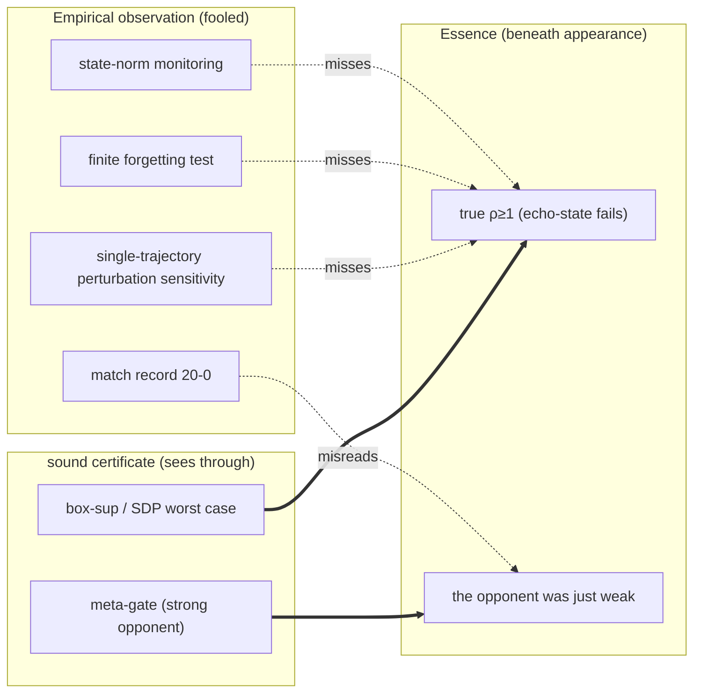
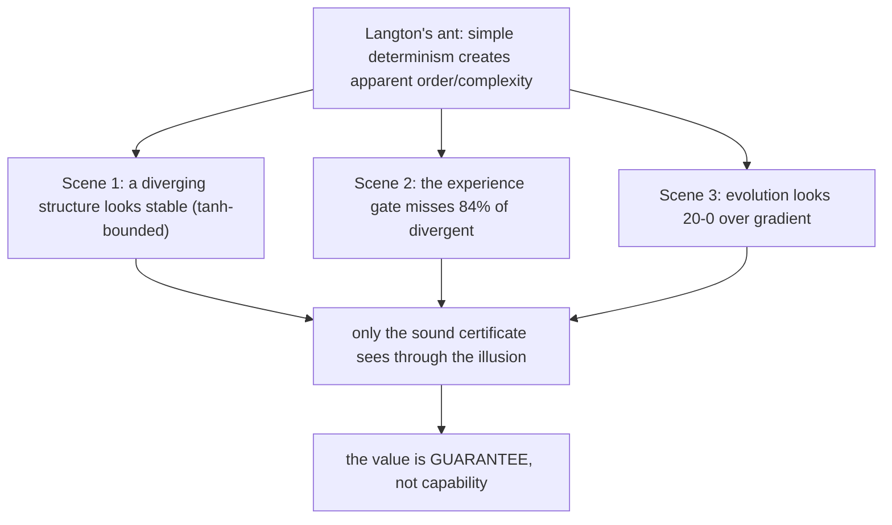
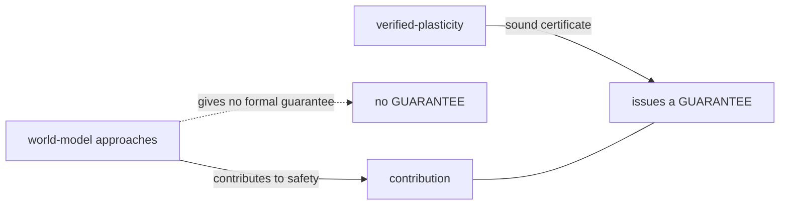
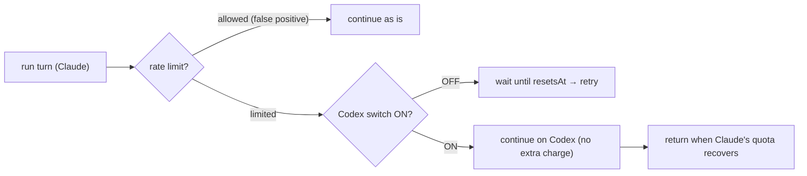
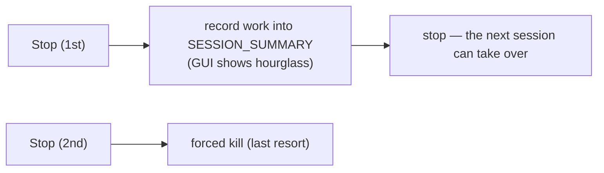

# llcore Verification Arc — Collected (#38–#42): Defensive Disclosure × the 2ⁿ Wall × Strong Gradient Beats Evolution × the Langton's-Ant Illusion + Appendix

<!-- TOPICNAV -->
> **🌐 Language**: [日本語](https://qiita.com/furuse-kazufumi/items/cc0713ab78a5b390df76) | **English** | [中文](https://qiita.com/furuse-kazufumi/items/29b100b00f0d58306886) | [한국어](https://qiita.com/furuse-kazufumi/items/a5ebb3992e4c28862f47)
>
> **📚 FullSense Digest Series**
> - **llcore Verification Arc（this）**
> - [lldarwin / Evolution Arc](https://qiita.com/furuse-kazufumi/items/e49b7ab9027d93594402)
> - [llive Complete Guide](https://qiita.com/furuse-kazufumi/items/07b686ea311e06027f94)
> - [llmesh Digest](https://qiita.com/furuse-kazufumi/items/edaef9aa56ae66b8423e)
> - [Plain-Language Digest](https://qiita.com/furuse-kazufumi/items/bdfad6db3f2e70c40511)
<!-- /TOPICNAV -->

## Contents

1. [a day that ran from "adversarial verification → patent clearance → declining to file → defensive publication"](#chapter-1-a-day-that-ran-from-adversarial-verification--patent-clearance--declining-to-file--defensive-publication)
2. ["the window closed in implementation, but the wall did not budge"](#chapter-2-the-window-closed-in-implementation-but-the-wall-did-not-budge)
3. ["the moment I thought I'd won, my own framework stopped me"](#chapter-3-the-moment-i-thought-id-won-my-own-framework-stopped-me)
4. [binding three installments onto one point: "simple deterministic rules create apparent order"](#chapter-4-binding-three-installments-onto-one-point-simple-deterministic-rules-create-apparent-order)
5. [why I wanted a picture of "walking through an LLM in 3D"](#chapter-5-why-i-wanted-a-picture-of-walking-through-an-llm-in-3d)
6. [when the progress bar stops moving, how many minutes can you wait?](#chapter-6-when-the-progress-bar-stops-moving-how-many-minutes-can-you-wait)

---

## Chapter 1 a day that ran from "adversarial verification → patent clearance → declining to file → defensive publication"

<!-- KAMI -->
> 📖 **In a nutshell**
>
> In a nutshell, this is the story of spending a whole day rigorously doubting one question: "is our research really slipping into a gap nobody else in the world has filled?" We had 56 critic-role AIs hunt for counterexamples along the lines of "this claim must already exist in prior work," cross-checked even patent databases, and still confirmed that "a gap where four conditions overlap at a single point" was open. Normally you would file a patent there, but weighing money against time we declined to file and instead chose a defensive move — "publish all of the technology with a date and plant the flag first (= preventing someone from later fencing it off with a patent)." It is a record of that decision.
<!-- KAMI -->

On June 6, 2026, I (the author) asked an AI (Claude Code) **"to verify whether what we are doing is truly differentiated."** The AI answered with **adversarial verification** — running many verifier AIs that deliberately try to refute and disprove our own claims, to see whether they still survive. Fifty-six verifier agents searched from 7 + 3 angles for counterexamples along the lines of "this claim should be refutable with prior work," and a separate detachment even queried patent databases.

The results were as follows.

- **Refutations (breaks) in academic literature: 0** (we judged 44 candidates individually, and no one had filled "all four corners at once").
- **Refutations in patents: 0** (across 14 English + 3 Japanese queries, no patent occupies the intersection).
- So I decided **not to file a patent** (a cost judgment), and instead planted a flag called **defensive publication**.

This article is a breakdown of the story of that one day (the design and results of the adversarial verification, and the decision-making) plus **what we published (= the technology at the four-point intersection)**. As always, the order is ① term explanations → ② breakdown (plain language) → ③ details.

---

### ① Mini-glossary (so you don't get stuck in the body text)

| Term | In a word |
|---|---|
| **Adversarial verification** | A method that, rather than affirming your own claim, runs many verifier (AI) agents that deliberately try to refute and disprove it, and measures the claim's strength by whether it still survives. Picture hiring critics instead of yes-men. |
| **Defensive publication** | Rather than "obtaining" a patent, **disclosing a technology to turn it into prior art**. A defense that "plants a flag first" so that someone (including a big player) cannot later patent the same invention and bind us or the public. |
| **Prior art** | An existing public document that lets you say "that invention is already public knowledge." Material that negates novelty. The date is everything. |
| **Contraction (ρ<1)** | The property that echoes (past perturbations) **decay** over time. The spectral radius ρ is below 1. Picture a spring that always returns to a resting position. The property by which the memory core "forgets" rather than running away. |
| **Sound proof** | A proof such that when it says "proven," it is **actually correct** (it never issues a false pass). A different thing from a statistical "probably safe." |
| **prove-then-reject gate** | A checkpoint that **adopts a mutation (update) only after proving it**, and **rejects** it if it fails. fail-closed (if it can't be proven, it doesn't pass). |
| **Memory core** | A "remembering part" placed around the LLM. In this research it is a leaky, saturating recurrence (RWKV-family) `s_{t+1} = decay⊙s + (1−decay)⊙tanh(W s + V x)`. |
| **Evolution loop** | An optimization that cycles mutation → selection → next generation to search for good individuals. Here, a proof gate is placed at the checkpoint of that selection. |
| **SMT solver (Z3 etc.)** | A general-purpose solver that decides whether a logical formula is satisfiable. Heavy. In this research the conclusion is that it "turned out to be unnecessary (decorative)." |
| **tracking tube** | A guarantee that the actual deviation from a "desired trajectory" stays within a **tube (radius r)**. `r = G·w̄/(1−L)`. |
| **SSGM** | Prior work that proposed a write gate "to govern evolving memory" **in theory only** ([arXiv:2603.11768](https://arxiv.org/abs/2603.11768), 2026). The closest rival in terms of the banner. |
| **navigability** | Whether evolution is "easy terrain to move through." Distinct from learning getting smarter. This is where the verifier's effect lies. |

---

### ② Breakdown — the whole picture in 3 minutes

Let's start from the idea of a biological niche. In evolution, "a species that moves into a niche — a gap no other species has occupied yet" survives. The AI world is similar. The big players (OpenAI/Google, etc.) are "large species that are smart on average," occupying the wide plains. We cannot win on those plains. So we look for **a gap no one has filled** and build a part that fits it. The thing that fit that gap precisely, this time, is a concrete system called `llcore`.

In one sentence, `llcore` is **"a system in which an AI part that holds memory imposes a 'checkpoint of proof' on itself, so that it does not run away."** The memory core mutates (evolves) every time it updates, but before any mutation is adopted, it must pass through a checkpoint (gate). The checkpoint admits **only what can be mathematically proven** to keep the memory from running away, and turns away anything that cannot be proven (fail-closed).

This system fits that "gap" precisely because the following 4 conditions **overlap at a single point**.

1. A **sound contraction proof** (a mathematical guarantee that echoes necessarily decay — and it never issues a false pass).
2. Applying it **inside the LLM's memory core** (not a control robot, not a classifier, but the "remembering part" itself).
3. **Inside an evolution loop**, **rejecting** bad mutations (discarding them, not pushing them back = not projection).
4. And there is **a working implementation and experiments** (it doesn't end as armchair theory).

No prior work satisfying all 4 of these **simultaneously** was found, even when we had 56 verifier AIs critically scrutinize it and queried patent DBs. Each individual condition has predecessors (we name them all honestly). But no one had "occupied all four corners at once." This is the **four-point intersection**. In terms of the biological niche, `llcore` sits in **the single-point gap** where the four boundary lines exactly cross (in Sun Tzu's terms, "avoid the solid and strike the void").

And the important decision. This gap was **also empty in patents**. Normally one would then say "OK, let's get a patent." But patents cost money and time. I **passed on that**, and instead chose **"publish and plant the flag first" defensive publication**. The aim is not offense but **defense** — to **preempt** anyone (a big player, or a successor implementation of SSGM) later patenting the same concept and binding us or the public. Once you publish with a date, it becomes public prior art, and a later patent dies on novelty.

That said — and this is our consistent discipline — **we do not inflate**. We do not say "world first." The correct phrasing is **"within the scope of our adversarial verification, there is zero prior work occupying all four corners simultaneously."** We always leave the caveat that we cannot know about what is outside the search scope.

---

### ③ Details — the day's session, and the substance of the technology we published

#### 3.1 Design of the adversarial verification (so it can be reproduced)

Saying "my research is strong" yourself means nothing. So the AI built a **refutation-driven workflow**.

- **Refutation search from 7 angles**: lineage of proof gates / certified training / Transformer stability / evolution × verification / verified memory / runtime assurance / industry and patents.
- **Added 3 blind-spot angles the critic pointed out**: reverse lookup from the formal-methods conference side / the vocabulary system of certified continual learning / interpretation of internal state and SSMs.
- **Judged 44 candidates individually with a 5-axis rubric** (does it gate updates / is the proof sound / is it an LLM memory core / inside an evolution loop / is there an implementation). The adjudicating AI **always checked the primary source (the arXiv abstract/HTML) via WebFetch** (hearsay forbidden).
- In parallel, **an internal AI extracted the weaknesses of our own paper draft** (honest disclosure: nitpicking our own side).

The firm conclusion is **breaks 0 / narrows 36 / background 8 (44 items)**. The differentiation core that survived is the four-point intersection above.

#### 3.2 The closest rival for each "corner" (we name them all)

Novelty's honesty is decided by "whether you can name all of them in one sentence." For each corner, the closest predecessor in one sentence:

- **SSGM ([arXiv:2603.11768](https://arxiv.org/abs/2603.11768))** — preempted the banner "governing evolving memory" **in theory only**. The gate is NLI (contradiction detection), **not a sound formal proof**, and there is no implementation. → **Must be cited** as the party carrying the banner. The window of implementation + proof is open.
- **SEVerA ([arXiv:2603.25111](https://arxiv.org/abs/2603.25111))** — Dafny/SMT verification for self-evolving agents. But the target is **output contracts**, not a per-update gate on the contraction of the memory core.
- **PSV-Verus ([arXiv:2512.18160](https://arxiv.org/abs/2512.18160))** — a sound SMT gate inside a self-play loop. But the verification target is **the correctness of generated code**.
- **Provably Safe Model Updates / LID ([arXiv:2512.01899](https://arxiv.org/abs/2512.01899))** — certifies updates as δ-safe via abstract interpretation. But it is **projection (pushing back)** rather than prove-then-reject, and the target is the classification head of a frozen embedding.
- **GP × model checking (Katz & Peled, [arXiv:1402.6785](https://arxiv.org/abs/1402.6785), 2014)** — a **precedent for the pattern** of placing a sound checking gate in an evolution loop. That is why we **do not claim the gate pattern itself as novel**. Only its application to the contraction of a memory core is unexplored.
- **Enforced-Lipschitz Transformers ([arXiv:2507.13338](https://arxiv.org/abs/2507.13338)) / R2DN ([arXiv:2504.01250](https://arxiv.org/abs/2504.01250))** — enforce contraction **by construction**. This is the strongest counter-design: "you don't need a gate, build it in from the start." We contrast **by-construction vs. prove-then-reject** as a design axis (structural enforcement sacrifices expressiveness; a rejection gate inspects arbitrary updates without structural constraints).
- **Safeguarded AI (ARIA programme)** — the most authoritative proof-gated-gatekeeper concept. But the gate target is **behavior/plans** (an output gate), not a gate on weight/memory updates, and it is still at the programme stage.
- **Emergent FV / substrate-guard ([arXiv:2603.21149](https://arxiv.org/abs/2603.21149))** — a working system that verifies an AI's **outputs** with Z3. But it is post-hoc monitoring, not a per-update gate.

(All arXiv IDs above use only those whose abstracts have been cross-checked in the paper draft.)

> 🗒️ *"Hmm… your analysis is half-baked. Can't you dig a little deeper?" — a reminder not to be satisfied with merely listing prior work by name*（© Forbidden shibukawa / SHUEISHA・Snack Basue）

#### 3.3 Patent-side inquiry (filling the hole the academic audit left)

The academic audit used **literature only** and did not look at patent DBs (weak as evidence of absence). So a separate detachment queried Google Patents / USPTO with **14 English + 3 Japanese** queries.

- **Patents occupying the intersection: zero.**
- The closest patents are just 3 lineages, all outside the intersection:
  - **[US11715005B2](https://patents.google.com/patent/US11715005B2)** — authenticity verification of NNs by hash matching (cryptographic hash, not a sound proof).
  - **[US10896032](https://patents.google.com/patent/US10896032)** — a certify-then-deploy governance gate (grounded in procedural attestation).
  - **[US11868855](https://patents.google.com/patent/US11868855)** — "stability" verification of models/weights (but very likely in the availability / fault-tolerance sense).
- An interesting structural piece of evidence: when you query "**gate updates/memory/evolution with a sound proof**," even with a site restriction on the patent DB, almost all results **veered off to arXiv**. This is indirect evidence that "this concept still remains at the academic stage and has not been patented."

→ Conclusion: **clear on the patent side too**. However, since US10896032 / US11868855 partially overlap in vocabulary, we proactively put 1–2 sentences of contrast into the paper's related work: "unlike deployment-governance gates / operational-stability verification, this research gates the analytic contraction property of weight updates with a sound proof."

#### 3.4 The substance of the published technology (the body of the defensive disclosure)

A defensive publication is weak as prior art unless written at "a level of detail that a person skilled in the art can implement." So the disclosure document wrote the following at **an implementable level**.

**(a) The ladder of sound contraction verifiers.** Three rungs, cheapest first:
- `cert_inf` — closed-form ∞-norm upper bound (`O(n²)`). Uses the property that the sum of absolute values per row is maximized at the endpoints, so it is **solver-free**.
- `cert_two` — SVD at all `2^n` vertices.
- `cert_sdp` — a common Lyapunov matrix via a convex LMI (interior-point SDP, CLARABEL).

**Here is the honest point**: the project's old nickname was "Z3-gated," but **the actual gate does not use SMT (Z3)**. When we ran a dedicated Z3 contraction track to check, it **matched the closed-form ∞-norm verifier byte-for-byte (0 mismatches out of 3270; even near the boundary, 0 out of 8000)**. In other words, for this invariant class, **Z3 was decoration**. So we corrected the banner to "the ladder of sound contraction verifiers" (this is not a retreat but a strength — it avoids solver dependence and incompleteness).

**(b) prove-then-reject gate (fail-closed).** Propose a child individual → adopt if the proof passes, resample up to a cap if it fails, and if it still fails, adopt a **known-safe fallback**. **An unproven child is never adopted.** We added `gate_mode="contraction"` / `"state_norm"` additively, and the default `"none"` is byte-identical to prior behavior (= a pure overlay on the existing evolution base).

**(c) tracking tube inspection metric.** An answer to the user's request to see not just "shrinks to somewhere" but "**tracks a desired trajectory**." Reusing the quantities the gate already computes (state Lipschitz `L`, input gain `G`) and the disturbance upper bound `w̄`, it reports the tube `r = G·w̄/(1−L)` in which the tracking error stays — at **zero additional proof cost**. Even in small-scale measurement, the 3 genes that PASS contraction have error/disturbance ratios 0.50/0.78/1.04, inside the theoretical tube, while a non-contraction control **amplifies by 9.3×** (= the gate is load-bearing, not decoration).

**(d) Two routes for verified memory evolution.**
- Route (a): gate updates of the agent's **memory bank** with a sound proof (the difference from SSGM's NLI theory = sound proof + a working gate).
- Route (b): gate the memory core's **internal-state dynamics** (done in this document).

**(e) Synthesis: an SPC control-chart runtime gate + a two-layer ethics gate.** Pass evolution metrics through control charts (X̄–R / CUSUM) to gate temporal anomalies online. And a two-layer ethics of **exploration is free, adoption is verified** (the exploration layer follows Sun Tzu's "way of deception" = surprise moves OK; the adoption layer follows the Analects' "benevolence" = honest, with the gate unavoidable).

#### 3.5 Today's implementation facts (reduced to practice)

Evidence that this is not armchair theory:

- The proof gate is **fully wired into the shipping-side `evolve()`** (`gate_mode` / `resample_cap` added additively, the default `"none"` is byte-identical, and tests demonstrate all modes match the research-side reference implementation).
- The tracking tube reporter has landed too (`r = G·w̄/(1−L)`, limited to `cert_inf`, read-only, golden values match).
- **294 tests** cover the gate + reporter.
- **The observed gate cost is roughly 20–60×** (we disclose, without hiding, that proof is not free).

#### 3.6 Honest limits (we don't soften them)

Even with defensive disclosure we do not bend honest disclosure.

- **The scale is small**: the core is `n=8` (72 real-valued genes), a 16 KB corpus, byte vocab. "LLM memory core" is in the sense of a **mechanism demonstration**.
- **The verifier's payoff is navigability, not learning (L3)**: the effect is EA-specific and vanishes with gradient methods.
- **The gate is a ~20–60× cost**: it only looks free under short training.
- **"Zero false admits" is an empirical observation, not a machine check**: the verifier's *conditions* are sound, but the *implementation* carrying them is not end-to-end formally verified.
- **The scope of "not found"**: limited to the scope of the adversarial verification + a surface-level patent search. CNIPA (Chinese) was not queried, and patents have a publication lag of up to 18 months. We always maintain the "within the search scope" caveat.

---

### Summary — the flag was planted for "defense," not "offense"

In a single day, we had 56 verifier AIs critically scrutinize our own research, queried patent DBs, and confirmed the "four-corner gap" that still remained. Normally one would aim for a patent here, but weighing the cost, we **passed on filing** and instead planted a flag with **a dated defensive publication**.

The aim is simple — **to preempt anyone later enclosing this gap with a patent and binding us or the public**. To that end, we published everything at a level of detail a person skilled in the art can implement. And to the end, we keep the non-inflating phrasing: **not "world first," but "within the scope of our verification, zero prior work occupying all four corners at once."**

The body of the defensive publication (the dated disclosure) has been upgraded, as the addendum below describes, to **a public repository containing the implementation and all data**: [github.com/furuse-kazufumi/llcore](https://github.com/furuse-kazufumi/llcore).

### Addendum (2026-06-07) — the flag became an implementation

The day after this article, the promised verified-memory-evolution PoC **was completed, and the defensive publication was upgraded from "a document" to "the real thing."**

- **Public repository**: [github.com/furuse-kazufumi/llcore](https://github.com/furuse-kazufumi/llcore) — the paper draft ([PAPER_DRAFT.md](https://github.com/furuse-kazufumi/llcore/blob/main/research/paper/PAPER_DRAFT.md)) plus all experiment code/data (570 files, 318 tests green), published as a single dated commit
- **The trajectory-tube gate** (the promised centerpiece): a pre-registered n=40 decision confirmed the effect on the memory horizon (paper §9)
- **And beyond**: "what happens when the AI holds the verifier itself" — measurements of three memory-formation mechanisms (endogenous foresight / certificate-preserving revival / observational learning) in a lethal environment are also included (paper §9.6)
- **Findings slides (CC BY 4.0)**: [slides/](https://github.com/furuse-kazufumi/llcore/tree/main/slides) — a 10-slide summary (ja/en), usable in corporate settings with attribution. **The current version is a digest with modest information density — we will keep expanding it over the coming year (experiment-design details, full figures, reproduction steps, adoption-decision material) as the research progresses**

The promise — "before the SSGM window closes in implementation" — was kept this way.

---

---

## Chapter 2 "the window closed in implementation, but the wall did not budge"

<!-- KAMI -->
> 📖 **In a nutshell**
>
> This is a report on advancing the flag we planted in the previous chapter — "a proof-carrying, evolving memory AI part" — from paper to an actually-running program. To put it in an analogy: turning the blueprint (theory) into a real machine (implementation), and running it without overlooking a single dangerous part — that is the progress. But honestly, homework we could not win was left behind too. The "2-to-the-n wall," where the computation that checks whether something is safe blows up explosively each time the part grows in size, was not broken this time either, so for the time being we can only safely evolve very small parts — and we write that limit down as is. A day half won, half homework.
<!-- KAMI -->

At the end of #38, we promised: "Next time we will report the heart of the four-point intersection — a small PoC of verified memory evolution. Before the window where SSGM took the banner in theory closes in implementation."

On June 9, 2026, that PoC ran to completion. In one sentence: **"The window closed in implementation. But the wall (the scalability wall) did not budge an inch."**

Concretely:

- We ran a **memory core that evolves with proofs** (including real structural surgery `width_grow`) with **zero observed false-admits** (i.e., it evolved without issuing a single false pass).
- At the same time, we measured for the first time the **cert_sdp (SDP verifier)** that we had honestly left "unmeasured" until now, and found it to be the **most "navigable" sound verifier** (it passes 90–99% of genuinely contracting individuals).
- **Nevertheless, even cert_sdp's cost remains `2^n` (exponential in dimension n).** That is, **a verifier that is "both navigable and cheap at scale" was, once again, not found.** For now, verified structural evolution is limited to **small components (n≤6).**

This article writes, without inflating, both what we "could" and "could not" do that day, in the usual order ① terms → ② breakdown → ③ details. At the end we also disclose the result of having **6 verifier AIs adversarially refute our own numbers in parallel** (zero MAJOR discrepancies).

Source of truth: [github.com/furuse-kazufumi/llcore](https://github.com/furuse-kazufumi/llcore) (paper draft + all experiment code/data).

---

### ① Mini-glossary (so you don't get stuck in the body)

| Term | In a word |
|---|---|
| **Plasticity** | The property of being able to "change shape" through learning/evolution. Here, growing the memory core's own structure (matrix size = dimension) after the fact. |
| **Verified-plasticity** | Each time you "change shape," **proving the change is safe (won't run away) before adopting it.** The main axis of this research. |
| **width_grow** | **Structural surgery** that grows a network layer from `n → n+1` (Net2Net family). Actually executed, not on paper. |
| **Contraction (ρ<1)** | The property that past perturbations **decay** over time. Spectral radius ρ below 1. The property by which memory "forgets" rather than running away. |
| **false-admit** | A miss where a verifier passes something actually dangerous (ρ≥1 = can run away) as "safe." Zero of these is the lifeline of soundness. |
| **Sound** | The property that when it says "pass," it is **actually safe** (never a false pass). Different from a statistical "probably safe." |
| **navigability** | "How many genuinely safe individuals it can pass." An overly strict verifier rejects even safe individuals = evolution can't move. The higher, the more freely evolution moves over the terrain. |
| **cert ladder** | Three rungs, cheapest first: `cert_inf` (∞-norm bound, solver-free) → `cert_two` (SVD at all `2^n` vertices) → `cert_sdp` (convex LMI/SDP). |
| **prove-then-reject gate** | A checkpoint that **adopts a mutation only after proving it**, and **rejects** it if it fails. fail-closed (no proof, no pass). |
| **SSGM** | Prior work proposing a write gate "to govern evolving memory" **in theory only** ([arXiv:2603.11768](https://arxiv.org/abs/2603.11768)). The party for whom the window of implementation + sound proof was open. |
| **empirical_rho** | An oracle that approximates the true spectral radius **from below** with many samples. "Zero observed false-admits" is the result of this from-below audit (= strong consistency evidence, but not an absolute proof). |
| **2^n wall** | The limit where proof cost grows exponentially `2^n` in dimension n. `cert_two`/`cert_sdp` look at all vertices, so they hit this wall. |

> 🗒️ *Note: labels in this figure are in Japanese. (The 2ⁿ wall = the cost of the proof blows up exponentially as the block size grows.)*

---

### ② Breakdown — the whole picture in 3 minutes

The flag planted in #38 was a **"memory core that evolves with proofs."** The memory core mutates (evolves) each update, but before any mutation is adopted it must pass a checkpoint (gate) that admits **only what can be mathematically proven** not to run away; otherwise it is turned away (fail-closed). This is the prove-then-reject gate.

This time we moved that flag **from "a document" to "a working thing."** Three things we "could" do.

**Could ①: Zero false passes, even while growing the shape.** Until now we had only tried "proving mutations (small internal tweaks)." This time we actually ran **structural surgery that grows the shape (`width_grow`, n→n+1)** and confirmed the verifier keeps "safe (ρ<1)" with **zero observed false-admits** even after growing. The divergent region (dangerous individuals reaching ρ 1.85–2.21) was all correctly rejected.

**Could ②: We measured the most "navigable" verifier for the first time.** We filled the hole we had honestly left as "cert_sdp unmeasured." In an environment with an SDP solver (CLARABEL), we measured it for the first time and found **cert_sdp the most "navigable" of the three** — it passes 90–99% of genuinely contracting individuals (the cheap `cert_inf` passes only 20–40%, the middle `cert_two` 40–50%). The "too strict, evolution can't move" problem was substantially relaxed by SDP.

**Could ③: For small components, the computation trivially fits.** For a small core of n≤6, the entire verified-evolution loop eats only **0.04% of a 30-hour budget (0.013 hours).** The worry "isn't proof-gated evolution too heavy to run?" was, at small scale, unfounded.

…So far it sounds like "we won everything." But honest disclosure is our discipline. Here are three things we **could not** win, stated plainly.

**Could not ①: The 2^n wall is not broken.** cert_sdp did raise the "navigability ceiling." But at the cost of a still-`2^n` price (looking at all vertices). `cert_two` is 1.3 s per proof at n=12, out of budget at n=14. **A verifier that is "both navigable and cheap at scale" did not exist this time either.** So verified structural evolution is, for now, limited to **small components (n≤6)** — this conclusion is **unchanged** from last time (Phase −1). SDP did not **cross** the wall; it merely **raised** the ceiling in front of it.

**Could not ②: "Zero false passes" is an empirical observation, not a machine proof.** Zero observed false-admits is the result of searching for refutations with an oracle that approximates the true ρ **from below** (many samples). The verifier's *conditions* are mathematically sound, but the *implementation* carrying them is not end-to-end formally verified. "Zero observed" is strong consistency evidence, not an absolute proof of "safe for all inputs" — we don't exaggerate here.

**Could not ③: The model did not get smarter.** The verifier's payoff is **navigability (how freely evolution moves)**, not the model getting smarter (learning performance going up). And the effect is specific to evolutionary algorithms (EA); it vanishes with gradient methods. Furthermore, this round's fitness is a **synthetic proxy**, and confirmation under real GPU training is deferred to the next phase (Phase 2).

In short, this was a half-won, half-homework day: **"the mechanism was proven in implementation; the scale wall remains, honestly."**

---

### ③ Details — five experiments and the caveats we couldn't kill

The main axis is the **Verified-Plasticity Evaluation Framework.** Before claiming "our method is strong," first build **the ruler to measure with.** With that ruler we ran five experiments (all `$0` / CPU, torch 2.12+cpu, fixed seed, reproducible).

#### 3.1 Verifier soundness and ladder under fixed structure

Sampling hundreds of individuals each at n={4,6,8} spanning contraction–divergence, we cross-checked the three verifiers' passes against true ρ (empirical_rho, 6000 samples).

| n | contracting (ρ<1) | false-admit (inf/two/sdp) | pass rate of genuinely contracting (inf/two/**sdp**) |
|---|---|---|---|
| 4 | 453/600 | **0 / 0 / 0** | 0.41 / 0.51 / **0.95** |
| 6 | 426/600 | **0 / 0 / 0** | 0.29 / 0.43 / **0.94** |
| 8 | 280/400 | **0 / 0 / 0** | 0.23 / 0.40 / **0.91** |

Findings:
1. **All three verifiers have zero observed false-admits** (cert_sdp's soundness confirmed for the first time). Consistent with the verifiers' mathematical soundness.
2. **cert_sdp is overwhelmingly navigable** — of genuinely contracting individuals, the cheap cert_inf passes only 23–41%, cert_two 40–51%, but **cert_sdp passes 91–95%**. Note that `two⊆sdp` (if cert_two passes, cert_sdp passes) is a **structural guarantee (tautology)** from an implementation fast-path, not an empirical finding — we state this so as not to inflate.

#### 3.2 Soundness × non-triviality under real structural surgery (width_grow)

We actually grew the base n→n+1 with `width_grow` (Net2Net/fresh) and judged whether each gate **keeps zero false-admits under growth ∧ opens ≥1 non-trivial pass** (1 cell = 1536 grown individuals).

- **Soundness under growth: zero observed false-admits across all 16 (cell × gate).** Growth ρ up to 1.85–2.21 (divergent region) all correctly rejected. This is the confirmation of **North Star #1 (zero false passes under growth operations)** under real structural surgery.
- **The cheap gate (cert_inf) is sound but fragile at small n** — at the most conservative edge of n=6 (headroom 0), non-trivial passes are **0** → gate FAIL. Even with headroom, non-trivial passes are merely 3, right at the τ margin. = "the cheap gate's navigability is fragile."
- **The navigable gates (cert_two/cert_sdp) PASS all cells** — cert_two opens 114–168, cert_sdp 673–733 non-trivial sound passes. → **"Promote per-component gates to cert_two/sdp, limited to small-n" is justified by data.**

#### 3.3 The blind spot of inter-block coupling

Coupling two blocks residually, we measured with true ρ the **blind spot where "each block passes alone but the composite runs away."**

- **per-block AND (AND-ing each block's individual pass) is genuinely unsound under coupling** — at coupling strength γ≥1.0, **24–34% (γ=1.0) to 80–96% (γ=2.0) of individually-passed cases have composite true ρ≥1** (run away). → **per-block AND is forbidden.**
- **full-system cert (proving the whole system at once) has zero false-admits across all γ = sound.**
- Here too **cert_sdp is the most navigable**, but raising the dimension (block count 2→3) and coupling strength lowers coverage (at full=6, γ=1.0, cert_inf/cert_two are 0%, only cert_sdp 75.8%). = SDP resolves over-conservatism, but **the dimension wall still bites even with SDP.**
- ⚠ Honest caveat: at block count 3 the SDP solver issued a few "solution may be inaccurate" warnings. **Soundness (false-admit=0) is guaranteed by an independent eigenvalue recheck**, but the coverage numbers may include slight wobble from the approximate solution.

#### 3.4 feasibility (does it really run within budget)

We extrapolated measured per-op wall-time to a 30-hour budget.

| n | per eval | total | fits in 30h |
|---|---|---|---|
| 4 | 769μs | **0.011h** | yes |
| 6 | 912μs | **0.013h** | yes |
| 8 | 9.2ms | 0.131h | yes |
| 10 | 38.6ms | 0.550h | yes |
| 12 | 1.31s | **18.6h** | barely |
| 14 | — | (cert_two 2^14 extrapolation = infeasible) | no |

Findings:
1. **small-n (n≤6) is trivially feasible** — 0.04% of the budget.
2. **The 2^n wall binds at n≥10–12** — cert_two is 1.3 s/proof at n=12 (=18.6h, thin margin), out of budget at n=14.
3. ⚠ Caveat: this fitness is a **synthetic adapter proxy** of `RotationNDObjective`; under real GPU training the base forward (CE) becomes dominant. This extrapolation is a "conservative upper bound charging one proof per eval"; real GPU measurement is to be confirmed in Phase 2.

#### 3.5 Portability to a second base (Mamba)

We checked whether the framework rides on bases other than SmolLM2. **Mamba-130M loaded successfully on CPU** (coherent generation confirmed), and on its hidden state the cert_two gate is load-bearing (pass rate moves +0.287 with/without the gate, consistent with SmolLM2's +0.320). = Demonstration of the "swap in a new base" plug-point.
- ⚠ Caveat: the soundness oracle here is not the empirical_rho of §3.1-3.4 but a **weak oracle (single perturbation)**, with a small group of n=7 passes. Mamba's own intrinsic stability (base-level Lyapunov) is unmeasured, deferred to Phase 2. This phase's deliverable is limited to "framework portability + Mamba CPU operation check" (not an intrinsic-stability positive control).

#### 3.6 Integrated verdict — Decision gate 1 = PASS (small-n)

| gate | condition | verdict |
|---|---|---|
| Soundness under growth ∧ non-trivial admit≥1 | false-admit=0 over N width_grow ∧ non-trivial pass≥1 | **PASS** (cheap gate trivial at n=6 → cert_two/sdp required) |
| coupling-aware composite soundness | per-block AND forbidden + full cert sound | **PASS** |
| feasibility | small-n loop within 30h budget | **PASS** (small-n) |

→ **Decision gate 1 = PASS → on to Phase 2 (small-n per-component regime, within the constraint fixed in Phase −1).** Phase 1's deliverable is **"a measurement harness for sound, feasible small-n verified structural adaptation + a full characterization of the verifier ladder (inf/two/sdp)."**

#### 3.7 Honest limits (not yet killed)

Even with defensive disclosure we do not bend honest disclosure. Onto #38's caveats, we overlay what this round's measurement killed / left.

- **The 2^n scalability wall is unchanged (the biggest homework)**: cert_sdp raised the navigability ceiling to ~0.9 (a big improvement from Phase −1's cert_two ~0.45), but the **2^n vertex cost is unchanged.** "A navigable-and-scalable sound verifier remains absent" = the non-viability of high-dimensional verified structural evolution is **upheld.** SDP only raised the ceiling; it did not break the wall.
- **empirical_rho is a from-below estimate**: zero observed false-admits is strong consistency, not an absolute proof of "ρ<1 for all (s,x)." It can miss near-boundary cases.
- **net2net is an incoming-copy approximation** (not exact function-preserving) → the function change Δfunc is an approximate measure.
- **fitness is a synthetic proxy**: a capability side-line (EXISTS/NULL/ARTIFACT) on real SmolLM2 CE is required in Phase 2.
- **Mamba's intrinsic stability is unmeasured**: the gate applies to the adapter; the Mamba base's own Lyapunov is unverified → deferred to Phase 2.

---

### Adversarial verification — having 6 AIs refute our own numbers in parallel

The core of honest disclosure is "when an abnormally good result appears, doubt the breakdown before feeling like you've won" ([feedback_benchmark_honest_disclosure]). So we had **6 independent verifier AIs in parallel** cross-check this verdict's numerical claims against each experiment's `results.json` + implementation `.py`.

**Result = zero MAJOR issues (no discrepancy that overturns the conclusion); all MINOR.** The findings are reflected in the body:
- Fixed 4 transcription rounding errors (maxΔfunc 0.108→0.107, etc.).
- §3.1's `two⊆sdp` stated as an implementation tautology, not an empirical finding.
- Refined "the cheap gate is trivial at n=6" to "trivial only at n=6's most conservative edge, fragile even with headroom."
- "cert_sdp 98% rescue" stated as limited to block count 2; at 3 it is 75.8% / inf·two 0%.
- Made transparent that fitness is a synthetic proxy, the conservatism of the extrapolation, and the CPU→GPU extrapolation premise.

→ **After verification, Decision gate 1 = PASS, the SDP navigability finding, and the small-n-limited conclusion are unchanged.** The findings all improve honest-disclosure precision; none shake the mechanistic conclusion.

---

### Summary — "the window closed, the wall remained"

The flag planted in #38 advanced this time **from a document to a working thing.** We ran a memory core that evolves with proofs, while actually growing its structure, with **zero observed false-admits**, filled in the previously-unmeasured SDP verifier, and confirmed small-n feasibility. The window of "implementation + sound proof" for the banner SSGM took in theory thus closed on the implementation side.

On the other hand, the biggest homework, the **2^n wall**, did not budge this time either. A verifier "both navigable and cheap at scale" still does not exist. So we do not inflate: we uphold last time's conclusion that verified structural evolution is, **for now, limited to small components of n≤6.**

Next time (from #40 on) is Phase 2 — applying the calibrated "multimodality instrument" to a real loss terrain and confirming, with proper power, one thing about how evolution moves over the terrain (the capability side-line). The ruler is built. Next, it's time to measure real terrain with that ruler.

Source of truth: [github.com/furuse-kazufumi/llcore](https://github.com/furuse-kazufumi/llcore) — paper draft + all experiment code/data (5 experiments + adversarial-verification workflow).

---

<!-- INTERLUDE -->

### ☕ Aside — why "proof isn't free"

The body text breezily says "the proof cost is roughly 20–60×," so let's pause here and translate what that means into everyday intuition. "Doing" a calculation and "confirming the calculation is absolutely correct" are two different things, and the latter takes far more effort. Getting an answer in your head is fast, but if you want to convince a third party that the answer is truly correct, you write out every intermediate step, re-check it a different way, and try the extreme cases too — and in no time it has become several times the work. The same holds in the AI world: "applying this update" is instantaneous, but "guaranteeing mathematically that this update will absolutely not run away" takes dozens of times more computation.

That is why projects that sell on speed usually quietly skip the "confirm" step. The reason the body text keeps insisting "proof is not free" is also a declaration that we will not allow ourselves that shortcut. Showing the weight without hiding it — that itself may best express the stance of this research.

<!-- INTERLUDE -->

---

## Chapter 3 "the moment I thought I'd won, my own framework stopped me"

<!-- KAMI -->
> 📖 **In a nutshell**
>
> This is the story of how I doubted myself at the scariest moment in research — "when the result was too good." On a terrain made by a real small LLM, evolution (a search method) beat ordinary learning 20 games to 0. For a moment I thought, "I've won!" But just as winning 20 straight against a sandlot baseball team is no proof you are strong, maybe the opponent (the weak learning method) was just weak. So, following the rule I had baked in myself — "if you win, call in a stronger opponent" — I called the serious learning method (the one real LLM training uses), and this time I lost instead. So the victory was an illusion. I cannot claim "evolution gets smart" — but this result is also a confirmation that the policy of competing on safety, not smarts, from the start was the right one.
<!-- KAMI -->

In the last installment (#39) we concluded: "We built a memory core that evolves *with a proof* — but only for small parts, n≤6. The scalability wall didn't budge."

This time (2026-06-10) we finally answered the question we'd been putting off:

> **"So does this 'evolving memory' actually get *smart*? Is it better than gradient descent (ordinary learning)?"**

One-line answer: **"On a real terrain made by an actual small LLM, evolution beat ordinary gradient descent 20 games to 0. For a moment I thought I'd won. Then, following my own framework's discipline, I called in a *strong* gradient — and the victory turned out to be an illusion."**

This is a record of the scariest moment in research — **the moment an abnormally good result appears** — and how I doubted myself before celebrating. Same order as always: ① terms → ② plain words → ③ details. No embellishment. At the end I disclose the result of having **verifier AIs adversarially refute** my numerical claims in parallel (zero MAJOR discrepancies).

Source data: [github.com/furuse-kazufumi/llcore](https://github.com/furuse-kazufumi/llcore) (all experiment code/data + verdicts).

---

### ① Mini-glossary

| Term | In one line |
|---|---|
| **capability** | "Does it get smart?" Here, how well it predicts what comes next (low cross-entropy / CE). |
| **guarantee** | "Does it avoid blowing up?" Provably stable (contraction ρ<1). **The lifeline of honest-disclosure is never confusing these two.** |
| **MAP-Elites (evolution)** | Evolutionary search that keeps a grid of diverse solutions. The "evolution" side. |
| **finite-diff gradient (weak)** | Naively *estimates* the slope by nudging values. Costs dim+1 evals per step = **slow and weak**. |
| **analytic (exact) gradient (strong)** | Gets the *exact* slope in one pass via autodiff (backprop). What real LLM training actually uses. The decider here. |
| **meta-gate** | When evolution "wins," bring in a **stronger opponent** and check whether the gain survives. If it vanishes, it was an illusion (ARTIFACT). |
| **ARTIFACT** | A fake win caused by the **opponent being weak**, not a real performance gap. |
| **Langton's ant** | A famous system, simple rules, that looks chaotic then suddenly orders. A metaphor for "appearance ≠ essence." |

---

### ② Plain words — "winning 20 straight against a weak opponent says nothing"

A baseball analogy. Your team (evolution) beats an opponent (finite-diff gradient) **20 games to 0**. Strong, no complaints.

…but what if that opponent was a *sandlot* team? 20 straight wins is no proof *you* are strong — maybe the *opponent was weak*.

Do this in research and you get a disaster. You write "evolution beat gradient!" in a paper, and later someone says "no, the gradient method you compared against was just too weak." This is the **capability trap**.

So our framework had a **rule (meta-gate)** baked in from the start:

> **If evolution wins, call in the "pro" for a rematch before you celebrate.**

We called the pro (analytic gradient = the exact gradient real LLM training uses). Result:

- vs sandlot (finite-diff): evolution **20–0** (+0.029 mean CE lead)
- vs pro (analytic gradient): evolution **1–19** (the pro wins)

So **evolution won only because the opponent was weak**. With a strong gradient, gradient was better. **"Evolution gets smarter (capability)" cannot be claimed.**

The key point: **losing here is not a failure.** Our framework's value was never on the "smart" side (capability) — it's on the **"doesn't blow up" side (guarantee)**. This result means that choice was **right, in data** — good thing we didn't sell on smarts.

> 🗒️ *"This guy… is SO boring!!" — 20 straight wins against a weak opponent are merely tedious and prove nothing (Kazama)*（© Forbidden shibukawa / SHUEISHA・Snack Basue）

---

### ③ Details — what we measured on a real LLM terrain, and how

#### 3-1. From "synthetic" to "real" terrain

Earlier capability experiments measured on a **synthetic multi-peaked terrain** (an artificial landscape). We honestly flagged: "this is not a real LLM loss terrain."

This time we closed that gap with the **real SmolLM2-135M** (an Apache-2.0 small LLM):

1. Run text through SmolLM2, extract the **real internal representations (hidden states)** at layer 15.
2. Project to small dimension (n=6) and build a **CE terrain that predicts "the cluster of the next internal representation"** — not synthetic Gaussians, but a **real prediction task derived from the model's own internal dynamics**.
3. On that terrain, run evolution (MAP-Elites) / random / weak gradient / **strong analytic gradient** at the **same budget** (eval count), comparing prediction on **held-out (unseen) sentences** across 20 seeds.

#### 3-2. Results (held-out mean fitness = −CE, higher is better)

| Method | held-out mean | Note |
|---|---|---|
| **strong analytic gradient (torch Adam)** | **−1.446** | **best of all** |
| evolution (MAP-Elites) | −1.454 | 2nd |
| random | −1.473 | |
| weak gradient (more restarts) | −1.481 | |
| weak gradient (finite-diff) | −1.483 | **last** |
| evolution + ρ<1 gate | −1.483 | gating constrains search to finite-diff level |

- evolution vs **weak gradient**: +0.029 mean, **20–0**, p<1e-6 → 4-condition AND **passes** (looks like EXISTS).
- evolution vs **strong analytic gradient**: −0.008 mean, **1–19**, gradient wins at p=3.5e-4 → 4-condition AND **fails**.

**→ Verdict = ARTIFACT+NEGATIVE.** Evolution's win was due to a weak opponent. With a strong gradient, gradient ≥ evolution = **capability is NEGATIVE even on a real LLM terrain**.

#### 3-3. We also checked it holds on both terrains (cross-check)

"Then wasn't the earlier synthetic 'tie (NULL_TIE)' also understated by the weak gradient?" — we checked that **in data** too. Adding the strong analytic gradient to the synthetic terrain, **the analytic gradient had the best mean** (0.575 > evolution 0.535). But the synthetic terrain has high run-to-run variance, so the paired test stayed a tie. The real terrain, with lower variance, let the gradient advantage reach **significance** (19/20).

**Conclusion: capability NEGATIVE is consistent across both terrains** (strong gradient best on both). The only difference is variance.

#### 3-4. The "does the framework see the real thing" side PASSES

Capability can't be sold. So what stands up — the **guarantee (discriminative power)**. Three confirmations in the same session:

- **Discrimination**: an experience-based gate **misses 84%** of "dangerous structures" (passes diverging ones as "safe"). A **sound certificate misses 0%**. In particular cert_sdp has zero false-admits and only 4.6% over-rejection = **sound and most navigable**.
- **Base-level discrimination**: Mamba (a structurally stable SSM) is intrinsically stable across all 24 layers → trivially passes. The standard Transformer SmolLM2 has no state recurrence → **safety must be imposed by a bolted-on gate**. The framework cleanly separates "safe base" from "needs-a-gate base."
- **Extensibility (framework-ness)**: the three plug-points (substrate / objective / certifier) swap with a **single object** (17 unit tests green). But the hypothesis "diversity helps generalization" is **NULL** (doesn't hold) — also disclosed honestly.

#### 3-5. Shown "in motion" — the norm doesn't explode, only the sensitivity does

A side finding. This substrate keeps the state bounded via tanh, so **even when unstable, the output norm does not diverge**. Worse, even a diverging individual (ρ≈2.9) has its perturbation **appear to decay** on one trajectory (exactly Langton's ant — appearance betrays essence). Watching the state norm, or a finite-horizon "forgetting test," **cannot catch ρ≥1**. Only the **certificate's worst-case (box-sup) evaluation** can. The demo captures this "experience is fooled, only the certificate sees" in one figure (`phase2_demo_gate_discrimination.svg`).

---

### Honest disclosure — what I doubted at the scariest moment

The most dangerous moment was **seeing "evolution 20–0."** An SNS-friendly headline flashed by ("Found a real LLM terrain where evolution beats gradient!").

What stopped me wasn't a new insight — it was the **rule baked in from the start (meta-gate)**: "if you win, call the strong opponent." I called, and lost. So I can't write it.

This is not a report of losing — it's a report of **the framework working**. Without the meta-gate, I would have published a falsehood. "Abnormally good results: doubt the breakdown before celebrating" — that discipline actually stopped one false positive, in data.

Remaining honest caveats:
- A hidden-cluster CE proxy, not a full-vocab softmax CE (full-vocab degenerates at small n).
- Gating costs −0.028 performance on the real terrain (it measurably trims plasticity). But since evolution has no capability edge, this doesn't change the conclusion.
- "Strong gradient is best" assumes backprop gives exact gradients for free — which is exactly what real LLM training does, so it's a realistic comparison.

> 🗒️ *"Lying is wrong, okay!" — a personification of the verification (meta-gate) that rejects the appearance of 20 wins*（© Forbidden shibukawa / SHUEISHA・Snack Basue）

### Verification — I had AIs refute my own claims (MAJOR 0)

Finally, I had **independent verifier AIs adversarially refute** the numerical claims of all three experiments in parallel. For the main result (capability), a verifier AI **loaded SmolLM2 itself and re-ran 3 seeds independently**, deterministically reproducing "strong gradient beats evolution." **Zero MAJOR discrepancies.** All findings improved reproducibility / wording / caveat precision, none overturned a conclusion (one verifier found a non-reproducible RNG defect, which I made deterministic and re-ran on the spot).

---

### Wrap-up — what "evolvable LLM" really is

Across three installments (#38→#39→#40) we landed here:

- **#38**: Defensive disclosure — the window for "proof-carrying memory" opened in theory.
- **#39**: The window closed in implementation. But the **scalability wall** didn't budge (verified evolution only up to n≤6).
- **#40 (this one)**: Does it get smart? → **NO.** Even on a real LLM terrain, a strong gradient beats evolution. **Capability can't be sold.**

So "evolvable LLM" really means: **not "an AI where evolution wins on performance," but "a framework that provably guarantees and measures that online structural adaptation doesn't blow up or catastrophically forget."** It's unglamorous. But having decided to **compete on safety, not inflated smarts**, this is the honest picture.

Next time we plan to summarize this framework under the metaphor "an eye that sees through Langton's-ant illusions." Experience is fooled by appearances; only the certificate sees the essence — and on that single point, three installments of honest disclosure all converge.

---

### ☕ Aside — I asked the AI "what does this picture look like to you?"

A short detour from the main thread. As a test, I showed the AI writing this arc (Claude) a single panel from Forbidden shibukawa's *Snack Basue* — a "what-do-you-see" gag drawing with a deliberately cluttered background — and asked "what does it look like?" Its self-graded answer was: **"I can read about 80% of the mood and the joke's structure. But the fine details — what animal a character is, what an object is — I get about 50% of, with no confidence."** The more a drawing speaks through omitted lines and negative space, the more the AI misses.

> 🗒️ *"This picture" "What's it look like to you?" — the characters in the panel are already doing, preemptively, the act of showing an AI an image and asking*（© Forbidden shibukawa / SHUEISHA・Snack Basue）

This is exactly like the main story. The AI grasps the "plausible whole," but gets shaky on the "truth of the details." That is precisely why we decided to measure with the certificate (math), not the appearance (plausibility) — which is the very backbone of the next chapter. Show an AI a picture and its weakness shows up in a single frame.

---

## Chapter 4 binding three installments onto one point: "simple deterministic rules create apparent order"

<!-- KAMI -->
> 📖 **In a nutshell**
>
> This is the capstone chapter that binds the previous three installments together with a single metaphor: "Langton's ant." Langton's ant runs on just two simple rules, yet after walking chaotically for a while it suddenly produces a clean pattern — a famous example of "simple things creating apparent order and apparent intelligence." The trap we kept hitting in this research was the same: a part that actually runs away looks stable when observed, or evolution looks strong when really it was just thanks to a weak opponent. Experience (what the eyes observe) is always fooled by this appearance, and only mathematical proof sees the essence hidden beneath. So we converge everything onto one point: the value lies not in "getting smarter" but in "being able to guarantee it won't blow up."
<!-- KAMI -->

This is the **capstone** of the llcore verification arc (#38 → #39 → #40). At the end of #40 we promised: "Next time we plan to summarize this framework under the metaphor 'an eye that sees through Langton's-ant illusions.' Experience is fooled by appearances; only the certificate sees the essence — and on that single point, three installments of honest disclosure all converge."

We keep that promise. One line first:

> **"AI that gets smarter the more you use it / self-evolves" and "world models will hand you safety" are pleasant headlines. But unless you can falsifiably tell, with a sound certificate, whether "got smarter / got stable" is real or an illusion, it is only an *appearance*. verified-plasticity is exactly that discriminator. Its value lies in GUARANTEE, not capability.**

The concept hook is **Langton's ant**. An ant driven by just a few deterministic rules walks chaotically for a while, then suddenly builds a regular trajectory called the "highway." **Simple rules create apparent order and apparent complexity.** This is the core metaphor: what we kept hitting across #38-#40 is exactly that **empirical observation is fooled by the "appearance" that simple things create**.

- A structure that *should* diverge **looks stable** when observed (#40's Langton's ant).
- Evolution **looks like it beats gradient 20–0** when observed (#40's Langton's ant ver.2).

Both are "appearances," and the essence beneath (true instability, a genuinely weak opponent) was **invisible to experience and seen only by a sound certificate**. On that single point, the three converge.

As always: ① terms → ② plain words → ③ details. No inflation. Only verified numbers; unverified is marked "unverified." We **never confuse** capability (evolution beats gradient) with guarantee (proof-carrying stability) — the lifeline of honest disclosure.

Source: [github.com/furuse-kazufumi/llcore](https://github.com/furuse-kazufumi/llcore).

---

### ① Mini-glossary (so you don't get stuck in the body)

| Term | In one line |
|---|---|
| **verified-plasticity** | A framework that takes "does it not diverge / does it contract (keep ρ<1 *soundly*)" as the first-class metric for online structural adaptation of small bolted-on blocks (n≤16 verified recurrent adapters) on a real small LLM, and measures any method falsifiably. The main axis. |
| **capability** | "Does it get smart?" Predictive quality of what comes next (low cross-entropy CE). |
| **guarantee** | "Does it avoid blowing up?" Keeping stability (contraction ρ<1) with a sound certificate. **Not confusing these two is the lifeline of honest disclosure.** |
| **contraction (ρ<1)** | The property that past perturbations are **forgotten (decay)** over time. Spectral radius below 1. The pass condition of the echo-state property. |
| **echo-state property** | State is determined by input history; initial perturbations are forgotten. "Holds (ρ<1)" = safe, "fails (ρ≥1)" = can blow up. |
| **false-admit** | A miss where the gate passes something actually dangerous (ρ≥1) as "safe." Zero of these is the soundness lifeline. |
| **sound** | When it says "pass," it is **actually safe** (never a false pass). Different from a statistical "probably safe." |
| **navigability** | "How many genuinely safe individuals it passes." An overly strict gate rejects even safe ones = evolution can't move. Higher is better. |
| **experience gate** | A gate that judges "looks safe" from finite-horizon observation (forgetting tests, etc.), not a sound proof. One negative comparison (STABLE-style). |
| **sound certificate** | A verifier that bounds the worst case from above with a guarantee (cert_inf / cert_two / cert_sdp). Only this sees through the "appearance." |
| **MAP-Elites** | Evolutionary search keeping a grid of diverse solutions. The "evolution" side. |
| **finite-diff / analytic gradient** | Weak gradient (estimate slope by nudging, dim+1 evals/step) vs strong gradient (exact slope in one backprop pass). |
| **meta-gate** | When evolution "wins," bring in a stronger opponent (analytic gradient) and check whether the gain survives. If it vanishes, it's an illusion (ARTIFACT). |
| **Langton's ant** | An ant on a grid driven by a few deterministic rules; looks chaotic, then suddenly builds a "highway." A metaphor for **simple determinism creating apparent order/complexity**. |

---

### ② Plain words — the Langton's-ant illusion in three scenes

#### Scene 0: What Langton's ant is (why this metaphor)

Langton's ant moves on a grid by just two rules ("on white, turn right and flip the color"; "on black, turn left and flip"). For the first few hundred steps it walks chaotically. But after about 10,000 steps it suddenly builds a regular **104-step-period pattern** called the "highway" and travels straight.

Two cores of this research live here:

1. **Simple deterministic rules create apparent order/complexity.** The rules are trivially simple, yet the result looks complex ("chaos → sudden order").
2. **Appearance and essence diverge.** Observing the ant mid-chaos cannot foresee the highway; and vice versa. **Empirical observation is fooled by the "appearance" simple things create.**

The claim: the same happens in AI. Both "apparent stability" and "apparent evolution (monoculture = apparent superiority)" collapse, underneath, to **deterministic-simple**. Experience is fooled; only the sound certificate sees through the illusion.

#### Scene 1: "Apparent stability" — a diverging structure looks stable when observed

The small memory block bolted onto an LLM keeps its state bounded with `tanh`. So **even when unstable (ρ≥1), the output norm does not diverge**. The state never explodes; it stays bounded.

Result: **even a structure with true ρ = 2.9 (fully divergent), observed along one trajectory, has its initial perturbation "appear to decay"** — measured, perturbation 1 shrinks to `2e-14`, as if safe (contracting). This is a coincidental conjunction of `tanh` saturation and perturbation-direction misalignment (it doesn't ride the divergent direction).

Every naive check fails here:

- Monitor the state norm → bounded, no anomaly (fooled).
- Finite-horizon "forgetting test" → looks forgotten (fooled).
- Single-trajectory perturbation sensitivity → looks decaying (fooled).

This is exactly Langton's ant. **Simple dynamics (tanh-bounded) create the appearance of "safe" for a dangerous structure.** Only one thing sees through: the **sound certificate's worst-case (box-sup) evaluation**, which bounds the maximum amplification over all inputs/states and is not fooled by one accidentally-safe trajectory. It detected `σ_max = 4.87 > 1` and correctly rejected.

#### Scene 2: "The experience gate misses 84%" — the scale of the illusion

At population scale: a 400-gene mix of 95 divergent (truly blow up) + 305 contracting (truly safe). How many dangerous ones does each method miss (false-admit)?

- **No gate**: passes all 95/95 divergent as "safe" = **100% false-admit**.
- **STABLE-style experience gate** (a representative "experience-based stability gate" also used by other camps): **misses 80 of 95 (84.2%)**.
- **sound certificate (cert_inf / cert_two / cert_sdp)**: **0%** false-admit.

The shock of 84% is that it barely improves on "no check = 100%." The experience gate is **fooled by the Langton's-ant illusion 84% of the time while believing it is checking.** Why: as in Scene 1, under `tanh`-bounded dynamics, divergent structures "appear to forget perturbations" under finite-horizon observation, and the experience gate (built on finite-horizon observation) believes that appearance. The sound certificate bounds the worst case with a guarantee, unswayed by appearance. In particular, **cert_sdp keeps 0% false-admit while over-rejecting genuinely-safe individuals by only 4.6%** — sound and most navigable.

#### Scene 3: "Apparent evolution" — evolution looks 20–0 (but it's an illusion)

Langton's ant ver.2 happened on the capability side.

On a real terrain made by an actual SmolLM2, evolution (MAP-Elites) vs the weak gradient (finite-diff) → **evolution 20–0** (+0.029 mean CE, p=9.5e-7). An "order" where evolution beats gradient seemed visible; an SNS-friendly headline flashed by.

But this too was Langton's ant. **The opponent (finite-diff) was just weak.** Our framework had a meta-gate from the start ("if you win, call the strong opponent"). Calling the strong analytic gradient (backprop = the exact gradient real LLM training uses) at the same budget: **gradient overturns evolution 19/20** (diff +0.008, p=3.5e-4). Evolution's win was a weak-opponent artifact. Verdict = **ARTIFACT + NEGATIVE**.

Most importantly: **without the meta-gate (a sound comparison opponent), I would have published the false-positive "evolution wins capability 20/20 on real terrain."** "Doubt the breakdown before celebrating" actually stopped one false-positive, in data. This too is a sound discriminator seeing through Langton's ant.

#### The claim (three scenes unified)

Experience is fooled by appearance. Only the sound certificate (and its capability-side version, the meta-gate) sees the essence. So verified-plasticity's value is not "gets smart" (capability) but "can be guaranteed/measured not to blow up" (GUARANTEE).

---

### ③ Details — H-discriminative numbers, the capability outcome, framework-ness, the small-n wall

#### 3.1 What framework verified-plasticity is

The main axis is the **Verified-Plasticity Evaluation Framework**. Before claiming "our method is strong," build **the ruler** — that is the stance of this research. The ruler is guarded by six devices:

1. **pre-registration** — fix hypotheses and decision criteria before the experiment.
2. **Holm conjunctive** — judge by an AND of multiple conditions (prevents cherry-picking).
3. **artifact discipline** — all experiment code/data public, reproducible.
4. **falsification clauses** — state explicitly "this result is refuted if such-and-such."
5. **self-power audit** — confirm with a positive control that the ruler itself can really detect a difference.
6. **anti-over-claim critic** — a verifier specialized in crushing over-claims.

The methods under test (the targets put on the ruler) are four:

| method | role |
|---|---|
| **VSOA** (cert-gated topology evolution) | the headliner of this research (proof-gated structural evolution). |
| **no-gate** | negative control (checks nothing). |
| **STABLE-style experience gate** | prior-art comparison (experience-based stability gate). |
| **Mamba-130M** | positive control (stable-by-construction, structurally stable). |

And to state the true identity of the stability metric precisely: it is not "does the state diverge" but **"echo-state perturbation forgetting."** The kernel is always bounded via `tanh`, so the state norm never diverges (the source of Scene 1's illusion). What we measure is "are initial perturbations forgotten (contraction ρ<1 = echo-state property holds)."

#### 3.2 H-discriminative — the framework's discriminative power (core numbers)

At n=6, with a gene population of 95 divergent / 305 contracting, we measured each method's false-admit and over-reject.

| method | sound? | false-admit (missed divergent) | over-reject (contracting) |
|---|---|---|---|
| no-gate | ✗ | **95/95 = 100%** | 0% |
| STABLE-style experience gate | ✗ | **80/95 = 84.2%** | (experience gate) |
| cert_inf | ✓ sound | **0%** | 70.5% |
| cert_two | ✓ sound | **0%** | 52.8% |
| **cert_sdp** | ✓ sound | **0%** | **4.6% (most navigable)** |

On a positive-control population (a 0-divergent safe-family population, Mamba-style), **all methods have 0 false-admit** — confirming the soundness in the other direction too: they don't wrongly reject a safe family.

**Why the STABLE-style gate misses 84% (educationally):**

The echo-state pass condition is "true ρ < 1." But when the kernel is `tanh`-always-bounded, **even a true-ρ≥1 divergent structure appears to forget perturbations under finite-horizon observation**. `tanh` saturation hides the divergent amplification inside the observation window. The STABLE-style gate, built on finite-horizon observation (forgetting test), judges that appearance as "safe." That is the true identity of the Langton's-ant illusion. A sound certificate bounds the worst case from above (proof, not observation) and is unswayed by appearance.

**An even deeper illusion (even single-trajectory sensitivity is fooled):**

As touched on in Scene 1, even a ρ≈2.9 divergent gene has **even its single-trajectory perturbation sensitivity not diverge** (measured 1 → 2e-14), because `tanh` saturation + perturbation-direction misalignment coincide. So,

- state-norm monitoring → fooled
- finite forgetting test → fooled
- single-trajectory sensitivity → fooled

— a triple miss of ρ≥1. Only the box-sup sound certificate (rejecting at `σ_max = 4.87 > 1`) catches it. This is the strongest demonstration that "you can't see it without a sound certificate."

#### 3.3 The honest capability outcome — synthetic NULL_TIE → real CE ARTIFACT+NEGATIVE

To the capability question "so does evolution actually get smart?" came an answer with honest disclosure fully applied.

**(1) synthetic multi-peaked terrain (K=6 basins) = NULL_TIE.** MAP-Elites ≈ gradient ≈ random. ME vs gradient: mean_diff +0.028 / Wilcoxon p=0.39 / sign_delta=0 (n=20). The 4-condition AND fails in all directions = a **pure tie** = capability superiority **unproven**.

**(2) real SmolLM2-CE terrain = ARTIFACT + NEGATIVE.** Building a "predict the next internal-representation cluster" CE terrain from real SmolLM2's layer-15 hidden states, and running 4 methods at the same budget (held-out mean, higher better):

| method | held-out mean | rank |
|---|---|---|
| **analytic gradient (torch Adam)** | **-1.446** | **1st (best of all)** |
| evolution (MAP-Elites) | -1.454 | 2nd |
| random | -1.473 | 3rd |
| finite-diff (weak gradient) | -1.483 | 4th |

- evolution vs finite-diff: ME **beats 20/20** (diff +0.029, p=9.5e-7, looks EXISTS).
- evolution vs analytic gradient: analytic **overturns 19/20** (diff +0.008, p=3.5e-4).

→ ME's win is an **artifact** of finite-diff's weakness (cold-start / dim+1 evals/step / ~95 steps in budget). With a strong gradient, gradient > evolution = **capability NEGATIVE on real terrain too**.

**The real value of honest disclosure (a real example of stopping a false-positive):**

Without the strong-gradient meta-gate, I would have **wrongly concluded the false-positive "evolution wins capability 20/20 on real terrain."** The discipline "doubt the breakdown before celebrating" actually removed one false-positive. This is a real example of seeing through Langton's ant ver.2 with a sound discriminator (the meta-gate).

#### 3.4 Framework-ness (F8) — (b) PASS / (a) NULL

We tested on two axes whether verified-plasticity is a "framework," not "one method."

**(b) 3 plug-point swap = PASS.** Swapping the three plug-points GeneCodec / Objective / VerifierBackend by a **single object** each. src untouched (empty git diff), pytest 17 green. per-gene two⇒sdp / inf⇒sdp with 0 violations over 3000 genes. → Demonstrated in data that "substrate / objective / certifier" are swappable as a framework.

**(a) structural diversity → generalization load-bearing = NULL.** The hypothesis "structural diversity helps generalization" does **not hold** at held-out diff +0.011 / p=0.55 (a first-class NULL). Disclosed honestly too — the framework is swappable, but "diversity helps" is not demonstrated.

#### 3.5 Mamba SSM Lyapunov positive control (§7.3) — calibrating the ruler with a positive control

We confirmed with Mamba whether the ruler itself can correctly call a "safe base" safe (self-power audit).

**Mamba-130M has A = -exp(A_log) < 0 across all 24 layers (589,824 ch)** → λ_max ≤ 0 holds trivially → structurally stable (stable-by-construction), PASS. On the other hand **SmolLM2 has no SSM** (llama arch, self_attn + mlp only, no state recurrence) → safety is imposed for the first time by a bolted-on gate.

So the framework can **discriminate at the base level** "safe base (Mamba)" from "needs-a-gate base (SmolLM2)" (base-level discrimination PASS). Caveat, though: this is the triviality of parameterization — it holds structurally for any valid Mamba, so we are testing that "parameterization guarantees stability," not that "stability was acquired by learning."

#### 3.6 Adversarial verification — having independent skeptics refute our own numbers

The core of honest disclosure is "doubt the breakdown of abnormally good results." We cross-checked this verdict's numerical claims with **3 independent skeptics + a 3-seed real-hardware re-run**.

Result = **MAJOR 0 / all MINOR**, zero numerical mismatches, no finding overturning a mechanistic conclusion. For the main result (capability) in particular, a verifier actually loaded SmolLM2 and re-ran 3 seeds independently, deterministically reproducing "strong gradient beats evolution."

#### 3.7 The small-n wall (first-class negative)

We've seen so far that guarantee stands, but the **scale wall** remains, honestly. Verified structural evolution is limited to **small-n per-component (n≤4-6)**. A high-dimensional navigable-and-sound certifier is **absent** (first-class negative). This is the continuation of the 2^n wall fixed in #39. SDP (cert_sdp) only raised the navigability ceiling; it did not break the 2^n cost wall.

---

### Honest caveats (no over-claim — write everything honestly)

As the culmination of three installments of honest disclosure, we gather all caveats in one place. Read this so as not to confuse capability and guarantee.

- **capability NULL_TIE is a "non-significant tie."** It is neither a "decisive proof that evolution is worse than gradient" nor a "powered equivalence proof" (power not analyzed). Do not assert NULL_TIE as "evolution's defeat" = **unproven**.
- **The 40-basin figure may be a high-dim hillclimb non-convergence artifact.** Robustly we can say only "multi-peaked (>1)."
- **gate neutrality is observed only on held-out, in a capability-flat regime.** The train side has archive-exploration constraints at a 0.25 gap.
- **STABLE 84% is config-dependent** (EPS_FORGET=1e-2 / T=64 / K_PROBE=8 fixed, sensitivity unmeasured). The direction (STABLE misses danger) is robust, but "84%" must not be treated as a config-independent number.
- **empirical_rho is from-below.** 0 observed false-admit is strong consistency evidence, not an absolute proof, and not a machine proof.
- **real CE is a hidden-cluster CE proxy** (not full-vocab softmax; full-vocab degenerates at small n).
- **verified structural evolution is small-n per-component (n≤4-6) only.** A high-dim navigable-sound certifier is absent (first-class negative).
- **real LLM transfer (load-bearing of tiny→SmolLM2) is unverified.**

> 🗒️ *"It's not something to take so seriously, y'know." — a breath after eight caveats in a row*（© Forbidden shibukawa / SHUEISHA・Snack Basue）

---

### On competitors' self-improvement claims — only the fact that they are "unverified," without disparaging

The trend of "AI agents that get smarter the more you use them / self-evolve" is real. Even the competitor scan as of 2026-06-10 finds many projects flying the self-improvement banner:

- **hermes-agent** (NousResearch, 189k★) — "40% faster with 20+ skills"
- **ECC** (211.8k★) — Continuous Learning
- **headroom learn** — continual-learning lineage

But — all of these performance claims are **third-party-unverified self-benchmarks** (as of 2026-06-10). Star counts prove popularity, not performance superiority.

What we want to stress here is **not to disparage competitors**. Their "got smarter" claims may be real, or may be a Langton's-ant illusion — we state only the fact that **without a tool to tell falsifiably, an outsider cannot distinguish them**. verified-plasticity is exactly the tool that uses a sound certificate to tell whether this kind of "got smarter / got stable" is real or an illusion. Since even our own claim (#40's evolution 20-0) turned out to be an illusion under the meta-gate, the need for a discriminator is self-demonstrated.

---

### Even world models cannot issue guarantees — distinguishing contribution from guarantee

Another major current is **world models**: an agent holds an internal environment simulator and predicts its own actions. Very powerful, and it contributes to safe design too.

As a technical fact, however, world-model approaches can generally contribute to safe design but **do not provide a formal guarantee**. This is an observation widely shared in the technical community (a 2026 lecture by Professor Hironobu Fujiyoshi expressed the same gist). Contribution and guarantee must be treated as distinct.

verified-plasticity's place becomes clear here. Where world-model approaches stay at "contribution," **verified-plasticity issues a GUARANTEE with a sound certificate** — bounding "contracts (ρ<1, doesn't blow up)" by proof, not appearance. This is not a replacement for world models but a complement: the world model predicts actions cleverly, and verified-plasticity guarantees that its structural adaptation does not blow up.

Technically, this aligns with the general observation that the history of AI has moved toward machines themselves acquiring (evolving) structures we used to design by hand. This research's evolution thesis sits in the same direction. Who guarantees that the "self-acquired structure" does not blow up? verified-plasticity's answer is "a sound certificate guarantees it."

---

### Summary — three arcs converge to one point

We bind the arc #38 → #39 → #40 → #41 onto Langton's ant's single point.

- **#38**: defensive disclosure — took the four-point intersection of "proof-carrying memory" in theory, and planted a flag by publication, not patent.
- **#39**: the window closed in implementation. But the 2^n wall (small-n wall) didn't budge.
- **#40**: does it get smart? → NO. Strong gradient beats evolution even on real terrain. Capability can't be sold (Langton's ant ver.2 seen through by the meta-gate).
- **#41 (this one)**: all of it converges to one point — **"simple determinism creates apparent order/complexity, experience is fooled, and only the sound certificate sees the essence."**

The true identity of an "evolvable LLM" is **not "an AI where evolution wins on performance," but "a framework that guarantees and measures, with a sound certificate, that online structural change does not blow up or catastrophically forget."** Unglamorous. But while "gets smarter the more you use it" and "world models hand you safety" are pleasant headlines, **a tool to tell falsifiably whether "got smarter / got stable" is real or an illusion** barely exists yet. verified-plasticity is that discriminator.

The value is **GUARANTEE, not capability.** World models cannot issue a guarantee (they stay at contribution). verified-plasticity issues one with a sound certificate. Experience is fooled by appearance — only the certificate is the eye that sees through the Langton's-ant illusion.

Source: [github.com/furuse-kazufumi/llcore](https://github.com/furuse-kazufumi/llcore) — paper draft + all experiment code/data.

---

<!-- INTERLUDE -->

### ☕ Aside — dancing two-in-one with the AI, and fighting over the cursor at the end

The chapters so far have been heavy, so here is a backstage story off the main thread. The experiments and verification in this series are not written by the author alone — they proceed hand in hand with an AI coding environment (Claude Code). But this "two-in-one costume dance" turns out to step on quite a few toes once it starts. For instance, while developing a personal tool that lets the AI run autonomously, nothing appeared on screen, so the author judged it "broken" and stopped it — when in fact, behind the scenes, the AI had been quietly working for several minutes. It wasn't silent; it had merely been silenced by the display wiring (more on this in Chapter 6).

A more mundane and deep-rooted struggle is the battle with Japanese input (IME). On the terminal screen, the still-unconfirmed characters being converted and the screen that the AI rewrites frequently compete for the same spot; the cursors collide and the display constantly breaks. The opponent is decades of accumulated historical terminal specifications, so fixing one thing breaks another combination. In the end, the author threw away the terminal itself and moved to a plain GUI. Thinking I was doing cutting-edge research together with an AI, the thing that tormented me at the very end was the humble, half-century-old problem of "rendering Japanese cleanly on a screen" — which I find a rather flavorful punchline.

<!-- INTERLUDE -->

---

## Chapter 5 why I wanted a picture of "walking through an LLM in 3D"

<!-- KAMI -->
> 📖 **In a nutshell**
>
> This is the record of a day that began with a longing — "I want to show the substance of my research by walking through it in beautiful 3D imagery" — and, after a detour, ended with rebuilding the plan itself. When I forked a famous 3D visualization tool, two holes opened up: ① the tool has no license, so building a public modified version requires permission, and ② the substance to be shown (a proper LLM) was still thin in the first place. There is no point polishing a cockpit with no engine. So I made up my mind — "build the real substance to be shown before the picture that shows it" — set the certifier-building aside, and redrew the plan toward "first build a properly working LLM myself." It's a story about realizing that visualization was not the goal but a diagnostic instrument for reflecting whether the substance is real.
<!-- KAMI -->

> 【Prerequisite knowledge】A super-rough sense of the inside of a GPT-family LLM (embedding → attention → output), and roughly "learning = lowering loss." Hard terms are broken down in the body as they come up.
> 【Overall flow】Forking a 3D visualization → the limits of borrowing (license + "thin substance") → a homegrown real-data verification viewer → an unexpected turn → redrawing the plan.
> 【Goals reached】(1) a visualization pattern that gives real data a "provenance," (2) a decision criterion that prioritizes "substance" over "the picture that shows it," (3) an honest record of failure (the fork looked like a shortcut but was a detour). All with numbers from actual runs.

On the first day I forked Brendan Bycroft's [`llm-viz`](https://github.com/bbycroft/llm-viz), tokens flowed beautifully through 3D space on screen. It was perfect.

**That is exactly why I didn't believe that picture.** Because that 3D reflected not a single one of my model's actual numbers.

This article is the record of a day that started from that "too-beautiful-to-believe picture," built a homegrown **real-data verification viewer**, and finally redrew the whole project plan. Let me say the conclusion first — **I dropped the fork and redesigned `llcore` to prioritize "securing LLM capability."** Why I let go of the "working 3D" for now and headed there, I'll break down together with the real data I ran.

---

I'm running a research project called `llcore`. The theme is pointed (and, honestly, a bit unglamorous): "evolve" the core of a Transformer and formally verify its stability. The more unglamorous the theme, the more it needs **a moving picture**.

That's where I set my sights on Bycroft's `llm-viz` ([bbycroft.net/llm](https://bbycroft.net/llm)). A masterpiece in WebGL2 + TypeScript with its own 3D engine, in which **you can actually walk through the forward pass of a working nano-GPT in 3D**. The weights of a tiny model derived from Andrej Karpathy's minGPT (a "bean GPT" with 3 layers, 3 heads, 48-dim embeddings, vocab 3, that merely sorts A/B/C) are real, and you can literally follow with your eyes the process of tokens passing through matrices into predictions.

"I'll fork this and walk my own model through 3D. A shortcut." — so I thought.

First, get it running. `corepack yarn install` → `yarn dev` → open `/llm` in a browser. **HTTP 200, 717 modules compiled successfully on Node v24.** The borrowed engine spun up fine. So far, smooth sailing.

*So far.*

---

### the borrowed picture had two "holes"

The fork I thought was a shortcut opened two holes within the first day.

**Hole ①: there is no license.** The `llm-viz` repository has **no LICENSE file** (and `package.json` is `"private": true`). Under copyright law's defaults, this means "all rights reserved (no unauthorized use)." Being published on GitHub does not mean you are free to publish derivatives.

> 【Plain language】"No license" does not mean "freedom"; it means "everything is off-limits." Cloning to study and experiment locally is within normal use, but **publishing or distributing a modified version requires the author's permission.** Incidentally, some of the bundled fonts (BaKoMa Computer Modern) are also "All Rights Reserved." The minGPT weights are MIT (Karpathy), so that part is separate.

Here I notice an important line. **The idea itself — "walk through a GPT in 3D" — belongs to no one.** What copyright protects is the *concrete expression of Bycroft's code*, not the *idea*. So if I want to publish, there is a route to **rewrite it myself (clean-room)** without using his code. The essence of a fork was "reusing an idea," not "duplicating code" — and this one line ended up making today's deliverable "publishable from the start."

**Hole ②: the "substance" to be shown was thin in the first place.** This one hurts more. As I tried to pour my own data into the borrowed engine, it hit me. The `llcore` core I wanted to walk through in 3D can't yet properly handle even a "plausible language task" like the "A/B/C sorting" the bean GPT solves.

There's no prized substance to display in the clean 3D. It's like **a flight simulator whose cockpit has the engine, but with the crucial engine not loaded** (and worse — it "intends to fly but can't"; metaphors are handy, but unless you say where they break, they lead the reader to false confidence).

The fork, supposedly a shortcut, suddenly looked like a detour. **But** I don't get up empty-handed after a fall. If the borrowed thing is unusable, I can rebuild from "honestly reflecting my own real data with my own code."

---

### The turning point: "the provenance of real data" over "a moving picture"

I dropped the borrowed thing and decided to feed **real data** into my own Apache-2.0 tool (`raptor-render-landscape`, a homegrown tool that draws, from a JSON spec, an animated SVG of points climbing a fitness landscape; this time I modified it for real data). I touch none of Bycroft's code = **publishable from the start.**

The material is `llcore`'s experimental results: a real table that, for each of 900 "evolved small recurrent cores," measured (a) its performance as a language model (held-out cross-entropy — lower is better) and (b) its stability score ρ (the measured value of contraction. **ρ<1 = a "sound, non-diverging system"; ρ≥1 = a "system that can run away"**).

> 【Plain language】**perplexity / cross-entropy**: a metric for "how well it can guess the next character." If it clearly falls below random guessing (a uniform distribution), then "at minimum, it has become a language model." 
> **ρ (contraction)**: when the recurrent computation is repeated, does the state shrink (<1) or swell (≥1)? If it swells, the output runs away. A gauge for "is the safety valve closed?"
> The terrain's height "bits gained" that appears later is just turning into elevation how far the cross-entropy above dropped below the baseline (random guessing) = **how much smarter it got**.

Here I hit the **wall of honesty**. The table has performance and ρ, but **the "genes themselves" of each individual (a 72-dimensional vector) had not been saved.** The terrain's (x,y) coordinates are made from the genes, but those genes are gone. Fabricate the coordinates? — that violates the "honest disclosure" that `llcore` hates most.

**But** there was a way out. The experiment samples genes from a fixed seed (`20260604`). So I can **deterministically regenerate the genes from the same seed.** And as evidence that the regeneration is correct, I run each regenerated gene through `classify_region` (a pure function that decides which safe region a gene belongs to) and **match it against the saved region labels.**

Result: **all 900 matched on region (900/900).** I could prove the coordinates were not fabricated but "derived from real genes." I drop the 72 dimensions to 2D with standardized PCA (= an operation that compresses the 72-dimensional genes onto the two map axes while preserving features as much as possible). Then the terrain's height = "bits gained (how many bits better than unigram)," and the points' color = measured ρ (green ρ<1 = 691 / red ρ≥1 = 209).

Here let me confess `llcore`'s Phase 2 honest conclusion. **The answer to "can evolution build a better LLM than gradient?" was a tie-to-loss.** Against a strong analytic gradient, evolution's win disappears (capability is negative). The remaining value is the "**guarantee** of soundness," not a "strong LLM."

…and so I was performing, to myself, the very three-act structure of "the climax where you think you've won → the honest breakdown → the value that remains" while making this visualization. And I realized: **this is not a visualization problem. It's the problem that the "main body to be shown (= a proper LLM)" is thin.**

---

### The showdown on real data: the points really cross the boundary

After the turn, one last push. I overlaid **the actual evolution trajectory (an animation of points climbing)** onto the same terrain. But — in `llcore` style, I ran a real GA on the **same substrate, same PCA basis** and projected the best individual of each generation. I run two:

- 🟠 **no gate** (chasing performance only)
- 🟢 **cert_inf gate** (enforcing soundness fail-closed)

Both start from the same initial population (the only difference is the gate = fair). The result — written as it came out, no fabrication:

| runner | cross-entropy (improvement) | ρ (safety) | landing |
|---|---|---|---|
| 🟠 no gate | 3.589 → **3.536** | 0.992 → **1.038** | **crossed the sound boundary (ρ≥1)** |
| 🟢 cert_inf | 3.594 → **3.564** | 0.936 → **0.915** | **improved while staying at ρ<1** |

The no-gate runner lowers performance, but in exchange **the point physically crosses the ρ=1 safety boundary.** The gated version lowers performance about equally while holding to the sound side. The cost of safety (safety tax) is **a mere 0.028** in cross-entropy.

A moment where statistics becomes suspense.

> (This figure is not an idealized schematic but a **replay of an actual terminal run** = "the motion is itself the data." Depending on your viewing environment the animation may appear as a still image, but the terrain, the 900 individuals, and the final state of the two trajectories can be read as is.)

And the moment I finished making this picture, the answer to the opening question was already there.

---

### Pulling back: visualization is not the goal, it's a diagnostic instrument

Recall the first "3D too beautiful to believe." That was "borrowed motion," holding not a single one of my model's numbers. What I have in hand now may be unglamorous, but it's a picture that **has the provenance of real data and where real points cross the ρ=1 boundary.** **This time, I can believe the numbers.**

But the more important realization lies beyond. **Polishing the visualization was not itself the goal.** It is merely a diagnostic instrument that reflects "whether the substance is real." And confronted at the turning point with the diagnosis that "the main body is thin," I made up my mind here.

Honestly, rather than building certifiers all the time, **I want to build the LLM itself.** This was not escapism but the right instinct, in line with my own bench results (capability negative). So I redrew the plan:

**`llcore` re-plan (capability-first)**
- **Top priority = securing LLM capability.** Verified-plasticity and visualization are demoted to "feature / explanatory artifact" (not discarded).
- **Don't discard evolution.** But without erasing the fact that it lost to gradient at "weight optimization," relocate it to **the arena where evolution can win = architecture search (NAS).** Weights = gradient, structure = evolution.
- **First pass-line**: a Japanese char-LM generates natural continuations, and held-out perplexity clearly falls below unigram. **First on CPU (no GPU)**, train a "minimal LLM" myself on a small Japanese corpus at tiny-shakespeare scale (a few MB).
- And then — **walk through "my own trained model" in a clean-room 3D.** "Building" and "seeing" finally align here.

What I wanted at first was "a picture of walking through an LLM in 3D." What the detour taught me is that **what gives that picture value is the "real substance" that should be walked through.** The fork looked like a shortcut but was a detour. Yet that detour decided "what to build first." A detour — not bad.

> 🗒️ *"That's literally Frankenstein's problem." — wanting to create a real LLM rather than a certifier*（© Forbidden shibukawa / SHUEISHA・Snack Basue）

---

### Takeaways (in reusable form)

- **The essence of a fork is "reusing an idea,"** not "duplicating code." A masterpiece with no license: study it locally, and rewrite the public part in a clean room.
- **Visualization becomes valuable only when it carries the "provenance" of real data.** Don't even fabricate coordinates. Deterministic regeneration from a fixed seed + region match (900/900) can prove the "real thing."
- **Make "motion = data."** A replay of an actual run (points really crossing the boundary) over a schematic. A heavy representation like 3DGS is overkill for low dimensions; legibility first.
- **An honest failure (the fork was a detour / capability negative) becomes the strongest climax.** Breaking it down rather than hiding it earns the reader's trust and the next correct move.

Next time, I plan to write about walking through "my own small LLM" trained on CPU in 3D. This time, I load the engine first, then sit in the cockpit.

---

#### Appendix (reproduction / sources)

- `llm-viz`: Brendan Bycroft / https://github.com/bbycroft/llm-viz (no license = local research only; the public part is a clean-room reimplementation)
- minGPT: Andrej Karpathy / MIT
- Drawing the verification terrain / trajectories: a homegrown Apache-2.0 tool (900 real individuals / 2 real GA lines / region match 900/900)
- Environment: Python 3.11 / torch 2.12+cpu (no GPU) / Node v24 / Next 13.4.19

<!-- INTERLUDE -->

### ☕ Aside — once you decide "no inflating," the writing turns plain

Reading this series, you may notice that flashy words like "world first" or "overwhelming" almost never appear. This is intentional. The writer has decided to always speak with a caveat, like "within the scope of our verification, zero prior work." Exaggeration thrills the reader for a moment, but when it later turns out "actually it wasn't so," all the trust built up until then collapses at once. So we endure the flash and choose phrasings that, however plain, can be re-checked.

What's interesting is that the more dutifully we attach these caveats, the plainer the writing gets. The discipline of "doubt the breakdown before rejoicing at too-good results" takes the "eye-catching headline" away from the writer. But in the long run, it is precisely the plain caveats that form the foundation on which readers can trust these numbers with peace of mind. Flash and trust are often a trade-off, and this series unhesitatingly takes trust — read with that in mind, and even each chapter's "honest limits" section stops looking like a tedious cleanup and starts looking like the most sincere highlight.

<!-- INTERLUDE -->

---

## Chapter 6 when the progress bar stops moving, how many minutes can you wait?

<!-- KAMI -->
> 📖 **In a nutshell**
>
> Stepping away from the hard research so far, this is a light collection of short tales gathering the failures that actually happened while the author built a personal tool, "llterm," for running the AI autonomously through the night. It opens with the first tale — the progress bar wasn't moving, so I thought "it's broken" and hit Stop, when in fact the AI was working fine behind the scenes — and continues with a bug where the occupancy meter pointed to 156% (1.5 desks' worth of paper), a misunderstanding that mistook a nonexistent setting for the standard, a trick for handing the baton to another AI on rate-limit, the decision to abandon the terminal after struggling with Japanese-input display corruption, and a closing "how you stop is the UX" — six tales in all. Smart-AI stories barely appear; what appears is the honesty of the display, the honesty of the gauges, handoff notes, and other old-fashioned engineering and workplace wisdom. A laid-back chapter.
<!-- KAMI -->

> **Concept hook**
> Have you ever waited three minutes for an installer's progress bar that stopped moving, then hit Cancel — and felt a little awkward when you learned afterward that "it was actually working fine behind the scenes"?
> I did exactly that to an AI just yesterday. **On the other side of the screen the AI was quietly working. It was too quiet, so I judged it a malfunction and hit Stop.** Whose fault is it, the AI's or mine — neither. **It's me, who built a "design that works silently."**
> This is a **collection of short tales** gathering only what actually happened in the real session of 2026-06-12, while developing **llterm**, a personal GUI tool that drives Claude Code in an autonomous loop. The tale of the AI going silent, the tale of the context meter pointing to 156%, the tale of ordering an off-menu jumbo serving — each comes with a small punchline and a lesson you can only pick up from the field.

Let me give away this article's lessons in three lines first.

> **Silence ≠ malfunction. But a UI that silences is a malfunction.**
> **When the meter points to an impossible value, doubt the meter's implementation, not the fuel.**
> **The design of how you stop is the UX — the Stop button can be a "hand-off button," not a "kill button."**

In the usual order ① terms → ② premises (plain language) → ③ the main act (tales), written without inflating. All numbers that appear are only those in the actual session's records (ledger / session records).

---

### ① Mini-glossary (so you don't get stuck in the body)

| Term | In a word |
|---|---|
| **Claude Code** | Anthropic's AI coding agent CLI. It writes code conversationally, runs tests, and edits files. |
| **llterm** | The protagonist of this piece. A personal GUI tool (Qt-based) that drives Claude Code in an **autonomous loop**. An unreleased personal tool. |
| **autonomous loop** | A driving mode where, instead of a human instructing one step at a time, the AI itself keeps turning the session. More in ②. |
| **context window** | The "size of the work desk" (token count) an LLM can reference at once. When it fills, you must fold it up and hand off. More in ②. |
| **rotate** | Before the desk (context) fills up, writing a handoff note, folding the session, and continuing in a new one. |
| **ConPTY** | Windows' pseudo-console mechanism. An "interpreter booth" wedged between a terminal app and a CLI program. More in ②. |
| **IME / composition** | The Japanese-input conversion engine, and its "still-unconfirmed, in-conversion string left hanging." On a terminal this easily collides with screen redraws. |
| **rate limit** | A cap on usage per unit time. With a flat-rate subscription, the constraint comes not as money but as frequency. More in ②. |
| **provider chain** | A mechanism that lines up multiple AI providers (here Claude / Codex) by priority and auto-switches to the next only while one is unavailable. |
| **ledger** | An append-only audit record. A "ship's log" that records what happened in a form that can't be altered later. The tales here are backed by it. |
| **stream-json** | The output format of Claude Code's headless (no-screen) execution mode. JSON flows in, one event per line. |
| **`communicate()`** | A function in Python's standard `subprocess` library. It waits for the child process's output **until it finishes** and receives it all at the end. The culprit of the first tale. |
| **graceful shutdown** | Not killing the process instantly, but stopping after doing cleanup (here, recording the handoff note). The star of the sixth tale. |

---

### ② Breakdown — just three premises, at some length

Before the tales, let me share just three premises. Doing this carefully makes each tale's punchline land as a "we've all been there." It's written so you can also jump to ③ if you're in a hurry.

#### Premise 1: what an "autonomous loop" is

Normally you use Claude Code **conversationally**: a human types "do this," the AI responds, the human types again. By contrast, an autonomous loop is a driving mode where **the AI itself keeps turning the next turn.**

By analogy, if conversational use is "sitting beside it and cooking together," the autonomous loop is "handing over the prep at night and having it cooked by morning." Before bed you hand it "fix this test," and the AI reads the code itself, fixes it, runs tests, records the result, and moves on to the next task.

How is that possible? Because Claude Code has a **headless mode** (run one turn without a screen and return the result as stream-json) and **session resume** (resume from where it left off). llterm uses these two to run a loop: "start a new session → resume → if context is about to fill, write a handoff note and fold → continue in a new session." As safety devices, it has a mechanism that stops on repeated errors, a cost cap, and a ledger record of all events.

The key here is that **one autonomous turn takes minutes to tens of minutes.** Of course — the AI reads a large codebase, thinks, rewrites, and runs tests. This "one turn is long" property gives rise to the incident of the first tale.

#### Premise 2: what a "context window" is, and why you need a meter

An LLM has an upper limit on how much information it can reference at once. This is the **context window**. The unit is tokens (roughly, fragments of words).

By analogy, it's the **size of your work desk.** There's a limit to how much paper you can spread on the desk. Conversation history, the code you read, the code you wrote — all get placed on this desk. When the desk fills, there's no room for new paper.

In a human conversation, "let's summarize and start fresh" suffices, but in an autonomous loop the AI must judge **for itself** how crowded the desk is and, **before** it fills, write a handoff note and swap desks (rotate). If the swap is late, there's not even margin to write the handoff note. So llterm's GUI shows a "desk-occupancy meter" — the ctx% bar.

Why can we say so, from the implementation side: Claude Code's headless output includes how many tokens each turn used (usage). It reads that, computes "what % of the window is used," and rotates when a threshold (say 70%) is exceeded — this is the autonomous loop's basic operation. **So this meter is not decoration; it's the lifeline of autonomy.** What happens when that meter goes wrong is the second tale.

#### Premise 3: "ConPTY," "IME," "rate limit" — three lurking enemies

**ConPTY** is Windows' pseudo-console mechanism. Think of it as an "interpreter booth" wedged between a terminal app (the look) and a CLI program (the inside), relaying screen-control codes like cursor movement and color. Unix-like OSes have long had a similar mechanism called PTY, but ConPTY entered Windows relatively recently, and quirks in its behavior remain. Because the interpreter booth reinterprets and relays control codes, rendering can break depending on timing and implementation combinations.

**IME** is the Japanese-input conversion engine. The problem is the "in-conversion, still-unconfirmed string" (composition), which is provisionally displayed somewhere on screen while it must cooperate with the app's rendering. But a TUI like Claude Code (an interactive screen on a terminal) redraws frequently. **If the screen rewrites at the very moment of conversion, the display of unconfirmed characters breaks.** The more the conditions of long text, multiple lines, and Japanese overlap, the more it breaks. This is the years-old grudge of the fifth tale.

**Rate limit** is the cap on usage per unit time. When used on a flat-rate subscription, the constraint comes not as "you run out of money" but as "you run out of the per-unit-time usage quota." It's like all-you-can-eat (flat rate), but with a limit on how many plates can be brought at once. The time the quota recovers (resetsAt) is notified as an event, so you can mechanically know "how long to wait." This is the premise of the fourth tale.

> 🍵 **Break point**: That's the premises. In short, llterm is "a device that makes the AI work overnight," running on a desk-occupancy meter and handoff notes. Now, what did that device mess up on day one — the tales begin.

---

### ③ The main act — llterm collection of short tales (six in all)

#### Tale 1 "the AI goes silent"

The day of the first real run, putting the autonomous loop onto a GUI. I press Start, and the AI's session begins.

…………

Nothing appears on screen. One minute passes, two minutes. The window isn't frozen. But nothing is displayed. I made my judgment: "this is broken." I pressed Stop.

Later, checking the ledger (the append-only record of the actual run), it remained: **cancelled 2.5 minutes after session start** (the actual-run record of 2026-06-12 03:20 UTC). So I'm unmistakably the one who stopped it. And the same ledger thrusts another fact at me. **For those 2.5 minutes, the AI had been working normally the whole time.**

The culprit was `communicate()`. It's the standard Python function for receiving a child process's output, but it is **designed to block until the child process's turn ends and return all output at the end.** As written in Premise 1, one autonomous turn takes minutes to tens of minutes. So in this implementation, **the GUI structurally cannot display anything until the turn ends.** The AI wasn't silent — it was silenced.

The fix was switching to "read the output line by line in real time." Post-fix measurement: 2.9 seconds from turn start to initialization, **first text on screen at 18.1 seconds**, turn complete at 38.4 seconds. The old implementation showed nothing for those whole 38.4 seconds. Even a 38-second turn made the user anxious, so getting Stop pressed on a tens-of-minutes turn was inevitable.

**Punchline**: the one who judged it broken and stopped it was the human, and the only thing truly broken was the "wiring that shows the working figure." The AI is innocent. I, who implemented it, am guilty.

**Lesson**: **Silence ≠ malfunction. But a UI that forces silence on the user is a malfunction.** A system whose progress is invisible is treated as "broken" even when it works correctly — and to the user, that is effectively the same as being broken.

> 🗒️ *"…………" — silence is not malfunction (the UI that silences is)*（© Forbidden shibukawa / SHUEISHA・Snack Basue）

#### Tale 2 "the meter points to 156%"

With the display fixed, watching the autonomous run happily, this time the ctx% bar — the "desk-occupancy meter" explained in Premise 2 — **stuck at 100%.** Looking at the internal computed value: **156%.**

156%. On the desk sits 1.5 desks' worth of paper. A challenge to the laws of physics.

The cause was the numerator's computation. The implementation **summed the cumulative usage (token count used)** included in each turn's result, and into that, **cache-reread portions were double-counted.** In plain terms: each turn, the AI "re-reads" past context. Of this, the part reread from cache is merely **looking at the same paper on the desk again** — no new paper has been added. But the cumulative method counts "new paper arrived" each time it re-reads. Re-read 10 times, and that's 10 copies. Thus the occupancy piled up unrelated to reality, broke through 100%, and reached 156%.

The fix is switching to "look only at the last turn's usage (the desk occupancy at that moment)." In measurement, where the old implementation showed 8.4%, the post-fix showed 4.3%. Digging further, there was a bug in the denominator too: **the actual context window of the model in use is 1M tokens, but the default 200K was being used as the denominator** — overestimating occupancy 5×, making rotate fire 5× too early. Numerator too large, denominator too small. The meter was doubly broken.

Here, recall Tale 1. The occupancy meter is the lifeline of autonomy, and **the AI decides "whether to fold the desk" by looking at this meter.** If the meter points to 156%, it folds a still-spacious desk and starts moving. It's like trusting a broken fuel gauge and pulling into gas station after gas station with a full tank.

**Punchline**: the tank wasn't even half full, but the fuel gauge pointed to 156%. The car isn't broken. What was broken was the meter's arithmetic.

**Lesson**: **When the meter points to an impossible value, doubt the implementation, not the world.** The "impossibility" of 156% was actually lucky; had the double-counting been a bit milder and landed around 90%, no one would have doubted it and everyone would have believed "I guess it's nearly full." **The most dangerous form of an overstatement bug is an overstatement that lands on a plausible value.**

> 🍵 **Break point**: both tales so far were about "display." The AI body was never broken even once, yet the human pressed Stop and the loop nearly made a pointless move. **The reliability of an autonomous system is decided, before the body's smartness, by the honesty of the gauges** — the summary of the first half.

#### Tale 3 "can you switch to ultracode?"

I normally use a Claude Code fork environment for security research in another project. It has an effort (a setting for how deeply the AI mulls things over) top-tier mode called **ultracode**, and feeding in `/effort ultracode` at startup has become a daily habit.

So when adding effort selection to llterm's GUI, I naturally thought: "the top tier is ultracode, of course."

The result, checked on real hardware: **the top tier of the plain claude CLI's `--effort` is max.** There is no value called ultracode. ultracode is a concept **defined uniquely by that security-research fork**, and it wasn't in the plain Claude Code's vocabulary. And one more on-hardware confirmation: the `/effort` command doesn't take effect via task injection (the route the autonomous loop feeds in as a prompt). So "switch to ultracode by injection" was doubly impossible.

Suppose your regular set-meal diner has an "off-menu extra-jumbo serving." After years of patronage, having the extra-jumbo becomes natural. One day you enter a different branch of the chain and order "extra-jumbo," and the staff look blank — the extra-jumbo was an off-menu item the boss at that one shop started on his own, and the chain's official menu only goes up to large. That kind of story.

**Punchline**: I was ordering an off-menu jumbo at a shop in the next town. What's embarrassing isn't the shop, but the customer who mistook a dialect for the standard language.

**Lesson**: **The extensions of an environment you use daily come, before you know it, to look like "the world's standard."** It's worth periodically taking stock of what in your own toolbox is standard and what is a local extension. With AI-agent settings especially, forks, wrappers, and plugins stack in many layers, so it's worth checking once on real hardware "which layer provides this feature." This time I checked on real hardware before building the GUI option, so I avoided shipping a nonexistent option.

#### Tale 4 "when you hit a rate limit, hand off to the neighbor AI"

As written in Premise 3, the first wall you hit in autonomous flat-rate operation is not money but the **rate limit.** Run autonomously through the night and you'll eventually exhaust the per-unit-time quota. What should the autonomous loop do then?

The naive answer is "wait until the quota recovers (resetsAt)." llterm implemented this first too — on detecting a rate-limit event, wait until resetsAt (in an interruptible form) and retry the same turn. To avoid waiting on false positives, it lets even limit events that are "allowed (still usable)" pass through.

But the waiting time is a waste. Hence the **provider chain.** Only while Claude is rate-limited and unusable, switch the work to **Codex** (OpenAI's coding agent CLI), and return when Claude's quota recovers. Codex runs within the scope of a ChatGPT Pro subscription, so there's **no extra charge.** It manages "until when is it blocked" separately per provider, and you can toggle it on/off in the GUI.

What's interesting here is the handoff. Claude and Codex are separate AIs and can't peek at each other's conversation history (each other's desk). So how does the work context get passed — **the session record (SESSION_SUMMARY) does the bridging.** The "handoff note" written for rotate also functions, as is, as **a handoff note to the other provider.** A night-shift changeover note can be used not only for internal handovers but also to brief an outside helper from another company.

**Punchline**: the heart of the mechanism for putting in a pinch-hitter AI wasn't an advanced protocol but "properly writing the changeover note" — the same mechanism as a human workplace.

**Lesson**: **The key to redundancy is the quality of the handoff information, not the switching mechanism.** The switch itself is one conditional branch, but if the context isn't passed, the pinch-hitter starts from a blank slate. The handoff note prepared for rotate became, as is, the bridge between providers — a real example of "good design works twice."

> 🍵 **Break point**: the remaining two tales are llterm's birth secret (why I abandoned the terminal) and the final answer to the first tale's incident (the design of how to stop). It's a circular structure, so bear with me a little longer.

#### Tale 5 "the day I abandoned the terminal"

llterm wasn't a GUI from the start. As its name says, it was originally a **terminal host.** The design: display Claude Code's TUI directly on the terminal, while carving out an IME-stable dedicated input field at the very bottom of the screen.

Let me list a little of the craftsmanship poured in for that. Run the child process (claude) on a pseudo-terminal 4 lines smaller than the real one, reserving the bottom 4 lines as a homegrown input field. With the terminal's scroll-region designation (a control code called DECSTBM), isolate the child's redraws from reaching the input field. Escape the read processing that wouldn't return even when the child exits, by isolating it into a daemon thread. Thin out redraws so a flood of modifier-key repeats doesn't trigger them — . It did work. Dozens of automated tests went green, too.

And yet it kept breaking. The Japanese IME's in-conversion string collided with redraws, the cursor became a tug-of-war, and the combination of Windows' input mode and ConPTY's quirks broke some part of the display with every conversation. Crush one cause and another combination breaks. **The opponent I was fighting was not my own code, but the historical accumulation of specifications in the terminal layer.**

Then a single line flew in: "llterm is hard to use. Why isn't it a GUI? Wouldn't using Qt settle it?"

…I considered it. The problems that kept breaking in conversation were all terminal_io-derived (Windows' input mode / ConPTY / cursor contention). **Make it a GUI, and that whole battlefield vanishes.** IME behavior in a text input field, and screen rendering, are **standard behavior** in Qt (more precisely, PySide6). I can just ride on the behavior of an off-the-shelf product that someone has tested over decades.

I changed course. Abandon the terminal, move the display to a Qt GUI. The heart of the autonomous loop was separated as a layer independent of the display, so the only thing lost in the migration was the pride of the craftsmanship.

**Punchline**: weeks' worth of terminal-control craftsmanship was defeated by a single standard behavior — "put characters in a Qt text field and they display properly." A defeat, but also a total victory — because I changed the arena of the fight.

**Lesson**: **Before solving a problem, consider whether you can move to a place where the problem vanishes.** Engineers tend to get absorbed in "winning on the battlefield they're standing on" (that's me), but "frictions of historical layers" like IME × ConPTY × TUI are sometimes not the kind of problem an individual can fix. Retreat is not defeat but a design decision.

#### Tale 6 "the design of how to stop"

The final tale is the final answer to the first tale.

In Tale 1 I pressed Stop. That Stop was a button that instantly killed the running AI process. Here lies a problem peculiar to the autonomous loop. The autonomous AI holds "how far it has worked so far / what it intends to do next" **only in its own context (on its desk).** An instant kill erases that whole desk. The next session started begins from a blank slate, not knowing what was finished where. In human terms, it's like being taken from the workplace without even a moment to write a handoff note.

So I made Stop two-stage. **The first Stop is a "graceful stop"**: it has the AI write down its work into the session record (SESSION_SUMMARY), then folds. During that, an hourglass shows in the GUI — a signal that "it's writing the handoff note now, please wait a moment." **The second Stop is a forced kill**: a last resort for when you still can't wait, or it's truly hanging. While at it, I also added a confirmation dialog to the window's × button. To prevent a single mis-click during an autonomous run from erasing the overnight work.

Placed alongside Tale 1, the circle closes. The incident of Tale 1 was "because the **design of the display** was neglected, a Stop that needn't be pressed was pressed." Tale 6 is "for the day Stop is pressed anyway, I designed **a way to stop that doesn't break even when pressed**." The display builds trust; the way of stopping protects trust.

And as seen in Tale 4, this "handoff note written at Stop" is also the rotate handoff, and also the bridge of a provider changeover. The hardest worker inside the device called llterm may be neither the AI nor the GUI, but **the handoff note.**

**Punchline**: the most important component I learned in a day of building an autonomous AI tool was neither the latest AI nor the GUI framework, but the "changeover note." Same as at our own workplace.

**Lesson**: **The design of how you stop is the UX.** Everyone polishes the Start-button experience, but whether the user can trust the system is decided by "what happens when they get anxious / want to stop." It's precisely because there's a guarantee that stopping won't lose the work that you can run it with peace of mind — graceful shutdown is not a feature but a precondition for trust.

---

### ④ Summary — compressing six tales into three lines

| tale | what happened | lesson |
|---|---|---|
| Tale 1 the AI goes silent | A fully-blocking design showed nothing for tens of minutes → the human judged it broken and pressed Stop (ledger-proven) | Silence ≠ malfunction. But a UI that silences is a malfunction |
| Tale 2 156% | usage cumulative + cache-reread double-counting drove occupancy to 156% (denominator 5× too small too) | Doubt the meter's implementation, not the world |
| Tale 3 ultracode | mistook a fork's unique effort value for the standard. The plain claude's top tier is max | Don't confuse a local extension with a world standard |
| Tale 4 provider chain | hand off to Codex only on rate limit, no extra charge. The bridge is the handoff note | The key to redundancy is the quality of the handoff, not the switch mechanism |
| Tale 5 the day I abandoned the terminal | replaced the fight with IME/ConPTY by Qt's standard behavior | Moving to where the problem vanishes is also design |
| Tale 6 the design of how to stop | Stop 1st = record then stop (hourglass), 2nd = forced kill | The design of how you stop is the UX |

Compressed into three lines, we return to the opening declaration.

> Silence ≠ malfunction. But a UI that silences is a malfunction.
> When the meter points to a strange value, doubt the meter's implementation, not the fuel.
> The design of how you stop is the UX — Stop can be a "hand-off button," not a "kill button."

A day of an autonomous AI tool was a day where stories of the AI's smartness barely appeared. What appeared was the honesty of the display, the honesty of the gauges, changeover notes, the judgment to retreat — **in other words, all old-fashioned engineering and workplace wisdom.** Building a device that runs an AI autonomously is, it turns out, building a workplace for the AI — and that is today's punchline… no, summary (I don't have the nerve to call it rakugo, so I'll close the shop as a mere collection of short tales).

### Honest caveats (no over-claim)

- **llterm is an unreleased personal tool.** This piece is not an advertisement for the tool but short tales of the development process, and is not intended to provide reproduction steps.
- The numbers in this piece (2.5 min / 2.9 s / 18.1 s / 38.4 s / 156% / 4.3% vs 8.4% / 200K vs 1M / 186 tests passed) are **values recorded in the actual session of 2026-06-12, in a specific environment (Windows, that day's Claude Code CLI)** and are not generalizable performance claims.
- **156% is an implementation bug on the llterm side**, not a defect in Claude Code itself. Tale 3's ultracode is likewise a matter of "the difference between a fork environment and the plain CLI," not a defect in either.
- The specifications of rate limits / subscriptions (the resetsAt notification format, billing treatment, etc.) are based on observation at the time of writing. They may change in the future.
- "No extra charge by switching to Codex" means **within the scope of an existing ChatGPT Pro subscription**, not that it is free.

### References

1. Microsoft — "Introducing the Windows Pseudo Console (ConPTY)", Windows Command Line blog, 2018.
2. Qt for Python (PySide6) — official documentation.
3. Python `subprocess` — official documentation (the behavior spec of `communicate()`).
4. frankbria/ralph-claude-code — prior art for autonomous loops (resume + termination signal + circuit breaker).
5. claude-resurrect — prior art for autonomous loops (summary → self-exit → resume).
6. (internal) this series #31 — the "two-pillar" development setup of Claude-led + Codex-subordinate (the background of the provider chain).

---

<!-- REFERRAL -->

---

> ### ⚡ This series is written hand-in-hand with Claude Code
>
> The implementation, verification, and visualization in these articles are done together with **Claude Code** (Anthropic's AI coding environment).
> Claude Code offers a **1-week free trial**. If you like it and subscribe to a paid plan via the referral link below,
> the author receives credits to keep development going — which helps this series continue.
>
> 👉 **Try it free / referral link** → https://claude.ai/referral/0sqPw8E_lw

<!-- /REFERRAL -->

<!-- CTAIMG -->

> 🗒️ *"That's gross." — me, trying to scrape a bit of pocket change out of a referral link; honestly, even I'm a little put off.*（© Forbidden shibukawa / SHUEISHA・Snack Basue）

<!-- /CTAIMG -->
