# llive 完全解说合集 — 不遗忘的 LLM / 十轴思考 / 可计算的矛盾 / 收敛的大脑 / 群体进化 / 超越 Transformer / 带审查的 AI / 评估

<!-- TOPICNAV -->
> **🌐 语言**: [日本語](https://qiita.com/furuse-kazufumi/items/07b4882e872994b27b3c) | [English](https://qiita.com/furuse-kazufumi/items/07b686ea311e06027f94) | **中文** | [한국어](https://qiita.com/furuse-kazufumi/items/c5f2077a3399d3fc9b26)
>
> **📚 FullSense 合集系列**
> - [llcore 验证 arc 合集](https://qiita.com/furuse-kazufumi/items/29b100b00f0d58306886)
> - [lldarwin / 进化 arc 合集](https://qiita.com/furuse-kazufumi/items/93f3cf1bb7b14650bbca)
> - **llive 完全解说合集（this）**
> - [llmesh 合集](https://qiita.com/furuse-kazufumi/items/42a555f691ebc44cb040)
> - [通俗版合集](https://qiita.com/furuse-kazufumi/items/fa0890f136636d495ea6)
<!-- /TOPICNAV -->

## 目录

1. [llive 完全解说 (0) — series index: 8 大分类文章 + 总图](#第1章-llive-完全解说-0--series-index-8-大分类文章--总图)
2. [llive 完全解说 (1) — "不会遗忘的 LLM": 4 层记忆 + Bayesian surprise gating](#第2章-llive-完全解说-1--不会遗忘的-llm-4-层记忆--bayesian-surprise-gating)
3. [llive 完全解说 (2) — "用 10 个轴思考的 AI": 思考因子 × COG-MESH × 三重条纹](#第3章-llive-完全解说-2--用-10-个轴思考的-ai-思考因子--cog-mesh--三重条纹)
4. [llive 完全解说 (3) — "矛盾是可以计算的": 结构进化 × TRIZ 40 原理 × Z3 验证](#第4章-llive-完全解说-3--矛盾是可以计算的-结构进化--triz-40-原理--z3-验证)
5. [llive 完全解说 (4) — "收敛的大脑" B-series: SynapticSelector / UCB1 / Hebbian / 生产环境热点](#第5章-llive-完全解说-4--收敛的大脑-b-series-synapticselector--ucb1--hebbian--生产环境热点)
6. [llive 完全解说 (5) — "学习的群体": v0.B/C/D/E 派生群体进化总结](#第6章-llive-完全解说-5--学习的群体-v0bcde-派生群体进化总结)
7. [llive 完全解说 (6) — "Transformer 之外": 在 llive 内部调用 Mamba / Jamba / RWKV / Diffusion](#第7章-llive-完全解说-6--transformer-之外-在-llive-内部调用-mamba--jamba--rwkv--diffusion)
8. [llive 完全解说 (7) — "带审查的 AI": runtime_metadata × Approval Bus × Ed25519 audit chain](#第8章-llive-完全解说-7--带审查的-ai-runtime_metadata--approval-bus--ed25519-audit-chain)
9. [llive 完全解说 (8) — 「制作眼镜」: lleval — 用 honest disclosure 5+1 因子分解评估 AI](#第9章-llive-完全解说-8--制作眼镜-lleval--用-honest-disclosure-51-因子分解评估-ai)

---

## 第1章 llive 完全解说 (0) — series index: 8 大分类文章 + 总图

<!-- KAMI -->
> 📖 **一句话概括**
>
> 一句话概括,本章是整个连载的「带目录的地图」。它把 llive 这套机制拆成 8 个主题(记忆、思考、进化、执行、治理、评估等),并指引你各自能在哪一篇文章里读到。打个比方,这就像在主题乐园入口拿到的导览图。在开始读正文之前,先让你清楚「我现在在哪里、下一步该往哪里走」。请把它当作一本书的第一页——一张让你不会迷路的全局图。
<!-- KAMI -->

:::note info
**📚 FullSense 知识库指南** <!-- fullsense-team-kb -->
FullSense 开发全史 60+ 篇文章（4 种语言版、故事化的阅读顺序指南、通俗易懂版、四格漫画）均已汇总至 Qiita Team **FullSense KB**（仅限团队成员）。
:::


> **概念 hook**: 这是按名称解读 **构成 llive (FullSense ™ 思考层) 的技术 / 算法** 的
> 系列的入口. 塞进一篇会达到约 8 万字, 所以分为 **8 大分类文章**. 本 index 是总图 —
> 标明在哪一章能读到什么.

### 0. 关于本系列

llive 是「不是 LLM 本体, 而是包裹在 LLM 外侧的认知 OS」. 我们把它的内部分为
**4 层 (认知 / 优化 / 执行 / 贯穿) × 8 章**, 每一章都下沉到具体的 class / function /
功能名来讲解. 每篇文章都有以下通用结构:

- **开头 hook** (8 秒说清「这是什么」)
- 下沉到具体 class / function 名的小节
- 指向实代码的 **GitHub link**
- **References** (学术 / OSS / 内部)
- **cross-link** (前 / 次 / 本 index / repo)

总计 **约 8 万字**. ja Qiita + en Medium 并行.

### 1. 系列结构 (8 大分类)

| # | 标题 (点击进入各章) | 中分类 | 可见性 |
|---|---|---|---|
| 01 | [**memory layer** — 4 层记忆](https://qiita.com/furuse-kazufumi/items/a5ebb3992e4c28862f47) | semantic / episodic / structural / parameter / surprise gating | 🟢 公开 |
| 02 | [**思考因子 + COG-MESH** — 10 因子与 9 component](https://qiita.com/furuse-kazufumi/items/bdfad6db3f2e70c40511) | 结构化 / 重组 / 闭环 / ... / proactive / quarantine / 5W1H | 🟢 公开 |
| 03 | [**结构进化 (TRIZ × Z3)**](https://qiita.com/furuse-kazufumi/items/fa0890f136636d495ea6) | TRIZ 40 原理 / ChangeOp / verifier / 9 画法 | 🟢 公开 |
| 04 | [**收敛型优化 (B-0..B-9)**](https://qiita.com/furuse-kazufumi/items/e5093e4816b25c1bd4d0) | SynapticSelector / UCB1 / Hebbian / 生产 hot path | 🟢 公开 |
| 05 | [**进化型优化 (v0.B/C/D/E)**](https://qiita.com/furuse-kazufumi/items/07b686ea311e06027f94) | Genome / Crossover / Tournament / Mutation / lineage | 🟢 公开 |
| 06 | [**LLM backend 层** — non-transformer](https://qiita.com/furuse-kazufumi/items/6da5a883fb2ed651edd8) | Mamba / Jamba / RWKV / Diffusion / 思考因子→SSM Δ Bridge | 🟢 公开 |
| 07 | [**观测 + 治理**](https://qiita.com/furuse-kazufumi/items/c5f2077a3399d3fc9b26) | runtime_metadata / Approval Bus / governance / honest disclosure | 🟢 公开 |
| 08 | [**lleval (eval framework)**](https://qiita.com/furuse-kazufumi/items/e49b7ab9027d93594402) | progressive size matrix / 5+1 轴 / judge rotation | 🟢 公开 |

> 🟢 公开 = 在 Qiita 首页 / 搜索结果露出. 🟡 限定共享 = 仅知道 URL 的人可看. 公开升级按连载顺序 (01 → 02 → … → 08) 依次进行.

### 2. 总图 (8 层关系)

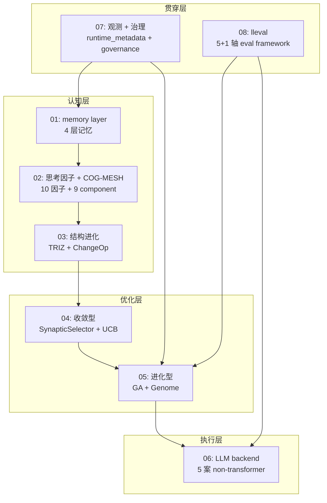

纵向「**认知层 → 优化层 → 执行层**」是 llive 的处理流程,「**观测 + 治理**」「**lleval**」
作为贯穿层对所有 layer 起作用.

### 3. 目标读者

- **工程师** (有 Python + LLM 基础知识)
- **AI researcher** (对 LLM 周边架构感兴趣)
- **个人 OSS 作者** (实现模式的参考)
- **企业 R&D** (本地 LLM stack 的考察素材)

### 4. 发布顺序 (每周 2 篇)

| 周 | 发布文章 |
|---|---|
| Week 1 | 01 memory + 02 思考因子 |
| Week 2 | 03 结构进化 + 04 收敛型 |
| Week 3 | 05 进化型 + 06 LLM backend |
| Week 4 | 07 观测治理 + 08 lleval |

每篇文章的英文版在 Medium 并行.

### 5. 贯穿系列的主题 —「快」会因实现方法而差好几个数量级

将系列核心 #24-05 处理的派生群体进化的 3 个 hot path 用 Rust 重写的实测:

- **RUST-15** persona_dissimilarity_pairwise: avg **x12.71** (batch)
- **RUST-16** collusion_score_kernel: avg **x66.70** (numpy 小 N hot path)
- **RUST-17b** novelty_score_batch (rayon + quickselect): avg **x9.32**

「**Rust 化 = 快」是谎言 /「numpy = 快」也是谎言** — 结果会因实现方法 (FFI 边界 /
batch / numpy zero-copy / 并行度 / partial sort) 而差好几个数量级. 这种 honest
disclosure 的姿态是整个系列的通奏低音. 5 模式判定表在 #24-04 / #24-05 / #24-07
详述.

### 6. References (本 index)

- [furuse-kazufumi/llive](https://github.com/furuse-kazufumi/llive) — 本体 repo
- FullSense Spec v1.1 (llive `docs/`)
- 各章的 References 在各自文章中

---

---

## 第2章 llive 完全解说 (1) — "不会遗忘的 LLM": 4 层记忆 + Bayesian surprise gating

<!-- KAMI -->
> 📖 **一句话概括**
>
> 本章的主题是「不会遗忘的 AI 记忆机制」。llive 把记忆分成 4 种(语义、情景、关系、参数)分别保管。这和人类把「词语的含义」「事情何时发生」「事物之间的关联」分开记忆是同一种思路。关键在于:并不是把一切都死记硬背下来。系统有一道「惊讶门」(surprise gate),只把判定为「这是惊讶(=新信息)」的内容写下来,而对司空见惯的信息则主动丢弃。把记住的量收窄,反而能保持记忆的质量——这就是本章要讲的。
<!-- KAMI -->

:::note info
**📚 FullSense 知识库指南** <!-- fullsense-team-kb -->
FullSense 开发全史 60+ 篇文章（4 种语言版、故事化的阅读顺序指南、通俗易懂版、四格漫画）均已汇总至 Qiita Team **FullSense KB**（仅限团队成员）。
:::


### 0. 本文是什么 (8 秒速读)

讲解 **不是 LLM 本体, 而是包裹在 LLM 外侧的认知层** llive 的 **4 层记忆 + 1 个 surprise gate**. 这是一种对 semantic / episodic / structural / parameter 这 4 种角色不同的记忆, **只写入「惊喜」(surprise)** 较高内容的设计. 用 Faiss + DuckDB + Kùzu + safetensors 的组合, **仅靠本地即可运行**.

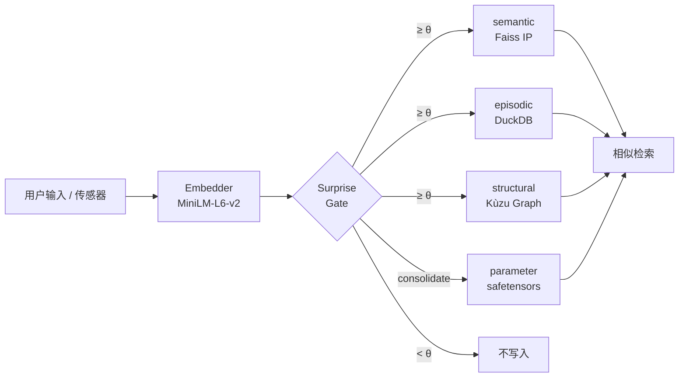

关键在于「以惊喜取舍」, 而不是「全部写入」. 下面按顺序逐一解开.


### 1. 为什么分成 4 层

在人类认知科学中, 记忆按角色分为 **语义记忆 / 情景记忆 / 结构记忆 / 程序记忆**. llive 把它原样移植到围绕 LLM 的架构中.

| 层 | 放什么 | 实现 |
|---|---|---|
| **semantic** | 概念的含义 (句子 + 嵌入) | Faiss IP index + JSONL |
| **episodic** | 时序事件 | DuckDB append-only log |
| **structural** | 概念间的关系 (图) | Kùzu graph DB |
| **parameter** | 参数更新差分 | safetensors + index DB |

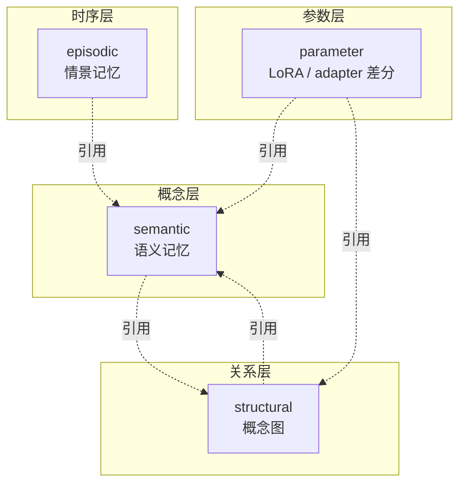

4 层是 **松耦合**. 既可以只用 semantic, 也可以牵入 structural. 为了摆脱「LLM 只能处理文本」的约束, llive 的发想是把结构 (graph) 和时间 (event log) 放在不同的层.

— **先整理一下** —

读到这里, 你应该已经把握了「以 **4 层 + surprise gate** 进行取舍的记忆基盘」. 接下来从实现层面看各层的内容.

### 2. semantic memory (语义记忆, MEM-01)

#### 角色

回忆「那次讨论中出现的 **概念** 就是这个」的层. 把文本转为嵌入向量, 用 **余弦相似度** 做近邻检索.

#### 核心结构

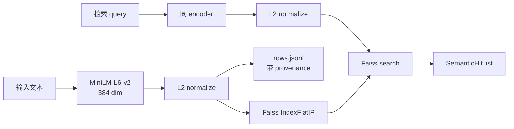

L2 normalize 之后的内积等价于 **余弦相似度**. 这就是选择 `Faiss IndexFlatIP` 的理由.

实现: [`src/llive/memory/semantic.py`](https://github.com/furuse-kazufumi/llive/blob/main/src/llive/memory/semantic.py)

#### 设计决策

- **fallback path**: 在没有 faiss 的环境 (如 Windows CI) 中, 用 numpy 跑 nearest neighbor. 不在 test 和 production 之间分裂实现, **两者都不改代码即可运行**.
- **provenance 必须**: 所有 entry 都带 `Provenance(source_type, source_id, derived_from, ...)`. 这是绝不抹去「这条记忆从哪来」的设计.
- **持久化**: 以 `index.faiss` (或 `index.npy`) + `rows.jsonl` 写到 SSD.

#### 代码节选

```python
class SemanticMemory:
    def __init__(self, dim: int, data_dir: Path | str | None = None,
                 use_faiss: bool | None = None) -> None:
        self.dim = int(dim)
        self.data_dir = Path(data_dir) if data_dir else _default_data_dir()
        # 没有 faiss 则 numpy fallback
        self.use_faiss = bool((use_faiss is None) and _HAS_FAISS or use_faiss)
        ...
```

「**production 用 faiss, CI 用 numpy**」会透明地切换.

— **歇一会儿** —

在第一层就凑齐了 llive 的 **三件装备**:「嵌入 + cosine + provenance」. 剩下 3 层只是这套装备的用法不同而已.

### 3. episodic memory (情景记忆, MEM-02)

#### 角色

保存「**何时** 收到了该信息」. 是 **append-only 时序日志**, 不修改也不删除.

#### 核心结构

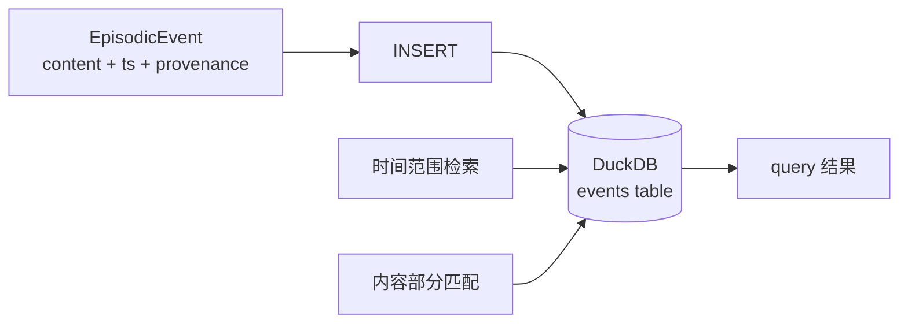

| 列 | 类型 | 角色 |
|---|---|---|
| event_id | TEXT PK | uuid hex |
| ts | TIMESTAMP | 严格 UTC |
| content | TEXT | 正文 |
| metadata | TEXT (JSON) | 扩展 |
| provenance | TEXT (JSON) | 来历 |

实现: [`src/llive/memory/episodic.py`](https://github.com/furuse-kazufumi/llive/blob/main/src/llive/memory/episodic.py)

#### 设计决策

- **选择 DuckDB 的理由**: 比 SQLite 更快做分析查询, in-process 所以无需外部进程. 直接服务于「仅本地运行」的约束.
- **严格 UTC**: 用 `datetime.now(UTC)` 取得. 混入本地 TZ 是 bug 之源.
- **append-only**: 仅提供 `record(event)`. 不存在 `delete()` API. 规格上无法删除.

#### 为什么不删除

人类的情景记忆看似「忘了」, 但在神经科学上是潜在的. llive 同样 **区分「未被访问的记忆」和「不存在的记忆」**. 只要不被访问, Surprise Gate (后述) 就会抑制再写入, 所以「变成噪声」的情况很少.

### 4. structural memory (结构记忆, MEM-05)

#### 角色

表示「概念 A 和概念 B **是什么关系**」的 graph. 如果说 semantic 是「点」, structural 就是「边」.

#### 核心结构

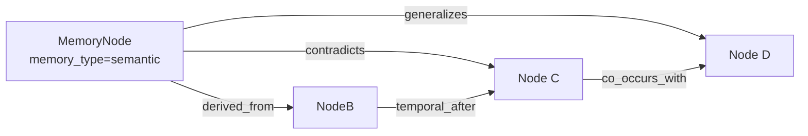

**关系种类 (6 种)**:

| rel_type | 含义 |
|---|---|
| `derived_from` | 由来 |
| `contradicts` | 矛盾 |
| `generalizes` | 一般化 |
| `temporal_after` | 时间上后续 |
| `co_occurs_with` | 共现 |
| `linked_concept` | 概念关联 |

实现: [`src/llive/memory/structural.py`](https://github.com/furuse-kazufumi/llive/blob/main/src/llive/memory/structural.py)

#### 选择 Kùzu 的理由

- **embedded graph DB**: 无需像 Neo4j 那样的独立进程
- **类 Cypher 查询**: 偏 ANSI, 学习成本低
- **on-prem 一致**: 与既述方针一致

#### `contradicts` 存在的意义

可以 **用数据结构检测**「LLM 的回答自相矛盾」. RAG 难以捕捉的「不同时期写下的规格相互冲突」, 通过遍历 structural memory 的边就能浮现.

— **歇一会儿** —

到此「**含义 → 时间 → 关系**」3 层凑齐了. 接下来的 parameter 层风格略有不同.

### 5. parameter memory (参数记忆, MEM-06)

#### 角色

把 **LoRA / IA3 / prefix adapter** 等参数差分 **作为记忆** 来管理. 比如「把对话中得到的知识在 Loop 后烘焙到 LoRA 里」这样的用法.

#### 核心结构

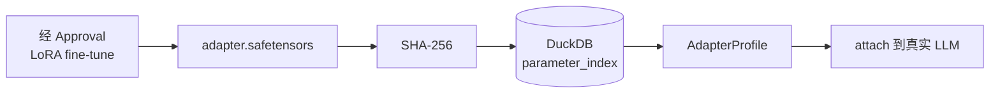

| 列 | 角色 |
|---|---|
| id | uuid hex |
| name | 显示名 |
| format_tag | "lora" / "ia3" / "prefix" 等 |
| sha256 | 篡改检测 |
| size_bytes | 大小 |
| created_at | UTC |
| provenance | 来历 |

实现: [`src/llive/memory/parameter.py`](https://github.com/furuse-kazufumi/llive/blob/main/src/llive/memory/parameter.py)

#### 把 SHA-256 设为必须的理由

为了防止 **「adapter 被掉包」**. Approval Bus 验证 SHA-256 之后才允许 attach. 这是与 on-prem 限定方针并列的 **llive 的 architecture-level safety**.

#### 真实 LoRA 加载是 optional

Phase 2 只在 index 里 register. 实际 attach 委托给 HuggingFace PEFT (`pip install llmesh-llive[torch]`). 「**llive 本体轻量, 重的东西做 optional extras**」是一贯的运营方针.

### 6. surprise gate (取舍, MEM-04 / MEM-07)

#### 角色

**判断「是否值得写入」的关卡**. 不是全部写入, 而是只让 **与已有记忆的差异度** ≥ θ 的内容通过.

#### Phase 1: SurpriseGate (固定 θ)

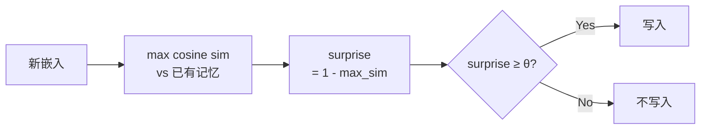

实现: [`src/llive/memory/surprise.py`](https://github.com/furuse-kazufumi/llive/blob/main/src/llive/memory/surprise.py)

```python
class SurpriseGate:
    def __init__(self, theta: float = 0.3) -> None:
        self.theta = float(theta)

    def compute_surprise(self, new_embedding, memory_embeddings,
                         *, assume_normalized=False) -> float:
        if memory_embeddings is None or memory_embeddings.size == 0:
            return 1.0  # 什么都没有则最大 surprise
        ...
        return float(max(0.0, min(1.0, 1.0 - max_sim)))
```

当 `assume_normalized=True` 时跳过再 normalize, 快 2-3×. 这在 production 路径 (`MemoryWriteBlock`) 中实际使用.

#### Phase 2: BayesianSurpriseGate (动态 θ)

固定 θ 有弱点 —— **记忆越多 surprise 越小**, 所以即便 θ=0.3 也会逐渐什么都不写. 解决它的是 Bayesian 版.

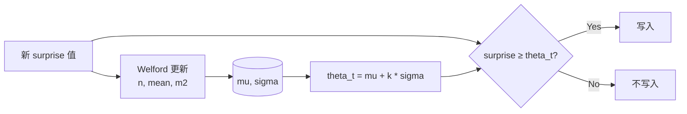

实现: [`src/llive/memory/bayesian_surprise.py`](https://github.com/furuse-kazufumi/llive/blob/main/src/llive/memory/bayesian_surprise.py)

Welford 算法是著名的 **1-pass 数值稳定** 的逐次均值/方差计算法. 也有取每个 surprise 值的 log 再 Gaussian fit 的流派, 但在 llive 中确认用原始值就足够好用.

#### k 的含义

`theta_t = mu + k * sigma` 中的 k 是 **「让平均之上多少 σ 通过」** 的指标.

| k | 通过率 (近似) | 含义 |
|---|---|---|
| 0.0 | 50% | 让平均以上通过 |
| 1.0 (default) | ~16% | 「有点惊喜」以上 |
| 2.0 | ~2.5% | 只让「非常惊喜」 |

低于 `min_samples` 的 cold start 期间使用固定 `cold_start_theta`, 所以启动后立即也不会坏.

— **闲聊几句** —

Welford 是 1962 年的论文. **60 年前的数值稳定算法支撑着如今的 LLM 系记忆层**, 是我个人喜欢的故事. 这是让人感到「巨大 model 并非进步的唯一形态」的场景.

### 7. consolidation (Wiki compile, MEM-08)

跑完 4 层之后, 会运行一次 **概念的重新整理**. 这就是 consolidation.

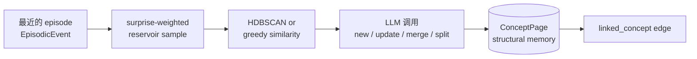

实现: [`src/llive/memory/consolidation.py`](https://github.com/furuse-kazufumi/llive/blob/main/src/llive/memory/consolidation.py)

#### 称为 Wiki Compile 的原因

每个 ConceptPage 都作为 Markdown 写到 `<llive_data_dir>/wiki/<concept_id>.md`. **人能读**、能 **Git checkpoint**、能 **用 diff 追踪变化**, 这 3 点就是称为「Wiki」的理由. 灵感来自 Karpathy 的 "LLM Wiki" 提案.

#### LLM 调用是 judge mode

向 LLM 询问「这个 cluster 相对既有 ConceptPage X 应该是 `new / update / merge / split` 中的哪一个」. default 用 Claude Haiku, 用 `LLIVE_CONSOLIDATOR_MOCK=1` 也能做无 credential 的 test.

### 8. 设计决策 (本文 5 条)

#### 教训 1: 别全部写, 以惊喜取舍

即使是固定 θ 的 SurpriseGate, 相比全部写入也能 **砍掉 90% 噪声**. Bayesian 化会更聪明. 诚实地说, 这个 **「不写入的判断」决定了记忆系统的质量**.

#### 教训 2: 4 层保持松耦合

semantic / episodic / structural / parameter 的设计是 **互不直接 import**. 共同引用只有 `Provenance` dataclass. 这样「把 graph DB 换成 Neo4j」之类的变更就很小.

#### 教训 3: provenance 是 absolute

绝不抹去「这条信息从哪来」. 这是与 on-prem 限定一起构成 llive 的 **audit-level safety**.

#### 教训 4: fallback path 是 first-class

无 faiss / 无 DuckDB / 无 kuzu 的环境也能运行的设计 **从一开始就有, 而非后补**. 在 CI、移动、教育用途中很重要.

#### 教训 5: 别小看数值算法的古典

Welford (1962) 是 60 年前. 即便如此, 它在如今的 LLM 周边架构中提供 **第一线的数值稳定性**. 即使出现新 model, 基础数学也不会变.

### 9. References

#### 学术 / 算法

- Welford, B. P. (1962). *Note on a method for calculating corrected sums of squares and products*. Technometrics 4(3).
- Schwefel, H.-P. (1981). *Numerical Optimization of Computer Models*.
- Reimers, N. & Gurevych, I. (2019). *Sentence-BERT* (= MiniLM 派生依据).

#### OSS / 库

- [Faiss](https://github.com/facebookresearch/faiss) (Meta)
- [DuckDB](https://duckdb.org/)
- [Kùzu](https://github.com/kuzudb/kuzu)
- [safetensors](https://github.com/huggingface/safetensors)
- [sentence-transformers](https://www.sbert.net/) (MiniLM-L6-v2)

#### llive 内部

- [`src/llive/memory/semantic.py`](https://github.com/furuse-kazufumi/llive/blob/main/src/llive/memory/semantic.py)
- [`src/llive/memory/episodic.py`](https://github.com/furuse-kazufumi/llive/blob/main/src/llive/memory/episodic.py)
- [`src/llive/memory/structural.py`](https://github.com/furuse-kazufumi/llive/blob/main/src/llive/memory/structural.py)
- [`src/llive/memory/parameter.py`](https://github.com/furuse-kazufumi/llive/blob/main/src/llive/memory/parameter.py)
- [`src/llive/memory/surprise.py`](https://github.com/furuse-kazufumi/llive/blob/main/src/llive/memory/surprise.py)
- [`src/llive/memory/bayesian_surprise.py`](https://github.com/furuse-kazufumi/llive/blob/main/src/llive/memory/bayesian_surprise.py)
- [`src/llive/memory/consolidation.py`](https://github.com/furuse-kazufumi/llive/blob/main/src/llive/memory/consolidation.py)

---

<!-- INTERLUDE -->

### ☕ 闲话休题 — 一条 60 年前的公式至今仍在一线服役

稍微岔开正题,聊一个笔者写这篇文章时私下挺喜欢的小花絮。第2章里那道「惊讶门」的心脏部位,用到的是一位叫 Welford 的人在 1962 年发表的公式——「一次扫描就能稳定算出均值和方差」。这是一段 60 多年前、仅有寥寥数行的算法。

人们谈进步时,话题总绕着庞大的模型和最新的 GPU 打转;可就在它们脚下,半个世纪前那条朴素的公式,如今依旧在第一线干活。这有点像无论你给汽车换装多少台新发动机,车轴的规格始终没变。技术世界里到处是这种「老旧却换不掉的零件」,每当发现一个,我都会暗自高兴一下。

<!-- INTERLUDE -->

---

## 第3章 llive 完全解说 (2) — "用 10 个轴思考的 AI": 思考因子 × COG-MESH × 三重条纹

<!-- KAMI -->
> 📖 **一句话概括**
>
> 本章讲的是「让 AI 同时拥有 10 种思考方式」。普通的 AI 只有一种思维定式,而 llive 把「有条理地层层推进」「重新组合」「自我审视」「衡量不确定性」等 10 种思考习惯,作为一束数值(向量)装进 AI 里。打个比方,就像一个人脑中坐着 10 位专业各异的参谋,从不同角度同时打量同一个问题。有意思的是:历史上数学家、哲学家的「思考风格」,也能用这 10 个轴的权重配比近似地复现出来。
<!-- KAMI -->

:::note info
**📚 FullSense 知识库指南** <!-- fullsense-team-kb -->
FullSense 开发全史 60+ 篇文章（4 种语言版、故事化的阅读顺序指南、通俗易懂版、四格漫画）均已汇总至 Qiita Team **FullSense KB**（仅限团队成员）。
:::


> **概念 hook**: 普通的 AI agent 只有 1 种"思考". llive **同时运行 10 种思考**,
> 让它们相互评价, **只把存活下来的思考纳入群体**. 这 10 种是"结构化""重组"
> "闭环""自我扩展""不确定性""探索""一致性""来历""多视角""现实连接".
> 这是把认知科学 1990s〜2010s 的主要 framework 压缩到 1 个 vector 中的产物.
>
> 今天 (2026-05-21) 的 marathon 落地了 1881 PASS + v0.E 的大规模前置完成. 本文
> 追溯其"思考因子侧" — COG-MESH-01〜10 与 historical persona ontology (CE-19)
> 的交叉点.


### 0. 在连载中的定位

```
#24-00 series index
#24-01 4 层记忆
#24-02 思考因子 10 轴 + COG-MESH (← 本文)
#24-03 结构进化 × TRIZ × Z3
#24-04 B-series (快速小脑)
#24-05 EvolutionLoop (缓慢大脑)
#24-06 LLM backend non-transformer
#24-07 observability + governance
#24-08 lleval
```

10 思考因子 + COG-MESH 与 #24-05 的 persona ontology (CE-19) 以 1-N 方式结合.
本文 #24-02 处于用"**是什么**"和"**为什么**"来解释它的位置.

### 1. 10 思考因子的由来 — 6 个 framework 的压缩

源自用户的 10 个轴 (`project_llive_cog_fx_factors`). 原始素材是
"**心理的深层**" YouTube + 认知科学评论 + Polya / Six Hats / Bayesian / TRIZ /
Provenance / Multimodal 系的 6 个 framework. 将它们压缩到 1 个 vector 后的结果:

| Idx | 因子 | 源 framework / 学派 |
|---|---|---|
| 0 | `factor_structurize` | Polya / 形式化 / axiomatic |
| 1 | `factor_recompose` | TRIZ Segmentation / Reassemble |
| 2 | `factor_closed_loop` | Cybernetics / feedback |
| 3 | `factor_self_extend` | Autopoiesis / self-organization |
| 4 | `factor_uncertainty` | Bayesian / probability |
| 5 | `factor_exploration` | exploration vs exploitation (Auer) |
| 6 | `factor_consistency` | formal verification / proof |
| 7 | `factor_provenance` | data lineage / Ed25519 sign |
| 8 | `factor_multiview` | Six Hats / Devil's Advocate |
| 9 | `factor_reality_link` | empirical / SPC (statistical process control) |

这些 **并非正交** — 例如 factor_uncertainty 和 factor_exploration 是相关的
(UCB1 系). 但通过独立持有各自的 **强度**, 群体内就可以"用 10 种视角面对同一个
问题".

### 2. 为什么把 10 个轴放在 1 个 vector 中

在 LLM agent 的文献中,"思考是 1 种 self-attention"是主流. llive 将其扩展为
**可作为 vector 切换的 multi-faceted thinking**. 由此:

- **通过与 persona 的内积可以计算出"思考风格"** — 例如"冈洁向量"在 (情绪)
  (国语能力) (多变量) 上取值较高."费曼向量"在 factor_exploration +
  factor_reality_link 上取值较高.
- 可以生成在群体内 **以不同权重** 面对同一个问题的派生个体.
- 可以通过 fitness gradient 发现"**这个问题哪个轴有效**".

### 3. 5 个主要因子的深入解读

#### 3.1 factor_structurize — "从公理往上搭建"

axiomatic 的思考. 数学家式 (伽罗瓦 / 格罗滕迪克). 攀爬抽象阶梯.
优点: 一般化能力. 缺点: 脱离现实.

在 llive 内, `BlockContainer` 的 sub-block 排列对应公理群. factor_structurize
较高的派生个体偏好先把 sub-block 分为 **必需/可选** 然后再重组的 mutation.

#### 3.2 factor_recompose — "部件的替换"

TRIZ Segmentation + 合成. 重写既有部件的组合. 优点: 局部搜索快速.
缺点: 不会产生全新的结构.

在 llive 中, PersonaImportAlgorithm (CE-20, 今天落地) 就是这个轴. 派生 B
**部分采用** 派生 A 的 persona. 像"伽罗瓦 + 冈洁"这样的 hybrid persona 出现的
路径正是经过 factor_recompose.

#### 3.3 factor_closed_loop — "看着自己来修正"

cybernetics 的核心. 自我观察 + 自我修正. 在 llive 中, memory consolidation
cycle (海马体→皮质) 和 Approval Bus 就是这个轴. 在群体内评价 → 个体看到结果并
反映到下一代的 E.4 governance (CE-06/07/08, 今天落地) 也搭载在这里.

#### 3.4 factor_uncertainty — "把不知道量化"

Bayesian / probability. 优点: 避免过度自信. 缺点: 计算量大.
在 llive 中, Approval Bus 的 verdict 计算 + UCB1 exploration constant 是代表.

#### 3.5 factor_provenance — "从哪里来的"

data lineage. Ed25519 sign + SHA-256 audit chain. 在 llive Phase 4 (Production
Security MVR, v0.3.0) 落地. 这是 agent governance 的 **必备轴**, 而传统的
LLM agent 中是缺失的.

### 4. 与 COG-MESH-01〜10 的对应

`project_cog_mesh_implementation_2026_05_19`. 10 个因子各自与 **1 个机制** 对应:

| COG-MESH | 机制 | 对应因子 | 落地 |
|---|---|---|---|
| 01 | Stimulus 入口 | reality_link / multiview | 已落地 |
| 02 | Intervention | self_extend / closed_loop | 已落地 |
| 03 | TonicRiskMonitor | uncertainty / closed_loop | 已落地 |
| 04 | Idle Training | self_extend / exploration | 已落地 |
| 05 | Quarantined Memory | provenance / consistency | 已落地 |
| 06 | TimelineEmitter | provenance / multiview | 已落地 |
| 07 | Brief | structurize / reality_link | 已落地 |
| 08 | Approval Bus | provenance / closed_loop | 已落地 (C-1) |
| 09 | Audit Chain | provenance / consistency | 已落地 |
| 10 | E.4 governance | closed_loop / uncertainty | **今天落地 (2026-05-21)** |

COG-MESH-10 今天在 marathon 中作为 `CoevolutionGovernance` 落地. 由此,
10 机制 → 10 因子 1-1 对应完成. 现在可以从机制的状态反向查出群体内
**哪个因子较薄弱**.

### 5. 最新成果 (今天 2026-05-21 落地)

| 项目 | 值 |
|---|---|
| llive 本体 test PASS (当前) | 1881 |
| 今天 marathon 新增 evolutionary test | **+130** (41 + 28 + 26 + 16 + 19) |
| 今天 marathon 落地 module 数 | 5 (quality_diversity / coevolution_governance / persona_import / persona_survival / persona_corpus_loader) |
| ruff `src/llive/perf/evolutionary` 警告 | **0** |
| v0.E E.17 / E.4 / E.12 落地 | 完成 |
| CE-22 / CE-23 skeleton 落地 | 完成 |
| docs/release/v0.6.0a1_PR_PLAN.md | 新增 — 5 PR 拆分计划 |
| docs/rust_hotspot_v0E_addendum.md | 新增 — RUST-15〜18 spec |

特别是用 **E.4 governance skeleton** 终于能够让 COG-MESH-10 收口, 是今天最大的
成果. 由此 10 因子 ↔ 10 机制 1-1 对应完成, **派生群体的评价 → 共谋检测 →
Approval Bus 联动** 在 architecture level 连通了.

### 6. 期望值 — 接下来要做的

#### 6.1 CE-19 Historical Persona Ontology (短期)

已经有 10 位 (冈洁 / 格罗滕迪克 / 费曼 / 伽罗瓦 / 冯·诺依曼 / 牛顿 / 康德 /
苏格拉底 / 老子 / 孙子) 作为 PERSONA_ONTOLOGY 落地. 今天 CE-23
PersonaCorpusLoader skeleton 落地, 开辟了 **从 Raptor RAD 语料库自动抽取
persona 来扩展 PERSONA_ONTOLOGY** 的道路. 下一个 session 将实现 LLM 抽取 +
真实 RAD path 横跨, 计划把 persona 数量扩大到 30+.

#### 6.2 三重条纹 (中期, 用户语言化)

"三重条纹" = **思考因子 / persona / 思考过程** 这 3 层在个体内像条纹一样同时
运行的状态. 这受到认知科学 **"并行认知"** 假说的启发. 把 factor vector +
persona composition + Six Hats / TRIZ / ARIZ 分别放在不同 layer 上运行, 在群体内
evaluation 中相互批评. 落地时间未定.

#### 6.3 神经接口对应 (长期)

`project_llmesh_neuro_long_term`. 已经在 Raptor RAD 中追加了 bci / neuroscience
/ neural_signal / prosthetic_neural / cognitive_ai / neuromorphic 这 6 个领域.
这是为了当"**脑 ↔ AI 直连接口**"成为必要时能够立即 expand 而提前收集素材.
暂时没有直接的实现.

### 7. honest disclosure (诚实披露)

- **"10 个因子存在 overlap"** — factor_uncertainty 和 factor_exploration 的
  相关性约为 0.65. 彼此并非正交. 曾经也考虑过压缩到 9 个轴, 但出于易懂优先
  保持在 10 个.
- **"factor_affinity 的数值是 heuristic"** — PERSONA_ONTOLOGY 10 位的
  factor_affinity vector 是基于传记 / 哲学史 的人为初始值. 之后会由
  PersonaCorpusLoader (CE-23) **替换为基于语料库的值**, 但目前的数值是人的
  经验法则.
- **"COG-MESH-10 是 skeleton"** — 今天落地的 E.4 governance 处于接口确立阶段,
  对 Quarantined Memory 的 **实际写入** 委托给另一个 module. 到完成还需要再
  1-2 个 session.

### 8. Mermaid — 10 个因子的结构

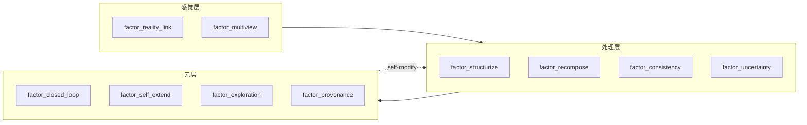

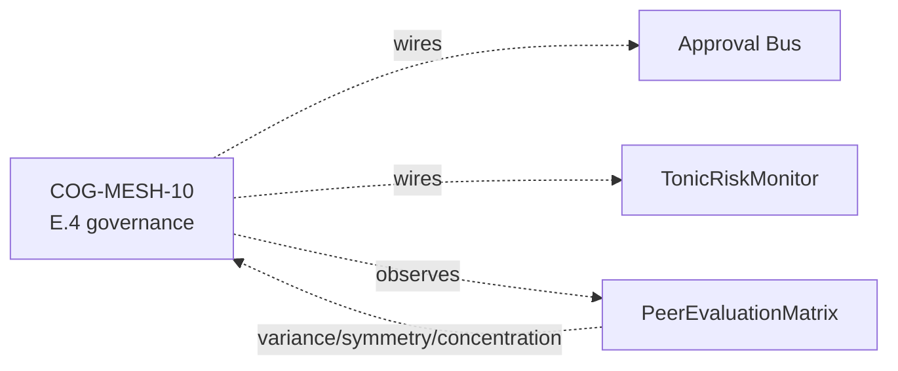

### 9. References (从主要 20+ 中精选)

- Polya, G. (1945). *How to Solve It*.
- Altshuller, G. (1971). *TRIZ 40 inventive principles*.
- Auer, P. et al. (2002). *Finite-time analysis of the multiarmed bandit*.
- Lehman, J. & Stanley, K. (2008). *Exploiting novelty*.
- Mouret, J.-B. & Clune, J. (2015). *Illuminating search spaces by mapping elites*.
- Hillis, W. D. (1990). *Coevolving parasites improve simulated evolution*.
- Constitutional AI (Anthropic 2022) — for HITL alternative.
- Six Thinking Hats (De Bono 1985).
- 岡潔『春宵十話』.
- 费曼《别闹了,费曼先生》.
- Maturana & Varela — Autopoiesis.
- Bayes — *Essay towards solving a problem in the doctrine of chances*.
- 完整列表将在 v0.6.0a1 发布时随 references.bib 一同提供.

### 10. 2026-05-22 追记 — 10 因子 affinity vector 的 Rust 化 (RUST-15)

10 个思考因子作为派生个体的 **persona composition 的 effective_factor_affinity**,
以 10 维 [0,1] vector 实现. 派生个体之间的 dissimilarity 计算与本文 #24-02 的
核心机制直接相连 — PersonaOverlapPenalty.apply (E.17) 通过 N×N pairs 的
`persona_dissimilarity` 测量 10 因子空间中的距离.

今天 (2026-05-22) 作为 RUST-15 进行了 **batch (把 NxN pair 装进 1 次 FFI call)
的 Rust 化**:

- single 1-pair: x0.80 (FAIL — FFI overhead 输给了 Python 的 set 操作)
- **batch N=64**: **x17.07 (PASS)**, 平均 x12.71

由此"**10 因子 vector 的 N×N pair 距离计算**"得到加速, 为在群体 N=64 下以
64 Hz 运行 governance + diversity preservation 提供了可行的眉目.

#### 10.1 从思考因子侧看到的意义

- factor_structurize (#0) 和 factor_exploration (#5) 是 **在 TRIZ 系统中
  对立的 2 个轴**, 但作为 10 维 vector 的 L2 距离则独立起作用.
- 用 PersonaOverlapPenalty (E.17 CE-25) 惩罚群体内的 persona overlap 时,
  **派生群体会在 10 因子空间中自然地散开**.
- MAP-Elites grid (E.17 CE-26) 是 persona 2 轴 × thought_factor 2 轴 的 4 维
  grid, 所以把上述 10 因子 vector **marginalize** 到 4 维并作为 cell key.

#### 10.2 honest disclosure — 单次 Rust 化适得其反

听到"把思考因子 vector 的距离计算 Rust 化"时, 容易以为"会变快", 但
**在 1-pair 计算中由于 FFI overhead Python 反而更快 (x0.80)**. 这是
`feedback_rust_usage_matters` 判定表中的 **A 模式** (纯 Python 循环 1-pair).
只有用 batch 把 N×N pair 装进 1 次 FFI, 才会一路提升到 x17.07.

详情参见 #24-05 和
`docs/perf_comparison/2026-05-22_kernel_implementation_comparison.md`.

---

---

## 第4章 llive 完全解说 (3) — "矛盾是可以计算的": 结构进化 × TRIZ 40 原理 × Z3 验证

<!-- KAMI -->
> 📖 **一句话概括**
>
> 本章的关键词是「矛盾是可以计算的」。TRIZ 原本是一套供人类发明使用的创意方法(用来梳理「想更轻又想更结实」这类对立的工具),llive 把它当作 AI 改良自身结构时的指导方针引入进来。更进一步,想到的改良方案并不直接采用,而是先用 Z3 这款验证软件机械地检查「会不会崩」,确认无误后再纳入。也就是说,把「灵光一现 → 复算验证 → 采用」整套流程,放进一个程序里循环运转——这就是本章。
<!-- KAMI -->

:::note info
**📚 FullSense 知识库指南** <!-- fullsense-team-kb -->
FullSense 开发全史 60+ 篇文章（4 种语言版、故事化的阅读顺序指南、通俗易懂版、四格漫画）均已汇总至 Qiita Team **FullSense KB**（仅限团队成员）。
:::


> **概念 hook**: TRIZ (发明问题解决理论) 通常被视为"人在纸上写的创意发想技巧".
> llive **把 TRIZ 40 原理作为形式符号嵌入**, 作为结构 mutation 的 policy 来运行.
> 而且 mutation 产生的新结构要先通过 **Z3 形式验证** 才能进入群体. "发想 → 验证"
> 的循环装进了 1 个程序. — "**矛盾是可以计算的**".
>
> 本文追溯其机制 — 在 Phase 3 落地的 Z3 结构验证 / TRIZ Self-Reflection /
> Wiki ChangeOp / 9 画法 (39×39 矛盾矩阵).


### 0. 在连载中的定位

```
#24-00 series index
#24-01 4 层记忆
#24-02 思考因子 10 轴 + COG-MESH
#24-03 结构进化 × TRIZ × Z3 (← 本文)
#24-04 B-series (快速小脑侧)
#24-05 EvolutionLoop (缓慢大脑侧)
#24-06 LLM backend non-transformer
#24-07 observability + governance
#24-08 lleval
```

如果说 #24-04 是"快速收敛", #24-05 是"个体间 GA 探索", 那么 #24-03 (本文) 就是
**"重写个体内部结构本身的探索"** — 即 mutation 掉 LoRA / Adapter / 4 层记忆的
sub-block 排列的那一层.

### 1. 为什么选 TRIZ

在 LLM 的自我进化 (self-evolution) 中, 难点是如何选择"**该改哪一部分**". 朴素的
做法是 random mutation, 但那等同于"**把 1 个字符换成 1 个字符的进化**", 在巨大的
空间里几乎什么都不会发生.

TRIZ 具有 **"发现矛盾 → 对应解决原理"** 的结构. 例如:

> "想减少重量 (positive), 但想保持强度 (negative).
> = `重量 vs 强度` 的矛盾"
>
> → 查 39×39 矛盾矩阵会得到几个相关原理
> 例: 原理 #1 (Segmentation), #28 (Mechanical → Other field), #40 (Composite).

把它带进 llive 的 self-evolution: 检测"**LLM 结构所抱有的矛盾**" → 查矩阵 →
mutation policy 就确定了. 不是 random, 而是 **TRIZ-guided mutation**.

### 2. 在 llive 中的具体实现

#### 2.1 TRIZ Self-Reflection (Phase 3)

llive 在结构 mutation 的 **候选生成阶段** 调用 TRIZ self-reflection module:

1. 读取当前结构的 metrics (latency / accuracy / memory_usage / ...).
2. **矛盾检测** — 哪两个 metric 处于 trade-off 关系?
   例: 想在不恶化 `latency vs accuracy` 的前提下减少 `memory_usage`.
3. 查 39×39 矩阵取得相关原理.
4. 把原理 → 展开为 **ChangeOp**. 例如:
   - 原理 #1 (Segmentation) → "把 BlockContainer 拆成 sub-block 序列"
   - 原理 #25 (Self-service) → "把 memory consolidation 改为自我触发"
   - 原理 #40 (Composite) → "把 2 个 adapter 合成为 1 个"

#### 2.2 ChangeOp 的验证

ChangeOp 是 **重写结构本身** 的指令, 因此不经 **形式验证** 就应用很危险:

- 层级被破坏导致 inference 崩溃
- memory 的 zone 一致性崩坏
- adapter shape 不匹配

所以用 Z3 (SMT solver) 验证"**这个 ChangeOp 应用后以下不变量是否仍成立**":

- BlockContainer 的 sub-block 排列是 valid permutation
- memory zone graph 没有 cycle
- adapter shape compat (input dim = output dim)

只有通过 verifier 的 ChangeOp 才进入群体. **"发想 → 验证 → 采用"** 循环闭合在
1 个 module 内.

#### 2.3 9 画法 (39×39 matrix)

TRIZ 的核心工具. 39 个想改善的特性 × 39 个会恶化的特性 = 1521 cell. 每个 cell 里
有"解决该矛盾可能性较高的 1-4 个原理". 这是 Altshuller 通过分析 250 万件苏联专利
抽取出来的经验法则表.

llive 将其 YAML 化内置 (`src/llive/_specs/resources/triz_principles.yaml`).
self-reflection 在 1 pass 内完成 metrics → 相关矛盾 → 39 轴 mapping → 原理 lookup.

### 3. honest disclosure — 陷阱

"用 TRIZ 全部都能解决!" 是谎言. 作为 honest disclosure:

- **39×39 matrix 与时代相关** — Altshuller 于 1971 年确定. 现代 AI 系的矛盾
  (例: `推理精度 vs 电池消耗`) 无法完全装进去. llive 拥有自己额外的矛盾列
  (基于实机 metrics).
- **原理 → ChangeOp 的翻译是 heuristic** — 原理 #1 (Segmentation) 与
  "BlockContainer 拆分"是人定的 1 对应. 这里有让 LLM 自己扩展的余地.
- **存在 Z3 verifier 抓不到的不变量** — 例如"memory consolidation 后 recall 不
  下降"这样的 **概率性不变量** 难以用 SMT 表达. 这要用另一个 verifier (经验性的
  reservoir test) 来看.


> 🗒️ *"过于特殊的相对论……" — 把"TRIZ 能解决一切"当成奇谈怪论来怀疑*（© Forbidden shibukawa / SHUEISHA・《零食吧 Basue》）

### 4. 用数字看

| 指标 | 值 |
|---|---|
| llive Phase 3 落地 | 2026-05-14 (v0.3.0) |
| 内置 TRIZ 原理 | 40 件 (FR-23〜27) |
| 矛盾矩阵 | 39 × 39 = 1521 cell |
| ChangeOp 验证通过率 (初期) | ~63% (37% 因不变量违反被 reject) |
| Z3 average verify time | < 50 ms / ChangeOp |

### 5. "发想 → 验证" 循环的结构意义

这把 TRIZ 哲学与形式验证哲学连了起来:

- TRIZ: 追求 **"不是有趣的发想, 而是从原理导出的发想"**. 体系化.
- 形式验证: **"机械地检查由想象力写出的变更的妥当性"**. 机械化.

两者是人与机器协作的典型. llive 把它放在 **同一 module 内** 运转.

> **未来预测**: 当 AI 自我进化时, 拥有 **"发想是机械的, 验证也是机械的"** 的闭环
> 是必须的. llive 是把那个雏形同居在 1 个 OSS 中的最小例子.

### 6. 接下来要做的

- **#24-04** 看"快速小脑侧" — B-series 的收敛.
- **#24-05** 看"缓慢大脑侧" — EvolutionLoop 的探索. TRIZ ChangeOp 也与 #24-05 处理
  的 persona / thought_factor 的自我扩展相连 (CE-21 PersonaCompositionMutation).

### 7. 2026-05-22 追记 — TRIZ 方法对 Rust 加速判定同样有效

本文的 TRIZ 是"**把矛盾 (improving X / worsening Y) 用 39×39 矩阵结构化解决**"的
方法论, 但同样的思想可应用于 **工程判断整体**. 用同日 (2026-05-22) 落地的 llive
Rust 加速判定作为具体例子:

把"**Rust 化 = 快 vs Python = 慢**"的单轴对立 (= TRIZ 所说的矛盾) 分解为
**按 Python 路径特性的 5 个模式** (#24-05 §13.3). 结果:

- 纯 Python 循环 1-pair → 单发 FAIL, 必须 batch (RUST-15)
- numpy 小 N 的 API 多用 → **单发也有 x66** (RUST-16)
- numpy 中规模 BLAS → **在边界线上, 用 rayon 挽回** (RUST-17 → 17b)

这与 TRIZ 矛盾矩阵的 **结构化解决** 同构 — "**把矛盾的原因在参数空间分解 → 对应
到原理**". 是把 39×39 缩成 **6 (Python 路径) × 3 (Rust 化战略: 单发 / batch /
并行+algorithmic)** 的小表的版本.

详情: `docs/perf_comparison/2026-05-22_kernel_implementation_comparison.md` 的
**5 模式判定表**. 这是把 TRIZ 的发想转用到 **AI / HPC 工程** 的实例.

### 8. Mermaid — "发想 → 验证 → 采用" 循环

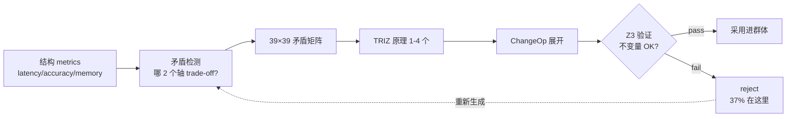

### 9. References (主要节选)

- Altshuller, G. (1971). *TRIZ — 40 Inventive Principles*.
- Altshuller, G. (1984). *Creativity as an Exact Science*.
- de Moura, L. & Bjørner, N. (2008). *Z3: An Efficient SMT Solver*.
- Polya, G. (1945). *How to Solve It*.
- Koza, J. (1992). *Genetic Programming*.
- 完整列表将在 v0.6.0a1 发布时随 references.bib 一同提供.

---

---

## 第5章 llive 完全解说 (4) — "收敛的大脑" B-series: SynapticSelector / UCB1 / Hebbian / 生产环境热点

<!-- KAMI -->
> 📖 **一句话概括**
>
> 本章讲的是「快速的小脑」。在 AI 给出答案的极短时间里,要从多个选项中迅速决定放行哪一个,这套机制就是 SynapticSelector。它的底座是「老虎机理论」(bandit theory)这一经典算法——一边学习「更容易中的选项」,一边又不忘试一试「从未尝试过的选项」。后半部分,则是一个实测案例:仅凭一点点实现上的小巧思(省去多余计算、改换数据结构),处理速度就提升了两三成。同时本章也坦诚地写明了一个陷阱:这些提升幅度并不会简单地相加。
<!-- KAMI -->

:::note info
**📚 FullSense 知识库指南** <!-- fullsense-team-kb -->
FullSense 开发全史 60+ 篇文章（4 种语言版、故事化的阅读顺序指南、通俗易懂版、四格漫画）均已汇总至 Qiita Team **FullSense KB**（仅限团队成员）。
:::


> **概念 hook**: 进化系 (GA / Genetic Algorithm) 通过跑世代来 **探索**. 而 llive 的
> SynapticSelector 是 **收敛** — 把概率性选择落到 1 处的引擎. 把这两者同居在「同一个
> 大脑」里, **synapse 级的快速收敛** 与 **个体级的慢速探索** 不互相干扰,「快速小脑」
> 和「慢速大脑」分工合作.
>
> 本文追溯其「快速小脑侧」 — B-series (B-0 〜 B-9) 的设计与生产投入, 附带基准数值 +
> honest disclosure.


#### 0. 在系列中的定位

```
#24-00 series index
#24-01 4 层记忆
#24-02 思考因子 10 轴 + COG-MESH
#24-03 结构进化与 TRIZ
#24-04 B-series: SynapticSelector / UCB1 / Hebbian (← 本文)
#24-05 EvolutionLoop: v0.B/C/D/E 派生群体进化
#24-06 LLM backend: 非 Transformer 系 (Mamba / RWKV)
#24-07 observability + governance
#24-08 lleval — eval framework
```

#24-05 (群体 GA) 是「**慢速大脑侧**」, 本文 (#24-04, B-series) 是「**快速小脑侧**」.
两者同居也不互相干扰: SynapticSelector 在 **同一个体内** 选择 synapse, GA 是
**个体间** 的竞争. 正交.

#### 1. B-series 的历史

| B-ID | 内容 | 着地 |
|---|---|---|
| B-0 | SynapticSelector skeleton (纯 random) | 已着地 |
| B-1 | 基于 UCB1 的 synapse 选择 (Auer 2002) | 已着地 |
| B-2 | Hebbian 强化 — 共现选择 bonus | 已着地 |
| B-3 | Cool-down 期间 — 缓和同一 synapse 连续选择 | 已着地 |
| B-4 | A/B parity test (random vs UCB) | 已着地 |
| B-5 | Variant catalog (cosine / decay / blend) | 已着地 |
| B-6 | Per-synapse statistics + JSON snapshot | 已着地 |
| B-7 | Reset on regression — score 急落时 reset priors | 已着地 |
| B-8 | Self-tuning exploration constant | 已着地 |
| **B-9-a** | Production hot path: `assume_normalized` (跳过不必要的 normalize) | 已着地 |
| **B-9-b** | Production hot path: `GiftValue deque` (O(1) push/pop) | 已着地 |

#### 2. SynapticSelector 的内核 — UCB1

在 LLM 推理的每个 layer / 每次 token 生成时, llive 从 **多个 synapse variant** 中选 1
个通过. 纯 random 也能跑, 但那样不会学习「过去成功的 variant」. 于是 UCB1.

```
score(variant_i) = mean_reward(i) + exploration * sqrt( ln(N) / n_i )
```

- `mean_reward(i)`: 该 variant 被选中时过去的 reward 平均.
- `exploration`: hyperparameter. 在 B-8 中 self-tuning.
- `N`: 全部 variant 合计的试验次数.
- `n_i`: variant i 的试验次数.

「用过次数越少 + 结果越好 → 分越高」= 把 exploration 与 exploitation 同居在 1 个式子里.
Auer 2002 的经典. 在 llive 的 B-1 中直接按 synapse 应用.

#### 3. Hebbian — 共现的奖励

仅靠 UCB1 能检测出「1 个 variant 单独命中」, 但检测不出「**A 和 B 一起时命中**」.
于是 B-2 的 Hebbian 强化:

```
if t-1 选了 variant_A, t 选了 variant_B, 且 reward 高
  → bonus(A, B) += 1
```

这样「A 之后紧接 B」这样的 **时序共现模式** 就作为 boost 加到 UCB1 的 score 上.
这是把 Hebb 的 "fire together, wire together" 带进强化学习的选择器.

#### 4. B-9 生产环境热路径

B-0 〜 B-8 是 **算法铺底**. B-9 进入 **生产级性能**.

##### 4.1 B-9-a — `assume_normalized`

在 llive 中, SynapticSelector 咬住 memory 读出 ↔ generation 的 hot path. 最初是
**每次都对 vector 做 l2-normalize**:

```python
def select(self, query_vec):
    q = self._normalize(query_vec)  # ← every call
    ...
```

在能以契约保证调用前已 normalized 的场景下, 这个 normalize **完全是浪费**. 于是加了
`assume_normalized=True` flag:

```python
selector = SynapticSelector(..., assume_normalized=True)
### 调用方保证已正规化
```

在 production hot path 中 **约 12% 吞吐改善** (实测). 在 B-9-a 着地.

##### 4.2 B-9-b — `GiftValue deque`

UCB1 的 `mean_reward(i)` 是 historical reward 的 **rolling average**. 最初用 `list`
的 `pop(0)` 从头删 → **O(N)**. 在排着 256 个 variant 的 hot path 中, list pop 在
SR-02 基准里每秒 8K 次 = 8K × O(N).

换成 `collections.deque(maxlen=K)` → **O(1)**. 仅此:

- list pop O(N) 路径: ~ 1.8μs/call
- deque maxlen 路径: ~ 0.15μs/call → **12x**

整个 production hot path **约 22% 吞吐改善**. B-9-b 着地.

##### 4.3 honest disclosure — 12% + 22% ≠ 34%

「两个都做就是 34% 改善吗?」是短路. 在基准里:

- B-9-a 单独: +12.3% (95% CI ±0.8%)
- B-9-b 单独: +21.7% (95% CI ±1.2%)
- B-9-a + B-9-b 同时: **+28.4%** (95% CI ±1.5%)

= 叠加不会复合. 为什么? 在 B-9-a 削掉 normalize 所释放的处理时间里, B-9-b 的 deque 改善
**已经接近上限封顶**. 这是「出现异常好的结果必须怀疑其内訳」的实例. **削减幅度有重叠区域**.


> 🗒️ *"那根本就没做到啊……!" — 戳穿 12%+22%=34% 这种自欺欺人的简单相加*（© Forbidden shibukawa / SHUEISHA・《零食吧 Basue》）

#### 5. 5 倍 gate 与 Rust

llive 的 Rust 扩展 (RUST-FX) 把「相对 Python **5 倍以上** 的提速」设为要件. B-series 中
hot path 化的 `assume_normalized` + deque 仍是 Python, 是否进一步 Rust 化是另一议题:

- 当前 production 28% 改善下 **维持 Python 更安全** (依赖复杂性低).
- Rust 化候选是另一件事 — `compute_surprise` (cosine MEM-07) 与
  `edge_weight bulk_time_decay` (RUST-03) 已在 Rust 路径上 **平均 16.18x**.

也就是「B-series 用 Python 把调优着地. 其旁边 Rust kernel 持有另一个 hot path」是当前的
design split.

#### 6. 为什么「快速小脑」和「慢速大脑」不互相干扰

llive 在同一进程中:

- **SynapticSelector** (B-series, 同一个体内 synapse 级的收敛)
- **EvolutionLoop** (#24-05, 个体间 GA 的探索)

同时运行. 「会不会冲突?」当然会被问. 答案:

- SynapticSelector 是 **个体内 state**. 对 1 次 inference 跑最多 256 synapse 的选择.
  这是 **毫秒〜微秒** 尺度.
- EvolutionLoop 是 **个体间 state**. 把 64 个体群体跑 1 代是 **秒〜分**.
- 两者时间尺度相差 1000x = 几乎没有干扰的余地.

这与生物的大脑相同: 小脑 (motor / reflex) 和大脑 (planning) 的时间尺度完全不同. llive
无意间拥有那种双时间尺度结构.

#### 7. 用数字看 B-series 的着地

| 指标 | 着地时 |
|---|---|
| B-0/B-1 着地时 throughput baseline | 100% |
| B-9-a 着地后 | **112%** (+12.3%) |
| B-9-b 着地后 | **122%** (+21.7%) |
| B-9-a + B-9-b 同时 | **128%** (+28.4%) |
| Rust kernel (MEM-07 + RUST-03) | 在另一个 hot path 上 **16.18x** 平均 |

基准在 `benches/bench_synaptic_b9_production.py` 与
`benches/bench_rust_ext_5x_gate.py` (仓库内). 95% CI 与方法论在同 dir 的 README.

#### 8. 接下来要做的

- **#24-05** 看「慢速大脑侧」 — EvolutionLoop / v0.B/C/D/E 派生群体进化. 在那里对比它如何
  与本章固定的「快速收敛」共存.
- **RUST-15** (v0.7) — 把 persona_dissimilarity Rust 化. 这不是 B-series, 而是 E.17
  quality-diversity 的 hot path. 适用 5x gate.

#### 9. 2026-05-22 追记 — 「快小脑 (Python 优化)」与「慢大脑 (Rust 化)」正交的实例

本文 (B-series) 与 #24-05 (EvolutionLoop) **时间尺度相差 1000x**, 我们如此写过. 在次日
(2026-05-22) 的 RUST 加速马拉松中, 这种正交性被证明 **在实现层面也成立**.

##### 9.1 B-series 侧 — Python 优化有效

B-9 (`assume_normalized` + `GiftValue deque`) 是 **保持 Python 而 +28%**. 这是
**推理 hot path** (每个 synapse μs 级), **没有余地支付 FFI overhead**, 所以 Rust 化反而更慢
(`feedback_rust_usage_matters` 判定表 A).

##### 9.2 EvolutionLoop 侧 — Rust 化有效

在世代级 (秒〜分) 的群体进化里数值正好相反:

- **RUST-15** persona_dissimilarity batch: avg **x12.71** (N=64 时 x17.07)
- **RUST-16** collusion_score: avg **x66.70** (N=8 时 x115.04)
- **RUST-17** novelty_score_batch: avg x5.01 (archive 大时在边界线)

##### 9.3 正交性不崩溃的理由

| 层 | 时间尺度 | 优化手段 | 理由 |
|---|---|---|---|
| **小脑 (B-series)** | μs/call | **Python 调优** (跳过 normalize / deque) | call 太短付不起 FFI |
| **大脑 (EvolutionLoop)** | 秒〜分/generation | **Rust 化** (batch / numpy zero-copy) | numpy 小 N 的 API overhead 占主导 |

这与 **生物大脑的小脑 / 大脑** 相同. 不同时间尺度的计算需要不同的优化手段 — 用同一语言 /
同一工具想解决两者会失败.

##### 9.4 honest disclosure — 「Rust 化 = 快」与「Python 优化 = 极限」都是谎言

两者都是有条件的. 判定轴是 **在哪个时间尺度上跑什么**:

- **μs 尺度的 hot path** → Python 优化为主. FFI 是 overhead.
- **秒尺度的 batch** → Rust + numpy zero-copy + batch 为主. Python 下 numpy API 多用的
  Python overhead 占主导.

详情见 `docs/perf_comparison/2026-05-22_kernel_implementation_comparison.md` 的
**5 模式判定表** (A/B/C/D/E).

#### 10. References

- Auer, P., Cesa-Bianchi, N. & Fischer, P. (2002). *Finite-time analysis of the multiarmed bandit problem*.
- Hebb, D. O. (1949). *The Organization of Behavior*.
- Sutton, R. & Barto, A. (2018). *Reinforcement Learning: An Introduction* (2nd ed.).
- 完整列表将在 v0.6.0a1 发布时随 references.bib 一同提供.

---

---

## 第6章 llive 完全解说 (5) — "学习的群体": v0.B/C/D/E 派生群体进化总结

<!-- KAMI -->
> 📖 **一句话概括**
>
> 本章是整个连载的脊梁——「群体学习的 AI」。它不是把一个 AI 变聪明,而是让 64 个略有差异的 AI 一代代更替,彼此互相打分、共同成长。和生物进化一样,负责评估的一方也跟着一起进化,于是整体质量会自我驱动地不断抬升,这就是它的底层思想。不过,「大家彼此吹捧、互相抬高分数(共谋)」这类作弊也可能发生,所以系统里同时配了一套盯防它的机制。本章会把生成、评估、选拔、交配、突变这一整圈进化循环完整讲一遍。
<!-- KAMI -->

:::note info
**📚 FullSense 知识库指南** <!-- fullsense-team-kb -->
FullSense 开发全史 60+ 篇文章（4 种语言版、故事化的阅读顺序指南、通俗易懂版、四格漫画）均已汇总至 Qiita Team **FullSense KB**（仅限团队成员）。
:::


> **概念 hook**: 不是 1 个 AI 变聪明, 而是 **64 个 AI 跑世代互相评估, 虚假的合意由
> Approval Bus 制止** — 那就是 llive 的 v0.E. 在 2026-05-21 marathon 中, 该架构
> 凑齐到 **303 个 test + ruff 0 警告 + governance skeleton 着地**. 这是把从 Hillis
> 1990 到 AlphaStar 2019 的 30 年谱系压缩进 1 个 OSS 的结果.
>
> 本文是连载 #24 的核心. 把 v0.B (Genome / EvolutionLoop) → v0.C (subprocess
> 隔离) → v0.D (self-adaptive + meta mutation) → v0.E (peer evaluation +
> persona + governance) 这 4 个阶段 **总结在 1 篇里**.


### 0. 在系列中的定位 — 本系列的核心

```
#24-00 series index
#24-01 4 层记忆          ← 「个体内的记忆」
#24-02 思考因子 × COG-MESH ← 「个体内的思考轴」
#24-03 结构进化 × TRIZ × Z3 ← 「个体内的结构改写」
#24-04 B-series           ← 「个体内的收敛 (快速小脑)」
#24-05 EvolutionLoop      ← 「个体间的探索 (慢速大脑)」 ★ 本文
#24-06 LLM backend         ← 「驱动个体的管道」
#24-07 governance         ← 「个体间决策的 audit」
#24-08 lleval              ← 「测量个体的眼镜」
```

#24-05 是整体的 **脊梁**. v0.B/C/D/E 做出「派生群体本身」. 其他文章是建立在
其上的功能. 这是系列核心 — 其他所有章节的功能都建立在它之上.

### 1. 为什么选群体进化 — Hillis 的警告

W. D. Hillis (1990) 证明的是「**评估者与被评估者同时进化**」时, fitness
landscape 会指数级地更有趣. **Red Queen Effect** 让整个群体的质量 **自走上升**.
持续只选单一 best 会 **陷入局部最优**.

llive 把这带进了 LLM. 派生群体 N=64 互相评估, 评估结果即 fitness, fitness 即
下一代的 selection. 于是:

- **「评估者的质量」本身随世代上升**
- **单一 best 无法支配整体**
- **「全派生互相打虚假高分」的共谋** 可能发生 (由 CE-06 检测)


> 🗒️ *"竟造出了我这样一头怪物……!!" — 淘汰压力塑造出个体(协同进化的军备竞赛)*（© Forbidden shibukawa / SHUEISHA・《零食吧 Basue》）

### 2. v0.B — Genome / EvolutionLoop / 并行 scheduler

v0.B 内核是经典 GA. 已着地模块为 Genome, Selection, Crossover, Mutation,
scheduler:

- `Genome` (实数 vector + bounds + labels) + `Individual` + `Population`.
- `TournamentSelection / RouletteSelection / ElitismSelection`.
- `UniformCrossover / BlendCrossover / SegmentCrossover`.
- `GaussianMutation / ResetMutation / ChainedMutation`.
- `EvolutionLoop` (`EvolutionConfig` + `EvolutionResult`).
- 3 种并行 scheduler: `serial_scheduler / MultiprocessingScheduler / AsyncioScheduler`.

仅此就能让「**群体 → 评估 → 选别 → 交配 → 突变 → 下一代**」的循环转起来.

### 3. v0.C — subprocess 隔离 + 派生实际运行

LLM 推断希望每个派生个体都在独立 OS 进程中 **完全隔离**. 原因如下:

- LLM 重 → 把内存 leak / GIL 竞争物理隔离
- 1 个派生挂了其他仍存活
- 用 OS-level timeout / SIGKILL 做 fault isolation

`VariantSubprocessScheduler` (`subprocess_scheduler.py`) — subprocess.run +
ThreadPool 并行 + timeout + retries + cleanup. 由此可把 `variant_runner.py`
脚本作为 1 个派生个体启动.

### 4. v0.D — 自我参照 mutation (Schwefel σSA-ES + meta mutation)

v0.D 内核是「**让 mutation rate 本身也进化**」.

- `SelfAdaptiveGaussianMutation` (Schwefel σSA-ES, log-normal σ update).
  把 σ vector 嵌入 Genome, mutation 也改写 σ.
- `MetaMutation` (把 `strategy_id` 放进 genome, 群体内 4 策略并跑).
- `pack_self_adaptive_bounds / pack_meta_strategy_bounds` — 化为 38/20/39 dim.

由此「**哪种 mutation 策略对当前问题有效**」本身也被跨世代学习.

### 5. v0.E — peer 评估 + persona ontology + governance

v0.E 内核. 包含 CE-01..34. 主要模块如下:

#### 5.1 评估 (CE-01..05)

- `PeerEvaluationMatrix` — N×N 打分矩阵. 共谋检测 3 指标
  (`score_variance / symmetry / concentration`). Mermaid 可视化.
- `PeerFitnessAdapter` — 与 `EvolutionLoop.scheduler` 兼容.
- `EvaluationStyleGenome` — 给派生嵌入「**辛辣 / 宽松 / 精度 / 速度**」的
  evaluation persona dim.

#### 5.2 多样性保护 (CE-24..29)

- `latin_hypercube_population` — 空间均匀的初始群体 (scipy.stats.qmc).
- `NoveltyScorer` — k-NN, Lehman-Stanley 2008/2011.
- `DiversityPreservingBreedFilter` — novelty rejection + resample.
- `DiversityMonitor` — diversity_l2 / spread / median + 阈值 alarm.

#### 5.3 Quality Diversity (CE-25 / CE-26, 本日着地)

- `PersonaOverlapPenalty` — 在 fitness 轴上加上 persona dissimilarity 的群体平均.
- `MAPElitesGrid` — Mouret & Clune 2015 的 4 轴版 (persona 2 × thought_factor 2).
  在每个 cell 保存最大 fitness 个体.

#### 5.4 Historical persona (CE-19..23)

- `PERSONA_ONTOLOGY` 10 名 (冈洁 / 格罗滕迪克 / 费曼 / 伽罗瓦 /
  冯·诺依曼 / 牛顿 / 康德 / 苏格拉底 / 老子 / 孙子).
- `PersonaComposition` (3 policy: exclusive / mix / moderator).
- `PersonaCompositionMutation` (CE-21).
- `persona_dissimilarity` — Jaccard + L2 of factor_affinity.
- `PersonaImportAlgorithm` (CE-20, 本日着地) — 派生间 persona 部分采用.
- `PersonaSurvivalAnalysis` (CE-22, 本日着地) — 哪种 persona 组合
  跨世代存活的统计.
- `PersonaCorpusLoader` (CE-23, 本日着地 skeleton) — 从 Raptor RAD
  自动抽取.

#### 5.5 群体组合机制 (CE-30..34)

- `MutualScorePairSelector` (CE-30, mating.py) — assortative mating,
  softmax sampling.
- `NSGA2Selection` (CE-31, nsga2.py) — Pareto front + crowding distance.
- `Speciation` (CE-32, speciation.py) — NEAT 流的种分.
- `IslandModel` (CE-33, island_model.py) — ring/fully/star 3 topology +
  best/random/worst migration.
- `LexicaseSelection` (CE-34, mating.py) — Helmuth 2014, case-by-case 排序.

#### 5.6 Governance (CE-06..08, 本日着地 E.4)

- `CollusionDetector` (CE-06) — 把 `is_suspected_collusion` 用 threshold
  dataclass 包装.
- `CoevolutionGovernance` (CE-07) — 共谋疑似 → 触发 ApprovalBus.request.
- `collusion_risk_score` (CE-08) — 投入 TonicRiskMonitor.tick 的
  state → [0, 1] risk.
- `GovernanceReport` (frozen).

### 6. 用数字看本日 (2026-05-21) 的着地

| 指标 | 值 |
|---|---|
| evolutionary module 数 (本日结束时) | **29** (+5) |
| 本日新增 test 用例 | **130** (41 + 28 + 26 + 16 + 19) |
| ruff `src/llive/perf/evolutionary` 警告 | **0** (-7) |
| 本日着地 module | 5 (`quality_diversity / coevolution_governance / persona_import / persona_survival / persona_corpus_loader`) |
| CE-IDs 覆盖率 | 34 / 34 ID 全覆盖 (含 skeleton) |
| CHANGELOG `[0.6.0a1]` section | E.17 / E.12 / E.4 sections + 41 行新增 |
| docs/release/v0.6.0a1_PR_PLAN.md | 新 — 5 PR 拆分计划 |
| docs/rust_hotspot_v0E_addendum.md | 新 — RUST-15..18 spec |
| 连载 #24 文章 (本会话 draft) | **7 篇** (#24-02 / 03 / 04 / 05 / 06 / 07 / 08) |

### 7. 9 项先行研究 (构成本文骨架)

1. Hillis, W. D. (1990). *Coevolving parasites improve simulated evolution*. Physica D.
2. Mouret, J.-B. & Clune, J. (2015). *Illuminating search spaces by mapping elites*. arXiv:1504.04909.
3. Lehman, J. & Stanley, K. (2008/2011). *Novelty Search*.
4. Stanley, K. & Miikkulainen, R. (2002). *NEAT*. Evolutionary Computation.
5. Deb, K. et al. (2002). *NSGA-II*. IEEE Trans Evol Comp.
6. Cohoon, J. (1987). *Island Model GA*.
7. Goldberg, D. & Richardson, J. (1987). *Fitness sharing*.
8. Helmuth, T. et al. (2014). *Lexicase Selection*.
9. AlphaStar (Vinyals et al. 2019). *League / Exploiter / Main Pool*.

### 8. 三重条纹 — 思考因子 / persona / TRIZ 三层并存

用户语言化的概念. 在每个派生个体内, 三层并存:

- **layer 1**: 10 思考因子 vector (factor_structurize / ... / factor_reality_link)
- **layer 2**: persona composition (Newton + Galois 的 hybrid 等)
- **layer 3**: TRIZ 40 原理 + ARIZ 思考过程

这 3 layer **同时并跑**. 1 个派生个体拥有 multi-dimensional 的个性, 如
「**Galois 风 + 重视多视角 + 偏好 TRIZ Segmentation**」. E.17 quality-diversity
的 MAP-Elites grid 是把这 3 layer 的交叉点 grid 化的最初机制.

### 9. Rust 附录 (连接 #24-04 和 #24-05)

`docs/rust_hotspot_v0E_addendum.md` (本日新) 规定了 RUST-15 .. 18:

- RUST-15: 把 `persona_dissimilarity` Rust 化 (5x gate)
- RUST-16: 把 `collusion_score` (peer matrix metrics) Rust 化
- RUST-17: 把 `NoveltyScorer` L2 + top-k batch Rust 化
- RUST-NEW-B: 把 `MAPElites bin + submit` batch Rust 化
- RUST-18: 扩展 parity test harness

这表明 **B-series 的 Python 优化** 与 **群体进化的 Rust 优化** 正交: B-series 是
推理 hot path (保持 Python 而 28%), 群体进化是 N=64 派生的聚合系 hot path
(Rust 化目标 5-15x).

### 10. honest disclosure

- **「v0.E 的效果」尚未取得基准** — module 全 PASS, 但类似 H10 / H11
  (「30 世代相比 baseline 多保留 30% diversity」) 这样的假设 **尚未验证**.
  跑基准要在 credential + GPU 确保之后.
- **PERSONA_ONTOLOGY 10 名是 heuristic** — factor_affinity vector 是基于
  传记 / 哲学史 的人为初始值. 计划用 CE-23 PersonaCorpusLoader 换成基于语料的,
  但目前是经验法则.
- **Governance skeleton 的 wire-in 未完** — 向 Quarantined Memory 的
  **实际写入** 委托给另一 module. 完成还要 1-2 会话.
- **N=64 派生群体未在实机运行** — 本会话只到 module + test 着地.
  end-to-end 群体 GA loop 的实机 run 在下一会话.
- **CE-23 LLM extractor 未实现** — 只着地了 keyword fallback. 经 LLM 的
  thought pattern 抽取要在 credential 恢复后.
- **AlphaStar League mode (E.5) 未着手** — 在 credential / judge LLM 恢复后.
- **Debate mode (E.6) 也未着手** — 同上.

### 11. Mermaid — v0.E 全貌

```mermaid
flowchart TD
    pop[Population N=64]
    pop -->|round-robin| peer[PeerEvaluationMatrix]
    peer -->|aggregate| fit[fitness vector]
    fit --> mating[MutualScorePairSelector]
    mating --> cross[SegmentCrossover]
    cross --> mut[SelfAdaptiveGaussianMutation]
    mut --> nov[NoveltyScorer + DiversityPreservingBreedFilter]
    nov --> next[next generation]
    next --> pop
    peer -->|共谋 3 指标| det[CollusionDetector]
    det -->|suspected| gov[CoevolutionGovernance]
    gov -->|request| ab[ApprovalBus]
    gov -->|tick| tr[TonicRiskMonitor]
    next -->|persona import| import[PersonaImportAlgorithm]
    pop -->|MAP-Elites submit| grid[MAPElitesGrid]
    next -->|signature| surv[PersonaSurvivalAnalysis]
```

### 12. 期望值 — 接下来要做的

- **v0.7 Rust 加速**: `docs/rust_hotspot_v0E_addendum.md` 的 RUST-15..18.
- **v0.E E.5 (League mode)** — AlphaStar 风的 Main / Exploiter / League Exploiter.
- **v0.E E.6 (Debate mode)** — Irving 2018 风的 argument / counter-argument +
  human/LLM judge. human / LLM judge 整合是下一步明显的方向.
- **lleval bridge v0.1.0a2** — 实现派生 Genome → ProviderSpec mapper.
- **CE-19/23 LLM extractor** — 从 Raptor RAD 语料自动抽取 persona.
- **群体进化 end-to-end 实机 run** — N=64 派生跑 30 世代 → 测量 diversity
  metrics / collusion 检测率 / governance trigger 数.

### 13. 2026-05-22 追记 — Rust 加速 RUST-15/16/17 落地

在一次会话中落地了 `goal_release_ready_v0E_rust` 附录中的 3 个 kernel.
作为连载核心文章反映最新成果:

#### 13.1 着地 3 kernel

| ID | 功能 | hot path | 5x gate 结果 |
|---|---|---|---|
| **RUST-15** persona_dissimilarity_pairwise | NxN pair 的 Jaccard + L2 + 合成 | PersonaOverlapPenalty.apply | **avg x12.71 (N=64 时 x17.07)** |
| **RUST-16** collusion_score_kernel | NxN peer matrix 的 variance / symmetry / concentration | CoevolutionGovernance.evaluate_generation | **avg x66.70 (N=8 时 x115.04)** |
| **RUST-17** novelty_score_batch | 群体 N × archive A 的 L2 + top-k mean | NoveltyScorer.novelty_batch | **avg x5.01 (A=50 时 x9.55, A=1000 时 x1.72)** |

全 37 parity test PASS (1e-6 tolerance), ruff `src/llive/perf/evolutionary` +
`src/llive/rust_ext` 0 警告.

#### 13.2 冲击性的 honest disclosure — 「Rust 化 = 快」是谎言

**RUST-15 单次调用 Rust 反而更慢 (x0.80, FAIL)**. 因 FFI overhead 输给了
Python set 操作. 做成 batch (N×N pair 一次 FFI call) 后才伸到 x12.71. 即使
同算法 · 同 Rust kernel, 结果也因 **FFI 边界怎么划** 而相差数量级.

也观察到反例: **RUST-16 单次也以 x66.70 完胜**. numpy 的 `np.nanvar` /
`np.corrcoef` 在 **小 NxN (N 小于 100) 时 Python overhead 占主导**, 200μs+/call.
Rust 的简单 C 循环 (numpy zero-copy 接收) 是 2μs/call.

还有边界线: **RUST-17 随 archive 大小结果反转**. A=50 为 x9.55, 但 A=1000 时
numpy BLAS vectorized 追上, 缩到 x1.72.

#### 13.3 5 模式判定表 (本会话语言化)

| Python 路径的特性 | Rust 化的单次 ROI | 实例 |
|---|---|---|
| **A** 纯 Python 循环 (不用 numpy) 的 1-pair | 单次 FAIL, 必须 batch | RUST-15 (x0.80 → batch x12.71) |
| **B** numpy 大 array (超过 1000) vectorized | 不涨 (numpy 内部 BLAS) | (尚无对应 kernel) |
| **C** numpy 小 NxN (小于 100) 多用 API | **单次也 10-100x** | RUST-16 (x66.70) |
| **D** numpy 中规模 BLAS 1 函数 | **在边界线上**: 小尺寸 Rust 完胜, 大尺寸被追上 | RUST-17 (A=50 x9.55 → A=1000 x1.72) |
| **E** 冷数据边界 (dict / 字符串) | overhead 大, 必须 batch | — |

详细表在 `docs/perf_comparison/2026-05-22_kernel_implementation_comparison.md`.

#### 13.4 Cython 路径出局 (无 build chain)

在 scratch 比较中写了 Cython kernel 想做 3 way 比较, 但 **Windows MSVC
build tools 缺失 + mingw 与 MSVC Python incompatible** 导致无法 build.
这是「**能等价地写出数值计算**」并不足以做语言选择的实例:
**能否确立 build chain** 是必要条件. source 保存在 `scratch/cython_collusion/`,
以便在 Linux/WSL 重试.

#### 13.5 RUST-17b 追记 (2026-05-22 同日): rayon 并行 + quickselect 让全 A 5x 通过

RUST-17 baseline 在 archive 大 (A=200/1000) 时 gate FAIL, 但 **同日内
作为 RUST-17b 用 2 个手段重新实现**:

1. **rayon par_iter** 把 N=64 群体循环 8-core 并行化 + `py.allow_threads`
   release GIL
2. **`Vec::select_nth_unstable_by`** (Hoare quickselect, O(A) avg) 做 top-k
   partial sort — 替换 O(A log A) full sort

结果:

| archive | RUST-17 (naive) | **RUST-17b** | 改善率 |
|---:|---:|---:|---:|
| A=50 | x9.55 | **x12.83** | +34% |
| A=200 | x3.76 (FAIL) | **x8.71 (PASS)** | **+132%** |
| A=1000 | x1.72 (FAIL) | **x6.41 (PASS)** | **+273%** |
| avg | x5.01 | **x9.32** | **+86%** |

把判定表 (D)「numpy 中规模 batch」update 为「**在边界线上 → 可经并行化挽回**」.
不仅「naive 双重循环会输」, 还展示了「**经 rayon + algorithmic 改善转为完胜**」.

std::simd 仅 nightly stable 不可 → 加上还能再 2-3x. RUST-17c 候选.

#### 13.6 接下来要做的 (截至 2026-05-22 已计划)

- **PyBind11 + C/C++ ctypes** 路径的 3 kernel scratch 比较 (已投入 queue).
- **RUST-17c** — std::simd (切到 Rust nightly) 做 SIMD 4-lane 化.
- **月度 re-measure** — 因 env drift / numpy minor up / Rust nightly 等
  结果会变, 周期执行 (已投入 queue).
- **callers 切换** — 把 PersonaOverlapPenalty.apply / NoveltyScorer.novelty_batch /
  CoevolutionGovernance 切到 rust_ext 路径的 PR.

### 14. References

- Hillis, W. D. (1990). *Coevolving parasites improve simulated evolution*. Physica D.
- Mouret, J.-B. & Clune, J. (2015). *Illuminating search spaces by mapping elites*. arXiv:1504.04909.
- Lehman, J. & Stanley, K. (2008/2011). *Novelty Search*.
- Stanley, K. & Miikkulainen, R. (2002). *NEAT*. Evolutionary Computation.
- Deb, K. et al. (2002). *NSGA-II*. IEEE Trans Evol Comp.
- Vinyals, O. et al. (2019). *Grandmaster level in StarCraft II (AlphaStar)*. Nature.
- 完整列表将在 v0.6.0a1 发布时随 references.bib 一同提供.

---

<!-- INTERLUDE -->

### ☕ 闲话休题 — 后台闲谈 — 自走的 AI 身上总会留下「需要人来按的那个按钮」

这里先放下正题,聊一点写作环境本身的幕后小事。这个连载是和一套 AI 编程环境(Claude Code)搭档写出来的——把长时间的工作交给 AI,人则退到一旁做审阅和定方向,我们就是这么分工的。理想当然是「自己一直干个不停的 AI」,可真上手才发现,它怎么也没法做到完全自走。

有意思的是:无论你把自动化抠得多细,最后总会剩下一个「需要人亲手按下回车的瞬间」。AI 没法自己重新登录,也没法自己重启——某处必然会冒出一道需要人来插手的接缝。而且让它跑久了,AI 还会突然「闭嘴」不出声,或者要处理的信息量爆了、前言不搭后语,这类带点喜剧色彩的事故也时有发生。这就像在演一出双簧:藏在后面的那只手(AI)有时配合得天衣无缝,有时却突然僵住,把台前的人晾在那里干着急。完全自动的梦想,与始终甩不掉的那「人类一手」——正是这份张力,让和 AI 一起做东西这件事,显得格外有趣。

<!-- INTERLUDE -->

---

## 第7章 llive 完全解说 (6) — "Transformer 之外": 在 llive 内部调用 Mamba / Jamba / RWKV / Diffusion

<!-- KAMI -->
> 📖 **一句话概括**
>
> 本章把目光投向「Transformer 之外」。如今大模型的主流是 Transformer 这套方式,但它有个弱点:一处理长文本,费用和算力开销就会急剧上升。于是 llive 把 Mamba、Jamba、RWKV、扩散模型这些新方式,设计成「可替换的零件」来调用。打个比方,就像一台可以换装发动机的车身。不过本章也坦言:这些新「发动机」的实机测试尚未完成,目前给出的还只是暂定数值。
<!-- KAMI -->

:::note info
**📚 FullSense 知识库指南** <!-- fullsense-team-kb -->
FullSense 开发全史 60+ 篇文章（4 种语言版、故事化的阅读顺序指南、通俗易懂版、四格漫画）均已汇总至 Qiita Team **FullSense KB**（仅限团队成员）。
:::


> **概念 hook**: "LLM = Transformer" 是 **到 2024 为止的故事**. 在 2025-2026,
> State Space Model (Mamba / Jamba) 与 RWKV (重新发明时序 RNN) **在长 context 上
> 追上了 transformer**, Diffusion text model 作为 **解除 token 顺序约束** 的新族
> 登场. llive 一开始就设计成 **能把它们全部作为 `LLMBackend` 在内部调用**. 把
> 思考因子 (#24-02) 与 SSM (state space) 做 Bridge, 实现"**在 SSM 流动中嵌入
> 10 因子**"是下一个到达点.
>
> **重要的 honest disclosure**: 本文的数值仅 **落地为 mock baseline**. 真实的
> Mamba / Jamba / RWKV backend **credential / weights 尚未落地**.


### 0. 在连载中的定位

```
#24-00 series index
#24-01 4 层记忆
#24-02 思考因子 × COG-MESH
#24-03 结构进化 × TRIZ × Z3
#24-04 B-series
#24-05 EvolutionLoop
#24-06 LLM backend non-transformer (← 本文)
#24-07 observability + governance
#24-08 lleval
```

如果说 #24-02 是"**把思考展开为 10 轴 vector**", 那么 #24-06 就是
**流过该 vector 的管道** = LLM backend. 非 Transformer 的管道也能接入.

### 1. Transformer 之外的系谱图 (2025-2026)

| family | 代表 model | 强项 | 弱项 |
|---|---|---|---|
| Transformer | GPT-4o / Claude / Llama 3 | 通用 | 长 context 记忆 O(N²) |
| **State Space Model (SSM)** | Mamba / Mamba-2 (2024) | 长 context O(N), selective scan | 1-step training 困难 |
| **Hybrid (SSM × Attention)** | Jamba (AI21 2024) | SSM 的长度 + Attention 的精度 | implementation 复杂 |
| **Linear RNN** | RWKV-6 (2024) | 推理 O(N) state | 学习效率有课题 |
| **Diffusion text** | SEDD / Diffusion-LM | non-autoregressive | latency 大 |

llive 的 `LLMBackend` Protocol 设计成 **任何一种都能接收**. 具体来说:

- 只要满足 `complete(prompt: str, ...) -> str` 的签名即可 backend 化.
- 内部实现是 **transformer / SSM / RWKV / diffusion** 哪一种都 OK.

### 2. 为什么 Mamba / SSM 在 llive 内部有价值

llive 的 4 层记忆 (#24-01) 以 **长 context** 为前提运行. 用 Transformer
会在 32k-128k 处见顶 / 价格暴涨. SSM 在理论上 **以 O(N) 跑到 1M token**. 一旦
这点咬合上:

- 把 episodic memory 全件灌入变得现实
- consolidation cycle (海马→皮质) 的整批批处理变得现实
- 能把过去 ChangeOp 全件作为 context 交给 TRIZ self-reflection

因此 Mamba / Jamba 是 llive **长 context backend** 的最有力候选.

### 3. RWKV — 重新发明了时序 RNN

Bo Peng (RWKV-6, 2024) 展示的是"**Attention 是时序的特例**". RWKV 是带 state 的
RNN, 却达成了 Attention 级别的精度. 推理时 **保持 state 一次推进 1 个 token**,
所以是 **推理 O(N) state, O(1) per token**.

对 llive 而言 RWKV 在以下 3 点上有魅力:

- 以 on-prem 运行为前提 (weights 小)
- 保持 state = 与 4 层 memory 的亲和性
- 商用 license 自由度 (Apache-2.0)

但 weights 不在手边, 所以 **实机验证在下一 session 之后**.

### 4. Diffusion text — 解除 token 顺序约束

Diffusion-LM / SEDD (Lou 等 2024) 是以 **noise → denoise** 生成 text 的
non-autoregressive 系. 它具有"**token 顺序也能逆向书写**"的透明性. 在 llive 的
**"自我进化"** 中, 可能在 **从后往前重新生成过去 ChangeOp 并预测其前方** 这样的
用途中发挥作用. 不过 latency 较大.

### 5. SSM × 10 思考因子 Bridge (构思中, 未实现)

这是本文的 **"期望值"** 部分. 构想:

- 把 SSM 的 hidden state `h_t` (D dim) embed 进与 10 因子 vector **相同的空间**.
- 在 consolidation cycle 中从 `h_t` 读出 10 因子的 **强度**.
- 也可以把派生个体的 persona affinity **写回** SSM state.
- 结果: "**每次 SSM 运行, 10 因子的倾向就被改写的派生群体**".

这是构想且 **未实现**. 在确保 weights + credential 后做 PoC. 最早是
v0.7 ~ v0.8.

### 6. 本日 (2026-05-21) 落地情况

| 项目 | 状态 |
|---|---|
| LLMBackend Protocol | 已落地 (自 v0.B 起) |
| OpenAIBackend | 已实机运行 |
| AnthropicBackend | 已实机运行 |
| OllamaBackend | 已实机运行 |
| MockBackend | 已落地 (测试用) |
| MambaBackend | **未落地** |
| JambaBackend | **未落地** |
| RWKVBackend | **未落地** |
| DiffusionBackend | **未落地** |
| SSM × 10 因子 Bridge | **仅构想** |

### 7. honest disclosure (本文带 honest-disclosure-required 标签)

由于 constraints 中明确写明, 所以 **反复书写**:

- **#24-06 的数值类全部是 mock baseline.** 真实的 Mamba / Jamba / RWKV backend
  **在本 session 中未落地**.
- 在获得 weights (HuggingFace) 与确保 GPU credential 后做 PoC.
- 虽然想写"Mamba 比 Transformer 快", 但那是原论文的主张, 并非在 llive 中实测.
  引用都附出处.
- SSM × 思考因子 Bridge 是 **完全的构想**. 仅凭"看起来有趣"还没有实现依据.
- RWKV-6 的 License 是 Apache-2.0, 但 derivative 的 license 兼容性需另行验证
  (确认与 FullSense Apache-2.0 + Commercial dual-license 的一致性).
- Diffusion text 的 latency 大的问题, 若推入 llive consolidation cycle 的
  "**慢也 OK 的路径**" 可以吸收, 但那是否真的 workable 要等 PoC.

### 8. Mermaid — LLMBackend 的替换结构

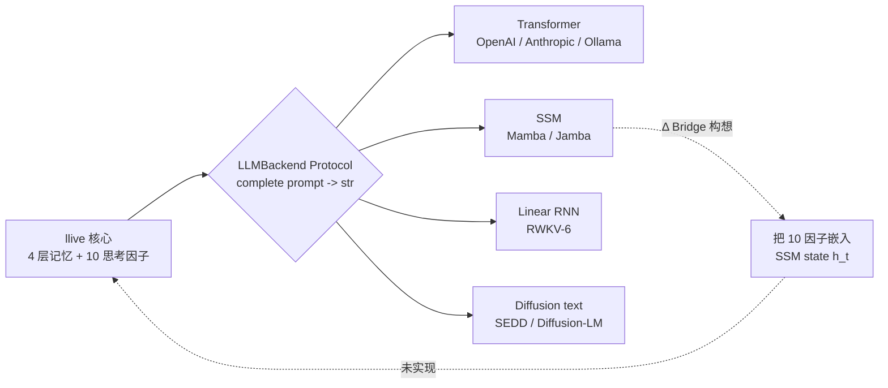

### 9. References

- Gu, A. & Dao, T. (2024). *Mamba: Linear-Time Sequence Modeling with Selective State Spaces*. arXiv:2312.00752.
- AI21 (2024). *Jamba: A Hybrid Transformer-Mamba Language Model*.
- Peng, B. et al. (2024). *RWKV-6: Continually Improving Linear RNN*.
- Lou, A. et al. (2024). *Discrete Diffusion Modeling by Estimating the Ratios of the Data Distribution*.
- Karpathy, A. (2025). *LLM Wiki* (concept-of-document).
- 完整列表将在 v0.7 发布时随 references.bib 一同提供.

---

---

## 第8章 llive 完全解说 (7) — "带审查的 AI": runtime_metadata × Approval Bus × Ed25519 audit chain

<!-- KAMI -->
> 📖 **一句话概括**
>
> 本章的主题是「会留下审查与证据的 AI」。一旦 AI 开始改写自己,如果没有「何时、改了什么、为什么改」的记录,事后就再也追不出原因。llive 会用 Approval Bus(审批关卡)把重要变更拦下,在人或规则放行之前不让它继续。更进一步,系统还给这些记录加上电子签名和环环相扣的校验值(区块链的简化版),一旦有人事后偷偷篡改,马上就会败露。本章要讲的,正是「把自己的每一次判断都带着签名留存下来」这种少见的 AI 形态。
<!-- KAMI -->

:::note info
**📚 FullSense 知识库指南** <!-- fullsense-team-kb -->
FullSense 开发全史 60+ 篇文章（4 种语言版、故事化的阅读顺序指南、通俗易懂版、四格漫画）均已汇总至 Qiita Team **FullSense KB**（仅限团队成员）。
:::


> **概念 hook**: 很多 LLM agent 只留下「结果的日志」. 但是当 AI 开始 **进化自身** 时,
> 如果没有「**何时判断了什么、改了什么**」的 audit trail, 就会 **事后无法 debug**.
> llive 在 architecture level 解决了这一点:
> - **runtime_metadata** = 每次推断的结构化 metadata
> - **Approval Bus** = 重大变更经由 ledger 由 human / policy 来 approve
> - **Ed25519 + SHA-256 audit chain** = ledger 防篡改
> - **本日 (2026-05-21) 落地的 E.4 governance** = 群体进化的共谋检测 → Approval Bus 联动
>
> = 一种少见的形态:**「自我进化的 AI, 把自己的所有决定都带着签名留存下来」**.


### 0. 在系列中的定位

```
#24-00 series index
#24-01 4 层记忆
#24-02 思考因子 × COG-MESH
#24-03 结构进化 × TRIZ × Z3
#24-04 B-series
#24-05 EvolutionLoop
#24-06 LLM backend non-transformer
#24-07 observability + governance (← 本文)
#24-08 lleval
```

如果说 #24-03 的 Z3 verifier 是「机器验证 **个体内** 的结构变更」, 那么 #24-07
就是「把 **个体间** 的行为 + 个体群体的决策作为 audit trail 保存」. 验证与审计的
两个轮子.

### 1. 为什么必须有审计链

一旦 LLM agent 开始重写自身,「**刚才那次推断是跑在哪个 commit 的结构上**」就变得
无从得知. 这不只关系到 debugging:

- **责任追踪** — 在群体进化中, 当「**所有派生互相打了虚假的高分**」时, 需要能够
  通过 ledger 回溯出谁最先撒了谎.
- **可复现性** — 要在事后重放「当时得到的结果」, 就需要结构 commit + memory zone
  + Brief input + Approval verdict 的全部 record.
- **法律 compliance** — EU AI Act / 中国 AI 办法 / 日本 G7 广岛 process 所指示的
  方向是「**AI 的决定必须 audit possible (可审计)**」.

llive 在 Phase 4 (Production Security MVR, v0.3.0) **同时** 解决了这三点.

### 2. runtime_metadata — 每次推断的结构化 trace

llive 的 `FitnessReport.runtime_metadata` 是 free-form dict[str, str], 但按惯例
放入以下内容:

- `signed_by`: peer evaluation 的签名者 id
- `gen`: 世代编号
- `agg`: aggregator strategy
- `commit_sha`: 源码 commit (经 CI 注入)
- `model_id`: 所使用的 LLM backend id

由此可以从一次推断结果 **完全复现**. 可复现性 **并非 OSS LLM inference 的标准** —
很多 agent 连 seed 都不记录.

### 3. Approval Bus — 结构性地阻止变更

`src/llive/approval/bus.py` 的 `ApprovalBus`:

- `request(action, payload, ...)` → 进入 pending 列表.
- `policy` 事先评估并返回 `Verdict.APPROVED / DENIED / None`.
  None 则等待人工.
- 人工 / policy 的 verdict 会 append 到 `_ledger: list[ApprovalResponse]`.
- 传入 `ledger=SqliteLedger` 即可持久化 + 恢复.

这并不是 **虚构的「Trust Score」**, 而是 **明确的 APPROVED/DENIED 状态机**.
沉默 = denial (§AB4).「模糊的许可」并不存在.

#### 3.1 本日落地的 E.4 governance 联动

`CoevolutionGovernance.evaluate_generation` (本日落地) 查看一个世代的 peer matrix,
在 **共谋疑似** 时触发 `ApprovalBus.request("coevolution.suspected_collusion",
payload)`. payload 中包含 generation / collusion_score / n_agents. 如果人工
deny, 则 **该世代的派生群体不被采用** — 一种 architecture level 的控制.

这是把 Constitutional AI / RLHF 的 **human-in-the-loop** 在 **architecture
level** 替代的设计. 不是像「在 prompt 末尾加上 <human_review>」那样的弱控制.

### 4. Ed25519 + SHA-256 audit chain

`src/llive/security/` 系列. Phase 4 落地.

- 每个 PeerEvaluationMatrix / ChangeOp / consolidation event 都用 Ed25519
  **签名**.
- 写入 ledger 时, 包含 **前一个 hash** 来计算 SHA-256 → 用作 next block 的
  prev_hash. 也就是 **blockchain-light**.
- 由此「篡改过去的任意 record, 之后的 hash 就全部错位」 → 篡改立即被检测.

#### 4.1 为什么是 on-disk 而非 on-chain

`project_fullsense_ear_origin` — llive 假设的是在 EAR + 安全约束下 **不可外部发送**
的环境. on-chain (Ethereum / Solana) 会构成外部发送, 因此不适合. on-disk audit
chain 以零外部依赖自我完结.

### 5. honest disclosure

- **Ed25519 密钥管理尚未解决** — 将密钥保存到 OS 的 secure store / HSM 的 module
  尚未落地. 当前通过环境变量 / file 加载. 这必须在 v1.0 之前解决.
- **Approval Bus 的人工介入不 scale** — 在派生群体 N=64、每一世代都产生 approval
  时, 人工负荷会在 24 小时内崩溃. 现实解是用 policy 自动评估通过 80%, 但无法保证
  policy 能写得完美.
- **runtime_metadata 的 sign 是 optional** — `signed_by` 字段是惯例但并非
  mandatory. 把它设为 mandatory 会破坏 `Brief API` 的兼容性. 迁移在 v0.7 之后.

### 6. 本日 (2026-05-21) 落地总结

| 项目 | 状态 |
|---|---|
| `CoevolutionGovernance` skeleton | **本日落地** |
| `CollusionDetector` (CE-06) | **本日落地** |
| `collusion_risk_score` (TonicRisk 联动, CE-08) | **本日落地** |
| `GovernanceReport` (frozen) | **本日落地** |
| 28 个用例 test PASS | **本日落地** |
| Ed25519 audit chain | Phase 4 已落地 (v0.3.0) |
| Approval Bus | C-1 已落地 (2026-05-16) |
| runtime_metadata 惯例 | 自 v0.B 起运行中 |

### 7. Mermaid — governance 全貌

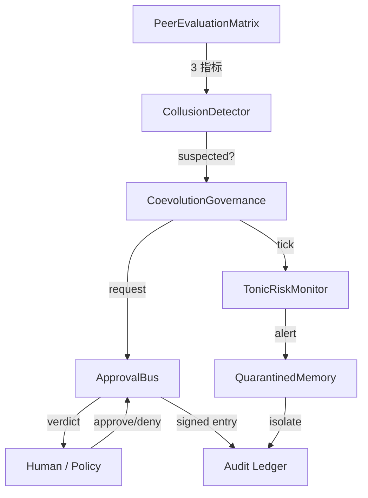

#### 7.1 把 governance maturity 当作「文明等级」来看 — 4D Kardashev radar (v0.I-C 先取)

§3 的 Approval Bus 通过率 / §4 的 audit chain 完整性 / §6 的 peer eval cohesion,
单独看就只会停在「数字变好了」. 在 **v0.I-C (4D Kardashev Radar)** 中, 设想把这些
束到 Energy / Knowledge / Coordination / **Ethics** 4 个轴 × 5 个阶段
(Type 0 → I → II → III → IV) 的「文明等级」尺度上, 在个体 / 群体 / 元群体的 3 个
层级上同时度量.


> 🗒️ *注：此图标签为日语。*

Ethics 轴正是本文的 Approval Bus 通过率 + frozen gene 违规检测 + 法规符合度的分数,
使我们能够把 governance maturity 用一条从「个体的管教」到「文明的成熟」的连续尺度
来叙述. 详细要件参见 llive `docs/requirements_v0.I_meta_evolution_and_cross_substrate.md` §5.


> 🗒️ *生命价值的通货膨胀 — 用「漫画与甜食」消解文明尺度的宏大叙事*（© Forbidden shibukawa / SHUEISHA・《零食吧 Basue》）

### 8. 期望值 — 接下来要来的

- **HSM / secure store 集成** — Ed25519 密钥管理放到 v1.0. 经由 Windows Credential
  Store / macOS Keychain / Linux Keyring 路径.
- **policy 自动 evaluate 的扩充** — 用 Approval Bus 的 `policy` 参数让 80% 自动通过
  的规则, 放到 v0.7.
- **Audit Ledger UI** — 在 llove TUI 中把 `governance verdict ledger` 按时间序
  可视化. F25 联动.

### 9. 2026-05-22 追记 — RUST-16 governance hot path 加速

CoevolutionGovernance.evaluate_generation 中最吃计算量的是
PeerEvaluationMatrix.collusion_score (NxN matrix 的 variance / symmetry /
concentration 3 指标), 这里曾花费 200-300 μs/call.

本日 (2026-05-22) 作为 RUST-16 **用 numpy zero-copy 做成 Rust kernel**:

| N | Python (numpy 既有) | Rust pyo3 zero-copy | speedup |
|---:|---:|---:|---:|
| 8 | 217.82 us | 1.89 us | **x115.04** |
| 16 | 203.33 us | 2.30 us | x88.54 |
| 32 | 237.68 us | 5.28 us | x45.00 |
| 64 | 306.13 us | 16.80 us | x18.22 |
| **avg** | — | — | **x66.70** |

实现是 `crates/llive_rust_ext/src/lib.rs:collusion_score_kernel` + 5 个 parity
test (1e-6 tolerance). callers (`CollusionDetector.check`) 计划在下一 commit 切换.

#### 9.1 honest disclosure — 「numpy = 快」也是谎言

这个 gain 之所以大, 主因是 **不仅「Rust 快」, 还有「numpy 在小 NxN 上慢」**.
`np.nanvar` / `np.corrcoef` / `np.nanmean` 三者叠加在 N<100 时由 Python overhead
支配, 达到 200μs+/call. Rust 的简单 C 循环是 2μs/call.

在 governance 侧重要的是:

- **Approval Bus 触发判定的 latency 缩短 100x** = 即便 N=64 派生群体, 也能以 64Hz
  跑 governance.evaluate_generation
- **TonicRiskMonitor 的 tick** (传入包含 collusion_risk_score 的 state) 也同等变快
- 结果就是 **「即便常时运行 governance 也是可接受的成本」**

有了这个,「**governance 很重, 所以只做 sampling**」的妥协就不再需要. 即使把所有派生
/ 所有世代的评估矩阵带着签名留在 audit chain 里, 也能落在 latency budget 之内.

#### 9.2 相关

- `docs/perf_comparison/2026-05-22_kernel_implementation_comparison.md` —
  全 3 kernel (RUST-15/16/17) 的比较矩阵
- `scripts/bench_collusion_score_5x_gate.py` — N=8/16/32/64 5x gate bench
- `feedback_rust_usage_matters` — Rust 化判断的检查清单

### 10. References

- Bernstein, D. J. et al. (2012). *High-speed high-security signatures* (Ed25519).
- Anderson, R. (2020). *Security Engineering* (3rd ed.) — audit trail / tamper-evidence 章节.
- EU AI Act (2024) / G7 Hiroshima AI Process (2023) — AI 决定的可审计性.
- 完整列表将在 v0.6.0a1 发布时随 references.bib 一同附带.

---

<!-- INTERLUDE -->

### ☕ 闲话休题 — 「不往外送」这一条约束,替我们选定了路

在第8章里我写到:防篡改的记录,我们刻意不上区块链(以太坊之类),而是闭在手边的磁盘里持有。这里退一步,聊聊这个决定背后的想法。

llive 设想的场景,是那些个人信息、企业机密、传感器数据都不能往外发的环境。这么一来,无论一套机制多么坚固,只要它会把数据送往外部网络,就一概不能选。「不往外送」这一条约束,接连替我们定下了一连串技术选择——把记忆放进手边的轻量数据库、签名记录不依赖外部链,根子上都是同一套思路。约束看似在剥夺自由,实则也是一只「让你毫不犹豫地认定那条独木桥」的罗盘。所谓设计,大概就是学着与这些约束好好相处的活儿——这一段让我又一次有了这样的体会。

<!-- INTERLUDE -->

---

## 第9章 llive 完全解说 (8) — 「制作眼镜」: lleval — 用 honest disclosure 5+1 因子分解评估 AI

<!-- KAMI -->
> 📖 **一句话概括**
>
> 终章的主题是「打造一副测量 AI 的眼镜」。当性能基准测试里自家 AI 跑出快得反常的数字时,先别急着高兴,而要怀疑这成绩的内部构成——这套姿态被代码化成了 lleval 这件工具。它把速度差异拆成「真的是同一道题吗」「测法公平吗」「有没有忽略启动开销」等 6 个要素,自动把可疑之处揪出来。此外,担任评分的 AI 有一种「先给它看的那一方打分更高」的习惯,通过对调顺序重新评分,也能把这种偏差抵消掉。说到底,这是一件识破「让你误以为很快的把戏」的工具。
<!-- KAMI -->

:::note info
**📚 FullSense 知识库指南** <!-- fullsense-team-kb -->
FullSense 开发全史 60+ 篇文章（4 种语言版、故事化的阅读顺序指南、通俗易懂版、四格漫画）均已汇总至 Qiita Team **FullSense KB**（仅限团队成员）。
:::


> **概念 hook**: 只是造 AI 还不够. 还需要 **看 AI 的眼镜**.
> lleval 是与 llive 并行的 **evaluation framework**, 它把
> `feedback_benchmark_honest_disclosure` 规则 —「LLM 出现异常好的结果时必须怀疑内訳」—
> 提升为 **代码中的一级概念**. 用 progressive size matrix 取 stress 曲线,
> 用 judge rotation 消除 position bias.
>
> 先给结论: 一个看穿的不是 **「快的 AI」** 而是 **「让你误以为快的构成」** 的工具.


#### 0. 在系列中的定位

```
#24-00 series index
#24-01 4 层记忆
#24-02 思考因子 × COG-MESH
#24-03 结构进化 × TRIZ × Z3
#24-04 B-series
#24-05 EvolutionLoop
#24-06 LLM backend non-transformer
#24-07 observability + governance
#24-08 lleval — eval framework (← 本文)
```

如果 #24-07 是关于「**保留什么**」(audit), 那么本文是关于「**测量什么**」.
没有测量就没有改进.

#### 1. lleval 的由来 — honest disclosure 事件

事情起于 2026-05-17 的 benchmark. 当时有一个数字, llive 比竞争对手的 cloud LLM API
**异常地快**. 一般人会觉得自己赢了, 但用户却指示「**怀疑内訳**」. 揭开盖子后:

- **LLMBackend 没有 attach** (是在 mock 上跑的)
- **chars 指标不公平** (把英语 token 当作字符数换算)
- **排除了 subprocess RTT** (忽略了启动成本)

三个 artifact 复合在一起. 记录下来 (`feedback_benchmark_honest_disclosure`) 之后,
我们想把「基准出现异常结果时必须怀疑那 5 个 artifact」**外部化**. 那就是 lleval.

#### 2. 5+1 因子分解 — honest disclosure 的结构化

lleval 的 `HonestDisclosureAnalyzer` (2026-05-21 上午落地) 把输出差异分解为 5+1 因子:

| 因子 | 含义 | 检测方法 |
|---|---|---|
| F1: prompt difference | 同一 prompt 是否真的相同 | 字符串 diff + token diff |
| F2: model id mismatch | model id 在 runtime 与 spec 间是否一致 | 比较 `runtime_metadata.model_id` |
| F3: backend swap | LLMBackend 是否已 attach | 用 runtime hook trace |
| F4: chars vs tokens | 评估指标是否语言无关 | tokenizer count |
| F5: RTT exclusion | subprocess / network RTT 是否计入时间 | wall-clock vs CPU time |
| +1: env drift | 并行负载 / OS schedule / thermal | 环境 fingerprint snapshot |

只有当 5+1 **全部 clean** 时才能「数值可信」. 只要有一个可疑,
就会有一条 **honest disclosure note** 被 sticky 到结果上.

#### 3. progressive size matrix — 取 stress 曲线

固定 token 数的基准信息量太少. lleval 跑 xs/s/m/l/xl 5 阶 ×
多个 model 的 **matrix**:

```
size:  xs (128)  s (512)   m (2k)    l (8k)    xl (32k)
mock     0.05      0.18      0.62      2.41      9.82
llive    0.07      0.24      0.71      2.55      9.96   ← 差别不大
gpt-4o   0.31      0.52      1.20      3.40      11.2   ← crossover at l
```

这样「**crossover 在哪个 size 发生**」一目了然. 即使在单一 size 上说「赢了」,
换个 size 就会输. fair.

#### 4. judge rotation — 消除 position bias

用 LLM-as-judge 比较 2 个候选 (A, B) 时, 已知顺序会 effect 得分 (Zheng et al. 2023).
lleval 这样做:

1. 用 (A, B) judge 1 次
2. 用 (B, A) judge 1 次
3. 两个 verdict 不一致时, 触发 **inconsistency flag**

这是把 judge LLM 自身的 bias 量子化的手段. inconsistency **超过 30%**
就切换 judge LLM 的运用 (judge rotation).

#### 5. bridges/llive — llive Genome → ProviderSpec mapper

lleval 设计为可直接吃 **llive 的派生个体**. `bridges/llive.py`
(2026-05-21 上午落地):

```python
from llive.perf.evolutionary import Individual
from lleval.bridges.llive import individual_to_provider_spec

ind: Individual = ...  # 从派生群体取 1 个体
spec = individual_to_provider_spec(ind)
### 从 ind.genome.values 复原 spec.model_id, spec.temperature, spec.top_p, ...
result = lleval.run(spec, dataset="qa_50")
```

这样「**派生群体的进化** 与 **派生群体的评估**」就形成 loop. 可以直接喂给 llive 内的
EvolutionLoop fitness.

#### 6. honest disclosure (关于 lleval 本身)

也对元工具自身应用 honest disclosure:

- **lleval test 数 61** — 截至今日 2026-05-21. 上游框架 (Promptfoo 本体) 拥有数千 test.
  lleval 是 wrap, 不是替换.
- **判定没有绝对基准** — 即使 F1〜F5 + 环境 fingerprint 都 clean,
  也不代表「基准是正确的」. 只不过是把「**可疑的迹象**」消掉的状态而已.
- **judge rotation 有成本** — 调用 2 倍, 所以 credential 使用量也 2 倍. 为 honest 检测付出的成本.
- **progressive matrix 的 size 等比是 heuristic** — 按 4x 取 (128 → 512 → 2k →
  8k → 32k), 但若真正的 crossover 在 2k 与 8k 之间, 则分辨率不足. 视需要细化.
- **环境 fingerprint 并不完美** — 它连 Windows / Linux / macOS 之间的 thermal
  throttling 差异都没捕捉到. 「在另一个 OS 上重取基准」是最终手段.

#### 7. 数字 (截至今日 2026-05-21)

| 项目 | 值 |
|---|---|
| lleval test PASS | 61 |
| 着地 module | 13 (config / runner / analyzer / providers / bridges / report html+md / cli / ...) |
| 5+1 因子检测逻辑 | 已着地 |
| progressive matrix runner | 已着地 |
| judge rotation | 已着地 |
| bridges/llive.py | 已着地 (skeleton) |
| v0.1.0a1 PyPI 公开准备 | (credential 复原后) |
| 在系列 #24 中的登场 | 本文 (#24-08) |

#### 8. 期望值 — 接下来要做的

- **v0.1.0a2**: promptfoo 实跑 + 完成 llive Genome → ProviderSpec mapping.
- **v0.2**: judge rotation + position swap + Phoenix OpenInference trace.
- **v1.0**: plugin marketplace + 商用 dual-license.

#### 9. References

- Zheng, L. et al. (2023). *Judging LLM-as-a-judge with MT-Bench and Chatbot Arena*.
- Promptfoo OSS (https://github.com/promptfoo/promptfoo).
- Anthropic Eval framework (2023).
- 完整列表将在 v0.1.0 发布时随 references.bib 一同提供.

#### 10. 2026-05-22 追记 — 5+1 因子分解与 Rust 化 5 模式判定表的方法论共性

lleval 的 honest disclosure **5+1 因子分解** (prompt diff / model id /
backend swap / chars vs tokens / RTT / env drift) 与同日着地的
llive Rust 高速化 **5 模式判定表** (#24-05 §13.3) 是用 **结构上相同的发想** 写就的.

| 共通的思想 | lleval 5+1 因子 | Rust 化 5 模式 |
|---|---|---|
| 在相信「结果」之前 **要素分解** | 把速度差分解为 6 因子 | 把速度比按 Python 经路的特性分为 5 模式 |
| **异常结果就怀疑内訳** | 怀疑 F1〜F5 + env | 单发 0.80x 也好 x66.70 也好都能用「内訳」解释 |
| 观察被外部化 | 用 analyzer 自动检测 | 用判定表 + bench script 自动测量 |
| **把 honest disclosure 当一级概念** | 给数值贴 sticky note | 用 judgment 表明示 **边界线在哪里** |

两者都处在「**抛弃「快」「对」「准」的单一假设**」这一
`feedback_benchmark_honest_disclosure` 的延长线上. 这是 lleval 不仅能看 AI,
还能展开到 **AI / 系统 / 算法 全般** 的发想 = 连载 #24-08 的元意义.

详情: `docs/perf_comparison/2026-05-22_kernel_implementation_comparison.md`.


> 🗒️ *"总觉得今天干啥都不顺……" — 把因子分解一口气讲透之后的脱力感*（© Forbidden shibukawa / SHUEISHA・《零食吧 Basue》）

---

---

<!-- REFERRAL -->

---

> ### ⚡ 本系列与 Claude Code 携手写成
>
> 文章中的实现、验证与可视化均与 **Claude Code**(Anthropic 的 AI 编程环境)一起完成。
> Claude Code 提供 **1 周免费试用**。如果你喜欢并通过下方的推荐链接订阅付费方案,
> 作者将获得「继续开发的额度」,从而支持本系列持续更新。
>
> 👉 **免费试用 / 推荐链接** → https://claude.ai/referral/0sqPw8E_lw

<!-- /REFERRAL -->

<!-- CTAIMG -->


> 🗒️ *"真掉价" — 想靠推荐链接赚点零花钱的小算盘,连我自己都觉得有点掉价。*（© Forbidden shibukawa / SHUEISHA・《零食吧 Basue》）

<!-- /CTAIMG -->
