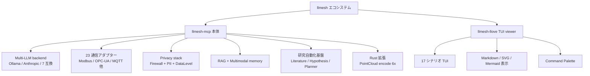

# llmesh: ローカル LLM スウォーム × 産業 IoT × 研究自動化

:::note info
**📚 FullSense ナレッジベースのご案内** <!-- fullsense-team-kb -->
FullSense 開発全史 60+ 記事 (4 言語版・物語ベースの[読む順ガイド](https://fullsense.qiita.com/furuse-kazufumi/items/90ea260703fb49065346)・かみくだき版・4 コマ漫画つき) は Qiita Team **[FullSense KB](https://fullsense.qiita.com/)** に集約しています (チームメンバー向け)。
:::


`llmesh` は、ローカル LLM (Ollama) ノード群を MCP
プロトコルでつなぎ、コード生成・レビュー・テスト生成を分散実行するセキュアな Python
スウォームフレームワークです。最近は「研究自動化 × 柔軟ロボット × マルチモーダル知識 × HCI を 1
つの基盤で扱う」方向へ拡張しており、本記事ではエコシステム一式 (llmesh / llmesh-llove + 研究オーケストレーション層)
を一気に紹介します。

- llmesh ソース: https://github.com/furuse-kazufumi/llmesh
- PyPI: https://pypi.org/project/llmesh-mcp/
- llmesh-llove (TUI viewer): https://pypi.org/project/llmesh-llove/

## エコシステム全体像



## 1. llmesh-mcp 本体

### 1.1 マルチプロトコル接続層

REST / TCP / UDP / SSH / SMTP / Modbus / Serial / OPC-UA / MQTT / EtherCAT / CAN / BACnet / WebSocket / DNP3 / GOOSE /
DVS / Depth まで `ProtocolAdapter` ABC で統一されています。FanoutExecutor は `protocol=` を切り替えるだけで k-of-n
並列ファンアウトを HTTP→TCP→Modbus 等で実行できます。

```python
from llmesh.protocol import HTTPAdapter, Modbus
from llmesh.orchestrator import FanoutExecutor

executor = FanoutExecutor(nodes=[...], protocol="http", k=2)
result = executor.invoke("generate_code", {"prompt": "..."})
```

### 1.2 マルチ LLM バックエンド

```python
from llmesh.llm import OllamaBackend
from llmesh.llm.anthropic_backend import AnthropicBackend
from llmesh.llm.openai_compatible import OpenAICompatibleBackend

# 同一 LLMBackend ABC で揃えるので Ollama → Anthropic → Together AI へ
# 設定差し替えだけで切り替え可能
backend = AnthropicBackend(model="claude-haiku-4-5")
```

OpenAICompatibleBackend は OpenAI / Azure / OpenRouter / Together / Groq / Mistral / DeepSeek の 7
プロバイダに対応します。

### 1.3 RAG モジュール

```python
from llmesh.rag import MockEmbedder, NumpyVectorStore, Retriever

emb = MockEmbedder(dim=384)
store = NumpyVectorStore(dimension=384)
ret = Retriever(embedder=emb, store=store)
ret.index(text="LLMesh is...", doc_id="d1")
hits = ret.search("What is LLMesh?", top_k=3)
```

3 つのストアバックエンドから選択可能：

- `NumpyVectorStore`: 純 numpy、`.npz` 永続化、~10 万件向け
- `SqliteVectorStore`: stdlib のみ、単一ファイル、~100 万件
- `LSHVectorStore`: numpy 近似 NN、100 万件以上向け

### 1.4 セキュリティスタック

PromptFirewall (4 層: 正規表現 / Presidio / PII / 構造) + DataLevel L0〜L4 + 7 段 OutputValidator + HMAC Chain
AuditTrail。LLM 応答は OutputValidator を通るまで untrusted として扱います。

## 2. llmesh-llove (TUI viewer)

`llove` は llmesh のシナリオを Textual TUI で再生・可視化するパッケージです。「llmesh シンプル / llove
で表示工夫」の分担で、SFEN や did:key や sensor float を llmesh が薄く流し、llove は専属で表示を担う設計です。

```bash
pip install llmesh-llove
llove demo --list                          # 17 シナリオ一覧
llove --lang ja demo --scenario shogi      # 将棋 MVP
llove --lang ja demo --scenario vision     # VLM 不良検査 ASCII
llove --lang ja demo --scenario pointcloud # LiDAR top-view ASCII
```

17 シナリオの内訳: firewall / scada / multimodal / rag / backends / audit / reliability / cost / chat / bench / drift
/ mcp_call / vision / pointcloud / coin_toss / mindmap / shogi。

### 主な特徴

- **Markdown / SVG / Mermaid** をターミナルで表示 (chafa / rsvg-convert 等の外部ツールに subprocess でフォールバック)
- **折り畳み** (見出し / コードブロック / 表) + 状態永続化
- **Command Palette**: `:` キーから ビルトイン 11 種 (`:help` `:identity` `:layout` `:demo` `:play` `:open` `:peer`
`:set` `:get` `:alias` `:macro`) + alias / macro 入れ子 5 段防止
- **WindowManager** (F17): Registry + IconSet + 自由可変/常駐ロックの 2 種コンテナ + `layout.toml`
- **shogi MVP**: 漢字駒 + 棋譜 `▲７六歩 (2.4秒)` + 自動 kifu ログ

### Ed25519 per-move 署名

全ゲーム横断で 1 手ごとに Ed25519 署名を打ちます (`did:key` ベース)。これにより対局リプレイの改竄を検出できます。

## 3. 研究オーケストレーション層

最近 (2026-05-11 セッション) で `llmesh.core` / `llmesh.research` / `llmesh.domains` / `llmesh.rag` に研究自動化基盤の
Phase 0〜5 を一気に追加しました。pydantic 依存なし、`dataclasses` のみで JSON-Schema 互換のスキーマを保ちます。

### 3.1 core プリミティブ (Phase 0a / 0b)

```python
from llmesh.core import Agent, AgentConfig, Tool, ToolSpec, TaskGraph, TaskNode
from llmesh.core import TraceLogger

with TraceLogger("trace.jsonl", run_id="r1", seed=42, config={}) as tl:
  tl.log_prompt("agent.lit", prompt="...", response="...",
				model="claude-haiku-4-5", model_version="20251001")
  tl.log_tool_call("search", input_payload={"q": "..."},
				   output_payload={"hits": 3})
  tl.log_evaluation("reviewer", target="agent.lit#1", score=0.85)
```

`TraceLogger` は `run.start` / `run.end` を自動発行し、`threading.Lock` で並列 agent からの書き込みを直列化します。

### 3.2 literature → hypothesis → planner → reviewer 閉ループ (Phase 1 / 2)

```python
from llmesh.research import (
  LiteratureAgent, LiteratureRequest, mock_extract,
  HypothesisAgent, HypothesisRequest, mock_hypothesis_extract,
  PlannerAgent, ReviewerAgent, run_plan_review_loop,
  mock_planner_extract, mock_reviewer_extract,
)
from llmesh.core import AgentConfig

lit = LiteratureAgent(AgentConfig(name="lit"), extract_fn=mock_extract)
digest = lit.run(LiteratureRequest(text="paper body", title="My Paper"))

hyp = HypothesisAgent(AgentConfig(name="hyp"), extract_fn=mock_hypothesis_extract)
candidates = hyp.run(HypothesisRequest(digest=digest, max_candidates=3)).candidates

planner = PlannerAgent(AgentConfig(name="p"), extract_fn=mock_planner_extract)
reviewer = ReviewerAgent(AgentConfig(name="r"), extract_fn=mock_reviewer_extract)
loop = run_plan_review_loop(
  hypothesis=candidates[0],
  planner=planner,
  reviewer=reviewer,
  max_iterations=3,
)
print(loop.verdict.kind, loop.iterations)  # "approve" 1
```

backend 抽象は `ExtractFn = Callable[[str], dict]`。テストは `mock_*` 関数で完結し、本番は `make_ollama_extract` /
`make_anthropic_extract` adapter で既存 `LLMBackend.invoke` をラップします。

### 3.3 robotics planning interface (Phase 3)

```python
from llmesh.research import (
  MockPerceptionAgent, MockTaskPlannerAgent,
  MockMotionPlannerAgent, run_robotics_pipeline,
)

result = run_robotics_pipeline(
  perception_agent=MockPerceptionAgent(),
  task_planner=MockTaskPlannerAgent(),
  motion_planner=MockMotionPlannerAgent(),
  instruction="pick the cup_blue",
  sensors={"objects": [{"name": "cup_blue"}]},
)
print(result.motion_plan.trajectory.waypoints)
```

PerceptionAgent / TaskPlannerAgent / MotionPlannerAgent / ReplanningAgent の 4 ABC + `ContactEvent` (Saguri-bot 風:
body_a/b + normal_force + is_expected) + `Trajectory` / `Waypoint`。Phase 8 で ROS 2 turtlesim、Phase 9 で VLA
mock、Phase 10 で Gazebo arm が差し込まれる予定です。

### 3.4 materials predictor (Phase 4)

```python
from llmesh.domains.materials import (
  Structure, Property,
  MockPropertyPredictor, MockCandidateGeneratorAgent, MockEvaluatorAgent,
  discover_top_k,
)

top = discover_top_k(
  seed=Structure(structure_id="seed", composition={"Fe": 0.7, "Ni": 0.3}),
  target_property=Property(name="band_gap", unit="eV"),
  target_value=2.5,
  generator=MockCandidateGeneratorAgent(),
  predictor=MockPropertyPredictor(low=0.0, high=5.0),
  evaluator=MockEvaluatorAgent(accept_fraction=0.5),
  n_candidates=10,
  k=3,
)
```

`MockPropertyPredictor` は SHA-1 ベースの deterministic pseudo-regressor で random forest 代替です。ABC を本物の
scikit-learn / GNN / ALIGNN に差し替えれば実機運用へ移行できます。

### 3.5 multimodal memory + document parsers (Phase 5)

```python
from pathlib import Path
from llmesh.rag import parse_document, MultimodalMemory

# PDF / Markdown / HTML / text を 1 関数で
text = parse_document(Path("paper.md"))    # 拡張子で自動振り分け
text2 = parse_document(b"<p>hi</p>", kind="html")

# text / image / table / log を同一 ID 空間で記憶
mem = MultimodalMemory()
mem.add_text("paper-1#abstract", text=text, vector=[0.7, 0.3, 0.1])
mem.add_image("paper-1#fig1", uri="figs/fig1.png", vector=[0.0, 1.0, 0.0])
mem.add_table("paper-1#tab1",
			rows=[("metric", "val"), ("acc", "0.9")],
			vector=[0.0, 0.0, 1.0])
mem.add_log("run-42#evt-001",
		  line="2026-05-11 12:00 INFO ok",
		  vector=[1.0, 1.0, 0.0])

hits = mem.search([0.7, 0.3, 0.1], modalities=("text", "table"), top_k=5)
```

cosine 類似度は `math.sqrt` だけで実装しています (numpy 不要)。`MultimodalStoreBackend` ABC を差し替えれば既存 NumpyVS
/ SqliteVS / LSHVS にも接続できます。

## 4. インストール

```bash
# 最小構成 (RTOS / 組み込み Linux でもインストール可)
pip install llmesh-mcp

# よく使う組み合わせ
pip install "llmesh-mcp[industrial,vision,rag]"

# llove TUI viewer
pip install llmesh-llove
```

`pyproject.toml` の optional extras:

- `industrial`: Modbus / OPC-UA / MQTT 等の業務プロトコル
- `rag`: numpy / sqlite-vec
- `presidio`: Microsoft Presidio PII 検出
- `vlm`: Pillow + LLaVA captioner
- `dnp3`: pydnp3 (重要インフラ)

## 5. ロードマップ

直近の優先順位 (claude-loop queue より):

| Phase | 内容 | 状況 |
|-------|------|------|
| 0a〜5 | core / trace logger / llove view / literature / hypothesis / planner / robotics I/F / materials / multimodal
memory | 完了 |
| 6 | llove explainability dashboard | 進行中 |
| 7 | e2e demo + paper artifact pipeline | 計画 |
| 8 | ROS 2 連携デモ (柔軟ロボット作業 e2e) | 計画 |
| 9 | VLA PoC — turtlesim mock | 計画 |
| 10 | VLA — Gazebo arm pick&place | 計画 |

## 6. ハイライトされた設計原則

1. **no-pydantic policy**: `dataclasses` で JSON-Schema 互換スキーマを表現し、`llmesh-mcp` を RTOS / 組み込み Linux
にもインストール可能に保つ
2. **ExtractFn 注入**: 全エージェントが `Callable[[str], dict]` を受け取る形にして、Ollama / Anthropic / mock
を統一インターフェースで切り替え可能に
3. **trace-as-replay**: 全 prompt / model_version / tool I/O / 評価結果が JSONL で残るので、研究 run を任意時点から
replay できる
4. **llmesh シンプル / llove で表示工夫**: 通信や状態は llmesh が薄く流し、見た目は全部 llove が引き受ける役割分担

## 7. 参考リンク

- ソース: https://github.com/furuse-kazufumi/llmesh
- llove ソース: https://github.com/furuse-kazufumi/llove
- 仕様書: 117 章 / 500+ 要件項目 (`SPECIFICATION.md`)
- アーキ図: `docs/ARCHITECTURE.md` (Mermaid 込み)

ローカルで動くマルチエージェント研究基盤を一通りそろえたい人向けです。ご意見・PR 歓迎します。
