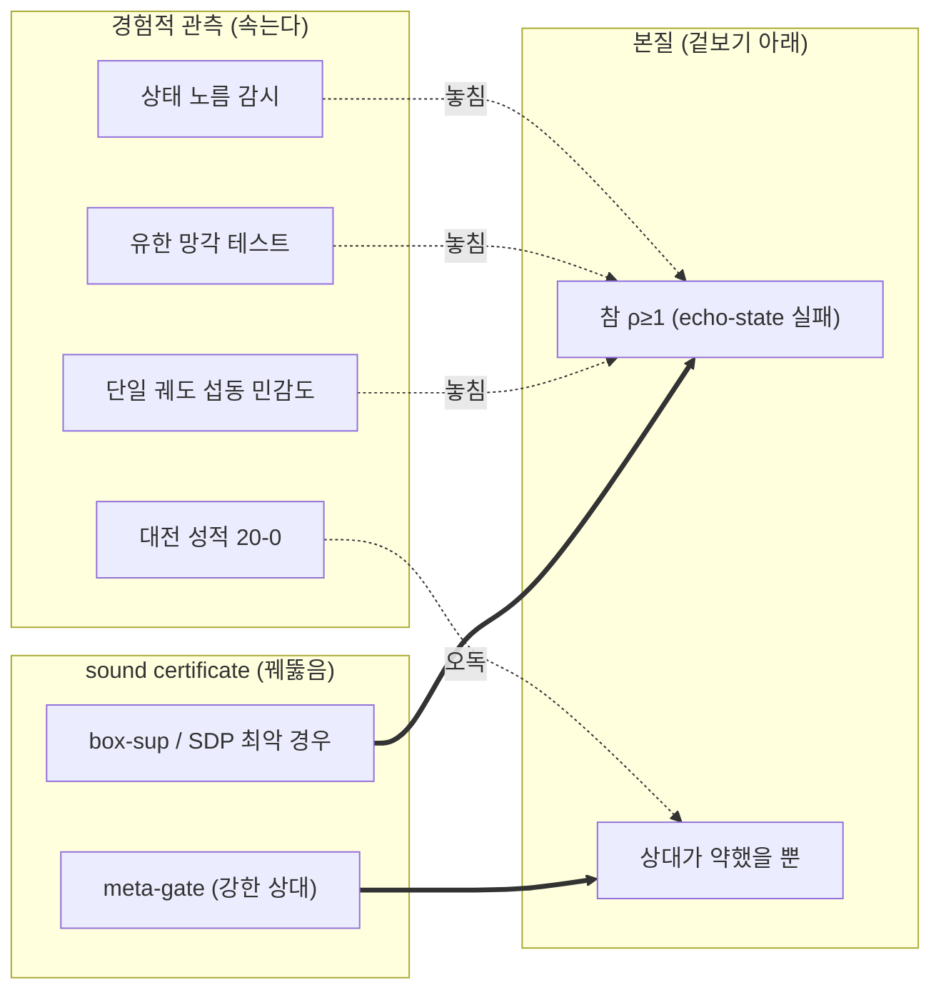
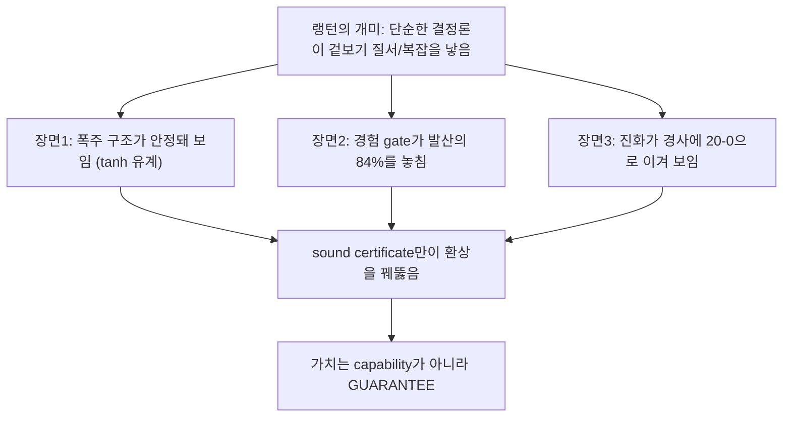
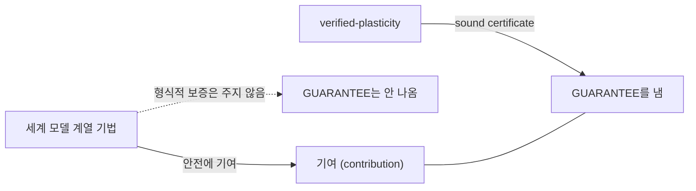
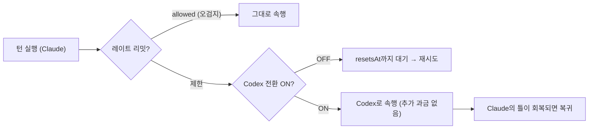
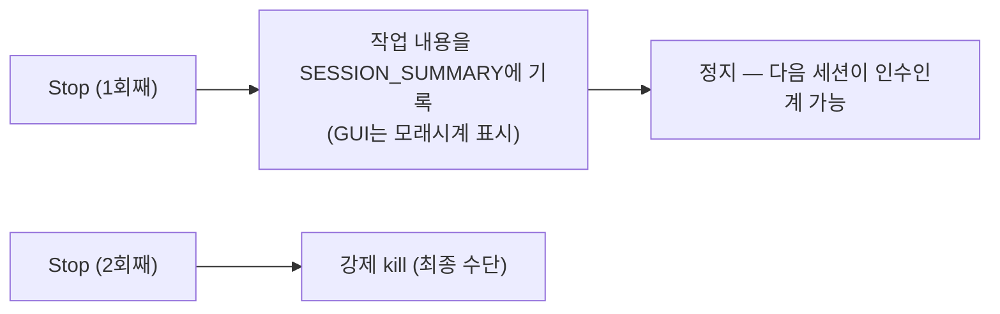

# llcore 검증 arc 모음(#38–#42): 방어적 공개 × 2ⁿ 벽 × 강한 기울기가 진화를 이긴다 × 랭턴의 개미 환상

<!-- TOPICNAV -->
> **🌐 언어**: [日本語](https://qiita.com/furuse-kazufumi/items/cc0713ab78a5b390df76) | [English](https://qiita.com/furuse-kazufumi/items/525cd01eda5c1ad707ef) | [中文](https://qiita.com/furuse-kazufumi/items/29b100b00f0d58306886) | **한국어**
>
> **📚 FullSense 모음 시리즈**
> - **llcore 검증 arc 모음（this）**
> - [lldarwin / 진화 arc 모음](https://qiita.com/furuse-kazufumi/items/951b94cf66d246723004)
> - [llive 완전 해설 모음](https://qiita.com/furuse-kazufumi/items/c5f2077a3399d3fc9b26)
> - [llmesh 모음](https://qiita.com/furuse-kazufumi/items/99e4558953df57ccaffb)
> - [쉬운 설명 모음](https://qiita.com/furuse-kazufumi/items/e5093e4816b25c1bd4d0)
<!-- /TOPICNAV -->

## 목차

1. [하루 만에 「반증 검증 → 특허 클리어 → 출원 보류 → 방어적 공개」까지 달린 이야기](#제1장-하루-만에-반증-검증--특허-클리어--출원-보류--방어적-공개까지-달린-이야기)
2. [「창은 구현으로 닫혔다, 그러나 벽은 꿈쩍도 안 했다」보고](#제2장-창은-구현으로-닫혔다-그러나-벽은-꿈쩍도-안-했다보고)
3. ["이겼다고 생각한 순간, 내 프레임워크가 나를 멈춰 세웠다"는 보고](#제3장-이겼다고-생각한-순간-내-프레임워크가-나를-멈춰-세웠다는-보고)
4. [세 편을 한 점에 묶기: "단순한 결정론 규칙이 겉보기의 질서를 만든다"](#제4장-세-편을-한-점에-묶기-단순한-결정론-규칙이-겉보기의-질서를-만든다)
5. [왜 "LLM을 3D로 걷는" 그림이 갖고 싶었나](#제5장-왜-llm을-3d로-걷는-그림이-갖고-싶었나)
6. [진척 바가 멈췄을 때, 당신은 몇 분이나 기다릴 수 있나요](#제6장-진척-바가-멈췄을-때-당신은-몇-분이나-기다릴-수-있나요)

---

## 제1장 하루 만에 「반증 검증 → 특허 클리어 → 출원 보류 → 방어적 공개」까지 달린 이야기

<!-- KAMI -->
> 📖 **간단히 말하면**
>
> 간단히 말하면, "우리 연구, 정말로 세상 어디에서도 아무도 안 한 빈틈에 들어가 있는 걸까?"를 하루 종일 철저히 의심한 이야기입니다. 56개의 비판역 AI에게 "이 주장은 이미 선행 연구에 있을 것이다"라며 반례를 찾게 하고, 특허 데이터베이스까지 대조해 보았는데도 "4개 조건이 한 점에서 동시에 겹치는 빈틈"이 비어 있음을 확인했습니다. 보통이라면 거기서 특허를 내겠지만, 돈과 시간을 저울질해 출원은 그만두고, 대신 "기술을 날짜를 붙여 전부 공개해서 먼저 깃발을 세운다(=나중에 누군가가 특허로 둘러싸는 것을 막는다)"는 수비의 한 수를 택한, 그런 의사결정의 기록입니다.
<!-- KAMI -->

2026년 6월 6일, 나(필자)는 AI(Claude Code)에게 **「우리가 하고 있는 것이 정말로 차별화되어 있는지 검증해 달라」**고 요청했습니다. AI는 여기에 **반증 검증(adversarial verification)** — 자신의 주장을 일부러 반증·부정하려 드는 검증역 AI를 다수 돌려, 그래도 살아남는지를 시험하는 방법 — 으로 응했습니다. 56개의 검증 에이전트가 7 + 3개의 각도에서 「이 주장은 선행 연구로 반증할 수 있을 것이다」라며 반례를 찾아 헤맸고, 별동대가 특허 데이터베이스까지 조회했습니다.

결과는 다음과 같습니다.

- **학술 문헌에서의 반증(breaks): 0건**(44개 후보를 개별 판정했는데, 누구도 「네 모서리 동시」를 메우지 못했음).
- **특허에서의 반증: 0건**(영어 14 + 일본어 3 쿼리에서, 교차점을 점유하는 특허는 없음).
- 그래서 나는 **특허를 내지 않기로**(비용 판단) 정하고, 대신 **방어적 공개(defensive publication)**라는 깃발을 세웠습니다.

이 글은 그 하루의 이야기(반증 검증의 설계와 결과, 의사결정)와 **공개한 내용(= 네 점 교차점의 기술)**의 쉽게 풀어쓴 버전입니다. 글의 순서는 늘 그렇듯 ①용어 설명 → ②쉽게 풀기(평이) → ③상세로 나아갑니다.

---

### ① 용어 미니 사전(본문에서 막히지 않도록)

| 용어 | 한마디로 |
|---|---|
| **반증 검증 (adversarial verification)** | 자신의 주장을 긍정하는 것이 아니라, 일부러 반증·부정하려 드는 검증역(AI)을 다수 돌려, 그래도 살아남는지로 주장의 강도를 재는 방법. 내 편 아첨꾼이 아니라 비판자를 고용하는 이미지. |
| **방어적 공개 (defensive publication)** | 특허를 「얻는」 것이 아니라, 기술을 **공개하여 선행 기술로 만드는** 것. 누군가(대기업 포함)가 나중에 같은 발명으로 특허를 따서 우리나 세상을 옭아매지 못하도록 하는 「먼저 깃발을 세우는」 방어. |
| **선행 기술 (prior art)** | 「그 발명, 이미 공지예요」라고 말할 수 있는 기존 공개물. 신규성을 부정하는 자료. 날짜가 생명. |
| **축소성 (contraction, ρ<1)** | 에코(과거의 흔들림)가 시간과 함께 **감쇠**하는 성질. 스펙트럼 반경 ρ가 1 미만. 스프링이 반드시 정지 위치로 돌아가는 이미지. 기억 코어가 폭주하지 않고 「잊는」 성질. |
| **건전한 증명 (sound proof)** | 「증명했다」고 하면 **정말로 옳은**(거짓 합격을 내지 않는) 증명. 통계적으로 「아마 안전」과는 별개. |
| **prove-then-reject 게이트** | 변이(업데이트)를 **증명하고 나서 채용**, 안 되면 **기각**하는 관문. fail-closed(증명할 수 없으면 통과 못 함). |
| **기억 코어 (memory core)** | LLM 주위에 씌우는 「기억하는 부품」. 본 연구에서는 `s_{t+1} = decay⊙s + (1−decay)⊙tanh(W s + V x)`라는 누수·포화 딸린 재귀(RWKV 계). |
| **진화 루프 (evolution loop)** | 변이 → 선택 → 다음 세대를 돌려 좋은 개체를 찾는 최적화. 여기서는 그 선택의 관문에 증명 게이트를 둔다. |
| **SMT 솔버 (Z3 등)** | 논리식이 충족 가능한지 푸는 만능 솔버. 무겁다. 본 연구에서는 「실은 필요 없었다(장식)」가 결론. |
| **tracking tube(추종 튜브)** | 「바람직한 궤도」에서의 실제 편차가 수렴하는 **통(반경 r)**의 보증. `r = G·w̄/(1−L)`. |
| **SSGM** | 「진화하는 기억을 통솔하는」 write 게이트를 **이론만으로** 제안한 선행 연구([arXiv:2603.11768](https://arxiv.org/abs/2603.11768), 2026). 간판에서 가장 가까운 상대. |
| **navigability(탐색 가능성)** | 진화가 「움직이기 쉬운 지형인가」. 학습이 똑똑해지는 것과는 별개. 검증기의 효과는 이쪽에 있다. |

---

### ② 쉽게 풀기 — 3분 만에 전체 그림

먼저 생물학의 니치(생태적 지위) 이야기부터 시작합니다. 진화에서는 「니치 — 다른 종이 아직 점하지 않은 틈 — 에 파고든 종」이 살아남습니다. AI의 세계도 비슷합니다. 대기업(OpenAI/Google 등)은 「평균적으로 똑똑한 대형종」으로, 넓은 평야를 점유하고 있습니다. 우리는 그 평야에서는 이길 수 없습니다. 그래서 **아무도 메우지 않은 틈**을 찾아, 거기에 꼭 맞는 부품을 만듭니다. 이번에 그 틈에 딱 들어맞은 것이, `llcore`라는 구체적인 시스템입니다.

`llcore`는 한마디로 **「기억을 가진 AI 부품이, 폭주하지 않도록 자기 자신에게 '증명의 관문'을 부과한 시스템」**입니다. 기억 코어는 업데이트를 거듭할 때마다 변이(진화)해 가지만, 그 변이를 채용하기 전에 반드시 관문(게이트)을 통과시킵니다. 관문은 「이 업데이트를 넣어도 기억이 폭주하지 않는다」를 **수학적으로 증명할 수 있는 것만** 통과시키고, 증명할 수 없으면 문전박대(fail-closed)합니다.

이 시스템이 앞서 말한 「틈」에 꼭 들어맞는 것은, 다음 4개의 조건이 **한 점에서 동시에 겹치기** 때문입니다.

1. **건전한 축소성 증명**(에코가 반드시 감쇠한다고 수학적으로 보증. 게다가 거짓 합격을 내지 않는다).
2. 그것을 **LLM 기억 코어의 내부**에 적용(제어 로봇도 분류기도 아닌, 「기억하는 부품」 그 자체).
3. **진화 루프 안에서**, 안 되는 변이를 **기각**(밀어 되돌리기 = 사영이 아니라, 버린다).
4. 게다가 **돌아가는 구현과 실험**이 있다(탁상공론으로 끝나지 않는다).

이 4가지를 **동시에** 충족하는 선행 연구는, 56개의 반증역 AI에게 비판적으로 검증시켜도, 특허 DB를 조회해도, 찾을 수 없었습니다. 하나하나의 조건은 선행이 있습니다(정직하게 전부 이름을 댑니다). 하지만 「네 모서리를 동시에 점유」한 사람은 없었습니다. 이것이 **네 점 교차점(four-point intersection)**입니다. 생물학의 니치로 말하면, 네 개의 경계선이 정확히 교차하는 **한 점의 틈**에 `llcore`가 들어앉아 있는 셈입니다(손자로 말하면 「실을 피하고 허를 친다」).

그리고 중요한 의사결정. 이 틈은 **특허에서도 공백**이었습니다. 보통이라면 「그럼 특허를 내자」가 됩니다. 하지만 특허는 돈과 시간이 듭니다. 나는 거기를 **보류하고**, 대신 **「공개해서 먼저 깃발을 세우는」 방어적 공개**를 선택했습니다. 노림수는 공격이 아니라 **방어**입니다 — 나중에 누군가(대기업이나, SSGM의 후속 구현)가 같은 개념으로 특허를 따서, 우리나 공중을 옭아매는 것을 **미연에 무효화한다**. 날짜를 붙여 공개해 버리면, 그것은 공지의 선행 기술이 되고, 나중에 낸 특허는 신규성으로 부정됩니다.

다만 — 여기가 우리의 일관된 규율인데 — **부풀리지 않습니다**. 「세계 최초」라고 말하지 않습니다. 올바른 표현은 **「우리 반증 검증의 범위에서, 네 모서리를 동시에 점유한 선행은 제로」**입니다. 탐색 범위 밖은 알 수 없다는 단서를 반드시 남깁니다.

---

### ③ 상세 — 하루의 세션, 그리고 공개한 기술의 내용

#### 3.1 반증 검증의 설계(재현할 수 있도록)

「내 연구는 강하다」고 스스로 말해 봐야 의미가 없습니다. 그래서 AI는 **반증 주도의 워크플로**를 짰습니다.

- **7개 각도의 반증 탐색**: 증명 게이트의 계보 / certified training / Transformer 안정성 / 진화 × 검증 / verified memory / runtime assurance / 산업·특허.
- **critic가 지적한 맹점 3개 각도를 추가**: 형식 방법 컨퍼런스 측의 역추적 / certified continual learning의 어휘계 / 내부 상태·SSM의 해석.
- **44개 후보를 5축 루브릭으로 개별 판정**(업데이트를 게이트하는가 / 건전 증명인가 / LLM 기억 코어인가 / 진화 루프 내인가 / 구현이 있는가). 판정역 AI는 **일차 정보(arXiv의 abstract/HTML)를 WebFetch로 반드시 확인**(전언 금지).
- 병행하여 **내부의 AI가 자신의 논문 드래프트의 약점을 추출**(honest disclosure: 내 편 흠 잡기).

확정 결론은 **breaks 0 / narrows 36 / background 8(44건)**. 살아남은 차별화 핵심이, 위의 네 점 교차점입니다.

#### 3.2 「네 모서리」 각각의 최근접 라이벌(전부 이름을 댄다)

신규성은 「전부를 한 문장으로 지명할 수 있는가」로 정직함이 결정됩니다. 모서리별로 가장 가까운 선행을 한 문장으로:

- **SSGM([arXiv:2603.11768](https://arxiv.org/abs/2603.11768))** — 「진화하는 기억을 통솔하는」 간판을 **이론만으로** 선점. 게이트는 NLI(모순 검출)로 **건전한 형식 증명이 아니며**, 구현도 없다. → 간판을 짊어진 상대로서 **반드시 인용**. 구현 + 증명의 창문이 비어 있다.
- **SEVerA([arXiv:2603.25111](https://arxiv.org/abs/2603.25111))** — 자기 진화 에이전트에 Dafny/SMT 검증. 다만 대상은 **출력 계약**이지, 기억 코어의 축소성의 매 업데이트 게이트가 아니다.
- **PSV-Verus([arXiv:2512.18160](https://arxiv.org/abs/2512.18160))** — self-play 루프 내의 건전 SMT 게이트. 다만 검증 대상은 **생성 코드의 정확성**.
- **Provably Safe Model Updates / LID([arXiv:2512.01899](https://arxiv.org/abs/2512.01899))** — 업데이트를 추상 해석으로 δ-safe 인증. 다만 **사영(밀어 되돌리기)**으로 prove-then-reject가 아니며, 대상은 frozen-embedding의 분류 head.
- **GP × 모델 검사(Katz & Peled, [arXiv:1402.6785](https://arxiv.org/abs/1402.6785), 2014)** — 진화 루프에 건전한 검사 게이트를 두는 **패턴의 선례**. 그래서 우리는 **게이트의 패턴 자체를 신규라고 주장하지 않습니다**. 기억 코어의 축소성으로의 적용만이 미답.
- **Enforced-Lipschitz Transformers([arXiv:2507.13338](https://arxiv.org/abs/2507.13338)) / R2DN([arXiv:2504.01250](https://arxiv.org/abs/2504.01250))** — 축소성을 **구조로 강제(by-construction)**. 이것은 「게이트 따위 필요 없다, 처음부터 내장하라」는 최강의 대항 설계. 우리는 **by-construction 대 prove-then-reject**를 설계 축으로 대비합니다(구조 강제는 표현력을 희생하고, 기각 게이트는 임의 업데이트를 구조 제약 없이 검사한다).
- **Safeguarded AI(ARIA programme)** — 가장 권위 있는 proof-gated-gatekeeper 개념. 다만 게이트 대상은 **행동/계획**(출력 게이트)으로, 가중치/기억의 업데이트 게이트가 아니며, 아직 programme 단계.
- **Emergent FV / substrate-guard([arXiv:2603.21149](https://arxiv.org/abs/2603.21149))** — AI의 **출력**을 Z3로 검증하는 돌아가는 시스템. 다만 post-hoc 감시로, 매 업데이트 게이트가 아니다.

(위 arXiv ID는 모두 논문 드래프트에서 abstract와 대조 확인된 것만 사용하고 있습니다.)

> 🗒️ *"고찰이 좀 얕네…" — 선행 연구를 이름으로 나열한 것에 만족하지 않는 자기 경계*（© Forbidden shibukawa / SHUEISHA・Snack Basue）

#### 3.3 특허 면의 조회(학술 감사가 남긴 구멍 메우기)

학술 감사는 **문헌만**이고, 특허 DB를 보지 않았습니다(부재 증거로서 약하다). 그래서 별동대가 **영어 14 + 일본어 3** 쿼리로 Google Patents / USPTO를 조회했습니다.

- **교차점을 점유하는 특허: 제로 건.**
- 최근접 특허는 3계통뿐이며, 모두 교차점 밖:
  - **[US11715005B2](https://patents.google.com/patent/US11715005B2)** — NN을 해시 대조로 진정성 검증(건전 증명이 아니라 암호 해시).
  - **[US10896032](https://patents.google.com/patent/US10896032)** — certify-then-deploy의 거버넌스 게이트(근거가 절차적 attestation).
  - **[US11868855](https://patents.google.com/patent/US11868855)** — 모델/가중치의 「stability」 검증(다만 가용성·내장애의 의미일 개연성 큼).
- 흥미로운 구조적 증거: 「**건전 증명으로 업데이트/기억/진화를 게이트한다**」고 쿼리하면, 특허 DB에 site 지정을 해도 결과가 거의 전부 **arXiv로 빗나갔다**. 이것은 「이 개념이 아직 학술 단계에 머물러 있어, 특허화되지 않았다」는 간접 증거입니다.

→ 결론: **특허 면에서도 clear**. 다만 US10896032 / US11868855는 어휘가 부분적으로 겹치므로, 논문의 related work에 「전개 거버넌스형 게이트 / 운용 안정성 검증과는 달리, 본 연구는 가중치 업데이트의 해석적 contraction 성질을 건전 증명으로 게이트한다」는 대비를 1~2문 선제적으로 넣었습니다.

#### 3.4 공개한 기술의 내용(방어적 개시의 본체)

방어적 공개는 「당업자가 실시할 수 있는 상세도」로 쓰지 않으면 선행 기술로서 약합니다. 그래서 개시 문서에는 다음을 **구현 가능한 레벨**로 썼습니다.

**(a) 건전한 축소성 증명기의 사다리(ladder).** 싼 것부터 순서대로 3단:
- `cert_inf` — 닫힌 형식의 ∞-노름 상한(`O(n²)`). 각 행의 절댓값 합이 끝점에서 최대가 되는 성질을 사용해, **솔버 불필요**.
- `cert_two` — 전체 `2^n` 꼭짓점에서 SVD.
- `cert_sdp` — 공통 Lyapunov 행렬을 볼록 LMI(내점 SDP, CLARABEL)로.

**여기가 정직 포인트**: 프로젝트의 옛 통칭은 「Z3-gated」였지만, **실제 게이트에 SMT(Z3)는 사용하지 않습니다**. 전용 Z3 축소성 트랙을 돌려 확인하니, 닫힌 형식 ∞-노름 증명기와 **바이트 단위로 일치(3270건 중 0건의 불일치, 경계 근방에서도 8000건 중 0건)**. 즉 이 불변량 클래스에서는 **Z3는 장식**이었습니다. 그래서 간판을 「건전한 축소성 증명기의 사다리」로 고쳤습니다(이것은 후퇴가 아니라 강점 — 솔버 의존과 불완전성을 회피할 수 있다).

**(b) prove-then-reject 게이트(fail-closed).** 자식 개체를 제안 → 증명이 통과하면 채용, 안 되면 상한까지 resample, 그래도 안 되면 **알려진 안전한 fallback**을 채용. **미증명의 자식은 결코 채용하지 않는다**. `gate_mode="contraction"` / `"state_norm"`을 additive하게 추가하고, 기본 `"none"`은 종전 거동과 바이트 일치(= 기존 진화 기반으로의 순수한 덧씌움).

**(c) tracking tube 검사 지표.** 「어딘가로 수축한다」뿐만 아니라 「**바람직한 궤도에 추종한다**」를 보고 싶다는 사용자 요망에 대한 답. 게이트가 이미 계산하고 있는 양(상태 Lipschitz `L`, 입력 게인 `G`)과 외란 상계 `w̄`를 재이용해, 추종 오차가 수렴하는 통 `r = G·w̄/(1−L)`을 **추가 증명 비용 제로**로 보고. 소규모 실측에서도, 축소성 PASS의 3 gene은 오차/외란 비 0.50/0.78/1.04로 이론 통의 안쪽, 비축소성의 대조는 **9.3배**로 증폭(= 게이트는 장식이 아니라 load-bearing).

**(d) verified memory evolution의 2개 루트.**
- 루트 (a): 에이전트 **기억 뱅크**의 업데이트를 건전 증명으로 게이트(SSGM의 NLI 이론과의 차 = 건전 증명 + 돌아가는 게이트).
- 루트 (b): 기억 코어의 **내부 상태 dynamics**를 게이트(본서에서 실시 완료).

**(e) 합성: SPC 관리도 runtime 게이트 + 이층 윤리 게이트.** 진화 메트릭을 관리도(X̄–R / CUSUM)에 통과시켜 시간 방향의 이상을 online 게이트. 그리고 **탐색은 자유·채용은 검증**의 이층 윤리(탐색층은 손자의 「궤도(詭道)」= 기수 OK, 채용층은 논어의 「인(仁)」= 정직하고 게이트 불가피).

#### 3.5 본일의 구현 사실(reduced to practice)

탁상공론이 아니라는 증거:

- 증명 게이트는 **출하 측의 `evolve()`에 본배선 완료**(`gate_mode` / `resample_cap`을 additive 추가, 기본 `"none"`은 byte-identical, research 측의 참조 구현과 전 모드 일치를 테스트로 실증).
- tracking tube 리포터도 착지(`r = G·w̄/(1−L)`, `cert_inf` 한정, read-only, golden 값 일치).
- 게이트 + 리포터를 덮는 테스트 **294건**.
- **관측한 게이트의 비용은 약 20~60배**(증명은 공짜가 아니라고 숨기지 않고 개시).

#### 3.6 honest 한계(약화시키지 않는다)

방어적 개시라도 honest disclosure는 굽히지 않습니다.

- **규모는 작음**: 핵은 `n=8`(72 실수 gene)·16 KB 코퍼스·byte vocab. 「LLM 기억 코어」는 **기구 실증**의 의미.
- **검증기의 payoff는 navigability이지 학습이 아니다(L3)**: 효과는 EA 고유로, 경사법에서는 사라진다.
- **게이트는 ~20~60배의 비용**: 짧은 훈련에서는 공짜처럼 보일 뿐.
- **「false admit 제로」는 경험적 관측이지 기계 검사가 아니다**: 증명기의 *조건*은 건전하지만, 그것을 담당하는 *구현*은 end-to-end로 형식 검증된 것은 아니다.
- **「미발견」의 범위**: 반증 검증 + 표층 특허 검색의 범위에 한한다. CNIPA(중국어) 미조회, 특허는 최장 18개월의 공개 래그. 「탐색 범위에서」의 단서는 항상 유지.

---

### 정리 — 깃발은 「공격」이 아니라 「수비」를 위해 세웠다

오늘 하루로, 우리는 자신의 연구를 56개의 반증역 AI에게 비판적으로 검증시키고, 특허 DB까지 조회하고, 그래도 남은 「네 모서리의 공백」을 확인했습니다. 보통이라면 여기서 특허를 노릴 참이지만, 비용을 저울질하여 **출원은 보류**하고, 대신 **날짜 붙은 방어적 공개**로 깃발을 세웠습니다.

노림수는 단순합니다 — **누군가가 나중에 이 공백을 특허로 둘러싸, 우리나 공중을 옭아매려는 시도를 미연에 무효화한다**. 그것을 위해, 당업자가 구현할 수 있는 상세도로 전부 공개했습니다. 그리고 끝까지, **「세계 최초」라고 말하지 않고 「우리 검증의 범위에서 네 모서리 동시의 선행 제로」**라는, 부풀리지 않는 표현을 지키고 있습니다.

방어적 공개의 본체(날짜 붙은 개시)는, 아래 추기와 같이 **구현과 전체 데이터를 포함한 public 리포지토리**로 승격했습니다: [github.com/furuse-kazufumi/llcore](https://github.com/furuse-kazufumi/llcore).

다음 회(#39 이후)는, 이 네 점 교차점의 본진 — verified memory evolution의 작은 PoC(기억 뱅크 업데이트 루트)의 착지를 report할 예정입니다. SSGM이 이론으로 간판을 차지한 창문이, 구현으로 닫히기 전에.

### 추기(2026-06-07) — 깃발은 구현이 되었습니다

이 기사의 다음 날, 예고했던 verified memory evolution PoC는 **완주했고, 방어적 공개는 「문서」에서 「실물」로 승격**했습니다.

- **public 리포지토리**: [github.com/furuse-kazufumi/llcore](https://github.com/furuse-kazufumi/llcore) — 논문 드래프트([PAPER_DRAFT.md](https://github.com/furuse-kazufumi/llcore/blob/main/research/paper/PAPER_DRAFT.md)) + 전체 실험 코드/데이터(570 파일, 테스트 318건 green)를, 날짜 붙은 단일 커밋으로 공개
- **trajectory-tube gate**(예고했던 본진): 사전 등록 n=40의 결착으로, 기억 horizon에의 효과를 확인(논문 §9)
- **더 나아가**: 「검증기를 AI 자신이 가지면 어떻게 되는가」— 죽을 수 있는 환경에서의 기억 형성 3기구(자기 예견/부활 수복/사회적 관찰)의 측정까지 공개 내용에 포함됩니다(논문 §9.6)
- **지견 슬라이드(CC BY 4.0)**: [slides/](https://github.com/furuse-kazufumi/llcore/tree/main/slides) — 출처 명시로 기업 이용도 가능한 10장 요약(일영). **현재는 정보 밀도가 낮은 요약판입니다 — 연구 진전에 맞춰, 실험 설계 상세・도표・재현 절차・도입 판단 재료까지 앞으로 1년에 걸쳐 확충해 갑니다**

「SSGM의 창이 구현으로 닫히기 전에」라는 예고는, 이렇게 지켜졌습니다.

---

## 제2장 「창은 구현으로 닫혔다, 그러나 벽은 꿈쩍도 안 했다」보고

<!-- KAMI -->
> 📖 **간단히 말하면**
>
> 앞 장에서 세운 "증명을 동반해 진화하는 기억 AI 부품"이라는 깃발을, 종이 위의 이야기에서 실제로 돌아가는 프로그램으로 진전시킨 보고입니다. 비유하자면 설계도(이론)를 진짜 기계(구현)로 만들고, 게다가 위험한 부품을 하나도 놓치지 않고 돌릴 수 있었다는 전진. 다만 정직하게 말하면, 못 이긴 숙제도 남았습니다. 안전한지를 확인하는 계산이, 부품 크기가 커질 때마다 폭발적으로 무거워지는 "2의 n승 벽"은 이번에도 못 깼고, 안전하게 진화시킬 수 있는 것은 당분간 아주 작은 부품에 한한다는 한계를 그대로 적었습니다. 반은 이기고 반은 숙제인 하루입니다.
<!-- KAMI -->

지난 회(#38) 마지막에 우리는 이렇게 예고했습니다. 「다음 회는 네 점 교차점의 본진 — verified memory evolution의 작은 PoC를 report한다. SSGM이 이론으로 간판을 차지한 창문이, 구현으로 닫히기 전에.」

2026년 6월 9일, 그 PoC가 완주했습니다. 한 줄로 결론을 말하면, **「창은 구현으로 닫혔다. 그러나 벽(확장성의 벽)은 한 치도 꿈쩍하지 않았다.」**

구체적으로:

- **증명을 붙여 진화하는 기억 코어**(실제로 구조를 키우는 수술 `width_grow` 포함)를 **0 관측 false-admit으로** 돌릴 수 있었다(= 거짓 합격을 1건도 내지 않고 진화).
- 동시에, 지금껏 정직하게 「미측정」으로 남겨 두었던 **cert_sdp(SDP 증명기)를 처음 측정**했고, 그것이 **가장 "통과하기 쉬운"(navigable) 건전 증명기**(진짜로 축소하는 개체의 90~99%를 합격시킴)임을 확인했다.
- **그럼에도 cert_sdp를 포함해 계산 비용은 여전히 `2^n`(차원 n의 지수)이었다.** 즉 **「통과하기 쉽고, 대규모에서도 싼」 증명기는 이번에도 찾지 못했다.** 당분간 verified로 구조 진화를 시킬 수 있는 것은 **작은 부품(n≤6)에 한한다.**

이 글은 그 하루의 「해낸 것」과 「못 해낸 것」을, 늘 그렇듯 ①용어 → ②쉽게 풀기 → ③상세 순으로, 부풀리지 않고 씁니다. 마지막에 자신의 수치 주장을 **6개의 검증 AI에게 병렬로 반증시킨** 결과(MAJOR 불일치 제로)도 공개합니다.

정본 데이터: [github.com/furuse-kazufumi/llcore](https://github.com/furuse-kazufumi/llcore)(논문 드래프트 + 전체 실험 코드/데이터).

---

### ① 용어 미니 사전(본문에서 막히지 않도록)

| 용어 | 한마디로 |
|---|---|
| **가소성 (plasticity)** | 학습·진화로 「형태를 바꿀 수 있는」 성질. 여기서는 기억 코어 자체의 구조(행렬 크기=차원)를 나중에 키우는 것. |
| **verified-plasticity(검증 붙은 가소성)** | 「형태를 바꿀」 때마다 그 변경이 안전(폭주하지 않음)한지 **증명하고 나서 채용**하는 것. 본 연구의 주축. |
| **width_grow(폭 성장)** | 네트워크 층을 `n → n+1`로 키우는 **구조 수술**(Net2Net 계). 탁상이 아니라 실제로 실행. |
| **축소성 (contraction, ρ<1)** | 과거의 흔들림이 시간과 함께 **감쇠**하는 성질. 스펙트럼 반경 ρ가 1 미만. 기억이 폭주하지 않고 「잊는」 성질. |
| **false-admit(거짓 합격)** | 사실은 위험(ρ≥1=폭주 가능)한데 증명기가 「안전」으로 통과시키는 누락. 이것이 제로인 것이 건전성의 생명선. |
| **건전 (sound)** | 「합격」이라 하면 **정말로 안전**(거짓 합격을 내지 않음)한 성질. 통계적 「아마 안전」과는 별개. |
| **navigability(통과 용이성/탐색 가능성)** | 「정말로 안전한 개체를 얼마나 합격시킬 수 있는가」. 너무 엄한 증명기는 안전한 개체까지 튕김=진화가 못 움직임. 높을수록 진화가 지형을 자유롭게 움직임. |
| **증명기 격자 (cert ladder)** | 싼 순서로 3단: `cert_inf`(∞-노름 상한·솔버 불필요) → `cert_two`(전 `2^n` 꼭짓점 SVD) → `cert_sdp`(볼록 LMI/SDP). |
| **prove-then-reject 게이트** | 변이를 **증명하고 나서 채용**, 안 되면 **기각**하는 관문. fail-closed(증명 못 하면 통과 못 함). |
| **SSGM** | 「진화하는 기억을 통솔하는」 write 게이트를 **이론만으로** 제안한 선행 연구([arXiv:2603.11768](https://arxiv.org/abs/2603.11768)). 구현 + 건전 증명의 창문이 비어 있던 상대. |
| **empirical_rho(경험적 ρ)** | 진짜 스펙트럼 반경을 다수 샘플로 **아래로부터** 근사하는 오라클. 「0 관측 false-admit」은 이 아래로부터의 감사 결과(=강한 consistency 증거이나 절대 증명은 아님). |
| **2^n 벽** | 증명 비용이 차원 n에 대해 지수 `2^n`로 늘어나는 한계. `cert_two`/`cert_sdp`는 꼭짓점을 전부 보므로 이 벽에 부딪힘. |

> 🗒️ *참고: 이 그림의 라벨은 일본어입니다. (2ⁿ 벽 = 블록 크기가 커질수록 증명 비용이 지수적으로 폭증.)*

---

### ② 쉽게 풀기 — 3분 만에 전체 그림

#38에서 세운 깃발은 **「증명을 붙여 진화하는 기억 코어」**였습니다. 기억 코어는 업데이트마다 변이(진화)하지만, 어떤 변이도 채용하기 전에 반드시 관문(게이트)을 통과시켜, 「폭주하지 않는다」를 **수학적으로 증명할 수 있는 것만** 통과시킵니다. 증명 못 하면 문전박대(fail-closed). 이것이 prove-then-reject 게이트입니다.

이번에 한 것은, 그 깃발을 **「문서」에서 「돌아가는 실물」로** 진전시킨 것입니다. 세 가지 「해냈다」가 있습니다.

**해냈다①: 형태를 키우면서도, 거짓 합격 제로.** 지금까지는 「변이(내부 미세조정)를 증명한다」까지만 시험했습니다. 이번에는 **구조 자체를 키우는 수술(`width_grow`, n→n+1)**을 실제로 돌려, 키운 뒤에도 증명기가 「안전(ρ<1)」을 **0 관측 false-admit**으로 유지함을 확인했습니다. 발산역(ρ가 1.85~2.21에 이르는 위험 개체)은 전부 올바르게 기각.

**해냈다②: 가장 "통과하기 쉬운" 증명기를 처음 측정.** 지금껏 정직하게 남긴 「cert_sdp 미측정」 구멍을 메웠습니다. SDP 솔버(CLARABEL)를 쓸 수 있는 환경에서 처음 측정하니, **cert_sdp가 3단 증명기 중 가장 "통과하기 쉬운"** — 진짜 축소하는 개체의 90~99%를 합격(싼 `cert_inf`는 20~40%, 중위 `cert_two`는 40~50%만 통과). 「너무 엄해 진화가 못 움직임」 문제를 SDP가 꽤 완화.

**해냈다③: 작은 부품이면 계산은 가뿐히 충분.** n≤6의 작은 코어면 verified 진화 루프 전체가 **30시간 예산의 0.04%(0.013시간)**만 먹습니다. 「증명 붙은 진화는 무거워 못 돌리는 것 아닌가?」 걱정은 소규모에선 기우.

…여기까지면 「다 이긴」 듯 보입니다. 하지만 honest disclosure(정직한 개시)가 우리의 규율입니다. **못 이긴 것** 세 가지를 분명히 씁니다.

**못 해냈다①: 2^n 벽은 깨지 못했다.** cert_sdp는 분명 「통과 용이성의 천장」을 올렸습니다. 그러나 그 대가로 비용은 여전히 `2^n`(꼭짓점 전부 보기). `cert_two`는 n=12에서 증명 1회 1.3초, n=14에서 예산 밖. **「통과하기 쉽고 대규모에서도 싼」 증명기는 이번에도 없었습니다.** 그래서 verified로 구조 진화 가능한 것은 당분간 **작은 부품(n≤6)에 한함** — 이 결론은 지난 회(Phase −1)에서 **변하지 않았습니다**. SDP는 벽을 **넘은** 게 아니라, 벽 앞에서 천장을 **올렸을** 뿐.

**못 해냈다②: 「거짓 합격 제로」는 경험적 관측이지, 기계가 증명한 것이 아니다.** 0 관측 false-admit은 진짜 ρ를 **아래로부터** 근사하는 오라클(다수 샘플)로 반증을 찾은 결과. 증명기의 *조건*은 수학적으로 건전하나, 그것을 담당하는 *구현*이 끝에서 끝까지 형식 검증된 것은 아닙니다. 「0 관측」은 강한 consistency 증거이지, 「모든 입력에서 안전」의 절대 증명은 아님 — 여기는 과장하지 않습니다.

**못 해냈다③: 모델이 똑똑해진 것은 아니다.** 증명기의 효과는 **navigability(진화의 움직이기 쉬움)**이지, 모델이 똑똑해지는(학습 성능이 오르는) 것이 아닙니다. 게다가 효과는 진화 알고리즘(EA) 고유로, 경사법에서는 사라집니다. 또한 이번 적합도(fitness)는 **합성 proxy**이고, 실 GPU 훈련에서의 확인은 다음 단계(Phase 2)로 미룹니다.

요컨대 이번은 「기구는 구현으로 증명했고, 규모의 벽은 정직하게 남았다」 — 반 이기고 반 숙제, 인 하루였습니다.

---

### ③ 상세 — 다섯 실험과, 못 부순 유보

주축은 **Verified-Plasticity Evaluation Framework**(검증 붙은 가소성 측정 하네스)입니다. 「우리 기법이 강하다」고 주장하기 전에, 먼저 **측정할 자(잣대)**를 만든다. 그 자로 다섯 실험을 돌렸습니다(전부 `$0` / CPU, torch 2.12+cpu, seed 고정, 재현 가능).

#### 3.1 고정 구조에서 증명기의 건전성과 격자

n={4,6,8}에서 각 수백 개, 축소~발산을 가로지르는 개체를 샘플링하고, 3 증명기의 합격과 진짜 ρ(empirical_rho 6000 샘플)를 대조.

| n | 축소(ρ<1) | false-admit (inf/two/sdp) | 진짜 축소 개체의 합격률 (inf/two/**sdp**) |
|---|---|---|---|
| 4 | 453/600 | **0 / 0 / 0** | 0.41 / 0.51 / **0.95** |
| 6 | 426/600 | **0 / 0 / 0** | 0.29 / 0.43 / **0.94** |
| 8 | 280/400 | **0 / 0 / 0** | 0.23 / 0.40 / **0.91** |

확정 지견:
1. **세 증명기 모두 0 관측 false-admit**(cert_sdp의 건전성도 첫 확인). 증명기의 수학적 건전성과 일치.
2. **cert_sdp가 압도적으로 navigable** — 진짜 축소 개체 중 싼 cert_inf는 23~41%·cert_two는 40~51%만 통과하나 **cert_sdp는 91~95% 통과**. 단 `two⊆sdp`(cert_two가 통과하면 cert_sdp도 통과)는 구현 fast-path에 의한 **구조적 보증(동어반복)**이지 경험적 발견이 아니라고 명기(부풀리지 않기 위해).

#### 3.2 실구조 수술(width_grow) 하의 건전성 × 비자명성

실제로 `width_grow`(Net2Net/fresh)로 base를 n→n+1로 키워, 각 게이트가 **성장 하에서도 0 false-admit 유지 ∧ 비자명한 합격을 1건 이상 개방**하는지 판정(1 셀 = 1536 성장 후 개체).

- **성장 하 건전성: 전 16(셀×게이트)에서 0 관측 false-admit.** 성장 ρ 최대 1.85~2.21(발산역) 전부 올바르게 기각. 이것이 **North Star #1(성장 조작 하 거짓 합격 제로)**의 실구조 수술 확인.
- **싼 게이트(cert_inf)는 건전하나 작은 n에서 취약** — n=6 최보수 엣지(headroom 0)에서 비자명 합격 **0건** → 게이트 FAIL. headroom이 있어도 비자명 합격은 고작 3건으로 τ 경계. = 「싼 게이트의 navigability는 취약」.
- **navigable 게이트(cert_two/cert_sdp)는 전 셀 PASS** — cert_two는 114~168, cert_sdp는 673~733의 비자명 건전 합격을 개방. → **「per-component 게이트를 cert_two/sdp로 격상·small-n 한정」이 데이터로 정당화.**

#### 3.3 블록 간 결합(coupling)의 맹점

2 블록을 잔차 결합해, **「각 블록 단독으로는 합격이나 합성하면 폭주하는」 맹점**을 진짜 ρ로 측정.

- **per-block AND(각 블록 단독 합격을 AND)는 결합 하에서 진짜로 불건전** — 결합 강도 γ≥1.0에서 단독 합격의 **24~34%(γ=1.0)~ 80~96%(γ=2.0)가 합성 진짜 ρ≥1**(폭주). → **per-block AND 금지 확정.**
- **full-system cert(계 전체를 일괄 증명)는 전 γ에서 0 false-admit = 건전.**
- 여기서도 **cert_sdp가 가장 navigable**이나, 차원(블록 수 2→3)과 결합 강도를 올리면 coverage가 저하(full=6·γ=1.0에서 cert_inf/cert_two는 0%, cert_sdp만 75.8%). = SDP는 과보수를 해소하나 **차원 벽은 SDP에도 작동.**
- ⚠ 정직한 유보: 블록 수 3에서 SDP 솔버가 「해가 부정확할 수 있음」 경고를 몇 건 냄. **독립 고윳값 재검사로 건전성(false-admit=0)은 보증**되나, coverage 수치는 근사해 유래의 미세한 흔들림을 포함할 수 있음.

#### 3.4 feasibility(정말로 예산 내에 도는가)

실측 per-op wall-time에서 30시간 예산으로 외삽.

| n | eval당 | 총시간 | 30h 내 |
|---|---|---|---|
| 4 | 769μs | **0.011h** | 예 |
| 6 | 912μs | **0.013h** | 예 |
| 8 | 9.2ms | 0.131h | 예 |
| 10 | 38.6ms | 0.550h | 예 |
| 12 | 1.31s | **18.6h** | 간신히 |
| 14 | — | (cert_two 2^14 외삽 = 불능) | 아니오 |

확정 지견:
1. **small-n(n≤6)은 계산상 자명히 feasible** — 예산의 0.04%.
2. **2^n 벽은 n≥10~12에서 binding** — cert_two가 n=12에서 1.3초/증명(=18.6h, 마진 얇음), n=14에서 예산 밖.
3. ⚠ 유보: 여기 fitness는 `RotationNDObjective`의 **합성 adapter proxy**로, 실 GPU 훈련에선 base forward(CE)가 dominant. 이 외삽은 「eval마다 증명 1회 과금하는 보수적 상한」이며, 실 GPU 실측은 Phase 2에서 확인 요.

#### 3.5 제2 base(Mamba)로의 이식성

프레임워크가 SmolLM2 이외의 base에도 실리는지 확인. **Mamba-130M을 CPU에서 load 성공**(coherent 생성 확인), 그 hidden 위에서 cert_two 게이트가 load-bearing(게이트 유무로 합격률 +0.287 이동, SmolLM2의 +0.320과 정합). = 「새 base 갈아끼우기」 plug-point의 실증.
- ⚠ 유보: 여기 건전성 오라클은 §3.1-3.4의 empirical_rho가 아니라 **약한 오라클(단일 섭동)**이고, 합격 n=7의 소집단. Mamba 자체의 고유 안정성(base-level Lyapunov)은 미측정, Phase 2로 defer. 본 단계 deliverable은 「프레임워크 이식성 + Mamba CPU 동작 확인」에 한정(고유 안정성 정대조 아님).

#### 3.6 통합 판정 — Decision gate 1 = PASS(small-n)

| gate | 조건 | 판정 |
|---|---|---|
| 성장 하 soundness ∧ 비자명 admit≥1 | width_grow N회 false-admit=0 ∧ 비자명 합격≥1 | **PASS**(싼 게이트 n=6에서 trivial → cert_two/sdp 필수) |
| coupling-aware 합성 soundness | per-block AND 금지 + full cert 건전 | **PASS** |
| feasibility | small-n 루프가 30h 예산 내 | **PASS**(small-n) |

→ **Decision gate 1 = PASS → Phase 2로(small-n per-component 영역, Phase −1 확정 제약 내).** Phase 1의 deliverable은 **「건전·feasible한 small-n verified 구조 적응 측정 하네스 + 증명기 격자(inf/two/sdp)의 완전한 특성 평가」**입니다.

#### 3.7 honest 한계(못 부순 것)

방어적 개시라도 honest disclosure는 굽히지 않습니다. 이번 측정으로 부순/남은 것을 #38의 유보 위에 겹칩니다.

- **2^n scalability 벽은 불변(최대 숙제)**: cert_sdp로 navigability 천장은 ~0.9로 올랐으나(Phase −1의 cert_two ~0.45에서 대폭 개선), **2^n 꼭짓점 비용은 불변**. 「navigable하고 scalable한 건전 증명기는 여전히 부재」= 고차원 verified 구조 진화 불성립 **고수**. SDP는 천장만 올렸지 벽은 깨지 않음.
- **empirical_rho는 from-below 추정**: 0 관측 false-admit은 강한 consistency이지 「모든 (s,x)에서 ρ<1」의 절대 증명은 아님. near-boundary를 놓칠 수 있음.
- **net2net은 incoming-copy 근사**(exact function-preserving 아님) → 함수 변화 Δfunc는 근사 평가.
- **fitness는 합성 proxy**: 실 SmolLM2 CE에서의 capability 보조선(EXISTS/NULL/ARTIFACT)은 Phase 2 필수.
- **Mamba 고유 안정성은 미측정**: 게이트는 adapter에 걸리고, Mamba base 자체의 Lyapunov는 미검증 → Phase 2 defer.

---

### 적대적 검증 — 자신의 수치를 6개 AI에게 병렬로 반증시키다

honest disclosure의 핵심은 「이상하게 좋은 결과가 나오면, 이긴 기분이 들기 전에 반드시 내막을 의심하라」([feedback_benchmark_honest_disclosure]). 그래서 본 verdict의 수치 주장을, 각 실험의 `results.json` + 구현 `.py`에 대해 **독립 검증 AI 6체를 병렬**로 대조시켰습니다.

**결과 = MAJOR issue 제로(결론을 뒤집는 불일치 없음), 전부 MINOR.** 검출된 지적은 본문에 반영 완료:
- 전기 반올림 오차 4건(maxΔfunc 0.108→0.107 등) 수정.
- §3.1의 `two⊆sdp`는 경험적 발견이 아니라 구현상의 동어반복으로 명기.
- 「싼 게이트는 n=6에서 trivial」을 「n=6 최보수 엣지만 trivial, headroom 있어도 취약」으로 정밀화.
- 「cert_sdp 98% 구제」는 블록 수 2 한정, 3에서는 75.8% / inf·two 0%로 명기.
- fitness가 합성 proxy임, 외삽의 보수성, CPU→GPU 외삽 전제를 투명화.

→ **검증 후에도 Decision gate 1 = PASS, SDP navigability 지견, small-n 한정 결론은 불변.** 지적은 모두 honest-disclosure의 정밀도 향상이고, 기구적 결론을 흔드는 것은 없음.

---

### 정리 — 「창은 닫혔고, 벽은 남았다」

#38에서 세운 깃발은, 이번에 **문서에서 돌아가는 실물로** 진전했습니다. 증명을 붙여 진화하는 기억 코어를, 실제로 구조를 키우면서 **0 관측 false-admit**으로 돌리고, 미측정이던 SDP 증명기를 메우고, small-n의 feasibility를 확인했습니다. SSGM이 이론으로 차지한 간판의 「구현 + 건전 증명」의 창은, 이렇게 구현 측에서 닫혔습니다.

한편, 최대 숙제 **2^n 벽**은 이번에도 꿈쩍하지 않았습니다. 「통과하기 쉽고 대규모에서도 싼」 증명기는 여전히 존재하지 않습니다. 그래서 우리는 부풀리지 않습니다: verified로 구조 진화 가능한 것은 **당분간 n≤6의 작은 부품까지**라는 지난 회 결론을 고수합니다.

다음 회(#40 이후)는 Phase 2 — 교정된 「다봉성 instrument」를 실손실 지형에 적용해, 진화가 지형을 어떻게 움직이는지(capability 보조선)를 proper power로 하나 확정할 예정입니다. 자(잣대)는 만들었습니다. 다음은, 그 자로 실지형을 잴 차례입니다.

정본: [github.com/furuse-kazufumi/llcore](https://github.com/furuse-kazufumi/llcore) — 논문 드래프트 + 전체 실험 코드/데이터(5 실험 + 적대적 검증 workflow).

---

<!-- INTERLUDE -->

### ☕ 막간 — 왜 「증명은 공짜가 아닌」가

본문에 「증명의 비용은 약 20~60배」라고 슬쩍 적혀 있지만, 여기서 한숨 돌리고 그 의미를 일상의 감각으로 옮겨 두겠습니다. 어떤 계산을 「해내는」 것과, 「그 계산이 절대 틀리지 않았다고 확인하는」 것은, 후자 쪽이 훨씬 손이 많이 갑니다. 암산으로 답을 내는 건 빠르지만, 그 답이 정말 옳다고 제삼자를 납득시키려면 풀이 과정을 전부 적고, 다른 방법으로 검산하고, 극단적인 경우까지 시험해야 합니다 —— 순식간에 몇 배의 시간이 됩니다. AI의 세계도 마찬가지여서, 「이 업데이트를 넣는」 것은 한순간이지만, 「이 업데이트를 넣어도 절대 폭주하지 않는다고 수학으로 보증하는」 데는 그 수십 배의 계산이 듭니다.

그래서 속도를 내세우는 프로젝트는 대개 「확인하는」 공정을 슬쩍 생략합니다. 본문이 끈질기게 「증명은 공짜가 아니다」라고 개시하는 것은, 그 생략을 자신에게는 허락하지 않겠다는 선언이기도 합니다. 무거움을 숨기지 않고 보여 준다 —— 그 자체가, 이 연구의 자세를 가장 잘 드러내는지도 모릅니다.

<!-- INTERLUDE -->

---

## 제3장 "이겼다고 생각한 순간, 내 프레임워크가 나를 멈춰 세웠다"는 보고

<!-- KAMI -->
> 📖 **간단히 말하면**
>
> 연구에서 가장 무서운 순간 ——「결과가 너무 좋을 때」—— 에 어떻게 자신을 의심했는가의 이야기입니다. 진짜 소형 LLM이 만드는 지형 위에서, 진화(라는 탐색 기법)가 보통의 학습법에 20전 20승했습니다. 한순간 "이겼다!"고 생각했습니다. 하지만 야구에서 동네 야구팀에 20연승해도 자신이 강하다는 증거가 안 되는 것과 마찬가지로, 상대(약한 학습법)가 약했을 뿐일지도 모릅니다. 그래서 "이기면 강한 상대를 불러라"는 스스로 심어둔 규율에 따라 진짜 학습법(실제 LLM 학습이 쓰는 것)을 불렀더니, 이번엔 반대로 졌습니다. 즉 승리는 환상. "진화가 똑똑하다"고는 말할 수 없다 —— 하지만 이 결과는, 처음부터 똑똑함이 아니라 안전성으로 승부한다고 정한 방침이 옳았다는 확인이기도 합니다.
<!-- KAMI -->

지난 회(#39)에서 우리는 이렇게 마무리했습니다. "증명을 동반해 진화하는 기억 코어는 만들었다. 다만 n≤6의 작은 부품까지. 확장성의 벽은 꿈쩍도 하지 않았다."

그리고 이번(2026년 6월 10일)에는 계속 미뤄온 **본질적 질문**에 답했습니다.

> **"그래서 그 '진화하는 기억'은 정말 똑똑해지나? 경사법(보통의 학습)보다 강한가?"**

한 줄 결론: **"실재 소형 LLM이 만드는 진짜 지형에서, 진화는 보통 경사법에 20전 20승했다. 한순간 이겼다고 생각했다. 하지만 내 프레임워크의 규율에 따라 '강한 상대'를 내보내자 그 승리는 환상이었다."**

이것은 연구에서 가장 무서운 순간 — **"비정상적으로 좋은 결과가 나온 순간"** — 에, 이겼다고 들뜨기 전에 어떻게 자신을 의심했는지의 기록입니다. 늘 그렇듯 ①용어 → ②쉬운 풀이 → ③상세 순으로, 부풀리지 않고 씁니다. 마지막에 제 수치 주장을 **검증 AI에게 병렬로 반증**시킨 결과(MAJOR 불일치 0)도 공개합니다.

원본 데이터: [github.com/furuse-kazufumi/llcore](https://github.com/furuse-kazufumi/llcore)(전체 실험 코드/데이터 + verdict).

---

### ① 용어 미니 사전

| 용어 | 한마디로 |
|---|---|
| **capability(성능)** | "똑똑해지나". 여기서는 다음에 올 것을 맞히는 예측의 좋음(교차 엔트로피 CE가 작음). |
| **guarantee(보증)** | "폭주하지 않나". 증명을 동반해 안정(수축 ρ<1)을 유지함. 본 연구의 주축. **이 둘을 혼동하지 않는 것이 honest-disclosure의 생명선.** |
| **MAP-Elites(진화)** | 다양한 해를 바둑판에 쌓으며 탐색하는 진화적 탐색. 이번의 "진화" 쪽. |
| **finite-diff 경사(약)** | 함숫값을 조금 흔들어 기울기를 **추정**하는 소박한 경사법. 한 스텝에 차원수+1회 평가＝**느리고 약함**. |
| **해석(exact) 경사(강)** | 자동미분(backprop)으로 **정확한** 기울기를 한 번에 얻는 경사법. 실제 LLM 학습이 쓰는 것. 이번의 결정타. |
| **meta-gate** | 진화가 "이겼을" 때 **더 강한 상대**를 내보내 이득이 사라지지 않는지 확인하는 관문. 사라지면 환상(ARTIFACT). |
| **ARTIFACT(눈속임)** | 진짜 성능차가 아니라 **상대가 약했던 탓**에 생긴 겉보기 승리. |
| **랭턴의 개미** | 규칙은 단순한데 한동안 무질서해 보이다 갑자기 질서가 나타나는 유명한 계. "겉보기 ≠ 본질"의 비유. |

---

### ② 쉬운 풀이 — "약한 상대에 20연승해도 아무것도 말할 수 없다"

야구로 비유합니다. 당신 팀(진화)이 어떤 상대(finite-diff 경사)에 **20대 0**. 강합니다. 할 말 없죠.

…그런데 그 상대가 **동네 야구팀**이었다면? 20연승은 *당신이* 강하다는 증거가 못 됩니다 — 그냥 *상대가 약했을* 뿐일지도.

연구에서 이러면 큰 사고입니다. "진화가 경사를 이겼다!"고 논문에 쓰고, 나중에 "아니, 당신이 비교한 경사법이 너무 약했을 뿐"이라는 말을 듣습니다. 이것이 **capability의 함정**입니다.

그래서 우리 프레임워크에는 처음부터 **규율(meta-gate)**이 들어 있습니다.

> **진화가 이기면, 들뜨기 전에 "프로"를 불러 재대결하라.**

그 프로(해석 경사 = 실제 LLM 학습이 쓰는 정확한 경사)를 불렀습니다. 결과:

- 동네야구(finite-diff) 상대: 진화 **20–0**(평균 CE +0.029 리드)
- 프로(해석 경사) 상대: 진화 **1–19**(프로가 역전)

즉 **진화가 이긴 건 상대가 약했기 때문**. 강한 경사를 내자 경사가 더 좋았습니다. **"진화가 똑똑해진다(capability)"는 말할 수 없습니다.**

중요한 건 **지는 것 자체는 실패가 아니라**는 점입니다. 우리 프레임워크의 가치는 처음부터 "똑똑함"(capability)이 아니라 **"폭주하지 않음"(guarantee)** 쪽에 둡니다. 이번 결과는 그 방침이 **데이터로 옳았음**을 뜻합니다 — 똑똑함으로 팔지 않은 게 정답이었다고.

> 🗒️ *"이 자식… 노잼이야~~!!" — 약한 상대에게 20연승은, 지루할 뿐 아무것도 말할 수 없다(카자마)*（© Forbidden shibukawa / SHUEISHA・Snack Basue）

---

### ③ 상세 — 실재 LLM 지형에서 무엇을 어떻게 측정했나

#### 3-1. 지형을 "합성"에서 "실재"로

지금까지의 capability 실험은 **인공 다봉 지형**(만들어낸, 산이 여럿인 지형)에서 측정했습니다. 정직한 유보로 "이것은 실재 LLM의 손실 지형이 아니다"라고 남겼습니다.

이번에는 **실재 SmolLM2-135M**(Apache-2.0 소형 LLM)로 메웠습니다.

1. SmolLM2에 문장을 통과시켜 중간층(layer 15)의 **진짜 내부 표현(hidden state)**을 꺼낸다.
2. 작은 차원(n=6)으로 사영해 **"다음 내부 표현의 클러스터"를 맞히는 CE 지형**을 만든다 — 합성 가우스가 아니라 **모델 자신의 내부 동역학에서 유래한 진짜 예측 과제**.
3. 그 지형 위에서 같은 예산(평가 횟수)으로 진화(MAP-Elites)/랜덤/약한 경사/**강한 해석 경사**를 돌려 **미관측 문장(held-out)**에서 20 시드로 비교.

#### 3-2. 결과(held-out 평균 fitness = −CE, 높을수록 좋음)

| 방법 | held-out 평균 | 비고 |
|---|---|---|
| **강한 해석 경사(torch Adam)** | **−1.446** | **전체 최고** |
| 진화(MAP-Elites) | −1.454 | 2위 |
| 랜덤 | −1.473 | |
| 약한 경사(재시작 다수) | −1.481 | |
| 약한 경사(finite-diff) | −1.483 | **최하위** |
| 진화+ρ<1 gate | −1.483 | gate를 걸면 탐색이 finite-diff 수준으로 제약 |

- 진화 vs **약한 경사**: 평균 +0.029, **20–0**, p<1e-6 → 4조건 AND **성립**(언뜻 EXISTS).
- 진화 vs **강한 해석 경사**: 평균 −0.008, **1–19**, 경사가 p=3.5e-4로 역전 → 4조건 AND **불성립**.

**→ 판정 = ARTIFACT+NEGATIVE.** 진화의 승리는 상대가 약한 탓. 강한 경사로는 경사 ≥ 진화 = **실재 LLM 지형에서도 capability는 NEGATIVE**.

#### 3-3. 두 지형에서 일관됨도 확인(cross-check)

"그럼 이전 합성 지형의 '무승부(NULL_TIE)'도 약한 경사 탓에 과소평가된 것 아닌가?" — 그 의심도 **데이터로 확인**했습니다. 합성 지형에 강한 해석 경사를 더해 다시 돌리니 **해석 경사가 평균 최고**(0.575 > 진화 0.535). 다만 합성 지형은 운의 흔들림(분산)이 커 짝지은 검정에서는 무승부에 그쳤습니다. 실재 지형은 흔들림이 작아 경사의 우위가 **유의**(19/20)에 도달했습니다.

**결론: capability NEGATIVE는 두 지형에서 일관**(강한 경사가 양쪽 모두 최고). 차이는 분산뿐.

#### 3-4. "프레임워크가 진짜를 꿰뚫어 본다" 쪽은 PASS

capability는 못 팝니다. 그럼 서는 것은 — **guarantee(안전성의 판별력)**. 같은 세션에서 셋을 확인했습니다.

- **판별력**: 경험 기반 gate는 "위험한 구조"의 **84%를 놓침**(폭주하는데 '안전'으로 통과). **건전한 인증서는 0% 놓침**. 특히 cert_sdp는 오허용 0이고 과잉 기각도 4.6%뿐＝**건전하고 가장 통과하기 쉬움**.
- **base 수준 판별**: Mamba(구조적으로 안정한 SSM)는 24개 층 전부 고유 안정 → 자명히 통과. 표준 Transformer인 SmolLM2는 상태 재귀가 없음 → **안전성은 덧붙인 gate로 비로소 부과**. 프레임워크는 "안전한 토대"와 "gate가 필요한 토대"를 base 수준에서 나눌 수 있습니다.
- **확장성(framework성)**: 기질·목적·인증기 세 꽂이를 **단일 객체 교체**로 실을 수 있음(단위 테스트 17건 green). 단 "다양성이 일반화를 돕는다"는 가설은 **NULL**(성립 안 함) — 이것도 정직하게 공개.

#### 3-5. "움직임"으로 보면 — 노름은 날뛰지 않고, 민감도만 날뛴다

부수적 발견. 이 기질은 tanh로 상태를 늘 유계로 하므로 **불안정해도 출력 노름은 발산하지 않습니다**. 게다가 ρ≈2.9의 폭주 개체조차 어떤 한 궤도에서는 섭동이 **감쇠하는 것처럼 보입니다**(바로 랭턴의 개미＝겉보기가 본질을 배신). 상태 노름을 봐도, 유한 지평의 "망각 테스트"를 해도 **ρ≥1을 꿰뚫어 보지 못합니다**. 꿰뚫어 보는 것은 **인증기의 최악 경우 평가(box-sup)뿐**. demo는 이 "경험은 속고, 인증기만 본다"를 한 장의 그림으로 만들었습니다(`phase2_demo_gate_discrimination.svg`).

---

### honest disclosure — 가장 무서운 순간에 무엇을 의심했나

가장 위험했던 건 **"진화 20–0"을 본 순간**입니다. SNS에 어울리는 제목이 스쳤습니다("진화가 경사를 이기는 실재 LLM 지형을 발견!").

멈춰 세운 건 새 영감이 아니라 **처음부터 넣어둔 규율(meta-gate)**입니다. "이기면 강한 상대를 불러라." 불렀더니 졌습니다. 그래서 쓸 수 없습니다.

이것은 패배의 보고가 아니라 **프레임워크가 작동한 보고**입니다. meta-gate가 없었다면 저는 거짓을 publish했을 겁니다. "비정상적으로 좋은 결과는, 들뜨기 전에 내막을 의심하라" — 이 규율이 데이터 위에서 실제로 거짓 양성 하나를 멈춰 세웠습니다.

남은 정직한 유보:
- 전체 어휘 softmax CE가 아니라 은닉 클러스터 CE의 proxy(작은 n에서 전체 어휘는 퇴화).
- gate를 걸면 실재 지형에서 −0.028 성능이 떨어짐(가소성을 측정 가능하게 깎음). 단 진화에 capability 우위가 없으므로 결론에는 무영향.
- "강한 경사가 최고"는 backprop이 정확한 경사를 공짜로 준다는 전제 — 이는 실제 LLM 학습이 하는 일이므로 현실적 비교.

> 🗒️ *"거짓말은 안 되는 거야!" — 20승이라는 겉보기를 튕겨내는 검증(meta-gate)의 의인화*（© Forbidden shibukawa / SHUEISHA・Snack Basue）

### 검증 — AI에게 내 주장을 반증시켰다(MAJOR 0)

마지막으로 세 실험의 수치 주장을 **독립 검증 AI에게 병렬로 반증**시켰습니다. 특히 주결과(capability)는 검증 AI가 **직접 SmolLM2를 로드해 3 시드를 독립 재실행**해 "강한 경사가 진화를 능가"를 결정론적으로 재현했습니다. **MAJOR 불일치 0.** 모든 지적은 재현성/표현/유보 정밀도 개선이며 결론을 뒤집는 것은 없었습니다(검증용 난수가 재현되지 않는 결함 하나를 발견해 즉시 결정론화하고 재실행).

---

### 정리 — "진화 가능한 LLM"의 정체

세 편(#38→#39→#40)의 호를 거쳐 우리는 여기에 닿았습니다.

- **#38**: 방어적 공개 — "증명을 동반한 기억"의 창이 이론에서 열렸다.
- **#39**: 창은 구현에서 닫혔다. 하지만 **확장성의 벽**은 꿈쩍도 안 했다(증명을 동반한 진화는 n≤6까지).
- **#40(이번)**: 그럼 똑똑해지나? → **아니오.** 실재 LLM 지형에서도 강한 경사가 진화를 이긴다. **capability는 못 판다.**

그래서 "진화 가능한 LLM"의 정체는 **"진화가 성능으로 이기는 AI"가 아니라 "온라인으로 구조를 바꿔도 폭주·파국적 망각하지 않음을 증명을 동반해 보증·측정하는 프레임워크"**입니다. 수수합니다. 하지만 **부풀린 똑똑함이 아니라 안전성으로 승부한다**고 정한 이상, 이것이 정직한 모습입니다.

다음 회에는 이 프레임워크를 "랭턴의 개미 환상을 꿰뚫어 보는 눈"이라는 비유로 총괄할 예정입니다. 경험은 겉보기에 속고, 인증기만 본질을 본다 — 그 한 점에 세 편의 honest disclosure가 모두 수렴합니다.

---

<!-- INTERLUDE -->

### ☕ 막간 — AI에게 "이 그림, 뭐로 보여?"라고 물어봤다

본론에서 조금 벗어나서. 이 arc를 쓰고 있는 AI(Claude)에게, 시험 삼아 포비든 시부카와 선생님의 『Snack Basue』의 한 컷 —— 배경을 일부러 지저분하게 그린 "빗대어 보기 놀이" 그림 —— 을 보여주고 "뭐로 보여?"라고 물어봤습니다. 돌아온 자기 채점은 이랬습니다: **"분위기와 개그의 틀은 8할은 읽을 수 있다. 하지만 캐릭터가 무슨 동물인지, 들고 있는 물건이 뭔지 같은 세부는 5할, 자신 없음."** 선을 생략하고 여백으로 말하는 그림일수록, AI는 틀립니다.

> 🗒️ *"이 그림" "뭐로 보여?" — AI에게 그림을 보여주고 묻는 행위를, 컷 속 캐릭터가 먼저 하고 있다*（© Forbidden shibukawa / SHUEISHA・Snack Basue）

이게 본편과 꼭 닮았습니다. AI는 "그럴듯한 전체상"은 잡는데, "세부의 진위"가 되면 미덥지 않습니다. 그래서 우리는 겉보기(그럴듯함)가 아니라 증명서(수학)로 재기로 했다 —— 그게 바로 다음 장의 등뼈입니다. AI에게 그림을 보여주면, 그 약점이 한 장으로 드러납니다.

<!-- INTERLUDE -->

---

## 제4장 세 편을 한 점에 묶기: "단순한 결정론 규칙이 겉보기의 질서를 만든다"

<!-- KAMI -->
> 📖 **간단히 말하면**
>
> 지금까지의 세 편을 「랭턴의 개미」라는 하나의 비유로 묶는 총정리 장입니다. 랭턴의 개미는 단 두 개의 단순한 규칙으로 움직이는데도, 한동안 무질서하게 걷다가 갑자기 깔끔한 무늬를 만들어내는 유명한 계로, "단순한 것이 겉보기의 질서·겉보기의 똑똑함을 낳는" 예입니다. 이 연구에서 거듭 부딪힌 것도 같은 함정이었습니다 —— 실은 폭주하는 부품이 관측하면 안정돼 보이거나, 실은 약한 상대 덕분인데 진화가 강해 보이거나. 경험(눈으로 본 관측)은 이 겉보기에 반드시 속고, 수학적 증명만이 그 아래 숨은 본질을 꿰뚫어 봅니다. 그래서 가치는 "똑똑해진다"가 아니라 "폭주하지 않는다고 보증할 수 있다"에 있다, 라고 한 점으로 수렴시킵니다.
<!-- KAMI -->

이것은 llcore 검증 arc(#38 → #39 → #40)의 **총괄(capstone)**입니다. 지난 회(#40) 끝에서 예고했습니다. "다음 회에는 이 프레임워크를 '랭턴의 개미 환상을 꿰뚫어 보는 눈'이라는 비유로 총괄할 예정입니다. 경험은 겉보기에 속고, 인증기만 본질을 본다 — 그 한 점에 세 편의 honest disclosure가 모두 수렴합니다."

그 약속을 지킵니다. 한 줄 먼저:

> **"쓸수록 똑똑해지는/자기 진화하는 AI"도 "세계 모델이 안전을 준다"도 듣기 좋은 헤드라인이다. 하지만 "똑똑해졌다/안정됐다"가 진짜인지 환상인지를 sound certificate(건전한 증명)로 falsifiable하게 판별하지 못하면 그것은 "겉보기"일 뿐이다. verified-plasticity는 바로 그 판별기다. 가치는 capability(똑똑함)가 아니라 GUARANTEE(보증)에 있다.**

콘셉트 후크는 **랭턴의 개미**입니다. 몇 줄의 결정론 규칙으로 움직이는 개미가 한동안 무질서하게 걷다가, 갑자기 "고속도로"라는 규칙적 궤적을 만들기 시작합니다. **단순한 규칙이 겉보기의 질서·겉보기의 복잡함을 낳습니다.** 이것이 핵심 비유입니다 — #38-#40에서 거듭 부딪힌 것이 바로 "**경험적 관측은 단순한 것이 만드는 '겉보기'에 속는다**"는 사실이기 때문입니다.

- 발산(폭주)해야 할 구조가 관측하면 **안정돼 보임**(#40의 랭턴의 개미).
- 진화가 관측하면 경사법에 **20전 20승해 보임**(#40의 랭턴의 개미 ver.2).

둘 다 "겉보기"이고, 그 아래의 본질(진짜 불안정성, 진짜 약한 상대)은 **경험으로 못 꿰뚫고 sound certificate만이 꿰뚫었습니다**. 그 한 점에서 세 편이 하나가 됩니다.

늘 그렇듯 ①용어 → ②쉬운 풀이 → ③상세. 부풀리지 않음. 확정된 verified 수치만 쓰고, 미검증은 "미검증"으로 명기. capability(진화가 경사를 이김)와 guarantee(증명 동반 안정)를 **절대 혼동하지 않음** — honest disclosure의 생명선.

원본: [github.com/furuse-kazufumi/llcore](https://github.com/furuse-kazufumi/llcore).

---

### ① 용어 미니 사전

| 용어 | 한마디로 |
|---|---|
| **verified-plasticity** | 실재 소형 LLM에 덧붙인 작은 구조 블록(n≤16 verified recurrent adapter)의 온라인 구조 적응이 "발산하지 않는가/수축하는가(ρ<1을 건전하게 유지)"를 제1급 지표로, 임의 방법을 반증 가능하게 측정하는 평가 프레임워크. 본 연구의 주축. |
| **capability(성능)** | "똑똑해지나". 다음을 맞히는 예측의 좋음(교차 엔트로피 CE가 작음). |
| **guarantee(보증)** | "폭주하지 않나". sound certificate로 안정(수축 ρ<1)을 유지. **이 둘을 혼동하지 않는 것이 honest disclosure의 생명선.** |
| **수축성 (contraction, ρ<1)** | 과거 섭동이 시간에 따라 **잊힘(감쇠)**. 스펙트럴 반경 1 미만. echo-state property의 합격 조건. |
| **echo-state property** | 상태가 입력 이력으로 결정되고 초기 섭동이 잊힘. "성립(ρ<1)"=안전, "실패(ρ≥1)"=폭주 가능. |
| **false-admit(거짓 합격)** | 위험(ρ≥1)인데 gate가 "안전"으로 통과시키는 누락. 0이 건전성의 생명선. |
| **sound(건전)** | "합격"이라 하면 **진짜 안전**(거짓 합격 없음). 통계적 "아마 안전"과 다름. |
| **navigability(통과 용이성)** | "진짜 안전한 개체를 얼마나 합격시키나". 너무 엄한 gate는 안전한 것까지 버림=진화가 못 움직임. 높을수록 좋음. |
| **경험 gate** | 건전 증명이 아니라 유한 지평 관측(망각 테스트 등)으로 "안전해 보임"을 판정하는 gate. 본 연구의 음성 비교 중 하나(STABLE 풍). |
| **sound certificate(건전 인증기)** | 최악 경우를 보증 동반해 위에서 누르는 인증기(cert_inf / cert_two / cert_sdp). 이것만이 "겉보기"를 꿰뚫음. |
| **MAP-Elites(진화)** | 다양한 해를 바둑판에 쌓으며 탐색하는 진화 탐색. "진화" 쪽. |
| **finite-diff / 해석 경사** | 약한 경사(값을 흔들어 기울기 추정, dim+1 평가/스텝) vs 강한 경사(backprop으로 정확한 기울기를 한 번에). |
| **meta-gate** | 진화가 "이겼을" 때 더 강한 상대(해석 경사)를 내보내 이득이 사라지는지 확인하는 관문. 사라지면 환상(ARTIFACT). |
| **랭턴의 개미** | 몇 줄의 결정론 규칙으로 움직이는 개미; 무질서해 보이다 갑자기 "고속도로"를 만듦. **단순 결정론이 겉보기 질서/복잡을 낳는** 비유. |

---

### ② 쉬운 풀이 — 랭턴의 개미 환상, 세 장면

#### 장면 0: 랭턴의 개미란 무엇인가(왜 이 비유인가)

랭턴의 개미는 격자 위를 단 두 규칙("흰 칸이면 오른쪽으로 돌고 색 반전"/"검은 칸이면 왼쪽으로 돌고 반전")으로 움직입니다. 처음 수백 스텝은 무질서하게 걷지만, 약 1만 스텝 후 갑자기 "고속도로"라 불리는 **104 스텝 주기의 규칙 패턴**을 만들고 직진합니다.

여기에 본 연구의 핵심 둘이 있습니다. (1) **단순한 결정론 규칙이 겉보기 질서/복잡을 낳음** — 규칙은 극히 단순한데 결과는 복잡해 보임("무질서→갑작스런 질서"). (2) **겉보기와 본질이 어긋남** — 무질서 중인 개미를 관측해도 고속도로를 예견 못 하고, 반대도 마찬가지. **경험적 관측은 단순한 것이 만드는 "겉보기"에 속음.**

주장: AI 세계에서도 같은 일이 일어남. "겉보기 안정"도 "겉보기 진화(monoculture=겉보기 우위)"도 그 아래에서는 **deterministic-simple(단순 결정론)**로 붕괴. 경험은 속고, sound certificate만이 환상을 꿰뚫음.

#### 장면 1: "겉보기 안정" — 폭주 구조가 관측하면 안정돼 보임

LLM에 덧붙이는 작은 기억 블록은 `tanh`로 상태를 늘 유계로 유지. 그래서 **불안정(ρ≥1)이어도 출력 노름은 발산하지 않음**.

그러면: **참 ρ=2.9(완전 발산역) 구조도 어떤 한 궤도를 관측하면 초기 섭동이 "감쇠하는 듯이 보임"** — 실측 섭동 1이 `2e-14`까지 줄어듦, 마치 안전한 듯. `tanh` 포화 + 섭동 방향 어긋남이 우연히 겹친 결과.

소박한 수단은 전멸: 상태 노름 감시→유계라 이상 없음(속음); 유한 지평 "망각 테스트"→잊은 듯(속음); 단일 궤도 섭동 민감도→감쇠하는 듯(속음). 이것이 바로 랭턴의 개미. **단순 역학(tanh 유계)이 위험 구조에 "안전" 겉보기를 만듦.** 꿰뚫는 것은 하나, **sound certificate의 최악 경우 평가(box-sup)** — 모든 입력/상태의 최대 증폭을 위에서 누르므로 우연히 안전해 보인 한 궤도에 안 속음. 실측 `σ_max = 4.87 > 1` 검출, 올바르게 reject.

#### 장면 2: "경험 gate가 84% 놓침" — 환상의 규모

집단 규모: 95 발산 gene(진짜 폭주) + 305 수축 gene(진짜 안전)의 400 집단, 각 방법이 위험을 몇 개 놓치나(false-admit)?

- **무 gate**: 95/95 발산을 다 "안전"으로 = **false-admit 100%**.
- **STABLE 풍 경험 gate**: 발산 95 중 **80개(84.2%) 오허용**.
- **sound certificate**: 발산 false-admit **0%**.

84%의 충격은 "검사 안 함 100%"에서 거의 개선 안 됐다는 점. 경험 gate는 **검사하는 줄 알면서 랭턴의 개미 환상에 84% 속음**. 이유는 장면 1대로: `tanh` 유계 역학에서 발산 구조가 유한 지평 관측에서 "섭동을 잊은 듯 보이고", 유한 지평 관측에 입각한 경험 gate는 그 겉보기를 그대로 믿음. sound certificate는 보증 동반해 최악을 누르므로 겉보기에 안 흔들림. 특히 **cert_sdp는 false-admit 0%를 유지하며 과잉 기각도 4.6%뿐** — 건전하고 가장 통과 쉬움.

#### 장면 3: "겉보기 진화" — 진화가 20전 20승해 보임(하지만 환상)

랭턴의 개미 ver.2는 capability 쪽에서 일어남.

실재 SmolLM2가 만드는 진짜 지형에서 진화(MAP-Elites) vs 약한 경사(finite-diff) → **진화 20–0**(평균 CE +0.029, p=9.5e-7). 진화가 경사를 이기는 "질서"가 보이는 듯, SNS용 제목이 스침.

하지만 이것도 랭턴의 개미. **상대(finite-diff)가 약했을 뿐.** 프레임워크엔 처음부터 meta-gate(이기면 강한 상대 불러라)가 있음. 강한 해석 경사(backprop=실제 LLM 학습이 쓰는 정확한 경사)를 같은 예산으로 부르니 **경사가 19/20으로 역전**(diff +0.008, p=3.5e-4). 진화의 승리는 약한 상대의 artifact. 판정 = **ARTIFACT + NEGATIVE**.

가장 중요: **meta-gate(건전한 비교 상대)가 없었다면 "진화가 실지형에서 20/20 capability 승리"라는 false-positive를 publish했을 것.** "들뜨기 전에 내막을 의심하라"가 데이터 위에서 거짓 양성 하나를 멈춤 — 이것도 건전 판별기가 랭턴의 개미를 꿰뚫음.

#### 이 글의 주장(세 장면의 통합)

경험은 겉보기에 속음. sound certificate(와, 그 capability 판인 meta-gate)만이 본질을 봄. 그래서 verified-plasticity의 가치는 "똑똑해진다"(capability)가 아니라 "폭주하지 않음을 보증·측정할 수 있다"(GUARANTEE)에 있음.

---

### ③ 상세 — H-discriminative 수치, capability 전말, framework성, small-n 벽

#### 3.1 verified-plasticity는 무엇을 측정하나

주축은 **Verified-Plasticity Evaluation Framework**. "우리가 강하다" 주장 전에 **자(잣대)**를 먼저 만듦. 자는 여섯 장치로 보호: (1)사전 등록 (2)Holm 연언 판정 (3)artifact 규율 (4)반증 조항 (5)자기 검출력 감사(양성 대조) (6)반 over-claim critic.

피험 방법 넷: **VSOA**(cert-gated 위상 진화, 본명), **무 gate**(음성 대조), **STABLE 풍 경험 gate**(기답 비교), **Mamba-130M**(stable-by-construction 양성 대조).

정확히, 안정성 지표는 "상태가 발산하나"가 아니라 **"echo-state 섭동 망각"**. kernel은 `tanh`로 늘 유계(장면 1 환상의 원천), 측정하는 것은 "초기 섭동을 잊나(수축 ρ<1 = echo-state property 성립)".

#### 3.2 H-discriminative — 프레임워크 판별력(핵심 수치)

n=6, 95 발산 / 305 수축 집단.

| method | sound? | false-admit(발산 놓침) | 과잉 기각(수축) |
|---|---|---|---|
| 무 gate | ✗ | **95/95 = 100%** | 0% |
| STABLE 풍 경험 gate | ✗ | **80/95 = 84.2%** | (경험 gate) |
| cert_inf | ✓ | **0%** | 70.5% |
| cert_two | ✓ | **0%** | 52.8% |
| **cert_sdp** | ✓ | **0%** | **4.6%(가장 navigable)** |

양성 대조(0 발산 안전 family 집단, Mamba 풍)에서 **전 method 0 false-admit** — 안전 family를 잘못 버리지 않음.

**왜 STABLE 풍 gate가 84% 놓치나(교육적):** echo-state 합격 조건은 "참 ρ<1". 그러나 kernel `tanh`가 늘 유계면 **참 ρ≥1 발산 구조도 유한 지평 관측에서 섭동을 잊은 듯 보임** — `tanh` 포화가 폭주 증폭을 관측 창 안에 숨김. 유한 지평 관측에 입각한 STABLE 풍 gate는 그 겉보기를 "안전"으로 판정. 이것이 랭턴의 개미 환상. sound certificate는 최악을 위에서 누름(관측 아닌 증명), 안 흔들림.

**더 깊은 환상(단일 궤도 민감도조차 속음):** ρ≈2.9 발산 gene도 **단일 궤도 섭동 민감도조차 발산 안 함**(실측 1→2e-14), `tanh` 포화 + 섭동 방향 어긋남 겹침. 그래서 상태 노름 감시, 유한 망각 테스트, 단일 궤도 민감도 삼중으로 ρ≥1 놓침 — box-sup sound certificate(`σ_max=4.87>1` reject)만 꿰뚫음. "sound certificate 아니면 못 꿰뚫음"의 최강 실증.

#### 3.3 capability 정직 전말 — synthetic NULL_TIE → 실 CE ARTIFACT+NEGATIVE

**(1) synthetic 다봉 지형(K=6 basin) = NULL_TIE.** ME ≈ gradient ≈ random. ME vs gradient mean_diff +0.028 / Wilcoxon p=0.39 / sign_delta=0(n=20). 4조건 AND 전방향 불성립 = **순수 무승부** = capability 우위 **미실증**.

**(2) 실 SmolLM2-CE 지형 = ARTIFACT + NEGATIVE.** SmolLM2 layer 15 hidden state로 "다음 내부 표현 클러스터 맞히기" CE 지형 생성, 같은 예산 4법 대결(held-out 평균, 높을수록 좋음):

| 방법 | held-out 평균 | 순위 |
|---|---|---|
| **해석 경사(torch Adam)** | **-1.446** | **1위(전체 최고)** |
| 진화(MAP-Elites) | -1.454 | 2위 |
| random | -1.473 | 3위 |
| finite-diff(약한 경사) | -1.483 | 4위 |

- 진화 vs finite-diff: ME **20/20 이김**(diff +0.029, p=9.5e-7, 언뜻 EXISTS).
- 진화 vs 해석 경사: 해석 **19/20 역전**(diff +0.008, p=3.5e-4).

→ ME의 승리는 finite-diff 약함(cold-start / dim+1 평가/스텝 / 예산 내 ~95 스텝)의 **artifact**. 강한 경사에서 gradient > evolution = **실지형에서도 capability NEGATIVE**.

**honest disclosure 진가(거짓 양성 멈춤):** strong-gradient meta-gate 없으면 "진화가 실지형 20/20 capability 승리"라는 **false-positive를 오결론**했을 것. "들뜨기 전 내막 의심"이 거짓 양성 하나를 실제로 배제 — 건전 판별기(meta-gate)가 랭턴의 개미 ver.2를 꿰뚫음.

#### 3.4 framework성(F8) — (b) PASS / (a) NULL

**(b) 3 plug-point swap = PASS.** GeneCodec / Objective / VerifierBackend 세 꽂이를 **단일 객체 교체**, src 무개변(git diff 빔), pytest 17 green; per-gene two⇒sdp / inf⇒sdp가 3000 gene에서 0 위반.

**(a) 구조 다양성 → 일반화 load-bearing = NULL.** "구조 다양성이 일반화를 돕는다" 가설 **불성립**(held-out diff +0.011, p=0.55, 제1급 NULL). 정직 공개 — 교체 가능은 사실, "다양성 효과"는 미실증.

#### 3.5 Mamba SSM Lyapunov 양성 대조(§7.3)

자의 자기 검출력 감사(안전한 토대를 올바로 안전으로 판정하나)를 Mamba로 확인. **Mamba-130M은 24개 층 전부 A=-exp(A_log)<0(589,824 ch)** → λ_max≤0 자명 → stable-by-construction PASS. **SmolLM2는 SSM 없음**(llama 아키, self_attn+mlp만, 상태 재귀 없음) → 안전성은 덧붙인 gate로 비로소 부과. 프레임워크는 base 수준에서 "안전한 토대(Mamba)"와 "gate 필요 토대(SmolLM2)"를 판별(PASS). 유보: 이는 parameterization의 자명성 — 임의 valid Mamba에서 구조적으로 성립하므로 "파라미터화가 안정을 보증"을 검정, "안정을 학습"이 아님.

#### 3.6 적대적 검증

**3 독립 skeptic + 실기 3 seed 재실행**으로 본 verdict 수치 주장 대조. 결과 = **MAJOR 0 / 전 MINOR**, 수치 mismatch 0, 기구적 결론을 뒤집는 지적 없음. 특히 주결과(capability), 검증자가 직접 SmolLM2를 로드해 3 seed 독립 재실행, "강한 경사가 진화를 능가"를 결정론적으로 재현.

#### 3.7 small-n 벽(제1급 negative)

guarantee는 서지만 **규모 벽**은 정직하게 남음. verified 구조 진화는 **small-n per-component(n≤4-6)** 한정. 고차원 navigable이고 sound한 certifier는 **부재**(제1급 negative) — #39의 2^n 벽의 연속. SDP(cert_sdp)는 navigability 천장만 올림, 2^n 비용 벽은 못 깸.

---

### honest 유보(over-claim 금지)

세 편의 총괄로 모든 유보를 한곳에. capability와 guarantee를 혼동 않도록 필독.

- **capability NULL_TIE는 "비유의 무승부"**. "진화가 경사보다 못하다는 decisive proof"도 "powered 등가 proof"도 아님(power 미분석). NULL_TIE를 "진화의 패배"로 단정 금지 = **미실증**.
- **40 basin은 고차원 hillclimb 비수렴 artifact 가능성**. 견고하게는 "다봉(>1)"까지만.
- **gate 중립성은 held-out·capability flat regime 관측 한정**. train 측은 0.25 차로 archive 탐색 제약.
- **STABLE 84%는 설정 의존**(EPS_FORGET=1e-2 / T=64 / K_PROBE=8 고정, 민감도 미측정). 방향(STABLE이 위험 놓침)은 견고하나 "84%"는 설정 무관 수치 아님.
- **empirical_rho는 from-below**. 0 관측 false-admit은 강한 일관성, 절대/기계 증명 아님.
- **실 CE는 hidden 클러스터 CE proxy**(전체 어휘 softmax 아님; 작은 n에서 전체 어휘 퇴화).
- **verified 구조 진화는 small-n per-component(n≤4-6) 한정**. 고차원 navigable-sound certifier 부재(제1급 negative).
- **실 LLM transfer(tiny→SmolLM2 load-bearing) 미검증**.

> 🗒️ *"그렇게 진지하게 생각할 일은 아니야" — 유보 8연발 뒤의 한숨 돌리기*（© Forbidden shibukawa / SHUEISHA・Snack Basue）

---

### 경쟁사의 자기 개선 주장에 대해 — 폄하 없이 "미검증" 사실만

"쓸수록 똑똑해지는/자기 진화" 트렌드는 진짜입니다. 2026-06-10 경쟁사 스캔: **hermes-agent**(NousResearch, 189k★)—"20+ 스킬로 40% 빠름"; **ECC**(211.8k★)— Continuous Learning; **headroom learn** — 지속 학습계. 단 이 성능 주장들은 **모두 제3자 미검증 자사 벤치마크**(2026-06-10 시점). star 수는 인기의 증거이지 성능 우위의 증거가 아님.

요점은 **경쟁사 폄하가 아님**. 그들의 "똑똑해졌다" 주장은 진짜일 수도, 랭턴의 개미 환상일 수도 — **반증 가능하게 판별할 도구가 없으면 외부에선 구별 불가**. verified-plasticity가 바로 그 도구. 우리 자신의 주장(#40 진화 20-0)조차 meta-gate에서 환상으로 판명됐으니 판별기의 필요성은 스스로 입증됨.

---

### 세계 모델조차 보증을 못 낸다 — 기여와 보증의 구별

또 하나의 큰 흐름은 **세계 모델**: agent가 내부에 환경 시뮬레이터를 갖고 행동을 예측. 강력하고 안전 설계에도 기여. 그러나 기술적 사실로서, 세계 모델 계열 기법은 일반적으로 안전 설계에 기여할 수 있으나 **형식적 보증(guarantee)을 주지는 않습니다**. 이는 기술 커뮤니티에서 널리 공유되는 관찰입니다(2026년 강연에서도 같은 취지가 제시되었습니다. 후지요시 히로노부 교수). 기여(contribution)와 보증(guarantee)은 별개로 다뤄야 합니다.

verified-plasticity의 위치가 여기서 명확. 세계 모델 계열 기법이 "기여"에 머무는 반면 **verified-plasticity는 sound certificate로 GUARANTEE를 냄** — "수축(ρ<1, 안 폭주)"을 겉보기 아닌 증명으로 누름. 대체 아닌 보완: 세계 모델이 행동을 똑똑하게 예측하고, verified-plasticity가 그 구조 적응이 안 폭주함을 보증.

기술적으로 보면, 이는 AI의 역사가 사람이 손으로 설계하던 구조를 기계가 스스로 획득(진화)하는 방향으로 진행해 왔다는 일반적 관찰과 정합합니다. 본 연구의 진화 명제도 같은 방향에 있습니다. 그 "스스로 획득한 구조"가 안 폭주함을 누가 보증하나? verified-plasticity의 답: "sound certificate가 보증한다."

---

### 정리 — 세 호가 한 점에 수렴

#38 → #39 → #40 → #41의 호를, 랭턴의 개미의 한 점으로 묶습니다.

- **#38**: 방어적 공개 — 이론으로 "증명 동반 기억"의 4점 교차점을 잡고, 특허 아닌 공개로 깃발.
- **#39**: 창은 구현에서 닫힘, 그러나 2^n 벽(small-n 벽)은 꿈쩍 안 함.
- **#40**: 똑똑해지나? → 아니오. 실지형에서도 강한 경사가 진화를 이김. capability는 못 팜(meta-gate가 랭턴의 개미 ver.2를 꿰뚫음).
- **#41(이번)**: 모두가 한 점에 수렴 — **"단순 결정론이 겉보기 질서/복잡을 낳고, 경험은 속고, sound certificate만이 본질을 본다."**

"진화 가능한 LLM"의 정체는 **"진화가 성능으로 이기는 AI"가 아니라 "온라인으로 구조를 바꿔도 폭주·파국적 망각하지 않음을 sound certificate로 보증·측정하는 프레임워크"**. 수수합니다. 하지만 "쓸수록 똑똑해짐"도 "세계 모델이 안전을 줌"도 듣기 좋은 헤드라인인 한편, **"똑똑해졌다/안정됐다"가 진짜인지 환상인지 반증 가능하게 판별할 도구**는 거의 없습니다. verified-plasticity가 그 판별기입니다.

가치는 **GUARANTEE이지 capability가 아님**. 세계 모델은 보증을 못 냄(기여에 머묾); verified-plasticity는 sound certificate로 보증을 냄. 경험은 겉보기에 속음 — 인증기만이 랭턴의 개미 환상을 꿰뚫는 눈입니다.

원본: [github.com/furuse-kazufumi/llcore](https://github.com/furuse-kazufumi/llcore) — 논문 드래프트 + 전체 실험 코드/데이터.

---

<!-- INTERLUDE -->

### ☕ 막간 — AI와 둘이서 한 몸처럼 춤추다, 마지막엔 커서를 다퉜다는 이야기

여기까지 무거운 장이 이어졌으니, 본론에서 조금 벗어난 무대 뒤 이야기를 하나. 이 연재의 실험과 검증은 필자 혼자 쓰는 게 아니라, AI 코딩 환경(Claude Code)과 2인 3각으로 진행하고 있습니다. 그런데 이 "한 몸처럼 춤추기", 막상 춤추기 시작하면 의외로 발을 밟습니다. 예를 들어 AI를 자율 주행시키는 개인 도구를 개발하던 중, 화면에 아무것도 안 나와서 필자가 "고장이다"라고 판단해 멈췄더니, 뒤에서는 AI가 묵묵히 몇 분간 일하고 있었다 —— 침묵하고 있던 게 아니라 표시의 배선이 입을 막고 있었을 뿐, 이라는 결말이 있었습니다(자세히는 제6장).

더 수수하고 뿌리 깊은 것이 일본어 입력(IME)과의 싸움입니다. 단말 화면 위에서는, 변환 중이라 아직 확정되지 않은 글자와, AI가 빈번히 다시 쓰는 화면이 같은 자리를 다투며 커서가 부딪혀, 표시가 자주 깨집니다. 수십 년간 쌓인 단말의 역사적 사양이 상대라, 하나를 고치면 다른 조합이 깨집니다. 결국 필자는 단말 자체를 버리고 평범한 GUI로 이사했습니다. AI와 함께 최첨단 연구를 하고 있다고 생각했는데, 마지막에 괴롭힌 것은 "일본어를 화면에 깔끔하게 띄운다"는, 반세기 전부터 있던 수수한 문제였다 —— 이건 꽤 음미할 만한 결말이라고 생각합니다.

<!-- INTERLUDE -->

---

## 제5장 왜 "LLM을 3D로 걷는" 그림이 갖고 싶었나

<!-- KAMI -->
> 📖 **간단히 말하면**
>
> "연구의 내용을, 아름다운 3D 영상으로 걸으며 보여주고 싶다"는 동경에서 시작해, 우회 끝에 계획째 다시 짠 하루의 기록입니다. 유명한 3D 시각화 도구를 복사(fork)해 봤더니 두 개의 구멍이 뚫려 있었습니다 —— ① 그 도구에는 라이선스가 없어, 공개할 개조판을 만들려면 허락이 필요하다, ② 애초에 비출 자기 내용물(제대로 된 LLM)이 아직 얇다. 엔진 없는 조종석을 닦아 봐야 소용없다. 그래서 필자는 "보여줄 그림보다, 비출 진짜 내용물을 먼저 만든다"고 마음먹고, 검증기 만들기는 옆으로 미뤄두고 "우선 제대로 돌아가는 LLM을 직접 만든다"는 방향으로 계획을 다시 그었습니다. 시각화는 목적이 아니라, 내용물이 진짜인지를 비추는 진단 기구였다, 라는 깨달음의 이야기입니다.
<!-- KAMI -->

> 【전제 지식】GPT 계열 LLM의 아주 대략적인 내부(임베딩→어텐션→출력)와, "학습=손실을 낮추는 것" 정도. 어려운 용어는 본문에서 그때그때 풀어 씁니다.
> 【전체 흐름】3D 시각화의 fork → 빌려온 것의 한계(라이선스+"내용물이 얇음") → 자체 실데이터 검증 뷰어 → 예상 밖의 전환 → 계획 다시 긋기.
> 【도달 목표】(1) 실데이터에 "내력(來歷)"을 부여한 시각화 패턴, (2) "보여줄 그림"보다 "내용물"을 우선하는 판단 기준, (3) 실패(fork는 지름길로 보여도 우회로)의 정직한 기록. 전부, 실제로 돌린 숫자와 함께.

Brendan Bycroft 씨의 [`llm-viz`](https://github.com/bbycroft/llm-viz)를 fork한 첫날, 화면 속에서 토큰이 아름답게 3D 공간을 흘렀다. 완벽했다.

**바로 그래서, 나는 그 그림을 믿지 않았다.** 그 3D는, 내 모델의 실제 숫자를 단 하나도 비추지 않았으니까.

이 글은, 그 "너무 아름다워서 믿을 수 없었던 그림"에서 시작해, 자체 **실데이터 검증 뷰어**를 만들고, 최종적으로 프로젝트 계획째 다시 긋기까지의 하루 기록이다. 결론을 먼저 말한다 —— **fork는 버리고, `llcore`를 "LLM으로서의 기능 확보" 우선으로 재설계했다.** 왜 "돌아가는 3D"를 일단 손에서 놓고 거기로 향했는가를, 돌린 실데이터와 함께 쪼개 본다.

---

나는 `llcore`라는 연구 프로젝트를 하고 있다. Transformer의 코어를 "진화"시키고, 그 안정성을 형식적으로 검증한다는, 뾰족한(그리고 정직하게 말하면, 좀 수수한) 주제다. 수수한 주제일수록 **돌아가는 그림**이 필요하다.

그래서 눈여겨본 것이 Bycroft 씨의 `llm-viz`([bbycroft.net/llm](https://bbycroft.net/llm)). WebGL2 + TypeScript의 독자 3D 엔진으로, **실제로 돌아가는 nano-GPT의 forward pass를 3D로 걸을 수 있는** 명작이다. Andrej Karpathy 씨의 minGPT 유래의 극소 모델(A/B/C를 재배열하기만 하는, 층수 3·헤드 3·임베딩 48차원·어휘 3의 "콩알 GPT")의 가중치가 진짜고, 토큰이 행렬을 통과해 예측이 되는 과정을, 문자 그대로 눈으로 따라갈 수 있다.

"이걸 fork해서, 내 모델을 3D로 걷게 하면 된다. 지름길이다" —— 그렇게 생각했다.

우선 돌린다. `corepack yarn install` → `yarn dev` → 브라우저에서 `/llm`을 연다. **HTTP 200, 717 모듈이 Node v24에서 컴파일 성공.** 빌려온 엔진은, 제대로 돌았다. 여기까지는 순조로웠다.

*여기까지는.*

---

### 빌려온 그림에는, 두 개의 「구멍」이 있었다

지름길이라고 생각한 fork에는, 첫날 안에 두 개의 구멍이 뚫렸다.

**구멍①: 라이선스가 없다.** `llm-viz`의 리포지토리에는 **LICENSE 파일이 존재하지 않는다**(`package.json`도 `"private": true`). 저작권법의 기본값에서, 이것은 "all rights reserved(무단 이용 불가)"를 의미한다. GitHub에 공개되어 있다 = 자유롭게 파생물을 공개해도 된다, 가 아니다.

> 【쉽게 풀기】"라이선스가 없다"는 "자유"가 아니라 "전부 안 됨". clone해서 로컬에서 공부·실험하는 것은 통상의 이용 범위지만, **개조판을 공개·배포하려면 저작자의 허락이 필요하다.** 참고로 동봉 폰트의 일부(BaKoMa Computer Modern)도 "All Rights Reserved". minGPT의 가중치는 MIT(Karpathy 씨)이므로, 거기는 별개.

여기서 중요한 선 긋기를 깨닫는다. **"3D로 GPT를 걷는다"는 아이디어 자체는, 누구의 것도 아니다.** 저작권이 지키는 것은 Bycroft 씨의 "코드의 구체적 표현"이지, "발상"이 아니다. 즉 공개하고 싶다면, 그의 코드를 쓰지 않고 **직접 다시 쓰는(클린룸)** 루트가 있다. fork의 본질은 "코드의 복제"가 아니라 "아이디어의 재이용"이었다 —— 이 한 줄이, 결과적으로 오늘의 성과물을 "처음부터 공개 가능"하게 해 주었다.

**구멍②: 애초에 비출 "내용물"이 얇았다.** 이게 더 아프다. 빌려온 엔진에 내 데이터를 흘려넣으려다, 문득 깨달았다. 내가 3D로 걷게 하고 싶었던 `llcore`의 코어는, 콩알 GPT가 푸는 "A/B/C 재배열" 같은 "그럴듯한 언어 과제"조차, 아직 제대로 못 한다.

아름다운 3D에 비출, 자랑할 내용물이 없다. **엔진 딸린 조종석에, 정작 엔진이 안 실린 비행 시뮬레이터** 같은 것이다(게다가 "날 작정이지만 못 나는" 만큼 성질이 더 나쁘다. 비유는 편리하지만, 어디서 깨지는지를 말하지 않으면 독자를 잘못된 확신으로 데려간다).

지름길일 터였던 fork가, 갑자기 우회로로 보이기 시작했다. **하지만**, 넘어져도 그냥은 안 일어난다. 빌려온 것을 못 쓴다면, **내 코드로, 내 실데이터를, 정직하게 비추는** 데서부터 다시 만들면 된다.

---

### 전환점: "돌아가는 그림"보다 "실데이터의 내력"

빌려온 것을 버리고, 자체 Apache-2.0 도구(`raptor-render-landscape`, 적합도 지형을 점이 오르는 애니메이션 SVG를 JSON 사양에서 그리는 자체 도구. 이번에 실데이터용으로 손봤다)에 **실데이터**를 흘리기로 했다. Bycroft 씨의 코드에는 일절 손대지 않음 = **처음부터 공개 가능**이다.

소재는 `llcore`의 실험 결과: 어떤 "진화시킨 작은 재귀 코어" 900 개체 각각에 대해, (a) 언어 모델로서의 성능(held-out 교차 엔트로피=낮을수록 좋음)과, (b) 안정성 스코어 ρ(contraction의 실측값. **ρ<1이면 "발산하지 않는 건전한 계", ρ≥1이면 "폭주할 수 있는 계"**)를 측정한, 진짜 표다.

> 【쉽게 풀기】**perplexity / 교차 엔트로피**: "다음 글자를 얼마나 잘 맞히나"의 지표. 어림짐작(균등 분포)보다 명확히 밑돌면 "최소한, 언어 모델은 되어 있다".
> **ρ(contraction)**: 재귀 계산을 반복했을 때, 상태가 줄어드나(<1) 부풀어 오르나(≥1). 부풀면 출력이 폭주한다. "안전밸브가 닫혀 있나"의 미터.
> 뒤에 나오는 지형의 **높이 "획득 bits"**는, 위의 교차 엔트로피가 베이스라인(어림짐작)보다 얼마나 낮아졌나=**얼마나 똑똑해졌나**를, 그대로 표고로 삼은 것이다.

여기서 **정직함의 벽**에 부딪힌다. 표에는 성능 ρ는 들어 있지만, **각 개체의 "유전자 그 자체"(72차원의 벡터)가 보존되어 있지 않았다.** 지형의 (x,y) 좌표는 유전자에서 만드는데, 그 유전자가 없다. 날조해서 좌표를 지어낸다? —— 그것은 `llcore`가 가장 싫어하는 "정직한 개시"에 반한다.

**하지만**, 빠져나갈 길이 있었다. 실험은 고정 시드(`20260604`)에서 유전자를 샘플하고 있다. 그렇다면 **같은 시드에서 유전자를 "결정론적으로 재생"할 수 있다.** 게다가, 재생이 옳다는 증거로, 재생한 각 유전자를 `classify_region`(그 유전자가 어느 안전 영역에 속하는지를 정하는 순수 함수)에 걸어, **보존된 영역 라벨과 대조한다.**

결과: **900개 전부에서 영역이 일치(900/900).** 좌표는 날조가 아니라 "진짜 유전자 유래"임을 증명할 수 있었다. 72차원을 표준화 PCA로 2D로 떨어뜨린다(=72차원의 유전자를, 특징을 최대한 보존한 채 지도의 가로세로 2축으로 압축하는 조작). 그리고 지형의 높이=「획득한 bits(unigram보다 몇 비트 득을 봤나)」, 점의 색=실측 ρ(녹색 ρ<1=691개 / 빨강 ρ≥1=209개)로 그렸다.

여기서 `llcore`의 Phase 2의 정직한 결론을 자백해 둔다. **「진화는 경사(gradient)보다 좋은 LLM을 만들 수 있나?」의 답은, 무승부~패배였다.** 강한 해석 경사를 상대로 하면, 진화의 승리는 사라진다(capability는 네거티브). 남은 가치는 「건전성의 **보증**」이지 「강한 LLM」이 아니다.

…라는, 바로 「이긴 기분의 보여줄 만한 장면 → 정직한 내막 → 남는 가치」의 3막을, 나는 이 시각화를 만들면서 나 자신을 상대로 연기하고 있었다. 그리고 깨닫는다. **이건 시각화의 문제가 아니다. 비출 "본체(=제대로 된 LLM)"가 얇다, 는 문제다.**

---

### 실데이터에서의 결착: 점이, 정말로 경계를 넘는다

전환 후, 마지막으로 한 번 더 밀어붙인다. **실제로 진화의 궤적(점이 올라가는 애니메이션)**을, 같은 지형에 겹쳤다. 단—— `llcore`의 방식대로, **같은 기질·같은 PCA 기저**로 진짜 GA를 돌려, 각 세대의 최량 개체를 투영했다. 2개를 흘린다:

- 🟠 **게이트 없음**(성능만 좇음)
- 🟢 **cert_inf 게이트**(건전성을 fail-closed로 강제)

둘 다 같은 초기 집단에서 시작한다(차이는 게이트뿐 = 페어). 결과는—— 지어내지 않고, 나온 그대로 적는다:

| 주자 | 교차 엔트로피(개선) | ρ(안전성) | 착지 |
|---|---|---|---|
| 🟠 게이트 없음 | 3.589 → **3.536** | 0.992 → **1.038** | **건전 경계를 넘음(ρ≥1)** |
| 🟢 cert_inf | 3.594 → **3.564** | 0.936 → **0.915** | **ρ<1을 유지한 채 개선** |

게이트 없음은 성능을 낮추는 대신, **ρ=1의 안전 경계를, 점이 물리적으로 넘어간다.** 게이트 판은 거의 동등하게 성능을 낮추면서, 건전한 쪽에 머무른다. 안전의 대가(safety tax)는 교차 엔트로피로 **고작 0.028**.

통계가, 서스펜스가 되는 순간이다.

> (이 그림은 이상화한 모식도가 아니라, **실 터미널 런의 replay**=「움직임이, 그대로 데이터」다. 표시 환경에 따라 애니메이션이 정지 화면이 될 수 있지만, 지형・900 개체・2개 궤적의 최종 상태는 그대로 읽을 수 있다.)

그리고, 이 그림을 다 만든 순간에, 서두의 물음의 답이 나와 있었다.

---

### 물러나서 본다: 시각화는 목적이 아니라, 진단 기구다

처음의 "너무 아름다워서 믿지 않은 3D"를 떠올려 주길 바란다. 그것은 "빌려온 움직임"으로, 내 모델의 숫자를 하나도 갖지 않았다. 지금, 손에 있는 것은 수수할지 모르지만, **실데이터의 내력을 갖고, ρ=1의 경계를 진짜 점이 넘는** 그림이다. **이번엔, 숫자를 믿을 수 있다.**

하지만, 더 중요한 깨달음은 그 앞에 있다. **시각화를 닦는 것 자체는, 목적이 아니었다.** 그것은 "내용물이 진짜인지 어떤지"를 비추는 진단 기구에 불과하다. 그리고 전환점에서 들이댄 "본체가 얇다"는 진단에, 나는 여기서 마음을 정했다.

정직, 검증기만 만드는 것보다, **LLM 그 자체를 만들고 싶다.** 이것은 도피가 아니라, 자신의 벤치 결과(capability 네거티브)에 따른 올바른 후각이었다. 그래서 계획을 다시 그었다:

**`llcore` 재계획(capability-first)**
- **최우선=LLM 기능 확보**. 검증 가소성・시각화는 「기능/설명물」로 강등(버리지는 않음).
- **진화는 안 버린다**. 다만 「가중치 최적화」에서 경사에 진 사실을 지우지 않고, **진화가 이길 수 있는 무대=아키텍처 탐색(NAS)**으로 재배치한다. 가중치=경사, 구조=진화.
- **첫 합격 라인**: 일본어 char-LM이 자연스러운 이어쓰기를 생성하고, held-out perplexity가 unigram을 명확히 밑돈다. **우선 CPU(GPU 없음)에서**, tiny-shakespeare 규모(수 MB급)의 작은 일본어 코퍼스로 「최소한의 LLM」을 직접 훈련한다.
- 그리고—— **학습 완료된 "내 모델"을, 클린룸 3D로 걷는다.** 「만든다」와 「본다」가, 여기서 비로소 일치한다.

처음에 갖고 싶었던 것은 「LLM을 3D로 걷는 그림」이었다. 우회의 끝에 알게 된 것은, **그 그림에 가치를 주는 것은, 걷게 해야 할 "진짜 내용물" 쪽이다**라는 것. fork는 지름길로 보여 우회로였다. 하지만, 그 우회로에서 「무엇을 먼저 만들어야 하나」가 정해졌다. 우회로, 나쁘지 않다.

> 🗒️ *"그거 프랑켄슈타인 고민이잖아" — 검증기보다 진짜 LLM을 만들고 싶다*（© Forbidden shibukawa / SHUEISHA・Snack Basue）

---

### 가져갈 것(재이용할 수 있는 형태로)

- **fork의 본질은 「아이디어의 재이용」**이지 「코드의 복제」가 아니다. 무라이선스의 명작은, 로컬에서 배우고, 공개분은 클린룸으로 다시 쓴다.
- **시각화는 실데이터의 "내력"을 가져야 비로소 가치가 된다.** 좌표조차 날조하지 않는다. 고정 시드에서의 결정론적 재생+영역 일치(900/900)로 "진짜"를 증명할 수 있다.
- **「움직임=데이터」**로 한다. 모식도보다, 실 런의 replay(점이 정말로 경계를 넘는다). 3DGS 같은 무거운 표현은 저차원에는 과잉, 보기 쉬움이 제일.
- **정직한 실패(fork는 우회로 / capability 네거티브)는, 가장 강한 클라이맥스**가 된다. 숨기기보다 쪼개는 쪽이, 독자의 신뢰와, 다음 올바른 한 수를 얻는다.

다음 회, CPU로 훈련한 "내 작은 LLM"을 3D로 걷게 하는 이야기를 쓸 예정. 이번엔, 엔진을 싣고 나서 조종석에 앉는다.

---

#### 부록(재현・출처)

- `llm-viz`: Brendan Bycroft 씨 / https://github.com/bbycroft/llm-viz (무라이선스=로컬 연구만. 공개분은 클린룸 재구현)
- minGPT: Andrej Karpathy 씨 / MIT
- 검증 지형・궤적의 묘화: 자체 Apache-2.0 도구(실 900 개체 / 실 GA 2 계통 / 영역 일치 900/900)
- 환경: Python 3.11・torch 2.12+cpu(GPU 비탑재)・Node v24・Next 13.4.19

<!-- INTERLUDE -->

### ☕ 막간 — 「부풀리지 않기」로 정하면, 글이 수수해진다

이 연재를 읽다 보면, 「세계 최초」라든가 「압도적」 같은 화려한 말이 거의 안 나오는 것을 깨달을지도 모릅니다. 이것은 의도적입니다. 글쓴이는 「우리가 검증한 범위에서는 선행 제로」처럼, 반드시 단서를 붙여 말하기로 정했습니다. 과장은 독자를 한순간 두근거리게 하지만, 나중에 「사실은 그렇지도 않았다」고 밝혀졌을 때, 그때까지 쌓은 신뢰가 단숨에 무너집니다. 그래서 화려함을 참고, 수수해도 검산할 수 있는 표현을 고르고 있습니다.

재미있는 것은, 이렇게 단서를 꼬박꼬박 붙일수록, 글은 점점 수수해진다는 점입니다. 너무 좋은 결과가 나오면 기뻐하기 전에 내막을 의심하라, 는 규율은, 글쓴이에게서 「먹히는 헤드라인」을 빼앗습니다. 하지만 길게 보면, 수수한 단서야말로, 독자가 안심하고 이 숫자를 믿을 수 있는 토대가 됩니다. 화려함과 신뢰는 종종 트레이드오프이고, 이 연재는 망설임 없이 신뢰를 택하고 있다 —— 그렇게 생각하고 읽으면, 각 장의 「정직한 한계」 절도, 지루한 뒷정리가 아니라, 가장 성실한 볼거리로 보이기 시작할 겁니다.

<!-- INTERLUDE -->

---

## 제6장 진척 바가 멈췄을 때, 당신은 몇 분이나 기다릴 수 있나요

<!-- KAMI -->
> 📖 **간단히 말하면**
>
> 지금까지의 딱딱한 연구 이야기에서 벗어나, 필자가 AI를 밤새 자율 주행시키기 위해 만든 개인용 도구 "llterm"의 개발에서 실제로 일어난 실패담을 모은, 가벼운 소화집입니다. 진척 바가 안 움직여서 "고장났다"고 생각해 Stop을 눌렀더니, 실은 뒤에서 AI는 제대로 일하고 있었다 —— 라는 첫 번째 이야기를 시작으로, 점유율 미터가 156%(책상의 1.5배 서류)를 가리킨 버그, 존재하지 않는 설정을 표준이라 믿은 착각, 레이트 리밋 때 다른 AI에게 바통을 넘기는 궁리, 일본어 입력의 표시 깨짐과 싸운 끝에 단말을 버린 결단, 그리고 "멈추는 방식이야말로 UX"라는 마무리까지, 전 여섯 화. 똑똑한 AI 이야기는 거의 안 나오고, 나오는 것은 표시의 정직함・계기의 정직함・인수인계 메모 같은, 예로부터의 엔지니어링과 직장의 지혜뿐, 이라는 어깨에 힘을 뺀 장입니다.
<!-- KAMI -->

> **콘셉트 hook**
> 인스톨러의 진척 바가 안 움직여서, 3분 기다리다, 취소를 누른 적은 없습니까. 나중에 "뒤에서는 제대로 돌고 있었다"고 알고, 조금 머쓱해진 적은.
> 나는 바로 어제, 그걸 AI를 상대로 했습니다. **화면 너머에서 AI는 묵묵히 일하고 있었다. 너무 잠자코 있어서, 나는 고장이라 판단해 Stop을 눌렀다.** 나쁜 건 AI인가, 나인가 — 어느 쪽도 아닙니다. **"잠자코 일하는 설계"를 만든 나입니다.**
> 본고는, Claude Code를 자율 주행 루프로 구동하는 개인용 GUI 도구 **llterm**의 개발에서, 2026-06-12의 실세션에 실제로 일어난 것만을 모은 **소화집**입니다. AI가 잠자코 있는 이야기, 컨텍스트 미터가 156%를 가리키는 이야기, 메뉴에 없는 곱빼기를 주문하는 이야기 — 전부에 작은 오치(마무리)와, 현장에서만 주울 수 있는 교훈이 붙어 있습니다.

먼저 이 글의 교훈을 3줄로 말해 버립니다.

> **침묵 = 고장이 아니다. 단, 침묵시키는 UI는 고장이다.**
> **미터가 이상한 값을 가리키면, 연료가 아니라 미터의 구현을 의심하라.**
> **멈추는 방식의 설계야말로 UX — Stop 버튼은 "죽이는 버튼"이 아니라 "인수인계하는 버튼"으로 만들 수 있다.**

늘 그렇듯 ①용어 → ②전제의 쉬운 풀이 → ③본론(소화) 순으로, 부풀리지 않고 씁니다. 등장하는 수치는 전부 실세션의 기록(ledger / 세션 기록)에 있는 것뿐입니다.

---

### ① 용어 미니 사전(본문에서 막히지 않도록)

| 용어 | 한마디로 |
|---|---|
| **Claude Code** | Anthropic의 AI 코딩 에이전트 CLI. 대화로 코드를 쓰고, 테스트를 돌리고, 파일을 편집한다. |
| **llterm** | 본고의 주역. Claude Code를 **자율 주행 루프**로 구동하는 개인용 GUI 도구(Qt 기반). 미공개 개인 도구입니다. |
| **자율 주행 루프** | 사람이 한 번씩 지시하는 게 아니라, AI 자신이 세션을 계속 돌리는 운전 모드. 자세히는 ②에서. |
| **컨텍스트 윈도** | LLM이 한 번에 참조할 수 있는 "작업 책상의 넓이"(토큰 수). 가득 차면 접어서 인수인계해야 한다. 자세히는 ②에서. |
| **rotate(로테이션)** | 책상(컨텍스트)이 가득 차기 전에, 인수인계 메모를 쓰고 세션을 접어, 새 세션에서 이어 시작하는 것. |
| **ConPTY** | Windows의 의사 단말(pseudo console) 기구. 단말 앱과 CLI 프로그램 사이에 끼는 "통역 부스". 자세히는 ②에서. |
| **IME / composition** | 일본어 입력의 변환 엔진과, 그 "변환 중이라 아직 확정 안 된 붕 뜬 문자열". 단말 위에서는 이것이 화면 재묘화와 충돌하기 쉽다. |
| **레이트 리밋** | 단위 시간당 이용량 상한. 정액 구독의 제약은 돈이 아니라 빈도로 온다. 자세히는 ②에서. |
| **프로바이더 체인** | 복수의 AI 제공처(여기서는 Claude / Codex)를 우선순위를 붙여 늘어놓고, 한쪽이 못 쓰는 동안만 다음으로 자동 전환하는 구조. |
| **ledger** | 추기 전용(append-only)의 감사 기록. 무슨 일이 일어났는지를 나중에 고칠 수 없는 형태로 남기는 "항해일지". 본고의 소화는 이걸로 뒷받침됩니다. |
| **stream-json** | Claude Code의 헤드리스(화면 없음) 실행 모드의 출력 형식. 1행 = 1이벤트의 JSON이 흘러온다. |
| **`communicate()`** | Python 표준 라이브러리 `subprocess`에 있는 함수. 자식 프로세스가 **끝날 때까지** 출력을 기다려, 마지막에 전부 모아서 받는다. 첫 번째 이야기의 범인. |
| **graceful shutdown** | 즉시 프로세스를 죽이는 게 아니라, 뒷정리(여기서는 인수인계 메모 기록)를 하고 나서 정지하는 것. 여섯 번째 이야기의 주역. |

---

### ② 쉽게 풀기 — 전제를 셋만, 길게

소화에 들어가기 전에, 전제를 셋만 공유하게 해 주세요. 여기를 정성껏 해 두면, 각 이야기의 오치가 "흔한 일"로 웃을 수 있게 됩니다. 급한 분은 ③으로 건너뛰어도 읽히도록 썼습니다.

#### 전제 1: 「자율 주행 루프」란 무엇인가

Claude Code는 보통, 사람이 "이걸 해 줘"라고 입력하고, AI가 응하고, 다시 사람이 입력하는 — 이라는 **대화형**으로 씁니다. 이에 대해 자율 주행 루프는, **AI 자신이 다음 턴을 계속 돌리는** 운전 모드입니다.

비유로 말하면, 대화형이 "옆에 앉아 함께 요리한다"라면, 자율 주행 루프는 "밤사이에 밑준비를 건네고, 아침까지 만들어 놓게 한다"입니다. 자기 전에 "이 테스트를 고쳐 놔"라고 건네면, AI가 스스로 코드를 읽고, 고치고, 테스트를 돌리고, 결과를 기록하고, 또 다음 작업으로 나아갑니다.

왜 그런 게 가능한가. Claude Code에는 **헤드리스 모드**(화면 없이 1턴을 실행하고, 결과를 stream-json으로 돌려주는 모드)와, **세션 재개**(지난번 이어서 재개하는 기능)가 있기 때문입니다. llterm은 이 둘을 써서, "새 세션 시작 → 이어서 재개 → 컨텍스트가 가득 찰 것 같으면 인수인계 메모를 쓰고 접음 → 새 세션에서 속행"이라는 루프를 돌립니다. 안전장치로, 에러가 이어지면 멈추는 구조, 비용 상한, 전 이벤트의 ledger 기록 등이 들어 있습니다.

여기서 중요한 것은, **자율 1턴은 수 분~수십 분 걸린다**는 것입니다. AI가 큰 코드베이스를 읽고, 생각하고, 다시 쓰고, 테스트를 돌리니, 당연합니다. 이 "1턴이 길다"는 성질이, 첫 번째 이야기의 사건을 낳습니다.

#### 전제 2: 「컨텍스트 윈도」란 무엇인가, 왜 미터가 필요한가

LLM에는, 한 번에 참조할 수 있는 정보량의 상한이 있습니다. 이것을 **컨텍스트 윈도**라 부릅니다. 단위는 토큰(대략 단어의 조각)입니다.

비유로 말하면, **작업 책상의 넓이**입니다. 책상 위에 펼칠 수 있는 서류의 양에는 한계가 있다. 대화 이력도, 읽은 코드도, 쓴 코드도, 전부 이 책상 위에 놓여 갑니다. 책상이 가득 차면, 새 서류를 놓을 자리가 없어집니다.

사람과의 대화라면 "슬슬 요약하고 다시 시작합시다"로 끝나지만, 자율 주행 루프에서는 AI가 **스스로** 책상의 혼잡도를 판단하고, 가득 차기 **전에** 인수인계 메모를 쓰고 책상을 교대(rotate)해야 합니다. 교대가 늦으면, 인수인계 메모를 쓸 여백조차 안 남습니다. 그래서 llterm의 GUI에는 "책상의 점유율 미터" — ctx% 바 — 가 표시됩니다.

왜 그렇게 말할 수 있나, 를 구현 측에서 말하면: Claude Code의 헤드리스 출력에는, 각 턴에서 토큰을 얼마나 썼는지의 정보(usage)가 포함됩니다. 그것을 읽어 "윈도의 몇 %를 썼나"를 계산하고, 임계값(예를 들어 70%)을 넘으면 rotate한다 — 이것이 자율 주행 루프의 기본 동작입니다. **즉 이 미터는 장식이 아니라, 자율 주행의 생명선입니다.** 그 미터가 어긋나면 어떻게 되나, 가 두 번째 이야기입니다.

#### 전제 3: 「ConPTY」「IME」「레이트 리밋」— 세 복병

**ConPTY**는 Windows의 의사 단말 기구입니다. 단말 앱(겉모습)과 CLI 프로그램(속) 사이에 끼어, 커서 이동이나 색 등의 화면 제어 코드를 중개하는 "통역 부스"라고 생각해 주세요. Unix 계 OS에는 PTY라는 비슷한 구조가 아주 옛날부터 있지만, Windows에 ConPTY가 들어온 것은 비교적 최근이라, 거동의 버릇이 남아 있습니다. 통역 부스가 제어 코드를 재해석해 흘리기 때문에, 타이밍이나 구현의 조합에 따라 묘화가 깨질 수 있다.

**IME**는 일본어 입력의 변환 엔진입니다. 문제가 되는 것은 "변환 중이라 아직 확정 안 된 문자열"(composition)로, 이것은 화면상 어딘가에 임시 표시되면서, 앱 측의 묘화와 협조해야 합니다. 그런데 Claude Code 같은 TUI(단말 위의 대화 화면)는 빈번히 화면을 재묘화합니다. **변환 중인 바로 그 순간에 화면이 다시 쓰이면, 미확정 문자의 표시가 깨진다.** 장문・여러 줄・일본어라는 조건이 겹칠수록 깨지기 쉽다. 이것이 다섯 번째 이야기의 묵은 원한입니다.

**레이트 리밋**은, 단위 시간당 이용량 상한입니다. 정액 구독으로 쓸 경우, 제약은 "돈이 떨어진다"가 아니라 "단위 시간의 이용 틀이 떨어진다"는 형태로 옵니다. 무한 리필(정액)이지만, 한 번에 날라 주는 접시 수에는 한계가 있다, 는 느낌입니다. 틀이 회복되는 시각(resetsAt)은 이벤트로 통지되므로, 기계적으로 "언제까지 기다리면 되나"를 알 수 있습니다. 이것이 네 번째 이야기의 전제입니다.

> 🍵 **휴식 포인트**: 여기까지가 전제입니다. 요컨대 llterm은 "AI에게 밤샘 일을 시키는 장치"로, 책상의 점유율 미터와 인수인계 메모로 돌아갑니다. 그럼, 그 장치가 첫날 무슨 짓을 저질렀나 — 소화의 시작입니다.

---

### ③ 본론 — llterm 소화집(전 여섯 화)

#### 제1화 「AI가 잠자코 있다」

자율 주행 루프를 GUI에 얹고, 첫 실주행의 날. Start를 누르자, AI의 세션이 시작됐습니다.

…………。

화면에는, 아무것도 안 나옵니다. 1분이 지나도, 2분이 지나도. 윈도는 멈춰 있지는 않다. 그래도 아무것도 표시되지 않는다. 나는 판단했습니다. "이건 고장났다". Stop을 눌렀습니다.

나중에 ledger(실주행의 추기 전용 기록)를 확인하니, 이렇게 남아 있었습니다 — **세션 시작 2.5분 후에 cancelled**(2026-06-12 03:20 UTC의 실주행 기록). 즉 멈춘 것은 틀림없이 나입니다. 그리고 같은 ledger가, 또 하나의 사실을 들이댑니다. **그 2.5분간, AI는 줄곧 정상으로 일하고 있었다.**

범인은 `communicate()`였습니다. Python에서 자식 프로세스의 출력을 받는 표준적인 함수지만, 이것은 **자식 프로세스의 턴이 끝날 때까지 전부 블록하고, 마지막에 모아서 출력을 돌려주는** 설계입니다. 전제 1에서 썼듯, 자율 1턴은 수 분~수십 분 걸립니다. 즉 이 구현에서는, **턴이 끝날 때까지 GUI는 구조적으로 아무것도 표시할 수 없다**. AI는 잠자코 있던 게 아니라, 잠자코 있게 강요당했던 것입니다.

수정은 "출력을 행 단위로 실시간 읽기" 방식으로의 변경이었습니다. 수정 후 실측에서는, 턴 시작에서 2.9초로 초기화, **18.1초로 첫 텍스트가 화면에 나오고**, 38.4초로 턴 완료. 구 구현에서는 이 38.4초간, 줄곧 무표시였습니다. 고작 38초의 턴조차 사용자를 불안하게 했으니, 수십 분의 턴에서 Stop을 누르게 되는 것은 필연이었던 셈입니다.

**오치**: 고장이라 판단해 멈춘 것은 사람이고, 정말로 고장났던 것은 "일하는 모습을 보여주는 배선"뿐이었다. AI는 무죄. 구현한 내가 유죄.

**교훈**: **침묵 = 고장이 아니다. 단, 사용자에게 침묵을 강요하는 UI는 고장이다.** 진척이 안 보이는 시스템은, 올바르게 돌고 있어도 "고장났다"고 취급됩니다 — 그리고 사용자에게는, 그것은 실질적으로 고장난 것과 같습니다.

> 🗒️ *"…………" — 침묵은 고장이 아니다(침묵시키는 UI가 고장)*（© Forbidden shibukawa / SHUEISHA・Snack Basue）

#### 제2화 「미터가 156%를 가리킨다」

표시가 고쳐져, 기분 좋게 자율 주행을 바라보고 있었더니, 이번엔 ctx% 바 — 전제 2에서 설명한 "책상의 점유율 미터" — 가 **100%에 달라붙었습니다**. 내부의 계산값을 보니 **156%**.

156%. 책상 위에, 책상의 1.5배의 서류가 실려 있다. 물리 법칙에의 도전입니다.

원인은 분자의 계산이었습니다. 턴 결과에 포함되는 usage(사용 토큰 수)의 **누계를 더해 가는** 구현으로 되어 있어, 거기에 **캐시 재읽기분이 중복 가산**되어 있었던 것입니다. 풀어서 말하면: AI는 매 턴, 과거의 문맥을 "다시 읽습니다". 이 중 캐시에서 재읽기된 분은, 책상 위의 **같은 서류를 한 번 더 보고 있을** 뿐이고, 새 서류가 늘어난 게 아닙니다. 그런데 누계 방식이면, 다시 볼 때마다 "새 서류가 도착했다"고 세어 버립니다. 10번 다시 보면 10권 분. 그렇게 점유율은 실태와 무관하게 쌓여, 100%를 뚫고 156%에 이르렀습니다.

수정은 "마지막 턴의 usage(그 순간의 책상 점유량)만 보기" 방식으로의 변경입니다. 실측에서는, 구 구현이 8.4%로 표시하던 장면에서, 수정 후는 4.3%. 더 조사하니 분모에도 버그가 있어, **사용 모델의 실제 컨텍스트 윈도는 1M 토큰인데, 기본값 200K를 분모로 삼고 있었다** — 점유율을 5배 과대 추정해, rotate가 5배 빨리 도는 상태였습니다. 분자는 과대, 분모는 과소. 미터는 이중으로 어긋나 있었던 셈입니다.

여기서 제1화를 떠올려 주세요. 점유율 미터는 자율 주행의 생명선으로, **이 미터를 보고 AI는 "책상을 접을지 어떨지"를 정합니다**. 미터가 156%를 가리키면, 아직 널찍이 비어 있는 책상을 접고 이사를 시작한다. 어긋난 연료계를 믿고, 만탱크인 차로 잇따라 주유소에 들어가는 것과 같습니다.

**오치**: 탱크에는 절반도 안 들었는데, 연료계는 156%를 가리키고 있었다. 차는 안 고장났다. 고장난 것은 미터의 덧셈이다.

**교훈**: **미터가 있을 수 없는 값을 가리키면, 세계가 아니라 구현을 의심하라.** 156%라는 "있을 수 없음"은 실은 행운으로, 만약 중복 가산이 조금 더 온화해 90% 전후로 들어맞았다면, 아무도 의심하지 않고 "이제 가득이구나"라고 믿었을 겁니다. **과대 표시 버그의 가장 위험한 형태는, 그럴듯한 값에 들어맞는 과대 표시입니다.**

> 🍵 **휴식 포인트**: 여기까지의 두 화는 둘 다 "표시"의 이야기였습니다. AI 본체는 한 번도 안 고장났는데, 사람은 Stop을 누르고, 루프는 쓸데없는 이사를 시작하려 했다. **자율 주행 시스템의 신뢰성은, 본체의 똑똑함보다 먼저, 계기의 정직함으로 정해진다** — 전반의 정리입니다.

#### 제3화 「ultracode로 바꿀 수 있어?」

나는 평소, 다른 프로젝트에서 보안 연구용 Claude Code fork 환경을 쓰고 있습니다. 거기엔 effort(AI가 얼마나 깊이 생각해 들어가나의 정도 설정)에 **ultracode**라는 최상위 모드가 있어, 기동 시에 `/effort ultracode`를 흘려넣는 게 일과가 되어 있습니다.

그래서, llterm의 GUI에 effort 선택을 붙일 때, 당연하다는 듯 이렇게 생각했습니다. "최상위는 ultracode구나".

실기로 확인한 결과: **맨 claude CLI의 `--effort`의 최상위는 max**. ultracode라는 값은 존재하지 않습니다. ultracode는, 그 **보안 연구 fork가 독자적으로 정의한 개념**이지, 맨 Claude Code의 어휘에는 없었던 것입니다. 덤으로 또 하나의 실기 확인: `/effort` 커맨드는 태스크 주입(자율 주행 루프가 프롬프트로 흘려넣는 경로)에서는 안 먹힙니다. 즉 "주입으로 ultracode로 바꾼다"는 이중으로 불가능했습니다.

단골 백반집에 "비밀 메뉴 특곱빼기"가 있다고 합시다. 오래 다녀, 특곱빼기가 있는 게 당연해진다. 어느 날 체인의 다른 점포에 들어가 "특곱빼기로"라고 주문했더니, 점원이 어리둥절한다 — 특곱빼기는 그 가게의 주방장이 멋대로 시작한 비밀 메뉴고, 체인의 공식 메뉴는 곱빼기까지였다. 그런 이야기입니다.

**오치**: 메뉴에 없는 곱빼기를, 옆 동네 가게에서 주문하고 있었다. 부끄러운 건 가게가 아니라, 방언을 표준어라고 믿어 버린 손님이다.

**교훈**: **매일 쓰는 환경의 확장 기능은, 어느새 "세계의 표준"으로 보여 온다.** 자기 도구 상자 안의 무엇이 표준이고 무엇이 로컬 확장인지는, 정기적으로 재고 조사하는 편이 좋다. AI 에이전트의 설정 항목은 특히, fork・래퍼・플러그인이 몇 겹으로 겹치므로, "어느 층이 제공하는 기능인가"를 한 번 실기로 확인할 가치가 있습니다. 이번엔 GUI의 선택지를 만들기 전에 실기 확인했으므로, 존재하지 않는 선택지를 출하하지 않을 수 있었습니다.

#### 제4화 「레이트 리밋에 걸리면, 옆 AI에게 넘긴다」

전제 3에서 썼듯, 정액 구독의 자율 주행에서 처음 부딪히는 벽은 돈이 아니라 **레이트 리밋**입니다. 밤새 자율 주행시키면, 언젠가는 단위 시간의 이용 틀을 다 씁니다. 그때 자율 주행 루프는 어떻게 해야 하나.

소박한 답은 "틀이 회복되는 시각(resetsAt)까지 기다린다"입니다. llterm도 우선 이걸 구현했습니다 — 레이트 리밋 이벤트를 검지하면, resetsAt까지(도중에 멈출 수 있는 형태로) 대기하고, 같은 턴을 재시도한다. 오검지로 안 기다리도록, 제한 이벤트라도 "allowed(아직 쓸 수 있음)"인 것은 그냥 통과시킵니다.

하지만, 기다리는 시간이 아깝다. 그래서 **프로바이더 체인**입니다. Claude가 레이트 리밋으로 못 쓰는 동안만, **Codex**(OpenAI의 코딩 에이전트 CLI)에 작업을 전환하고, Claude의 틀이 회복되면 돌아옵니다. Codex는 ChatGPT Pro 구독의 범위 안에서 움직이므로, **추가 과금 없음**. 프로바이더별로 "언제까지 봉쇄인가"를 따로 관리하고, GUI의 토글로 유효/무효를 고를 수 있습니다.

여기서 재미있는 것은 인수인계입니다. Claude와 Codex는 별개의 AI로, 서로의 대화 이력(책상 위)을 들여다볼 수 없습니다. 그럼 작업의 문맥은 어떻게 넘기나 — **세션 기록(SESSION_SUMMARY)이 다리를 놓습니다**. rotate를 위해 쓰고 있던 "인수인계 메모"가, 그대로 **다른 프로바이더로의 인수인계 메모**로도 기능한다. 야근 교대 노트가, 사내 교대뿐 아니라, 지원 온 다른 회사 사람에게의 설명에도 쓸 수 있다, 는 셈입니다.

**오치**: AI의 대타를 세우는 구조의 심장부는, 고도의 프로토콜이 아니라 "교대 노트를 제대로 쓴다"는, 사람의 직장과 같은 구조였다.

**교훈**: **이중화의 핵심은, 전환 기구보다 인수인계 정보의 질.** 전환 자체는 조건 분기 하나지만, 문맥이 안 넘어가면 대타는 백지에서 시작하게 됩니다. rotate를 위해 정비한 인수인계 메모가, 그대로 프로바이더 간의 다리가 됐다 — 좋은 설계는 두 번 일한다, 의 실례였습니다.

> 🍵 **휴식 포인트**: 남은 두 화는, llterm의 출생의 비밀(왜 단말을 버렸나)과, 제1화의 사건에의 최종 답(멈추는 방식의 설계)입니다. 원환 구조로 되어 있으니, 한숨만 더 함께해 주세요.

#### 제5화 「단말을 버린 날」

llterm은 처음부터 GUI였던 것은 아닙니다. 원래는 이름대로 **단말(terminal) 호스트**였습니다. Claude Code의 TUI를 단말 위에 그대로 표시하면서, 화면 최하부에 IME 안정한 전용 입력란을 잘라내는 — 그런 설계입니다.

그를 위해 투입된 장인 솜씨를 조금만 늘어놓습니다. 자식 프로세스(claude)를 실 단말보다 4행 작은 의사 단말 위에서 움직이고, 최하부 4행을 자체 입력란으로 확보한다. 단말의 스크롤 영역 지정(DECSTBM이라는 제어 코드)으로, 자식의 재묘화가 입력란에 닿지 않게 격리한다. 자식이 종료해도 안 돌아오는 읽기 처리를 데몬 스레드에 격리해 탈출한다. 수식 키의 리피트 홍수로 재묘화하지 않도록 솎아낸다——. 돌아가긴 돌아갔습니다. 자동 테스트도 수십 건 green이 됐습니다.

그래도, 계속 깨졌습니다. 일본어 IME의 변환 중 문자열은 재묘화와 충돌하고, 커서는 서로 다투고, Windows의 입력 모드와 ConPTY의 버릇이 조합되어, 대화할 때마다 어딘가의 표시가 깨진다. 원인을 하나 부수면, 다른 조합이 깨진다. **싸우는 상대는 내 코드가 아니라, 단말이라는 레이어의 역사적 사양의 누적**이었습니다.

거기에 한마디가 날아옵니다. "llterm은 쓰기 불편하다. 왜 GUI가 아닌가. Qt를 쓰면 될 텐데".

…검토했습니다. 대화에서 계속 깨진 문제는, 전부 terminal_io 유래(Windows의 입력 모드 / ConPTY / 커서 경합). **GUI로 하면, 그 전장째 사라진다.** 텍스트 입력란에서의 IME 동작도, 화면 묘화도, Qt(정확히는 PySide6)에서는 **표준 거동**입니다. 누군가가 수십 년에 걸쳐 테스트해 온 기성품의 거동에, 그냥 올라타면 됩니다.

방침 전환했습니다. 단말을 버리고, 표시를 Qt의 GUI로. 자율 주행 루프의 심장부는 표시에 의존하지 않는 층으로 분리해 두었으므로, 이행으로 잃는 것은 장인 솜씨의 자존심뿐이었습니다.

**오치**: 수 주일치의 단말 제어 장인 솜씨는, "Qt의 텍스트란에 글자를 넣으면, 제대로 표시된다"는 표준 거동 하나에 패배했다. 패배지만, 완전 승리이기도 합니다 — 승부의 무대를 바꿨으니.

**교훈**: **문제를 풀기 전에, 그 문제가 사라지는 장소로 이동할 수 없는지를 생각한다.** 엔지니어는 "지금 서 있는 전장에서 이긴다"에 열중하기 쉽지만(제 이야기입니다), IME×ConPTY×TUI 같은 "역사적 레이어의 마찰"은, 개인이 수정할 수 있는 종류의 문제가 아닐 때가 있습니다. 철수는 패배가 아니라 설계 판단입니다.

#### 제6화 「멈추는 방식의 설계」

최종화는, 제1화에의 최종 답입니다.

제1화에서 나는 Stop을 눌렀습니다. 그때의 Stop은, 실행 중인 AI 프로세스를 즉시 죽이는 버튼이었습니다. 여기에 자율 주행 루프 특유의 문제가 있습니다. 자율 주행 중인 AI는 "지금 어디까지 작업했나・다음에 무엇을 할 작정인가"를 **자기 컨텍스트(책상 위)에만 갖고 있습니다**. 즉시 kill하면, 그것은 책상째 사라진다. 다음에 기동한 세션은, 무엇이 어디까지 끝났는지 모르는 백지에서 시작합니다. 사람으로 말하면, 인수인계 메모를 쓸 틈도 없이 직장에서 끌려 나오는 것과 같습니다.

그래서 Stop을 2단으로 했습니다. **1회째 Stop은 "graceful(온건한) 정지"**: AI에게 작업 내용을 세션 기록(SESSION_SUMMARY)에 써 남기게 하고 나서 접습니다. 그동안, GUI에는 모래시계가 표시됩니다 — "지금 인수인계 메모를 쓰게 하고 있습니다, 조금 기다려 주세요"의 신호입니다. **2회째 Stop은 강제 kill**: 그래도 못 기다릴 때, 혹은 정말로 행이 걸렸을 때의 최종 수단. 덤으로 윈도의 × 버튼에도 확인 다이얼로그를 붙였습니다. 자율 주행 중의 오클릭 한 방으로 밤샘 일이 사라지는, 을 막기 위함입니다.

제1화와 나란히 두면, 원환이 닫힙니다. 제1화의 사건은 "**표시의 설계**를 게을리한 탓에, 누를 필요 없는 Stop이 눌렸다". 제6화는 "그래도 Stop이 눌리는 날을 위해, **눌려도 안 깨지는 멈추는 방식**을 설계했다". 표시가 신뢰를 만들고, 멈추는 방식이 신뢰를 지킨다.

그리고 제4화에서 봤듯, 이 "Stop 때 쓰이는 인수인계 메모"는 rotate의 인수인계이기도 하고, 프로바이더 교대의 다리이기도 합니다. llterm이라는 장치 안에서 가장 잘 일하고 있는 것은, AI도 GUI도 아닌, **인수인계 메모**일지도 모릅니다.

**오치**: 자율 주행 AI 도구를 하루 만들어 알게 된 가장 중요한 컴포넌트는, 최신 AI도 GUI 프레임워크도 아닌, "교대 노트"였다. 우리 직장과 같다.

**교훈**: **멈추는 방식의 설계야말로 UX.** Start 버튼의 체험은 누구나 공들여 만들지만, 사용자가 시스템을 신뢰할 수 있는지는 "불안해졌을 때・멈추고 싶을 때 무슨 일이 일어나나"로 정해집니다. 멈춰도 작업이 안 사라진다는 보증이 있어야, 안심하고 달리게 할 수 있다 — graceful shutdown은 기능이 아니라, 신뢰의 전제 조건입니다.

---

### ④ 정리 — 여섯 화를 세 줄로 압축한다

| 소화 | 일어난 것 | 교훈 |
|---|---|---|
| 제1화 AI가 잠자코 있다 | 전 블록 설계로 수십 분 무표시 → 사람이 고장이라 판단해 Stop(ledger 실증) | 침묵 = 고장이 아니다. 하지만 침묵시키는 UI는 고장 |
| 제2화 156% | usage 누계+캐시 재읽기 중복 가산으로 점유율 156%(분모도 5배 과소) | 미터는 세계가 아니라 구현을 의심하라 |
| 제3화 ultracode | fork 독자의 effort 값을 표준이라 믿음. 맨 claude의 최상위는 max | 로컬 확장을 세계 표준과 혼동하지 마라 |
| 제4화 프로바이더 체인 | 레이트 리밋 때만 Codex로 교대, 추가 과금 없음. 다리는 인수인계 메모 | 이중화의 핵심은 전환 기구보다 인수인계의 질 |
| 제5화 단말을 버린 날 | IME/ConPTY와의 격투를 Qt의 표준 거동으로 치환 | 문제가 사라지는 장소로의 이동도 설계 |
| 제6화 멈추는 방식의 설계 | Stop 1회째 = 기록하고 정지(모래시계), 2회째 = 강제 kill | 멈추는 방식의 설계야말로 UX |

세 줄로 압축하면, 서두의 선언으로 돌아갑니다.

> 침묵 = 고장이 아니다. 단, 침묵시키는 UI는 고장이다.
> 미터가 이상한 값을 가리키면, 연료가 아니라 미터의 구현을 의심하라.
> 멈추는 방식의 설계야말로 UX — Stop은 "죽이는 버튼"이 아니라 "인수인계하는 버튼"으로 만들 수 있다.

자율 주행 AI 도구의 하루는, AI의 똑똑함 이야기가 거의 안 나오는 하루였습니다. 나온 것은, 표시의 정직함, 계기의 정직함, 교대 노트, 철수의 판단 — **즉 전부, 예로부터 있던 엔지니어링과 직장의 지혜**입니다. AI를 자율 주행시키는 장치를 만든다는 것은, AI에게 직장을 만들어 주는 것이다, 라는 것이 오늘의 마무리…가 아니라, 정리입니다(라쿠고를 자처할 만큼의 배짱은 없으니, 소화집인 채로 가게를 닫습니다).

### honest 유보(over-claim 금지)

- **llterm은 미공개 개인용 도구**입니다. 본고는 도구의 선전이 아니라 개발 과정의 소화로, 재현 절차의 제공은 의도하지 않았습니다.
- 본고의 수치(2.5분 / 2.9초 / 18.1초 / 38.4초 / 156% / 4.3% vs 8.4% / 200K vs 1M / 테스트 186 passed)는 **2026-06-12의 실세션・특정 환경(Windows, 당일의 Claude Code CLI)에서의 기록값**이며, 일반화할 수 있는 성능 주장이 아닙니다.
- **156%는 llterm 측의 구현 버그**이며, Claude Code 본체의 불량이 아닙니다. 제3화의 ultracode도 마찬가지로 "fork 환경과 맨 CLI의 차이"의 이야기로, 어느 쪽의 결함이라는 이야기가 아닙니다.
- 레이트 리밋・구독의 사양(resetsAt의 통지 형식, 과금의 취급 등)은 집필 시점의 관측에 기반합니다. 장래 바뀔 수 있습니다.
- "Codex로의 전환으로 추가 과금 없음"은, **기계약된 ChatGPT Pro 구독의 범위 안**이라는 의미이며, 무료라는 의미가 아닙니다.

### References

1. Microsoft — "Introducing the Windows Pseudo Console (ConPTY)", Windows Command Line blog, 2018.
2. Qt for Python (PySide6) — 공식 문서.
3. Python `subprocess` — 공식 문서(`communicate()`의 동작 사양).
4. frankbria/ralph-claude-code — 자율 주행 루프의 prior art(resume + 종료 시그널 + circuit breaker).
5. claude-resurrect — 자율 주행 루프의 prior art(summary → self-exit → resume).
6. (내부) 본 시리즈 #31 — Claude 주도 + Codex 배하의 "두 기둥" 개발 체제(프로바이더 체인의 배경).

---

<!-- REFERRAL -->

---

> ### ⚡ 이 시리즈는 Claude Code와 함께 작성합니다
>
> 글 속의 구현·검증·시각화는 **Claude Code**(Anthropic의 AI 코딩 환경)와 함께 진행하고 있습니다.
> Claude Code는 **1주 무료 체험**으로 사용해 볼 수 있습니다. 마음에 들어 아래 추천 링크를 통해 유료 플랜에 가입하시면,
> 저자에게 「개발을 이어가기 위한 크레딧」이 적립되어 이 시리즈의 지속에 도움이 됩니다.
>
> 👉 **무료로 사용해 보기 / 추천 링크** → https://claude.ai/referral/0sqPw8E_lw

<!-- /REFERRAL -->

<!-- CTAIMG -->

> 🗒️ *"역겹네." — 추천 링크로 푼돈 좀 벌어보려는 속셈, 나도 좀 역겹다.*（© Forbidden shibukawa / SHUEISHA・Snack Basue）

<!-- /CTAIMG -->
