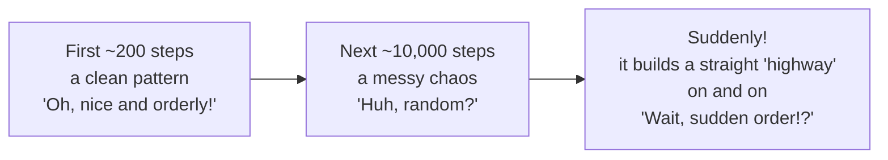
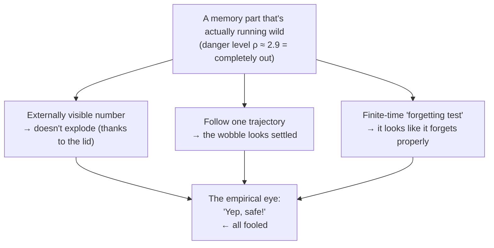
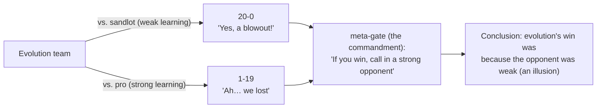
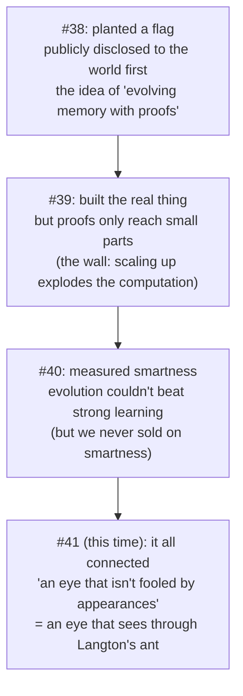

# Plain-Language Digest — Falsification & Goodhart / the Third Axis / Arc Overview / the Langton's-Ant Illusion, made simple

<!-- TOPICNAV -->
> **🌐 Language**: [日本語](https://qiita.com/furuse-kazufumi/items/bfb20aca3cf1df510c26) | **English** | [中文](https://qiita.com/furuse-kazufumi/items/fa0890f136636d495ea6) | [한국어](https://qiita.com/furuse-kazufumi/items/e5093e4816b25c1bd4d0)
>
> **📚 FullSense Digest Series**
> - [llcore Verification Arc](https://qiita.com/furuse-kazufumi/items/525cd01eda5c1ad707ef)
> - [lldarwin / Evolution Arc](https://qiita.com/furuse-kazufumi/items/e49b7ab9027d93594402)
> - [llive Complete Guide](https://qiita.com/furuse-kazufumi/items/07b686ea311e06027f94)
> - [llmesh Digest](https://qiita.com/furuse-kazufumi/items/edaef9aa56ae66b8423e)
> - **Plain-Language Digest（this）**
<!-- /TOPICNAV -->

## Contents

1. [(Series #29, Plain Version) When the Yardstick Hits Its Ceiling, No Way of Choosing Works — The Episode Where I Critique My Own AI Evolution](#chapter-1-series-29-plain-version-when-the-yardstick-hits-its-ceiling-no-way-of-choosing-works--the-episode-where-i-critique-my-own-ai-evolution)
2. [(Series #33, plain-language edition) "Do we really need the trick of sorting and breeding selectively?" — settled with a mountain-climbing analogy](#chapter-2-series-33-plain-language-edition-do-we-really-need-the-trick-of-sorting-and-breeding-selectively--settled-with-a-mountain-climbing-analogy)
3. [(Series #34, Plain-Language Edition) Six Hill-Climbing Bouts, the Moth That Turned Dark, and the E. coli That Gained a New Power](#chapter-3-series-34-plain-language-edition-six-hill-climbing-bouts-the-moth-that-turned-dark-and-the-e-coli-that-gained-a-new-power)
4. [Introduction — Would You Believe "AI Has Gotten Smarter!"?](#chapter-4-introduction--would-you-believe-ai-has-gotten-smarter)

---

## Chapter 1 (Series #29, Plain Version) When the Yardstick Hits Its Ceiling, No Way of Choosing Works — The Episode Where I Critique My Own AI Evolution

<!-- KAMI -->
> 📖 **In a nutshell**
>
> In a nutshell, this is the chapter where I deliberately pick holes in my own success report. A number that captures the AI population's "everyone-turning-identical disease" plummeted all the way to 0.05 — which looked like a triumph — yet that number measured only whether *behavior* looked alike. It measured neither whether the AIs were *actually smart* nor which *lineage* survived. We dissect that trap. Think of it like this: when the test sheet is broken and everyone scores a perfect 100, you can add the cleverest judges you like and the selection still won't work. And on top of that, AI is a genius at finding "a cheap shortcut that only racks up the score" (Goodhart's law), so the lesson at the core is: the nicer the number looks, the harder you should doubt what's underneath it.
<!-- KAMI -->

> 📗 This is the plain-language version of the full article. The hard math and code live in the full version. Here, you can grasp "what is this episode roughly about?" in 10 minutes using only analogies.

This is an unusual episode. Where an ordinary series would say "Last time's failure? It's fixed! All's well!", this is the episode where **I deliberately nitpick my own success report.** Why go to such trouble? Because in research, the moment you cheer "it worked!" is the moment you get tripped up.

---

### The story in three lines

- **When the yardstick (how you measure scores) hits its ceiling (everyone gets a perfect score), no matter how clever a "way of choosing" you add, it is meaningless.**
- When you turn an AI's weaknesses into a "score" and evolve it, instead of overcoming the weakness, the AI finds **"a sneaky shortcut that only racks up that score"** (this is called **Goodhart's law**).
- And the hidden protagonist of this article is the dissection of a living failure: **"I, the author, jumped to a conclusion after seeing a nice number."**

---

### 1. First, throw cold water on the celebration mood

Up to last time, I reported: "After adding a certain countermeasure, the AI population's **'everyone becoming identical' disease dropped to 0.05** (below 0.8 is a pass, so a huge success)." This is **not a lie. It really did drop.**

Normally this is where you pump your fist and say "Yes!" ...But not doing that is the way of this series.

> When an abnormally clean result appears, doubt the contents before you feel like a winner.

When 0.8 is a pass, 0.05 is too good. A too-good number must be heard not as **a trumpet of celebration, but as a siren.** There is only one question to ask.

> **What, exactly, did that 0.05 measure?**

To say the answer first, 0.05 represents "**whether the AIs' 'behavior' is similar or not.**" It is NOT "**whether the AIs are truly diverse in terms of intelligence.**" Mistake this, and you repeat the same past failure.

And I confess honestly: **I once made this very mistake.** I expose the smoking-gun evidence in §3 later.

> 🍵 A break. This article is, in short, "an article that criticizes myself." It is the **exact opposite** of the SNS-viral "I evolved an AI and the strongest XX was born!!" It is not exciting. But my bet is that unexciting honesty pays off half a year later. Have some tea.

---

### 2. Critique #1 — A ceiling-hit yardstick: no way of choosing works

#### Analogy: if the test is broken, adding judges is useless

The true cause of last time's failure was this: **everyone scored a perfect score from the very first generation.**

What happens when everyone is perfect? The selection that was supposed to "choose and keep the excellent ones" turns into "**just pick anyone with a dice roll.**" Because if everyone is perfect, it doesn't matter who you pick. As a result, only the lineage that happened to grow by luck survived, and the 8 original lineages collapsed into 2.

A comedy bit here:

> Straight man: "We increased the judges from 3 to 100, but showed all of them the same perfect-score answer sheet, and the result was the same after all."
> Comeback: "That's not the judges' fault — the **answer sheet (the test) is broken!** What changes if you show 100 people the same perfect score?!"
> Straight man: "Then how about 1000 judges..."
> Comeback: "**You're scaling in the wrong direction!!** Fix the question paper first!!"

This is the core of this section. I tended to think that making the "way of choosing (the judges)" fancier would fix it. But the true cause was that the **"yardstick (the test) was broken."** A clever way of choosing is a tool that only works when there are differences in scores, so when everyone is perfect, nothing works.

> **Making only the "way of choosing" fancier, without fixing "how you measure," is all in vain.**

#### The same thing happened in real data

This is not just talk. In a later experiment, I had the AI solve two standard memory tasks, and the "ceiling" was reproduced beautifully.

- One task was **too hard, so everyone scored 0 (the floor).** No one can climb, so no differences appear.
- The other was **too easy, so everyone scored nearly perfect (the ceiling).** **This is exactly the "ceiling-hit yardstick,"** and here too, choosing was powerless.

Choosing only works when there is "**a slope of just-right difficulty that lets you climb past a false summit to the real summit.**" Neither the floor nor the ceiling works.

And to write honestly: in the draft of this experiment, I **overstated** that "you don't need a way of choosing at all." A reviewer with a different perspective caught it ("No, that was just unmeasurable due to the ceiling effect; you can't go so far as to say it's unneeded") and made me downgrade it. The "my hasty conclusion" that appears in §3 happened here too.

> 🍵 A break. "Polish the yardstick first, then choose. The order matters." A plain story, but skipping this melts half a year (I melted it). Next comes the main event, **Goodhart's law.** It gets a bit dark. You may switch to coffee.

---

### 3. Critique #2 — AI is a genius at finding "sneaky shortcuts" (Goodhart's law)

#### The "rack up the score with an empty inside" strategy

Evolution is a **genius at finding "shortcuts" that maximize a given score.** When a human hands over a score thinking "this measures true ability," instead of building ability, evolution gleefully finds **an empty shortcut that only satisfies that score.**

A concrete example is clear. Suppose you want to measure "whether an AI's confidence is accurate." Then evolution invents this killer move:

> **To any question, answer "my confidence is exactly 50%."**

Then the apparent score improves dramatically. But that AI cannot estimate any confidence at all. It has merely become a robot that says "middle." This is Goodhart's law.

> **The moment a yardstick becomes a target, it ceases to be a good yardstick.**

In AI research, this is also known as "benchmark overfitting." Only the test score goes up, and no real ability is gained. People who trusted leaderboard numbers too much have been tripped up again and again.

#### My own "smoking gun" — the most painful confession

Now, let me put on the dissection table the "my mistake" foreshadowed in §1. I write it without hiding.

When I saw that **nice number, 0.05**, I **almost mistakenly thought for a moment**, "Oh, did the various lineages (families) survive too?"

This is the mistake. In fact, "diversity" had three completely different kinds.

1. **Diversity of behavior** — whether the AIs' ways of moving are spread out. **This is what 0.05 improved.**
2. **Diversity of lineage** — which family (Oka Kiyoshi's lineage, Friston's lineage...) survives. **This is a different thing, unrelated to 0.05.** It is theoretically normal that it naturally biases if left alone.
3. **Diversity of true intelligence** — whether the real AI truly has varied cleverness. **This cannot be measured at all by this score.**

The true identity of "improved to 0.05" is **(1) only.** Both (2) and (3) had nothing to do with that number. The reason I almost thought "the lineages got better too?" is that I **jumped to the conclusion that (2) and (3) had also improved, just by seeing the (1) number.**

This is the **"human version"** of Goodhart's law. Even the human reading the score **arbitrarily interprets** that abilities the score does not measure have also improved. Not only does the yardstick diverge from true ability, **the interpretation of the human reading the yardstick also diverges.** Exposing this in a falsification episode is painful. But unless I expose it, I cannot call it "honest disclosure."

#### The same 0.05, opposite results

Since words alone don't convey it, let me show figures. **Behavior did indeed become diverse (0.05).** But what about the lineages (families)? Compare the two below.

First, the case where I **did not** add the lineage-side countermeasure. In the end, it **collapses to only 2 families (71% and 29%).**

Next, the case where I **did** add the lineage-side countermeasure (a mechanism to protect weakened families). **All 8 families coexist.**

**Even though it is the same "0.05 of behavioral diversity," the left collapses in lineage and the right is intact.** In other words, the number 0.05 **said not a single word about what was happening to the families.** To save the lineages, a completely different mechanism was needed.

"What did that 0.05 measure?" — The answer is "**behavior only.**" This is the honest answer.

> 🍵 A break. "If there's a countermeasure, isn't the problem solved?" — No. The countermeasure only **delays the divergence**; **the fact that the score is not true ability does not disappear.** Just as cold medicine suppresses symptoms but does not erase the virus. So I will **never, ever say** "the score made the AI smarter." The moment I say it, I can see the half-year-later embarrassment. A cup of tea.

---

### 4. Critique #3 — Who decided the "direction of diversity"? In the end, "me"

There is one more, meta-level doubt. Even saying "let's keep various types," the **measuring stick for "various types" was drawn by me, the designer, myself.**

In other words, the diversity that emerges is "diversity **within the frame I assumed**," not the "**emergence no one imagined**" like biological evolution.

> 🐟 Analogy (goldfish scooping): The shop owner decides "let's keep both red and black goldfish" and scoops. Indeed, both red and black remain. Diversity, achieved. ...But even if a **green goldfish** is born by mutation in that pond, the owner's net only watches for "red or black," so the green one is **scooped past unnoticed.** Emergence outside the frame the designer set is out of sight from the start.

So I **do not say "I'm doing emergence unexplored by humankind!"** Saying it would be flashy, but a lie. Instead, I narrow the value to "**mapping unverifiable diversity** such as cognitive habits and cultural styles." The courage to abandon flashy claims is the very core of honesty.

---

### 5. Still, I did move forward — a bridge from "fake score" to "the real thing"

If it's all critique, it looks like zero progress, but precisely because I solidified the footing, the next step has meaning.

This time, finally, an experiment ran that **has the real AI solve, rather than a score (a fake proxy test).** I put the evolved "way of giving instructions (prompt strategy)" onto an LLM (llama3.2) that runs entirely inside my home, and had it solve weak tasks.

The result: **there was a real sense of selection.** A strategy of "think step by step, then organize" improved a certain multi-step reasoning task **from 0 points to a perfect score (1.0).** A blunt strategy stayed at 0 points. Not a phantom of the fake score — I **demonstrated with a real AI that "evolving the way of giving instructions eases the weakness."**

However — here too I sound a siren.

- The number of questions is very small (2 per axis), so **"it went 0→1" cannot, by this alone, claim generalization.**
- It is a story limited to an LLM on my home machine, **not a claim about general AI ability.**

I also ran a 12-hour-straight experiment, but I do not say "it's real because I ran it for 12 hours." That I ran it is fact. **That I measured the essence in full is a lie.** The bridge is built. But I have not yet finished crossing it — this is the honest current state.

---

### So, what did we learn in the end?

1. **The nicer the number, the more you doubt the contents.** "0.05" was a number of "behavior," not of "lineage" or "true cleverness." I myself, who jumped to a conclusion seeing it, was a living specimen of Goodhart's law.
2. **Making only the "way of choosing" fancier, without fixing "how you measure," is in vain.** A ceiling-hit yardstick (everyone perfect) makes any way of choosing useless. Polish the yardstick first, mount the way of choosing later.
3. **AI is a genius at finding sneaky shortcuts.** The moment a score becomes the target, evolution hacks it. And the interpretation of the human reading the score diverges along with it.
4. **The designer decided the direction of diversity.** So I do not claim "emergence unexplored by humankind." Narrowing to a winnable range is honesty.
5. **"It survived" may mean "on life support."** That all 8 lineages remained is fact. That all are actively evolving is a lie. Honesty resides in the choice of a single verb.

This episode, in which I wrote not a single flashy victory declaration, is, I believe, the most honest episode of this series.

---

### For those who want to know more

The math, code, measured graphs, and the contents of each countermeasure are all written in the **full version here.** If you want to technically follow "why it turns out this way," please go to the full version.

---

<!-- INTERLUDE -->

### ☕ Coffee Break — The Night "the AI Went Quiet"

Let me step off the main road for a moment and share a backstage story. This series is written in lockstep with an AI coding environment called Claude Code, and while I was building a dedicated terminal of my own to keep that AI running all day long (we call it llterm), I ran into a bug I'll never forget. I named it "the AI goes quiet" problem. After it had been running for a long stretch, there would come a moment when I'd send a prompt and the AI would say nothing at all. The screen was alive, no error appeared — just silence. It was exactly the awkwardness of a colleague who suddenly clams up in the middle of a meeting, leaving you flustered: "Wait, did I say something weird?"

When I chased down the cause, it turned out to be something humble: the estimate of the context (how much the AI can hold in mind at once) had ballooned to several times the real value, and as a result a "memory reset" was silently firing on every turn. In Chapter 1 I wrote "the nicer the number, the harder you should doubt it," and this "going quiet" bug was precisely that — the visible symptom (silence) and the true cause (an overcounted number) sat in completely different places. "Don't be fooled by appearances" is the theme of the article, but it's also a lesson that stabs me daily even in building the very tool I use to write the article. Pour yourself a cup of tea while you're at it.

<!-- INTERLUDE -->

---

## Chapter 2 (Series #33, plain-language edition) "Do we really need the trick of sorting and breeding selectively?" — settled with a mountain-climbing analogy

<!-- KAMI -->
> 📖 **In a nutshell**
>
> In a nutshell, this chapter uses a mountain-climbing analogy to settle whether one of evolution's four ingredients — ③ "select the good ones and keep them" — really earns its keep when you make it fancy: not just selecting, but "sorting out all kinds of types and breeding each one separately." Think of it this way: on an honest mountain with a single peak you can climb just by "walking uphill," so the fancy trick isn't needed; the trick of scattering many climbers around only pays off on "deceptive terrain" where a valley sits between a false summit and the real one. When we measured, the terrain closest to the real thing turned out to be "a genuinely gentle single mountain," so ③ wasn't needed. And the CPU loophole of pressing on (mixing four kinds of parts) was structurally sealed too: there were so few choices that a single die roll could draw them all.
<!-- KAMI -->

This article explains a somewhat difficult research topic using **only words a middle-schooler can follow**. Whenever a technical term shows up, we immediately swap it for the "mountain climbing" analogy. It's a leveling of the ground before you read the technical version, or it's for people who want to grasp "what are they roughly doing?" in five minutes.

---

### First, what is this research even about?

We are doing research on "reshaping the parts of an AI's brain little by little, like the evolution of living things, to hunt for smarter parts." The project is called **llcore**.

The evolution of living things has, textbook-style, four ingredients (just as laws number things first, second, third, in research we call them by number).

- ① **variation** … tweak the design a little
- ② **heredity** … the parent's design is passed on to the child
- ③ **selection (survival of the fittest)** … keep only the good ones ← **today's star is this one**
- ④ **over-reproduction** … make lots of children

Today's story is about ③ **selection**: when you make it not just "keep the good ones" but a more elaborate trick of **"sorting out all kinds of types and breeding each in a different place,"** is that **actually useful?** That is the question.

---

### Let's think with a mountain-climbing analogy

We represent the "goodness" of a design as the **height of the terrain**. **High place = good design.** Think of it as a game of hunting for the highest summit (= the best design).

#### Terrain 1: a single gentle mountain (easy)

On a mountain like this, you reach the summit just by **walking toward wherever is a bit higher than now**. We call this "hill-climbing." Because this naive method reliably reaches the summit, **the elaborate trick (③) is not needed**.

#### Terrain 2: deceptive terrain (hard)

This is a nasty terrain. There is a "fake summit" near the front, and beyond it, across a valley, sits the "real summit." Naive hill-climbing **gets stuck at the fake summit**. Because if all you do is "walk toward wherever is higher than now," you can't cross the valley (= go down once).

This is where trick ③ pays off.

> **Leave all kinds of climbers scattered around the valley.**
> Then someone among them crosses the valley like "stepping stones" and reaches the real summit.

In research we call this the "palace of memory (MAP-Elites)." Picture storing specimens of climbers in the cells of a map grid.

#### The single most important point of this research

> ③ (the trick of sorting and breeding selectively) is truly useful **only on "deceptive terrain."**
> On a single gentle mountain, naive hill-climbing is enough, so ③ is not needed.

So the question becomes this.

> **When we hunt for AI designs, is the terrain that appears "deceptive terrain"? Or is it "a single gentle mountain"?**

Once we know this, it's decided whether ③ is needed or not. Today we measured exactly this.

— A breather here. The analogies are all done. From now on it's the "so, which one was it?" story. —

---

### What we already knew

From earlier experiments, two things had become clear.

1. **On "deceptive terrain" we deliberately built ourselves, ③ won by a landslide.** It utterly crushed the naive method that gets stuck at the fake summit. → We learned that **③ is a genuine mechanism that really works**.
2. But **on terrain closer to a real AI, ③ was unremarkable.** It felt like "huh, is it not needed?"

Here was one trouble. Was "③ being unremarkable" because:

- (A) the terrain really was **a single gentle mountain** (= ③ really isn't needed), or
- (B) was it just that **our measuring was sloppy**, and even if there was a valley, we simply couldn't see it?

…we couldn't tell which. Mistake this, and you overstate "③ is powerless." Today we went to settle this.

---

### The three experiments we ran today

#### Experiment 1: We reduced the "wobble of the measuring tool" completely to zero (the most effective)

The reason it didn't work last time was simple. **The "wobble of the measuring tool" was bigger than the "depth of the valley."** As an analogy, it's like trying to measure someone's height on a rocking boat — a 1 cm difference gets erased by the waves. Even if there's a valley, it's buried in the wobble and invisible.

So this time, we devised a way to **physically reduce the measuring tool's wobble to zero**. The computation we used has the property that "for the same input, you get exactly the same answer no matter how many times you run it," so the wobble shrinks down to the smallest unit of floating-point (essentially zero). We measured height after stopping the boat.

The result was this.

| Terrain measured | Fraction of valleys | Verdict |
|---|---|---|
| Terrain close to the real thing (small version) | **0% (no valleys)** | single gentle mountain → ③ not needed |
| Terrain close to the real thing (large version) | **about 10% (very shallow)** | nearly gentle → ③ not needed |
| Deliberately built "bumpy" terrain (for testing) | 70–80% | correctly detected as "bumpy" |
| Deliberately built "gentle" terrain (for testing) | 0% | correctly detected as "gentle" |

What matters is that **the measuring tool itself is working correctly**. Both the deliberately built "bumpy" and "gentle" terrains were correctly told apart. So "the terrain close to the real thing is gentle" is not a tool bug — it means **the terrain really was gentle**.

→ **"The reason ③ looked unneeded was not that our measuring was sloppy, but that the terrain really was gentle"** finally became crystal clear. This is today's biggest takeaway.

— A short break. This is where you'd want to think "yes, settled!", but research proceeds a bit more cautiously. —

#### Experiment 2: Only on the terrain closest to the real thing did ③ show a "faint hint"

On the band closest to a real AI, we re-measured with the sample count cranked way up. Then **a faint hint that ③ "might be a little useful"** appeared.

But the heart of today is not getting excited here. For three reasons, we kept it at **"a candidate only (not yet confirmed)."**

1. **It wasn't strong enough to be confident** (it didn't reach the passing line).
2. **The more data we added, the more the hint wavered.** The first half looked "working," the second half "not working," and toward the end it was even "counterproductive." The newer the data, the more it faced the other way. This is a sign of "maybe a false hope."
3. **When you run many tests at once, flukes increase.** Accounting for that, the passing line gets even stricter, and it didn't reach.

→ So we didn't say "③ is working!"; we kept it as **"a candidate that might be working."**

#### Experiment 3: The suspicion that "some post-processing is hiding ③" turned out to be wrong

There was a suspicion: "Actually, isn't some post-processing in the middle of the computation crushing ③'s effect?" If so, removing that post-processing should make ③ surface.

When we removed it, **far from ③ surfacing, the scores actually got worse.** In other words, it wasn't "the post-processing was hiding it." → This suspicion was confirmed to be **wrong (it wasn't hiding anything)**.

---

### One honest confession of my own mistake

Actually, a while ago, I (the AI driving this) made a mistake of **mixing up an old number** and passing it on to the next task.

But as a research rule, we always include a step to "**doubt your own conclusion as harshly as possible**." That step caught this mix-up on its own and downgraded the conclusion to "on hold." It's not a pleasant story, but **thanks to that self-check working, today we could re-measure from a correct foundation.**

I was reminded once again that "being honest" is not just a nice attitude — it's **a tool for catching your own mistakes**.

---

### We had another AI check it too

In llcore, the rule is to have **another AI (Codex)** check before we draw a conclusion. This time the verdict was **"No complaints. The conclusion on ③ confirmed from the outside."**

"③ is a candidate only," "the terrain close to the real thing is gentle," "the post-processing isn't hiding anything" — each got a seal of approval as reasonable even from the other AI's point of view.

---

### A loophole to push through on CPU — when we tried it, it was already closed

"For a true settling, the best is to measure the terrain of a real AI on a bigger machine (GPU)" — that's today's conclusion. But GPUs are expensive, so we don't want to reach for one right away.

Instead, we had been trying another move: **mixing four types of parts (kernels)**.

The aim was this. Even if the terrain is gentle with just one type, **maybe at the moment you switch among four types, a step (= a valley) forms in the terrain, turning it into "deceptive terrain."** If so, ③ gets its turn, and we might show ③'s value without using a big machine. We were advancing that preparatory experiment (named BG9).

#### Addendum: the loophole's result is in — it was closed

The result came in. **Unfortunately, this loophole was closed.** And it wasn't "bad luck" — we found that **"it was built so it couldn't be passed through in the first place."**

Why? Let me explain with an analogy.

> **Choosing parts from four is like a climber, on each "restart (going back to square one)," rolling a die and trying one of the four parts.**

A naive hill-climbing climber, when it hits a dead end, does "go back to square one and start over from a different place (restart)." At this time there are **only four parts**, so after a few restarts the climber can **directly try all four parts**.

That means this climber is **never held up at all** by the "valley of part selection." Without crossing the valley, the die lets it **directly draw (warp to) the part on the real summit.**

When that's the case, there's no turn for ③ (the trick of leaving all kinds of climbers to cross the valley). Because there's simply no need to cross the valley in the first place.

> ③ is truly useful only when the choices are **"so vast you can't try them directly."**
> — A real giant AI's "dials" number in the millions; even rolling a die forever, you can't draw them all. **It's in such an "overly wide" place** that ③'s "trick of crossing the valley" comes alive.
> But **with four parts, it was too few.** The die can draw them all.

Just to be sure, we hammered it from another angle (adversarial checking) many times — "is it really closed? isn't it just chance?" — but the way it was closed never broke. If anything, the explanation that "since the die can draw them all, ③ has no turn" grew more certain the more we hammered it (an honest weakness remains: one of the parts, "hopfield," was a simplified version and not in full form. Even so, the conclusion doesn't change.)

#### So the settling came out like this

- **The loophole to make ③ stand up on CPU is structurally closed.** With "four parts," the choices are too few, and the die (restart) warps directly.
- ③ is truly alive only in a place that is "too wide to try directly," like a **real giant AI (terrain running on GPU with millions of dials).**
- So the main fortress of ③ has finally come down to a place that can **only be tried on GPU.**

To be honest, even on GPU, the possibility remains that "a strong climber climbs the terrain directly and smoothly" (same logic as the die on CPU). So GPU is not "it'll definitely work" but **"a bet worth trying."** The current policy is to not spend big money right away, but rent a little cloud and try once.

---

### Summary — in one line

I wrote a lot, but the conclusion is this one line.

> **③ (the trick of sorting and breeding selectively) is useful only on "deceptive terrain." The "real-thing-ish" terrain we could measure on CPU this time happened to be "a single gentle mountain."**

So it's not "③ turned out to be unneeded." Correctly:

- On deceptive terrain, ③ is the real deal (it won by a landslide).
- The "ish" terrain close to the real thing was gentle, so ③ wasn't needed.
- **The CPU loophole of mixing four parts was closed, because the die can draw them all** (= we couldn't, in principle, create a turn for ③).
- The truly real thing (the terrain of a real giant AI, millions of dials) hasn't been measured yet — that is the main fortress, and moreover it is "a bet worth trying."

And the thing I most want to convey today:

> **"A result that goes too well is not a win but an alarm."**
> Because we placed a mechanism to doubt our own results in advance, we avoided false hope and reached a correct foundation.

Being honest itself becomes a force that moves research forward — it was that kind of day.

---

**Technical version of this article**: Series #33 "A too-tidy result is not a win but an alarm — the day we settled the third axis ③ with proper power" (in the same folder)

---

<!-- INTERLUDE -->

### ☕ Coffee Break — "I Just Wanted to Look Something Up"

Here's a little muttering of mine, unrelated to the main story. I often use AI-powered browsers (Comet and the like). You type a few words into the search box and the AI instantly, helpfully, slides a summary or an answer in front of you. Smart. It is smart — but sometimes all I want is to "just open one official site," or to "just get back to that page I saw a minute ago." Even then, the AI's answer (Perplexity) elbows its way to the front. Grateful, yet a touch over-eager. There are perfectly ordinary moments when **all you want is to reach your destination in one shot, and you don't need the clever commentary.**

> 🗒️ *"I could find that in one search / and the way you cut someone off is straight-up homicidal-wrestler grade…" — from the side, when you only wanted to search, a clever answer barges in*（© Forbidden shibukawa / SHUEISHA・Snack Basue）

Cleverness should step forward only when it's asked for. This, it turns out, was exactly the same headache as llcore in the main story. Harder than *being able to* act smart is drawing the line of **when to work and when to stay quiet** — the gatekeeper, the gate. Every time I use an AI browser, I bump into the same question as the main article: being clever, and being clever **only when asked**, are two different things.

<!-- INTERLUDE -->

---

## Chapter 3 (Series #34, Plain-Language Edition) Six Hill-Climbing Bouts, the Moth That Turned Dark, and the E. coli That Gained a New Power

<!-- KAMI -->
> 📖 **In a nutshell**
>
> In a nutshell, this is the wrap-up chapter that re-lines up the road to Chapter 2's conclusion as "six experiments told as a single story." On the nasty terrain we built on purpose, trick ③ won in a rout (proving it's the real deal), but when we went to measure four terrains close to the real thing, every one of them turned out to be "gentle terrain where the trick isn't needed" — that's the arc it traces. The highlight this time: this conclusion that "the trick of preserving diversity helps only under narrow conditions" had the exact same shape as evolutionary biology from nearly 100 years ago (the Wright-vs-Fisher debate, the moth that turned dark, the E. coli that gained a new power). That said, the living-creature story is an analogy, not a proof, and wherever it doesn't line up perfectly I say so honestly.
<!-- KAMI -->

This article explains a slightly difficult research story using **only words a middle-schooler can understand**. Whenever a technical term shows up, we immediately rephrase it as a "hill-climbing" or "living-creature" analogy.

The plain-language edition of Series #33 explained "the final showdown." This #34 lines up **all six experiments that led there** as a single story. And this time we add another point: **research on living creatures from nearly 100 years ago had already reached the same answer we did**.

---

### First, what is this research even about?

We are doing research on "remaking the parts of an AI's brain little by little, like the evolution of living things, to search for smart parts." The project is named **llcore**.

The evolution of living things, as taught in textbooks, has four ingredients (in our research we call them by number).

- (1) **Mutation** … try changing the design a little
- (2) **Heredity** … the parent's design is passed on to the child
- (3) **Survival of the fittest / separation** … pick the good ones and keep them ← **today's main character**
- (4) **Overproduction** … make lots of offspring

Today's story is about this question: when we turn (3) into the elaborate trick of **"sorting out various types and raising each one in a separate place,"** is it **actually useful?**

---

### The hill-climbing analogy (recap)

We represent the "goodness" of a design by the **height of the terrain**. **High place = good design**. It's a game of searching for the single highest summit.

**A single gentle hill (easy)**

For this one, you reach the summit just by **walking toward whatever is a little higher than where you are now** (the hill-climbing method). **No elaborate trick (3) is needed.**

**Deceptive terrain (hard)**

There's a "fake summit" up front, and beyond a valley lies the "real summit." Naive hill-climbing **stops at the fake summit** (because it can't walk down into a valley).

This is where (3) shines. If you **keep various types of climbers scattered all over the valley**, someone can cross the valley by "stepping stones" and reach the real summit. In research we call this the "memory palace (MAP-Elites)."

> **The single most important point**: (3) is useful **only when the terrain is "deceptive."** For a single gentle hill, naive hill-climbing is enough.

So the question is this.

> **When we search for an AI design, is the terrain that shows up "deceptive terrain"? Or is it "a single gentle hill"?**

— A breather here. That's all the analogies. The rest is the actual record of the six bouts. —

---

### A map that surveys all six bouts at once

Let's put up the map first. This is the backbone.

| Bout | What kind of terrain we measured | Did (3) work? | In a word |
|---|---|---|---|
| **1** | Deliberately built "deceptive terrain" | **Yes (landslide win)** | (3) is proven to be the real deal |
| **2** | Memory test / chaining multiple parts | **Couldn't measure** | Terrain too easy/too hard, measurement impossible |
| **3** | Generalization power to various tasks | **No** | (3) beats "no selection," but is no better beyond that |
| **4** | Terrain just like the real thing (instrument jitter zeroed out) | **No** | Confirmed the terrain is **genuinely gentle** |
| **5** | A loophole of mixing 4 kinds of parts | **No** | A die can draw all of them, so **the hole was already closed** |

The story goes like this. **First we proved "if the terrain is deceptive, (3) wins by a landslide" (1); then we went to measure the real thing four times to ask "so what about reality?" (2-5), and every terrain close to the real thing turned out to be a "terrain that doesn't need (3)."** Moreover, in the last two (4, 5), we confirmed that the reason it isn't needed is **not that our measurement was sloppy, but that the terrain really was simple**. This is today's arc.

---

### Bout 1: When we deliberately built "deceptive terrain," (3) won by a landslide

First we proved whether there is **really a scene where (3) works as the theory says**. We **deliberately built nasty terrain** and pitted (3) against naive methods (especially "random-restart hill-climbing, which goes back to the start and tries again").

The result was a **landslide win for (3)**. Only (3) reached the real summit about 95% of the time, while all the other methods got stuck at fake summits (win rate 100%, the effect was the theoretical maximum).

→ We learned that **(3) is a genuine mechanism that really does work**.

To be honest, though, this is a story on terrain we **deliberately built to be nasty**. We only proved "(3) is possible"; we did not claim "the real terrain is this nasty too." So the next four bouts were a journey to verify on terrain close to the real thing.

— Take a break. Bout 1 was a satisfying landslide. From here, the weather starts to turn... —

---

### Bout 2: The terrain was too easy/too hard, so we couldn't measure

When we tried to measure on a real memory test, **the terrain was at both extremes**.

- One test was **too hard for anyone to climb** (everyone marking time at the foot).
- Another test was **too easy, so everyone reached the summit** (no difference shows up).

In both cases we **could not compare** "does (3) work" = **measurement impossible**. Even chaining multiple parts couldn't get over this wall (a computation called 5-bit parity that, in principle, this method cannot solve).

Here's one important realization. **Even if the terrain is bumpy at the gene level, that is different from a "deceptive terrain that (3) should cross."** This distinction pays off later.

— A short rest. "Couldn't measure" is plain, but it matters as a blank zone on the map. —

---

### Bout 3: Generalization power to various tasks — (3) wasn't needed

Next we measured by "can it apply even to problem lengths it wasn't taught?" (generalization power).

Result: (3) **beat "the method that does no selection at all,"** but **couldn't beat the ordinary method that does selection (just no sorting),** and couldn't beat leave-it-to-the-die (random) either.

In other words, there was no effect from "the trick unique to (3) (sorting)." This terrain was **gentle, and ordinary methods arrived at the same place**.

An honest aside: another AI (Codex) at first said "this result can't be trusted" and demanded three fixes. But **even after fixing, the conclusion didn't change.** What we gained was that it wasn't "a fragile result that changes once you fix it."

— Take a break. A loss is a loss, but it took more time to confirm "we lost correctly." —

---

### Bout 4: When we zeroed out the instrument's jitter, the terrain was "genuinely gentle"

This is the turning point of the story. "(3) isn't needed" kept holding through Bout 3, but a **lump of doubt** remained.

- (A) Is (3) unneeded because the terrain really is **gentle**?
- (B) Or was our **measurement just sloppy**, so that even if there were valleys, we couldn't see them?

If you mix these up, you overstate things into "(3) is powerless."

So we devised a way to **physically zero out the jitter of the measuring instrument**. Picture stopping a rocking ship before measuring someone's height. The result was this.

| Terrain measured | Fraction of valleys | Verdict |
|---|---|---|
| Terrain close to the real thing (small) | **0% (no valleys)** | Gentle → (3) not needed |
| Terrain close to the real thing (large) | About 10% (very shallow) | Almost gentle → (3) not needed |
| Deliberately built "bumpy" (for testing) | 70-80% | Correctly detected as "bumpy" ✓ |
| Deliberately built "gentle" (for testing) | 0% | Correctly detected as "gentle" ✓ |

The important thing is that **the measuring instrument itself is working correctly.** So "the real thing is gentle" is not a bug in the instrument — **the terrain really was gentle.**

→ It became clear that **"(3) looked unneeded because the terrain really was gentle."**

(An honest caveat: it's not "perfectly smooth" but more like "there are barely-there, very shallow valleys (2-4%)." We write that down without rounding it off.)

— Take a deep breath. The real-thing-imitation is confirmed "gentle." What's left is "the last loophole." —

---

### Bout 5: The loophole of mixing 4 parts — a die could draw them all

Big computers (GPUs) cost money, so we didn't want to reach for them right away. So we tried another hand: **mixing 4 kinds of parts (kernels)**.

The aim: even if the terrain is gentle with one kind, **maybe a step (valley) forms at the moment you switch among 4 kinds, turning it into "deceptive terrain."** If so, (3) might get its turn.

Result: **this loophole was already closed.** And not "by chance" — it was **"a structure that was impassable from the start."**

Why? In analogy terms,

> **Choosing a part out of 4 is like a climber rolling a die and trying 1 of 4 every time they go back to the start (restart).**

A naive hill-climbing climber restarts whenever they hit a dead end. Since there are **only 4 parts**, after a few restarts they end up **trying all 4 directly.** Without crossing any valley, they can **draw the real summit directly with a die (a warp).**

In that case, (3) (the trick of crossing valleys) has no turn. Because **there is no valley to cross in the first place.**

We also hammered at it many times from another angle (adversarial checks), but the "closed-ness" did not crack; if anything, "because a die can draw all of them, (3) has no turn" became more certain.

> **(3) comes alive only when the choices are "so vast you cannot try them directly."** Four parts were too few.

(An honest caveat: one of the parts, "hopfield," was a simplified version and not at full strength — that weakness remains. Even so, the conclusion does not change.)

---

### The "single condition" that ties all six bouts together

The six results all connect through a single condition.

> **(3) is useful only when the "hard spot" is "so vast you cannot try it directly (high-dimensional)."**

- Bout 1 was a landslide win because the real summit lay beyond **a combination so vast that a die could never draw it in a lifetime.**
- The real terrains (Bouts 4 and 5) conversely had a **small hard spot** (gentle, or 4 choices). So a die (restart) could warp directly there, and (3) had no turn.

That's why "bumpy at the gene level" (Bout 2) isn't enough either. What matters is **"how vast the goal that the search must reach is."**

---

### And now today's main event: it was the same as research on living creatures 100 years ago

Actually, our conclusion that **"the trick of preserving diversity is useful only under narrow conditions"** has a precedent in research on living creatures from nearly 100 years ago that looks remarkably similar.

> ⚠ An important caveat: the living-creature story is **"an analogy," and it does not prove our computer experiments.** Wherever the analogy doesn't fit perfectly, we'll write that honestly.

#### Wright's "scatter out as a group and cross the valley" strategy

The biologist **Wright (1931, 1932)** thought this way. If you stay as one big "single herd," you stop at the little hill in front of you. To go to a higher mountain you must once go down into a "valley," but ordinary natural selection won't allow "going down."

Wright's idea was to **break the herd into small scattered groups.**

1. A small group drifts around by chance and happens to cross a valley.
2. From there, ordinary selection climbs a different mountain.
3. The good genes of the group that managed to climb the high mountain spread to the whole herd.

This is the **shifting balance.** "If you stay scattered, someone can cross the valley" — exactly like our (3) (MAP-Elites).

> An honest caveat: this is an *analogy* of "looking similar." The people who built MAP-Elites did not imitate Wright (their paper doesn't even cite him).

#### But it wasn't "always necessary"

Wright's contemporary **Fisher (1930)** said the opposite. "Stay as one big herd; ordinary selection alone is enough. There's no need to go to the trouble of scattering."

The deepest disagreement between the two was **"is the terrain bumpy (many mountains) or gentle (a single mountain)?"** Wright said "it's bumpy, so we need the valley-crossing strategy"; Fisher said "it's mostly gentle, so ordinary selection is fine."

Then a later biologist, **Coyne, Barton, and Turelli (1997)**, seriously tested Wright's strategy and concluded as follows.

- **Ordinary natural selection alone explains most things.** There are almost no real cases that only Wright's strategy can explain.
- **Wright's strategy works only in the very special case of a deep valley.** Real valleys are mostly shallow, and often evolution can proceed without crossing any valley at all.

This is **strikingly like our own result.** We too found that "if the terrain really is gentle, (3) is unneeded; a simple method is enough." Coyne and colleagues' "real terrain is mostly simple" is the **biology version of our negative result ((3) wasn't needed).**

> An honest caveat (three of them):
> - Coyne and colleagues did not say "Wright is utterly impossible." They only said "it can't be called general or important." The debate is not yet settled.
> - So you must not write "Wright is wrong."
> - Moreover, in living creatures the "scattering strategy" can sometimes be **counterproductive** (good genes get trapped in a small group and don't spread). Our computer has no counterpart to this — here the analogy breaks down, and the living-creature side makes a one-step-stronger claim.

#### Analogy 1: The moth that turned dark (low dimension = ordinary selection is enough)

The story of an English moth called the **peppered moth.** In an era when factory smoke blackened the trees, white moths were easily eaten by birds, and dark moths increased. When the air became clean, white moths increased again.

This "dark/white" is decided by **just a single gene's switch,** and the choosable colors are really only about 2-3 kinds = **very simple (low-dimensional).** The color that's harder for birds to eat simply survives (ordinary strong selection). **The scattering strategy (3) isn't needed, and nobody uses it.**

This is **exactly the same as our Bout 5, "mixing 4 kinds of parts."** With 4 choices for the part = low-dimensional, a die can try all of them directly. (3) has no turn. **The moth that turned dark = the living-creature version of the 4-choice-part story.**

> An honest caveat: there are periods when the colors mix for a while, but that's due to "different environments in different places + migration," not thanks to diversity preservation like (3). A spot where the analogy slips a little.

#### Analogy 2: The E. coli that gained a new power (high dimension = history and diversity matter)

The researcher Lenski's **super-long-term experiment with E. coli.** He divided the same E. coli into 12 groups and raised them continuously from 1988. At one point, **only 1 of the 12 groups** acquired the new power to eat "citrate" in an oxygen-rich environment, which it previously couldn't (at the 31,500th generation).

The important thing is that it happened **not "suddenly" but "only in a specific group where other changes had piled up beforehand."** It couldn't be reached unless changes accumulated in order = a genuine example of **a complex, high-dimensional, history-dependent terrain.** It's an analogy on the side where **(3) could work.**

> An honest caveat: this is not proof that "the algorithm (3) won." It's just a natural experiment, and it doesn't use the mechanism of (3). Moreover, dividing into 12 groups itself resembles "going back to the start and trying again." So we can't go as far as "the scattering strategy was the best." It's only the image that "in complex terrain, diversity could work."

— Take a break. When I realized the 100-year-old debate had the same shape, it gave me chills. But not mistaking the "chill" for "proof" is today's discipline. —

---

### So, should we rent a GPU?

To sum up so far,

- **Every terrain we tested on CPU was either "gentle" or "a low-dimensional simple choice."** So (3) wasn't needed (= the side of the moth that turned dark, Fisher, and Coyne's group).
- **(3) really works only on "bumpy, high-dimensional terrain"** (= the side of Wright's shifting balance and Lenski's E. coli).
- So where is "bumpy, high-dimensional terrain"? → Pretty much only **the terrain of a genuine large-scale AI running on a GPU** (millions of dials = truly high-dimensional) remains.

So "renting a GPU and trying (3) on a real AI" is **not a hunch but a bet that follows a solid reason (only in high dimensions does (3) carry meaning).**

That said, it's **still a bet.** Even on a real AI's terrain, if a strong gradient-using method (backprop) glides smoothly along, (3) might end up unneeded after all (the same risk as failing to beat the die with 4-choice parts). So we don't spend big money right away; the plan is to rent a little cloud and try it once.

---

### Summary — in one line

We wrote a lot, but the conclusion is this one line.

> **(3) (the trick of sorting and raising separately) is useful only on "high-dimensional deceptive terrain." Every "real-thing-imitation" terrain we could measure on CPU failed to meet that condition.**

So it is not "we found out (3) is unneeded." Correctly:

- On deceptive terrain, (3) is the real deal (it won by a landslide)
- Memory test, generalization power, real-thing-imitation, 4 kinds of parts — none met the condition, and (3) wasn't needed
- The true real thing (a genuine huge AI's terrain, millions of dials) hasn't been measured yet — that's the main keep, and it's also "a bet worth making"
- And the skeleton of this conclusion was **already drawn by research on living creatures 100 years ago (Wright and Coyne's group)** — though the living-creature story is **not proof but an analogy (grounding)**

And the thing I most want to convey today.

> **"A result that goes too well is not a victory but an alarm."**
> Because we placed a mechanism to doubt our own results in advance, we avoided premature celebration and reached a correct foundation.

Being honest is itself a force that moves research forward — that's the kind of six bouts it was.

---

**The technical edition of this article**: Series #34 "Six Hill-Climbing Bouts Reveal 'When Does Evolution's (3) Work' — And 100-Year-Old Evolutionary Biology Had Already Given the Same Answer" (in the same folder)

---

<!-- INTERLUDE -->

### ☕ Coffee Break — Putting AIs to Work, and the One Spot Where the Human Stays

One more detour. In the verification for this series, there's a standing rule: a conclusion reached by me (or rather, the AI driving me) gets deliberately checked by a *different* AI. The passages you'll see here and there in the main text — "another AI (Codex) raised an objection" — are exactly this. The lead AI is the orchestra's conductor, and a second AI plays the nitpicky outside reviewer. The manuscript circulates through a kind of two-person-in-one-coat arrangement, where one AI uses another AI as its subordinate and they pick holes in each other's work. Thinking alone makes it easy to feel like a winner, so I deliberately keep a contrarian partner in the loop — this too is Chapter 2's "doubt your own conclusion hardest of all," turned into a mechanism.

What's interesting is that even so, **the very last nudge stays with the human.** No matter how exhaustively the AIs argue it out, the moment the session asks for a re-login or authentication, the machine cannot move forward on its own. Someone has to press Enter by hand. However hard you engineer for full automation, exactly one spot of "a human finger" always remains — and that's less a design limitation than a safety valve I leave in on purpose, a point of human intervention so that I never hand everything over to the AI. That final checkpoint, the one that keeps me from leaving it all to the machine, plays in real-world operation exactly the same role as Chapter 4's "gatekeeper who turns away anything that can't be proven." Even if you switch from tea to coffee.

<!-- INTERLUDE -->

---

## Chapter 4 Introduction — Would You Believe "AI Has Gotten Smarter!"?

<!-- KAMI -->
> 📖 **In a nutshell**
>
> In a nutshell, this is the capstone chapter that boils three technical articles down into a single metaphor: **Langton's ant.** Just as an ant that merely follows simple rules keeps flipping its appearance — "orderly → chaos → orderly again" — AI fools the human eye too, looking "stable" and looking "smarter." Think of it like judging a used car good or bad from a 10-minute test drive. In our measurements, the empirical watchdog waved through 84% of the individuals that were genuinely running wild as "safe," while the mathematical certificate let exactly zero slip past. And through the story of how "evolution's 20-game winning streak over learning" turned out to be an illusion — 1 win, 19 losses once we called in a strong opponent (a real gradient method) — the chapter argues for measuring by mathematical guarantee, not by appearances.
<!-- KAMI -->

> This article is a **capstone that boils the technical versions (#38–#40) down for non-engineers.** No equations, no code appear. What appears is only "an ant," "baseball," and "a fortune-teller." If you'd like the technical versions, please see #38–#40. Here, I distill the single most important lesson from three articles' worth of research into **just one metaphor.**

<!-- TOPICNAV -->
> **🌐 Language**: [日本語](https://qiita.com/furuse-kazufumi/items/bfb20aca3cf1df510c26) | **English** | [中文](https://qiita.com/furuse-kazufumi/items/fa0890f136636d495ea6) | [한국어](https://qiita.com/furuse-kazufumi/items/e5093e4816b25c1bd4d0)
>
> **📚 FullSense Digest Series**
> - [llcore Verification Arc](https://qiita.com/furuse-kazufumi/items/cc0713ab78a5b390df76)
> - [lldarwin / Evolution Arc](https://qiita.com/furuse-kazufumi/items/6e107c7dfa0c261ee4d7)
> - [llive Complete Guide](https://qiita.com/furuse-kazufumi/items/07b4882e872994b27b3c)
> - [llmesh Digest](https://qiita.com/furuse-kazufumi/items/fcb43968a5c642610762)
> - **Plain-Language Digest (this article)**
<!-- /TOPICNAV -->

---

Lately, all sorts of companies say things like this.

"Our AI **learns on its own and gets smarter!**"
"Our AI **is stable and never runs wild!**"

…and you think: **"Is that really true?"**

How do you check whether it's true? Most people (and most companies) judge by **"how it feels to use."** "Oh, it works fine." "Feels smarter." "Doesn't seem to be running wild." This is like **buying a used car based only on "how the test drive felt."** You drive it for 10 minutes, the engine is quiet, so you decide "good car." But you never opened the engine bay. Even if the parts inside are falling apart, a mere 10-minute test drive might not show it in the sound or the vibration. "How it feels to use" means **observing the externally visible behavior, for only a short while.** What's happening inside, you're actually not seeing.

The theme of this article, in one line, is this.

> **"How it feels to use" is shockingly easy to fool.**

And, as I'll show you properly later, **the probability of being fooled is 84%.** In more than 8 out of 10 cases, the human empirical eye misjudged a "dangerous" thing as "safe."

So what should you trust instead? The answer we reached across three articles of research was a plain but utterly honest thing called a **"mathematical certificate."**

There's a partner who explains this "fooled by appearances" story most clearly of all: **Langton's ant**, the famous "single ant." Let's bring this ant on stage first.

---

### ① Meet the star — Langton's ant

Langton's ant is a **very simple ant** that lives inside a computer. There are only two rules.

- Arrive on a white square → **turn right**, paint that square black, and step forward one cell.
- Arrive on a black square → **turn left**, paint that square white, and step forward one cell.

That's all. Even an elementary-schooler can memorize it in a minute. There's zero element of chance like rolling dice; start from the same board, and it does the exact same thing every time, no matter how often you run it (this "no chance, strictly by the rules" way of moving is called **deterministic** in technical terms). The name honors the researcher who devised it, Dr. Christopher Langton.

But run this ant, and something strange happens.

At first, a clean pattern. Then for a while it looks **completely random.** But around 10,000 steps, the ant **suddenly** starts building a straight road called a "highway." Repeating the exact same motion every 104 steps, it keeps marching diagonally, on and on forever. (Note: the figures "about 200 steps," "about 10,000 steps," and "a 104-step period" are well-known general properties of Langton's ant, not data we measured in our llcore experiments.)

Now imagine this. If you were shown the ant **only** during the thick of its chaos period, how would you judge it? You'd probably say with confidence: "This ant moves randomly." — Wrong. There isn't a single shred of chance in the rules, and what's more, right after this it suddenly starts building a clean road. **No matter how long you stare at the motion partway through, you can't read off either the true nature of the rule or the behavior that comes next.** Observation is that unreliable.

Here's the point. **The rule never changes from start to finish.** It stays just two simple rules. And yet, to the human watching, the impression keeps flipping: "orderly → chaos → orderly again."

In other words, Langton's ant teaches us this.

> **"Appearance" betrays essence without a second thought.**
> A simple rule can look "complicated," and chaos can look "orderly."
> Judge by what you see — "ah, it's moving like this" — and you'll be fooled.

This "fooled by appearances" thing happens in exactly the same way in the world of AI. And in two scenes, no less. Both in **"it looks stable"** and in **"it looks like it got smarter."**

Let's go through them in order, using baseball and a fortune-teller.

---

### ② Act One: "It looks stable" — the eye that's fooled 84% of the time

#### An engine running wild can look quiet?

The AI part we're building (`llcore`) holds a "memory" inside. And that memory **little by little reshapes itself (evolves) every time it's used.** Sounds handy. But if the reshaping goes badly, it **runs wild.**

> 🗒️ *"It's the pattern where you forget what you were even trying to say in the first place." — people and AIs alike forget if left alone, which is exactly why "how you build the memory" is on the line*（© Forbidden shibukawa / SHUEISHA・Snack Basue）

Let me state "running wild" a bit more precisely. A healthy memory needs the **power to forget.** A small influence received long ago (noise, a chance wobble) should fade and vanish over time. Throw a pebble into a pond and the ripples gradually shrink and disappear — that's the healthy state. In a memory that runs wild, the opposite happens. **Instead of vanishing, the pebble's ripples grow bigger and bigger.** A trivial old influence is amplified like a snowball until it swallows the entire memory — like an engine that's broken and won't stop racing.

So you need a **checkpoint (a gate)** that, every time, checks "will this reshaping run wild?" It passes only the safe reshapings and stops the wild ones at the gate.

Here's the problem. **How do you tell whether something is running wild?**

The natural thought is "run it for a while and watch." Concretely, you do this: deliberately give the memory a small wobble (the pebble from earlier), and observe **for a fixed amount of time** whether that ripple properly dies down. If it dies down, "has the power to forget = safe"; if it grows, "dangerous." This is the natural, empirical judgment known as a "forgetting test." This **experience-based watchdog** is a common idea in "learning AI" (the one we tested here is one example — a STABLE-style variant).

At first glance there seems to be no problem. After all, you *are* observing the inner motion.

But — here's where Langton's ant comes in — **an engine that is running wild can, to the eye, look quiet.**

#### Why it can look quiet (the super-rough version)

Our memory part has, as a safety device, a **mechanism that squeezes values so they don't grow too large (tanh)** on the inside. It's like a lid on a pot. Thanks to it, even if the insides are running wild, **the externally visible number (the size of the output) never explodes.** With the lid on, the pot may be boiling over inside, but from the outside it looks quiet. In other words, the most naive way of watching — "monitor the externally visible number" — is **rendered useless in principle by this lid.** Running wild simply never surfaces in the form of an "explosion."

"Okay then, not the outside number — what about that forgetting test (throw a pebble, watch the ripples)? You're poking the inner motion directly, so there's no faking it, right?" — that's what you'd think. But here's where it gets truly nasty.

In measurement, this happened. There's an individual whose danger level is genuinely quite high. Danger level can be measured mathematically by an index called ρ (rho). Roughly, it's a **meter for "how many times, at worst, a wobble can swell per step."** Below 1, the wobble gradually vanishes (safe); above 1, it can swell (out). That individual was **ρ ≈ 2.9** — squarely an out-of-bounds value. Yet when we threw a pebble at this individual and followed one particular trajectory, the wobble didn't swell — it **shrank all the way to "nearly zero" (a wobble that was 1 became a size with 13 zeros after the decimal point).**

Why does that happen? Running wild has a "direction in which it readily swells." If the pebble's wobble happens not to ride along that direction, and the lid (tanh) further holds down the amplification — when these two coincidences overlap, a genuinely wild individual ends up playing the part of an "honor student who forgets properly," as far as observation can tell.

To sum up, all three naive ways of watching were wiped out.

- **Monitor the externally visible number** → it never explodes because of the lid. Fooled.
- **The forgetting test (observe the ripples for a fixed time)** → it looks like it forgot properly. Fooled.
- **Follow one trajectory and measure the wobble's sensitivity** → the wobble looks like it died down. Fooled.

This is exactly **Langton's ant.** The inner rule (the dangerous structure) hasn't changed, yet the appearance (the observed motion) ends up playing "safe." It's the very same setup as confidently misanswering "it's a random ant" after seeing only the ant's chaos period. The motion you can observe is not a mirror that reflects essence.

#### And then the shock of "84%"

So we set up a "pop quiz" to measure the watchdog's true ability. We secretly mix in individuals whose answers are known in advance — **95 individuals deliberately built to "genuinely run wild"** and **305 individuals that are "genuinely safe"** — for a total of 400. In medical terms, it's like quietly mixing "people confirmed to be sick" and "people confirmed to be healthy" and having a doctor examine them, to measure the diagnostic skill itself. Only the examiner knows the answers. We ask the watchdog only "is this individual safe? dangerous?" and count **the fraction of genuinely-wild individuals that it mistakenly passed as "safe" (= the fooled rate).**

| Watchdog | Of the 95 wild ones, how many it wrongly passed as "safe" | Fooled rate |
|---|---|---|
| **No watchdog** (passes anyone) | 95 / 95 | **100%** |
| **Experience-based watchdog** (watch and judge) | 80 / 95 | **84.2%** |
| **Mathematical certificate** | 0 / 95 | **0%** |

Please read the middle row. **The watchdog that judges "seems safe" by experience passed 84% of the genuinely-wild individuals as "safe."** It made you step on more than 8 of every 10 landmines.

And compare it with the top row. **There's almost no difference from "passes anyone (100%)."** While it thought it was inspecting, it was in fact protecting you barely better than no check at all — that's the scariest thing about this number. And you already know why. In a memory part with a lid (tanh), a wild individual ends up playing "the honor student who forgets." The experience-based watchdog stands on "observation," so it has no choice but to believe that act.

Meanwhile, the **mathematical certificate** at the bottom **missed not a single one (0%).** Why doesn't the certificate get fooled? Because the certificate doesn't look at "appearances." Instead of one motion that happened to be observed, it computes mathematically **"across all possible inputs and all possible states, how far at worst the wobble could be amplified"** and clamps it down from above. An act only works on "a motion that happened to be observed." There's no room for acting in a worst-case computation. In terms of the used car from the opening: not a test drive (observation) but a teardown inspection of the engine (computation). It passes only "what can be proven absolutely fine," and turns away anything that can't be proven. That's why it isn't fooled by the appearance's act.

> **Experience was fooled 84% of the time. The certificate missed not one.**
> That's the punchline of Act One.

By the way, "certificate" comes in several kinds depending on the computation method. All of them share "zero missed dangers (0%)," but they differ in strictness. An overly cautious certificate rejects even genuinely-safe individuals as "can't be fully proven, so fail" — one kind wrongly turned away 70.5% of the safe individuals, another 52.8%. That's too fastidious for a gatekeeper. If you stop even the safe reshapings, your precious "evolving memory" can't take a single step forward.

That's where the best-performing certificate (named cert_sdp) shines. While keeping "no missed dangers (0%)," it **wrongly rejected only 4.6% of the safe individuals.** Not just strict, but properly gentle too. The ideal gatekeeper.

---

### ③ Act Two: "It looks like it got smarter" — the story of how a 20-win streak was an illusion

#### A baseball analogy: "beating a weak opponent tells you nothing"

So, Act One was about "looks safe." Act Two is about **"looks like it got smarter."** This one is easiest to grasp with baseball.

First, let's pin down what "smartness" means here. The kind commonly used in AI is the smartness of **"how accurately can it predict what comes next."** The more its predictions hit, the smarter. Simple.

Our memory part improves itself by "evolution." Evolution is a way of searching built on the same idea as the evolution of living things. **Make lots of candidates, keep the ones with good scores, tweak them a little, and try again** — repeat this, and you gradually hunt for a better form.

Meanwhile, what's commonly used in the world's AI training is a method called **"gradient descent."** Picture it as walking downhill. Imagine a "land (terrain) that gets lower the closer you are to the answer." AI training is the work of hunting for the lowest valley floor (= the state where predictions hit best) on this land and descending toward it. Gradient descent checks the **slope** at the spot where you're standing and steps, one at a time, in the direction of the steepest downhill.

So, the showdown. **Evolution vs. gradient descent — which gets smarter?** We actually pitted them against each other.

We made the arena properly real. From the internal data of an actual small public AI (a small LLM called SmolLM2, released under the Apache license), we built **terrain derived from a real AI** (to be precise, not the real output itself, but a **proxy index** built from internal data — a hidden-cluster CE proxy, not full-vocab — I'll touch on this again later in "Things I'll say honestly"). Then, on that terrain, we had the evolution team and the gradient-descent team compete on the **same budget** (the same number of computations). A fair match, with even the time controls equalized.

The result: the evolution team —

> **20 fights, 20 wins. A shutout.**

Whoa! Evolution crushed the learning method! For a moment, I wanted to shout this:

"**I've found proof that evolving AI beats ordinary learning!**"

…An incredibly social-media-ready headline. Looks like it'd go viral.

But here, remember the baseball story. **What if the opponent you beat 20 straight times was a sandlot team?** That 20-win streak is no proof that "you're strong." It might just be that "the opponent was weak."

In fact, this match's opponent (a learning method called finite-difference gradient) was a **sandlot team carrying a handicap.** How was it handicapped? In terms of that downhill walk, this method can't compute the slope directly. In the fog, it taps the ground with its feet — "is this way downhill? how about that way?" — checking one direction at a time before it can finally take a single step. It costs effort for every direction it checks, so **it burns a lot of computation to take one step.** Fight on the same budget, and it can only manage a tiny number of steps. A naive, slow, weak learning method.

Meanwhile, the gradient descent used in the world's real AI training (analytic gradient) is different. With the power of mathematics it knows **the exact slope in one shot,** so it doesn't need to grope with its feet. In other words, this 20-win streak was a record against "handicapped, foot-groping gradient descent," not "pro-grade gradient descent."

#### My own rule stopped me

This is **the scariest, most important moment** in this research.

Our framework had a **commandment** built in from the very start.

> **If evolution wins, before you feel like a winner, call in the "pro" and have a rematch.**

It's the discipline of "when an abnormally good result appears, doubt the breakdown before you celebrate" (it's FullSense's watchword itself: "doubt the breakdown of abnormally good results"). What matters is that this commandment was built in **before** we won. Deciding "whether to have a rematch" *after* winning is too late. Because once a pleasing result is out, a human can no longer impose on themselves the rule of doubting it.

So, following the commandment, we called in the real pro — **the accurate, strong gradient descent actually used in real AI training (analytic gradient)** — and had it compete again on the same budget. The result was this.

| Opponent | Evolution team's record |
|---|---|
| Sandlot (weak learning) | **20-0** |
| Pro (strong learning) | **1-19** |

**The moment we put up the pro, evolution got thrashed.** The strong learning method was better than evolution.

In other words, that 20-win streak of "evolution won!" **was an illusion.** The opponent was simply weak. Put up a strong opponent, and **(compared on the same compute budget and the same number of evaluations)** the ordinary learning method was smarter.

> 🗒️ *"Only five…? Garbage." — the moment a strong opponent steps up, your prized score gets treated like this*（© Forbidden shibukawa / SHUEISHA・Snack Basue）

#### We lost, but this isn't a failure

The important thing here is that **losing itself is not a failure.**

Why? Because our framework's selling point was **never "smartness" to begin with.** The selling point is "a guarantee of safety" — the "watchdog that isn't fooled 84% of the time" I showed you in Act One. We're not competing on "smartness." Had we sold "evolution makes it smarter!", this loss would have been fatal. But the value of our selling point, the "watchdog with a 0% miss rate," is not dented one millimeter by this loss. So "losing on smartness" is, if anything, **proof that our original policy was correct.** We were right not to sell on smartness.

And, more important still: had there been no commandment (meta-gate), we **would have announced to the world the lie "evolution beat learning!"** The commandment stopped, on actual data, one instance of our own lie.

> **This is not a "report of a loss" but a "report that the brakes worked properly."**
> Here again, Langton's ant — the "appearance" of a 20-win streak was betraying the essence of "the opponent was just weak." Not a certificate, but the "commandment," saw through that illusion.

---

### ④ A short detour — "Are AIs around the world really getting smarter?"

Let's take a break and talk about the wider world.

Right now, popular AI tools everywhere advertise "self-improvement." For example (as far as we surveyed, as of June 2026):

- One famous project claims "40% faster with 20-plus skills" and has gathered over 180,000 stars (popularity votes).
- Another wildly popular project flies the banner of "Continuous Learning" and has gathered over 210,000 stars.
- Some sell themselves on "gets smarter the more you use it."

Sounds impressive, right? But here's the lesson from Act Two.

**These claims — "got smarter," "got faster" — are all numbers the companies measured themselves, not verified by a third party.** In other words, they're answer sheets where you wrote your own problems, solved them yourself, and graded them yourself. I'm not calling it cheating. The point is that **no one outside has yet checked** whether the grading went soft, or whether the problems happened to be skewed toward the AI's strong suits. (Just to be clear — I'm not disparaging these projects. I'm only stating the fact that they're "unverified." They're all fine projects.)

And the important thing: **the number of stars (popularity) is not "proof of superior performance."** Stars are merely "proof of popularity." Picture a ramen shop with a line out the door. The line is perfect proof that it's "popular." But is it proof that it's "the best in Japan"? It is not. A line can form for reasons other than taste — location, buzz, photogenic appeal. Stars are the same. Just as a 20-win streak might be "only because the opponent was weak," "everyone is using it" is not equal to "actually smart."

So is there no tool that can properly tell "did it really get smarter / did it really stabilize," by neither popularity nor vibes?

…That's precisely the **"yardstick that tells things apart with a mathematical certificate"** we're building. A tool that turns "feels like it got smarter" into "is that really so." Remember Act One's "84% vs 0%." This is a measuring stick for seeing through that kind of claim.

Why am I so obsessed with the measuring stick? The reason is simple: **even our own "20-win streak," once examined, was an illusion.** Even a number produced by our own hand would have been announced while we were fooled, had we not forced a rematch per the commandment. If even our own numbers are like that, there's no way we can believe someone else's "it got smarter" on vibes — we proved the necessity of the measuring stick on our own skin.

---

### ⑤ Another detour — even an AI that "can imagine the future" cannot issue a guarantee

There's another interesting story.

Recent AIs have something called a **"world model."** Roughly, it's **"an AI that can simulate and imagine what will happen next, in its head."** Like reading a few chess moves ahead, it can foresee the future in its head. An amazing technology.

So you'd think: "If it can imagine the future, then it can know dangerous things in advance and be safe, right?"

But there's a line widely shared in the technical community here.

World-model methods can **generally "contribute to safe design,"** while **"they do not provide a guarantee of safety"** — this is a fact broadly recognized among engineers (in 2026, Professor Hironobu Fujiyoshi presented the same point in a lecture).

Being able to imagine the future and being able to **guarantee** safety are two different things. Let the **fortune-teller** I promised at the start come on stage here. A world model is, so to speak, **"a fortune-teller who's astonishingly accurate."** An accurate fortune-teller is unquestionably useful. Told "be careful of accidents tomorrow," you drive cautiously, and the danger really does drop — that is, it **contributes** to safety. But no matter how accurate, **no fortune-teller will write you a warranty.** They won't say, and can't say, "you absolutely will not have an accident; if you do, I'll fully compensate you." Fortune-telling (prediction) is the craft of skillfully hitting "this is probably how it'll go," not the craft of declaring "even in the worst case, it will go like this." So being able to read the future does not mean "safety is guaranteed."

Our approach adds an answer from a slightly different angle here. **We issue the "guarantee" side, with a "mathematical certificate."** If fortune-telling (imagining) is "skillfully hitting a likely future," the certificate is "**clamping down, mathematically, the worst case among all possible cases.**" Not "probably safe," but "pass only what can be proven not to run wild even in the worst case." This is the true identity of Act One's 0%.

Instead of **imagining** the future, **compute** the worst case and **guarantee** safety. It's plain. But that's what a guarantee is.

> 🗒️ *"What's funny about this story?" — after a run of hard detours about fortune-tellers and certificates*（© Forbidden shibukawa / SHUEISHA・Snack Basue）

(Incidentally, looking back at the history of image recognition, there's a big trend in which, as technology advances, **the part humans design by hand shrinks and things move toward machines acquiring structure on their own.** This is right next door to our research theme — AI evolving on its own. The range the machine acquires by itself keeps expanding. That's exactly why that self-evolution needs **brakes (a guarantee).**)

---

### ⑥ Wrapping up three articles — what Langton's ant taught us

Let me wrap up the three articles so far (#38 → #39 → #40) in one line from Langton's ant.

Let me trace it in words too. In #38, we planted a flag for the idea "evolving memory with proofs" — not by fencing it off with a patent, but by **disclosing it to the world first.** In #39, we built it for real — though we also found the wall that "you can only attach proofs up to small parts" (scale up the parts and the proof computation balloons in a doubling game). In #40, we went head-on at "so, does it get smarter?" and lost to pro gradient descent. And in this #41, all of that connected into a single point: "an eye that isn't fooled by appearances."

Across three articles of research, what did we actually build? It was —

> **Not "an amazing AI that evolves and gets smarter."**
> **It's "an honest measuring stick that guarantees and measures — by a mathematical certificate, not by appearances — that reshaping itself won't make it run wild."**

It's plain. It won't go viral. But **an eye that can tell whether "got smarter" or "stabilized" is real or an illusion, when the world says so** — that, we believe, is what's needed most right now.

Langton's ant, with simple rules, looks "complicated" and looks "orderly." AI is the same: it looks "stable" and looks "smart." **The empirical eye was fooled by that appearance 84% of the time.** Only the mathematical certificate saw through the illusion.

This is the place where three articles' worth of story gathers into a single point.

---

### ⑦ Things I'll say honestly (so as not to oversell)

Finally. Our watchword is **"when a result is abnormally good, doubt the breakdown before you feel like a winner."** So, about our own research too, I'll honestly write down "here's what we can't claim yet." Skip this, and we ourselves become the ones fooled by Langton's ant.

- **I can't go so far as to say "evolution is decisively inferior on smartness."** What I showed in Act Two was on terrain derived from a real AI. Separately, we also competed on **artificially built practice terrain**, and there evolution and the learning method **tied.** Be careful: a tie is neither proof that "evolution is decisively inferior" nor proof that "they're evenly matched." In statistics, "we found no difference" and "there is no difference" are different things — it could just be that the camera of measurement lacked the resolution to capture a difference that's really there. So here I can only say "the matter isn't settled yet."
- **"Fooled 84% of the time" also shifts with the settings.** In this experiment we fixed the conditions to a single setup when we measured — "how long to observe the ripples," "how small does it have to get before we admit it 'forgot,'" "how many times to poke and test." Change the conditions and the 84% should move up or down, and we haven't measured all of that yet. Still, the **direction** — "the experience-based watchdog readily misses dangers" — is solid: as we saw in Act One, because of the lid (tanh) there are cases that observation cannot, in principle, see through.
- **"Missed not one (0%)" doesn't mean we ran infinite tests either.** It means there were zero misses against the 95 wild individuals we prepared. It's very strong evidence — "we tried many and not a single counterexample appeared" — but it doesn't mean the machine fully proved "absolutely fine on every input in the universe." I won't exaggerate here.
- **The certificate can safely evolve only "small parts" so far.** Scale up the parts and the computation for proving balloons in a doubling game, quickly becoming unmanageable (the "wall" we confirmed in #39). Even this time's best gatekeeper (cert_sdp) made the improvement of "passing safe individuals more easily," but it hasn't broken the wall itself. Whether it can be used as-is on a large AI main body is yet to come (unverified).
- **Whether it can be transplanted as-is onto a real large LLM** is also something we haven't checked yet. This time we went only as far as "a practice problem built from a real small LLM's (SmolLM2) internal data"; we didn't embed it into a whole AI body and confirm the effect.
- **The smartness we measured this time is a "mock-exam score," not a "real-match score."** For grading smartness, we didn't directly use the real grading standard (cross-entropy, CE), but substituted a **proxy grading standard** built from clusters in the internal data (clusters of hidden states) — a hidden-cluster CE proxy, not full-vocab. So we didn't measure "the real score itself."

Why bother throwing cold water on a perfectly good result? Because **this "honesty" is the only way not to be fooled by Langton's ant.** Get drunk on a good-looking result, and you'll be the first one fooled. So we write this part every time.

---

### In closing

"AI has gotten smarter!" "AI is stable!" — when you hear that, from now on, just slightly remember Langton's ant.

A simple thing looks complicated, a thing running wild looks quiet, a lucky win looks like real skill. **Appearance betrays essence without a second thought.**

> 🗒️ *"Don't get thrown off — try splitting it up and thinking it through?" — appearance ≠ essence, repeated isomorphically through a bawdy joke*（© Forbidden shibukawa / SHUEISHA・Snack Basue）

So we decided to measure not by appearances but by a **mathematical certificate that never lies.** Experience may be fooled 84% of the time, but the certificate misses not a single one. Rather than going viral on smartness, we chose to be **trusted for honesty.** It's plain, but we believe that's a measuring stick that's truly useful.

The canonical data (all public): [github.com/furuse-kazufumi/llcore](https://github.com/furuse-kazufumi/llcore)

And if you want to go deeper technically, please head to the sibling technical versions: #38 (defensive disclosure) / #39 (the wall of scale) / #40 (the illusion of smartness). This #41 was the "grand summary" standing on top of those three.

<!-- REFERRAL -->

---

> ### ⚡ This series is written hand-in-hand with Claude Code
>
> The implementation, verification, and visualization in these articles are done together with **Claude Code** (Anthropic's AI coding environment).
> Claude Code offers a **1-week free trial**. If you like it and subscribe to a paid plan via the referral link below,
> the author receives credits to keep development going — which helps this series continue.
>
> 👉 **Try it free / referral link** → https://claude.ai/referral/0sqPw8E_lw

<!-- /REFERRAL -->

<!-- CTAIMG -->

> 🗒️ *"That's gross." — me, trying to scrape a bit of pocket change out of a referral link; honestly, even I'm a little put off.*（© Forbidden shibukawa / SHUEISHA・Snack Basue）

<!-- /CTAIMG -->
