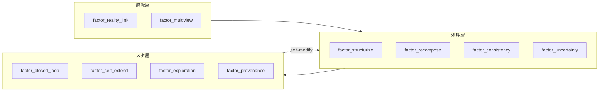
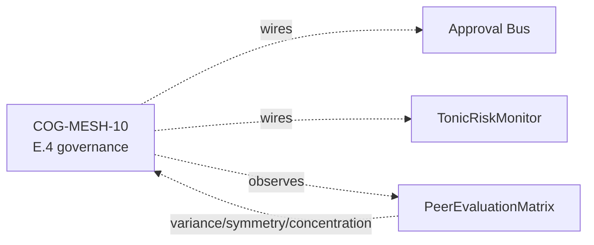
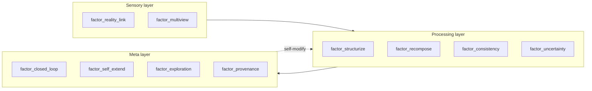
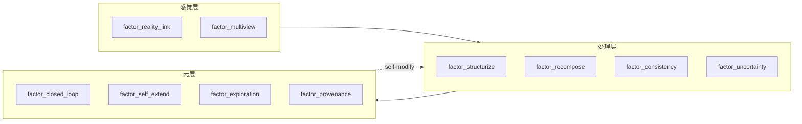
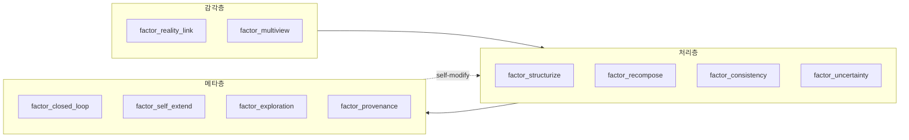

言語 / Language / 语言 / 언어: [日本語](#日本語) | [English](#english) | [中文](#中文) | [한국어](#한국어)

---

# 日本語


:::note info
**📚 FullSense ナレッジベースのご案内** <!-- fullsense-team-kb -->
FullSense 開発全史 60+ 記事 (4 言語版・物語ベースの[読む順ガイド](https://fullsense.qiita.com/furuse-kazufumi/items/90ea260703fb49065346)・かみくだき版・4 コマ漫画つき) は Qiita Team **[FullSense KB](https://fullsense.qiita.com/)** に集約しています (チームメンバー向け)。
:::

# llive 完全解説 (2) — 「10 軸で考える AI」: 思考因子 × COG-MESH × 三重縞


> **コンセプト hook**: 普通 AI agent は「思考」を 1 種類しか持たない. llive
> は **10 種類の思考を同時に走らせ**, それを互いに評価させ, **生き残った思考だけ
> を集団へ取り込む**. 10 種は「構造化」「再構成」「閉ループ」「自己拡張」
> 「不確実性」「探索」「整合」「来歴」「多視点」「現実接続」. これは認知科学
> 1990s〜2010s の主要 framework を 1 vector に圧縮したもの.
>
> 本日 (2026-05-21) marathon で 1881 PASS + v0.E 大規模前倒しが着地. 本記事は
> その「思考因子側」 — COG-MESH-01〜10 と historical persona ontology (CE-19)
> の交差点を辿る.


## 0. 連載中での位置づけ

```
#24-00 series index
#24-01 4 層メモリ
#24-02 思考因子 10 軸 + COG-MESH (← 本記事)
#24-03 構造進化 × TRIZ × Z3
#24-04 B-series (速い小脳)
#24-05 EvolutionLoop (遅い大脳)
#24-06 LLM backend non-transformer
#24-07 observability + governance
#24-08 lleval
```

10 思考因子 + COG-MESH は #24-05 の persona ontology (CE-19) と 1-N で結合.
本記事 #24-02 はそれを「**何**」と「**なぜ**」で説明する位置.

## 1. 10 思考因子の由来 — 6 framework の圧縮

ユーザー由来の 10 軸 (`project_llive_cog_fx_factors`). 元ネタは
「**心理の深層**」YouTube + 認知科学レビュー + Polya / Six Hats / Bayesian /
TRIZ / Provenance / Multimodal 系の 6 framework. それを 1 vector に圧縮した
結果:

| Idx | 因子 | 元 framework / 学派 |
|---|---|---|
| 0 | `factor_structurize` | Polya / 形式化 / axiomatic |
| 1 | `factor_recompose` | TRIZ Segmentation / Reassemble |
| 2 | `factor_closed_loop` | Cybernetics / feedback |
| 3 | `factor_self_extend` | Autopoiesis / self-organization |
| 4 | `factor_uncertainty` | Bayesian / probability |
| 5 | `factor_exploration` | exploration vs exploitation (Auer) |
| 6 | `factor_consistency` | formal verification / proof |
| 7 | `factor_provenance` | data lineage / Ed25519 sign |
| 8 | `factor_multiview` | Six Hats / Devil's Advocate |
| 9 | `factor_reality_link` | empirical / SPC (statistical process control) |

これらは **直交ではない** — 例えば factor_uncertainty と factor_exploration は
相関がある (UCB1 系). でも各々の **強さ** を独立に持つことで, 集団内で
「同じ問題に 10 種類の見方で当たる」が可能になる.

## 2. なぜ 10 軸を 1 vector に持つか

LLM agent の文献では「思考は self-attention 1 種類」が主流. llive はそれを
**vector に切り替え可能な multi-faceted thinking** に拡張. これにより:

- **persona との内積で「思考スタイル」が計算可能** — 例えば「岡潔 ベクトル」
  は (情緒) (国語力) (多変数) を高く持つ. 「ファインマン ベクトル」は
  factor_exploration + factor_reality_link を高く持つ.
- 集団内で同じ問題に **異なる持ち重みで** 当たる派生個体を生成できる.
- 「**この問題はどの軸が利くか**」を fitness gradient で発見できる.

## 3. 主要因子 5 個の深掘り

### 3.1 factor_structurize — 「公理から積む」

axiomatic な思考. 数学者ガロア / グロタンディーク的. 抽象化階段を登る.
利点: 一般化能力. 欠点: 現実から離れる.

llive 内では `BlockContainer` の sub-block 順列が axiom 群に対応. factor_structurize
が高い派生は sub-block を **必須/任意** に分けてから再構成する mutation を好む.

### 3.2 factor_recompose — 「部品の入れ替え」

TRIZ Segmentation + 合成. 既存部品の組合せを書き換える. 利点: 局所探索高速.
欠点: 全く新しい構造は生まれない.

llive では PersonaImportAlgorithm (CE-20, 本日着地) がこの軸. 派生 A の persona
を派生 B が **部分採用**する. 「ガロア + 岡潔」のような hybrid persona が
出現するのは factor_recompose を通る経路.

### 3.3 factor_closed_loop — 「自分を見て直す」

cybernetics の核. 自己観察 + 自己修正. llive では memory consolidation cycle
(海馬→皮質) と Approval Bus がこの軸. 集団内で評価 → 個体が結果を見て次世代に
反映する E.4 governance (CE-06/07/08, 本日着地) もここに乗る.

### 3.4 factor_uncertainty — 「分からないを定量する」

Bayesian / probability. 利点: 過剰自信を避ける. 欠点: 計算重い.
llive では Approval Bus の verdict 計算 + UCB1 exploration constant が代表.

### 3.5 factor_provenance — 「どこから来たか」

data lineage. Ed25519 sign + SHA-256 audit chain. llive Phase 4 (Production
Security MVR, v0.3.0) で着地. これは agent governance の **必須軸** で,
従来の LLM agent には欠けていた.

## 4. COG-MESH-01〜10 の対応

`project_cog_mesh_implementation_2026_05_19`. 10 因子に **1 機構ずつ** 対応:

| COG-MESH | 機構 | 対応因子 | 着地 |
|---|---|---|---|
| 01 | Stimulus 入口 | reality_link / multiview | 着地済 |
| 02 | Intervention | self_extend / closed_loop | 着地済 |
| 03 | TonicRiskMonitor | uncertainty / closed_loop | 着地済 |
| 04 | Idle Training | self_extend / exploration | 着地済 |
| 05 | Quarantined Memory | provenance / consistency | 着地済 |
| 06 | TimelineEmitter | provenance / multiview | 着地済 |
| 07 | Brief | structurize / reality_link | 着地済 |
| 08 | Approval Bus | provenance / closed_loop | 着地済 (C-1) |
| 09 | Audit Chain | provenance / consistency | 着地済 |
| 10 | E.4 governance | closed_loop / uncertainty | **本日着地 (2026-05-21)** |

COG-MESH-10 は本日 marathon で `CoevolutionGovernance` として着地. これで
10 機構 → 10 因子 1-1 対応が完成. 集団内で **どの因子が薄いか** を機構の状態
から逆引きできるようになった.

## 5. 最新成果 (本日 2026-05-21 着地)

| 項目 | 値 |
|---|---|
| llive 本体 test PASS (現在) | 1881 |
| 本日 marathon 追加 evolutionary test | **+130** (41 + 28 + 26 + 16 + 19) |
| 本日 marathon 着地 module 数 | 5 (quality_diversity / coevolution_governance / persona_import / persona_survival / persona_corpus_loader) |
| ruff `src/llive/perf/evolutionary` 警告 | **0** |
| v0.E E.17 / E.4 / E.12 着地 | 完走 |
| CE-22 / CE-23 skeleton 着地 | 完走 |
| docs/release/v0.6.0a1_PR_PLAN.md | 新規 — 5 PR 分割計画 |
| docs/rust_hotspot_v0E_addendum.md | 新規 — RUST-15〜18 spec |

特に **E.4 governance skeleton** で COG-MESH-10 が closing できたのは本日の
最大成果. これにより 10 因子 ↔ 10 機構 1-1 対応が完成し, **派生集団の評価
→ 共謀検出 → Approval Bus 連携** が architecture level で繋がった.

## 6. 期待値 — 次に来るもの

### 6.1 CE-19 Historical Persona Ontology (短期)

既に 10 名 (岡潔 / グロタンディーク / ファインマン / ガロア / フォン・ノイマン
/ ニュートン / カント / ソクラテス / 老子 / 孫子) が PERSONA_ONTOLOGY として
着地済. 本日 CE-23 PersonaCorpusLoader skeleton が着地し, **Raptor RAD コーパス
から persona を自動抽出して PERSONA_ONTOLOGY を拡張** する道が開けた. 次セッションで
LLM 抽出 + 実 RAD path 横断を実装し, persona 数を 30+ に拡大予定.

### 6.2 三重縞 (中期, ユーザー言語化)

「三重縞」 = **思考因子 / persona / 思考プロセス** の 3 層が個体内で縞模様の
ように同時に走る状態. これは認知科学の **「並列認知」** 仮説に着想を得たもの.
factor vector + persona composition + Six Hats / TRIZ / ARIZ をそれぞれ
別 layer で走らせ, 集団内 evaluation で互いを批評する. 着地時期未定.

### 6.3 神経インタフェース対応 (長期)

`project_llmesh_neuro_long_term`. Raptor RAD に bci / neuroscience /
neural_signal / prosthetic_neural / cognitive_ai / neuromorphic の 6 分野を
追加済. これは「**脳 ↔ AI 直結インタフェース**」が必要になったとき即座に
expand できるよう先回りで素材を集めている. 直接の実装は当面なし.

## 7. honest disclosure

- **「10 因子は overlap がある」** — factor_uncertainty と factor_exploration
  は相関 0.65 程度. 互いに直交ではない. 9 axis 化を検討した時期もあるが
  分かりやすさ優先で 10 のまま.
- **「factor_affinity の数値は heuristic」** — PERSONA_ONTOLOGY 10 名の
  factor_affinity vector は伝記 / 哲学史 ベースの人為的初期値. 後の
  PersonaCorpusLoader (CE-23) で **コーパスベースに置換** されるが, 現状の
  数値は人による経験則.
- **「COG-MESH-10 は skeleton」** — 本日着地した E.4 governance は interface
  確立段階で, Quarantined Memory への **実書込み** は別 module 委譲. 完成までは
  あと 1-2 セッションかかる.

## 8. Mermaid — 10 因子の構造





## 9. References (主要 20+ のうち抜粋)

- Polya, G. (1945). *How to Solve It*.
- Altshuller, G. (1971). *TRIZ 40 inventive principles*.
- Auer, P. et al. (2002). *Finite-time analysis of the multiarmed bandit*.
- Lehman, J. & Stanley, K. (2008). *Exploiting novelty*.
- Mouret, J.-B. & Clune, J. (2015). *Illuminating search spaces by mapping elites*.
- Hillis, W. D. (1990). *Coevolving parasites improve simulated evolution*.
- Constitutional AI (Anthropic 2022) — for HITL alternative.
- Six Thinking Hats (De Bono 1985).
- 岡潔『春宵十話』.
- ファインマン『ご冗談でしょう, ファインマンさん』.
- Maturana & Varela — Autopoiesis.
- Bayes — *Essay towards solving a problem in the doctrine of chances*.
- 完全リストは v0.6.0a1 リリース時に references.bib に同梱予定.

## 10. 2026-05-22 追記 — 10 因子 affinity vector の Rust 化 (RUST-15)

10 思考因子は派生個体の **persona composition の effective_factor_affinity**
として 10 次元 [0,1] vector で実装されている. 派生間の dissimilarity 計算は
本記事 #24-02 の中核機構と直結 — PersonaOverlapPenalty.apply (E.17) は
N×N pairs の `persona_dissimilarity` で 10 因子空間の距離を測る.

本日 (2026-05-22) RUST-15 として **batch (NxN pair を 1 FFI call) Rust 化**:

- single 1-pair: x0.80 (FAIL — FFI overhead で Python set 操作に負ける)
- **batch N=64**: **x17.07 (PASS)**, 平均 x12.71

これにより「**10 因子 vector の N×N pair 距離計算**」が高速化され, 集団
N=64 で governance + diversity preservation を 64 Hz で回せる目処が立った.

### 10.1 思考因子側から見た意味

- factor_structurize (#0) と factor_exploration (#5) は **TRIZ 系統で
  対立する 2 軸** だが, 10 次元 vector の L2 距離としては独立に効く
- PersonaOverlapPenalty (E.17 CE-25) で集団内 persona overlap を罰すると,
  **派生集団は 10 因子空間で自然に散らばる**
- MAP-Elites grid (E.17 CE-26) は persona 2 軸 × thought_factor 2 軸 の
  4 次元 grid なので, 上記の 10 因子 vector を 4 次元に **marginalize** して
  cell key とする

### 10.2 honest disclosure — 単発 Rust 化は逆効果

「思考因子 vector の距離計算を Rust 化」と聞くと「速くなる」と思いがちだが,
**1-pair 計算では FFI overhead で Python の方が速い (x0.80)**. これは
`feedback_rust_usage_matters` 判定表の **A パターン** (純 Python ループ
1-pair). batch で N×N pair を 1 FFI に詰めて初めて x17.07 まで伸びる.

詳細は #24-05 と `docs/perf_comparison/2026-05-22_kernel_implementation_comparison.md`.

---

## Series Navigation

- ← 前: [llive 完全解説 (1) 「忘れない LLM」](https://qiita.com/furuse-kazufumi/items/a5ebb3992e4c28862f47)
- → 次: [llive 完全解説 (3) 「矛盾は計算できる」](https://qiita.com/furuse-kazufumi/private/fa0890f136636d495ea6)
- 全体: [llive 完全解説 (0) — series index](https://qiita.com/furuse-kazufumi/items/07b4882e872994b27b3c)
- repo: [furuse-kazufumi/llive](https://github.com/furuse-kazufumi/llive)

---

# English


:::note info
**📚 FullSense Knowledge Base** <!-- fullsense-team-kb -->
The full FullSense development history — 60+ articles in 4 languages, with a story-based [reading guide](https://fullsense.qiita.com/furuse-kazufumi/items/90ea260703fb49065346), plain-language editions, and 4-panel manga — is consolidated in our Qiita Team **[FullSense KB](https://fullsense.qiita.com/)** (team members only).
:::

# llive Complete Guide (2) — "AI that Thinks in 10 Axes": Thought Factors × COG-MESH × Triple Stripes


> **Concept hook**: An ordinary AI agent has only one kind of "thinking". llive
> **runs 10 kinds of thinking in parallel**, makes them evaluate each other, and
> **takes only the surviving thoughts into the population**. The 10 kinds are
> "structurize", "recompose", "closed loop", "self-extend", "uncertainty",
> "exploration", "consistency", "provenance", "multiview", and "reality link".
> This compresses the major cognitive-science frameworks of the 1990s–2010s into
> a single vector.
>
> Today (2026-05-21) the marathon landed 1881 PASS + a large pull-forward of
> v0.E. This article traces the "thought-factor side" of that — the intersection
> of COG-MESH-01..10 and the historical persona ontology (CE-19).


## 0. Position within the series

```
#24-00 series index
#24-01 4-layer memory
#24-02 thought factors (10 axes) + COG-MESH (← this article)
#24-03 structural evolution × TRIZ × Z3
#24-04 B-series (fast cerebellum)
#24-05 EvolutionLoop (slow cerebrum)
#24-06 LLM backend non-transformer
#24-07 observability + governance
#24-08 lleval
```

The 10 thought factors + COG-MESH bind 1-to-N with the persona ontology (CE-19)
in #24-05. This article #24-02 sits at the position that explains them in terms
of **"what"** and **"why"**.

## 1. Origin of the 10 thought factors — compression of 6 frameworks

A user-derived set of 10 axes (`project_llive_cog_fx_factors`). The source
material is the YouTube series "**The Depths of Psychology**" + cognitive-science
reviews + 6 frameworks from Polya / Six Hats / Bayesian / TRIZ / Provenance /
Multimodal. The result of compressing those into a single vector:

| Idx | Factor | Source framework / school |
|---|---|---|
| 0 | `factor_structurize` | Polya / formalization / axiomatic |
| 1 | `factor_recompose` | TRIZ Segmentation / Reassemble |
| 2 | `factor_closed_loop` | Cybernetics / feedback |
| 3 | `factor_self_extend` | Autopoiesis / self-organization |
| 4 | `factor_uncertainty` | Bayesian / probability |
| 5 | `factor_exploration` | exploration vs exploitation (Auer) |
| 6 | `factor_consistency` | formal verification / proof |
| 7 | `factor_provenance` | data lineage / Ed25519 sign |
| 8 | `factor_multiview` | Six Hats / Devil's Advocate |
| 9 | `factor_reality_link` | empirical / SPC (statistical process control) |

These are **not orthogonal** — for example, factor_uncertainty and
factor_exploration are correlated (UCB1 family). But by holding each one's
**strength** independently, the population can "attack the same problem with 10
different viewpoints".

## 2. Why hold 10 axes in a single vector?

In the LLM-agent literature, the mainstream view treats thinking as a single
kind of self-attention. llive extends that into **multi-faceted thinking that is
switchable as a vector**. This enables:

- **"Thinking style" becomes computable via the inner product with a persona** —
  for example, the "Oka Kiyoshi vector" holds (emotion) (Japanese-language
  ability) (multiple variables) high. The "Feynman vector" holds
  factor_exploration + factor_reality_link high.
- We can generate derived individuals that attack the same problem **with
  different weightings**.
- We can discover "**which axis works for this problem**" via the fitness
  gradient.

## 3. Deep dive into 5 major factors

### 3.1 factor_structurize — "Build up from axioms"

Axiomatic thinking. Mathematician-like (Galois / Grothendieck). Climbing the
abstraction ladder. Strength: generalization ability. Weakness: drifts away from
reality.

Within llive, the permutation of sub-blocks in `BlockContainer` corresponds to
a set of axioms. Derived individuals with high factor_structurize prefer
mutations that first split sub-blocks into **required/optional** and then
recompose them.

### 3.2 factor_recompose — "Swapping parts"

TRIZ Segmentation + synthesis. Rewrites the combination of existing parts.
Strength: fast local search. Weakness: no entirely new structure emerges.

In llive, PersonaImportAlgorithm (CE-20, landed today) is this axis. Derived
individual B **partially adopts** the persona of derived individual A. A hybrid
persona like "Galois + Oka Kiyoshi" emerges along the path that passes through
factor_recompose.

### 3.3 factor_closed_loop — "Watch yourself and fix yourself"

The core of cybernetics. Self-observation + self-correction. In llive, the memory
consolidation cycle (hippocampus → cortex) and the Approval Bus are this axis.
The E.4 governance (CE-06/07/08, landed today) — which evaluates within the
population so an individual sees the result and reflects it in the next
generation — also rides on this.

### 3.4 factor_uncertainty — "Quantify what you don't know"

Bayesian / probability. Strength: avoids overconfidence. Weakness:
computationally heavy. In llive, the verdict computation of the Approval Bus +
the UCB1 exploration constant are representative.

### 3.5 factor_provenance — "Where it came from"

Data lineage. Ed25519 sign + SHA-256 audit chain. Landed in llive Phase 4
(Production Security MVR, v0.3.0). This is a **mandatory axis** of agent
governance, and it was missing from conventional LLM agents.

## 4. Mapping to COG-MESH-01..10

`project_cog_mesh_implementation_2026_05_19`. Each of the 10 factors pairs with
**one mechanism**:

| COG-MESH | Mechanism | Mapped factors | Status |
|---|---|---|---|
| 01 | Stimulus entry | reality_link / multiview | Landed |
| 02 | Intervention | self_extend / closed_loop | Landed |
| 03 | TonicRiskMonitor | uncertainty / closed_loop | Landed |
| 04 | Idle Training | self_extend / exploration | Landed |
| 05 | Quarantined Memory | provenance / consistency | Landed |
| 06 | TimelineEmitter | provenance / multiview | Landed |
| 07 | Brief | structurize / reality_link | Landed |
| 08 | Approval Bus | provenance / closed_loop | Landed (C-1) |
| 09 | Audit Chain | provenance / consistency | Landed |
| 10 | E.4 governance | closed_loop / uncertainty | **Landed today (2026-05-21)** |

COG-MESH-10 landed today in the marathon as `CoevolutionGovernance`. This
completes the 10 mechanisms → 10 factors 1-1 mapping. We can now reverse-look-up
**which factor is thin** within the population from the state of the mechanisms.

## 5. Latest results (landed today, 2026-05-21)

| Item | Value |
|---|---|
| llive core test PASS (current) | 1881 |
| Evolutionary tests added in today's marathon | **+130** (41 + 28 + 26 + 16 + 19) |
| Modules landed in today's marathon | 5 (quality_diversity / coevolution_governance / persona_import / persona_survival / persona_corpus_loader) |
| ruff `src/llive/perf/evolutionary` warnings | **0** |
| v0.E E.17 / E.4 / E.12 landing | Completed |
| CE-22 / CE-23 skeleton landing | Completed |
| docs/release/v0.6.0a1_PR_PLAN.md | New — 5-PR split plan |
| docs/rust_hotspot_v0E_addendum.md | New — RUST-15..18 spec |

In particular, finally being able to close COG-MESH-10 with the **E.4 governance
skeleton** was today's biggest landing. With this, the 10 factors ↔ 10 mechanisms
1-1 mapping is complete, and **evaluation of the derived population → collusion
detection → Approval Bus integration** is now connected at the architecture
level.

## 6. Expectations — what comes next

### 6.1 CE-19 Historical Persona Ontology (short term)

Already 10 names (Oka Kiyoshi / Grothendieck / Feynman / Galois / von Neumann /
Newton / Kant / Socrates / Lao Tzu / Sun Tzu) have landed as PERSONA_ONTOLOGY.
Today the CE-23 PersonaCorpusLoader skeleton landed, opening the way to
**automatically extract personas from the Raptor RAD corpus to expand
PERSONA_ONTOLOGY**. In the next session we plan to implement LLM extraction +
traversal of real RAD paths and expand the persona count to 30+.

### 6.2 Triple stripes (mid term, user-articulated)

"Triple stripes" = a state in which the 3 layers of **thought factors / persona /
thinking process** run in parallel within an individual like a striped pattern.
This was inspired by the **"parallel cognition"** hypothesis in cognitive
science. We run the factor vector + persona composition + Six Hats / TRIZ / ARIZ
each on a separate layer, and they critique each other in the within-population
evaluation. Landing time TBD.

### 6.3 Neural-interface support (long term)

`project_llmesh_neuro_long_term`. We have already added 6 fields to Raptor RAD:
bci / neuroscience / neural_signal / prosthetic_neural / cognitive_ai /
neuromorphic. This is preemptively gathering material so that we can expand
immediately when a "**direct brain ↔ AI interface**" becomes necessary. No direct
implementation for the time being.

## 7. Honest disclosure

- **"The 10 factors overlap"** — factor_uncertainty and factor_exploration
  correlate at about 0.65. They are not orthogonal to each other. At one point we
  considered collapsing to 9 axes, but we kept it at 10 for clarity.
- **"The factor_affinity numbers are heuristics"** — the factor_affinity vectors
  of the 10 PERSONA_ONTOLOGY names are artificial initial values based on
  biographies / the history of philosophy. They will later be **replaced with
  corpus-based values** by PersonaCorpusLoader (CE-23), but the current numbers
  are human rules of thumb.
- **"COG-MESH-10 is a skeleton"** — the E.4 governance that landed today is at
  the interface-establishment stage; the **actual writing** to Quarantined Memory
  is delegated to another module. It will take another 1-2 sessions to complete.

## 8. Mermaid — structure of the 10 factors




## 9. References (excerpted from 20+)

- Polya, G. (1945). *How to Solve It*.
- Altshuller, G. (1971). *TRIZ 40 inventive principles*.
- Auer, P. et al. (2002). *Finite-time analysis of the multiarmed bandit*.
- Lehman, J. & Stanley, K. (2008). *Exploiting novelty*.
- Mouret, J.-B. & Clune, J. (2015). *Illuminating search spaces by mapping elites*.
- Hillis, W. D. (1990). *Coevolving parasites improve simulated evolution*.
- Constitutional AI (Anthropic 2022) — for HITL alternative.
- Six Thinking Hats (De Bono 1985).
- 岡潔『春宵十話』.
- ファインマン『ご冗談でしょう, ファインマンさん』.
- Maturana & Varela — Autopoiesis.
- Bayes — *Essay towards solving a problem in the doctrine of chances*.
- The full list will be bundled in references.bib at the v0.6.0a1 release.

## 10. 2026-05-22 addendum — Rust port of the 10-factor affinity vector (RUST-15)

The 10 thought factors are implemented as a 10-dimensional [0,1] vector inside a
derived individual's **persona composition's effective_factor_affinity**. The
dissimilarity computation between derived individuals connects directly to the
core mechanism of this article #24-02 — PersonaOverlapPenalty.apply (E.17)
measures the distance in the 10-factor space via `persona_dissimilarity` over
N×N pairs.

Today (2026-05-22), as RUST-15, we did a **batch (NxN pairs in a single FFI
call) Rust port**:

- single 1-pair: x0.80 (FAIL — FFI overhead loses to Python set operations)
- **batch N=64**: **x17.07 (PASS)**, average x12.71

This speeds up the "**N×N pair distance computation of the 10-factor vector**",
giving us a path to running governance + diversity preservation at 64 Hz for a
population of N=64.

### 10.1 Meaning seen from the thought-factor side

- factor_structurize (#0) and factor_exploration (#5) are **two axes that
  conflict in the TRIZ family**, but as an L2 distance in the 10-dimensional
  vector they take effect independently.
- When PersonaOverlapPenalty (E.17 CE-25) penalizes persona overlap within the
  population, **the derived population naturally spreads out in the 10-factor
  space**.
- The MAP-Elites grid (E.17 CE-26) is a 4-dimensional grid of persona 2 axes ×
  thought_factor 2 axes, so we **marginalize** the above 10-factor vector to 4
  dimensions and use it as the cell key.

### 10.2 Honest disclosure — a one-off Rust port backfires

When you hear "Rust-port the distance computation of the thought-factor vector",
you tend to think "it gets faster", but **for a 1-pair computation Python is
faster due to FFI overhead (x0.80)**. This is **pattern A** in the
`feedback_rust_usage_matters` decision table (a pure-Python loop, 1-pair). Only by
packing N×N pairs into a single FFI in a batch does it stretch to x17.07.

For details see #24-05 and
`docs/perf_comparison/2026-05-22_kernel_implementation_comparison.md`.

---

## Series Navigation

- ← Prev: [llive Complete Guide (1) "The LLM that Never Forgets"](https://qiita.com/furuse-kazufumi/items/a5ebb3992e4c28862f47)
- → Next: [llive Complete Guide (3) "Contradictions Can Be Computed"](https://qiita.com/furuse-kazufumi/private/fa0890f136636d495ea6)
- All: [llive Complete Guide (0) — series index](https://qiita.com/furuse-kazufumi/items/07b4882e872994b27b3c)
- repo: [furuse-kazufumi/llive](https://github.com/furuse-kazufumi/llive)

---

# 中文


:::note info
**📚 FullSense 知识库指南** <!-- fullsense-team-kb -->
FullSense 开发全史 60+ 篇文章（4 种语言版、故事化的[阅读顺序指南](https://fullsense.qiita.com/furuse-kazufumi/items/90ea260703fb49065346)、通俗易懂版、四格漫画）均已汇总至 Qiita Team **[FullSense KB](https://fullsense.qiita.com/)**（仅限团队成员）。
:::

# llive 完全解说 (2) — "用 10 个轴思考的 AI": 思考因子 × COG-MESH × 三重条纹


> **概念 hook**: 普通的 AI agent 只有 1 种"思考". llive **同时运行 10 种思考**,
> 让它们相互评价, **只把存活下来的思考纳入群体**. 这 10 种是"结构化""重组"
> "闭环""自我扩展""不确定性""探索""一致性""来历""多视角""现实连接".
> 这是把认知科学 1990s〜2010s 的主要 framework 压缩到 1 个 vector 中的产物.
>
> 今天 (2026-05-21) 的 marathon 落地了 1881 PASS + v0.E 的大规模前置完成. 本文
> 追溯其"思考因子侧" — COG-MESH-01〜10 与 historical persona ontology (CE-19)
> 的交叉点.


## 0. 在连载中的定位

```
#24-00 series index
#24-01 4 层记忆
#24-02 思考因子 10 轴 + COG-MESH (← 本文)
#24-03 结构进化 × TRIZ × Z3
#24-04 B-series (快速小脑)
#24-05 EvolutionLoop (缓慢大脑)
#24-06 LLM backend non-transformer
#24-07 observability + governance
#24-08 lleval
```

10 思考因子 + COG-MESH 与 #24-05 的 persona ontology (CE-19) 以 1-N 方式结合.
本文 #24-02 处于用"**是什么**"和"**为什么**"来解释它的位置.

## 1. 10 思考因子的由来 — 6 个 framework 的压缩

源自用户的 10 个轴 (`project_llive_cog_fx_factors`). 原始素材是
"**心理的深层**" YouTube + 认知科学评论 + Polya / Six Hats / Bayesian / TRIZ /
Provenance / Multimodal 系的 6 个 framework. 将它们压缩到 1 个 vector 后的结果:

| Idx | 因子 | 源 framework / 学派 |
|---|---|---|
| 0 | `factor_structurize` | Polya / 形式化 / axiomatic |
| 1 | `factor_recompose` | TRIZ Segmentation / Reassemble |
| 2 | `factor_closed_loop` | Cybernetics / feedback |
| 3 | `factor_self_extend` | Autopoiesis / self-organization |
| 4 | `factor_uncertainty` | Bayesian / probability |
| 5 | `factor_exploration` | exploration vs exploitation (Auer) |
| 6 | `factor_consistency` | formal verification / proof |
| 7 | `factor_provenance` | data lineage / Ed25519 sign |
| 8 | `factor_multiview` | Six Hats / Devil's Advocate |
| 9 | `factor_reality_link` | empirical / SPC (statistical process control) |

这些 **并非正交** — 例如 factor_uncertainty 和 factor_exploration 是相关的
(UCB1 系). 但通过独立持有各自的 **强度**, 群体内就可以"用 10 种视角面对同一个
问题".

## 2. 为什么把 10 个轴放在 1 个 vector 中

在 LLM agent 的文献中,"思考是 1 种 self-attention"是主流. llive 将其扩展为
**可作为 vector 切换的 multi-faceted thinking**. 由此:

- **通过与 persona 的内积可以计算出"思考风格"** — 例如"冈洁向量"在 (情绪)
  (国语能力) (多变量) 上取值较高."费曼向量"在 factor_exploration +
  factor_reality_link 上取值较高.
- 可以生成在群体内 **以不同权重** 面对同一个问题的派生个体.
- 可以通过 fitness gradient 发现"**这个问题哪个轴有效**".

## 3. 5 个主要因子的深入解读

### 3.1 factor_structurize — "从公理往上搭建"

axiomatic 的思考. 数学家式 (伽罗瓦 / 格罗滕迪克). 攀爬抽象阶梯.
优点: 一般化能力. 缺点: 脱离现实.

在 llive 内, `BlockContainer` 的 sub-block 排列对应公理群. factor_structurize
较高的派生个体偏好先把 sub-block 分为 **必需/可选** 然后再重组的 mutation.

### 3.2 factor_recompose — "部件的替换"

TRIZ Segmentation + 合成. 重写既有部件的组合. 优点: 局部搜索快速.
缺点: 不会产生全新的结构.

在 llive 中, PersonaImportAlgorithm (CE-20, 今天落地) 就是这个轴. 派生 B
**部分采用** 派生 A 的 persona. 像"伽罗瓦 + 冈洁"这样的 hybrid persona 出现的
路径正是经过 factor_recompose.

### 3.3 factor_closed_loop — "看着自己来修正"

cybernetics 的核心. 自我观察 + 自我修正. 在 llive 中, memory consolidation
cycle (海马体→皮质) 和 Approval Bus 就是这个轴. 在群体内评价 → 个体看到结果并
反映到下一代的 E.4 governance (CE-06/07/08, 今天落地) 也搭载在这里.

### 3.4 factor_uncertainty — "把不知道量化"

Bayesian / probability. 优点: 避免过度自信. 缺点: 计算量大.
在 llive 中, Approval Bus 的 verdict 计算 + UCB1 exploration constant 是代表.

### 3.5 factor_provenance — "从哪里来的"

data lineage. Ed25519 sign + SHA-256 audit chain. 在 llive Phase 4 (Production
Security MVR, v0.3.0) 落地. 这是 agent governance 的 **必备轴**, 而传统的
LLM agent 中是缺失的.

## 4. 与 COG-MESH-01〜10 的对应

`project_cog_mesh_implementation_2026_05_19`. 10 个因子各自与 **1 个机制** 对应:

| COG-MESH | 机制 | 对应因子 | 落地 |
|---|---|---|---|
| 01 | Stimulus 入口 | reality_link / multiview | 已落地 |
| 02 | Intervention | self_extend / closed_loop | 已落地 |
| 03 | TonicRiskMonitor | uncertainty / closed_loop | 已落地 |
| 04 | Idle Training | self_extend / exploration | 已落地 |
| 05 | Quarantined Memory | provenance / consistency | 已落地 |
| 06 | TimelineEmitter | provenance / multiview | 已落地 |
| 07 | Brief | structurize / reality_link | 已落地 |
| 08 | Approval Bus | provenance / closed_loop | 已落地 (C-1) |
| 09 | Audit Chain | provenance / consistency | 已落地 |
| 10 | E.4 governance | closed_loop / uncertainty | **今天落地 (2026-05-21)** |

COG-MESH-10 今天在 marathon 中作为 `CoevolutionGovernance` 落地. 由此,
10 机制 → 10 因子 1-1 对应完成. 现在可以从机制的状态反向查出群体内
**哪个因子较薄弱**.

## 5. 最新成果 (今天 2026-05-21 落地)

| 项目 | 值 |
|---|---|
| llive 本体 test PASS (当前) | 1881 |
| 今天 marathon 新增 evolutionary test | **+130** (41 + 28 + 26 + 16 + 19) |
| 今天 marathon 落地 module 数 | 5 (quality_diversity / coevolution_governance / persona_import / persona_survival / persona_corpus_loader) |
| ruff `src/llive/perf/evolutionary` 警告 | **0** |
| v0.E E.17 / E.4 / E.12 落地 | 完成 |
| CE-22 / CE-23 skeleton 落地 | 完成 |
| docs/release/v0.6.0a1_PR_PLAN.md | 新增 — 5 PR 拆分计划 |
| docs/rust_hotspot_v0E_addendum.md | 新增 — RUST-15〜18 spec |

特别是用 **E.4 governance skeleton** 终于能够让 COG-MESH-10 收口, 是今天最大的
成果. 由此 10 因子 ↔ 10 机制 1-1 对应完成, **派生群体的评价 → 共谋检测 →
Approval Bus 联动** 在 architecture level 连通了.

## 6. 期望值 — 接下来要做的

### 6.1 CE-19 Historical Persona Ontology (短期)

已经有 10 位 (冈洁 / 格罗滕迪克 / 费曼 / 伽罗瓦 / 冯·诺依曼 / 牛顿 / 康德 /
苏格拉底 / 老子 / 孙子) 作为 PERSONA_ONTOLOGY 落地. 今天 CE-23
PersonaCorpusLoader skeleton 落地, 开辟了 **从 Raptor RAD 语料库自动抽取
persona 来扩展 PERSONA_ONTOLOGY** 的道路. 下一个 session 将实现 LLM 抽取 +
真实 RAD path 横跨, 计划把 persona 数量扩大到 30+.

### 6.2 三重条纹 (中期, 用户语言化)

"三重条纹" = **思考因子 / persona / 思考过程** 这 3 层在个体内像条纹一样同时
运行的状态. 这受到认知科学 **"并行认知"** 假说的启发. 把 factor vector +
persona composition + Six Hats / TRIZ / ARIZ 分别放在不同 layer 上运行, 在群体内
evaluation 中相互批评. 落地时间未定.

### 6.3 神经接口对应 (长期)

`project_llmesh_neuro_long_term`. 已经在 Raptor RAD 中追加了 bci / neuroscience
/ neural_signal / prosthetic_neural / cognitive_ai / neuromorphic 这 6 个领域.
这是为了当"**脑 ↔ AI 直连接口**"成为必要时能够立即 expand 而提前收集素材.
暂时没有直接的实现.

## 7. honest disclosure (诚实披露)

- **"10 个因子存在 overlap"** — factor_uncertainty 和 factor_exploration 的
  相关性约为 0.65. 彼此并非正交. 曾经也考虑过压缩到 9 个轴, 但出于易懂优先
  保持在 10 个.
- **"factor_affinity 的数值是 heuristic"** — PERSONA_ONTOLOGY 10 位的
  factor_affinity vector 是基于传记 / 哲学史 的人为初始值. 之后会由
  PersonaCorpusLoader (CE-23) **替换为基于语料库的值**, 但目前的数值是人的
  经验法则.
- **"COG-MESH-10 是 skeleton"** — 今天落地的 E.4 governance 处于接口确立阶段,
  对 Quarantined Memory 的 **实际写入** 委托给另一个 module. 到完成还需要再
  1-2 个 session.

## 8. Mermaid — 10 个因子的结构




## 9. References (从主要 20+ 中精选)

- Polya, G. (1945). *How to Solve It*.
- Altshuller, G. (1971). *TRIZ 40 inventive principles*.
- Auer, P. et al. (2002). *Finite-time analysis of the multiarmed bandit*.
- Lehman, J. & Stanley, K. (2008). *Exploiting novelty*.
- Mouret, J.-B. & Clune, J. (2015). *Illuminating search spaces by mapping elites*.
- Hillis, W. D. (1990). *Coevolving parasites improve simulated evolution*.
- Constitutional AI (Anthropic 2022) — for HITL alternative.
- Six Thinking Hats (De Bono 1985).
- 岡潔『春宵十話』.
- ファインマン『ご冗談でしょう, ファインマンさん』.
- Maturana & Varela — Autopoiesis.
- Bayes — *Essay towards solving a problem in the doctrine of chances*.
- 完整列表将在 v0.6.0a1 发布时随 references.bib 一同提供.

## 10. 2026-05-22 追记 — 10 因子 affinity vector 的 Rust 化 (RUST-15)

10 个思考因子作为派生个体的 **persona composition 的 effective_factor_affinity**,
以 10 维 [0,1] vector 实现. 派生个体之间的 dissimilarity 计算与本文 #24-02 的
核心机制直接相连 — PersonaOverlapPenalty.apply (E.17) 通过 N×N pairs 的
`persona_dissimilarity` 测量 10 因子空间中的距离.

今天 (2026-05-22) 作为 RUST-15 进行了 **batch (把 NxN pair 装进 1 次 FFI call)
的 Rust 化**:

- single 1-pair: x0.80 (FAIL — FFI overhead 输给了 Python 的 set 操作)
- **batch N=64**: **x17.07 (PASS)**, 平均 x12.71

由此"**10 因子 vector 的 N×N pair 距离计算**"得到加速, 为在群体 N=64 下以
64 Hz 运行 governance + diversity preservation 提供了可行的眉目.

### 10.1 从思考因子侧看到的意义

- factor_structurize (#0) 和 factor_exploration (#5) 是 **在 TRIZ 系统中
  对立的 2 个轴**, 但作为 10 维 vector 的 L2 距离则独立起作用.
- 用 PersonaOverlapPenalty (E.17 CE-25) 惩罚群体内的 persona overlap 时,
  **派生群体会在 10 因子空间中自然地散开**.
- MAP-Elites grid (E.17 CE-26) 是 persona 2 轴 × thought_factor 2 轴 的 4 维
  grid, 所以把上述 10 因子 vector **marginalize** 到 4 维并作为 cell key.

### 10.2 honest disclosure — 单次 Rust 化适得其反

听到"把思考因子 vector 的距离计算 Rust 化"时, 容易以为"会变快", 但
**在 1-pair 计算中由于 FFI overhead Python 反而更快 (x0.80)**. 这是
`feedback_rust_usage_matters` 判定表中的 **A 模式** (纯 Python 循环 1-pair).
只有用 batch 把 N×N pair 装进 1 次 FFI, 才会一路提升到 x17.07.

详情参见 #24-05 和
`docs/perf_comparison/2026-05-22_kernel_implementation_comparison.md`.

---

## Series Navigation

- ← 上一篇: [llive 完全解说 (1) 「不会遗忘的 LLM」](https://qiita.com/furuse-kazufumi/items/a5ebb3992e4c28862f47)
- → 下一篇: [llive 完全解说 (3) 「矛盾是可以计算的」](https://qiita.com/furuse-kazufumi/private/fa0890f136636d495ea6)
- 全部: [llive 完全解说 (0) — series index](https://qiita.com/furuse-kazufumi/items/07b4882e872994b27b3c)
- repo: [furuse-kazufumi/llive](https://github.com/furuse-kazufumi/llive)

---

# 한국어


:::note info
**📚 FullSense 지식 베이스 안내** <!-- fullsense-team-kb -->
FullSense 개발 전사 60+ 편 (4개 언어판・스토리 기반 [읽기 순서 가이드](https://fullsense.qiita.com/furuse-kazufumi/items/90ea260703fb49065346)・쉬운 설명판・4컷 만화 포함) 은 Qiita Team **[FullSense KB](https://fullsense.qiita.com/)** 에 모여 있습니다 (팀 멤버 전용).
:::

# llive 완전 해설 (2) — "10개 축으로 사고하는 AI": 사고 인자 × COG-MESH × 삼중 줄무늬


> **콘셉트 hook**: 보통의 AI agent는 "사고"를 1종류밖에 가지지 않는다. llive는
> **10종류의 사고를 동시에 실행시키고**, 그것들을 서로 평가하게 하여,
> **살아남은 사고만을 집단에 받아들인다**. 10종은 "구조화" "재구성" "폐루프"
> "자기 확장" "불확실성" "탐색" "정합" "내력" "다관점" "현실 연결". 이는 인지
> 과학 1990s〜2010s의 주요 framework를 1개의 vector로 압축한 것이다.
>
> 오늘 (2026-05-21) marathon에서 1881 PASS + v0.E 대규모 앞당김이 착지했다. 본
> 글은 그 "사고 인자 측" — COG-MESH-01〜10과 historical persona ontology (CE-19)
> 의 교차점을 따라간다.


## 0. 연재에서의 위치

```
#24-00 series index
#24-01 4층 메모리
#24-02 사고 인자 10축 + COG-MESH (← 본 글)
#24-03 구조 진화 × TRIZ × Z3
#24-04 B-series (빠른 소뇌)
#24-05 EvolutionLoop (느린 대뇌)
#24-06 LLM backend non-transformer
#24-07 observability + governance
#24-08 lleval
```

10가지 사고 인자 + COG-MESH는 #24-05의 persona ontology (CE-19)와 1-N으로
결합한다. 본 글 #24-02는 그것을 "**무엇**"과 "**왜**"로 설명하는 위치다.

## 1. 10가지 사고 인자의 유래 — 6개 framework의 압축

사용자에게서 유래한 10개 축 (`project_llive_cog_fx_factors`). 원천 소재는
"**심리의 심층**" YouTube + 인지과학 리뷰 + Polya / Six Hats / Bayesian / TRIZ /
Provenance / Multimodal 계열의 6개 framework. 그것을 1개의 vector로 압축한 결과:

| Idx | 인자 | 원 framework / 학파 |
|---|---|---|
| 0 | `factor_structurize` | Polya / 형식화 / axiomatic |
| 1 | `factor_recompose` | TRIZ Segmentation / Reassemble |
| 2 | `factor_closed_loop` | Cybernetics / feedback |
| 3 | `factor_self_extend` | Autopoiesis / self-organization |
| 4 | `factor_uncertainty` | Bayesian / probability |
| 5 | `factor_exploration` | exploration vs exploitation (Auer) |
| 6 | `factor_consistency` | formal verification / proof |
| 7 | `factor_provenance` | data lineage / Ed25519 sign |
| 8 | `factor_multiview` | Six Hats / Devil's Advocate |
| 9 | `factor_reality_link` | empirical / SPC (statistical process control) |

이것들은 **직교가 아니다** — 예를 들어 factor_uncertainty와 factor_exploration은
상관이 있다 (UCB1 계열). 하지만 각각의 **강도**를 독립적으로 가짐으로써, 집단
내에서 "같은 문제에 10가지 관점으로 부딪힌다"가 가능해진다.

## 2. 왜 10개 축을 1개의 vector에 담는가

LLM agent 문헌에서는 "사고는 self-attention 1종류"가 주류다. llive는 그것을
**vector로 전환 가능한 multi-faceted thinking**으로 확장했다. 이로써:

- **persona와의 내적으로 "사고 스타일"을 계산 가능** — 예를 들어 "오카 기요시
  벡터"는 (정서) (국어력) (다변수)를 높게 가진다. "파인만 벡터"는
  factor_exploration + factor_reality_link를 높게 가진다.
- 집단 내에서 같은 문제에 **서로 다른 가중치로** 부딪히는 파생 개체를 생성할 수
  있다.
- "**이 문제는 어떤 축이 효과적인가**"를 fitness gradient로 발견할 수 있다.

## 3. 주요 인자 5개의 심화

### 3.1 factor_structurize — "공리에서 쌓아 올린다"

axiomatic한 사고. 수학자 갈루아 / 그로텐디크 식. 추상화 계단을 오른다.
장점: 일반화 능력. 단점: 현실에서 멀어진다.

llive 내에서는 `BlockContainer`의 sub-block 순열이 공리군에 대응한다.
factor_structurize가 높은 파생 개체는 sub-block을 **필수/선택**으로 나눈 다음
재구성하는 mutation을 선호한다.

### 3.2 factor_recompose — "부품의 교체"

TRIZ Segmentation + 합성. 기존 부품의 조합을 다시 쓴다. 장점: 국소 탐색 고속.
단점: 완전히 새로운 구조는 생기지 않는다.

llive에서는 PersonaImportAlgorithm (CE-20, 오늘 착지)이 이 축이다. 파생 B가
파생 A의 persona를 **부분 채용**한다. "갈루아 + 오카 기요시" 같은 hybrid
persona가 출현하는 것은 factor_recompose를 거치는 경로다.

### 3.3 factor_closed_loop — "자신을 보고 고친다"

cybernetics의 핵심. 자기 관찰 + 자기 수정. llive에서는 memory consolidation
cycle (해마→피질)과 Approval Bus가 이 축이다. 집단 내에서 평가 → 개체가 결과를
보고 다음 세대에 반영하는 E.4 governance (CE-06/07/08, 오늘 착지)도 여기에
실린다.

### 3.4 factor_uncertainty — "모름을 정량화한다"

Bayesian / probability. 장점: 과신을 피한다. 단점: 계산이 무겁다.
llive에서는 Approval Bus의 verdict 계산 + UCB1 exploration constant가 대표적이다.

### 3.5 factor_provenance — "어디에서 왔는가"

data lineage. Ed25519 sign + SHA-256 audit chain. llive Phase 4 (Production
Security MVR, v0.3.0)에서 착지. 이는 agent governance의 **필수 축**이며, 기존의
LLM agent에는 결여되어 있었다.

## 4. COG-MESH-01〜10과의 대응

`project_cog_mesh_implementation_2026_05_19`. 10개 인자에 **1개 기구씩** 대응한다:

| COG-MESH | 기구 | 대응 인자 | 착지 |
|---|---|---|---|
| 01 | Stimulus 입구 | reality_link / multiview | 착지 완료 |
| 02 | Intervention | self_extend / closed_loop | 착지 완료 |
| 03 | TonicRiskMonitor | uncertainty / closed_loop | 착지 완료 |
| 04 | Idle Training | self_extend / exploration | 착지 완료 |
| 05 | Quarantined Memory | provenance / consistency | 착지 완료 |
| 06 | TimelineEmitter | provenance / multiview | 착지 완료 |
| 07 | Brief | structurize / reality_link | 착지 완료 |
| 08 | Approval Bus | provenance / closed_loop | 착지 완료 (C-1) |
| 09 | Audit Chain | provenance / consistency | 착지 완료 |
| 10 | E.4 governance | closed_loop / uncertainty | **오늘 착지 (2026-05-21)** |

COG-MESH-10은 오늘 marathon에서 `CoevolutionGovernance`로 착지했다. 이로써
10 기구 → 10 인자 1-1 대응이 완성되었다. 이제 집단 내에서 **어떤 인자가 얇은지**를
기구의 상태로부터 역추적할 수 있게 되었다.

## 5. 최신 성과 (오늘 2026-05-21 착지)

| 항목 | 값 |
|---|---|
| llive 본체 test PASS (현재) | 1881 |
| 오늘 marathon 추가 evolutionary test | **+130** (41 + 28 + 26 + 16 + 19) |
| 오늘 marathon 착지 module 수 | 5 (quality_diversity / coevolution_governance / persona_import / persona_survival / persona_corpus_loader) |
| ruff `src/llive/perf/evolutionary` 경고 | **0** |
| v0.E E.17 / E.4 / E.12 착지 | 완주 |
| CE-22 / CE-23 skeleton 착지 | 완주 |
| docs/release/v0.6.0a1_PR_PLAN.md | 신규 — 5 PR 분할 계획 |
| docs/rust_hotspot_v0E_addendum.md | 신규 — RUST-15〜18 spec |

특히 **E.4 governance skeleton**으로 COG-MESH-10을 closing할 수 있었던 것이
오늘의 최대 성과다. 이로써 10 인자 ↔ 10 기구 1-1 대응이 완성되어, **파생 집단의
평가 → 공모 탐지 → Approval Bus 연동**이 architecture level에서 연결되었다.

## 6. 기대값 — 다음에 올 것

### 6.1 CE-19 Historical Persona Ontology (단기)

이미 10명 (오카 기요시 / 그로텐디크 / 파인만 / 갈루아 / 폰 노이만 / 뉴턴 / 칸트
/ 소크라테스 / 노자 / 손자)이 PERSONA_ONTOLOGY로 착지 완료. 오늘 CE-23
PersonaCorpusLoader skeleton이 착지하여, **Raptor RAD 코퍼스에서 persona를 자동
추출해 PERSONA_ONTOLOGY를 확장**하는 길이 열렸다. 다음 세션에서 LLM 추출 + 실제
RAD path 횡단을 구현해 persona 수를 30+로 확대할 예정.

### 6.2 삼중 줄무늬 (중기, 사용자 언어화)

"삼중 줄무늬" = **사고 인자 / persona / 사고 프로세스**의 3개 층이 개체 내에서
줄무늬처럼 동시에 실행되는 상태. 이는 인지과학의 **"병렬 인지"** 가설에서 착상을
얻은 것이다. factor vector + persona composition + Six Hats / TRIZ / ARIZ를 각각
다른 layer에서 실행하고, 집단 내 evaluation에서 서로를 비평한다. 착지 시기 미정.

### 6.3 신경 인터페이스 대응 (장기)

`project_llmesh_neuro_long_term`. Raptor RAD에 bci / neuroscience /
neural_signal / prosthetic_neural / cognitive_ai / neuromorphic의 6개 분야를
추가 완료. 이는 "**뇌 ↔ AI 직결 인터페이스**"가 필요해졌을 때 즉시 expand할 수
있도록 미리 소재를 모아 두는 것이다. 직접적인 구현은 당분간 없다.

## 7. honest disclosure (정직한 공개)

- **"10개 인자에는 overlap이 있다"** — factor_uncertainty와 factor_exploration은
  상관이 0.65 정도. 서로 직교가 아니다. 9 axis화를 검토한 시기도 있었지만
  알기 쉬움을 우선하여 10개 그대로 유지.
- **"factor_affinity의 수치는 heuristic"** — PERSONA_ONTOLOGY 10명의
  factor_affinity vector는 전기 / 철학사 기반의 인위적 초기값. 이후
  PersonaCorpusLoader (CE-23)로 **코퍼스 기반으로 치환**되지만, 현재의 수치는
  사람에 의한 경험칙이다.
- **"COG-MESH-10은 skeleton"** — 오늘 착지한 E.4 governance는 interface 확립
  단계이며, Quarantined Memory로의 **실제 기록**은 다른 module에 위임. 완성까지는
  앞으로 1-2 세션 걸린다.

## 8. Mermaid — 10개 인자의 구조




## 9. References (주요 20+ 중 발췌)

- Polya, G. (1945). *How to Solve It*.
- Altshuller, G. (1971). *TRIZ 40 inventive principles*.
- Auer, P. et al. (2002). *Finite-time analysis of the multiarmed bandit*.
- Lehman, J. & Stanley, K. (2008). *Exploiting novelty*.
- Mouret, J.-B. & Clune, J. (2015). *Illuminating search spaces by mapping elites*.
- Hillis, W. D. (1990). *Coevolving parasites improve simulated evolution*.
- Constitutional AI (Anthropic 2022) — for HITL alternative.
- Six Thinking Hats (De Bono 1985).
- 岡潔『春宵十話』.
- ファインマン『ご冗談でしょう, ファインマンさん』.
- Maturana & Varela — Autopoiesis.
- Bayes — *Essay towards solving a problem in the doctrine of chances*.
- 완전한 목록은 v0.6.0a1 릴리스 시 references.bib에 동봉할 예정.

## 10. 2026-05-22 추기 — 10 인자 affinity vector의 Rust화 (RUST-15)

10가지 사고 인자는 파생 개체의 **persona composition의 effective_factor_affinity**
로서 10차원 [0,1] vector로 구현되어 있다. 파생 개체 간의 dissimilarity 계산은
본 글 #24-02의 핵심 기구와 직결된다 — PersonaOverlapPenalty.apply (E.17)는
N×N pairs의 `persona_dissimilarity`로 10 인자 공간의 거리를 측정한다.

오늘 (2026-05-22) RUST-15로서 **batch (NxN pair를 1 FFI call로) Rust화**:

- single 1-pair: x0.80 (FAIL — FFI overhead로 Python set 연산에 진다)
- **batch N=64**: **x17.07 (PASS)**, 평균 x12.71

이로써 "**10 인자 vector의 N×N pair 거리 계산**"이 고속화되어, 집단 N=64에서
governance + diversity preservation을 64 Hz로 돌릴 수 있는 가닥이 잡혔다.

### 10.1 사고 인자 측에서 본 의미

- factor_structurize (#0)과 factor_exploration (#5)은 **TRIZ 계통에서 대립하는
  2개 축**이지만, 10차원 vector의 L2 거리로는 독립적으로 작용한다.
- PersonaOverlapPenalty (E.17 CE-25)로 집단 내 persona overlap을 벌하면,
  **파생 집단은 10 인자 공간에서 자연스럽게 흩어진다**.
- MAP-Elites grid (E.17 CE-26)는 persona 2축 × thought_factor 2축의 4차원
  grid이므로, 위의 10 인자 vector를 4차원으로 **marginalize**하여 cell key로
  삼는다.

### 10.2 honest disclosure — 단발 Rust화는 역효과

"사고 인자 vector의 거리 계산을 Rust화"라고 들으면 "빨라진다"고 생각하기 쉽지만,
**1-pair 계산에서는 FFI overhead로 Python 쪽이 더 빠르다 (x0.80)**. 이는
`feedback_rust_usage_matters` 판정표의 **A 패턴** (순수 Python 루프 1-pair)이다.
batch로 N×N pair를 1 FFI에 담아야 비로소 x17.07까지 늘어난다.

자세한 내용은 #24-05와
`docs/perf_comparison/2026-05-22_kernel_implementation_comparison.md` 참조.

---

## Series Navigation

- ← 이전: [llive 완전 해설 (1) 「잊지 않는 LLM」](https://qiita.com/furuse-kazufumi/items/a5ebb3992e4c28862f47)
- → 다음: [llive 완전 해설 (3) 「모순은 계산할 수 있다」](https://qiita.com/furuse-kazufumi/private/fa0890f136636d495ea6)
- 전체: [llive 완전 해설 (0) — series index](https://qiita.com/furuse-kazufumi/items/07b4882e872994b27b3c)
- repo: [furuse-kazufumi/llive](https://github.com/furuse-kazufumi/llive)
