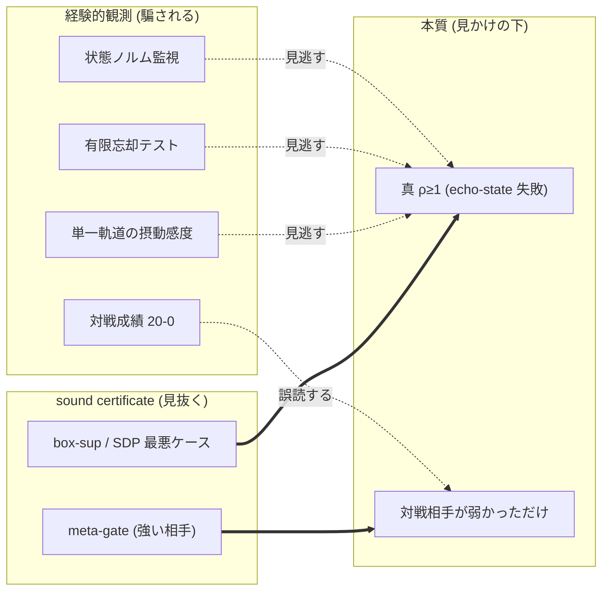
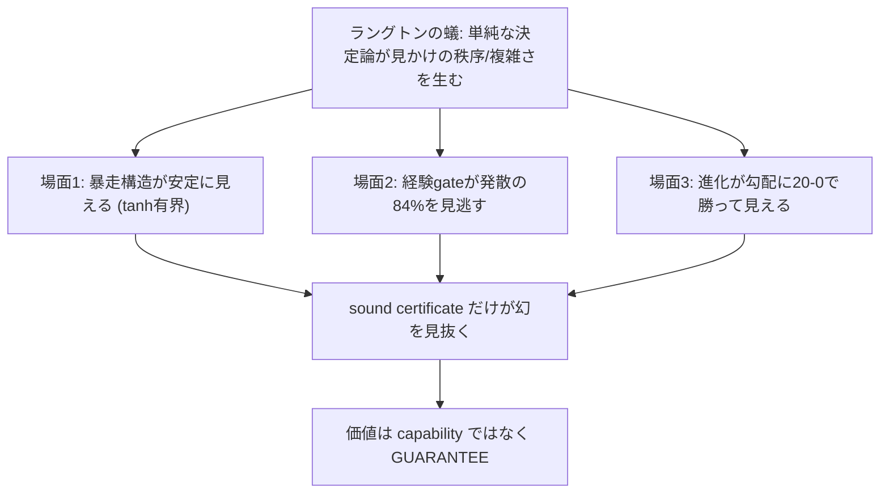
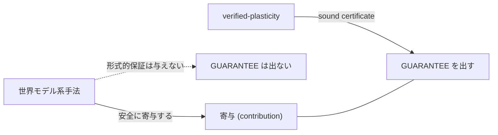
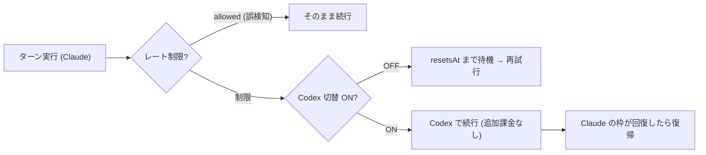
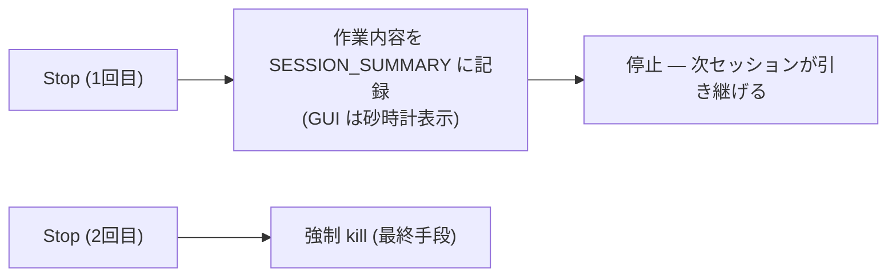

# llcore 検証 arc 総集編(#38–#42)— 防衛的公開 × 2ⁿ の壁 × 強い勾配 × ラングトンの蟻の幻 + 補遺

<!-- TOPICNAV -->
> **🌐 言語**: **日本語** | [English](https://qiita.com/furuse-kazufumi/items/525cd01eda5c1ad707ef) | [中文](https://qiita.com/furuse-kazufumi/items/29b100b00f0d58306886) | [한국어](https://qiita.com/furuse-kazufumi/items/a5ebb3992e4c28862f47)
>
> **📚 FullSense 総集編シリーズ**
> - **llcore 検証 arc 総集編（この記事）**
> - [lldarwin / 進化 arc 総集編](https://qiita.com/furuse-kazufumi/items/6e107c7dfa0c261ee4d7)
> - [llive 完全解説 総集編](https://qiita.com/furuse-kazufumi/items/07b4882e872994b27b3c)
> - [llmesh 総集編](https://qiita.com/furuse-kazufumi/items/fcb43968a5c642610762)
> - [かみくだき総集編](https://qiita.com/furuse-kazufumi/items/bfb20aca3cf1df510c26)
<!-- /TOPICNAV -->

## 目次

1. [1 日で「反証検証 → 特許 clear → 出願見送り → 防衛的公開」まで走った話](#第1章-1-日で反証検証--特許-clear--出願見送り--防衛的公開まで走った話)
2. [「窓は実装で閉じた、でも壁はびくともしなかった」報告](#第2章-窓は実装で閉じたでも壁はびくともしなかった報告)
3. [「勝ったと思った瞬間に、自分のフレームワークが自分を止めた」報告](#第3章-勝ったと思った瞬間に自分のフレームワークが自分を止めた報告)
4. [「単純な決定論ルールが、見かけの秩序を作る」という一点に、3 回分を束ねる](#第4章-単純な決定論ルールが見かけの秩序を作るという一点に3-回分を束ねる)
5. [なぜ「LLM を 3D で歩く」絵が欲しかったのか](#第5章-なぜllm-を-3d-で歩く絵が欲しかったのか)
6. [進捗バーが動かないとき、あなたは何分待てますか](#第6章-進捗バーが動かないときあなたは何分待てますか)

---

## 第1章 1 日で「反証検証 → 特許 clear → 出願見送り → 防衛的公開」まで走った話

<!-- KAMI -->
> 📖 **ざっくり言うと**
>
> ざっくり言うと、「自分たちの研究、本当に世界で誰もやっていない隙間に入れているの?」を一日かけて徹底的に疑った話です。56体の批判役AIに「この主張はもう先行研究にあるはずだ」と反例を探させ、特許データベースまで照らし合わせ、それでも「4つの条件が一点で同時に重なる隙間」が空いていることを確かめました。普通ならそこで特許を取りますが、お金と時間を天秤にかけて出願はやめ、代わりに「技術を日付付きで全部公開して先に旗を立てる(=後から誰かに特許で囲い込まれるのを防ぐ)」という守りの一手を選んだ、という意思決定の記録です。
<!-- KAMI -->

2026 年 6 月 6 日、私(筆者)は AI(Claude Code)に **「我々のやっていることが本当に差別化できているか、検証してほしい」** と求めました。AI はこれに **反証検証(adversarial verification)** — 自分の主張をわざと反証しにかかる検証役の AI を多数走らせ、それでも生き残るかを試す手法 — で応えました。56 体の検証エージェントが 7 + 3 の角度から「この主張は先行研究で反証できるはずだ」と反例を探し回り、別働隊が特許データベースまで照会しました。

結果は次のとおりです。

- **学術文献での反証(breaks): 0 件**(44 候補を個別判定して、誰も「四隅同時」を埋めていなかった)
- **特許での反証: 0 件**(英語 14 + 日本語 3 クエリで、交差点を占有する特許なし)
- そこで私は **特許を出さない**(コスト判断)と決め、代わりに **防衛的公開(defensive publication)** という旗を立てました。

この記事は、その 1 日の物語(反証検証の設計と結果、意思決定)と、**公開した中身(=四点交差点の技術)** のかみくだき版です。記事の順番は、いつものとおり ①用語の説明 → ②かみくだき(平易) → ③詳細 で進みます。

---

### ① 用語ミニ辞典(本文で詰まらないために)

| 用語 | ひとことで |
|---|---|
| **反証検証 (adversarial verification)** | 自分の主張を肯定するのでなく、わざと反証・否定しにかかる検証役(AI)を多数走らせ、それでも生き残るかで主張の強さを測る方法。身内の太鼓持ちでなく、批判者を雇うイメージ。 |
| **防衛的公開 (defensive publication)** | 特許を「取る」のではなく、技術を **公開して先行技術にする** こと。誰か(大手含む)が後から同じ発明で特許を取って、こちらや世間を縛れないようにする「先に旗を立てる」防御。 |
| **先行技術 (prior art)** | 「その発明、もう公知ですよ」と言える既存の公開物。新規性を否定する材料。日付が命。 |
| **縮小性 (contraction, ρ<1)** | エコー(過去の揺れ)が時間とともに **減衰** する性質。スペクトル半径 ρ が 1 未満。ばねが必ず止まる位置に戻る、のイメージ。記憶コアが暴走せず「忘れる」性質。 |
| **健全な証明 (sound proof)** | 「証明できた」と言ったら **本当に正しい**(偽の合格を出さない)証明。統計的に「たぶん安全」とは別物。 |
| **prove-then-reject ゲート** | 変異(更新)を **証明してから採用**、ダメなら **棄却** する関所。fail-closed(証明できなければ通さない)。 |
| **記憶コア (memory core)** | LLM の周りに被せる「覚える部品」。本研究では `s_{t+1} = decay⊙s + (1−decay)⊙tanh(W s + V x)` という漏れ・飽和つきの再帰(RWKV 系)。 |
| **進化ループ (evolution loop)** | 変異 → 選択 → 次世代、を回して良い個体を探す最適化。ここではその選択の関所に証明ゲートを置く。 |
| **SMT ソルバ (Z3 等)** | 論理式が充足可能か解く万能ソルバ。重い。本研究では「実は要らなかった(装飾)」が結論。 |
| **tracking tube(追従チューブ)** | 「望ましい軌道」からの実際のずれが収まる **筒(半径 r)** の保証。`r = G·w̄/(1−L)`。 |
| **SSGM** | 「進化する記憶を統べる」write ゲートを **理論だけ** で提案した先行研究([arXiv:2603.11768](https://arxiv.org/abs/2603.11768), 2026)。看板が一番近い相手。 |
| **navigability(探索可能性)** | 進化が「動きやすい地形か」。学習が賢くなることとは別。検証器の効き目はこちら側。 |

---

### ② かみくだき — 3 分でわかる全体像

まず生物学のニッチ(生態的地位)の話から入ります。進化では「ニッチ — 他の種がまだ占めていない隙間 — に入り込んだ種」が生き残ります。AI の世界も似ています。大手(OpenAI/Google 等)は「平均的に賢い大型種」で、広い平野を占有しています。私たちはその平野では勝てません。だから **誰も埋めていない隙間** を探し、そこに合う部品を作る。今回その隙間にぴたりと収まったのが、`llcore` という具体的なシステムです。

`llcore` は、ひとことで言うと **「記憶を持つ AI 部品が、暴走しないように"証明の関所"を自分自身に課したシステム」** です。記憶コアは更新を重ねるたびに変異(進化)していきますが、その変異を採用する前に、必ず関所(ゲート)を通します。関所は「この更新を入れても記憶が暴走しない」ことを **数学的に証明できたものだけ** を通し、証明できなければ門前払い(fail-closed)にします。

このシステムが先ほどの「隙間」にぴたりと収まるのは、次の 4 つの条件が **1 点で同時に重なる** からです。

1. **健全な縮小性証明**(エコーが必ず減衰すると数学的に保証。しかも偽の合格を出さない)
2. それを **LLM の記憶コアの内部** に当てる(制御ロボでも分類器でもなく、「覚える部品」そのもの)
3. **進化ループの中で**、ダメな変異を **棄却**(押し戻し=射影ではなく、捨てる)
4. しかも **動く実装と実験** がある(机上論で終わらない)

この 4 つを **同時に** 満たす先行研究は、56 体の反証役 AI に批判的に検証させても、特許 DB を照会しても、見つかりませんでした。1 つ 1 つの条件は先行があります(正直に全部名前を出します)。でも「四隅を同時に占有」した人はいなかった。これが **四点交差点(four-point intersection)** です。生物学のニッチでいえば、4 つの境界線がちょうど交わる **一点の隙間** に、`llcore` が収まっているわけです(孫子でいう「実を避け虚を撃つ」)。

そして大事な意思決定。この隙間は **特許でも空白** でした。普通なら「じゃあ特許を取ろう」となります。が、特許はお金と時間がかかる。私はそこを **見送り**、代わりに **「公開して先に旗を立てる」防衛的公開** を選びました。狙いは攻めではなく **防御** です — 後から誰か(大手や、SSGM の後続実装)が同じ概念で特許を取って、こちらや公衆を縛るのを **未然に無効化する**。日付付きで公開してしまえば、それは公知の先行技術になり、後出しの特許は新規性で否定されます。

ただし — ここが私たちの一貫した規律ですが — **盛りません**。「世界初」とは言いません。正しい言い方は **「我々の反証検証の範囲で、四隅を同時に占有した先行はゼロ」** です。探索範囲の外は分からない、という留保を必ず残します。

---

### ③ 詳細 — 1 日のセッションと、公開した技術の中身

#### 3.1 反証検証の設計(再現できるように)

「自分の研究は強い」と自分で言っても意味がありません。そこで AI は **反証主導のワークフロー** を組みました。

- **7 角度の反証探索**: 証明ゲートの系譜 / certified training / Transformer 安定性 / 進化 × 検証 / verified memory / runtime assurance / 産業・特許。
- **critic が指摘した盲点 3 角度を追加**: 形式手法会議側の逆引き / certified continual learning の語彙系 / 内部状態・SSM の解釈。
- **44 候補を 5 軸ルーブリックで個別判定**(更新をゲートするか / 健全証明か / LLM 記憶コアか / 進化ループ内か / 実装ありか)。判定役の AI は **一次情報(arXiv の abstract/HTML)を WebFetch で必ず確認**(伝聞禁止)。
- 並行して **内部の AI が自分の論文ドラフトの弱点を抽出**(honest disclosure: 身内の粗探し)。

確定結論は **breaks 0 / narrows 36 / background 8(44 件)**。生き残った差別化核が、上の四点交差点です。

#### 3.2 「四隅」それぞれの最近接ライバル(全部名前を出す)

新規性は「全部を 1 文で名指しできるか」で誠実さが決まります。隅ごとに最も近い先行を 1 文で:

- **SSGM([arXiv:2603.11768](https://arxiv.org/abs/2603.11768))** — 「進化する記憶を統べる」看板を **理論だけ** で先取り。ゲートは NLI(矛盾検出)で **健全な形式証明ではなく**、実装もなし。→ 看板を担う相手として **必ず引用**。実装 + 証明の窓が空いている。
- **SEVerA([arXiv:2603.25111](https://arxiv.org/abs/2603.25111))** — 自己進化エージェントに Dafny/SMT 検証。ただし対象は **出力契約** で、記憶コアの縮小性の毎更新ゲートではない。
- **PSV-Verus([arXiv:2512.18160](https://arxiv.org/abs/2512.18160))** — self-play ループ内の健全 SMT ゲート。ただし検証対象は **生成コードの正しさ**。
- **Provably Safe Model Updates / LID([arXiv:2512.01899](https://arxiv.org/abs/2512.01899))** — 更新を抽象解釈で δ-safe 認証。ただし **射影(押し戻し)** で prove-then-reject ではなく、対象は frozen-embedding の分類 head。
- **GP × モデル検査(Katz & Peled, [arXiv:1402.6785](https://arxiv.org/abs/1402.6785), 2014)** — 進化ループに健全な検査ゲートを置く **パターンの先例**。だから私たちは **ゲートのパターン自体を新規とは主張しません**。記憶コアの縮小性への適用だけが未踏。
- **Enforced-Lipschitz Transformers([arXiv:2507.13338](https://arxiv.org/abs/2507.13338))/ R2DN([arXiv:2504.01250](https://arxiv.org/abs/2504.01250))** — 縮小性を **構造で強制(by-construction)**。これは「ゲートなんか要らない、最初から組み込め」という最強の対抗設計。私たちは **by-construction 対 prove-then-reject** を設計軸として対比します(構造強制は表現力を犠牲にし、棄却ゲートは任意更新を構造制約なしに検査する)。
- **Safeguarded AI(ARIA programme)** — 最も権威ある proof-gated-gatekeeper 概念。ただしゲート対象は **行動/計画**(出力ゲート)で、重み/記憶の更新ゲートではなく、まだ programme 段階。
- **Emergent FV / substrate-guard([arXiv:2603.21149](https://arxiv.org/abs/2603.21149))** — AI の **出力** を Z3 で検証する動くシステム。ただし post-hoc 監視で、毎更新ゲートではない。

(上記 arXiv ID はすべて論文ドラフトで abstract と照合確認済みのものだけを使っています。)

> 🗒️ *「考察が甘いわね…」— 先行研究を名前で並べただけで満足しない自戒*（© Forbidden shibukawa / SHUEISHA・『スナックバス江』）

#### 3.3 特許面の照会(学術監査が残した穴埋め)

学術監査は **文献だけ** で、特許 DB を見ていませんでした(不在証拠として弱い)。そこで別働隊が **英語 14 + 日本語 3** のクエリで Google Patents / USPTO を照会しました。

- **交差点を占有する特許: ゼロ件。**
- 最近接の特許は 3 系統だけで、いずれも交差点外:
  - **[US11715005B2](https://patents.google.com/patent/US11715005B2)** — NN をハッシュ照合で真正性検証(健全証明でなく暗号ハッシュ)。
  - **[US10896032](https://patents.google.com/patent/US10896032)** — certify-then-deploy のガバナンスゲート(根拠が手続的 attestation)。
  - **[US11868855](https://patents.google.com/patent/US11868855)** — モデル/重みの「stability」検証(ただし可用性・耐障害の意味の蓋然性大)。
- 面白い構造的証拠: 「**健全証明で更新/記憶/進化をゲートする**」とクエリすると、特許 DB に site 指定しても結果がほぼ全部 **arXiv に逸れた**。これは「この概念がまだ学術段階に留まり、特許化されていない」間接証拠です。

→ 結論: **特許面でも clear**。ただし US10896032 / US11868855 は語彙が部分的に被るので、論文の related work に「展開ガバナンス型ゲート/運用安定性検証とは異なり、本研究は重み更新の解析的 contraction 性質を健全証明でゲートする」という対比を 1〜2 文先回りで入れています。

#### 3.4 公開した技術の中身(防衛的開示の本体)

防衛的公開は「当業者が実施できる詳細度」で書かないと先行技術として弱い。なので、開示文書には次を **実装可能なレベル** で書きました。

**(a) 健全な縮小性証明器の梯子(ladder)。** 安いものから順に 3 段:
- `cert_inf` — 閉形式の ∞-ノルム上限(`O(n²)`)。各行の絶対値和が端点で最大になる性質を使い、**ソルバ不要**。
- `cert_two` — 全 `2^n` 頂点で SVD。
- `cert_sdp` — 共通 Lyapunov 行列を凸 LMI(内点 SDP, CLARABEL)で。

**ここが正直ポイント**: プロジェクトの旧通称は「Z3-gated」でしたが、**実際のゲートに SMT(Z3)は使っていません**。専用の Z3 縮小性トラックを走らせて確認したら、閉形式 ∞-ノルム証明器と **バイト単位で一致(3270 件中 0 件の不一致、境界近傍でも 8000 件中 0 件)**。つまりこの不変量クラスでは **Z3 は装飾** でした。だから看板を「健全な縮小性証明器の梯子」に直しています(これは退却ではなく強み — ソルバ依存と不完全性を回避できる)。

**(b) prove-then-reject ゲート(fail-closed)。** 子個体を提案 → 証明が通れば採用、ダメなら上限まで resample、それでもダメなら **既知安全な fallback** を採用。**未証明の子は決して採用しない**。`gate_mode="contraction"` / `"state_norm"` を additive に追加し、既定 `"none"` は従前挙動とバイト一致(=既存進化基盤への純粋な被せ物)。

**(c) tracking tube 検査指標。** 「どこかに縮む」だけでなく「**望ましい軌道に追従する**」を見たい、というユーザー要望への答え。ゲートが既に計算している量(状態 Lipschitz `L`、入力ゲイン `G`)と外乱上界 `w̄` を再利用し、追従誤差が収まる筒 `r = G·w̄/(1−L)` を **追加証明コストゼロ** で報告。小規模実測でも、縮小性 PASS の 3 gene は誤差/外乱比 0.50/0.78/1.04 で理論筒の内側、非縮小性の対照は **9.3 倍** に増幅(=ゲートは飾りでなく load-bearing)。

**(d) verified memory evolution の 2 ルート。**
- ルート (a): エージェント **記憶バンク** の更新を健全証明でゲート(SSGM の NLI 理論との差 = 健全証明 + 動くゲート)。
- ルート (b): 記憶コアの **内部状態 dynamics** をゲート(本書で実施済)。

**(e) 合成: SPC 管理図 runtime ゲート + 二層倫理ゲート。** 進化メトリクスを管理図(X̄–R / CUSUM)に通して時間方向の異常を online ゲート。そして **探索は自由・採用は検証** の二層倫理(探索層は孫子の「詭道」=奇手 OK、採用層は論語の「仁」=誠実でゲート不可避)。

#### 3.5 本日の実装事実(reduced to practice)

机上論ではないことの証拠:

- 証明ゲートは **出荷側の `evolve()` に本配線済**(`gate_mode` / `resample_cap` を additive 追加、既定 `"none"` は byte-identical、research 側の参照実装と全モード一致をテストで実証)。
- tracking tube レポータも着地(`r = G·w̄/(1−L)`, `cert_inf` 限定、read-only、golden 値一致)。
- ゲート + レポータを覆うテスト **294 件**。
- **観測したゲートのコストは約 20〜60 倍**(証明はタダではない、と隠さず開示)。

#### 3.6 honest 限界(弱めない)

防衛的開示でも honest disclosure は曲げません。

- **規模は小**: 核は `n=8`(72 実数 gene)・16 KB コーパス・byte vocab。「LLM 記憶コア」は **機構実証** の意味。
- **検証器の payoff は navigability であって学習ではない(L3)**: 効果は EA 固有で、勾配法では消える。
- **ゲートは ~20〜60 倍のコスト**: 短い訓練ではタダに見えるだけ。
- **「false admit ゼロ」は経験的観測であって機械検査ではない**: 証明器の *条件* は健全だが、それを担う *実装* は end-to-end に形式検証されたわけではない。
- **「未発見」の範囲**: 反証検証 + 表層特許検索の範囲に限る。CNIPA(中国語)未照会、特許は最長 18 ヶ月の公開ラグ。「探索範囲で」の留保は常に維持。

---

### まとめ — 旗は「攻め」ではなく「守り」のために立てた

今日 1 日で、私たちは自分の研究を 56 体の反証役 AI に批判的に検証させ、特許 DB まで照会し、それでも残った「四隅の空白」を確認しました。普通ならここで特許を狙うところですが、コストを天秤にかけて **出願は見送り**、代わりに **日付付きの防衛的公開** で旗を立てました。

狙いはシンプルです — **誰かが後からこの空白を特許で囲い込み、私たちや公衆を縛るのを未然に無効化する**。そのために、当業者が実装できる詳細度で全部公開しました。そして最後まで、**「世界初」とは言わず「我々の検証の範囲で四隅同時の先行ゼロ」** という、盛らない言い方を守っています。

防衛的公開の本体(日付付き開示)は、下の追記のとおり **実装と全データを含む public リポジトリ** に昇格しました: [github.com/furuse-kazufumi/llcore](https://github.com/furuse-kazufumi/llcore)。

次回(#39 以降)は、この四点交差点の本丸 — verified memory evolution の小 PoC(記憶バンク更新ルート)の着地を report する予定です。SSGM が理論で看板を取った窓が、実装で閉じる前に。

### 追記(2026-06-07)— 旗は実装になりました

この記事の翌日、予告していた verified memory evolution の PoC は **完走し、防衛的公開は「文書」から「実物」に昇格**しました。

- **public リポジトリ**: [github.com/furuse-kazufumi/llcore](https://github.com/furuse-kazufumi/llcore) — 論文ドラフト([PAPER_DRAFT.md](https://github.com/furuse-kazufumi/llcore/blob/main/research/paper/PAPER_DRAFT.md))+ 全実験コード/データ(570 ファイル、テスト 318 件 green)を、日付付きの単一コミットとして公開
- **trajectory-tube gate**(予告していた本丸): 事前登録 n=40 の決着で、記憶 horizon への効果を確認(論文 §9)
- **さらに先へ**: 「検証器を AI 自身が持ったらどうなるか」— 死ねる環境での記憶形成 3 機構(自己予見/復活修復/社会的観察)の測定まで公開内容に含まれます(論文 §9.6)
- **知見スライド(CC BY 4.0)**: [slides/](https://github.com/furuse-kazufumi/llcore/tree/main/slides) — 出典明示で企業利用も可能な 10 枚要約(日英)。**現状は要約版で情報密度は控えめです — 研究の進展に合わせて、実験設計の詳細・図表・再現手順・採用判断の材料まで、今後 1 年かけて拡充していきます**

「SSGM の窓が実装で閉じる前に」という予告は、こうして果たされました。

---

---

## 第2章 「窓は実装で閉じた、でも壁はびくともしなかった」報告

<!-- KAMI -->
> 📖 **ざっくり言うと**
>
> 前の章で立てた「証明つきで進化する記憶AI部品」という旗を、紙の上の話から実際に動くプログラムへ進めた報告です。たとえるなら、設計図(理論)を本物の機械(実装)にして、しかも危険な部品を一つも見逃さずに動かせた、という前進。ただし正直に言うと、勝てなかった宿題も残りました。安全かどうかを確かめる計算が、部品の大きさが増えるたびに爆発的に重くなる「2のn乗の壁」は今回も破れず、安全に進化させられるのは当面ごく小さな部品に限られる、という限界をそのまま書いています。半分勝って、半分宿題、の一日です。
<!-- KAMI -->

前回(#38)の最後で、私たちはこう予告しました。「次回は四点交差点の本丸 — verified memory evolution の小 PoC を report する。SSGM が理論で看板を取った窓が、実装で閉じる前に」。

2026 年 6 月 9 日、その PoC が走り切りました。結論を 1 行で言うと、**「窓は実装で閉じた。でも壁(スケーラビリティの壁)はびくともしなかった」**。

具体的には:

- **証明つきで進化する記憶コア**(実際に構造を太らせる手術 `width_grow` を含む)を、**0 観測 false-admit のまま** 動かせた(= 偽の合格を 1 件も出さずに進化できた)。
- 同時に、前回まで「未測定」と正直に残していた **cert_sdp(SDP 証明器)を初めて測り**、それが **最も "通りやすい"(navigable)健全証明器**(真に収縮する個体の 90〜99% を合格にする)と判明した。
- **にもかかわらず、その cert_sdp も含めて、計算コストは `2^n`(次元 n の指数)のまま** だった。つまり **「通りやすくて、かつ大規模でも安い」証明器は、今回も見つからなかった**。verified に構造進化させられるのは、当面 **小さな部品(n≤6)に限る**。

この記事は、その 1 日の「やれたこと」と「やれなかったこと」を、いつもの順番 ①用語 → ②かみくだき → ③詳細 で、盛らずに書きます。最後に、自分の数値主張を **6 体の検証 AI に並列で反証させた**結果(MAJOR な不一致ゼロ)も開示します。

正本データ: [github.com/furuse-kazufumi/llcore](https://github.com/furuse-kazufumi/llcore)(論文ドラフト + 全実験コード/データ)。

---

### ① 用語ミニ辞典(本文で詰まらないために)

| 用語 | ひとことで |
|---|---|
| **可塑性 (plasticity)** | 学習・進化で「形を変えられる」性質。ここでは記憶コアの構造そのもの(行列の大きさ=次元)を後から太らせること。 |
| **verified-plasticity(検証つき可塑性)** | 「形を変える」たびに、その変更が安全(暴走しない)かを **証明してから採用** すること。本研究の主軸。 |
| **width_grow(幅成長)** | ニューラルネットの層を `n → n+1` に **太らせる構造手術**(Net2Net 系)。机上ではなく実際に実行した。 |
| **収縮性 (contraction, ρ<1)** | 過去の揺れが時間とともに **減衰** する性質。スペクトル半径 ρ が 1 未満。記憶が暴走せず「忘れる」性質。 |
| **false-admit(偽の合格)** | 本当は危険(ρ≥1=暴走しうる)なのに、証明器が「安全」と通してしまう取りこぼし。これがゼロなのが健全性の生命線。 |
| **健全 (sound)** | 「合格」と言ったら **本当に安全**(偽の合格を出さない)性質。統計的に「たぶん安全」とは別物。 |
| **navigability(通りやすさ/探索可能性)** | 「本当に安全な個体を、どれだけ合格にできるか」。厳しすぎる証明器は安全な個体まで弾く=進化が動けない。これが高いほど進化は地形を動きやすい。 |
| **証明器格子 (cert ladder)** | 安い順に `cert_inf`(∞-ノルム上界・ソルバ不要)→ `cert_two`(全 `2^n` 頂点 SVD)→ `cert_sdp`(凸 LMI/SDP)の 3 段。 |
| **prove-then-reject ゲート** | 変異(更新)を **証明してから採用**、ダメなら **棄却** する関所。fail-closed(証明できなければ通さない)。 |
| **SSGM** | 「進化する記憶を統べる」write ゲートを **理論だけ** で提案した先行研究([arXiv:2603.11768](https://arxiv.org/abs/2603.11768))。実装 + 健全証明の窓が空いていた相手。 |
| **empirical_rho(経験的 ρ)** | 真のスペクトル半径を、多数サンプルで **下から** 近似するオラクル。「0 観測 false-admit」はこの下からの監査での結果(=強い consistency 証拠だが、絶対証明ではない)。 |
| **2^n 壁** | 証明コストが次元 n に対して指数 `2^n` で増える限界。`cert_two`/`cert_sdp` は頂点を全部見るのでこの壁に当たる。 |

---

### ② かみくだき — 3 分でわかる全体像

前回(#38)で立てた旗は「**証明つきで進化する記憶コア**」でした。記憶コアは更新のたびに変異(進化)しますが、その変異を採用する前に必ず関所(ゲート)を通し、「この変異を入れても記憶が暴走しない」と **数学的に証明できたものだけ** を通す。証明できなければ門前払い(fail-closed)。これが prove-then-reject ゲートです。

今回やったのは、その旗を **「文書」から「動く実物」へ** 進めることでした。3 つの「やれた」があります。

**やれた①: 形を太らせながら、偽の合格ゼロ。** これまでは「変異(中身の微調整)を証明する」までしか試していませんでした。今回は **構造そのものを太らせる手術(`width_grow`、n→n+1)** を実際に走らせ、太らせた後でも証明器が「安全(ρ<1)」を **0 観測 false-admit** で保つことを確認しました。発散域(ρ が 1.85〜2.21 に達する危険な個体)は、全部正しく棄却されました。

**やれた②: 一番"通りやすい"証明器を、初めて測れた。** 前回まで「SDP 証明器(cert_sdp)は未測定」と正直に残していた穴を埋めました。SDP ソルバ(CLARABEL)が使える環境で初めて測ったところ、**cert_sdp が 3 段の証明器のうち最も "通りやすい"** — 真に収縮する個体のうち 90〜99% を合格にする(安い `cert_inf` は 20〜40%、中位の `cert_two` は 40〜50% しか通せない)。つまり「厳しすぎて進化が動けない」問題を、SDP がかなり緩めてくれた。

**やれた③: 小さな部品なら、計算は自明に間に合う。** n≤6 の小さなコアなら、verified に進化させるループ全体が **30 時間の予算の 0.04%(0.013 時間)** しか食わない。「証明つき進化なんて重くて回らないのでは?」という心配は、小規模では杞憂でした。

…ここまで聞くと「全部勝った」ように見えます。でも honest disclosure(正直な開示)が私たちの規律です。**勝てなかったこと** を 3 つ、はっきり書きます。

**やれなかった①: 2^n の壁は破れていない。** cert_sdp は確かに "通りやすさの天井" を上げました。が、その代償としてコストは依然 `2^n`(頂点を全部見る)。`cert_two` は n=12 で 1 証明 1.3 秒、n=14 で予算外。**「通りやすくて、かつ大規模でも安い」証明器は、今回も存在しなかった**。だから verified に構造進化できるのは当面 **小さな部品(n≤6)に限る** — この結論は前回(Phase −1)から **変わっていません**。SDP は壁を **越えた** のではなく、壁の手前で天井を **上げた** だけです。

**やれなかった②: 「偽の合格ゼロ」は経験的観測であって、機械が証明したわけではない。** 0 観測 false-admit は、真の ρ を **下から** 近似するオラクル(多数サンプル)で反証を探した結果です。証明器の *条件* は数学的に健全ですが、それを担う *実装* が端から端まで形式検証されたわけではありません。「0 観測」は強い consistency 証拠ですが、「全ての入力で安全」の絶対証明ではない — ここは誇張しません。

**やれなかった③: 学習が賢くなったわけではない。** 証明器の効き目は **navigability(進化の動きやすさ)** であって、モデルが賢くなる(=学習性能が上がる)ことではありません。しかも効果は進化的アルゴリズム(EA)固有で、勾配法では消えます。さらに今回の適合度(fitness)は **合成 proxy** で、実 GPU 訓練での確認は次フェーズ(Phase 2)送りです。

要するに今回は **「機構は実装で証明できた、規模の壁は正直に残った」** という、半分勝って半分宿題、の日でした。

---

### ③ 詳細 — 5 つの実験と、潰せなかった留保

主軸は **Verified-Plasticity Evaluation Framework**(検証つき可塑性の測定ハーネス)です。「うちの手法が強い」と主張する前に、まず **測る物差し** を作る。その物差しで 5 つの実験を回しました(全て `$0` / CPU、torch 2.12+cpu、seed 固定で再現可能)。

#### 3.1 固定構造での証明器の健全性と格子

収縮〜発散を跨ぐ個体を n={4,6,8} で各数百サンプルし、3 証明器の合格と真の ρ(empirical_rho 6000 サンプル)を突合しました。

| n | 収縮(ρ<1) | false-admit (inf/two/sdp) | 真に収縮する個体の合格率 (inf/two/**sdp**) |
|---|---|---|---|
| 4 | 453/600 | **0 / 0 / 0** | 0.41 / 0.51 / **0.95** |
| 6 | 426/600 | **0 / 0 / 0** | 0.29 / 0.43 / **0.94** |
| 8 | 280/400 | **0 / 0 / 0** | 0.23 / 0.40 / **0.91** |

確定知見:
1. **3 証明器すべてが 0 観測 false-admit**(cert_sdp の健全性も初確認)。証明器の数学的健全性と一致。
2. **cert_sdp が圧倒的に navigable** — 真に収縮する個体のうち、安い cert_inf は 23〜41%・cert_two は 40〜51% しか通さないのに、**cert_sdp は 91〜95% 通す**。なお `two⊆sdp`(cert_two が通すなら cert_sdp も通す)は実装上の fast-path による **構造的保証(トートロジー)** であって経験的発見ではない、と明記しておきます(盛らないため)。

#### 3.2 実構造手術(width_grow)下での健全性 × 非自明性

実際に `width_grow`(Net2Net/fresh)で base を n→n+1 に太らせ、各ゲートが **成長下でも 0 false-admit を保つ ∧ 非自明な合格を 1 件以上開く** かを判定しました(1 セル = 1536 個の成長後個体)。

- **成長下の健全性: 全 16(セル×ゲート)で 0 観測 false-admit。** 成長 ρ 最大 1.85〜2.21(発散域)は正しく全棄却。これが **North Star #1(成長操作下で偽の合格ゼロ)** の実構造手術での確認です。
- **安い cheap gate(cert_inf)は健全だが、小 n で脆い** — n=6 の最も保守的なエッジ(headroom 0)では非自明な合格が **0 件** → gate FAIL。headroom があっても非自明合格はわずか 3 件で τ ギリギリ。= 「cheap gate の navigability は脆弱」。
- **navigable gate(cert_two/cert_sdp)は全セル PASS** — cert_two は 114〜168、cert_sdp は 673〜733 の非自明な健全合格を開く。→ **「per-component ゲートは cert_two/sdp に格上げ・small-n 限定」がデータで正当化**。

#### 3.3 ブロック間結合(coupling)の盲点

2 ブロックを残差結合し、**「各ブロック単体では合格でも、合成すると暴走する」盲点** を真の ρ で測りました。

- **per-block AND(各ブロック単体の合格を AND する)は結合下で本当に不健全** — 結合強度 γ≥1.0 で、単体合格済の **24〜34%(γ=1.0)〜 80〜96%(γ=2.0)が合成真 ρ≥1**(暴走)。→ **per-block AND は禁止確定**。
- **full-system cert(系全体を一括で証明)は全 γ で 0 false-admit = 健全。**
- ここでも **cert_sdp が最 navigable** だが、次元(ブロック数 2→3)と結合強度を上げると coverage は低下(full=6・γ=1.0 で cert_inf/cert_two は 0%、cert_sdp のみ 75.8%)。= SDP は過保守を解消するが、**次元の壁は SDP でも効く**。
- ⚠ 正直な留保: ブロック数 3 で SDP ソルバが「解が不正確かも」警告を数件出しました。**独立な固有値再検査で健全性(false-admit=0)は保証** されますが、coverage の数値は近似解由来の僅かな揺れを含みえます。

#### 3.4 feasibility(本当に予算内に回るか)

per-op の実測 wall-time から 30 時間予算へ外挿しました。

| n | 1 eval あたり | 総時間 | 30h に収まる |
|---|---|---|---|
| 4 | 769μs | **0.011h** | はい |
| 6 | 912μs | **0.013h** | はい |
| 8 | 9.2ms | 0.131h | はい |
| 10 | 38.6ms | 0.550h | はい |
| 12 | 1.31s | **18.6h** | 辛うじて |
| 14 | — | (cert_two 2^14 外挿 = 不能) | いいえ |

確定知見:
1. **small-n(n≤6)は計算上自明に feasible** — 予算の 0.04%。
2. **2^n 壁は n≥10〜12 で binding** — cert_two が n=12 で 1.3 秒/証明(=18.6h、マージン薄)、n=14 で予算外。
3. ⚠ 留保: ここの fitness は `RotationNDObjective` の **合成 adapter proxy** で、実 GPU 訓練では base forward(CE)が dominant になります。この外挿は「per-eval ごとに証明を 1 回課金する保守的上限」見積りで、実 GPU 実測は Phase 2 で要確認。

#### 3.5 第 2 base(Mamba)への移植性

framework が SmolLM2 以外の base にも載るかを確認しました。**Mamba-130M を CPU で load 成功**(coherent な生成も確認)、その hidden 上で cert_two ゲートが load-bearing(gate あり/なしで合格率が +0.287 動く、SmolLM2 の +0.320 と整合)。= 「新しい base に載せ替えられる」plug-point の実証。
- ⚠ 留保: ここの健全性オラクルは §3.1-3.4 の empirical_rho ではなく **弱いオラクル(単一摂動)** で、合格 n=7 の小集団。Mamba 自体の固有安定性(base-level の Lyapunov)は未測定で Phase 2 送り。本フェーズの deliverable は「framework portability + Mamba CPU 動作確認」に限定します(固有安定性の正対照ではない)。

#### 3.6 統合判定 — Decision gate 1 = PASS(small-n)

| gate | 条件 | 判定 |
|---|---|---|
| 成長下 soundness ∧ 非自明 admit≥1 | width_grow N 回で false-admit=0 ∧ 非自明合格≥1 | **PASS**(cheap gate は n=6 で trivial → cert_two/sdp 必須) |
| coupling-aware 合成 soundness | per-block AND 禁止 + full cert 健全 | **PASS** |
| feasibility | small-n ループが 30h 予算内 | **PASS**(small-n) |

→ **Decision gate 1 = PASS → Phase 2 へ(small-n per-component 域、Phase −1 確定の制約内)**。Phase 1 の deliverable は **「健全・feasible な small-n verified 構造適応の測定ハーネス + 証明器格子(inf/two/sdp)の完全な特性評価」** です。

#### 3.7 honest 限界(潰せていないもの)

防衛的開示でも honest disclosure は曲げません。前回(#38)の留保に、今回の測定で潰せたもの/残ったものを重ねます。

- **2^n scalability 壁は不変(最大の宿題)**: cert_sdp で navigability 天井は ~0.9 に上がった(前回 cert_two ~0.45 から大幅改善)が、**2^n 頂点コストは不変**。「navigable かつ scalable な健全証明器は依然不在」= verified 構造進化の高次元での不成立は **堅持**。SDP は天井を上げただけで壁は破っていない。
- **empirical_rho は from-below 推定**: 0 観測 false-admit は強い consistency だが「全 (s,x) で ρ<1」の絶対証明ではない。near-boundary を取りこぼしうる。
- **net2net は incoming-copy 近似**(exact function-preserving ではない)→ 関数変化 Δfunc は近似評価。
- **fitness は合成 proxy**: 実 SmolLM2 CE での capability 副線(EXISTS/NULL/ARTIFACT)は Phase 2 必須。
- **Mamba 固有安定性は未測定**: gate は adapter に掛かり、Mamba base 自体の Lyapunov は未検証 → Phase 2 defer。

---

### 敵対的検証 — 自分の数値を 6 体の AI に並列で反証させた

honest disclosure の核は「異常に良い結果が出たら、勝った気になる前に内訳を疑う」です([feedback_benchmark_honest_disclosure])。そこで本 verdict の数値主張を、6 実験それぞれの `results.json` + 実装 `.py` に対し、**独立な検証 AI 6 体を並列**で突合させました。

**結果 = MAJOR issue ゼロ(結論を覆す不一致なし)、全て MINOR。** 検出された指摘は本文に反映済です:
- 転記丸め誤差 4 件(maxΔfunc 0.108→0.107 等)を修正。
- §3.1 の `two⊆sdp` は経験的発見ではなく実装上のトートロジーと明記。
- 「cheap gate は n=6 で trivial」を「n=6 最保守エッジのみ trivial、headroom ありでも脆弱」へ精緻化。
- 「cert_sdp 98% 救済」はブロック数 2 限定、3 では 75.8% / inf・two は 0% と明記。
- fitness が合成 proxy であること、外挿の保守性、CPU→GPU 外挿の前提を透明化。

→ **検証後も Decision gate 1 = PASS、SDP navigability 知見、small-n 限定結論は不変**。指摘は全て honest-disclosure の精度向上であり、機構的結論を揺るがすものは無し。

---

### まとめ — 「窓は閉じた、壁は残った」

#38 で立てた旗は、今回 **文書から動く実物へ** 進みました。証明つきで進化する記憶コアを、実際に構造を太らせながら **0 観測 false-admit** で動かし、未測定だった SDP 証明器を埋め、small-n の feasibility を確認しました。SSGM が理論で取った看板の「実装 + 健全証明」の窓は、こうして実装側で閉じました。

一方で、最大の宿題 **2^n 壁** は今回もびくともしませんでした。「通りやすくて、かつ大規模でも安い」証明器は依然として存在しません。だから私たちは **盛りません**: verified に構造進化できるのは **当面 n≤6 の小さな部品まで**、という前回の結論を堅持します。

次回(#40 以降)は Phase 2 — 校正済みの「多峰性 instrument」を実損失地形に当て、進化が地形をどう動くか(capability 副線)を proper power で 1 つ確定する予定です。物差しはできた。次は、その物差しで実地形を測る番です。

正本: [github.com/furuse-kazufumi/llcore](https://github.com/furuse-kazufumi/llcore) — 論文ドラフト + 全実験コード/データ(5 実験 + 敵対的検証 workflow)。

---

<!-- INTERLUDE -->

### ☕ 閑話休題 — なぜ「証明はタダじゃない」のか

本文に「証明のコストは約20〜60倍」とサラッと書いてありますが、ここで一息ついて、その意味を日常の感覚に翻訳しておきます。ある計算を「やる」のと、「その計算が絶対に間違っていないと確かめる」のとでは、後者のほうがずっと手間がかかります。暗算で答えを出すのは速いけれど、その答えが本当に正しいと第三者に納得させようとすると、途中式を全部書き、別のやり方で検算し、極端なケースまで試す —— あっという間に何倍もの時間になる。AIの世界でも同じで、「この更新を入れる」のは一瞬でも、「この更新を入れても絶対に暴走しないと数学で保証する」には、その何十倍もの計算が要ります。

だから速さを売りにするプロジェクトは、たいてい「確かめる」工程をこっそり省いています。本文がしつこく「証明はタダではない」と開示するのは、その省略を自分には許さない、という宣言でもあります。重さを隠さず見せる —— それ自体が、この研究の姿勢を一番よく表しているのかもしれません。

<!-- INTERLUDE -->

---

## 第3章 「勝ったと思った瞬間に、自分のフレームワークが自分を止めた」報告

<!-- KAMI -->
> 📖 **ざっくり言うと**
>
> 研究で一番こわい瞬間 ——「結果が良すぎたとき」—— にどう自分を疑ったか、の話です。本物の小型LLMが作る地形の上で、進化(という探索手法)が普通の学習法に20戦20勝しました。一瞬「勝った!」と思った。でも野球で草野球チームに20連勝しても自分が強い証拠にはならないのと同じで、相手(弱い学習法)が弱かっただけかもしれない。そこで「勝ったら強い相手を呼べ」という自分で仕込んだ掟に従って本気の学習法(本物のLLM学習が使うやつ)を呼んだら、今度は逆に負けました。つまり勝利は幻。「進化が賢い」とは言えない —— でもこの結果は、最初から賢さでなく安全性で勝負すると決めていた方針が正しかった、という確認でもあります。
<!-- KAMI -->

前回(#39)で私たちはこう締めくくりました。「証明つきで進化する記憶コアは作れた。ただし n≤6 の小さな部品まで。スケーラビリティの壁はびくともしなかった」。

そして今回(2026 年 6 月 10 日)は、ずっと後回しにしてきた **本丸の問い** に答えました。

> **「で、その『進化する記憶』は、ちゃんと賢くなるの? 勾配法(普通の学習)より強いの?」**

結論を 1 行で言います。**「実在の小型 LLM が作る本物の地形で、進化は普通の勾配法に 20戦20勝した。一瞬、勝ったと思った。でも自分のフレームワークの規律に従って『強い勾配』を出したら、その勝利は幻だった」**。

この記事は、研究で一番こわい瞬間 — **「異常に良い結果が出てしまった瞬間」** — に、勝った気になる前にどう自分を疑ったか、の記録です。いつもの ①用語 → ②かみくだき → ③詳細 で、盛らずに書きます。最後に、自分の数値主張を **検証 AI に並列で反証させた** 結果(MAJOR な不一致ゼロ)も開示します。

正本データ: [github.com/furuse-kazufumi/llcore](https://github.com/furuse-kazufumi/llcore)(全実験コード/データ + verdict)。

---

### ① 用語ミニ辞典(本文で詰まらないために)

| 用語 | ひとことで |
|---|---|
| **capability(性能)** | 「賢くなるか」。ここでは次に来るものを当てる予測の良さ(交差エントロピー=CE が小さい)。 |
| **guarantee(保証)** | 「暴走しないか」。証明つきで安定(収縮 ρ<1)を保てること。本研究の主軸。**この 2 つを混同しないのが honest-disclosure の生命線。** |
| **MAP-Elites(進化)** | 多様な解を碁盤の目に貯めながら探す進化的探索。今回の「進化」側。 |
| **finite-diff 勾配(弱い勾配)** | 関数値を少しずらして傾きを **推定** する素朴な勾配法。1 ステップに次元数+1 回の評価が要る=**遅くて弱い**。 |
| **解析(exact)勾配(強い勾配)** | 自動微分(backprop)で **正確な** 傾きを 1 回で得る勾配法。実際の LLM 学習が使うのはこちら。今回の決め手。 |
| **meta-gate** | 「進化が勝った」ように見えたとき、**もっと強い対戦相手**を出して利得が消えないか確かめる関門。消えれば幻(ARTIFACT)。 |
| **ARTIFACT(まやかし)** | 本物の性能差ではなく、**対戦相手が弱かったせい**で生まれた見かけの勝利。 |
| **ラングトンの蟻** | 単純な規則なのに、しばらく無秩序に見え、突然秩序が現れる有名な系。「見かけ」と「本質」がズレる比喩として使う。 |

---

### ② かみくだき — 「弱い相手に20連勝しても、何も言えない」

野球で例えます。あなたのチーム(進化)が、ある相手(finite-diff 勾配)に **20戦20勝** しました。強い。文句なし。

…でも、その相手が **草野球チーム** だったら? 20連勝は「あなたが強い」証拠になりません。「相手が弱かった」だけかもしれない。

研究でこれをやると大事故になります。「進化が勾配に勝った!」と論文に書いて、後で「いや、あなたが比べた勾配法が弱すぎただけです」と言われる。これが **capability の罠** です。

そこで私たちのフレームワークには、最初から **掟(meta-gate)** が入れてあります。

> **進化が勝ったら、勝った気になる前に "プロ" を呼んで再戦せよ。**

今回その "プロ"(解析勾配=実際の LLM 学習が使う正確な勾配)を呼びました。結果:

- 草野球(finite-diff)相手: 進化 **20勝0敗**(平均 CE で +0.029 リード)
- プロ(解析勾配)相手: 進化 **1勝19敗**(プロが逆に勝ち越し)

つまり **進化が勝てたのは相手が弱かったから**。強い勾配を出したら、勾配の方が良かった。**「進化が賢くなる(capability)」は言えない。**

ここで大事なのは、**負けたこと自体は失敗ではない** という点です。私たちのフレームワークの価値は最初から「賢くなる」側(capability)ではなく、**「暴走しない」側(guarantee)** に置いています。今回の結果は、その方針が **データで正しかった** ことを意味します — 賢さで売らなくて正解だった、と。

> 🗒️ *「コイツ…つまんね〜〜!!」— 弱い相手への20連勝は、退屈なだけで何も言えない(風間)*（© Forbidden shibukawa / SHUEISHA・『スナックバス江』）

---

### ③ 詳細 — 実在 LLM の地形で、何を、どう測ったか

#### 3-1. 地形を「合成」から「本物」へ

前回までの capability 実験は、**人工の多峰地形**(山がいくつもある作り物)で測っていました。正直な留保として「これは実在 LLM の損失地形ではない」と残していました。

今回はそこを **実在の SmolLM2-135M**(Apache-2.0 の小型 LLM)で詰めました。手順:

1. SmolLM2 に文章を通し、中間層(layer 15)の **本物の内部表現(hidden state)** を取り出す。
2. それを小さな次元(n=6)に射影し、**「次に来る内部表現のクラスタ」を当てる CE 地形**を作る。これは合成ガウスではなく、**モデル自身の内部ダイナミクス由来の本物の予測タスク**。
3. その地形の上で、進化(MAP-Elites)・ランダム・弱い勾配・**強い解析勾配**を **同じ予算**(評価回数)で走らせ、**未観測の文(held-out)** での予測精度を 20 シードで比べる。

#### 3-2. 結果(held-out 平均 fitness = −CE、高いほど良い)

| 手法 | held-out 平均 | ひとこと |
|---|---|---|
| **強い解析勾配(torch Adam)** | **−1.446** | **全手法で最良** |
| 進化(MAP-Elites) | −1.454 | 2 位 |
| ランダム | −1.473 | |
| 弱い勾配(restart 多め) | −1.481 | |
| 弱い勾配(finite-diff) | −1.483 | **最下位** |
| 進化+ρ<1 gate | −1.483 | gate を掛けると探索が制約され finite-diff 並みに |

- 進化 vs **弱い勾配**: 平均差 +0.029、**20勝0敗**、p<1e-6 → 4条件 AND **成立**(一見 EXISTS)。
- 進化 vs **強い解析勾配**: 平均差 −0.008、**1勝19敗**、p=3.5e-4 で **勾配が逆転** → 4条件 AND **不成立**。

**→ 判定 = ARTIFACT+NEGATIVE。** 進化の勝ちは弱い対戦相手のせい。強い勾配では勾配 ≥ 進化 = **実在 LLM 地形でも capability は NEGATIVE**。

#### 3-3. 両地形で一貫することも確認した(cross-check)

「じゃあ前回までの合成地形の『引き分け(NULL_TIE)』も、弱い勾配のせいで過小評価だったのでは?」 — その疑いも **データで確かめました**。合成地形にも強い解析勾配を足して再走させると、**解析勾配が最高平均**(0.575 > 進化 0.535)。ただし合成地形は運の振れ(分散)が大きく、ペア検定では引き分け止まり。実在地形は振れが小さいぶん、勾配の優位が **統計的に有意**(19/20)まで届いた。

**結論: capability NEGATIVE は両地形で一貫**(強い勾配が両方で最高)。違いは分散だけ。

#### 3-4. 「枠組みが本物を見抜く」側は PASS

capability は売れない。では何が立つのか — **guarantee(安全性の判別力)** です。同じセッションで 3 つ確認しました。

- **判別力**: 「危険な構造」を経験ベースの gate は **84% 見逃す**(暴走するのに『安全』と通す)。**証明器(sound certificate)は 0% 見逃し**。とくに cert_sdp は誤許可ゼロかつ過剰な棄却も 4.6% だけ=**健全かつ最も通りやすい**。
- **base レベルの判別**: Mamba(構造的に安定な SSM)は全 24 層で固有安定 → 自明に合格。標準 Transformer の SmolLM2 は状態再帰を持たない → **安全性は後付けの gate で初めて課される**。枠組みは「安全な土台」と「gate が要る土台」を base レベルで分けられる。
- **拡張性(framework 性)**: 基質・目的・証明器の 3 つの差し込み口を、**1 オブジェクト差し替え**で載せ替えられる(単体テスト 17 件 green)。ただし「多様性が汎化を助ける」仮説は **NULL**(立たず)— これも正直に開示。

#### 3-5. 「動き」で見せると — ノルムは暴れない、感度だけが暴れる

おまけの発見。この基質は tanh で状態が常に有界なので、**不安定でも出力ノルムは発散しません**。さらに、ρ≈2.9 の暴走する個体ですら、ある 1 本の軌道では摂動が **減衰して見える**(まさにラングトンの蟻=見かけが本質を裏切る)。状態ノルムを見ても、有限ホライズンの「忘却テスト」をしても、**ρ≥1 は見抜けない**。見抜けるのは **証明器の最悪ケース評価(box-sup)だけ**。デモはこの「経験は騙され、証明器だけが見抜く」を 1 枚の図にしました(`phase2_demo_gate_discrimination.svg`)。

---

### honest disclosure — 一番こわい瞬間に、何を疑ったか

この研究で一番危なかったのは、**「進化 20戦20勝」を見た瞬間**です。SNS 映えする見出しが一瞬よぎりました(「進化が勾配に勝つ実在 LLM 地形を発見!」)。

そこで止めたのは、新しいひらめきではなく、**最初から入れてあった掟(meta-gate)** です。「勝ったら強い相手を呼べ」。呼んだら負けた。だから書けない。

これは負けの報告ではなく、**フレームワークが機能した報告** です。もし meta-gate が無ければ、私は嘘を publish していました。「異常に良い結果は、勝った気になる前に内訳を疑う」— この規律が、データの上で実際に false-positive を 1 件、止めました。

残る正直な留保:
- 実 vocab の full-softmax CE ではなく hidden クラスタ CE の proxy(小さい n では full-vocab が退化するため)。
- gate を掛けると実在地形では性能が −0.028 落ちる(可塑性を測定可能に削る)。ただし進化に capability 優位が無いので結論には影響しない。
- 「強い勾配が最良」は backprop が無料で正確な勾配を得られる前提。実際の LLM 学習はまさにそれなので、現実的な比較。

> 🗒️ *「嘘は良くないわよ!」— 20勝の見かけを弾く検証(meta-gate)の擬人化*（© Forbidden shibukawa / SHUEISHA・『スナックバス江』）

### 検証 — 自分の主張を AI に反証させた(MAJOR 0)

最後に、3 つの実験の数値主張を **独立した検証 AI に並列で反証** させました。とくに本丸(capability)は、**検証 AI が実際に SmolLM2 を読み込んで 3 シード独立再走** し、「強い勾配が進化を上回る」を決定論的に再現。**重大な不一致(MAJOR)ゼロ**。指摘はすべて再現性・言い回し・留保の精度向上で、結論を覆すものはありませんでした(1 件、検証用乱数が再現しない欠陥を見つけたので、その場で決定論化して再走しました)。

---

### まとめ — 「進化可能な LLM」の正体

3 回(#38→#39→#40)の弧で、私たちはこう着地しました。

- **#38**: 防御的開示 — 「証明つき記憶」の窓は理論で開いた。
- **#39**: 窓は実装で閉じた。でも **スケーラビリティの壁** はびくともしなかった(verified に進化できるのは n≤6 まで)。
- **#40(今回)**: では賢くなるのか? → **NO**。実在 LLM 地形でも、強い勾配が進化に勝つ。**capability は売れない。**

だから「進化可能な LLM」の正体は、**「進化が性能で勝つ AI」ではなく、「online で構造を変えても暴走・破滅的忘却しないことを、証明つきで保証・測定する枠組み」** です。地味です。でも、**賢さを盛らずに安全性で勝負する** と決めた以上、これが正直な姿です。

次回は、この枠組みを「ラングトンの蟻の幻を見抜く眼」という比喩で総括する予定です。経験は見かけに騙される。証明器だけが本質を見る — その 1 点に、3 回分の honest disclosure が全部つながります。

---

---

### ☕ 閑話休題 — AI に「この絵、何に見える?」と聞いてみた

本筋から少し離れて。この arc を書いている AI(Claude)に、ためしにフォビドゥン澁川先生『スナックバス江』の一コマ——背景をわざとゴチャゴチャに描いた "見立て遊び" の絵——を見せて、「何に見える?」と聞いてみました。返ってきた自己採点はこうです: **「雰囲気とギャグの型は 8 割読める。でもキャラが何の動物か、持ち物が何かといった細部は 5 割、自信なし」**。線を省いて余白で語る絵ほど、AI は外します。

> 🗒️ *「この絵」「何に見える?」— AI に画像を見せて問う行為を、コマの中のキャラが先回りでやっている*（© Forbidden shibukawa / SHUEISHA・スナックバス江）

これ、本編とそっくりなんです。AI は "それっぽい全体像" は掴むのに、"細部の真偽" になると怪しい。だから私たちは、見かけ(それっぽさ)ではなく証明書(数学)で測ることにした——というのが、まさに次章の背骨です。AI に絵を見せると、その弱点が一枚で分かります。

---

## 第4章 「単純な決定論ルールが、見かけの秩序を作る」という一点に、3 回分を束ねる

<!-- KAMI -->
> 📖 **ざっくり言うと**
>
> ここまでの3回分を「ラングトンの蟻」という一つの比喩で束ねる総まとめの章です。ラングトンの蟻は、たった2つの単純なルールで動くのに、しばらく無秩序に歩いた後で突然きれいな模様を作り出す有名な系で、「単純なものが見かけの秩序・見かけの賢さを生む」例です。この研究で何度もぶつかったのも同じ罠でした —— 本当は暴走する部品が観測すると安定して見えたり、本当は弱い相手のおかげなのに進化が強く見えたり。経験(目で見た観測)はこの見かけに必ず騙され、数学的な証明だけが下に隠れた本質を見抜く。だから価値は「賢くなる」ことではなく「暴走しないと保証できる」ことにある、と一点に収束させます。
<!-- KAMI -->

これは llcore 検証 arc(#38 → #39 → #40)の **capstone(総括)** です。前回(#40)の最後で、私たちはこう予告しました。「次回は、この枠組みを『ラングトンの蟻の幻を見抜く眼』という比喩で総括する予定です。経験は見かけに騙される。証明器だけが本質を見る — その 1 点に、3 回分の honest disclosure が全部つながります」。

その約束を果たします。

3 回の弧を 1 行で先に言います。

> **「使うほど賢くなる/自己進化する AI」も「世界モデルが安全をくれる」も、心地よい見出しだ。でも『賢くなった/安定した』が本物か幻かを、sound certificate(健全な証明)で falsifiable に判別できなければ、それは "見かけ" にすぎない。verified-plasticity はその判別器そのものだ。価値は capability(賢さ)ではなく GUARANTEE(保証)にある。**

この記事のコンセプトフックは **ラングトンの蟻** です。たった数行の決定論ルールで動く蟻が、しばらく無秩序にゴチャゴチャ歩いたあと、突然「高速道路」と呼ばれる規則的な軌跡を作り始める。**単純なルールが、見かけの秩序・見かけの複雑さを生む**。これは本研究の核心の比喩です。なぜなら私たちが #38-#40 で何度もぶつかったのは、まさに「**経験的観測は、単純なものが作る "見かけ" に騙される**」という事実だったからです。

- 発散する(暴走する)はずの構造が、観測すると **安定して見える**(#40 のラングトンの蟻)。
- 進化が、観測すると勾配法に **20戦20勝して見える**(#40 のラングトンの蟻 ver.2)。

どちらも「見かけ」で、その下にある本質(真の不安定性、本物の弱い対戦相手)を、**経験では見抜けず、sound certificate だけが見抜いた**。この 1 点で、3 回が 1 つになります。

いつもの順番 ①用語 → ②かみくだき → ③詳細 で、盛らずに書きます。数値は確定した verified 値のみ使い、未検証は「未検証」と明記します。capability(進化が勾配に勝つ)と guarantee(証明付き安定)を **絶対に混同しません** — これが honest disclosure の生命線です。

正本: [github.com/furuse-kazufumi/llcore](https://github.com/furuse-kazufumi/llcore)。

---

### ① 用語ミニ辞典(本文で詰まらないために)

| 用語 | ひとことで |
|---|---|
| **verified-plasticity(検証つき可塑性)** | 実小型 LLM に後付けした小さな構造ブロック(n≤16 の verified recurrent adapter)を online で構造適応させたとき、それが「発散しない・収縮する(ρ<1 を sound に保つ)」かを第一級指標に、任意の手法を falsifiable に測る評価枠組み。本研究の主軸。 |
| **capability(性能)** | 「賢くなるか」。次に来るものを当てる予測の良さ(交差エントロピー CE が小さい)。 |
| **guarantee(保証)** | 「暴走しないか」。sound certificate で安定(収縮 ρ<1)を保てること。**この 2 つを混同しないのが honest disclosure の生命線。** |
| **収縮性 (contraction, ρ<1)** | 過去の摂動が時間とともに **忘れられる(減衰する)** 性質。スペクトル半径 ρ が 1 未満。echo-state property の合格条件。 |
| **echo-state property** | 入力履歴で状態が決まり、初期摂動が忘れられる性質。これが「成立(ρ<1)」なら安全、「失敗(ρ≥1)」なら暴走しうる。 |
| **false-admit(偽の合格)** | 本当は危険(ρ≥1=暴走しうる)なのに、gate が「安全」と通してしまう取りこぼし。これがゼロなのが健全性の生命線。 |
| **sound(健全)** | 「合格」と言ったら **本当に安全**(偽の合格を出さない)性質。統計的に「たぶん安全」とは別物。 |
| **navigability(通りやすさ)** | 「本当に安全な個体を、どれだけ合格にできるか」。厳しすぎる gate は安全な個体まで弾く=進化が動けない。高いほど良い。 |
| **経験 gate / 経験 gate** | sound 証明ではなく、有限ホライズンの観測(忘却テスト等)で「安全らしさ」を判定する gate。本研究の負の比較対象の 1 つ(STABLE 風)。 |
| **sound certificate(健全証明器)** | 最悪ケースを保証付きで上から押さえる証明器(本研究の cert_inf / cert_two / cert_sdp)。これだけが「見かけ」を見抜く。 |
| **MAP-Elites(進化)** | 多様な解を碁盤の目に貯めながら探す進化的探索。本研究の「進化」側。 |
| **finite-diff 勾配 / 解析勾配** | 弱い勾配(関数値を少しずらして傾きを推定、dim+1 評価/step)と、強い勾配(backprop で正確な傾きを 1 回で)。 |
| **meta-gate** | 「進化が勝った」ように見えたとき、より強い対戦相手(解析勾配)を出して利得が消えないか確かめる関門。消えれば幻(ARTIFACT)。 |
| **ラングトンの蟻** | 数行の決定論ルールで動く蟻。無秩序に見えた後、突然「高速道路」(規則的軌跡)を作る。**単純な決定論が見かけの秩序/複雑さを生む** 比喩。 |

---

### ② かみくだき — ラングトンの蟻の幻を、3 つの場面で

#### 場面 0: ラングトンの蟻とは何か(なぜこの比喩か)

ラングトンの蟻は、マス目の上を「白マスなら右に曲がって色を反転」「黒マスなら左に曲がって色を反転」というたった 2 つのルールで動く蟻です。動かすと、最初の数百ステップは無秩序にゴチャゴチャ歩く。ところが約 1 万ステップ後、突然「高速道路」と呼ばれる **104 ステップ周期の規則的なパターン** を作り、まっすぐ進み始めます。

ここに本研究の核心が 2 つ詰まっています。

1. **単純な決定論ルールが、見かけの秩序/複雑さを生む。** 蟻のルールは中学生でも理解できるほど単純なのに、結果は「無秩序 → 突然の秩序」と複雑に見える。
2. **見かけと本質はズレる。** ゴチャゴチャ歩いている最中の蟻を観測しても、後に高速道路が出ることは見抜けない。逆もまた然り。**経験的観測は、単純なものが作る "見かけ" に騙される。**

この記事の主張は、AI の世界でも同じことが起きている、というものです。「見かけの安定」も「見かけの進化(monoculture=見かけ上の優位)」も、その下では **deterministic-simple(単純な決定論)** に collapse する。経験は騙され、sound certificate だけが幻を見抜く。

#### 場面 1: 「見かけの安定」— 暴走する構造が、観測すると安定して見える

LLM に後付けする小さな記憶ブロックは、状態を `tanh` で常に有界に保ちます。だから **不安定(ρ≥1)でも、出力ノルムは発散しません**。状態は暴れず、ずっと有界のまま。

すると何が起きるか。**真の ρ が 2.9(完全に発散域)の構造ですら、ある 1 本の軌道を観測すると、初期摂動が「減衰しているように見える」**。実測で、初期摂動 1 が `2e-14` まで縮む — まるで安全(収縮)であるかのように。これは `tanh` の飽和と摂動方向のミスアライン(暴走方向に乗らない)が偶然重なった結果です。

ここで素朴な検証手段は全滅します。

- 状態ノルムを監視 → 有界なので異常なし(騙される)。
- 有限ホライズンの「忘却テスト」(摂動が忘れられるか観測) → 忘れたように見える(騙される)。
- 単一軌道の摂動感度を測る → 減衰して見える(騙される)。

これがまさにラングトンの蟻です。**単純な力学(tanh 有界)が、危険な構造を「安全」に見せる見かけを作る。** 経験的観測は全部この幻に引っかかります。

見抜けるのは 1 つだけ。**sound certificate の最悪ケース評価(box-sup)** です。これは「全ての入力・全ての状態」での最大増幅を上から押さえるので、たまたま安全に見えた 1 軌道に騙されない。実測で `σ_max = 4.87 > 1` を検出し、正しく reject しました。

#### 場面 2: 「経験 gate は 84% 見逃す」— 幻の規模

これを集団でやると規模が見えます。95 個の発散 gene(本当に暴走する)+ 305 個の収縮 gene(本当に安全)を混ぜた 400 個の集団で、各手法が「危険を何個見逃すか(false-admit)」を測りました。

- **無 gate(何も検査しない)**: 発散 95/95 を全部「安全」と通す = **false-admit 100%**。
- **STABLE 風の経験 gate**(他陣営でも使われる「経験に基づく安定性 gate」の代表): 発散 95 のうち **80 個(84.2%)を「安全」と誤許可**。
- **sound certificate(cert_inf / cert_two / cert_sdp)**: 発散の false-admit **0%**。

84% という数字の衝撃は、これが「何も検査しない 100%」からほとんど改善していない、という点です。経験 gate は **検査しているつもりで、ラングトンの蟻の幻に 84% 騙されている**。なぜか。すでに場面 1 で見たとおり、`tanh` 有界の力学では発散構造が有限ホライズン観測で「摂動忘却したように見える」からです。経験 gate は有限ホライズン観測に立脚するので、その見かけをそのまま信じてしまう。

sound certificate は最悪ケースを保証付きで押さえるので、見かけに左右されません。とくに **cert_sdp は false-admit 0% を保ちつつ、本当に安全な個体の過剰棄却がわずか 4.6%** — 健全かつ最も navigable(通りやすい)。「厳しすぎて進化が動けない」問題まで解いています。

#### 場面 3: 「見かけの進化」— 進化が 20戦20勝して見える(でも幻)

ラングトンの蟻 ver.2 は capability 側で起きました。

実在の SmolLM2 が作る本物の地形で、進化(MAP-Elites)を弱い勾配(finite-diff)と戦わせたら、**進化が 20戦20勝**(平均 CE で +0.029 リード、p=9.5e-7)。一見、進化が勾配に勝つ「秩序」が見えた。SNS 映えする見出しが頭をよぎります。

でもこれもラングトンの蟻でした。**対戦相手(finite-diff)が弱かっただけ**。私たちのフレームワークには最初から meta-gate(勝ったら強い相手を呼べ)が入っています。強い解析勾配(backprop = 実際の LLM 学習が使う正確な勾配)を同予算で呼んだら、**勾配が進化を 19/20 で逆転**(diff +0.008、p=3.5e-4)。進化の勝ちは弱い相手の artifact でした。判定 = **ARTIFACT + NEGATIVE**。

ここで最も大事なのは、**meta-gate(sound な比較相手)が無ければ、私は「進化が実地形で 20/20 capability 勝利」という false-positive を publish していた** という点です。「異常に良い結果は、勝った気になる前に内訳を疑う」— この規律が、データの上で実際に 1 件の false-positive を止めました。これも「見かけの秩序を sound な判別器が見抜いた」ラングトンの蟻です。

#### この記事の主張(3 場面の統合)

経験は見かけに騙される。sound certificate(と、その capability 版である meta-gate)だけが本質を見る。だから verified-plasticity の価値は「賢くなる」(capability)ではなく「暴走しないと保証・測定できる」(GUARANTEE)にあります。

---

### ③ 詳細 — H-discriminative の数値、capability の顛末、framework 性、small-n 壁

#### 3.1 verified-plasticity とは何を測る枠組みか

主軸は **Verified-Plasticity Evaluation Framework**。「うちの手法が強い」と主張する前に、まず **測る物差し** を作る、というのがこの研究の姿勢です。物差しは 6 つの装置で守られています。

1. **事前登録(pre-registration)** — 仮説・判定基準を実験前に固定。
2. **Holm 連言(conjunctive)** — 複数条件の AND で判定(チェリーピック防止)。
3. **artifact 規律** — 全実験コード/データを公開、再現可能に。
4. **反証条項** — 「この結果はこうなら反証される」を明記。
5. **自己検出力監査** — 物差し自身が本当に違いを検出できるかを正対照で確認。
6. **反 over-claim critic** — 過大主張を専門に潰す検証役。

被験 method(=物差しに掛ける対象)は 4 つ。

| method | 役割 |
|---|---|
| **VSOA**(cert-gated topology evolution) | 本研究の本命(証明 gate 付き構造進化)。 |
| **無 gate** | 負の対照(何も検査しない)。 |
| **STABLE 風経験 gate** | 既踏比較(経験ベースの安定性 gate)。 |
| **Mamba-130M** | 正の対照(stable-by-construction、構造的に安定)。 |

そして安定性指標の正体を正確に言うと、これは「状態が発散するか」ではなく **「echo-state 摂動忘却」** です。kernel は `tanh` で常時有界なので状態ノルムは発散しません(場面 1 の幻の源)。測っているのは「初期摂動を忘れるか(収縮 ρ<1 = echo-state property 成立)」です。

#### 3.2 H-discriminative — 枠組みの判別力(中核数値)

n=6、95 発散 / 305 収縮 の gene 集団で、各 method の false-admit と過剰棄却を測りました。

| method | sound か | false-admit(発散の見逃し) | 収縮の過剰棄却 |
|---|---|---|---|
| 無 gate | ✗ | **95/95 = 100%** | 0% |
| STABLE 風経験 gate | ✗ | **80/95 = 84.2%** | (経験 gate) |
| cert_inf | ✓ sound | **0%** | 70.5% |
| cert_two | ✓ sound | **0%** | 52.8% |
| **cert_sdp** | ✓ sound | **0%** | **4.6%(最 navigable)** |

正対照(0 発散の安全 family 集団、Mamba 風)では **全 method が 0 false-admit** — 安全な family を誤って棄却しない、という方向の健全性も確認しました。

**なぜ STABLE 風 gate が 84% も見逃すのか(教育的に):**

echo-state property の合格条件は「真の ρ < 1」です。ところが kernel が `tanh` で常時有界だと、**真 ρ ≥ 1 の発散構造でも、有限ホライズンの観測では摂動忘却したように見える**。`tanh` の飽和が、暴走の増幅を観測窓の中で隠してしまうからです。STABLE 風 gate は有限ホライズン観測(忘却テスト)に立脚するので、この見かけをそのまま「安全」と判定する。これがラングトンの蟻の幻の正体です。sound certificate は最悪ケースを上から押さえる(observation でなく proof)ので、見かけに左右されません。

**さらに深い幻(単一軌道感度すら騙される):**

場面 1 で触れたとおり、ρ≈2.9 の発散 gene でも **単一軌道の摂動感度すら発散しません**(実測 1 → 2e-14)。`tanh` 飽和 + 摂動方向のミスアラインが重なるため。つまり、

- 状態ノルム監視 → 騙される
- 有限忘却テスト → 騙される
- 単一軌道感度 → 騙される

の三重で ρ≥1 を見逃す。box-sup の sound certificate(`σ_max = 4.87 > 1` で reject)だけが見抜く。これが「sound certificate でないと見抜けない」ことの、最も強い実証です。

#### 3.3 capability の honest な顛末 — synthetic NULL_TIE → 実 CE で ARTIFACT+NEGATIVE

「で、進化はちゃんと賢くなるの?」という capability の問いには、honest disclosure を最大限効かせた答えが出ました。

**(1) synthetic 多峰地形(K=6 basin)= NULL_TIE。** MAP-Elites ≈ gradient ≈ random。ME vs gradient は mean_diff +0.028 / Wilcoxon p=0.39 / sign_delta=0(n=20)。4 条件 AND が全方向で不成立 = **純粋な引き分け** = capability 優位の **未実証**。

**(2) 実 SmolLM2-CE 地形 = ARTIFACT + NEGATIVE。** 実在 SmolLM2 の layer 15 hidden state から「次の内部表現クラスタを当てる CE 地形」を作り、同予算で 4 手法を戦わせた結果(held-out 平均、高いほど良い):

| 手法 | held-out 平均 | 順位 |
|---|---|---|
| **解析勾配(torch Adam)** | **-1.446** | **1 位(全手法で最良)** |
| 進化(MAP-Elites) | -1.454 | 2 位 |
| random | -1.473 | 3 位 |
| finite-diff(弱い勾配) | -1.483 | 4 位 |

- 進化 vs finite-diff: ME が **20/20 で上回る**(diff +0.029、p=9.5e-7、一見 EXISTS)。
- 進化 vs 解析勾配: 解析勾配が **19/20 で逆転**(diff +0.008、p=3.5e-4)。

→ ME の勝ちは finite-diff の弱さ(cold-start / dim+1 評価/step / 予算内 ~95 step)の **artifact**。強い勾配では gradient > evolution = **実地形でも capability NEGATIVE**。

**honest-disclosure の真価(false-positive を止めた実例):**

strong-gradient meta-gate が無ければ、「進化が実地形で 20/20 capability 勝利」という **false-positive を誤結論していた**。「勝った気になる前に内訳を疑う」という規律が、実際に false-positive を 1 件排除した。これがラングトンの蟻 ver.2 を sound な判別器(meta-gate)で見抜いた実例です。

#### 3.4 framework 性(F8)— (b) PASS / (a) NULL

verified-plasticity が「1 手法」ではなく「枠組み」であることを 2 つの軸で検定しました。

**(b) 3 plug-point swap = PASS。** GeneCodec / Objective / VerifierBackend の 3 つの差し込み口を、**1 オブジェクト差し替え** で載せ替え。src 無改変(git diff 空)、pytest 17 green。per-gene の two⇒sdp / inf⇒sdp が 3000 gene で 0 違反。→ 枠組みとして「基質・目的・証明器」を入れ替えられることをデータで実証。

**(a) 構造多様性 → 汎化 load-bearing = NULL。** 「構造的多様性が汎化を助ける」という仮説は held-out diff +0.011 / p=0.55 で **立たず**(第一級 NULL)。これも正直に開示します — 枠組みは載せ替え可能だが、「多様性が効く」は実証できていない。

#### 3.5 Mamba SSM Lyapunov 正対照(§7.3)— 正の対照で物差しを校正

物差し自身が「安全な土台」を正しく安全と判定できるか(自己検出力監査)を、Mamba で確認しました。

**Mamba-130M は全 24 層で A = -exp(A_log) < 0(589,824 ch)** → λ_max ≤ 0 が自明に成立 → 構造的に安定(stable-by-construction)で PASS。一方 **SmolLM2 は SSM 不在**(llama アーキ、self_attn + mlp のみで状態再帰がない)→ 安定性は後付けの gate で初めて課される。

つまり枠組みは「安全な土台(Mamba)」と「gate が要る土台(SmolLM2)」を **base レベルで判別** できる(base-level 判別 PASS)。ただし留保として、これは parameterization の自明性です — 任意の valid な Mamba で構造的に成立するので、「学習で安定を獲得した」のではなく「パラメタライズが安定を保証している」ことを検定しています。

#### 3.6 敵対的検証 — 自分の数値を独立 skeptic に反証させた

honest disclosure の核は「異常に良い結果は内訳を疑う」です。本 verdict の数値主張を、**3 独立 skeptic + 実機 3 seed 再走** で突合させました。

結果 = **MAJOR 0 / 全 MINOR**、数値 mismatch ゼロ、機構的結論を覆す指摘なし。とくに本丸(capability)は、検証役が実際に SmolLM2 を読み込んで 3 seed 独立再走し、「強い勾配が進化を上回る」を決定論的に再現しました。

#### 3.7 small-n の壁(第一級 negative)

ここまで guarantee が立つことを見てきましたが、**規模の壁** は honest に残ります。verified に構造進化させられるのは **small-n per-component(n≤4-6)に限る**。高次元で navigable かつ sound な certifier は **不在**(第一級 negative)。これは #39 で確定した 2^n 壁の継続です。SDP(cert_sdp)は navigability の天井を上げただけで、2^n のコスト壁は破っていません。

---

### honest 留保(over-claim 禁止・全部正直に書く)

3 回分の honest disclosure の集大成として、留保をすべて 1 か所に集めます。capability と guarantee を混同しないために、ここは必読です。

- **capability NULL_TIE は「非有意の引き分け」**。「進化が勾配に劣る decisive proof」でも「powered な等価性 proof」でもありません(power 未分析)。NULL_TIE を「進化の敗北」と断定してはいけません = **未実証**。
- **40 basin は高次元 hillclimb 非収束 artifact の可能性**。頑健に言えるのは「多峰(>1)」までです。
- **gate 中立性は held-out 限定・capability flat regime での観測**。train 側は 0.25 差で archive 探索制約があります。
- **STABLE 84% は設定依存**(EPS_FORGET=1e-2 / T=64 / K_PROBE=8 固定、感度未測定)。方向(STABLE は危険を見逃す)は頑健ですが、「84%」を設定非依存の数値として扱ってはいけません。
- **empirical_rho は from-below**。0 観測 false-admit は強い consistency 証拠ですが絶対証明でなく、機械証明でもありません。
- **実 CE は hidden-クラスタ CE proxy**(full-vocab softmax ではない、小 n では full-vocab が退化するため)。
- **verified 構造進化は small-n per-component(n≤4-6)限定**。高次元 navigable-sound certifier は不在(第一級 negative)。
- **実 LLM transfer(tiny→SmolLM2 の load-bearing)は未検証**。

> 🗒️ *「そんなマジに考える事じゃないからよ」— 留保8連発のあとのひと息*（© Forbidden shibukawa / SHUEISHA・『スナックバス江』）

---

### 競合の自己改善主張について — 貶めず「未検証である」事実のみ

「使うほど賢くなる/自己進化する AI エージェント」の流行は本物です。2026-06-10 時点の競合スキャンでも、

- **hermes-agent**(NousResearch, 189k★)— 「20+ スキルで 40% 高速」
- **ECC**(211.8k★)— Continuous Learning
- **headroom learn** — 継続学習系

など、自己改善を掲げるプロジェクトが多数あります。ただし — これらの性能主張は **すべて第三者未検証の自社ベンチ** です(2026-06-10 時点)。star 数は人気の証であって、性能優位の証ではありません。

ここで強調したいのは、**競合を貶めることではありません**。これらが「賢くなった」と述べる主張は、本物かもしれないし、ラングトンの蟻の幻かもしれない — **falsifiable に判別する道具がなければ、外からは区別できない**、という事実だけを述べます。verified-plasticity は、まさにこの種の「賢くなった/安定した」が本物か幻かを sound certificate で判別する道具です。私たち自身の主張(#40 の進化 20-0)すら meta-gate で幻と判明したのですから、判別器の必要性は自分自身で実証済みです。

---

### 世界モデルですら保証は出せない — 寄与と保証の区別

もう 1 つの大きな潮流が **世界モデル** です。エージェントが自分の内部に環境シミュレータを持ち、行動を予測する。とても強力で、安全設計にも寄与します。

ただし、技術的事実として、世界モデル系の手法は一般に安全設計に寄与しうるものの、**形式的な保証(guarantee)を与えるものではありません**。これは技術コミュニティで広く共有される観察です(2026 年の講演でも同趣旨が示されています。藤吉弘亘氏)。寄与(contribution)と保証(guarantee)は別物として扱う必要がある、ということです。

verified-plasticity の立ち位置はここで明確になります。世界モデル系の手法が「寄与」に留まるのに対し、**verified-plasticity は sound certificate で保証(GUARANTEE)を出す**。「収縮する(ρ<1、暴走しない)」を、見かけでなく証明で押さえる。これは世界モデルの代替ではなく、補完です — 世界モデルが行動を賢く予測し、verified-plasticity がその構造適応が暴走しないことを保証する。

技術的に言えば、AI の歴史は、手で設計していた構造を機械が自ら獲得(進化)する方向へ進んできた、という一般的な観察と整合します。本研究の進化テーゼも同じ方向にあります。その「自ら獲得した構造」が暴走しないことを誰が保証するのか。verified-plasticity の答えは「sound certificate が保証する」です。

---

### まとめ — 3 回の弧が 1 点に収束する

#38 → #39 → #40 → #41 の弧を、ラングトンの蟻の 1 点で束ねます。

- **#38**: 防衛的開示 — 「証明つき記憶」の四点交差点を理論で取り、特許でなく公開で旗を立てた。
- **#39**: 窓は実装で閉じた。でも 2^n 壁(small-n の壁)はびくともしなかった。
- **#40**: 賢くなるのか? → NO。実地形でも強い勾配が進化に勝つ。capability は売れない(ラングトンの蟻 ver.2 を meta-gate で見抜いた)。
- **#41(今回)**: その全部が、**「単純な決定論が見かけの秩序/複雑さを生み、経験は騙され、sound certificate だけが本質を見る」** という 1 点に収束する。

「進化可能な LLM」の正体は、**「進化が性能で勝つ AI」ではなく、「online で構造を変えても暴走・破滅的忘却しないことを、sound certificate で保証・測定する枠組み」** です。地味です。でも、「使うほど賢くなる」も「世界モデルが安全をくれる」も心地よい見出しである一方で、**「賢くなった/安定した」が本物か幻かを falsifiable に判別する道具** は、まだほとんど無い。verified-plasticity はその判別器です。

価値は **capability ではなく GUARANTEE**。世界モデルは保証を出せない(寄与に留まる)。verified-plasticity は sound certificate で保証を出す。経験は見かけに騙される — 証明器だけが、ラングトンの蟻の幻を見抜く眼です。

正本: [github.com/furuse-kazufumi/llcore](https://github.com/furuse-kazufumi/llcore) — 論文ドラフト + 全実験コード/データ。

---

<!-- INTERLUDE -->

### ☕ 閑話休題 — AIと二人羽織で踊って、最後にカーソルを取り合った話

ここまで重い章が続いたので、本筋から少し離れた楽屋話を一つ。この連載の実験や検証は、筆者が一人で書いているわけではなく、AIコーディング環境(Claude Code)と二人三脚で進めています。ところがこの「二人羽織」、踊りはじめると意外と足を踏みます。たとえばAIを自走させる個人ツールの開発中、画面に何も出ないので筆者が「故障だ」と判断して止めたら、裏ではAIが黙々と数分働いていた —— 沈黙していたのではなく、表示の配線が黙らせていただけ、というオチがありました(詳しくは第6章)。

もっと地味で根深いのが、日本語入力(IME)との戦いです。端末画面の上では、変換中のまだ確定していない文字と、AIが頻繁に書き換える画面とが、同じ場所を取り合ってカーソルがぶつかり、表示がしょっちゅう崩れる。何十年も積み重なった端末の歴史的な仕様が相手なので、一つ直すと別の組み合わせが壊れる。結局、筆者は端末そのものを捨てて普通のGUIに引っ越しました。AIと一緒に最先端の研究をやっているつもりが、最後に苦しめられたのは「日本語を画面にきれいに出す」という、半世紀前からある地味な問題だった —— というのは、なかなか味わい深い落ちだと思っています。

<!-- INTERLUDE -->

---

## 第5章 なぜ「LLM を 3D で歩く」絵が欲しかったのか

<!-- KAMI -->
> 📖 **ざっくり言うと**
>
> 「研究の中身を、美しい3D映像で歩いて見せたい」という憧れから始まり、回り道の末に計画ごと作り直した一日の記録です。有名な3D可視化ツールをコピー(fork)してみたら、2つの穴が空いていました —— ①そのツールにはライセンスが無く、公開する改造版を作るには許諾が要る、②そもそも映すべき自分の中身(まともなLLM)がまだ薄い。エンジンの無い操縦席を磨いても仕方ない。そこで筆者は「見せる絵より、映すべき本物の中身を先に作る」と腹を決め、検証器づくりは脇に置いて「まずちゃんと動くLLMを自前で作る」方向へ計画を引き直しました。可視化は目的ではなく、中身が本物かを映す診断器具だった、という気づきの話です。
<!-- KAMI -->

> 【前提知識】GPT 系 LLM の超ざっくりした内部（埋め込み→注意→出力）と、「学習＝損失を下げる」くらい。難しい用語は本文で都度かみくだきます。
> 【全体の流れ】3D 可視化の fork → 借り物の限界（ライセンス＋“中身が薄い”）→ 自前の実データ検証ビューア → 予想外の転回 → 計画の引き直し。
> 【到達ゴール】(1) 実データに“来歴”を持たせた可視化パターン、(2)「見せる絵」より「中身」を優先する判断基準、(3) 失敗（fork は近道に見えて遠回り）の正直な記録。全部、実際に走らせた数字つきで。

Brendan Bycroft 氏の [`llm-viz`](https://github.com/bbycroft/llm-viz) を fork した初日、画面の中でトークンが美しく 3D 空間を流れていた。完璧だった。

**だからこそ、私はその絵を信じなかった。** その 3D は、私のモデルの実際の数字を、ひとつも映していなかったからだ。

この記事は、その「美しすぎて信じられなかった絵」から始まり、自前の**実データ検証ビューア**を作り、最終的にプロジェクト計画ごと引き直すまでの、一日の記録だ。結論を先に言う——**fork は捨て、`llcore` を「LLM としての機能確保」優先に再設計した。** なぜ“動く 3D”をいったん手放してそこへ向かったのか、走らせた実データと一緒に割っていく。

---

私は `llcore` という研究プロジェクトをやっている。Transformer のコアを「進化」させ、その安定性を形式的に検証する、という尖った（そして正直に言えば、ちょっと地味な）テーマだ。地味なテーマこそ、**動く絵**が要る。

そこで目をつけたのが Bycroft 氏の `llm-viz`（[bbycroft.net/llm](https://bbycroft.net/llm)）。WebGL2 + TypeScript の独自 3D エンジンで、**実際に動く nano-GPT の forward pass を 3D で歩ける**、という名作だ。Andrej Karpathy 氏の minGPT 由来の極小モデル（A/B/C を並べ替えるだけの、層数3・ヘッド3・埋め込み48次元・語彙3 の“豆 GPT”）の重みが本物で、トークンが行列を通って予測になる過程が、文字通り目で追える。

「これを fork して、自分のモデルを 3D で歩かせればいい。近道だ」——そう思った。

まず動かす。`corepack yarn install` → `yarn dev` → ブラウザで `/llm` を開く。**HTTP 200、717 モジュールが Node v24 でコンパイル成功。** 借り物のエンジンは、ちゃんと回った。ここまでは順調だった。

*ここまでは。*

---

### 借り物の絵には、2つの「穴」があった

近道だと思った fork には、初日のうちに 2 つの穴が空いた。

**穴①：ライセンスが無い。** `llm-viz` のリポジトリには **LICENSE ファイルが存在しない**（`package.json` も `"private": true`）。著作権法の既定では、これは「all rights reserved（無断利用不可）」を意味する。GitHub に公開されている＝自由に派生物を公開していい、ではない。

> 【かみくだき】「ライセンスが無い」は「自由」ではなく「全部ダメ」。clone してローカルで勉強・実験するのは通常の利用範囲だが、**改造版を公開・配布するには作者の許諾が要る。** ちなみに同梱フォントの一部（BaKoMa Computer Modern）も "All Rights Reserved"。minGPT の重みは MIT（Karpathy 氏）なので、そこは別物。

ここで大事な線引きに気づく。**「3D で GPT を歩く」というアイデア自体は、誰のものでもない。** 著作権が守るのは Bycroft 氏の“コードの具体的表現”であって、“発想”ではない。つまり公開したいなら、彼のコードを使わず**自前で書き直す（クリーンルーム）**ルートがある。fork の本質は「コードの複製」ではなく「アイデアの再利用」だった——この一行が、結果的に今日の成果物を“最初から公開可能”にしてくれた。

**穴②：そもそも映すべき“中身”が薄かった。** これがもっと痛い。借り物のエンジンに自分のデータを流し込もうとして、はたと気づいた。私が 3D で歩かせたかった `llcore` のコアは、豆 GPT が解く「A/B/C 並べ替え」のような“それっぽい言語タスク”すら、まだ満足にこなせない。

綺麗な 3D に映すべき、自慢の中身が無い。**エンジン付きの操縦席に、肝心のエンジンが載っていないフライトシミュレータ**みたいなものだ（しかも“飛ぶつもりで飛べない”ぶん性質が悪い。比喩は便利だが、どこで壊れるかを言わないと読者を誤った確信に連れて行く）。

近道のはずの fork が、急に遠回りに見えてきた。**だが**、転んでもタダでは起きない。借り物が使えないなら、**自分のコードで、自分の実データを、正直に映す**ところから作り直せばいい。

---

### 転回点：「動く絵」より「実データの来歴」

借り物を捨て、自前の Apache-2.0 ツール（`raptor-render-landscape`、適応度地形を点が登るアニメ SVG を JSON 仕様から描く自前ツール。今回、実データ用に手を入れた）に**実データ**を流すことにした。Bycroft 氏のコードには一切触らない＝**最初から公開可能**だ。

題材は `llcore` の実験結果：ある「進化させた小さな再帰コア」900 個体それぞれについて、(a) 言語モデルとしての性能（held-out クロスエントロピー＝低いほど良い）と、(b) 安定性スコア ρ（contraction の実測値。**ρ<1 なら“発散しない健全な系”、ρ≥1 なら“暴走しうる系”**）を測った、本物の表だ。

> 【かみくだき】**perplexity / クロスエントロピー**：「次の文字をどれだけ言い当てられるか」の指標。当てずっぽう（一様分布）より明確に下回れば「最低限、言語モデルになっている」。
> **ρ（contraction）**：再帰計算を繰り返したとき、状態が縮む(<1)か膨らむ(≥1)か。膨らむと出力が暴走する。「安全弁が閉じているか」のメーター。
> このあと出てくる地形の**高さ「獲得 bits」**は、上のクロスエントロピーがベースライン（当てずっぽう）よりどれだけ下がったか＝**どれだけ賢くなったか**を、そのまま標高にしたものだ。

ここで**正直さの壁**にぶつかる。表には性能 ρ は入っているが、**各個体の“遺伝子そのもの”（72次元のベクトル）が保存されていなかった**。地形の (x,y) 座標は遺伝子から作るのに、その遺伝子が無い。捏造して座標をでっち上げる？——それは `llcore` がいちばん嫌う「正直な開示」に反する。

**だが**、抜け道があった。実験は固定シード（`20260604`）から遺伝子をサンプルしている。ならば**同じシードから遺伝子を“決定論的に再生”できる**。しかも、再生が正しい証拠として、再生した各遺伝子を `classify_region`（その遺伝子がどの安全領域に属すかを決める純粋関数）にかけ、**保存済みの領域ラベルと突き合わせる**。

結果：**900 個すべてで領域が一致（900/900）。** 座標は捏造ではなく“本物の遺伝子由来”だと証明できた。72 次元を標準化 PCA で 2D に落とす（＝72 次元の遺伝子を、特徴をできるだけ保ったまま地図の縦横 2 軸に圧縮する操作）。そして地形の高さ＝「獲得した bits（unigram より何ビット得したか）」、点の色＝実測 ρ（緑 ρ<1＝691 個／赤 ρ≥1＝209 個）で描いた。

ここで `llcore` の Phase 2 の正直な結論を白状しておく。**「進化は勾配（gradient）より良い LLM を作れるか？」の答えは、引き分け〜負けだった。** 強い解析勾配を相手にすると、進化の勝ちは消える（capability はネガティブ）。残った価値は「健全性の**保証**」であって「強い LLM」ではない。

…という、まさに「勝った気の見せ場 → 正直な内訳 → 残る価値」の三幕を、私はこの可視化を作りながら自分自身に対して演じていた。そして気づく。**これは可視化の問題じゃない。映すべき“本体（＝ちゃんとした LLM）”が薄い、という問題だ。**

---

### 実データでの決着：点が、本当に境界を越える

転回の後、最後にもう一押し。**実際に進化の軌跡（点が登っていくアニメ）**を、同じ地形に重ねた。ただし——`llcore` の流儀で、**同じ基質・同じ PCA 基底**で本物の GA を走らせ、各世代の最良個体を投影した。2 本流す：

- 🟠 **ゲート無し**（性能だけ追う）
- 🟢 **cert_inf ゲート**（健全性を fail-closed で強制）

両者を同じ初期集団から始める（差はゲートだけ＝フェア）。結果は——でっち上げず、出たまま書く：

| 走者 | クロスエントロピー（改善） | ρ（安全性） | 着地 |
|---|---|---|---|
| 🟠 ゲート無し | 3.589 → **3.536** | 0.992 → **1.038** | **健全境界を越えた（ρ≥1）** |
| 🟢 cert_inf | 3.594 → **3.564** | 0.936 → **0.915** | **ρ<1 を保ったまま改善** |

ゲート無しは性能を下げる代わりに、**ρ=1 の安全境界を、点が物理的に越えていく**。ゲート版はほぼ同等に性能を下げつつ、健全な側に踏みとどまる。安全の代償（safety tax）はクロスエントロピーで **わずか 0.028**。

統計が、サスペンスになる瞬間だ。

> （この図は理想化した模式図ではなく、**実ターミナルランの replay**＝“動きが、そのままデータ”。表示環境によってはアニメが静止画になることがあるが、地形・900 個体・2 本の軌跡の最終状態はそのまま読める。）

そして、この絵を作り終えた瞬間に、冒頭の問いの答えが出ていた。

---

### 引いて見る：可視化は目的じゃない、診断器具だ

最初の「美しすぎて信じなかった 3D」を思い出してほしい。あれは“借り物の動き”で、私のモデルの数字を一つも持っていなかった。今、手元にあるのは地味かもしれないが、**実データの来歴を持ち、ρ=1 の境界を本物の点が越える**絵だ。**今度は、数字を信じられる。**

だが、もっと大事な気づきはその先にある。**可視化を磨くこと自体は、目的じゃなかった。** それは「中身が本物かどうか」を映す診断器具にすぎない。そして転回点で突きつけられた“本体が薄い”という診断に、私はここで腹を決めた。

正直、検証機ばかり作るより、**LLM そのものを作りたい。** これは逃避ではなく、自分のベンチ結果（capability ネガティブ）に沿った正しい嗅覚だった。だから計画を引き直した：

**`llcore` 再計画（capability-first）**
- **最優先＝LLM 機能確保**。検証可塑性・可視化は「機能／説明物」へ降格（捨てはしない）。
- **進化は捨てない**。ただし「重み最適化」では勾配に負けた事実を消さず、**進化が勝てる土俵＝アーキテクチャ探索（NAS）**へ再配置する。重み＝勾配、構造＝進化。
- **第一合格ライン**：日本語 char-LM が自然な続きを生成し、held-out perplexity が unigram を明確に下回る。**まず CPU（GPU 無し）で**、tiny-shakespeare 規模（数 MB 級）の小さな日本語コーパスで「最低限 LLM」を自前で訓練する。
- そして——**学習済みの“自分のモデル”を、クリーンルーム 3D で歩く。** 「作る」と「見る」が、ここでやっと一致する。

最初に欲しかったのは「LLM を 3D で歩く絵」だった。回り道の果てに分かったのは、**その絵に価値を与えるのは、歩かせるべき“本物の中身”の方だ**ということ。fork は近道に見えて遠回りだった。でも、その遠回りで「何を先に作るべきか」が決まった。遠回り、悪くない。

> 🗒️ *「フランケンシュタインと同じ悩みじゃん」— 検証機より本物のLLMを創りたい*（© Forbidden shibukawa / SHUEISHA・『スナックバス江』）

---

### 持ち帰り（再利用できる形で）

- **fork の本質は「アイデアの再利用」**であって「コードの複製」ではない。無ライセンスの名作は、ローカルで学び、公開分はクリーンルームで書き直す。
- **可視化は実データの“来歴”を持って初めて価値になる。** 座標すら捏造しない。固定シードからの決定論的再生＋領域一致（900/900）で“本物”を証明できる。
- **「動き＝データ」**にする。模式図より、実ランの replay（点が本当に境界を越える）。3DGS のような重い表現は低次元には過剰、見やすさ第一。
- **正直な失敗（fork は遠回り／capability ネガティブ）は、最強の山場**になる。隠すより割る方が、読者の信頼と、次の正しい一手を得る。

次回、CPU で訓練した“自分の小さな LLM”を 3D で歩かせる話を書く予定。今度は、エンジンを載せてから操縦席に座る。

---

#### 付録（再現・出典）

- `llm-viz`：Brendan Bycroft 氏 / https://github.com/bbycroft/llm-viz （無ライセンス＝ローカル研究のみ。公開分はクリーンルーム再実装）
- minGPT：Andrej Karpathy 氏 / MIT
- 検証地形・軌跡の描画：自前 Apache-2.0 ツール（実 900 個体 / 実 GA 2 系統 / 領域一致 900/900）
- 環境：Python 3.11・torch 2.12+cpu（GPU 非搭載）・Node v24・Next 13.4.19

<!-- INTERLUDE -->

### ☕ 閑話休題 — 「盛らない」と決めると、文章が地味になる

この連載を読んでいると、「世界初」とか「圧倒的」といった派手な言葉がほとんど出てこないことに気づくかもしれません。これは意図的です。書き手は「我々の検証した範囲では先行ゼロ」のように、必ず但し書き付きで言うと決めています。誇張は読者を一瞬わくわくさせますが、後で「実はそうでもなかった」と分かったとき、それまで積み上げた信頼が一気に崩れる。だから派手さを我慢して、地味でも検算できる言い方を選んでいます。

面白いのは、こうして但し書きを律儀に付けるほど、文章はどんどん地味になっていくことです。良すぎる結果が出たら喜ぶ前に内訳を疑う、という規律は、書き手から「映える見出し」を取り上げます。でも長い目で見ると、地味な但し書きこそが、読者が安心してこの数字を信じられる土台になる。派手さと信頼はしばしばトレードオフで、この連載は迷わず信頼を取っている —— そう思って読むと、章ごとの「正直な限界」の節も、退屈な後始末ではなく、いちばん誠実な見どころに見えてくるはずです。

<!-- INTERLUDE -->

---

## 第6章 進捗バーが動かないとき、あなたは何分待てますか

<!-- KAMI -->
> 📖 **ざっくり言うと**
>
> ここまでの硬い研究の話から離れて、筆者がAIを夜通し自走させるために作った個人用ツール「llterm」の開発で実際に起きた失敗談を集めた、軽い小話集です。進捗バーが動かないので「壊れた」と思ってStopを押したら、実は裏でAIはちゃんと働いていた —— という第一話を皮切りに、占有率メーターが156%(机の1.5倍の書類)を指したバグ、存在しない設定を標準と思い込んだ勘違い、レート制限時に別のAIへバトンを渡す工夫、日本語入力の表示崩れと格闘した末に端末を捨てた決断、そして「止め方こそUX」という締めまで、全六話。賢いAIの話はほとんど出てこず、出てくるのは表示の正直さ・計器の正直さ・引き継ぎメモといった、昔ながらのエンジニアリングと職場の知恵ばかり、という肩の力の抜けた章です。
<!-- KAMI -->

> **コンセプト hook**
> インストーラの進捗バーが動かなくなって、3 分待って、キャンセルを押したことはありませんか。あとから「裏ではちゃんと動いていた」と知って、少しだけ気まずくなったことは。
> 私はつい昨日、それを AI 相手にやりました。**画面の向こうで AI は黙々と働いていた。黙りすぎていたので、私は故障と判断して Stop を押した。** 悪いのは AI か、私か — どちらでもありません。**「黙って働く設計」を作った私です。**
> 本稿は、Claude Code を自走ループで駆動する個人用 GUI ツール **llterm** の開発で、2026-06-12 の実セッションに実際に起きたことだけを集めた**小話集**です。AI が黙る話、コンテキストメーターが 156% を指す話、メニューに無い大盛りを注文する話 — 全部に小さなオチと、現場でしか拾えない教訓が付いています。

先にこの記事の教訓を 3 行で言ってしまいます。

> **沈黙 = 故障ではない。ただし、沈黙させる UI は故障である。**
> **メーターがおかしな値を指したら、燃料ではなくメーターの実装を疑え。**
> **止め方の設計こそ UX — Stop ボタンは「殺すボタン」ではなく「引き継ぐボタン」にできる。**

いつもの順番 ①用語 → ②前提のかみくだき → ③本題(小話) で、盛らずに書きます。登場する数値はすべて実セッションの記録(ledger / セッション記録)にあるものだけです。

---

### ① 用語ミニ辞典(本文で詰まらないために)

| 用語 | ひとことで |
|---|---|
| **Claude Code** | Anthropic の AI コーディングエージェント CLI。対話でコードを書き、テストを回し、ファイルを編集する。 |
| **llterm** | 本稿の主役。Claude Code を**自走ループ**で駆動する個人用 GUI ツール(Qt ベース)。未公開の個人ツールです。 |
| **自走ループ** | 人間が 1 回ずつ指示するのではなく、AI 自身がセッションを回し続ける運転モード。詳細は ② で。 |
| **コンテキストウィンドウ** | LLM が一度に参照できる「作業机の広さ」(トークン数)。一杯になると畳んで引き継ぐ必要がある。詳細は ② で。 |
| **rotate(ローテーション)** | 机(コンテキスト)が一杯になる前に、引き継ぎメモを書いてセッションを畳み、新しいセッションで続きを始めること。 |
| **ConPTY** | Windows の擬似端末(pseudo console)機構。端末アプリと CLI プログラムの間に挟まる「通訳ブース」。詳細は ② で。 |
| **IME / composition** | 日本語入力の変換エンジンと、その「変換中でまだ確定していない宙ぶらりんの文字列」。端末上ではこれが画面再描画と衝突しやすい。 |
| **レート制限** | 単位時間あたりの利用量上限。定額サブスクリプションの制約はお金ではなく頻度で来る。詳細は ② で。 |
| **プロバイダ・チェーン** | 複数の AI 提供元(ここでは Claude / Codex)を優先順位つきで並べ、一方が使えない間だけ次へ自動で切り替える仕組み。 |
| **ledger** | 追記専用(append-only)の監査記録。何が起きたかを後から改変できない形で残す「航海日誌」。本稿の小話はこれで裏が取れています。 |
| **stream-json** | Claude Code のヘッドレス(画面なし)実行モードの出力形式。1 行 = 1 イベントの JSON が流れてくる。 |
| **`communicate()`** | Python の標準ライブラリ `subprocess` にある関数。子プロセスが**終わるまで**出力を待って、最後に全部まとめて受け取る。第一話の犯人。 |
| **graceful shutdown** | 即座にプロセスを殺すのではなく、後始末(ここでは引き継ぎメモの記録)をしてから停止すること。第六話の主役。 |

---

### ② かみくだき — 前提を 3 つだけ、長めに

小話に入る前に、前提を 3 つだけ共有させてください。ここを丁寧にやっておくと、各話のオチが「あるある」として笑えるようになります。急ぐ方は ③ へ飛んでも読めるように書いてあります。

#### 前提 1: 「自走ループ」とは何か

Claude Code は普通、人間が「これをやって」と打ち込み、AI が応えて、また人間が打ち込む — という**対話型**で使います。これに対して自走ループは、**AI 自身が次のターンを回し続ける**運転モードです。

比喩で言えば、対話型が「隣に座って一緒に料理する」だとすると、自走ループは「夜のうちに仕込みを渡して、朝までに作っておいてもらう」です。寝る前に「このテストを直しておいて」と渡すと、AI が自分でコードを読み、直し、テストを回し、結果を記録して、また次の作業に進む。

なぜそんなことが可能か。Claude Code には**ヘッドレスモード**(画面なしで 1 ターンを実行し、結果を stream-json で返すモード)と、**セッション再開**(前回の続きから再開する機能)があるからです。llterm はこの 2 つを使って、「新セッション開始 → 続きを再開 → コンテキストが一杯になりそうなら引き継ぎメモを書いて畳む → 新セッションで続行」というループを回します。安全装置として、エラーが続いたら止まる仕組み、コスト上限、全イベントの ledger 記録などが入っています。

ここで大事なのは、**自律 1 ターンは数分〜数十分かかる**ということです。AI が大きなコードベースを読み、考え、書き換え、テストを回すのですから、当然です。この「1 ターンが長い」という性質が、第一話の事件を生みます。

#### 前提 2: 「コンテキストウィンドウ」とは何か、なぜメーターが要るのか

LLM には、一度に参照できる情報量の上限があります。これを**コンテキストウィンドウ**と呼びます。単位はトークン(おおまかには単語の断片)です。

比喩で言えば、**作業机の広さ**です。机の上に広げられる書類の量には限りがある。会話履歴も、読んだコードも、書いたコードも、全部この机の上に置かれていく。机が一杯になると、新しい書類を置く場所がなくなります。

人間との対話なら「そろそろ要約して仕切り直しましょう」で済みますが、自走ループでは AI が**自分で**机の混み具合を判断し、一杯になる**前に**引き継ぎメモを書いて机を交代(rotate)しなければなりません。交代が遅れると、引き継ぎメモを書く余白すら残らない。だから llterm の GUI には「机の占有率メーター」— ctx% バー — が表示されています。

なぜそう言えるか、を実装側から言うと: Claude Code のヘッドレス出力には、各ターンでどれだけトークンを使ったかの情報(usage)が含まれます。それを読み取って「窓の何 % を使ったか」を計算し、しきい値(たとえば 70%)を超えたら rotate する — これが自走ループの基本動作です。**つまりこのメーターは飾りではなく、自走の生命線です。** そのメーターが狂うとどうなるか、が第二話です。

#### 前提 3: 「ConPTY」「IME」「レート制限」— 三つの伏兵

**ConPTY** は Windows の擬似端末機構です。端末アプリ(見た目)と CLI プログラム(中身)の間に挟まって、カーソル移動や色などの画面制御コードを取り次ぐ「通訳ブース」だと思ってください。Unix 系 OS には PTY という同様の仕組みが大昔からありますが、Windows に ConPTY が入ったのは比較的最近で、挙動の癖が残っています。通訳ブースが制御コードを再解釈して流すため、タイミングや実装の組み合わせによって描画が崩れることがある。

**IME** は日本語入力の変換エンジンです。問題になるのは「変換中でまだ確定していない文字列」(composition)で、これは画面上のどこかに仮表示されながら、アプリ側の描画と協調しなければなりません。ところが Claude Code のような TUI(端末上の対話画面)は頻繁に画面を再描画します。**変換中のまさにその瞬間に画面が書き換わると、未確定文字の表示が壊れる。** 長文・複数行・日本語という条件が重なるほど壊れやすい。これが第五話の積年の恨みです。

**レート制限**は、単位時間あたりの利用量上限です。定額サブスクリプションで使う場合、制約は「お金が尽きる」ではなく「単位時間の利用枠が尽きる」という形で来ます。食べ放題(定額)だけれど、一度に運んでもらえる皿の枚数には限りがある、という感じです。枠が回復する時刻(resetsAt)はイベントとして通知されるので、機械的に「いつまで待てばいいか」が分かります。これが第四話の前提です。

> 🍵 **休憩ポイント**: ここまでが前提です。要するに llterm は「AI に夜なべ仕事をさせる装置」で、机の占有率メーターと引き継ぎメモで回っている。では、その装置が初日に何をやらかしたか — 小話の始まりです。

---

### ③ 本題 — llterm 小話集(全六話)

#### 第一話 「AI が黙る」

自走ループを GUI に乗せて、最初の実走の日。Start を押すと、AI のセッションが始まりました。

…………。

画面には、何も出ません。1 分経っても、2 分経っても。ウィンドウは固まってはいない。でも何も表示されない。私は判断しました。「これは壊れた」。Stop を押しました。

あとで ledger(実走の追記専用記録)を確認すると、こう残っていました — **セッション開始の 2.5 分後に cancelled**(2026-06-12 03:20 UTC の実走記録)。つまり止めたのは間違いなく私です。そして同じ ledger が、もう 1 つの事実を突きつけてきます。**その 2.5 分間、AI はずっと正常に働いていた。**

犯人は `communicate()` でした。Python で子プロセスの出力を受け取る標準的な関数ですが、これは**子プロセスのターンが終わるまで全部ブロックして、最後にまとめて出力を返す**設計です。前提 1 で書いたとおり、自律 1 ターンは数分〜数十分かかります。つまりこの実装では、**ターンが終わるまで GUI は構造的に何も表示できない**。AI は黙っていたのではなく、黙らされていたのです。

修正は「出力を行単位でリアルタイムに読む」方式への変更でした。修正後の実測では、ターン開始から 2.9 秒で初期化、**18.1 秒で最初のテキストが画面に出て**、38.4 秒でターン完了。旧実装ではこの 38.4 秒間、ずっと無表示でした。たった 38 秒のターンですらユーザーを不安にさせたのだから、数十分のターンで Stop を押されるのは必然だったわけです。

**オチ**: 故障と判断して止めたのは人間で、本当に壊れていたのは「働いている姿を見せる配線」だけだった。AI は無実。実装した私が有罪。

**教訓**: **沈黙 = 故障ではない。ただし、ユーザーに沈黙を強いる UI は故障である。** 進捗が見えないシステムは、正しく動いていても「壊れている」と扱われる — そしてユーザーにとっては、それは実質壊れているのと同じです。

> 🗒️ *「…………」— 沈黙は故障ではない(黙らせるUIが故障)*（© Forbidden shibukawa / SHUEISHA・『スナックバス江』）

#### 第二話 「メーターが 156% を指す」

表示が直って、機嫌よく自走を眺めていたら、今度は ctx% バー — 前提 2 で説明した「机の占有率メーター」— が **100% に張り付きました**。内部の計算値を見ると **156%**。

156%。机の上に、机の 1.5 倍の書類が載っている。物理法則への挑戦です。

原因は分子の計算でした。ターン結果に含まれる usage(使用トークン数)の**累計を足し合わせる**実装になっていて、そこに**キャッシュ再読込分が重複加算**されていたのです。かみくだくと: AI は毎ターン、過去の文脈を「読み直し」ます。このうちキャッシュから再読込された分は、机の上の**同じ書類をもう一度見ている**だけで、新しい書類が増えたわけではありません。ところが累計方式だと、見直すたびに「新しい書類が届いた」と数えてしまう。10 回見直せば 10 冊分。そうして占有率は実態と無関係に積み上がり、100% を突き破って 156% に達しました。

修正は「最後のターンの usage(その瞬間の机の占有量)だけを見る」方式への変更です。実測では、旧実装が 8.4% と表示していた場面で、修正後は 4.3%。さらに調べると分母にもバグがいて、**使用モデルの実際のコンテキストウィンドウは 1M トークンなのに、既定値の 200K を分母にしていた** — 占有率を 5 倍過大に見積もり、rotate が 5 倍早く走る状態でした。分子は過大、分母は過小。メーターは二重に狂っていたことになります。

ここで第一話を思い出してください。占有率メーターは自走の生命線で、**このメーターを見て AI は「机を畳むかどうか」を決めます**。メーターが 156% を指せば、まだ広々と空いている机を畳んで引っ越しを始める。狂った燃料計を信じて、満タンの車で次々と給油所に入るようなものです。

**オチ**: タンクには半分も入っていないのに、燃料計は 156% を指していた。車は壊れていない。壊れていたのはメーターの足し算である。

**教訓**: **メーターがありえない値を指したら、世界ではなく実装を疑え。** 156% という「ありえなさ」は実はラッキーで、もし重複加算がもう少し穏やかで 90% 前後に収まっていたら、誰も疑わずに「もう一杯なんだな」と信じていたはずです。**過大表示バグの最も危険な形は、もっともらしい値に収まる過大表示です。**

> 🍵 **休憩ポイント**: ここまでの二話はどちらも「表示」の話でした。AI 本体は一度も壊れていないのに、人間は Stop を押し、ループは無駄な引っ越しをしかけた。**自走システムの信頼性は、本体の賢さよりも先に、計器の正直さで決まる** — 前半のまとめです。

#### 第三話 「ultracode に切り替えられる?」

私は普段、別プロジェクトでセキュリティ研究用の Claude Code fork 環境を使っています。そこには effort(AI がどれだけ深く考え込むかの度合い設定)に **ultracode** という最上位モードがあり、起動時に `/effort ultracode` を流し込むのが日課になっています。

で、llterm の GUI に effort 選択を付けるとき、当然のようにこう考えました。「最上位は ultracode だな」。

実機で確認した結果: **素の claude CLI の `--effort` の最上位は max**。ultracode という値は存在しません。ultracode は、その**セキュリティ研究 fork が独自に定義した概念**であって、素の Claude Code の語彙には無かったのです。ついでにもう 1 つの実機確認: `/effort` コマンドはタスク注入(自走ループがプロンプトとして流し込む経路)では効かない。つまり「注入で ultracode に切り替える」は二重に不可能でした。

行きつけの定食屋に「裏メニューの特盛」があるとします。長年通って、特盛があるのが当たり前になっている。ある日チェーンの別店舗に入って「特盛で」と注文したら、店員さんがきょとんとする — 特盛はあの店の大将が勝手に始めた裏メニューで、チェーンの公式メニューは大盛りまでだった。そういう話です。

**オチ**: メニューに無い大盛りを、隣町の店で注文していた。恥ずかしいのは店ではなく、方言を標準語だと思い込んでいた客である。

**教訓**: **毎日使っている環境の拡張機能は、いつのまにか「世界の標準」に見えてくる。** 自分の道具箱の中の何が標準で何がローカル拡張かは、定期的に棚卸しした方がいい。AI エージェントの設定項目は特に、fork・ラッパー・プラグインが何層にも重なるので、「どの層が提供している機能か」を一度実機で確かめる価値があります。今回は GUI の選択肢を作る前に実機確認したので、存在しない選択肢を出荷せずに済みました。

#### 第四話 「レート制限に当たったら、隣の AI に振る」

前提 3 で書いたとおり、定額サブスクリプションの自走で最初にぶつかる壁はお金ではなく**レート制限**です。夜通し自走させれば、いつかは単位時間の利用枠を使い切る。そのとき自走ループはどうするべきか。

素朴な答えは「枠が回復する時刻(resetsAt)まで待つ」です。llterm もまずこれを実装しました — レート制限イベントを検知したら、resetsAt まで(途中で止められる形で)待機し、同じターンを再試行する。誤検知で待たないよう、制限イベントでも「allowed(まだ使える)」のものは素通しします。

でも、待っている時間がもったいない。そこで**プロバイダ・チェーン**です。Claude がレート制限で使えない間だけ、**Codex**(OpenAI のコーディングエージェント CLI)に作業を切り替え、Claude の枠が回復したら戻ってくる。Codex は ChatGPT Pro サブスクリプションの範囲内で動くので、**追加課金なし**。プロバイダごとに「いつまで封鎖か」を別々に管理し、GUI のトグルで有効/無効を選べます。

ここで面白いのは引き継ぎです。Claude と Codex は別々の AI で、互いの会話履歴(机の上)を覗けません。では作業の文脈はどう渡すのか — **セッション記録(SESSION_SUMMARY)が橋渡しをします**。rotate のために書いていた「引き継ぎメモ」が、そのまま**別プロバイダへの引き継ぎメモ**としても機能する。夜勤の交代ノートが、社内の交代だけでなく、応援に来た他社の人への説明にも使える、というわけです。

**オチ**: AI の代打を立てる仕組みの心臓部は、高度なプロトコルではなく「交代ノートをちゃんと書く」という、人間の職場と同じ仕組みだった。

**教訓**: **冗長化の要は、切り替え機構よりも引き継ぎ情報の質。** 切り替え自体は条件分岐 1 つですが、文脈が渡らなければ代打は白紙から始めることになります。rotate のために整備した引き継ぎメモが、そのままプロバイダ間の橋になった — 良い設計は二度働く、の実例でした。

> 🍵 **休憩ポイント**: 残り二話は、llterm の出生の秘密(なぜ端末を捨てたか)と、第一話の事件への最終回答(止め方の設計)です。円環構造になっているので、もうひと息お付き合いください。

#### 第五話 「端末を捨てた日」

llterm は最初から GUI だったわけではありません。元は名前のとおり**端末(terminal)ホスト**でした。Claude Code の TUI を端末上にそのまま表示しつつ、画面の最下部に IME 安定な専用入力欄を切り出す — そういう設計です。

そのために投入された職人芸を少しだけ並べます。子プロセス(claude)を実端末より 4 行小さい擬似端末の上で動かし、最下部 4 行を自前の入力欄として確保する。端末のスクロール領域指定(DECSTBM という制御コード)で、子の再描画が入力欄に届かないよう隔離する。子が終了しても返ってこない読み取り処理をデーモンスレッドに隔離して脱出する。修飾キーのリピート洪水で再描画しないよう間引く——。動くには動きました。自動テストも数十件 green になりました。

それでも、壊れ続けました。日本語 IME の変換中文字列は再描画と衝突し、カーソルは取り合いになり、Windows の入力モードと ConPTY の癖が組み合わさって、会話のたびにどこかの表示が崩れる。原因を 1 つ潰すと、別の組み合わせが崩れる。**戦っている相手は自分のコードではなく、端末というレイヤーの歴史的な仕様の積み重ね**でした。

そこに一言が飛んできます。「llterm は使いにくい。なぜ GUI でないのか。Qt を使えば済むのでは」。

…検討しました。会話で壊れ続けた問題は、全部 terminal_io 由来(Windows の入力モード / ConPTY / カーソル競合)。**GUI にすれば、その戦場ごと消える。** テキスト入力欄での IME 動作も、画面描画も、Qt(正確には PySide6)では**標準挙動**です。誰かが何十年もかけてテストしてきた既製品の挙動に、ただ乗ればいい。

方針転換しました。端末を捨て、表示を Qt の GUI へ。自走ループの心臓部は表示に依存しない層として分離してあったので、移行で失うものは職人芸のプライドだけでした。

**オチ**: 数週間分の端末制御の職人芸は、「Qt のテキスト欄に文字を入れると、ちゃんと表示される」という標準挙動 1 つに敗北した。敗北ですが、完全勝利でもあります — 勝負の土俵を変えたので。

**教訓**: **問題を解く前に、その問題が消える場所に移動できないかを考える。** エンジニアは「いま立っている戦場で勝つ」ことに熱中しがちですが(私のことです)、IME×ConPTY×TUI のような「歴史的レイヤーの摩擦」は、個人が修正できる種類の問題ではないことがあります。撤退は敗北ではなく設計判断です。

#### 第六話 「止め方の設計」

最終話は、第一話への最終回答です。

第一話で私は Stop を押しました。あのときの Stop は、実行中の AI プロセスを即座に殺すボタンでした。ここに自走ループ特有の問題があります。自走中の AI は「いまどこまで作業したか・次に何をするつもりか」を**自分のコンテキスト(机の上)だけに持っています**。即 kill すれば、それは机ごと消える。次に起動したセッションは、何がどこまで終わったのか分からない白紙から始まります。人間で言えば、引き継ぎメモを書く間もなく職場から連れ出されるようなものです。

そこで Stop を二段にしました。**1 回目の Stop は「graceful(穏便な)停止」**: AI に作業内容をセッション記録(SESSION_SUMMARY)へ書き残させてから畳みます。その間、GUI には砂時計が表示される — 「いま引き継ぎメモを書かせています、少し待ってください」の合図です。**2 回目の Stop は強制 kill**: それでも待てないとき、あるいは本当にハングしているときの最終手段。ついでにウィンドウの × ボタンにも確認ダイアログを付けました。自走中の誤クリック一発で夜なべ仕事が消える、を防ぐためです。

第一話と並べると、円環が閉じます。第一話の事件は「**表示の設計**を怠ったせいで、押す必要のない Stop が押された」。第六話は「それでも Stop が押される日のために、**押されても壊れない止め方**を設計した」。表示が信頼を作り、止め方が信頼を守る。

そして第四話で見たとおり、この「Stop 時に書かれる引き継ぎメモ」は rotate の引き継ぎでもあり、プロバイダ交代の橋でもあります。llterm という装置の中で一番よく働いているのは、AI でも GUI でもなく、**引き継ぎメモ**かもしれません。

**オチ**: 自走 AI ツールを一日作って分かった最重要コンポーネントは、最新の AI でも GUI フレームワークでもなく、「交代ノート」だった。うちの職場と同じである。

**教訓**: **止め方の設計こそ UX。** Start ボタンの体験は誰でも作り込みますが、ユーザーがシステムを信頼できるかどうかは「不安になったとき・止めたいときに何が起きるか」で決まります。止めても作業が失われない保証があるからこそ、安心して走らせられる — graceful shutdown は機能ではなく、信頼の前提条件です。

---

### ④ まとめ — 六話を三行に圧縮する

| 小話 | 起きたこと | 教訓 |
|---|---|---|
| 第一話 AI が黙る | 全ブロック設計で数十分無表示 → 人間が故障と判断して Stop(ledger 実証) | 沈黙 = 故障ではない。だが沈黙させる UI は故障 |
| 第二話 156% | usage 累計+キャッシュ再読込の重複加算で占有率 156%(分母も 5 倍過小) | メーターは世界ではなく実装を疑え |
| 第三話 ultracode | fork 独自の effort 値を標準と思い込み。素の claude の最上位は max | ローカル拡張を世界標準と混同するな |
| 第四話 プロバイダ・チェーン | レート制限時のみ Codex に交代、追加課金なし。橋は引き継ぎメモ | 冗長化の要は切替機構より引き継ぎの質 |
| 第五話 端末を捨てた日 | IME/ConPTY との格闘を Qt の標準挙動に置換 | 問題が消える場所への移動も設計 |
| 第六話 止め方の設計 | Stop 1 回目 = 記録してから停止(砂時計)、2 回目 = 強制 kill | 止め方の設計こそ UX |

三行に圧縮すると、冒頭の宣言に戻ります。

> 沈黙 = 故障ではない。ただし、沈黙させる UI は故障である。
> メーターがおかしな値を指したら、燃料ではなくメーターの実装を疑え。
> 止め方の設計こそ UX — Stop は「殺すボタン」ではなく「引き継ぐボタン」にできる。

自走 AI ツールの一日は、AI の賢さの話がほとんど出てこない一日でした。出てきたのは、表示の正直さ、計器の正直さ、交代ノート、撤退の判断 — **つまり全部、昔からあるエンジニアリングと職場の知恵**です。AI を自走させる装置を作るというのは、AI に職場を作ってあげることなのだ、というのが本日のサゲ…ではなく、まとめです(落語を名乗るほどの度胸はないので、小話集のまま店じまいします)。

### honest 留保(over-claim 禁止)

- **llterm は未公開の個人用ツール**です。本稿はツールの宣伝ではなく開発過程の小話で、再現手順の提供は意図していません。
- 本稿の数値(2.5 分 / 2.9 秒 / 18.1 秒 / 38.4 秒 / 156% / 4.3% vs 8.4% / 200K vs 1M / テスト 186 passed)は **2026-06-12 の実セッション・特定環境(Windows、当日の Claude Code CLI)での記録値**であり、一般化できる性能主張ではありません。
- **156% は llterm 側の実装バグ**であり、Claude Code 本体の不具合ではありません。第三話の ultracode も同様に「fork 環境と素の CLI の違い」の話で、どちらかの欠陥という話ではありません。
- レート制限・サブスクリプションの仕様(resetsAt の通知形式、課金の扱い等)は執筆時点の観測に基づきます。将来変わり得ます。
- 「Codex への切替で追加課金なし」は、**既契約の ChatGPT Pro サブスクリプションの範囲内**という意味であり、無料という意味ではありません。

### References

1. Microsoft — "Introducing the Windows Pseudo Console (ConPTY)", Windows Command Line blog, 2018.
2. Qt for Python (PySide6) — 公式ドキュメント。
3. Python `subprocess` — 公式ドキュメント(`communicate()` の動作仕様)。
4. frankbria/ralph-claude-code — 自走ループの prior art(resume + 終了シグナル + circuit breaker)。
5. claude-resurrect — 自走ループの prior art(summary → self-exit → resume)。
6. (内部) 本シリーズ #31 — Claude 主導 + Codex 配下の「二本柱」開発体制(プロバイダ・チェーンの背景)。

---

<!-- REFERRAL -->

---

> ### ⚡ この連載は Claude Code と二人三脚で書いています
>
> 記事中の実装・検証・可視化は **Claude Code**(Anthropic の AI コーディング環境)と一緒に進めています。
> Claude Code は **1 週間の無料トライアル**で試せます。気に入って有料プランに登録される際、
> 下の紹介リンク経由だと筆者に「開発を続けるためのクレジット」が入り、この連載の継続を後押しできます。
>
> 👉 **無料で試す / 紹介リンク** → https://claude.ai/referral/0sqPw8E_lw

<!-- /REFERRAL -->

<!-- CTAIMG -->

> 🗒️ *「ひくわ」— 紹介リンクで小銭を稼ごうとする魂胆、我ながらちょっと引く*（© Forbidden shibukawa / SHUEISHA・『スナックバス江』）

<!-- /CTAIMG -->
