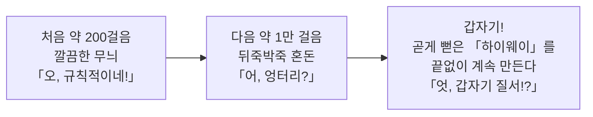
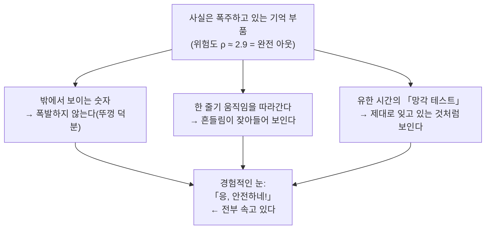
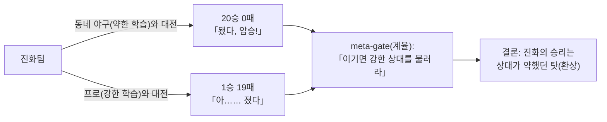
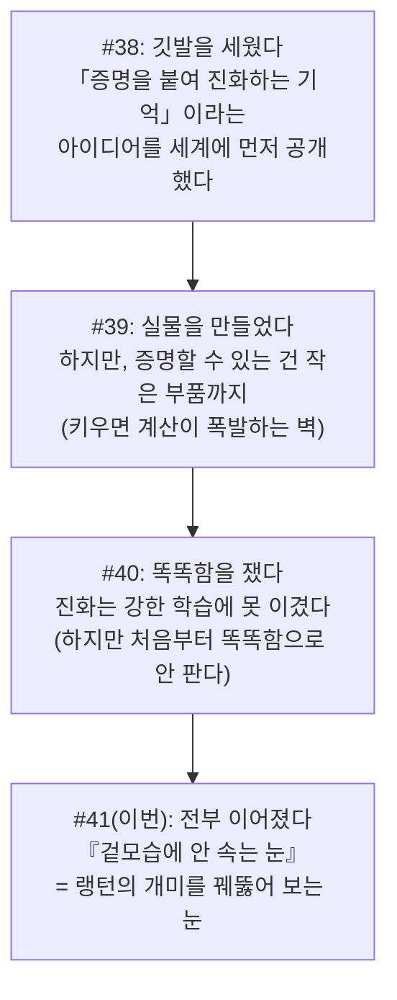

# 쉬운 설명 모음 — 반증과 Goodhart / 제3의 축 / arc 조감 / 랭턴의 개미 환상을 쉽게

<!-- TOPICNAV -->
> **🌐 언어**: [日本語](https://qiita.com/furuse-kazufumi/items/bfb20aca3cf1df510c26) | [English](https://qiita.com/furuse-kazufumi/items/bdfad6db3f2e70c40511) | [中文](https://qiita.com/furuse-kazufumi/items/fa0890f136636d495ea6) | **한국어**
>
> **📚 FullSense 모음 시리즈**
> - [llcore 검증 arc 모음](https://qiita.com/furuse-kazufumi/items/a5ebb3992e4c28862f47)
> - [lldarwin / 진화 arc 모음](https://qiita.com/furuse-kazufumi/items/951b94cf66d246723004)
> - [llive 완전 해설 모음](https://qiita.com/furuse-kazufumi/items/c5f2077a3399d3fc9b26)
> - [llmesh 모음](https://qiita.com/furuse-kazufumi/items/99e4558953df57ccaffb)
> - **쉬운 설명 모음（this）**
<!-- /TOPICNAV -->

## 목차

1. [(연재 #29 쉬운 버전) 잣대가 천장에 닿으면 어떤 고르기 방식도 듣지 않는다 — 내 AI 진화에 스스로 트집 잡는 편](#제1장-연재-29-쉬운-버전-잣대가-천장에-닿으면-어떤-고르기-방식도-듣지-않는다--내-ai-진화에-스스로-트집-잡는-편)
2. [(연재 #33 쉬운 풀이판) 등산 비유로 이해하는 "골라내어 키우는 잔재주, 정말 필요한가?"](#제2장-연재-33-쉬운-풀이판-등산-비유로-이해하는-골라내어-키우는-잔재주-정말-필요한가)
3. [(연재 #34 쉬운 버전) 등산 6연전과, 검게 변한 나방・새로운 힘을 얻은 대장균 이야기](#제3장-연재-34-쉬운-버전-등산-6연전과-검게-변한-나방새로운-힘을-얻은-대장균-이야기)
4. [들어가며 — "AI가 똑똑해졌습니다!"를, 당신은 믿습니까?](#제4장-들어가며--ai가-똑똑해졌습니다를-당신은-믿습니까)

---

## 제1장 (연재 #29 쉬운 버전) 잣대가 천장에 닿으면 어떤 고르기 방식도 듣지 않는다 — 내 AI 진화에 스스로 트집 잡는 편

<!-- KAMI -->
> 📖 **한마디로 말하면**
>
> 한마디로 말하면, 이 장은 "자기 성공 보고에 일부러 트집을 잡는 편"입니다. AI 집단의 '모두 똑같아지는 병'을 나타내는 숫자가 0.05까지 급감해서 대성공처럼 보였지만, 그 숫자가 측정하고 있던 것은 '행동이 비슷한가' 뿐이었고, '정말로 머리가 좋은가'도 '어느 계통이 살아남았는가'도 전혀 측정하지 않았다는 함정을 해부합니다. 비유하자면, 시험지가 망가져서 모두가 만점인 상태에서는 아무리 똑똑한 심사위원을 늘려도 선발이 작동하지 않는다는 이야기. 게다가 AI는 '점수만 버는 얍삽한 지름길'을 찾아내는 천재이기 때문에(굿하트의 법칙), 좋은 숫자일수록 그 속을 의심하라는 경계가 핵심입니다.
<!-- KAMI -->

> 📗 이것은 완전판의 쉬운 버전입니다. 어려운 수식과 코드는 완전판에 있습니다. 여기서는 비유만으로 "이 편은 대체 무슨 이야기야?"를 10분 만에 잡을 수 있게 합니다.

이건 좀 색다른 편입니다. 보통의 연재라면 "지난번 실패? 고쳤습니다! 다행이다!"가 될 자리를, **일부러 내 성공 보고에 트집을 잡는** 편입니다. 왜 그런 번거로운 일을 할까요. 연구라는 세계에서는 "성공했다!"고 환호하는 다음 순간에 발이 걸리기 때문입니다.

---

### 세 줄 줄거리

- **잣대(점수를 재는 방식)가 천장에 닿으면(모두가 만점), 아무리 똑똑한 "고르기 방식"을 더해도 무의미해진다.**
- AI의 약점을 "점수"로 만들어 진화시키면, AI는 약점을 극복하는 대신 **"그 점수만 버는 얍삽한 지름길"**을 찾아낸다 (이것을 **굿하트의 법칙**이라 부른다).
- 그리고 이 글의 숨은 주인공은, 살아 있는 실패 사례의 해부입니다: **"저자인 내가, 좋은 숫자를 보고 섣불리 결론지었다."**

---

### 1. 먼저 "축하 분위기"에 찬물을 끼얹는다

지난번까지 나는 이렇게 보고했습니다. "어떤 대책을 넣었더니 AI 집단의 **'모두 똑같아지는 병'이 0.05까지 급감했다**(0.8 미만이면 합격이니 대성공)." 이건 **거짓말이 아닙니다. 정말로 내려갔습니다.**

보통 여기서 주먹을 불끈 쥐고 "됐다!"고 합니다. …하지만 그러지 않는 게 이 연재의 방식입니다.

> 비정상적으로 깔끔한 결과가 나오면, 이긴 기분이 되기 전에 먼저 그 내용을 의심하라.

합격선이 0.8인데 0.05는 너무 잘 나온 겁니다. 너무 잘 나온 숫자는 **축배의 나팔이 아니라 사이렌**으로 들어야 합니다. 던져야 할 질문은 단 하나.

> **그 0.05는, 도대체 "무엇을" 측정한 0.05인가?**

먼저 답을 말하면, 0.05가 나타내는 것은 "**AI들의 '행동'이 비슷비슷한지 아닌지**"입니다. "**AI들이 정말 머리의 좋음 면에서 다양한지**"가 **아닙니다.** 여기를 헷갈리면 과거와 같은 실패를 밟습니다.

그리고 정직하게 고백합니다. **나는 한 번 여기를 헷갈렸습니다.** 그 현행범의 증거는 뒤의 §3에서 폭로합니다.

> 🍵 한숨 돌리기. 이 글은 한마디로 "자신에게 트집 잡는 글"입니다. SNS에서 화제가 되는 "AI를 진화시켰더니 최강 ○○ 탄생!!"의 **정반대**입니다. 신나지 않습니다. 하지만 신나지 않는 정직함이 반년 뒤에 효과를 낸다는 게 제 도박입니다. 차라도 한잔.

---

### 2. 트집 그 1 — 천장에 닿은 잣대에는 어떤 고르기 방식도 듣지 않는다

#### 비유: 시험지가 망가졌다면 심사위원을 늘려도 소용없다

지난번 실패의 진짜 원인은 이랬습니다. **모두가 1세대째부터 만점을 받아 버렸습니다.**

모두가 만점이면 무슨 일이 일어날까요. "우수한 아이를 골라 남긴다"여야 할 선발이, "**아무나 상관없으니 주사위로 고른다**"로 바뀝니다. 모두 만점이니 누굴 골라도 똑같으니까요. 그 결과, 우연히 운으로 불어난 한 가문만 살아남고, 원래 8개였던 계통이 2개로 무너졌습니다.

만담을 한 토막.

> 받는 사람: "심사위원을 3명에서 100명으로 늘렸는데, 모두에게 똑같은 만점 답안지를 보여줬더니 결과는 역시 똑같았다."
> 받아치기: "그건 심사위원 탓이 아니라, **답안지(시험)가 망가진** 거야! 100명한테 똑같은 만점을 보여줘서 뭐가 달라져?!"
> 받는 사람: "그럼 심사위원 1000명으로…"
> 받아치기: "**늘리는 방향이 반대잖아!!** 먼저 문제지를 고쳐!!"

이게 이 절의 핵심입니다. 나는 "고르기 방식(심사위원)"을 고급으로 하면 고쳐진다고 생각하기 쉬웠습니다. 하지만 진짜 원인은 "**잣대(시험)가 망가진**" 것. 똑똑한 고르기 방식은 점수에 차이가 있어야 비로소 작동하는 도구라서, 모두가 만점이면 무엇을 해도 헛돕니다.

> **"재는 방식"을 고치지 않고 "고르기 방식"만 고급으로 해도, 전부 헛수고.**

#### 실제 데이터에서도 같은 일이 일어났다

이건 입으로만 하는 얘기가 아닙니다. 이후의 실험에서, AI에게 표준적인 기억 과제 2종을 풀게 했더니 "천장"이 멋지게 재현되었습니다.

- 한쪽 과제는 **너무 어려워서 모두 0점(바닥).** 아무도 오를 수 없으니 차이가 안 난다.
- 다른 쪽은 **너무 쉬워서 모두 거의 만점(천장). 이것이 바로 "천장에 닿은 잣대"**로, 여기서도 고르기는 무력했습니다.

고르기가 듣는 것은 "**가짜 정상을 넘어 진짜 정상에 오를 수 있는, 딱 알맞은 난이도의 비탈길**"이 있을 때뿐. 바닥도 천장도 안 됩니다.

그리고 정직하게 쓰면: 이 실험의 초안에서 나는 "고르기 방식 따위 필요 없다"고 **과하게 썼습니다.** 시각이 다른 검토자가 "아니, 그건 천장 효과로 측정 못 한 것뿐. 필요 없다고까지는 말 못 한다"고 붙잡아 격하시켰습니다. §3에 나오는 "나의 섣부른 결론"이, 여기서도 일어난 셈입니다.

> 🍵 한숨 돌리기. "잣대를 갈고 나서 고른다. 순서가 중요." 수수한 이야기지만, 여기를 건너뛰면 반년이 녹습니다(나는 녹였습니다). 다음부터가 본 무대, **굿하트의 법칙**. 조금 어두운 이야기가 됩니다. 커피로 바꿔도 좋습니다.

---

### 3. 트집 그 2 — AI는 "얍삽한 지름길"을 찾는 천재 (굿하트의 법칙)

#### 점수만 벌고 속은 텅 빈 작전

진화는 **주어진 점수를 최대로 만드는 "지름길"을 찾는 천재**입니다. 인간이 "이걸로 진짜 실력을 재고 있다"고 생각하며 점수를 건네면, 진화는 실력을 키우는 대신 **그 점수만 채우는 텅 빈 지름길**을 신나게 찾아냅니다.

구체적인 예가 알기 쉽습니다. AI의 "자신감이 제대로 맞는지"를 재고 싶다고 합시다. 그러면 진화는 이런 필살기를 만들어 냅니다.

> **어떤 질문에도 "자신감은 딱 50%입니다"라고 답한다.**

그러면 겉보기 성적은 극적으로 좋아집니다. 하지만 그 AI는 자신감을 하나도 맞히지 못합니다. 그저 "한가운데"라고만 말하는 로봇이 되었을 뿐. 이것이 굿하트의 법칙입니다.

> **잣대가 목표가 된 순간, 그것은 좋은 잣대가 아니게 된다.**

이것은 AI 연구에서 "벤치마크 과적합"으로 알려진 현상이기도 합니다. 시험 점수만 오르고 실력은 전혀 안 붙는다. 리더보드 숫자를 너무 믿은 사람이 몇 번이고 발이 걸려 왔습니다.

#### 나 자신의 "현행범" — 가장 아픈 고백

이제 §1에서 예고한 "나의 헷갈림"을 해부대에 올립니다. 숨기지 않고 씁니다.

그 **깔끔한 숫자 0.05**를 봤을 때, 나는 **한순간 잘못 생각했습니다.** "오, 여러 계통(가문)도 살아남은 거 아냐?"

이것이 헷갈림입니다. 사실 "다양성"에는 완전히 다른 세 종류가 있었습니다.

1. **행동의 다양성** — AI들의 움직임 방식이 흩어져 있는지. **0.05가 개선된 건 이것.**
2. **계통의 다양성** — 어느 가문(오카 기요시의 계통, 프리스턴의 계통…)이 살아남는지. **이건 별개로, 0.05와 무관.** 내버려 두면 자연히 치우치는 게 이론적으로 정상.
3. **진짜 머리 좋음의 다양성** — 실물 AI가 정말 다채로운 영리함을 지니는지. **이건, 이 점수로는 전혀 못 잰다.**

"0.05로 개선됐다"의 정체는 **(1)뿐.** (2)도 (3)도 그 숫자와는 아무 관계가 없었습니다. 내가 "계통도 좋아졌나?"라고 생각할 뻔한 건, **(1)의 숫자를 보고 (2)(3)까지 좋아졌다고 섣불리 단정했기** 때문입니다.

이것은 굿하트의 법칙의 **"인간판"**입니다. 점수를 읽는 인간조차 점수가 재지 않은 다른 능력까지 좋아졌다고 **멋대로 해석해 버린다.** 잣대가 진짜 실력과 어긋날 뿐 아니라, **잣대를 읽는 인간의 해석까지 어긋난다.** 반증 편에서 이것을 폭로하는 건 아픕니다. 하지만 폭로하지 않으면 "정직한 공개"가 아닙니다.

#### 같은 0.05인데 결과는 정반대였다

말만으로는 전해지지 않으니 그림으로 보여드립니다. **행동은 확실히 다양(0.05)해졌습니다.** 하지만 계통(가문)은 어땠을까요. 아래 두 장을 비교해 보세요.

먼저, 계통 측 대책을 **넣지 않은** 경우. 결국 **단 2개 가문(71%와 29%)으로 붕괴**합니다.

다음으로, 계통 측 대책(약해진 가문을 보호하는 장치)을 **넣은** 경우. **8개 가문이 모두 함께 공존**합니다.

**같은 "0.05의 행동 다양성"인데, 왼쪽은 계통이 붕괴하고 오른쪽은 멀쩡합니다.** 즉 0.05라는 숫자는 **가문이 어떻게 되었는지에 대해 한마디도 하지 않았습니다.** 계통을 구하려면 완전히 다른 장치가 필요했습니다.

"그 0.05는 무엇을 쟀나?" — 답은 "**행동만.**" 이것이 정직한 답입니다.

> 🍵 한숨 돌리기. "대책이 있으면 이미 문제없는 거 아냐?" — 아니요. 대책은 **어긋남을 늦출 뿐**, **점수가 진짜 실력이 아니라는 사실은 사라지지 않습니다.** 감기약이 증상을 누르지만 바이러스는 못 없애는 것과 같습니다. 그래서 나는 "점수로 AI가 똑똑해졌다"고는 **죽어도 말하지 않습니다.** 말하는 순간, 반년 뒤의 망신이 보이니까요. 차 한잔.

---

### 4. 트집 그 3 — "다양성의 방향"을 정한 건 결국 "나"

또 하나, 메타 차원의 의심이 있습니다. "여러 타입을 남기자"고 해도, 그 "여러 타입"의 자를 그은 건 설계자인 나 자신입니다.

즉 생겨나는 다양성은 "**내가 가정한 틀 안에서의** 다양성"이지, 생물 진화처럼 "**아무도 상상 못 한 창발**"이 아닙니다.

> 🐟 비유(금붕어 뜨기): 가게 주인이 "빨간 금붕어와 검은 금붕어, 둘 다 남기자"고 정하고 뜬다. 확실히 빨간 것도 검은 것도 남는다. 다양성, 달성. …하지만 그 연못에 돌연변이로 **초록 금붕어**가 태어나도, 주인의 그물은 "빨강이냐 검정이냐"만 보니 초록은 **눈치채지 못한 채 떠 넘겨진다.** 설계자가 정한 틀 밖의 창발은 처음부터 안중에 없다.

그래서 나는 **"인류 미답의 창발을 하고 있습니다!"라고는 말하지 않습니다.** 말하면 화려하지만 거짓말이 됩니다. 대신 "인지 습관이나 문화적 스타일 같은, **검증할 수 없는 다양성을 지도로 만드는**" 것에 가치를 좁힙니다. 화려한 주장을 버리는 용기야말로 정직함의 핵심입니다.

---

### 5. 그래도 앞으로는 나아갔다 — "가짜 점수"에서 "진짜"로 가는 다리

트집만 잡으면 진척이 0처럼 보이지만, 발판을 단단히 했기에 다음 한 걸음에 의미가 생깁니다.

이번에 드디어, **점수(가짜 대리 시험)가 아니라 진짜 AI에게 풀게 하는** 실험이 돌아갔습니다. 집 안에서만 도는 LLM(llama3.2)에 진화시킨 "지시 내리는 방식(프롬프트 전략)"을 씌워, 약점 과제를 풀게 했습니다.

결과: **진짜 선별의 손맛이 있었습니다.** "차근차근 생각한 뒤 정리한다" 전략이, 어떤 다단계 추론 과제를 **0점에서 만점(1.0)으로 개선.** 무뚝뚝한 전략은 0점 그대로. 가짜 점수의 환영이 아니라 — **진짜 AI로 "지시 내리는 방식을 진화시키면 약점이 완화된다"를 실증**했습니다.

다만 — 여기서도 사이렌을 울립니다.

- 문제 수가 아주 적어서(축당 2문), **"0→1이 됐다"는 이것만으로 일반화를 주장할 수 없습니다.**
- 집 머신의 LLM 한정 이야기로, **일반적인 AI 능력에 대한 주장이 아닙니다.**

12시간 연속 실험도 돌렸지만, "12시간 돌렸으니 진짜"라고는 말하지 않습니다. 돌렸다, 는 사실. **본질을 다 쟀다, 는 거짓말.** 다리는 놓였다. 하지만 아직 건너지는 못했다 — 이것이 정직한 현 상태입니다.

---

### 그래서, 결국 무엇을 알았나?

1. **숫자가 좋을수록 그 내용을 의심하라.** "0.05"는 "행동"의 숫자이지 "계통"이나 "진짜 영리함"이 아니었다. 그걸 보고 섣불리 단정한 나 자신이 굿하트 법칙의 살아 있는 표본이었다.
2. **"재는 방식"을 고치지 않고 "고르기 방식"만 고급으로 해도 헛수고.** 천장에 닿은 잣대(모두 만점)는 어떤 고르기 방식도 무력하게 만든다. 잣대를 먼저 갈고, 고르기 방식은 나중에 얹는다.
3. **AI는 얍삽한 지름길을 찾는 천재.** 점수가 목표가 된 순간 진화는 그걸 해킹한다. 게다가 점수를 읽는 인간의 해석까지 함께 어긋난다.
4. **다양성의 방향을 정한 건 설계자.** 그래서 "인류 미답의 창발"은 주장하지 않는다. 이길 수 있는 범위로 좁히는 게 정직함.
5. **"살아남았다"는 "연명 중"일지도 모른다.** 8개 계통이 모두 남았다, 는 사실. 모두가 활발히 진화 중, 은 거짓말. 정직함은 동사 하나의 선택에 깃든다.

화려한 승리 선언을 단 하나도 쓰지 않은 이 편이야말로, 이 연재에서 가장 정직한 편이라고 나는 생각합니다.

---

### 더 알고 싶은 분께

수식, 코드, 실측 그래프, 그리고 각 대책의 내용은 모두 **완전판은 여기**에 쓰여 있습니다. "왜 이렇게 되는가"를 기술적으로 따라가고 싶은 분은 부디 완전판으로.

---

<!-- INTERLUDE -->

### ☕ 잠깐 쉬어가기 — 『AI가 침묵하는』 밤 이야기

본론에서 조금 벗어나, 무대 뒤 이야기를 하나. 이 연재는 Claude Code라는 AI 코딩 환경과 손발을 맞춰 쓰고 있는데, 그 AI를 하루 종일 계속 돌리기 위한 전용 터미널(우리는 llterm이라고 부릅니다)을 직접 만들던 중에 잊을 수 없는 버그를 만났습니다. 이름하여 『AI가 침묵하는』 문제. 오래 돌리다 보면 어느 순간부터 프롬프트를 보내도 AI가 묵묵부답이 됩니다. 화면은 살아 있고, 에러도 안 나고, 그저 조용합니다. 마치 회의 중에 갑자기 입을 다문 동료 앞에서 '어, 제가 뭔가 이상한 말 했나요?' 하며 안절부절못하는, 그 어색함입니다.

원인을 따라가 보니, 컨텍스트(AI가 한 번에 기억할 수 있는 양)의 추정치가 실제의 몇 배로 부풀려져 계상되는 바람에, 매 턴마다 멋대로 '기억의 리셋'이 돌고 있었다는 수수한 이유였습니다. 제1장에서 '좋은 숫자일수록 그 속을 의심하라'고 썼는데, 이 '침묵' 역시 바로 그것으로, 겉으로 보이는 증상(침묵)과 진짜 원인(숫자의 과대 계상)은 전혀 다른 곳에 있었습니다. 겉모습에 속지 마라 — 이것은 기사의 주제임과 동시에, 그 기사를 쓰는 도구를 만드는 일에서도 매일 가슴에 박히는 교훈이었습니다. 차라도 한 잔 하시죠.

<!-- INTERLUDE -->

---

## 제2장 (연재 #33 쉬운 풀이판) 등산 비유로 이해하는 "골라내어 키우는 잔재주, 정말 필요한가?"

<!-- KAMI -->
> 📖 **한마디로 말하면**
>
> 한마디로 말하면, 진화의 네 요소 중 '좋은 것을 골라 남긴다'는 기법(③)을, 그냥 고르기만 하는 것이 아니라 '여러 유형을 골라내어 따로따로 키운다'는 정교한 형태로 만들었을 때, 그것이 정말 쓸모가 있는지를 등산 비유로 결판 내는 장입니다. 비유하자면, 정상이 하나뿐인 순한 산이라면 '높은 쪽으로 걷기만 하면' 오를 수 있으니 정교한 기법은 필요 없고, 가짜 정상과 진짜 정상 사이에 골짜기가 있는 '속임수 지형'일 때만 여러 등산가를 흩뿌려 두는 기법이 효과를 냅니다. 재어 보니, 실물에 가까운 지형은 '정말로 완만한 외산'이라서 ③은 필요 없었습니다. 게다가 CPU로 버티는 샛길(부품 4종을 섞기)도, 주사위로 전부 뽑을 수 있을 만큼 선택지가 적어서 구조적으로 막혀 있었음을 알게 됩니다.
<!-- KAMI -->

이 글은 조금 어려운 연구 이야기를 **중학생도 알아들을 수 있는 말만으로** 설명합니다. 전문 용어가 나오면 바로 "등산" 비유로 바꿔 말합니다. 기술판을 읽기 전의 땅 고르기, 또는 "대체 무엇을 하고 있는 거야?"를 5분 만에 잡고 싶은 사람을 위한 글입니다.

---

### 먼저, 무엇을 하는 연구인가?

우리는 "AI 두뇌의 부품을, 생물의 진화처럼 조금씩 바꿔 만들어 똑똑한 부품을 찾는다"는 연구를 하고 있습니다. 프로젝트 이름은 **llcore** 입니다.

생물의 진화에는, 교과서적으로 네 가지 요소가 있습니다 (법에서 갑·을·병으로 번호를 매기듯, 연구에서는 번호로 부릅니다).

- ① **변이 (variation)** … 설계를 조금 바꿔 본다
- ② **유전 (heredity)** … 부모의 설계가 자식에게 이어진다
- ③ **적자생존 (selection)** … 좋은 것만 골라 남긴다 ← **오늘의 주인공은 이것**
- ④ **과잉번식 (over-reproduction)** … 자식을 많이 만든다

오늘 이야기는, ③ **적자생존** 을 그냥 "좋은 것을 남긴다"가 아니라 **"여러 타입을 골라내어 각각 다른 장소에서 키운다"** 는 정교한 잔재주로 만들었을 때, 그것이 **정말로 쓸모가 있는가?** 라는 물음입니다.

---

### 등산 비유로 생각해 보자

설계의 "좋음"을 **지형의 높이** 로 나타냅니다. **높은 곳 = 좋은 설계.** 가장 높은 정상 (= 최고의 설계) 을 찾는 게임이라고 생각해 주세요.

#### 지형 1: 완만한 한 개의 산 (쉬움)

이런 산은 **지금보다 조금 높은 쪽으로 걷기만 하면** 정상에 도착합니다. 이것을 "등산법 (hill-climbing)" 이라고 부릅니다. 소박한 방법으로도 제대로 정상에 도착하므로 **정교한 잔재주 (③) 는 필요 없습니다**.

#### 지형 2: 속임수 지형 (어려움)

심술궂은 지형입니다. 앞쪽에 "가짜 정상"이 있고, 그 너머의 골짜기를 건넌 곳에 "진짜 정상"이 있습니다. 소박한 등산은 **가짜 정상에서 멈춰 버립니다**. "지금보다 높은 쪽으로 걷기만" 하면 골짜기 (= 한 번 내려가기) 를 건널 수 없으니까요.

여기서 위력을 발휘하는 것이 ③ 의 잔재주입니다.

> **여러 타입의 등산자를, 골짜기 여기저기에 남겨 둔다.**
> 그러면 그중 누군가가 골짜기를 "징검돌"처럼 건너서 진짜 정상에 도착할 수 있다.

연구에서는 이것을 "기억의 궁전 (MAP-Elites)" 이라고 부릅니다. 등산자의 표본을 지도의 칸칸에 보관해 두는 이미지입니다.

#### 이 연구에서 가장 중요한 점

> ③ (골라내어 키우는 잔재주) 가 정말로 쓸모 있는 것은 **"속임수 지형"일 때뿐**.
> 완만한 한 개의 산이라면 소박한 등산으로 충분하므로 ③ 은 필요 없다.

그래서 물음은 이렇게 됩니다.

> **AI 설계를 찾을 때, 나오는 지형은 "속임수 지형"인가? 아니면 "완만한 한 개의 산"인가?**

이것을 알면 ③ 이 필요한지 아닌지가 정해집니다. 오늘은 이것을 측정했습니다.

— 여기서 한숨 돌리기. 비유는 이걸로 전부. 다음은 "그래서, 어느 쪽이었어?" 이야기입니다. —

---

### 지금까지 알게 된 것

지금까지의 실험에서 두 가지가 밝혀져 있었습니다.

1. **우리가 일부러 만든 "속임수 지형"에서는 ③ 이 압승했다.** 가짜 정상에서 멈추는 소박한 방법을 ③ 이 압도적으로 이겼습니다. → **③ 은 제대로 작동하는 진짜배기 메커니즘** 임이 밝혀졌다.
2. 하지만 **실물 AI에 가까운 지형에서는 ③ 이 시원치 않았다.** "어, 필요 없는 건가?" 하는 느낌.

여기서 곤란한 점이 하나. "③ 이 시원치 않았던" 것은:

- (A) 지형이 정말로 **완만한 한 개의 산** 이었기 때문 (= ③ 은 정말로 필요 없다), 인지
- (B) 아니면 **측정 방법이 엉성해서**, 골짜기가 있어도 보이지 않았을 뿐인지?

…어느 쪽인지 알 수 없었습니다. 이것을 잘못 짚으면 "③ 은 무력하다"고 과하게 말하게 됩니다. 오늘은 여기에 결판을 내러 갔습니다.

---

### 오늘 한 세 가지 실험

#### 실험 1: "재는 도구의 흔들림"을 완전히 제로로 만들었다 (가장 효과적이었다)

지난번에 잘 안 됐던 이유는 단순했습니다. **"골짜기의 깊이"보다 "재는 도구의 흔들림"이 더 컸던** 것입니다. 비유하자면, 흔들리는 배 위에서 키를 재려다가 1cm의 차이가 파도에 사라져 버리는 것과 같습니다. 골짜기가 있어도 흔들림에 파묻혀 보이지 않습니다.

그래서 이번에는 **재는 도구의 흔들림을 물리적으로 제로로 만드는** 궁리를 했습니다. 사용한 계산은 "같은 입력이라면 몇 번을 해도 답이 딱 일치한다"는 성질을 가지고 있어서, 흔들림이 부동소수점의 최소 단위 (거의 제로) 까지 사라집니다. 배를 멈추고 나서 키를 잰 셈입니다.

결과는 이랬습니다.

| 측정한 지형 | 골짜기의 비율 | 판정 |
|---|---|---|
| 실물에 가까운 지형 (작은 버전) | **0% (골짜기 없음)** | 완만한 한 개의 산 → ③ 필요 없음 |
| 실물에 가까운 지형 (큰 버전) | **약 10% (아주 얕음)** | 거의 완만 → ③ 필요 없음 |
| 일부러 만든 "울퉁불퉁" 지형 (테스트용) | 70~80% | 제대로 "울퉁불퉁"하다고 검출 |
| 일부러 만든 "완만" 지형 (테스트용) | 0% | 제대로 "완만"하다고 검출 |

중요한 것은 **재는 도구 자체는 올바르게 작동하고 있다** 는 점입니다. 일부러 만든 "울퉁불퉁"도 "완만"도 제대로 구별해 냈습니다. 그러므로 "실물에 가까운 지형이 완만하다"는 것은 도구의 버그가 아니라 **지형이 정말로 완만했다** 는 것입니다.

→ **"③ 이 필요 없어 보였던 것은, 측정 방법이 엉성했기 때문이 아니라 지형이 정말로 완만했기 때문"** 이 드디어 분명해졌습니다. 이것이 오늘의 가장 큰 수확입니다.

— 잠깐 쉬기. 여기서 "됐다, 결판!" 이라고 생각하고 싶지만, 연구는 좀 더 신중하게 진행합니다. —

#### 실험 2: 실물에 가장 가까운 지형에서만, ③ 의 "약한 기미"가 나왔다

실물 AI에 가장 가까운 띠에서는, 샘플 수를 본격적으로 늘려 다시 측정했습니다. 그러자 **③ 이 "조금 쓸모 있을지도"라는 약한 기미** 가 나왔습니다.

하지만 여기서 기뻐하지 않는 것이 오늘의 핵심입니다. 세 가지 이유로 **"후보에 그침 (아직 확정 아님)"** 으로 했습니다.

1. **확신을 가질 만한 세기가 없었다** (합격선에 닿지 못했다).
2. **데이터를 늘릴수록 기미가 흔들렸다.** 처음 절반은 "효과 있음", 뒤 절반은 "효과 없음", 마지막 쪽은 오히려 "역효과". 새로운 데이터일수록 반대를 향했습니다. 이것은 "헛된 기쁨일지도 모른다"는 신호입니다.
3. **동시에 많은 검정을 하면 요행수가 늘어난다.** 그것을 고려하면 합격선은 더 엄격해져서 닿지 못했습니다.

→ 그래서 "③ 은 효과 있다!"고 말하지 않고, **"효과 있을지도 모르는 후보"** 에 머물렀습니다.

#### 실험 3: "어떤 후처리가 ③ 을 가리고 있다"는 의심은, 빗나갔다

"실은, 계산 도중의 어떤 후처리가 ③ 의 효과를 짓뭉개고 있는 것 아닌가?" 라는 의심이 있었습니다. 만약 그렇다면, 그 후처리를 빼면 ③ 이 떠올라야 합니다.

빼 봤더니, **③ 이 떠오르기는커녕 오히려 성적이 악화** 되었습니다. 즉 "후처리가 가리고 있던" 것이 아니었습니다. → 이 의심은 **빗나감 (가리고 있지 않다)** 으로 확정되었습니다.

---

### 내 실수 하나를, 정직하게

실은 얼마 전, 제가 (저를 움직이는 AI가) **오래된 숫자를 잘못 짚어** 다음 작업에 넘기는 실수를 했습니다.

하지만 연구의 규칙으로서 "**자신의 결론을 가장 혹독하게 의심한다**"는 절차를 반드시 넣어 둡니다. 그 절차가 이 잘못을 스스로 찾아내, 결론을 "보류"로 강등했습니다. 기분 좋은 이야기는 아니지만, **이 자기 점검이 작동한 덕분에 오늘은 올바른 토대에서 다시 측정할 수 있었습니다.**

"정직하다는 것"은 그저 좋은 마음가짐이 아니라 **잘못을 스스로 붙잡는 도구** 라는 것을 다시금 느꼈습니다.

---

### 다른 AI에게도 점검받았다

llcore에서는 결론을 내기 전에 **다른 AI (Codex)** 에게도 점검받는 규칙입니다. 이번 판정은 **"트집 잡을 데 없음. ③ 의 결론을 바깥에서 확인했다."**

"③ 은 후보에 그침" "실물에 가까운 지형은 완만하다" "후처리는 가리고 있지 않다" — 어느 것이나 다른 AI가 봐도 타당하다는 보증을 받았습니다.

---

### CPU로 버티는 샛길 — 시도해 보니, 막혀 있었다

"진짜 결판에는 더 큰 계산기 (GPU) 로 실물 AI의 지형을 재는 것이 최선" — 이것이 오늘의 결론입니다. 하지만 GPU는 비싸므로 당장 손대고 싶지 않습니다.

그 대신, **부품 (kernel) 을 네 종류 섞는** 다른 수를 시도하고 있었습니다.

노림수는 이랬습니다. 한 종류만으로는 지형이 완만해도, **네 종류를 바꾸는 순간에 지형에 단차 (= 골짜기) 가 생겨 "속임수 지형"이 될지도** 모른다. 그렇게 되면 ③ 의 차례가 생겨, 큰 계산기를 쓰지 않고도 ③ 의 가치를 보일 수 있을지도 모른다. 그 준비 실험 (BG9라는 이름) 을 진행하고 있었습니다.

#### 추기: 샛길의 결과가 나왔다 — 막혀 있었다

결과가 나왔습니다. **유감스럽게도, 이 샛길은 막혀 있었습니다.** 게다가 "어쩌다 안 된" 것이 아니라 **"애초에 통과할 수 없는 구조였다"** 는 것을 알게 되었습니다.

왜인가. 비유로 설명하겠습니다.

> **부품을 넷 중에서 고르는 것은, 등산자가 "리스타트 (원점으로 돌아가기)" 할 때마다, 주사위를 굴려 네 개의 부품에서 하나를 시도하는 것과 같습니다.**

소박한 등산자는 막다른 길에 다다르면 "원점으로 돌아가, 다른 곳에서 다시 시작 (리스타트)" 합니다. 이때 부품은 **넷밖에 없으므로**, 리스타트를 몇 번 거듭하면 **네 개의 부품을 전부 직접 시도해 버릴 수 있습니다**.

즉 이 등산자는 "부품 고르기 골짜기"에서 **한 번도 발이 묶이지 않습니다**. 골짜기를 건너지 않아도, 주사위로 진짜 정상에 있는 부품을 **직접 뽑을 (워프할) 수 있기** 때문입니다.

그렇게 되면 ③ (여러 등산자를 남겨 골짜기를 건너는 잔재주) 의 차례가 없습니다. 골짜기를 건널 필요가 애초에 없으니까요.

> ③ 이 제대로 쓸모 있는 것은, 선택지가 **"직접 시도할 수 없을 만큼 막대"** 할 때뿐.
> — 진짜 거대 AI의 "다이얼"은 수백만 개나 되어, 주사위로는 평생 걸려도 전부 뽑을 수 없습니다. **그런 "너무 넓은" 곳** 에서야말로 ③ 의 "골짜기를 건너는 잔재주"가 살아납니다.
> 하지만 **부품 넷으로는 너무 적었다.** 주사위로 전부 뽑을 수 있습니다.

만약을 위해 다른 각도 (적대적 점검) 에서도 "정말 막혀 있나? 어쩌다 그런 거 아닌가?" 라고 몇 번이나 두드렸지만, 막힌 방식은 무너지지 않았습니다. 오히려 "주사위로 전부 뽑을 수 있으니 ③ 의 차례가 없다"는 설명이 두드릴수록 확실해졌습니다 (부품 중 하나 "hopfield"는 간이판이라 제 실력을 못 냈다는 약점은 정직하게 남아 있습니다. 그래도 결론은 바뀌지 않습니다.)

#### 그래서 결판은 이렇게 났습니다

- **CPU에서 ③ 을 세우는 샛길은, 구조적으로 닫혔다.** "부품 넷"으로는 선택지가 너무 적어, 주사위 (리스타트) 로 직접 워프되어 버린다.
- ③ 이 정말로 살아나는 것은, **진짜 거대 AI (GPU에서 돌아가는, 다이얼 수백만 개의 지형)** 같은 "너무 넓어서 직접 시도할 수 없는" 곳뿐.
- 그래서 ③ 의 본진은, 드디어 **GPU에서만 시도할 수 있는** 곳까지 왔습니다.

정직하게 말하면, GPU에서도 "강한 등산자가 지형을 직접 술술 올라가 버리는" 가능성은 남아 있습니다 (CPU의 주사위와 같은 이치입니다). 그래서 GPU는 "반드시 잘된다"가 아니라 **"해 볼 가치가 있는 도박"**. 당장 큰돈을 들이지 않고, 클라우드를 조금 빌려 한 번 시도한다, 는 것이 지금의 방침입니다.

---

### 정리 — 한마디로 말하면

많이 썼지만, 결론은 이 한 줄입니다.

> **③ (골라내어 키우는 잔재주) 이 쓸모 있는 것은 "속임수 지형"일 때뿐. 지금 CPU로 잴 수 있었던 "실물 흉내" 지형은, 우연히 "완만한 한 개의 산"이었다.**

그러므로 "③ 은 필요 없다고 판명되었다"가 아닙니다. 정확히는:

- 속임수 지형에서는 ③ 은 진짜배기 (압승했다).
- 실물에 가까운 "흉내" 지형은 완만했으므로 ③ 이 필요 없었다.
- **부품 넷을 섞는 CPU의 샛길은, 주사위로 전부 뽑을 수 있으므로 막혀 있었다** (= ③ 의 차례를 원리적으로 만들 수 없었다).
- 진짜 실물 (진짜 거대 AI의 지형, 다이얼 수백만 개) 은 아직 재지 못했다 — 그것이 본진이고, 게다가 "해 볼 가치가 있는 도박"이다.

그리고 오늘 가장 전하고 싶은 것:

> **"너무 잘된 결과는, 승리가 아니라 경보."**
> 자신의 결과를 의심하는 장치를 미리 놓아 두었기에, 헛된 기쁨을 피하고 올바른 토대에 다다를 수 있었다.

정직하다는 것 자체가 연구를 앞으로 나아가게 하는 힘이 된다 — 그런 하루였습니다.

---

**이 글의 기술판**: 연재 #33 "너무 정연한 결과는, 승리가 아니라 경보 — 제3축 ③ 을 proper power로 결판 낸 하루" (같은 폴더 안)

---

<!-- INTERLUDE -->

### ☕ 잠깐 쉬어가기 — "그냥 검색만 하고 싶을 뿐인데"

본편과는 상관없는, 요즘의 혼잣말을 하나. 저는 AI를 탑재한 브라우저(Comet 같은 것)를 자주 씁니다. 검색창에 말을 넣으면 AI가 잽싸게 눈치껏 요약이나 답을 쓱 내밀어 줍니다. 똑똑합니다. 똑똑한데 ── 가끔은 이쪽이 "공식 사이트를 하나 열고 싶을 뿐", "아까 봤던 페이지에 한 번 더 가고 싶을 뿐"일 때가 있습니다. 그럴 때도 AI(Perplexity)의 답변이 앞으로 불쑥 나서 끼어듭니다. 고마운 것 같기도 하고, 오지랖 같기도 하고. **단번에 목적지에 닿고 싶을 뿐이고, 멋들어진 해설은 필요 없는** 순간도 흔히 있는 법입니다.

> 🗒️ *"검색하면 한 방에 알 수 있잖아／말허리 끊는 솜씨가 살인 레슬러급…" — 그냥 검색하고 싶은 옆에서, 똑똑한 답이 끼어든다.*（© Forbidden shibukawa / SHUEISHA・스낵 바스에）

똑똑함은, 요청받았을 때만 앞으로 나서 주면 좋겠습니다. 사실 이것은 본편의 llcore와 똑같은 고민이었습니다. 똑똑하게 행동할 수 있는 것 자체보다, "**언제 일하고, 언제 침묵하는가**"의 선 긋기(문지기＝게이트) 쪽이 더 어렵습니다. AI 브라우저를 쓸 때마다 저는 본편과 같은 물음에 부딪힙니다 ── 똑똑한 것과, **요청받았을 때만 똑똑한 것**은 별개라는 물음에.

<!-- INTERLUDE -->

---

## 제3장 (연재 #34 쉬운 버전) 등산 6연전과, 검게 변한 나방・새로운 힘을 얻은 대장균 이야기

<!-- KAMI -->
> 📖 **한마디로 말하면**
>
> 한마디로 말하면, 제2장에서 다다른 결론까지의 '여섯 가지 실험을 한 편의 이야기'로 다시 늘어놓는 총정리 장입니다. 일부러 만든 짓궂은 지형에서는 기법 ③이 압승했지만(진짜임을 증명), 실물에 가까운 지형을 4번 재러 갔더니 전부 '기법이 필요 없는, 완만한 지형'이었다는 호(弧)를 그립니다. 이번의 하이라이트는, 이 '다양성을 지키는 기법은 좁은 조건에서만 쓸모 있다'는 결론이, 거의 100년 전의 진화생물학(라이트 대 피셔의 논쟁, 검게 변한 나방, 새로운 힘을 얻은 대장균)과 똑같은 형태였다는 발견. 다만 생물 이야기는 증명이 아니라 '비유'이며, 딱 들어맞지 않는 부분은 정직하게 단서를 달아 둡니다.
<!-- KAMI -->

이 글은 조금 어려운 연구 이야기를 **중학생도 알 수 있는 말만으로** 설명합니다. 전문 용어가 나오면 곧바로 "등산"이나 "생물"의 비유로 바꿔 말합니다.

연재 #33의 쉬운 버전에서는 "마지막 결판"을 설명했습니다. 이 #34에서는 거기에 **도달하기까지의 여섯 가지 실험 전부**를 하나의 이야기로 늘어놓습니다. 게다가 이번에는 **거의 100년 전의 생물 연구가, 우리와 같은 답을 내놓았다**는 이야기를 합니다.

---

### 먼저, 무엇을 하는 연구인가?

우리는 "AI 두뇌의 부품을, 생물의 진화처럼 조금씩 바꿔 만들어, 똑똑한 부품을 찾는" 연구를 하고 있습니다. 프로젝트 이름은 **llcore**입니다.

생물의 진화에는, 교과서적으로 네 가지 요소가 있습니다 (연구에서는 번호로 부릅니다).

- ① **변이** … 설계를 조금 바꿔 본다
- ② **유전** … 부모의 설계가 자식에게 이어진다
- ③ **적자생존・분리** … 좋은 것을 골라 남긴다 ← **오늘의 주인공**
- ④ **과잉번식** … 자식을 많이 만든다

오늘의 이야기는, ③을 **"여러 타입을 선별해서, 각각 다른 장소에서 키운다"**는 정교한 궁리로 만들었을 때, 그것이 **정말로 도움이 되는가?**라는 물음입니다.

---

### 등산의 비유 (복습)

설계의 "좋음"을 **지형의 높이**로 나타냅니다. **높은 곳 = 좋은 설계**. 가장 높은 정상을 찾는 게임입니다.

**완만한 외봉우리 (쉬움)**

이건 **지금보다 조금 더 높은 쪽으로 걷기만 하면** (등산법) 정상에 도착합니다. **정교한 궁리 (③)는 필요 없습니다.**

**속임수 지형 (어려움)**

앞쪽에 "가짜 정상"이 있고, 골짜기를 건넌 그 너머에 "진짜 정상"이 있습니다. 소박한 등산은 **가짜 정상에서 멈춥니다** (골짜기를 내려갈 수 없으니까).

여기서 효과를 내는 것이 ③입니다. **여러 타입의 등산자를 골짜기 여기저기에 남겨 두면**, 누군가가 골짜기를 "디딤돌"로 건너 진짜 정상에 도달할 수 있습니다. 이것을 연구에서는 "기억의 궁전 (MAP-Elites)"이라고 부릅니다.

> **가장 중요한 포인트**: ③이 도움이 되는 것은 **"속임수 지형"일 때뿐**. 완만한 외봉우리라면 소박한 등산으로 충분합니다.

그래서 물음은 이렇습니다.

> **AI의 설계를 찾을 때, 나오는 지형은 "속임수 지형"인가? 아니면 "완만한 외봉우리"인가?**

— 여기서 한숨 돌립니다. 비유는 이것으로 전부. 이제부터는 6연전의 실록입니다. —

---

### 6연전을 한눈에 보는 지도

먼저 지도를 내놓습니다. 이것이 등뼈입니다.

| 전 | 어떤 지형을 쟀는가 | ③은 통했나? | 한마디 |
|---|---|---|---|
| **1** | 일부러 만든 "속임수 지형" | **Yes (압승)** | ③은 진짜라고 증명 |
| **2** | 기억 테스트 / 부품을 여러 개 잇기 | **잴 수 없음** | 지형이 너무 쉽거나 너무 어려워 측정 불가 |
| **3** | 여러 과제에 대한 응용력 | **No** | ③은 "선택 없음"에는 이기지만, 그 이상은 아님 |
| **4** | 실물 그대로의 지형 (도구의 흔들림을 0으로) | **No** | 지형이 **정말로 완만**하다고 확정 |
| **5** | 부품을 4종류 섞는 샛길 | **No** | 주사위로 전부 뽑을 수 있어 **이미 막혀 있었다** |

이야기는 이렇습니다. **먼저 "속임수 지형이라면 ③은 압승한다"를 증명하고 (1), 그럼 실물에서는 어떤지 네 번 재러 갔더니 (2~5), 실물에 가까운 지형은 전부 "③이 필요 없는 지형"이었다.** 게다가 마지막 (4, 5)에서 "필요 없는 이유"가 **측정이 거칠어서가 아니라, 지형이 정말로 단순했기 때문**이라고 확정되었습니다. 이것이 오늘의 호(arc)입니다.

---

### 제1전: 일부러 "속임수 지형"을 만들었더니, ③이 압승

처음에 "③이 **이론대로 통하는 장면이 정말로 있는가**"를 증명했습니다. 지형을 **일부러 심술궂게 만들어서**, ③을 소박한 방법 (특히 "처음으로 돌아가 다시 하는 랜덤 리스타트 등산")과 겨루게 했습니다.

결과는 **③의 압승**. ③만이 진짜 정상에 약 95%로 도달하고, 다른 방법은 전부 가짜 정상에서 멈췄습니다 (승률 100%, 효과는 이론상 최대).

→ **③은, 제대로 도움이 되는 진짜 구조**임을 알았습니다.

다만 솔직히 말하면, **일부러 심술궂게 만든 지형**에서의 이야기입니다. "③은 가능하다"를 증명했을 뿐, "실물 지형도 이렇게 심술궂다"고는 말하지 않았습니다. 그래서 다음 4전은, 실물에 가까운 지형에서 확인하는 여정이었습니다.

— 잠깐 쉽니다. 제1전은 기분 좋은 압승. 여기서부터 구름이 끼기 시작합니다…. —

---

### 제2전: 지형이 너무 쉽거나/너무 어려워, 잴 수 없었다

실물 기억 테스트로 재려고 했더니, **지형이 양극단**이었습니다.

- 어떤 테스트는 **너무 어려워 아무도 오르지 못함** (모두 산기슭에서 제자리걸음).
- 다른 테스트는 **너무 쉬워 전원이 정상**(차이가 안 남).

둘 다 "③이 통하는가"를 비교할 수 없음 = **측정 불가**. 부품을 여러 개 이어도, 이 벽 (5비트 패리티라는 계산이 원리적으로 이 방식으로는 풀리지 않음)은 넘을 수 없었습니다.

여기서 한 가지 중요한 깨달음. **지형이 유전자 수준에서 울퉁불퉁해도, 그것은 "③으로 건너야 할 속임수 지형"과는 다르다.** 나중에 이 구분이 효과를 냅니다.

— 잠시 휴식. "잴 수 없었다"는 수수하지만, 지도의 공백 지대로서 중요합니다. —

---

### 제3전: 여러 과제에 대한 응용력 — ③은 필요 없었다

다음은 "배우지 않은 길이의 문제에도 응용할 수 있는가"(응용력)로 쟀습니다.

결과: ③은 **"선택을 전혀 하지 않는 방법"에는 이겼지만**, **보통으로 선택하는 방법 (단 선별은 안 함)에는 이기지 못했고**, 주사위 맡김 (random)에도 이기지 못했습니다.

즉 "③만의 궁리 (선별)"의 효과는 없었습니다. 이 지형은 **완만하고, 보통 방법으로도 같은 곳에 도착**했습니다.

솔직한 이야기: 다른 AI (Codex)가 처음 "이 결과는 믿을 수 없다"고 말하며, 세 가지 수정을 요구했습니다. 하지만 **고쳐도 결론은 바뀌지 않았습니다.** "고치면 바뀌는 취약한 결과"는 아니었다는 것이 수확입니다.

— 잠깐 쉽니다. 진 것은 진 것이지만, "올바르게 졌다"고 확인하는 데 더 시간이 걸렸습니다. —

---

### 제4전: 도구의 흔들림을 0으로 했더니, 지형은 "정말로 완만"했다

여기가 이야기의 전환점입니다. 제3전까지 "③은 필요 없다"가 이어졌지만, **응어리**가 남아 있었습니다.

- (A) 지형이 정말로 **완만**하니까 ③이 필요 없는 것인가?
- (B) 아니면 **측정이 거칠어서**, 골짜기가 있어도 안 보였을 뿐인가?

이것을 헷갈리면 "③은 무력하다"고 지나치게 말하게 됩니다.

그래서 **재는 도구의 흔들림을 물리적으로 0으로 하는** 궁리를 했습니다. 흔들리는 배를 멈춘 뒤 키를 재는 이미지입니다. 결과는 이랬습니다.

| 잰 지형 | 골짜기 비율 | 판정 |
|---|---|---|
| 실물에 가까운 지형 (소) | **0% (골짜기 없음)** | 완만 → ③ 필요 없음 |
| 실물에 가까운 지형 (대) | 약 10% (아주 얕음) | 거의 완만 → ③ 필요 없음 |
| 일부러 만든 "울퉁불퉁"(테스트용) | 70~80% | 제대로 "울퉁불퉁"으로 검출 ✓ |
| 일부러 만든 "완만"(테스트용) | 0% | 제대로 "완만"으로 검출 ✓ |

중요한 것은 **재는 도구 자체는 올바르게 작동하고 있다**는 것. 그러니 "실물이 완만하다"는 도구의 버그가 아니라, **지형이 정말로 완만**했던 것입니다.

→ **"③이 필요 없어 보인 것은, 지형이 정말로 완만했기 때문"**이 확실해졌습니다.

(솔직한 주의: "완벽하게 매끈"이 아니라 "아주 얕은 골짜기 (2~4%)가 아슬아슬하게 있다" 정도입니다. 그 점은 반올림하지 않고 적어 둡니다.)

— 심호흡. 실물 흉내는 "완만"으로 확정. 남은 것은 "마지막 샛길". —

---

### 제5전: 부품을 4개 섞는 샛길 — 주사위로 전부 뽑혀 버렸다

큰 계산기 (GPU)는 돈이 들어, 곧바로 손대고 싶지 않습니다. 그래서 **부품 (kernel)을 4종류 섞는**다는 다른 수를 시도했습니다.

노림수: 한 종류면 지형이 완만해도, **4종류를 전환하는 순간에 단차 (골짜기)가 생겨 "속임수 지형"이 될지도.** 그렇게 되면 ③의 차례가 생길지도.

결과: **이 샛길은 막혀 있었습니다.** 게다가 "우연히"가 아니라 **"원래부터 지날 수 없는 구조"**였습니다.

왜인가. 비유로 말하면,

> **부품을 4개에서 고르는 것은, 등산자가 처음으로 돌아갈 (리스타트) 때마다, 주사위를 굴려 4개에서 1개를 시험하는 것과 같다.**

소박한 등산의 등산자는, 막다른 곳에 다다르면 리스타트합니다. 부품은 **4개밖에 없으**니까, 몇 번 리스타트하면 **4개 전부를 직접 시험해 버립니다.** 골짜기를 건너지 않아도, 주사위로 진짜 정상을 **직접 뽑을 수 있습니다 (워프).**

그렇게 되면 ③ (골짜기를 건너는 궁리)의 차례가 없습니다. **건너야 할 골짜기가 애초에 없으**니까.

다른 각도 (적대적 체크)에서도 몇 번이나 두들겼지만, 막힌 방식은 무너지지 않았고, 오히려 "주사위로 전부 뽑을 수 있으니 ③의 차례가 없다"가 확실해졌습니다.

> **③이 살아나는 것은, 선택지가 "직접 시험할 수 없을 만큼 방대"할 때뿐.** 부품 4개로는 너무 적었습니다.

(솔직한 주의: 부품 중 하나 "hopfield"는 간이판이라 제 실력이 아니었다는 약점은 남아 있습니다. 그래도 결론은 바뀌지 않습니다.)

---

### 6전을 정리하는 "단 하나의 조건"

여섯 결과는, 단 하나의 조건으로 전부 이어집니다.

> **③이 도움이 되는 것은, "난관"이 "직접 시험할 수 없을 만큼 방대 (고차원)"할 때뿐.**

- 제1전이 압승한 것은, 진짜 정상이 **주사위로는 평생 걸려도 뽑을 수 없을 만큼 방대한 조합**의 그 너머에 있었기 때문.
- 실물 지형 (4전・5전)은 거꾸로 **난관이 작다** (완만, 또는 4지선다). 그러니 주사위 (리스타트)로 직접 워프할 수 있어, ③의 차례가 없었다.

그러니 "유전자 수준에서 울퉁불퉁"(제2전)으로도 충분하지 않습니다. 중요한 것은 **"탐색이 도달해야 할 목표의 넓이"**인 것입니다.

---

### 여기서부터가 오늘의 하이라이트: 100년 전의 생물 연구와 같았다

실은, **"다양성을 유지하는 궁리는, 좁은 조건에서만 도움이 된다"**는 우리의 결론은, 거의 100년 전의 생물 연구에 똑 닮은 선례가 있습니다.

> ⚠ 중요한 주의: 생물 이야기는 **"비유 이야기"이며, 우리의 컴퓨터 실험을 증명하는 것은 아닙니다.** 비유가 딱 맞지 않는 곳은 솔직하게 적습니다.

#### 라이트의 "다 함께 흩어져 골짜기를 건넌다" 작전

생물학자 **라이트 (Wright, 1931・1932년)**는 이렇게 생각했습니다. 큰 "하나의 무리"인 채로는, 눈앞의 작은 언덕에서 멈춰 버린다. 더 높은 산에 가려면 한 번 "골짜기"를 내려가야 하는데, 보통의 자연도태는 "내려가는 것"을 허락하지 않으니까.

라이트의 아이디어는 **무리를 작은 그룹으로 뿔뿔이 나누는** 것.

1. 작은 그룹이 우연히 어슬렁어슬렁 움직여, 마침 골짜기를 건넌다.
2. 거기서 보통의 도태로 다른 산을 오른다.
3. 높은 산에 오른 그룹의 좋은 유전자가, 무리 전체에 퍼진다.

이것이 **시프팅 밸런스 (옮겨가는 균형)**. "흩어져 두면 누군가가 골짜기를 건널 수 있다" ── 바로 우리의 ③ (MAP-Elites)과 똑 닮았습니다.

> 솔직한 주의: 이것은 "비슷하다"는 *비유 이야기*. MAP-Elites를 만든 사람이 라이트를 흉내 낸 것은 아닙니다 (논문도 인용하지 않았습니다).

#### 하지만 "항상 필요"는 아니었다

라이트와 동시대의 **피셔 (Fisher, 1930년)**는 반대를 말했습니다. "큰 무리인 채로, 보통의 도태만으로 충분. 일부러 흩어지지 않아도 된다."

두 사람의 가장 깊은 대립은 **"지형이 울퉁불퉁 (산이 많음)한가, 완만 (산이 하나)한가"**였습니다. 라이트는 "울퉁불퉁하니까 골짜기를 건너는 작전이 필요", 피셔는 "대체로 완만하니까, 보통의 도태로 된다".

그리고 후대의 생물학자 **코인・바턴・투렐리 (Coyne, Barton, Turelli, 1997년)**가, 라이트의 작전을 본격적으로 검증하고 이렇게 결론지었습니다.

- **보통의 자연도태만으로 대개 설명할 수 있다.** 라이트의 작전으로밖에 설명할 수 없는 실례는 거의 없다.
- **라이트의 작전이 통하는 것은, 깊은 골짜기가 있는 굉장히 특별할 때뿐.** 현실의 골짜기는 대개 얕고, 애초에 골짜기를 건너지 않아도 진화할 수 있는 경우가 많다.

이것이 **우리의 결과와 똑 닮았습니다**. 우리도 "지형이 정말로 완만하면 ③은 필요 없다, 단순한 방식으로 충분"하다고 알았습니다. 코인 등의 "현실의 지형은 대개 단순"은, 우리의 **부정적 결과 (③은 필요 없었다)의 생물학판**입니다.

> 솔직한 주의 (세 가지):
> - 코인 등은 "라이트는 절대 있을 수 없다"고는 말하지 않았다. "일반적・중요하다고는 말할 수 없다"고 말했을 뿐. 논쟁은 아직 결판나지 않았습니다.
> - 그러니 "라이트는 틀렸다"고 써서는 안 됩니다.
> - 게다가 생물에서는 "흩어지는 작전"이 때때로 **역효과**가 됩니다 (좋은 유전자가 작은 그룹에 갇혀 퍼지지 않음). 우리의 컴퓨터에는 이에 해당하는 것이 없습니다 ── 여기는 비유가 어긋나는 곳으로, 생물 쪽이 한 단계 강한 주장을 하고 있습니다.

#### 비유①: 검게 변한 나방 (낮은 차원 = 보통의 도태로 충분)

영국의 **얼룩나방**이라는 나방 이야기. 공장 매연으로 나무가 검어진 시대, 흰 나방은 새에게 잡아먹히기 쉬웠고, 검은 나방이 늘었다. 공기가 깨끗해지자, 다시 흰 나방이 늘었다.

이 "검정/흰색"은 **단 하나의 유전자의 스위치**로 정해지고, 고를 수 있는 색은 실질 2~3종류뿐 = **아주 단순 (저차원)**. 새에게 잡아먹히기 어려운 색이 그대로 살아남을 뿐 (보통의 강한 도태). **흩어지는 작전 (③)은 필요 없고, 아무도 쓰지 않습니다.**

이것은 우리의 **제5전 "부품 4종을 섞는다"와 완전히 같습니다**. 부품은 4지선다 = 저차원이니까, 주사위로 전부 직접 시험할 수 있습니다. ③의 차례가 없습니다. **검게 변한 나방 = 부품 4지선다 이야기의 생물판**입니다.

> 솔직한 주의: 색이 한동안 섞이는 시기도 있지만, 그것은 "장소마다 환경이 다름 + 이동" 탓이지, ③ 같은 다양성 보존 덕분이 아닙니다. 비유가 조금 어긋나는 곳.

#### 비유②: 새로운 힘을 얻은 대장균 (높은 차원 = 역사와 다양성이 효과를 냄)

렌스키라는 연구자의 **대장균 초장기 실험**. 같은 대장균을 12그룹으로 나눠 1988년부터 계속 키웠다. 어느 때 **12그룹 중 단 하나만**이, 그때까지 못 쓰던 "구연산"을 산소가 있는 환경에서 먹는 새로운 힘을 손에 넣었습니다 (3만 1500세대째).

중요한 것은, 그것이 **"갑자기"가 아니라 "미리 다른 변화가 쌓여 있던 특정 그룹에서만" 일어난** 것. 순서대로 변화가 쌓이지 않으면 도달할 수 없었다 = **고차원이고 역사에 의존하는 복잡한 지형**의 진짜 예. **③이 효과를 낼 수 있는 쪽의 비유**입니다.

> 솔직한 주의: 이것은 "③이라는 알고리즘이 이겼다"는 증명이 아닙니다. 그저 자연의 실험이고, ③의 구조는 쓰지 않았습니다. 게다가 12그룹으로 나눈 것 자체가 "처음으로 돌아가 다시 한다"와 닮았습니다. 그러니 "흩어지는 작전이 최고였다"고까지는 말할 수 없습니다. 어디까지나 "복잡한 지형에서는 다양성이 효과를 낼 수 있다"는 이미지.

— 잠깐 쉽니다. 100년 전의 논쟁이 같은 형태라고 깨달았을 때는 오싹했습니다. 하지만 "오싹"을 "증명"으로 헷갈리지 않는 것이 오늘의 규율입니다. —

---

### 그래서, GPU를 빌려야 하나?

여기까지를 정리하면,

- **우리가 시험한 CPU의 지형은, 전부 "완만"하거나 "저차원의 단순한 선택"이었다.** 그러니 ③은 필요 없었다 (= 검게 변한 나방, 피셔, 코인 등의 쪽).
- **③이 정말로 효과를 내는 것은 "울퉁불퉁하고 고차원인 지형"뿐** (= 라이트의 시프팅 밸런스, 렌스키의 대장균 쪽).
- 그럼 "울퉁불퉁하고 고차원인 지형"은 어디에 있나? → **GPU로 돌리는 진짜 대규모 AI의 지형** (다이얼 수백만 개 = 바로 고차원) 정도밖에 남아 있지 않습니다.

그러니 "GPU를 빌려 진짜 AI로 ③을 시험한다"는 것은 **눈대중이 아니라, 제대로 된 이유 (고차원에서만 ③은 의미를 가진다)에 따른 베팅**입니다.

다만 **역시 베팅**. 진짜 AI의 지형도, 기울기를 쓰는 강한 방식 (backprop)으로 술술 나아가 버린다면, 결국 ③은 필요 없을지도 모릅니다 (부품 4지선다로 주사위에 이기지 못한 것과 같은 리스크). 그러니 곧바로 큰돈을 들이지 않고, 클라우드를 조금 빌려 한 번 시험한다, 는 방침입니다.

---

### 정리 ── 한마디로

많이 적었지만, 결론은 이 한 줄입니다.

> **③ (선별해서 키우는 궁리)이 도움이 되는 것은 "고차원의 속임수 지형"일 때뿐. 지금 CPU로 잴 수 있었던 "실물 흉내" 지형은, 전부 그 조건을 만족하지 않았다.**

그러니 "③은 필요 없다고 판명됐다"가 아닙니다. 올바르게는:

- 속임수 지형에서 ③은 진짜 (압승했다)
- 기억 테스트・응용력・실물 흉내・부품 4종, 전부 조건을 만족하지 않아 ③은 필요 없었다
- 진짜 실물 (진짜 거대 AI의 지형, 다이얼 수백만 개)은 아직 재지 못했다 ── 그것이 본진이고, 게다가 "해 볼 가치가 있는 베팅"
- 그리고 이 결론의 골격은, **100년 전의 생물 연구 (라이트와 코인 등)가 이미 그려 두었다** ── 단 생물 이야기는 **증명이 아니라, 비유 (접지)**

그리고 오늘 가장 전하고 싶은 것.

> **"너무 잘 풀린 결과는, 승리가 아니라 경보."**
> 자기 결과를 의심하는 구조를 미리 놓아 두었기에, 헛김칫국 마시기를 피하고, 올바른 토대에 도달할 수 있었다.

솔직함 그 자체가, 연구를 앞으로 나아가게 하는 힘이 된다 ── 그런 6연전이었습니다.

---

**이 글의 기술 버전**: 연재 #34 "등산 6연전으로 알게 된 '진화의 ③은 언제 효과를 내는가' — 그리고 100년 전의 진화생물학이 같은 답을 내놓고 있었다" (같은 폴더 안)

---

<!-- INTERLUDE -->

### ☕ 잠깐 쉬어가기 — AI를 부하로 두어도, 인간이 남는 한 점

곁길로 하나 더. 이 연재의 검증에서는, 저(를 움직이고 있는 AI)가 내린 결론을 다른 AI에게 일부러 점검시키는 규칙이 있습니다. 본문에 몇 번 나오는 '다른 AI(Codex)가 트집을 잡아 왔다'는 대목이 바로 이것입니다. 주인공 AI가 오케스트라의 지휘자이고, 또 한 명의 AI가 잔소리 많은 외부 리뷰어. AI가 AI를 부하로 부려 서로의 흠을 잡는, 둘이 한 도롱이를 걸친 듯한 체제로 원고가 돌아갑니다. 혼자 생각하면 '이긴 기분'이 들기 쉬우니, 일부러 짓궂은 상대 하나를 끼워 두는 것 ── 이것도 제2장의 '자기 결론을 가장 매섭게 의심한다'를 구조로 만든 것입니다.

재미있는 것은, 그래도 '마지막 한 방'만큼은 인간에게 남는다는 점입니다. AI끼리 아무리 논의를 다해도, 세션이 재로그인이나 인증을 요구해 오는 순간, 기계는 스스로 그다음으로 나아가지 못합니다. 누군가 손으로 Enter를 눌러야 합니다. 완전 자동을 노리고 짜더라도, 반드시 한 곳에 '인간의 손가락'이 남습니다 ── 이것은 설계상의 한계라기보다, 오히려 안전판으로 남겨 둔 개입점입니다. AI에게 다 맡겨 버리지 않는 마지막 관문이, 바로 제4장의 '증명할 수 없는 것은 문전에서 막는 문지기'와 똑같은 역할을, 실제 운용에서도 하고 있는 셈입니다. 커피로 바꾸셔도 좋습니다.

<!-- INTERLUDE -->

---

## 제4장 들어가며 — "AI가 똑똑해졌습니다!"를, 당신은 믿습니까?

<!-- KAMI -->
> 📖 **한마디로 말하면**
>
> 한마디로 말하면, 기술판 3회분을 '단 하나의 비유＝랭턴의 개미'로 정리한 총결산 장입니다. 단순한 규칙으로 움직이기만 하는 개미가 '규칙→혼돈→다시 규칙'으로 겉모습을 휙휙 바꾸듯, AI도 '안정되어 보인다' '똑똑해진 것처럼 보인다'로 사람의 눈을 속입니다. 비유하자면, 중고차를 10분 시승해 본 것만으로 좋고 나쁨을 정하는 것과 같습니다. 실측에서는, 경험에 의존하는 감시는 정말로 폭주하는 개체의 84%를 '안전'으로 놓쳤지만, 수학의 증명서는 단 하나도 놓치지 않았습니다. 게다가 '진화가 학습에 20연승'한 결과도, 강한 상대(진짜 기울기법)를 불렀더니 1승 19패의 환상이었다는 이야기를 통해, 겉모습이 아니라 수학의 보증으로 재는 것의 중요성을 풀어냅니다.
<!-- KAMI -->

> 이 글은 기술판(#38〜#40)의 총정리를 **비엔지니어용으로 쉽게 풀어쓴 capstone**입니다. 수식도 코드도 나오지 않습니다. 나오는 것은 "개미"와 "야구"와 "점쟁이"뿐입니다. 기술판을 읽고 싶은 분은 #38〜#40을 보세요. 여기서는, 3회분의 연구에서 얻은 가장 중요한 교훈을 **단 하나의 비유**로 정리합니다.

---

최근, 여러 회사가 이렇게 말합니다.

"우리 AI는 **스스로 배우며 똑똑해집니다**!"
"우리 AI는 **안정적이라 폭주하지 않습니다**!"

…그래서, 당신은 생각하게 됩니다. **"그거, 정말?"**

정말인지 어떻게 확인할까요? 대부분의 사람(그리고 대부분의 회사)은 **"써 본 느낌"**으로 판단합니다. "오, 제대로 작동하네" "똑똑해진 것 같아" "폭주는 안 하는 듯". 

이건 비유하자면 **중고차를 "시승한 느낌"만으로 사는** 것과 비슷합니다. 10분 시승해서 엔진이 조용했다면 "좋은 차다"라고 판단합니다. 하지만 엔진룸은 열어 보지 않았습니다. 내부 부품이 너덜너덜해도, 고작 10분 시승으로는 소리에도 진동에도 안 나타날 수 있습니다. "써 본 느낌"이란, 결국 **밖에서 보이는 행동을, 짧은 시간만 관찰하는 것**입니다. 안에서 무슨 일이 일어나는지는, 사실 보고 있지 않은 것입니다.

이 글의 주제는, 한마디로 이것입니다.

> **"써 본 느낌"은, 무서울 만큼 쉽게 속는다.**

게다가, 나중에 제대로 보여드리겠지만, **속는 확률은 84%**입니다. 열 번 중 여덟 번 이상, 인간의 경험적인 눈은 "위험한 것"을 "안전"으로 오판했습니다.

그럼 무엇을 믿어야 하는가. 우리가 3회의 연구에서 내놓은 답은, **"수학의 증명서(certificate)"**라는, 조금 수수하지만 일절 거짓말을 하지 않는 것이었습니다.

그 "겉모습에 속는다"는 이야기를, 가장 알기 쉽게 설명해 주는 짝이 있습니다. **랭턴의 개미**라는, 유명한 "한 마리 개미"입니다. 우선, 이 개미에게 등장해 달라고 합시다.

---

### ① 주인공 소개 — 랭턴의 개미

랭턴의 개미는, 컴퓨터 속에 사는 **아주 단순한 개미**입니다. 규칙은 단 2개.

- 흰 칸에 오면 → **오른쪽으로 꺾어서**, 그 칸을 검게 칠하고, 한 걸음 나아간다
- 검은 칸에 오면 → **왼쪽으로 꺾어서**, 그 칸을 희게 칠하고, 한 걸음 나아간다

이상. 이게 전부. 초등학생도 1분이면 외울 수 있습니다. 주사위를 굴리는 듯한 우연의 요소는 전혀 없어서, 같은 판에서 시작하면 몇 번을 해도 완전히 똑같이 움직입니다(이런 "우연 없이・규칙대로" 움직이는 방식을, 전문 용어로 **결정론적**이라고 합니다). 이름은, 이것을 고안한 연구자 크리스토퍼 랭턴 박사에서 따왔습니다.

그런데, 이 개미를 움직이면 신기한 일이 일어납니다.

처음에는 깔끔한 무늬. 다음에 한동안 **완전히 엉터리**로 보입니다. 그런데, 약 1만 걸음 즈음에서 **갑자기** 개미는 "하이웨이"라 불리는 곧은 길을 만들기 시작합니다. 104걸음마다 똑같은 움직임을 딱딱 반복하면서, 비스듬히 어디까지나 계속 나아가는 것입니다. (덧붙이자면 "약 200걸음" "약 1만 걸음" "104걸음 주기"라는 숫자는, 랭턴의 개미에 대해 예로부터 알려진 일반적인 성질이며, 우리의 llcore 실험에서 측정한 데이터가 아닙니다.)

여기서, 잠깐 상상해 보세요. 만약 당신이, 엉터리 시기의 한복판에 있는 개미 **만**을 보게 된다면, 어떻게 판단할까요. 아마 자신 있게 이렇게 말할 겁니다. "이 개미는 무작위로 움직이는 개미네요." ── 오답입니다. 규칙에 우연의 요소는 티끌만큼도 없고, 게다가 이다음, 갑자기 깔끔한 길을 만들기 시작하니까요. **도중의 움직임을 아무리 들여다봐도, 규칙의 정체도, 그 앞의 행동도 읽을 수 없습니다.** 관찰이라는 것은, 그 정도로 믿을 게 못 됩니다.

여기가 포인트입니다. **규칙은 처음부터 끝까지 아무것도 바뀌지 않았습니다.** 단 2개의 단순한 규칙 그대로입니다. 그런데도, 보고 있는 인간에게는 "규칙→혼돈→다시 규칙"으로, 인상이 휙휙 바뀝니다.

즉 랭턴의 개미는, 이렇게 가르쳐 줍니다.

> **"겉모습"은, 본질을 태연하게 배신한다.**
> 단순한 규칙이 "복잡해 보이"거나, 혼돈이 "질서 있어 보이"기도 한다.
> 눈으로 보고 "이렇게 움직이는구나"라고 판단하면, 속는다.

이 "겉모습에 속는다"는 녀석이, AI의 세계에서 똑같이 일어납니다. 게다가 2개의 장면에서. **"안정되어 있(는 것처럼 보인)다"**와 **"똑똑해졌(는 것처럼 보인)다"** 양쪽에서요.

차례대로, 야구와 점쟁이를 써서 살펴봅시다.

---

### ② 제1막 "안정되어 있다, 처럼 보인다" — 84% 속는 눈

#### 폭주하는 엔진이, 조용해 보인다?

우리가 만들고 있는 AI 부품(`llcore`)은, 안에 "기억"을 가지고 있습니다. 그리고 그 기억은 **쓸 때마다 조금씩 스스로를 고쳐 만들며(진화하며) 갑니다**. 편리해 보이죠. 하지만 고쳐 만드는 게 서툴면 **폭주**합니다.

> 🗒️ *"애초에 무슨 말을 하려 했는지 잊어버리는 패턴이네" — 사람도 AI도, 내버려 두면 잊는다. 그래서 "기억을 만드는 방식"이 문제가 된다.*（© Forbidden shibukawa / SHUEISHA・스낵 바스에）

여기서 말하는 "폭주"를, 조금만 더 정확히 말해 두겠습니다. 건전한 기억에는 **"잊는 힘"**이 필요합니다. 옛날에 받은 사소한 영향(노이즈나 우연한 흔들림)은, 시간이 지남에 따라 옅어지고, 사라져 주었으면 합니다. 연못에 작은 돌을 던지면, 물결은 점점 작아져 사라지죠 ── 그게 건전한 상태입니다. 그런데 폭주한 기억에서는, 반대 일이 일어납니다. **작은 돌의 물결이, 사라지기는커녕, 점점 커져 갑니다.** 옛날의 사소한 영향이 눈덩이처럼 증폭되어, 기억 전체를 삼켜 버립니다. 엔진이 망가져 헛돌기가 멈추지 않는, 그런 상태입니다.

그래서 "이 고쳐 만들기는 폭주하지 않는가?"를 매번 점검하는 **관문(게이트)**이 필요합니다. 안전한 고쳐 만들기만 통과시키고, 폭주하는 것은 문전에서 막는 것입니다.

여기서 문제. **폭주하고 있는지 어떤지를, 어떻게 가려낼까?**

보통 생각하면 "한동안 움직여서, 상태를 본다"겠죠. 구체적으로는 이렇게 합니다. 기억에 일부러 작은 흔들림(아까의 작은 돌)을 줘 보고, 그 물결이 제대로 사라져 가는지를, **정해진 시간만** 관찰합니다. 사라져 가면 "잊는 힘 있음＝안전", 커져 가면 "위험". 이것은 "망각 테스트"라 불리는, 경험적이고 자연스러운 판단입니다. 이 **경험 기반의 감시**는 "학습하는 AI"에서 흔히 쓰이는 발상입니다(이번에 검증한 것은 그 한 예 ── STABLE 풍의 1종입니다).

언뜻, 아무 문제 없어 보이죠. 제대로 안의 움직임을 관찰하고 있으니까요.

그런데 ── 여기서 랭턴의 개미가 나옵니다 ── **폭주하고 있는 엔진이, 겉보기에는 조용해 보이는 일이 있는** 것입니다.

#### 왜 조용해 보이는가(아주 대충)

우리의 기억 부품은, 안전장치로서 **"수치가 너무 커지지 않도록 꾹 누르는 구조(tanh)"**를 안쪽에 가지고 있습니다. 냄비 뚜껑 같은 것입니다. 이게 있는 덕에, 설령 속이 폭주하고 있어도, **밖에서 보이는 숫자(출력의 크기)는 결코 폭발하지 않습니다**. 뚜껑이 닫혀 있어서, 안에서 냄비가 펄펄 끓고 있어도, 밖에서는 조용해 보입니다. 즉 "밖에서 보이는 숫자를 감시한다"는 가장 소박한 감시 방식은, **이 뚜껑 탓에 원리적으로 쓸모가 없는** 것입니다. 폭주는 "폭발"이라는 형태로는 절대 겉으로 나오지 않으니까요.

"그럼, 밖의 숫자가 아니라 아까의 망각 테스트(작은 돌을 던져 물결을 본다)라면 어떨까? 안의 움직임을 직접 찔러서 관찰하니까, 속임수는 안 통할 텐데." ── 그렇게 생각하죠. 그런데, 여기서부터가 정말 짓궂은 부분입니다.

실측에서, 이런 일이 일어났습니다. 우선, 사실은 위험도가 꽤 높은 개체가 있습니다. 위험도는 수학으로 ρ(로)라는 지표로 잴 수 있습니다. 대충 말하면 **"흔들림이 한 걸음마다, 최악의 경우 몇 배로 부풀어날 수 있는가"의 계기판**입니다. 1 미만이면 흔들림은 점점 사라지고(안전), 1을 넘으면 부풀어날 수 있습니다(아웃). 그 개체는 **ρ ≈ 2.9** ── 완전히 아웃인 값이었습니다. 그런데, 이 개체에 작은 돌을 던져, 어떤 한 줄기의 움직임을 따라가 보니, 흔들림은 부풀어나기는커녕, **"거의 0"(1이었던 흔들림이, 소수점 이하에 0이 13개 늘어선 크기)까지 작아져 갔던** 것입니다.

왜 그런 일이 일어나는가. 폭주에는 "부풀어나기 쉬운 방향"이라는 것이 있습니다. 우연히 던진 작은 돌의 흔들림이 그 방향에 실리지 않고, 게다가 뚜껑(tanh)이 증폭을 눌러 막는 ── 이 2개의 우연이 겹치면, 진짜 폭주 개체가, 관찰상으로는 "제대로 잊는 우등생"을 연기해 버리는 것입니다.

정리하면, 소박한 감시 방식은 3개 모두 전멸이었습니다.

- **밖에서 보이는 숫자를 감시한다** → 뚜껑 탓에 절대 폭발하지 않는다. 속는다.
- **망각 테스트(정해진 시간만 물결을 관찰한다)** → 제대로 잊은 것처럼 보인다. 속는다.
- **한 줄기 움직임을 따라가, 흔들림의 감도를 잰다** → 흔들림이 사라져 보인다. 속는다.

이것이 바로 **랭턴의 개미**입니다. 속의 규칙(위험한 구조)은 바뀌지 않았는데, 겉모습(관찰된 움직임)은 "안전"을 연기해 버립니다. 엉터리 시기의 개미만 보고 "무작위 개미다"라고 자신만만하게 오답한 것과, 완전히 똑같은 구도입니다. 관찰할 수 있는 범위의 움직임은, 본질을 비추는 거울이 아닌 것입니다.

#### 그리고 "84%"의 충격

그래서 우리는, 감시역의 실력을 재는 "불시 테스트"를 짰습니다. 미리 정답을 아는 개체 ── 일부러 만든 **"정말로 폭주하는 개체" 95개**와 **"정말로 안전한 개체" 305개** ── 를, 합계 400개 섞어 둡니다. 건강 진단으로 치면, "병이라고 확정된 사람"과 "건강하다고 확정된 사람"을 몰래 섞어 의사에게 보여, 진단 솜씨 자체를 재는 것과 같습니다. 정답을 아는 건 출제자뿐. 감시역에게는 "이 개체, 안전? 위험?"이라고만 물어, **사실은 폭주하는 개체를 "안전"이라고 잘못 통과시킨 비율(＝속는 비율)**을 셌습니다.

| 감시역 | 폭주하는 95개 중 「안전」으로 잘못 통과시킨 수 | 속는 비율 |
|---|---|---|
| **감시 없음**(누구나 통과) | 95 / 95 | **100%** |
| **경험 기반의 감시**(상태를 보고 판단) | 80 / 95 | **84.2%** |
| **수학의 증명서**(certificate) | 0 / 95 | **0%** |

읽어 주셨으면 하는 건 가운데 줄입니다. **경험으로 "안전해 보인다"고 판단하는 감시는, 사실은 폭주하고 있는 개체의 84%를 "안전"이라고 통과시켰습니다.** 10개의 지뢰 중 8개 이상을, 밟게 한 셈입니다.

게다가, 맨 위 줄과 비교해 보세요. **"누구나 통과(100%)"와, 거의 차이가 없습니다.** 검사하고 있는 셈치고, 실제로는 무검사에 털 난 정도밖에 지키지 못했던 ── 여기가, 이 숫자의 가장 무서운 점입니다. 왜 그렇게 되는지는, 이제 아시겠죠. 뚜껑(tanh)이 있는 기억 부품에서는, 폭주 개체가 관찰상으로는 "잊는 우등생"을 연기해 버립니다. 경험 기반의 감시는 "관찰"에 기대고 있으니, 그 연기를 그대로 믿을 수밖에 없는 것입니다.

한편, 맨 아래의 **수학의 증명서**는, **하나도 놓치지 않았습니다(0%)**. 왜 증명서는 안 속는가. 증명서는 "겉모습"을 보지 않기 때문입니다. 우연히 관찰된 1회의 움직임이 아니라, **"있을 수 있는 모든 입력・모든 상태 중에서, 흔들림이 최악으로 어디까지 증폭될 수 있는가"**를 수학으로 계산해서, 위에서 눌러 막습니다. 연기라는 건 "우연히 관찰된 움직임"에만 통합니다. 최악 케이스의 계산에는, 연기가 끼어들 여지가 없는 것입니다. 첫머리의 중고차로 치면, 시승(관찰)이 아니라 엔진 분해 검사(계산). "절대 괜찮다고 증명할 수 있는 것만"을 통과시키고, 증명할 수 없으면 문전박대. 그래서, 겉모습의 연기에 안 속습니다.

> **경험은 84% 속았다. 증명서는 하나도 놓치지 않았다.**
> 이것이 제1막의 결말입니다.

참고로 "증명서"라고 한마디로 말해도, 계산 방식에 따라 종류가 몇 가지 있습니다. 어느 증명서든 "위험 놓침 제로(0%)"는 공통이지만, 엄격함에는 차이가 났습니다. 너무 신중한 증명서는, 사실은 안전한 개체까지 "증명을 다 못 하니 불합격"으로 튕겨 버립니다 ── 어떤 종류는 안전한 개체의 70.5%를, 다른 종류는 52.8%를, 잘못 문전박대했습니다. 이래서는 문지기로서 너무 결벽합니다. 안전한 고쳐 만들기까지 멈춰 버리면, 모처럼의 "진화하는 기억"이 한 걸음도 진화하지 못합니다.

그래서 빛나는 것이, 가장 성능 좋은 증명서(cert_sdp라는 이름)입니다. 이것은 "위험을 놓치지 않는다(0%)"를 유지한 채, **잘못 튕기는 안전 개체가 고작 4.6%**였습니다. 엄격할 뿐만 아니라, 제대로 너그럽기도 합니다. 이상적인 문지기입니다.

---

### ③ 제2막 "똑똑해졌다, 처럼 보인다" — 20승이 환상이었던 이야기

#### 야구로 비유하는 "약한 상대에게 이겨도 아무 말 못 한다"

자, 제1막은 "안전해 보인다"의 이야기였습니다. 제2막은 **"똑똑해진 것처럼 보인다"**의 이야기입니다. 이쪽은 야구로 비유하는 게 가장 알기 쉽습니다.

그 전에, 여기서 말하는 "똑똑함"을 정해 둡시다. AI의 세계에서 흔히 쓰이는 것은, **"다음에 올 것을, 얼마나 정확히 맞힐 수 있는가"**라는 똑똑함입니다. 예상이 맞을수록 똑똑하다. 심플하죠.

우리의 기억 부품은 "진화"로 자신을 개량합니다. 진화란, 생물의 진화와 같은 발상의 탐색 방식입니다. **후보를 많이 만들어, 성적 좋은 것을 남기고, 그것을 조금씩 바꿔 다시 시도한다** ── 이 반복으로, 점점 좋은 형태를 찾아 갑니다.

한편, 세간의 AI 학습에서 보통 쓰이는 것은 **"기울기법"**이라는 방법입니다. 이미지는 산 내려가기입니다. "답에 가까울수록 낮아지는 땅(지형)"을 상상해 보세요. AI의 학습이란, 이 땅에서 가장 낮은 골짜기 바닥(＝가장 예상이 잘 맞는 상태)을 찾아 내려가는 작업입니다. 기울기법은, 지금 서 있는 곳의 **기울기**를 조사해, 가장 가파른 내리막 방향으로 한 걸음씩 나아갑니다.

자, 승부입니다. **진화와 기울기법, 어느 쪽이 똑똑해지는가?** 이것을 실제로 대전시켰습니다.

대전의 무대는, 제대로 진짜로 했습니다. 실재하는 작은 공개 AI(SmolLM2라는 소형 LLM. Apache 라이선스로 공개되어 있습니다)의 내부 데이터에서, **진짜 AI에서 유래한 지형**을 만든 것입니다(정확히 말하면, 진짜 출력 그 자체가 아니라, 내부 데이터에서 만든 **대리 지표**(full-vocab가 아니라 hidden-클러스터 CE proxy)입니다 ── 여기는 뒤의 "정직하게 말해 둘 것"에서 다시 다룹니다). 그리고, 그 지형 위에서 진화팀과 기울기법팀을 **같은 예산**(같은 만큼의 계산 횟수)으로 대전시켰습니다. 가진 시간까지 맞춘, 공정한 시합입니다.

결과, 진화팀은 ──

> **20전 20승. 완봉.**

오! 진화가 학습법에 압승! 한순간, 이렇게 외치고 싶어졌습니다.

"**진화하는 AI가, 보통의 학습에 이기는 증거를 찾았다!**"

…SNS에 엄청 멋지게 박힐 헤드라인입니다. 화제가 될 것 같습니다.

하지만, 여기서 야구 이야기를 떠올려 주세요. **20연승한 상대가, 만약 동네 야구팀이었다면?** 그 20연승은 "당신이 강하다"는 증거가 못 됩니다. "상대가 약했을 뿐"일지도 모릅니다.

사실 이번 대전 상대(finite-diff 기울기라는 학습법)는, **핸디캡을 짊어진 동네 야구팀**이었습니다. 어떻게 핸디캡인가. 아까의 산 내려가기로 치면, 이 방법은 기울기를 직접 계산하지 못합니다. 안갯속에서, 발로 땅을 콩콩 디뎌 "이쪽은 내리막인가? 저쪽은 어떤가?"라고 한 방향씩 확인한 뒤에야, 겨우 한 걸음 나아갑니다. 조사하는 방향의 수만큼 품이 드니, **한 걸음 나아가는 데 계산을 잔뜩 소비합니다**. 같은 예산으로 싸우면, 그만큼 얼마 안 되는 걸음수밖에 못 나아갑니다. 소박하고, 느리고, 약한 학습법이었던 것입니다.

한편, 세상의 진짜 AI 학습에서 쓰이는 기울기법(해석 기울기)은 다릅니다. 수학의 힘으로 **정확한 기울기를 단번에** 알 수 있어서, 발로 더듬을 필요가 없습니다. 즉 이번의 20연승은, "프로용 기울기법" 상대가 아니라, "발로 더듬는 핸디캡 달린 기울기법" 상대의 성적이었던 셈입니다.

#### 자기 규칙이, 자기를 멈췄다

여기가, 이 연구에서 **가장 무섭고, 가장 중요한 순간**입니다.

우리의 프레임워크에는, 처음부터 **계율**이 짜여 있었습니다.

> **진화가 이기면, 이긴 기분이 되기 전에 "프로"를 불러 재대전하라.**

비정상적으로 좋은 결과가 나오면, 기뻐하기 전에 그 내용을 의심하라는 규율입니다(FullSense의 표어 "비정상적으로 좋은 결과는 그 내용을 의심한다" 그 자체입니다). 중요한 건, 이 계율이 **이기기 전부터** 짜여 있었다는 점입니다. 이긴 뒤에 "재대전할지 어떨지"를 정하면 늦습니다. 인간은, 기쁜 결과가 나와 버린 뒤에는, 그것을 의심하는 규칙을 스스로에게 부과하지 못하게 되니까요.

그래서 계율에 따라, 진짜 프로 ── **실제 AI 학습에서 쓰이는, 정확하고 강한 기울기법(해석 기울기)** ── 을 불러, 같은 예산으로 다시 한번 대전시켰습니다. 결과는, 이렇습니다.

| 대전 상대 | 진화팀의 성적 |
|---|---|
| 동네 야구(약한 학습) | **20승 0패** |
| 프로(강한 학습) | **1승 19패** |

**프로를 내보낸 순간, 진화는 참패했습니다.** 강한 학습법 쪽이, 진화보다 좋았습니다.

즉, **"진화가 이겼다!"는 그 20연승은 환상**이었던 것입니다. 상대가 약했을 뿐. 강한 상대를 내보내면, **(같은 계산 예산・같은 평가 횟수로 비교한 경우)** 보통의 학습법 쪽이 똑똑했습니다.

> 🗒️ *"겨우 5…쓰레기네…" — 강한 상대를 내보낸 순간, 자랑하던 점수는 이 취급.*（© Forbidden shibukawa / SHUEISHA・스낵 바스에）

#### 졌지만, 이건 실패가 아니다

여기서 중요한 건, **진 것 자체는 실패가 아니라는** 점입니다.

왜냐하면, 우리 프레임워크의 강점은 **처음부터 "똑똑함"이 아니었기** 때문입니다. 강점은 "안전의 보증" ── 제1막에서 보여드린 "84% 안 속는 감시" 쪽입니다. "똑똑함"으로는 승부하고 있지 않습니다. 만약 "진화로 똑똑해집니다!"를 강점으로 내세웠다면, 이 패배는 치명상이었습니다. 하지만, 강점인 "놓침 0%의 감시"의 가치는, 이 패배로 1밀리도 손상되지 않았습니다. 그래서 "똑똑함으로 진" 것은, 오히려 **처음의 방침이 옳았다는 증거**인 것입니다. 똑똑함으로 팔지 않아서 정답이었다, 라고.

그리고, 더 중요한 것. 만약 계율(meta-gate)이 없었다면, 우리는 **"진화가 학습에 이겼다!"는 거짓말을 세계에 발표했을** 것입니다. 계율이, 자기 자신의 거짓말을, 데이터 위에서 1건, 실제로 멈춘 것입니다.

> **이것은 "패배의 보고"가 아니라, "브레이크가 제대로 들은 보고"입니다.**
> 여기서도 랭턴의 개미 ── 20연승이라는 "겉모습"이, "상대가 약할 뿐"이라는 본질을 배신하고 있었다. 증명서 아닌 "계율"이, 그 환상을 꿰뚫어 보았습니다.

---

### ④ 잠깐 곁길로 — "전 세계의 AI는 정말 똑똑해지고 있는가?"

여기서 한 번 쉬어 가는 김에, 세간 이야기를 합시다.

지금, 전 세계에서 인기 있는 AI 도구들이 "자기 개선"을 간판으로 내걸고 있습니다. 예를 들면(2026년 6월 시점에 우리가 조사한 범위에서는):

- 어떤 유명 프로젝트는 "20개 이상의 스킬로 40% 고속화"라고 내세우며, 별(인기 투표)을 18만 개 이상 모으고 있습니다
- 다른 초인기 프로젝트는 "지속적으로 학습한다(Continuous Learning)"를 간판으로, 별을 21만 개 이상 모으고 있습니다
- "쓸수록 똑똑해진다"를 강점으로 내세우는 것도 있습니다

대단해 보이죠. 하지만, 여기서 제2막의 교훈입니다.

**이 "똑똑해졌다" "고속화됐다"는 주장은, 모두 자사가 스스로 잰 숫자이며, 제3자가 검증한 것이 아닙니다.** 즉, 스스로 문제를 내고, 스스로 풀고, 스스로 채점한 답안, 이라는 것입니다. 부정행위라고 말하고 싶은 게 아닙니다. 채점이 후해지지 않았는지, 문제가 우연히 잘하는 분야에 치우치지 않았는지 ── 그것을 **밖에서 확인한 사람이, 아직 아무도 없다**는 상태다, 라는 것입니다. (혹시나 ── 저는 이 프로젝트들을 깎아내리는 게 아닙니다. "미검증이다"라는 사실을 말하고 있을 뿐입니다. 훌륭한 프로젝트들뿐입니다.)

그리고 중요한 건, **별의 수(인기)는 "성능이 뛰어나다는 증거"가 아니라는** 것. 별은 어디까지나 "인기의 증거"입니다. 줄 서는 라면 가게를 상상해 보세요. 줄은 "인기가 있다"는 증거로는 완벽합니다. 하지만 "전국 제일 맛있다"는 증거인가 하면, 그렇지 않죠. 줄은, 맛 이외의 이유 ── 입지, 화제성, SNS 사진발 ── 로도 생기니까요. 별도 마찬가지입니다. 20연승이 "상대가 약했을 뿐"일지 모르는 것과 같이, "모두가 쓰고 있다"는 "정말로 똑똑하다"와 같지 않습니다.

그럼 "정말로 똑똑해졌는가/정말로 안정되었는가"를, 인기로도 분위기로도 아니라, 제대로 가려내는 도구는 없는가?

…그것이, 바로 우리가 만들고 있는 **"수학의 증명서로 가려내는 잣대"**인 것입니다. "똑똑해진 것 같다"를, "정말로 그런가"로 바꾸는 도구. 제1막의 "84% vs 0%"를 떠올려 주세요. 이것은, 그런 종류의 주장을 꿰뚫어 보기 위한 잣대인 것입니다.

왜 그렇게까지 잣대에 집착하는가. 이유는 간단하고, **우리 자신의 "20연승"조차, 조사해 보니 환상이었기** 때문입니다. 자기 손으로 낸 숫자조차, 계율에 따라 재대전시키지 않았다면, 속은 채로 발표할 뻔했습니다. 자기 숫자조차 그러니, 남의 "똑똑해졌습니다"를 분위기로 믿을 수 있을 리가 없습니다 ── 잣대의 필요성을, 몸소 실증해 버린 셈입니다.

---

### ⑤ 또 하나의 곁길 — "미래를 상상할 수 있는 AI"조차, 보증은 못 낸다

또 하나, 재미있는 이야기가 있습니다.

최근의 AI에는 "**세계 모델**"이라는 것이 있습니다. 대충 말하면, **"다음에 무슨 일이 일어날지, 머릿속에서 시뮬레이션해 상상할 수 있는 AI"**입니다. 체스의 몇 수 앞을 읽듯, 미래를 머릿속에서 앞서 읽을 수 있습니다. 대단한 기술입니다.

자, 이렇게 생각하죠. "미래를 상상할 수 있다면, 위험한 일도 미리 알아서, 안전하지 않을까?"

그런데, 여기에는 기술 커뮤니티에서 널리 공유되는 선 긋기가 있습니다.

세계 모델 계열의 기법은, **일반적으로 "안전한 설계에 기여할 수 있"는** 한편, **"안전의 보증(guarantee)을 주는 것은 아니"** ── 이것은 기술자들 사이에서 널리 인식되는 사실입니다(2026년에는 후지요시 히로나리 교수의 강연에서도 같은 취지가 제시되었습니다).

미래를 상상할 수 있는 것과, 안전을 **보증**할 수 있는 것은, 별개입니다. 첫머리에서 예고한 **점쟁이**에게, 여기서 등장해 달라고 합시다. 세계 모델은, 말하자면 **"엄청 잘 맞히는 점쟁이"**입니다. 잘 맞히는 점은, 틀림없이 도움이 됩니다. "내일은 사고를 조심하세요"라는 말을 듣고 조심해서 운전하면, 실제로 위험은 줄어들겠죠 ── 즉 안전에 **기여**합니다. 하지만, 아무리 잘 맞히는 점쟁이라도, **보증서는 써 주지 않습니다**. "절대 사고를 안 당합니다. 당하면 전액 보상합니다"라고는 말하지 않고, 말할 수도 없습니다. 점(예측)이란 "아마 이렇게 될 것 같다"를 솜씨 좋게 맞히는 일이지, "최악의 경우라도 이렇게 된다"고 잘라 말하는 일이 아니기 때문입니다. 그래서, 미래를 읽을 수 있다고 해서 "안전이 보증됐다"는 게 되지는 않는 것입니다.

우리의 접근은, 여기에 조금만 다른 각도에서 답을 보탭니다. **"수학의 증명서(certificate)"로, "보증" 쪽을 낸다.** 점(상상)이 "있음 직한 미래를 솜씨 좋게 맞히는" 것이라면, 증명서는 **"있을 수 있는 모든 경우 중의 최악 케이스를, 수학으로 눌러 막는"** 것입니다. "아마 안전"이 아니라, "최악이라도 폭주하지 않는다고 증명할 수 있는 것만 통과시킨다". 이것이 제1막의 0%의 정체입니다.

미래를 **상상**하는 게 아니라, 최악의 경우를 **계산**해서, 안전을 **보증**한다. 수수합니다. 하지만, 보증이란 그런 것입니다.

> 🗒️ *"뭐가 재밌는데 이 얘기?" — 점쟁이니 증명서니, 어려운 곁길이 이어진 뒤에.*（© Forbidden shibukawa / SHUEISHA・스낵 바스에）

(참고로, 이미지 인식의 역사를 돌이켜 보면, 기술의 진보에 따라 **사람이 수작업으로 설계하는 부분은 줄고, 기계가 스스로 구조를 획득하는 방향으로 나아왔다**는 큰 흐름이 있습니다. 이것은 우리의 연구 주제 ── AI가 스스로 진화한다 ── 와, 바로 이어지는 이야기입니다. 기계가 스스로 획득하는 범위는 점점 넓어집니다. 그렇기에, 그 자기 진화에 **브레이크(보증)**가 필요한 것입니다.)

---

### ⑥ 3회분의 정리 — 랭턴의 개미가 가르쳐 준 것

여기까지의 3회(#38 → #39 → #40)를, 랭턴의 개미의 한마디로 정리합니다.

말로도 짚어 둡니다. #38에서는 "증명을 붙여 진화하는 기억"이라는 아이디어를, 특허로 둘러싸는 게 아니라 **먼저 세계에 공개하는** 형태로 깃발을 세웠습니다. #39에서는 그것을 실물로 만들었습니다 ── 다만 "증명을 붙일 수 있는 건 작은 부품까지"라는 벽도 함께 발견됐습니다(부품을 키우면, 증명의 계산이 곱절씩 불어나 버리는 것입니다). #40에서는 "그래서, 똑똑해지는가?"에 정면으로 답을 내러 가서, 프로의 기울기법에 졌습니다. 그리고 이번 #41에서, 그 전부가 "겉모습에 안 속는 눈"이라는 한 점으로 이어졌습니다.

3회의 연구에서, 우리가 정말로 만든 것은 무엇이었나. 그것은 ──

> **"진화해서 똑똑해지는, 대단한 AI"가 아닙니다.**
> **"스스로를 고쳐 만들어도 폭주하지 않음을, 겉모습이 아니라 수학의 증명서로 보증・측정하는, 정직한 잣대"입니다.**

수수합니다. 화제가 안 됩니다. 하지만, **세상이 "똑똑해졌다" "안정됐다"고 말할 때, 그것이 진짜인지 환상인지를 가려낼 수 있는 눈** ── 그것이야말로, 지금 가장 필요한 것이라고, 우리는 생각합니다.

랭턴의 개미는, 단순한 규칙으로 "복잡해 보이"기도 "질서 있어 보이"기도 합니다. AI도 마찬가지로, "안정돼 보이"기도 "똑똑해 보이"기도 합니다. **경험적인 눈은, 그 겉모습에 84% 속았습니다.** 수학의 증명서만이, 환상을 꿰뚫어 보았습니다.

이것이, 3회분의 이야기가 한 점에 모이는 곳입니다.

---

### ⑦ 정직하게 말해 둘 것(부풀리지 않기 위해)

마지막으로. 우리의 표어는 **"비정상적으로 좋은 결과는, 이긴 기분이 되기 전에 그 내용을 의심한다"**입니다. 그래서, 우리 연구에 대해서도 정직하게 "여기는 아직 말할 수 없다"를 써 둡니다. 이것을 빼면, 우리 자신이 랭턴의 개미에게 속는 쪽이 되어 버리니까요.

- **"진화가 똑똑함에서 결정적으로 뒤떨어진다"고까지는 잘라 말할 수 없습니다.** 제2막에서 보여드린 것은, 진짜 AI에서 유래한 지형에서의 이야기입니다. 그것과는 별개로 **인공적으로 만든 연습용 지형**에서도 대전시켰는데, 그쪽에서는 진화와 학습법이 **무승부**였습니다. 주의해 주셨으면 하는 건, 무승부는 "진화가 결정적으로 뒤떨어진다"는 증명도 아니고, "막상막하다"는 증명도 아니라는 것입니다. 통계의 세계에서는 "차이를 못 찾았다"와 "차이가 없다"는 별개입니다 ── 측정이라는 카메라의 해상도가 부족해서, 사실은 있는 차이가 안 찍혔을 뿐일지도 모르기 때문입니다. 그래서 여기는 "아직 결판이 안 났다"고밖에 말할 수 없습니다.
- **"84% 속는다"도, 설정에 따라 숫자는 바뀝니다.** 이 실험에서는 "물결을 어느 정도의 시간 관찰하는가" "어디까지 작아지면 '잊었다'고 인정하는가" "몇 번 찔러서 시도하는가" 같은 조건을 한 가지로 고정해 쟀습니다. 조건을 바꾸면 84%라는 숫자는 오르내릴 테고, 거기는 아직 전부는 못 쟀습니다. 다만 "경험 기반의 감시는 위험을 놓치기 쉽다"는 **방향**은 확실합니다 ── 제1막에서 본 대로, 뚜껑(tanh)의 구조상, 관찰로는 원리적으로 꿰뚫어 볼 수 없는 케이스가 있기 때문입니다.
- **"하나도 놓치지 않았다(0%)"도, 무한의 테스트를 한 건 아닙니다.** 준비한 폭주 개체 95개에 대해 놓침 제로였다, 는 의미입니다. "많이 시도해서 1건도 반례가 안 나왔다"는 아주 강한 증거이긴 하지만, "우주의 모든 입력에서 절대 괜찮다"를 기계가 증명해 낸, 이라는 의미는 아닙니다. 여기는 과장하지 않습니다.
- **증명서로 안전하게 진화시킬 수 있는 것은, 아직 "작은 부품"뿐입니다.** 부품을 키우면, 증명에 드는 계산이 곱절씩 불어나, 금세 손쓸 수 없게 됩니다(#39에서 확정한 "벽"입니다). 이번에 가장 우수했던 문지기(cert_sdp)도, "안전한 개체를 통과시키기 쉽게 한다"는 개선은 했지만, 이 벽 자체는 깨지 못했습니다. 큰 AI 본체에 그대로 쓸 수 있을지는, 앞으로(미검증)입니다.
- **진짜 큰 LLM에 그대로 옮겨 실을 수 있을지**도, 아직 확인하지 않았습니다. 이번에는 "진짜 소형 LLM(SmolLM2)의 내부 데이터에서 만든 연습 문제"까지이며, AI 본체째로 짜 넣어 효과를 확인한 건 아닙니다.
- **이번에 잰 똑똑함은 "본 경기의 점수"가 아니라 "모의고사 점수"입니다.** 똑똑함의 채점에, 진짜 채점 기준(cross-entropy, CE)을 직접 쓴 게 아니라, 내부 데이터의 뭉치(hidden 상태의 클러스터)에서 만든 **대리(proxy)의 채점 기준**(full-vocab가 아니라 hidden-클러스터 CE proxy)으로 대용하고 있습니다. "본 경기의 점수 그 자체"를 잰 건 아니다, 라는 것입니다.

왜, 모처럼의 좋은 결과에, 일부러 찬물을 끼얹는 것 같은 것을 쓰는가. 그것은, **이 "정직함"이야말로, 랭턴의 개미에게 안 속기 위한 유일한 방법**이기 때문입니다. 겉모습의 좋은 결과에 취하면, 자기가 가장 먼저 속습니다. 그래서 우리는, 매번 여기를 씁니다.

---

### 마치며

"AI가 똑똑해졌습니다!" "AI가 안정적입니다!" ── 그렇게 들었을 때, 앞으로는 조금만, 랭턴의 개미를 떠올려 주세요.

단순한 것이 복잡해 보이고, 폭주하고 있는 것이 조용해 보이고, 운 좋은 승리가 실력으로 보인다. **겉모습은, 본질을 태연하게 배신합니다.**

> 🗒️ *"홀리지 말고 나눠서 생각해 봐?" — 겉모습≠본질을 짓궂은 농담으로 같은 꼴로 반복.*（© Forbidden shibukawa / SHUEISHA・스낵 바스에）

그래서 우리는, 겉모습이 아니라, **거짓말을 하지 않는 수학의 증명서**로 재기로 했습니다. 경험은 84% 속아도, 증명서는 하나도 놓치지 않는다. 똑똑함으로 화제가 되기보다, **정직함으로 신뢰받는** 쪽을 골랐습니다. 수수하지만, 그것이 정말로 도움이 되는 잣대라고 믿습니다.

정본 데이터(전부 공개하고 있습니다): [github.com/furuse-kazufumi/llcore](https://github.com/furuse-kazufumi/llcore)

그리고 기술적으로 더 깊이 알고 싶은 분은, 자매 기사의 기술판 #38(방어적 공개)／#39(스케일의 벽)／#40(똑똑함의 환상)으로 가 보세요. 이 #41은, 그 셋 위에 서는 "총정리"였습니다.

<!-- REFERRAL -->

---

> ### ⚡ 이 시리즈는 Claude Code와 함께 작성합니다
>
> 글 속의 구현·검증·시각화는 **Claude Code**(Anthropic의 AI 코딩 환경)와 함께 진행하고 있습니다.
> Claude Code는 **1주 무료 체험**으로 사용해 볼 수 있습니다. 마음에 들어 아래 추천 링크를 통해 유료 플랜에 가입하시면,
> 저자에게 「개발을 이어가기 위한 크레딧」이 적립되어 이 시리즈의 지속에 도움이 됩니다.
>
> 👉 **무료로 사용해 보기 / 추천 링크** → https://claude.ai/referral/0sqPw8E_lw

<!-- /REFERRAL -->

<!-- CTAIMG -->

> 🗒️ *"없어 보여" — 추천 링크로 푼돈을 벌어보려는 속셈, 나도 좀 민망하다.*（© Forbidden shibukawa / SHUEISHA・스낵 바스에）

<!-- /CTAIMG -->
