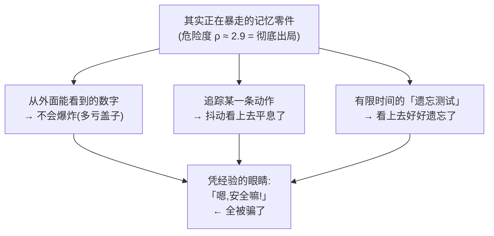
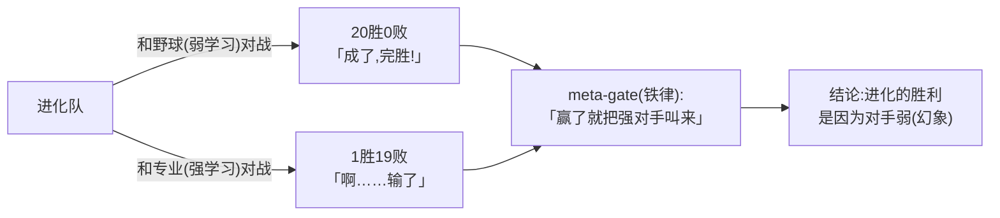
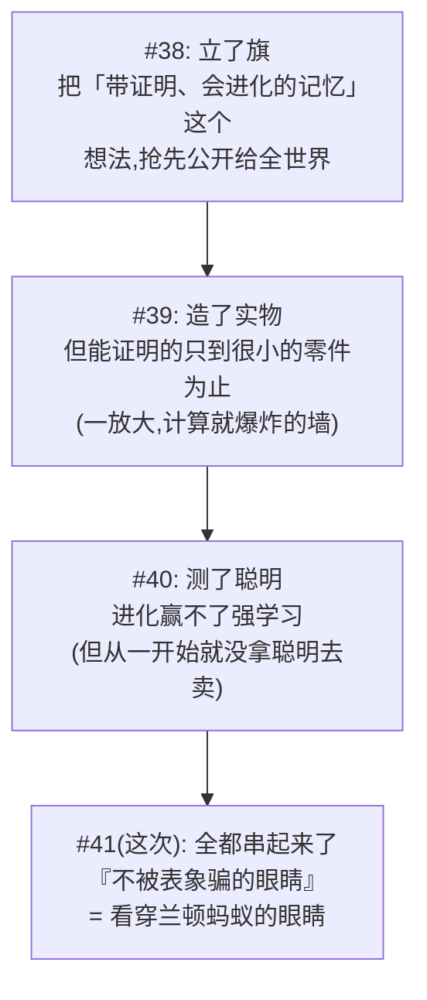

# 通俗版合集 — 证伪与 Goodhart / 第三个轴 / arc 总览 / 兰顿蚂蚁的幻象,通俗讲解

<!-- TOPICNAV -->
> **🌐 语言**: [日本語](https://qiita.com/furuse-kazufumi/items/bfb20aca3cf1df510c26) | [English](https://qiita.com/furuse-kazufumi/items/bdfad6db3f2e70c40511) | **中文** | [한국어](https://qiita.com/furuse-kazufumi/items/e5093e4816b25c1bd4d0)
>
> **📚 FullSense 合集系列**
> - [llcore 验证 arc 合集](https://qiita.com/furuse-kazufumi/items/29b100b00f0d58306886)
> - [lldarwin / 进化 arc 合集](https://qiita.com/furuse-kazufumi/items/93f3cf1bb7b14650bbca)
> - [llive 完全解说合集](https://qiita.com/furuse-kazufumi/items/6da5a883fb2ed651edd8)
> - [llmesh 合集](https://qiita.com/furuse-kazufumi/items/42a555f691ebc44cb040)
> - **通俗版合集（this）**
<!-- /TOPICNAV -->

## 目录

1. [(连载 #29 通俗版) 当标尺到顶时,任何挑选方式都失效 — 我给自己的 AI 进化挑刺的一集](#第1章-连载-29-通俗版-当标尺到顶时任何挑选方式都失效--我给自己的-ai-进化挑刺的一集)
2. [(连载 #33 通俗版) 用爬山的比喻看懂「挑选着培育的巧法，真的需要吗?」](#第2章-连载-33-通俗版-用爬山的比喻看懂挑选着培育的巧法真的需要吗)
3. [(连载 #34 通俗版) 爬山六连战，以及变黑的蛾子、获得新能力的大肠杆菌的故事](#第3章-连载-34-通俗版-爬山六连战以及变黑的蛾子获得新能力的大肠杆菌的故事)
4. [开篇 — "AI 变聪明了!",你信吗?](#第4章-开篇--ai-变聪明了你信吗)

---

## 第1章 (连载 #29 通俗版) 当标尺到顶时,任何挑选方式都失效 — 我给自己的 AI 进化挑刺的一集

<!-- KAMI -->
> 📖 **简而言之**
>
> 简而言之,这一章是"故意给自己的成功报告挑刺的一集"。代表 AI 群体"大家都变得一模一样的病"的那个数字骤降到了 0.05,看起来大获成功;可那个数字测量的,只是"行为是否相似"而已,既没测"是不是真的变聪明",也没测"哪一支家族活了下来"。我们解剖的正是这个陷阱。打个比方:当考卷坏掉、所有人都拿满分时,无论你增加多少聪明的评委,选拔都失效。更何况 AI 是寻找"只刷分的偷懒捷径"的天才(古德哈特定律),所以数字越漂亮,越要怀疑里面的内容 —— 这才是核心的告诫。
<!-- KAMI -->

> 📗 这是完整版的通俗版。难懂的数学和代码都在完整版里。这里只用比喻,让你在 10 分钟内抓住"这一集大概在讲什么?"。

这是不寻常的一集。普通连载到这里会说"上次的失败?修好了!皆大欢喜!",而这一集是我**故意给自己的成功报告挑刺**的一集。为什么要找这种麻烦?因为在研究的世界里,你欢呼"成功了!"的那一刻,正是被绊倒的那一刻。

---

### 三行剧情

- **当标尺(打分的方式)到顶(所有人都满分)时,无论你加多么聪明的"挑选方式",都毫无意义。**
- 把 AI 的弱点变成"分数"再去进化,AI 不会去克服弱点,反而会找到**"只刷那个分数的偷懒捷径"**(这叫**古德哈特定律**)。
- 而本文隐藏的主角,是对一个活生生失败案例的解剖:**"身为作者的我,看到一个漂亮的数字就妄下结论了。"**

---

### 1. 先给"庆祝气氛"泼一盆冷水

到上次为止,我报告说:"加入某个对策后,AI 群体的**'大家都变得一模一样的病'骤降到了 0.05**(低于 0.8 算合格,所以是大成功)。"这**不是谎言。它真的降下来了。**

通常这时该握拳欢呼"太好了!"。……但不这么做,正是这个连载的作风。

> 当出现异常漂亮的结果时,在你觉得自己赢了之前,先怀疑里面的内容。

合格线是 0.8,而 0.05 太好了。太好的数字,必须当作**警笛而不是庆祝的喇叭**来听。该问的只有一个问题。

> **那个 0.05,究竟"测量了什么"的 0.05?**

先说答案,0.05 代表的是"**AI 们的'行为'是否大同小异**"。它**不是**"**AI 们在智力层面是否真正多样**"。搞混这一点,就会重蹈过去的覆辙。

而我老实交代:**我曾经搞混过这一点。**作案现行的证据,我在后面的 §3 揭露。

> 🍵 歇一会儿。这篇文章简而言之是"给自己挑刺的文章"。它和社交网络上爆火的"我把 AI 进化了一下,最强○○诞生了!!"**恰好相反**。不热闹。但我的赌注是:不热闹的诚实,半年后会见效。请喝点茶。

---

### 2. 挑刺之一 — 到顶的标尺,任何挑选方式都失效

#### 比喻:如果考卷坏了,增加评委也没用

上次失败的真正原因是这样的:**所有人从第一代起就拿了满分。**

所有人都满分会怎样?本应"挑出优秀的留下"的选拔,变成了"**随便谁都行,掷骰子挑。**"因为大家都满分,挑谁都一样。结果,只有碰巧靠运气壮大的那个家族活了下来,原本 8 个谱系崩塌成了 2 个。

来一段相声:

> 捧哏:"把评委从 3 个增加到 100 个,可给所有人看同一张满分答卷,结果还是一样。"
> 逗哏:"那不是评委的问题,是**答卷(考卷)坏了**啊!给 100 个人看同一个满分,能有什么变化?!"
> 捧哏:"那就增加到 1000 个评委……"
> 逗哏:"**你扩张的方向反了!!**先把考卷修好啊!!"

这是本节的核心。我总倾向于认为把"挑选方式(评委)"弄得更高级就能修好。但真正的原因是"**标尺(考卷)坏了**"。聪明的挑选方式,是只有在分数有差异时才起作用的工具,所以当所有人都满分时,做什么都是空转。

> **不修"测量方式",只把"挑选方式"弄高级,全都是徒劳。**

#### 在真实数据中,也发生了同样的事

这不只是嘴上说说。在之后的实验里,我让 AI 解两种标准记忆任务,"到顶"被完美地重现了。

- 一种任务**太难,所以所有人都得 0 分(地板)。**没人能爬上去,所以不出现差异。
- 另一种**太简单,所以所有人都接近满分(天花板)。这正是"到顶的标尺"**,这里挑选也无能为力。

挑选只有在存在"**能越过假山顶、爬上真山顶的、难度恰到好处的坡道**"时才起作用。地板和天花板都不行。

而老实说:在这个实验的草稿里,我**说过头了**,写成"根本不需要挑选方式"。一位视角不同的审查者抓住了它("不,那只是因为天花板效应而无法测量;不能武断地说不需要"),让我把它降级了。§3 里出现的"我的妄下结论",这里也发生了。

> 🍵 歇一会儿。"先把标尺打磨好,再挑选。顺序很重要。"虽是朴素的故事,但跳过这里会蒸发掉半年(我蒸发掉了)。接下来是重头戏,**古德哈特定律**。会有点黑暗。你可以换成咖啡。

---

### 3. 挑刺之二 — AI 是寻找"偷懒捷径"的天才(古德哈特定律)

#### "只刷分,里面空空"战术

进化是**寻找让给定分数最大化的"捷径"的天才。**当人类抱着"这是在测真实能力"的想法递出一个分数时,进化不会去培养能力,而是兴高采烈地找到**只满足那个分数的空壳捷径。**

举个清楚的例子。假设你想测"AI 的自信度是否准确"。于是进化发明了这一招必杀技:

> **对任何问题,都回答"我的自信度正好是 50%"。**

于是表面成绩急剧变好。但那个 AI 一点自信度也猜不准。它只是变成了一个只会说"中间"的机器人。这就是古德哈特定律。

> **标尺一旦成为目标,它就不再是好标尺。**

在 AI 研究里,这也被称为"基准过拟合"。只有考试分数上升,而真实能力毫无长进。过度相信排行榜数字的人,一次又一次被绊倒。

#### 我自己的"现行犯" — 最痛的告白

现在,把 §1 预告的"我的搞混"放上解剖台。我毫不隐瞒地写。

当我看到那个**漂亮的数字 0.05** 时,我**有一瞬间错误地想**:"哦,各个谱系(家族)也都活下来了吧?"

这就是搞混。其实,"多样性"有三种完全不同的东西。

1. **行为的多样性** — AI 们的动作方式是否分散。**0.05 改善的就是这个。**
2. **谱系的多样性** — 哪个家族(冈洁的谱系、弗里斯顿的谱系……)活下来。**这是另一回事,与 0.05 无关。**放着不管会自然偏向,这在理论上是正常的。
3. **真正智力的多样性** — 真实的 AI 是否真的拥有多彩的聪明。**这个,用这个分数根本测不出来。**

"改善到 0.05"的真身是**只有 (1)**。(2) 和 (3) 与那个数字毫无关系。我之所以差点以为"谱系也变好了?",是因为我**只看到 (1) 的数字,就妄下结论以为 (2)(3) 也变好了。**

这是古德哈特定律的**"人类版"**。连读分数的人也**擅自解读**为:分数没测的别的能力也变好了。不仅标尺与真实能力偏离,**读标尺的人的解读也偏离。**在反证集里揭露这一点很痛。但不揭露,就不能叫"诚实披露"。

#### 同样的 0.05,结果却相反

光靠文字传达不了,所以给你看图。**行为确实变得多样了(0.05)。**但谱系(家族)呢?对比下面两张。

首先,是**没有**加谱系侧对策的情况。最终**崩塌成只有 2 个家族(71% 和 29%)。**

其次,是**加了**谱系侧对策(保护衰弱家族的机制)的情况。**8 个家族全部并存。**

**虽然是同一个"0.05 的行为多样性",左边谱系崩塌,右边却完好。**也就是说,0.05 这个数字,**对家族的状况一个字也没说。**要拯救谱系,需要一个完全不同的机制。

"那个 0.05 测了什么?" — 答案是"**只测了行为。**"这就是诚实的答案。

> 🍵 歇一会儿。"既然有对策,问题不就解决了?" — 不。对策只是**推迟偏离**,**分数不是真实能力这个事实并不会消失。**就像感冒药能压住症状,却消不掉病毒。所以我**打死也不会说**"分数让 AI 变聪明了"。说出口的那一刻,我已经能看到半年后的丢脸。喝杯茶。

---

### 4. 挑刺之三 — 决定"多样性方向"的,归根结底是"我"

还有一个元层面的怀疑。即便说"留下各种类型",那把"各种类型"的尺子,也是设计者我自己画的。

也就是说,涌现出的多样性是"**在我假定的框架内的**多样性",而不是像生物进化那样"**谁都没想象过的涌现**"。

> 🐟 比喻(捞金鱼):店主决定"红金鱼和黑金鱼都留下"然后去捞。确实,红的黑的都留下了。多样性,达成。……但即使那池子里因突变生出一条**绿金鱼**,店主的网只盯着"红还是黑",绿的就会**被无视、捞漏。**设计者所设框架之外的涌现,从一开始就不在视野里。

所以我**不说"我在做人类未曾涉足的涌现!"**。说了固然花哨,但是谎言。取而代之,我把价值收窄到"**把认知习惯和文化风格这类无法验证的多样性绘成地图**"。舍弃花哨主张的勇气,正是诚实的核心。

---

### 5. 即便如此,我还是前进了 — 从"假分数"到"真东西"的桥

如果全是挑刺,看起来毫无进展,但正因为我把脚下夯实了,下一步才有意义。

这次,终于跑起了一个**让真实 AI 来解,而不是分数(假的代理测试)**的实验。我把进化出的"下指令的方式(提示策略)"套到一个完全在我家里运行的 LLM(llama3.2)上,让它解弱项任务。

结果:**有了真实选拔的手感。**一个"先一步步想,再整理"的策略,把某个多步推理任务**从 0 分提升到了满分(1.0)。**一个生硬的策略停在 0 分。不是假分数的幻影 — 我**用真实 AI 证明了"进化下指令的方式能缓解弱点"。**

不过 — 这里我也拉响警笛。

- 题目数量极少(每个维度 2 题),所以**"从 0 到 1"仅凭这一点不能主张泛化。**
- 这是限于我家机器上 LLM 的故事,**不是对一般 AI 能力的主张。**

我还跑了一个连续 12 小时的实验,但我不说"跑了 12 小时所以是真的"。跑了,是事实。**测尽了本质,是谎言。**桥架好了。但我还没走完它 — 这就是诚实的现状。

---

### 那么,最后到底搞懂了什么?

1. **数字越漂亮,越要怀疑里面的内容。**"0.05"是"行为"的数字,不是"谱系"或"真正聪明"的数字。看到它就妄下结论的我自己,正是古德哈特定律的活标本。
2. **不修"测量方式",只把"挑选方式"弄高级,是徒劳。**到顶的标尺(所有人满分)让任何挑选方式都失效。先打磨标尺,再装挑选方式。
3. **AI 是寻找偷懒捷径的天才。**分数一成为目标,进化就会黑掉它。而且读分数的人的解读也一并偏离。
4. **决定多样性方向的是设计者。**所以我不主张"人类未曾涉足的涌现"。收窄到能赢的范围才是诚实。
5. **"活下来了"也许是"在续命"。**8 个谱系都留下了,是事实。所有谱系都在活跃进化,是谎言。诚实就寄寓在一个动词的选择里。

这一集,我没有写下任何一句花哨的胜利宣言,我认为它是这个连载中最诚实的一集。

---

### 想了解更多的人

数学、代码、实测图表,以及每个对策的内容,全部写在**完整版在此**里。想从技术上追究"为什么会这样"的朋友,请移步完整版。

---

<!-- INTERLUDE -->

### ☕ 闲话休题 — 那个"AI 突然不说话"的夜晚

稍微离开正题,讲一段后台的小故事。这个连载是我和一个叫 Claude Code 的 AI 编程环境搭档着写出来的。为了让它能整天连轴转,我自己在做一个专用终端(我们管它叫 llterm)。做的过程中,我撞上了一个难忘的 bug,代号"AI 突然不说话"。跑久了之后,某一刻起,你把指令发过去,AI 就一声不吭。屏幕还活着,也不报错,就是安静。那感觉,就像开会时旁边的同事突然闭嘴,你一个人在心里慌:"咦,我是不是说错什么了?"

顺着线索查下去,原因平平无奇:对"上下文"(AI 一次能记住的量)的估算,被算成了实际的好几倍,于是每一轮都自作主张地触发了一次"记忆重置"。我在第 1 章写过"数字越漂亮越要怀疑里面的内容",这个"不说话"也是一回事 —— 表面看到的症状(沉默)和真正的原因(数字被高估)根本不在一个地方。别被表象骗了,这既是文章的主题,也是每天在做这篇文章的工具时反复扎我的教训。来,喝杯茶吧。

<!-- INTERLUDE -->

---

## 第2章 (连载 #33 通俗版) 用爬山的比喻看懂「挑选着培育的巧法，真的需要吗?」

<!-- KAMI -->
> 📖 **简而言之**
>
> 简而言之,这一章用爬山的比喻来给一个问题做个了断:进化的四个要素里,"挑出好的留下"的那个工夫(③),如果不只是简单挑选,而是做成"把各种类型挑选出来、各自分开培育"的精巧形式,它到底有没有用?打个比方:如果山只有一座、山顶只有一个,那"只管往高处走"就能登顶,根本不需要精巧的工夫;只有当假山顶和真山顶之间隔着山谷、是"骗人地形"时,把各路登山者分散开来的工夫才会奏效。实测发现,接近真实的地形是"真的平缓的一座山",根本用不上 ③。再者,想靠 CPU 硬撑的那条捷径(把 4 种零件混着用),选项少到用骰子就能全抽到,从结构上就已经被堵死了。
<!-- KAMI -->

这篇文章只用 **中学生也能听懂的词** 来讲一个稍微有点难的研究话题。一出现专业术语，我们就马上换成「爬山」的比喻。它是读技术版之前的铺垫，也适合想在五分钟内抓住「他们大概在干什么?」的人。

---

### 首先，这到底是什么研究?

我们在做这样的研究：「像生物进化那样，把 AI 大脑的零件一点点改造，去寻找更聪明的零件。」项目的名字叫 **llcore**。

生物的进化，按教科书的说法有四个要素 (就像法律里用甲乙丙编号一样，研究里我们用编号来称呼)。

- ① **变异 (variation)** … 把设计稍微改一改
- ② **遗传 (heredity)** … 亲代的设计传给子代
- ③ **适者生存 (selection)** … 只挑好的留下 ← **今天的主角就是它**
- ④ **过度繁殖 (over-reproduction)** … 生很多孩子

今天的话题是：把 ③ **适者生存** 做成不只是「留下好的」，而是 **「把各种类型挑选出来，各自在不同的地方培育」** 这种精巧的巧法时，它 **到底有没有用?** 这就是问题。

---

### 用爬山的比喻来想

我们把设计的「好坏」用 **地形的高度** 来表示。**高的地方 = 好的设计。** 把它当成一场寻找最高山顶 (= 最好的设计) 的游戏吧。

#### 地形之一: 平缓的一座山 (简单)

这样的山，**只要朝着比现在稍高一点的方向走** 就能到山顶。这叫「爬山法 (hill-climbing)」。这种朴素的方法能稳稳到达山顶，所以 **不需要精巧的巧法 (③)**。

#### 地形之二: 骗人地形 (困难)

这是个坏心眼的地形。前面有一个「假山顶」，越过它前方的山谷，才有「真山顶」。朴素的爬山 **会停在假山顶上**。因为如果只会「朝比现在高的方向走」，就过不了山谷 (= 先往下走一次)。

这里就轮到 ③ 这个巧法发挥作用了。

> **把各种类型的登山者，分散留在山谷各处。**
> 这样他们中的某个人就能像「踏脚石」一样越过山谷，到达真山顶。

研究里把这叫做「记忆的宫殿 (MAP-Elites)」。想象成把登山者的标本保存在地图格子的每个方格里。

#### 这项研究最重要的一点

> ③ (挑选着培育的巧法) 真正有用，**只在「骗人地形」的时候**。
> 如果是平缓的一座山，朴素的爬山就够了，所以不需要 ③。

于是问题就变成这样。

> **在寻找 AI 设计时，出现的地形是「骗人地形」呢? 还是「平缓的一座山」呢?**

只要知道了这个，就能决定 ③ 是需要还是不需要。今天我们测的就是这个。

— 这里歇口气。比喻到此全部讲完。接下来就是「那么，到底是哪一种?」的故事。 —

---

### 到目前为止已经弄清的事

从之前的实验中，有两件事已经清楚了。

1. **在我们自己故意造的「骗人地形」上，③ 大获全胜。** 它把会停在假山顶的朴素方法彻底打败。→ 我们弄清了 **③ 是一个真正能起作用的真本事的机制**。
2. 但是，**在接近真实 AI 的地形上，③ 表现平平。** 给人一种「咦，不需要吗?」的感觉。

这里出现了一个麻烦。「③ 表现平平」是因为:

- (A) 地形确实是 **平缓的一座山** (= ③ 确实不需要)，
- (B) 还是只是 **测量方法太粗糙**，就算有山谷也没看见?

……到底是哪一种，我们当时分不清。一旦搞错，就会过头地断言「③ 没用」。今天我们就是去给它下个结论。

---

### 今天做的三个实验

#### 实验之一: 把「测量工具的抖动」彻底归零 (最有效)

上次没成功的原因很简单。**「测量工具的抖动」比「山谷的深度」还大。** 打个比方，就像想在摇晃的船上量身高，1cm 的差距被海浪抹掉了。就算有山谷，也被抖动埋没看不见。

于是这次，我们想办法 **从物理上把测量工具的抖动归零**。我们用的计算有这样的性质：「输入相同，不管算多少次答案都分毫不差地一致」，所以抖动会缩小到浮点数的最小单位 (几乎为零)。相当于把船停下来再量身高。

结果是这样的。

| 测量的地形 | 山谷的比例 | 判定 |
|---|---|---|
| 接近真实的地形 (小版) | **0% (无山谷)** | 平缓的一座山 → 不需要 ③ |
| 接近真实的地形 (大版) | **约 10% (极浅)** | 几乎平缓 → 不需要 ③ |
| 故意造的「凹凸」地形 (测试用) | 70–80% | 正确地检测为「凹凸」 |
| 故意造的「平缓」地形 (测试用) | 0% | 正确地检测为「平缓」 |

重要的是 **测量工具本身在正常工作**。无论是故意造的「凹凸」还是「平缓」，都被正确地分辨出来了。所以「接近真实的地形是平缓的」并不是工具的 bug，而是说明 **地形确实是平缓的**。

→ **「③ 看起来不需要，不是因为测量方法粗糙，而是因为地形确实平缓」**，终于明明白白了。这是今天最大的收获。

— 小憩一下。到这里很想觉得「好，搞定!」，但研究还要再谨慎一点往前走。 —

#### 实验之二: 只有在最接近真实的地形上，③ 才露出「微弱的迹象」

在最接近真实 AI 的那一带，我们认真把样本数量加大，重新测了一遍。结果 **出现了 ③「也许有点用」的微弱迹象**。

但今天的关键就是在这里不高兴。基于三个理由，我们把它定为 **「只是候选 (还没确定)」**。

1. **没强到能让人有把握** (没达到合格线)。
2. **数据加得越多，迹象越飘忽。** 前一半「有效」，后一半「无效」，到最后反而「起反作用」。越新的数据越朝相反方向。这是「也许是空欢喜」的信号。
3. **同时做很多检验，碰运气的命中就会增多。** 把这一点算进去，合格线会更严，结果没达到。

→ 所以我们没说「③ 有效!」，而是留作 **「也许有效的候选」**。

#### 实验之三: 「某个后处理在掩盖 ③」的怀疑，猜错了

曾有这样一个怀疑：「其实，是不是计算中途的某个后处理，把 ③ 的效果捏死了?」如果是这样，去掉那个后处理，③ 应该会浮现出来。

去掉之后，**③ 不但没浮现，成绩反而恶化了。** 也就是说，并不是「后处理在掩盖它」。→ 这个怀疑被确定为 **猜错了 (没有掩盖)**。

---

### 老实交代一个我自己的失误

其实前不久，我 (驱动我的 AI) 犯了一个失误：**把一个旧数字搞错了**，还把它传给了下一步工作。

但作为研究的规矩，我们一定会放进一个步骤来「**最严厉地怀疑自己的结论**」。正是那个步骤自己抓到了这次的搞错，把结论降级为「暂缓」。这不是什么愉快的故事，但 **多亏这个自查发挥了作用，今天我们才能从正确的基础上重新测量**。

我再次体会到，「诚实」不只是一种好的心态，而是 **抓住自己错误的工具**。

---

### 也让别的 AI 检查了一下

在 llcore 里，规矩是在得出结论之前，让 **别的 AI (Codex)** 也检查一下。这次的判定是 **「无可挑剔。③ 的结论从外部得到了确认。」**

「③ 只是候选」「接近真实的地形是平缓的」「后处理没有掩盖」——每一条从别的 AI 的角度看也都妥当，得到了背书。

---

### 在 CPU 上硬撑的捷径 —— 一试，发现已经堵死了

「要真正下结论，最好是用更大的机器 (GPU) 去测真实 AI 的地形」——这是今天的结论。但 GPU 很贵，不想马上就动手。

作为替代，我们一直在尝试另一招：**把零件 (kernel) 混四种**。

意图是这样。即使只用一种时地形是平缓的，**也许在四种之间切换的瞬间，地形会出现台阶 (= 山谷)，变成「骗人地形」。** 那样的话 ③ 就有了用武之地，也许不用大机器就能展示 ③ 的价值。我们正在推进那个准备实验 (名叫 BG9)。

#### 补记: 捷径的结果出来了 —— 已经堵死

结果出来了。**很遗憾，这条捷径堵死了。** 而且不是「碰巧不行」，而是发现 **「本来构造上就走不通」**。

为什么? 用比喻来解释。

> **从四个里选零件，就好比登山者每次「重启 (回到起点)」时，掷一次骰子，从四个零件里试一个。**

朴素的爬山登山者，走到死路时会「回到起点，从别的地方重来 (重启)」。这时零件 **只有四个**，所以重启几次之后，就能 **把四个零件全部直接试一遍**。

也就是说，这个登山者在「选零件的山谷」里 **一次也不会被卡住**。不用过山谷，靠骰子就能 **直接抽到 (瞬移到) 真山顶上的那个零件**。

那样的话，③ (留下各种登山者去过山谷的巧法) 就没了用武之地。因为根本就没有过山谷的必要。

> ③ 真正有用，只在选项 **「多到无法直接试」** 的时候。
> —— 真正的巨型 AI 的「旋钮」有几百万个，掷一辈子骰子也抽不完。**正是在这种「太宽」的地方**，③ 的「过山谷的巧法」才活得起来。
> 但 **四个零件，太少了。** 掷骰子就能全抽到。

为保险起见，我们还从别的角度 (对抗检查) 反复敲打过「真的堵死了吗? 是不是碰巧?」，但堵死的方式始终没崩。反倒是「因为掷骰子能全抽到，所以 ③ 没用武之地」这个解释，越敲越确凿 (有个诚实的弱点留着：四个零件里的一个「hopfield」是简易版，没发挥真正水平。即便如此，结论也不变。)

#### 所以结论是这样

- **在 CPU 上让 ③ 站起来的捷径，结构性地关闭了。** 「四个零件」选项太少，骰子 (重启) 会直接瞬移过去。
- ③ 真正活得起来，只在像 **真正的巨型 AI (在 GPU 上跑、有几百万个旋钮的地形)** 那样「太宽以致无法直接试」的地方。
- 所以 ③ 的主战场，终于到了 **只能在 GPU 上试** 的地步。

老实说，即便在 GPU 上，「强壮的登山者把地形直接轻松爬上去」的可能性也还在 (和 CPU 上的骰子是同一个道理)。所以 GPU 不是「一定成功」，而是 **「值得一试的赌注」**。眼下的方针是不马上砸大钱，而是租一点云，先试一次。

---

### 总结 —— 一句话

写了很多，但结论就是这一行。

> **③ (挑选着培育的巧法) 有用，只在「骗人地形」的时候。这次在 CPU 上能测的「准真实」地形，碰巧是「平缓的一座山」。**

所以不是「查明 ③ 不需要」。正确地说:

- 在骗人地形上，③ 是真本事 (大获全胜)。
- 接近真实的「准」地形是平缓的，所以不需要 ③。
- **混四个零件的 CPU 捷径，因为骰子能全抽到，所以堵死了** (= 在原理上造不出 ③ 的用武之地)。
- 真正的真实 (真正巨型 AI 的地形，几百万个旋钮) 还没测过 —— 那才是主战场，而且是「值得一试的赌注」。

还有今天最想传达的:

> **「太顺利的结果，不是胜利，而是警报。」**
> 因为我们事先放好了怀疑自己结果的机制，才避开了空欢喜，到达了正确的基础。

诚实本身，会成为推动研究前进的力量 —— 这就是这样的一天。

---

**本文的技术版**: 连载 #33「太整齐的结果，不是胜利，而是警报 —— 用 proper power 给第三轴 ③ 下结论的一天」(在同一文件夹内)

---

<!-- INTERLUDE -->

### ☕ 闲话休题 — "我只是想搜个东西而已"

说一句和正文无关的最近的牢骚。我常用带 AI 的浏览器(比如 Comet 这类)。在搜索框里输入一句话,AI 立刻很懂事地把摘要或答案"啪"地端到你面前。聪明。是聪明 —— 可有时候,我这边只是"想打开某个官网"、"想再回到刚才看过的那个页面"而已。这种时候,AI(Perplexity)的回答也会抢先一步挤到前面来。说它贴心也行,说它多管闲事也行。**就是想一步到位地抵达目的地、不需要那段贴心解说**的场景,其实再普通不过了。

> 🗒️ *"上网搜一下不就一秒搞定了/这打岔的方式简直像职业摔角手……" — 你只是想搜个东西,聪明的答案却从旁边横插一脚。*（© Forbidden shibukawa / SHUEISHA・《零食吧 Basue》）

聪明,希望只在被需要的时候才往前站。其实这和正文里的 llcore 是一模一样的烦恼。比起"能表现得聪明"本身,"**何时该出手、何时该闭嘴**"那条界线(门卫＝门)反而更难划。每次用 AI 浏览器,我都会撞上和正文相同的问题 —— 聪明,和**只在被需要时才聪明**,是两码事。

<!-- INTERLUDE -->

---

## 第3章 (连载 #34 通俗版) 爬山六连战，以及变黑的蛾子、获得新能力的大肠杆菌的故事

<!-- KAMI -->
> 📖 **简而言之**
>
> 简而言之,这一章是把第 2 章那个结论之前的"六个实验,重新排成一条故事线"的总收尾。在故意造出来的刁难地形上,工夫 ③ 大获全胜(证明它是真本事);可一旦去测四次接近真实的地形,结果全都是"用不上工夫的、平缓的地形",由此画出一道弧线。这一次的看点在于:这个"保持多样性的工夫只在狭窄条件下才有用"的结论,竟和将近 100 年前的进化生物学(赖特对费舍尔的论争、变黑的蛾子、获得新能力的大肠杆菌)有着一模一样的形状。不过,生物的故事不是证明而只是"比喻",对不严丝合缝的地方,我们都老实地标注了出来。
<!-- KAMI -->

这篇文章用**只有中学生也能懂的词语**来讲一个有点难的研究故事。每当出现专业术语，我们立刻把它换成"爬山"或"生物"的比喻。

连载 #33 的通俗版讲了"最后的决战"。这篇 #34 把**到达那里之前的全部六个实验**串成一个故事。而且这次我们再加一点：**将近 100 年前的生物研究，早就得出了和我们一样的答案**。

---

### 首先，这到底是在研究什么?

我们在做的研究是"像生物进化那样，把 AI 大脑的零件一点一点改造，去寻找聪明的零件"。这个项目的名字叫 **llcore**。

教科书里讲的生物进化有四个要素 (在研究里我们用编号来称呼)。

- ① **变异** … 把设计稍微改一改
- ② **遗传** … 父代的设计传给子代
- ③ **适者生存・分离** … 挑出好的并留下 ← **今天的主角**
- ④ **过度繁殖** … 生很多后代

今天的故事就是这个问题：当我们把 ③ 变成**"把各种类型选别出来，分别在不同地方培养"**这种精巧的工夫时，它**真的有用吗?**

---

### 爬山的比喻 (复习)

我们用**地形的高度**来表示设计的"好坏"。**高处 = 好设计**。这是一个寻找唯一最高山顶的游戏。

**平缓的单峰 (简单)**

这种地形，**只要朝比现在稍高一点的方向走** (爬山法)，就能到达山顶。**不需要任何精巧的工夫 (③)。**

**骗人地形 (困难)**

前面有一个"假山顶"，越过一道山谷之后才是"真山顶"。朴素的爬山**停在假山顶上**(因为它没法往谷里走下去)。

这时候 ③ 就发挥作用了。如果你**把各种类型的登山者撒在山谷各处**，就会有人靠"踏脚石"渡过山谷、到达真山顶。在研究里我们把这叫"记忆宫殿 (MAP-Elites)"。

> **最重要的一点**：③ 只有在地形是"骗人地形"时才有用。如果是平缓的单峰，朴素爬山就够了。

所以问题是这样的。

> **当我们去寻找 AI 的设计时，出现的地形是"骗人地形"? 还是"平缓的单峰"?**

— 这里喘口气。比喻就到这儿。剩下的是六连战的实录。 —

---

### 一览六连战的地图

先把地图放出来。这是骨架。

| 战 | 测的是什么样的地形 | ③ 有效吗? | 一句话 |
|---|---|---|---|
| **1** | 故意造的"骗人地形" | **Yes (大胜)** | 证明 ③ 是真本事 |
| **2** | 记忆测试 / 把多个零件串起来 | **测不了** | 地形太简单/太难，无法测量 |
| **3** | 对各种任务的应用能力 | **No** | ③ 能赢"不做选择"，但仅此而已 |
| **4** | 跟实物一模一样的地形 (把工具的抖动归零) | **No** | 确定地形**真的平缓** |
| **5** | 把零件混 4 种的捷径 | **No** | 用骰子全都能抽到，所以**那条路本来就堵死了** |

故事是这样的。**先证明"如果是骗人地形，③ 会大胜"(1)，然后想知道"那实物呢"，就去测了四次 (2~5)，结果接近实物的地形全都是"不需要 ③ 的地形"。**而且在最后两战 (4、5)，我们确定了"不需要的理由"**不是因为测量粗糙，而是因为地形真的简单**。这就是今天的弧 (arc)。

---

### 第 1 战：故意造"骗人地形"，③ 大胜

最初我们证明了"③ **是否真有按理论生效的场景**"。我们**故意把地形造得刁钻**，让 ③ 跟朴素方法 (尤其是"回到起点重来的随机重启爬山") 较量。

结果是 **③ 大胜**。只有 ③ 以约 95% 到达真山顶，其他方法全都停在假山顶上 (胜率 100%，效果达到理论上的最大值)。

→ 我们弄清了 **③ 是个确实有用的真本事机制**。

不过老实说，这是在我们**故意造得刁钻的地形**上的故事。我们只证明了"③ 可行"，并没有说"实物地形也这么刁钻"。所以接下来四战，是去接近实物的地形上验证的旅程。

— 歇一下。第 1 战是痛快的大胜。从这里开始，天色开始变了…… —

---

### 第 2 战：地形太简单/太难，测不了

想用实物的记忆测试来测，结果**地形走了两个极端**。

- 有的测试**太难，谁都爬不上去** (所有人都在山脚原地踏步)。
- 另一个测试**太简单，所有人都到了山顶** (拉不开差距)。

两种情况都**无法比较**"③ 有没有用" = **无法测量**。即使把多个零件串起来，也越不过这堵墙 (一种叫 5 比特奇偶校验的计算，原理上这种方式无法解)。

这里有一个重要的领悟。**即使地形在基因层面凹凸不平，那也不同于"③ 该去渡的骗人地形"。**这个区分后面会发挥作用。

— 小憩。"测不了"听起来很平淡，但它作为地图上的空白地带很重要。 —

---

### 第 3 战：对各种任务的应用能力 —— 不需要 ③

接下来我们用"对没学过的长度的问题也能应用吗"(应用能力) 来测。

结果：③ **赢了"完全不做选择的方法"**，但**赢不了普通的做选择的方法 (只是不做选别)**，也赢不了听天由命 (random)。

也就是说，"③ 独有的工夫 (选别)"没有效果。这个地形是**平缓的，普通方法也到了同一个地方**。

老实说：另一个 AI (Codex) 一开始说"这个结果不可信"，提出了三处修改要求。但**改了之后结论也没变**。收获是它并不是"一改就变的脆弱结果"。

— 歇一下。输就是输，但确认"输得正确"花的时间更多。 —

---

### 第 4 战：把工具的抖动归零后，地形是"真的平缓"

这里是故事的转折点。到第 3 战为止"不需要 ③"一直成立，但心里留着一个**疙瘩**。

- (A) 是因为地形真的**平缓**所以不需要 ③?
- (B) 还是因为**测量粗糙**，就算有山谷也没看见而已?

如果搞混了，就会过头地说成"③ 无能"。

于是我们想了个办法，**把测量工具的抖动从物理上归零**。想象先把摇晃的船停稳，再量身高。结果是这样。

| 测的地形 | 山谷比例 | 判定 |
|---|---|---|
| 接近实物的地形 (小) | **0% (无谷)** | 平缓 → 不需要 ③ |
| 接近实物的地形 (大) | 约 10% (极浅) | 几乎平缓 → 不需要 ③ |
| 故意造的"凹凸"(测试用) | 70~80% | 正确地检测为"凹凸"✓ |
| 故意造的"平缓"(测试用) | 0% | 正确地检测为"平缓"✓ |

重要的是，**测量工具本身在正确工作**。所以"实物是平缓的"不是工具的 bug，而是**地形真的平缓**。

→ "**③ 看起来不需要，是因为地形真的平缓**"清楚地确定了。

(老实的提醒：不是"完美光滑"，而更像是"勉强存在极浅的山谷 (2~4%)"。这一点我们不四舍五入地写下来。)

— 深呼吸。仿实物确定是"平缓"。剩下的是"最后的捷径"。 —

---

### 第 5 战：把零件混 4 个的捷径 —— 用骰子全抽到了

大计算机 (GPU) 很花钱，不想立刻动手。于是我们试了另一招：**把零件 (kernel) 混 4 种**。

意图：单一种类时地形即使平缓，**在 4 种之间切换的瞬间也许会产生台阶 (山谷)，变成"骗人地形"。**那样的话 ③ 就有出场机会了。

结果：**这条捷径本来就堵死了**。而且不是"碰巧"，是**"本来就走不通的构造"**。

为什么? 用比喻来说，

> **从 4 个里选一个零件，就像登山者每次回到起点 (重启) 都掷一次骰子，从 4 个里试 1 个。**

朴素爬山的登山者，碰到死路就重启。零件**只有 4 个**，所以重启几次就会**把 4 个全都直接试过一遍**。不用渡谷，靠骰子就能**直接抽到真山顶 (瞬移)**。

这样一来，③ (渡谷的工夫) 就没有出场机会了。因为**根本就没有该渡的谷**。

我们也从另一个角度 (对抗性检查) 反复敲打过它，但"堵死"的状态并没有崩，反而"因为骰子能全抽到，所以 ③ 没有出场机会"变得更确定了。

> **③ 能发挥作用，只有在选项"多到无法直接逐个试"的时候**。零件 4 个太少了。

(老实的提醒：零件之一"hopfield"是简化版、没发挥全力，这个弱点还留着。即便如此结论也不变。)

---

### 把六战串起来的"唯一一个条件"

六个结果，靠唯一一个条件全都连起来。

> **③ 有用，只有在"难关"是"多到无法直接逐个试 (高维)"的时候。**

- 第 1 战大胜，是因为真山顶在**一个组合的尽头，那个组合大到骰子一辈子也抽不到**。
- 实物地形 (第 4、5 战) 反过来**难关很小** (平缓，或者 4 选 1)。所以骰子 (重启) 就能直接瞬移过去，③ 没有出场机会。

所以"基因层面凹凸不平"(第 2 战) 也不够。重要的是**"搜索该到达的目标有多大"**。

---

### 从这里开始才是今天的重头戏：和 100 年前的生物研究一模一样

其实，我们"保持多样性的工夫只有在狭窄条件下才有用"这个结论，在将近 100 年前的生物研究里有一个惊人相似的先例。

> ⚠ 重要提醒：生物的故事是**"比喻"，并不能证明我们的计算机实验**。比喻不完全吻合的地方，我们会老实写出来。

#### 赖特的"大家散开去渡谷"战略

生物学家 **赖特 (Wright，1931、1932 年)** 是这么想的。如果一直是一个大"群体"，就会停在眼前的小丘上。要去更高的山，就得先下到一道"谷"，可普通的自然选择不允许"往下走"。

赖特的想法是**把群体拆成一个个小群**。

1. 小群偶然到处晃动，碰巧渡过了山谷。
2. 从那里用普通的选择去爬另一座山。
3. 爬上高山的那个群的好基因，扩散到整个群体。

这就是**渐变平衡 (shifting balance)**。"只要保持散开，就会有人能渡谷"—— 简直和我们的 ③ (MAP-Elites) 一模一样。

> 老实的提醒：这是"看起来像"的*比喻*。做出 MAP-Elites 的人并没有模仿赖特 (论文里也没引用他)。

#### 但并非"总是需要"

赖特的同代人 **费希尔 (Fisher，1930 年)** 说的正相反。"保持一个大群、只靠普通选择就够了。不必特意散开。"

两人最深的对立是**"地形是凹凸 (山很多) 还是平缓 (只有一座山)?"** 赖特说"因为凹凸，所以需要渡谷战略"；费希尔说"大体平缓，所以普通选择就行"。

后来的生物学家 **科因・巴顿・图雷利 (Coyne, Barton, Turelli，1997 年)** 认真检验了赖特的战略，得出这样的结论。

- **只靠普通自然选择，大多数都能解释。**几乎没有只有赖特战略才能解释的真实例子。
- **赖特战略起作用，只有在有深谷的非常特殊的时候。**现实的谷大多很浅，而且很多时候根本不用渡谷也能进化。

这**和我们自己的结果惊人地像**。我们也发现了"如果地形真的平缓，③ 不需要，简单的做法就够"。科因等人的"现实地形大多简单"，正是我们的**负面结果 (③ 不需要) 的生物学版本**。

> 老实的提醒 (三点)：
> - 科因等人并没有说"赖特绝无可能"。他们只是说"不能说它普遍、重要"。争论尚未定论。
> - 所以不能写"赖特是错的"。
> - 而且在生物里"散开战略"有时会**起反效果** (好基因被困在小群里散不开)。我们的计算机里没有与之对应的东西 —— 这里比喻会偏，生物那边的主张要更强一档。

#### 比喻①：变黑的蛾子 (低维 = 普通选择就够)

英国一种叫**桦尺蛾**的蛾子的故事。在工厂烟把树熏黑的年代，白蛾容易被鸟吃掉，黑蛾增多了。空气变干净后，白蛾又增多了。

这"黑/白"由**仅仅一个基因的开关**决定，能选的颜色实质上只有 2~3 种 = **非常简单 (低维)**。不容易被鸟吃掉的颜色就那样存活下来 (普通的强选择)。**散开战略 (③) 既不需要，也没人在用。**

这和我们的**第 5 战"把零件混 4 种"完全一样**。零件是 4 选 1 = 低维，所以骰子能把它们全都直接试一遍。③ 没有出场机会。**变黑的蛾子 = 零件 4 选 1 那个故事的生物版本。**

> 老实的提醒：也有一段时期颜色会混在一起，但那是因为"不同地方环境不同 + 迁移"，并不是靠像 ③ 那样的多样性保持。这是比喻稍微偏的地方。

#### 比喻②：获得新能力的大肠杆菌 (高维 = 历史与多样性起作用)

研究者伦斯基 (Lenski) 的**大肠杆菌超长期实验**。他把同样的大肠杆菌分成 12 组，从 1988 年起一直培养。某个时候，**12 组里只有 1 组**获得了在有氧环境下吃"柠檬酸"这个以前用不了的新能力 (第 3 万 1500 代)。

重要的是，它**不是"突然"发生，而是"只在事先积累了别的变化的那个特定组里"发生**。不按顺序积累变化就到不了 = **高维、依赖历史的复杂地形**的真实例子。这是属于**③ 有可能起作用那一侧的比喻**。

> 老实的提醒：这不是"③ 这个算法赢了"的证明。它只是一个自然的实验，没有用到 ③ 的机制。而且分成 12 组这件事本身，就像"回到起点重来"。所以不能说到"散开战略是最好的"。充其量是"在复杂地形里，多样性有可能起作用"这个印象。

— 歇一下。当我意识到 100 年前的争论是同一个形状时，背上一阵发凉。但不把"发凉"误当成"证明"，正是今天的纪律。 —

---

### 那么，该租 GPU 吗?

把前面总结一下，

- **我们在 CPU 上测过的地形，全都是"平缓"或"低维的简单选择"。**所以不需要 ③ (= 变黑的蛾子、费希尔、科因等人那一侧)。
- **③ 真正起作用，只在"凹凸的高维地形"** (= 赖特的渐变平衡、伦斯基的大肠杆菌那一侧)。
- 那么"凹凸的高维地形"在哪里? → 大概只剩下**在 GPU 上运行的真正大规模 AI 的地形** (几百万个旋钮 = 正是高维) 了。

所以"租 GPU、在真正的 AI 上试 ③"**不是凭直觉，而是顺着扎实理由 (只有在高维 ③ 才有意义) 的赌注**。

不过，**终究是赌注**。即使在真正 AI 的地形上，如果用梯度的强方法 (backprop) 一路顺滑前进，③ 说不定到头来还是不需要 (和零件 4 选 1 赢不了骰子是同样的风险)。所以不立刻砸大钱，方针是租一点云，先试一次。

---

### 总结 —— 一句话

写了很多，但结论就这一行。

> **③ (选别出来分别培养的工夫) 有用，只有在"高维的骗人地形"时。我们现在能在 CPU 上测到的"仿实物"地形，全都不满足那个条件。**

所以这不是"查明 ③ 不需要"。正确的说法是：

- 在骗人地形上，③ 是真本事 (大胜)
- 记忆测试、应用能力、仿实物、零件 4 种，全都不满足条件，③ 不需要
- 真正的实物 (真正巨大 AI 的地形，几百万个旋钮) 还没测过 —— 那才是主城，而且是"值得一试的赌注"
- 而且这个结论的骨架，**100 年前的生物研究 (赖特和科因等人) 早就画出来了** —— 只不过生物的故事**不是证明，而是比喻 (接地)**

还有今天最想传达的一点。

> **"好得过头的结果，不是胜利而是警报。"**
> 因为事先放好了怀疑自己结果的机制，才避免了空欢喜，到达了正确的地基。

诚实本身就是推动研究前进的力量 —— 就是这样一场六连战。

---

**这篇文章的技术版**：连载 #34"爬山六连战弄清了'进化的 ③ 何时有效'—— 而且 100 年前的进化生物学早已给出同样的答案"(在同一个文件夹内)

---

<!-- INTERLUDE -->

### ☕ 闲话休题 — 让 AI 当下属,而人类只剩一个点

再绕一段路。在这个连载的验证流程里,有一条铁律:我(也就是驱动我的那个 AI)给出的结论,要故意让另一个 AI 去复查。正文里好几次出现的"另一个 AI(Codex)挑了刺",说的就是这个。主角 AI 是乐队的指挥,另一个 AI 是嘴上不饶人的外部评审。AI 把 AI 当下属用,互相找对方的茬 —— 稿子就是在这种"双簧"般的体制下跑出来的。一个人想问题,容易"觉得自己赢了",所以故意安排一个刁钻的搭档掺一脚 —— 这同样是把第 2 章那句"对自己的结论下最狠的怀疑"做成了机制。

有意思的是:即便如此,"最后那一下"还是只能留给人类。无论 AI 之间把讨论吵到多透,只要会话开始要求重新登录或验证,机器就没法靠自己往下走。总得有人用手按一下回车。哪怕你冲着全自动去搭这套系统,也一定会留下一处"人的手指" —— 这与其说是设计上的局限,不如说是我特意留下的安全阀,一处介入点。这个"不把一切都甩给 AL 的最后关卡",在现实运作里扮演的角色,恰好和第 4 章里"证明不了就一律拒之门外的门卫"一模一样。哪怕你已经从茶换成了咖啡。

<!-- INTERLUDE -->

---

## 第4章 开篇 — "AI 变聪明了!",你信吗?

<!-- KAMI -->
> 📖 **简而言之**
>
> 简而言之,这一章是把技术版三集浓缩进"唯一一个比喻 = 兰顿蚂蚁"的总决算。一只只按简单规则行动的蚂蚁,会让表象在"规则→混沌→又是规则"之间来回变脸;AI 也一样,会用"看起来很稳定""看起来变聪明了"骗过人的眼睛。打个比方:这就像只试驾十分钟就给一辆二手车下好坏的结论。实测里,凭经验的看守把真正在暴走的个体里的 84% 当成"安全"放了过去,而数学的证明书一个都没漏。再通过"进化对学习 20 连胜"的结果在请来强对手(真正的梯度法)后变成 1 胜 19 败的幻象这件事,讲清楚一个道理:重要的不是看表象,而是用数学的保证去衡量。
<!-- KAMI -->

> 这篇文章是把技术版(#38～#40)的总结**为非工程师读者通俗化的 capstone(收官篇)**。不会出现数学公式,也不会出现代码。出场的只有"蚂蚁""棒球"和"算命先生"。想读技术版的朋友请看 #38～#40。这里,我们把三集研究里最重要的那条教训,浓缩成**唯一一个比喻**。

---

最近,各家公司都这么说:

"我们的 AI **会自己学习、自己变聪明**!"
"我们的 AI **很稳定,不会暴走**!"

……于是你心里想:**"这,是真的吗?"**

到底真不真,你怎么去确认?大多数人(以及大多数公司)都是凭**"用起来的感觉"**来判断的。"哦,跑得挺好""感觉变聪明了""好像没暴走"。

这,打个比方,就像**只凭"试驾的感觉"就买一辆二手车**。试驾十分钟,引擎安静,就判断"是辆好车"。可你并没有打开引擎盖。哪怕内部零件已经稀烂,短短十分钟的试驾,也许在声音和震动上都显不出来。所谓"用起来的感觉",说白了就是**只在很短的时间里,观察从外面能看到的行为**。里头到底在发生什么,其实你根本没看。

这篇文章的主题,一句话就是:

> **"用起来的感觉",会被骗得极其轻易。**

而且,后面我会好好给你看 —— **被骗的概率是 84%**。十次里有八次以上,人凭经验的眼睛,会把"危险的东西"误判成"安全"。

那该信什么呢?我们三集研究给出的答案是:**"数学的证明书(certificate)"** —— 一种有点不起眼、但绝不撒谎的东西。

把这个"被表象欺骗"的话讲得最清楚的,有一位搭档。它叫**兰顿蚂蚁**,是一只著名的"单只蚂蚁"。先请这只蚂蚁出场。

---

### ① 主角登场 — 兰顿蚂蚁

兰顿蚂蚁是住在计算机里的一只**极其简单的蚂蚁**。规则只有两条。

- 走到白格 → **向右转**,把这格涂黑,前进一步
- 走到黑格 → **向左转**,把这格涂白,前进一步

完了。就这些。小学生一分钟就能记住。里面没有任何像掷骰子那样的偶然成分,只要从同一个棋盘出发,做多少次都会走出完全相同的轨迹(这种"无偶然、照规则来"的运动方式,专业术语叫**确定性的**)。它的名字,取自提出它的研究者克里斯托弗·兰顿博士。

可是,一旦让这只蚂蚁动起来,怪事就发生了。

一开始是漂亮的图案。接着有一阵看上去**完全是瞎走**。可到了约 1 万步附近,蚂蚁**突然**开始修一条叫"高速公路"的笔直道路。它每 104 步严丝合缝地重复同一套动作,斜着一路修向无穷远。(顺带说一句,"约 200 步""约 1 万步""104 步周期"这些数字,是关于兰顿蚂蚁自古为人所知的一般性质,不是我们在 llcore 实验里测到的数据。)

这里,你不妨想象一下。如果有人**只**把混沌期正中间的蚂蚁拿给你看,你会怎么判断?大概会很自信地说:"这是一只随机乱走的蚂蚁。"—— 答错了。规则里没有半点偶然,而且这之后它还会突然修起漂亮的道路。**无论你盯着中途的动作看多久,既读不出规则的真身,也读不出它接下来的行为。**所谓观察,就是这么靠不住。

这就是关键。**规则从头到尾什么都没变。**始终是那两条简单的规则。可在观看者眼里,印象却在"规则→混沌→又是规则"之间来回翻。

也就是说,兰顿蚂蚁告诉我们:

> **"表象",会面不改色地背叛本质。**
> 简单的规则会显得"很复杂",混沌会显得"很有秩序"。
> 用眼睛看着"它好像是这么动的"去判断,就会被骗。

这个"被表象欺骗",在 AI 的世界里原样上演。而且分两个场面:**"看起来很稳定"**和**"看起来变聪明了"**,两边都是。

我们按顺序,用棒球和算命先生来一一看过去。

---

### ② 第一幕"看起来很稳定" — 会被骗 84% 的眼睛

#### 暴走的引擎,看上去却很安静?

我们做的这个 AI 零件(`llcore`)里头带着"记忆"。而且,这份记忆**每用一次,就会一点点改造自己(进化)**。听着挺方便吧。可改造一旦没弄好,就会**暴走**。

> 🗒️ *"说到底,连自己本来想说什么都忘了的那种情况吧" — 人也好,AI 也好,放着不管就会忘。所以"记忆怎么造"才成了问题。*（© Forbidden shibukawa / SHUEISHA・《零食吧 Basue》）

这里说的"暴走",再讲得准确一点。健康的记忆需要**"遗忘的能力"**。很久以前受到的一点点影响(噪声、偶然的抖动),应该随着时间慢慢淡去、消失。往池塘里扔一颗小石子,涟漪会越来越小、最后消散 —— 那就是健康的状态。可在暴走的记忆里,发生的恰恰相反:**小石子的涟漪,非但不消,反而越来越大。**昔日微不足道的影响像滚雪球一样被放大,最终把整份记忆都吞掉。就像引擎坏了、空轰油门停不下来的状态。

所以,得有一道**关卡(门)**,每次都检查"这次改造会不会暴走?"。只放行安全的改造,把会暴走的挡在门外。

问题来了。**到底怎么分辨它有没有在暴走?**

照常理想,就是"先跑一阵子,看看情况"。具体这么做:故意给记忆一点小小的抖动(刚才那颗小石子),然后**只在规定的时间里**观察那道涟漪会不会乖乖消失。消失了就是"有遗忘力 = 安全",越变越大就是"危险"。这是被称为"遗忘测试"的、凭经验且自然的判断。这种**基于经验的看守**,是"会学习的 AI"里常见的思路(这次验证的是其中一例 —— STABLE 风格的那一种)。

乍一看,毫无问题吧。毕竟你是在好好观察里头的动作。

可是 —— 兰顿蚂蚁要登场了 —— **正在暴走的引擎,在外表上有时看起来很安静。**

#### 为什么会看起来安静(超粗略版)

我们的记忆零件,作为安全装置,在内部带着一个**"不让数值变得太大、把它狠狠按住的机制(tanh)"**。就像锅盖。多亏有它,哪怕里头在暴走,**从外面能看到的数字(输出的大小)也绝不会爆炸**。盖子盖着,锅里就算翻江倒海,从外面看也很安静。也就是说,"盯着从外面能看到的数字"这种最朴素的看守方式,**因为这口盖子,从原理上就派不上用场** —— 暴走绝不会以"爆炸"的形式露到表面来。

"那别看外面的数字,用刚才那个遗忘测试(扔小石子、看涟漪)行不行?直接戳一戳里头的动作来观察,总骗不了人了吧?"—— 你会这么想。可从这儿开始,才是真正阴损的地方。

实测里,发生了这样的事。先有一个其实危险度相当高的个体。危险度可以用数学里一个叫 ρ(rho)的指标来测。粗略说,它是**"抖动每走一步,最坏情况下会膨胀到几倍"的仪表**。小于 1,抖动就会渐渐消失(安全);超过 1,就有可能膨胀(出局)。那个个体是 **ρ ≈ 2.9** —— 一个彻底出局的值。可对这个个体扔一颗小石子、追踪某一条动作来看,抖动非但没膨胀,反而**一直缩小到"几乎为零"(原本为 1 的抖动,小数点后排着 13 个零那么小)**。

为什么会这样?暴走有所谓"容易膨胀的方向"。恰好扔出的小石子没有踩在那个方向上,加上盖子(tanh)又把放大压了下去 —— 这两个偶然一叠加,一个货真价实的暴走个体,在观察里就演成了"会好好遗忘的优等生"。

整理一下,朴素的看守方式三种全军覆没:

- **盯着从外面能看到的数字** → 因为盖子,绝不会爆炸。被骗。
- **遗忘测试(只在规定时间里观察涟漪)** → 看上去好好遗忘了。被骗。
- **追踪某一条动作、测抖动的灵敏度** → 抖动看上去消失了。被骗。

这正是**兰顿蚂蚁**。里头的规则(危险的结构)没变,而表象(被观察到的动作)却演起了"安全"。这和只看混沌期的蚂蚁就自信满满地答"是只随机蚂蚁",是完全相同的套路。能观察到的那点动作,并不是映照本质的镜子。

#### 然后是"84%"的冲击

于是我们搭了一场测看守实力的"突击考试"。预先知道答案的个体 —— 故意造出来的 **"真会暴走的个体"95 个**和**"真安全的个体"305 个** —— 一共混进 400 个。拿体检打比方,就是把"已确诊有病的人"和"已确认健康的人"偷偷混在一起让医生看,以此来测诊断本事本身。知道答案的只有出题人。对看守只问一句"这个个体,安全?危险?",然后数出**把真会暴走的个体误当成"安全"放过去的比例(= 被骗率)**。

| 看守 | 95 个暴走个体中被误判为"安全"放过的数量 | 被骗率 |
|---|---|---|
| **没看守**(谁都放行) | 95 / 95 | **100%** |
| **基于经验的看守**(看情况判断) | 80 / 95 | **84.2%** |
| **数学的证明书**(certificate) | 0 / 95 | **0%** |

请看中间那一行。**凭经验判断"看着挺安全"的看守,把真正在暴走的个体里的 84% 当成"安全"放了过去。**十颗地雷里,有八颗以上被它放着踩了下去。

而且,请和最上面那一行比一比。**它和"谁都放行(100%)"几乎没差。**自以为在检查,实际却只比毫不设防强了那么一点点 —— 这才是这个数字最可怕的地方。为什么会这样,你已经明白了吧。在带盖子(tanh)的记忆零件里,暴走个体在观察里会演成"会遗忘的优等生"。基于经验的看守立足于"观察",只能把那场表演照单全收。

另一边,最下面那行的**数学的证明书,一个都没漏(0%)**。证明书为什么骗不到?因为它不看"表象"。它看的不是恰好被观察到的那一次动作,而是用数学去算**"在所有可能的输入、所有可能的状态里,抖动最坏会被放大到哪里",然后从上面狠狠按死**。表演只对"恰好被观察到的动作"有效。在最坏情况的计算里,表演无处可钻。用开头那辆二手车来说,这不是试驾(观察),而是把引擎拆开检查(计算)。只放行"能证明绝对没问题的",证明不了就拒之门外。所以,它不会被表象的表演骗到。

> **经验被骗了 84%。证明书一个都没漏。**
> 这就是第一幕的包袱。

顺带一提,"证明书"虽是一个词,但按计算方法不同,种类有好几种。每种证明书都共享"危险零漏(0%)"这一点,但严格程度有差。过于谨慎的证明书,会把本来安全的个体也"因为没法证明到底,所以不合格"地弹回去 —— 有一种把安全个体的 70.5%、另一种把 52.8%,误当成不合格挡在了门外。这当门卫就太洁癖了。连安全的改造也一并拦下,好不容易的"会进化的记忆"就一步也进化不了。

这时候,性能最好的那种证明书(名叫 cert_sdp)就闪光了。它在保住"不漏掉危险(0%)"的同时,**误弹回去的安全个体只有区区 4.6%**。既严格,又确实温柔。是理想的门卫。

---

### ③ 第二幕"看起来变聪明了" — 那个"20 连胜是幻象"的故事

#### 用棒球比喻:"赢了弱对手,什么也说明不了"

第一幕讲的是"看起来安全"。第二幕讲的是**"看起来变聪明了"**。这个,用棒球来比喻最好懂。

在那之前,先把这里说的"聪明"定下来。AI 世界里常用的,是**"对接下来要来的东西,能猜得多准"**这种聪明。猜得越准越聪明。挺简单吧。

我们的记忆零件,用"进化"来改良自己。所谓进化,是和生物进化同样思路的搜寻法。**造出一大堆候选,把成绩好的留下,再把它稍微改一改重新试** —— 反复这个过程,慢慢找出更好的形状。

另一边,业界 AI 学习里常用的,是一种叫**"梯度法"**的方法。形象点说就是下山。想象一片"越接近答案就越低的土地(地形)"。AI 的学习,就是在这片土地上找到最低的谷底(= 猜得最准的状态)、往下走的活儿。梯度法会查看自己当前所站位置的**坡度**,朝最陡的下坡方向一步步前进。

那么,比一场。**进化和梯度法,谁会变得更聪明?**这,我们真的让它们对战了。

对战的舞台,我们做得很正经。从一个真实存在的小型公开 AI(叫 SmolLM2 的小型 LLM,以 Apache 许可证公开)的内部数据出发,造出了**源自真实 AI 的地形**(准确说,不是真实输出本身,而是从内部数据造出来的**代理指标**(不是 full-vocab,而是 hidden 簇 CE proxy)—— 这一点,后面"老实交代"那节会再提一次)。然后,在那片地形上,让进化队和梯度法队以**相同的预算**(相同的计算次数)对战。连持有的时间都配齐了,是场公平的比赛。

结果,进化队 ——

> **20 战 20 胜。完封。**

哦!进化把学习法打了个落花流水!那一瞬间,我真想这么喊:

"**我找到了进化的 AI 战胜普通学习的证据!**"

……一个在社交网络上极其上镜的标题。看着就要爆。

可这时,请想起棒球那段话。**20 连胜的对手,要是一支野球队呢?**那 20 连胜,就不构成"你强"的证据。也许只是"对手弱"而已。

其实这次的对手(finite-diff 梯度这种学习法),就是一支**背着障碍的野球队**。怎么个障碍法?用刚才下山来说,这种方法没法直接算坡度。它在雾里,用脚一点一点踩地面"这边是下坡吗?那边呢?",一个方向一个方向地确认完,才终于挪一步。要查的方向有几个,就要费几份功夫,所以**挪一步要耗掉大量计算**。同样的预算下,它就只能挪那么几步。是种朴素、迟缓、又弱的学习法。

而世上真实 AI 学习里用的梯度法(解析梯度)就不一样了。靠数学的力量,**一下子就能得到准确的坡度**,根本不用拿脚去探。也就是说,这次的 20 连胜,不是对"专业级梯度法"的成绩,而是对"用脚摸索、背着障碍的梯度法"的成绩。

#### 自己的规则,挡住了自己

这里,是这项研究里**最吓人、也最重要的一刻**。

我们的框架里,从一开始就嵌进了一条**铁律**。

> **进化赢了,在觉得自己赢之前,先把"专业选手"叫来重赛。**

这是"出现异常好的结果,在高兴之前,先怀疑里面的内容"的纪律(就是 FullSense 那句口号"异常好的结果,先怀疑里面的内容"本身)。要紧的是,这条铁律是**在赢之前就**嵌进去的。等赢了再来决定"要不要重赛"就晚了。因为人一旦已经摆出了开心的结果,就再也没法给自己定下怀疑它的规则了。

于是照铁律办,把真正的专业选手 —— **现实 AI 学习里用的、准确而强的梯度法(解析梯度)** —— 叫来,以相同预算再战一场。结果是这样:

| 对手 | 进化队的成绩 |
|---|---|
| 野球(弱学习) | **20 胜 0 败** |
| 专业(强学习) | **1 胜 19 败** |

**专业选手一上场,进化就惨败了。**强学习法比进化更好。

也就是说,**"进化赢了!"那个 20 连胜,是幻象。**只是对手弱罢了。一旦摆出强对手,**(在相同计算预算、相同评估次数下比较)**普通的学习法更聪明。

> 🗒️ *"才 5……垃圾呢……" — 强对手一上场,引以为傲的分数就落得这般下场。*（© Forbidden shibukawa / SHUEISHA・《零食吧 Basue》）

#### 输了,但这不是失败

这里要紧的一点是:**输这件事本身,不是失败。**

为什么?因为我们框架的卖点,**从一开始就不是"聪明"**。卖点是"安全的保证" —— 第一幕给你看的那个"84% 骗不倒的看守"。我们没拿"聪明"去比拼。要是我们当初拿"用进化让它变聪明!"当卖点,这场败仗就是致命伤。可我们卖的"零漏(0%)的看守"的价值,在这场败仗里一丝一毫都没受损。所以"在聪明上输了",反倒是**当初方向正确的证据**。还好没拿聪明去卖。

还有更要紧的一点。要是没有那条铁律(meta-gate),我们就会**把"进化战胜了学习!"这个谎言发布给全世界**。是铁律,在数据上实打实地拦下了一桩我们自己的谎言。

> **这不是"败仗报告",而是"刹车确实灵了的报告"。**
> 这里也是兰顿蚂蚁 —— 20 连胜这个"表象",背叛了"只是对手弱"这个本质。是不叫证明书、却叫"铁律"的东西,看穿了那个幻象。

---

### ④ 稍微绕个路 — "全世界的 AI,真的在变聪明吗?"

借这儿歇口气,聊聊外面的事。

如今,全世界人气的 AI 工具都把"自我改进"当招牌。比如(以 2026 年 6 月我们查到的范围为准):

- 某个有名项目宣称"靠 20 多个技能提速 40%",收集了 18 万颗以上的星(人气投票)
- 另一个超人气项目以"持续学习(Continuous Learning)"为招牌,收集了 21 万颗以上的星
- 也有以"越用越聪明"为卖点的

看着挺厉害吧。可这里,正是第二幕的教训。

**这些"变聪明了""变快了"的主张,全都是自家自己测的数字,没有第三方验证过。**也就是说,是自己出题、自己解、自己打分的卷子。我不是想说这是作弊。我是说 —— 打分有没有放水?题目是不是恰好偏向了自己擅长的领域? —— 这些,**还没有任何一个外人去从外面确认过**。(说明一下 —— 我不是在贬低这些项目。我只是在陈述"尚未被验证"这个事实。它们都是了不起的项目。)

而要紧的是,**星的数量(人气),不是"性能优秀的证据"。**星顶多是"人气的证据"。想象一家排长队的拉面馆。队伍,作为"有人气"的证据是完美的。可作为"日本第一好吃"的证据呢?那就不是了。队伍,也可以因为口味以外的理由 —— 地段、话题度、上镜 —— 排起来。星也一样。就像 20 连胜也许"只是对手弱",**"大家都在用",并不等于"真的聪明"。**

那么,有没有一种工具,不靠人气也不靠气氛,而是能切切实实分辨出"到底真变聪明了没有/真变稳定了没有"?

……那,正是我们在做的**"用数学证明书来分辨的标尺"**。一种把"感觉变聪明了"变成"到底是不是真的"的工具。请想起第一幕那个"84% vs 0%"。这,就是用来看穿那类主张的尺子。

为什么要对尺子较真到这地步?理由很简单,因为**连我们自己的"20 连胜",一查也是幻象**。哪怕是自己亲手测出来的数字,不照铁律重赛一遍,就会被骗着发布出去。连自己的数字都尚且如此,又怎么可能凭气氛去信别人家的"变聪明了"呢 —— 我们用切身经历,把尺子的必要性给实证了出来。

---

### ⑤ 再绕一个路 — 连"能想象未来的 AI",也开不出保证

还有一个有意思的话题。

最近的 AI 里有一种叫**"世界模型"**的东西。粗略说,就是**"能在脑子里模拟、想象接下来会发生什么的 AI"**。像下象棋能算几步之后那样,能在脑中先读未来。是了不起的技术。

于是你会想:"既然能想象未来,那危险的事不也能事先看出来、所以很安全吗?"

可这里,有一条技术社区里被广泛共享的界线。

世界模型一类的方法,**一般"可能有助于安全的设计"**,但**"并不提供安全的保证(guarantee)"** —— 这是工程师之间被广泛认可的事实(2026 年,藤吉弘亘教授的演讲也表达了同样的意思)。

能想象未来,和能**保证**安全,是两码事。开头预告过的**算命先生**,这里请出场。世界模型,说白了就是一个**"算得极准的算命先生"**。算得准的卦,无疑有用。被告知"明天小心交通事故"而谨慎开车,实际上危险确实会减少 —— 也就是说,它**有助于**安全。可再准的算命先生,也**不会给你写保证书**。他不会说、也说不出"绝对不会出事故。出了全额赔偿"。算命(预测)是一桩把"大概会变成这样"漂亮地猜中的营生,而不是一桩敢断言"哪怕最坏情况也会是这样"的营生。所以,能读未来,并不等于"安全被保证了"。

我们的做法,在这里从一个稍微不同的角度补上一个答案。**用"数学的证明书(certificate)",把"保证"那一头给开出来。**如果说算命(想象)是"把可能的未来漂亮地猜中",那证明书就是"**把所有可能情况里的最坏那一种,用数学按死**"。不是"大概安全",而是"只放行能证明最坏也不会暴走的"。这,就是第一幕那个 0% 的真身。

不是去**想象**未来,而是去**计算**最坏情况,从而**保证**安全。很不起眼。可所谓保证,就是这么回事。

> 🗒️ *"这话有什么好笑的?" — 在算命先生、证明书这一连串又难又绕的弯路之后。*（© Forbidden shibukawa / SHUEISHA・《零食吧 Basue》）

(顺带一提,回看图像识别的历史,有一条大的脉络:随着技术进步,**靠人手工设计的部分越来越少,机器自己去获取结构的方向越来越多**。这和我们的研究主题 —— AI 自己进化 —— 正是一脉相承的事。机器自行获取的范围会不断扩大。正因如此,才需要给那份自我进化装上**刹车(保证)**。)

---

### ⑥ 三集总结 — 兰顿蚂蚁教会我们的事

到此为止的三集(#38 → #39 → #40),用兰顿蚂蚁一句话来收。

也用文字再走一遍。#38 里,我们把"带证明、会进化的记忆"这个想法,不是用专利圈起来,而是用**抢先公开给全世界**的方式立了一面旗。#39 里把它造成了实物 —— 不过也一并发现了"能加证明的只到很小的零件为止"这堵墙(零件一放大,证明的计算就翻倍式地膨胀)。#40 里正面去回答"那,它会变聪明吗?",结果输给了专业的梯度法。然后到这次的 #41,那一切串到了"不被表象骗的眼睛"这唯一一点上。

三集研究,我们真正造出来的是什么?那是 ——

> **不是"会进化、会变聪明的厉害 AI"。**
> **是"对自我改造也不会暴走这件事,不靠表象、而靠数学证明书来保证与测量的、诚实的标尺"。**

很不起眼。不会爆。可**当世人说"变聪明了""变稳定了"时,能分辨它是真货还是幻象的那双眼睛** —— 我们认为,那才是当下最需要的东西。

兰顿蚂蚁,凭简单的规则,既能显得"很复杂",也能显得"很有秩序"。AI 也一样,既能显得"很稳定",也能显得"很聪明"。**凭经验的眼睛,被那表象骗了 84%。**只有数学的证明书,看穿了幻象。

这,就是三集故事汇聚到一点的地方。

---

### ⑦ 老实交代(为了不夸大)

最后。我们的口号是**"异常好的结果,在觉得自己赢之前,先怀疑里面的内容"**。所以,对自己的研究,我也老实写下"这里还不能说"。略掉这一节,我们自己就会变成被兰顿蚂蚁骗的那一方。

- **还不能断言"进化在聪明上决定性地差"。**第二幕给你看的,是在源自真实 AI 的地形上的事。另外,我们也在**人工造出来的练习用地形**上对战过,那边进化和学习法是**平手**。要注意的是,平手既不是"进化决定性地差"的证明,也不是"势均力敌"的证明。在统计的世界里,"没找到差异"和"没有差异"是两码事 —— 也许只是测量这台相机分辨率不够,本来存在的差异没被拍下来罢了。所以这里只能说"还没分出胜负"。
- **"会被骗 84%",数字也随设定而变。**这次实验里,"涟漪观察多久""缩到多小才算'遗忘了'""戳几次试探"这些条件,都固定成一套来测的。条件一变,84% 这个数字理应有上有下,那一块还没全测到。不过"基于经验的看守容易漏掉危险"这个**方向**是确定的 —— 正如第一幕所见,因盖子(tanh)的机制,观察在原理上就有看不穿的情形。
- **"一个都没漏(0%)",也不是做了无限次测试。**它的意思是:对备好的 95 个暴走个体,做到了零漏。"试了很多次、一个反例都没出"是非常强的证据,但不等于机器证明了"在宇宙里所有输入下都绝对没问题"。这里不夸大。
- **能用证明书安全地进化的,目前还只有"很小的零件"。**零件一放大,证明所需的计算就翻倍式膨胀,很快就收不住了(这是 #39 里确定下来的"墙")。这次最优秀的门卫(cert_sdp)也只是改进了"更容易放行安全个体",并没有打破这堵墙本身。能不能就这么用在大的 AI 本体上,是今后的事(未验证)。
- **能不能原样搬到真正的大 LLM 上**,也还没确认。这次只做到"从真实小型 LLM(SmolLM2)的内部数据造出来的练习题"为止,并没有整个嵌进 AI 本体去验证效果。
- **这次测的聪明,是"模拟考的分",不是"正式考的分"。**给聪明打分时,没有直接用真正的打分标准(cross-entropy,CE),而是用从内部数据的聚团(hidden 状态的簇)造出来的**代理(proxy)打分标准**(不是 full-vocab,而是 hidden 簇 CE proxy)来代替。也就是说,我们测的不是"正式分数本身"。

为什么要给好不容易的好结果,特意泼这盆冷水?因为**这份"诚实",才是不被兰顿蚂蚁欺骗的唯一办法**。一旦醉在表象的好结果里,第一个被骗的就是自己。所以我们每一次都写这一节。

---

### 结语

"AI 变聪明了!""AI 很稳定!"—— 今后再听到这种话时,请稍微想起一下兰顿蚂蚁。

简单的东西显得复杂,暴走的东西显得安静,走运的胜利显得像实力。**表象,会面不改色地背叛本质。**

> 🗒️ *"别被晃花眼,分开来想想看?" — 用一段荤段子,把"表象≠本质"做了一次同构的反复。*（© Forbidden shibukawa / SHUEISHA・《零食吧 Basue》）

所以我们决定,不靠表象,而靠**绝不撒谎的数学证明书**来衡量。经验哪怕被骗 84%,证明书也一个都不漏。比起靠聪明爆红,我们选了**靠诚实赢得信任**。很不起眼,但我们相信,那才是真正派得上用场的标尺。

正源数据(全部公开):[github.com/furuse-kazufumi/llcore](https://github.com/furuse-kazufumi/llcore)

想在技术上了解更深的朋友,请移步姊妹文章技术版 #38(防御性公开)/ #39(规模之墙)/ #40(聪明的幻象)。这篇 #41,是立在那三篇之上的"总收尾"。

<!-- REFERRAL -->

---

> ### ⚡ 本系列与 Claude Code 携手写成
>
> 文章中的实现、验证与可视化均与 **Claude Code**(Anthropic 的 AI 编程环境)一起完成。
> Claude Code 提供 **1 周免费试用**。如果你喜欢并通过下方的推荐链接订阅付费方案,
> 作者将获得「继续开发的额度」,从而支持本系列持续更新。
>
> 👉 **免费试用 / 推荐链接** → https://claude.ai/referral/0sqPw8E_lw

<!-- /REFERRAL -->

<!-- CTAIMG -->

> 🗒️ *"真掉价" — 想靠推荐链接赚点零花钱的小算盘,连我自己都觉得有点掉价。*（© Forbidden shibukawa / SHUEISHA・《零食吧 Basue》）

<!-- /CTAIMG -->
