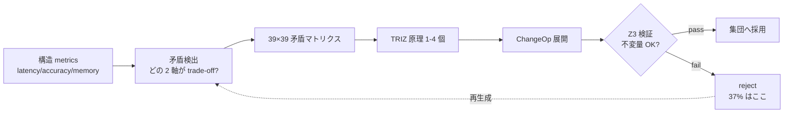
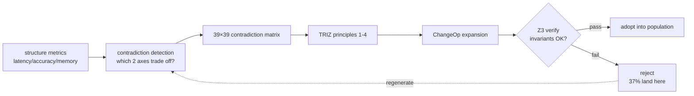
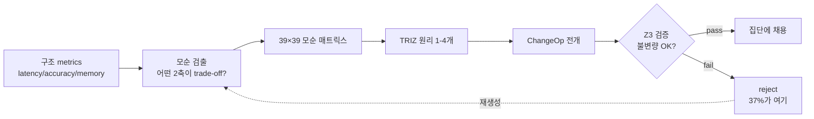

言語 / Language / 语言 / 언어: [日本語](#日本語) | [English](#english) | [中文](#中文) | [한국어](#한국어)

---

# 日本語


:::note info
**📚 FullSense ナレッジベースのご案内** <!-- fullsense-team-kb -->
FullSense 開発全史 60+ 記事 (4 言語版・物語ベースの[読む順ガイド](https://fullsense.qiita.com/furuse-kazufumi/items/90ea260703fb49065346)・かみくだき版・4 コマ漫画つき) は Qiita Team **[FullSense KB](https://fullsense.qiita.com/)** に集約しています (チームメンバー向け)。
:::

# llive 完全解説 (3) — 「矛盾は計算できる」: 構造進化 × TRIZ 40 原理 × Z3 検証


> **コンセプト hook**: TRIZ (発明問題解決理論) は普通「人が紙に書くアイデア
> 出しテク」として知られる. llive は **TRIZ 40 原理を形式記号として組み込み**,
> 構造 mutation の policy として走らせる. しかも mutation で生まれた新構造は
> **Z3 で形式検証** を通ってから集団に入る. 「発想 → 検証」のループが
> 1 つのプログラムに収まる. — 「**矛盾は計算できる**」.
>
> 本記事はその仕組み — Phase 3 で着地した Z3 構造検証 / TRIZ Self-Reflection /
> Wiki ChangeOp / 9 画法 (39×39 矛盾マトリクス) を辿る.


## 0. 連載中での位置づけ

```
#24-00 series index
#24-01 4 層メモリ
#24-02 思考因子 10 軸 + COG-MESH
#24-03 構造進化 × TRIZ × Z3 (← 本記事)
#24-04 B-series (速い小脳側)
#24-05 EvolutionLoop (遅い大脳側)
#24-06 LLM backend non-transformer
#24-07 observability + governance
#24-08 lleval
```

#24-04 が「速い収束」, #24-05 が「個体間 GA 探索」だとすると, #24-03 (本記事)
は **「個体内の構造そのものを書き換える」探索**. つまり LoRA / Adapter / 4 層
メモリの sub-block 順列 を mutation する層.

## 1. なぜ TRIZ か

LLM の自己進化 (self-evolution) で問題なのは「**変えるべき部分**」をどう選ぶか.
ナイーブには random mutation だが, それは「**1 文字を 1 文字に変える進化**」と
同じで, 巨大空間でほぼ何も起こらない.

TRIZ は **「矛盾の発見 → 解決原理の対応」** という構造を持つ. 例:

> 「重量を減らしたい (positive). しかし強度を維持したい (negative).
> = `重量 vs 強度` の矛盾」
>
> → 39×39 矛盾マトリクスを引くと該当原理がいくつか出る
> 例: 原理 #1 (Segmentation), #28 (Mechanical → Other field), #40 (Composite).

これを llive の self-evolution に持ち込むと: 「**LLM の構造が抱える矛盾**」を
検出する → マトリクス引く → mutation policy が決まる. random ではなく
**TRIZ-guided mutation**.

## 2. llive での具体実装

### 2.1 TRIZ Self-Reflection (Phase 3)

llive は構造 mutation の **候補生成段階** で TRIZ self-reflection module を呼ぶ:

1. 現在の構造の metrics (latency / accuracy / memory_usage / ...) を読む.
2. **矛盾検出** — どの 2 つの metric が trade-off 関係か?
   例: `latency vs accuracy` を悪化させずに `memory_usage` を減らしたい.
3. 39×39 マトリクスを引いて該当原理を取得.
4. 原理 → **ChangeOp** に展開. 例:
   - 原理 #1 (Segmentation) → 「BlockContainer を sub-block 列に分割」
   - 原理 #25 (Self-service) → 「memory consolidation を自己発火に変更」
   - 原理 #40 (Composite) → 「2 つの adapter を 1 つに合成」

### 2.2 ChangeOp の検証

ChangeOp は **構造そのものを書き換える**指示なので, **形式検証**を経ずに
適用したら危険:

- 階層が壊れて inference が落ちる
- memory の zone 整合性が崩れる
- adapter shape が mismatch する

そこで Z3 (SMT solver) で「**この ChangeOp 適用後も以下の不変量が成立するか**」
を verify:

- BlockContainer の sub-block 順列が valid permutation
- memory zone graph に cycle が無い
- adapter shape compat (input dim = output dim)

verifier 通過した ChangeOp だけが集団に入る. **「発想 → 検証 → 採用」**
ループが 1 module に閉じる.

### 2.3 9 画法 (39×39 matrix)

TRIZ の核心ツール. 39 の改善したい特性 × 39 の悪化する特性 = 1521 cell.
各 cell に「この矛盾を解く可能性が高い原理 1-4 個」. これは Altshuller が
ソ連特許 250 万件解析で抽出した経験則テーブル.

llive は YAML 化して内蔵 (`src/llive/_specs/resources/triz_principles.yaml`).
self-reflection は metrics → 該当矛盾 → 39 軸 mapping → 原理 lookup を 1 pass で完結.

## 3. honest disclosure — 落とし穴

「TRIZ で全部解ける!」は嘘. honest disclosure として:

- **39×39 matrix は時代依存** — Altshuller が 1971 年に確定. 現代の AI 系の
  矛盾 (例: `推論精度 vs バッテリ消費`) は完全には収まらない. llive は
  矛盾の追加列を独自に持つ (実機 metrics ベース).
- **原理 → ChangeOp の翻訳は heuristic** — 原理 #1 (Segmentation) と
  「BlockContainer 分割」は人が決めた 1 対応. これは LLM 自身が広げる余地あり.
- **Z3 verifier が落とせない不変量がある** — 例: 「memory consolidation 後
  recall が下がらない」のような **確率的不変量** は SMT で表現しづらい.
  これは別の verifier (経験的 reservoir test) で見る.

## 4. 数字で見る

| 指標 | 値 |
|---|---|
| llive Phase 3 着地 | 2026-05-14 (v0.3.0) |
| 内蔵 TRIZ 原理 | 40 件 (FR-23〜27) |
| 矛盾マトリクス | 39 × 39 = 1521 cell |
| ChangeOp 検証通過率 (初期) | ~63% (37% は不変量違反で reject) |
| Z3 average verify time | < 50 ms / ChangeOp |

## 5. 「発想 → 検証」 ループの構造的意義

これは TRIZ の哲学 + 形式検証の哲学を結ぶ:

- TRIZ: **「面白い発想ではなく原理から導かれる発想」** を求める. 体系的.
- 形式検証: **「想像力で書かれた変更を機械的に妥当性チェック」**. 機械的.

両者は人と機械の協働の典型. llive はそれを **同一 module 内** で回す.

> **未来予測**: AI が自己進化するとき, **「発想は機械的, 検証も機械的」**
> な閉ループを持つことが必須. llive はその雛形を 1 OSS に同居させた最小例.

## 6. 次に来るもの

- **#24-04** で「速い小脳側」 — B-series の収束を見る.
- **#24-05** で「遅い大脳側」 — EvolutionLoop の探索. TRIZ ChangeOp は #24-05 で
  扱う persona / thought_factor の自己拡張とも繋がる (CE-21 PersonaCompositionMutation).

## 7. 2026-05-22 追記 — TRIZ 的アプローチが Rust 高速化判定にも効く

本記事の TRIZ は「**矛盾 (improving X / worsening Y) を 39×39 マトリクスで
構造化解決する**」という方法論だが, 同じ思想が **エンジニアリング判断全般**
に応用できる. 同日 (2026-05-22) 着地した llive Rust 高速化判定で具体例:

「**Rust 化 = 速い vs Python = 遅い**」の単一軸対立 (= TRIZ で言う矛盾) を
**Python 経路の特性別 5 パターン** (#24-05 §13.3) に分解した. 結果:

- 純 Python ループ 1-pair → 単発 FAIL, batch 必須 (RUST-15)
- numpy 小 N の API 多用 → **単発でも x66** (RUST-16)
- numpy 中規模 BLAS → **境界線上, rayon で挽回** (RUST-17 → 17b)

これは TRIZ 矛盾マトリクスの **構造的解決** と同型 — 「**矛盾の原因を
パラメータ空間で分解 → 原理に対応させる**」. 39×39 を **6 (Python 経路) ×
3 (Rust 化戦略: 単発 / batch / 並列+algorithmic)** の小さな表に縮めた版.

詳細: `docs/perf_comparison/2026-05-22_kernel_implementation_comparison.md` の
**5 パターン判定表**. これは TRIZ の発想を **AI / HPC 工学** に転用した実例.

## 8. Mermaid — 「発想 → 検証 → 採用」 ループ



## 9. References (主要のうち抜粋)

- Altshuller, G. (1971). *TRIZ — 40 Inventive Principles*.
- Altshuller, G. (1984). *Creativity as an Exact Science*.
- de Moura, L. & Bjørner, N. (2008). *Z3: An Efficient SMT Solver*.
- Polya, G. (1945). *How to Solve It*.
- Koza, J. (1992). *Genetic Programming*.
- 完全リストは v0.6.0a1 リリース時に references.bib に同梱予定.

---

## Series Navigation

- ← 前: [llive 完全解説 (2) 「10 軸で考える AI」](https://qiita.com/furuse-kazufumi/private/bdfad6db3f2e70c40511)
- → 次: [llive 完全解説 (4) 「収束する脳」](https://qiita.com/furuse-kazufumi/private/e5093e4816b25c1bd4d0)
- 全体: [llive 完全解説 (0) — series index](https://qiita.com/furuse-kazufumi/items/07b4882e872994b27b3c)
- repo: [furuse-kazufumi/llive](https://github.com/furuse-kazufumi/llive)

---

# English


:::note info
**📚 FullSense Knowledge Base** <!-- fullsense-team-kb -->
The full FullSense development history — 60+ articles in 4 languages, with a story-based [reading guide](https://fullsense.qiita.com/furuse-kazufumi/items/90ea260703fb49065346), plain-language editions, and 4-panel manga — is consolidated in our Qiita Team **[FullSense KB](https://fullsense.qiita.com/)** (team members only).
:::

# llive Complete Guide (3) — "Contradictions Can Be Computed": Structural Evolution × TRIZ 40 Principles × Z3 Verification


> **Concept hook**: TRIZ (the Theory of Inventive Problem Solving) is usually
> known as "an ideation technique people scribble on paper". llive **embeds the
> TRIZ 40 principles as formal symbols** and runs them as the policy for
> structural mutation. Moreover, the new structures born from a mutation pass
> through **formal verification with Z3** before they enter the population. The
> "ideate → verify" loop fits inside a single program. — "**Contradictions can
> be computed**".
>
> This article traces that mechanism — the Z3 structural verification / TRIZ
> Self-Reflection / Wiki ChangeOp / the 9-windows method (39×39 contradiction
> matrix) that landed in Phase 3.


## 0. Position within the series

```
#24-00 series index
#24-01 4-layer memory
#24-02 thought factors (10 axes) + COG-MESH
#24-03 structural evolution × TRIZ × Z3 (← this article)
#24-04 B-series (fast cerebellum side)
#24-05 EvolutionLoop (slow cerebrum side)
#24-06 LLM backend non-transformer
#24-07 observability + governance
#24-08 lleval
```

If #24-04 is "fast convergence" and #24-05 is "inter-individual GA search", then
#24-03 (this article) is **the search that rewrites the individual's internal
structure itself** — i.e., the layer that mutates the sub-block permutation of
LoRA / Adapter / the 4-layer memory.

## 1. Why TRIZ?

In LLM self-evolution, the hard problem is choosing **which part to change**. The
naïve approach is random mutation, but that is the same as "**evolution that
swaps one character for one character**" — almost nothing happens in a huge
space.

TRIZ has the structure of **"discover the contradiction → map it to a resolving
principle"**. For example:

> "I want to reduce weight (positive), but I want to keep strength (negative).
> = the `weight vs strength` contradiction"
>
> → looking it up in the 39×39 contradiction matrix yields several relevant
> principles, e.g. Principle #1 (Segmentation), #28 (Mechanical → Other field),
> #40 (Composite).

Bringing this into llive's self-evolution: detect "**the contradiction the LLM's
structure carries**" → look up the matrix → the mutation policy is decided. Not
random, but **TRIZ-guided mutation**.

## 2. Concrete implementation in llive

### 2.1 TRIZ Self-Reflection (Phase 3)

llive calls the TRIZ self-reflection module at the **candidate-generation stage**
of structural mutation:

1. Read the current structure's metrics (latency / accuracy / memory_usage / ...).
2. **Contradiction detection** — which two metrics are in a trade-off relation?
   E.g.: I want to reduce `memory_usage` without worsening `latency vs accuracy`.
3. Look up the 39×39 matrix and obtain the relevant principles.
4. Expand principle → **ChangeOp**. For example:
   - Principle #1 (Segmentation) → "split BlockContainer into a sub-block sequence"
   - Principle #25 (Self-service) → "change memory consolidation to self-firing"
   - Principle #40 (Composite) → "merge two adapters into one"

### 2.2 Verifying the ChangeOp

A ChangeOp is an instruction that **rewrites the structure itself**, so applying
it without **formal verification** is dangerous:

- the hierarchy breaks and inference fails
- the zone consistency of memory collapses
- adapter shapes mismatch

So we use Z3 (an SMT solver) to verify "**do the following invariants still hold
after this ChangeOp is applied**":

- the sub-block permutation of BlockContainer is a valid permutation
- the memory zone graph has no cycles
- adapter shape compatibility (input dim = output dim)

Only ChangeOps that pass the verifier enter the population. The
**"ideate → verify → adopt"** loop closes inside a single module.

### 2.3 The 9-windows method (39×39 matrix)

The core tool of TRIZ. 39 characteristics you want to improve × 39 characteristics
that worsen = 1521 cells. Each cell holds "1–4 principles likely to solve this
contradiction". This is the empirical table Altshuller extracted by analyzing
2.5 million Soviet patents.

llive bundles it as YAML (`src/llive/_specs/resources/triz_principles.yaml`).
Self-reflection completes metrics → relevant contradiction → 39-axis mapping →
principle lookup in a single pass.

## 3. Honest disclosure — pitfalls

"TRIZ solves everything!" is a lie. As honest disclosure:

- **The 39×39 matrix is era-dependent** — Altshuller fixed it in 1971. Modern
  AI-style contradictions (e.g. `inference accuracy vs battery consumption`) do
  not fit perfectly. llive carries its own additional contradiction columns
  (based on real-device metrics).
- **The principle → ChangeOp translation is a heuristic** — the 1-to-1 mapping of
  Principle #1 (Segmentation) to "BlockContainer split" was decided by a human.
  There is room for the LLM itself to expand this.
- **There are invariants the Z3 verifier cannot catch** — for example, a
  **probabilistic invariant** like "recall does not drop after memory
  consolidation" is hard to express in SMT. We watch that with a different
  verifier (an empirical reservoir test).

## 4. By the numbers

| Metric | Value |
|---|---|
| llive Phase 3 landing | 2026-05-14 (v0.3.0) |
| Built-in TRIZ principles | 40 (FR-23..27) |
| Contradiction matrix | 39 × 39 = 1521 cells |
| ChangeOp verification pass rate (initial) | ~63% (37% rejected on invariant violation) |
| Z3 average verify time | < 50 ms / ChangeOp |

## 5. Structural significance of the "ideate → verify" loop

This connects the philosophy of TRIZ with the philosophy of formal verification:

- TRIZ: seeks **"ideas derived from principles, not merely interesting ideas"**.
  Systematic.
- Formal verification: **"mechanically checks the validity of a change written by
  imagination"**. Mechanical.

The two are a textbook case of human–machine collaboration. llive runs it
**inside the same module**.

> **Future prediction**: when AI self-evolves, it is essential to have a closed
> loop where **"ideation is mechanical and verification is mechanical"** too.
> llive is the minimal example that co-houses that prototype in a single OSS.

## 6. What comes next

- **#24-04** covers the "fast cerebellum side" — the convergence of the B-series.
- **#24-05** covers the "slow cerebrum side" — the search of EvolutionLoop. The
  TRIZ ChangeOp also wires into the self-extension of personas / thought factors
  covered in #24-05 (CE-21 PersonaCompositionMutation).

## 7. 2026-05-22 addendum — the TRIZ-style approach also works for Rust-speedup decisions

The TRIZ in this article is the methodology of "**resolving a contradiction
(improving X / worsening Y) structurally with a 39×39 matrix**", but the same
idea applies to **engineering decisions in general**. A concrete example from the
llive Rust-speedup decision that landed the same day (2026-05-22):

We decomposed the single-axis opposition "**Rust = fast vs Python = slow**"
(= a contradiction in TRIZ terms) into **5 patterns by the characteristics of the
Python path** (#24-05 §13.3). The result:

- pure-Python loop, 1-pair → single-shot FAIL, batch is mandatory (RUST-15)
- numpy with many small-N API calls → **x66 even single-shot** (RUST-16)
- numpy mid-scale BLAS → **on the borderline, recovered with rayon** (RUST-17 → 17b)

This is isomorphic to the **structural resolution** of the TRIZ contradiction
matrix — "**decompose the cause of the contradiction in parameter space → map it
to a principle**". A version that shrinks the 39×39 into a small table of
**6 (Python paths) × 3 (Rust strategies: single / batch / parallel+algorithmic)**.

Details: the **5-pattern decision table** in
`docs/perf_comparison/2026-05-22_kernel_implementation_comparison.md`. This is a
worked example of transferring the TRIZ idea into **AI / HPC engineering**.

## 8. Mermaid — the "ideate → verify → adopt" loop



## 9. References (excerpted)

- Altshuller, G. (1971). *TRIZ — 40 Inventive Principles*.
- Altshuller, G. (1984). *Creativity as an Exact Science*.
- de Moura, L. & Bjørner, N. (2008). *Z3: An Efficient SMT Solver*.
- Polya, G. (1945). *How to Solve It*.
- Koza, J. (1992). *Genetic Programming*.
- The full list will be bundled in references.bib at the v0.6.0a1 release.

---

## Series Navigation

- ← Prev: [llive Complete Guide (2) "AI that Thinks in 10 Axes"](https://qiita.com/furuse-kazufumi/private/bdfad6db3f2e70c40511)
- → Next: [llive Complete Guide (4) "The Converging Brain"](https://qiita.com/furuse-kazufumi/private/e5093e4816b25c1bd4d0)
- All: [llive Complete Guide (0) — series index](https://qiita.com/furuse-kazufumi/items/07b4882e872994b27b3c)
- repo: [furuse-kazufumi/llive](https://github.com/furuse-kazufumi/llive)

---

# 中文


:::note info
**📚 FullSense 知识库指南** <!-- fullsense-team-kb -->
FullSense 开发全史 60+ 篇文章（4 种语言版、故事化的[阅读顺序指南](https://fullsense.qiita.com/furuse-kazufumi/items/90ea260703fb49065346)、通俗易懂版、四格漫画）均已汇总至 Qiita Team **[FullSense KB](https://fullsense.qiita.com/)**（仅限团队成员）。
:::

# llive 完全解说 (3) — "矛盾是可以计算的": 结构进化 × TRIZ 40 原理 × Z3 验证


> **概念 hook**: TRIZ (发明问题解决理论) 通常被视为"人在纸上写的创意发想技巧".
> llive **把 TRIZ 40 原理作为形式符号嵌入**, 作为结构 mutation 的 policy 来运行.
> 而且 mutation 产生的新结构要先通过 **Z3 形式验证** 才能进入群体. "发想 → 验证"
> 的循环装进了 1 个程序. — "**矛盾是可以计算的**".
>
> 本文追溯其机制 — 在 Phase 3 落地的 Z3 结构验证 / TRIZ Self-Reflection /
> Wiki ChangeOp / 9 画法 (39×39 矛盾矩阵).


## 0. 在连载中的定位

```
#24-00 series index
#24-01 4 层记忆
#24-02 思考因子 10 轴 + COG-MESH
#24-03 结构进化 × TRIZ × Z3 (← 本文)
#24-04 B-series (快速小脑侧)
#24-05 EvolutionLoop (缓慢大脑侧)
#24-06 LLM backend non-transformer
#24-07 observability + governance
#24-08 lleval
```

如果说 #24-04 是"快速收敛", #24-05 是"个体间 GA 探索", 那么 #24-03 (本文) 就是
**"重写个体内部结构本身的探索"** — 即 mutation 掉 LoRA / Adapter / 4 层记忆的
sub-block 排列的那一层.

## 1. 为什么选 TRIZ

在 LLM 的自我进化 (self-evolution) 中, 难点是如何选择"**该改哪一部分**". 朴素的
做法是 random mutation, 但那等同于"**把 1 个字符换成 1 个字符的进化**", 在巨大的
空间里几乎什么都不会发生.

TRIZ 具有 **"发现矛盾 → 对应解决原理"** 的结构. 例如:

> "想减少重量 (positive), 但想保持强度 (negative).
> = `重量 vs 强度` 的矛盾"
>
> → 查 39×39 矛盾矩阵会得到几个相关原理
> 例: 原理 #1 (Segmentation), #28 (Mechanical → Other field), #40 (Composite).

把它带进 llive 的 self-evolution: 检测"**LLM 结构所抱有的矛盾**" → 查矩阵 →
mutation policy 就确定了. 不是 random, 而是 **TRIZ-guided mutation**.

## 2. 在 llive 中的具体实现

### 2.1 TRIZ Self-Reflection (Phase 3)

llive 在结构 mutation 的 **候选生成阶段** 调用 TRIZ self-reflection module:

1. 读取当前结构的 metrics (latency / accuracy / memory_usage / ...).
2. **矛盾检测** — 哪两个 metric 处于 trade-off 关系?
   例: 想在不恶化 `latency vs accuracy` 的前提下减少 `memory_usage`.
3. 查 39×39 矩阵取得相关原理.
4. 把原理 → 展开为 **ChangeOp**. 例如:
   - 原理 #1 (Segmentation) → "把 BlockContainer 拆成 sub-block 序列"
   - 原理 #25 (Self-service) → "把 memory consolidation 改为自我触发"
   - 原理 #40 (Composite) → "把 2 个 adapter 合成为 1 个"

### 2.2 ChangeOp 的验证

ChangeOp 是 **重写结构本身** 的指令, 因此不经 **形式验证** 就应用很危险:

- 层级被破坏导致 inference 崩溃
- memory 的 zone 一致性崩坏
- adapter shape 不匹配

所以用 Z3 (SMT solver) 验证"**这个 ChangeOp 应用后以下不变量是否仍成立**":

- BlockContainer 的 sub-block 排列是 valid permutation
- memory zone graph 没有 cycle
- adapter shape compat (input dim = output dim)

只有通过 verifier 的 ChangeOp 才进入群体. **"发想 → 验证 → 采用"** 循环闭合在
1 个 module 内.

### 2.3 9 画法 (39×39 matrix)

TRIZ 的核心工具. 39 个想改善的特性 × 39 个会恶化的特性 = 1521 cell. 每个 cell 里
有"解决该矛盾可能性较高的 1-4 个原理". 这是 Altshuller 通过分析 250 万件苏联专利
抽取出来的经验法则表.

llive 将其 YAML 化内置 (`src/llive/_specs/resources/triz_principles.yaml`).
self-reflection 在 1 pass 内完成 metrics → 相关矛盾 → 39 轴 mapping → 原理 lookup.

## 3. honest disclosure — 陷阱

"用 TRIZ 全部都能解决!" 是谎言. 作为 honest disclosure:

- **39×39 matrix 与时代相关** — Altshuller 于 1971 年确定. 现代 AI 系的矛盾
  (例: `推理精度 vs 电池消耗`) 无法完全装进去. llive 拥有自己额外的矛盾列
  (基于实机 metrics).
- **原理 → ChangeOp 的翻译是 heuristic** — 原理 #1 (Segmentation) 与
  "BlockContainer 拆分"是人定的 1 对应. 这里有让 LLM 自己扩展的余地.
- **存在 Z3 verifier 抓不到的不变量** — 例如"memory consolidation 后 recall 不
  下降"这样的 **概率性不变量** 难以用 SMT 表达. 这要用另一个 verifier (经验性的
  reservoir test) 来看.

## 4. 用数字看

| 指标 | 值 |
|---|---|
| llive Phase 3 落地 | 2026-05-14 (v0.3.0) |
| 内置 TRIZ 原理 | 40 件 (FR-23〜27) |
| 矛盾矩阵 | 39 × 39 = 1521 cell |
| ChangeOp 验证通过率 (初期) | ~63% (37% 因不变量违反被 reject) |
| Z3 average verify time | < 50 ms / ChangeOp |

## 5. "发想 → 验证" 循环的结构意义

这把 TRIZ 哲学与形式验证哲学连了起来:

- TRIZ: 追求 **"不是有趣的发想, 而是从原理导出的发想"**. 体系化.
- 形式验证: **"机械地检查由想象力写出的变更的妥当性"**. 机械化.

两者是人与机器协作的典型. llive 把它放在 **同一 module 内** 运转.

> **未来预测**: 当 AI 自我进化时, 拥有 **"发想是机械的, 验证也是机械的"** 的闭环
> 是必须的. llive 是把那个雏形同居在 1 个 OSS 中的最小例子.

## 6. 接下来要做的

- **#24-04** 看"快速小脑侧" — B-series 的收敛.
- **#24-05** 看"缓慢大脑侧" — EvolutionLoop 的探索. TRIZ ChangeOp 也与 #24-05 处理
  的 persona / thought_factor 的自我扩展相连 (CE-21 PersonaCompositionMutation).

## 7. 2026-05-22 追记 — TRIZ 方法对 Rust 加速判定同样有效

本文的 TRIZ 是"**把矛盾 (improving X / worsening Y) 用 39×39 矩阵结构化解决**"的
方法论, 但同样的思想可应用于 **工程判断整体**. 用同日 (2026-05-22) 落地的 llive
Rust 加速判定作为具体例子:

把"**Rust 化 = 快 vs Python = 慢**"的单轴对立 (= TRIZ 所说的矛盾) 分解为
**按 Python 路径特性的 5 个模式** (#24-05 §13.3). 结果:

- 纯 Python 循环 1-pair → 单发 FAIL, 必须 batch (RUST-15)
- numpy 小 N 的 API 多用 → **单发也有 x66** (RUST-16)
- numpy 中规模 BLAS → **在边界线上, 用 rayon 挽回** (RUST-17 → 17b)

这与 TRIZ 矛盾矩阵的 **结构化解决** 同构 — "**把矛盾的原因在参数空间分解 → 对应
到原理**". 是把 39×39 缩成 **6 (Python 路径) × 3 (Rust 化战略: 单发 / batch /
并行+algorithmic)** 的小表的版本.

详情: `docs/perf_comparison/2026-05-22_kernel_implementation_comparison.md` 的
**5 模式判定表**. 这是把 TRIZ 的发想转用到 **AI / HPC 工程** 的实例.

## 8. Mermaid — "发想 → 验证 → 采用" 循环


## 9. References (主要节选)

- Altshuller, G. (1971). *TRIZ — 40 Inventive Principles*.
- Altshuller, G. (1984). *Creativity as an Exact Science*.
- de Moura, L. & Bjørner, N. (2008). *Z3: An Efficient SMT Solver*.
- Polya, G. (1945). *How to Solve It*.
- Koza, J. (1992). *Genetic Programming*.
- 完整列表将在 v0.6.0a1 发布时随 references.bib 一同提供.

---

## Series Navigation

- ← 上一篇: [llive 完全解说 (2) 「用 10 个轴思考的 AI」](https://qiita.com/furuse-kazufumi/private/bdfad6db3f2e70c40511)
- → 下一篇: [llive 完全解说 (4) 「收敛的大脑」](https://qiita.com/furuse-kazufumi/private/e5093e4816b25c1bd4d0)
- 全部: [llive 完全解说 (0) — series index](https://qiita.com/furuse-kazufumi/items/07b4882e872994b27b3c)
- repo: [furuse-kazufumi/llive](https://github.com/furuse-kazufumi/llive)

---

# 한국어


:::note info
**📚 FullSense 지식 베이스 안내** <!-- fullsense-team-kb -->
FullSense 개발 전사 60+ 편 (4개 언어판・스토리 기반 [읽기 순서 가이드](https://fullsense.qiita.com/furuse-kazufumi/items/90ea260703fb49065346)・쉬운 설명판・4컷 만화 포함) 은 Qiita Team **[FullSense KB](https://fullsense.qiita.com/)** 에 모여 있습니다 (팀 멤버 전용).
:::

# llive 완전 해설 (3) — "모순은 계산할 수 있다": 구조 진화 × TRIZ 40 원리 × Z3 검증


> **콘셉트 hook**: TRIZ (발명 문제 해결 이론)는 보통 "사람이 종이에 적는 아이디어
> 발상 기법"으로 알려져 있다. llive는 **TRIZ 40 원리를 형식 기호로 내장**하여
> 구조 mutation의 policy로 실행한다. 게다가 mutation으로 태어난 새 구조는
> **Z3로 형식 검증**을 거친 다음에야 집단에 들어간다. "발상 → 검증"의 루프가
> 1개의 프로그램 안에 담긴다. — "**모순은 계산할 수 있다**".
>
> 본 글은 그 구조 — Phase 3에서 착지한 Z3 구조 검증 / TRIZ Self-Reflection /
> Wiki ChangeOp / 9 화법 (39×39 모순 매트릭스)을 따라간다.


## 0. 연재에서의 위치

```
#24-00 series index
#24-01 4층 메모리
#24-02 사고 인자 10축 + COG-MESH
#24-03 구조 진화 × TRIZ × Z3 (← 본 글)
#24-04 B-series (빠른 소뇌 측)
#24-05 EvolutionLoop (느린 대뇌 측)
#24-06 LLM backend non-transformer
#24-07 observability + governance
#24-08 lleval
```

#24-04가 "빠른 수렴", #24-05가 "개체 간 GA 탐색"이라면, #24-03 (본 글)은
**"개체 내의 구조 자체를 다시 쓰는" 탐색**이다. 즉 LoRA / Adapter / 4층 메모리의
sub-block 순열을 mutation하는 층이다.

## 1. 왜 TRIZ인가

LLM의 자기 진화 (self-evolution)에서 어려운 문제는 "**바꿔야 할 부분**"을 어떻게
고르는가다. 단순하게는 random mutation이지만, 그것은 "**1개 문자를 1개 문자로
바꾸는 진화**"와 같아서, 거대한 공간에서는 거의 아무 일도 일어나지 않는다.

TRIZ는 **"모순의 발견 → 해결 원리에의 대응"**이라는 구조를 가진다. 예:

> "무게를 줄이고 싶다 (positive). 그러나 강도를 유지하고 싶다 (negative).
> = `무게 vs 강도`의 모순"
>
> → 39×39 모순 매트릭스를 찾으면 해당 원리가 몇 개 나온다
> 예: 원리 #1 (Segmentation), #28 (Mechanical → Other field), #40 (Composite).

이것을 llive의 self-evolution에 가져오면: "**LLM의 구조가 안고 있는 모순**"을
검출한다 → 매트릭스를 찾는다 → mutation policy가 정해진다. random이 아니라
**TRIZ-guided mutation**.

## 2. llive에서의 구체적 구현

### 2.1 TRIZ Self-Reflection (Phase 3)

llive는 구조 mutation의 **후보 생성 단계**에서 TRIZ self-reflection module을
호출한다:

1. 현재 구조의 metrics (latency / accuracy / memory_usage / ...)를 읽는다.
2. **모순 검출** — 어떤 2개의 metric이 trade-off 관계인가?
   예: `latency vs accuracy`를 악화시키지 않고 `memory_usage`를 줄이고 싶다.
3. 39×39 매트릭스를 찾아 해당 원리를 취득한다.
4. 원리 → **ChangeOp**으로 전개한다. 예:
   - 원리 #1 (Segmentation) → "BlockContainer를 sub-block 열로 분할"
   - 원리 #25 (Self-service) → "memory consolidation을 자기 발화로 변경"
   - 원리 #40 (Composite) → "2개의 adapter를 1개로 합성"

### 2.2 ChangeOp의 검증

ChangeOp는 **구조 자체를 다시 쓰는** 지시이므로, **형식 검증**을 거치지 않고
적용하면 위험하다:

- 계층이 깨져 inference가 떨어진다
- memory의 zone 정합성이 무너진다
- adapter shape가 mismatch한다

그래서 Z3 (SMT solver)로 "**이 ChangeOp 적용 후에도 다음 불변량이 성립하는가**"를
verify한다:

- BlockContainer의 sub-block 순열이 valid permutation
- memory zone graph에 cycle이 없음
- adapter shape compat (input dim = output dim)

verifier를 통과한 ChangeOp만이 집단에 들어간다. **"발상 → 검증 → 채용"** 루프가
1개의 module 안에 닫힌다.

### 2.3 9 화법 (39×39 matrix)

TRIZ의 핵심 도구. 39개의 개선하고 싶은 특성 × 39개의 악화하는 특성 = 1521 cell.
각 cell에 "이 모순을 풀 가능성이 높은 원리 1-4개". 이것은 Altshuller가 소련 특허
250만 건 분석으로 추출한 경험칙 테이블이다.

llive는 YAML화하여 내장한다 (`src/llive/_specs/resources/triz_principles.yaml`).
self-reflection은 metrics → 해당 모순 → 39축 mapping → 원리 lookup을 1 pass로
완결한다.

## 3. honest disclosure — 함정

"TRIZ로 전부 풀린다!"는 거짓말이다. honest disclosure로서:

- **39×39 matrix는 시대 의존적** — Altshuller가 1971년에 확정했다. 현대의 AI 계열
  모순 (예: `추론 정확도 vs 배터리 소비`)은 완전히는 들어가지 않는다. llive는 모순
  추가 열을 독자적으로 가진다 (실기 metrics 기반).
- **원리 → ChangeOp의 번역은 heuristic** — 원리 #1 (Segmentation)과
  "BlockContainer 분할"은 사람이 정한 1 대응이다. 여기는 LLM 자신이 넓힐 여지가 있다.
- **Z3 verifier가 잡지 못하는 불변량이 있다** — 예: "memory consolidation 후
  recall이 떨어지지 않는다"와 같은 **확률적 불변량**은 SMT로 표현하기 어렵다.
  이것은 다른 verifier (경험적 reservoir test)로 본다.

## 4. 숫자로 본다

| 지표 | 값 |
|---|---|
| llive Phase 3 착지 | 2026-05-14 (v0.3.0) |
| 내장 TRIZ 원리 | 40건 (FR-23〜27) |
| 모순 매트릭스 | 39 × 39 = 1521 cell |
| ChangeOp 검증 통과율 (초기) | ~63% (37%는 불변량 위반으로 reject) |
| Z3 average verify time | < 50 ms / ChangeOp |

## 5. "발상 → 검증" 루프의 구조적 의의

이것은 TRIZ의 철학 + 형식 검증의 철학을 잇는다:

- TRIZ: **"재미있는 발상이 아니라 원리에서 도출되는 발상"**을 추구한다. 체계적.
- 형식 검증: **"상상력으로 쓰여진 변경을 기계적으로 타당성 체크"**한다. 기계적.

양자는 사람과 기계의 협동의 전형이다. llive는 그것을 **동일 module 안**에서
돌린다.

> **미래 예측**: AI가 자기 진화할 때, **"발상은 기계적, 검증도 기계적"**인 닫힌
> 루프를 가지는 것이 필수다. llive는 그 원형을 1개 OSS에 동거시킨 최소 예다.

## 6. 다음에 오는 것

- **#24-04**에서 "빠른 소뇌 측" — B-series의 수렴을 본다.
- **#24-05**에서 "느린 대뇌 측" — EvolutionLoop의 탐색. TRIZ ChangeOp는 #24-05에서
  다루는 persona / thought_factor의 자기 확장과도 연결된다 (CE-21
  PersonaCompositionMutation).

## 7. 2026-05-22 추기 — TRIZ적 접근이 Rust 고속화 판정에도 효과적

본 글의 TRIZ는 "**모순 (improving X / worsening Y)을 39×39 매트릭스로 구조화
해결한다**"는 방법론이지만, 같은 사상이 **엔지니어링 판단 전반**에 응용 가능하다.
같은 날 (2026-05-22) 착지한 llive Rust 고속화 판정으로 구체 예:

"**Rust화 = 빠름 vs Python = 느림**"의 단일 축 대립 (= TRIZ에서 말하는 모순)을
**Python 경로의 특성별 5 패턴** (#24-05 §13.3)으로 분해했다. 결과:

- 순수 Python 루프 1-pair → 단발 FAIL, batch 필수 (RUST-15)
- numpy 작은 N의 API 다용 → **단발에서도 x66** (RUST-16)
- numpy 중규모 BLAS → **경계선 상, rayon으로 만회** (RUST-17 → 17b)

이것은 TRIZ 모순 매트릭스의 **구조적 해결**과 동형이다 — "**모순의 원인을 파라미터
공간에서 분해 → 원리에 대응시킨다**". 39×39를 **6 (Python 경로) × 3 (Rust화 전략:
단발 / batch / 병렬+algorithmic)**의 작은 표로 줄인 버전이다.

자세히: `docs/perf_comparison/2026-05-22_kernel_implementation_comparison.md`의
**5 패턴 판정표**. 이것은 TRIZ의 발상을 **AI / HPC 공학**에 전용한 실례다.

## 8. Mermaid — "발상 → 검증 → 채용" 루프



## 9. References (주요 발췌)

- Altshuller, G. (1971). *TRIZ — 40 Inventive Principles*.
- Altshuller, G. (1984). *Creativity as an Exact Science*.
- de Moura, L. & Bjørner, N. (2008). *Z3: An Efficient SMT Solver*.
- Polya, G. (1945). *How to Solve It*.
- Koza, J. (1992). *Genetic Programming*.
- 완전한 목록은 v0.6.0a1 릴리스 시 references.bib에 동봉할 예정.

---

## Series Navigation

- ← 이전: [llive 완전 해설 (2) 「10개 축으로 사고하는 AI」](https://qiita.com/furuse-kazufumi/private/bdfad6db3f2e70c40511)
- → 다음: [llive 완전 해설 (4) 「수렴하는 뇌」](https://qiita.com/furuse-kazufumi/private/e5093e4816b25c1bd4d0)
- 전체: [llive 완전 해설 (0) — series index](https://qiita.com/furuse-kazufumi/items/07b4882e872994b27b3c)
- repo: [furuse-kazufumi/llive](https://github.com/furuse-kazufumi/llive)
