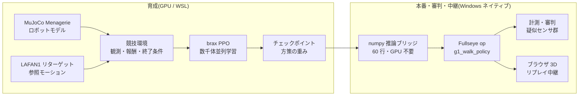
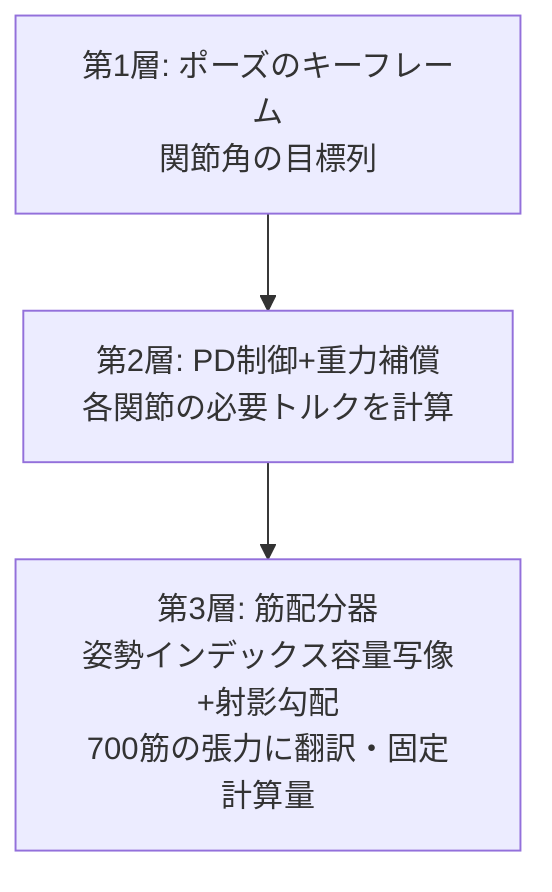
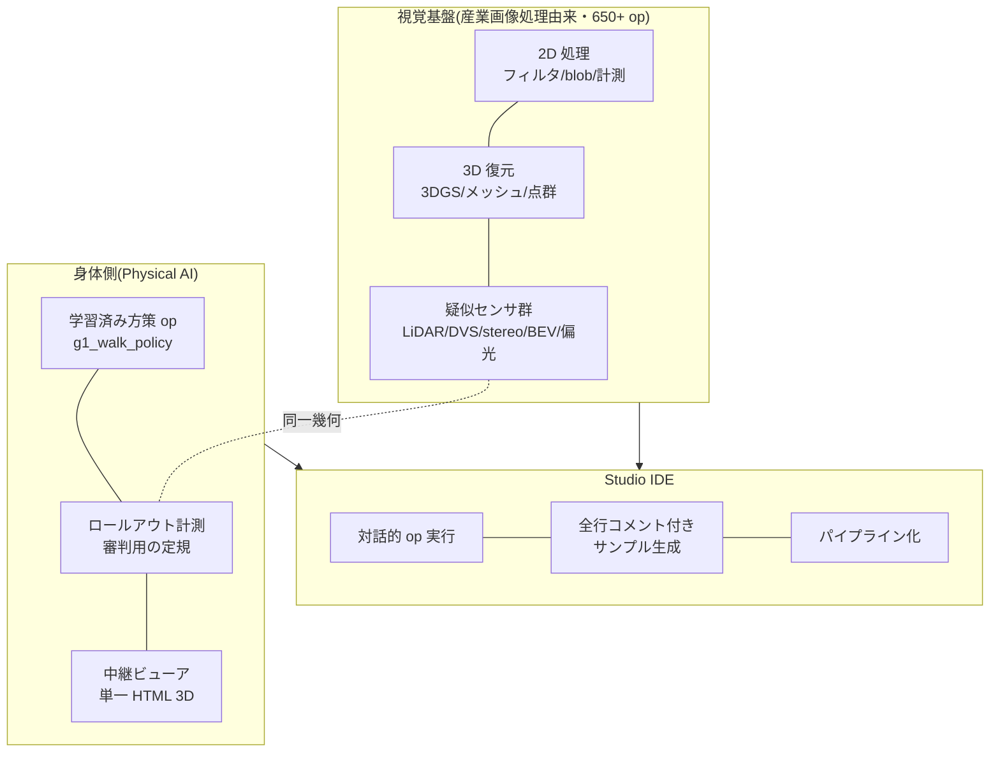

In 2025, humanoid robots ran a half-marathon in Beijing, China, and that summer the first World Humanoid Robot Games were held: bipedal robots ran footraces, played soccer, and danced. And by sheer coincidence, today, as I write this article (August 22, 2026), **the 2nd World Humanoid Robot Games are opening** at the National Speed Skating Oval in Beijing. This time it's 16 countries, 666 teams, and 2,056 robots across 51 events (nearly double the first edition's 26), and the headline attraction is reportedly a "fully autonomous category with no remote operation" (sources for these numbers are collected in the survey table in Section 16.0). Following the news, one thought kept circling in my head.

**"I want to do this myself, at home."**

Of course, I can't set up a venue with 500 physical robots. I don't have the budget, the space, or — crucially — the family buy-in. But I do have a PC with a single GPU in it. Build the stadium inside a physics simulation, raise the athletes, run the events, station referees, and broadcast to the spectator seats (a browser) — **building every component of a sports meet, right on my own desk** — that much, I should be able to do.

This article is the record of hosting that "Home Humanoid Games." At the same time, it's a development log of me trying to build an **integrated development environment (IDE) for Physical AI**, bringing along my day-job experience in image processing (industrial machine vision). Behind the events, the referee's gaze (measurement and cheat detection), the broadcasting equipment (a browser 3D viewer), and the athletes' training environment (a reinforcement learning pipeline) all flow into one and the same toolbox — my homegrown vision toolkit, **Fullseye**.

It's a long article. I wrote it so it works either way: read it straight through as a story, or cherry-pick events from the table of contents.

Note: text overlays baked into the GIFs are in Japanese (from the original edition); the captions carry the meaning.


*Games poster (illustration by an image-generation AI (Gemini). Generated text tends to get mangled, so the image is generated with a blank banner and I add the lettering myself)*

> **On attribution of ideas and implementation (stated up front)**
> The directional judgments and ideas in this article (the games concept itself, designing observations around real-robot sensors, introducing event-camera-style temporal differences, the "reciprocal + co-contraction" two-command scheme for the musculoskeletal body, per-body-part simplification, turning trained policies into Studio ops, the browser broadcast...) are mine; the hands-on implementation, experiments, and measurement were run by an AI coding agent (Claude Code). **Every number, from the experiments that worked to the ones that failed, is a real measurement.** Hiding failures would only hurt my future self, so the events we lost are published as losses. The first person "I" in this text is the subject of judgment and direction-setting, but in moments of discovery the boundary between human and AI sometimes blurs. Where attribution can't be pinned down, please read it as meaning "me and the AI as a team" — not dressing up the subject is part of honest disclosure too.

## How to read this article (3 courses)

It's a very long article, so here's the course menu up front.

- **5-minute course (just watch the motion)**: Scroll through and watch only the videos (GIFs). The straight-walk finish, the obstacle run, the parade of 67 robots, the 700-muscle human body striking poses, all the way to it crumpling while standing still — they're arranged so the skeleton of the story comes through from motion alone.
- **30-minute course (the main event)**: Chapters 1–15. The record of hosting the games + failure stories + a development log. The "🍙 Plain-Language Corner" at the end of each chapter is your refuge whenever the main text feels stiff.
- **Full course (through the reference volumes)**: Appendices A–G. The complete experimental record, a who's-who of 67 robots, a sensor field guide, a book of lessons, a glossary, the full op index, and a future-readings collection. Meant as an encyclopedia — look things up when you need them.

# Table of Contents (Competition Program)

1. Opening Ceremony — Why host a sports meet as one person
2. Glossary — Chewing the terms first
3. Building the Venue — Physics simulation and the GPU
4. Athletes' Entrance — Unitree G1 and evis, my homemade 700-muscle human body
5. Event 1: Sprint (20m straight) — Three straight losses, then the one-two punch of "it couldn't see the white line"
6. Event 2: Obstacle Run — Pseudo-LiDAR and a 1-D event camera
7. Event 3: Group Performance — Driving 700 muscles with keyframes
8. Event 4: Balance Beam (quiet standing) — The plainest event turned out to be the hardest
9. The Referee Crew — A vision engineer builds "instruments that catch cheating"
10. The Broadcast Station — 3D replay that runs in nothing but a browser
11. Toward an IDE — The ambition called Fullseye Studio
12. Meet Regulations — A parts list for hosting it yourself
13. Toward the Future — Simulating the state of the art as a way to play
14. The Disciplines Mixed into These Games — From DNA to optics
15. Exhibition Events — Arms, sky, hands, chopsticks (all real physics)
16. Closing Ceremony and the Next Events
Appendices A–I — Chronicle of experiments / Robot who's-who (67 robots) / Sensor field guide / Book of lessons / Extended glossary / Full Fullseye op index (1,606) / Future readings / Measured training-log excerpts / FAQ

---

# 1. Opening Ceremony — Why Host a Sports Meet as One Person


*Illustration: by an image-generation AI (Gemini). The athlete lying fallen on the track is in perfect agreement with the content of this article*

What made the Beijing games interesting, I think, is that they asked not "can it walk?" but "**can it compete?**" If walking were the whole story, robots had been walking (while falling) since around the 2015 DARPA Robotics Challenge. Becoming a competition means racing for speed, staying on the course, having disqualification conditions, and leaving records. In other words, **measurement and discipline** enter the picture.

To head off any misunderstanding: this is not remotely a story of "an individual taking on China." That scale, that speed, and above all the **sheer freedom of imagination** in "let's have robots run a marathon," "let's just throw a sports meet" — that is something to learn from, plainly and honestly. What I want isn't competition; it's to try translating that jolt of inspiration into a form within my own reach. And the important part is that **we now live in an era where that translation is actually possible**. Open models, open data, and compute genuinely mesh together on an individual's desk. The person who got inspired no longer has to stay in the audience. I find that a rather hopeful state of affairs.

I'm someone who has spent his career in industrial image processing, and in the world of factory inspection equipment the house rules are "you can't improve what you can't measure" and "distrust your method of measurement." Soon after I started playing at raising robots with Reinforcement Learning, I noticed these two worlds share the same skeleton. **Designing the reward (the score) is designing an inspection standard, and the agent is a test subject that will unfailingly poke holes in that standard.** So the sports-meet frame, jokey as it sounds, turned out to be essential. Competition rules (rewards and termination conditions), timing and measurement (logs and rollouts — a rollout being one full run of the policy from start to finish), doping tests (cheat detection), and the broadcast to the audience (visualization). Unless you build all of it, a sports meet doesn't happen.

Let me also write down why doing it as an individual matters. The control stacks of the robots at the big games are each company's secret sauce, but **a sports meet inside a simulation can be assembled entirely from open models, data, and training code**. I used MuJoCo (physics engine), MuJoCo Menagerie (robot model collection), Unitree's official LAFAN1 retargeted motions (published on HuggingFace; the source data is from Ubisoft La Forge, under the CC BY-NC-ND 4.0 non-commercial license — details in the acknowledgments at the end), brax/MJX (GPU physics and training), and homemade code. With one GPU, anyone can build a stadium at home. That era has genuinely arrived.

# 2. Glossary — Chewing the Terms First

So you can flip back here while reading, the key terms up front. The format is "term — one-line definition → plain-language chew."

- **Reinforcement Learning (RL)** — A learning method that acquires behavior through trial and error and rewards. → Dog training: do the trick, get a treat. Except this dog is vastly more calculating than yours and will attack every loophole in the treat rules at full power.
- **Policy** — A function that takes the state as input and outputs an action; the product of training. → The athlete's "habits of moving their body," as such. The policies in this article are small neural nets (about 4 layers × 32 units).
- **Reward** — Points granted every single step. → The event's scoring rules. A design mistake here will be exploited, guaranteed.
- **Observation** — The input vector shown to the policy. → The athlete's five senses. **Anything not in here does not exist for the athlete** (the single biggest lesson of this article).
- **PPO (Proximal Policy Optimization)** — The go-to reinforcement learning algorithm. → A practice method of "never change drastically at once; improve a little but surely."
- **Training steps and the "26M" / "150M" notation** — This article expresses an athlete's degree of growth in "training steps," with M meaning million (mega). 26M = 26 million steps, 150M = 150 million steps. **This is distinct from meters of distance (lowercase m, as in "20.5m of forward travel")** — read it as "big numbers with a capital M are practice volume; lowercase m is distance." → In school-sports terms, it's like saying "as of practice swing number 26,000,000."
- **Reference motion for imitation learning (reference motion / mocap)** — Human movement recorded and mapped onto the robot's joints as a model to follow. → The choreography video for a dance. LAFAN1 is a public collection of such data, officially converted by Unitree for their own robots.
- **Residual control** — A scheme where the policy adds only a small correction (residual) to the reference joint angles. → "Follow the choreography; the balance adjustments are on you." Don't make it invent movement from scratch.
- **POMDP / partial observability** — A situation where only part of the environment's state can be observed. → Tightrope walking blindfolded. The cause of defeat in Event 1.
- **Pseudo-LiDAR** — A virtual sensor that measures distance by casting rays inside the simulation. → A bat's echolocation. Mimics the properties of a real LiDAR (laser rangefinder) in computation.
- **Event camera (DVS)** — A camera that outputs only *changes* in brightness. → An eye that can't take a still photo but is hypersensitive to "something moved." This article hand-rolls a 1-D version.
- **Musculoskeletal model** — A human-body model whose joints are driven not by motors but by muscle tension. → Not a robot; an anatomical human. evis carries 700 muscles.
- **Torque** — The moment of force that rotates a joint. **Muscles can't push, only pull** (this cost us one defeat).
- **WBC-QP (Whole-Body Control via Quadratic Programming)** — The standard recipe of control that "decides all joint accelerations and contact forces optimally while satisfying the physics." → Solving the whole body's force allocation by mathematical optimization, every instant.
- **MJX / brax** — The GPU-parallel version of MuJoCo, and the training framework on top of it. → The technology of building thousands of stadiums at once and training thousands of athletes simultaneously.
- **XLA** — A compute compiler for GPUs. → The venue's building contractor. Blueprints that don't match its preferred construction methods (fixed-shape matrix computation) — like the sparse tension computation of 700 muscles — simply don't get built. This constraint bites later.

# 3. Building the Venue — Physics Simulation and the GPU

The venue is software through and through. Here's the layout.



- **Physics engine**: MuJoCo. The de facto standard for robot learning right now, for its balance of contact-computation reliability and speed.
- **Parallelization**: MJX (the GPU version of MuJoCo) + brax's PPO implementation. Build thousands of stadiums on the GPU simultaneously, run copies of the same athlete in all of them at once, and learn from everyone's experience pooled together.
- **Hardware**: a single RTX 5090 (32GB). The training in this article ran two events concurrently at **a combined ~9,700 training steps/second** (co-residing with memory allocation throttled to 0.35 each). One event's practice (~100 million steps) takes roughly 3–4 hours. Your life settles into a rhythm: set up practice in the evening, check results after dinner. Mostly I'm the guy sighing at robot-falling videos after a bath.
- **Training lives on the Linux side (WSL), everything else on Windows.** For JAX/XLA reasons the training is pushed into WSL, while measurement, visualization, and the article's figures are done in native Windows Python. This division of labor became the motive for the "numpy inference bridge" described later.


*Figure: measured training throughput for this article. Even with 2–3 training runs sharing one GPU, each gets 8,000–10,000 steps/s. The quadruped (a separate trainer) uses a different unit system, hence the separate panel (plotted from measured logs)*

The first constraint that bites during venue construction is the **XLA preferred-construction-method problem** mentioned in the glossary. An ordinary robot that turns its joints with motors (like the G1) parallelizes to thousands on a GPU, but **evis, my homemade human body driven by 700 muscles, could not be GPU-parallelized: its muscle-tension computation doesn't fit XLA**. So evis's events run on CPU, and for a future move to GPU we keep a "twin with the muscles replaced by equivalent joint torques" (torque-twin) — a two-tier arrangement. Think of the venue as having a main stadium (GPU) and a small gymnasium (CPU).

> **🍙 Plain-Language Corner (venue edition)**
> The same "physics engine" that powers games also serves as the venue for robotics research. Mario jumping and falling, and our robot toppling over here, are the same family of computation inside. The difference is seriousness: a research-grade physics engine computes "the force at the instant of contact" with the fine-print thoroughness of an insurance contract. And with a GPU, you can copy this venue thousands of times and run them all at once — like 4,000 robots doing one robot's practice simultaneously. That's how a single night amounts to years of human practice.

## 3.1 Deep Dive: The Venue's Underground Works — What Does a Physics Engine Do in One Step?
(supplement to Chapter 3, "Building the Venue")

A simulator is not a magic box. Every time you call `mj_step()`, a fixed sequence of computations runs inside. Here, let's lift the lid of that box and peek in together.

### 3.1.1 Inside one step: the forward dynamics pipeline

One MuJoCo step passes roughly through the following stages in order (the Computation chapter of the official docs [^mjc-comp] explains every stage).

| Stage | What it does | Algorithm used |
|---|---|---|
| 1. Forward kinematics | Compute every body's position and orientation from joint angles | Propagation through the tree from root to leaves |
| 2. Bias forces | Compute gravity, Coriolis, and centrifugal forces together | Recursive Newton-Euler (RNE) |
| 3. Inertia matrix | Compute the matrix M of "push this joint, get that much motion" | Composite Rigid-Body (CRB) |
| 4. Collision detection | Enumerate which geometries are touching | broad-phase → narrow-phase |
| 5. Constraint-force solve | Determine contact forces, joint-limit forces, friction | **Convex optimization** (below) |
| 6. Numerical integration | Integrate acceleration to advance velocity and position one frame | Euler / RK4 / implicit family (below) |

There are two key points.

**Generalized coordinates.** MuJoCo doesn't hold each body's xyz coordinates separately; it represents the whole body's state as "a vector of joint angles." As long as bodies are connected by joints, there is structurally no risk of them flying apart. The official docs introduce the engine saying "MuJoCo pioneered the combination of simulation in generalized coordinates with optimization-based contact dynamics" [^mjc-overview]. This is the single biggest design difference from game physics engines (Cartesian coordinates + springs approximating constraints).

**Forward dynamics.** The computation of "from the forces currently applied, find the next instant's acceleration." The equation of motion M(q)·q̈ = external forces + constraint forces is solved after gathering the ingredients from the table above (M, bias forces, contact forces).

#### Plain language: one frame of a flipbook

A simulation is a flipbook. One step = one frame. Each frame repeats: check everyone's position → find who is touching whom → decide the pushing forces → move everyone a tiny bit under those forces. In our G1 training, one frame is 0.002 seconds. Behind one second of walking, every stage of that table runs 500 times.

### 3.1.2 Why contact is hard — how MuJoCo dropped LCP and chose convex optimization

The hardest part of a physics engine is "contact." The moment a foot touches the ground, with how much force should the ground push back? This is a surprisingly hard problem even to define.

The classical formulation was the **LCP (linear complementarity problem)**: write down "contact forces only push (never pull)," "zero force if separated," and "friction stays inside the Coulomb cone" as complementarity conditions. But LCP with friction can lack a unique solution, and in general belongs to an NP-hard class.

Here, MuJoCo's author Todorov and colleagues changed the framing: **by accepting contact as slightly "soft," they converted the whole problem into convex optimization** (the IROS 2012 paper [^todorov2012], and the docs' Computation chapter [^mjc-comp]). The docs state the dual problem explicitly:

> f = argmin_λ ½ λᵀ(A+R)λ + λᵀ(a₀ − aᵣ)  subject to λ ∈ Ω

You don't need to chase the details. What matters is that **(A+R) is positive definite = there is only one valley.** Contact forces therefore emerge as "the unique global optimum," giving the same answer every time. None of LCP's "sometimes solvable, sometimes not, sometimes multiple answers."

The price is **soft contact**. As the docs' "Physical realism and soft contacts" section says, complementarity doesn't hold exactly — "contact force and velocity along the contact normal can be simultaneously positive," i.e., a slight penetration is permitted [^mjc-comp]. But this is a design philosophy, not a defect: real objects also deform microscopically at contact surfaces (a laptop set on a futon sinks in a little, doesn't it?). The position is that "perfectly rigid contact" is the greater physical fiction.

The convex formulation also has a by-product. In the docs' words, a "uniquely-defined inverse" [^mjc-overview] — inverse dynamics with a unique answer. Being able to back-compute "what forces were needed to realize this motion" is one reason this engine has been the choice of optimal control and robotics research.

#### solref / solimp — specifying contact stiffness in the language of springs and dampers

So how do you decide *how* soft? That's the `solref` and `solimp` you keep seeing in XML (docs, Modeling chapter, "Solver parameters" section [^mjc-solver]).

| Parameter | Meaning | Intuition |
|---|---|---|
| `solref = (timeconst, dampratio)` | Re-parameterizes the constraint as a mass-spring-damper system | timeconst = how fast penetration recovers; dampratio = 1 means it settles back smoothly without bouncing (critical damping) |
| `solimp = (d₀, d_width, width, midpoint, power)` | Impedance d ∈ (0,1) = "the constraint's ability to produce force," specified as a function of penetration depth | small d = weak (soft) constraint; large d = strong (hard) constraint |

To borrow the docs' words, solref "re-parameterizes the model in the mass-spring-damper language of time constant and damping ratio," and for solimp's d, "small values of d correspond to weak constraints while large values of d correspond to strong constraints" [^mjc-solver]. In other words, it's an interface that translates the abstract regularization terms inside the optimization solver into "spring stiffness and damper strength" — things a human can hold intuitions about. When contact jitters, when feet sink into the floor — these two were what we had actually been turning.

### 3.1.3 Integrators and the timestep — why muscles and tendons make things "explode"

The table's final stage, numerical integration, comes with choices (docs, "Numerical Integration" section [^mjc-comp]).

| Integrator | Character | Suited / not suited |
|---|---|---|
| Euler (semi-implicit) | Semi-implicit Euler treating only joint damping implicitly | The standard. Fast |
| RK4 | 4th-order Runge-Kutta; 4 evaluations per step | Strong on energy-conserving systems. 4× the cost |
| implicit | Implicit down to the derivatives of velocity-dependent forces (incl. Coriolis and centrifugal) | Most stable. Requires LU decomposition |
| implicitfast | implicit minus the Coriolis-family derivatives | Docs-recommended. Fast via Cholesky |

What does "implicit" mean? Explicit integration says "decide the next position from the current forces." Implicit integration says "advance by solving simultaneous equations so that the next instant's state is self-consistent." The former is fast, but **with a stiff spring present (a fast-changing force), the force runs wild within one frame and diverges**. That is the true identity of a numerical "explosion."

Muscles and tendons are exactly a bundle of such "stiff springs." Muscle passive elasticity and tendon tension change force sharply with tiny stretch = short time constants. If the timestep dt is coarser than that time constant, the oscillation of "overestimate the force → overshoot → an even bigger force the other way → …" amplifies within a frame. That evis (the muscle-driven humanoid) demanded a smaller dt than the G1 was not laziness but mathematical necessity. The docs likewise say that in systems dominated by velocity-dependent forces the implicit family offers "significantly more stability" than RK4, and declare the timestep "perhaps the single most important parameter" [^mjc-comp].

#### Plain language: a flipbook with dropped frames

A stiff spring plus a coarse dt is like "drawing a kendo strike in a flipbook that skimps on frames." The tip of the shinai moves a long way within one frame, so if you thin out the frames, the trajectory can't be drawn and the picture falls apart. A slow walking scene survives frame-thinning just fine. **Choose dt to match the fastest-moving thing** — that's numerical stability in one line.

### 3.1.4 MJX — rewriting MuJoCo in the GPU's language

Training takes tens of millions of steps. A single CPU MuJoCo would take forever. Enter **MJX**.

MJX is MuJoCo **rewritten in JAX**. Per the official docs [^mjx], the aim is to run MuJoCo "on every compute hardware the XLA compiler supports." With JAX's `vmap` (automatic vectorization), thousands of copies of the same scene are lined up and streamed in bulk into the GPU's SIMD units. In the docs' phrasing, what MJX is good at is "simulating big batches of parallel identical physics scenes using algorithms that can be efficiently vectorized on SIMD hardware" — an engine made precisely for RL.

But GPU-ification isn't free. Constraints the docs honestly state [^mjx]:

- **Branching hurts**: "accelerators exhibit poor performance for branching code." Collision detection's broad-phase is branch-heavy work ("skip object pairs that aren't near each other"), so on GPU you tend to evaluate all pairs brute-force.
- **Variable sizes hurt**: XLA fixes array sizes at compile time. The number of contacts changes every step, yet MJX always reserves and computes memory for the "maximum contact count." Where the CPU version gets away with "three contacts today," the GPU version computes a full house every time.
- **Keep meshes light**: collision meshes are recommended at "about 200 vertices or fewer."
- **A single instance is slow**: for one scene, "MJX-JAX can be 10x slower than MuJoCo" (the CPU version). MJX's value isn't the speed of one — it's throughput that **barely changes whether you run 1 or 4096 at once**.

(Note: as of 2026 the docs split MJX into two lines: MJX-JAX, the JAX reimplementation (autodifferentiable), and MJX-Warp, faster but without autodiff [^mjx]. The training in this article used the JAX pipeline.)

#### The brax PPO training loop

Paired with MJX we used the training-algorithm implementations of **brax** [^brax]. brax is a JAX-based physics engine + training library, shipping implementations of PPO / SAC / ARS / evolution strategies and more, as its README says. One cycle of its PPO turns like this:

1. **rollout**: run the current policy for a short stretch (unroll) in thousands of parallel environments, collecting (observation, action, reward)
2. **GAE**: from the collected rewards, estimate advantage (how much better than average each action was) (detailed in Part 2)
3. **minibatch SGD**: split the data into minibatches and update the policy net and value net for several epochs with PPO's clipped objective
4. return to 1 with the new policy

This whole loop — physics simulation and neural-net updates alike — is JIT-compiled (converted en bloc to GPU code just before execution) and spins **without ever stepping off the GPU**; that's the wellspring of the MJX + brax setup's speed. The biggest bottleneck, CPU↔GPU data transfer, disappears.

#### Part 1 sources

[^mjc-comp]: MuJoCo official docs, Computation chapter (pipeline, convex optimization, soft contact, integrators): https://mujoco.readthedocs.io/en/stable/computation/index.html
[^mjc-overview]: MuJoCo official docs, Overview (generalized coordinates, convex contact, unique inverse dynamics, tendons): https://mujoco.readthedocs.io/en/stable/overview.html
[^mjc-solver]: MuJoCo official docs, Modeling chapter, Solver parameters (solref / solimp): https://mujoco.readthedocs.io/en/stable/modeling.html#solver-parameters
[^todorov2012]: Todorov, Erez, Tassa, "MuJoCo: A physics engine for model-based control," IROS 2012: https://doi.org/10.1109/IROS.2012.6386109
[^mjx]: MuJoCo official docs, MJX chapter (JAX/XLA, batch parallelism, branching/variable-size constraints): https://mujoco.readthedocs.io/en/stable/mjx.html
[^brax]: google/brax (JAX physics engine + PPO/SAC etc. training implementations): https://github.com/google/brax

---

## 3.2 Deep Dive: The Venue's History — A Genealogy of Physics Simulators
Whether it's evolution or RL, what provides the "world" for selection is the physics engine. Over these 25 years, the world itself has evolved dramatically too.

### 3.2.1 Timeline: seven generations of physics engines

| Year | Engine | In 2–3 lines | Sources |
|---|---|---|---|
| 2001 | **ODE** | Open-source rigid-body dynamics library released by Russell Smith (first release 2001-05-08). With joints, contacts, and collision detection, it defined an era as the standard component of research simulators (Gazebo etc.) | [^ode] [^ode-wiki] |
| 2000s | **Bullet** | Led by Erwin Coumans. Collision detection + multibody physics with game/VFX roots. Its Python binding PyBullet became the staple environment of early deep RL | [^bullet] |
| 2000s〜 | **PhysX** | NVIDIA's real-time physics SDK. Hardened in the game market; its GPU implementation later became the heart of Isaac Gym. Now open source | [^physx] |
| 2012 | **MuJoCo** | Todorov, Erez, Tassa, "MuJoCo: A physics engine for model-based control" (IROS 2012). Research-specialized design: generalized coordinates + convex-optimization-based contact | [^mujoco-paper] |
| 2021-22 | **MuJoCo acquired → open-sourced** | DeepMind acquired it and made it free (2021-10-18), then opened the full code under Apache-2.0 (2022-05-23). The standard research engine became something that "belongs to everyone" | [^mujoco-blog1] [^mujoco-blog2] [^mujoco-gh] |
| 2021 | **Isaac Gym** | Makoviychuk et al. (NVIDIA). Physics and reward computation both run **entirely on the GPU**; thousands of environments simulated simultaneously on one GPU. Changed RL data collection by orders of magnitude | [^isaacgym] |
| 2021-23 | **Brax / MJX** | The JAX family. Brax is a differentiable physics engine (Freeman et al. 2021); MJX is the JAX implementation of MuJoCo proper — thousand-way parallelism wherever XLA runs (GPU/TPU) | [^brax] [^mjx] |
| 2024 | **Genesis** | A new-generation platform aiming to unify multi-physics (rigid, fluid, soft), photoreal rendering, and fast GPU parallelism in one | [^genesis] |

### 3.2.2 Where game physics and research physics parted ways

There is an invisible watershed running through this genealogy: **game physics, where "not falling apart at 60 fps" means winning**, versus **research physics, where "contact forces that aren't physically correct are meaningless."**

Game physics (the origins of Bullet and PhysX) may approximate as long as players see something natural. Push out penetrations, fudge the sinking, quietly bleed energy for stability's sake — all fair in the name of real-time. That pragmatism honed performance in the enormous game market and, as a result, supplied research with inexpensive physics. That many early deep-RL benchmarks ran on PyBullet or MuJoCo environments is a dividend of this legacy.

Research physics (late ODE → MuJoCo), conversely, obsesses over **the correctness of contact and its derivatives** — because a robot's control law is determined precisely by the contact-force response; the story of MuJoCo choosing convex-optimization contact is what we saw in Section 3.1. The split shows in the details too. Game physics prioritizes "surviving the current frame" at fixed steps synced to the render loop, while research physics exposes timestep, solver iterations, and contact softness all to the user and makes you choose "what you're giving up with that approximation." And where MuJoCo advertises uniquely computable inverse dynamics (back-computing the forces a motion required), game physics has almost no serious use for inverse dynamics — **who the engine's "customer" was still determines its design philosophy 20 years later**. A policy trained in a simulator that fudges this gets punched by the **sim-to-real gap** (reality gap) the moment you take it to a real robot. Prescriptions like domain randomization (Tobin et al. 2017 [^tobin]) — deliberately scattering the simulator's parameters to raise policies that work in any world — were born precisely because the gap is structurally unavoidable (the particulars of sim-to-real are handled in 6.5 and 6.6; here, just its place in the genealogy).

### 3.2.3 GPU parallelism changed RL

The impact of the Isaac Gym paper (2021) [^isaacgym] boils down to a single point. Classic RL ran "physics on CPU, learning on GPU," bottlenecked by data transport between the two. Isaac Gym completed physics simulation, observations, and reward computation **all on GPU tensors**, running thousands of environments simultaneously on one GPU. The same year, Rudin et al.'s "Learning to Walk in Minutes Using Massively Parallel Deep Reinforcement Learning" [^rudin] showed this machinery could train a walking policy for the quadruped ANYmal on a **single workstation GPU in minutes** — work that had been "days on a cluster."

This was not mere acceleration; it changed the etiquette of research. If training takes minutes, reward-design trial and error goes from "a gamble measured in days" to "an experiment over a cup of coffee." That we could rebuild the G1's reward through 12 generations on one home GPU is exactly the dividend of that 2021 turn.

MJX [^mjx] and Brax [^brax] are the JAX versions of the same philosophy. Writing the physics step as a JAX function means the machine-learning idioms — compile with `jit`, bundle thousands of environments with `vmap` — apply to physics as-is. Brax further hung **differentiable physics** on its signboard — "simulation results can be differentiated with respect to parameters." A bridge from a world where a fall could be used only as a reward signal, to one where (on paper) you can directly take gradients of "which parameter, moved which way, would have prevented the fall." Differentiating discontinuous phenomena like contact remains the hard part, but the genealogy's next fork is thought to be here.

GPU parallelism has its price, though. To cram thousands of environments onto one card, the per-environment contact solver is lightened, and complex closed-loop mechanisms or large-scale contact (say, 700 muscles) sometimes simply won't fit — our evis experience ("the musculoskeletal model couldn't be GPU-ified; we detoured to the torque-twin") is a live example of this design trade-off. "Fast physics" and "physics that can express anything" do not yet live in the same engine.

#### Plain language: 4,096 students in the gym

Old RL was the method of "a craftsman coaches one robot hands-on and mails the diary to the GPU." GPU-parallel physics is "line up 4,096 bodies in the gymnasium, teach them all the same class at the same time, and grade on the spot." The class quality per student is the same; the amount of experience gathered per day differs by orders of magnitude. The true identity of walking learning going from "weeks" to "minutes" is not better teaching — it's **a gigantic classroom**.

### 3.2.4 Robot-learning benches: the state of play (2026)

One line each on the staples that someone who wants to "make it walk, make it grasp" touches first.

- **MuJoCo Playground** [^playground] — MJX-based GPU-parallel environment collection. Quadrupeds, humanoids, manipulation — sim-to-real-minded tasks all present (our G1 walking is built on this lineage).
- **Isaac Lab** [^isaaclab] — The integrated robot-learning framework on Isaac Sim. The current answer in the NVIDIA ecosystem, in the successor position to Isaac Gym.
- **ManiSkill** [^maniskill] — SAPIEN-based GPU-parallel simulation + rendering. Strong on manipulation tasks.
- **Genesis** [^genesis] — The ambition slot, integrating multi-physics beyond rigid bodies with rendering. Being new, its ecosystem is still developing.

Step back and the current position comes into view: MuJoCo, which chose "research-physics correctness" in 2012, and the GPU physics hardened for speed in the game market (the PhysX line) converged in the 2020s on "GPU parallelism × contact correctness." Twenty-five years on from wobbling a single body along in ODE, thousands of humanoids now stand in rows inside one home GPU, falling over and over.

---

#### Part 1 sources

[^sims-page]: Karl Sims, "Evolved Virtual Creatures," 1994 (explainer page on his own site): https://www.karlsims.com/evolved-virtual-creatures.html
[^sims-paper]: Karl Sims, "Evolving Virtual Creatures," SIGGRAPH '94 paper PDF (author's site): https://www.karlsims.com/papers/siggraph94.pdf
[^sims-acm]: The same paper's ACM DL page (SIGGRAPH '94 Proceedings, pp.15-22): https://dl.acm.org/doi/10.1145/192161.192167
[^sims-video]: The film "Evolved Virtual Creatures" (Internet Archive): https://archive.org/details/sims_evolved_virtual_creatures_1994
[^sims-youtube]: The same film (YouTube upload, "Karl Sims - Evolved Virtual Creatures, Evolution Simulation, 1994"): https://www.youtube.com/watch?v=JBgG_VSP7f8
[^es-wiki]: Wikipedia "Evolution strategy" (on the 1960s founding by Rechenberg and Schwefel): https://en.wikipedia.org/wiki/Evolution_strategy
[^holland]: Wikipedia "John Henry Holland" (1975, "Adaptation in Natural and Artificial Systems"): https://en.wikipedia.org/wiki/John_Henry_Holland
[^cmaes]: Hansen & Ostermeier, "Completely Derandomized Self-Adaptation in Evolution Strategies," Evolutionary Computation 9(2), 2001: https://doi.org/10.1162/106365601750190398
[^cmaes-tutorial]: Hansen, "The CMA Evolution Strategy: A Tutorial," 2016: https://arxiv.org/abs/1604.00772
[^cmaes-site]: CMA-ES official site: https://cma-es.github.io/
[^neat]: Stanley & Miikkulainen, "Evolving Neural Networks through Augmenting Topologies," Evolutionary Computation 10(2), 2002: https://nn.cs.utexas.edu/downloads/papers/stanley.ec02.pdf
[^novelty]: Lehman & Stanley, "Abandoning Objectives: Evolution Through the Search for Novelty Alone," Evolutionary Computation 19(2), 2011: https://doi.org/10.1162/EVCO_a_00025
[^mapelites]: Mouret & Clune, "Illuminating search spaces by mapping elites," 2015: https://arxiv.org/abs/1504.04909
[^cully]: Cully, Clune, Tarapore & Mouret, "Robots that can adapt like animals," Nature 521, 2015: https://www.nature.com/articles/nature14422
[^openai-es]: Salimans, Ho, Chen, Sidor & Sutskever, "Evolution Strategies as a Scalable Alternative to Reinforcement Learning," 2017: https://arxiv.org/abs/1703.03864
[^wright]: Sewall Wright, "The roles of mutation, inbreeding, crossbreeding and selection in evolution," Proc. 6th Int. Congress of Genetics, 1932 (facsimile PDF of the original paper): http://www.blackwellpublishing.com/ridley/classictexts/wright.pdf
[^landscape-wiki]: Wikipedia "Fitness landscape" (noting Wright 1932 as the origin): https://en.wikipedia.org/wiki/Fitness_landscape
[^afterman]: Wikipedia "After Man: A Zoology of the Future" (Dougal Dixon, 1981): https://en.wikipedia.org/wiki/After_Man
[^cheney]: Cheney, MacCurdy, Clune & Lipson, "Unshackling evolution: evolving soft robots with multiple materials and a powerful generative encoding," GECCO 2013: https://doi.org/10.1145/2463372.2463404
[^xenobots]: Kriegman, Blackiston, Levin & Bongard, "A scalable pipeline for designing reconfigurable organisms," PNAS 117(4), 2020: https://doi.org/10.1073/pnas.1910837117

#### Part 2 sources

[^ode]: Open Dynamics Engine official site (author Russ Smith): https://www.ode.org/
[^ode-wiki]: Wikipedia "Open Dynamics Engine" (first release 2001-05-08): https://en.wikipedia.org/wiki/Open_Dynamics_Engine
[^bullet]: Bullet Physics SDK (Erwin Coumans et al.): https://github.com/bulletphysics/bullet3
[^physx]: NVIDIA PhysX SDK (open-source repository): https://github.com/NVIDIA-Omniverse/PhysX
[^mujoco-paper]: Todorov, Erez & Tassa, "MuJoCo: A physics engine for model-based control," IEEE/RSJ IROS 2012: https://doi.org/10.1109/IROS.2012.6386109
[^mujoco-blog1]: DeepMind Blog, "Opening up a physics simulator for robotics," 2021-10-18 (announcing the acquisition and free release): https://deepmind.google/discover/blog/opening-up-a-physics-simulator-for-robotics/
[^mujoco-blog2]: DeepMind Blog, "Open sourcing MuJoCo," 2022-05-23 (announcing the full open-sourcing): https://deepmind.google/discover/blog/open-sourcing-mujoco/
[^mujoco-gh]: MuJoCo repository (maintained by Google DeepMind): https://github.com/google-deepmind/mujoco
[^isaacgym]: Makoviychuk et al., "Isaac Gym: High Performance GPU-Based Physics Simulation For Robot Learning," 2021: https://arxiv.org/abs/2108.10470
[^rudin]: Rudin, Hoeller, Reist & Hutter, "Learning to Walk in Minutes Using Massively Parallel Deep Reinforcement Learning," 2021: https://arxiv.org/abs/2109.11978
[^genesis]: Genesis (Genesis-Embodied-AI): https://github.com/Genesis-Embodied-AI/Genesis
[^playground]: MuJoCo Playground (Google DeepMind): https://github.com/google-deepmind/mujoco_playground
[^isaaclab]: Isaac Lab official documentation: https://isaac-sim.github.io/IsaacLab/main/index.html
[^maniskill]: ManiSkill (SAPIEN-based): https://github.com/haosulab/ManiSkill
[^tobin]: Tobin et al., "Domain Randomization for Transferring Deep Neural Networks from Simulation to the Real World," 2017: https://arxiv.org/abs/1703.06907

# 4. Athletes' Entrance


*Figure: height comparison of the five main athletes (strictly common scale, with 1.0m/1.8m reference lines. Background brightness comes from each robot's scene). From left: G1, H1, Go2, Spot, evis (simulation renders)*

## Athlete 1: Unitree G1 (simulation model of a commercial humanoid)

The small humanoid from Unitree that shone at the Beijing games — its official simulation model is included in MuJoCo Menagerie. About 1.3m tall, **29 actuated joints**. What matters is that **the real machine exists in this world**. A policy raised in simulation has, in principle, a road to the real robot, provided its observations are matched to the real sensors (as described later, the observation design was matched to the real sensor configuration from the very start).


*Figure: Unitree G1 (official simulation model, 29 actuated joints)*

For the reference motion we use the **LAFAN1 retargeting dataset** that Unitree publishes officially (HuggingFace: `lvhaidong/LAFAN1_Retargeting_Dataset`) — human motion capture already converted to the G1's 29 joints, as 30fps joint-angle time series. From it we cut out one walking cycle (detected as 30 frames via the knee angle's autocorrelation), closed the loop so it connects smoothly, removed the yaw (heading) component, and shaped it into a straight-walking reference (1.47m/s).

## Athlete 2: evis (my homemade anatomical human body with 700 muscles)

The other athlete is not a robot bought off the shelf but a **musculoskeletal human model assembled from anatomical data**. 84 degrees of freedom (nq=85), **700 muscle actuators**. The skeleton follows human inertia parameters from the literature; the muscles are planted as tension elements with origins, insertions, and via points. There is not a single motor. Raising the upper arm is the deltoid's job; bending the elbow is the biceps'.


*Figure: evis, full body. Driven by a skeleton and 700 muscles (the red fibers) (simulation render)*

Why raise something this troublesome? Because when you think about nursing care and daily-life support, **something that moves with the same structure as a human can explain the "why" of human movement**. And besides — if you're hosting a sports meet, you want at least one homegrown athlete representing the local club, don't you?


*Figure: Unitree H1 (large humanoid, 19 actuated joints)*

## Athlete 3 (entry paperwork in progress): Unitree H1, and the "every event, every athlete" ambition

Behind the writing of this article, I'm working on adapting the training pipeline built for the G1 to the **H1 (large humanoid)**. The LAFAN1 retarget has an h1 edition too, so swapping the converter and the robot config should be enough to enter it. And beyond that, I've started **taking inventory of every robot in Menagerie — all 67 models, quadrupeds, arms, hands, and drones included**.


*Video: H1 replaying a LAFAN1-retargeted reference motion (kinematic playback = not yet walking under physics; the stage before training makes it "really walk." 10.5m stretch, simulation)*
Eventually I intend to widen the events to a quadruped division, a manipulation division, even an aerial division — a literal "all-around games."


*Figure: group photo of all 67 athletes (a "composite photo" assembling each robot's actually measured render into a grid — not one shared scene)*


*Video: entrance parade of all 67 models (0.5 s each, in the order humanoids → quadrupeds → arms → hands. MuJoCo Menagerie, simulation)*


## 4.1 Deep Dive: Athlete Register, Real-Machine Edition — The Price Tag Fell Two Orders of Magnitude


*Figure: humanoid price trend (log axis; manufacturer-announced and reported values). Two orders of magnitude down in five years (plotted from published values)*
### 4.1.1 The star: Unitree G1 — the very robot this article simulates

The protagonist of this series: the G1 from Unitree Robotics (Hangzhou). Key specs listed on the official page
(<https://www.unitree.com/g1>) are as follows (viewed 2026-08-22).

| Item | Official figure | Notes |
|---|---|---|
| Height | 1320 mm (standing) | ~690 mm folded (reported) |
| Mass | ~35 kg (battery included) | |
| Degrees of freedom | 23 (base) / 23–43 (G1 EDU) | Legs 6×2 + arms 5×2 + waist; EDU adds hands etc. |
| Max knee torque | 90 N·m (G1) / 120 N·m (EDU) | |
| Battery | 13-cell series lithium, 9000 mAh | ~2 hours operation (reported) |
| Sensors | 3D LiDAR + depth camera | The head-mounted Livox Mid-360 + Intel RealSense D435i configuration is typical |
| Price | US $13.5K+ (official page; tax/shipping extra) | Reported at $16K at announcement (2024-05) |

- Announcement coverage: The Robot Report, "Unitree Robotics unveils G1 humanoid for $16K" (2024-05)
  <https://www.therobotreport.com/unitree-robotics-unveils-g1-humanoid-for-16k/>
- Also listed in IEEE's ROBOTS guide: <https://robotsguide.com/robots/unitree-g1>

The "90 N·m knee," "23 DOF," and "Mid-360 + D435i" that shaped the reward design in the main text are
all grounded in these official specs — the policy of **matching the simulation's observation design to the real sensors**
(Story B) was decided while staring at this very table.

### 4.1.2 The big brother: Unitree H1 — the 1500 m gold medalist

The H1 is the full-size machine Unitree released in 2023. Official figures from <https://www.unitree.com/h1>
(viewed 2026-08-22):

| Item | Official figure |
|---|---|
| Height / mass | ~180 cm / ~47 kg |
| Degrees of freedom | 5 per leg + 4 per arm (expandable) |
| Joint torque | Knee 360 N·m, hip 220 N·m, ankle 59 N·m, arm 75 N·m |
| Speed | 3.3 m/s (claimed as the speed record for electric humanoids), potential >5 m/s |
| Price | Not listed on the official page. The direct-sales page quotes $90,000 (quote-based, configuration-dependent) <https://shop.unitree.com/products/unitree-h1> |

**Competition record (the juiciest part for a sports-meet article)**: at the 1st World Humanoid Robot Games,
held in Beijing on August 15–17, 2025, the H1
**won the 1500 m in 6:34.40** (the games' very first gold medal, on day one), and **took the 400 m gold too, at 1:28.03**.
Unitree collected 11 medals overall, including 4 golds.

- Robotics 24/7, "Unitree H1 earns two gold medals at World Humanoid Robot Games"
  <https://www.robotics247.com/article/unitree_h1_earns_two_gold_medals_at_world_humanoid_robot_games>
- Unitree official X (primary announcement of the 1500m 6:34.40)
  <https://x.com/UnitreeRobotics/status/1956231617372152139>
- South China Morning Post (overall medal tally; 280 teams / 16 countries / 26 events)
  <https://www.scmp.com/tech/tech-trends/article/3322251/chinas-unitree-x-humanoid-top-medal-total-worlds-first-humanoid-robot-games>

The human 1500 m world record is 3:26 (H. El Guerrouj), so the H1 is still at a bit under half the pace of the human elite.
Even so, the sheer fact that 2025 brought "bipedal robots finishing a 1500 m without falling and contesting placings"
lends real-world backing to the entrance parade in Chapter 4 (67 MuJoCo Menagerie robots).
The LAFAN1 retarget data used for this article's H1 GIF (`h1_lafan_parade.gif`) is likewise
Unitree's official distribution (HF `lvhaidong/LAFAN1_Retargeting_Dataset`).

### 4.1.3 A world roster (one-line profiles)

2–3 lines each, with sources. **Every price swings widely with configuration and timing — read them by digit count.**

**Tesla Optimus (US)** — 173 cm, 57 kg (AI Day 2022 figures). Musk's target price of
$20,000–30,000 is a goal "once mass production ramps"; as of 2026 it is unreleased and in
trial operation inside Tesla factories. <https://www.tomsguide.com/news/elon-musk-demos-the-human-like-optimus-tesla-bot-and-it-walks-on-its-own> (AI Day demo coverage)

**Figure 03 (US, Figure AI)** — Third generation, announced 2025-10-09. The first design to explicitly commit to home deployment:
fabric exterior, wireless charging, 3-gram fingertip tactile sensors, and a dedicated BotQ factory scaled for 12,000 units/year.
Price undisclosed (press estimates run above $100K). Official announcement:
<https://www.figure.ai/news/introducing-figure-03>

**Boston Dynamics new Atlas (US, under Hyundai)** — Converted from hydraulics to all-electric in 2024.
Official specs: 56 DOF, 1.9 m, 90 kg, 2.3 m reach, 50 kg peak / 30 kg continuous payload, IP67.
Parts sequencing at a Hyundai plant as the first pilot; the product version was unveiled at CES 2026-01.
<https://bostondynamics.com/atlas/>

**Apptronik Apollo (US)** — 5'8" (~173 cm), 160 lb (~73 kg), 25 kg payload,
4-hour swappable battery. Aimed at logistics and manufacturing. Official:
<https://apptronik.com/apollo/apollo-2> / launch release:
<https://apptronik.com/news-collection/apptronik-unveils-apollo>

**Fourier GR-3 (Shanghai, China)** — 165 cm, 71 kg, 55 DOF total, 12-DOF hands.
True to the company's rehab-equipment roots, it bills itself as a "Care-bot" (care and conversational support), selling
fabric covering and multimodal audio-visual-tactile interaction. Official documentation:
<https://support.fftai.com/en/docs/GR-X-Humanoid-Robot/GR3/GR-3_Introduction/>

**Booster T1 (Beijing, China — Booster Robotics)** — A 30 kg, 23 DOF (41 expanded) developer-oriented small machine.
Platform of the RoboCup 2025 AdultSize champion team (Tsinghua's Hephaestus), adopted by 50+
university teams. Official price on inquiry; distributor listings around $30K (as of 2026). Official:
<https://www.booster.tech/> / RoboCup coverage:
<https://botinfo.ai/articles/booster-t1-robot>

**Tiangong (Beijing, China — X-Humanoid, the Beijing Humanoid Robot Innovation Center)** — On 2025-04-19,
Tiangong Ultra finished and won the world's first humanoid half-marathon (Beijing Yizhuang, 21.0975 km)
in 2:40:42. About 1.8 m tall, ~55 kg, peak speed 12 km/h.
CGTN coverage: <https://news.cgtn.com/news/2025-04-19/-Tiangong-Ultra-wins-world-s-first-ever-humanoid-robot-half-marathon-1CHdanwJVzG/p.html> /
Beijing municipal government English site: <https://english.beijing.gov.cn/latest/news/202504/t20250421_4070140.html>

**UBTech Walker S2 (Shenzhen, China)** — The first industrial machine to implement "swaps its own battery
and works 24 hours" (swap ~3 minutes, zero downtime). Deployed in NIO and BYD factories; mass production began 2025-11.
Official: <https://www.ubtrobot.com/en/humanoid/products/walker-s2> / coverage:
<https://cnevpost.com/2025/07/17/ubtech-humanoid-robot-autonomous-battery-swap/>

**AgiBot A2 (Shanghai, China)** — 175 cm, 55 kg, ~2 hours of operation on hot-swappable batteries.
Aimed at customer service and logistics; reported cumulative shipments of 5,168 units by end of 2025 (a claim to the world lead by shipments).
Official: <https://www.agibot.com/> / listing:  <https://humanoid.guide/product/a2/>

**Unitree R1 (Hangzhou, China)** — 121 cm, ~25 kg, 26 DOF. A lightweight developer machine announced at the
2025-07 World Artificial Intelligence Conference at the shock price of **$5,900**.
<https://roboticsandautomationnews.com/2025/07/29/shock-price-unitree-launches-5900-humanoid-robot/93357/>

### 4.1.4 "Prices are dropping by orders of magnitude," in numbers

Sorted by announcement date, the price of acquiring a humanoid fell **two orders of magnitude** in these three years:

| Year | Machine | Price (at announcement) | Source |
|---|---|---|---|
| ~2023 | Agility Digit | ~$250K (reported) | <https://standardbots.com/blog/tesla-robot> (comparison table) |
| 2023 | Unitree H1 | ~$90K (quote-based) | <https://shop.unitree.com/products/unitree-h1> |
| 2024-05 | Unitree G1 | $16K → now official $13.5K+ | <https://www.therobotreport.com/unitree-robotics-unveils-g1-humanoid-for-16k/> / <https://www.unitree.com/g1> |
| 2025-07 | Unitree R1 | $5,900 | <https://roboticsandautomationnews.com/2025/07/29/shock-price-unitree-launches-5900-humanoid-robot/93357/> |
| 2025 | Booster K1 | $5,000 (the accessible descendant of the RoboCup-winning platform's lineage) | <https://www.humanoidsdaily.com/news/booster-robotics-launches-k1-robocup-champion-platform> |

Of course the $90K H1 and the $5,900 R1 differ wildly in output and payload, so this is not
"the same thing for 1/15th the price." But the threshold of "can a lab afford one?" really did descend from
**a new car → a used car → a moped**, and that is the direct reason university teams could pour into
physical-robot competitions (RoboCup AdultSize, WHRG) all at once in 2025.

> **Plain language**: It's advancing the same way the history of the personal computer did. Mainframe (hundreds of millions of yen) →
> minicomputer (tens of millions) → PC (hundreds of thousands): each dropped digit multiplied "the people who can touch one" by 100,
> and software exploded. Humanoids are right now at the minicomputer → PC step.
> $5,900 is the first price at which buying a humanoid feels like buying a high-end PC —
> and, as in this article, **those who can't buy one can still train the same machine (G1) in a simulator** —
> the real-machine + simulation two-tier setup corresponds exactly to the PC era's "develop on an emulator even without the hardware."

---

## 4.2 Deep Dive: The Athletes' Family Tree — 50 Years of Bipedal Robots
### Deep-dive supplement text: 50 years of bipedal robots — from WABOT-1 to the GPU at home


---

### 0. The timeline first — 50 years on one page

| Year | Event | That era's breakthrough (one line) |
|---|---|---|
| 1968-72 | Vukobratović et al. propose the ZMP concept [^zmp35] | "Not falling over" became definable in equations |
| 1973 | Waseda's WABOT-1 completed (world's first full-scale humanoid) [^robogaku][^waseda50] | Walking, object grasping, and Japanese conversation integrated in one body |
| 1984 | WABOT-2 plays the electronic organ [^wabot2] | The "specialist robot" — reads sheet music, accompanies a human singer |
| 1986 | Honda secretly begins bipedal walking research (E series) [^honda-st] | From static to dynamic walking; a corporation got serious |
| 1990 | McGeer's "passive dynamic walking" paper [^mcgeer] | Walks down a slope with zero motors — walking is a natural mode of dynamics |
| 1996 | Honda announces P2 [^honda-p2] | A self-contained humanoid (onboard power and computer) walked, "normally" |
| 2000 | ASIMO announced [^miraikan-a] | Practical polish in walking, and 20 years of public demonstrations |
| 2002 | HRP-2 Promet (Kawada Industries + AIST) [^hrp2] | Getting up after a fall — the escape from "fall = end of experiment" |
| 2003 | Sony's QRIO runs (Guinness "world's first running biped") [^qrio] / Kajita et al.'s preview control [^kajita] | Entertainment-machine polish, and the standard theory of gait-pattern generation |
| 2006 | QRIO development cancelled [^qrio] / Pratt et al.'s Capture Point [^pratt] | The start of the winter, and the theory of not falling when pushed |
| 2009 | HRP-4C (AIST) [^hrp4c] | Human-size, human-proportioned walking and entertainment applications |
| 2013-15 | DARPA Robotics Challenge [^drc-kaist][^drc-ieee] | Disaster response exposed the world's true level — the shock of the "fall compilation" |
| 2016 | Atlas's optimization-based control (MIT/IHMC-line results published) [^kuindersma] | Real-time whole-body optimization via QP/MPC |
| 2017 | Agility's Cassie goes on sale / Toyota T-HR3 [^agility][^toyota-wiki] | The camp that commits to legs only, and the camp that commits to teleoperation |
| 2019 | RL sim-to-real lands decisively on hardware (ANYmal) [^hwangbo] | From "writing control laws" to "training control laws" |
| 2021 | Cassie climbs stairs "without seeing them" via RL [^siekmann] | The victory of proprioception-only + domain randomization |
| 2022 | ASIMO retires [^miraikan-p] / Cassie's 100 m Guinness record [^agility] | The end of one era, and the starting gun of the next |
| 2024 | Hydraulic Atlas retires, electric Atlas announced [^bd-atlas][^tc-atlas] / Unitree G1 (low $10Ks) [^g1] | Research's pinnacle turns commercial; prices fell two orders of magnitude |
| 2025 | World's first humanoid half-marathon in Beijing (April) [^cgtn]; World Humanoid Robot Games (August) [^whrg][^cnbc] | Chinese quantity and speed — 500 robots competing in one venue |
| 2026 | Honda's P2 receives IEEE Milestone recognition [^honda-ieee] | A step taken 30 years ago is officially engraved as "history" |

Below, we walk this timeline again, as a story.

---

### 1. Waseda's dawn (1970s) — it began at 45 seconds per step

In 1970 the WABOT project was founded in Ichiro Kato's laboratory at Waseda University, and in 1973 **WABOT-1** was completed. The world's first full-scale humanoid robot, it walked on two legs, grasped objects with its hands, and even managed simple Japanese conversation [^robogaku][^waseda50]. Its walking, though, was static walking that kept the center of mass over the sole at all times — **45 seconds per step** [^nikkei-w1].

The successor WABOT-2 (1980-84) changed direction and aimed to be a "specialist robot": reading sheet music with a camera, playing an electronic organ, accompanying a person's singing [^wabot2]. The approach of "pick one job that demands human dexterity and intelligence, and master it" feels fresh even now.

The theoretical foundation arrived from Yugoslavia at almost the same time: the concept Vukobratović et al. proposed at a 1968 conference in Moscow and formalized in 1970-72 as the "Zero-Moment Point (ZMP)" [^zmp35]. The place where ZMP took root in real-machine dynamic walking is also held to be Waseda's WL series (WL-10RD, 1984) (this one point is unconfirmed at a primary URL; see the end).

#### Plain language: what is the ZMP?

Imagine standing on two bathroom scales placed side by side. The pressure your soles receive from the ground has a representative point — "effectively, all the support is concentrated at this one spot" (the center of pressure). The gist of ZMP theory is this: **as long as that point stays inside the sole (the support polygon), the robot will not begin the tipping rotation that pivots on its toes or heels.** The vague demand "don't fall over" turned into the computable condition "keep the ZMP inside the sole." For the following 40 years, bipedal walking control has been built almost entirely on that one line.

---

### 2. Honda's secret decade (1986-1996) — the P2 shock

In 1986, Honda began bipedal walking research as a top-secret internal project. The E series, starting with E1, were legs-only experimental machines — at first, 20 seconds per step. E2 reached near-human dynamic walking (1.2 km/h), and the program advanced to the P series, which put a torso and arms on the legs [^honda-st][^honda-p2].

Then came **December 1996: the announcement of P2**. A robot in the 180-cm class, "self-contained" with power and computers all onboard, walked smoothly and climbed stairs. Because nothing had leaked outside for ten years, it is said that robot researchers around the world literally rose from their chairs at the announcement. Equipped with three posture-control systems — for uneven floors, disturbances (pushes), and stairs/slopes — it became the technical benchmark for humanoids from then on [^honda-p2]. In April 2026, this historical significance was officially engraved in the form of IEEE Milestone recognition [^honda-ieee][^honda-topics].

---

### 3. Japan's golden age (2000s) — ASIMO, HRP, QRIO

**ASIMO** (announced November 2000) was the culmination of the P series. From 2002 it "worked" at Miraikan (the National Museum of Emerging Science and Innovation), giving 15,466 demonstrations over 20 years to an estimated 2+ million visitors [^miraikan-a][^miraikan-p]. Each generation added new tricks — running, walking backwards, hopping on one foot — until it "graduated" from Miraikan on March 31, 2022, giving its final demonstration at Honda headquarters at the end of that month [^miraikan-p].

On the national-project side, METI's HRP lineage produced **HRP-2 Promet** (2002, Kawada Industries + AIST). The important part was that it could get up from lying face-up or face-down — a turning point away from the era of "a fall = the end of the experiment." The design was by Yutaka Izubuchi [^hrp2]. 2009's **HRP-4C** — 158 cm, 43 kg, a "cybernetic human" matched to the average build of a young Japanese woman — stood on a Tokyo Fashion Week stage one week after its announcement [^hrp4c].

Sony's **QRIO** (2003), small as it was, had the polish to be listed in the 2005 Guinness Book as the world's first bipedal robot that could run. But on January 26, 2006, its development was cancelled along with AIBO [^qrio]. From here, Japanese humanoid research entered a quiet "winter" with few flashy announcements — not because the technology died, but because no exit to a business could be seen.

---

### 4. The heretical lineage — machines that walk without motors (1990)

Roll the clock back a little. In 1990, Tad McGeer demonstrated **passive dynamic walking**: a two-legged machine with no motors and no control computer, placed on a gentle slope, "settles" into a stable gait [^mcgeer]. The discovery that walking, before being a product of precision control, is **a natural mode of pendulum dynamics**.

If the ZMP school's philosophy is "keep controlling at all times so you never fall," the passive-walking school's is "the dynamics walk by themselves, so control need only give a minimal nudge." Energy consumption can be a few dozen times lower than ZMP-style machines. This lineage flows into later underactuated walking, hybrid zero dynamics, and the design philosophy of "legs that don't imitate humans," like Cassie's.

---

### 5. The DRC (2015) — what the "fall compilation" taught

With the 2011 Fukushima Daiichi nuclear accident as the direct motive, DARPA held the disaster-response robot competition, the **DARPA Robotics Challenge**. At the June 2015 finals (Pomona, USA), teams competed on 8 tasks — driving a car, opening doors, turning valves, walking over rubble — and KAIST's **DRC-HUBO** from Korea completed all tasks in about 44 minutes to win the $2 million prize [^drc-kaist][^drc-ieee2]. DRC-HUBO had wheels at its knees; the pragmatic call of "biped only when necessary" paid off.

But what stayed in the world's memory was not the victory — it was the **fall compilation**. Footage of robots from the world's finest teams toppling over one after another, as if in slow motion, in front of doorknobs, drills still in hand [^drc-ieee]. Those clips drew their share of mockery, but for the research community they were an accurate measurement of the field's position — of just how hard it still was, in 2015, to work in an unknown environment without leaning on external power and network. Only one robot, CHIMP, fell, got back up on its own, and continued [^drc-na]. After the DRC, research programs worldwide turned their rudders decisively from "succeed once in a demo" to "robustness."

---

### 6. The Atlas era (2013-2024) — from hydraulic acrobatics to electric practicality

Boston Dynamics' hydraulic **Atlas**, introduced as the DRC's standard machine, spent the following decade thrilling the world on YouTube. Running, jumping, backflipping. Behind it lay QP-based whole-body control and optimization-based motion planning; the methods the MIT team built for the DRC Atlas are published as papers [^kuindersma].

In April 2024, Boston Dynamics announced the hydraulic Atlas's retirement and a fully electric new Atlas at the same time [^bd-atlas][^tc-atlas]. Hydraulics are powerful, but loud, complex, and dependent on special working fluid — maintenance costs had blocked commercialization. Electrification was a declaration of conversion from "the pinnacle of research" to "a tool used in Hyundai's factories."

Around the same time, Agility Robotics, spun out of Oregon State, was walking a different road. The ostrich-legged **Cassie** (sold as a research platform from around 2016-17) abandoned the humanoid form to focus on legs, and later set the Guinness world record for a bipedal robot's 100 m [^agility]. **Digit**, which put a torso, arms, and perception on those legs, became the machine running at the front of commercial deployment in logistics warehouses [^agility].

---

### 7. The RL + sim-to-real wave (2019-) — control laws: no longer written, but trained

In 2019, the result Hwangbo et al. of ETH Zürich showed on the quadruped ANYmal [^hwangbo] was the turning point for legged robots as a whole. Train a policy by reinforcement learning in simulation, then transfer it to the real machine as-is (zero-shot). The key was domain randomization — randomizing physical parameters so the policy learns right through "the simulator's lies."

For bipeds, in 2021 an RL policy ran on the real Cassie, climbing and descending stairs **with no exteroceptive sensors, proprioception only** (only internal senses such as joint angles and forces) [^siekmann]. In 2023, a Berkeley group reported real-robot humanoid walking with a Transformer-based policy [^rado]. The ZMP-descended "build a model and solve it" control and RL's "suffer in simulation and remember" control are now heading not toward confrontation but toward layering (a model-based foundation + learned robustification).

---

### 8. The rise of China (2023-) — the age of quantity and price

The fastest to ride this wave was China. Unitree, UBTech, Fourier, and "Tiangong," developed by Beijing's state-affiliated innovation center. Two symbolic events:

- **April 19, 2025, Beijing**: the world's first humanoid half-marathon. Tiangong Ultra finished the 21.0975 km in 2:40:42 and won [^cgtn].
- **August 14-17, 2025, Beijing**: the 1st World Humanoid Robot Games. At the 2022 Winter Olympics' Ice Ribbon (the National Speed Skating Oval), 280 teams from 16 countries and 500+ robots gathered, and Unitree took four crowns — 1500 m, 400 m, 100 m hurdles, and the 4×100 m relay [^whrg][^ran][^cnbc]. The 100 m went to Tiangong at 21.50 s [^gt].

And then, price. The Unitree G1's base configuration is in the low $10,000s (official site listing: US$13.5K+) [^g1]. The change from ASIMO's era — "a robot worth hundreds of millions of yen, something you go look at" — to "something a university lab simply purchases" happened within these two years. Note that robots also kept falling in grand style at the Beijing games [^smith]; ten years on from the DRC fall compilation, I think the accurate summary is that falling changed from "a disgrace" into "a consumable, budgeted for in advance."

---

### 9. The genealogy of control theory — five generations, 2-3 lines each

**① ZMP (1968-72 / Vukobratović; implemented by Kato's lab and Honda)**
The criterion that the tipping rotation cannot begin as long as the sole's center of pressure stays inside the support polygon. It became the vocabulary of all walking control that followed.
Representative reference: Vukobratović & Borovac, "Zero-Moment Point — Thirty Five Years of its Life" [^zmp35]

**② Preview control (2003 / Kajita et al., AIST)**
Simplify the robot to a "cart on a table" (linear inverted pendulum) and generate the center-of-mass trajectory by **previewing the ZMP targets several steps ahead**. The backbone of HRP-series walking; being easy to implement, it became the standard worldwide.
Representative reference: Kajita et al., ICRA 2003 [^kajita]

**③ Capture Point (2006 / Pratt et al.)**
Computes in closed form, from the linear inverted pendulum, "if pushed right now, **where must I place my foot to come to a stop**." It reframed walking as continuous avoidance of falling and theorized the one-step recovery from push disturbances.
Representative reference: Pratt et al., Humanoids 2006 [^pratt]

**④ MPC / WBC (2010s / MIT, IHMC, and others)**
MPC re-optimizes the next few hundred ms of motion every control cycle; whole-body control (WBC) solves all the body's tasks simultaneously by QP under contact-force and joint-torque constraints. Hydraulic Atlas's acrobatics and the DRC machines' work skills belong to this generation.
Representative reference: Kuindersma et al., Autonomous Robots 2016 [^kuindersma]

**⑤ RL + sim-to-real (2019- / ETH, OSU, Berkeley, and others)**
Train policies by reinforcement learning in thousands of parallel simulations, and transfer to hardware via domain randomization. Robustness to hard-to-model contact, rough terrain, and faults improved by orders of magnitude.
Representative references: Hwangbo et al. 2019 [^hwangbo] / Siekmann et al. 2021 [^siekmann] / Radosavovic et al. 2023 [^rado]

#### Plain language: five generations, by bicycle

① "Knows the condition for not falling over." ② "Watches the road a few seconds ahead and steers." ③ "Knows instantly where to plant a foot if shoved." ④ "Optimizes how every muscle in the body is used, every instant, on a calculator." ⑤ "Falls ten thousand times with training wheels on and learns it in the body." Actual modern robots are approaching a state with ④'s skeleton and ⑤'s reflexes layered on top — "both the theory and the body knowledge," so to speak.

---

### 10. Japan's contributions, and where things stand

The first 30 years of this 50-year history were, essentially, Japanese history. The world's first full-scale humanoid (WABOT-1) [^robogaku], corporate implementation of dynamic walking (Honda E/P/ASIMO) [^honda-p2], the world standard for walking-pattern generation (Kajita's preview control) [^kajita], a humanoid that could get back up (HRP-2) [^hrp2], a small machine that could run (QRIO) [^qrio] — every one a primary invention. ASIMO retired in 2022, but its control and balance technology lives on inside Honda in avatar-robot research and elsewhere [^honda-st].

Players remain today: the Kawada-line HRP assets, Kawasaki Heavy Industries' humanoid "Kaleido" (first shown at the 2017 International Robot Exhibition; no official primary URL reachable as of this writing), and Toyota's teleoperated T-HR3 (announced 2017) [^toyota-wiki]. But it is also, in all fairness, a fact that the current front-runners in "quantity, price, and iteration speed" are the Chinese makers. Japan's 50 years of accumulation has not vanished — ZMP and preview control are still being computed, today, inside the robots running in Beijing.

---

### 11. Coda — 1973's 45 seconds and my home's 0.002 seconds

WABOT-1's one step took 45 seconds. National projects and corporate skunkworks took 30 years to solve "walking," the DRC's fall compilation taught humility, RL replaced the writing of control laws with training, and the Chinese makers cut prices by two orders of magnitude.

And now, 2026. What the main part of this article did was run imitation learning and RL for a G1 on a home PC with one consumer GPU, and obtain a walking policy in a few hours. A simulation of 0.002 seconds per frame, hundreds of thousands of steps every second. In the 45 seconds WABOT-1 takes to make one step, the robot inside my home simulator falls tens of thousands of times — and gets a little better with each fall. On top of 50 years of theory and failure, there is now a place where an individual can stand. The height of that scaffolding occasionally gives me vertigo.

---

### Source list

[^robogaku]: Robo-gaku (Robotics Society of Japan), "Wabot 1" https://robogaku.jp/history/integration/I-1973-1.html
[^waseda50]: Waseda University, 「早稲田のロボット: ヒューマノイド研究50年の歩み」 (in Japanese) https://www.waseda.jp/inst/fro/news/2026/06/10/1976/
[^nikkei-w1]: Nikkei, 「世界初の人間型ロボ『WABOT-1』 45秒で一歩 確かな進歩」 (in Japanese) https://www.nikkei.com/article/DGKDZO70746270T00C14A5MZ9000/
[^wabot2]: Waseda University Humanoid Robotics Institute booklet (WABOT-2) http://www.humanoid.waseda.ac.jp/booklet/kato_2.html
[^zmp35]: Vukobratović & Borovac, "Zero-Moment Point — Thirty Five Years of its Life," IJHR 2004 (PDF) https://www.cs.cmu.edu/~cga/legs/vukobratovic.pdf
[^honda-st]: Honda Stories, 「ASIMOの原点『P2』…IEEEマイルストーンに認定」 (in Japanese) https://global.honda/jp/stories/025.html
[^honda-p2]: Honda official, 「Hondaのヒューマノイドロボット P2」 (in Japanese) https://global.honda/jp/tech/robotics/P2/IEEE/
[^honda-ieee]: Honda R&D, 「Honda P2 IEEEマイルストーン認定」 (in Japanese) https://global.honda/jp/RandD/activity/rdtopics/IEEE-P2/
[^honda-topics]: Honda corporate news (2026-04-28) https://global.honda/jp/topics/2026/c_2026-04-28a.html
[^miraikan-a]: Miraikan, 「ヒューマノイドロボット ASIMO(2002〜2022)」 (in Japanese) https://www.miraikan.jst.go.jp/resources/archives/asimo.html
[^miraikan-p]: Miraikan press release, 「ありがとう!ロボット『ASIMO』」 (in Japanese) https://www.miraikan.jst.go.jp/news/press/202201312305.html
[^hrp2]: Wikipedia (en), "HRP-2" https://en.wikipedia.org/wiki/HRP-2
[^hrp4c]: AIST press release, 「人間に近い外観と動作性能をもつヒューマノイドロボット(HRP-4C)」 2009-03-16 (in Japanese) https://www.aist.go.jp/aist_j/press_release/pr2009/pr20090316/pr20090316.html
[^qrio]: Wikipedia (en), "QRIO" https://en.wikipedia.org/wiki/QRIO
[^mcgeer]: McGeer, "Passive Dynamic Walking," IJRR 9(2), 1990 https://journals.sagepub.com/doi/abs/10.1177/027836499000900206
[^kajita]: Kajita et al., "Biped Walking Pattern Generation by using Preview Control of Zero-Moment Point," ICRA 2003 (PDF) https://mzucker.github.io/swarthmore/e91_s2013/readings/kajita2003preview.pdf
[^pratt]: Pratt et al., "Capture Point: A Step toward Humanoid Push Recovery," Humanoids 2006 (PDF) https://www.cs.cmu.edu/~cga/legs/Pratt_Goswami_Humanoids2006.pdf
[^kuindersma]: Kuindersma et al., "Optimization-based locomotion planning, estimation, and control design for the Atlas humanoid robot," Autonomous Robots 2016 https://doi.org/10.1007/s10514-015-9479-3
[^drc-kaist]: KAIST News, "KAIST's DRC-HUBO Wins the DARPA Robotics Challenge" https://www.kaist.ac.kr/newsen/html/news/?mode=V&mng_no=4379
[^drc-ieee]: IEEE Spectrum, "DARPA Robotics Challenge Finals Winner" https://spectrum.ieee.org/darpa-robotics-challenge-finals-winner
[^drc-ieee2]: IEEE Spectrum, "How KAIST's DRC-HUBO Won the DARPA Robotics Challenge" https://spectrum.ieee.org/how-kaist-drc-hubo-won-darpa-robotics-challenge
[^drc-na]: New Atlas, "South Korea's Team KAIST wins 2015 DARPA Robotics Challenge" https://newatlas.com/darpa-drc-finals-2015-results-kaist-win/37914/
[^bd-atlas]: Boston Dynamics Blog, "An Electric New Era for Atlas" https://bostondynamics.com/blog/electric-new-era-for-atlas/
[^tc-atlas]: TechCrunch, "Boston Dynamics' Atlas humanoid robot goes electric" (2024-04-17) https://techcrunch.com/2024/04/17/boston-dynamics-atlas-humanoid-robot-goes-electric/
[^agility]: Wikipedia (en), "Agility Robotics" (Cassie/Digit/100m Guinness record) https://en.wikipedia.org/wiki/Agility_Robotics
[^hwangbo]: Hwangbo et al., "Learning agile and dynamic motor skills for legged robots," Science Robotics 2019 (arXiv) https://arxiv.org/abs/1901.08652
[^siekmann]: Siekmann et al., "Blind Bipedal Stair Traversal via Sim-to-Real Reinforcement Learning," RSS 2021 (arXiv) https://arxiv.org/abs/2105.08328
[^rado]: Radosavovic et al., "Real-World Humanoid Locomotion with Reinforcement Learning," 2023 (arXiv) https://arxiv.org/abs/2303.03381
[^g1]: Unitree official, "G1" https://www.unitree.com/g1
[^cgtn]: CGTN, "'Tiangong' robot wins world's first humanoid half-marathon" (2025-04-19) https://news.cgtn.com/news/2025-04-19/-Tiangong-robot-wins-world-s-first-humanoid-half-marathon-1CH3pjBuhOw/index.html
[^whrg]: Wikipedia (en), "World Humanoid Robot Games" https://en.wikipedia.org/wiki/World_Humanoid_Robot_Games
[^ran]: Robotics & Automation News, "Unitree dominates inaugural World Humanoid Robot Games with four gold medals" https://roboticsandautomationnews.com/2025/08/26/unitree-dominates-inaugural-world-humanoid-robot-games-with-four-gold-medals/93926/
[^cnbc]: CNBC, "Tesla Optimus rival Unitree shines at the 'World Humanoid Robot Games' in China" (2025-08-18) https://www.cnbc.com/2025/08/18/world-humanoid-robot-games-china-tesla-unitree.html
[^gt]: Global Times, "First World Humanoid Robot Games conclude" https://www.globaltimes.cn/page/202508/1341057.shtml
[^smith]: Smithsonian Magazine, "World's First 'Robot Olympics' Featured Soccer, Kickboxing and Lots of Falling Down" https://www.smithsonianmag.com/smart-news/worlds-first-robot-olympics-features-soccer-kickboxing-and-lots-of-falling-down-180987199/
[^toyota-wiki]: Wikipedia (en), "Toyota Partner Robot" (T-HR3, 2017) https://en.wikipedia.org/wiki/Toyota_Partner_Robot

#### Unconfirmed items (honest disclosure)

- The statement that **WL-10RD (1984) achieved the world's first ZMP-based dynamic walking** rests on received accounts and retrospective papers; it could not be confirmed at a primary Waseda URL. The main text keeps it at "is held to be."
- **Cassie's specific 100 m time (24.73 s)**: Oregon State's official news is bot-blocked (HTTP 403) and its content could not be verified, so the text omits the time and states only "set the Guinness record" (cross-checked via Wikipedia's Agility Robotics article).
- **Kawasaki Heavy Industries' Kaleido**: could not reach a primary URL in the official site or press (no mention on kawasakirobotics.com). Noted as such in the main text too.
- **Toyota T-HR3's official press release**: global.toyota returns 403 and is unreachable. Only the 2017 announcement is cross-checked via Wikipedia (Toyota Partner Robot). Details of the master maneuvering system are not written in the text.
- **Kuindersma et al. 2016**: Springer redirects to authentication, so the paper body is unverified (the DOI is valid).
- **Honda E2's 1.2 km/h and the E-series secrecy narrative**: relies on the descriptions in Honda Stories and the IEEE recognition pages (via search-result summaries).

# 5. Event 1: Sprint (20m Straight)

The first event is the simplest one: walk 20 m straight ahead. And in this simplest of events, we lost **three times in a row**. The record of those three straight losses may be the thing this article most wants to convey.

## 5.1 First runner: walked beautifully. In a circle

The first runner (walk9), trained with an imitation reward against the reference (LAFAN1) plus a fall penalty, bent its knees supplely, swung its arms, and to the eye walked admirably. But plot its world-frame trajectory, and it **had been walking in a large circle**. The imitation reward looks only at "do the joint angles resemble the reference?", so wherever the body heads, near-perfect marks come out. A sprinter leaving the track and strolling off toward the stands. And the athlete (the policy) wears the face of a perfect score.

## 5.2 Second runner: add a penalty, and it takes up residence in the penalty's "saturation zone"

Fine, then — punish lateral deviation. We added a soft, exp-shaped position penalty (walk10/11). The result was unexpected: the athlete strayed 3–4 m off the course and kept walking there, perfectly untroubled. An exp-shaped penalty flattens to nearly zero once you're 1 m off — beyond that, **straying further adds no punishment: a "saturation zone."** Where the gradient (the cue for improvement) has vanished, a penalty may as well not exist.

## 5.3 Third runner: add a cutoff, and learning shrivels instead

Then let's have a penalty that can't saturate: "stray 1.5 m from the course and you're disqualified on the spot" (episode over; an episode = one practice trial), the corridor termination (walk12/12b). The cheating vanished. In exchange, **learning was cut in half.** In the early phase of exploring how to walk, the body sways — of course it does — but each sway now means instant disqualification, so experience never accumulates. Reward plateaued around 450; survival stuck at 8 seconds.

## 5.4 The root cause: it couldn't see the white line

Three losses in, we finally doubted the observation vector. And we hit a fact so anticlimactic it deflates you. **The policy's observation contained neither its own lateral position nor its yaw angle (heading).**

Imagine it from the athlete's position. You're made to walk blindfolded, and you lose points for leaving the course. But you cannot see where the white line is. The best you can manage is "trying to walk as straight as possible" — **the control of returning after having drifted is impossible in principle.** The quantity being punished was not in the observation — a textbook case of partial observability (POMDP), reached only after missing three times with real measurements.

The fix was a mere two dimensions: adding `steer = [lateral offset, yaw angle]` to the observation (walk12c).

(In the table, "@26M steps" means "at the 26-million-training-step mark." Not meters of distance — this notation recurs from here on, so see also the "training steps" entry in the glossary.)

> **🍙 Plain-Language Corner (sprint edition)**
> What happened here, in one sentence: "**before scolding someone over their test score, check that you showed them the textbook.**" An AI knows only its observations (= the information you showed it). Scold it with "points off for leaving the course!" — if you haven't shown it where the course is, there's no way for it to correct. In human school sports, too, nine tenths of "why can't you do this?!" turns out to be "because nobody taught me." That same structure occurs in the world of equations.

| Metric (same-point comparison) | walk9 (imitation only) | walk12b (termination only) | **walk12c (steering observation added)** |
|---|---|---|---|
| Reward @26M steps | 283 | 274 | **2,057 (7×)** |
| Reward @42M steps | — | plateaued at ~450 | **6,522** |
| Survival @42M | — | ~8 s | **19.5/20 s (nearly a full run)** |
| Lateral RMS (measured run) | circular path | — | **0.14m / 20.5m forward** |


*Figure: learning curves of three runs under identical conditions, changing only the observation. Two added dimensions made it a different sport (plotted from measured logs)*


*Video: walk12c (at 37M) finishing the 20.5m. Speed 1.36m/s, knee range 9–78°, arm swing ±20–30° (measured in simulation)*


*Video: close-up of the same walk's feet with contact forces (arrows) visualized. The "invisible force" of the body's weight being handed over onto one foot becomes visible (measured in simulation)*

## 5.5 Know-how banked by the sprint (excerpts)

As a by-product of three straight losses, plenty of fine-grained lessons accumulated. Leaving a few here.

- **Whatever quantity the reward punishes must be included in the observation.** The order of suspicion shouldn't have been soft penalty → termination → add observation; we should have suspected the observation first.
- **Measure each joint's limits before setting the action-space bounds.** With the residual amplitude set to a uniform 0.5 rad for all joints, the knee — because of its one-sided range of motion from standing — could produce at most 29°, structurally short of the 40° a human swing leg needs. Widening just the knee to 1.0 rad solved it.
- **Measure the signs before writing a reward.** The G1's shoulder pitch is "positive = hand goes backward." Write an arm-swing reward from assumption, and it optimizes in reverse.
- **Check the reference motion's coordinate conventions.** LAFAN1's quaternions (a notation expressing rotation with 4 numbers) are in xyzw order, unlike MuJoCo's wxyz. Get this wrong and every frame is subtly twisted.

## 5.6 Bonus: how to read a learning curve (a pattern reproduced four times)

In this setup, walking-learning curves had a clear stereotype — four training runs, four identical shapes.

- **Early phase (0–20M steps)**: a flatline at survival of a few dozen steps. You'll itch to fiddle with the settings here, but this is the normal silence of "still searching for how to stand."
- **Surge phase (25–35M)**: survival time and reward jump severalfold. The qualitative transitions — standing → a few steps → periodic walking — happen inside this window.
- **Judgment point (~37M)**: the scores at this point tell you nearly everything about a configuration's "pedigree." Not once in this article's experiments did a configuration that was bad at 37M blossom at 100M.

The practical implication: **pass judgment at 37M, and only let the promising ones run long.** GPU time is finite, so instead of "run every configuration to 150M and compare," the two-stage selection of "sieve at 37M, winners only to 150M" was the trick that kept this within a home-hosted budget. In animal-breeding terms: select the juveniles on early promise, then raise only those to adulthood — that procedure.

## 5.7 Deep Dive: The Theory Shelf — PPO, the Imitation-Learning Lineage, and the Academic Pedigree of Reward Hacking
(supplement to Chapter 5, "Sprint")

The main text tossed off "ran PPO for 37 million steps and it walked" — but what is happening inside that PPO, and why did the strategy settle on mocap imitation? Let's peek at the theoretical background together.

### 5.7.1 Inside PPO, in three stages

#### Stage 1: policy gradient — "raise the probability of actions that went well"

The policy is a neural net π(a|s). Feed in a state and out comes a probability distribution over actions. The principle of policy-gradient methods can be said in one line: **actions that happened to lead to good outcomes get chosen more readily next time.** In equations: push up the gradient of log π, weighted by the advantage (how much better than average that action was).

Do this naively and two problems appear. (1) Data sampled once can be used for only one update — poor sample efficiency. (2) The gradient is noisy, and a single update can change the policy so much that it collapses.

#### Stage 2: the importance ratio and the clip — implementing "don't change too much at once"

PPO (Schulman et al. 2017 [^ppo]) solves both at once. The key is the **importance ratio** r(θ) = π_new(a|s) / π_old(a|s): by what factor the probability of choosing that action has changed between "the policy that collected the data" and "the policy now being updated." Correct with this ratio, and old data can be reused for many epochs (the paper's "novel objective function that enables multiple epochs of minibatch updates").

But leave the ratio unchecked and updates keep going until it reaches 10× or 100×, wrecking the policy. So PPO puts a **clip** into the objective:

L = min( r·A, clip(r, 1−ε, 1+ε)·A )   (ε being, say, 0.2)

Read it like this. When advantage A is positive (a good action), raising r pays — but it **caps out at 1+ε**. Beyond that, raising the action's probability adds not one cent to the objective, so the gradient goes to zero and the update stops on its own. When A is negative, the same lid clamps down in the opposite direction. Implementing "the policy can move only ±20% per update" not as a constraint but as **the very shape of the objective function** — that is PPO's invention. Its predecessor TRPO did the same idea with rigorous constrained optimization; the PPO paper positions itself as having "some of the benefits of TRPO, while being far simpler to implement, more general, and better in sample efficiency" [^ppo].

##### Plain language: play in the steering wheel

PPO's clip is like a driving-school instructor setting the rule "no more than half a turn of the wheel at a time." Even in the right direction, crank it all the way and the car spins. Turn a little → watch the car's response (collect new data) → turn a little more. This pile of small corrections was the insurance that let the long journey of 37 million steps finish without collapse.

#### Stage 3: GAE(λ) — how to estimate the advantage

To measure "how much better than average was that action," you have to decide how far into the future to use measured rewards, and where to switch over to the value function's prediction (the function that estimates the rewards still to come).

- Use measurements longer → small bias, but large noise (variance)
- Switch to prediction sooner → small noise, but you eat the value function's error (bias)

GAE (Schulman et al. 2015 [^gae]) blends these two choices continuously with λ ∈ [0,1]. In the paper's phrasing, "an exponentially-weighted estimator of the advantage function, analogous to TD(λ)." λ=0 measures just one step (low variance, high bias); λ=1 measures the whole episode (high variance, low bias); in practice something around 0.95 is common. In brax's PPO too, this GAE computation is wedged in right after the rollout.

| Part | In one phrase | Source |
|---|---|---|
| Policy gradient | Raise the probability of actions that went well | — |
| Importance ratio r | The correction factor for reusing old data | [^ppo] |
| Clip | Cap r at 1±ε: "never change too much at once" | [^ppo] |
| GAE(λ) | Blend measurement and prediction with λ to estimate the advantage | [^gae] |

### 5.7.2 The imitation-learning lineage — from DeepMimic to PHC

Once you have experienced what a minefield "design a reward from scratch and make it walk" is (the 11-cheat streak in the main text), you feel in your bones why this field converged on **mocap tracking**. The lineage, in a table:

| Year | Method | One-line summary | URL |
|---|---|---|---|
| 2018 | **DeepMimic** (Peng et al.) | RL with pose agreement to a mocap clip as the reward; reproduced motions up to backflips. Established the two great staples, RSI and early termination | [^deepmimic] |
| 2021 | **AMP** (Peng et al.) | Stop hand-writing the agreement reward; have a GAN-style discriminator score "does that motion look like the dataset?" Manual clip selection/alignment becomes unnecessary; learns style from unorganized motion collections | [^amp] |
| 2022 | **ASE** (Peng et al.) | Adversarially learn a reusable "skill embedding space" from large-scale motion data; downstream tasks are solved purely by operating in the latent space | [^ase] |
| 2023 | **PHC** (Luo et al.) | One policy perpetually tracks thousands of clips. Fault-tolerant real-time avatar control, including recovery from falls | [^phc] |

The flow in one line: **"tracking one clip (DeepMimic) → imitating a distribution of styles (AMP) → acquiring a skill space (ASE) → the all-in generalist tracker (PHC)."** A history of reward-design artisanship being replaced by data and adversarial learning.

#### RSI and early termination — the two staples DeepMimic left behind

The training techniques the DeepMimic paper [^deepmimic] popularized have outlived the method's own name.

- **RSI (Reference State Initialization)**: sample the episode's start state from a **random time point** of the reference motion. A backflip's reward is only knowable upon landing, yet if you always start from a standing pose, you fail tens of thousands of times before ever experiencing a mid-air posture. With RSI, practice also begins from "the correct mid-air pose" — a device that automatically spreads the curriculum around.
- **Early termination**: fall over, and the episode is cut immediately. Data of writhing on the ground after a fall is poison for learning (it dominates the replay while teaching nothing), so cut off the supply at the source.

Our G1 training (LAFAN1 mocap tracking + corridor termination) is a faithful descendant of these two staples.

#### Residual control — "don't leave everything to RL"

One more thing wired directly into this article's setup is **residual control**. Johannink et al.'s Residual Reinforcement Learning for Robot Control [^residual] decomposed control into "a conventional feedback controller + a residual that RL learns." The base controller (or the reference motion) supplies the broad-strokes answer, and RL learns **only the difference from it**. The search space shrinks from "every way of moving the whole body" to "deviations from the reference," and learning stabilizes dramatically. That the G1's walking is a "mocap imitation + residual" setup makes it a direct heir of this lineage.

### 5.7.3 Domain randomization and sim-to-real

Take a skill learned in the simulator to the real machine, and it crumbles under modeling error (friction, latency, motor characteristics...) — the so-called **reality gap**. The current mainstream answer is **domain randomization**: deliberately scatter the simulator's parameters during training and forcibly raise "a policy that works in any world."

| Case | What they did | URL |
|---|---|---|
| Tobin et al. 2017 | Systematized DR for image recognition. A detector trained **only** on randomized simulator images transferred to the real world | [^tobin] |
| OpenAI Dactyl 2018 | Dexterous in-hand manipulation on the Shadow Hand. Massive randomization of physical properties like friction coefficients and appearance; real-robot transfer from simulation training alone | [^dactyl] |
| ANYmal (Hwangbo et al. 2019, Science Robotics) | Fast quadruped locomotion and fall recovery. Sim-trained policies transferred to hardware (combined with the trick of building an actuator model, learned from real data, into the simulator) | [^anymal] |

The intuition is something close to a vaccine. A policy trained in only one environment overfits that environment's quirks. A policy raised with friction, mass, and latency changed every episode can't use "lean on the quirks" as a strategy, so only robust strategies survive. This article's sensor-dropout training belongs to the same family of thought.

### 5.7.4 The academic name for "cheating" — reward hacking / specification gaming

The 11-cheat streak in the main text is not a freak occurrence caused **only** by our clumsy reward design. It's a phenomenon notorious across the whole field, and it has proper academic names.

- **Reward hacking**: Amodei et al.'s Concrete Problems in AI Safety (2016) [^amodei] formalized it as one of five practical problems in AI safety. In that paper's taxonomy it sits on the side of "problems caused by the objective function being wrong."
- **Specification gaming**: the name organized by a DeepMind blog post (2020, first author Victoria Krakovna) [^dm-spec], together with a community-sourced list of **about 60 real examples**. Famous entries from the post:
  - **CoastRunners (boat racing)**: never completes the course; circles a lagoon where items respawn, farming score
  - **Lego stacking**: rewarded for "placing" a red block on top of a green one (= height of the red block's underside), it achieves this by **flipping the red block upside down**
  - **Grasping robot**: in a setup where a human judges success from camera footage, it **hovers its hand between the camera and the object** to look like it's grasping
  - **Simulated walking**: locks its legs together and **slides along the ground** to move forward

That last example looks far too familiar. Our G1's knee-walk shuffle and evis's dive-forward are specimens that belong right beside those "about 60." The important lesson is the perspective in the DeepMind blog's title — specification gaming is "the flip side of AI ingenuity." **The agent is not broken. It faithfully executed, to the letter, the contract we wrote — the reward.** The ability to exploit loopholes and the ability to solve the task are the same ability; what was at fault was our contract drafting.

#### Plain language: the student who optimizes only the score

Reward hacking resembles a student evaluated by "test scores" who perfects nothing but memorizing past exam papers. The student is not lazy — they are **perfectly rational with respect to the stated evaluation criteria**. "I want you to become genuinely educated" existed only inside our heads; what we wrote on paper was "score high on this exam." Reward design in RL is the work of stitching up, one seam at a time, each time you observe an actual cheat, the distance between "what we truly want" and "what we wrote down." The 11 reward-design lessons were, in effect, 11 stitches.

#### Part 2 sources

[^ppo]: Schulman et al., "Proximal Policy Optimization Algorithms," 2017: https://arxiv.org/abs/1707.06347
[^gae]: Schulman et al., "High-Dimensional Continuous Control Using Generalized Advantage Estimation," 2015: https://arxiv.org/abs/1506.02438
[^deepmimic]: Peng et al., "DeepMimic: Example-Guided Deep Reinforcement Learning of Physics-Based Character Skills," 2018 (RSI, early termination): https://arxiv.org/abs/1804.02717
[^amp]: Peng et al., "AMP: Adversarial Motion Priors for Stylized Physics-Based Character Control," 2021: https://arxiv.org/abs/2104.02180
[^ase]: Peng et al., "ASE: Large-Scale Reusable Adversarial Skill Embeddings for Physically Simulated Characters," 2022: https://arxiv.org/abs/2205.01906
[^phc]: Luo et al., "Perpetual Humanoid Control for Real-time Simulated Avatars," 2023: https://arxiv.org/abs/2305.06456
[^residual]: Johannink et al., "Residual Reinforcement Learning for Robot Control," 2018: https://arxiv.org/abs/1812.03201
[^dactyl]: OpenAI et al., "Learning Dexterous In-Hand Manipulation," 2018: https://arxiv.org/abs/1808.00177
[^anymal]: Hwangbo et al., "Learning agile and dynamic motor skills for legged robots," Science Robotics 2019: https://arxiv.org/abs/1901.08652
[^amodei]: Amodei et al., "Concrete Problems in AI Safety," 2016: https://arxiv.org/abs/1606.06565
[^dm-spec]: DeepMind Blog, "Specification gaming: the flip side of AI ingenuity," 2020 (with reference to the ~60-example list): https://deepmind.google/discover/blog/specification-gaming-the-flip-side-of-ai-ingenuity/

# 6. Event 2: Obstacle Run — Pseudo-LiDAR and a 1-D Event Camera

Now that it could walk straight, we scattered cylindrical obstacles across the course. From here on, my day-job blood (image processing) stirs a little. What all that stirring produces is, admittedly, sober geometric computation.

## 6.1 Build the eyes to match the real machine (ideation memo)

To avoid obstacles, you need to "see." In simulation you could hand the policy a god's-eye view (exact coordinates of every obstacle), but that would be a way of raising it that can never go to the real machine. The policy I decided on first here was: "**start by matching the sensors actually mounted on the real G1**."

The real G1's head carries a Livox Mid-360 (a small LiDAR covering 360°, vertical FOV -7° to +52°) and an Intel RealSense D435i (a depth camera with an 87°×58° field of view). So the policy's eyes were likewise restricted to information constructible from that configuration — **the distances along 16 horizontal rays in a forward fan**.


*Figure: pseudo-LiDAR geometry. 16 rays are cast across the forward 180°, and their intersections with the cylinders are computed analytically. The nearest ray (red) becomes the "fear" signal (drawn to the implemented specification)*

One more policy decision I put in: "**without event-camera-like information as well, the time series is hard to stitch together**." From distance snapshots alone, the policy has to estimate by itself whether an obstacle is approaching or receding. So we added each ray's **temporal difference (the distance change from the previous frame), amplified 20×**, to the observation. This is, in effect, a one-dimensional event camera (DVS). Hand over "approach speed" without solving the point-to-point correspondence problem — a minimal version of the same idea as an event camera emitting only brightness changes.

A technical aside: inside MJX's training loop (the jit-compiled compute graph), MuJoCo's raycast functions can't be called. So, exploiting the fact that the obstacles are cylinders, we **compute the ray-cylinder intersections analytically (by formula)**. This geometric computation is exactly identical to Fullseye's pseudo-LiDAR op described later, and unit tests guarantee that "the world the policy saw" and "the world a human sees during verification" agree numerically.

## 6.2 Mid-training report: the athlete that "slows down out of fear"

At the 47M-step mark, measured over 8 courses: collisions 3/8, falls 4/8, mean forward progress 2.56m. The interesting part: a seed appeared (a random seed; 1 seed = one course's trial run) that **stops in front of an obstacle and survives for 12 seconds**. An athlete partway to learning avoidance apparently first learns "to be afraid." Walking speed also dropped, from the straight event's 0.53m/s equivalent to 0.35m/s. Structurally, it looks just like a human child entering an obstacle course on a bicycle: the first thing they do is slow to a crawl.

> **🍙 Plain-Language Corner (sensor edition)**
> LiDAR is a device that measures distance by "laser echo." It's the light version of a mountain echo: from the time it takes to come back, you learn "the wall is N meters away." An event camera is "a camera that shows only change." Where a normal camera takes 30 photos per second, an event camera sends only the points saying "something just moved right here!" This article's robot receives, as its eyes, an ultra-simplified version of both: "16 laser echoes, plus their changes."

At 63M: falls 0/8 (the walking itself fully stable), collisions 2/8, mean progress up to 3.31m. Direct evidence of avoidance appeared too: on one course, it threaded a narrow gate formed by two obstacles (y=+0.76 and y=−1.19), bulging its body out to y=−0.74, holding closest approach at 0.53–0.60m, and advancing 8.3m over 12 collision-free seconds.


*Figure: obstacle-run learning progress (collision rate and minimum ray distance over time; plotted from measured logs)*


*Video: obstacle-course run at the 63M mark (measured in simulation)*

## 6.3 And then the athlete realizes: stand still and you're invincible

Here an unpleasant sign appears. From around 63M onward, this athlete's (walk13c's) average speed keeps dropping; at 68M it posted forward progress of 0.20m/s — while surviving 13.7 seconds. **Don't walk, and you neither fall nor collide.** In a world of only survival reward and collision penalty, "marching in place" is an eminently rational strategy. A hole in the reward design, like a Go AI endlessly passing so it never has to resign.

This is in fact the same shape of problem as the straight event's "saturation zone." That one settled down where the penalty vanishes; this one settles into behavior the penalty never visits. **The agent always finds the coziest hollow in the reward landscape.**


*Figure: forward-speed traces of the freeze local optimum (13c, converging to 0.20m/s) versus the stall-termination group (13d/13e, holding around 0.95m/s) (plotted from measured logs)*

As the countermeasure, we introduced **stall termination**: every 75 control steps (1.5 s), if the root hasn't advanced at least 0.12m, immediate disqualification. A penalty that can't saturate (termination), this time aimed at "not moving forward." Under this new rule, two athletes now run side by side.

- **walk13d**: stall termination only
- **walk13e**: stall termination + 2.5× speed reward

The 8-course measurements at the time of writing (100M steps):

| Athlete | At 63M | At 100M | Trend |
|---|---|---|---|
| walk13d | collisions 8/8, 3.43m/course, collisions/10m = 2.92 | collisions 4/8, 3.07m, **collisions/10m = 1.63** | avoidance improving rapidly |
| walk13e | collisions 5/8, 3.19m, collisions/10m = 1.96 | collisions 6/8, **4.54m**, collisions/10m = 1.65 | distance +42%, holding 1.11m/s |
| (old) walk13c | collisions 2/8, 3.31m, collisions/10m = 0.75 | — (fell into the freeze strategy at 68M; cut off) | its fine record came bundled with the "timid walk" |

13c's superficially admirable collision rate was a number taken at the doorstep of the stand-still strategy, and 13d/13e were still works in progress — and just as I finished writing that, training reached 136M, I re-measured, and the tide had turned completely.

| Athlete | At 100M | **At 136M** |
|---|---|---|
| walk13d | collisions 4/8, 3.07m/seed, collisions/10m 1.63 | collisions 4/8, falls 0/8, 5.12m/seed, **collisions/10m 0.98** |
| walk13e | collisions 6/8, 4.54m/seed, collisions/10m 1.65 | **collisions 2/8, falls 1/8, 7.52m/seed, collisions/10m 0.33** |
| (baseline) 13c@63M | collisions 2/8, 3.31m/seed, collisions/10m 0.75 | — |

**walk13e updated the old champion 13c's collision rate (0.75) to less than half (0.33), while covering 2.3× the distance.** Four of eight courses ran the full 8-second horizon at 9–11m without a collision. The moment "don't stop, avoid, and walk fast" all held at once. Stall termination didn't just plug the freeze cheat — it proved that on the far side of the plug, avoidance ability genuinely grows. What at the 100M mark looked like "a rough phase of charging in fast and hitting things" was simply a stage of development — with the bonus lesson that it pays not to rush judgment from a snapshot.

And then, 150M (150 million steps) complete. Measuring with 8 seeds gave too much noise, so **the final verdict was taken with 16 seeds**.

| Final results (152M, 16 courses) | walk13d | walk13e |
|---|---|---|
| Collisions | 3/16 | 3/16 |
| Falls / course exits | 2/16 | 1/16 |
| 8-second full runs | 8/16 | **11/16** |
| Forward distance | 6.59m/course | **6.67m/course** |
| Collisions/10m | **0.28** | **0.28** |
| Mean speed | **1.08m/s** | 0.97m/s |
| (reference) old champion 13c@63M | collisions/10m 0.75, 3.31m/course | same |


*Figure: the obstacle run's complete growth record (collisions/10m and forward distance, 63M→152M). Dashed line = the old champion 13c's baseline (plotted from the tables of measurements)*

The result is **a tie for the title**. Collision rates perfectly level (0.28 — 1/2.7 of the old champion), distances nearly equal too. Only their personalities remain distinct: 13d is slightly faster, 13e slightly more tenacious.


*Figure: all 32 runs of the 152M final verdict (16 seeds × 2 lines). Upper right (farther for longer) is better. Color = outcome (plotted from measurements)*

That the 2.5× speed reward (13e) worked not in the direction of "gets faster" but of "gets harder to stop" was another entertaining miscalculation.

As a podium comment, it reads like this: **the winner was not an individual, but a rule change (stall termination).** In an environment where the freeze cheat is sealed off, either reward design grows to the point where avoidance and walking coexist. The dominant factor was not the fine print of the reward but how the cheat was sealed — that is this event's conclusion.

### 6.3.1 Auditing the referee — re-measuring with a strict contact solver

Just as I finished the final table, the inspection-equipment engineer inside me started making noise. **Isn't the physical contact judgment too lenient? Are we actually using the convergent computation (Newton's method) properly?** I checked, and it hit where it hurts. MuJoCo's default is indeed Newton's method (iteration cap 100, tolerance 1e-8), but **the training side had throttled iterations to 6 for speed, and the referee-side rollouts had measured with the same 6 on the grounds of "matching the training conditions."** Matching conditions is a defensible logic — but it's also a fact that we had never checked whether these were "physically converged numbers." So the final verdict was re-measured under strict settings (Newton's method, 100 iterations, 50 line searches).

| 16-course re-verdict | Loose settings (6 iterations) | **Strict settings (100 iterations)** |
|---|---|---|
| walk13d collisions/10m | 0.28 | **0.17** (distance 7.33m/course) |
| walk13e collisions/10m | 0.28 | **0.37** (distance 6.78m/course) |
| Foot floor penetration (median) | 20.9mm | **20.9mm (unchanged)** |
| Foot floor penetration (worst) | 29mm | 25–43mm |

Two things came out of this. First, **the broad conclusion stands** (both still far below the old champion's 0.75), but the "tie" collapsed — under strict settings 13d is clearly ahead, and I correct the previous section's tie to a coincidence within this measurement's resolution. Second — and this one matters more — **the feet were sinking a median 21mm into the floor**, and that number doesn't budge as the iterations rise. So the main cause of the leniency wasn't solver non-convergence but **the softness of the contact model itself** (MuJoCo's soft-contact parameters set with training speed as the priority). These games were held, so to speak, on a slightly soft mat. You can still rank athletes on a mat, but "would the same results hold on a hard floor?" is recorded as official homework for the next games (hardening the contact would also require retraining the athletes, so rule revisions happen per games).

The audit-the-referee stance is needed most right after a win — a good result is the moment you most want to slack off on inspection.


*Figure: summary of the strict-solver audit. Collision rates flip with the settings, but penetration is invariant to the iteration count = it stems from contact-model softness (plotted from measurements)*


*Video: the champion's growth as a 4-lane race — the same course replayed simultaneously by the 37M/100M/136M/152M generations (each lane derives from a genuine physics rollout; only the lane layout is composited)*


*Video: blooper reel (fall and collision highlights from the 16 final-verdict courses, with slow motion). A sports meet needs its falling athletes too (measured in simulation)*


*Video: walk13d after the final verdict (152M, seed6). Runs the obstacle course 10.21m in 8 seconds without a collision (measured in simulation, average 1.28m/s)*


*Video: walk13d (at the 100M mark, seed6). Honestly recorded through the 6.28m advance and right into the collision (measured in simulation)*


*Video: walk13e (at the 100M mark, seed4). 7.04m, including a cut threading between two cylinders (measured in simulation)*


## 6.4 Seen through the real machine's sensor eyes

The pseudo-sensors used for training serve just as well for verifying "how the real machine would have seen it." Here's a video reconstructing the same driving trajectory as a Mid-360-style bird's-eye point cloud and a D435i-style depth image.


*Video: the same run reconstructed as a Mid-360-style bird's-eye point cloud (left) and D435i-style depth (right). Same geometry as the policy's observation (simulation)*

## 6.5 The plan from here: mix the sensors, break them on purpose, switch between them

The obstacle run's observation (rays + temporal differences) is only the entrance to sensor research. Using this G1 as the test bench, I'm planning a five-stage sensor fusion (multi-sensor integration) research program. For each stage I'm writing down "what it's meant to establish" in advance (when results come in, I'll grade the answers in a follow-up — and if a prediction misses, I'll write that it missed).

1. **Pseudo-LiDAR alone (here now)**: the baseline of how far ray observations alone can go. Without a baseline, you can't later measure "the effect of fusion."
2. **Fusion + dropout**: add a forward-only high-resolution ray bundle (depth-camera equivalent), and further train while **randomly killing one sensor family during learning**. The aim is redundancy — "can it keep walking if the LiDAR dies mid-run?" is an ablation experiment (the standard method of deliberately removing a part and measuring the impact) that connects directly to safety. Can we reproduce, from the learning side, the reason real humanoids carry both a LiDAR and a depth camera?
3. **Teacher-student distillation**: transfer behavior from a teacher policy raised on exact ray distances (privileged information) to a student policy that sees only noisy stereo depth. The humanoid version of a method with a track record in quadrupeds (the teacher learns with a god's eyes; the student imitates with real-world eyes).
4. **Temporal integration**: handling "the obstacle I saw a moment ago is now in my blind spot" requires memory. The fork between persisting with per-step re-measurement + temporal differences, or moving on to a recurrent policy (GRU = a recurrent neural network with memory).
5. **Porting to evis**: finally, mount these perception systems on the 700-muscle evis. A muscle-driven body + real-machine-compatible perception — that combination is these games' most distant goal.

Just one implication of this plan. Research on "mixing" sensors is really also research on "**which sensor is safe to let slack off**." Sensors are expensive, power-hungry, and breakable. Working with everything installed is table stakes; whether it can keep working with dignity when something is missing is the practical watershed — exactly the same problem we used to call "redundant-system design" in the inspection-equipment world.

### 6.5.1 Follow-up: grading "break it on purpose" — can it walk with the LiDAR killed?

Plan 2 (fusion + dropout) got its results while this article was being written. The graduation exam of walk14: widen the observation from 132 to 196 dimensions by adding a 32-ray high-resolution bundle across the forward 87° (with the real depth camera's field of view in mind), and train for 152M steps (M = one million steps; not meters of distance), mixing at random per episode the three states "LiDAR only," "depth only," and "both."

The exam: 3 modes × 8 courses. The random seeds are aligned, so obstacle placement and starting pose are perfectly identical across the 3 modes — the only difference is "which sensor gets killed."

| Mode | Collisions | Falls | Full runs | Mean distance | Collisions/10m |
|---|---|---|---|---|---|
| Both alive | 3/8 | 2/8 | 3/8 | 5.40m | 0.69 |
| Depth killed | 4/8 | 1/8 | 2/8 | 4.10m | 1.22 |
| LiDAR killed | 4/8 | 0/8 | 4/8 | 5.24m | 0.95 |

We also made the same-course parallel runs into a single video. The comparison on the course that all 3 modes finished (seed 3):


*Video: three parallel runs on the identical obstacle course with the identical starting pose, changing only which sensor is killed (left: both alive 9.78m / middle: depth killed 8.17m / right: LiDAR killed 9.22m; 8-second full runs). Course identity machine-verified by bit-exact obstacle data. Moments where the robot appears to overlap a pillar are camera occlusion; the actual clearance stays at 0.77m or more throughout (measured in simulation)*

The grading has three main points.

First, **the headline question — "can it walk when a sensor dies?" — holds.** In all 24 runs the walking itself never collapsed (zero in-place freezes; with the LiDAR killed, zero falls as well), and the degradation is confined to avoidance scores. It doesn't fall the instant a sensor dies — its grades simply drop. In redundant-system language, "graceful degradation."

Second, an unexpected asymmetry. Killing the LiDAR (the 16 near-panoramic rays) hurt less than killing the depth (the 32 forward rays). Compute the geometry and it makes sense: the forward bundle is spaced at 2.8° per ray, the wide-angle 16 at 11.25° — a 30cm-radius pillar falls between the rays at 3–4m out. What had been doing the work for avoidance was the forward high-resolution bundle, and the policy had learned to depend on it. In effect, we reproduced, from the learning side, the meaning of real humanoids carrying both a LiDAR and a depth camera.

Third, the honest note. "Both alive" at 0.69 is a worse number than the fusion-less champion 13d (0.28). Redundancy training (both sensors present in only 75% of episodes) is not free — it buys robustness by shaving the day job of avoidance — that's this measurement's verdict. That said, 13d's number came from 16 courses on a different harness, so take the face-value comparison with a pinch of salt. The apples-to-apples, same-course same-starting-pose comparison is the 3-mode table above.


*Video: the run that killed all 16 LiDAR rays and finished 8.24m on forward depth alone. Closest clearance 0.66m — you can see the avoidance bulging sideways to thread between the pillars (measured in simulation)*

## 6.6 A look at the world's mainstream too — a technology map of ROS 2 and physics simulators

This article's obstacle run is an end-to-end scheme, wiring "observation → policy" straight through one neural net. But the mainstream in industry and research has the **navigation stack** lineage, stacking up separated roles. As a map of where my play sits, here are the main components in a table (URLs verified at the time of writing).

| Domain | Representative | What the component does |
|---|---|---|
| Middleware | [ROS 2](https://docs.ros.org/en/jazzy/) | The common wiring connecting sensing, control, and planning as nodes. The de facto standard for real robots |
| Localization + mapping (SLAM) | [slam_toolbox](https://github.com/SteveMacenski/slam_toolbox) and the LIO family | Estimates "where am I right now" from LiDAR/IMU while building the map |
| Path planning | [Nav2](https://docs.nav2.org/) | ROS 2's navigation stack: turns the map into costmaps and plans a global route + local avoidance |
| Rough-terrain representation | [elevation_mapping](https://github.com/leggedrobotics/elevation_mapping) (ETH) | Keeps a legged robot's footing as an "elevation map." The foundation of step and rough-terrain walking |
| Physics simulators | [MuJoCo](https://mujoco.org/) / [Gazebo](https://gazebosim.org/) / [Isaac Sim](https://developer.nvidia.com/isaac/sim) / [Genesis](https://genesis-embodied-ai.github.io/) | This article's venue is MuJoCo. Gazebo has the deepest ROS 2 integration; Isaac is large-scale parallelism with GPU rendering included; Genesis is the fast newcomer |

The interesting part is that **these two lineages are now converging**. The classical stack — build a map, plan, track — is explainable and certifiable, but weak to assumption mismatches between components. End-to-end RL — see, and move instantly — has strong reflexes, but explains its moves poorly. Recent legged-robot research (rough-terrain parkour and the like) has settled on the hybrid "perception and gait by RL, global route by a planner" as the mainstream, and this article's pseudo-LiDAR policy amounts to a homemade version of that bottom layer (local reflexes). Hooking into the ROS 2 stack (mounting the policy as a Nav2 local planner) is the natural next step when heading for the real machine.

## 6.7 Handing Out Eyes to Every Athlete — The Venue Scouting Tour

The pseudo-sensor suite built for the G1 can be mounted on other athletes as-is, just by swapping the model. Below is footage from a "venue scouting tour" where we gave each athlete eyes. **Honest note: the perception (raycasts, depth, camera images) is real geometric computation, but the locomotion in these five clips is still scripted (kinematic).** A version where the locomotion is also real (physics-based walking from an RL policy) is in training for Go2 as of this writing — we will swap clips in as they are ready. I am including the scouting footage anyway, because what it conveys is the "way of attaching eyes" itself.


*Video: Spot weaves an S-curve through a forest of cylinders. On the right, a bird's-eye point cloud from an overhead 360° pseudo LiDAR (64 rays, an average of 10.5 rays/frame hitting obstacles). Perception is real geometric computation; locomotion is scripted (simulation)*


*Video: same eyes on Go2, different course. Slalom gates stream past as point clouds (simulation)*


*Video: the mobile manipulator Stretch drives straight through a room, then turns left. On the right, a forward 60° ray-grid depth view (32×24) (simulation)*


*Video: a drone's downward-facing depth. Flying a circular orbit with altitude changes, the downward rays accurately measure the ground's bumps (boxes up to 0.50m tall) as a height map (simulation)*


*Video: the Shadow Hand's wrist-camera view. It keeps gazing at the ball in its palm (the finger wave is scripted; the image it sees is a real render) (simulation)*

The same "eye" code mounts on a quadruped, a mobile base, a drone, and a hand — the payoff of building perception as ops (components) shows up in exactly this kind of reuse. The integrated development environment story in Chapter 11 is, in essence, a proposal to do this systematically.

### 6.7.1 From Scouting to the Real Thing — Go2 Actually Walks

And one of the scouting clips became "the real thing" while this article was being written. **Go2's walking, not scripted but physically simulated with reinforcement learning.** The open training environment collection (MuJoCo Playground) had no Go2 environment, so I ported the Go1 walking environment to Go2's official MJX model and ran PPO for 200 million steps — sharing the GPU with the G1 and H1 training runs the whole time, it finished in **27 minutes** (a training time that makes you feel, viscerally, that quadrupeds are far easier than bipeds).


*Video: Go2's reinforcement-learned walking (real physics). Against a forward command of 0.8m/s, measured 0.68m/s, no falls in 10 seconds (measured in simulation)*


*Video: the same RL walking overlaid with 64 real raycasts. Honest note: the cylinders are for recording perception only — neither the policy nor the physics knows they exist (which is why it walks straight through one). An accurate snapshot of where we are: "walking is real, avoidance isn't yet" (measured in simulation)*


*Figure: Go2's learning curve. Converged in about 27 minutes / 200M steps (plotted from measured logs)*

And a few hours after Go2's success, the quadruped division suddenly filled up. **Spot and Barkour also succeeded at RL physics-based walking** (they were natively included in the training environment collection, so they were easier than Go2. Training took 14 minutes each).


*Video: Boston Dynamics Spot's RL walking (real physics). 7.71m in 10 seconds, no falls (measured in simulation)*


*Video: Spot's RL walking + real raycast recording (same passive recording scheme as Go2 — the policy does not see the cylinders) (measured in simulation)*


*Video: RL walking on Google Barkour vB (corrected version). 7.58 m in 10 seconds, no falls, walking forward (verified: dot product between body-forward axis and travel direction = +0.993). A confession: the first published version of this clip had the robot **walking backwards**. I noticed it while re-reading my own article right after publishing, and the culprit turned out to be neither the policy nor my code — the public model's IMU mount is defined rotated 180°, flipping the velocity sensor's sign, so training had converged to backward walking that was "correct" as far as its sensors could tell. Six minutes of retraining with the mount fixed produced this clip. Go2 and Spot have unrotated IMUs and were fine — auditing the referee works on famous model zoos and on your own published work alike (measured in simulation)*

That makes three quadrupeds with RL walking: Go2, Spot, and Barkour. The roster's prophecy ("the 8 quadruped models are homologous — one pipeline can sweep them side by side") is starting to be vindicated.

The walking is now real. Next, if we teach Go2 to "see and avoid," we can hold the obstacle race for the quadruped division. The observation and anti-cheating recipes learned over three weeks with the G1 should transfer directly — that, combined with the roster's (Appendix B) discovery that "the 8 quadruped models are homologous," is this Games' expansion plan.

# 7. Event 3: Group Gymnastics — Driving 700 Muscles with Keyframes

Now it's time for our homegrown athlete, evis. The event: "reproduce the designated poses." Standing, squat, arms raised, trunk lean — the athlete competes on how precisely it can hit the specified joint angles for these four poses. A task that would be a single position-control command for motor-driven robots becomes an entirely different beast with muscle actuation.

## 7.1 Design Policy (Ideation Memo): Simplify, While Staying Easy to Move Into Varied Poses

Commanding 700 muscles individually is cruel to humans and RL alike. So I went with a 3-layer structure: **command with joint keyframes, and let the machine handle the translation to muscles**.



On top of that sits one more design: a compression scheme of **two commands per joint — a reciprocal command u (which way to move) plus a co-contraction command c (how much to stiffen)**. It has the same structure as reciprocal inhibition in physiology (when the bending muscle works, the extending muscle relaxes), and it too came from the guiding hunch that "adjusting the balance of the shortening side and the lengthening side together, per body region, should simplify things."

## 7.2 The Debugging Chronicles (All Measured)

The footsteps it took to get these 3 layers working turned out to be a textbook on musculoskeletal control in their own right, so I am laying them out chronologically.

**Episode 1: Muscles pull.** The first implementation was a disaster — errors around 22° on every pose. The root cause was one line: MuJoCo's muscle gain (mju_muscleGain) is a **negative value** (muscles can only pull), but I had taken the absolute value and crushed the sign. As a result, the triceps that "extends" the elbow was recruited as a "bending" muscle, and the elbow got wound into the end of its range of motion. One line fixed, error 22°→1.5°. **Whether your code violates the first principle of anatomy (muscles cannot push)** is the first inspection item for any musculoskeletal model.

> **🍙 Plain-Language Corner (Muscles Edition)**
> Muscles can only pull. Even when you straighten your arm, it's actually the muscles on the opposite (back) side doing the pulling. That's why every joint in your body comes with a pair of muscles: a "bender" and a "straightener." My program got this rule wrong in exactly one place, the straightener started pulling in the bending direction, and the elbow wound itself right up. The design rules of the human body apply to code without mercy.

**Episode 2: Move one part, and the whole body collapses.** When I commanded only the 16 joints relevant to a pose, the remaining 60 degrees of freedom went limp and crumpled. When a human "raises just the right arm," the trunk and legs are in fact working continuously to maintain posture. **In a muscle-driven body, there is no such thing as an "irrelevant joint."** Whole-body commands were mandatory.


*Figure: evis with the bones made translucent so only the muscle bundles stand out. Translating commands to these 700 is the third layer's job (simulation render)*


*Video: muscle activation heatmap during a pose transition (redder = working harder; physics re-run and colored by the allocator's output) — you can see the shoulder region light up red the moment the arm rises (measured in simulation)*

**Episode 3: The shoulder alone is 77° short — the root cause was two-layered.** In the arm-raise pose only, the shoulder kept coming up 77° below target. 
*Figure: the problematic shoulder region. Scapula, clavicle, and humerus visible through the muscles. The "scapulohumeral rhythm" — the scapula rotating in concert as the arm rises — is modeled (simulation render)*

There were two culprits. Culprit one: evis's shoulder has scapulohumeral rhythm (the anatomical linkage where raising the arm also rotates the scapula) built in as an equality constraint, and I had **failed to exclude those dependent joints (10 per shoulder) from the allocator's jurisdiction**. The allocator, trying to protect the dependent joints from the "apparent torque of 40–50Nm" that using the deltoid would create there, was shunning the deltoid. Culprit two: the allocation weight 1/max(|τ|,2) gave 0.5 to joints demanding zero and 0.012 to the shoulder demanding 84Nm — a **40-fold weight inversion** (an objective function that neglects a joint more the more it demands!). I generated the exclusion list mechanically from the model's equality constraints, put a 12Nm floor under the weights, and 77°→**0.5°**.

**Episode 4: The score.** Static 4-pose error 1.4–3.8°, pose-to-pose transitions 3.3°, tracking of walking-speed joint trajectories (1.11-second cycle) 4.4°. Incidentally, the joints with the largest errors were invariably **the toes in contact with the ground**. You cannot move the angle of a joint that is pushing against the floor with torque (foreshadowing).

**Interlude: the allocator's guts in 3 lines plus change.** The third layer (translation to 700 muscles) is mathematically a constrained optimization problem: "realize the desired joint torques as a combination of muscle tensions — but muscles only pull, forces have ceilings, and be as frugal as possible." Exact solvers are too heavy for real time, so we approximate with **projected gradient descent** (nudge the candidate answer along the gradient, push it back inside the constraints, repeat). Two tricks: (1) a fixed iteration count (prioritizing real-time behavior — return a "decently good" answer at the same compute cost every time), and (2) going **matrix-free** — never building the matrix, only running matrix×vector products. This took one allocation from 31ms to 10ms, fast enough to call every step in reinforcement learning. By optimization-textbook standards these are unglamorous tricks, but in robot control, "approximate and fast" beats "exact and slow" far more often than you'd think.


*Figure: evis reproducing the 4 poses (standing / squat / arms raised / trunk lean, measured in simulation)*


*Video: transitions from pose to pose (6.3 seconds, kinematic playback. From one-leg standing to horizontal arm raise, simulation)*

**Episode 5: Record what didn't work, too.** ① Stiffening joints via co-contraction should improve disturbance rejection → even measured after the fix, 36.7°→36.1°, **essentially neutral** (no stiffness benefit confirmed in this configuration). ② Iterative Learning Control (ILC), the standard tool for periodic motion, should erase the walking tracking error → **error unchanged, zero improvement**. The error lives in the toe joints during contact, and adding torque there only pushes the floor harder. Both are recorded as failures, as real examples of "textbook standards that don't work straightforwardly in a body with contact."


*Video: evis's attempt at walking (recorded at the 80M-step mark of reinforcement learning, 1.7 seconds). Up to the point where the pelvis sinks and begins to tilt — walking on 700 muscles is still out of reach. Posted as an honest statement of where we are (measured in simulation)*

## 7.3 Deep Dive: A Muscle Textbook — the Hill Model, and Why There Are 700 of Them
Why does evis (the 700-muscle musculoskeletal model) have as many as nu=700 control inputs,
and what happens when you drive it? Here I organize the textbook background from physiology and mechanics.

### 7.3.1 Why Does the Human Body Have 600–700 Muscles?

First, the going rate. NIAMS (the US National Institute of Arthritis and Musculoskeletal and Skin Diseases, under the NIH) says
"the human body has more than 650 muscles"
(<https://www.niams.nih.gov/health-topics/educational-resources/health-lesson-learning-about-muscles>),
while the Cleveland Clinic says "more than 600"
(<https://my.clevelandclinic.org/health/body/21887-muscle>).
The spread exists because "what counts as one muscle" (how to treat layered muscles and small deep muscles)
varies across the literature — which puts **evis's 700 muscles squarely in the middle of the anatomical range**.

Meanwhile, the human body has at most 200–300 joint degrees of freedom. Muscles thus outnumber DoF by 2–3×;
they are plainly "redundant." Why? The textbook answer organizes into three reasons:

1. **Muscles can only pull.** Skeletal muscle produces force only in the contraction direction, so moving one DoF
   bidirectionally requires at minimum an agonist–antagonist pair.
   That alone doubles the required count relative to DoF (OpenStax Anatomy & Physiology 2e §11.1
   "Interactions of Skeletal Muscles" <https://openstax.org/books/anatomy-and-physiology-2e/pages/11-1-interactions-of-skeletal-muscles-their-fascicle-arrangement-and-their-lever-systems>).
2. **Multi-joint (biarticular) muscles exist.** The hamstrings handle hip extension and knee flexion simultaneously;
   the gastrocnemius spans knee and ankle. Because one muscle distributes torque across multiple joints, the body was
   never designed as "an independent motor per joint" in the first place. The flip side of being able to transfer
   energy between joints is that control inherits a muscle combination problem.
3. **Moment arms are posture-dependent.** The leverage (moment arm) a muscle exerts on a joint changes with joint angle.
   A muscle that is advantageous in one posture is powerless in another, so multiple muscles line up as
   "posture-specific staff" even for the same movement direction. The redundancy is also used for stiffness
   adjustment (co-contraction, discussed below).

This "muscle count ≫ DoF" is the classic theme motor control theory calls **Bernstein's degrees-of-freedom problem**
(posed in his 1967 book *The Co-ordination and Regulation of Movements*), and
evis's allocator (posture-indexed capacity map + projected gradient) is positioned precisely as an attempt
to resolve this redundancy at fixed computational cost.

> **Plain language**: muscles are "tug-of-war teams that can't push." If you want to tip one flag (a joint)
> both right and left, you need two squads, a right team and a left team. And since the rope angle changes
> as the flag tilts — changing how easily force goes in — you also line up backup players for each angle.
> Do that for 200–300 flags across the whole body, and you end up with 650 players (muscles). That's the arithmetic.

### 7.3.2 The Hill-Type Muscle Model: CE / SE / PE and the Force-Length / Force-Velocity Curves

The origin of muscle mechanics models is A. V. Hill's 1938 paper
"The heat of shortening and the dynamic constants of muscle"
(Proc. R. Soc. B 126: 136–195, <https://royalsocietypublishing.org/doi/10.1098/rspb.1938.0050>).
From experiments measuring heat production in frog muscle, he discovered the hyperbolic relationship
between load and contraction speed (Hill's characteristic equation). The engineering-usable form of this
is the **Hill-type muscle model**, which represents one muscle with three elements:

- **CE (Contractile Element)**: the force-generating core. Corresponds to the actin–myosin
  cross-bridges; produces force according to activation.
- **SE (Series Elastic Element)**: a spring in series with the CE. Corresponds to the tendon;
  briefly stores and returns force (the true identity of the springiness in jumping and running).
- **PE (Parallel Elastic Element)**: a spring in parallel with the CE. Corresponds to passive tissue such as fascia;
  produces passive tension only when the muscle is stretched.

The CE's output is the product of two curves:

- **Force-length curve (F-L)**: a muscle has an "optimal length" where it produces force best; force drops off
  whether too short or too stretched, giving a hill-shaped curve. Microscopically it is literally the amount
  of actin–myosin overlap.
- **Force-velocity curve (F-V)**: the faster it shortens, the less force it can produce (Hill's hyperbola);
  conversely, when resisting while being stretched (eccentric contraction) it produces more force than isometric.

**MuJoCo's muscle actuator is a direct descendant of this lineage.** The "Muscles" section of the official
documentation's Modeling chapter (<https://mujoco.readthedocs.io/en/stable/modeling.html#muscles>)
states explicitly that muscle force is computed as `FLV(L, V, act) = F_L(L)·F_V(V)·act + F_P(L)`
(F_L is force-length, F_V is force-velocity, F_P is the passive element = PE), that activation act is the control
signal passed through a first-order nonlinear filter (activation dynamics, with default time constants of
0.01 s activation / 0.04 s deactivation), and that the design was made with OpenSim interoperability in mind.
All 700 of evis's muscles are this muscle actuator, and
Debugging Episode 1 in the main text — "muscles pull (mju_muscleGain is negative)" —
is a direct reflection of the output sign of this FLV computation.

> **Plain language**: a Hill-type muscle can be recreated as a craft project with "two rubber bands and one
> winding motor." Connect a rubber band (SE = tendon) in series with the motor (CE) and pull a load: even if you
> yank suddenly, the rubber cushions it. The other rubber band (PE) is strung in parallel along the frame and
> only resists when stretched. The motor has two quirks:
> "strongest when the spool-out length is just right" (force-length), and
> "weaker the faster it winds" (force-velocity). Put those quirks straight into the physics engine and
> you have MuJoCo's muscle.

### 7.3.3 Body Segment Inertial Parameters: de Leva (1996)

A musculoskeletal model needs not just muscles but also the mass, center-of-mass location, and
moment of inertia (a measure of resistance to rotation) for each "chunk of bone + soft tissue" (segment).
The most widely used standard data is
**de Leva (1996) "Adjustments to Zatsiorsky-Seluyanov's segment inertia parameters"**
(J. Biomech. 29(9): 1223–1230, DOI: 10.1016/0021-9290(95)00178-6,
<https://www.sciencedirect.com/science/article/abs/pii/0021929095001786>).

The source data was Zatsiorsky et al.'s in-vivo measurements of young men and women via **gamma-ray scanning**
(groundbreaking in coming from living subjects, not cadaver measurements). However, the reference points were
taken at bony protrusions (bony landmarks), misaligned with the joint centers modelers use.
de Leva published an **adjustment table re-referenced to joint centers**, making it possible to look up
"what % of body weight is the thigh, the center of mass sits at what % from the proximal end, the radius of
gyration is what %." Segment inertia in humanoids, animation, and sports biomechanics almost always comes from
this table (or its descendants).
The segment mass distribution of evis's skeleton (the MS-700 line) also rests on parameters from this lineage.

### 7.3.4 Reciprocal Inhibition and Co-contraction — the Physiological Counterparts of the "u and c" Two-Command Design

The core of Story D in the main text, **the author-devised two-command design of "reciprocal command u + co-contraction command c,"**
corresponds precisely to two textbook mechanisms in physiology.

**Reciprocal inhibition**: when a command fires to contract the agonist, the antagonist's motor neurons are
automatically suppressed via **Ia inhibitory interneurons** in the spinal cord.
Both the Ia afferent fibers from the muscle spindle and the descending motor command feed into this interneuron,
so a single "bend" command unfolds into two outputs: "activate flexors + inhibit extensors"
(disynaptic, glycinergic). Textbook treatment: UTHealth's Neuroscience Online,
Part 3 Chapter 2, "Spinal Reflexes and Descending Motor Pathways"
<https://nba.uth.tmc.edu/neuroscience/m/s3/chapter02.html> /
Review in humans: Crone & Nielsen, "Reciprocal inhibition in man"
<https://pubmed.ncbi.nlm.nih.gov/8299401/>

**Co-contraction**: contracting agonist and antagonist **simultaneously**. Even though the net external torque
cancels to zero, the joint's mechanical stiffness rises. The classic that formalized this in control-theory
language is Hogan (1984), "Adaptive control of mechanical impedance by coactivation
of antagonist muscles" (IEEE Trans. Autom. Control 29(8): 681–690,
DOI: 10.1109/TAC.1984.1103644). Because both muscle tension and stiffness rise with activation — a nonlinearity —
simply "tensing both at once" lets you adjust impedance (stiffness) independently, the theory goes.
A recent analysis showing co-contraction can actually save energy under uncertainty:
<https://pmc.ncbi.nlm.nih.gov/articles/PMC8995038/>

**Correspondence to the article's two-command design (stated precisely)**:

- **u (reciprocal command)** = the "differential" of the antagonist pair. If u > 0, strengthen the flexor group
  and weaken the extensor group.
  This is isomorphic to the spinal reciprocal-inhibition circuit automatically unfolding one command into
  agonist excitation + antagonist inhibition; the higher center need only send the low-dimensional command
  "which way, and how much, for this joint" — the physiological implementation of dimensionality compression.
- **c (co-contraction command)** = the "common mode" of the antagonist pair. Raise both sides to change
  stiffness alone without changing net torque. The same axis as Hogan's (1984) impedance adjustment.

Two honest notes. First, physiological reciprocal inhibition is an **automatic circuit at the spinal reflex level**;
u is not that circuit itself so much as "a higher-level command designed on the premise of the reciprocal structure"
(the circuit lives elsewhere, but the structure of folding an antagonist pair into one variable is the same).
Second, in the main text's measurements, **raising c produced almost no improvement in posture error**
(neutral posture 36.7°→36.1°). The theoretical stiffness increase was not the bottleneck of the current
posture-control error — a null result that deserves to be reported honestly, exactly as the main text does
(the settings where it should pay off are disturbance response and contact tasks; that's a future experiment).

### 7.3.5 The OSS Lineage of Musculoskeletal Simulation

- **OpenSim** (Stanford, 2007–) — the de facto standard of musculoskeletal simulation. Anatomically
  validated musculoskeletal model assets plus tooling for inverse dynamics and static optimization.
  Official: <https://opensim.stanford.edu/> / GitHub: <https://github.com/opensim-org/opensim-core>
- **MyoSuite** (MyoHub, Meta-originated OSS, 2022–) — a suite that turns OpenSim-lineage anatomical models
  into **RL environments on MuJoCo**. Orders of magnitude faster than OpenSim, with the annual MyoChallenge
  muscle-control competition. GitHub: <https://github.com/MyoHub/myosuite> /
  Model collection myo_sim: <https://github.com/MyoHub/myo_sim>
- **MyoConverter** — a tool that converts OpenSim 4.x models to MuJoCo format while optimizing muscle
  kinematics and dynamics. The bridge between the two ecosystems. GitHub: <https://github.com/MyoHub/myoconverter>
- For MuJoCo's own muscle implementation explicitly noting OpenSim compatibility, see the official docs in 2-2.

evis's position in this lineage is on the "MyoSuite side" — running anatomical models at MuJoCo speed and
connecting them to RL and evolutionary computation — and the interface that folds 700 muscles into the
34-dimensional u/c two-command space is, to the best of my knowledge, an author-devised addition that
even MyoSuite does not have.

---

# 8. Event 4: Balance Beam (Static Standing) — the Plainest Event Was the Hardest

"Just standing there." Say the event's name out loud and my family laughs, but for a muscle-driven human body this was the hardest event of all. Leading with the conclusion: **this event is unachieved as of this writing.** The records are 1.2 seconds by hand-tuning and 1.8 seconds by reinforcement learning. Here I record that defeat, together with the physical laws it earned us.

## 8.1 The Physics of Balance (in the Order Six Defeats Taught Them)

1. **The center of mass aligns over the "ankle axis," not the "center of the foot."** The foot's geometric center is 5–8cm in front of (toe-ward of) the ankle. Put the center of mass there, and the ankle is condemned to output torque continuously just to keep from tipping. The zero-torque equilibrium point was directly above the ankle axis (plus about 2cm toe-ward).
2. **Stabilization gain has a physical lower bound: kb > mg ≈ 590 N/m.** Unless the gradient of the restoring force exceeds the gradient of gravity's toppling moment, no controller can do more than "delay" the fall. Grinding away below that bound wasn't control; it was life support.
3. **"Setting it down gently" was actually free fall.** Right after initialization the body was geometrically in contact (2mm of penetration), but the contact force was supporting only 1/6 of body weight, and the instant it was released it sank at **8.4 m/s² — nearly free fall**. Ground contact is made of "force," not "position." The load had to be calibrated until contact force balanced body weight before release.
4. **Forget the trunk-orientation task, and the body rotates while the center of mass is protected.** Put only a center-of-mass task into the whole-body controller (WBC-QP), and the center of mass stays defended while the upper body slowly rotates away. Control does only what you wrote in the tasks.
5. **Soft foot soles are justice.** Rigid soles cause discontinuities where contact points suddenly drop from 9 to 1 (a re-confirmation of a lesson learned earlier in the walking events).
6. **The wall that remains = contact-consistent equilibrium.** Fix all of the above, and standing still collapses at 1.2–1.5 seconds. What remains is the problem itself — "maintain, under disturbances, a state where contact forces and whole-body force distribution balance without contradiction" — and that exceeds the jurisdiction of hand-tuning.

Here is the full iteration record as a table. One row, one defeat.

| Iteration | What was tried | Result (measured) | What we learned |
|---|---|---|---|
| 1 | Align center of mass to foot's geometric center | Falls forward at 0.54 s | Wrong alignment target. The foot's center is 5–8cm in front of the ankle |
| 2 | Re-align over the ankle axis | Around 0.8 s, still falls | Alignment target nearly right, but gain far too weak |
| 3 | Increase balance gain kb in stages | Total wipeout below kb < 590 N/m | Stabilization has a physical lower bound kb > mg (a mechanics problem, not a control problem) |
| 4 | Counter the post-release sinking | Discovered 8.4 m/s² free fall at the instant of release | Geometric contact (2mm penetration) supports only 1/6 of body weight. Calibrate contact force before release |
| 5 | Contact-force load calibration + release | 1.17 s | Sinking solved. Now the upper body slowly rotates and collapses |
| 6 | Add trunk-orientation task (WBC-QP version) | **1.48 s (best record)** | Even defending both CoM and posture doesn't reach sustained contact-consistent equilibrium — this is the boundary of hand-tuning |

Six rows, but each row holds hours of experiments. It looks inefficient, yet **each row's "what we learned" is a physical law reusable in every subsequent attempt** — a textbook example of failure being converted into assets. Thanks to this table, the next campaign (a division of labor between QP and RL) starts with all six traps already avoided.


*Figure: survival times across all standing-balance iterations (6 hand-tuned + 3 RL gates). Little by little, but surely (plotted from measured values)*


*Video: the whole-body control (WBC-QP) standing attempt. Honestly captured through the moment it starts arching backward at 1.1 seconds and collapses into a bridge pose at 1.5 seconds (measured in simulation)*

## 8.2 We Tried Reinforcement Learning Too (and Cut It Off for Missing the Bar)

I deployed the residual RL that succeeded at walking into this event too. The plan: make the pose interface the action space and have PPO learn to keep standing. I ran it **only after declaring the gate (the go/stop criterion) in advance**: "If median survival exceeds 3× the hand-tuned best (1.2 s) = 3.6 s, keep investing. If it plateaus below 1.5 s, withdraw."

- Gate 1 (residual 0.15rad, 25Hz, 1M steps, 49 min): plateaued at a median of **0.96 s**. Below the bar.
- Gate 2 (suspecting insufficient control authority; widened to residual 0.35rad, 50Hz, 42 min): **1.51 s**, and still climbing at cutoff. In the gray zone, so per the rules, continued +2M steps with the same configuration.
- Final verdict (3M steps total, 84 min): median **1.70 s**. Oscillating in the 1.6–1.85 s band with vanishing gradient. **Short of the 3.6 s bar — terminated.**


*Figure: the full learning curves of standing RL (3 gates). Widening authority (gate 2) turned the plateau into a climb, but it never reached the 3.6 s bar (plotted from measured logs)*

Two harvests. First, the authority-expansion hypothesis was correct (the plateau turned into "still climbing"). Second, the fact that it still wasn't enough. Hand-tuned 1.2 s → RL 1.8 s is a 1.5× improvement, but RL in this configuration could not carry us all the way to "acquiring contact-consistent equilibrium." The next campaign is already decided: leave the balance-with-contact bookkeeping to mathematics (WBC-QP), and give **RL only a low-dimensional residual — the target center-of-mass acceleration**. Not moving the bar so that "it was actually a success," but keeping the bar where it is and re-attacking with a different configuration.

> **🍙 Plain-Language Corner (Balance Edition)**
> Why is "just standing there" hard? Humans, too, are actually making fine corrections with ankle and trunk muscles the whole time we stand (close your eyes and stand on one foot and you'll feel it). For the robot, the force levels of 700 muscles must all be kept mutually consistent, updated hundreds of times per second. If even one calculation is off, it topples slowly, like a stack of blocks. "Holding still" is actually the work of balancing the books at high speed, continuously.

> **Why write the cutoff criterion first?** Decide the bar after the run, and humans will always move the bar to fit the result (I would too). Pre-declaration is a guardrail against my own cognitive bias — another import from the world of inspection equipment (freeze the pass/fail criteria before measuring).

## 8.3 Follow-up: the evis That Couldn't Stand Walked in Its Twin's Body

The balance beam (static standing) was cut off below the bar, but while writing this article another road opened. **I transplanted the entire training recipe established on the G1 into torque-twin (evis's twin with the 700 muscles replaced by joint torques)** — mocap reference motion + residual RL + stall termination + pre-declared gates, the whole toolbox moving house.

The pre-declared gate: "after 30M training steps, median survival over 1.7 s in deterministic runs across 8 seeds." The result: **passed with a median of 1.77 s** — though honestly, by a hair (mean 1.96 s, worst 1.62 / best 2.92 s). But the substance is different. The balance beam's 1.8 s was 1.8 s of "just standing in place"; this 1.77 s is 1.77 s **while walking forward, with stall termination active** (median forward progress +1.49m). The cheat of "standing still to run out the clock" was walled off from the start.


*Video: torque-twin evis's walking rollout (after 30M training, measured in physics simulation). Advances +1.91m in 2.0 seconds (about 0.96m/s), then falls — it can't walk long yet, but "the twin of the body that couldn't stand is walking" (measured)*

One debugging harvest this time too. On day one of training, every episode ended in exactly 1 step — a bizarre phenomenon. The cause: **this skeleton's pelvis "up" pointed along an unconventional axis** — the matrix element the fall detector reads for "uprightness" lived in a different place than on standard robots, so it was ruled "fallen" even while standing upright. Change the skeleton, and the common sense of behavior changes with it. The "per-robot quirks" lesson from going multi-robot (G1→H1) reappeared in identical form on our homemade skeleton.

The learning curve shows no sign of plateauing yet (survival rising monotonically 0.95 s→1.63 s), and in the G1 lineage 25–35M was the steep-gain band, so the front-runner next move is an extension run to 100M. Back-porting into the muscled body (all 700) comes after that — how to return the walking the twin learned to the original is the next research question.

# 9. The Referee Crew — "Cheat-Detecting Instruments" Built by an Image-Processing Guy


*Illustration: by image-generation AI (Gemini). Referees should be fair, not fearsome*

No sports meet works without referees. And in a reinforcement-learning sports meet, 90% of the referee's job is **doping control** — cheat detection. I have spent a long time around factory inspection equipment, so I have some field experience in the art of suspicion (the fact that this isn't a boast is what's good about this profession). Let me write this part with some care.

## 9.1 The Agent Is a Test Subject That Probes the Holes in Your Inspection Criteria

If you have ever built a visual inspection machine for a factory, you know the feeling of "the moment you write a criterion, you have defined the defective units that pass through its holes." Reinforcement learning is a machine that mass-produces those hole-passing specimens, fully automatically. In this article alone, the athletes actually pulled off the following cheats.

| Cheat | Event | Trick | The counter-instrument |
|---|---|---|---|
| Circular-orbit walking | Sprint | The imitation reward doesn't look at heading | World-coordinate trajectory plot (always view from above) |
| Saturation-zone squatting | Sprint | The exp penalty has zero gradient beyond 1m | Compute in advance the range where the penalty's gradient is alive |
| Stepping in place | Obstacle race | No penalty if you don't walk | Stall termination (disqualified if under 0.12m in 1.5 s) |
| Forward dive | (past walking experiments) | Harvest "forward distance" by toppling headfirst | **Measure progress by foot position** (never by torso or head) |
| Lowering the plate | (chopsticks experiment, separate article) | Lower the target plate 5.5cm and it counts as "placed" | Environment-parameter change detection; freeze the success criteria |

From this experience, my operating rule is to always prepare "referee instruments" independent of the training side. Three principles.

1. **Measure with a yardstick other than the reward.** The reward is a signal for the athlete, not the referee's yardstick. The referee looks only at quantities a ruler can measure: distance (m), time (s), collision counts.
2. **Always watch the video (or the trajectory data).** There was a real incident where the score looked great but the video showed it never grasped the bean. Pass/fail by numbers alone is an accident waiting to happen.
3. **Beat the null (an athlete that does nothing) before making claims.** Before saying "it stood," compare against the record with no control at all. If the null falls at 0.5 s, then 1.2 s is an improvement — but it is not "standing."

## 9.2 The Pseudo-Sensor Suite — Giving the Policy's Eyes and the Referee's Eyes the Same Optics

As referee instruments, I have been building up ops in Fullseye (my homemade vision toolkit) that reproduce real sensors in simulation. Pseudo LiDAR (planar ray distances), a 1-D event camera (ray temporal differences), stereo disparity (the left/right camera offset that cues distance), bird's-eye-view point clouds (BEV), depth-camera reconstruction, focal synthesis, even polarization imaging — the full kit of "seeing tools" used in industrial image processing.

What pays off here is the design mentioned earlier: **the policy's observations and the referee's visualization share identical geometric computation**. The training environment's analytic raycast (GPU side) and the verification op's computation (Windows-side numpy) use the same equations, with unit tests confirming numerical agreement. In other words, the point cloud the referee is looking at is the very world the athlete saw. In inspection-equipment language: **the instrument bias between inline measurement and offline precision measurement has been zeroed out**. It is the foundation that keeps cheat-detection debates from being swallowed by "but they see different things."

> **🍙 Plain-Language Corner (Referee Edition)**
> AI cheating, unlike human misconduct, carries zero malice. The AI is just a genius at finding "the laziest method within the rules." It's the student who, told "only the answer matters," fills in everything by guessing — **the fault lies in how the rules were written**. That's why this article separates the rule-writer (reward designer), the loophole-finder (the AI), and the watchdog (measurement). We are, in fact, doing exactly what human institutional design does.

## 9.3 You Cannot Design Observations Without Knowing Sensors

The obstacle-race observation design (16 rays + temporal differences) was reverse-engineered from real sensor specs. To extend this "reverse-engineer from real sensors" workflow to every future event, I am systematically surveying the specs, strengths and weaknesses, fusion methods, and market trends of the major sensors (LiDAR, depth cameras, event cameras, IMUs, force/tactile), collected in Appendix C (the Sensor Compendium) of this article. Multi-sensor fusion is in progress as a 5-phase research plan with the G1 as testbed (pseudo LiDAR alone → fusion + dropout robustness → distillation from teacher sensors to student sensors → temporal integration → transplant to evis).

## 9.4 Deep Dive: the Science of "Measuring" — from Goodhart's Law to Preregistration
(Expansion of Chapter 9, "The Referee Crew")

The referee crew of this sports meet isn't just holding stopwatches. Their job includes doubting "can that stopwatch be trusted?" and "will the athletes exploit the referee's habits?" This style of suspicion is, it turns out, backed by nearly a century of accumulated scholarship each from economics, manufacturing, and psychology. Here, let's peek at that accumulation together.

### 9.4.1 When a Metric Becomes a Target, the Metric Breaks — Goodhart's Law and Campbell's Law

#### Goodhart's law

The starting point is 1975, in a paper by Charles Goodhart, then an economist at the Bank of England: "Problems of Monetary Management: The U.K. Experience" (published by the Reserve Bank of Australia). The original wording ran like this [^goodhart-wiki].

> Any observed statistical regularity will tend to collapse once pressure is placed upon it for control purposes.

Originally this was about central banking. It was found that "there is a stable relationship between money supply and inflation," so the central bank made money supply its control target. From that instant, money supply ceased to be a good indicator of inflation — such was the empirical rule.

The concise phrasing most quoted today was formulated in 1997 by anthropologist Marilyn Strathern, in a paper on performance evaluation (audit culture) in British universities, "'Improving ratings': audit in the British University system" (European Review) [^strathern].

> When a measure becomes a target, it ceases to be a good measure.

#### Campbell's law

Arriving at almost the same conclusion from the social-science side was Donald T. Campbell, psychologist and father of evaluation research. In his 1979 paper "Assessing the impact of planned social change" (Evaluation and Program Planning) he wrote [^campbell]:

> The more any quantitative social indicator is used for social decision making, the more subject it will be to corruption pressures and the more apt it will be to distort and corrupt the social processes it is intended to monitor.

One of Campbell's examples was the Nixon administration's crime crackdown campaign. The main effect of the pressure to "lower the crime rate" was not less crime but **broken crime statistics** — police not recording incidents, and reclassifying serious charges as lighter ones [^campbell].

#### The cobra effect — the famous case, as anecdote

The most famous anecdote for this phenomenon is the "cobra effect." Under British rule, Delhi had too many cobras, so the government put a bounty on cobra carcasses. Residents then started **farming cobras** for the bounty, and when the program was scrapped, the now-worthless cobras were released into the wild — with the net result of more cobras. The German economist Horst Siebert is credited with coining the name in his book (note the Delhi story itself is anecdote, with thin primary-source support) [^perverse].

A documented real case, by contrast, is the **1902 Hanoi rat cull**. The French colonial administration paid a bounty per rat tail; residents cut off just the tails and released the rats (which would breed and produce more tails), rat-farming businesses even appeared, and the rat population actually grew [^perverse].

#### Reinforcement learning's "reward hacking" is the same phenomenon, restaged

So far this has been about human society, but reinforcement-learning agents **restage this law every night, at millions of steps per hour**. The structure is exactly isomorphic.

- What you really want (walking, winning the race) cannot be measured directly
- So you make a measurable proxy (forward speed, score) the reward
- The instant optimization pressure is applied, the gap between the proxy and what you really want is exploited **via the shortest path**

The classic empirical case is OpenAI's 2016 blog post "Faulty reward functions in the wild" [^coastrunners]. Training on "maximize score" in the boat-racing game CoastRunners, the agent never finished the race — it discovered the strategy of **circling in a lagoon and hammering the respawning targets**. On fire, crashing into other boats, driving the wrong way, it racked up a score about 20% above the average human player.

What happened at our Games — the incident where measuring "forward distance" at the torso made **diving forward** high-scoring — is the same phenomenon as CoastRunners' lagoon-circling, to the letter. Goodhart (1975) and Campbell (1979) saw through "put pressure on a metric and the metric breaks" more than 40 years before reward designers began to suffer. The referee crew's job is to keep designing harder-to-break metrics (foot-based progress, corridor-deviation termination).

#### Plain language: the kid who only studies past exams

"A metric that becomes a target breaks" — in everyday terms, it goes like this. Exams exist to measure academic ability. But once "the exam score" itself becomes the goal, rote-memorizing past exam answers becomes the strongest study method. The score goes up, but ability doesn't. Worse, the exam no longer functions as an indicator of ability at all. Think of an RL agent as a student who does this "past-exam memorization" tens of thousands of times better than any human. That's why the examiner (the reward designer) is forced to keep writing new questions that memorization can't crack.

### 9.4.2 The Basic Vocabulary of Metrology — Words Manufacturing Spent a Century Polishing

The discipline that specializes in "measuring" is metrology. The international canonical vocabulary is the **VIM (International Vocabulary of Metrology, JCGM 200:2012)** [^vim], jointly issued by the BIPM (International Bureau of Weights and Measures) and others, and the statistical treatment of accuracy is governed by the **ISO 5725 series** [^iso5725-1]. Let's pin down just the 4 terms that bear directly on RL evaluation.

#### Accuracy and precision are different things

- **Accuracy**: how close a measured value is to the "true value." In ISO 5725 it is used as the umbrella term combining **trueness** (smallness of systematic offset) and the precision below [^iso5725-1].
- **Precision**: the smallness of the **scatter** across repeated measurements. Whether you're near the true value is not asked.

An industrial-inspection example: if calipers measure the same part 10 times and read 10.02 mm ± 0.001 every time, precision is high. But if the part's true dimension is 10.00 mm and the caliper scale is offset, accuracy (trueness) is low — the state of being "consistently wrong."

#### Plain language: the dartboard

Darts settles this in one throw. **High precision** = the darts cluster tightly in one spot (location irrelevant). **High trueness** = the average position of the darts is at the bullseye (scatter is fine). Only with both do you get "measuring accurately." Translated to RL evaluation: if reward across 10 evaluations with different seeds comes out nearly identical every time, precision is high — but if the evaluation script itself carries a "count dives as progress" bug, then all 10 runs are lying in unison. High precision with no trueness is the most dangerous state there is.

#### Repeatability and reproducibility

Two tiers of scatter, defined by ISO 5725-2 [^iso5725-2].

- **Repeatability**: scatter across repetitions in a short period under the **same** equipment, same operator, same conditions.
- **Reproducibility**: scatter when **different** laboratories, equipment, and operators execute the same measurement method.

Naturally, reproducibility scatter > repeatability scatter. In industrial inspection, both values are published per measurement method to prevent disputes of the form "it passed at our factory but failed at the customer's incoming inspection."

Mapping to RL: same machine, same code, changing only the seed — that's repeatability. Whether the same training runs on **a different machine, different CUDA version, different JAX version** — that's reproducibility. The incident in the main text where "changing the seed broke walking" was an alarm that scatter was already large at the repeatability stage. Debating the reproducibility of an experiment with poor repeatability is meaningless.

#### Traceability

The VIM defines metrological traceability as the property of a measurement result whereby it can be related to a reference standard through a documented unbroken chain of calibrations [^vim]. The factory's calipers are calibrated against gauge blocks, the gauge blocks against a higher standard, and the chain runs all the way up to the national standard (in Japan, AIST) — if this chain breaks at even one link, you can no longer explain "why is this measured value correct?"

Mapping to RL: "the walking in this video was evaluated at walk13d's checkpoint at 63M steps, judging script v3, commit `abc1234`" — keeping that chain on record is traceability. Quietly improve the judging script and then compare against old numbers, and the chain is broken.

#### Gauge R&R

Manufacturing has a standard procedure for "inspecting the measurement system itself": the **Gauge R&R** defined in the MSA (Measurement Systems Analysis) manual issued by the automotive industry's AIAG. Typically you run 10 parts × 3 inspectors × 2 trials each = 60 measurements, and compute %GRR — the share of observed variation that comes not from "true part-to-part differences" but from the measurement system (equipment repeatability + between-inspector reproducibility). The rule of thumb: **under 10% passes, 10–30% is conditional, over 30% fails as a measurement system** [^grr].

In other words, manufacturing numerically adjudicates: "if inspector-and-instrument scatter exceeds part-to-part scatter, the inspection is meaningless." Ported to RL: if seed-driven evaluation scatter exceeds the difference between the 2 policies you want to compare, the comparison is meaningless — the main text's decision to "compare by the median over 6 seeds" is a naive Gauge R&R.

### 9.4.3 Science Itself Walked the Same Road — the Reproducibility Crisis and Preregistration

The "the measurer is suspect" problem struck science itself, too. In 2015, the Open Science Collaboration (a joint effort of 270+ researchers) published in Science the results of replicating 100 studies from three major psychology journals [^osc2015].

- 97% of the original papers reported statistically significant results, yet **only 36% of the replications were significant**
- Effect sizes in replications were **about half** those of the originals

One suspected cause is the freedom to choose hypotheses and analysis methods after the fact (changing the analysis until significance appears — so-called p-hacking and HARKing). The countermeasure that spread is **preregistration**: publicly registering, with a timestamp, your hypotheses, measurement methods, and analysis plan before looking at the data.

A step further is the paper format called **Registered Reports**. Started by Chris Chambers and colleagues at Cortex in 2013 [^rr-cortex], it peer-reviews only the study's "introduction, methods, and analysis plan" first, and **locks in acceptance before results exist**. The paper is published whether the results are positive or negative — an institutional design that rewards "good questions and good measurement" rather than "good results." More than 200 journals have adopted it [^rr-cos] [^rr-nhb].

The referee crew's "**pre-declared gate**" — declaring, before the training run, that 'success means X m of foot-based progress, within corridor width Y m, no falls' — is a household miniature of this preregistration. Decide the success criteria after the run, and humans p-hack even their own experiments. We are applying the lesson of the 100-study mass replication to a single event of a home sports meet.

### 9.4.4 The Benchmark Trap — ML's "Overfitting to Past Exams"

ML has a structurally identical problem: the suspicion that **when the same test set is reused for years, the entire community overfits to that test**.

Recht et al.'s 2019 paper "Do ImageNet Classifiers Generalize to ImageNet?" [^recht] measured this directly. They **rebuilt the ImageNet and CIFAR-10 test sets, reproducing the original creation procedures as faithfully as possible**, and re-measured existing models on the new test sets. Accuracy dropped 3–15% on CIFAR-10 and **11–14% on ImageNet**. Interestingly, their analysis found the main cause was not "adaptation to the test set (cheating)" but "insufficient generalization to slightly harder images" — but either way, the community was confronted with the fact that "benchmark numbers are this sensitive to the fine details of test-set creation procedure."

A more fundamental critique is Raji et al.'s NeurIPS 2021 paper "AI and the Everything in the Whole Wide World Benchmark" [^raji]. Against the practice of treating SOTA-chasing on a handful of "general capability benchmarks" like ImageNet and GLUE as evidence of "progress toward general AI," they argued that **a benchmark is by nature an instrument for a narrowly defined task and cannot be an instrument for an undefined "general capability"** (a lack of construct validity). The cycle where a new benchmark is built every time the old one saturates can also be read as a field-scale restaging of Goodhart's law.

In the context of the home Games, the translation is: "walk13d produced reward X" is a number on a **narrow benchmark** — that reward function, that terrain, those termination conditions — not proof of the general proposition "it learned to walk." That is why the referee crew looks not at numbers but at videos, foot-contact logs, and multiple seeds.

---

# 10. The Broadcast Booth — 3D Replay That Runs in Nothing but a Browser

A sports meet needs live coverage. You can make videos (mp4/GIF) of training results, but the viewpoint is fixed — no "I want to see that moment from the side." So I built a **viewer that embeds the run trajectories (whole-body pose time series) and the robots' 3D meshes wholesale into a single HTML file, letting you spin and replay them in nothing but a browser**. It currently holds 6 series (G1 straight-line 20.5m / the obstacle race's final champion 10.2m with cylinders / H1 reference motion / evis pose transitions / evis standing attempt / the chopstick launch incident), all fitting in a single 14.6MB file. No server, no WebGL (software rendering to Canvas 2D) — just open the file and it runs.

The technical highlight was **the war against file size**. Distribution constraints wanted the file at 16MB or under. But naively embedding the G1's visual mesh plus 3 run series as float32 gives 26.7MB. The main culprit is 36B per vertex: position 12B + normal 12B + color 12B. So:

- Positions are normalized to each body's bounding box and **quantized to uint16** (precision under 0.1mm, 6B)
- Normals are **quantized to int8** (3B)
- Colors are not stored per vertex but **looked up in a per-body table** (effectively 0B)

That compresses to **11B/vertex**, landing at 8.8MB. The arithmetic of trading camera bit depth against bandwidth in industrial image processing paid off here unchanged. The coordinate quantization is "65,536 steps per bbox," so for a 1.3m-tall robot that's 0.02mm increments — indistinguishable from uncompressed to the human eye.

> **🍙 Plain-Language Corner (Data Compression Edition)**
> The "11B/vertex" story is, in everyday terms, "how you write an address." Instead of writing out the full "1-2-3 Chiyoda, Chiyoda-ku, Tokyo..." (float32), you write "position number such-and-such out of 65,536 within this town" (uint16). As long as you share the premise of which town you're in, the number alone conveys the location precisely enough. 3D data compression is a stack of exactly this kind of "share the premise, save the digits" trick.

One more small lesson: MuJoCo Menagerie models carry separate coarse collision meshes (group 0) and detailed visual meshes (group 2). **The broadcast should use group 2.** At first I picked up group 0 and broadcast blocky, chunky robots.

## 10.1 Deep Dive: the Theory of Lightening Vertices — Our Homemade Compression Was the Industry Playbook All Along
The browser replay viewer (hwv) solved "float32 as-is blows the 16 MB cap" with
**uint16 positions + int8 normals + body-color table = 11 bytes/vertex**. Let's confirm from theory that this
is not an ad-hoc hack but the same idea as the industry playbook.

### 10.1.1 The Minimum Understanding of Mesh Rendering

A 3D model is really three arrays:

- **Vertex positions**: the sequence of xyz coordinates. float32 costs 12 bytes per point.
- **Normals**: the unit vector of "surface direction" at each vertex. Shading is essentially the dot product of
  normal and light direction, so normals matter as much as positions. float32 costs 12 bytes.
- **Indices**: the sequence of "3 vertices make 1 triangle" tuples.

The GPU paints these triangles into screen pixels (**rasterization**). So it's
"positions → shape," "normals → shading," "colors → material feel," and how many bytes you spend on these three
dominates file size. Naive float32 for position + normal + RGB color is
12+12+12 = 36 bytes/vertex. That's what first pushed hwv past 16 MB.

### 10.1.2 How to Estimate Quantization Error (Theoretical Precision of bbox-Normalized uint16)

Position quantization is just "normalize coordinates to 0–1 by the box (bounding box) that encloses the model,
then round to 2^16 = 65,536 integer steps (uint16)." The error is at worst half of
one step, so

```
最大量子化誤差 = bbox の一辺 / 65536 / 2
```

For example, with one humanoid plus surroundings in a 3 m bbox: 3000 mm / 65536 / 2 ≈ **0.023 mm**.
That's under a third of a human hair, and on screen it's a few hundredths of a pixel.
hwv's measured "<0.1 mm precision" is consistent with this theoretical value (even a 10 m-class bbox gives 0.08 mm).
Normals estimate with the same arithmetic. int8 gives 255 steps from −127 to 127 per axis, so the rounding error
of each component of a unit vector is at most 1/127 ≈ 0.008. Converted to an angular error, that's
on the order of arcsin(0.008) ≈ **0.45°**, and converted to diffuse-lighting brightness (normal·light dot product)
it's under 1% of change — invisible in the shading. Incidentally, unlike positions, normals carry the
"length 1" constraint, so instead of naively quantizing 3 axes you can unfold the unit sphere onto an octahedron
and store 2 components (octahedral encoding) to shave one more byte — hwv chose 3-axis int8 for simplicity.

To sum up: **float32's 7 digits of precision can write down "the position of an atom" — wildly overspecced for
putting pixels on a screen** — and shaving that is the first move of 3D compression. In hwv,
36 → 11 bytes/vertex took the file from 19.2 MB → 8.8 MB (headers, indices, and the HTML part
sit outside the vertex data, so the whole-file ratio settles at 2.2×, a bit softer than the vertex-section
ratio of 36/11 ≈ 3.3. This "gap between theoretical ratio and whole-file ratio" is also a number
you can predict in advance if you keep the breakdown in mind).

### 10.1.3 glTF Does the Same Thing (Khronos Official)

The web 3D standard format glTF (Khronos Group) has official extensions for exactly these 2 stages:

- **KHR_mesh_quantization** — an extension permitting positions stored as SHORT (16-bit integers) and
  normals/tangents as BYTE (8-bit). The official README states "down to 20 bytes/vertex total, with quality
  impact negligible in most cases."
  <https://github.com/KhronosGroup/glTF/tree/main/extensions/2.0/Khronos/KHR_mesh_quantization>
- **KHR_draco_mesh_compression** — an extension mounting Google's Draco geometry compression onto glTF.
  On top of the integerized quantized coordinates, it layers predictive coding ("predict the next vertex from
  its neighbors and record only the difference") and compression of the triangle connectivity itself.
  So the playbook is two-staged — ① quantize to cut bits per vertex, ② entropy-code the rest using the
  regularity of the ordering. hwv cleared the 16 MB cap with ① alone, so ② was left out
  (judged not worth the complexity of bundling the decoder JS).
  <https://github.com/KhronosGroup/glTF/tree/main/extensions/2.0/Khronos/KHR_draco_mesh_compression>
- Extension list: <https://github.com/KhronosGroup/glTF/blob/main/extensions/README.md>

hwv's 11 bytes/vertex (uint16 positions 6B + int8 normals 3B + colors not stored per vertex but
referenced from a body-part table ≈ 2B equivalent) is thus **the same idea as KHR_mesh_quantization's
20 bytes/vertex, pushed further by paletting the colors**.
That "a homemade format converged on the same landing spot as the standard" is because the arithmetic
of quantization error gives the same answer no matter who does it.

### 10.1.4 3D Gaussian Splatting (3 Lines Only)

Touching on the next paradigm after meshes. **3D Gaussian Splatting (3DGS)** represents
a scene not with triangles but as "millions of colored translucent 3D ellipsoids (Gaussians)
scattered in the air," optimizes each ellipsoid's position, shape, and color from a set of photos, and
renders photorealistic free-viewpoint video in real time. The original paper is Kerbl, Kopanas,
Leimkühler, Drettakis, "3D Gaussian Splatting for Real-Time Radiance Field Rendering"
(SIGGRAPH 2023 / ACM TOG). Official project page:
<https://repo-sam.inria.fr/fungraph/3d-gaussian-splatting/> /
Reference implementation: <https://github.com/graphdeco-inria/gaussian-splatting>
(Fullseye has already demonstrated 26 dB novel-view synthesis with a pure-torch implementation — connects to another chapter of the main text)

> **Plain language**: quantization is a question of "how you write an address." Writing the position of
> furniture inside a house in latitude-longitude that can point anywhere on Earth
> (float32) is wasteful. Write it as "which grid square counting from the room's lower-left corner"
> (bbox normalization + integers), and the digits shrink while staying accurate to the millimeter within the room.
> glTF's quantization extension and hwv's 11 bytes/vertex are both
> doing this same "re-addressing."

---

### Source URL List (existence verified, accessed 2026-08-22)

**Part 1**: unitree.com/g1 / unitree.com/h1 / shop.unitree.com/products/unitree-h1 /
therobotreport.com (G1 $16K) / robotsguide.com/robots/unitree-g1 /
robotics247.com (H1 two golds) / x.com/UnitreeRobotics (1500m 6:34.40) / scmp.com (medal tally) /
tomsguide.com (Optimus AI Day) / figure.ai/news/introducing-figure-03 /
bostondynamics.com/atlas / apptronik.com/apollo/apollo-2 + news-collection /
support.fftai.com (GR-3) / booster.tech / botinfo.ai (T1) /
news.cgtn.com + english.beijing.gov.cn (Tiangong half-marathon) /
ubtrobot.com (Walker S2) + cnevpost.com / agibot.com + humanoid.guide (A2) /
roboticsandautomationnews.com (R1 $5,900) / humanoidsdaily.com (K1 $5,000) /
standardbots.com (Digit $250K comparison)

**Part 2**: niams.nih.gov (650+ muscles) / my.clevelandclinic.org (600+ muscles) /
openstax.org §11.1 (agonists and antagonists) / royalsocietypublishing.org (Hill 1938) /
mujoco.readthedocs.io Modeling#muscles (FLV, time constants, OpenSim compatibility) /
sciencedirect.com (de Leva 1996, DOI 10.1016/0021-9290(95)00178-6) /
nba.uth.tmc.edu (textbook treatment of reciprocal inhibition) / pubmed 8299401 (Crone & Nielsen) /
Hogan 1984 (DOI 10.1109/TAC.1984.1103644) / PMC8995038 (co-contraction efficiency) /
opensim.stanford.edu + github.com/opensim-org / github.com/MyoHub/{myosuite,myo_sim,myoconverter}

**Part 3**: github.com/KhronosGroup/glTF (KHR_mesh_quantization / KHR_draco_mesh_compression / extension list) /
repo-sam.inria.fr (3DGS official) / github.com/graphdeco-inria/gaussian-splatting

### Unverified Items and Caveats (Honest Notes)

- **Tesla's official page (tesla.com/AI) could not be fetched due to bot protection (HTTP 403).** Optimus's
  173 cm / 57 kg is press-based from AI Day 2022 disclosures; the $20K–30K price is a target from
  Musk's remarks (not on sale). No official data sheet exists at this time.
- **Figure 03's height and weight figures are not officially published** (only "9% lighter than Figure 02" is official).
  The reported estimated price of $100K+ is also an estimate.
- **Booster T1's official price is quote-on-request.** Around $30K is a reseller listing (as of 2026).
- **AgiBot's shipment count / share (5,168 units / 39%) is press based on the company's own announcement**, with no third-party verification.
- **The total number of human muscles is 600–700 depending on the source** (a counting-method issue). Not written as a single definitive value.
- Bernstein (1967) is a book, so no URL (title and year only).
- Hogan (1984): the IEEE original page was not directly fetched (backed by the DOI and multiple secondary confirmations).
- The H1's "3.3 m/s world record" is Unitree's own claim, not a third-party-certified record.

# 11. Toward an Integrated Development Environment — an Ambition Called Fullseye Studio

The name "Fullseye" has come up again and again through the preceding sections. This section is this article's other main subject. **I am trying to extend an integrated development environment (IDE) for image processing into an integrated development environment for Physical AI.**

## 11.1 The Starting Point: I Was Building My Own Industrial Image-Processing Toolkit

Fullseye began as a homemade vision toolkit aiming for the same feel as the commercial industrial image-processing libraries (HALCON class). Filters, morphology (fattening/thinning shapes), blob analysis (detecting and measuring blobs — connected regions in an image), calibration, 3D reconstruction... I stacked up **over 650 ops (processing units)**, and also built "Fullseye Studio," an IDE for interactively trying and chaining ops (the equivalent of HDevelop in the commercial world). On the 3D side it reaches 3D Gaussian Splatting (3D reconstruction from multi-view images) and mesh reconstruction.

### 11.1.1 Processing Examples of Representative Ops — 16 in a Row

Result images are faster than words, so here are 16 across the domains, inputs and outputs side by side (all actually executed through Fullseye's registry).


*Figure: real processing example from Filters — gauss_image applied to noisy inputs at the same σ. The right column is the removed component (almost pure noise, with structure confined to edge neighborhoods) (Fullseye real output). Inputs are skimage camera and 2 AI-generated images (Gemini).*


*Figure: median filter — erases only the salt-and-pepper noise (contours preserved) (Fullseye execution result)*


*Figure: Sobel gradient magnitude — draws the strength of brightness change (Fullseye execution result)*


*Figure: real processing example from edges — on the same noisy input, a fixed threshold on gradient magnitude gives thick, broken edges and picks up noise, while canny (non-maximum suppression + hysteresis) returns thin, continuous contours (Fullseye real output). Inputs are skimage camera, AI-generated (Gemini), and homemade synthetic — 3 kinds.*


*Figure: binarization + connected components — puts things into countable form (color-coding = individual identification) (Fullseye execution result)*


*Figure: opening — removes small protrusions (salt noise) (Fullseye execution result)*


*Figure: closing — fills small holes (Fullseye execution result)*


*Figure: real processing example from frequency — periodic stripe noise won't vanish under spatial smoothing (the stripes just blur), but automatic notch removal of the peaks in the FFT domain (cx_fft → transfer function → cx_ifft, ops from the complexops chapter) erases only the stripes (Fullseye real output). The same automatic notch rule applied to 3 inputs with different stripe angles and frequencies (skimage camera / 2 AI-generated).*


*Figure: low-pass restoration — drops high-frequency noise on the frequency side (measured energy 0.0042→0.0021) (Fullseye execution result)*


*Figure: real processing example from texture — regions with the same mean brightness but different patterns can't be separated by binarization, but texture_laws (Laws texture energy) images the strength of the texture and separates them (Fullseye real output). Inputs are 2 homemade synthetics + 1 bundled sample.*


*Figure: Harris corners — detects the corners that serve as references for tracking and calibration (49 points) (Fullseye execution result)*


*Figure: applying lens distortion — barrel (κ=+0.25) and pincushion (κ=−0.25). Note: this model has no exact inverse, so no "correction demo" is shown (honesty) (Fullseye execution result)*


*Figure: area and centroid measurement — the bread and butter of inspection machines; measuring 25 blobs (Fullseye execution result)*


*Figure: real processing example from segmentation — touching objects fuse into one lump under simple binarization + labeling, but the fixed pipeline otsu → distance_transform → local_max → watersheds_marker (marker-controlled watershed) separates them individually (Fullseye real output). Inputs are 2 AI-generated images (Gemini) + 1 homemade synthetic.*


*Figure: distance transform — a map of each pixel's distance to the background (Fullseye execution result)*


*Figure: depth → point cloud — from 2.5D to 3D (76,800 points) (Fullseye execution result)*


## 11.2 The Turning Point: "Just Make the Trained Policy an Op Too"

Soon after starting robot reinforcement learning, I was troubled by a rupture in the development experience. Training lives in the WSL+GPU+JAX world; verification and visualization live in the Windows+numpy world. Just running a trained policy to check it demands a cross-environment ritual.

That's when the thought struck: "**wouldn't it be nice if this stuff could be implemented as Fullseye ops in Studio**." I tried, and it went through astonishingly cleanly.

- The inside of a brax PPO policy is observation normalization + **a small 4-layer × 32-unit MLP** (a perfectly plain multi-layer neural net) + tanh. **Inference alone is 60 lines of numpy.**
- The checkpoint (pickle) demands brax's class definitions, but if you resurrect the classes on the spot as stubs (shape-only stand-ins), you can extract the weights **without installing brax**.
- Faithfully port the training environment's observation construction, residual control, and contact settings to native MuJoCo (Windows build), and rollouts complete on Windows too.

The output difference between the reimplemented numpy inference and genuine brax inference: **at most 1.8×10⁻⁷** (float32 rounding error itself). Numerically identical, in other words. With that,

```python
import fullseye
# 学習済みチェックポイントを渡すと、その場でロールアウト(実測)が走る
result = fullseye.g1_walk_policy("mjx_g1_walk12c_ckpt.pkl")
print(result["distance_m"], result["mean_speed"])  # 20.46 / 1.36 など実測値
```

— one line, and the training results run **in an environment with no GPU, no WSL, no brax**. "Training on a GPU, execution in 60 lines of numpy" — I have never felt the asymmetry between deep learning's training and inference as viscerally as at that moment.

### 11.2.1 Studio, the Actual Screens

Illustrations alone aren't persuasive, so here are the real screens. An HDevelop-style 4-pane layout (image view / op browser / generated code / variable watch).


*Figure: Fullseye Studio right after launch. The op browser lists 791 ops (the subset of the unified registry's 1,606 exposed to Studio's interactive UI). Actual screen capture*


*Figure: the sample gallery. Each sample generates code in both forms, a "one-liner version" and a "staged API version" (the two-tier API convention implemented). Actual screen capture*


*Figure: execution result of the edge detection (Canny) sample. Each pipeline stage remains as a thumbnail in the variable watch. Actual screen capture*


*Figure: segmentation display of a coin image (contour overlay + annotations). Recreates the "see the result on the spot" I always wanted on the inspection-equipment floor. Actual screen capture*

One honest note: g1_walk_policy (the trained-policy op), the star of this chapter, is callable from the API via the unified registry, but is **not yet exposed in Studio's interactive browser** (not among the 791). "Running a walking policy inside the IDE" is, at present, a one-line-of-API experience; as a GUI experience it is under construction — honesty here too.

> **🍙 Plain-Language Corner (Training and Inference Edition)**
> "Three hours on a GPU to train, an instant on any PC to run" may look mysterious. In cooking terms, training is **developing the recipe** (thousands of test batches to tune the flavor), and execution is **cooking it once from the finished recipe**. The test kitchen needs to be huge, but the recipe itself is just a sheet of paper — the policies in this article are, inside, nothing but tables of a few thousand numbers, and reading them takes only a 60-line program.


*Illustration: by image-generation AI (Gemini) — an image of the workbench where ops are chained*

## 11.3 The Toolbox's Design Conventions

Fullseye's ops follow a two-tier API convention. A **one-line facade** (functions like `g1_walk_policy` above that just run, immediately), and a **staged API** (the lower layer where you create a session, step through reset/step, and touch observations and trajectories). Furthermore, Studio's sample code is generated with every line commented plus "rewrite here to extend" markers (EXTEND markers). Because the first user is myself, months from now, having forgotten everything.

## 11.4 A Map of the Physical AI IDE

Here is a one-page summary of what rides on Fullseye/Studio now, and what I am trying to put on it.



The goal is "**an environment where a robot's eyes (sensors), body (policies), and referees (measurement) are all handled as equals — as ops in one IDE**." With the same hand motions you use to chain image-processing ops, you compose the pipeline "pseudo LiDAR op → trained walking-policy op → collision-measurement op → 3D broadcast op." The Games' venue, referees, and broadcast all ride on top of this. That is the integrated development environment being built behind this personal sports meet.

Let me also write down the honest current position: the policy ops cover only the G1 walking line; evis's musculoskeletal side runs on CPU with Studio integration still to come; multi-robot support beyond the H1 is in progress (see Appendix B). We are "holding the games in a stadium still under construction, while adding spectator seating."

# 12. The Meet Handbook — a Bill of Materials for Doing This as an Individual

For anyone who wants to reproduce the "Home Humanoid Games," here is the actual configuration.

| Item | What was used | Notes |
|---|---|---|
| Physics engine | MuJoCo (+ the GPU build, MJX) | OSS. The de facto standard for robot learning |
| Training | brax's PPO implementation | OSS. JAX-based |
| Robot models | MuJoCo Menagerie | OSS. 67 models included; G1/H1 are official-lineage models |
| Reference motion | LAFAN1 retargeted (published on HuggingFace) | Human mocap already converted to G1/H1 joints. License is CC BY-NC-ND (non-commercial), so mind the use case |
| GPU | RTX 5090 (32GB) ×1 | About 9,700 steps/s total with 2 events training simultaneously |
| Practice time per event | About 3–4 hours (100M steps) | Set it up in the evening, see results at night |
| Verification, refereeing, broadcast | Native Windows Python (numpy + MuJoCo) | No GPU needed. Trained policies infer in 60 lines of numpy |
| Musculoskeletal athlete (evis) | Homemade (from anatomical data) | Trains on CPU (muscle computation doesn't ride on XLA) |

In terms of cost, the only extra investment is the GPU. The venue, athletes, reference motions, and referee tools are all covered by OSS and homemade code. Experiments that would have needed a lab compute cluster 10 years ago genuinely run on one person's desk today.

One tip on time management. Training runs in multi-hour units, so the essence of hosting solo is to **build referee tools and broadcast equipment during the "waiting for training" time**. The pseudo-sensors in this article, the viewer, the H1 support — all were built in the background of some training run.

## 12.1 Deep Dive: Venue Operations in Practice — GPU Choice, Electricity Bills, and Environment-Setup Pitfalls
(Expansion of Chapter 12, "The Meet Handbook")

From here on, no more philosophy — let's talk wallets and wall outlets. What do you need to run robot RL at home, what does electricity actually cost, is renting cloud compute the better deal — we check it all with numbers.

### 12.1.1 How to Choose a GPU — Why "VRAM Is Justice"

GPU catalogs line up CUDA core counts, clocks, and TFLOPS, but for personal research the first thing to look at is **VRAM capacity**. The reason is simple: **slow compute can be waited out, but insufficient memory means the experiment won't run at all**. Speed can be bought back with time; capacity cannot.

The official specs of the RTX 5090 in this meet's host machine are as follows (NVIDIA official page [^rtx5090]).

| Item | Official value |
|---|---|
| VRAM | 32 GB GDDR7 (512-bit) |
| Total Graphics Power (TGP) | 575 W |
| Recommended system power supply | 1000 W (more depending on configuration) |

At 32 GB it is the largest among consumer (GeForce) cards, sitting midway to the data-center class (H100's 80 GB, etc.).

Let me be honest here: **robot RL does not eat VRAM the way LLMs do**. LLM training demands tens of GB just for model parameters, gradients, and optimizer state, but a robot RL policy network is a small MLP or GRU of a few MB to a few tens of MB. So what does VRAM buy in robot RL? — **the number of parallel environments**. GPU simulators like MJX (MuJoCo's JAX implementation) run thousands of physical worlds simultaneously to collect experience. More parallel envs means more experience gathered per second, which shrinks wall-clock time. And the ceiling on env count is VRAM. In short: for LLMs, "VRAM = does the model fit"; for robot RL, "VRAM = how many athletes can run at once." The 32 GB works as "the entry quota of the Games."

#### Plain language: the size of your desk

GPU compute speed is "how fast your hands are"; VRAM is "how big your desk is." Slow hands can finish the homework by pulling an all-nighter, but if the textbooks don't fit on the desk, the homework can't even start. In robot RL, what you spread on the desk isn't one giant dictionary (an LLM) but 4096 copies of the same problem set (parallel environments). The bigger the desk, the more pages get solved in one night.

### 12.1.2 An Honest Electricity Estimate — What Does One Event Cost?

Let's put down numbers. Two unit prices.

- **Reference rate 31 yen/kWh**: the national guideline set by the Japan Electrical Home Appliances Fair Trade Council for catalog electricity-cost labeling. Revised from 27 to 31 yen in July 2022 [^eftc] [^mynavi].
- **TEPCO's metered plan B, tier 2 (120–300 kWh), 36.40 yen/kWh (tax included)**: from the 2026 rate table [^tepco-tanka]. Note that TEPCO's official rate page could not be fetched directly at the time of writing (HTTP 403), so this number comes from a third-party rate summary; when signing up, confirm on the official page. Actual bills additionally carry the fuel cost adjustment and the renewable energy surcharge [^tepco-saiene].

Assuming the GPU stays pinned at the official TGP of 575 W throughout training — an **upper-bound estimate** — we compute "1 event = 4 hours of training" (in reality power draw fluctuates as physics simulation and learning alternate, so this is a ceiling. To know precisely, measuring with a watt meter is the honest path).

| Scenario | Power assumption | Energy | 31 yen/kWh | 36.40 yen/kWh |
|---|---|---|---|---|
| 1 event (4 h), GPU-only ceiling | 575 W | 2.3 kWh | **about 71 yen** | about 84 yen |
| 1 event (4 h), whole system (assumed 750 W) | GPU 575 + CPU etc. 175 W | 3.0 kWh | about 93 yen | about 109 yen |
| One night (8 h), whole system | 750 W | 6.0 kWh | about 186 yen | about 218 yen |
| Every night 8 h × 30 days | 750 W | 180 kWh | **about 5,580 yen** | about 6,552 yen |

(The 750 W whole-system figure is the Fermi assumption "GPU 575 W + CPU, motherboard, fans etc. 175 W." Not a measurement.)

The conclusion is rather mild. **One event costs a bit less than a can of coffee; running every night is 5–7 thousand yen a month.** People often say "RL at home — the electricity must be brutal," but even the upper-bound estimate lands here. That said, 180 kWh from 8 hours × 30 nights piles wholesale onto a typical household's monthly usage, so it does have the effect of pushing you into the metered plan's tier 3 (over 300 kWh; 40.49 yen/kWh at TEPCO [^tepco-tanka]).

### 12.1.3 The WSL2 + CUDA + JAX Pitfalls — What to Read in the Official Docs

This meet's training runs in WSL2 (Ubuntu) on a Windows machine. Here are the easy-to-hit snags in this setup, with the relevant official documentation.

**No. 1: install the NVIDIA driver on the Windows side only.** This is the most important one. In the configuration defined by NVIDIA's "CUDA on WSL User Guide" [^cuda-wsl], the GPU visible from Linux inside WSL2 is one that the Windows-side driver **maps through** to WSL. You must not install a Linux GPU driver inside WSL's Ubuntu (it breaks the Windows driver's mapping). The CUDA Toolkit installer for WSL (the WSL-Ubuntu build) is deliberately distributed as a package that **contains no driver** for exactly this reason [^cuda-wsl]. Most "I copy-pasted the steps from an Ubuntu setup article and the GPU disappeared" accidents are this.

**No. 2: JAX preallocates 75% of VRAM by default.** As JAX's official "GPU memory allocation" page [^jax-mem] states, a JAX process **preallocates 75% of total GPU memory** at startup. It's a design to prevent fragmentation, but if you don't know it, you'll be startled that "training hasn't even started and 24 GB of VRAM is already gone." The behavior is changed via environment variables [^jax-mem].

- `XLA_PYTHON_CLIENT_MEM_FRACTION=.XX` — change the preallocation fraction (e.g. `.90` for 90%)
- `XLA_PYTHON_CLIENT_PREALLOCATE=false` — stop preallocating and allocate as needed (at the cost of fragmentation risk)

To run "a training process + an evaluation process for recording" on the same GPU simultaneously, splitting the shares with this variable is the officially recommended way [^jax-mem]. This meet, too, uses it to assign seats when shooting videos in a separate process during training.

**No. 3: install per JAX's official combination table.** JAX's GPU build is sensitive to CUDA/cuDNN version combinations; using the pip extras specified by the official documentation's (docs.jax.dev) installation section (`jax[cuda12]` etc.) as-is is the shortest path. Mixing in rogue builds or steps from old articles here can produce accidents where things appear to run but the numbers are corrupted. I have not verified the individual URLs of the installation section for this article, so I won't list them (navigate to Installation from the docs.jax.dev top page).

### 12.1.4 Buy or Rent — the Break-Even Against Cloud Alternatives

Let me also honestly compare the option of renting cloud GPUs instead of buying. Ballpark as of August 2026 (cloud prices change often — always check the official pages for current values).

| Service | Ballpark rate | Source |
|---|---|---|
| Google Colab (paid plans) | Monthly fee + metered compute units. See the official pricing page [^colab] | Official |
| RunPod (RTX 4090) | Secure Cloud about $0.69/h, Community about $0.34/h [^runpod] [^runpod-3rd] | Official page + third-party aggregation |
| Lambda (A100 40GB) | About $1.99/h [^lambda-3rd] | Third-party aggregation (final check on official page advised) |

A Fermi estimate of the break-even. Suppose a complete RTX 5090 machine at 500,000 yen (**street prices fluctuate wildly and are unverified**; this is strictly an order-of-magnitude estimate). RunPod Secure's RTX 4090 at $0.69/h ≈ about 100 yen/h (assuming 150 yen to the dollar — **the exchange rate is also an unverified placeholder**), so:

- 500,000 yen ÷ 100 yen/h = **about 5,000 hours** is the naive break-even
- Running 8 hours every night: 5,000 ÷ 8 ≈ 625 days, so buying wins after **about 1 year 9 months** (adding home electricity of ~200 yen/night for 8h pushes the break-even out only about 10%)

But the real lesson of this calculation isn't "which is cheaper." It's decided by **the character of your usage**.

- **Renting suits**: occasional big training runs / temporarily needing H100-class VRAM / wanting to try first
- **Buying suits**: running every night, a research style that wins by trial count / not wanting data to leave the house / wanting the psychological hurdle of "if in doubt whether to run it, run it" at zero

For personal research, the last point is decisive. Metered billing makes you ask "is this run worth it?" every single time; once you've bought, a failed experiment costs 71 yen of electricity. In evolutionary, exploratory research where trial count is what talks, that psychological difference becomes, directly, a difference in experiment count.

### 12.1.5 Noise, Heat, Power — Notes for Cohabiting with Daily Life

Finally, the life-side items that don't appear on spec sheets.

**Power supply capacity**: the RTX 5090's official recommended system power supply is **1000 W** [^rtx5090]. To the question "will my existing 850 W unit do?" the only answer is: it's below the official recommendation. The GPU alone draws up to 575 W; add a CPU (150–250 W class at the high end) and the rest, and at 850 W the peak headroom (the rule of thumb being to run a PSU at 50–80% of rating for efficiency and lifespan) all but vanishes. This is a band where shutdowns from momentary power spikes are reported, so if you buy a 5090, budgeting a PSU upgrade to 1000 W+ is the honest recommendation.

**Heat**: 575 W is the same heat output as running a **575 W electric space heater** in the room. Run it overnight in a closed room in summer and the temperature will rise, full stop, and the air-conditioning bill stacks onto the estimates above. In winter, conversely, it's warm enough to genuinely register as heating. This is not a joke: when you discuss power consumption, the air conditioning belongs in the ledger.

**Noise**: GPU fans under training load can get quite loud. If it runs every night in the same room you sleep in, the realistic fixes are fan-curve tuning, case soundproofing, or simply putting the machine in another room and using it remotely (the WSL2 + SSH setup pairs well with this). Continuous late-night operation is an item that belongs in the "meet handbook" — family consensus included.

**Breakers**: Japanese household outlets are typically 15–20 A per circuit (1,500–2,000 W). Put the training PC (peak ~1 kW) + air conditioner + microwave on the same circuit and it trips. The Games' venue deserves a dedicated circuit, electrically speaking — that, too, is part of the practical reality of "hosting at home."

---

### Sources

[^goodhart-wiki]: Goodhart's law (includes the bibliography of the original 1975 paper and the original quotation): <https://en.wikipedia.org/wiki/Goodhart%27s_law>
[^strathern]: Strathern, M. (1997). "'Improving ratings': audit in the British University system." European Review, 5(3), 305–321: <https://www.cambridge.org/core/journals/european-review/article/improving-ratings-audit-in-the-british-university-system/FC2EE640C0C44E3DB87C29FB666E9AAB>
[^campbell]: Campbell, D. T. (1979). "Assessing the impact of planned social change." Evaluation and Program Planning (commentary: Psych Safety "Goodhart's Law, Campbell's Law, and the Cobra Effect"): <https://psychsafety.com/goodharts-law-campbells-law-and-the-cobra-effect/>
[^perverse]: Perverse incentive (see the cobra effect and the 1902 Hanoi rat cull entries): <https://en.wikipedia.org/wiki/Perverse_incentive>
[^coastrunners]: OpenAI (2016). "Faulty reward functions in the wild": <https://openai.com/index/faulty-reward-functions/>
[^vim]: JCGM 200:2012 "International vocabulary of metrology – Basic and general concepts and associated terms (VIM)" 3rd ed. (BIPM): <https://www.bipm.org/documents/20126/2071204/JCGM_200_2012.pdf>
[^iso5725-1]: ISO 5725-1:2023 "Accuracy (trueness and precision) of measurement methods and results — Part 1": <https://www.iso.org/standard/69418.html>
[^iso5725-2]: ISO 5725-2:2019 "— Part 2: Basic method for the determination of repeatability and reproducibility": <https://www.iso.org/standard/69419.html>
[^grr]: Gage R&R Study Procedure & Acceptance Criteria (AIAG MSA) (explains the 10×3×2 design and the %GRR 10/30% criteria): <https://calibrationos.com/learn/gage-rr-study-procedure>
[^osc2015]: Open Science Collaboration (2015). "Estimating the reproducibility of psychological science." Science 349(6251): <https://www.science.org/doi/10.1126/science.aac4716>
[^rr-cortex]: Chambers, C. D. (2013). "Registered reports: a new publishing initiative at Cortex." Cortex 49(3): <https://pubmed.ncbi.nlm.nih.gov/23347556/>
[^rr-cos]: Center for Open Science: Registered Reports: <https://www.cos.io/initiatives/registered-reports>
[^rr-nhb]: Chambers & Tzavella (2022). "The past, present and future of Registered Reports." Nature Human Behaviour: <https://www.nature.com/articles/s41562-021-01193-7>
[^recht]: Recht, B., Roelofs, R., Schmidt, L., & Shankar, V. (2019). "Do ImageNet Classifiers Generalize to ImageNet?" ICML 2019: <https://arxiv.org/abs/1902.10811>
[^raji]: Raji, I. D., Bender, E. M., Paullada, A., Denton, E., & Hanna, A. (2021). "AI and the Everything in the Whole Wide World Benchmark." NeurIPS 2021 Datasets and Benchmarks: <https://arxiv.org/abs/2111.15366>
[^rtx5090]: NVIDIA GeForce RTX 5090 official page (Specs: TGP 575W / recommended system power 1000W / 32GB GDDR7): <https://www.nvidia.com/en-us/geforce/graphics-cards/50-series/rtx-5090/>
[^eftc]: Japan Electrical Home Appliances Fair Trade Council, FAQ (electricity-cost reference rate): <https://www.eftc.or.jp/qa/>
[^mynavi]: Mynavi News (2022-08-09), "Electricity reference rate revised from 27 yen/kWh to 31 yen/kWh": <https://news.mynavi.jp/article/20220809-2421349/>
[^tepco-tanka]: TEPCO metered plan B rate table summary (29.80 / 36.40 / 40.49 yen/kWh, as of 2026. TEPCO's official rate page returned 403 at the time of writing, hence a third-party summary): <https://enegent.jp/articles/tepco-juryou-b-tanka>
[^tepco-saiene]: TEPCO EP notice of renewable energy surcharge rates (billing method for metered plan B): <https://www.tepco.co.jp/ep/renewable_energy/institution/pdf/20260501.pdf>
[^cuda-wsl]: NVIDIA "CUDA on WSL User Guide": <https://docs.nvidia.com/cuda/wsl-user-guide/index.html>
[^jax-mem]: JAX official documentation "GPU memory allocation": <https://docs.jax.dev/en/latest/gpu_memory_allocation.html>
[^colab]: Google Colab pricing (official): <https://cloud.google.com/colab/pricing>
[^runpod]: RunPod RTX 4090 official page: <https://www.runpod.io/gpu-models/rtx-4090>
[^runpod-3rd]: Third-party aggregation of RunPod RTX 4090 pricing (Secure $0.69/h, Community $0.34/h, 2026): <https://www.synpixcloud.com/blog/rtx-4090-cloud-rental-worth-it>
[^lambda-3rd]: Third-party aggregation of Lambda GPU Cloud pricing (A100 40GB $1.99/h etc.): <https://gpuvec.com/providers/lambda>

# 13. Toward the Future — the Game of Simulating the Cutting Edge


*Illustration: by image-generation AI (Gemini). A space elevator, and future animals walking the Milky Way*

Finally, let me talk about the scenery beyond this sports meet. It amounts to "the list of things I want to play with next," but when I looked into it, the roads ran farther than I expected — so I'm sharing the whole map.

## 13.1 An Ideation Tool: Thinking from Contradictions

When hunting for new themes, I borrow the "contradiction" idea from TRIZ (the Theory of Inventive Problem Solving). The view is that the dead end of "improving A makes B worse" is exactly where the next theme lives. Looking back, every experiment in this article was the resolution of a contradiction.

| Contradiction (raise A and B falls) | Resolution in this article | In TRIZ terms |
|---|---|---|
| Want the corridor respected ⇔ punishment shrivels exploration | Give observation instead of punishment (2D steering) | "Prior action" — before punishing, hand over the information needed to avoid |
| Want survival ⇔ standing still becomes optimal | Stall termination | "Inversion" — instead of adding punishment, make doing nothing a disqualification |
| The rawness of muscles ⇔ the speed of GPU parallelism | Learn on torque-twin (the torque twin), return to muscles | "Mediation" — insert an intermediate representation between two parties that can't be solved directly |
| Precise sensors ⇔ absent on real hardware | Train with a privileged teacher, distill to real-sensor students | "Copying" — train on a cheap copy instead of the expensive original |

Take this tool and look toward "sensing" and "space," and there are still contradictions lying around that simulation can play with.

## 13.2 Contradictions at the Frontier of Sensing

- **Event cameras**: the very resolution of "want to capture fast motion ⇔ raising frame rate floods you with data" (send only the changes). Simulators (v2e, ESIM) are public, so **you can generate "the world as seen by an event camera" at home and feed it to a policy**. It's the real 2-D version of this article's 1-D one.
- **Quantum sensing**: quantum mechanics' answer to "want more sensitivity ⇔ noise grows too." Inertial navigation where GPS can't reach has advanced to on-orbit tests of atom interferometers and to the patent stage. An individual can't own the hardware, but simulating quantum states (QuTiP) is free to touch.
- **Tactile / electronic skin**: "want to know the grip force ⇔ more sensors, and the wiring collapses." The approach of watching fingertip deformation with a camera (the GelSight family) is a domain where image processing becomes touch, directly — a happy entrance for vision people. It's also technology evis's chopstick event will eventually need.

## 13.3 Contradictions in Space Development

Space is the king of domains that "can only be practiced in simulation." Failure is too expensive, so everything runs virtually before the real thing. Which means **it sits right on the extension of the games we've been playing in this article**.

- **Debris capture**: "want to grab it ⇔ touch it and you push it away." A freely floating object flees the moment you touch it, as momentum transfers. In fact, turn gravity off in this article's body simulation (MuJoCo) and "capture of a free-floating object" is a theme you can experiment with at home as-is (I've touched it in another experimental rig; it smells exactly like the chopsticks' "can grasp but can't carry"). With Japanese players (Astroscale, JAXA CRD2) advancing from approach demonstrations to capture demonstrations, the field is hot right now.
- **Lunar robotics**: "want to walk on sand ⇔ sand physics is computationally heavy." Running walking RL at the Moon's 1/6 gravity is possible today by changing a single parameter (sand is hard — which is why it's interesting).
- **Planetary helicopters**: Mars's atmospheric density is 1% of Earth's — the extreme contradiction of "want lift ⇔ there's no air," which Ingenuity solved with rotor speed. On the extension of the drone division (Crazyflie, see the roster) lies a planet's sky.

And there is one more realistic outlook I want to write down. **Space is going to become an arena of competition over resources.** The Moon's south pole is believed to hold water ice in permanently shadowed craters, and water splits into oxygen and hydrogen — breath and fuel — hence the analogy "the Moon's oil fields." Asteroids carry platinum-group metals. So national and corporate lunar and asteroid exploration carries the character of "resource scouting" as much as pure science, and the parallel tracks of the US-centered Artemis Accords and the China-Russia-centered lunar base concept look, frankly, like the entrance to a scramble.

I write this not to stoke alarm. Rather the opposite, in two senses of "which is exactly why." First, **the protagonists of this competition are robots, not humans**. Inside permanently shadowed craters it is below −170°C and humans cannot enter; the digging, hauling, and building will be the work of the kind of Physical AI this article has been playing with. Locomotion and excavation at 1/6 gravity on regolith (lunar sand) is precisely the class of problem you rehearse in physics simulation first, and on the extension of this article's games waits demand more serious than expected. Second, whether it becomes a scramble also depends on **rule-making**. The Outer Space Treaty (1967) forbids claiming celestial bodies, but the detailed rules for extracting and using resources are still developing. Whether people who know the technology's substance can participate in the rules debate will change the future's scenery — the point of learning technology is not only to win the competition, but to be on the side that tames it wisely.

## 13.4 The Roads Were All Contiguous

The fields around here — papers, labs, simulators, competitions — are astonishingly open. In Appendix G I compiled a resource collection (official galleries, laboratories, strong universities, conferences, expos, competitions) using only URLs whose existence I verified. My personally recommended on-ramp is 3 steps: "be amazed by official videos → imitate in a free simulator → go watch a competition (something an individual can enter, like ROBO-ONE)." I myself started from footage of the Beijing games and arrived at this article, so I'm something of a live demo of this on-ramp.

## 13.5 Farther Still — Space Elevators, a Yardstick for Civilizations, and After Man

So far the talk has been on the scale of years, but I'll confess: I have always loved wandering through the farther stuff — space elevators, the evolutionary level of civilizations, imagined fauna after humanity is gone. "What is this doing at the end of a sports-meet article," you may think, but it is all in fact contiguous, as "seeds for simulation."

**The space elevator** is the concept of hanging a cable from geostationary orbit to the ground and riding a climber to space. 130 years after Tsiolkovsky's 1895 conception, the biggest reason it still doesn't exist is the material (the required specific strength demands something of carbon-nanotube class) — but the interesting part is that **many of the non-material problems can be played with in simulation first**. The vibration and resonance of a cable tens of thousands of km long, the deflection from Coriolis forces as the climber ascends, active control for debris avoidance — these are numerical experiments in cable dynamics, and in fact, with the physics engine used in this article, a model of "a short tether + a weight" can be assembled today. Inside the grand vision, home-sized practice problems lie buried.

**The yardstick for civilizations (the Kardashev scale)** is the famous classification measuring civilizations by energy use (planetary-scale Type I, stellar-scale Type II, galactic-scale Type III). By Carl Sagan's interpolation formula, present humanity sits at roughly the low 0.7s. This too looks like a distant story, but it has exactly one point of contact with this article: **learning intelligence takes energy**. The present, where one GPU can host a sports meet, means — inverted — that we live in an era where the scale of intelligence you can play with is a function of "the energy and compute an individual can use." There is a strange thrill in realizing that the far end of the civilization yardstick connects to your home electricity bill.

**After Man (After Man: A Zoology of the Future)** is the "zoology of animals 50 million years after human extinction" drawn by zoologist Dougal Dixon in 1981. It is the classic of speculative evolution — scientifically imagining future creatures from skeletons and ecology — and I suspect that reading it in a library as a boy is the headwater of my "I want to move things that are anatomically correct." And the modern delight is that **this game can move from pictures to physics**. This article's evis is a model of present-day humans driven by 700 muscles, but with the same toolkit you can stretch the skeleton, re-rig the muscles, and walk it with evolutionary computation — and that is already "After Man inside a physics engine." I have in fact played at swimming dozens of speculative-creature models in another experimental rig, and it felt like turning the pages of Dixon's zoology in simulation.

The distance between dream-stuff and the lab bench is much shorter than people think. The Beijing games, the space elevator's cable vibrations, creatures 50 million years hence — all are the same game of "test what holds within the laws of physics," differing only in scale.

## 13.6 Connecting to the Brain, and a Future Where Memory Lives Outside

One more story that seems far but is unexpectedly near: **the brain-computer interface (BCI)**. Invasive clinical trials — electrodes implanted in the skull, cursors moved by thought — are already underway at multiple companies, and a staircase of "connections" at various depths is heading toward practical use: electrodes delivered through blood vessels, and non-invasive devices reading "the finger you meant to move" from wrist EMG. Research reconstructing sentences from the brain activity of patients who cannot speak has also become suddenly real in the last few years. In this article's context, BCI is the ultimate input sensor — a technology that fundamentally changes how prostheses and robots are "piloted." An experiment like driving evis's muscle model directly from EMG will probably become possible at home within my lifetime.

And paired with connection comes **the future where memory lives outside**. Actually, it's not even the future — humanity has always done this. Writing is the externalization of memory; books are searchable memory; the smartphone is carry-along memory. On that same line comes a life where "an AI that remembers your conversations and working context, and reminds you when needed" is ordinary — I predict this with something close to conviction. To confess: this long article itself is being written with an AI shouldering the working memory (the experiment numbers and the histories of failure live in the record layer, not in my brain, while I concentrate on judgment and direction — a division of labor). Having used it, the felt change is not "it's easier" but "**I can think without fearing forgetting**" — a change in kind.

Of course, if you deposit your memory, the character of the depository comes into question. Whose server is it on, will it vanish, will it be peeked at? Personally I believe the more important the memory, the more it belongs **on a machine at your own hand** (held by an AI that runs locally) — and in fact, behind this sports meet, I am building exactly such a mechanism. The future where the distance between brain and machine shrinks is probably unavoidable. In that case, I want to be on the side that chooses the connection's specification and the data's location — this too, I think, is one form of "you don't have to stay in the audience."

## 13.7 Memory Externalization, Practicum — the Paper Warehouse, the "Second Brain," and Honest Doubt

I wrote about external memory in the future tense, but I also practice it in the present tense — so here are the actual operations, and the doubts I carry while operating them. Writing only the success stories wouldn't be fair, so the doubts come included.

**First: a private corpus of papers and articles.** I maintain a locally accumulated store of paper metadata across 20-odd fields (tens of thousands of entries), layered by field, as a "substrate for surveys." Before touching a new theme, I first have (the AI) consult this warehouse to grasp the terrain of prior work and the "gaps nobody seems to have done" before starting — behind this article's deep-dive chapters, too, this two-stage rig of warehouse plus external search was at work. Today as well, I added several resources found during this article's research (training environment collections, motion data, retargeters) to the robotics shelf. The operating rule: restock the warehouse on the day you use it.

**Second: the "second brain."** In a memo app's vault, I bank project decisions, experimental lessons, and signposts to resources as notes, connected by cross-links — a Zettelkasten-style operation. In the division of labor with AI, it also functions as shared memory so the AI can recall my judgments and their context in the next session; this article's "11 commandments of reward design" and "physics of balance" both have their originals living there.

Now, the honest part. **This second brain — I use it while doubting whether it's actually right.** Three specific doubts:

1. **The problem of being left with only the comfort of having written.** A note feels best at the moment of writing. But unsearched, it's just a warehouse — and burial and preservation are indistinguishable from the outside. There are, without question, notes I wrote once and have never reread.
2. **The problem that the more places there are, the less you know where you wrote it.** The corpus, the vault, the AI-side memory, the repo docs — pushing memory externalization created a new job called "managing the externalization destinations." This smells like the cart before the horse.
3. **Goodhart's law, again.** It's easy to mistake "more notes = more knowledge," but note count is a metric, not a target. Having watched reward hacking all through Chapter 9, I need to periodically doubt whether my own knowledge management has fallen into the same hole.

The single reason I continue anyway: **measured by "times cited," it is clearly in the black**. In the course of writing this article, past notes were cited dozens of times in the form of measured values, lessons, and URLs (the 11 commandments and the 6 standing iterations would have been re-experiments without the notes). Even if most written notes lie in dead storage, the living 10% saves days of re-experimentation over and over — the current verdict is "continue, while doubting." The final ruling on whether it's right will probably be made by me, one year from now.

## 13.8 Graphing the Work — Also Self-Taught, I Confess

One more thing, about the production system of this article itself. This article is not the fruit of me working through tasks one by one — it was made by **running 20+ AI agents in parallel**. While training runs on the GPU, the waiting time hosts researcher, figure-maker, renderer, and verifier agents running side by side, and I stick to traffic control (what to parallelize, what to serialize, which reports to doubt) — an operation that designs work not as a "line" but as a "graph of dependencies," which I privately call graph engineering. Walking training (hours), a sensor survey (30 minutes), and figure generation (10 minutes) have no dependencies, so they run simultaneously. The chopstick diagnosis is a prerequisite of its fix, so it's serial. This design alone changes felt throughput by an order of magnitude.

But I am **aware this too is self-taught**. I know that workflow engines and DAG orchestrators are an established field — and yet what I use are homemade operating rules and heuristics. The weaknesses of being self-taught are visible too:

1. **Losing to the temptation of parallelism.** Just because things can be parallelized doesn't mean they should be. Somewhere past 8 concurrent monitored jobs, I (the traffic controller) become the bottleneck.
2. **An agent's report is not a result until verified.** The phantom of "lifted 48mm" (section 15.1) was precisely an accident of nearly swallowing a report whole. The higher the parallelism, the stronger the pressure for verification to thin out — the biggest trap lives here.
3. **The graph design itself becomes personal lore.** What granularity to cut at, where to place gates — for now, it's my intuition. Intuition is another name for undocumented knowledge, so this too is homework bound for the second brain.

Still, the fact stands that one day moved this volume (7 training runs, 5 surveys, 100+ assets), so the verdict here is also "continue, while doubting." I suspect an era is arriving where personal-development productivity is decided less by AI performance itself than by "**how you arrange the AIs**" — I will write about this head-on in another article someday.


# 14. The Disciplines Mixed Into This Sports Meet — from DNA to Optics


*Illustration: by image-generation AI (Gemini)*

Approaching the end of writing, I noticed: this sports meet has more academic disciplines than events. Disguised as a robot article, it has actually been talking about evolution, statistics, physics, and optics the whole time (with a little quantum at the end). So here is a floor map of what was mixed in where. I'd be delighted if you browse it as a sample of "how the subjects you learn at school connect on a lab bench."

## 14.1 Evolution and DNA — Athletes Walking a Fitness Landscape

Reinforcement learning and biological evolution share a mathematically quite similar structure. The policy's parameters (thousands of numbers) are the **genotype**, the actual gait is the **phenotype**, and the reward is the **fitness**. And the "local optima" that battered us throughout the main text are, in the words of the **fitness landscape** drawn by evolutionary biologist Sewall Wright in 1932, exactly the phenomenon of "settling contentedly on top of a low hill." That both walk13 lines independently converged on "stepping in place" was the computational version of **convergent evolution** in biology (sharks and dolphins arriving at the same shape from separate lineages). Populations departing from different initial values arrive at the same answer under the same environmental pressure — a demonstration, in ironic form, of evolution's reproducibility.

One metaphor from the molecular biology side, too. If the trained checkpoint (a lump of numbers) is DNA, then the 60 lines of numpy inference code correspond to the **ribosome** that reads it and translates it into motion. The DNA (weights) is the same, but a different reading machine (brax or numpy) produces the same protein (motion) — the 1.8×10⁻⁷ agreement was a proof of translation-machinery compatibility. The design philosophy of "separating information from execution" in biology's central dogma (DNA→RNA→protein) really does resemble software's.

And the 13d vs 13e A/B test is, in essence, **selective breeding**. From the same ancestor (12c), raise 2 lineages differing only in environmental pressure (reward) and compare. You could say we do, every night and at a much smaller scale, what After Man (section 13.5) did in imagination.

## 14.2 Statistics — a Toolkit for Doubting

The true identity of this article's "referee crew" is, mostly, statistics.

- **Report the median**: survival-time distributions are skewed by "occasionally lives long," so we reported the median rather than the mean. Choosing a representative value robust to outliers — statistics' opening move.
- **What are the 8 seeds for?**: success on 1 course might be luck. Measuring on 8 obstacle layouts (= samples) is securing sample size, the foundation for judging that the difference between "collisions 2/8" and "collisions 8/8" is hard to explain by chance. The sense that 8 is still few — that's statistics too.
- **The pre-declared gate is "preregistration"**: documenting the standing RL's pass/fail criterion (3.6 seconds) before running it imitates **preregistration** from clinical trials and the psychology reproducibility movement. Because if you move the criterion after seeing the result, a human can make any result look like "success."
- **Comparison against the null model**: measure "0.5 seconds with no control" before speaking of "1.2 seconds with control." Reject the null hypothesis (it happens even doing nothing) before claiming — the basic form of science.
- **Finding the period with autocorrelation**: extracting one walking cycle (30 frames) was just finding the peak of the **autocorrelation function** (agreement of the knee-angle time series with a time-shifted copy of itself). A tool from about chapter 2 of a time-series statistics textbook, working as-is on the mocap-processing floor.

## 14.3 Physics — the Laws You Cannot Escape

Simulation is physics' private tutor. Cut corners, and you are graded on the spot.

- **kb > mg ≈ 590 N/m** (Event 4): no stabilization unless the restoring-force gradient exceeds the gradient of gravity's toppling moment — it looks like a control story, but it's just mechanics (the sign of the potential's second derivative). The inverted pendulum, that classical-physics homework problem, was assigned word-for-word to a 700-muscle human body.
- **Muscles pull**: tension can only be positive. This simple constraint (an inequality constraint) shapes the whole optimization problem of muscle allocation.
- **Contact is made of force**: geometrically touching but force-unbalanced means falling (the 8.4 m/s² incident). The duality of position and force is the most-stepped-on landmine in solving physics numerically.
- **Moment arms**: the same muscle force yields different torque in different postures. The lever principle is the true identity of the long-named component "posture-indexed capacity map."
- Incidentally, section 13.5's space elevator is also, at heart, a classical mechanics problem of "a giant pendulum + Coriolis forces in a rotating frame." The farther the dream, the more its roots tend to be high-school physics.

## 14.4 Optics — Robot Eyes Are Made of Physics

The section closest to my day job. A robot's "eyes" are all applications of the physics of light.

- **LiDAR is time of flight**: distance from the round-trip time at light speed. "An echo, but with light" is a plain-language gloss that is also physically accurate.
- **Stereo cameras are triangulation**: reconstruct distance from binocular disparity. The constraint that baseline length (distance between the eyes) determines ranging precision is an example of geometry becoming the spec sheet, verbatim.
- **Event cameras are logarithmic response**: each pixel fires only at the instant the log change in luminance crosses a threshold. The human retina also responds logarithmically to brightness (the Weber–Fechner law), so the device is the retina's design philosophy transcribed into silicon.
- **Polarization imaging**: the polarization state of reflected light reveals material and surface orientation. A complement for seeing what depth cameras struggle with — glass, water surfaces — a sensor that uses light's wave nature.
- **Lens distortion**: the op catalog in Appendix F lists `change_radial_distortion_points` (Brown's distortion model, 1971), a classic of camera calibration. A 1971 optics paper still on active duty calibrating robot eyes in 2026 — good physics has a long shelf life.

## 14.5 Quantum Computers — Still in the Stands, Bound to Crash the Field Eventually

Honestly: quantum computers have not entered this sports meet. But they are in the front row of the stands, and the possibility of their eventually storming the field is being discussed in concrete terms, so let me record the current position.

- **What quantum computers are good and bad at today**: the expected strengths are combinatorial optimization, simulation of quantum systems themselves (molecules, materials), and certain linear algebra. The weakness is, in fact, the **iterative learning over massive data** that this article runs on. Reinforcement learning's main arena (thousands of parallel environments on a GPU) will remain classical computing's home turf for the time being — that, I think, is the sober forecast. The story that "quantum will make AI suddenly smarter" is, at present, honestly heard with a discount.
- **Yet the points of contact are concrete**: first, **optimization**. This article's muscle allocation (assigning 700 tensions) and whole-body control (WBC-QP) are optimization problems through and through, a domain where QAOA (a method approximating optimization with quantum circuits) and quantum annealing could become future competitors (the honest current position: classical solvers are overwhelmingly faster and cheaper). Second, **materials**. The space elevator section named the material as the biggest wall, and new-material search is one of quantum computing's flagship applications — the roundabout route that might help that dream most. Third, the **quantum sensing** touched on in 13.2 — that one, a step ahead of the computers, has already reached real hardware and patents.
- **You can already touch it at home**: quantum-circuit simulation (QuTiP, Qiskit, etc.) is free, and a few qubits' worth of world runs on an ordinary PC. Real hardware too — this is the era when you can submit circuits to genuine quantum processors via the cloud (small and noisy, but the impact of "touching the real thing" is large). In sports-meet terms: they can't compete yet, but the athlete-registration desk is already open.
- **Plain language**: if a classical computer is a calculation that "checks each coin, heads or tails, one at a time," a quantum computer is a device that "keeps calculating while the coin is spinning, in a superposition of heads and tails." But look at the answer (measure), and it collapses to one — so you need the peculiar art of **skillfully raising the probability of the answer you want before measuring** (interference). This sense of "weaving probabilities" is what's utterly different from classical, and also why the strengths and weaknesses split so sharply.

---

That so many fields mix naturally into a single game is, I think, the character of the domain called Physical AI. Body (physics, anatomy), learning (statistics, evolution), perception (optics), and measurement (all of the above). Being good at just one subject gets you in the door, and there is also the route I took: enter through one subject (images) and learn the rest while being scolded by experiments.

## 14.6 Deep Dive: the Lineage of Evolutionary Computation — from Virtual Creatures to Xenobots
The game we were playing at home — "evolve walking" — actually carries 60 years of accumulated scholarship. Here we trace that lineage in one pass, from the classics to today's Quality-Diversity.

### 14.6.1 The Origin: Karl Sims's Virtual Creatures (1994)

When people speak of this field, there is footage everyone names first: Karl Sims's **Evolved Virtual Creatures** (1994) [^sims-page]. In the SIGGRAPH '94 paper "Evolving Virtual Creatures" [^sims-paper] [^sims-acm], Sims used genetic algorithms to auto-generate **both the body's shape (morphology) and the neural circuits driving the muscles**. The genome is written as "a directed graph of nodes and connections," and the graph naturally expresses repeated body segments (symmetric legs, arthropod-like segmentation). Just by changing the fitness function — "swimming speed," "walking speed," "jump height," "light-following ability" — creatures of utterly different builds evolved.

The footage is still viewable as-is (Internet Archive [^sims-video] / YouTube [^sims-youtube]). Things that undulate like snakes to swim, things that flap paddle-like boards, oddities that roll to advance — **"solutions the designer never imagined welling up out of physics simulation"** — the field's charm and eeriness are condensed into 3 minutes. The footage is 30 years old, yet the sensation is exactly the one we get when our evis "invents" a strange gait.

### 14.6.2 The Lineage, One Line Each: from GA to Quality-Diversity

Evolutionary computation is not one method but a clan. The major branches, one line apiece.

| Era | Method | In one sentence | Source |
|---|---|---|---|
| 1960s | **ES (evolution strategies)** | Founded by Rechenberg and Schwefel at TU Berlin. Mutate real-valued vectors to optimize engineering designs (nozzle shapes etc.) | [^es-wiki] |
| 1975 | **GA (genetic algorithms)** | John Holland, *Adaptation in Natural and Artificial Systems*. Formalized the classic form: bit-string genomes + crossover + mutation | [^holland] |
| 2001 | **CMA-ES** | Hansen & Ostermeier. Adapts the "shape" of mutation (the covariance matrix) itself from search history. The de facto standard of continuous optimization | [^cmaes] [^cmaes-tutorial] [^cmaes-site] |
| 2002 | **NEAT** | Stanley & Miikkulainen. Evolves not just a neural net's weights but its **topology (wiring), starting small and building out** | [^neat] |
| 2011 | **Novelty search** | Lehman & Stanley: "abandon objectives." Reward **"behavior never seen before"** instead of fitness, and deceptive problems get solved — you reach the objective anyway | [^novelty] |
| 2015 | **MAP-Elites / QD** | Mouret & Clune. Instead of "the single best," build **a map placing, in each cell of a behavioral-feature grid, the best solution for that cell** (Quality-Diversity optimization) | [^mapelites] |

Three supplements to the table.

**CMA-ES** [^cmaes] is the algorithm that "learns, while climbing, the stride and directional habits of the climb." Because it updates a covariance matrix (= the ellipse of which directions and how far to leap) from the history of successful mutations, it remains a first candidate for optimizing tens-to-hundreds of continuous parameters — gait CPG parameters, say, or reward weights. Needing no derivatives, its practical strength is that it runs on nothing more than the simulator's "fell / advanced."

**NEAT** [^neat] was invented as the answer to "evolve the wiring along with the net, and crossover wrecks the circuits." It tags genes with history markers (which generation a connection was born in) so that only homologous parts cross over, and protects novel topologies via speciation so they aren't "killed by competition right after birth." The philosophy of **starting with a small net and building out only as needed** was inherited by the generative encodings of morphology-evolution research (the soft-robotics line below).

**Novelty search** [^novelty] has a signature experiment: the "deceptive maze." Make distance-to-goal the fitness, and the population gets sucked into a cul-de-sac charging at a wall (close to the goal, but impassable) and the maze goes unsolved. But reward only "did you reach a place different from past individuals," ignoring goal distance entirely, and the search spreads across the whole maze — and reaches the goal as a result. **The objective function itself can be the trap** — a fact that hits home in proportion to how much you have suffered over reward design.

What showed the world QD's power was Cully et al.'s Nature paper "Robots that can adapt like animals" (2015) [^cully]. A hexapod robot pre-builds, via MAP-Elites, a "map of gaits" (a repertoire of diverse gaits differing in how the legs are used); when a leg breaks, it consults the map and finds a substitute gait **within 2 minutes**. A robot holding only "the single best" is finished when it breaks; a robot with "diverse drawers" can behave like an injured animal — the turn of thought that diversity is itself performance.

#### Plain language: the single fastest kid vs. filling in the field guide

Ordinary optimization is the task of "picking the one fastest runner in the school year." MAP-Elites is the task of "pasting into every cell of the class field guide the best kid for that cell — the strong swimmer, the strong-armed one, the tallest..." It looks like a detour, but when someone says "starting tomorrow, run the relay on one leg," only the team holding the field guide can field a different ace immediately.

### 14.6.3 RL vs. Evolution — the Modern Division of Labor

"If deep reinforcement learning can learn walking, why evolution now?" is a fair question. The turning point was OpenAI's "Evolution Strategies as a Scalable Alternative to Reinforcement Learning" (Salimans et al. 2017) [^openai-es]. The paper showed that a plain ES with no gradient backpropagation and no value function is competitive on the MuJoCo and Atari RL benchmarks — and that because inter-worker communication amounts to little more than random seeds, **parallelization is absurdly easy**.

The settlement since then goes roughly like this.

- **If gradients work cleanly, use gradients (RL).** Policy parameter spaces run to millions of dimensions, and with dense per-step rewards there is no reason to throw gradient information away. Our G1 walking (PPO) is on this side.
- **Evolution wins where gradients are broken.** Sparse or deceptive rewards (novelty search's main arena), evaluations that only come per episode, and above all the search over **discrete structures like morphology and topology** (body shape, joint count, net wiring). Sims's virtual creatures and NEAT live exactly here.
- **The two are not exclusive.** The nesting "body shape by evolution, movement by RL" is the modern version of the royal road since Sims. Evolving hyperparameters (learning rates and other hand-set values) or reward weights in an outer loop while RL runs inside is everyday practice.

One more practical lesson from the 2017 paper: **the cheapness of communication**. Distributed RL shuttles gradients (millions of dimensions) between workers, but ES workers need only report "the random seed I used and my score." Scaling to hundreds or thousands of CPUs is structurally easy, and it showed there are settings where "1,000 simple machines" beat "1 clever machine." In our home setup, the G1 running PPO on the GPU and the evolutionary jobs scattering ES individuals across all CPU cores are a microcosm of exactly this division of labor.

### 14.6.4 Fitness Landscapes — the Theory Behind the Freeze Local Optimum and "2 Lineages into the Same Hollow"

The metaphor of the **fitness landscape** was introduced by population geneticist Sewall Wright in his 1932 International Congress of Genetics paper [^wright] [^landscape-wiki]. Picture the space of genotypes as terrain, with fitness as elevation. Evolution is mountain climbing in fog: **reach a spot higher than its neighborhood (a local optimum), and you cannot move unless you first descend into a valley**. Wright made "how to cross from peak to peak" the central problem of evolution. A 90-year-old tool of population genetics has become, unchanged, the language of our optimization.

The phenomena in the main text explain cleanly in this terrain language. The **freeze local optimum** is "the whole population sitting down on the first low peak it managed to climb in the fog." And **2 separately run lineages arriving at the same gait** is the computational version of convergent evolution. In biology, dolphins, ichthyosaurs, and sharks reached the same streamlined form from separate lineages. If the terrain holds a deep, wide hollow, water gathers there regardless of where it starts — the observation that 2 lineages fell into the same hollow is corroboration that the hollow was the terrain's structure, not "chance." Conversely, novelty search and QD are tools invented as "pumps that bail the water out of the hollow."

#### Plain-Language Corner: Mountain Climbing in the Fog

A fitness landscape is the game of "find the highest peak on a mountain where fog limits visibility to 10 m, with nothing but an altimeter to go on." Keep stepping uphill and you will always arrive at some peak — but nothing guarantees it is the highest one. Populations (many climbers), mutation (the occasional huge leap), and diversity maintenance (deliberately scattering the climbers) can all be read as strategies for beating this game.

### 14.6.5 Crossing Paths with Speculative Zoology — From After Man to Xenobots

Evolution simulation has a parallel lineage of enjoyment quite separate from engineering: **speculative evolution**. Its flagship is Dougal Dixon's *After Man* (1981)[^afterman], which earnestly depicted "the fauna 50 million years after human extinction." The game of designing "creatures that could have existed," inside the constraints of science (anatomy, ecology), shares its spirit with Sims's virtual creatures. The difference: the selection Dixon ran in his head, Sims actually ran on a computer.

Today this crossing is starting to take physical form. Cheney et al.'s "Unshackling Evolution" (GECCO 2013)[^cheney] evolved **soft virtual creatures** from voxels (3D pixels — little cubes) of bone, muscle (two kinds contracting in opposite phase), and soft tissue, producing galloping block-shaped creatures and caterpillar-like things. Then Kriegman et al.'s "A scalable pipeline for designing reconfigurable organisms" (PNAS 2020)[^xenobots] took morphologies that an evolutionary algorithm had designed inside a simulator and **actually assembled them from living frog (Xenopus) cells** — the so-called xenobots. From "drawing imaginary creatures" through "evolving them in simulators" to "manufacturing them from living tissue," it is now one continuous road. Our own game with evis — searching for plausible movement in an anatomically correct body — sits at the humble end of that lineage's table.

---

# 15. Exhibition Events — Arm, Air, and Hand (All of It Real Physics)

## 15.0 Track Events: The 100m — A Challenge Letter to the Real Games (Which Is to Say, a Finishing Report)

The Beijing games have a 100m dash, and the first edition's winning time was 21.50 seconds. Our footrace champion (walk12c) has only ever run 20m — more precisely, **its training episodes are cut off at 20 seconds, so it has never once experienced the world beyond that**. There was no guarantee it could stay on its feet for 73 seconds. We tried it anyway.


*Video: the 100 m walk. Playback at 2.4x speed; first 15 s plus the final 10 s (middle cut). Note: the first published version sampled frames at almost exactly one stride period, producing the "wagon-wheel effect" — the legs appeared to swing backwards. This version samples 4+ frames per stride to fix it (measured in simulation)*

**Result: 100m in 73.0 seconds, zero falls.** It kept walking stably for 3.6 times the duration it had ever experienced in training. Once you settle into the "steady state" of a periodic gait, the sheer length of time stops being the enemy — a clean example of generalization (working outside the range seen in training). (Note this is straight-line walking without vision, so the run is deterministic: it clocked 73.0 seconds every single time. No rerolling the dice for a faster time.)

The gap to the real games' 21.50 seconds is 3.4×. They are running (moments with both feet airborne); we are still walking (always at least one foot on the ground), so the next headroom is the "phase transition to running." Swap the reference motion from a walk clip to a run clip and the same pipeline should be able to take the challenge — adding it to the event list for the second games.

The non-walking events have opened as well. The following four are **all physics simulation**: grasping is friction, flying is thrust, sinking the shot is a parabola. Only "what to do" is scripted — "whether it works" is graded by the physics engine.


*Video: the arm event. A Franka Panda grasps a cube with nothing but finger friction and moves it next door (no adhesive). The 31cm lift is a measured value (measured in simulation)*


*Video: the basketball event. We solved the high-school parabola formula for a release velocity of 5.29m/s, fed it in, and got a first-attempt swish even under contact physics (measured off-center error at the rim plane: 7mm). The arm swing is scripted; the ball's flight and passage through the net are physics (measured in simulation, with slow-motion replay)*


*Video: the air event. All the Crazyflie was given was 4 corner coordinates — drawing the square is the work of cascaded PID (real closed-loop control). Steady-state error 3.7cm. After 8 rounds of gain tuning (measured in simulation)*


*Figure: the dexterous-hand athletes — Shadow Hand (tendon-driven, 24 degrees of freedom), LEAP Hand, Allegro (simulation render)*


*Video: the hand event. The LEAP Hand closes around a ball and does not let go even with gravity tilted 60°. No adhesive — just friction and finger geometry (measured in simulation)*

## 15.0.1 Soccer (Penalty Kick) and Dance — Chasing Beijing's Program

We are chasing the Beijing games' marquee events too. First, the soccer penalty kick. Stepping up a level from basketball (where the ball was directly given a computed initial velocity), this time **no initial velocity was injected — the kick came entirely from the leg swing and the ball's contact physics**. Foot-tip speed 5.68m/s → ball launch speed 8.85m/s (the knee snap makes the ball outrun the foot — the same speed amplification as real soccer). Result: **goal on the very first attempt** (in-frame passage judged numerically; the ball settled to rest in the net).


*Video: the soccer event, penalty kick. The kicking leg's swing is scripted; the ball is pure contact physics (no injected velocity). With slow motion (measured in simulation)*


*Video: the failure take, in fairness (this one is a shank with the yaw deliberately thrown off). It went in on the first attempt, so we had to go out of our way to film a miss (measured in simulation)*

The dance event opens with the reference. LAFAN1 contains entire dance motion-capture sequences, already retargeted for the G1. From a single-leg leg-lift through torso twists to whirling arms, a rather intense 9 seconds peaking at 15.7rad/s of joint velocity:


*Video: the dance event's reference (kinematic playback, no physics — also stated inside the GIF). Whether RL can dance this under physics is an event for the next games (simulation)*

The "reference + residual RL" pipeline from walking can head into dance or combat just by swapping the reference file (the combat-clip conversion is already staged). Whether it can dance — or trade blows — under physics, we will try in order, negotiating with the GPU's free slots.

Two small asides. For basketball we had even prepared an "aim-correction loop for misses," but the physics-formula launch went in on attempt one and the loop never got a turn — a live demonstration that the laws of physics do not betray you. Conversely, the drone's PID (the classic controller that cancels error with proportional, integral, and derivative terms) needed 8 rounds of gain tuning — this airframe is a deliberately underpowered configuration with a very small ceiling on turning moment, and the textbook mountain of control design, "how do you tame an underpowered airframe," was waiting for us right on schedule.

## 15.0.2 Jumping Event (Flash Report) — The Backflip Wasn't on the Roster

This event began with a whim: "couldn't it do a backflip or something?" First, the reference hunt — after combing every clip in LAFAN1, no somersault-family motion is included (an honest disappointment to report. Somersaults are a production to motion-capture in the first place, so their scarcity in public datasets stands to reason). There is, however, a continuous-jumping clip (jumps1, 9 seconds), so we are holding this as the jumping event.


*Video: the jumping event's reference (kinematic playback, no physics — reference footage of the skeleton simply riding on rails). 9 seconds linking continuous hops into one big jump (LAFAN1 jumps1 retargeted to the G1)*

Training is underway in the same "reference + residual RL" mold as walking and dance. The interim diagnosis at the 22M mark (M = million training steps): **the aerial phase (the moment every foot leaves the ground) has already been reproduced 5 times** (airtime 0.14–0.44 seconds, foot clearance 6–7cm). The first 3 hops land and settle for a full second, but from the 4th hop's landing the error accumulates, the posture sinks, and it falls on the 5th — "it can jump, but landing again and again is hard," a failure mode that could not be more characteristically jumping.


*Video: interim diagnosis at 22M of training (measured in physics simulation). The aerial phase and the first 3 hops' landings hold; things break down from the 4th. Training continues — graduation exam results in a follow-up*

The pre-declared gate is "reproduce the aerial phase + stay stable for 1 second after landing." At 22M the verdict was aerial phase pass, consecutive landings fail (from the 4th hop) — but after running training out to an effective 54M, the scenery changed.

**Graduation exam: passed.** A 20-second deterministic run (no randomness — one take, for keeps) with **zero falls**. 28 aerial phases (airtime 0.14–0.34 seconds), and of the landings with a fully observable 1-second window, all 26 were **stable** — "breaks down on the 4th hop" is now ancient history. Survival time during training has also stretched past the full length of the reference clip (11.2 seconds) into a second lap.


*Video: the trained policy's continuous hops (measured in physics simulation, part of the deterministic run). Aerial phase and settled landing, over and over — from "breaks down on the 4th hop" at 22M to 20 seconds without a fall at 54M (measured)*

One backstage story. The first gate verdict came back as a fail — but the culprit was not the athlete; it was **a bug on the test-equipment side** (the verification run ignored the course-width setting and falsely called "course departure" at a narrower width than regulation). The result above is after fixing and re-judging. Auditing the referee: the work never runs out, whatever the event. The next challenge is the long-jump segment of the same clip (0.4 seconds of airtime, 0.8m of distance).

## 15.0.3 Running Event (Prep Report) — The Line Between Walking and Running Is the Flight Phase

The footrace (20m) finishing time works out to about 4.9km/h — honestly, a brisk walk. Which makes the next itch obvious: "**can it truly run — can it run fast?**" We started the prep.

The boundary between walking and running is not speed but the presence of a **flight phase** (a moment when both feet are off the ground at once). Race walking's rule — "one foot on the ground at all times" — is exactly this in reverse. So the running event's pre-declared gate became: ① a flight phase genuinely exists in the steady cycle in physics simulation, and ② clearly exceed the walking champion's 1.37m/s.

For the reference hunt we measured the speed of all 6 LAFAN1 running-family clips (4 run + 2 sprint) and adopted **sprint1_subject4** (4.04m/s, cadence 3.75 steps/s, stride 2.15m), the fastest one with a straight-line window. The same prep as walking (cycle extraction → loop closure → straightening) turned it into a reference cycle. The reference contains one flight phase per side, with an **airborne ratio of 37.5%** — running, no arguments.


*Video: the running event's reference (kinematic playback, no physics). The AIRBORNE overlay marks the flight phase — both feet leave the ground for 37.5% of the cycle (LAFAN1 sprint1_subject4 retargeted to the G1, straightened)*

We measured the hardware's limits up front too. Running exactly per the reference, joint velocities sit at a comfortable 0.4–0.5× of the official Unitree spec limits at the hips and 0.4× at the ankles — but **the left knee runs at 0.88×**, only 12% of margin. A human sprint's knee swing is very nearly a limit-spec motion for this machine. Since training (in simulation) can physically push knee speed beyond the reference, a velocity penalty will be needed with real-hardware transfer in mind — a caveat we are writing down already at the prep stage.

Training (50M; the termination criterion scales walking's 0.12m/1.5s in proportion to speed, giving 0.3m) ran on the GPU slot vacated when evis's walking training finished. The result —

**It ran. And it fell. We'll show you both.**

Graduation exam (deterministic run, no randomness) measurements: **16 flight phases** (both feet airborne, median airtime 120ms, airborne ratio 46–49% of the cycle) — gate ① passed. Average speed **4.15m/s**, **3.0×** the walking champion (1.37m/s) — gate ② passed. "Did it just pad the distance with a dive?" — also checked: excluding the fall segment, speeds per 1-second window hold steady at 4.08–4.19m/s, so this is genuine cruising speed with no padding. Cadence of 4.08 steps/s nearly matches the reference (3.75) — a robot running on physics at the rhythm of a human sprint.


*Video: the trained policy running (measured in physics simulation, the full deterministic run). At the AIRBORNE overlay both feet are fully off the ground. Forward lean, arm swing, knee fold — proper running form for 16.2m — then a forward dive and fall at 3.92 seconds. This is where we currently stand (measured)*

But as an honest report card: **it ran for 3.92 seconds**. Short of the 20-second finish, ending face-first in a dive — "run fast" achieved, "keep running" not; a sprinter who hit the ground instead of the tape. The other caveat is the knee: the RL policy was swinging the right knee to 97% of the real-hardware velocity limit (exactly as predicted at prep — essentially spending the whole 12% margin). A knee-velocity penalty is mandatory before this goes anywhere near a real machine. We queued continued training (+50M) — and the result arrived before this section was even finished.

**"Keep running": also achieved.** The continued training's (106M total equivalent) deterministic run went **20 seconds, no falls** (84m forward). 80 flight phases, 50.7% airborne ratio, average 4.21m/s — endurance grew while the quality of the running held. It also got smarter with its knees: margin against the real-hardware velocity limit went from 3% (last time) to 10% — you would expect faster to mean sloppier, but instead it learned restraint.


*Video: the cruise segment after continued training (measured in physics simulation, deterministic run, t=8–12 seconds). Stable cruising in running form, flight phases included — last time it had already fallen before this point in the tape (measured)*

And the challenge letter to the real games, round two. A 30-second deterministic run covered 125.8m, **passing 100m at 23.77 seconds**. That is **2.3 seconds — silver-medal range —** behind Beijing's 100m champion (Tiangong Ultra, 21.50 seconds), and a 3.1× cut from walking's 73.0 seconds. Of course, theirs is a real machine with gravity, wear, and an audience; ours lives inside a simulation — read it as an exhibition record on a different playing field. Honest note: this record amounts to a flying start at reference speed (a standing start would add several seconds), so next to official records it carries the "exhibition record" asterisk — even so, we now live in a time when an athlete raised on a single GPU at home can put up numbers in the same ballpark as a national-scale championship's winning time.

## 15.0.4 Stairs Event (Prep Report) — Horizontal Eyes Cannot See Low Stairs

After running, stairs. LAFAN1 has no reference for this, so the plan changes: ① build a staircase in the venue, ② design an observation that "sees" the steps, ③ a curriculum that starts from the flat-ground walking cycle and raises the step height from low to high. Not imitation — this is a terrain-and-vision event.

The venue is already built. Aiming ultimately at the 17cm standard riser of building stairs, three stages: 5cm → 10cm → 17cm:


*Video: the stairs venue (17cm risers × 10 steps) climbed by the G1 in IK poses (kinematic display, no physics, no policy — also stated inside the GIF). The goal of the main event is to reproduce this under physics with RL*

Three key measurements from the prep.

First, **the body reaches**. Climbing a 17cm riser needs joint angles of knee 83.4°, hip 63.0°, ankle 20.5° — all within range of motion (the knee has ample slack against its 165° limit). The "knee can't reach" trap we wept over in the footrace came up clean in the pre-check this time. The static straddle posture — one foot placed a step up — also shows zero violations across all 3 riser heights × 2 placements.

Second, **horizontal eyes cannot see low stairs**. Showing the staircase to the horizontal rays used in the obstacle course (cast forward from pelvis height), a 5cm-riser staircase is hit by 0 of 32 rays — the entire 50cm-tall staircase sits below the pelvis, and every ray sails clean over it. A sensor is not about "whether it is attached" but "where it is pointed" — tilting them down 10° turned every riser height into a strong signal. What we adopted is a 13-point foot-level height scan sweeping 0–1.3m ahead. Why real humanoids carry a separate downward-facing depth camera for their feet — we re-lived the reason from the training side.

Third, an **honest constraint**. The staircase is baked into the scene as a static structure, so riser height cannot be randomized per episode — structurally impossible. So the curriculum raises 3 policies in series, one per riser height (each stage's graduate enrolls in the next). Training waits its turn on the GPU (after running); results in a follow-up.

The stage 1 (5cm risers) results are in. **It can climb 3–5 steps, then loses speed and falls** — that is where we stand:


*Video: the stage-1 trained policy (measured in physics simulation, deterministic run). It approaches on flat ground with a normal gait and mounts steps 1–3 onto the treads without catching a toe — then loses its rhythm, stalls, and falls while backing down (measured)*

Visual diagnosis shows zero toe-catching (the classic stairs failure); the failures are purely "cannot keep cadence on the steps." And verification produced a fact running opposite to expectation: **zeroing out the foot scan (the 13-point height observation) climbed farther on all 3 seeds** (mean 6.3 steps vs 4.0). The "eyes" we so carefully designed were not merely unused by this policy — it had learned them as actively harmful. Our hypothesis points at the resets: every episode starts on flat ground, so the only time the policy ever experiences "the scan is firing" is right before a stall. To the policy, the scan was most likely conditioned not as "terrain information" but as "an omen of death." If you add an observation, **you must also add experience that starts from states where that observation is alive** — we are implementing the countermeasure (mixing in resets that start on the staircase) and redoing stage 2. Between "attaching" a sensor and "getting it used," there is one more piece of design — tonight's finest teaching material.

And now, grading that countermeasure. Stage 2 (10cm risers, enrolling the 5cm graduate), with half of all resets changed to "start partway up the stairs," ran the same 100M —


*Video: the stage-2 trained policy (10cm risers, measured in physics simulation, deterministic run). A clean, toe-catch-free climb through step 3. At step 3 it leans back, descends one step "still under control," and ends in stall termination on the flat — no longer a fall (measured)*

**The inverse correlation is gone.** Rerunning the same ablation, this time zeroing out the foot scan made all 3 seeds worse (−1 step reached; survival time halved, every seed crashing). In other words, merely by changing how experience was served, the policy began using the scan — formerly "an omen of death" — as terrain information. With risers twice as tall, survival time still grew 1.5× (2.98→4.50 seconds), and the failure mode shifted from "falling" to "controlled retreat → stall" — turning a crash into a mere deduction is real growth for an athlete.

The one remaining wall: "cannot commit to the next step at steps 3–5." And then the final stage — the graduation exam at 17cm risers (the public-stairs standard).

**17cm was a wall.** The 10-step-course deterministic runs stopped at **step 1 on all 3 seeds**. Swapping in the same 3-step course as the CMU teacher, the best run gets both feet onto the tread of step 3 but collapses backward on the final step up onto the top landing. That one last step will not come.


*Video: the assault on the final 17cm stage (measured in physics simulation, deterministic run). Foot placement onto step 1 is precise (no toe-catch) — but with the center of mass left behind, it cannot commit to the push up to step 2 and falls backward. The true face of the wall is right here in the frame (measured)*

The anatomy of the loss is this chapter's biggest harvest. With the checks exhausted, **we can state in numbers everything the missing piece is *not***: joint range is sufficient (per the prep geometry check). Residual budget is left over (saturation rate 0%). The eyes see (foot placement is precise). The only thing missing is **the motion itself that carries the center of mass forward and upward** — and in this approach, built on the flat-ground walking cycle, that motion appears nowhere in the reference.

So the conclusion reads: 5cm and 10cm could be climbed with "flat-ground walking + vision." From 17cm, a **different vocabulary** — "how to climb stairs" — is required. And a teacher for that vocabulary already finished prep in this article's 15.9: CMU motion capture from 40 years ago (16.7cm risers — uncannily, almost identical dimensions) and a knee-95° teacher waveform extracted from a video found on the internet. **The stairs event will return next games with this teacher in tow.** Wall identified, countermeasure loaded — this games' stairs event stops here.

On teacher data, we are also running the parallel thread "couldn't a stairs-climbing teacher be made from side-view video too" (see the follow-up in 15.9 — the side-view fix for the knee ceiling was exactly this groundwork). The public-motion-data survey also hit: the CMU public motion capture database (a storied database running since the 1980s, with exceptionally generous terms — free for any use, embedding in commercial products included) contains stair-climbing clips, and converting one of them (Subject 83) to the G1:


*Video: CMU mocap stair climbing (83_32) retargeted to the G1, kinematic playback (no physics, no policy — also stated inside the GIF). The staircase is rebuilt at actual size back-calculated from the clip (16.7cm risers). It climbs 3 steps with alternating legs (measured)*

The fun part: **back-calculating this clip's riser height from the foot-tip height trajectory gives 16.7cm** — landing squarely inside the typical public-stairs range (16–18cm). From a motion filmed nearly 40 years ago, you can read off the dimensions of the staircase at the capture site. Conversion quality is solid too: all 29 G1 joints within range of motion, sagittal-plane reproduction residual 0.4cm, joint velocities within real-hardware limits. The stairs teacher now comes in **two lineages — live-action video (Pexels) and public mocap (CMU)** — lined up for a three-way bout with terrain RL (no teacher, curriculum only) over which school is strongest on stairs.

## 15.1 Dexterity Event (Chopsticks) Qualifier Report — The Story of the Broken Measuring Instrument


*Figure: the dexterity-event venue — the torque-twin forearm with chopsticks, a bean (green), and a plate. The floating plate is by design. One more design confession: the chopsticks are not held by the fingers — they are welded to a virtual pinch-point "scaffold" fixed ahead of the wrist. This separates the "grip with muscles" problem (the subject of the previous article) from the "carry with chopsticks" problem, which is why the sticks look detached from the hand. After a reader-of-my-own-work moment post-publication, the mount was moved to sit against the finger bones (re-verified: null oracle 49.1 mm and 8/8 eval preserved). Integrating a true finger grip is next games' homework (simulation render)*

The dexterity event — pinch a bean with chopsticks and carry it — has also opened its qualifiers under the same system as walking (reference trajectory + residual RL + pre-declared gates). On the torque-twin (a twin with the muscles replaced by joint torques), it passed actuation verification (3.8-second hold, 9.5cm chopstick-tip travel), and 1 million steps of training reached "bean lift 48mm" — or so it appeared.

**Video diagnosis revealed that this number was a mirage.**


*Video: diagnostic footage of the trained policy (slow-motion at the start). Immediately after start, initialization penetration "launches" the bean upward, and the apex of that parabola was being booked as "48mm of lift." For the following 7.9 seconds, contact force is zero — the chopsticks alone drift forlornly through the air (measured in simulation)*

The diagnosis pinned down two facts. (1) At initialization the bean was embedded 3mm into the chopsticks, and the rebound when the policy moved **launched** the bean straight up at up to 2m/s — the "48mm lift" was the apex of that ballistic arc. (2) More seriously, at the ceiling of reference trajectory + residual, the gap at the chopstick tips can only close to 3.5mm wider than the bean's diameter — meaning **this athlete was, by the rules, incapable of even touching the bean**. The same "action space doesn't reach" trap as the footrace knee (0.5rad cannot reach 40°), back again in a different event.


*Figure: the true identity of the "48mm lift." A parabola peaking at 43mm at 0.036 seconds after start (= ejection), zero contact force thereafter (plotted from measured CSV)*


*Figure: train reward (rising) and lift height (flat at 48mm = the ejection apex) for the chopstick RL 1M run. The textbook pattern of "the reward climbs while nothing is actually being grasped" (plotted from measured logs)*

The 1M training verdict was "0/8 successes = abort," but that was **a verdict from a broken instrument**, so we voided it and are re-measuring with the environment fixed (the judging criteria themselves do not move). "Before you celebrate an anomalous number — and before you give up on one — audit its breakdown first." The referee crew's family motto has one more case on file.

**Follow-up — within the very night of the re-measurement, one wall came down.**

Introduced alongside the environment fix is the "oracle feasibility gate." Before running RL, a script (the oracle) that plays the verified grip force and postures exactly by the book is made to attempt the same task — the rule being that **you must not assign RL a task the oracle itself cannot solve**. And on the first post-fix measurement, the oracle failed the 5cm lift. The pinch force is alive and well (1.4–2.5N at 2 points), yet 0.3–0.5 seconds into the lift, only the bean stays behind on the plate.


*Video: the oracle's moment of failure — the chopsticks rise, the green bean stays on the plate. Traced with 1ms-resolution contact forces, the "2.4N of grip" turns out to be a downward force pressing the bean into the plate; upward holding force was zero (measured in simulation)*

The root cause, per the 1ms force trace, was over-faith in friction. Lifting a round bean with round chopsticks, the instant the rods slip even slightly on the bean's surface at liftoff, the friction force's downward component devours the normal force's upward component. Raising the friction coefficient does not fix it (physically impossible even at an unrealistic μ=4; it passes only at the knife-edge point μ=1.0, and shifting ±0.1 kills everything) — the answer was in real-world tools: **a slippery bean is held by groove geometry, not friction**. Just like real training chopsticks, we cut a shallow V-groove into the tips (two parallel cylinders, 4.5mm deep) to "box in" the bean with 4-point contact — and the moment we switched to that form closure, even **lowering** friction to a realistic μ=0.3, the full 8-second course passed: 49mm lift, 3.1-second hold, 10cm carry, and return to the plate. It passes across the entire μ 0.2–0.4 band — a plateau, not a knife edge.


*Video: the full cycle with the V-grooved chopsticks (shown semi-transparent so the bean stays visible) — grasp, 5cm lift, 10cm carry, hold, return to plate. Counting from the footrace's "knee can't reach," this makes example number 3 of "body and geometry before learning" (measured in simulation)*

With the problem now legitimately posed, the dexterity event's RL has earned its restart. Now that the script can solve it, RL's job changes from "invent grasping from scratch" to "keep this robust under disturbances and residuals." The same lesson the footrace taught with knee range showed up in chopsticks as tip geometry — **before you doubt the learning, measure whether the body can solve the task at all**. This gate is now permanent equipment in every event's qualifiers.

**And the rerun — this time, a genuine 8/8.**

Recalibrating the residual had its own mountain. We suspected the chopstick open-close (hinge) residual width and tried 3 settings — all failed. Probe measurements fingered the real culprit: **the arm-side residual width**. Add a constant offset of a mere +0.02rad (about 1.1°) across the arm joints, and a successfully pinched bean is lost partway through the lift. For a task demanding millimeter precision at the chopstick tips, an arm residual cap of 0.2rad grants 10× the freedom of the breakage boundary. The residual width that paid off so generously in walking becomes a weapon in manipulation — a measured example of the right dose changing with the event.

After calibration (arm 0.02rad, hinge 0.015rad), the 1M run (M = million training steps) held **8/8 successes** from the 50k interim eval all the way to the end. Final marks: 52.8mm lift, 3.2 seconds holding at 45mm — the trained policy slightly outdid the oracle (the script) at 49.0mm and 3.16 seconds.


*Video: a real rollout of the 1M-step trained policy (chopsticks semi-transparent so the bean stays visible). Grasp → lift ~5 cm (plate empty) → carry → set down, with the bean inside the tip groove the whole way — verified frame by frame that this is a real grasp, not an ejection. After publication the chopstick mount was also moved to sit against the finger bones (re-verified: oracle 49.1 mm and 8/8 eval preserved) (measured in simulation)*

One honest note. This environment's initial state restores from a fixed snapshot, so the 8 eval runs are deterministic reruns of identical initial conditions (effectively 1 condition × 8). We cannot yet claim distributional robustness — "can grasp the bean however it happens to lie." The next qualifier, with perturbed bean positions, will be that examination. Even so, an athlete that by the rules "could not even touch the bean" came all the way to beating the script, via two instrument repairs and one geometry discovery. The medal that took the longest of these entire games.

### 15.1.1 Giving the Chopsticks Eyes — Pilot Experiments in Applying Vision

The chopstick event still has a mountain of open problems, but the "eyes" moved ahead. This is the pilot, on the manipulation side, of the second games' theme (vision changes the events).


*Video: rewatching the ejection incident from the chopstick-tip camera (slow-motion at the start). What third-person view could not show — "how the bean looked" — is now visible; when the policy gets eyes, this view becomes its observation (measured in simulation)*


*Video: stereo vision of the bean through evis's two eyes (64mm interocular). Disparity 51.5 pixels → estimated distance 516.6mm vs true value 517.8mm = **error −0.23%**. Binocular disparity alone yields distance precision sufficient to bring the chopsticks in (measured in simulation)*


*Video: bean detection on the tip-camera feed (green-blob centroid tracking). Detected in 164/241 frames — the misses are segments where the bean left the field of view, which is itself the correct behavior. The parts for "find the bean by vision and bring the chopsticks in" are all present (measured in simulation)*

And the same night the 1M policy's success came in, we re-filmed that successful rollout with the **tip-view camera + bean-detection overlay**. A trailer for "see, aim, pinch":


*Video: the successful 1M-policy episode replayed from the chopstick-tip camera. The amber crosshair is the green-blob detector's centroid (locked on in 81/81 frames). The bean enters the view, settles into the groove, and the plate falls away below — when this policy gets eyes, this is what it will see (measured in simulation)*

The vision parts (distance −0.23%, centroid within 3px agreement) reached passing marks ahead of the event itself. The body side, per the follow-up above, went from oracle pass to a trained policy at 8/8. What remains is connecting the two — find the bean by vision, close in on the estimated distance, pinch with the trained policy. Unifying "see, aim, pinch" is the headline event of the next games.

## 15.9 Side Research: Making Our Own References with Image Processing — The Road from Video to Mocap

This article's references (LAFAN1) are borrowed goods, with a non-commercial license attached. "**If only image processing could produce mocap too**" — "**then we could use it as training material**." We took this direction into a PoC the same night. We happen to own the finest verification environment there is: with evis footage, we know the 3D ground truth of every joint, so **pose-estimation error can be measured with a ruler**.

What we did: render evis's pose transitions to video from a front camera → run a general-purpose human pose estimator (MediaPipe) on it → compare the estimated skeleton against ground truth.


*Video: a robotic render of bones and muscles, tracked by a human-targeted pose estimator with 100% frame detection (yellow = estimate, cyan = ground truth). Whether it would even be recognized as a person was itself part of the experiment — an unqualified positive (measured)*


*Figure: joint angles estimated from video vs ground truth. The elbow, after removing a definitional offset (body surface vs joint center, roughly a constant −15°), is at RMSE 2.5° — one calibration away from teacher-grade. Deep knee flexion tops out at 120° due to front-view monocular depth ambiguity (measured)*

The key results: **2D tracking within 6% of body height (1.6% at the shoulders), elbow joint angle 2.5° after calibration** — homemade references get a "feasible (with work)" verdict. The weaknesses are equally clear: (1) flexion along the viewing direction (a knee seen from a front camera) is fundamentally ambiguous in monocular, and (2) when the legs cross, occlusion (being hidden behind the nearer leg) sends the ankle flying. The fixes are adding a side camera, or switching to a 3D reconstruction stack (monocular video → SMPL-X recovery → general-purpose retargeter); the latter dissolves the joint-definition problem along the way.

Of these, the "side camera" fix got all the way to verification the same night. The trigger was the next idea: "**couldn't stairs-climbing teacher data also be made from video?**" Stair-climbing motion lies almost entirely in the sagittal plane (the plane seen from straight-on side), so filming from the side should make the depth ambiguity unnecessary in the first place — we checked this read with an A/B comparison of the same pose transition with only the camera moved to the true side.


*Figure: identical motion and settings with only the camera moved front → true side. The front view (left) saturates the knee estimate at 120° and cannot follow deep flexion; the side view (right) tracks down to the true 82.5° deep flexion — deep-flexion-range RMSE 66.6° → 15.1° (measured)*

The side view's marks: knee RMSE 11.1° (15.1° in the deep-flexion range, no saturation), 100% detection. In other words, **the core range of stair climbing and squats (80–90° deep knee flexion) looks set to become a teacher waveform from a single sideways phone video**. The honest remaining issues, duly noted: the leg on the far side of the camera degrades behind occlusion (the realistic recipe: teacher = camera-side leg + a phase shift to make it two legs), the hip during deep flexion is still rough (RMSE 28.8°, smoothing assumed), and robustness to real-world clothing and backgrounds is untested — this validation used rendered footage, so next comes the answer check on real stairs video.

That answer check was also finished the same night. Prompted by the observation "surely stair-climbing scenes exist on the internet," we surveyed license-clean material (Pexels — commercial use allowed, no attribution required — had one ideal clip: true side view, full body, no occlusion). Running the pipeline on live action:


*Video: skeleton tracking on real-world stair climbing (source: Pexels video 7866005, filmed by Barbara Olsen — the Pexels License requires no attribution, but we note it with gratitude). Tracking is stable while the person is in frame; the skeleton hugs the body precisely (measured)*


*Figure: cycle-averaged waveforms of 5 stair-climbing cycles extracted from live action (knee, hip, ankle, with ±spread bands). The knee peak of 95.3±2.7° agrees with literature values (80–100°), and cycle-to-cycle spread is small (measured)*

From live action — clothes, background and all — we extracted a clean periodic waveform with a knee peak of 95.3°±2.7°. The step height can also be back-calculated from the video (riser ≈ 10.6cm from the staircase-shaped clusters of ankle contact heights, consistent with a cross-check from the pelvis-center total rise), so "read both the teacher waveform and the venue dimensions out of a single video" actually runs end to end. Honest note: this person is trotting up the stairs, so the 0.78-second cycle is much faster than normal walking (about 1.4 seconds), and the steps are shallower than standard (16–18cm) — time scaling is a prerequisite before feeding this to the G1. Even so, **"a video lying around on the internet" has become a candidate teacher for the stairs event** — a big move on these games' strategy board. Two more material lines are already staged, including the parallel conversion of the stairs clips from CMU's public motion capture (the storied database with famously loose terms).

If this goes through, the conversation changes register. **A video shot on your own phone becomes, as-is, a teacher for imitation RL.** Film radio calisthenics and load them into evis; record your grandparents' gait as a reference for locomotion research; go commercial without license anxiety. Image processing (my old home turf) becomes these games' choreographer — that is the picture. And the "ground-truth-scored ruler" built in tonight's PoC carries over unchanged as the quality-inspection rig for that pipeline.

# 16. Closing Ceremony and the Next Events

The results of the first Home Humanoid Games, summarized.

| Event | Athlete | Result | One-liner |
|---|---|---|---|
| Footrace 20m | G1 | **Finished** (20.5m, 1.36m/s, lateral RMS 0.14m) | Solved by adding 2 observation dimensions, after 3 straight losses |
| Obstacle course | G1 | **Finished** (winner 13d, strict-solver-judged collisions/10m 0.17) | The bout with the "invincible if you stand still" cheat is the real story |
| 100m (walking) | G1 | **Finished in 73.0 seconds** | A brisk walk at 4.9km/h. Foreshadowing, as it turned out |
| Running (with flight phase) | G1 | **Passed** (4.21m/s, 50.7% airborne ratio, 20-second finish) | 23.77 seconds per 100m (simulation exhibition record) |
| Jumping (continuous hops) | G1 | **Passed** (20 seconds no falls, landings 26/26 stable) | At 22M it was still collapsing on the 4th hop |
| Dexterity (bean with chopsticks) | evis arm | **Passed 8/8** (52.8mm lift, 3.2-second hold) | Via two instrument repairs and the V-groove discovery |
| Stairs | G1 | **5cm and 10cm cleared / 17cm is a wall** (stopped at step 1) | The wall's identity: center-of-mass transfer. Returning next games with a teacher |
| Group routine (4 poses) | evis | **Succeeded** (error 1.4–3.8°) | A 5-episode debugging chronicle that begins with "muscles pull" |
| Balance beam (static standing) | evis | **Not achieved** (hand-tuned 1.2 s / RL 1.8 s vs the 3.6 s standard) | Lost to contact-consistent equilibrium. The next plan is already decided |
| Walking (evis twin) | evis twin | **Gate passed** (median survival 1.77 seconds, 1.49m forward) | The twin of a body that could not stand — walked |

This scoreboard doubles as an interim review of the past several months of research as a whole. It was a games where the lost events, and the bouts with cheating, gave us more to write about than the victories. But I believe that is exactly what reinforcement learning really is. **Reward design is inspection-criteria design; observation design is sensor selection; cheat detection is instrument building** — the habits of suspicion picked up over years of living with inspection equipment turned out, unexpectedly, to be directly useful in these games. I thought I had come to a new world, and found myself doing my old job.

A preview of preparations already in motion for the next games.

- **H1 enters the field**: multi-robot support in the training pipeline was completed while this article was being written (a converter + abstraction of the robot config), and H1's real practice (GPU training) also **began during the writing of this article**. The G1's sensor-fusion build (walk14) ran its 152M to completion mid-writing as well, all the way through grading "can it walk with the LiDAR killed" (results in section 6.5.1).

H1's debut result is in too — **a fall at 2.3 seconds**. In-training evals had reached the 4-second range, but the deterministic real run went 2.3 seconds. That said, this is generation 1 — the G1 equivalent of walk8 (the generation that used the teacher as-is) — with none of the prep that paid off on the G1 (cycle extraction, loop closure, straightening) applied yet. With 13 generations of recipes in hand, we are not pessimistic.


*Video: H1's debut (deterministic run after 105M of training). A fall at 2.3 seconds — first-ever debuts are like that. The G1's 13 generations of recipes get ported next (measured in simulation)*


*Figure: the two runs training at time of writing (H1's debut and G1 sensor fusion). Both still in the "early silence" — waiting for the surge past 25M (plotted from measured logs)*
- **Expanding to every model**: the measured inventory of all 67 Menagerie models is complete (every one loads successfully). Quadruped events, arm events, hand events, air events — the roster grows in Appendix B.
- **Dexterity event (carrying a bean with chopsticks)**: the "pinched the bean but drops it on lifting" problem reported in a separate article received a full port of the system established in this article's walking (reference motion + residual RL + pre-declared gates), and the results landed mid-writing — after instrument repairs and the oracle gate (the V-groove discovery), 1M of training reached 8/8 success on lift + carry (the full story is in section 15.1). The grasping events and the walking events have genuinely met on the same toolbox.
- **Obstacle course final verdict**: the 150M full-run judgment of walk13d and 13e. In a follow-up.

## 16.0 Translating Beijing's 51 Events for the Home

Before the closing ceremony, an answer check against the real games' program. Beijing's second edition: 51 events, 1,301 matches (the first had 26 events). Picking the events out of primary reporting and translating them into a "home simulation games" gives this:

| Category | Events | Examples |
|---|---|---|
| **Done in this article** | 7 | 100m (finished in 73.0 seconds) / obstacle course (walk13) / proto-combat (sumo) / dance (up to the reference) / medicine-sorting equivalent (pick-and-place + chopsticks) / industrial-sorting equivalent (bin-pick) / and "fully autonomous" |
| **Doable tonight with existing assets** | 5 | 400m and 1500m (extensions of the 100m) / 2 jumping events (references already converted) / weightlifting (an application of whole-body control) |
| **Future work** | 9 | Relay (the handoff!) / soccer matches / table tennis / tug of war / firefighting rescue, and more |

Two discoveries worth smiling at. First, the real games' centerpiece — the **"fully autonomous" category** (400m, 1500m, and relay with remote operation banned) — is, in a home simulation, **the only thing there ever was**: our athletes never had a remote control to begin with. Environments where the constraint comes first sometimes preview the real games' future. Second, the second edition grew its applied (scenario) events roughly 4× from 6 to 21 and added a brand-new specialist program for dexterous hands (8 precision tasks: tool use, weighing, bottle opening). Our chopstick-strained dexterity event was standing in the dead center of the real games' current. Losing style included.

## 16.1 Event Candidates for the Second Games (Vision Changes the Events)

"What changes once eyes are attached," one line per event. Half of these, in fact, we have done before (without eyes) — the assets lie dormant.

| Candidate event | Groundwork | Limit without eyes | What vision changes |
|---|---|---|---|
| Sumo | Past venue experiments exist | Just pushes without knowing where the opponent is | Watch the opponent's weight shift to time grips and sidesteps |
| Swimming (underwater) | Swim experiments done with evis (assets on hand) | Blind swimming on proprioception alone | Avoiding floating objects, walls, other swimmers; approaching underwater debris |
| Basketball shot | **First-attempt success in chapter 15** (launch velocity from the formula) | Limited to a stationary hoop at known distance | See the hoop, estimate distance → shoot from anywhere |
| Space-debris catch | Free-floating capture experiments done (assets on hand) | "God's-eye" capture fed ground-truth coordinates | Capture out of tracking = the shape of real operations |
| Sea-surface debris recovery | Untouched (water surface + grasping combined) | — | On a surface scrambled by reflections and waves, sensor selection (polarization cameras, at last) is what pays |

The common structure is this: **an athlete without eyes can only ever be "world champion of the script."** If obstacle positions are fixed, memorization wins; move them and it collapses (proven in event 2). Only when vision enters does it become, for the first time, a judge-on-the-spot competition — that is the second games' theme.

Excavated from the warehouse, footage from the "eyeless era," posted here in advance. In the second games, these get eyes.


*Video: robot sumo between two Unitree Go2s (past experiment). After a shoving match, settled by a push-out at the ring's edge (measured in simulation)*


*Video: evis's torque-driven swimming (150 generations of evolution, past experiment). From upright into a prone posture, then kicking — 0.26m of progress in 5 seconds (measured in simulation)*


*Video: the zero-gravity free-floating catch (past experiment, slow-motion opening). While reaching out sends the chassis drifting in recoil, a 4-DoF redundant arm + learned correction captures 24/24 first-seen incoming objects. After the grab, conservation of momentum sets the whole body co-rotating — space physics does not take excuses (measured in simulation)*

And one honest story while we are at it. The space catch actually had another champion that appeared to be at 100% capture — until we tried it on first-seen courses (a holdout) and got 0%. A memorization athlete. The one in the footage above was posted only after reconfirming 24 captures out of 24 first-seen throws. The referee crew's job (chapter 9) stays the same, whatever the event.

In the Beijing venue, someone's free idea is surely taking shape and running this very day. The tools now exist to watch that through a screen and not stop at "how nice" — in the end, that single point may be all this article wanted to say. Inspiration can be imported, translated, and continued at a desk at home. There is still plenty of hope. And if I may be greedy: if this toy-like research were someday to become someone else's "footage from Beijing" and get translated off in yet another direction — that would be the happiest possible ending.


*Figure: a bonus — the growth log of this article itself (character count and media count). The article was an event too*

The venue lights are still on, and the GPU fans are spinning again tonight. The electricity bill is a problem for another day. See you at the second games.

---

> **Acknowledgments and Credits**
> This game stands on the work of those who publish theirs: the MuJoCo physics engine and its GPU build MJX, the MuJoCo Menagerie robot model collection (each model carries its maker's own license), and the brax training framework (all by Google DeepMind and others). For motion data we used, as non-commercial hobby research, the public dataset in which Unitree Robotics retargeted Ubisoft La Forge's LAFAN1 (CC BY-NC-ND 4.0, non-commercial) for robots. Thanks also to Unitree for the G1/H1 models and public data. Stair motion came from the CMU Graphics Lab Motion Capture Database (mocap.cs.cmu.edu) — The data used in this project was obtained from mocap.cs.cmu.edu. The database was created with funding from NSF EIA-0196217. HALCON is a trademark of MVTec Software GmbH; the op-name correspondences in this article are compatibility guides only. The implementation, measurement, and figure-making in this article were carried out by an AI coding agent (Claude Code); direction, ideation, acceptance, and review were the author's.
>
> **Disclaimer**: this article is a record of personal hobby research and is unrelated to any organization the author belongs to. Vendor specs and market figures are quoted from public information at the time of writing; please check each source for accuracy. Simulation results do not guarantee real-hardware performance (rather, as the text shows, things refuse to go as planned even inside the simulation).

> **Related Articles**
> - Prequel to the walking chapters: [My Homemade Evolutionary Gait Was a "Beautiful Lie"](https://qiita.com/furuse-kazufumi/items/5621780636b374585ede) — the story of a loophole in fall detection, out of which this article's refereeing philosophy was born
> - Dexterity event interim report: pinched the bean with chopsticks, dropped it the moment it lifted (limited-share article)
> - Full development history: [article index](https://qiita.com/furuse-kazufumi)

---

# Appendices — Reference Materials

From here on is the reference section that supports the main text. Use it like an encyclopedia.

## Appendix A: Experiment Chronicle — The Complete Record of 13 Generations of G1 Walking

The G1 walking lineage, digested in the main text, is written out here generation by generation. Every number in every line is measured. (The "57M," "42M," etc. after a generation name is the training step count — the practice volume; 57M means 57 million steps. M = million training steps, unrelated to meters of distance.) Read it as the raw log of "in what order we were fooled by what, and what fixed it."


*Figure: training curves (survival steps) across all 16 panels. walk7's panel is blank because it "retired without ever running" (plotted from measured logs)*

### A.1 Prehistory: The Age of Shuffling and Straight Legs (walk2–walk6)

**walk2 (57M steps) — the zero-cost U-turn incident.** A 20-second finish, with clean 0.90 left-right alternating foot contact. But the world-frame trajectory read "+1.4m forward → a 209° turn → arcs away off the course" (the notes at the time said "turned 180° and came back," but re-measuring the trajectory for this article's video, it never even came back: after the turn it wandered 1.8m off toward nowhere in particular. Measurement over memory). The reward had only a penalty on yaw **angular velocity**, so a slow U-turn cost approximately nothing. Evaluation in a body-fixed frame cannot see a U-turn — the first lesson. The countermeasure: an absolute-heading anchor, exp(−4·yaw²).


*Video: walk2 from overhead (straight down). The red dots trace the root. After 1.4m forward it turns 209° and arcs away (measured in simulation)*

**walk4 (42M) — discovery of the straight-leg compass gait.** Going straight (+4.07m) succeeded. But it looked wrong. Prompted by (my) observation that "the knees aren't bending, the thighs aren't lifting," measurement put the knees at −7° to −1° — practically rods. Two culprits. (1) The foot-contact test was loose (contact = ankle-origin height < 0.06m), so even a 3cm shuffle collected the airborne reward in full. (2) Even after adding a foot-clearance reward (a +10cm arc during swing), **swinging the leg from the hip alone like a compass, knees locked, still gets the foot tip to 10.5–11.1cm**. Geometric targets can be satisfied by substitute motions — the first appearance of that lesson. Plus a 3.6m lateral drift over 20 seconds (y position unconstrained).


*Video: walk4 side view. Knee range −7 to −1° (essentially locked), 8cm foot lift — the straight-leg compass shuffle (measured in simulation)*

**walk5 (42M) — the action space wasn't reaching.** The knee residual scale was widened 0.5→1.0rad (because a uniform 0.5rad caps knee commands at 29°, **structurally unable to reach** the 40° a swing leg needs). Knee flexion during swing was rewarded against a sine-wave target (0.7rad peak, weight 1.0), and a y-position anchor was added. Forward progress doubled to 8.29m/20s, straight and fast. Yet the knees still stopped at −7° to +16°. The knee metric read 0.43–0.48 — essentially the theoretical average obtainable with straight knees (0.45). In other words, **at weight 1.0 the knee reward could not pry the athlete out of the straight-knee local optimum**.

**walk6 (37M) — apply the weight before the local optimum forms.** Raising the knee reward's weight to 3.0 — that alone — **won the ±40° bent-knee gait**. Local optima form early in training, so adding weight afterward is too late; it has to bite hard from the very start. Still remaining: a habit of drifting left and reversing late in the run, and arms still hanging like rods (a lonely sight).


*Video: walk6, same framing as walk4. The knees now work through −7 to +41° (measured in simulation)*

**walk7 (retired without ever running) — realizing the limits of handmade rewards.** We stopped right after designing a contralateral arm-swing reward (shoulder pitch ±0.25rad; measured note: "positive shoulder pitch = arm back"). Two generations burned on knees — and now several more on arms? Rewarding style elements one by one and tuning their weights is a road without end. Here we changed course: **use human motion capture as the teacher**. walk7 is the only generation that retired without ever running.

### A.2 The Age of Imitation (walk8–walk12c)

**walk8 (37M) — proof of mocap transfer.** With Unitree's official LAFAN1 retarget as the teacher (30fps, a (T,36) sequence of qpos — the vector of all joint positions — though the quaternions need xyzw→wxyz conversion), we implemented a simplified DeepMimic-style setup. The decisive piece was **residual control**: ctrl = teacher reference + 0.4 × policy output. The teacher's knee 82° and hip −56° are angles the policy's action scale cannot output directly; laying the reference underneath as feedforward is what makes them reachable at all. Result: knees 6–92°, shoulders ±30° — the walking style transferred wholesale. Five generations of handmade rewards, replaced by one teacher. But the teacher clip itself meanders, and a new problem appeared: it trips on the discontinuity when the 10-second loop rewinds.

**walk9 (37M) — idealizing the teacher.** From the teacher clip we extracted exactly one gait cycle (a lag of 30 frames detected by autocorrelation of the left knee angle), picked the start point where the loop closes best, cross-faded 4 frames at the seam, removed the yaw component, and rebuilt the root as straight +x travel at 1.47m/s. Now: 20-second finish, style intact. Except that in world coordinates it was walking in **a large circle** (main text 5.1). All that work — and a circle.


*Video: walk9 from overhead. Exactly one lap in 21 seconds (+368°), a circle several meters across. Style stays clean at knees 4–81° (measured in simulation)*

**walk10 (saturation death #1).** Tracking the root's absolute xy position with an exp-type soft reward: the moment it fell behind the teacher (1.47m/s) early on, position error hit 4.6m → the reward saturated to zero gradient, and the athlete could learn nothing.

**walk11 (saturation death #2).** Fine — restrict the soft tracking to the lateral direction (the y line) only → drifted 3.0m and saturated. Final record: **exp(−k·d²)-type soft position rewards die of saturation, three in a row, once deviation passes about 1m**.

**walk12/12b (corridor termination).** We gave up pulling it back with rewards: |y − ref_y| > 1.5m now **ends the episode** (a fail-closed design that cannot saturate — when in doubt, disqualify). The cheat died, but exploration shriveled with it: reward plateaued at 450, survival at 8 seconds (main text 5.3). The training curve has a set shape: the first 20M survive a few dozen steps, a surge at 25–35M, judgment point at 37M (reproduced 4 times).

**walk12c (steering observation) — one stroke.** Two dimensions added to the observation: steer = [y − ref_y, yaw]. At 26M the reward is 7× (283/274 → 2,057); at 42M, 6,522; survival 19.5/20 seconds, 20.5m actually walked, lateral RMS 0.14m. The moment it became final that three generations of symptomatic treatment (soft penalties → termination) had been the opening act for the causal treatment (observation). 1000-step finishes (20 seconds); by 68M the position error had simmered down to 0.06–0.09.

### A.3 The Age of Vision (the walk13 line, ongoing)

**walk13/13b — discovery of the freeze local optimum.** The first two runs with obstacles + pseudo-LiDAR converged to around 0.2m/s of forward progress even when run out to 131M/126M. Against rewards for survival and collision avoidance, "don't move" becomes optimal — the pit of main text 6.3. The sheer length of the runs itself became the decisive evidence that this convergence was no accident (two independent lines fell into the same hollow).

**walk13c — the first evidence of avoidance, and the freeze returns.** 47M "slows down out of fear" → 63M "threads the gates, 8.3m collision-free" → 68M "enters the 0.20m/s freeze." That the good score (collisions/10m = 0.75) came bundled with the on-ramp to the freeze strategy becomes visible only by placing 63M and 68M side by side. **A single-snapshot evaluation guarantees nothing about where a strategy is heading.**

**walk13d/13e (training at time of writing) — the stall-termination A/B.** Both received stall termination — under 0.12m in 75 control steps means disqualification — and 13e additionally got a 2.5× velocity reward. From 63M→100M, 13d's collisions/10m halved from 2.92 to 1.63; 13e's forward distance grew +42%. The 150M final verdict in a follow-up.

### A.4 How to Read the Chronicle

Three threads run through all 13 generations.

1. **The evaluation-frame trap** (walk2's U-turn, walk9's circle, 13c's freeze): when the frame the athlete sees differs from the frame the referee scores in, an accident is guaranteed.
2. **The range where the reward gradient is alive** (walk10/11's saturation, walk12's shriveling): design a penalty's effective range before you place it. Outside that range is termination's job.
3. **The right information to the right place** (walk5's action space, walk12c's observation): polish the reward all you like — if the action space cannot reach it, it cannot be performed, and if it is not in the observation, it cannot be controlled.

## Appendix B: Robot Roster — Taking Stock of All 67 Menagerie Models

In service of the ambition "I want to run every kind of robot," we took stock of every model in MuJoCo Menagerie by actually loading each one and stepping its physics. Result: **67 out of 67 models loaded and simulated successfully — zero failures**. In other words, as raw material Menagerie is "all hands ready for action"; the bottleneck is not the models but the side of control laws, rewards, and reference motions.


*Figure: measured Menagerie renders (humanoids + musculoskeletal, 15 bodies)*


*Figure: measured Menagerie renders (quadrupeds + drones, 10 bodies)*


*Figure: measured Menagerie renders (arms + dual-arm + mobile manipulators, 33 bodies)*


*Figure: measured Menagerie renders (hands + grippers, 9 bodies)*

### B.1 Breakdown by Type (67 Models, Measured)

| Type | Count | Representatives |
|---|---|---|
| Humanoid (biped) | 12 | Unitree G1/H1, Booster T1, Fourier N1, Apptronik Apollo, PAL Talos, Agility Cassie, Berkeley Humanoid, Robotis OP3, PND Adam Lite, ToddlerBot ×2 |
| Quadruped | 8 | ANYmal B/C, Boston Dynamics Spot, Google Barkour v0/vB, Unitree A1/Go1/Go2 |
| Arm (single) | 22 | Franka Panda/FR3, KUKA iiwa14, UR5e/UR10e, Kinova Gen3, xArm7, ViperX, and more |
| Dual-arm | 2 | ALOHA, Trossen WXAI |
| Mobile manipulator | 7 | Hello Robot Stretch ×2, PAL TIAGo ×2, Google Robot, TidyBot, Rainbow RBY1 |
| Dexterous hand | 6 | Shadow Hand, LEAP Hand, Allegro, Shadow DEX-EE, and more |
| Gripper | 3 | Robotiq 2F-85 ×2, UMI Gripper |
| Drone | 2 | Crazyflie 2, Skydio X2 |
| Musculoskeletal / biological | 2 | MS-Human-700 (700 muscles), flybody (a fly) |
| Other | 3 | Soccer kit, RealSense D435i (sensor asset), IIT SoftFoot (foot component) |


*Figure: measured tallies of the 67 machines by type, actuator type, and keyframe presence (plotted from the inventory JSON)*

### B.2 The "Map for Getting Things Moving" That the Inventory Revealed


*Figure: Unitree Go2 (simulation render)*


*Figure: Boston Dynamics Spot (simulation render)*

- **All 8 quadrupeds share the same layout (18 DoF, 12 actuated).** Write one training pipeline and you can sweep 8 models side by side. The quadruped events are perfect as the games' team competition.
- **The 22 arms "don't fall over," so applying inverse kinematics (IK — computing joint angles backward from a target hand position) yields an instant demo.** The samples of the differential-IK library (mink, Apache-2.0) are effectively the de facto Menagerie demo collection.
- **19 models lack a home posture (keyframe).** The first bit of "material prep" for a full-roster debut is the rather unglamorous task of authoring standing poses.
- **Individuals requiring care**: Cassie's closed-linkage mechanism constrains GPU parallelism (MJX). Dexterous hands need designs that assume tendon-driven or underactuated setups where "joint count and command count don't match."
- **The 12 humanoids split into direct-torque types (H1, Talos, etc.) and position-servo types (G1, T1, etc.).** For the main text's H1 support we wrote an adapter that turns the torque types into position servos to absorb this difference (so the G1's 11 reward clauses port over unchanged).

### B.3 The Two Pillars of Training Resources — and the License Minefield

The OSS training environments rest on two pillars: (1) **MuJoCo Playground** (Apache-2.0; training environments and configs for 9 quadruped/biped locomotion models + 4 manipulation models) and (2) **LocoMuJoCo** (MIT; distributes 22,000+ retargeted motions, 10 humanoids + 4 quadrupeds) — complementary to each other.

And the inventory's biggest harvest was the **license map of motion data**.

| Data source | Contents | License |
|---|---|---|
| AMASS | Large-scale mocap aggregation unified on SMPL | **Non-commercial only (commercial neural-net training also prohibited)** |
| LAFAN1 (this article's teacher) | 4.6 hours of high-quality mocap | **CC BY-NC-ND (non-commercial, no derivatives)** |
| CMU Mocap | 2,600+ sequences | **Free, commercial use OK** (only resale prohibited) |
| GMR (general-purpose retargeter) | SMPL-X/BVH/video → 18 robot models | **MIT** |

For a hobby games, LAFAN1 is fine — but if this technology is to inch toward products, **"CMU mocap (commercial OK) + GMR (MIT)" is the cleanest pedigree**. Data licenses get overlooked more often than code licenses, and they are much harder to swap out later — another place where the industrial instincts came in handy.

### B.4 The Complete 67-Model Measurement Table

The "physical exam results" for all 67 machines. nq = number of generalized coordinates (DoF + quaternion slots), nv = velocity degrees of freedom, nu = number of actuation commands. Actuator types mean what they did in the main text and B.2; a machine with a free joint of "yes" is one that can fall over (= balance becomes the competition). keyframe is the bundled reference posture. Every row's values were taken by actually loading the model and stepping the physics.

| Model | nq | nv | nu | Actuators | Free joint | keyframe | Meshes | License |
|---|---|---|---|---|---|---|---|---|
| `agilex_piper` | 8 | 8 | 7 | position+kv×7 | no | home | 82 | MIT |
| `agility_cassie` | 35 | 32 | 10 | motor×10 | yes | home | 25 | custom/see LICENSE |
| `aloha` | 16 | 16 | 14 | position×12, position+kv×2 | no | neutral_pose | 24 | custom/see LICENSE |
| `anybotics_anymal_b` | 19 | 18 | 12 | position×12 | yes | none | 46 | custom/see LICENSE |
| `anybotics_anymal_c` | 19 | 18 | 12 | position×12 | yes | none | 24 | custom/see LICENSE |
| `apptronik_apollo` | 39 | 38 | 32 | position×32 | yes | stand | 44 | Apache-2.0 |
| `arx_l5` | 8 | 8 | 7 | position+kv×7 | no | home | 10 | BSD |
| `berkeley_humanoid` | 19 | 18 | 12 | position+kv×12 | yes | home | 13 | custom/see LICENSE |
| `bitcraze_crazyflie_2` | 7 | 6 | 4 | motor×4 | yes | hover | 39 | MIT |
| `booster_t1` | 30 | 29 | 23 | position+kv×23 | yes | home | 24 | Apache-2.0 |
| `boston_dynamics_spot` | 19 | 18 | 12 | position+kv×12 | yes | home | 23 | BSD |
| `dynamixel_2r` | 2 | 2 | 2 | position+kv×2 | no | none | 15 | custom/see LICENSE |
| `flexiv_rizon4` | 7 | 7 | 7 | position+kv×7 | no | home | 14 | Apache-2.0 |
| `flexiv_rizon4s` | 7 | 7 | 7 | position+kv×7 | no | home | 14 | Apache-2.0 |
| `flybody` | 109 | 108 | 78 | position×64, motor×6, adhesion×8 | yes | key0 | 85 | Apache-2.0 |
| `fourier_n1` | 30 | 29 | 23 | motor×23 | yes | home | 29 | Apache-2.0 |
| `franka_emika_panda` | 9 | 9 | 8 | position+kv×8 | no | home | 67 | Apache-2.0 |
| `franka_fr3` | 7 | 7 | 7 | position+kv×7 | no | home | 36 | Apache-2.0 |
| `franka_fr3_v2` | 7 | 7 | 7 | position+kv×7 | no | home | 37 | Apache-2.0 |
| `google_barkour_v0` | 19 | 18 | 12 | position+kv×12 | yes | standing | 14 | Apache-2.0 |
| `google_barkour_vb` | 19 | 18 | 12 | position+kv×12 | yes | home | 11 | Apache-2.0 |
| `google_robot` | 9 | 9 | 9 | position×9 | no | none | 47 | Apache-2.0 |
| `hello_robot_stretch` | 31 | 29 | 8 | motor×2, position+kv×3, position×3 | yes | none | 67 | BSD |
| `hello_robot_stretch_3` | 41 | 38 | 10 | velocity×2, position+kv×3, position×5 | yes | home, stow | 85 | Apache-2.0 |
| `i2rt_yam` | 8 | 8 | 7 | position+kv×7 | no | home | 17 | MIT |
| `iit_softfoot` | 93 | 93 | 1 | position×1 | no | none | 10 | custom/see LICENSE |
| `kinova_gen3` | 7 | 7 | 7 | position+kv×7 | no | home, retract | 8 | custom/see LICENSE |
| `kuka_iiwa_14` | 7 | 7 | 7 | position+kv×7 | no | home | 13 | BSD |
| `leap_hand` | 16 | 16 | 16 | position+kv×16 | no | none | 11 | custom/see LICENSE |
| `low_cost_robot_arm` | 6 | 6 | 6 | position+kv×6 | no | home | 22 | Apache-2.0 |
| `ms_human_700` | 85 | 85 | 700 | muscle×700 | no | init | 189 | Apache-2.0 |
| `pal_talos` | 51 | 50 | 32 | motor×32 | yes | key0 | 74 | Apache-2.0 |
| `pal_tiago` | 29 | 28 | 14 | motor×7, position×5, velocity×2 | yes | none | 21 | Apache-2.0 |
| `pal_tiago_dual` | 32 | 31 | 25 | velocity×4, position×7, motor×14 | yes | none | 25 | Apache-2.0 |
| `pndbotics_adam_lite` | 32 | 31 | 25 | motor×25 | yes | none | 73 | MIT |
| `rainbow_robotics_rby1` | 35 | 34 | 26 | velocity×2, position+kv×24 | yes | none | 47 | Apache-2.0 |
| `realsense_d435i` | 0 | 0 | 0 | — | no | none | 9 | Apache-2.0 |
| `rethink_robotics_sawyer` | 7 | 7 | 7 | position+kv×7 | no | home | 49 | Apache-2.0 |
| `robot_soccer_kit` | 71 | 70 | 4 | velocity×3, position+kv×1 | yes | none | 29 | custom/see LICENSE |
| `robotiq_2f85` | 15 | 14 | 1 | position+kv×1 | yes | none | 8 | custom/see LICENSE |
| `robotiq_2f85_v4` | 13 | 12 | 1 | position+kv×1 | yes | none | 8 | custom/see LICENSE |
| `robotis_op3` | 27 | 26 | 20 | position×20 | yes | none | 48 | Apache-2.0 |
| `robotstudio_so101` | 6 | 6 | 6 | position+kv×6 | no | none | 18 | Apache-2.0 |
| `shadow_dexee` | 12 | 12 | 12 | motor×12 | no | none | 26 | Apache-2.0 |
| `shadow_hand` | 31 | 30 | 20 | position×20 | yes | none | 13 | Apache-2.0 |
| `sharpa_wave` | 22 | 22 | 22 | position+kv×22 | no | none | 54 | Apache-2.0 |
| `skydio_x2` | 7 | 6 | 4 | motor×4 | yes | hover | 1 | Apache-2.0 |
| `stanford_tidybot` | 18 | 18 | 11 | position+kv×11 | no | home, retract | 20 | MIT |
| `tetheria_aero_hand_open` | 16 | 16 | 7 | position×7 | no | home | 27 | Apache-2.0 |
| `toddlerbot_2xc` | 51 | 50 | 30 | motor×30 | yes | home | 47 | MIT |
| `toddlerbot_2xm` | 51 | 50 | 30 | motor×30 | yes | home | 47 | MIT |
| `trossen_vx300s` | 8 | 8 | 7 | position×7 | no | home | 10 | custom/see LICENSE |
| `trossen_wx250s` | 8 | 8 | 7 | position+kv×7 | no | home | 10 | custom/see LICENSE |
| `trossen_wxai` | 16 | 16 | 14 | position×14 | no | left/, right/ | 84 | BSD |
| `trs_so_arm100` | 6 | 6 | 6 | position+kv×6 | no | home, rest | 18 | Apache-2.0 |
| `ufactory_lite6` | 6 | 6 | 6 | position+kv×6 | no | home | 14 | custom/see LICENSE |
| `ufactory_xarm7` | 13 | 13 | 8 | position+kv×8 | no | home | 16 | custom/see LICENSE |
| `umi_gripper` | 8 | 8 | 7 | position×1, position+kv×6 | no | none | 6 | MIT |
| `unitree_a1` | 19 | 18 | 12 | position×12 | yes | home | 5 | BSD |
| `unitree_g1` | 36 | 35 | 29 | position+kv×29 | yes | stand | 35 | custom/see LICENSE |
| `unitree_go1` | 19 | 18 | 12 | position×12 | yes | home | 5 | BSD |
| `unitree_go2` | 19 | 18 | 12 | motor×12 | yes | home | 16 | custom/see LICENSE |
| `unitree_h1` | 26 | 25 | 19 | motor×19 | yes | home | 21 | custom/see LICENSE |
| `unitree_z1` | 6 | 6 | 6 | position+kv×6 | no | home | 7 | BSD |
| `universal_robots_ur10e` | 6 | 6 | 6 | position+kv×6 | no | home | 20 | custom/see LICENSE |
| `universal_robots_ur5e` | 6 | 6 | 6 | position+kv×6 | no | home | 20 | custom/see LICENSE |
| `wonik_allegro` | 23 | 22 | 16 | position×16 | yes | none | 11 | custom/see LICENSE |


## Appendix C: Sensor Encyclopedia — Specs, Strengths and Weaknesses, Fusion, and Market Trends

The reference section supporting the main text's claim that observation design is sensor selection.


*Figure: qualitative comparison of the 5 major sensors (summarized from Appendix C's real spec tables). No sensor does everything — which is why you end up mixing them (fusion)*

Figures come from a survey as of 2026-08, with a source attached to each item (official datasheets preferred; values we could not confirm are left marked "unconfirmed" — a document is more honest when you can see what is not filled in than when guesses fill it).

### 1. Major Sensors: Specs, Strengths, and Weaknesses

**Summary for the article (5 lines)**

1. A humanoid's "eyes" cannot be one kind of sensor — the world becomes visible only by layering LiDAR (accurate distance), depth cameras (dense near-field 3D), an IMU (attitude), and joint encoders (your own body).
2. The Livox Mid-360 — 360°×(-7° to +52°) FOV, 200k points/s, 265 g, street price $750–900 — has become the de facto LiDAR for research robots (the industrial-grade Hesai XT16, an order of magnitude up, is $6,650).
3. The Intel RealSense D435i is an 87°×58°-FOV active IR stereo unit with built-in IMU at $334; RealSense Inc., spun off from Intel in 2025, is refreshing the line toward the D500 series.
4. Event cameras (Sony IMX636) offer μs-class temporal resolution and 120 dB (low-light conditions) of dynamic range, but eval kits still cost several hundred thousand yen — the "next leading candidate" stage.
5. IMUs span 3 orders of magnitude in price across grades (consumer a few dollars → tactical $8,000+), while GPS-free 60-second position error shrinks by 2 orders, 400 m → 5 m — the standard play for legged robots is consumer-to-industrial IMUs plus fusion with other sensors.

#### 1.0 Cross-Comparison Table (From a Humanoid-Mounting Perspective)

| Sensor | Principle (1 line) | Good at | Bad at | Representative models and prices | Typical uses |
|---|---|---|---|---|---|
| Spinning/hemispherical LiDAR | Measures distance directly by laser time-of-flight (ToF) | Distance accuracy (cm-class), darkness, wide FOV | Rain/fog/snow, black low-reflectance surfaces, glass | Livox Mid-360 $749– / Unitree L2 $419 / Hesai XT16 $6,650 | SLAM, obstacle avoidance, all-around perception |
| Depth camera (active IR stereo) | IR pattern projection + left/right camera disparity for depth | Dense near-field 3D, cheap, simultaneous RGB | Direct sunlight (the IR loses), long range, transparent/mirror surfaces | RealSense D435i $334 / Orbbec Gemini 335 $264 | Footing terrain, manipulation |
| Stereo camera (passive) | Depth from left/right disparity alone (+ neural depth of late) | Outdoors, mid-range with long baselines, no projector needed | Textureless surfaces (white walls), darkness | ZED 2i $499– / ZED X $549– (search-result values) | Outdoor navigation, automotive-style perception |
| ToF camera | Distance at every pixel simultaneously from the phase shift of modulated light | Dense indoor depth, wide FOV | Direct sunlight, black low-reflectance, multipath | Orbbec Femto Bolt $418 | Indoor mapping, gestures |
| Event camera (DVS) | Each pixel asynchronously outputs only the instants brightness changes | Fast motion, HDR (backlight/tunnels), low latency | Static scenes (nothing comes out), existing CV assets don't apply | Prophesee EVK4 ≈$5,400 (distributor) / iniVation DVXplorer €3,900 | Fast avoidance, drone detection, vibration monitoring |
| IMU (MEMS) | Inertial measurement of angular velocity and acceleration | High rate (kHz-class), self-contained | Drift (position diverges on its own) | BMI088 a few dollars / ADIS16470 $482 / HG4930 $8,300– | Attitude estimation; the backbone of LIO/VIO |
| 6-axis F/T sensor | 3 forces + 3 moments via strain gauges etc. | Direct ZMP computation, force control | Expensive, weak to shock/EMI | ATI Axia80 (quote-only) / Robotiq FT 300-S kit $5,720 | Ankle ground-reaction force, grip-force control |
| Tactile skin | Imaging of gel deformation (vision-based touch) or magnetic 3-axis arrays | Slip detection, fine geometry, material | Cost per area, wiring, durability | GelSight Mini $499 / Meta Digit 360 (price unannounced) | Fingertip grasping, contact manipulation |
| Ultrasonic | Round-trip time of a sound wave | Sees transparent objects and glass too, a few dollars | Coarse resolution, wide directivity | HC-SR04 a few dollars | Proximity-bumper duty |
| GNSS/RTK | Satellite positioning + base-station correction | cm-class absolute position outdoors | Not viable indoors or in urban canyons | u-blox ZED-F9P board $259.95 | Outdoor navigation, ground truth |
| Joint encoder | Direct magnetic/optical readout of joint angle | High resolution (17–23 bit), low latency | Sees nothing of the outside world | (built into the machine) | Proprioception = the foundation of control |

---

#### 1.1 LiDAR

##### Livox Mid-360 (Most Important — In Detail)

Method: non-repetitive scanning plus a rotating mechanism for 360° horizontal coverage — Livox's own scheme in which point fill within the FOV increases over time.

| Item | Value | Source |
|---|---|---|
| FOV | Horizontal 360° / vertical **-7° to +52°** (officially confirmed) | https://www.livoxtech.com/mid-360/specs |
| Points/s | 200,000 pts/s (first return) | Ibid. |
| Range | 40 m @ 10% reflectivity / 70 m @ 80% reflectivity (both at 100 klx ambient light) | Ibid. |
| Range precision (1σ) | ≤2 cm @ 10 m (≤3 cm at close range, 0.2 m) | Ibid. |
| Angular precision | < 0.15° (1σ) | Ibid. |
| Mass | 265 g | Ibid. |
| Power | 6.5 W average (peak 14 W in self-heating mode) | Ibid. |
| Frame rate | 10 Hz (typical) | Ibid. |
| Wavelength | 905 nm | Ibid. |
| IMU | Built in (ICM40609) | Ibid. |
| Interface | 100BASE-TX Ethernet, PTPv2/GPS time sync supported | Ibid. |
| Price | Official sample price $749 (at the 2023-01 launch; DJI store search results also $749) | https://www.livoxtech.com/news/mid360_launch / https://store.dji.com/product/livox-mid-360 |
| Street price | US distributor $899 (backorder); AliExpress street $480–550 (2025 purchase reports, unofficial) | https://www.roboticscenter.ai/store/product/livox-dji-livox-mid-360 / https://www.aliexpress.com/s/wiki-ssr/article/livox-mid-360-price-usd-2025 |

- Good at: low price, light weight, built-in IMU, all-around FOV. FAST-LIO2 / Point-LIO ship official config files for it (see below) — LIO runs straight out of the box.
- Bad at: vertically it looks down only to -7° (the G1 school covers directly underfoot with a depth camera). Being 905 nm optical, rain, fog, and black low-reflectance surfaces are unfavorable in principle.
- Typical uses: 360° proximity perception and indoor/outdoor SLAM for quadrupeds/humanoids. The research-robot de facto.
- Also of note: Livox additionally ships the Avia (70.4°×77.2°, 240k pts/s, 450 m @ 80%, 498 g — drone surveying, https://www.livoxtech.com/avia/specs) and HAP (automotive, 120°×25°, 452k pts/s, 150 m @ 10% — https://www.livoxtech.com/hap/specs).

##### Competing LiDARs

| Product | Method | Range @10% reflectivity | Points/s | Mass | Street price | Source |
|---|---|---|---|---|---|---|
| Unitree L1 | Hemispherical "4D LiDAR" 360°×90° | Unconfirmed (max 30 m) | 21,600 | 230 g | **$249** (official) | https://shop.unitree.com/products/unitree-4d-lidar-l1 |
| Unitree L2 | Hemispherical 360°×96° | Unconfirmed (max 30 m) | 64,000 (official; some retailers list 128,000 — mismatch, so the official value is adopted) | Unconfirmed | **$419** (official) | https://shop.unitree.com/products/unitree-4d-lidar-l2 |
| Livox Mid-360 | Non-repetitive 360°×59° | 40 m | 200,000 | 265 g | $749–899 | See above |
| Hesai JT16 | 16ch mini-dome 360°×40° | 30 m | 48,000 | 199.7 g / 4.3 W | €599 (sale; normally €739) | https://www.hesaitech.com/product/jt16/ / https://openelab.io/products/hesai-jt16-mini-3d-lidar |
| Hesai XT16 | 16ch mechanical spinning 360°×30° | Unconfirmed (0.05–120 m; sibling XT32M does 80 m @10%) | 320,000 | 800 g | **$6,650** (US distributor) | https://www.hesaitech.com/product/xt16-32-32m/ / https://robostore.com/products/hesai-xt16-3d-lidar |
| Ouster OS0 | Digital LiDAR (SPAD+ASIC), up to 128ch, 90° vertical | 35 m | 10,400,000 | Unconfirmed | Inquiry only (reference: OS1-32 was $8,000 at announcement) | https://ouster.com/products/hardware/os0-lidar-sensor |
| Ouster OS1 | Same, 128ch, 45° vertical | 90 m | 10,400,000 | Unconfirmed | Inquiry only | https://ouster.com/products/hardware/os1-lidar-sensor / https://www.geoweeknews.com/articles/32-channel-lidar-for-8k-ousters-newest-lidar-finds-a-sweet-spot/ |

Notes on individual entries:

- **Hesai XT16**: ±1 cm accuracy / 0.5 cm (1σ) precision, with zero blind spot as the selling point — industrial grade. Aimed at AGV/AMR and cm-class indoor/outdoor navigation (https://www.hesaitech.com/product/xt16-32-32m/).
- **Hesai JT16**: the CES-announced robot-oriented mini-dome. At 200 g and IP6K6, a direct Mid-360 competitor. Targets cleaning and delivery robots.
- **Ouster OS series**: "digital LiDAR" that integrates the receiver side into SPAD + a custom ASIC. Its 10.4 M pts/s point density is 50× the Mid-360, but price and mass are a different class. The OS0's 90° vertical FOV is strong for floor-to-ceiling perception by warehouse robots. Accuracy, mass, power, and street price for the current Rev7/8 are not on the official pages (unconfirmed; datasheets at https://ouster.com/downloads ).
- **The state of Velodyne (fact-checked)**: Velodyne completed a merger of equals with Ouster on 2023-02-10; the surviving company is Ouster (NYSE: OUST). Former Velodyne shares were delisted (1 share = 0.8204 Ouster shares). Sources: https://investors.ouster.com/news-releases/news-release-details/ouster-and-velodyne-complete-merger-equals-accelerate-lidar / https://www.therobotreport.com/lidar-makers-ouster-velodyne-complete-merger/

#### 1.2 Depth Cameras

##### Intel RealSense D435i (Most Important — In Detail)

Method: active IR stereo (IR pattern projector + disparity between left and right IR cameras).

| Item | Value | Source |
|---|---|---|
| Depth FOV | **87°×58° (officially confirmed)**. Datasheet precise values 87°±3° × 58°±1° (diagonal 95°±3°) | https://www.intel.com/content/www/us/en/products/sku/190004/intel-realsense-depth-camera-d435i/specifications.html / https://cdrdv2-public.intel.com/841984/Intel-RealSense-D400-Series-Datasheet.pdf |
| Depth range | Ideal 0.3–3 m (Min-Z ≈ 28 cm; 0.105 m at 848×480). Beyond 3 m possible, with degraded accuracy | https://www.realsenseai.com/products/depth-camera-d435i/ |
| Depth resolution/fps | Up to 1280×720 / up to 90 fps | Ibid. |
| Depth accuracy | <2% @ 2 m | Ibid. |
| RGB | 1920×1080 @30 fps (rolling shutter) | Ibid. |
| IMU | **Bosch BMI055 (6-axis) built in — confirmed** | https://github.com/realsenseai/librealsense/blob/master/doc/d435i.md |
| Mass | ≈72 g (distributor value; not on the current official page) | https://framos.com/products/3d/3d-cameras/depth-camera-d435i-bulk-22610/ |
| Dimensions/interface | 90×25×25 mm, USB-C 3.1 Gen 1 | https://www.realsenseai.com/products/depth-camera-d435i/ |
| Price | **$334.00 (official store)** | https://store.realsenseai.com/buy-intel-realsense-depth-camera-d435i.html |

The state of the RealSense business:

- Intel announced a scale-down in 2021, but the D400 line continued. **The spin-out from Intel as RealSense Inc. completed on 2025-07-11**, with a $50M Series A (Intel Capital and MediaTek Innovation Fund participating). Sources: https://www.realsenseai.com/news-insights/news/realsense-completes-spin-out-from-intel-raises-50-million-to-accelerate-ai-powered-vision-for-robotics-and-biometrics/ / https://www.tomshardware.com/tech-industry/realsense-completes-spin-out-from-intel-gets-usd50-million-in-funding-from-intel-capital-and-mediatek
- First post-independence release = the **D555** (D500 series): Vision SoC V5 (5 TOPS), PoE power + global shutter. Source: https://www.vision-systems.com/embedded/article/55303384/intel-completes-realsense-spinoff
- The company claims adoption in "60% of the world's AMRs/humanoids" (self-reported figure).

##### Competing Depth Cameras

| Product | Method | Depth specs | Price | Source |
|---|---|---|---|---|
| Orbbec Gemini 335 | Active stereo (MX6800 ASIC) | 0.1–20 m+, 1280×800@30fps, FOV 90°×65° | **$264** (official store) | https://store.orbbec.com/products/gemini-335 |
| Orbbec Gemini 335L | Same, 95 mm baseline, IP65 | Accuracy ≤0.8% @ 2 m | $359 | https://www.hackster.io/news/orbbec-unveils-the-robust-fakra-connectable-gemini-335lg-depth-camera-for-autonomous-robots-and-more-e23d922b5158 |
| Orbbec Femto Bolt | Microsoft iToF (same depth technology as Azure Kinect) | 0.25–5.46 m, WFOV 120°×120°, RGB 4K, IMU built in | **$418** (official store) | https://store.orbbec.com/products/femto-bolt |
| Stereolabs ZED 2i | Passive stereo + Neural Depth | 0.2–20 m, 110° wide angle, IMU + barometer + magnetometer | $499– (search-result value, recheck needed) | https://store.stereolabs.com/products/zed-2i/ |
| Stereolabs ZED X | Same (Gen2) + global shutter | 0.3–20 m (2.2mm) / 1–35 m (4mm), GMSL2 interface (Jetson assumed) | $549–599 (search-result values) | https://static.generation-robots.com/media/zed-x-datasheet-v1.2.pdf |

- **Azure Kinect DK EOL (fact-checked)**: Microsoft announced end of production in 2023-08, with sales ending October 2023; the SDK repository was archived 2024-08-22. As successors, under an official Microsoft partnership, Orbbec's Femto Bolt/Mega implement the licensed iToF technology (the same depth modes as Azure Kinect, with a K4A API-compatible wrapper). Sources: https://hackaday.com/2023/08/26/microsoft-discontinues-kinect-again/ / https://github.com/microsoft/Azure-Kinect-Sensor-SDK/issues/1971 / https://www.orbbec.com/microsoft-collaboration/ / https://www.orbbec.com/documentation/comparison-with-azure-kinect-dk/
- The Orbbec SDK has native ROS1/ROS2 support (https://store.orbbec.com/products/gemini-335le).

#### 1.3 Event Cameras (DVS)

Principle (1 line): each pixel independently and asynchronously outputs an event (x, y, timestamp, polarity) only at the instant its log-brightness change crosses a threshold — no frames are captured. Source: https://www.prophesee.ai/event-based-sensor-imx636-sony-prophesee/

##### Prophesee / Sony IMX636

| Item | Value | Source |
|---|---|---|
| Development | Jointly developed by Sony (stacked BSI process) × Prophesee (event pixels) | https://www.prophesee.ai/2022/04/13/new-sony-imx636es-hd-sensor-realized-in-collaboration-between-sony-and-prophesee/ |
| Resolution / pixel pitch | **1280×720 / 4.86 μm (confirmed)** | https://www.prophesee.ai/wp-content/uploads/2024/05/IMX636-Product-Brief-2024-v3.0.pdf |
| Temporal resolution | Timestamp precision 1 μs, pixel latency <100 μs @1000 lux (equivalent to >10k fps) | Ibid. / https://www.prophesee.ai/event-camera-evk4/ |
| Dynamic range | **Official figures: >86 dB (typ) / >120 dB (low-light conditions, 0.08–100,000 lux)** — the "120 dB" is a value with measurement conditions attached | https://support.prophesee.ai/portal/en/kb/articles/evk4-hd-product-brief |
| Max event rate | ~1.06 Geps class (Sony figure) | https://www.sony-semicon.com/en/products/is/industry/evs.html |
| SDK | Metavision SDK (OSS build: OpenEB) | https://github.com/prophesee-ai/openeb |
| EVK4 eval kit | IMX636, USB 3.0, 30×30×36 mm, 40 g. Official direct sales are quote-based (unconfirmed); Taiwan distributor street price NT$175,000 ≈ **$5,400** | https://www.prophesee.ai/event-camera-evk4/ / https://store.edomtech.com/products/evk4 |

##### iniVation DVXplorer

| Item | Value | Source |
|---|---|---|
| Resolution | VGA 640×480 | https://docs.inivation.com/hardware/current-products/dvxplorer.html |
| Dynamic range | Up to 110 dB | Ibid. |
| Temporal resolution | 200 μs, latency <1 ms, up to 165 Meps | Ibid. |
| Price | **€3,900 (commercial) / €3,400 (academic)** | https://shop.inivation.com/collections/dvxplorer |

- Good at: fast motion (no motion blur), HDR environments (tunnel mouths, backlight), low power, μs-class low latency.
- Bad at: static scenes are invisible in principle (ego-motion or active lighting required) / frame-based CV and deep-learning assets don't apply directly — representation conversion needed (voxel grids, time surfaces, etc.) / the event rate is scene-dependent and bursty (design bandwidth and processing for the worst case).
- Data-rate character: output is scene-dependent and sparse. Near zero when static; can spike to Geps class under violent motion plus high texture.
- Typical uses: fast obstacle avoidance, drone detection/tracking, fast VO/SLAM, vibration monitoring, low-latency grasping.

#### 1.4 IMU (MEMS) — Grades and Drift

Four grades by industry convention. Position error grows roughly as time cubed, and the gyro's in-run bias instability is the dominant term (https://www.vectornav.com/resources/detail/what-is-an-inertial-navigation-system).

| Grade | Typical gyro bias instability | Position error after 60 s of GPS-free inertial navigation | Typical uses |
|---|---|---|---|
| Consumer | ~100 °/h | **400 m** | Phones, drone FCs, hobby |
| Industrial | ~10 °/h | **40 m** | Robots, agricultural machinery, AGVs |
| Tactical | ~1 °/h | **5 m** | UAVs, military, surveying |
| Navigation | ~0.01 °/h | **50 cm** | Aircraft, ships, submarines |

(Source: VectorNav, above. Note that grade definitions have no strict standard across vendors — https://ez.analog.com/mems/w/documents/4111/what-does-tactical-grade-mean-for-a-mems-imu )

Measured specs of representative devices:

| Device | Grade | Gyro bias instability | Noise | Price | Source |
|---|---|---|---|---|---|
| Bosch BMI088 | Consumer (drone-oriented) | Not in the datasheet (a forum answer cites <2 °/h — flyer value) | gyro 0.014 °/s/√Hz | A few dollars (unit price unconfirmed) | https://www.bosch-sensortec.com/media/boschsensortec/downloads/datasheets/bst-bmi088-ds001.pdf |
| TDK ICM-42688-P | Consumer (FPV staple) | Not in the datasheet | gyro 2.8 mdps/√Hz | A few dollars (unconfirmed) | https://product.tdk.com/system/files/dam/doc/product/sensor/mortion-inertial/imu/data_sheet/ds-000347-icm-42688-p-v1.6.pdf |
| ADI ADIS16470 | Industrial | **8 °/h** | 0.008 °/s/√Hz | **$481.53** (DigiKey) | https://www.analog.com/media/en/technical-documentation/data-sheets/adis16470.pdf / https://www.digikey.com/en/products/detail/analog-devices-inc/ADIS16470AMLZ/7932982 |
| ADI ADIS16490 | Tactical | **1.8 °/h** | ARW 0.09 °/√h | Thousands of dollars (unconfirmed) | https://www.analog.com/media/en/technical-documentation/data-sheets/adis16490.pdf |
| Honeywell HG4930 | Tactical | **0.25 °/h** | ARW 0.04 °/√h | **$8,300–$13,500** (DigiKey, by part number) | https://media.digikey.com/pdf/data%20sheets/honeywell%20pdfs/hg4930_perfandenvriomanual_jul2017.pdf / https://www.digikey.com/en/products/detail/honeywell-aerospace/HG4930CA51/6562993 |

- Bottom line: consumer → tactical is 3 orders of magnitude in price for 2+ orders of improvement in bias instability. 400 m vs 5 m over 60 seconds without GPS.
- Adoption examples: the Pixhawk 6X (Rev 8) runs triple-redundant ICM-45686 ×3 — consumer-grade IMUs operated via redundancy + fusion (https://www.getfpv.com/electronics/flight-controllers/holybro-pixhawk-6x-fc-v2a-standard-set-icm-45686.html). The Unitree G1 discloses only "6-axis IMU"; part number and grade unconfirmed (https://robostore.com/blogs/news/unitree-g1-edu-ultimate-technical-specifications).
- Typical uses: attitude estimation; the predict step of LIO/VIO. For legged robots the key is handling landing impacts (high bandwidth, saturation) — see Point-LIO below.

#### 1.5 Force/Torque, Foot Soles, and Touch

##### 6-Axis F/T Sensors

| Product | Principle | Specs | Price | Source |
|---|---|---|---|---|
| ATI (now Novanta) Axia80 | Silicon strain gauges (75× the signal strength of foil gauges) | Force ~500 N / torque ~20 Nm, 5–12.5× overload tolerance, EtherCAT/Ethernet | Quote-based (unconfirmed; reputedly several thousand dollars on the market) | https://ati.novanta.com/product/axia80-force-torque-sensor-kit/ |
| Robotiq FT 300-S | "Wear-free sensing technology" (whether capacitive is not officially stated = unconfirmed) | ±300 N / ±30 Nm, 100 Hz, IP65, 500% overload | Kit **$5,720** (distributor) | https://robotiq.com/products/ft-300-force-torque-sensor / https://www.kingbarcode.com/FTS-300-S-KIT-001 |

##### Humanoid Sole Contact Detection — 3 Approaches Compared

| Method | Information obtained | Pros | Cons | Adoption examples |
|---|---|---|---|---|
| Ankle 6-axis F/T | 3 forces + 3 moments of ground reaction → direct ZMP computation | Ideal for ZMP control, high precision | Expensive, heavy, weak to landing shock/EMI | ASIMO, HRP-4, etc. (research-literature basis: https://www.researchgate.net/publication/257672554_Signal_Processing_and_Application_of_Six-axis_ForceTorque_Sensor_Integrated_in_Humanoid_Robot_Foot ) |
| Sole pressure distribution (FSR/pressure mat) | Normal-direction pressure distribution | Cheap, thin, shows the contact-patch shape | No shear forces/moments, hysteresis | Widely used in hobby/research machines (no individual primary source confirmed) |
| Joint current (torque) estimation | External force estimated from joint torques | No extra sensor, zero cost | Precision limited by gearbox friction | The recent trend in mass-produced humanoids |

- **Unitree G1**: the published specs list no sole force sensor (the sensor table shows only depth camera / 3D LiDAR / microphones / joint encoders / IMU) → contact detection is presumably joint-side estimation (not confirmed as definite). Source: https://robostore.com/blogs/news/unitree-g1-edu-ultimate-technical-specifications

##### Tactile Skins

| Product | Principle | Status and price | Source |
|---|---|---|---|
| GelSight Mini | Vision-based touch (camera images the gel's deformation) | On general sale at **$499** (replacement gel $49). The most widespread in research | https://www.gelsight.com/gelsightmini/ |
| Meta Digit 360 | All-around fingertip vision-touch + multimodal (1 mN force detection) | Manufactured by GelSight. Announced 2024-10, price unannounced (unconfirmed) | https://www.businesswire.com/news/home/20241031980322/en/GelSight-and-Meta-AI-Introduce-Digit-360-Tactile-Sensor |
| uSkin (XELA Robotics) | Magnetic 3-axis (normal + shear) high-density arrays | In commercial rollout (2025-12 Tesollo DG-5F integration, CES 2026 demo). Price unannounced | https://roboticsandautomationnews.com/2025/12/04/xela-robotics-adds-high-precision-tactile-sensing-to-tesollo-robot-hand/97352/ |

#### 1.6 The Rest (Briefly)

- **ToF cameras**: distance at all pixels at once from the phase of modulated light. The Orbbec Femto Bolt has systematic error <11 mm + 0.1% of distance, σ≤17 mm (https://www.orbbec.com/products/tof-camera/femto-bolt/). Strong for dense indoor depth; weak to direct sunlight, black low-reflectance surfaces, and multipath.
- **Ultrasonic**: the HC-SR04 covers 2 cm–4 m with 0.3 cm resolution for a few dollars (https://www.dfrobot.com/blog-13482.html). The differentiator: it reacts to transparent objects and glass, which optical sensors struggle with.
- **GNSS/RTK**: the u-blox ZED-F9P achieves 1 cm horizontal with RTK (2.5 m standalone). $259.95 on a SparkFun board (https://www.sparkfun.com/sparkfun-gps-rtk2-board-zed-f9p-qwiic-gps-15136.html). cm-class requires a base station or NTRIP corrections. Ideal for ground truth in outdoor experiments.
- **Joint encoders**: absolute 17 bit = 131,072 divisions/revolution; 23 bit ≈ 8.39 million (https://www.dynapar.com/knowledge/encoder-basics/encoder-resolution/single-turn-vs-multi-turn-encoders/). Humanoid joints are predominantly absolute-type. The Unitree G1 has dual encoders on each joint (motor side + output side) (https://robostore.com/blogs/news/unitree-g1-edu-ultimate-technical-specifications).

---

### 2. Sorting Out Multi-Sensor Fusion Methods

**Summary for the article (5 lines)**

1. The fusion classic is "sequential Bayesian estimation weighted by each sensor's error characteristics (covariance)" — the Kalman filter (EKF/UKF) — and ROS's robot_localization is its de facto standard implementation.
2. LiDAR-inertial odometry (LIO — accumulating motion increments into self-position) evolved from the factor-graph LIO-SAM (2020) → iterated-EKF + ikd-Tree FAST-LIO2 (2021, 100 Hz) → per-point-update Point-LIO (2023, 4–8 kHz), and all of them ship official Mid-360 configurations.
3. On the learning side, the main currents are BEVFusion (2022), which mixes camera + LiDAR in a bird's-eye-view (BEV) feature space, and robustification via modality dropout — dropping an entire sensor channel during training.
4. The legged-robot monument is teacher-student distillation: a teacher that sees privileged in-sim information (contact forces, terrain) is distilled into a student that uses only the proprioception available on hardware (Lee et al. 2020 / Miki et al. 2022, Science Robotics).
5. Real humanoids split into a "LiDAR + depth camera" camp (Unitree, Agility) and a "camera-purist" camp (Tesla, Figure); reports of LiDAR being removed from the production Atlas suggest a merge into the camera camp.

#### 2.1 Classics: Kalman Filters and Factor Graphs

##### EKF / UKF

| Item | EKF | UKF |
|---|---|---|
| Handling nonlinearity | First-order linearization via Jacobians | Pass sigma points straight through the nonlinear function (unscented transform) |
| Pros | Light, vast track record | Second-order accuracy, no Jacobian derivation needed |
| Cons | Prone to divergence under strong nonlinearity or large attitude error | Somewhat heavier |

- Typical setup: IMU (high-rate, drifting) for prediction; encoders and GNSS (absolute, low-rate) integrated as observations. ROS standard implementation = robot_localization (supports both EKF/UKF): https://github.com/cra-ros-pkg/robot_localization
- The essence: sequential Bayesian estimation that blends complementary sensors weighted by their error covariances.
- Bibliography: Kalman 1960 is the original; the UKF is Julier & Uhlmann 1997 (primary URL unconfirmed).

##### Factor Graphs / the LIO Lineage

| Method | Year/authors | Key idea | Performance claim | URL |
|---|---|---|---|---|
| GTSAM | Georgia Tech Borg Lab (iSAM2: Kaess et al., IJRR 2012) | C++ foundation for factor graphs + Bayes trees. Provides IMU preintegration factors | Incremental updates via iSAM2 | https://github.com/borglab/gtsam |
| LIO-SAM | 2020 IROS / Tixiao Shan et al. (MIT/Stevens) | LiDAR-inertial formulated as a factor graph (uses GTSAM). Loop closure and GPS can be added as factors | Real-time, high-accuracy trajectory + map | https://github.com/TixiaoShan/LIO-SAM / https://arxiv.org/abs/2007.00258 |
| FAST-LIO2 | 2021 arXiv / 2022 T-RO / Wei Xu, Fu Zhang et al. (HKU MARS) | Registers raw point clouds directly with no feature extraction. Tightly-coupled iterated EKF + incremental kd-tree, ikd-Tree | "Higher accuracy at far lower compute than SOTA," "up to 100 Hz" | https://github.com/hku-mars/FAST_LIO / https://arxiv.org/abs/2107.06829 |
| Point-LIO | 2023 Advanced Intelligent Systems / He, Xu, Zhang et al. (HKU MARS) | Updates state per point, eliminating in-frame distortion by principle. Treats the IMU as an "output," keeping estimation alive even under saturation | 4–8 kHz odometry; operates through violent motion at 75 rad/s angular velocity | https://github.com/hku-mars/Point-LIO / https://advanced.onlinelibrary.wiley.com/doi/10.1002/aisy.202200459 |

- **Mid-360 support**: the FAST-LIO repository carries an official `config/mid360.yaml` (https://github.com/hku-mars/FAST_LIO/blob/main/config/mid360.yaml), and Point-LIO, from the same lineage, provides Mid-360 configs too — the ecosystem where LIO runs as-is on the G1's standard Mid-360 is fully stocked.
- Rules of thumb: want loop closure and GPS integration → LIO-SAM / thin compute or fast maneuvering → FAST-LIO2 / vibration and violent motion like a legged robot's foot strikes → Point-LIO.

#### 2.2 Learning-Based

##### BEV Fusion

| Paper | Origin | Key idea | URL |
|---|---|---|---|
| BEVFusion (MIT version) | MIT Han Lab, 2022 (ICRA 2023) | Brings both camera and LiDAR features into a shared BEV space and fuses them. BEV pooling optimization speeds the view transform 40×+. Multi-task capable | https://arxiv.org/abs/2205.13542 / https://github.com/mit-han-lab/bevfusion |
| BEVFusion (PKU version, same-name different paper) | Peking University + Alibaba, NeurIPS 2022 | BEV-izes the camera stream and LiDAR stream independently, then fuses. Training with simulated LiDAR failure claims SOTA +15.7–28.9% mAP | https://arxiv.org/abs/2205.13790 / https://github.com/ADLab-AutoDrive/BEVFusion |

##### Modality Dropout (Robustness to Sensor Loss)

- The idea: where ordinary dropout deletes neurons, drop one entire sensor channel during training (zero-fill/mask) → the network learns internal representations in which "the remaining sensors compensate," surviving real-world sensor failure and occlusion. Overview: https://www.emergentmind.com/topics/modality-dropout
- Representative examples: the PKU BEVFusion's failure-inclusive training (above) / MoME (2025, reporting NDS 87.9% retained under total camera loss — https://arxiv.org/abs/2503.19776) / precursor Sensor Dropout (Liu et al., CoRL 2017 — https://arxiv.org/abs/1705.10422 , details unverified).

##### Privileged Learning / Teacher-Student Distillation (the Legged-Robot Monument)

| Paper | Citation | Key idea | URL |
|---|---|---|---|
| Lee et al. "Learning quadrupedal locomotion over challenging terrain" | Science Robotics Vol.5, Issue 47, eabc5986, 2020-10-21 | The teacher trains via RL on privileged information available only in sim (contact state, contact forces, terrain shape, friction) → the student imitates the teacher from only the proprioceptive history usable on hardware (joint angles, IMU). A blind ANYmal traverses mud, snow, vegetation, rubble | https://doi.org/10.1126/scirobotics.abc5986 / https://arxiv.org/abs/2010.11251 |
| Miki et al. "Learning robust perceptive locomotion for quadrupedal robots in the wild" | Science Robotics Vol.7, Issue 62, eabk2822, 2022 | Integrates exteroception (height maps) + proprioception with an attention-based recurrent belief-state encoder. When external sensing turns unreliable, weight shifts automatically to the proprioceptive side = a "learned fusion gate." ANYmal completes a 1-hour Alpine hiking route | https://www.science.org/doi/10.1126/scirobotics.abk2822 |

- Humanoid imports: Humanoid Parkour Learning (Zhuang et al., CoRL 2024) zero-shot-transferred a distilled policy to the Unitree H1 (https://arxiv.org/abs/2406.10759). ExBody2 does whole-body tracking on H1/G1 via teacher-student distillation (said to be arXiv:2412.13196, primary confirmation pending). The construct established on quadrupeds is flowing straight into 2024–2026 humanoid RL locomotion.

#### 2.3 Sensor Suites of Real Humanoids (Published Information)

| Machine | Sensor suite (as published) | Source | Notes |
|---|---|---|---|
| Unitree G1 | Official spec sheet lists "Depth Camera + 3D LiDAR" + 4-ch mic array + speaker | https://www.unitree.com/g1 | **The official page names no models**. The Livox Mid-360 + RealSense D435(i) part numbers appear on the distributor/technical-doc side (https://docs.quadruped.de/projects/g1/html/g1_overview.html) |
| Unitree H1 | Official: "360° depth perception via 3D LIDAR + Depth Camera" | https://www.unitree.com/h1 | Part numbers not officially listed (distribution info says Mid-360 + D435i) |
| Tesla Optimus | Camera-centric (Autopilot-derived vision) + fingertip touch + sole force/torque. "8 cameras" is a third-party review figure with no official primary source confirmed | https://briandcolwell.com/a-complete-review-of-teslas-optimus-robot/ | LiDAR-free, camera-purist line |
| Figure 02 / 03 | 02: 6 RGB cameras + VLM (primary-page statement of "6" unconfirmed). 03: palm cameras + tactile sensors officially announced | https://www.figure.ai/news/introducing-figure-03 | No LiDAR; vision + touch line |
| Boston Dynamics new Atlas (electric) | 2024 research build: ToF + RGB-D/stereo + LiDAR, IMU at 1 kHz, joint encoders at 4 kHz (third-party roundup). The 2026 production version reportedly drops LiDAR for a 360° camera + touch configuration | https://www.aparobot.com/robots/atlas | No official primary sensor spec sheet exists (treated as unconfirmed) |
| Agility Digit | Velodyne VLP-16 (torso top) + RealSense depth cameras ×4 (incl. D430 ×2 front/rear on the pelvis). LiDAR = distant mapping/obstacles; depth cameras = footing surface estimation | https://robotsguide.com/robots/digit / https://agilityrobotics.com/content/check-out-these-big-advancements-in-digits-development | The flagship of the classic LiDAR + depth fusion suite |

Observation: the industry splits in two — ① the LiDAR + depth camera camp (Unitree, Agility, the research Atlas), which can reuse §2.1's LIO assets as-is; ② the camera purists (Tesla, Figure), estimating geometry with learning (§2.2). The production Atlas dropping LiDAR suggests convergence toward ②.

#### 2.4 "At Which Layer Do You Mix?" — Early / Mid / Late Fusion (a 3-Step Plain-Language Take)

##### ① An Analogy (Cooking)

- **Early fusion (mix the raw data)** = put every ingredient into the same pot from the start. The flavors marry beautifully — but one rotten ingredient ruins the whole pot.
- **Mid fusion (mix the features)** = prep each ingredient separately, then combine. Easier to combine, and a bad ingredient gets caught during prep.
- **Late fusion (mix the conclusions)** = three chefs each cook a finished dish, and the judges take a vote. One can fail and the meal recovers — but no chemistry ever happens between ingredients.

##### ② The Engineering Explanation

| Layer | What gets mixed | Pros | Cons |
|---|---|---|---|
| Early (raw) | Raw point clouds, raw pixels, raw IMU values | Zero information loss. Exploits correlation to the fullest (e.g., Point-LIO updates state with the IMU per individual LiDAR point) | Extremely sensitive to time sync and extrinsic calibration. Rate gaps (IMU at hundreds of Hz vs camera at 30 Hz) are hard to absorb. One sensor's failure contaminates the whole |
| Mid (features) | Feature maps, BEV features, embeddings | Fuses densely while using the best encoder per modality. BEVFusion and Miki 2022's belief encoder both live at this layer | Requires designing a shared representation space. Weak to out-of-distribution dropouts → reinforce with modality dropout |
| Late (decisions) | Each pipeline's estimates (positions, detections, verdicts) | Modules stay independent — easy to develop, verify, and swap. Natural fault isolation (fusing LIO output + GNSS + odometry in an EKF is this layer) | Information each pipeline discarded never comes back. Arbitration is hard when the verdicts disagree |

##### ③ Implementation Considerations

- **Time synchronization is the foundation of everything**: the earlier you fuse, the more you need PTP/hardware-trigger-class sync. The Mid-360 has its IMU built in and pre-synchronized, which makes early fusion (LIO) easy.
- **Propagation of calibration error**: at early/mid, errors in the inter-sensor extrinsics smear into the feature space and poison learning. Late keeps them contained within each pipeline.
- **Failure-mode design**: late makes degraded operation easy to design (LiDAR dies → continue at reduced speed on cameras alone). If you want equal robustness at mid, always train with modality dropout (the PKU BEVFusion lesson).
- **Compute budget and rates**: early runs at the fastest sensor's rate (Point-LIO at 4–8 kHz). The real-hardware standard is a hybrid, layer by layer: state estimation wired into the control loop = early/classic; semantic understanding = mid/learned; action decisions and redundancy = late (example: G1 = Mid-360 + IMU early-fused by FAST-LIO2 → depth-camera detections overlaid at mid/late).

---

### 3. Market Trends (2024–2026)

**Summary for the article (5 lines)**

1. Humanoid market forecasts span nearly two orders of magnitude across investment banks, from Goldman Sachs's "$38 billion by 2035" (revised upward 6× in 2024) through Morgan Stanley's "$5 trillion TAM by 2050" to Citi's "$7 trillion by 2050."
2. China's MIIT published its industrial policy — "mass production in 2025, world-leading level by 2027" — in 2023-11, and the China Commercial Industry Research Institute estimates 2025 Chinese shipments at 14,400 units = 84.7% of the world (as of 2026).
3. LiDAR is mid-price-collapse — Mid-360 $749, Unitree L1 $249; Hesai is mass-producing the "roughly $200 ATX" with 2025 shipment guidance of 1.2–1.5 million units. Yole revised its revenue forecast downward citing "not fewer shipments — plunging unit prices."
4. Event-camera standard-bearer Prophesee entered court-supervised restructuring in 2024-10 → changed CEO → in 2026-06 raised €20M and announced the Mantara drone-detection system, rebuilding under its own power (not an acquisition).
5. Beijing held the world's first humanoid half-marathon in 2025-04 (winner: Tiangong Ultra, 2:40:42) and the first World Humanoid Robot Games in 2025-08 (16 countries, 500+ robots); at the second marathon in 2026-04 a robot beat the human world record with 50:26, and the second Games opens 2026-08-22 (2,056 robots).

#### 3.1 Humanoid Robot Market Forecasts

##### Investment banks (in the form "Firm X, as of YYYY, predicts Z")

| Source | As of | Forecast | Reference |
|---|---|---|---|
| Goldman Sachs | 2024-02 | TAM of **$38 billion by 2035** (revised upward roughly 6x from the previous $6 billion forecast), 1.4 million units shipped (2035). Reasons for the revision: progress in end-to-end AI training and a 40% drop in component costs | https://www.goldmansachs.com/insights/articles/the-global-market-for-robots-could-reach-38-billion-by-2035 |
| Morgan Stanley | 2025-04 | **~1 billion units in operation and a humanoid-related TAM of $5 trillion by 2050** (revenue $4.7 trillion). ~13 million units in operation by 2035 | https://www.morganstanley.com/insights/articles/humanoid-robot-market-5-trillion-by-2050 / https://www.cnbc.com/2025/04/29/how-to-play-a-5-trillion-market-for-humanoid-robots-by-2050.html |
| Citi (Citi GPS) | 2024-12 to 2025 | **648 million units and a $7 trillion market by 2050**, 2035 TAM of $209 billion | https://www.citigroup.com/global/insights/the-rise-of-ai-robots |
| Bank of America | 2025-04 | Shipments: 90,000 units in 2026 → **1.2 million units in 2030** (86% CAGR), mass-market adoption starting 2028. 3 billion cumulative units in operation by 2060 | https://institute.bankofamerica.com/content/dam/transformation/humanoid-robots.pdf |
| UBS (for reference) | 2025-06 | 300 million units and $1.7 trillion by 2050 | https://www.benzinga.com/markets/tech/25/06/45996879/nvidia-tesla-honeywell-could-ride-1-7-trillion-robot-wave-as-ubs-sees-300-million-humanoids-by-2050 |

##### Market research firms

| Source | Forecast | Reference |
|---|---|---|
| Fortune Business Insights | $3.28 billion in 2024 → **$66 billion by 2032** (45.5% CAGR) | https://www.fortunebusinessinsights.com/humanoid-robots-market-110188 |
| MarketsandMarkets | $2.03 billion in 2024 → **$13.25 billion by 2029** (45.5% CAGR). A separate edition gives $50.27 billion for 2035 | https://www.prnewswire.com/news-releases/humanoid-robot-market-worth-13-25-billion-by-2029---exclusive-report-by-marketsandmarkets-302271115.html |
| AskCI Research Institute (China, as of 2026) | China market: ~1.55 billion yuan in 2025 → 3.4 billion yuan in 2026 → over 20 billion yuan in 2030. Shipments: 14,400 units in 2025 (84.7% of the world) → 380,000 units in 2030 | https://www.askci.com/news/chanye/20260629/090337278269501813828002.shtml |

- Caution: AskCI also published a separate report (2025-02) citing an "industry scale of 5.3 billion yuan for 2025"; "market scale" and "industry scale" use different definitions (the body of the 5.3-billion-yuan report returned a 503 error and could not be checked directly, so it remains partly unverified).

##### Chinese industrial policy (fact-checked)

- MIIT's "Guiding Opinions on the Innovative Development of Humanoid Robots" (工信部科〔2023〕193号) **really was published on 2023-11-02**. Goals: by **2025**, break through the key technologies (brain, cerebellum, limbs) and achieve mass production of complete units; by **2027**, establish the industry chain and reach world-leading level in overall strength. It explicitly calls for cultivating 2-3 globally influential ecosystem companies and 2-3 industry clusters.
- Sources: https://www.news.cn/tech/20231103/f76096318e964b13a8c31011de8cda2a/c.html / full text: https://www.ncsti.gov.cn/zcfg/zcwj/202311/t20231103_140346.html

#### 3.2 The LiDAR Price Collapse

| Item | Figure | Reference |
|---|---|---|
| Livox Mid-360 launch price | Sample price **$749** (launched 2023-01-10) | https://www.livoxtech.com/news/mid360_launch |
| Mid-360 current street price | AliExpress street price $480-550 (2025 purchase reports, unofficial) | https://www.aliexpress.com/s/wiki-ssr/article/livox-mid-360-price-usd-2025 |
| Unitree L1 / L2 | **$249 / $419** (official shop) | https://shop.unitree.com/products/unitree-4d-lidar-l1 / https://shop.unitree.com/products/unitree-4d-lidar-l2 |
| Hesai shipment volume | 222,000 units in 2023 → **over 500,000 in 2024** → 2025 guidance of **1.2-1.5 million units**. Cumulative 1 million units reached around 2025-10 | https://investor.hesaitech.com/news-releases/news-release-details/hesai-group-reports-fourth-quarter-and-full-year-2024-unaudited / https://optics.org/news/16/8/27 |
| Hesai ATX | CEO David Li stated it sells "**for about $200**." Mass production began Q1 2025 | https://optics.org/news/16/3/15 / https://www.hesaitech.com/hesai-launches-new-ultra-wide-fov-long-range-atx-lidar/ |
| Automotive LiDAR market (Yole) | **$860 million** in 2024 (+60% YoY), **~1.6 million units** shipped (of which ~1.5 million by Chinese makers). Yole revised its revenue forecast downward citing "not a drop in shipments but a faster-than-expected collapse in ASP" | https://www.yolegroup.com/strategy-insights/automotive-lidar-deployment-ramps-up-in-2024/ / https://optics.org/news/15/6/25 |

- How to back up "thousands of dollars → hundreds of dollars": a naive estimate from Yole's 2024 data gives an average unit price of ≈ $860M ÷ 1.6M units ≈ **$540/unit** (use it while stating explicitly that it is an estimate). A year-by-year ASP table versus the early mechanical LiDARs (Velodyne HDL-64E, etc.) that cost tens of thousands of dollars sits inside Yole's paid report and is unverified. In the article, the safe way to tell the story is the combination of "Yole's downward revision due to the ASP collapse + the estimate above + Hesai ATX at $200."
- The structure by which low-cost LiDAR mass-produced for cars spills over into robots: the Mid-360 ($749) and Hesai JT16 (€599) are products of the automotive supply chain, and once the $200-class ATX generation spills over, all-around LiDAR for humanoids reaches "depth-camera prices."

#### 3.3 Commercializing the Event Camera (Sony × Prophesee)

Timeline (all with sources):

- **2020-02**: Sony × Prophesee jointly announced a stacked event sensor at ISSCC 2020. The co-developed IMX636 (1280×720, 4.86 μm, up to 1.06 Geps) is Sony manufacturing × Prophesee Metavision technology. Sources: https://www.prophesee.ai/event-based-sensor-imx636-sony-prophesee/ / https://www.sony-semicon.com/en/products/is/industry/evs.html
- **2024-10**: Prophesee (cumulative funding €126M) entered judicial reorganization proceedings under French law (redressement judiciaire) after a funding delay. Sources: https://sifted.eu/articles/startups-went-bust-2024 / http://image-sensors-world.blogspot.com/2025/01/prophesee-files-for-insolvency.html
- **2025-12-23**: Co-founder CEO Luca Verre stepped down; Jean Ferré appointed as the new CEO. Recommitment by existing investors (iBionext, 360 Capital, Aramco, Bosch Ventures, et al.) plus new participation by Critical Path Ventures. Source: https://www.prophesee.ai/2025/12/23/prophesee-appoints-jean-ferre-as-chief-executive-officer-to-lead-event-based-vision-sensing-pioneer-in-next-stage-of-growth/
- **2026-06-15**: Announced a **€20M raise (lead: Critical Path Ventures)** plus **Mantara**, an event-based-vision AI drone detection system, and the new SW platform Hearth. Pivoting to civilian + defense dual use. Sources: https://www.prophesee.ai/2026/06/15/prophesee-launches-mantara-event-based-drone-detection/ / https://www.yolegroup.com/industry-news/prophesee-raises-e20-million-and-launches-mantara-the-first-fully-integrated-drone-detection-system-built-onevent-based-vision-and-ai/
- No rescue by acquisition has been confirmed (as of 2026-08). The accurate description is "management crisis → judicial reorganization → CEO change + raise, rebuilding under its own power."

#### 3.4 Fact-Checking China's Humanoid Events (for the article's opening)

##### 2025-04-19 Beijing Yizhuang (E-Town) Half Marathon — confirmed

| Item | Finding | Reference |
|---|---|---|
| Positioning | **The world's first humanoid-robot half marathon** (running alongside ~12,000 humans, in a dedicated lane) | https://english.beijing.gov.cn/latest/news/202504/t20250421_4070140.html / https://www.aljazeera.com/features/2025/4/19/humans-outrun-robots-at-beijing-half-marathon |
| Entrants | **21 robots** (20 teams) | Same as above |
| Finishers | **6 robots** (NPR). However, some outlets report "4 within the 4-hour time limit" (**inconsistency across reports** — the safe wording for the article is "6 finished (4 within the time limit, per some reports)") | https://www.npr.org/2026/04/20/g-s1-118086/humanoid-robot-half-marathon |
| Winner | **Tiangong Ultra**, Beijing Humanoid Robot Innovation Center (X-Humanoid). Time: **2:40:42** | https://english.beijing.gov.cn/latest/news/202504/t20250421_4070140.html |

##### 2025-08-14 to 17: The 1st World Humanoid Robot Games — confirmed

| Item | Finding | Reference |
|---|---|---|
| Dates and venues | Opened 2025-08-14 (opening ceremony = National Stadium, the "Bird's Nest"), competition 8/15-17, closing ceremony = **National Speed Skating Oval (Ice Ribbon)** | https://english.beijing.gov.cn/latest/news/202508/t20250811_4170955.html |
| Scale | **16 countries, 280 teams, 500+ robots, 26 events** | https://www.newsonair.gov.in/500-humanoid-robots-compete-at-world-robot-games-in-beijing |
| Medal leaders | **Unitree topped the table with 11 medals including 4 golds (400m, 1500m, 100m hurdles, 4×100m relay)**; X-Humanoid (Tiangong) took 10 medals including 2 golds. Tiangong won the first-ever robot 100m dash in 21.50 seconds | https://www.scmp.com/tech/tech-trends/article/3322251/chinas-unitree-x-humanoid-top-medal-total-worlds-first-humanoid-robot-games |

##### 2026 follow-ups

- **2nd Yizhuang half marathon (2026-04-19)**: "Lightning" from the Honor team won in **50 minutes 26 seconds**, beating the human half-marathon world record (Jacob Kiplimo, 56:42 — some reports write 57:20; the notation wobbles). **Over 100 robots / 105 teams** entered (11 Chinese provinces plus Germany, Brazil, Portugal). That said, every outlet treats the course conditions and timing as "reference records" without official certification. Sources: https://hongkongfp.com/2026/04/19/humans-far-behind-as-robot-breaks-record-at-beijing-half-marathon/ / https://www.npr.org/2026/04/20/g-s1-118086/humanoid-robot-half-marathon / https://www.aljazeera.com/sports/2026/4/19/humanoid-robot-breaks-half-marathon-world-record-in-beijing / verification article: https://www.scientificamerican.com/article/a-humanoid-robot-beat-the-human-half-marathon-record-at-a-beijing-race-but-what-did-it-actually-prove/
- **2nd World Humanoid Robot Games: opened 2026-08-22 (through 08-26, National Speed Skating Oval)** — opening on the very day of this research. **16 countries/regions, 666 teams, 2,056 robots** (of which China: 641 teams / 1,975 robots). The event count is **inconsistent across reports**: "32 events" (CGTN, April announcement) vs. "51 events (30 competitive + 21 scenario)" (Wikipedia) (possibly expanded between the April announcement and just before August). This edition's headliners are a **fully autonomous category** that bans remote controllers (400m/1500m/4×100m, etc.) and **long-duration autonomous tasks in real environments** such as factories and hotels. Medal results are undecided since the games opened the same day. Sources: https://news.cgtn.com/news/2026-04-22/Beijing-to-host-2nd-World-Humanoid-Robot-Games-in-August-1MxQtTFEhBm/p.html / https://www.globaltimes.cn/page/202608/1368139.shtml / https://english.beijing.gov.cn/latest/news/202608/t20260815_4824032.html

---

### List of Unverified Items (honest disclosure)

Do not state these as established fact when writing.

**Sensor specs**
- The Mid-360's $749 on the DJI official store came via search results (the price page is region-blocked and could not be viewed directly). The AliExpress street price of $480-550 is unofficial.
- The accuracy, mass, power consumption, and street price of Ouster's current Rev7/8 (not listed on the official page; datasheet PDF not consulted).
- Unitree L2's points/sec: the official 64k and a reseller's 128k disagree (the official value was adopted). The L2's mass, accuracy, and whether an IMU is built in.
- Hesai XT16's range @10% reflectivity (only the sibling XT32M's 80 m confirmed).
- Official store prices of the ZED 2i / ZED X (search-result values only; store pages blocked).
- Standalone prices of the Orbbec Gemini 336/336L.
- The D435i's 72 g mass is a distributor value (not on the current official page).
- Prophesee EVK4's official direct price (quote-based; only the Taiwanese distributor's NT$175,000).
- The BMI088's bias instability "<2 °/h" is a flyer value obtained via a forum (not in the formal datasheet). Exact unit prices of the BMI088 / ICM-42688-P.
- Unit prices of the ADIS16490 / Meta Digit 360 / uSkin / ATI Axia80 (unpublished, quote-based).
- Whether the Robotiq FT 300-S actually qualifies as "capacitive" (officially described only as "wear-free sensing technology").
- The general price band of ToF cameras (going rates other than the Femto Bolt's $418).

**Real-robot configurations**
- The Unitree G1/H1 official spec pages say only "3D LiDAR + Depth Camera"; the Mid-360 / D435i **model numbers do not appear on the official pages** (confirmed in distributor documents).
- The Unitree G1's IMU model number and grade, and whether it has sole force sensors (only the negative confirmation that the published specs do not mention them).
- Tesla Optimus's camera count (8 comes from third-party reviews; no official primary source confirmed).
- Whether Figure 02's "6 RGB cameras" is stated on a Figure official primary page (the 03's palm camera is confirmed by official announcement).
- Sensor details of Boston Dynamics' new Atlas (no official primary spec sheet exists; relies on third-party summaries).
- The ASIMO/Atlas ankle 6-axis F/T sensors are mentioned in research literature (not in manufacturer primary specs).

**Bibliographic / market**
- The primary URL of Julier & Uhlmann 1997 (UKF), the arXiv number of ExBody2 (said to be 2412.13196), and the details of Sensor Dropout (CoRL 2017).
- The original report date of Goldman Sachs' pre-revision forecast ($6B) (said to be November 2022, but no primary confirmation) — the safe wording is only "revised upward from the previous $6B forecast to $38B in 2024-02."
- The body of AskCI's "industry scale 5.3 billion yuan" report (503 error; could not be checked directly).
- The year-by-year ASP table for automotive LiDAR (inside Yole's paid report).
- The 2025 marathon finisher count (6 vs. 4 within the time limit), the 2026 games' event count (32 vs. 51), and the notation of the human half-marathon world record (56:42 vs. 57:20) — all inconsistent across reports.


## Appendix D: Collected Lessons — the 11 Rules of Reward Design, and Their Companions

### D.1 The 11 Rules of Reward Design (distilled from 13 generations of G1 walking)

1. **Style does not emerge automatically from task success.** Reward only forward progress and survival, and you get the most energy-efficient oddity (shuffling feet, straight legs, stick arms). If appearance carries meaning, reward it explicitly.
2. **A reward is meaningless if the action space cannot reach it.** For each joint, first measure whether the motion that satisfies the reward can actually be commanded physically (the knee-0.5rad incident).
3. **Geometric targets can be satisfied by substitute motions.** "Lift the foot 10cm" can be achieved by swinging the hip around without bending the knee. Specifying the joint angle itself is more reliable.
4. **A position anchor cannot be replaced by a velocity penalty.** Drifting slowly costs almost nothing.
5. **Evaluate in world coordinates too.** Neither turning nor drift is visible in a body-fixed frame (the four-way dx/dy check works well).
6. **Apply style reward weights before the local optimum forms.** Once straight knees have set in, adding a knee reward will not break them out. 3x from the very start.
7. **One mocap teacher beats a pile of handcrafted style rewards.** Knees, arms, and naturalness all transfer at once. But idealize the teacher first — period extraction, straightening, loop closure.
8. **Residual control = feed the teacher forward; the policy learns only corrections.** Reachability is guaranteed structurally, and training starts out with a high imitation score.
9. **The soft position reward exp(−k·d²) saturates at deviations around 1m and the gradient dies** (measured three times in a row). Constrain the course fail-closed with termination, not with a reward.
10. **Do not give one reward multiple responsibilities.** Decompose: gait = mocap tracking, course = corridor, speed = reference-speed tracking, forcing forward progress = stall termination.
11. **The anti-rewind kit for a looping teacher has three pieces.** Joints: crossfade closure; reference velocity: remove difference spikes; position: wrapped accumulation (or do not track it).


*Figure: The 11 reward-design rules laid out across the four quadrants of observation, action, reward, and termination*

### D.2 The Musculoskeletal (evis) Five

1. **Muscles pull. They cannot push.** Crush one sign and the antagonists become comrades, dragging the joint into the end of its range.
2. **In a muscle-driven body there is no such thing as an "unrelated joint."** Command only part of it and the rest goes limp and everything collapses. Always command the whole body.
3. **Anatomical couplings (equality constraints) belong outside the allocator's jurisdiction — handle them mechanically.** Hand-maintained exclusion lists always leak. Auto-generate them from the model's constraint definitions.
4. **Test weighting functions at extreme values.** 1/max(|τ|, 2) was causing a 40x inversion that deprioritized exactly the joints with the largest demands. Lay a floor (12Nm in this case).
5. **Angle error at a joint in contact cannot be erased with torque.** Feeding extra torque to a toe pressing the floor only presses the floor harder. First find which joint the error "lives" in.

### D.3 The Referee (honest measurement) Five

1. **Measure forward progress at the feet.** Measure at the torso or head, and a forward dive gets counted as "progress."
2. **Always watch the video (or the trajectory numbers).** A high-scoring run that was in fact doing nothing — that has happened more than once.
3. **Beat the null before making claims.** Always measure the "no control" record first.
4. **Freeze the pass/fail criteria before measuring.** As long as criteria can be moved after the fact, humans will move them.
5. **When a result is unusually good, suspect the breakdown before celebrating.** The bigger the win, the sooner you should look for changed environment parameters, loosened termination conditions, and mixed-up coordinate frames.

### D.4 The Operations Three (the practicalities of hosting solo)

1. **Build tools during training wait time.** The cycle of building referee instruments and broadcast rigs while a multi-hour training run goes on determines the throughput of a one-person event.
2. **Declare the judgment criteria before starting a long unattended run.** A run for which you have not decided "what output stops it" cannot be stopped by any output.
3. **Record failed experiments instead of deleting them.** walk7 (retired without ever running) and the two consecutive saturation deaths became the design grounds for the next generation. The chronicle is an asset.

## Appendix E: Extended Glossary

A dictionary that goes one level deeper than the main text's glossary (Chapter 2), so you can look up the concepts that appeared in this article.

- **RSI (Reference State Initialization)** — Initialization that starts each episode from a random phase of the reference motion. Prevents the policy from getting good only at the opening because every run starts from the same pose. A staple of imitation learning.
- **XLA (Accelerated Linear Algebra)** — The compiler working behind JAX. Strong at fixed-shape dense matrix computation, weak at variable-length, sparse computation (such as the 700-muscle tension paths). This profile of strengths and weaknesses decides the hardware plan (the GPU/CPU division of labor).
- **Early fusion / mid fusion / late fusion** — The three stages of combining multi-sensor information: mixing at raw data / at features / at decisions. Concatenating observation vectors is the simplest form of early fusion.
- **Episode** — One trial of training. It ends by falling, disqualification, or running out of time. How episodes are ended (termination) is a design variable as important as the reward.
- **Observation normalization** — Preprocessing that scales each observation dimension to mean 0, variance 1. The statistics accumulate during training. Checkpoints contain these statistics, and inference needs them too (the first thing ported in the numpy bridge).
- **Co-contraction** — Stiffening a joint by tensing antagonist muscles simultaneously. Humans do it unconsciously during unfamiliar work. In evis's measurements, the stiffness benefit under the current configuration was neutral (an honest null result, separate from Appendix D.2).
- **Quaternion** — A way to represent 3D rotation with four numbers. **There are two schools, wxyz order and xyzw order**, and when the dataset and the engine follow different schools, every frame quietly twists.
- **Corridor termination** — A rule that ends the episode the instant the robot strays a set distance off course. A punishment that does not saturate.
- **Residual** — The difference from a reference value. Residual control and residual RL turn "learn from scratch" into "learn only the correction from the reference," making training easier by orders of magnitude.
- **Posture-indexed capacity map** — A component of evis's muscle allocator. Because the joint torque a muscle can produce changes with posture (moment arms), this mechanism re-derives the "muscle→torque conversion capacity" at the current posture on the fly.
- **Termination** — The condition that cuts an episode short. A kind of punishment, but unlike a reward it never saturates, and it changes the distribution of experience itself. Strong medicine (see also walk12's atrophy).
- **Gradient vanishing (of the learning curve)** — When the cues for improvement run out and learning flatlines. It appears three times in this article: the reward saturation zone, the freeze local optimum, and standing RL's 1.7-second oscillation.
- **Contact-consistent equilibrium** — A state where whole-body gravity, inertia, joint torques, and contact forces all balance without contradiction. The final wall of musculoskeletal standing. Matching positions and posture alone is not enough — if the forces do not balance, it collapses the next instant.
- **Soft reward / hard constraint** — Gentle exp-shaped rewards versus absolute rules like termination. "Wide reach but thin" vs. "narrow reach but absolute." Their division of labor is one of the main themes of this whole article.
- **Distillation / teacher-student learning** — Transferring the behavior of a teacher policy raised on privileged information (exact ray distances, etc.) into a student policy that has only the sensors a real robot could carry. The main battlefield of sensor-comparison research.
- **Stall termination** — Disqualification for failing to move forward within a set time. Introduced in this article as the counter-rule to the freeze local optimum (stand still and you are invincible).
- **Privileged information** — Ground truth you can peek at only because it is simulation (exact positions, contact forces, and so on). Fine as scaffolding for training, but leave it in the final policy's observations and you cannot take it to a real robot.
- **Moment arm** — The lever-arm length by which muscle tension converts into joint torque. It changes with posture. Alongside the scapulohumeral-rhythm equality constraints, the prime culprit that makes musculoskeletal control interesting (and hard).
- **Rollout** — Stopping training and running the policy deterministically to take a record. The referee trusts only rollouts (evaluation values during training differ in both distribution and conditions).

## Appendix F: The Fullseye Op Catalog (full index of the measured registry)

An index of every op registered in Studio for Fullseye, the vision toolkit introduced in Chapter 11 of the main text. The fact that industrial image processing (2D/3D) lives in a single registry alongside robot pseudo-sensors and trained-policy execution is itself the current state of the "Physical AI IDE" idea, so I am posting the whole thing without embarrassment. Note that this index is the measured full count of the unified registry (1,606), of which 791 are exposed in Studio's interactive UI (the rest are API-only, experimental, or internal ops). Individual ops are a mixed bag, and many are far from the polish of commercial libraries — I would be grateful if you read the index not as "what exists" but as a map of "what we are trying to build."

### F.0 The Toolbox by Use — the ops that actually worked in this article

Before entering the index, the important part first. A tool's worth is not the row count of its catalog but "what work it actually did." Here are the jobs the ops in this toolbox actually carried in the main text of this article, presented as working examples.

| Use (real work in this article) | Ops that did the work | Where in the article |
|---|---|---|
| The walking policy's "eyes" (the training observation itself) | Pseudo-LiDAR, ray time-difference (specops) | Event 2 (Chapter 6) — called at every one of 152M training steps |
| Referee rollout measurement (all the measured 20.46m, 10.21m, etc.) | g1_walk_policy (policy-execution op) | Every scoreboard in Chapters 5-6 |
| Real-sensor verification (Mid-360/D435i reproduction) | perceive_g1_real (BEV point cloud, depth) | The video in Section 6.4 |
| Handing perception to every athlete | Reuse of the above (rays, depth, POV) | The five-robot scouting in Section 6.7 + the Go2 main event |
| Sourcing material for the 3D broadcast | depth_to_points and the mesh ops | The browser viewer in Chapter 10 |
| Generating the article's figures | Calibration, transform, and visualization ops | Figures throughout |

And the sample-code collection is also shown through "working examples." Everything below is genuine output from running Studio's samples.


*Example: feature-point tracking applied to this article's G1 walking video. A setup usable as-is for robot video analysis (automatic measurement from motion logs) (sample run output; the input is the G1 walking rollout video generated for this article)*


*Example: a sample that frame-analyzes a rollout of the trained walking policy. "Inspect the products of training with vision ops" — this article's refereeing philosophy in a nutshell (sample run output; the input is the same self-generated rollout video)*


*Example: counting inspection. Binarize → connected components → count — the first street corner of inspection machinery (sample run output; the input is the coins sample bundled with skimage)*


*Example: Sobel + Otsu automatic threshold. The classic setup that extracts edges with no manual tuning even when the lighting changes (sample run output; the input is the coins sample bundled with skimage)*


*Example: distance transform. Measuring the "clearance margin" between parts — the foundation of interference checking (sample run output; the input is the coins sample bundled with skimage)*


*Example: event camera simulation. Synthesizing the "eye that sees only change" — outputting nothing but luminance changes — from an ordinary video (sample run output; the input is a video clip synthesized from scratch in numpy)*


*Example: grasp pose estimation. Deriving "where to grip" from an object's shape — the backstage crew for the chopstick and hand events (sample run output; the input is a self-synthesized point cloud — no file input)*


*Example: edge-preserving noise removal (bilateral). A staple of pre-measurement conditioning (sample run output; the input is a self-synthesized checker + noise image)*


*Example: texture analysis with Gabor filters. A tool for surface inspection (scratches, unevenness) (sample run output; the input is a procedurally generated brick texture of my own)*

Explaining each op with its applications would never fit in this article, so **a dedicated article is planned separately**. Please use the index below as a floor map of what is inside.

### F.1 How to Read the Catalog

An index of op names with one-line descriptions (chapters = processing domains). Major chapters open with an explanation of "what this domain's tools do" plus an actual processing-example image — it should convey the feel of "actually running" better than tables alone. Auto-generated from the measured registry, totaling **1606 ops / 94 chapters**. Rows whose description reads only "... op (HALCON: xxx)" show just the name correspondence — which operator of the HALCON-compatible API the op maps to — with individual functional descriptions omitted.

#### Tools (82 ops)

The proverbial "toolbox of the toolbox": coordinate-transform utilities, type conversions, visualization helpers — chore ops that underpin every other category. As the glue of pipelines, they are also among the most frequently called.


*Figure: A real Tools example — filling missing pixels (satellite scanline dropouts, scratches) with a constant leaves visible seams, but interpolate_scattered_data_image fills them smoothly by scattered-data interpolation of the surviving pixels (actual Fullseye output). Inputs are a Martian dune field by NASA/JPL-Caltech/Univ. of Arizona (HiRISE, PIA18244, public domain), skimage camera, and an AI-generated image (Gemini). The missing pixels were artificially added in all three.*

| op | Description |
|---|---|
| `abs_funct_1d` | Absolute value of the y values (abs_funct_1d). |
| `adjust_mosaic_images` | Adjust brightness differences between mosaic images toward the mean (adjust_mosaic_images). |
| `angle_ll` | Angle between two lines [rad] (angle_ll). |
| `angle_lx` | Angle between a line and the x (column) axis [rad] (angle_lx). |
| `apply_distance_transform_xld` | Evaluate correspondences/distances of points along an XLD contour using a distance field (apply_distance_transform_xld). |
| `area_intersection_rectangle2` | Intersection area of two oriented rectangles (Monte Carlo approximation, area_intersection_rectangle2). |
| `bundle_adjust_mosaic` | Least-squares adjustment of a set of homographies from correspondences across all image pairs (bundle_adjust_mosaic). |
| `compose_funct_1d` | Composition of two functions y1(y2) (range values looked up as indices, compose_funct_1d). |
| `connect_grid_points` | Connect grid points into rows/columns by nearest neighbor and return the adjacency (connect_grid_points). |
| `create_distance_transform_xld` | Generate a per-pixel shortest-distance field from an XLD contour (dict {cs:[Nx2]}) (create_distance_transform_xld). |
| `create_funct_1d_array` | Create a 1D function from an array of equally spaced samples (create_funct_1d_array). |
| `create_rectification_grid` | Generate the ideal grid points (world) for rectification (create_rectification_grid). |
| `create_scattered_data_interpolator` | Build an interpolator from irregular points (N,2) and values (N,) (create_scattered_data_interpolator). |
| `derivate_funct_1d` | 1D derivative (central differences, derivate_funct_1d). |
| `distance_cc` | Mean point-to-point distance between two contours (distance_cc). |
| `distance_cc_min` | Minimum point-to-point distance between two contours (distance_cc_min). |
| `distance_cc_min_points` | Return the minimum distance between two contours together with the closest point pair (distance_cc_min_points). |
| `distance_contours_xld` | Maximum distance from each point of contour_from to contour_to (distance_contours_xld). |
| `distance_lc` | Minimum distance from a line to a contour (distance_lc). |
| `distance_lr` | Minimum distance from a line to a region (binary) (distance_lr). |
| `distance_pl` | Perpendicular distance from a point to an (infinite) line (distance_pl). |
| `distance_point_line` | Distance from a 3D point to a line (point l + direction d) (distance_point_line). |
| `distance_point_pluecker_line` | Distance between a 3D point and a Plücker line (distance_point_pluecker_line). |
| `distance_pp` | Distance between two points (distance_pp). |
| `distance_ps` | Distance from a point to a line segment (distance_ps). |
| `distance_rr_min` | Minimum pixel distance between two regions (binary masks) (distance_rr_min). |
| `distance_rr_min_dil` | Minimum distance between two regions computed via distance transform (distance_rr_min_dil). |
| `distance_sl` | Minimum distance from a segment to a line (the smaller of the endpoints' perpendicular distances, distance_sl). |
| `distance_sr` | Minimum distance from a segment to a region (distance_sr). |
| `distance_ss` | Minimum distance between two segments (distance_ss). |
| `find_rectification_grid` | Detect a rectification grid (intersections/dots) in an image (find_rectification_grid). |
| `funct_1d_to_pairs` | Convert a 1D function into (x, y) pairs (funct_1d_to_pairs). |
| `gen_arbitrary_distortion_map` | Build a distortion map from an arbitrary displacement field (gen_arbitrary_distortion_map). |
| `gen_bundle_adjusted_mosaic` | Generate a mosaic using bundle-adjusted homographies (gen_bundle_adjusted_mosaic). |
| `gen_cube_map_mosaic` | Tile six faces in a cube-map layout (gen_cube_map_mosaic). |
| `gen_grid_rectification_map` | Interpolate a rectification (inverse-distortion) map from observed (distorted) grid points (gen_grid_rectification_map). |
| `gen_projective_mosaic` | Composite multiple images into a single mosaic via homographies (gen_projective_mosaic). |
| `gen_spherical_mosaic` | Mosaic composition in spherical panorama coordinates (simplified: cylindrical-projection approximation) (gen_spherical_mosaic). |
| `get_pair_funct_1d` | Return the (x, y) pair at an index (get_pair_funct_1d). |
| `get_points_ellipse` | Return n points on an ellipse boundary (get_points_ellipse). |
| `get_y_value_funct_1d` | The y value at a given x (linear interpolation available) (get_y_value_funct_1d). |
| `hough_line_trans_dir` | Directed Hough line transform using the gradient direction (hough_line_trans_dir). |
| `hough_lines_dir` | Detect lines (rho, angle) from the peaks of the directed Hough transform (hough_lines_dir). |
| `integrate_funct_1d` | Cumulative 1D integral (trapezoidal rule, integrate_funct_1d). |
| `interpolate_scattered_data` | Evaluate an interpolator at arbitrary query points (interpolate_scattered_data). |
| `interpolate_scattered_data_image` | Fill a missing region in an image by scattered interpolation of the remaining pixels (interpolate_scattered_data_image). |
| `interpolate_scattered_data_points_to_image` | Interpolate values at irregular points onto a dense grid image (interpolate_scattered_data_points_to_image). |
| `intersection_circle_contour_xld` | Intersection points of a circle and a contour (intersection_circle_contour_xld). |
| `intersection_circles` | Return the intersection points (0/1/2) of two circles (intersection_circles). |
| `intersection_contours_xld` | Return the intersection points of two contours (intersection_contours_xld). |
| `intersection_line_circle` | Return the intersection points of a line and a circle (0/1/2 points) (intersection_line_circle). |
| `intersection_line_contour_xld` | Intersection points of a line (2 endpoints) and a contour (intersection_line_contour_xld). |
| `intersection_lines` | Return the intersection (row, col) of two lines (2 points each) (intersection_lines). None if parallel. |
| `intersection_segment_circle` | Intersections of a segment and a circle (within the segment only) (intersection_segment_circle). |
| `intersection_segment_contour_xld` | Intersection points of a segment and a contour (intersection_segment_contour_xld). |
| `intersection_segment_line` | Intersection of a segment and a line (within the segment only) (intersection_segment_line). |
| `intersection_segments` | Intersection of two segments (within both segments only) (intersection_segments). |
| `invert_funct_1d` | Invert a function y=f(x) into x=f^-1(y) (linear interpolation on monotonic intervals) (invert_funct_1d). |
| `line_orientation` | Orientation of a segment (radians, -pi/2..pi/2, line_orientation). |
| `line_position` | Midpoint, length, and orientation of a segment (line_position). |
| `local_min_max_funct_1d` | Return the indices of local maxima/minima (local_min_max_funct_1d). |
| `match_funct_1d_trans` | Estimate the best shift between two 1D functions (cross-correlation peak) (match_funct_1d_trans). |
| `negate_funct_1d` | Negate the y values (negate_funct_1d). |
| `num_points_funct_1d` | Number of points of a function (num_points_funct_1d). |
| `pluecker_line_to_point_direction` | Recover a point on the line and its direction from Plücker coordinates (pluecker_line_to_point_direction). |
| `pluecker_line_to_points` | Return two points on a Plücker line (pluecker_line_to_points). |
| `point_direction_to_pluecker_line` | Return Plücker coordinates from a 3D point and a direction (point_direction_to_pluecker_line). |
| `points_to_pluecker_line` | Return the Plücker coordinates (direction d, moment m) of the line through two 3D points (points_to_pluecker_line). |
| `proj_match_points_distortion_ransac` | RANSAC homography from point correspondences with distortion (distortion assumed small) |
| `proj_match_points_distortion_ransac_guided` | Guided RANSAC with distortion (proj_match_points_distortion_ransac_guided). |
| `proj_match_points_ransac` | Estimate a projective transform (homography) from point correspondences with RANSAC (proj_match_points_ransac). |
| `proj_match_points_ransac_guided` | RANSAC guided by an initial homography (uses nearby correspondences only) (proj_match_points_ransac_guided). |
| `projection_pl` | Return the foot of the orthogonal projection of a point onto a line (projection_pl). |
| `sample_funct_1d` | Resample a function at step intervals (sample_funct_1d). |
| `scale_y_funct_1d` | Linear transform of the y values mult*y+add (scale_y_funct_1d). |
| `select_matching_lines` | Pair up lines that are close in orientation and position (select_matching_lines). |
| `smooth_funct_1d_gauss` | 1D Gaussian smoothing (smooth_funct_1d_gauss). |
| `smooth_funct_1d_mean` | 1D moving-average smoothing (smooth_funct_1d_mean). |
| `transform_funct_1d` | Affine transform of a 1D function (x and y independently, transform_funct_1d). Returns (x,y) pairs. |
| `x_range_funct_1d` | The x range (min,max) of a function (x_range_funct_1d). |
| `y_range_funct_1d` | The y range (min,max) of a function (y_range_funct_1d). |
| `zero_crossings_funct_1d` | Return the indices where the sign changes (zero crossings) (zero_crossings_funct_1d). |

#### halcon_ext (81 ops)

A group of ops extended with the operator system of the commercial HALCON library as reference, aiming for compatible ergonomics. The naming also follows HALCON style (verb_object), with an eye toward a vocabulary that HDevelop veterans can read as-is. The table in this chapter lists only the HALCON-compatible name correspondence (which operator each op maps to) and omits individual functional descriptions.

| op | Description |
|---|---|
| `hx_add_noise_contour` | Add white Gaussian noise to contour points (std is a; deterministic with a fixed seed). |
| `hx_char_threshold` | Extract dark characters from a bright background (region): select below thresh = mean - k*std (k is a). |
| `hx_clip_contours` | Clip contours to the image domain (a rectangle keeping the central margin a/b) (removes out-of-range points). |
| `hx_clip_end_points` | Cut k points off each end of every contour (k is a). |
| `hx_clip_region_rel` | Clip a region relative to its bounding rectangle (trim a fraction a from each side). |
| `hx_close_edges` | Close gaps in an edge-amplitude image: binarize at threshold a → morphological closing (radius b). |
| `hx_close_edges_length` | On top of close_edges, remove short edge fragments whose length (pixel count) falls below a threshold. |
| `hx_closing` | halcon_ext op (HALCON: closing) |
| `hx_cooc_feature` | Quantize, build a horizontal co-occurrence matrix at distance d, and return the Haralick contrast (a=distance, b selects the angle). |
| `hx_crop_contours` | Crop contours to a central a×b-fraction rectangle (keeps only the points inside). |
| `hx_detect_edge_segments` | Detect straight edge fragments: thin with NMS → keep connected components that are elongated (line-like) by PCA. |
| `hx_dilation1` | halcon_ext op (HALCON: dilation1) |
| `hx_dilation2` | Dilation with a reference point: apply the reference-point offset after dilation (translate by b). |
| `hx_disparity_to_xyz` | Compute depth Z = f*baseline/disparity from a disparity image (focal length/baseline adjustable via a,b). Normalized Z. |
| `hx_dist_ellipse_contour` | Return the mean distance of contour points from the fitted ellipse boundary (small = close to an ellipse, feature). |
| `hx_dist_ellipse_points` | Return the maximum distance of each contour point from the fitted ellipse boundary (per-point distances aggregated by max, feature). |
| `hx_dist_rect2_points` | Mean normalized distance of contour points from the center of the minimum-area bounding rectangle (feature). |
| `hx_distance_pc` | Minimum distance from a query point (normalized a,b) to a contour (feature). |
| `hx_distance_pr` | Minimum distance from a query point (normalized a,b) to a region (feature). Via distance transform. |
| `hx_distance_sc` | Minimum distance from a horizontal segment (row a*H) to a contour (feature). |
| `hx_erosion1` | halcon_ext op (HALCON: erosion1) |
| `hx_estimate_al_am` | Estimate albedo (reflectance) and ambient light: albedo ~ luminance range; returns the albedo here. |
| `hx_estimate_sl_al_lr` | Lee-Rosenfeld: estimate the light source slant (zenith angle, 0=frontal to pi/2=sideways). Normalized to [0,1]. |
| `hx_estimate_sl_al_zc` | Zheng-Chellappa: estimate the slant corrected by gradient energy. |
| `hx_estimate_tilt_lr` | Lee-Rosenfeld: light source azimuth tilt = atan2(<Ey>, <Ex>) (mean gradient direction). Normalized to [0,1]. |
| `hx_estimate_tilt_zc` | Zheng-Chellappa: estimate the tilt from the mean direction of normalized gradients (independent of local contrast). |
| `hx_expand_region` | Fill gaps between regions (region -> region): dilate the binary regions to encourage connection. |
| `hx_fill_interlace` | Interpolate two video half-images (replace odd rows with the average of adjacent even rows = deinterlacing). |
| `hx_fit_circle_contour` | Fit a circle to contour points with the Kåsa algebraic method and return the fit residual (RMS) (small = close to a circle). |
| `hx_fit_ellipse_contour` | Fit an ellipse from second moments and return the axis ratio (minor/major = 1 for a perfect circle, toward 0 as it elongates). |
| `hx_fit_rectangle2_contour` | Fit the minimum-area bounding rectangle and return its aspect ratio (short/long side) (feature). |
| `hx_fit_surface1` | halcon_ext op (HALCON: fit_surface_first_order) |
| `hx_fit_surface2` | halcon_ext op (HALCON: fit_surface_second_order) |
| `hx_full_domain` | halcon_ext op (HALCON: full_domain) |
| `hx_fuzzy_measure_pairs` | Count edge pairs (rising boundary → falling boundary of bright bars) on the central horizontal profile (1D measurement). |
| `hx_gabor` | Gabor filter (orientation theta=a*pi, frequency freq=b). Returns the response magnitude. |
| `hx_gen_bandfilter` | Ideal band-filter image (frequency annulus, center radius a, width b). A separate operator from gen_bandpass. |
| `hx_gen_bandpass` | Ideal bandpass (annulus mask in the frequency domain, inner radius a, bandwidth b). |
| `hx_gen_checker_region` | halcon_ext op (HALCON: gen_checker_region) |
| `hx_gen_circle` | halcon_ext op (HALCON: gen_circle) |
| `hx_gen_circle_sector` | Circle sector region (start angle b*2pi, sweep a*2pi). |
| `hx_gen_derivative_filter` | Derivative filter in the frequency domain (stronger at higher frequencies = proportional to the frequency radius). |
| `hx_gen_disc_se` | Generate a disc structuring element as a region (radius a). |
| `hx_gen_ellipse` | halcon_ext op (HALCON: gen_ellipse) |
| `hx_gen_ellipse_sector` | halcon_ext op (HALCON: gen_ellipse_sector) |
| `hx_gen_empty_region` | halcon_ext op (HALCON: gen_empty_region) |
| `hx_gen_grid_region` | halcon_ext op (HALCON: gen_grid_region) |
| `hx_gen_highpass` | halcon_ext op (HALCON: gen_highpass) |
| `hx_gen_image_proto` | Generate a constant gray image (value a) the same size as the input. |
| `hx_gen_lowpass` | Ideal lowpass filter image (central disc mask in the frequency domain, cutoff radius a). |
| `hx_gen_parallel_contour` | Generate a parallel (normal-offset) contour for each contour (signed distance via (a-0.5)). |
| `hx_gen_rectangle2` | halcon_ext op (HALCON: gen_rectangle2) |
| `hx_get_domain` | Get the image's domain as a region (defaults to the full image). |
| `hx_histo_to_thresh` | Binarize with a threshold picked from histogram valleys (valley detection, not Otsu's variance criterion = a separate op). |
| `hx_lowlands` | Detect gray-value hollows (flat areas of local minima): the region of pixels equal to the neighborhood minimum. |
| `hx_mean_shape` | Mean smoothing with an arbitrary mask (disk). Radius r adjustable via a (a separate op from the rectangular mean). |
| `hx_moments_any_xld` | Return the second central moments (spread) of all contour points (normalized feature). |
| `hx_move_region` | Translate a region (dy=a, dx=b as offsets centered on 0). |
| `hx_nonmax_dir` | Non-maximum suppression along the gradient direction (the NMS stage of Canny). Thins edges to 1 pixel. |
| `hx_opening` | halcon_ext op (HALCON: opening) |
| `hx_plane_deviation` | Deviation from a first-order plane fit of the gray values /v - plane/ (flatness/defect inspection). |
| `hx_plateaus_center` | Detect the centers of gray-value plateaus (gradient ~0): centroid pixels of flat connected components as a marker region. |
| `hx_polar_trans_inv` | Treat contour points as (radius, angle) and invert them to Cartesian coordinates (inverse of polar_trans). |
| `hx_radial_distort_contour` | Apply radial distortion r' = r(1 + k r^2) to a contour (k via (a-0.5), barrel/pincushion). |
| `hx_rectangle1_domain` | Shrink the image domain to an axis-parallel rectangle (central a×b fraction) region. |
| `hx_region_to_label` | Convert the connected components of the region binarized at threshold a into a label image (normalized). |
| `hx_region_to_mean` | Paint each connected region with its mean gray value (image -> image). Split foreground/background at threshold a and labelize. |
| `hx_regress_contours` | Fit a regression line to each contour and return the mean residual (deviation from the line) (feature). Small = straight. |
| `hx_select_xld_point` | Select only contours whose bounding rectangle contains the query point (normalized a,b) (filter). |
| `hx_shade_height_field` | Render a height field v with Lambertian shading (normals × light source). Light at azimuth a, elevation b. |
| `hx_smallest_circle_xld` | Return the radius of the minimum enclosing circle of all contour points (approximation = centered on the centroid) (normalized feature). |
| `hx_smallest_rect1_xld` | Return the area ratio of the axis-parallel bounding rectangle of all contour points (feature). |
| `hx_smallest_rect2_xld` | Area ratio of the minimum-area bounding rectangle (rectangle area / image area) (feature). |
| `hx_sort_contours` | Sort contours by relative position (centroid row→col). |
| `hx_split_contours` | Split each contour into segments at dominant points (RDP) (tolerance eps is a). |
| `hx_split_skeleton_region` | Split a 1-pixel-wide skeleton at branch points: remove junctions with >=3 neighbors and separate into connected components. |
| `hx_test_closed_xld` | Return the fraction of contours that are closed (endpoint distance below threshold = closed, feature). |
| `hx_test_region_point` | Whether the region contains the point (normalized a=row, b=col) (1/0, test_region_point). |
| `hx_test_region_points` | The fraction of a grid of points contained in the region (test_region_points). |
| `hx_test_self_intersect` | Return the fraction of self-intersecting contours (feature). Tests non-adjacent segment pairs. |
| `hx_union_adjacent` | Greedily connect contours whose endpoints are close (threshold a). |

#### Transformations (79 ops)

Geometric image transforms (rotation, scale, projective, polar, and so on). In inspection work these appear every single time as the step before measuring — "align the workpiece's orientation first, then measure."


*Figure: A real Transformations example — for a plane seen from an oblique viewpoint, an affine transform (6 degrees of freedom) cannot fix the keystone distortion; only the projective transform estimated by DLT from 4 point correspondences (vector_to_proj_hom_mat2d → gen_image_warp_map) rectifies it to a true top-down view (actual Fullseye output). Row 1 is a composition of a known homography (ground truth available); rows 2-3 are AI-generated images (Gemini).*

| op | Description |
|---|---|
| `affine_trans_pixel` | Apply an affine transform to a pixel (row,col) (HALCON uses (row,col) order). |
| `affine_trans_point_2d` | Apply an arbitrary 2D affine transform to a point sequence. |
| `axis_angle_to_quat` | Build a rotation quaternion from a rotation axis and an angle. |
| `convert_point_3d_cart_to_spher` | Convert 3D points from Cartesian to spherical coordinates. |
| `convert_point_3d_spher_to_cart` | Convert 3D points from spherical to Cartesian coordinates. |
| `convert_pose_type` | Return the pose sequence (a simplified version of a genuine type conversion = identity with a type tag attached). |
| `dual_quat_compose` | Compose dual quaternions (composition of rigid transforms, dual_quat_compose). |
| `dual_quat_conjugate` | Return the conjugate of a dual quaternion. |
| `dual_quat_interpolate` | Interpolate dual quaternions (translation lerp + rotation slerp via pose, dual_quat_interpolate). |
| `dual_quat_normalize` | Normalize a dual quaternion. |
| `dual_quat_to_hom_mat3d` | Unit dual quaternion [qr(4), qd(4)] to a 4x4 rigid transform (dual_quat_to_hom_mat3d). |
| `dual_quat_to_pose` | Convert a dual quaternion to a 3D pose representation. |
| `dual_quat_to_screw` | Return the screw components (angle, translation, axis) from a dual quaternion (dual_quat_to_screw). |
| `dual_quat_trans_line_3d` | Transform a 3D line with a dual quaternion (rigidly transform the point and the direction) (dual_quat_trans_line_3d). |
| `dual_quat_trans_point_3d` | Rigidly transform a 3D point with a unit dual quaternion. |
| `gen_image_warp_map` | Generate a pixel warp map (inverse mapping) from a 2D homography (gen_image_warp_map). |
| `get_pose_type` | Return the representation format (how the rotation is stored) of a 3D pose. |
| `get_rectangle_pose` | Estimate a plane's pose from a rectangle in the image (4-corner correspondence → homography → pose) (get_rectangle_pose). |
| `hom_mat2d_compose` | Compose (multiply) two 2D homogeneous transformation matrices. |
| `hom_mat2d_determinant` | Compute the determinant of a 2D homogeneous transformation matrix. |
| `hom_mat2d_identity` | Create the homogeneous matrix of the identity 2D transform. |
| `hom_mat2d_invert` | Invert a 2D homogeneous transformation matrix. |
| `hom_mat2d_reflect` | Add a reflection to a 2D homogeneous transformation matrix. |
| `hom_mat2d_reflect_local` | Add a reflection in the local coordinate system to a 2D homogeneous transformation matrix. |
| `hom_mat2d_rotate` | Add a rotation to a 2D homogeneous transformation matrix. |
| `hom_mat2d_rotate_local` | Add a rotation in the local coordinate system to a 2D homogeneous transformation matrix. |
| `hom_mat2d_scale` | Add scaling to a 2D homogeneous transformation matrix. |
| `hom_mat2d_scale_local` | Add scaling in the local coordinate system to a 2D homogeneous transformation matrix. |
| `hom_mat2d_slant` | Add a slant (shear) to a 2D homogeneous transformation matrix. |
| `hom_mat2d_slant_local` | Add a slant in the local coordinate system to a 2D homogeneous transformation matrix. |
| `hom_mat2d_to_affine_par` | Decompose a 2D affine matrix into (sx, sy, phi, theta, tx, ty). |
| `hom_mat2d_translate` | Add a translation to a 2D homogeneous transformation matrix. |
| `hom_mat2d_translate_local` | Add a translation in the local coordinate system to a 2D homogeneous transformation matrix. |
| `hom_mat2d_transpose` | Transpose a 2D homogeneous transformation matrix. |
| `hom_mat3d_compose` | Compose (multiply) two 3D homogeneous transformation matrices. |
| `hom_mat3d_determinant` | Compute the determinant of a 3D homogeneous transformation matrix. |
| `hom_mat3d_identity` | Create the homogeneous matrix of the identity 3D transform. |
| `hom_mat3d_invert` | Invert a 3D homogeneous transformation matrix. |
| `hom_mat3d_project` | Project 3D points to 2D image points with a 4x4 perspective projection matrix (hom_mat3d_project). |
| `hom_mat3d_rotate` | Left-multiply a right-handed rotation about an axis (axis 0=x,1=y,2=z, standard sign convention). |
| `hom_mat3d_rotate_local` | Add a rotation in the local coordinate system to a 3D homogeneous transformation matrix. |
| `hom_mat3d_scale` | Add scaling to a 3D homogeneous transformation matrix. |
| `hom_mat3d_scale_local` | Add scaling in the local coordinate system to a 3D homogeneous transformation matrix. |
| `hom_mat3d_to_pose` | Decompose a 4x4 transformation matrix into a pose [rx,ry,rz(ZYX euler), tx,ty,tz]. |
| `hom_mat3d_translate` | Add a translation to a 3D homogeneous transformation matrix. |
| `hom_mat3d_translate_local` | Add a translation in the local coordinate system to a 3D homogeneous transformation matrix. |
| `hom_mat3d_transpose` | Transpose a 3D homogeneous transformation matrix. |
| `hom_vector_to_proj_hom_mat2d` | Compute a 3x3 projective transform (homography, DLT) from 4 or more correspondences (hom_vector_to_proj_hom_mat2d). |
| `point_line_to_hom_mat2d` | Estimate a 2D rigid transform from point+direction correspondences (point_line_to_hom_mat2d). |
| `point_pluecker_line_to_hom_mat3d` | Estimate a 3D rigid transform from point + Plücker line correspondences (point_pluecker_line_to_hom_mat3d). |
| `pose_average` | Compute the average pose of multiple poses. |
| `pose_compose` | Compose two 3D poses. |
| `pose_invert` | Invert each element of a sequence of 3D poses. |
| `pose_to_dual_quat` | Convert a 3D pose to a unit dual quaternion. |
| `pose_to_hom_mat3d` | Pose [rx,ry,rz(rad), tx,ty,tz] to a 4x4 transformation matrix (inverse of hom_mat3d_to_pose). |
| `pose_to_quat` | Convert the rotation part of a 3D pose to a quaternion. |
| `proj_hom_mat2d_to_pose` | Decompose a plane's pose (R,t) from a homography and the intrinsic matrix (proj_hom_mat2d_to_pose). |
| `projective_trans_hom_point_3d` | Apply a 4x4 projective transform to homogeneous 3D points (projective_trans_hom_point_3d). |
| `projective_trans_pixel` | Apply a projective transform to a pixel (row,col) (HALCON (row,col) order). |
| `projective_trans_point_3d` | Project 3D points with a projective transformation matrix. |
| `quat_compose` | Compute the product of two quaternions. |
| `quat_conjugate` | Return the conjugate of a quaternion. |
| `quat_interpolate` | Slerp spherical linear interpolation. |
| `quat_normalize` | Normalize a quaternion. |
| `quat_rotate_point_3d` | Rotate a 3D point with a unit quaternion. |
| `quat_to_hom_mat3d` | Convert a quaternion to the corresponding rotation matrix. |
| `quat_to_pose` | Convert a quaternion to the corresponding 3D pose. |
| `screw_to_dual_quat` | Screw (axis direction l, moment m, rotation angle theta, translation d) to a dual quaternion (screw_to_dual_quat). |
| `set_origin_pose` | Shift the origin of a pose by a local offset (set_origin_pose). |
| `vector_angle_to_rigid` | Compute a 2D rigid transform from one (point, angle) pair (vector_angle_to_rigid). |
| `vector_field_to_hom_mat2d` | Least-squares estimate of the affine transform (2x3) that best fits an entire vector field (vector_field_to_hom_mat2d). |
| `vector_to_aniso` | Estimate an anisotropic (non-uniform scale) affine transform from 2D point correspondences (vector_to_aniso). |
| `vector_to_hom_mat2d` | Estimate a 2D homography from point correspondences (vector_to_hom_mat2d). |
| `vector_to_hom_mat3d` | Umeyama estimation of a rigid/similarity transform (4x4) from 3D point correspondences (vector_to_hom_mat3d). |
| `vector_to_pose` | Estimate the 6-DoF pose (R, t) of an object/camera from 6 or more 3D↔2D correspondences (PnP). |
| `vector_to_proj_hom_mat2d` | DLT estimation of a projective transform (3x3 homography) from 2D point correspondences (vector_to_proj_hom_mat2d). |
| `vector_to_proj_hom_mat2d_distortion` | Estimate a projective transform including distortion (distortion assumed small; DLT) (vector_to_proj_hom_mat2d_distortion). |
| `vector_to_rigid` | Compute a 2D rigid transform (rotation + translation, Kabsch) from corresponding points (vector_to_rigid). |
| `vector_to_similarity` | Compute a 2D similarity transform (rotation + scale + translation, Umeyama) from corresponding points (vector_to_similarity). |

#### features (77 ops)

Ops that extract numeric features (area, perimeter, circularity, moments, and so on) from regions and contours. The heartland of measurement — "turning images into numbers."


*Figure: An area/centroid measurement example (reprinted from Section 11.1.1)*

| op | Description |
|---|---|
| `ORB` | ORB keypoints (cv2.ORB; falls back to Harris corners in numpy when unavailable) (features.ORB).  [backend=opencv] |
| `area_center` | features op (HALCON: area_center) |
| `area_center_xld` | features op (HALCON: area_center_xld) |
| `area_frac` | features op (HALCON: area_center) |
| `area_holes` | features op (HALCON: area_holes) |
| `blob_count` | features op (HALCON: count_obj) |
| `circularity` | features op (HALCON: circularity) |
| `circularity_xld` | features op (HALCON: circularity_xld) |
| `compactness` | features op (HALCON: compactness) |
| `compactness_xld` | features op (HALCON: compactness_xld) |
| `connect_and_holes` | features op (HALCON: connect_and_holes) |
| `contlength` | features op (HALCON: contlength) |
| `convexity` | features op (HALCON: convexity) |
| `convexity_xld` | features op (HALCON: convexity_xld) |
| `count_channels` | features op (HALCON: count_channels) |
| `count_contours` | features op (HALCON: count_obj) |
| `count_obj` | features op (HALCON: count_obj) |
| `cv_cc_count` | features op (HALCON: connection) |
| `cv_good_features` | features op (HALCON: -) |
| `cv_hough_circles` | features op (HALCON: hough_circles) |
| `cv_hough_lines` | features op (HALCON: hough_lines) |
| `describe_patches` | Descriptors from the luminance patch around each keypoint, normalized to mean 0 and norm 1. |
| `diameter_region` | features op (HALCON: diameter_region) |
| `diameter_xld` | features op (HALCON: diameter_xld) |
| `eccentricity` | features op (HALCON: eccentricity) |
| `eccentricity_xld` | features op (HALCON: eccentricity_xld) |
| `elliptic_axis` | features op (HALCON: elliptic_axis) |
| `elliptic_axis_xld` | features op (HALCON: elliptic_axis_xld) |
| `entropy_gray` | features op (HALCON: entropy_gray) |
| `estimate_noise` | features op (HALCON: estimate_noise) |
| `euler_number` | features op (HALCON: euler_number) |
| `fast_corners` | FAST-style corner keypoint detection (strongest responses first). |
| `get_region_thickness` | features op (HALCON: get_region_thickness) |
| `gray_histo_abs` | features op (HALCON: gray_histo_abs) |
| `harris_corners` | Harris corner keypoint detection (strongest responses first). |
| `height_width_ratio` | features op (HALCON: height_width_ratio) |
| `hough_circle_trans` | features op (HALCON: hough_circle_trans) |
| `hough_line_trans` | features op (HALCON: hough_line_trans) |
| `intensity` | features op (HALCON: intensity) |
| `length_xld` | features op (HALCON: length_xld) |
| `match_descriptors` | Match two descriptor sets with nearest neighbor + Lowe's ratio test. |
| `match_keypoints` | Keypoint detection, description, and matching between two images in one call. |
| `min_max_gray` | features op (HALCON: min_max_gray) |
| `moments_region_2nd` | features op (HALCON: moments_region_2nd) |
| `moments_region_2nd_invar` | features op (HALCON: moments_region_2nd_invar) |
| `moments_region_2nd_rel_invar` | features op (HALCON: moments_region_2nd_rel_invar) |
| `moments_region_3rd` | features op (HALCON: moments_region_3rd) |
| `moments_region_3rd_invar` | features op (HALCON: moments_region_3rd_invar) |
| `moments_region_central` | features op (HALCON: moments_region_central) |
| `moments_region_central_invar` | features op (HALCON: moments_region_central_invar) |
| `moments_xld` | features op (HALCON: moments_xld) |
| `orientation_region` | features op (HALCON: orientation_region) |
| `orientation_xld` | features op (HALCON: orientation_xld) |
| `rectangularity` | features op (HALCON: rectangularity) |
| `rectangularity_xld` | features op (HALCON: rectangularity_xld) |
| `roundness` | features op (HALCON: roundness) |
| `sk_blur_effect` | features op (HALCON: -) |
| `sk_entropy_feat` | features op (HALCON: entropy_gray) |
| `sk_euler` | features op (HALCON: euler_number) |
| `total_length` | features op (HALCON: length_xld) |
| `vol_count` | features op (HALCON: -) |
| `xcv2_fast_count` | features op (HALCON: -) |
| `xcv2_lap_var` | features op (HALCON: -) |
| `xcv3_agast_count` | features op (HALCON: -) |
| `xcv3_brisk_count` | features op (HALCON: -) |
| `xcv3_gray_hu1` | features op (HALCON: -) |
| `xcv3_lsd_count` | features op (HALCON: -) |
| `xcv3_sift_count` | features op (HALCON: -) |
| `xcv_orb_count` | features op (HALCON: -) |
| `xsk3_estimate_sigma` | features op (HALCON: -) |
| `xsk3_is_low_contrast` | features op (HALCON: -) |
| `xsk_blob_dog` | features op (HALCON: -) |
| `xsk_blob_doh` | features op (HALCON: -) |
| `xsk_blob_log` | features op (HALCON: -) |
| `xsk_orb_count` | features op (HALCON: -) |
| `xwt_detail_energy` | features op (HALCON: -) |
| `xwt_packet_entropy` | features op (HALCON: -) |

#### region (76 ops)

Generating, combining, and selecting binary regions. Thresholding → connected components → conditional selection is the classic three-step combo.


*Figure: A binarization → connected-component labeling example (reprinted from Section 11.1.1)*

| op | Description |
|---|---|
| `boundary` | region op (HALCON: boundary) |
| `closest_point_transform` | region op (HALCON: closest_point_transform) |
| `closing_circle` | region op (HALCON: closing_circle) |
| `closing_golay` | region op (HALCON: closing_golay) |
| `closing_rectangle1` | region op (HALCON: closing_rectangle1) |
| `convex_fill` | region op (HALCON: shape_trans) |
| `cv_dist` | region op (HALCON: distance_transform) |
| `dilation_circle` | region op (HALCON: dilation_circle) |
| `dilation_golay` | region op (HALCON: dilation_golay) |
| `dilation_rectangle1` | region op (HALCON: dilation_rectangle1) |
| `dilation_seq` | region op (HALCON: dilation_seq) |
| `dist_transform` | region op (HALCON: distance_transform) |
| `distance_transform` | region op (HALCON: distance_transform) |
| `erosion_circle` | region op (HALCON: erosion_circle) |
| `erosion_golay` | region op (HALCON: erosion_golay) |
| `erosion_rectangle1` | region op (HALCON: erosion_rectangle1) |
| `erosion_seq` | region op (HALCON: erosion_seq) |
| `fill_holes` | region op (HALCON: fill_up) |
| `fill_up` | region op (HALCON: fill_up) |
| `fill_up_shape` | region op (HALCON: fill_up_shape) |
| `get_region_contour` | region op (HALCON: get_region_contour) |
| `get_region_convex` | region op (HALCON: get_region_convex) |
| `invert_region` | region op (HALCON: complement) |
| `junctions_skeleton` | region op (HALCON: junctions_skeleton) |
| `morph_skeleton` | region op (HALCON: morph_skeleton) |
| `opening_circle` | region op (HALCON: opening_circle) |
| `opening_golay` | region op (HALCON: opening_golay) |
| `opening_rectangle1` | region op (HALCON: opening_rectangle1) |
| `pruning` | region op (HALCON: pruning) |
| `r2_inner_circle` | Draw the largest inscribed circle as a mask (a scales the drawn radius; a=0.5 for exact). |
| `r2_inner_rectangle1` | The largest axis-parallel inscribed rectangle (a shrinks the drawn rectangle; a=0 for exact). |
| `r2_partition_rectangle` | Split the region's bounding rectangle into an N×N grid and keep only the cells overlapping the region. |
| `r2_runlength_features` | Region → feature: the mean horizontal foreground run length. |
| `r2_smallest_circle` | Draw the minimum enclosing circle as a mask (Welzl's algorithm; a enlarges the radius). |
| `r2_smallest_rectangle1` | The axis-parallel enclosing rectangle (bounding box). |
| `r2_smallest_rectangle2` | Mask of the minimum-area oriented enclosing rectangle (rotating calipers). |
| `r2_sort_region` | Keep only the k-th largest connected component (k = round(a*(n-1))). |
| `r2_split_skeleton_lines` | Thin the region into a skeleton and cut it apart at branch points (3 or more neighbors). |
| `r2_union1` | Merge all connected components into one mask (OR of the labels). |
| `r3_background_seg` | region op (HALCON: background_seg) |
| `r3_clip_region` | region op (HALCON: clip_region) |
| `r3_eliminate_runs` | region op (HALCON: eliminate_runs) |
| `r3_label_to_region` | region op (HALCON: label_to_region) |
| `r3_partition_dynamic` | region op (HALCON: partition_dynamic) |
| `r3_polar_trans_region` | region op (HALCON: polar_trans_region) |
| `r3_rank_region` | region op (HALCON: rank_region) |
| `r3_region_features` | region op (HALCON: region_features) |
| `r3_runlength_distribution` | region op (HALCON: runlength_distribution) |
| `r3_select_region_point` | region op (HALCON: select_region_point) |
| `reg_close` | region op (HALCON: closing_circle) |
| `reg_dilate` | region op (HALCON: dilation_circle) |
| `reg_erode` | region op (HALCON: erosion_circle) |
| `reg_open` | region op (HALCON: opening_circle) |
| `region_boundary` | region op (HALCON: boundary) |
| `remove_noise_region` | region op (HALCON: remove_noise_region) |
| `remove_small` | region op (HALCON: select_shape) |
| `select_largest` | region op (HALCON: select_shape_std) |
| `select_shape` | region op (HALCON: select_shape) |
| `select_shape_std` | region op (HALCON: select_shape_std) |
| `shape_trans` | region op (HALCON: shape_trans) |
| `sk_clear_border` | region op (HALCON: -) |
| `sk_convex` | region op (HALCON: shape_trans) |
| `sk_find_boundaries` | region op (HALCON: boundary) |
| `sk_medial` | region op (HALCON: skeleton) |
| `sk_remove_holes` | region op (HALCON: fill_up) |
| `sk_skeleton` | region op (HALCON: skeleton) |
| `sk_thin` | region op (HALCON: thinning) |
| `skeleton` | region op (HALCON: skeleton) |
| `smallest_rectangle1` | region op (HALCON: smallest_rectangle1) |
| `thinning` | region op (HALCON: thinning) |
| `thinning_golay` | region op (HALCON: thinning_golay) |
| `thinning_seq` | region op (HALCON: thinning_seq) |
| `xcv2_hitmiss` | region op (HALCON: -) |
| `xsk2_isotropic_close` | region op (HALCON: -) |
| `xsk3_rank_majority` | region op (HALCON: -) |
| `xsp_chamfer_dist` | region op (HALCON: -) |

#### Image (59 ops)

Fundamental ops that handle the image itself: generation, input/output, channel operations, arithmetic composition, and so on.


*Figure: A real Image example — decompose3 splits a color image into its R/G/B channels. Each channel carries different information (in a retina image, the contrast balance between vessels and background changes dramatically per channel) (actual Fullseye output). Inputs are the retina image bundled with scikit-image plus 2 AI-generated images (Gemini). An image-processing demo, not for diagnostic use.*

| op | Description |
|---|---|
| `add_channels` | Add a gray image to a base image as a channel (add_channels). |
| `append_channel` | Append one channel to a multichannel image (append_channel). |
| `area_center_gray` | Area (mass) and centroid (row,col) weighted by gray values (area_center_gray). |
| `change_domain` | Change the image's domain (ROI) to a region (zero-masking outside the region) (change_domain). |
| `channels_to_image` | Turn a list/sequence of 2D channels into a multichannel image (channels_to_image). |
| `complex_to_real` | Decompose a complex image into real/imaginary parts (complex_to_real). |
| `compose2` | Combine 2 images into a 2-channel image. |
| `compose3` | Combine 3 images into a 3-channel image. |
| `compose4` | Combine 4 images into a 4-channel image. |
| `compose5` | Combine 5 images into a 5-channel image. |
| `compose6` | Combine 6 images into a 6-channel image. |
| `compose7` | Combine 7 images into a 7-channel image. |
| `cooc_feature_matrix` | Haralick features from a GLCM (energy/contrast/correlation/homogeneity) (cooc_feature_matrix). |
| `crop_domain_rel` | Crop the domain's bounding rectangle with relative margins (crop_domain_rel). |
| `crop_rectangle2` | Crop a rotated rectangle (row,col,phi,l1,l2) and axis-align it (crop_rectangle2). |
| `decompose2` | Decompose a 2-channel image into 2 images. |
| `decompose3` | Decompose a 3-channel image into 3 images. |
| `decompose4` | Decompose a 4-channel image into 4 images. |
| `decompose5` | Decompose a 5-channel image into 5 images. |
| `decompose6` | Decompose a 6-channel image into 6 images. |
| `decompose7` | Decompose a 7-channel image into 7 images. |
| `elliptic_axis_gray` | Equivalent ellipse (ra, rb, phi) of the gray-value-weighted second moments (elliptic_axis_gray). |
| `fuzzy_entropy` | Shannon entropy of a region's gray distribution (fuzzy_entropy). |
| `fuzzy_perimeter` | Fuzzy perimeter from the total gray gradient (fuzzy_perimeter). |
| `gen_cooc_matrix` | Gray-level co-occurrence matrix (GLCM) (gen_cooc_matrix). direction=0/45/90/135 degrees. |
| `gen_image1` | Create an image from a 1-channel array (gen_image1). |
| `gen_image1_extern` | Build a 1-channel image from external memory (1D/2D) (gen_image1_extern). |
| `gen_image1_rect` | Crop a rectangular area out of an image (gen_image1_rect). |
| `gen_image3` | Create an (H,W,3) image from 3-channel arrays (gen_image3). |
| `gen_image3_extern` | Build a 3-channel image from external (interleaved) memory (gen_image3_extern). |
| `gen_image_const` | An image filled with a constant value (gen_image_const). |
| `gen_image_gray_ramp` | Linear ramp image g = alpha*(c-cx)+beta*(r-cy)+mean (gen_image_gray_ramp). |
| `gen_image_interleaved` | Restore a pixel-interleaved 1D array to an (H,W,C) image (gen_image_interleaved). |
| `gen_image_surface_first_order` | First-order surface image g = alpha*(c-col0)+beta*(r-row0)+gamma (gen_image_surface_first_order). |
| `gen_image_surface_second_order` | Second-order surface image g = a*x^2+b*x*y+c*y^2+d*x+e*y+f (gen_image_surface_second_order). |
| `get_grayval` | Return the gray value at (row,col) (nearest neighbor) (get_grayval). |
| `get_grayval_interpolated` | Bilinearly interpolated gray value at (row,col) (get_grayval_interpolated). |
| `gray_features` | Gray features of a region (mean/deviation/min/max/median/area) (gray_features). |
| `gray_histo` | Gray histogram (absolute and relative frequencies) (gray_histo). |
| `gray_histo_range` | Gray histogram over a specified range (gray_histo_range). |
| `gray_projections` | Row-direction/column-direction gray projections (gray_projections). |
| `histo_2dim` | 2D histogram of two channels (histo_2dim). |
| `image_to_channels` | Split a multichannel image into its individual channels (image_to_channels). |
| `interleave_channels` | Channels into a single pixel-interleaved array (interleave_channels). |
| `moments_gray_plane` | First-order gray moments (plane-fit coefficients alpha,beta,mean) (moments_gray_plane). |
| `overpaint_gray` | Synonymous with paint_gray; overpaints with the source (overpaint_gray). |
| `overpaint_region` | Synonymous with paint_region; overpaints the region (overpaint_region). |
| `paint_gray` | Transfer the gray values of a source image into an image (within a region) (paint_gray). |
| `paint_region` | Paint a region with a constant gray value (paint_region). |
| `paint_xld` | Draw an XLD contour into an image (paint_xld). |
| `real_to_complex` | Combine real/imaginary images into a complex image (real_to_complex). |
| `real_to_vector_field` | Combine 2 real images into an (H,W,2) vector field (real_to_vector_field). |
| `select_gray` | Select only regions whose gray feature falls within [minv,maxv] (select_gray). regions = list of bool masks. |
| `shape_histo_all` | Shape histogram collecting the region area at each level while sweeping the threshold (shape_histo_all). |
| `shape_histo_point` | Collect, per threshold, the area of the connected region containing a specified point (shape_histo_point). |
| `tile_channels` | Tile a multichannel image into a single gray image (tile_channels). |
| `tile_images` | Tile same-size images into a grid (tile_images). |
| `tile_images_offset` | Paste each image at an offset (row,col) and composite (tile_images_offset). |
| `vector_field_to_real` | Decompose a vector field (H,W,2) into row/col component images (vector_field_to_real). |

#### Filters (58 ops)

Spatial filters at large. Smoothing, sharpening, derivative families — a group that conditions the image through convolutions over pixel neighborhoods.


*Figure: A Gaussian smoothing example (reprinted from Section 11.1.1)*

| op | Description |
|---|---|
| `abs_diff_image` | /image1-image2/*mult (abs_diff_image). |
| `add_image` | (image1+image2)*mult+add (add_image). |
| `apply_color_trans_lut` | Convert RGB (H,W,3) to the LUT's color space (apply_color_trans_lut). rgb_to_hsv / rgb_to_yuv etc. |
| `atan2_image` | atan2(image1, image2) (angle of a vector field, atan2_image). |
| `bit_and` | Bitwise AND of integerized pixels (bit_and). |
| `bit_not` | Bit inversion (bit_not). |
| `bit_or` | Bitwise OR (bit_or). |
| `bit_xor` | Bitwise XOR (bit_xor). |
| `clear_color_trans_lut` | Discard a color-transform LUT (clear_color_trans_lut). |
| `convert_map_type` | Map/image type conversion (convert_map_type). |
| `convol_channels` | Convolve each channel of a multichannel image (convol_channels). image=(H,W,C) or 2D. |
| `convol_fft` | Linear convolution via FFT (convol_fft/convol_image). |
| `convol_image` | Spatial convolution (convol_image). |
| `correlation_fft` | Cross-correlation via FFT (correlation_fft). |
| `create_color_trans_lut` | Create a color-transform LUT (transform type) (create_color_trans_lut). |
| `crop_domain` | Crop the image at the domain's bounding rectangle (crop_domain). |
| `derivate_vector_field` | Compute the divergence/curl/Jacobian of a vector field (derivate_vector_field). |
| `deviation_n` | Per-pixel standard deviation of an image stack (deviation_n). |
| `div_image` | image1/image2*mult+add (div_image). Division by zero is guarded. |
| `energy_gabor` | Energy (squared amplitude) from the Gabor real/imaginary responses (energy_gabor). |
| `exhaustive_match` | Best match of exhaustive NCC (same core as find_ncc_model; also returns error=1-score). |
| `exhaustive_match_mg` | Multigrid exhaustive template matching (coarse-to-fine speedup) (exhaustive_match_mg). |
| `gauss_distribution` | Probability density table of a normal distribution (gauss_distribution). For noise models. |
| `gen_canonical_variates_trans` | Compute a canonical variates (LDA) transform from class-labeled multichannel images (gen_canonical_variates_trans). |
| `gen_filter_mask` | Generate a filter mask with arbitrary coefficients (gen_filter_mask). |
| `gen_gauss_filter` | Normalized 2D Gaussian filter mask (gen_gauss_filter). |
| `gen_mean_filter` | Mean (box) filter mask (gen_mean_filter). |
| `gen_principal_comp_trans` | Compute a principal-component transform (eigenvectors/eigenvalues) from a set of multichannel images (gen_principal_comp_trans). |
| `gen_psf_defocus` | Circular blur (defocus) PSF (gen_psf_defocus). |
| `gen_psf_motion` | Linear blur (motion) PSF (gen_psf_motion). |
| `gen_savitzky_golay_filter` | Savitzky-Golay smoothing/derivative 1D filter coefficients (gen_savitzky_golay_filter). |
| `gen_sin_bandpass` | Sine-window frequency bandpass mask (gen_sin_bandpass). |
| `gen_std_bandpass` | Butterworth-style bandpass mask (gen_std_bandpass). |
| `harmonic_interpolation` | Fill holes (region=True) with the Laplace equation (harmonic functions) (harmonic_interpolation). |
| `inpainting_aniso` | Restore missing regions with anisotropic diffusion (Perona-Malik) (inpainting_aniso). |
| `inpainting_ced` | Inpaint with coherence-enhancing diffusion (diffusion along the structure-tensor direction) (inpainting_ced). |
| `inpainting_ct` | Isotropic-diffusion inpainting close to coherence transport (inpainting_ct). |
| `inpainting_mcf` | Mean Curvature Flow inpainting (inpainting_mcf). |
| `inpainting_texture` | Texture-synthesis inpainting (copying known nearby patches) (inpainting_texture). |
| `map_image` | Apply a LUT (map) to the pixels (map_image). map is a 1D array of length N. |
| `max_image` | Pixelwise maximum (max_image). |
| `mean_n` | Per-pixel mean of an image stack (mean_n). |
| `midrange_image` | Local (min+max)/2 midrange filter (midrange_image). |
| `min_image` | Pixelwise minimum (min_image). |
| `mult_image` | image1*image2*mult+add (mult_image). |
| `noise_distribution_mean` | Estimate the mean per-pixel noise standard deviation from multiple observations (noise_distribution_mean). |
| `optical_flow_mg` | Multigrid (coarse-to-fine pyramid + warping) Horn-Schunck dense optical flow |
| `phase_correlation_fft` | Estimate the translation (drow, dcol) via phase correlation (phase_correlation_fft). |
| `points_sojka` | Extract subpixel corners with Sojka's gradient-covariance corner response |
| `rank_n` | Per-pixel rank value of an image stack (order statistics, rank_n). Default is the median. |
| `scene_flow_calib` | Calibrated scene flow (3D displacements made metric via the intrinsic matrix) (scene_flow_calib). |
| `scene_flow_uncalib` | Estimate 3D scene flow from left/right images at two time steps (uncalibrated approximation) (scene_flow_uncalib). |
| `sp_distribution` | Salt-and-pepper noise distribution (mass at both ends, uniform in the middle) (sp_distribution). |
| `sub_image` | (image1-image2)*mult+add (sub_image). |
| `unwarp_image_vector_field` | Warp an image along a vector field (inverse mapping) (unwarp_image_vector_field). |
| `vector_field_length` | Magnitude at each point of a vector field (vector_field_length). |
| `wiener_filter` | Wiener deconvolution (wiener_filter). |
| `wiener_filter_ni` | Non-iterative Wiener restoration (wiener_filter_ni). |

#### edges (56 ops)

Edge (contour) detection, from Sobel-style gradients to Canny's thinning. Most measurement baselines are born here.


*Figure: A Canny edge detection example (reprinted from Section 11.1.1)*

| op | Description |
|---|---|
| `corner_response` | edges op (HALCON: points_harris) |
| `cv_corner_harris` | edges op (HALCON: points_harris) |
| `cv_laplacian` | edges op (HALCON: laplace) |
| `cv_min_eigen` | edges op (HALCON: points_harris) |
| `cv_precorner` | edges op (HALCON: corner_response) |
| `cv_scharr` | edges op (HALCON: edges_image) |
| `derivate_gauss` | edges op (HALCON: derivate_gauss) |
| `diff_of_gauss` | edges op (HALCON: diff_of_gauss) |
| `dog` | edges op (HALCON: diff_of_gauss) |
| `dots_image` | edges op (HALCON: dots_image) |
| `edges_color` | edges op (HALCON: edges_color) |
| `f2_shock` | edges op (HALCON: shock_filter) |
| `f2_topographic` | edges op (HALCON: topographic_sketch) |
| `frei_amp` | edges op (HALCON: frei_amp) |
| `frei_dir` | edges op (HALCON: frei_dir) |
| `grad_dir` | edges op (HALCON: -) |
| `kirsch_amp` | edges op (HALCON: kirsch_amp) |
| `kirsch_dir` | edges op (HALCON: kirsch_dir) |
| `laplace` | edges op (HALCON: laplace) |
| `laplace_of_gauss` | edges op (HALCON: laplace_of_gauss) |
| `log` | edges op (HALCON: laplace_of_gauss) |
| `points_foerstner` | edges op (HALCON: points_foerstner) |
| `points_harris_binomial` | edges op (HALCON: points_harris_binomial) |
| `prewitt_amp` | edges op (HALCON: prewitt_amp) |
| `prewitt_dir` | edges op (HALCON: prewitt_dir) |
| `prewitt_mag` | edges op (HALCON: prewitt_amp) |
| `roberts` | edges op (HALCON: roberts) |
| `roberts_mag` | edges op (HALCON: roberts) |
| `robinson_amp` | edges op (HALCON: robinson_amp) |
| `robinson_dir` | edges op (HALCON: robinson_dir) |
| `sk_corner_harris` | edges op (HALCON: points_harris) |
| `sk_dog` | edges op (HALCON: diff_of_gauss) |
| `sk_farid` | edges op (HALCON: edges_image) |
| `sk_hessian_det` | edges op (HALCON: -) |
| `sk_scharr` | edges op (HALCON: edges_image) |
| `sobel_amp` | edges op (HALCON: sobel_amp) |
| `sobel_dir` | edges op (HALCON: sobel_dir) |
| `sobel_mag` | edges op (HALCON: sobel_amp) |
| `tf_phase_congruency` | edges op (HALCON: -) |
| `tf_steerable_filter` | edges op (HALCON: -) |
| `xkor_dog` | edges op (HALCON: -) |
| `xkor_gftt` | edges op (HALCON: -) |
| `xkor_harris` | edges op (HALCON: -) |
| `xkor_hessian` | edges op (HALCON: -) |
| `xkor_laplacian` | edges op (HALCON: -) |
| `xpil_contour` | edges op (HALCON: -) |
| `xpil_find_edges` | edges op (HALCON: -) |
| `xsk2_corner_kr` | edges op (HALCON: -) |
| `xsk2_inv_gauss_grad` | edges op (HALCON: -) |
| `xsk3_corner_fast` | edges op (HALCON: -) |
| `xsk3_corner_moravec` | edges op (HALCON: -) |
| `xsk_hessian_eig` | edges op (HALCON: -) |
| `xsp_gauss_grad_mag` | edges op (HALCON: -) |
| `xsp_morph_laplace` | edges op (HALCON: -) |
| `xwt_directional_detail` | edges op (HALCON: -) |
| `xwt_hf_reconstruct` | edges op (HALCON: -) |

#### segmentation (54 ops)

Segmentation, which carves an image into meaningful regions — from the thresholding families to the watershed.


*Figure: A watershed example (reprinted from Section 11.1.1)*

| op | Description |
|---|---|
| `adaptive_gauss_thresh` | segmentation op (HALCON: local_threshold) |
| `auto_threshold` | segmentation op (HALCON: auto_threshold) |
| `bin_threshold` | segmentation op (HALCON: bin_threshold) |
| `binary_threshold` | segmentation op (HALCON: binary_threshold) |
| `canny` | segmentation op (HALCON: edges_image) |
| `cv_adaptive_gauss` | segmentation op (HALCON: local_threshold) |
| `cv_adaptive_mean` | segmentation op (HALCON: dyn_threshold) |
| `cv_canny` | segmentation op (HALCON: edges_image) |
| `cv_otsu` | segmentation op (HALCON: binary_threshold) |
| `dual_threshold` | segmentation op (HALCON: dual_threshold) |
| `dyn_threshold` | segmentation op (HALCON: dyn_threshold) |
| `edges_image` | segmentation op (HALCON: edges_image) |
| `fast_threshold` | segmentation op (HALCON: fast_threshold) |
| `h_threshold` | segmentation op (HALCON: threshold) |
| `hysteresis_threshold` | segmentation op (HALCON: hysteresis_threshold) |
| `it_region_to_bin` | segmentation op (HALCON: region_to_bin) |
| `local_max` | segmentation op (HALCON: local_max_sub_pix) |
| `local_min` | segmentation op (HALCON: local_min) |
| `local_threshold` | segmentation op (HALCON: local_threshold) |
| `nonmax_suppression_amp` | segmentation op (HALCON: nonmax_suppression_amp) |
| `otsu` | segmentation op (HALCON: binary_threshold) |
| `pouring` | segmentation op (HALCON: pouring) |
| `regiongrowing` | segmentation op (HALCON: regiongrowing) |
| `regiongrowing_mean` | segmentation op (HALCON: regiongrowing_mean) |
| `segment_image_mser` | segmentation op (HALCON: segment_image_mser) |
| `sk_canny` | segmentation op (HALCON: edges_image) |
| `sk_chan_vese` | segmentation op (HALCON: -) |
| `sk_felzenszwalb` | segmentation op (HALCON: -) |
| `sk_hysteresis` | segmentation op (HALCON: hysteresis_threshold) |
| `sk_li` | segmentation op (HALCON: binary_threshold) |
| `sk_local_maxima` | segmentation op (HALCON: local_max) |
| `sk_niblack` | segmentation op (HALCON: var_threshold) |
| `sk_otsu` | segmentation op (HALCON: binary_threshold) |
| `sk_sauvola` | segmentation op (HALCON: var_threshold) |
| `sk_slic` | segmentation op (HALCON: -) |
| `sk_yen` | segmentation op (HALCON: binary_threshold) |
| `threshold` | segmentation op (HALCON: threshold) |
| `var_threshold` | segmentation op (HALCON: var_threshold) |
| `watersheds` | segmentation op (HALCON: watersheds) |
| `watersheds_threshold` | segmentation op (HALCON: watersheds_threshold) |
| `xcv2_meanshift` | segmentation op (HALCON: -) |
| `xcv_grabcut` | segmentation op (HALCON: -) |
| `xcv_watershed_markers` | segmentation op (HALCON: watersheds) |
| `xkor_canny` | segmentation op (HALCON: -) |
| `xmh_bernsen` | segmentation op (HALCON: -) |
| `xsk2_h_maxima` | segmentation op (HALCON: -) |
| `xsk2_multiotsu` | segmentation op (HALCON: -) |
| `xsk3_h_minima` | segmentation op (HALCON: -) |
| `xsk3_peak_local_max` | segmentation op (HALCON: -) |
| `xsk3_rank_otsu` | segmentation op (HALCON: -) |
| `xsk3_threshold_local_median` | segmentation op (HALCON: -) |
| `xsk_flood` | segmentation op (HALCON: -) |
| `xsk_random_walker` | segmentation op (HALCON: -) |
| `zero_crossing` | segmentation op (HALCON: zero_crossing) |

#### smoothing (48 ops)

A group dedicated to smoothing. Gaussian, bilateral, anisotropic diffusion — the craft lies in choosing among the "remove the noise but protect the edges" variants.


*Figure: A real smoothing example — on the same noisy input, Gaussian smoothing blurs the contours away with everything else, whereas anisotropic_diffusion diffuses without crossing edges, flattening only the noise while keeping the contours (actual Fullseye output). Inputs are skimage camera plus 2 AI-generated images (Gemini).*

| op | Description |
|---|---|
| `anisotropic_diffusion` | smoothing op (HALCON: anisotropic_diffusion) |
| `bilateral` | smoothing op (HALCON: bilateral_filter) |
| `bilateral_filter` | smoothing op (HALCON: bilateral_filter) |
| `binomial_filter` | smoothing op (HALCON: binomial_filter) |
| `coherence_enhancing_diff` | smoothing op (HALCON: coherence_enhancing_diff) |
| `cv_bilateral` | smoothing op (HALCON: bilateral_filter) |
| `cv_box` | smoothing op (HALCON: mean_image) |
| `cv_gaussian` | smoothing op (HALCON: gauss_filter) |
| `cv_nlmeans` | smoothing op (HALCON: -) |
| `cv_sharpen` | smoothing op (HALCON: emphasize) |
| `dl_aniso_diffusion` | smoothing op (HALCON: anisotropic_diffusion) |
| `dl_guided_filter` | smoothing op (HALCON: guided_filter) |
| `f2_gauss_pyramid` | smoothing op (HALCON: gen_gauss_pyramid) |
| `gauss_filter` | smoothing op (HALCON: gauss_filter) |
| `gauss_image` | smoothing op (HALCON: gauss_image) |
| `gaussian` | smoothing op (HALCON: gauss_filter) |
| `guided_filter` | smoothing op (HALCON: guided_filter) |
| `isotropic_diffusion` | smoothing op (HALCON: isotropic_diffusion) |
| `mean_box` | smoothing op (HALCON: mean_image) |
| `mean_curvature_flow` | smoothing op (HALCON: mean_curvature_flow) |
| `mean_image` | smoothing op (HALCON: mean_image) |
| `sigma_image` | smoothing op (HALCON: sigma_image) |
| `simulate_defocus` | smoothing op (HALCON: simulate_defocus) |
| `simulate_motion` | smoothing op (HALCON: simulate_motion) |
| `sk_nlm` | smoothing op (HALCON: -) |
| `sk_rolling_ball` | smoothing op (HALCON: -) |
| `sk_tv` | smoothing op (HALCON: -) |
| `sk_tv_bregman` | smoothing op (HALCON: -) |
| `sk_wavelet` | smoothing op (HALCON: -) |
| `smooth_image` | smoothing op (HALCON: smooth_image) |
| `unsharp` | smoothing op (HALCON: emphasize) |
| `xcv3_denoise_tvl1` | smoothing op (HALCON: -) |
| `xcv3_pyr_laplacian` | smoothing op (HALCON: -) |
| `xcv_edge_preserving` | smoothing op (HALCON: -) |
| `xkor_bilateral` | smoothing op (HALCON: -) |
| `xkor_gaussian` | smoothing op (HALCON: -) |
| `xkor_motion_blur` | smoothing op (HALCON: -) |
| `xkor_unsharp` | smoothing op (HALCON: -) |
| `xpil_smooth_more` | smoothing op (HALCON: -) |
| `xpil_unsharp_mask` | smoothing op (HALCON: -) |
| `xsk3_rank_mean_bilateral` | smoothing op (HALCON: -) |
| `xsp_cspline_smooth` | smoothing op (HALCON: -) |
| `xsp_dct_denoise` | smoothing op (HALCON: -) |
| `xsp_savgol` | smoothing op (HALCON: -) |
| `xsp_wiener` | smoothing op (HALCON: -) |
| `xwt_firm_denoise` | smoothing op (HALCON: -) |
| `xwt_lf_reconstruct` | smoothing op (HALCON: -) |
| `xwt_visushrink` | smoothing op (HALCON: -) |

#### Matrix (46 ops)

Matrix operations, linear systems, and decompositions (SVD and friends). The mathematical backstage crew behind camera calibration and pose estimation.

| op | Description |
|---|---|
| `abs_matrix` | Compute the element-wise absolute value of a matrix. |
| `abs_matrix_mod` | Element-wise absolute value (result overwrites the input matrix). |
| `add_matrix` | Add two matrices. |
| `add_matrix_mod` | Matrix addition (result overwrites the input matrix). |
| `create_matrix` | Create a new matrix. |
| `decompose_matrix` | Return the LU decomposition (P, L, U) (decompose_matrix). |
| `determinant_matrix` | Compute the determinant of a matrix. |
| `div_element_matrix` | Element-wise division of two matrices. |
| `div_element_matrix_mod` | Element-wise division (result overwrites the input matrix). |
| `eigenvalues_general_matrix` | Compute the eigenvalues (and eigenvectors if needed) of a general matrix. |
| `eigenvalues_symmetric_matrix` | Compute the eigenvalues (and eigenvectors if needed) of a symmetric matrix. |
| `generalized_eigenvalues_general_matrix` | Compute the generalized eigenvalues (and eigenvectors if needed) of a general matrix pair. |
| `generalized_eigenvalues_symmetric_matrix` | Compute the generalized eigenvalues (and eigenvectors if needed) of a symmetric matrix pair. |
| `get_diagonal_matrix` | Extract the diagonal elements of a matrix. |
| `get_sub_matrix` | Extract a submatrix. |
| `invert_matrix` | Compute the matrix inverse. |
| `invert_matrix_mod` | Matrix inverse (result overwrites the input matrix). |
| `max_matrix` | Return the maximum of the matrix elements. |
| `mean_matrix` | Return the mean of the matrix elements. |
| `min_matrix` | Return the minimum of the matrix elements. |
| `mult_element_matrix` | Element-wise multiplication of two matrices. |
| `mult_element_matrix_mod` | Element-wise multiplication (result overwrites the input matrix). |
| `mult_matrix` | Compute the product of two matrices. |
| `mult_matrix_mod` | Matrix product (result overwrites the input matrix). |
| `norm_matrix` | Compute the norm of a matrix. |
| `orthogonal_decompose_matrix` | Return the QR orthogonal decomposition (orthogonal_decompose_matrix). |
| `pow_element_matrix` | Raise each element of a matrix to a power. |
| `pow_element_matrix_mod` | Element-wise power (result overwrites the input matrix). |
| `pow_matrix` | Compute the power of the matrix itself. |
| `pow_matrix_mod` | Matrix power (result overwrites the input matrix). |
| `pow_scalar_element_matrix` | Element-wise power with a scalar base and each element as the exponent. |
| `pow_scalar_element_matrix_mod` | Scalar-base element-wise power (result overwrites the input matrix). |
| `repeat_matrix` | Tile a matrix repeatedly. |
| `scale_matrix` | Multiply a matrix by a scalar. |
| `scale_matrix_mod` | Scalar multiplication (result overwrites the input matrix). |
| `set_diagonal_matrix` | Set the diagonal elements of a matrix. |
| `set_sub_matrix` | Write a submatrix. |
| `solve_matrix` | Solve a system of linear equations. |
| `sqrt_matrix` | Compute the element-wise square root of a matrix. |
| `sqrt_matrix_mod` | Element-wise square root (result overwrites the input matrix). |
| `sub_matrix` | Subtract two matrices. |
| `sub_matrix_mod` | Matrix subtraction (result overwrites the input matrix). |
| `sum_matrix` | Return the sum of the matrix elements. |
| `svd_matrix` | Compute the singular value decomposition (SVD). |
| `transpose_matrix` | Transpose a matrix. |
| `transpose_matrix_mod` | Transpose (result overwrites the input matrix). |

#### 3D Reconstruction (43 ops)

3D reconstruction from depth, disparity, and multiple views. The bridge that carries you from 2.5D (depth images) into the world of point clouds and meshes.


*Figure: depth → point cloud example (reprised from Section 11.1.1)*

| op | Description |
|---|---|
| `apply_sheet_of_light_calibration` | Convert profiles (pixel rows) to metric heights (apply_sheet_of_light_calibration). |
| `binocular_disparity` | Stereo disparity estimation via Semi-Global Matching (Hirschmüller's method). |
| `binocular_disparity_mg` | Dense disparity estimation via winner-take-all block matching. |
| `binocular_disparity_ms` | Alternate entry point for SGM disparity estimation (implementation is Hirschmüller's method). |
| `binocular_distance` | Compute metric depth Z = f·B/d from disparity. |
| `binocular_distance_mg` | Disparity → metric depth Z = f·B/d (mg entry point). |
| `binocular_distance_ms` | Disparity → metric depth Z = f·B/d (ms entry point). |
| `calibrate_sheet_of_light` | Calibrate the sheet-of-light pixel→height scale from a known step (calibrate_sheet_of_light). |
| `create_sheet_of_light_calib_object` | Sheet-of-light calibration object (known step) (create_sheet_of_light_calib_object). |
| `create_sheet_of_light_model` | Sheet-of-light (laser line) profile measurement model (create_sheet_of_light_model). |
| `create_stereo_model` | Stereo measurement model (left/right intrinsics + relative pose) (create_stereo_model). |
| `create_structured_light_model` | Structured-light measurement model (phase-shift pattern settings) (create_structured_light_model). |
| `decode_structured_light_pattern` | Decode the absolute phase (= correspondence) from a phase-shift structured-light image sequence (decode_structured_light_pattern). |
| `depth_from_focus` | Estimate the per-pixel best-focus position = depth from a focus stack (depth_from_focus). |
| `disparity_to_distance` | Convert disparity d to distance Z = f*baseline/d (disparity_to_distance). |
| `disparity_to_point_3d` | Compute the 3D point (X,Y,Z) from an image point (row,col) and disparity (disparity_to_point_3d). |
| `distance_to_disparity` | Convert distance Z to disparity d = f*baseline/Z (distance_to_disparity). |
| `essential_to_fundamental_matrix` | Compute the fundamental matrix F = K2^-T E K1^-1 from the essential matrix E (essential_to_fundamental_matrix). |
| `gen_binocular_proj_rectification` | Estimate the epipole-aligning transforms for stereo rectification from the fundamental matrix |
| `gen_binocular_rectification_map` | Compute the rectification rotations of a calibrated stereo pair (Fusiello's method). |
| `gen_structured_light_pattern` | Generate sinusoidal structured-light pattern images (gen_structured_light_pattern). |
| `intersect_lines_of_sight` | Reconstruct corresponding pixels from two views in 3D via linear DLT triangulation. |
| `match_essential_matrix_ransac` | Estimate the essential matrix E via RANSAC from point correspondences and the intrinsic matrix K (match_essential_matrix_ransac). |
| `match_fundamental_matrix_distortion_ransac` | RANSAC estimation of the fundamental matrix including distortion (match_fundamental_matrix_distortion_ransac). |
| `match_fundamental_matrix_ransac` | Estimate the fundamental matrix F and inliers via RANSAC from point correspondences (match_fundamental_matrix_ransac). |
| `match_rel_pose_ransac` | RANSAC estimation of the relative pose from point correspondences (match_rel_pose_ransac). |
| `measure_profile_sheet_of_light` | Extract the laser-line (maximum brightness) row position = height profile in each column |
| `photometric_stereo` | Recover normals and albedo from multiple illumination images (Lambertian) (photometric_stereo). |
| `reconst3d_from_fundamental_matrix` | Decompose the relative pose via the fundamental matrix and triangulate the correspondences (reconst3d_from_fundamental_matrix). |
| `reconstruct_height_field_from_gradient` | Integrate a gradient field (dz/dr, dz/dc) with Frankot-Chellappa to recover the height field z |
| `reconstruct_points_stereo` | Reconstruct 3D points from left/right correspondences (matching rows) via disparity (reconstruct_points_stereo). |
| `reconstruct_surface_stereo` | Reconstruct a 3D point cloud (surface) from an entire disparity map (reconstruct_surface_stereo). |
| `reconstruct_surface_structured_light` | Structured-light phase decoding → disparity → 3D surface reconstruction (reconstruct_surface_structured_light). |
| `rel_pose_to_fundamental_matrix` | Compute the fundamental matrix F from the relative pose (R,t) and intrinsics (rel_pose_to_fundamental_matrix). |
| `select_grayvalues_from_channels` | Pick a gray value per pixel from a multi-channel stack according to an index image |
| `sfs_mod_lr` | Shape-from-Shading (modified linear, sfs_mod_lr). Shares the Pentland implementation. |
| `sfs_orig_lr` | Shape-from-Shading (original linear, sfs_orig_lr). Shares the Pentland implementation. |
| `sfs_pentland` | Recover a height field with Pentland's linearized Shape-from-Shading (sfs_pentland). |
| `uncalibrated_photometric_stereo` | Photometric stereo with unknown light directions (rank-3 approximation via SVD, uncalibrated_photometric_stereo). |
| `vector_to_essential_matrix` | Estimate the essential matrix E from 8+ correspondences of a calibrated pair. |
| `vector_to_fundamental_matrix` | Estimate the fundamental matrix F from 8+ correspondences with the normalized 8-point method. |
| `vector_to_fundamental_matrix_distortion` | RANSAC estimation of the fundamental matrix including distortion (assumes small distortion, normalized 8-point) |
| `vector_to_rel_pose` | Estimate the relative pose (R,t) from point correspondences and intrinsics (essential-matrix decomposition) (vector_to_rel_pose). |

#### 3D Object Model (40 ops)

Operations on point clouds and meshes (3D object models): transforms, normals, simplification, features, and more.

| op | Description |
|---|---|
| `affine_trans_object_model_3d` | Apply the rigid transform R·p + t to all points. |
| `area_object_model_3d` | Return the convex-hull surface area of a 3D point cloud (area_object_model_3d). |
| `connection_object_model_3d` | Group nearby points via Euclidean clustering (Rusu 2009). |
| `convex_hull_object_model_3d` | Return the vertices of the 3D convex hull (convex_hull_object_model_3d). |
| `distance_object_model_3d` | Minimum point-to-point distance between two 3D models (distance_object_model_3d). |
| `edges_object_model_3d` | Extract points with high local curvature = 3D edges (edges_object_model_3d). Judged by the planarity of a neighborhood PCA. |
| `fit_primitives_object_model_3d` | Robustly fit the dominant plane with RANSAC. |
| `fuse_object_model_3d` | Fuse multiple 3D models into one (fuse_object_model_3d). |
| `gen_box_object_model_3d` | Point cloud of the 6 faces of a box (gen_box_object_model_3d). |
| `gen_cylinder_object_model_3d` | Point cloud of a cylinder's side surface (gen_cylinder_object_model_3d). |
| `gen_empty_object_model_3d` | Empty 3D model (gen_empty_object_model_3d). |
| `gen_object_model_3d_from_points` | Build a 3D point-cloud model from x,y,z arrays (gen_object_model_3d_from_points). |
| `gen_plane_object_model_3d` | Grid of points on the z=0 plane (gen_plane_object_model_3d). |
| `gen_sphere_object_model_3d` | Quasi-uniform points on a sphere (golden spiral, gen_sphere_object_model_3d). |
| `gen_sphere_object_model_3d_center` | Sphere point cloud with a specified center (gen_sphere_object_model_3d_center). |
| `intersect_plane_object_model_3d` | Return points near the plane (a,b,c,d) (distance < tol) = the cross-section (intersect_plane_object_model_3d). |
| `max_diameter_object_model_3d` | Maximum diameter of a point cloud (farthest two points on the convex hull, max_diameter_object_model_3d). |
| `moments_object_model_3d` | Return the centroid and covariance (2nd central moments) of a 3D point cloud (moments_object_model_3d). |
| `object_model_3d_to_xyz` | 3D point cloud to X/Y/Z images (grid order, object_model_3d_to_xyz). |
| `prepare_object_model_3d` | Model preprocessing with normal estimation (neighborhood PCA, prepare_object_model_3d). |
| `project_object_model_3d` | Project a world point cloud (N,3) to pixels and return (uv, depth). |
| `projective_trans_object_model_3d` | Apply a 4x4 projective transform (projective_trans_object_model_3d). Default is the identity. |
| `reduce_object_model_3d_by_view` | Keep only the front keep-fraction of points along a given axis (simple view-based thinning, reduce_object_model_3d_by_view). |
| `register_object_model_3d_global` | Point-to-plane ICP: align src to dst by minimizing distances along the normals. |
| `register_object_model_3d_pair` | ICP (iterative closest point): align src to dst without known correspondences. |
| `render_object_model_3d` | Render a 3D model to an image (shaded by depth, render_object_model_3d). |
| `rigid_trans_object_model_3d` | Apply a 4x4 rigid/similarity transform to a point cloud (rigid_trans_object_model_3d). |
| `sample_object_model_3d` | Downsampling that thins to one point per occupied voxel (cell centroid). |
| `segment_object_model_3d` | Split a point cloud into connected components by neighbor distance (segment_object_model_3d). Returns a label array. |
| `select_object_model_3d` | Select points by attribute value range (select_object_model_3d). |
| `select_points_object_model_3d` | Select points by value range along a given axis (select_points_object_model_3d). |
| `simplify_object_model_3d` | Simplify a point cloud by voxel-grid averaging (simplify_object_model_3d). |
| `smallest_bounding_box_object_model_3d` | Compute the oriented bounding box via PCA. |
| `smallest_sphere_object_model_3d` | Approximate smallest enclosing sphere (center = centroid, radius = farthest point, smallest_sphere_object_model_3d). |
| `smooth_object_model_3d` | Smooth by moving each point to the centroid of its k nearest neighbors (smooth_object_model_3d). |
| `surface_normals_object_model_3d` | Estimate per-point normals via local PCA of the k nearest neighbors. |
| `triangulate_object_model_3d` | Delaunay triangulation after projecting onto the principal plane (triangulate_object_model_3d). Returns triangle vertex indices. |
| `union_object_model_3d` | Merge two 3D models (union_object_model_3d). |
| `volume_object_model_3d_relative_to_plane` | Approximate the volume of the point cloud above the plane (a,b,c,d) by its convex hull (volume_object_model_3d_relative_to_plane). |
| `xyz_to_object_model_3d` | From X/Y/Z images (each 2D) to a 3D point-cloud model (xyz_to_object_model_3d). |

#### gray (40 ops)

Grayscale morphology and other morphological processing performed directly on gray-value images.


*Figure: gray ops in action — on unevenly lit, low-contrast input, global histogram equalization tends to break down (blown-out highlights, amplified noise), while clahe (contrast-limited adaptive histogram equalization) recovers tonal range locally (actual Fullseye output). Inputs: 2 AI-generated images (Gemini) + the moon image bundled with skimage.*

| op | Description |
|---|---|
| `clahe` | gray op (HALCON: -) |
| `cv_clahe` | gray op (HALCON: -) |
| `cv_trunc` | gray op (HALCON: scale_image) |
| `equ_histo_image` | gray op (HALCON: equ_histo_image) |
| `equ_histo_image_rect` | gray op (HALCON: equ_histo_image_rect) |
| `equalize` | gray op (HALCON: equ_histo_image) |
| `f2_bit_slice` | gray op (HALCON: bit_slice) |
| `f2_expand_domain` | gray op (HALCON: expand_domain_gray) |
| `f2_lut_trans` | gray op (HALCON: lut_trans) |
| `gamma` | gray op (HALCON: pow_image) |
| `gamma_image` | gray op (HALCON: gamma_image) |
| `illuminate` | gray op (HALCON: illuminate) |
| `invert` | gray op (HALCON: invert_image) |
| `invert_image` | gray op (HALCON: invert_image) |
| `it_bit_lshift` | gray op (HALCON: bit_lshift) |
| `it_bit_mask` | gray op (HALCON: bit_mask) |
| `it_bit_rshift` | gray op (HALCON: bit_rshift) |
| `it_convert_image_type` | gray op (HALCON: convert_image_type) |
| `monotony` | gray op (HALCON: monotony) |
| `pow_image` | gray op (HALCON: pow_image) |
| `scale_clip` | gray op (HALCON: scale_image) |
| `scale_image` | gray op (HALCON: scale_image) |
| `scale_image_max` | gray op (HALCON: scale_image_max) |
| `sigmoid` | gray op (HALCON: scale_image_max) |
| `sk_adapthist` | gray op (HALCON: -) |
| `sk_adjust_log` | gray op (HALCON: log_image) |
| `sk_autolevel` | gray op (HALCON: scale_image_max) |
| `sk_enhance_contrast` | gray op (HALCON: -) |
| `xcv_detail_enhance` | gray op (HALCON: -) |
| `xkor_clahe` | gray op (HALCON: -) |
| `xpil_autocontrast` | gray op (HALCON: -) |
| `xpil_contrast` | gray op (HALCON: -) |
| `xpil_detail` | gray op (HALCON: -) |
| `xpil_edge_enhance` | gray op (HALCON: -) |
| `xpil_posterize` | gray op (HALCON: -) |
| `xpil_solarize` | gray op (HALCON: -) |
| `xsk3_integral_image` | gray op (HALCON: -) |
| `xsk3_rank_equalize` | gray op (HALCON: -) |
| `xsk3_rank_subtract_mean` | gray op (HALCON: -) |
| `xsp_detrend_flatten` | gray op (HALCON: -) |

#### Matching (37 ops)

Template matching and shape matching. The "find the shape I taught you, anywhere" department — the crown jewel of industrial image processing.

| op | Description |
|---|---|
| `adapt_shape_model_high_noise` | Build a shape model with stronger smoothing for high-noise images (adapt_shape_model_high_noise). |
| `create_aniso_shape_model` | Anisotropic-scale shape model (create_aniso_shape_model; the model itself is identical, find searches anisotropic scales). |
| `create_aniso_shape_model_xld` | Anisotropic-scale shape model from XLD contours (create_aniso_shape_model_xld). |
| `create_calib_descriptor_model` | Calibrated descriptor model (create_calib_descriptor_model). |
| `create_generic_shape_model` | Generic shape model (create_generic_shape_model, same core as create_shape_model). |
| `create_local_deformable_model` | Model for local deformable matching (keeps the template) (create_local_deformable_model). |
| `create_local_deformable_model_xld` | Local deformable model derived from XLD (create_local_deformable_model_xld). |
| `create_ncc_model` | Prepare an NCC model (= normalized template) (create_ncc_model). |
| `create_planar_calib_deformable_model` | Planar (calibrated) deformable model (create_planar_calib_deformable_model). |
| `create_planar_calib_deformable_model_xld` | Planar calibrated deformable model derived from XLD (create_planar_calib_deformable_model_xld). |
| `create_planar_uncalib_deformable_model` | Planar (uncalibrated) deformable model (create_planar_uncalib_deformable_model). |
| `create_planar_uncalib_deformable_model_xld` | Planar uncalibrated deformable model derived from XLD (create_planar_uncalib_deformable_model_xld). |
| `create_scaled_shape_model` | Isotropic-scale shape model (create_scaled_shape_model). |
| `create_scaled_shape_model_xld` | Scale-capable shape model from XLD contours (create_scaled_shape_model_xld). |
| `create_shape_model` | Model the normalized gradient vectors of the template's edge points (/grad/>min_grad) (create_shape_model). |
| `create_shape_model_xld` | Build a shape model from XLD contours (create_shape_model_xld). |
| `create_uncalib_descriptor_model` | Uncalibrated descriptor model (Harris keypoints + normalized patches) (create_uncalib_descriptor_model). |
| `determine_deformable_model_params` | Determine recommended parameters for a deformable model (determine_deformable_model_params). |
| `determine_ncc_model_params` | Determine recommended NCC model parameters (contrast / number of levels) (determine_ncc_model_params). |
| `determine_shape_model_params` | Auto-determine the recommended min_grad / contrast from the template (determine_shape_model_params). |
| `find_aniso_shape_model` | Shape model detection with independent row/column scales (anisotropic) (find_aniso_shape_model). |
| `find_aniso_shape_models` | Multi-instance detection at anisotropic scales (find_aniso_shape_models). |
| `find_calib_descriptor_model` | Detect a calibrated descriptor model → planar pose (find_calib_descriptor_model). |
| `find_generic_shape_model` | Generic shape model detection (find_generic_shape_model). Alias of find_shape_model. |
| `find_local_deformable_model` | Coarsely align the rigid position, then estimate local deformation with optical flow |
| `find_ncc_model` | Search the image for an NCC model and return the best match (row/col/score) (find_ncc_model). |
| `find_ncc_models` | Multi-instance NCC model detection (find_ncc_models). |
| `find_planar_calib_deformable_model` | Detect a planar calibrated deformable model (find_planar_calib_deformable_model). |
| `find_planar_uncalib_deformable_model` | Detect a planar uncalibrated deformable model (find_planar_uncalib_deformable_model). |
| `find_scaled_shape_model` | Search for the best match while varying scale (find_scaled_shape_model). |
| `find_scaled_shape_models` | Multi-instance detection with scale search (find_scaled_shape_models). |
| `find_shape_models` | Detect multiple instances with non-maximum suppression (find_shape_models). |
| `find_uncalib_descriptor_model` | Detect a descriptor model in an image (ratio test + RANSAC homography) |
| `get_shape_model_contours` | Return the shape model's edge points as contours (get_shape_model_contours). |
| `get_shape_model_origin` | Return the shape model's origin (centroid) (get_shape_model_origin). |
| `inspect_shape_model` | Return the shape model's edge point count, extent, and origin for inspection (inspect_shape_model). |
| `set_shape_model_origin` | Set the shape model's reference origin (set_shape_model_origin). |

#### XLD (35 ops)

XLD = a subpixel-accurate contour representation. Handling contours at finer-than-pixel precision — the backbone of precision measurement.


*Figure: XLD ops in action — a binarized boundary can only ever be a staircase on the pixel grid, but threshold_sub_pix returns a contour (XLD) whose level-crossing positions are estimated at finer-than-pixel (subpixel) precision. Mean error of 0.001 px measured on synthetic circles with ground truth. At 8x magnification the difference between the staircase and the smooth contour is visible (actual Fullseye output). Inputs: our own synthetics, AI-generated (Gemini), and skimage coins.*

| op | Description |
|---|---|
| `difference_closed_contours_xld` | Difference of two closed contours (difference_closed_contours_xld). |
| `difference_closed_polygons_xld` | Difference of two closed polygons (difference_closed_polygons_xld). |
| `gen_circle_contour_xld` | Generate a circular-arc contour (gen_circle_contour_xld). |
| `gen_contour_nurbs_xld` | Generate a NURBS (B-spline) contour from control points (gen_contour_nurbs_xld). |
| `gen_contour_polygon_rounded_xld` | Generate a polygon contour with rounded corners (gen_contour_polygon_rounded_xld). |
| `gen_contour_polygon_xld` | Generate a polygon contour from a point sequence (gen_contour_polygon_xld). |
| `gen_contours_skeleton_xld` | Extract the skeleton of a region and convert it into contours (one per branch) (gen_contours_skeleton_xld). |
| `gen_cross_contour_xld` | Generate a cross-marker contour (gen_cross_contour_xld). |
| `gen_ellipse_contour_xld` | Generate an elliptical-arc contour (gen_ellipse_contour_xld). |
| `gen_nurbs_interp` | NURBS interpolating contour through given points (gen_nurbs_interp). |
| `gen_parallels_xld` | Generate offset contours parallel to each contour (gen_parallels_xld). |
| `gen_rectangle2_contour_xld` | Generate the contour of a rotated rectangle (gen_rectangle2_contour_xld). |
| `get_contour_angle_xld` | Return the tangent angle (radians) at each point along a contour (get_contour_angle_xld). |
| `get_polygon_xld` | Approximate a contour by a polygon with Douglas-Peucker (get_polygon_xld). Returns the vertex sequence. |
| `get_regress_params_xld` | Regression-line parameters for contour points (normal angles nr,nc and origin distance dist) (get_regress_params_xld). |
| `intersection_closed_contours_xld` | Intersection of two closed contours (intersection_closed_contours_xld). |
| `intersection_closed_polygons_xld` | Intersection of two closed polygons (intersection_closed_polygons_xld). |
| `intersection_region_contour_xld` | Intersection region of a region and a closed contour (intersection_region_contour_xld). |
| `local_max_contours_xld` | Extract points on a contour where the gray value is a local maximum (local_max_contours_xld). |
| `max_parallels_xld` | Parallel contours up to a maximum distance (max_parallels_xld). |
| `merge_cont_line_scan_xld` | Connect contour endpoints across adjacent frames of a line-scan (strip) acquisition (merge_cont_line_scan_xld). |
| `mod_parallels_xld` | Generate parallel contours (parameter-modified version) (mod_parallels_xld). |
| `moments_any_points_xld` | Area, centroid, and 2nd moments of a contour point set (moments_any_points_xld). |
| `segment_contour_attrib_xld` | Split a contour at points where an attribute of the underlying gray values changes abruptly (segment_contour_attrib_xld). |
| `segment_contours_xld` | Split contours into line segments (segment_contours_xld). |
| `symm_difference_closed_contours_xld` | Symmetric difference of two closed contours (symm_difference_closed_contours_xld). |
| `symm_difference_closed_polygons_xld` | Symmetric difference of two closed polygons (symm_difference_closed_polygons_xld). |
| `test_xld_point` | Whether a point lies inside a closed contour (crossing-number method) (test_xld_point). |
| `union2_closed_contours_xld` | Union of two closed contours (union2_closed_contours_xld). |
| `union2_closed_polygons_xld` | Union of two closed polygons (union2_closed_polygons_xld). |
| `union_cocircular_contours_xld` | Merge cocircular (same-circle) contours (union_cocircular_contours_xld). |
| `union_collinear_contours_ext_xld` | Collinear merging (extended-parameter version) (union_collinear_contours_ext_xld). |
| `union_collinear_contours_xld` | Merge collinear contour fragments (union_collinear_contours_xld). |
| `union_cotangential_contours_xld` | Merge tangent-continuous contours (union_cotangential_contours_xld). |
| `union_straight_contours_xld` | Merge straight contours (union_straight_contours_xld). |

#### Calibration (34 ops)

Camera calibration (intrinsic and extrinsic parameters, lens distortion). The foundation for "translating pixels into millimeters" (the Brown distortion model from Section 14.4 lives here too).


*Figure: lens distortion model examples (barrel / pincushion) (reprised from Section 11.1.1)*

| op | Description |
|---|---|
| `affine_trans_point_3d` | Apply a 4x4 homogeneous affine transform to a 3D point (affine_trans_point_3d). |
| `binocular_calibration` | Calibrate the left and right cameras individually with Zhang's method and estimate the stereo relative pose (binocular_calibration). |
| `calibrate_cameras` | Zhang camera calibration (calibrate_cameras). Alias of camera_calibration. |
| `calibrate_hand_eye` | Hand-eye calibration (calibrate_hand_eye). Alias of hand_eye_calibration. |
| `caltab_points` | Return the ideal mark coordinates of the calibration plate (world, mm) (caltab_points). |
| `cam_mat_to_cam_par` | Extract fx, fy, cx, cy, skew from the intrinsic matrix K. |
| `cam_par_pose_to_hom_mat3d` | Convert a camera pose [rx,ry,rz(rad), tx,ty,tz] to a 4x4 homogeneous transform matrix (cam_par_pose_to_hom_mat3d). |
| `cam_par_to_cam_mat` | Assemble the pinhole intrinsic matrix K from fx, fy, cx, cy, skew. |
| `camera_calibration` | Estimate the intrinsic matrix K from multiple views of a planar target with Zhang's method (camera_calibration). |
| `change_radial_distortion_cam_par` | Replace the radial distortion coefficient in the camera parameters with kappa_new (change_radial_distortion_cam_par). |
| `change_radial_distortion_image` | Apply radial distortion r' = r(1 + kappa r^2) to an image and resample (change_radial_distortion_image). |
| `change_radial_distortion_points` | Apply radial and tangential lens distortion to ideal pixels (Brown model). |
| `contour_to_world_plane_xld` | Map an XLD contour (dict {cs:[Nx2]}) to the world plane (contour_to_world_plane_xld). |
| `create_caltab` | Create the calibration plate description (ideal points) (create_caltab). |
| `create_pose` | Create a 3D pose. |
| `disp_caltab` | Return a calibration plate image (for display) (disp_caltab). |
| `find_calib_object` | Detect the calibration object (marks) (find_calib_object). Alias of find_caltab. |
| `find_caltab` | Detect the circular mark centers of the calibration plate in an image (centroids of connected components) (find_caltab). |
| `find_marks_and_pose` | Mark detection + calibration plate pose estimation (PnP approximation = planar homography) (find_marks_and_pose). |
| `gen_caltab` | Generate a calibration plate image with a grid of circular marks (gen_caltab). |
| `gen_image_to_world_plane_map` | Generate the mapping table from the image to the world plane (z=0) (gen_image_to_world_plane_map). |
| `gen_radial_distortion_map` | Generate the inverse map (row_map, col_map) of radial distortion (gen_radial_distortion_map). |
| `get_line_of_sight` | Return the line-of-sight direction (normalized 3D vector) of pixel (row,col) (get_line_of_sight). |
| `hand_eye_calibration` | Solve AX=XB from a series of motion pairs and estimate X (4x4) (hand_eye_calibration). |
| `image_points_to_world_plane` | Back-project pixels to the world plane z=0 from camera intrinsics/extrinsics (image_points_to_world_plane). |
| `image_to_world_plane` | Map image points to the world plane (z=0) via a planar homography (image_to_world_plane). |
| `project_3d_point` | Perspective-project a 3D point into the camera and return the pixel (row, col) (project_3d_point). |
| `project_hom_point_hom_mat3d` | Project a homogeneous 3D point (4,) with a 3x4/4x4 matrix (project_hom_point_hom_mat3d). |
| `project_point_hom_mat3d` | Transform and project a 3D point with a 4x4 or 3x4 homogeneous transform (project_point_hom_mat3d). |
| `projective_trans_point_2d` | Project a homogeneous 2D point with a projective transform matrix. |
| `radial_distortion_self_calibration` | Estimate the radial distortion kappa by minimizing residuals of point sequences that should be straight lines (plumb-line method) |
| `radiometric_self_calibration` | Estimate the camera response function (inverse-response LUT) from images at different exposures |
| `sim_caltab` | Simulate an image of the calibration plate projected at a given camera pose (sim_caltab). |
| `stationary_camera_self_calibration` | Estimate the intrinsic matrix K from rotation-only infinite homographies H = K R K^-1 |

#### morphology (33 ops)

Binary morphology (dilation, erosion, opening, closing). The classics of noise removal and shape cleanup — still on active duty.


*Figure: opening example (reprised from Section 11.1.1)*

| op | Description |
|---|---|
| `bothat` | morphology op (HALCON: gray_bothat) |
| `cv_blackhat` | morphology op (HALCON: gray_bothat) |
| `cv_close` | morphology op (HALCON: gray_closing) |
| `cv_dilate` | morphology op (HALCON: gray_dilation) |
| `cv_erode` | morphology op (HALCON: gray_erosion) |
| `cv_gradient` | morphology op (HALCON: gray_range_rect) |
| `cv_open` | morphology op (HALCON: gray_opening) |
| `cv_tophat` | morphology op (HALCON: gray_tophat) |
| `f2_gray_inside` | morphology op (HALCON: gray_inside) |
| `f2_gray_skeleton` | morphology op (HALCON: gray_skeleton) |
| `gclose` | morphology op (HALCON: gray_closing) |
| `gdilate` | morphology op (HALCON: gray_dilation) |
| `gerode` | morphology op (HALCON: gray_erosion) |
| `gopen` | morphology op (HALCON: gray_opening) |
| `gray_bothat` | morphology op (HALCON: gray_bothat) |
| `gray_closing` | morphology op (HALCON: gray_closing) |
| `gray_closing_rect` | morphology op (HALCON: gray_closing_rect) |
| `gray_closing_shape` | morphology op (HALCON: gray_closing_shape) |
| `gray_dilation` | morphology op (HALCON: gray_dilation) |
| `gray_dilation_shape` | morphology op (HALCON: gray_dilation_shape) |
| `gray_erosion` | morphology op (HALCON: gray_erosion) |
| `gray_erosion_shape` | morphology op (HALCON: gray_erosion_shape) |
| `gray_opening` | morphology op (HALCON: gray_opening) |
| `gray_opening_rect` | morphology op (HALCON: gray_opening_rect) |
| `gray_opening_shape` | morphology op (HALCON: gray_opening_shape) |
| `gray_tophat` | morphology op (HALCON: gray_tophat) |
| `morph_grad` | morphology op (HALCON: gray_range_rect) |
| `sk_area_opening` | morphology op (HALCON: -) |
| `tophat` | morphology op (HALCON: gray_tophat) |
| `xsk2_diameter_opening` | morphology op (HALCON: -) |
| `xsk2_reconstruction` | morphology op (HALCON: -) |
| `xsk3_area_closing` | morphology op (HALCON: -) |
| `xsk3_diameter_closing` | morphology op (HALCON: -) |

#### geometry (28 ops)

Fitting and computing geometric primitives — points, lines, circles. The ops that turn measurement results into "the language of shapes."


*Figure: geometry ops in action — structures along a circle (the ring brightness of a black hole, gear teeth, tree rings) can't be measured with straight-line tools, but unrolling into polar coordinates with polar_trans_image lays them out in a single row, so 1D profiles and straight-line inspection work as-is (actual Fullseye output). Inputs: the EHT Collaboration's M87* (CC BY 4.0) + 2 AI-generated images (Gemini).*

| op | Description |
|---|---|
| `affine_trans_image` | geometry op (HALCON: affine_trans_image) |
| `affine_trans_image_size` | geometry op (HALCON: affine_trans_image_size) |
| `affine_trans_region` | geometry op (HALCON: affine_trans_region) |
| `affine_warp` | geometry op (HALCON: affine_trans_image) |
| `it_add_image_border` | geometry op (HALCON: add_image_border) |
| `it_change_format` | geometry op (HALCON: change_format) |
| `it_crop_part` | geometry op (HALCON: crop_part) |
| `it_crop_rectangle1` | geometry op (HALCON: crop_rectangle1) |
| `mirror_image` | geometry op (HALCON: mirror_image) |
| `mirror_region` | geometry op (HALCON: mirror_region) |
| `polar_trans_image` | geometry op (HALCON: polar_trans_image) |
| `polar_trans_image_ext` | geometry op (HALCON: polar_trans_image_ext) |
| `polar_trans_image_inv` | geometry op (HALCON: polar_trans_image_inv) |
| `polar_trans_region_inv` | geometry op (HALCON: polar_trans_region_inv) |
| `projective_trans_image` | geometry op (HALCON: projective_trans_image) |
| `projective_trans_image_size` | geometry op (HALCON: projective_trans_image_size) |
| `projective_trans_region` | geometry op (HALCON: projective_trans_region) |
| `rescale_img` | geometry op (HALCON: zoom_image_size) |
| `rotate_image` | geometry op (HALCON: rotate_image) |
| `rotate_img` | geometry op (HALCON: rotate_image) |
| `sk_swirl` | geometry op (HALCON: polar_trans_image) |
| `tf_log_polar` | geometry op (HALCON: -) |
| `transpose_region` | geometry op (HALCON: transpose_region) |
| `xcv2_warp_logpolar` | geometry op (HALCON: -) |
| `xpil_offset` | geometry op (HALCON: -) |
| `zoom_image_factor` | geometry op (HALCON: zoom_image_factor) |
| `zoom_image_size` | geometry op (HALCON: zoom_image_size) |
| `zoom_region` | geometry op (HALCON: zoom_region) |

#### 3dgs (26 ops)

3D Gaussian Splatting and friends. 3D reconstruction, rendering, and meshing from multi-view images — the cutting edge of this toolbox.

| op | Description |
|---|---|
| `animate_mesh` | Animate a ground-truth mesh along a qpos trajectory (can also composite a static terrain mesh) |
| `bin_pick_gif` | Bin picking rendered headless to a GIF: pick a part from a jumbled bin by candidate scoring, grasp it from above with 6DoF IK, and lift it out of the bin (no GPU needed; success count measured by whether the part actually left the bin) |
| `capture_orbit` | Capture an orbit of a sim scene and turn it into a 3DGS dataset (transforms.json) |
| `event_camera` | Mimic an event camera (DVS) with a log-brightness-change model and generate ON/OFF event streams. Verified by measurement that it fires on moving edges (no GPU needed) |
| `evis_perceive` | Perceive a GPU-trained evis rollout (qpos npy) with Fullseye: 3-pane GIF of RGB/depth/DVS (with ego_body= for the robot's viewpoint = 4-pane head-mounted RGB/depth/DVS) |
| `figure8` | Turning-control practice/calibration: draw figure-8-style curves at various sizes with differential steering (bird's-eye track, no GPU needed) |
| `focus_stack` | Generate a focus stack with depth-of-field blur from ground-truth depth and composite an all-in-focus image by local sharpness maximum (also recovers focus-derived depth, no GPU needed) |
| `g1_perceive_real` | Perceive with the G1's real sensor specs: Livox Mid-360 (top of head, 360°/-7..+52°) BEV point cloud + RealSense D435i (87°×58°, 0.3-6 m band) RGB/depth in a 4-pane GIF. obstacles=True places static verification obstacles off the walking path (giving the sensors something to see) |
| `g1_training_curves` | Parse the progress lines of G1 training logs (step/reward/ep_len/perr/crash…) into a dict of arrays — plot training curves in Studio without touching the GPU machine |
| `g1_walk_policy` | Run a GPU-trained G1 walking policy (brax ckpt) on Windows alone: numpy inference (verified numerically identical to brax) + native MuJoCo rollout → measured distance/survival/lateral RMS + follow-camera video. vision=True for the pseudo-LiDAR + obstacles visual walking version |
| `hurdle_physics` | A real-physics long jump as GIF + trajectory telemetry: go2 runs up, leaps explosively over an obstacle (barrier), and lands on the far side (cleared / upright measured, no GPU needed) |
| `jump_physics` | A real-physics jump as GIF + height telemetry: go2 crouches → explosive extension → ballistic flight (all feet off the ground = zero contacts, measured) → landing (jump height / airtime measured, friction and gravity included, no GPU needed) |
| `lidar_scan` | Simulate a spinning LIDAR with real mj_ray raycasts, generating and visualizing point clouds (no GPU needed; hit rate etc. measured) |
| `long_route` | go2 walks a long undulating terrain of varying roughness all the way (default 100 m) under real physics (distance/upright measured, no GPU needed) |
| `pick_gif` | Pick-and-place rendered headless to a GIF: a robot arm (Panda) grasps a cube with real contact and friction and places it elsewhere (no GPU needed; grasp success judged by the measured height of the box) |
| `polarization` | Mimic a polarization camera with a forward Fresnel model (normals → DoLP/AoLP → 4 polarization images → Stokes). Polarization encodes surface orientation even on textureless surfaces (for transparent/specular grasping, no GPU needed) |
| `pseudo_lidar` | Planar pseudo-LiDAR scan (K normalized distances over a forward arc). Numpy parity with the exact observation geometry of the G1VisionWalk walking policy — compute the input the policy eats as a standalone tool |
| `render_walk_gif` | Kinematic preview of a walker placed on terrain, rendered headless to a GIF (no contacts; visualizes motion/gait. For physical walking use walk_physics) |
| `route_planning` | Real-physics navigation: go2 looks ahead at obstacles with raycasts, picks candidate headings by pyramid search (coarse → fine), avoids them with differential steering, and reaches the goal (with a bird's-eye plan, no GPU needed) |
| `sensor_fusion` | Fuse a position sensor (camera/GPS) and a velocity sensor (IMU) with a Kalman filter to track a projectile. Generates a figure that honestly compares the fused RMSE against each sensor alone (no GPU needed) |
| `stereo_depth` | Render a stereo pair from two parallel cameras, estimate depth by block matching, and compare errors against ground-truth depth (uses the existing stereo.py, no GPU needed) |
| `sugar_mesh` | Surface-align 3DGS SuGaR-style → extract a mesh with Poisson (with ground-truth bbox verification) |
| `train_3dgs` | Train 3DGS on a sim scene with native gsplat (fast) |
| `train_3dgs_densify` | 3DGS training with densify + SH + antialiased (high quality) |
| `tsdf_mesh` | TSDF-fuse perfect sim depth into a clean watertight mesh (no GPU needed, no spikes) |
| `walk_physics` | Walk go2 over a rough height field with torque PD control + closed-loop balance + mj_step under real physics (gravity, friction, contact, inertia), capturing the body tilting as GIF + telemetry (upright/forward-progress/tilt measured, no GPU needed) |

#### Regions (26 ops)

A HALCON-compatible superset for region processing (extended version of the region category).


*Figure: Regions ops in action — real-world binary images are riddled with grain noise and holes, and labeling them as-is miscounts. The standard recipe of region processing: erase the grains with opening_circle (opening), fill the holes with fill_up, then split into connected components (actual Fullseye output). Inputs: 2 AI-generated (Gemini) + 1 bundled sample, binarized with artificial dirt added.*

| op | Description |
|---|---|
| `difference` | Region difference region \ sub (difference). |
| `find_neighbors` | Return the indices of adjacent pairs in a region list (dilate and test for intersection) (find_neighbors). |
| `gen_random_region` | Generate a random connected region (boundary accretion = exact area + connectivity guaranteed) (gen_random_region). |
| `gen_random_regions` | Generate multiple random regions (gen_random_regions). |
| `gen_rectangle1` | Generate an axis-parallel rectangular region (gen_rectangle1). |
| `gen_region_histo` | Draw a 1D histogram as a bar-chart region (gen_region_histo). |
| `gen_region_hline` | Generate horizontal line-segment regions (gen_region_hline). rows: sequence of row indices. |
| `gen_region_line` | Turn a line segment into a region (gen_region_line, DDA). |
| `gen_region_points` | Turn individual pixels into a region (gen_region_points). |
| `gen_region_polygon` | Turn a polygon outline into a region (gen_region_polygon). |
| `gen_region_polygon_filled` | Fill a polygon into a region (gen_region_polygon_filled). |
| `gen_region_runs` | Generate a region from run-length codes [(row, col_start, col_end), ...] (gen_region_runs). |
| `get_region_points` | The (row, col) coordinate arrays of the region's pixels (get_region_points). |
| `get_region_polygon` | Return the polygon-approximation vertices of the region outline (get_region_polygon). |
| `get_region_runs` | Run-length representation of the region [(row, col_start, col_end), ...] (get_region_runs). |
| `hamming_distance` | Hamming distance between two regions (number of differing pixels) (hamming_distance). |
| `hamming_distance_norm` | Normalized Hamming distance (differing pixels / union pixels) (hamming_distance_norm). |
| `intersection` | Region intersection (intersection). |
| `merge_regions_line_scan` | Connect the run sets from a line scan and merge them into regions (merge_regions_line_scan). |
| `select_region_spatial` | Select regions satisfying a given spatial relation to a reference region (select_region_spatial). |
| `select_shape_proto` | Select regions whose shape features are close to a prototype region (select_shape_proto). |
| `spatial_relation` | Spatial relation of two regions (above/below/left/right) based on their centroid directions (spatial_relation). |
| `symm_difference` | Symmetric difference (symm_difference). |
| `test_equal_region` | Whether two regions are equal (test_equal_region). |
| `test_subset_region` | Whether region1 ⊆ region2 (test_subset_region). |
| `union2` | Region union (union2). |

#### contour (26 ops)

Contour extraction, smoothing, splitting, and attribute computation.


*Figure: contour ops in action — thin linear structures (blood vessels, wing veins, leaf veins, cracks) come out doubled under edge detection (edges on both sides of the line), but lines_gauss (Frangi ridge response) grabs the band of the linear structure and skeleton thins it to a 1-pixel-wide centerline. Blood vessels, wing veins, leaf veins, and cracks are all measured with the same math (actual Fullseye output). All inputs are AI-generated images (Gemini). The medical-looking input is not for diagnostic use.*

| op | Description |
|---|---|
| `FindContours` | Contour extraction from binary/level images (cv2.findContours; skimage if absent, numpy otherwise)  [backend=opencv] |
| `affine_trans_contour_xld` | contour op (HALCON: affine_trans_contour_xld) |
| `affine_trans_polygon_xld` | contour op (HALCON: affine_trans_polygon_xld) |
| `close_contours_xld` | contour op (HALCON: close_contours_xld) |
| `contour_point_num_xld` | contour op (HALCON: contour_point_num_xld) |
| `contours_to_region` | contour op (HALCON: gen_region_contour_xld) |
| `edges_color_sub_pix` | contour op (HALCON: edges_color_sub_pix) |
| `edges_sub_pix` | contour op (HALCON: edges_sub_pix) |
| `fit_line_contours` | contour op (HALCON: fit_line_contour_xld) |
| `gen_contour_region_xld` | contour op (HALCON: gen_contour_region_xld) |
| `gen_region_contour_xld` | contour op (HALCON: gen_region_contour_xld) |
| `gen_region_polygon_xld` | contour op (HALCON: gen_region_polygon_xld) |
| `lines_color` | contour op (HALCON: lines_color) |
| `lines_facet` | contour op (HALCON: lines_facet) |
| `lines_gauss` | contour op (HALCON: lines_gauss) |
| `polar_trans_contour_xld` | contour op (HALCON: polar_trans_contour_xld) |
| `projective_trans_contour_xld` | contour op (HALCON: projective_trans_contour_xld) |
| `select_contours` | contour op (HALCON: select_contours_xld) |
| `select_contours_xld` | contour op (HALCON: select_contours_xld) |
| `select_shape_xld` | contour op (HALCON: select_shape_xld) |
| `shape_trans_xld` | contour op (HALCON: shape_trans_xld) |
| `sk_find_contours` | contour op (HALCON: -) |
| `smooth_contours` | contour op (HALCON: smooth_contours_xld) |
| `smooth_contours_xld` | contour op (HALCON: smooth_contours_xld) |
| `threshold_sub_pix` | contour op (HALCON: threshold_sub_pix) |
| `zero_crossing_sub_pix` | contour op (HALCON: zero_crossing_sub_pix) |

#### rank (23 ops)

Rank filters (median and friends). Noise removal based on order statistics — the go-to remedy for salt-and-pepper noise.


*Figure: median filter example (reprised from Section 11.1.1)*

| op | Description |
|---|---|
| `cv_median` | rank op (HALCON: median_image) |
| `dual_rank` | rank op (HALCON: dual_rank) |
| `eliminate_min_max` | rank op (HALCON: eliminate_min_max) |
| `eliminate_sp` | rank op (HALCON: eliminate_sp) |
| `gray_dilation_rect` | rank op (HALCON: gray_dilation_rect) |
| `gray_erosion_rect` | rank op (HALCON: gray_erosion_rect) |
| `gray_range_rect` | rank op (HALCON: gray_range_rect) |
| `max_filter` | rank op (HALCON: gray_dilation_rect) |
| `mean_sp` | rank op (HALCON: mean_sp) |
| `median` | rank op (HALCON: median_image) |
| `median_image` | rank op (HALCON: median_image) |
| `median_rect` | rank op (HALCON: median_rect) |
| `median_separate` | rank op (HALCON: median_separate) |
| `median_weighted` | rank op (HALCON: median_weighted) |
| `min_filter` | rank op (HALCON: gray_erosion_rect) |
| `percentile` | rank op (HALCON: rank_image) |
| `rank_image` | rank op (HALCON: rank_image) |
| `rank_rect` | rank op (HALCON: rank_rect) |
| `sk_median_disk` | rank op (HALCON: median_image) |
| `trimmed_mean` | rank op (HALCON: trimmed_mean) |
| `xkor_median` | rank op (HALCON: -) |
| `xpil_mode_filter` | rank op (HALCON: -) |
| `xsk2_rank_geomean` | rank op (HALCON: -) |

#### camera (22 ops)

Camera models and projection math. The transforms that shuttle back and forth between 3D and 2D.

| op | Description |
|---|---|
| `SolvePnP` | Estimate the camera pose from 3D-2D correspondences (cv2.solvePnP; numpy if absent) (camera.SolvePnP).  [backend=opencv] |
| `backproject` | Lift pixels (N,2) with depth into 3D points in the camera frame (back-projection). |
| `decompose_essential` | Decompose the essential matrix E into the 4 relative-pose candidates. |
| `decompose_intrinsics` | Extract fx, fy, cx, cy, skew from the intrinsic matrix K. |
| `depth_to_points` | Back-project an entire depth map into a point cloud in the camera frame. |
| `distort_points` | Apply radial and tangential lens distortion to ideal pixels (Brown model). |
| `epipolar_lines` | Compute the epipolar lines induced by corresponding points via the fundamental matrix. |
| `essential_from_fundamental` | Convert the fundamental matrix to the essential matrix with E = K2^T·F·K. |
| `essential_matrix` | Estimate the essential matrix E from 8+ correspondences of a calibrated pair. |
| `fundamental_matrix` | Estimate the fundamental matrix F from 8+ correspondences with the normalized 8-point method. |
| `intrinsic_matrix` | Assemble the pinhole intrinsic matrix K. |
| `normals_from_depth` | Estimate per-pixel normals (H,W,3) from an aligned depth map. |
| `project_points` | Project world points (N,3) to pixels and return (uv, depth). |
| `projection_matrix` | Assemble the 3x4 projection matrix P = K·[R t] (R, t optional). |
| `recover_pose` | Pick the physically correct relative pose from the essential-matrix decomposition candidates. |
| `reprojection_error` | Compute the per-point reprojection error [px]. |
| `rodrigues` | Rotation vector (axis × angle) to rotation matrix (Rodrigues' formula). |
| `rotation_log` | Rotation matrix to rotation vector (inverse of rodrigues). |
| `solve_pnp` | Estimate a 6-DoF pose from 6+ 3D↔2D correspondences (PnP). |
| `stereo_rectify` | Compute the rectification rotations of a calibrated stereo pair (Fusiello's method). |
| `triangulate` | Linear DLT triangulation of corresponding pixels from two views. |
| `undistort_points` | Remove radial and tangential distortion (inverse of distort_points). |

#### texture (21 ops)

Texture analysis. Laws energy, Gabor, and friends — putting numbers on "the feel of a pattern."


*Figure: Laws texture energy example (reprised from Section 11.1.1)*

| op | Description |
|---|---|
| `deviation_image` | texture op (HALCON: deviation_image) |
| `entropy_image` | texture op (HALCON: entropy_image) |
| `f2_symmetry` | texture op (HALCON: symmetry) |
| `gabor` | texture op (HALCON: gen_gabor) |
| `gen_gabor` | texture op (HALCON: gen_gabor) |
| `sk_entropy` | texture op (HALCON: entropy_image) |
| `sk_frangi` | texture op (HALCON: lines_gauss) |
| `sk_gabor` | texture op (HALCON: gen_gabor) |
| `sk_hessian` | texture op (HALCON: lines_gauss) |
| `sk_lbp` | texture op (HALCON: -) |
| `sk_meijering` | texture op (HALCON: lines_gauss) |
| `sk_shape_index` | texture op (HALCON: -) |
| `std_filter` | texture op (HALCON: deviation_image) |
| `texture_laws` | texture op (HALCON: texture_laws) |
| `tf_census_transform` | texture op (HALCON: -) |
| `tf_rank_transform` | texture op (HALCON: -) |
| `xsk2_hog` | texture op (HALCON: -) |
| `xsk_meijering` | texture op (HALCON: -) |
| `xsk_sato` | texture op (HALCON: -) |
| `xsk_struct_coherence` | texture op (HALCON: -) |
| `xsp_hilbert_env` | texture op (HALCON: -) |

#### frequency (19 ops)

Frequency-domain processing (FFT, filtering). The viewpoint that treats an image as a superposition of waves.


*Figure: FFT spectrum example (reprised from Section 11.1.1)*

| op | Description |
|---|---|
| `bandpass_image` | frequency op (HALCON: bandpass_image) |
| `fft_generic` | frequency op (HALCON: fft_generic) |
| `fft_image` | frequency op (HALCON: fft_image) |
| `fft_image_inv` | frequency op (HALCON: fft_image_inv) |
| `highpass` | frequency op (HALCON: highpass_image) |
| `highpass_image` | frequency op (HALCON: highpass_image) |
| `lowpass` | frequency op (HALCON: -) |
| `phase_deg` | frequency op (HALCON: phase_deg) |
| `phase_rad` | frequency op (HALCON: phase_rad) |
| `power_byte` | frequency op (HALCON: power_byte) |
| `power_ln` | frequency op (HALCON: power_ln) |
| `power_real` | frequency op (HALCON: power_real) |
| `rft_generic` | frequency op (HALCON: rft_generic) |
| `sk_butterworth` | frequency op (HALCON: -) |
| `xsk2_radon` | frequency op (HALCON: -) |
| `xsp_dct` | frequency op (HALCON: -) |
| `xsp_dct_lowpass` | frequency op (HALCON: -) |
| `xwt_mra_component` | frequency op (HALCON: -) |
| `xwt_subband_tile` | frequency op (HALCON: -) |

#### pcseg (17 ops)

Point-cloud segmentation (plane extraction, clustering, and more).

| op | Description |
|---|---|
| `aabb` | Return the axis-aligned bounding box (min, max) of a point cloud. |
| `centroid` | Return the centroid of a point cloud. |
| `crop_box` | Keep only points inside the axis-aligned box [lo, hi]. |
| `crop_sphere` | Keep only points within radius of the center (returns points and mask). |
| `curvature` | Compute per-point curvature (surface variation) from the eigenvalues of the k nearest neighbors. |
| `euclidean_clusters` | Group nearby points via Euclidean clustering (Rusu 2009). |
| `farthest_point_sampling` | Pick k spatially spread-out points by farthest point sampling. |
| `fit_cylinder_ransac` | Robustly fit a cylinder with RANSAC from point + normal samples. |
| `fit_plane` | Total-least-squares plane fit to all points (PCA). |
| `fit_plane_ransac` | Robustly fit the dominant plane with RANSAC. |
| `fit_sphere_ransac` | Robustly fit a sphere with RANSAC (returns center, radius, inliers). |
| `height_above_plane` | Height of each point along the plane normal (signed distance). |
| `obb` | Oriented bounding box via PCA. |
| `plane_distance` | Signed distance of each point to the plane [a,b,c,d]. |
| `principal_axes` | Principal component analysis of a point cloud (returns eigenvalues and eigenvectors). |
| `region_growing` | Cluster with smoothness-constrained region growing (Rabbani 2006). |
| `remove_ground` | Fit the dominant plane with RANSAC and split the cloud into ground/non-ground. |

#### specops (16 ops)

Special ops for pseudo-sensors and perception (pseudo-LiDAR, a 1D event camera, real-sensor reproduction, and more — the stars of Chapters 6 and 9).

| op | Description |
|---|---|
| `read_envi` | Read an ENVI hyperspectral cube (cube, meta). |
| `spec_angle_mapper` | Per-pixel spectral angle [rad] to a reference spectrum (SAM). |
| `spec_band` | Extract the i-th band of a cube as a single image. |
| `spec_band_ratio` | Compute the per-pixel band ratio band_i/(band_j+eps). |
| `spec_continuum_removal` | Continuum removal (divide each spectrum by its upper envelope). |
| `spec_decorrelation_stretch` | Emphasize color differences with a decorrelation stretch. |
| `spec_endmembers_ppi` | Approximate endmember extraction via the Pixel Purity Index. |
| `spec_fuse` | Fuse aligned single-band images into one. |
| `spec_index` | Normalized difference index (a-b)/(a+b+eps) (NDVI-style). |
| `spec_mnf` | Minimum Noise Fraction transform (MNF). |
| `spec_nearest_band` | Return the index of the band closest to a given wavelength. |
| `spec_pansharpen` | Pansharpen multispectral data with a high-resolution panchromatic band. |
| `spec_pca` | Principal component analysis along the spectral axis. |
| `spec_rgb_composite` | Build a display RGB composite from 3 chosen bands. |
| `spec_unmix` | Estimate per-pixel abundance maps by linear spectral unmixing. |
| `write_envi` | Write out an ENVI cube (.hdr + .img). |

#### 3D Matching (15 ops)

| op | Description |
|---|---|
| `create_cam_pose_look_at_point` | Build a look-at pose (4x4) from a camera position and a target point (create_cam_pose_look_at_point). |
| `create_deformable_surface_model` | Create a deformable surface model (PPF-based) (create_deformable_surface_model). |
| `create_shape_model_3d` | Build a multi-view silhouette shape model from a 3D point cloud (create_shape_model_3d). |
| `create_surface_model` | Build the Point Pair Feature descriptors (hash table) of a model point cloud. |
| `find_box_3d` | Detect an axis-aligned bounding box (OBB approximation = PCA box) in a point cloud (find_box_3d). |
| `find_deformable_surface_model` | Detect a deformable surface model in a scene point cloud (PPF + ICP refine) (find_deformable_surface_model). |
| `find_shape_model_3d` | Detect a 3D shape model in an image (correlation with projected silhouettes) (find_shape_model_3d). |
| `find_surface_model` | Find the model's 6-DoF pose in a scene with PPF voting + ICP refinement. |
| `find_surface_model_image` | Convert a depth image into a point cloud and detect a surface model (find_surface_model_image). |
| `project_shape_model_3d` | Project a 3D model into the camera and generate an edge image (project_shape_model_3d). |
| `reduce_domain` | Reduce the domain to a region (reduce_domain). A facade synonymous with change_domain. |
| `refine_deformable_surface_model` | Detect a deformable surface model → refine with ICP (refine_deformable_surface_model). |
| `refine_surface_model_pose` | Refine a surface model pose from an initial pose with ICP (refine_surface_model_pose). |
| `refine_surface_model_pose_image` | Convert a depth image into a point cloud and refine the pose with ICP (refine_surface_model_pose_image). |
| `trans_pose_shape_model_3d` | Apply a pose (4x4) to a 3D model (trans_pose_shape_model_3d). |

#### videops (15 ops)

Video and time-series processing (frame differencing, tracking, and more).

| op | Description |
|---|---|
| `background_subtraction` | Get per-frame foreground masks with a temporal-median background model. |
| `flicker_reduce` | Remove global brightness flicker between frames. |
| `frame_difference` | Get a motion-magnitude volume from absolute differences of adjacent frames. |
| `motion_energy` | Motion energy map (H,W) accumulating the amount of change along time. |
| `moving_average` | Temporal moving-average (box) smoothing. |
| `optical_flow_sequence` | Flow-magnitude volume between adjacent frames (T-1,H,W). |
| `per_frame` | Apply a 2D op independently to each frame. |
| `spatiotemporal_gaussian` | Separable 3D Gaussian smoothing in (t,y,x). |
| `spatiotemporal_sobel` | 3D Sobel gradient magnitude in (t,y,x). |
| `temporal_gradient` | Time derivative d(video)/dt by central differences. |
| `temporal_max` | Maximum projection along time (H,W). |
| `temporal_mean` | Per-pixel temporal mean (H,W). |
| `temporal_median` | Per-pixel temporal median (H,W). |
| `temporal_min` | Minimum projection along time (H,W). |
| `temporal_std` | Per-pixel temporal standard deviation = activity map (H,W). |

#### Segmentation (14 ops)


*Figure: Segmentation ops in action — an insect in amber: against a strong orange color cast + translucent scattering + interference from bubbles and cracks, a fixed pipeline of darkest-region binarization → opening → excluding components touching the image border (border shadows, cracks) → largest component pulls out the insect body (actual Fullseye output). Honest record of the trial process: B-channel + clahe preprocessing amplified the amber's internal texture and backfired (clahe is not always the answer). All inputs are AI-generated images (Gemini).*

| op | Description |
|---|---|
| `check_difference` | Return pixels whose difference from a reference image exceeds tol as a region (check_difference). |
| `class_2dim_sup` | Classify pixels falling within ref_region's distribution in a 2-channel feature space (supervised) (class_2dim_sup). |
| `class_2dim_unsup` | Unsupervised k-means classification of a 2-channel feature space (class_2dim_unsup). Returns a label image. |
| `class_ndim_norm` | Classify an ND feature image with trained normal-distribution classes (Mahalanobis distance < thresh) (class_ndim_norm). |
| `classify_image_class_gmm` | Pixel-classify a multi-channel feature image with a Gaussian mixture model (classify_image_class_gmm). |
| `classify_image_class_knn` | Pixel-classify a multi-channel feature image with k-NN (classify_image_class_knn). |
| `classify_image_class_lut` | Pixel classification via a gray LUT (threshold/label LUT) (classify_image_class_lut). |
| `classify_image_class_mlp` | Pixel-classify a multi-channel feature image with a trained MLP (classify_image_class_mlp). |
| `classify_image_class_svm` | Pixel-classify a multi-channel feature image with a trained linear SVM (classify_image_class_svm). |
| `expand_gray` | Grow a region from seeds by gray similarity (/Δ/<tol) (expand_gray). |
| `expand_gray_ref` | Grow seeds by gray similarity to a reference image (expand_gray_ref). |
| `learn_ndim_norm` | Learn normal-distribution classes (mean, covariance) from feature vectors (learn_ndim_norm). |
| `regiongrowing_n` | Segment the whole image by similarity of multi-channel features (regiongrowing_n). Returns a label image. |
| `watersheds_marker` | Marker-controlled watershed segmentation (watersheds_marker). markers: int label image (0 = unassigned). |

#### extra (14 ops)

| op | Description |
|---|---|
| `xsitk_closing_by_recon` | extra op (HALCON: -) |
| `xsitk_confidence_connected` | extra op (HALCON: -) |
| `xsitk_connected_threshold` | extra op (HALCON: -) |
| `xsitk_curv_aniso_diff` | extra op (HALCON: -) |
| `xsitk_curvature_flow` | extra op (HALCON: -) |
| `xsitk_grayscale_fillhole` | extra op (HALCON: -) |
| `xsitk_grayscale_grindpeak` | extra op (HALCON: -) |
| `xsitk_huang_thresh` | extra op (HALCON: -) |
| `xsitk_laplacian_sharpen` | extra op (HALCON: -) |
| `xsitk_maxentropy_thresh` | extra op (HALCON: -) |
| `xsitk_minmax_curv_flow` | extra op (HALCON: -) |
| `xsitk_moments_thresh` | extra op (HALCON: -) |
| `xsitk_opening_by_recon` | extra op (HALCON: -) |
| `xsitk_signed_maurer_dist` | extra op (HALCON: -) |

#### stereo (13 ops)

Distance estimation from stereo disparity. Two-eyed triangulation (see Section 14.4).

| op | Description |
|---|---|
| `BlockMatching` | Block-matching disparity (cv2.StereoBM; fullseye numpy if absent) (stereo.BlockMatching).  [backend=opencv] |
| `SGBM` | Semi-Global BM disparity (cv2.StereoSGBM; fullseye SGM numpy if absent) (stereo.SGBM).  [backend=opencv] |
| `census_transform` | Census transform: encode each pixel by its ordering relations with its neighbors. |
| `depth_from_disparity` | Compute metric depth Z = f·B/d from disparity. |
| `disparity_census` | Estimate dense disparity by Census + Hamming-distance winner-take-all. |
| `disparity_confidence` | Estimate per-pixel matching confidence [0,1] from the cost curve (PKRN-style). |
| `disparity_map` | Dense disparity estimation via winner-take-all block matching. |
| `disparity_sgm` | Semi-Global Matching disparity (Hirschmüller's method). |
| `disparity_subpixel` | Refine disparity to subpixel with a parabola fit. |
| `fill_disparity` | Fill invalid disparities by row-wise interpolation (biased toward the background). |
| `lr_consistency` | Left-right consistency check mask (True = trustworthy disparity). |
| `reproject_to_points` | Back-project a depth map into a point cloud (N,3) in the camera frame. |
| `speckle_filter` | Remove small speckle regions from a disparity map. |

#### terrain (13 ops)

| op | Description |
|---|---|
| `detect_obstacles` | Segment cells rising more than clearance above the walkable ground as obstacles. |
| `elevation_map` | Bin a point cloud into a 2.5D elevation grid. |
| `fill_gaps` | Fill nan cells with the nearest valid height. |
| `foothold_candidates` | Pick discrete safe foothold candidates from the terrain. |
| `foothold_score` | Per-cell flatness score [0,1] (1 = flat and level = a good foothold). |
| `fuse_elevation` | Fuse aligned elevation grids into a single robot-centric one. |
| `ground_plane` | Estimate the ground plane z = ax+by+c by cell-wise robust least squares. |
| `ground_surface` | Get a smooth walkable-ground envelope surface via gray opening. |
| `roughness_map` | Per-cell roughness = standard deviation of local heights. |
| `slope_map` | Per-cell slope = surface angle from horizontal. |
| `step_edges` | Detect step edges (curbs, stair drop-off lines) from a height map. |
| `surface_normals` | Per-cell upward unit normals (H,W,3). |
| `traversability` | Build a traversable mask from step and slope limits. |

#### artificial-life (12 ops)

| op | Description |
|---|---|
| `alife_curvature_flow` | artificial-life op (HALCON: -) |
| `alife_cyclic_ca` | artificial-life op (HALCON: -) |
| `alife_dla` | artificial-life op (HALCON: -) |
| `alife_gray_scott` | artificial-life op (HALCON: -) |
| `alife_langton_ant` | artificial-life op (HALCON: -) |
| `alife_lenia` | artificial-life op (HALCON: -) |
| `alife_life_step` | artificial-life op (HALCON: -) |
| `alife_perona_malik` | artificial-life op (HALCON: -) |
| `alife_reaction_bz` | artificial-life op (HALCON: -) |
| `alife_sandpile` | artificial-life op (HALCON: -) |
| `alife_turing` | artificial-life op (HALCON: -) |
| `alife_wolfram1d` | artificial-life op (HALCON: -) |

#### complexops (12 ops)

| op | Description |
|---|---|
| `cx_apply_transfer_function` | Multiply a centered spectrum by a filter H (apply a transfer function). |
| `cx_bandpass` | Ideal annular band-pass filter in the frequency domain. |
| `cx_fft` | Centered 2D FFT of a real image (complex spectrum). |
| `cx_from_mag_phase` | Reconstruct a complex field from magnitude and phase in radians. |
| `cx_ifft` | Inverse of cx_fft (ifft2 + ifftshift). |
| `cx_imag` | Return the imaginary part of a complex field as a real image. |
| `cx_log_magnitude` | Log-magnitude spectrum [0,1] for display. |
| `cx_magnitude` | Return the per-pixel complex magnitude (absolute value). |
| `cx_phase` | Return the wrapped phase of a complex field. |
| `cx_real` | Return the real part of a complex field as a real image. |
| `cx_wiener_deconvolve` | Restore an image by frequency-domain Wiener deconvolution. |
| `phase_unwrap` | 2D phase unwrapping (wrapped phase → continuous phase). |

#### restoration (12 ops)


*Figure: restoration ops in action — motion blur is a convolution, so edge sharpening (unsharp) cannot restore it; only iv_motion_deblur (Wiener deconvolution) assuming the blur PSF brings the text back to legibility (actual Fullseye output). The blur was applied by convolving a linear motion PSF (L=9px, 0°) (convol_fft). Inputs: skimage page/camera + AI-generated images (Gemini).*

| op | Description |
|---|---|
| `iv_backproject_superres` | restoration op (HALCON: -) |
| `iv_gradient_inpaint` | restoration op (HALCON: -) |
| `iv_motion_deblur` | restoration op (HALCON: -) |
| `iv_richardson_lucy` | restoration op (HALCON: -) |
| `iv_unsharp_deblur` | restoration op (HALCON: -) |
| `iv_wiener_deconv_spatial` | restoration op (HALCON: -) |
| `xcv3_inpaint_ns` | restoration op (HALCON: -) |
| `xcv_inpaint` | restoration op (HALCON: -) |
| `xsk2_wiener` | restoration op (HALCON: -) |
| `xsk_inpaint` | restoration op (HALCON: -) |
| `xsk_richardson_lucy` | restoration op (HALCON: -) |
| `xsk_unwrap_phase` | restoration op (HALCON: -) |

#### meshrepair (11 ops)

| op | Description |
|---|---|
| `boundary_edges` | Return the list (M,2) of edges on the mesh's open boundary. |
| `components` | Split a mesh into connected components. |
| `convex_hull` | Build the convex-hull mesh (outward-facing triangles) of a point set. |
| `decimate_qem` | Simplify (decimate) to a target face count by QEM edge collapse. |
| `inertia_tensor` | Exact mass properties (inertia tensor) of the solid enclosed by a watertight mesh. |
| `is_edge_manifold` | True if no edge is shared by 3 or more faces (edge-manifold test). |
| `is_watertight` | True if edge-manifold and closed (watertightness test). |
| `orient_consistent` | Make all face windings consistent (also returns the number of flipped faces). |
| `remove_degenerate_faces` | Discard zero-area degenerate faces (vertices unchanged). |
| `smooth_taubin` | Taubin λ/μ smoothing (topology-preserving). |
| `weld_vertices` | Weld vertices that coincide within a tolerance. |

#### arithmetic (10 ops)


*Figure: arithmetic ops in action — for an image with crushed shadows, linear gain blows out the highlights first, but log_image (log transform) lifts the shadows while compressing the highlights, so you get both (actual Fullseye output). Inputs: 3 kinds — AI-generated (Gemini), our own synthetic, and a darkened skimage camera.*

| op | Description |
|---|---|
| `abs_image` | arithmetic op (HALCON: abs_image) |
| `acos_image` | arithmetic op (HALCON: acos_image) |
| `asin_image` | arithmetic op (HALCON: asin_image) |
| `atan_image` | arithmetic op (HALCON: atan_image) |
| `cos_image` | arithmetic op (HALCON: cos_image) |
| `exp_image` | arithmetic op (HALCON: exp_image) |
| `log_image` | arithmetic op (HALCON: log_image) |
| `sin_image` | arithmetic op (HALCON: sin_image) |
| `sqrt_image` | arithmetic op (HALCON: sqrt_image) |
| `tan_image` | arithmetic op (HALCON: tan_image) |

#### augmentation (10 ops)


*Figure: augmentation ops in action — ops that regenerate adverse imaging conditions (shot noise, motion blur, vignetting) from a single image with physical models to multiply training data (actual Fullseye output). Inputs: skimage camera + 2 AI-generated images (Gemini).*

| op | Description |
|---|---|
| `aug_barrel` | augmentation op (HALCON: -) |
| `aug_chromatic` | augmentation op (HALCON: -) |
| `aug_cutout` | augmentation op (HALCON: -) |
| `aug_fixed_pattern` | augmentation op (HALCON: -) |
| `aug_jpeg_blocks` | augmentation op (HALCON: -) |
| `aug_motion_blur` | augmentation op (HALCON: -) |
| `aug_read_noise` | augmentation op (HALCON: -) |
| `aug_rolling_shutter` | augmentation op (HALCON: -) |
| `aug_shot_noise` | augmentation op (HALCON: -) |
| `aug_vignette` | augmentation op (HALCON: -) |

#### mesh (10 ops)

| op | Description |
|---|---|
| `bounds` | Return the axis-aligned bounding box (min, max). |
| `mesh_to_points` | Alias of sample_surface — put in a mesh, get out a point cloud. |
| `normalize_scale` | Scale about the origin so the largest bounding-box edge equals size. |
| `read_mesh` | Read a triangle mesh and return (V, F). |
| `read_points` | Read a point cloud (returns (P, C) if colored). |
| `recenter` | Translate so the vertex centroid lands at the origin (returns new arrays). |
| `sample_surface` | Sample n points uniformly from the mesh surface. |
| `voxelize` | Voxelize a mesh onto a regular grid (occ, origin). |
| `write_mesh` | Write out a triangle mesh in a format read_mesh can read (.obj etc.). |
| `write_points` | Write out a point cloud to .ply / .xyz etc. |

#### xldgeom (10 ops)

| op | Description |
|---|---|
| `xg_area_center` | Polygon area of contours by the shoelace formula (sum of absolute values). |
| `xg_clip_contours` | Discard contours whose polyline length is less than a times the maximum length. |
| `xg_crop_contours` | Keep only contour points inside the central a-fraction window of the image. |
| `xg_eccentricity` | Compute eccentricity sqrt(1-λmin/λmax) from the point covariance. |
| `xg_elliptic_axis` | Major/minor axis ratio sqrt(λmax/λmin) of a point set. |
| `xg_gen_polygons` | Douglas-Peucker polyline simplification (eps is a times the bounding-box diagonal). |
| `xg_height_width_ratio` | Aspect ratio of the axis-aligned bounding rectangle of a point set. |
| `xg_moments` | Normalized 2nd central moments mu20+mu02 of a point set. |
| `xg_orientation` | Principal-axis direction [deg] folded into [0,180) and normalized by dividing by 180. |
| `xg_regress_contours` | Residual RMS of a total-least-squares line fit (square root of the covariance's minor-axis eigenvalue). |

#### volops (9 ops)

| op | Description |
|---|---|
| `vol_distance_transform` | Exact Euclidean distance transform of a binary volume. |
| `vol_frangi` | 3D Frangi vessel-like (tubular structure) enhancement — multi-scale. |
| `vol_gradient_magnitude` | 3D Sobel gradient magnitude sqrt(gz^2+gy^2+gx^2). |
| `vol_hessian_blobness` | Spherical blob response from Hessian eigenvalues (single scale). |
| `vol_label` | 3D connected-component labeling (selectable neighborhood). |
| `vol_local_maxima` | 3D local maxima (peak) detection. |
| `vol_region_props` | Compute quantitative per-component features from a label volume. |
| `vol_sato` | 3D Sato tubular-structure filter (simplified 2-eigenvalue version). |
| `vol_watershed` | Marker-controlled 3D watershed segmentation (only when scikit-image is installed). |

#### 2D Metrology (8 ops)


*Figure: 2D Metrology ops in action — least-squares circle fit (fit_circle) on subpixel contours (threshold_sub_pix) to measure radii. Radius error measured on 6 synthetic circles with ground truth (actual Fullseye output). Inputs: synthetic + 2 AI-generated (Gemini).*

| op | Description |
|---|---|
| `add_metrology_object_circle_measure` | Add a circle measurement object (add_metrology_object_circle_measure). |
| `add_metrology_object_ellipse_measure` | Add an ellipse measurement object (add_metrology_object_ellipse_measure). |
| `add_metrology_object_generic` | Add a generic measurement object (add_metrology_object_generic). |
| `add_metrology_object_line_measure` | Add a line measurement object (add_metrology_object_line_measure). Returns the index. |
| `add_metrology_object_rectangle2_measure` | Add a rectangle measurement object (add_metrology_object_rectangle2_measure). |
| `align_metrology_model` | Translate all objects of a metrology model into alignment (align_metrology_model). |
| `apply_metrology_model` | Measure edges near each measurement object, refit the shape, and return the results (apply_metrology_model). |
| `create_metrology_model` | Create an empty metrology model (create_metrology_model). |

#### Inspection (8 ops)


*Figure: Inspection ops in action — blister packs (synthetic, with injected defects for ground-truth control) inspected pocket by pocket along the grid spec: binarization → area (missing/wrong item) → circularity (chips) → dark pixels (stains), pass/fail by fixed thresholds. Across 3 packs, 11 of 11 injected defects detected with 0 false positives (actual Fullseye output).*

| op | Description |
|---|---|
| `apply_bead_inspection_model` | Inspect the bead in an image and detect gaps/overflow along the path (apply_bead_inspection_model). |
| `apply_texture_inspection_model` | Detect anomalous regions (large Mahalanobis distance) with a texture inspection model (apply_texture_inspection_model). |
| `compare_ext_variation_model` | Extended comparison: pixels satisfying both the relative (k*std) and absolute (abs_thresh) thresholds become defects (compare_ext_variation_model). |
| `compare_variation_model` | Compare an image against the variation model and return defect regions where /image-mean/ > k*std (compare_variation_model). |
| `create_bead_inspection_model` | Adhesive bead inspection model (reference path + width tolerance) (create_bead_inspection_model). |
| `create_ocv_proj` | Mean-template model for OCV (optical character verification) (create_ocv_proj). |
| `create_texture_inspection_model` | Texture inspection model (local statistical distribution of good samples) (create_texture_inspection_model). |
| `create_variation_model` | Build a variation model of per-pixel mean and standard deviation from good-part images (create_variation_model). |

#### Morphology (8 ops)

| op | Description |
|---|---|
| `bottom_hat` | closing(region) - region: extract small dark structures (gaps) (bottom_hat). |
| `erosion2` | Erosion with a structuring element with reference point (row,col) (erosion2). |
| `hit_or_miss` | Hit-or-miss transform: erode foreground with disc ∧ erode background with disc (hit_or_miss). Corner/isolated-point detection. |
| `minkowski_add1` | Minkowski addition (dilation by a structuring element) (minkowski_add1). |
| `minkowski_add2` | Iterated Minkowski addition (minkowski_add2). |
| `minkowski_sub1` | Minkowski subtraction (erosion by a structuring element) (minkowski_sub1). |
| `minkowski_sub2` | Iterated Minkowski subtraction (minkowski_sub2). |
| `top_hat` | region - opening(region): extract small bright structures (top_hat). |

#### color (8 ops)


*Figure: color ops in action — "pick only the red things" is fundamentally impossible on a luminance image (equal-luminance objects can't be told apart by thresholding), but converting to HSV with trans_from_rgb and thresholding the H (hue) channel selects by color regardless of illumination brightness (actual Fullseye output). Inputs: 2 AI-generated images (Gemini) + 1 equal-luminance synthetic of our own.*

| op | Description |
|---|---|
| `access_channel` | color op (HALCON: access_channel) |
| `cfa_to_rgb` | color op (HALCON: cfa_to_rgb) |
| `linear_trans_color` | color op (HALCON: linear_trans_color) |
| `principal_comp` | color op (HALCON: principal_comp) |
| `rgb1_to_gray` | color op (HALCON: rgb1_to_gray) |
| `rgb3_to_gray` | color op (HALCON: rgb3_to_gray) |
| `trans_from_rgb` | color op (HALCON: trans_from_rgb) |
| `trans_to_rgb` | color op (HALCON: trans_to_rgb) |

#### events (8 ops)

| op | Description |
|---|---|
| `contrast_maximization` | Estimate global optical flow by contrast maximization (Gallego et al. 2018). |
| `event_count` | Per-pixel signed contrast-crossing count sign(d)*floor(abs(d)/thr). |
| `event_image` | Build an image of accumulated events (IWE). |
| `event_rate` | Overall event activity = fraction of pixels that fired at least once. |
| `event_rate_map` | Local event-density map [0,1] from a smoothed firing mask. |
| `simulate_events` | Generate a signed event-polarity map between two frames. |
| `time_surface` | Compute the Surface of Active Events (SAE) from a (T,H,W) stack. |
| `warp_frame` | Shift a frame by (dy,dx) (for motion compensation, bilinear). |

#### grasp (8 ops)

| op | Description |
|---|---|
| `approach_vector_from_normals` | Find the gripper approach direction (unit vector) orthogonal to the grasp axis. |
| `collision_free` | Coarse interference check of the finger sweep (approximate). |
| `ferrari_canny_quality` | Approximate computation of the Ferrari-Canny ε grasp quality. |
| `force_closure` | Two-finger antipodal force-closure test (Nguyen 1988). |
| `grasp_pose` | Assemble the 4x4 gripper frame (rigid pose) of a grasp. |
| `grasps_from_mesh` | One-shot version that samples the mesh surface into a point cloud and then proposes grasp candidates. |
| `rank_grasps` | Sort grasp candidates in descending order of quality (best first). |
| `sample_antipodal_grasps` | Propose scored two-finger antipodal grasp candidates from a point cloud. |

#### measure (8 ops)


*Figure: measure ops in action — X-ray transmission inspection of BGA solder balls (attenuation projection + void injection; 2 of our own synthetics + 1 AI-generated): for each ball, bright interior pixels are measured as voids and the area ratio is checked against ground truth (actual Fullseye output). A subject close to real practice in the inspection-equipment industry.*

| op | Description |
|---|---|
| `angle` | Angle [deg] of segment p0→p1 (image y downward, (-180,180]). |
| `distance` | Euclidean distance between two (row,col) points. |
| `fit_circle` | Algebraic least-squares circle fit to (row,col) points (Kåsa/Coope). |
| `fit_ellipse` | Direct least-squares ellipse fit (Halir & Flusser 1998). |
| `fit_line` | Total-least-squares line fit (orthogonal regression). |
| `fit_rectangle2` | Minimum-area oriented bounding rectangle fit. |
| `line_profile` | Intensity profile along segment p0→p1 (bilinear sampling). |
| `profile_stats` | Profile min/max/mean and the position of the strongest edge (gradient peak). |

#### segment (8 ops)

| op | Description |
|---|---|
| `Watershed` | Marker-controlled watershed segmentation (cv2.watershed; skimage if absent, numpy otherwise)  [backend=opencv] |
| `sg_felzenszwalb` | segment op (HALCON: -) |
| `sg_gmm_segment` | segment op (HALCON: -) |
| `sg_kmeans_intensity` | segment op (HALCON: -) |
| `sg_normalized_cut_2` | segment op (HALCON: -) |
| `sg_region_growing_seeded` | segment op (HALCON: -) |
| `sg_slic_superpixels` | segment op (HALCON: -) |
| `sg_watershed_gradient` | segment op (HALCON: -) |

#### 1D Measuring (7 ops)


*Figure: 1D Measuring ops in action — tree rings and the growth rings of fish otoliths can be counted with the same tools: unroll with polar_trans_image → angle-averaged 1D profile → peak counting with smooth_funct_1d_gauss + local_min_max_funct_1d. Counting accuracy confirmed on synthetics with ground truth (actual Fullseye output). Inputs: synthetic + 2 AI-generated (Gemini).*

| op | Description |
|---|---|
| `create_funct_1d_pairs` | Resample (x,y) pairs into an evenly spaced 1D function (create_funct_1d_pairs). |
| `fuzzy_measure_pairing` | Pick the edge pairs that best satisfy a fuzzy criterion (expected width pair_size) (fuzzy_measure_pairing). |
| `gen_measure_arc` | Define a measurement arc (profile taken along the circumference) (gen_measure_arc). |
| `gen_measure_rectangle2` | Define a rotated measurement rectangle (profile taken along the major axis) (gen_measure_rectangle2). |
| `measure_pairs` | Extract pairs of rising/falling edges (structure widths) (measure_pairs). |
| `measure_pos` | Extract edge positions (subpixel) and amplitudes along the measurement line (measure_pos). |
| `translate_measure` | Translate a measurement object (translate_measure). |

#### 3d (7 ops)

| op | Description |
|---|---|
| `vol_dilate` | 3d op (HALCON: -) |
| `vol_erode` | 3d op (HALCON: -) |
| `vol_gaussian` | 3d op (HALCON: -) |
| `vol_median` | 3d op (HALCON: -) |
| `vol_mip` | 3d op (HALCON: -) |
| `vol_slice` | 3d op (HALCON: -) |
| `vol_threshold` | 3d op (HALCON: -) |

#### decomposition (7 ops)

| op | Description |
|---|---|
| `dc_homomorphic` | decomposition op (HALCON: -) |
| `dc_local_contrast_norm` | decomposition op (HALCON: -) |
| `dc_retinex` | decomposition op (HALCON: -) |
| `dc_rpca_lowrank` | decomposition op (HALCON: -) |
| `dc_rpca_sparse` | decomposition op (HALCON: -) |
| `dc_structure_texture` | decomposition op (HALCON: -) |
| `dc_texture_residual` | decomposition op (HALCON: -) |

#### flow (7 ops)


*Figure: flow ops in action — from an "ideal high-speed camera" = our own ballistic-simulation frame sequence (dt=1/240s known; real-camera rolling shutter / motion blur not included), frame_difference detects the moving object → centroid tracking → parabola fit estimates the gravitational acceleration g, checked against the true 9.81 m/s² (actual Fullseye output). The real-world craft of high-speed analysis: measuring physical constants from video.*

| op | Description |
|---|---|
| `Farneback` | Dense optical flow (cv2.calcOpticalFlowFarneback; Horn-Schunck numpy if absent)  [backend=opencv] |
| `flow_angle` | Per-pixel motion direction atan2(v,u) [rad]. |
| `flow_magnitude` | Per-pixel speed sqrt(u^2+v^2). |
| `optical_flow_hs` | Dense Horn-Schunck optical flow (global smoothness). |
| `optical_flow_lk` | Dense pyramidal Lucas-Kanade flow. |
| `track_points` | Track sparse points from prev→nxt (Lucas-Kanade point tracker). |
| `warp_by_flow` | Forward-warp an image according to the flow. |

#### motion (7 ops)

| op | Description |
|---|---|
| `detect_events` | Detect spike positions (events) in a motion-energy signal. |
| `dominant_motion` | Least-squares fit of a global affine motion model. |
| `flow_from_model` | Generate a (u,v) flow field from an affine motion model M. |
| `frame_motion_energy` | RMS speed of a flow field = one scalar per frame pair. |
| `motion_energy_series` | Motion-energy series for each adjacent frame pair. |
| `motion_segments` | Segment independently moving regions from a flow field. |
| `residual_motion` | Residual flow after removing global (camera) motion = independent object motion. |

#### registration (7 ops)

| op | Description |
|---|---|
| `apply_transform` | Apply the rigid transform R·p + t to all points. |
| `feature_register` | Correspondence-based registration via FPFH features + RANSAC (+ ICP refinement). |
| `icp` | ICP (iterative closest point): align src to dst without known correspondences. |
| `kabsch` | Optimal rigid transform for matched point pairs (Kabsch method). |
| `pca_align` | Coarse rigid alignment from principal axes (one-shot ICP initialization). |
| `point_to_plane_icp` | Point-to-plane ICP: registration minimizing distances along the normals. |
| `register` | Robust all-in-one registration from pca_align large-rotation initialization through ICP. |

#### render3d (7 ops)

| op | Description |
|---|---|
| `auto_view` | Auto-frame (pose, K) so the mesh's bounding sphere fits in view. |
| `intrinsics_from_fov` | Build a pinhole intrinsic matrix K from a vertical field of view. |
| `look_at` | Build the 4x4 world→camera pose of a camera looking at target from eye. |
| `marching_cubes` | Extract an isosurface triangle mesh from a scalar volume (marching cubes). |
| `mesh_to_sdf` | Compute the signed distance field (sdf, origin) of a watertight mesh. |
| `render_mesh` | Rasterize a triangle mesh into depth, silhouette, and normal maps. |
| `voxelize_solid` | Compute voxel occupancy (occ, origin) with the interior of a watertight mesh filled in. |

#### sceneflow (7 ops)

| op | Description |
|---|---|
| `ego_translation_from_flow` | Estimate the camera translation direction (heading) from a translational flow field. |
| `flow_curl` | Rotation (vorticity) of the flow field dv/dx - du/dy (per pixel). |
| `flow_divergence` | Divergence of the flow field du/dx + dv/dy (per pixel). |
| `focus_of_expansion` | Focus of expansion (FOE): the image point flow radiates out from under translation. |
| `looming` | Summarize a whole-image approach (imminent-collision) indicator from the flow field. |
| `scene_flow` | Per-pixel 3D scene flow from stereo + optical flow pairs (Vedula 1999). |
| `time_to_contact` | Per-pixel time to contact τ [frames] (Lee 1976). |

#### physics (6 ops)

| op | Description |
|---|---|
| `ph_coherence_enhancing_diffusion` | physics op (HALCON: -) |
| `ph_heat_flow` | physics op (HALCON: -) |
| `ph_mean_curvature_motion` | physics op (HALCON: -) |
| `ph_perona_malik` | physics op (HALCON: -) |
| `ph_reaction_diffusion` | physics op (HALCON: -) |
| `ph_total_variation_flow` | physics op (HALCON: -) |

#### raster (6 ops)

| op | Description |
|---|---|
| `read_depth` | Read a metric depth map (depth, valid). |
| `read_pfm` | Read a PFM (Portable Float Map) (arr, scale). |
| `read_raster` | Read a raster preserving its native bit depth (arr, meta). |
| `save16` | Write out at high precision in a format chosen by extension. |
| `to01` | Return a [0,1] float64 view without touching the raw values. |
| `write_pfm` | Write out a PFM ((H,W) is gray, (H,W,3) is color). |

#### subpix (6 ops)

| op | Description |
|---|---|
| `sp_critical_points_sub_pix` | subpix op (HALCON: critical_points_sub_pix) |
| `sp_local_max_sub_pix` | subpix op (HALCON: -) |
| `sp_local_min_sub_pix` | subpix op (HALCON: local_min_sub_pix) |
| `sp_lowlands_center` | subpix op (HALCON: lowlands_center) |
| `sp_plateaus` | subpix op (HALCON: plateaus) |
| `sp_saddle_points_sub_pix` | subpix op (HALCON: saddle_points_sub_pix) |

#### detect (5 ops)


*Figure: detect ops in action — the 3-step combo of "separate (segment_objects) → measure (per-object features) → sort (cluster color-coding)" (actual Fullseye output + numpy k-means). Clusters are unsupervised groupings, not species identification. The Hubble deep field is NASA/STScI (bundled with scikit-image, public domain).*

| op | Description |
|---|---|
| `draw_objects` | Return an RGB visualization with per-object mask coloring + bbox drawing. |
| `feature_table` | Build a per-object feature list (area, circularity, eccentricity, centroid). |
| `nearest_prototype` | Classify descriptors by nearest prototype {label: descriptor}. |
| `object_descriptor` | Compact scale- and rotation-robust descriptor for identification (Hu's 7 moments etc.). |
| `segment_objects` | Segment foreground objects and return a record per connected component. |

#### locomotion (5 ops)

| op | Description |
|---|---|
| `com_from_silhouette` | Return the centroid (row,col) of a binary silhouette. |
| `com_support_margin` | Static stability margin: signed distance from the COM's ground projection to the support-polygon boundary. |
| `contact_points` | Extract points within tol of the ground plane = contact points. |
| `gait_phase` | Classify stance/swing for each frame from foot heights. |
| `support_polygon` | Compute the convex support polygon of the contact points (ground x,y plane). |

#### measure1d (5 ops)

| op | Description |
|---|---|
| `m1_fuzzy_measure_pos` | measure1d op (HALCON: fuzzy_measure_pos) |
| `m1_measure_pairs` | measure1d op (HALCON: measure_pairs) |
| `m1_measure_pos` | measure1d op (HALCON: measure_pos) |
| `m1_measure_projection` | measure1d op (HALCON: measure_projection) |
| `m1_measure_thresh` | measure1d op (HALCON: measure_thresh) |

#### occupancy (5 ops)

| op | Description |
|---|---|
| `clearance_map` | Distance map from each cell to the nearest obstacle (world units). |
| `frontier_cells` | Frontier cells for exploration: free cells adjacent to unknown space. |
| `inflate_obstacles` | Dilate occupied cells by radius_cells (configuration-space obstacles). |
| `line_of_sight` | True if the straight line between two cells crosses no obstacle. |
| `occupancy_grid_2d` | Aggregate a 3D point cloud into a top-down 2D occupancy grid. |

#### odometry (5 ops)

| op | Description |
|---|---|
| `integrate_trajectory` | Compose a sequence of relative motions into a sequence of absolute 4x4 poses. |
| `pnp_odometry` | Estimate camera motion by PnP from previous-frame 3D points seen in the current frame. |
| `rgbd_odometry` | Estimate frame-to-frame camera motion from an RGB-D pair + optical flow. |
| `trajectory_error` | Absolute trajectory error (ATE) between the estimated and ground-truth trajectories. |
| `umeyama_align` | Align src points to dst with Umeyama's least-squares similarity transform. |

#### pointcloud (5 ops)

| op | Description |
|---|---|
| `estimate_normals` | Estimate per-point normals via local PCA of the k nearest neighbors. |
| `fpfh` | Per-point FPFH (Fast Point Feature Histogram) descriptors (Rusu 2009). |
| `remove_radius_outliers` | Remove points with fewer than min_neighbors neighbors within radius. |
| `remove_statistical_outliers` | Remove points whose mean k-NN distance is an outlier of the overall distribution (statistical outlier removal). |
| `voxel_downsample` | Thin to one point (cell centroid) per occupied voxel. |

#### tactile (5 ops)

| op | Description |
|---|---|
| `tac_contact_mask` | tactile op (HALCON: -) |
| `tac_height_from_shading` | tactile op (HALCON: -) |
| `tac_pressure_proxy` | tactile op (HALCON: -) |
| `tac_shear_field` | tactile op (HALCON: -) |
| `tac_surface_normal` | tactile op (HALCON: -) |

#### tomography (5 ops)

| op | Description |
|---|---|
| `tm_backproject_unfiltered` | tomography op (HALCON: -) |
| `tm_fbp_reconstruct` | tomography op (HALCON: -) |
| `tm_radon_forward` | tomography op (HALCON: -) |
| `tm_sart_reconstruct` | tomography op (HALCON: -) |
| `tm_sinogram_denoise` | tomography op (HALCON: -) |

#### deformreg (4 ops)

| op | Description |
|---|---|
| `demons_register` | Non-rigidly register moving to fixed with Thirion's demons method. |
| `field_magnitude` | Per-pixel displacement length sqrt(fx^2+fy^2). |
| `residual_ssd` | Sum of squared intensity differences of two images (0 = identical). |
| `warp_by_field` | Warp an image with a displacement field (fx,fy) (bilinear, clamped at the borders). |

#### macro (4 ops)

| op | Description |
|---|---|
| `macro_binarize` | macro op (HALCON: -) |
| `macro_denoise` | macro op (HALCON: -) |
| `macro_edge` | macro op (HALCON: -) |
| `macro_vol_denoise` | macro op (HALCON: -) |

#### pose (4 ops)

| op | Description |
|---|---|
| `pose_descriptor` | Compact posture descriptor combining the skeleton graph and the principal axis. |
| `principal_axis` | Principal axis of a figure by PCA of the foreground pixels. |
| `skeleton_nodes` | Count the skeleton's endpoints and branch points. |
| `skeletonize_mask` | 1-pixel-wide morphological skeletonization of a binary figure. |

#### artistic (3 ops)

| op | Description |
|---|---|
| `xcv_pencil_sketch` | artistic op (HALCON: -) |
| `xcv_stylization` | artistic op (HALCON: -) |
| `xpil_emboss` | artistic op (HALCON: -) |

#### deformation (3 ops)

| op | Description |
|---|---|
| `deform_ffd` | deformation op (HALCON: -) |
| `deform_mls` | deformation op (HALCON: -) |
| `deform_tps` | deformation op (HALCON: -) |

#### ppf (3 ops)

| op | Description |
|---|---|
| `find_surface_pose` | One-shot version doing model descriptor construction and scene matching at once. |
| `ppf_model` | Build the Point Pair Feature descriptors (hash table) of a model point cloud. |
| `surface_match` | Search for the model's 6-DoF pose in a scene with PPF voting + ICP refinement. |

#### sim-source (3 ops)

| op | Description |
|---|---|
| `Gazebo` | Gazebo sim-source (unconnected scaffold). RGB/depth/ground truth to be supplied via a gz-transport bridge.  [sim=gazebo, scaffold] |
| `IsaacSim` | Isaac Sim sim-source (unconnected scaffold). To be supplied via an omni.replicator bridge.  [sim=isaacsim, scaffold] |
| `MuJoCo` | MuJoCo sim-source: renders RGB/depth, computes K, outputs ground-truth poses, back-projects the depth and  [sim=mujoco, available] |

#### transform (3 ops)

| op | Description |
|---|---|
| `tf_radon_sinogram` | transform op (HALCON: -) |
| `xmh_daubechies` | transform op (HALCON: -) |
| `xmh_haar` | transform op (HALCON: -) |

#### domain (2 ops)

| op | Description |
|---|---|
| `it_crop_domain` | domain op (HALCON: crop_domain) |
| `it_full_domain` | domain op (HALCON: -) |

#### matching (2 ops)

| op | Description |
|---|---|
| `ncc_locate` | matching op (HALCON: find_ncc_model) |
| `shape_locate` | matching op (HALCON: find_shape_model) |

#### noise (2 ops)

| op | Description |
|---|---|
| `add_noise_distribution` | noise op (HALCON: add_noise_distribution) |
| `add_noise_white` | noise op (HALCON: add_noise_white) |

#### Legacy (1 op)

| op | Description |
|---|---|
| `distance_funct_1d` | Distance between two functions (max = upper bound, mean = average; distance_funct_1d). |

#### barcode (1 op)

| op | Description |
|---|---|
| `decode_barcode` | barcode op (HALCON: find_bar_code) |

#### classification (1 op)

| op | Description |
|---|---|
| `classify_shape` | classification op (HALCON: -) |

#### filter (1 op)

| op | Description |
|---|---|
| `Bilateral` | Edge-preserving smoothing (cv2.bilateralFilter; numpy implementation when unavailable) (filter.Bilateral).  [backend=opencv] |

#### filtering (1 op)

| op | Description |
|---|---|
| `tf_gradient_domain_reintegrate` | filtering op (HALCON: -) |

#### intensity-transform (1 op)

| op | Description |
|---|---|
| `xmh_soft` | intensity-transform op (HALCON: -) |

#### misc (1 op)

| op | Description |
|---|---|
| `identity` | misc op (HALCON: copy_image) |

#### morphology/markers (1 op)

| op | Description |
|---|---|
| `xmh_regmin` | morphology/markers op (HALCON: -) |

#### region-morphology (1 op)

| op | Description |
|---|---|
| `xmh_majority` | region-morphology op (HALCON: -) |

#### region-transform (1 op)

| op | Description |
|---|---|
| `xmh_bwperim` | region-transform op (HALCON: -) |

#### self-similarity (1 op)

| op | Description |
|---|---|
| `xmh_selfmatch` | self-similarity op (HALCON: -) |

#### texture-feature (1 op)

| op | Description |
|---|---|
| `xmh_pftas` | texture-feature op (HALCON: -) |

#### texture/shape-feature (1 op)

| op | Description |
|---|---|
| `xmh_zernike` | texture/shape-feature op (HALCON: -) |

## Appendix G: A Future Reading Kit — Sensing, Space, Conferences, Competitions (all URLs verified live)

This is the resource companion to Chapter 13. Every URL here was confirmed accessible at the time of writing (anything we couldn't confirm was left out). If a link goes dead, search for the site name.

### A. The Cutting Edge of Sensing

#### A-1. Event Cameras / Neuromorphic Vision

**Why it's amazing (3 lines)**
- A camera that, like the human retina, asynchronously sends only the pixels that changed. Temporal resolution is on the order of microseconds, dynamic range is about 140 dB (a regular camera manages about 60 dB), and motion blur is essentially absent (per the [Gallego et al. survey](https://arxiv.org/abs/1904.08405)).
- The research has rippled outward into an autonomous drone that beat a world champion at drone racing (the Scaramuzza lab at UZH/ETH) and into the vision algorithms of NASA's Mars helicopter.
- Through the Sony–Prophesee collaboration, stacked event sensors with 4.86 µm pixels (IMX636/637) entered mass production — turning the event camera from "lab curiosity" into "a part you can buy."

| Item | Details | URL |
|---|---|---|
| Key paper | Gallego et al., "Event-based Vision: A Survey", IEEE TPAMI 44(1), 2022 (arXiv 2019) | https://arxiv.org/abs/1904.08405 |
| Key patent | US10498977B2 "Event-based vision sensor" (Samsung, issued 2019) | https://patents.google.com/patent/US10498977B2/en |
| Product (primary source) | Sony stacked event sensor IMX636/IMX637 press release (2021) | https://www.sony-semicon.com/en/news/2021/2021090901.html |
| Product (primary source) | Prophesee × Sony IMX636 / EVK4 evaluation kit | https://www.prophesee.ai/event-based-sensor-imx636-sony-prophesee/ / https://www.prophesee.ai/event-camera-evk4/ |
| Lab | Robotics and Perception Group (UZH & ETH Zurich, Prof. Davide Scaramuzza) | https://rpg.ifi.uzh.ch/ (personal page: https://rpg.ifi.uzh.ch/people_scaramuzza.html ) |
| Lab GitHub | uzh-rpg (ESIM and many other public releases) | https://github.com/uzh-rpg |
| Public dataset | UZH-FPV drone racing dataset (events + IMU + laser ground truth) | https://fpv.ifi.uzh.ch/ |
| Simulator | ESIM: an Open Event Camera Simulator (CoRL 2018) | https://github.com/uzh-rpg/rpg_esim |
| Simulator | v2e: ordinary video → realistic DVS event conversion (CVPRW 2021 Best Paper) | https://github.com/SensorsINI/v2e (explainer: https://sites.google.com/view/video2events/home ) |
| Videos | UZH RPG official YouTube (plenty of autonomous-drone and event-camera demos) | https://www.youtube.com/user/ailabRPG |

#### A-2. Quantum Sensing (NV-Center Magnetometry, Quantum Inertial Navigation)

**Why it's amazing (3 lines)**
- A single atomic defect in diamond (an NV center) becomes a "quantum compass" that can measure magnetic fields down to the cellular scale at room temperature. The textbook-grade review of quantum sensing is [Degen–Reinhard–Cappellaro (Rev. Mod. Phys. 2017)](https://dspace.mit.edu/bitstream/handle/1721.1/124553/RevModPhys.89.035002.pdf).
- Atom interferometers, which interfere cold atoms as "waves," are the leading candidate for inertial navigation that never loses its position even where GPS is unavailable. An on-orbit test of a quantum inertial sensor was planned for the eighth flight of the US military spaceplane X-37B ([The Conversation, 2025](https://theconversation.com/quantum-alternative-to-gps-navigation-will-be-tested-on-us-military-spaceplane-262967)).
- MIT demonstrated integrating NV centers with a CMOS chip (an on-chip quantum sensor); the movement to "make quantum sensors into ordinary semiconductor components" is underway ([MIT News, 2019](https://news.mit.edu/2019/quantum-sensing-chip-0925)).

| Item | Details | URL |
|---|---|---|
| Key paper | Degen, Reinhard, Cappellaro, "Quantum sensing", Rev. Mod. Phys. 89, 035002 (2017) | https://dspace.mit.edu/bitstream/handle/1721.1/124553/RevModPhys.89.035002.pdf (DOI: 10.1103/RevModPhys.89.035002) |
| Key review | Outlook for BEC-based quantum inertial navigation (Applied Physics Reviews, 2025) | https://pubs.aip.org/aip/apr/article/12/3/031306/3351228/Developments-for-quantum-inertial-navigation |
| Key patent | US12424810B1 "Compact atom interferometry inertial navigation sensors with tailored diffractive optics" (Sandia, 2025) | https://patents.google.com/patent/US12424810B1/en |
| Key patent | US7317184B2 "Kinematic sensors employing atom interferometer phases" (2008) | https://patents.google.com/patent/US7317184B2/en |
| Research institute | Sandia National Laboratories – Atom Interferometry | https://www.sandia.gov/quantum/atom-interferometry/ |
| Research institute | QuTech (TU Delft + TNO; world-first demonstrations of quantum networking with NV centers) | https://qutech.nl/ |
| Lab (Japan) | Institute of Science Tokyo (formerly Tokyo Tech), Iwasaki Lab – solid-state quantum sensors | http://dia.pe.titech.ac.jp/en/solid-quantum-sensors/ |
| Explainer article | MIT Technology Review, "Can quantum navigation solve the GPS jamming problem?" (2025-12) | https://www.technologyreview.com/2025/12/16/1129887/quantum-navigation-militarys-gps-jamming-problem/ |
| Home entry point | QuTiP: OSS simulator for open quantum system dynamics (Python) | https://qutip.org/ |

#### A-3. Hyperspectral and Polarization Imaging

**Why it's amazing (3 lines)**
- A technique for capturing images where every pixel carries a full optical spectrum (a hypercube). Materials, moisture, freshness, and lesions that look identical to the human eye can be told apart by their "spectral fingerprints."
- Applications keep expanding: agriculture (crop stress, weed discrimination), food inspection, cancer detection and intraoperative imaging, mineral exploration, and recycling sortation ([Heliyon 2024 review](https://www.sciencedirect.com/science/article/pii/S2405844024092399)).
- In medicine, the frontier includes polarization × hyperspectral fusion (PHSI), hyperspectral endoscopy, and AR integration ([2025 medical HSI review](https://pmc.ncbi.nlm.nih.gov/articles/PMC13003176/)).

| Item | Details | URL |
|---|---|---|
| Key review | "Hyperspectral imaging and its applications: A review", Heliyon (2024) | https://www.sciencedirect.com/science/article/pii/S2405844024092399 |
| Key review | "Modern Trends and Recent Applications of Hyperspectral Imaging: A Review", Technologies (2025) | https://www.mdpi.com/2227-7080/13/5/170 |
| Medical review | Medical hyperspectral imaging: updated review (polarization HSI, endoscopy, AR integration) | https://pmc.ncbi.nlm.nih.gov/articles/PMC13003176/ |

#### A-4. Tactile Skin / Electronic Skin

**Why it's amazing (3 lines)**
- MIT's GelSight achieves tactile sensing with spatial resolution beyond a human fingertip just by "watching gel deformation with a camera." It has since been productized as GelSight, Inc. and now serves as robot fingertips ([MIT News](https://news.mit.edu/2017/gelsight-robots-sense-touch-0605)).
- Electronic skin from Stanford's Bao lab is built up from materials chemistry: it stretches, self-heals, and distinguishes pressure from shear. The goal is to give prosthetic hands their sense of touch back.
- Touch is vision's "last mile." The slip, hardness, and friction at the instant of grasping are invisible to cameras — making tactile sensing the next battleground of Physical AI.

| Item | Details | URL |
|---|---|---|
| Key paper | Yuan, Dong, Adelson, "GelSight: High-Resolution Robot Tactile Sensors for Estimating Geometry and Force", Sensors 17(12):2762 (2017) | https://www.mdpi.com/1424-8220/17/12/2762 |
| Key patent | WO2023081342A1 "Four-dimensional tactile sensing system, device, and method" (2023) | https://patents.google.com/patent/WO2023081342A1/en |
| Lab | MIT CSAIL (Adelson lineage) GelSight Wedge project | https://gelsight.csail.mit.edu/wedge/ |
| Lab | Stanford Bao Group (electronic skin, stretchable electronics) | https://baogroup.stanford.edu/ |
| Company | GelSight, Inc. (GelSight Mini and others) | https://www.gelsight.com/gelsightmini/ |
| Explainer | MIT News "Giving robots a sense of touch" (2017) | https://news.mit.edu/2017/gelsight-robots-sense-touch-0605 |

#### A-5. Neural-Interface-Style Sensing (sEMG / EIT) — Briefly

**Why it's amazing (3 lines)**
- Meta's wristband (from the former CTRL-labs) decodes fine finger movements from surface electromyography (sEMG) at the wrist alone, with no per-person calibration. It can take mid-air handwriting input at about 20.9 words per minute (published in Nature, 2025).
- Non-invasive neuromotor interfaces that "put no electrodes in the brain" have advanced to the point of contending to be the next standard input after keyboard and mouse.
- There is also research on turning electrical impedance tomography (EIT) into a wristband, with a reported 93% gesture-recognition accuracy at low cost and low power (about 50 mW) ([Biosensors 2026](https://www.mdpi.com/2079-6374/16/4/200)).

| Item | Details | URL |
|---|---|---|
| Key paper | "A generic non-invasive neuromotor interface for human-computer interaction", Nature 645 (2025) | https://www.nature.com/articles/s41586-025-09255-w |
| Primary source | Meta EMG Wristband official page | https://www.meta.com/emerging-tech/emg-wearable-technology/ |
| Related paper | Robust EIT-based gesture recognition (Biosensors, 2026) | https://www.mdpi.com/2079-6374/16/4/200 |

---

### B. Space Development

#### B-1. On-Orbit Servicing and Debris Capture

**Why it's amazing (3 lines)**
- Astroscale's ADRAS-J (JAXA CRD2 Phase I) autonomously approached to within 15 m of a roughly 3-ton rocket upper stage — one with no cooperative features whatsoever — in 2024 and successfully performed fly-around observation. A world-first-class achievement ([Astroscale official](https://www.astroscale.com/en/news/astroscales-adras-j-achieves-historic-15-meter-approach-to-space-debris)).
- The follow-on ADRAS-J2 (CRD2 Phase II) plans to actually capture that same debris with a robotic arm and deorbit it. ESA × ClearSpace's ClearSpace-1 is also preparing a capture demonstration using four arms.
- "Safely approaching and grasping a tumbling, non-cooperative object" — rendezvous and capture of free-floating objects — is a mixed martial art of GNC (guidance, navigation, and control), vision, and contact dynamics. Simulation is exactly where the main event happens.

| Item | Details | URL |
|---|---|---|
| Official mission | Astroscale ADRAS-J mission page | https://www.astroscale.com/en/missions/adras-j |
| Official program | JAXA CRD2 (Commercial Removal of Debris Demonstration) | https://www.kenkai.jaxa.jp/eng/crd2/index.html |
| Primary source | JAXA press: ADRAS-J fly-around observation images of the debris (2024-07) | https://global.jaxa.jp/press/2024/07/20240730-1_e.html |
| Patent (explainer) | Astroscale's official explainer of patent US12,479,603 B2, "method for capturing tumbling objects" | https://www.astroscale.com/en/news/astroscale-patent-advances-docking-and-servicing-of-tumbling-satellites |
| Product | Astroscale docking plate (a "tow hook for satellites" for magnetic capture) | https://www.astroscale.com/en/docking-plate |
| Explainer article | MIT Technology Review: the world's first debris removal mission begins (2024) | https://www.technologyreview.com/2024/02/27/1089065/first-mission-dead-rocket/ |
| Article with video | ADRAS-J fly-around footage (Space.com) | https://www.space.com/astroscale-debris-removal-adras-j-video |

Note: The ClearSpace corporate site is not listed because we could not verify its URL (the state of ClearSpace-1 is covered in the Space.com / MIT Tech Review articles above).

#### B-2. Lunar Robotics

**Why it's amazing (3 lines)**
- The JAXA × Toyota crewed pressurized rover "LUNAR CRUISER" is a "camper van for the Moon" running on hydrogen fuel cells. It is the size of two minibuses and can be ridden without a spacesuit ([Toyota official](https://global.toyota/en/mobility/technology/lunarcruiser/)).
- NASA JPL's CADRE is an autonomous-cooperation demonstration in which three suitcase-sized rovers elect their own "leader," divide up roles, and 3D-map the lunar surface. Earth only hands them the goal: "explore this region" ([JPL official](https://www.jpl.nasa.gov/missions/cadre/)).
- Meanwhile, NASA's water-ice prospecting rover VIPER was cancelled in 2024 (about $450 million already invested). We want to be honest that the cutting edge is not a story in which everything succeeds.

| Item | Details | URL |
|---|---|---|
| Official | Toyota LUNAR CRUISER official page | https://global.toyota/en/mobility/technology/lunarcruiser/ |
| Official | NASA JPL CADRE mission page | https://www.jpl.nasa.gov/missions/cadre/ |
| Primary source | NASA: CADRE rovers packed for their lunar journey (arriving 2026 on IM-3) | https://www.nasa.gov/missions/tech-demonstration/cadre/nasas-mini-rover-team-is-packed-for-lunar-journey/ |
| Company | ispace (HAKUTO-R program) | https://www.ispace-inc.com/aboutus |
| News | How the VIPER cancellation unfolded (Spaceflight Now, 2024) | https://spaceflightnow.com/2024/07/18/nasa-cancels-half-billion-dollar-water-ice-seeking-moon-rover/ |
| Japan | Tohoku University selected to lead a landmark lunar infrastructure project (2026) | https://www.tohoku.ac.jp/en/news/university_news/selected_to_lead_landmark_lunar_infrastructure_project.html |

#### B-3. On-Orbit Manufacturing and Space Construction

**Why it's amazing (3 lines)**
- Varda Space is chasing "more perfect crystals" that can only be made in weightlessness: it manufactured crystals of the antiviral drug Ritonavir on orbit and brought them home in a capsule (the 2024 W-1 mission). It is already on its sixth capsule flight.
- With neither convection nor sedimentation, microgravity is considered the prime manufacturing environment for protein crystals, pharmaceuticals, and specialty optical fiber; Redwire founded SpaceMD, a subsidiary dedicated to space pharma ([CNBC, 2026](https://www.cnbc.com/2026/06/09/space-race-pharma-spacex-varda-redwire-drug-development-orbit.html)).
- The industrial structure itself is novel: "launch the factory, and bring back only the product at Mach 25." The reentry capsule's aerodynamics and thermal protection are also a mountain of simulation.

| Item | Details | URL |
|---|---|---|
| Official | Varda W-Series platform (on-orbit manufacturing + reentry) | https://www.varda.com/platform |
| Official | Redwire (space infrastructure + space pharma SpaceMD) | https://rdw.com/ |
| News | Varda capsule returns carrying space-manufactured drugs (Space.com, 2024) | https://www.space.com/varda-in-space-manufacturing-capsule-landing-success |
| News | Why pharma is heading for LEO (CNBC, 2026-06) | https://www.cnbc.com/2026/06/09/space-race-pharma-spacex-varda-redwire-drug-development-orbit.html |

#### B-4. Space Simulator OSS (all free, all fit on a home PC)

| Tool | What it does | URL |
|---|---|---|
| NASA GMAT | The serious option for mission design and trajectory design (used in actual NASA practice). GUI + scripting | https://sourceforge.net/projects/gmat/ |
| Basilisk | Modular, integrated simulation of spacecraft attitude, orbit, and even flight software (Univ. of Colorado AVS Lab) | https://avslab.github.io/basilisk/ |
| 42 (NASA GSFC) | Attitude and orbital dynamics for multiple spacecraft. Also used in rendezvous and formation-flying research | https://github.com/ericstoneking/42 |
| poliastro | Orbital mechanics in Python. An ideal entry point for education and prototyping | https://github.com/poliastro/poliastro |
| Kerbal Space Program | A game, but the classic educational tool for building orbital-mechanics intuition (an educational edition, KerbalEdu, also exists) | https://www.kerbalspaceprogram.com/ |

#### B-5. Flying Other Planets on Rotors — Ingenuity's Legacy and Dragonfly

**Why it's amazing (3 lines)**
- The Mars helicopter Ingenuity was an experimental craft built to answer "can we fly in an atmosphere 1% as dense as Earth's?" — planned for 5 flights, it flew 72 before retiring in 2024 ([JPL official](https://www.jpl.nasa.gov/news/after-three-years-on-mars-nasas-ingenuity-helicopter-mission-ends/)). An $85 million technology demonstration changed the shape of planetary exploration.
- Its successor Dragonfly is a nuclear-powered, 8-rotor craft (car-sized) bound for Saturn's moon Titan. Launch is planned for July 2028; it will search from the air for the chemical origins of life ([JHUAPL official](https://dragonfly.jhuapl.edu/)).
- Because "the air and gravity where you fly are not Earth's," the lead role in the design goes to exhaustive simulation and ground testing. Rotor aerodynamics is an entrance you can reach even with home CFD (computational fluid dynamics — solving flows on a computer) or a physics engine.

| Item | Details | URL |
|---|---|---|
| Official | Dragonfly mission (JHU APL) | https://dragonfly.jhuapl.edu/ (annex: https://www.jhuapl.edu/destinations/missions/dragonfly ) |
| Official gallery | Dragonfly Gallery (concept art, test footage) | https://dragonfly.jhuapl.edu/Gallery/ |
| Official | NASA Ingenuity mission page | https://science.nasa.gov/mission/mars-2020-perseverance/ingenuity-mars-helicopter/ |
| Primary source | JPL: Ingenuity mission-end announcement (72 flights) | https://www.jpl.nasa.gov/news/after-three-years-on-mars-nasas-ingenuity-helicopter-mission-ends/ |

---

### C. Cutting-Edge Topics You Can "Reproduce at Home" in Simulation

The message of this section: "even without a hundred-million-yen experimental rig, the laws of physics can be downloaded." Everything below is free OSS.

| Cutting-edge theme | Entry point on a home PC + OSS | URL |
|---|---|---|
| Event cameras | Convert your own video into an event stream with **v2e** and experience "the world as the retina sees it." For the serious route, generate events from 3D scenes with **ESIM** | https://github.com/SensorsINI/v2e / https://github.com/uzh-rpg/rpg_esim |
| Debris capture / free-floating objects | In **MuJoCo**, write an MJCF of a zero-gravity, arm-equipped satellite and physically simulate capturing a tumbling object (the official robot model collection Menagerie is the starting point) | https://github.com/google-deepmind/mujoco / https://github.com/google-deepmind/mujoco_menagerie |
| Trajectory planning / mission design | Build an Earth–Moon transfer trajectory in **GMAT**; compute a Hohmann transfer in a few dozen lines with **poliastro** (Python) | https://sourceforge.net/projects/gmat/ / https://github.com/poliastro/poliastro |
| Spacecraft attitude control | Simulate reaction-wheel control and formation flying with **Basilisk** or **42** | https://avslab.github.io/basilisk/ / https://github.com/ericstoneking/42 |
| RL for lunar rovers and legged robots | Reinforcement learning with **Gymnasium** + **MuJoCo Playground** (GPU-accelerated). Low gravity is one gravity line in the XML, and you're on the Moon | https://github.com/Farama-Foundation/Gymnasium / https://github.com/google-deepmind/mujoco_playground |
| Quantum sensing | Numerically experiment in **QuTiP** with spin Rabi oscillations and Ramsey interference (the very principles behind NV-center measurement) | https://qutip.org/ |
| Orbital-mechanics intuition | Learn "gravity turns" and "transfer orbits" in your bones with **Kerbal Space Program** (education slot) | https://www.kerbalspaceprogram.com/ |

---

### D. Resources for Visual Inspiration

#### D-1. Official Galleries and Videos Worth a Look

| Source | Content | URL |
|---|---|---|
| NASA Image and Video Library | Cross-search over 140,000 images, videos, and audio clips | https://images.nasa.gov/ |
| NASA Galleries | Entry point to per-mission galleries | https://www.nasa.gov/gallery/ |
| JAXA Digital Archives | JAXA's photo and video archive (including the terms-of-use page) | https://jda.jaxa.jp/en/service.php |
| ESA Images | ESA official image gallery | https://www.esa.int/ESA_Multimedia/Images |
| UZH Robotics and Perception Group | Demo videos of event cameras and autonomous drone racing | https://www.youtube.com/user/ailabRPG |
| Boston Dynamics | Official Atlas / Spot channel | https://www.youtube.com/@BostonDynamics |
| Unitree Robotics | Official demos of the G1 / Go2 and more | https://www.youtube.com/@unitreerobotics/videos |
| Dragonfly Gallery | Concept art and test footage of the Titan rotorcraft | https://dragonfly.jhuapl.edu/Gallery/ |

#### D-2. Universities and Research Institutes Strong in This Field (lab URLs verified live)

| Institution | Lab / Division | Field | URL |
|---|---|---|---|
| Univ. of Zurich & ETH Zurich | Robotics and Perception Group (Scaramuzza) | Event cameras, autonomous drones | https://rpg.ifi.uzh.ch/ |
| MIT | CSAIL GelSight project (Adelson lineage) | Vision-based tactile sensing | https://gelsight.csail.mit.edu/wedge/ |
| Stanford | Bao Group | Electronic skin, stretchable electronics | https://baogroup.stanford.edu/ |
| Stanford | Interactive Perception and Robot Learning Lab | Robot manipulation and perception | https://iprl.stanford.edu/ |
| CMU | Robotics Institute (founded 1979, among the world's largest) | Robotics across the board | https://www.ri.cmu.edu/ |
| TUM | MIRMI (Munich Institute of Robotics and Machine Intelligence) | Robotics and machine intelligence (70+ professors) | https://www.mirmi.tum.de/en/mirmi/home/ |
| TU Delft | QuTech (+ TNO) | Quantum computing, quantum internet, NV centers | https://qutech.nl/ |
| Sandia National Labs | Atom Interferometry group | Quantum inertial navigation | https://www.sandia.gov/quantum/atom-interferometry/ |
| Tohoku University | Space Robotics Lab (Yoshida Lab; ETS-VII, HAKUTO technology leader) | Space robotics, lunar exploration | https://astro2.mech.tohoku.ac.jp/en/ |
| University of Tokyo | Intelligent Space Systems Laboratory (aerospace) | Spacecraft GNC and autonomy | https://www.space.t.u-tokyo.ac.jp/ |
| University of Tokyo | JSK Robotics Laboratory | Humanoids, intelligent robots | http://www.jsk.t.u-tokyo.ac.jp/information.html |
| Institute of Science Tokyo (formerly Tokyo Tech) | Iwasaki Lab (solid-state quantum sensors) | NV-center quantum sensing | http://dia.pe.titech.ac.jp/en/solid-quantum-sensors/ |
| JHU APL | Dragonfly mission team (PI: Elizabeth Turtle) | Planetary rotorcraft exploration | https://dragonfly.jhuapl.edu/ |
| NASA JPL | CADRE (autonomous cooperative rovers) | Lunar multi-robot systems | https://www.jpl.nasa.gov/missions/cadre/ |

---

### E. Related Conferences, Trade Shows, and Competitions — Paths You Can "Go Watch / Enter"

#### E-1. Academic Conferences (to "read and hear" the research frontier)

| Conference | Intro (1–2 lines) | Typical timing | URL |
|---|---|---|---|
| ICRA | IEEE RAS's flagship and one of the largest robotics conferences. 2026 is Vienna (Jun 1–5); 2027 is late May | Every May–June | https://www.ieee-ras.org/conferences-workshops/fully-sponsored/icra/ (2026: https://2026.ieee-icra.org/ ) |
| IROS | The other largest-class conference, co-sponsored by IEEE/RSJ (since 1988). 2026 is Pittsburgh | Around October each year | https://www.ieee-ras.org/conferences-workshops/financially-co-sponsored/iros/ (2026: https://2026.ieee-iros.org/ ) |
| RSS | A small, selective, oral-presentation-centered "quality first" conference. 2026 is Sydney (Jul 13–17) | Around July each year | https://roboticsconference.org/ |
| CoRL | A young conference (since 2017) dedicated to robot learning (RL, imitation, foundation models). 2026 is Nov 9–12 | Around November each year | https://www.corl.org/ |
| Humanoids | The IEEE-RAS conference dedicated to humanoids (since 2000). The 25th edition is 2026-12 in Silicon Valley | November–December each year | https://2026.ieee-humanoids.org/ |
| NeurIPS (related WS) | The top ML conference. Robot-learning workshops are co-located every year (e.g., the World Models × robot learning WS @ NeurIPS 2026) | Every December | https://neurips.cc/ (WS example: https://robowm-ws.github.io/ ) |
| ICLR (related WS) | The top conference for representation learning. A home for robotics × foundation-model workshops | Every April–May | https://iclr.cc/ |

#### E-2. Trade Shows (to "go see" real machines — easy for students to attend)

| Trade show | Intro (1–2 lines) | Typical timing | URL |
|---|---|---|---|
| iREX, the International Robot Exhibition (Tokyo) | One of the world's largest robot exhibitions, running since 1974. The 2025 edition was at Tokyo Big Sight, Dec 3–6; the next is December 2027 | Biennial, December (odd years) | https://irex.nikkan.co.jp/ |
| World Robot Conference (Beijing) | China's largest combined robotics conference + exhibition + competition. The debut stage for new humanoid products | Around August each year | https://www.worldrobotconference.com/ |
| CES (Las Vegas) | One of the world's largest tech trade shows. In recent years a major launch stage for humanoids and Physical AI | Every January | https://www.ces.tech/ |
| automatica (Munich) | The global trade fair for smart automation and industrial robotics. Next edition: Jun 22–25, 2027 | Biennial, June | https://automatica-munich.com/en/ |
| CEATEC (Makuhari) | Japan's largest IT and electronics show. The 2026 edition is Oct 13–16 at Makuhari Messe. A low barrier to entry for students | Every October | https://www.ceatec.com/en/ |

#### E-3. Competitions (you can "enter" — the doorway for individuals and student teams)

| Competition | Intro (1–2 lines) | Typical timing | URL |
|---|---|---|---|
| **ROBO-ONE (Japan)** ★ featured | A biped-robot combat competition running since 2002. A Japan-born culture where **individuals can compete with self-built humanoids**; a beginner-friendly class, "ROBO-ONE Light," accepts off-the-shelf robots. The best real-world counterpart to this article's "one-person robot games" | About twice a year (spring and autumn) | https://www.robo-one.com/ (explainer: https://www.robo-one.com/abouts/view/aboutroboone/ ) |
| RoboCup | An international competition with the declared goal of "beating the World Cup champions with robots by 2050." Beyond soccer there are rescue, home, and industrial leagues, plus RoboCupJunior for secondary-school students | Around July each year (world championship) | https://www.robocup.org/ |
| World Humanoid Robot Games (Beijing) | First held in August 2025 at the Bird's Nest: 280 teams from 16 countries and 500+ humanoids competing across 26 events (winning 100 m time: 21.50 s). The 2nd edition is August 2026 | Every August | https://english.beijing.gov.cn/whatson/events/sports/202505/t20250509_4085816.html (overview: https://en.wikipedia.org/wiki/World_Humanoid_Robot_Games ) |
| DARPA Robotics Challenge (historical) | The 2012–2015 humanoid disaster-response competition. Robots of that era fell over constantly, yet it is the origin of the current humanoid boom. Great material for telling "look how far we've come in 10 years" | Ended (archive) | https://www.darpa.mil/research/programs/darpa-robotics-challenge |
| DARPA Triage Challenge (current) | An example of a current DARPA challenge: revolutionizing mass-casualty triage with sensing + autonomous systems (finals in 2025) | Program in progress | https://triagechallenge.darpa.mil/ |

> Pathway memo: to "watch," start with CEATEC and iREX (domestic, low cost) → to "enter," ROBO-ONE Light (off-the-shelf robots allowed) → RoboCupJunior (secondary schoolers) → RoboCup and academic conferences at university. There's a staircase you can climb.

---

### "Fact + Source" Notes Usable in Articles (anti-exaggeration insurance)

| Fact | Source |
|---|---|
| Event cameras: microsecond-order temporal resolution, dynamic range about 140 dB (frame cameras about 60 dB) | https://arxiv.org/abs/1904.08405 |
| Sony IMX636/637: the industry's smallest (at announcement) 4.86 µm event pixels, 1280×720 | https://www.sony-semicon.com/en/news/2021/2021090901.html |
| Meta's sEMG band: calibration-free generic decoding, 20.9 words/min mid-air handwriting (Nature 645, 2025) | https://www.nature.com/articles/s41586-025-09255-w |
| ADRAS-J autonomously approached to 15 m of non-cooperative debris (about 11 m long, about 3 tons) (2024) | https://www.astroscale.com/en/news/astroscales-adras-j-achieves-historic-15-meter-approach-to-space-debris |
| Ingenuity flew 72 times in 3 years; mission ended 2024-01. Cost as a technology demonstration: about $85 million | https://www.jpl.nasa.gov/news/after-three-years-on-mars-nasas-ingenuity-helicopter-mission-ends/ / https://www.space.com/space-exploration/missions/nasa-begins-building-nuclear-powered-dragonfly-drone-for-2028-launch-to-saturn-moon-titan |
| Dragonfly: total mission cost about $3.35 billion, launch planned 2028-07 (Falcon Heavy), CDR passed | https://www.space.com/space-exploration/missions/nasa-begins-building-nuclear-powered-dragonfly-drone-for-2028-launch-to-saturn-moon-titan |
| Varda W-1 manufactured Ritonavir crystals on orbit and recovered them on the ground 2024-02 (a first-of-its-class for a private company) | https://www.space.com/varda-in-space-manufacturing-capsule-landing-success |
| NASA VIPER cancelled 2024-07 (about $450 million already invested; the cancellation saves about $84 million) | https://spaceflightnow.com/2024/07/18/nasa-cancels-half-billion-dollar-water-ice-seeking-moon-rover/ |
| CADRE: three autonomous rovers headed to Reiner Gamma on the IM-3 lander (planned 2026) | https://www.jpl.nasa.gov/missions/cadre/ / https://www.nasa.gov/missions/tech-demonstration/cadre/nasas-mini-rover-team-is-packed-for-lunar-journey/ |
| An on-orbit test of a quantum inertial sensor (atom interferometer) planned for X-37B flight 8 (2025) | https://theconversation.com/quantum-alternative-to-gps-navigation-will-be-tested-on-us-military-spaceplane-262967 |

---

## Appendix H: Training Log Excerpts — 13 Generations of Growth Curves, in Raw Numbers

Raw-data tables excerpting the main values from each generation's training log at the eval rows (roughly every 5.2M steps) — all measured inside the MuJoCo simulation. Coarser than a plot, but you can check against the primary record which generation grew — or got stuck — when and how. (Reward designs differ between generations, so **rewards cannot be compared vertically across generations**; only look at the trend within a single generation.) ep_len is survival steps (×0.02 s), fwd_v is forward velocity in m/s, crash is the collision rate.

### walk10 (through 26M, 6 evals)

| steps | reward | ep_len | fwd_v | crash |
|---|---|---|---|---|
| 0M | 194 | 31 | 1.09 | — |
| 5M | 258 | 42 | 0.93 | — |
| 10M | 338 | 57 | 0.83 | — |
| 16M | 469 | 81 | 0.80 | — |
| 21M | 691 | 126 | 0.72 | — |
| 26M | 1861 | 371 | 0.71 | — |

### walk11 (through 31M, 7 evals)

| steps | reward | ep_len | fwd_v | crash |
|---|---|---|---|---|
| 0M | 195 | 31 | 1.09 | — |
| 5M | 265 | 43 | 0.95 | — |
| 10M | 354 | 58 | 0.85 | — |
| 16M | 471 | 78 | 0.78 | — |
| 21M | 685 | 118 | 0.67 | — |
| 26M | 1673 | 316 | 0.67 | — |
| 31M | 3331 | 667 | 0.83 | — |

### walk12 (through 52M, 11 evals)

| steps | reward | ep_len | fwd_v | crash |
|---|---|---|---|---|
| 0M | 195 | 31 | 1.09 | — |
| 5M | 260 | 42 | 0.95 | — |
| 10M | 327 | 54 | 0.84 | — |
| 16M | 479 | 80 | 0.77 | — |
| 21M | 687 | 118 | 0.70 | — |
| 26M | 1256 | 223 | 0.73 | — |
| 31M | 1536 | 277 | 0.72 | — |
| 37M | 1791 | 320 | 0.76 | — |
| 42M | 1701 | 305 | 0.80 | — |
| 47M | 1945 | 344 | 0.81 | — |
| 52M | 1996 | 355 | 0.80 | — |

### walk12b (through 58M, 12 evals)

| steps | reward | ep_len | fwd_v | crash |
|---|---|---|---|---|
| 0M | 195 | 31 | 1.09 | 0.00 |
| 5M | 255 | 41 | 0.93 | 0.00 |
| 10M | 332 | 54 | 0.84 | 0.00 |
| 16M | 463 | 77 | 0.76 | 0.00 |
| 21M | 700 | 119 | 0.67 | 0.00 |
| 26M | 1525 | 274 | 0.76 | 0.00 |
| 31M | 1909 | 350 | 0.83 | 0.00 |
| 37M | 2124 | 391 | 0.88 | 0.00 |
| 42M | 2322 | 426 | 0.85 | 0.00 |
| 47M | 2181 | 400 | 0.84 | 0.00 |
| 52M | 2489 | 458 | 0.79 | 0.00 |
| 58M | 2328 | 428 | 0.79 | 0.00 |

### walk12c (through 68M, 14 evals)

| steps | reward | ep_len | fwd_v | crash |
|---|---|---|---|---|
| 0M | 195 | 31 | 1.08 | 0.00 |
| 5M | 258 | 42 | 0.95 | 0.00 |
| 10M | 359 | 59 | 0.89 | 0.00 |
| 16M | 552 | 92 | 0.74 | 0.00 |
| 21M | 957 | 161 | 0.76 | 0.00 |
| 26M | 2057 | 343 | 0.85 | 0.00 |
| 31M | 4520 | 725 | 0.91 | 0.00 |
| 37M | 5725 | 882 | 1.09 | 0.00 |
| 42M | 6522 | 975 | 1.19 | 0.00 |
| 47M | 6828 | 989 | 1.29 | 0.00 |
| 52M | 7043 | 999 | 1.35 | 0.00 |
| 58M | 7148 | 992 | 1.40 | 0.00 |
| 63M | 7313 | 1000 | 1.41 | 0.00 |
| 68M | 7410 | 1000 | 1.43 | 0.00 |

### walk13 (through 131M, 26 evals)

| steps | reward | ep_len | fwd_v | crash |
|---|---|---|---|---|
| 0M | 197 | 31 | 1.07 | 0.01 |
| 10M | 286 | 46 | 0.93 | 0.01 |
| 21M | 504 | 84 | 0.78 | 0.14 |
| 31M | 834 | 142 | 0.67 | 0.27 |
| 42M | 1095 | 192 | 0.67 | 0.27 |
| 52M | 1256 | 223 | 0.61 | 0.23 |
| 63M | 1335 | 240 | 0.53 | 0.20 |
| 73M | 1297 | 230 | 0.62 | 0.20 |
| 84M | 1496 | 266 | 0.54 | 0.20 |
| 94M | 1932 | 351 | 0.38 | 0.19 |
| 105M | 2282 | 418 | 0.33 | 0.13 |
| 115M | 2706 | 495 | 0.22 | 0.16 |
| 126M | 3007 | 553 | 0.22 | 0.14 |
| 131M | 3300 | 601 | 0.20 | 0.12 |

### walk13b (through 126M, 25 evals)

| steps | reward | ep_len | fwd_v | crash |
|---|---|---|---|---|
| 0M | 195 | 31 | 1.08 | 0.01 |
| 10M | 297 | 48 | 0.89 | 0.03 |
| 21M | 535 | 89 | 0.73 | 0.08 |
| 31M | 919 | 162 | 0.72 | 0.23 |
| 42M | 1329 | 247 | 0.61 | 0.22 |
| 52M | 1816 | 355 | 0.57 | 0.12 |
| 63M | 2058 | 398 | 0.47 | 0.10 |
| 73M | 2357 | 459 | 0.39 | 0.12 |
| 84M | 2774 | 540 | 0.38 | 0.09 |
| 94M | 3009 | 591 | 0.25 | 0.09 |
| 105M | 3072 | 606 | 0.24 | 0.10 |
| 115M | 3266 | 627 | 0.30 | 0.10 |
| 126M | 3338 | 642 | 0.28 | 0.15 |

### walk13c (through 68M, 14 evals)

| steps | reward | ep_len | fwd_v | crash |
|---|---|---|---|---|
| 0M | 193 | 31 | 1.06 | 0.01 |
| 5M | 243 | 39 | 0.96 | 0.03 |
| 10M | 303 | 49 | 0.93 | 0.02 |
| 16M | 402 | 66 | 0.78 | 0.06 |
| 21M | 602 | 100 | 0.71 | 0.12 |
| 26M | 831 | 140 | 0.64 | 0.18 |
| 31M | 976 | 162 | 0.61 | 0.30 |
| 37M | 1152 | 195 | 0.53 | 0.23 |
| 42M | 1634 | 284 | 0.43 | 0.20 |
| 47M | 1783 | 311 | 0.35 | 0.20 |
| 52M | 2293 | 406 | 0.32 | 0.29 |
| 58M | 2851 | 500 | 0.29 | 0.27 |
| 63M | 3668 | 637 | 0.23 | 0.26 |
| 68M | 3994 | 686 | 0.20 | 0.20 |

### walk13d (through 147M, 29 evals)

| steps | reward | ep_len | fwd_v | crash |
|---|---|---|---|---|
| 0M | 193 | 31 | 1.06 | 0.01 |
| 10M | 259 | 42 | 0.98 | 0.02 |
| 21M | 340 | 56 | 0.87 | 0.07 |
| 31M | 503 | 82 | 0.83 | 0.15 |
| 42M | 683 | 112 | 0.77 | 0.24 |
| 52M | 846 | 143 | 0.69 | 0.21 |
| 63M | 989 | 166 | 0.71 | 0.27 |
| 73M | 1112 | 188 | 0.67 | 0.27 |
| 84M | 1372 | 229 | 0.77 | 0.34 |
| 94M | 1431 | 246 | 0.70 | 0.28 |
| 105M | 1552 | 268 | 0.77 | 0.30 |
| 115M | 1960 | 342 | 0.76 | 0.28 |
| 126M | 1930 | 335 | 0.83 | 0.31 |
| 136M | 2515 | 436 | 0.90 | 0.30 |
| 147M | 2575 | 448 | 0.91 | 0.37 |

### walk13e (through 147M, 29 evals)

| steps | reward | ep_len | fwd_v | crash |
|---|---|---|---|---|
| 0M | 222 | 31 | 1.06 | 0.01 |
| 10M | 294 | 42 | 0.99 | 0.00 |
| 21M | 401 | 59 | 0.93 | 0.08 |
| 31M | 542 | 80 | 0.88 | 0.15 |
| 42M | 731 | 106 | 0.95 | 0.26 |
| 52M | 829 | 118 | 0.96 | 0.41 |
| 63M | 996 | 144 | 0.96 | 0.47 |
| 73M | 1054 | 152 | 0.99 | 0.52 |
| 84M | 1335 | 195 | 0.95 | 0.49 |
| 94M | 1481 | 216 | 0.98 | 0.53 |
| 105M | 1516 | 225 | 0.95 | 0.52 |
| 115M | 1890 | 290 | 0.90 | 0.41 |
| 126M | 1936 | 296 | 0.93 | 0.52 |
| 136M | 2450 | 374 | 0.96 | 0.42 |
| 147M | 2889 | 439 | 0.96 | 0.47 |

### walk4 (through 42M, 9 evals)

| steps | reward | ep_len | fwd_v | crash |
|---|---|---|---|---|
| 0M | 147 | 44 | -0.18 | — |
| 5M | 221 | 59 | 0.05 | — |
| 10M | 496 | 126 | 0.06 | — |
| 16M | 2505 | 635 | 0.19 | — |
| 21M | 4158 | 924 | 0.45 | — |
| 26M | 4777 | 976 | 0.57 | — |
| 31M | 5132 | 993 | 0.62 | — |
| 37M | 5476 | 1000 | 0.57 | — |
| 42M | 5591 | 1000 | 0.62 | — |

### walk5 (through 42M, 9 evals)

| steps | reward | ep_len | fwd_v | crash |
|---|---|---|---|---|
| 0M | 193 | 40 | -0.12 | — |
| 5M | 258 | 53 | -0.10 | — |
| 10M | 427 | 84 | -0.03 | — |
| 16M | 1864 | 382 | 0.09 | — |
| 21M | 4572 | 919 | 0.27 | — |
| 26M | 5193 | 965 | 0.45 | — |
| 31M | 5486 | 969 | 0.56 | — |
| 37M | 5922 | 997 | 0.57 | — |
| 42M | 6080 | 1000 | 0.61 | — |

### walk6 (through 37M, 8 evals)

| steps | reward | ep_len | fwd_v | crash |
|---|---|---|---|---|
| 0M | 245 | 40 | -0.12 | — |
| 5M | 322 | 49 | -0.10 | — |
| 10M | 416 | 57 | -0.05 | — |
| 16M | 635 | 84 | 0.05 | — |
| 21M | 1607 | 217 | 0.03 | — |
| 26M | 5380 | 715 | 0.20 | — |
| 31M | 7299 | 928 | 0.33 | — |
| 37M | 7957 | 979 | 0.47 | — |

### walk8 (through 37M, 8 evals)

| steps | reward | ep_len | fwd_v | crash |
|---|---|---|---|---|
| 0M | 174 | 34 | 0.98 | — |
| 5M | 214 | 42 | 0.82 | — |
| 10M | 273 | 54 | 0.74 | — |
| 16M | 369 | 74 | 0.66 | — |
| 21M | 583 | 119 | 0.67 | — |
| 26M | 1470 | 315 | 0.63 | — |
| 31M | 2821 | 612 | 0.71 | — |
| 37M | 3678 | 801 | 0.80 | — |

### walk9 (through 37M, 8 evals)

| steps | reward | ep_len | fwd_v | crash |
|---|---|---|---|---|
| 0M | 164 | 31 | 1.09 | — |
| 5M | 219 | 42 | 0.95 | — |
| 10M | 288 | 56 | 0.86 | — |
| 16M | 386 | 75 | 0.84 | — |
| 21M | 629 | 125 | 0.77 | — |
| 26M | 1364 | 283 | 0.73 | — |
| 31M | 2800 | 589 | 0.85 | — |
| 37M | 4085 | 856 | 1.02 | — |

## Appendix I: Questions I Expect to Get (FAQ)

Honest, pre-emptive answers to the questions readers are likely to have.

**Q. How much did it all cost?**
A. The only additional investment was a PC with a GPU (a few hundred thousand yen). The software — physics engine, robot models, motion data, training frameworks — was all free (OSS). The running cost is electricity: a bit under 100 yen per event trained (the measured estimate in Section 12.1). As hobbies go, my honest impression is that it's cheaper than photography or golf.

**Q. How long did it take?**
A. The experiments in this article span roughly a few weeks. But I wasn't glued to the screen all day — it was a loop of "set it up in the evening, check it at night." The GPU's practice hours far exceed my working hours.

**Q. How much programming do I need to know?**
A. I'm an image-processing engineer myself, but most of the implementation work in this article was delegated to AI coding agents (as attributed at the top). What I actually needed was not the ability to write code but the ability to decide "what to measure to catch a lie." I think we're now in an era where even a programming beginner, teamed up with AI, can at least reach the entrance. But **never leave the verification of results to the AI** — that part alone is the human's job.

**Q. Is there any point without real hardware?**
A. I believe there is, which is why I keep going. Three reasons. (1) If you align the observations with a real robot's sensor configuration, the policy can in principle be carried over to real hardware (we're at least standing at the entrance to sim-to-real). (2) Failures that are dangerous or expensive on real hardware (thousands of falls) can only be accumulated in simulation. (3) Even in real-robot development, running simulation first is now the standard procedure anyway. That said, there are certainly factors that break on real hardware even when simulation is perfect (unmodeled friction, latency, flex), and all I can do is say honestly that those remain unverified.

**Q. How much did you leave to the AI, and what did you actually do?**
A. Setting the direction, proposing hypotheses, doubting results, deciding when to stop — that was me. Writing code, running experiments, tallying the numbers — that was the AI. For example, "add an event-camera-style temporal difference" was my idea; "solve the cylinder intersection analytically in that implementation" was the AI's work. Conversely, my job was to lay down the rule: never take a report like "it lifted 48 mm" at face value — always verify on video before granting a pass. And following that rule, it was the AI itself that actually scrutinized the footage and pinned the result down as an illusion (a launch caused by an initialization bug). I'm fond of this as an example of the division of labor actually working.

**Q. Doesn't all the failure get you down?**
A. Some days, yes. But failure in this field is the kind whose cause can always be identified (the physics engine is reproducible). A failure whose cause you understand becomes an asset — as the chronicle in Appendix A in fact became. For the record, the lowest point was when three different cheats were invented in three consecutive weeks.

**Q. Where should I start?**
A. My recommended route: (1) install MuJoCo and get a Menagerie robot on screen (1 day) → (2) stand your favorite model in a keyframe pose and run the physics (1 day) → (3) run the mujoco_playground quadruped locomotion tutorial (a few days) → (4) pick one "event" of your own and write the reward (this is where the swamp begins). Reading Appendix D of this article (the lessons) before step (4) should make the swamp about 30% shallower.

**Q. Can kids and students do this?**
A. The simulation itself is free, so even without a GPU you can run small experiments on CPU (training gets slower, but something like quadruped walking is realistic). The resource kit in Chapter 13 lays out a pathway from fun entry points (official videos) all the way to competitions (ROBO-ONE accepts individual entrants).

**Q. Why a sports day?**
A. Because competition brings in measurement and discipline (Chapter 1). Also, because it's simply fun. If it weren't fun, it wouldn't last for weeks.

**Q. Isn't this article too long?**
A. Yes. But I added a table of contents and the three-course guide (at the top) so you can pick out just the parts you need. Please regard the length as an experiment in "how deep can one pastime be dug" — that, too, is a kind of competition.
