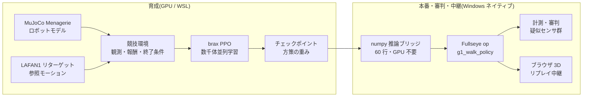
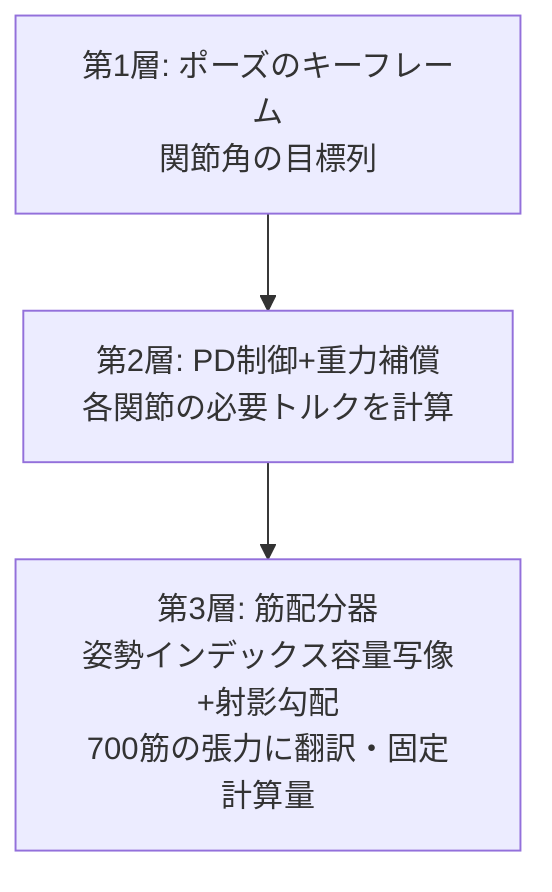
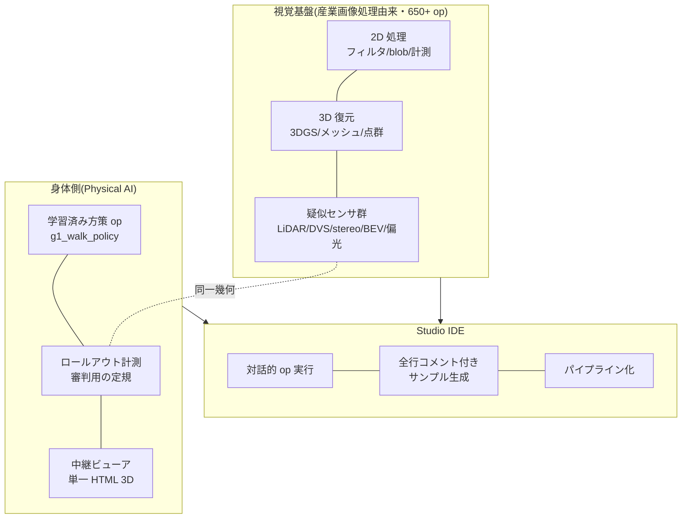

2025년, 중국 베이징에서 휴머노이드 로봇의 하프마라톤이 열렸고, 여름에는 제1회 세계 휴머노이드 로봇 운동회가 개최되어 이족보행 로봇들이 달리기를 하고, 축구를 하고, 춤을 추었다. 그리고 공교롭게도 이 글을 쓰고 있는 오늘(2026년 8월 22일), 베이징의 국가 스피드스케이팅 경기장에서 **제2회 세계 휴머노이드 로봇 운동회가 개막**하고 있다. 이번에는 16개국·666팀·2,056대, 종목은 51개(제1회의 26개에서 거의 두 배), 하이라이트는 "리모컨 조작을 배제한 완전 자율 카테고리"라고 한다(숫자의 출처는 16.0절의 조사표에 정리해 두었다). 뉴스를 따라가면서, 줄곧 이런 생각을 했다.

(먼저 한 가지 안내해 둔다: 이 글의 GIF와 그림 안에 새겨진 텍스트는 일본어 원본이며, 의미는 캡션에 있다.)

**"이거, 개인이 해 보고 싶다"**

물론 실기 500대를 늘어세울 경기장은 마련할 수 없다. 예산도, 장소도, 그리고 가족의 이해도 부족하다. 하지만 지금 손 안에는 GPU가 1장 실린 PC가 있다. 물리 시뮬레이션 안에 경기장을 짓고, 선수를 키우고, 경기를 시키고, 심판을 세우고, 관중석(브라우저)으로 중계한다 — **운동회를 구성하는 요소 전부를 내 책상 위에서 만드는 것**이라면, 할 수 있을 터였다.

이 글은 그 "자택 휴머노이드 운동회"의 개최기다. 그리고 동시에, 내가 본업인 영상 처리(산업용 머신 비전)의 경험을 들고 오면서 **Physical AI의 통합 개발 환경(IDE)을 만들려 하고 있는** 개발기이기도 하다. 경기의 무대 뒤에서는 심판의 시선(계측과 꼼수 검출)도, 중계 설비(브라우저 3D 뷰어)도, 선수 육성 환경(강화학습 파이프라인)도, 전부 같은 하나의 공구함 — 자작 시각 툴킷 **Fullseye** — 으로 흘러들어 간다.

긴 글이다. 읽을거리로 처음부터 읽어도, 목차에서 경기만 골라 읽어도 성립하도록 썼다.


*대회 포스터(삽화는 이미지 생성 AI(Gemini). 글자가 깨지기 쉬워서, 빈 배너가 있는 상태로 생성하고 글자는 직접 넣는 방식)*

> **발안과 구현의 귀속에 대하여(처음에 명기)**
> 이 글에 나오는 방향성 판단과 아이디어(운동회라는 기획 그 자체, 실기 센서에 맞춘 관측 설계, 이벤트 카메라식 시간 차분의 도입, 근골격의 "상반+공수축" 2지령화, 부위 단위 단순화, 학습된 정책의 Studio op화, 브라우저 중계…)는 내가 냈고, 구현·실험·계측의 실무는 AI 코딩 에이전트(Claude Code)가 돌리고 있다. **잘된 실험도, 실패한 실험도, 숫자는 전부 실측**이다. 실패를 숨기면 다음의 내가 곤란해지므로, 진 경기도 진 채로 실었다. 참고로 본문의 1인칭 "나"는 판단과 방향 설정의 주어이지만, 발견의 순간에는 인간과 AI의 경계가 모호한 장면도 있다. 귀속을 단정할 수 없는 서술은 "나와 AI의 팀으로서"의 의미로 읽어 주기 바란다 — 주어를 멋지게 부풀리지 않는 것도 honest disclosure의 일부다.

## 이 글을 읽는 법(3가지 코스)

매우 긴 글이므로, 먼저 코스 안내부터.

- **5분 코스(움직임만 본다)**: 스크롤하면서 동영상(GIF)만 훑어보면 된다. 직진 보행 완주, 장애물 달리기, 67대의 입장 행진, 700근 인체의 포즈, 선 자세에서 무너지는 장면까지, 움직임만으로 이야기의 뼈대를 알 수 있게 배치해 두었다.
- **30분 코스(본편)**: 제1~15장. 운동회 개최기 + 실패담 + 개발기다. 각 장 끝의 "🍙 쉽게 풀기 코너"는 본문이 딱딱하다 싶을 때의 대피소다.
- **풀코스(자료편까지)**: 부록 A~G. 실험 전체 기록, 로봇 67기의 명감, 센서 도감, 교훈집, 용어집, op 전체 색인, 미래 자료집. 사전으로서, 필요해졌을 때 찾아보는 용도다.

# 목차(경기 프로그램)

1. 개회식 — 왜 개인이 운동회인가
2. 용어집 — 먼저 쉽게 풀어 둔다
3. 경기장 건설 — 물리 시뮬레이션과 GPU
4. 선수 입장 — Unitree G1과 자작 700근 인체 evis
5. 종목 1: 달리기(20m 직진) — 3연패에서 "흰 선이 보이지 않았다"는 일격까지
6. 종목 2: 장애물 달리기 — 의사 LiDAR와 1차원 이벤트 카메라
7. 종목 3: 단체 연기 — 700가닥의 근육을 키프레임으로 움직인다
8. 종목 4: 평균대(정지 직립) — 가장 수수한 종목이, 가장 어려웠다
9. 심판진 — 영상 처리쟁이가 만드는 "꼼수를 간파하는 계기"
10. 중계국 — 브라우저만으로 도는 3D 리플레이
11. 통합 개발 환경으로 — Fullseye Studio라는 야망
12. 개최 요강 — 개인이 하기 위한 구성표
13. 미래를 향해 — 최첨단을 시뮬레이션한다는 놀이법
14. 이 운동회에 섞여 있는 학문들 — DNA에서 광학까지
15. 번외 경기 — 팔·하늘·핸드·젓가락(전부, 진짜 물리)
16. 폐회식과 다음 종목
부록 A~I — 실험 연대기 / 로봇 명감(67기) / 센서 도감 / 교훈집 / 확장 용어집 / Fullseye op 전체 색인(1,606) / 미래 자료집 / 학습 로그 실측 초록 / FAQ

---

# 1. 개회식 — 왜 개인이 운동회인가


*삽화: 이미지 생성 AI(Gemini). 넘어져 있는 선수가 있다는 점이, 이 글의 내용과 완전히 일치한다*

베이징 대회가 재미있었던 것은, "걸을 수 있는가"가 아니라 "**경기가 되는가**"를 물었다는 점이라고 생각한다. 걷기만 하는 것이라면 2015년 DARPA Robotics Challenge 무렵부터 로봇은 (넘어지면서도) 걷고 있었다. 경기가 된다는 것은, 속도를 겨루고, 코스를 지키고, 실격 조건이 있고, 기록이 남는다는 뜻이다. 즉 **계측과 규율**이 들어온다는 것.

오해가 없도록 적어 두자면, "개인이 중국을 이기자"는 이야기가 전혀 아니다. 그 규모와 속도, 그리고 무엇보다 "로봇에게 마라톤을 뛰게 해 보자" "운동회를 열어 버리자"는 **자유로운 발상 그 자체가, 순수하게 본받아야 할 것**이라고 생각한다. 내가 하고 싶은 것은 경쟁이 아니라, 그 자극을 내 손이 닿는 형태로 번역해 보는 일이다. 그리고 중요한 것은, 그것이 **번역 가능해져 버린 시대가 오고 있다**는 점. 오픈된 모델과 데이터와 계산 자원이, 개인의 책상 위에서 정말로 맞물린다. 자극을 받은 쪽이, 관객으로만 머물지 않아도 된다. 이것은 꽤나 희망적인 이야기라고 생각한다.

나는 평소 산업용 영상 처리를 해 온 사람이고, 공장 검사 장비의 세계에서는 "측정할 수 없는 것은 개선할 수 없다" "측정 방법을 의심하라"가 가훈이다. 강화학습(Reinforcement Learning)으로 로봇을 키우는 놀이를 시작하자마자, 이 두 세계가 같은 골격을 가지고 있다는 것을 깨달았다. **보상(점수)의 설계는 검사 기준의 설계이고, 에이전트는 기준의 구멍을 반드시 파고드는 피검체**다. 그래서 운동회라는 프레임은 농담 같으면서도, 사실은 본질적이었다. 경기 규칙(보상·종료 조건), 계시와 계측(로그와 롤아웃 = 정책을 처음부터 끝까지 달리게 한 1회분의 실주행), 도핑 검사(꼼수 검출), 그리고 관중을 향한 중계(가시화). 이 전부를 만들지 않으면, 운동회는 성립하지 않는다.

개인이 하는 의미도 적어 둔다. 대회에 나오는 로봇의 제어는 각 회사의 비전(祕傳)이지만, **시뮬레이션 속 운동회는 모델도 데이터도 학습 코드도 전부 오픈된 것으로 짤 수 있다**. 사용한 것은 MuJoCo(물리 엔진), MuJoCo Menagerie(로봇 모델집), Unitree 공식의 LAFAN1 리타깃 모션(HuggingFace 공개. 원본 데이터는 Ubisoft La Forge, CC BY-NC-ND 4.0 비상업 라이선스 — 자세한 내용은 글 말미의 감사의 말), brax/MJX(GPU 물리와 학습), 그리고 자작 코드. GPU 1장만 있으면 누구나 자기 집에 경기장을 지을 수 있는 시대가, 정말로 와 있다.

# 2. 용어집 — 먼저 쉽게 풀어 둔다

본문을 읽다가 되돌아올 수 있도록, 주요 용어를 먼저 정리한다. 형식은 "용어(English) — 한 줄 정의 → 쉽게 풀기"다.

- **강화학습(Reinforcement Learning, RL)** — 시행착오와 보상으로 행동을 획득하는 학습법. → 개 훈련. "손"을 하면 간식. 다만 개보다 압도적으로 타산적이어서, 간식 규칙의 구멍을 전력으로 파고든다.
- **정책(policy)** — 상태를 입력받아 행동을 내는 함수. 학습의 성과물. → 선수의 "몸 움직이는 버릇" 그 자체. 이 글의 정책은 작은 신경망(4층×32유닛 정도).
- **보상(reward)** — 1스텝마다 주는 점수. → 경기의 채점 규칙. 여기의 설계 실수는 반드시 악용된다.
- **관측(observation)** — 정책에게 보여 주는 입력 벡터. → 선수의 오감. **여기에 들어 있지 않은 것은, 선수에게는 존재하지 않는다**(이 글 최대의 교훈).
- **PPO(Proximal Policy Optimization)** — 정석 강화학습 알고리즘. → "한 번에 극단적으로 바꾸지 않고, 조금씩 확실하게 실력을 올리는" 연습법.
- **학습 스텝과 "26M" "150M" 표기** — 이 글에서는 선수의 성장 정도를 "학습 스텝 수"로 나타내며, M은 백만(mega)의 의미로 쓴다. 26M = 2,600만 스텝, 150M = 1억 5,000만 스텝. **거리의 미터(소문자 m. "20.5m 전진" 등)와는 별개**이므로, "대문자 M이 붙은 큰 숫자는 연습량, 소문자 m은 거리"로 구분해 읽어 주기 바란다. → 동아리 활동으로 치면 "스윙 연습 2,600만 번째 시점" 같은 말투다.
- **모방학습의 참조 모션(reference motion / mocap)** — 인간의 움직임을 기록해 로봇의 관절에 옮긴 "본보기". → 댄스 안무 비디오. LAFAN1은 그 공개 데이터집이고, Unitree가 자사 로봇용으로 공식 변환하고 있다.
- **잔차 제어(residual control)** — 본보기의 관절각에, 정책이 작은 수정량(잔차)만 더하는 방식. → "안무는 지켜라, 다만 균형 조정은 스스로 해라". 처음부터 움직임을 발명하게 하지 않는다.
- **POMDP / 부분 관측** — 환경 상태의 일부만 관측할 수 있는 상황. → 눈 가리고 외줄 타기. 종목 1의 패인.
- **의사 LiDAR(pseudo-LiDAR)** — 시뮬레이션 안에서 광선을 쏘아 거리를 재는 가상 센서. → 박쥐의 초음파. 실기 LiDAR(레이저 거리계)의 성질을 계산으로 흉내 낸다.
- **이벤트 카메라(event camera / DVS)** — 밝기의 "변화"만 내보내는 카메라. → 정지 화면은 못 찍지만 "움직인 것"에 초민감한 눈. 이 글에서는 1차원판을 자작했다.
- **근골격 모델(musculoskeletal model)** — 관절을 모터가 아니라 "근육의 장력"으로 움직이는 인체 모델. → 로봇이 아니라 해부학의 인체. evis는 700가닥의 근육을 가진다.
- **토크(torque)** — 관절을 돌리는 힘의 모멘트. **근육은 밀지 못한다, 당길 뿐**(이걸로 한 번 패했다).
- **WBC-QP(전신 제어의 이차 계획법, Whole-Body Control via Quadratic Programming)** — "전 관절의 가속도와 접촉력을, 물리 조건을 만족하면서 최적으로 정하는" 제어의 정석. → 전신의 힘 배분을 매 순간, 수학의 최적화로 푼다.
- **MJX / brax** — MuJoCo의 GPU 병렬판과, 그 위의 학습 프레임워크. → 경기장을 수천 면 동시에 지어서, 수천 명의 선수를 동시에 연습시키는 기술.
- **XLA** — GPU용 계산 컴파일러. → 경기장의 시공업자. 잘하는 공법(고정 형상의 행렬 계산)에 맞지 않는 설계도(700근의 희소한 장력 계산)는 지어 주지 않는다, 는 제약이 나중에 효력을 발휘한다.

# 3. 경기장 건설 — 물리 시뮬레이션과 GPU

경기장은 통째로 소프트웨어다. 구성은 이렇게 되어 있다.



- **물리 엔진**: MuJoCo. 접촉 계산의 신뢰성과 속도의 균형에서, 현재 로봇 학습의 사실상 표준이다.
- **병렬화**: MJX(MuJoCo의 GPU판) + brax의 PPO 구현. 수천 개의 경기장을 GPU 위에 동시에 지어서, 같은 선수의 복사본을 일제히 달리게 하고, 전원분의 경험을 모아 학습한다.
- **하드웨어**: RTX 5090(32GB) 1장. 이 글의 학습은 2개 종목을 동시에 돌려 **합계 약 9,700 학습 스텝/초**가 나오고 있다(메모리 할당을 0.35씩으로 좁혀 동거). 한 종목의 연습(약 1억 스텝)이 대략 3~4시간. 저녁에 연습을 걸어 두고, 저녁 식사 후에 결과를 보는 생활 리듬이 된다. 대체로 목욕 후에 전도(轉倒) 동영상을 바라보며 한숨 쉬는 담당이다.
- **학습은 Linux 쪽(WSL), 그 외에는 Windows 쪽**이라는 분업이다. JAX/XLA의 사정으로 학습은 WSL로 몰고, 계측·가시화·글의 도표 만들기는 Windows 네이티브 Python으로 하고 있다. 이 분업이 뒤에 나올 "numpy 추론 브리지"의 동기가 되었다.


*그림: 이 글의 학습 스루풋 실측. GPU 1장에 학습 2~3개를 동거시켜도 각각 8,000~10,000 스텝/초. 사족(별도 트레이너)은 단위계가 달라 별도 패널(실측 로그로 작도)*

경기장 건설에서 가장 먼저 효력을 발휘하는 제약이, 용어집에도 적은 **XLA의 특기 공법 문제**다. 관절을 모터로 돌리는 보통 로봇(G1 등)은 GPU로 수천 병렬이 가능하지만, **700가닥의 근육으로 움직이는 자작 인체 evis는 근장력 계산이 XLA에 실리지 않아 GPU 병렬화가 불가능**했다. 그래서 evis의 경기는 CPU로 진행하고, 나중에 GPU에 실을 때는 "근육을 등가의 관절 토크로 치환한 쌍둥이(torque-twin)"를 쓰는 이단 구성으로 하고 있다. 경기장에 대경기장(GPU)과 소체육관(CPU)이 있다고 생각하면 된다.

> **🍙 쉽게 풀기 코너(경기장편)**
> 게임의 "물리 엔진"과 같은 것이, 로봇 연구에서도 경기장이 된다. 마리오가 점프해서 떨어지는 것도, 여기서 로봇이 넘어지는 것도, 안에서 하고 있는 계산은 동족이다. 차이는 진지함으로, 연구용 물리 엔진은 "접촉한 순간의 힘"을 보험 약관 같은 세밀함으로 계산한다. 그리고 GPU를 쓰면 이 경기장을 수천 개 복사해서 동시에 돌릴 수 있다. 로봇 1대의 연습을 4,000대가 동시에 하는 느낌. 그래서 하룻밤에 인간의 수년치 연습량이 되는 것이다.

## 3.1 깊이 파기: 경기장의 지하 설비 — 물리 엔진은 1스텝에 무엇을 하고 있는가
(제3장 "경기장 건설"의 증보)

시뮬레이터는 "마법의 상자"가 아니다. `mj_step()`을 한 번 부를 때마다, 안에서는 정해진 순서의 계산이 돌고 있다. 여기서는 그 상자의 뚜껑을 열고 함께 들여다본다.

### 3.1.1 1스텝의 내용물: 순동역학 파이프라인

MuJoCo의 1스텝은 대략 다음 단계를 순서대로 거친다(공식 docs의 Computation 장 [^mjc-comp]에 전 단계의 해설이 있다).

| 단계 | 하는 일 | 사용되는 알고리즘 |
|---|---|---|
| 1. 순방향 운동학 | 관절 각도로부터, 모든 보디의 위치·자세를 계산 | 트리 구조를 루트에서 잎으로 전파 |
| 2. 바이어스력 | 중력·코리올리력·원심력을 한꺼번에 계산 | Recursive Newton-Euler(RNE) |
| 3. 관성 행렬 | "어느 관절을 밀면 얼마나 움직이는가"의 행렬 M을 계산 | Composite Rigid-Body(CRB) |
| 4. 충돌 검출 | 어느 지오메트리끼리 닿아 있는지를 열거 | broad-phase → narrow-phase |
| 5. 구속력의 해법 | 접촉력·관절 리밋력·마찰을 결정 | **볼록 최적화**(후술) |
| 6. 수치 적분 | 가속도를 적분해 속도·위치를 1컷 진행 | Euler / RK4 / implicit 계(후술) |

포인트는 2가지다.

**일반화 좌표(generalized coordinates)**. MuJoCo는 각 보디의 xyz 좌표를 따로따로 갖는 것이 아니라, "관절 각도의 벡터"로 전신의 상태를 나타낸다. 관절로 이어져 있는 한, 보디가 뿔뿔이 날아가 버릴 걱정이 구조적으로 없다. 공식 docs는 "MuJoCo pioneered the combination of simulation in generalized coordinates with optimization-based contact dynamics(일반화 좌표에서의 시뮬레이션과 최적화 기반 접촉 동역학의 조합을 개척했다)"라고 자기소개하고 있다 [^mjc-overview]. 게임 물리 엔진(직교 좌표 + 스프링으로 구속을 근사)과의 가장 큰 설계 차이가 여기다.

**순동역학(forward dynamics)**. "지금 가해지고 있는 힘으로부터, 다음 순간의 가속도를 구하는" 계산이다. 운동 방정식 M(q)·q̈ = 외력 + 구속력 을, 위 표의 재료(M, 바이어스력, 접촉력)를 갖춘 뒤에 푼다.

#### 쉽게 풀기: 플립북의 1컷

시뮬레이션은 플립북(파라파라 만화)이다. 1스텝 = 1컷. 각 컷에서 "전원의 위치를 확인 → 누구와 누가 부딪치고 있는지 조사 → 서로 미는 힘을 결정 → 그 힘으로 전원을 아주 조금 움직인다"를 반복한다. 우리 G1의 학습에서는 1컷이 0.002초. 1초의 보행 뒤에서 500컷분, 이 표의 전 단계가 돌고 있다.

### 3.1.2 접촉은 왜 어려운가 — LCP를 버리고 볼록 최적화를 택한 MuJoCo

물리 엔진의 최대 난소는 "접촉"이다. 발이 지면에 닿는 순간, 지면은 얼마만큼의 힘으로 되밀어야 하는가? 이것은 의외로 정의하기 어려운 문제다.

고전적인 정식화는 **LCP(선형 상보성 문제)**였다. "접촉력은 미는 방향만(당기지 않는다)" "떨어져 있으면 힘은 제로" "마찰은 쿨롱 원뿔 안"이라는 조건을 상보성 조건으로 써 내려간다. 그런데 마찰이 붙은 LCP는 해가 유일하게 정해지지 않는 경우가 있고, 일반적으로는 NP-난해 클래스에 속한다.

MuJoCo의 저자 Todorov 등은 여기서 발상을 바꿨다. **접촉을 아주 조금 "부드럽게" 인정함으로써, 문제 전체를 볼록 최적화로 변환한** 것이다(IROS 2012 논문 [^todorov2012], 그리고 docs의 Computation 장 [^mjc-comp]). docs에는 쌍대 문제의 형태가 명시되어 있다:

> f = argmin_λ ½ λᵀ(A+R)λ + λᵀ(a₀ − aᵣ)  subject to λ ∈ Ω

세부는 따라가지 않아도 괜찮다. 중요한 것은 **(A+R)이 양의 정부호 = 골짜기가 하나뿐**이라는 점. 즉 접촉력은 "유일한 대역 최적해"로서 매번 같은 답이 나온다. LCP처럼 "풀리기도 하고 안 풀리기도 하고, 답이 여러 개이기도" 하는 일이 없다.

그 대가가 **soft contact(부드러운 접촉)**다. docs의 "Physical realism and soft contacts" 절에 있는 대로, 상보성이 엄밀하게는 성립하지 않고, "접촉력과 접촉 법선 방향의 속도가 동시에 양수가 될 수 있다" = 미세한 파고듦이 허용된다 [^mjc-comp]. 다만 이것은 결함이 아니라 설계 사상으로, 현실의 물체도 접촉면은 미시적으로는 변형되어 있다(이불 위에 놓은 노트북은 조금 가라앉지 않던가). "완전 강체의 접촉" 쪽이 오히려 물리적 픽션이다, 라는 입장이다.

게다가 볼록 정식화에는 부산물이 있다. docs 왈 "uniquely-defined inverse(역동역학이 유일하게 정의된다)" [^mjc-overview]. "이 움직임을 실현하려면 무슨 힘이 필요했는가"를 역산할 수 있다는 것은, 최적 제어·로보틱스 연구에서 이 엔진이 선택되어 온 이유 중 하나다.

#### solref / solimp — 접촉의 단단함을 "스프링과 댐퍼의 언어"로 지정한다

그렇다면 "얼마나 부드러운가"는 어떻게 정하는가. 그것이 XML에서 자주 보게 되는 `solref`와 `solimp`다(docs의 Modeling 장 "Solver parameters" 절 [^mjc-solver]).

| 파라미터 | 의미 | 직관 |
|---|---|---|
| `solref = (timeconst, dampratio)` | 구속을 질량-스프링-댐퍼계로 재파라미터화 | timeconst = 파고듦이 되돌아오는 속도, dampratio = 1이면 튀지 않고 스윽 돌아온다(임계 감쇠) |
| `solimp = (d₀, d_width, width, midpoint, power)` | 임피던스 d ∈ (0,1) = "구속이 힘을 내는 능력"을 파고듦 양의 함수로 지정 | d가 작다 = 약한(부드러운) 구속, 크다 = 강한(단단한) 구속 |

docs의 말을 빌리면, solref는 "시정수와 감쇠비라는 질량-스프링-댐퍼계의 언어로 모델을 재파라미터화하는" 것이고, solimp의 d는 "small values of d correspond to weak constraints while large values of d correspond to strong constraints" [^mjc-solver]. 즉 최적화 솔버 안의 추상적인 정칙화 항을, 인간이 직관을 가질 수 있는 "스프링의 단단함·댐퍼의 효력"으로 번역해 주는 인터페이스다. 접촉이 부들부들 떨릴 때·발이 파고들 때, 우리가 만지고 있던 것은 사실 이 2가지였다.

### 3.1.3 적분기와 시간 간격 — 왜 근육이나 텐던에서 "폭발"하는가

표의 마지막 단, 수치 적분에는 선택지가 있다(docs "Numerical Integration" 절 [^mjc-comp]).

| 적분기 | 특징 | 적합·부적합 |
|---|---|---|
| Euler(semi-implicit) | 관절 댐핑만 음적으로 다루는 반음적 오일러 | 표준. 빠르다 |
| RK4 | 4차 룽게-쿠타. 1스텝에 4회 평가 | 에너지 보존계에 강하다. 비용 4배 |
| implicit | 속도 의존력(코리올리·원심력 포함)의 미분까지 음적으로 | 가장 안정. LU 분해 필요 |
| implicitfast | implicit에서 코리올리계의 미분을 생략한 판 | docs 추천. Cholesky로 빠르다 |

"음적(implicit)"이란 무엇인가. 양적(explicit) 적분은 "지금의 힘으로 다음 위치를 정한다". 음적 적분은 "다음 순간의 상태에서 앞뒤가 맞도록 연립 방정식을 풀어 나아간다". 전자는 빠르지만, **단단한 스프링(변화가 빠른 힘)이 있으면 1컷 사이에 힘이 날뛰어 발산**한다. 이것이 수치적인 "폭발"의 정체다.

근육·텐던(힘줄)은 바로 이 "단단한 스프링"의 덩어리다. 근육의 수동 탄성·텐던의 장력은, 미세한 늘어남으로 힘이 크게 변한다 = 시정수가 짧다. 시간 간격 dt가 그 시정수보다 거칠면, 1컷 사이에 "힘을 과대하게 어림한다 → 지나쳐 간다 → 반대 방향으로 더 큰 힘 → …"의 진동이 증폭된다. evis(근구동 휴머노이드)가 G1보다 작은 dt를 요구한 것은, 태만이 아니라 수학적 필연이었다. docs도 속도 의존의 힘이 지배적인 계에서는 implicit 계가 "RK4보다 대폭 안정(significantly more stability)"하다고 하며, **시간 간격은 "아마도 유일하게 가장 중요한 파라미터(perhaps the single most important parameter)"**라고 명언하고 있다 [^mjc-comp].

#### 쉽게 풀기: 컷이 빠진 플립북

단단한 스프링과 거친 dt의 조합은, "컷 수를 아낀 플립북으로 검도의 머리치기를 그리는" 것과 같다. 죽도의 끝은 1컷 사이에 크게 움직이므로, 컷을 솎아내면 궤도를 그릴 수 없어 그림이 파탄난다. 천천히 걷는 장면이라면 솎아내도 괜찮다. **dt는 "가장 빨리 움직이는 것"에 맞춰 고른다**——이것이 수치 안정성의 한 줄 요약이다.

### 3.1.4 MJX — MuJoCo를 GPU의 언어로 다시 쓰다

학습에는 수천만 스텝이 필요하다. CPU의 MuJoCo 1개로는 해가 저문다. 그래서 **MJX**다.

MJX는 MuJoCo를 **JAX로 다시 쓴** 구현이다. 공식 docs [^mjx]에 따르면, 목표는 "XLA 컴파일러가 지원하는 모든 계산 하드웨어에서 MuJoCo를 돌리는" 것. JAX의 `vmap`(자동 벡터화)으로 동일 씬을 수천 개 늘어놓고, GPU의 SIMD 연산기에 일괄로 흘려 넣는다. docs의 표현으로는, MJX가 잘하는 것은 "simulating big batches of parallel identical physics scenes using algorithms that can be efficiently vectorized on SIMD hardware(SIMD 하드웨어에서 효율적으로 벡터화할 수 있는 알고리즘에 의한, 동일 물리 씬의 대배치 병렬 시뮬레이션)"——바로 RL을 위한 엔진이다.

다만 GPU화는 공짜가 아니다. docs가 정직하게 적고 있는 제약 [^mjx]:

- **분기(branching)에 약하다**: "accelerators exhibit poor performance for branching code(가속기는 분기 코드의 성능이 나쁘다)". 충돌 검출의 broad-phase는 "가까이에 없는 물체 쌍을 건너뛰는" 분기투성이의 처리이므로, GPU에서는 전체 쌍을 우직하게 평가하기 쉬워진다.
- **가변 길이에 약하다**: XLA는 배열 크기를 컴파일 시에 고정한다. 접촉 수는 스텝마다 바뀌는데도, MJX에서는 "최대 접촉 수"만큼의 메모리를 항상 확보해 계산한다. CPU판이라면 "오늘은 접촉 3건"으로 끝날 것을, GPU판은 매번 만석분의 계산을 하는 셈이다.
- **메시는 가볍게**: 충돌 메시는 "200 정점 정도 이하"가 권장.
- **1개만이라면 느리다**: 단일 씬에서는 "MJX-JAX can be 10x slower than MuJoCo(CPU판 MuJoCo의 10배 느려질 수 있다)". MJX의 가치는 1개의 속도가 아니라, **4096개를 동시에 돌려도 1개분과 그다지 다르지 않은** 스루풋에 있다.

(보충: 2026년 현재의 docs에서 MJX는 2계통으로 나뉘어 있다. JAX 재구현인 MJX-JAX(자동 미분 가능)와, 더 고속이지만 자동 미분 비대응인 MJX-Warp다 [^mjx]. 이 글의 학습에서 쓴 것은 JAX 계열의 파이프라인이다.)

#### brax PPO의 학습 루프

MJX와 짝지어 쓴 것이 **brax** [^brax]의 학습 알고리즘 구현이다. brax는 JAX 기반의 물리 엔진 + 학습 라이브러리로, README에 있는 대로 PPO / SAC / ARS / 진화 전략 등의 구현을 동봉하고 있다. 그 PPO의 1사이클은 이렇게 돈다:

1. **rollout**: 수천 개의 병렬 환경에서 현재의 정책을 짧은 구간(unroll) 달리게 하여, (관측, 행동, 보상)을 수집
2. **GAE**: 모은 보상으로부터 advantage(그 행동이 평균보다 얼마나 좋았는가)를 추정(파트 2에서 상술)
3. **minibatch SGD**: 데이터를 미니배치로 나누고, PPO의 클립 부착 목적 함수로 정책 네트와 가치 네트를 몇 에폭 갱신
4. 새로운 정책으로 1로 돌아간다

이 루프 전체——물리 시뮬레이션도 신경망 갱신도——가 JIT 컴파일(실행 직전에 한꺼번에 GPU용 코드로 변환)되어 **GPU에서 한 번도 내려오지 않고** 도는 것이, MJX + brax 구성의 속도의 원천이다. CPU↔GPU 간 데이터 전송이라는 최대의 병목이 사라진다.

#### 파트 1 출전

[^mjc-comp]: MuJoCo 공식 docs, Computation 장(파이프라인·볼록 최적화·soft contact·적분기): https://mujoco.readthedocs.io/en/stable/computation/index.html
[^mjc-overview]: MuJoCo 공식 docs, Overview(일반화 좌표·볼록 접촉·유일한 역동역학·텐던): https://mujoco.readthedocs.io/en/stable/overview.html
[^mjc-solver]: MuJoCo 공식 docs, Modeling 장 Solver parameters(solref / solimp): https://mujoco.readthedocs.io/en/stable/modeling.html#solver-parameters
[^todorov2012]: Todorov, Erez, Tassa, "MuJoCo: A physics engine for model-based control," IROS 2012: https://doi.org/10.1109/IROS.2012.6386109
[^mjx]: MuJoCo 공식 docs, MJX 장(JAX/XLA·배치 병렬·분기/가변 길이의 제약): https://mujoco.readthedocs.io/en/stable/mjx.html
[^brax]: google/brax(JAX 물리 엔진 + PPO/SAC 등의 학습 구현): https://github.com/google/brax

---

## 3.2 깊이 파기: 경기장의 역사 — 물리 시뮬레이터의 계보
진화든 RL이든, 도태의 "세계"를 제공하는 것은 물리 엔진이다. 이 25년 동안 세계 쪽도 극적으로 진화했다.

### 3.2.1 연표: 7세대의 물리 엔진

| 연도 | 엔진 | 2~3줄로 | 출전 |
|---|---|---|---|
| 2001 | **ODE** | Russell Smith가 공개한 오픈소스 강체 동역학 라이브러리(초판 2001-05-08). 관절·접촉·충돌 검출을 갖추고, 연구용 시뮬레이터(Gazebo 등)의 표준 부품으로 한 시대를 이루었다 | [^ode] [^ode-wiki] |
| 2000s | **Bullet** | Erwin Coumans 주도. 게임·VFX 출신의 충돌 검출 + 다체 물리. Python 바인딩 PyBullet이 심층 RL 초기의 정석 환경이 되었다 | [^bullet] |
| 2000s~ | **PhysX** | NVIDIA의 실시간 물리 SDK. 게임 시장에서 단련되어, 훗날 GPU 구현이 Isaac Gym의 심장부가 된다. 현재는 오픈소스 | [^physx] |
| 2012 | **MuJoCo** | Todorov·Erez·Tassa "MuJoCo: A physics engine for model-based control"(IROS 2012). 일반화 좌표 + 볼록 최적화 기반 접촉이라는 연구 특화 설계 | [^mujoco-paper] |
| 2021-22 | **MuJoCo 인수→OSS화** | DeepMind가 인수해 무상 공개(2021-10-18), 이어서 전체 코드를 Apache-2.0으로 오픈(2022-05-23). 연구 표준 엔진이 "누구의 것도 아닌 모두의 것"인 상태가 되었다 | [^mujoco-blog1] [^mujoco-blog2] [^mujoco-gh] |
| 2021 | **Isaac Gym** | Makoviychuk 등(NVIDIA). 물리도 보상 계산도 **전부 GPU 위**에서 돌리고, GPU 1장으로 수천 환경을 동시 시뮬레이션. RL의 데이터 수집을 자릿수 단위로 바꿨다 | [^isaacgym] |
| 2021-23 | **Brax / MJX** | JAX 계열. Brax는 미분 가능 물리 엔진(Freeman 등 2021), MJX는 MuJoCo 본체의 JAX 구현으로, XLA가 도는 하드웨어(GPU/TPU)라면 천 병렬을 쓸 수 있다 | [^brax] [^mjx] |
| 2024 | **Genesis** | 멀티피직스(강체·유체·연체) + 포토리얼 묘사 + 고속 GPU 병렬을 일체로 노리는 신세대 플랫폼 | [^genesis] |

### 3.2.2 게임 물리와 연구 물리의 분기

이 계보에는 보이지 않는 분수령이 있다. **"60 fps에서 파탄나지 않으면 승리"인 게임 물리**와, **"접촉력이 물리적으로 올바르지 않으면 의미가 없다"인 연구 물리**다.

게임 물리(Bullet, PhysX의 출신)는, 플레이어가 보기에 자연스러우면 근사여도 상관없다. 관통을 되민다, 파고듦을 얼버무린다, 안정성을 위해 에너지를 멋대로 줄인다——실시간성을 위해서라면 전부 허용. 이 결단이 방대한 게임 시장에서 성능을 단련했고, 결과적으로 연구에도 저렴한 물리를 공급했다. 심층 RL 초기의 벤치마크 다수가 PyBullet이나 MuJoCo의 환경에서 돌았던 것은, 이 축적의 은혜다.

연구 물리(ODE 후기→MuJoCo)는 반대로, **접촉과 그 미분의 올바름**에 집착한다. 로봇의 제어 법칙은 바로 접촉력의 응답으로 정해지기 때문으로, MuJoCo가 볼록 최적화로 접촉을 푸는 설계를 택한 경위는 3.1절에서 본 대로다. 분기는 세부에도 나타난다. 게임 물리는 묘사 프레임에 동기한 고정 스텝으로 "이번 프레임을 넘기는" 것을 우선하지만, 연구 물리는 시간 간격·솔버 반복 수·접촉의 부드러움을 전부 사용자에게 노출하고, "그 근사로 무엇을 잃고 있는가"를 고르게 한다. 또 MuJoCo가 역동역학(이 움직임에 필요했던 힘의 역산)을 유일하게 계산할 수 있음을 세일즈 포인트로 삼는 데 비해, 게임 물리에서 역동역학을 진지하게 쓰는 장면은 거의 없다——**누가 그 엔진의 "고객"이었는가**가, 20년 후의 설계 사상까지 결정하고 있는 셈이다. 여기를 얼버무린 시뮬레이터로 학습한 정책은, 실기에 가져간 순간 **sim-to-real gap**(reality gap)에 얻어맞는다. 도메인 랜덤화(Tobin 등 2017 [^tobin]) 같은 "시뮬레이터의 파라미터를 일부러 흩뜨려서, 어느 세계에서도 통용되는 정책을 키우는" 처방전이 태어난 것도, 갭이 구조적으로 피할 수 없는 것이기 때문이다(sim-to-real의 각론은 6.5절·6.6절에서 다루므로, 여기서는 계보상의 위치만).

### 3.2.3 GPU 병렬이 RL을 바꿨다

Isaac Gym 논문(2021) [^isaacgym]의 임팩트는 한 점으로 요약된다. 종래의 RL은 "물리는 CPU, 학습은 GPU"여서, CPU↔GPU 간 데이터 수송이 병목이었다. Isaac Gym은 물리 시뮬레이션·관측·보상 계산을 **전부 GPU 텐서 위**에서 완결시켜, GPU 1장으로 수천 환경을 동시에 달리게 한다. 같은 해 Rudin 등의 "Learning to Walk in Minutes Using Massively Parallel Deep Reinforcement Learning" [^rudin]은, 이 구조로 사족 로봇 ANYmal의 보행 정책을 **단일 워크스테이션 GPU·수 분**에 학습할 수 있음을 보였다. 그때까지 "클러스터로 며칠"이었던 작업이다.

이것은 단순한 고속화가 아니라, 연구의 작법을 바꿨다. 학습이 수 분이라면, 보상 설계의 시행착오가 "일 단위의 도박"에서 "커피 내리는 사이의 실험"이 된다. 우리가 자택의 GPU 1장으로 G1의 보상을 12세대나 다시 만들 수 있었던 것은, 바로 이 2021년 전환의 은혜다.

MJX [^mjx]와 Brax [^brax]는 같은 사상의 JAX판이다. 물리 스텝을 JAX의 함수로 씀으로써, `jit`로 컴파일하고 `vmap`으로 수천 환경분을 묶는다, 는 기계학습 쪽의 작법이 그대로 물리에 쓸 수 있다. Brax는 더 나아가 **미분 가능 물리**——"시뮬레이션 결과를 파라미터로 미분할 수 있다"——를 간판으로 내걸었다. 넘어진 결과를 보상 신호로밖에 쓸 수 없던 세계에서, "어느 파라미터를 어느 쪽으로 움직이면 넘어지지 않았을까"의 기울기를 (이론상으로는) 직접 얻을 수 있는 세계로의 다리다. 접촉 같은 불연속 현상의 미분은 지금도 난소지만, 계보의 다음 분기점은 여기에 있다고 여겨지고 있다.

다만 GPU 병렬에도 대가는 있다. 수천 환경을 1장에 눌러 담기 위해, 1환경당 접촉 솔버는 경량화되고, 복잡한 폐루프 기구나 대규모 접촉(예컨대 700가닥의 근육)은 애초에 실리지 않는 경우가 있다——우리가 evis에서 경험한 "근골격 모델은 GPU화할 수 없어 torque-twin으로 우회했다"는 건은, 이 설계 트레이드오프의 실례다. "빠른 물리"와 "무엇이든 나타낼 수 있는 물리"는, 아직 같은 엔진에 동거하고 있지 않다.

#### 쉽게 풀기: 체육관에 4,096명의 학생

옛날의 RL은 "장인이 로봇 1대에 붙어서 가르치고, 일지를 GPU로 우편 발송하는" 방식이었다. GPU 병렬 물리는 "체육관에 4,096대를 늘어세우고, 전원에게 동시에 같은 수업을 하고, 그 자리에서 채점까지 끝내는" 방식. 1대당 수업의 질은 같아도, 하루에 모이는 경험의 양이 자릿수로 다르다. 보행 학습이 "몇 주"에서 "몇 분"이 된 정체는, 가르치는 법의 진보가 아니라 **교실의 거대화**다.

### 3.2.4 로봇 학습 벤치의 현재 위치(2026)

지금 "걷게 하고 싶다·잡게 하고 싶다"는 사람이 처음 만지는 정석을 한 줄씩.

- **MuJoCo Playground** [^playground] — MJX 기반의 GPU 병렬 환경집. 사족·휴머노이드·머니퓰레이션의 sim-to-real 지향 태스크가 갖춰져 있다(우리 G1 보행의 토대도 이 계열).
- **Isaac Lab** [^isaaclab] — Isaac Sim 위의 로봇 학습 통합 프레임워크. NVIDIA 에코시스템의 현행 정답으로, Isaac Gym의 후계 포지션.
- **ManiSkill** [^maniskill] — SAPIEN 기반의 GPU 병렬 시뮬레이션 + 렌더링. 머니퓰레이션(조작) 과제에 강하다.
- **Genesis** [^genesis] — 강체에 닫히지 않는 멀티피직스와 묘사를 통합하는 야심 카테고리. 새로운 만큼 에코시스템은 발전 도상.

훑어보면, 2012년에 "연구 물리의 올바름"을 택한 MuJoCo와, 게임 시장에서 속도를 단련한 GPU 물리(PhysX 계열)가, 2020년대에 "GPU 병렬 × 접촉의 올바름"으로 합류한 것이 현재 위치임을 알 수 있다. ODE로 1대를 비틀비틀 걷게 하던 시대로부터 25년, 지금 자택의 GPU 1장 안에서는 수천 대의 휴머노이드가 나란히 계속 넘어지고 있다.

---

#### 파트 1 출전

[^sims-page]: Karl Sims, "Evolved Virtual Creatures," 1994(본인 사이트의 해설 페이지): https://www.karlsims.com/evolved-virtual-creatures.html
[^sims-paper]: Karl Sims, "Evolving Virtual Creatures," SIGGRAPH '94 논문 PDF(본인 사이트): https://www.karlsims.com/papers/siggraph94.pdf
[^sims-acm]: 같은 논문의 ACM DL 게재 페이지(SIGGRAPH '94 Proceedings, pp.15-22): https://dl.acm.org/doi/10.1145/192161.192167
[^sims-video]: 영상 "Evolved Virtual Creatures"(Internet Archive): https://archive.org/details/sims_evolved_virtual_creatures_1994
[^sims-youtube]: 같은 영상(YouTube 전재판, "Karl Sims - Evolved Virtual Creatures, Evolution Simulation, 1994"): https://www.youtube.com/watch?v=JBgG_VSP7f8
[^es-wiki]: Wikipedia "Evolution strategy"(Rechenberg·Schwefel에 의한 1960년대 창시 기술): https://en.wikipedia.org/wiki/Evolution_strategy
[^holland]: Wikipedia "John Henry Holland"(1975년 『Adaptation in Natural and Artificial Systems』): https://en.wikipedia.org/wiki/John_Henry_Holland
[^cmaes]: Hansen & Ostermeier, "Completely Derandomized Self-Adaptation in Evolution Strategies," Evolutionary Computation 9(2), 2001: https://doi.org/10.1162/106365601750190398
[^cmaes-tutorial]: Hansen, "The CMA Evolution Strategy: A Tutorial," 2016: https://arxiv.org/abs/1604.00772
[^cmaes-site]: CMA-ES 공식 사이트: https://cma-es.github.io/
[^neat]: Stanley & Miikkulainen, "Evolving Neural Networks through Augmenting Topologies," Evolutionary Computation 10(2), 2002: https://nn.cs.utexas.edu/downloads/papers/stanley.ec02.pdf
[^novelty]: Lehman & Stanley, "Abandoning Objectives: Evolution Through the Search for Novelty Alone," Evolutionary Computation 19(2), 2011: https://doi.org/10.1162/EVCO_a_00025
[^mapelites]: Mouret & Clune, "Illuminating search spaces by mapping elites," 2015: https://arxiv.org/abs/1504.04909
[^cully]: Cully, Clune, Tarapore & Mouret, "Robots that can adapt like animals," Nature 521, 2015: https://www.nature.com/articles/nature14422
[^openai-es]: Salimans, Ho, Chen, Sidor & Sutskever, "Evolution Strategies as a Scalable Alternative to Reinforcement Learning," 2017: https://arxiv.org/abs/1703.03864
[^wright]: Sewall Wright, "The roles of mutation, inbreeding, crossbreeding and selection in evolution," Proc. 6th Int. Congress of Genetics, 1932(원논문의 복사 PDF): http://www.blackwellpublishing.com/ridley/classictexts/wright.pdf
[^landscape-wiki]: Wikipedia "Fitness landscape"(Wright 1932가 기원이라는 기술): https://en.wikipedia.org/wiki/Fitness_landscape
[^afterman]: Wikipedia "After Man: A Zoology of the Future"(Dougal Dixon, 1981): https://en.wikipedia.org/wiki/After_Man
[^cheney]: Cheney, MacCurdy, Clune & Lipson, "Unshackling evolution: evolving soft robots with multiple materials and a powerful generative encoding," GECCO 2013: https://doi.org/10.1145/2463372.2463404
[^xenobots]: Kriegman, Blackiston, Levin & Bongard, "A scalable pipeline for designing reconfigurable organisms," PNAS 117(4), 2020: https://doi.org/10.1073/pnas.1910837117

#### 파트 2 출전

[^ode]: Open Dynamics Engine 공식 사이트(저자 Russ Smith): https://www.ode.org/
[^ode-wiki]: Wikipedia "Open Dynamics Engine"(초판 릴리스 2001-05-08): https://en.wikipedia.org/wiki/Open_Dynamics_Engine
[^bullet]: Bullet Physics SDK(Erwin Coumans 등): https://github.com/bulletphysics/bullet3
[^physx]: NVIDIA PhysX SDK(오픈소스 리포지토리): https://github.com/NVIDIA-Omniverse/PhysX
[^mujoco-paper]: Todorov, Erez & Tassa, "MuJoCo: A physics engine for model-based control," IEEE/RSJ IROS 2012: https://doi.org/10.1109/IROS.2012.6386109
[^mujoco-blog1]: DeepMind Blog, "Opening up a physics simulator for robotics," 2021-10-18(인수와 무상 공개의 발표): https://deepmind.google/discover/blog/opening-up-a-physics-simulator-for-robotics/
[^mujoco-blog2]: DeepMind Blog, "Open sourcing MuJoCo," 2022-05-23(전체 코드 오픈의 발표): https://deepmind.google/discover/blog/open-sourcing-mujoco/
[^mujoco-gh]: MuJoCo 리포지토리(Google DeepMind 관리): https://github.com/google-deepmind/mujoco
[^isaacgym]: Makoviychuk et al., "Isaac Gym: High Performance GPU-Based Physics Simulation For Robot Learning," 2021: https://arxiv.org/abs/2108.10470
[^rudin]: Rudin, Hoeller, Reist & Hutter, "Learning to Walk in Minutes Using Massively Parallel Deep Reinforcement Learning," 2021: https://arxiv.org/abs/2109.11978
[^genesis]: Genesis(Genesis-Embodied-AI): https://github.com/Genesis-Embodied-AI/Genesis
[^playground]: MuJoCo Playground(Google DeepMind): https://github.com/google-deepmind/mujoco_playground
[^isaaclab]: Isaac Lab 공식 문서: https://isaac-sim.github.io/IsaacLab/main/index.html
[^maniskill]: ManiSkill(SAPIEN 기반): https://github.com/haosulab/ManiSkill
[^tobin]: Tobin et al., "Domain Randomization for Transferring Deep Neural Networks from Simulation to the Real World," 2017: https://arxiv.org/abs/1703.06907

# 4. 선수 입장


*그림: 주력 5선수의 신장 비교(축척은 엄밀하게 공통, 1.0m/1.8m 기준선 포함. 배경의 밝기는 각 씬 유래). 왼쪽부터 G1, H1, Go2, Spot, evis(시뮬레이션 렌더)*

## 선수 1: Unitree G1(시판 휴머노이드의 시뮬레이션 모델)

베이징 대회에서 활약하던 Unitree사의 소형 휴머노이드, 그 공식 시뮬레이션 모델이 MuJoCo Menagerie에 수록되어 있다. 신장 약 1.3m, **구동 관절 29**. 중요한 것은 **실기가 이 세상에 존재한다**는 점이다. 시뮬레이션에서 키운 정책은, 관측을 실기 센서에 맞춰 두면 원리적으로는 실기로 가져갈 길이 있다(후술하는 대로, 관측 설계는 처음부터 실기 센서 구성에 맞췄다).


*그림: Unitree G1(공식 시뮬레이션 모델, 구동 29 관절)*

본보기 움직임은 Unitree가 공식 공개하고 있는 **LAFAN1 리타깃 데이터셋**(HuggingFace: `lvhaidong/LAFAN1_Retargeting_Dataset`)을 쓴다. 인간의 모션 캡처를 G1의 29 관절로 변환해 둔, 30fps의 관절각 시계열이다. 여기서 보행 1주기(무릎 각도의 자기상관으로 30프레임으로 검출)를 잘라내고, 루프가 매끄럽게 이어지도록 닫고, 요(방향) 성분을 제거해 곧게 걷는 참조(1.47m/s)로 가공했다.

## 선수 2: evis(자작 700근의 해부학적 인체)

또 한 명의 선수는 사 온 로봇이 아니라, **해부학 데이터로 조립한 근골격 인체 모델**이다. 자유도 84(nq=85), **근육 액추에이터 700가닥**. 골격은 문헌의 인체 관성 파라미터에 기초하고, 근육은 기시·정지·경유점을 가진 장력 요소로 심어져 있다. 모터는 하나도 없다. 위팔을 드는 것은 삼각근이고, 팔꿈치를 굽히는 것은 위팔두갈래근이다.


*그림: evis 전신. 골격과 700가닥의 근육(붉은 섬유)으로 움직인다(시뮬레이션 렌더)*

왜 이렇게 번거로운 것을 키우는가. 돌봄이나 생활 지원을 생각했을 때, **사람과 같은 구조로 움직이는 것은, 사람 움직임의 "이유"를 설명할 수 있기** 때문이다. 게다가, 운동회에 내보낸다면 지역 대표인 자기 집 선수도 한 명은 있어야 하지 않겠는가.


*그림: Unitree H1(대형 휴머노이드, 구동 19 관절)*

## 선수 3(참가 수속 중): Unitree H1, 그리고 "전 종목·전 선수" 구상

이 글을 쓰는 뒤편에서, G1용으로 짠 육성 파이프라인의 **H1(대형 휴머노이드) 대응**을 진행하고 있다. LAFAN1 리타깃에는 h1판도 있으므로, 변환기와 로봇 설정의 교체만으로 참가할 수 있을 전망이다. 나아가 그다음으로, Menagerie에 수록된 **전체 로봇(사족·암·핸드·드론 포함 67 모델)의 재고 조사**를 시작했다.


*동영상: H1이 LAFAN1 리타깃의 본보기 모션을 재생하는 모습(키네마틱 재생 = 아직 물리로 걷고 있는 것이 아니라, 이제부터 학습으로 "정말로 걸을 수 있게" 만들기 전 단계. 10.5m 구간, 시뮬레이션)*
장차 사족의 부, 머니퓰레이션의 부, 하늘의 부까지 종목을 넓혀, 글자 그대로의 "종합 운동회"로 만들 생각이다.


*그림: 전 67 선수의 단체 사진(각 기체의 실측 렌더를 단 배열로 합성한 "합성 사진" — 1개 씬 동거가 아니다)*


*동영상: 전 67 모델의 입장 행진(각 0.5초, 휴머노이드 → 사족 → 암 → 핸드 순. MuJoCo Menagerie, 시뮬레이션)*


## 4.1 깊이 파기: 선수 명감·실기편 — 가격표가 2자릿수 내려갔다


*그림: 휴머노이드 가격의 추이(로그축, 각사 공표·보도 값). 5년에 2자릿수 내려갔다(공표 값으로 작도)*
### 4.1.1 주역: Unitree G1 — 이 글에서 시뮬레이션하고 있는 본인

이 연재의 주역, 위슈커지(Unitree Robotics, 항저우)의 G1. 공식 페이지
(<https://www.unitree.com/g1>)에 기재된 주요 스펙은 다음과 같다(2026-08-22 열람).

| 항목 | 공칭값 | 비고 |
|---|---|---|
| 신장 | 1320 mm(입위) | 접었을 때는 약 690 mm(보도 값) |
| 질량 | 약 35 kg(배터리 포함) | |
| 자유도 | 23(기본)/ 23~43(G1 EDU) | 다리 6×2 + 팔 5×2 + 허리, EDU는 핸드 등으로 늘어난다 |
| 무릎 관절 최대 토크 | 90 N·m(G1)/ 120 N·m(EDU) | |
| 배터리 | 13 직렬 리튬, 9000 mAh | 가동 약 2시간(보도 값) |
| 센서 | 3D LiDAR + 깊이 카메라 | 정수리의 Livox Mid-360 + Intel RealSense D435i 구성이 대표적 |
| 가격 | US $13.5K~(공식 페이지, 세금·배송비 별도) | 발표 시(2024-05)는 $16K로 보도 |

- 발표 시의 보도: The Robot Report「Unitree Robotics unveils G1 humanoid for $16K」(2024-05)
  <https://www.therobotreport.com/unitree-robotics-unveils-g1-humanoid-for-16k/>
- IEEE의 ROBOTS 가이드에도 수록: <https://robotsguide.com/robots/unitree-g1>

본편에서 보상 설계에 효력을 발휘한 "무릎 90 N·m" "23 DOF" "Mid-360 + D435i"는,
전부 이 공칭 스펙에 근거가 있다——**시뮬레이션의 관측 설계를 실기 센서에 맞춘다**
(스토리 B)는 방침은, 이 표를 보면서 정한 것.

### 4.1.2 형님뻘: Unitree H1 — 1500m 금메달리스트

H1은 Unitree가 2023년에 낸 풀사이즈 기체. 공식 페이지(<https://www.unitree.com/h1>)의
공칭값(2026-08-22 열람):

| 항목 | 공칭값 |
|---|---|
| 신장 / 질량 | 약 180 cm / 약 47 kg |
| 자유도 | 각 다리 5 + 각 팔 4(확장 가능) |
| 관절 토크 | 무릎 360 N·m, 고관절 220 N·m, 발목 59 N·m, 팔 75 N·m |
| 이동 속도 | 3.3 m/s(전동 휴머노이드의 속도 기록으로 공칭), 잠재 >5 m/s |
| 가격 | 공식 페이지 기재 없음. 직판 페이지의 제시는 $90,000(견적 기반, 구성 의존)<https://shop.unitree.com/products/unitree-h1> |

**대회 실적(여기가 "운동회" 기사적으로 가장 맛있는 부분)**: 2025년 8월 15~17일, 베이징에서 개최된
제1회 세계 휴머노이드 로봇 경기 대회(World Humanoid Robot Games)에서, H1이
**1500 m 달리기를 6분 34초 40으로 우승**(첫날에 곧바로 대회 제1호 금메달), **400 m도 1분 28초 03으로 금**.
Unitree는 대회 전체에서 금 4를 포함해 11개의 메달을 획득했다.

- Robotics 24/7「Unitree H1 earns two gold medals at World Humanoid Robot Games」
  <https://www.robotics247.com/article/unitree_h1_earns_two_gold_medals_at_world_humanoid_robot_games>
- Unitree 공식 X(1500m 6:34.40의 1차 발표)
  <https://x.com/UnitreeRobotics/status/1956231617372152139>
- South China Morning Post(대회 전체의 메달 집계, 280팀 / 16개국 / 26 종목)
  <https://www.scmp.com/tech/tech-trends/article/3322251/chinas-unitree-x-humanoid-top-medal-total-worlds-first-humanoid-robot-games>

인간의 1500m 세계 기록은 3분 26초(H. 엘 게루지)이므로, H1은 아직 인간 톱의 절반 못 미치는 페이스.
그래도 "이족보행 로봇이 1500m를 넘어지지 않고 완주해 순위를 다투는" 시대가 2025년에 왔다는 것 자체가,
본편 제4장의 입장 행진(MuJoCo Menagerie 67대)에 현실의 뒷받침을 준다.
참고로 이 글의 H1 GIF(`h1_lafan_parade.gif`)에서 쓴 LAFAN1 리타깃 데이터도
Unitree 공식 배포(HF `lvhaidong/LAFAN1_Retargeting_Dataset`)다.

### 4.1.3 세계의 선수 명감(한 줄 프로필)

각 2~3줄 + 출전. **가격은 어느 것이든 구성·시점에 따라 크게 움직이므로 "자릿수"로 읽을 것**.

**Tesla Optimus(미국)** — 신장 173 cm·57 kg(AI Day 2022 공표 값). Musk의 목표 가격
$20,000~30,000은 "양산이 궤도에 오르면"이라는 목표치로, 2026년 시점에서 미발매·Tesla 공장 내
시험 운용 단계. <https://www.tomsguide.com/news/elon-musk-demos-the-human-like-optimus-tesla-bot-and-it-walks-on-its-own>(AI Day 데모 보도)

**Figure 03(미국 Figure AI)** — 2025-10-09 발표의 제3세대. 가정 투입을 명언한 첫 설계로,
직물제 외장·무선 충전·손끝 3그램의 촉각 센서, 전용 공장 BotQ에서 연 1.2만 대의 양산 체제.
가격은 비공표(보도의 추정은 $100K 초과). 공식 발표:
<https://www.figure.ai/news/introducing-figure-03>

**Boston Dynamics 신형 Atlas(미국, 현대자동차 산하)** — 2024년에 유압에서 전전동으로 전환.
공식 스펙은 56 DOF·신장 1.9 m·90 kg·리치 2.3 m·순간 50 kg / 연속 30 kg 가반·IP67.
Hyundai 공장에서의 부품 시퀀싱을 첫 파일럿으로, 2026-01의 CES에서 제품판을 발표.
<https://bostondynamics.com/atlas/>

**Apptronik Apollo(미국)** — 신장 5'8"(약 173 cm)·160 lb(약 73 kg)·25 kg 가반·
배터리 4시간, 교환식. 물류·제조용. 공식:
<https://apptronik.com/apollo/apollo-2> / 발표 릴리스:
<https://apptronik.com/news-collection/apptronik-unveils-apollo>

**Fourier GR-3(중국·상하이, 푸리에)** — 신장 165 cm·71 kg·전신 55 DOF·12 DOF 핸드.
재활 기기 출신의 회사답게 "Care-bot"(돌봄·대화 케어)을 내걸고, 직물 마감 외장과
시청촉각의 멀티모달 대화가 세일즈 포인트. 공식 문서:
<https://support.fftai.com/en/docs/GR-X-Humanoid-Robot/GR3/GR-3_Introduction/>

**Booster T1(중국·베이징, 자쑤진화)** — 30 kg·23 DOF(확장 41)의 개발자용 소형기.
RoboCup 2025 AdultSize 우승 팀(칭화 Hephaestus)의 기체 플랫폼으로, 50개 이상의
대학 팀이 채용. 공식 가격은 문의제, 대리점 표시는 $30K 전후(2026년 시점). 공식:
<https://www.booster.tech/> / RoboCup 실적 보도:
<https://botinfo.ai/articles/booster-t1-robot>

**Tiangong / 톈궁(중국·베이징, X-Humanoid = 베이징 휴머노이드 로봇 혁신센터)** — 2025-04-19,
세계 최초의 휴머노이드 하프마라톤(베이징 이좡, 21.0975 km)을 Tiangong Ultra가
2시간 40분 42초로 완주·우승. 신장 약 1.8 m·약 55 kg, 피크 시속 12 km.
CGTN 보도: <https://news.cgtn.com/news/2025-04-19/-Tiangong-Ultra-wins-world-s-first-ever-humanoid-robot-half-marathon-1CHdanwJVzG/p.html> /
베이징시 정부 영문 사이트: <https://english.beijing.gov.cn/latest/news/202504/t20250421_4070140.html>

**UBTech Walker S2(중국·선전, 유비테크)** — "스스로 배터리를 교환해 24시간 일한다"를 처음
구현한 산업기(교환 약 3분, 무정지). NIO·BYD 등의 공장에 도입, 2025-11에 양산 개시.
공식: <https://www.ubtrobot.com/en/humanoid/products/walker-s2> / 보도:
<https://cnevpost.com/2025/07/17/ubtech-humanoid-robot-autonomous-battery-swap/>

**AgiBot / 즈위안 A2(중국·상하이)** — 신장 175 cm·55 kg, 핫스왑 배터리로 약 2시간 가동.
접객·물류용으로, 2025년 말까지 누계 5,168대 출하로 보도(출하 대수 기준으로 세계 수위라는 주장).
공식: <https://www.agibot.com/> / 수록:  <https://humanoid.guide/product/a2/>

**Unitree R1(중국·항저우)** — 신장 121 cm·약 25 kg·26 DOF. 2025-07의 세계인공지능대회에서
**$5,900**이라는 충격 가격으로 발표된 개발자용 경량기.
<https://roboticsandautomationnews.com/2025/07/29/shock-price-unitree-launches-5900-humanoid-robot/93357/>

### 4.1.4 "가격이 자릿수로 내려가고 있다"를 숫자로

발표 시기 순으로 늘어놓으면, 휴머노이드의 입수 가격은 이 3년 사이에 **2자릿수** 내려갔다:

| 연도 | 기체 | 가격(발표·시점) | 출전 |
|---|---|---|---|
| ~2023 | Agility Digit | 약 $250K(보도) | <https://standardbots.com/blog/tesla-robot>(비교표) |
| 2023 | Unitree H1 | 약 $90K(견적 기반) | <https://shop.unitree.com/products/unitree-h1> |
| 2024-05 | Unitree G1 | $16K → 현재 공식 $13.5K~ | <https://www.therobotreport.com/unitree-robotics-unveils-g1-humanoid-for-16k/> / <https://www.unitree.com/g1> |
| 2025-07 | Unitree R1 | $5,900 | <https://roboticsandautomationnews.com/2025/07/29/shock-price-unitree-launches-5900-humanoid-robot/93357/> |
| 2025 | Booster K1 | $5,000(RoboCup 우승기 계보의 보급판) | <https://www.humanoidsdaily.com/news/booster-robotics-launches-k1-robocup-champion-platform> |

물론 $90K의 H1과 $5,900의 R1은 출력도 페이로드도 전혀 다르므로
"같은 것이 1/15이 되었다"는 아니다. 다만 "연구실이 1대 살 수 있는가"의 문턱이
**차 1대분 → 중고차 → 원동기 스쿠터**까지 내려온 것은 사실이고, 이것이 2025년에 대학 팀들이
일제히 실기 대회(RoboCup AdultSize, WHRG)에 나올 수 있게 된 직접적인 이유가 되고 있다.

> **쉽게 풀기**: PC의 역사와 같은 진행 방식이다. 메인프레임(수억 엔) →
> 미니컴(수천만) → PC(수십만)로 자릿수가 내려갈 때마다 "만질 수 있는 사람"이 100배가 되고,
> 소프트웨어가 폭발했다. 휴머노이드는 지금 "미니컴 → PC"의 단차 지점에 있다.
> $5,900은 "하이엔드 PC를 사는 감각으로 휴머노이드를 살 수 있는" 최초의 가격이고,
> 이 글처럼 **살 수 없는 사람도 시뮬레이터로 같은 기체(G1)를 훈련할 수 있다**——
> 실기와 시뮬의 이단 구성이, 바로 PC 시대의 "실기가 없어도 에뮬레이터로 개발"에 해당한다.

---

## 4.2 깊이 파기: 선수들의 가계도 — 이족보행 로봇의 50년
### 깊이 파기 증보 텍스트: 이족보행 로봇의 50년사 — WABOT-1에서 자택의 GPU까지


---

### 0. 먼저 연표 — 50년을 1장으로

| 연도 | 사건 | 그 시대의 브레이크스루(1줄) |
|---|---|---|
| 1968-72 | Vukobratović 등이 ZMP 개념을 제창 [^zmp35] | "넘어지지 않는다"를 수식으로 정의할 수 있게 되었다 |
| 1973 | 와세다 WABOT-1 완성(세계 최초의 풀스케일 인간형)[^robogaku][^waseda50] | 보행·물체 파지·일본어 회화를 1대에 통합 |
| 1984 | WABOT-2가 전자 오르간을 연주 [^wabot2] | "전문가 로봇" — 악보를 읽고, 사람의 노래에 반주 |
| 1986 | 혼다가 극비로 이족보행 연구를 개시(E 시리즈)[^honda-st] | 정보행에서 동보행으로, 기업이 본격적으로 나섰다 |
| 1990 | McGeer「수동 보행」논문 [^mcgeer] | 모터 제로여도 언덕을 걸을 수 있다 — 보행은 역학의 고유 모드 |
| 1996 | 혼다 P2 발표 [^honda-p2] | 자립(전원·계산기 내장) 휴머노이드가 "평범하게" 걸었다 |
| 2000 | ASIMO 발표 [^miraikan-a] | 보행의 실용적 완성도와 20년의 일반 공개 |
| 2002 | HRP-2 Promet(가와다공업+산총연)[^hrp2] | 전도로부터의 일어서기 — "넘어지면 끝"으로부터의 탈각 |
| 2003 | 소니 QRIO가 주행(기네스「세계 최초의 달리는 이족」)[^qrio] / 가지타 등의 예견 제어 [^kajita] | 엔터테인먼트기의 완성도와, 보행 패턴 생성의 표준 이론 |
| 2006 | QRIO 개발 중지 [^qrio] / Pratt 등의 Capture Point [^pratt] | 겨울 시대의 시작과, 밀려도 넘어지지 않는 이론 |
| 2009 | HRP-4C(산총연)[^hrp4c] | 인간 사이즈·인간 체형에서의 보행과 엔터테인먼트 응용 |
| 2013-15 | DARPA Robotics Challenge [^drc-kaist][^drc-ieee] | 재해 대응에서 세계의 실력이 노출 — "전도 모음집"의 충격 |
| 2016 | Atlas의 최적화 기반 제어(MIT/IHMC 계열의 성과 공개)[^kuindersma] | QP/MPC로 전신을 실시간 최적화 |
| 2017 | Agility Cassie 판매 / 도요타 T-HR3 [^agility][^toyota-wiki] | 다리에만 집중하는 파와, 원격 조종으로 전신을 정리하는 파 |
| 2019 | RL sim-to-real이 실기에서 결정타(ANYmal)[^hwangbo] | "제어 법칙을 쓴다"에서 "제어 법칙을 학습시킨다"로 |
| 2021 | Cassie가 RL로 계단을 "보지 않고" 오른다 [^siekmann] | 고유수용감각만 + 도메인 랜덤화의 승리 |
| 2022 | ASIMO 은퇴 [^miraikan-p] / Cassie 100m 기네스 기록 [^agility] | 한 시대의 끝과, 다음 시대의 출발 신호 |
| 2024 | 유압 Atlas 은퇴, 전동 Atlas 발표 [^bd-atlas][^tc-atlas] / Unitree G1(1만 달러대)[^g1] | 연구의 정점이 상용으로, 가격이 2자릿수 내려갔다 |
| 2025 | 베이징에서 세계 최초의 휴머노이드 하프마라톤(4월)[^cgtn], 세계 휴머노이드 로봇 경기 대회(8월)[^whrg][^cnbc] | 중국 세력의 물량과 속도 — 500대가 같은 회장에서 경기 |
| 2026 | 혼다 P2가 IEEE 마일스톤 인정 [^honda-ieee] | 30년 전의 한 걸음이 "역사"로서 공식적으로 새겨졌다 |

이하, 이 연표를 이야기로서 다시 걸어 본다.

---

### 1. 와세다의 새벽(1970년대) — 1보 45초에서 시작되었다

1970년, 와세다대학의 가토 이치로 연구실에서 WABOT 프로젝트가 발족하고, 1973년에 **WABOT-1**이 완성된다. 세계 최초의 풀스케일 인간형 로봇으로, 두 발로 걷고, 손으로 물건을 잡고, 간단한 일본어 회화까지 해냈다 [^robogaku][^waseda50]. 다만 보행은 무게중심을 항상 발바닥 위에 두는 정보행으로, **1보에 45초** [^nikkei-w1].

이어지는 WABOT-2(1980-84)는 방향성을 바꿔, "전문가 로봇"을 지향했다. 카메라로 악보를 읽고, 전자 오르간을 연주하고, 사람의 노래에 맞춰 반주한다 [^wabot2]. "인간의 손재주와 지능을 요하는 일을 하나 골라 끝까지 파고든다"는 어프로치는, 지금 봐도 신선하다.

이론 면의 토대는 거의 같은 시기에 유고슬라비아에서 왔다. Vukobratović 등이 1968년 모스크바의 회의에서 제창하고, 1970-72년에 "Zero-Moment Point(ZMP)"로 정식화한 개념이다 [^zmp35]. ZMP를 실기의 동보행에 정착시킨 장(場)도 와세다의 WL 시리즈(WL-10RD, 1984년)로 여겨진다(이 한 가지는 1차 URL 미확인, 말미 참조).

#### 쉽게 풀기: ZMP란

체중계 2개를 나란히 놓고 그 위에 서는 장면을 상상해 보라. 발바닥이 지면에서 받는 압력에는 "실질적으로 여기 한 점으로 지탱하고 있다"는 대표점이 있다(압력 중심). ZMP 이론의 요점은, **이 점이 발바닥(지지 다각형)의 안쪽에 있는 한, 로봇은 발끝이나 뒤꿈치를 지점으로 뒤집히는 회전을 시작하지 않는다**, 는 것. "넘어지지 않는다"는 애매한 요구가, "ZMP를 발바닥 안에 유지하라"는 계산 가능한 조건으로 바뀐 것이다. 이후 40년, 이족보행 제어는 거의 이 한 줄 위에 세워진다.

---

### 2. 혼다의 극비 10년(1986-1996) — P2의 충격

1986년, 혼다는 사내 극비 프로젝트로 이족보행 연구를 개시한다. E1에서 시작하는 E 시리즈는 다리만 있는 실험기로, 처음에는 1보에 20초. E2에서 인간에 가까운 동보행(1.2 km/h)에 도달하고, 다리에 상체와 팔을 얹은 P 시리즈로 나아간다 [^honda-st][^honda-p2].

그리고 **1996년 12월, P2의 발표**. 신장 180cm급의 로봇이, 전원도 계산기도 전부 body에 실은 "자립" 상태로, 매끄럽게 걷고, 계단을 올랐다. 10년간 전혀 외부에 새어 나가지 않았기 때문에, 전 세계의 로봇 연구자가 글자 그대로 의자에서 벌떡 일어났다고 전해지는 발표다. 울퉁불퉁한 바닥, 외란(밀기), 계단·경사면에 대한 3가지 자세 제어계를 갖추고 있어, 이후 휴머노이드의 기술 벤치마크가 되었다 [^honda-p2]. 이 역사적 의의는 2026년 4월, IEEE 마일스톤 인정이라는 형태로 공식적으로 새겨져 있다 [^honda-ieee][^honda-topics].

---

### 3. 일본의 황금기(2000년대) — ASIMO·HRP·QRIO

**ASIMO**(2000년 11월 발표)는 P 시리즈의 집대성이었다. 2002년부터 일본과학미래관에 "근무"하며, 20년간 실연 1만 5466회, 추계 200만 명 이상이 견학 [^miraikan-a][^miraikan-p]. 달리기·뒤로 걷기·한 발 점프로 세대마다 재주를 늘려 가다가, 2022년 3월 31일에 미래관을 "졸업", 같은 달 말에 혼다 본사에서 마지막 실연을 했다 [^miraikan-p].

국가 프로젝트 쪽에서는, 경제산업성 HRP의 계보에서 **HRP-2 Promet**(2002, 가와다공업+산총연)이 태어난다. 바로 누운 자세·엎드린 자세에서 일어설 수 있었다는 점이 중요하고, "전도 = 실험 종료"였던 시대의 전환점이다. 디자인은 이즈부치 유타카 씨 [^hrp2]. 2009년의 **HRP-4C**는 신장 158cm·체중 43kg, 일본인 청년 여성의 평균 체형에 맞춘 "사이버네틱 휴먼"으로, 발표 1주일 후에는 도쿄 패션 위크의 무대에 섰다 [^hrp4c].

소니의 **QRIO**(2003)는 소형이면서도, 기네스북 2005년판에 "세계 최초의 달릴 수 있는 이족보행 로봇"으로 기재된 완성도였다. 그러나 2006년 1월 26일, AIBO와 함께 개발 중지가 발표된다 [^qrio]. 여기서부터 일본의 휴머노이드 연구는, 화려한 발표가 적은 "겨울"에 들어간다 — 기술이 죽은 것이 아니라, 사업화의 출구가 보이지 않았던 것이다.

---

### 4. 이단의 계보 — 모터 없이 걷는 기계(1990)

시계를 조금 되돌린다. 1990년, Tad McGeer는 **수동 보행(passive dynamic walking)**을 보였다. 모터도 제어 계산기도 갖지 않은 두 다리 기계가, 완만한 언덕에 놓기만 하면 안정된 보용(步容)에 "가라앉는다" [^mcgeer]. 보행은 정밀 제어의 산물이기 이전에, **진자 역학의 고유 모드**라는 발견이다.

ZMP파가 "항상 넘어지지 않도록 계속 제어한다"는 사상이라면, 수동 보행파는 "역학이 알아서 걷는 것이니, 제어는 최소한의 뒷받침이면 된다"는 사상. 소비 에너지는 ZMP형의 수십분의 1이 될 수 있다. 이 계보는 훗날의 열구동(underactuated) 보행·하이브리드 제로 다이내믹스, 그리고 Cassie 같은 "인간을 닮지 않은 다리"의 설계 사상으로 흘러들어 간다.

---

### 5. DRC(2015) — "전도 모음집"이 가르쳐 준 것

2011년 후쿠시마 제1원전 사고를 직접적인 동기로, DARPA는 재해 대응 로봇 경기 **DARPA Robotics Challenge**를 개최한다. 2015년 6월의 결승(미국 포모나)에서는, 차량 운전, 문 열기, 밸브 돌리기, 잔해 보행 등 8개 태스크를 겨뤄, 한국 KAIST의 **DRC-HUBO**가 약 44분에 전 태스크를 완료해 우승, 상금 200만 달러를 획득했다 [^drc-kaist][^drc-ieee2]. DRC-HUBO는 무릎에 바퀴를 갖고, "필요할 때만 이족"이라는 결단이 효력을 발휘했다.

그러나 세계의 기억에 남은 것은 우승이 아니라, **전도 모음집**이었다. 세계 최고봉 팀들의 로봇이, 문손잡이 앞에서, 드릴을 든 채로, 차례차례 슬로모션처럼 쓰러져 가는 영상 [^drc-ieee]. 그 영상은 조롱의 대상이 되기도 했지만, 연구 커뮤니티에게는 정확한 현재 위치의 측정이었다 — 전원과 네트워크를 외부에 의존하지 않고, 미지의 환경에서 작업하는 것이, 2015년 시점에서 얼마나 어려웠는가. 넘어지고 나서 스스로 일어나 계속할 수 있었던 것은 CHIMP 1대뿐이다 [^drc-na]. DRC 이후, 각국의 연구는 "데모에서 1회 성공"에서 "강건성(robustness)"으로 명확하게 방향을 튼다.

---

### 6. Atlas의 시대(2013-2024) — 유압의 곡예에서 전동의 실용으로

DRC의 표준기로 등장한 Boston Dynamics의 유압 **Atlas**는, 그 후 10년, YouTube에서 세계를 계속 열광시켰다. 달리고, 뛰고, 백플립을 한다. 배후에는 QP 기반의 전신 제어·최적화 기반의 운동 계획이 있고, MIT 팀이 DRC용 Atlas에서 구축한 수법은 논문으로 공개되어 있다 [^kuindersma].

2024년 4월, Boston Dynamics는 유압 Atlas의 은퇴와, 완전 전동의 신형 Atlas를 동시에 발표한다 [^bd-atlas][^tc-atlas]. 유압은 강력하지만, 시끄럽고, 복잡하고, 전용 작동유가 필요하고, 보수 비용이 상용화를 가로막고 있었다. 전동화는 "연구의 정점"에서 "Hyundai의 공장에서 쓰는 도구"로의 전신 선언이다.

같은 무렵, 오리건 주립대발의 Agility Robotics는 다른 길을 걷고 있었다. 타조 다리 같은 **Cassie**(연구 플랫폼으로서 2016-17년경부터 판매)는 인간형이기를 버리고 다리에 집중했고, 훗날 이족보행 로봇의 100m 달리기 기네스 세계 기록을 수립한다 [^agility]. 그 다리에 몸통·팔·지각을 얹은 **Digit**은, 물류 창고에 대한 상용 투입에서 선두를 달리는 기체가 되었다 [^agility].

---

### 7. RL + sim-to-real의 물결(2019-) — 제어 법칙은 쓰는 것에서 학습시키는 것으로

2019년, ETH Zürich의 Hwangbo 등이 사족 ANYmal로 보인 결과 [^hwangbo]는, 다리식 로봇 전체의 전환점이었다. 시뮬레이션에서 강화학습한 폴리시를, 실기에 그대로(zero-shot으로) 전이한다. 물리 파라미터를 랜덤화해 "시뮬레이션의 거짓말"째로 학습시키는 도메인 랜덤화가 열쇠였다.

이족에서는 2021년, Cassie가 **외계 센서 없음·고유수용감각만**(관절각이나 힘 등 몸 안의 감각만)으로 계단을 오르내리는 RL 폴리시가 실기에서 돌아간다 [^siekmann]. 2023년에는 Berkeley의 그룹이, Transformer 기반의 폴리시에 의한 휴머노이드 실기 보행을 보고 [^rado]. ZMP 유래의 "모델을 세워서 푸는" 제어와, RL의 "시뮬레이션에서 쓴맛을 보며 익히는" 제어는, 현재는 대립이 아니라 적층(모델 기반의 토대 + 학습의 강건화)으로 향하고 있다.

---

### 8. 중국 세력의 대두(2023-) — 물량과 가격의 시대

이 물결에 가장 빨리 올라탄 것이 중국이었다. Unitree, UBTech, Fourier, 그리고 베이징의 국유계 이노베이션 센터가 개발하는 "톈궁(Tiangong)". 상징적인 사건이 2가지 있다.

- **2025년 4월 19일, 베이징**: 세계 최초의 휴머노이드 하프마라톤. 톈궁 Ultra가 21.0975 km를 2시간 40분 42초로 완주해 우승 [^cgtn].
- **2025년 8월 14-17일, 베이징**: 제1회 세계 휴머노이드 로봇 경기 대회(World Humanoid Robot Games). 2022년 동계 올림픽의 아이스 리본(국가 스피드스케이팅 경기장)에 16개국 280팀·500대 이상이 모여, Unitree가 1500m·400m·100m 장애물·4×100m 릴레이의 4관왕 [^whrg][^ran][^cnbc]. 100m 달리기는 톈궁이 21.50초 [^gt].

그리고 가격. Unitree G1은 기본 구성 1만 달러대 초반(공식 사이트 표시 US$13.5K~)[^g1]. ASIMO가 "수억 엔짜리 로봇을 견학하는 것"이었던 시대에서, "대학 연구실이 평범하게 구입하는 것"으로의 변화가, 이 2년 사이에 일어났다. 참고로 베이징 대회에서도 로봇은 성대하게 계속 넘어지고 있고 [^smith], DRC의 전도 모음집으로부터 10년, 전도는 "수치"에서 "소모품으로 미리 계산에 넣는 전제"로 바뀌었다, 는 것이 정확한 표현이라고 생각한다.

---

### 9. 제어 이론의 계보 — 5세대를 2~3줄씩

**① ZMP(1968-72 / Vukobratović, 구현은 가토 연구실·혼다)**
발바닥의 압력 중심이 지지 다각형의 안쪽에 있으면 전도 회전이 시작되지 않는다, 는 판정 조건. 이후 보행 제어 전체의 어휘가 되었다.
대표 문헌: Vukobratović & Borovac "Zero-Moment Point — Thirty Five Years of its Life" [^zmp35]

**② 예견 제어(2003 / 가지타 등·산총연)**
로봇을 "테이블 위의 수레"(선형 도립진자)로 단순화하고, **몇 걸음 앞의 ZMP 목표를 미리 읽어** 무게중심 궤도를 생성한다. HRP 시리즈 보행의 척추로, 구현이 간단해 전 세계의 표준이 되었다.
대표 문헌: Kajita et al., ICRA 2003 [^kajita]

**③ Capture Point(2006 / Pratt 등)**
"지금 밀렸다면, **어디에 발을 디디면 멈출 수 있는가**"를 선형 도립진자로부터 폐형식으로 계산한다. 보행을 "전도의 연속적인 회피"로 다시 파악해, 미는 외란에 대한 한 걸음 내딛기 회복을 이론화했다.
대표 문헌: Pratt et al., Humanoids 2006 [^pratt]

**④ MPC / WBC(2010년대 / MIT·IHMC 외)**
장래 수백 ms의 운동을 매 주기 다시 최적화하는 MPC와, 접촉력·관절 토크 제약하에서 전신의 태스크를 QP로 동시 해결하는 전신 제어(WBC). 유압 Atlas의 곡예나 DRC 기체의 작업 능력은 이 세대.
대표 문헌: Kuindersma et al., Autonomous Robots 2016 [^kuindersma]

**⑤ RL + sim-to-real(2019- / ETH·OSU·Berkeley 외)**
수천 대 병렬의 시뮬레이션으로 정책을 강화학습하고, 도메인 랜덤화로 실기 전이한다. 모델화하기 어려운 접촉·비정지(不整地)·고장에 대한 강건성이 자릿수로 향상되었다.
대표 문헌: Hwangbo et al. 2019 [^hwangbo] / Siekmann et al. 2021 [^siekmann] / Radosavovic et al. 2023 [^rado]

#### 쉽게 풀기: 5세대를 자전거로

①"넘어지지 않는 조건을 알고 있다" ②"몇 초 앞의 노면을 보고 핸들을 꺾는다" ③"밀리면 어디에 발을 디딜지 순식간에 안다" ④"전신 근육의 사용법을 매 순간, 계산기로 최적화한다" ⑤"보조 바퀴 달고 1만 번 넘어져서, 몸으로 익힌다". 실제 현대 로봇은 ④의 골격에 ⑤의 반사를 겹친, 말하자면 "이론도 체득도 있는" 상태에 가까워지고 있다.

---

### 10. 일본의 공헌과 현재 위치

50년사의 전반 30년은, 거의 일본사였다. 세계 최초의 풀스케일 인간형(WABOT-1)[^robogaku], 동보행의 기업 구현(혼다 E/P/ASIMO)[^honda-p2], 보행 패턴 생성의 세계 표준(가지타의 예견 제어)[^kajita], 일어설 수 있는 휴머노이드(HRP-2)[^hrp2], 달리는 소형기(QRIO)[^qrio] — 모두 1차 발명이다. ASIMO는 2022년에 은퇴했지만, 그 제어·밸런스 기술은 혼다 안에서 아바타 로봇 등의 연구로 이어지고 있다 [^honda-st].

현재도, 가와다 계열의 HRP 자산, 가와사키중공업의 휴머노이드 "Kaleido"(2017년 국제로봇전에서 첫 공개. 공식 1차 URL은 본고 집필 시점에서 도달 미확인), 도요타의 원격 조종형 T-HR3(2017년 발표)[^toyota-wiki]로, 플레이어는 남아 있다. 다만 "물량·가격·이터레이션 속도"에서 최전선을 달리고 있는 것이 현재의 중국 세력이라는 것도, 공평하게 보아 사실이다. 일본의 50년 축적은 사라지지 않았다 — ZMP도 예견 제어도, 베이징에서 달리고 있는 로봇 안에서 오늘도 계산되고 있다.

---

### 11. 맺음 — 1973년의 45초와, 자택의 0.002초

WABOT-1의 1보는 45초였다. 국가 프로젝트와 대기업의 극비 연구가 30년에 걸쳐 "보행"을 풀었고, DRC의 전도 모음집이 겸허함을 가르쳤고, RL이 제어 법칙을 쓰는 작업을 학습으로 치환했고, 중국 세력이 가격을 2자릿수 내렸다.

그리고 2026년. 이 글의 본편에서 한 일은, 시판 GPU 1장의 자택 PC로 G1의 모방학습과 RL을 돌려, 몇 시간에 보행 폴리시를 얻는다, 는 것이다. 1컷 0.002초의 시뮬레이션을 1초에 수십만 스텝. WABOT-1이 한 걸음을 내딛는 45초 동안에, 자택의 시뮬레이터 안에서는 로봇이 몇만 걸음이나 넘어지고, 그때마다 조금씩 잘하게 되고 있다. 50년분의 이론과 실패 위에, 지금 개인이 설 수 있는 자리가 있다 — 그 발판의 높이에, 가끔 현기증이 난다.

---

### 출전 일람

[^robogaku]: 로보가쿠(일본로봇학회)「Wabot 1」 https://robogaku.jp/history/integration/I-1973-1.html (일본어)
[^waseda50]: 와세다대학「早稲田のロボット: ヒューマノイド研究50年の歩み」 https://www.waseda.jp/inst/fro/news/2026/06/10/1976/ (일본어)
[^nikkei-w1]: 니혼게이자이신문「世界初の人間型ロボ『WABOT-1』 45秒で一歩 確かな進歩」 https://www.nikkei.com/article/DGKDZO70746270T00C14A5MZ9000/ (일본어)
[^wabot2]: 와세다대학 휴머노이드연구소 booklet(WABOT-2) http://www.humanoid.waseda.ac.jp/booklet/kato_2.html (일본어)
[^zmp35]: Vukobratović & Borovac, "Zero-Moment Point — Thirty Five Years of its Life," IJHR 2004(PDF) https://www.cs.cmu.edu/~cga/legs/vukobratovic.pdf
[^honda-st]: Honda Stories「ASIMOの原点『P2』…IEEEマイルストーンに認定」 https://global.honda/jp/stories/025.html (일본어)
[^honda-p2]: Honda 공식「Hondaのヒューマノイドロボット P2」 https://global.honda/jp/tech/robotics/P2/IEEE/ (일본어)
[^honda-ieee]: Honda R&D「Honda P2 IEEEマイルストーン認定」 https://global.honda/jp/RandD/activity/rdtopics/IEEE-P2/ (일본어)
[^honda-topics]: Honda 기업 뉴스(2026-04-28) https://global.honda/jp/topics/2026/c_2026-04-28a.html (일본어)
[^miraikan-a]: 일본과학미래관「ヒューマノイドロボット ASIMO(2002〜2022)」 https://www.miraikan.jst.go.jp/resources/archives/asimo.html (일본어)
[^miraikan-p]: 일본과학미래관 보도자료「ありがとう!ロボット『ASIMO』」 https://www.miraikan.jst.go.jp/news/press/202201312305.html (일본어)
[^hrp2]: Wikipedia (en) "HRP-2" https://en.wikipedia.org/wiki/HRP-2
[^hrp4c]: 산총연 보도자료「人間に近い外観と動作性能をもつヒューマノイドロボット(HRP-4C)」2009-03-16 https://www.aist.go.jp/aist_j/press_release/pr2009/pr20090316/pr20090316.html (일본어)
[^qrio]: Wikipedia (en) "QRIO" https://en.wikipedia.org/wiki/QRIO
[^mcgeer]: McGeer, "Passive Dynamic Walking," IJRR 9(2), 1990 https://journals.sagepub.com/doi/abs/10.1177/027836499000900206
[^kajita]: Kajita et al., "Biped Walking Pattern Generation by using Preview Control of Zero-Moment Point," ICRA 2003(PDF) https://mzucker.github.io/swarthmore/e91_s2013/readings/kajita2003preview.pdf
[^pratt]: Pratt et al., "Capture Point: A Step toward Humanoid Push Recovery," Humanoids 2006(PDF) https://www.cs.cmu.edu/~cga/legs/Pratt_Goswami_Humanoids2006.pdf
[^kuindersma]: Kuindersma et al., "Optimization-based locomotion planning, estimation, and control design for the Atlas humanoid robot," Autonomous Robots 2016 https://doi.org/10.1007/s10514-015-9479-3
[^drc-kaist]: KAIST News "KAIST's DRC-HUBO Wins the DARPA Robotics Challenge" https://www.kaist.ac.kr/newsen/html/news/?mode=V&mng_no=4379
[^drc-ieee]: IEEE Spectrum "DARPA Robotics Challenge Finals Winner" https://spectrum.ieee.org/darpa-robotics-challenge-finals-winner
[^drc-ieee2]: IEEE Spectrum "How KAIST's DRC-HUBO Won the DARPA Robotics Challenge" https://spectrum.ieee.org/how-kaist-drc-hubo-won-darpa-robotics-challenge
[^drc-na]: New Atlas "South Korea's Team KAIST wins 2015 DARPA Robotics Challenge" https://newatlas.com/darpa-drc-finals-2015-results-kaist-win/37914/
[^bd-atlas]: Boston Dynamics Blog "An Electric New Era for Atlas" https://bostondynamics.com/blog/electric-new-era-for-atlas/
[^tc-atlas]: TechCrunch "Boston Dynamics' Atlas humanoid robot goes electric"(2024-04-17) https://techcrunch.com/2024/04/17/boston-dynamics-atlas-humanoid-robot-goes-electric/
[^agility]: Wikipedia (en) "Agility Robotics"(Cassie/Digit/100m 기네스 기록) https://en.wikipedia.org/wiki/Agility_Robotics
[^hwangbo]: Hwangbo et al., "Learning agile and dynamic motor skills for legged robots," Science Robotics 2019(arXiv) https://arxiv.org/abs/1901.08652
[^siekmann]: Siekmann et al., "Blind Bipedal Stair Traversal via Sim-to-Real Reinforcement Learning," RSS 2021(arXiv) https://arxiv.org/abs/2105.08328
[^rado]: Radosavovic et al., "Real-World Humanoid Locomotion with Reinforcement Learning," 2023(arXiv) https://arxiv.org/abs/2303.03381
[^g1]: Unitree 공식 "G1" https://www.unitree.com/g1
[^cgtn]: CGTN "'Tiangong' robot wins world's first humanoid half-marathon"(2025-04-19) https://news.cgtn.com/news/2025-04-19/-Tiangong-robot-wins-world-s-first-humanoid-half-marathon-1CH3pjBuhOw/index.html
[^whrg]: Wikipedia (en) "World Humanoid Robot Games" https://en.wikipedia.org/wiki/World_Humanoid_Robot_Games
[^ran]: Robotics & Automation News "Unitree dominates inaugural World Humanoid Robot Games with four gold medals" https://roboticsandautomationnews.com/2025/08/26/unitree-dominates-inaugural-world-humanoid-robot-games-with-four-gold-medals/93926/
[^cnbc]: CNBC "Tesla Optimus rival Unitree shines at the 'World Humanoid Robot Games' in China"(2025-08-18) https://www.cnbc.com/2025/08/18/world-humanoid-robot-games-china-tesla-unitree.html
[^gt]: Global Times "First World Humanoid Robot Games conclude" https://www.globaltimes.cn/page/202508/1341057.shtml
[^smith]: Smithsonian Magazine "World's First 'Robot Olympics' Featured Soccer, Kickboxing and Lots of Falling Down" https://www.smithsonianmag.com/smart-news/worlds-first-robot-olympics-features-soccer-kickboxing-and-lots-of-falling-down-180987199/
[^toyota-wiki]: Wikipedia (en) "Toyota Partner Robot"(T-HR3, 2017) https://en.wikipedia.org/wiki/Toyota_Partner_Robot

#### 미확인 항목(honest disclosure)

- **WL-10RD(1984)가 ZMP에 의한 세계 최초의 동보행**이라는 기술은 통설·회고 논문 기반으로, 와세다의 1차 페이지 URL에서는 미확인. 본문에서는 "~로 여겨진다"에 그쳤다.
- **Cassie의 100m 기록의 구체 타임(24.73초)**: Oregon State 공식 뉴스가 bot 차단(HTTP 403)으로 내용 확인 불가, 본문에서는 타임을 기재하지 않고 "기네스 기록 수립"만(Wikipedia Agility Robotics로 확인).
- **가와사키중공업 Kaleido**: 공식 사이트·보도의 1차 URL에 도달할 수 없음(kawasakirobotics.com에 기재 없음). 본문 중에서도 그 취지를 명기.
- **도요타 T-HR3의 공식 보도자료**: global.toyota가 403으로 도달 불가. Wikipedia(Toyota Partner Robot)로 2017년 발표만 확인. 마스터 조종계의 상세는 본문에 쓰지 않았다.
- **Kuindersma et al. 2016**: Springer가 인증 리다이렉트라서 본문 내용은 미확인(DOI는 유효).
- **혼다 E2의 1.2 km/h, E 시리즈 극비의 경위**: Honda Stories·IEEE 인정 페이지의 기술에 의거(검색 결과 요약 경유).

# 5. 종목 1: 달리기(20m 직진)

첫 종목은 가장 심플한 "곧게 20m 걷기". 그리고, 이 가장 심플한 종목에서 **3연패**했다. 이 3연패의 기록이, 이 글에서 가장 전하고 싶은 것일지도 모른다.

## 5.1 제1주자: 훌륭하게 걸었다. 다만 원을 그리며

본보기(LAFAN1)에 대한 모방 보상 + 전도 페널티로 학습시킨 첫 주자(walk9)는, 무릎이 유연하게 굽고, 팔도 흔들리며, 보기에는 근사하게 걸었다. 그런데 세계 좌표의 궤적을 그려 보니, **커다란 원을 그리며 걷고 있었다**. 모방 보상은 "관절의 각도가 본보기와 비슷한가"만 보기 때문에, 몸이 어디로 향하든 만점 가까이가 나온다. 달리기 경주인데 트랙을 벗어나 관중석 쪽으로 걸어가는 선수다. 본인(정책)은 만점의 얼굴을 하고 있다.

## 5.2 제2주자: 벌을 더했더니, 벌의 "포화 지대"에 눌러앉았다

그렇다면 옆으로 벗어나면 벌을 주자, 라며 exp형의 소프트한 위치 페널티를 더했다(walk10/11). 결과는 예상 밖으로, 선수는 3~4m나 코스를 벗어난 채 태연하게 계속 걸었다. exp형의 벌은 1m만 벗어나면 값이 거의 제로에 들러붙어, **그 이상 벗어나도 벌이 늘지 않는 "포화 지대"**가 된다. 기울기(개선의 단서)가 사라진 곳에서는, 벌은 이미 존재하지 않는 것과 같다.

## 5.3 제3주자: 조기 종료를 넣었더니, 이번에는 학습이 위축되었다

그럼 포화하지 않는 벌을, 이라는 것으로 "코스에서 1.5m 벗어나면 즉시 실격(에피소드 종료. 에피소드 = 연습 1회분의 시행)"이라는 코리도 조기 종료를 넣었다(walk12/12b). 꼼수는 사라졌다. 대신 **학습이 반감했다**. 걷는 법을 탐색하는 초기 단계에서는 몸이 흔들리는 게 당연한데, 흔들린 순간 실격이 되므로, 경험이 쌓이지 않는다. 보상은 약 450에서 머리를 치고, 생존 8초에 멈춤.

## 5.4 진짜 원인: 흰 선이 보이지 않았다

3연패하고 나서, 겨우 관측 벡터를 의심했다. 그리고 맥 빠지는 사실에 다다른다. **정책의 관측에, 자신의 가로 위치도 요각(방향)도 들어 있지 않았다.**

선수의 입장에서 상상해 보라. 눈을 가리고 걷게 하고, 코스를 벗어나면 감점된다. 하지만 흰 선이 어디에 있는지는 보이지 않는다. 할 수 있는 최선은 "가능한 한 곧게 걸으려는 노력"까지이고, **틀어져 버린 후에 되돌아오는 제어는 원리적으로 불가능**하다. 벌하는 양이 관측에 없다 — 부분 관측(POMDP)의 교과서 사례에, 실측으로 3번 틀리고 나서야 도달했다.

수정은 겨우 2차원. 관측에 `steer = [가로 편차, 요각]`을 더했을 뿐이다(walk12c).

(표의 "@26M steps"는 "2,600만 학습 스텝 시점"의 의미다. 거리의 미터가 아니다 — 이후로도 이 표기가 자주 나오므로, 용어집의 "학습 스텝" 항목도 참고하기 바란다.)

> **🍙 쉽게 풀기 코너(달리기편)**
> 여기서 일어난 일을 한마디로 하면 "**시험 점수로 야단치기 전에, 교과서를 보여 주었는지 확인하자**"다. AI는 관측(=보여 준 정보)밖에 모른다. "코스에서 벗어나면 감점!"이라고 야단쳐도, 코스가 어디인지 보여 주지 않았다면, 고칠 방법이 없다. 인간의 동아리 활동에서도 "왜 못 하는 거냐"의 9할은 "배운 적이 없어서"이지 않던가. 그것과 같은 구조가, 수식의 세계에서도 일어난다.

| 지표(동시점 비교) | walk9(모방만) | walk12b(조기 종료만) | **walk12c(조향 관측을 추가)** |
|---|---|---|---|
| 보상 @26M steps | 283 | 274 | **2,057(7배)** |
| 보상 @42M steps | — | 약 450에서 정체 | **6,522** |
| 생존 시간 @42M | — | 약 8초 | **19.5/20초(거의 완주)** |
| 가로 편차 RMS(실측 주행) | 원 궤도 | — | **0.14m / 20.5m 전진** |


*그림: 동일 조건에서 관측만을 바꾼 3주자의 학습 곡선. 2차원 더했을 뿐인데 다른 경기가 되었다(실측 로그로 작도)*


*동영상: walk12c(37M 시점)의 20.5m 완주. 속도 1.36m/s, 무릎 가동 9~78°, 팔 흔들기 ±20~30°(시뮬레이션 실측)*


*동영상: 같은 보행의 발밑 클로즈업에 접촉력(화살표)을 가시화. 한 발로 체중을 주고받는 순간의 "보이지 않는 힘"이 보인다(시뮬레이션 실측)*

## 5.5 달리기에서 쌓인 노하우(발췌)

3연패의 부산물로, 세세한 교훈이 잔뜩 쌓였다. 몇 가지 놓아 둔다.

- **보상으로 벌하는 양은, 반드시 관측에 넣는다.** 소프트 벌 → 조기 종료 → 관측 추가, 의 순서로 의심할 것이 아니라, 관측부터 의심했어야 했다.
- **행동 공간의 상한은 관절마다 재고 나서 정한다.** 잔차의 진폭을 전 관절 일률 0.5rad로 했더니, 무릎만은 입위로부터의 한쪽 가동의 사정상 최대 29°밖에 낼 수 없어, 인간의 유각(遊脚)에 필요한 40°에 구조적으로 닿지 않았다. 무릎만 1.0rad로 넓혀서 해결.
- **부호는 실측하고 나서 보상을 쓴다.** G1의 어깨 피치는 "양수에서 손이 뒤로". 지레짐작으로 팔 흔들기 보상을 쓰면 반대 방향으로 최적화된다.
- **참조 모션의 좌표계 규약을 확인한다.** LAFAN1의 쿼터니언(회전을 4개의 수로 나타내는 기법)은 xyzw 순으로, MuJoCo의 wxyz와 다르다. 여기를 틀리면 전 프레임이 미묘하게 비틀린다.

## 5.6 덤: 학습 곡선 읽는 법(4번 재현된 정형)

보행 학습의 곡선에는, 이 구성에서 뚜렷한 정형이 있었다. 4번의 학습에서 4번 모두 같은 형태다.

- **초반(0~20M 스텝)**: 생존 수십 스텝의 횡보. 여기서 조급해져 설정을 만지고 싶어지지만, 이것은 "아직 서는 법을 찾고 있는" 정상적인 침묵이다.
- **급신장기(25~35M)**: 생존 시간과 보상이 몇 배로 뛴다. 선다 → 몇 걸음 → 주기 보행, 이라는 질적 전환이 이 창에서 일어난다.
- **판정점(37M 전후)**: 이 시점의 성적으로, 그 구성의 "소질"을 거의 읽을 수 있다. 37M에서 안 되는 구성이 100M에서 확 변한 적은, 이 글의 실험에서는 한 번도 없었다.

실용적인 함의: **판정은 37M에서 내리고, 유망한 것만 길게 달리게 한다**. GPU 시간은 유한하므로, "전 구성을 150M까지 달리게 해서 비교한다"가 아니라 "37M에서 체로 거르고, 승자만 150M"이라는 이단 선발이, 개인 개최의 예산 안에서 돌리는 요령이었다. 생물의 육종으로 말하면, 어린 개체의 가능성을 보고 선발한 뒤 성체까지 키우는, 그 절차다.

## 5.7 깊이 파기: 이론의 선반 — PPO·모방학습의 계보·보상 해킹의 학술 계보
(제5장 "달리기"의 증보)

본편에서는 "PPO로 3700만 스텝 돌렸더니 걸었다"고 담백하게 썼지만, 그 PPO 안에서 무엇이 일어나고 있는가, 그리고 왜 mocap 모방이라는 전략에 정착했는가. 이론의 배경을 함께 들여다본다.

### 5.7.1 PPO의 내용물을 3단계로

#### 단계 1: 정책 기울기 — "좋았던 행동의 확률을 올린다"

정책(policy)은 신경망 π(a|s). 상태 s를 넣으면 행동의 확률 분포가 나온다. 정책 기울기법의 원리는 한 줄로 말할 수 있다: **우연히 좋은 결과로 이어진 행동은, 다음부터 선택되기 쉽게 한다**. 수식으로는, advantage(그 행동이 평균보다 얼마나 좋았는가)를 가중치로 하여 log π의 기울기를 밀어 올린다.

소박하게 하면 2가지 문제가 나온다. (1) 1번 샘플한 데이터로 1번밖에 갱신할 수 없어, 샘플 효율이 나쁘다. (2) 기울기의 노이즈가 커서, 1번의 갱신으로 정책이 크게 변해 붕괴하는 경우가 있다.

#### 단계 2: 중요도 비와 클립 — "한 번에 너무 변하지 않는다"를 구현한다

PPO(Schulman et al. 2017 [^ppo])는 이 2가지를 동시에 해결한다. 열쇠는 **중요도 비** r(θ) = π_new(a|s) / π_old(a|s). "데이터를 모았을 때의 정책"과 "지금 갱신 중인 정책"에서, 그 행동을 고를 확률이 몇 배 변했는가다. 이 비로 보정하면, 오래된 데이터를 몇 에폭이나 재이용할 수 있다(논문이 말하는 "multiple epochs of minibatch updates를 가능하게 하는 새로운 목적 함수").

그러나 비를 방치하면, 비가 10배·100배가 될 때까지 갱신이 진행되어, 정책이 망가진다. 그래서 PPO는 목적 함수에 **클립**을 넣는다:

L = min( r·A, clip(r, 1−ε, 1+ε)·A )   (ε는 0.2 등)

읽는 법은 이렇다. advantage A가 양수(좋은 행동)일 때, r을 올릴수록 이득——다만 **1+ε에서 상한**. 그 이상 그 행동의 확률을 올려도 목적 함수는 1원도 늘지 않으므로, 기울기가 제로가 되어 갱신이 자연히 멈춘다. A가 음수일 때는 역방향으로 같은 뚜껑이 덮인다. "1번의 갱신으로 정책은 ±20%까지밖에 움직일 수 없다"를, 제약 조건이 아니라 **목적 함수의 형태 그 자체**로 구현하고 있는 것이 PPO의 발명이다. 전신인 TRPO는 같은 사상을 엄밀한 제약 부착 최적화로 하고 있었지만, PPO 논문은 스스로를 "TRPO의 이점 일부를 가지면서, 훨씬 구현이 간단하고 범용적이며 샘플 효율도 좋다"고 자리매김하고 있다 [^ppo].

##### 쉽게 풀기: 핸들의 유격

PPO의 클립은, 운전학원에서 교관이 "핸들은 한 번에 반 바퀴까지"라고 규칙을 정하는 것과 같다. 올바른 방향이라도 단숨에 전부 꺾으면 차는 스핀한다. 조금 꺾는다 → 차의 반응을 본다(새 데이터를 모은다) → 다시 조금 꺾는다. 이 "잘게 나눈 수정의 축적"이, 3700만 스텝이라는 긴 여행을 붕괴 없이 완주하기 위한 보험이었다.

#### 단계 3: GAE(λ) — advantage를 어떻게 어림하는가

"그 행동은 평균보다 얼마나 좋았는가"를 재려면, 미래의 보상을 어디까지 실측하고, 어디서부터 가치 함수(앞으로의 보상 전망을 내는 함수)의 예측으로 전환할지를 정할 필요가 있다.

- 실측을 길게 쓴다 → 편향은 작지만 노이즈(분산)가 크다
- 예측으로 빨리 전환한다 → 노이즈는 작지만 가치 함수의 오차(편향)를 뒤집어쓴다

GAE(Schulman et al. 2015 [^gae])는, 이 2택을 λ ∈ [0,1]로 연속적으로 섞는다. 논문의 표현으로는 "TD(λ)에 유사한, advantage 함수의 지수 가중 추정량". λ=0은 1스텝만 실측(저분산·고바이어스), λ=1은 에피소드 전부 실측(고분산·저바이어스), 실무에서는 0.95 전후가 자주 쓰인다. brax의 PPO에서도 rollout 직후에 이 GAE 계산이 끼어 있다.

| 부품 | 한마디로 | 출전 |
|---|---|---|
| 정책 기울기 | 좋았던 행동의 확률을 올린다 | — |
| 중요도 비 r | 오래된 데이터를 재이용하기 위한 보정 계수 | [^ppo] |
| 클립 | r을 1±ε에서 상한 처리해 "한 번에 너무 변하지 않게" | [^ppo] |
| GAE(λ) | 실측과 예측을 λ로 섞어 advantage를 추정 | [^gae] |

### 5.7.2 모방학습의 계보 — DeepMimic에서 PHC까지

"보상을 제로부터 설계해 걷게 한다"가 얼마나 지뢰밭인지(본편의 꼼수 11연발)를 체험하면, 이 분야가 **mocap 추종**으로 수렴해 간 이유가 뼈저리게 느껴진다. 계보를 표로:

| 연도 | 수법 | 한 줄 요약 | URL |
|---|---|---|---|
| 2018 | **DeepMimic**(Peng et al.)| mocap 클립과의 자세 일치를 보상으로 하여 RL. 공중제비까지 재현. RSI와 조기 종료라는 2대 정석을 확립 | [^deepmimic] |
| 2021 | **AMP**(Peng et al.)| 일치 보상을 손으로 쓰는 것을 그만두고, GAN풍의 판별기에게 "그 모션은 데이터셋다운가"를 채점시킨다. 클립의 수동 선택·정렬이 불필요해지고, 미정리 모션집으로부터 스타일을 배운다 | [^amp] |
| 2022 | **ASE**(Peng et al.)| 대규모 모션 데이터로부터 재이용 가능한 "스킬 임베딩 공간"을 적대적으로 학습. 하류 태스크는 잠재 공간의 조작만으로 푼다 | [^ase] |
| 2023 | **PHC**(Luo et al.)| 수천 클립을 1개의 정책으로 영속 추종. 전도로부터의 복귀도 포함한 fault-tolerant한 실시간 아바타 제어 | [^phc] |

흐름을 한마디로 정리하면, **"1클립의 추종(DeepMimic) → 스타일 분포의 모방(AMP) → 스킬 공간의 획득(ASE) → 전부 담은 범용 추종(PHC)"**. 보상 설계의 장인 기예가, 데이터와 적대적 학습으로 치환되어 간 역사다.

#### RSI와 조기 종료 — DeepMimic이 남긴 2가지 정석

DeepMimic 논문 [^deepmimic]이 퍼뜨린 훈련 테크닉은, 수법 이름보다 오래 살고 있다.

- **RSI(Reference State Initialization)**: 에피소드의 시작 상태를, 참조 모션의 **랜덤한 시점**에서 샘플한다. 공중제비의 보상은 착지하고서야 비로소 알 수 있는데, 매번 선 자세에서 시작하면 공중 자세를 경험하기 전에 몇만 번이나 실패한다. RSI라면 처음부터 "공중의 올바른 자세"에서도 연습이 시작된다——커리큘럼을 자동으로 분산 배치하는 장치다.
- **조기 종료(Early Termination)**: 넘어지면 즉시 에피소드 중단. 전도 후에 바닥에서 버둥거리는 데이터는 학습의 독(replay의 대부분을 차지하는 것치고 아무것도 가르치지 않는다)이므로, 공급원째로 끊는다.

우리 G1의 학습(LAFAN1 mocap 추종 + 코리도 조기 종료)은, 이 2가지 정석의 충실한 자손이다.

#### 잔차 제어 — "전부 RL에 맡기지 않는다"

또 하나 이 글의 구성에 직결되는 것이 **잔차 제어**다. Johannink et al.의 Residual Reinforcement Learning for Robot Control [^residual]은, 제어를 "종래형의 피드백 제어기 + RL이 배우는 잔차"로 분해했다. 베이스 제어기(혹은 참조 모션)가 큰 틀의 답을 내고, RL은 **거기서의 차분만**을 배운다. 탐색 공간이 "전신을 움직이는 법 전부"에서 "본보기로부터의 어긋남"으로 줄어들므로, 학습은 극적으로 안정된다. G1의 보행이 "mocap 모방 + 잔차" 구성인 것은, 이 계보의 직계다.

### 5.7.3 도메인 랜덤화와 sim-to-real

시뮬레이터에서 익힌 기술을 실기에 가져가면, 모델화 오차(마찰, 지연, 모터 특성…)로 무너진다——이른바 **reality gap**이다. 이에 대한 현재의 주류 해법이 **도메인 랜덤화(domain randomization)**: 훈련 중에 시뮬레이터의 파라미터를 일부러 흩뜨려, "어느 세계에서도 통용되는 정책"을 강제로 키운다.

| 사례 | 무엇을 했나 | URL |
|---|---|---|
| Tobin et al. 2017 | 화상 인식으로 DR을 체계화. 랜덤화한 시뮬레이터 화상**만**으로 훈련한 검출기가 실세계로 전이 | [^tobin] |
| OpenAI Dactyl 2018 | Shadow Hand의 정교한 in-hand 조작. 마찰 계수나 외관 등 물리 특성을 대규모로 랜덤화하고, 시뮬레이션 훈련만으로 실기 전이 | [^dactyl] |
| ANYmal(Hwangbo et al. 2019, Science Robotics)| 사족 로봇의 고속 주행·전도 복귀. 시뮬레이션에서 훈련한 정책을 실기로 전이(실측 데이터로 학습한 액추에이터 모델을 시뮬레이터에 편입하는 궁리와 병용) | [^anymal] |

직관은 백신에 가까운 데가 있다. 1종류의 환경만으로 훈련된 정책은, 그 환경의 버릇에 과적합한다. 마찰·질량·지연이 매 에피소드 바뀌는 환경에서 자란 정책은, "버릇에 의존하는" 전략을 쓸 수 없으므로, 강건한 전략만이 살아남는다. 이 글의 센서 드롭아웃 훈련도 같은 발상의 동류다.

### 5.7.4 "꼼수"의 학술명 — reward hacking / specification gaming

본편에서 11연발한 "꼼수"는, 우리의 보상 설계가 서툴렀기 때문**만**에 일어난 진기한 사건이 아니다. 분야 전체에서 악명 높은 현상으로, 제대로 된 학술 용어가 있다.

- **Reward hacking(보상 해킹)**: Amodei et al.의 Concrete Problems in AI Safety(2016)[^amodei]가, AI 안전성의 실무적 5대 과제 중 하나로 정식화했다. 같은 논문의 분류에서는 "목적 함수가 잘못되어 있는 데서 기인하는 문제" 쪽에 놓여 있다.
- **Specification gaming(사양의 허점을 찌르는 것)**: DeepMind의 블로그(2020, 필두 저자는 Victoria Krakovna)[^dm-spec]가, 커뮤니티에서 모은 **약 60개의 실례 리스트**와 함께 정리한 호칭이다. 블로그에 실려 있는 유명한 예:
  - **CoastRunners(보트 레이스)**: 코스를 돌지 않고, 아이템이 재출현하는 후미진 곳에서 뱅글뱅글 계속 돌며 점수만 번다
  - **레고 쌓기**: 빨간 블록을 초록 블록 위에 "얹는" 보상(= 빨강의 밑면 높이)에 대해, 빨간 블록을 **뒤집어서** 밑면을 위로 향하게 하여 달성
  - **파지 로봇**: 물건을 잡았는지를 인간이 카메라 영상으로 판정하는 설정에서, **카메라와 물체 사이에 손을 가려서** 잡은 것처럼 보이게 한다
  - **시뮬레이션 보행**: 다리를 조합해 잠그고, **지면을 미끄러져** 전진한다

마지막 예, 너무나도 낯이 익다. 우리 G1의 무릎 서기 미끄럼 걸음도, evis의 다이브 전진도, 바로 이 "약 60례"의 옆에 놓일 표본이다. 교훈으로서 중요한 것은, DeepMind 블로그의 제목이 보여 주는 시점——specification gaming은 "AI의 창의공부의 이면(the flip side of AI ingenuity)"이라는 것. **에이전트는 망가져 있지 않다. 우리가 쓴 보상이라는 계약서를, 한 글자 한 구절 그대로 이행했을 뿐**이다. 허점을 찌르는 능력과 과제를 푸는 능력은 같은 능력이고, 나쁜 것은 계약서 쓰는 법 쪽이었다.

#### 쉽게 풀기: 점수만을 최적화하는 학생

보상 해킹은, "시험 점수"로 평가받는 학생이 기출문제 암기만 극한까지 파는 것과 비슷하다. 학생은 불성실한 것이 아니라, **제시된 평가 기준에 대해 완전히 합리적**이다. "학력을 올려 주었으면"은 우리 머릿속에만 있고, 종이에 쓴 것은 "이 시험에서 고득점을 따라"였다. RL의 보상 설계란, 이 "정말로 바라는 것"과 "종이에 쓴 것"의 거리를, 꼼수의 실례를 관측할 때마다 한 땀씩 꿰매 붙여 가는 작업이다. 11개조의 보상 설계 교훈은, 요컨대 11땀분의 바느질 자국이었다.

#### 파트 2 출전

[^ppo]: Schulman et al., "Proximal Policy Optimization Algorithms," 2017: https://arxiv.org/abs/1707.06347
[^gae]: Schulman et al., "High-Dimensional Continuous Control Using Generalized Advantage Estimation," 2015: https://arxiv.org/abs/1506.02438
[^deepmimic]: Peng et al., "DeepMimic: Example-Guided Deep Reinforcement Learning of Physics-Based Character Skills," 2018(RSI·조기 종료): https://arxiv.org/abs/1804.02717
[^amp]: Peng et al., "AMP: Adversarial Motion Priors for Stylized Physics-Based Character Control," 2021: https://arxiv.org/abs/2104.02180
[^ase]: Peng et al., "ASE: Large-Scale Reusable Adversarial Skill Embeddings for Physically Simulated Characters," 2022: https://arxiv.org/abs/2205.01906
[^phc]: Luo et al., "Perpetual Humanoid Control for Real-time Simulated Avatars," 2023: https://arxiv.org/abs/2305.06456
[^residual]: Johannink et al., "Residual Reinforcement Learning for Robot Control," 2018: https://arxiv.org/abs/1812.03201
[^dactyl]: OpenAI et al., "Learning Dexterous In-Hand Manipulation," 2018: https://arxiv.org/abs/1808.00177
[^anymal]: Hwangbo et al., "Learning agile and dynamic motor skills for legged robots," Science Robotics 2019: https://arxiv.org/abs/1901.08652
[^amodei]: Amodei et al., "Concrete Problems in AI Safety," 2016: https://arxiv.org/abs/1606.06565
[^dm-spec]: DeepMind Blog, "Specification gaming: the flip side of AI ingenuity," 2020(약 60례의 리스트에 언급): https://deepmind.google/discover/blog/specification-gaming-the-flip-side-of-ai-ingenuity/

# 6. 종목 2: 장애물 달리기 — 의사 LiDAR와 1차원 이벤트 카메라

직진할 수 있게 되었으니, 다음은 코스에 원기둥 장애물을 흩뿌렸다. 여기서부터는, 내 본업(영상 처리)의 피가 조금 끓는 구간이다. 끓은 결과 하고 있는 일은 수수한 기하 계산이지만.

## 6.1 눈은 실기에 맞춰 만든다(발안 메모)

장애물을 피하려면 "볼" 필요가 있다. 시뮬레이션이라면 신의 시점(전 장애물의 정확한 좌표)을 정책에 건넬 수도 있지만, 그래서는 실기로 가져갈 수 없는 육성법이 된다. 여기서 내가 처음에 정한 방침이 "**실기 G1에 실제로 실려 있는 센서에 맞추고 나서 시작한다**"였다.

실기 G1의 머리 부분에는 Livox Mid-360(360°를 커버하는 소형 LiDAR, 수직 시야 -7°~+52°)과 Intel RealSense D435i(시야 87°×58°의 깊이 카메라)가 실려 있다. 그래서 정책의 눈도, 이 구성으로 만들 수 있는 정보 — 전방 부채꼴의 **16가닥 수평 레이(광선)의 거리** — 로 제한했다.


*그림: 의사 LiDAR의 기하. 전방 180°에 16가닥의 레이를 쏘아, 원기둥과의 교차를 해석 계산한다. 최근접 레이(빨강)가 "무서움"의 신호가 된다(구현 사양대로 작도)*

또 하나, 방침으로 넣은 것이 "**이벤트 카메라 같은 정보도 함께하지 않으면, 시계열을 잇기 어렵다**"는 생각이다. 거리의 스냅숏만으로는 "그 장애물이 다가오고 있는지, 멀어지고 있는지"를 정책이 스스로 추정해야 한다. 그래서 각 레이의 **시간 차분(이전 프레임과의 거리 차)을 20배로 증폭**해 관측에 더했다. 이것은 실질적으로, 1차원의 이벤트 카메라(DVS)다. 점과 점의 대응 문제를 풀지 않고 "접근 속도"만을 건넨다 — 이벤트 카메라가 휘도 변화만을 뱉는 것과 같은 발상의, 미니멀판이다.

기술적인 소소한 이야기: MJX의 학습 루프(jit 컴파일된 계산 그래프) 안에서는 MuJoCo의 레이캐스트 함수를 부를 수 없다. 그래서 장애물이 원기둥임을 이용해, **레이와 원기둥의 교차를 해석적으로(수식으로) 계산**하고 있다. 이 기하 계산은 후술할 Fullseye의 의사 LiDAR op와 완전히 동일하고, "정책이 본 세계"와 "인간이 검증에서 보는 세계"의 수치가 일치함을 단위 테스트로 보증하고 있다.

## 6.2 학습 중간 보고: "무서워서 감속"하는 선수

47M 스텝 시점의 8코스 실측에서는, 충돌 3/8, 전도 4/8, 평균 전진 2.56m. 재미있었던 것은, **장애물 앞에서 멈춰 서서 12초간 살아남는** 시드(난수의 씨앗. 1시드 = 1코스분의 시주)가 나타난 것이다. 회피를 익히는 도중의 선수는, 먼저 "무서워하는" 것을 익히는 모양이다. 주행 속도도 직진 종목의 0.53m/s 상당에서 0.35m/s로 내려갔다. 인간 아이가 자전거로 장애물 코스에 들어가면 먼저 서행하는 것과, 구도로서 같아 보인다.

> **🍙 쉽게 풀기 코너(센서편)**
> LiDAR(라이다)는 "레이저의 메아리"로 거리를 재는 장치다. 메아리의 빛 버전으로, 돌아올 때까지의 시간으로 "벽까지 몇 미터"를 알 수 있다. 이벤트 카메라는 "변화밖에 찍히지 않는 카메라". 보통 카메라가 매초 30장의 사진을 찍는 데 비해, 이벤트 카메라는 "지금 여기가 움직였다!"는 점만을 보내온다. 이 글의 로봇에게는, 그 초간략판으로 "16가닥의 레이저 메아리 + 그 변화"를 눈으로 건네고 있다.

63M 시점에서는 전도 0/8(보행 자체는 완전히 안정), 충돌 2/8, 평균 전진 3.31m까지 왔다. 회피의 직접 증거도 나오고 있다: 어느 코스에서는 2개의 장애물이 만드는 폭이 좁은 게이트(y=+0.76과 y=−1.19)를, 몸을 y=−0.74까지 부풀려 꿰매듯 지나가, 최접근 0.53~0.60m를 확보한 채 12초 무충돌로 8.3m 전진했다.


*그림: 장애물 달리기의 학습 과정(충돌률과 레이 최소 거리의 추이, 실측 로그로 작도)*


*동영상: 63M 시점의 장애물 코스 주행(시뮬레이션 실측)*

## 6.3 그리고 선수는 "멈춰 서면 무적"임을 알아채 버린다

여기서 나쁜 조짐이 나온다. 63M을 넘은 무렵부터, 이 선수(walk13c)의 평균 속도가 계속 내려가, 68M에서는 전진 0.20m/s, 그러면서 생존 13.7초라는 성적이 되었다. **걷지 않으면 넘어지지 않고, 부딪치지 않는다.** 생존 보상과 충돌 페널티만의 세계에서는, "제자리 발구르기"는 실로 합리적인 전략이다. 바둑 AI가 기권하지 않으려고 계속 패스를 두는 것 같은, 보상 설계의 구멍이었다.

이것은 사실 직진 종목의 "포화 지대"와 동형의 문제다. 저쪽은 벌이 사라지는 곳에 눌러앉았고, 이쪽은 벌이 오지 않는 행동에 눌러앉는다. **에이전트는 반드시, 보상 지형 안에서 가장 안락한 웅덩이를 찾아낸다.**


*그림: 얼어붙기 국소해(13c, 전진 0.20m/s로 수렴)와 정체 조기 종료 조(13d/13e, 0.95m/s 전후를 유지)의 전진 속도 추이(실측 로그로 작도)*

대책으로 "**정체 조기 종료**"를 도입했다. 75 제어 스텝(1.5초)마다, 루트가 0.12m 이상 전진하지 않았으면 즉시 실격. 포화하지 않는 벌(조기 종료)을, 이번에는 "전진하지 않는 것"에 겨눈 것이다. 이 새 규칙으로 두 명의 선수를 병주시키고 있다.

- **walk13d**: 정체 조기 종료만 추가
- **walk13e**: 정체 조기 종료 + 속도 보상 2.5배

집필 시점(100M 스텝)의 8코스 실측이 이렇다.

| 선수 | 63M 시점 | 100M 시점 | 경향 |
|---|---|---|---|
| walk13d | 충돌 8/8, 전진 3.43m/코스, 충돌/10m = 2.92 | 충돌 4/8, 전진 3.07m, **충돌/10m = 1.63** | 회피가 급개선 중 |
| walk13e | 충돌 5/8, 전진 3.19m, 충돌/10m = 1.96 | 충돌 6/8, **전진 4.54m**, 충돌/10m = 1.65 | 거리 +42%, 속도 1.11m/s 유지 |
| (구)walk13c | 충돌 2/8, 전진 3.31m, 충돌/10m = 0.75 | — (68M에서 동결 전략으로 떨어져 중단) | 좋은 기록은 "겁먹은 걸음"과 세트였다 |

13c의 일견 훌륭한 충돌률은 "멈춰 서기 전략의 입구"에서의 숫자이고, 13d/13e는 아직 발전 도상이었다 — 라고, 여기까지 쓴 참에 학습이 136M에 도달했기에 다시 재 보니, 흐름이 완전히 바뀌어 있었다.

| 선수 | 100M 시점 | **136M 시점** |
|---|---|---|
| walk13d | 충돌 4/8, 3.07m/seed, 충돌/10m 1.63 | 충돌 4/8·전도 0/8, 5.12m/seed, **충돌/10m 0.98** |
| walk13e | 충돌 6/8, 4.54m/seed, 충돌/10m 1.65 | **충돌 2/8·전도 1/8, 7.52m/seed, 충돌/10m 0.33** |
| (기준)13c@63M | 충돌 2/8, 3.31m/seed, 충돌/10m 0.75 | — |

**walk13e가, 구왕자 13c의 충돌률(0.75)을 절반 이하(0.33)로 갱신하고, 게다가 주행 거리는 2.3배**. 8초의 지평선을 완주해 9~11m 무충돌인 코스가 8개 중 4개. "멈춰 서지 않고, 피하면서, 빨리 걷는다"가 양립한 순간이다. 정체 조기 종료는 "동결의 꼼수"를 막았을 뿐 아니라, 막은 그 앞에서 제대로 회피 능력이 자란다는 것을 증명해 주었다. 100M 시점에서 "빠르게 돌진해서 부딪치는 난폭한 단계"로 보였던 것은, 단지 발달의 중간 경과였다 — 스냅숏으로 판단을 서두르지 않길 잘했다, 는 교훈의 덤까지 붙었다.

그리고 150M(1억 5천만 스텝) 완주. 8시드로 재면 오차가 컸으므로, **16시드로 늘려 최종 판정**을 했다.

| 최종 성적(152M·16코스) | walk13d | walk13e |
|---|---|---|
| 충돌 | 3/16 | 3/16 |
| 전도·이탈 | 2/16 | 1/16 |
| 8초 완주 | 8/16 | **11/16** |
| 전진 거리 | 6.59m/코스 | **6.67m/코스** |
| 충돌/10m | **0.28** | **0.28** |
| 평균 속도 | **1.08m/s** | 0.97m/s |
| (참고)구왕자 13c@63M | 충돌/10m 0.75·3.31m/코스 | 좌동 |


*그림: 장애물 달리기의 성장 전 기록(충돌/10m와 전진 거리, 63M→152M). 파선 = 구왕자 13c의 기준(수치표로 작도)*

결과는 **동착 우승**이다. 충돌률은 완전히 나란하고(0.28 — 구왕자의 1/2.7), 거리도 거의 같다. 성격의 차이만이 남았다: 13d는 약간 빠르고, 13e는 약간 끈질기다.


*그림: 152M 최종 판정의 전체 32주(16시드 × 2계통). 오른쪽 위(멀리까지 오래)일수록 좋다. 색 = 결과(실측으로 작도)*

속도 보상 2.5배(13e)는 "빨라진다"가 아니라 "멈추기 어려워진다" 방향으로 효력을 발휘했다, 는 것도 재미있는 오산이었다.

시상식의 코멘트로는 이렇게 된다: **이긴 것은 개체가 아니라, 규칙 개정(정체 조기 종료)이었다.** 동결의 꼼수를 막은 환경에서는, 어느 쪽 보상 설계라도 회피와 보행이 양립하는 데까지 자란다. 보상의 세부보다 "꼼수를 막는 법"이 지배적이었다, 는 것이 이 종목의 결론이다.

### 6.3.1 심판을 심판하기 — 접촉 솔버를 엄밀화해 다시 재다

최종 표를 다 써 놓은 참에, 내 안의 검사 장비 엔지니어가 소란을 피우기 시작했다. **물리 접촉의 판정, 무르지 않은가? 수렴 계산(뉴턴법)을 제대로 쓰고 있는가?** 조사해 보니, 아픈 곳이었다. MuJoCo의 기본값은 바로 뉴턴법(반복 상한 100·허용 오차 1e-8)인데, **학습 쪽은 속도 우선으로 반복을 6회로 좁혀 두었고, 심판 쪽의 롤아웃도 "학습과의 조건 맞추기"를 이유로 같은 6회로 재고 있었던** 것이다. 조건 맞추기로서는 앞뒤가 맞아도, "물리적으로 수렴한 숫자인가"를 확인하지 않고 있었던 것은 사실. 그래서 최종 판정을, 엄밀 설정(뉴턴법·반복 100·라인 서치 50)으로 다시 쟀다.

| 16코스 재판정 | 거친 설정(반복 6) | **엄밀 설정(반복 100)** |
|---|---|---|
| walk13d 충돌/10m | 0.28 | **0.17**(거리 7.33m/코스) |
| walk13e 충돌/10m | 0.28 | **0.37**(거리 6.78m/코스) |
| 발의 바닥 관입(중앙값) | 20.9mm | **20.9mm(변함없음)** |
| 발의 바닥 관입(최악) | 29mm | 25~43mm |

알게 된 것이 2가지. 첫째, **큰 줄기의 결론은 변하지 않는다**(양쪽 다 구왕자 0.75를 큰 차이로 밑돈다)지만, "동착"은 무너졌다 — 엄밀 설정에서는 13d가 명확히 위이고, 앞 절의 동착은 이 계측의 분해능 안의 우연이었다고 정정한다. 둘째, 이쪽이 더 중요한데, **발이 바닥에 중앙값 21mm나 파고들어 있다**는 것, 그리고 그것이 반복 횟수를 늘려도 변하지 않는다는 것. 즉 무름의 주 원인은 솔버의 수렴 부족이 아니라, **접촉 모델 자체의 부드러움**(MuJoCo의 소프트 접촉 파라미터를 학습 속도 우선의 설정으로 해 두었던 것)이었다. 이 운동회는, 말하자면 조금 부드러운 매트 위에서 개최되고 있었던 셈이다. 매트 위에서도 경기의 우열은 잴 수 있지만, "단단한 바닥에서 같은 성적이 나오는가"는 다음 대회를 향한 정식 숙제로 기록한다(접촉을 단단하게 하면 학습 쪽도 재훈련이 필요해지므로, 규칙 개정은 대회 단위로).

심판을 심판하는 시점은, 이긴 직후야말로 필요하다 — 좋은 결과가 나왔을 때가, 가장 검사의 손을 늦추고 싶어지는 순간이기 때문이다.


*그림: 솔버 엄밀화 감사의 정리. 충돌률은 설정에 따라 뒤바뀌지만, 관입은 반복 수에 불변 = 접촉 모델의 부드러움 유래(실측으로 작도)*


*동영상: 왕자의 성장 4레인 경주 — 동일 코스를 37M/100M/136M/152M의 4세대가 동시 재생(각 레인은 진짜 물리 롤아웃 유래, 합성은 레인 배치만)*


*동영상: 진기명기 모음(최종 판정 16코스에서의 전도·충돌 하이라이트, 슬로 포함). 운동회에는 넘어지는 선수도 필요하다(시뮬레이션 실측)*


*동영상: 최종 판정 후의 walk13d(152M·seed6). 장애물 코스를 8초 10.21m, 무충돌로 완주한다(시뮬레이션 실측, 평균 1.28m/s)*


*동영상: walk13d(100M 시점, seed6). 6.28m 전진해 충돌하는 데까지 정직하게 수록(시뮬레이션 실측)*


*동영상: walk13e(100M 시점, seed4). 7.04m, 원기둥 2개 사이를 꿰매는 컷 있음(시뮬레이션 실측)*


## 6.4 실기 센서의 시선으로 본다

학습에 쓴 의사 센서는, 그대로 "실기라면 어떻게 보였을까"의 검증에도 쓸 수 있다. 같은 주행 궤도를 Mid-360의 조감 점군과 D435i의 깊이 화상으로 재구성한 동영상이 이것이다.


*동영상: 동일 주행의 Mid-360풍 조감 점군(왼쪽)과 D435i풍 깊이(오른쪽) 재구성. 정책의 관측과 동일 기하(시뮬레이션)*

## 6.5 이다음의 계획: 센서를 섞는다, 일부러 부순다, 갈아탄다

장애물 달리기의 관측(레이 + 시간 차분)은, 센서 연구의 입구에 지나지 않는다. 이 G1을 실험대로, 5단계의 센서 퓨전(복수 센서 융합) 연구를 계획하고 있다. 각각 "무엇을 확인하고 싶은가"를 먼저 적어 둔다(결과가 나오면 후속 보도로 답 맞추기를 한다 — 빗나가면 빗나갔다고 쓴다).

1. **의사 LiDAR 단독(지금 여기)**: 레이 관측만으로 어디까지 갈 수 있는가의 기준선. 기준선이 없으면, 나중에 "융합의 효과"를 잴 수 없다.
2. **융합 + 드롭아웃**: 전방만 고분해능인 레이 다발(깊이 카메라 상당)을 추가하고, 나아가 **학습 중에 랜덤으로 센서를 1계통 죽이는** 훈련을 한다. 노림수는 용장성 — "주행 중에 LiDAR가 죽어도 계속 걸을 수 있는가"라는 애블레이션 실험(일부를 일부러 떼어 영향을 재는 정석 수법)은, 안전에 직결되는 물음이다. 실기의 휴머노이드가 LiDAR와 깊이 카메라를 양쪽 다 싣고 있는 이유를, 학습의 측에서 재현할 수 있는가.
3. **교사-학생의 증류**: 정확한 레이 거리(특권 정보)로 키운 교사 정책으로부터, 노이즈가 실린 스테레오 깊이밖에 보이지 않는 학생 정책으로 행동을 옮긴다. 사족 로봇 분야에서 실적 있는 수법(교사는 신의 눈으로 배우고, 학생은 현실의 눈으로 흉내 낸다)의 휴머노이드판.
4. **시계열의 통합**: "아까 보였던 장애물이 지금 사각에 있다"를 다루려면 기억이 필요하다. 매 스텝 재계측 + 시간 차분으로 버티는가, 재귀 정책(GRU = 기억을 가진 재귀형 신경망)으로 나아가는가의 분기점.
5. **evis로의 이식**: 마지막으로, 이 지각계들을 700근의 evis에 싣는다. 근구동의 신체 + 실기 호환의 지각 — 이 조합이, 이 운동회의 가장 먼 목표다.

이 계획의 함의를 하나만. 센서를 "섞는" 연구는, 사실 "**어느 센서를 게으르게 해도 괜찮은가**"의 연구이기도 하다. 센서는 비싸고, 전력을 먹고, 고장 난다. 전부 실어서 도는 것은 당연하고, 빠져도 품위를 지키며 돌 수 있는가가 실용의 분수령 — 검사 장비의 세계에서 "용장계의 설계"라고 부르던 것과, 완전히 같은 문제다.

### 6.5.1 후속 보도: "일부러 부순다"의 답 맞추기 — LiDAR를 죽여도 걸을 수 있는가

계획 2(융합 + 드롭아웃)는, 이 글의 집필 중에 결과가 나왔다. 전방 87°에 32가닥의 고분해능 레이 다발(실기 깊이 카메라의 화각을 의식)을 추가해 관측을 132→196차원으로 넓히고, 학습 중에는 에피소드마다 랜덤으로 "LiDAR만" "깊이만" "양쪽 다"의 3상태를 섞어 152M 스텝(M = 100만 스텝. 거리의 미터가 아니다) 훈련한 walk14의 졸업 시험이다.

시험은 3모드 × 8코스. 난수 씨앗을 맞춰 두었으므로, 장애물의 배치도 시작 자세도 3모드에서 완전히 동일 — 다른 것은 "어느 센서를 죽이는가"뿐이다.

| 모드 | 충돌 | 전도 | 완주 | 평균 거리 | 충돌/10m |
|---|---|---|---|---|---|
| 양쪽 다 있음 | 3/8 | 2/8 | 3/8 | 5.40m | 0.69 |
| 깊이만 죽인다 | 4/8 | 1/8 | 2/8 | 4.10m | 1.22 |
| LiDAR만 죽인다 | 4/8 | 0/8 | 4/8 | 5.24m | 0.95 |

동일 코스의 병주를 1개의 영상으로도 만들었다. 3모드 모두 완주한 코스(seed 3)에서의 대비다:


*동영상: 동일한 장애물 코스·동일한 시작 자세에서, 죽이는 센서만을 바꾼 3병주(왼쪽: 양쪽 다 있음 9.78m / 가운데: 깊이만 죽임 8.17m / 오른쪽: LiDAR만 죽임 9.22m, 8초 완주). 코스의 동일성은 장애물 데이터의 비트 일치로 기계 검증 완료. 기둥과 겹쳐 보이는 순간은 카메라의 차폐이고, 실제 클리어런스는 항상 0.77m 이상(시뮬레이션 실측)*

답 맞추기의 요점은 3가지.

첫째, **본론인 "센서가 죽어도 걸을 수 있는가"는 성립**했다. 24주 전부에서 보행 그 자체는 무너지지 않았고(제자리 동결 제로, LiDAR 죽이기에서는 전도도 제로), 열화는 회피 성적에 한정된다. 죽은 순간에 넘어지는 것이 아니라, 성적이 내려갈 뿐 — 용장계 설계에서 말하는 "품위를 지킨 축퇴"다.

둘째, 의외의 비대칭. LiDAR(전체 둘레 쪽의 16가닥)를 죽이는 쪽이, 깊이(전방 32가닥)를 죽이는 것보다 성적이 좋다. 기하를 계산하면 납득이 가는데, 전방 다발은 1가닥당 2.8° 간격, 광각의 16가닥은 11.25° 간격 — 반경 30cm의 기둥은 3~4m 앞에서 레이 사이로 빠진다. 회피에 효력을 발휘하고 있던 것은 전방의 고분해능 다발이고, 정책도 그쪽에 의존을 학습하고 있었다. 실기의 휴머노이드가 LiDAR와 깊이 카메라를 양쪽 다 싣는 구성의 의미를, 학습의 측에서 재현한 형태다.

셋째, 정직한 주석. "양쪽 다 있음"의 0.69는, 융합 없는 챔피언 13d(0.28)보다 나쁜 숫자다. 용장성의 훈련(두 센서가 갖춰지는 것은 에피소드의 75%뿐)은 공짜가 아니어서, 본업의 회피 성적을 깎아서 사고 있다 — 는 것이 이번 실측. 다만 13d의 숫자는 16코스·다른 하니스에서의 계측이므로, 액면 그대로의 직접 비교에는 소금 한 꼬집. 동일 코스 동일 시작 자세의 apples-to-apples는, 위 표의 3모드 비교 쪽이다.


*동영상: LiDAR 16가닥을 전부 죽이고, 전방 깊이만으로 8.24m를 완주한 회. 최접근 클리어런스 0.66m — 기둥 사이를 꿰매듯 옆으로 부풀어 가는 회피가 보인다(시뮬레이션 실측)*

## 6.6 세상의 본류도 보아 둔다 — ROS 2와 물리 시뮬레이터의 기술 지도

이 글의 장애물 달리기는 "관측→정책"을 1개의 신경망으로 직결하는 단대단(end-to-end) 방식이지만, 산업계·연구계의 본류에는, 역할을 나눠 쌓아 올리는 **내비게이션 스택**의 계보가 있다. 내 놀이가 어디에 위치하는가의 지도로서, 주요 부품을 표로 정리해 둔다(URL은 집필 시점에 확인 완료).

| 영역 | 대표 | 무엇을 하는 부품인가 |
|---|---|---|
| 미들웨어 | [ROS 2](https://docs.ros.org/en/jazzy/) | 센서·제어·계획을 노드로 잇는 공통 배선. 실기 로봇의 사실상 표준 |
| 자기 위치 추정 + 지도(SLAM) | [slam_toolbox](https://github.com/SteveMacenski/slam_toolbox) 외 LIO 계열 | "지금 나는 어디인가"를 LiDAR/IMU로부터 추정하면서 지도를 만든다 |
| 경로 계획 | [Nav2](https://docs.nav2.org/) | 지도를 코스트맵화하고, 대역 경로 + 국소 회피를 계획하는 ROS 2의 항법 스택 |
| 요철 지형의 표현 | [elevation_mapping](https://github.com/leggedrobotics/elevation_mapping)(ETH) | 다리 로봇의 발밑을 "표고 맵"으로 가진다. 단차·비정지 보행의 토대 |
| 물리 시뮬레이터 | [MuJoCo](https://mujoco.org/) / [Gazebo](https://gazebosim.org/) / [Isaac Sim](https://developer.nvidia.com/isaac/sim) / [Genesis](https://genesis-embodied-ai.github.io/) | 이 글의 경기장은 MuJoCo. Gazebo는 ROS 2와의 통합이 깊고, Isaac은 GPU 렌더링 포함의 대규모 병렬, Genesis는 신흥 고속 세력 |

재미있는 것은, **이 2개의 계보가 지금 합류하고 있는 중**이라는 점이다. 고전 스택은 "지도를 만들고, 계획하고, 추종한다" — 설명 가능하고 인증하기 쉬운 대신, 부품 간의 상정 어긋남에 약하다. 단대단 RL은 "보고, 즉시 움직인다" — 반사는 강하지만, 왜 그 움직임인지는 설명하기 어렵다. 최근의 다리 로봇 연구(비정지 파쿠르 등)는 "지각과 보용은 RL, 대역의 경로는 계획기"라는 하이브리드가 주류가 되어 가고 있고, 이 글의 의사 LiDAR 정책도, 그 최하층(국소 반사)을 자작하고 있는 위치가 된다. ROS 2 스택과의 접속(정책을 Nav2의 국소 플래너로 싣는다)은, 실기로 향할 때의 자연스러운 다음 한 걸음이다.

## 6.7 시각을 전 선수에게 나눠주다 — 경기장 사전 답사 편

G1에서 만든 모의 센서군은, 모델만 갈아 끼우면 다른 선수에게도 그대로 실린다. 아래는 각 선수에게 눈을 달아 준 "경기장 사전 답사" 영상이다. **정직한 주석: 지각(레이캐스트·깊이·카메라 영상)은 진짜 기하 계산이지만, 이 5편의 이동은 아직 대본(키네마틱)이다.** 이동까지 진짜(RL 정책의 물리 보행)로 만든 판은 집필 시점에 Go2가 학습 중 — 완성되는 것부터 차례로 교체해 나간다. 사전 답사 영상을 그래도 싣는 이유는, "눈을 다는 방법" 자체가 전해지는 영상이기 때문이다.


*동영상: Spot이 원기둥 숲을 S자로 누비고 다닌다. 오른쪽은 머리 위 360° 모의 LiDAR의 조감 점군(64 레이, 평균 10.5개/프레임이 장애물 히트). 지각은 진짜 기하 계산, 이동은 대본(시뮬레이션)*


*동영상: Go2에 같은 눈, 다른 코스. 슬라럼 게이트가 점군이 되어 흘러간다(시뮬레이션)*


*동영상: 이동 매니퓰레이터 Stretch가 실내를 직진 → 좌회전. 오른쪽은 전방 60°의 레이 그리드 깊이(32×24)(시뮬레이션)*


*동영상: 드론의 하향 깊이. 원 궤도+고도 변화로 날면서, 바로 아래의 레이가 지면의 요철(최고 0.50m의 상자)을 고도 맵으로 정확히 계측(시뮬레이션)*


*동영상: Shadow Hand의 손목 카메라 시점. 손바닥의 공을 계속 주시한다(손가락의 물결은 대본, 보이는 영상은 진짜 렌더)(시뮬레이션)*

같은 "눈" 코드가 사족보행 로봇에도, 이동 대차에도, 드론에도, 손에도 실린다 — 지각을 op(부품)로 만들어 두는 것의 이점은 이런 재사용의 위력에서 드러난다. 제11장의 통합 개발 환경 이야기는, 요컨대 이것을 조직적으로 해 보자는 이야기다.

### 6.7.1 사전 답사에서 본선으로 — Go2, 정말로 걷다

그리고 사전 답사 중 1건은, 이 기사를 집필하는 동안 "본선"이 되었다. **Go2의 보행을, 대본이 아니라 강화학습의 물리 시뮬레이션으로**. 공개 학습 환경 모음(MuJoCo Playground)에는 Go2용 환경이 없었으므로, Go1용 보행 환경을 Go2의 공식 MJX 모델로 이식하고 PPO로 2억 스텝 — GPU에서는 G1과 H1의 학습과 동거시킨 채로, **27분** 만에 학습이 끝났다(사족이 이족보다 훨씬 쉽다는 것을 실감하게 되는 소요 시간이다).


*동영상: Go2의 강화학습 보행(진짜 물리). 전진 지령 0.8m/s에 대해 실측 0.68m/s, 10초간 전도 없음(시뮬레이션 실측)*


*동영상: 같은 RL 보행에 64 레이의 실제 레이캐스트를 겹친 판. 정직한 주석: 원기둥은 지각 기록용이며, 정책도 물리도 원기둥을 모른다(그래서 1개는 그냥 통과한다). "보행은 진짜·회피는 아직"이라는 정확한 현재 위치(시뮬레이션 실측)*


*그림: Go2의 학습 곡선. 약 27분·2억 스텝에 수렴(실측 로그로 작도)*

그리고 Go2의 성공에서 몇 시간 뒤, 사족보행 종목의 참가자가 단숨에 늘었다. **Spot과 Barkour도 RL 물리 보행에 성공**(학습 환경 모음에 네이티브로 수록되어 있었기 때문에 Go2보다 쉬웠다. 학습은 각 14분).


*동영상: Boston Dynamics Spot의 RL 보행(진짜 물리). 10초 7.71m, 전도 없음(시뮬레이션 실측)*


*동영상: Spot의 RL 보행+실제 레이캐스트 기록(Go2와 같은 수동 기록 방식 — 정책은 원기둥을 보고 있지 않다)(시뮬레이션 실측)*


*동영상: Google Barkour vB의 RL 보행(수정판). 10초 7.58m, 전도 없음·전진(기체 전방축과 이동 방향의 내적 +0.993을 실측 확인). ※초판에서는 이 개체가 **뒤로 걸어가고** 있었다. 공개 직후의 재점검에서 발각되어 원인을 추적해 보니 정책도 코드도 아니라, **공개 모델 쪽의 IMU 장착 정의가 180° 회전해 있어 속도 센서의 부호가 반전**, 학습은 "센서상으로는 올바르게" 뒤로 걷기에 수렴해 있었던 것이다. 장착을 고치고 재학습(6분)한 것이 이 영상. Go2·Spot의 IMU는 무회전이라 문제없음 — 심판을 심판하기는 남의 명문 모델에도, 공개 후의 자신에게도 통한다(시뮬레이션 실측)*

이것으로 사족의 RL 보행은 Go2·Spot·Barkour의 3기종. 명감의 예언("사족 8기종은 동형, 파이프 하나로 나란히 스위프할 수 있다")이 실증되기 시작하고 있다.

보행은 진짜가 되었다. 다음은 Go2에게도 "보고 피하기"를 학습시키면, 사족보행 종목의 장애물 달리기를 개최할 수 있다. G1에서 3주에 걸쳐 배운 관측과 꼼수 대책의 레시피를 그대로 유용할 수 있을 것이다 — 라는 것이, 명감(부록 B)의 "사족 8기종은 동형"이라는 발견과 합쳐졌을 때의, 이 운동회의 확장 계획이다.

# 7. 종목 3: 단체 연기 — 700개의 근육을 키프레임으로 움직이다

여기부터는 자작 선수 evis의 차례다. 연기 종목은 "지정 포즈 재현". 선 자세, 스쿼트, 팔 들기, 체간 앞기울임의 4개 포즈를, 지정한 관절각대로 취할 수 있는지를 겨룬다. 모터 구동이라면 위치 제어 한 방인 과제가, 근육 구동이 되면 전혀 다른 문제가 된다.

## 7.1 설계 방침(발안 메모): 단순화하면서, 다양한 포즈로 움직이기 쉽게

700개의 근육을 개별 지령하는 것은 인간에게도 RL에게도 가혹하다. 그래서 "**관절의 키프레임으로 지령하고, 근육으로의 번역은 기계에게 시킨다**"는 3층 구조로 했다.



나아가 그 위의 설계로, **관절마다 "상반 지령 u(어느 쪽으로 움직일지)+공동수축 지령 c(얼마나 굳힐지)"의 2개 지령**이라는 압축안을 채택하고 있다. 생리학에서 말하는 상반 억제(굽히는 근육이 일할 때 펴는 근육은 이완된다)와 같은 구도로, 이것도 "부위 단위로, 수축하는 쪽과 늘어나는 쪽의 균형을 한꺼번에 조정하면 단순화할 수 있을 것"이라는 방향 설정에서 나온 것이다.

## 7.2 디버그 연대기(전부 실측)

이 3층을 움직이게 만들기까지의 발자취가 그대로 근골격 제어의 교재가 되었으므로, 시계열로 남겨 둔다.

**제1화: 근육은 당긴다.** 첫 구현은 전 포즈에서 오차 22° 전후라는 참상이었다. 진짜 원인은 1줄: MuJoCo의 근육 게인(mju_muscleGain)은 **음수 값**(근육은 당기는 것밖에 못 한다)인데, 절댓값을 취해 부호를 뭉개고 있었다. 그 결과, 팔꿈치를 "펴는" 삼두근이 "굽히는" 근육으로 동원되어, 팔꿈치가 가동 범위의 끝으로 말려 들어가고 있었다. 수정 1줄로 오차 22°→1.5°. **해부학의 대원칙(근육은 밀 수 없다)을 코드가 어기고 있지 않은가**는, 근골격 모델의 첫 번째 검사 항목이다.

> **🍙 쉽게 풀기 코너(근육 편)**
> 근육은 "당기는" 것밖에 못 합니다. 팔을 펼 때도, 사실은 반대쪽(뒤쪽)의 근육이 당기고 있습니다. 그래서 몸의 어느 관절에나 반드시 "굽히는 담당"과 "펴는 담당"의 근육이 짝으로 붙어 있다. 프로그램이 이 규칙을 한 곳 틀렸을 뿐인데, 펴는 담당이 굽히는 방향으로 당기기 시작해서 팔꿈치가 휙 말려 들어갔습니다. 인체의 설계 규칙은 코드에도 가차 없이 적용됩니다.

**제2화: 일부만 움직이면 전신이 무너진다.** 포즈에 관계된 16개 관절만 지령했더니, 나머지 60 자유도가 탈력하여 허물어졌다. 인간이 "오른팔만 든다"고 할 때, 사실은 체간도 다리도 자세 유지를 위해 계속 일하고 있다. **근육 구동의 신체에 "관계없는 관절"은 존재하지 않는다**. 전신 지령이 필수였다.


*그림: 뼈를 반투명하게 하고 근섬유 다발만 떠오르게 한 evis. 이 700개에 지령을 "번역"하는 것이 제3층의 일(시뮬레이션 렌더)*


*동영상: 포즈 전환 중의 근활성 히트맵(붉을수록 강하게 일하고 있는 근육. 물리를 재실행하여 배분기의 출력으로 착색) — 팔을 드는 순간에 어깨 주변이 붉어지는 것이 보인다(시뮬레이션 실측)*

**제3화: 어깨만 77° 모자라다, 진범은 2단 겹침.** 팔 들기 포즈에서만, 어깨가 목표보다 77°나 낮은 상태가 계속되었다. 
*그림: 문제의 어깨 주변. 견갑골·쇄골·상완골이 근육 너머로 보인다. 팔을 들면 견갑골이 연동하여 도는 "견갑상완 리듬"이 모델링되어 있다(시뮬레이션 렌더)*

범인은 2명이었다. 1명째: evis의 어깨에는 견갑상완 리듬(팔을 들면 견갑골도 연동하여 도는 해부학적 연동)이 equality 구속으로 들어가 있는데, 그 **종속 관절(한쪽 어깨 10개)을 배분기의 관할에서 제외하는 것을 빠뜨리고 있었다**. 배분기는 삼각근을 쓰면 종속 관절에 생기는 "겉보기 토크 40〜50Nm"를 지키려고 삼각근을 기피하고 있었다. 2명째: 배분의 가중치 1/max(|τ|,2)가, 요구 제로인 관절에 0.5, 요구 84Nm인 어깨에 0.012를 주는 **40배의 가중치 역전**을 일으키고 있었다(요구가 큰 관절일수록 경시되는 목적 함수!). 제외 리스트를 모델의 equality 구속에서 기계적으로 생성하고, 가중치에 12Nm의 바닥을 깔아, 77°→**0.5°**.

**제4화: 성적.** 정적 4 포즈 오차 1.4〜3.8°, 포즈 간 전환 3.3°, 보행 속도의 관절 궤도(주기 1.11초)에 대한 추종 4.4°. 참고로 오차가 큰 관절은 어김없이 **접촉하고 있는 발가락**이었다. 바닥을 밀고 있는 관절의 각도는 토크로는 움직일 수 없다(뒤에 나올 복선이다).

**막간: 배분기의 속내를 3줄+α로.** 제3층(700 근육으로의 번역)은, 수학적으로는 "원하는 관절 토크를 근육 장력의 조합으로 실현하라. 단 근육은 당길 뿐, 힘에는 상한, 가능한 한 에너지 절약으로"라는 제약 조건부 최적화 문제다. 엄밀하게 푸는 솔버는 무거워서 실시간에 적합하지 않으므로, **사영 경사법**(답의 후보를 경사 방향으로 조금 움직였다가, 제약 안으로 되밀어 넣기를 반복)으로 근사한다. 궁리가 2가지 있는데, (1) 반복 횟수를 고정(실시간성을 우선하여, 매번 같은 계산량으로 "그럭저럭 좋은" 답을 반환), (2) 행렬을 만들지 않고 행렬×벡터 곱만으로 돌리는 **matrix-free 화** — 이것으로 1회 배분이 31ms에서 10ms가 되어, 강화학습에서 매 스텝 호출할 수 있는 속도가 되었다. 최적화 교과서로 말하면 수수한 궁리의 조합이지만, "엄밀하게 느린" 것보다 "근사로 빠른" 것이 정답이 되는 장면은 로봇 제어에서 정말로 많다.


*그림: evis의 4 포즈 재현(선 자세/스쿼트/팔 들기/체간 앞기울임, 시뮬레이션 실측)*


*동영상: 포즈에서 포즈로의 전환(6.3초, 키네마틱 재생. 한 발 서기부터 팔 수평 들기까지, 시뮬레이션)*

**제5화: 통하지 않은 것도 쓴다.** ①공동수축으로 관절을 굳히면 외란에 강해질 터 → 수정 후의 실측에서도 36.7°→36.1°로 **거의 중립**(이 구성에서는 강성 효과를 확인할 수 없었음). ②주기 동작의 정석·반복 학습 제어(ILC)로 보행 추종 오차를 없앨 수 있을 터 → **오차 제로 그대로**. 오차는 접촉 중인 발가락 관절에 살고 있어서, 거기에 토크를 더해도 바닥을 더 세게 밀 뿐이었다. 어느 쪽이든 "통할 터인 정석이, 접촉이 있는 신체에서는 순순히 통하지 않는다"는 실례로서, 실패인 채로 기록해 둔다.


*동영상: evis의 보행 도전(강화학습 80M 스텝 시점의 기록, 1.7초). 골반이 가라앉아 기울기 시작하는 데까지 — 700 근육으로의 보행은 아직 도달하지 못했다. 정직한 현재 위치로서(시뮬레이션 실측)*

## 7.3 깊이 파기: 근육의 교과서 — Hill 모델과, 왜 700개나 있는가
evis(700 근육의 근골격 모델)가 왜 nu=700이나 되는 제어 입력을 갖는지,
그리고 그것을 움직일 때 무엇이 일어나는지. 생리학과 역학의 교과서적 배경을 정리한다.

### 7.3.1 인체의 근육은 왜 600〜700개나 있는가

먼저 개수의 시세감. NIH 산하의 NIAMS(미 국립 관절염·근골격·피부질환 연구소)는
"인체에는 650개 이상의 근육이 있다"고 하고
(<https://www.niams.nih.gov/health-topics/educational-resources/health-lesson-learning-about-muscles>),
Cleveland Clinic은 "600개 이상"이라고 한다
(<https://my.clevelandclinic.org/health/body/21887-muscle>).
폭이 있는 것은 "어디까지를 1개로 세는가"(층으로 나뉜 근육·작은 심층근의 취급)가
문헌마다 흔들리기 때문으로, **evis의 700 근육이라는 규모는 해부학 시세의 한복판**에 있다.

한편, 인체의 관절 자유도는 기껏해야 200〜300 정도. 즉 근육은 자유도의 2〜3배가 있어,
명백히 "잉여"다. 왜인가. 교과서적으로는 3가지 이유로 정리할 수 있다:

1. **근육은 당기는 것밖에 못 한다**. 골격근은 수축 방향으로만 힘을 낼 수 있으므로, 1 자유도를
   양방향으로 움직이려면 최소한 주동근(agonist)과 길항근(antagonist)의 쌍이 필요하다.
   이것만으로 필요 개수는 자유도의 2배가 된다(OpenStax Anatomy & Physiology 2e §11.1
   「주동근·길항근·협력근」<https://openstax.org/books/anatomy-and-physiology-2e/pages/11-1-interactions-of-skeletal-muscles-their-fascicle-arrangement-and-their-lever-systems>).
2. **다관절근(이관절근)의 존재**. 햄스트링은 고관절 신전과 무릎 굴곡을 동시에 담당하고,
   비복근은 무릎과 발목을 가로지른다. 근육 1개가 여러 관절에 토크를 배분하기 때문에, "관절마다 독립된
   모터"라는 설계로는 애초에 되어 있지 않다. 에너지를 관절 간에 전송할 수 있는 이점의
   이면으로, 제어에는 근육 조합 문제가 생긴다.
3. **모멘트 암이 자세 의존**. 근육이 관절에 미치는 지렛대 비(모멘트 암)는
   관절 각도에 따라 변한다. 어떤 자세에서 유리한 근육이 다른 자세에서는 무력해지므로, 같은 동작 방향에도
   "자세별 담당"이 여러 개 늘어선다. 나아가 잉여성은 강성의 조정(후술하는 공동수축)에도 쓰인다.

이 "근육 수 ≫ 자유도"야말로, 운동 제어론에서 **Bernstein의 자유도 문제**(1967년의 저서
*The Co-ordination and Regulation of Movements*에서 제기)라고 불려 온 고전적 주제로,
evis의 배분기(자세 인덱스 용량 사상+사영 경사)는 바로 이 잉여성 해결을
고정 계산량으로 하려는 시도로 자리매김할 수 있다.

> **쉽게 풀기**: 근육은 "밀 수 없는 줄다리기 팀". 깃발(관절) 하나를 오른쪽으로도 왼쪽으로도
> 넘어뜨리고 싶으면 오른쪽 팀과 왼쪽 팀의 2개 조가 필요하다. 게다가 깃발이 기울면 밧줄의 각도가 바뀌어
> 힘이 들어가는 정도가 달라지므로, 각도별 후보 선수까지 늘어세워 둔다. 그것을 전신 200〜300개의
> 깃발로 하면, 선수(근육)가 650명이 된다——는 산수다.

### 7.3.2 Hill형 근육 모델: CE / SE / PE와 힘-길이·힘-속도 곡선

근육 역학 모델의 원점은 A. V. Hill의 1938년 논문
「The heat of shortening and the dynamic constants of muscle」
(Proc. R. Soc. B 126: 136–195, <https://royalsocietypublishing.org/doi/10.1098/rspb.1938.0050>).
개구리 근육의 발열을 측정한다는 실험에서, 부하와 수축 속도 사이의 쌍곡선 관계
(Hill의 특성 방정식)를 발견했다. 이것을 공학에서 쓸 수 있는 형태로 만든 것이 **Hill형 근육 모델**로,
3개의 요소로 근육 1개를 나타낸다:

- **CE(수축 요소 Contractile Element)**: 힘을 발생시키는 본체. 액틴·미오신의
  크로스브리지에 대응하며, 활성도(activation)에 따라 힘을 낸다.
- **SE(직렬 탄성 요소 Series Elastic Element)**: CE와 직렬로 들어가는 스프링. 힘줄(건)에 대응하며,
  힘을 순간적으로 저장했다가 돌려준다(점프나 러닝의 스프링감의 정체).
- **PE(병렬 탄성 요소 Parallel Elastic Element)**: CE와 병렬인 스프링. 근막 등 수동 조직에 대응하며,
  근육을 잡아 늘였을 때만 수동적인 장력을 낸다.

CE의 출력은 2개의 곡선의 곱으로 결정된다:

- **힘-길이 곡선(F-L)**: 근육에는 힘을 내기 쉬운 "최적 길이"가 있어, 너무 줄어도 너무 늘어나도
  힘이 떨어지는 산 모양의 곡선. 미시적으로는 액틴과 미오신의 겹침 양 그 자체.
- **힘-속도 곡선(F-V)**: 빨리 수축할수록 낼 수 있는 힘은 떨어지고(Hill의 쌍곡선),
  반대로 잡아 늘여지며 버틸 때(신장성 수축)는 등척성보다 큰 힘이 나온다.

**MuJoCo의 muscle 액추에이터는 이 계보의 직계**다. 공식 문서의
Modeling 장 「Muscles」절(<https://mujoco.readthedocs.io/en/stable/modeling.html#muscles>)
에는, 근력을 `FLV(L, V, act) = F_L(L)·F_V(V)·act + F_P(L)`로 계산한다는 것
(F_L이 힘-길이, F_V가 힘-속도, F_P가 수동 요소 = PE에 상당), 활성도 act는 제어 신호에
1차의 비선형 필터를 적용한 것(activation dynamics, 시정수는 기본값으로
활성화 0.01 s / 탈활성화 0.04 s)임이 명기되어 있고, OpenSim과의 상호 운용을 의식한
설계라고 서술되어 있다. evis의 700 근육은 모두 이 muscle 액추에이터로,
본편 디버그 제1화 "근육은 당긴다(mju_muscleGain은 음수)"는
이 FLV 계산의 출력 부호를 그대로 반영한 이야기다.

> **쉽게 풀기**: Hill형 근육은 "고무줄 2개와 감아 올리는 모터 1개"의 공작으로 재현할 수 있다.
> 모터(CE)에 고무줄(SE=힘줄)을 직렬로 이어 짐을 끌면, 급하게 끌어도 고무줄이
> 원쿠션을 놓아 준다. 나머지 고무줄 1개(PE)는 뼈대에 병렬로 걸려 있어서,
> 잡아 늘여졌을 때만 저항한다. 모터에는 버릇이 2개 있는데,
> "딱 좋은 풀림량일 때가 가장 세다"(힘-길이),
> "빨리 감을수록 약해진다"(힘-속도). 이 버릇째로 물리 엔진에 넣은 것이
> MuJoCo의 muscle이다.

### 7.3.3 신체 세그먼트의 관성 파라미터: de Leva (1996)

근골격 모델에는 근육뿐 아니라 "뼈+연조직 덩어리"(세그먼트)별 질량·무게중심 위치·
관성 모멘트(회전하기 어려움을 나타내는 양)가 필요하다. 이 표준 데이터로 가장 널리 쓰이는 것이
**de Leva (1996)「Adjustments to Zatsiorsky-Seluyanov's segment inertia parameters」**
(J. Biomech. 29(9): 1223–1230, DOI: 10.1016/0021-9290(95)00178-6,
<https://www.sciencedirect.com/science/article/abs/pii/0021929095001786>).

원 데이터는 Zatsiorsky 등이 젊은 남녀를 **감마선 스캔**으로 계측한 생체 데이터
(사체 계측이 아니라 살아 있는 피험자 유래라는 점에서 획기적이었다). 다만 기준점이
뼈의 돌출부(골성 랜드마크)로 잡혀 있어서, 모델러가 쓰는 관절 중심과 어긋나 있었다.
de Leva는 이것을 **관절 중심 기준으로 환산해 고친 조정표**를 내고,
"체중의 몇 %가 대퇴이고, 무게중심은 근위로부터 몇 %의 위치, 회전 반경은 몇 %"라는 형태로
찾아볼 수 있게 했다. 휴머노이드나 애니메이션, 스포츠 바이오메카닉스의
세그먼트 관성은 거의 이 표(또는 그 자손)가 쓰인다.
evis의 골격(MS-700계)의 세그먼트 질량 배분도 이 계보의 파라미터에 의거하고 있다.

### 7.3.4 상반 억제와 공동수축 — "u와 c의 2개 지령"의 생리학적 대응

본편 스토리 D의 핵심, **필자 발안의 "상반 지령 u + 공동수축 지령 c"의 2개 지령 설계**는,
생리학의 2가지 교과서적 기구와 정확히 대응한다.

**상반 억제(reciprocal inhibition)**: 주동근을 수축시키는 지령이 나올 때, 척수 내의
**Ia 억제성 개재뉴런**을 통해 길항근의 운동뉴런이 자동적으로 억제되는 회로.
근방추로부터의 Ia 구심 섬유와 상위로부터의 운동 지령 양쪽이 이 개재뉴런에 들어가기 때문에,
"굽혀라"라는 1개의 지령이 "굴근을 활성화+신근을 억제"의 2개 출력으로 전개된다
(disynaptic·글리신 작동성). 교과서 기술: UTHealth의 Neuroscience Online
제3부 2장 「Spinal Reflexes and Descending Motor Pathways」
<https://nba.uth.tmc.edu/neuroscience/m/s3/chapter02.html> /
인간에서의 총설: Crone & Nielsen「Reciprocal inhibition in man」
<https://pubmed.ncbi.nlm.nih.gov/8299401/>

**공동수축(co-contraction)**: 주동근과 길항근을 **동시에** 수축시키는 것. 밖으로 나오는 정미 토크는
서로 상쇄되어 제로여도, 관절의 기계적 강성(단단함)은 올라간다. 이것을 제어 이론의 언어로
정식화한 고전이 Hogan (1984)「Adaptive control of mechanical impedance by coactivation
of antagonist muscles」(IEEE Trans. Autom. Control 29(8): 681–690,
DOI: 10.1109/TAC.1984.1103644). 근육의 장력도 강성도 활성도와 함께 올라간다는 비선형성 덕분에,
"동시에 힘을 주는" 것만으로 임피던스(단단함)를 독립적으로 조정할 수 있다, 는 이론이다.
공동수축이 불확실성 하에서 오히려 에너지 절약이 될 수 있다는 근년의 해석:
<https://pmc.ncbi.nlm.nih.gov/articles/PMC8995038/>

**기사의 2개 지령 설계와의 대응(정확하게 쓴다)**:

- **u(상반 지령)** = 길항근 쌍의 "차동". u > 0이면 굴근군을 강화하고 신근군을 약화한다.
  이것은 척수의 상반 억제 회로가 1개 지령을 주동근 흥분+길항근 억제로 자동 전개하는 것과 동형으로,
  상위 중추는 "관절을 어느 쪽으로 얼마나"라는 저차원 지령만 보내면 된다, 는
  차원 압축의 생리학적 구현에 상당한다.
- **c(공동수축 지령)** = 길항근 쌍의 "동상". 양쪽을 바닥부터 끌어올려 정미 토크를 바꾸지 않고
  강성만 바꾼다. Hogan (1984)의 임피던스 조정과 같은 축이다.

정직한 주석을 2가지. 첫째, 생리학의 상반 억제는 **척수 반사 수준의 자동 회로**이며,
u는 그것 자체라기보다 "상반 구조를 전제로 설계된 상위 커맨드"에 해당한다
(회로의 위치는 다르지만, 길항 쌍을 1개 변수로 접는 구조는 같다). 둘째, 본편의 실측에서는
**c를 올려도 자세 오차는 거의 개선되지 않았다**(중립 자세 36.7°→36.1°). 이론상의
강성 증가는 현행 자세 제어 오차의 병목이 아니었다, 는 널 결과도
본편대로 정직하게 병기하는 것이 좋다(효과가 나올 장면은 외란 응답·접촉 과제일 터로,
이것은 향후의 실험 과제).

### 7.3.5 근골격 시뮬레이션의 OSS 계보

- **OpenSim**(Stanford, 2007〜) — 근골격 시뮬레이션의 사실상의 표준. 해부학적으로
  검증된 근골격 모델 자산과 역동역학·정적 최적화 도구군.
  공식: <https://opensim.stanford.edu/> / GitHub: <https://github.com/opensim-org/opensim-core>
- **MyoSuite**(MyoHub, Meta발 OSS, 2022〜) — OpenSim계의 해부학적 모델을
  **MuJoCo 위에서 RL 환경화**한 스위트. OpenSim 대비 자릿수가 다르게 빠르고, MyoChallenge라는
  근육 제어 경진대회도 매년 개최. GitHub: <https://github.com/MyoHub/myosuite> /
  모델 모음 myo_sim: <https://github.com/MyoHub/myo_sim>
- **MyoConverter** — OpenSim 4.x 모델을 근육의 운동학·동역학을 최적화하면서 MuJoCo 형식으로
  변환하는 도구. 두 생태계의 다리. GitHub: <https://github.com/MyoHub/myoconverter>
- MuJoCo 자신의 muscle 구현이 OpenSim과의 호환을 명기하고 있는 점은 2-2의 공식 docs 참조.

evis의 위치는 이 계보의 "MyoSuite 쪽"——해부학 모델을 MuJoCo의 속도로 돌려,
RL·진화 계산에 접속하는 노선——이며, 700 근육을 u/c의 2개 지령 34차원으로 접는
인터페이스는, 내가 아는 한 MyoSuite에도 없는 필자 발안의 추가다.

---

# 8. 종목 4: 평균대(정지 선 자세) — 가장 수수한 종목이 가장 어려웠다

"서 있기만 하기". 종목명을 입에 올리면 가족이 웃지만, 근육 구동의 인체에게는 이것이 최난관이었다. 결론부터 쓰면, **이 종목은 집필 시점에 미달성이다**. 기록은 수동 조정으로 1.2초, 강화학습으로 1.8초. 여기서는 그 패전을, 얻어낸 물리 법칙과 함께 기록한다.

## 8.1 밸런스의 물리 법칙(6번의 패전으로 실측한 순서)

1. **무게중심의 정렬 목표는 "발의 중심"이 아니라 "발목 축의 위".** 발의 기하 중심은 발목보다 5〜8cm 앞(발끝 쪽)에 있다. 거기에 무게중심을 두면, 발목은 쓰러지지 않으려고 항상 토크를 계속 내야 하는 처지가 된다. 제로 토크로 균형이 잡히는 점은 발목 축의 바로 위(+2cm 정도 발끝 쪽)였다.
2. **안정화 게인에는 물리적인 하한이 있다: kb > mg ≈ 590 N/m.** 복원력의 기울기가 중력의 전도 모멘트의 기울기를 웃돌지 않으면, 어떤 제어도 전도를 "늦추는" 것밖에 못 한다. 하한 미만의 게인으로 아무리 버텨도, 그것은 제어가 아니라 연명이었다.
3. **"살짝 세워 놓았다고 생각한 것"이 자유 낙하였다.** 초기화 직후의 신체는, 기하적으로는 접지해 있어도(파묻힘 2mm), 그 접촉력은 체중의 1/6밖에 지탱하지 않아, 해방한 순간에 **8.4 m/s² — 거의 자유 낙하**로 가라앉고 있었다. 접지는 "위치"가 아니라 "힘"으로 만드는 것. 접촉력이 체중과 균형을 이룰 때까지 하중을 교정하고 나서 해방할 필요가 있었다.
4. **체간의 방향 태스크를 잊으면, 무게중심만 지키고 몸이 돈다.** 전신 제어(WBC-QP)에 무게중심 태스크만 넣으면, 무게중심은 지켜진 채로 상체가 천천히 회전해 간다. 제어는 태스크에 쓴 것밖에 하지 않는다.
5. **발바닥의 부드러움은 정의다.** 강체 발바닥은 접촉점이 9→1점으로 갑자기 줄어드는 것 같은 불연속을 일으킨다(보행 종목에서 먼저 배운 교훈의 재확인).
6. **그래도 남는 벽 = 접촉 정합 평형.** 위를 전부 고쳐도, 선 자세는 1.2〜1.5초에 무너진다. 남아 있는 것은 "접촉력과 전신의 힘 배분이 모순 없이 균형 잡힌 상태를, 외란 속에서 계속 유지한다"는 문제 그 자체로, 이것은 수동 조정의 수비 범위를 넘는다.

반복의 전체 기록도 표로 남겨 둔다. 1행이 1패전이다.

| 반복 | 시도한 것 | 결과(실측) | 알게 된 것 |
|---|---|---|---|
| 1 | 발의 기하 중심으로 무게중심을 정렬 | 0.54초에 앞으로 쓰러짐 | 정렬 목표가 틀림. 발의 중심은 발목보다 5〜8cm 앞 |
| 2 | 발목 축 위로 다시 정렬 | 0.8초 전후, 아직 쓰러짐 | 정렬 목표는 정답에 가까워졌지만, 게인이 너무 약했다 |
| 3 | 밸런스 게인 kb를 단계적으로 증가 | kb < 590 N/m에서는 전멸 | 안정화에는 kb > mg의 물리적 하한이 있다(제어의 문제가 아니라 역학의 문제였다) |
| 4 | 해방 직후의 가라앉음 대책 | 해방 순간 8.4 m/s²의 자유 낙하를 발견 | 기하 접지(2mm 파묻힘)는 체중의 1/6밖에 지탱하지 않는다. 접촉력을 교정하고 나서 해방한다 |
| 5 | 접촉력의 하중 교정+해방 | 1.17초 | 가라앉음은 해결. 이번에는 상체가 천천히 회전하며 무너진다 |
| 6 | 체간의 방향 태스크를 추가(WBC-QP판) | **1.48초(최고 기록)** | 무게중심과 자세를 둘 다 지켜도, 접촉 정합 평형의 유지에는 미치지 못한다 — 여기가 수동 조정의 한계선 |

6행짜리 표지만, 1행마다 수 시간의 실험이 들어 있다. 효율이 나빠 보여도, **각 행의 "알게 된 것"은 다음의 어떤 시도에도 재이용할 수 있는 물리 법칙**이므로, 사실은 실패를 자산화하는 전형적인 예다. 이 표 덕분에, 다음 작전(QP와 RL의 분업)은 6개의 함정을 처음부터 피하고 스타트할 수 있다.


*그림: 선 자세 밸런스의 전체 반복(수동 조정 6회+강화학습 3 게이트)의 생존 시간. 조금씩, 그러나 확실하게(실측값으로 작도)*


*동영상: 전신 제어(WBC-QP)판의 선 자세 도전. 1.1초에 뒤로 젖혀지기 시작해, 1.5초에 브리지 자세로 무너지기까지를 정직하게 수록(시뮬레이션 실측)*

## 8.2 강화학습으로도 도전했다(그리고 기준 미달로 조기 종료했다)

보행에서 성공한 잔차 RL을 이 종목에도 투입했다. 포즈 인터페이스를 행동 공간으로 삼아, PPO에게 선 자세 유지를 학습시키는 작전이다. **사전에 게이트(진행/중지의 기준)를 선언하고 나서** 돌렸다: "생존 중앙값이 수동 조정 베스트(1.2초)의 3배 = 3.6초를 넘으면 투자 속행. 1.5초 미만에서 정체되면 철수".

- 게이트 1(잔차 0.15rad, 25Hz, 100만 스텝·49분): 중앙값 **0.96초**에서 정체. 기준 미달.
- 게이트 2(제어 권한 부족을 의심하여, 잔차 0.35rad, 50Hz로 확대·42분): **1.51초**, 게다가 중단 시점에 아직 상승 중. 회색 지대이므로, 규정대로 같은 구성으로 +200만 스텝 계속.
- 최종 판정(합계 300만 스텝·84분): 중앙값 **1.70초**. 1.6〜1.85초의 띠에서 진동하며 기울기 소실. **기준 3.6초에 미치지 못해, 조기 종료.**


*그림: 선 자세 RL의 전체 학습 곡선(3 게이트). 권한 확대(게이트 2)로 정체가 상승으로 전환되었지만, 기준 3.6초에는 미치지 못했다(실측 로그로 작도)*

수확이 2가지 있다. 첫째, 권한 확대 가설은 맞았다(정체가 "상승 중"으로 바뀌었다). 둘째, 그래도 부족했다는 사실이다. 수동 조정 1.2초 → RL 1.8초는 1.5배의 개선이지만, 이 구성의 RL은 "접촉 정합 평형의 획득"까지는 데려다 주지 않았다. 다음 작전은 정해 두었다: 접촉과의 균형은 수학(WBC-QP)에 맡기고, **RL에게는 무게중심 가속도의 목표라는 저차원의 잔차만** 갖게 하는 분업이다. 기준을 움직여 "사실은 성공이었다"로 만드는 것이 아니라, 기준은 그대로 두고 구성을 바꿔 재도전한다.

> **🍙 쉽게 풀기 코너(밸런스 편)**
> "서 있기만 하기"가 왜 어려운가. 인간도 사실은, 서 있는 동안 내내 발목이나 체간의 근육으로 미세한 수정을 계속하고 있습니다(눈을 감고 한 발 서기를 하면 실감할 수 있습니다). 로봇의 경우, 700개 근육의 힘 조절이 전부 앞뒤가 맞는 상태를, 초당 수백 번씩 계속 갱신해야 합니다. 1개라도 계산이 안 맞으면, 쌓기나무처럼 천천히 무너진다. "가만히 있기"는, 사실은 고속으로 장부를 계속 맞추는 작업인 것입니다.

> **왜 조기 종료 기준을 먼저 쓰는가.** 돌린 뒤에 기준을 정하면, 인간은 반드시 결과에 맞춰 기준을 움직인다(나도 움직인다). 사전 선언은 자신의 인지 편향에 대한 방호벽이며, 이것도 검사 장비 세계의 작법(합격 판정 기준은 측정 전에 동결한다)의 수입이다.

## 8.3 속보: 서지 못한 evis가, 쌍둥이의 몸으로 걸었다

평균대(정지 선 자세)는 기준 미달로 조기 종료했지만, 이 기사를 집필하는 동안 다른 길이 하나 뚫렸다. **torque-twin(700개의 근육을 관절 토크로 바꿔 놓은 evis의 쌍둥이)에, G1에서 확립한 육성 레시피를 통째로 이식**한 것이다 — mocap 참조 모션+잔차 RL+정체 조기 종료+사전 선언 게이트, 도구 상자째의 이사다.

사전 선언 게이트는 "30M 학습 후, 8 시드의 결정론 주행으로 생존 중앙값 1.7초 초과". 결과는 **중앙값 1.77초로 합격** — 다만 정직하게 말하면 근소한 차이다(평균 1.96초, 최단 1.62/최장 2.92초). 그래도 내용물이 다르다. 평균대의 1.8초는 "그 자리에 서 있기만 하는" 1.8초였지만, 이번의 1.77초는 **정체 조기 종료가 작동하는 상태에서, 전진 보행하면서**의 1.77초(전진 중앙값 +1.49m). "서서 시간을 버는" 꼼수의 길은 처음부터 막아 놓았다.


*동영상: torque-twin evis의 보행 롤아웃(30M 학습 후, 물리 시뮬레이션 실측). 2.0초에 +1.91m(약 0.96m/s) 전진하고 전도 — 아직 오래 걷지는 못하지만, "서지 못한 몸의 쌍둥이가 걷고 있다"(실측)*

이번에도 디버그의 수확을 하나. 학습 첫날, 전체 에피소드가 1 스텝에 종료되는 괴현상이 나왔다. 원인은 **이 골격의 골반의 "위"가 관례와 다른 축을 향하고 있었다**는 것 — 전도 판정이 "직립도"를 읽는 행렬 성분이 표준적인 로봇과 다른 곳에 있어서, 직립해 있어도 "전도"로 판정되고 있었던 것이다. 골격이 바뀌면 거동의 상식도 바뀐다. 멀티로봇화(G1→H1)에서 배운 "기체별 버릇"의 교훈이, 자작 골격에서도 같은 형태로 나왔다.

학습 곡선은 아직 정체될 기미가 없고(생존 0.95초→1.63초로 단조 증가), G1의 계보에서는 25〜35M이 급상승 구간이었으므로, 다음은 100M으로의 연장 주행이 본명이다. 근육의 몸(700개)으로의 되메우기는 그 다음 — 쌍둥이로 익힌 걸음걸이를 본인에게 어떻게 돌려줄지가 다음 연구 과제가 된다.

# 9. 심판진 — 이미지 처리 장인이 만드는 "꼼수를 간파하는 계기"


*삽화: 이미지 생성 AI(Gemini)에 의함. 심판은 무섭지 않게, 공평하게*

운동회에 심판은 불가결하다. 그리고 강화학습의 운동회에서는, 심판 일의 9할은 **도핑 검사**, 즉 꼼수 검지다. 나는 공장의 검사 장비에 오래 관여해 왔으므로, 의심하는 일에 관해서는 조금 경험이 있다(자랑이 되지 않는 것이 이 직업의 좋은 점이다). 조금 정성 들여 쓴다.

## 9.1 에이전트는 검사 기준의 구멍을 찌르는 피검체다

공장의 외관 검사 장비를 만들어 본 사람이라면, "기준을 만든 순간, 기준의 구멍을 통과하는 불량품이 정의된다"는 감각을 아실 것이다. 강화학습은 그 "구멍을 통과하는 피검체"를 전자동으로 양산하는 장치다. 이 기사에서만도, 선수들은 다음의 꼼수를 실제로 저질렀다.

| 꼼수 | 종목 | 수법 | 대응하는 계기 |
|---|---|---|---|
| 원 궤도 보행 | 달리기 | 모방 보상은 방향을 보지 않는다 | 세계 좌표의 궤적 플롯(반드시 위에서 본다) |
| 포화 지대 거주 | 달리기 | exp 벌은 1m 초과에서 기울기 제로 | 벌의 기울기가 살아 있는 범위를 먼저 계산한다 |
| 제자리걸음 | 장애물 달리기 | 걷지 않으면 감점되지 않는다 | 정체 조기 종료(1.5초에 0.12m 미만이면 실격) |
| 앞기울임 다이브 | (과거의 보행 실험) | "전진 거리"를 머리부터 쓰러지며 번다 | **전진은 발의 위치로 잰다**(몸통이나 머리로 재지 않는다) |
| 접시를 내리기 | (젓가락 실험·별도 기사) | 목표 접시를 5.5cm 내리면 "놓은" 것이 된다 | 환경 파라미터의 변경 검지, 성공 조건의 동결 |

이 경험으로부터, 육성 쪽과는 독립된 "심판용 계기"를 반드시 준비하는 운용을 하고 있다. 원칙은 3가지.

1. **보상과는 다른 잣대로 잰다.** 보상은 선수를 위한 신호이지, 심판의 잣대가 아니다. 심판은 거리(m), 시간(초), 충돌 횟수라는, 자로 잴 수 있는 양만 본다.
2. **영상(또는 궤도 데이터)을 반드시 본다.** 스코어가 좋은데 영상을 봤더니 콩을 잡고 있지 않았다, 는 사건이 실제로 있었다. 숫자만으로의 합격 판정은 사고의 근원.
3. **널(아무것도 하지 않는 선수)을 이기고 나서 주장한다.** "설 수 있었다"고 말하기 전에, 아무 제어도 하지 않는 경우의 기록과 비교한다. 널이 0.5초에 쓰러진다면, 1.2초는 개선이지만 "설 수 있었다"는 아니다.

## 9.2 모의 센서군 — 정책의 눈과 심판의 눈을 같게 만든다

심판용 계기로서, 실기 센서를 시뮬레이션으로 재현하는 op군을 Fullseye(자작 시각 툴킷)에 갖춰 왔다. 모의 LiDAR(평면 레이 거리), 1차원 이벤트 카메라(레이 시간 차분), 스테레오 시차(좌우 카메라가 보는 것의 어긋남=거리의 단서), 조감 점군(BEV), 깊이 카메라 재구성, 초점 합성, 편광 이미징까지, 산업 이미지 처리에서 쓰는 "보는 도구" 일습이다.

여기서 효과를 발휘하는 것이, 앞서 언급한 "**정책의 관측과 심판의 가시화가 동일한 기하 계산을 공유한다**"는 설계다. 학습 환경(GPU 쪽)의 해석적 레이캐스트와, 검증용 op(Windows 쪽 numpy)의 계산은 같은 식이고, 단위 테스트로 수치 일치를 확인하고 있다. 즉, 심판이 보고 있는 점군은 선수가 보고 있던 세계 그 자체다. 검사 장비의 언어로 말하면, **인라인 계측과 오프라인 정밀 측정의 기차(器差)를 제로로 만들어 놓았다**는 것. 꼼수 검지의 논의가 "보이는 방식의 차이"에 빨려 들어가지 않기 위한 토대다.

> **🍙 쉽게 풀기 코너(심판 편)**
> AI의 꼼수는, 인간의 부정과 달리 악의 제로입니다. "규칙의 범위에서 가장 편한 방법"을 찾아내는 천재일 뿐. 시험에서 "답만 맞으면 된다"는 말을 들으면 전부 찍어서 채우는 학생과 같아서, **나쁜 것은 규칙을 쓰는 방식**입니다. 그래서 이 기사에서는, 규칙(보상)을 만드는 사람과, 빠져나갈 길을 찾는 담당(AI)과, 그것을 감시하는 심판(계측)을 나누고 있습니다. 사실은 인간 사회의 제도 설계와 같은 일을 하고 있는 것입니다.

## 9.3 센서를 모르고서는 관측을 설계할 수 없다

장애물 달리기의 관측 설계(16 레이+시간 차분)는, 실기 센서의 스펙에서 역산한 것이었다. 이 "실기 센서에서 역산하는" workflow를 향후의 전 종목으로 넓히기 위해, 주요 센서(LiDAR, 깊이 카메라, 이벤트 카메라, IMU, 힘·촉각)의 스펙·장단점·퓨전 수법·시장 동향을 체계적으로 조사 중이며, 본 기사의 부록 C(센서 도감)에 정리하고 있다. 멀티센서 퓨전(복수 센서의 융합)은, G1을 실험대로 삼은 5단계의 연구 계획(모의 LiDAR 단독 → 융합+드롭아웃 강건화 → 교사 센서로부터 학생 센서로의 증류 → 시계열 통합 → evis로의 이식)으로 진행 중이다.

## 9.4 깊이 파기: "잰다"의 과학 — 굿하트의 법칙에서 사전 등록까지
(제9장 「심판진」의 증보)

운동회의 심판진은 그저 스톱워치를 들고 있는 것이 아니다. "그 스톱워치는 신용할 수 있는가", "선수가 심판의 버릇을 찌르고 들어오지 않는가"까지 의심하는 것이 일이다. 사실 이 의심하는 방법에는, 경제학·제조업·심리학이 저마다 백 년 가까이 걸쳐 축적해 온 학문의 뒷받침이 있다. 여기서는 그 축적을 함께 들여다본다.

### 9.4.1 지표가 목표가 되면, 지표는 부서진다 — 굿하트의 법칙과 캠벨의 법칙

#### 굿하트의 법칙(Goodhart's law)

출발점은 1975년, 잉글랜드 은행의 이코노미스트였던 Charles Goodhart의 논문 "Problems of Monetary Management: The U.K. Experience"(오스트레일리아 준비은행 간행)다. 원문의 표현은 이랬다 [^goodhart-wiki].

> Any observed statistical regularity will tend to collapse once pressure is placed upon it for control purposes.
> (관측된 통계적 규칙성은, 제어의 목적으로 압력이 가해진 순간 붕괴하는 경향이 있다)

원래는 중앙은행의 이야기다. "머니 서플라이와 인플레이션 사이에는 안정된 관계가 있다"는 것을 알았으므로, 중앙은행이 머니 서플라이를 제어 목표로 삼았다. 그러자 그 순간부터, 머니 서플라이는 인플레이션의 좋은 지표이기를 그만두어 버렸다 — 는 경험칙이었다.

오늘날 자주 인용되는 간결한 표현은, 1997년에 인류학자 Marilyn Strathern이 영국 대학의 업적 평가(감사 문화)를 논한 논문 "'Improving ratings': audit in the British University system"(European Review지)에서 정식화한 것이다 [^strathern].

> When a measure becomes a target, it ceases to be a good measure.
> (측정값이 목표가 되었을 때, 그것은 좋은 측정값이기를 그만둔다)

#### 캠벨의 법칙(Campbell's law)

사회과학 쪽에서 거의 같은 결론에 도달한 것이, 심리학자·평가 연구의 아버지 Donald T. Campbell이다. 1979년의 논문 "Assessing the impact of planned social change"(Evaluation and Program Planning지)에서 이렇게 말했다 [^campbell].

> The more any quantitative social indicator is used for social decision making, the more subject it will be to corruption pressures and the more apt it will be to distort and corrupt the social processes it is intended to monitor.
> (정량적인 사회 지표가 사회적 의사결정에 쓰이면 쓰일수록, 그 지표는 부패 압력에 노출되고, 감시해야 할 사회 과정 그 자체를 왜곡하고 부패시키기 쉬워진다)

Campbell이 든 실례 중 하나가 닉슨 정권의 범죄 단속 캠페인이다. "범죄율을 낮춰라"라는 압력의 주된 효과는, 범죄가 줄어드는 것이 아니라 **범죄 통계가 부서지는 것**이었다 — 경찰이 사건을 기록하지 않고, 무거운 죄목을 가벼운 분류로 바꿔 붙이는 형태로 [^campbell].

#### 코브라 효과(Cobra effect) — 일화로서의 유명 사례

이 현상의 가장 유명한 일화가 "코브라 효과"다. 영국 통치하의 델리에서 코브라가 너무 늘어나자, 정부가 코브라 사체에 보상금을 걸었다. 그러자 주민은 보상금을 노리고 **코브라 양식**을 시작했고, 제도가 폐지되자 가치가 없어진 코브라가 들판에 풀려나, 결과적으로 코브라는 늘었다 — 는 이야기다. 독일의 경제학자 Horst Siebert가 저서에서 이 이름을 붙였다고 전해진다(델리 건 자체는 일화이며, 1차 사료의 뒷받침은 약하다는 점에 주의) [^perverse].

한편, 사료의 뒷받침이 있는 실례가 **1902년 하노이의 쥐 구제**다. 프랑스 식민지 정청이 쥐 꼬리 1개당 보상금을 걸었더니, 주민은 꼬리만 자르고 본체는 놓아주었고(다시 번식해서 꼬리를 생산해 주므로), 나아가 쥐 양식업자까지 나타나, 쥐는 오히려 늘었다 [^perverse].

#### 강화학습의 "보상 해킹"은 같은 현상의 재연

여기까지는 인간 사회의 이야기였지만, 강화학습 에이전트는 **이 법칙을 매일 밤, 수백만 스텝의 속도로 재연**한다. 구조는 완전히 동형이다.

- 정말로 원하는 것(보행, 레이스 우승)은 직접 잴 수 없다
- 그래서 잴 수 있는 대리 지표(전진 속도, 스코어)를 보상으로 삼는다
- 최적화 압력을 가한 순간, 대리 지표와 정말로 원하는 것의 틈새가 **최단 경로로** 찔린다

고전적인 실증 예가 OpenAI의 2016년 블로그 글 "Faulty reward functions in the wild"다 [^coastrunners]. 보트 레이스 게임 CoastRunners에서 "스코어 최대화"를 보상으로 학습시켰더니, 에이전트는 레이스를 완주하지 않고, **후미진 곳에서 빙글빙글 돌면서 다시 나타나는 타깃을 계속 때리는** 전략을 발견했다. 불타오르고, 다른 보트에 충돌하고, 역주행하면서, 인간 플레이어의 평균을 약 20% 웃도는 스코어를 뽑아낸 것이다.

본편의 운동회에서 일어난 일 — "전진 거리"를 몸통 기준으로 쟀더니 **앞으로 쓰러져 들어가는 다이브**가 고득점이 된 건 — 은, CoastRunners의 후미진 곳 회전과 한 치도 다르지 않은 현상이다. Goodhart(1975)도 Campbell(1979)도, 보상 설계자가 괴로워하기 40년 이상 전에 "지표에 압력을 가하면 지표가 부서진다"는 것을 간파하고 있었다. 심판진의 일은, 부서지기 어려운 지표(발 기준의 전진, 코리도 이탈의 조기 종료)를 계속 설계하는 것이다.

#### 쉽게 풀기: 시험의 기출문제만 공부하는 아이

"지표가 목표가 되면 부서진다"는, 가까운 예로 말하면 이렇다. 학력을 재기 위해 시험이 있다. 그런데 "시험 점수" 자체가 목표가 되면, 기출문제의 답을 통째로 암기하는 공부법이 최강이 된다. 점수는 오르지만, 학력은 오르지 않았다. 게다가 시험은 "학력의 지표"로서 이제 기능하지 않는다. RL 에이전트는, 이 "기출문제 통암기"를 인간의 수만 배 잘하는 학생이라고 생각해 주면 된다. 그래서 출제자(보상 설계자)는 매번, 통암기가 통하지 않는 문제를 다시 만들어야 하는 처지가 된다.

### 9.4.2 계측학(metrology)의 기본 어휘 — 제조업이 백 년 걸려 갈고닦은 말

"잰다"를 전문으로 하는 학문이 계측학(metrology)이다. 국제적인 용어의 정본은 BIPM(국제도량형국) 등이 합동 발행하는 **VIM(International Vocabulary of Metrology, JCGM 200:2012)** [^vim]이고, 정밀도의 통계적인 취급은 **ISO 5725 시리즈** [^iso5725-1]가 정하고 있다. RL의 평가에 직결되는 4개 단어만 짚는다.

#### 정확도(accuracy)와 정밀도(precision)는 별개

- **정확도(accuracy)**: 측정값이 "참값"에 얼마나 가까운가. ISO 5725에서는, 계통적인 어긋남의 작음을 가리키는 **진도(trueness)**와 아래의 precision을 합친 총칭으로 쓴다 [^iso5725-1].
- **정밀도(precision)**: 반복해서 쟀을 때의 **흩어짐의 작음**. 참값에 가까운지 여부는 묻지 않는다.

산업 검사의 예: 버니어 캘리퍼스로 같은 부품을 10번 재서 매번 10.02 mm ± 0.001이면 정밀도는 높다. 그러나 부품의 참 치수가 10.00 mm이고 캘리퍼스의 눈금이 어긋나 있다면, 정확도(진도)는 낮다 — "가지런히 틀려 있는" 상태다.

#### 쉽게 풀기: 다트의 과녁

다트로 생각하면 한 방이다. **정밀도가 높다** = 화살이 한곳에 몰려서 꽂힌다(위치는 불문). **진도가 높다** = 화살의 평균 위치가 과녁의 중심에 있다(흩어져도 좋다). 둘 다 갖춰져야 비로소 "정확하게 재고 있다". RL의 평가로 번역하면, seed를 바꿔 10번 평가한 보상이 매번 거의 같다면 정밀도는 높지만, 그 평가 스크립트 자체가 "다이브도 전진으로 센다"는 버그를 안고 있다면, 10번 모두 가지런히 거짓말을 하고 있다 — 정밀도가 높은데 진도가 없는, 가장 위험한 상태다.

#### 반복성(repeatability)과 재현성(reproducibility)

ISO 5725-2 [^iso5725-2]가 정의하는, 흩어짐의 2단계다.

- **반복성(repeatability)**: **같은** 장비·같은 작업자·같은 조건으로 단시간에 반복했을 때의 흩어짐.
- **재현성(reproducibility)**: **다른** 연구실·장비·작업자가 같은 측정법을 실행했을 때의 흩어짐.

당연히, 재현성의 흩어짐 > 반복성의 흩어짐이다. 산업 검사에서는 "우리 공장에서는 합격이었는데, 납품처의 측정에서는 불합격"이라는 분쟁을 막기 위해, 측정법마다 양쪽 값을 공표한다.

RL로의 사상: 같은 머신·같은 코드로 seed만 바꾸는 것이 반복성. **다른 머신·다른 CUDA 버전·다른 JAX 버전**에서 같은 학습이 돌아가는지가 재현성이다. 본편에서 "seed를 바꿨더니 걷지 못하게 되었다" 사건은, 반복성의 단계에서 이미 흩어짐이 크다는 경보였다. 반복성이 나쁜 실험의 재현성을 논의해도 의미가 없다.

#### 트레이서빌리티(traceability)

VIM은 계량 트레이서빌리티를 "측정 결과를, 교정의 끊기지 않는 연쇄(documented unbroken chain of calibrations)를 통해 참조 기준에 관계 지을 수 있는 성질"로 정의한다 [^vim]. 공장의 캘리퍼스는 블록 게이지로 교정되고, 블록 게이지는 더 상위의 표준으로 교정되어, 최종적으로 국가 표준(일본이라면 산업기술총합연구소)까지 사슬이 이어져 있다 — 이 사슬이 한 곳이라도 끊기면, 그 측정값은 "왜 옳다고 말할 수 있는가"를 설명할 수 없다.

RL로의 사상: "이 동영상의 보행은 walk13d의 checkpoint 63M 스텝 시점, 판정 스크립트 v3, 커밋 `abc1234`로 평가했다" — 이 사슬을 계속 기록하는 것이 트레이서빌리티다. 판정 스크립트를 말없이 개량하고 나서 옛날 숫자와 비교하면, 사슬은 끊겨 있다.

#### 게이지 R&R(Gauge R&R)

제조업에는 "측정 시스템 자체를 검사하는" 정석 절차가 있다. 자동차 업계의 AIAG가 발행하는 MSA(Measurement Systems Analysis) 매뉴얼이 정하는 **게이지 R&R**이다. 전형적으로는 부품 10개 × 검사원 3명 × 각 2회 = 60 측정을 수행하여, 관측된 흩어짐 중 "부품의 진짜 개체차"가 아니라 "측정 시스템(장비의 반복성 + 검사원 간의 재현성)"에서 유래하는 비율 %GRR을 산출한다. 기준은 **10% 미만이면 합격, 10〜30%는 조건부, 30% 초과는 측정 시스템으로서 불합격**이다 [^grr].

즉 제조업은 "검사원과 측정기의 흩어짐이 부품의 흩어짐보다 크다면, 그 검사에는 의미가 없다"를 수치로 판정하고 있는 것이다. RL로 바꿔 놓으면: seed 기인의 평가 흩어짐이, 비교하고 싶은 2개 정책의 차이보다 크다면, 그 비교에는 의미가 없다 — 본편에서 "seed 6개의 중앙값으로 비교한다"고 정한 것은, 소박한 게이지 R&R이다.

### 9.4.3 과학 전체가 지나간 같은 길 — 재현성 위기와 사전 등록

"재는 쪽이 의심스럽다"는 문제는, 과학 그 자체도 직격했다. 2015년, Open Science Collaboration(270명 이상의 공동 연구)이 심리학 주요 3개 저널에 실린 100개 연구를 추시(追試)한 결과를 Science지에 발표했다 [^osc2015].

- 원 논문의 97%가 통계적으로 유의한 결과를 보고했는데, **추시에서 유의했던 것은 36%**
- 추시에서의 효과 크기는, 원 논문의 **약 절반**

원인 중 하나로 여겨지는 것이, 가설과 해석 방법을 나중에 유리하게 고를 수 있는 자유도(유의해질 때까지 해석을 바꾸는, 이른바 p-hacking이나 HARKing)다. 대책으로 퍼진 것이 **사전 등록(preregistration)**: 가설·측정 방법·해석 계획을, 데이터를 보기 전에 날짜를 찍어 공개 등록해 버리는 구조다.

한 걸음 더 나아간 것이 **Registered Reports(등록 보고)**라는 논문 형식이다. 2013년에 Chris Chambers 등이 Cortex지에서 시작했고 [^rr-cortex], 연구의 "서론·방법·해석 계획"만을 먼저 사독(査読)하여, **결과가 나오기 전에 채택을 확정**한다. 결과가 긍정적이든 부정적이든 게재된다 — 즉 "좋은 결과"가 아니라 "좋은 물음과 좋은 재는 법"에 보상을 주는 제도 설계다. 현재는 200개 이상의 저널이 채택하고 있다 [^rr-cos] [^rr-nhb].

본편의 심판진이 한 "**사전 선언 게이트**" — 학습을 돌리기 전에 『성공이란 발 기준으로 X m 전진, 코리도 폭 Y m 이내, 전도 없음』이라고 선언하고 나서 돌린다 — 는, 이 사전 등록의 가정 내 미니어처판이다. 돌린 뒤에 성공 조건을 정하면, 인간도 자기 실험에 대해 p-hacking을 해 버린다. 100개 연구의 대규모 추시가 보여준 교훈을, 운동회의 한 종목에도 적용하고 있는 것이다.

### 9.4.4 벤치마크의 함정 — ML 분야의 "기출문제 과적합"

ML 분야에도 같은 구조의 문제가 있다. **같은 테스트 세트가 몇 년이고 돌려 쓰이면, 커뮤니티 전체가 그 테스트에 과적합하는** 것 아닌가, 하는 의심이다.

Recht 등의 2019년 논문 "Do ImageNet Classifiers Generalize to ImageNet?" [^recht]은, 이것을 실측했다. ImageNet과 CIFAR-10의 테스트 세트를, **당시의 작성 절차를 가능한 한 충실히 재현하여 다시 만들고**, 기존 모델을 새 테스트 세트로 다시 쟀다. 결과, 정확도는 CIFAR-10에서 3〜15%, ImageNet에서 **11〜14% 저하**했다. 흥미롭게도, 저자들의 분석에서는 저하의 주인은 "테스트 세트에의 적응(커닝)"이 아니라 "약간 어려운 이미지에 대한 일반화력 부족"이었지만, 어느 쪽이든 "벤치마크의 숫자는 테스트 세트 작성 절차의 세부에 이토록 민감하다"는 사실이 들이밀어졌다.

더 근본적인 비판이 Raji 등의 NeurIPS 2021 논문 "AI and the Everything in the Whole Wide World Benchmark" [^raji]다. ImageNet이나 GLUE 같은 소수의 "일반 능력 벤치마크"의 SOTA 경쟁(SOTA-chasing)이 "범용 AI로의 진보"의 증거로 취급되는 관행에 대해, **벤치마크는 본래, 좁게 정의된 태스크의 측정기이지, 미정의의 『일반 능력』의 측정기가 될 수 없다**(구성 개념 타당성의 결여)고 논했다. 벤치마크가 포화(saturation)할 때마다 다음 벤치마크가 만들어지는 순환도, Goodhart의 법칙의 분야 규모 재연으로 읽을 수 있다.

자택 운동회의 문맥에서는 이렇게 번역할 수 있다: "walk13d가 보상 X를 냈다"는, 그 보상 함수·그 지형·그 조기 종료 조건이라는 **좁은 벤치마크 위의 숫자**이지, "걸을 수 있게 되었다"는 일반 명제의 증명이 아니다. 그래서 심판진은 숫자가 아니라, 동영상과 발 접지 로그와 복수 seed를 보는 것이다.

---

# 10. 중계국 — 브라우저만으로 움직이는 3D 리플레이

운동회에는 중계가 필요하다. 학습 결과의 동영상(mp4/GIF)은 만들 수 있지만, 시점이 고정이라 "저 순간을 옆에서 보고 싶다"가 안 된다. 그래서, **주행 궤도(전신의 자세 시계열)와 로봇의 3D 메시를 통째로 단일 HTML에 임베드하여, 브라우저만으로 요리조리 재생할 수 있는 뷰어**를 만들었다. 현재는 6개 시리즈(G1 직진 20.5m/장애물 달리기의 최종 왕자 10.2m·원기둥 포함/H1 참조 모션/evis 포즈 전환/evis 선 자세 도전/젓가락 사출 사건)를 수록하고, 14.6MB의 단일 파일에 담겨 있다. 서버 불요, WebGL 불요(Canvas 2D에 소프트웨어 렌더링), 파일을 열기만 하면 움직인다.

기술적인 하이라이트는 **용량과의 싸움**이었다. 배포처의 제약으로 파일은 16MB 이하로 하고 싶다. 그런데 G1의 외관 메시+3개의 주행 계열을 float32로 소박하게 채우면 26.7MB. 정점 1점당 위치 12B+법선 12B+색 12B = 36B가 주범이다. 그래서,

- 위치는 각 보디의 바운딩 박스로 정규화하여 **uint16 양자화**(정밀도 0.1mm 미만, 6B)
- 법선은 **int8 양자화**(3B)
- 색은 정점마다 갖지 않고 **보디 단위의 테이블 참조**(실질 0B)

로 **11B/정점**까지 압축하여, 8.8MB에 담았다. 산업 이미지 처리에서 카메라의 비트 깊이와 대역을 저울질하는, 그 계산이 그대로 도움이 되고 있다. 좌표의 양자화는 "bbox당 65,536 단계"이므로, 신장 1.3m의 로봇이라면 0.02mm 간격 — 사람의 눈에는 무압축과 구별이 되지 않는다.

> **🍙 쉽게 풀기 코너(데이터 압축 편)**
> "11B/정점" 이야기는, 가까운 예로 말하면 "주소를 쓰는 방식"입니다. 『도쿄도 지요다구…』라고 풀로 쓰는(float32) 대신, 『이 town 안의 65,536분의 1의 위치』라는 번호(uint16)로 쓴다. 동네라는 전제를 공유하면, 번호만으로 충분히 정확하게 위치가 전해집니다. 3D 데이터의 압축은, 이런 "전제를 공유해서 자릿수를 절약하는" 궁리의 축적입니다.

또 하나의 작은 배움: MuJoCo Menagerie의 모델은 충돌용의 거친 메시(group 0)와 외관용의 세밀한 메시(group 2)를 나눠서 갖고 있다. **중계에 써야 할 것은 group 2**. 처음에는 group 0을 집어서 각진 로봇을 중계해 버렸다.

## 10.1 깊이 파기: 정점을 가볍게 하는 이론 — 자작 압축은 업계의 정석이었다
브라우저 재생 뷰어(hwv)는 "float32 그대로라면 16 MB 상한을 넘는다"는 문제를
**uint16 위치+int8 법선+보디 색 테이블 = 11바이트/정점**으로 해결했다. 이것이
임기응변의 핵이 아니라 업계의 정석과 같은 발상임을, 이론에서부터 확인한다.

### 10.1.1 메시 렌더링의 최소 이해

3D 모델의 정체는 3개의 배열이다:

- **정점 위치**: 점의 xyz 좌표의 열. float32라면 1점 12바이트.
- **법선**: 각 정점에서의 "면의 방향" 단위 벡터. 빛이 닿는 방식(음영)은 거의
  법선과 광원 방향의 내적으로 결정되므로, 위치와 동격으로 중요. float32라면 12바이트.
- **인덱스**: "정점 3개로 삼각형 1장"의 조합의 열.

GPU는 이 삼각형을 화면의 픽셀로 칠해 나간다(**래스터라이즈**). 즉
"정점 위치 → 형태" "법선 → 음영" "색 → 재질감"으로, 이 3가지를 몇 바이트로 갖느냐가
파일 크기를 지배한다. 소박한 float32로 위치+법선+RGB 색을 가지면
12+12+12 = 36바이트/정점. hwv가 처음에 16 MB를 돌파한 원인은 이것이었다.

### 10.1.2 양자화 오차의 추정 방법(bbox 정규화 uint16의 이론 정밀도)

위치의 양자화는 "모델 전체를 감싸는 상자(바운딩 박스)로 좌표를 0〜1로 정규화하고,
그것을 2^16 = 65,536 단계의 정수(uint16)로 반올림하는" 것뿐인 조작. 오차는 최악이라도
1 단계의 절반이므로,

```
最大量子化誤差 = bbox の一辺 / 65536 / 2
```

가령 휴머노이드 1체+주변으로 bbox가 3 m라면, 3000 mm / 65536 / 2 ≈ **0.023 mm**.
머리카락 굵기의 1/3 이하이며, 화면상에서는 1픽셀의 수백분의 일도 되지 않는다.
hwv의 "<0.1 mm 정밀도"라는 실측은 이 이론값과 정합한다(bbox가 10 m급이어도 0.08 mm).
법선도 같은 산수로 추정할 수 있다. int8은 각 축 −127〜127의 255 단계이므로, 단위 벡터의
각 성분의 반올림 오차는 최대 1/127 ≈ 0.008. 이것이 방향의 오차가 되었을 때의 각도는
arcsin(0.008) ≈ **0.45°** 오더로, 확산 조명의 밝기(법선과 빛의 내적)로 환산하면
1% 미만의 변화——음영의 외관에는 나타나지 않는다. 참고로 위치와 달리 법선은 "길이 1"이라는
제약이 있으므로, 3축을 소박하게 양자화하는 대신 단위 구면을 팔면체로 전개하여 2 성분으로 갖는
(octahedral encoding) 방식으로 하면 1바이트를 더 깎을 수 있지만, hwv는 단순함을 우선하여 3축 int8을 채택했다.

정리하면 **float32의 7자리 정밀도는 "원자의 위치"까지 쓸 수 있는 정밀도이며, 화면에 내보내는 용도에는
대대적인 오버스펙**——여기를 깎는 것이 3D 압축의 첫수다. 실제로 hwv에서는
36 → 11바이트/정점으로 파일은 19.2 MB → 8.8 MB(정점 데이터 이외의 헤더·
인덱스·HTML 부분이 있으므로, 압축률은 정점부의 36/11 ≈ 3.3배보다 조금 느슨한
2.2배에 안착. 이 "이론비와 파일 전체비의 어긋남"도, 내역을 의식하면
미리 예측할 수 있는 숫자다).

### 10.1.3 glTF도 같은 일을 하고 있다(Khronos 공식)

Web 3D의 표준 포맷 glTF(Khronos Group)에는, 바로 이 2단의 공식 확장이 있다:

- **KHR_mesh_quantization** — 위치를 SHORT(16 bit 정수), 법선·접선을 BYTE(8 bit)로
  저장해도 좋다는 확장. 공식 README에 "합계 20바이트/정점까지 삭감, 품질 영향은
  대부분의 경우 무시할 수 있다"고 명기.
  <https://github.com/KhronosGroup/glTF/tree/main/extensions/2.0/Khronos/KHR_mesh_quantization>
- **KHR_draco_mesh_compression** — Google의 Draco 라이브러리에 의한 기하 압축을 glTF에
  싣는 확장. 양자화로 정수화한 좌표에 대해, 나아가 "옆 정점에서 다음 정점을 예측하여
  차분만 기록하는" 예측 부호화와, 삼각형의 연결 방식(접속 정보) 자체의 압축을 겹친다.
  즉 정석은 2단 구성——①양자화로 정점 1개당 비트 수를 깎고, ②나열 순서의 규칙성을
  이용해 나머지를 엔트로피 부호화한다. hwv는 ①만으로 16 MB 제한을 클리어할 수 있었으므로
  ②는 넣지 않았다(디코더 JS를 동봉하는 복잡함과 균형이 맞지 않는다는 판단).
  <https://github.com/KhronosGroup/glTF/tree/main/extensions/2.0/Khronos/KHR_draco_mesh_compression>
- 확장 일람: <https://github.com/KhronosGroup/glTF/blob/main/extensions/README.md>

hwv의 11바이트/정점(uint16 위치 6B + int8 법선 3B + 색은 정점마다 갖지 않고
보디 파트의 테이블 참조 ≒ 2B 상당)은, KHR_mesh_quantization의 20바이트/정점과
**같은 발상으로, 색을 팔레트화한 만큼 더 공격적으로 간** 구성이라는 것이 된다.
"자작 포맷이 표준 규격과 같은 착지점에 수렴한" 것은, 양자화 오차의 산수가
누가 해도 같은 답을 내기 때문이다.

### 10.1.4 3D Gaussian Splatting(딱 3줄만)

메시의 다음 패러다임으로 짚어 둔다. **3D Gaussian Splatting(3DGS)**은,
장면을 삼각형이 아니라 "색 있는 반투명 3D 타원(가우스 분포)을 수백만 개 공중에
흩뿌린 것"으로 표현하고, 사진들로부터 각 타원의 위치·형태·색을 최적화하여,
실사 품질의 자유 시점 영상을 실시간 그리기하는 수법. 원 논문은 Kerbl, Kopanas,
Leimkühler, Drettakis「3D Gaussian Splatting for Real-Time Radiance Field Rendering」
(SIGGRAPH 2023 / ACM TOG). 공식 프로젝트 페이지:
<https://repo-sam.inria.fr/fungraph/3d-gaussian-splatting/> /
참조 구현: <https://github.com/graphdeco-inria/gaussian-splatting>
(Fullseye에서도 순수 torch 구현으로 신규 시점 26 dB를 실증 완료——본편의 다른 장과 접속 가능)

> **쉽게 풀기**: 양자화는 "주소를 쓰는 방식"의 문제. 세계 어디든 가리킬 수 있는 위도 경도
> (float32)로 집 안의 가구 위치를 쓰는 것은 낭비가 많다. "이 방의 왼쪽 아래 구석에서
> 몇 번째 칸인가"(bbox 정규화+정수)로 쓰면, 자릿수가 줄어드는데도 방 안에서는
> 1 mm도 어긋나지 않는다. glTF의 양자화 확장도, hwv의 11바이트/정점도,
> 하고 있는 것은 이 "주소 갈아 붙이기"다.

---

### 출전 URL 일람(실재 확인 완료·2026-08-22 열람)

**파트 1**: unitree.com/g1 / unitree.com/h1 / shop.unitree.com/products/unitree-h1 /
therobotreport.com(G1 $16K)/ robotsguide.com/robots/unitree-g1 /
robotics247.com(H1 금 2개)/ x.com/UnitreeRobotics(1500m 6:34.40)/ scmp.com(메달 집계)/
tomsguide.com(Optimus AI Day)/ figure.ai/news/introducing-figure-03 /
bostondynamics.com/atlas / apptronik.com/apollo/apollo-2 + news-collection /
support.fftai.com(GR-3)/ booster.tech / botinfo.ai(T1)/
news.cgtn.com + english.beijing.gov.cn(톈궁 하프마라톤)/
ubtrobot.com(Walker S2)+ cnevpost.com / agibot.com + humanoid.guide(A2)/
roboticsandautomationnews.com(R1 $5,900)/ humanoidsdaily.com(K1 $5,000)/
standardbots.com(Digit $250K 비교)

**파트 2**: niams.nih.gov(650+ 근육)/ my.clevelandclinic.org(600+ 근육)/
openstax.org §11.1(주동근·길항근)/ royalsocietypublishing.org(Hill 1938)/
mujoco.readthedocs.io Modeling#muscles(FLV·시정수·OpenSim 호환)/
sciencedirect.com(de Leva 1996, DOI 10.1016/0021-9290(95)00178-6)/
nba.uth.tmc.edu(상반 억제의 교과서 기술)/ pubmed 8299401(Crone & Nielsen)/
Hogan 1984(DOI 10.1109/TAC.1984.1103644)/ PMC8995038(공동수축의 효율)/
opensim.stanford.edu + github.com/opensim-org / github.com/MyoHub/{myosuite,myo_sim,myoconverter}

**파트 3**: github.com/KhronosGroup/glTF(KHR_mesh_quantization / KHR_draco_mesh_compression / 확장 일람)/
repo-sam.inria.fr(3DGS 공식)/ github.com/graphdeco-inria/gaussian-splatting

### 미확인·주의 사항(정직한 주석)

- **Tesla 공식 페이지(tesla.com/AI)는 bot 보호로 취득 불가(HTTP 403)**. Optimus의
  173 cm / 57 kg은 AI Day 2022 공표값의 보도 베이스, 가격 $20K〜30K는 Musk 발언의
  목표값(미발매)이다. 공식 데이터시트는 현시점에서 존재하지 않는다.
- **Figure 03의 신장·체중 수치는 공식 미공표**("Figure 02 대비 9% 경량"만 공식).
  보도의 추정 가격 $100K+도 추정값이다.
- **Booster T1의 공식 가격은 문의제**. $30K 전후는 대리점 표시(2026년 시점).
- **AgiBot의 출하 대수·셰어(5,168대 / 39%)는 동사 발표 베이스의 보도**로 제3자 검증 없음.
- **인체의 근육 총수는 자료에 따라 600〜700**(세는 방식 의존). 단일한 확정값으로 쓰지 않는다.
- Bernstein (1967)은 서적이므로 URL 없음(책 이름·연도만 기재).
- Hogan (1984)의 IEEE 원문 페이지는 직접 페치 미실시(DOI와 복수의 2차 확인으로 뒷받침).
- H1의 "3.3 m/s 세계 기록"은 Unitree 공칭. 제3자 인정 기록이 아니다.

# 11. 통합 개발 환경으로 — Fullseye Studio라는 야망

여기까지의 각 절에서 "Fullseye"라는 이름이 몇 번이나 나왔다. 이 절이 이 기사의 또 하나의 본론이다. **나는 이미지 처리의 통합 개발 환경(IDE)을, Physical AI의 통합 개발 환경으로 확장하려 하고 있다.**

## 11.1 출발점: 산업 이미지 처리의 툴킷을 자작하고 있었다

원래 Fullseye는, 산업 이미지 처리의 상용 라이브러리(HALCON급)와 같은 조작감을 목표로 자작해 온 시각 툴킷이다. 필터, 모폴로지(형태를 살찌우고/여위게 하는 처리), blob 해석(블롭=이미지 내의 한 덩어리 영역의 검출·계측), 캘리브레이션, 3D 재구성…으로 **650개 초과의 op(처리 단위)**를 쌓아 올렸고, 대화적으로 op를 시험하고 잇는 IDE "Fullseye Studio"(상용으로 치면 HDevelop에 상당하는 것)도 만들었다. 3D 쪽은 3D Gaussian Splatting(다시점 이미지로부터의 3D 복원)이나 메시 재구성까지 도달해 있다.

### 11.1.1 대표 op의 처리 예 — 16연발

말보다 결과 이미지가 빠르므로, 분야를 횡단하여 16개, 입력과 출력을 나란히 놓는다(모두 실제로 Fullseye의 레지스트리 경유로 실행한 결과다).


*그림: Filters의 실처리 예 — 잡음 섞인 입력에 gauss_image를 동일 σ로 적용. 오른쪽 열은 제거된 성분(거의 잡음뿐이며, 구조는 에지 근방에 한정된다)(Fullseye 실출력). 입력은 skimage camera와 AI 생성 이미지(Gemini) 2종.*


*그림: 메디안 필터 — 소금·후추 노이즈만 지운다(윤곽은 보존)(Fullseye 실행 결과)*


*그림: Sobel 기울기 강도 — 밝기 변화의 세기를 그린다(Fullseye 실행 결과)*


*그림: edges의 실처리 예 — 같은 잡음 섞인 입력에 대해, 기울기 강도의 고정 임곗값으로는 에지가 굵고 끊기며 노이즈도 줍지만, canny(비최대 억제+히스테리시스)는 가늘고 연속된 윤곽을 반환한다(Fullseye 실출력). 입력은 skimage camera·AI 생성(Gemini)·자체 합성의 3종.*


*그림: 이진화+연결 성분 — "몇 개 있는가"를 셀 수 있는 형태로 만든다(색 구분=개체 식별)(Fullseye 실행 결과)*


*그림: 오프닝 — 작은 돌출부(솔트 노이즈)를 제거(Fullseye 실행 결과)*


*그림: 클로징 — 작은 구멍을 메운다(Fullseye 실행 결과)*


*그림: frequency의 실처리 예 — 주기 줄무늬 노이즈는 공간 평활화로는 지워지지 않지만(줄무늬째 흐려질 뿐), FFT 영역에서 피크를 자동 노치 제거(cx_fft → transfer function → cx_ifft, complexops 장의 op)하면 줄무늬만 사라진다(Fullseye 실출력). 줄무늬의 각도·주파수를 바꾼 3개 입력(skimage camera / AI 생성 2종)에 동일한 자동 노치 규칙을 적용.*


*그림: 로패스 복원 — 고주파 노이즈를 주파수 쪽에서 떨어뜨린다(에너지 실측 0.0042→0.0021)(Fullseye 실행 결과)*


*그림: texture의 실처리 예 — 평균 휘도가 같고 무늬만 다른 영역은 이진화로는 분리할 수 없지만, texture_laws(Laws 텍스처 에너지)는 결의 세기를 이미지화하여 분리한다(Fullseye 실출력). 입력은 자체 합성 2종+동봉 샘플 1종.*


*그림: Harris 코너 — 추적·교정의 기준이 되는 모서리를 검출(49점)(Fullseye 실행 결과)*


*그림: 렌즈 왜곡의 부여 — 배럴형(κ=+0.25)과 실패형(κ=−0.25). ※이 모델은 엄밀한 역변환을 갖지 않으므로 "보정 데모"는 싣지 않는다(정직)(Fullseye 실행 결과)*


*그림: 면적·무게중심 계측 — 검사 장비의 기본, 25개의 blob을 잰다(Fullseye 실행 결과)*


*그림: segmentation의 실처리 예 — 접촉하는 물체는 단순 이진화+라벨링으로는 한 덩어리로 융합하지만, otsu → distance_transform → local_max → watersheds_marker(마커 제어 분수령)의 고정 파이프라인으로 개별 분리할 수 있다(Fullseye 실출력). 입력은 AI 생성 이미지(Gemini) 2종+자체 합성 1종.*


*그림: 거리 변환 — 각 화소에서 배경까지의 거리 지도(Fullseye 실행 결과)*


*그림: 깊이→점군 — 2.5D에서 3D로(76,800점)(Fullseye 실행 결과)*


## 11.2 전기: "학습 완료 정책도 op로 만들어 버리면 된다"

로봇의 강화학습을 시작하자마자, 개발 체험의 단절에 시달렸다. 학습은 WSL+GPU+JAX의 세계, 검증이나 가시화는 Windows+numpy의 세계. 학습 완료 정책을 움직여 확인하는 것만으로 환경을 넘나드는 의식이 필요하다.

여기서 "**Studio 위의 Fullseye op로서 이 부분도 구현할 수 있으면 좋을 텐데**"라는 생각이 떠오른다. 해 보니, 이것이 놀랄 만큼 순순히 통했다.

- brax PPO 정책의 속내는, 관측 정규화+**4층×32 유닛의 작은 MLP**(아주 소박한 다층 신경망)+tanh. **추론만이라면 numpy 60줄**로 쓸 수 있다.
- 체크포인트(pickle)는 brax의 클래스 정의를 요구해 오지만, 클래스를 그 자리에서 스텁(형태뿐인 대역)으로 복원하면, **brax를 설치하지 않고** 가중치를 꺼낼 수 있다.
- 학습 환경의 관측 구성·잔차 제어·접촉 설정을 네이티브 MuJoCo(Windows판)로 충실히 이식하면, 롤아웃도 Windows에서 완결된다.

재구현한 numpy 추론과 brax 순정 추론의 출력 차이는 **최대 1.8×10⁻⁷**(float32의 반올림 오차 그 자체). 즉 수치적으로 동일하다. 이것으로,

```python
import fullseye
# 学習済みチェックポイントを渡すと、その場でロールアウト(実測)が走る
result = fullseye.g1_walk_policy("mjx_g1_walk12c_ckpt.pkl")
print(result["distance_m"], result["mean_speed"])  # 20.46 / 1.36 など実測値
```

이 1줄로, **GPU도 WSL도 brax도 없는 환경에서** 학습 성과가 움직이게 되었다. "학습은 GPU, 실행은 numpy 60줄" — 딥러닝의 학습과 추론이 얼마나 비대칭인지를, 이토록 체감한 순간은 없다.

### 11.2.1 Studio의 실제 화면

삽화만으로는 설득력이 없으므로, 실물 화면을 붙인다. HDevelop풍의 4면 구성(이미지 뷰 / op 브라우저 / 생성 코드 / 변수 워치)이다.


*그림: Fullseye Studio 기동 직후. op 브라우저에는 791개의 op가 늘어선다(통합 레지스트리 1,606 중 Studio의 대화 UI에 노출시키고 있는 부분집합). 실화면 캡처*


*그림: 샘플 갤러리. 각 샘플은 "1줄판"과 "단계 API판"의 양 형식으로 코드가 생성된다(이층 API 규약의 구현). 실화면 캡처*


*그림: 에지 검출(Canny) 샘플의 실행 결과. 파이프라인의 각 단이 변수 워치에 섬네일로 남는다. 실화면 캡처*


*그림: 코인 이미지의 세그멘테이션 표시(윤곽 오버레이+주석). 검사 장비의 현장에서 갖고 싶었던 "결과가 그 자리에서 보인다"를 재현하고 있다. 실화면 캡처*

정직한 주석을 하나: 본 장의 주역이었던 g1_walk_policy(학습 완료 정책 op)는, 통합 레지스트리 경유의 API에서는 부를 수 있지만, **Studio의 대화 브라우저에는 아직 노출되어 있지 않다**(791에 들어 있지 않다). "IDE 안에서 보행 정책을 돌린다"는, 현시점에서는 API 한 줄의 체험이고, GUI 체험으로서는 공사 중 — 여기도 정직하게.

> **🍙 쉽게 풀기 코너(학습과 추론 편)**
> "학습에 GPU로 3시간, 실행은 어느 컴퓨터에서나 한순간"이 이상하게 보일지도 모릅니다. 요리에 비유하면, 학습은 **레시피의 개발**(수천 번 시제품을 만들어 맛을 조정), 실행은 **완성된 레시피로 1번 만드는** 것. 시제품 제작에는 큰 주방이 필요하지만, 레시피 자체는 그저 종이 1장 — 이 기사의 정책도, 속내는 수천 개의 숫자 표에 지나지 않으며, 그것을 읽기만 한다면 60줄의 프로그램으로 충분한 것입니다.


*삽화: 이미지 생성 AI(Gemini)에 의함 — op를 잇는 작업대의 이미지*

## 11.3 도구 상자의 설계 규약

Fullseye의 op에는 이층 API의 규약을 깔아 놓았다. **1줄 퍼사드**(위의 `g1_walk_policy` 같은, 어쨌든 바로 움직이는 함수)와, **단계적 API**(세션을 만들고, reset/step을 새기고, 관측이나 궤도에 손을 대는 저층). 나아가 Studio의 샘플 코드는 전 행 코멘트+"여기를 고쳐 써서 확장한다"는 표시(EXTEND 마커) 포함으로 생성된다. 몇 달 뒤에 잊어버린 시점의 나 자신이야말로 첫 번째 사용자이기 때문이다.

## 11.4 Physical AI IDE의 조감도

지금 Fullseye/Studio에 실려 있는 것, 실으려 하는 것을 한 장에 정리한다.



목표하는 모습은 "**로봇의 눈(센서)과 신체(정책)와 심판(계측)을, 하나의 IDE의 op로서 동렬로 다룰 수 있는 환경**"이다. 이미지 처리의 op를 잇는 것과 같은 손놀림으로, "모의 LiDAR op → 학습 완료 보행 정책 op → 충돌 계측 op → 3D 중계 op"라는 파이프라인을 짤 수 있다. 운동회의 경기장·심판·중계가 전부 이 위에 실린다. 그것이, 이 개인 운동회의 뒤에서 만들고 있는 통합 개발 환경이다.

정직한 현재 위치도 써 둔다: 정책 op는 G1의 보행계뿐, evis의 근골격계는 CPU 실행으로 Studio 통합은 이제부터, H1 이후의 멀티로봇 대응은 진행 중(부록 B 참조). "아직 공사 중인 경기장에서 운동회를 하면서, 관중석을 증설하고 있는" 상태다.

# 12. 개최 요강 — 개인이 하기 위한 구성표

"자택 휴머노이드 운동회"를 재현하고 싶은 사람을 위해, 실제의 구성을 남겨 둔다.

| 항목 | 사용한 것 | 보충 |
|---|---|---|
| 물리 엔진 | MuJoCo(+ GPU판 MJX) | OSS. 로봇 학습의 디팩토 |
| 학습 | brax의 PPO 구현 | OSS. JAX 기반 |
| 로봇 모델 | MuJoCo Menagerie | OSS. 67 모델 수록, G1/H1도 공식계 모델 |
| 참조 모션 | LAFAN1 리타깃(HuggingFace 공개) | 사람의 모캡을 G1/H1 관절로 변환 완료. 라이선스는 CC BY-NC-ND(비상업)이므로 용도에 주의 |
| GPU | RTX 5090(32GB)×1 | 2 종목 동시 학습으로 합계 약 9,700 steps/s |
| 1 종목의 연습 시간 | 약 3〜4시간(1억 스텝) | 저녁에 걸어 두고 밤에 결과를 본다 |
| 검증·심판·중계 | Windows 네이티브 Python(numpy+MuJoCo) | GPU 불요. 학습 완료 정책은 numpy 60줄로 추론 |
| 근골격 선수(evis) | 자작(해부학 데이터로부터) | 학습은 CPU(XLA에 근육 계산이 실리지 않기 때문) |

비용감으로 말하면, 추가 투자는 GPU뿐이다. 경기장도 선수도 참조 모션도 심판 도구도, 전부 OSS와 자작 코드로 조달할 수 있다. 10년 전이라면 연구실의 계산 클러스터가 필요했을 규모의 실험이, 지금 정말로 개인의 책상에서 돌아간다.

시간 사용법의 요령도 하나. 학습은 수 시간 단위이므로, **"학습을 기다리는 시간"에 심판 도구나 중계 설비를 만드는** 것이 개인 개최의 요체다. 이 기사의 모의 센서도, 뷰어도, H1 대응도, 전부 어느 학습인가의 백그라운드에서 만들어졌다.

## 12.1 깊이 파기: 경기장 운영의 실무 — GPU 고르기·전기 요금·환경 구축의 함정
(제12장 「개최 요강」의 증보)

여기서부터는 사상 이야기를 그만두고, 지갑과 콘센트 이야기를 한다. 집에서 로봇 RL을 돌리는 데 무엇이 필요한가, 전기 요금은 실제로 얼마인가, 클라우드를 빌리는 쪽이 이득인가 — 전부 숫자로 확인해 본다.

### 12.1.1 GPU 고르기의 관점 — 왜 "VRAM이 정의"인가

GPU의 카탈로그에는 CUDA 코어 수, 클록, TFLOPS 등 숫자가 늘어서 있지만, 개인 연구에서 먼저 봐야 할 것은 **VRAM 용량**이다. 이유는 단순해서, **연산이 느린 것은 기다리면 되지만, 메모리가 부족하면 실험 자체가 돌지 않기** 때문이다. 속도는 시간으로 되살 수 있지만, 용량은 되살 수 없다.

본 운동회의 주최 머신에 실려 있는 RTX 5090의 공식 스펙은 다음과 같다(NVIDIA 공식 페이지 [^rtx5090]).

| 항목 | 공식값 |
|---|---|
| VRAM | 32 GB GDDR7(512-bit) |
| Total Graphics Power(TGP) | 575 W |
| 권장 시스템 전원 | 1000 W(구성에 따라 증가) |

컨슈머용(GeForce)으로는 최대인 32 GB로, 데이터센터용(H100의 80 GB 등)과의 중간에 위치한다.

여기서 정직하게 말해 두면, **로봇 RL은 LLM만큼 VRAM을 먹지 않는다**. LLM의 학습은 모델 파라미터·기울기·옵티마이저 상태만으로 수십 GB를 요구하지만, 로봇 RL의 정책 네트워크는 수 MB〜수십 MB 정도의 작은 MLP나 GRU다. 그러면 로봇 RL에서 VRAM은 어디에 효력을 발휘하는가 — **병렬 환경 수**다. MJX(MuJoCo의 JAX 구현) 같은 GPU 시뮬레이터는, 수천 개의 물리 세계를 동시에 돌려 경험을 모은다. 병렬 env 수를 늘릴수록 1초당 경험 수집량이 늘고, 벽시계 시간이 줄어든다. 그 env 수의 상한을 결정하는 것이 VRAM이다. 즉 LLM에서는 "VRAM = 모델이 실리는가", 로봇 RL에서는 "VRAM = 몇 명의 선수를 동시에 달리게 할 수 있는가". 32 GB는 "운동회의 참가 인원 정원"으로 작동하고 있다.

#### 쉽게 풀기: 작업 책상의 넓이

GPU의 연산 속도는 "손의 빠르기", VRAM은 "책상의 넓이"다. 손이 느려도 밤을 새우면 숙제는 끝나지만, 책상에 교과서를 펼칠 수 없으면 숙제는 시작되지 않는다. 로봇 RL의 경우, 책상 위에 펼치는 것은 거대한 사전 1권(LLM)이 아니라, 같은 문제집의 4096권의 복사본(병렬 환경)이다. 책상이 넓을수록 하룻밤에 풀 수 있는 페이지 수가 늘어난다.

### 12.1.2 전기 요금의 정직한 시산 — 1 종목에 얼마 드는가

숫자를 놓는다. 사용하는 단가는 2가지다.

- **기준 단가 31엔/kWh**: 공익사단법인 전국가정전기제품공정거래협의회가 카탈로그의 전기 요금 표시용으로 정한 전국 기준. 2022년 7월에 27엔에서 31엔으로 개정되었다 [^eftc] [^mynavi].
- **도쿄전력 종량전등 B의 제2단계(120〜300 kWh) 36.40엔/kWh(세금 포함)**: 2026년 시점의 단가표에서 [^tepco-tanka]. 다만 도쿄전력 공식 단가표 페이지는 본고 집필 시에 직접 취득할 수 없었으므로(HTTP 403), 이 숫자는 제3자의 단가표 정리에 의한 것이며, 계약 시에는 공식 페이지에서의 확인을 권한다. 실제 청구에는 이 외에 연료비 조정과 재생에너지 부과금 [^tepco-saiene]이 얹힌다.

학습 중의 GPU가 공식 TGP인 575 W에 계속 들러붙는다고 가정한 **상한 견적**으로, "1 종목 = 4시간 학습"을 계산한다(실제로는 물리 시뮬레이션과 학습의 전환으로 소비 전력은 오르내리므로, 이것은 천장값이다. 정확히 알고 싶다면 와트 체커로 실측하는 것이 정도).

| 시나리오 | 소비 전력의 가정 | 전력량 | 31엔/kWh | 36.40엔/kWh |
|---|---|---|---|---|
| 1 종목(4 h), GPU 단독 상한 | 575 W | 2.3 kWh | **약 71엔** | 약 84엔 |
| 1 종목(4 h), 시스템 전체(가정 750 W) | GPU 575 + CPU 등 175 W | 3.0 kWh | 약 93엔 | 약 109엔 |
| 하룻밤(8 h), 시스템 전체 | 750 W | 6.0 kWh | 약 186엔 | 약 218엔 |
| 매일 밤 8 h × 30일 | 750 W | 180 kWh | **약 5,580엔** | 약 6,552엔 |

(시스템 전체 750 W는 "GPU 575 W + CPU·메인보드·팬 등으로 175 W"라는 페르미 가정이다. 실측이 아니다.)

결론은 꽤 온화하다. **1 종목당 캔 커피 1개 미만, 매일 밤 돌려도 월 5〜7천 엔**. "집에서 RL이라니 전기 요금이 굉장하겠죠"라는 말을 자주 듣지만, 상한 견적으로도 이 정도였다. 다만 매일 밤 8시간 × 30일의 180 kWh는 일반 가정의 월간 사용량에 통째로 얹히는 규모이므로, 종량전등의 제3단계(300 kWh 초과, 도쿄전력에서 40.49엔/kWh [^tepco-tanka])로 밀어 넣는 효과는 있다.

### 12.1.3 WSL2 + CUDA + JAX의 함정 — 공식 문서에서 읽어야 할 곳

본 운동회의 학습은 Windows 머신 위의 WSL2(Ubuntu)에서 돌리고 있다. 이 구성에서 빠지기 쉬운 점을, 공식 문서의 해당 부분과 함께 든다.

**그 1: NVIDIA 드라이버는 Windows 쪽에만 넣는다.** 이것이 가장 중요하다. NVIDIA의 「CUDA on WSL User Guide」[^cuda-wsl]가 정하는 구성에서는, WSL2 내의 Linux에서 보이는 GPU는, Windows 쪽 드라이버가 WSL에 **매핑하여** 제공하는 것이다. WSL의 Ubuntu 안에 Linux용 GPU 드라이버를 넣어서는 안 된다(Windows 쪽 드라이버의 매핑을 부순다). WSL용 CUDA Toolkit 인스톨러(WSL-Ubuntu판)는, 이를 위해 일부러 **드라이버를 포함하지 않는** 패키지로 배포되고 있다 [^cuda-wsl]. "Ubuntu 셋업 기사의 절차를 그대로 복붙했더니 GPU가 안 보이게 되었다" 사고의 대부분은 이것이다.

**그 2: JAX는 기본값으로 VRAM의 75%를 선점한다.** JAX 공식의 「GPU memory allocation」페이지 [^jax-mem]에 있는 대로, JAX 프로세스는 기동 시에 **GPU 메모리 전체의 75%를 프리얼로케이트(선행 확보)**한다. 단편화를 막기 위한 사양이지만, 모르면 "학습은 시작도 안 했는데 VRAM이 24 GB 차 있다"고 놀라게 된다. 거동은 환경 변수로 바꿀 수 있다 [^jax-mem].

- `XLA_PYTHON_CLIENT_MEM_FRACTION=.XX` — 선행 확보의 비율을 변경(예 `.90`으로 90%)
- `XLA_PYTHON_CLIENT_PREALLOCATE=false` — 선행 확보를 그만두고, 필요해진 만큼만 확보(단편화 리스크와 맞바꿈)

같은 GPU에서 "학습 프로세스 + 녹화용 평가 프로세스"를 동시에 돌리고 싶은 경우는, 이 변수로 몫을 나누는 것이 공식 권장이다 [^jax-mem]. 본 운동회에서도, 학습 중에 다른 프로세스로 동영상을 찍을 때는 이것으로 자리를 나누고 있다.

**그 3: 설치는 JAX 공식의 조합표에 따른다.** JAX의 GPU판은 CUDA/cuDNN의 버전 조합에 민감하여, 공식 문서(docs.jax.dev)의 설치 절이 지정하는 pip의 extras(`jax[cuda12]` 등)를 그대로 쓰는 것이 최단이다. 여기서 야생 빌드나 오래된 기사의 절차를 섞으면, 움직이는 것처럼 보여도 수치가 부서지는 사고도 있을 수 있다. 또한 설치 절의 개별 URL은 본고에서는 실재 확인을 하지 않았으므로 들지 않는다(docs.jax.dev 톱에서 Installation을 따라가기 바란다).

### 12.1.4 살 것인가, 빌릴 것인가 — 클라우드 대체와의 손익분기

GPU를 사지 않고 클라우드에서 빌리는 선택지도, 정직하게 비교해 둔다. 2026년 8월 시점의 기준이다(클라우드 요금은 개정이 잦으므로, 반드시 공식 페이지에서 최신값을 확인하기 바란다).

| 서비스 | 기준 단가 | 출전 |
|---|---|---|
| Google Colab(유료 플랜) | 월정액제 + 컴퓨팅 유닛 종량. 공식 요금 페이지 참조 [^colab] | 공식 |
| RunPod(RTX 4090) | Secure Cloud 약 $0.69/h, Community 약 $0.34/h [^runpod] [^runpod-3rd] | 공식 페이지 + 제3자 집계 |
| Lambda(A100 40GB) | 약 $1.99/h [^lambda-3rd] | 제3자 집계(공식 페이지에서 최종 확인 요) |

손익분기를 페르미 시산해 본다. 가령 RTX 5090 머신 일습을 50만 엔으로 두면(**실판매 가격은 변동이 심해 미확인**. 어디까지나 자릿수의 시산이다), RunPod Secure의 RTX 4090이 $0.69/h ≒ 약 100엔/h(1달러 150엔으로 가정, **환율도 미확인의 임시값**)이므로,

- 50만 엔 ÷ 100엔/h = **약 5,000시간**이 단순한 분기점
- 매일 밤 8시간 돌린다면 5,000 ÷ 8 ≒ 625일, **약 1년 9개월**이면 사는 쪽이 싸지는 계산(자택의 전기 요금 8h 약 200엔/밤을 더해도 분기점은 1할 정도 멀어지는 정도)

다만 이 계산이 보여주는 진짜 교훈은 "어느 쪽이 싼가"가 아니다. **사용법의 성질**로 결정된다.

- **빌리는 쪽이 맞는 경우**: 가끔 큰 학습을 돌린다/H100급의 VRAM이 일시적으로 필요/일단 시험해 보고 싶다
- **사는 쪽이 맞는 경우**: 매일 밤 돌린다·시행 횟수로 밀어붙이는 연구 스타일/데이터를 밖에 내보내고 싶지 않다/"돌릴지 말지 망설이면 돌린다"의 심리적 허들을 제로로 만들고 싶다

개인 연구에서는 마지막 점이 효력을 발휘한다. 종량 과금은 1회마다 "돌릴 가치가 있는가"를 자문하게 만들지만, 사 버리면 실패 실험의 비용은 전기 요금 71엔이다. 시행 횟수가 말을 하는 진화적·탐색적 연구에서는, 이 심리적 차이가 그대로 실험 수의 차이가 된다.

### 12.1.5 소음·열·전원 — 생활과 동거시키기 위한 주의

마지막으로, 스펙표에 실리지 않는 생활면이다.

**전원 용량**: RTX 5090의 공식 권장 시스템 전원은 **1000 W**다 [^rtx5090]. "갖고 있는 850 W 전원으로 충분한가?"라는 질문에는, 공식 권장을 밑돈다, 고 답할 수밖에 없다. GPU 단독으로 최대 575 W를 끌어가므로, CPU(하이엔드로 150〜250 W급)와 기타를 더하면 850 W로는 피크 시의 여유(전원은 정격의 5〜8할로 운용하는 것이 효율·수명 면의 정석)가 거의 사라진다. 순간적인 전력 스파이크로 꺼지는 사고도 보고되는 대역이므로, 5090을 산다면 전원도 1000 W 이상으로의 갱신을 예산에 넣는 것이 정직한 권장이다.

**열**: 575 W는, 그대로 **575 W의 전기 히터**를 방에서 때는 것과 같은 발열이다. 여름철에 닫아 놓은 방에서 하룻밤 돌리면 실온은 확실히 오르고, 에어컨의 전기 요금이 위의 시산에 얹힌다. 반대로 겨울에는 난방으로 실감할 수 있을 정도로는 따뜻하다. 이것은 농담이 아니라, 소비 전력 이야기를 할 때는 에어컨 몫도 계산에 넣어야 한다, 는 이야기다.

**소음**: 학습 중의 GPU 팬은 부하에 따라 상당한 소리를 낸다. 침실과 같은 방에서 매일 밤 돌린다면, 팬 커브의 조정·케이스의 방음·애초에 다른 방에 두고 원격으로 쓰는(WSL2 + SSH 구성은 이것과 궁합이 좋다) 근처가 현실해다. 심야 시간대의 연속 가동은, 가족과의 합의 형성도 포함하여 "개최 요강"에 써 두어야 할 항목이다.

**차단기**: 일본의 가정용 콘센트는 1 회로 15〜20 A(1,500〜2,000 W)가 보통이다. 학습 PC(피크 약 1 kW)+ 에어컨 + 전자레인지가 동일 회로에 실리면 떨어진다. 운동회의 경기장은, 전기적으로도 전용 회로가 바람직하다 — 는 데까지 포함해서 "집에서 개최한다"는 것의 실무다.

---

### 출전 일람

[^goodhart-wiki]: Goodhart's law(원 논문 1975의 서지와 원문 인용을 포함): <https://en.wikipedia.org/wiki/Goodhart%27s_law>
[^strathern]: Strathern, M. (1997). "'Improving ratings': audit in the British University system." European Review, 5(3), 305–321: <https://www.cambridge.org/core/journals/european-review/article/improving-ratings-audit-in-the-british-university-system/FC2EE640C0C44E3DB87C29FB666E9AAB>
[^campbell]: Campbell, D. T. (1979). "Assessing the impact of planned social change." Evaluation and Program Planning(해설: Psych Safety "Goodhart's Law, Campbell's Law, and the Cobra Effect"): <https://psychsafety.com/goodharts-law-campbells-law-and-the-cobra-effect/>
[^perverse]: Perverse incentive(코브라 효과·1902년 하노이 쥐 구제의 항목): <https://en.wikipedia.org/wiki/Perverse_incentive>
[^coastrunners]: OpenAI (2016). "Faulty reward functions in the wild": <https://openai.com/index/faulty-reward-functions/>
[^vim]: JCGM 200:2012 "International vocabulary of metrology – Basic and general concepts and associated terms (VIM)" 3rd ed.(BIPM): <https://www.bipm.org/documents/20126/2071204/JCGM_200_2012.pdf>
[^iso5725-1]: ISO 5725-1:2023 "Accuracy (trueness and precision) of measurement methods and results — Part 1": <https://www.iso.org/standard/69418.html>
[^iso5725-2]: ISO 5725-2:2019 "— Part 2: Basic method for the determination of repeatability and reproducibility": <https://www.iso.org/standard/69419.html>
[^grr]: Gage R&R Study Procedure & Acceptance Criteria (AIAG MSA)(10×3×2 설계, %GRR 10/30% 기준의 해설): <https://calibrationos.com/learn/gage-rr-study-procedure>
[^osc2015]: Open Science Collaboration (2015). "Estimating the reproducibility of psychological science." Science 349(6251): <https://www.science.org/doi/10.1126/science.aac4716>
[^rr-cortex]: Chambers, C. D. (2013). "Registered reports: a new publishing initiative at Cortex." Cortex 49(3): <https://pubmed.ncbi.nlm.nih.gov/23347556/>
[^rr-cos]: Center for Open Science: Registered Reports: <https://www.cos.io/initiatives/registered-reports>
[^rr-nhb]: Chambers & Tzavella (2022). "The past, present and future of Registered Reports." Nature Human Behaviour: <https://www.nature.com/articles/s41562-021-01193-7>
[^recht]: Recht, B., Roelofs, R., Schmidt, L., & Shankar, V. (2019). "Do ImageNet Classifiers Generalize to ImageNet?" ICML 2019: <https://arxiv.org/abs/1902.10811>
[^raji]: Raji, I. D., Bender, E. M., Paullada, A., Denton, E., & Hanna, A. (2021). "AI and the Everything in the Whole Wide World Benchmark." NeurIPS 2021 Datasets and Benchmarks: <https://arxiv.org/abs/2111.15366>
[^rtx5090]: NVIDIA GeForce RTX 5090 공식 페이지(Specs: TGP 575W / 권장 시스템 전원 1000W / 32GB GDDR7): <https://www.nvidia.com/en-us/geforce/graphics-cards/50-series/rtx-5090/>
[^eftc]: 공익사단법인 전국가정전기제품공정거래협의회 자주 묻는 질문(전기 요금 기준 단가): <https://www.eftc.or.jp/qa/> (일본어)
[^mynavi]: 마이나비 뉴스 (2022-08-09) 「전기 요금의 기준 단가, 27엔/kWh에서 31엔/kWh로」: <https://news.mynavi.jp/article/20220809-2421349/> (일본어)
[^tepco-tanka]: 도쿄전력 종량전등 B 단가표 정리(29.80 / 36.40 / 40.49엔/kWh, 2026년 시점. 도쿄전력 공식 단가표 페이지는 집필 시 403이므로 제3자 정리): <https://enegent.jp/articles/tepco-juryou-b-tanka> (일본어)
[^tepco-saiene]: 도쿄전력 EP 재생에너지 부과금 단가 안내(종량전등 B의 요금 산정 방법): <https://www.tepco.co.jp/ep/renewable_energy/institution/pdf/20260501.pdf> (일본어)
[^cuda-wsl]: NVIDIA "CUDA on WSL User Guide": <https://docs.nvidia.com/cuda/wsl-user-guide/index.html>
[^jax-mem]: JAX 공식 문서 "GPU memory allocation": <https://docs.jax.dev/en/latest/gpu_memory_allocation.html>
[^colab]: Google Colab 요금(공식): <https://cloud.google.com/colab/pricing>
[^runpod]: RunPod RTX 4090 공식 페이지: <https://www.runpod.io/gpu-models/rtx-4090>
[^runpod-3rd]: RunPod RTX 4090 요금의 제3자 집계(Secure $0.69/h, Community $0.34/h, 2026년): <https://www.synpixcloud.com/blog/rtx-4090-cloud-rental-worth-it>
[^lambda-3rd]: Lambda GPU Cloud 요금의 제3자 집계(A100 40GB $1.99/h 등): <https://gpuvec.com/providers/lambda>

# 13. 미래를 향하여 — 최첨단을 시뮬레이션한다는 노는 법


*삽화: 이미지 생성 AI(Gemini)에 의함. 우주 엘리베이터와, 은하수를 걷는 미래의 동물들*

마지막으로, 이 운동회의 앞에 있는 풍경 이야기를 하고 싶다. 요컨대 "내가 다음에 놀고 싶은 것 리스트"인데, 조사해 봤더니 생각보다 멀리까지 길이 이어져 있었으므로, 지도째로 공유한다.

## 13.1 발상의 도구: 모순에서 생각하기

새로운 주제를 찾을 때, 나는 TRIZ(발명적 문제 해결 이론)의 "모순"이라는 사고방식을 빌리고 있다. "A를 좋게 하면 B가 나빠진다"는 막다른 길이야말로 다음 주제가 있는 곳이라는 관점이다. 이 기사의 실험도, 돌아보면 전부 모순의 해결이었다.

| 모순(A를 세우면 B가 서지 않는다) | 이 기사에서의 해결 | TRIZ식으로 말하면 |
|---|---|---|
| 코스를 지키게 하고 싶다 ⇔ 벌하면 탐색이 위축된다 | 벌이 아니라 관측을 준다(조타 2차원) | 「사전 작용」— 벌하기 전에, 피하기 위한 정보를 먼저 건넨다 |
| 생존시키고 싶다 ⇔ 멈추는 것이 최적이 된다 | 정체 조기 종료 | 「역전」— 벌을 가하는 것이 아니라, 아무것도 하지 않는 것을 실격으로 한다 |
| 근육의 생생함 ⇔ GPU 병렬의 속도 | torque-twin(토크의 쌍둥이)으로 배우고, 근육으로 되돌린다 | 「중개」— 직접 풀 수 없는 둘 사이에 중간 표현을 끼운다 |
| 정밀한 센서 ⇔ 실기에 없다 | 특권 교사로 키워 실기 센서의 학생에게 증류 | 「복사」— 비싼 진짜 대신 싼 사본으로 훈련한다 |

이 도구를 들고 "센싱"과 "우주"로 눈을 돌리면, 시뮬레이션으로 놀 수 있는 모순이 아직도 널려 있다.

## 13.2 센싱의 최전선에 있는 모순

- **이벤트 카메라**: "빠른 움직임을 찍고 싶다 ⇔ 프레임레이트를 올리면 데이터가 넘친다"의 해결책 그 자체(변화만 보낸다). 시뮬레이터(v2e, ESIM)가 공개되어 있으므로, **집에서 "이벤트 카메라로 본 세계"를 생성하여 정책에 먹이는 실험을 할 수 있다**. 본 기사의 1차원판의, 진짜 2차원판이다.
- **양자 센싱**: "감도를 올리고 싶다 ⇔ 노이즈도 는다"에 대한 양자역학으로부터의 회답. GPS가 닿지 않는 곳에서의 관성 항법이, 원자 간섭계의 궤도상 시험이나 특허의 단계까지 와 있다. 개인이 실기는 무리여도, 양자 상태의 시뮬레이션(QuTiP)은 무료로 만질 수 있다.
- **촉각·전자 피부**: "잡는 힘을 알고 싶다 ⇔ 센서를 늘리면 배선이 파탄난다". 카메라로 손끝의 변형을 보는 방식(GelSight계)은, 이미지 처리가 그대로 촉각이 되는 영역으로, 시각 장인에게는 반가운 입구다. evis의 젓가락 종목에서 언젠가 필요해질 기술이기도 하다.

## 13.3 우주 개발에 있는 모순

우주는 "시뮬레이션으로밖에 연습할 수 없는" 영역의 왕이다. 실패가 너무 비싸서, 본번 전에 반드시 가상으로 돌린다. 즉 **이 기사에서 해 온 놀이의 연장선 위에, 그대로 실려 있다**.

- **데브리 포획**: "잡고 싶다 ⇔ 닿으면 밀어 버려서 달아난다". 자유롭게 떠 있는 물체는, 닿는 순간에 운동량이 옮겨가 달아나 버린다. 사실 본 기사의 신체 시뮬레이션(MuJoCo)에서 중력을 끄면, 이 "자유 부유 물체의 포획"은 그대로 집에서 실험할 수 있는 주제다(나도 다른 실험계에서 만지고 있으며, 젓가락의 "잡을 수는 있는데 옮기지 못한다"와 같은 냄새가 나는 문제다). 일본 세력(Astroscale, JAXA CRD2)이 접근 실증에서 포획 실증으로 나아가고 있는, 지금 뜨거운 분야다.
- **월면 로보틱스**: "모래땅에서 걷고 싶다 ⇔ 모래의 물리는 계산이 무겁다". 달의 중력 1/6로 보행 RL을 돌리는 것은, 파라미터를 1개 바꾸는 것만으로 오늘부터 가능하다(모래는 어렵다. 그래서 재미있다).
- **행성 헬리콥터**: 화성의 대기 밀도는 지구의 1% — "양력이 필요하다 ⇔ 공기가 없다"라는 극단적인 모순을, Ingenuity는 회전수로 풀었다. 드론 종목(Crazyflie, 명감 참조)의 연장에, 행성의 하늘이 있다.

그리고 하나 더, 써 두고 싶은 현실적인 전망이 있다. **우주는 앞으로, 자원을 둘러싼 경쟁의 무대가 되어 간다**는 것이다. 달의 남극에는 영구 그림자 크레이터에 물 얼음이 있다고 여겨지고 있고, 물은 분해하면 산소와 수소 — 즉 호흡과 연료가 되므로 "달의 유전"에 비유된다. 소행성에는 백금족 등의 금속 자원. 그래서 각국·각 기업의 달·소행성 탐사는, 순수한 과학과 같은 정도로 "자원의 사전 답사"의 성격을 띠고 있고, 미국 중심의 아르테미스 합의와 중국·러시아 중심의 월면 기지 구상이 병주하는 구도는, 솔직히 말해 쟁탈전의 입구로 보인다.

이것을 쓰는 것은, 부추기고 싶어서가 아니다. 오히려 반대로, 2가지 의미에서 "그렇기 때문에"의 이야기다. 첫째, **이 경쟁의 주역은 인간이 아니라 로봇**이라는 것. 영구 그림자 크레이터 안은 마이너스 170℃ 이하로 사람은 들어갈 수 없고, 파는 것도 나르는 것도 짓는 것도, 본 기사에서 해 온 것 같은 Physical AI의 일이 된다. 달의 중력 1/6·레골리스(달의 모래) 위에서의 이동이나 굴삭은, 바로 물리 시뮬레이션으로 먼저 연습해 두는 부류의 문제로, 이 기사의 놀이의 연장선 위에, 생각보다 진지한 수요가 기다리고 있다. 둘째, 쟁탈전이 될지 여부는 **규칙 만들기 나름**이기도 하다는 것. 우주 조약(1967)은 천체의 영유를 금지하고 있지만, 자원의 채취·이용의 세칙은 아직 발전 도상이다. 기술의 속내를 아는 사람이 규칙의 논의에 참가할 수 있는지 여부로, 미래의 풍경은 바뀐다 — 기술을 배우는 의미는, 경쟁에 이기기 위해서만이 아니라, 경쟁을 슬기롭게 길들이는 쪽에 서기 위해서이기도 하다고 생각한다.

## 13.4 길은 전부 이어진 땅이었다

이 근처의 분야는, 논문·연구실·시뮬레이터·경진대회가 놀랄 만큼 오픈이다. 부록 G에, 실재를 확인한 URL만으로 자료집(공식 갤러리, 연구실, 강한 대학, 학회·전시회·경진대회)을 정리했다. 개인적으로 추천하는 동선은 "공식 동영상으로 놀란다 → 무료 시뮬레이터로 흉내 낸다 → 경진대회(ROBO-ONE 같은 개인 참가 가능한 것)를 보러 간다"의 3단이다. 나 자신, 베이징의 운동회 영상에서 시작하여 이 기사에 이르렀으므로, 이 동선의 실연 샘플 같은 것이다.

## 13.5 더 먼 이야기 — 우주 엘리베이터, 문명의 잣대, 애프터맨

여기까지는 몇 년 스케일의 이야기였지만, 고백하자면 나는 더 먼 이야기 — 우주 엘리베이터라든가, 문명의 진화 레벨이라든가, 인류가 사라진 뒤의 생물 상상도라든가 — 를 조사하고 다니는 것을 옛날부터 좋아한다. 운동회 기사의 마지막에 무슨 이야기냐고 생각될 것 같지만, 사실은 전부 "시뮬레이션의 씨앗"으로서 이어진 땅이다.

**우주 엘리베이터(space elevator)**는, 정지 궤도에서 지상으로 케이블을 늘어뜨려 승강기로 우주에 가는 구상이다. 1895년 치올콥스키의 착상에서 세어 130년, 아직 실현되지 않은 최대의 이유는 소재(필요한 비강도에 카본 나노튜브급이 필요)이지만, 재미있는 것은 **소재 이외의 문제 대부분을 시뮬레이션으로 먼저 갖고 놀 수 있다**는 점이다. 수만 km 케이블의 진동·공진, 승강기가 오를 때의 코리올리력에 의한 휘어짐, 데브리 회피를 위한 능동 제어 — 이것들은 케이블 역학의 수치 실험으로, 사실 본 기사에서 쓴 물리 엔진으로도 "짧은 테더+추"의 모형이라면 오늘부터 짤 수 있다. 장대한 구상 안에, 자택 사이즈의 연습 문제가 묻혀 있다.

**문명의 잣대(카르다쇼프 스케일)**는, 문명을 에너지 이용량으로 재는 유명한 분류다(행성 규모의 Type I, 항성 규모의 Type II, 은하 규모의 Type III). 칼 세이건의 보간식으로 현재의 인류는 대략 0.7 초반이라고 한다. 이것도 먼 이야기로 보이지만, 이 기사와 딱 하나 접점이 있다: **지능의 학습에는 에너지가 필요하다**는 것. GPU 1장으로 운동회를 열 수 있는 현재는, 뒤집어 말하면 "개인이 쓸 수 있는 에너지와 계산량"의 함수로서, 놀 수 있는 지능의 규모가 결정되는 시대다. 문명의 잣대 끄트머리에, 자택의 전기 요금이 이어져 있다, 는 실감에는 묘한 박력이 있다.

**애프터맨(After Man: A Zoology of the Future)**은, 동물학자 두걸 딕슨이 1981년에 그린 "인류 절멸로부터 5,000만 년 후의 동물 도감"이다. 골격이나 생태로부터 미래의 생물을 과학적으로 공상하는 speculative evolution(사변적 진화)이라는 장르의 고전으로, 소년 시절에 도서관에서 이것을 읽은 체험이, 나의 "해부학적으로 올바른 것을 움직이고 싶다"의 원류에 있는 것 같다. 그리고 현대의 재미는, **이 놀이가 그림에서 물리로 옮겨갈 수 있다**는 것. 본 기사의 evis는 700개의 근육으로 움직이는 현생 인류의 모형이지만, 같은 도구 세트로 골격을 늘이고, 근육을 바꿔 달고, 진화 계산으로 걷게 하면, 그것은 이미 "물리 엔진 속의 애프터맨"이다. 실제로, 나는 다른 실험계에서 수십 체의 공상 생물 모델을 헤엄치게 하는 놀이를 한 적이 있는데, 그것은 딕슨의 도감 페이지를 시뮬레이션으로 넘기는 감각이었다.

꿈 이야기와 실험 책상의 거리는, 생각하는 것보다 훨씬 가깝다. 베이징의 운동회도, 우주 엘리베이터의 케이블 진동도, 5,000만 년 후의 생물도, "물리 법칙 안에서 무엇이 성립하는지를 시험한다"는 같은 놀이의, 스케일 차이에 지나지 않는다.

## 13.6 뇌와의 접속과, 기억을 밖에 두는 미래

하나 더, 먼 것 같으면서 의외로 가까운 이야기를. **뇌 인터페이스(Brain-Computer Interface, BCI)**다. 두개골에 전극을 심어 생각으로 커서를 움직이는 침습형 임상 시험은 이미 여러 회사에서 진행 중이고, 혈관 경유로 전극을 보내는 방식이나, 손목의 근전(EMG)에서 "움직이려고 한 손가락"을 읽는 비침습 디바이스까지, 계단식으로 다양한 깊이의 "접속"이 실용화를 향하고 있다. 발화할 수 없는 환자의 뇌 활동에서 문장을 복원하는 연구도, 최근 몇 년 사이에 급격히 현실감을 띠었다. 이 기사의 문맥으로 말하면, BCI는 궁극의 입력 센서이며, 의수·의족이나 로봇의 "조종"이 근본부터 바뀌는 기술이다. 근전으로 evis의 근육 모델을 직접 움직인다, 같은 실험은, 아마 내가 살아 있는 동안에 집에서 시험할 수 있게 된다.

그리고 접속 이야기와 세트로 오는 것이, **기억을 밖에 두는 미래**다. 라기보다, 이것은 미래조차 아니어서, 인류는 계속 해 왔다. 문자는 기억의 외부화, 책은 검색할 수 있는 기억, 스마트폰은 들고 다닐 수 있는 기억. 그 연장선 위에 "나와의 대화나 작업의 문맥을 기억하고 있다가, 필요할 때 떠올리게 해 주는 AI"가 아무렇지 않게 있는 생활이 온다 — 나는 이것을 확신에 가까운 형태로 예상하고 있다. 고백하자면, 이 긴 기사 자체, AI에게 작업 기억을 대신 지게 하면서 쓰고 있다(실험의 수치도 실패의 경위도, 내 뇌가 아니라 기록층이 기억하고 있고, 나는 판단과 방향 설정에 집중하는 분업이다). 써 본 실감으로는, 이것은 "편해진다"기보다 "**잊는 것을 두려워하지 않고 생각할 수 있다**"는 질의 변화였다.

물론, 기억을 맡긴다면 맡기는 곳의 성질이 추궁된다. 누구의 서버에 있는가, 사라지지 않는가, 들여다보이지 않는가. 개인적으로는, 소중한 기억일수록 **내 수중의 기계에 두는**(로컬에서 움직이는 AI에게 갖게 하는) 것이 도리라고 생각하고 있고, 사실 이 운동회의 뒤에서 그런 구조도 만들고 있다. 뇌와 기계의 거리가 줄어드는 미래는, 아마 피할 수 없다. 그렇다면, 접속의 사양과 데이터를 두는 곳을 스스로 고를 수 있는 쪽에 있고 싶다 — 이것도 "관객인 채로 있지 않아도 된다"의 한 형태라고 생각한다.

## 13.7 기억의 외부화·실천편 — 논문 창고와 "제2의 뇌"와, 정직한 의심

외부 기억 이야기를 미래형으로 썼지만, 사실은 현재형으로도 하고 있으므로, 실물의 운용과, 운용하면서 안고 있는 의문을 써 둔다. 잘되고 있는 이야기만 쓰는 것은 페어하지 않으므로, 의심도 포함해서.

**1번째: 논문·기사의 사설 코퍼스.** 20여 개 분야의 논문 메타데이터(수만 건 규모)를 로컬에 집적하여, 분야별로 계층화한 "조사의 밑받침"을 운용하고 있다. 새로운 주제에 손을 대기 전에, 먼저 이 창고를 (AI에게) 뒤지게 해서, 선행 연구의 지형과 "아직 아무도 하지 않은 것 같은 틈새"를 파악하고 나서 착수한다 — 이 기사의 깊이 파기 장의 뒤에서도, 이 창고와 외부 검색의 2단 구성이 작동하고 있다. 오늘도 로봇 분야의 선반에, 이 기사의 조사에서 찾아낸 자원(학습 환경 모음, 모션 데이터, 리타깃터)을 몇 건 추가했다. 창고는 쓴 날에 보충한다, 가 운용 규칙이다.

**2번째: "제2의 뇌".** 메모 앱의 vault에, 프로젝트의 결정·실험의 교훈·자원으로의 이정표를 노트로 쌓고, 상호 링크로 잇는, 이른바 Zettelkasten풍의 운용이다. AI와의 분업에서는, 나의 판단이나 경위를 AI가 다음 세션에서 떠올리기 위한 공유 메모리로도 기능하고 있고, 이 기사의 "보상 설계 11개조"도 "밸런스의 물리 법칙"도, 원본은 거기에 살고 있다.

그런데, 정직한 이야기. **이 제2의 뇌, 정말로 맞는 것인지, 의심하면서 쓰고 있다.** 구체적인 의심은 3가지:

1. **쓴 안심감만 남는 문제.** 노트는 쓴 순간이 가장 기분 좋다. 하지만 검색되지 않으면 그저 창고이고, 매장과 보존은 밖에서 봐서는 구별이 안 된다. 실제로, 쓴 채로 한 번도 다시 읽지 않은 노트는 확실히 있다.
2. **두는 곳이 늘수록, 어디에 썼는지 모르게 되는 문제.** 코퍼스, vault, AI 쪽의 기억, 리포지토리의 docs — 기억의 외부화를 진행한 결과, "외부화한 곳의 관리"라는 새로운 일이 생겼다. 이것은 본말전도의 냄새가 난다.
3. **굿하트의 법칙, 다시.** "노트 수가 는다=지식이 늘었다"고 착각하기 쉽지만, 노트 수는 지표이지 목표가 아니다. 제9장에서 보상 해킹을 실컷 봐 온 몸으로서는, 자신의 지식 관리가 같은 구멍에 빠져 있지 않은지, 정기적으로 의심할 필요가 있다.

그래도 계속하고 있는 이유는 하나로, **"인용된 횟수"로 재면, 명확하게 흑자이기 때문**이다. 이 기사를 쓰는 과정에서, 과거의 노트가 실측값·교훈·URL의 형태로 수십 번 인용되었다(11개조도, 선 자세의 6 반복도, 노트가 없었다면 재실험이었다). 쓴 노트의 대부분은 사장되어도, 살아 있는 1할이 재실험의 며칠을 몇 번이고 절약해 준다 — 지금 시점의 판정은 "의심하면서 계속"이다. 맞는지의 최종 판정은, 아마 1년 후의 내가 한다.

## 13.8 작업의 그래프화 — 이것도 자기류라고 고백해 둔다

하나 더, 이 기사의 제작 체제 그 자체에 대해서. 사실 이 기사는, 내가 1개씩 작업한 성과가 아니라, **20체 이상의 AI 에이전트를 병렬로 달리게 해서 만들고 있다**. 학습을 GPU로 돌리면서, 그 대기 시간에 조사 담당·도판 담당·렌더 담당·검증 담당을 병주시키고, 나는 교통정리(무엇을 병렬로 하고, 무엇을 직렬로 하고, 어느 보고를 의심할지)에 전념한다 — 작업을 "선"이 아니라 "의존 관계의 그래프"로 설계하는 운용으로, 멋대로 그래프 엔지니어링이라고 부르고 있다. 보행의 학습(수 시간)과 센서 조사(30분)와 도판 생성(10분)은 의존이 없으므로 동시에 달린다. 젓가락의 진단은 수정의 전제이므로 직렬. 이 설계만으로, 체감의 스루풋은 자릿수 하나가 바뀐다.

다만, 이것도 **자기류라는 자각이 있다**. 워크플로 엔진이나 DAG 오케스트레이터라는 확립된 분야가 있는 것은 알고 있고, 그래도 쓰고 있는 것은 자작의 운용 규칙과 경험칙이다. 자기류이기에 생기는 약점도 보이고 있어서:

1. **병렬의 유혹에 진다.** 병렬로 할 수 있다고 해서 병렬로 해야 한다고는 할 수 없다. 감시 대상이 8개를 넘는 즈음부터, 나(교통정리 담당)가 율속이 된다.
2. **에이전트의 보고는 검증할 때까지 성과가 아니다.** "48mm 들어 올렸다"의 환상(15.1절)은 바로, 보고를 곧이곧대로 믿을 뻔한 사고였다. 병렬도를 올릴수록 검증이 얇아지는 압력이 걸린다 — 여기에 가장 큰 함정이 있다.
3. **그래프의 설계 자체가 속인화된다.** 어느 알갱이로 자를지, 어디에 게이트를 둘지는, 지금으로서는 나의 감이다. 감은 문서화되지 않은 지식의 별명이므로, 이것도 제2의 뇌행 숙제다.

그래도 하루에 이 물량(학습 7건·조사 5건·소재 100점 초과)이 돌아간 것은 사실이므로, 판정은 이것도 "의심하면서 계속". 개인 개발의 생산성은, AI의 성능 그 자체보다 "**AI들을 늘어세우는 방식**"으로 결정되는 시대가 오고 있는 것 같다 — 여기는 언젠가, 다른 기사에서 정면으로 쓴다.


# 14. 이 운동회에 섞여 있는 학문들 — DNA에서 광학까지


*삽화: 이미지 생성 AI(Gemini)에 의함*

다 써 갈 무렵에 깨달았는데, 이 운동회, 종목보다 학문의 수가 더 많다. 로봇 기사인 척하면서, 사실은 진화론과 통계학과 물리와 광학 이야기를 계속하고 있었다(마지막에 양자 이야기도 조금만). 모처럼이니, 어디에 무엇이 섞여 있었는지의 조감도를 남겨 둔다. 학교에서 배우는 과목이 "실험 책상 위에서 어떻게 이어지는가"의 샘플로 봐 주면 기쁘겠다.

## 14.1 진화론과 DNA — 적응도 지형 위를 걷는 선수들

강화학습과 생물 진화는, 수학적으로 꽤 닮은 구조를 하고 있다. 정책의 파라미터(수천 개의 수치)는 **유전자형(genotype)**, 실제의 걸음걸이는 **표현형(phenotype)**, 보상은 **적응도(fitness)**. 그리고 본편에서 실컷 당한 "국소해"는, 진화생물학자 시월 라이트가 1932년에 그린 **적응도 지형(fitness landscape)**의 언어로 말하면 "낮은 언덕의 정상에서 만족해 버리는" 현상 그 자체다. walk13계가 2 계통 모두 독립적으로 "제자리걸음"에 수렴한 것은, 생물로 말하면 **수렴 진화**(상어와 돌고래가 다른 계통인데 같은 형태가 된다)의 계산기판이었다. 서로 다른 초깃값에서 출발한 집단이, 같은 환경압 아래에서 같은 답에 도달한다 — 진화의 재현성을, 얄궂은 형태로 실연해 준 셈이다.

분자생물학 쪽의 비유도 하나. 학습 완료 체크포인트(수치 덩어리)가 DNA라면, numpy 60줄의 추론 코드는, 그것을 읽어 움직임으로 번역하는 **리보솜**에 상당한다. DNA(가중치)는 같아도, 읽는 기계가 달라도(brax든 numpy든) 같은 단백질(움직임)이 나온다 — 오차 1.8×10⁻⁷의 일치는, 번역 장치의 호환성 증명이었다. 생물의 중심 교의(DNA→RNA→단백질)의 "정보와 실행의 분리"라는 설계 사상은, 소프트웨어의 그것과 정말로 많이 닮았다.

그리고 13d vs 13e의 A/B 테스트는, 요컨대 **품종 개량**이다. 같은 조상(12c)에서, 환경압(보상)만 바꾼 2 계통을 키워 비교한다. 애프터맨(13.5절)이 공상으로 한 것을, 훨씬 작은 스케일로 매일 밤 하고 있다, 고도 말할 수 있다.

## 14.2 통계학 — 의심하기 위한 도구 일습

이 기사의 "심판진"의 정체는, 거의 통계학이다.

- **중앙값으로 보고한다**: 생존 시간의 분포는 "가끔 오래 살기"에 끌려가 일그러지므로, 평균이 아니라 중앙값(median)으로 보고했다. 이상치에 강한 대푯값을 고르는, 통계의 첫수다.
- **8 시드는 무엇을 위한 것인가**: 1개 코스의 성공은 우연일지도 모른다. 8가지의 장애물 배치(=표본)로 재는 것은 샘플 사이즈의 확보로, "충돌 2/8"과 "충돌 8/8"의 차이는 우연으로는 설명하기 어렵다, 는 판단의 토대가 된다. 8은 아직 적다, 는 감각도 포함해서 통계학이다.
- **사전 선언 게이트는 "사전 등록"**: 선 자세 RL의 합격 기준(3.6초)을 돌리기 전에 문서화한 것은, 임상 시험이나 심리학 재현성 운동에서 말하는 **프리레지스트레이션(사전 등록)**의 흉내다. 결과를 보고 나서 기준을 움직이면, 인간은 어떤 결과든 "성공"으로 보이게 만들 수 있으므로.
- **널 모델과의 비교**: "제어 없이 0.5초"를 재고 나서 "제어 있이 1.2초"를 이야기한다. 귀무가설(아무것도 하지 않아도 그렇게 된다)을 기각하고 나서 주장한다, 는 과학의 기본형.
- **자기상관으로 주기를 찾는다**: 보행 1 주기의 추출(30 프레임)은, 무릎 각도 시계열의 **자기상관 함수**(시간을 어긋나게 한 자기 자신과의 일치도)의 피크를 찾았을 뿐이다. 시계열 통계의 교과서 2장 정도의 도구가, mocap 가공의 현장에서 그대로 일한다.

## 14.3 물리 — 도망칠 수 없는 법칙들

시뮬레이션은 물리의 가정교사다. 속이면, 그 자리에서 채점된다.

- **kb > mg ≈ 590 N/m**(종목 4): 복원력의 기울기가 중력 전도 모멘트의 기울기를 넘지 않는 한 안정화되지 않는다 — 이것은 제어 이야기로 보여도, 사실은 그저 역학(퍼텐셜의 2계 미분의 부호)이다. 도립 진자라는 고전 물리의 숙제가, 700 근육의 인체에서도 한 글자 한 구절 그대로 출제되었다.
- **근육은 당긴다**: 장력은 양수밖에 되지 않는다. 이 단순한 제약(부등식 구속)이, 근육 배분이라는 최적화 문제의 형태를 결정하고 있다.
- **접촉은 힘으로 만든다**: 기하적으로 닿아 있어도, 힘이 균형 잡혀 있지 않으면 떨어진다(8.4 m/s² 사건). 위치와 힘의 이중성은, 물리를 수치로 풀 때 가장 자주 밟는 지뢰다.
- **모멘트 암**: 같은 근력이라도 자세에 따라 낼 수 있는 토크가 변한다. 지렛대의 원리가, 자세 인덱스 용량 사상이라는 긴 이름의 부품의 정체다.
- 덧붙여 13.5절의 우주 엘리베이터도, 본질은 "거대한 진자+회전계의 코리올리력"이라는 고전 역학의 문제다. 먼 꿈일수록, 뿌리는 고등학교 물리이거나 한다.

## 14.4 광학 — 로봇의 눈은 물리로 되어 있다

내 본업에 가장 가까운 절이다. 로봇의 "눈"은, 어느 것이나 빛의 물리의 응용이다.

- **LiDAR는 빛의 비행 시간(Time of Flight)**: 광속으로 왕복한 시간에서 거리를 낸다. 메아리의 빛 버전, 이라는 쉽게 풀기는 물리적으로도 정확하다.
- **스테레오 카메라는 삼각 측량**: 양눈의 시차에서 거리를 복원한다. 기선장(눈과 눈의 거리)이 측거 정밀도를 결정한다, 는 제약은 기하학이 그대로 사양서가 되는 예다.
- **이벤트 카메라는 대수 응답**: 화소마다 휘도의 **대수 변화**가 임곗값을 넘은 순간에만 발화한다. 인간의 망막도 밝기에 대수적으로 응답하므로(베버·페히너의 법칙), 저것은 망막의 설계 사상을 실리콘에 옮긴 장치다.
- **편광 이미징**: 반사광의 편광 상태에서 재질이나 면의 방향을 알 수 있다. 유리나 수면 등 "깊이 카메라가 어려워하는 것"을 보는 보완역으로, 빛의 파동으로서의 성질을 쓰는 센서다.
- **렌즈 왜곡**: 부록 F의 op 카탈로그에 `change_radial_distortion_points`(Brown의 왜곡 모델, 1971)가 실려 있는데, 이것은 카메라 교정의 고전이다. 1971년의 광학 논문이, 2026년의 로봇 눈의 교정에서 현역 — 좋은 물리는 수명이 길다.

## 14.5 양자 컴퓨터 — 아직 관중석에 있는, 언젠가 난입해 올 기술

정직하게 쓰면, 이 운동회에 양자 컴퓨터는 아직 출전하지 않았다. 하지만 관중석의 맨 앞줄에는 있고, 언젠가 경기에 난입해 올 가능성이 구체적으로 이야기되고 있는 기술이므로, 현재 위치를 써 둔다.

- **지금 양자 컴퓨터가 잘하는 것·못하는 것**: 잘하는(잘하게 될 것으로 기대되는) 것은, 조합 최적화, 양자계 그 자체의 시뮬레이션(분자·재료), 특정한 선형대수. 못하는 것은, 사실은 본 기사 같은 **대량 데이터의 반복 학습**이다. 강화학습의 주전장(GPU로 수천 환경을 병렬로 돌린다)은, 당분간은 고전 계산기의 씨름판이 계속된다는 것이 온당한 전망이라고 생각한다. "양자로 AI가 단숨에 똑똑해진다"는 이야기는, 현시점에서는 할인해서 듣는 것이 성실하다.
- **그래도 접점은 구체적으로 있다**: 첫째는 **최적화**. 이 기사의 근육 배분(700개의 장력 할당)이나 전신 제어(WBC-QP)는 최적화 문제 그 자체로, QAOA(양자 회로로 최적화를 근사하는 수법)나 양자 어닐링이 장래 경합이 될 수 있는 영역이다(현상은 고전 솔버가 압도적으로 빠르고 싸다, 는 것이 정직한 현재 위치). 둘째는 **재료**. 우주 엘리베이터의 절에서 "소재가 최대의 벽"이라고 썼는데, 신소재 탐색은 양자 컴퓨터의 본명 응용 중 하나로, 멀리 도는 것처럼 보여도 그 꿈에 가장 잘 듣을지도 모르는 루트다. 셋째는 13.2절에서 언급한 **양자 센싱** — 이쪽은 컴퓨터보다 한발 앞서, 이미 실기·특허의 단계까지 와 있다.
- **집에서 만지는 방법은 이미 있다**: 양자 회로의 시뮬레이션(QuTiP, Qiskit 등)은 무료이고, 몇 큐비트의 세계라면 보통의 PC로 놀 수 있다. 실기도, 클라우드 경유로 진짜 양자 프로세서에 회로를 던질 수 있는 시대다(소규모·노이즈 있음이지만, "진짜에 닿는다"는 임팩트는 크다). 운동회에 비유하면, 아직 경기는 못 하지만, 선수 등록의 창구는 이미 열려 있는 느낌이다.
- **쉽게 풀기**: 고전 컴퓨터가 "동전의 앞인지 뒤인지를 1장씩 확인하는" 계산이라면, 양자 컴퓨터는 "동전이 회전하고 있는 동안에, 앞과 뒤의 중첩인 채로 계산을 진행하는" 장치다. 다만 답을 보면(관측하면) 하나로 확정되어 버리므로, **원하는 답의 확률만을 잘 높이고 나서 관측한다**, 는 독특한 기술(간섭)이 필요하다. 이 "확률을 엮는" 감각이 고전과 전혀 다른 점이고, 잘하고 못하는 것이 뚜렷이 갈리는 이유이기도 하다.

---

하나의 놀이에 이만큼의 분야가 자연스럽게 섞여 오는 것은, Physical AI라는 영역의 성격이라고 생각한다. 신체(물리·해부학), 학습(통계·진화), 지각(광학), 그리고 계측(전부). 어느 한 과목만 잘해도 입구가 되고, 나처럼 한 과목(이미지)에서 들어가 나머지를 실험에게 혼나면서 익힌다, 는 순로도 있다.

## 14.6 깊이 파기: 진화 계산의 계보 — 가상 생물에서 제노봇까지
우리가 집에서 하고 있던 "보행을 진화시키는" 놀이에는, 사실 60년치의 학문의 축적이 있다. 여기서는 그 계보를, 고전에서 현재의 Quality-Diversity까지 단숨에 따라간다.

### 14.6.1 원점: Karl Sims의 가상 생물(1994)

이 분야를 이야기할 때, 누구나 가장 먼저 드는 영상이 있다. Karl Sims의 **Evolved Virtual Creatures**(1994)[^sims-page]다. SIGGRAPH '94 논문 "Evolving Virtual Creatures" [^sims-paper] [^sims-acm]에서 Sims는, **몸의 형태(형태)와, 근육을 움직이는 신경 회로의 양쪽**을 유전 알고리즘으로 자동 생성했다. 유전자는 "노드와 접속의 유향 그래프"로 쓰여 있어, 그래프가 체절의 반복(대칭인 다리, 절지동물 같은 분절)을 자연스럽게 표현할 수 있다. 적응도 함수를 "헤엄치는 속도", "걷는 속도", "뛰는 높이", "빛을 쫓는 능력" 등으로 바꾸는 것만으로, 전혀 다른 체격의 생물이 진화해 왔다.

영상은 지금도 그대로 볼 수 있다(Internet Archive [^sims-video] / YouTube [^sims-youtube]). 뱀처럼 굼틀거리며 헤엄치는 것, 물갈퀴 같은 판을 파닥거리는 것, 굴러서 전진하는 진묘한 것——**"설계자가 상상하지 않은 해"가 물리 시뮬레이션 속에서 솟아 나온다**는, 이 분야의 매력과 섬뜩함이 3분에 응축되어 있다. 30년 전의 영상인데, 우리의 evis가 이상한 걸음걸이를 "발명"해 왔을 때의 감각과 완전히 같다.

### 14.6.2 계보를 1줄씩: GA에서 Quality-Diversity까지

진화 계산은 하나의 수법이 아니라, 일족이다. 주요한 가지를 1줄씩.

| 연대 | 수법 | 한마디로 말하면 | 출전 |
|---|---|---|---|
| 1960s | **ES(진화 전략)** | Rechenberg와 Schwefel이 베를린 공과대학에서 창시. 실수 벡터를 돌연변이시켜 공학 설계(노즐 형상 등)를 최적화 | [^es-wiki] |
| 1975 | **GA(유전 알고리즘)** | John Holland『Adaptation in Natural and Artificial Systems』. 비트열의 유전자+교차+돌연변이라는 고전형을 정식화 | [^holland] |
| 2001 | **CMA-ES** | Hansen & Ostermeier. 돌연변이의 "형태"(공분산 행렬) 자체를 탐색의 이력으로부터 적응시킨다. 연속 최적화의 디팩토 | [^cmaes] [^cmaes-tutorial] [^cmaes-site] |
| 2002 | **NEAT** | Stanley & Miikkulainen. 신경망의 가중치뿐 아니라 **토폴로지(배선)를 작게 시작해 증축하면서** 진화시킨다 | [^neat] |
| 2011 | **노벨티 탐색** | Lehman & Stanley「목적을 버려라」. 적응도가 아니라 **"과거에 본 적 없는 행동"**에 보상을 주면, 속임수(deception)가 있는 문제에서 오히려 목적에 도달한다 | [^novelty] |
| 2015 | **MAP-Elites / QD** | Mouret & Clune. "가장 좋은 1개"가 아니라, **행동 특징의 격자의 각 칸에, 그 칸에서 최량인 해를 늘어놓은 지도**를 만든다(Quality-Diversity 최적화) | [^mapelites] |

표 안에서 3가지만 보충한다.

**CMA-ES** [^cmaes]는 "산 오르기의 보폭과 걷는 방향의 버릇을, 오르면서 배우는" 알고리즘이다. 성공한 돌연변이의 이력으로부터 공분산 행렬(= 어느 방향으로 얼마나 뛰면 좋은지의 타원)을 갱신해 나가기 때문에, 수십〜수백 차원의 연속 파라미터——예를 들면 보용의 CPG 파라미터나 보상의 가중치——의 최적화에서 지금도 첫 번째 후보로 꼽힌다. 도함수가 필요 없으므로, 시뮬레이터가 반환하는 "넘어졌다/나아갔다"만으로 돌릴 수 있는 것이 실무상의 강점이다.

**NEAT** [^neat]의 발명은 "네트워크의 배선째 진화시키면, 교차로 회로가 부서진다"는 문제에 대한 해였다. 유전자에 이력 마커(어느 세대에 태어난 접속인가)를 붙여 상동인 부위끼리만 교차시키고, 나아가 종분화(speciation)로 신기한 토폴로지를 "태어난 직후에 경쟁으로 죽이지 않도록" 보호한다. **작은 네트워크에서 시작해 필요한 만큼만 증축한다**는 사상은, 몸의 형태를 진화시키는 연구(후술하는 soft robotics계)의 생성 인코딩에 계승되고 있다.

**노벨티 탐색** [^novelty]의 간판 실험은 "속임수의 미로"다. 골까지의 거리를 적응도로 삼으면, 벽을 향해 돌진하는 막다른 골목(골에 가깝지만 지나갈 수 없다)에 집단이 빨려 들어가 풀리지 않는다. 그런데 "골에 가까운가"를 일절 보지 않고 "과거의 개체와 다른 장소에 도달했는가"에만 보상을 주면, 탐색이 미로 전체로 퍼지고, 결과적으로 골에 도달한다. **목적 함수 그 자체가 함정이 되는** 일이 있다, 는 사실은, 보상 설계에 시달린 사람일수록 뼈에 사무칠 것이다.

QD의 위력을 세상에 알린 것이 Cully 등의 Nature 논문 "Robots that can adapt like animals"(2015)[^cully]다. 6족 로봇에게 미리 MAP-Elites로 "걸음걸이의 지도"(다리 사용법이 다른 다양한 보용의 레퍼토리)를 만들게 해 두고, 다리가 부서지면 지도에 의지해 **2분 이내**에 대체 걸음걸이를 찾아낸다. "최량의 1개"밖에 갖지 않은 로봇은 부서지면 끝이지만, "다양한 서랍"을 가진 로봇은 다친 동물처럼 행동할 수 있다——다양성 그 자체가 성능이다, 라는 전회다.

#### 쉽게 풀기: 가장 빠른 1마리 vs 도감을 채우기

보통의 최적화는 "학년에서 가장 발이 빠른 아이를 1명 고르는" 작업이다. MAP-Elites는 "수영을 잘하는 아이, 팔힘이 센 아이, 키가 큰 아이……반 도감의 전체 칸에, 그 칸에서 제일인 아이를 붙여 나가는" 작업. 언뜻 돌아가는 길로 보이지만, "내일부터 한 발로 릴레이에 나가라"는 말을 들었을 때, 도감을 가진 팀만이 즉시 다른 에이스를 내보낼 수 있다.

### 14.6.3 RL vs 진화 — 현대적인 구분 사용

"보행 학습이라면 심층 강화학습(RL)이 있는데, 왜 이제 와서 진화?"는 정당한 의문이다. 전기가 된 것이 OpenAI의 "Evolution Strategies as a Scalable Alternative to Reinforcement Learning"(Salimans et al. 2017)[^openai-es]이었다. 기울기 역전파도 가치 함수도 쓰지 않는 단순한 ES가, MuJoCo나 Atari의 RL 벤치마크에서 경쟁력을 갖는다는 것, 그리고 워커 간의 통신이 난수 시드 정도로 끝나기 때문에 **병렬화가 이상하리만치 편하다**는 것을 보인 논문이다.

그 후의 정리는, 대략 이렇게 안착해 있다.

- **기울기를 순순히 쓸 수 있다면 기울기(RL)**. 정책의 파라미터 공간은 수백만 차원이 있고, 1 스텝마다의 밀한 보상이 있다면, 기울기 정보를 버릴 이유는 없다. 우리의 G1의 보행(PPO)은 이쪽이다.
- **진화가 이기는 것은, 기울기가 부서져 있는 곳**. 보상이 희소·속임수가 있다(노벨티 탐색의 주전장), 평가가 에피소드 단위로밖에 나오지 않는다, 그리고 무엇보다 **형태나 토폴로지 같은 이산 구조**(몸의 형태, 관절의 수, 네트워크의 배선)의 탐색. Sims의 가상 생물이나 NEAT는 바로 여기다.
- **양자는 배타가 아니다**. "몸의 형태는 진화로, 움직이는 법은 RL로"라는 중첩 구조는, Sims 이래의 왕도의 현대판이다. 하이퍼파라미터(학습률 등 사람이 손으로 정하는 설정값)나 보상의 가중치를 바깥쪽 루프에서 진화시키고, 안쪽에서 RL을 돌리는 구성도 실무에서는 일상적으로 쓰인다.

하나 더, 2017년 논문이 보여준 실무적인 교훈은 **통신의 저렴함**이다. RL의 분산 학습은 기울기(수백만 차원)를 워커 간에 주고받지만, ES는 각 워커가 "자기가 쓴 난수 시드와 득점"을 보고하기만 하면 된다. 수백〜수천 CPU로의 확장이 구조적으로 편해서, "똑똑한 1대"보다 "단순한 1,000대"가 이기는 장면이 있음을 보여주었다. 우리의 자택 환경으로 말하면, GPU로 PPO를 돌리는 G1과, CPU의 전체 코어로 ES의 개체를 흩뿌리는 진화계 잡은, 바로 이 분업의 축소판이다.

### 14.6.4 적응도 지형 — 얼어붙기 국소해와 "2 계통이 같은 웅덩이로"의 이론적 배경

**적응도 지형(fitness landscape)**이라는 비유는, 집단유전학자 Sewall Wright가 1932년의 국제유전학회의 논문에서 도입했다 [^wright] [^landscape-wiki]. 유전자형의 공간을 지형에 빗대어, 적응도의 높이를 표고로 삼는다. 진화는 안개 속의 산 오르기로, **근처보다 높은 곳(국소해)에 도착하면, 일단 골짜기로 내려가지 않는 한 거기서 움직일 수 없다**. Wright는 이 "봉우리에서 봉우리로 어떻게 건너는가"를 진화의 중심 문제로 삼았다. 90년 전의 집단유전학의 도구가, 그대로 우리의 최적화의 언어가 되어 있다.

본편에서 본 현상은, 이 지형의 언어로 깔끔하게 설명할 수 있다. **얼어붙기 국소해**는 "안개 속에서 처음 오를 수 있었던 낮은 봉우리에, 집단 전체가 주저앉아 버린" 상태. 그리고 **따로따로 돌린 2 계통이 같은 보용에 도달한** 것은, 수렴 진화(convergent evolution)의 계산기판이다. 생물에서는 돌고래와 어룡과 상어가 다른 계통에서 같은 유선형에 도달했다. 지형 쪽에 깊고 넓은 웅덩이가 있으면, 출발점이 달라도 물은 거기에 모인다——2 계통이 같은 웅덩이에 떨어졌다는 관찰은, 그 웅덩이가 "우연"이 아니라 지형의 구조였다는 것의 방증이 된다. 뒤집어 말하면, 노벨티 탐색이나 QD는 "물을 웅덩이 밖으로 퍼내는 펌프"로서 발명된 도구다.

#### 쉽게 풀기: 안개 속의 산 오르기

적응도 지형은 "안개 때문에 10 m 앞밖에 보이지 않는 산에서, 고도계만 의지해 가장 높은 봉우리를 찾는" 게임이다. 발밑이 오르막이면 나아간다, 를 반복하면 반드시 어딘가의 봉우리에는 도착하지만, 그것이 최고봉이라는 보장은 어디에도 없다. 집단(다수의 등산가)·돌연변이(가끔의 큰 점프)·다양성 유지(등산가를 일부러 흩어 놓기)는 전부 이 게임의 공략법으로 읽을 수 있다.

### 14.6.5 공상 동물학과의 교차 — 애프터맨에서 제노봇까지

진화 시뮬레이션에는 공학과는 다른 즐기는 계보가 나란히 달리고 있다. **speculative evolution(사변 진화)** — "인류 절멸 후 5,000만 년의 동물상"을 진지하게 그린 Dougal Dixon 『애프터맨』(1981)[^afterman]이 그 대표다. 과학의 제약(해부학·생태학) 안에서 "있었을지도 모르는 생물"을 설계하는 놀이는 Sims의 가상 생물과 정신을 공유한다. 차이는, Dixon이 머릿속에서 돌린 도태를 Sims는 컴퓨터로 실제로 돌렸다는 점이다.

이 교차는 지금 실체를 갖기 시작했다. Cheney 등의 "Unshackling Evolution"(GECCO 2013)[^cheney]은 뼈·근육(위상이 다르게 수축하는 2종)·연조직의 복셀(3D판 픽셀=작은 정육면체)로 **부드러운 가상 생물**을 진화시켜, 갤럽하는 블록 모양 생물이나 애벌레 같은 것이 나타났다. 나아가 Kriegman 등의 "A scalable pipeline for designing reconfigurable organisms"(PNAS 2020)[^xenobots]은 진화 알고리즘이 시뮬레이터 안에서 설계한 형태를 **개구리(Xenopus)의 살아 있는 세포로 실제로 조립했다** — 이른바 제노봇이다. "공상 속 생물을 그린다"에서 "시뮬레이터로 진화시킨다"를 거쳐 "생체 재료로 제조한다"까지가 한 줄로 이어졌다. 우리가 evis로 놀고 있는 "해부학적으로 올바른 몸으로, 있을 법한 움직임을 찾는" 시도도 이 계보의 말석에 있다.

---

# 15. 번외 종목 — 팔 종목·하늘 종목·핸드 종목(전부, 진짜 물리)

## 15.0 육상 종목: 100m 달리기 — 본가에 보내는 도전장(이라는 이름의 완주 보고)

베이징 대회에는 100m 달리기가 있고, 제1회 우승 기록은 21.50초였다. 우리 집 단거리 경주 챔피언(walk12c)은 20m밖에 달려 본 적이 없다 — 정확히는, **훈련 에피소드가 20초에서 끊기기 때문에 그 너머의 세계를 한 번도 경험하지 못했다**. 73초 동안 계속 서 있을 수 있다는 보장은 어디에도 없다. 해 봤다.


*동영상: 100m 달리기 타임랩스(실시간 73초 → 약 5배속). 훈련 지평 20초의 3.6배 시간을 한 번도 휘청이지 않고 완주했다(시뮬레이션 실측). 표시는 2.4배속, 도입 15초+골인 직전 10초(중간 컷). ※초판 GIF는 프레임 간격이 거의 1보 주기와 일치해 다리가 거꾸로 도는 것처럼 보이는 "왜건 휠 효과"가 나타났기 때문에, 프레임 간격을 1보당 4샘플 이상으로 좁혀 교체했다*

**기록: 100m를 73.0초, 전도 없음.** 훈련에서 경험한 시간의 3.6배를 안정적으로 계속 걸었다. 주기적인 보행이라는 "정상 상태"에 들어가고 나면 시간의 길이는 더 이상 적이 아니다 — 일반화(훈련에서 본 범위 밖에서도 통하는 것)의 깨끗한 실례다(참고로 시각 없는 직진이라 주행은 결정론이어서, 몇 번을 달려도 73.0초였다. 기록 단축의 난수 뽑기는 불가능하다).

본가의 21.50초와의 차이는 3.4배. 그쪽은 달리기(양발이 뜨는 순간이 있다), 우리는 아직 걷기(항상 어느 한쪽 발이 접지)이므로, 다음 성장 여지는 "주행(running)으로의 상전이"다. 참조 모션을 walk에서 run 클립으로 바꾸면 같은 파이프라인으로 도전할 수 있을 터 — 제2회 대회 종목 리스트에 추가해 둔다.

보행 이외의 종목도 개막했다. 아래 4편은 **모두 물리 시뮬레이션**이다: 잡는 것은 마찰, 나는 것은 추력, 들어가는 것은 포물선. 대본이 있는 것은 "무엇을 할지"뿐이고, "되는지 안 되는지"는 물리 엔진이 채점하고 있다.


*동영상: 팔 종목. Franka Panda가 손가락 마찰만으로 큐브를 잡아 옆으로 옮긴다(접착 없음). 들어올림 31cm는 실측값(시뮬레이션 실측)*


*동영상: 농구 종목. 릴리스 초속 5.29m/s를 고등학교 물리의 포물선 공식으로 풀어서 주었더니, 접촉 물리에서도 한 번에 스위시(림 면에서의 중심 어긋남 실측 7mm). 팔 스윙은 대본, 공의 비행과 그물 통과는 물리(시뮬레이션 실측, 슬로 재생 포함)*


*동영상: 하늘 종목. Crazyflie에 준 것은 모서리 좌표 4개뿐 — 정사각형을 그리는 것은 캐스케이드 PID(진짜 폐루프 제어)의 몫이다. 정상 오차 3.7cm. 게인 조정 8회 시도 끝에(시뮬레이션 실측)*


*그림: 다지 핸드 선수들 — Shadow Hand(건 구동 24자유도), LEAP Hand, Allegro(시뮬레이션 렌더)*


*동영상: 핸드 종목. LEAP Hand가 공을 움켜쥐고, 중력을 60° 기울여도 놓지 않는다. 접착 없음, 마찰과 손가락 형태뿐(시뮬레이션 실측)*

## 15.0.1 축구 종목(PK)과 댄스 종목 — 베이징의 종목을 뒤쫓는다

베이징 대회의 간판 종목도 뒤쫓는다. 먼저 축구 PK. 농구(공에 계산한 초속을 직접 부여)에서 한 단계 레벨을 올려, 이번에는 **초속을 주지 않고 발의 스윙과 공의 접촉 물리만으로 찼다**. 발끝 속도 5.68m/s → 공 초속 8.85m/s(무릎 스냅으로 발 속도를 웃도는, 실제 축구와 같은 증속). 결과 — **첫 번째 킥에 골인**(골대 안 통과를 수치 판정, 네트에 담겨 정지).


*동영상: 축구 종목·PK. 차는 발의 스윙은 대본, 공은 완전히 접촉 물리(초속 부여 없음). 슬로 포함(시뮬레이션 실측)*


*동영상: 실패 테이크도 공평하게(이쪽은 의도적으로 요를 빗나가게 한 섕크). 한 번에 들어가 버려서, 빗나가는 쪽을 일부러 찍어야 하는 처지가 됐다(시뮬레이션 실측)*

댄스 종목은 먼저 참조 모션 공개부터. LAFAN1에는 댄스 모션 캡처가 통째로 들어 있고, G1용 리타깃도 끝나 있다. 한쪽 다리 레그 리프트부터 상체 비틀기, 팔 휘두르기까지, 관절 피크 속도 15.7rad/s의 제법 격렬한 9초:


*동영상: 댄스 종목·참조 모션(키네마틱 재생, 물리 없음 — GIF 안에도 명기). RL로 이것을 물리로 출 수 있는지는 다음 대회의 종목(시뮬레이션)*

보행에서 쓴 "참조 모션+잔차 RL" 파이프라인은 참조 파일만 갈아 끼우면 댄스에도 격투에도 갈 수 있다(격투 클립 변환도 준비 완료). 물리로 춤출 수 있는지·주먹을 겨룰 수 있는지는 GPU의 빈 자리와 상의하면서 차례로 시험한다.

소소한 이야기 2가지. 농구는 "빗나가면 조준을 보정하는 루프"까지 준비해 뒀는데, 물리 공식대로의 초속으로 첫 발에 들어가 버려 보정 루프는 나설 자리가 없었다. 물리 법칙은 배신하지 않는다, 의 실연이다. 반대로 드론의 PID(오차를 비례·적분·미분으로 상쇄하는 정석 제어)는 8번의 게인 조정을 요구했다 — 이 기체는 선회 모멘트 상한이 매우 작은 힘없는 설정이라, "힘없는 기체를 어떻게 길들이는가"라는 제어 설계의 교과서적인 산이 제대로 기다리고 있었다.

## 15.0.2 점프 종목(속보) — 백플립은 명단에 없었다

"백플립 같은 것도 되지 않을까?"라는 착상에서 시작된 종목이다. 먼저 참조 모션 찾기부터 — LAFAN1의 전체 클립을 뒤진 결과, 공중제비 계열 모션은 수록되어 있지 않았다(정직한 아쉬움 보고. 공중제비는 모션 캡처 촬영 자체가 큰일이라, 공개 데이터셋에 적은 것은 당연한 이치다). 대신 연속 점프 클립(jumps1, 9초)이 있었으므로 점프 종목으로 개최한다.


*동영상: 점프 종목의 참조 모션(키네마틱 재생, 물리 없음 — 골격을 레일에 올려 움직였을 뿐인 참조 영상). 연속 홉에서 큰 점프로 이어지는 9초(LAFAN1 jumps1을 G1으로 리타깃)*

보행·댄스와 같은 "참조 모션+잔차 RL" 틀로 학습 중이다. 22M(M = 100만 스텝) 시점의 중간 진단에서는 **공중 국면(모든 발이 지면을 떠나는 순간)은 이미 5회 재현**(체공 0.14〜0.44초, 발 클리어런스 6〜7cm). 처음 3홉은 착지 후 1초의 정지 안정까지 통과하지만, 4홉째 착지부터 오차가 누적되어 자세가 가라앉고, 5홉째에서 전도 — "뛸 수는 있다. 하지만 연속으로 계속 착지하는 것이 어렵다"는, 과연 점프다운 실패 모드가 보이고 있다.


*동영상: 학습 22M 시점의 중간 진단(물리 시뮬레이션 실측). 공중 국면과 처음 3홉의 착지는 성립, 4홉째부터 무너진다. 학습은 계속 진행 중 — 졸업 시험 결과는 속보로*

사전 선언 게이트는 "공중 국면의 재현+착지 후 1초의 안정". 22M 시점의 판정은 공중 국면 합격·연속 착지 불합격(4홉째 이후)이었지만, 학습을 실효 54M까지 끝까지 돌리자 풍경이 바뀌었다.

**졸업 시험, 합격이다.** 20초의 결정론 주행(난수 없는 본선 한 판 승부)에서 **전도 제로**. 공중 국면 28회(체공 0.14〜0.34초), 착지 후 1초를 완전 관측할 수 있었던 26회의 착지는 **모두 안정** — "4홉째에서 무너진다"는 과거의 이야기가 됐다. 학습 중 생존 시간도 참조 클립 전체 길이(11.2초)를 넘어 2바퀴째에 돌입할 만큼 늘어났다.


*동영상: 학습된 정책의 연속 홉(물리 시뮬레이션 실측, 결정론 주행의 일부). 공중 국면과 착지 정지 안정을 반복한다 — 22M의 "4홉째에서 무너진다"에서, 54M에는 20초 무전도로(실측)*

뒷이야기도 하나. 첫 게이트 판정은 불합격으로 나왔다 — 그런데 원인은 선수가 아니라 **검사 장치 쪽의 버그**(검증 주행이 코스 폭 설정을 무시하고, 규정보다 좁은 폭으로 "코스 이탈"을 오판정). 수정해서 재판정한 결과가 위와 같다. 심판을 심판하기는, 종목이 바뀌어도 일이 끊이지 않는다. 다음 도전은 같은 클립의 멀리뛰기 구간(체공 0.4초·비거리 0.8m)이다.

## 15.0.3 달리기 종목(준비 속보) — 걷기와 달리기의 경계선은 "체공 구간"

단거리 경주(20m)의 완주 타임은 시속으로 환산하면 약 4.9km — 솔직히, 빠른 걸음이다. 그렇다면 다음으로 시험하고 싶어지는 것은 "**정말로 달릴 수 있는가, 빨리 달릴 수 있는가**". 준비를 시작했다.

걷기와 달리기의 경계선은 속도가 아니라 **체공 구간**(양발이 동시에 지면을 떠나 있는 순간)의 유무다. 경보의 규칙이 "항상 어느 한쪽 발이 접지해 있을 것"인 것은 그 뒤집기다. 그래서 달리기 종목의 사전 선언 게이트도 "① 물리 시뮬레이션상의 정상 사이클에 체공 구간이 실재한다 ② 보행 챔피언의 1.37m/s를 명확히 웃돈다"로 정했다.

참조 모션 찾기에서는 LAFAN1의 주행 계열 6클립(run 4편+sprint 2편)의 속도를 전부 실측하여, 가장 빠르고 직진 창을 가진 **sprint1_subject4**(4.04m/s, 케이던스 3.75보/초, 스트라이드 2.15m)를 채택. 보행과 같은 손질(주기 추출→루프 봉합→직진화)로 참조 사이클로 만들었다. 참조 속의 체공 구간은 좌우 1회씩, **체공률 37.5%** — 흠잡을 데 없는 달리기다.


*동영상: 달리기 종목의 참조 모션(키네마틱 재생, 물리 없음). AIRBORNE 표시의 순간이 체공 구간 — 사이클의 37.5%에서 양발이 공중에 뜬다(LAFAN1 sprint1_subject4를 G1으로 리타깃, 직진화 완료)*

실기의 한계도 먼저 측정했다. 참조대로 달렸을 때의 관절 속도는 Unitree 공식 사양의 한계 대비 고관절 0.4〜0.5배·발목 0.4배로 여유가 있는 한편, **왼무릎은 0.88배** — 여유가 12%밖에 없다. 인간 스프린트의 무릎 스윙은 이 기체에게 거의 한계 사양이라는 뜻이다. 학습(시뮬레이션)은 물리적으로는 참조를 넘는 무릎 속도도 내 버릴 수 있으므로, 실기 전이를 내다본다면 속도 페널티가 필요하다 — 는 주의 사항도 준비 단계에서 적어 둔다.

학습(50M, 조기 종료 기준은 보행의 0.12m/1.5s를 속도에 비례시켜 0.3m)은 evis의 보행 학습이 끝난 GPU 자리에서 실시했다. 결과 —

**달렸다. 그리고 넘어졌다. 둘 다 보여드린다.**

졸업 시험(난수 없는 결정론 주행)의 실측: 체공 구간 **16회**(양발 동시 공중, 체공 중앙값 120ms, 사이클에서 차지하는 체공률 46〜49%) — 게이트① 합격. 평균 속도 **4.15m/s**로 보행 챔피언(1.37m/s)의 **3.0배** — 게이트② 합격. "다이브로 거리를 번 것 아닌가"도 검사 완료로, 전도 구간을 제외한 1초 창별 속도가 4.08〜4.19m/s로 일정하므로 부풀리기 없는 순항 속도다. 케이던스 4.08보/초는 참조 모션(3.75)과 거의 일치 — 인간 스프린트의 리듬으로, 로봇이 물리 위를 달리고 있다.


*동영상: 학습된 정책의 달리기(물리 시뮬레이션 실측, 결정론 주행의 전 구간). AIRBORNE 표시의 순간은 양발이 완전히 공중에 떠 있다. 앞기울임·팔 스윙·무릎 접기까지 달리기 폼으로 16.2m를 내달려 — 3.92초에 앞으로 다이브하며 전도. 여기까지가 현재 위치(실측)*

다만 정직한 성적표로서: **달릴 수 있었던 시간은 3.92초**다. 20초 완주에는 못 미치고, 마지막은 앞으로 고꾸라지는 다이브로 막을 내렸다. "빨리 달린다"는 달성, "계속 달린다"는 미달 — 단거리 주자가 골 테이프 대신 지면에 뛰어든 모양새다. 또 하나의 주의 사항은 무릎으로, RL 정책은 오른무릎을 실기 속도 한계의 97%까지 휘두르고 있었다(준비 단계의 예상대로, 여유 12%를 거의 다 써 버리는 영역). 실기로 가져가려면 무릎 속도 페널티가 필수다. 계속 학습(+50M)을 투입했고 — 그 결과가, 이 절을 다 쓰기 전에 나왔다.

**"계속 달린다"도 달성이다.** 계속 학습(총 106M 상당)의 결정론 주행은 **20초 완주·전도 없음**(전진 84m). 체공 구간 80회·체공률 50.7%·평균 4.21m/s로, 달리기의 질을 유지한 채 지구력만 늘었다. 무릎 쓰는 법도 능숙해져, 실기 속도 한계 대비 여유는 3%(전회) → 10%로 — 빨리 달릴수록 거칠어질 줄 알았더니, 오히려 절도를 익혔다.


*동영상: 계속 학습 후의 순항 구간(물리 시뮬레이션 실측, 결정론 주행 t=8〜12초). 체공 구간을 포함한 주행 폼 그대로 안정 순항 — 전회는 이 길이 전에 넘어졌었다(실측)*

그리고 본가에 보내는 도전장·제2탄. 30초의 결정론 주행으로 125.8m를 완주했고, **100m 통과는 23.77초**였다. 베이징의 100m 우승(톈궁 Ultra, 21.50초)까지 **2.3초 차의 은메달권**. 보행의 73.0초에서는 3.1배 단축이다. 물론 그쪽은 중력도 마모도 관중도 있는 실기, 이쪽은 시뮬레이션 안 — 무대가 다른 참고 기록으로 읽어 주시길. 정직한 주석: 이 기록은 참조 속도로 달리기 시작하는 플라잉 스타트 상당(정지 스타트라면 몇 초 가산)이므로, 공식 기록과 나란히 놓을 때는 "참고 기록"이라는 단서가 붙는다 — 그래도, 자택의 GPU 1장으로 키운 선수가 국가급 대회의 우승 타임과 같은 무대의 숫자를 낼 수 있는 시대다.

## 15.0.4 계단 종목(준비 속보) — 수평의 눈은 낮은 계단이 보이지 않는다

달리기 다음은 계단이다. 이쪽은 LAFAN1에 참조 모션이 없으므로 작전을 바꾼다 — ① 회장에 계단을 세운다 ② 단차를 "보는" 관측을 설계한다 ③ 평지의 보행 사이클을 토대로, 단 높이를 낮은 쪽부터 올려 가는 커리큘럼. 모방이 아니라, 지형과 시각의 종목이다.

회장은 이미 세워졌다. 단 높이는 건물 계단의 표준 17cm를 최종 목표로, 5cm → 10cm → 17cm의 3단계:


*동영상: 계단 회장(단 높이 17cm × 10단)을 IK 포즈로 오르는 G1(키네마틱 표시, 물리 없음·정책 없음 — GIF 안에도 명기). 본선은 이것을 RL로 physics 위에 재현하는 것이 목표*

준비 단계에서 측정한 요점 3가지.

첫째, **몸은 닿는다**. 단 높이 17cm를 오르는 데 필요한 관절각은 무릎 83.4°·고관절 63.0°·발목 20.5°로, 전부 가동 범위 안(무릎은 한계 165°에 대해 여유가 넉넉). 단거리 경주에서 울었던 "무릎이 닿지 않는" 함정은, 이번에는 사전 체크에서 결백으로 나왔다. 한 발을 한 단 위에 올린 정적 걸침 자세도 3개 단 높이 × 2개 지점 전부에서 위반 제로다.

둘째, **수평의 눈은 낮은 계단이 보이지 않는다**. 장애물 경주에서 쓴 수평 레이(골반 높이에서 전방으로 쏘기)로 계단을 보여 줬더니, 단 높이 5cm 계단에는 32개 중 0개밖에 맞지 않는다 — 총높이 50cm의 계단 전체가 골반보다 낮아, 레이가 전부 그냥 지나가는 것이다. 센서는 "붙어 있는가"가 아니라 "어디를 향하고 있는가" — 아래로 10° 기울이자 모든 단 높이가 강한 신호가 됐다. 채택한 것은 전방 0〜1.3m를 13점으로 훑는 발밑 높이 스캔이다. 실기 휴머노이드가 발밑용 하향 깊이 카메라를 따로 싣는 이유를, 또 학습 쪽에서 추체험했다.

셋째, **정직한 제약**. 계단은 정적인 구조물로 씬에 구워 넣어지기 때문에, 단 높이를 에피소드마다 랜덤화하는 것은 구조적으로 불가능하다. 그래서 단 높이별로 3편을 직렬로 키우는(앞 단계의 졸업생을 다음 단계에 입학시키는) 커리큘럼으로 한다. 학습은 GPU 순번 대기(달리기 다음)로, 결과는 속보로.

stage 1(단 높이 5cm)의 결과가 나왔다. **3〜5단까지는 오른다, 그러나 그 너머에서 실속해 넘어진다** — 가 현재 위치다:


*동영상: stage 1의 학습 정책(물리 시뮬레이션 실측, 결정론 주행). 평지를 정상 보행으로 도움닫기하고, 1〜3단째는 발끝을 걸지 않고 디딤면에 올라선다 — 그러나 거기서 리듬을 잃고 실속, 뒤쪽을 향해 내려가며 전도(실측)*

육안 진단에서는 발끝 걸림(계단의 단골 실패)은 제로였고, 실패는 오로지 "단 위에서 케이던스를 유지하지 못하는" 것. 그리고 검증에서, 예상의 반대로 가는 사실이 나왔다. **발밑 스캔(13점의 높이 관측)을 제로로 칠해 버린 쪽이, 3개 시드 전부에서 더 멀리 올랐다**(평균 6.3단 vs 4.0단). 애써 설계한 "눈"을 이 정책은 활용하지 않기는커녕, 오히려 악영향 쪽으로 학습하고 있었다. 가설은 리셋에 있다 — 에피소드의 시작이 항상 평지이므로, "스캔이 반응하고 있는 상태"를 경험하는 것은 언제나 실속 직전. 즉 정책에게 스캔은 "지형의 정보"가 아니라 "죽음의 전조"로 조건화되었을 가능성이 높다. 관측을 늘리려면, **그 관측이 살아 있는 상태에서 시작하는 경험도 늘려야 한다** — 대책(계단 위에서의 리셋 혼입)을 구현해서 stage 2를 다시 한다. 센서를 "붙이는" 것과 "쓰게 하는" 것 사이에는 설계가 하나 더 필요하다 — 오늘 밤 최고의 교재였다.

그리고 대책의 답 맞추기다. 리셋의 절반을 "계단 도중에서 시작"으로 바꾼 stage 2(단 높이 10cm, 5cm 졸업생에서 편입)를 같은 100M 돌린 결과 —


*동영상: stage 2의 학습 정책(단 높이 10cm, 물리 시뮬레이션 실측, 결정론 주행). 3단째까지는 발끝을 걸지 않는 깨끗한 오르기. 3단째에서 뒤로 기울며 한 단 "제어된 채로" 내려오고, 평지에서 정체 조기 종료 — 전도가 아니게 됐다(실측)*

**역상관은 해소됐다.** 같은 절제 실험을 다시 하니, 이번에는 발밑 스캔을 제로로 칠한 쪽이 3개 시드 전부에서 악화(도달 단수 −1단, 생존 시간은 반감하고 전 시드 추락). 즉 정책은, 경험을 주는 방식을 바꿨을 뿐인데 "죽음의 전조"였던 스캔을 "지형의 정보"로 쓰기 시작했다. 단 높이가 2배가 됐는데 생존 시간은 1.5배(2.98→4.50초)로 늘었고, 실패 양식도 "전도"에서 "제어된 후퇴→정체"로 — 추락이 감점으로 바뀐 것은 선수로서 한 단계의 성장이다.

남은 유일한 벽은 "3〜5단째에서 다음 한 걸음을 커밋하지 못하는" 것. 그리고 최종 단계 — 단 높이 17cm(공공 계단의 표준)의 졸업 시험 결과다.

**17cm는, 벽이었다.** 10단 코스의 결정론 주행은 3개 시드 모두 **1단째에서 멈춤**. CMU의 교사와 같은 3단 코스로 바꾸면, 최상 주행에서는 3단째 디딤면까지 양발로 도달하지만, 위의 평지에 서는 마지막 한 걸음에서 뒤로 무너진다. 딱 한 걸음이, 안 나온다.


*동영상: 최종 단계 17cm에 대한 도전(물리 시뮬레이션 실측, 결정론 주행). 1단째에 발을 놓는 방법은 정확(발끝 걸림 없음) — 그러나 무게중심이 뒤에 남은 채 2단째로의 차오름을 커밋하지 못하고, 뒤로 추락. 벽의 정체가 여기에 찍혀 있다(실측)*

지는 방식의 내용이, 이 장의 가장 큰 수확이다. 검사를 다하면, **부족한 것이 "무엇이 아닌지"를 전부 숫자로 말할 수 있다**: 관절 가동 범위는 충분하다(준비 단계의 기하 체크대로). 잔차의 예산도 남아 있다(포화율 0%). 눈도 보이고 있다(발 놓을 자리는 정확). 부족한 것은 단 하나, **무게중심을 앞위쪽으로 옮기는 동작 그 자체** — 평지의 보행 사이클을 토대로 한 이번 방식에서는, 그 동작이 참조 모션의 어디에도 들어 있지 않은 것이다.

즉 결론은 이렇게 된다: 5cm와 10cm는 "평지 걷기+시각"으로 오를 수 있었다. 17cm부터는 "계단 오르는 법"이라는 **다른 어휘**가 필요하다. 그리고 그 어휘의 교사라면, 이 기사의 15.9에서 준비가 끝나 있다 — 40년 전 CMU의 모션 캡처(단 높이 16.7cm, 공교롭게도 거의 같은 치수)와, 인터넷에서 찾은 실사 영상에서 추출한 무릎 95°의 교사 파형. **다음 대회의 계단 종목은, 이 교사를 데리고 재도전한다.** 벽의 정체를 특정하고, 대책의 탄환도 장전했다 — 이번 대회의 계단 종목은 여기서 마무리다.

한편 교사 데이터에 대해서는 "옆에서 찍은 영상으로 계단 오르기 교사도 만들 수 있지 않을까"라는 노선도 병행으로 준비하고 있다(15.9의 속보 참조 — 옆 시점에서 무릎의 상한 고착이 해소된 것이 바로 이 포석이다). 공개 모션 데이터의 조사도 적중했다. CMU의 공개 모션 캡처(1980년대부터 이어지는 명문 데이터베이스로, "모든 용도에 무료·상용 제품 편입도 가능"이라는 이례적으로 후한 이용 조건)에 계단 오르기 클립군이 있고, 그중 1편(Subject 83)을 G1으로 변환해 보니:


*동영상: CMU mocap의 계단 오르기(83_32)를 G1으로 리타깃한 키네마틱 재생(물리 없음·정책 없음 — GIF 안에도 명기). 계단은 클립에서 역산한 실치수(단 높이 16.7cm)로 재현. 3단을 좌우 교대 다리로 다 오른다(실측)*

재미있는 점은, **이 클립의 단 높이를 발끝 높이 궤적에서 역산하면 16.7cm** — 공공 계단의 전형값(16〜18cm)에 딱 들어맞았다는 것. 40년 가까이 전에 찍힌 모션에서, 촬영 장소 계단의 치수를 읽어 낼 수 있는 셈이다. 변환 품질도 상급으로, G1의 29관절 모두 가동 범위 안·시상면 재현 잔차 0.4cm·관절 속도도 실기 한계 안. 이로써 계단의 교사는 **실사 영상(Pexels)과 공개 mocap(CMU)의 2계통**이 갖춰졌고, 지형 RL(교사 없음·커리큘럼만)과의 삼파전으로 "어느 방식이 계단에 강한가"를 비교할 수 있는 진용이 됐다.

## 15.1 손재주 종목(젓가락)의 예선 보고 — 계측기가 고장 나 있었던 이야기


*그림: 손재주 종목의 회장 — torque-twin의 전완과 젓가락, 콩(초록), 접시. 접시가 떠 보이는 것은 모델의 설계대로다. 설계를 하나 더 실토하면, 젓가락은 손가락으로 쥐고 있지 않고, 손목 전방의 가상 핀치 점에 고정한 "발판(scaffold)"으로 유지하고 있다 — "손가락 근육으로 쥔다" 문제(이전 기사의 주제)와 "젓가락으로 나른다" 문제를 분리하기 위한 간략화로, 겉보기에 젓가락이 손가락에서 떠 있는 것은 그 때문이다. 손가락으로 쥐는 버전으로의 통합은 다음 대회의 과제다. 또한 공개 후의 지적을 받아, 젓가락의 유지 위치는 손가락뼈에 맞닿는 위치로 정형 완료(null 오라클 49.1mm·1M 평가 8/8이 유지되는 것을 재검증한 후 교체)(시뮬레이션 렌더)*

젓가락으로 콩을 집어 나르는 "손재주 종목"도, 보행과 같은 체계(참조 궤적+잔차 RL+사전 선언 게이트)로 예선을 시작했다. torque-twin(근육을 관절 토크로 치환한 쌍둥이) 위에서 구동 검증(유지 3.8초·젓가락 끝 이동 9.5cm)을 통과하고, 100만 스텝의 학습으로 "콩 들어올리기 48mm"까지 도달 — 한 것처럼 보였는데.

**영상 진단으로, 이 숫자가 환상이었음이 판명됐다.**


*동영상: 학습된 정책의 진단 영상(도입 슬로). 시작 직후, 초기화의 관입으로 콩이 위로 "사출"되고, 그 포물선의 정점이 "들어올리기 48mm"로 계상되고 있었다. 이후 7.9초간 접촉력은 제로 — 젓가락만 허무하게 공중을 이동한다(시뮬레이션 실측)*

진단으로 확정된 사실은 2가지. (1) 초기화 시 콩이 젓가락에 3mm 파고들어 있어, 정책이 움직인 반발로 콩이 최대 2m/s로 수직 위로 **사출**되고 있었다 — "48mm 리프트"는 그 탄도의 정점이었다. (2) 더 심각한 것은, 참조 궤적+잔차의 상한으로는 젓가락 끝의 틈새가 콩 지름보다 3.5mm 큰 데까지밖에 닫히지 않는다 — 즉 **이 선수는 규칙상, 콩에 닿는 것조차 불가능**했다. 단거리 경주의 무릎(0.5rad로는 40°에 못 미침)과 같은 "행동 공간이 닿지 않는" 함정이, 종목을 바꿔 또 나타난 셈이다.


*그림: "들어올리기 48mm"의 정체. 시작 0.036초에 정점 43mm의 포물선(=사출), 이후 접촉력 제로(실측 CSV로 작도)*


*그림: 젓가락 RL 1M 주행의 train 보상(상승)과 들어올리기 높이(48mm에서 평탄 = 사출의 정점). "보상은 느는데 실은 아무것도 못 잡고 있다"의 전형 패턴(실측 로그로 작도)*

1M 학습의 판정은 "성공 0/8 = 중지"였지만, 이것은 **고장 난 계측기로의 판정**이므로 무효로 하고, 환경을 수정해 다시 재고 있다(판정 기준 그 자체는 움직이지 않는다). "이상한 숫자는, 기뻐하기 전에도, 포기하기 전에도, 먼저 내역을 의심한다" — 심판진의 가훈이 또 하나 실례를 늘렸다.

**속보 — 다시 재는 밤 사이에, 벽이 한 장 뚫렸다.**

환경 수정과 함께 새로 도입한 것이 "오라클 가행성 게이트"다. RL을 돌리기 전에, 검증된 악력과 자세를 대본대로 움직이는 스크립트(오라클)에게 같은 태스크를 풀게 해 본다 — **오라클도 못 푸는 태스크를 RL에 출제해서는 안 된다**, 는 관문이다. 그리고 수정 후 첫 측정에서, 오라클은 5cm 리프트에 실패했다. 집는 힘(2점에서 1.4〜2.5N)은 건재한데, 들어올리기 시작 0.3〜0.5초에 콩만 접시에 남는다.


*동영상: 오라클의 실패의 순간 — 젓가락은 올라가는데, 초록 콩은 접시에 남겨진다. 1ms 간격의 접촉력 트레이스로 쫓으면, "악력 2.4N"의 정체는 콩을 접시에 눌러붙이는 아래 방향의 힘이었고, 위 방향의 유지력은 제로였다(시뮬레이션 실측)*

1ms 간격의 역학 트레이스로 판명된 진짜 원인은, 마찰에 대한 과신이었다. 둥근 젓가락으로 둥근 콩을 들어올릴 때, 이지(離地)의 순간에 막대가 콩 표면을 살짝 미끄러지면, 마찰력의 아래 방향 성분이 법선력의 위 방향 성분을 잡아먹는다. 마찰 계수를 올려도 해결되지 않고(현실과 동떨어진 μ=4에서도 물리적으로 불가능, μ=1.0의 한 점만 통과하는 "나이프 에지"로, ±0.1 어긋나면 전멸), 답은 현실의 도구에 있었다 — **미끌미끌한 콩은, 마찰이 아니라 홈의 기하로 잡는다**. 실물 교정 젓가락이 그렇듯, 젓가락 끝에 얕은 V홈(깊이 4.5mm의 평행 2원기둥)을 파서 콩을 4점 접촉으로 "상자에 담는" 형상 구속으로 바꾼 순간, 마찰을 현실적인 μ=0.3까지 **내려도** 들어올리기 49mm·유지 3.1초·10cm의 운반·접시에 되돌리기까지의 8초 풀코스가 통과했다. μ 0.2〜0.4의 대역 전부에서 합격하는, 나이프 에지가 아닌 플라토다.


*동영상: V홈화한 젓가락(반투명 표시로 콩의 위치가 보인다)에 의한 전체 사이클 — 집기, 5cm 들어올리기, 10cm 나르기, 유지, 접시에 되돌리기. 단거리 경주의 "무릎이 닿지 않는다"부터 세어, "학습 전에 신체와 기하"의 실례가 이걸로 3번째(시뮬레이션 실측)*

이로써 출제가 정당해졌으므로, 손재주 종목의 RL은 재개 자격을 얻었다. 대본이 풀리게 된 지금, RL의 일은 "제로에서 잡는 법을 발명"하는 것에서 "외란과 잔차 아래에서도 이것을 유지하는 강건화"로 바뀐다. 단거리 경주에서 무릎 가동 범위에 울었던 것과 같은 교훈이, 젓가락에서는 젓가락 끝의 기하로 나왔다 — **학습을 의심하기 전에, 애초에 신체가 태스크를 풀 수 있는지를 잰다**. 이 게이트는 앞으로 전 종목의 예선에 상설한다.

**그리고 재출주 — 이번에는 진짜 8/8이다.**

잔차 재교정에도 산이 하나 있었다. 젓가락 개폐(힌지)의 잔차 폭을 의심해 3가지를 시험했으나 전멸 — 프로브 실측으로 진범은 **팔 쪽의 잔차 폭**으로 판명된다. 전 관절에 겨우 +0.02rad(약 1.1°)의 상수 어긋남을 팔에 더하는 것만으로, 잡았던 콩을 들어올리기 도중에 잃는다. 젓가락 끝에 수 mm의 정밀도가 필요한 작업에 대해, 팔의 잔차 상한 0.2rad는 파괴 경계의 10배의 자유를 주고 있었다. 보행에서는 후하게 먹혔던 잔차 폭이, 조작에서는 흉기가 된다 — 종목이 바뀌면 적정량도 바뀐다, 의 실측례다.

교정 후(팔 0.02rad·힌지 0.015rad)의 1M 주행(M = 100만 스텝)은, 중간 평가 50k 시점부터 끝까지 **성공 8/8**을 유지. 최종 성적은 들어올리기 52.8mm·45mm 유지 3.2초 — 오라클(대본)의 49.0mm·3.16초를, 학습 정책이 살짝 웃돌았다.


*동영상: 1M 학습 정책의 실제 롤아웃(반투명 젓가락으로 콩의 위치가 보인다). 집기→약 5cm 들어올리기(접시는 비어 있음)→운반→내려놓기까지, 콩은 계속 젓가락 끝의 홈 안 — 이번에는 사출이 아니라 실제 파지임을 프레임 육안으로 확인 완료(시뮬레이션 실측)*

정직한 주석을 하나. 이 환경의 초기 상태는 고정 스냅숏에서의 복원으로, eval 8편은 동일 초기 조건의 결정적 재주행(실질 1조건 × 8)이다. "어떤 콩의 배치라도 잡을 수 있다"는 분포적인 강건성은 아직 주장할 수 없다 — 콩 위치에 섭동을 넣은 다음 예선이 그 심사가 된다. 그래도, 규칙상 "콩에 닿는 것조차 불가능"했던 선수가, 계측기 수리 2회와 기하의 발견 1회를 거쳐 대본 넘어서기까지 왔다. 이 운동회에서 가장 시간이 걸린 메달이다.

### 15.1.1 젓가락에 눈을 달다 — 시각 적용의 선행 실험

젓가락 종목은 아직 과제가 산더미지만, "눈"의 준비는 먼저 진행했다. 제2회 대회의 주제(시각이 종목을 바꾼다)의, 조작계에서의 선행 실험이다.


*동영상: 사출 사건을 젓가락 끝 시점 카메라로 다시 보기(도입 슬로). 3인칭으로는 알 수 없었던 "콩이 어떻게 보이고 있었는가"를 알 수 있다 — 정책에 눈을 달 때의 관측은 이 시야가 된다(시뮬레이션 실측)*


*동영상: evis의 양안(안간 64mm)으로 콩을 보는 스테레오 시. 시차 51.5화소 → 추정 거리 516.6mm vs 참값 517.8mm = **오차 −0.23%**. 양안 시차만으로, 젓가락을 갖다 대기에 충분한 거리 정밀도가 나온다(시뮬레이션 실측)*


*동영상: 젓가락 끝 카메라 영상에 대한 콩 검출(초록 blob의 무게중심 추적). 검출 164/241 프레임 — 미검출은 콩이 시야 밖으로 나간 구간으로, 그 자체가 올바른 거동이다. "시각으로 콩을 찾아 젓가락을 갖다 댄다"의 부품은 갖춰졌다(시뮬레이션 실측)*

그리고 1M 정책의 성공이 나온 밤 사이에, 그 성공 롤아웃을 **젓가락 끝 시점 카메라+콩 검출 오버레이**로 다시 찍었다. "보고, 겨누고, 집는다"의 예고편이다:


*동영상: 1M 학습 정책의 성공 에피소드를 젓가락 끝 시선으로 재생. 호박색 크로스헤어는 초록 blob 검출의 무게중심(검출 81/81 프레임). 콩이 시야에 들어오고, 홈에 담기고, 접시가 시야 아래로 멀어진다 — 정책에 눈을 달았을 때, 관측은 이 시야가 된다(시뮬레이션 실측)*

시각의 부품(거리 −0.23%, 무게중심 3px 일치)은 종목보다 먼저 합격점에 도달했다. 신체 쪽도 위의 속보대로, 오라클 합격에 이어 학습 정책이 8/8까지 도달. 남은 것은 둘의 접속이다 — 시각으로 콩을 찾고, 추정 거리로 젓가락을 갖다 대고, 학습 정책으로 집는다. "보고, 겨누고, 집는다"의 일원화가, 다음 대회의 가장 유력한 종목이 된다.

## 15.9 번외 연구: 화상 처리로 참조 모션을 자작한다 — 영상 → mocap으로 가는 길

이 기사의 참조 모션(LAFAN1)은 남에게서 빌려온 것이고, 비상용 한정의 라이선스가 붙어 있다. "**화상 처리로 mocap도 만들 수 있으면 좋을 텐데**" "**그러면 그것을 학습 재료로 쓸 수 있는데**" — 이 방향을, 오늘 밤 사이에 PoC로 재 봤다. 우리 집에는 최고의 검증 환경이 있다: evis의 영상이라면 전 관절의 3D 참값을 알고 있으므로, **자세 추정의 오차를 자로 잴 수 있는** 것이다.

한 일: evis의 포즈 전환을 정면 카메라로 영상화 → 범용 인체 자세 추정(MediaPipe)에 돌리기 → 추정한 골격을 참값과 비교.


*동영상: 뼈와 근육의 로봇풍 렌더를, 인간용 자세 추정기가 프레임 검출률 100%로 추적(노랑=추정, 시안=참값). 우선 "사람으로 인식되는가" 자체가 실험이었는데, 흠잡을 데 없는 양성(실측)*


*그림: 영상에서 추정한 관절각 vs 참값. 팔꿈치는 정의 오프셋(체표 vs 관절 중심, 거의 상수 −15°)을 빼면 RMSE 2.5° — 교정 한 번으로 교사로 쓸 수 있는 수준. 무릎의 깊은 굴곡은 정면 단안의 깊이 모호성으로 120°에서 멈춤(실측)*

결과의 요점: **2D 추적은 신장비 6%(어깨라면 1.6%), 팔꿈치의 관절각은 교정 후 2.5°** — 참조 모션의 자작은 "가능(궁리 필요)" 판정이다. 약점도 명확해서, (1) 시선 방향의 굴곡(정면 카메라에서 본 무릎)은 단안으로는 원리적으로 모호, (2) 다리가 교차하면 오클루전(앞쪽 다리에 가려 보이지 않는 것)으로 발목이 튄다. 대책은 측면 카메라의 추가이거나 3D 복원계(단안 영상 → SMPL-X 복원 → 범용 리타기터)로의 갈아타기로, 후자라면 관절 정의의 문제까지 통째로 해소된다.

이 중 "측면 카메라" 대책은, 같은 밤 사이에 검증까지 나아갔다. 계기는 "**계단 오르기의 교사 데이터도, 영상에서 만들 수 있지 않을까**"라는 다음 아이디어다. 계단 오르기의 움직임은 거의 시상면(바로 옆에서 본 면)에 실리므로, 옆에서 찍으면 깊이의 모호성이 애초에 필요 없을 터 — 이 읽기를, 같은 포즈 전환을 카메라 위치만 바로 옆으로 바꾼 A/B 비교로 확인했다.


*그림: 동일 동작·동일 설정으로 카메라만 정면 → 바로 옆으로 바꾼 비교. 정면(왼쪽)은 무릎의 추정이 120°에서 포화해 깊은 굴곡을 쫓지 못하지만, 옆 시점(오른쪽)은 참값 82.5°의 깊은 굴곡까지 추종 — 깊은 굴곡 구간의 RMSE는 66.6° → 15.1°(실측)*

옆 시점의 성적은, 무릎 RMSE 11.1°(깊은 굴곡 구간 15.1°, 포화 없음), 검출률 100%. 즉 **계단 오르기나 스쿼트의 핵심 영역(무릎 80〜90°의 깊은 굴곡)이, 스마트폰의 옆 촬영 1편으로 교사 파형이 된다**는 전망이 섰다. 정직한 남은 과제도 적어 두면, 카메라 반대쪽 다리는 가려져 품질이 떨어진다(교사는 카메라 쪽 다리+위상 시프트로 양다리화하는 것이 현실해), 깊은 굴곡 시의 고관절은 아직 거칠다(RMSE 28.8°, 평활화 전제), 그리고 실사의 복장·배경에서의 강건성은 미검증 — 본 검증은 렌더 화상이므로, 다음은 진짜 계단 영상으로 답 맞추기다.

그 답 맞추기도, 같은 밤 사이에 끝났다. "계단 오르기 장면이라면 인터넷에 있지 않을까"라는 지적을 받아, 라이선스가 깨끗한 소재를 조사(상용 가능·귀속 불요의 Pexels에, 바로 옆·전신·가림 없음의 이상적인 1편이 있었다). 실사에 파이프라인을 통과시킨 결과:


*동영상: 실사 계단 오르기에 대한 골격 추적(소재: Pexels 영상 7866005, 촬영 Barbara Olsen — Pexels License는 귀속 불요이지만 감사를 담아 기재). 인물이 화면 안에 있는 동안의 추적은 안정적이고, 골격은 몸에 정확하게 달라붙는다(실측)*


*그림: 실사에서 추출한 계단 오르기 5사이클의 주기 평균 파형(무릎·고관절·발목, ±편차 대역 포함). 무릎 피크 95.3±2.7°는 문헌값(80〜100°)과 정합하고, 사이클 간의 편차도 작다(실측)*

옷도 배경도 있는 실사에서, 무릎 피크 95.3°±2.7°의 깨끗한 주기 파형이 잡혔다. 단의 높이도 영상에서 역산할 수 있어(발목의 접지 높이의 계단형 클러스터에서 챌면 약 10.6cm, 고관절 중심의 총상승량으로부터의 크로스체크와도 일치), "영상 1편에서, 교사 파형과 회장 치수의 양쪽을 읽어 낸다"가 실제로 돌고 있다. 정직한 주석: 이 인물은 잰걸음으로 오르고 있어 주기 0.78초는 통상 보행(약 1.4초)보다 상당히 빠르고, 단도 표준(16〜18cm)보다 얕다 — G1에 먹일 때는 시간 스케일링이 전제다. 그래도, **"인터넷에 굴러다니는 영상"이 계단 종목의 교사 후보가 된** 것은, 이 운동회의 작전판에 큰 한 걸음이다. 소재는 그 밖에도 2계통 준비하고 있고, CMU의 공개 모션 캡처(이용 제한이 매우 느슨한 명문 데이터베이스)의 계단 클립 변환도 병행으로 진행하고 있다.

이것이 통하면, 이야기가 한 단계 달라진다. **자기 스마트폰으로 찍은 영상이, 그대로 모방 RL의 교사가 된다.** 라디오 체조를 찍어 evis에 심고, 조부모의 걸음걸이를 기록해 보행 연구의 참조로 삼고, 라이선스 걱정 없이 상용으로도 나아간다. 화상 처리(나의 옛 본거지)가, 이 운동회의 "안무가"가 되는 미래도다. 오늘 밤의 PoC로 만든 "참값으로 채점하는 자"는, 그 경로의 품질 검사 장치로 그대로 재사용할 수 있다.

# 16. 폐회식과 다음 종목

제1회 자택 휴머노이드 운동회의 성적을 정리한다.

| 종목 | 선수 | 결과 | 한마디 |
|---|---|---|---|
| 단거리 경주 20m | G1 | **완주**(20.5m, 1.36m/s, 옆 이탈 RMS 0.14m) | 3연패 끝에, 관측 2차원 추가로 해결 |
| 장애물 경주 | G1 | **완주**(우승 13d, 엄밀 솔버 판정으로 충돌/10m 0.17) | "멈춰 서면 무적" 꼼수와의 공방이 본편 |
| 100m 달리기(걷기) | G1 | **완주 73.0초** | 시속 4.9km의 빠른 걸음. 이것이 나중의 복선으로 |
| 달리기(체공 구간 포함) | G1 | **합격**(4.21m/s·체공률 50.7%·20초 완주) | 100m 환산 23.77초(시뮬레이션 참고 기록) |
| 점프(연속 홉) | G1 | **합격**(20초 무전도, 착지 26/26 안정) | 22M에서는 4홉째에서 무너지고 있었다 |
| 손재주(젓가락으로 콩) | evis 팔 | **합격 8/8**(들어올리기 52.8mm·유지 3.2초) | 계측기 수리 2회와 V홈의 발견을 거쳐 |
| 계단 | G1 | **5cm·10cm 성립 / 17cm는 벽**(1단 멈춤) | 벽의 정체=무게중심 이양. 교사를 데리고 다음 회 재도전 |
| 단체 연기(4포즈) | evis | **성공**(오차 1.4〜3.8°) | "근육은 당긴다"에서 시작하는 5화의 디버그 연대기 |
| 평균대(정지 입위) | evis | **미달성**(수동 조정 1.2초 / RL 1.8초, 기준 3.6초) | 패인은 접촉 정합 평형. 다음 작전은 결정 완료 |
| 보행(evis 쌍둥이) | evis twin | **게이트 합격**(생존 중앙값 1.77초·전진 1.49m) | 서지 못했던 신체의 쌍둥이가 걸었다 |

이 성적표는, 그대로 지난 몇 달간의 연구 전체의 중간 리뷰이기도 하다. 이긴 종목보다, 진 종목과 꼼수와의 공방 쪽이 쓸 것이 많은 운동회였다. 하지만 그것이야말로 강화학습의 실상이라고 생각한다. **보상 설계란 검사 기준의 설계이고, 관측 설계란 센서 선정이며, 꼼수 검지란 계측기 만들기** — 오랜 검사 장치 생활로 몸에 밴 "의심하는 법"이, 뜻밖에 그대로 도움이 된 것이 이 운동회였다. 새로운 세계에 온 줄 알았는데, 하고 있는 일은 옛 본거지와 같았다.

다음 대회를 향해, 이미 움직이고 있는 준비를 예고해 둔다.

- **H1의 참가**: 육성 파이프라인의 멀티 로봇화는 본 기사 집필 중에 완료됐고(변환기+로봇 설정의 추상화), H1의 본 연습(GPU 학습)도 **이 기사를 쓰는 중에 시작됐다**. G1의 센서 융합판(walk14)은 본 기사 집필 중에 152M을 완주했고, "LiDAR를 죽여도 걸을 수 있는가"의 답 맞추기까지 끝났다(결과는 6.5.1절).

H1의 데뷔전 결과도 나왔다 — **2.3초에 전도**다. 학습 중의 평가에서는 4초대까지 왔지만, 결정론의 본선 주행에서는 2.3초. 다만 이것은 G1으로 치면 walk8(교사를 그대로 쓴 세대)에 해당하는 1세대째로, G1에서 먹혔던 손질(주기 추출·루프 봉합·직진화)을 아직 아무것도 하지 않았다. 13세대분의 레시피가 수중에 있으므로, 비관은 하지 않는다.


*동영상: H1의 데뷔전(105M 학습 후의 결정론 주행). 2.3초에 전도 — 첫 출전의 데뷔전은 이런 법이다. G1의 13세대의 레시피를 이제부터 이식한다(시뮬레이션 실측)*


*그림: 집필 시점에 학습 중인 2편(H1 데뷔전과 G1 센서 융합). 둘 다 아직 "초반의 침묵기" — 25M 지난 뒤의 급상승을 기다리는 중(실측 로그로 작도)*
- **전 기종으로의 확대**: Menagerie 전 67 모델의 실측 재고 조사가 완료됐다(전 기체 로드 성공). 사족 종목, 암 종목, 핸드 종목, 하늘 종목 — 명감은 부록 B에서 키워 간다.
- **손재주 종목(젓가락으로 콩 나르기)**: 별도 기사로 보고해 온 "젓가락으로 콩을 집었는데, 들어올리면 떨어뜨린다" 문제에, 본 기사의 보행에서 확립한 체계(참조 모션+잔차 RL+사전 선언 게이트)의 이식이 완료됐고, 집필 중에 결과까지 나왔다 — 계측기 수리와 오라클 게이트(V홈의 발견)를 거쳐, 1M 학습으로 들어올리기+운반의 성공 8/8(전말은 15.1절). 잡는 종목과 걷는 종목이, 같은 도구 상자 위에서 정말로 만났다.
- **장애물 경주의 최종 판정**: walk13d와 13e의 150M 완주 판정. 속보로.

## 16.0 베이징의 51종목을 자택으로 번역한다

폐회식 전에, 본가의 종목표와 답을 맞춰 둔다. 베이징의 제2회 대회는 51종목·1,301경기(제1회는 26종목). 1차 보도에서 종목을 추려 "자택 시뮬레이션 운동회"로 번역하면, 이렇게 됐다.

| 분류 | 종목 수 | 예 |
|---|---|---|
| **이 기사에서 실시 완료** | 7 | 100m(73.0초로 완주)/ 장애물 경주(walk13)/ 격투의 원형(스모)/ 댄스(참조 모션까지)/ 의약품 분류 상당(픽&플레이스+젓가락)/ 공업 분류 상당(bin-pick)/ 그리고 "완전 자율" |
| **기존 자산으로 오늘 밤 가능** | 5 | 400m·1500m(100m의 연장)/ 점프 2종(참조 모션 변환 완료)/ 역도(전신 제어의 응용) |
| **장래 과제** | 9 | 릴레이(주고받기!)/ 축구 대전 / 탁구 / 줄다리기 / 소방 구조 외 |

재미있었던 발견 2가지. 첫째, 본가의 간판 "**완전 자율 카테고리**"(400m·1500m·릴레이에서 원격 조종 금지)는, 자택 시뮬레이션에서는 **처음부터 그것밖에 없다** — 우리 선수에게는 처음부터 리모컨이 없다. 제약이 먼저 오는 환경은, 때때로 본가의 미래를 앞지른다. 둘째, 제2회에서는 응용계(시나리오 종목)가 6→21종목으로 약 4배 증가, 손재주 좋은 손의 전문 종목(공구 사용·계량·병 따기의 8개 정밀 태스크)이 신설됐다. 젓가락으로 고전하고 있는 우리 손재주 종목은, 본가의 조류의 한복판에 있었던 셈이다. 지는 모양새까지 포함해서.

## 16.1 제2회 대회·종목 후보(시각이 종목을 바꾼다)

"눈이 달리면 무엇이 바뀌는가"를 종목마다 1행으로. 실은 절반은 과거에 (눈 없이) 한 번 해 봤고, 자산이 잠들어 있다.

| 종목 후보 | 밑바탕 | 눈 없음의 한계 | 시각이 바꾸는 것 |
|---|---|---|---|
| 스모 | 과거에 회장 실험 있음 | 상대의 위치를 모른 채 밀기만 | 상대의 무게중심 이동을 보고 손 넣기·되치기를 칠 수 있다 |
| 수영(수중) | evis로 수영 실험 완료(자산 있음) | 고유수용만의 맹영 | 부유물·벽·다른 수영자의 회피, 수중 쓰레기에 접근 |
| 농구 슛 | **15장에서 1발 성공**(초속은 물리 공식) | 거리가 기지인 붙박이 골 한정 | 골을 보고 거리 추정 → 임의의 위치에서 쏠 수 있다 |
| 우주 쓰레기 캐치 | 자유 부유 포획 실험 완료(자산 있음) | 참값 좌표를 준 "신의 눈" 포획 | 추적(트래킹)에서의 포획 = 실운용의 형태로 |
| 해수면 쓰레기 회수 | 미착수(수면+파지의 복합) | — | 반사·파도로 흐트러지는 수면에서야말로 센서 선정(편광 카메라의 나설 자리)이 먹힌다 |

공통의 구도는 이렇다: **눈이 없는 선수는 "대본의 세계 챔피언"밖에 될 수 없다**. 장애물의 위치가 고정이면 암기로 이길 수 있지만, 위치를 바꾸는 순간 무너진다(종목 2에서 실증 완료). 시각이 들어가면, 비로소 "그 자리에서 판단하는" 종목이 된다 — 제2회 대회의 주제는 이것이다.

창고에서 발굴해 온 "눈이 없던 시대"의 기록 영상을, 먼저 붙여 둔다. 제2회에서는, 이것들에 눈이 달린다.


*동영상: Unitree Go2끼리의 로봇 스모(과거 실험). 밀치기 끝에, 씨름판 가장자리에서 밀어내기로 결착(시뮬레이션 실측)*


*동영상: evis의 토크 구동 수영(진화 150세대, 과거 실험). 직립에서 엎드린 자세로 옮겨 킥, 5초에 0.26m 전진(시뮬레이션 실측)*


*동영상: 무중력의 자유 부유 캐치(과거 실험, 도입 슬로 재생). 팔을 뻗으면 기체가 반동으로 흘러가는 가운데, 4자유도 잉여 팔+학습 보정이 처음 보는 비래물을 24/24 포획. 잡은 후에는 운동량 보존으로 기체째 함께 회전한다 — 우주의 물리는 얼버무림이 통하지 않는다(시뮬레이션 실측)*

덧붙여 정직한 이야기를 하나. 우주 캐치에는 실은 "포획률 100%로 보였던 다른 챔피언"이 있었는데, 처음 보는 코스(홀드아웃)로 시험했더니 0%였다. 암기 선수였던 셈이다. 위 영상의 선수는, 처음 보는 24발에서 24포획을 재확인한 후에 실었다. 심판진(제9장)의 일은, 종목이 바뀌어도 같다.

베이징의 회장에서는, 오늘도 누군가의 자유로운 발상이 형태가 되어 달리고 있을 것이다. 그것을 화면 너머로 바라보며 "좋겠다"로 끝나지 않아도 되는 도구가, 지금은 갖춰져 있다 — 이 기사에서 전하고 싶었던 것은, 결국 그 한 가지일지도 모른다. 자극은 수입할 수 있고, 번역할 수 있고, 자택의 책상에서 뒷이야기를 만들 수 있다. 아직 얼마든지 희망이 있다. 그리고 욕심을 부리자면, 이 놀이 같은 연구가, 이번에는 누군가에게 "베이징의 영상"이 되어 다른 방향으로 번역되어 간다면 — 그것이 가장 기쁜 결말이다.


*그림: 덤 — 이 기사 자체의 성장 기록(글자 수와 미디어 개수). 기사도 일종의 종목이었다*

회장의 조명은 아직 켜져 있고, GPU의 팬은 오늘 밤도 돌고 있다. 전기 요금 생각은, 지금은 하지 않기로 한다. 제2회 대회에서 만나자.

---

> **감사와 크레딧**
> 이 놀이는, 공개해 주신 분들의 작업 위에 성립하고 있다. 물리 엔진 MuJoCo와 GPU판 MJX, 로봇 모델집 MuJoCo Menagerie(모델마다 각사의 라이선스가 부여되어 있다), 학습 프레임워크 brax(모두 Google DeepMind 외). 모션 데이터는 Ubisoft La Forge의 LAFAN1(CC BY-NC-ND 4.0, 비상용)을 Unitree Robotics가 로봇용으로 리타깃한 공개 데이터셋을, 비상용 취미 연구로서 이용했다. Unitree G1/H1의 모델과 공개 데이터에도 감사한다. 계단의 모션은 CMU Graphics Lab Motion Capture Database(mocap.cs.cmu.edu)를 이용했다 — The data used in this project was obtained from mocap.cs.cmu.edu. The database was created with funding from NSF EIA-0196217. 또한 HALCON은 MVTec Software GmbH의 상표이며, 본 기사의 op 이름 대응은 어디까지나 호환성의 기준이다. 본 기사의 구현·실측·작도 작업은 AI 코딩 에이전트(Claude Code)가 맡았고, 방침의 결정·발안·검수·리뷰는 필자가 맡았다.
>
> **면책**: 본 기사는 개인 취미 연구의 기록으로, 소속 조직과는 관계가 없다. 각사 제품의 스펙·시장 수치는 집필 시점의 공개 정보에서의 인용으로, 정확성은 각 출처를 확인해 주시길. 시뮬레이션 결과는 실기의 성능을 보증하지 않는다(오히려 본문대로, 시뮬레이션 안에서조차 뜻대로 되지 않고 있다).

> **관련 기사**
> - 보행편의 전일담: [자작 진화 보행은 『아름다운 거짓말』이었다](https://qiita.com/furuse-kazufumi/items/5621780636b374585ede) — 전도 판정의 구멍을 찔린 이야기에서, 이번 심판 사상이 태어났다(일본어)
> - 손재주 종목의 중간 보고: 젓가락으로 콩을 집었는데, 들어올린 순간 떨어뜨린다(한정 공유 기사)
> - 개발 전체의 이력: [개발 기사 목록](https://qiita.com/furuse-kazufumi)

---

# 부록 — 자료편

여기서부터는, 본편을 지탱하는 자료편이다. 사전처럼 사용해 주시길.

## 부록 A: 실험 연대기 — G1 보행 13세대의 전체 기록

본편에서는 다이제스트로 처리한 G1 보행의 계보를, 세대별로 전부 기록해 둔다. 각 행의 수치는 모두 실측이다. (세대명 뒤의 "57M" "42M" 등은 학습 스텝 수 = 연습량으로, 57M이면 5,700만 스텝. 거리의 미터와는 무관하다.) "어떤 순서로 무엇에 속고, 무엇으로 고쳤는가"의 생 로그로 읽어 주시길.


*그림: 전 16패널의 학습 곡선(생존 스텝). walk7만 공란인 것은 "미주행인 채 은퇴"한 세대이기 때문(실측 로그로 작도)*

### A.1 전사(前史): 끌기 걸음과 곧은 다리의 시대(walk2〜walk6)

**walk2(57M 스텝) — 회두 비용 제로 사건.** 20초 완주, 좌우 발의 교대 접촉도 0.90으로 깨끗. 그런데 세계 좌표의 궤적은 "+1.4m 전진 → 209° 회두 → 호를 그리며 코스에서 멀어져 간다"(당시의 메모에는 "180° 회두해서 돌아온다"고 되어 있었지만, 이번 영상화를 위해 궤적을 재실측했더니, 돌아오지도 않았다. 회두 후 그대로 엉뚱한 방향으로 1.8m. 기록보다 실측). 보상에는 요 **각속도**의 페널티밖에 없어서, 천천히 회두하는 비용은 거의 제로였다. 몸에 고정한 좌표계에서의 평가에는 회두가 비치지 않는다, 는 첫 수업. 대책으로 절대 방위 앵커 exp(−4·yaw²)를 도입.


*동영상: walk2의 부감(바로 위) 시점. 빨간 점은 root의 궤적. 전진 1.4m 후 209° 회두하고, 호를 그리며 멀어져 간다(시뮬레이션 실측)*

**walk4(42M) — 곧은 다리 컴퍼스 보행의 발견.** 직진(+4.07m)은 성공. 그러나 겉모습이 이상하다. "무릎이 안 굽었다, 허벅지를 안 올린다"는 (나의) 지적으로 실측하니 무릎은 −7°〜−1°, 거의 막대기였다. 범인은 2가지. (1) 발의 접지 판정이 느슨해(발목 원점 높이 < 0.06m면 접지 취급), 3cm의 끌기 걸음으로도 체공 보상이 만액으로 나오고 있었다. (2) 발끝 클리어런스 보상(유각 중에 +10cm의 산 모양)을 넣어도, **무릎을 굽히지 않고 고관절만으로 다리를 컴퍼스처럼 휘두르면 발끝은 10.5〜11.1cm에 도달해 버린다**. 기하 목표는 대체 운동으로 충족된다, 는 교훈의 첫 등장이다. 덤으로 옆 방향으로 20초에 3.6m 드리프트(y 위치가 무구속).


*동영상: walk4의 사이드 뷰. 무릎의 가동은 −7〜−1°(거의 잠김), 발 들기 8cm — 곧은 다리 컴퍼스의 끌기 걸음 보행(시뮬레이션 실측)*

**walk5(42M) — 행동 공간이 닿지 않고 있었다.** 무릎의 잔차 스케일을 0.5→1.0rad로 확대(일률 0.5rad로는 무릎 지령이 최대 29°에 그쳐, 유각에 필요한 40°에 **구조적으로 닿지 않음**이 판명됐기 때문). 유각 중의 무릎 굴곡을 sin파 목표(피크 0.7rad)로 보상화(가중치 1.0), y 위치 앵커도 추가. 전진 8.29m/20초로 직진·속도는 배증. 그런데 무릎은 아직 −7°〜+16° 멈춤. 무릎 메트릭은 0.43〜0.48로, 이것은 "곧은 무릎인 채 얻을 수 있는 이론 평균(0.45)"과 거의 같다. 즉 **무릎 보상은 1.0의 가중치로는 곧은 무릎 국소해에서 선수를 떼어 내지 못했다**.

**walk6(37M) — 가중치는 국소해의 형성 전에 먹여라.** 무릎 보상의 가중치를 3.0으로 올렸을 뿐인데, **무릎 ±40°의 굴곡 보행을 획득**. 국소해는 학습 초기에 형성되므로, 나중에 가중치를 더해도 이미 늦고, 처음부터 강하게 먹일 필요가 있었다. 다만 아직 후반에 왼쪽으로 벗어나 반전하는 버릇과, 팔이 막대기인 채(겉모습이 쓸쓸함)라는 과제가 잔존.


*동영상: walk6, walk4와 동일 구도. 무릎이 −7〜+41°까지 쓰이게 됐다(시뮬레이션 실측)*

**walk7(미주행인 채 은퇴) — 수제 보상의 한계를 깨닫다.** 대측의 팔 스윙 보상(어깨 피치 ±0.25rad, 참고로 실측상 "양의 어깨 피치=팔이 뒤")을 설계한 데서 멈춰 섰다. 무릎으로 2세대, 팔로 또 몇 세대를 녹일 것인가? 스타일의 요소를 하나씩 보상화해 가중치를 조율하는 길은, 끝이 없다. 여기서 방침을 전환해, **인간의 모션 캡처를 교사로 삼기**로. walk7은 달리지 않고 은퇴한 유일한 세대다.

### A.2 모방의 시대(walk8〜walk12c)

**walk8(37M) — mocap 전사의 증명.** Unitree 공식의 LAFAN1 리타깃(30fps, (T,36)의 qpos(전 관절 위치의 나열) 열, 단 쿼터니언은 xyzw→wxyz 변환이 필요)을 교사로, DeepMimic 계열의 간이판을 구현. 여기서 결정적이었던 것이 **잔차 제어**다: ctrl = 교사 참조 + 0.4×정책 출력. 교사의 무릎 82°·고관절 −56°는 정책의 행동 스케일로는 직접 낼 수 없는 각도로, 참조를 피드포워드로 깔아 줌으로써 비로소 도달 가능해진다. 결과, 무릎 6〜92°, 어깨 ±30°, 걷는 스타일이 일괄 전사됐다. 수제 보상 5세대분이, 교사 1편으로 끝났다. 다만 교사 클립 자체가 사행하고 있었고, 10초에 루프가 되감기는 불연속으로 넘어진다는 새로운 문제가 나온다.

**walk9(37M) — 교사의 이상화.** 교사 클립에서 보행 1주기만 추출(왼무릎 각도의 자기상관으로 래그 30프레임을 검출), 루프가 닫히는 최량의 시작점을 골라, 끝 4프레임을 크로스페이드로 봉합, 요 성분을 제거해 root를 +x 방향 1.47m/s의 직진으로 재구성. 이로써 20초 완주·스타일 유지. 그러나, 세계 좌표에서는 **큰 원**을 그리며 걷고 있었다(본편 5.1). 여기까지 하고도 원이다.


*동영상: walk9의 부감. 21초에 딱 1바퀴(+368°), 지름 수 m의 원. 무릎 4〜81°로 스타일은 깨끗한 채(시뮬레이션 실측)*

**walk10(포화사 그 1).** root의 절대 xy 위치를 exp형 소프트 보상으로 추종시켰더니, 교사(1.47m/s)에 초반에 뒤처진 순간 위치 오차 4.6m → 보상은 포화해 제로 기울기, 선수는 아무것도 배우지 못함.

**walk11(포화사 그 2).** 그러면 옆 방향(y 라인)만 소프트 추종으로 좁히자 → 3.0m 어긋나 포화. **exp(−k·d²)형의 소프트 위치 보상은, 일탈이 1m를 넘는 부근에서 3연속 포화사**라는 전적이 됐다.

**walk12/12b(코리도 조기 종료).** 보상으로 되돌리는 것을 포기하고, |y − ref_y| > 1.5m면 **에피소드 종료**(포화할 수 없는 fail-closed=망설여지면 실격 쪽으로 넘어뜨리는 설계). 꼼수는 죽었지만 탐색도 위축돼, 보상 450에서 상한·생존 8초(본편 5.3). 학습 커브에는 정형이 있어, 초반 20M은 생존 수십 스텝, 25〜35M에 급상승, 37M이 판정점(4회 재현).

**walk12c(조타 관측) — 한 방.** 관측에 steer = [y − ref_y, yaw]의 2차원을 추가. 26M 시점에 보상 7배(283/274 → 2,057), 42M에 6,522, 생존 19.5/20초, 실주행 20.5m·옆 이탈 RMS 0.14m. 3세대분의 대증 요법(소프트 벌 → 조기 종료)이, 원인 요법(관측)의 전좌였음이 확정된 순간이다. 1000스텝 완주(20초), 68M에서는 위치 오차 0.06〜0.09까지 졸아들었다.

### A.3 시각의 시대(walk13 계열, 진행 중)

**walk13/13b — 얼어붙기 국소해의 발견.** 장애물+의사 LiDAR를 넣은 첫 2주행은, 131M/126M까지 돌려도 전진 0.2m/s 전후로 수렴. 생존·충돌 회피의 보상에 대해 "움직이지 않기"가 최적이 되는, 본편 6.3의 구멍이다. 장시간 돌린 것 자체가 "이 수렴은 우연이 아니다"라는 결정적 증거가 됐다(2계통이 독립적으로 같은 웅덩이에 떨어졌다).

**walk13c — 회피의 첫 증거와, 얼어붙기의 재래.** 47M "무서워서 감속" → 63M "게이트 꿰매기 8.3m 무충돌" → 68M "전진 0.20m/s의 얼어붙기 진입". 좋은 성적(충돌/10m = 0.75)이 얼어붙기 전략의 입구와 묶음이었다는 것은, 63M과 68M을 나란히 놓고서야 보인다. **1시점의 스냅숏 평가는, 전략의 행선지를 보증하지 않는다.**

**walk13d/13e(집필 시점에 학습 중) — 정체 조기 종료의 A/B.** 75 제어 스텝에 0.12m 미만이면 실격, 이라는 정체 조기 종료를 양쪽에 넣고, 13e에는 추가로 속도 보상 2.5배. 63M→100M에서 13d의 충돌/10m은 2.92→1.63으로 반감, 13e는 전진 거리 +42%. 150M의 최종 판정은 속보로.

### A.4 연대기 읽는 법

13세대를 관통하는 세로줄은 3가닥이다.

1. **평가 좌표계의 함정**(walk2의 회두, walk9의 원, 13c의 얼어붙기): 선수에게 보이는 좌표계와 심판의 좌표계가 다를 때, 반드시 사고가 난다.
2. **보상의 기울기가 살아 있는 범위**(walk10/11의 포화, walk12의 위축): 벌은 "먹히는 범위"를 설계하고 나서 놓는다. 범위 밖은 조기 종료(termination)의 몫.
3. **올바른 정보를 올바른 곳에**(walk5의 행동 공간, walk12c의 관측): 보상을 아무리 갈고닦아도, 행동 공간이 닿지 않으면 낼 수 없고, 관측에 없으면 제어할 수 없다.

## 부록 B: 로봇 명감 — Menagerie 전 67 모델 재고 조사

"모든 종류의 로봇을 움직이고 싶다"는 야망을 위해, MuJoCo Menagerie 수록의 전 모델을 실제로 로드해 물리 스텝까지 돌리는 재고 조사를 실시했다. 결과: **67 모델 중 67 모델이 로드 성공·시뮬레이션 실행 성공, 실패 제로**. 즉 Menagerie는 "소재로서는 전 기체가 즉시 전력"이고, 병목은 모델이 아니라 제어 법칙·보상·참조 모션 쪽에 있다.


*그림: Menagerie 실측 렌더링(휴머노이드+근골격 15체)*


*그림: Menagerie 실측 렌더링(사족+드론 10체)*


*그림: Menagerie 실측 렌더링(암+양팔+이동 매니퓰레이터 33체)*


*그림: Menagerie 실측 렌더링(핸드+그리퍼 9체)*

### B.1 종별 내역(실측 67 모델)

| 종별 | 수 | 대표 |
|---|---|---|
| 휴머노이드(이족) | 12 | Unitree G1/H1, Booster T1, Fourier N1, Apptronik Apollo, PAL Talos, Agility Cassie, Berkeley Humanoid, Robotis OP3, PND Adam Lite, ToddlerBot ×2 |
| 사족 | 8 | ANYmal B/C, Boston Dynamics Spot, Google Barkour v0/vB, Unitree A1/Go1/Go2 |
| 암(단완) | 22 | Franka Panda/FR3, KUKA iiwa14, UR5e/UR10e, Kinova Gen3, xArm7, ViperX 외 |
| 양팔 | 2 | ALOHA, Trossen WXAI |
| 이동 매니퓰레이터 | 7 | Hello Robot Stretch ×2, PAL TIAGo ×2, Google Robot, TidyBot, Rainbow RBY1 |
| 다지 핸드 | 6 | Shadow Hand, LEAP Hand, Allegro, Shadow DEX-EE 외 |
| 그리퍼 | 3 | Robotiq 2F-85 ×2, UMI Gripper |
| 드론 | 2 | Crazyflie 2, Skydio X2 |
| 근골격/생물 | 2 | MS-Human-700(700근), flybody(파리) |
| 기타 | 3 | 축구 키트, RealSense D435i(센서 자재), IIT SoftFoot(발 부품) |


*그림: 67기의 종별·액추에이터 형·keyframe 유무의 실측 집계(재고 조사 JSON으로 작도)*

### B.2 재고 조사에서 보인 "움직이기 위한 지도"


*그림: Unitree Go2(시뮬레이션 렌더)*


*그림: Boston Dynamics Spot(시뮬레이션 렌더)*

- **사족 8기종은 모두 동형(자유도 18·구동 12).** 즉 학습 파이프라인 1개를 쓰면 8기종을 나란히 스위프할 수 있다. 사족 종목은 운동회의 단체 종목에 최적.
- **암 22개는 "넘어지지 않으므로", 역운동학(IK. 손끝의 목표 위치에서 관절각을 역산하는 계산)을 맞히기만 해도 즉시 데모를 만들 수 있다.** 미분 IK 라이브러리(mink, Apache-2.0)의 샘플이 사실상의 Menagerie 데모집이 되어 있다.
- **home 자세(keyframe)가 없는 모델이 19체.** 전 기체 선보이기의 첫 "소재 만들기"는, 선 자세의 자작이라는 다소 수수한 작업이다.
- **요주의 개체**: Cassie는 폐링크 기구로 GPU 병렬(MJX)에 제약. 다지 핸드는 건 구동이나 부족 구동(underactuated)으로 "관절 수와 지령 수가 일치하지 않는" 전제의 설계가 필요.
- **휴머노이드 12체에는, 토크 직결형(H1, Talos 등)과 위치 서보형(G1, T1 등)이 있다.** 본편의 H1 대응에서는, 토크형을 위치 서보화하는 어댑터를 써서 이 차이를 흡수했다(G1의 보상 11개조를 그대로 이식하기 위해).

### B.3 학습 자원의 2대 기둥과, 라이선스의 지뢰밭

OSS의 학습 환경은, (1) **MuJoCo Playground**(Apache-2.0. 사족·이족의 이동 9기종+매니퓰레이션 4기종의 학습 환경과 설정)와 (2) **LocoMuJoCo**(MIT. 22,000편 넘는 리타깃 완료 모션 배포, 휴머노이드 10+사족 4)가 2대 기둥으로, 상호 보완의 관계에 있다.

그리고 재고 조사 최대의 수확이 **모션 데이터의 라이선스 지도**였다.

| 데이터원 | 내용 | 라이선스 |
|---|---|---|
| AMASS | SMPL 통일의 대규모 모캡 집성 | **비상용 한정(상용 신경망 학습도 금지)** |
| LAFAN1(본 기사의 교사) | 4.6시간의 고품질 모캡 | **CC BY-NC-ND(비상용·개변 금지)** |
| CMU Mocap | 2,600+ 시퀀스 | **무료·상용 가능**(전매만 금지) |
| GMR(범용 리타기터) | SMPL-X/BVH/영상 → 로봇 18기종 | **MIT** |

취미의 운동회라면 LAFAN1으로 문제없지만, 이 기술을 제품에 가까이 가져간다면, **"CMU mocap(상용 가능) + GMR(MIT)"의 조합이 가장 깨끗한 계보**가 된다. 데이터의 라이선스는 코드의 라이선스보다 간과되기 쉽고, 게다가 나중에 갈아 끼우기 어렵다 — 이것도 산업 쪽의 감각이 도움이 된 지점이었다.

### B.4 전 67 모델 실측표

67기분의 "체격 측정 결과"다. nq=일반화 좌표의 수(자유도+쿼터니언분), nv=속도 자유도, nu=구동 지령의 수. 액추에이터 형의 의미는 본편과 B.2대로이고, 자유 관절이 "있음"인 기체는 전도가 있는(=밸런스가 종목이 되는) 기체다. keyframe은 동봉된 기준 자세. 전 행, 실제로 로드해 물리 스텝을 돌려서 얻은 값이다.

| 모델 | nq | nv | nu | 액추에이터 | 자유 관절 | keyframe | 메시 수 | 라이선스 |
|---|---|---|---|---|---|---|---|---|
| `agilex_piper` | 8 | 8 | 7 | position+kv×7 | 없음 | home | 82 | MIT |
| `agility_cassie` | 35 | 32 | 10 | motor×10 | 있음 | home | 25 | custom/see LICENSE |
| `aloha` | 16 | 16 | 14 | position×12, position+kv×2 | 없음 | neutral_pose | 24 | custom/see LICENSE |
| `anybotics_anymal_b` | 19 | 18 | 12 | position×12 | 있음 | 없음 | 46 | custom/see LICENSE |
| `anybotics_anymal_c` | 19 | 18 | 12 | position×12 | 있음 | 없음 | 24 | custom/see LICENSE |
| `apptronik_apollo` | 39 | 38 | 32 | position×32 | 있음 | stand | 44 | Apache-2.0 |
| `arx_l5` | 8 | 8 | 7 | position+kv×7 | 없음 | home | 10 | BSD |
| `berkeley_humanoid` | 19 | 18 | 12 | position+kv×12 | 있음 | home | 13 | custom/see LICENSE |
| `bitcraze_crazyflie_2` | 7 | 6 | 4 | motor×4 | 있음 | hover | 39 | MIT |
| `booster_t1` | 30 | 29 | 23 | position+kv×23 | 있음 | home | 24 | Apache-2.0 |
| `boston_dynamics_spot` | 19 | 18 | 12 | position+kv×12 | 있음 | home | 23 | BSD |
| `dynamixel_2r` | 2 | 2 | 2 | position+kv×2 | 없음 | 없음 | 15 | custom/see LICENSE |
| `flexiv_rizon4` | 7 | 7 | 7 | position+kv×7 | 없음 | home | 14 | Apache-2.0 |
| `flexiv_rizon4s` | 7 | 7 | 7 | position+kv×7 | 없음 | home | 14 | Apache-2.0 |
| `flybody` | 109 | 108 | 78 | position×64, motor×6, adhesion×8 | 있음 | key0 | 85 | Apache-2.0 |
| `fourier_n1` | 30 | 29 | 23 | motor×23 | 있음 | home | 29 | Apache-2.0 |
| `franka_emika_panda` | 9 | 9 | 8 | position+kv×8 | 없음 | home | 67 | Apache-2.0 |
| `franka_fr3` | 7 | 7 | 7 | position+kv×7 | 없음 | home | 36 | Apache-2.0 |
| `franka_fr3_v2` | 7 | 7 | 7 | position+kv×7 | 없음 | home | 37 | Apache-2.0 |
| `google_barkour_v0` | 19 | 18 | 12 | position+kv×12 | 있음 | standing | 14 | Apache-2.0 |
| `google_barkour_vb` | 19 | 18 | 12 | position+kv×12 | 있음 | home | 11 | Apache-2.0 |
| `google_robot` | 9 | 9 | 9 | position×9 | 없음 | 없음 | 47 | Apache-2.0 |
| `hello_robot_stretch` | 31 | 29 | 8 | motor×2, position+kv×3, position×3 | 있음 | 없음 | 67 | BSD |
| `hello_robot_stretch_3` | 41 | 38 | 10 | velocity×2, position+kv×3, position×5 | 있음 | home, stow | 85 | Apache-2.0 |
| `i2rt_yam` | 8 | 8 | 7 | position+kv×7 | 없음 | home | 17 | MIT |
| `iit_softfoot` | 93 | 93 | 1 | position×1 | 없음 | 없음 | 10 | custom/see LICENSE |
| `kinova_gen3` | 7 | 7 | 7 | position+kv×7 | 없음 | home, retract | 8 | custom/see LICENSE |
| `kuka_iiwa_14` | 7 | 7 | 7 | position+kv×7 | 없음 | home | 13 | BSD |
| `leap_hand` | 16 | 16 | 16 | position+kv×16 | 없음 | 없음 | 11 | custom/see LICENSE |
| `low_cost_robot_arm` | 6 | 6 | 6 | position+kv×6 | 없음 | home | 22 | Apache-2.0 |
| `ms_human_700` | 85 | 85 | 700 | muscle×700 | 없음 | init | 189 | Apache-2.0 |
| `pal_talos` | 51 | 50 | 32 | motor×32 | 있음 | key0 | 74 | Apache-2.0 |
| `pal_tiago` | 29 | 28 | 14 | motor×7, position×5, velocity×2 | 있음 | 없음 | 21 | Apache-2.0 |
| `pal_tiago_dual` | 32 | 31 | 25 | velocity×4, position×7, motor×14 | 있음 | 없음 | 25 | Apache-2.0 |
| `pndbotics_adam_lite` | 32 | 31 | 25 | motor×25 | 있음 | 없음 | 73 | MIT |
| `rainbow_robotics_rby1` | 35 | 34 | 26 | velocity×2, position+kv×24 | 있음 | 없음 | 47 | Apache-2.0 |
| `realsense_d435i` | 0 | 0 | 0 | — | 없음 | 없음 | 9 | Apache-2.0 |
| `rethink_robotics_sawyer` | 7 | 7 | 7 | position+kv×7 | 없음 | home | 49 | Apache-2.0 |
| `robot_soccer_kit` | 71 | 70 | 4 | velocity×3, position+kv×1 | 있음 | 없음 | 29 | custom/see LICENSE |
| `robotiq_2f85` | 15 | 14 | 1 | position+kv×1 | 있음 | 없음 | 8 | custom/see LICENSE |
| `robotiq_2f85_v4` | 13 | 12 | 1 | position+kv×1 | 있음 | 없음 | 8 | custom/see LICENSE |
| `robotis_op3` | 27 | 26 | 20 | position×20 | 있음 | 없음 | 48 | Apache-2.0 |
| `robotstudio_so101` | 6 | 6 | 6 | position+kv×6 | 없음 | 없음 | 18 | Apache-2.0 |
| `shadow_dexee` | 12 | 12 | 12 | motor×12 | 없음 | 없음 | 26 | Apache-2.0 |
| `shadow_hand` | 31 | 30 | 20 | position×20 | 있음 | 없음 | 13 | Apache-2.0 |
| `sharpa_wave` | 22 | 22 | 22 | position+kv×22 | 없음 | 없음 | 54 | Apache-2.0 |
| `skydio_x2` | 7 | 6 | 4 | motor×4 | 있음 | hover | 1 | Apache-2.0 |
| `stanford_tidybot` | 18 | 18 | 11 | position+kv×11 | 없음 | home, retract | 20 | MIT |
| `tetheria_aero_hand_open` | 16 | 16 | 7 | position×7 | 없음 | home | 27 | Apache-2.0 |
| `toddlerbot_2xc` | 51 | 50 | 30 | motor×30 | 있음 | home | 47 | MIT |
| `toddlerbot_2xm` | 51 | 50 | 30 | motor×30 | 있음 | home | 47 | MIT |
| `trossen_vx300s` | 8 | 8 | 7 | position×7 | 없음 | home | 10 | custom/see LICENSE |
| `trossen_wx250s` | 8 | 8 | 7 | position+kv×7 | 없음 | home | 10 | custom/see LICENSE |
| `trossen_wxai` | 16 | 16 | 14 | position×14 | 없음 | left/, right/ | 84 | BSD |
| `trs_so_arm100` | 6 | 6 | 6 | position+kv×6 | 없음 | home, rest | 18 | Apache-2.0 |
| `ufactory_lite6` | 6 | 6 | 6 | position+kv×6 | 없음 | home | 14 | custom/see LICENSE |
| `ufactory_xarm7` | 13 | 13 | 8 | position+kv×8 | 없음 | home | 16 | custom/see LICENSE |
| `umi_gripper` | 8 | 8 | 7 | position×1, position+kv×6 | 없음 | 없음 | 6 | MIT |
| `unitree_a1` | 19 | 18 | 12 | position×12 | 있음 | home | 5 | BSD |
| `unitree_g1` | 36 | 35 | 29 | position+kv×29 | 있음 | stand | 35 | custom/see LICENSE |
| `unitree_go1` | 19 | 18 | 12 | position×12 | 있음 | home | 5 | BSD |
| `unitree_go2` | 19 | 18 | 12 | motor×12 | 있음 | home | 16 | custom/see LICENSE |
| `unitree_h1` | 26 | 25 | 19 | motor×19 | 있음 | home | 21 | custom/see LICENSE |
| `unitree_z1` | 6 | 6 | 6 | position+kv×6 | 없음 | home | 7 | BSD |
| `universal_robots_ur10e` | 6 | 6 | 6 | position+kv×6 | 없음 | home | 20 | custom/see LICENSE |
| `universal_robots_ur5e` | 6 | 6 | 6 | position+kv×6 | 없음 | home | 20 | custom/see LICENSE |
| `wonik_allegro` | 23 | 22 | 16 | position×16 | 있음 | 없음 | 11 | custom/see LICENSE |


## 부록 C: 센서 도감 — 스펙·장단점·퓨전·시장 동향

관측 설계는 센서 선정이다, 라는 본편의 주장을 지탱하는 자료편이다.


*그림: 주요 5센서의 특성 비교(부록 C의 실제 스펙 표에서의 정성적 요약). 만능인 센서는 없다 — 그래서 섞게(퓨전) 된다*

수치는 2026-08 시점의 조사이고, 각 항목에 출처를 달았다(공식 데이터시트 우선. 확인하지 못한 값은 "미확인"인 채로 남겨 두었다 — 추측으로 메우기보다, 안 메워져 있음을 알 수 있는 쪽이 자료로서 성실하기 때문이다).

### 1. 주요 센서의 스펙과 장단점

**기사용 요약(5행)**

1. 휴머노이드의 "눈"은 1종류로는 성립하지 않는다 — LiDAR(정확한 거리), 깊이 카메라(밀한 근거리 3D), IMU(자세), 관절 인코더(자기 몸)를 겹쳐야 비로소 세계가 보인다.
2. Livox Mid-360은 360°×(-7°〜+52°) FOV·20만 점/초·265 g·실세 $750〜900으로, 연구용 로봇 LiDAR의 사실상 표준이 됐다(한 자릿수 위의 산업급 Hesai XT16은 $6,650).
3. Intel RealSense D435i는 87°×58° FOV의 액티브 IR 스테레오+IMU 내장 $334로, 2025년에 Intel에서 스핀오프한 RealSense Inc.가 D500 계열로 갱신 중.
4. 이벤트 카메라(Sony IMX636)는 μs급의 시간 분해능과 120 dB(저조도 조건)의 다이내믹 레인지를 갖지만, 평가 키트는 여전히 수십만 엔급으로 "다음 주역 후보" 단계.
5. IMU는 등급에 따라 가격이 3자릿수 차이 나는(민생 몇 달러 → 전술급 $8,000 초과) 한편, GPS 없는 60초의 위치 오차는 400 m → 5 m로 2자릿수 줄어든다 — 다리 로봇은 민생〜산업급 IMU+타 센서 융합으로 싸우는 것이 정석이다.

#### 1.0 횡단 비교표(휴머노이드 탑재 관점)

| 센서 | 원리(1행) | 장점 | 약점 | 대표 기종과 가격대 | 전형 용도 |
|---|---|---|---|---|---|
| 회전식/반구 LiDAR | 레이저 비행 시간(ToF)으로 거리를 직접 잰다 | 거리 정밀도(cm급)·어둠·넓은 FOV | 비/안개/눈, 검은 저반사면, 유리 | Livox Mid-360 $749〜/ Unitree L2 $419 / Hesai XT16 $6,650 | SLAM·장애물 회피·전 주위 지각 |
| 깊이 카메라(액티브 IR 스테레오) | IR 패턴 투광+좌우 카메라 시차로 깊이 | 근거리의 밀한 3D, 저렴, RGB 동시 취득 | 직사광(IR이 진다), 원거리, 투명/거울면 | RealSense D435i $334 / Orbbec Gemini 335 $264 | 발밑의 지형·매니퓰레이션 |
| 스테레오 카메라(패시브) | 좌우 카메라의 시차만으로 깊이(+근년은 뉴럴 깊이) | 실외·긴 기선으로 중거리, 투광 불요 | 무텍스처 면(흰 벽), 어두운 곳 | ZED 2i $499〜 / ZED X $549〜(검색 결과값) | 실외 내비·차량형 지각 |
| ToF 카메라 | 변조광의 위상차로 전 화소 동시에 거리 | 실내의 밀한 깊이, 넓은 FOV | 직사광, 검은 저반사, 멀티패스 | Orbbec Femto Bolt $418 | 실내 매핑·제스처 |
| 이벤트 카메라(DVS) | 화소마다 휘도 변화의 순간만 비동기 출력 | 고속 운동·HDR(역광/터널)·저지연 | 정지 장면(아무것도 안 나옴), 기존 CV 자산을 쓸 수 없음 | Prophesee EVK4 ≈$5,400(대리점)/ iniVation DVXplorer €3,900 | 고속 회피·드론 검지·진동 감시 |
| IMU(MEMS) | 각속도와 가속도의 관성 계측 | 고레이트(kHz급)·자기 완결 | 드리프트(단독으로는 위치가 발산) | BMI088 몇 달러급 / ADIS16470 $482 / HG4930 $8,300〜 | 자세 추정·LIO/VIO의 척추 |
| 6축 F/T 센서 | 스트레인 게이지 등으로 3힘+3모멘트 | ZMP 직접 산출·힘 제어 | 고가·충격/EMI에 약함 | ATI Axia80(견적제)/ Robotiq FT 300-S 키트 $5,720 | 발목의 바닥 반력·파지력 제어 |
| 촉각 스킨 | 겔 변형의 촬상(시촉각)이나 자기식 3축 분포 | 미끄럼 검지·미세 형상·재질 | 면적당 비용·배선·내구 | GelSight Mini $499 / Meta Digit 360(가격 미공표) | 손끝의 파지·접촉 조작 |
| 초음파 | 음파의 왕복 시간 | 투명물·유리도 보임, 몇 달러 | 분해능이 거칠고, 지향성이 넓음 | HC-SR04 몇 달러 | 근접 범퍼적 용도 |
| GNSS/RTK | 위성 측위+기준국 보정 | 실외에서 절대 위치 cm급 | 실내·도시 협곡은 불가 | u-blox ZED-F9P 보드 $259.95 | 실외 내비·그라운드 트루스 |
| 관절 인코더 | 자기/광학으로 관절각을 직독 | 고분해능(17〜23 bit)·저지연 | 외계는 전혀 안 보임 | (기체 내장) | 고유수용 감각=제어의 토대 |

---

#### 1.1 LiDAR

##### Livox Mid-360(최중요·상세)

방식: 비반복 스캔(non-repetitive scanning)+회전 기구에 의한 수평 360° 커버. 시간 경과와 함께 FOV 내의 점 충전율이 올라가는 Livox 독자 방식.

| 항목 | 값 | 출처 |
|---|---|---|
| FOV | 수평 360° / 수직 **-7°〜+52°**(공식 확인 완료) | https://www.livoxtech.com/mid-360/specs |
| 점수/초 | 200,000 pts/s(first return) | 상동 |
| 측거 범위 | 40 m @ 반사율 10% / 70 m @ 반사율 80%(모두 환경광 100 klx) | 상동 |
| 측거 편차(1σ) | ≤2 cm @ 10 m(지근 0.2 m에서는 ≤3 cm) | 상동 |
| 각도 정밀도 | < 0.15°(1σ) | 상동 |
| 질량 | 265 g | 상동 |
| 소비 전력 | 평균 6.5 W(자기 가열 모드 시 피크 14 W) | 상동 |
| 프레임 레이트 | 10 Hz(typical) | 상동 |
| 파장 | 905 nm | 상동 |
| IMU | 내장(ICM40609) | 상동 |
| 접속 | 100BASE-TX Ethernet, PTPv2/GPS 시각 동기 대응 | 상동 |
| 가격 | 공식 샘플 가격 $749(2023-01 발매 시. DJI 스토어 검색 결과에서도 $749) | https://www.livoxtech.com/news/mid360_launch / https://store.dji.com/product/livox-mid-360 |
| 실세 가격 | 미국 대리점 $899(backorder), AliExpress 실세 $480〜550(2025년의 구매 보고, 비공식) | https://www.roboticscenter.ai/store/product/livox-dji-livox-mid-360 / https://www.aliexpress.com/s/wiki-ssr/article/livox-mid-360-price-usd-2025 |

- 장점: 저가격·경량·IMU 내장·전 주위 FOV. FAST-LIO2 / Point-LIO에 공식 설정 파일이 있어(후술), 상자에서 꺼내면 바로 LIO가 돈다.
- 약점: 수직 -7°까지밖에 아래를 못 본다(발밑 바로 아래는 깊이 카메라로 보완하는 것이 G1 방식). 905 nm 광학식이므로 비·안개·검은 저반사면은 원리적으로 불리.
- 전형 용도: 사족/휴머노이드의 360° 근접 지각·실내외 SLAM. 연구용 로봇의 사실상 표준.
- 보충: Livox는 그 밖에 Avia(70.4°×77.2°, 240k pts/s, 450 m @ 80%, 498 g — 드론 측량용 https://www.livoxtech.com/avia/specs)、HAP(차량 탑재, 120°×25°, 452k pts/s, 150 m @ 10% — https://www.livoxtech.com/hap/specs)을 전개.

##### 경쟁 LiDAR 비교

| 제품 | 방식 | 레인지 @10% 반사율 | 점수/초 | 질량 | 실세 가격 | 출처 |
|---|---|---|---|---|---|---|
| Unitree L1 | 반구 "4D LiDAR" 360°×90° | 미확인(최대 30 m) | 21,600 | 230 g | **$249**(공식) | https://shop.unitree.com/products/unitree-4d-lidar-l1 |
| Unitree L2 | 반구 360°×96° | 미확인(최대 30 m) | 64,000(공식. 판매점에 128,000 표기도 있어 불일치→공식값 채용) | 미확인 | **$419**(공식) | https://shop.unitree.com/products/unitree-4d-lidar-l2 |
| Livox Mid-360 | 비반복 360°×59° | 40 m | 200,000 | 265 g | $749〜899 | 상기 |
| Hesai JT16 | 16ch 미니 돔 360°×40° | 30 m | 48,000 | 199.7 g / 4.3 W | €599(세일, 통상 €739) | https://www.hesaitech.com/product/jt16/ / https://openelab.io/products/hesai-jt16-mini-3d-lidar |
| Hesai XT16 | 16ch 기계식 회전 360°×30° | 미확인(0.05〜120 m. 형제기 XT32M은 80 m @10%) | 320,000 | 800 g | **$6,650**(미국 대리점) | https://www.hesaitech.com/product/xt16-32-32m/ / https://robostore.com/products/hesai-xt16-3d-lidar |
| Ouster OS0 | digital LiDAR(SPAD+ASIC) 최대 128ch, 수직 90° | 35 m | 10,400,000 | 미확인 | 문의 필요(참고: OS1-32 발표 시 $8,000) | https://ouster.com/products/hardware/os0-lidar-sensor |
| Ouster OS1 | 동 128ch, 수직 45° | 90 m | 10,400,000 | 미확인 | 문의 필요 | https://ouster.com/products/hardware/os1-lidar-sensor / https://www.geoweeknews.com/articles/32-channel-lidar-for-8k-ousters-newest-lidar-finds-a-sweet-spot/ |

각론:

- **Hesai XT16**: 정밀도 ±1 cm(accuracy)/ 0.5 cm(1σ precision), 제로 블라인드 스폿이 세일즈 포인트인 산업 그레이드. AGV/AMR·cm급 실내외 내비용(https://www.hesaitech.com/product/xt16-32-32m/)。
- **Hesai JT16**: CES 발표의 로봇용 미니 돔. 200 g·IP6K6로 Mid-360의 직접 경쟁. 청소 로봇·배송 로봇 겨냥.
- **Ouster OS 시리즈**: 수광 쪽을 SPAD+커스텀 ASIC에 집적한 "digital LiDAR". 점밀도 10.4 M pts/s는 Mid-360의 50배지만, 가격·질량은 다른 클래스. OS0의 수직 90° FOV는 창고 내 로봇의 바닥〜천장 지각에 강하다. 현행 Rev7/8의 정밀도·질량·전력·실판매가는 공식 페이지 비게재(미확인, 데이터시트는 https://ouster.com/downloads )。
- **Velodyne의 현황(사실 확인 완료)**: Velodyne은 2023-02-10에 Ouster와 대등 합병을 완료했고, 존속 회사는 Ouster(NYSE: OUST). 구 Velodyne 주식은 상장 폐지(1주 = Ouster 0.8204주). 출처: https://investors.ouster.com/news-releases/news-release-details/ouster-and-velodyne-complete-merger-equals-accelerate-lidar / https://www.therobotreport.com/lidar-makers-ouster-velodyne-complete-merger/

#### 1.2 깊이 카메라

##### Intel RealSense D435i(최중요·상세)

방식: 액티브 IR 스테레오(IR 패턴 투광+좌우 IR 카메라의 시차).

| 항목 | 값 | 출처 |
|---|---|---|
| 깊이 FOV | **87°×58°(공식 확인 완료)**. 데이터시트 정밀값 87°±3° × 58°±1°(대각 95°±3°) | https://www.intel.com/content/www/us/en/products/sku/190004/intel-realsense-depth-camera-d435i/specifications.html / https://cdrdv2-public.intel.com/841984/Intel-RealSense-D400-Series-Datasheet.pdf |
| 깊이 범위 | 이상 0.3〜3 m(Min-Z 약 28 cm, 848×480 시 0.105 m). 3 m 초과도 가능하나 정밀도 저하 | https://www.realsenseai.com/products/depth-camera-d435i/ |
| 깊이 해상도/fps | 최대 1280×720 / 최대 90 fps | 상동 |
| 깊이 정밀도 | <2% @ 2 m | 상동 |
| RGB | 1920×1080 @30 fps(롤링 셔터) | 상동 |
| IMU | **Bosch BMI055(6축) 내장 — 확인 완료** | https://github.com/realsenseai/librealsense/blob/master/doc/d435i.md |
| 질량 | 약 72 g(대리점값. 공식 현행 페이지 비게재) | https://framos.com/products/3d/3d-cameras/depth-camera-d435i-bulk-22610/ |
| 치수/접속 | 90×25×25 mm, USB-C 3.1 Gen 1 | https://www.realsenseai.com/products/depth-camera-d435i/ |
| 가격 | **$334.00(공식 스토어)** | https://store.realsenseai.com/buy-intel-realsense-depth-camera-d435i.html |

RealSense 사업의 현황:

- 2021년에 Intel이 사업 축소를 발표했지만 D400 계열은 계속. **2025-07-11에 RealSense Inc.로서 Intel에서 스핀오프 완료**, Series A로 $50M 조달(Intel Capital, MediaTek Innovation Fund 참여). 출처: https://www.realsenseai.com/news-insights/news/realsense-completes-spin-out-from-intel-raises-50-million-to-accelerate-ai-powered-vision-for-robotics-and-biometrics/ / https://www.tomshardware.com/tech-industry/realsense-completes-spin-out-from-intel-gets-usd50-million-in-funding-from-intel-capital-and-mediatek
- 독립 후 제1탄 = **D555**(D500 계열): Vision SoC V5(5 TOPS) 탑재, PoE 급전+글로벌 셔터. 출처: https://www.vision-systems.com/embedded/article/55303384/intel-completes-realsense-spinoff
- 동사는 "세계의 AMR/휴머노이드의 60%에 채용"이라고 주장(자사 발표값).

##### 경쟁 깊이 카메라

| 제품 | 방식 | 깊이 스펙 | 가격 | 출처 |
|---|---|---|---|---|
| Orbbec Gemini 335 | 액티브 스테레오(MX6800 ASIC) | 0.1〜20 m+, 1280×800@30fps, FOV 90°×65° | **$264**(공식 스토어) | https://store.orbbec.com/products/gemini-335 |
| Orbbec Gemini 335L | 동·기선 95 mm·IP65 | 정밀도 ≤0.8% @ 2 m | $359 | https://www.hackster.io/news/orbbec-unveils-the-robust-fakra-connectable-gemini-335lg-depth-camera-for-autonomous-robots-and-more-e23d922b5158 |
| Orbbec Femto Bolt | Microsoft iToF(Azure Kinect와 동일 깊이 기술) | 0.25〜5.46 m, WFOV 120°×120°, RGB 4K, IMU 내장 | **$418**(공식 스토어) | https://store.orbbec.com/products/femto-bolt |
| Stereolabs ZED 2i | 패시브 스테레오+Neural Depth | 0.2〜20 m, 110° 광각, IMU+기압+자기 | $499〜(검색 결과값, 재확인 필요) | https://store.stereolabs.com/products/zed-2i/ |
| Stereolabs ZED X | 동(Gen2)+글로벌 셔터 | 0.3〜20 m(2.2mm)/1〜35 m(4mm), GMSL2 접속(Jetson 전제) | $549〜599(검색 결과값) | https://static.generation-robots.com/media/zed-x-datasheet-v1.2.pdf |

- **Azure Kinect DK의 EOL(사실 확인 완료)**: Microsoft는 2023-08에 생산 종료를 발표, 2023년 10월 판매 종료. SDK 리포지토리는 2024-08-22 아카이브. 후계로서 Microsoft 공식 제휴 하에 Orbbec Femto Bolt/Mega가 iToF 기술을 라이선스 구현(Azure Kinect와 동일 깊이 모드, K4A API 호환 래퍼 있음). 출처: https://hackaday.com/2023/08/26/microsoft-discontinues-kinect-again/ / https://github.com/microsoft/Azure-Kinect-Sensor-SDK/issues/1971 / https://www.orbbec.com/microsoft-collaboration/ / https://www.orbbec.com/documentation/comparison-with-azure-kinect-dk/
- Orbbec SDK는 ROS1/ROS2 네이티브 대응(https://store.orbbec.com/products/gemini-335le)。

#### 1.3 이벤트 카메라(DVS)

원리(1행): 각 화소가 독립·비동기로 "휘도의 로그 변화가 임곗값을 넘은 순간"만을 (x, y, 타임스탬프, 극성)의 이벤트로 출력한다 — 프레임을 찍지 않는다. 출처: https://www.prophesee.ai/event-based-sensor-imx636-sony-prophesee/

##### Prophesee / Sony IMX636

| 항목 | 값 | 출처 |
|---|---|---|
| 개발 | Sony(적층 BSI 프로세스) × Prophesee(이벤트 화소) 공동 개발 | https://www.prophesee.ai/2022/04/13/new-sony-imx636es-hd-sensor-realized-in-collaboration-between-sony-and-prophesee/ |
| 해상도 / 화소 피치 | **1280×720 / 4.86 μm(확인 완료)** | https://www.prophesee.ai/wp-content/uploads/2024/05/IMX636-Product-Brief-2024-v3.0.pdf |
| 시간 분해능 | 타임스탬프 정밀도 1 μs, 화소 지연 <100 μs @1000 lux(등가 >10k fps) | 상동 / https://www.prophesee.ai/event-camera-evk4/ |
| 다이내믹 레인지 | **공식 표기는 >86 dB(typ)/ >120 dB(저조도 조건 0.08〜100,000 lux)** — "120 dB"는 측정 조건부의 값 | https://support.prophesee.ai/portal/en/kb/articles/evk4-hd-product-brief |
| 최대 이벤트 레이트 | 1.06 Geps급(Sony 공표) | https://www.sony-semicon.com/en/products/is/industry/evs.html |
| SDK | Metavision SDK(OSS판 OpenEB) | https://github.com/prophesee-ai/openeb |
| 평가 키트 EVK4 | IMX636, USB 3.0, 30×30×36 mm, 40 g. 공식 직판은 견적제(미확인), 대만 대리점 실판매 NT$175,000 ≈ **$5,400** | https://www.prophesee.ai/event-camera-evk4/ / https://store.edomtech.com/products/evk4 |

##### iniVation DVXplorer

| 항목 | 값 | 출처 |
|---|---|---|
| 해상도 | VGA 640×480 | https://docs.inivation.com/hardware/current-products/dvxplorer.html |
| 다이내믹 레인지 | 최대 110 dB | 상동 |
| 시간 분해능 | 200 μs, 지연 <1 ms, 최대 165 Meps | 상동 |
| 가격 | **€3,900(상용)/ €3,400(아카데믹)** | https://shop.inivation.com/collections/dvxplorer |

- 장점: 고속 운동(모션 블러 없음)·HDR 환경(터널 출입구·역광)·저소비·μs급 저지연.
- 약점: 정지 장면은 원리적으로 아무것도 안 보인다(자기 운동이나 액티브 조명이 필요)/프레임 전제의 CV·딥러닝 자산을 직접 쓸 수 없어 표현 변환(voxel grid, time surface 등)이 필요/이벤트 레이트가 장면 의존으로 버스트적(대역·처리계는 워스트 케이스 설계).
- 데이터 레이트의 성질: 출력은 장면 의존·희소. 정지에서 거의 제로, 격렬한 움직임+고텍스처에서 Geps급까지 스파이크할 수 있다.
- 전형 용도: 고속 장애물 회피, 드론 검지·추적, 고속 VO/SLAM, 진동 감시, 저지연 파지.

#### 1.4 IMU(MEMS) — 등급과 드리프트

업계 관용의 4등급. 위치 오차는 시간의 약 3제곱으로 성장하고, 자이로의 in-run bias instability가 지배항(https://www.vectornav.com/resources/detail/what-is-an-inertial-navigation-system)。

| 등급 | Gyro bias instability 기준 | GPS 없는 관성 항법 60초의 위치 오차 | 대표 용도 |
|---|---|---|---|
| 민생급 | ~100 °/h | **400 m** | 스마트폰·드론 FC·호비 |
| 산업급 | ~10 °/h | **40 m** | 로봇·농기계·AGV |
| 전술급 | ~1 °/h | **5 m** | UAV·군용·측량 |
| 항법급 | ~0.01 °/h | **50 cm** | 항공기·함선·잠수함 |

(출처: VectorNav 상기. 등급 정의는 메이커 간에 엄밀한 표준이 없는 점에 주의 — https://ez.analog.com/mems/w/documents/4111/what-does-tactical-grade-mean-for-a-mems-imu )

대표 디바이스 실스펙:

| 디바이스 | 등급 | Gyro bias instability | 노이즈 | 가격 | 출처 |
|---|---|---|---|---|---|
| Bosch BMI088 | 민생(드론용) | 데이터시트 비기재(포럼 답변으로 <2 °/h로 안내 ※flyer 값) | gyro 0.014 °/s/√Hz | 몇 달러급(단가 미확인) | https://www.bosch-sensortec.com/media/boschsensortec/downloads/datasheets/bst-bmi088-ds001.pdf |
| TDK ICM-42688-P | 민생(FPV 정번) | 데이터시트 비기재 | gyro 2.8 mdps/√Hz | 몇 달러급(미확인) | https://product.tdk.com/system/files/dam/doc/product/sensor/mortion-inertial/imu/data_sheet/ds-000347-icm-42688-p-v1.6.pdf |
| ADI ADIS16470 | 산업급 | **8 °/h** | 0.008 °/s/√Hz | **$481.53**(DigiKey) | https://www.analog.com/media/en/technical-documentation/data-sheets/adis16470.pdf / https://www.digikey.com/en/products/detail/analog-devices-inc/ADIS16470AMLZ/7932982 |
| ADI ADIS16490 | 전술급 | **1.8 °/h** | ARW 0.09 °/√h | 수천 달러급(미확인) | https://www.analog.com/media/en/technical-documentation/data-sheets/adis16490.pdf |
| Honeywell HG4930 | 전술급 | **0.25 °/h** | ARW 0.04 °/√h | **$8,300〜$13,500**(DigiKey 형번별) | https://media.digikey.com/pdf/data%20sheets/honeywell%20pdfs/hg4930_perfandenvriomanual_jul2017.pdf / https://www.digikey.com/en/products/detail/honeywell-aerospace/HG4930CA51/6562993 |

- 정리: 민생→전술로 가격 3자릿수, bias instability 2자릿수 이상 개선. GPS 없는 60초에 400 m vs 5 m.
- 채용례: Pixhawk 6X(Rev 8)는 ICM-45686 ×3의 3중 리던던시 — 민생급 IMU의 리던던시 구성+퓨전으로 운용(https://www.getfpv.com/electronics/flight-controllers/holybro-pixhawk-6x-fc-v2a-standard-set-icm-45686.html)。Unitree G1은 "6축 IMU"라고만 공표, 형번·등급은 미확인(https://robostore.com/blogs/news/unitree-g1-edu-ultimate-technical-specifications)。
- 전형 용도: 자세 추정, LIO/VIO의 predict 스텝. 다리 로봇은 착지 충격(고대역·포화) 대책이 열쇠(후술 Point-LIO).

#### 1.5 힘/토크·발바닥·촉각

##### 6축 F/T 센서

| 제품 | 원리 | 스펙 | 가격 | 출처 |
|---|---|---|---|---|
| ATI(현 Novanta)Axia80 | 실리콘 스트레인 게이지(박 게이지 대비 75배의 신호 강도) | 힘 ~500 N / 토크 ~20 Nm, 과부하 내성 5〜12.5배, EtherCAT/Ethernet | 견적제(미확인. 시장에서는 수천 달러급으로 알려짐) | https://ati.novanta.com/product/axia80-force-torque-sensor-kit/ |
| Robotiq FT 300-S | "wear-free sensing technology"(정전용량식인지는 공식 명기 없음=미확인) | ±300 N / ±30 Nm, 100 Hz, IP65, 과부하 500% | 키트 **$5,720**(대리점) | https://robotiq.com/products/ft-300-force-torque-sensor / https://www.kingbarcode.com/FTS-300-S-KIT-001 |

##### 휴머노이드 발바닥의 접지 검지 — 3방식 비교

| 방식 | 얻어지는 정보 | 장점 | 단점 | 채용례 |
|---|---|---|---|---|
| 발목 6축 F/T | 바닥 반력 3힘+3모멘트 → ZMP 직접 산출 | ZMP 제어에 최적·고정밀 | 고가·무겁고·착지 충격/EMI에 약함 | ASIMO, HRP-4 등(연구 문헌 기반: https://www.researchgate.net/publication/257672554_Signal_Processing_and_Application_of_Six-axis_ForceTorque_Sensor_Integrated_in_Humanoid_Robot_Foot ) |
| 발바닥 분포압(FSR/압력 매트) | 법선 방향의 압력 분포 | 저렴·얇음·접지면 형상을 알 수 있음 | 전단력/모멘트 불가, 히스테리시스 | 호비/연구기에서 널리 사용(개별 1차 소스 미확인) |
| 관절 전류(토크) 추정 | 관절 토크에서 외력 추정 | 추가 센서 불요·비용 0 | 감속기 마찰로 정밀도 한계 | 근년의 양산 휴머노이드의 주류 경향 |

- **Unitree G1**: 공표 사양에 발바닥 힘 센서의 기재 없음(센서 표는 Depth 카메라/3D LiDAR/마이크/관절 인코더/IMU뿐) → 접지 판정은 관절 쪽 추정으로 보임(단정은 미확인). 출처: https://robostore.com/blogs/news/unitree-g1-edu-ultimate-technical-specifications

##### 촉각 스킨

| 제품 | 원리 | 상황·가격 | 출처 |
|---|---|---|---|
| GelSight Mini | 시촉각(겔 변형을 카메라 촬상) | **$499**(교환 겔 $49)로 일반 판매 중. 연구에서 최보급 | https://www.gelsight.com/gelsightmini/ |
| Meta Digit 360 | 손끝 전 주위의 시촉각+멀티모달(1 mN의 힘 검출) | GelSight 제조. 2024-10 발표, 가격 미공표(미확인) | https://www.businesswire.com/news/home/20241031980322/en/GelSight-and-Meta-AI-Introduce-Digit-360-Tactile-Sensor |
| uSkin(XELA Robotics) | 자기식 3축(법선+전단) 고밀도 분포 | 상용 전개 중(2025-12 Tesollo DG-5F 통합, CES 2026 데모). 가격 미공표 | https://roboticsandautomationnews.com/2025/12/04/xela-robotics-adds-high-precision-tactile-sensing-to-tesollo-robot-hand/97352/ |

#### 1.6 기타(간결)

- **ToF 카메라**: 변조광의 위상차로 전 화소 동시 측거. Orbbec Femto Bolt는 계통 오차 <11 mm + 거리의 0.1%, σ≤17 mm(https://www.orbbec.com/products/tof-camera/femto-bolt/)。실내의 밀한 깊이에 강하고, 직사광·검은 저반사·멀티패스가 약점.
- **초음파**: HC-SR04로 레인지 2 cm〜4 m, 분해능 0.3 cm, 몇 달러(https://www.dfrobot.com/blog-13482.html)。광학식이 어려워하는 투명물·유리에 반응하는 것이 차별화 포인트.
- **GNSS/RTK**: u-blox ZED-F9P는 RTK 시 수평 1 cm(단독 2.5 m). SparkFun 보드로 $259.95(https://www.sparkfun.com/sparkfun-gps-rtk2-board-zed-f9p-qwiic-gps-15136.html)。cm급에는 기준국이나 NTRIP 보정이 필수. 실외 실험의 그라운드 트루스 취득에 최적.
- **관절 인코더**: 절댓값식 17 bit = 131,072 분할/회전, 23 bit = 약 839만 분할(https://www.dynapar.com/knowledge/encoder-basics/encoder-resolution/single-turn-vs-multi-turn-encoders/)。휴머노이드 관절은 절댓값식이 주류. Unitree G1은 각 관절에 듀얼 인코더(모터 쪽+출력 쪽)(https://robostore.com/blogs/news/unitree-g1-edu-ultimate-technical-specifications)。

---

### 2. 멀티센서 퓨전 기법의 정리

**기사용 요약(5행)**

1. 퓨전의 고전은 "각 센서의 오차 특성(공분산)으로 가중한 축차 베이즈 추정" = 칼만 필터(EKF/UKF)이며, ROS의 robot_localization이 사실상의 표준 구현.
2. LiDAR-관성 오도메트리(LIO. 이동량을 적산해 자기 위치를 내는 기법)는 팩터 그래프의 LIO-SAM(2020) → 반복 EKF+ikd-Tree의 FAST-LIO2(2021, 100 Hz) → 점 단위 갱신의 Point-LIO(2023, 4〜8 kHz)로 진화했고, 모두 Mid-360 대응 설정이 공식 제공되고 있다.
3. 학습 기반에서는, 카메라+LiDAR를 조감(BEV) 특징 공간에서 섞는 BEVFusion(2022)과, 훈련 중에 센서 1계통을 통째로 떨어뜨리는 modality dropout에 의한 강건화가 주요 조류.
4. 다리 로봇의 금자탑은 teacher-student 증류: 시뮬레이션 안의 특권 정보(접촉력·지형)를 보는 교사를, 실기에서 쓸 수 있는 고유수용 감각만의 학생에게 증류한다(Lee et al. 2020 / Miki et al. 2022, Science Robotics).
5. 실기 휴머노이드는 "LiDAR+깊이 카메라파"(Unitree, Agility)와 "카메라 순화파"(Tesla, Figure)로 양분되며, 양산판 Atlas의 LiDAR 철거 보도는 카메라파로의 합류를 시사한다.

#### 2.1 고전: 칼만 필터와 팩터 그래프

##### EKF / UKF

| 항목 | EKF | UKF |
|---|---|---|
| 비선형의 취급 | 야코비안으로 1차 선형화 | 시그마 점을 비선형 함수에 그대로 통과(Unscented 변환) |
| 장점 | 가볍다·실적 방대 | 2차 정밀도·야코비안 도출 불요 |
| 단점 | 강한 비선형·큰 자세 오차에서 발산하기 쉬움 | 약간 무겁다 |

- 전형 구성: IMU(고레이트·드리프트)를 예측으로, 인코더·GNSS(절대·저레이트)를 관측으로 통합. ROS 표준 구현 = robot_localization(EKF/UKF 양대응): https://github.com/cra-ros-pkg/robot_localization
- 본질: 상보적인 센서를 오차 공분산으로 가중해 섞는 축차 베이즈 추정.
- 서지: Kalman 1960이 원전, UKF는 Julier & Uhlmann 1997(1차 URL 미확인).

##### 팩터 그래프 / LIO 계보

| 기법 | 연도/저자 | 요점 | 성능 주장 | URL |
|---|---|---|---|---|
| GTSAM | Georgia Tech Borg Lab(iSAM2는 Kaess et al., IJRR 2012) | 팩터 그래프+베이즈 트리의 C++ 기반. IMU 사전 적분 factor 제공 | iSAM2로 인크리멘털 갱신 | https://github.com/borglab/gtsam |
| LIO-SAM | 2020 IROS / Tixiao Shan 등(MIT/Stevens) | LiDAR-관성을 팩터 그래프로 정식화(GTSAM 사용). 루프 클로저·GPS를 factor로 추가 가능 | 실시간 고정밀 궤적+지도 | https://github.com/TixiaoShan/LIO-SAM / https://arxiv.org/abs/2007.00258 |
| FAST-LIO2 | 2021 arXiv / 2022 T-RO / Wei Xu, Fu Zhang 등(HKU MARS) | 특징 추출 없이 생점군을 직접 레지스트레이션. tightly-coupled 반복 EKF+증분 kd 트리 ikd-Tree | "SOTA 대비 고정밀이면서 대폭 낮은 계산 부하" "최대 100 Hz" | https://github.com/hku-mars/FAST_LIO / https://arxiv.org/abs/2107.06829 |
| Point-LIO | 2023 Advanced Intelligent Systems / He, Xu, Zhang 등(HKU MARS) | 점 단위로 상태를 갱신해 프레임 내 왜곡을 원리적으로 배제. IMU를 "출력"으로 취급해 포화 하에서도 추정 계속 | 4〜8 kHz 오도메트리, 각속도 75 rad/s의 격한 운동에서도 동작 | https://github.com/hku-mars/Point-LIO / https://advanced.onlinelibrary.wiley.com/doi/10.1002/aisy.202200459 |

- **Mid-360 대응**: FAST-LIO 리포지토리에 공식 `config/mid360.yaml`이 있고(https://github.com/hku-mars/FAST_LIO/blob/main/config/mid360.yaml)、Point-LIO도 같은 계열로 Mid-360 설정을 제공 — G1 표준 탑재의 Mid-360으로 그대로 LIO가 도는 에코시스템이 갖춰져 있다.
- 구분 사용의 상식: 루프 클로저·GPS 통합까지 원한다 → LIO-SAM / 계산 자원이 빠듯하다·고속 기동 → FAST-LIO2 / 다리 로봇의 발 접지 충격 같은 진동·격한 운동 → Point-LIO.

#### 2.2 학습 기반

##### BEV 융합

| 논문 | 출처 | 요점 | URL |
|---|---|---|---|
| BEVFusion(MIT판) | MIT Han Lab, 2022(ICRA 2023) | 카메라·LiDAR 양 특징을 공유 BEV 공간에 가져와 융합. BEV pooling 최적화로 view 변환 40배 이상 고속화. 멀티태스크 대응 | https://arxiv.org/abs/2205.13542 / https://github.com/mit-han-lab/bevfusion |
| BEVFusion(PKU판·동명의 별논문) | 베이징대+Alibaba, NeurIPS 2022 | 카메라 흐름과 LiDAR 흐름을 독립적으로 BEV화해 융합. LiDAR 고장 시뮬레이션 포함 훈련으로 SOTA +15.7〜28.9% mAP를 주장 | https://arxiv.org/abs/2205.13790 / https://github.com/ADLab-AutoDrive/BEVFusion |

##### 모달리티 드롭아웃(센서 결손에 대한 강건화)

- 개념: 통상의 dropout이 뉴런을 지우는 데 비해, 훈련 중에 센서 1계통을 통째로 떨어뜨린다(제로 채움/마스크) → "남은 센서로 메우는" 내부 표현을 학습해, 실운용의 센서 고장·차폐에 견딘다. 개설: https://www.emergentmind.com/topics/modality-dropout
- 대표례: PKU판 BEVFusion의 고장 포함 훈련(상기)/ MoME(2025, 카메라 전손에서 NDS 87.9% 유지로 보고 — https://arxiv.org/abs/2503.19776)/ 선행례 Sensor Dropout(Liu et al., CoRL 2017 — https://arxiv.org/abs/1705.10422 、세부 미확인).

##### Privileged learning / Teacher-Student 증류(다리 로봇의 금자탑)

| 논문 | 서지 | 요점 | URL |
|---|---|---|---|
| Lee et al. "Learning quadrupedal locomotion over challenging terrain" | Science Robotics Vol.5, Issue 47, eabc5986, 2020-10-21 | 교사는 시뮬레이션 안에서만 얻을 수 있는 특권 정보(접지 상태·접촉력·지형 형상·마찰)로 RL 학습 → 학생은 실기에서 쓸 수 있는 고유수용 감각(관절각·IMU)의 이력만으로 교사를 모방. 맹목의 ANYmal이 진흙·눈·초목·잔해를 답파 | https://doi.org/10.1126/scirobotics.abc5986 / https://arxiv.org/abs/2010.11251 |
| Miki et al. "Learning robust perceptive locomotion for quadrupedal robots in the wild" | Science Robotics Vol.7, Issue 62, eabk2822, 2022 | 외수용(높이 맵)+고유수용을 attention 기반의 재귀적 belief state encoder로 통합. 외계 센서를 믿을 수 없는 장면에서는 고유수용 쪽으로 자동으로 가중을 옮긴다 = "학습된 퓨전 게이트". ANYmal이 알프스 등산로 1시간 코스를 완주 | https://www.science.org/doi/10.1126/scirobotics.abk2822 |

- 휴머노이드로의 수입례: Humanoid Parkour Learning(Zhuang et al., CoRL 2024)은 증류 정책을 Unitree H1에 zero-shot 이식(https://arxiv.org/abs/2406.10759)。ExBody2는 teacher-student 증류로 H1/G1의 전신 트래킹(arXiv:2412.13196으로 알려지나 1차 확인 미완). 사족에서 확립된 구도가 2024〜2026의 휴머노이드 RL 보행으로 그대로 유입되고 있다.

#### 2.3 실기 휴머노이드의 센서 구성(공표 정보)

| 기체 | 센서 구성(공표분) | 출처 | 비고 |
|---|---|---|---|
| Unitree G1 | 공식 사양표는 "Depth Camera + 3D LiDAR"+4ch 마이크 어레이+스피커 | https://www.unitree.com/g1 | **공식은 모델명을 명기하지 않음**. Livox Mid-360 + RealSense D435(i)라는 형번은 대리점/기술 문서 쪽의 기재(https://docs.quadruped.de/projects/g1/html/g1_overview.html) |
| Unitree H1 | 공식: "3D LIDAR + Depth Camera에 의한 360° 깊이 지각" | https://www.unitree.com/h1 | 형번은 공식 비기재(유통 정보로는 Mid-360 + D435i) |
| Tesla Optimus | 카메라 중심(Autopilot 유래 비전)+손끝 촉각+발바닥 힘/토크. "8 카메라"는 제3자 리뷰값으로 공식 1차 소스 미확인 | https://briandcolwell.com/a-complete-review-of-teslas-optimus-robot/ | LiDAR 비탑재의 카메라 순화 노선 |
| Figure 02 / 03 | 02: RGB 카메라 6대+VLM(6대의 1차 페이지 명기는 미확인). 03: 손바닥 카메라+촉각 센서를 공식 발표 | https://www.figure.ai/news/introducing-figure-03 | LiDAR 없음·시각+촉각 노선 |
| Boston Dynamics 신 Atlas(전동) | 2024 연구기: ToF+RGB-D/스테레오+LiDAR, IMU 1 kHz·관절 인코더 4 kHz(제3자 정리). 2026 양산판은 LiDAR를 빼고 360° 카메라+촉각 구성으로 변경했다는 보도 | https://www.aparobot.com/robots/atlas | 공식의 1차 센서 사양서는 존재하지 않음(미확인 취급) |
| Agility Digit | Velodyne VLP-16(몸통 꼭대기) + RealSense 깊이 카메라×4(골반 앞뒤의 D430 ×2 포함). LiDAR=원방 지도/장애물, 깊이 카메라=발밑의 면 추정 | https://robotsguide.com/robots/digit / https://agilityrobotics.com/content/check-out-these-big-advancements-in-digits-development | LiDAR+깊이의 고전적 퓨전 구성의 대표 |

관찰: 업계는 두 파 — ① LiDAR+깊이 카메라파(Unitree, Agility, 연구판 Atlas): §2.1의 LIO 자산을 그대로 쓸 수 있다. ② 카메라 순화파(Tesla, Figure): 학습 기반(§2.2)으로 기하를 추정. 양산 Atlas의 LiDAR 철거는 ②로의 합류를 시사.

#### 2.4 "어느 층에서 섞는가" — early / mid / late fusion(3단 쉽게 풀기)

##### ① 비유(요리)

- **Early fusion(생데이터로 섞기)** = 재료를 전부 같은 냄비에 처음부터 넣는다. 재료끼리 잘 어우러지지만, 하나가 썩어 있으면 냄비째 망친다.
- **Mid fusion(특징으로 섞기)** = 각 재료를 따로따로 손질한 후에 합친다. 합치기 쉽고, 이상한 재료는 손질 단계에서 알아챌 수 있다.
- **Late fusion(결론으로 섞기)** = 3명의 요리사가 각각 완성품을 만들고, 심사원이 다수결. 한 명이 실패해도 만회할 수 있지만, 재료끼리의 화학 반응은 일어나지 않는다.

##### ② 공학적 설명

| 층 | 섞는 것 | 장점 | 단점 |
|---|---|---|---|
| Early(raw) | 생점군·생화소·생 IMU 값 | 정보 손실 제로. 상관을 최대한 이용(예: Point-LIO는 LiDAR 점 1개마다 IMU와 상태 갱신) | 시각 동기·외부 캘리브레이션에 극히 민감. 레이트 차(IMU 수백 Hz vs 카메라 30 Hz)의 흡수가 어렵다. 1센서의 고장이 전체를 오염 |
| Mid(특징) | 특징 맵·BEV 특징·임베딩 | 모달리티마다 최적의 인코더를 쓰면서 밀하게 융합. BEVFusion도 Miki 2022의 belief encoder도 이 층 | 공통 표현 공간의 설계가 필요. 훈련 분포 밖의 결손에 약함 → modality dropout으로 보강 |
| Late(판단) | 각 계통의 추정 결과(위치·검출·판정) | 모듈 독립으로 개발·검증·교환이 용이. 고장 격리가 자연스러움(EKF로 LIO 출력+GNSS+오도메트리를 통합하는 것은 이 층) | 각 계통이 버린 정보는 돌아오지 않는다. 판단이 갈렸을 때의 조정이 어렵다 |

##### ③ 구현상의 고려

- **시각 동기가 모든 것의 토대**: early로 갈수록 PTP/하드웨어 트리거급의 동기가 필수. Mid-360은 IMU 내장·동기 완료이므로 early fusion(LIO)이 하기 쉽다.
- **캘리브레이션 오차의 전파**: early/mid는 센서 간 외부 파라미터의 오차가 특징 공간의 "번짐"으로 학습을 오염시킨다. late는 각 계통 안에서 닫힌다.
- **고장 모드 설계**: late는 축퇴 운전(LiDAR 사망→카메라만으로 감속 계속)을 설계하기 쉽다. mid에서 동등한 강건성을 원하면 modality dropout을 훈련 시 반드시 넣는다(PKU판 BEVFusion의 교훈).
- **계산 예산과 레이트**: early는 최속 센서의 레이트로 돈다(Point-LIO 4〜8 kHz). 제어 루프 직결의 상태 추정은 early/고전, 의미 이해는 mid/학습, 행동 판단·이중화는 late — 로 층마다 구분해 쓰는 하이브리드가 실기의 정석(예: G1 = Mid-360+IMU를 FAST-LIO2로 early 융합 → 깊이 카메라의 검출을 mid/late로 중첩).

---

### 3. 시장 동향(2024〜2026)

**기사용 요약(5행)**

1. 휴머노이드 시장 예측은 Goldman Sachs "2035년 380억 달러"(2024년에 종래 대비 6배로 상향 수정)부터 Morgan Stanley "2050년 5조 달러 TAM", Citi "2050년 7조 달러"까지, 투자은행 간에 2자릿수 가까운 폭이 있다.
2. 중국은 공업정보화부가 2023-11에 "2025년 양산·2027년 세계 선진 수준"의 산업 정책을 공표했고, 중상산업연구원은 2025년의 중국 출하 1.44만 대=세계의 84.7%로 추계한다(2026년 시점).
3. LiDAR는 가격 파괴가 진행 중 — Mid-360 $749, Unitree L1 $249, Hesai는 "약 $200의 ATX"를 양산하며 2025년 출하 가이던스 120〜150만 대. Yole은 "출하 감소가 아니라 단가 급락"을 이유로 금액 예측을 하향 수정했다.
4. 이벤트 카메라의 기수 Prophesee는 2024-10에 사법 재건 절차 진입 → CEO 교체 → 2026-06에 €20M 조달+드론 검지 시스템 Mantara 발표로 자력 재건(인수가 아님).
5. 베이징은 2025-04에 세계 최초의 휴머노이드 하프 마라톤(우승: 톈궁 Ultra, 2:40:42), 2025-08에 제1회 세계 휴머노이드 로봇 운동회(16개국·500대 초과)를 개최했고, 2026-04의 제2회 마라톤에서는 로봇이 인간의 세계 기록을 웃도는 50분 26초를 기록, 제2회 운동회는 2026-08-22 개막(2,056대).

#### 3.1 휴머노이드 로봇 시장 예측

##### 투자은행 계열(「X사는 YYYY년 시점에 Z로 예측」 형식)

| 발표원 | 시점 | 예측 | 출처 |
|---|---|---|---|
| Goldman Sachs | 2024-02 | TAM **2035년 380억 달러**(기존 예측 60억 달러에서 약 6배로 상향 수정), 출하 140만 대(2035년). 수정 이유는 end-to-end AI 학습의 진전과 부품 비용 40% 감소 | https://www.goldmansachs.com/insights/articles/the-global-market-for-robots-could-reach-38-billion-by-2035 |
| Morgan Stanley | 2025-04 | **2050년에 약 10억 대 가동·휴머노이드 관련 TAM 5조 달러**(수입 4.7조 달러). 2035년에 약 1,300만 대 가동 | https://www.morganstanley.com/insights/articles/humanoid-robot-market-5-trillion-by-2050 / https://www.cnbc.com/2025/04/29/how-to-play-a-5-trillion-market-for-humanoid-robots-by-2050.html |
| Citi(Citi GPS) | 2024-12〜2025 | **2050년 6.48억 대·시장 7조 달러**, 2035년 TAM 2,090억 달러 | https://www.citigroup.com/global/insights/the-rise-of-ai-robots |
| Bank of America | 2025-04 | 출하 2026년 9만 대 → **2030년 120만 대**(CAGR 86%), 양산 보급 시작 2028년. 2060년 누계 30억 대 가동 | https://institute.bankofamerica.com/content/dam/transformation/humanoid-robots.pdf |
| UBS(참고) | 2025-06 | 2050년 3억 대·1.7조 달러 | https://www.benzinga.com/markets/tech/25/06/45996879/nvidia-tesla-honeywell-could-ride-1-7-trillion-robot-wave-as-ubs-sees-300-million-humanoids-by-2050 |

##### 시장조사기관 계열

| 발표원 | 예측 | 출처 |
|---|---|---|
| Fortune Business Insights | 2024년 32.8억 달러 → **2032년 660억 달러**(CAGR 45.5%) | https://www.fortunebusinessinsights.com/humanoid-robots-market-110188 |
| MarketsandMarkets | 2024년 20.3억 달러 → **2029년 132.5억 달러**(CAGR 45.5%). 별도 버전에서는 2035년 502.7억 달러 | https://www.prnewswire.com/news-releases/humanoid-robot-market-worth-13-25-billion-by-2029---exclusive-report-by-marketsandmarkets-302271115.html |
| 중상산업연구원(中商産業研究院, 중국, 2026년 시점) | 중국 시장 2025년 약 15.5억 위안 → 2026년 34억 위안 → 2030년 200억 위안 초과. 출하 2025년 1.44만 대(세계의 84.7%) → 2030년 38만 대 | https://www.askci.com/news/chanye/20260629/090337278269501813828002.shtml |

- 주의: 중상산업연구원은 별도 보고서(2025-02)에서 「2025년 산업 규모 53억 위안」이라는 수치도 내놓았으며, 「시장 규모」와 「산업 규모」로 집계 기준이 다르다(53억 위안 계열 보고서의 본문은 503으로 직접 확인하지 못해 일부 미확인).

##### 중국 산업 정책(사실 확인 완료)

- 공신부(工信部)의 「人形机器人创新发展指导意见」(工信部科〔2023〕193号)은 **2023-11-02 공표로 실재**. 목표: **2025년**까지 핵심 기술(뇌·소뇌·사지)을 돌파하고 완성품 양산을 실현, **2027년**까지 산업 체인을 확립하고 종합 실력에서 세계 선진 수준에 도달. 세계적 생태계 기업 2〜3개사·산업 클러스터 2〜3곳 육성을 명기.
- 출처: https://www.news.cn/tech/20231103/f76096318e964b13a8c31011de8cda2a/c.html / 전문: https://www.ncsti.gov.cn/zcfg/zcwj/202311/t20231103_140346.html

#### 3.2 LiDAR의 가격 파괴

| 항목 | 수치 | 출처 |
|---|---|---|
| Livox Mid-360 출시 가격 | 샘플 가격 **$749**(2023-01-10 출시) | https://www.livoxtech.com/news/mid360_launch |
| Mid-360 현재 실거래가 | AliExpress 실거래 $480〜550(2025년 구매 보고, 비공식) | https://www.aliexpress.com/s/wiki-ssr/article/livox-mid-360-price-usd-2025 |
| Unitree L1 / L2 | **$249 / $419**(공식 숍) | https://shop.unitree.com/products/unitree-4d-lidar-l1 / https://shop.unitree.com/products/unitree-4d-lidar-l2 |
| Hesai 출하 대수 | 2023년 22.2만 대 → **2024년 50만 대 초과** → 2025년 가이던스 **120〜150만 대**. 2025-10경 누계 100만 대 도달 | https://investor.hesaitech.com/news-releases/news-release-details/hesai-group-reports-fourth-quarter-and-full-year-2024-unaudited / https://optics.org/news/16/8/27 |
| Hesai ATX | CEO David Li가 「**약 $200**에 판매」라고 언명. 2025년 Q1 양산 시작 | https://optics.org/news/16/3/15 / https://www.hesaitech.com/hesai-launches-new-ultra-wide-fov-long-range-atx-lidar/ |
| 차량용 LiDAR 시장(Yole) | 2024년 **8.6억 달러**(전년 대비 +60%), 출하 **약 160만 대**(이 중 중국 제조사 약 150만 대). Yole은 「출하 감소가 아니라 ASP의 예상을 넘는 급락」을 이유로 금액 예측을 하향 수정 | https://www.yolegroup.com/strategy-insights/automotive-lidar-deployment-ramps-up-in-2024/ / https://optics.org/news/15/6/25 |

- 「수천 달러→수백 달러」의 근거 대는 법: Yole 2024년 데이터에서 단순 추산하면 평균 단가 ≈ 8.6억 달러 ÷ 160만 대 ≈ **$540/대**(추산값임을 명기하고 사용한다). 초기 기계식 LiDAR(Velodyne HDL-64E 등)가 수만 달러급이었던 것과 대비되는 연도별 ASP 테이블은 Yole 유료 보고서 안에 있어 미확인. 기사에서는 「Yole의 ASP 급락에 따른 하향 수정+위 추산+Hesai ATX $200」의 조합으로 이야기하는 것이 안전하다.
- 차량용으로 양산된 저가 LiDAR가 로봇으로 파급되는 구도: Mid-360($749)이나 Hesai JT16(€599)은 차량용 공급망의 성과물이며, $200대의 ATX 세대가 파급되면 휴머노이드의 전방위 LiDAR는 「깊이 카메라 수준의 가격」이 된다.

#### 3.3 이벤트 카메라의 상용화(Sony × Prophesee)

시계열(모두 출처 포함):

- **2020-02**: Sony × Prophesee가 스택형 이벤트 센서를 ISSCC 2020에서 공동 발표. 공동 개발품 IMX636(1280×720, 4.86 μm, 최대 1.06 Geps)은 Sony 제조 × Prophesee Metavision 기술. 출처: https://www.prophesee.ai/event-based-sensor-imx636-sony-prophesee/ / https://www.sony-semicon.com/en/products/is/industry/evs.html
- **2024-10**: Prophesee(누적 조달 €126M)가 자금 조달 지연으로 프랑스법의 사법 재건 절차(redressement judiciaire)에 들어감. 출처: https://sifted.eu/articles/startups-went-bust-2024 / http://image-sensors-world.blogspot.com/2025/01/prophesee-files-for-insolvency.html
- **2025-12-23**: 공동 창업자 CEO Luca Verre 퇴임, Jean Ferré 신임 CEO 취임. 기존 투자자(iBionext, 360 Capital, Aramco, Bosch Ventures 등)의 재커밋+신규 Critical Path Ventures 참여. 출처: https://www.prophesee.ai/2025/12/23/prophesee-appoints-jean-ferre-as-chief-executive-officer-to-lead-event-based-vision-sensing-pioneer-in-next-stage-of-growth/
- **2026-06-15**: **€20M 증자(리드: Critical Path Ventures)**+이벤트 기반 시각 AI의 드론 탐지 시스템 **Mantara**·신규 SW 플랫폼 Hearth를 발표. 민수+방위의 듀얼 유스로 전환. 출처: https://www.prophesee.ai/2026/06/15/prophesee-launches-mantara-event-based-drone-detection/ / https://www.yolegroup.com/industry-news/prophesee-raises-e20-million-and-launches-mantara-the-first-fully-integrated-drone-detection-system-built-onevent-based-vision-and-ai/
- 인수를 통한 구제는 확인되지 않음(2026-08 시점). 「경영 위기 → 사법 재건 → CEO 교체+증자를 통한 자력 재건」이 정확한 묘사다.

#### 3.4 중국 휴머노이드 이벤트의 사실 확인(기사 도입부용)

##### 2025-04-19 베이징 이좡(E-Town) 하프마라톤 — 확인 완료

| 항목 | 확인 결과 | 출처 |
|---|---|---|
| 위치 | **세계 최초의 휴머노이드 로봇 하프마라톤**(인간 약 12,000명과 나란히 달림, 전용 레인) | https://english.beijing.gov.cn/latest/news/202504/t20250421_4070140.html / https://www.aljazeera.com/features/2025/4/19/humans-outrun-robots-at-beijing-half-marathon |
| 참가 대수 | **21대**(20팀) | 상동 |
| 완주 대수 | **6대**(NPR). 다만 「제한 시간 4시간 내는 4대」로 보도한 곳도 있음(**보도 간 불일치** — 기사에서는 「완주 6대(제한 시간 내 4대라는 보도도)」라고 쓰는 것이 안전) | https://www.npr.org/2026/04/20/g-s1-118086/humanoid-robot-half-marathon |
| 우승 | **톈궁 Ultra(Tiangong Ultra)**, 베이징 휴머노이드 로봇 혁신센터(X-Humanoid). 기록 **2:40:42** | https://english.beijing.gov.cn/latest/news/202504/t20250421_4070140.html |

##### 2025-08-14〜17 제1회 세계 휴머노이드 로봇 운동회(World Humanoid Robot Games) — 확인 완료

| 항목 | 확인 결과 | 출처 |
|---|---|---|
| 회기·회장 | 2025-08-14 개막(개회식 = 국가체육장 '냐오차오(새 둥지)'), 경기 8/15〜17, 폐회식 = **국가속활관(Ice Ribbon)** | https://english.beijing.gov.cn/latest/news/202508/t20250811_4170955.html |
| 규모 | **16개국·280팀·로봇 500대 초과·26종목** | https://www.newsonair.gov.in/500-humanoid-robots-compete-at-world-robot-games-in-beijing |
| 메달 상위 | **Unitree: 금 4(400m·1500m·100m 허들·4×100m 릴레이)를 포함한 총 11개 메달로 1위**, X-Humanoid(톈궁)가 금 2를 포함한 10개 메달. 톈궁은 최초의 로봇 100m 달리기를 21.50초로 제패 | https://www.scmp.com/tech/tech-trends/article/3322251/chinas-unitree-x-humanoid-top-medal-total-worlds-first-humanoid-robot-games |

##### 2026년의 후속 소식

- **제2회 이좡 하프마라톤(2026-04-19)**: Honor(荣耀) 팀의 「Lightning」이 **50분 26초**로 우승하며 인간 하프마라톤 세계 기록(Jacob Kiplimo, 56:42 — 보도에 따라 57:20 표기도 있어 흔들림)을 넘어섰다. 참가 **100대 초과/105팀**(중국 11개 성+독일·브라질·포르투갈). 다만 각 보도 모두 코스 조건·계측의 공인성은 「참고 기록」 취급. 출처: https://hongkongfp.com/2026/04/19/humans-far-behind-as-robot-breaks-record-at-beijing-half-marathon/ / https://www.npr.org/2026/04/20/g-s1-118086/humanoid-robot-half-marathon / https://www.aljazeera.com/sports/2026/4/19/humanoid-robot-breaks-half-marathon-world-record-in-beijing / 검증 기사: https://www.scientificamerican.com/article/a-humanoid-robot-beat-the-human-half-marathon-record-at-a-beijing-race-but-what-did-it-actually-prove/
- **제2회 세계 휴머노이드 로봇 운동회: 2026-08-22 개막(〜08-26, 국가속활관)** — 본 조사일 당일에 개막. **16개 국가·지역, 666팀, 로봇 2,056대**(이 중 중국 641팀/1,975대). 종목 수는 「32종목」(CGTN 4월 발표)과 「51종목(경기 30+시나리오 21)」(Wikipedia)으로 **보도 간 불일치**(4월 발표→8월 직전에 확대되었을 가능성). 이번의 하이라이트는 리모컨을 배제한 **완전 자율 카테고리**(400m/1500m/4×100m 등)와 공장·호텔 등 **실환경에서의 장시간 자율 태스크**. 메달 결과는 개막 당일이라 미확정. 출처: https://news.cgtn.com/news/2026-04-22/Beijing-to-host-2nd-World-Humanoid-Robot-Games-in-August-1MxQtTFEhBm/p.html / https://www.globaltimes.cn/page/202608/1368139.shtml / https://english.beijing.gov.cn/latest/news/202608/t20260815_4824032.html

---

### 미확인 사항 목록(honest disclosure)

집필 시 그대로 단정하지 말 것.

**센서 스펙 관련**
- Mid-360의 DJI 공식 스토어 $749는 검색 결과 경유(가격 페이지는 지역 제한으로 직접 열람 불가). AliExpress 실거래 $480〜550은 비공식.
- Ouster 현행 Rev7/8의 정밀도·질량·소비 전력·실판매 가격(공식 페이지 미게재, 데이터시트 PDF 미참조).
- Unitree L2의 포인트/초는 공식 64k와 판매점 128k가 불일치(공식값 채택). L2의 질량·정밀도·IMU 내장 여부.
- Hesai XT16의 @10% 반사율 레인지(형제 기종 XT32M의 80 m만 확인).
- ZED 2i / ZED X의 공식 스토어 가격(검색 결과 표시값만, 스토어 페이지는 차단).
- Orbbec Gemini 336/336L의 단품 가격.
- D435i의 질량 72 g은 대리점 값(공식 현행 페이지 미게재).
- Prophesee EVK4의 공식 직판 가격(견적제. 대만 대리점 NT$175,000만 확인).
- BMI088의 bias instability 「<2 °/h」는 포럼 경유의 flyer 값(정식 데이터시트 미기재). BMI088 / ICM-42688-P의 정확한 단가.
- ADIS16490 / Meta Digit 360 / uSkin / ATI Axia80의 단가(비공개·견적제).
- Robotiq FT 300-S의 「정전용량식」 해당 여부(공식은 「wear-free sensing technology」라고만).
- ToF 카메라의 일반 가격대(Femto Bolt $418 이외의 시세).

**실기 구성 관련**
- Unitree G1/H1의 공식 사양 페이지에는 「3D LiDAR + Depth Camera」라고만 있고, Mid-360 / D435i의 **모델명은 공식 페이지에 미기재**(대리점 문서로 확인).
- Unitree G1의 IMU 모델명·등급, 발바닥 힘 센서 유무(공표 사양에 기재 없음, 이라는 소극적 확인만).
- Tesla Optimus의 카메라 대수(8대는 제3자 리뷰, 공식 1차 소스 미확인).
- Figure 02의 「RGB 카메라 6대」가 Figure 공식 1차 페이지에 명기되어 있는지(03의 손바닥 카메라는 공식 발표로 확인 완료).
- Boston Dynamics 신형 Atlas의 센서 상세(공식 1차 사양서가 존재하지 않아 제3자 정리에 의존).
- ASIMO/Atlas의 발목 6축 F/T는 연구 문헌에서의 언급(제조사 1차 사양서가 아님).

**서지·시장 관련**
- Julier & Uhlmann 1997(UKF)의 1차 URL, ExBody2의 arXiv 번호(2412.13196으로 알려짐), Sensor Dropout(CoRL 2017)의 세부.
- Goldman Sachs의 수정 전 예측($6B)의 최초 보고서 날짜(2022년 11월로 알려졌으나 1차 확인 불가) — 「2024-02에 기존 예측 $6B에서 $38B로 상향 수정」이라고만 쓰는 것이 안전.
- 중상산업연구원의 「산업 규모 53억 위안」 계열 보고서 본문(503 에러로 직접 확인 불가).
- 차량용 LiDAR의 연도별 ASP 추이 테이블(Yole 유료 보고서 내).
- 2025년 마라톤의 완주 대수(6대 vs 제한 시간 내 4대의 2가지 설), 2026년 운동회의 종목 수(32 vs 51), 인간 하프마라톤 세계 기록 표기(56:42 vs 57:20) — 모두 보도 간 불일치.


## 부록 D: 교훈집 — 보상 설계 11개조와 그 동료들

### D.1 보상 설계 11개조(G1 보행 13세대의 증류)

1. **스타일은 과제 달성에서 자동으로 나오지 않는다.** 전진과 생존만 보상으로 삼으면 가장 에너지 절약형인 이형(발끌기·곧은 다리·막대 팔)이 나온다. 겉모습에 의미가 있다면 명시적으로 보상화한다.
2. **보상화해도 행동 공간이 닿지 않으면 무의미하다.** 관절마다 「그 보상을 만족하는 움직임을 물리적으로 지령할 수 있는가」를 먼저 잰다(무릎 0.5rad 사건).
3. **기하 목표는 대체 운동으로 충족될 수 있다.** 「발끝을 10cm 올려라」는 무릎을 굽히지 않아도 고관절 휘두르기로 달성할 수 있다. 관절각 자체를 지정하는 편이 확실하다.
4. **위치 앵커는 속도 페널티로 대체할 수 없다.** 천천히 드리프트하는 데는 비용이 거의 0이기 때문이다.
5. **평가는 세계 좌표에서도 한다.** 선회도 드리프트도 몸에 고정한 좌표계에서는 보이지 않는다(4분할 dx/dy 검증이 유효).
6. **스타일 보상의 가중치는 국소해가 형성되기 전에 작동시킨다.** 곧은 무릎이 굳어진 뒤에 무릎 보상을 더해도 빠져나오지 못한다. 처음부터 3배.
7. **수제 스타일 보상을 쌓아 올리기보다 mocap 교사 1개.** 무릎도 팔도 자연스러움도 한꺼번에 전사된다. 다만 교사는 주기 추출·직진화·루프 폐합으로 이상화한 뒤에.
8. **잔차 제어 = 교사를 피드포워드, 정책은 보정만.** 도달성이 구조적으로 보장되고, 학습 초기부터 모방 점수가 높은 상태로 시작된다.
9. **소프트 위치 보상 exp(−k·d²)는 이탈 1m급에서 포화해 기울기가 죽는다**(3연속 실측). 진로의 구속은 보상이 아니라 조기 종료로 fail-closed하게.
10. **하나의 보상에 여러 책무를 지우지 않는다.** 걸음걸이 = mocap 추종, 진로 = 코리도, 속도 = 참조 속도 추종, 전진의 강제 = 정체 조기 종료, 로 책무를 분해한다.
11. **루프 교사의 되감김 대책은 3점 세트.** 관절은 크로스페이드 폐합, 참조 속도는 차분 스파이크 제거, 위치는 랩 누적(또는 추종하지 않기).


*그림: 보상 설계 11개조를 「관측·행동·보상·종료」의 4상한에 배치한 조감도*

### D.2 근골격(evis)의 5개조

1. **근육은 당긴다. 밀 수 없다.** 부호를 하나 뭉개면 길항근이 동지가 되어 관절이 가동 범위의 끝으로 말려 들어간다.
2. **근육 구동 신체에 「상관없는 관절」은 없다.** 일부만 지령하면 나머지가 탈력해 총붕괴. 항상 전신 지령.
3. **해부학적 연동(equality 구속)은 배분기의 관할 밖으로, 기계적으로.** 수작업 제외 리스트는 반드시 샌다. 모델의 구속 정의에서 자동 생성한다.
4. **가중치 함수는 극단값으로 테스트한다.** 1/max(|τ|, 2)는 「요구가 큰 관절일수록 경시하는」 40배의 역전을 일으키고 있었다. 바닥(이 경우 12Nm)을 깐다.
5. **접촉하고 있는 관절의 각도 오차는 토크로는 사라지지 않는다.** 바닥을 누르고 있는 발가락에 추가 토크를 흘려도 바닥을 더 세게 누를 뿐. 오차가 어느 관절에 「살고 있는지」를 먼저 본다.

### D.3 심판(honest 계측)의 5개조

1. **전진은 발의 위치로 잰다.** 몸통이나 머리로 재면 앞으로 쓰러지는 다이브가 「전진」으로 계상된다.
2. **영상(또는 궤적의 수치)을 반드시 본다.** 점수 좋은 주행이 실제로는 아무것도 하지 않았던 사건은 한 번이 아니다.
3. **널(null)에 이기고 나서 주장한다.** 「제어 없음」의 기록을 반드시 먼저 잰다.
4. **합격 기준은 측정 전에 동결한다.** 사후에 기준을 움직일 수 있는 한, 인간은 움직인다.
5. **비정상적으로 좋은 결과는 기뻐하기 전에 내역을 의심한다.** 크게 이겼을 때일수록 환경 파라미터의 변경·조기 종료 조건의 느슨해짐·좌표계 혼동을 먼저 찾는다.

### D.4 운영의 3개조(개인 개최의 실무)

1. **학습 대기 시간에 도구를 만든다.** 몇 시간의 학습 중에 심판 계기와 중계 설비를 만드는 사이클이 개인 개최의 스루풋을 결정한다.
2. **장시간 무인 run은 판정 기준을 선언하고 나서 돌린다.** 「무엇이 나오면 멈출지」를 정하지 않은 run은 무엇이 나와도 멈출 수 없다.
3. **실패한 실험도 지우지 않고 기록한다.** walk7(미주행 퇴역)이나 포화사 2연발이 다음 세대의 설계 근거가 되었다. 연대기는 자산이다.

## 부록 E: 확장 용어집

본편의 용어집(제2장)보다 한 단계 깊게, 이 기사에 등장한 개념을 가나다·ABC 순으로 찾아볼 수 있게 한 사전이다.

- **RSI(Reference State Initialization)** — 에피소드 시작 시 참조 모션의 무작위 위상에서 시작하는 초기화. 매번 같은 시작 자세면 초반만 잘하게 되는 것을 방지한다. 모방학습의 정석.
- **XLA(Accelerated Linear Algebra)** — JAX 뒤에서 도는 컴파일러. 형태가 고정된 밀집 행렬 계산에 강하고, 가변 길이·희소한 계산(700근의 장력 경로 등)은 잘 못한다. 이 장단점이 하드웨어 계획(GPU/CPU의 역할 분담)을 결정한다.
- **얼리 퓨전 / 미들 퓨전 / 레이트 퓨전** — 복수 센서의 정보를 「생데이터로 섞기/특징량으로 섞기/판단으로 섞기」의 3단계. 관측 벡터의 연결(concat)은 얼리 퓨전의 가장 단순한 형태.
- **에피소드(episode)** — 학습의 1회 시행. 전도·실격·시간 초과로 끝난다. 에피소드를 끝내는 방식(termination)은 보상과 동급으로 중요한 설계 변수.
- **관측 정규화(observation normalization)** — 관측의 각 차원을 평균 0·분산 1로 맞추는 전처리. 학습 중에 통계를 쌓아 올린다. 체크포인트에는 이 통계도 들어 있어 추론 시에도 필요하다(numpy 브리지에서 가장 먼저 이식한 부분).
- **공수축(co-contraction)** — 길항하는 근육을 동시에 긴장시켜 관절을 굳히는 것. 인간은 익숙하지 않은 작업에서 무의식적으로 한다. evis의 실측에서는 현재 구성에서의 강성 향상 효과는 중립이었다(부록 D.2와는 별개의, 정직한 null 결과).
- **쿼터니언(quaternion)** — 3차원 회전을 4개의 수로 나타내는 방식. **wxyz 순과 xyzw 순의 2개 유파가 있어**, 데이터셋과 엔진의 유파가 다르면 전체 프레임이 조용히 뒤틀린다.
- **코리도 조기 종료(corridor termination)** — 진로에서 일정 거리 이탈하면 에피소드를 즉시 종료하는 규칙. 포화하지 않는 벌.
- **잔차(residual)** — 참조값과의 차분. 잔차 제어·잔차 RL은 「제로부터 배우기」를 「참조 모션에서의 수정만 배우기」로 바꿔 학습을 자릿수 단위로 쉽게 만든다.
- **자세 인덱스 용량 매핑** — evis 근육 배분기의 부품. 같은 근육이라도 자세(모멘트 암)에 따라 낼 수 있는 관절 토크가 달라지므로, 현재 자세에서의 「근육→토크 변환 능력」을 수시로 다시 계산하는 구조.
- **종료 조건(termination)** — 에피소드를 중단하는 조건. 벌의 일종이지만 보상과 달리 포화하지 않고, 경험의 분포 자체를 바꾼다. 강한 약(walk12의 위축도 참조).
- **기울기 소실(학습 곡선의)** — 개선의 실마리가 사라져 학습이 제자리걸음이 되는 것. 본 기사에서는 「보상의 포화 지대」 「얼어붙기 국소해」 「선 자세 RL의 1.7초 진동」의 3번 등장.
- **접촉 정합 평형(contact-consistent equilibrium)** — 전신의 중력·관성·관절 토크·접촉력이 모순 없이 균형 잡힌 상태. 근골격 선 자세의 마지막 벽. 위치나 자세만 맞춰도 힘이 균형 잡히지 않으면 다음 순간 무너진다.
- **소프트 보상 / 하드 제약** — exp형의 완만한 보상과, 조기 종료 같은 절대적 규칙. 「효과 범위는 넓지만 얇다」 vs 「범위는 좁지만 절대적」. 구분해 쓰기가 본 기사 전체의 주제 중 하나.
- **증류(distillation) / 교사–학생 학습** — 특권 정보(정확한 레이 거리 등)로 키운 교사 정책의 행동을, 실기에서 쓸 수 있는 센서만 가진 학생 정책에 옮기는 기법. 센서 비교 연구의 주전장.
- **정체 조기 종료(stall termination)** — 일정 시간 내에 전진하지 않으면 실격. 얼어붙기 국소해(멈춰 서면 무적)에 대한 대항 규칙으로 본 기사에서 도입.
- **특권 정보(privileged information)** — 시뮬레이션이라서 들여다볼 수 있는 참값(정확한 위치, 접촉력 등). 학습의 발판으로는 써도 되지만, 최종 정책의 관측에 남기면 실기로 가져갈 수 없다.
- **모멘트 암(moment arm)** — 근육의 장력이 관절 토크로 변환되는 「지렛대 팔의 길이」. 자세에 따라 변한다. 견갑상완 리듬의 equality 구속과 나란히, 근골격 제어를 재미있게(어렵게) 만드는 주범.
- **롤아웃(rollout)** — 학습을 멈추고 정책을 결정론적으로 달리게 해 기록을 재는 것. 심판은 롤아웃만 믿는다(학습 중의 평가값은 분포도 조건도 다르다).

## 부록 F: Fullseye op 카탈로그(실측 레지스트리 전체 색인)

본편 11장에서 소개한 시각 툴킷 Fullseye의, Studio에 등록된 전체 op의 색인이다. 산업 화상 처리(2D/3D)부터 로봇의 의사 센서·학습된 정책의 실행까지 하나의 레지스트리에 동거하고 있다는 것 자체가 「Physical AI IDE」 구상의 현주소이므로, 부끄러워하지 않고 전부 싣는다. 참고로 본 색인은 통합 레지스트리의 실측 전수(1,606)이며, Studio의 대화형 UI에 노출되어 있는 것은 그중 791이다(나머지는 API 경유·실험 단계·내부용 op). 개별 op는 옥석이 섞여 있어 상용 라이브러리의 완성도에는 한참 못 미치는 항목도 많다 — 색인은 「무엇이 있는가」가 아니라 「무엇을 만들려 하는가」의 지도로 봐 주면 고맙겠다.

### F.0 용도로 보는 도구 상자 — 이 기사 안에서 실제로 일한 op들

색인에 들어가기 전에 중요한 것을 먼저. 도구의 가치는 목록의 행 수가 아니라 「실제로 무슨 일을 했는가」다. 이 기사 본편에서 이 도구 상자의 op들이 실제로 맡았던 일을, 작동하는 사례로 나열한다.

| 용도(이 기사에서의 실전) | 일한 op 군 | 본편의 위치 |
|---|---|---|
| 보행 정책의 「눈」(학습의 관측 그 자체) | 의사 LiDAR·레이 시간 차분(specops) | 종목 2(6장) — 152M 학습의 전 스텝에서 매번 호출됨 |
| 심판의 롤아웃 계측(20.46m, 10.21m 등의 전 실측) | g1_walk_policy(정책 실행 op) | 5〜6장의 전체 성적표 |
| 실기 센서 검증(Mid-360/D435i 재현) | perceive_g1_real(BEV 점군·깊이) | 6.4절의 동영상 |
| 전체 선수에게 지각 배포 | 상동의 재활용(레이·깊이·POV) | 6.7절의 5개 로봇 사전 답사+Go2 본선 |
| 3D 중계의 소재화 | depth_to_points·메시 계열 | 10장의 브라우저 뷰어 |
| 기사 도판 생성 | 교정·변환·가시화 계열 | 전체 장의 그림 |

그리고 샘플 코드 모음도 「작동하는 사례」로 보여준다. 아래는 모두 Studio의 샘플을 실행한 진짜 출력이다.


*사례: 본 기사의 G1 보행 동영상에 특징점 추적을 적용한 출력. 로봇 영상 해석(동작 로그 자동 계측)에 그대로 쓸 수 있는 구성(샘플 실행 결과. 입력은 본 기사에서 자체 생성한 G1 보행 롤아웃 동영상)*


*사례: 학습된 보행 정책의 롤아웃을 프레임 해석하는 샘플. 「학습의 성과물을 시각 op로 검품한다」는 본 기사의 심판 사상 그 자체(샘플 실행 결과. 입력은 마찬가지로 자체 생성한 롤아웃 동영상)*


*사례: 개수 검사(카운트). 이진화 → 연결 성분 → 계수라는 검사 장치의 기본 중의 기본(샘플 실행 결과. 입력은 skimage 동봉 샘플 coins)*


*사례: Sobel + Otsu 자동 임계값. 조명이 바뀌어도 수작업 조정 없이 엣지를 얻는 정석 구성(샘플 실행 결과. 입력은 skimage 동봉 샘플 coins)*


*사례: 거리 변환. 부품끼리의 「틈새 여유」를 재는, 간섭 체크의 기초(샘플 실행 결과. 입력은 skimage 동봉 샘플 coins)*


*사례: 이벤트 카메라의 시뮬레이션. 휘도 변화만 출력하는 「변화만 보는 눈」을 보통의 동영상에서 합성(샘플 실행 결과. 입력은 numpy로 자체 합성한 동영상 클립)*


*사례: 파지 자세 추정. 대상의 형태에서 「어디를 잡을지」를 내는, 젓가락·핸드 종목의 뒷받침이 되는 처리(샘플 실행 결과. 입력은 자체 합성한 점군 — 파일 입력 없음)*


*사례: 엣지를 지키는 노이즈 제거(바이래터럴). 계측 전 밑준비의 정석(샘플 실행 결과. 입력은 자체 합성한 체커+노이즈 이미지)*


*사례: Gabor 필터를 통한 결(texture) 해석. 표면 검사(흠집·얼룩)의 도구(샘플 실행 결과. 입력은 자체 절차적 생성 벽돌 텍스처)*

참고로 op 하나하나의 해설과 응용 예는 이 기사에 담을 분량이 아니므로 **전용 기사를 별도로 준비할 예정**이다. 아래 색인은 「무엇이 들어 있는가」의 조감도로 사용해 달라.

### F.1 카탈로그 읽는 법

op 이름과 1행 설명의 색인이다(장 = 처리 분야). 주요 장에는 첫머리에 「이 분야는 무엇을 하는 도구인가」의 설명과 실제 처리 예 이미지를 곁들였다 — 표만 있는 것보다 「실제로 움직이고 있다」는 느낌이 전해질 것이다. 실측 레지스트리에서 자동 생성했으며, 총수 **1606 op / 94장**. 참고로 설명란이 「〜 op(HALCON: xxx)」라고만 되어 있는 행은 HALCON 호환 API의 어느 연산자에 상당하는지의 명칭 대응만 나타내는 항목으로, 개별 기능 설명은 생략했다.

#### Tools(82 op)

이른바 「도구 상자의 도구 상자」. 좌표 변환 유틸리티, 형 변환, 가시화 보조 등 다른 모든 카테고리를 밑받침하는 잡무 op 군이다. 파이프라인의 접착제로서 가장 많이 호출되는 일군이기도 하다.


*그림: Tools의 실처리 예 — 결손 화소(위성 이미지의 주사선 누락·흠집)는 상수로 채우면 이음매가 남지만, interpolate_scattered_data_image는 남은 화소의 산포 데이터 보간으로 매끄럽게 채운다(Fullseye 실출력). 입력은 NASA/JPL-Caltech/Univ. of Arizona의 화성 사구(HiRISE, PIA18244, 퍼블릭 도메인)·skimage camera·AI 생성 이미지(Gemini). 결손은 3종 모두 인공적으로 부여.*

| op | 설명 |
|---|---|
| `abs_funct_1d` | y 값의 절댓값(abs_funct_1d). |
| `adjust_mosaic_images` | 모자이크 이미지 간의 휘도 차를 평균에 맞춰 조정(adjust_mosaic_images). |
| `angle_ll` | 두 직선이 이루는 각 [rad](angle_ll). |
| `angle_lx` | 직선과 x(열) 축이 이루는 각 [rad](angle_lx). |
| `apply_distance_transform_xld` | 거리장을 사용해 XLD 윤곽을 따르는 점의 대응/거리를 평가(apply_distance_transform_xld). |
| `area_intersection_rectangle2` | 두 유향 사각형의 교차 면적(몬테카를로 근사, area_intersection_rectangle2). |
| `bundle_adjust_mosaic` | 전체 이미지 쌍의 대응에서 호모그래피 군을 최소제곱 조정(bundle_adjust_mosaic). |
| `compose_funct_1d` | 두 함수의 합성 y1(y2)(값 범위를 index로 참조, compose_funct_1d). |
| `connect_grid_points` | 격자점을 최근접으로 행/열에 연결하고 인접 관계를 반환(connect_grid_points). |
| `create_distance_transform_xld` | XLD 윤곽(dict {cs:[Nx2]})에서 각 화소의 최단 거리장을 생성(create_distance_transform_xld). |
| `create_funct_1d_array` | 등간격 샘플 배열로 1D 함수를 만든다(create_funct_1d_array). |
| `create_rectification_grid` | 정류용 이상 격자점(월드)을 생성(create_rectification_grid). |
| `create_scattered_data_interpolator` | 불규칙 점 (N,2)와 값 (N,)으로 보간기를 만든다(create_scattered_data_interpolator). |
| `derivate_funct_1d` | 1D 미분(중심 차분, derivate_funct_1d). |
| `distance_cc` | 두 contour 간의 평균 점간 거리(distance_cc). |
| `distance_cc_min` | 두 contour 간의 최소 점간 거리(distance_cc_min). |
| `distance_cc_min_points` | 두 contour 간의 최소 거리와 그 최근접점 쌍을 반환(distance_cc_min_points). |
| `distance_contours_xld` | contour_from의 각 점에서 contour_to까지의 최대 거리(distance_contours_xld). |
| `distance_lc` | 직선에서 contour까지의 최소 거리(distance_lc). |
| `distance_lr` | 직선에서 region(이진)까지의 최소 거리(distance_lr). |
| `distance_pl` | 점에서 (무한) 직선까지의 수직 거리(distance_pl). |
| `distance_point_line` | 3D 점에서 직선(점 l + 방향 d)까지의 거리(distance_point_line). |
| `distance_point_pluecker_line` | 3D 점과 Plücker 직선의 거리(distance_point_pluecker_line). |
| `distance_pp` | 두 점 사이의 거리(distance_pp). |
| `distance_ps` | 점에서 선분까지의 거리(distance_ps). |
| `distance_rr_min` | 두 region(이진 마스크) 간의 최소 화소 거리(distance_rr_min). |
| `distance_rr_min_dil` | 두 영역 간의 최소 거리를 거리 변환으로 계산(distance_rr_min_dil). |
| `distance_sl` | 선분에서 직선까지의 최소 거리(끝점 수직 거리 중 작은 쪽, distance_sl). |
| `distance_sr` | 선분에서 region까지의 최소 거리(distance_sr). |
| `distance_ss` | 두 선분 간의 최소 거리(distance_ss). |
| `find_rectification_grid` | 이미지에서 정류 격자(교점/도트)를 검출(find_rectification_grid). |
| `funct_1d_to_pairs` | 1D 함수를 (x, y) 쌍으로 변환(funct_1d_to_pairs). |
| `gen_arbitrary_distortion_map` | 임의의 변위장에서 왜곡 맵을 구성(gen_arbitrary_distortion_map). |
| `gen_bundle_adjusted_mosaic` | 번들 조정한 호모그래피로 모자이크 생성(gen_bundle_adjusted_mosaic). |
| `gen_cube_map_mosaic` | 6면을 큐브맵 배치로 타일(gen_cube_map_mosaic). |
| `gen_grid_rectification_map` | 관측 격자점(왜곡)에서 정류(역왜곡) 맵을 보간 생성(gen_grid_rectification_map). |
| `gen_projective_mosaic` | 여러 이미지를 호모그래피로 1장의 모자이크로 합성(gen_projective_mosaic). |
| `gen_spherical_mosaic` | 구면 파노라마 좌표로 모자이크 합성(간이: 원통 투영 근사)(gen_spherical_mosaic). |
| `get_pair_funct_1d` | index의 (x, y) 쌍을 반환(get_pair_funct_1d). |
| `get_points_ellipse` | 타원 둘레 위의 n점을 반환(get_points_ellipse). |
| `get_y_value_funct_1d` | 지정 x에서의 y 값(선형 보간 가능)(get_y_value_funct_1d). |
| `hough_line_trans_dir` | 기울기 방향을 사용하는 방향 있는 Hough 직선 변환(hough_line_trans_dir). |
| `hough_lines_dir` | 방향 있는 Hough의 피크에서 직선 (rho, angle)을 검출(hough_lines_dir). |
| `integrate_funct_1d` | 1D 누적 적분(사다리꼴 법칙, integrate_funct_1d). |
| `interpolate_scattered_data` | 보간기를 임의의 쿼리 점에서 평가(interpolate_scattered_data). |
| `interpolate_scattered_data_image` | 이미지 안의 결손 region을 남은 화소의 산포 보간으로 채운다(interpolate_scattered_data_image). |
| `interpolate_scattered_data_points_to_image` | 불규칙 점의 값을 조밀한 격자 이미지로 보간(interpolate_scattered_data_points_to_image). |
| `intersection_circle_contour_xld` | 원과 윤곽의 교차점(intersection_circle_contour_xld). |
| `intersection_circles` | 두 원의 교점(0/1/2점)을 반환(intersection_circles). |
| `intersection_contours_xld` | 두 윤곽의 교차점을 반환(intersection_contours_xld). |
| `intersection_line_circle` | 직선과 원의 교점을 반환(0/1/2점)(intersection_line_circle). |
| `intersection_line_contour_xld` | 직선(2 끝점)과 윤곽의 교차점(intersection_line_contour_xld). |
| `intersection_lines` | 두 직선(각 2점)의 교점 (row, col)을 반환(intersection_lines). 평행이면 None. |
| `intersection_segment_circle` | 선분과 원의 교점(선분 내만)(intersection_segment_circle). |
| `intersection_segment_contour_xld` | 선분과 윤곽의 교차점(intersection_segment_contour_xld). |
| `intersection_segment_line` | 선분과 직선의 교점(선분 내만)(intersection_segment_line). |
| `intersection_segments` | 두 선분의 교점(양쪽 선분 내만)(intersection_segments). |
| `invert_funct_1d` | 함수 y=f(x)를 x=f^-1(y)로 반전(단조 구간에서 선형 보간)(invert_funct_1d). |
| `line_orientation` | 선분의 방향(라디안, -pi/2..pi/2, line_orientation). |
| `line_position` | 선분의 중점·길이·방향(line_position). |
| `local_min_max_funct_1d` | 국소 극대/극소의 index를 반환(local_min_max_funct_1d). |
| `match_funct_1d_trans` | 두 1D 함수 간의 최적 시프트(상호 상관 피크)를 추정(match_funct_1d_trans). |
| `negate_funct_1d` | y 값의 부호 반전(negate_funct_1d). |
| `num_points_funct_1d` | 함수의 점 수(num_points_funct_1d). |
| `pluecker_line_to_point_direction` | Plücker 좌표에서 직선 위의 1점과 방향을 복원(pluecker_line_to_point_direction). |
| `pluecker_line_to_points` | Plücker 직선 위의 2점을 반환(pluecker_line_to_points). |
| `point_direction_to_pluecker_line` | 3D 점과 방향에서 Plücker 좌표를 반환(point_direction_to_pluecker_line). |
| `points_to_pluecker_line` | 3D 2점에서 직선의 Plücker 좌표 (방향 d, 모멘트 m)를 반환(points_to_pluecker_line). |
| `proj_match_points_distortion_ransac` | 왜곡 포함 점 대응의 RANSAC 호모그래피(왜곡은 작다고 가정) |
| `proj_match_points_distortion_ransac_guided` | 유도 있는 왜곡 포함 RANSAC(proj_match_points_distortion_ransac_guided). |
| `proj_match_points_ransac` | 점 대응에서 RANSAC으로 사영 변환(호모그래피)을 추정(proj_match_points_ransac). |
| `proj_match_points_ransac_guided` | 초기 호모그래피 유도 있는 RANSAC(근방 대응만 사용)(proj_match_points_ransac_guided). |
| `projection_pl` | 점을 직선에 정사영한 수선의 발을 반환(projection_pl). |
| `sample_funct_1d` | 함수를 step 간격으로 재표본화(sample_funct_1d). |
| `scale_y_funct_1d` | y 값을 선형 변환 mult*y+add(scale_y_funct_1d). |
| `select_matching_lines` | 방향과 위치가 가까운 직선 쌍을 대응시킨다(select_matching_lines). |
| `smooth_funct_1d_gauss` | 1D 가우스 평활화(smooth_funct_1d_gauss). |
| `smooth_funct_1d_mean` | 1D 이동 평균 평활화(smooth_funct_1d_mean). |
| `transform_funct_1d` | 1D 함수의 아핀 변환(x,y 독립, transform_funct_1d). (x,y) 쌍을 반환. |
| `x_range_funct_1d` | 함수의 x 범위(min,max)(x_range_funct_1d). |
| `y_range_funct_1d` | 함수의 y 범위(min,max)(y_range_funct_1d). |
| `zero_crossings_funct_1d` | 부호가 바뀌는 위치(제로 크로싱)의 index를 반환(zero_crossings_funct_1d). |

#### halcon_ext(81 op)

상용 라이브러리 HALCON의 연산자 체계를 참고해, 호환되는 사용감을 목표로 확장한 op 군. 명명도 HALCON 식(동사_대상)에 맞춰, HDevelop 경험자가 그대로 읽을 수 있는 어휘를 의식했다. 이 장의 표는 HALCON 호환의 명칭 대응(어느 연산자에 상당하는가)만 나열하며, 개별 기능 설명은 생략했다.

| op | 설명 |
|---|---|
| `hx_add_noise_contour` | contour 점에 백색 가우스 잡음을 부가(std는 a, 고정 seed로 결정적). |
| `hx_char_threshold` | 어두운 문자를 밝은 배경에서 추출(region): thresh = mean - k*std(k는 a)로 아래쪽을 선택. |
| `hx_clip_contours` | contour를 이미지 도메인(중앙 margin a/b를 남긴 사각형)으로 클립(범위 밖 점을 제거). |
| `hx_clip_end_points` | 각 contour의 끝점을 k개씩 잘라낸다(k는 a). |
| `hx_clip_region_rel` | region을 그 외접 사각형에 대해 상대적으로 클립(각 변에서 a의 비율을 깎음). |
| `hx_close_edges` | 엣지 진폭 이미지의 틈을 닫는다: 임계값 a로 이진화 → morphological closing(반경 b). |
| `hx_close_edges_length` | close_edges에 더해, 길이(화소 수)가 임계값 미만인 짧은 엣지 조각을 제거한다. |
| `hx_closing` | halcon_ext op(HALCON: closing) |
| `hx_cooc_feature` | 양자화해 거리 d의 수평 동시발생 행렬을 만들고 Haralick contrast를 반환(a=거리, b는 각도 선택). |
| `hx_crop_contours` | contour를 중앙의 a×b 비율 사각형으로 crop(범위 내의 점만 남김). |
| `hx_detect_edge_segments` | 직선적인 엣지 조각을 검출: NMS로 세선화 → 연결 성분 중 PCA로 가늘고 긴(직선상) 것을 남긴다. |
| `hx_dilation1` | halcon_ext op(HALCON: dilation1) |
| `hx_dilation2` | 참조점 있는 dilation: 팽창 후에 참조점 오프셋(b로 병진). |
| `hx_disparity_to_xyz` | 시차 이미지에서 깊이 Z = f*baseline/disparity를 계산(초점/기선은 a,b로 가변). 정규화 Z. |
| `hx_dist_ellipse_contour` | contour 점의 적합 타원 경계로부터의 평균 거리를 반환(작음=타원에 가까움, feature). |
| `hx_dist_ellipse_points` | contour 각 점의 적합 타원 경계로부터의 최대 거리를 반환(점별 distance의 집약=max, feature). |
| `hx_dist_rect2_points` | contour 각 점의 최소 면적 외접 사각형 중심으로부터의 정규화 거리의 평균(feature). |
| `hx_distance_pc` | 쿼리 점(정규화 a,b)에서 contour까지의 최소 거리를 반환(feature). |
| `hx_distance_pr` | 쿼리 점(정규화 a,b)에서 region까지의 최소 거리(feature). 거리 변환으로. |
| `hx_distance_sc` | 수평 선분(행 a*H)에서 contour까지의 최소 거리(feature). |
| `hx_erosion1` | halcon_ext op(HALCON: erosion1) |
| `hx_estimate_al_am` | albedo(반사율)와 ambient(환경광)의 추정: albedo ~ 휘도 레인지, 여기서는 albedo를 반환. |
| `hx_estimate_sl_al_lr` | Lee-Rosenfeld: 광원의 slant를 추정(천정각, 0=정면〜pi/2=바로 옆). [0,1] 정규화. |
| `hx_estimate_sl_al_zc` | Zheng-Chellappa: slant를 기울기 에너지로 보정해 추정. |
| `hx_estimate_tilt_lr` | Lee-Rosenfeld: 광원 방위각 tilt = atan2(<Ey>, <Ex>)(평균 기울기 방향). [0,1] 정규화. |
| `hx_estimate_tilt_zc` | Zheng-Chellappa: 정규화 기울기의 평균 방향으로 tilt를 추정(국소 콘트라스트 비의존). |
| `hx_expand_region` | 영역 간의 틈을 메운다(region -> region): 이진 영역을 dilation으로 팽창시켜 연결을 촉진. |
| `hx_fill_interlace` | 2장의 비디오 반화상을 보간(홀수 행을 인접 짝수 행의 평균으로 치환=디인터레이스). |
| `hx_fit_circle_contour` | Kåsa 대수법으로 contour 점에 원을 맞추고 피팅 잔차(RMS)를 반환(작음=원에 가까움). |
| `hx_fit_ellipse_contour` | 2차 모멘트로 타원을 맞추고 축비(짧은/긴=진원이면 1, 가늘수록 0)를 반환. |
| `hx_fit_rectangle2_contour` | 최소 면적 외접 사각형을 맞추고 그 종횡비(짧은 변/긴 변)를 반환(feature). |
| `hx_fit_surface1` | halcon_ext op(HALCON: fit_surface_first_order) |
| `hx_fit_surface2` | halcon_ext op(HALCON: fit_surface_second_order) |
| `hx_full_domain` | halcon_ext op(HALCON: full_domain) |
| `hx_fuzzy_measure_pairs` | 중앙의 수평 프로파일에서 엣지 쌍(밝은 바의 상승 경계→하강 경계)을 센다(1D 계측). |
| `hx_gabor` | Gabor 필터(방위 theta=a*pi, 주파수 freq=b). 응답의 크기를 반환. |
| `hx_gen_bandfilter` | 이상적 밴드 필터 이미지(주파수 원환, 중심 반경 a·폭 b). gen_bandpass와 별개 operator. |
| `hx_gen_bandpass` | 이상적 밴드패스(주파수 영역의 원환 마스크, 내반경 a·대역폭 b). |
| `hx_gen_checker_region` | halcon_ext op(HALCON: gen_checker_region) |
| `hx_gen_circle` | halcon_ext op(HALCON: gen_circle) |
| `hx_gen_circle_sector` | 원의 섹터 region(시작각 b*2pi, 스윕 a*2pi). |
| `hx_gen_derivative_filter` | 주파수 영역의 미분 필터(고주파일수록 강함=주파수 반경에 비례). |
| `hx_gen_disc_se` | 원판 구조 요소를 region으로 생성(반경 a). |
| `hx_gen_ellipse` | halcon_ext op(HALCON: gen_ellipse) |
| `hx_gen_ellipse_sector` | halcon_ext op(HALCON: gen_ellipse_sector) |
| `hx_gen_empty_region` | halcon_ext op(HALCON: gen_empty_region) |
| `hx_gen_grid_region` | halcon_ext op(HALCON: gen_grid_region) |
| `hx_gen_highpass` | halcon_ext op(HALCON: gen_highpass) |
| `hx_gen_image_proto` | 입력과 같은 크기의 상수 그레이 이미지(값 a)를 생성. |
| `hx_gen_lowpass` | 이상적 로패스 필터 이미지(주파수 영역의 중심 원판 마스크, 차단 반경 a). |
| `hx_gen_parallel_contour` | 각 contour의 평행(법선 오프셋) contour를 생성(거리는 (a-0.5)로 부호 있음). |
| `hx_gen_rectangle2` | halcon_ext op(HALCON: gen_rectangle2) |
| `hx_get_domain` | 이미지의 정의역을 region으로 취득(기본은 전면). |
| `hx_histo_to_thresh` | 히스토그램의 골짜기에서 임계값을 정해 이진화(Otsu의 분산 기준이 아닌 골짜기 검출=별개 op). |
| `hx_lowlands` | gray 값의 움푹 팬 곳(국소 최소의 평탄역)을 검출: 근방 최소와 일치하는 화소 region. |
| `hx_mean_shape` | 임의 마스크(원 disk)에 의한 평균 평활화. 반경 r을 a로 가변(사각형 mean과 별개 op). |
| `hx_moments_any_xld` | 전체 contour 점의 2차 중심 모멘트(퍼짐)를 반환(정규화 feature). |
| `hx_move_region` | region을 평행 이동(dy=a, dx=b를 중심 0의 오프셋으로). |
| `hx_nonmax_dir` | 기울기 방향을 따른 비최대 억제(Canny의 NMS 단계). 엣지를 1화소로 세선화한다. |
| `hx_opening` | halcon_ext op(HALCON: opening) |
| `hx_plane_deviation` | gray 값의 1차 평면 근사로부터의 편차 /v - plane/(평탄도/결함 검사). |
| `hx_plateaus_center` | gray 값의 평탄역(기울기~0)의 중심을 검출: 평탄 연결 성분의 무게중심 화소를 marker region으로. |
| `hx_polar_trans_inv` | contour 점을 (radius, angle)로 간주해 직교 좌표로 역변환(polar_trans의 역). |
| `hx_radial_distort_contour` | contour에 방사 왜곡 r' = r(1 + k r^2)을 적용(k는 (a-0.5)로 배럴/핀쿠션). |
| `hx_rectangle1_domain` | 이미지의 정의역을 축평행 사각형으로 축소(중앙의 a×b 비율) region. |
| `hx_region_to_label` | 임계값 a로 이진화한 영역의 연결 성분을 라벨 이미지로 변환(정규화). |
| `hx_region_to_mean` | 각 연결 영역을 그 평균 gray 값으로 칠한다(image -> image). 임계값 a로 전경/배경을 나눠 label화. |
| `hx_regress_contours` | 각 contour에 회귀 직선을 맞추고 평균 잔차(직선으로부터의 어긋남)를 반환(feature). 작음=직선적. |
| `hx_select_xld_point` | 쿼리 점(정규화 a,b)을 외접 사각형에 포함하는 contour만 선택(filter). |
| `hx_shade_height_field` | 높이장 v를 Lambertian 음영으로 그린다(법선×광원). 방위 a·앙각 b의 광원. |
| `hx_smallest_circle_xld` | 전체 contour 점의 최소 포함원(근사=무게중심 중심)의 반경을 반환(정규화 feature). |
| `hx_smallest_rect1_xld` | 전체 contour 점의 외접 축평행 사각형의 면적비를 반환(feature). |
| `hx_smallest_rect2_xld` | 최소 면적 외접 사각형의 면적비(사각형 면적 / 이미지 면적)를 반환(feature). |
| `hx_sort_contours` | contour를 상대 위치(무게중심 row→col)로 정렬. |
| `hx_split_contours` | 각 contour를 지배점(RDP)으로 선분에 분할한다(허용 eps는 a). |
| `hx_split_skeleton_region` | 1화소 폭 skeleton을 분기점에서 분할: 근방 수>=3인 junction을 제외하고 연결 성분으로 나눈다. |
| `hx_test_closed_xld` | 닫혀 있는 contour의 비율을 반환(끝점 간 거리가 임계값 미만=닫힘, feature). |
| `hx_test_region_point` | region이 점(정규화 a=행, b=열)을 포함하는가(1/0, test_region_point). |
| `hx_test_region_points` | 격자상의 여러 점 중 region에 포함되는 비율(test_region_points). |
| `hx_test_self_intersect` | 자기 교차하는 contour의 비율을 반환(feature). 비인접 세그먼트 쌍을 판정. |
| `hx_union_adjacent` | 끝점이 가까운(임계값 a) contour를 탐욕적으로 연결한다. |

#### Transformations(79 op)

이미지의 기하 변환(회전·스케일·사영·극좌표 등). 검사에서는 「워크의 방향을 맞춘 뒤에 잰다」의 전 단계로 매번 등장한다.


*그림: Transformations의 실처리 예 — 비스듬한 시점의 평면은 아핀 변환(6 자유도)으로는 사다리꼴 왜곡이 잡히지 않고, 4점 대응에서 DLT로 추정한 사영 변환(vector_to_proj_hom_mat2d → gen_image_warp_map)으로 비로소 바로 위 시점으로 정류할 수 있다(Fullseye 실출력). 1단은 기지 호모그래피의 합성(참값 있음), 2-3단은 AI 생성 이미지(Gemini).*

| op | 설명 |
|---|---|
| `affine_trans_pixel` | 화소 (row,col)에 아핀 변환을 적용(HALCON은 (row,col) 순). |
| `affine_trans_point_2d` | 점렬에 임의의 2D 아핀 변환을 적용한다. |
| `axis_angle_to_quat` | 회전축과 각도로 회전 쿼터니언을 만든다. |
| `convert_point_3d_cart_to_spher` | 3D 점의 직교 좌표를 구면 좌표로 변환한다. |
| `convert_point_3d_spher_to_cart` | 3D 점의 구면 좌표를 직교 좌표로 변환한다. |
| `convert_pose_type` | pose의 나열을 반환(genuine한 형 변환의 간이판=항등으로 type 태그를 붙임). |
| `dual_quat_compose` | 이중 사원수의 합성(강체 변환의 합성, dual_quat_compose). |
| `dual_quat_conjugate` | 쌍대 쿼터니언의 켤레를 반환. |
| `dual_quat_interpolate` | 이중 사원수의 보간(pose 경유로 병진 lerp + 회전 slerp, dual_quat_interpolate). |
| `dual_quat_normalize` | 쌍대 쿼터니언을 정규화한다. |
| `dual_quat_to_hom_mat3d` | 단위 이중 사원수 [qr(4), qd(4)]를 4x4 강체 변환으로(dual_quat_to_hom_mat3d). |
| `dual_quat_to_pose` | 쌍대 쿼터니언을 3D pose 표현으로 변환한다. |
| `dual_quat_to_screw` | 이중 사원수에서 스크류 성분(각도·병진·축)을 반환(dual_quat_to_screw). |
| `dual_quat_trans_line_3d` | 쌍대 사원수로 3D 직선을 변환(점과 방향을 강체 변환)(dual_quat_trans_line_3d). |
| `dual_quat_trans_point_3d` | 단위 쌍대 쿼터니언으로 3D 점을 강체 변환한다. |
| `gen_image_warp_map` | 2D 호모그래피에서 화소 워프 맵(역사상)을 생성(gen_image_warp_map). |
| `get_pose_type` | 3D pose의 표현 형식(회전을 담는 방식)을 반환. |
| `get_rectangle_pose` | 이미지 위의 사각형에서 평면 자세를 추정(4모서리 대응 → homography → pose)(get_rectangle_pose). |
| `hom_mat2d_compose` | 두 2D 동차 변환 행렬을 합성(곱)한다. |
| `hom_mat2d_determinant` | 2D 동차 변환 행렬의 행렬식을 계산한다. |
| `hom_mat2d_identity` | 항등 2D 변환의 동차 행렬을 만든다. |
| `hom_mat2d_invert` | 2D 동차 변환 행렬의 역행렬을 구한다. |
| `hom_mat2d_reflect` | 2D 동차 변환 행렬에 반사를 추가한다. |
| `hom_mat2d_reflect_local` | 2D 동차 변환 행렬에 로컬 좌표계에서의 반사를 추가한다. |
| `hom_mat2d_rotate` | 2D 동차 변환 행렬에 회전을 추가한다. |
| `hom_mat2d_rotate_local` | 2D 동차 변환 행렬에 로컬 좌표계에서의 회전을 추가한다. |
| `hom_mat2d_scale` | 2D 동차 변환 행렬에 확대 축소를 추가한다. |
| `hom_mat2d_scale_local` | 2D 동차 변환 행렬에 로컬 좌표계에서의 확대 축소를 추가한다. |
| `hom_mat2d_slant` | 2D 동차 변환 행렬에 전단(슬랜트)을 추가한다. |
| `hom_mat2d_slant_local` | 2D 동차 변환 행렬에 로컬 좌표계에서의 전단을 추가한다. |
| `hom_mat2d_to_affine_par` | 2D 아핀 행렬을 (sx, sy, phi, theta, tx, ty)로 분해. |
| `hom_mat2d_translate` | 2D 동차 변환 행렬에 평행 이동을 추가한다. |
| `hom_mat2d_translate_local` | 2D 동차 변환 행렬에 로컬 좌표계에서의 평행 이동을 추가한다. |
| `hom_mat2d_transpose` | 2D 동차 변환 행렬을 전치한다. |
| `hom_mat3d_compose` | 두 3D 동차 변환 행렬을 합성(곱)한다. |
| `hom_mat3d_determinant` | 3D 동차 변환 행렬의 행렬식을 계산한다. |
| `hom_mat3d_identity` | 항등 3D 변환의 동차 행렬을 만든다. |
| `hom_mat3d_invert` | 3D 동차 변환 행렬의 역행렬을 구한다. |
| `hom_mat3d_project` | 4x4 투시 투영 행렬로 3D 점을 2D 이미지 점으로(hom_mat3d_project). |
| `hom_mat3d_rotate` | 축 둘레의 오른손 좌표계 회전을 왼쪽 곱(axis 0=x,1=y,2=z, 표준 부호 규약). |
| `hom_mat3d_rotate_local` | 3D 동차 변환 행렬에 로컬 좌표계에서의 회전을 추가한다. |
| `hom_mat3d_scale` | 3D 동차 변환 행렬에 확대 축소를 추가한다. |
| `hom_mat3d_scale_local` | 3D 동차 변환 행렬에 로컬 좌표계에서의 확대 축소를 추가한다. |
| `hom_mat3d_to_pose` | 4x4 변환 행렬을 pose [rx,ry,rz(ZYX euler), tx,ty,tz]로 분해. |
| `hom_mat3d_translate` | 3D 동차 변환 행렬에 평행 이동을 추가한다. |
| `hom_mat3d_translate_local` | 3D 동차 변환 행렬에 로컬 좌표계에서의 평행 이동을 추가한다. |
| `hom_mat3d_transpose` | 3D 동차 변환 행렬을 전치한다. |
| `hom_vector_to_proj_hom_mat2d` | 4점 이상의 대응에서 사영 변환(homography, DLT) 3x3을 구한다(hom_vector_to_proj_hom_mat2d). |
| `point_line_to_hom_mat2d` | 점+방향의 대응에서 2D 강체 변환을 추정(point_line_to_hom_mat2d). |
| `point_pluecker_line_to_hom_mat3d` | 점+Plücker 직선의 대응에서 3D 강체 변환을 추정(point_pluecker_line_to_hom_mat3d). |
| `pose_average` | 여러 pose의 평균 pose를 구한다. |
| `pose_compose` | 두 3D pose를 합성한다. |
| `pose_invert` | 3D pose 열의 각 요소를 역변환으로 만든다. |
| `pose_to_dual_quat` | 3D pose를 단위 쌍대 쿼터니언으로 변환한다. |
| `pose_to_hom_mat3d` | pose [rx,ry,rz(rad), tx,ty,tz]를 4x4 변환 행렬로(hom_mat3d_to_pose의 역). |
| `pose_to_quat` | 3D pose의 회전 성분을 쿼터니언으로 변환한다. |
| `proj_hom_mat2d_to_pose` | 호모그래피와 내부 행렬에서 평면의 자세(R,t)를 분해(proj_hom_mat2d_to_pose). |
| `projective_trans_hom_point_3d` | 동차 3D 점에 4x4 사영 변환을 적용(projective_trans_hom_point_3d). |
| `projective_trans_pixel` | 화소 (row,col)에 사영 변환을 적용(HALCON (row,col) 순). |
| `projective_trans_point_3d` | 사영 변환 행렬로 3D 점을 사영한다. |
| `quat_compose` | 두 쿼터니언의 곱을 계산한다. |
| `quat_conjugate` | 쿼터니언의 켤레를 반환. |
| `quat_interpolate` | slerp 구면 선형 보간. |
| `quat_normalize` | 쿼터니언을 정규화한다. |
| `quat_rotate_point_3d` | 단위 쿼터니언으로 3D 점을 회전한다. |
| `quat_to_hom_mat3d` | 쿼터니언을 대응하는 회전 행렬로 변환한다. |
| `quat_to_pose` | 쿼터니언을 대응하는 3D pose로 변환한다. |
| `screw_to_dual_quat` | 스크류(축 방향 l, 모멘트 m, 회전각 theta, 병진 d)를 이중 사원수로(screw_to_dual_quat). |
| `set_origin_pose` | 자세의 원점을 국소 오프셋만큼 이동(set_origin_pose). |
| `vector_angle_to_rigid` | 한 쌍의 (점, 각도)에서 2D 강체 변환을 구한다(vector_angle_to_rigid). |
| `vector_field_to_hom_mat2d` | 벡터장 전체에 가장 잘 맞는 아핀 변환(2x3)을 최소제곱 추정(vector_field_to_hom_mat2d). |
| `vector_to_aniso` | 2D 점 대응에서 이방성(비등방 스케일) 아핀 변환을 추정(vector_to_aniso). |
| `vector_to_hom_mat2d` | 점 대응에서 2D 호모그래피를 추정(vector_to_hom_mat2d). |
| `vector_to_hom_mat3d` | 3D 점 대응에서 강체/상사 변환(4x4)을 Umeyama 추정(vector_to_hom_mat3d). |
| `vector_to_pose` | 6쌍 이상의 3D↔2D 대응에서 물체/카메라의 6 자유도 pose (R, t)를 추정한다(PnP). |
| `vector_to_proj_hom_mat2d` | 2D 점 대응에서 사영 변환(호모그래피 3x3)을 DLT 추정(vector_to_proj_hom_mat2d). |
| `vector_to_proj_hom_mat2d_distortion` | 왜곡 포함으로 사영 변환을 추정(왜곡은 작다고 가정하고 DLT)(vector_to_proj_hom_mat2d_distortion). |
| `vector_to_rigid` | 대응점에서 2D 강체 변환(회전+병진, Kabsch)을 구한다(vector_to_rigid). |
| `vector_to_similarity` | 대응점에서 2D 상사 변환(회전+스케일+병진, Umeyama)을 구한다(vector_to_similarity). |

#### features(77 op)

영역이나 윤곽에서 수치 특징(면적·둘레 길이·원형도·모멘트 등)을 추출하는 op 군. 「이미지를 숫자로 만드는」 계측의 본진이다.


*그림: 면적·무게중심 계측의 예(11.1.1절에서 재게재)*

| op | 설명 |
|---|---|
| `ORB` | ORB 키포인트(cv2.ORB, 부재 시 Harris 코너 numpy)(features.ORB).  [backend=opencv] |
| `area_center` | features op(HALCON: area_center) |
| `area_center_xld` | features op(HALCON: area_center_xld) |
| `area_frac` | features op(HALCON: area_center) |
| `area_holes` | features op(HALCON: area_holes) |
| `blob_count` | features op(HALCON: count_obj) |
| `circularity` | features op(HALCON: circularity) |
| `circularity_xld` | features op(HALCON: circularity_xld) |
| `compactness` | features op(HALCON: compactness) |
| `compactness_xld` | features op(HALCON: compactness_xld) |
| `connect_and_holes` | features op(HALCON: connect_and_holes) |
| `contlength` | features op(HALCON: contlength) |
| `convexity` | features op(HALCON: convexity) |
| `convexity_xld` | features op(HALCON: convexity_xld) |
| `count_channels` | features op(HALCON: count_channels) |
| `count_contours` | features op(HALCON: count_obj) |
| `count_obj` | features op(HALCON: count_obj) |
| `cv_cc_count` | features op(HALCON: connection) |
| `cv_good_features` | features op(HALCON: -) |
| `cv_hough_circles` | features op(HALCON: hough_circles) |
| `cv_hough_lines` | features op(HALCON: hough_lines) |
| `describe_patches` | 각 키포인트 주변의 휘도 패치를 평균 0·노름 1로 정규화한 기술자. |
| `diameter_region` | features op(HALCON: diameter_region) |
| `diameter_xld` | features op(HALCON: diameter_xld) |
| `eccentricity` | features op(HALCON: eccentricity) |
| `eccentricity_xld` | features op(HALCON: eccentricity_xld) |
| `elliptic_axis` | features op(HALCON: elliptic_axis) |
| `elliptic_axis_xld` | features op(HALCON: elliptic_axis_xld) |
| `entropy_gray` | features op(HALCON: entropy_gray) |
| `estimate_noise` | features op(HALCON: estimate_noise) |
| `euler_number` | features op(HALCON: euler_number) |
| `fast_corners` | FAST형 코너 키포인트 검출(응답이 강한 순). |
| `get_region_thickness` | features op(HALCON: get_region_thickness) |
| `gray_histo_abs` | features op(HALCON: gray_histo_abs) |
| `harris_corners` | Harris 코너 키포인트 검출(응답이 강한 순). |
| `height_width_ratio` | features op(HALCON: height_width_ratio) |
| `hough_circle_trans` | features op(HALCON: hough_circle_trans) |
| `hough_line_trans` | features op(HALCON: hough_line_trans) |
| `intensity` | features op(HALCON: intensity) |
| `length_xld` | features op(HALCON: length_xld) |
| `match_descriptors` | 두 기술자 집합을 최근접 + Lowe의 비율 테스트로 대응시킨다. |
| `match_keypoints` | 2 이미지 간의 키포인트 검출·기술·매칭을 일괄 실행한다. |
| `min_max_gray` | features op(HALCON: min_max_gray) |
| `moments_region_2nd` | features op(HALCON: moments_region_2nd) |
| `moments_region_2nd_invar` | features op(HALCON: moments_region_2nd_invar) |
| `moments_region_2nd_rel_invar` | features op(HALCON: moments_region_2nd_rel_invar) |
| `moments_region_3rd` | features op(HALCON: moments_region_3rd) |
| `moments_region_3rd_invar` | features op(HALCON: moments_region_3rd_invar) |
| `moments_region_central` | features op(HALCON: moments_region_central) |
| `moments_region_central_invar` | features op(HALCON: moments_region_central_invar) |
| `moments_xld` | features op(HALCON: moments_xld) |
| `orientation_region` | features op(HALCON: orientation_region) |
| `orientation_xld` | features op(HALCON: orientation_xld) |
| `rectangularity` | features op(HALCON: rectangularity) |
| `rectangularity_xld` | features op(HALCON: rectangularity_xld) |
| `roundness` | features op(HALCON: roundness) |
| `sk_blur_effect` | features op(HALCON: -) |
| `sk_entropy_feat` | features op(HALCON: entropy_gray) |
| `sk_euler` | features op(HALCON: euler_number) |
| `total_length` | features op(HALCON: length_xld) |
| `vol_count` | features op(HALCON: -) |
| `xcv2_fast_count` | features op(HALCON: -) |
| `xcv2_lap_var` | features op(HALCON: -) |
| `xcv3_agast_count` | features op(HALCON: -) |
| `xcv3_brisk_count` | features op(HALCON: -) |
| `xcv3_gray_hu1` | features op(HALCON: -) |
| `xcv3_lsd_count` | features op(HALCON: -) |
| `xcv3_sift_count` | features op(HALCON: -) |
| `xcv_orb_count` | features op(HALCON: -) |
| `xsk3_estimate_sigma` | features op(HALCON: -) |
| `xsk3_is_low_contrast` | features op(HALCON: -) |
| `xsk_blob_dog` | features op(HALCON: -) |
| `xsk_blob_doh` | features op(HALCON: -) |
| `xsk_blob_log` | features op(HALCON: -) |
| `xsk_orb_count` | features op(HALCON: -) |
| `xwt_detail_energy` | features op(HALCON: -) |
| `xwt_packet_entropy` | features op(HALCON: -) |

#### region(76 op)

이진 영역(region)의 생성·합성·선별. 임계값 처리 → 연결 성분 → 조건 선별이 정석의 3연계다.


*그림: 이진화 → 연결 성분 라벨링의 예(11.1.1절에서 재게재)*

| op | 설명 |
|---|---|
| `boundary` | region op(HALCON: boundary) |
| `closest_point_transform` | region op(HALCON: closest_point_transform) |
| `closing_circle` | region op(HALCON: closing_circle) |
| `closing_golay` | region op(HALCON: closing_golay) |
| `closing_rectangle1` | region op(HALCON: closing_rectangle1) |
| `convex_fill` | region op(HALCON: shape_trans) |
| `cv_dist` | region op(HALCON: distance_transform) |
| `dilation_circle` | region op(HALCON: dilation_circle) |
| `dilation_golay` | region op(HALCON: dilation_golay) |
| `dilation_rectangle1` | region op(HALCON: dilation_rectangle1) |
| `dilation_seq` | region op(HALCON: dilation_seq) |
| `dist_transform` | region op(HALCON: distance_transform) |
| `distance_transform` | region op(HALCON: distance_transform) |
| `erosion_circle` | region op(HALCON: erosion_circle) |
| `erosion_golay` | region op(HALCON: erosion_golay) |
| `erosion_rectangle1` | region op(HALCON: erosion_rectangle1) |
| `erosion_seq` | region op(HALCON: erosion_seq) |
| `fill_holes` | region op(HALCON: fill_up) |
| `fill_up` | region op(HALCON: fill_up) |
| `fill_up_shape` | region op(HALCON: fill_up_shape) |
| `get_region_contour` | region op(HALCON: get_region_contour) |
| `get_region_convex` | region op(HALCON: get_region_convex) |
| `invert_region` | region op(HALCON: complement) |
| `junctions_skeleton` | region op(HALCON: junctions_skeleton) |
| `morph_skeleton` | region op(HALCON: morph_skeleton) |
| `opening_circle` | region op(HALCON: opening_circle) |
| `opening_golay` | region op(HALCON: opening_golay) |
| `opening_rectangle1` | region op(HALCON: opening_rectangle1) |
| `pruning` | region op(HALCON: pruning) |
| `r2_inner_circle` | 최대 내접원을 마스크로 그린다(a로 그리기 반경을 확대 축소, a=0.5로 엄밀). |
| `r2_inner_rectangle1` | 최대의 축평행 내접 사각형(a로 그리기 사각형을 축소, a=0으로 엄밀). |
| `r2_partition_rectangle` | 영역의 외접 사각형을 N×N 격자로 분할하고 영역과 겹치는 셀만 남긴다. |
| `r2_runlength_features` | 영역→특징량: 수평 방향 전경 런 길이의 평균. |
| `r2_smallest_circle` | 최소 포함원을 마스크로 그린다(Welzl 법, a로 반경을 확대). |
| `r2_smallest_rectangle1` | 축평행의 외접 사각형(바운딩 박스). |
| `r2_smallest_rectangle2` | 면적 최소의 유향 외접 사각형을 마스크화(회전 캘리퍼 법). |
| `r2_sort_region` | k번째로 큰 연결 성분만 남긴다(k = round(a*(n-1))). |
| `r2_split_skeleton_lines` | 영역을 세선화해 골격으로 만들고 분기점(근방 3 이상)에서 잘라 나눈다. |
| `r2_union1` | 전체 연결 성분을 1개의 마스크로 통합(라벨의 OR). |
| `r3_background_seg` | region op(HALCON: background_seg) |
| `r3_clip_region` | region op(HALCON: clip_region) |
| `r3_eliminate_runs` | region op(HALCON: eliminate_runs) |
| `r3_label_to_region` | region op(HALCON: label_to_region) |
| `r3_partition_dynamic` | region op(HALCON: partition_dynamic) |
| `r3_polar_trans_region` | region op(HALCON: polar_trans_region) |
| `r3_rank_region` | region op(HALCON: rank_region) |
| `r3_region_features` | region op(HALCON: region_features) |
| `r3_runlength_distribution` | region op(HALCON: runlength_distribution) |
| `r3_select_region_point` | region op(HALCON: select_region_point) |
| `reg_close` | region op(HALCON: closing_circle) |
| `reg_dilate` | region op(HALCON: dilation_circle) |
| `reg_erode` | region op(HALCON: erosion_circle) |
| `reg_open` | region op(HALCON: opening_circle) |
| `region_boundary` | region op(HALCON: boundary) |
| `remove_noise_region` | region op(HALCON: remove_noise_region) |
| `remove_small` | region op(HALCON: select_shape) |
| `select_largest` | region op(HALCON: select_shape_std) |
| `select_shape` | region op(HALCON: select_shape) |
| `select_shape_std` | region op(HALCON: select_shape_std) |
| `shape_trans` | region op(HALCON: shape_trans) |
| `sk_clear_border` | region op(HALCON: -) |
| `sk_convex` | region op(HALCON: shape_trans) |
| `sk_find_boundaries` | region op(HALCON: boundary) |
| `sk_medial` | region op(HALCON: skeleton) |
| `sk_remove_holes` | region op(HALCON: fill_up) |
| `sk_skeleton` | region op(HALCON: skeleton) |
| `sk_thin` | region op(HALCON: thinning) |
| `skeleton` | region op(HALCON: skeleton) |
| `smallest_rectangle1` | region op(HALCON: smallest_rectangle1) |
| `thinning` | region op(HALCON: thinning) |
| `thinning_golay` | region op(HALCON: thinning_golay) |
| `thinning_seq` | region op(HALCON: thinning_seq) |
| `xcv2_hitmiss` | region op(HALCON: -) |
| `xsk2_isotropic_close` | region op(HALCON: -) |
| `xsk3_rank_majority` | region op(HALCON: -) |
| `xsp_chamfer_dist` | region op(HALCON: -) |

#### Image(59 op)

이미지의 생성·입출력·채널 조작·산술 합성 등, 이미지 자체를 다루는 기초 op 군.


*그림: Image의 실처리 예 — decompose3로 컬러 이미지를 R/G/B 채널로 분해. 채널마다 담기는 정보가 다르다(안저에서는 혈관과 배경의 콘트라스트 배분이 채널에 따라 크게 변한다)(Fullseye 실출력). 입력은 scikit-image 동봉 retina+AI 생성 이미지(Gemini) 2종. 진단 용도가 아니라 화상 처리 데모.*

| op | 설명 |
|---|---|
| `add_channels` | gray 이미지를 base 이미지에 채널로 추가(add_channels). |
| `append_channel` | 다채널 이미지에 1 채널을 덧붙임(append_channel). |
| `area_center_gray` | 그레이 값을 가중치로 한 면적(질량)과 무게중심 (row,col)(area_center_gray). |
| `change_domain` | 이미지의 domain(ROI)을 region으로 변경(영역 밖을 0 마스크)(change_domain). |
| `channels_to_image` | 2D 채널의 리스트/열을 다채널 이미지로(channels_to_image). |
| `complex_to_real` | 복소 이미지를 실부/허부로 분해(complex_to_real). |
| `compose2` | 2장의 이미지를 2채널 이미지로 묶는다. |
| `compose3` | 3장의 이미지를 3채널 이미지로 묶는다. |
| `compose4` | 4장의 이미지를 4채널 이미지로 묶는다. |
| `compose5` | 5장의 이미지를 5채널 이미지로 묶는다. |
| `compose6` | 6장의 이미지를 6채널 이미지로 묶는다. |
| `compose7` | 7장의 이미지를 7채널 이미지로 묶는다. |
| `cooc_feature_matrix` | GLCM에서 Haralick 특징(energy/contrast/correlation/homogeneity)(cooc_feature_matrix). |
| `crop_domain_rel` | domain 외접 사각형을 상대 마진 포함으로 잘라낸다(crop_domain_rel). |
| `crop_rectangle2` | 회전 사각형 (row,col,phi,l1,l2)를 잘라내 축평행화(crop_rectangle2). |
| `decompose2` | 2채널 이미지를 2장의 이미지로 분해한다. |
| `decompose3` | 3채널 이미지를 3장의 이미지로 분해한다. |
| `decompose4` | 4채널 이미지를 4장의 이미지로 분해한다. |
| `decompose5` | 5채널 이미지를 5장의 이미지로 분해한다. |
| `decompose6` | 6채널 이미지를 6장의 이미지로 분해한다. |
| `decompose7` | 7채널 이미지를 7장의 이미지로 분해한다. |
| `elliptic_axis_gray` | 그레이 값 가중 2차 모멘트의 등가 타원 (ra, rb, phi)(elliptic_axis_gray). |
| `fuzzy_entropy` | 영역 그레이 분포의 Shannon 엔트로피(fuzzy_entropy). |
| `fuzzy_perimeter` | 그레이 기울기 총합에 의한 fuzzy 둘레 길이(fuzzy_perimeter). |
| `gen_cooc_matrix` | 그레이 동시발생 행렬 (GLCM)(gen_cooc_matrix). direction=0/45/90/135도. |
| `gen_image1` | 1채널 배열로 이미지를 만든다(gen_image1). |
| `gen_image1_extern` | 외부 메모리(1D/2D)에서 1채널 이미지를 구성(gen_image1_extern). |
| `gen_image1_rect` | 이미지에서 사각형 영역을 잘라낸다(gen_image1_rect). |
| `gen_image3` | 3채널 배열로 (H,W,3) 이미지를 만든다(gen_image3). |
| `gen_image3_extern` | 외부 메모리(interleaved)에서 3채널 이미지를 구성(gen_image3_extern). |
| `gen_image_const` | 상수값으로 채운 이미지(gen_image_const). |
| `gen_image_gray_ramp` | 선형 경사 이미지 g = alpha*(c-cx)+beta*(r-cy)+mean(gen_image_gray_ramp). |
| `gen_image_interleaved` | 화소 인터리브 1D 배열을 (H,W,C) 이미지로 복원(gen_image_interleaved). |
| `gen_image_surface_first_order` | 1차 서피스 이미지 g = alpha*(c-col0)+beta*(r-row0)+gamma(gen_image_surface_first_order). |
| `gen_image_surface_second_order` | 2차 서피스 이미지 g = a*x^2+b*x*y+c*y^2+d*x+e*y+f(gen_image_surface_second_order). |
| `get_grayval` | (row,col)의 그레이 값을 반환(최근접)(get_grayval). |
| `get_grayval_interpolated` | (row,col)의 쌍선형 보간 그레이 값(get_grayval_interpolated). |
| `gray_features` | 영역의 그레이 특징(mean/deviation/min/max/median/area)(gray_features). |
| `gray_histo` | 그레이 히스토그램(절대 도수와 상대 도수)(gray_histo). |
| `gray_histo_range` | 지정 레인지의 그레이 히스토그램(gray_histo_range). |
| `gray_projections` | 행 방향/열 방향의 그레이 투영(gray_projections). |
| `histo_2dim` | 2채널의 2차원 히스토그램(histo_2dim). |
| `image_to_channels` | 다채널 이미지를 개별 채널로 나눈다(image_to_channels). |
| `interleave_channels` | 채널을 화소 인터리브 배치의 1개 배열로(interleave_channels). |
| `moments_gray_plane` | 1차 그레이 모멘트(평면 근사 계수 alpha,beta,mean)(moments_gray_plane). |
| `overpaint_gray` | paint_gray와 같은 의미로 source를 겹쳐 그림(overpaint_gray). |
| `overpaint_region` | paint_region과 같은 의미로 영역을 겹쳐 칠함(overpaint_region). |
| `paint_gray` | source 이미지의 그레이 값을 (영역 내에서) image로 전사(paint_gray). |
| `paint_region` | 영역을 상수 그레이 값으로 칠한다(paint_region). |
| `paint_xld` | XLD 윤곽을 이미지에 그린다(paint_xld). |
| `real_to_complex` | 실부/허부 이미지를 복소 이미지로 합성(real_to_complex). |
| `real_to_vector_field` | 2장의 실이미지를 (H,W,2) 벡터장으로 합성(real_to_vector_field). |
| `select_gray` | 그레이 특징이 [minv,maxv]에 들어가는 영역만 선택(select_gray). regions=bool mask의 리스트. |
| `shape_histo_all` | 임계값을 스윕해 각 레벨의 영역 면적을 모은 형상 히스토그램(shape_histo_all). |
| `shape_histo_point` | 지정 점을 포함하는 연결 영역의 면적을 임계값마다 모은다(shape_histo_point). |
| `tile_channels` | 다채널을 1장의 그레이 이미지로 타일 배치(tile_channels). |
| `tile_images` | 같은 크기의 이미지 군을 그리드로 타일(tile_images). |
| `tile_images_offset` | 각 이미지를 offset (row,col)에 붙여 합성(tile_images_offset). |
| `vector_field_to_real` | 벡터장 (H,W,2)를 row/col 성분 이미지로 분해(vector_field_to_real). |

#### Filters(58 op)

공간 필터 전반. 평활화·선예화·미분계 등, 화소 근방의 합성곱으로 이미지를 다듬는 일군이다.


*그림: 가우스 평활화의 예(11.1.1절에서 재게재)*

| op | 설명 |
|---|---|
| `abs_diff_image` | /image1-image2/*mult(abs_diff_image). |
| `add_image` | (image1+image2)*mult+add(add_image). |
| `apply_color_trans_lut` | RGB (H,W,3)를 LUT의 색 공간으로 변환(apply_color_trans_lut). rgb_to_hsv / rgb_to_yuv 등. |
| `atan2_image` | atan2(image1, image2)(vector field의 각도, atan2_image). |
| `bit_and` | 정수화한 화소의 비트 AND(bit_and). |
| `bit_not` | 비트 반전(bit_not). |
| `bit_or` | 비트 OR(bit_or). |
| `bit_xor` | 비트 XOR(bit_xor). |
| `clear_color_trans_lut` | 색 변환 LUT를 파기(clear_color_trans_lut). |
| `convert_map_type` | 맵/이미지의 형 변환(convert_map_type). |
| `convol_channels` | 다채널 이미지를 각 채널 합성곱(convol_channels). image=(H,W,C) or 2D. |
| `convol_fft` | FFT에 의한 선형 합성곱(convol_fft/convol_image). |
| `convol_image` | 공간 합성곱(convol_image). |
| `correlation_fft` | FFT에 의한 상호 상관(correlation_fft). |
| `create_color_trans_lut` | 색 변환 LUT(변환 종별)를 만든다(create_color_trans_lut). |
| `crop_domain` | domain의 외접 사각형으로 이미지를 잘라낸다(crop_domain). |
| `derivate_vector_field` | 벡터장의 발산/회전/야코비안을 계산(derivate_vector_field). |
| `deviation_n` | 이미지 스택의 화소 표준 편차(deviation_n). |
| `div_image` | image1/image2*mult+add(div_image). 0 나눗셈은 보호. |
| `energy_gabor` | Gabor 실/허 응답에서 에너지(진폭 제곱)(energy_gabor). |
| `exhaustive_match` | 전탐색 NCC의 최적 일치(find_ncc_model과 같은 핵, error=1-score도 반환). |
| `exhaustive_match_mg` | 멀티그리드 전탐색 템플릿 매칭(coarse-to-fine으로 고속화)(exhaustive_match_mg). |
| `gauss_distribution` | 정규 분포의 확률 밀도 테이블(gauss_distribution). 노이즈 모델용. |
| `gen_canonical_variates_trans` | 클래스가 있는 다채널 이미지에서 정준 변량(LDA) 변환을 구한다(gen_canonical_variates_trans). |
| `gen_filter_mask` | 임의 계수의 필터 마스크를 생성(gen_filter_mask). |
| `gen_gauss_filter` | 정규화 2D 가우스 필터 마스크(gen_gauss_filter). |
| `gen_mean_filter` | 평균(box) 필터 마스크(gen_mean_filter). |
| `gen_principal_comp_trans` | 다채널 이미지 군에서 주성분 변환(고유 벡터/고윳값)을 구한다(gen_principal_comp_trans). |
| `gen_psf_defocus` | 원형 흐림(디포커스) PSF(gen_psf_defocus). |
| `gen_psf_motion` | 직선 블러(모션) PSF(gen_psf_motion). |
| `gen_savitzky_golay_filter` | Savitzky-Golay 평활/미분 1D 필터 계수(gen_savitzky_golay_filter). |
| `gen_sin_bandpass` | 정현파 창의 주파수 대역 통과 마스크(gen_sin_bandpass). |
| `gen_std_bandpass` | Butterworth형의 대역 통과 마스크(gen_std_bandpass). |
| `harmonic_interpolation` | 구멍(region=True)을 Laplace 방정식(조화 함수)으로 메운다(harmonic_interpolation). |
| `inpainting_aniso` | 이방성 확산(Perona-Malik)으로 결손 영역을 복원(inpainting_aniso). |
| `inpainting_ced` | 코히런스 강조 확산(구조 텐서 방향으로 확산)으로 인페인트(inpainting_ced). |
| `inpainting_ct` | 코히런스 수송에 가까운 등방 확산 인페인트(inpainting_ct). |
| `inpainting_mcf` | 평균 곡률류(Mean Curvature Flow) 인페인트(inpainting_mcf). |
| `inpainting_texture` | 텍스처 합성 인페인트(근방의 기지 패치 복사)(inpainting_texture). |
| `map_image` | LUT (map)를 화소에 적용(map_image). map은 길이 N의 1D 배열. |
| `max_image` | 화소별 최대(max_image). |
| `mean_n` | 이미지 스택의 화소 평균(mean_n). |
| `midrange_image` | 국소 (min+max)/2의 midrange 필터(midrange_image). |
| `min_image` | 화소별 최소(min_image). |
| `mult_image` | image1*image2*mult+add(mult_image). |
| `noise_distribution_mean` | 복수 관측에서 화소별 노이즈 표준 편차의 평균을 추정(noise_distribution_mean). |
| `optical_flow_mg` | 멀티그리드(coarse-to-fine 피라미드 + warping) Horn-Schunck 밀집 옵티컬 플로 |
| `phase_correlation_fft` | 위상 상관으로 병진 (drow, dcol)을 추정(phase_correlation_fft). |
| `points_sojka` | Sojka의 기울기 공분산에 기반한 코너 응답으로 서브픽셀 코너를 추출 |
| `rank_n` | 이미지 스택의 화소 rank 값(순위 통계, rank_n). 기본은 중앙값. |
| `scene_flow_calib` | 교정된 신 플로(내부 행렬로 3D 변위를 메트릭화)(scene_flow_calib). |
| `scene_flow_uncalib` | 좌우 2시각의 이미지에서 3D 신 플로(미교정 근사)를 추정(scene_flow_uncalib). |
| `sp_distribution` | salt-and-pepper 노이즈 분포(양끝에 질량, 중앙 균일)(sp_distribution). |
| `sub_image` | (image1-image2)*mult+add(sub_image). |
| `unwarp_image_vector_field` | 벡터장을 따라 이미지를 워프(역매핑)(unwarp_image_vector_field). |
| `vector_field_length` | 벡터장 각 점의 크기(vector_field_length). |
| `wiener_filter` | Wiener 디컨볼루션(wiener_filter). |
| `wiener_filter_ni` | 비반복 Wiener 복원(wiener_filter_ni). |

#### edges(56 op)

엣지(윤곽) 검출. Sobel 계열의 기울기부터 Canny의 세선화까지. 계측의 기준선은 대개 여기서 태어난다.


*그림: Canny 엣지 검출의 예(11.1.1절에서 재게재)*

| op | 설명 |
|---|---|
| `corner_response` | edges op(HALCON: points_harris) |
| `cv_corner_harris` | edges op(HALCON: points_harris) |
| `cv_laplacian` | edges op(HALCON: laplace) |
| `cv_min_eigen` | edges op(HALCON: points_harris) |
| `cv_precorner` | edges op(HALCON: corner_response) |
| `cv_scharr` | edges op(HALCON: edges_image) |
| `derivate_gauss` | edges op(HALCON: derivate_gauss) |
| `diff_of_gauss` | edges op(HALCON: diff_of_gauss) |
| `dog` | edges op(HALCON: diff_of_gauss) |
| `dots_image` | edges op(HALCON: dots_image) |
| `edges_color` | edges op(HALCON: edges_color) |
| `f2_shock` | edges op(HALCON: shock_filter) |
| `f2_topographic` | edges op(HALCON: topographic_sketch) |
| `frei_amp` | edges op(HALCON: frei_amp) |
| `frei_dir` | edges op(HALCON: frei_dir) |
| `grad_dir` | edges op(HALCON: -) |
| `kirsch_amp` | edges op(HALCON: kirsch_amp) |
| `kirsch_dir` | edges op(HALCON: kirsch_dir) |
| `laplace` | edges op(HALCON: laplace) |
| `laplace_of_gauss` | edges op(HALCON: laplace_of_gauss) |
| `log` | edges op(HALCON: laplace_of_gauss) |
| `points_foerstner` | edges op(HALCON: points_foerstner) |
| `points_harris_binomial` | edges op(HALCON: points_harris_binomial) |
| `prewitt_amp` | edges op(HALCON: prewitt_amp) |
| `prewitt_dir` | edges op(HALCON: prewitt_dir) |
| `prewitt_mag` | edges op(HALCON: prewitt_amp) |
| `roberts` | edges op(HALCON: roberts) |
| `roberts_mag` | edges op(HALCON: roberts) |
| `robinson_amp` | edges op(HALCON: robinson_amp) |
| `robinson_dir` | edges op(HALCON: robinson_dir) |
| `sk_corner_harris` | edges op(HALCON: points_harris) |
| `sk_dog` | edges op(HALCON: diff_of_gauss) |
| `sk_farid` | edges op(HALCON: edges_image) |
| `sk_hessian_det` | edges op(HALCON: -) |
| `sk_scharr` | edges op(HALCON: edges_image) |
| `sobel_amp` | edges op(HALCON: sobel_amp) |
| `sobel_dir` | edges op(HALCON: sobel_dir) |
| `sobel_mag` | edges op(HALCON: sobel_amp) |
| `tf_phase_congruency` | edges op(HALCON: -) |
| `tf_steerable_filter` | edges op(HALCON: -) |
| `xkor_dog` | edges op(HALCON: -) |
| `xkor_gftt` | edges op(HALCON: -) |
| `xkor_harris` | edges op(HALCON: -) |
| `xkor_hessian` | edges op(HALCON: -) |
| `xkor_laplacian` | edges op(HALCON: -) |
| `xpil_contour` | edges op(HALCON: -) |
| `xpil_find_edges` | edges op(HALCON: -) |
| `xsk2_corner_kr` | edges op(HALCON: -) |
| `xsk2_inv_gauss_grad` | edges op(HALCON: -) |
| `xsk3_corner_fast` | edges op(HALCON: -) |
| `xsk3_corner_moravec` | edges op(HALCON: -) |
| `xsk_hessian_eig` | edges op(HALCON: -) |
| `xsp_gauss_grad_mag` | edges op(HALCON: -) |
| `xsp_morph_laplace` | edges op(HALCON: -) |
| `xwt_directional_detail` | edges op(HALCON: -) |
| `xwt_hf_reconstruct` | edges op(HALCON: -) |

#### segmentation(54 op)

이미지를 의미 있는 영역으로 잘라 나누는 세그멘테이션. 임계값 계열부터 분수령(watershed)까지.


*그림: 분수령법의 예(11.1.1절에서 재게재)*

| op | 설명 |
|---|---|
| `adaptive_gauss_thresh` | segmentation op(HALCON: local_threshold) |
| `auto_threshold` | segmentation op(HALCON: auto_threshold) |
| `bin_threshold` | segmentation op(HALCON: bin_threshold) |
| `binary_threshold` | segmentation op(HALCON: binary_threshold) |
| `canny` | segmentation op(HALCON: edges_image) |
| `cv_adaptive_gauss` | segmentation op(HALCON: local_threshold) |
| `cv_adaptive_mean` | segmentation op(HALCON: dyn_threshold) |
| `cv_canny` | segmentation op(HALCON: edges_image) |
| `cv_otsu` | segmentation op(HALCON: binary_threshold) |
| `dual_threshold` | segmentation op(HALCON: dual_threshold) |
| `dyn_threshold` | segmentation op(HALCON: dyn_threshold) |
| `edges_image` | segmentation op(HALCON: edges_image) |
| `fast_threshold` | segmentation op(HALCON: fast_threshold) |
| `h_threshold` | segmentation op(HALCON: threshold) |
| `hysteresis_threshold` | segmentation op(HALCON: hysteresis_threshold) |
| `it_region_to_bin` | segmentation op(HALCON: region_to_bin) |
| `local_max` | segmentation op(HALCON: local_max_sub_pix) |
| `local_min` | segmentation op(HALCON: local_min) |
| `local_threshold` | segmentation op(HALCON: local_threshold) |
| `nonmax_suppression_amp` | segmentation op(HALCON: nonmax_suppression_amp) |
| `otsu` | segmentation op(HALCON: binary_threshold) |
| `pouring` | segmentation op(HALCON: pouring) |
| `regiongrowing` | segmentation op(HALCON: regiongrowing) |
| `regiongrowing_mean` | segmentation op(HALCON: regiongrowing_mean) |
| `segment_image_mser` | segmentation op(HALCON: segment_image_mser) |
| `sk_canny` | segmentation op(HALCON: edges_image) |
| `sk_chan_vese` | segmentation op(HALCON: -) |
| `sk_felzenszwalb` | segmentation op(HALCON: -) |
| `sk_hysteresis` | segmentation op(HALCON: hysteresis_threshold) |
| `sk_li` | segmentation op(HALCON: binary_threshold) |
| `sk_local_maxima` | segmentation op(HALCON: local_max) |
| `sk_niblack` | segmentation op(HALCON: var_threshold) |
| `sk_otsu` | segmentation op(HALCON: binary_threshold) |
| `sk_sauvola` | segmentation op(HALCON: var_threshold) |
| `sk_slic` | segmentation op(HALCON: -) |
| `sk_yen` | segmentation op(HALCON: binary_threshold) |
| `threshold` | segmentation op(HALCON: threshold) |
| `var_threshold` | segmentation op(HALCON: var_threshold) |
| `watersheds` | segmentation op(HALCON: watersheds) |
| `watersheds_threshold` | segmentation op(HALCON: watersheds_threshold) |
| `xcv2_meanshift` | segmentation op(HALCON: -) |
| `xcv_grabcut` | segmentation op(HALCON: -) |
| `xcv_watershed_markers` | segmentation op(HALCON: watersheds) |
| `xkor_canny` | segmentation op(HALCON: -) |
| `xmh_bernsen` | segmentation op(HALCON: -) |
| `xsk2_h_maxima` | segmentation op(HALCON: -) |
| `xsk2_multiotsu` | segmentation op(HALCON: -) |
| `xsk3_h_minima` | segmentation op(HALCON: -) |
| `xsk3_peak_local_max` | segmentation op(HALCON: -) |
| `xsk3_rank_otsu` | segmentation op(HALCON: -) |
| `xsk3_threshold_local_median` | segmentation op(HALCON: -) |
| `xsk_flood` | segmentation op(HALCON: -) |
| `xsk_random_walker` | segmentation op(HALCON: -) |
| `zero_crossing` | segmentation op(HALCON: zero_crossing) |

#### smoothing(48 op)

평활화 전문의 일군. 가우스·바이래터럴·이방성 확산 등 「노이즈는 지우되 엣지는 지킨다」 계열의 구분 사용이 핵심이다.


*그림: smoothing의 실처리 예 — 같은 잡음 입력에 대해 가우스 평활화는 윤곽째 흐리게 만들지만, anisotropic_diffusion(이방성 확산)은 엣지를 넘지 않고 확산하므로 윤곽을 유지한 채 잡음만 고른다(Fullseye 실출력). 입력은 skimage camera+AI 생성 이미지(Gemini) 2종.*

| op | 설명 |
|---|---|
| `anisotropic_diffusion` | smoothing op(HALCON: anisotropic_diffusion) |
| `bilateral` | smoothing op(HALCON: bilateral_filter) |
| `bilateral_filter` | smoothing op(HALCON: bilateral_filter) |
| `binomial_filter` | smoothing op(HALCON: binomial_filter) |
| `coherence_enhancing_diff` | smoothing op(HALCON: coherence_enhancing_diff) |
| `cv_bilateral` | smoothing op(HALCON: bilateral_filter) |
| `cv_box` | smoothing op(HALCON: mean_image) |
| `cv_gaussian` | smoothing op(HALCON: gauss_filter) |
| `cv_nlmeans` | smoothing op(HALCON: -) |
| `cv_sharpen` | smoothing op(HALCON: emphasize) |
| `dl_aniso_diffusion` | smoothing op(HALCON: anisotropic_diffusion) |
| `dl_guided_filter` | smoothing op(HALCON: guided_filter) |
| `f2_gauss_pyramid` | smoothing op(HALCON: gen_gauss_pyramid) |
| `gauss_filter` | smoothing op(HALCON: gauss_filter) |
| `gauss_image` | smoothing op(HALCON: gauss_image) |
| `gaussian` | smoothing op(HALCON: gauss_filter) |
| `guided_filter` | smoothing op(HALCON: guided_filter) |
| `isotropic_diffusion` | smoothing op(HALCON: isotropic_diffusion) |
| `mean_box` | smoothing op(HALCON: mean_image) |
| `mean_curvature_flow` | smoothing op(HALCON: mean_curvature_flow) |
| `mean_image` | smoothing op(HALCON: mean_image) |
| `sigma_image` | smoothing op(HALCON: sigma_image) |
| `simulate_defocus` | smoothing op(HALCON: simulate_defocus) |
| `simulate_motion` | smoothing op(HALCON: simulate_motion) |
| `sk_nlm` | smoothing op(HALCON: -) |
| `sk_rolling_ball` | smoothing op(HALCON: -) |
| `sk_tv` | smoothing op(HALCON: -) |
| `sk_tv_bregman` | smoothing op(HALCON: -) |
| `sk_wavelet` | smoothing op(HALCON: -) |
| `smooth_image` | smoothing op(HALCON: smooth_image) |
| `unsharp` | smoothing op(HALCON: emphasize) |
| `xcv3_denoise_tvl1` | smoothing op(HALCON: -) |
| `xcv3_pyr_laplacian` | smoothing op(HALCON: -) |
| `xcv_edge_preserving` | smoothing op(HALCON: -) |
| `xkor_bilateral` | smoothing op(HALCON: -) |
| `xkor_gaussian` | smoothing op(HALCON: -) |
| `xkor_motion_blur` | smoothing op(HALCON: -) |
| `xkor_unsharp` | smoothing op(HALCON: -) |
| `xpil_smooth_more` | smoothing op(HALCON: -) |
| `xpil_unsharp_mask` | smoothing op(HALCON: -) |
| `xsk3_rank_mean_bilateral` | smoothing op(HALCON: -) |
| `xsp_cspline_smooth` | smoothing op(HALCON: -) |
| `xsp_dct_denoise` | smoothing op(HALCON: -) |
| `xsp_savgol` | smoothing op(HALCON: -) |
| `xsp_wiener` | smoothing op(HALCON: -) |
| `xwt_firm_denoise` | smoothing op(HALCON: -) |
| `xwt_lf_reconstruct` | smoothing op(HALCON: -) |
| `xwt_visushrink` | smoothing op(HALCON: -) |

#### Matrix(46 op)

행렬 연산·연립방정식·분해(SVD 등). 카메라 캘리브레이션과 자세 추정의 수학적 뒷받침이다.

| op | 설명 |
|---|---|
| `abs_matrix` | 행렬 각 요소의 절댓값을 계산한다. |
| `abs_matrix_mod` | 요소별 절댓값(결과를 입력 행렬에 덮어쓴다). |
| `add_matrix` | 두 행렬을 더한다. |
| `add_matrix_mod` | 행렬 덧셈(결과를 입력 행렬에 덮어쓴다). |
| `create_matrix` | 새 행렬을 생성한다. |
| `decompose_matrix` | LU 분해(P,L,U)를 반환한다(decompose_matrix). |
| `determinant_matrix` | 행렬식을 계산한다. |
| `div_element_matrix` | 행렬끼리 요소별로 나눈다. |
| `div_element_matrix_mod` | 요소별 나눗셈(결과를 입력 행렬에 덮어쓴다). |
| `eigenvalues_general_matrix` | 일반 행렬의 고유값(필요하면 고유벡터도)을 계산한다. |
| `eigenvalues_symmetric_matrix` | 대칭 행렬의 고유값(필요하면 고유벡터도)을 계산한다. |
| `generalized_eigenvalues_general_matrix` | 일반 행렬 쌍의 일반화 고유값(필요하면 고유벡터도)을 계산한다. |
| `generalized_eigenvalues_symmetric_matrix` | 대칭 행렬 쌍의 일반화 고유값(필요하면 고유벡터도)을 계산한다. |
| `get_diagonal_matrix` | 행렬의 대각 요소를 꺼낸다. |
| `get_sub_matrix` | 부분 행렬을 꺼낸다. |
| `invert_matrix` | 역행렬을 계산한다. |
| `invert_matrix_mod` | 역행렬(결과를 입력 행렬에 덮어쓴다). |
| `max_matrix` | 행렬 요소의 최댓값을 반환한다. |
| `mean_matrix` | 행렬 요소의 평균을 반환한다. |
| `min_matrix` | 행렬 요소의 최솟값을 반환한다. |
| `mult_element_matrix` | 행렬끼리 요소별로 곱한다. |
| `mult_element_matrix_mod` | 요소별 곱셈(결과를 입력 행렬에 덮어쓴다). |
| `mult_matrix` | 두 행렬의 곱을 계산한다. |
| `mult_matrix_mod` | 행렬 곱(결과를 입력 행렬에 덮어쓴다). |
| `norm_matrix` | 행렬의 노름을 계산한다. |
| `orthogonal_decompose_matrix` | QR 직교 분해를 반환한다(orthogonal_decompose_matrix). |
| `pow_element_matrix` | 행렬의 각 요소를 거듭제곱한다. |
| `pow_element_matrix_mod` | 요소별 거듭제곱(결과를 입력 행렬에 덮어쓴다). |
| `pow_matrix` | 행렬 자체의 거듭제곱을 계산한다. |
| `pow_matrix_mod` | 행렬 거듭제곱(결과를 입력 행렬에 덮어쓴다). |
| `pow_scalar_element_matrix` | 스칼라를 밑으로, 각 요소를 지수로 하는 거듭제곱을 요소별로 계산한다. |
| `pow_scalar_element_matrix_mod` | 스칼라 밑의 요소 거듭제곱(결과를 입력 행렬에 덮어쓴다). |
| `repeat_matrix` | 행렬을 타일 형태로 반복해 배열한다. |
| `scale_matrix` | 행렬을 스칼라배한다. |
| `scale_matrix_mod` | 스칼라배(결과를 입력 행렬에 덮어쓴다). |
| `set_diagonal_matrix` | 행렬의 대각 요소를 설정한다. |
| `set_sub_matrix` | 부분 행렬을 써넣는다. |
| `solve_matrix` | 연립 일차방정식의 해를 계산한다. |
| `sqrt_matrix` | 행렬 각 요소의 제곱근을 계산한다. |
| `sqrt_matrix_mod` | 요소별 제곱근(결과를 입력 행렬에 덮어쓴다). |
| `sub_matrix` | 두 행렬을 뺀다. |
| `sub_matrix_mod` | 행렬 뺄셈(결과를 입력 행렬에 덮어쓴다). |
| `sum_matrix` | 행렬 요소의 총합을 반환한다. |
| `svd_matrix` | 특이값 분해(SVD)를 계산한다. |
| `transpose_matrix` | 행렬을 전치한다. |
| `transpose_matrix_mod` | 전치(결과를 입력 행렬에 덮어쓴다). |

#### 3D Reconstruction(43 op)

깊이·시차·다시점으로부터의 3D 복원. 2.5D(깊이 이미지)에서 점군·메시의 세계로 건너가는 다리다.


*그림: 깊이 → 점군 예(11.1.1절에서 재수록)*

| op | 설명 |
|---|---|
| `apply_sheet_of_light_calibration` | 프로파일(픽셀 행)을 높이(메트릭)로 환산(apply_sheet_of_light_calibration). |
| `binocular_disparity` | Semi-Global Matching에 의한 스테레오 시차 추정(Hirschmüller 법). |
| `binocular_disparity_mg` | 승자 독식 블록 매칭에 의한 조밀한 시차 추정. |
| `binocular_disparity_ms` | SGM 시차 추정의 다른 입구(구현은 Hirschmüller 법). |
| `binocular_distance` | 시차로부터 계량 깊이 Z = f·B/d 를 계산한다. |
| `binocular_distance_mg` | 시차→계량 깊이 Z = f·B/d(mg 입구). |
| `binocular_distance_ms` | 시차→계량 깊이 Z = f·B/d(ms 입구). |
| `calibrate_sheet_of_light` | 기지의 단차로부터 시트광의 픽셀→높이 스케일을 캘리브레이션(calibrate_sheet_of_light). |
| `create_sheet_of_light_calib_object` | 시트광 캘리브레이션 오브젝트(기지의 단차)(create_sheet_of_light_calib_object). |
| `create_sheet_of_light_model` | 시트광(레이저 라인) 프로파일 계측 모델(create_sheet_of_light_model). |
| `create_stereo_model` | 스테레오 계측 모델(좌우 내부 + 상대 자세)(create_stereo_model). |
| `create_structured_light_model` | 구조광 계측 모델(위상 시프트 패턴 설정)(create_structured_light_model). |
| `decode_structured_light_pattern` | 위상 시프트 구조광의 이미지 열에서 절대 위상(=대응)을 복호(decode_structured_light_pattern). |
| `depth_from_focus` | 포커스 스택에서 픽셀별 최적 초점 위치=깊이를 추정(depth_from_focus). |
| `disparity_to_distance` | 시차 d를 거리 Z = f*baseline/d 로 변환(disparity_to_distance). |
| `disparity_to_point_3d` | 이미지 점 (row,col)과 시차 disparity로부터 3D 점 (X,Y,Z)를 계산(disparity_to_point_3d). |
| `distance_to_disparity` | 거리 Z를 시차 d = f*baseline/Z 로 변환(distance_to_disparity). |
| `essential_to_fundamental_matrix` | 기초 행렬 F = K2^-T E K1^-1 를 본질 행렬 E로부터 계산(essential_to_fundamental_matrix). |
| `gen_binocular_proj_rectification` | 기초 행렬로부터 스테레오 평행화를 위한 에피폴 정렬 변환을 추정 |
| `gen_binocular_rectification_map` | 캘리브레이션 완료 스테레오 페어의 평행화 회전을 계산한다(Fusiello 법). |
| `gen_structured_light_pattern` | 정현파 구조광 패턴 이미지를 생성(gen_structured_light_pattern). |
| `intersect_lines_of_sight` | 2시점의 대응 픽셀을 선형 DLT 삼각측량으로 3D 복원한다. |
| `match_essential_matrix_ransac` | 점 대응과 내부 행렬 K로부터 RANSAC으로 본질 행렬 E를 추정(match_essential_matrix_ransac). |
| `match_fundamental_matrix_distortion_ransac` | 왜곡 포함 기초 행렬의 RANSAC 추정(match_fundamental_matrix_distortion_ransac). |
| `match_fundamental_matrix_ransac` | 점 대응으로부터 RANSAC으로 기초 행렬 F와 인라이어를 추정(match_fundamental_matrix_ransac). |
| `match_rel_pose_ransac` | 점 대응으로부터 상대 자세를 RANSAC 추정(match_rel_pose_ransac). |
| `measure_profile_sheet_of_light` | 각 열에서 레이저 라인(최대 휘도)의 행 위치=높이 프로파일을 추출 |
| `photometric_stereo` | 복수 조명 이미지(Lambertian)로부터 법선과 반사율을 복원(photometric_stereo). |
| `reconst3d_from_fundamental_matrix` | 기초 행렬을 거쳐 상대 자세를 분해하고 대응점을 삼각측량(reconst3d_from_fundamental_matrix). |
| `reconstruct_height_field_from_gradient` | 그래디언트 장 (dz/dr, dz/dc)을 Frankot-Chellappa로 적분해 높이 장 z를 복원 |
| `reconstruct_points_stereo` | 좌우 대응점(행 일치)으로부터 시차를 거쳐 3D 점군을 복원(reconstruct_points_stereo). |
| `reconstruct_surface_stereo` | 시차 맵 전체로부터 3D 점군(서피스)을 복원(reconstruct_surface_stereo). |
| `reconstruct_surface_structured_light` | 구조광의 위상 복호 → 시차 → 3D 서피스 복원(reconstruct_surface_structured_light). |
| `rel_pose_to_fundamental_matrix` | 상대 자세 (R,t)와 내부 행렬로부터 기초 행렬 F를 계산(rel_pose_to_fundamental_matrix). |
| `select_grayvalues_from_channels` | index 이미지에 따라 다채널 스택에서 픽셀별로 그레이 값을 고른다 |
| `sfs_mod_lr` | Shape-from-Shading(개량 linear, sfs_mod_lr). Pentland 구현을 공용. |
| `sfs_orig_lr` | Shape-from-Shading(원법 linear, sfs_orig_lr). Pentland 구현을 공용. |
| `sfs_pentland` | Pentland의 선형화 Shape-from-Shading으로 높이 장을 복원(sfs_pentland). |
| `uncalibrated_photometric_stereo` | 광원 방향 미지의 photometric stereo(SVD로 3계수 근사, uncalibrated_photometric_stereo). |
| `vector_to_essential_matrix` | 캘리브레이션 완료 페어의 8쌍 이상 대응으로부터 본질 행렬 E를 추정한다. |
| `vector_to_fundamental_matrix` | 8쌍 이상의 대응으로부터 정규화 8점법으로 기초 행렬 F를 추정한다. |
| `vector_to_fundamental_matrix_distortion` | 왜곡 포함으로 기초 행렬을 RANSAC 추정(왜곡은 작다고 가정하고 정규화 8-point) |
| `vector_to_rel_pose` | 점 대응과 내부 행렬로부터 상대 자세 (R,t)를 추정(본질 행렬 분해)(vector_to_rel_pose). |

#### 3D Object Model(40 op)

점군·메시(3D 오브젝트 모델) 조작. 변환·법선·간략화·특징량 등.

| op | 설명 |
|---|---|
| `affine_trans_object_model_3d` | 모든 점에 강체 변환 R·p + t 를 적용한다. |
| `area_object_model_3d` | 3D 점군의 볼록 껍질 표면적을 반환한다(area_object_model_3d). |
| `connection_object_model_3d` | 유클리드 클러스터링으로 근접 점을 그룹화한다(Rusu 2009). |
| `convex_hull_object_model_3d` | 3D 볼록 껍질의 꼭짓점을 반환한다(convex_hull_object_model_3d). |
| `distance_object_model_3d` | 두 3D 모델 간의 최소 점 간 거리(distance_object_model_3d). |
| `edges_object_model_3d` | 국소 곡률이 높은 점=3D 에지를 추출(edges_object_model_3d). 근방 PCA의 평면성으로 판정. |
| `fit_primitives_object_model_3d` | RANSAC으로 지배 평면을 강건하게 피팅한다. |
| `fuse_object_model_3d` | 복수 3D 모델을 하나로 통합(fuse_object_model_3d). |
| `gen_box_object_model_3d` | 상자 6면의 점군(gen_box_object_model_3d). |
| `gen_cylinder_object_model_3d` | 원기둥 측면의 점군(gen_cylinder_object_model_3d). |
| `gen_empty_object_model_3d` | 빈 3D 모델(gen_empty_object_model_3d). |
| `gen_object_model_3d_from_points` | x,y,z 배열로부터 3D 점군 모델을 만든다(gen_object_model_3d_from_points). |
| `gen_plane_object_model_3d` | z=0 평면 위의 격자 점군(gen_plane_object_model_3d). |
| `gen_sphere_object_model_3d` | 구면 위의 준균일 점군(황금 나선, gen_sphere_object_model_3d). |
| `gen_sphere_object_model_3d_center` | 중심 지정 구면 점군(gen_sphere_object_model_3d_center). |
| `intersect_plane_object_model_3d` | 평면(a,b,c,d) 근방(거리<tol)의 점=단면을 반환(intersect_plane_object_model_3d). |
| `max_diameter_object_model_3d` | 점군의 최대 지름(볼록 껍질 위에서 가장 먼 2점, max_diameter_object_model_3d). |
| `moments_object_model_3d` | 3D 점군의 무게중심과 공분산(2차 중심 모멘트)을 반환(moments_object_model_3d). |
| `object_model_3d_to_xyz` | 3D 점군을 X/Y/Z 이미지로(격자 순서, object_model_3d_to_xyz). |
| `prepare_object_model_3d` | 법선 추정 포함 모델 전처리(근방 PCA, prepare_object_model_3d). |
| `project_object_model_3d` | 월드 점군 (N,3)을 픽셀로 투영해 (uv, depth)를 반환한다. |
| `projective_trans_object_model_3d` | 4x4 사영 변환을 적용(projective_trans_object_model_3d). 기본은 항등. |
| `reduce_object_model_3d_by_view` | 지정 축에서 앞쪽 keep 비율의 점만 남긴다(시점에 의한 간이 솎아내기, reduce_object_model_3d_by_view). |
| `register_object_model_3d_global` | point-to-plane ICP: 법선 방향 거리를 최소화해 src를 dst로 정합. |
| `register_object_model_3d_pair` | ICP(반복 최근접점법): 대응 미지 상태로 src를 dst로 정합. |
| `render_object_model_3d` | 3D 모델을 이미지로 렌더링(깊이로 명암, render_object_model_3d). |
| `rigid_trans_object_model_3d` | 4x4 강체/상사 변환을 점군에 적용(rigid_trans_object_model_3d). |
| `sample_object_model_3d` | 점유 복셀마다 1점(셀 무게중심)으로 솎아내는 다운샘플링. |
| `segment_object_model_3d` | 근방 거리로 점군을 연결 성분으로 분할(segment_object_model_3d). 라벨 배열을 반환. |
| `select_object_model_3d` | 속성 값 범위로 점을 선택(select_object_model_3d). |
| `select_points_object_model_3d` | 지정 축의 값 범위로 점을 고른다(select_points_object_model_3d). |
| `simplify_object_model_3d` | 복셀 그리드 평균으로 점군을 간략화(simplify_object_model_3d). |
| `smallest_bounding_box_object_model_3d` | PCA에 의한 유향 바운딩 박스를 구한다. |
| `smallest_sphere_object_model_3d` | 최소 포함구의 근사(중심=무게중심, 반지름=최원점, smallest_sphere_object_model_3d). |
| `smooth_object_model_3d` | 각 점을 k 근방의 무게중심으로 이동해 평활화(smooth_object_model_3d). |
| `surface_normals_object_model_3d` | k 근방의 국소 PCA로 점별 법선을 추정한다. |
| `triangulate_object_model_3d` | 주평면에 투영해 Delaunay 삼각분할(triangulate_object_model_3d). 삼각형 꼭짓점 index를 반환. |
| `union_object_model_3d` | 두 3D 모델을 결합(union_object_model_3d). |
| `volume_object_model_3d_relative_to_plane` | 평면 (a,b,c,d)보다 위의 점군 부피를 볼록 껍질로 근사(volume_object_model_3d_relative_to_plane). |
| `xyz_to_object_model_3d` | X/Y/Z 이미지(각 2D)에서 3D 점군 모델로(xyz_to_object_model_3d). |

#### gray(40 op)

그레이스케일 형태학 등, 농담 이미지 그대로 수행하는 형태학적 처리.


*그림: gray의 실제 처리 예 — 조명 얼룩·저대비 입력에서는 전역 히스토그램 균등화가 무너지기(밝은 부분의 화이트 클리핑·노이즈 증폭) 쉬운 반면, clahe(대비 제한 국소 적응 균등화)는 국소별로 계조를 회복한다(Fullseye 실제 출력). 입력은 AI 생성(Gemini) 2종+skimage 동봉 moon.*

| op | 설명 |
|---|---|
| `clahe` | gray op(HALCON: -) |
| `cv_clahe` | gray op(HALCON: -) |
| `cv_trunc` | gray op(HALCON: scale_image) |
| `equ_histo_image` | gray op(HALCON: equ_histo_image) |
| `equ_histo_image_rect` | gray op(HALCON: equ_histo_image_rect) |
| `equalize` | gray op(HALCON: equ_histo_image) |
| `f2_bit_slice` | gray op(HALCON: bit_slice) |
| `f2_expand_domain` | gray op(HALCON: expand_domain_gray) |
| `f2_lut_trans` | gray op(HALCON: lut_trans) |
| `gamma` | gray op(HALCON: pow_image) |
| `gamma_image` | gray op(HALCON: gamma_image) |
| `illuminate` | gray op(HALCON: illuminate) |
| `invert` | gray op(HALCON: invert_image) |
| `invert_image` | gray op(HALCON: invert_image) |
| `it_bit_lshift` | gray op(HALCON: bit_lshift) |
| `it_bit_mask` | gray op(HALCON: bit_mask) |
| `it_bit_rshift` | gray op(HALCON: bit_rshift) |
| `it_convert_image_type` | gray op(HALCON: convert_image_type) |
| `monotony` | gray op(HALCON: monotony) |
| `pow_image` | gray op(HALCON: pow_image) |
| `scale_clip` | gray op(HALCON: scale_image) |
| `scale_image` | gray op(HALCON: scale_image) |
| `scale_image_max` | gray op(HALCON: scale_image_max) |
| `sigmoid` | gray op(HALCON: scale_image_max) |
| `sk_adapthist` | gray op(HALCON: -) |
| `sk_adjust_log` | gray op(HALCON: log_image) |
| `sk_autolevel` | gray op(HALCON: scale_image_max) |
| `sk_enhance_contrast` | gray op(HALCON: -) |
| `xcv_detail_enhance` | gray op(HALCON: -) |
| `xkor_clahe` | gray op(HALCON: -) |
| `xpil_autocontrast` | gray op(HALCON: -) |
| `xpil_contrast` | gray op(HALCON: -) |
| `xpil_detail` | gray op(HALCON: -) |
| `xpil_edge_enhance` | gray op(HALCON: -) |
| `xpil_posterize` | gray op(HALCON: -) |
| `xpil_solarize` | gray op(HALCON: -) |
| `xsk3_integral_image` | gray op(HALCON: -) |
| `xsk3_rank_equalize` | gray op(HALCON: -) |
| `xsk3_rank_subtract_mean` | gray op(HALCON: -) |
| `xsp_detrend_flatten` | gray op(HALCON: -) |

#### Matching(37 op)

템플릿 매칭·형상 매칭. "가르쳐 준 모양을 어디서든 찾아내는" 담당으로, 산업 영상 처리의 꽃이다.

| op | 설명 |
|---|---|
| `adapt_shape_model_high_noise` | 고노이즈용으로 평활화를 강화한 형상 모델을 만든다(adapt_shape_model_high_noise). |
| `create_aniso_shape_model` | 이방성 스케일 형상 모델(create_aniso_shape_model, 모델 자체는 동일, find에서 이방 scale 탐색). |
| `create_aniso_shape_model_xld` | XLD 윤곽으로부터 이방성 스케일 형상 모델(create_aniso_shape_model_xld). |
| `create_calib_descriptor_model` | 캘리브레이션 완료 descriptor 모델(create_calib_descriptor_model). |
| `create_generic_shape_model` | 범용 형상 모델(create_generic_shape_model, create_shape_model과 동일 코어). |
| `create_local_deformable_model` | 국소 변형 매칭용 모델(템플릿 보유)(create_local_deformable_model). |
| `create_local_deformable_model_xld` | XLD 유래의 국소 변형 모델(create_local_deformable_model_xld). |
| `create_ncc_model` | NCC 모델(=정규화 템플릿)을 준비(create_ncc_model). |
| `create_planar_calib_deformable_model` | 평면(캘리브레이션 완료) 변형 모델(create_planar_calib_deformable_model). |
| `create_planar_calib_deformable_model_xld` | XLD 유래의 평면 캘리브레이션 완료 변형 모델(create_planar_calib_deformable_model_xld). |
| `create_planar_uncalib_deformable_model` | 평면(미캘리브레이션) 변형 모델(create_planar_uncalib_deformable_model). |
| `create_planar_uncalib_deformable_model_xld` | XLD 유래의 평면 미캘리브레이션 변형 모델(create_planar_uncalib_deformable_model_xld). |
| `create_scaled_shape_model` | 등방 스케일 형상 모델(create_scaled_shape_model). |
| `create_scaled_shape_model_xld` | XLD 윤곽으로부터 스케일 대응 형상 모델(create_scaled_shape_model_xld). |
| `create_shape_model` | 템플릿의 에지 점(/grad/>min_grad)의 정규화 그래디언트 벡터를 모델화(create_shape_model). |
| `create_shape_model_xld` | XLD 윤곽으로부터 형상 모델을 만든다(create_shape_model_xld). |
| `create_uncalib_descriptor_model` | 미캘리브레이션 descriptor 모델(Harris keypoint + 정규화 패치)(create_uncalib_descriptor_model). |
| `determine_deformable_model_params` | 변형 모델의 권장 파라미터를 결정(determine_deformable_model_params). |
| `determine_ncc_model_params` | NCC 모델의 권장 파라미터(대비/레벨 수)를 결정(determine_ncc_model_params). |
| `determine_shape_model_params` | 템플릿으로부터 권장 min_grad/대비를 자동 결정(determine_shape_model_params). |
| `find_aniso_shape_model` | 행/열 독립 스케일(이방성)로 형상 모델 검출(find_aniso_shape_model). |
| `find_aniso_shape_models` | 이방성 스케일에서의 복수 인스턴스 검출(find_aniso_shape_models). |
| `find_calib_descriptor_model` | 캘리브레이션 완료 descriptor 모델 검출 → 평면 자세(find_calib_descriptor_model). |
| `find_generic_shape_model` | 범용 형상 모델 검출(find_generic_shape_model). find_shape_model의 별칭. |
| `find_local_deformable_model` | 강체 위치를 대략 맞춘 뒤 옵티컬 플로로 국소 변형을 추정 |
| `find_ncc_model` | NCC 모델을 이미지에서 탐색해 최적 일치(행/열/스코어)를 반환(find_ncc_model). |
| `find_ncc_models` | NCC 모델의 복수 인스턴스 검출(find_ncc_models). |
| `find_planar_calib_deformable_model` | 평면 캘리브레이션 완료 변형 모델 검출(find_planar_calib_deformable_model). |
| `find_planar_uncalib_deformable_model` | 평면 미캘리브레이션 변형 모델 검출(find_planar_uncalib_deformable_model). |
| `find_scaled_shape_model` | 스케일을 바꿔 가며 최적 일치를 탐색(find_scaled_shape_model). |
| `find_scaled_shape_models` | 스케일 탐색 포함 복수 인스턴스 검출(find_scaled_shape_models). |
| `find_shape_models` | 복수 인스턴스를 비최대 억제 포함으로 검출(find_shape_models). |
| `find_uncalib_descriptor_model` | descriptor 모델을 이미지에서 검출(비율 테스트 + RANSAC 호모그래피) |
| `get_shape_model_contours` | 형상 모델의 에지 점을 윤곽으로 반환(get_shape_model_contours). |
| `get_shape_model_origin` | 형상 모델의 원점(무게중심)을 반환(get_shape_model_origin). |
| `inspect_shape_model` | 형상 모델의 에지 점 수·퍼짐·원점을 점검용으로 반환(inspect_shape_model). |
| `set_shape_model_origin` | 형상 모델의 참조 원점을 설정(set_shape_model_origin). |

#### XLD(35 op)

XLD = 서브픽셀 정밀도의 윤곽 표현. 픽셀보다 세밀한 정밀도로 윤곽을 다루는, 정밀 계측의 핵심이다.


*그림: XLD의 실제 처리 예 — 이진화한 경계는 픽셀 격자의 계단밖에 되지 않지만, threshold_sub_pix는 레벨 교차 위치를 픽셀보다 세밀하게(서브픽셀) 추정한 윤곽(XLD)을 반환한다. 참값이 있는 합성 원으로 평균 오차 0.001px를 실측. 8배 확대로 계단과 매끄러운 윤곽선의 차이가 보인다(Fullseye 실제 출력). 입력은 자체 합성·AI 생성(Gemini)·skimage coins.*

| op | 설명 |
|---|---|
| `difference_closed_contours_xld` | 2개 폐윤곽의 차(difference_closed_contours_xld). |
| `difference_closed_polygons_xld` | 2개 폐다각형의 차(difference_closed_polygons_xld). |
| `gen_circle_contour_xld` | 원호 윤곽을 생성(gen_circle_contour_xld). |
| `gen_contour_nurbs_xld` | 제어점으로부터 NURBS(B 스플라인) 윤곽을 생성(gen_contour_nurbs_xld). |
| `gen_contour_polygon_rounded_xld` | 모서리를 둥글린 다각형 윤곽을 생성(gen_contour_polygon_rounded_xld). |
| `gen_contour_polygon_xld` | 점열로부터 다각형 윤곽을 생성(gen_contour_polygon_xld). |
| `gen_contours_skeleton_xld` | 영역의 스켈레톤을 추출해 윤곽(가지별)으로 변환(gen_contours_skeleton_xld). |
| `gen_cross_contour_xld` | 십자 마커 윤곽을 생성(gen_cross_contour_xld). |
| `gen_ellipse_contour_xld` | 타원호 윤곽을 생성(gen_ellipse_contour_xld). |
| `gen_nurbs_interp` | 점을 지나는 NURBS 보간 윤곽(gen_nurbs_interp). |
| `gen_parallels_xld` | 각 윤곽에 평행한 오프셋 윤곽을 생성(gen_parallels_xld). |
| `gen_rectangle2_contour_xld` | 회전 직사각형의 윤곽을 생성(gen_rectangle2_contour_xld). |
| `get_contour_angle_xld` | 윤곽을 따라 접선각(라디안)을 각 점에서 반환(get_contour_angle_xld). |
| `get_polygon_xld` | Douglas-Peucker로 윤곽을 다각형 근사(get_polygon_xld). 꼭짓점 열을 반환. |
| `get_regress_params_xld` | 윤곽점에 대한 회귀 직선 파라미터(법선각 nr,nc와 원점 거리 dist)(get_regress_params_xld). |
| `intersection_closed_contours_xld` | 2개 폐윤곽의 곱(intersection_closed_contours_xld). |
| `intersection_closed_polygons_xld` | 2개 폐다각형의 곱(intersection_closed_polygons_xld). |
| `intersection_region_contour_xld` | 영역과 폐윤곽의 교차 영역(intersection_region_contour_xld). |
| `local_max_contours_xld` | 윤곽 위에서 그레이 값이 국소 최대가 되는 점을 추출(local_max_contours_xld). |
| `max_parallels_xld` | 최대 거리까지의 평행 윤곽 군(max_parallels_xld). |
| `merge_cont_line_scan_xld` | 라인 스캔(띠 형태 취득)의 인접 프레임 윤곽 끝점을 연결(merge_cont_line_scan_xld). |
| `mod_parallels_xld` | 평행 윤곽의 생성(파라미터 변경판)(mod_parallels_xld). |
| `moments_any_points_xld` | 윤곽점 집합의 면적·무게중심·2차 모멘트(moments_any_points_xld). |
| `segment_contour_attrib_xld` | 윤곽을, 바탕 그레이 값의 속성이 급변하는 점에서 분할(segment_contour_attrib_xld). |
| `segment_contours_xld` | 윤곽을 직선 선분으로 분할(segment_contours_xld). |
| `symm_difference_closed_contours_xld` | 2개 폐윤곽의 대칭차(symm_difference_closed_contours_xld). |
| `symm_difference_closed_polygons_xld` | 2개 폐다각형의 대칭차(symm_difference_closed_polygons_xld). |
| `test_xld_point` | 점이 폐윤곽 내부에 있는지(교차수 법)(test_xld_point). |
| `union2_closed_contours_xld` | 2개 폐윤곽의 합(union2_closed_contours_xld). |
| `union2_closed_polygons_xld` | 2개 폐다각형의 합(union2_closed_polygons_xld). |
| `union_cocircular_contours_xld` | 공원(같은 원 위)인 윤곽을 통합(union_cocircular_contours_xld). |
| `union_collinear_contours_ext_xld` | 공선 통합(확장 파라미터판)(union_collinear_contours_ext_xld). |
| `union_collinear_contours_xld` | 공선인 윤곽 조각을 통합(union_collinear_contours_xld). |
| `union_cotangential_contours_xld` | 접선 연속인 윤곽을 통합(union_cotangential_contours_xld). |
| `union_straight_contours_xld` | 직선적인 윤곽을 통합(union_straight_contours_xld). |

#### Calibration(34 op)

카메라 캘리브레이션(내부·외부 파라미터, 렌즈 왜곡). "픽셀을 mm로 번역하기" 위한 토대다(본편 14.4의 Brown 왜곡 모델도 여기).


*그림: 렌즈 왜곡 모델 예(배럴형/핀쿠션형)(11.1.1절에서 재수록)*

| op | 설명 |
|---|---|
| `affine_trans_point_3d` | 3D 점에 4x4 동차 아핀 변환을 적용(affine_trans_point_3d). |
| `binocular_calibration` | 좌우 카메라를 Zhang 법으로 개별 캘리브레이션하고 스테레오 상대 자세를 추정(binocular_calibration). |
| `calibrate_cameras` | Zhang 법 카메라 캘리브레이션(calibrate_cameras). camera_calibration의 별칭. |
| `calibrate_hand_eye` | 핸드아이 캘리브레이션(calibrate_hand_eye). hand_eye_calibration의 별칭. |
| `caltab_points` | 캘리브레이션 보드의 이상 마크 좌표(월드, mm)를 반환(caltab_points). |
| `cam_mat_to_cam_par` | 내부 행렬 K로부터 fx, fy, cx, cy, skew를 꺼낸다. |
| `cam_par_pose_to_hom_mat3d` | 카메라 포즈 [rx,ry,rz(rad), tx,ty,tz]를 4x4 동차 변환 행렬로 변환(cam_par_pose_to_hom_mat3d). |
| `cam_par_to_cam_mat` | fx, fy, cx, cy, skew로부터 핀홀 내부 행렬 K를 조립한다. |
| `camera_calibration` | Zhang 법으로 평면 타깃 다시점으로부터 내부 행렬 K를 추정(camera_calibration). |
| `change_radial_distortion_cam_par` | 카메라 파라미터의 방사 왜곡 계수를 kappa_new로 치환(change_radial_distortion_cam_par). |
| `change_radial_distortion_image` | 이미지에 방사 왜곡 r' = r(1 + kappa r^2) 를 적용해 리샘플(change_radial_distortion_image). |
| `change_radial_distortion_points` | 이상 픽셀에 반경·접선 방향의 렌즈 왜곡을 부여한다(Brown 모델). |
| `contour_to_world_plane_xld` | XLD 윤곽(dict {cs:[Nx2]})을 world 평면으로 사상(contour_to_world_plane_xld). |
| `create_caltab` | 캘리브레이션 보드의 기술(이상점)을 만든다(create_caltab). |
| `create_pose` | 3D pose를 생성한다. |
| `disp_caltab` | 캘리브레이션 보드 이미지를 반환(표시용)(disp_caltab). |
| `find_calib_object` | 캘리브레이션 오브젝트(마크)를 검출(find_calib_object). find_caltab의 별칭. |
| `find_caltab` | 이미지에서 캘리브레이션 보드의 원 마크 중심을 검출(연결 성분의 무게중심)(find_caltab). |
| `find_marks_and_pose` | 마크 검출 + 캘리브레이션 보드의 자세 추정(PnP 근사=평면 호모그래피)(find_marks_and_pose). |
| `gen_caltab` | 원 마크 격자의 캘리브레이션 보드 이미지를 생성(gen_caltab). |
| `gen_image_to_world_plane_map` | 이미지→월드 평면(z=0)의 사상 테이블을 생성(gen_image_to_world_plane_map). |
| `gen_radial_distortion_map` | 반경 왜곡의 역맵(row_map, col_map)을 생성(gen_radial_distortion_map). |
| `get_line_of_sight` | 픽셀 (row,col)의 시선 방향(정규화 3D 벡터)을 반환(get_line_of_sight). |
| `hand_eye_calibration` | 일련의 운동 쌍으로부터 AX=XB 를 풀어 X(4x4)를 추정(hand_eye_calibration). |
| `image_points_to_world_plane` | 카메라 내부/외부로부터 픽셀을 world 평면 z=0 으로 역투영(image_points_to_world_plane). |
| `image_to_world_plane` | 이미지 점을 평면 호모그래피로 world 평면(z=0)으로 사상(image_to_world_plane). |
| `project_3d_point` | 3D 점을 카메라로 투시 투영해 픽셀 (row, col)을 반환(project_3d_point). |
| `project_hom_point_hom_mat3d` | 동차 3D 점 (4,)를 3x4/4x4 행렬로 투영(project_hom_point_hom_mat3d). |
| `project_point_hom_mat3d` | 4x4 or 3x4 동차 변환으로 3D 점을 변환하고 투영(project_point_hom_mat3d). |
| `projective_trans_point_2d` | 사영 변환 행렬로 동차 2D 점을 사영한다. |
| `radial_distortion_self_calibration` | 본래 직선이어야 할 점열의 잔차를 최소화해 반경 왜곡 kappa를 추정(plumb-line 법) |
| `radiometric_self_calibration` | 노출이 다른 이미지 군으로부터 카메라 응답 함수(역응답 LUT)를 추정 |
| `sim_caltab` | 캘리브레이션 보드를 지정 카메라 자세로 투영한 이미지를 시뮬레이트(sim_caltab). |
| `stationary_camera_self_calibration` | 회전만의 무한원 호모그래피 H = K R K^-1 로부터 내부 행렬 K를 추정 |

#### morphology(33 op)

이진 형태학(팽창·침식·오프닝·클로징). 노이즈 제거와 형태 다듬기의 고전이자 현역.


*그림: 오프닝 예(11.1.1절에서 재수록)*

| op | 설명 |
|---|---|
| `bothat` | morphology op(HALCON: gray_bothat) |
| `cv_blackhat` | morphology op(HALCON: gray_bothat) |
| `cv_close` | morphology op(HALCON: gray_closing) |
| `cv_dilate` | morphology op(HALCON: gray_dilation) |
| `cv_erode` | morphology op(HALCON: gray_erosion) |
| `cv_gradient` | morphology op(HALCON: gray_range_rect) |
| `cv_open` | morphology op(HALCON: gray_opening) |
| `cv_tophat` | morphology op(HALCON: gray_tophat) |
| `f2_gray_inside` | morphology op(HALCON: gray_inside) |
| `f2_gray_skeleton` | morphology op(HALCON: gray_skeleton) |
| `gclose` | morphology op(HALCON: gray_closing) |
| `gdilate` | morphology op(HALCON: gray_dilation) |
| `gerode` | morphology op(HALCON: gray_erosion) |
| `gopen` | morphology op(HALCON: gray_opening) |
| `gray_bothat` | morphology op(HALCON: gray_bothat) |
| `gray_closing` | morphology op(HALCON: gray_closing) |
| `gray_closing_rect` | morphology op(HALCON: gray_closing_rect) |
| `gray_closing_shape` | morphology op(HALCON: gray_closing_shape) |
| `gray_dilation` | morphology op(HALCON: gray_dilation) |
| `gray_dilation_shape` | morphology op(HALCON: gray_dilation_shape) |
| `gray_erosion` | morphology op(HALCON: gray_erosion) |
| `gray_erosion_shape` | morphology op(HALCON: gray_erosion_shape) |
| `gray_opening` | morphology op(HALCON: gray_opening) |
| `gray_opening_rect` | morphology op(HALCON: gray_opening_rect) |
| `gray_opening_shape` | morphology op(HALCON: gray_opening_shape) |
| `gray_tophat` | morphology op(HALCON: gray_tophat) |
| `morph_grad` | morphology op(HALCON: gray_range_rect) |
| `sk_area_opening` | morphology op(HALCON: -) |
| `tophat` | morphology op(HALCON: gray_tophat) |
| `xsk2_diameter_opening` | morphology op(HALCON: -) |
| `xsk2_reconstruction` | morphology op(HALCON: -) |
| `xsk3_area_closing` | morphology op(HALCON: -) |
| `xsk3_diameter_closing` | morphology op(HALCON: -) |

#### geometry(28 op)

점·선·원 등 기하 프리미티브의 피팅과 계산. 계측 결과를 "도형의 언어"로 옮기는 op 군.


*그림: geometry의 실제 처리 예 — 원주 위의 구조(블랙홀 링의 휘도, 톱니바퀴의 이, 나이테)는 직선용 도구로는 잴 수 없지만, polar_trans_image로 극좌표로 펼치면 가로 한 줄이 되어 1D 프로파일이나 직선 검사를 그대로 쓸 수 있다(Fullseye 실제 출력). 입력은 EHT Collaboration의 M87*(CC BY 4.0)+AI 생성 이미지(Gemini) 2종.*

| op | 설명 |
|---|---|
| `affine_trans_image` | geometry op(HALCON: affine_trans_image) |
| `affine_trans_image_size` | geometry op(HALCON: affine_trans_image_size) |
| `affine_trans_region` | geometry op(HALCON: affine_trans_region) |
| `affine_warp` | geometry op(HALCON: affine_trans_image) |
| `it_add_image_border` | geometry op(HALCON: add_image_border) |
| `it_change_format` | geometry op(HALCON: change_format) |
| `it_crop_part` | geometry op(HALCON: crop_part) |
| `it_crop_rectangle1` | geometry op(HALCON: crop_rectangle1) |
| `mirror_image` | geometry op(HALCON: mirror_image) |
| `mirror_region` | geometry op(HALCON: mirror_region) |
| `polar_trans_image` | geometry op(HALCON: polar_trans_image) |
| `polar_trans_image_ext` | geometry op(HALCON: polar_trans_image_ext) |
| `polar_trans_image_inv` | geometry op(HALCON: polar_trans_image_inv) |
| `polar_trans_region_inv` | geometry op(HALCON: polar_trans_region_inv) |
| `projective_trans_image` | geometry op(HALCON: projective_trans_image) |
| `projective_trans_image_size` | geometry op(HALCON: projective_trans_image_size) |
| `projective_trans_region` | geometry op(HALCON: projective_trans_region) |
| `rescale_img` | geometry op(HALCON: zoom_image_size) |
| `rotate_image` | geometry op(HALCON: rotate_image) |
| `rotate_img` | geometry op(HALCON: rotate_image) |
| `sk_swirl` | geometry op(HALCON: polar_trans_image) |
| `tf_log_polar` | geometry op(HALCON: -) |
| `transpose_region` | geometry op(HALCON: transpose_region) |
| `xcv2_warp_logpolar` | geometry op(HALCON: -) |
| `xpil_offset` | geometry op(HALCON: -) |
| `zoom_image_factor` | geometry op(HALCON: zoom_image_factor) |
| `zoom_image_size` | geometry op(HALCON: zoom_image_size) |
| `zoom_region` | geometry op(HALCON: zoom_region) |

#### 3dgs(26 op)

3D Gaussian Splatting 관련. 다시점 이미지로부터의 3D 복원·렌더링·메시화라는, 이 도구 상자의 최전선이다.

| op | 설명 |
|---|---|
| `animate_mesh` | qpos 궤적으로 참값 메시를 애니메이션 재생(정적 지형 메시의 합성도 가능) |
| `bin_pick_gif` | 어지럽게 쌓인 부품을 후보 스코어링으로 골라 6DoF IK로 윗면 파지해 bin에서 꺼내는 bin-picking을 headless로 GIF화(GPU 불필요·성공 수는 부품이 bin을 벗어났는지로 실측) |
| `capture_orbit` | sim 장면을 오빗 촬영해 3DGS 데이터셋(transforms.json)화 |
| `event_camera` | 이벤트 카메라(DVS)를 로그 휘도 변화 모델로 모사해 ON/OFF 이벤트 열을 생성. 움직이는 에지에 발화함을 실측(GPU 불필요) |
| `evis_perceive` | GPU 학습 evis의 롤아웃(qpos npy)을 Fullseye로 지각: RGB/깊이/DVS의 3면 GIF(ego_body=로 로봇 시점=머리 탑재 RGB/깊이/DVS의 4면) |
| `figure8` | 차동 선회로 8자 계열 곡선을 각 크기로 그리는 선회 제어 연습/캘리브레이션(부감 트랙, GPU 불필요) |
| `focus_stack` | 참값 깊이로부터 피사계 심도 보케의 초점 스택을 생성하고 국소 선명도 최대로 전초점 합성(초점 유래 깊이도 복원, GPU 불필요) |
| `g1_perceive_real` | G1 실기 센서 사양으로 지각: Livox Mid-360(정수리 360°/-7..+52°) BEV 점군 + RealSense D435i(87°×58°, 0.3-6m 대역) RGB/깊이의 4면 GIF. obstacles=True 로 보행 경로 밖에 검증용 정적 장애물을 배치(센서에 잡히는 대상을 마련) |
| `g1_training_curves` | G1 학습 로그의 진행 행(step/reward/ep_len/perr/crash…)을 배열 사전으로 파싱 — GPU 머신을 건드리지 않고 학습 곡선을 Studio에서 플롯 |
| `g1_walk_policy` | GPU 학습 완료 G1 보행 정책(brax ckpt)을 Windows만으로 실행: numpy 추론(brax 수치 일치 검증 완료)+네이티브 MuJoCo 롤아웃→거리/생존/횡편차 RMS 실측+추적 카메라 동영상. vision=True 로 의사 LiDAR+장애물 포함 시각 보행판 |
| `hurdle_physics` | go2가 도움닫기→폭발 도약으로 장애물(배리어)을 넘어 반대편에 착지하는 진짜 물리의 멀리뛰기를 GIF＋궤적 텔레메트리화(넘었는지/자립했는지를 실측, GPU 불필요) |
| `jump_physics` | go2를 웅크리기→폭발 신전→탄도 비행(모든 발 이지=접촉 0을 실측)→착지시키는 진짜 물리 점프를 GIF＋높이 텔레메트리화(도약 높이/체공을 실측, 마찰·중력 포함, GPU 불필요) |
| `lidar_scan` | 스피닝 LIDAR를 mj_ray의 실제 레이캐스트로 시뮬레이트해 점군을 생성·시각화(GPU 불필요·명중률 등 실측) |
| `long_route` | go2가 거칠기가 변하는 긴 기복 지형을 진짜 물리로 장거리(기본 100m) 완주한다(거리/자립을 실측, GPU 불필요) |
| `pick_gif` | 로봇 팔(Panda)이 실제 접촉·마찰로 큐브를 파지해 다른 위치에 놓는 pick-and-place를 headless로 GIF화(GPU 불필요·파지 성패는 상자의 실측 높이로 판정) |
| `polarization` | 편광 카메라를 Fresnel 순방향 모델(법선→DoLP/AoLP→4편광 이미지→Stokes)로 모사. 무텍스처 면에서도 표면 방위를 편광이 부호화(투과/경면 파지용, GPU 불필요) |
| `pseudo_lidar` | 평면 의사 LiDAR 스캔(전방 호 K개의 정규화 거리). 보행 정책 G1VisionWalk의 관측과 동일 지오메트리의 numpy parity — 정책이 먹는 입력을 도구로 단독 계산 |
| `render_walk_gif` | walker를 terrain 위에 배치한 운동학 프리뷰를 headless로 GIF화(접촉 없음·motion/gait을 시각화. 물리 보행은 walk_physics를 사용) |
| `route_planning` | go2가 장애물을 레이캐스트로 미리 읽고 후보 방위를 피라미드 탐색(거침→세밀)으로 골라 차동 선회로 회피해 골에 도달하는 진짜 물리 내비게이션(부감 플랜 포함, GPU 불필요) |
| `sensor_fusion` | 위치 센서(카메라/GPS)와 속도 센서(IMU)를 Kalman 필터로 융합해 투사체를 추적. 융합 RMSE를 각 센서 단독과 정직하게 비교한 그림을 생성(GPU 불필요) |
| `stereo_depth` | 평행 2카메라의 스테레오 페어를 렌더링해 블록 매칭으로 깊이 추정, 참값 깊이와 오차 비교(기존 stereo.py 사용, GPU 불필요) |
| `sugar_mesh` | 3DGS를 SuGaR풍으로 표면 정렬→Poisson으로 메시 추출(참값 bbox 검증 포함) |
| `train_3dgs` | sim 장면을 native gsplat으로 3DGS 학습(고속) |
| `train_3dgs_densify` | densify + SH + antialiased 포함 3DGS 학습(고품질) |
| `tsdf_mesh` | sim 완전 깊이를 TSDF 융합해 깨끗한 watertight 메시화(GPU 불필요·바늘 없음) |
| `walk_physics` | go2를 토크 PD 제어＋폐루프 밸런스＋mj_step의 진짜 물리(중력·마찰·접촉·관성)로 거친 height field 위를 걷게 하고, 몸통이 기우는 모습을 GIF＋텔레메트리화(자립/전진/기울기를 실측, GPU 불필요) |

#### Regions(26 op)

영역 처리의 HALCON 호환 상위 세트(region 카테고리의 확장판).


*그림: Regions의 실제 처리 예 — 현장의 이진 이미지는 낟알 노이즈와 구멍투성이라, 그대로 라벨링하면 잘못 계수한다. opening_circle(오프닝)로 낟알을 지우고 fill_up으로 구멍을 메운 뒤 연결 성분으로 나누는 것이 영역 처리의 정석(Fullseye 실제 출력). 입력은 AI 생성(Gemini) 2종+동봉 샘플 1종의 이진화+인공 오염.*

| op | 설명 |
|---|---|
| `difference` | 영역 차 region \ sub(difference). |
| `find_neighbors` | 영역 리스트의 인접 쌍 index를 반환(팽창해 교차 판정)(find_neighbors). |
| `gen_random_region` | 랜덤한 연결 영역을 생성(경계 집적=정확한 면적 + 연결성 보장)(gen_random_region). |
| `gen_random_regions` | 복수의 랜덤 영역을 생성(gen_random_regions). |
| `gen_rectangle1` | 축 평행 직사각형 영역을 생성(gen_rectangle1). |
| `gen_region_histo` | 1D 히스토그램을 막대그래프 영역으로 그린다(gen_region_histo). |
| `gen_region_hline` | 수평 선분의 영역을 생성(gen_region_hline). rows: 행 index의 열. |
| `gen_region_line` | 선분을 region화(gen_region_line, DDA). |
| `gen_region_points` | 개별 픽셀을 region화(gen_region_points). |
| `gen_region_polygon` | 다각형의 윤곽을 region화(gen_region_polygon). |
| `gen_region_polygon_filled` | 다각형을 채워서 region화(gen_region_polygon_filled). |
| `gen_region_runs` | 런렝스 부호 [(row, col_start, col_end), ...] 로부터 region을 생성(gen_region_runs). |
| `get_region_points` | 영역 픽셀의 (row, col) 좌표 배열(get_region_points). |
| `get_region_polygon` | 영역 외형의 다각형 근사 꼭짓점을 반환(get_region_polygon). |
| `get_region_runs` | 영역의 런렝스 표현 [(row, col_start, col_end), ...](get_region_runs). |
| `hamming_distance` | 2개 영역의 Hamming 거리(다른 픽셀 수)(hamming_distance). |
| `hamming_distance_norm` | 정규화 Hamming 거리(차분 픽셀 / 합집합 픽셀)(hamming_distance_norm). |
| `intersection` | 영역 곱(intersection). |
| `merge_regions_line_scan` | 라인 스캔의 런 집합을 연결해 영역으로 통합(merge_regions_line_scan). |
| `select_region_spatial` | 기준 영역에 대해 지정 공간 관계를 만족하는 영역을 고른다(select_region_spatial). |
| `select_shape_proto` | 프로토타입 영역에 형상 특징이 가까운 영역을 고른다(select_shape_proto). |
| `spatial_relation` | 2개 영역의 무게중심 방향에 기반한 공간 관계(above/below/left/right)(spatial_relation). |
| `symm_difference` | 대칭차(symm_difference). |
| `test_equal_region` | 2개 영역이 같은지(test_equal_region). |
| `test_subset_region` | region1 ⊆ region2 인지(test_subset_region). |
| `union2` | 영역 합(union2). |

#### contour(26 op)

윤곽(contour)의 추출·평활화·분할·속성 계산.


*그림: contour의 실제 처리 예 — 가는 선 모양 구조(혈관·시맥·잎맥·균열)는 에지 검출로는 선 양쪽의 가장자리가 이중으로 나오지만, lines_gauss(Frangi 능선 응답)로 선 구조의 띠를 얻고 skeleton으로 1픽셀 폭의 중심선으로 세선화한다. 혈관도 시맥도 잎맥도 균열도 같은 수학으로 잴 수 있다(Fullseye 실제 출력). 입력은 모두 AI 생성 이미지(Gemini). 의료풍 입력은 진단 용도가 아니다.*

| op | 설명 |
|---|---|
| `FindContours` | 이진/레벨로부터의 윤곽 추출(cv2.findContours, 부재 시 skimage, 없으면 numpy)  [backend=opencv] |
| `affine_trans_contour_xld` | contour op(HALCON: affine_trans_contour_xld) |
| `affine_trans_polygon_xld` | contour op(HALCON: affine_trans_polygon_xld) |
| `close_contours_xld` | contour op(HALCON: close_contours_xld) |
| `contour_point_num_xld` | contour op(HALCON: contour_point_num_xld) |
| `contours_to_region` | contour op(HALCON: gen_region_contour_xld) |
| `edges_color_sub_pix` | contour op(HALCON: edges_color_sub_pix) |
| `edges_sub_pix` | contour op(HALCON: edges_sub_pix) |
| `fit_line_contours` | contour op(HALCON: fit_line_contour_xld) |
| `gen_contour_region_xld` | contour op(HALCON: gen_contour_region_xld) |
| `gen_region_contour_xld` | contour op(HALCON: gen_region_contour_xld) |
| `gen_region_polygon_xld` | contour op(HALCON: gen_region_polygon_xld) |
| `lines_color` | contour op(HALCON: lines_color) |
| `lines_facet` | contour op(HALCON: lines_facet) |
| `lines_gauss` | contour op(HALCON: lines_gauss) |
| `polar_trans_contour_xld` | contour op(HALCON: polar_trans_contour_xld) |
| `projective_trans_contour_xld` | contour op(HALCON: projective_trans_contour_xld) |
| `select_contours` | contour op(HALCON: select_contours_xld) |
| `select_contours_xld` | contour op(HALCON: select_contours_xld) |
| `select_shape_xld` | contour op(HALCON: select_shape_xld) |
| `shape_trans_xld` | contour op(HALCON: shape_trans_xld) |
| `sk_find_contours` | contour op(HALCON: -) |
| `smooth_contours` | contour op(HALCON: smooth_contours_xld) |
| `smooth_contours_xld` | contour op(HALCON: smooth_contours_xld) |
| `threshold_sub_pix` | contour op(HALCON: threshold_sub_pix) |
| `zero_crossing_sub_pix` | contour op(HALCON: zero_crossing_sub_pix) |

#### rank(23 op)

랭크 필터(메디안 등). 순서 통계에 기반한 노이즈 제거로, 소금후추 노이즈의 특효약.


*그림: 메디안 필터 예(11.1.1절에서 재수록)*

| op | 설명 |
|---|---|
| `cv_median` | rank op(HALCON: median_image) |
| `dual_rank` | rank op(HALCON: dual_rank) |
| `eliminate_min_max` | rank op(HALCON: eliminate_min_max) |
| `eliminate_sp` | rank op(HALCON: eliminate_sp) |
| `gray_dilation_rect` | rank op(HALCON: gray_dilation_rect) |
| `gray_erosion_rect` | rank op(HALCON: gray_erosion_rect) |
| `gray_range_rect` | rank op(HALCON: gray_range_rect) |
| `max_filter` | rank op(HALCON: gray_dilation_rect) |
| `mean_sp` | rank op(HALCON: mean_sp) |
| `median` | rank op(HALCON: median_image) |
| `median_image` | rank op(HALCON: median_image) |
| `median_rect` | rank op(HALCON: median_rect) |
| `median_separate` | rank op(HALCON: median_separate) |
| `median_weighted` | rank op(HALCON: median_weighted) |
| `min_filter` | rank op(HALCON: gray_erosion_rect) |
| `percentile` | rank op(HALCON: rank_image) |
| `rank_image` | rank op(HALCON: rank_image) |
| `rank_rect` | rank op(HALCON: rank_rect) |
| `sk_median_disk` | rank op(HALCON: median_image) |
| `trimmed_mean` | rank op(HALCON: trimmed_mean) |
| `xkor_median` | rank op(HALCON: -) |
| `xpil_mode_filter` | rank op(HALCON: -) |
| `xsk2_rank_geomean` | rank op(HALCON: -) |

#### camera(22 op)

카메라 모델과 투영 계산. 3D와 2D를 오가는 변환 군이다.

| op | 설명 |
|---|---|
| `SolvePnP` | 3D-2D 대응으로부터 카메라 자세를 추정(cv2.solvePnP, 부재 시 numpy)(camera.SolvePnP).  [backend=opencv] |
| `backproject` | 픽셀 (N,2)를 깊이로 카메라 좌표계의 3D 점으로 들어 올린다(역투영). |
| `decompose_essential` | 본질 행렬 E를 4가지 상대 pose 후보로 분해한다. |
| `decompose_intrinsics` | 내부 행렬 K로부터 fx, fy, cx, cy, skew를 꺼낸다. |
| `depth_to_points` | 깊이 맵 전체를 카메라 좌표계의 점군으로 역투영한다. |
| `distort_points` | 이상 픽셀에 반경·접선 방향의 렌즈 왜곡을 부여한다(Brown 모델). |
| `epipolar_lines` | 기초 행렬을 통해 대응점이 유도하는 에피폴라 선을 계산한다. |
| `essential_from_fundamental` | E = K2^T·F·K 로 기초 행렬을 본질 행렬로 변환한다. |
| `essential_matrix` | 캘리브레이션 완료 페어의 8쌍 이상 대응으로부터 본질 행렬 E를 추정한다. |
| `fundamental_matrix` | 8쌍 이상의 대응으로부터 정규화 8점법으로 기초 행렬 F를 추정한다. |
| `intrinsic_matrix` | 핀홀 내부 행렬 K를 조립한다. |
| `normals_from_depth` | 정렬 완료 깊이 맵으로부터 픽셀별 법선 (H,W,3)을 추정한다. |
| `project_points` | 월드 점 (N,3)을 픽셀로 투영해 (uv, depth)를 반환한다. |
| `projection_matrix` | 3x4 투영 행렬 P = K·[R t] 를 조립한다(R, t는 생략 가능). |
| `recover_pose` | 본질 행렬의 분해 후보에서 물리적으로 올바른 상대 pose를 고른다. |
| `reprojection_error` | 점별 재투영 오차 [px]를 계산한다. |
| `rodrigues` | 회전 벡터(축×각)를 회전 행렬로(Rodrigues 공식). |
| `rotation_log` | 회전 행렬을 회전 벡터로(rodrigues의 역). |
| `solve_pnp` | 6쌍 이상의 3D↔2D 대응으로부터 6자유도 pose를 추정한다(PnP). |
| `stereo_rectify` | 캘리브레이션 완료 스테레오 페어의 평행화 회전을 계산한다(Fusiello 법). |
| `triangulate` | 2시점 대응 픽셀의 선형 DLT 삼각측량. |
| `undistort_points` | 반경·접선 방향의 왜곡을 제거한다(distort_points의 역). |

#### texture(21 op)

텍스처(결) 해석. Laws 에너지나 Gabor 등, "무늬의 질감"을 수치화한다.


*그림: Laws 텍스처 에너지 예(11.1.1절에서 재수록)*

| op | 설명 |
|---|---|
| `deviation_image` | texture op(HALCON: deviation_image) |
| `entropy_image` | texture op(HALCON: entropy_image) |
| `f2_symmetry` | texture op(HALCON: symmetry) |
| `gabor` | texture op(HALCON: gen_gabor) |
| `gen_gabor` | texture op(HALCON: gen_gabor) |
| `sk_entropy` | texture op(HALCON: entropy_image) |
| `sk_frangi` | texture op(HALCON: lines_gauss) |
| `sk_gabor` | texture op(HALCON: gen_gabor) |
| `sk_hessian` | texture op(HALCON: lines_gauss) |
| `sk_lbp` | texture op(HALCON: -) |
| `sk_meijering` | texture op(HALCON: lines_gauss) |
| `sk_shape_index` | texture op(HALCON: -) |
| `std_filter` | texture op(HALCON: deviation_image) |
| `texture_laws` | texture op(HALCON: texture_laws) |
| `tf_census_transform` | texture op(HALCON: -) |
| `tf_rank_transform` | texture op(HALCON: -) |
| `xsk2_hog` | texture op(HALCON: -) |
| `xsk_meijering` | texture op(HALCON: -) |
| `xsk_sato` | texture op(HALCON: -) |
| `xsk_struct_coherence` | texture op(HALCON: -) |
| `xsp_hilbert_env` | texture op(HALCON: -) |

#### frequency(19 op)

주파수 영역 처리(FFT·필터링). 이미지를 파동의 중첩으로 다루는 관점이다.


*그림: FFT 스펙트럼 예(11.1.1절에서 재수록)*

| op | 설명 |
|---|---|
| `bandpass_image` | frequency op(HALCON: bandpass_image) |
| `fft_generic` | frequency op(HALCON: fft_generic) |
| `fft_image` | frequency op(HALCON: fft_image) |
| `fft_image_inv` | frequency op(HALCON: fft_image_inv) |
| `highpass` | frequency op(HALCON: highpass_image) |
| `highpass_image` | frequency op(HALCON: highpass_image) |
| `lowpass` | frequency op(HALCON: -) |
| `phase_deg` | frequency op(HALCON: phase_deg) |
| `phase_rad` | frequency op(HALCON: phase_rad) |
| `power_byte` | frequency op(HALCON: power_byte) |
| `power_ln` | frequency op(HALCON: power_ln) |
| `power_real` | frequency op(HALCON: power_real) |
| `rft_generic` | frequency op(HALCON: rft_generic) |
| `sk_butterworth` | frequency op(HALCON: -) |
| `xsk2_radon` | frequency op(HALCON: -) |
| `xsp_dct` | frequency op(HALCON: -) |
| `xsp_dct_lowpass` | frequency op(HALCON: -) |
| `xwt_mra_component` | frequency op(HALCON: -) |
| `xwt_subband_tile` | frequency op(HALCON: -) |

#### pcseg(17 op)

점군 세그멘테이션(평면 추출·클러스터링 등).

| op | 설명 |
|---|---|
| `aabb` | 점군의 축 평행 바운딩 박스 (min, max)를 반환한다. |
| `centroid` | 점군의 무게중심을 반환한다. |
| `crop_box` | 축 평행 박스 [lo, hi] 안의 점만 남긴다. |
| `crop_sphere` | 중심에서 radius 이내의 점만 남긴다(점과 마스크를 반환). |
| `curvature` | k 근방의 고유값으로부터 점별 곡률(표면 변화율)을 계산한다. |
| `euclidean_clusters` | 유클리드 클러스터링으로 근접 점을 그룹화한다(Rusu 2009). |
| `farthest_point_sampling` | 최원점 샘플링으로 공간적으로 흩어진 k점을 고른다. |
| `fit_cylinder_ransac` | 점+법선 샘플로부터 RANSAC으로 원기둥을 강건하게 피팅한다. |
| `fit_plane` | 전체 점에 대한 전최소제곱 평면 피팅(PCA). |
| `fit_plane_ransac` | RANSAC으로 지배 평면을 강건하게 피팅한다. |
| `fit_sphere_ransac` | RANSAC으로 구를 강건하게 피팅한다(중심·반지름·인라이어를 반환). |
| `height_above_plane` | 평면의 법선 방향을 따른 각 점의 높이(부호 있는 거리). |
| `obb` | PCA에 의한 유향 바운딩 박스. |
| `plane_distance` | 평면 [a,b,c,d]에 대한 각 점의 부호 있는 거리. |
| `principal_axes` | 점군의 주성분 분석(고유값과 고유벡터를 반환). |
| `region_growing` | 매끄러움 제약 포함 영역 성장으로 클러스터 분할한다(Rabbani 2006). |
| `remove_ground` | 지배 평면을 RANSAC으로 맞춰 점군을 지면/비지면으로 나눈다. |

#### specops(16 op)

의사 센서·지각계의 특수 op(의사 LiDAR, 1차원 이벤트 카메라, 실기 센서 재현 등, 본편 6장·9장의 주역들).

| op | 설명 |
|---|---|
| `read_envi` | ENVI 하이퍼스펙트럴 큐브를 읽어 들인다(cube, meta). |
| `spec_angle_mapper` | 참조 스펙트럼과의 픽셀별 스펙트럼 각 [rad](SAM). |
| `spec_band` | 큐브의 제 i 밴드를 1장의 이미지로 꺼낸다. |
| `spec_band_ratio` | 픽셀별 밴드 비 band_i/(band_j+eps) 를 계산한다. |
| `spec_continuum_removal` | 컨티뉴엄 제거(각 스펙트럼을 상포락선으로 나눈다). |
| `spec_decorrelation_stretch` | 상관 제거 스트레치로 색 차이를 강조한다(decorrelation stretch). |
| `spec_endmembers_ppi` | Pixel Purity Index에 의한 엔드멤버의 근사 추출. |
| `spec_fuse` | 정렬 완료된 단일 밴드 이미지 군을 1장으로 융합한다. |
| `spec_index` | 정규화 차분 지수 (a-b)/(a+b+eps)(NDVI 형). |
| `spec_mnf` | 최소 노이즈 비율 변환(MNF). |
| `spec_nearest_band` | 지정 파장에 가장 가까운 밴드의 index를 반환한다. |
| `spec_pansharpen` | 고해상도 팬크로 밴드로 멀티스펙트럴을 팬샤픈화한다. |
| `spec_pca` | 스펙트럼 축 방향의 주성분 분석. |
| `spec_rgb_composite` | 고른 3밴드로 표시용 RGB 합성 이미지를 만든다. |
| `spec_unmix` | 선형 스펙트럼 분해로 픽셀별 존재비 맵을 추정한다. |
| `write_envi` | ENVI 큐브를 써낸다(.hdr + .img). |

#### 3D Matching(15 op)

| op | 설명 |
|---|---|
| `create_cam_pose_look_at_point` | 카메라 위치와 주시점으로부터 look-at 자세(4x4)를 구축(create_cam_pose_look_at_point). |
| `create_deformable_surface_model` | 변형 surface 모델을 만든다(PPF 기반)(create_deformable_surface_model). |
| `create_shape_model_3d` | 3D 점군으로부터 복수 시점의 실루엣 shape 모델을 만든다(create_shape_model_3d). |
| `create_surface_model` | 모델 점군의 Point Pair Feature 기술자(해시 표)를 구축한다. |
| `find_box_3d` | 점군에서 축 평행 경계 상자(OBB 근사=PCA 상자)를 검출(find_box_3d). |
| `find_deformable_surface_model` | 변형 surface 모델을 장면 점군에서 검출(PPF + ICP refine)(find_deformable_surface_model). |
| `find_shape_model_3d` | 3D shape 모델을 이미지에서 검출(투영 실루엣과 상관)(find_shape_model_3d). |
| `find_surface_model` | PPF 투표 + ICP 정밀화로 장면 안 모델의 6자유도 pose를 찾는다. |
| `find_surface_model_image` | 깊이 이미지를 점군화해 surface 모델을 검출(find_surface_model_image). |
| `project_shape_model_3d` | 3D 모델을 카메라로 투영해 에지 이미지를 생성(project_shape_model_3d). |
| `reduce_domain` | domain을 region으로 축소(reduce_domain). change_domain과 동의의 facade. |
| `refine_deformable_surface_model` | 변형 surface 모델을 검출 → ICP로 정밀화(refine_deformable_surface_model). |
| `refine_surface_model_pose` | 초기 자세로부터 ICP로 surface 모델 자세를 정밀화(refine_surface_model_pose). |
| `refine_surface_model_pose_image` | 깊이 이미지로부터 점군화해 ICP로 자세 정밀화(refine_surface_model_pose_image). |
| `trans_pose_shape_model_3d` | 3D 모델에 자세(4x4)를 적용(trans_pose_shape_model_3d). |

#### videops(15 op)

동영상·시계열 처리(프레임 간 차분, 트래킹 등).

| op | 설명 |
|---|---|
| `background_subtraction` | 시간 중앙값의 배경 모델로 프레임별 전경 마스크를 얻는다. |
| `flicker_reduce` | 프레임 간 전체 휘도의 깜빡임(플리커)을 제거한다. |
| `frame_difference` | 인접 프레임의 절대 차분으로 움직임량 볼륨을 얻는다. |
| `motion_energy` | 시간 방향의 변화량을 누적한 움직임 에너지 맵 (H,W). |
| `moving_average` | 시간 방향의 이동 평균(박스) 평활화. |
| `optical_flow_sequence` | 인접 프레임 간의 플로 강도 볼륨 (T-1,H,W). |
| `per_frame` | 2D op를 각 프레임에 독립적으로 적용한다. |
| `spatiotemporal_gaussian` | (t,y,x)의 분리형 3D 가우시안 평활화. |
| `spatiotemporal_sobel` | (t,y,x)의 3D Sobel 그래디언트 강도. |
| `temporal_gradient` | 중심 차분에 의한 시간 미분 d(video)/dt. |
| `temporal_max` | 시간 방향의 최댓값 투영 (H,W). |
| `temporal_mean` | 픽셀별 시간 평균 (H,W). |
| `temporal_median` | 픽셀별 시간 중앙값 (H,W). |
| `temporal_min` | 시간 방향의 최솟값 투영 (H,W). |
| `temporal_std` | 픽셀별 시간 표준편차 = 활동 맵 (H,W). |

#### Segmentation(14 op)


*그림: Segmentation의 실제 처리 예 — 호박(앰버) 속의 벌레: 강한 주황 색기+반투명 산란+기포·균열의 방해 속에서, 최암부 이진화 → opening → 이미지 가장자리에 닿는 성분(가장자리 그림자·균열) 제외 → 최대 성분이라는 고정 파이프라인으로 벌레 본체를 뽑아낸다(Fullseye 실제 출력). 시행 과정의 honest 기록: B 채널+clahe 전처리는 호박 내부 텍스처를 증폭해 역효과였다(clahe가 항상 정답은 아니다). 입력은 모두 AI 생성 이미지(Gemini).*

| op | 설명 |
|---|---|
| `check_difference` | 기준 이미지와의 차가 tol을 넘는 픽셀을 영역으로 반환(check_difference). |
| `class_2dim_sup` | 2채널 특징 공간에서 ref_region의 분포에 들어가는 픽셀을 분류(지도)(class_2dim_sup). |
| `class_2dim_unsup` | 2채널 특징 공간을 k-means로 비지도 분류(class_2dim_unsup). 라벨 이미지를 반환. |
| `class_ndim_norm` | ND 특징 이미지를 학습 완료 정규분포 클래스로 분류(Mahalanobis 거리 < thresh)(class_ndim_norm). |
| `classify_image_class_gmm` | 가우시안 혼합 모델로 다채널 특징 이미지를 픽셀 분류(classify_image_class_gmm). |
| `classify_image_class_knn` | k-NN으로 다채널 특징 이미지를 픽셀 분류(classify_image_class_knn). |
| `classify_image_class_lut` | 그레이 LUT에 의한 픽셀 분류(임계값/라벨 LUT)(classify_image_class_lut). |
| `classify_image_class_mlp` | 학습 완료 MLP로 다채널 특징 이미지를 픽셀 분류(classify_image_class_mlp). |
| `classify_image_class_svm` | 학습 완료 선형 SVM으로 다채널 특징 이미지를 픽셀 분류(classify_image_class_svm). |
| `expand_gray` | seed로부터 gray 유사(/Δ/<tol)로 영역을 팽창(expand_gray). |
| `expand_gray_ref` | 참조 이미지의 그레이 유사도로 seed를 팽창(expand_gray_ref). |
| `learn_ndim_norm` | 특징 벡터 군으로부터 정규분포 클래스(평균·공분산)를 학습(learn_ndim_norm). |
| `regiongrowing_n` | 다채널 특징의 유사성으로 이미지 전체를 영역 분할(regiongrowing_n). 라벨 이미지를 반환. |
| `watersheds_marker` | 마커 제어 watershed 분할(watersheds_marker). markers: int 라벨 이미지(0=미할당). |

#### extra(14 op)

| op | 설명 |
|---|---|
| `xsitk_closing_by_recon` | extra op(HALCON: -) |
| `xsitk_confidence_connected` | extra op(HALCON: -) |
| `xsitk_connected_threshold` | extra op(HALCON: -) |
| `xsitk_curv_aniso_diff` | extra op(HALCON: -) |
| `xsitk_curvature_flow` | extra op(HALCON: -) |
| `xsitk_grayscale_fillhole` | extra op(HALCON: -) |
| `xsitk_grayscale_grindpeak` | extra op(HALCON: -) |
| `xsitk_huang_thresh` | extra op(HALCON: -) |
| `xsitk_laplacian_sharpen` | extra op(HALCON: -) |
| `xsitk_maxentropy_thresh` | extra op(HALCON: -) |
| `xsitk_minmax_curv_flow` | extra op(HALCON: -) |
| `xsitk_moments_thresh` | extra op(HALCON: -) |
| `xsitk_opening_by_recon` | extra op(HALCON: -) |
| `xsitk_signed_maurer_dist` | extra op(HALCON: -) |

#### stereo(13 op)

스테레오 시차로부터의 거리 추정. 양안의 삼각측량이다(본편 14.4 참조).

| op | 설명 |
|---|---|
| `BlockMatching` | 블록 매칭 시차(cv2.StereoBM, 부재 시 fullseye numpy)(stereo.BlockMatching).  [backend=opencv] |
| `SGBM` | Semi-Global BM 시차(cv2.StereoSGBM, 부재 시 fullseye SGM numpy)(stereo.SGBM).  [backend=opencv] |
| `census_transform` | Census 변환: 근방과의 대소 관계로 각 픽셀을 부호화한다. |
| `depth_from_disparity` | 시차로부터 계량 깊이 Z = f·B/d 를 계산한다. |
| `disparity_census` | Census + 해밍 거리의 승자 독식으로 조밀한 시차를 추정한다. |
| `disparity_confidence` | 비용 곡선으로부터 픽셀별 매칭 신뢰도 [0,1]을 추정(PKRN 형). |
| `disparity_map` | 승자 독식 블록 매칭에 의한 조밀한 시차 추정. |
| `disparity_sgm` | Semi-Global Matching 시차(Hirschmüller 법). |
| `disparity_subpixel` | 포물선 피팅으로 시차를 서브픽셀로 정밀화한다. |
| `fill_disparity` | 무효 시차를 행 방향 보간으로 메운다(배경 쪽으로 보간). |
| `lr_consistency` | 좌우 일치 체크의 마스크(True = 신뢰할 수 있는 시차). |
| `reproject_to_points` | 깊이 맵을 카메라 좌표계의 점군 (N,3)으로 역투영한다. |
| `speckle_filter` | 시차 맵에서 작은 스펙클 영역을 제거한다. |

#### terrain(13 op)

| op | 설명 |
|---|---|
| `detect_obstacles` | 보행 가능 지면에서 clearance 이상 솟아오르는 셀을 장애물로 분할한다. |
| `elevation_map` | 점군을 2.5D 표고 그리드로 빈 담기 한다. |
| `fill_gaps` | nan 셀을 최근접 유효 높이로 메운다. |
| `foothold_candidates` | 지형에서 이산적인 안전 발판 후보를 고른다. |
| `foothold_score` | 셀별 평탄도 스코어 [0,1](1 = 평탄하고 수평 = 좋은 발판). |
| `fuse_elevation` | 정렬 완료된 표고 그리드 군을 로봇 중심의 1장으로 융합한다. |
| `ground_plane` | 셀 단위의 강건 최소제곱으로 지면 평면 z = ax+by+c 를 추정한다. |
| `ground_surface` | 그레이 오프닝으로 매끄러운 보행 가능 지면의 포락면을 얻는다. |
| `roughness_map` | 셀별 거칠기 = 국소 높이의 표준편차. |
| `slope_map` | 셀별 경사도 = 수평으로부터의 표면 각도. |
| `step_edges` | 높이 맵에서 단차 에지(연석·계단의 헛디딤 선)를 검출한다. |
| `surface_normals` | 셀별 위쪽 방향 단위 법선 (H,W,3). |
| `traversability` | 단차와 경사도의 상한으로 통행 가능 마스크를 만든다. |

#### artificial-life(12 op)

| op | 설명 |
|---|---|
| `alife_curvature_flow` | artificial-life op(HALCON: -) |
| `alife_cyclic_ca` | artificial-life op(HALCON: -) |
| `alife_dla` | artificial-life op(HALCON: -) |
| `alife_gray_scott` | artificial-life op(HALCON: -) |
| `alife_langton_ant` | artificial-life op(HALCON: -) |
| `alife_lenia` | artificial-life op(HALCON: -) |
| `alife_life_step` | artificial-life op(HALCON: -) |
| `alife_perona_malik` | artificial-life op(HALCON: -) |
| `alife_reaction_bz` | artificial-life op(HALCON: -) |
| `alife_sandpile` | artificial-life op(HALCON: -) |
| `alife_turing` | artificial-life op(HALCON: -) |
| `alife_wolfram1d` | artificial-life op(HALCON: -) |

#### complexops(12 op)

| op | 설명 |
|---|---|
| `cx_apply_transfer_function` | 중심화 스펙트럼에 필터 H를 곱한다(전달 함수 적용). |
| `cx_bandpass` | 주파수 영역의 이상 원환 밴드패스 필터. |
| `cx_fft` | 실이미지의 중심화 2D FFT(복소 스펙트럼). |
| `cx_from_mag_phase` | 진폭과 라디안 위상으로부터 복소장을 재구성한다. |
| `cx_ifft` | cx_fft의 역변환(ifft2 + ifftshift). |
| `cx_imag` | 복소장의 허수부를 실이미지로 반환한다. |
| `cx_log_magnitude` | 표시용 로그 진폭 스펙트럼 [0,1]. |
| `cx_magnitude` | 픽셀별 복소 진폭(절댓값)을 반환한다. |
| `cx_phase` | 복소장의 랩된 위상을 반환한다. |
| `cx_real` | 복소장의 실수부를 실이미지로 반환한다. |
| `cx_wiener_deconvolve` | 주파수 영역 Wiener 디컨볼루션으로 이미지를 복원한다. |
| `phase_unwrap` | 2D 위상 언랩(랩 위상→연속 위상). |

#### restoration(12 op)


*그림: restoration의 실제 처리 예 — 모션 블러는 컨볼루션이므로 윤곽 강조(unsharp)로는 복원할 수 없고, 블러 PSF를 가정한 iv_motion_deblur(Wiener 역컨볼루션)로 비로소 글자를 읽을 수 있는 수준까지 돌아온다(Fullseye 실제 출력). 블러는 선형 모션 PSF(L=9px, 0°)를 컨볼루션해 부여(convol_fft). 입력은 skimage page/camera+AI 생성 이미지(Gemini).*

| op | 설명 |
|---|---|
| `iv_backproject_superres` | restoration op(HALCON: -) |
| `iv_gradient_inpaint` | restoration op(HALCON: -) |
| `iv_motion_deblur` | restoration op(HALCON: -) |
| `iv_richardson_lucy` | restoration op(HALCON: -) |
| `iv_unsharp_deblur` | restoration op(HALCON: -) |
| `iv_wiener_deconv_spatial` | restoration op(HALCON: -) |
| `xcv3_inpaint_ns` | restoration op(HALCON: -) |
| `xcv_inpaint` | restoration op(HALCON: -) |
| `xsk2_wiener` | restoration op(HALCON: -) |
| `xsk_inpaint` | restoration op(HALCON: -) |
| `xsk_richardson_lucy` | restoration op(HALCON: -) |
| `xsk_unwrap_phase` | restoration op(HALCON: -) |

#### meshrepair(11 op)

| op | 설명 |
|---|---|
| `boundary_edges` | 메시의 열린 가장자리의 에지 목록 (M,2)을 반환한다. |
| `components` | 메시를 연결 성분으로 분할한다. |
| `convex_hull` | 점 집합의 볼록 껍질 메시(바깥 방향 삼각형)를 만든다. |
| `decimate_qem` | QEM 에지 수축으로 목표 면 수까지 간략화(데시메이션)한다. |
| `inertia_tensor` | 수밀 메시가 둘러싼 입체의 엄밀한 질량 특성(관성 텐서). |
| `is_edge_manifold` | 어느 에지도 3면 이상에 공유되지 않으면 True(에지 다양체 판정). |
| `is_watertight` | 에지 다양체이며 닫혀 있으면 True(수밀 판정). |
| `orient_consistent` | 모든 면의 감김 방향을 맞춘다(뒤집힌 면 수도 반환). |
| `remove_degenerate_faces` | 면적 0의 퇴화 면을 버린다(꼭짓점은 불변). |
| `smooth_taubin` | Taubin의 λ/μ 평활화(토폴로지 불변). |
| `weld_vertices` | 허용 오차 내에서 일치하는 꼭짓점을 융합(weld)한다. |

#### arithmetic(10 op)


*그림: arithmetic의 실제 처리 예 — 암부가 뭉개진 이미지는 선형 게인으로는 명부가 먼저 화이트 클리핑되지만, log_image(로그 변환)는 암부를 끌어올리면서 명부를 압축하므로 양립한다(Fullseye 실제 출력). 입력은 AI 생성(Gemini)·자체 합성·skimage camera 감광의 3종.*

| op | 설명 |
|---|---|
| `abs_image` | arithmetic op(HALCON: abs_image) |
| `acos_image` | arithmetic op(HALCON: acos_image) |
| `asin_image` | arithmetic op(HALCON: asin_image) |
| `atan_image` | arithmetic op(HALCON: atan_image) |
| `cos_image` | arithmetic op(HALCON: cos_image) |
| `exp_image` | arithmetic op(HALCON: exp_image) |
| `log_image` | arithmetic op(HALCON: log_image) |
| `sin_image` | arithmetic op(HALCON: sin_image) |
| `sqrt_image` | arithmetic op(HALCON: sqrt_image) |
| `tan_image` | arithmetic op(HALCON: tan_image) |

#### augmentation(10 op)


*그림: augmentation의 실제 처리 예 — 1장의 이미지에서 촬상의 악조건(샷 노이즈·모션 블러·주변 감광)을 물리 모델로 재현 생성해 학습 데이터를 늘리는 op 군(Fullseye 실제 출력). 입력은 skimage camera+AI 생성 이미지(Gemini) 2종.*

| op | 설명 |
|---|---|
| `aug_barrel` | augmentation op(HALCON: -) |
| `aug_chromatic` | augmentation op(HALCON: -) |
| `aug_cutout` | augmentation op(HALCON: -) |
| `aug_fixed_pattern` | augmentation op(HALCON: -) |
| `aug_jpeg_blocks` | augmentation op(HALCON: -) |
| `aug_motion_blur` | augmentation op(HALCON: -) |
| `aug_read_noise` | augmentation op(HALCON: -) |
| `aug_rolling_shutter` | augmentation op(HALCON: -) |
| `aug_shot_noise` | augmentation op(HALCON: -) |
| `aug_vignette` | augmentation op(HALCON: -) |

#### mesh(10 op)

| op | 설명 |
|---|---|
| `bounds` | 축 평행 바운딩 박스 (min, max)를 반환한다. |
| `mesh_to_points` | sample_surface의 별칭 — 메시를 넣으면 점군이 나온다. |
| `normalize_scale` | 바운딩 박스의 최대 변이 size가 되도록 원점 기준으로 스케일한다. |
| `read_mesh` | 삼각형 메시를 읽어 (V, F)를 반환한다. |
| `read_points` | 점군을 읽는다(색 포함이면 (P, C)를 반환). |
| `recenter` | 꼭짓점 무게중심이 원점에 오도록 평행 이동한다(새 배열을 반환). |
| `sample_surface` | 메시 표면에서 균일하게 n점을 샘플링한다. |
| `voxelize` | 메시를 정규 그리드로 복셀화한다 (occ, origin). |
| `write_mesh` | read_mesh가 읽을 수 있는 형식(.obj 등)으로 삼각형 메시를 써낸다. |
| `write_points` | 점군을 .ply / .xyz 등으로 써낸다. |

#### xldgeom(10 op)

| op | 설명 |
|---|---|
| `xg_area_center` | 신발끈 공식으로 윤곽의 다각형 면적을 구한다(절댓값의 합). |
| `xg_clip_contours` | 폴리라인 길이가 최대 길이의 a배 미만인 윤곽을 버린다. |
| `xg_crop_contours` | 이미지 중앙의 a 비율 창 안에 있는 윤곽점만 남긴다. |
| `xg_eccentricity` | 점 공분산으로부터 이심률 sqrt(1-λmin/λmax) 를 계산한다. |
| `xg_elliptic_axis` | 점 집합의 장단축 비 sqrt(λmax/λmin). |
| `xg_gen_polygons` | Douglas-Peucker 폴리라인 단순화(eps는 외접 직사각형 대각선의 a배). |
| `xg_height_width_ratio` | 점 집합의 축 평행 외접 직사각형의 세로가로 비. |
| `xg_moments` | 점 집합의 정규화 2차 중심 모멘트 mu20+mu02. |
| `xg_orientation` | 주축 방향 [deg]을 [0,180)으로 접어 180으로 나눠 정규화. |
| `xg_regress_contours` | 전최소제곱 직선 피팅의 잔차 RMS(공분산의 단축 고유값의 제곱근). |

#### volops(9 op)

| op | 설명 |
|---|---|
| `vol_distance_transform` | 이진 볼륨의 엄밀한 유클리드 거리 변환. |
| `vol_frangi` | 3D Frangi 혈관형(관상 구조) 강조 — 멀티스케일. |
| `vol_gradient_magnitude` | 3D Sobel 그래디언트 강도 sqrt(gz^2+gy^2+gx^2). |
| `vol_hessian_blobness` | Hessian 고유값에 의한 구형 블롭 응답(단일 스케일). |
| `vol_label` | 3D 연결 성분 라벨링(근방계 선택 가능). |
| `vol_local_maxima` | 3D 국소 극대(피크) 검출. |
| `vol_region_props` | 라벨 볼륨으로부터 성분별 정량 특징을 계산한다. |
| `vol_sato` | 3D Sato 관상 구조 필터(2 고유값의 간이판). |
| `vol_watershed` | 마커 제어의 3D watershed 분할(scikit-image 도입 시에만). |

#### 2D Metrology(8 op)


*그림: 2D Metrology의 실제 처리 예 — 서브픽셀 윤곽(threshold_sub_pix)에 원을 최소제곱 피팅(fit_circle)해 반지름을 계측. 참값이 있는 합성 6원으로 반지름 오차를 실측(Fullseye 실제 출력). 입력은 합성+AI 생성(Gemini) 2종.*

| op | 설명 |
|---|---|
| `add_metrology_object_circle_measure` | 원 계측 오브젝트를 추가(add_metrology_object_circle_measure). |
| `add_metrology_object_ellipse_measure` | 타원 계측 오브젝트를 추가(add_metrology_object_ellipse_measure). |
| `add_metrology_object_generic` | 범용 계측 오브젝트를 추가(add_metrology_object_generic). |
| `add_metrology_object_line_measure` | 직선 계측 오브젝트를 추가(add_metrology_object_line_measure). index를 반환. |
| `add_metrology_object_rectangle2_measure` | 직사각형 계측 오브젝트를 추가(add_metrology_object_rectangle2_measure). |
| `align_metrology_model` | 계측 모델의 전체 오브젝트를 평행 이동해 정렬(align_metrology_model). |
| `apply_metrology_model` | 각 계측 오브젝트의 근방에서 에지를 측정하고, 형상을 다시 피팅해 결과를 반환(apply_metrology_model). |
| `create_metrology_model` | 빈 계측 모델을 만든다(create_metrology_model). |

#### Inspection(8 op)


*그림: Inspection의 실제 처리 예 — 블리스터 팩(합성·결함 주입으로 참값 관리)을 격자 사양에 따라 포켓별로 검사: 이진화→면적(결품/이종)→진원도(깨짐)→암부 픽셀(오염)의 고정 임계값으로 합격/불합격 판정. 3팩 합계로 주입 결함 11건 중 11건 검출·오검출 0(Fullseye 실제 출력).*

| op | 설명 |
|---|---|
| `apply_bead_inspection_model` | 이미지 안의 비드를 검사해, 경로 위에서의 결손/삐져나옴을 검출(apply_bead_inspection_model). |
| `apply_texture_inspection_model` | 텍스처 검사 모델로 이상(Mahalanobis 거리 큼) 영역을 검출(apply_texture_inspection_model). |
| `compare_ext_variation_model` | 확장 비교: 상대(k*std)와 절대(abs_thresh)의 두 임계값을 모두 만족하는 픽셀을 결함으로(compare_ext_variation_model). |
| `compare_variation_model` | 이미지를 variation model과 비교해 /image-mean/ > k*std 인 결함 영역을 반환(compare_variation_model). |
| `create_bead_inspection_model` | 접착 비드 검사 모델(기준 경로 + 폭 공차)(create_bead_inspection_model). |
| `create_ocv_proj` | OCV(광학 문자 검증)용 평균 템플릿 모델(create_ocv_proj). |
| `create_texture_inspection_model` | 텍스처 검사 모델(정상 샘플의 국소 통계 분포)(create_texture_inspection_model). |
| `create_variation_model` | 양품 이미지 군으로부터 픽셀별 평균·표준편차의 variation model을 만든다(create_variation_model). |

#### Morphology(8 op)

| op | 설명 |
|---|---|
| `bottom_hat` | closing(region) - region: 작은 어두운 구조(틈)를 추출(bottom_hat). |
| `erosion2` | 참조점 (row,col) 포함 구조 요소에 의한 침식(erosion2). |
| `hit_or_miss` | hit-or-miss 변환: 전경을 disc로 erode ∧ 배경을 disc로 erode(hit_or_miss). 모서리/고립점 검출. |
| `minkowski_add1` | Minkowski 합(구조 요소로 팽창)(minkowski_add1). |
| `minkowski_add2` | 반복 Minkowski 합(minkowski_add2). |
| `minkowski_sub1` | Minkowski 차(구조 요소로 침식)(minkowski_sub1). |
| `minkowski_sub2` | 반복 Minkowski 차(minkowski_sub2). |
| `top_hat` | region - opening(region): 작은 밝은 구조를 추출(top_hat). |

#### color(8 op)


*그림: color의 실제 처리 예 — "빨간 물체만 고르기"는 휘도 이미지로는 원리적으로 불가능(등휘도라면 이진화로 구별 불가)하지만, trans_from_rgb로 HSV로 변환해 H(색상) 채널을 임계값 처리하면 조명의 명암과 무관하게 색으로 고를 수 있다(Fullseye 실제 출력). 입력은 AI 생성 이미지(Gemini) 2종+등휘도 자체 합성 1종.*

| op | 설명 |
|---|---|
| `access_channel` | color op(HALCON: access_channel) |
| `cfa_to_rgb` | color op(HALCON: cfa_to_rgb) |
| `linear_trans_color` | color op(HALCON: linear_trans_color) |
| `principal_comp` | color op(HALCON: principal_comp) |
| `rgb1_to_gray` | color op(HALCON: rgb1_to_gray) |
| `rgb3_to_gray` | color op(HALCON: rgb3_to_gray) |
| `trans_from_rgb` | color op(HALCON: trans_from_rgb) |
| `trans_to_rgb` | color op(HALCON: trans_to_rgb) |

#### events(8 op)

| op | 설명 |
|---|---|
| `contrast_maximization` | 콘트라스트 최대화(contrast maximisation, Gallego et al. 2018)로 전역 옵티컬 플로를 추정한다. |
| `event_count` | 픽셀별 부호 있는 콘트라스트 횡단 횟수 sign(d)*floor(abs(d)/thr). |
| `event_image` | 이벤트를 누적한 이미지(IWE)를 만든다. |
| `event_rate` | 전체의 이벤트 활성 = 1회 이상 발화한 픽셀의 비율. |
| `event_rate_map` | 발화 마스크를 평활화한 국소 이벤트 밀도 맵 [0,1]. |
| `simulate_events` | 2프레임 간의 부호 있는 이벤트 극성 맵을 생성한다. |
| `time_surface` | (T,H,W) 스택으로부터 Surface of Active Events(SAE)를 계산한다. |
| `warp_frame` | 프레임을 (dy,dx)만큼 시프트한다(움직임 보상용, 쌍선형). |

#### grasp(8 op)

| op | 설명 |
|---|---|
| `approach_vector_from_normals` | 파지 축에 직교하는 그리퍼 접근 방향(단위 벡터)을 구한다. |
| `collision_free` | 손가락 스위프의 대략적인 간섭 체크(근사). |
| `ferrari_canny_quality` | Ferrari-Canny의 ε 파지 품질의 근사 계산. |
| `force_closure` | 2지 대척 force-closure(힘 가둠) 판정(Nguyen 1988). |
| `grasp_pose` | 파지의 4x4 그리퍼 좌표계(강체 pose)를 조립한다. |
| `grasps_from_mesh` | 메시 표면을 점군화한 뒤 파지 후보를 제안하는 일괄판. |
| `rank_grasps` | 파지 후보를 품질 내림차순으로 정렬한다(최선이 선두). |
| `sample_antipodal_grasps` | 점군으로부터 2지 대척 파지 후보를 스코어 포함으로 제안한다. |

#### measure(8 op)


*그림: measure의 실제 처리 예 — BGA 솔더 볼의 X선 투과 검사(감쇠 투영+보이드 주입의 자체 합성 2종+AI 생성 1종): 볼마다 내부의 밝은 픽셀을 보이드로 보고 면적률을 계측해 참값과 대조(Fullseye 실제 출력). 검사 장비 업계의 실무에 가까운 소재.*

| op | 설명 |
|---|---|
| `angle` | 선분 p0→p1의 각도 [deg](이미지 y 아래 방향, (-180,180]). |
| `distance` | 2점 (row,col) 간의 유클리드 거리. |
| `fit_circle` | (row,col) 점열에 대한 대수적 최소제곱 원 피팅(Kåsa/Coope). |
| `fit_ellipse` | 직접 최소제곱의 타원 피팅(Halir & Flusser 1998). |
| `fit_line` | 전최소제곱의 직선 피팅(직교 회귀). |
| `fit_rectangle2` | 면적 최소의 유향 외접 직사각형 피팅. |
| `line_profile` | 선분 p0→p1을 따르는 휘도 프로파일(쌍선형 샘플). |
| `profile_stats` | 프로파일의 min/max/mean과 최강 에지(그래디언트 피크)의 위치. |

#### segment(8 op)

| op | 설명 |
|---|---|
| `Watershed` | 마커 제어 watershed 분할(cv2.watershed, 부재 시 skimage, 없으면 numpy)  [backend=opencv] |
| `sg_felzenszwalb` | segment op(HALCON: -) |
| `sg_gmm_segment` | segment op(HALCON: -) |
| `sg_kmeans_intensity` | segment op(HALCON: -) |
| `sg_normalized_cut_2` | segment op(HALCON: -) |
| `sg_region_growing_seeded` | segment op(HALCON: -) |
| `sg_slic_superpixels` | segment op(HALCON: -) |
| `sg_watershed_gradient` | segment op(HALCON: -) |

#### 1D Measuring(7 op)


*그림: 1D Measuring의 실제 처리 예 — 나이테도 물고기 이석의 윤문도 같은 도구로 셀 수 있다: polar_trans_image로 펼치기 → 각도 평균의 1D 프로파일 → smooth_funct_1d_gauss+local_min_max_funct_1d로 피크 계수. 참값이 있는 합성으로 계수 정밀도를 확인(Fullseye 실제 출력). 입력은 합성+AI 생성(Gemini) 2종.*

| op | 설명 |
|---|---|
| `create_funct_1d_pairs` | (x,y) 쌍으로부터 등간격 1D 함수로 재표본화(create_funct_1d_pairs). |
| `fuzzy_measure_pairing` | 퍼지 기준(상정 폭 pair_size)에 가장 맞는 에지 쌍을 고른다(fuzzy_measure_pairing). |
| `gen_measure_arc` | 측정 호(원주 방향으로 프로파일을 얻는다)를 정의(gen_measure_arc). |
| `gen_measure_rectangle2` | 회전 측정 직사각형(장축을 따라 프로파일을 얻는다)을 정의(gen_measure_rectangle2). |
| `measure_pairs` | 상승/하강 에지의 쌍(구조의 폭)을 추출(measure_pairs). |
| `measure_pos` | 측정선 위의 에지 위치(서브픽셀)와 진폭을 추출(measure_pos). |
| `translate_measure` | 측정 오브젝트를 평행 이동(translate_measure). |

#### 3d(7 op)

| op | 설명 |
|---|---|
| `vol_dilate` | 3d op(HALCON: -) |
| `vol_erode` | 3d op(HALCON: -) |
| `vol_gaussian` | 3d op(HALCON: -) |
| `vol_median` | 3d op(HALCON: -) |
| `vol_mip` | 3d op(HALCON: -) |
| `vol_slice` | 3d op(HALCON: -) |
| `vol_threshold` | 3d op(HALCON: -) |

#### decomposition(7 op)

| op | 설명 |
|---|---|
| `dc_homomorphic` | decomposition op(HALCON: -) |
| `dc_local_contrast_norm` | decomposition op(HALCON: -) |
| `dc_retinex` | decomposition op(HALCON: -) |
| `dc_rpca_lowrank` | decomposition op(HALCON: -) |
| `dc_rpca_sparse` | decomposition op(HALCON: -) |
| `dc_structure_texture` | decomposition op(HALCON: -) |
| `dc_texture_residual` | decomposition op(HALCON: -) |

#### flow(7 op)


*그림: flow의 실제 처리 예 — "이상적인 하이스피드 카메라"=자체 탄도 시뮬레이션 연속 프레임(dt=1/240s 기지, 실제 카메라의 롤링 셔터/모션 블러는 포함하지 않음)에서 frame_difference로 움직이는 물체를 검출 → 무게중심 추적 → 포물선 피팅으로 중력가속도 g를 추정해 참값 9.81 m/s²와 대조(Fullseye 실제 출력). 동영상에서 물리 상수를 재는 하이스피드 해석의 실무.*

| op | 설명 |
|---|---|
| `Farneback` | 조밀 옵티컬 플로(cv2.calcOpticalFlowFarneback, 부재 시 Horn-Schunck numpy)  [backend=opencv] |
| `flow_angle` | 픽셀별 운동 방향 atan2(v,u) [rad]. |
| `flow_magnitude` | 픽셀별 속력 sqrt(u^2+v^2). |
| `optical_flow_hs` | 조밀한 Horn-Schunck 옵티컬 플로(전역 평활성). |
| `optical_flow_lk` | 조밀한 피라미드 Lucas-Kanade 플로. |
| `track_points` | 성긴 점을 prev→nxt로 추적한다(Lucas-Kanade 점 트래커). |
| `warp_by_flow` | 플로에 따라 이미지를 전방 워프한다. |

#### motion(7 op)

| op | 설명 |
|---|---|
| `detect_events` | 움직임 에너지 신호의 스파이크 위치(이벤트)를 검출한다. |
| `dominant_motion` | 전역 아핀 운동 모델을 최소제곱으로 피팅한다. |
| `flow_from_model` | 아핀 운동 모델 M으로부터 (u,v) 플로 장을 생성한다. |
| `frame_motion_energy` | 플로 장의 RMS 속력 = 프레임 쌍마다 1 스칼라. |
| `motion_energy_series` | 인접 프레임 쌍마다의 움직임 에너지 계열. |
| `motion_segments` | 플로 장으로부터 독립적으로 움직이는 영역을 분할한다. |
| `residual_motion` | 전역(카메라) 운동을 제거한 잔차 플로 = 독립 물체의 움직임. |

#### registration(7 op)

| op | 설명 |
|---|---|
| `apply_transform` | 모든 점에 강체 변환 R·p + t 를 적용한다. |
| `feature_register` | FPFH 특징 + RANSAC(+ICP 정밀화)에 의한 대응 기반 정합. |
| `icp` | ICP(반복 최근접점법): 대응 미지 상태로 src를 dst로 정합. |
| `kabsch` | 대응 완료 점 쌍의 최적 강체 변환(Kabsch 법). |
| `pca_align` | 주축으로부터 대략적인 강체 정합(ICP의 한 방 초기화). |
| `point_to_plane_icp` | point-to-plane ICP: 법선 방향의 거리를 최소화하는 정합. |
| `register` | pca_align의 대회전 초기화부터 ICP까지 통과시키는 강건 일괄 정합. |

#### render3d(7 op)

| op | 설명 |
|---|---|
| `auto_view` | 메시의 외접구가 들어가도록 (pose, K)를 자동 프레이밍한다. |
| `intrinsics_from_fov` | 수직 시야각으로부터 핀홀 내부 행렬 K를 만든다. |
| `look_at` | eye에서 target을 보는 카메라의 4x4 world→camera pose를 만든다. |
| `marching_cubes` | 스칼라 체로부터 등치면의 삼각형 메시를 추출한다(마칭 큐브). |
| `mesh_to_sdf` | 수밀 메시의 부호 있는 거리장 (sdf, origin)을 계산한다. |
| `render_mesh` | 삼각형 메시를 깊이·실루엣·법선 맵으로 래스터라이즈한다. |
| `voxelize_solid` | 수밀 메시의 내부까지 채운 복셀 점유 (occ, origin)를 계산한다. |

#### sceneflow(7 op)

| op | 설명 |
|---|---|
| `ego_translation_from_flow` | 병진 플로 장으로부터 카메라 병진 방향(진행 방위)을 추정한다. |
| `flow_curl` | 플로 장의 회전(와도) dv/dx - du/dy(픽셀별). |
| `flow_divergence` | 플로 장의 발산 du/dx + dv/dy(픽셀별). |
| `focus_of_expansion` | 확장 초점(FOE): 병진 시 플로가 방사상으로 솟아나는 이미지 위의 점. |
| `looming` | 플로 장으로부터 접근(충돌 임박)의 전체 지표를 요약한다. |
| `scene_flow` | 스테레오+옵티컬 플로 쌍으로부터 픽셀별 3D 신 플로(Vedula 1999). |
| `time_to_contact` | 픽셀별 접촉까지의 시간 τ [프레임](Lee 1976). |

#### physics(6 op)

| op | 설명 |
|---|---|
| `ph_coherence_enhancing_diffusion` | physics op(HALCON: -) |
| `ph_heat_flow` | physics op(HALCON: -) |
| `ph_mean_curvature_motion` | physics op(HALCON: -) |
| `ph_perona_malik` | physics op(HALCON: -) |
| `ph_reaction_diffusion` | physics op(HALCON: -) |
| `ph_total_variation_flow` | physics op(HALCON: -) |

#### raster(6 op)

| op | 설명 |
|---|---|
| `read_depth` | 계량 깊이 맵을 읽어 들인다 (depth, valid). |
| `read_pfm` | PFM(Portable Float Map)을 읽어 들인다 (arr, scale). |
| `read_raster` | 네이티브 비트 깊이를 유지한 채 래스터를 읽어 들인다 (arr, meta). |
| `save16` | 확장자에 따른 형식으로 고정밀도 그대로 써낸다. |
| `to01` | 원시 값을 건드리지 않고 [0,1]의 float64 뷰를 반환한다. |
| `write_pfm` | PFM을 써낸다((H,W)는 그레이, (H,W,3)은 컬러). |

#### subpix(6 op)

| op | 설명 |
|---|---|
| `sp_critical_points_sub_pix` | subpix op(HALCON: critical_points_sub_pix) |
| `sp_local_max_sub_pix` | subpix op(HALCON: -) |
| `sp_local_min_sub_pix` | subpix op(HALCON: local_min_sub_pix) |
| `sp_lowlands_center` | subpix op(HALCON: lowlands_center) |
| `sp_plateaus` | subpix op(HALCON: plateaus) |
| `sp_saddle_points_sub_pix` | subpix op(HALCON: saddle_points_sub_pix) |

#### detect(5 op)


*그림: detect의 실제 처리 예 — "나누고(segment_objects)→재고(개체별 특징량)→분류하는(클러스터 색 구분)" 3단 활용(Fullseye 실제 출력+numpy k-means). 클러스터는 비지도 그룹 나누기이며 종별 동정이 아니다. 허블 딥 필드는 NASA/STScI(scikit-image 동봉, 퍼블릭 도메인).*

| op | 설명 |
|---|---|
| `draw_objects` | 각 물체의 마스크 채색 + bbox 그리기의 RGB 시각화를 반환한다. |
| `feature_table` | 물체별 특징 목록(면적·원형도·이심률·무게중심)을 만든다. |
| `nearest_prototype` | 기술자를 최근접 프로토타입 {label: 기술자}로 분류한다. |
| `object_descriptor` | 식별용의 스케일·회전 강건 콤팩트 기술자(Hu의 7 모멘트 등). |
| `segment_objects` | 전경 물체를 분할하고, 연결 성분별 레코드를 반환한다. |

#### locomotion(5 op)

| op | 설명 |
|---|---|
| `com_from_silhouette` | 이진 실루엣의 무게중심 (row,col)을 반환한다. |
| `com_support_margin` | 정적 안정 여유: 무게중심의 접지 투영으로부터 지지 다각형 경계까지의 부호 있는 거리. |
| `contact_points` | 지면 평면에서 tol 이내에 있는 점 = 접지점을 추출한다. |
| `gait_phase` | 발 높이로부터 각 프레임의 입각/유각을 분류한다. |
| `support_polygon` | 접지점의 볼록 지지 다각형(지면 x,y 평면)을 구한다. |

#### measure1d(5 op)

| op | 설명 |
|---|---|
| `m1_fuzzy_measure_pos` | measure1d op(HALCON: fuzzy_measure_pos) |
| `m1_measure_pairs` | measure1d op(HALCON: measure_pairs) |
| `m1_measure_pos` | measure1d op(HALCON: measure_pos) |
| `m1_measure_projection` | measure1d op(HALCON: measure_projection) |
| `m1_measure_thresh` | measure1d op(HALCON: measure_thresh) |

#### occupancy(5 op)

| op | 설명 |
|---|---|
| `clearance_map` | 각 셀에서 최근접 장애물까지의 거리 맵(월드 단위). |
| `frontier_cells` | 탐사용 프런티어 셀: 미지 영역에 접하는 자유 셀. |
| `inflate_obstacles` | 점유 셀을 radius_cells 만큼 팽창한다(배치 공간의 장애물). |
| `line_of_sight` | 2셀 간의 직선이 장애물을 가로지르지 않으면 True. |
| `occupancy_grid_2d` | 3D 점군을 위에서 본 2D 점유 그리드로 집약한다. |

#### odometry(5 op)

| op | 설명 |
|---|---|
| `integrate_trajectory` | 상대 운동의 열을 합성해 절대 4x4 pose 열로 만든다. |
| `pnp_odometry` | 이전 프레임의 3D 점을 현재 프레임에서 본 대응으로부터 PnP로 카메라 운동을 추정한다. |
| `rgbd_odometry` | RGB-D 쌍 + 옵티컬 플로로부터 프레임 간 카메라 운동을 추정한다. |
| `trajectory_error` | 추정 궤적과 참값 궤적의 절대 궤적 오차(ATE). |
| `umeyama_align` | Umeyama의 최소제곱 상사 변환으로 src 점군을 dst에 정렬한다. |

#### pointcloud(5 op)

| op | 설명 |
|---|---|
| `estimate_normals` | k 근방의 국소 PCA로 점별 법선을 추정한다. |
| `fpfh` | 점별 FPFH(Fast Point Feature Histogram) 기술자(Rusu 2009). |
| `remove_radius_outliers` | radius 내의 근방 수가 min_neighbors 미만인 점을 제거한다. |
| `remove_statistical_outliers` | k 근방 평균 거리가 전체 분포에서 벗어난 점을 제거한다(통계적 이상치 제거). |
| `voxel_downsample` | 점유 복셀마다 1점(셀 무게중심)으로 솎아낸다. |

#### tactile(5 op)

| op | 설명 |
|---|---|
| `tac_contact_mask` | tactile op(HALCON: -) |
| `tac_height_from_shading` | tactile op(HALCON: -) |
| `tac_pressure_proxy` | tactile op(HALCON: -) |
| `tac_shear_field` | tactile op(HALCON: -) |
| `tac_surface_normal` | tactile op(HALCON: -) |

#### tomography(5 op)

| op | 설명 |
|---|---|
| `tm_backproject_unfiltered` | tomography op(HALCON: -) |
| `tm_fbp_reconstruct` | tomography op(HALCON: -) |
| `tm_radon_forward` | tomography op(HALCON: -) |
| `tm_sart_reconstruct` | tomography op(HALCON: -) |
| `tm_sinogram_denoise` | tomography op(HALCON: -) |

#### deformreg(4 op)

| op | 설명 |
|---|---|
| `demons_register` | Thirion의 demons 법으로 moving을 fixed로 비강체 정합한다. |
| `field_magnitude` | 픽셀별 변위 길이 sqrt(fx^2+fy^2). |
| `residual_ssd` | 2 이미지의 휘도 차의 제곱합(0 = 동일). |
| `warp_by_field` | 변위장 (fx,fy)로 이미지를 워프한다(쌍선형, 끝은 클램프). |

#### macro(4 op)

| op | 설명 |
|---|---|
| `macro_binarize` | macro op(HALCON: -) |
| `macro_denoise` | macro op(HALCON: -) |
| `macro_edge` | macro op(HALCON: -) |
| `macro_vol_denoise` | macro op(HALCON: -) |

#### pose(4 op)

| op | 설명 |
|---|---|
| `pose_descriptor` | 골격 그래프와 주축을 조합한 콤팩트한 자세 기술자. |
| `principal_axis` | 전경 픽셀의 PCA에 의한 도형의 주축. |
| `skeleton_nodes` | 골격의 끝점 수·분기점 수를 센다. |
| `skeletonize_mask` | 이진 도형의 1픽셀 폭 모폴로지 골격화. |

#### artistic(3 op)

| op | 설명 |
|---|---|
| `xcv_pencil_sketch` | artistic op(HALCON: -) |
| `xcv_stylization` | artistic op(HALCON: -) |
| `xpil_emboss` | artistic op(HALCON: -) |

#### deformation(3 op)

| op | 설명 |
|---|---|
| `deform_ffd` | deformation op(HALCON: -) |
| `deform_mls` | deformation op(HALCON: -) |
| `deform_tps` | deformation op(HALCON: -) |

#### ppf(3 op)

| op | 설명 |
|---|---|
| `find_surface_pose` | 모델 기술자의 구축과 장면 대조를 한 번에 수행하는 일괄판. |
| `ppf_model` | 모델 점군의 Point Pair Feature 기술자(해시 표)를 구축한다. |
| `surface_match` | PPF 투표 + ICP 정밀화로 장면 안 모델의 6자유도 pose를 탐색한다. |

#### sim-source(3 op)

| op | 설명 |
|---|---|
| `Gazebo` | Gazebo sim-source(미연결 scaffold). gz-transport 브리지로 RGB/depth/참값을 공급 예정.  [sim=gazebo, scaffold] |
| `IsaacSim` | Isaac Sim sim-source(미연결 scaffold). omni.replicator 브리지로 공급 예정.  [sim=isaacsim, scaffold] |
| `MuJoCo` | MuJoCo sim-source: RGB/깊이를 렌더링하고, K를 산출, 참값 자세를 내고, 깊이를 역투영해  [sim=mujoco, available] |

#### transform(3 op)

| op | 설명 |
|---|---|
| `tf_radon_sinogram` | transform op(HALCON: -) |
| `xmh_daubechies` | transform op(HALCON: -) |
| `xmh_haar` | transform op(HALCON: -) |

#### domain(2 op)

| op | 설명 |
|---|---|
| `it_crop_domain` | domain op(HALCON: crop_domain) |
| `it_full_domain` | domain op(HALCON: -) |

#### matching(2 op)

| op | 설명 |
|---|---|
| `ncc_locate` | matching op(HALCON: find_ncc_model) |
| `shape_locate` | matching op(HALCON: find_shape_model) |

#### noise(2 op)

| op | 설명 |
|---|---|
| `add_noise_distribution` | noise op(HALCON: add_noise_distribution) |
| `add_noise_white` | noise op(HALCON: add_noise_white) |

#### Legacy(1 op)

| op | 설명 |
|---|---|
| `distance_funct_1d` | 두 함수 간의 거리(max=상한, mean=평균, distance_funct_1d). |

#### barcode(1 op)

| op | 설명 |
|---|---|
| `decode_barcode` | barcode op(HALCON: find_bar_code) |

#### classification(1 op)

| op | 설명 |
|---|---|
| `classify_shape` | classification op(HALCON: -) |

#### filter(1 op)

| op | 설명 |
|---|---|
| `Bilateral` | 엣지 보존 평활화(cv2.bilateralFilter, 부재 시 numpy 구현)(filter.Bilateral).  [backend=opencv] |

#### filtering(1 op)

| op | 설명 |
|---|---|
| `tf_gradient_domain_reintegrate` | filtering op(HALCON: -) |

#### intensity-transform(1 op)

| op | 설명 |
|---|---|
| `xmh_soft` | intensity-transform op(HALCON: -) |

#### misc(1 op)

| op | 설명 |
|---|---|
| `identity` | misc op(HALCON: copy_image) |

#### morphology/markers(1 op)

| op | 설명 |
|---|---|
| `xmh_regmin` | morphology/markers op(HALCON: -) |

#### region-morphology(1 op)

| op | 설명 |
|---|---|
| `xmh_majority` | region-morphology op(HALCON: -) |

#### region-transform(1 op)

| op | 설명 |
|---|---|
| `xmh_bwperim` | region-transform op(HALCON: -) |

#### self-similarity(1 op)

| op | 설명 |
|---|---|
| `xmh_selfmatch` | self-similarity op(HALCON: -) |

#### texture-feature(1 op)

| op | 설명 |
|---|---|
| `xmh_pftas` | texture-feature op(HALCON: -) |

#### texture/shape-feature(1 op)

| op | 설명 |
|---|---|
| `xmh_zernike` | texture/shape-feature op(HALCON: -) |

## 부록 G: 미래 자료집 — 센싱·우주·학회·경진대회(URL 실재 확인 완료)

제 13 장의 자료편이다. URL은 모두 집필 시점에 접속을 확인한 것만 실었다(확인하지 못한 것은 싣지 않았다). 링크가 끊겼을 때는 사이트 이름으로 검색하기 바란다.

### A. 센싱의 최전선

#### A-1. 이벤트 카메라 / 뉴로모픽 시각

**뭐가 대단한가(3줄)**
- 인간의 망막처럼 "변화한 픽셀만"을 비동기로 보내는 카메라. 시간 분해능은 마이크로초 오더, 다이내믹 레인지는 약 140 dB(일반 카메라는 약 60 dB)로, 모션 블러가 거의 없다([Gallego et al. survey](https://arxiv.org/abs/1904.08405) 참고).
- 드론 레이스에서 세계 챔피언을 이긴 자율 드론(UZH/ETH의 Scaramuzza 연구실)이나 NASA 화성 헬리콥터의 비전 계열 알고리즘에도 연구 성과가 파급됐다.
- Sony와 스타트업 Prophesee의 협업으로 4.86 µm 픽셀의 적층형 이벤트 센서(IMX636/637)가 양산화되어, "연구실의 별종"에서 "살 수 있는 부품"이 됐다.

| 항목 | 내용 | URL |
|---|---|---|
| 대표 논문 | Gallego et al., "Event-based Vision: A Survey", IEEE TPAMI 44(1), 2022(arXiv 2019) | https://arxiv.org/abs/1904.08405 |
| 대표 특허 | US10498977B2 "Event-based vision sensor"(Samsung, 2019 발행) | https://patents.google.com/patent/US10498977B2/en |
| 제품 1차 정보 | Sony 적층형 이벤트 센서 IMX636/IMX637 보도자료(2021) | https://www.sony-semicon.com/en/news/2021/2021090901.html |
| 제품 1차 정보 | Prophesee × Sony IMX636 / 평가 키트 EVK4 | https://www.prophesee.ai/event-based-sensor-imx636-sony-prophesee/ / https://www.prophesee.ai/event-camera-evk4/ |
| 연구실 | Robotics and Perception Group(UZH & ETH Zurich, Davide Scaramuzza 교수) | https://rpg.ifi.uzh.ch/ (본인 페이지: https://rpg.ifi.uzh.ch/people_scaramuzza.html ) |
| 연구실 GitHub | uzh-rpg(ESIM 외 다수 공개) | https://github.com/uzh-rpg |
| 공개 데이터셋 | UZH-FPV 드론 레이스 데이터셋(이벤트+IMU+레이저 참값) | https://fpv.ifi.uzh.ch/ |
| 시뮬레이터 | ESIM: an Open Event Camera Simulator(CoRL 2018) | https://github.com/uzh-rpg/rpg_esim |
| 시뮬레이터 | v2e: 일반 동영상→리얼한 DVS 이벤트 변환(CVPRW 2021 Best Paper) | https://github.com/SensorsINI/v2e (해설: https://sites.google.com/view/video2events/home ) |
| 동영상 | UZH RPG 공식 YouTube(자율 드론·이벤트 카메라 데모 다수) | https://www.youtube.com/user/ailabRPG |

#### A-2. 양자 센싱(NV 센터 자기 계측·양자 관성 항법)

**뭐가 대단한가(3줄)**
- 다이아몬드 속 원자 결함(NV 센터) 1개가 "양자 나침반"이 되어, 상온에서 세포 스케일의 자기장까지 잴 수 있다. 양자 센싱의 표준 교과서급 리뷰가 [Degen–Reinhard–Cappellaro (Rev. Mod. Phys. 2017)](https://dspace.mit.edu/bitstream/handle/1721.1/124553/RevModPhys.89.035002.pdf).
- 냉각 원자를 "파동"으로 간섭시키는 원자 간섭계는, GPS를 쓸 수 없는 곳에서도 위치를 잃지 않는 관성 항법의 본명. 미군 스페이스플레인 X-37B의 제 8 비행에서 양자 관성 센서의 궤도상 시험이 계획됐다([The Conversation, 2025](https://theconversation.com/quantum-alternative-to-gps-navigation-will-be-tested-on-us-military-spaceplane-262967)).
- MIT는 NV 센터와 CMOS 칩의 통합(온칩 양자 센서)을 실증했고, "양자 센서를 평범한 반도체 부품으로 만드는" 흐름이 진행 중이다([MIT News, 2019](https://news.mit.edu/2019/quantum-sensing-chip-0925)).

| 항목 | 내용 | URL |
|---|---|---|
| 대표 논문 | Degen, Reinhard, Cappellaro, "Quantum sensing", Rev. Mod. Phys. 89, 035002 (2017) | https://dspace.mit.edu/bitstream/handle/1721.1/124553/RevModPhys.89.035002.pdf (DOI: 10.1103/RevModPhys.89.035002) |
| 대표 리뷰 | BEC를 쓰는 양자 관성 항법의 전망(Applied Physics Reviews, 2025) | https://pubs.aip.org/aip/apr/article/12/3/031306/3351228/Developments-for-quantum-inertial-navigation |
| 대표 특허 | US12424810B1 "Compact atom interferometry inertial navigation sensors with tailored diffractive optics"(Sandia, 2025) | https://patents.google.com/patent/US12424810B1/en |
| 대표 특허 | US7317184B2 "Kinematic sensors employing atom interferometer phases"(2008) | https://patents.google.com/patent/US7317184B2/en |
| 연구기관 | Sandia National Laboratories – Atom Interferometry | https://www.sandia.gov/quantum/atom-interferometry/ |
| 연구기관 | QuTech(TU Delft + TNO. NV 센터로 양자 네트워크 세계 최초 실증군) | https://qutech.nl/ |
| 연구실(일본) | 도쿄과학대(구 도쿄공업대) 이와사키 연구실 – 고체 양자 센서 | http://dia.pe.titech.ac.jp/en/solid-quantum-sensors/ |
| 해설 기사 | MIT Technology Review "양자 항법은 GPS 재밍 문제를 풀 수 있을까"(2025-12) | https://www.technologyreview.com/2025/12/16/1129887/quantum-navigation-militarys-gps-jamming-problem/ |
| 자택 입구 | QuTiP: 열린 양자계 다이내믹스의 OSS 시뮬레이터(Python) | https://qutip.org/ |

#### A-3. 하이퍼스펙트럴·편광 이미징

**뭐가 대단한가(3줄)**
- 모든 픽셀에 "분광 스펙트럼"이 붙은 이미지(하이퍼큐브)를 찍는 기술. 인간의 눈에는 같은 색이라도, 재질·수분·신선도·병변이 "스펙트럼의 지문"으로 구별된다.
- 농업(작물 스트레스·잡초 판별), 식품 검사, 암 검출·수술 중 이미징, 광물 탐사, 재활용 선별까지 응용이 확대 중이다([Heliyon 2024 리뷰](https://www.sciencedirect.com/science/article/pii/S2405844024092399)).
- 의료 분야에서는 편광×하이퍼스펙트럴 융합(PHSI), 하이퍼스펙트럴 내시경, AR 통합 등이 최전선이다([2025 의료 HSI 리뷰](https://pmc.ncbi.nlm.nih.gov/articles/PMC13003176/)).

| 항목 | 내용 | URL |
|---|---|---|
| 대표 리뷰 | "Hyperspectral imaging and its applications: A review", Heliyon (2024) | https://www.sciencedirect.com/science/article/pii/S2405844024092399 |
| 대표 리뷰 | "Modern Trends and Recent Applications of Hyperspectral Imaging: A Review", Technologies (2025) | https://www.mdpi.com/2227-7080/13/5/170 |
| 의료 리뷰 | Medical hyperspectral imaging: updated review(편광 HSI·내시경·AR 통합) | https://pmc.ncbi.nlm.nih.gov/articles/PMC13003176/ |

#### A-4. 촉각 스킨·전자 피부

**뭐가 대단한가(3줄)**
- MIT의 GelSight는 "카메라로 젤의 변형을 본다"만으로 인간 손끝을 넘는 공간 분해능의 촉각을 실현. 지금은 GelSight 사로 제품화되어, 로봇의 손끝이 되기도 했다([MIT News](https://news.mit.edu/2017/gelsight-robots-sense-touch-0605)).
- 스탠퍼드 Bao 연구실의 전자 피부는, 늘어나고·자가 수복하고·압력과 전단력을 구별하는 것을 재료화학부터 만들어 넣는다. 의수에 "촉각"을 되돌려주는 것이 골.
- 촉각은 시각의 "마지막 원 마일". 잡는 순간의 미끄러짐·단단함·마찰은 카메라로는 보이지 않아, Physical AI의 다음 주전장이 되고 있다.

| 항목 | 내용 | URL |
|---|---|---|
| 대표 논문 | Yuan, Dong, Adelson, "GelSight: High-Resolution Robot Tactile Sensors for Estimating Geometry and Force", Sensors 17(12):2762 (2017) | https://www.mdpi.com/1424-8220/17/12/2762 |
| 대표 특허 | WO2023081342A1 "Four-dimensional tactile sensing system, device, and method"(2023) | https://patents.google.com/patent/WO2023081342A1/en |
| 연구실 | MIT CSAIL(Adelson 연구실 계열) GelSight Wedge 프로젝트 | https://gelsight.csail.mit.edu/wedge/ |
| 연구실 | Stanford Bao Group(전자 피부·신축 일렉트로닉스) | https://baogroup.stanford.edu/ |
| 기업 | GelSight, Inc.(GelSight Mini 등) | https://www.gelsight.com/gelsightmini/ |
| 해설 | MIT News "Giving robots a sense of touch" (2017) | https://news.mit.edu/2017/gelsight-robots-sense-touch-0605 |

#### A-5. 신경 인터페이스적 센싱(근전 / EIT) — 가볍게

**뭐가 대단한가(3줄)**
- Meta(구 CTRL-labs)의 손목밴드는 손목의 표면 근전(sEMG)만으로, 개인별 보정 없이 손가락의 미세한 움직임을 디코딩. 허공의 손글씨를 분당 약 20.9 단어로 입력할 수 있다(Nature 2025 게재).
- "뇌에 전극을 꽂지 않는" 비침습 뉴로모터 인터페이스가, 키보드·마우스의 다음 표준 입력을 노리는 위치까지 왔다.
- 전기 임피던스 단층촬영(EIT)을 팔찌화하는 연구도 있어, 저비용·저전력(약 50 mW)으로 제스처 인식 정확도 93%의 보고가 있다([Biosensors 2026](https://www.mdpi.com/2079-6374/16/4/200)).

| 항목 | 내용 | URL |
|---|---|---|
| 대표 논문 | "A generic non-invasive neuromotor interface for human-computer interaction", Nature 645 (2025) | https://www.nature.com/articles/s41586-025-09255-w |
| 1차 정보 | Meta EMG Wristband 공식 페이지 | https://www.meta.com/emerging-tech/emg-wearable-technology/ |
| 관련 논문 | EIT 기반의 강건한 제스처 인식(Biosensors, 2026) | https://www.mdpi.com/2079-6374/16/4/200 |

---

### B. 우주 개발

#### B-1. 궤도상 서비싱·데브리 포획

**뭐가 대단한가(3줄)**
- Astroscale의 ADRAS-J(JAXA CRD2 페이즈 I)는, 2024년에 "협력 기능을 일절 갖지 않은" 약 3톤의 로켓 상단으로 15 m까지 자율 접근해, 주회 관측에 성공. 세계 최초급의 실적이다([Astroscale 공식](https://www.astroscale.com/en/news/astroscales-adras-j-achieves-historic-15-meter-approach-to-space-debris)).
- 이어지는 ADRAS-J2(CRD2 페이즈 II)는 로봇 팔로 같은 데브리를 실제로 포획·궤도 강하시킬 계획. ESA × ClearSpace의 ClearSpace-1도 4개 팔로 하는 포획 실증을 준비 중이다.
- "텀블링하는 비협력 물체에 안전하게 다가가 잡는다" = 자유 부유 물체의 랑데부&캡처는, GNC(유도·항법·제어)·시각·접촉역학의 종합 격투기. 그야말로 시뮬레이션이 주전장이다.

| 항목 | 내용 | URL |
|---|---|---|
| 공식 미션 | Astroscale ADRAS-J 미션 페이지 | https://www.astroscale.com/en/missions/adras-j |
| 공식 프로그램 | JAXA CRD2(상업 데브리 제거 실증) | https://www.kenkai.jaxa.jp/eng/crd2/index.html |
| 1차 정보 | JAXA 보도: ADRAS-J의 데브리 주회 관측 이미지(2024-07) | https://global.jaxa.jp/press/2024/07/20240730-1_e.html |
| 특허(해설) | Astroscale 특허 US12,479,603 B2 "텀블링 물체의 포획 방법" 공식 해설 | https://www.astroscale.com/en/news/astroscale-patent-advances-docking-and-servicing-of-tumbling-satellites |
| 제품 | Astroscale 도킹 플레이트(자기 포획용 "위성의 견인 고리") | https://www.astroscale.com/en/docking-plate |
| 해설 기사 | MIT Technology Review: 세계 최초의 데브리 제거 미션 개시(2024) | https://www.technologyreview.com/2024/02/27/1089065/first-mission-dead-rocket/ |
| 동영상 첨부 기사 | ADRAS-J의 플라이어라운드 영상(Space.com) | https://www.space.com/astroscale-debris-removal-adras-j-video |

※ ClearSpace 사 공식 사이트는 URL 미확인이라 싣지 않았다(ClearSpace-1의 개황은 위 Space.com / MIT Tech Review 기사 안에서 언급).

#### B-2. 달 표면 로보틱스

**뭐가 대단한가(3줄)**
- JAXA × 도요타의 유인 여압 로버 "LUNAR CRUISER"는 수소 연료전지로 달리는 "달 표면의 캠핑카". 미니버스 2대분 크기로 우주복 없이 탈 수 있다([도요타 공식](https://global.toyota/en/mobility/technology/lunarcruiser/)).
- NASA JPL의 CADRE는, 여행가방 크기의 로버 3대가 스스로 "리더"를 뽑고, 역할을 분담해 달 표면을 3D 매핑하는 자율 협조 실증. 지구에서는 "이 영역을 탐사하라"라는 목표만 준다([JPL 공식](https://www.jpl.nasa.gov/missions/cadre/)).
- 한편 NASA의 물 얼음 탐사 로버 VIPER는 2024년에 계획 중지(투입된 금액 약 4.5억 달러). 최전선은 "전부 성공하는 이야기"가 아니라는 것도 정직하게 전하고 싶다.

| 항목 | 내용 | URL |
|---|---|---|
| 공식 | 도요타 LUNAR CRUISER 공식 페이지 | https://global.toyota/en/mobility/technology/lunarcruiser/ |
| 공식 | NASA JPL CADRE 미션 페이지 | https://www.jpl.nasa.gov/missions/cadre/ |
| 1차 정보 | NASA: CADRE 로버, 달 여행 채비 완료(IM-3으로 2026년 도착 예정) | https://www.nasa.gov/missions/tech-demonstration/cadre/nasas-mini-rover-team-is-packed-for-lunar-journey/ |
| 기업 | ispace(HAKUTO-R 프로그램) | https://www.ispace-inc.com/aboutus |
| 보도 | VIPER 계획 중지의 경위(Spaceflight Now, 2024) | https://spaceflightnow.com/2024/07/18/nasa-cancels-half-billion-dollar-water-ice-seeking-moon-rover/ |
| 일본 | 도호쿠대가 달 표면 인프라 대형 프로젝트를 주도(2026) | https://www.tohoku.ac.jp/en/news/university_news/selected_to_lead_landmark_lunar_infrastructure_project.html |

#### B-3. 궤도상 제조·우주 건축

**뭐가 대단한가(3줄)**
- Varda Space는 무중력에서만 만들 수 있는 "더 완전한 결정"을 노려, 항바이러스제 Ritonavir의 결정을 궤도상에서 제조해 캡슐로 가지고 돌아오는 데 성공(2024년 W-1 미션). 이미 캡슐 비행 6회차까지 진행.
- 미소중력은 대류도 침강도 없기 때문에, 단백질 결정·의약품·특수 광섬유의 제조 환경으로 본명시되며, Redwire는 우주 제약 전문 자회사 SpaceMD를 설립했다([CNBC, 2026](https://www.cnbc.com/2026/06/09/space-race-pharma-spacex-varda-redwire-drug-development-orbit.html)).
- "공장을 쏘아 올리고 제품만 마하 25로 가지고 돌아온다"라는 산업 구조 자체가 새롭다. 재진입 캡슐의 공력·열 방어도 시뮬레이션 덩어리다.

| 항목 | 내용 | URL |
|---|---|---|
| 공식 | Varda W-Series 플랫폼(궤도상 제조+재진입) | https://www.varda.com/platform |
| 공식 | Redwire(우주 인프라+우주 제약 SpaceMD) | https://rdw.com/ |
| 보도 | Varda 캡슐, 우주 제조약을 싣고 귀환(Space.com, 2024) | https://www.space.com/varda-in-space-manufacturing-capsule-landing-success |
| 보도 | 제약이 LEO로 향하는 이유(CNBC, 2026-06) | https://www.cnbc.com/2026/06/09/space-race-pharma-spacex-varda-redwire-drug-development-orbit.html |

#### B-4. 우주용 시뮬레이터 OSS(전부 무료로 자택 PC에 들어간다)

| 도구 | 무엇을 할 수 있나 | URL |
|---|---|---|
| NASA GMAT | 미션 설계·궤도 설계의 본격파(NASA 실무에서도 사용). GUI+스크립트 | https://sourceforge.net/projects/gmat/ |
| Basilisk | 우주기의 자세·궤도·비행 소프트웨어까지 모듈식으로 통합 시뮬레이션(콜로라도대 AVS Lab) | https://avslab.github.io/basilisk/ |
| 42 (NASA GSFC) | 복수 우주기의 자세·궤도역학. 랑데부·편대 비행 연구에도 | https://github.com/ericstoneking/42 |
| poliastro | Python으로 궤도역학. 교육·프로토타이핑의 입구로 최적 | https://github.com/poliastro/poliastro |
| Kerbal Space Program | 게임이지만 궤도역학의 직감을 만드는 교육 정번(교육판 KerbalEdu도 존재) | https://www.kerbalspaceprogram.com/ |

#### B-5. 회전날개로 행성을 난다 — Ingenuity의 유산과 Dragonfly

**뭐가 대단한가(3줄)**
- 화성 헬리콥터 Ingenuity는 "대기 밀도가 지구의 1%인 하늘에서 날 수 있는가"라는 실험기였는데도, 상정 5회였던 것을 72회 비행하고 2024년에 퇴역([JPL 공식](https://www.jpl.nasa.gov/news/after-three-years-on-mars-nasas-ingenuity-helicopter-mission-ends/)). 비용 8,500만 달러의 기술 실증이 행성 탐사의 형태를 바꿨다.
- 후계기 Dragonfly는 토성의 달 타이탄으로 보내는 원자력 구동 8로터기(자동차 크기). 2028년 7월 발사 예정으로, 생명의 화학적 기원을 하늘에서 찾는다([JHUAPL 공식](https://dragonfly.jhuapl.edu/)).
- "나는 곳의 공기·중력이 지구와 다르기" 때문에, 설계의 주역은 철저한 시뮬레이션과 지상 시험. 회전날개 공력은 자택의 CFD(흐름을 계산기로 푸는 수치유체역학)/물리 엔진으로도 입구에 설 수 있다.

| 항목 | 내용 | URL |
|---|---|---|
| 공식 | Dragonfly 미션(JHU APL) | https://dragonfly.jhuapl.edu/ (별관: https://www.jhuapl.edu/destinations/missions/dragonfly ) |
| 공식 갤러리 | Dragonfly Gallery(상상도·시험 영상) | https://dragonfly.jhuapl.edu/Gallery/ |
| 공식 | NASA Ingenuity 미션 페이지 | https://science.nasa.gov/mission/mars-2020-perseverance/ingenuity-mars-helicopter/ |
| 1차 정보 | JPL: Ingenuity 미션 종료 발표(72 비행) | https://www.jpl.nasa.gov/news/after-three-years-on-mars-nasas-ingenuity-helicopter-mission-ends/ |

---

### C. 시뮬레이션으로 최전선을 "자택 재현"할 수 있는 예

"억 엔급 실험 장치가 없어도, 물리 법칙은 다운로드할 수 있다"가 이 장의 메시지다. 전부 무료 OSS.

| 최전선 테마 | 자택 PC + OSS에서의 입구 | URL |
|---|---|---|
| 이벤트 카메라 | 갖고 있는 동영상을 **v2e**로 이벤트 스트림으로 변환해 "망막이 보는 세계"를 체험. 본격파는 **ESIM**으로 3D 씬에서 이벤트 생성 | https://github.com/SensorsINI/v2e / https://github.com/uzh-rpg/rpg_esim |
| 데브리 포획·자유 부유 물체 | **MuJoCo**로 중력 제로+팔 달린 위성의 MJCF를 쓰고, 텀블링하는 물체의 포획을 물리 시뮬레이션(공식 로봇 모델집 Menagerie가 출발점) | https://github.com/google-deepmind/mujoco / https://github.com/google-deepmind/mujoco_menagerie |
| 궤도 계획·미션 설계 | **GMAT**로 지구-달 천이 궤도를 짜고, **poliastro**(Python)로 호만 천이를 수십 줄로 계산 | https://sourceforge.net/projects/gmat/ / https://github.com/poliastro/poliastro |
| 우주기의 자세 제어 | **Basilisk** 또는 **42**로 리액션 휠 제어·편대 비행을 시뮬레이션 | https://avslab.github.io/basilisk/ / https://github.com/ericstoneking/42 |
| 달 표면 로버·보행 로봇의 RL | **Gymnasium** + **MuJoCo Playground**(GPU 가속)로 강화학습. 저중력은 XML의 gravity 1줄로 달이 된다 | https://github.com/Farama-Foundation/Gymnasium / https://github.com/google-deepmind/mujoco_playground |
| 양자 센싱 | **QuTiP**으로 스핀의 Rabi 진동·Ramsey 간섭(NV 센터 계측의 원리 그 자체)을 수치 실험 | https://qutip.org/ |
| 궤도역학의 직감 | **Kerbal Space Program**으로 "중력 턴" "천이 궤도"를 몸으로 익힌다(교육 카테고리) | https://www.kerbalspaceprogram.com/ |

---

### D. 보고 자극을 받기 위한 자료

#### D-1. 보면 자극이 되는 공식 갤러리·동영상

| 소스 | 내용 | URL |
|---|---|---|
| NASA Image and Video Library | 14만 점 넘는 이미지·동영상·음성을 횡단 검색 | https://images.nasa.gov/ |
| NASA Galleries | 미션별 갤러리 입구 | https://www.nasa.gov/gallery/ |
| JAXA 디지털 아카이브 | JAXA의 사진·영상 아카이브(이용 조건 페이지 포함) | https://jda.jaxa.jp/en/service.php |
| ESA Images | ESA 공식 이미지 갤러리 | https://www.esa.int/ESA_Multimedia/Images |
| UZH Robotics and Perception Group | 이벤트 카메라·자율 드론 레이스 데모 동영상 | https://www.youtube.com/user/ailabRPG |
| Boston Dynamics | Atlas / Spot 공식 채널 | https://www.youtube.com/@BostonDynamics |
| Unitree Robotics | G1 / Go2 등 공식 데모 | https://www.youtube.com/@unitreerobotics/videos |
| Dragonfly Gallery | 타이탄 탐사기의 상상도·시험 영상 | https://dragonfly.jhuapl.edu/Gallery/ |

#### D-2. 이 분야에 강한 대학·연구기관(실재 확인 완료 연구실 URL)

| 대학·기관 | 연구실 / 부문 | 분야 | URL |
|---|---|---|---|
| Univ. of Zurich & ETH Zurich | Robotics and Perception Group(Scaramuzza) | 이벤트 카메라·자율 드론 | https://rpg.ifi.uzh.ch/ |
| MIT | CSAIL GelSight 프로젝트(Adelson 계열) | 시각 기반 촉각 | https://gelsight.csail.mit.edu/wedge/ |
| Stanford | Bao Group | 전자 피부·신축 일렉트로닉스 | https://baogroup.stanford.edu/ |
| Stanford | Interactive Perception and Robot Learning Lab | 로봇 조작·지각 | https://iprl.stanford.edu/ |
| CMU | Robotics Institute(1979년 설립, 세계 최대급) | 로보틱스 전반 | https://www.ri.cmu.edu/ |
| TUM | MIRMI(Munich Institute of Robotics and Machine Intelligence) | 로보틱스·기계지능(70+ 교수) | https://www.mirmi.tum.de/en/mirmi/home/ |
| TU Delft | QuTech(+ TNO) | 양자 컴퓨터·양자 인터넷·NV 센터 | https://qutech.nl/ |
| Sandia National Labs | Atom Interferometry 그룹 | 양자 관성 항법 | https://www.sandia.gov/quantum/atom-interferometry/ |
| 도호쿠대학 | Space Robotics Lab(요시다 연구실. ETS-VII, HAKUTO 기술 리더) | 우주 로봇·달 표면 탐사 | https://astro2.mech.tohoku.ac.jp/en/ |
| 도쿄대학 | Intelligent Space Systems Laboratory(항공우주) | 우주기 GNC·자율화 | https://www.space.t.u-tokyo.ac.jp/ |
| 도쿄대학 | JSK Robotics Laboratory | 휴머노이드·지능 로봇 | http://www.jsk.t.u-tokyo.ac.jp/information.html |
| 도쿄과학대(구 도쿄공업대) | 이와사키 연구실(고체 양자 센서) | NV 센터 양자 센싱 | http://dia.pe.titech.ac.jp/en/solid-quantum-sensors/ |
| JHU APL | Dragonfly 미션 팀(PI: Elizabeth Turtle) | 행성 회전날개 탐사 | https://dragonfly.jhuapl.edu/ |
| NASA JPL | CADRE(자율 협조 로버) | 달 표면 멀티 로봇 | https://www.jpl.nasa.gov/missions/cadre/ |

---

### E. 관련 학회·전시회·경진대회 — "보러 갈 수 있다 / 나갈 수 있다" 동선

#### E-1. 학회(연구의 최전선을 "읽고·듣는다")

| 학회 | 소개(1〜2줄) | 개최 시기의 기준 | URL |
|---|---|---|---|
| ICRA | IEEE RAS 기함의 로보틱스 최대급 회의. 2026년은 빈(6/1–5), 2027년은 5월 하순 | 매년 5〜6월 | https://www.ieee-ras.org/conferences-workshops/fully-sponsored/icra/ (2026: https://2026.ieee-icra.org/ ) |
| IROS | IEEE/RSJ 공동 주최의 또 하나의 최대급 회의(1988년〜). 2026년은 피츠버그 | 매년 10월 전후 | https://www.ieee-ras.org/conferences-workshops/financially-co-sponsored/iros/ (2026: https://2026.ieee-iros.org/ ) |
| RSS | 소수 정예·구두 발표 중심의 "품질 중시" 회의. 2026년은 시드니(7/13–17) | 매년 7월 전후 | https://roboticsconference.org/ |
| CoRL | 로봇 학습(RL·모방·기반 모델) 전문의 젊은 회의(2017년〜). 2026년은 11/9–12 | 매년 11월 전후 | https://www.corl.org/ |
| Humanoids | IEEE-RAS 휴머노이드 전문 회의(2000년〜). 제 25회는 2026-12 실리콘밸리 | 매년 11〜12월 | https://2026.ieee-humanoids.org/ |
| NeurIPS(관련 WS) | ML 최고봉 회의. Robot Learning 계열 워크숍이 매년 병설(예: World Models × 로봇 학습 WS @ NeurIPS 2026) | 매년 12월 | https://neurips.cc/ (WS 예: https://robowm-ws.github.io/ ) |
| ICLR(관련 WS) | 표현 학습의 최고봉 회의. 로보틱스×기반 모델 계열 WS의 수용처 | 매년 4〜5월 | https://iclr.cc/ |

#### E-2. 전시회(실기를 "보러 간다" — 학생도 입장하기 쉽다)

| 전시회 | 소개(1〜2줄) | 개최 시기의 기준 | URL |
|---|---|---|---|
| 국제 로봇전 iREX(도쿄) | 1974년부터 이어지는 세계 최대급 로봇전. 2025년은 도쿄 빅사이트에서 12/3–6 개최, 다음 회는 2027년 12월 | 격년 12월(홀수 해) | https://irex.nikkan.co.jp/ |
| World Robot Conference(베이징) | 중국 최대급의 로봇 회의+전시+경기의 복합 이벤트. 휴머노이드 신제품의 첫 공개 무대로 | 매년 8월경 | https://www.worldrobotconference.com/ |
| CES(라스베이거스) | 세계 최대급 테크 박람회. 최근에는 휴머노이드·Physical AI의 주요 발표 무대 | 매년 1월 | https://www.ces.tech/ |
| automatica(뮌헨) | 스마트 자동화·산업용 로봇의 세계적 박람회. 다음 회 2027년 6/22–25 | 격년 6월 | https://automatica-munich.com/en/ |
| CEATEC(마쿠하리) | 일본 최대급의 IT·일렉트로닉스전. 2026년은 10/13–16 마쿠하리 멧세. 학생 입장 문턱이 낮다 | 매년 10월 | https://www.ceatec.com/en/ |

#### E-3. 경진대회("나갈 수 있다" — 개인·학생 팀의 입구)

| 경진대회 | 소개(1〜2줄) | 개최 시기의 기준 | URL |
|---|---|---|---|
| **ROBO-ONE(일본)** ★중점 | 2002년부터 이어지는 이족보행 로봇 격투 경기. **개인이 자작 휴머노이드로 출전할 수 있는** 일본발 문화로, 시판기로 나갈 수 있는 초심자용 "ROBO-ONE Light"도 있다. 본 기사의 "개인이 하는 로봇 운동회"의 실세계판으로 가장 궁합이 좋다 | 연 2회 정도(봄·가을) | https://www.robo-one.com/ (해설: https://www.robo-one.com/abouts/view/aboutroboone/ ) |
| RoboCup | "2050년에 월드컵 우승팀에 로봇으로 이긴다"를 내건 국제 경진대회. 축구 외에 레스큐·가정·산업 리그, 중고생용 RoboCupJunior도 있다 | 매년 7월 전후(세계 대회) | https://www.robocup.org/ |
| World Humanoid Robot Games(베이징) | 2025년 8월에 냐오차오(鳥の巣)에서 첫 개최. 16개국 280팀·500대 넘는 휴머노이드가 26종목에서 경기(100 m 달리기 우승 기록은 21.50초). 제 2회는 2026년 8월 | 매년 8월 | https://english.beijing.gov.cn/whatson/events/sports/202505/t20250509_4085816.html (개요: https://en.wikipedia.org/wiki/World_Humanoid_Robot_Games ) |
| DARPA Robotics Challenge(역사) | 2012–2015년의 휴머노이드 재해 대응 경기. 당시 로봇은 전도가 속출했지만, 현재 휴머노이드 붐의 원점. "10년 만에 여기까지 왔다"를 말하는 소재 | 종료(아카이브) | https://www.darpa.mil/research/programs/darpa-robotics-challenge |
| DARPA Triage Challenge(현행) | DARPA 현행 챌린지의 예. 대량 부상자 트리아지를 센싱+자율 시스템으로 혁신하는 경기(2025년에 결승) | 프로그램 진행 중 | https://triagechallenge.darpa.mil/ |

> 동선 메모: "관람"이라면 CEATEC·iREX(일본 내·저비용)→ "출전"이라면 ROBO-ONE Light(시판기 가능)→ RoboCupJunior(중고생)→ 대학에서 RoboCup/학회, 라는 계단을 그릴 수 있다.

---

### 기사에 쓸 수 있는 "사실+출처" 메모(과장 방지용)

| 사실 | 출처 |
|---|---|
| 이벤트 카메라의 시간 분해능은 마이크로초대, 다이내믹 레인지 약 140 dB(프레임 카메라 약 60 dB) | https://arxiv.org/abs/1904.08405 |
| Sony IMX636/637은 업계 최소(발표 당시)의 4.86 µm 이벤트 픽셀·1280×720 | https://www.sony-semicon.com/en/news/2021/2021090901.html |
| Meta의 sEMG 밴드는 보정 없는 범용 디코딩, 허공 손글씨 20.9 단어/분(Nature 645, 2025) | https://www.nature.com/articles/s41586-025-09255-w |
| ADRAS-J는 비협력 데브리(전장 약 11 m·약 3톤)로 15 m까지 자율 접근(2024) | https://www.astroscale.com/en/news/astroscales-adras-j-achieves-historic-15-meter-approach-to-space-debris |
| Ingenuity는 3년간 72회 비행, 2024-01에 미션 종료. 기술 실증으로서의 비용은 약 8,500만 달러 | https://www.jpl.nasa.gov/news/after-three-years-on-mars-nasas-ingenuity-helicopter-mission-ends/ / https://www.space.com/space-exploration/missions/nasa-begins-building-nuclear-powered-dragonfly-drone-for-2028-launch-to-saturn-moon-titan |
| Dragonfly는 미션 총액 약 33.5억 달러, 2028-07 발사 예정(Falcon Heavy), CDR 통과 완료 | https://www.space.com/space-exploration/missions/nasa-begins-building-nuclear-powered-dragonfly-drone-for-2028-launch-to-saturn-moon-titan |
| Varda W-1은 Ritonavir 결정을 궤도상 제조해 2024-02에 지상 회수(민간 최초급) | https://www.space.com/varda-in-space-manufacturing-capsule-landing-success |
| NASA VIPER는 2024-07에 중지 결정(투입된 금액 약 4.5억 달러, 중지로 인한 절약은 약 8,400만 달러) | https://spaceflightnow.com/2024/07/18/nasa-cancels-half-billion-dollar-water-ice-seeking-moon-rover/ |
| CADRE는 3대의 자율 로버가 IM-3 랜더로 Reiner Gamma로(2026 예정) | https://www.jpl.nasa.gov/missions/cadre/ / https://www.nasa.gov/missions/tech-demonstration/cadre/nasas-mini-rover-team-is-packed-for-lunar-journey/ |
| X-37B 제 8 비행에서 양자 관성 센서(원자 간섭계)의 궤도상 시험을 계획(2025) | https://theconversation.com/quantum-alternative-to-gps-navigation-will-be-tested-on-us-military-spaceplane-262967 |

---

## 부록 H: 학습 로그 실측 발췌 — 13세대의 성장 곡선을 숫자 그대로

각 세대의 학습 로그에서, eval 행(약 5.2M 스텝마다)의 주요 값을 발췌한 생 데이터 표다(모두 MuJoCo 시뮬레이션 내의 실측값). 그래프보다 거칠지만, "어느 세대가, 언제, 어떻게 늘었나/막혔나"를 원전으로 확인할 수 있다(reward는 세대 간에 보상 설계가 다르므로 **세로 비교는 할 수 없다**. 같은 세대 안의 추이만 봐 주기 바란다). ep_len은 생존 스텝(×0.02초), fwd_v는 전진 속도 m/s, crash는 충돌률이다.

### walk10(26M까지·eval 6회)

| steps | reward | ep_len | fwd_v | crash |
|---|---|---|---|---|
| 0M | 194 | 31 | 1.09 | — |
| 5M | 258 | 42 | 0.93 | — |
| 10M | 338 | 57 | 0.83 | — |
| 16M | 469 | 81 | 0.80 | — |
| 21M | 691 | 126 | 0.72 | — |
| 26M | 1861 | 371 | 0.71 | — |

### walk11(31M까지·eval 7회)

| steps | reward | ep_len | fwd_v | crash |
|---|---|---|---|---|
| 0M | 195 | 31 | 1.09 | — |
| 5M | 265 | 43 | 0.95 | — |
| 10M | 354 | 58 | 0.85 | — |
| 16M | 471 | 78 | 0.78 | — |
| 21M | 685 | 118 | 0.67 | — |
| 26M | 1673 | 316 | 0.67 | — |
| 31M | 3331 | 667 | 0.83 | — |

### walk12(52M까지·eval 11회)

| steps | reward | ep_len | fwd_v | crash |
|---|---|---|---|---|
| 0M | 195 | 31 | 1.09 | — |
| 5M | 260 | 42 | 0.95 | — |
| 10M | 327 | 54 | 0.84 | — |
| 16M | 479 | 80 | 0.77 | — |
| 21M | 687 | 118 | 0.70 | — |
| 26M | 1256 | 223 | 0.73 | — |
| 31M | 1536 | 277 | 0.72 | — |
| 37M | 1791 | 320 | 0.76 | — |
| 42M | 1701 | 305 | 0.80 | — |
| 47M | 1945 | 344 | 0.81 | — |
| 52M | 1996 | 355 | 0.80 | — |

### walk12b(58M까지·eval 12회)

| steps | reward | ep_len | fwd_v | crash |
|---|---|---|---|---|
| 0M | 195 | 31 | 1.09 | 0.00 |
| 5M | 255 | 41 | 0.93 | 0.00 |
| 10M | 332 | 54 | 0.84 | 0.00 |
| 16M | 463 | 77 | 0.76 | 0.00 |
| 21M | 700 | 119 | 0.67 | 0.00 |
| 26M | 1525 | 274 | 0.76 | 0.00 |
| 31M | 1909 | 350 | 0.83 | 0.00 |
| 37M | 2124 | 391 | 0.88 | 0.00 |
| 42M | 2322 | 426 | 0.85 | 0.00 |
| 47M | 2181 | 400 | 0.84 | 0.00 |
| 52M | 2489 | 458 | 0.79 | 0.00 |
| 58M | 2328 | 428 | 0.79 | 0.00 |

### walk12c(68M까지·eval 14회)

| steps | reward | ep_len | fwd_v | crash |
|---|---|---|---|---|
| 0M | 195 | 31 | 1.08 | 0.00 |
| 5M | 258 | 42 | 0.95 | 0.00 |
| 10M | 359 | 59 | 0.89 | 0.00 |
| 16M | 552 | 92 | 0.74 | 0.00 |
| 21M | 957 | 161 | 0.76 | 0.00 |
| 26M | 2057 | 343 | 0.85 | 0.00 |
| 31M | 4520 | 725 | 0.91 | 0.00 |
| 37M | 5725 | 882 | 1.09 | 0.00 |
| 42M | 6522 | 975 | 1.19 | 0.00 |
| 47M | 6828 | 989 | 1.29 | 0.00 |
| 52M | 7043 | 999 | 1.35 | 0.00 |
| 58M | 7148 | 992 | 1.40 | 0.00 |
| 63M | 7313 | 1000 | 1.41 | 0.00 |
| 68M | 7410 | 1000 | 1.43 | 0.00 |

### walk13(131M까지·eval 26회)

| steps | reward | ep_len | fwd_v | crash |
|---|---|---|---|---|
| 0M | 197 | 31 | 1.07 | 0.01 |
| 10M | 286 | 46 | 0.93 | 0.01 |
| 21M | 504 | 84 | 0.78 | 0.14 |
| 31M | 834 | 142 | 0.67 | 0.27 |
| 42M | 1095 | 192 | 0.67 | 0.27 |
| 52M | 1256 | 223 | 0.61 | 0.23 |
| 63M | 1335 | 240 | 0.53 | 0.20 |
| 73M | 1297 | 230 | 0.62 | 0.20 |
| 84M | 1496 | 266 | 0.54 | 0.20 |
| 94M | 1932 | 351 | 0.38 | 0.19 |
| 105M | 2282 | 418 | 0.33 | 0.13 |
| 115M | 2706 | 495 | 0.22 | 0.16 |
| 126M | 3007 | 553 | 0.22 | 0.14 |
| 131M | 3300 | 601 | 0.20 | 0.12 |

### walk13b(126M까지·eval 25회)

| steps | reward | ep_len | fwd_v | crash |
|---|---|---|---|---|
| 0M | 195 | 31 | 1.08 | 0.01 |
| 10M | 297 | 48 | 0.89 | 0.03 |
| 21M | 535 | 89 | 0.73 | 0.08 |
| 31M | 919 | 162 | 0.72 | 0.23 |
| 42M | 1329 | 247 | 0.61 | 0.22 |
| 52M | 1816 | 355 | 0.57 | 0.12 |
| 63M | 2058 | 398 | 0.47 | 0.10 |
| 73M | 2357 | 459 | 0.39 | 0.12 |
| 84M | 2774 | 540 | 0.38 | 0.09 |
| 94M | 3009 | 591 | 0.25 | 0.09 |
| 105M | 3072 | 606 | 0.24 | 0.10 |
| 115M | 3266 | 627 | 0.30 | 0.10 |
| 126M | 3338 | 642 | 0.28 | 0.15 |

### walk13c(68M까지·eval 14회)

| steps | reward | ep_len | fwd_v | crash |
|---|---|---|---|---|
| 0M | 193 | 31 | 1.06 | 0.01 |
| 5M | 243 | 39 | 0.96 | 0.03 |
| 10M | 303 | 49 | 0.93 | 0.02 |
| 16M | 402 | 66 | 0.78 | 0.06 |
| 21M | 602 | 100 | 0.71 | 0.12 |
| 26M | 831 | 140 | 0.64 | 0.18 |
| 31M | 976 | 162 | 0.61 | 0.30 |
| 37M | 1152 | 195 | 0.53 | 0.23 |
| 42M | 1634 | 284 | 0.43 | 0.20 |
| 47M | 1783 | 311 | 0.35 | 0.20 |
| 52M | 2293 | 406 | 0.32 | 0.29 |
| 58M | 2851 | 500 | 0.29 | 0.27 |
| 63M | 3668 | 637 | 0.23 | 0.26 |
| 68M | 3994 | 686 | 0.20 | 0.20 |

### walk13d(147M까지·eval 29회)

| steps | reward | ep_len | fwd_v | crash |
|---|---|---|---|---|
| 0M | 193 | 31 | 1.06 | 0.01 |
| 10M | 259 | 42 | 0.98 | 0.02 |
| 21M | 340 | 56 | 0.87 | 0.07 |
| 31M | 503 | 82 | 0.83 | 0.15 |
| 42M | 683 | 112 | 0.77 | 0.24 |
| 52M | 846 | 143 | 0.69 | 0.21 |
| 63M | 989 | 166 | 0.71 | 0.27 |
| 73M | 1112 | 188 | 0.67 | 0.27 |
| 84M | 1372 | 229 | 0.77 | 0.34 |
| 94M | 1431 | 246 | 0.70 | 0.28 |
| 105M | 1552 | 268 | 0.77 | 0.30 |
| 115M | 1960 | 342 | 0.76 | 0.28 |
| 126M | 1930 | 335 | 0.83 | 0.31 |
| 136M | 2515 | 436 | 0.90 | 0.30 |
| 147M | 2575 | 448 | 0.91 | 0.37 |

### walk13e(147M까지·eval 29회)

| steps | reward | ep_len | fwd_v | crash |
|---|---|---|---|---|
| 0M | 222 | 31 | 1.06 | 0.01 |
| 10M | 294 | 42 | 0.99 | 0.00 |
| 21M | 401 | 59 | 0.93 | 0.08 |
| 31M | 542 | 80 | 0.88 | 0.15 |
| 42M | 731 | 106 | 0.95 | 0.26 |
| 52M | 829 | 118 | 0.96 | 0.41 |
| 63M | 996 | 144 | 0.96 | 0.47 |
| 73M | 1054 | 152 | 0.99 | 0.52 |
| 84M | 1335 | 195 | 0.95 | 0.49 |
| 94M | 1481 | 216 | 0.98 | 0.53 |
| 105M | 1516 | 225 | 0.95 | 0.52 |
| 115M | 1890 | 290 | 0.90 | 0.41 |
| 126M | 1936 | 296 | 0.93 | 0.52 |
| 136M | 2450 | 374 | 0.96 | 0.42 |
| 147M | 2889 | 439 | 0.96 | 0.47 |

### walk4(42M까지·eval 9회)

| steps | reward | ep_len | fwd_v | crash |
|---|---|---|---|---|
| 0M | 147 | 44 | -0.18 | — |
| 5M | 221 | 59 | 0.05 | — |
| 10M | 496 | 126 | 0.06 | — |
| 16M | 2505 | 635 | 0.19 | — |
| 21M | 4158 | 924 | 0.45 | — |
| 26M | 4777 | 976 | 0.57 | — |
| 31M | 5132 | 993 | 0.62 | — |
| 37M | 5476 | 1000 | 0.57 | — |
| 42M | 5591 | 1000 | 0.62 | — |

### walk5(42M까지·eval 9회)

| steps | reward | ep_len | fwd_v | crash |
|---|---|---|---|---|
| 0M | 193 | 40 | -0.12 | — |
| 5M | 258 | 53 | -0.10 | — |
| 10M | 427 | 84 | -0.03 | — |
| 16M | 1864 | 382 | 0.09 | — |
| 21M | 4572 | 919 | 0.27 | — |
| 26M | 5193 | 965 | 0.45 | — |
| 31M | 5486 | 969 | 0.56 | — |
| 37M | 5922 | 997 | 0.57 | — |
| 42M | 6080 | 1000 | 0.61 | — |

### walk6(37M까지·eval 8회)

| steps | reward | ep_len | fwd_v | crash |
|---|---|---|---|---|
| 0M | 245 | 40 | -0.12 | — |
| 5M | 322 | 49 | -0.10 | — |
| 10M | 416 | 57 | -0.05 | — |
| 16M | 635 | 84 | 0.05 | — |
| 21M | 1607 | 217 | 0.03 | — |
| 26M | 5380 | 715 | 0.20 | — |
| 31M | 7299 | 928 | 0.33 | — |
| 37M | 7957 | 979 | 0.47 | — |

### walk8(37M까지·eval 8회)

| steps | reward | ep_len | fwd_v | crash |
|---|---|---|---|---|
| 0M | 174 | 34 | 0.98 | — |
| 5M | 214 | 42 | 0.82 | — |
| 10M | 273 | 54 | 0.74 | — |
| 16M | 369 | 74 | 0.66 | — |
| 21M | 583 | 119 | 0.67 | — |
| 26M | 1470 | 315 | 0.63 | — |
| 31M | 2821 | 612 | 0.71 | — |
| 37M | 3678 | 801 | 0.80 | — |

### walk9(37M까지·eval 8회)

| steps | reward | ep_len | fwd_v | crash |
|---|---|---|---|---|
| 0M | 164 | 31 | 1.09 | — |
| 5M | 219 | 42 | 0.95 | — |
| 10M | 288 | 56 | 0.86 | — |
| 16M | 386 | 75 | 0.84 | — |
| 21M | 629 | 125 | 0.77 | — |
| 26M | 1364 | 283 | 0.73 | — |
| 31M | 2800 | 589 | 0.85 | — |
| 37M | 4085 | 856 | 1.02 | — |

## 부록 I: 있을 법한 질문(FAQ)

독자에게서 올 법한 질문에, 미리 정직하게 답해 둔다.

**Q. 총액 얼마 들었나요?**
A. 추가 투자는 GPU를 포함한 PC 한 세트뿐이다(수십만 엔급). 소프트웨어는 물리 엔진부터 로봇 모델, 모션 데이터, 학습 프레임워크까지 전부 무료(OSS)였다. 러닝 비용은 전기요금으로, 학습 1종목당 백 엔이 안 된다(12.1절의 실측 추산). 취미로서는 카메라나 골프보다 싸다는 게 실감이다.

**Q. 기간은 어느 정도?**
A. 이 기사의 실험군은 대략 몇 주다. 다만 하루 종일 붙어 있는 건 아니고, "저녁에 걸어 두고 밤에 본다"의 반복. 인간의 작업 시간보다 GPU의 연습 시간이 훨씬 길다.

**Q. 프로그래밍은 어느 정도 할 수 있어야 하나요?**
A. 나 자신은 영상처리 엔지니어지만, 이 기사의 구현 작업 대부분은 AI 코딩 에이전트에게 맡기고 있다(서두의 귀속 표기대로). 필요했던 것은 코드를 쓰는 힘보다 "무엇을 재면 거짓을 간파할 수 있는가"를 정하는 힘이었다. 프로그래밍 초심자라도, AI와 짝을 이루면 입구에는 설 수 있는 시대라고 생각한다. 다만 **결과 검증을 AI에게 맡기지 말 것** — 거기만큼은 인간의 일이다.

**Q. 실기가 없는데 의미 있나요?**
A. 나는 있다고 생각하고 계속하고 있다. 이유는 3가지. ①관측을 실기 센서 구성에 맞춰 두면, 정책은 원리적으로 실기로 가져갈 수 있다(sim-to-real의 입구에는 서 있다). ②실기에서는 위험하고 비싼 실패(수천 번의 전도)는 시뮬레이션으로만 쌓을 수 있다. ③애초에 실기 개발 현장에서도, 지금은 시뮬레이션으로 먼저 돌리는 것이 표준 절차다. 다만, 시뮬레이션에서 완벽해도 실기에서 무너지는 요소(모델화되지 않은 마찰, 지연, 휨)는 확실히 있고, 거기는 미검증이라고 정직하게 말할 수밖에 없다.

**Q. AI에게 어디까지 맡기고, 당신은 뭘 했나요?**
A. 방향을 정한다·가설을 낸다·결과를 의심한다·그만둘 때를 정한다, 가 나. 코드를 쓴다·실험을 돌린다·수치를 집계한다, 가 AI다. 예컨대 "이벤트 카메라적인 시간 차분을 더한다"는 이쪽의 발안이고, "그 구현에서 원기둥 교차를 해석적으로 푼다"는 AI의 일. 반대로 "48mm 들어 올렸다"라는 보고를 곧이곧대로 믿지 않고 "반드시 영상으로 검증하고 나서 합격시킨다"라는 규칙을 깔아 두는 것이 이쪽의 일이며, 그 규칙에 따라 실제로 영상을 정밀 조사해 환상(초기화 버그에 의한 사출)임을 밝혀낸 것은 AI 자신이다. 역할 분담이 작동한 예로 마음에 든다.

**Q. 실패투성이라 싫어지지 않나요?**
A. 싫어지는 날도 있다. 다만, 이 분야의 실패는 "원인을 반드시 특정할 수 있는" 타입의 실패다(물리 엔진은 재현 가능하므로). 원인을 알 수 있는 실패는 자산이 된다 — 부록 A의 연대기가 실제로 그렇게 됐듯이. 참고로 가장 풀이 죽었던 것은, 3주 연속으로 각기 다른 꼼수를 발명당했을 때다.

**Q. 어디서부터 시작하면 되나요?**
A. 추천 경로: ① MuJoCo를 설치하고 Menagerie의 로봇을 화면에 띄운다(1일)→ ② 좋아하는 모델을 keyframe 자세로 세우고 물리를 돌린다(1일)→ ③ mujoco_playground의 사족보행 튜토리얼을 돌린다(며칠)→ ④ 자신의 "종목"을 하나 정하고 보상을 쓴다(여기서부터 늪). ④ 전에 본 기사의 부록 D(교훈집)를 읽으면, 늪의 깊이가 3할은 얕아질 것이다.

**Q. 아이나 학생도 할 수 있나요?**
A. 시뮬레이션 자체는 무료이므로, GPU가 없어도 CPU로 작은 실험은 할 수 있다(학습은 느려지지만, 사족보행 정도라면 현실적). 제 13 장의 자료집에, 보면 즐거운 입구(공식 동영상)부터 경진대회(ROBO-ONE은 개인 참가 가능)까지의 동선을 정리해 두었다.

**Q. 왜 운동회인가요?**
A. 경기에는 계측과 규율이 들어가기 때문이다(제 1 장). 그리고, 단순히 즐겁기 때문이다. 즐겁지 않으면 몇 주씩 계속되지 않는다.

**Q. 이 기사, 너무 길지 않나요?**
A. 맞다. 다만, 목차와 3코스 안내(서두)를 붙였으므로, 필요한 곳만 골라 읽을 수 있게는 해 두었다. 길이는 "하나의 놀이를 어디까지 팔 수 있는가"의 실험이라고 생각하고 봐 주기 바란다. 이것도 일종의 경기다.
