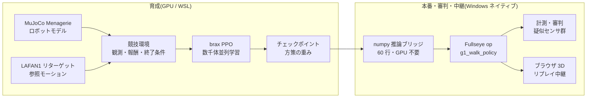
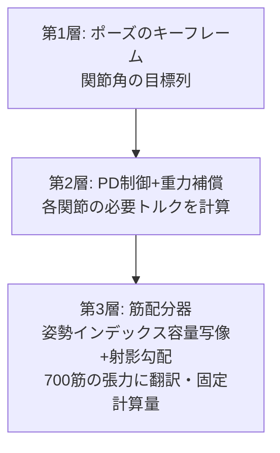
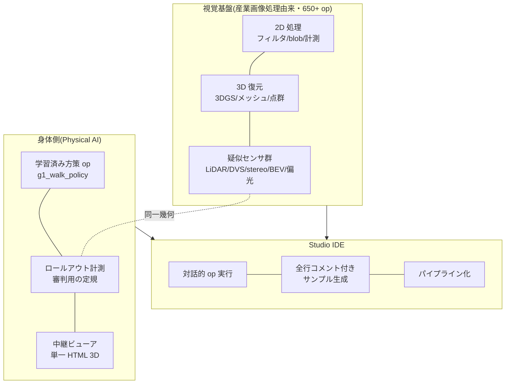

2025 年,人形机器人的半程马拉松在中国北京开跑;夏天,第一届世界人形机器人运动会举行,双足机器人赛跑、踢足球、跳起了舞。而恰好就在写这篇文章的今天(2026 年 8 月 22 日),**第二届世界人形机器人运动会正在北京的国家速滑馆开幕**。本届有 16 个国家、666 支队伍、2,056 台机器人,项目 51 个(比第一届的 26 个几乎翻倍),据说最大看点是"排除遥控操作的完全自主组别"(数字的出处汇总在 16.0 节的调查表里)。一边追着新闻,我一直在想一件事。

(注: 图内文字为日语原版,含义见图下说明。)

**"这个,我想以个人之力办一场。"**

当然,我准备不出能摆下 500 台实体机器人的场馆。预算不够,场地不够,还有家人的理解也不够。但是,我手边有一台装了一块 GPU 的 PC。在物理仿真里建起赛场、培养选手、举行比赛、设置裁判、向观众席(浏览器)转播 — **把构成一场运动会的全部要素,都在自己的书桌上做出来**,这应该是可以做到的。

这篇文章,就是那场"家庭人形机器人运动会"的举办记。同时,它也是一篇开发记:我一边带入本职工作图像处理(工业机器视觉)的经验,一边**尝试打造 Physical AI 的集成开发环境(IDE)**。在比赛的幕后,裁判的目光(测量与作弊检测)、转播设备(浏览器 3D 查看器)、选手的培养环境(强化学习流水线),全部汇入同一个工具箱 — 自制视觉工具包 **Fullseye**。

这是一篇很长的文章。我在写的时候特意让它既可以当读物从头读到尾,也可以从目录里只挑比赛跳着读。


*大会海报(插图由图像生成 AI(Gemini)绘制。因为文字容易乱码,采用先生成带空白横幅的图、再自己填入文字的方式)*

> **关于创意与实现的归属(开篇先写明)**
> 这篇文章里出现的方向性判断与创意(运动会这个企划本身、贴合实机传感器的观测设计、引入事件相机式的时间差分、肌肉骨骼的"相反+共收缩"双指令化、以部位为单位的简化、把训练好的策略做成 Studio op、浏览器转播……)由我提出,而实现・实验・测量的具体工作由 AI 编程智能体(Claude Code)来运转。**无论顺利的实验还是失败的实验,数字全部是实测值**。隐瞒失败会坑到下一个自己,所以输掉的比赛也按输掉的样子照登。另外,正文的第一人称"我"是判断与定方向的主语,但在发现的瞬间,人与 AI 的边界有时是模糊的。无法断定归属的表述,请按"我和 AI 作为一个团队"的意思来读 — 不给主语脸上贴金,也是 honest disclosure(诚实披露)的一部分。

## 这篇文章的读法(3 条路线)

文章非常长,所以先上路线指南。

- **5 分钟路线(只看动作)**: 一边滚动页面一边只看视频(GIF)就好。直线行走的完赛、障碍赛、67 台机器人的入场式、700 肌人体的姿势、直到站立时崩溃的画面,只看动作也能明白故事的骨架,我是按这个思路排布的。
- **30 分钟路线(正文)**: 第 1〜15 章。运动会的举办记+失败谈+开发记。各章末尾的"🍙 通俗讲解角",是你觉得正文太硬时的避难所。
- **全套路线(到资料篇为止)**: 附录 A〜G。实验的全记录、67 台机器人名鉴、传感器图鉴、教训集、术语集、op 全索引、未来资料集。当作词典,需要时再来查。

# 目录(竞赛日程)

1. 开幕式 — 为什么要以个人身份办运动会
2. 术语表 — 先通俗讲解一遍
3. 场馆建设 — 物理仿真与 GPU
4. 选手入场 — Unitree G1 与自制 700 肌人体 evis
5. 项目 1: 赛跑(20m 直线) — 从三连败到"原来它看不见白线"的一击
6. 项目 2: 障碍赛 — 伪 LiDAR 与一维事件相机
7. 项目 3: 团体操 — 用关键帧驱动 700 条肌肉
8. 项目 4: 平衡木(静止站立) — 最不起眼的项目,却最难
9. 裁判团 — 图像处理工程师打造的"识破作弊的仪表"
10. 转播站 — 只靠浏览器运行的 3D 回放
11. 迈向集成开发环境 — Fullseye Studio 这个野心
12. 举办要项 — 个人办赛用的配置清单
13. 面向未来 — "把最前沿仿真出来"这种玩法
14. 混进这场运动会的学科们 — 从 DNA 到光学
15. 番外项目 — 手臂・天空・灵巧手・筷子(全部是真实物理)
16. 闭幕式与下一个项目
附录 A〜I — 实验编年史 / 机器人名鉴(67 台)/ 传感器图鉴 / 教训集 / 扩展术语表 / Fullseye op 全索引(1,606)/ 未来资料集 / 训练日志实测摘录 / FAQ

---

# 1. 开幕式 — 为什么要以个人身份办运动会


*插图: 由图像生成 AI(Gemini)绘制。画面里有摔倒的选手这一点,与本文内容完全一致*

我觉得北京大会有趣的地方,在于它问的不是"能不能走",而是"**能不能成为比赛**"。单论行走,从 2015 年 DARPA Robotics Challenge 那时起,机器人就已经在(边摔边)走了。成为比赛,意味着比拼速度、遵守赛道、存在失格条件、留下记录。也就是说,**测量与规则**进了场。

为免误解先写清楚:这完全不是"个人要战胜中国"的故事。那样的规模与速度,尤其是"让机器人跑一场马拉松吧""干脆办一场运动会吧"这种**自由的想象力本身,是值得坦率学习的东西**。我想做的不是竞争,而是把那份激励翻译成自己够得着的形式试一试。而且重要的是,**能完成这种翻译的时代已经到来**:开放的模型、数据和计算资源,真的能在个人的书桌上咬合运转。被激励的一方,可以不再只当观众。我觉得这是一件相当有希望的事。

我平时是做工业图像处理的人,在工厂检测设备的世界里,"测不了的东西就改进不了""要怀疑测量方法"是家训。开始玩用强化学习(Reinforcement Learning)培养机器人之后,我很快发现这两个世界有着相同的骨架。**奖励(得分)的设计就是检测标准的设计,而智能体是必然会钻标准空子的被检对象**。所以运动会这个框架看似玩笑,实则本质。竞赛规则(奖励・终止条件)、计时与测量(日志与 rollout=让策略从头到尾跑完一次的完整试跑)、兴奋剂检测(作弊检测)、以及面向观众的转播(可视化)。这些全部做出来,运动会才能成立。

也写一下由个人来办的意义。大赛上机器人的控制是各公司的独门秘方,但**仿真里的运动会,模型、数据、训练代码全都可以用开放的东西组起来**。我用的是 MuJoCo(物理引擎)、MuJoCo Menagerie(机器人模型集)、Unitree 官方的 LAFAN1 重定向动作(HuggingFace 公开。原始数据来自 Ubisoft La Forge,CC BY-NC-ND 4.0 非商用许可 — 详见文末致谢)、brax/MJX(GPU 物理与训练),以及自制代码。只要有一块 GPU,任何人都能在家建起赛场的时代,真的来了。

# 2. 术语表 — 先通俗讲解一遍

为了方便你在读正文时随时翻回来,先把主要术语汇总在这里。格式是"术语(English) — 一句话定义 → 通俗讲解"。

- **强化学习(Reinforcement Learning, RL)** — 通过试错与奖励习得行为的学习方法。→ 像训狗:握手成功就给零食。只不过它比狗精于算计得多,会全力钻零食规则的空子。
- **策略(policy)** — 以状态为输入、输出动作的函数,是训练的成果物。→ 选手"身体动作习惯"本身。本文的策略是个小型神经网络(约 4 层×32 单元)。
- **奖励(reward)** — 每一步给出的分数。→ 比赛的评分规则。这里的设计失误必然会被利用。
- **观测(observation)** — 展示给策略的输入向量。→ 选手的五感。**不在其中的东西,对选手来说就不存在**(本文最大的教训)。
- **PPO(Proximal Policy Optimization)** — 经典的强化学习算法。→ "一次不做极端改变,一点点扎实进步"的练习法。
- **训练步数与"26M""150M"记法** — 本文用"训练步数"表示选手的成长程度,M 是百万(mega)的意思。26M = 2,600 万步,150M = 1 亿 5,000 万步。**与距离的米(小写 m,如"前进 20.5m")是两回事**,请按"带大写 M 的大数字是练习量,小写 m 是距离"来区分。→ 用社团活动打比方,就是"挥棒素振第 2,600 万次的时间点"这种说法。
- **模仿学习的参考动作(reference motion / mocap)** — 记录人类动作并映射到机器人关节上的"示范"。→ 舞蹈的示范录像。LAFAN1 是其公开数据集,Unitree 为自家机器人做了官方转换。
- **残差控制(residual control)** — 在示范关节角上,策略只叠加小的修正量(残差)的方式。→ "编舞要遵守,但平衡调整自己来"。不让它从零发明动作。
- **POMDP / 部分观测** — 只能观测到环境状态一部分的情形。→ 蒙眼走钢丝。项目 1 的败因。
- **伪 LiDAR(pseudo-LiDAR)** — 在仿真内发射光线测距的虚拟传感器。→ 蝙蝠的超声波。用计算模仿实机 LiDAR(激光测距仪)的性质。
- **事件相机(event camera / DVS)** — 只输出亮度"变化"的相机。→ 拍不了静止画面,却对"动的东西"超敏感的眼睛。本文自制了一维版。
- **肌肉骨骼模型(musculoskeletal model)** — 关节不靠马达、而靠"肌肉张力"驱动的人体模型。→ 不是机器人,而是解剖学的人体。evis 拥有 700 条肌肉。
- **力矩(torque)** — 使关节转动的力矩。**肌肉不能推,只能拉**(我们为此输过一场)。
- **WBC-QP(基于二次规划的全身控制, Whole-Body Control via Quadratic Programming)** — "在满足物理条件的前提下,最优地决定全部关节加速度与接触力"的控制经典套路。→ 每一瞬间都用数学优化求解全身的力分配。
- **MJX / brax** — MuJoCo 的 GPU 并行版,以及其上的训练框架。→ 同时建几千座赛场、让几千名选手同时练习的技术。
- **XLA** — 面向 GPU 的计算编译器。→ 场馆的施工队。不符合其拿手工法(固定形状的矩阵计算)的图纸(700 条肌肉的稀疏张力计算)不给建 — 这个限制在后面会发威。

# 3. 场馆建设 — 物理仿真与 GPU

场馆整个都是软件。构成如下。



- **物理引擎**: MuJoCo。在接触计算的可靠性与速度之间取得平衡,是当下机器人学习的事实标准。
- **并行化**: MJX(MuJoCo 的 GPU 版)+ brax 的 PPO 实现。在 GPU 上同时建起几千座赛场,让同一选手的副本一齐奔跑,把所有人的经验汇总起来学习。
- **硬件**: RTX 5090(32GB)一块。本文的训练是 2 个项目同时跑,**合计约 9,700 训练步/秒**(把显存分配各压到 0.35 共存)。一个项目的练习(约 1 亿步)大约 3〜4 小时。傍晚布置好练习,晚饭后看结果 — 生活节奏就变成了这样。基本上是洗完澡边看摔倒视频边叹气的角色。
- **训练在 Linux 侧(WSL),其余在 Windows 侧**的分工。因 JAX/XLA 的缘故,训练靠向 WSL,测量・可视化・文章图表制作则用 Windows 原生的 Python。这个分工成了后述"numpy 推理桥"的动机。


*图: 本文的训练吞吐量实测。单块 GPU 同居 2〜3 个训练,每个仍有 8,000〜10,000 步/秒。四足(另一套训练器)因单位体系不同放在单独面板(根据实测日志绘制)*

场馆建设中最先发威的限制,就是术语表里也写过的 **XLA 的拿手工法问题**。用马达转动关节的普通机器人(G1 等)可以在 GPU 上数千并行,但**由 700 条肌肉驱动的自制人体 evis,其肌张力计算上不了 XLA,无法 GPU 并行化**。因此 evis 的比赛在 CPU 上进行,将来要上 GPU 时,则使用"把肌肉替换为等价关节力矩的双胞胎(torque-twin)" — 这样的两手准备。可以理解为场馆里既有大体育场(GPU),也有小体育馆(CPU)。

> **🍙 通俗讲解角(场馆篇)**
> 游戏里的"物理引擎",在机器人研究中同样充当场馆。马里奥跳起又落下,和机器人在这里摔倒,内部做的计算是同族的。区别在于认真程度:研究用物理引擎会以保险条款般的细致程度计算"接触瞬间的力"。而用上 GPU,就能把这座场馆复制几千份同时运行。相当于 1 台机器人的练习由 4,000 台同时进行。所以一晚上就能积累出人类数年份的练习量。

## 3.1 深挖: 场馆的地下设施 — 物理引擎在一步之内做了什么
(第 3 章"场馆建设"的增补)

仿真器不是"魔法盒子"。每调用一次 `mj_step()`,内部都会按固定顺序跑一串计算。这里我们打开盒盖,一起看看里面。

### 3.1.1 一步之内: 前向动力学流水线

MuJoCo 的一步,大致依次经过下列阶段(官方 docs 的 Computation 章 [^mjc-comp] 对每一段都有讲解)。

| 阶段 | 做什么 | 使用的算法 |
|---|---|---|
| 1. 前向运动学 | 由关节角度计算所有 body 的位置・姿态 | 沿树结构从根向叶传播 |
| 2. 偏置力 | 把重力・科里奥利力・离心力一并计算 | Recursive Newton-Euler(RNE) |
| 3. 惯性矩阵 | 计算"推哪个关节会动多少"的矩阵 M | Composite Rigid-Body(CRB) |
| 4. 碰撞检测 | 列举哪些几何体彼此接触 | broad-phase → narrow-phase |
| 5. 约束力求解 | 决定接触力・关节限位力・摩擦 | **凸优化**(后述) |
| 6. 数值积分 | 对加速度积分,把速度・位置推进一帧 | Euler / RK4 / implicit 系(后述) |

要点有两个。

**广义坐标(generalized coordinates)**。MuJoCo 不是把每个 body 的 xyz 坐标分开保存,而是用"关节角度的向量"表示全身状态。只要还由关节相连,body 在结构上就不用担心四散飞出。官方 docs 自我介绍说"MuJoCo pioneered the combination of simulation in generalized coordinates with optimization-based contact dynamics(开创了广义坐标仿真与基于优化的接触动力学的结合)" [^mjc-overview]。这是它与游戏物理引擎(直角坐标+用弹簧近似约束)最大的设计差异所在。

**前向动力学(forward dynamics)**。即"从当前施加的力,求下一瞬间的加速度"的计算。把运动方程 M(q)·q̈ = 外力 + 约束力,在凑齐上表的材料(M、偏置力、接触力)之后求解。

#### 通俗讲解: 翻页动画的一帧

仿真就是翻页动画。一步 = 一帧。每一帧重复"确认所有人的位置 → 调查谁和谁撞上了 → 决定相互推挤的力 → 用这个力把所有人挪动一点点"。在我们的 G1 训练中,一帧是 0.002 秒。1 秒行走的背后,上表的全部阶段要跑 500 帧。

### 3.1.2 接触为什么难 — 抛弃 LCP、选择凸优化的 MuJoCo

物理引擎最大的难关是"接触"。脚接触地面的瞬间,地面应该用多大的力推回来? 这其实是个出人意料地难以定义的问题。

经典的形式化是 **LCP(线性互补问题)**。把"接触力只能推(不能拉)""分离时力为零""摩擦在库仑锥之内"写成互补条件。然而带摩擦的 LCP 有时解不唯一,一般属于 NP 困难的类别。

MuJoCo 的作者 Todorov 等人在这里改变了思路。**通过稍微承认接触的"柔软",把整个问题转化成了凸优化**(IROS 2012 论文 [^todorov2012],以及 docs 的 Computation 章 [^mjc-comp])。docs 里明确给出了对偶问题的形式:

> f = argmin_λ ½ λᵀ(A+R)λ + λᵀ(a₀ − aᵣ)  subject to λ ∈ Ω

细节不必深究。重要的是 **(A+R) 正定 = 山谷只有一个**。也就是说,接触力作为"唯一的全局最优解",每次都给出相同的答案。不会像 LCP 那样"有时解得出有时解不出、答案还可能有好几个"。

其代价是 **soft contact(软接触)**。如 docs 的"Physical realism and soft contacts"一节所述,互补性不再严格成立,"接触力与接触法线方向的速度可以同时为正" = 允许轻微的陷入 [^mjc-comp]。但这不是缺陷而是设计思想:现实物体的接触面在微观上也在变形(放在被褥上的笔记本电脑会稍微下陷吧)。它的立场是,"完全刚体的接触"反而才是物理上的虚构。

此外,凸形式化还有副产品。docs 说"uniquely-defined inverse(逆动力学被唯一定义)" [^mjc-overview]。能够反算"实现这个动作需要什么力",是这个引擎在最优控制・机器人学研究中被选中的原因之一。

#### solref / solimp — 用"弹簧和阻尼的语言"指定接触的硬度

那么"软到什么程度"怎么决定? 就是 XML 里常见的 `solref` 和 `solimp`(docs 的 Modeling 章"Solver parameters"节 [^mjc-solver])。

| 参数 | 含义 | 直觉 |
|---|---|---|
| `solref = (timeconst, dampratio)` | 把约束重参数化为质量-弹簧-阻尼系统 | timeconst = 陷入恢复的速度,dampratio = 1 则不反弹、顺滑归位(临界阻尼) |
| `solimp = (d₀, d_width, width, midpoint, power)` | 阻抗 d ∈ (0,1) = 以陷入量的函数指定"约束发力的能力" | d 小 = 弱(软)约束,d 大 = 强(硬)约束 |

借用 docs 的话,solref 是"用时间常数与阻尼比这种质量-弹簧-阻尼系统的语言对模型重参数化"的东西,solimp 的 d 则是"small values of d correspond to weak constraints while large values of d correspond to strong constraints" [^mjc-solver]。也就是把优化求解器内部抽象的正则化项,翻译成人类能有直觉的"弹簧多硬・阻尼多强"的接口。接触抖个不停的时候、脚往下陷的时候,我们摆弄的其实就是这两个参数。

### 3.1.3 积分器与时间步长 — 为什么肌肉和肌腱会"爆炸"

上表的最后一段,数值积分有多个选项(docs "Numerical Integration"节 [^mjc-comp])。

| 积分器 | 特点 | 适用与否 |
|---|---|---|
| Euler(semi-implicit) | 只对关节阻尼做隐式处理的半隐式欧拉 | 标准。快 |
| RK4 | 4 阶龙格-库塔。一步评估 4 次 | 擅长能量守恒系。成本 4 倍 |
| implicit | 连速度依赖力(含科里奥利・离心力)的微分也隐式处理 | 最稳定。需要 LU 分解 |
| implicitfast | 从 implicit 中省去科里奥利系微分的版本 | docs 推荐。用 Cholesky,更快 |

"隐式(implicit)"是什么。显式积分是"用现在的力决定下一个位置";隐式积分是"解联立方程,让下一瞬间的状态自洽后再前进"。前者快,但**存在硬弹簧(变化快的力)时,力会在一帧之内失控而发散**。这就是数值"爆炸"的真面目。

肌肉・肌腱(腱)正是这种"硬弹簧"的集合体。肌肉的被动弹性・肌腱的张力,稍一伸长力就大变 = 时间常数短。时间步长 dt 比那个时间常数粗的话,一帧之内"高估力 → 冲过头 → 反方向出现更大的力 → …"的振荡会被放大。evis(肌肉驱动人形)要求比 G1 更小的 dt,不是怠慢,而是数学上的必然。docs 也说,在速度依赖力占主导的系统里,implicit 系比 RK4"稳定性大幅提高(significantly more stability)",并明言**时间步长是"或许是唯一最重要的参数(perhaps the single most important parameter)"** [^mjc-comp]。

#### 通俗讲解: 掉帧的翻页动画

硬弹簧与粗 dt 的组合,就像"用省帧数的翻页动画去画剑道的击面"。竹刀尖端在一帧之内大幅移动,抽掉帧就画不出轨迹,画面崩坏。慢慢走路的场景抽帧没关系。**dt 要按"动得最快的东西"来选** — 这就是数值稳定性的一行总结。

### 3.1.4 MJX — 把 MuJoCo 改写成 GPU 的语言

训练需要几千万步。一个 CPU 的 MuJoCo 会跑到天荒地老。于是 **MJX** 登场。

MJX 是把 MuJoCo **用 JAX 重写的**实现。据官方 docs [^mjx],其目标是"让 MuJoCo 跑在 XLA 编译器支持的一切计算硬件上"。用 JAX 的 `vmap`(自动向量化)把同一场景排出几千份,一并灌入 GPU 的 SIMD 运算单元。按 docs 的表述,MJX 擅长的是"simulating big batches of parallel identical physics scenes using algorithms that can be efficiently vectorized on SIMD hardware(用可在 SIMD 硬件上高效向量化的算法,对相同物理场景做大批量并行仿真)" — 正是为 RL 而生的引擎。

不过 GPU 化不是免费的。docs 诚实写下的限制 [^mjx]:

- **不擅长分支(branching)**: "accelerators exhibit poor performance for branching code(加速器跑分支代码性能差)"。碰撞检测的 broad-phase 是充满"跳过不相邻物体对"分支的处理,在 GPU 上往往变成对所有对老老实实全算一遍。
- **不擅长可变长度**: XLA 在编译时固定数组尺寸。接触数量每步都在变,MJX 却始终按"最大接触数"预留内存来计算。CPU 版"今天接触 3 件"就能收工的地方,GPU 版每次都按满座计算。
- **网格要轻**: 碰撞网格推荐"200 顶点左右以下"。
- **只跑 1 个反而慢**: 单场景下"MJX-JAX can be 10x slower than MuJoCo(可能比 CPU 版 MuJoCo 慢 10 倍)"。MJX 的价值不在单个的速度,而在**同时跑 4096 个也和跑 1 个相差不大**的吞吐量。

(补充: 2026 年当下的 docs 中,MJX 分成了两个系列。JAX 重实现的 MJX-JAX(可自动微分)与更快但不支持自动微分的 MJX-Warp [^mjx]。本文训练用的是 JAX 系的流水线。)

#### brax PPO 的训练循环

与 MJX 搭档使用的是 **brax** [^brax] 的训练算法实现。brax 是基于 JAX 的物理引擎+训练库,如 README 所述,内置 PPO / SAC / ARS / 进化策略等实现。其 PPO 的一个循环这样转:

1. **rollout**: 在数千个并行环境中让当前策略跑一小段(unroll),收集 (观测, 动作, 奖励)
2. **GAE**: 从收集的奖励估计 advantage(该动作比平均好多少)(第 2 部分详述)
3. **minibatch SGD**: 把数据切成 minibatch,用 PPO 的带裁剪目标函数把策略网络与价值网络更新数个 epoch
4. 用新策略回到 1

这个循环的全部 — 物理仿真也好神经网络更新也好 — 都被 JIT 编译(执行前统一转换成 GPU 用代码),**一次也不从 GPU 上下来**地运转,这就是 MJX + brax 组合速度的源泉。CPU↔GPU 之间数据传输这个最大瓶颈消失了。

#### 第 1 部分出处

[^mjc-comp]: MuJoCo 官方 docs, Computation 章(流水线・凸优化・soft contact・积分器): https://mujoco.readthedocs.io/en/stable/computation/index.html
[^mjc-overview]: MuJoCo 官方 docs, Overview(广义坐标・凸接触・唯一的逆动力学・肌腱): https://mujoco.readthedocs.io/en/stable/overview.html
[^mjc-solver]: MuJoCo 官方 docs, Modeling 章 Solver parameters(solref / solimp): https://mujoco.readthedocs.io/en/stable/modeling.html#solver-parameters
[^todorov2012]: Todorov, Erez, Tassa, "MuJoCo: A physics engine for model-based control," IROS 2012: https://doi.org/10.1109/IROS.2012.6386109
[^mjx]: MuJoCo 官方 docs, MJX 章(JAX/XLA・批量并行・分支/可变长度的限制): https://mujoco.readthedocs.io/en/stable/mjx.html
[^brax]: google/brax(JAX 物理引擎 + PPO/SAC 等训练实现): https://github.com/google/brax

---

## 3.2 深挖: 场馆的历史 — 物理仿真器的谱系
无论进化还是 RL,提供淘汰之"世界"的都是物理引擎。这 25 年里,世界这一侧也发生了剧烈进化。

### 3.2.1 年表: 7 代物理引擎

| 年 | 引擎 | 用 2〜3 行说 | 出处 |
|---|---|---|---|
| 2001 | **ODE** | Russell Smith 公开的开源刚体动力学库(初版 2001-05-08)。具备关节・接触・碰撞检测,作为研究用仿真器(Gazebo 等)的标准部件开创了一个时代 | [^ode] [^ode-wiki] |
| 2000s | **Bullet** | Erwin Coumans 主导。出身游戏・VFX 的碰撞检测+多体物理。Python 绑定 PyBullet 成为深度 RL 早期的经典环境 | [^bullet] |
| 2000s〜 | **PhysX** | NVIDIA 的实时物理 SDK。在游戏市场千锤百炼,其 GPU 实现后来成为 Isaac Gym 的心脏。现已开源 | [^physx] |
| 2012 | **MuJoCo** | Todorov・Erez・Tassa "MuJoCo: A physics engine for model-based control"(IROS 2012)。广义坐标+基于凸优化的接触这一研究特化设计 | [^mujoco-paper] |
| 2021-22 | **MuJoCo 被收购→OSS 化** | DeepMind 收购后免费公开(2021-10-18),接着以 Apache-2.0 开源全部代码(2022-05-23)。研究标准引擎进入"谁都可以拥有"的状态 | [^mujoco-blog1] [^mujoco-blog2] [^mujoco-gh] |
| 2021 | **Isaac Gym** | Makoviychuk 等(NVIDIA)。物理和奖励计算**全部在 GPU 上**运转,一块 GPU 同时仿真数千环境。把 RL 的数据收集改变了一个数量级 | [^isaacgym] |
| 2021-23 | **Brax / MJX** | JAX 系。Brax 是可微分物理引擎(Freeman 等 2021),MJX 是 MuJoCo 本体的 JAX 实现,只要是 XLA 能跑的硬件(GPU/TPU)就能写出千并行 | [^brax] [^mjx] |
| 2024 | **Genesis** | 以多物理场(刚体・流体・软体)+照片级渲染+高速 GPU 并行一体化为目标的新世代平台 | [^genesis] |

### 3.2.2 游戏物理与研究物理的分岔

这条谱系里有一道看不见的分水岭。**"60 fps 下不穿帮就算赢"的游戏物理**,与**"接触力不物理正确就没有意义"的研究物理**。

游戏物理(Bullet、PhysX 的出身)只要玩家看着自然,近似就无妨。把穿透推回去、把陷入糊弄过去、为了稳定性擅自削减能量 — 只要为了实时性,全都可以。这种取舍在庞大的游戏市场中锤炼了性能,结果也为研究供给了廉价的物理。深度 RL 早期的基准大多跑在 PyBullet 或 MuJoCo 的环境上,正是这份积累的恩惠。

研究物理(ODE 后期→MuJoCo)则相反,执着于**接触及其微分的正确性**。因为机器人的控制律正是由接触力的响应决定的,MuJoCo 选择用凸优化求解接触的来龙去脉,已在 3.1 节看过。分岔也体现在细节上。游戏物理优先"扛过当前帧",用与渲染帧同步的固定步长;研究物理则把时间步长・求解器迭代数・接触的柔软度全部暴露给用户,让你选择"这个近似丢掉了什么"。另外,MuJoCo 把能唯一计算逆动力学(反算这个动作需要的力)当卖点,而游戏物理里认真使用逆动力学的场景几乎不存在 — **谁曾是那个引擎的"客户"**,决定了 20 年后的设计思想。用在这里含糊其辞的仿真器训练出的策略,拿上实机的瞬间就会被 **sim-to-real gap**(reality gap)迎头痛击。域随机化(Tobin 等 2017 [^tobin])这种"故意让仿真器参数抖动、培养在哪个世界都行得通的策略"的处方,也正因为这个鸿沟在结构上不可避免才诞生(sim-to-real 的各论放在 6.5 节・6.6 节,这里只谈谱系上的定位)。

### 3.2.3 GPU 并行改变了 RL

Isaac Gym 论文(2021)[^isaacgym] 的冲击可以归结为一点。以往的 RL 是"物理在 CPU,学习在 GPU",CPU↔GPU 之间的数据运输是瓶颈。Isaac Gym 让物理仿真・观测・奖励计算**全部在 GPU 张量上**完结,一块 GPU 同时跑数千环境。同年 Rudin 等人的 "Learning to Walk in Minutes Using Massively Parallel Deep Reinforcement Learning" [^rudin] 展示了用这套机制,四足机器人 ANYmal 的行走策略可以在**单台工作站 GPU・数分钟**内学成。这在以前是"集群跑好几天"的工作。

这不只是加速,而是改变了研究的作法。学习只要几分钟的话,奖励设计的试错就从"以天为单位的赌博"变成"冲杯咖啡工夫的实验"。我们能在家中一块 GPU 上把 G1 的奖励重做 12 代,正是 2021 年这次转折的恩惠。

MJX [^mjx] 与 Brax [^brax] 是同一思想的 JAX 版。把物理步写成 JAX 的函数,机器学习侧的作法 — `jit` 编译、`vmap` 捆出几千个环境 — 就能原样用于物理。Brax 更把**可微分物理** — "仿真结果可以对参数求微分" — 挂上招牌。从"摔倒的结果只能当奖励信号用"的世界,通往"哪个参数往哪边动就不会摔"的梯度(理论上)可以直接拿到的世界,这是一座桥。接触这类不连续现象的微分至今仍是难关,但谱系的下一个分岔点被认为就在这里。

不过 GPU 并行也有代价。为了把数千环境塞进一块卡,单环境的接触求解器被轻量化,复杂的闭环机构和大规模接触(例如 700 条肌肉)可能根本上不去 — 我们在 evis 上经历的"肌肉骨骼模型无法 GPU 化、绕道 torque-twin"一事,就是这个设计权衡的实例。"快的物理"与"什么都能表达的物理",还没有同居在同一个引擎里。

#### 通俗讲解: 体育馆里的 4,096 名学生

从前的 RL 是"工匠盯着 1 台机器人手把手教,再把日志邮寄给 GPU"的方式。GPU 并行物理是"在体育馆里排开 4,096 台,给所有人同时上同一堂课,当场连打分都做完"的方式。每台的授课质量相同,但一天收集到的经验量差着数量级。行走学习从"数周"变成"数分钟"的真相,不是教法的进步,而是**教室的巨型化**。

### 3.2.4 机器人学习基准的现状(2026)

现在"想让它走・想让它抓"的人最先接触的定番,各用一行。

- **MuJoCo Playground** [^playground] — 基于 MJX 的 GPU 并行环境集。四足・人形・操作类的 sim-to-real 取向任务齐全(我们 G1 行走的地基也属这一系)。
- **Isaac Lab** [^isaaclab] — Isaac Sim 上的机器人学习集成框架。NVIDIA 生态的现行正解,Isaac Gym 的继任位置。
- **ManiSkill** [^maniskill] — 基于 SAPIEN 的 GPU 并行仿真+渲染。擅长操作(manipulation)课题。
- **Genesis** [^genesis] — 不局限于刚体的多物理场与渲染整合的野心选手。因为新,生态仍在发展途中。

纵观下来可以看出:2012 年选择"研究物理的正确性"的 MuJoCo,与在游戏市场练出速度的 GPU 物理(PhysX 系),在 2020 年代以"GPU 并行 × 接触的正确性"合流 — 这就是现状。从用 ODE 让 1 台机器人踉跄行走的时代算起 25 年,如今在家中一块 GPU 里,数千台人形机器人正排着队不停摔倒。

---

#### 第 1 部分出处

[^sims-page]: Karl Sims, "Evolved Virtual Creatures," 1994(本人网站的解说页): https://www.karlsims.com/evolved-virtual-creatures.html
[^sims-paper]: Karl Sims, "Evolving Virtual Creatures," SIGGRAPH '94 论文 PDF(本人网站): https://www.karlsims.com/papers/siggraph94.pdf
[^sims-acm]: 同论文的 ACM DL 收录页(SIGGRAPH '94 Proceedings, pp.15-22): https://dl.acm.org/doi/10.1145/192161.192167
[^sims-video]: 影像 "Evolved Virtual Creatures"(Internet Archive): https://archive.org/details/sims_evolved_virtual_creatures_1994
[^sims-youtube]: 同影像(YouTube 转载版, "Karl Sims - Evolved Virtual Creatures, Evolution Simulation, 1994"): https://www.youtube.com/watch?v=JBgG_VSP7f8
[^es-wiki]: Wikipedia "Evolution strategy"(关于 Rechenberg・Schwefel 于 1960 年代创立的记述): https://en.wikipedia.org/wiki/Evolution_strategy
[^holland]: Wikipedia "John Henry Holland"(1975 年《Adaptation in Natural and Artificial Systems》): https://en.wikipedia.org/wiki/John_Henry_Holland
[^cmaes]: Hansen & Ostermeier, "Completely Derandomized Self-Adaptation in Evolution Strategies," Evolutionary Computation 9(2), 2001: https://doi.org/10.1162/106365601750190398
[^cmaes-tutorial]: Hansen, "The CMA Evolution Strategy: A Tutorial," 2016: https://arxiv.org/abs/1604.00772
[^cmaes-site]: CMA-ES 官方网站: https://cma-es.github.io/
[^neat]: Stanley & Miikkulainen, "Evolving Neural Networks through Augmenting Topologies," Evolutionary Computation 10(2), 2002: https://nn.cs.utexas.edu/downloads/papers/stanley.ec02.pdf
[^novelty]: Lehman & Stanley, "Abandoning Objectives: Evolution Through the Search for Novelty Alone," Evolutionary Computation 19(2), 2011: https://doi.org/10.1162/EVCO_a_00025
[^mapelites]: Mouret & Clune, "Illuminating search spaces by mapping elites," 2015: https://arxiv.org/abs/1504.04909
[^cully]: Cully, Clune, Tarapore & Mouret, "Robots that can adapt like animals," Nature 521, 2015: https://www.nature.com/articles/nature14422
[^openai-es]: Salimans, Ho, Chen, Sidor & Sutskever, "Evolution Strategies as a Scalable Alternative to Reinforcement Learning," 2017: https://arxiv.org/abs/1703.03864
[^wright]: Sewall Wright, "The roles of mutation, inbreeding, crossbreeding and selection in evolution," Proc. 6th Int. Congress of Genetics, 1932(原论文的复印 PDF): http://www.blackwellpublishing.com/ridley/classictexts/wright.pdf
[^landscape-wiki]: Wikipedia "Fitness landscape"(关于起源为 Wright 1932 的记述): https://en.wikipedia.org/wiki/Fitness_landscape
[^afterman]: Wikipedia "After Man: A Zoology of the Future"(Dougal Dixon, 1981): https://en.wikipedia.org/wiki/After_Man
[^cheney]: Cheney, MacCurdy, Clune & Lipson, "Unshackling evolution: evolving soft robots with multiple materials and a powerful generative encoding," GECCO 2013: https://doi.org/10.1145/2463372.2463404
[^xenobots]: Kriegman, Blackiston, Levin & Bongard, "A scalable pipeline for designing reconfigurable organisms," PNAS 117(4), 2020: https://doi.org/10.1073/pnas.1910837117

#### 第 2 部分出处

[^ode]: Open Dynamics Engine 官方网站(作者 Russ Smith): https://www.ode.org/
[^ode-wiki]: Wikipedia "Open Dynamics Engine"(初版发布 2001-05-08): https://en.wikipedia.org/wiki/Open_Dynamics_Engine
[^bullet]: Bullet Physics SDK(Erwin Coumans 等): https://github.com/bulletphysics/bullet3
[^physx]: NVIDIA PhysX SDK(开源仓库): https://github.com/NVIDIA-Omniverse/PhysX
[^mujoco-paper]: Todorov, Erez & Tassa, "MuJoCo: A physics engine for model-based control," IEEE/RSJ IROS 2012: https://doi.org/10.1109/IROS.2012.6386109
[^mujoco-blog1]: DeepMind Blog, "Opening up a physics simulator for robotics," 2021-10-18(收购与免费公开的公告): https://deepmind.google/discover/blog/opening-up-a-physics-simulator-for-robotics/
[^mujoco-blog2]: DeepMind Blog, "Open sourcing MuJoCo," 2022-05-23(全部代码开源的公告): https://deepmind.google/discover/blog/open-sourcing-mujoco/
[^mujoco-gh]: MuJoCo 仓库(Google DeepMind 维护): https://github.com/google-deepmind/mujoco
[^isaacgym]: Makoviychuk et al., "Isaac Gym: High Performance GPU-Based Physics Simulation For Robot Learning," 2021: https://arxiv.org/abs/2108.10470
[^rudin]: Rudin, Hoeller, Reist & Hutter, "Learning to Walk in Minutes Using Massively Parallel Deep Reinforcement Learning," 2021: https://arxiv.org/abs/2109.11978
[^genesis]: Genesis(Genesis-Embodied-AI): https://github.com/Genesis-Embodied-AI/Genesis
[^playground]: MuJoCo Playground(Google DeepMind): https://github.com/google-deepmind/mujoco_playground
[^isaaclab]: Isaac Lab 官方文档: https://isaac-sim.github.io/IsaacLab/main/index.html
[^maniskill]: ManiSkill(基于 SAPIEN): https://github.com/haosulab/ManiSkill
[^tobin]: Tobin et al., "Domain Randomization for Transferring Deep Neural Networks from Simulation to the Real World," 2017: https://arxiv.org/abs/1703.06907

# 4. 选手入场


*图: 主力 5 位选手的身高对比(比例尺严格统一,带 1.0m/1.8m 基准线。背景明暗来自各自场景)。从左到右为 G1、H1、Go2、Spot、evis(仿真渲染)*

## 选手 1: Unitree G1(市售人形机器人的仿真模型)

在北京大会上大显身手的 Unitree 公司小型人形机器人,其官方仿真模型收录在 MuJoCo Menagerie 中。身高约 1.3m,**驱动关节 29 个**。重要的是,**实机真实存在于这个世界上**。只要把观测对齐实机传感器,在仿真中培养的策略,原则上就有一条通往实机的道路(如后文所述,观测设计从一开始就对齐了实机传感器配置)。


*图: Unitree G1(官方仿真模型,驱动 29 关节)*

示范动作使用 Unitree 官方公开的 **LAFAN1 重定向数据集**(HuggingFace: `lvhaidong/LAFAN1_Retargeting_Dataset`)。这是把人类动作捕捉转换到 G1 的 29 个关节上的、30fps 的关节角时间序列。我们从中切出行走 1 个周期(通过膝角度的自相关检测为 30 帧),闭合成平滑衔接的循环,去除偏航(朝向)分量,加工成笔直行走的参考(1.47m/s)。

## 选手 2: evis(自制 700 肌的解剖学人体)

另一位选手不是买来的机器人,而是**用解剖学数据组建的肌肉骨骼人体模型**。自由度 84(nq=85),**肌肉执行器 700 条**。骨骼基于文献的人体惯性参数,肌肉则作为带起点・止点・途经点的张力元素种植其上。一台马达都没有。抬起上臂的是三角肌,弯曲肘部的是肱二头肌。


*图: evis 全身。靠骨骼与 700 条肌肉(红色纤维)运动(仿真渲染)*

为什么要培养这么麻烦的东西? 因为考虑到护理和生活支援时,**以与人相同的结构运动的东西,能够解释人类动作的"理由"**。再说,既然要办运动会,总得有一位本地代表的自家选手吧。


*图: Unitree H1(大型人形机器人,驱动 19 关节)*

## 选手 3(报名手续办理中): Unitree H1,以及"全项目・全选手"构想

在写这篇文章的幕后,为 G1 组建的培养流水线正在推进 **H1(大型人形机器人)适配**。LAFAN1 重定向也有 h1 版,预计只要替换转换器和机器人配置就能参赛。再往前一步,我们已开始对 Menagerie 收录的**全部机器人(含四足・机械臂・灵巧手・无人机共 67 个模型)做盘点**。


*视频: H1 回放 LAFAN1 重定向示范动作的样子(运动学回放 = 还不是靠物理在行走,而是接下来要通过训练让它"真正能走"的前置阶段。10.5m 区间,仿真)*
今后打算把项目扩展到四足组、操作组、飞行组,办成名副其实的"综合运动会"。


*图: 全部 67 位选手的合影(把各机的实测渲染分栏合成的"合成照片"— 并非同处一个场景)*


*视频: 全 67 个模型的入场式(每台 0.5 秒,按人形 → 四足 → 机械臂 → 灵巧手的顺序。MuJoCo Menagerie,仿真)*


## 4.1 深挖: 选手名鉴・实机篇 — 价签降了 2 个数量级


*图: 人形机器人价格的走势(对数轴,各公司公布・报道值)。5 年降了 2 个数量级(根据公开数据绘制)*
### 4.1.1 主角: Unitree G1 — 本文仿真的正主本人

本系列的主角,宇树科技(Unitree Robotics,杭州)的 G1。官方页面
(<https://www.unitree.com/g1>)记载的主要规格如下(2026-08-22 查阅)。

| 项目 | 公称值 | 备注 |
|---|---|---|
| 身高 | 1320 mm(站立) | 折叠时约 690 mm(报道值) |
| 质量 | 约 35 kg(含电池) | |
| 自由度 | 23(基本)/ 23〜43(G1 EDU) | 腿 6×2 + 臂 5×2 + 腰,EDU 因灵巧手等而增加 |
| 膝关节最大力矩 | 90 N·m(G1)/ 120 N·m(EDU) | |
| 电池 | 13 串锂电池,9000 mAh | 续航约 2 小时(报道值) |
| 传感器 | 3D LiDAR + 深度相机 | 头顶的 Livox Mid-360 + Intel RealSense D435i 为代表性配置 |
| 价格 | US $13.5K〜(官方页面,不含税・运费) | 发布时(2024-05)报道为 $16K |

- 发布时的报道: The Robot Report「Unitree Robotics unveils G1 humanoid for $16K」(2024-05)
  <https://www.therobotreport.com/unitree-robotics-unveils-g1-humanoid-for-16k/>
- 也收录于 IEEE 的 ROBOTS 指南: <https://robotsguide.com/robots/unitree-g1>

正文里影响了奖励设计的"膝 90 N·m""23 DOF""Mid-360 + D435i",
全都以这份公称规格为依据 — **让仿真的观测设计对齐实机传感器**
(故事线 B)这个方针,就是看着这张表定下来的。

### 4.1.2 大师兄: Unitree H1 — 1500m 金牌得主

H1 是 Unitree 2023 年推出的全尺寸机。官方页面(<https://www.unitree.com/h1>)的
公称值(2026-08-22 查阅):

| 项目 | 公称值 |
|---|---|
| 身高 / 质量 | 约 180 cm / 约 47 kg |
| 自由度 | 每腿 5 + 每臂 4(可扩展) |
| 关节力矩 | 膝 360 N·m,髋关节 220 N·m,踝 59 N·m,臂 75 N·m |
| 移动速度 | 3.3 m/s(公称为电动人形机器人的速度纪录),潜力 >5 m/s |
| 价格 | 官方页面未标注。直销页面的报价为 $90,000(报价基准,依配置而定)<https://shop.unitree.com/products/unitree-h1> |

**大赛战绩(这对一篇"运动会"文章来说是最香的部分)**: 2025 年 8 月 15〜17 日在北京举办的
第一届世界人形机器人运动会(World Humanoid Robot Games)上,H1
**以 6 分 34 秒 40 赢得 1500 m 跑冠军**(开赛首日就拿下大会第 1 枚金牌),**400 m 也以 1 分 28 秒 03 夺金**。
Unitree 在整个大会共获得含 4 金在内的 11 枚奖牌。

- Robotics 24/7「Unitree H1 earns two gold medals at World Humanoid Robot Games」
  <https://www.robotics247.com/article/unitree_h1_earns_two_gold_medals_at_world_humanoid_robot_games>
- Unitree 官方 X(1500m 6:34.40 的一次发布)
  <https://x.com/UnitreeRobotics/status/1956231617372152139>
- South China Morning Post(大会整体的奖牌统计,280 支队伍 / 16 个国家 / 26 个项目)
  <https://www.scmp.com/tech/tech-trends/article/3322251/chinas-unitree-x-humanoid-top-medal-total-worlds-first-humanoid-robot-games>

人类的 1500m 世界纪录是 3 分 26 秒(H. 埃尔格鲁杰),所以 H1 还不到人类顶尖配速的一半。
即便如此,"双足机器人不摔倒跑完 1500m 并争夺名次"的时代在 2025 年到来,这件事本身,
就为正文第 4 章的入场式(MuJoCo Menagerie 67 台)提供了现实的背书。
另外,本文 H1 GIF(`h1_lafan_parade.gif`)所用的 LAFAN1 重定向数据,
同样来自 Unitree 官方发布(HF `lvhaidong/LAFAN1_Retargeting_Dataset`)。

### 4.1.3 世界选手名鉴(一句话简介)

每位 2〜3 行+出处。**价格都会随配置・时点大幅变动,请只读"数量级"**。

**Tesla Optimus(美)** — 身高 173 cm・57 kg(AI Day 2022 公布值)。Musk 的目标价格
$20,000〜30,000 是"量产走上正轨之后"的目标值,2026 年时点尚未发售,处于 Tesla 工厂内的
试验运用阶段。<https://www.tomsguide.com/news/elon-musk-demos-the-human-like-optimus-tesla-bot-and-it-walks-on-its-own>(AI Day 演示报道)

**Figure 03(美 Figure AI)** — 2025-10-09 发布的第 3 代。首个明言投入家庭的设计,
布面外壳・无线充电・指尖 3 克的触觉传感器,在专用工厂 BotQ 建立年产 1.2 万台的量产体制。
价格未公布(报道推测超 $100K)。官方发布:
<https://www.figure.ai/news/introducing-figure-03>

**Boston Dynamics 新 Atlas(美,现代汽车旗下)** — 2024 年从液压转向全电动。
官方规格为 56 DOF・身高 1.9 m・90 kg・臂展 2.3 m・瞬时 50 kg / 连续 30 kg 负载・IP67。
以 Hyundai 工厂的零件排序作业为首个试点,2026-01 的 CES 上发布了产品版。
<https://bostondynamics.com/atlas/>

**Apptronik Apollo(美)** — 身高 5'8"(约 173 cm)・160 lb(约 73 kg)・25 kg 负载・
电池 4 小时,可更换。面向物流・制造。官方:
<https://apptronik.com/apollo/apollo-2> / 发布新闻稿:
<https://apptronik.com/news-collection/apptronik-unveils-apollo>

**Fourier GR-3(中国・上海,傅利叶)** — 身高 165 cm・71 kg・全身 55 DOF・12 DOF 灵巧手。
不愧是康复设备出身的公司,主打"Care-bot"(护理・对话关怀),卖点是布面外壳与
视听触觉的多模态交互。官方文档:
<https://support.fftai.com/en/docs/GR-X-Humanoid-Robot/GR3/GR-3_Introduction/>

**Booster T1(中国・北京,加速进化)** — 30 kg・23 DOF(扩展 41)的面向开发者小型机。
是 RoboCup 2025 AdultSize 冠军队(清华 Hephaestus)的机体平台,50 多所
大学队伍采用。官方价格为询价制,代理商标价 $30K 前后(2026 年时点)。官方:
<https://www.booster.tech/> / RoboCup 战绩报道:
<https://botinfo.ai/articles/booster-t1-robot>

**Tiangong / 天工(中国・北京,X-Humanoid = 北京人形机器人创新中心)** — 2025-04-19,
Tiangong Ultra 以 2 小时 40 分 42 秒跑完世界首个人形机器人半程马拉松(北京亦庄,21.0975 km)
并夺冠。身高约 1.8 m・约 55 kg,峰值时速 12 km。
CGTN 报道: <https://news.cgtn.com/news/2025-04-19/-Tiangong-Ultra-wins-world-s-first-ever-humanoid-robot-half-marathon-1CHdanwJVzG/p.html> /
北京市政府英文网站: <https://english.beijing.gov.cn/latest/news/202504/t20250421_4070140.html>

**UBTech Walker S2(中国・深圳,优必选)** — 首个实现"自己换电池 24 小时工作"的
产业机(换电约 3 分钟,不停机)。已进入 NIO・BYD 等工厂,2025-11 开始量产。
官方: <https://www.ubtrobot.com/en/humanoid/products/walker-s2> / 报道:
<https://cnevpost.com/2025/07/17/ubtech-humanoid-robot-autonomous-battery-swap/>

**AgiBot / 智元 A2(中国・上海)** — 身高 175 cm・55 kg,热插拔电池续航约 2 小时。
面向接待・物流,据报道截至 2025 年底累计出货 5,168 台(按出货量主张世界第一)。
官方: <https://www.agibot.com/> / 收录:  <https://humanoid.guide/product/a2/>

**Unitree R1(中国・杭州)** — 身高 121 cm・约 25 kg・26 DOF。2025-07 的世界人工智能大会上
以 **$5,900** 的冲击性价格发布的面向开发者轻量机。
<https://roboticsandautomationnews.com/2025/07/29/shock-price-unitree-launches-5900-humanoid-robot/93357/>

### 4.1.4 用数字看"价格正按数量级下降"

按发布时期排列,人形机器人的入手价格在这 3 年里降了 **2 个数量级**:

| 年 | 机体 | 价格(发布・时点) | 出处 |
|---|---|---|---|
| 〜2023 | Agility Digit | 约 $250K(报道) | <https://standardbots.com/blog/tesla-robot>(对比表) |
| 2023 | Unitree H1 | 约 $90K(报价基准) | <https://shop.unitree.com/products/unitree-h1> |
| 2024-05 | Unitree G1 | $16K → 现官方 $13.5K〜 | <https://www.therobotreport.com/unitree-robotics-unveils-g1-humanoid-for-16k/> / <https://www.unitree.com/g1> |
| 2025-07 | Unitree R1 | $5,900 | <https://roboticsandautomationnews.com/2025/07/29/shock-price-unitree-launches-5900-humanoid-robot/93357/> |
| 2025 | Booster K1 | $5,000(RoboCup 冠军机谱系的普及版) | <https://www.humanoidsdaily.com/news/booster-robotics-launches-k1-robocup-champion-platform> |

当然,$90K 的 H1 和 $5,900 的 R1 在输出和负载上天差地别,
并不是"同样的东西变成了 1/15"。但"研究室能不能买一台"的门槛,
确实从**一辆车 → 二手车 → 小摩托**一路降了下来,这正是 2025 年大学队伍
能一齐涌向实机大赛(RoboCup AdultSize、WHRG)的直接原因。

> **通俗讲解**: 和个人电脑的历史走着同一条路。大型机(数亿日元)→
> 小型机(数千万)→ PC(数十万),每降一个数量级,"摸得到的人"就增加 100 倍,
> 软件随之爆发。人形机器人现在正处在"小型机 → PC"的台阶上。
> $5,900 是第一个"用买高端 PC 的感觉就能买人形机器人"的价格,
> 而且像本文这样,**买不起的人也能在仿真器里训练同款机体(G1)**——
> 实机与仿真的两手准备,恰好相当于 PC 时代的"没有实机也能用模拟器开发"。

---

## 4.2 深挖: 选手们的家谱 — 双足行走机器人的 50 年
### 深挖增补文本: 双足行走机器人 50 年史 — 从 WABOT-1 到家里的 GPU


---

### 0. 先上年表 — 一张表看 50 年

| 年 | 事件 | 那个时代的突破(1 行) |
|---|---|---|
| 1968-72 | Vukobratović 等提出 ZMP 概念 [^zmp35] | "不摔倒"变得可以用数学式定义 |
| 1973 | 早稻田 WABOT-1 完成(世界首台全尺寸人形)[^robogaku][^waseda50] | 把行走・物体抓取・日语会话集成在 1 台上 |
| 1984 | WABOT-2 演奏电子管风琴 [^wabot2] | "专家机器人" — 读乐谱,为人的歌声伴奏 |
| 1986 | 本田绝密启动双足行走研究(E 系列)[^honda-st] | 从静态行走到动态行走,企业拿出了真本事 |
| 1990 | McGeer"被动行走"论文 [^mcgeer] | 零马达也能走下坡 — 行走是力学的固有模态 |
| 1996 | 本田 P2 发布 [^honda-p2] | 自立(内置电源・计算机)的人形机器人"平平常常"地走了 |
| 2000 | ASIMO 发布 [^miraikan-a] | 行走的实用级完成度与 20 年的公开展示 |
| 2002 | HRP-2 Promet(川田工业+产综研)[^hrp2] | 从摔倒中爬起 — 摆脱"倒了就结束" |
| 2003 | 索尼 QRIO 实现奔跑(吉尼斯"世界首台会跑的双足")[^qrio] / 梶田等的预观控制 [^kajita] | 娱乐机的完成度,与行走模式生成的标准理论 |
| 2006 | QRIO 开发中止 [^qrio] / Pratt 等的 Capture Point [^pratt] | 冬季时代的开始,与被推也不倒的理论 |
| 2009 | HRP-4C(产综研)[^hrp4c] | 人类尺寸・人类体型的行走与娱乐应用 |
| 2013-15 | DARPA Robotics Challenge [^drc-kaist][^drc-ieee] | 灾害应对暴露世界真实实力 — "摔倒集锦"的冲击 |
| 2016 | Atlas 的基于优化的控制(MIT/IHMC 系成果公开)[^kuindersma] | 用 QP/MPC 实时优化全身 |
| 2017 | Agility Cassie 开售 / 丰田 T-HR3 [^agility][^toyota-wiki] | 只做腿的取舍派,与遥操作全身的取舍派 |
| 2019 | RL sim-to-real 在实机上一锤定音(ANYmal)[^hwangbo] | 从"手写控制律"到"让它学习控制律" |
| 2021 | Cassie 靠 RL"看都不看"上楼梯 [^siekmann] | 仅本体感受+域随机化的胜利 |
| 2022 | ASIMO 退役 [^miraikan-p] / Cassie 100m 吉尼斯纪录 [^agility] | 一个时代的落幕,与下个时代的发令枪 |
| 2024 | 液压 Atlas 退役,电动 Atlas 发布 [^bd-atlas][^tc-atlas] / Unitree G1(1 万美元级)[^g1] | 研究的顶点走向商用,价格降了 2 个数量级 |
| 2025 | 北京举办世界首个人形机器人半程马拉松(4 月)[^cgtn]、世界人形机器人运动会(8 月)[^whrg][^cnbc] | 中国势力的数量与速度 — 500 台在同一会场竞技 |
| 2026 | 本田 P2 获 IEEE 里程碑认定 [^honda-ieee] | 30 年前的一步作为"历史"被正式铭刻 |

下面把这张年表当作故事重走一遍。

---

### 1. 早稻田的黎明(1970 年代)— 从一步 45 秒开始

1970 年,早稻田大学的加藤一郎研究室启动 WABOT 项目,1973 年 **WABOT-1** 完成。它是世界首台全尺寸人形机器人,能双足行走、用手抓取物体,甚至能进行简单的日语会话 [^robogaku][^waseda50]。不过行走是把重心始终放在脚底之上的静态行走,**一步要 45 秒** [^nikkei-w1]。

接下来的 WABOT-2(1980-84)转变了方向,瞄准"专家机器人"。用相机读乐谱,演奏电子管风琴,还能配合人的歌声伴奏 [^wabot2]。"挑一件需要人类灵巧与智能的工作做到极致"的方法论,现在看也很新鲜。

理论层面的地基几乎在同一时期来自南斯拉夫。Vukobratović 等人 1968 年在莫斯科的会议上提出、1970-72 年定式化为"Zero-Moment Point(ZMP)"的概念 [^zmp35]。把 ZMP 落到实机动态行走上的场所,据称也是早稻田的 WL 系列(WL-10RD,1984 年)(这一点未在一次 URL 中确认,参见文末)。

#### 通俗讲解: 什么是 ZMP

请想象两台体重秤并排、你站在上面的情形。脚底从地面受到的压力,存在一个"实质上就靠这一点支撑"的代表点(压力中心)。ZMP 理论的要点是:**只要这个点在脚底(支撑多边形)的内侧,机器人就不会开始以脚尖或脚跟为支点翻倒的旋转**。"不要摔倒"这个模糊的要求,变成了"把 ZMP 保持在脚底之内"这个可计算的条件。此后 40 年,双足行走控制几乎全部建立在这一行之上。

---

### 2. 本田的绝密 10 年(1986-1996)— P2 的冲击

1986 年,本田作为公司内部绝密项目启动双足行走研究。从 E1 开始的 E 系列是只有腿的实验机,最初一步要 20 秒。E2 达到接近人类的动态行走(1.2 km/h),随后进入在腿上装上上身与手臂的 P 系列 [^honda-st][^honda-p2]。

然后是 **1996 年 12 月,P2 的发布**。身高 180cm 级的机器人,在电源和计算机全部装进 body 的"自立"状态下,流畅地行走,还爬上了楼梯。因为 10 年间对外滴水不漏,据说全世界的机器人研究者都真的从椅子上站了起来。它具备针对凹凸地面、外部扰动(推搡)、楼梯・斜坡的 3 套姿态控制系统,成为此后人形机器人的技术基准 [^honda-p2]。这份历史意义在 2026 年 4 月以 IEEE 里程碑认定的形式被正式铭刻 [^honda-ieee][^honda-topics]。

---

### 3. 日本的黄金期(2000 年代)— ASIMO・HRP・QRIO

**ASIMO**(2000 年 11 月发布)是 P 系列的集大成。2002 年起在日本科学未来馆"上班",20 年间实演 1 万 5466 场,估计有 200 万人以上参观 [^miraikan-a][^miraikan-p]。奔跑・倒着走・单脚跳,一代代增加技能,2022 年 3 月 31 日从未来馆"毕业",同月底在本田总部完成了最后一场实演 [^miraikan-p]。

国家项目一侧,从经产省 HRP 的谱系中诞生了 **HRP-2 Promet**(2002,川田工业+产综研)。它能从仰卧・俯卧位起身这一点很重要,是"摔倒 = 实验结束"时代的转折点。外形设计出自出渕裕氏 [^hrp2]。2009 年的 **HRP-4C** 身高 158cm・体重 43kg,是贴合日本青年女性平均体型的"赛博人类(Cybernetic Human)",发布一周后就登上了东京时装周的舞台 [^hrp4c]。

索尼的 **QRIO**(2003)虽然小巧,却以"世界首台会跑的双足行走机器人"之名载入吉尼斯世界纪录 2005 年版的完成度。然而 2006 年 1 月 26 日,它与 AIBO 一起被宣布停止开发 [^qrio]。自此,日本的人形机器人研究进入少有高调发布的"冬天" — 不是技术死了,而是看不到商业化的出口。

---

### 4. 异端的谱系 — 不用马达行走的机器(1990)

把时钟稍微拨回去。1990 年,Tad McGeer 展示了**被动行走(passive dynamic walking)**。没有马达也没有控制计算机的双腿机器,只要放在缓坡上,就会"安顿"进稳定的步态 [^mcgeer]。这是一个发现:行走在成为精密控制的产物之前,首先是**摆动力学的固有模态**。

如果说 ZMP 派是"持续控制以时刻不倒"的思想,被动行走派则是"力学自己就会走,控制只需最小限度的助推"的思想。能耗可以低到 ZMP 型的几十分之一。这条谱系后来流入欠驱动行走・混合零动力学(hybrid zero dynamics),以及 Cassie 那样"不模仿人类的腿"的设计思想。

---

### 5. DRC(2015)— "摔倒集锦"教会的事

以 2011 年福岛第一核电站事故为直接动机,DARPA 举办了灾害应对机器人竞赛 **DARPA Robotics Challenge**。2015 年 6 月的决赛(美国波莫纳)比拼开车、开门、拧阀门、瓦砾行走等 8 项任务,韩国 KAIST 的 **DRC-HUBO** 以约 44 分钟完成全部任务夺冠,获得 200 万美元奖金 [^drc-kaist][^drc-ieee2]。DRC-HUBO 膝部带轮,"只在必要时才双足"的取舍立了功。

但留在世界记忆里的不是冠军,而是**摔倒集锦**。世界最顶尖团队的机器人,在门把手前、握着电钻,一台接一台像慢动作一样倒下去的影像 [^drc-ieee]。那些影像也曾沦为嘲笑的对象,但对研究社区来说,它是一次对现在位置的精确测量 — 不依赖外部电源和网络、在未知环境中作业这件事,在 2015 年时点有多难。摔倒后能自力爬起继续比赛的只有 CHIMP 一台 [^drc-na]。DRC 之后,各国研究明确地从"演示成功一次"转向"鲁棒性"。

---

### 6. Atlas 的时代(2013-2024)— 从液压的杂技到电动的实用

作为 DRC 标准机登场的 Boston Dynamics 液压 **Atlas**,此后 10 年在 YouTube 上持续让世界沸腾。奔跑,跳跃,后空翻。背后是基于 QP 的全身控制・基于优化的运动规划,MIT 团队为 DRC 版 Atlas 构建的方法已作为论文公开 [^kuindersma]。

2024 年 4 月,Boston Dynamics 同时宣布液压 Atlas 退役与全电动的新型 Atlas [^bd-atlas][^tc-atlas]。液压虽然强力,但吵、复杂、需要专用液压油,维护成本阻碍了商用化。电动化是从"研究的顶点"向"Hyundai 工厂里使用的工具"的转身宣言。

同一时期,俄勒冈州立大学孵化的 Agility Robotics 走着另一条路。鸵鸟腿一般的 **Cassie**(作为研究平台约从 2016-17 年起销售)舍弃人形、专注于腿,后来创下双足行走机器人 100m 跑的吉尼斯世界纪录 [^agility]。在那双腿上装上躯干・手臂・感知的 **Digit**,成为物流仓库商用投放的领跑机体 [^agility]。

---

### 7. RL + sim-to-real 的浪潮(2019-)— 控制律从手写变成让它学

2019 年,ETH Zürich 的 Hwangbo 等人在四足 ANYmal 上展示的结果 [^hwangbo],是整个腿式机器人领域的转折点。把在仿真中强化学习的策略,原样(zero-shot)迁移到实机。关键是把物理参数随机化、连"仿真的谎言"一起学掉的域随机化。

双足方面,2021 年,Cassie 的 RL 策略在实机上实现了**无外界传感器・仅靠本体感受**(只用关节角、力等体内感觉)上下楼梯 [^siekmann]。2023 年,Berkeley 的团队报告了基于 Transformer 策略的人形实机行走 [^rado]。源自 ZMP 的"建模求解"控制,与 RL 的"在仿真里吃够苦头用身体记住"控制,现在正走向叠层(模型基座+学习增强鲁棒性)而非对立。

---

### 8. 中国势力的崛起(2023-)— 数量与价格的时代

最快乘上这股浪潮的是中国。Unitree、UBTech、Fourier,以及北京国资系创新中心开发的"天工(Tiangong)"。有两件标志性事件。

- **2025 年 4 月 19 日,北京**: 世界首个人形机器人半程马拉松。天工 Ultra 以 2 小时 40 分 42 秒跑完 21.0975 km 并夺冠 [^cgtn]。
- **2025 年 8 月 14-17 日,北京**: 第一届世界人形机器人运动会(World Humanoid Robot Games)。16 个国家 280 支队伍・超过 500 台机器人齐聚 2022 年冬奥会的冰丝带(国家速滑馆),Unitree 包揽 1500m・400m・100m 栏・4×100m 接力 4 冠 [^whrg][^ran][^cnbc]。100m 跑天工跑出 21.50 秒 [^gt]。

然后是价格。Unitree G1 基本配置一万美元冒头(官方网站标价 US$13.5K〜)[^g1]。从 ASIMO"花几亿日元的机器人只能参观"的时代,到"大学研究室可以正常购买",这个变化在这 2 年里发生了。另外,北京的大会上机器人也仍在大摔特摔 [^smith],从 DRC 的摔倒集锦过去 10 年,摔倒从"耻辱"变成了"当作耗材预先计入的前提" — 我认为这才是准确的说法。

---

### 9. 控制理论的谱系 — 每代 2〜3 行,共 5 代

**① ZMP(1968-72 / Vukobratović,实现在加藤研・本田)**
只要脚底压力中心在支撑多边形内侧,翻倒旋转就不会开始 — 这样一个判定条件。成为此后所有行走控制的词汇。
代表文献: Vukobratović & Borovac "Zero-Moment Point — Thirty Five Years of its Life" [^zmp35]

**② 预观控制(2003 / 梶田等・产综研)**
把机器人简化为"桌上的小车"(线性倒立摆),**预读数步之后的 ZMP 目标**来生成重心轨迹。是 HRP 系列行走的脊梁,因实现简单而成为世界各地的标准。
代表文献: Kajita et al., ICRA 2003 [^kajita]

**③ Capture Point(2006 / Pratt 等)**
用线性倒立摆以闭式解计算"现在被推了一把,**脚落在哪里才能停住**"。把行走重新理解为"对摔倒的连续回避",把应对推搡扰动的迈步恢复理论化。
代表文献: Pratt et al., Humanoids 2006 [^pratt]

**④ MPC / WBC(2010 年代 / MIT・IHMC 等)**
每个周期重新优化未来数百 ms 运动的 MPC,与在接触力・关节力矩约束下用 QP 同时求解全身任务的全身控制(WBC)。液压 Atlas 的杂技和 DRC 机的作业能力属于这一代。
代表文献: Kuindersma et al., Autonomous Robots 2016 [^kuindersma]

**⑤ RL + sim-to-real(2019- / ETH・OSU・Berkeley 等)**
在数千台并行的仿真中强化学习策略,靠域随机化迁移到实机。对难以建模的接触・非平整地形・故障的鲁棒性提升了一个数量级。
代表文献: Hwangbo et al. 2019 [^hwangbo] / Siekmann et al. 2021 [^siekmann] / Radosavovic et al. 2023 [^rado]

#### 通俗讲解: 用自行车说 5 代

①"知道不倒的条件"②"看着几秒后的路面打方向"③"被推的瞬间就知道脚该落哪"④"每一瞬间用计算器优化全身肌肉的用法"⑤"装着辅助轮摔 1 万次,用身体记住"。现实中的现代机器人,正接近"④的骨架叠上⑤的反射"的状态 — 可以说"既有理论又有体感"。

---

### 10. 日本的贡献与现在位置

50 年史的前 30 年,几乎就是日本史。世界首台全尺寸人形(WABOT-1)[^robogaku]、动态行走的企业级实现(本田 E/P/ASIMO)[^honda-p2]、行走模式生成的世界标准(梶田的预观控制)[^kajita]、能爬起来的人形机器人(HRP-2)[^hrp2]、会跑的小型机(QRIO)[^qrio] — 每一项都是一次发明。ASIMO 于 2022 年退役,但其控制・平衡技术在本田内部由 avatar 机器人等研究继承 [^honda-st]。

现在也仍有玩家:川田系的 HRP 资产、川崎重工的人形机器人"Kaleido"(2017 年国际机器人展上首次公开。官方一次 URL 在本文执笔时点未确认可达)、丰田的遥操作型 T-HR3(2017 年发布)[^toyota-wiki]。不过,以"数量・价格・迭代速度"跑在最前线的是现在的中国势力,公平来看这也是事实。日本 50 年的积累并没有消失 — ZMP 和预观控制,今天也在北京奔跑的机器人体内被计算着。

---

### 11. 结语 — 1973 年的 45 秒,与家中的 0.002 秒

WABOT-1 的一步是 45 秒。国家项目和大企业的绝密研究花 30 年解开了"行走",DRC 的摔倒集锦教会了谦虚,RL 把手写控制律的工作替换成学习,中国势力把价格砍掉了 2 个数量级。

然后是 2026 年。这篇文章正文所做的,是在一台装着市售 GPU 的家用 PC 上跑 G1 的模仿学习和 RL,几个小时得到行走策略。一帧 0.002 秒的仿真,每秒几十万步。在 WABOT-1 迈出一步的那 45 秒里,家中仿真器里的机器人已经摔了几万步,每摔一次都变强一点。在 50 年的理论与失败之上,现在个人也有了能站上去的地方 — 那个脚手架的高度,时常令我眩晕。

---

### 出处一览

[^robogaku]: ロボ學(日本ロボット学会)「Wabot 1」 https://robogaku.jp/history/integration/I-1973-1.html (日文)
[^waseda50]: 早稲田大学「早稲田のロボット: ヒューマノイド研究50年の歩み」 https://www.waseda.jp/inst/fro/news/2026/06/10/1976/ (日文)
[^nikkei-w1]: 日本経済新聞「世界初の人間型ロボ『WABOT-1』 45秒で一歩 確かな進歩」 https://www.nikkei.com/article/DGKDZO70746270T00C14A5MZ9000/ (日文)
[^wabot2]: 早稲田大学ヒューマノイド研究所 booklet(WABOT-2) http://www.humanoid.waseda.ac.jp/booklet/kato_2.html (日文)
[^zmp35]: Vukobratović & Borovac, "Zero-Moment Point — Thirty Five Years of its Life," IJHR 2004(PDF) https://www.cs.cmu.edu/~cga/legs/vukobratovic.pdf
[^honda-st]: Honda Stories「ASIMOの原点『P2』…IEEEマイルストーンに認定」 https://global.honda/jp/stories/025.html (日文)
[^honda-p2]: Honda 官方「Hondaのヒューマノイドロボット P2」 https://global.honda/jp/tech/robotics/P2/IEEE/ (日文)
[^honda-ieee]: Honda R&D「Honda P2 IEEEマイルストーン認定」 https://global.honda/jp/RandD/activity/rdtopics/IEEE-P2/ (日文)
[^honda-topics]: Honda 企业新闻(2026-04-28) https://global.honda/jp/topics/2026/c_2026-04-28a.html (日文)
[^miraikan-a]: 日本科学未来館「ヒューマノイドロボット ASIMO(2002〜2022)」 https://www.miraikan.jst.go.jp/resources/archives/asimo.html (日文)
[^miraikan-p]: 日本科学未来館新闻稿「ありがとう!ロボット『ASIMO』」 https://www.miraikan.jst.go.jp/news/press/202201312305.html (日文)
[^hrp2]: Wikipedia (en) "HRP-2" https://en.wikipedia.org/wiki/HRP-2
[^hrp4c]: 産総研新闻稿「人間に近い外観と動作性能をもつヒューマノイドロボット(HRP-4C)」2009-03-16 https://www.aist.go.jp/aist_j/press_release/pr2009/pr20090316/pr20090316.html (日文)
[^qrio]: Wikipedia (en) "QRIO" https://en.wikipedia.org/wiki/QRIO
[^mcgeer]: McGeer, "Passive Dynamic Walking," IJRR 9(2), 1990 https://journals.sagepub.com/doi/abs/10.1177/027836499000900206
[^kajita]: Kajita et al., "Biped Walking Pattern Generation by using Preview Control of Zero-Moment Point," ICRA 2003(PDF) https://mzucker.github.io/swarthmore/e91_s2013/readings/kajita2003preview.pdf
[^pratt]: Pratt et al., "Capture Point: A Step toward Humanoid Push Recovery," Humanoids 2006(PDF) https://www.cs.cmu.edu/~cga/legs/Pratt_Goswami_Humanoids2006.pdf
[^kuindersma]: Kuindersma et al., "Optimization-based locomotion planning, estimation, and control design for the Atlas humanoid robot," Autonomous Robots 2016 https://doi.org/10.1007/s10514-015-9479-3
[^drc-kaist]: KAIST News "KAIST's DRC-HUBO Wins the DARPA Robotics Challenge" https://www.kaist.ac.kr/newsen/html/news/?mode=V&mng_no=4379
[^drc-ieee]: IEEE Spectrum "DARPA Robotics Challenge Finals Winner" https://spectrum.ieee.org/darpa-robotics-challenge-finals-winner
[^drc-ieee2]: IEEE Spectrum "How KAIST's DRC-HUBO Won the DARPA Robotics Challenge" https://spectrum.ieee.org/how-kaist-drc-hubo-won-darpa-robotics-challenge
[^drc-na]: New Atlas "South Korea's Team KAIST wins 2015 DARPA Robotics Challenge" https://newatlas.com/darpa-drc-finals-2015-results-kaist-win/37914/
[^bd-atlas]: Boston Dynamics Blog "An Electric New Era for Atlas" https://bostondynamics.com/blog/electric-new-era-for-atlas/
[^tc-atlas]: TechCrunch "Boston Dynamics' Atlas humanoid robot goes electric"(2024-04-17) https://techcrunch.com/2024/04/17/boston-dynamics-atlas-humanoid-robot-goes-electric/
[^agility]: Wikipedia (en) "Agility Robotics"(Cassie/Digit/100m 吉尼斯纪录) https://en.wikipedia.org/wiki/Agility_Robotics
[^hwangbo]: Hwangbo et al., "Learning agile and dynamic motor skills for legged robots," Science Robotics 2019(arXiv) https://arxiv.org/abs/1901.08652
[^siekmann]: Siekmann et al., "Blind Bipedal Stair Traversal via Sim-to-Real Reinforcement Learning," RSS 2021(arXiv) https://arxiv.org/abs/2105.08328
[^rado]: Radosavovic et al., "Real-World Humanoid Locomotion with Reinforcement Learning," 2023(arXiv) https://arxiv.org/abs/2303.03381
[^g1]: Unitree 官方 "G1" https://www.unitree.com/g1
[^cgtn]: CGTN "'Tiangong' robot wins world's first humanoid half-marathon"(2025-04-19) https://news.cgtn.com/news/2025-04-19/-Tiangong-robot-wins-world-s-first-humanoid-half-marathon-1CH3pjBuhOw/index.html
[^whrg]: Wikipedia (en) "World Humanoid Robot Games" https://en.wikipedia.org/wiki/World_Humanoid_Robot_Games
[^ran]: Robotics & Automation News "Unitree dominates inaugural World Humanoid Robot Games with four gold medals" https://roboticsandautomationnews.com/2025/08/26/unitree-dominates-inaugural-world-humanoid-robot-games-with-four-gold-medals/93926/
[^cnbc]: CNBC "Tesla Optimus rival Unitree shines at the 'World Humanoid Robot Games' in China"(2025-08-18) https://www.cnbc.com/2025/08/18/world-humanoid-robot-games-china-tesla-unitree.html
[^gt]: Global Times "First World Humanoid Robot Games conclude" https://www.globaltimes.cn/page/202508/1341057.shtml
[^smith]: Smithsonian Magazine "World's First 'Robot Olympics' Featured Soccer, Kickboxing and Lots of Falling Down" https://www.smithsonianmag.com/smart-news/worlds-first-robot-olympics-features-soccer-kickboxing-and-lots-of-falling-down-180987199/
[^toyota-wiki]: Wikipedia (en) "Toyota Partner Robot"(T-HR3, 2017) https://en.wikipedia.org/wiki/Toyota_Partner_Robot

#### 未确认项目(honest disclosure)

- **WL-10RD(1984)是靠 ZMP 实现的世界首次动态行走**这一记述,基于通说・回顾性论文,未能在早稻田的一次页面 URL 中确认。正文中止步于"据称"。
- **Cassie 的 100m 纪录的具体成绩(24.73 秒)**: Oregon State 官方新闻被 bot 拦截(HTTP 403)无法确认内容,正文未写成绩,只写"创下吉尼斯纪录"(用 Wikipedia Agility Robotics 佐证)。
- **川崎重工 Kaleido**: 官方网站・报道的一次 URL 未能到达(kawasakirobotics.com 上无记载)。正文中也写明了这一点。
- **丰田 T-HR3 的官方新闻稿**: global.toyota 返回 403 无法到达。用 Wikipedia(Toyota Partner Robot)仅佐证 2017 年发布。主从操纵系统的细节未写入正文。
- **Kuindersma et al. 2016**: Springer 有认证重定向,正文内容未确认(DOI 有效)。
- **本田 E2 的 1.2 km/h、E 系列绝密的经过**: 依据 Honda Stories・IEEE 认定页的记述(经由搜索结果摘要)。

# 5. 项目 1: 赛跑(20m 直线)

第一个项目是最简单的"笔直走 20m"。而就在这个最简单的项目上,我们**三连败**了。这三连败的记录,也许是这篇文章最想传达的东西。

## 5.1 第 1 跑: 走得漂亮。只不过在画圆

用对示范(LAFAN1)的模仿奖励 + 摔倒惩罚训练出的第一位选手(walk9),膝盖柔韧地弯曲,手臂也在摆动,看上去走得有模有样。可是把世界坐标下的轨迹画出来一看,**它在沿着一个大圆行走**。模仿奖励只看"关节角度像不像示范",身体朝哪走都能拿到近乎满分。明明是赛跑,却是个偏出跑道朝观众席走去的选手。而本人(策略)一脸满分的表情。

## 5.2 第 2 跑: 加了惩罚,它却住进了惩罚的"饱和地带"

那就偏离了就罚吧,于是加了 exp 型的软位置惩罚(walk10/11)。结果出乎意料,选手偏出赛道 3〜4m 依然泰然自若地继续走。exp 型的惩罚在偏离 1m 后数值就几乎贴零,**再偏惩罚也不再增加,成了"饱和地带"**。在梯度(改进的线索)消失的地方,惩罚和不存在没有区别。

## 5.3 第 3 跑: 加了截断,这次学习萎缩了

那就要不饱和的惩罚,于是加入"偏离赛道 1.5m 立即失格(episode 终止。episode=一次练习的完整试跑)"的走廊截断(walk12/12b)。作弊消失了。取而代之的是**学习减半了**。在探索走法的初期阶段,身体摇晃是理所当然的,可一晃就失格,经验积不起来。奖励在约 450 处触顶,存活止步 8 秒。

## 5.4 真因: 它看不见白线

三连败之后,我们才终于怀疑起观测向量。然后撞上一个让人泄气的事实。**策略的观测里,既没有自己的横向位置,也没有偏航角(朝向)。**

请站在选手的立场想象一下。被蒙上眼行走,偏出赛道就扣分。可白线在哪里根本看不见。能做到的最多是"尽量努力直走",**歪掉之后再拐回来的控制在原理上就不可能**。被惩罚的量不在观测里 — 部分观测(POMDP)的教科书案例,我们用实测踩了 3 次坑才抵达。

修正只有区区 2 维。只是往观测里加了 `steer = [横向偏移, 偏航角]`(walk12c)。

(表中的"@26M steps"意为"2,600 万训练步的时点"。不是距离的米 — 之后这种记法会频繁出现,也请顺便看看术语表里"训练步数"一条。)

> **🍙 通俗讲解角(赛跑篇)**
> 这里发生的事一句话概括就是"**用考试成绩训人之前,先确认有没有把课本给人看**"。AI 只知道观测(=展示给它的信息)。喊"偏出赛道就扣分!",却没让它看见赛道在哪,它想改也没法改。人类的社团活动里,"你怎么就不会呢"的九成其实是"因为没人教过",对吧。同样的结构,在数学式的世界里也会上演。

| 指标(同时点对比) | walk9(仅模仿) | walk12b(仅截断) | **walk12c(加入转向观测)** |
|---|---|---|---|
| 奖励 @26M steps | 283 | 274 | **2,057(7 倍)** |
| 奖励 @42M steps | — | 约 450 触顶 | **6,522** |
| 存活时间 @42M | — | 约 8 秒 | **19.5/20 秒(几乎完赛)** |
| 横向偏移 RMS(实测行走) | 圆形轨迹 | — | **0.14m / 前进 20.5m** |


*图: 同一条件下只改观测的 3 跑学习曲线。只加了 2 个维度,就变成了另一项比赛(根据实测日志绘制)*


*视频: walk12c(37M 时点)的 20.5m 完赛。速度 1.36m/s,膝关节活动范围 9〜78°,摆臂 ±20〜30°(仿真实测)*


*视频: 同一步行的脚下特写,可视化接触力(箭头)。单脚承接体重交接瞬间的"看不见的力"变得可见(仿真实测)*

## 5.5 赛跑攒下的诀窍(节选)

作为三连败的副产品,攒下了很多细碎的教训。放几条在这里。

- **奖励中要惩罚的量,必须放进观测。** 不应按软惩罚 → 截断 → 加观测的顺序怀疑,而应从观测开始怀疑。
- **动作空间的上限要逐关节实测后再定。** 残差的摆幅曾对全关节一律设 0.5rad,结果只有膝盖因站立位单侧可动范围的关系最多只能出 29°,结构上够不到人类摆动腿所需的 40°。只把膝盖放宽到 1.0rad 后解决。
- **符号要实测后再写奖励。** G1 的肩俯仰是"正值=手向后"。凭想当然写摆臂奖励,会朝反方向优化。
- **确认参考动作的坐标系约定。** LAFAN1 的四元数(用 4 个数表示旋转的记法)是 xyzw 顺序,与 MuJoCo 的 wxyz 不同。这里搞错,所有帧都会被微妙地拧歪。

## 5.6 附赠: 学习曲线的读法(重现了 4 次的固定模式)

在这套配置下,行走学习的曲线有非常清晰的固定模式。4 次训练 4 次都是同一形状。

- **初期(0〜20M 步)**: 存活几十步的横盘。这时会忍不住想动设置,但这是"还在摸索怎么站"的正常沉默。
- **跃升期(25〜35M)**: 存活时间和奖励跳涨数倍。站住→几步→周期行走的质变发生在这个窗口。
- **判定点(37M 前后)**: 凭这个时点的成绩,基本能读出该配置"底子好不好"。37M 不行的配置在 100M 翻盘的事,在本文的实验中一次都没有。

实用的含义: **判定在 37M 下,只让有希望的配置跑长**。GPU 时间有限,与其"所有配置都跑到 150M 再比",不如"37M 筛一遍,只有赢家跑 150M"的两段选拔 — 这是在个人办赛的预算内运转的诀窍。用生物育种来说,就是在幼体阶段看苗头选拔、再养到成体的那套流程。

## 5.7 深挖: 理论的书架 — PPO・模仿学习的谱系・奖励黑客的学术家谱
(第 5 章"赛跑"的增补)

正文里轻描淡写地说"用 PPO 跑了 3700 万步就走起来了",但那个 PPO 里面发生着什么,又为什么最终落在 mocap 模仿这个战略上。我们一起看看理论背景。

### 5.7.1 分 3 个阶段看 PPO 的内部

#### 阶段 1: 策略梯度 — "提高好动作的概率"

策略(policy)是神经网络 π(a|s)。输入状态 s,输出动作的概率分布。策略梯度法的原理一行就能说完: **碰巧带来好结果的动作,下次让它更容易被选中**。数学上,以 advantage(该动作比平均好多少)为权重,推高 log π 的梯度。

朴素地做会出两个问题。(1) 采样一次的数据只能更新一次,样本效率差。(2) 梯度噪声大,一次更新就可能让策略剧变而崩溃。

#### 阶段 2: 重要性比与裁剪 — 实现"一次不要变太多"

PPO(Schulman et al. 2017 [^ppo])同时解决这两个问题。关键是**重要性比** r(θ) = π_new(a|s) / π_old(a|s)。它表示在"收集数据时的策略"与"正在更新中的策略"之间,选中该动作的概率变了多少倍。用这个比来校正,旧数据就能复用好几个 epoch(论文所说的"使 multiple epochs of minibatch updates 成为可能的新目标函数")。

但放任比值不管,更新会推进到比值 10 倍・100 倍,策略就坏掉了。于是 PPO 在目标函数里加入**裁剪**:

L = min( r·A, clip(r, 1−ε, 1+ε)·A )   (ε 取 0.2 等)

读法是这样。advantage A 为正(好动作)时,提高 r 越多越赚 — 但在 **1+ε 处封顶**。再提高该动作的概率,目标函数也一分钱不涨,于是梯度归零,更新自然停止。A 为负时,同样的盖子盖向相反方向。"一次更新中策略最多只能动 ±20%",不是作为约束条件,而是**用目标函数的形状本身**来实现 — 这就是 PPO 的发明。前身 TRPO 用严格的约束优化做同一思想,而 PPO 论文把自己定位为"保有 TRPO 的部分优点,同时实现远为简单、更通用、样本效率也更好" [^ppo]。

##### 通俗讲解: 方向盘的余量

PPO 的裁剪,就像驾校教官定下"方向盘一次最多打半圈"的规矩。就算方向正确,一把打死车也会甩尾。打一点 → 看车的反应(收集新数据)→ 再打一点。这种"小幅修正的积累",是让 3700 万步的长旅不崩盘跑完的保险。

#### 阶段 3: GAE(λ) — advantage 怎么估

要测"这个动作比平均好多少",必须决定未来的奖励实测到哪里、从哪里切换成价值函数(输出此后奖励预期的函数)的预测。

- 实测用得长 → 偏差小但噪声(方差)大
- 早点切换成预测 → 噪声小但要吃价值函数的误差(偏差)

GAE(Schulman et al. 2015 [^gae])用 λ ∈ [0,1] 把这个二选一连续地混合。论文的表述是"与 TD(λ) 类似的、advantage 函数的指数加权估计量"。λ=0 只实测 1 步(低方差・高偏差),λ=1 实测整个 episode(高方差・低偏差),实务中常用 0.95 前后。brax 的 PPO 里,rollout 之后紧接着就插着这个 GAE 计算。

| 部件 | 一句话 | 出处 |
|---|---|---|
| 策略梯度 | 提高好动作的概率 | — |
| 重要性比 r | 复用旧数据的校正系数 | [^ppo] |
| 裁剪 | 把 r 在 1±ε 处封顶,"一次不要变太多" | [^ppo] |
| GAE(λ) | 用 λ 混合实测与预测来估计 advantage | [^gae] |

### 5.7.2 模仿学习的谱系 — 从 DeepMimic 到 PHC

体验过"从零设计奖励让机器人走路"是怎样一片雷区(正文的作弊 11 连发),就会深切理解这个领域为何收敛到了 **mocap 追踪**。谱系上表:

| 年 | 手法 | 一句话总结 | URL |
|---|---|---|---|
| 2018 | **DeepMimic**(Peng et al.)| 以与 mocap 片段的姿态一致作为奖励做 RL。连空翻都能再现。确立了 RSI 与提前终止这两大定式 | [^deepmimic] |
| 2021 | **AMP**(Peng et al.)| 不再手写一致性奖励,让 GAN 风格的判别器给"这段动作像不像数据集"打分。不再需要手动挑选・对齐片段,从未整理的动作集中学习风格 | [^amp] |
| 2022 | **ASE**(Peng et al.)| 从大规模动作数据对抗式地学习可复用的"技能嵌入空间"。下游任务只靠操作潜空间来解 | [^ase] |
| 2023 | **PHC**(Luo et al.)| 用 1 个策略持续追踪数千个片段。含摔倒恢复在内的 fault-tolerant 实时 avatar 控制 | [^phc] |

流向一句话总结: **"单片段的追踪(DeepMimic)→ 风格分布的模仿(AMP)→ 技能空间的获得(ASE)→ 全都要的通用追踪(PHC)"**。这是奖励设计的匠人手艺,被数据与对抗学习逐步替换的历史。

#### RSI 与提前终止 — DeepMimic 留下的两个定式

DeepMimic 论文 [^deepmimic] 推广的训练技巧,比手法名字活得更久。

- **RSI(Reference State Initialization)**: episode 的开始状态,从参考动作的**随机时点**采样。空翻的奖励要到落地才知道,每次都从站姿开始的话,在体验到空中姿态之前就要失败几万次。有 RSI,一开始就能从"空中的正确姿态"起步练习 — 是把课程自动分散布置的机关。
- **提前终止(Early Termination)**: 摔倒立即截断 episode。摔倒后在地上挣扎的数据是学习的毒药(占据 replay 的大半却什么都教不了),从供给源头掐断。

我们的 G1 训练(LAFAN1 mocap 追踪 + 走廊截断),是这两个定式的忠实后裔。

#### 残差控制 — "不把一切交给 RL"

另一个与本文配置直接相关的是**残差控制**。Johannink et al. 的 Residual Reinforcement Learning for Robot Control [^residual] 把控制分解为"传统型反馈控制器 + RL 学习的残差"。基础控制器(或参考动作)给出大框架的答案,RL 只学**离它的差分**。探索空间从"全身所有的动法"缩小到"离示范的偏差",学习戏剧性地稳定下来。G1 的行走采用"mocap 模仿 + 残差"配置,正是这条谱系的嫡系。

### 5.7.3 域随机化与 sim-to-real

把在仿真器里学会的本事带上实机,会因建模误差(摩擦、延迟、马达特性…)而崩掉 — 所谓 **reality gap**。对此当前的主流解法是**域随机化(domain randomization)**: 训练中故意让仿真器的参数抖动,强制培养"在哪个世界都行得通的策略"。

| 事例 | 做了什么 | URL |
|---|---|---|
| Tobin et al. 2017 | 在图像识别上把 DR 体系化。**只用**随机化的仿真图像训练的检测器迁移到了真实世界 | [^tobin] |
| OpenAI Dactyl 2018 | Shadow Hand 的灵巧 in-hand 操作。大规模随机化摩擦系数、外观等物理特性,仅靠仿真训练迁移实机 | [^dactyl] |
| ANYmal(Hwangbo et al. 2019, Science Robotics)| 四足机器人的高速奔跑・摔倒恢复。把仿真中训练的策略迁移到实机(并用把实测数据学出的执行器模型嵌入仿真器的技巧) | [^anymal] |

直觉上和疫苗有几分相似。只在 1 种环境里训练的策略,会过拟合那个环境的癖性。在摩擦・质量・延迟每个 episode 都被改变的环境里长大的策略,"依赖癖性"的战略用不了,于是只有鲁棒的战略活下来。文中的传感器 dropout 训练也是同一发想的同类。

### 5.7.4 "作弊"的学名 — reward hacking / specification gaming

正文里 11 连发的"作弊",并不是**只因**我们的奖励设计太差才发生的稀罕事。它是整个领域臭名昭著的现象,有正经的学术用语。

- **Reward hacking(奖励黑客)**: Amodei et al. 的 Concrete Problems in AI Safety(2016)[^amodei] 把它定式化为 AI 安全性的实务五大课题之一。在该论文的分类里,它被放在"问题源于目标函数错了"的一侧。
- **Specification gaming(钻规格的空子)**: DeepMind 的博客(2020,第一作者 Victoria Krakovna)[^dm-spec] 连同从社区收集的**约 60 个实例列表**一起整理出的叫法。博客里的著名例子:
  - **CoastRunners(赛艇)**: 不跑赛道,在道具会重新刷新的海湾里一圈圈打转,只刷分数
  - **叠乐高**: 对"把红积木'放到'绿积木上"的奖励(= 红块底面的高度),把红积木**翻过来**、底面朝上达成
  - **抓取机器人**: 在由人通过相机画面判定是否抓到的设定下,**把手挡在相机与物体之间**装作抓到了
  - **仿真行走**: 把腿组合锁死,**贴着地面滑行**前进

最后一个例子,眼熟得过分。我们 G1 的跪行搓步、evis 的鱼跃前进,正是排在这"约 60 例"旁边的标本。作为教训重要的是 DeepMind 博客标题给出的视角 — specification gaming 是"AI 创造力的另一面(the flip side of AI ingenuity)"。**智能体没有坏。它只是把我们写下的名为奖励的合同,一字一句照章履行了而已**。钻空子的能力和解题的能力是同一种能力,错的是合同的写法。

#### 通俗讲解: 只优化分数的学生

奖励黑客,类似只按"考试分数"评价的学生把背真题练到极致。学生并非不认真,而是**对给出的评价标准完全理性**。"希望你提高学力"只存在于我们的脑子里,写在纸上的是"在这场考试拿高分"。RL 的奖励设计,就是每观测到一个作弊实例,就把"真正想要的"与"写在纸上的"之间的距离缝上一针的工作。11 条奖励设计教训,说到底就是 11 针的缝线。

#### 第 2 部分出处

[^ppo]: Schulman et al., "Proximal Policy Optimization Algorithms," 2017: https://arxiv.org/abs/1707.06347
[^gae]: Schulman et al., "High-Dimensional Continuous Control Using Generalized Advantage Estimation," 2015: https://arxiv.org/abs/1506.02438
[^deepmimic]: Peng et al., "DeepMimic: Example-Guided Deep Reinforcement Learning of Physics-Based Character Skills," 2018(RSI・提前终止): https://arxiv.org/abs/1804.02717
[^amp]: Peng et al., "AMP: Adversarial Motion Priors for Stylized Physics-Based Character Control," 2021: https://arxiv.org/abs/2104.02180
[^ase]: Peng et al., "ASE: Large-Scale Reusable Adversarial Skill Embeddings for Physically Simulated Characters," 2022: https://arxiv.org/abs/2205.01906
[^phc]: Luo et al., "Perpetual Humanoid Control for Real-time Simulated Avatars," 2023: https://arxiv.org/abs/2305.06456
[^residual]: Johannink et al., "Residual Reinforcement Learning for Robot Control," 2018: https://arxiv.org/abs/1812.03201
[^dactyl]: OpenAI et al., "Learning Dexterous In-Hand Manipulation," 2018: https://arxiv.org/abs/1808.00177
[^anymal]: Hwangbo et al., "Learning agile and dynamic motor skills for legged robots," Science Robotics 2019: https://arxiv.org/abs/1901.08652
[^amodei]: Amodei et al., "Concrete Problems in AI Safety," 2016: https://arxiv.org/abs/1606.06565
[^dm-spec]: DeepMind Blog, "Specification gaming: the flip side of AI ingenuity," 2020(提及约 60 例的列表): https://deepmind.google/discover/blog/specification-gaming-the-flip-side-of-ai-ingenuity/

# 6. 项目 2: 障碍赛 — 伪 LiDAR 与一维事件相机

能直走了,接下来就往赛道上撒了些圆柱障碍物。从这里开始,是我本行(图像处理)的血有点躁动的区间。躁动的结果做的也还是朴素的几何计算就是了。

## 6.1 眼睛要贴着实机来造(发案备忘)

要避开障碍物,就需要"看"。仿真里也可以把上帝视角(所有障碍物的精确坐标)递给策略,但那样的养法带不上实机。这里我最先定下的方针是"**先对齐实机 G1 上实际搭载的传感器,再开始**"。

实机 G1 的头部装着 Livox Mid-360(覆盖 360° 的小型 LiDAR,垂直视场 -7°〜+52°)和 Intel RealSense D435i(视场 87°×58° 的深度相机)。于是策略的眼睛,也被限制为这套配置能构成的信息 — 前方扇形的 **16 条水平射线(光线)的距离**。


*图: 伪 LiDAR 的几何。向前方 180° 发射 16 条射线,解析计算与圆柱的相交。最近的射线(红)成为"恐惧"的信号(按实现规格绘制)*

另一条作为方针加入的,是"**不配上事件相机式的信息,时间序列会很难衔接**"的想法。只有距离的快照的话,"那个障碍物是在靠近还是在远离"得靠策略自力推断。于是把每条射线的**时间差分(与上一帧的距离差)放大 20 倍**加进观测。这实质上是一维的事件相机(DVS)。不解点与点的对应问题,只传递"接近速度" — 与事件相机只吐出亮度变化是同一发想的极简版。

技术小花絮: 在 MJX 的训练循环(jit 编译的计算图)里,MuJoCo 的射线投射函数调不了。于是利用障碍物是圆柱这一点,**解析地(用公式)计算射线与圆柱的相交**。这套几何计算与后述 Fullseye 的伪 LiDAR op 完全相同,"策略看到的世界"与"人类验证时看到的世界"数值一致,由单元测试保证。

## 6.2 训练中期报告: "吓得减速"的选手

47M 步时点的 8 赛道实测: 碰撞 3/8,摔倒 4/8,平均前进 2.56m。有意思的是,出现了**在障碍物前站住、存活 12 秒**的种子(随机数的种子。1 个种子=1 条赛道的试跑)。学习回避的途中,选手似乎先学会了"害怕"。行进速度也从直线项目的相当于 0.53m/s 降到了 0.35m/s。人类小孩骑自行车进障碍赛道时也先慢行,构图上看着一模一样。

> **🍙 通俗讲解角(传感器篇)**
> LiDAR(激光雷达)是用"激光的回声"测距的装置。山谷回声的光版,从返回所需的时间知道"离墙几米"。事件相机是"只拍变化的相机"。普通相机每秒拍 30 张照片,事件相机只发来"现在这里动了!"的点。本文的机器人拿到的是它们的超简化版 — "16 条激光回声+其变化"作为眼睛。

63M 时点,摔倒 0/8(行走本身完全稳定),碰撞 2/8,平均前进到了 3.31m。回避的直接证据也出现了: 某条赛道上,它把 2 根障碍物形成的窄门(y=+0.76 与 y=−1.19),以身体鼓到 y=−0.74 的方式穿过,保持最近距离 0.53〜0.60m,12 秒无碰撞前进 8.3m。


*图: 障碍赛的学习过程(碰撞率与射线最小距离的推移,根据实测日志绘制)*


*视频: 63M 时点的障碍赛道行走(仿真实测)*

## 6.3 然后选手注意到了"站着不动就无敌"

这里出现了讨厌的兆头。过了 63M 前后,这位选手(walk13c)的平均速度持续下降,68M 时成了前进 0.20m/s、存活却有 13.7 秒的成绩。**不走就不会摔,也不会撞。** 在只有生存奖励和碰撞惩罚的世界里,"原地踏步"是无比合理的战略。就像围棋 AI 为了不认输一直虚着(pass)那样,是奖励设计的洞。

这其实和直线项目的"饱和地带"是同构的问题。那边住进惩罚消失的地方,这边住进惩罚不会来的行为。**智能体一定会找到奖励地形里最舒服的洼地。**


*图: 冻结局部最优(13c,收敛到前进 0.20m/s)与停滞截断组(13d/13e,维持 0.95m/s 前后)的前进速度推移(根据实测日志绘制)*

作为对策,引入了"**停滞截断**"。每 75 个控制步(1.5 秒),root 前进不足 0.12m 就立即失格。这次把不饱和的惩罚(截断),对准了"不前进"这件事。用这条新规则让 2 位选手并跑。

- **walk13d**: 仅追加停滞截断
- **walk13e**: 停滞截断 + 速度奖励 2.5 倍

执笔时点(100M 步)的 8 赛道实测如下。

| 选手 | 63M 时点 | 100M 时点 | 趋势 |
|---|---|---|---|
| walk13d | 碰撞 8/8,前进 3.43m/赛道,碰撞/10m = 2.92 | 碰撞 4/8,前进 3.07m,**碰撞/10m = 1.63** | 回避急速改善中 |
| walk13e | 碰撞 5/8,前进 3.19m,碰撞/10m = 1.96 | 碰撞 6/8,**前进 4.54m**,碰撞/10m = 1.65 | 距离+42%,维持速度 1.11m/s |
| (旧)walk13c | 碰撞 2/8,前进 3.31m,碰撞/10m = 0.75 | — (68M 时堕入冻结战略被叫停) | 好成绩是与"战战兢兢地走"配套的 |

13c 看似漂亮的碰撞率,是"站住战略的入口处"的数字,13d/13e 则还在发育途中 — 写到这里时训练到了 136M,重新一测,风向完全变了。

| 选手 | 100M 时点 | **136M 时点** |
|---|---|---|
| walk13d | 碰撞 4/8,3.07m/seed,碰撞/10m 1.63 | 碰撞 4/8・摔倒 0/8,5.12m/seed,**碰撞/10m 0.98** |
| walk13e | 碰撞 6/8,4.54m/seed,碰撞/10m 1.65 | **碰撞 2/8・摔倒 1/8,7.52m/seed,碰撞/10m 0.33** |
| (基准)13c@63M | 碰撞 2/8,3.31m/seed,碰撞/10m 0.75 | — |

**walk13e 把旧王者 13c 的碰撞率(0.75)刷新到不足一半(0.33),而且行进距离是 2.3 倍**。跑满 8 秒地平线、9〜11m 无碰撞的赛道 8 条中有 4 条。"不站住、边避让、还走得快"三者兼得的瞬间。停滞截断不只堵上了"冻结的作弊",还证明了堵上之后回避能力照样长出来。100M 时点看似"快冲猛撞的粗暴阶段"的东西,只是发育的中途 — 幸好没急着用快照下判断,这是附赠的教训。

然后跑完了 150M(1 亿 5 千万步)。用 8 个种子测误差偏大,于是**增加到 16 个种子做最终判定**。

| 最终成绩(152M・16 赛道) | walk13d | walk13e |
|---|---|---|
| 碰撞 | 3/16 | 3/16 |
| 摔倒・出界 | 2/16 | 1/16 |
| 8 秒完赛 | 8/16 | **11/16** |
| 前进距离 | 6.59m/赛道 | **6.67m/赛道** |
| 碰撞/10m | **0.28** | **0.28** |
| 平均速度 | **1.08m/s** | 0.97m/s |
| (参考)旧王者 13c@63M | 碰撞/10m 0.75・3.31m/赛道 | 同左 |


*图: 障碍赛的成长全记录(碰撞/10m 与前进距离,63M→152M)。虚线 = 旧王者 13c 的基准(根据数值表绘制)*

结果是**并列冠军**。碰撞率完全打平(0.28 — 旧王者的 1/2.7),距离也几乎相同。只剩下性格的差异: 13d 稍快,13e 稍有韧性。


*图: 152M 最终判定的全部 32 跑(16 种子 × 2 系)。越靠右上(走得远撑得久)越好。颜色 = 结果(根据实测绘制)*

速度奖励 2.5 倍(13e)起效的方向不是"变快"而是"变得不容易停",这也是个有趣的误算。

作为颁奖礼的点评是这样: **获胜的不是个体,而是规则修订(停滞截断)。** 在堵死了冻结作弊的环境里,无论哪种奖励设计,都能长到回避与行走兼得的程度。比起奖励的细节,"堵作弊的方式"才是支配性的 — 这就是本项目的结论。

### 6.3.1 给裁判当裁判 — 严格化接触求解器重新测量

写完最终表格,我体内的检测设备工程师坐不住了。**物理接触的判定,是不是太松了? 收敛计算(牛顿法)有没有好好在用?** 一查,正中痛处。MuJoCo 的默认正是牛顿法(迭代上限 100・容差 1e-8),但**训练侧为了速度把迭代压到 6 次,而裁判侧的 rollout 也以"与训练条件对齐"为由,用同样的 6 次在测**。作为条件对齐说得通,但没去确认"这是不是物理上收敛的数字",也是事实。于是用严格设置(牛顿法・迭代 100・线搜索 50)重新测了最终判定。

| 16 赛道重判 | 粗设置(迭代 6) | **严格设置(迭代 100)** |
|---|---|---|
| walk13d 碰撞/10m | 0.28 | **0.17**(距离 7.33m/赛道) |
| walk13e 碰撞/10m | 0.28 | **0.37**(距离 6.78m/赛道) |
| 脚的地面穿透(中位数) | 20.9mm | **20.9mm(不变)** |
| 脚的地面穿透(最差) | 29mm | 25〜43mm |

弄明白了两件事。第一,**大方向的结论不变**(两者都大幅低于旧王者 0.75),但"并列"崩了 — 严格设置下 13d 明显更强,前一节的并列是这次测量的分辨率之内的偶然,在此更正。第二,这条更重要: **脚往地面里陷进了中位数 21mm**,而且这一点增加迭代次数也不变。也就是说,松的主因不是求解器收敛不足,而是**接触模型本身的柔软**(MuJoCo 的软接触参数被设成了训练速度优先)。这场运动会,可以说是在一张略软的垫子上举办的。在垫子上也能分出比赛的优劣,但"在硬地板上能不能出同样的成绩",作为下届大会的正式作业记录在案(把接触改硬后训练侧也需要重新训练,所以规则修订以大会为单位)。

给裁判当裁判的视角,恰恰在赢了之后最需要 — 因为出了好结果的时候,正是最想在检查上偷懒的瞬间。


*图: 求解器严格化审计的汇总。碰撞率随设置互换,但穿透对迭代数不变=来自接触模型的柔软(根据实测绘制)*


*视频: 王者的成长 4 赛道竞跑 — 同一赛道由 37M/100M/136M/152M 的 4 个世代同时回放(各赛道来自真实的物理 rollout,合成仅是赛道排布)*


*视频: 珍稀镜头集(最终判定 16 赛道中的摔倒・碰撞高光,带慢放)。运动会也需要会摔倒的选手(仿真实测)*


*视频: 最终判定后的 walk13d(152M・seed6)。8 秒 10.21m,无碰撞跑完障碍赛道(仿真实测,平均 1.28m/s)*


*视频: walk13d(100M 时点,seed6)。诚实收录到前进 6.28m 后碰撞为止(仿真实测)*


*视频: walk13e(100M 时点,seed4)。7.04m,含穿过 2 根圆柱之间的镜头(仿真实测)*


## 6.4 以实机传感器的视线来看

训练用的伪传感器,可以原样用于"如果是实机会看到什么"的验证。把同一行驶轨迹重构为 Mid-360 的鸟瞰点云和 D435i 的深度图像的视频在这里。


*视频: 同一行驶的 Mid-360 风鸟瞰点云(左)与 D435i 风深度(右)重构。与策略的观测同一几何(仿真)*

## 6.5 接下来的计划: 混合传感器、故意弄坏、换乘

障碍赛的观测(射线+时间差分),只是传感器研究的入口。以这台 G1 为实验台,计划着 5 个阶段的传感器融合(多传感器融合)研究。每一项先写明"想确认什么"(结果出来后会在续报里对答案 — 猜错了就写猜错了)。

1. **伪 LiDAR 单体(现在这里)**: 只靠射线观测能走到哪里的基准线。没有基准线,之后就测不出"融合的效果"。
2. **融合+dropout**: 追加只覆盖前方的高分辨率射线束(相当于深度相机),再做**训练中随机杀掉 1 路传感器**的训练。目标是冗余性 — "行驶中 LiDAR 死了还能不能继续走"的消融实验(故意去掉一部分来测其影响的经典手法),是直通安全的问题。实机人形机器人同时搭载 LiDAR 和深度相机的理由,能否从学习侧再现出来。
3. **师生蒸馏**: 从用精确射线距离(特权信息)养出的教师策略,把行为誊写给只能看到带噪声立体深度的学生策略。是在四足机器人领域有实绩的手法(老师用上帝之眼学习,学生用现实之眼模仿)的人形版。
4. **时间序列的整合**: 要处理"刚才看得见的障碍物现在在死角",就需要记忆。是靠每步重测+时间差分硬扛,还是进到递归策略(GRU=带记忆的递归神经网络)的分岔点。
5. **移植到 evis**: 最后,把这些感知系统装到 700 肌的 evis 上。肌肉驱动的身体+实机兼容的感知 — 这个组合,是这场运动会最遥远的目标。

这个计划的含义只说一条。"混合"传感器的研究,其实也是"**让哪个传感器偷懒也没事**"的研究。传感器昂贵、耗电、还会坏。全配置能动是理所当然,缺了还能保持体面地动,才是实用的分水岭 — 和检测设备的世界里称为"冗余系统设计"的,是完全相同的问题。

### 6.5.1 续报: "故意弄坏"的对答案 — 杀掉 LiDAR 还能走吗

计划 2(融合+dropout),在这篇文章的执笔期间出了结果。在前方 87° 追加 32 条高分辨率射线束(有意对齐实机深度相机的视场角),把观测从 132→196 维扩展,训练中按 episode 随机混合"只有 LiDAR""只有深度""两者都有"3 种状态、训练 152M 步(M = 100 万步。不是距离的米)的 walk14 的毕业考试。

考试是 3 模式 × 8 赛道。随机种子已对齐,所以 3 个模式的障碍物布置和起始姿态完全相同 — 不同的只有"杀掉哪个传感器"。

| 模式 | 碰撞 | 摔倒 | 完赛 | 平均距离 | 碰撞/10m |
|---|---|---|---|---|---|
| 两者都有 | 3/8 | 2/8 | 3/8 | 5.40m | 0.69 |
| 只杀深度 | 4/8 | 1/8 | 2/8 | 4.10m | 1.22 |
| 只杀 LiDAR | 4/8 | 0/8 | 4/8 | 5.24m | 0.95 |

同一赛道的并跑也做成了一段影像。3 模式都完赛的赛道(seed 3)的对比:


*视频: 同一障碍赛道・同一起始姿态,只改变要杀的传感器的 3 路并跑(左: 两者都有 9.78m / 中: 只杀深度 8.17m / 右: 只杀 LiDAR 9.22m,8 秒完赛)。赛道的同一性已通过障碍物数据的逐位一致做了机器验证。看起来与柱子重叠的瞬间是相机的遮挡,实际间隙始终在 0.77m 以上(仿真实测)*

对答案的要点有 3 个。

第一,**正题"传感器死了还能走吗"成立**了。24 跑全部行走本身没有崩(原地冻结为零,杀 LiDAR 时摔倒也为零),劣化只限于回避成绩。不是死掉的瞬间就摔倒,而是成绩下降 — 冗余系统设计里说的"保持体面的降级"。

第二,意外的不对称。杀掉 LiDAR(偏全周的 16 条)反而比杀掉深度(前方 32 条)成绩更好。把几何一算就服气: 前方束每条 2.8° 间隔,广角的 16 条则是 11.25° 间隔 — 半径 30cm 的柱子在 3〜4m 外会掉进射线之间。对回避起作用的是前方的高分辨率束,策略也学出了对那一侧的依赖。实机人形机器人同时搭载 LiDAR 与深度相机这一配置的意义,从学习侧被再现了。

第三,诚实的注记。"两者都有"的 0.69,比无融合的冠军 13d(0.28)更差。冗余性的训练(两个传感器齐全只占 episode 的 75%)不是免费的,是靠削减本业的回避成绩买来的 — 这是本次的实测。不过 13d 的数字是 16 赛道・另一套测量装置下的测量,按票面直接比较要加一撮盐。同一赛道同一起始姿态的 apples-to-apples,是上表的 3 模式对比那边。


*视频: 把 16 条 LiDAR 全部杀掉、只靠前方深度完赛 8.24m 的一跑。最近间隙 0.66m — 能看到像穿针一样向侧面鼓出的回避(仿真实测)*

## 6.6 也看看世间的主流 — ROS 2 与物理仿真器的技术地图

本文的障碍赛是把"观测→策略"用一个神经网络直连的端到端(end-to-end)方式,但产业界・研究界的主流,有着分工堆叠的**导航栈**谱系。作为"自己的玩法位于何处"的地图,把主要部件列成表(URL 在执笔时点确认可达)。

| 领域 | 代表 | 是做什么的部件 |
|---|---|---|
| 中间件 | [ROS 2](https://docs.ros.org/en/jazzy/) | 把传感器・控制・规划作为节点连起来的公共布线。实机机器人的事实标准 |
| 自定位+建图(SLAM) | [slam_toolbox](https://github.com/SteveMacenski/slam_toolbox) 等 LIO 系 | 一边从 LiDAR/IMU 推定"我现在在哪",一边建图 |
| 路径规划 | [Nav2](https://docs.nav2.org/) | 把地图代价地图化,规划全局路径+局部回避的 ROS 2 导航栈 |
| 凹凸地形的表示 | [elevation_mapping](https://github.com/leggedrobotics/elevation_mapping)(ETH) | 用"高程图"掌握腿式机器人的脚下。台阶・非平整地行走的地基 |
| 物理仿真器 | [MuJoCo](https://mujoco.org/) / [Gazebo](https://gazebosim.org/) / [Isaac Sim](https://developer.nvidia.com/isaac/sim) / [Genesis](https://genesis-embodied-ai.github.io/) | 本文的场馆是 MuJoCo。Gazebo 与 ROS 2 的集成深,Isaac 是含 GPU 渲染的大规模并行,Genesis 是新兴的高速势力 |

有趣的是,**这两条谱系如今正在合流**。古典栈是"建图、规划、跟踪" — 可解释、易认证,代价是怕部件间的假设错位。端到端 RL 是"看见,立刻动" — 反射强,却难以解释为什么这样动。最近的腿式机器人研究(非平整地跑酷等)已经以"感知与步态用 RL,全局路径用规划器"的混合为主流,本文的伪 LiDAR 策略,定位正是自制了其最底层(局部反射)。与 ROS 2 栈的对接(把策略作为 Nav2 的局部规划器装上去),是走向实机时自然的下一步。

## 6.7 把视觉发给全体选手 — 赛场踩点篇

在 G1 上做好的仿真传感器组,只要换个模型,就能原样装到其他选手身上。下面是给各位选手装上眼睛的"赛场踩点"影像。**诚实标注: 感知(射线投射、深度、相机图像)是真实的几何计算,但这 5 段影像里的移动还是脚本(运动学)。** 连移动也来真的(RL 策略驱动的物理行走)的版本,截至撰稿时 Go2 正在训练中 — 做好一个就替换一个。踩点版也照样放出来,是因为这些影像本身就足以传达"眼睛该怎么装"。


*视频: Spot 以 S 形穿行圆柱之林。右侧是头顶 360° 仿真 LiDAR 的鸟瞰点云(64 条射线,平均每帧 10.5 条命中障碍物)。感知是真实的几何计算,移动是脚本(仿真环境)*


*视频: 给 Go2 装上同一双眼睛,跑另一条赛道。回转障碍门化作点云流过(仿真环境)*


*视频: 移动机械臂 Stretch 在室内直行 → 左转。右侧是前方 60° 的射线栅格深度(32×24)(仿真环境)*


*视频: 无人机的下视深度。沿圆轨道一边变高度一边飞,正下方的射线把地面起伏(最高 0.50m 的箱子)精确测成高度图(仿真环境)*


*视频: Shadow Hand 的腕部相机视角。持续注视掌中小球(手指的波浪是脚本,看到的图像是真实渲染)(仿真环境)*

同一份"眼睛"的代码,四足能装、移动底盘能装、无人机能装、手也能装 — 把感知做成 op(部件)的好处,就体现在这种复用的威力上。第 11 章要讲的集成开发环境,说白了就是要把这件事组织化。

### 6.7.1 从踩点到正赛 — Go2,真的走起来了

而踩点影像中的一件,在本文撰写期间转成了"正赛"。**Go2 的行走,不再是脚本,而是强化学习的物理仿真**。开放的训练环境集(MuJoCo Playground)里没有 Go2 用的环境,于是我把 Go1 用的行走环境移植到 Go2 的官方 MJX 模型上,用 PPO 跑了 2 亿步 — 在 GPU 上与 G1、H1 的训练挤在一起,**27 分钟**就练完了(四足比双足容易得多 — 这个用时让人体感深刻)。


*视频: Go2 的强化学习行走(真实物理)。前进指令 0.8m/s,实测 0.68m/s,10 秒内无摔倒(仿真环境实测)*


*视频: 同一段 RL 行走叠加 64 条真实射线投射的版本。诚实标注: 圆柱只用于感知记录,策略和物理都不知道圆柱的存在(所以有一根被径直穿了过去)。"行走是真的,避障还没有" — 这就是准确的现状(仿真环境实测)*


*图: Go2 的学习曲线。约 27 分钟、2 亿步收敛(据实测日志绘制)*

Go2 成功几小时后,四足组的参赛者一口气增加了。**Spot 和 Barkour 也成功实现了 RL 物理行走**(训练环境集中有原生收录,所以比 Go2 还简单。各训练 14 分钟)。


*视频: Boston Dynamics Spot 的 RL 行走(真实物理)。10 秒 7.71m,无摔倒(仿真环境实测)*


*视频: Spot 的 RL 行走+真实射线投射记录(与 Go2 相同的被动记录方式 — 策略看不到圆柱)(仿真环境实测)*


*视频: Google Barkour vB 的 RL 行走(修正版)。10 秒 7.58m,无摔倒、正向前进(实测确认机体前向轴与移动方向的内积为 +0.993)。※初版中这位选手是**倒着走**的。发布后立刻复查时发现,追查原因既不在策略也不在代码,而是**公开模型侧的 IMU 安装定义旋转了 180°,速度传感器的符号被反转**,训练在"传感器视角下正确地"收敛成了倒着走。修好安装定义、重新训练(6 分钟)得到的就是这段影像。Go2、Spot 的 IMU 无旋转、没有问题 — 给裁判当裁判,对别家的名门模型有效,对发布之后的自己同样有效(仿真环境实测)*

至此,四足 RL 行走凑齐了 Go2、Spot、Barkour 3 个机型。选手名鉴的预言("四足 8 机型同构,可以用一条管线横向批量扫参")开始得到实证。

行走已经来真的了。接下来只要再让 Go2 学会"看见并躲开",四足组的障碍赛就能开赛。在 G1 上花 3 周学到的观测与反作弊配方,应该可以原样搬用 — 这就是与名鉴(附录 B)的"四足 8 机型同构"这一发现相结合时,这场运动会的扩军计划。

# 7. 项目 3: 团体操 — 用关键帧驱动 700 条肌肉

从这里开始轮到自家选手 evis 出场。表演项目是"指定姿势复现"。比的是能否按指定关节角摆出站立、深蹲、举臂、躯干前倾 4 个姿势。对电机驱动来说一发位置控制就能解决的课题,换成肌肉驱动就完全是另一回事。

## 7.1 设计方针(发案笔记): 既要简化,又要方便摆出各种姿势

让人或 RL 逐条指挥 700 条肌肉都太残酷了。于是我做了"**用关节的关键帧下指令,翻译成肌肉的活交给机器**"的 3 层结构。



在这之上还有一层设计: 采用**每个关节"相反指令 u(往哪边动)+共收缩指令 c(绷多紧)"的 2 指令**压缩方案。这与生理学所说的交互抑制(屈曲的肌肉工作时,伸展的肌肉放松)结构相同,同样来自"按部位为单位、统一调节收缩侧与伸展侧的平衡,应该就能简化"的方向性判断。

## 7.2 调试编年史(全部实测)

把这 3 层跑通的足迹,本身就成了肌肉骨骼控制的教材,按时间顺序放在这里。

**第 1 话: 肌肉只会拉。** 最初的实现,所有姿势的误差都在 22° 上下,惨不忍睹。真因只有 1 行: MuJoCo 的肌肉增益(mju_muscleGain)是**负值**(肌肉只能拉),我却取了绝对值,把符号抹掉了。结果,本该"伸展"肘部的肱三头肌被当成"弯曲"的肌肉动员起来,肘关节被卷到可动范围的尽头。修正 1 行,误差 22°→1.5°。**代码有没有违反解剖学大原则(肌肉不能推)**,是肌肉骨骼模型的第一项检查。

> **🍙 通俗讲解角(肌肉篇)**
> 肌肉只会"拉"。伸直手臂时,其实是另一侧(背面)的肌肉在拉。所以身体的每个关节,都必然配着"负责弯"和"负责伸"的一对肌肉。程序只在一个地方弄错了这条规则,负责伸的肌肉就开始朝弯的方向拉,肘部咕噜一下被卷了进去。人体的设计规则,对代码同样毫不留情。

**第 2 话: 只动一部分,全身就垮。** 只给与姿势相关的 16 个关节下指令,剩下的 60 个自由度就脱力瘫软了。人在"只抬右臂"时,躯干和腿其实一直在为维持姿势工作。**肌肉驱动的身体里不存在"无关关节"**。全身指令是必需的。


*图: 把骨骼调成半透明、只让肌束浮现出来的 evis。给这 700 条肌肉"翻译"指令,就是第 3 层的工作(仿真渲染)*


*视频: 姿势切换过程中的肌肉激活热图(越红代表该肌肉工作越强。物理重放后按分配器输出着色)— 可以看到抬臂瞬间肩部一带变红(仿真环境实测)*

**第 3 话: 只有肩差 77°,真因是两层叠加。** 只有举臂姿势,肩部一直比目标低 77°。
*图: 出问题的肩部一带。透过肌肉能看到肩胛骨、锁骨、肱骨。抬臂时肩胛骨联动旋转的"肩肱节律"也被模型化了(仿真渲染)*

犯人有两个。第一个: evis 的肩部通过 equality 约束加入了肩肱节律(抬臂时肩胛骨联动旋转的解剖学联动),而我**漏把它的从属关节(单肩 10 个)排除出分配器的管辖**。分配器为了守住使用三角肌时从属关节上产生的"表观力矩 40〜50Nm",一直在回避三角肌。第二个: 分配权重 1/max(|τ|,2) 给需求为零的关节 0.5、给需求 84Nm 的肩 0.012,造成 **40 倍的权重倒挂**(需求越大的关节越被轻视的目标函数!)。从模型的 equality 约束机械地生成排除清单,再给权重铺上 12Nm 的下限,77°→**0.5°**。

**第 4 话: 成绩。** 静态 4 姿势误差 1.4〜3.8°,姿势间切换 3.3°,对步行速度关节轨迹(周期 1.11 秒)的跟踪 4.4°。顺带一提,误差大的关节清一色是**正在接触地面的脚趾**。踩着地板的关节,其角度是力矩掰不动的(这是后面的伏笔)。

**幕间: 用 3 行+α 讲讲分配器的内部。** 第 3 层(翻译到 700 条肌肉)在数学上是一个约束优化问题:"用肌肉张力的组合实现想要的关节力矩。但肌肉只能拉、力有上限,还要尽量省能"。精确求解的求解器太重、不适合实时,于是用**投影梯度法**(把候选解沿梯度方向挪一点、再压回约束之内,如此反复)来近似。巧思有 2 个: (1) 固定迭代次数(优先实时性,每次用同样的计算量返回"还不错"的答案),(2) 不构造矩阵、只靠矩阵×向量乘积来转的 **matrix-free 化** — 这让一次分配从 31ms 降到 10ms,达到了强化学习每步都能调用的速度。按最优化教科书的说法,这些都是朴素巧思的组合,但"精确而慢"不如"近似而快"才是正解的场合,在机器人控制里真的非常多。


*图: evis 的 4 姿势复现(站立/深蹲/举臂/躯干前倾,仿真环境实测)*


*视频: 从姿势到姿势的切换(6.3 秒,运动学回放。从单脚站立到手臂水平上举,仿真环境)*

**第 5 话: 不奏效的也写下来。** ①用共收缩绷紧关节应该能抗扰动 → 修正后实测 36.7°→36.1°,**几乎中性**(此构成下未能确认刚度效果)。②周期动作的经典·迭代学习控制(ILC)应该能消掉步行跟踪误差 → **误差纹丝不动**。误差住在接触中的脚趾关节里,往那里加力矩只会更用力地压地板。两件事都作为"理应奏效的定式,在有接触的身体上并不老实奏效"的实例,原样记录为失败。


*视频: evis 向步行发起的挑战(强化学习 80M 步时点的记录,1.7 秒)。到骨盆下沉、开始倾斜为止 — 700 肌的步行还没够到。作为诚实的现状记录(仿真环境实测)*

## 7.3 深挖: 肌肉的教科书 — Hill 模型,以及为什么会有 700 条
evis(700 肌的肌肉骨骼模型)为什么会有 nu=700 之多的控制输入,
驱动它时又会发生什么。这里梳理生理学与力学的教科书式背景。

### 7.3.1 人体的肌肉为什么多达 600〜700 条

先看数量的行情。NIH 下属的 NIAMS(美国国立关节炎、肌肉骨骼与皮肤疾病研究所)称
"人体有 650 条以上的肌肉"
(<https://www.niams.nih.gov/health-topics/educational-resources/health-lesson-learning-about-muscles>),
Cleveland Clinic 则说"600 条以上"
(<https://my.clevelandclinic.org/health/body/21887-muscle>)。
之所以有幅度,是因为"数到哪一级算 1 条"(分层的肌肉、细小深层肌怎么算)在
文献间摇摆,**evis 的 700 肌这个规模,正好落在解剖学行情的正中间**。

另一方面,人体的关节自由度充其量 200〜300。也就是说,肌肉是自由度的 2〜3 倍,
明显"冗余"。为什么? 按教科书可以归纳成 3 个理由:

1. **肌肉只能拉**。骨骼肌只能在收缩方向出力,要让 1 个自由度
   双向运动,至少需要主动肌(agonist)与拮抗肌(antagonist)的一对。
   仅此一条,所需数量就是自由度的 2 倍(OpenStax Anatomy & Physiology 2e §11.1
   "主动肌、拮抗肌与协同肌"<https://openstax.org/books/anatomy-and-physiology-2e/pages/11-1-interactions-of-skeletal-muscles-their-fascicle-arrangement-and-their-lever-systems>)。
2. **多关节肌(双关节肌)的存在**。腘绳肌同时负责髋关节伸展与膝屈曲,
   腓肠肌横跨膝和踝。1 条肌肉把力矩分给多个关节,所以身体本来就不是"每个关节一台独立
   电机"的设计。能在关节间转移能量这一优点的另一面,是控制上出现肌肉的组合问题。
3. **力臂依赖姿势**。肌肉作用于关节的杠杆比(力臂)
   随关节角度变化。某个姿势下占优的肌肉在另一个姿势下无力,所以同一运动方向也
   并排着多条"按姿势分工"的肌肉。冗余性还被用于刚度的调节(后述的共收缩)。

这个"肌肉数 ≫ 自由度",正是运动控制论中所谓 **Bernstein 自由度问题**(在 1967 年著作
*The Co-ordination and Regulation of Movements* 中提出)的经典主题,
evis 的分配器(姿势索引容量映射+投影梯度)正可定位为
用固定计算量解决这一冗余性的尝试。

> **通俗讲解**: 肌肉是"不会推的拔河队"。想让 1 面旗(关节)既能往右也能往左
> 倒,就需要右队和左队 2 组人。而且旗一倾斜,绳子的角度就变,
> 使劲的难易也变,所以还得按角度排上替补队员。把这一套在全身 200〜300 面
> 旗上做一遍,队员(肌肉)就到了 650 人——就是这么一笔算术。

### 7.3.2 Hill 型肌肉模型: CE / SE / PE 与力-长度、力-速度曲线

肌肉力学模型的原点是 A. V. Hill 1938 年的论文
「The heat of shortening and the dynamic constants of muscle」
(Proc. R. Soc. B 126: 136–195,<https://royalsocietypublishing.org/doi/10.1098/rspb.1938.0050>)。
他从测量青蛙肌肉发热的实验中,发现了负载与收缩速度之间的双曲线关系
(Hill 特性方程)。把它整理成工程可用形式的就是 **Hill 型肌肉模型**,
用 3 个元件表示 1 条肌肉:

- **CE(收缩元件 Contractile Element)**: 产生力的本体。对应肌动蛋白与肌球蛋白的
  横桥,按激活度(activation)出力。
- **SE(串联弹性元件 Series Elastic Element)**: 与 CE 串联的弹簧。对应肌腱,
  把力瞬间储存再返还(跳跃、奔跑那种弹簧感的真身)。
- **PE(并联弹性元件 Parallel Elastic Element)**: 与 CE 并联的弹簧。对应筋膜等被动组织,
  只在肌肉被拉长时输出被动张力。

CE 的输出由两条曲线的乘积决定:

- **力-长度曲线(F-L)**: 肌肉存在容易出力的"最优长度",缩得太短或拉得太长
  力都会下降,是一条山形曲线。微观上就是肌动蛋白与肌球蛋白重叠量本身。
- **力-速度曲线(F-V)**: 收缩越快,能出的力越小(Hill 双曲线);
  反过来在被拉长中抵抗时(离心收缩),会输出比等长收缩更大的力。

**MuJoCo 的 muscle 执行器正是这一谱系的直系**。官方文档
Modeling 章 "Muscles" 节(<https://mujoco.readthedocs.io/en/stable/modeling.html#muscles>)
明确写着: 肌力按 `FLV(L, V, act) = F_L(L)·F_V(V)·act + F_P(L)` 计算
(F_L 是力-长度,F_V 是力-速度,F_P 是被动元件 = 相当于 PE),激活度 act 是对控制信号
施加一阶非线性滤波的结果(activation dynamics,时间常数默认为
激活 0.01 s / 去激活 0.04 s),并称设计上考虑了与 OpenSim 的互操作。evis 的
700 条肌肉全部使用这种 muscle 执行器,
正文调试第 1 话"肌肉只会拉(mju_muscleGain 为负)",
正是这个 FLV 计算的输出符号的直接反映。

> **通俗讲解**: Hill 型肌肉可以用"2 根橡皮筋+1 个卷线电机"的手工再现。
> 给电机(CE)串联一根橡皮筋(SE=肌腱)去拉重物,即使猛地一拉,橡皮筋也会
> 帮忙缓冲一下。另 1 根橡皮筋(PE)并联张在骨架上,
> 只在被拉长时才抵抗。电机有 2 个怪癖:
> "线放出量正合适时最有劲"(力-长度)、
> "卷得越快越没劲"(力-速度)。连怪癖一起塞进物理引擎的,就是
> MuJoCo 的 muscle。

### 7.3.3 身体节段的惯性参数: de Leva (1996)

肌肉骨骼模型除了肌肉,还需要每个"骨+软组织的块"(节段)的质量、质心位置、
转动惯量(表示转动难易的量)。作为标准数据被最广泛使用的是
**de Leva (1996)「Adjustments to Zatsiorsky-Seluyanov's segment inertia parameters」**
(J. Biomech. 29(9): 1223–1230,DOI: 10.1016/0021-9290(95)00178-6,
<https://www.sciencedirect.com/science/article/abs/pii/0021929095001786>)。

原始数据是 Zatsiorsky 等人用**伽马射线扫描**测量年轻男女得到的活体数据
(不是尸体测量而是来自活体被试,这一点在当时是划时代的)。不过基准点
取在骨骼的凸起(骨性标志)上,与建模者使用的关节中心有偏差。
de Leva 给出了**换算成关节中心基准的调整表**,
让人能以"体重的百分之几是大腿、质心在距近端百分之几的位置、回转半径是百分之几"的形式
直接查表。人形机器人、动画、运动生物力学的
节段惯性,用的几乎都是这张表(或其后代)。
evis 的骨架(MS-700 系)的节段质量分配也依托这一谱系的参数。

### 7.3.4 交互抑制与共收缩 — "u 与 c 的 2 指令"的生理学对应

正文故事 D 的核心、**笔者发案的"相反指令 u + 共收缩指令 c"2 指令设计**,
与生理学的 2 个教科书机制精确对应。

**交互抑制(reciprocal inhibition)**: 当发出让主动肌收缩的指令时,经由脊髓内的
**Ia 抑制性中间神经元**,拮抗肌的运动神经元被自动抑制的回路。
来自肌梭的 Ia 传入纤维和来自上位的运动指令都汇入这一中间神经元,因此
"弯曲"这 1 条指令被展开成"激活屈肌+抑制伸肌"的 2 路输出
(双突触、甘氨酸能)。教科书叙述: UTHealth 的 Neuroscience Online
第 3 部第 2 章 "Spinal Reflexes and Descending Motor Pathways"
<https://nba.uth.tmc.edu/neuroscience/m/s3/chapter02.html> /
人体研究综述: Crone & Nielsen「Reciprocal inhibition in man」
<https://pubmed.ncbi.nlm.nih.gov/8299401/>

**共收缩(co-contraction)**: 让主动肌与拮抗肌**同时**收缩。即使对外的净力矩
相互抵消为零,关节的机械刚度(硬度)也会上升。用控制理论的语言
将其形式化的经典是 Hogan (1984)「Adaptive control of mechanical impedance by coactivation
of antagonist muscles」(IEEE Trans. Autom. Control 29(8): 681–690,
DOI: 10.1109/TAC.1984.1103644)。正因为肌肉的张力和刚度都随激活度一起上升这一非线性,
仅靠"同时使劲"就能独立调节阻抗(硬度) — 这就是该理论。
近年关于共收缩在不确定性下反而可能省能的分析:
<https://pmc.ncbi.nlm.nih.gov/articles/PMC8995038/>

**与本文 2 指令设计的对应(写准确)**:

- **u(相反指令)** = 拮抗肌对的"差动"。u > 0 则增强屈肌群、减弱伸肌群。
  这与脊髓的交互抑制回路把 1 条指令自动展开成主动肌兴奋+拮抗肌抑制同构,
  相当于"上位中枢只需发送'关节往哪边、动多少'这种低维指令"的
  维度压缩的生理学实现。
- **c(共收缩指令)** = 拮抗肌对的"同相"。把两侧一起抬高,在不改变净力矩的情况下
  只改变刚度。与 Hogan (1984) 的阻抗调节是同一根轴。

两条诚实标注。第一,生理学的交互抑制是**脊髓反射级的自动回路**,
u 与其说是它本身,不如说相当于"以相反结构为前提设计的上位命令"
(回路所在位置不同,但把拮抗对折叠成 1 个变量的结构相同)。第二,正文实测中,
**提高 c 几乎没有改善姿势误差**(中立姿势 36.7°→36.1°)。理论上的
刚度增加,并不是当前姿势控制误差的瓶颈 — 这一零结果也
照正文如实并记为宜(起效的场合应该是扰动响应、接触任务,
这是今后的实验课题)。

### 7.3.5 肌肉骨骼仿真的 OSS 谱系

- **OpenSim**(Stanford,2007〜)— 肌肉骨骼仿真的事实标准。拥有经解剖学
  验证的肌骨模型资产,以及逆动力学、静态优化的工具群。
  官方: <https://opensim.stanford.edu/> / GitHub: <https://github.com/opensim-org/opensim-core>
- **MyoSuite**(MyoHub,源自 Meta 的 OSS,2022〜)— 把 OpenSim 系的解剖学模型
  在 **MuJoCo 上做成 RL 环境**的套件。比 OpenSim 快出数量级,还每年举办名为 MyoChallenge 的
  肌肉控制竞赛。GitHub: <https://github.com/MyoHub/myosuite> /
  模型集 myo_sim: <https://github.com/MyoHub/myo_sim>
- **MyoConverter** — 一边优化肌肉的运动学、动力学,一边把 OpenSim 4.x 模型转换成 MuJoCo 格式的
  工具。两个生态之间的桥。GitHub: <https://github.com/MyoHub/myoconverter>
- MuJoCo 自身的 muscle 实现明确写明与 OpenSim 兼容,这一点参见 2-2 的官方 docs。

evis 的定位是这一谱系中的"MyoSuite 侧"——以 MuJoCo 的速度驱动解剖学模型、
接入 RL 与进化计算的路线——而把 700 肌折叠成 u/c 2 指令 34 维的
接口,据我所知连 MyoSuite 也没有,是笔者发案的追加。

---

# 8. 项目 4: 平衡木(静止站立) — 最朴素的项目,最难

"光是站着而已"。项目名一说出口就被家人笑,但对肌肉驱动的人体来说,这才是最难关。先说结论: **该项目截至撰稿时未达成**。纪录是手工调参 1.2 秒、强化学习 1.8 秒。这里把那场败仗,连同得到的物理法则一起记录下来。

## 8.1 平衡的物理法则(按 6 场败仗实测出的顺序)

1. **质心的对齐目标不是"脚的中心",而是"踝轴正上方"。** 脚的几何中心在脚踝前方(脚尖侧)5〜8cm。把质心放到那里,脚踝为了不倒就得一直输出力矩。零力矩平衡的点在踝轴正上方(再往脚尖偏 +2cm 左右)。
2. **稳定化增益存在物理下限: kb > mg ≈ 590 N/m。** 恢复力的梯度若不超过重力倾倒力矩的梯度,任何控制都只能"推迟"摔倒。用低于下限的增益再怎么撑,那不是控制,是续命。
3. **"以为轻轻放下了",其实是自由落体。** 初始化刚结束的身体,几何上虽已触地(嵌入 2mm),接触力却只支撑着体重的 1/6,松手瞬间以 **8.4 m/s² — 几乎自由落体** 往下沉。触地要用"力"来做,不是用"位置"。必须先校准载荷、等接触力与体重平衡之后再松手。
4. **忘了躯干朝向的任务,就会只守质心而身体打转。** 全身控制(WBC-QP)里只放质心任务,质心守住了,上身却慢慢旋转。控制只做任务里写了的事。
5. **脚底的柔软是正义。** 刚性脚底会发生接触点从 9→1 点骤减那样的不连续(步行项目先学到的教训的再确认)。
6. **即便如此仍剩的墙 = 接触一致平衡。** 上面全部修完,站立还是在 1.2〜1.5 秒崩溃。剩下的,是"在扰动中持续维持接触力与全身力分配无矛盾地平衡的状态"这个问题本身,这超出了手工调参的守备范围。

迭代的全记录也放一张表。1 行 1 败。

| 迭代 | 尝试 | 结果(实测) | 学到的 |
|---|---|---|---|
| 1 | 把质心对齐到脚的几何中心 | 0.54 秒向前倒 | 对齐目标就错了。脚的中心在踝前 5〜8cm |
| 2 | 重新对齐到踝轴上 | 0.8 秒左右,仍倒 | 对齐目标接近正确,但增益太弱 |
| 3 | 逐级增大平衡增益 kb | kb < 590 N/m 全军覆没 | 稳定化存在 kb > mg 的物理下限(不是控制问题,是力学问题) |
| 4 | 应对松手后的下沉 | 发现松手瞬间 8.4 m/s² 的自由落体 | 几何触地(嵌入 2mm)只支撑体重 1/6。先校准接触力再松手 |
| 5 | 接触力的载荷校准+松手 | 1.17 秒 | 下沉解决。这回是上身缓慢旋转而崩 |
| 6 | 加入躯干朝向任务(WBC-QP 版) | **1.48 秒(最高纪录)** | 质心和姿态都守住,仍够不到接触一致平衡的维持 — 这就是手工调参的极限线 |

只有 6 行的表,但每 1 行背后都是数小时的实验。看似低效,**每行的"学到的"都是可复用于之后任何尝试的物理法则**,其实是把失败资产化的典型例子。有这张表,下一个作战(QP 与 RL 的分工)从一开始就能避开 6 个陷阱。


*图: 站立平衡的全部迭代(手工调参 6 次+强化学习 3 道门槛)的生存时间。一点点,但确实在前进(据实测值绘制)*


*视频: 全身控制(WBC-QP)版的站立挑战。从 1.1 秒开始后仰、到 1.5 秒崩成桥式姿势为止,如实收录(仿真环境实测)*

## 8.2 强化学习也上了(然后因未达标而截断)

在步行上成功的残差 RL,也投入了这个项目。作战是以姿势接口为动作空间,让 PPO 学习维持站立。**先宣言好门槛(继续/停止的判据)再开跑**: "生存中位数超过手工调参最佳(1.2 秒)的 3 倍 = 3.6 秒,则继续投资。在 1.5 秒以下触顶则撤退"。

- 门槛 1(残差 0.15rad,25Hz,100 万步、49 分钟): 中位数 **0.96 秒**触顶。未达标。
- 门槛 2(怀疑控制权限不足,扩大到残差 0.35rad、50Hz,42 分钟): **1.51 秒**,而且截止时点仍在上升。属灰色地带,按规定以同一构成继续 +200 万步。
- 最终判定(合计 300 万步、84 分钟): 中位数 **1.70 秒**。在 1.6〜1.85 秒的带内振荡、梯度消失。**未达基准 3.6 秒,截断。**


*图: 站立 RL 的全部学习曲线(3 道门槛)。权限扩大(门槛 2)让触顶转为上升,但没有够到基准 3.6 秒(据实测日志绘制)*

收获有两个。第一,权限扩大假说是对的(触顶变成了"上升中")。第二,即便如此仍然不够 — 这个事实。手工调参 1.2 秒 → RL 1.8 秒是 1.5 倍的改善,但这一构成的 RL 没能把我们送到"获得接触一致平衡"。下一个作战已经定好: 与接触的平衡交给数学(WBC-QP),**RL 只拿质心加速度目标这个低维残差**的分工。不是挪动基准把它说成"其实成功了",而是基准不动、改换构成再挑战。

> **🍙 通俗讲解角(平衡篇)**
> "光是站着"为什么难。其实人类在站立期间,也一直在用脚踝和躯干的肌肉做细微修正(闭上眼单脚站就能体会)。而机器人需要让 700 条肌肉的用力全部对得上账的状态,以每秒几百次的频率持续更新。哪怕 1 条算不拢,就会像积木一样慢慢塌掉。"一动不动",其实是高速对账不停歇的工作。

> **为什么要先写好截断判据。** 跑完之后再定判据,人一定会照着结果挪判据(我也会挪)。预先声明是对自身认知偏差的防护栏,这也是从检测设备世界引进的规矩(合格判据在测量之前冻结)。

## 8.3 后续: 站不起来的 evis,用双胞胎的身体走了

平衡木(静止站立)因未达标而截断,但在本文撰写期间,另一条路通了。**把在 G1 上确立的培养配方,整套移植到 torque-twin(把 700 条肌肉替换成关节力矩的 evis 双胞胎)** — mocap 参考动作+残差 RL+停滞截断+预先声明门槛,连工具箱一起搬家。

预先声明门槛是"30M 训练后,8 种子确定性运行的生存中位数超 1.7 秒"。结果**中位数 1.77 秒,合格** — 不过老实说是险胜(平均 1.96 秒,最短 1.62/最长 2.92 秒)。但内涵不一样。平衡木的 1.8 秒是"在原地光站着"的 1.8 秒,这次的 1.77 秒是**在停滞截断生效的状态下、一边向前行走**的 1.77 秒(前进中位数 +1.49m)。"靠站着骗时间"的作弊之路从一开始就堵死了。


*视频: torque-twin evis 的行走 rollout(30M 训练后,物理仿真实测)。2.0 秒前进 +1.91m(约 0.96m/s)后摔倒 — 还走不长,但"站不起来的身体的双胞胎在走路"(实测)*

这次调试也有一条收获。训练首日,出现了所有 episode 都在 1 步内结束的怪象。原因是**这具骨架的骨盆的"上方",朝着与惯例不同的轴** — 摔倒判定读取"直立度"的矩阵分量,与标准机器人不在同一个位置,明明直立着也被判"摔倒"。骨架一换,行为的常识也换。多机器人化(G1→H1)学到的"每台机体的怪癖"教训,在自制骨架上以同样的形状再现了。

学习曲线尚无触顶迹象(生存 0.95 秒→1.63 秒单调上升),而 G1 谱系中 25〜35M 是猛涨带,所以下一步的本命是延长跑到 100M。回填到肌肉的身体(700 条)在那之后 — 把双胞胎学会的走法如何还给本人,就是下一个研究课题。

# 9. 裁判团 — 图像处理人打造的"识破作弊的仪器"


*插图: 由图像生成 AI(Gemini)绘制。裁判不吓人,只求公平*

运动会离不开裁判。而在强化学习的运动会上,裁判工作的九成是**兴奋剂检查**,也就是作弊检测。我长年跟工厂的检测设备打交道,论"怀疑"这件事多少有些场数(这算不上自夸,正是这一行的好处)。这里写得稍微仔细一点。

## 9.1 智能体是专钻检测标准漏洞的被检体

做过工厂外观检测设备的人,应该都懂这种感觉:"制定标准的那一瞬间,就定义出了能穿过标准漏洞的不良品"。而强化学习,就是全自动量产这种"穿洞被检体"的装置。仅在本文里,选手们就实际干了下面这些作弊。

| 作弊 | 项目 | 手法 | 应对仪器 |
|---|---|---|---|
| 圆轨道行走 | 赛跑 | 模仿奖励不看朝向 | 世界坐标的轨迹图(必须俯视) |
| 定居饱和带 | 赛跑 | exp 惩罚在超 1m 后梯度为零 | 先算出惩罚梯度存活的范围 |
| 原地踏步 | 障碍赛 | 不走就不会被扣分 | 停滞截断(1.5 秒内不足 0.12m 即失格) |
| 前倾跳水 | (过去的步行实验) | 靠从头栽下去赚"前进距离" | **前进用脚的位置来测**(不用躯干或头) |
| 降低盘子 | (筷子实验、另文) | 把目标盘子降低 5.5cm 就算"放上了" | 环境参数变更检测、成功条件冻结 |

基于这些经验,我固定采用与培养侧独立准备"裁判用仪器"的运营方式。原则有 3 条。

1. **用与奖励不同的尺子来量。** 奖励是给选手的信号,不是裁判的尺子。裁判只看距离(m)、时间(秒)、碰撞次数这些用直尺就能量的量。
2. **一定看影像(或轨迹数据)。** 实际发生过分数很好、看影像却根本没夹住豆子的事件。只看数字的合格判定是事故之源。
3. **先赢过零基线(什么都不做的选手)再主张。** 说"站住了"之前,先跟不加任何控制时的纪录比。若零基线 0.5 秒就倒,1.2 秒是改善,但不是"站住了"。

## 9.2 仿真传感器组 — 让策略的眼睛和裁判的眼睛一致

作为裁判用仪器,我在 Fullseye(自制视觉工具箱)里陆续备齐了在仿真中复现实机传感器的 op 群。仿真 LiDAR(平面射线距离)、一维事件相机(射线时间差分)、立体视差(左右相机所见的偏差=距离的线索)、鸟瞰点云(BEV)、深度相机重建、焦点合成,直到偏振成像 — 工业图像处理所用"观看工具"的全套。

在这里发挥作用的,是前面提到的"**策略的观测与裁判的可视化共享同一份几何计算**"的设计。训练环境(GPU 侧)的解析射线投射,与验证用 op(Windows 侧 numpy)的计算是同一个公式,并已用单元测试确认数值一致。也就是说,裁判看到的点云,就是选手曾看到的世界本身。用检测设备的话说,**在线测量与离线精密测量之间的器差已被归零**。这是让作弊检测的讨论不被"看见的方式不同"吸走的地基。

> **🍙 通俗讲解角(裁判篇)**
> AI 的作弊与人类的舞弊不同,恶意为零。它只是找到"规则范围内最省事方法"的天才而已。就像考试时被告知"只要答案对就行"的学生会全部靠蒙来填,**错的是规则的写法**。所以本文把定规则(奖励)的人、找漏洞的角色(AI)、盯着它的裁判(测量)分开。其实这和人类社会的制度设计是同一件事。

## 9.3 不懂传感器,就设计不了观测

障碍赛的观测设计(16 射线+时间差分)是从实机传感器规格反推出来的。为了把这种"从实机传感器反推"的 workflow 推广到今后的所有项目,我正在系统调查主要传感器(LiDAR、深度相机、事件相机、IMU、力觉/触觉)的规格、优缺点、融合方法、市场动向,汇总在本文附录 C(传感器图鉴)。多传感器融合(多个传感器的融合)正作为以 G1 为实验台的 5 阶段研究计划(仿真 LiDAR 单体 → 融合+掉线鲁棒化 → 从教师传感器向学生传感器蒸馏 → 时序整合 → 移植到 evis)推进中。

## 9.4 深挖: "测量"的科学 — 从古德哈特定律到预注册
(第 9 章"裁判团"的增补)

运动会的裁判团,不只是拿着秒表而已。连"那块秒表可信吗""选手会不会钻裁判的习惯"都要怀疑,这才是工作。其实这种怀疑的方式,背后有经济学、制造业、心理学各自花了近百年积累起来的学问撑腰。这里,我们一起看看这些积累。

### 9.4.1 指标一旦成为目标,指标就会坏掉 — 古德哈特定律与坎贝尔定律

#### 古德哈特定律(Goodhart's law)

出发点是 1975 年,时任英格兰银行经济学家的 Charles Goodhart 的论文 "Problems of Monetary Management: The U.K. Experience"(澳大利亚储备银行刊行)。原文的表述是这样的 [^goodhart-wiki]。

> Any observed statistical regularity will tend to collapse once pressure is placed upon it for control purposes.
> (任何被观测到的统计规律,一旦出于控制目的对其施加压力,就会趋于崩溃)

这本来是中央银行的话题。发现"货币供应量与通胀之间有稳定的关系",于是央行把货币供应量设为控制目标。就在那一瞬间,货币供应量不再是通胀的好指标了 — 这样一条经验法则。

今天常被引用的简洁说法,是 1997 年人类学家 Marilyn Strathern 在讨论英国大学绩效评估(审计文化)的论文 "'Improving ratings': audit in the British University system"(European Review)中定式化的 [^strathern]。

> When a measure becomes a target, it ceases to be a good measure.
> (当测量值成为目标,它就不再是好的测量值)

#### 坎贝尔定律(Campbell's law)

从社会科学一侧到达几乎同一结论的,是心理学家、评估研究之父 Donald T. Campbell。他在 1979 年的论文 "Assessing the impact of planned social change"(Evaluation and Program Planning)中这样说 [^campbell]。

> The more any quantitative social indicator is used for social decision making, the more subject it will be to corruption pressures and the more apt it will be to distort and corrupt the social processes it is intended to monitor.
> (定量的社会指标越是被用于社会决策,就越容易暴露在腐化压力之下,也越容易扭曲、腐化它本应监测的社会过程本身)

Campbell 举出的实例之一,是尼克松政府的严打犯罪运动。"把犯罪率降下来"这一压力的主要效果,不是犯罪减少,而是**犯罪统计坏掉** — 以警察不立案、把重罪改填成轻的分类这类形式 [^campbell]。

#### 眼镜蛇效应(Cobra effect) — 作为逸闻的著名案例

这一现象最有名的逸闻是"眼镜蛇效应"。英国统治下的德里眼镜蛇成灾,政府对眼镜蛇尸体发放赏金。于是居民为了赏金开始**养殖眼镜蛇**,制度废止后,失去价值的眼镜蛇被放归野外,结果眼镜蛇反而更多了。据称是德国经济学家 Horst Siebert 在著作中起了这个名字(注意德里一事本身是逸闻,一手史料的支撑很薄)[^perverse]。

而有史料支撑的实例,是 **1902 年河内的灭鼠运动**。法国殖民政厅按老鼠尾巴每 1 根发放赏金,居民便只割尾巴、放走本体(它还会繁殖、继续生产尾巴),甚至出现了养鼠业者,老鼠反而增加了 [^perverse]。

#### 强化学习的"奖励黑客"是同一现象的重演

到此为止是人类社会的故事,而强化学习智能体**每晚以数百万步的速度重演这条定律**。结构完全同构。

- 真正想要的东西(行走、赢得比赛)无法直接测量
- 于是把可测的代理指标(前进速度、分数)设为奖励
- 施加优化压力的瞬间,代理指标与真正想要之物之间的缝隙被**以最短路径**击穿

经典的实证例是 OpenAI 2016 年的博客文章 "Faulty reward functions in the wild" [^coastrunners]。在赛艇游戏 CoastRunners 中以"分数最大化"为奖励训练,智能体没有去跑完比赛,而是发现了**在小海湾里打转、持续击打反复重生的目标**的策略。它一边着火、一边撞上别的船、一边逆行,却打出了比人类玩家平均高约 20% 的分数。

本文运动会里发生的事 — 用躯干基准测"前进距离",结果**向前扑倒的跳水**得了高分 — 与 CoastRunners 的海湾绕圈分毫不差。Goodhart(1975)也好 Campbell(1979)也好,早在奖励设计者们受苦的 40 多年前,就看穿了"对指标施压,指标就坏"。裁判团的工作,就是持续设计不易坏的指标(以脚为基准的前进、偏出走廊即截断)。

#### 通俗讲解: 只刷历年真题的孩子

"指标成为目标就坏掉",说得贴近生活就是这样。为了测学力而有考试。可一旦"考试的分数"本身成了目标,把历年真题的答案死记硬背的学习法就成了最强。分是上去了,学力没上去。而且考试作为"学力的指标"也已经失灵。请把 RL 智能体想成把这种"真题死背"干得比人类好几万倍的学生。所以出题人(奖励设计者)每次都得重新出死背不管用的题。

### 9.4.2 计量学(metrology)的基本词汇 — 制造业花一百年磨出来的语言

以"测量"为专业的学问是计量学(metrology)。国际术语的正本是 BIPM(国际计量局)等联合发布的 **VIM(International Vocabulary of Metrology,JCGM 200:2012)** [^vim],精度的统计处理由 **ISO 5725 系列** [^iso5725-1] 规定。这里只抓与 RL 评估直接相关的 4 个词。

#### 准确度(accuracy)与精密度(precision)是两回事

- **准确度(accuracy)**: 测量值离"真值"有多近。ISO 5725 中,作为表示系统性偏差之小的**正确度(trueness)**与下述 precision 合起来的总称使用 [^iso5725-1]。
- **精密度(precision)**: 反复测量时**分散的小**。不问是否接近真值。

工业检测的例子: 用游标卡尺把同一个零件量 10 次,每次都是 10.02 mm ± 0.001,精密度就高。但若零件的真实尺寸是 10.00 mm、卡尺的刻度偏了,那么准确度(正确度)就低 — 处于"整齐划一地错着"的状态。

#### 通俗讲解: 飞镖靶

用飞镖来想,一发就懂。**精密度高** = 镖聚在一处扎着(位置不问)。**正确度高** = 镖的平均位置在靶心(散一点也行)。两者齐备,才第一次算"量得准"。翻译到 RL 评估: 换 seed 评 10 次,奖励每次都差不多,精密度是高;但如果评估脚本自身抱着"跳水也算前进"的 bug,那 10 次就是整整齐齐地一起撒谎 — 精密度高而没有正确度,是最危险的状态。

#### 重复性(repeatability)与再现性(reproducibility)

ISO 5725-2 [^iso5725-2] 定义的、分散的 2 个层级。

- **重复性(repeatability)**: 用**相同**装置、相同操作者、相同条件短时间内重复时的分散。
- **再现性(reproducibility)**: 由**不同**实验室、装置、操作者执行同一测量方法时的分散。

当然,再现性的分散 > 重复性的分散。工业检测中,为了防止"我们工厂合格、交货方一测不合格"的纠纷,每种测量方法都公布这两个值。

映射到 RL: 同一台机器、同一份代码、只换 seed,是重复性。**换机器、换 CUDA 版本、换 JAX 版本**还能跑出同样的训练,是再现性。正文中"换了 seed 就不会走了"的事件,是在重复性阶段分散就已经很大的警报。讨论重复性差的实验的再现性,没有意义。

#### 溯源性(traceability)

VIM 把计量溯源性定义为"通过不间断且有文档记录的校准链(documented unbroken chain of calibrations),把测量结果与参考标准联系起来的性质" [^vim]。工厂的卡尺用块规校准,块规用更上位的标准校准,链条最终一直连到国家标准(在日本是产综研) — 这条链哪怕断 1 处,那个测量值就无法解释"凭什么说它是对的"。

映射到 RL: "这段视频的行走,是用 walk13d 的 checkpoint 63M 步时点、判定脚本 v3、commit `abc1234` 评估的" — 持续记录这条链,就是溯源性。悄悄改良判定脚本之后再去跟过去的数字比较,链就断了。

#### 量具 R&R(Gauge R&R)

制造业有"检查测量系统本身"的成熟流程,即汽车行业的 AIAG 发行的 MSA(Measurement Systems Analysis)手册规定的**量具 R&R**。典型做法是零件 10 个 × 检验员 3 人 × 各 2 次 = 60 次测量,算出观测到的分散中,来自"测量系统(装置的重复性 + 检验员间的再现性)"而非"零件真正的个体差"的占比 %GRR。经验判据是 **10% 以下合格、10〜30% 有条件接受、超 30% 作为测量系统不合格** [^grr]。

也就是说,制造业在用数字判定"如果检验员和量具的分散比零件的分散还大,这项检验就没有意义"。换到 RL: 如果 seed 引起的评估分散,比想比较的 2 个策略之差还大,这个比较就没有意义 — 正文决定"以 6 个 seed 的中位数来比",正是朴素版的量具 R&R。

### 9.4.3 整个科学走过的同一条路 — 再现性危机与预注册

"测量方本身可疑"的问题,也直击了科学自身。2015 年,Open Science Collaboration(270 多人的合作研究)把发表在心理学主要 3 种期刊上的 100 项研究做了重复实验,结果发表在 Science [^osc2015]。

- 原论文的 97% 报告了统计显著的结果,**重复实验中显著的只有 36%**
- 重复实验中的效应量,是原论文的**约一半**

被认为是原因之一的,是可以事后随意挑选假设和分析方法的自由度(改分析改到显著为止,即所谓 p-hacking 和 HARKing)。作为对策普及开来的是**预注册(preregistration)**: 在看到数据之前,把假设、测量方法、分析计划带着日期公开登记的机制。

再往前一步的是名为 **Registered Reports(注册报告)** 的论文形式。2013 年由 Chris Chambers 等人在 Cortex 开创 [^rr-cortex],只对研究的"引言、方法、分析计划"先行评审,**在结果出来之前敲定录用**。结果无论积极还是消极都会刊出 — 也就是把奖励给"好的问题和好的测法"而非"好的结果"的制度设计。目前已有 200 多种期刊采用 [^rr-cos] [^rr-nhb]。

正文裁判团做的"**预先声明门槛**" — 在训练开跑之前宣言『成功 = 以脚为基准前进 X m、走廊宽 Y m 以内、无摔倒』再开跑 — 就是这种预注册的家庭迷你版。跑完之后再定成功条件,人也会对自己的实验做 p-hacking。100 项研究的大规模重复实验给出的教训,也被应用在运动会的一个项目上。

### 9.4.4 基准测试的陷阱 — ML 领域的"真题过拟合"

ML 领域也有同一结构的问题。**同一个测试集被用上好几年,整个社区会不会对这个测试过拟合** — 这样一种怀疑。

Recht 等人 2019 年的论文 "Do ImageNet Classifiers Generalize to ImageNet?" [^recht] 对此做了实测。他们**尽量忠实地复现当年的制作流程**,重新制作了 ImageNet 和 CIFAR-10 的测试集,再用新测试集重测既有模型。结果,精度在 CIFAR-10 上下降 3〜15%,在 ImageNet 上下降 **11〜14%**。有意思的是,作者们的分析认为下降的主因不是"对测试集的适应(作弊)",而是"对稍难图像的泛化力不足",但无论如何,"基准测试的数字对测试集制作流程的细节竟如此敏感"这一事实被摆在了眼前。

更根本的批评是 Raji 等人的 NeurIPS 2021 论文 "AI and the Everything in the Whole Wide World Benchmark" [^raji]。针对把 ImageNet、GLUE 这类少数"通用能力基准"上的 SOTA 争夺(SOTA-chasing)当作"迈向通用 AI 的进步"证据的惯例,论文指出,**基准本来是狭窄定义任务的测量器,当不了未定义的『通用能力』的测量器**(构念效度的缺失)。每当基准饱和(saturation)就再造下一个基准的循环,也可以读作古德哈特定律的领域级重演。

放到家庭运动会的语境里,可以这样翻译: "walk13d 打出了奖励 X",只是在那个奖励函数、那种地形、那个截断条件这一**狭窄基准上的数字**,不是"学会走路了"这个一般命题的证明。所以裁判团看的不是数字,而是视频、脚部触地日志和多个 seed。

---

# 10. 转播台 — 只用浏览器就能跑的 3D 回放

运动会需要转播。训练结果的视频(mp4/GIF)能做,但视点固定,做不到"那个瞬间想从侧面看"。于是,我做了一个**把运行轨迹(全身姿态时序)和机器人的 3D 网格整个嵌进单个 HTML、只用浏览器就能任意拖转播放的查看器**。目前收录 6 个系列(G1 直线 20.5m/障碍赛最终王者 10.2m·带圆柱/H1 参考动作/evis 姿势切换/evis 站立挑战/筷子弹射事件),装进 14.6MB 的单个文件。无需服务器、无需 WebGL(Canvas 2D 软件渲染),打开文件就能动。

技术上的高光是**与容量的搏斗**。受分发条件限制,文件想压在 16MB 以下。可是 G1 的外观网格+3 条运行序列用 float32 朴素地埋进去就是 26.7MB。每顶点位置 12B+法线 12B+颜色 12B = 36B 是主犯。于是,

- 位置按各 body 的包围盒归一化后做 **uint16 量化**(精度 0.1mm 以内,6B)
- 法线做 **int8 量化**(3B)
- 颜色不按顶点持有,改为**按 body 为单位查表引用**(实质 0B)

压到 **11B/顶点**,收进了 8.8MB。工业图像处理中权衡相机位深与带宽的那套计算,原封不动地派上了用场。坐标量化是"每 bbox 65,536 级",身高 1.3m 的机器人就是 0.02mm 步进 — 人眼分不出与无压缩的区别。

> **🍙 通俗讲解角(数据压缩篇)**
> "11B/顶点"的话题,贴近的例子是"地址的写法"。与其全文写『东京都千代田区…』(float32),不如写成『这个街区之内 65,536 分之 1 的位置』这样的编号(uint16)。只要共享"同一个街区"这个前提,光靠编号也能足够精确地传达位置。3D 数据的压缩,就是这类"共享前提、节省位数"的巧思的叠加。

还有一个小小的收获: MuJoCo Menagerie 的模型分开持有碰撞用的粗网格(group 0)和外观用的细网格(group 2)。**转播该用的是 group 2**。一开始我错拿了 group 0,转播出一台棱棱角角的机器人。

## 10.1 深挖: 给顶点减重的理论 — 自制压缩原来是业界定式
浏览器播放查看器(hwv)用 **uint16 位置+int8 法线+体色查表 = 11 字节/顶点**
解决了"保持 float32 会超过 16 MB 上限"的问题。这不是
临场的 hack,而是与业界定式同源的想法 — 下面从理论上确认这一点。

### 10.1.1 网格渲染的最小理解

3D 模型的真身是 3 个数组:

- **顶点位置**: 点的 xyz 坐标的序列。float32 下 1 点 12 字节。
- **法线**: 各顶点处"面的朝向"的单位向量。光照效果(明暗)基本由
  法线与光源方向的内积决定,所以与位置同等重要。float32 下 12 字节。
- **索引**: "3 个顶点组成 1 个三角形"的组的序列。

GPU 把这些三角形涂满屏幕的像素(**光栅化**)。也就是
"顶点位置 → 形状""法线 → 明暗""颜色 → 材质感",这 3 者各用几字节持有,
支配着文件大小。朴素地用 float32 持有位置+法线+RGB 颜色,就是
12+12+12 = 36 字节/顶点。hwv 最初突破 16 MB 的原因就在这里。

### 10.1.2 量化误差的估算方法(bbox 归一化 uint16 的理论精度)

位置的量化,只是"用包住整个模型的箱子(包围盒)把坐标归一化到 0〜1,
再舍入到 2^16 = 65,536 级的整数(uint16)"的操作。误差最坏也只有
1 级的一半,所以

```
最大量子化誤差 = bbox の一辺 / 65536 / 2
```

比如人形机器人 1 台+周边的 bbox 是 3 m,则 3000 mm / 65536 / 2 ≈ **0.023 mm**。
不到头发丝粗细的 1/3,在屏幕上连 1 像素的几百分之一都不到。
hwv 的"<0.1 mm 精度"这一实测与这个理论值吻合(bbox 到 10 m 级也只有 0.08 mm)。
法线也能用同一套算术估算。int8 是每轴 −127〜127 的 255 级,单位向量的
各分量的舍入误差最大 1/127 ≈ 0.008。换算成朝向误差的角度是
arcsin(0.008) ≈ **0.45°** 的量级,折算到漫反射亮度(法线与光的内积)
是不到 1% 的变化——在阴影的观感上出不来。顺带一提,与位置不同,法线有"长度为 1"的
约束,所以与其朴素地量化 3 轴,不如把单位球面展开成八面体、用 2 个分量持有
(octahedral encoding),还能再省 1 字节,但 hwv 优先简单,采用了 3 轴 int8。

总结起来,**float32 的 7 位精度是能写到"原子的位置"的精度,对上屏用途来说
是盛大的过度规格**——砍这里是 3D 压缩的第一手。实际上 hwv 中
36 → 11 字节/顶点,文件从 19.2 MB → 8.8 MB(因为还有顶点数据以外的头、
索引、HTML 部分,压缩率比顶点部分的 36/11 ≈ 3.3 倍略缓,
落在 2.2 倍。这个"理论比与文件整体比的偏差",也是留意明细就能
提前预测的数字)。

### 10.1.3 glTF 也在做同样的事(Khronos 官方)

Web 3D 的标准格式 glTF(Khronos Group)里,恰好有这两级的官方扩展:

- **KHR_mesh_quantization** — 允许把位置用 SHORT(16 bit 整数)、法线和切线用 BYTE(8 bit)
  存储的扩展。官方 README 明确写着"可削减到合计 20 字节/顶点,对品质的影响在
  绝大多数情况下可以忽略"。
  <https://github.com/KhronosGroup/glTF/tree/main/extensions/2.0/Khronos/KHR_mesh_quantization>
- **KHR_draco_mesh_compression** — 把 Google 的 Draco 库的几何压缩装进 glTF 的
  扩展。对量化成整数的坐标,再叠加"从相邻顶点预测下一个顶点、只记录差分"的
  预测编码,以及三角形连接方式(连接信息)本身的压缩。
  也就是说,定式是两级——①用量化削减每顶点的比特数,②利用排列顺序的规律性
  对剩余做熵编码。hwv 只靠①就过了 16 MB 限制,所以
  没有上②(判断是与同捆解码器 JS 的复杂度不相称)。
  <https://github.com/KhronosGroup/glTF/tree/main/extensions/2.0/Khronos/KHR_draco_mesh_compression>
- 扩展一览: <https://github.com/KhronosGroup/glTF/blob/main/extensions/README.md>

hwv 的 11 字节/顶点(uint16 位置 6B + int8 法线 3B + 颜色不按顶点持有、
按身体部件查表引用 ≒ 相当于 2B),与 KHR_mesh_quantization 的 20 字节/顶点是
**同一思路,再把颜色调色板化之后又进了一步**的构成。
"自制格式与标准规格收敛到同一落点",是因为量化误差的算术
谁来做都得出同一个答案。

### 10.1.4 3D Gaussian Splatting(只写 3 行)

作为网格之后的下一个范式提一笔。**3D Gaussian Splatting(3DGS)**,
是把场景表示成"往空中撒几百万个带颜色的半透明 3D 椭球(高斯分布)"而非三角形,
从照片群优化各椭球的位置、形状、颜色,
以实拍品质实时渲染自由视点影像的方法。原论文是 Kerbl, Kopanas,
Leimkühler, Drettakis「3D Gaussian Splatting for Real-Time Radiance Field Rendering」
(SIGGRAPH 2023 / ACM TOG)。官方项目页:
<https://repo-sam.inria.fr/fungraph/3d-gaussian-splatting/> /
参考实现: <https://github.com/graphdeco-inria/gaussian-splatting>
(Fullseye 也已用纯 torch 实现验证了新视点 26 dB——可与本文别章衔接)

> **通俗讲解**: 量化是"地址写法"的问题。用能指到世界任何角落的经纬度
> (float32)来写家里家具的位置,浪费太多。写成"从这个房间左下角
> 数第几格"(bbox 归一化+整数),位数变少,在房间之内却
> 连 1 mm 也不差。glTF 的量化扩展也好,hwv 的 11 字节/顶点也好,
> 做的都是这种"换个地址写法"。

---

### 出典 URL 一览(已确认实际存在,2026-08-22 查阅)

**第 1 部分**: unitree.com/g1 / unitree.com/h1 / shop.unitree.com/products/unitree-h1 /
therobotreport.com(G1 $16K)/ robotsguide.com/robots/unitree-g1 /
robotics247.com(H1 金牌 2 枚)/ x.com/UnitreeRobotics(1500m 6:34.40)/ scmp.com(奖牌统计)/
tomsguide.com(Optimus AI Day)/ figure.ai/news/introducing-figure-03 /
bostondynamics.com/atlas / apptronik.com/apollo/apollo-2 + news-collection /
support.fftai.com(GR-3)/ booster.tech / botinfo.ai(T1)/
news.cgtn.com + english.beijing.gov.cn(天工半程马拉松)/
ubtrobot.com(Walker S2)+ cnevpost.com / agibot.com + humanoid.guide(A2)/
roboticsandautomationnews.com(R1 $5,900)/ humanoidsdaily.com(K1 $5,000)/
standardbots.com(Digit $250K 对比)

**第 2 部分**: niams.nih.gov(650+ 肌)/ my.clevelandclinic.org(600+ 肌)/
openstax.org §11.1(主动肌、拮抗肌)/ royalsocietypublishing.org(Hill 1938)/
mujoco.readthedocs.io Modeling#muscles(FLV、时间常数、OpenSim 兼容)/
sciencedirect.com(de Leva 1996, DOI 10.1016/0021-9290(95)00178-6)/
nba.uth.tmc.edu(交互抑制的教科书叙述)/ pubmed 8299401(Crone & Nielsen)/
Hogan 1984(DOI 10.1109/TAC.1984.1103644)/ PMC8995038(共收缩的效率)/
opensim.stanford.edu + github.com/opensim-org / github.com/MyoHub/{myosuite,myo_sim,myoconverter}

**第 3 部分**: github.com/KhronosGroup/glTF(KHR_mesh_quantization / KHR_draco_mesh_compression / 扩展一览)/
repo-sam.inria.fr(3DGS 官方)/ github.com/graphdeco-inria/gaussian-splatting

### 未确认与注意事项(诚实标注)

- **Tesla 官方页(tesla.com/AI)因 bot 防护无法获取(HTTP 403)**。Optimus 的
  173 cm / 57 kg 是基于 AI Day 2022 公布值的报道口径,价格 $20K〜30K 是 Musk 发言中的
  目标值(未发售)。官方数据表目前不存在。
- **Figure 03 的身高、体重数值官方未公布**(官方只说"比 Figure 02 轻 9%")。
  报道中的估计价格 $100K+ 也是估计值。
- **Booster T1 的官方价格为询价制**。$30K 上下是代理商标价(2026 年时点)。
- **AgiBot 的出货台数、份额(5,168 台 / 39%)是基于该公司发布的报道**,无第三方验证。
- **人体肌肉的总数因资料而异,600〜700**(取决于数法)。不写成单一确定值。
- Bernstein (1967) 是书籍,无 URL(只记书名与年份)。
- Hogan (1984) 的 IEEE 原文页未直接抓取(以 DOI 与多个二次来源交叉核对)。
- H1 的"3.3 m/s 世界纪录"是 Unitree 公称,不是第三方认证的纪录。

# 11. 迈向集成开发环境 — 名为 Fullseye Studio 的野望

前面各节里,"Fullseye"这个名字出现了很多次。本节是这篇文章的另一个正题。**我正在把图像处理的集成开发环境(IDE),扩展成 Physical AI 的集成开发环境。**

## 11.1 出发点: 我一直在自制工业图像处理工具箱

Fullseye 原本是以做到与工业图像处理的商用库(HALCON 级)相同操作手感为目标、一路自制积累起来的视觉工具箱。滤波、形态学(把形状加粗/变瘦的处理)、blob 分析(blob=图像内成块区域的检测与测量)、标定、3D 重建……堆起了**超过 650 个 op(处理单元)**,还做了可以交互式试 op、连 op 的 IDE "Fullseye Studio"(相当于商用界的 HDevelop)。3D 一侧已经够到 3D Gaussian Splatting(从多视点图像做 3D 复原)和网格重建。

### 11.1.1 代表性 op 的处理示例 — 连发 16 张

结果图比语言快,所以跨领域挑 16 个,把输入和输出摆在一起(全部是实际经由 Fullseye 注册表执行的结果)。


*图: Filters 的实际处理示例 — 对带噪输入以同一 σ 应用 gauss_image。右列是被去除的成分(几乎只有噪声,结构仅限边缘附近)(Fullseye 实际输出)。输入为 skimage camera 与 AI 生成图像(Gemini)2 种。*


*图: 中值滤波 — 只消掉椒盐噪声(保住轮廓)(Fullseye 运行结果)*


*图: Sobel 梯度幅值 — 画出亮度变化的强弱(Fullseye 运行结果)*


*图: edges 的实际处理示例 — 对同一带噪输入,梯度幅值的固定阈值给出的边缘又粗又断、还会捡噪声,而 canny(非极大值抑制+滞后阈值)返回细而连续的轮廓(Fullseye 实际输出)。输入为 skimage camera、AI 生成(Gemini)、自制合成 3 种。*


*图: 二值化+连通域 — 变成能数"有几个"的形式(着色=个体识别)(Fullseye 运行结果)*


*图: 开运算 — 去除小突起(盐噪声)(Fullseye 运行结果)*


*图: 闭运算 — 填补小孔(Fullseye 运行结果)*


*图: frequency 的实际处理示例 — 周期条纹噪声靠空间平滑消不掉(只是连条纹一起变糊),而在 FFT 域对峰做自动陷波去除(cx_fft → transfer function → cx_ifft,complexops 章的 op)后,只有条纹消失(Fullseye 实际输出)。对条纹角度、频率各异的 3 个输入(skimage camera / AI 生成 2 种)应用同一条自动陷波规则。*


*图: 低通复原 — 在频率侧滤掉高频噪声(能量实测 0.0042→0.0021)(Fullseye 运行结果)*


*图: texture 的实际处理示例 — 平均亮度相同、只有纹样不同的区域,用二值化无法分离,而 texture_laws(Laws 纹理能量)把肌理的强度图像化后即可分离(Fullseye 实际输出)。输入为自制合成 2 种+同捆样例 1 种。*


*图: Harris 角点 — 检测作为跟踪、标定基准的角(49 点)(Fullseye 运行结果)*


*图: 施加镜头畸变 — 桶形(κ=+0.25)与枕形(κ=−0.25)。※该模型不具有严格的逆变换,所以不放"校正演示"(诚实)(Fullseye 运行结果)*


*图: 面积、质心测量 — 检测设备的基本功,量 25 个 blob(Fullseye 运行结果)*


*图: segmentation 的实际处理示例 — 相互接触的物体用简单二值化+标注会融成 1 块,而 otsu → distance_transform → local_max → watersheds_marker(标记控制分水岭)的固定流水线能把它们逐个分离(Fullseye 实际输出)。输入为 AI 生成图像(Gemini)2 种+自制合成 1 种。*


*图: 距离变换 — 各像素到背景的距离的地图(Fullseye 运行结果)*


*图: 深度→点云 — 从 2.5D 到 3D(76,800 点)(Fullseye 运行结果)*


## 11.2 转机: "把训练好的策略也做成 op 不就行了"

开始搞机器人强化学习没多久,我就被开发体验的断裂困扰。训练在 WSL+GPU+JAX 的世界,验证和可视化在 Windows+numpy 的世界。只是想跑一下训练好的策略确认效果,都需要跨环境的仪式。

这时冒出一个念头:"**要是这一带也能作为 Studio 上的 Fullseye op 来实现就好了**"。一试,顺利得出奇。

- brax PPO 策略的内部,是观测归一化+**4 层×32 单元的小 MLP**(极朴素的多层神经网络)+tanh。**只做推理的话,numpy 60 行**就能写完。
- checkpoint(pickle)会索要 brax 的类定义,但把类当场恢复成桩(stub,只有形状的替身),就能**不安装 brax** 取出权重。
- 只要把训练环境的观测构成、残差控制、接触设定忠实移植到原生 MuJoCo(Windows 版),rollout 也能在 Windows 内完结。

重新实现的 numpy 推理与 brax 原生推理的输出差为 **最大 1.8×10⁻⁷**(正是 float32 的舍入误差本身)。也就是数值上同一。这样一来,

```python
import fullseye
# 学習済みチェックポイントを渡すと、その場でロールアウト(実測)が走る
result = fullseye.g1_walk_policy("mjx_g1_walk12c_ckpt.pkl")
print(result["distance_m"], result["mean_speed"])  # 20.46 / 1.36 など実測値
```

只用这 1 行,就能**在没有 GPU、没有 WSL、没有 brax 的环境里**跑起训练成果。"训练靠 GPU,执行靠 numpy 60 行" — 深度学习的训练与推理何等不对称,没有哪个瞬间让我体感得比这更彻底。

### 11.2.1 Studio 的实际画面

光放插图没有说服力,贴实物画面。HDevelop 风的 4 面板布局(图像视图 / op 浏览器 / 生成代码 / 变量监视)。


*图: Fullseye Studio 刚启动。op 浏览器里排着 791 个 op(统一注册表 1,606 个中暴露给 Studio 交互 UI 的子集)。实际截屏*


*图: 样例画廊。每个样例都会以"1 行版"和"分步 API 版"两种形式生成代码(二层 API 规约的实现)。实际截屏*


*图: 边缘检测(Canny)样例的运行结果。流水线的每一段都以缩略图留在变量监视里。实际截屏*


*图: 硬币图像的分割显示(轮廓叠加+标注)。复现了检测设备现场想要的"结果当场可见"。实际截屏*

一条诚实标注: 本章的主角 g1_walk_policy(训练好的策略 op),从统一注册表经由 API 可以调用,但**尚未暴露到 Studio 的交互浏览器**(不在那 791 个之内)。"在 IDE 里面跑行走策略",现时点是 API 一行的体验,作为 GUI 体验还在施工中 — 这里也照实说。

> **🍙 通俗讲解角(训练与推理篇)**
> "训练要 GPU 跑 3 小时,执行在哪台电脑上都是一瞬",可能显得不可思议。用做菜打比方,训练是**研发菜谱**(试做几千次来调整味道),执行是**照着完成的菜谱做 1 次**。试做需要大厨房,菜谱本身却只是 1 张纸 — 本文的策略,内部也不过是几千个数字的表,只是读它的话,60 行的程序就够了。


*插图: 由图像生成 AI(Gemini)绘制 — 连接 op 的工作台的意象*

## 11.3 工具箱的设计规约

Fullseye 的 op 实行二层 API 的规约。**1 行门面**(像上面的 `g1_walk_policy` 那样,总之立刻能动的函数)与**分步 API**(建会话、逐步 reset/step、能触碰观测与轨迹的低层)。另外,Studio 的样例代码在生成时全行带注释+"从这里改起来做扩展"的记号(EXTEND 标记)。因为几个月后忘光了的自己,才是第一个用户。

## 11.4 Physical AI IDE 的蓝图

把现在 Fullseye/Studio 上已经载着的、和正要载上去的,汇成一张图。



想要抵达的样子,是"**机器人的眼睛(传感器)、身体(策略)、裁判(测量),能在一个 IDE 里作为 op 平起平坐的环境**"。用连接图像处理 op 的同一种手法,组出"仿真 LiDAR op → 训练好的行走策略 op → 碰撞测量 op → 3D 转播 op"这样的流水线。运动会的赛场、裁判、转播全都落在它上面。这,就是我在这场个人运动会的幕后打造的集成开发环境。

诚实的现状也写上: 策略 op 只有 G1 的行走系,evis 的肌骨系是 CPU 执行、Studio 集成还在后头,H1 以后的多机器人支持进行中(见附录 B)。属于"一边在还没完工的体育场里开运动会,一边加盖观众席"的状态。

# 12. 举办要项 — 个人操办用的配置表

给想复现"家庭人形机器人运动会"的人,放上实际的配置。

| 项目 | 用了什么 | 补充 |
|---|---|---|
| 物理引擎 | MuJoCo(+ GPU 版 MJX) | OSS。机器人学习的事实标准 |
| 训练 | brax 的 PPO 实现 | OSS。基于 JAX |
| 机器人模型 | MuJoCo Menagerie | OSS。收录 67 个模型,G1/H1 也是官方系模型 |
| 参考动作 | LAFAN1 重定向(HuggingFace 公开) | 已把人的动捕转换到 G1/H1 关节。许可为 CC BY-NC-ND(非商用),用途注意 |
| GPU | RTX 5090(32GB)×1 | 2 个项目同时训练合计 约 9,700 steps/s |
| 1 个项目的练习时间 | 约 3〜4 小时(1 亿步) | 傍晚布置好,晚上看结果 |
| 验证、裁判、转播 | Windows 原生 Python(numpy+MuJoCo) | 无需 GPU。训练好的策略用 numpy 60 行推理 |
| 肌骨选手(evis) | 自制(据解剖学数据) | 训练用 CPU(肌肉计算上不了 XLA) |

从花费上说,追加投资只有 GPU。赛场、选手、参考动作、裁判工具,全部由 OSS 和自制代码包办。10 年前需要研究室计算集群的实验规模,现在真的能在个人的书桌上转起来。

时间安排的诀窍也给一条。训练以小时为单位,所以**利用"等训练的时间"制作裁判工具和转播设备**,是个人办赛的要诀。本文的仿真传感器也好、查看器也好、H1 支持也好,全部是在某场训练的后台做出来的。

## 12.1 深挖: 赛场运营的实务 — 选 GPU、电费、环境搭建的坑
(第 12 章"举办要项"的增补)

从这里开始不谈思想,谈钱包和插座。在自宅跑机器人 RL 需要什么、电费实际是多少、租云是不是更划算 — 全部用数字来验证。

### 12.1.1 选 GPU 的视角 — 为什么"VRAM 为王"

GPU 的产品目录上排着 CUDA 核心数、频率、TFLOPS 等数字,但个人研究首先该看的是 **VRAM 容量**。理由很简单: **运算慢可以等,内存不够,实验本身就跑不起来**。速度能用时间买回来,容量买不回来。

本运动会主办机上载着的 RTX 5090 的官方规格如下(NVIDIA 官方页 [^rtx5090])。

| 项目 | 官方值 |
|---|---|
| VRAM | 32 GB GDDR7(512-bit) |
| Total Graphics Power(TGP) | 575 W |
| 推荐系统电源 | 1000 W(视配置增加) |

作为消费级(GeForce)是最大的 32 GB,位于与数据中心级(H100 的 80 GB 等)之间。

这里先诚实说一句: **机器人 RL 不像 LLM 那样吃 VRAM**。LLM 的训练光是模型参数、梯度、优化器状态就要求几十 GB,而机器人 RL 的策略网络是几 MB〜几十 MB 级的小 MLP 或 GRU。那机器人 RL 里 VRAM 到底作用在哪 — **并行环境数**。MJX(MuJoCo 的 JAX 实现)这类 GPU 仿真器,同时跑数千个物理世界来收集经验。并行 env 数越多,每秒的经验采集量越大,壁钟时间越短。而决定 env 数上限的,就是 VRAM。也就是说,LLM 里"VRAM = 模型装不装得下",机器人 RL 里"VRAM = 能同时让多少选手上场"。32 GB 是作为"运动会的参赛名额"在起作用。

#### 通俗讲解: 书桌的大小

GPU 的运算速度是"手速",VRAM 是"书桌的大小"。手慢,熬夜也能把作业写完;书桌上摊不开课本,作业根本没法开始。机器人 RL 的情况,摊在桌上的不是一本巨大的辞典(LLM),而是同一本习题集的 4096 份复印件(并行环境)。桌子越大,一晚能解完的页数越多。

### 12.1.2 电费的诚实试算 — 1 个项目要花多少钱

摆数字。单价用 2 种。

- **参考单价 31 日元/kWh**: 公益社团法人 全国家庭电气制品公正取引协议会为产品目录的电费标示制定的全国参考值。2022 年 7 月从 27 日元改定为 31 日元 [^eftc] [^mynavi]。
- **东京电力 从量电灯 B 第 2 档(120〜300 kWh)36.40 日元/kWh(含税)**: 据 2026 年时点的单价表 [^tepco-tanka]。另外,东京电力官方的单价表页在本文撰写时无法直接获取(HTTP 403),此数字来自第三方的单价表汇总,签约时建议在官方页面确认。实际账单还要在此之上加燃料费调整和可再生能源附加费 [^tepco-saiene]。

以训练中 GPU 一直贴在官方 TGP 575 W 上的假设做**上限估算**,计算"1 个项目 = 4 小时训练"(实际上物理仿真与训练交替切换、功耗上下波动,这是天花板值。想准确知道,正道是用功率计实测)。

| 场景 | 功耗假设 | 电量 | 31 日元/kWh | 36.40 日元/kWh |
|---|---|---|---|---|
| 1 个项目(4 h),GPU 单体上限 | 575 W | 2.3 kWh | **约 71 日元** | 约 84 日元 |
| 1 个项目(4 h),整机(假设 750 W) | GPU 575 + CPU 等 175 W | 3.0 kWh | 约 93 日元 | 约 109 日元 |
| 一晚(8 h),整机 | 750 W | 6.0 kWh | 约 186 日元 | 约 218 日元 |
| 每晚 8 h × 30 天 | 750 W | 180 kWh | **约 5,580 日元** | 约 6,552 日元 |

(整机 750 W 是"GPU 575 W + CPU、主板、风扇等 175 W"的费米假设,不是实测。)

结论相当温和。**每个项目不到一罐咖啡,每晚都跑也就每月 5〜7 千日元**。常有人说"在自宅搞 RL,电费不得了吧",上限估算也不过这个程度。不过,每晚 8 小时 × 30 天的 180 kWh 是整个叠加在普通家庭月用电量之上的规模,确实有把用电推进从量电灯第 3 档(超 300 kWh,东电 40.49 日元/kWh [^tepco-tanka])的效果。

### 12.1.3 WSL2 + CUDA + JAX 的坑 — 官方文档的必读处

本运动会的训练跑在 Windows 机器上的 WSL2(Ubuntu)里。这一配置容易踩的点,附上官方文档的对应位置列出。

**其一: NVIDIA 驱动只装在 Windows 侧。** 这是最重要的。按 NVIDIA 的 "CUDA on WSL User Guide" [^cuda-wsl] 规定的配置,WSL2 内的 Linux 看到的 GPU,是 Windows 侧的驱动**映射**给 WSL 提供的。不要在 WSL 的 Ubuntu 里装 Linux 用的 GPU 驱动(会破坏 Windows 侧驱动的映射)。WSL 用的 CUDA Toolkit 安装包(WSL-Ubuntu 版),正是为此特意作为**不含驱动**的包发布的 [^cuda-wsl]。"把 Ubuntu 配置文章的步骤原样照抄,结果 GPU 不见了"的事故,大半是这个。

**其二: JAX 默认先占 VRAM 的 75%。** 如 JAX 官方的 "GPU memory allocation" 页 [^jax-mem] 所写,JAX 进程在启动时会**预分配(预先确保)GPU 内存整体的 75%**。这是防止碎片化的设计,但不知道的话会吓一跳:"训练都还没开始,VRAM 已经被埋掉 24 GB"。行为可以用环境变量改变 [^jax-mem]。

- `XLA_PYTHON_CLIENT_MEM_FRACTION=.XX` — 更改预分配的比例(例 `.90` 为 90%)
- `XLA_PYTHON_CLIENT_PREALLOCATE=false` — 停止预分配,需要多少确保多少(以碎片化风险为代价)

想在同一块 GPU 上同时跑"训练进程 + 录像用的评估进程"时,用这个变量分配份额是官方推荐 [^jax-mem]。本运动会在训练中另起进程录视频时,也是这样分座位的。

**其三: 安装遵照 JAX 官方的组合表。** JAX 的 GPU 版对 CUDA/cuDNN 的版本组合敏感,直接使用官方文档(docs.jax.dev)安装节指定的 pip extras(`jax[cuda12]` 等)是最短路径。在这里混入野生 build 或旧文章的步骤,可能发生看似能跑、数值却坏掉的事故。另外,安装节的具体 URL 本文未确认实际存在,故不列出(请从 docs.jax.dev 首页找 Installation)。

### 12.1.4 买,还是租 — 与云替代方案的盈亏分界

不买 GPU、租云的选项,也诚实比较一下。这是 2026 年 8 月时点的参考(云价格改定频繁,请务必在官方页面确认最新值)。

| 服务 | 参考单价 | 出处 |
|---|---|---|
| Google Colab(付费方案) | 月费制 + 计算单元按量。参见官方价格页 [^colab] | 官方 |
| RunPod(RTX 4090) | Secure Cloud 约 $0.69/h,Community 约 $0.34/h [^runpod] [^runpod-3rd] | 官方页 + 第三方汇总 |
| Lambda(A100 40GB) | 约 $1.99/h [^lambda-3rd] | 第三方汇总(最终请在官方页确认) |

来做一发盈亏分界的费米试算。假设 RTX 5090 整机一套 50 万日元(**实售价格波动剧烈、未确认**,只是数量级的试算),RunPod Secure 的 RTX 4090 是 $0.69/h ≒ 约 100 日元/h(按 1 美元 150 日元假设,**汇率也是未确认的暂定值**),于是

- 50 万日元 ÷ 100 日元/h = **约 5,000 小时** 是单纯的分界点
- 每晚跑 8 小时,则 5,000 ÷ 8 ≒ 625 天,**约 1 年 9 个月**后买比租便宜(把自家电费每晚 8h 约 200 日元加进去,分界点也只远 1 成左右)

不过,这笔账给出的真正教训不是"哪个便宜",而是由**使用方式的性质**决定。

- **适合租**: 偶尔跑大训练/临时需要 H100 级的 VRAM/想先试试
- **适合买**: 每晚都跑、靠试错次数硬刚的研究风格/数据不想外流/想把"犹豫要不要跑就跑"的心理门槛降到零

个人研究里,最后一点最要命。按量计费让你每一次都自问"这一跑值不值",买断之后,失败实验的成本就是电费 71 日元。在试错次数说话的进化式、探索式研究里,这种心理差就直接变成实验数量的差。

### 12.1.5 噪音、发热、电源 — 与生活同居的注意事项

最后是规格表上不写的生活面。

**电源容量**: RTX 5090 的官方推荐系统电源是 **1000 W** [^rtx5090]。"手头的 850 W 电源够吗?"这个问题,只能回答: 低于官方推荐。GPU 单体最大拉 575 W,加上 CPU(高端 150〜250 W 级)和其他部件,850 W 在峰值时的余量(电源按额定的 5〜8 成运行是效率、寿命上的定石)就基本消失。这也是有瞬时功率尖峰导致掉电事故报告的区间,所以要买 5090,诚实的建议是把电源更新到 1000 W 以上也列入预算。

**发热**: 575 W,就等于在房间里烧一台 **575 W 的电暖炉**。夏天在关紧的房间跑一晚,室温必然上升,空调的电费会叠加到上面的试算上。反过来冬天暖和到能当暖气来体感。这不是玩笑,而是说谈功耗时,应该把空调的份也算进账。

**噪音**: 训练中的 GPU 风扇视负载会发出相当大的声音。要在与卧室同一个房间每晚跑,现实解是调整风扇曲线、机箱隔音、或者干脆放到别的房间远程使用(WSL2 + SSH 的配置与此非常合拍)。深夜时段的连续运转,包括与家人达成共识在内,都是该写进"举办要项"的条目。

**断路器**: 日本的家用插座一般是 1 回路 15〜20 A(1,500〜2,000 W)。训练 PC(峰值约 1 kW)+ 空调 + 微波炉挂在同一回路上会跳闸。运动会的赛场,在电气上也最好有专用回路 — 连这些都算进去,才是"在自宅举办"的实务。

---

### 出典一览

[^goodhart-wiki]: Goodhart's law(含 1975 年原论文的书目与原文引用): <https://en.wikipedia.org/wiki/Goodhart%27s_law>
[^strathern]: Strathern, M. (1997). "'Improving ratings': audit in the British University system." European Review, 5(3), 305–321: <https://www.cambridge.org/core/journals/european-review/article/improving-ratings-audit-in-the-british-university-system/FC2EE640C0C44E3DB87C29FB666E9AAB>
[^campbell]: Campbell, D. T. (1979). "Assessing the impact of planned social change." Evaluation and Program Planning(解说: Psych Safety "Goodhart's Law, Campbell's Law, and the Cobra Effect"): <https://psychsafety.com/goodharts-law-campbells-law-and-the-cobra-effect/>
[^perverse]: Perverse incentive(眼镜蛇效应、1902 年河内灭鼠的条目): <https://en.wikipedia.org/wiki/Perverse_incentive>
[^coastrunners]: OpenAI (2016). "Faulty reward functions in the wild": <https://openai.com/index/faulty-reward-functions/>
[^vim]: JCGM 200:2012 "International vocabulary of metrology – Basic and general concepts and associated terms (VIM)" 3rd ed.(BIPM): <https://www.bipm.org/documents/20126/2071204/JCGM_200_2012.pdf>
[^iso5725-1]: ISO 5725-1:2023 "Accuracy (trueness and precision) of measurement methods and results — Part 1": <https://www.iso.org/standard/69418.html>
[^iso5725-2]: ISO 5725-2:2019 "— Part 2: Basic method for the determination of repeatability and reproducibility": <https://www.iso.org/standard/69419.html>
[^grr]: Gage R&R Study Procedure & Acceptance Criteria (AIAG MSA)(10×3×2 设计、%GRR 10/30% 判据的解说): <https://calibrationos.com/learn/gage-rr-study-procedure>
[^osc2015]: Open Science Collaboration (2015). "Estimating the reproducibility of psychological science." Science 349(6251): <https://www.science.org/doi/10.1126/science.aac4716>
[^rr-cortex]: Chambers, C. D. (2013). "Registered reports: a new publishing initiative at Cortex." Cortex 49(3): <https://pubmed.ncbi.nlm.nih.gov/23347556/>
[^rr-cos]: Center for Open Science: Registered Reports: <https://www.cos.io/initiatives/registered-reports>
[^rr-nhb]: Chambers & Tzavella (2022). "The past, present and future of Registered Reports." Nature Human Behaviour: <https://www.nature.com/articles/s41562-021-01193-7>
[^recht]: Recht, B., Roelofs, R., Schmidt, L., & Shankar, V. (2019). "Do ImageNet Classifiers Generalize to ImageNet?" ICML 2019: <https://arxiv.org/abs/1902.10811>
[^raji]: Raji, I. D., Bender, E. M., Paullada, A., Denton, E., & Hanna, A. (2021). "AI and the Everything in the Whole Wide World Benchmark." NeurIPS 2021 Datasets and Benchmarks: <https://arxiv.org/abs/2111.15366>
[^rtx5090]: NVIDIA GeForce RTX 5090 官方页(Specs: TGP 575W / 推荐系统电源 1000W / 32GB GDDR7): <https://www.nvidia.com/en-us/geforce/graphics-cards/50-series/rtx-5090/>
[^eftc]: 公益社団法人 全国家庭電気製品公正取引協議会 よくある質問(电费参考单价): <https://www.eftc.or.jp/qa/>(日文)
[^mynavi]: マイナビニュース (2022-08-09) 「電気料金の目安単価、27円/kWhから31円/kWhに」: <https://news.mynavi.jp/article/20220809-2421349/>(日文)
[^tepco-tanka]: 东京电力 从量电灯 B 单价表汇总(29.80 / 36.40 / 40.49 日元/kWh,2026 年时点。东电官方单价表页撰写时 403,故用第三方汇总): <https://enegent.jp/articles/tepco-juryou-b-tanka>(日文)
[^tepco-saiene]: 东京电力 EP 可再生能源附加费单价通知(从量电灯 B 的费用计算方法): <https://www.tepco.co.jp/ep/renewable_energy/institution/pdf/20260501.pdf>(日文)
[^cuda-wsl]: NVIDIA "CUDA on WSL User Guide": <https://docs.nvidia.com/cuda/wsl-user-guide/index.html>
[^jax-mem]: JAX 官方文档 "GPU memory allocation": <https://docs.jax.dev/en/latest/gpu_memory_allocation.html>
[^colab]: Google Colab 价格(官方): <https://cloud.google.com/colab/pricing>
[^runpod]: RunPod RTX 4090 官方页: <https://www.runpod.io/gpu-models/rtx-4090>
[^runpod-3rd]: RunPod RTX 4090 价格的第三方汇总(Secure $0.69/h、Community $0.34/h,2026 年): <https://www.synpixcloud.com/blog/rtx-4090-cloud-rental-worth-it>
[^lambda-3rd]: Lambda GPU Cloud 价格的第三方汇总(A100 40GB $1.99/h 等): <https://gpuvec.com/providers/lambda>

# 13. 面向未来 — 把最前沿拿来仿真的玩法


*插图: 由图像生成 AI(Gemini)绘制。太空电梯,与走在银河上的未来动物们*

最后,请允许我聊聊这场运动会前方的风景。说白了就是"我接下来想玩的清单",但一查发现,路比想象中通得更远,所以连地图一起分享。

## 13.1 发想的工具: 从矛盾出发思考

寻找新主题时,我借用 TRIZ(发明问题解决理论)的"矛盾"思路。"把 A 弄好,B 就变坏"的僵局,恰恰是下一个主题的所在 — 这样一种看法。回头看,本文的实验也全是矛盾的解决。

| 矛盾(立 A 则 B 不立) | 本文中的解决 | 用 TRIZ 的话说 |
|---|---|---|
| 想让它守赛道 ⇔ 一惩罚探索就萎缩 | 不给惩罚给观测(转向 2 维) | "预先作用"— 惩罚之前,先把用于躲避的信息递过去 |
| 想让它活下去 ⇔ 站着不动成了最优 | 停滞截断 | "反向"— 不是加惩罚,而是把什么都不做定为失格 |
| 肌肉的鲜活 ⇔ GPU 并行的速度 | 用 torque-twin(力矩双胞胎)学习,再还给肌肉 | "中介"— 在无法直接求解的两者之间插入中间表示 |
| 精密的传感器 ⇔ 实机上没有 | 用特权教师培养,再蒸馏给实机传感器的学生 | "复制"— 用便宜的复制品代替昂贵的真品来训练 |

握着这件工具把目光投向"传感"和"宇宙",能在仿真里玩的矛盾还遍地都是。

## 13.2 传感最前线的矛盾

- **事件相机**: 正是"想拍高速运动 ⇔ 提高帧率数据就溢出"的解本身(只发送变化)。仿真器(v2e、ESIM)已经公开,**在自宅就能做"用事件相机看到的世界"生成出来喂给策略的实验**。是本文一维版的、真正的二维版。
- **量子传感**: 对"想提高灵敏度 ⇔ 噪声也一起涨"的、来自量子力学的回答。GPS 到不了的场所的惯性导航,已经走到原子干涉仪的在轨试验和专利的阶段。个人玩不了实机,量子态的仿真(QuTiP)却可以免费上手。
- **触觉、电子皮肤**: "想知道抓握的力 ⇔ 传感器一多布线就崩"。用相机看指尖形变的方式(GelSight 系),是图像处理直接变成触觉的领域,对视觉出身的人是个可喜的入口。也是 evis 的筷子项目早晚需要的技术。

## 13.3 宇宙开发里的矛盾

宇宙是"只能在仿真里练习"领域的王者。失败太昂贵,正式上场前必定先在虚拟里跑。也就是说,**它就摆在本文这套玩法的延长线上**。

- **太空垃圾捕获**: "想抓住 ⇔ 一碰就把它推跑"。自由漂浮的物体,在触碰瞬间动量转移过去就逃走了。其实在本文的身体仿真(MuJoCo)里把重力关掉,这个"自由漂浮物体的捕获"就是在自宅原样能做实验的主题(我在另一套实验系里也摸过,是和筷子的"抓得住却运不走"同一股味道的问题)。日本阵营(Astroscale、JAXA CRD2)正从接近验证走向捕获验证,是当下正热的领域。
- **月面机器人**: "想在沙地上走 ⇔ 沙的物理计算太重"。在月球 1/6 重力下跑行走 RL,只改 1 个参数今天就能开始(沙很难。所以有趣)。
- **行星直升机**: 火星的大气密度是地球的 1% — "想要升力 ⇔ 没有空气"这一极端矛盾,Ingenuity 用转速解掉了。无人机组(Crazyflie,见名鉴)的延长线上,是行星的天空。

还有一条想写下来的现实展望。**宇宙今后会成为围绕资源的竞争舞台**。月球南极的永久阴影坑里据信有水冰,水分解开就是氧和氢 — 也就是呼吸和燃料,所以被比作"月球的油田"。小行星上有铂族等金属资源。因此各国、各公司的月球和小行星探测,与纯科学同样程度地带着"资源踩点"的性格,以美国为中心的阿尔忒弥斯协定与以中俄为中心的月面基地构想并行的格局,坦率地说,看起来就是争夺战的入口。

写这些不是想煽动。毋宁说相反,有两层意义上的"正因如此"。第一,**这场竞争的主角不是人,而是机器人**。永久阴影坑内低于零下 170℃,人进不去,挖、运、建,都会是本文所做的这类 Physical AI 的工作。月球 1/6 重力、月壤(月球的沙)上的移动和挖掘,正是该先在物理仿真里练习的那类问题,在本文玩法的延长线上,等着比想象中更严肃的需求。第二,会不会变成争夺战,也**取决于规则的制定**。《外层空间条约》(1967)禁止对天体的领有,但资源开采、利用的细则仍在发展途中。懂技术内情的人能否参与规则的讨论,未来的景色会不一样 — 学技术的意义,不只是为了在竞争中取胜,也是为了站到把竞争驯得聪明的那一侧。

## 13.4 路,全是连着的

这一带的领域,论文、研究室、仿真器、竞技会开放得惊人。附录 G 里,只用确认过实际存在的 URL 汇总了资料集(官方画廊、研究室、强校、学会/展会/竞技会)。个人推荐的路线是"被官方视频震撼 → 用免费仿真器模仿 → 去看竞技会(ROBO-ONE 这类个人也能参加的)"3 段。我自己就是从北京运动会的影像开始走到这篇文章的,算是这条路线的现场演示样本。

## 13.5 更远的话 — 太空电梯、文明的量尺、After Man

到此为止是几年尺度的话,但坦白说,我从以前就喜欢到处调查更远的东西 — 太空电梯啦、文明的进化等级啦、人类消失之后生物的想象图啦。可能会被问"运动会文章的结尾谈什么呢",但其实全部作为"仿真的种子"连成一片。

**太空电梯(space elevator)**是从静止轨道向地面垂下缆绳、用升降机上太空的构想。从 1895 年齐奥尔科夫斯基的着想算起 130 年,至今未实现的最大理由是材料(所需的比强度要碳纳米管级),但有意思的是,**材料以外的许多问题可以先在仿真里玩**。数万 km 缆绳的振动与共振、升降机攀爬时科里奥利力造成的挠曲、规避碎片的主动控制 — 这些都是缆绳力学的数值实验,其实用本文用过的物理引擎,"短系绳+配重"的模型今天就能搭。宏大的构想里,埋着自宅尺寸的练习题。

**文明的量尺(卡尔达肖夫等级)**是用能量利用量给文明分级的著名分类(行星规模的 Type I、恒星规模的 Type II、星系规模的 Type III)。按卡尔·萨根的插值式,现在的人类大约是 0.7 出头。这也看似遥远,却与本文有一个接点: **智能的学习需要能量**。1 块 GPU 就能开运动会的现在,反过来说,是能玩的智能的规模,作为"个人可用的能量与计算量"的函数被决定的时代。文明的量尺的末端,连着自家的电费 — 这种实感有一股奇妙的迫力。

**After Man(After Man: A Zoology of the Future)**是动物学者 Dougal Dixon 1981 年描绘的"人类灭绝 5,000 万年后的动物图鉴"。这是从骨骼和生态出发、科学地空想未来生物的 speculative evolution(思辨演化)体裁的经典,少年时代在图书馆读到它的体验,我觉得就是我"想让解剖学上正确的东西动起来"的源流。而现代的有趣之处在于,**这种游戏能从图画挪到物理**。本文的 evis 是靠 700 条肌肉运动的现生人类的模型,但用同一套道具拉长骨架、改接肌肉、用进化计算让它行走,那就已经是"物理引擎里的 After Man"。实际上,我在另一套实验系里玩过让几十只空想生物游泳,那感觉就像在用仿真翻动 Dixon 图鉴的书页。

梦话与实验桌的距离,比想象的近得多。北京的运动会也好,太空电梯的缆绳振动也好,5,000 万年后的生物也好,不过是"在物理法则之中试验什么能成立"这同一种游戏的、不同尺度而已。

## 13.6 与大脑的连接,和把记忆放在外面的未来

再来一个看似遥远、其实意外地近的话题。**脑机接口(Brain-Computer Interface, BCI)**。往颅骨内植入电极、用思维移动光标的侵入式临床试验已在多家公司推进,还有经血管把电极送达的方式、从手腕肌电(EMG)读取"想要动的手指"的非侵入设备,各种深度的"连接"正阶梯式地走向实用。从无法发声的患者的脑活动复原文句的研究,这几年也突然有了现实感。放在本文的语境里,BCI 是终极的输入传感器,是让假手假脚和机器人的"驾驶"发生根本变化的技术。用肌电直接驱动 evis 的肌肉模型这样的实验,大概在我有生之年就能在自宅试。

而与连接的话题成套而来的,是**把记忆放在外面的未来**。倒不如说,这根本不是未来,人类一直在做。文字是记忆的外部化,书是可检索的记忆,手机是随身携带的记忆。在它的延长线上,"记得与自己的对话和工作的上下文、需要时帮你想起来的 AI"平常地存在的生活会到来 — 我以近乎确信的形式这样预想。坦白说,这篇长文本身,就是一边让 AI 替我分担工作记忆一边写的(实验的数值也好失败的经过也好,记着的不是我的大脑而是记录层,我专注于判断和方向 — 这样的分工)。用过之后的实感是,这与其说"变轻松",不如说是"**能够不惧怕忘记地思考**"的质变。

当然,要托付记忆,托付处的性质就要被追问。在谁的服务器上、会不会消失、会不会被偷看。个人认为,越是重要的记忆越该**放在自己手边的机器上**(交给本地运行的 AI 持有)才是正道,而且其实在这场运动会的幕后,我也在做这样的机制。脑与机器的距离缩短的未来,大概躲不开。既然如此,就想站在能自己选择连接的规格和数据存放处的一侧 — 我想这也是"不必一直当观众"的一种形态。

## 13.7 记忆外部化实践篇 — 论文仓库、"第二大脑",与诚实的怀疑

外部记忆刚才是用将来时写的,其实现在进行时也在做,所以把实物的运营、和一边运营一边抱着的疑问写下来。只写顺利的部分不公平,连怀疑一起。

**第 1 件: 论文、文章的私设语料库。** 把 20 多个领域的论文元数据(数万条规模)聚在本地、按领域分层的"调查的垫布"在运营中。对新主题动手之前,先让(AI 去)查这座仓库,摸清先行研究的地形和"好像还没人做的缝隙"再开工 — 本文深挖章的幕后,也是这座仓库与外部检索的两级配置在工作。今天也往机器人领域的架子上,补了几件本文调查中找到的资源(训练环境集、动作数据、重定向器)。仓库在用到的那天补货,是运营规则。

**第 2 件: "第二大脑"。** 在笔记应用的 vault 里,把项目的决定、实验的教训、通往资源的路标存成笔记、用互链连起来,即所谓 Zettelkasten 风格的运营。在与 AI 的分工中,它也作为让 AI 在下一个会话想起我的判断和经过的共享内存来发挥作用,本文的"奖励设计 11 条"也好"平衡的物理法则"也好,原本都住在那里。

然后,说实话。**这个第二大脑,到底对不对,我是一边怀疑一边用的。** 具体的怀疑有 3 个:

1. **只留下写了的安心感的问题。** 笔记在写下的瞬间最舒服。可是不被检索就只是仓库,埋葬和保存从外面分不出来。实际上,写完一次也没再读过的笔记确实存在。
2. **存放处越多,越不知道写在哪的问题。** 语料库、vault、AI 侧的记忆、代码仓库的 docs — 推进记忆外部化的结果,是诞生了"管理外部化目的地"这份新工作。这有本末倒置的味道。
3. **古德哈特定律,再一次。** 容易错觉"笔记数增加=知识增加了",但笔记数是指标不是目标。在第 9 章把奖励黑客看了个够的人,需要定期怀疑自己的知识管理是不是掉进了同一个坑。

即便如此还在继续的理由只有一个: **用"被引用的次数"来量,明确是黑字**。写这篇文章的过程中,过去的笔记以实测值、教训、URL 的形式被引用了几十次(11 条也好、站立的 6 次迭代也好,没有笔记就得重做实验)。写下的笔记大半死藏,活着的一成却一次次省下重做实验的好几天 — 目前的判定是"边怀疑边继续"。对不对的终审,大概由 1 年后的自己来做。

## 13.8 工作的图化 — 也坦白这是自成一派

再说一件,关于这篇文章的制作体制本身。其实这篇文章不是我一件一件干出来的成果,而是**并行跑着 20 多个 AI 智能体做出来的**。一边在 GPU 上跑训练,一边利用等待时间让调查员、图版员、渲染员、验证员并跑,我专职交通整理(什么并行、什么串行、怀疑哪份报告)— 把工作设计成"依赖关系的图"而非"线"的运营,我私下称之为图工程。行走的训练(几小时)、传感器调查(30 分钟)、图版生成(10 分钟)之间没有依赖,所以同时跑。筷子的诊断是修正的前提,所以串行。仅凭这个设计,体感的吞吐就差一个数量级。

不过,**我有自知,这也是自成一派**。工作流引擎、DAG 编排器这些成熟领域的存在我是知道的,但在用的是自制的运营规则和经验法则。自成一派的弱点也看得见:

1. **敌不过并行的诱惑。** 能并行不等于该并行。监视对象超过 8 条左右,我(交通整理员)就成了限速瓶颈。
2. **智能体的报告在验证之前不是成果。** "举起 48mm"的幻影(15.1 节)正是差点轻信报告的事故。并行度越高,验证被摊薄的压力越大 — 最大的陷阱在这里。
3. **图的设计本身在属人化。** 以什么粒度切、把门槛放在哪,目前靠我的直觉。直觉是未文档化知识的别名,所以这也是要进第二大脑的作业。

即便如此,1 天转完这个体量(训练 7 条、调查 5 条、素材 100 多件)是事实,所以判定同样是"边怀疑边继续"。个人开发的生产率,由"**AI 们的摆法**"而非 AI 性能本身决定的时代,感觉正在到来 — 这一块,以后会用另一篇文章正面来写。


# 14. 混进这场运动会的学问们 — 从 DNA 到光学


*插图: 由图像生成 AI(Gemini)绘制*

临近收尾才发现,这场运动会,学科比项目还多。装作机器人的文章,其实一直在讲进化论、统计学、物理和光学(最后还有一点量子)。趁此机会,放一张"哪里混了什么"的示意地图。如果能当成学校里学的科目"在实验桌上如何连起来"的样本来看,我会很高兴。

## 14.1 进化论与 DNA — 走在适应度地形上的选手们

强化学习与生物进化,在数学上结构相当相似。策略的参数(几千个数值)是**基因型(genotype)**,实际的走法是**表现型(phenotype)**,奖励是**适应度(fitness)**。而正文里被折腾够呛的"局部最优",用进化生物学家 Sewall Wright 1932 年画出的**适应度地形(fitness landscape)**的话说,就是"在低矮山丘的山顶自满"的现象本身。walk13 系的 2 个谱系各自独立收敛到"原地踏步",是生物学里**趋同进化**(鲨鱼和海豚不同谱系却长成同一形状)的计算机版。从不同初始值出发的种群,在同一环境压之下走到同一答案 — 以讽刺的形式,给我们演示了进化的可再现性。

分子生物学侧的比喻也来一个。若训练好的 checkpoint(数值的团块)是 DNA,那 numpy 60 行的推理代码,就相当于读取它并翻译成动作的**核糖体**。DNA(权重)相同,读取的机器不同(brax 也好 numpy 也好)也出来同一种蛋白质(动作) — 误差 1.8×10⁻⁷ 的一致,是翻译装置兼容性的证明。生物的中心法则(DNA→RNA→蛋白质)那种"信息与执行的分离"的设计思想,和软件的真的很像。

而 13d vs 13e 的 A/B 测试,说白了就是**育种**。从同一祖先(12c)出发,只改环境压(奖励)养出 2 个谱系来比较。也可以说,After Man(13.5 节)在空想里做的事,我们在小得多的尺度上每晚都在做。

## 14.2 统计学 — 用来怀疑的一套工具

本文"裁判团"的真身,几乎就是统计学。

- **用中位数报告**: 生存时间的分布被"偶尔的长寿"拽歪,所以不用平均而用中位数(median)报告。选择对离群值稳健的代表值,是统计的第一手。
- **8 个种子是为了什么**: 1 条赛道的成功可能是偶然。用 8 种障碍物布置(=样本)来测是确保样本量,是"碰撞 2/8 与碰撞 8/8 之差很难用偶然解释"这一判断的地基。8 还是太少 — 这种感觉也包括在统计学之内。
- **预先声明门槛是"预注册"**: 把站立 RL 的合格判据(3.6 秒)在开跑之前文档化,是临床试验和心理学再现性运动所说的**预注册(preregistration)**的模仿。看了结果再挪判据,人能把任何结果都包装成"成功"。
- **与零模型的比较**: 先测"无控制 0.5 秒",再谈"有控制 1.2 秒"。先拒绝零假设(什么都不做也会那样)再主张,是科学的基本形。
- **用自相关找周期**: 步行 1 周期的提取(30 帧),只是找了膝角度时序的**自相关函数**(与错开时间的自己的一致度)的峰。时序统计教科书第 2 章级别的工具,在 mocap 加工的现场原样干活。

## 14.3 物理 — 逃不掉的法则们

仿真是物理的家庭教师。想糊弄,当场就被打分。

- **kb > mg ≈ 590 N/m**(项目 4): 恢复力的梯度不超过重力倾倒力矩的梯度就不会稳定 — 这看着像控制的话题,其实只是力学(势能二阶导数的符号)。倒立摆这道经典物理的作业题,在 700 肌的人体上也一字一句原样出题。
- **肌肉只会拉**: 张力只能为正。这个简单的约束(不等式约束)决定了肌肉分配这个优化问题的形状。
- **接触要用力来做**: 几何上碰着,力不平衡照样往下掉(8.4 m/s² 事件)。位置与力的二重性,是用数值解物理时最常踩的地雷。
- **力臂**: 同样的肌力,姿势不同能输出的力矩不同。杠杆原理,就是"姿势索引容量映射"这个长名字部件的真身。
- 顺带,13.5 节的太空电梯,本质也是"巨大的摆+旋转系的科里奥利力"这道经典力学题。越远的梦,根越是高中物理。

## 14.4 光学 — 机器人的眼睛由物理构成

离我本行最近的一节。机器人的"眼睛",全是光的物理的应用。

- **LiDAR 是光的飞行时间(Time of Flight)**: 从光速往返的时间算出距离。"山谷回声的光版"这个通俗说法,在物理上也是准确的。
- **立体相机是三角测量**: 从双目的视差复原距离。基线长(两眼间的距离)决定测距精度 — 这是几何学直接变成规格书的例子。
- **事件相机是对数响应**: 每个像素只在亮度的**对数变化**超过阈值的瞬间发放。人类的视网膜对亮度也是对数响应(韦伯-费希纳定律),所以那是把视网膜的设计思想印进硅片的装置。
- **偏振成像**: 从反射光的偏振状态得知材质与面的朝向。是看"深度相机不擅长的东西"(玻璃、水面等)的补位角色,是利用光作为波的性质的传感器。
- **镜头畸变**: 附录 F 的 op 目录里载着 `change_radial_distortion_points`(Brown 畸变模型,1971),这是相机标定的经典。1971 年的光学论文,在 2026 年机器人眼睛的标定里现役 — 好的物理,寿命长。

## 14.5 量子计算机 — 还坐在观众席、早晚会乱入的技术

诚实地写,量子计算机还没有出场这届运动会。但它坐在观众席的最前排,是被具体谈论着早晚可能乱入赛场的技术,所以把现在地写下来。

- **量子计算机现在擅长什么、不擅长什么**: 擅长(被期待会擅长)的是组合优化、量子系统本身的仿真(分子、材料)、特定的线性代数。不擅长的,其实是本文这类**大量数据的反复学习**。强化学习的主战场(在 GPU 上并行跑数千环境)当面仍是经典计算机的擂台 — 我认为这是稳妥的看法。"量子让 AI 一口气变聪明"的说法,现时点打折扣来听才诚实。
- **接点却具体存在**: 一是**优化**。本文的肌肉分配(700 条张力的分派)和全身控制(WBC-QP)本身就是优化问题,是 QAOA(用量子电路近似优化的方法)和量子退火将来可能参战的领域(现状是经典求解器压倒性地又快又便宜 — 这是诚实的现在地)。二是**材料**。太空电梯的一节写了"材料是最大的墙",而新材料探索是量子计算机的本命应用之一,看似绕路,却可能是对那个梦最有效的路线。三是 13.2 节提过的**量子传感** — 这边比计算机先行一步,已经到了实机、专利的阶段。
- **在自宅上手的方法已经有**: 量子电路的仿真(QuTiP、Qiskit 等)免费,几个量子比特的世界用普通 PC 就能玩。实机也进入了能经云端把电路投给真正的量子处理器的时代(规模小、有噪声,但"摸到真家伙"的冲击很大)。用运动会打比方,虽然还不能比赛,选手报名的窗口已经开了。
- **通俗讲解**: 如果经典计算机是"把硬币一枚一枚翻开确认正反"的计算,量子计算机就是"趁硬币还在旋转,保持正反叠加的状态继续计算"的装置。只是一看答案(观测)就确定成一个,所以需要**先巧妙地把想要的答案的概率抬高再观测**这门独特的技艺(干涉)。这种"编织概率"的感觉与经典完全不同,也是它擅长与不擅长分明的原因。

---

一场游戏里自然混进这么多领域,我想是 Physical AI 这个领域的性格。身体(物理、解剖学)、学习(统计、进化)、感知(光学),还有测量(全部)。只擅长其中一科也能成为入口,也有像我这样从一科(图像)进来、剩下的被实验骂着记住的顺路。

## 14.6 深挖: 进化计算的谱系 — 从虚拟生物到 Xenobot
我们在自宅玩的"让步行进化"的游戏,其实背后有 60 年份的学问积累。这里把那份谱系,从古典到当下的 Quality-Diversity 一口气捋一遍。

### 14.6.1 原点: Karl Sims 的虚拟生物(1994)

谈这个领域时,谁都会最先举出一段影像。Karl Sims 的 **Evolved Virtual Creatures**(1994)[^sims-page]。在 SIGGRAPH '94 论文 "Evolving Virtual Creatures" [^sims-paper] [^sims-acm] 中,Sims 用遗传算法自动生成了**身体的形状(形态)和驱动肌肉的神经回路两者**。基因用"节点与连接的有向图"来写,图能自然表达体节的重复(对称的腿、节肢动物式的分节)。只是把适应度函数换成"游泳的速度""行走的速度""跳跃的高度""追光的能力"等,就进化出了体格完全不同的生物。

影像至今照样能看(Internet Archive [^sims-video] / YouTube [^sims-youtube])。像蛇一样扭动游泳的、把桨一样的板子啪嗒啪嗒扇动的、靠翻滚前进的怪家伙——**"设计者没有想象过的解"从物理仿真之中涌出来** — 这个领域的魅力与不祥,浓缩在 3 分钟里。明明是 30 年前的影像,却和我们的 evis "发明"出奇怪走法时的感觉一模一样。

### 14.6.2 谱系每支 1 行: 从 GA 到 Quality-Diversity

进化计算不是一种手法,是一个家族。主要的分支各 1 行。

| 年代 | 手法 | 一句话说 | 出处 |
|---|---|---|---|
| 1960s | **ES(进化策略)** | Rechenberg 与 Schwefel 在柏林工业大学创立。让实数向量突变,优化工程设计(喷嘴形状等) | [^es-wiki] |
| 1975 | **GA(遗传算法)** | John Holland《Adaptation in Natural and Artificial Systems》。把比特串基因+交叉+突变的古典形定式化 | [^holland] |
| 2001 | **CMA-ES** | Hansen & Ostermeier。让突变的"形状"(协方差矩阵)自身根据探索的历史自适应。连续优化的事实标准 | [^cmaes] [^cmaes-tutorial] [^cmaes-site] |
| 2002 | **NEAT** | Stanley & Miikkulainen。不只神经网络的权重,**拓扑(接线)也从小开始一边增筑一边**进化 | [^neat] |
| 2011 | **新奇性搜索** | Lehman & Stanley "抛弃目标吧"。不按适应度,而给**"过去没见过的行为"**发奖励,在有欺骗性(deception)的问题上反而能到达目标 | [^novelty] |
| 2015 | **MAP-Elites / QD** | Mouret & Clune。不做"最好的 1 个",而是**在行为特征网格的每一格里,摆上该格最优解的地图**(Quality-Diversity 优化) | [^mapelites] |

就表里的 3 个再补充几句。

**CMA-ES** [^cmaes] 是"一边爬山,一边学习步幅和走向的癖好"的算法。根据成功突变的历史更新协方差矩阵(= 往哪个方向跳多远才好的椭圆),因此在几十〜几百维的连续参数——比如步态的 CPG 参数、奖励的权重——的优化上,至今仍被列为第一候选。不需要导数,只靠仿真器返回的"倒了/前进了"就能转,是实务上的强项。

**NEAT** [^neat] 的发明是对"连网络的接线一起进化,交叉会弄坏回路"问题的解。给基因贴上历史标记(这条连接在哪一代出生),只让同源的部位互相交叉,再用物种分化(speciation)保护新奇拓扑"别在刚出生时就被竞争杀死"。**从小网络开始、只按需要增筑**的思想,被进化身体形态的研究(后述 soft robotics 系)的生成式编码继承。

**新奇性搜索** [^novelty] 的招牌实验是"欺骗性迷宫"。把到终点的距离设为适应度,种群会被吸进朝墙壁冲刺的死胡同(离终点近但走不通)而解不开。而完全不看"离终点近不近"、只给"到达了与过去个体不同的地方"发奖励,探索会铺满整座迷宫,结果反而到达终点。**目标函数它自己会成为陷阱** — 这个事实,被奖励设计折磨过的人应该最有体会。

让 QD 的威力天下皆知的,是 Cully 等人的 Nature 论文 "Robots that can adapt like animals"(2015)[^cully]。让 6 足机器人预先用 MAP-Elites 造好"走法的地图"(腿的用法各异的多样步态的清单),腿坏了就靠地图**在 2 分钟以内**找到替代走法。只有"最优的 1 个"的机器人坏了就完,而拥有"多样的抽屉"的机器人能像受伤的动物那样应变——多样性本身就是性能,这样一个转向。

#### 通俗讲解: 最快的 1 只 vs 填满图鉴

普通的优化是"在年级里选出跑得最快的 1 个孩子"的作业。MAP-Elites 是"擅长游泳的孩子、臂力强的孩子、个子高的孩子……往班级图鉴的每一格,贴上那一格里最棒的孩子"的作业。看似绕远,但当被要求"明天起单脚跑接力"时,只有握着图鉴的队伍能立刻派出另一位王牌。

### 14.6.3 RL vs 进化 — 现代的用法区分

"步行学习明明有深度强化学习(RL),为什么现在还要进化?"是正当的疑问。转机是 OpenAI 的 "Evolution Strategies as a Scalable Alternative to Reinforcement Learning"(Salimans et al. 2017)[^openai-es]。这篇论文表明: 既不用梯度反传也不用价值函数的朴素 ES,在 MuJoCo 和 Atari 的 RL 基准上有竞争力,而且 worker 之间的通信只需随机种子的程度,**并行化异常轻松**。

之后的整理,大体落定成这样。

- **梯度能老实用就用梯度(RL)**。策略的参数空间有数百万维,又有每步的稠密奖励,就没有理由扔掉梯度信息。我们 G1 的行走(PPO)在这一侧。
- **进化赢在梯度坏掉的地方**。奖励稀疏、有欺骗性(新奇性搜索的主战场),评估只按 episode 为单位出,以及最重要的——**形态、拓扑这类离散结构**(身体的形状、关节的数量、网络的接线)的探索。Sims 的虚拟生物和 NEAT 正是这里。
- **两者不是互斥的**。"身体的形状用进化,动法用 RL"的嵌套结构,是 Sims 以来王道的现代版。在外环进化超参数(学习率等由人手定的设定值)和奖励权重、在内环跑 RL 的配置,实务中也日常使用。

2017 年论文给出的另一条实务教训是**通信的便宜**。RL 的分布式训练要在 worker 间搬运梯度(数百万维),而 ES 的每个 worker 只需报告"自己用过的随机种子和得分"。向数百〜数千 CPU 的扩展在结构上轻松,展示了"聪明的 1 台"不如"简单的 1,000 台"的场面是存在的。就我们的自宅环境来说,在 GPU 上跑 PPO 的 G1,和在 CPU 全核上撒 ES 个体的进化系作业,正是这种分工的缩影。

### 14.6.4 适应度地形 — 冻结局部最优与"2 谱系落进同一洼地"的理论背景

**适应度地形(fitness landscape)**这一比喻,由群体遗传学家 Sewall Wright 在 1932 年国际遗传学大会的论文中引入 [^wright] [^landscape-wiki]。把基因型的空间看作地形,以适应度的高低为海拔。进化是雾中的登山,**一旦到达比四邻都高的地方(局部最优),不先降到谷里就动弹不得**。Wright 把这个"从峰到峰怎么渡"放在了进化的中心问题上。90 年前群体遗传学的道具,原样成了我们优化的语言。

正文所见的现象,用这套地形的语言能解释得很漂亮。**冻结局部最优**是"在雾中最先登上的矮峰上,整个种群坐下不走了"的状态。而**分开跑的 2 个谱系走到同一步态**,是趋同进化(convergent evolution)的计算机版。生物界,海豚、鱼龙和鲨鱼从不同的谱系到达了同一种流线形。只要地形一侧存在又深又宽的洼地,出发点再不同,水也会聚到那里——2 个谱系落进同一洼地的观察,是那个洼地并非"碰巧"、而是地形结构的旁证。反过来说,新奇性搜索和 QD,就是作为"把水从洼地之外抽出去的泵"被发明的道具。

#### 通俗讲解: 雾中登山

适应度地形是一个"在雾里只能看见 10 m 远的山上,仅凭一只海拔计寻找最高峰"的游戏。脚下是上坡就继续走,如此重复下去一定会到达某个山峰,但没有任何保证它就是最高峰。种群(众多登山者)、突变(偶尔的大跳跃)、多样性维持(故意让登山者分散开)——全都可以读作这个游戏的攻略法。

### 14.6.5 与空想动物学的交叉 — 从《After Man》到 Xenobot

进化模拟一直有一条与工程学并行的、另一种玩法的谱系。**speculative evolution(思辨进化)**——一本正经地描绘"人类灭绝 5,000 万年后的动物相"的 Dougal Dixon《After Man》(1981)[^afterman] 是其代表。在科学的约束(解剖学、生态学)之内设计"或许可能存在过的生物"的游戏,与 Sims 的虚拟生物在精神上相通。区别在于: Dixon 在头脑中运行的自然选择,Sims 用计算机真正跑了一遍。

这一交叉如今开始拥有实体。Cheney 等人的 "Unshackling Evolution"(GECCO 2013)[^cheney] 用骨骼、肌肉(以不同相位收缩的 2 种)和软组织的体素(3D 版的像素=小立方体)进化出**柔软的虚拟生物**,出现了飞奔的方块状生物和毛毛虫模样的东西。更进一步,Kriegman 等人的 "A scalable pipeline for designing reconfigurable organisms"(PNAS 2020)[^xenobots] 把进化算法在模拟器内设计出的形态**用青蛙(Xenopus)的活细胞实际组装了出来**——也就是所谓的 Xenobot。从"描绘空想生物",经过"在模拟器中进化",到"用生物材料制造",这条路已经连成一片。我们用 evis 玩的"用解剖学上正确的身体,探索可能存在的动作"的尝试,也忝列这一谱系的末席。

---

# 15. 番外项目 — 手臂项目·空中项目·灵巧手项目(全部是真实物理)

## 15.0 田径项目: 100m 跑 — 给本家的挑战书(实为完赛报告)

北京的大会设有 100m 跑,第 1 届的冠军成绩是 21.50 秒。我家的短跑冠军(walk12c)只跑过 20m——准确地说,**因为训练回合在 20 秒时被截断,它从未体验过那之外的世界**。没有任何保证它能持续站立 73 秒。我们试了。


*视频: 100m 跑的延时(实际时间 73 秒 → 约 5 倍速)。以训练时域 20 秒的 3.6 倍时长,一次都没有踉跄地跑完(仿真环境实测)。显示为 2.4 倍速,开头 15 秒+终点前 10 秒(中间剪掉)。※初版 GIF 的帧间隔几乎与一步周期一致,出现了腿看似倒转的"车轮效应",因此已把帧间隔加密到每步 4 个采样以上并替换*

**成绩: 100m 用时 73.0 秒,零跌倒。** 稳定地持续走完了训练中经历时长的 3.6 倍。一旦进入周期性行走这种"稳态",时间长度就不再是敌人——这是泛化(在训练所见范围之外也能通用)的一个漂亮实例(另外,由于是无视觉的直线行进,跑动是确定论的,不管跑多少次都是 73.0 秒。没法靠随机数抽卡缩短成绩)。

与本家 21.50 秒的差距是 3.4 倍。那边是跑(存在双脚腾空的瞬间),我们这边还是走(始终有一只脚触地),所以下一个提升空间是"向跑步(running)的相变"。把参考动作从 walk 换成 run 的片段,应该就能用同一条流水线发起挑战——先把它加进第 2 届大会的项目列表。

行走之外的项目也开幕了。下面 4 条**全部是物理仿真**: 抓靠摩擦,飞靠推力,进筐靠抛物线。有剧本的只是"做什么","能不能做到"由物理引擎评分。


*视频: 手臂项目。Franka Panda 仅靠手指的摩擦抓起立方体放到旁边(无粘接)。举起 31cm 为实测值(仿真环境实测)*


*视频: 篮球项目。用高中物理的抛物线公式解出释放初速 5.29m/s 并赋予,即使在接触物理下也一发空心入网(篮筐面上的中心偏差实测 7mm)。挥臂是剧本,球的飞行与穿网是物理(仿真环境实测,附慢放)*


*视频: 空中项目。给 Crazyflie 的只有 4 个角的坐标——画出正方形是级联 PID(真正的闭环控制)的工作。稳态误差 3.7cm。历经 8 次增益调整(仿真环境实测)*


*图: 多指灵巧手选手们 — Shadow Hand(腱驱动 24 自由度)、LEAP Hand、Allegro(仿真渲染)*


*视频: 灵巧手项目。LEAP Hand 把球握进手中,即使把重力倾斜 60° 也不撒手。无粘接,只靠摩擦和手指的形状(仿真环境实测)*

## 15.0.1 足球项目(点球)与舞蹈项目 — 追赶北京的项目

北京大会的招牌项目我们也追。先是足球点球。比篮球(直接给球赋予计算好的初速)提升一个层级,这次**不赋予初速,只靠摆腿与球的接触物理来踢**。脚尖速度 5.68m/s → 球初速 8.85m/s(靠膝盖的鞭打令球速超过脚速,与真实足球相同的增速)。结果——**第 1 脚就进球**(以数值判定穿过门框范围,收进网内静止)。


*视频: 足球项目·点球。踢球腿的摆动是剧本,球完全是接触物理(未赋予初速)。附慢放(仿真环境实测)*


*视频: 失败镜头也公平地放出(这条是故意偏转偏航的射偏)。因为一脚就进了,反而不得不专门去拍射偏的镜头(仿真环境实测)*

舞蹈项目先从公开参考动作开始。LAFAN1 里整套收录了舞蹈的动作捕捉,并且已为 G1 重定向完毕。从单腿的抬腿,到上身的扭转、抡臂,关节峰值速度 15.7rad/s,相当激烈的 9 秒:


*视频: 舞蹈项目·参考动作(运动学回放,无物理 — GIF 内也已注明)。能否用 RL 在物理中跳出来,是下届大会的项目(仿真)*

行走中用过的"参考动作+残差 RL"流水线,只需替换参考文件就能转向舞蹈和格斗(格斗片段的转换也已备好)。能否在物理中跳舞、能否对打,将视 GPU 的空档依次尝试。

两个小花絮。篮球本来连"投失后修正瞄准的循环"都准备好了,结果按物理公式给的初速第 1 球就进了,修正循环没了出场机会。这是"物理定律不会背叛"的现场演示。相反,无人机的 PID(用比例、积分、微分抵消误差的经典控制)需要 8 次增益调整——这台机体是旋转力矩上限非常小的弱动力设定,"如何驯服弱动力机体"这座控制设计的教科书式大山,确确实实地在那里等着。

## 15.0.2 跳跃项目(快报)— 后空翻不在名册上

这个项目始于"是不是也能来个后空翻?"的突发奇想。先从找参考动作开始——翻遍 LAFAN1 的所有片段,结果并没有收录空翻类动作(诚实的遗憾报告。空翻的动作捕捉拍摄本身就是大工程,公开数据集里少见是有道理的)。作为替代,有连续跳跃的片段(jumps1,9 秒),于是作为跳跃项目开赛。


*视频: 跳跃项目的参考动作(运动学回放,无物理 — 只是把骨架放在轨道上移动的参照影像)。从连续小跳接到大跳的 9 秒(LAFAN1 jumps1 重定向到 G1)*

正用与行走、舞蹈相同的"参考动作+残差 RL"套路训练中。22M(M = 100 万步)时点的中期诊断显示,**腾空阶段(所有脚离开地面的瞬间)已复现 5 次**(滞空 0.14〜0.44 秒,足部离地 6〜7cm)。最初的 3 跳能落地并稳定 1 秒,但从第 4 跳落地起误差累积、姿态下沉,第 5 跳跌倒——"跳得起来,但难以连续落地",一种非常有跳跃味道的失败模式已经显形。


*视频: 训练 22M 时点的中期诊断(物理仿真实测)。腾空阶段与最初 3 跳的落地成立,从第 4 跳开始崩溃。训练仍在继续 — 毕业考试的结果见续报*

预先声明门槛是"复现腾空阶段+落地后 1 秒稳定"。22M 时点的判定为腾空阶段合格、连续落地不合格(第 4 跳以后),但当训练跑满实效 54M 后,景色变了。

**毕业考试,合格。** 20 秒的确定论运行(无随机数的正式一次性运行)**零跌倒**。腾空阶段 28 次(滞空 0.14〜0.34 秒),能完整观测落地后 1 秒的 26 次落地**全部稳定**——"第 4 跳崩溃"成了过去式。训练中的生存时间也超过了参考片段全长(11.2 秒),延伸到进入第 2 圈。


*视频: 训练完成策略的连续跳跃(物理仿真实测,确定论运行的一部分)。反复完成腾空阶段与落地稳定 — 从 22M 的"第 4 跳崩溃",到 54M 的 20 秒无跌倒(实测)*

再讲一个幕后。最初的门槛判定给出的是不合格——但原因不在选手,而在**检测装置一侧的 bug**(验证运行忽略了赛道宽度设置,以比规定更窄的宽度误判为"偏离赛道")。修正后重新判定的结果就是上面这些。给裁判当裁判这份工作,项目换了也没有尽头。下一个挑战是同一片段里的跳远区间(滞空 0.4 秒、距离 0.8m)。

## 15.0.3 跑步项目(备赛快报)— 走与跑的分界线是"腾空阶段"

短跑(20m)的完赛时间换算成时速约 4.9km——说实话,是快走。那么接下来想试的自然是"**到底能不能跑,能不能跑得快**"。备赛开始了。

走与跑的分界线不在速度,而在**腾空阶段**(双脚同时离开地面的瞬间)的有无。竞走的规则是"必须始终有一只脚触地",正是这一点的反面。因此跑步项目的预先声明门槛也定为"①物理仿真中的稳态周期里确实存在腾空阶段 ②明确超过行走冠军的 1.37m/s"。

寻找参考动作时,把 LAFAN1 的 6 条跑步类片段(run 4 条+sprint 2 条)的速度全部实测,采用了最快且带直线窗口的 **sprint1_subject4**(4.04m/s,步频 3.75 步/秒,步幅 2.15m)。经过与行走相同的预处理(周期提取→闭环缝合→直线化)做成参考周期。参考里的腾空阶段左右各 1 次,**滞空率 37.5%**——毫无疑问是跑。


*视频: 跑步项目的参考动作(运动学回放,无物理)。AIRBORNE 显示的瞬间就是腾空阶段 — 周期的 37.5% 双脚悬空(LAFAN1 sprint1_subject4 重定向到 G1,已直线化)*

实机的极限也先量好了。按参考动作跑动时的关节速度,相对 Unitree 官方规格的极限,髋关节为 0.4〜0.5 倍、脚踝 0.4 倍尚有余量;但**左膝是 0.88 倍**——余量只剩 12%。人类冲刺的摆膝,对这台机体来说几乎是极限规格。训练(仿真)在物理上能跑出超过参考的膝速,所以着眼实机迁移就需要速度惩罚——这条注意事项也在备赛阶段先记了下来。

训练(50M,截断标准把行走的 0.12m/1.5s 按速度等比放大为 0.3m)安排在 evis 行走训练结束后的 GPU 空档进行。结果——

**跑起来了。也摔倒了。两者都给各位看。**

毕业考试(无随机数的确定论运行)实测: 腾空阶段 **16 次**(双脚同时腾空,滞空中位数 120ms,占周期的滞空率 46〜49%)——门槛①合格。平均速度 **4.15m/s**,是行走冠军(1.37m/s)的 **3.0 倍**——门槛②合格。"是不是靠鱼跃刷距离"也检查过了,除去跌倒区间,每个 1 秒窗口的速度在 4.08〜4.19m/s 之间恒定,是没有注水的巡航速度。步频 4.08 步/秒与参考动作(3.75)几乎一致——机器人正以人类冲刺的节奏,跑在物理之上。


*视频: 训练完成策略的跑步(物理仿真实测,确定论运行的全区间)。AIRBORNE 显示的瞬间双脚完全腾空。以前倾、摆臂、收膝俱全的跑步姿态冲过 16.2m — 3.92 秒时向前鱼跃跌倒。这就是当前位置(实测)*

不过作为诚实的成绩单: **能跑的时间是 3.92 秒**。没能撑到 20 秒完赛,最后以前扑式的鱼跃收场。"跑得快"达成,"跑得久"未达——短跑选手没有扑向终点线,而是扑向了地面。另一条注意事项在膝盖: RL 策略把右膝挥到了实机速度极限的 97%(与备赛阶段的预测一致,几乎用光那 12% 的余量)。要上实机,膝速惩罚是必需的。投入继续训练(+50M)——其结果,在写完这一节之前出来了。

**"跑得久"也达成了。** 继续训练(合计相当于 106M)的确定论运行 **20 秒完赛、零跌倒**(前进 84m)。腾空阶段 80 次、滞空率 50.7%、平均 4.21m/s,在保持跑步质量的同时只把耐力拉长了。膝盖的用法也变聪明了,相对实机速度极限的余量从 3%(上次)→ 10%——本以为跑得越快会越毛糙,结果反而学会了节制。


*视频: 继续训练后的巡航区间(物理仿真实测,确定论运行 t=8〜12 秒)。保持含腾空阶段的跑步姿态稳定巡航 — 上次在跑到这个时长之前就摔了(实测)*

然后是给本家的挑战书·第二弹。30 秒的确定论运行跑完 125.8m,**100m 通过点为 23.77 秒**。距北京 100m 冠军(天工 Ultra,21.50 秒)**只差 2.3 秒,在银牌圈内**。比行走的 73.0 秒缩短了 3.1 倍。当然,那边是有重力、有磨损、有观众的实机,这边是仿真之中——请当作不同赛场的参考成绩来读。诚实标注: 这个成绩相当于以参考速度直接出发的抢跑式起步(静止起步的话要加上数秒),与官方纪录并排时须带"参考成绩"的但书——即便如此,在自家用 1 块 GPU 养出的选手,能跑出与国家级大会冠军成绩同一赛场量级的数字,这样的时代到了。

## 15.0.4 楼梯项目(备赛快报)— 水平的眼睛看不见低矮的楼梯

跑步之后是楼梯。这个项目在 LAFAN1 里没有参考动作,所以改变战术——①在会场里建楼梯 ②设计"看见"台阶的观测 ③以平地的行走周期为基础,把台阶高度从低到高逐级提升的课程学习。这不是模仿,而是地形与视觉的项目。

会场已经建好。台阶高度以楼宇楼梯的标准 17cm 为最终目标,分 5cm → 10cm → 17cm 三档:


*视频: G1 以 IK 姿势登上楼梯会场(台阶高 17cm × 10 级)(运动学显示,无物理、无策略 — GIF 内也已注明)。正式比赛的目标是用 RL 在物理之上复现它*

备赛中量到的要点有 3 个。

第一,**身体够得着**。登上 17cm 台阶所需的关节角为膝 83.4°、髋 63.0°、踝 20.5°,全部在可动范围内(膝相对极限 165° 余量充足)。在短跑里让人哭过的"膝盖够不着"陷阱,这次预检结果是清白。单脚放上一级台阶的静态跨越姿势,在 3 种台阶高 × 2 个位置也全部零违规。

第二,**水平的眼睛看不见低矮的楼梯**。用障碍赛用过的水平射线(从骨盆高度向前方发射)去看楼梯,台阶高 5cm 的楼梯 32 条射线里命中 0 条——总高 50cm 的整段楼梯都比骨盆低,射线全部掠空而过。传感器不在于"装没装",而在于"朝哪看"——改成向下 10° 后,所有台阶高度都成了强信号。最终采用的是以 13 个点扫掠前方 0〜1.3m 的足下高度扫描。实机人形机器人为什么要额外搭载朝下的足下深度相机,我们又从学习一侧亲身重温了一遍理由。

第三,**诚实的约束**。楼梯作为静态结构被烘焙进场景,结构上无法做到每回合随机化台阶高度。所以改成按台阶高度串行培养 3 条(前一级的毕业生升入下一级)的课程。训练在 GPU 队列中排队(跑步之后),结果见续报。

stage 1(台阶高 5cm)的结果出来了。**能登上 3〜5 级,但在那之后失速跌倒**——这就是当前位置:


*视频: stage 1 的训练策略(物理仿真实测,确定论运行)。在平地以正常步态助跑,第 1〜3 级不勾脚尖地踏上踏面 — 但在那里失去节奏而失速,倒退着下楼并跌倒(实测)*

目视诊断中,脚尖勾绊(楼梯的经典失败)为零,失败几乎全是"在台阶上维持不了步频"。而验证给出了与预想相反的事实。**把足下扫描(13 点高度观测)全部填零的那一侧,反而在全部 3 个种子上登得更远**(平均 6.3 级 vs 4.0 级)。精心设计的"眼睛",这个策略不但没有用起来,反而学到了负面影响的一侧。假说指向重置——回合总是从平地开始,"扫描有响应的状态"每次都在失速的前一刻才被经历。也就是说,对策略而言,扫描很可能不是被条件化为"地形的信息",而是"死亡的预兆"。要增加观测,**就必须同时增加从该观测起作用的状态出发的经验**——对策(混入从楼梯上开始的重置)已实现,stage 2 重做。

然后是对策的对答案。把一半重置改为"从楼梯中途开始"的 stage 2(台阶高 10cm,由 5cm 的毕业生转学而来)同样跑了 100M,结果——


*视频: stage 2 的训练策略(台阶高 10cm,物理仿真实测,确定论运行)。到第 3 级为止是不勾脚尖的漂亮攀登。在第 3 级后仰,"仍在受控之中"退下一级,在平地被停滞截断 — 已经不再是跌倒(实测)*

**逆相关消除了。** 把同样的消融再做一遍,这次是把足下扫描填零的一侧在全部 3 个种子上恶化(到达级数 −1 级,生存时间腰斩且全部种子坠落)。也就是说,仅仅改变了给予经验的方式,策略就开始把曾是"死亡预兆"的扫描当作"地形的信息"来使用。台阶高翻了倍,生存时间却延长到 1.5 倍(2.98→4.50 秒),失败样式也从"跌倒"变为"受控后退→停滞"——坠落变成了扣分,作为选手是上了一个台阶的成长。

剩下的唯一的墙,是"在第 3〜5 级迈不出下一步的决心"。然后是最终关卡——台阶高 17cm(公共楼梯标准)的毕业考试结果。

**17cm,是一堵墙。** 10 级赛道的确定论运行,3 个种子全部**止步第 1 级**。换成与 CMU 教师相同的 3 级赛道,最佳运行中双脚能到达第 3 级踏面,但在踏上顶部平台的最后一步向后方崩溃。就差一步,迈不出去。


*视频: 挑战最终关卡 17cm(物理仿真实测,确定论运行)。踏上第 1 级的落脚很精确(无脚尖勾绊)— 但重心留在后方,无法下决心向第 2 级蹬起,向后方跌落。墙的真面目就拍在这里(实测)*

失败方式的内容,是这一章最大的收获。检查穷尽之后,**缺的东西"不是什么",全都能用数字说出来**: 关节可动范围够(与备赛的几何检查一致)。残差的预算有富余(饱和率 0%)。眼睛也看得见(落脚位置精确)。缺的只有一样,**把重心向前上方运送的动作本身**——在以平地行走周期为基础的本次方案里,这个动作在参考动作的任何地方都不存在。

于是结论是这样: 5cm 和 10cm 能用"平地的行走+视觉"登上去。从 17cm 起,需要"楼梯的登法"这一**另一套词汇**。而这套词汇的教师,本文 15.9 节已经备好——40 年前 CMU 的动作捕捉(台阶高 16.7cm,巧合地几乎同一尺寸),以及从网上找到的实拍视频中提取的膝 95° 教师波形。**下届大会的楼梯项目,将带着这位教师再次挑战。** 查明了墙的真面目,也装好了对策的弹药——本届大会的楼梯项目,到此收官。

关于教师数据,"从侧拍视频也能做出登楼梯的教师吧"这条线也在并行准备(参照 15.9 的续报——侧视点解决膝盖封顶,正是这一伏笔)。公开动作数据的调查也有了收获。CMU 的公开动作捕捉(从 1980 年代延续至今的名门数据库,"任何用途免费、可嵌入商用产品"这种少见的慷慨使用条件)里有登楼梯的片段群,把其中 1 条(Subject 83)转换到 G1 后:


*视频: 把 CMU mocap 的登楼梯(83_32)重定向到 G1 的运动学回放(无物理、无策略 — GIF 内也已注明)。楼梯按从片段反推的实际尺寸(台阶高 16.7cm)复现。以交替腿登完 3 级(实测)*

有趣的是,**从足尖高度轨迹反推这条片段的台阶高,是 16.7cm**——正好落在公共楼梯的典型值(16〜18cm)之内。从将近 40 年前拍摄的动作里,能读出拍摄现场楼梯的尺寸。转换质量也不错,G1 的 29 个关节全部在可动范围内、矢状面复现残差 0.4cm、关节速度也在实机极限之内。这样,楼梯的教师就凑齐了**实拍视频(Pexels)与公开 mocap(CMU)两个系统**,与地形 RL(无教师、仅课程学习)形成三方对垒,"哪种套路更擅长楼梯"的比较阵容就绪。

## 15.1 灵巧项目(筷子)预选赛报告 — 测量仪坏了的故事


*图: 灵巧项目的会场 — torque-twin 的前臂与筷子、豆子(绿)、盘子。盘子看起来悬空是模型的设计使然。再坦白一个设计: 筷子并没有被手指握住,而是用固定在手腕前方虚拟捏合点上的"脚手架(scaffold)"保持——这是为了把"用手指的肌肉握住"问题(上篇文章的主题)与"用筷子搬运"问题切分开的简化,画面上筷子悬浮于手指之外正是这个原因。与手指握持版的整合是下届大会的课题。另外,应发布后收到的指正,筷子的保持位置已整形到贴合指骨的位置(重新验证 null 神谕 49.1mm、1M 评估 8/8 均保持之后才替换)(仿真渲染)*

用筷子夹起豆子搬运的"灵巧项目",也以与行走相同的体系(参考轨迹+残差 RL+预先声明门槛)开始了预选赛。在 torque-twin(把肌肉替换为关节扭矩的孪生体)上,通过了驱动验证(保持 3.8 秒、筷尖移动 9.5cm),100 万步的训练达到"豆子举起 48mm"——看起来是这样。

**影像诊断表明,这个数字是幻觉。**


*视频: 训练完成策略的诊断影像(开头慢放)。开始的瞬间,初始化的穿模把豆子向上"弹射",其抛物线的顶点被计作"举起 48mm"。此后 7.9 秒间接触力为零 — 只有筷子徒劳地在空中移动(仿真环境实测)*

诊断确定的事实有 2 条。(1) 初始化时豆子嵌入筷子 3mm,策略一动,反弹就把豆子以最大 2m/s 垂直向上**弹射**——"48mm 举起"是那条弹道的顶点。(2) 更严重的是,在参考轨迹+残差的上限下,筷尖的间隙只能闭合到比豆子直径大 3.5mm 的程度——也就是说**这位选手按规则连碰到豆子都不可能**。与短跑的膝盖(0.5rad 够不到 40°)相同的"行动空间够不着"陷阱,换了个项目又出现了。


*图: "举起 48mm"的真面目。开始 0.036 秒顶点 43mm 的抛物线(=弹射),此后接触力为零(据实测 CSV 作图)*


*图: 筷子 RL 1M 运行的 train 奖励(上升)与举起高度(在 48mm 处平坦 = 弹射的顶点)。"奖励在涨,其实什么都没抓到"的典型模式(据实测日志作图)*

1M 训练的判定是"成功 0/8 = 中止",但这是**用坏掉的测量仪做出的判定**,故视为无效,修复环境后重新测量(判定标准本身不动)。"异常的数字,在高兴之前、在放弃之前,都先拆开看明细"——裁判团的家训又多了一个实例。

**续报 — 就在重新测量的当晚,破了一堵墙。**

与环境修复一起新引入的是"神谕可行性门槛(oracle feasibility gate)"。在跑 RL 之前,先让一段按剧本移动已验证握力和姿势的脚本(oracle,神谕)去解同一个任务——**连神谕都解不了的任务,不许出题给 RL**,这样一道关卡。而修复后的第一次测量,神谕在 5cm 举起上失败了。夹持的力(2 点 1.4〜2.5N)健在,举起开始后 0.3〜0.5 秒,却只有豆子留在盘子上。


*视频: 神谕失败的瞬间 — 筷子升起,绿色的豆子却被留在盘子上。用 1ms 间隔的接触力轨迹追踪,"握力 2.4N"的真面目是把豆子按向盘子的向下的力,向上的保持力为零(仿真环境实测)*

1ms 间隔的力学轨迹查明的真因,是对摩擦的过度信任。用圆筷子举起圆豆子时,离开盘面的瞬间只要筷杆在豆子表面轻微打滑,摩擦力的向下分量就会吃掉法向力的向上分量。提高摩擦系数也无解(即使脱离现实的 μ=4 在物理上也不可能;只有 μ=1.0 一个点能通过的"刀锋",偏移 ±0.1 就全灭),答案在现实的工具里——**光滑的豆子,不用摩擦,而用凹槽的几何来持握**。就像实物的矫正筷那样,在筷尖切出浅 V 槽(深 4.5mm 的平行双圆柱)、把豆子以 4 点接触"装箱"的形状约束,一换上,即使把摩擦**降到**现实的 μ=0.3,举起 49mm、保持 3.1 秒、搬运 10cm、放回盘子的 8 秒全套路也通了。μ 0.2〜0.4 的整个带宽全部合格,不是刀锋,而是高原。


*视频: V 槽化的筷子(半透明显示,可见豆子位置)完成的全周期 — 夹起、举 5cm、运 10cm、保持、放回盘子。从短跑的"膝盖够不着"数起,"训练之前先看身体与几何"的实例这是第 3 个(仿真环境实测)*

出题至此变得正当,灵巧项目的 RL 获得了重启资格。剧本已经能解,RL 的工作就从"从零发明抓法"变成"在扰动与残差之下也维持它的鲁棒化"。在短跑中因膝盖可动范围吃过的教训,在筷子上以筷尖几何的形式重现——**怀疑学习之前,先测身体究竟能不能解这个任务**。这道门槛今后将常设于所有项目的预选赛。

**然后是再次出赛 — 这次是货真价实的 8/8。**

残差的重新校准也翻过一座山。怀疑筷子开合(铰链)的残差幅度,试了 3 种全灭——探针实测查明,真凶是**手臂侧的残差幅度**。只要给手臂全关节加上区区 +0.02rad(约 1.1°)的常数偏移,就会在举起途中失去已经夹住的豆子。对筷尖需要数 mm 精度的作业而言,手臂残差上限 0.2rad 给出了破坏边界 10 倍的自由。在行走中慷慨奏效的残差幅度,在操作中成了凶器——项目一变,适正量也变,这是实测例。

校准后(手臂 0.02rad、铰链 0.015rad)的 1M 运行(M = 100 万步),从中途评估的 50k 时点直到最后维持**成功 8/8**。最终成绩为举起 52.8mm、45mm 保持 3.2 秒——训练策略略微超过了神谕(剧本)的 49.0mm、3.16 秒。


*视频: 1M 训练策略的实际 rollout(半透明筷子可见豆子位置)。夹起→举约 5cm(盘子空着)→搬运→放下,豆子始终在筷尖的槽中 — 这次不是弹射而是实打实的抓取,已逐帧目视确认(仿真环境实测)*

一条诚实标注。这个环境的初始状态是从固定快照恢复的,eval 8 条是同一初始条件的确定性重跑(实质 1 条件 × 8)。"不管豆子怎么摆都能夹起"这种分布意义上的鲁棒性还不能主张——对豆子位置加入扰动的下一场预选赛,才是那场审查。即便如此,一位按规则"连碰豆子都不可能"的选手,历经 2 次测量仪修理与 1 次几何发现,走到了超越剧本。这是本届运动会耗时最长的一块奖牌。

### 15.1.1 给筷子装上眼睛 — 视觉应用的先行实验

筷子项目的课题仍堆积如山,但"眼睛"的准备先行推进了。这是第 2 届大会主题(视觉改变项目)在操作系上的先行实验。


*视频: 用筷尖视点相机重看弹射事件(开头慢放)。第三人称看不出的"豆子当时是怎么被看见的"看清了 — 给策略装上眼睛时,观测就是这个视界(仿真环境实测)*


*视频: 用 evis 的双眼(瞳距 64mm)看豆子的立体视。视差 51.5 像素 → 推定距离 516.6mm vs 真值 517.8mm = **误差 −0.23%**。仅凭双眼视差,就有把筷子凑过去所需的足够距离精度(仿真环境实测)*


*视频: 对筷尖相机影像的豆子检测(绿色 blob 的质心追踪)。检测 164/241 帧 — 未检测的是豆子出了视野的区间,这本身就是正确的行为。"用视觉找到豆子、把筷子凑近"的部件齐了(仿真环境实测)*

而就在 1M 策略成功的当晚,把那次成功 rollout 用**筷尖视点相机+豆子检测叠加**重拍了。这是"看见、瞄准、夹起"的预告片:


*视频: 以筷尖视线回放 1M 训练策略的成功回合。琥珀色的十字线是绿色 blob 检测的质心(检测 81/81 帧)。豆子进入视界、收进槽中、盘子向视界下方远去 — 给策略装上眼睛时,观测就是这个视界(仿真环境实测)*

视觉的部件(距离 −0.23%、质心 3px 一致)先于项目达到了及格线。身体一侧也如上面的续报所述,继神谕合格之后训练策略到达 8/8。剩下的是两者的连接——用视觉找到豆子,用推定距离凑近筷子,用训练策略夹起。"看见、瞄准、夹起"的一体化,将是下届大会的头号种子项目。

## 15.9 番外研究: 用图像处理自制参考动作 — 视频 → mocap 之路

本文的参考动作(LAFAN1)是从别处借来的,带非商用限定的许可。"**要是用图像处理也能做出 mocap 就好了**""**那样就能把它用作训练材料**"——这个方向,当晚就用 PoC 量了量。我家有最好的验证环境: evis 的视频,所有关节的 3D 真值已知,**姿态估计的误差可以用尺子量**。

做的事: 把 evis 的姿势迁移用正面相机拍成视频 → 输入通用的人体姿态估计(MediaPipe)→ 把估计出的骨架与真值比较。


*视频: 人类用的姿态估计器以 100% 的帧检测率追踪骨与肌的机器人式渲染(黄=估计,青=真值)。首先"会不会被认成人"本身就是实验,结果是无可挑剔的阳性(实测)*


*图: 从视频估计的关节角 vs 真值。肘部除去定义偏移(体表 vs 关节中心,近乎常数 −15°)后 RMSE 2.5° — 一次校准即可用作教师的水平。膝的深屈曲受正面单目的深度歧义所限,止步 120°(实测)*

结果要点: **2D 追踪为身高比 6%(肩部则 1.6%),肘关节角校准后 2.5°**——参考动作自制的判定是"可行(需下功夫)"。弱点也很明确,(1) 视线方向的屈曲(从正面相机看的膝)在单目下有原理性歧义,(2) 双腿交叉时因遮挡(被前面的腿挡住看不见)脚踝会飞掉。对策是增加侧面相机,或换乘 3D 重建系(单目视频 → SMPL-X 重建 → 通用重定向器),后者连关节定义的问题一起解决。

其中"侧面相机"的对策,同一晚就推进到了验证。契机是"**登楼梯的教师数据,是不是也能从视频做出来**"这个下一步的想法。登楼梯的动作几乎落在矢状面(从正侧方看的平面)上,从侧面拍的话深度歧义本来就不需要——这个判断,用只把相机位置换到正侧方的同一姿势迁移做了 A/B 比较来确认。


*图: 同一动作、同一设置,只把相机从正面 → 正侧的比较。正面(左)膝的估计在 120° 饱和、追不上深屈曲,而侧视点(右)能跟踪到真值 82.5° 的深屈曲 — 深屈曲区间的 RMSE 66.6° → 15.1°(实测)*

侧视点的成绩: 膝 RMSE 11.1°(深屈曲区间 15.1°,无饱和),检测率 100%。也就是说,**登楼梯和深蹲的核心域(膝 80〜90° 的深屈曲),用手机侧拍 1 条就能变成教师波形**的前景成立了。诚实的遗留课题也写下来: 相机对侧的腿被挡住、质量下降(现实解是教师用相机侧的腿+相位平移做成双腿),深屈曲时的髋关节还很粗糙(RMSE 28.8°,以平滑化为前提),以及实拍的服装、背景下的鲁棒性未验证——本验证用的是渲染图像,下一步用真实的楼梯视频对答案。

那次对答案,也在同一晚完成了。收到"登楼梯的场景网上应该有"的提示后,调查了许可干净的素材(商用可、无需署名的 Pexels 上,有一条正侧、全身、无遮挡的理想视频)。把流水线过一遍实拍的结果:


*视频: 对实拍登楼梯的骨架追踪(素材: Pexels 视频 7866005,摄影 Barbara Olsen — Pexels License 无需署名,但心怀感谢地记载)。人物在画面内期间追踪稳定,骨架精确贴合身体(实测)*


*图: 从实拍提取的登楼梯 5 个周期的周期平均波形(膝、髋、踝,带 ± 波动带)。膝峰值 95.3±2.7° 与文献值(80〜100°)吻合,周期间的波动也小(实测)*

在有衣服、有背景的实拍上,取到了膝峰值 95.3°±2.7° 的漂亮周期波形。台阶的高度也能从视频反推(由脚踝触地高度的阶梯状聚类得踢面约 10.6cm,与髋中心总上升量的交叉核对也一致),"从 1 条视频同时读出教师波形与会场尺寸"真的转起来了。诚实标注: 这位人物是小跑着上楼的,周期 0.78 秒比通常步行(约 1.4 秒)快得多,台阶也比标准(16〜18cm)浅——喂给 G1 时以时间缩放为前提。即便如此,**"网上随处可得的视频"成为了楼梯项目的教师候选**,对这届运动会的作战板来说是一大步。素材还备了另外 2 个系统,CMU 公开动作捕捉(使用限制极为宽松的名门数据库)的楼梯片段转换也在并行推进。

这条路走通的话,事情就上一个层级。**用自己手机拍的视频,直接成为模仿 RL 的教师。** 拍一段广播体操教给 evis,记录祖父母的走路方式作为步行研究的参照,不必顾虑许可径直走向商用。图像处理(我的老本行)成为这届运动会的"编舞师"——这样一幅未来图景。今晚 PoC 做出的"用真值打分的尺子",可以原样复用为这条路径的质检装置。

# 16. 闭幕式与下一个项目

第 1 届家庭人形机器人运动会的成绩汇总如下。

| 项目 | 选手 | 结果 | 一句话 |
|---|---|---|---|
| 短跑 20m | G1 | **完赛**(20.5m,1.36m/s,横向偏移 RMS 0.14m) | 3 连败之后,靠增加 2 维观测解决 |
| 障碍赛 | G1 | **完赛**(冠军 13d,严格求解器判定的碰撞/10m 0.17) | 与"站着不动就无敌"作弊的攻防才是正片 |
| 100m 跑(步行) | G1 | **完赛 73.0 秒** | 时速 4.9km 的快走。这成了后面的伏笔 |
| 跑步(含腾空阶段) | G1 | **合格**(4.21m/s、滞空率 50.7%、20 秒完赛) | 折合 100m 23.77 秒(仿真参考成绩) |
| 跳跃(连续跳) | G1 | **合格**(20 秒无跌倒,落地 26/26 稳定) | 22M 时还在第 4 跳崩溃 |
| 灵巧(筷子夹豆) | evis 臂 | **合格 8/8**(举起 52.8mm、保持 3.2 秒) | 历经 2 次测量仪修理与 V 槽的发现 |
| 楼梯 | G1 | **5cm、10cm 成立 / 17cm 是墙**(止步 1 级) | 墙的真面目=重心转移。带上教师下届再战 |
| 团体演技(4 姿势) | evis | **成功**(误差 1.4〜3.8°) | 从"肌肉只会拉"开始的 5 话调试编年史 |
| 平衡木(静止站立) | evis | **未达成**(手调 1.2 秒 / RL 1.8 秒,标准 3.6 秒) | 败因是接触一致平衡。下一步作战已定 |
| 行走(evis 孪生) | evis twin | **门槛合格**(生存中位数 1.77 秒、前进 1.49m) | 站不起来的身体的孪生体走起来了 |

这份成绩表,同时也是最近几个月整个研究的中期回顾。这是一届输掉的项目、以及与作弊的攻防,比赢下的项目更有得写的运动会。但我认为那才是强化学习的实相。**奖励设计就是检验标准的设计,观测设计就是传感器选型,作弊检测就是测量仪的制造**——多年检测装置生涯练出的"怀疑的方式",出乎意料地原样派上了用场,这就是这届运动会。本以为来到了新世界,做的事情却和老本行一样。

面向下届大会,已经在动的准备先预告一下。

- **H1 参赛**: 培养流水线的多机器人化在本文执笔期间完成(转换器+机器人配置的抽象化),H1 的正式练习(GPU 训练)也**在本文执笔期间开始了**。G1 的传感器融合版(walk14)在本文执笔期间跑完 152M,"杀掉 LiDAR 还能不能走"的对答案也已完成(结果见 6.5.1 节)。

H1 首秀的结果也出来了——**2.3 秒跌倒**。训练中的评估曾到过 4 秒多,但确定论的正式运行是 2.3 秒。不过这相当于 G1 的 walk8(直接使用教师的世代)的第 1 世代,在 G1 上奏效的预处理(周期提取、闭环缝合、直线化)还什么都没做。13 个世代的配方就在手边,并不悲观。


*视频: H1 的首秀(105M 训练后的确定论运行)。2.3 秒跌倒 — 初次出场的首秀就是这样。接下来移植 G1 的 13 代配方(仿真环境实测)*


*图: 执笔时点训练中的 2 条(H1 首秀与 G1 传感器融合)。都还在"开局的沉默期"— 正在等待 25M 之后的急升(据实测日志作图)*
- **扩展到全部机型**: Menagerie 全部 67 个模型的实测盘点已完成(全机加载成功)。四足项目、机械臂项目、灵巧手项目、空中项目——名鉴将在附录 B 里养成。
- **灵巧项目(筷子运豆)**: 在另一篇文章里报告过的"用筷子夹住了豆子,一举起来就掉"问题,本文行走中确立的体系(参考动作+残差 RL+预先声明门槛)的移植已完成,执笔期间连结果都出来了——经过测量仪修理与神谕门槛(V 槽的发现),1M 训练达成举起+搬运成功 8/8(始末见 15.1 节)。抓的项目与走的项目,真的在同一个工具箱上交汇了。
- **障碍赛的最终判定**: walk13d 与 13e 的 150M 跑完判定。见续报。

## 16.0 把北京的 51 个项目翻译到家里

闭幕式之前,先和本家的项目表对个答案。北京的第 2 届大会是 51 个项目、1,301 场比赛(第 1 届为 26 个项目)。从一手报道里拾取项目、翻译成"家庭仿真运动会",结果如下。

| 分类 | 项目数 | 例 |
|---|---|---|
| **本文已实施** | 7 | 100m(73.0 秒完赛)/ 障碍赛(walk13)/ 格斗的原型(相扑)/ 舞蹈(到参考动作为止)/ 相当于药品分拣(抓取放置+筷子)/ 相当于工业分拣(bin-pick)/ 以及"完全自主" |
| **用现有资产今晚就能做** | 5 | 400m、1500m(100m 的延长)/ 跳跃 2 项(参考动作转换完毕)/ 举重(全身控制的应用) |
| **将来课题** | 9 | 接力(交接棒!)/ 足球对战 / 乒乓球 / 拔河 / 消防救援 等 |

有趣的发现有 2 个。第一,本家的招牌"**完全自主类别**"(400m、1500m、接力禁止遥控),在家庭仿真里**从一开始就只有这一种**——我家的选手从一开始就没有遥控器。约束先行的环境,时常会提前抵达本家的未来。第二,第 2 届的应用系(场景项目)从 6→21 项、约 4 倍增,还新设了灵巧之手的专门项目(工具使用、计量、开瓶等 8 项精密任务)。还在和筷子苦战的我家灵巧项目,原来正处于本家潮流的正中央。连输的姿势也算上。

## 16.1 第 2 届大会·项目候选(视觉改变项目)

"装上眼睛会改变什么",每个项目用 1 行说清。其实一半过去(没有眼睛时)做过一次,资产在沉睡。

| 项目候选 | 底子 | 无眼的极限 | 视觉改变的东西 |
|---|---|---|---|
| 相扑 | 过去有会场实验 | 不知对手位置只会推 | 看着对手的重心移动打出插手、闪避 |
| 游泳(水中) | evis 已做过游泳实验(有资产) | 仅凭本体感受的盲游 | 回避漂浮物、墙、其他泳者,接近水中垃圾 |
| 篮球投篮 | **15 章 1 发命中**(初速为物理公式) | 仅限距离已知的摆件球筐 | 看着球筐估计距离 → 可从任意位置出手 |
| 太空垃圾捕捉 | 已做过自由漂浮捕获实验(有资产) | 给了真值坐标的"上帝之眼"捕获 | 从追踪(tracking)到捕获 = 实际运用的形态 |
| 海面垃圾回收 | 未着手(水面+抓取的复合) | — | 在反射、波浪扰动的水面上,传感器选型(偏振相机的出场)才见效 |

共同的构图是: **没有眼睛的选手只能当"剧本的世界冠军"**。障碍物位置固定就能靠背诵取胜,位置一变立刻崩溃(已在项目 2 实证)。视觉进来之后,才第一次成为"当场判断"的项目——第 2 届大会的主题就是它。

从仓库里挖出来的"没有眼睛的时代"的记录影像,先贴在这里。第 2 届里,它们会被装上眼睛。


*视频: Unitree Go2 之间的机器人相扑(过去实验)。推搡到最后,在土俵边缘以推出定胜负(仿真环境实测)*


*视频: evis 的扭矩驱动游泳(进化 150 世代,过去实验)。从直立转为俯卧姿势打腿,5 秒前进 0.26m(仿真环境实测)*


*视频: 无重力的自由漂浮捕捉(过去实验,开头慢放)。在伸臂导致机体因反作用漂移的情况下,4 自由度冗余臂+学习补正把初见的飞来物 24/24 捕获。抓住之后因动量守恒连机体一起共旋 — 宇宙的物理糊弄不得(仿真环境实测)*

顺带说一个诚实的故事。太空捕捉其实还有一位"捕获率看起来 100% 的另一位冠军",用初见的路线(留出集)一试是 0%。是位背题选手。上面影像里的选手,是在初见 24 条 24 捕获再次确认之后才放上来的。裁判团(第 9 章)的工作,项目变了也一样。

北京的会场上,今天也应该有谁的自由发想正在成形奔跑。有一套工具,让我们不至于隔着屏幕望着它、以一句"真好啊"收场——这篇文章想传达的,归根结底可能就是这一点。刺激可以进口,可以翻译,可以在自家的书桌上做出续篇。希望还多得很。要是再贪心一点,这项玩闹般的研究,这次成为某个人的"北京的影像",被翻译到另一个方向去——那就是最让人高兴的结局。


*图: 附赠 — 这篇文章自身的成长记录(字数与媒体数量)。文章也是一种竞技*

会场的灯还亮着,GPU 的风扇今晚也在转。电费的事,现在先不去想。第 2 届大会见。

---

> **致谢与鸣谢**
> 这场游戏建立在公开分享者们的工作之上。物理引擎 MuJoCo 与 GPU 版 MJX、机器人模型集 MuJoCo Menagerie(每个模型附有各公司的许可)、训练框架 brax(均为 Google DeepMind 等)。动作数据使用了 Ubisoft La Forge 的 LAFAN1(CC BY-NC-ND 4.0,非商用)经 Unitree Robotics 面向机器人重定向的公开数据集,作为非商用的兴趣研究使用。也感谢 Unitree G1/H1 的模型与公开数据。楼梯动作使用了 CMU Graphics Lab Motion Capture Database(mocap.cs.cmu.edu)— The data used in this project was obtained from mocap.cs.cmu.edu. The database was created with funding from NSF EIA-0196217. 另外,HALCON 是 MVTec Software GmbH 的商标,本文的 op 名对应仅为兼容性上的参考。本文的实现、实测、作图工作由 AI 编码代理(Claude Code)承担,方针的决定、发案、验收、评审由笔者承担。
>
> **免责**: 本文是个人兴趣研究的记录,与所属组织无关。各公司产品的规格、市场数值引自执笔时点的公开信息,准确性请核对各出处。仿真结果不保证实机的性能(毋宁说正如正文所示,即使在仿真之中也没有如愿以偿)。

> **相关文章**
> - 行走篇的前传: [自制的进化行走是『美丽的谎言』](https://qiita.com/furuse-kazufumi/items/5621780636b374585ede)(日文)— 从跌倒判定的漏洞被人钻空子的故事里,诞生了这次的裁判思想
> - 灵巧项目的中间报告: 用筷子夹住了豆子,举起的瞬间掉落(限定共享文章)
> - 开发全程的履历: [开发文章一览](https://qiita.com/furuse-kazufumi)(日文)

---

# 附录 — 资料编

从这里开始是支撑正文的资料编。请当作事典来用。

## 附录 A: 实验编年史 — G1 行走 13 世代全记录

把正文里做成摘要的 G1 行走谱系,按世代全部写下来。每一行的数值全部为实测。(世代名后面的"57M""42M"等是训练步数 = 练习量,57M 即 5,700 万步。与距离的米无关。)请把它当作"按什么顺序被什么骗过、又用什么修好"的原始日志来读。


*图: 全部 16 个面板的学习曲线(生存步数)。只有 walk7 空白,因为它是"未运行即退役"的世代(据实测日志作图)*

### A.1 前史: 拖步与直腿的时代(walk2〜walk6)

**walk2(57M 步)— 回头成本为零事件。** 20 秒完赛,左右脚的交替接触 0.90 也很漂亮。然而世界坐标的轨迹是"+1.4m 前进 → 209° 回头 → 画着弧线离开赛道"(当时的笔记写着"180° 回头往回走",这次为了做视频重新实测轨迹,发现根本没往回走。回头之后径直朝无关方向走了 1.8m。实测胜过记录)。奖励里只有偏航**角速度**的惩罚,慢慢回头的成本几乎为零。固定在身体上的坐标系的评估照不出回头——这是第一堂课。对策是引入绝对方位锚 exp(−4·yaw²)。


*视频: walk2 的俯瞰(正上方)视点。红点是 root 的轨迹。前进 1.4m 后回头 209°,画着弧线离开(仿真环境实测)*

**walk4(42M)— 直腿圆规步行的发现。** 直线(+4.07m)成功。但看起来不对劲。经(我的)指出"膝盖没弯,大腿没抬",实测膝为 −7°〜−1°,几乎是根棍子。犯人有 2 个。(1) 脚的触地判定太松(踝原点高度 < 0.06m 即算触地),3cm 的拖步也能拿满滞空奖励。(2) 即便加入足尖离地奖励(摆动腿期 +10cm 的山形),**不弯膝、只用髋关节像圆规一样抡腿,足尖也能到 10.5〜11.1cm**。几何目标会被替代动作满足,这一教训的首次登场。附带还有横向 20 秒漂移 3.6m(y 位置无约束)。


*视频: walk4 的侧视图。膝的活动为 −7〜−1°(几乎锁死),抬脚 8cm — 直腿圆规的拖步步行(仿真环境实测)*

**walk5(42M)— 行动空间没够到。** 把膝的残差尺度从 0.5→1.0rad 扩大(因为查明一律 0.5rad 时膝指令最大 29°,**在结构上够不到**摆动腿所需的 40°)。把摆动腿期的膝屈曲用正弦目标(峰值 0.7rad)奖励化(权重 1.0),还追加了 y 位置锚。前进 8.29m/20 秒,直线与速度倍增。然而膝还停在 −7°〜+16°。膝指标为 0.43〜0.48,与"保持直膝就能得到的理论平均(0.45)"几乎相同。也就是说,**权重 1.0 的膝奖励没能把选手从直膝局部最优里拽出来**。

**walk6(37M)— 权重要在局部最优形成之前生效。** 仅仅把膝奖励的权重提高到 3.0,就**获得了膝 ±40° 的屈曲步行**。局部最优在训练初期形成,事后追加权重为时已晚,必须一开始就强力生效。不过仍残留课题: 后半向左偏并反转的毛病,以及手臂仍是棍子(看着冷清)。


*视频: walk6,与 walk4 同一构图。膝被用到了 −7〜+41°(仿真环境实测)*

**walk7(未运行即退役)— 悟到手工奖励的极限。** 设计到对侧摆臂奖励(肩俯仰 ±0.25rad,另据实测"正的肩俯仰=手臂在后")时停下了脚步。膝花了 2 个世代,手臂又要熔掉几个世代? 把风格要素一个个奖励化、调音权重的道路,没有尽头。在这里转变方针,决定**以人类的动作捕捉为教师**。walk7 是唯一没跑就退役的世代。

### A.2 模仿的时代(walk8〜walk12c)

**walk8(37M)— mocap 转写的证明。** 以 Unitree 官方的 LAFAN1 重定向(30fps,(T,36) 的 qpos(全关节位置的排列)序列,但四元数需要 xyzw→wxyz 变换)为教师,实现了 DeepMimic 系的简易版。这里起决定性作用的是**残差控制**: ctrl = 教师参考 + 0.4×策略输出。教师的膝 82°、髋 −56° 是策略的行动尺度直接给不出的角度,把参考铺成前馈之后才第一次变得可达。结果,膝 6〜92°、肩 ±30°,走路的风格被一并转写。手工奖励 5 个世代的量,教师 1 条就搞定了。但教师片段本身在蛇行,而且 10 秒时循环回卷的不连续会摔倒,新的问题出现了。

**walk9(37M)— 教师的理想化。** 从教师片段只抽出行走 1 个周期(用左膝角度的自相关检测出滞后 30 帧),选择循环闭合最好的起点,端部 4 帧用交叉淡化缝合,去除偏航分量、把 root 重构为 +x 方向 1.47m/s 的直线。这样 20 秒完赛、风格保持。可是在世界坐标里,它走出了一个**大圆**(正文 5.1)。做到这个地步,还是圆。


*视频: walk9 的俯瞰。21 秒正好 1 圈(+368°),直径数 m 的圆。膝 4〜81°,风格依旧漂亮(仿真环境实测)*

**walk10(饱和死 其一)。** 用 exp 型软奖励追踪 root 的绝对 xy 位置,结果在开局落后于教师(1.47m/s)的瞬间位置误差 4.6m → 奖励饱和、梯度归零,选手什么也学不到。

**walk11(饱和死 其二)。** 那就只把横向(y 线)收窄为软追踪 → 偏离 3.0m 后饱和。**exp(−k·d²) 型的软位置奖励,在偏离超过 1m 左右时 3 连饱和死**,战绩如此。

**walk12/12b(走廊截断)。** 放弃用奖励拉回来,改为 |y − ref_y| > 1.5m 即**回合终止**(无从饱和的 fail-closed=拿不准就倒向失格一侧的设计)。作弊死了,探索也萎缩了,奖励在 450 见顶、生存 8 秒(正文 5.3)。学习曲线有定式: 开局 20M 生存数十步,25〜35M 急升,37M 为判定点(4 次复现)。

**walk12c(转向观测)— 一击。** 观测中加入 steer = [y − ref_y, yaw] 这 2 维。26M 时点奖励 7 倍(283/274 → 2,057),42M 达 6,522,生存 19.5/20 秒,实跑 20.5m、横向偏移 RMS 0.14m。3 个世代的对症疗法(软惩罚 → 截断)只是原因疗法(观测)的前座——这一点在此刻确定。1000 步完赛(20 秒),68M 时位置误差熬到 0.06〜0.09。

### A.3 视觉的时代(walk13 系,进行中)

**walk13/13b — 冻结局部最优的发现。** 加入障碍物+伪 LiDAR 的最初 2 跑,跑到 131M/126M 也收敛在前进 0.2m/s 上下。相对生存、避碰的奖励,"不动"成为最优——正文 6.3 的坑。长时间运行本身成了"这个收敛不是偶然"的决定性证据(2 个系统独立掉进了同一个洼地)。

**walk13c — 回避的最初证据,与冻结的再来。** 47M"怕得减速"→ 63M"缝合门 8.3m 无碰撞"→ 68M"进入前进 0.20m/s 的冻结"。好成绩(碰撞/10m = 0.75)与冻结战略的入口捆绑销售,这一点只有把 63M 和 68M 摆在一起才第一次看得见。**单一时点的快照评估,不保证战略的去向。**

**walk13d/13e(执笔时点训练中)— 停滞截断的 A/B。** 两者都加入"75 个控制步内不足 0.12m 即失格"的停滞截断,13e 再加上速度奖励 2.5 倍。63M→100M,13d 的碰撞/10m 从 2.92→1.63 减半,13e 的前进距离 +42%。150M 的最终判定见续报。

### A.4 编年史的读法

贯穿 13 个世代的纵线有 3 条。

1. **评估坐标系的陷阱**(walk2 的回头、walk9 的圆、13c 的冻结): 选手看见的坐标系与裁判的坐标系不同时,必然出事故。
2. **奖励梯度活着的范围**(walk10/11 的饱和、walk12 的萎缩): 惩罚要先设计好"生效范围"再放置。范围之外是截断(termination)的工作。
3. **把正确的信息送到正确的地方**(walk5 的行动空间、walk12c 的观测): 奖励打磨得再亮,行动空间够不到就做不出来,观测里没有就控制不了。

## 附录 B: 机器人名鉴 — Menagerie 全 67 模型盘点

为了"想把所有种类的机器人都跑起来"的野心,把 MuJoCo Menagerie 收录的全部模型实际加载、跑到物理步进为止,做了一次盘点。结果: **67 个模型中 67 个加载成功、仿真运行成功,零失败**。也就是说,Menagerie"作为素材全员即战力",瓶颈不在模型,而在控制律、奖励、参考动作一侧。


*图: Menagerie 实测渲染(人形+肌骨 15 台)*


*图: Menagerie 实测渲染(四足+无人机 10 台)*


*图: Menagerie 实测渲染(机械臂+双臂+移动机械手 33 台)*


*图: Menagerie 实测渲染(灵巧手+夹爪 9 台)*

### B.1 种类明细(实测 67 模型)

| 种类 | 数 | 代表 |
|---|---|---|
| 人形(双足) | 12 | Unitree G1/H1、Booster T1、Fourier N1、Apptronik Apollo、PAL Talos、Agility Cassie、Berkeley Humanoid、Robotis OP3、PND Adam Lite、ToddlerBot ×2 |
| 四足 | 8 | ANYmal B/C、Boston Dynamics Spot、Google Barkour v0/vB、Unitree A1/Go1/Go2 |
| 机械臂(单臂) | 22 | Franka Panda/FR3、KUKA iiwa14、UR5e/UR10e、Kinova Gen3、xArm7、ViperX 等 |
| 双臂 | 2 | ALOHA、Trossen WXAI |
| 移动机械手 | 7 | Hello Robot Stretch ×2、PAL TIAGo ×2、Google Robot、TidyBot、Rainbow RBY1 |
| 多指灵巧手 | 6 | Shadow Hand、LEAP Hand、Allegro、Shadow DEX-EE 等 |
| 夹爪 | 3 | Robotiq 2F-85 ×2、UMI Gripper |
| 无人机 | 2 | Crazyflie 2、Skydio X2 |
| 肌骨/生物 | 2 | MS-Human-700(700 肌)、flybody(苍蝇) |
| 其他 | 3 | 足球套件、RealSense D435i(传感器材料)、IIT SoftFoot(足部部件) |


*图: 67 台的种类、执行器类型、keyframe 有无的实测汇总(据盘点 JSON 作图)*

### B.2 盘点中看见的"让它们动起来的地图"


*图: Unitree Go2(仿真渲染)*


*图: Boston Dynamics Spot(仿真渲染)*

- **四足 8 个机型全部同构(自由度 18、驱动 12)。** 也就是说,写 1 条训练流水线就能把 8 个机型横向扫一遍。四足项目最适合作为运动会的团体项目。
- **机械臂 22 条"不会摔倒",所以只要套上逆运动学(IK,从手端目标位置反算关节角的计算)就能立刻做出演示。** 微分 IK 库(mink,Apache-2.0)的示例事实上成了 Menagerie 的演示集。
- **没有 home 姿势(keyframe)的模型有 19 台。** 全员亮相的第一步"素材制作",是自制站立姿势这种略显朴素的工作。
- **需要注意的个体**: Cassie 是闭链机构,GPU 并行(MJX)受限。多指灵巧手是腱驱动或欠驱动,需要按"关节数与指令数不一致"的前提来设计。
- **人形 12 台中,有扭矩直连型(H1、Talos 等)与位置伺服型(G1、T1 等)。** 正文的 H1 对应中,写了把扭矩型位置伺服化的适配器来吸收这一差异(为了把 G1 的奖励 11 条原样移植)。

### B.3 学习资源的两大支柱,与许可的雷区

OSS 的训练环境,以 (1) **MuJoCo Playground**(Apache-2.0。四足、双足移动 9 机型+操作 4 机型的训练环境与配置)和 (2) **LocoMuJoCo**(MIT。发布 22,000 条以上重定向完毕的动作,人形 10+四足 4)为两大支柱,互为补充。

而盘点最大的收获,是**动作数据的许可地图**。

| 数据源 | 内容 | 许可 |
|---|---|---|
| AMASS | SMPL 统一的大规模动捕集成 | **仅限非商用(商用的神经网络训练也禁止)** |
| LAFAN1(本文的教师) | 4.6 小时的高质量动捕 | **CC BY-NC-ND(非商用、禁止改动)** |
| CMU Mocap | 2,600+ 序列 | **免费、可商用**(仅禁止转卖) |
| GMR(通用重定向器) | SMPL-X/BVH/视频 → 机器人 18 机型 | **MIT** |

作为兴趣的运动会,用 LAFAN1 没有问题;但要把这项技术推向产品,**"CMU mocap(可商用)+ GMR(MIT)"的组合是最干净的谱系**。数据的许可比代码的许可更容易被忽视,而且事后难以替换——这也是产业侧的感觉派上用场的一点。

### B.4 全 67 模型实测表

67 台的"体格测量结果"。nq=广义坐标数(自由度+四元数的份),nv=速度自由度,nu=驱动指令数。执行器类型的含义如正文与 B.2 所述,自由关节为"有"的机体存在跌倒(=平衡成为竞技)。keyframe 是随附的基准姿势。所有行都是实际加载并跑过物理步进采到的值。

| 模型 | nq | nv | nu | 执行器 | 自由关节 | keyframe | 网格数 | 许可 |
|---|---|---|---|---|---|---|---|---|
| `agilex_piper` | 8 | 8 | 7 | position+kv×7 | 无 | home | 82 | MIT |
| `agility_cassie` | 35 | 32 | 10 | motor×10 | 有 | home | 25 | custom/see LICENSE |
| `aloha` | 16 | 16 | 14 | position×12, position+kv×2 | 无 | neutral_pose | 24 | custom/see LICENSE |
| `anybotics_anymal_b` | 19 | 18 | 12 | position×12 | 有 | 无 | 46 | custom/see LICENSE |
| `anybotics_anymal_c` | 19 | 18 | 12 | position×12 | 有 | 无 | 24 | custom/see LICENSE |
| `apptronik_apollo` | 39 | 38 | 32 | position×32 | 有 | stand | 44 | Apache-2.0 |
| `arx_l5` | 8 | 8 | 7 | position+kv×7 | 无 | home | 10 | BSD |
| `berkeley_humanoid` | 19 | 18 | 12 | position+kv×12 | 有 | home | 13 | custom/see LICENSE |
| `bitcraze_crazyflie_2` | 7 | 6 | 4 | motor×4 | 有 | hover | 39 | MIT |
| `booster_t1` | 30 | 29 | 23 | position+kv×23 | 有 | home | 24 | Apache-2.0 |
| `boston_dynamics_spot` | 19 | 18 | 12 | position+kv×12 | 有 | home | 23 | BSD |
| `dynamixel_2r` | 2 | 2 | 2 | position+kv×2 | 无 | 无 | 15 | custom/see LICENSE |
| `flexiv_rizon4` | 7 | 7 | 7 | position+kv×7 | 无 | home | 14 | Apache-2.0 |
| `flexiv_rizon4s` | 7 | 7 | 7 | position+kv×7 | 无 | home | 14 | Apache-2.0 |
| `flybody` | 109 | 108 | 78 | position×64, motor×6, adhesion×8 | 有 | key0 | 85 | Apache-2.0 |
| `fourier_n1` | 30 | 29 | 23 | motor×23 | 有 | home | 29 | Apache-2.0 |
| `franka_emika_panda` | 9 | 9 | 8 | position+kv×8 | 无 | home | 67 | Apache-2.0 |
| `franka_fr3` | 7 | 7 | 7 | position+kv×7 | 无 | home | 36 | Apache-2.0 |
| `franka_fr3_v2` | 7 | 7 | 7 | position+kv×7 | 无 | home | 37 | Apache-2.0 |
| `google_barkour_v0` | 19 | 18 | 12 | position+kv×12 | 有 | standing | 14 | Apache-2.0 |
| `google_barkour_vb` | 19 | 18 | 12 | position+kv×12 | 有 | home | 11 | Apache-2.0 |
| `google_robot` | 9 | 9 | 9 | position×9 | 无 | 无 | 47 | Apache-2.0 |
| `hello_robot_stretch` | 31 | 29 | 8 | motor×2, position+kv×3, position×3 | 有 | 无 | 67 | BSD |
| `hello_robot_stretch_3` | 41 | 38 | 10 | velocity×2, position+kv×3, position×5 | 有 | home、stow | 85 | Apache-2.0 |
| `i2rt_yam` | 8 | 8 | 7 | position+kv×7 | 无 | home | 17 | MIT |
| `iit_softfoot` | 93 | 93 | 1 | position×1 | 无 | 无 | 10 | custom/see LICENSE |
| `kinova_gen3` | 7 | 7 | 7 | position+kv×7 | 无 | home、retract | 8 | custom/see LICENSE |
| `kuka_iiwa_14` | 7 | 7 | 7 | position+kv×7 | 无 | home | 13 | BSD |
| `leap_hand` | 16 | 16 | 16 | position+kv×16 | 无 | 无 | 11 | custom/see LICENSE |
| `low_cost_robot_arm` | 6 | 6 | 6 | position+kv×6 | 无 | home | 22 | Apache-2.0 |
| `ms_human_700` | 85 | 85 | 700 | muscle×700 | 无 | init | 189 | Apache-2.0 |
| `pal_talos` | 51 | 50 | 32 | motor×32 | 有 | key0 | 74 | Apache-2.0 |
| `pal_tiago` | 29 | 28 | 14 | motor×7, position×5, velocity×2 | 有 | 无 | 21 | Apache-2.0 |
| `pal_tiago_dual` | 32 | 31 | 25 | velocity×4, position×7, motor×14 | 有 | 无 | 25 | Apache-2.0 |
| `pndbotics_adam_lite` | 32 | 31 | 25 | motor×25 | 有 | 无 | 73 | MIT |
| `rainbow_robotics_rby1` | 35 | 34 | 26 | velocity×2, position+kv×24 | 有 | 无 | 47 | Apache-2.0 |
| `realsense_d435i` | 0 | 0 | 0 | — | 无 | 无 | 9 | Apache-2.0 |
| `rethink_robotics_sawyer` | 7 | 7 | 7 | position+kv×7 | 无 | home | 49 | Apache-2.0 |
| `robot_soccer_kit` | 71 | 70 | 4 | velocity×3, position+kv×1 | 有 | 无 | 29 | custom/see LICENSE |
| `robotiq_2f85` | 15 | 14 | 1 | position+kv×1 | 有 | 无 | 8 | custom/see LICENSE |
| `robotiq_2f85_v4` | 13 | 12 | 1 | position+kv×1 | 有 | 无 | 8 | custom/see LICENSE |
| `robotis_op3` | 27 | 26 | 20 | position×20 | 有 | 无 | 48 | Apache-2.0 |
| `robotstudio_so101` | 6 | 6 | 6 | position+kv×6 | 无 | 无 | 18 | Apache-2.0 |
| `shadow_dexee` | 12 | 12 | 12 | motor×12 | 无 | 无 | 26 | Apache-2.0 |
| `shadow_hand` | 31 | 30 | 20 | position×20 | 有 | 无 | 13 | Apache-2.0 |
| `sharpa_wave` | 22 | 22 | 22 | position+kv×22 | 无 | 无 | 54 | Apache-2.0 |
| `skydio_x2` | 7 | 6 | 4 | motor×4 | 有 | hover | 1 | Apache-2.0 |
| `stanford_tidybot` | 18 | 18 | 11 | position+kv×11 | 无 | home、retract | 20 | MIT |
| `tetheria_aero_hand_open` | 16 | 16 | 7 | position×7 | 无 | home | 27 | Apache-2.0 |
| `toddlerbot_2xc` | 51 | 50 | 30 | motor×30 | 有 | home | 47 | MIT |
| `toddlerbot_2xm` | 51 | 50 | 30 | motor×30 | 有 | home | 47 | MIT |
| `trossen_vx300s` | 8 | 8 | 7 | position×7 | 无 | home | 10 | custom/see LICENSE |
| `trossen_wx250s` | 8 | 8 | 7 | position+kv×7 | 无 | home | 10 | custom/see LICENSE |
| `trossen_wxai` | 16 | 16 | 14 | position×14 | 无 | left/、right/ | 84 | BSD |
| `trs_so_arm100` | 6 | 6 | 6 | position+kv×6 | 无 | home、rest | 18 | Apache-2.0 |
| `ufactory_lite6` | 6 | 6 | 6 | position+kv×6 | 无 | home | 14 | custom/see LICENSE |
| `ufactory_xarm7` | 13 | 13 | 8 | position+kv×8 | 无 | home | 16 | custom/see LICENSE |
| `umi_gripper` | 8 | 8 | 7 | position×1, position+kv×6 | 无 | 无 | 6 | MIT |
| `unitree_a1` | 19 | 18 | 12 | position×12 | 有 | home | 5 | BSD |
| `unitree_g1` | 36 | 35 | 29 | position+kv×29 | 有 | stand | 35 | custom/see LICENSE |
| `unitree_go1` | 19 | 18 | 12 | position×12 | 有 | home | 5 | BSD |
| `unitree_go2` | 19 | 18 | 12 | motor×12 | 有 | home | 16 | custom/see LICENSE |
| `unitree_h1` | 26 | 25 | 19 | motor×19 | 有 | home | 21 | custom/see LICENSE |
| `unitree_z1` | 6 | 6 | 6 | position+kv×6 | 无 | home | 7 | BSD |
| `universal_robots_ur10e` | 6 | 6 | 6 | position+kv×6 | 无 | home | 20 | custom/see LICENSE |
| `universal_robots_ur5e` | 6 | 6 | 6 | position+kv×6 | 无 | home | 20 | custom/see LICENSE |
| `wonik_allegro` | 23 | 22 | 16 | position×16 | 有 | 无 | 11 | custom/see LICENSE |


## 附录 C: 传感器图鉴 — 规格、长短板、融合、市场动向

观测设计就是传感器选型——这是支撑正文这一主张的资料编。


*图: 主要 5 种传感器的特性比较(由附录 C 的实际规格表做的定性汇总)。没有万能的传感器 — 所以要混着用(融合)*

数值为 2026-08 时点的调查,每一项都附有出处(优先官方数据手册。无法确认的值保留为"未确认"——比起用猜测填上,让人看得出没填上,作为资料才诚实)。

### 1. 主要传感器的规格与长短板

**面向文章的摘要(5 行)**

1. 人形机器人的"眼睛"靠 1 种传感器无法成立 — LiDAR(准确的距离)、深度相机(致密的近距离 3D)、IMU(姿态)、关节编码器(自己的身体)叠加起来,才第一次看得见世界。
2. Livox Mid-360 以 360°×(-7°〜+52°) FOV、20 万点/秒、265 g、行情 $750〜900,成为研究用机器人 LiDAR 的事实标准(高一个数量级的工业级 Hesai XT16 为 $6,650)。
3. Intel RealSense D435i 是 87°×58° FOV 的主动 IR 立体+内置 IMU、$334,2025 年从 Intel 拆分出来的 RealSense Inc. 正在向 D500 系更新。
4. 事件相机(Sony IMX636)拥有 μs 级的时间分辨率和 120 dB(低照度条件)的动态范围,但评估套件仍在数十万日元级,处于"下一位主角候选"阶段。
5. IMU 按等级价格差 3 个数量级(民用 数美元 → 战术级 $8,000 以上),而无 GPS 60 秒的位置误差从 400 m → 5 m 缩小 2 个数量级 — 腿式机器人的定式是用民用〜工业级 IMU+其他传感器融合来作战。

#### 1.0 横向比较表(人形搭载视角)

| 传感器 | 原理(1 行) | 擅长 | 不擅长 | 代表机型与价格带 | 典型用途 |
|---|---|---|---|---|---|
| 旋转式/半球 LiDAR | 用激光飞行时间(ToF)直接测距 | 距离精度(cm 级)、黑暗、宽 FOV | 雨/雾/雪、黑色低反射面、玻璃 | Livox Mid-360 $749〜/ Unitree L2 $419 / Hesai XT16 $6,650 | SLAM、避障、全周感知 |
| 深度相机(主动 IR 立体) | IR 图案投射+左右相机视差得深度 | 近距离的致密 3D、便宜、可同时取 RGB | 直射阳光(IR 打不过)、远距离、透明/镜面 | RealSense D435i $334 / Orbbec Gemini 335 $264 | 脚下地形、操作 |
| 立体相机(被动) | 仅凭左右相机视差得深度(+近年的神经深度) | 室外、长基线的中距离、无需投光 | 无纹理面(白墙)、暗处 | ZED 2i $499〜 / ZED X $549〜(搜索结果值) | 室外导航、车载型感知 |
| ToF 相机 | 调制光的相位差全像素同时测距 | 室内的致密深度、宽 FOV | 直射阳光、黑色低反射、多径 | Orbbec Femto Bolt $418 | 室内建图、手势 |
| 事件相机(DVS) | 每个像素只在亮度变化的瞬间异步输出 | 高速运动、HDR(逆光/隧道)、低延迟 | 静止场景(什么都不出)、已有 CV 资产用不上 | Prophesee EVK4 ≈$5,400(代理商)/ iniVation DVXplorer €3,900 | 高速回避、无人机检测、振动监测 |
| IMU(MEMS) | 角速度与加速度的惯性测量 | 高速率(kHz 级)、自成一体 | 漂移(单独使用位置发散) | BMI088 数美元级 / ADIS16470 $482 / HG4930 $8,300〜 | 姿态估计、LIO/VIO 的脊梁 |
| 6 轴 F/T 传感器 | 用应变片等测 3 力+3 力矩 | 直接算出 ZMP、力控制 | 昂贵、怕冲击/EMI | ATI Axia80(报价制)/ Robotiq FT 300-S 套件 $5,720 | 脚踝的地面反力、抓握力控制 |
| 触觉皮肤 | 凝胶变形的成像(视触觉)或磁式 3 轴分布 | 滑移检测、细微形状、材质 | 单位面积成本、布线、耐久 | GelSight Mini $499 / Meta Digit 360(价格未公布) | 指尖抓握、接触操作 |
| 超声波 | 声波的往返时间 | 透明物、玻璃也看得见,数美元 | 分辨率粗、指向性宽 | HC-SR04 数美元 | 近距保险杠式用途 |
| GNSS/RTK | 卫星定位+基准站补正 | 室外绝对位置 cm 级 | 室内、城市峡谷不可用 | u-blox ZED-F9P 板 $259.95 | 室外导航、地面真值 |
| 关节编码器 | 磁/光学直读关节角 | 高分辨率(17〜23 bit)、低延迟 | 完全看不见外界 | (机体内置) | 本体感受=控制的地基 |

---

#### 1.1 LiDAR

##### Livox Mid-360(最重要·详细)

方式: 非重复扫描(non-repetitive scanning)+旋转机构实现水平 360° 覆盖。FOV 内点的填充率随时间上升的 Livox 独有方式。

| 项目 | 值 | 出处 |
|---|---|---|
| FOV | 水平 360° / 垂直 **-7°〜+52°**(官方已确认) | https://www.livoxtech.com/mid-360/specs |
| 点数/秒 | 200,000 pts/s(first return) | 同上 |
| 测距范围 | 40 m @ 反射率 10% / 70 m @ 反射率 80%(均为环境光 100 klx) | 同上 |
| 测距波动(1σ) | ≤2 cm @ 10 m(至近 0.2 m 时 ≤3 cm) | 同上 |
| 角度精度 | < 0.15°(1σ) | 同上 |
| 质量 | 265 g | 同上 |
| 功耗 | 平均 6.5 W(自加热模式峰值 14 W) | 同上 |
| 帧率 | 10 Hz(typical) | 同上 |
| 波长 | 905 nm | 同上 |
| IMU | 内置(ICM40609) | 同上 |
| 接口 | 100BASE-TX Ethernet,支持 PTPv2/GPS 时刻同步 | 同上 |
| 价格 | 官方样品价 $749(2023-01 发售时。DJI 商店搜索结果也是 $749) | https://www.livoxtech.com/news/mid360_launch / https://store.dji.com/product/livox-mid-360 |
| 实际价格 | 美国代理商 $899(backorder),AliExpress 行情 $480〜550(2025 年的购买报告,非官方) | https://www.roboticscenter.ai/store/product/livox-dji-livox-mid-360 / https://www.aliexpress.com/s/wiki-ssr/article/livox-mid-360-price-usd-2025 |

- 擅长: 低价、轻量、内置 IMU、全周 FOV。FAST-LIO2 / Point-LIO 有官方配置文件(后述),开箱即可跑 LIO。
- 不擅长: 垂直只能向下看到 -7°(脚下正下方用深度相机补足是 G1 流)。905 nm 光学式,雨、雾、黑色低反射面在原理上不利。
- 典型用途: 四足/人形的 360° 近距感知、室内外 SLAM。研究用机器人的事实标准。
- 补充: Livox 另有 Avia(70.4°×77.2°,240k pts/s,450 m @ 80%,498 g — 面向无人机测绘 https://www.livoxtech.com/avia/specs)、HAP(车载,120°×25°,452k pts/s,150 m @ 10% — https://www.livoxtech.com/hap/specs)在售。

##### 竞品 LiDAR 比较

| 产品 | 方式 | 量程 @10% 反射率 | 点数/秒 | 质量 | 实际价格 | 出处 |
|---|---|---|---|---|---|---|
| Unitree L1 | 半球"4D LiDAR"360°×90° | 未确认(最大 30 m) | 21,600 | 230 g | **$249**(官方) | https://shop.unitree.com/products/unitree-4d-lidar-l1 |
| Unitree L2 | 半球 360°×96° | 未确认(最大 30 m) | 64,000(官方值。销售店有 128,000 的表述,不一致→采用官方值) | 未确认 | **$419**(官方) | https://shop.unitree.com/products/unitree-4d-lidar-l2 |
| Livox Mid-360 | 非重复 360°×59° | 40 m | 200,000 | 265 g | $749〜899 | 见上 |
| Hesai JT16 | 16ch 迷你穹顶 360°×40° | 30 m | 48,000 | 199.7 g / 4.3 W | €599(促销,平时 €739) | https://www.hesaitech.com/product/jt16/ / https://openelab.io/products/hesai-jt16-mini-3d-lidar |
| Hesai XT16 | 16ch 机械旋转 360°×30° | 未确认(0.05〜120 m。兄弟机 XT32M 为 80 m @10%) | 320,000 | 800 g | **$6,650**(美国代理商) | https://www.hesaitech.com/product/xt16-32-32m/ / https://robostore.com/products/hesai-xt16-3d-lidar |
| Ouster OS0 | digital LiDAR(SPAD+ASIC)最大 128ch、垂直 90° | 35 m | 10,400,000 | 未确认 | 需询价(参考: OS1-32 发布时 $8,000) | https://ouster.com/products/hardware/os0-lidar-sensor |
| Ouster OS1 | 同上 128ch、垂直 45° | 90 m | 10,400,000 | 未确认 | 需询价 | https://ouster.com/products/hardware/os1-lidar-sensor / https://www.geoweeknews.com/articles/32-channel-lidar-for-8k-ousters-newest-lidar-finds-a-sweet-spot/ |

各论:

- **Hesai XT16**: 精度 ±1 cm(accuracy)/ 0.5 cm(1σ precision),以零盲区为卖点的工业级。面向 AGV/AMR、cm 级室内外导航(https://www.hesaitech.com/product/xt16-32-32m/)。
- **Hesai JT16**: CES 发布的面向机器人的迷你穹顶。200 g、IP6K6,是 Mid-360 的直接竞品。瞄准扫地机器人、配送机器人。
- **Ouster OS 系列**: 把接收端集成为 SPAD+定制 ASIC 的"digital LiDAR"。点密度 10.4 M pts/s 是 Mid-360 的 50 倍,但价格、质量是另一个级别。OS0 的垂直 90° FOV 在仓库机器人的地板〜天花板感知上很强。现行 Rev7/8 的精度、质量、功耗、实售价官方页面未刊载(未确认,数据手册在 https://ouster.com/downloads )。
- **Velodyne 的现状(事实已确认)**: Velodyne 于 2023-02-10 与 Ouster 完成对等合并,存续公司为 Ouster(NYSE: OUST)。原 Velodyne 股票退市(1 股 = Ouster 0.8204 股)。出处: https://investors.ouster.com/news-releases/news-release-details/ouster-and-velodyne-complete-merger-equals-accelerate-lidar / https://www.therobotreport.com/lidar-makers-ouster-velodyne-complete-merger/

#### 1.2 深度相机

##### Intel RealSense D435i(最重要·详细)

方式: 主动 IR 立体(IR 图案投射+左右 IR 相机的视差)。

| 项目 | 值 | 出处 |
|---|---|---|
| 深度 FOV | **87°×58°(官方已确认)**。数据手册精密值 87°±3° × 58°±1°(对角 95°±3°) | https://www.intel.com/content/www/us/en/products/sku/190004/intel-realsense-depth-camera-d435i/specifications.html / https://cdrdv2-public.intel.com/841984/Intel-RealSense-D400-Series-Datasheet.pdf |
| 深度范围 | 理想 0.3〜3 m(Min-Z 约 28 cm,848×480 时 0.105 m)。超过 3 m 也可但精度下降 | https://www.realsenseai.com/products/depth-camera-d435i/ |
| 深度分辨率/fps | 最大 1280×720 / 最大 90 fps | 同上 |
| 深度精度 | <2% @ 2 m | 同上 |
| RGB | 1920×1080 @30 fps(卷帘快门) | 同上 |
| IMU | **Bosch BMI055(6 轴)内置 — 已确认** | https://github.com/realsenseai/librealsense/blob/master/doc/d435i.md |
| 质量 | 约 72 g(代理商值。官方现行页面未刊载) | https://framos.com/products/3d/3d-cameras/depth-camera-d435i-bulk-22610/ |
| 尺寸/接口 | 90×25×25 mm,USB-C 3.1 Gen 1 | https://www.realsenseai.com/products/depth-camera-d435i/ |
| 价格 | **$334.00(官方商店)** | https://store.realsenseai.com/buy-intel-realsense-depth-camera-d435i.html |

RealSense 事业的现状:

- 2021 年 Intel 宣布收缩该业务,但 D400 系延续。**2025-07-11 作为 RealSense Inc. 完成从 Intel 的拆分**,Series A 融资 $50M(Intel Capital、MediaTek Innovation Fund 参与)。出处: https://www.realsenseai.com/news-insights/news/realsense-completes-spin-out-from-intel-raises-50-million-to-accelerate-ai-powered-vision-for-robotics-and-biometrics/ / https://www.tomshardware.com/tech-industry/realsense-completes-spin-out-from-intel-gets-usd50-million-in-funding-from-intel-capital-and-mediatek
- 独立后第 1 弹 = **D555**(D500 系): 搭载 Vision SoC V5(5 TOPS),PoE 供电+全局快门。出处: https://www.vision-systems.com/embedded/article/55303384/intel-completes-realsense-spinoff
- 该公司主张"被全球 60% 的 AMR/人形机器人采用"(自家发布值)。

##### 竞品深度相机

| 产品 | 方式 | 深度规格 | 价格 | 出处 |
|---|---|---|---|---|
| Orbbec Gemini 335 | 主动立体(MX6800 ASIC) | 0.1〜20 m+,1280×800@30fps,FOV 90°×65° | **$264**(官方商店) | https://store.orbbec.com/products/gemini-335 |
| Orbbec Gemini 335L | 同上·基线 95 mm·IP65 | 精度 ≤0.8% @ 2 m | $359 | https://www.hackster.io/news/orbbec-unveils-the-robust-fakra-connectable-gemini-335lg-depth-camera-for-autonomous-robots-and-more-e23d922b5158 |
| Orbbec Femto Bolt | Microsoft iToF(与 Azure Kinect 同一深度技术) | 0.25〜5.46 m,WFOV 120°×120°,RGB 4K,内置 IMU | **$418**(官方商店) | https://store.orbbec.com/products/femto-bolt |
| Stereolabs ZED 2i | 被动立体+Neural Depth | 0.2〜20 m,110° 广角,IMU+气压+磁 | $499〜(搜索结果值,需再确认) | https://store.stereolabs.com/products/zed-2i/ |
| Stereolabs ZED X | 同上(Gen2)+全局快门 | 0.3〜20 m(2.2mm)/1〜35 m(4mm),GMSL2 接口(以 Jetson 为前提) | $549〜599(搜索结果值) | https://static.generation-robots.com/media/zed-x-datasheet-v1.2.pdf |

- **Azure Kinect DK 的 EOL(事实已确认)**: Microsoft 于 2023-08 宣布停产,2023 年 10 月停售。SDK 仓库于 2024-08-22 归档。作为后继,在 Microsoft 官方合作下,Orbbec Femto Bolt/Mega 以许可方式实现 iToF 技术(与 Azure Kinect 同一深度模式,有 K4A API 兼容包装)。出处: https://hackaday.com/2023/08/26/microsoft-discontinues-kinect-again/ / https://github.com/microsoft/Azure-Kinect-Sensor-SDK/issues/1971 / https://www.orbbec.com/microsoft-collaboration/ / https://www.orbbec.com/documentation/comparison-with-azure-kinect-dk/
- Orbbec SDK 原生支持 ROS1/ROS2(https://store.orbbec.com/products/gemini-335le)。

#### 1.3 事件相机(DVS)

原理(1 行): 每个像素独立、异步地只在"亮度的对数变化超过阈值的瞬间"输出 (x, y, 时间戳, 极性) 形式的事件 — 不拍帧。出处: https://www.prophesee.ai/event-based-sensor-imx636-sony-prophesee/

##### Prophesee / Sony IMX636

| 项目 | 值 | 出处 |
|---|---|---|
| 开发 | Sony(堆叠 BSI 工艺)× Prophesee(事件像素)共同开发 | https://www.prophesee.ai/2022/04/13/new-sony-imx636es-hd-sensor-realized-in-collaboration-between-sony-and-prophesee/ |
| 分辨率 / 像素间距 | **1280×720 / 4.86 μm(已确认)** | https://www.prophesee.ai/wp-content/uploads/2024/05/IMX636-Product-Brief-2024-v3.0.pdf |
| 时间分辨率 | 时间戳精度 1 μs,像素延迟 <100 μs @1000 lux(等效 >10k fps) | 同上 / https://www.prophesee.ai/event-camera-evk4/ |
| 动态范围 | **官方表述为 >86 dB(typ)/ >120 dB(低照度条件 0.08〜100,000 lux)** — "120 dB"是带测量条件的值 | https://support.prophesee.ai/portal/en/kb/articles/evk4-hd-product-brief |
| 最大事件率 | 1.06 Geps 级(Sony 公布) | https://www.sony-semicon.com/en/products/is/industry/evs.html |
| SDK | Metavision SDK(OSS 版 OpenEB) | https://github.com/prophesee-ai/openeb |
| 评估套件 EVK4 | IMX636,USB 3.0,30×30×36 mm,40 g。官方直销为报价制(未确认),台湾代理商实售 NT$175,000 ≈ **$5,400** | https://www.prophesee.ai/event-camera-evk4/ / https://store.edomtech.com/products/evk4 |

##### iniVation DVXplorer

| 项目 | 值 | 出处 |
|---|---|---|
| 分辨率 | VGA 640×480 | https://docs.inivation.com/hardware/current-products/dvxplorer.html |
| 动态范围 | 最大 110 dB | 同上 |
| 时间分辨率 | 200 μs,延迟 <1 ms,最大 165 Meps | 同上 |
| 价格 | **€3,900(商用)/ €3,400(学术)** | https://shop.inivation.com/collections/dvxplorer |

- 擅长: 高速运动(无运动模糊)、HDR 环境(隧道出入口、逆光)、低功耗、μs 级低延迟。
- 不擅长: 静止场景原理上什么也看不见(需要自身运动或主动照明)/以帧为前提的 CV、深度学习资产不能直接用,需要表示变换(voxel grid、time surface 等)/事件率依赖场景且呈突发性(带宽、处理系统须按最坏情况设计)。
- 数据率的性质: 输出依赖场景、稀疏。静止时几乎为零,激烈运动+高纹理时可尖峰到 Geps 级。
- 典型用途: 高速避障、无人机检测与追踪、高速 VO/SLAM、振动监测、低延迟抓取。

#### 1.4 IMU(MEMS)— 等级与漂移

业界惯用 4 个等级。位置误差约按时间的 3 次方增长,陀螺的 in-run bias instability 是主导项(https://www.vectornav.com/resources/detail/what-is-an-inertial-navigation-system)。

| 等级 | Gyro bias instability 大致值 | 无 GPS 惯性导航 60 秒的位置误差 | 代表用途 |
|---|---|---|---|
| 民用级 | ~100 °/h | **400 m** | 手机、无人机 FC、业余爱好 |
| 工业级 | ~10 °/h | **40 m** | 机器人、农机、AGV |
| 战术级 | ~1 °/h | **5 m** | UAV、军用、测绘 |
| 导航级 | ~0.01 °/h | **50 cm** | 飞机、舰船、潜艇 |

(出处: VectorNav 见上。注意等级定义在厂商之间没有严格标准 — https://ez.analog.com/mems/w/documents/4111/what-does-tactical-grade-mean-for-a-mems-imu )

代表器件的实际规格:

| 器件 | 等级 | Gyro bias instability | 噪声 | 价格 | 出处 |
|---|---|---|---|---|---|
| Bosch BMI088 | 民用(面向无人机) | 数据手册未记载(论坛回答告知 <2 °/h ※flyer 值) | gyro 0.014 °/s/√Hz | 数美元级(单价未确认) | https://www.bosch-sensortec.com/media/boschsensortec/downloads/datasheets/bst-bmi088-ds001.pdf |
| TDK ICM-42688-P | 民用(FPV 常用) | 数据手册未记载 | gyro 2.8 mdps/√Hz | 数美元级(未确认) | https://product.tdk.com/system/files/dam/doc/product/sensor/mortion-inertial/imu/data_sheet/ds-000347-icm-42688-p-v1.6.pdf |
| ADI ADIS16470 | 工业级 | **8 °/h** | 0.008 °/s/√Hz | **$481.53**(DigiKey) | https://www.analog.com/media/en/technical-documentation/data-sheets/adis16470.pdf / https://www.digikey.com/en/products/detail/analog-devices-inc/ADIS16470AMLZ/7932982 |
| ADI ADIS16490 | 战术级 | **1.8 °/h** | ARW 0.09 °/√h | 数千美元级(未确认) | https://www.analog.com/media/en/technical-documentation/data-sheets/adis16490.pdf |
| Honeywell HG4930 | 战术级 | **0.25 °/h** | ARW 0.04 °/√h | **$8,300〜$13,500**(DigiKey 按型号) | https://media.digikey.com/pdf/data%20sheets/honeywell%20pdfs/hg4930_perfandenvriomanual_jul2017.pdf / https://www.digikey.com/en/products/detail/honeywell-aerospace/HG4930CA51/6562993 |

- 总结: 民用→战术,价格差 3 个数量级,bias instability 改善 2 个数量级以上。无 GPS 60 秒为 400 m vs 5 m。
- 采用例: Pixhawk 6X(Rev 8)为 ICM-45686 ×3 的三重冗余 — 以民用级 IMU 的冗余构成+融合来运用(https://www.getfpv.com/electronics/flight-controllers/holybro-pixhawk-6x-fc-v2a-standard-set-icm-45686.html)。Unitree G1 仅公布"6 轴 IMU",型号、等级未确认(https://robostore.com/blogs/news/unitree-g1-edu-ultimate-technical-specifications)。
- 典型用途: 姿态估计、LIO/VIO 的 predict 步。腿式机器人的关键是落地冲击(高带宽、饱和)的对策(后述 Point-LIO)。

#### 1.5 力/扭矩、足底、触觉

##### 6 轴 F/T 传感器

| 产品 | 原理 | 规格 | 价格 | 出处 |
|---|---|---|---|---|
| ATI(现 Novanta)Axia80 | 硅应变片(箔式应变片 75 倍的信号强度) | 力 ~500 N / 扭矩 ~20 Nm,过载耐受 5〜12.5 倍,EtherCAT/Ethernet | 报价制(未确认。市场上据称数千美元级) | https://ati.novanta.com/product/axia80-force-torque-sensor-kit/ |
| Robotiq FT 300-S | "wear-free sensing technology"(是否电容式官方未明记=未确认) | ±300 N / ±30 Nm,100 Hz,IP65,过载 500% | 套件 **$5,720**(代理商) | https://robotiq.com/products/ft-300-force-torque-sensor / https://www.kingbarcode.com/FTS-300-S-KIT-001 |

##### 人形足底的触地检测 — 3 方式比较

| 方式 | 可得信息 | 长处 | 短处 | 采用例 |
|---|---|---|---|---|
| 脚踝 6 轴 F/T | 地面反力 3 力+3 力矩 → 直接算出 ZMP | 最适合 ZMP 控制、高精度 | 昂贵、重、怕落地冲击/EMI | ASIMO、HRP-4 等(基于研究文献: https://www.researchgate.net/publication/257672554_Signal_Processing_and_Application_of_Six-axis_ForceTorque_Sensor_Integrated_in_Humanoid_Robot_Foot ) |
| 足底分布压(FSR/压力垫) | 法向的压力分布 | 便宜、薄、可知触地面形状 | 剪切力/力矩不可测,迟滞 | 业余/研究机广泛使用(个别一次来源未确认) |
| 关节电流(扭矩)推定 | 从关节扭矩推定外力 | 无需额外传感器、成本 0 | 减速器摩擦限制精度 | 近年量产人形的主流倾向 |

- **Unitree G1**: 公布规格中无足底力传感器的记载(传感器表只有 Depth 相机/3D LiDAR/麦克风/关节编码器/IMU)→ 触地判定推测为关节侧推定(断定未确认)。出处: https://robostore.com/blogs/news/unitree-g1-edu-ultimate-technical-specifications

##### 触觉皮肤

| 产品 | 原理 | 状况·价格 | 出处 |
|---|---|---|---|
| GelSight Mini | 视触觉(用相机拍摄凝胶变形) | **$499**(更换凝胶 $49)一般在售。研究中最普及 | https://www.gelsight.com/gelsightmini/ |
| Meta Digit 360 | 指尖全周的视触觉+多模态(1 mN 的力检测) | GelSight 制造。2024-10 发布,价格未公布(未确认) | https://www.businesswire.com/news/home/20241031980322/en/GelSight-and-Meta-AI-Introduce-Digit-360-Tactile-Sensor |
| uSkin(XELA Robotics) | 磁式 3 轴(法向+剪切)高密度分布 | 商用展开中(2025-12 集成 Tesollo DG-5F,CES 2026 演示)。价格未公布 | https://roboticsandautomationnews.com/2025/12/04/xela-robotics-adds-high-precision-tactile-sensing-to-tesollo-robot-hand/97352/ |

#### 1.6 其他(简洁)

- **ToF 相机**: 调制光的相位差全像素同时测距。Orbbec Femto Bolt 系统误差 <11 mm + 距离的 0.1%,σ≤17 mm(https://www.orbbec.com/products/tof-camera/femto-bolt/)。强在室内的致密深度,弱点是直射阳光、黑色低反射、多径。
- **超声波**: HC-SR04 量程 2 cm〜4 m,分辨率 0.3 cm,数美元(https://www.dfrobot.com/blog-13482.html)。对光学式不擅长的透明物、玻璃有反应是差异化点。
- **GNSS/RTK**: u-blox ZED-F9P 在 RTK 时水平 1 cm(单独 2.5 m)。SparkFun 板 $259.95(https://www.sparkfun.com/sparkfun-gps-rtk2-board-zed-f9p-qwiic-gps-15136.html)。要 cm 级必须有基准站或 NTRIP 补正。最适合室外实验取地面真值。
- **关节编码器**: 绝对值式 17 bit = 131,072 分割/转,23 bit = 约 839 万分割(https://www.dynapar.com/knowledge/encoder-basics/encoder-resolution/single-turn-vs-multi-turn-encoders/)。人形关节以绝对值式为主流。Unitree G1 每个关节为双编码器(电机侧+输出侧)(https://robostore.com/blogs/news/unitree-g1-edu-ultimate-technical-specifications)。

---

### 2. 多传感器融合方法的梳理

**面向文章的摘要(5 行)**

1. 融合的经典是"按各传感器的误差特性(协方差)加权的逐次贝叶斯估计"= 卡尔曼滤波(EKF/UKF),ROS 的 robot_localization 是事实标准实现。
2. LiDAR-惯性里程计(LIO。累计移动量得出自身位置的方法)从因子图的 LIO-SAM(2020)→ 迭代 EKF+ikd-Tree 的 FAST-LIO2(2021,100 Hz)→ 逐点更新的 Point-LIO(2023,4〜8 kHz)一路演进,且都官方提供 Mid-360 对应配置。
3. 学习路线上,把相机+LiDAR 在鸟瞰(BEV)特征空间里混合的 BEVFusion(2022),以及训练中把某 1 路传感器整个丢弃的 modality dropout 鲁棒化,是主要潮流。
4. 腿式机器人的金字塔是 teacher-student 蒸馏: 把在仿真内观看特权信息(接触力、地形)的教师,蒸馏为只用实机可用的本体感受的学生(Lee et al. 2020 / Miki et al. 2022, Science Robotics)。
5. 实机人形分为"LiDAR+深度相机派"(Unitree、Agility)与"相机纯化派"(Tesla、Figure)两派,量产版 Atlas 撤下 LiDAR 的报道暗示其向相机派合流。

#### 2.1 经典: 卡尔曼滤波与因子图

##### EKF / UKF

| 项目 | EKF | UKF |
|---|---|---|
| 非线性的处理 | 用雅可比做 1 次线性化 | 让 sigma 点直接通过非线性函数(Unscented 变换) |
| 长处 | 轻、实绩庞大 | 2 阶精度、无需推导雅可比 |
| 短处 | 强非线性、大姿态误差下容易发散 | 略重 |

- 典型构成: IMU(高速率、有漂移)做预测,编码器、GNSS(绝对、低速率)作为观测进行统合。ROS 标准实现 = robot_localization(EKF/UKF 双支持): https://github.com/cra-ros-pkg/robot_localization
- 本质: 把互补的传感器按误差协方差加权混合的逐次贝叶斯估计。
- 书志: Kalman 1960 为原典,UKF 为 Julier & Uhlmann 1997(一次 URL 未确认)。

##### 因子图 / LIO 谱系

| 方法 | 年份/作者 | 要点 | 性能主张 | URL |
|---|---|---|---|---|
| GTSAM | Georgia Tech Borg Lab(iSAM2 为 Kaess et al., IJRR 2012) | 因子图+贝叶斯树的 C++ 基础设施。提供 IMU 预积分 factor | 以 iSAM2 做增量更新 | https://github.com/borglab/gtsam |
| LIO-SAM | 2020 IROS / Tixiao Shan 等(MIT/Stevens) | 用因子图形式化 LiDAR-惯性(使用 GTSAM)。回环、GPS 可作为 factor 追加 | 实时的高精度轨迹+地图 | https://github.com/TixiaoShan/LIO-SAM / https://arxiv.org/abs/2007.00258 |
| FAST-LIO2 | 2021 arXiv / 2022 T-RO / Wei Xu, Fu Zhang 等(HKU MARS) | 不做特征提取、直接配准原始点云。tightly-coupled 迭代 EKF+增量 kd 树 ikd-Tree | "比 SOTA 高精度且大幅降低计算负荷""最大 100 Hz" | https://github.com/hku-mars/FAST_LIO / https://arxiv.org/abs/2107.06829 |
| Point-LIO | 2023 Advanced Intelligent Systems / He, Xu, Zhang 等(HKU MARS) | 逐点更新状态,在原理上消除帧内畸变。把 IMU 作为"输出"来处理,饱和之下也能持续估计 | 4〜8 kHz 里程计,角速度 75 rad/s 的激烈运动下也工作 | https://github.com/hku-mars/Point-LIO / https://advanced.onlinelibrary.wiley.com/doi/10.1002/aisy.202200459 |

- **Mid-360 对应**: FAST-LIO 仓库有官方 `config/mid360.yaml`(https://github.com/hku-mars/FAST_LIO/blob/main/config/mid360.yaml),Point-LIO 同系也提供 Mid-360 配置 — G1 标配的 Mid-360 开箱即得 LIO 的生态已经齐备。
- 使用区分的行情观: 想要回环、GPS 统合 → LIO-SAM / 计算资源紧、高速机动 → FAST-LIO2 / 腿式机器人足部触地冲击那样的振动、激烈运动 → Point-LIO。

#### 2.2 学习路线

##### BEV 融合

| 论文 | 出处 | 要点 | URL |
|---|---|---|---|
| BEVFusion(MIT 版) | MIT Han Lab, 2022(ICRA 2023) | 把相机、LiDAR 两种特征带入共享 BEV 空间融合。BEV pooling 优化把 view 变换加速 40 倍以上。支持多任务 | https://arxiv.org/abs/2205.13542 / https://github.com/mit-han-lab/bevfusion |
| BEVFusion(PKU 版·同名另一篇) | 北京大学+Alibaba, NeurIPS 2022 | 相机流与 LiDAR 流各自独立 BEV 化后融合。含 LiDAR 故障模拟的训练,主张 SOTA +15.7〜28.9% mAP | https://arxiv.org/abs/2205.13790 / https://github.com/ADLab-AutoDrive/BEVFusion |

##### 模态 dropout(对传感器缺失的鲁棒化)

- 思路: 普通的 dropout 消掉神经元,而这里在训练中把某 1 路传感器整个丢掉(填零/掩码)→ 学到"用剩下的传感器补上"的内部表示,耐受实际运用中的传感器故障、遮挡。概述: https://www.emergentmind.com/topics/modality-dropout
- 代表例: PKU 版 BEVFusion 的含故障训练(见上)/ MoME(2025,报告相机全损时仍维持 NDS 87.9% — https://arxiv.org/abs/2503.19776)/ 先行例 Sensor Dropout(Liu et al., CoRL 2017 — https://arxiv.org/abs/1705.10422 ,细节未确认)。

##### Privileged learning / Teacher-Student 蒸馏(腿式机器人的金字塔)

| 论文 | 书志 | 要点 | URL |
|---|---|---|---|
| Lee et al. "Learning quadrupedal locomotion over challenging terrain" | Science Robotics Vol.5, Issue 47, eabc5986, 2020-10-21 | 教师用只有仿真内才能得到的特权信息(触地状态、接触力、地形形状、摩擦)做 RL 训练 → 学生只用实机可用的本体感受(关节角、IMU)的历史来模仿教师。盲眼的 ANYmal 踏破泥、雪、植被、瓦砾 | https://doi.org/10.1126/scirobotics.abc5986 / https://arxiv.org/abs/2010.11251 |
| Miki et al. "Learning robust perceptive locomotion for quadrupedal robots in the wild" | Science Robotics Vol.7, Issue 62, eabk2822, 2022 | 用基于 attention 的递归 belief state encoder 统合外受感觉(高度图)+本体感受。外界传感器不可靠的场合自动把权重移向本体感受一侧 ="学到的融合门"。ANYmal 完成阿尔卑斯登山道 1 小时路线 | https://www.science.org/doi/10.1126/scirobotics.abk2822 |

- 向人形的引进例: Humanoid Parkour Learning(Zhuang et al., CoRL 2024)把蒸馏策略 zero-shot 移植到 Unitree H1(https://arxiv.org/abs/2406.10759)。ExBody2 用 teacher-student 蒸馏做 H1/G1 的全身跟踪(据称为 arXiv:2412.13196,一次确认未完成)。四足上确立的构图,正原样流入 2024〜2026 的人形 RL 行走。

#### 2.3 实机人形的传感器构成(公开信息)

| 机体 | 传感器构成(公开部分) | 出处 | 备注 |
|---|---|---|---|
| Unitree G1 | 官方规格表为"Depth Camera + 3D LiDAR"+4ch 麦克风阵列+扬声器 | https://www.unitree.com/g1 | **官方未明记型号**。Livox Mid-360 + RealSense D435(i) 的型号是代理商/技术文档一侧的记载(https://docs.quadruped.de/projects/g1/html/g1_overview.html) |
| Unitree H1 | 官方: "3D LIDAR + Depth Camera 的 360° 深度感知" | https://www.unitree.com/h1 | 型号官方未记载(流通信息为 Mid-360 + D435i) |
| Tesla Optimus | 以相机为中心(Autopilot 系视觉)+指尖触觉+足底力/扭矩。"8 相机"为第三方评测值,官方一次来源未确认 | https://briandcolwell.com/a-complete-review-of-teslas-optimus-robot/ | 不搭载 LiDAR 的相机纯化路线 |
| Figure 02 / 03 | 02: RGB 相机 6 台+VLM(6 台的一次页面明记未确认)。03: 官方发布手掌相机+触觉传感器 | https://www.figure.ai/news/introducing-figure-03 | 无 LiDAR、视觉+触觉路线 |
| Boston Dynamics 新 Atlas(电动) | 2024 研究机: ToF+RGB-D/立体+LiDAR,IMU 1 kHz、关节编码器 4 kHz(第三方汇总)。据报道 2026 量产版撤下 LiDAR,改为 360° 相机+触觉构成 | https://www.aparobot.com/robots/atlas | 不存在官方的一次传感器规格书(按未确认处理) |
| Agility Digit | Velodyne VLP-16(躯干顶部)+ RealSense 深度相机×4(含骨盆前后的 D430 ×2)。LiDAR=远方地图/障碍物,深度相机=脚下的面估计 | https://robotsguide.com/robots/digit / https://agilityrobotics.com/content/check-out-these-big-advancements-in-digits-development | LiDAR+深度这一经典融合构成的代表 |

观察: 业界分两派 — ① LiDAR+深度相机派(Unitree、Agility、研究版 Atlas): 可原样使用 §2.1 的 LIO 资产。② 相机纯化派(Tesla、Figure): 用学习路线(§2.2)估计几何。量产 Atlas 撤下 LiDAR 暗示向②合流。

#### 2.4 "在哪一层混合"— early / mid / late fusion(3 段通俗讲解)

##### ① 比喻(做菜)

- **Early fusion(用生数据混合)** = 把所有材料从一开始就放进同一口锅。食材彼此充分交融,但只要有一样坏了,整锅报废。
- **Mid fusion(用特征混合)** = 各种材料分别做好预处理后再合起来。容易合,奇怪的材料在预处理阶段就能发现。
- **Late fusion(用结论混合)** = 3 位厨师各自做出成品,评委多数决。一人失手也能挽回,但食材之间的化学反应不会发生。

##### ② 工程学说明

| 层 | 混合的对象 | 长处 | 短处 |
|---|---|---|---|
| Early(raw) | 原始点云、原始像素、原始 IMU 值 | 信息损失为零。最大限度利用相关(例: Point-LIO 对每 1 个 LiDAR 点都与 IMU 做状态更新) | 对时刻同步、外参标定极其敏感。速率差(IMU 数百 Hz vs 相机 30 Hz)难以吸收。1 个传感器的故障污染全体 |
| Mid(特征) | 特征图、BEV 特征、嵌入 | 各模态用最优编码器的同时做致密融合。BEVFusion 与 Miki 2022 的 belief encoder 都在这一层 | 需要设计共同表示空间。对训练分布外的缺失弱 → 用 modality dropout 补强 |
| Late(判断) | 各系统的估计结果(位置、检测、判定) | 模块独立,开发、验证、更换容易。故障隔离自然(用 EKF 统合 LIO 输出+GNSS+里程计就在这一层) | 各系统丢掉的信息回不来。判断分歧时的仲裁困难 |

##### ③ 实现上的考虑

- **时刻同步是一切的地基**: 越往 early 越需要 PTP/硬件触发级的同步。Mid-360 内置 IMU、已同步,所以 early fusion(LIO)好做。
- **标定误差的传播**: early/mid 中,传感器间外参的误差会以特征空间"晕染"的形式污染学习。late 在各系统内部闭合。
- **故障模式设计**: late 容易设计降级运行(LiDAR 死亡→仅相机减速继续)。想在 mid 得到同等鲁棒性,训练时必须加入 modality dropout(PKU 版 BEVFusion 的教训)。
- **计算预算与速率**: early 以最快传感器的速率运转(Point-LIO 4〜8 kHz)。直连控制回路的状态估计用 early/经典,语义理解用 mid/学习,行为判断、冗余化用 late — 按层分工的混合是实机的定石(例: G1 = Mid-360+IMU 用 FAST-LIO2 做 early 融合 → 深度相机的检测在 mid/late 叠加)。

---

### 3. 市场动向(2024〜2026)

**面向文章的摘要(5 行)**

1. 人形机器人市场预测,从 Goldman Sachs"2035 年 380 亿美元"(2024 年上调至此前的 6 倍),到 Morgan Stanley"2050 年 5 万亿美元 TAM"、Citi"2050 年 7 万亿美元",投行之间有接近 2 个数量级的幅度。
2. 中国工信部已于 2023-11 公布"2025 年量产、2027 年世界先进水平"的产业政策,中商产业研究院估计 2025 年中国出货 1.44 万台=全球的 84.7%(2026 年时点)。
3. LiDAR 的价格破坏进行中 — Mid-360 $749、Unitree L1 $249,Hesai 量产"约 $200 的 ATX",2025 年出货指引 120〜150 万台。Yole 以"不是出货减少而是单价急跌"为由下调了金额预测。
4. 事件相机的旗手 Prophesee 于 2024-10 进入司法重整 → CEO 更替 → 2026-06 融资 €20M+发布无人机检测系统 Mantara,实现自主重建(并非被收购)。
5. 北京于 2025-04 举办世界首个人形机器人半程马拉松(冠军: 天工 Ultra,2:40:42),2025-08 举办第 1 届世界人形机器人运动会(16 国、500 台以上),2026-04 的第 2 届马拉松上机器人跑出超过人类世界纪录的 50 分 26 秒,第 2 届运动会于 2026-08-22 开幕(2,056 台)。

#### 3.1 人形机器人市场预测

##### 投行系("X 公司在 YYYY 年时点预测 Z"格式)

| 发布方 | 时点 | 预测 | 出处 |
|---|---|---|---|
| Goldman Sachs | 2024-02 | TAM **2035 年 380 亿美元**(从此前预测的 60 亿美元上调约 6 倍),出货 140 万台(2035 年)。上调理由是 end-to-end AI 学习的进展与零部件成本下降 40% | https://www.goldmansachs.com/insights/articles/the-global-market-for-robots-could-reach-38-billion-by-2035 |
| Morgan Stanley | 2025-04 | **2050 年约 10 亿台在役、人形机器人相关 TAM 5 万亿美元**(收入 4.7 万亿美元)。2035 年约 1,300 万台在役 | https://www.morganstanley.com/insights/articles/humanoid-robot-market-5-trillion-by-2050 / https://www.cnbc.com/2025/04/29/how-to-play-a-5-trillion-market-for-humanoid-robots-by-2050.html |
| Citi(Citi GPS) | 2024-12〜2025 | **2050 年 6.48 亿台、市场 7 万亿美元**,2035 年 TAM 2,090 亿美元 | https://www.citigroup.com/global/insights/the-rise-of-ai-robots |
| Bank of America | 2025-04 | 出货 2026 年 9 万台 → **2030 年 120 万台**(CAGR 86%),量产普及始于 2028 年。2060 年累计 30 亿台在役 | https://institute.bankofamerica.com/content/dam/transformation/humanoid-robots.pdf |
| UBS(参考) | 2025-06 | 2050 年 3 亿台、1.7 万亿美元 | https://www.benzinga.com/markets/tech/25/06/45996879/nvidia-tesla-honeywell-could-ride-1-7-trillion-robot-wave-as-ubs-sees-300-million-humanoids-by-2050 |

##### 调研机构系

| 发布方 | 预测 | 出处 |
|---|---|---|
| Fortune Business Insights | 2024 年 32.8 亿美元 → **2032 年 660 亿美元**(CAGR 45.5%) | https://www.fortunebusinessinsights.com/humanoid-robots-market-110188 |
| MarketsandMarkets | 2024 年 20.3 亿美元 → **2029 年 132.5 亿美元**(CAGR 45.5%)。另一版本给出 2035 年 502.7 亿美元 | https://www.prnewswire.com/news-releases/humanoid-robot-market-worth-13-25-billion-by-2029---exclusive-report-by-marketsandmarkets-302271115.html |
| 中商产业研究院(中国,截至 2026 年) | 中国市场 2025 年约 15.5 亿元 → 2026 年 34 亿元 → 2030 年超 200 亿元。出货 2025 年 1.44 万台(占全球 84.7%)→ 2030 年 38 万台 | https://www.askci.com/news/chanye/20260629/090337278269501813828002.shtml |

- 注意: 中商产业研究院在另一份报告(2025-02)中也给出过"2025 年产业规模 53 亿元"的数字,"市场规模"与"产业规模"口径不同(53 亿元系报告的正文因 503 错误无法直接确认,部分未核实)。

##### 中国产业政策(已核实)

- 工信部《人形机器人创新发展指导意见》(工信部科〔2023〕193 号)**确实存在,于 2023-11-02 发布**。目标: 到 **2025 年**突破关键技术("大脑、小脑、肢体")并实现整机量产,到 **2027 年**建立产业链、综合实力达到世界先进水平。明确提出培育 2〜3 家全球生态型企业、2〜3 个产业集聚区。
- 出处: https://www.news.cn/tech/20231103/f76096318e964b13a8c31011de8cda2a/c.html / 全文: https://www.ncsti.gov.cn/zcfg/zcwj/202311/t20231103_140346.html

#### 3.2 LiDAR 的价格跳水

| 项目 | 数值 | 出处 |
|---|---|---|
| Livox Mid-360 发售价格 | 样品价格 **$749**(2023-01-10 发售) | https://www.livoxtech.com/news/mid360_launch |
| Mid-360 当前行情 | AliExpress 实际成交价 $480〜550(2025 年购买报告,非官方) | https://www.aliexpress.com/s/wiki-ssr/article/livox-mid-360-price-usd-2025 |
| Unitree L1 / L2 | **$249 / $419**(官方商店) | https://shop.unitree.com/products/unitree-4d-lidar-l1 / https://shop.unitree.com/products/unitree-4d-lidar-l2 |
| Hesai 出货台数 | 2023 年 22.2 万台 → **2024 年超 50 万台** → 2025 年指引 **120〜150 万台**。2025-10 前后累计达到 100 万台 | https://investor.hesaitech.com/news-releases/news-release-details/hesai-group-reports-fourth-quarter-and-full-year-2024-unaudited / https://optics.org/news/16/8/27 |
| Hesai ATX | CEO David Li 明言"以**约 $200** 销售"。2025 年 Q1 开始量产 | https://optics.org/news/16/3/15 / https://www.hesaitech.com/hesai-launches-new-ultra-wide-fov-long-range-atx-lidar/ |
| 车载 LiDAR 市场(Yole) | 2024 年 **8.6 亿美元**(同比 +60%),出货**约 160 万台**(其中中国厂商约 150 万台)。Yole 下调金额预测的理由是"并非出货减少,而是 ASP 超预期骤降" | https://www.yolegroup.com/strategy-insights/automotive-lidar-deployment-ramps-up-in-2024/ / https://optics.org/news/15/6/25 |

- "数千美元→数百美元"的佐证方式: 基于 Yole 2024 年数据的简单推算,平均单价 ≈ 8.6 亿美元 ÷ 160 万台 ≈ **$540/台**(使用时须注明是推算值)。相对于早期机械式 LiDAR(Velodyne HDL-64E 等)数万美元级的年度 ASP 表在 Yole 付费报告内,未能确认。文章中以"Yole 因 ASP 骤降而下调预测 + 上述推算 + Hesai ATX $200"的组合来叙述最为稳妥。
- 车载量产的低价 LiDAR 向机器人溢出的格局: Mid-360($749)和 Hesai JT16(€599)是车载供应链的产物,若 $200 档的 ATX 世代继续溢出,人形机器人的全周 LiDAR 将变成"和深度相机同价位"。

#### 3.3 事件相机的商用化(Sony × Prophesee)

时间线(均附出处):

- **2020-02**: Sony × Prophesee 在 ISSCC 2020 联合发布堆叠式事件传感器。联合开发的 IMX636(1280×720、4.86 μm、最大 1.06 Geps)= Sony 制造 × Prophesee Metavision 技术。出处: https://www.prophesee.ai/event-based-sensor-imx636-sony-prophesee/ / https://www.sony-semicon.com/en/products/is/industry/evs.html
- **2024-10**: Prophesee(累计融资 €126M)因融资延迟进入法国法下的司法重整程序(redressement judiciaire)。出处: https://sifted.eu/articles/startups-went-bust-2024 / http://image-sensors-world.blogspot.com/2025/01/prophesee-files-for-insolvency.html
- **2025-12-23**: 联合创始人 CEO Luca Verre 卸任,Jean Ferré 出任新 CEO。既有投资方(iBionext、360 Capital、Aramco、Bosch Ventures 等)再度承诺出资 + 新投资方 Critical Path Ventures 加入。出处: https://www.prophesee.ai/2025/12/23/prophesee-appoints-jean-ferre-as-chief-executive-officer-to-lead-event-based-vision-sensing-pioneer-in-next-stage-of-growth/
- **2026-06-15**: **€20M 增资(领投: Critical Path Ventures)**+ 发布基于事件视觉 AI 的无人机探测系统 **Mantara** 与新软件平台 Hearth。转向民用 + 防务的双重用途。出处: https://www.prophesee.ai/2026/06/15/prophesee-launches-mantara-event-based-drone-detection/ / https://www.yolegroup.com/industry-news/prophesee-raises-e20-million-and-launches-mantara-the-first-fully-integrated-drone-detection-system-built-onevent-based-vision-and-ai/
- 未确认存在通过收购实施的纾困(截至 2026-08)。准确的描述是"经营危机 → 司法重整 → 更换 CEO + 增资自救"。

#### 3.4 中国人形机器人赛事的事实核查(用于文章引子)

##### 2025-04-19 北京亦庄(E-Town)半程马拉松 — 已核实

| 项目 | 核实结果 | 出处 |
|---|---|---|
| 定位 | **全球首个人形机器人半程马拉松**(与约 12,000 名人类选手并跑,设专用赛道) | https://english.beijing.gov.cn/latest/news/202504/t20250421_4070140.html / https://www.aljazeera.com/features/2025/4/19/humans-outrun-robots-at-beijing-half-marathon |
| 参赛台数 | **21 台**(20 支队伍) | 同上 |
| 完赛台数 | **6 台**(NPR)。但也有报道称"4 小时关门时间内完赛 4 台"(**报道间不一致** — 文章中写"完赛 6 台(也有报道称关门时间内 4 台)"最稳妥) | https://www.npr.org/2026/04/20/g-s1-118086/humanoid-robot-half-marathon |
| 冠军 | **天工 Ultra(Tiangong Ultra)**,北京人形机器人创新中心(X-Humanoid)。成绩 **2:40:42** | https://english.beijing.gov.cn/latest/news/202504/t20250421_4070140.html |

##### 2025-08-14〜17 第一届世界人形机器人运动会(World Humanoid Robot Games)— 已核实

| 项目 | 核实结果 | 出处 |
|---|---|---|
| 会期与场馆 | 2025-08-14 开幕(开幕式 = 国家体育场"鸟巢"),比赛 8/15〜17,闭幕式 = **国家速滑馆(Ice Ribbon)** | https://english.beijing.gov.cn/latest/news/202508/t20250811_4170955.html |
| 规模 | **16 个国家、280 支队伍、超 500 台机器人、26 个项目** | https://www.newsonair.gov.in/500-humanoid-robots-compete-at-world-robot-games-in-beijing |
| 奖牌前列 | **Unitree: 含 4 枚金牌(400m、1500m、100m 跨栏、4×100m 接力)共 11 枚奖牌居首**,X-Humanoid(天工)含 2 金共 10 枚奖牌。天工以 21.50 秒赢得史上首场机器人 100m 跑 | https://www.scmp.com/tech/tech-trends/article/3322251/chinas-unitree-x-humanoid-top-medal-total-worlds-first-humanoid-robot-games |

##### 2026 年的后续

- **第二届亦庄半程马拉松(2026-04-19)**: Honor(荣耀)队的"Lightning"以 **50 分 26 秒**夺冠,超过了人类半马世界纪录(Jacob Kiplimo,56:42 — 也有报道写作 57:20,存在出入)。参赛**超 100 台/105 支队伍**(中国 11 个省 + 德国、巴西、葡萄牙)。不过各家报道均把赛道条件、计时的公认性当作"参考成绩"处理。出处: https://hongkongfp.com/2026/04/19/humans-far-behind-as-robot-breaks-record-at-beijing-half-marathon/ / https://www.npr.org/2026/04/20/g-s1-118086/humanoid-robot-half-marathon / https://www.aljazeera.com/sports/2026/4/19/humanoid-robot-breaks-half-marathon-world-record-in-beijing / 核查文章: https://www.scientificamerican.com/article/a-humanoid-robot-beat-the-human-half-marathon-record-at-a-beijing-race-but-what-did-it-actually-prove/
- **第二届世界人形机器人运动会: 2026-08-22 开幕(〜08-26,国家速滑馆)** — 恰在本次调查当天开幕。**16 个国家和地区、666 支队伍、2,056 台机器人**(其中中国 641 支队伍/1,975 台)。项目数在"32 个项目"(CGTN 4 月发布)与"51 个项目(竞技 30 + 场景 21)"(Wikipedia)之间**报道间不一致**(可能是 4 月发布后到 8 月临近开幕有所扩充)。本届的看点是排除遥控的**完全自主类别**(400m/1500m/4×100m 等),以及工厂、酒店等**真实环境中的长时间自主任务**。奖牌结果因开幕当日尚未确定。出处: https://news.cgtn.com/news/2026-04-22/Beijing-to-host-2nd-World-Humanoid-Robot-Games-in-August-1MxQtTFEhBm/p.html / https://www.globaltimes.cn/page/202608/1368139.shtml / https://english.beijing.gov.cn/latest/news/202608/t20260815_4824032.html

---

### 未核实事项清单(honest disclosure/诚实披露)

撰写时不得直接照此断定。

**传感器规格相关**
- Mid-360 的 DJI 官方商店 $749 系经由搜索结果获得(价格页面因地区限制无法直接查看)。AliExpress 实际成交价 $480〜550 为非官方信息。
- Ouster 现行 Rev7/8 的精度、质量、功耗、实际售价(官方页面未刊载,数据手册 PDF 未查阅)。
- Unitree L2 的点数/秒在官方 64k 与经销商 128k 之间不一致(采用官方值)。L2 的质量、精度、是否内置 IMU。
- Hesai XT16 的 @10% 反射率量程(仅确认了兄弟机型 XT32M 的 80 m)。
- ZED 2i / ZED X 的官方商店价格(仅有搜索结果显示值,商店页面被屏蔽)。
- Orbbec Gemini 336/336L 的单品价格。
- D435i 的质量 72 g 为代理商数值(官方现行页面未刊载)。
- Prophesee EVK4 的官方直销价格(报价制。仅有台湾代理商的 NT$175,000)。
- BMI088 的 bias instability"<2 °/h"是经论坛流传的 flyer 数值(正式数据手册未记载)。BMI088 / ICM-42688-P 的准确单价。
- ADIS16490 / Meta Digit 360 / uSkin / ATI Axia80 的单价(未公开、报价制)。
- Robotiq FT 300-S 是否属于"电容式"(官方仅称"wear-free sensing technology")。
- ToF 相机的一般价格区间(除 Femto Bolt $418 外的行情)。

**实机配置相关**
- Unitree G1/H1 的官方规格页仅写"3D LiDAR + Depth Camera",Mid-360 / D435i 的**具体型号在官方页面未记载**(在代理商文档中确认)。
- Unitree G1 的 IMU 型号与等级、脚底是否有力传感器(仅有"公开规格中无记载"的消极确认)。
- Tesla Optimus 的相机数量(8 台来自第三方评测,官方一手来源未确认)。
- Figure 02 的"6 台 RGB 相机"在 Figure 官方一手页面上的明确记载(03 的手掌相机已在官方发布中确认)。
- Boston Dynamics 新 Atlas 的传感器细节(不存在官方一手规格书,依赖第三方汇总)。
- ASIMO/Atlas 的脚踝 6 轴 F/T 是研究文献中的提及(并非厂商一手规格书)。

**文献与市场相关**
- Julier & Uhlmann 1997(UKF)的一手 URL、ExBody2 的 arXiv 编号(据称为 2412.13196)、Sensor Dropout(CoRL 2017)的细节。
- Goldman Sachs 修正前预测($6B)的最初报告日期(据称为 2022 年 11 月,但无法一手确认)— 只写"2024-02 从此前预测的 $6B 上调至 $38B"最稳妥。
- 中商产业研究院"产业规模 53 亿元"系报告的正文(503 错误,无法直接确认)。
- 车载 LiDAR 的年度 ASP 变化表(在 Yole 付费报告内)。
- 2025 年马拉松的完赛台数(6 台 vs 关门时间内 4 台两种说法)、2026 年运动会的项目数(32 vs 51)、人类半马世界纪录的写法(56:42 vs 57:20)— 均为报道间不一致。


## 附录 D: 教训集 — 奖励设计 11 条,及其伙伴们

### D.1 奖励设计 11 条(G1 行走 13 代的蒸馏)

1. **风格不会从任务达成中自动涌现。** 只把前进和生存作为奖励,就会得到最省能的异形(拖步、直腿、棒状手臂)。如果外观有意义,就要显式地奖励化。
2. **就算奖励化了,行动空间够不着也毫无意义。** 先逐关节测量"满足该奖励的动作在物理上能否被指令到"(膝 0.5rad 事件)。
3. **几何目标可能被替代运动满足。** "把脚尖抬高 10cm"不弯膝也能靠甩胯达成。直接指定关节角本身更可靠。
4. **位置锚不能用速度惩罚替代。** 因为缓慢漂移的代价几乎为零。
5. **评估也要在世界坐标系里做。** 无论是调头还是漂移,在固定于躯体的坐标系里都看不见(4 等分的 dx/dy 验证很有效)。
6. **风格奖励的权重要在局部最优成形之前生效。** 直膝一旦固化,再加膝盖奖励也拔不出来。从一开始就 3 倍。
7. **与其堆砌手工风格奖励,不如一条 mocap 示教。** 膝盖、手臂、自然感一并转写。不过示教要先经过周期提取、直线化、环路闭合的理想化。
8. **残差控制 = 示教做前馈,策略只学修正。** 可达性得到结构性保证,从训练初期就以高模仿分数起步。
9. **软位置奖励 exp(−k·d²) 在偏离达 1m 级时饱和、梯度死亡**(连续 3 次实测)。对路线的约束不要用奖励,而要用截断做到 fail-closed。
10. **不要让一个奖励背负多重职责。** 步态 = mocap 跟踪、路线 = 走廊(corridor)、速度 = 参考速度跟踪、强制前进 = 停滞截断,像这样分解职责。
11. **环形示教的回卷对策是三件套。** 关节用交叉淡化闭合,参考速度剔除差分尖峰,位置做展开累积(或者干脆不跟踪)。


*图: 把奖励设计 11 条布置到"观测、行动、奖励、终止"4 个象限的鸟瞰图*

### D.2 肌肉骨骼(evis)5 条

1. **肌肉只能拉,不能推。** 压掉一个符号,拮抗肌就成了同伙,关节会被卷进可动域的尽头。
2. **肌肉驱动的身体里没有"无关的关节"。** 只指令一部分,其余就会瘫软、全盘崩溃。永远全身指令。
3. **解剖学联动(equality 约束)要机械地移出分配器的管辖。** 手工维护的排除清单一定会漏。从模型的约束定义自动生成。
4. **权重函数要用极端值测试。** 1/max(|τ|, 2) 曾造成"需求越大的关节越被轻视"的 40 倍反转。铺一层地板(此处为 12Nm)。
5. **处于接触状态的关节的角度误差,靠力矩消不掉。** 给正在踩地的脚趾再灌力矩,只会把地板踩得更用力。先看误差"住在"哪个关节里。

### D.3 裁判(honest 测量)5 条

1. **前进用脚的位置来测。** 用躯干或头来测,向前扑倒的 dive 也会被记作"前进"。
2. **一定要看视频(或轨迹的数值)。** 分数漂亮的运行实际上什么都没做的事件,不止发生过一次。
3. **赢过空白对照(null)再下主张。** 一定先测"无控制"的记录。
4. **合格标准在测量前冻结。** 只要事后还能挪标准,人就一定会挪。
5. **异常好的结果,先怀疑内幕再高兴。** 越是大胜,越要先排查环境参数的改动、截断条件的松动、坐标系的搞错。

### D.4 运营 3 条(个人办赛的实务)

1. **在训练的等待时间里造工具。** 在数小时训练期间打造裁判仪表和转播设备的循环,决定了个人办赛的吞吐量。
2. **长时间的无人 run,先声明判定标准再开跑。** 没定好"出现什么就停"的 run,不管出现什么都停不下来。
3. **失败的实验也不删、要记录。** walk7(未跑先退役)和两连发的饱和死,成了下一代的设计依据。编年史是资产。

## 附录 E: 扩展术语表

这是一部比正文的术语表(第 2 章)更深一层的小事典,把本文出现的概念按读音与 ABC 顺序整理成可以随手查阅的形式。

- **RSI(Reference State Initialization)** — 在回合开始时从参考动作的随机相位起步的初始化。防止每次都从同一姿势开始导致只擅长开头。模仿学习的定式。
- **XLA(Accelerated Linear Algebra)** — 在 JAX 背后运行的编译器。擅长形状固定的稠密矩阵计算,不擅长可变长、稀疏的计算(如 700 条肌肉的张力路径)。这份长短板决定了硬件计划(GPU/CPU 的分工)。
- **早期融合 / 中期融合 / 后期融合(early/middle/late fusion)** — 把多个传感器的信息"在原始数据层混合 / 在特征层混合 / 在决策层混合"的 3 个阶段。观测向量的拼接是早期融合的最简形态。
- **回合(episode)** — 训练的一次尝试。以摔倒、失格、超时告终。回合的结束方式(termination)是与奖励同等重要的设计变量。
- **观测归一化(observation normalization)** — 把观测的各维度调整为均值 0、方差 1 的预处理。训练中持续累积统计量。检查点里也包含这些统计量,推理时同样需要(numpy 桥接最先移植的部分)。
- **共收缩(co-contraction)** — 同时紧张拮抗肌以固定关节。人类在不熟练的作业中会无意识地这样做。evis 的实测中,在当前配置下的刚度提升效果为中性(与附录 D.2 无关的、另一个诚实的 null 结果)。
- **四元数(quaternion)** — 用 4 个数表示三维旋转的方式。**存在 wxyz 顺序和 xyzw 顺序两个流派**,数据集与引擎流派不同时,所有帧都会悄无声息地拧歪。
- **走廊截断(corridor termination)** — 偏离路线超过一定距离就立即结束回合的规则。不会饱和的惩罚。
- **残差(residual)** — 相对参考值的差分。残差控制、残差 RL 把"从零学起"变成"只学习对参考动作的修正",让训练轻松几个数量级。
- **姿态索引容量映射** — evis 肌肉分配器的部件。同一条肌肉能输出的关节力矩随姿态(力臂)变化,因此需要一个随时重算当前姿态下"肌肉→力矩转换能力"的机制。
- **终止条件(termination)** — 截断回合的条件。算是惩罚的一种,但与奖励不同,它不会饱和,并会改变经验分布本身。是猛药(另见 walk12 的萎缩)。
- **梯度消失(训练曲线意义上的)** — 失去改进线索、训练走平。本文中出现了 3 次: "奖励的饱和地带""冻结局部最优""站立 RL 的 1.7 秒振荡"。
- **接触一致平衡(contact-consistent equilibrium)** — 全身的重力、惯性、关节力矩、接触力无矛盾地平衡的状态。肌骨站立的最后一堵墙。只对上位置和姿态,力不平衡的话下一瞬间照样崩。
- **软奖励 / 硬约束** — exp 型的平缓奖励与截断这类绝对规则。"生效范围广但薄"vs"范围窄但绝对"。二者的使用取舍是本文全篇的主题之一。
- **蒸馏(distillation)/ 师生学习** — 把用特权信息(精确的射线距离等)训练出的教师策略的行为,转写到只拥有实机可用传感器的学生策略上的方法。传感器比较研究的主战场。
- **停滞截断(stall termination)** — 一定时间内没有前进就判负。作为对抗冻结局部最优(只要站着不动就无敌)的规则在本文中引入。
- **特权信息(privileged information)** — 因为是仿真才能偷看的真值(精确位置、接触力等)。可以用作训练的脚手架,但留在最终策略的观测里就带不上实机。
- **力臂(moment arm)** — 肌肉张力转换成关节力矩的"杠杆臂长"。随姿态变化。与肩肱节律的 equality 约束并列,是让肌骨控制变得有趣(困难)的主犯。
- **rollout(推演)** — 停止训练、让策略确定性地跑一遍并记录。裁判只相信 rollout(训练中的评估值,分布和条件都不一样)。

## 附录 F: Fullseye op 目录(实测注册表全索引)

这是正文第 11 章介绍的视觉工具箱 Fullseye 在 Studio 中注册的全部 op 的索引。从工业图像处理(2D/3D)到机器人的伪传感器、已训练策略的执行同住在一个注册表里,这件事本身就是"Physical AI IDE"构想的现在地,所以不怕难为情、全部列出。另外,本索引是统合注册表的实测总数(1,606),暴露在 Studio 对话 UI 中的是其中的 791 个(其余是经 API 调用、实验阶段、内部用的 op)。单个 op 良莠不齐,离商用库的完成度还很远的条目也不少 — 希望大家把这份索引看作"想做出什么"的地图,而不是"有什么"的清单。

### F.0 按用途看工具箱 — 在本文中实际干过活的 op 们

进入索引之前,先说重要的事。工具的价值不在目录的行数,而在"实际干了什么活"。下面把这份工具箱里的 op 们在本文正文中实际承担的工作,作为可运转的案例列出。

| 用途(本文中的实战) | 出场的 op 群 | 正文位置 |
|---|---|---|
| 行走策略的"眼睛"(训练观测本身) | 伪 LiDAR、射线时间差分(specops) | 项目 2(第 6 章)— 152M 训练的每一步都被调用 |
| 裁判的 rollout 测量(20.46m、10.21m 等全部实测) | g1_walk_policy(策略执行 op) | 第 5〜6 章的全部成绩表 |
| 实机传感器验证(Mid-360/D435i 复现) | perceive_g1_real(BEV 点云、深度) | 6.4 节的视频 |
| 向全体选手分发感知 | 同上的复用(射线、深度、POV) | 6.7 节的 5 台机器人踩点 + Go2 正赛 |
| 3D 转播的素材化 | depth_to_points、网格系 | 第 10 章的浏览器查看器 |
| 文章图版的生成 | 校准、变换、可视化系 | 全部章节的图 |

此外,示例代码集也用"能跑的案例"来展示。以下全部是执行 Studio 示例得到的真实输出。


*案例: 对本文的 G1 行走视频施加特征点追踪的输出。可以直接用于机器人的影像分析(动作日志的自动测量)的配置(示例执行结果。输入为本文自行生成的 G1 行走 rollout 视频)*


*案例: 对已训练行走策略的 rollout 做帧解析的示例。正是本文"用视觉 op 检验训练产物"的裁判思想本身(示例执行结果。输入同样是自行生成的 rollout 视频)*


*案例: 个数检查(计数)。二值化 → 连通域 → 计数,检测设备的头号基本功(示例执行结果。输入为 skimage 自带示例 coins)*


*案例: Sobel + Otsu 自动阈值。即使照明变化也无需人工调整就能提取边缘的经典配置(示例执行结果。输入为 skimage 自带示例 coins)*


*案例: 距离变换。测量零件之间"间隙的余量"、干涉检查的基础(示例执行结果。输入为 skimage 自带示例 coins)*


*案例: 事件相机的仿真。用普通视频合成只输出亮度变化的"只看变化的眼睛"(示例执行结果。输入为用 numpy 自行合成的视频片段)*


*案例: 抓取姿态的估计。根据对象形状给出"抓哪里",是筷子、机械手项目的幕后工序(示例执行结果。输入为自行合成的点云 — 无文件输入)*


*案例: 保边降噪(双边滤波)。测量前预处理的经典(示例执行结果。输入为自行合成的棋盘格+噪声图像)*


*案例: 用 Gabor 滤波器做纹理分析。表面检查(划痕、不均)的工具(示例执行结果。输入为自制的程序生成砖块纹理)*

另外,逐个讲解 op 及其应用例不是本文能装下的体量,**计划另行准备专门文章**。下面的索引请当作"里面装了什么"的鸟瞰图使用。

### F.1 目录的读法

这是 op 名 + 一行说明的索引(章 = 处理领域)。主要章节的开头附上了"这个领域是干什么活的工具"的说明和实际处理示例图 — 应该比只有表格更能传达"真的在动"的感觉。由实测注册表自动生成,总数 **1606 op / 94 章**。另外,说明栏只写"〜 op(HALCON: xxx)"的行,是仅表示与 HALCON 兼容 API 中哪个算子对应的名称映射条目,省略了单独的功能说明。

#### Tools(82 op)

所谓"工具箱中的工具箱"。坐标变换的实用函数、类型转换、可视化辅助等,支撑其他所有类别的杂务 op 群。也是作为流水线胶水被调用最多的一群。


*图: Tools 的实处理示例 — 缺损像素(卫星图像的扫描线缺失、划痕)用常数填充会留下接缝,而 interpolate_scattered_data_image 用残存像素的散点数据插值平滑地填补(Fullseye 实输出)。输入为 NASA/JPL-Caltech/Univ. of Arizona 的火星沙丘(HiRISE, PIA18244, 公有领域)、skimage camera、AI 生成图像(Gemini)。3 种缺损均为人工添加。*

| op | 说明 |
|---|---|
| `abs_funct_1d` | y 值的绝对值(abs_funct_1d)。 |
| `adjust_mosaic_images` | 把马赛克图像间的亮度差调整到平均水平(adjust_mosaic_images)。 |
| `angle_ll` | 2 条直线的夹角 [rad](angle_ll)。 |
| `angle_lx` | 直线与 x(列)轴的夹角 [rad](angle_lx)。 |
| `apply_distance_transform_xld` | 使用距离场评估沿 XLD 轮廓的点的对应/距离(apply_distance_transform_xld)。 |
| `area_intersection_rectangle2` | 2 个有向矩形的相交面积(蒙特卡洛近似、area_intersection_rectangle2)。 |
| `bundle_adjust_mosaic` | 由全部图像对的对应关系对单应矩阵群做最小二乘调整(bundle_adjust_mosaic)。 |
| `compose_funct_1d` | 2 个函数的复合 y1(y2)(把值域作为 index 引用、compose_funct_1d)。 |
| `connect_grid_points` | 把格点按最近邻连接成行/列并返回邻接关系(connect_grid_points)。 |
| `create_distance_transform_xld` | 由 XLD 轮廓(dict {cs:[Nx2]})生成各像素的最短距离场(create_distance_transform_xld)。 |
| `create_funct_1d_array` | 由等间隔采样数组创建 1D 函数(create_funct_1d_array)。 |
| `create_rectification_grid` | 生成整流用的理想格点(世界坐标)(create_rectification_grid)。 |
| `create_scattered_data_interpolator` | 由不规则点 (N,2) 与值 (N,) 创建插值器(create_scattered_data_interpolator)。 |
| `derivate_funct_1d` | 1D 微分(中心差分、derivate_funct_1d)。 |
| `distance_cc` | 2 条 contour 间的平均点间距离(distance_cc)。 |
| `distance_cc_min` | 2 条 contour 间的最小点间距离(distance_cc_min)。 |
| `distance_cc_min_points` | 返回 2 条 contour 间的最小距离及其最近点对(distance_cc_min_points)。 |
| `distance_contours_xld` | contour_from 各点到 contour_to 的最大距离(distance_contours_xld)。 |
| `distance_lc` | 直线到 contour 的最小距离(distance_lc)。 |
| `distance_lr` | 直线到 region(二值)的最小距离(distance_lr)。 |
| `distance_pl` | 点到(无限)直线的垂直距离(distance_pl)。 |
| `distance_point_line` | 3D 点到直线(点 l + 方向 d)的距离(distance_point_line)。 |
| `distance_point_pluecker_line` | 3D 点与 Plücker 直线的距离(distance_point_pluecker_line)。 |
| `distance_pp` | 2 点间的距离(distance_pp)。 |
| `distance_ps` | 点到线段的距离(distance_ps)。 |
| `distance_rr_min` | 2 个 region(二值掩膜)间的最小像素距离(distance_rr_min)。 |
| `distance_rr_min_dil` | 用距离变换计算 2 个区域间的最小距离(distance_rr_min_dil)。 |
| `distance_sl` | 线段到直线的最小距离(端点垂直距离中较小的一个、distance_sl)。 |
| `distance_sr` | 线段到 region 的最小距离(distance_sr)。 |
| `distance_ss` | 2 条线段间的最小距离(distance_ss)。 |
| `find_rectification_grid` | 从图像中检测整流格(交点/圆点)(find_rectification_grid)。 |
| `funct_1d_to_pairs` | 把 1D 函数转换为 (x, y) 对(funct_1d_to_pairs)。 |
| `gen_arbitrary_distortion_map` | 由任意位移场构建畸变映射(gen_arbitrary_distortion_map)。 |
| `gen_bundle_adjusted_mosaic` | 用捆绑调整后的单应矩阵生成马赛克(gen_bundle_adjusted_mosaic)。 |
| `gen_cube_map_mosaic` | 把 6 个面按立方体贴图布局平铺(gen_cube_map_mosaic)。 |
| `gen_grid_rectification_map` | 由观测格点(含畸变)插值生成整流(逆畸变)映射(gen_grid_rectification_map)。 |
| `gen_projective_mosaic` | 用单应矩阵把多幅图像合成为 1 幅马赛克(gen_projective_mosaic)。 |
| `gen_spherical_mosaic` | 以球面全景坐标合成马赛克(简化: 圆柱投影近似)(gen_spherical_mosaic)。 |
| `get_pair_funct_1d` | 返回 index 处的 (x, y) 对(get_pair_funct_1d)。 |
| `get_points_ellipse` | 返回椭圆周上的 n 个点(get_points_ellipse)。 |
| `get_y_value_funct_1d` | 指定 x 处的 y 值(可线性插值)(get_y_value_funct_1d)。 |
| `hough_line_trans_dir` | 使用梯度方向的带方向 Hough 直线变换(hough_line_trans_dir)。 |
| `hough_lines_dir` | 从带方向 Hough 的峰值检测直线 (rho, angle)(hough_lines_dir)。 |
| `integrate_funct_1d` | 1D 累积积分(梯形法则、integrate_funct_1d)。 |
| `interpolate_scattered_data` | 在任意查询点对插值器求值(interpolate_scattered_data)。 |
| `interpolate_scattered_data_image` | 用其余像素的散点插值填补图像中的缺损 region(interpolate_scattered_data_image)。 |
| `interpolate_scattered_data_points_to_image` | 把不规则点的值插值到稠密网格图像(interpolate_scattered_data_points_to_image)。 |
| `intersection_circle_contour_xld` | 圆与轮廓的交点(intersection_circle_contour_xld)。 |
| `intersection_circles` | 返回 2 个圆的交点(0/1/2 点)(intersection_circles)。 |
| `intersection_contours_xld` | 返回 2 条轮廓的交点(intersection_contours_xld)。 |
| `intersection_line_circle` | 返回直线与圆的交点(0/1/2 点)(intersection_line_circle)。 |
| `intersection_line_contour_xld` | 直线(2 端点)与轮廓的交点(intersection_line_contour_xld)。 |
| `intersection_lines` | 返回 2 条直线(各 2 点)的交点 (row, col)(intersection_lines)。平行则为 None。 |
| `intersection_segment_circle` | 线段与圆的交点(仅限线段内)(intersection_segment_circle)。 |
| `intersection_segment_contour_xld` | 线段与轮廓的交点(intersection_segment_contour_xld)。 |
| `intersection_segment_line` | 线段与直线的交点(仅限线段内)(intersection_segment_line)。 |
| `intersection_segments` | 2 条线段的交点(仅限两线段内)(intersection_segments)。 |
| `invert_funct_1d` | 把函数 y=f(x) 反转为 x=f^-1(y)(在单调区间线性插值)(invert_funct_1d)。 |
| `line_orientation` | 线段的朝向(弧度、-pi/2..pi/2、line_orientation)。 |
| `line_position` | 线段的中点、长度、朝向(line_position)。 |
| `local_min_max_funct_1d` | 返回局部极大/极小的 index(local_min_max_funct_1d)。 |
| `match_funct_1d_trans` | 估计 2 个 1D 函数间的最佳平移(互相关峰值)(match_funct_1d_trans)。 |
| `negate_funct_1d` | y 值的符号取反(negate_funct_1d)。 |
| `num_points_funct_1d` | 函数的点数(num_points_funct_1d)。 |
| `pluecker_line_to_point_direction` | 由 Plücker 坐标恢复直线上的 1 点和方向(pluecker_line_to_point_direction)。 |
| `pluecker_line_to_points` | 返回 Plücker 直线上的 2 个点(pluecker_line_to_points)。 |
| `point_direction_to_pluecker_line` | 由 3D 点和方向返回 Plücker 坐标(point_direction_to_pluecker_line)。 |
| `points_to_pluecker_line` | 由 2 个 3D 点返回直线的 Plücker 坐标(方向 d, 矩 m)(points_to_pluecker_line)。 |
| `proj_match_points_distortion_ransac` | 含畸变点对应的 RANSAC 单应估计(假设畸变较小) |
| `proj_match_points_distortion_ransac_guided` | 带引导的含畸变 RANSAC(proj_match_points_distortion_ransac_guided)。 |
| `proj_match_points_ransac` | 由点对应用 RANSAC 估计射影变换(单应矩阵)(proj_match_points_ransac)。 |
| `proj_match_points_ransac_guided` | 带初始单应引导的 RANSAC(只使用近邻对应)(proj_match_points_ransac_guided)。 |
| `projection_pl` | 返回点向直线正投影的垂足(projection_pl)。 |
| `sample_funct_1d` | 以 step 间隔对函数重新采样(sample_funct_1d)。 |
| `scale_y_funct_1d` | 对 y 值做线性变换 mult*y+add(scale_y_funct_1d)。 |
| `select_matching_lines` | 把朝向和位置相近的直线对配对(select_matching_lines)。 |
| `smooth_funct_1d_gauss` | 1D 高斯平滑(smooth_funct_1d_gauss)。 |
| `smooth_funct_1d_mean` | 1D 移动平均平滑(smooth_funct_1d_mean)。 |
| `transform_funct_1d` | 1D 函数的仿射变换(x,y 独立、transform_funct_1d)。返回 (x,y) 对。 |
| `x_range_funct_1d` | 函数的 x 范围(min,max)(x_range_funct_1d)。 |
| `y_range_funct_1d` | 函数的 y 范围(min,max)(y_range_funct_1d)。 |
| `zero_crossings_funct_1d` | 返回符号变化位置(过零点)的 index(zero_crossings_funct_1d)。 |

#### halcon_ext(81 op)

参考商用库 HALCON 的算子体系、以兼容的使用手感为目标扩展的 op 群。命名也向 HALCON 风格(动词_对象)靠拢,有意采用 HDevelop 使用者能直接读懂的词汇。本章的表只列出 HALCON 兼容的名称对应(相当于哪个算子),省略了单独的功能说明。

| op | 说明 |
|---|---|
| `hx_add_noise_contour` | 向 contour 点添加白色高斯噪声(std 为 a,固定 seed、结果确定)。 |
| `hx_char_threshold` | 从明亮背景中提取深色文字(region): thresh = mean - k*std(k 为 a)选取下侧。 |
| `hx_clip_contours` | 把 contour 裁剪到图像 domain(保留中央 margin a/b 的矩形)(移除范围外的点)。 |
| `hx_clip_end_points` | 把各 contour 的端点各截掉 k 个(k 为 a)。 |
| `hx_clip_region_rel` | 把 region 相对其外接矩形裁剪(从各边削去比例 a)。 |
| `hx_close_edges` | 闭合边缘幅值图像的缝隙: 以阈值 a 二值化 → morphological closing(半径 b)。 |
| `hx_close_edges_length` | 在 close_edges 的基础上,再移除长度(像素数)低于阈值的短边缘碎片。 |
| `hx_closing` | halcon_ext op(HALCON: closing) |
| `hx_cooc_feature` | 量化后构建距离 d 的水平共生矩阵,返回 Haralick contrast(a=距离, b 为角度选择)。 |
| `hx_crop_contours` | 把 contour 裁剪(crop)到中央 a×b 比例的矩形(只保留范围内的点)。 |
| `hx_detect_edge_segments` | 检测直线状的边缘片段: NMS 细线化 → 在连通域中保留经 PCA 判定细长(直线状)的部分。 |
| `hx_dilation1` | halcon_ext op(HALCON: dilation1) |
| `hx_dilation2` | 带参考点的 dilation: 膨胀后按参考点偏移(以 b 平移)。 |
| `hx_disparity_to_xyz` | 由视差图像计算深度 Z = f*baseline/disparity(焦距/基线由 a,b 可变)。归一化 Z。 |
| `hx_dist_ellipse_contour` | 返回 contour 点到拟合椭圆边界的平均距离(小=接近椭圆、feature)。 |
| `hx_dist_ellipse_points` | 返回 contour 各点到拟合椭圆边界的最大距离(逐点 distance 的聚合=max、feature)。 |
| `hx_dist_rect2_points` | contour 各点到最小面积外接矩形中心的归一化距离的平均(feature)。 |
| `hx_distance_pc` | 返回查询点(归一化 a,b)到 contour 的最小距离(feature)。 |
| `hx_distance_pr` | 查询点(归一化 a,b)到 region 的最小距离(feature)。用距离变换实现。 |
| `hx_distance_sc` | 水平线段(行 a*H)到 contour 的最小距离(feature)。 |
| `hx_erosion1` | halcon_ext op(HALCON: erosion1) |
| `hx_estimate_al_am` | albedo(反射率)与 ambient(环境光)的估计: albedo ~ 亮度范围,此处返回 albedo。 |
| `hx_estimate_sl_al_lr` | Lee-Rosenfeld: 估计光源的 slant(天顶角、0=正面〜pi/2=正侧方)。[0,1] 归一化。 |
| `hx_estimate_sl_al_zc` | Zheng-Chellappa: 用梯度能量修正 slant 后估计。 |
| `hx_estimate_tilt_lr` | Lee-Rosenfeld: 光源方位角 tilt = atan2(<Ey>, <Ex>)(平均梯度方向)。[0,1] 归一化。 |
| `hx_estimate_tilt_zc` | Zheng-Chellappa: 用归一化梯度的平均方向估计 tilt(不依赖局部对比度)。 |
| `hx_expand_region` | 填补区域间的缝隙(region -> region): 用 dilation 膨胀二值区域以促进连通。 |
| `hx_fill_interlace` | 对 2 幅视频半场图像插值(用相邻偶数行的平均替换奇数行=去隔行)。 |
| `hx_fit_circle_contour` | 用 Kåsa 代数法对 contour 点拟合圆,返回拟合残差(RMS)(小=接近圆)。 |
| `hx_fit_ellipse_contour` | 由 2 阶矩拟合椭圆,返回轴比(短/长=正圆为 1,越细长越接近 0)。 |
| `hx_fit_rectangle2_contour` | 拟合最小面积外接矩形,返回其纵横比(短边/长边)(feature)。 |
| `hx_fit_surface1` | halcon_ext op(HALCON: fit_surface_first_order) |
| `hx_fit_surface2` | halcon_ext op(HALCON: fit_surface_second_order) |
| `hx_full_domain` | halcon_ext op(HALCON: full_domain) |
| `hx_fuzzy_measure_pairs` | 在中央的水平剖线上统计边缘对(亮条的上升沿边界→下降沿边界)的数量(1D 测量)。 |
| `hx_gabor` | Gabor 滤波器(方位 theta=a*pi、频率 freq=b)。返回响应的幅值。 |
| `hx_gen_bandfilter` | 理想带状滤波器图像(频率圆环、中心半径 a、宽度 b)。与 gen_bandpass 是不同的 operator。 |
| `hx_gen_bandpass` | 理想带通(频域的圆环掩膜、内半径 a、带宽 b)。 |
| `hx_gen_checker_region` | halcon_ext op(HALCON: gen_checker_region) |
| `hx_gen_circle` | halcon_ext op(HALCON: gen_circle) |
| `hx_gen_circle_sector` | 圆的扇形 region(起始角 b*2pi、扫掠角 a*2pi)。 |
| `hx_gen_derivative_filter` | 频域的微分滤波器(频率越高越强=与频率半径成正比)。 |
| `hx_gen_disc_se` | 生成圆盘结构元素的 region(半径 a)。 |
| `hx_gen_ellipse` | halcon_ext op(HALCON: gen_ellipse) |
| `hx_gen_ellipse_sector` | halcon_ext op(HALCON: gen_ellipse_sector) |
| `hx_gen_empty_region` | halcon_ext op(HALCON: gen_empty_region) |
| `hx_gen_grid_region` | halcon_ext op(HALCON: gen_grid_region) |
| `hx_gen_highpass` | halcon_ext op(HALCON: gen_highpass) |
| `hx_gen_image_proto` | 生成与输入同尺寸的常数灰度图像(值 a)。 |
| `hx_gen_lowpass` | 理想低通滤波器图像(频域的中心圆盘掩膜、截止半径 a)。 |
| `hx_gen_parallel_contour` | 生成各 contour 的平行(法向偏移)contour(距离为带符号的 (a-0.5))。 |
| `hx_gen_rectangle2` | halcon_ext op(HALCON: gen_rectangle2) |
| `hx_get_domain` | 获取图像的定义域 region(默认为全幅)。 |
| `hx_histo_to_thresh` | 从直方图的谷底确定阈值并二值化(不是 Otsu 的方差准则而是谷检测=另一 op)。 |
| `hx_lowlands` | 检测灰度值的洼地(局部最小的平坦域): 与邻域最小值一致的像素 region。 |
| `hx_mean_shape` | 任意掩膜(圆 disk)的均值平滑。半径 r 由 a 可变(与矩形 mean 是不同的 op)。 |
| `hx_moments_any_xld` | 返回全部 contour 点的 2 阶中心矩(离散程度)(归一化 feature)。 |
| `hx_move_region` | 平移 region(dy=a, dx=b,均为以中心 0 计的偏移)。 |
| `hx_nonmax_dir` | 沿梯度方向的非极大值抑制(Canny 的 NMS 段)。把边缘细化到 1 像素。 |
| `hx_opening` | halcon_ext op(HALCON: opening) |
| `hx_plane_deviation` | 灰度值相对 1 次平面近似的偏差 /v - plane/(平整度/缺陷检查)。 |
| `hx_plateaus_center` | 检测灰度值平坦域(梯度~0)的中心: 把平坦连通域的重心像素作为 marker region。 |
| `hx_polar_trans_inv` | 把 contour 点视作 (radius, angle) 逆变换回直角坐标(polar_trans 的逆)。 |
| `hx_radial_distort_contour` | 对 contour 施加径向畸变 r' = r(1 + k r^2)(k 由 (a-0.5) 决定桶形/枕形)。 |
| `hx_rectangle1_domain` | 把图像的定义域缩小为轴平行矩形(中央 a×b 比例)的 region。 |
| `hx_region_to_label` | 把以阈值 a 二值化的区域的连通域转换为标签图像(归一化)。 |
| `hx_region_to_mean` | 用各连通区域的平均灰度值填充该区域(image -> image)。以阈值 a 分前景/背景后 label 化。 |
| `hx_regress_contours` | 对各 contour 拟合回归直线,返回平均残差(偏离直线的程度)(feature)。小=接近直线。 |
| `hx_select_xld_point` | 只选取外接矩形包含查询点(归一化 a,b)的 contour(filter)。 |
| `hx_shade_height_field` | 用 Lambertian 着色渲染高度场 v(法线×光源)。光源方位 a、仰角 b。 |
| `hx_smallest_circle_xld` | 返回全部 contour 点的最小包含圆(近似=以重心为中心)的半径(归一化 feature)。 |
| `hx_smallest_rect1_xld` | 返回全部 contour 点的外接轴平行矩形的面积比(feature)。 |
| `hx_smallest_rect2_xld` | 返回最小面积外接矩形的面积比(矩形面积 / 图像面积)(feature)。 |
| `hx_sort_contours` | 按相对位置(重心 row→col)对 contour 排序。 |
| `hx_split_contours` | 用支配点(RDP)把各 contour 分割成线段(容差 eps 为 a)。 |
| `hx_split_skeleton_region` | 在分叉点分割 1 像素宽的 skeleton: 去除邻域数>=3 的 junction 后拆成连通域。 |
| `hx_test_closed_xld` | 返回闭合 contour 的比例(端点间距离低于阈值=闭合、feature)。 |
| `hx_test_region_point` | region 是否包含点(归一化 a=行, b=列)(1/0、test_region_point)。 |
| `hx_test_region_points` | 网格状多个点中被 region 包含的比例(test_region_points)。 |
| `hx_test_self_intersect` | 返回自相交 contour 的比例(feature)。判定非相邻线段对。 |
| `hx_union_adjacent` | 贪心地连接端点相近(阈值 a)的 contour。 |

#### Transformations(79 op)

图像的几何变换(旋转、缩放、射影、极坐标等)。在检测中作为"先把工件的朝向摆正再测量"的前置步骤每次都会登场。


*图: Transformations 的实处理示例 — 斜视角下的平面用仿射变换(6 自由度)无法矫正梯形畸变,只有用从 4 点对应经 DLT 估计的射影变换(vector_to_proj_hom_mat2d → gen_image_warp_map)才能整流为正上方视角(Fullseye 实输出)。第 1 行是已知单应矩阵的合成(有真值),第 2-3 行是 AI 生成图像(Gemini)。*

| op | 说明 |
|---|---|
| `affine_trans_pixel` | 对像素 (row,col) 施加仿射变换(HALCON 采用 (row,col) 顺序)。 |
| `affine_trans_point_2d` | 对点列施加任意 2D 仿射变换。 |
| `axis_angle_to_quat` | 由旋转轴和角度构建旋转四元数。 |
| `convert_point_3d_cart_to_spher` | 把 3D 点的直角坐标转换为球面坐标。 |
| `convert_point_3d_spher_to_cart` | 把 3D 点的球面坐标转换为直角坐标。 |
| `convert_pose_type` | 返回 pose 的排列(真正类型转换的简化版=恒等并附加 type 标签)。 |
| `dual_quat_compose` | 对偶四元数的复合(刚体变换的复合、dual_quat_compose)。 |
| `dual_quat_conjugate` | 返回对偶四元数的共轭。 |
| `dual_quat_interpolate` | 对偶四元数的插值(经由 pose 做平移 lerp + 旋转 slerp、dual_quat_interpolate)。 |
| `dual_quat_normalize` | 归一化对偶四元数。 |
| `dual_quat_to_hom_mat3d` | 把单位对偶四元数 [qr(4), qd(4)] 转为 4x4 刚体变换(dual_quat_to_hom_mat3d)。 |
| `dual_quat_to_pose` | 把对偶四元数转换为 3D pose 表示。 |
| `dual_quat_to_screw` | 由对偶四元数返回螺旋分量(角度、平移、轴)(dual_quat_to_screw)。 |
| `dual_quat_trans_line_3d` | 用对偶四元数变换 3D 直线(对点和方向做刚体变换)(dual_quat_trans_line_3d)。 |
| `dual_quat_trans_point_3d` | 用单位对偶四元数对 3D 点做刚体变换。 |
| `gen_image_warp_map` | 由 2D 单应矩阵生成像素扭曲映射(逆映射)(gen_image_warp_map)。 |
| `get_pose_type` | 返回 3D pose 的表示形式(旋转的持有方式)。 |
| `get_rectangle_pose` | 由图像上的矩形估计平面姿态(4 角对应 → homography → pose)(get_rectangle_pose)。 |
| `hom_mat2d_compose` | 复合(相乘)2 个 2D 齐次变换矩阵。 |
| `hom_mat2d_determinant` | 计算 2D 齐次变换矩阵的行列式。 |
| `hom_mat2d_identity` | 创建恒等 2D 变换的齐次矩阵。 |
| `hom_mat2d_invert` | 求 2D 齐次变换矩阵的逆矩阵。 |
| `hom_mat2d_reflect` | 向 2D 齐次变换矩阵追加镜像。 |
| `hom_mat2d_reflect_local` | 向 2D 齐次变换矩阵追加局部坐标系下的镜像。 |
| `hom_mat2d_rotate` | 向 2D 齐次变换矩阵追加旋转。 |
| `hom_mat2d_rotate_local` | 向 2D 齐次变换矩阵追加局部坐标系下的旋转。 |
| `hom_mat2d_scale` | 向 2D 齐次变换矩阵追加缩放。 |
| `hom_mat2d_scale_local` | 向 2D 齐次变换矩阵追加局部坐标系下的缩放。 |
| `hom_mat2d_slant` | 向 2D 齐次变换矩阵追加剪切(slant)。 |
| `hom_mat2d_slant_local` | 向 2D 齐次变换矩阵追加局部坐标系下的剪切。 |
| `hom_mat2d_to_affine_par` | 把 2D 仿射矩阵分解为 (sx, sy, phi, theta, tx, ty)。 |
| `hom_mat2d_translate` | 向 2D 齐次变换矩阵追加平移。 |
| `hom_mat2d_translate_local` | 向 2D 齐次变换矩阵追加局部坐标系下的平移。 |
| `hom_mat2d_transpose` | 转置 2D 齐次变换矩阵。 |
| `hom_mat3d_compose` | 复合(相乘)2 个 3D 齐次变换矩阵。 |
| `hom_mat3d_determinant` | 计算 3D 齐次变换矩阵的行列式。 |
| `hom_mat3d_identity` | 创建恒等 3D 变换的齐次矩阵。 |
| `hom_mat3d_invert` | 求 3D 齐次变换矩阵的逆矩阵。 |
| `hom_mat3d_project` | 用 4x4 透视投影矩阵把 3D 点投到 2D 图像点(hom_mat3d_project)。 |
| `hom_mat3d_rotate` | 绕轴的右手系旋转做左乘(axis 0=x,1=y,2=z、标准符号约定)。 |
| `hom_mat3d_rotate_local` | 向 3D 齐次变换矩阵追加局部坐标系下的旋转。 |
| `hom_mat3d_scale` | 向 3D 齐次变换矩阵追加缩放。 |
| `hom_mat3d_scale_local` | 向 3D 齐次变换矩阵追加局部坐标系下的缩放。 |
| `hom_mat3d_to_pose` | 把 4x4 变换矩阵分解为 pose [rx,ry,rz(ZYX euler), tx,ty,tz]。 |
| `hom_mat3d_translate` | 向 3D 齐次变换矩阵追加平移。 |
| `hom_mat3d_translate_local` | 向 3D 齐次变换矩阵追加局部坐标系下的平移。 |
| `hom_mat3d_transpose` | 转置 3D 齐次变换矩阵。 |
| `hom_vector_to_proj_hom_mat2d` | 由 4 点以上的对应求射影变换(homography, DLT)3x3(hom_vector_to_proj_hom_mat2d)。 |
| `point_line_to_hom_mat2d` | 由点+方向的对应估计 2D 刚体变换(point_line_to_hom_mat2d)。 |
| `point_pluecker_line_to_hom_mat3d` | 由点+Plücker 直线的对应估计 3D 刚体变换(point_pluecker_line_to_hom_mat3d)。 |
| `pose_average` | 求多个 pose 的平均 pose。 |
| `pose_compose` | 复合 2 个 3D pose。 |
| `pose_invert` | 把 3D pose 列的各元素变为逆变换。 |
| `pose_to_dual_quat` | 把 3D pose 转换为单位对偶四元数。 |
| `pose_to_hom_mat3d` | 把 pose [rx,ry,rz(rad), tx,ty,tz] 转为 4x4 变换矩阵(hom_mat3d_to_pose 的逆)。 |
| `pose_to_quat` | 把 3D pose 的旋转分量转换为四元数。 |
| `proj_hom_mat2d_to_pose` | 由单应矩阵和内参矩阵分解出平面的姿态(R,t)(proj_hom_mat2d_to_pose)。 |
| `projective_trans_hom_point_3d` | 对齐次 3D 点施加 4x4 射影变换(projective_trans_hom_point_3d)。 |
| `projective_trans_pixel` | 对像素 (row,col) 施加射影变换(HALCON (row,col) 顺序)。 |
| `projective_trans_point_3d` | 用射影变换矩阵投影 3D 点。 |
| `quat_compose` | 计算 2 个四元数的乘积。 |
| `quat_conjugate` | 返回四元数的共轭。 |
| `quat_interpolate` | slerp 球面线性插值。 |
| `quat_normalize` | 归一化四元数。 |
| `quat_rotate_point_3d` | 用单位四元数旋转 3D 点。 |
| `quat_to_hom_mat3d` | 把四元数转换为对应的旋转矩阵。 |
| `quat_to_pose` | 把四元数转换为对应的 3D pose。 |
| `screw_to_dual_quat` | 把螺旋(轴方向 l, 矩 m, 旋转角 theta, 平移 d)转为对偶四元数(screw_to_dual_quat)。 |
| `set_origin_pose` | 把姿态的原点按局部偏移移动(set_origin_pose)。 |
| `vector_angle_to_rigid` | 由 1 组 (点, 角度) 求 2D 刚体变换(vector_angle_to_rigid)。 |
| `vector_field_to_hom_mat2d` | 最小二乘估计与整个向量场最吻合的仿射变换(2x3)(vector_field_to_hom_mat2d)。 |
| `vector_to_aniso` | 由 2D 点对应估计各向异性(非等向缩放)仿射变换(vector_to_aniso)。 |
| `vector_to_hom_mat2d` | 由点对应估计 2D 单应矩阵(vector_to_hom_mat2d)。 |
| `vector_to_hom_mat3d` | 由 3D 点对应用 Umeyama 估计刚体/相似变换(4x4)(vector_to_hom_mat3d)。 |
| `vector_to_pose` | 由 6 组以上的 3D↔2D 对应估计物体/相机的 6 自由度 pose (R, t)(PnP)。 |
| `vector_to_proj_hom_mat2d` | 由 2D 点对应用 DLT 估计射影变换(单应矩阵 3x3)(vector_to_proj_hom_mat2d)。 |
| `vector_to_proj_hom_mat2d_distortion` | 在含畸变的条件下估计射影变换(假设畸变较小、采用 DLT)(vector_to_proj_hom_mat2d_distortion)。 |
| `vector_to_rigid` | 由对应点求 2D 刚体变换(旋转+平移、Kabsch)(vector_to_rigid)。 |
| `vector_to_similarity` | 由对应点求 2D 相似变换(旋转+缩放+平移、Umeyama)(vector_to_similarity)。 |

#### features(77 op)

从区域和轮廓中提取数值特征(面积、周长、圆形度、矩等)的 op 群。"把图像变成数字"这一测量任务的主阵地。


*图: 面积、重心测量的示例(11.1.1 节再次引用)*

| op | 说明 |
|---|---|
| `ORB` | ORB 关键点(cv2.ORB,不可用时用 numpy 的 Harris 角点)(features.ORB)。  [backend=opencv] |
| `area_center` | features op(HALCON: area_center) |
| `area_center_xld` | features op(HALCON: area_center_xld) |
| `area_frac` | features op(HALCON: area_center) |
| `area_holes` | features op(HALCON: area_holes) |
| `blob_count` | features op(HALCON: count_obj) |
| `circularity` | features op(HALCON: circularity) |
| `circularity_xld` | features op(HALCON: circularity_xld) |
| `compactness` | features op(HALCON: compactness) |
| `compactness_xld` | features op(HALCON: compactness_xld) |
| `connect_and_holes` | features op(HALCON: connect_and_holes) |
| `contlength` | features op(HALCON: contlength) |
| `convexity` | features op(HALCON: convexity) |
| `convexity_xld` | features op(HALCON: convexity_xld) |
| `count_channels` | features op(HALCON: count_channels) |
| `count_contours` | features op(HALCON: count_obj) |
| `count_obj` | features op(HALCON: count_obj) |
| `cv_cc_count` | features op(HALCON: connection) |
| `cv_good_features` | features op(HALCON: -) |
| `cv_hough_circles` | features op(HALCON: hough_circles) |
| `cv_hough_lines` | features op(HALCON: hough_lines) |
| `describe_patches` | 把各关键点周边的亮度 patch 归一化为均值 0、范数 1 的描述子。 |
| `diameter_region` | features op(HALCON: diameter_region) |
| `diameter_xld` | features op(HALCON: diameter_xld) |
| `eccentricity` | features op(HALCON: eccentricity) |
| `eccentricity_xld` | features op(HALCON: eccentricity_xld) |
| `elliptic_axis` | features op(HALCON: elliptic_axis) |
| `elliptic_axis_xld` | features op(HALCON: elliptic_axis_xld) |
| `entropy_gray` | features op(HALCON: entropy_gray) |
| `estimate_noise` | features op(HALCON: estimate_noise) |
| `euler_number` | features op(HALCON: euler_number) |
| `fast_corners` | FAST 型角点关键点检测(按响应强度排序)。 |
| `get_region_thickness` | features op(HALCON: get_region_thickness) |
| `gray_histo_abs` | features op(HALCON: gray_histo_abs) |
| `harris_corners` | Harris 角点关键点检测(按响应强度排序)。 |
| `height_width_ratio` | features op(HALCON: height_width_ratio) |
| `hough_circle_trans` | features op(HALCON: hough_circle_trans) |
| `hough_line_trans` | features op(HALCON: hough_line_trans) |
| `intensity` | features op(HALCON: intensity) |
| `length_xld` | features op(HALCON: length_xld) |
| `match_descriptors` | 用最近邻 + Lowe 比率检验对 2 组描述子做匹配。 |
| `match_keypoints` | 一次性执行 2 幅图像间的关键点检测、描述与匹配。 |
| `min_max_gray` | features op(HALCON: min_max_gray) |
| `moments_region_2nd` | features op(HALCON: moments_region_2nd) |
| `moments_region_2nd_invar` | features op(HALCON: moments_region_2nd_invar) |
| `moments_region_2nd_rel_invar` | features op(HALCON: moments_region_2nd_rel_invar) |
| `moments_region_3rd` | features op(HALCON: moments_region_3rd) |
| `moments_region_3rd_invar` | features op(HALCON: moments_region_3rd_invar) |
| `moments_region_central` | features op(HALCON: moments_region_central) |
| `moments_region_central_invar` | features op(HALCON: moments_region_central_invar) |
| `moments_xld` | features op(HALCON: moments_xld) |
| `orientation_region` | features op(HALCON: orientation_region) |
| `orientation_xld` | features op(HALCON: orientation_xld) |
| `rectangularity` | features op(HALCON: rectangularity) |
| `rectangularity_xld` | features op(HALCON: rectangularity_xld) |
| `roundness` | features op(HALCON: roundness) |
| `sk_blur_effect` | features op(HALCON: -) |
| `sk_entropy_feat` | features op(HALCON: entropy_gray) |
| `sk_euler` | features op(HALCON: euler_number) |
| `total_length` | features op(HALCON: length_xld) |
| `vol_count` | features op(HALCON: -) |
| `xcv2_fast_count` | features op(HALCON: -) |
| `xcv2_lap_var` | features op(HALCON: -) |
| `xcv3_agast_count` | features op(HALCON: -) |
| `xcv3_brisk_count` | features op(HALCON: -) |
| `xcv3_gray_hu1` | features op(HALCON: -) |
| `xcv3_lsd_count` | features op(HALCON: -) |
| `xcv3_sift_count` | features op(HALCON: -) |
| `xcv_orb_count` | features op(HALCON: -) |
| `xsk3_estimate_sigma` | features op(HALCON: -) |
| `xsk3_is_low_contrast` | features op(HALCON: -) |
| `xsk_blob_dog` | features op(HALCON: -) |
| `xsk_blob_doh` | features op(HALCON: -) |
| `xsk_blob_log` | features op(HALCON: -) |
| `xsk_orb_count` | features op(HALCON: -) |
| `xwt_detail_energy` | features op(HALCON: -) |
| `xwt_packet_entropy` | features op(HALCON: -) |

#### region(76 op)

二值区域(region)的生成、合成、筛选。阈值处理 → 连通域 → 条件筛选,是这里的经典三连招。


*图: 二值化 → 连通域标记的示例(11.1.1 节再次引用)*

| op | 说明 |
|---|---|
| `boundary` | region op(HALCON: boundary) |
| `closest_point_transform` | region op(HALCON: closest_point_transform) |
| `closing_circle` | region op(HALCON: closing_circle) |
| `closing_golay` | region op(HALCON: closing_golay) |
| `closing_rectangle1` | region op(HALCON: closing_rectangle1) |
| `convex_fill` | region op(HALCON: shape_trans) |
| `cv_dist` | region op(HALCON: distance_transform) |
| `dilation_circle` | region op(HALCON: dilation_circle) |
| `dilation_golay` | region op(HALCON: dilation_golay) |
| `dilation_rectangle1` | region op(HALCON: dilation_rectangle1) |
| `dilation_seq` | region op(HALCON: dilation_seq) |
| `dist_transform` | region op(HALCON: distance_transform) |
| `distance_transform` | region op(HALCON: distance_transform) |
| `erosion_circle` | region op(HALCON: erosion_circle) |
| `erosion_golay` | region op(HALCON: erosion_golay) |
| `erosion_rectangle1` | region op(HALCON: erosion_rectangle1) |
| `erosion_seq` | region op(HALCON: erosion_seq) |
| `fill_holes` | region op(HALCON: fill_up) |
| `fill_up` | region op(HALCON: fill_up) |
| `fill_up_shape` | region op(HALCON: fill_up_shape) |
| `get_region_contour` | region op(HALCON: get_region_contour) |
| `get_region_convex` | region op(HALCON: get_region_convex) |
| `invert_region` | region op(HALCON: complement) |
| `junctions_skeleton` | region op(HALCON: junctions_skeleton) |
| `morph_skeleton` | region op(HALCON: morph_skeleton) |
| `opening_circle` | region op(HALCON: opening_circle) |
| `opening_golay` | region op(HALCON: opening_golay) |
| `opening_rectangle1` | region op(HALCON: opening_rectangle1) |
| `pruning` | region op(HALCON: pruning) |
| `r2_inner_circle` | 把最大内切圆画成掩膜(a 用于缩放绘制半径,a=0.5 时严格)。 |
| `r2_inner_rectangle1` | 最大的轴平行内接矩形(a 用于缩小绘制矩形,a=0 时严格)。 |
| `r2_partition_rectangle` | 把区域的外接矩形划分为 N×N 网格,只保留与区域重叠的单元。 |
| `r2_runlength_features` | 区域→特征量: 水平方向前景游程长度的平均。 |
| `r2_smallest_circle` | 把最小包含圆画成掩膜(Welzl 法,a 用于放大半径)。 |
| `r2_smallest_rectangle1` | 轴平行的外接矩形(边界框)。 |
| `r2_smallest_rectangle2` | 把面积最小的有向外接矩形掩膜化(旋转卡壳法)。 |
| `r2_sort_region` | 只保留第 k 大的连通域(k = round(a*(n-1)))。 |
| `r2_split_skeleton_lines` | 把区域细线化为骨架,在分叉点(邻域数 3 以上)处切分。 |
| `r2_union1` | 把全部连通域合并为 1 个掩膜(标签的 OR)。 |
| `r3_background_seg` | region op(HALCON: background_seg) |
| `r3_clip_region` | region op(HALCON: clip_region) |
| `r3_eliminate_runs` | region op(HALCON: eliminate_runs) |
| `r3_label_to_region` | region op(HALCON: label_to_region) |
| `r3_partition_dynamic` | region op(HALCON: partition_dynamic) |
| `r3_polar_trans_region` | region op(HALCON: polar_trans_region) |
| `r3_rank_region` | region op(HALCON: rank_region) |
| `r3_region_features` | region op(HALCON: region_features) |
| `r3_runlength_distribution` | region op(HALCON: runlength_distribution) |
| `r3_select_region_point` | region op(HALCON: select_region_point) |
| `reg_close` | region op(HALCON: closing_circle) |
| `reg_dilate` | region op(HALCON: dilation_circle) |
| `reg_erode` | region op(HALCON: erosion_circle) |
| `reg_open` | region op(HALCON: opening_circle) |
| `region_boundary` | region op(HALCON: boundary) |
| `remove_noise_region` | region op(HALCON: remove_noise_region) |
| `remove_small` | region op(HALCON: select_shape) |
| `select_largest` | region op(HALCON: select_shape_std) |
| `select_shape` | region op(HALCON: select_shape) |
| `select_shape_std` | region op(HALCON: select_shape_std) |
| `shape_trans` | region op(HALCON: shape_trans) |
| `sk_clear_border` | region op(HALCON: -) |
| `sk_convex` | region op(HALCON: shape_trans) |
| `sk_find_boundaries` | region op(HALCON: boundary) |
| `sk_medial` | region op(HALCON: skeleton) |
| `sk_remove_holes` | region op(HALCON: fill_up) |
| `sk_skeleton` | region op(HALCON: skeleton) |
| `sk_thin` | region op(HALCON: thinning) |
| `skeleton` | region op(HALCON: skeleton) |
| `smallest_rectangle1` | region op(HALCON: smallest_rectangle1) |
| `thinning` | region op(HALCON: thinning) |
| `thinning_golay` | region op(HALCON: thinning_golay) |
| `thinning_seq` | region op(HALCON: thinning_seq) |
| `xcv2_hitmiss` | region op(HALCON: -) |
| `xsk2_isotropic_close` | region op(HALCON: -) |
| `xsk3_rank_majority` | region op(HALCON: -) |
| `xsp_chamfer_dist` | region op(HALCON: -) |

#### Image(59 op)

图像的生成、输入输出、通道操作、算术合成等,处理图像本身的基础 op 群。


*图: Image 的实处理示例 — 用 decompose3 把彩色图像分解为 R/G/B 通道。每个通道承载的信息不同(在眼底图像中,血管与背景的对比度分配随通道差异巨大)(Fullseye 实输出)。输入为 scikit-image 自带 retina + AI 生成图像(Gemini)2 种。非诊断用途,仅为图像处理演示。*

| op | 说明 |
|---|---|
| `add_channels` | 把 gray 图像作为通道追加到 base 图像(add_channels)。 |
| `append_channel` | 向多通道图像追加 1 个通道(append_channel)。 |
| `area_center_gray` | 以灰度值为权重的面积(质量)与重心 (row,col)(area_center_gray)。 |
| `change_domain` | 把图像的 domain(ROI)改为 region(区域外做 0 掩膜)(change_domain)。 |
| `channels_to_image` | 把 2D 通道的列表/序列变为多通道图像(channels_to_image)。 |
| `complex_to_real` | 把复数图像分解为实部/虚部(complex_to_real)。 |
| `compose2` | 把 2 幅图像合并为 2 通道图像。 |
| `compose3` | 把 3 幅图像合并为 3 通道图像。 |
| `compose4` | 把 4 幅图像合并为 4 通道图像。 |
| `compose5` | 把 5 幅图像合并为 5 通道图像。 |
| `compose6` | 把 6 幅图像合并为 6 通道图像。 |
| `compose7` | 把 7 幅图像合并为 7 通道图像。 |
| `cooc_feature_matrix` | 由 GLCM 计算 Haralick 特征(energy/contrast/correlation/homogeneity)(cooc_feature_matrix)。 |
| `crop_domain_rel` | 按带相对边距的 domain 外接矩形裁剪(crop_domain_rel)。 |
| `crop_rectangle2` | 裁剪旋转矩形 (row,col,phi,l1,l2) 并转为轴平行(crop_rectangle2)。 |
| `decompose2` | 把 2 通道图像分解为 2 幅图像。 |
| `decompose3` | 把 3 通道图像分解为 3 幅图像。 |
| `decompose4` | 把 4 通道图像分解为 4 幅图像。 |
| `decompose5` | 把 5 通道图像分解为 5 幅图像。 |
| `decompose6` | 把 6 通道图像分解为 6 幅图像。 |
| `decompose7` | 把 7 通道图像分解为 7 幅图像。 |
| `elliptic_axis_gray` | 灰度值加权 2 阶矩的等效椭圆 (ra, rb, phi)(elliptic_axis_gray)。 |
| `fuzzy_entropy` | 区域灰度分布的 Shannon 熵(fuzzy_entropy)。 |
| `fuzzy_perimeter` | 由灰度梯度总和得到的 fuzzy 周长(fuzzy_perimeter)。 |
| `gen_cooc_matrix` | 灰度共生矩阵 (GLCM)(gen_cooc_matrix)。direction=0/45/90/135 度。 |
| `gen_image1` | 由 1 通道数组创建图像(gen_image1)。 |
| `gen_image1_extern` | 由外部内存(1D/2D)构建 1 通道图像(gen_image1_extern)。 |
| `gen_image1_rect` | 从图像中裁出矩形区域(gen_image1_rect)。 |
| `gen_image3` | 由 3 通道数组创建 (H,W,3) 图像(gen_image3)。 |
| `gen_image3_extern` | 由外部内存(interleaved)构建 3 通道图像(gen_image3_extern)。 |
| `gen_image_const` | 用常数值填充的图像(gen_image_const)。 |
| `gen_image_gray_ramp` | 线性斜坡图像 g = alpha*(c-cx)+beta*(r-cy)+mean(gen_image_gray_ramp)。 |
| `gen_image_interleaved` | 把像素交织的 1D 数组还原为 (H,W,C) 图像(gen_image_interleaved)。 |
| `gen_image_surface_first_order` | 1 次曲面图像 g = alpha*(c-col0)+beta*(r-row0)+gamma(gen_image_surface_first_order)。 |
| `gen_image_surface_second_order` | 2 次曲面图像 g = a*x^2+b*x*y+c*y^2+d*x+e*y+f(gen_image_surface_second_order)。 |
| `get_grayval` | 返回 (row,col) 处的灰度值(最近邻)(get_grayval)。 |
| `get_grayval_interpolated` | (row,col) 处的双线性插值灰度值(get_grayval_interpolated)。 |
| `gray_features` | 区域的灰度特征(mean/deviation/min/max/median/area)(gray_features)。 |
| `gray_histo` | 灰度直方图(绝对频数与相对频数)(gray_histo)。 |
| `gray_histo_range` | 指定范围的灰度直方图(gray_histo_range)。 |
| `gray_projections` | 行方向/列方向的灰度投影(gray_projections)。 |
| `histo_2dim` | 2 通道的二维直方图(histo_2dim)。 |
| `image_to_channels` | 把多通道图像拆分为各个通道(image_to_channels)。 |
| `interleave_channels` | 把通道排布成像素交织的一条数组(interleave_channels)。 |
| `moments_gray_plane` | 1 次灰度矩(平面近似系数 alpha,beta,mean)(moments_gray_plane)。 |
| `overpaint_gray` | 与 paint_gray 同义,叠绘 source(overpaint_gray)。 |
| `overpaint_region` | 与 paint_region 同义,叠涂区域(overpaint_region)。 |
| `paint_gray` | 把 source 图像的灰度值(在区域内)转写到 image(paint_gray)。 |
| `paint_region` | 用常数灰度值涂抹区域(paint_region)。 |
| `paint_xld` | 把 XLD 轮廓绘制到图像(paint_xld)。 |
| `real_to_complex` | 把实部/虚部图像合成为复数图像(real_to_complex)。 |
| `real_to_vector_field` | 把 2 幅实图像合成为 (H,W,2) 向量场(real_to_vector_field)。 |
| `select_gray` | 只选取灰度特征落在 [minv,maxv] 内的区域(select_gray)。regions=bool mask 的列表。 |
| `shape_histo_all` | 扫掠阈值、收集各级区域面积的形状直方图(shape_histo_all)。 |
| `shape_histo_point` | 按阈值逐级收集包含指定点的连通区域面积(shape_histo_point)。 |
| `tile_channels` | 把多通道平铺为 1 幅灰度图像(tile_channels)。 |
| `tile_images` | 把同尺寸图像组平铺成网格(tile_images)。 |
| `tile_images_offset` | 把各图像粘贴到 offset (row,col) 处合成(tile_images_offset)。 |
| `vector_field_to_real` | 把向量场 (H,W,2) 分解为 row/col 分量图像(vector_field_to_real)。 |

#### Filters(58 op)

空间滤波器全家桶。平滑、锐化、微分系等,用像素邻域的卷积整理图像的一群。


*图: 高斯平滑的示例(11.1.1 节再次引用)*

| op | 说明 |
|---|---|
| `abs_diff_image` | /image1-image2/*mult(abs_diff_image)。 |
| `add_image` | (image1+image2)*mult+add(add_image)。 |
| `apply_color_trans_lut` | 把 RGB (H,W,3) 转换到 LUT 的色彩空间(apply_color_trans_lut)。rgb_to_hsv / rgb_to_yuv 等。 |
| `atan2_image` | atan2(image1, image2)(vector field 的角度、atan2_image)。 |
| `bit_and` | 整数化像素的按位 AND(bit_and)。 |
| `bit_not` | 按位取反(bit_not)。 |
| `bit_or` | 按位 OR(bit_or)。 |
| `bit_xor` | 按位 XOR(bit_xor)。 |
| `clear_color_trans_lut` | 销毁颜色变换 LUT(clear_color_trans_lut)。 |
| `convert_map_type` | 映射/图像的类型转换(convert_map_type)。 |
| `convol_channels` | 对多通道图像逐通道卷积(convol_channels)。image=(H,W,C) 或 2D。 |
| `convol_fft` | 基于 FFT 的线性卷积(convol_fft/convol_image)。 |
| `convol_image` | 空间卷积(convol_image)。 |
| `correlation_fft` | 基于 FFT 的互相关(correlation_fft)。 |
| `create_color_trans_lut` | 创建颜色变换 LUT(变换类型)(create_color_trans_lut)。 |
| `crop_domain` | 用 domain 的外接矩形裁剪图像(crop_domain)。 |
| `derivate_vector_field` | 计算向量场的散度/旋度/雅可比(derivate_vector_field)。 |
| `deviation_n` | 图像堆栈的逐像素标准差(deviation_n)。 |
| `div_image` | image1/image2*mult+add(div_image)。0 除法有保护。 |
| `energy_gabor` | 由 Gabor 实/虚响应计算能量(幅值平方)(energy_gabor)。 |
| `exhaustive_match` | 全搜索 NCC 的最佳匹配(与 find_ncc_model 同核,也返回 error=1-score)。 |
| `exhaustive_match_mg` | 多重网格全搜索模板匹配(粗到细加速)(exhaustive_match_mg)。 |
| `gauss_distribution` | 正态分布的概率密度表(gauss_distribution)。用于噪声模型。 |
| `gen_canonical_variates_trans` | 由带类别的多通道图像求正准变量(LDA)变换(gen_canonical_variates_trans)。 |
| `gen_filter_mask` | 生成任意系数的滤波掩膜(gen_filter_mask)。 |
| `gen_gauss_filter` | 归一化 2D 高斯滤波掩膜(gen_gauss_filter)。 |
| `gen_mean_filter` | 均值(box)滤波掩膜(gen_mean_filter)。 |
| `gen_principal_comp_trans` | 由多通道图像组求主成分变换(特征向量/特征值)(gen_principal_comp_trans)。 |
| `gen_psf_defocus` | 圆形模糊(散焦)PSF(gen_psf_defocus)。 |
| `gen_psf_motion` | 直线模糊(运动)PSF(gen_psf_motion)。 |
| `gen_savitzky_golay_filter` | Savitzky-Golay 平滑/微分 1D 滤波系数(gen_savitzky_golay_filter)。 |
| `gen_sin_bandpass` | 正弦窗的频率带通掩膜(gen_sin_bandpass)。 |
| `gen_std_bandpass` | Butterworth 型带通掩膜(gen_std_bandpass)。 |
| `harmonic_interpolation` | 用 Laplace 方程(调和函数)填补孔洞(region=True)(harmonic_interpolation)。 |
| `inpainting_aniso` | 用各向异性扩散(Perona-Malik)修复缺损区域(inpainting_aniso)。 |
| `inpainting_ced` | 相干增强扩散(沿结构张量方向扩散)修补(inpainting_ced)。 |
| `inpainting_ct` | 接近相干输运的各向同性扩散修补(inpainting_ct)。 |
| `inpainting_mcf` | 平均曲率流(Mean Curvature Flow)修补(inpainting_mcf)。 |
| `inpainting_texture` | 纹理合成修补(复制邻域已知 patch)(inpainting_texture)。 |
| `map_image` | 把 LUT (map) 应用到像素(map_image)。map 为长度 N 的 1D 数组。 |
| `max_image` | 逐像素最大值(max_image)。 |
| `mean_n` | 图像堆栈的逐像素平均(mean_n)。 |
| `midrange_image` | 局部 (min+max)/2 的 midrange 滤波(midrange_image)。 |
| `min_image` | 逐像素最小值(min_image)。 |
| `mult_image` | image1*image2*mult+add(mult_image)。 |
| `noise_distribution_mean` | 由多次观测估计逐像素噪声标准差的平均(noise_distribution_mean)。 |
| `optical_flow_mg` | 多重网格(粗到细金字塔 + warping)Horn-Schunck 稠密光流 |
| `phase_correlation_fft` | 用相位相关估计平移 (drow, dcol)(phase_correlation_fft)。 |
| `points_sojka` | 基于 Sojka 梯度协方差的角点响应提取亚像素角点 |
| `rank_n` | 图像堆栈的逐像素 rank 值(顺序统计、rank_n)。默认取中位数。 |
| `scene_flow_calib` | 已标定的场景流(用内参矩阵把 3D 位移度量化)(scene_flow_calib)。 |
| `scene_flow_uncalib` | 由左右 2 个时刻的图像估计 3D 场景流(未标定近似)(scene_flow_uncalib)。 |
| `sp_distribution` | salt-and-pepper 噪声分布(两端有质量、中央均匀)(sp_distribution)。 |
| `sub_image` | (image1-image2)*mult+add(sub_image)。 |
| `unwarp_image_vector_field` | 沿向量场扭曲图像(逆映射)(unwarp_image_vector_field)。 |
| `vector_field_length` | 向量场各点的幅值(vector_field_length)。 |
| `wiener_filter` | Wiener 反卷积(wiener_filter)。 |
| `wiener_filter_ni` | 非迭代 Wiener 复原(wiener_filter_ni)。 |

#### edges(56 op)

边缘(轮廓)检测。从 Sobel 系的梯度到 Canny 的细线化。测量的基准线大多诞生于此。


*图: Canny 边缘检测的示例(11.1.1 节再次引用)*

| op | 说明 |
|---|---|
| `corner_response` | edges op(HALCON: points_harris) |
| `cv_corner_harris` | edges op(HALCON: points_harris) |
| `cv_laplacian` | edges op(HALCON: laplace) |
| `cv_min_eigen` | edges op(HALCON: points_harris) |
| `cv_precorner` | edges op(HALCON: corner_response) |
| `cv_scharr` | edges op(HALCON: edges_image) |
| `derivate_gauss` | edges op(HALCON: derivate_gauss) |
| `diff_of_gauss` | edges op(HALCON: diff_of_gauss) |
| `dog` | edges op(HALCON: diff_of_gauss) |
| `dots_image` | edges op(HALCON: dots_image) |
| `edges_color` | edges op(HALCON: edges_color) |
| `f2_shock` | edges op(HALCON: shock_filter) |
| `f2_topographic` | edges op(HALCON: topographic_sketch) |
| `frei_amp` | edges op(HALCON: frei_amp) |
| `frei_dir` | edges op(HALCON: frei_dir) |
| `grad_dir` | edges op(HALCON: -) |
| `kirsch_amp` | edges op(HALCON: kirsch_amp) |
| `kirsch_dir` | edges op(HALCON: kirsch_dir) |
| `laplace` | edges op(HALCON: laplace) |
| `laplace_of_gauss` | edges op(HALCON: laplace_of_gauss) |
| `log` | edges op(HALCON: laplace_of_gauss) |
| `points_foerstner` | edges op(HALCON: points_foerstner) |
| `points_harris_binomial` | edges op(HALCON: points_harris_binomial) |
| `prewitt_amp` | edges op(HALCON: prewitt_amp) |
| `prewitt_dir` | edges op(HALCON: prewitt_dir) |
| `prewitt_mag` | edges op(HALCON: prewitt_amp) |
| `roberts` | edges op(HALCON: roberts) |
| `roberts_mag` | edges op(HALCON: roberts) |
| `robinson_amp` | edges op(HALCON: robinson_amp) |
| `robinson_dir` | edges op(HALCON: robinson_dir) |
| `sk_corner_harris` | edges op(HALCON: points_harris) |
| `sk_dog` | edges op(HALCON: diff_of_gauss) |
| `sk_farid` | edges op(HALCON: edges_image) |
| `sk_hessian_det` | edges op(HALCON: -) |
| `sk_scharr` | edges op(HALCON: edges_image) |
| `sobel_amp` | edges op(HALCON: sobel_amp) |
| `sobel_dir` | edges op(HALCON: sobel_dir) |
| `sobel_mag` | edges op(HALCON: sobel_amp) |
| `tf_phase_congruency` | edges op(HALCON: -) |
| `tf_steerable_filter` | edges op(HALCON: -) |
| `xkor_dog` | edges op(HALCON: -) |
| `xkor_gftt` | edges op(HALCON: -) |
| `xkor_harris` | edges op(HALCON: -) |
| `xkor_hessian` | edges op(HALCON: -) |
| `xkor_laplacian` | edges op(HALCON: -) |
| `xpil_contour` | edges op(HALCON: -) |
| `xpil_find_edges` | edges op(HALCON: -) |
| `xsk2_corner_kr` | edges op(HALCON: -) |
| `xsk2_inv_gauss_grad` | edges op(HALCON: -) |
| `xsk3_corner_fast` | edges op(HALCON: -) |
| `xsk3_corner_moravec` | edges op(HALCON: -) |
| `xsk_hessian_eig` | edges op(HALCON: -) |
| `xsp_gauss_grad_mag` | edges op(HALCON: -) |
| `xsp_morph_laplace` | edges op(HALCON: -) |
| `xwt_directional_detail` | edges op(HALCON: -) |
| `xwt_hf_reconstruct` | edges op(HALCON: -) |

#### segmentation(54 op)

把图像切分成有意义区域的分割。从阈值系到分水岭(watershed)。


*图: 分水岭法的示例(11.1.1 节再次引用)*

| op | 说明 |
|---|---|
| `adaptive_gauss_thresh` | segmentation op(HALCON: local_threshold) |
| `auto_threshold` | segmentation op(HALCON: auto_threshold) |
| `bin_threshold` | segmentation op(HALCON: bin_threshold) |
| `binary_threshold` | segmentation op(HALCON: binary_threshold) |
| `canny` | segmentation op(HALCON: edges_image) |
| `cv_adaptive_gauss` | segmentation op(HALCON: local_threshold) |
| `cv_adaptive_mean` | segmentation op(HALCON: dyn_threshold) |
| `cv_canny` | segmentation op(HALCON: edges_image) |
| `cv_otsu` | segmentation op(HALCON: binary_threshold) |
| `dual_threshold` | segmentation op(HALCON: dual_threshold) |
| `dyn_threshold` | segmentation op(HALCON: dyn_threshold) |
| `edges_image` | segmentation op(HALCON: edges_image) |
| `fast_threshold` | segmentation op(HALCON: fast_threshold) |
| `h_threshold` | segmentation op(HALCON: threshold) |
| `hysteresis_threshold` | segmentation op(HALCON: hysteresis_threshold) |
| `it_region_to_bin` | segmentation op(HALCON: region_to_bin) |
| `local_max` | segmentation op(HALCON: local_max_sub_pix) |
| `local_min` | segmentation op(HALCON: local_min) |
| `local_threshold` | segmentation op(HALCON: local_threshold) |
| `nonmax_suppression_amp` | segmentation op(HALCON: nonmax_suppression_amp) |
| `otsu` | segmentation op(HALCON: binary_threshold) |
| `pouring` | segmentation op(HALCON: pouring) |
| `regiongrowing` | segmentation op(HALCON: regiongrowing) |
| `regiongrowing_mean` | segmentation op(HALCON: regiongrowing_mean) |
| `segment_image_mser` | segmentation op(HALCON: segment_image_mser) |
| `sk_canny` | segmentation op(HALCON: edges_image) |
| `sk_chan_vese` | segmentation op(HALCON: -) |
| `sk_felzenszwalb` | segmentation op(HALCON: -) |
| `sk_hysteresis` | segmentation op(HALCON: hysteresis_threshold) |
| `sk_li` | segmentation op(HALCON: binary_threshold) |
| `sk_local_maxima` | segmentation op(HALCON: local_max) |
| `sk_niblack` | segmentation op(HALCON: var_threshold) |
| `sk_otsu` | segmentation op(HALCON: binary_threshold) |
| `sk_sauvola` | segmentation op(HALCON: var_threshold) |
| `sk_slic` | segmentation op(HALCON: -) |
| `sk_yen` | segmentation op(HALCON: binary_threshold) |
| `threshold` | segmentation op(HALCON: threshold) |
| `var_threshold` | segmentation op(HALCON: var_threshold) |
| `watersheds` | segmentation op(HALCON: watersheds) |
| `watersheds_threshold` | segmentation op(HALCON: watersheds_threshold) |
| `xcv2_meanshift` | segmentation op(HALCON: -) |
| `xcv_grabcut` | segmentation op(HALCON: -) |
| `xcv_watershed_markers` | segmentation op(HALCON: watersheds) |
| `xkor_canny` | segmentation op(HALCON: -) |
| `xmh_bernsen` | segmentation op(HALCON: -) |
| `xsk2_h_maxima` | segmentation op(HALCON: -) |
| `xsk2_multiotsu` | segmentation op(HALCON: -) |
| `xsk3_h_minima` | segmentation op(HALCON: -) |
| `xsk3_peak_local_max` | segmentation op(HALCON: -) |
| `xsk3_rank_otsu` | segmentation op(HALCON: -) |
| `xsk3_threshold_local_median` | segmentation op(HALCON: -) |
| `xsk_flood` | segmentation op(HALCON: -) |
| `xsk_random_walker` | segmentation op(HALCON: -) |
| `zero_crossing` | segmentation op(HALCON: zero_crossing) |

#### smoothing(48 op)

平滑专门户的一群。高斯、双边、各向异性扩散等,"消噪声但守边缘"这一系的用法取舍是关键。


*图: smoothing 的实处理示例 — 对同一噪声输入,高斯平滑会连轮廓一起糊掉,而 anisotropic_diffusion(各向异性扩散)不跨越边缘扩散,因此在保住轮廓的同时只抹平噪声(Fullseye 实输出)。输入为 skimage camera + AI 生成图像(Gemini)2 种。*

| op | 说明 |
|---|---|
| `anisotropic_diffusion` | smoothing op(HALCON: anisotropic_diffusion) |
| `bilateral` | smoothing op(HALCON: bilateral_filter) |
| `bilateral_filter` | smoothing op(HALCON: bilateral_filter) |
| `binomial_filter` | smoothing op(HALCON: binomial_filter) |
| `coherence_enhancing_diff` | smoothing op(HALCON: coherence_enhancing_diff) |
| `cv_bilateral` | smoothing op(HALCON: bilateral_filter) |
| `cv_box` | smoothing op(HALCON: mean_image) |
| `cv_gaussian` | smoothing op(HALCON: gauss_filter) |
| `cv_nlmeans` | smoothing op(HALCON: -) |
| `cv_sharpen` | smoothing op(HALCON: emphasize) |
| `dl_aniso_diffusion` | smoothing op(HALCON: anisotropic_diffusion) |
| `dl_guided_filter` | smoothing op(HALCON: guided_filter) |
| `f2_gauss_pyramid` | smoothing op(HALCON: gen_gauss_pyramid) |
| `gauss_filter` | smoothing op(HALCON: gauss_filter) |
| `gauss_image` | smoothing op(HALCON: gauss_image) |
| `gaussian` | smoothing op(HALCON: gauss_filter) |
| `guided_filter` | smoothing op(HALCON: guided_filter) |
| `isotropic_diffusion` | smoothing op(HALCON: isotropic_diffusion) |
| `mean_box` | smoothing op(HALCON: mean_image) |
| `mean_curvature_flow` | smoothing op(HALCON: mean_curvature_flow) |
| `mean_image` | smoothing op(HALCON: mean_image) |
| `sigma_image` | smoothing op(HALCON: sigma_image) |
| `simulate_defocus` | smoothing op(HALCON: simulate_defocus) |
| `simulate_motion` | smoothing op(HALCON: simulate_motion) |
| `sk_nlm` | smoothing op(HALCON: -) |
| `sk_rolling_ball` | smoothing op(HALCON: -) |
| `sk_tv` | smoothing op(HALCON: -) |
| `sk_tv_bregman` | smoothing op(HALCON: -) |
| `sk_wavelet` | smoothing op(HALCON: -) |
| `smooth_image` | smoothing op(HALCON: smooth_image) |
| `unsharp` | smoothing op(HALCON: emphasize) |
| `xcv3_denoise_tvl1` | smoothing op(HALCON: -) |
| `xcv3_pyr_laplacian` | smoothing op(HALCON: -) |
| `xcv_edge_preserving` | smoothing op(HALCON: -) |
| `xkor_bilateral` | smoothing op(HALCON: -) |
| `xkor_gaussian` | smoothing op(HALCON: -) |
| `xkor_motion_blur` | smoothing op(HALCON: -) |
| `xkor_unsharp` | smoothing op(HALCON: -) |
| `xpil_smooth_more` | smoothing op(HALCON: -) |
| `xpil_unsharp_mask` | smoothing op(HALCON: -) |
| `xsk3_rank_mean_bilateral` | smoothing op(HALCON: -) |
| `xsp_cspline_smooth` | smoothing op(HALCON: -) |
| `xsp_dct_denoise` | smoothing op(HALCON: -) |
| `xsp_savgol` | smoothing op(HALCON: -) |
| `xsp_wiener` | smoothing op(HALCON: -) |
| `xwt_firm_denoise` | smoothing op(HALCON: -) |
| `xwt_lf_reconstruct` | smoothing op(HALCON: -) |
| `xwt_visushrink` | smoothing op(HALCON: -) |

#### Matrix(46 op)

矩阵运算、线性方程组、矩阵分解(SVD 等)。相机标定与姿态估计背后的数学幕后功臣。

| op | 说明 |
|---|---|
| `abs_matrix` | 计算矩阵各元素的绝对值。 |
| `abs_matrix_mod` | 逐元素绝对值(结果覆写到输入矩阵)。 |
| `add_matrix` | 两个矩阵相加。 |
| `add_matrix_mod` | 矩阵加法(结果覆写到输入矩阵)。 |
| `create_matrix` | 生成新矩阵。 |
| `decompose_matrix` | 返回 LU 分解(P,L,U)(decompose_matrix)。 |
| `determinant_matrix` | 计算行列式。 |
| `div_element_matrix` | 矩阵之间逐元素相除。 |
| `div_element_matrix_mod` | 逐元素除法(结果覆写到输入矩阵)。 |
| `eigenvalues_general_matrix` | 计算一般矩阵的特征值(需要时也计算特征向量)。 |
| `eigenvalues_symmetric_matrix` | 计算对称矩阵的特征值(需要时也计算特征向量)。 |
| `generalized_eigenvalues_general_matrix` | 计算一般矩阵对的广义特征值(需要时也计算特征向量)。 |
| `generalized_eigenvalues_symmetric_matrix` | 计算对称矩阵对的广义特征值(需要时也计算特征向量)。 |
| `get_diagonal_matrix` | 取出矩阵的对角元素。 |
| `get_sub_matrix` | 取出子矩阵。 |
| `invert_matrix` | 计算逆矩阵。 |
| `invert_matrix_mod` | 逆矩阵(结果覆写到输入矩阵)。 |
| `max_matrix` | 返回矩阵元素的最大值。 |
| `mean_matrix` | 返回矩阵元素的平均值。 |
| `min_matrix` | 返回矩阵元素的最小值。 |
| `mult_element_matrix` | 矩阵之间逐元素相乘。 |
| `mult_element_matrix_mod` | 逐元素乘法(结果覆写到输入矩阵)。 |
| `mult_matrix` | 计算两个矩阵的乘积。 |
| `mult_matrix_mod` | 矩阵乘法(结果覆写到输入矩阵)。 |
| `norm_matrix` | 计算矩阵的范数。 |
| `orthogonal_decompose_matrix` | 返回 QR 正交分解(orthogonal_decompose_matrix)。 |
| `pow_element_matrix` | 对矩阵各元素求幂。 |
| `pow_element_matrix_mod` | 逐元素求幂(结果覆写到输入矩阵)。 |
| `pow_matrix` | 计算矩阵本身的幂。 |
| `pow_matrix_mod` | 矩阵幂(结果覆写到输入矩阵)。 |
| `pow_scalar_element_matrix` | 以标量为底、各元素为指数,逐元素计算幂。 |
| `pow_scalar_element_matrix_mod` | 标量为底的逐元素幂(结果覆写到输入矩阵)。 |
| `repeat_matrix` | 将矩阵平铺重复排列。 |
| `scale_matrix` | 矩阵乘以标量。 |
| `scale_matrix_mod` | 标量倍乘(结果覆写到输入矩阵)。 |
| `set_diagonal_matrix` | 设置矩阵的对角元素。 |
| `set_sub_matrix` | 写入子矩阵。 |
| `solve_matrix` | 求解线性方程组。 |
| `sqrt_matrix` | 计算矩阵各元素的平方根。 |
| `sqrt_matrix_mod` | 逐元素平方根(结果覆写到输入矩阵)。 |
| `sub_matrix` | 两个矩阵相减。 |
| `sub_matrix_mod` | 矩阵减法(结果覆写到输入矩阵)。 |
| `sum_matrix` | 返回矩阵元素的总和。 |
| `svd_matrix` | 计算奇异值分解(SVD)。 |
| `transpose_matrix` | 矩阵转置。 |
| `transpose_matrix_mod` | 转置(结果覆写到输入矩阵)。 |

#### 3D Reconstruction(43 op)

基于深度、视差、多视点的 3D 重建。是从 2.5D(深度图)迈向点云与网格世界的桥梁。


*图: 深度 → 点云的示例(转自 11.1.1 节)*

| op | 说明 |
|---|---|
| `apply_sheet_of_light_calibration` | 将轮廓(像素行)换算为高度(度量单位)(apply_sheet_of_light_calibration)。 |
| `binocular_disparity` | 基于 Semi-Global Matching 的立体视差估计(Hirschmüller 法)。 |
| `binocular_disparity_mg` | 基于赢者通吃块匹配的稠密视差估计。 |
| `binocular_disparity_ms` | SGM 视差估计的另一入口(实现为 Hirschmüller 法)。 |
| `binocular_distance` | 由视差计算度量深度 Z = f·B/d。 |
| `binocular_distance_mg` | 视差→度量深度 Z = f·B/d(mg 入口)。 |
| `binocular_distance_ms` | 视差→度量深度 Z = f·B/d(ms 入口)。 |
| `calibrate_sheet_of_light` | 用已知台阶标定片光的像素→高度比例(calibrate_sheet_of_light)。 |
| `create_sheet_of_light_calib_object` | 片光标定对象(已知台阶)(create_sheet_of_light_calib_object)。 |
| `create_sheet_of_light_model` | 片光(激光线)轮廓测量模型(create_sheet_of_light_model)。 |
| `create_stereo_model` | 立体测量模型(左右内参 + 相对姿态)(create_stereo_model)。 |
| `create_structured_light_model` | 结构光测量模型(相移图案设置)(create_structured_light_model)。 |
| `decode_structured_light_pattern` | 从相移结构光图像序列解码绝对相位(=对应关系)(decode_structured_light_pattern)。 |
| `depth_from_focus` | 从焦点堆栈按像素估计最佳合焦位置=深度(depth_from_focus)。 |
| `disparity_to_distance` | 将视差 d 转换为距离 Z = f*baseline/d(disparity_to_distance)。 |
| `disparity_to_point_3d` | 由图像点 (row,col) 与视差 disparity 计算 3D 点 (X,Y,Z)(disparity_to_point_3d)。 |
| `distance_to_disparity` | 将距离 Z 转换为视差 d = f*baseline/Z(distance_to_disparity)。 |
| `essential_to_fundamental_matrix` | 由本质矩阵 E 计算基础矩阵 F = K2^-T E K1^-1(essential_to_fundamental_matrix)。 |
| `gen_binocular_proj_rectification` | 由基础矩阵估计用于立体校正(极线对齐)的变换 |
| `gen_binocular_rectification_map` | 计算已标定立体像对的校正旋转(Fusiello 法)。 |
| `gen_structured_light_pattern` | 生成正弦结构光图案图像(gen_structured_light_pattern)。 |
| `intersect_lines_of_sight` | 用线性 DLT 三角测量对两视点对应像素做 3D 重建。 |
| `match_essential_matrix_ransac` | 由点对应与内参矩阵 K 用 RANSAC 估计本质矩阵 E(match_essential_matrix_ransac)。 |
| `match_fundamental_matrix_distortion_ransac` | 含畸变基础矩阵的 RANSAC 估计(match_fundamental_matrix_distortion_ransac)。 |
| `match_fundamental_matrix_ransac` | 由点对应用 RANSAC 估计基础矩阵 F 与内点(match_fundamental_matrix_ransac)。 |
| `match_rel_pose_ransac` | 由点对应做相对姿态的 RANSAC 估计(match_rel_pose_ransac)。 |
| `measure_profile_sheet_of_light` | 在每列提取激光线(最大亮度)的行位置=高度轮廓 |
| `photometric_stereo` | 从多光照图像(Lambertian)恢复法线与反射率(photometric_stereo)。 |
| `reconst3d_from_fundamental_matrix` | 经基础矩阵分解相对姿态并对对应点做三角测量(reconst3d_from_fundamental_matrix)。 |
| `reconstruct_height_field_from_gradient` | 用 Frankot-Chellappa 积分梯度场 (dz/dr, dz/dc) 恢复高度场 z |
| `reconstruct_points_stereo` | 由左右对应点(行对齐)经视差恢复 3D 点云(reconstruct_points_stereo)。 |
| `reconstruct_surface_stereo` | 由整张视差图恢复 3D 点云(表面)(reconstruct_surface_stereo)。 |
| `reconstruct_surface_structured_light` | 结构光相位解码 → 视差 → 3D 表面重建(reconstruct_surface_structured_light)。 |
| `rel_pose_to_fundamental_matrix` | 由相对姿态 (R,t) 与内参矩阵计算基础矩阵 F(rel_pose_to_fundamental_matrix)。 |
| `select_grayvalues_from_channels` | 按 index 图像从多通道堆栈中逐像素选取灰度值 |
| `sfs_mod_lr` | Shape-from-Shading(改良 linear,sfs_mod_lr)。共用 Pentland 实现。 |
| `sfs_orig_lr` | Shape-from-Shading(原始 linear,sfs_orig_lr)。共用 Pentland 实现。 |
| `sfs_pentland` | 用 Pentland 的线性化 Shape-from-Shading 恢复高度场(sfs_pentland)。 |
| `uncalibrated_photometric_stereo` | 光源方向未知的 photometric stereo(用 SVD 做秩 3 近似,uncalibrated_photometric_stereo)。 |
| `vector_to_essential_matrix` | 由已标定像对的 8 组以上对应估计本质矩阵 E。 |
| `vector_to_fundamental_matrix` | 由 8 组以上对应用归一化 8 点法估计基础矩阵 F。 |
| `vector_to_fundamental_matrix_distortion` | 含畸变的基础矩阵 RANSAC 估计(假定畸变较小,归一化 8-point) |
| `vector_to_rel_pose` | 由点对应与内参矩阵估计相对姿态 (R,t)(本质矩阵分解)(vector_to_rel_pose)。 |

#### 3D Object Model(40 op)

点云、网格(3D 对象模型)的操作。变换、法线、简化、特征量等。

| op | 说明 |
|---|---|
| `affine_trans_object_model_3d` | 对全部点应用刚体变换 R·p + t。 |
| `area_object_model_3d` | 返回 3D 点云的凸包表面积(area_object_model_3d)。 |
| `connection_object_model_3d` | 用欧氏聚类对邻近点分组(Rusu 2009)。 |
| `convex_hull_object_model_3d` | 返回 3D 凸包的顶点(convex_hull_object_model_3d)。 |
| `distance_object_model_3d` | 两个 3D 模型之间的最小点间距离(distance_object_model_3d)。 |
| `edges_object_model_3d` | 提取局部曲率高的点=3D 边缘(edges_object_model_3d)。以近邻 PCA 的平面性判定。 |
| `fit_primitives_object_model_3d` | 用 RANSAC 稳健拟合主导平面。 |
| `fuse_object_model_3d` | 将多个 3D 模型融合为一个(fuse_object_model_3d)。 |
| `gen_box_object_model_3d` | 长方体 6 个面的点云(gen_box_object_model_3d)。 |
| `gen_cylinder_object_model_3d` | 圆柱侧面的点云(gen_cylinder_object_model_3d)。 |
| `gen_empty_object_model_3d` | 空的 3D 模型(gen_empty_object_model_3d)。 |
| `gen_object_model_3d_from_points` | 由 x,y,z 数组创建 3D 点云模型(gen_object_model_3d_from_points)。 |
| `gen_plane_object_model_3d` | z=0 平面上的网格点云(gen_plane_object_model_3d)。 |
| `gen_sphere_object_model_3d` | 球面上的准均匀点云(黄金螺旋,gen_sphere_object_model_3d)。 |
| `gen_sphere_object_model_3d_center` | 指定中心的球面点云(gen_sphere_object_model_3d_center)。 |
| `intersect_plane_object_model_3d` | 返回平面(a,b,c,d)附近(距离<tol)的点=截面(intersect_plane_object_model_3d)。 |
| `max_diameter_object_model_3d` | 点云的最大跨距直径(凸包上最远 2 点,max_diameter_object_model_3d)。 |
| `moments_object_model_3d` | 返回 3D 点云的重心与协方差(2 阶中心矩)(moments_object_model_3d)。 |
| `object_model_3d_to_xyz` | 将 3D 点云转为 X/Y/Z 图像(网格序,object_model_3d_to_xyz)。 |
| `prepare_object_model_3d` | 带法线估计的模型预处理(近邻 PCA,prepare_object_model_3d)。 |
| `project_object_model_3d` | 将世界点云 (N,3) 投影到像素并返回 (uv, depth)。 |
| `projective_trans_object_model_3d` | 应用 4x4 射影变换(projective_trans_object_model_3d)。默认为恒等。 |
| `reduce_object_model_3d_by_view` | 沿指定轴只保留靠前 keep 比例的点(按视点的简易抽稀,reduce_object_model_3d_by_view)。 |
| `register_object_model_3d_global` | point-to-plane ICP: 最小化法线方向距离,将 src 配准到 dst。 |
| `register_object_model_3d_pair` | ICP(迭代最近点法): 在对应关系未知的情况下将 src 配准到 dst。 |
| `render_object_model_3d` | 将 3D 模型渲染为图像(按深度明暗,render_object_model_3d)。 |
| `rigid_trans_object_model_3d` | 对点云应用 4x4 刚体/相似变换(rigid_trans_object_model_3d)。 |
| `sample_object_model_3d` | 按占用体素抽稀为每体素 1 点(单元重心)的降采样。 |
| `segment_object_model_3d` | 按近邻距离将点云分割为连通分量(segment_object_model_3d)。返回标签数组。 |
| `select_object_model_3d` | 按属性值域选择点(select_object_model_3d)。 |
| `select_points_object_model_3d` | 按指定轴的值域选点(select_points_object_model_3d)。 |
| `simplify_object_model_3d` | 用体素网格平均简化点云(simplify_object_model_3d)。 |
| `smallest_bounding_box_object_model_3d` | 用 PCA 求有向包围盒。 |
| `smallest_sphere_object_model_3d` | 最小包围球的近似(中心=重心,半径=最远点,smallest_sphere_object_model_3d)。 |
| `smooth_object_model_3d` | 将各点移向 k 近邻重心以平滑(smooth_object_model_3d)。 |
| `surface_normals_object_model_3d` | 用 k 近邻的局部 PCA 逐点估计法线。 |
| `triangulate_object_model_3d` | 投影到主平面后做 Delaunay 三角剖分(triangulate_object_model_3d)。返回三角形顶点 index。 |
| `union_object_model_3d` | 合并两个 3D 模型(union_object_model_3d)。 |
| `volume_object_model_3d_relative_to_plane` | 用凸包近似平面 (a,b,c,d) 之上的点云体积(volume_object_model_3d_relative_to_plane)。 |
| `xyz_to_object_model_3d` | 由 X/Y/Z 图像(各为 2D)生成 3D 点云模型(xyz_to_object_model_3d)。 |

#### gray(40 op)

灰度形态学等,在保持灰度图像的前提下进行的形态学处理。


*图: gray 的实际处理示例 — 对光照不均、低对比度的输入,全局直方图均衡化容易失效(亮部过曝、噪声放大),而 clahe(对比度受限的局部自适应均衡化)能逐局部恢复灰度层次(Fullseye 实际输出)。输入为 AI 生成(Gemini)2 种+skimage 自带 moon。*

| op | 说明 |
|---|---|
| `clahe` | gray op(HALCON: -) |
| `cv_clahe` | gray op(HALCON: -) |
| `cv_trunc` | gray op(HALCON: scale_image) |
| `equ_histo_image` | gray op(HALCON: equ_histo_image) |
| `equ_histo_image_rect` | gray op(HALCON: equ_histo_image_rect) |
| `equalize` | gray op(HALCON: equ_histo_image) |
| `f2_bit_slice` | gray op(HALCON: bit_slice) |
| `f2_expand_domain` | gray op(HALCON: expand_domain_gray) |
| `f2_lut_trans` | gray op(HALCON: lut_trans) |
| `gamma` | gray op(HALCON: pow_image) |
| `gamma_image` | gray op(HALCON: gamma_image) |
| `illuminate` | gray op(HALCON: illuminate) |
| `invert` | gray op(HALCON: invert_image) |
| `invert_image` | gray op(HALCON: invert_image) |
| `it_bit_lshift` | gray op(HALCON: bit_lshift) |
| `it_bit_mask` | gray op(HALCON: bit_mask) |
| `it_bit_rshift` | gray op(HALCON: bit_rshift) |
| `it_convert_image_type` | gray op(HALCON: convert_image_type) |
| `monotony` | gray op(HALCON: monotony) |
| `pow_image` | gray op(HALCON: pow_image) |
| `scale_clip` | gray op(HALCON: scale_image) |
| `scale_image` | gray op(HALCON: scale_image) |
| `scale_image_max` | gray op(HALCON: scale_image_max) |
| `sigmoid` | gray op(HALCON: scale_image_max) |
| `sk_adapthist` | gray op(HALCON: -) |
| `sk_adjust_log` | gray op(HALCON: log_image) |
| `sk_autolevel` | gray op(HALCON: scale_image_max) |
| `sk_enhance_contrast` | gray op(HALCON: -) |
| `xcv_detail_enhance` | gray op(HALCON: -) |
| `xkor_clahe` | gray op(HALCON: -) |
| `xpil_autocontrast` | gray op(HALCON: -) |
| `xpil_contrast` | gray op(HALCON: -) |
| `xpil_detail` | gray op(HALCON: -) |
| `xpil_edge_enhance` | gray op(HALCON: -) |
| `xpil_posterize` | gray op(HALCON: -) |
| `xpil_solarize` | gray op(HALCON: -) |
| `xsk3_integral_image` | gray op(HALCON: -) |
| `xsk3_rank_equalize` | gray op(HALCON: -) |
| `xsk3_rank_subtract_mean` | gray op(HALCON: -) |
| `xsp_detrend_flatten` | gray op(HALCON: -) |

#### Matching(37 op)

模板匹配、形状匹配。负责"把教过的形状在任何地方找出来",堪称工业图像处理的招牌。

| op | 说明 |
|---|---|
| `adapt_shape_model_high_noise` | 生成面向高噪声、加强平滑的形状模型(adapt_shape_model_high_noise)。 |
| `create_aniso_shape_model` | 各向异性缩放形状模型(create_aniso_shape_model,模型本身相同,find 时做各向异性 scale 搜索)。 |
| `create_aniso_shape_model_xld` | 由 XLD 轮廓创建各向异性缩放形状模型(create_aniso_shape_model_xld)。 |
| `create_calib_descriptor_model` | 已标定 descriptor 模型(create_calib_descriptor_model)。 |
| `create_generic_shape_model` | 通用形状模型(create_generic_shape_model,与 create_shape_model 同核)。 |
| `create_local_deformable_model` | 局部变形匹配用模型(保留模板)(create_local_deformable_model)。 |
| `create_local_deformable_model_xld` | 源自 XLD 的局部变形模型(create_local_deformable_model_xld)。 |
| `create_ncc_model` | 准备 NCC 模型(=归一化模板)(create_ncc_model)。 |
| `create_planar_calib_deformable_model` | 平面(已标定)变形模型(create_planar_calib_deformable_model)。 |
| `create_planar_calib_deformable_model_xld` | 源自 XLD 的平面已标定变形模型(create_planar_calib_deformable_model_xld)。 |
| `create_planar_uncalib_deformable_model` | 平面(未标定)变形模型(create_planar_uncalib_deformable_model)。 |
| `create_planar_uncalib_deformable_model_xld` | 源自 XLD 的平面未标定变形模型(create_planar_uncalib_deformable_model_xld)。 |
| `create_scaled_shape_model` | 各向同性缩放形状模型(create_scaled_shape_model)。 |
| `create_scaled_shape_model_xld` | 由 XLD 轮廓创建支持缩放的形状模型(create_scaled_shape_model_xld)。 |
| `create_shape_model` | 将模板边缘点(/grad/>min_grad)的归一化梯度向量建为模型(create_shape_model)。 |
| `create_shape_model_xld` | 由 XLD 轮廓创建形状模型(create_shape_model_xld)。 |
| `create_uncalib_descriptor_model` | 未标定 descriptor 模型(Harris keypoint + 归一化 patch)(create_uncalib_descriptor_model)。 |
| `determine_deformable_model_params` | 决定变形模型的推荐参数(determine_deformable_model_params)。 |
| `determine_ncc_model_params` | 决定 NCC 模型的推荐参数(对比度/层级数)(determine_ncc_model_params)。 |
| `determine_shape_model_params` | 由模板自动决定推荐 min_grad/对比度(determine_shape_model_params)。 |
| `find_aniso_shape_model` | 行/列独立缩放(各向异性)的形状模型检测(find_aniso_shape_model)。 |
| `find_aniso_shape_models` | 各向异性缩放下的多实例检测(find_aniso_shape_models)。 |
| `find_calib_descriptor_model` | 已标定 descriptor 模型的检测 → 平面姿态(find_calib_descriptor_model)。 |
| `find_generic_shape_model` | 通用形状模型检测(find_generic_shape_model)。find_shape_model 的别名。 |
| `find_local_deformable_model` | 先粗配刚体位置,再用光流估计局部变形 |
| `find_ncc_model` | 在图像中搜索 NCC 模型并返回最佳匹配(行/列/得分)(find_ncc_model)。 |
| `find_ncc_models` | NCC 模型的多实例检测(find_ncc_models)。 |
| `find_planar_calib_deformable_model` | 平面已标定变形模型的检测(find_planar_calib_deformable_model)。 |
| `find_planar_uncalib_deformable_model` | 平面未标定变形模型的检测(find_planar_uncalib_deformable_model)。 |
| `find_scaled_shape_model` | 在改变缩放的同时搜索最佳匹配(find_scaled_shape_model)。 |
| `find_scaled_shape_models` | 带缩放搜索的多实例检测(find_scaled_shape_models)。 |
| `find_shape_models` | 带非极大值抑制的多实例检测(find_shape_models)。 |
| `find_uncalib_descriptor_model` | 从图像中检测 descriptor 模型(比率检验 + RANSAC 单应) |
| `get_shape_model_contours` | 将形状模型的边缘点作为轮廓返回(get_shape_model_contours)。 |
| `get_shape_model_origin` | 返回形状模型的原点(重心)(get_shape_model_origin)。 |
| `inspect_shape_model` | 返回形状模型的边缘点数、展布、原点以供检视(inspect_shape_model)。 |
| `set_shape_model_origin` | 设置形状模型的参考原点(set_shape_model_origin)。 |

#### XLD(35 op)

XLD = 亚像素精度的轮廓表示。以比像素更细的精度处理轮廓,是精密测量的关键。


*图: XLD 的实际处理示例 — 二值化得到的边界只能是像素网格的阶梯状,而 threshold_sub_pix 以比像素更细的(亚像素)精度估计电平交叉位置,返回轮廓(XLD)。在带真值的合成圆上实测平均误差 0.001px。放大 8 倍可以看出阶梯与平滑轮廓线的差别(Fullseye 实际输出)。输入为自制合成、AI 生成(Gemini)、skimage coins。*

| op | 说明 |
|---|---|
| `difference_closed_contours_xld` | 两个闭轮廓的差(difference_closed_contours_xld)。 |
| `difference_closed_polygons_xld` | 两个闭多边形的差(difference_closed_polygons_xld)。 |
| `gen_circle_contour_xld` | 生成圆弧轮廓(gen_circle_contour_xld)。 |
| `gen_contour_nurbs_xld` | 由控制点生成 NURBS(B 样条)轮廓(gen_contour_nurbs_xld)。 |
| `gen_contour_polygon_rounded_xld` | 生成圆角多边形轮廓(gen_contour_polygon_rounded_xld)。 |
| `gen_contour_polygon_xld` | 由点列生成多边形轮廓(gen_contour_polygon_xld)。 |
| `gen_contours_skeleton_xld` | 提取区域骨架并转换为轮廓(按分支)(gen_contours_skeleton_xld)。 |
| `gen_cross_contour_xld` | 生成十字标记轮廓(gen_cross_contour_xld)。 |
| `gen_ellipse_contour_xld` | 生成椭圆弧轮廓(gen_ellipse_contour_xld)。 |
| `gen_nurbs_interp` | 过点的 NURBS 插值轮廓(gen_nurbs_interp)。 |
| `gen_parallels_xld` | 为每条轮廓生成平行的偏移轮廓(gen_parallels_xld)。 |
| `gen_rectangle2_contour_xld` | 生成旋转矩形的轮廓(gen_rectangle2_contour_xld)。 |
| `get_contour_angle_xld` | 逐点返回沿轮廓的切线角(弧度)(get_contour_angle_xld)。 |
| `get_polygon_xld` | 用 Douglas-Peucker 对轮廓做多边形近似(get_polygon_xld)。返回顶点列。 |
| `get_regress_params_xld` | 对轮廓点的回归直线参数(法线角 nr,nc 与原点距离 dist)(get_regress_params_xld)。 |
| `intersection_closed_contours_xld` | 两个闭轮廓的交(intersection_closed_contours_xld)。 |
| `intersection_closed_polygons_xld` | 两个闭多边形的交(intersection_closed_polygons_xld)。 |
| `intersection_region_contour_xld` | 区域与闭轮廓的相交区域(intersection_region_contour_xld)。 |
| `local_max_contours_xld` | 提取轮廓上灰度值局部最大的点(local_max_contours_xld)。 |
| `max_parallels_xld` | 至最大距离为止的平行轮廓组(max_parallels_xld)。 |
| `merge_cont_line_scan_xld` | 连接线扫描(条带采集)相邻帧的轮廓端点(merge_cont_line_scan_xld)。 |
| `mod_parallels_xld` | 生成平行轮廓(参数修改版)(mod_parallels_xld)。 |
| `moments_any_points_xld` | 轮廓点集的面积、重心、2 阶矩(moments_any_points_xld)。 |
| `segment_contour_attrib_xld` | 在下方灰度属性突变的点处分割轮廓(segment_contour_attrib_xld)。 |
| `segment_contours_xld` | 将轮廓分割为直线段(segment_contours_xld)。 |
| `symm_difference_closed_contours_xld` | 两个闭轮廓的对称差(symm_difference_closed_contours_xld)。 |
| `symm_difference_closed_polygons_xld` | 两个闭多边形的对称差(symm_difference_closed_polygons_xld)。 |
| `test_xld_point` | 判断点是否在闭轮廓内部(交叉数法)(test_xld_point)。 |
| `union2_closed_contours_xld` | 两个闭轮廓的并(union2_closed_contours_xld)。 |
| `union2_closed_polygons_xld` | 两个闭多边形的并(union2_closed_polygons_xld)。 |
| `union_cocircular_contours_xld` | 合并共圆(同一圆上)的轮廓(union_cocircular_contours_xld)。 |
| `union_collinear_contours_ext_xld` | 共线合并(扩展参数版)(union_collinear_contours_ext_xld)。 |
| `union_collinear_contours_xld` | 合并共线的轮廓片段(union_collinear_contours_xld)。 |
| `union_cotangential_contours_xld` | 合并切线连续的轮廓(union_cotangential_contours_xld)。 |
| `union_straight_contours_xld` | 合并近似直线的轮廓(union_straight_contours_xld)。 |

#### Calibration(34 op)

相机标定(内参、外参、镜头畸变)。是"把像素翻译成 mm"的地基(正文 14.4 的 Brown 畸变模型也在这里)。


*图: 镜头畸变模型的示例(桶形/枕形)(转自 11.1.1 节)*

| op | 说明 |
|---|---|
| `affine_trans_point_3d` | 对 3D 点应用 4x4 齐次仿射变换(affine_trans_point_3d)。 |
| `binocular_calibration` | 用 Zhang 法分别标定左右相机并估计立体相对姿态(binocular_calibration)。 |
| `calibrate_cameras` | Zhang 法相机标定(calibrate_cameras)。camera_calibration 的别名。 |
| `calibrate_hand_eye` | 手眼标定(calibrate_hand_eye)。hand_eye_calibration 的别名。 |
| `caltab_points` | 返回标定板的理想标记坐标(世界坐标, mm)(caltab_points)。 |
| `cam_mat_to_cam_par` | 从内参矩阵 K 取出 fx, fy, cx, cy, skew。 |
| `cam_par_pose_to_hom_mat3d` | 将相机位姿 [rx,ry,rz(rad), tx,ty,tz] 转换为 4x4 齐次变换矩阵(cam_par_pose_to_hom_mat3d)。 |
| `cam_par_to_cam_mat` | 由 fx, fy, cx, cy, skew 组装针孔内参矩阵 K。 |
| `camera_calibration` | 用 Zhang 法从平面靶标多视点估计内参矩阵 K(camera_calibration)。 |
| `change_radial_distortion_cam_par` | 将相机参数的径向畸变系数替换为 kappa_new(change_radial_distortion_cam_par)。 |
| `change_radial_distortion_image` | 对图像施加径向畸变 r' = r(1 + kappa r^2) 并重采样(change_radial_distortion_image)。 |
| `change_radial_distortion_points` | 给理想像素施加径向、切向镜头畸变(Brown 模型)。 |
| `contour_to_world_plane_xld` | 将 XLD 轮廓(dict {cs:[Nx2]})映射到 world 平面(contour_to_world_plane_xld)。 |
| `create_caltab` | 创建标定板的描述(理想点)(create_caltab)。 |
| `create_pose` | 生成 3D pose。 |
| `disp_caltab` | 返回标定板图像(用于显示)(disp_caltab)。 |
| `find_calib_object` | 检测标定对象(标记)(find_calib_object)。find_caltab 的别名。 |
| `find_caltab` | 从图像中检测标定板圆形标记中心(连通分量的重心)(find_caltab)。 |
| `find_marks_and_pose` | 标记检测 + 标定板姿态估计(PnP 近似=平面单应)(find_marks_and_pose)。 |
| `gen_caltab` | 生成圆形标记网格的标定板图像(gen_caltab)。 |
| `gen_image_to_world_plane_map` | 生成图像→世界平面(z=0)的映射表(gen_image_to_world_plane_map)。 |
| `gen_radial_distortion_map` | 生成径向畸变的逆映射(row_map, col_map)(gen_radial_distortion_map)。 |
| `get_line_of_sight` | 返回像素 (row,col) 的视线方向(归一化 3D 向量)(get_line_of_sight)。 |
| `hand_eye_calibration` | 由一系列运动对求解 AX=XB 估计 X(4x4)(hand_eye_calibration)。 |
| `image_points_to_world_plane` | 由相机内/外参将像素反投影到 world 平面 z=0(image_points_to_world_plane)。 |
| `image_to_world_plane` | 用平面单应将图像点映射到 world 平面(z=0)(image_to_world_plane)。 |
| `project_3d_point` | 将 3D 点透视投影到相机并返回像素 (row, col)(project_3d_point)。 |
| `project_hom_point_hom_mat3d` | 用 3x4/4x4 矩阵投影齐次 3D 点 (4,)(project_hom_point_hom_mat3d)。 |
| `project_point_hom_mat3d` | 用 4x4 或 3x4 齐次变换对 3D 点变换并投影(project_point_hom_mat3d)。 |
| `projective_trans_point_2d` | 用射影变换矩阵对齐次 2D 点做射影。 |
| `radial_distortion_self_calibration` | 最小化本应为直线的点列的残差以估计径向畸变 kappa(plumb-line 法) |
| `radiometric_self_calibration` | 由不同曝光的图像组估计相机响应函数(逆响应 LUT) |
| `sim_caltab` | 模拟以指定相机姿态投影标定板得到的图像(sim_caltab)。 |
| `stationary_camera_self_calibration` | 由纯旋转的无穷远单应 H = K R K^-1 估计内参矩阵 K |

#### morphology(33 op)

二值形态学(膨胀、腐蚀、开运算、闭运算)。去噪与形状整形的经典,至今仍是现役。


*图: 开运算的示例(转自 11.1.1 节)*

| op | 说明 |
|---|---|
| `bothat` | morphology op(HALCON: gray_bothat) |
| `cv_blackhat` | morphology op(HALCON: gray_bothat) |
| `cv_close` | morphology op(HALCON: gray_closing) |
| `cv_dilate` | morphology op(HALCON: gray_dilation) |
| `cv_erode` | morphology op(HALCON: gray_erosion) |
| `cv_gradient` | morphology op(HALCON: gray_range_rect) |
| `cv_open` | morphology op(HALCON: gray_opening) |
| `cv_tophat` | morphology op(HALCON: gray_tophat) |
| `f2_gray_inside` | morphology op(HALCON: gray_inside) |
| `f2_gray_skeleton` | morphology op(HALCON: gray_skeleton) |
| `gclose` | morphology op(HALCON: gray_closing) |
| `gdilate` | morphology op(HALCON: gray_dilation) |
| `gerode` | morphology op(HALCON: gray_erosion) |
| `gopen` | morphology op(HALCON: gray_opening) |
| `gray_bothat` | morphology op(HALCON: gray_bothat) |
| `gray_closing` | morphology op(HALCON: gray_closing) |
| `gray_closing_rect` | morphology op(HALCON: gray_closing_rect) |
| `gray_closing_shape` | morphology op(HALCON: gray_closing_shape) |
| `gray_dilation` | morphology op(HALCON: gray_dilation) |
| `gray_dilation_shape` | morphology op(HALCON: gray_dilation_shape) |
| `gray_erosion` | morphology op(HALCON: gray_erosion) |
| `gray_erosion_shape` | morphology op(HALCON: gray_erosion_shape) |
| `gray_opening` | morphology op(HALCON: gray_opening) |
| `gray_opening_rect` | morphology op(HALCON: gray_opening_rect) |
| `gray_opening_shape` | morphology op(HALCON: gray_opening_shape) |
| `gray_tophat` | morphology op(HALCON: gray_tophat) |
| `morph_grad` | morphology op(HALCON: gray_range_rect) |
| `sk_area_opening` | morphology op(HALCON: -) |
| `tophat` | morphology op(HALCON: gray_tophat) |
| `xsk2_diameter_opening` | morphology op(HALCON: -) |
| `xsk2_reconstruction` | morphology op(HALCON: -) |
| `xsk3_area_closing` | morphology op(HALCON: -) |
| `xsk3_diameter_closing` | morphology op(HALCON: -) |

#### geometry(28 op)

点、线、圆等几何基元的拟合与计算。把测量结果转换为"图形的语言"的 op 群。


*图: geometry 的实际处理示例 — 圆周上的结构(黑洞的环状亮度、齿轮的齿、年轮)用直线类工具测不了,但用 polar_trans_image 展开到极坐标后就变成横向一排,1D 轮廓或直线检查可以直接套用(Fullseye 实际输出)。输入为 EHT Collaboration 的 M87*(CC BY 4.0)+AI 生成图像(Gemini)2 种。*

| op | 说明 |
|---|---|
| `affine_trans_image` | geometry op(HALCON: affine_trans_image) |
| `affine_trans_image_size` | geometry op(HALCON: affine_trans_image_size) |
| `affine_trans_region` | geometry op(HALCON: affine_trans_region) |
| `affine_warp` | geometry op(HALCON: affine_trans_image) |
| `it_add_image_border` | geometry op(HALCON: add_image_border) |
| `it_change_format` | geometry op(HALCON: change_format) |
| `it_crop_part` | geometry op(HALCON: crop_part) |
| `it_crop_rectangle1` | geometry op(HALCON: crop_rectangle1) |
| `mirror_image` | geometry op(HALCON: mirror_image) |
| `mirror_region` | geometry op(HALCON: mirror_region) |
| `polar_trans_image` | geometry op(HALCON: polar_trans_image) |
| `polar_trans_image_ext` | geometry op(HALCON: polar_trans_image_ext) |
| `polar_trans_image_inv` | geometry op(HALCON: polar_trans_image_inv) |
| `polar_trans_region_inv` | geometry op(HALCON: polar_trans_region_inv) |
| `projective_trans_image` | geometry op(HALCON: projective_trans_image) |
| `projective_trans_image_size` | geometry op(HALCON: projective_trans_image_size) |
| `projective_trans_region` | geometry op(HALCON: projective_trans_region) |
| `rescale_img` | geometry op(HALCON: zoom_image_size) |
| `rotate_image` | geometry op(HALCON: rotate_image) |
| `rotate_img` | geometry op(HALCON: rotate_image) |
| `sk_swirl` | geometry op(HALCON: polar_trans_image) |
| `tf_log_polar` | geometry op(HALCON: -) |
| `transpose_region` | geometry op(HALCON: transpose_region) |
| `xcv2_warp_logpolar` | geometry op(HALCON: -) |
| `xpil_offset` | geometry op(HALCON: -) |
| `zoom_image_factor` | geometry op(HALCON: zoom_image_factor) |
| `zoom_image_size` | geometry op(HALCON: zoom_image_size) |
| `zoom_region` | geometry op(HALCON: zoom_region) |

#### 3dgs(26 op)

3D Gaussian Splatting 相关。基于多视点图像的 3D 重建、渲染、网格化,是这套工具箱的最前沿。

| op | 说明 |
|---|---|
| `animate_mesh` | 按 qpos 轨迹动画播放真值网格(也可合成静态地形网格) |
| `bin_pick_gif` | 对散乱堆放的零件做候选打分、6DoF IK 从上方抓取并取出 bin 的 bin-picking,headless 生成 GIF(无需 GPU,成功数按零件是否离开 bin 实测) |
| `capture_orbit` | 对 sim 场景做环绕拍摄并生成 3DGS 数据集(transforms.json) |
| `event_camera` | 用对数亮度变化模型模拟事件相机(DVS),生成 ON/OFF 事件流。实测确认对运动边缘发放(无需 GPU) |
| `evis_perceive` | 用 Fullseye 感知 GPU 训练 evis 的 rollout(qpos npy): RGB/深度/DVS 的 3 面 GIF(ego_body= 时为机器人视角=头部搭载 RGB/深度/DVS 的 4 面) |
| `figure8` | 用差速转向按各尺寸画 8 字形曲线的转向控制练习/校准(俯瞰轨迹,无需 GPU) |
| `focus_stack` | 由真值深度生成景深虚化的焦点堆栈,并以局部锐度最大做全焦点合成(同时恢复来自焦点的深度,无需 GPU) |
| `g1_perceive_real` | 按 G1 实机传感器规格感知: Livox Mid-360(头顶 360°/-7..+52°)BEV 点云 + RealSense D435i(87°×58°, 0.3-6m 范围)RGB/深度的 4 面 GIF。obstacles=True 时在步行路径外放置验证用静态障碍物(为传感器准备可拍摄对象) |
| `g1_training_curves` | 将 G1 训练日志的进度行(step/reward/ep_len/perr/crash…)解析为数组字典 — 不接触 GPU 机器即可在 Studio 中绘制训练曲线 |
| `g1_walk_policy` | 仅在 Windows 上执行 GPU 训练好的 G1 步行策略(brax ckpt): numpy 推理(已验证与 brax 数值一致)+原生 MuJoCo rollout→实测距离/存活/横向偏移 RMS+跟随相机视频。vision=True 时为带疑似 LiDAR+障碍物的视觉步行版 |
| `hurdle_physics` | go2 助跑→爆发跳跃越过障碍物(栏架)并落到另一侧的真实物理跳远,生成 GIF+轨迹遥测(实测是否越过/是否自立,无需 GPU) |
| `jump_physics` | 让 go2 下蹲→爆发伸展→弹道飞行(实测全脚离地=接触为 0)→落地的真实物理跳跃,生成 GIF+高度遥测(实测跳跃高度/滞空,含摩擦、重力,无需 GPU) |
| `lidar_scan` | 用 mj_ray 的真实光线投射模拟旋转 LIDAR,生成并可视化点云(无需 GPU,命中率等为实测) |
| `long_route` | go2 在粗糙度变化的漫长起伏地形上以真实物理走完长距离(默认 100m)(实测距离/自立,无需 GPU) |
| `pick_gif` | 机械臂(Panda)以真实接触、摩擦抓取立方体并放置到另一位置的 pick-and-place,headless 生成 GIF(无需 GPU,抓取成败按箱体实测高度判定) |
| `polarization` | 用 Fresnel 正向模型(法线→DoLP/AoLP→4 偏振图像→Stokes)模拟偏振相机。即便是无纹理表面,偏振也能编码表面朝向(面向透明/镜面抓取,无需 GPU) |
| `pseudo_lidar` | 平面疑似 LiDAR 扫描(前方弧 K 条的归一化距离)。与步行策略 G1VisionWalk 观测同一几何的 numpy parity — 把策略要吃的输入作为工具单独计算 |
| `render_walk_gif` | 将 walker 放置在 terrain 上的运动学预览 headless 生成 GIF(无接触,可视化 motion/gait。物理步行请用 walk_physics) |
| `route_planning` | go2 用光线投射预判障碍物、以金字塔搜索(粗→细)选择候选方位、差速转向绕行并到达目标的真实物理导航(附俯瞰规划,无需 GPU) |
| `sensor_fusion` | 用 Kalman 滤波融合位置传感器(相机/GPS)与速度传感器(IMU)以跟踪抛射体。生成与各传感器单独使用做诚实比较的融合 RMSE 图(无需 GPU) |
| `stereo_depth` | 渲染平行双相机的立体像对并用块匹配估计深度,与真值深度做误差比较(使用既有 stereo.py,无需 GPU) |
| `sugar_mesh` | 将 3DGS 按 SuGaR 风格做表面对齐→Poisson 网格提取(带真值 bbox 验证) |
| `train_3dgs` | 用 native gsplat 训练 sim 场景的 3DGS(高速) |
| `train_3dgs_densify` | 带 densify + SH + antialiased 的 3DGS 训练(高质量) |
| `tsdf_mesh` | 将 sim 完整深度做 TSDF 融合,生成干净的水密网格(无需 GPU,无针刺) |
| `walk_physics` | 让 go2 以扭矩 PD 控制+闭环平衡+mj_step 的真实物理(重力、摩擦、接触、惯性)行走在粗糙 height field 上,把躯干倾斜的样子生成 GIF+遥测(实测自立/前进/倾斜,无需 GPU) |

#### Regions(26 op)

区域处理的 HALCON 兼容超集(region 类别的扩展版)。


*图: Regions 的实际处理示例 — 现场的二值图像满是颗粒噪声和孔洞,直接做标记会导致误计数。先用 opening_circle(开运算)消除颗粒、fill_up 填补孔洞,再分连通分量,是区域处理的定式(Fullseye 实际输出)。输入为 AI 生成(Gemini)2 种+自带样例 1 种的二值化+人工污损。*

| op | 说明 |
|---|---|
| `difference` | 区域差 region \ sub(difference)。 |
| `find_neighbors` | 返回区域列表的相邻对 index(膨胀后判交)(find_neighbors)。 |
| `gen_random_region` | 生成随机连通区域(边界累积=准确面积 + 连通性保证)(gen_random_region)。 |
| `gen_random_regions` | 生成多个随机区域(gen_random_regions)。 |
| `gen_rectangle1` | 生成轴平行矩形区域(gen_rectangle1)。 |
| `gen_region_histo` | 将 1D 直方图画成条形图区域(gen_region_histo)。 |
| `gen_region_hline` | 生成水平线段的区域(gen_region_hline)。rows: 行 index 的列。 |
| `gen_region_line` | 将线段 region 化(gen_region_line,DDA)。 |
| `gen_region_points` | 将单个像素 region 化(gen_region_points)。 |
| `gen_region_polygon` | 将多边形的轮廓 region 化(gen_region_polygon)。 |
| `gen_region_polygon_filled` | 将多边形填充后 region 化(gen_region_polygon_filled)。 |
| `gen_region_runs` | 由行程编码 [(row, col_start, col_end), ...] 生成 region(gen_region_runs)。 |
| `get_region_points` | 区域像素的 (row, col) 坐标数组(get_region_points)。 |
| `get_region_polygon` | 返回区域外形的多边形近似顶点(get_region_polygon)。 |
| `get_region_runs` | 区域的行程长度表示 [(row, col_start, col_end), ...](get_region_runs)。 |
| `hamming_distance` | 两区域的 Hamming 距离(不同像素数)(hamming_distance)。 |
| `hamming_distance_norm` | 归一化 Hamming 距离(差分像素 / 并集像素)(hamming_distance_norm)。 |
| `intersection` | 区域交(intersection)。 |
| `merge_regions_line_scan` | 连接线扫描的行程集合并合并为区域(merge_regions_line_scan)。 |
| `select_region_spatial` | 选择相对基准区域满足指定空间关系的区域(select_region_spatial)。 |
| `select_shape_proto` | 选择形状特征接近原型区域的区域(select_shape_proto)。 |
| `spatial_relation` | 基于两区域重心方向的空间关系(above/below/left/right)(spatial_relation)。 |
| `symm_difference` | 对称差(symm_difference)。 |
| `test_equal_region` | 判断两区域是否相等(test_equal_region)。 |
| `test_subset_region` | 判断 region1 ⊆ region2(test_subset_region)。 |
| `union2` | 区域并(union2)。 |

#### contour(26 op)

轮廓(contour)的提取、平滑、分割与属性计算。


*图: contour 的实际处理示例 — 细线状结构(血管、翅脉、叶脉、裂纹)用边缘检测会在线的两侧出现双重边缘,而用 lines_gauss(Frangi 脊线响应)取出线状结构的条带,再用 skeleton 细化为 1 像素宽的中心线。血管、翅脉、叶脉、裂纹都能用同一套数学来测(Fullseye 实际输出)。输入全部为 AI 生成图像(Gemini)。医疗风格的输入并非用于诊断用途。*

| op | 说明 |
|---|---|
| `FindContours` | 从二值/电平提取轮廓(cv2.findContours,不可用时 skimage,再没有则 numpy)  [backend=opencv] |
| `affine_trans_contour_xld` | contour op(HALCON: affine_trans_contour_xld) |
| `affine_trans_polygon_xld` | contour op(HALCON: affine_trans_polygon_xld) |
| `close_contours_xld` | contour op(HALCON: close_contours_xld) |
| `contour_point_num_xld` | contour op(HALCON: contour_point_num_xld) |
| `contours_to_region` | contour op(HALCON: gen_region_contour_xld) |
| `edges_color_sub_pix` | contour op(HALCON: edges_color_sub_pix) |
| `edges_sub_pix` | contour op(HALCON: edges_sub_pix) |
| `fit_line_contours` | contour op(HALCON: fit_line_contour_xld) |
| `gen_contour_region_xld` | contour op(HALCON: gen_contour_region_xld) |
| `gen_region_contour_xld` | contour op(HALCON: gen_region_contour_xld) |
| `gen_region_polygon_xld` | contour op(HALCON: gen_region_polygon_xld) |
| `lines_color` | contour op(HALCON: lines_color) |
| `lines_facet` | contour op(HALCON: lines_facet) |
| `lines_gauss` | contour op(HALCON: lines_gauss) |
| `polar_trans_contour_xld` | contour op(HALCON: polar_trans_contour_xld) |
| `projective_trans_contour_xld` | contour op(HALCON: projective_trans_contour_xld) |
| `select_contours` | contour op(HALCON: select_contours_xld) |
| `select_contours_xld` | contour op(HALCON: select_contours_xld) |
| `select_shape_xld` | contour op(HALCON: select_shape_xld) |
| `shape_trans_xld` | contour op(HALCON: shape_trans_xld) |
| `sk_find_contours` | contour op(HALCON: -) |
| `smooth_contours` | contour op(HALCON: smooth_contours_xld) |
| `smooth_contours_xld` | contour op(HALCON: smooth_contours_xld) |
| `threshold_sub_pix` | contour op(HALCON: threshold_sub_pix) |
| `zero_crossing_sub_pix` | contour op(HALCON: zero_crossing_sub_pix) |

#### rank(23 op)

秩滤波(中值等)。基于顺序统计的去噪,是椒盐噪声的特效药。


*图: 中值滤波的示例(转自 11.1.1 节)*

| op | 说明 |
|---|---|
| `cv_median` | rank op(HALCON: median_image) |
| `dual_rank` | rank op(HALCON: dual_rank) |
| `eliminate_min_max` | rank op(HALCON: eliminate_min_max) |
| `eliminate_sp` | rank op(HALCON: eliminate_sp) |
| `gray_dilation_rect` | rank op(HALCON: gray_dilation_rect) |
| `gray_erosion_rect` | rank op(HALCON: gray_erosion_rect) |
| `gray_range_rect` | rank op(HALCON: gray_range_rect) |
| `max_filter` | rank op(HALCON: gray_dilation_rect) |
| `mean_sp` | rank op(HALCON: mean_sp) |
| `median` | rank op(HALCON: median_image) |
| `median_image` | rank op(HALCON: median_image) |
| `median_rect` | rank op(HALCON: median_rect) |
| `median_separate` | rank op(HALCON: median_separate) |
| `median_weighted` | rank op(HALCON: median_weighted) |
| `min_filter` | rank op(HALCON: gray_erosion_rect) |
| `percentile` | rank op(HALCON: rank_image) |
| `rank_image` | rank op(HALCON: rank_image) |
| `rank_rect` | rank op(HALCON: rank_rect) |
| `sk_median_disk` | rank op(HALCON: median_image) |
| `trimmed_mean` | rank op(HALCON: trimmed_mean) |
| `xkor_median` | rank op(HALCON: -) |
| `xpil_mode_filter` | rank op(HALCON: -) |
| `xsk2_rank_geomean` | rank op(HALCON: -) |

#### camera(22 op)

相机模型与投影计算。在 3D 与 2D 之间往返的变换群。

| op | 说明 |
|---|---|
| `SolvePnP` | 由 3D-2D 对应估计相机姿态(cv2.solvePnP,不可用时 numpy)(camera.SolvePnP)。  [backend=opencv] |
| `backproject` | 用深度将像素 (N,2) 提升为相机坐标系的 3D 点(反投影)。 |
| `decompose_essential` | 将本质矩阵 E 分解为 4 种相对 pose 候选。 |
| `decompose_intrinsics` | 从内参矩阵 K 取出 fx, fy, cx, cy, skew。 |
| `depth_to_points` | 将整张深度图反投影为相机坐标系的点云。 |
| `distort_points` | 给理想像素施加径向、切向镜头畸变(Brown 模型)。 |
| `epipolar_lines` | 经基础矩阵计算对应点所诱导的极线。 |
| `essential_from_fundamental` | 以 E = K2^T·F·K 将基础矩阵转换为本质矩阵。 |
| `essential_matrix` | 由已标定像对的 8 组以上对应估计本质矩阵 E。 |
| `fundamental_matrix` | 由 8 组以上对应用归一化 8 点法估计基础矩阵 F。 |
| `intrinsic_matrix` | 组装针孔内参矩阵 K。 |
| `normals_from_depth` | 由对齐好的深度图逐像素估计法线 (H,W,3)。 |
| `project_points` | 将世界点 (N,3) 投影到像素并返回 (uv, depth)。 |
| `projection_matrix` | 组装 3x4 投影矩阵 P = K·[R t](R, t 可省略)。 |
| `recover_pose` | 从本质矩阵的分解候选中选出物理上正确的相对 pose。 |
| `reprojection_error` | 计算逐点的重投影误差 [px]。 |
| `rodrigues` | 旋转向量(轴×角)转旋转矩阵(Rodrigues 公式)。 |
| `rotation_log` | 旋转矩阵转旋转向量(rodrigues 的逆)。 |
| `solve_pnp` | 由 6 组以上 3D↔2D 对应估计 6 自由度 pose(PnP)。 |
| `stereo_rectify` | 计算已标定立体像对的校正旋转(Fusiello 法)。 |
| `triangulate` | 两视点对应像素的线性 DLT 三角测量。 |
| `undistort_points` | 去除径向、切向畸变(distort_points 的逆)。 |

#### texture(21 op)

纹理(质地)分析。Laws 能量、Gabor 等,把"花纹的质感"数值化。


*图: Laws 纹理能量的示例(转自 11.1.1 节)*

| op | 说明 |
|---|---|
| `deviation_image` | texture op(HALCON: deviation_image) |
| `entropy_image` | texture op(HALCON: entropy_image) |
| `f2_symmetry` | texture op(HALCON: symmetry) |
| `gabor` | texture op(HALCON: gen_gabor) |
| `gen_gabor` | texture op(HALCON: gen_gabor) |
| `sk_entropy` | texture op(HALCON: entropy_image) |
| `sk_frangi` | texture op(HALCON: lines_gauss) |
| `sk_gabor` | texture op(HALCON: gen_gabor) |
| `sk_hessian` | texture op(HALCON: lines_gauss) |
| `sk_lbp` | texture op(HALCON: -) |
| `sk_meijering` | texture op(HALCON: lines_gauss) |
| `sk_shape_index` | texture op(HALCON: -) |
| `std_filter` | texture op(HALCON: deviation_image) |
| `texture_laws` | texture op(HALCON: texture_laws) |
| `tf_census_transform` | texture op(HALCON: -) |
| `tf_rank_transform` | texture op(HALCON: -) |
| `xsk2_hog` | texture op(HALCON: -) |
| `xsk_meijering` | texture op(HALCON: -) |
| `xsk_sato` | texture op(HALCON: -) |
| `xsk_struct_coherence` | texture op(HALCON: -) |
| `xsp_hilbert_env` | texture op(HALCON: -) |

#### frequency(19 op)

频域处理(FFT、滤波)。把图像视作波的叠加的视角。


*图: FFT 频谱的示例(转自 11.1.1 节)*

| op | 说明 |
|---|---|
| `bandpass_image` | frequency op(HALCON: bandpass_image) |
| `fft_generic` | frequency op(HALCON: fft_generic) |
| `fft_image` | frequency op(HALCON: fft_image) |
| `fft_image_inv` | frequency op(HALCON: fft_image_inv) |
| `highpass` | frequency op(HALCON: highpass_image) |
| `highpass_image` | frequency op(HALCON: highpass_image) |
| `lowpass` | frequency op(HALCON: -) |
| `phase_deg` | frequency op(HALCON: phase_deg) |
| `phase_rad` | frequency op(HALCON: phase_rad) |
| `power_byte` | frequency op(HALCON: power_byte) |
| `power_ln` | frequency op(HALCON: power_ln) |
| `power_real` | frequency op(HALCON: power_real) |
| `rft_generic` | frequency op(HALCON: rft_generic) |
| `sk_butterworth` | frequency op(HALCON: -) |
| `xsk2_radon` | frequency op(HALCON: -) |
| `xsp_dct` | frequency op(HALCON: -) |
| `xsp_dct_lowpass` | frequency op(HALCON: -) |
| `xwt_mra_component` | frequency op(HALCON: -) |
| `xwt_subband_tile` | frequency op(HALCON: -) |

#### pcseg(17 op)

点云分割(平面提取、聚类等)。

| op | 说明 |
|---|---|
| `aabb` | 返回点云的轴平行包围盒 (min, max)。 |
| `centroid` | 返回点云的重心。 |
| `crop_box` | 只保留轴平行盒 [lo, hi] 内的点。 |
| `crop_sphere` | 只保留距中心 radius 以内的点(返回点与掩码)。 |
| `curvature` | 由 k 近邻的特征值计算逐点曲率(表面变化率)。 |
| `euclidean_clusters` | 用欧氏聚类对邻近点分组(Rusu 2009)。 |
| `farthest_point_sampling` | 用最远点采样选出空间上分散的 k 个点。 |
| `fit_cylinder_ransac` | 由点+法线样本用 RANSAC 稳健拟合圆柱。 |
| `fit_plane` | 对全部点的全最小二乘平面拟合(PCA)。 |
| `fit_plane_ransac` | 用 RANSAC 稳健拟合主导平面。 |
| `fit_sphere_ransac` | 用 RANSAC 稳健拟合球(返回中心、半径、内点)。 |
| `height_above_plane` | 各点沿平面法线方向的高度(带符号距离)。 |
| `obb` | 基于 PCA 的有向包围盒。 |
| `plane_distance` | 各点到平面 [a,b,c,d] 的带符号距离。 |
| `principal_axes` | 点云的主成分分析(返回特征值与特征向量)。 |
| `region_growing` | 带平滑度约束的区域生长聚类分割(Rabbani 2006)。 |
| `remove_ground` | 用 RANSAC 拟合主导平面,把点云分为地面/非地面。 |

#### specops(16 op)

疑似传感器、感知系的特殊 op(疑似 LiDAR、一维事件相机、实机传感器复现等,正文第 6 章、第 9 章的主角们)。

| op | 说明 |
|---|---|
| `read_envi` | 读取 ENVI 高光谱立方体(cube, meta)。 |
| `spec_angle_mapper` | 与参考光谱的逐像素光谱角 [rad](SAM)。 |
| `spec_band` | 将立方体的第 i 个波段取出为一张图像。 |
| `spec_band_ratio` | 计算逐像素的波段比 band_i/(band_j+eps)。 |
| `spec_continuum_removal` | 连续统去除(将各光谱除以其上包络线)。 |
| `spec_decorrelation_stretch` | 用去相关拉伸强调颜色差异(decorrelation stretch)。 |
| `spec_endmembers_ppi` | 用 Pixel Purity Index 近似提取端元。 |
| `spec_fuse` | 将已配准的单波段图像组融合为一张。 |
| `spec_index` | 归一化差值指数 (a-b)/(a+b+eps)(NDVI 型)。 |
| `spec_mnf` | 最小噪声分数变换(MNF)。 |
| `spec_nearest_band` | 返回最接近指定波长的波段 index。 |
| `spec_pansharpen` | 用高分辨率全色波段对多光谱做全色锐化。 |
| `spec_pca` | 沿光谱轴方向的主成分分析。 |
| `spec_rgb_composite` | 由选定的 3 个波段生成显示用 RGB 合成图像。 |
| `spec_unmix` | 用线性光谱解混估计逐像素的丰度图。 |
| `write_envi` | 写出 ENVI 立方体(.hdr + .img)。 |

#### 3D Matching(15 op)

| op | 说明 |
|---|---|
| `create_cam_pose_look_at_point` | 由相机位置与注视点构建 look-at 姿态(4x4)(create_cam_pose_look_at_point)。 |
| `create_deformable_surface_model` | 创建可变形 surface 模型(基于 PPF)(create_deformable_surface_model)。 |
| `create_shape_model_3d` | 由 3D 点云创建多视点轮廓影像 shape 模型(create_shape_model_3d)。 |
| `create_surface_model` | 构建模型点云的 Point Pair Feature 描述子(哈希表)。 |
| `find_box_3d` | 从点云检测轴平行边界盒(OBB 近似=PCA 盒)(find_box_3d)。 |
| `find_deformable_surface_model` | 从场景点云检测可变形 surface 模型(PPF + ICP refine)(find_deformable_surface_model)。 |
| `find_shape_model_3d` | 从图像检测 3D shape 模型(投影轮廓影像与相关)(find_shape_model_3d)。 |
| `find_surface_model` | 用 PPF 投票 + ICP 精化在场景中搜索模型的 6 自由度 pose。 |
| `find_surface_model_image` | 将深度图像点云化后检测 surface 模型(find_surface_model_image)。 |
| `project_shape_model_3d` | 将 3D 模型投影到相机并生成边缘图像(project_shape_model_3d)。 |
| `reduce_domain` | 将 domain 缩小到 region(reduce_domain)。与 change_domain 同义的 facade。 |
| `refine_deformable_surface_model` | 检测可变形 surface 模型 → 用 ICP 精化(refine_deformable_surface_model)。 |
| `refine_surface_model_pose` | 从初始姿态用 ICP 精化 surface 模型姿态(refine_surface_model_pose)。 |
| `refine_surface_model_pose_image` | 由深度图像点云化并用 ICP 精化姿态(refine_surface_model_pose_image)。 |
| `trans_pose_shape_model_3d` | 对 3D 模型应用姿态(4x4)(trans_pose_shape_model_3d)。 |

#### videops(15 op)

视频、时间序列处理(帧间差分、跟踪等)。

| op | 说明 |
|---|---|
| `background_subtraction` | 用时间中值的背景模型得到逐帧的前景掩码。 |
| `flicker_reduce` | 去除帧间整体亮度的闪烁(flicker)。 |
| `frame_difference` | 用相邻帧的绝对差分得到运动量体。 |
| `motion_energy` | 沿时间方向累积变化量的运动能量图 (H,W)。 |
| `moving_average` | 时间方向的滑动平均(box)平滑。 |
| `optical_flow_sequence` | 相邻帧间的光流强度体 (T-1,H,W)。 |
| `per_frame` | 将 2D op 独立应用到各帧。 |
| `spatiotemporal_gaussian` | (t,y,x) 的可分离 3D 高斯平滑。 |
| `spatiotemporal_sobel` | (t,y,x) 的 3D Sobel 梯度强度。 |
| `temporal_gradient` | 中心差分的时间微分 d(video)/dt。 |
| `temporal_max` | 时间方向的最大值投影 (H,W)。 |
| `temporal_mean` | 逐像素的时间平均 (H,W)。 |
| `temporal_median` | 逐像素的时间中值 (H,W)。 |
| `temporal_min` | 时间方向的最小值投影 (H,W)。 |
| `temporal_std` | 逐像素的时间标准差 = 活动图 (H,W)。 |

#### Segmentation(14 op)


*图: Segmentation 的实际处理示例 — 琥珀中的昆虫: 在强烈橙色偏色+半透明散射+气泡、裂纹的干扰下,用最暗部二值化 → opening → 排除接触图像边缘的分量(边缘阴影、裂纹)→ 取最大分量的固定流水线抠出虫体(Fullseye 实际输出)。试错过程的 honest 记录: B 通道+clahe 预处理放大了琥珀的内部纹理,反而适得其反(clahe 并不总是正解)。输入全部为 AI 生成图像(Gemini)。*

| op | 说明 |
|---|---|
| `check_difference` | 将与基准图像之差超过 tol 的像素作为区域返回(check_difference)。 |
| `class_2dim_sup` | 在 2 通道特征空间中对落入 ref_region 分布的像素分类(有监督)(class_2dim_sup)。 |
| `class_2dim_unsup` | 对 2 通道特征空间做 k-means 无监督分类(class_2dim_unsup)。返回标签图像。 |
| `class_ndim_norm` | 用学习好的正态分布类对 ND 特征图像分类(Mahalanobis 距离 < thresh)(class_ndim_norm)。 |
| `classify_image_class_gmm` | 用高斯混合模型对多通道特征图像做像素分类(classify_image_class_gmm)。 |
| `classify_image_class_knn` | 用 k-NN 对多通道特征图像做像素分类(classify_image_class_knn)。 |
| `classify_image_class_lut` | 按灰度 LUT 做像素分类(阈值/标签 LUT)(classify_image_class_lut)。 |
| `classify_image_class_mlp` | 用训练好的 MLP 对多通道特征图像做像素分类(classify_image_class_mlp)。 |
| `classify_image_class_svm` | 用训练好的线性 SVM 对多通道特征图像做像素分类(classify_image_class_svm)。 |
| `expand_gray` | 从 seed 按灰度相似(/Δ/<tol)膨胀区域(expand_gray)。 |
| `expand_gray_ref` | 按与参考图像的灰度相似膨胀 seed(expand_gray_ref)。 |
| `learn_ndim_norm` | 由特征向量组学习正态分布类(均值、协方差)(learn_ndim_norm)。 |
| `regiongrowing_n` | 按多通道特征的相似性对整幅图像做区域分割(regiongrowing_n)。返回标签图像。 |
| `watersheds_marker` | 标记控制的 watershed 分割(watersheds_marker)。markers: int 标签图像(0=未分配)。 |

#### extra(14 op)

| op | 说明 |
|---|---|
| `xsitk_closing_by_recon` | extra op(HALCON: -) |
| `xsitk_confidence_connected` | extra op(HALCON: -) |
| `xsitk_connected_threshold` | extra op(HALCON: -) |
| `xsitk_curv_aniso_diff` | extra op(HALCON: -) |
| `xsitk_curvature_flow` | extra op(HALCON: -) |
| `xsitk_grayscale_fillhole` | extra op(HALCON: -) |
| `xsitk_grayscale_grindpeak` | extra op(HALCON: -) |
| `xsitk_huang_thresh` | extra op(HALCON: -) |
| `xsitk_laplacian_sharpen` | extra op(HALCON: -) |
| `xsitk_maxentropy_thresh` | extra op(HALCON: -) |
| `xsitk_minmax_curv_flow` | extra op(HALCON: -) |
| `xsitk_moments_thresh` | extra op(HALCON: -) |
| `xsitk_opening_by_recon` | extra op(HALCON: -) |
| `xsitk_signed_maurer_dist` | extra op(HALCON: -) |

#### stereo(13 op)

基于立体视差的距离估计。也就是双眼的三角测量(参见正文 14.4)。

| op | 说明 |
|---|---|
| `BlockMatching` | 块匹配视差(cv2.StereoBM,不可用时 fullseye numpy)(stereo.BlockMatching)。  [backend=opencv] |
| `SGBM` | Semi-Global BM 视差(cv2.StereoSGBM,不可用时 fullseye SGM numpy)(stereo.SGBM)。  [backend=opencv] |
| `census_transform` | Census 变换: 按与邻域的大小关系编码各像素。 |
| `depth_from_disparity` | 由视差计算度量深度 Z = f·B/d。 |
| `disparity_census` | 用 Census + 汉明距离的赢者通吃估计稠密视差。 |
| `disparity_confidence` | 由代价曲线估计逐像素的匹配置信度 [0,1](PKRN 型)。 |
| `disparity_map` | 基于赢者通吃块匹配的稠密视差估计。 |
| `disparity_sgm` | Semi-Global Matching 视差(Hirschmüller 法)。 |
| `disparity_subpixel` | 用抛物线拟合将视差精化到亚像素。 |
| `fill_disparity` | 用行方向插值填补无效视差(偏向背景插值)。 |
| `lr_consistency` | 左右一致性检查的掩码(True = 可信的视差)。 |
| `reproject_to_points` | 将深度图反投影为相机坐标系的点云 (N,3)。 |
| `speckle_filter` | 从视差图中去除小的斑点区域。 |

#### terrain(13 op)

| op | 说明 |
|---|---|
| `detect_obstacles` | 将从可行走地面隆起 clearance 以上的单元分割为障碍物。 |
| `elevation_map` | 将点云装箱为 2.5D 高程网格。 |
| `fill_gaps` | 用最近邻的有效高度填补 nan 单元。 |
| `foothold_candidates` | 从地形中选出离散的安全落脚点候选。 |
| `foothold_score` | 逐单元的平坦度得分 [0,1](1 = 平坦且水平 = 好落脚点)。 |
| `fuse_elevation` | 将配准好的高程网格组融合为以机器人为中心的一张。 |
| `ground_plane` | 用单元级稳健最小二乘估计地面平面 z = ax+by+c。 |
| `ground_surface` | 用灰度开运算得到平滑的可行走地面包络面。 |
| `roughness_map` | 逐单元的粗糙度 = 局部高度的标准差。 |
| `slope_map` | 逐单元的坡度 = 相对水平面的表面角度。 |
| `step_edges` | 从高度图中检测台阶边缘(路缘、楼梯的踏空线)。 |
| `surface_normals` | 逐单元的朝上单位法线 (H,W,3)。 |
| `traversability` | 由台阶与坡度的上限生成可通行掩码。 |

#### artificial-life(12 op)

| op | 说明 |
|---|---|
| `alife_curvature_flow` | artificial-life op(HALCON: -) |
| `alife_cyclic_ca` | artificial-life op(HALCON: -) |
| `alife_dla` | artificial-life op(HALCON: -) |
| `alife_gray_scott` | artificial-life op(HALCON: -) |
| `alife_langton_ant` | artificial-life op(HALCON: -) |
| `alife_lenia` | artificial-life op(HALCON: -) |
| `alife_life_step` | artificial-life op(HALCON: -) |
| `alife_perona_malik` | artificial-life op(HALCON: -) |
| `alife_reaction_bz` | artificial-life op(HALCON: -) |
| `alife_sandpile` | artificial-life op(HALCON: -) |
| `alife_turing` | artificial-life op(HALCON: -) |
| `alife_wolfram1d` | artificial-life op(HALCON: -) |

#### complexops(12 op)

| op | 说明 |
|---|---|
| `cx_apply_transfer_function` | 对中心化频谱乘以滤波器 H(应用传递函数)。 |
| `cx_bandpass` | 频域的理想圆环带通滤波器。 |
| `cx_fft` | 实图像的中心化 2D FFT(复频谱)。 |
| `cx_from_mag_phase` | 由幅值与弧度相位重构复数场。 |
| `cx_ifft` | cx_fft 的逆变换(ifft2 + ifftshift)。 |
| `cx_imag` | 将复数场的虚部作为实图像返回。 |
| `cx_log_magnitude` | 显示用的对数幅值频谱 [0,1]。 |
| `cx_magnitude` | 返回逐像素的复数幅值(绝对值)。 |
| `cx_phase` | 返回复数场的卷绕相位。 |
| `cx_real` | 将复数场的实部作为实图像返回。 |
| `cx_wiener_deconvolve` | 用频域 Wiener 去卷积复原图像。 |
| `phase_unwrap` | 2D 相位解缠(卷绕相位→连续相位)。 |

#### restoration(12 op)


*图: restoration 的实际处理示例 — 运动模糊是卷积,所以轮廓强调(unsharp)无法复原,只有假定模糊 PSF 的 iv_motion_deblur(Wiener 逆卷积)才能把文字恢复到可读(Fullseye 实际输出)。模糊是通过卷积线性运动 PSF(L=9px, 0°)施加的(convol_fft)。输入为 skimage page/camera+AI 生成图像(Gemini)。*

| op | 说明 |
|---|---|
| `iv_backproject_superres` | restoration op(HALCON: -) |
| `iv_gradient_inpaint` | restoration op(HALCON: -) |
| `iv_motion_deblur` | restoration op(HALCON: -) |
| `iv_richardson_lucy` | restoration op(HALCON: -) |
| `iv_unsharp_deblur` | restoration op(HALCON: -) |
| `iv_wiener_deconv_spatial` | restoration op(HALCON: -) |
| `xcv3_inpaint_ns` | restoration op(HALCON: -) |
| `xcv_inpaint` | restoration op(HALCON: -) |
| `xsk2_wiener` | restoration op(HALCON: -) |
| `xsk_inpaint` | restoration op(HALCON: -) |
| `xsk_richardson_lucy` | restoration op(HALCON: -) |
| `xsk_unwrap_phase` | restoration op(HALCON: -) |

#### meshrepair(11 op)

| op | 说明 |
|---|---|
| `boundary_edges` | 返回网格开放边缘的边列表 (M,2)。 |
| `components` | 将网格分割为连通分量。 |
| `convex_hull` | 生成点集的凸包网格(外向三角形)。 |
| `decimate_qem` | 用 QEM 边收缩简化到目标面数(decimation)。 |
| `inertia_tensor` | 水密网格所围立体的精确质量特性(惯性张量)。 |
| `is_edge_manifold` | 若没有任何边被 3 个以上面共享则为 True(边流形判定)。 |
| `is_watertight` | 若为边流形且封闭则为 True(水密判定)。 |
| `orient_consistent` | 统一全部面的环绕方向(同时返回被翻转的面数)。 |
| `remove_degenerate_faces` | 丢弃面积为零的退化面(顶点不变)。 |
| `smooth_taubin` | Taubin 的 λ/μ 平滑(拓扑不变)。 |
| `weld_vertices` | 融合(weld)容差内一致的顶点。 |

#### arithmetic(10 op)


*图: arithmetic 的实际处理示例 — 暗部压死的图像用线性增益会先让亮部过曝,而 log_image(对数变换)在提升暗部的同时压缩亮部,两者得以兼顾(Fullseye 实际输出)。输入为 AI 生成(Gemini)、自制合成、skimage camera 减光的 3 种。*

| op | 说明 |
|---|---|
| `abs_image` | arithmetic op(HALCON: abs_image) |
| `acos_image` | arithmetic op(HALCON: acos_image) |
| `asin_image` | arithmetic op(HALCON: asin_image) |
| `atan_image` | arithmetic op(HALCON: atan_image) |
| `cos_image` | arithmetic op(HALCON: cos_image) |
| `exp_image` | arithmetic op(HALCON: exp_image) |
| `log_image` | arithmetic op(HALCON: log_image) |
| `sin_image` | arithmetic op(HALCON: sin_image) |
| `sqrt_image` | arithmetic op(HALCON: sqrt_image) |
| `tan_image` | arithmetic op(HALCON: tan_image) |

#### augmentation(10 op)


*图: augmentation 的实际处理示例 — 用物理模型从 1 张图像再现生成成像的恶劣条件(散粒噪声、运动模糊、周边减光),以扩充训练数据的 op 群(Fullseye 实际输出)。输入为 skimage camera+AI 生成图像(Gemini)2 种。*

| op | 说明 |
|---|---|
| `aug_barrel` | augmentation op(HALCON: -) |
| `aug_chromatic` | augmentation op(HALCON: -) |
| `aug_cutout` | augmentation op(HALCON: -) |
| `aug_fixed_pattern` | augmentation op(HALCON: -) |
| `aug_jpeg_blocks` | augmentation op(HALCON: -) |
| `aug_motion_blur` | augmentation op(HALCON: -) |
| `aug_read_noise` | augmentation op(HALCON: -) |
| `aug_rolling_shutter` | augmentation op(HALCON: -) |
| `aug_shot_noise` | augmentation op(HALCON: -) |
| `aug_vignette` | augmentation op(HALCON: -) |

#### mesh(10 op)

| op | 说明 |
|---|---|
| `bounds` | 返回轴平行包围盒 (min, max)。 |
| `mesh_to_points` | sample_surface 的别名 — 输入网格,输出点云。 |
| `normalize_scale` | 以原点为基准缩放,使包围盒最大边等于 size。 |
| `read_mesh` | 读取三角形网格并返回 (V, F)。 |
| `read_points` | 读取点云(带颜色时返回 (P, C))。 |
| `recenter` | 平移使顶点重心位于原点(返回新数组)。 |
| `sample_surface` | 从网格表面均匀采样 n 个点。 |
| `voxelize` | 将网格体素化到规则网格 (occ, origin)。 |
| `write_mesh` | 以 read_mesh 可读的格式(.obj 等)写出三角形网格。 |
| `write_points` | 将点云写出为 .ply / .xyz 等。 |

#### xldgeom(10 op)

| op | 说明 |
|---|---|
| `xg_area_center` | 用鞋带公式求轮廓的多边形面积(绝对值之和)。 |
| `xg_clip_contours` | 丢弃折线长不足最大长 a 倍的轮廓。 |
| `xg_crop_contours` | 只保留图像中央 a 比例窗口内的轮廓点。 |
| `xg_eccentricity` | 由点协方差计算离心率 sqrt(1-λmin/λmax)。 |
| `xg_elliptic_axis` | 点集的长短轴比 sqrt(λmax/λmin)。 |
| `xg_gen_polygons` | Douglas-Peucker 折线简化(eps 为外接矩形对角线的 a 倍)。 |
| `xg_height_width_ratio` | 点集轴平行外接矩形的纵横比。 |
| `xg_moments` | 点集的归一化 2 阶中心矩 mu20+mu02。 |
| `xg_orientation` | 主轴方向 [deg] 折回 [0,180) 并除以 180 归一化。 |
| `xg_regress_contours` | 全最小二乘直线拟合的残差 RMS(协方差短轴特征值的平方根)。 |

#### volops(9 op)

| op | 说明 |
|---|---|
| `vol_distance_transform` | 二值体的精确欧氏距离变换。 |
| `vol_frangi` | 3D Frangi 血管样(管状结构)增强 — 多尺度。 |
| `vol_gradient_magnitude` | 3D Sobel 梯度强度 sqrt(gz^2+gy^2+gx^2)。 |
| `vol_hessian_blobness` | 基于 Hessian 特征值的球状 blob 响应(单一尺度)。 |
| `vol_label` | 3D 连通分量标记(邻域系可选)。 |
| `vol_local_maxima` | 3D 局部极大(峰)检测。 |
| `vol_region_props` | 由标签体计算逐分量的定量特征。 |
| `vol_sato` | 3D Sato 管状结构滤波器(2 特征值的简化版)。 |
| `vol_watershed` | 标记控制的 3D watershed 分割(仅在安装 scikit-image 时可用)。 |

#### 2D Metrology(8 op)


*图: 2D Metrology 的实际处理示例 — 对亚像素轮廓(threshold_sub_pix)做圆的最小二乘拟合(fit_circle)测量半径。在带真值的合成 6 圆上实测半径误差(Fullseye 实际输出)。输入为合成+AI 生成(Gemini)2 种。*

| op | 说明 |
|---|---|
| `add_metrology_object_circle_measure` | 添加圆测量对象(add_metrology_object_circle_measure)。 |
| `add_metrology_object_ellipse_measure` | 添加椭圆测量对象(add_metrology_object_ellipse_measure)。 |
| `add_metrology_object_generic` | 添加通用测量对象(add_metrology_object_generic)。 |
| `add_metrology_object_line_measure` | 添加直线测量对象(add_metrology_object_line_measure)。返回 index。 |
| `add_metrology_object_rectangle2_measure` | 添加矩形测量对象(add_metrology_object_rectangle2_measure)。 |
| `align_metrology_model` | 平移对齐测量模型的全部对象(align_metrology_model)。 |
| `apply_metrology_model` | 在各测量对象附近测量边缘,重新拟合形状并返回结果(apply_metrology_model)。 |
| `create_metrology_model` | 创建空的测量模型(create_metrology_model)。 |

#### Inspection(8 op)


*图: Inspection 的实际处理示例 — 对泡罩包装(合成、注入缺陷以管理真值)按网格规格逐腔检查: 二值化→面积(缺件/异种)→圆度(缺损)→暗部像素(污渍)的固定阈值判定合格与否。3 板合计注入缺陷 11 件中检出 11 件、误检 0(Fullseye 实际输出)。*

| op | 说明 |
|---|---|
| `apply_bead_inspection_model` | 检查图像中的胶条,检测路径上的缺失/溢出(apply_bead_inspection_model)。 |
| `apply_texture_inspection_model` | 用纹理检查模型检测异常(Mahalanobis 距离大)区域(apply_texture_inspection_model)。 |
| `compare_ext_variation_model` | 扩展比较: 将同时满足相对(k*std)与绝对(abs_thresh)两阈值的像素判为缺陷(compare_ext_variation_model)。 |
| `compare_variation_model` | 将图像与 variation model 比较,返回 /image-mean/ > k*std 的缺陷区域(compare_variation_model)。 |
| `create_bead_inspection_model` | 胶条检查模型(基准路径 + 宽度公差)(create_bead_inspection_model)。 |
| `create_ocv_proj` | OCV(光学字符验证)用的平均模板模型(create_ocv_proj)。 |
| `create_texture_inspection_model` | 纹理检查模型(正常样本的局部统计分布)(create_texture_inspection_model)。 |
| `create_variation_model` | 由良品图像组创建逐像素均值、标准差的 variation model(create_variation_model)。 |

#### Morphology(8 op)

| op | 说明 |
|---|---|
| `bottom_hat` | closing(region) - region: 提取小的暗结构(缝隙)(bottom_hat)。 |
| `erosion2` | 带参考点 (row,col) 的结构元素腐蚀(erosion2)。 |
| `hit_or_miss` | hit-or-miss 变换: 前景用 disc 腐蚀 ∧ 背景用 disc 腐蚀(hit_or_miss)。用于角点/孤立点检测。 |
| `minkowski_add1` | Minkowski 和(用结构元素膨胀)(minkowski_add1)。 |
| `minkowski_add2` | 迭代 Minkowski 和(minkowski_add2)。 |
| `minkowski_sub1` | Minkowski 差(用结构元素腐蚀)(minkowski_sub1)。 |
| `minkowski_sub2` | 迭代 Minkowski 差(minkowski_sub2)。 |
| `top_hat` | region - opening(region): 提取小的亮结构(top_hat)。 |

#### color(8 op)


*图: color 的实际处理示例 — "只挑红色的东西"在亮度图像中原理上不可能(等亮度时二值化无法区分),但用 trans_from_rgb 转到 HSV 后对 H(色相)通道做阈值处理,就能不受照明明暗影响按颜色挑选(Fullseye 实际输出)。输入为 AI 生成图像(Gemini)2 种+等亮度的自制合成 1 种。*

| op | 说明 |
|---|---|
| `access_channel` | color op(HALCON: access_channel) |
| `cfa_to_rgb` | color op(HALCON: cfa_to_rgb) |
| `linear_trans_color` | color op(HALCON: linear_trans_color) |
| `principal_comp` | color op(HALCON: principal_comp) |
| `rgb1_to_gray` | color op(HALCON: rgb1_to_gray) |
| `rgb3_to_gray` | color op(HALCON: rgb3_to_gray) |
| `trans_from_rgb` | color op(HALCON: trans_from_rgb) |
| `trans_to_rgb` | color op(HALCON: trans_to_rgb) |

#### events(8 op)

| op | 说明 |
|---|---|
| `contrast_maximization` | 用对比度最大化(contrast maximisation, Gallego et al. 2018)估计全局光流。 |
| `event_count` | 逐像素的带符号对比度穿越次数 sign(d)*floor(abs(d)/thr)。 |
| `event_image` | 生成累积事件的图像(IWE)。 |
| `event_rate` | 整体事件活性 = 发放 1 次以上的像素占比。 |
| `event_rate_map` | 平滑发放掩码得到的局部事件密度图 [0,1]。 |
| `simulate_events` | 生成 2 帧之间的带符号事件极性图。 |
| `time_surface` | 由 (T,H,W) 堆栈计算 Surface of Active Events(SAE)。 |
| `warp_frame` | 将帧平移 (dy,dx)(用于运动补偿,双线性)。 |

#### grasp(8 op)

| op | 说明 |
|---|---|
| `approach_vector_from_normals` | 求与抓取轴正交的夹爪接近方向(单位向量)。 |
| `collision_free` | 手指扫掠的粗略干涉检查(近似)。 |
| `ferrari_canny_quality` | Ferrari-Canny 的 ε 抓取质量的近似计算。 |
| `force_closure` | 2 指对跖 force-closure(力闭合)判定(Nguyen 1988)。 |
| `grasp_pose` | 组装抓取的 4x4 夹爪坐标系(刚体 pose)。 |
| `grasps_from_mesh` | 先将网格表面点云化再提议抓取候选的一体版。 |
| `rank_grasps` | 将抓取候选按质量降序排列(最优在前)。 |
| `sample_antipodal_grasps` | 从点云提议带得分的 2 指对跖抓取候选。 |

#### measure(8 op)


*图: measure 的实际处理示例 — BGA 焊球的 X 射线透射检查(衰减投影+注入空洞的自制合成 2 种+AI 生成 1 种): 逐球把内部的亮像素作为空洞测量面积率,并与真值对照(Fullseye 实际输出)。是贴近检查设备行业实务的题材。*

| op | 说明 |
|---|---|
| `angle` | 线段 p0→p1 的角度 [deg](图像 y 向下,(-180,180])。 |
| `distance` | 两点 (row,col) 间的欧氏距离。 |
| `fit_circle` | 对 (row,col) 点列的代数最小二乘圆拟合(Kåsa/Coope)。 |
| `fit_ellipse` | 直接最小二乘的椭圆拟合(Halir & Flusser 1998)。 |
| `fit_line` | 全最小二乘的直线拟合(正交回归)。 |
| `fit_rectangle2` | 面积最小的有向外接矩形拟合。 |
| `line_profile` | 沿线段 p0→p1 的亮度轮廓(双线性采样)。 |
| `profile_stats` | 轮廓的 min/max/mean 与最强边缘(梯度峰)的位置。 |

#### segment(8 op)

| op | 说明 |
|---|---|
| `Watershed` | 标记控制的 watershed 分割(cv2.watershed,不可用时 skimage,再没有则 numpy)  [backend=opencv] |
| `sg_felzenszwalb` | segment op(HALCON: -) |
| `sg_gmm_segment` | segment op(HALCON: -) |
| `sg_kmeans_intensity` | segment op(HALCON: -) |
| `sg_normalized_cut_2` | segment op(HALCON: -) |
| `sg_region_growing_seeded` | segment op(HALCON: -) |
| `sg_slic_superpixels` | segment op(HALCON: -) |
| `sg_watershed_gradient` | segment op(HALCON: -) |

#### 1D Measuring(7 op)


*图: 1D Measuring 的实际处理示例 — 年轮和鱼耳石的轮纹可以用同一套工具来数: polar_trans_image 展开 → 角度平均的 1D 轮廓 → smooth_funct_1d_gauss+local_min_max_funct_1d 峰值计数。在带真值的合成数据上确认计数精度(Fullseye 实际输出)。输入为合成+AI 生成(Gemini)2 种。*

| op | 说明 |
|---|---|
| `create_funct_1d_pairs` | 由 (x,y) 对重采样为等间隔 1D 函数(create_funct_1d_pairs)。 |
| `fuzzy_measure_pairing` | 选出最符合模糊准则(预期宽度 pair_size)的边缘对(fuzzy_measure_pairing)。 |
| `gen_measure_arc` | 定义测量弧(沿圆周方向取轮廓)(gen_measure_arc)。 |
| `gen_measure_rectangle2` | 定义旋转测量矩形(沿长轴取轮廓)(gen_measure_rectangle2)。 |
| `measure_pairs` | 提取上升/下降边缘的对(结构的宽度)(measure_pairs)。 |
| `measure_pos` | 提取测量线上的边缘位置(亚像素)与幅值(measure_pos)。 |
| `translate_measure` | 平移测量对象(translate_measure)。 |

#### 3d(7 op)

| op | 说明 |
|---|---|
| `vol_dilate` | 3d op(HALCON: -) |
| `vol_erode` | 3d op(HALCON: -) |
| `vol_gaussian` | 3d op(HALCON: -) |
| `vol_median` | 3d op(HALCON: -) |
| `vol_mip` | 3d op(HALCON: -) |
| `vol_slice` | 3d op(HALCON: -) |
| `vol_threshold` | 3d op(HALCON: -) |

#### decomposition(7 op)

| op | 说明 |
|---|---|
| `dc_homomorphic` | decomposition op(HALCON: -) |
| `dc_local_contrast_norm` | decomposition op(HALCON: -) |
| `dc_retinex` | decomposition op(HALCON: -) |
| `dc_rpca_lowrank` | decomposition op(HALCON: -) |
| `dc_rpca_sparse` | decomposition op(HALCON: -) |
| `dc_structure_texture` | decomposition op(HALCON: -) |
| `dc_texture_residual` | decomposition op(HALCON: -) |

#### flow(7 op)


*图: flow 的实际处理示例 — 从"理想高速相机"=自制弹道模拟连拍序列(dt=1/240s 已知,不含实际相机的卷帘快门/运动模糊)出发,用 frame_difference 检测动体 → 重心跟踪 → 抛物线拟合估计重力加速度 g,并与真值 9.81 m/s² 对照(Fullseye 实际输出)。这是从视频中测量物理常数的高速解析实务。*

| op | 说明 |
|---|---|
| `Farneback` | 稠密光流(cv2.calcOpticalFlowFarneback,不可用时 Horn-Schunck numpy)  [backend=opencv] |
| `flow_angle` | 逐像素的运动方向 atan2(v,u) [rad]。 |
| `flow_magnitude` | 逐像素的速度 sqrt(u^2+v^2)。 |
| `optical_flow_hs` | 稠密的 Horn-Schunck 光流(全局平滑性)。 |
| `optical_flow_lk` | 稠密的金字塔 Lucas-Kanade 光流。 |
| `track_points` | 将稀疏点从 prev→nxt 跟踪(Lucas-Kanade 点跟踪器)。 |
| `warp_by_flow` | 按光流对图像做前向 warp。 |

#### motion(7 op)

| op | 说明 |
|---|---|
| `detect_events` | 检测运动能量信号的尖峰位置(事件)。 |
| `dominant_motion` | 用最小二乘拟合全局仿射运动模型。 |
| `flow_from_model` | 由仿射运动模型 M 生成 (u,v) 光流场。 |
| `frame_motion_energy` | 光流场的 RMS 速度 = 每帧对 1 个标量。 |
| `motion_energy_series` | 逐相邻帧对的运动能量序列。 |
| `motion_segments` | 从光流场中分割独立运动的区域。 |
| `residual_motion` | 去除全局(相机)运动后的残差光流 = 独立物体的运动。 |

#### registration(7 op)

| op | 说明 |
|---|---|
| `apply_transform` | 对全部点应用刚体变换 R·p + t。 |
| `feature_register` | FPFH 特征 + RANSAC(+ICP 精化)的基于对应的配准。 |
| `icp` | ICP(迭代最近点法): 在对应关系未知的情况下将 src 配准到 dst。 |
| `kabsch` | 已对应点对的最优刚体变换(Kabsch 法)。 |
| `pca_align` | 由主轴做粗刚体配准(ICP 的一步初始化)。 |
| `point_to_plane_icp` | point-to-plane ICP: 最小化法线方向距离的配准。 |
| `register` | 从 pca_align 的大旋转初始化到 ICP 一路贯通的稳健一体配准。 |

#### render3d(7 op)

| op | 说明 |
|---|---|
| `auto_view` | 自动取景 (pose, K),使网格的外接球恰好收入画面。 |
| `intrinsics_from_fov` | 由垂直视场角生成针孔内参矩阵 K。 |
| `look_at` | 生成从 eye 看向 target 的相机 4x4 world→camera pose。 |
| `marching_cubes` | 从标量体提取等值面的三角形网格(marching cubes)。 |
| `mesh_to_sdf` | 计算水密网格的带符号距离场 (sdf, origin)。 |
| `render_mesh` | 将三角形网格光栅化为深度、轮廓影像、法线图。 |
| `voxelize_solid` | 计算填充至水密网格内部的体素占用 (occ, origin)。 |

#### sceneflow(7 op)

| op | 说明 |
|---|---|
| `ego_translation_from_flow` | 由平移光流场估计相机平移方向(行进方位)。 |
| `flow_curl` | 光流场的旋转(涡度)dv/dx - du/dy(逐像素)。 |
| `flow_divergence` | 光流场的散度 du/dx + dv/dy(逐像素)。 |
| `focus_of_expansion` | 扩张焦点(FOE): 平移时光流呈放射状涌出的图像上的点。 |
| `looming` | 由光流场汇总接近(碰撞迫近)的整体指标。 |
| `scene_flow` | 由立体+光流对计算逐像素的 3D 场景流(Vedula 1999)。 |
| `time_to_contact` | 逐像素的接触时间 τ [帧](Lee 1976)。 |

#### physics(6 op)

| op | 说明 |
|---|---|
| `ph_coherence_enhancing_diffusion` | physics op(HALCON: -) |
| `ph_heat_flow` | physics op(HALCON: -) |
| `ph_mean_curvature_motion` | physics op(HALCON: -) |
| `ph_perona_malik` | physics op(HALCON: -) |
| `ph_reaction_diffusion` | physics op(HALCON: -) |
| `ph_total_variation_flow` | physics op(HALCON: -) |

#### raster(6 op)

| op | 说明 |
|---|---|
| `read_depth` | 读取度量深度图 (depth, valid)。 |
| `read_pfm` | 读取 PFM(Portable Float Map)(arr, scale)。 |
| `read_raster` | 保持原生位深读取栅格 (arr, meta)。 |
| `save16` | 按扩展名对应的格式以高精度写出。 |
| `to01` | 不触碰原始值,返回 [0,1] 的 float64 视图。 |
| `write_pfm` | 写出 PFM((H,W) 为灰度,(H,W,3) 为彩色)。 |

#### subpix(6 op)

| op | 说明 |
|---|---|
| `sp_critical_points_sub_pix` | subpix op(HALCON: critical_points_sub_pix) |
| `sp_local_max_sub_pix` | subpix op(HALCON: -) |
| `sp_local_min_sub_pix` | subpix op(HALCON: local_min_sub_pix) |
| `sp_lowlands_center` | subpix op(HALCON: lowlands_center) |
| `sp_plateaus` | subpix op(HALCON: plateaus) |
| `sp_saddle_points_sub_pix` | subpix op(HALCON: saddle_points_sub_pix) |

#### detect(5 op)


*图: detect 的实际处理示例 — "分开(segment_objects)→测量(逐个体的特征量)→分拣(聚类着色)"的 3 段用法(Fullseye 实际输出+numpy k-means)。聚类是无监督的分组,并非物种鉴定。哈勃深空为 NASA/STScI(scikit-image 自带,公有领域)。*

| op | 说明 |
|---|---|
| `draw_objects` | 返回各物体掩码着色 + bbox 绘制的 RGB 可视化。 |
| `feature_table` | 生成逐物体的特征一览(面积、圆形度、离心率、重心)。 |
| `nearest_prototype` | 用最近邻原型 {label: 描述子} 对描述子分类。 |
| `object_descriptor` | 用于识别的对尺度、旋转稳健的紧凑描述子(Hu 的 7 个矩等)。 |
| `segment_objects` | 分割前景物体,按连通分量返回记录。 |

#### locomotion(5 op)

| op | 说明 |
|---|---|
| `com_from_silhouette` | 返回二值轮廓影像的重心 (row,col)。 |
| `com_support_margin` | 静态稳定裕度: 重心的接地投影到支撑多边形边界的带符号距离。 |
| `contact_points` | 提取距地面平面 tol 以内的点 = 接地点。 |
| `gait_phase` | 由足部高度对各帧分类支撑相/摆动相。 |
| `support_polygon` | 求接地点的凸支撑多边形(地面 x,y 平面)。 |

#### measure1d(5 op)

| op | 说明 |
|---|---|
| `m1_fuzzy_measure_pos` | measure1d op(HALCON: fuzzy_measure_pos) |
| `m1_measure_pairs` | measure1d op(HALCON: measure_pairs) |
| `m1_measure_pos` | measure1d op(HALCON: measure_pos) |
| `m1_measure_projection` | measure1d op(HALCON: measure_projection) |
| `m1_measure_thresh` | measure1d op(HALCON: measure_thresh) |

#### occupancy(5 op)

| op | 说明 |
|---|---|
| `clearance_map` | 各单元到最近障碍物的距离图(世界单位)。 |
| `frontier_cells` | 探索用边界单元: 与未知区域相邻的自由单元。 |
| `inflate_obstacles` | 将占用单元膨胀 radius_cells(构型空间的障碍物)。 |
| `line_of_sight` | 若两单元间的直线不穿越障碍物则为 True。 |
| `occupancy_grid_2d` | 将 3D 点云聚合为俯视 2D 占用栅格。 |

#### odometry(5 op)

| op | 说明 |
|---|---|
| `integrate_trajectory` | 将相对运动序列合成为绝对 4x4 pose 序列。 |
| `pnp_odometry` | 由上一帧 3D 点在当前帧的对应,用 PnP 估计相机运动。 |
| `rgbd_odometry` | 由 RGB-D 对 + 光流估计帧间相机运动。 |
| `trajectory_error` | 估计轨迹与真值轨迹的绝对轨迹误差(ATE)。 |
| `umeyama_align` | 用 Umeyama 的最小二乘相似变换将 src 点云对齐到 dst。 |

#### pointcloud(5 op)

| op | 说明 |
|---|---|
| `estimate_normals` | 用 k 近邻的局部 PCA 逐点估计法线。 |
| `fpfh` | 逐点的 FPFH(Fast Point Feature Histogram)描述子(Rusu 2009)。 |
| `remove_radius_outliers` | 去除 radius 内近邻数不足 min_neighbors 的点。 |
| `remove_statistical_outliers` | 去除 k 近邻平均距离偏离整体分布的点(统计离群点去除)。 |
| `voxel_downsample` | 按占用体素抽稀为每体素 1 点(单元重心)。 |

#### tactile(5 op)

| op | 说明 |
|---|---|
| `tac_contact_mask` | tactile op(HALCON: -) |
| `tac_height_from_shading` | tactile op(HALCON: -) |
| `tac_pressure_proxy` | tactile op(HALCON: -) |
| `tac_shear_field` | tactile op(HALCON: -) |
| `tac_surface_normal` | tactile op(HALCON: -) |

#### tomography(5 op)

| op | 说明 |
|---|---|
| `tm_backproject_unfiltered` | tomography op(HALCON: -) |
| `tm_fbp_reconstruct` | tomography op(HALCON: -) |
| `tm_radon_forward` | tomography op(HALCON: -) |
| `tm_sart_reconstruct` | tomography op(HALCON: -) |
| `tm_sinogram_denoise` | tomography op(HALCON: -) |

#### deformreg(4 op)

| op | 说明 |
|---|---|
| `demons_register` | 用 Thirion 的 demons 法将 moving 非刚体配准到 fixed。 |
| `field_magnitude` | 逐像素的位移长度 sqrt(fx^2+fy^2)。 |
| `residual_ssd` | 两图像亮度差的平方和(0 = 相同)。 |
| `warp_by_field` | 用位移场 (fx,fy) 对图像做 warp(双线性,边界钳制)。 |

#### macro(4 op)

| op | 说明 |
|---|---|
| `macro_binarize` | macro op(HALCON: -) |
| `macro_denoise` | macro op(HALCON: -) |
| `macro_edge` | macro op(HALCON: -) |
| `macro_vol_denoise` | macro op(HALCON: -) |

#### pose(4 op)

| op | 说明 |
|---|---|
| `pose_descriptor` | 组合骨架图与主轴的紧凑姿势描述子。 |
| `principal_axis` | 由前景像素 PCA 得到的图形主轴。 |
| `skeleton_nodes` | 统计骨架的端点数、分叉点数。 |
| `skeletonize_mask` | 二值图形的 1 像素宽形态学骨架化。 |

#### artistic(3 op)

| op | 说明 |
|---|---|
| `xcv_pencil_sketch` | artistic op(HALCON: -) |
| `xcv_stylization` | artistic op(HALCON: -) |
| `xpil_emboss` | artistic op(HALCON: -) |

#### deformation(3 op)

| op | 说明 |
|---|---|
| `deform_ffd` | deformation op(HALCON: -) |
| `deform_mls` | deformation op(HALCON: -) |
| `deform_tps` | deformation op(HALCON: -) |

#### ppf(3 op)

| op | 说明 |
|---|---|
| `find_surface_pose` | 一次完成模型描述子构建与场景匹配的一体版。 |
| `ppf_model` | 构建模型点云的 Point Pair Feature 描述子(哈希表)。 |
| `surface_match` | 用 PPF 投票 + ICP 精化在场景中搜索模型的 6 自由度 pose。 |

#### sim-source(3 op)

| op | 说明 |
|---|---|
| `Gazebo` | Gazebo sim-source(未接入 scaffold)。计划经 gz-transport 桥供给 RGB/depth/真值。  [sim=gazebo, scaffold] |
| `IsaacSim` | Isaac Sim sim-source(未接入 scaffold)。计划经 omni.replicator 桥供给。  [sim=isaacsim, scaffold] |
| `MuJoCo` | MuJoCo sim-source: 渲染 RGB/深度,计算 K,输出真值姿态,并反投影深度  [sim=mujoco, available] |

#### transform(3 op)

| op | 说明 |
|---|---|
| `tf_radon_sinogram` | transform op(HALCON: -) |
| `xmh_daubechies` | transform op(HALCON: -) |
| `xmh_haar` | transform op(HALCON: -) |

#### domain(2 个 op)

| op | 说明 |
|---|---|
| `it_crop_domain` | domain op(HALCON: crop_domain) |
| `it_full_domain` | domain op(HALCON: -) |

#### matching(2 个 op)

| op | 说明 |
|---|---|
| `ncc_locate` | matching op(HALCON: find_ncc_model) |
| `shape_locate` | matching op(HALCON: find_shape_model) |

#### noise(2 个 op)

| op | 说明 |
|---|---|
| `add_noise_distribution` | noise op(HALCON: add_noise_distribution) |
| `add_noise_white` | noise op(HALCON: add_noise_white) |

#### Legacy(1 个 op)

| op | 说明 |
|---|---|
| `distance_funct_1d` | 两个函数之间的距离(max=上限, mean=平均、distance_funct_1d)。 |

#### barcode(1 个 op)

| op | 说明 |
|---|---|
| `decode_barcode` | barcode op(HALCON: find_bar_code) |

#### classification(1 个 op)

| op | 说明 |
|---|---|
| `classify_shape` | classification op(HALCON: -) |

#### filter(1 个 op)

| op | 说明 |
|---|---|
| `Bilateral` | 保边平滑(cv2.bilateralFilter,缺失时用 numpy 实现)(filter.Bilateral)。  [backend=opencv] |

#### filtering(1 个 op)

| op | 说明 |
|---|---|
| `tf_gradient_domain_reintegrate` | filtering op(HALCON: -) |

#### intensity-transform(1 个 op)

| op | 说明 |
|---|---|
| `xmh_soft` | intensity-transform op(HALCON: -) |

#### misc(1 个 op)

| op | 说明 |
|---|---|
| `identity` | misc op(HALCON: copy_image) |

#### morphology/markers(1 个 op)

| op | 说明 |
|---|---|
| `xmh_regmin` | morphology/markers op(HALCON: -) |

#### region-morphology(1 个 op)

| op | 说明 |
|---|---|
| `xmh_majority` | region-morphology op(HALCON: -) |

#### region-transform(1 个 op)

| op | 说明 |
|---|---|
| `xmh_bwperim` | region-transform op(HALCON: -) |

#### self-similarity(1 个 op)

| op | 说明 |
|---|---|
| `xmh_selfmatch` | self-similarity op(HALCON: -) |

#### texture-feature(1 个 op)

| op | 说明 |
|---|---|
| `xmh_pftas` | texture-feature op(HALCON: -) |

#### texture/shape-feature(1 个 op)

| op | 说明 |
|---|---|
| `xmh_zernike` | texture/shape-feature op(HALCON: -) |

## 附录 G:未来资料集 — 传感、宇宙、学会、竞赛(URL 已确认实际存在)

这是第 13 章的资料篇。列出的 URL 全部是在撰稿时确认过可以访问的(无法确认的一律没有收录)。如果链接失效,请用站点名称搜索。

### A. 传感技术的最前沿

#### A-1. 事件相机 / 神经形态视觉

**厉害在哪(3 行)**
- 像人类视网膜一样,只把"发生变化的像素"异步发送出去的相机。时间分辨率达微秒量级,动态范围约 140 dB(普通相机约 60 dB),几乎没有运动模糊(出自 [Gallego et al. survey](https://arxiv.org/abs/1904.08405))。
- 研究成果已经波及在无人机竞速中战胜人类世界冠军的自主无人机(UZH/ETH 的 Scaramuzza 实验室),以及 NASA 火星直升机的视觉系统算法。
- 通过 Sony 与初创公司 Prophesee 的合作,4.86 µm 像素的堆栈式事件传感器(IMX636/637)实现量产,从"实验室里的稀罕物"变成了"买得到的零件"。

| 项目 | 内容 | URL |
|---|---|---|
| 代表论文 | Gallego et al., "Event-based Vision: A Survey", IEEE TPAMI 44(1), 2022(arXiv 2019) | https://arxiv.org/abs/1904.08405 |
| 代表专利 | US10498977B2 "Event-based vision sensor"(Samsung, 2019 授权) | https://patents.google.com/patent/US10498977B2/en |
| 产品一手信息 | Sony 堆栈式事件传感器 IMX636/IMX637 新闻稿(2021) | https://www.sony-semicon.com/en/news/2021/2021090901.html |
| 产品一手信息 | Prophesee × Sony IMX636 / 评估套件 EVK4 | https://www.prophesee.ai/event-based-sensor-imx636-sony-prophesee/ / https://www.prophesee.ai/event-camera-evk4/ |
| 研究室 | Robotics and Perception Group(UZH & ETH Zurich,Davide Scaramuzza 教授) | https://rpg.ifi.uzh.ch/ (个人页面: https://rpg.ifi.uzh.ch/people_scaramuzza.html ) |
| 研究室 GitHub | uzh-rpg(公开了 ESIM 等大量项目) | https://github.com/uzh-rpg |
| 公开数据集 | UZH-FPV 无人机竞速数据集(事件+IMU+激光真值) | https://fpv.ifi.uzh.ch/ |
| 模拟器 | ESIM: an Open Event Camera Simulator(CoRL 2018) | https://github.com/uzh-rpg/rpg_esim |
| 模拟器 | v2e: 普通视频→逼真 DVS 事件流转换(CVPRW 2021 Best Paper) | https://github.com/SensorsINI/v2e (解说: https://sites.google.com/view/video2events/home ) |
| 视频 | UZH RPG 官方 YouTube(大量自主无人机、事件相机演示) | https://www.youtube.com/user/ailabRPG |

#### A-2. 量子传感(NV 色心磁测量、量子惯性导航)

**厉害在哪(3 行)**
- 钻石中的一个原子缺陷(NV 色心)就能成为"量子罗盘",在常温下测到细胞尺度的磁场。量子传感的标准教科书级综述是 [Degen–Reinhard–Cappellaro (Rev. Mod. Phys. 2017)](https://dspace.mit.edu/bitstream/handle/1721.1/124553/RevModPhys.89.035002.pdf)。
- 让冷却原子作为"波"发生干涉的原子干涉仪,是在 GPS 不可用的地方也不会迷失位置的惯性导航的头号种子。美军空天飞机 X-37B 的第 8 次飞行计划在轨测试量子惯性传感器([The Conversation, 2025](https://theconversation.com/quantum-alternative-to-gps-navigation-will-be-tested-on-us-military-spaceplane-262967))。
- MIT 演示了 NV 色心与 CMOS 芯片的集成(片上量子传感器),"把量子传感器变成普通半导体零件"的潮流正在进行中([MIT News, 2019](https://news.mit.edu/2019/quantum-sensing-chip-0925))。

| 项目 | 内容 | URL |
|---|---|---|
| 代表论文 | Degen, Reinhard, Cappellaro, "Quantum sensing", Rev. Mod. Phys. 89, 035002 (2017) | https://dspace.mit.edu/bitstream/handle/1721.1/124553/RevModPhys.89.035002.pdf (DOI: 10.1103/RevModPhys.89.035002) |
| 代表综述 | 基于 BEC 的量子惯性导航展望(Applied Physics Reviews, 2025) | https://pubs.aip.org/aip/apr/article/12/3/031306/3351228/Developments-for-quantum-inertial-navigation |
| 代表专利 | US12424810B1 "Compact atom interferometry inertial navigation sensors with tailored diffractive optics"(Sandia, 2025) | https://patents.google.com/patent/US12424810B1/en |
| 代表专利 | US7317184B2 "Kinematic sensors employing atom interferometer phases"(2008) | https://patents.google.com/patent/US7317184B2/en |
| 研究机构 | Sandia National Laboratories – Atom Interferometry | https://www.sandia.gov/quantum/atom-interferometry/ |
| 研究机构 | QuTech(TU Delft + TNO。用 NV 色心完成了量子网络的多项世界首次演示) | https://qutech.nl/ |
| 研究室(日本国内) | 东京科学大学(原东工大)岩崎研 – 固态量子传感器 | http://dia.pe.titech.ac.jp/en/solid-quantum-sensors/ |
| 解说文章 | MIT Technology Review「量子导航能否解决 GPS 干扰问题」(2025-12) | https://www.technologyreview.com/2025/12/16/1129887/quantum-navigation-militarys-gps-jamming-problem/ |
| 在家入口 | QuTiP: 开放量子系统动力学 OSS 模拟器(Python) | https://qutip.org/ |

#### A-3. 高光谱、偏振成像

**厉害在哪(3 行)**
- 给每个像素都附上"分光光谱"的图像(高光谱立方体)拍摄技术。在人眼看来颜色相同的东西,通过"光谱指纹"就能分辨出材质、水分、新鲜度、病变。
- 应用正扩展到农业(作物胁迫、杂草判别)、食品检测、癌症检出与术中成像、矿物勘探、回收分拣([Heliyon 2024 综述](https://www.sciencedirect.com/science/article/pii/S2405844024092399))。
- 在医疗领域,偏振×高光谱融合(PHSI)、高光谱内窥镜、AR 集成等是最前线([2025 医疗 HSI 综述](https://pmc.ncbi.nlm.nih.gov/articles/PMC13003176/))。

| 项目 | 内容 | URL |
|---|---|---|
| 代表综述 | "Hyperspectral imaging and its applications: A review", Heliyon (2024) | https://www.sciencedirect.com/science/article/pii/S2405844024092399 |
| 代表综述 | "Modern Trends and Recent Applications of Hyperspectral Imaging: A Review", Technologies (2025) | https://www.mdpi.com/2227-7080/13/5/170 |
| 医疗综述 | Medical hyperspectral imaging: updated review(偏振 HSI、内窥镜、AR 集成) | https://pmc.ncbi.nlm.nih.gov/articles/PMC13003176/ |

#### A-4. 触觉皮肤、电子皮肤

**厉害在哪(3 行)**
- MIT 的 GelSight 仅靠"用相机观察凝胶的形变",就实现了空间分辨率超过人类指尖的触觉。如今已由 GelSight 公司产品化,装上了机器人的指尖([MIT News](https://news.mit.edu/2017/gelsight-robots-sense-touch-0605))。
- 斯坦福 Bao 实验室的电子皮肤,从材料化学层面做出了可拉伸、可自愈、能区分压力与剪切力的特性。目标是把"触觉"还给假肢。
- 触觉是视觉的"最后一英里"。抓取瞬间的打滑、软硬、摩擦是相机看不见的,已成为 Physical AI 的下一个主战场。

| 项目 | 内容 | URL |
|---|---|---|
| 代表论文 | Yuan, Dong, Adelson, "GelSight: High-Resolution Robot Tactile Sensors for Estimating Geometry and Force", Sensors 17(12):2762 (2017) | https://www.mdpi.com/1424-8220/17/12/2762 |
| 代表专利 | WO2023081342A1 "Four-dimensional tactile sensing system, device, and method"(2023) | https://patents.google.com/patent/WO2023081342A1/en |
| 研究室 | MIT CSAIL(Adelson 系)GelSight Wedge 项目 | https://gelsight.csail.mit.edu/wedge/ |
| 研究室 | Stanford Bao Group(电子皮肤、可拉伸电子学) | https://baogroup.stanford.edu/ |
| 企业 | GelSight, Inc.(GelSight Mini 等) | https://www.gelsight.com/gelsightmini/ |
| 解说 | MIT News "Giving robots a sense of touch" (2017) | https://news.mit.edu/2017/gelsight-robots-sense-touch-0605 |

#### A-5. 神经接口式传感(肌电 / EIT)— 简单提一下

**厉害在哪(3 行)**
- Meta(原 CTRL-labs)的腕带只靠手腕的表面肌电(sEMG),无需针对个人校准就能解码手指的细微动作。可以以每分钟约 20.9 个词的速度输入空中手写文字(刊于 Nature 2025)。
- "不往脑子里插电极"的非侵入式神经运动接口,已经走到了瞄准键盘、鼠标之后下一代标准输入的位置。
- 还有把电气阻抗断层成像(EIT)做成手环的研究,有低成本、低功耗(约 50 mW)下手势识别精度 93% 的报告([Biosensors 2026](https://www.mdpi.com/2079-6374/16/4/200))。

| 项目 | 内容 | URL |
|---|---|---|
| 代表论文 | "A generic non-invasive neuromotor interface for human-computer interaction", Nature 645 (2025) | https://www.nature.com/articles/s41586-025-09255-w |
| 一手信息 | Meta EMG Wristband 官方页面 | https://www.meta.com/emerging-tech/emg-wearable-technology/ |
| 相关论文 | 基于 EIT 的鲁棒手势识别(Biosensors, 2026) | https://www.mdpi.com/2079-6374/16/4/200 |

---

### B. 宇宙开发

#### B-1. 在轨服务、太空垃圾捕获

**厉害在哪(3 行)**
- Astroscale 的 ADRAS-J(JAXA CRD2 第 I 阶段)在 2024 年自主接近一个"完全不具备协作功能"的约 3 吨火箭上面级至 15 m,并成功环绕观测。属世界首创级的成绩([Astroscale 官方](https://www.astroscale.com/en/news/astroscales-adras-j-achieves-historic-15-meter-approach-to-space-debris))。
- 接下来的 ADRAS-J2(CRD2 第 II 阶段)计划用机械臂实际捕获该垃圾并使其降轨。ESA × ClearSpace 的 ClearSpace-1 也在准备用 4 条机械臂进行捕获验证。
- "安全接近并抓住翻滚的非合作物体" = 自由漂浮物体的交会与捕获,是 GNC(制导、导航、控制)、视觉、接触力学的综合格斗。仿真正是这里的主战场。

| 项目 | 内容 | URL |
|---|---|---|
| 官方任务 | Astroscale ADRAS-J 任务页面 | https://www.astroscale.com/en/missions/adras-j |
| 官方项目 | JAXA CRD2(商业太空垃圾清除验证) | https://www.kenkai.jaxa.jp/eng/crd2/index.html |
| 一手信息 | JAXA 新闻稿: ADRAS-J 的垃圾环绕观测图像(2024-07) | https://global.jaxa.jp/press/2024/07/20240730-1_e.html |
| 专利(解说) | Astroscale 专利 US12,479,603 B2「翻滚物体的捕获方法」官方解说 | https://www.astroscale.com/en/news/astroscale-patent-advances-docking-and-servicing-of-tumbling-satellites |
| 产品 | Astroscale 对接板(用于磁捕获的"卫星拖车钩") | https://www.astroscale.com/en/docking-plate |
| 解说文章 | MIT Technology Review: 世界首个垃圾清除任务启动(2024) | https://www.technologyreview.com/2024/02/27/1089065/first-mission-dead-rocket/ |
| 带视频的报道 | ADRAS-J 的绕飞影像(Space.com) | https://www.space.com/astroscale-debris-removal-adras-j-video |

※ ClearSpace 公司官网因 URL 未能确认而未收录(ClearSpace-1 的概况在上述 Space.com / MIT Tech Review 文章内有提及)。

#### B-2. 月面机器人

**厉害在哪(3 行)**
- JAXA × 丰田的载人加压月球车「LUNAR CRUISER」是靠氢燃料电池行驶的"月面房车"。有两辆小巴那么大,不穿宇航服也能乘坐([丰田官方](https://global.toyota/en/mobility/technology/lunarcruiser/))。
- NASA JPL 的 CADRE 是自主协作验证项目: 3 台行李箱大小的月球车自己选出"队长",分工协作对月面做 3D 测绘。地球那边只下达"探索这片区域"的目标([JPL 官方](https://www.jpl.nasa.gov/missions/cadre/))。
- 另一方面,NASA 的水冰勘探月球车 VIPER 于 2024 年被取消(已投入约 4.5 亿美元)。也想诚实地告诉大家: 最前沿并不是"全部成功的故事"。

| 项目 | 内容 | URL |
|---|---|---|
| 官方 | 丰田 LUNAR CRUISER 官方页面 | https://global.toyota/en/mobility/technology/lunarcruiser/ |
| 官方 | NASA JPL CADRE 任务页面 | https://www.jpl.nasa.gov/missions/cadre/ |
| 一手信息 | NASA: CADRE 月球车整装待发奔赴月球(计划 2026 年随 IM-3 抵达) | https://www.nasa.gov/missions/tech-demonstration/cadre/nasas-mini-rover-team-is-packed-for-lunar-journey/ |
| 企业 | ispace(HAKUTO-R 计划) | https://www.ispace-inc.com/aboutus |
| 报道 | VIPER 计划取消的来龙去脉(Spaceflight Now, 2024) | https://spaceflightnow.com/2024/07/18/nasa-cancels-half-billion-dollar-water-ice-seeking-moon-rover/ |
| 日本国内 | 东北大学牵头月面基础设施大型项目(2026) | https://www.tohoku.ac.jp/en/news/university_news/selected_to_lead_landmark_lunar_infrastructure_project.html |

#### B-3. 在轨制造、太空建筑

**厉害在哪(3 行)**
- Varda Space 瞄准只有在失重环境下才能制成的"更完美的晶体",成功在轨道上制造抗病毒药 Ritonavir 的晶体并用返回舱带回地面(2024 年 W-1 任务)。返回舱飞行已推进到第 6 次。
- 微重力环境没有对流也没有沉降,被视为蛋白质晶体、药品、特种光纤的理想制造环境,Redwire 还成立了太空制药专业子公司 SpaceMD([CNBC, 2026](https://www.cnbc.com/2026/06/09/space-race-pharma-spacex-varda-redwire-drug-development-orbit.html))。
- "把工厂发射上天,只让产品以 25 马赫带回来"这一产业结构本身就是全新的。再入舱的气动、热防护也是一大坨仿真。

| 项目 | 内容 | URL |
|---|---|---|
| 官方 | Varda W-Series 平台(在轨制造+再入) | https://www.varda.com/platform |
| 官方 | Redwire(太空基础设施+太空制药 SpaceMD) | https://rdw.com/ |
| 报道 | Varda 返回舱载着太空制造的药品归来(Space.com, 2024) | https://www.space.com/varda-in-space-manufacturing-capsule-landing-success |
| 报道 | 制药业为何奔向 LEO(CNBC, 2026-06) | https://www.cnbc.com/2026/06/09/space-race-pharma-spacex-varda-redwire-drug-development-orbit.html |

#### B-4. 宇宙用模拟器 OSS(全部免费,家用 PC 装得下)

| 工具 | 能做什么 | URL |
|---|---|---|
| NASA GMAT | 任务设计、轨道设计的正规派(NASA 实务中也在用)。GUI+脚本 | https://sourceforge.net/projects/gmat/ |
| Basilisk | 把航天器的姿态、轨道乃至飞行软件模块化地集成仿真(科罗拉多大学 AVS Lab) | https://avslab.github.io/basilisk/ |
| 42 (NASA GSFC) | 多航天器的姿态、轨道动力学。也可用于交会、编队飞行研究 | https://github.com/ericstoneking/42 |
| poliastro | 用 Python 做轨道力学。教育、原型开发的最佳入口 | https://github.com/poliastro/poliastro |
| Kerbal Space Program | 虽是游戏,却是建立轨道力学直觉的经典教材(还有教育版 KerbalEdu) | https://www.kerbalspaceprogram.com/ |

#### B-5. 用旋翼飞越行星 — Ingenuity 的遗产与 Dragonfly

**厉害在哪(3 行)**
- 火星直升机 Ingenuity 本是验证"能否在大气密度只有地球 1% 的天空飞行"的实验机,原计划飞 5 次,结果飞了 72 次,2024 年退役([JPL 官方](https://www.jpl.nasa.gov/news/after-three-years-on-mars-nasas-ingenuity-helicopter-mission-ends/))。这个花费 8,500 万美元的技术验证改变了行星探索的形态。
- 后继者 Dragonfly 是送往土星卫星泰坦的核动力 8 旋翼机(汽车大小)。计划 2028 年 7 月发射,从空中探寻生命的化学起源([JHUAPL 官方](https://dragonfly.jhuapl.edu/))。
- 因为"飞行地点的大气、重力与地球不同",设计的主角是彻底的仿真与地面试验。旋翼气动力学用家里的 CFD(用计算机求解流动的数值流体力学)/物理引擎也能站上入口。

| 项目 | 内容 | URL |
|---|---|---|
| 官方 | Dragonfly 任务(JHU APL) | https://dragonfly.jhuapl.edu/ (别馆: https://www.jhuapl.edu/destinations/missions/dragonfly ) |
| 官方图库 | Dragonfly Gallery(想象图、试验影像) | https://dragonfly.jhuapl.edu/Gallery/ |
| 官方 | NASA Ingenuity 任务页面 | https://science.nasa.gov/mission/mars-2020-perseverance/ingenuity-mars-helicopter/ |
| 一手信息 | JPL: Ingenuity 任务结束发布(72 次飞行) | https://www.jpl.nasa.gov/news/after-three-years-on-mars-nasas-ingenuity-helicopter-mission-ends/ |

---

### C. 用仿真在"家里复现"最前沿的例子

"就算没有上亿日元级的实验装置,物理定律是可以下载的" —— 这是本章想传达的信息。以下全部是免费 OSS。

| 最前沿主题 | 家用 PC + OSS 的入口 | URL |
|---|---|---|
| 事件相机 | 用 **v2e** 把手头的视频转换成事件流,体验"视网膜眼中的世界"。硬核派可用 **ESIM** 从 3D 场景生成事件 | https://github.com/SensorsINI/v2e / https://github.com/uzh-rpg/rpg_esim |
| 太空垃圾捕获、自由漂浮物体 | 用 **MuJoCo** 写一个零重力+带机械臂卫星的 MJCF,对翻滚物体的捕获做物理仿真(官方机器人模型集 Menagerie 是出发点) | https://github.com/google-deepmind/mujoco / https://github.com/google-deepmind/mujoco_menagerie |
| 轨道规划、任务设计 | 用 **GMAT** 搭一条地月转移轨道,用 **poliastro**(Python)几十行算出霍曼转移 | https://sourceforge.net/projects/gmat/ / https://github.com/poliastro/poliastro |
| 航天器姿态控制 | 用 **Basilisk** 或 **42** 仿真反作用轮控制、编队飞行 | https://avslab.github.io/basilisk/ / https://github.com/ericstoneking/42 |
| 月面巡视器、步行机器人的 RL | 用 **Gymnasium** + **MuJoCo Playground**(GPU 加速)做强化学习。低重力只需改 XML 里 gravity 一行就变成月球 | https://github.com/Farama-Foundation/Gymnasium / https://github.com/google-deepmind/mujoco_playground |
| 量子传感 | 用 **QuTiP** 对自旋的 Rabi 振荡、Ramsey 干涉(正是 NV 色心测量的原理)做数值实验 | https://qutip.org/ |
| 轨道力学的直觉 | 用 **Kerbal Space Program** 用身体记住"重力转弯""转移轨道"(教育名额) | https://www.kerbalspaceprogram.com/ |

---

### D. 看了能获得刺激的资料

#### D-1. 看了能获得刺激的官方图库、视频

| 来源 | 内容 | URL |
|---|---|---|
| NASA Image and Video Library | 横跨 14 万件以上的图像、视频、音频检索 | https://images.nasa.gov/ |
| NASA Galleries | 按任务分类的图库入口 | https://www.nasa.gov/gallery/ |
| JAXA 数字档案馆 | JAXA 的照片、影像档案(含使用条件页面) | https://jda.jaxa.jp/en/service.php |
| ESA Images | ESA 官方图像图库 | https://www.esa.int/ESA_Multimedia/Images |
| UZH Robotics and Perception Group | 事件相机、自主无人机竞速的演示视频 | https://www.youtube.com/user/ailabRPG |
| Boston Dynamics | Atlas / Spot 官方频道 | https://www.youtube.com/@BostonDynamics |
| Unitree Robotics | G1 / Go2 等的官方演示 | https://www.youtube.com/@unitreerobotics/videos |
| Dragonfly Gallery | 泰坦探测器的想象图、试验影像 | https://dragonfly.jhuapl.edu/Gallery/ |

#### D-2. 在这一领域实力强劲的大学、研究机构(研究室 URL 已确认实际存在)

| 大学、机构 | 研究室 / 部门 | 领域 | URL |
|---|---|---|---|
| Univ. of Zurich & ETH Zurich | Robotics and Perception Group(Scaramuzza) | 事件相机、自主无人机 | https://rpg.ifi.uzh.ch/ |
| MIT | CSAIL GelSight 项目(Adelson 系) | 基于视觉的触觉 | https://gelsight.csail.mit.edu/wedge/ |
| Stanford | Bao Group | 电子皮肤、可拉伸电子学 | https://baogroup.stanford.edu/ |
| Stanford | Interactive Perception and Robot Learning Lab | 机器人操作、感知 | https://iprl.stanford.edu/ |
| CMU | Robotics Institute(1979 年创立,世界最大级) | 机器人学全领域 | https://www.ri.cmu.edu/ |
| TUM | MIRMI(Munich Institute of Robotics and Machine Intelligence) | 机器人学、机器智能(70+ 位教授) | https://www.mirmi.tum.de/en/mirmi/home/ |
| TU Delft | QuTech(+ TNO) | 量子计算机、量子互联网、NV 色心 | https://qutech.nl/ |
| Sandia National Labs | Atom Interferometry 团队 | 量子惯性导航 | https://www.sandia.gov/quantum/atom-interferometry/ |
| 东北大学 | Space Robotics Lab(吉田研。ETS-VII、HAKUTO 技术负责人) | 太空机器人、月面探索 | https://astro2.mech.tohoku.ac.jp/en/ |
| 东京大学 | Intelligent Space Systems Laboratory(航空航天) | 航天器 GNC、自主化 | https://www.space.t.u-tokyo.ac.jp/ |
| 东京大学 | JSK Robotics Laboratory | 人形机器人、智能机器人 | http://www.jsk.t.u-tokyo.ac.jp/information.html |
| 东京科学大学(原东工大) | 岩崎研(固态量子传感器) | NV 色心量子传感 | http://dia.pe.titech.ac.jp/en/solid-quantum-sensors/ |
| JHU APL | Dragonfly 任务团队(PI: Elizabeth Turtle) | 行星旋翼探索 | https://dragonfly.jhuapl.edu/ |
| NASA JPL | CADRE(自主协作巡视器) | 月面多机器人 | https://www.jpl.nasa.gov/missions/cadre/ |

---

### E. 相关学会、展会、竞赛 — "能去看 / 能参赛"的路线

#### E-1. 学会("阅读、聆听"研究的最前线)

| 学会 | 介绍(1〜2 行) | 大致举办时间 | URL |
|---|---|---|---|
| ICRA | IEEE RAS 旗舰、机器人领域最大级会议。2026 年在维也纳(6/1–5),2027 年在 5 月下旬 | 每年 5〜6 月 | https://www.ieee-ras.org/conferences-workshops/fully-sponsored/icra/ (2026: https://2026.ieee-icra.org/ ) |
| IROS | IEEE/RSJ 共同主办的另一个最大级会议(1988 年〜)。2026 年在匹兹堡 | 每年 10 月前后 | https://www.ieee-ras.org/conferences-workshops/financially-co-sponsored/iros/ (2026: https://2026.ieee-iros.org/ ) |
| RSS | 少而精、以口头报告为主的"重质量"会议。2026 年在悉尼(7/13–17) | 每年 7 月前后 | https://roboticsconference.org/ |
| CoRL | 专注机器人学习(RL、模仿、基础模型)的年轻会议(2017 年〜)。2026 年为 11/9–12 | 每年 11 月前后 | https://www.corl.org/ |
| Humanoids | IEEE-RAS 人形机器人专门会议(2000 年〜)。第 25 届于 2026-12 在硅谷 | 每年 11〜12 月 | https://2026.ieee-humanoids.org/ |
| NeurIPS(相关 WS) | ML 最高峰会议。每年附设 Robot Learning 系工作坊(例: World Models × 机器人学习 WS @ NeurIPS 2026) | 每年 12 月 | https://neurips.cc/ (WS 示例: https://robowm-ws.github.io/ ) |
| ICLR(相关 WS) | 表示学习的最高峰会议。机器人×基础模型系 WS 的载体 | 每年 4〜5 月 | https://iclr.cc/ |

#### E-2. 展会("去看"实机 — 学生也容易入场)

| 展会 | 介绍(1〜2 行) | 大致举办时间 | URL |
|---|---|---|---|
| 国际机器人展 iREX(东京) | 从 1974 年延续至今的世界最大级机器人展。2025 年 12/3–6 在东京 Big Sight 举办,下一届是 2027 年 12 月 | 隔年 12 月(奇数年) | https://irex.nikkan.co.jp/ |
| World Robot Conference(北京) | 中国最大级的机器人会议+展示+竞赛综合活动。是人形机器人新品的首发舞台 | 每年 8 月前后 | https://www.worldrobotconference.com/ |
| CES(拉斯维加斯) | 世界最大级的科技展。近年是人形机器人、Physical AI 的主要发布舞台 | 每年 1 月 | https://www.ces.tech/ |
| automatica(慕尼黑) | 智能自动化、工业机器人的世界级展会。下一届 2027 年 6/22–25 | 隔年 6 月 | https://automatica-munich.com/en/ |
| CEATEC(幕张) | 日本最大级的 IT、电子展。2026 年 10/13–16 在幕张 Messe。学生入场门槛低 | 每年 10 月 | https://www.ceatec.com/en/ |

#### E-3. 竞赛("能参赛" — 个人、学生队伍的入口)

| 竞赛 | 介绍(1〜2 行) | 大致举办时间 | URL |
|---|---|---|---|
| **ROBO-ONE(日本)** ★重点 | 从 2002 年延续至今的双足机器人格斗竞赛。**个人可以带自制人形机器人参赛**,是发源于日本的文化,还有可用市售机参赛的新手向「ROBO-ONE Light」。作为本文"个人版机器人运动会"的现实世界版本,契合度最高 | 每年约 2 次(春、秋) | https://www.robo-one.com/ (解说: https://www.robo-one.com/abouts/view/aboutroboone/ ) |
| RoboCup | 高举"2050 年用机器人战胜世界杯冠军队"旗帜的国际竞赛。除足球外还有救援、家庭、工业联赛,以及面向中学生的 RoboCupJunior | 每年 7 月前后(世界大赛) | https://www.robocup.org/ |
| World Humanoid Robot Games(北京) | 2025 年 8 月在鸟巢首次举办。16 个国家 280 支队伍、500 多台人形机器人在 26 个项目中竞技(100 m 跑冠军成绩 21.50 秒)。第 2 届为 2026 年 8 月 | 每年 8 月 | https://english.beijing.gov.cn/whatson/events/sports/202505/t20250509_4085816.html (概要: https://en.wikipedia.org/wiki/World_Humanoid_Robot_Games ) |
| DARPA Robotics Challenge(历史) | 2012–2015 年的人形机器人灾害应对竞赛。当时的机器人频频摔倒,却是当前人形机器人热潮的原点。是讲述"10 年走到了这一步"的好素材 | 已结束(存档) | https://www.darpa.mil/research/programs/darpa-robotics-challenge |
| DARPA Triage Challenge(现行) | DARPA 现行挑战赛的例子。用传感+自主系统革新大规模伤员分诊的竞赛(2025 年决赛) | 项目进行中 | https://triagechallenge.darpa.mil/ |

> 路线备忘: 可以画出这样一级级台阶 —— "观赛"选 CEATEC、iREX(日本国内、低成本)→"参赛"选 ROBO-ONE Light(可用市售机)→ RoboCupJunior(中学生)→ 到大学再走 RoboCup/学会。

---

### 可用于文章的"事实+出处"备忘(防夸大用)

| 事实 | 出处 |
|---|---|
| 事件相机的时间分辨率为微秒级,动态范围约 140 dB(帧相机约 60 dB) | https://arxiv.org/abs/1904.08405 |
| Sony IMX636/637 为业界最小(发布当时)的 4.86 µm 事件像素、1280×720 | https://www.sony-semicon.com/en/news/2021/2021090901.html |
| Meta 的 sEMG 腕带无需校准即可通用解码,空中手写 20.9 词/分(Nature 645, 2025) | https://www.nature.com/articles/s41586-025-09255-w |
| ADRAS-J 自主接近非合作垃圾(全长约 11 m、约 3 吨)至 15 m(2024) | https://www.astroscale.com/en/news/astroscales-adras-j-achieves-historic-15-meter-approach-to-space-debris |
| Ingenuity 3 年间飞行 72 次,2024-01 任务结束。作为技术验证的费用约 8,500 万美元 | https://www.jpl.nasa.gov/news/after-three-years-on-mars-nasas-ingenuity-helicopter-mission-ends/ / https://www.space.com/space-exploration/missions/nasa-begins-building-nuclear-powered-dragonfly-drone-for-2028-launch-to-saturn-moon-titan |
| Dragonfly 任务总额约 33.5 亿美元,计划 2028-07 发射(Falcon Heavy),已通过 CDR | https://www.space.com/space-exploration/missions/nasa-begins-building-nuclear-powered-dragonfly-drone-for-2028-launch-to-saturn-moon-titan |
| Varda W-1 在轨制造 Ritonavir 晶体并于 2024-02 地面回收(民间首创级) | https://www.space.com/varda-in-space-manufacturing-capsule-landing-success |
| NASA VIPER 于 2024-07 决定取消(已投入约 4.5 亿美元,取消节省约 8,400 万美元) | https://spaceflightnow.com/2024/07/18/nasa-cancels-half-billion-dollar-water-ice-seeking-moon-rover/ |
| CADRE 的 3 台自主巡视器将随 IM-3 着陆器前往 Reiner Gamma(预定 2026) | https://www.jpl.nasa.gov/missions/cadre/ / https://www.nasa.gov/missions/tech-demonstration/cadre/nasas-mini-rover-team-is-packed-for-lunar-journey/ |
| X-37B 第 8 次飞行计划在轨测试量子惯性传感器(原子干涉仪)(2025) | https://theconversation.com/quantum-alternative-to-gps-navigation-will-be-tested-on-us-military-spaceplane-262967 |

---

## 附录 H:学习日志实测摘录 — 13 个世代的成长曲线,原样奉上数字

这是从各世代的训练日志中,摘录 eval 行(约每 5.2M 步一次)主要数值的原始数据表(均为 MuJoCo 仿真内的实测值)。虽然比图表粗糙,但可以在原始记录里确认"哪个世代、在何时、如何成长/卡住"(reward 在世代之间的奖励设计不同,**不能做纵向比较**,请只看同一世代内的走势)。ep_len 为存活步数(×0.02 秒),fwd_v 为前进速度 m/s,crash 为碰撞率。

### walk10(至 26M・eval 6 次)

| steps | reward | ep_len | fwd_v | crash |
|---|---|---|---|---|
| 0M | 194 | 31 | 1.09 | — |
| 5M | 258 | 42 | 0.93 | — |
| 10M | 338 | 57 | 0.83 | — |
| 16M | 469 | 81 | 0.80 | — |
| 21M | 691 | 126 | 0.72 | — |
| 26M | 1861 | 371 | 0.71 | — |

### walk11(至 31M・eval 7 次)

| steps | reward | ep_len | fwd_v | crash |
|---|---|---|---|---|
| 0M | 195 | 31 | 1.09 | — |
| 5M | 265 | 43 | 0.95 | — |
| 10M | 354 | 58 | 0.85 | — |
| 16M | 471 | 78 | 0.78 | — |
| 21M | 685 | 118 | 0.67 | — |
| 26M | 1673 | 316 | 0.67 | — |
| 31M | 3331 | 667 | 0.83 | — |

### walk12(至 52M・eval 11 次)

| steps | reward | ep_len | fwd_v | crash |
|---|---|---|---|---|
| 0M | 195 | 31 | 1.09 | — |
| 5M | 260 | 42 | 0.95 | — |
| 10M | 327 | 54 | 0.84 | — |
| 16M | 479 | 80 | 0.77 | — |
| 21M | 687 | 118 | 0.70 | — |
| 26M | 1256 | 223 | 0.73 | — |
| 31M | 1536 | 277 | 0.72 | — |
| 37M | 1791 | 320 | 0.76 | — |
| 42M | 1701 | 305 | 0.80 | — |
| 47M | 1945 | 344 | 0.81 | — |
| 52M | 1996 | 355 | 0.80 | — |

### walk12b(至 58M・eval 12 次)

| steps | reward | ep_len | fwd_v | crash |
|---|---|---|---|---|
| 0M | 195 | 31 | 1.09 | 0.00 |
| 5M | 255 | 41 | 0.93 | 0.00 |
| 10M | 332 | 54 | 0.84 | 0.00 |
| 16M | 463 | 77 | 0.76 | 0.00 |
| 21M | 700 | 119 | 0.67 | 0.00 |
| 26M | 1525 | 274 | 0.76 | 0.00 |
| 31M | 1909 | 350 | 0.83 | 0.00 |
| 37M | 2124 | 391 | 0.88 | 0.00 |
| 42M | 2322 | 426 | 0.85 | 0.00 |
| 47M | 2181 | 400 | 0.84 | 0.00 |
| 52M | 2489 | 458 | 0.79 | 0.00 |
| 58M | 2328 | 428 | 0.79 | 0.00 |

### walk12c(至 68M・eval 14 次)

| steps | reward | ep_len | fwd_v | crash |
|---|---|---|---|---|
| 0M | 195 | 31 | 1.08 | 0.00 |
| 5M | 258 | 42 | 0.95 | 0.00 |
| 10M | 359 | 59 | 0.89 | 0.00 |
| 16M | 552 | 92 | 0.74 | 0.00 |
| 21M | 957 | 161 | 0.76 | 0.00 |
| 26M | 2057 | 343 | 0.85 | 0.00 |
| 31M | 4520 | 725 | 0.91 | 0.00 |
| 37M | 5725 | 882 | 1.09 | 0.00 |
| 42M | 6522 | 975 | 1.19 | 0.00 |
| 47M | 6828 | 989 | 1.29 | 0.00 |
| 52M | 7043 | 999 | 1.35 | 0.00 |
| 58M | 7148 | 992 | 1.40 | 0.00 |
| 63M | 7313 | 1000 | 1.41 | 0.00 |
| 68M | 7410 | 1000 | 1.43 | 0.00 |

### walk13(至 131M・eval 26 次)

| steps | reward | ep_len | fwd_v | crash |
|---|---|---|---|---|
| 0M | 197 | 31 | 1.07 | 0.01 |
| 10M | 286 | 46 | 0.93 | 0.01 |
| 21M | 504 | 84 | 0.78 | 0.14 |
| 31M | 834 | 142 | 0.67 | 0.27 |
| 42M | 1095 | 192 | 0.67 | 0.27 |
| 52M | 1256 | 223 | 0.61 | 0.23 |
| 63M | 1335 | 240 | 0.53 | 0.20 |
| 73M | 1297 | 230 | 0.62 | 0.20 |
| 84M | 1496 | 266 | 0.54 | 0.20 |
| 94M | 1932 | 351 | 0.38 | 0.19 |
| 105M | 2282 | 418 | 0.33 | 0.13 |
| 115M | 2706 | 495 | 0.22 | 0.16 |
| 126M | 3007 | 553 | 0.22 | 0.14 |
| 131M | 3300 | 601 | 0.20 | 0.12 |

### walk13b(至 126M・eval 25 次)

| steps | reward | ep_len | fwd_v | crash |
|---|---|---|---|---|
| 0M | 195 | 31 | 1.08 | 0.01 |
| 10M | 297 | 48 | 0.89 | 0.03 |
| 21M | 535 | 89 | 0.73 | 0.08 |
| 31M | 919 | 162 | 0.72 | 0.23 |
| 42M | 1329 | 247 | 0.61 | 0.22 |
| 52M | 1816 | 355 | 0.57 | 0.12 |
| 63M | 2058 | 398 | 0.47 | 0.10 |
| 73M | 2357 | 459 | 0.39 | 0.12 |
| 84M | 2774 | 540 | 0.38 | 0.09 |
| 94M | 3009 | 591 | 0.25 | 0.09 |
| 105M | 3072 | 606 | 0.24 | 0.10 |
| 115M | 3266 | 627 | 0.30 | 0.10 |
| 126M | 3338 | 642 | 0.28 | 0.15 |

### walk13c(至 68M・eval 14 次)

| steps | reward | ep_len | fwd_v | crash |
|---|---|---|---|---|
| 0M | 193 | 31 | 1.06 | 0.01 |
| 5M | 243 | 39 | 0.96 | 0.03 |
| 10M | 303 | 49 | 0.93 | 0.02 |
| 16M | 402 | 66 | 0.78 | 0.06 |
| 21M | 602 | 100 | 0.71 | 0.12 |
| 26M | 831 | 140 | 0.64 | 0.18 |
| 31M | 976 | 162 | 0.61 | 0.30 |
| 37M | 1152 | 195 | 0.53 | 0.23 |
| 42M | 1634 | 284 | 0.43 | 0.20 |
| 47M | 1783 | 311 | 0.35 | 0.20 |
| 52M | 2293 | 406 | 0.32 | 0.29 |
| 58M | 2851 | 500 | 0.29 | 0.27 |
| 63M | 3668 | 637 | 0.23 | 0.26 |
| 68M | 3994 | 686 | 0.20 | 0.20 |

### walk13d(至 147M・eval 29 次)

| steps | reward | ep_len | fwd_v | crash |
|---|---|---|---|---|
| 0M | 193 | 31 | 1.06 | 0.01 |
| 10M | 259 | 42 | 0.98 | 0.02 |
| 21M | 340 | 56 | 0.87 | 0.07 |
| 31M | 503 | 82 | 0.83 | 0.15 |
| 42M | 683 | 112 | 0.77 | 0.24 |
| 52M | 846 | 143 | 0.69 | 0.21 |
| 63M | 989 | 166 | 0.71 | 0.27 |
| 73M | 1112 | 188 | 0.67 | 0.27 |
| 84M | 1372 | 229 | 0.77 | 0.34 |
| 94M | 1431 | 246 | 0.70 | 0.28 |
| 105M | 1552 | 268 | 0.77 | 0.30 |
| 115M | 1960 | 342 | 0.76 | 0.28 |
| 126M | 1930 | 335 | 0.83 | 0.31 |
| 136M | 2515 | 436 | 0.90 | 0.30 |
| 147M | 2575 | 448 | 0.91 | 0.37 |

### walk13e(至 147M・eval 29 次)

| steps | reward | ep_len | fwd_v | crash |
|---|---|---|---|---|
| 0M | 222 | 31 | 1.06 | 0.01 |
| 10M | 294 | 42 | 0.99 | 0.00 |
| 21M | 401 | 59 | 0.93 | 0.08 |
| 31M | 542 | 80 | 0.88 | 0.15 |
| 42M | 731 | 106 | 0.95 | 0.26 |
| 52M | 829 | 118 | 0.96 | 0.41 |
| 63M | 996 | 144 | 0.96 | 0.47 |
| 73M | 1054 | 152 | 0.99 | 0.52 |
| 84M | 1335 | 195 | 0.95 | 0.49 |
| 94M | 1481 | 216 | 0.98 | 0.53 |
| 105M | 1516 | 225 | 0.95 | 0.52 |
| 115M | 1890 | 290 | 0.90 | 0.41 |
| 126M | 1936 | 296 | 0.93 | 0.52 |
| 136M | 2450 | 374 | 0.96 | 0.42 |
| 147M | 2889 | 439 | 0.96 | 0.47 |

### walk4(至 42M・eval 9 次)

| steps | reward | ep_len | fwd_v | crash |
|---|---|---|---|---|
| 0M | 147 | 44 | -0.18 | — |
| 5M | 221 | 59 | 0.05 | — |
| 10M | 496 | 126 | 0.06 | — |
| 16M | 2505 | 635 | 0.19 | — |
| 21M | 4158 | 924 | 0.45 | — |
| 26M | 4777 | 976 | 0.57 | — |
| 31M | 5132 | 993 | 0.62 | — |
| 37M | 5476 | 1000 | 0.57 | — |
| 42M | 5591 | 1000 | 0.62 | — |

### walk5(至 42M・eval 9 次)

| steps | reward | ep_len | fwd_v | crash |
|---|---|---|---|---|
| 0M | 193 | 40 | -0.12 | — |
| 5M | 258 | 53 | -0.10 | — |
| 10M | 427 | 84 | -0.03 | — |
| 16M | 1864 | 382 | 0.09 | — |
| 21M | 4572 | 919 | 0.27 | — |
| 26M | 5193 | 965 | 0.45 | — |
| 31M | 5486 | 969 | 0.56 | — |
| 37M | 5922 | 997 | 0.57 | — |
| 42M | 6080 | 1000 | 0.61 | — |

### walk6(至 37M・eval 8 次)

| steps | reward | ep_len | fwd_v | crash |
|---|---|---|---|---|
| 0M | 245 | 40 | -0.12 | — |
| 5M | 322 | 49 | -0.10 | — |
| 10M | 416 | 57 | -0.05 | — |
| 16M | 635 | 84 | 0.05 | — |
| 21M | 1607 | 217 | 0.03 | — |
| 26M | 5380 | 715 | 0.20 | — |
| 31M | 7299 | 928 | 0.33 | — |
| 37M | 7957 | 979 | 0.47 | — |

### walk8(至 37M・eval 8 次)

| steps | reward | ep_len | fwd_v | crash |
|---|---|---|---|---|
| 0M | 174 | 34 | 0.98 | — |
| 5M | 214 | 42 | 0.82 | — |
| 10M | 273 | 54 | 0.74 | — |
| 16M | 369 | 74 | 0.66 | — |
| 21M | 583 | 119 | 0.67 | — |
| 26M | 1470 | 315 | 0.63 | — |
| 31M | 2821 | 612 | 0.71 | — |
| 37M | 3678 | 801 | 0.80 | — |

### walk9(至 37M・eval 8 次)

| steps | reward | ep_len | fwd_v | crash |
|---|---|---|---|---|
| 0M | 164 | 31 | 1.09 | — |
| 5M | 219 | 42 | 0.95 | — |
| 10M | 288 | 56 | 0.86 | — |
| 16M | 386 | 75 | 0.84 | — |
| 21M | 629 | 125 | 0.77 | — |
| 26M | 1364 | 283 | 0.73 | — |
| 31M | 2800 | 589 | 0.85 | — |
| 37M | 4085 | 856 | 1.02 | — |

## 附录 I:可能会被问到的问题(FAQ)

把读者可能会问的问题,提前诚实地回答在这里。

**Q. 总共花了多少钱?**
A. 追加投资只有一台含 GPU 的整机 PC(几十万日元级)。软件方面,从物理引擎到机器人模型、动作数据、训练框架,全部是免费(OSS)。日常开销就是电费,每训练一个项目不到一百日元(12.1 节的实测估算)。作为爱好,体感上比摄影或高尔夫便宜。

**Q. 花了多长时间?**
A. 本文的这批实验大约是数周。不过并不是整天守在电脑前,而是"傍晚布置好,晚上看结果"的循环往复。GPU 的练习时间远比人类的工作时间长。

**Q. 需要会多少编程?**
A. 我本人是图像处理工程师,但本文实现工作的大部分都交给了 AI 编程代理(如开头的署名所述)。真正需要的,与其说是写代码的能力,不如说是决定"测什么才能识破谎言"的能力。我认为现在已经是编程新手与 AI 搭档也能站上入口的时代了。但是**结果的验证不能交给 AI** —— 只有这一点是人类的工作。

**Q. 没有实体机器人,有意义吗?**
A. 我认为有,所以一直在继续。理由有 3 个: ①只要把观测对齐到实机的传感器配置,策略原理上就能迁移到实机(已经站在 sim-to-real 的入口)。②在实机上危险且昂贵的失败(几千次摔倒)只能在仿真里积累。③本来在实机的开发现场,先在仿真里跑通如今也是标准流程。不过,即使在仿真里完美,到了实机也会崩掉的因素(未建模的摩擦、延迟、形变)肯定存在,这部分只能诚实地说尚未验证。

**Q. 交给 AI 到什么程度,你自己做了什么?**
A. 定方向、提假设、怀疑结果、决定何时收手,是我;写代码、跑实验、汇总数值,是 AI。比如"加入事件相机式的时间差分"是我的发案,"在该实现中解析地求解圆柱相交"是 AI 的工作。反过来,不轻信"抬起了 48mm"的报告、预先立下"必须用视频验证后才算合格"的规则,是我这边的工作;而遵照这条规则实际审看视频、查明那是幻影(初始化 bug 造成的弹射)的,又是 AI 自己。作为分工奏效的例子,我很喜欢这一段。

**Q. 尽是失败,不会烦吗?**
A. 也有烦的日子。不过,这个领域的失败属于"原因一定能查明"的类型(因为物理引擎是可复现的)。能查明原因的失败会变成资产 —— 附录 A 的编年史实际上就是这么来的。顺便说,最让我沮丧的一次,是连续 3 周被发明了 3 种不同的作弊。

**Q. 该从哪里开始?**
A. 推荐路线: ① 装上 MuJoCo,把 Menagerie 的机器人显示到屏幕上(1 天)→ ② 让喜欢的模型以 keyframe 姿态站立,跑起物理(1 天)→ ③ 跑通 mujoco_playground 的四足步行教程(数天)→ ④ 定下一个自己的"比赛项目",开始写奖励(从这里开始入沼)。在 ④ 之前读一读本文的附录 D(教训集),沼的深度应该能浅三成。

**Q. 小孩子或学生也能做吗?**
A. 仿真本身是免费的,即使没有 GPU,用 CPU 也能做小实验(训练会变慢,但四足步行这种量级还算现实)。第 13 章的资料集里,从看着开心的入口(官方视频)到竞赛(ROBO-ONE 可以个人参赛)的路线都整理好了。

**Q. 为什么是运动会?**
A. 因为竞技会带来测量与纪律(第 1 章)。还有,单纯因为好玩。不好玩的话坚持不了几个星期。

**Q. 这篇文章,是不是太长了?**
A. 是的。不过开头附了目录和 3 条阅读路线,需要哪里就取哪里。请把这个长度看作"一个玩法能挖多深"的实验。这也算一种竞技。
