言語 / Language / 语言 / 언어: [日本語](#日本語) | [English](#english) | [中文](#中文) | [한국어](#한국어)

---

# 日本語

# llive 完全解説 (1) — 「忘れない LLM」: 4 層メモリ + Bayesian surprise gating


## 0. この記事は何 (8 秒 read)

**LLM 本体ではなく LLM の周りに被せる認知層** llive の **4 層メモリ + 1 つの surprise gate** を解説します. semantic / episodic / structural / parameter の役割が違う 4 種類の記憶を, **「驚き」(surprise)** が高いものだけ書き込む設計です. Faiss + DuckDB + Kùzu + safetensors の組合せで, **on-prem だけで動きます**.

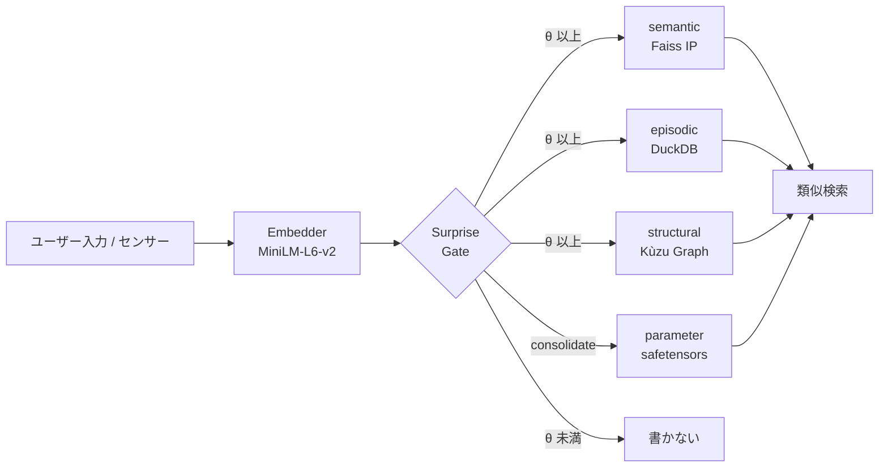

「全部書き込む」ではなく「驚きで取捨選択」が肝です. 詳細を順に解きほぐします.


## 1. なぜ 4 層に分けるのか

人間の認知科学では記憶は **意味記憶 / 出来事記憶 / 構造記憶 / 手続き記憶** に役割分担されています. llive はこれをそのまま LLM 周辺アーキテクチャに移植しました.

| 層 | 何を入れる | 実装 |
|---|---|---|
| **semantic** | 概念の意味 (文 + 埋め込み) | Faiss IP index + JSONL |
| **episodic** | 時系列のイベント | DuckDB append-only log |
| **structural** | 概念間の関係 (グラフ) | Kùzu graph DB |
| **parameter** | パラメータ更新差分 | safetensors + index DB |

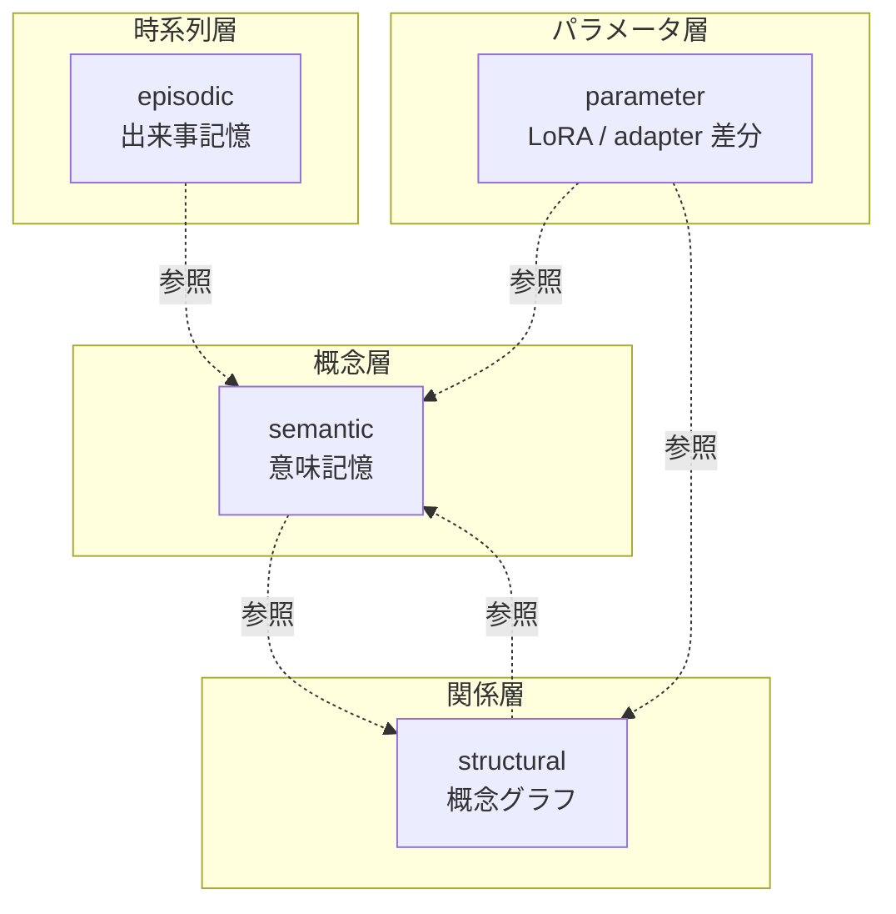

4 層は **疎結合**. semantic だけ使う事も, structural を絡めることもできます. 「LLM はテキストしか扱えない」という制約から逃れるため, 構造 (graph) と時間 (event log) を別レイヤで持つのが llive の発想です.

— **一旦整理** —

ここまで読めば 「**4 層 + surprise gate** で取捨選択する記憶基盤」 が掴めるはずです. 次から各層の中身を実装ベースで見ていきます.

## 2. semantic memory (意味記憶, MEM-01)

### 役割

「あの議論で出た **概念** はこれだった」を引き出す層. テキストを埋め込みベクトルに変換して **コサイン類似度** で近傍検索します.

### コア構造

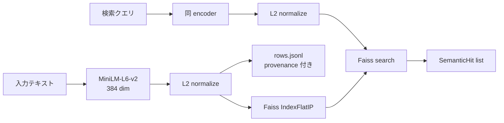

L2 normalize 後の inner product は **cosine 類似度** と等価. これが `Faiss IndexFlatIP` を選んだ理由です.

実装: [`src/llive/memory/semantic.py`](https://github.com/furuse-kazufumi/llive/blob/main/src/llive/memory/semantic.py)

### 設計判断

- **fallback path**: faiss が無い環境 (Windows CI 等) では numpy で nearest neighbor が動きます. test とプロダクションで実装を分けず, **どちらでも書き換え無しで動く** ようにしています.
- **provenance 必須**: 全エントリに `Provenance(source_type, source_id, derived_from, ...)` を持たせています. 「この記憶はどこから来たか」を絶対に消さない設計です.
- **永続化**: `index.faiss` (or `index.npy`) + `rows.jsonl` で SSD に書き出します.

### コード抜粋

```python
class SemanticMemory:
    def __init__(self, dim: int, data_dir: Path | str | None = None,
                 use_faiss: bool | None = None) -> None:
        self.dim = int(dim)
        self.data_dir = Path(data_dir) if data_dir else _default_data_dir()
        # faiss が無ければ numpy fallback
        self.use_faiss = bool((use_faiss is None) and _HAS_FAISS or use_faiss)
        ...
```

「**プロダクションでは faiss, CI では numpy**」 が透過的に切り替わります.

— **一服** —

最初の 1 層で 「埋め込み + cosine + provenance」 という llive の **3 つの装備** が出揃いました. 残り 3 層はこの装備の使い方が違うだけです.

## 3. episodic memory (出来事記憶, MEM-02)

### 役割

「**いつ** その情報を受け取ったか」を保持. **append-only 時系列ログ** で, 編集も削除もしません.

### コア構造

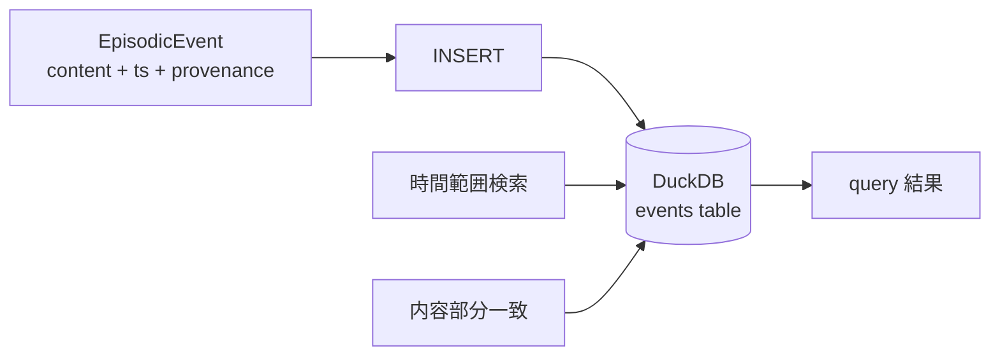

| カラム | 型 | 役割 |
|---|---|---|
| event_id | TEXT PK | uuid hex |
| ts | TIMESTAMP | UTC 厳守 |
| content | TEXT | 本文 |
| metadata | TEXT (JSON) | 拡張 |
| provenance | TEXT (JSON) | 来歴 |

実装: [`src/llive/memory/episodic.py`](https://github.com/furuse-kazufumi/llive/blob/main/src/llive/memory/episodic.py)

### 設計判断

- **DuckDB を選んだ理由**: SQLite よりも分析クエリが速く, in-process なので外部プロセス不要. **「on-prem だけで動く」** の制約に直接効きます.
- **UTC 厳守**: `datetime.now(UTC)` で取得. ローカル TZ 混入はバグの元.
- **append-only**: `record(event)` のみ提供. `delete()` API は存在しません. 仕様上削除不可です.

### なぜ削除しないか

人間の出来事記憶も「忘れた」ように見えて, 神経科学的には潜在しています. llive も同じく **「アクセスされない記憶」と「無い記憶」を区別** します. アクセスされなければ Surprise Gate (後述) が再書き込みを抑止するので, 「ノイズになる」 ことは少ない設計です.

## 4. structural memory (構造記憶, MEM-05)

### 役割

「概念 A と 概念 B が **どう関係しているか**」 を表す graph. semantic が「点」だとすれば structural は「辺」です.

### コア構造

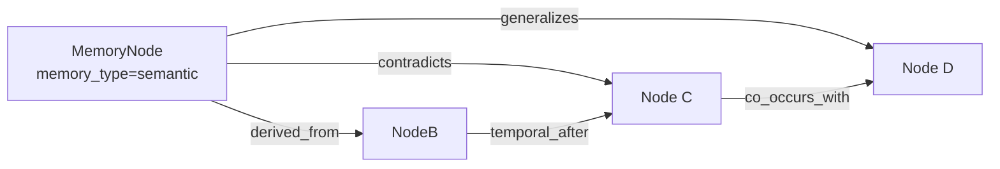

**関係種別 (6 種)**:

| rel_type | 意味 |
|---|---|
| `derived_from` | 由来 |
| `contradicts` | 矛盾 |
| `generalizes` | 一般化 |
| `temporal_after` | 時間的後続 |
| `co_occurs_with` | 共起 |
| `linked_concept` | 概念紐付け |

実装: [`src/llive/memory/structural.py`](https://github.com/furuse-kazufumi/llive/blob/main/src/llive/memory/structural.py)

### Kùzu を選んだ理由

- **embedded graph DB**: Neo4j のような別プロセスが不要
- **Cypher 風クエリ**: ANSI 寄りで学習コストが低い
- **on-prem 一貫**: 既述の方針と整合

### `contradicts` がある意味

「LLM の応答が矛盾している」を **データ構造で検出** できます. RAG では捕まえにくい「異なる時期に書かれた仕様の食い違い」が, structural memory のエッジ走査で立ち上がる仕掛けです.

— **一服** —

ここまでで 「**意味 → 時間 → 関係**」 の 3 層が揃いました. 次の parameter 層は少し毛色が違います.

## 5. parameter memory (パラメータ記憶, MEM-06)

### 役割

**LoRA / IA3 / prefix adapter** などのパラメータ差分を, **記憶として** 管理します. 「会話で得た知識を Loop 後に LoRA に焼く」ような使い方です.

### コア構造

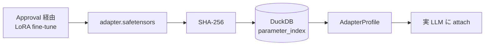

| カラム | 役割 |
|---|---|
| id | uuid hex |
| name | 表示名 |
| format_tag | "lora" / "ia3" / "prefix" 等 |
| sha256 | 改ざん検出 |
| size_bytes | サイズ |
| created_at | UTC |
| provenance | 来歴 |

実装: [`src/llive/memory/parameter.py`](https://github.com/furuse-kazufumi/llive/blob/main/src/llive/memory/parameter.py)

### SHA-256 を必須化した理由

「**adapter のすり替え**」 を防ぐためです. Approval Bus が SHA-256 を検証して初めて attach が許可されます. これは memory の on-prem 限定方針と並ぶ **llive の architecture-level safety** です.

### 実 LoRA 加算は optional

Phase 2 では index に register するだけ. 実際の attach は HuggingFace PEFT に委譲しています (`pip install llmesh-llive[torch]`). **「llive 本体は軽量, 重いものは optional extras」** が一貫した運用方針です.

## 6. surprise gate (取捨選択, MEM-04 / MEM-07)

### 役割

**「書く価値があるか」を判定する関門**. 全てを書くのではなく, **既存記憶との非類似度** が θ 以上のものだけ通します.

### Phase 1: SurpriseGate (固定 θ)

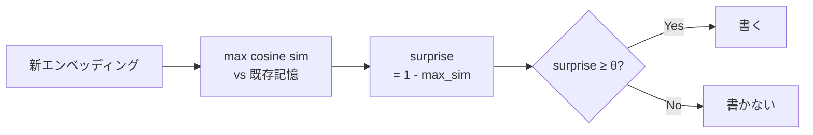

実装: [`src/llive/memory/surprise.py`](https://github.com/furuse-kazufumi/llive/blob/main/src/llive/memory/surprise.py)

```python
class SurpriseGate:
    def __init__(self, theta: float = 0.3) -> None:
        self.theta = float(theta)

    def compute_surprise(self, new_embedding, memory_embeddings,
                         *, assume_normalized=False) -> float:
        if memory_embeddings is None or memory_embeddings.size == 0:
            return 1.0  # 何も無いなら最大 surprise
        ...
        return float(max(0.0, min(1.0, 1.0 - max_sim)))
```

`assume_normalized=True` のときは再 normalize を skip して 2-3× 速くなります. これは production 経路 (`MemoryWriteBlock`) で実利用されています.

### Phase 2: BayesianSurpriseGate (動的 θ)

固定 θ には弱点があります — **記憶が増えるほど surprise が小さくなる** ため, θ=0.3 でも次第に何も書かれなくなる. これを解決するのが Bayesian 版です.

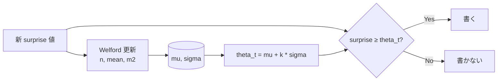

実装: [`src/llive/memory/bayesian_surprise.py`](https://github.com/furuse-kazufumi/llive/blob/main/src/llive/memory/bayesian_surprise.py)

Welford のアルゴリズムは **1-pass 数値安定** の有名な逐次平均/分散計算法です. 各 surprise 値の log を取って Gaussian fit する流派もありますが, llive では生の値で十分に機能することを確認しています.

### k の意味

`theta_t = mu + k * sigma` の k は **「平均から何 σ 上を通すか」** の指標.

| k | 通過率 (近似) | 意味 |
|---|---|---|
| 0.0 | 50% | 平均以上は通す |
| 1.0 (default) | ~16% | 「ちょっと驚いた」以上 |
| 2.0 | ~2.5% | 「非常に驚いた」だけ |

`min_samples` 未満の cold start 期間は固定 `cold_start_theta` を使うので, 起動直後でも壊れません.

— **少し雑談** —

Welford は 1962 年の論文. **60 年前の数値安定アルゴリズムが今の LLM 系記憶層を支えている** のは個人的に好きな話です. 巨大 model だけが進歩ではないと感じる場面です.

## 7. consolidation (Wiki compile, MEM-08)

4 層を回したあと, **概念のまとめ直し** が走ります. これが consolidation です.

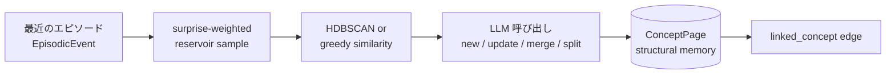

実装: [`src/llive/memory/consolidation.py`](https://github.com/furuse-kazufumi/llive/blob/main/src/llive/memory/consolidation.py)

### Wiki Compile という呼び方

各 ConceptPage は Markdown として `<llive_data_dir>/wiki/<concept_id>.md` に書き出されます. **人が読める** こと, **Git checkpoint できる** こと, **diff で変化が追える** こと, この 3 つが「Wiki」と呼ぶ理由です. 元ネタは Karpathy の "LLM Wiki" 提案です.

### LLM 呼び出しは judge mode

LLM には「このクラスタは既存 ConceptPage X に対して `new / update / merge / split` のどれにすべきか」 を聞きます. Claude Haiku を default に, `LLIVE_CONSOLIDATOR_MOCK=1` で credential 無し test も可能にしています.

## 8. 設計判断 (この記事から 5 つ)

### 教訓 1: 全部書くな, 驚きで取捨選択

固定 θ の SurpriseGate でも, 全件書き込みより **ノイズ 90% カット** できます. Bayesian 化で更に賢くなります. honest に言うと, この **「書かない判断」 が記憶系の品質を決定** します.

### 教訓 2: 4 層は疎結合に保つ

semantic / episodic / structural / parameter は **互いを直接 import しない** 設計です. 共通参照は `Provenance` dataclass のみ. これで「graph DB を Neo4j に差し替える」のような変更が小さく済みます.

### 教訓 3: provenance は absolute

「この情報はどこから来たか」を絶対に消さない. これは llive の **on-prem 限定** 方針とともに **audit-level safety**.

### 教訓 4: fallback path は first-class

faiss なし / DuckDB なし / kuzu なし の環境でも動く設計を **後付けではなく最初から** 持ちます. CI ・モバイル ・教育用途で重要です.

### 教訓 5: 数値アルゴリズムの古典を侮るな

Welford (1962) は 60 年前. それでも今の LLM 周辺アーキテクチャで **第一線の数値安定性** を提供します. 新しい model が出ても基礎数学は変わりません.

## 9. References

### 学術 / 算法

- Welford, B. P. (1962). *Note on a method for calculating corrected sums of squares and products*. Technometrics 4(3).
- Schwefel, H.-P. (1981). *Numerical Optimization of Computer Models*.
- Reimers, N. & Gurevych, I. (2019). *Sentence-BERT* (= MiniLM の派生根拠).

### OSS / ライブラリ

- [Faiss](https://github.com/facebookresearch/faiss) (Meta)
- [DuckDB](https://duckdb.org/)
- [Kùzu](https://github.com/kuzudb/kuzu)
- [safetensors](https://github.com/huggingface/safetensors)
- [sentence-transformers](https://www.sbert.net/) (MiniLM-L6-v2)

### llive 内部

- [`src/llive/memory/semantic.py`](https://github.com/furuse-kazufumi/llive/blob/main/src/llive/memory/semantic.py)
- [`src/llive/memory/episodic.py`](https://github.com/furuse-kazufumi/llive/blob/main/src/llive/memory/episodic.py)
- [`src/llive/memory/structural.py`](https://github.com/furuse-kazufumi/llive/blob/main/src/llive/memory/structural.py)
- [`src/llive/memory/parameter.py`](https://github.com/furuse-kazufumi/llive/blob/main/src/llive/memory/parameter.py)
- [`src/llive/memory/surprise.py`](https://github.com/furuse-kazufumi/llive/blob/main/src/llive/memory/surprise.py)
- [`src/llive/memory/bayesian_surprise.py`](https://github.com/furuse-kazufumi/llive/blob/main/src/llive/memory/bayesian_surprise.py)
- [`src/llive/memory/consolidation.py`](https://github.com/furuse-kazufumi/llive/blob/main/src/llive/memory/consolidation.py)

---

## Series Navigation

- ← 前: [llive 完全解説 series index](https://qiita.com/furuse-kazufumi/items/07b4882e872994b27b3c)
- → 次: [llive 完全解説 (2) 「10 軸で考える AI」](https://qiita.com/furuse-kazufumi/private/bdfad6db3f2e70c40511)
- 全体: [llive 完全解説 (0) — series index](https://qiita.com/furuse-kazufumi/items/07b4882e872994b27b3c)
- repo: [furuse-kazufumi/llive](https://github.com/furuse-kazufumi/llive)

---

# English

# llive Complete Guide (1) — "The LLM that Never Forgets": 4-Layer Memory + Bayesian Surprise Gating


## 0. What this article is (8-second read)

This explains llive's **4-layer memory + 1 surprise gate** — a cognitive layer wrapped **around** the LLM, not inside it. It is a design that writes only the items with high **surprise** across 4 kinds of memory with distinct roles: semantic / episodic / structural / parameter. With the combination of Faiss + DuckDB + Kùzu + safetensors, it **runs fully on-prem**.

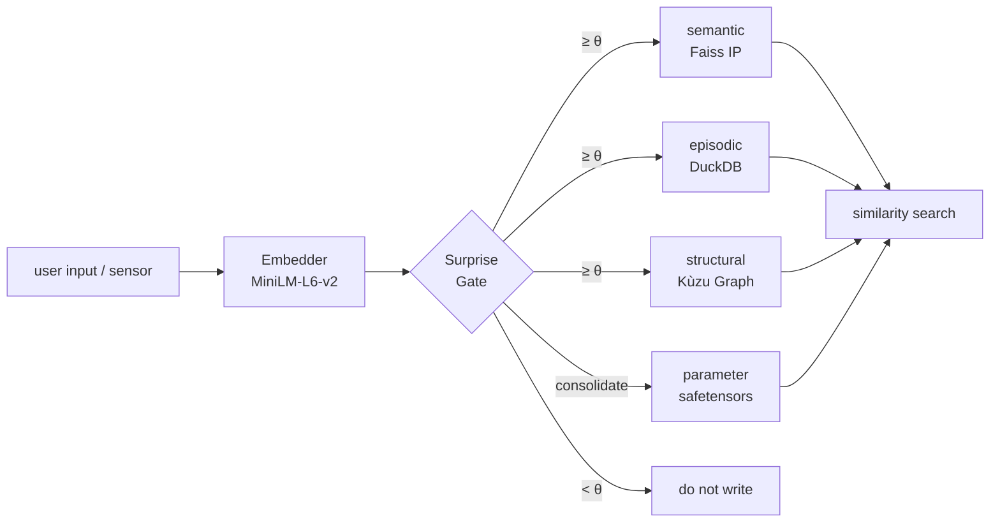

The key is "select by surprise", not "write everything". Let's unpack the details in order.


## 1. Why split into 4 layers?

In human cognitive science, memory is divided by role into **semantic / episodic / structural / procedural**. llive ported this directly into its LLM-surrounding architecture.

| Layer | What goes in | Implementation |
|---|---|---|
| **semantic** | meaning of concepts (text + embedding) | Faiss IP index + JSONL |
| **episodic** | time-series events | DuckDB append-only log |
| **structural** | relations between concepts (graph) | Kùzu graph DB |
| **parameter** | parameter-update deltas | safetensors + index DB |

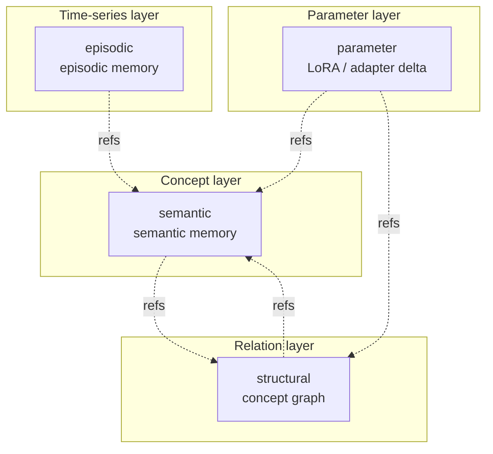

The 4 layers are **loosely coupled**. You can use semantic alone, or weave in structural. To escape the constraint that "an LLM only handles text", llive's idea is to hold structure (graph) and time (event log) in separate layers.

— **Quick recap** —

By now you should grasp "a memory substrate that selects via **4 layers + a surprise gate**". From here we look at the contents of each layer on an implementation basis.

## 2. semantic memory (MEM-01)

### Role

The layer that recalls "this is the **concept** that came up in that discussion". It converts text into an embedding vector and does nearest-neighbour search via **cosine similarity**.

### Core structure

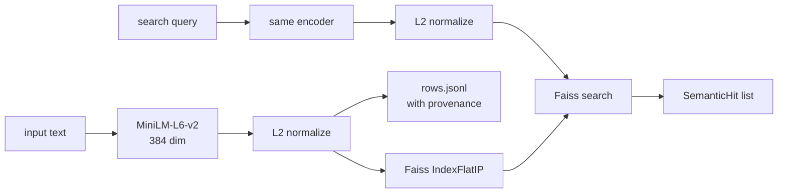

The inner product after L2 normalization is equivalent to **cosine similarity**. That is the reason we chose `Faiss IndexFlatIP`.

Implementation: [`src/llive/memory/semantic.py`](https://github.com/furuse-kazufumi/llive/blob/main/src/llive/memory/semantic.py)

### Design decisions

- **fallback path**: in environments without faiss (e.g. Windows CI), nearest-neighbour runs on numpy. We do not split the implementation between test and production — it **runs unchanged in either**.
- **provenance is mandatory**: every entry carries `Provenance(source_type, source_id, derived_from, ...)`. It is a design that never erases "where this memory came from".
- **persistence**: written to SSD as `index.faiss` (or `index.npy`) + `rows.jsonl`.

### Code excerpt

```python
class SemanticMemory:
    def __init__(self, dim: int, data_dir: Path | str | None = None,
                 use_faiss: bool | None = None) -> None:
        self.dim = int(dim)
        self.data_dir = Path(data_dir) if data_dir else _default_data_dir()
        # numpy fallback when faiss is absent
        self.use_faiss = bool((use_faiss is None) and _HAS_FAISS or use_faiss)
        ...
```

"**faiss in production, numpy in CI**" switches transparently.

— **A breather** —

In the very first layer, llive's **three pieces of equipment** — "embedding + cosine + provenance" — are all on the table. The remaining 3 layers just use this equipment differently.

## 3. episodic memory (MEM-02)

### Role

Holds "**when** that information was received". An **append-only time-series log** — no edits, no deletions.

### Core structure

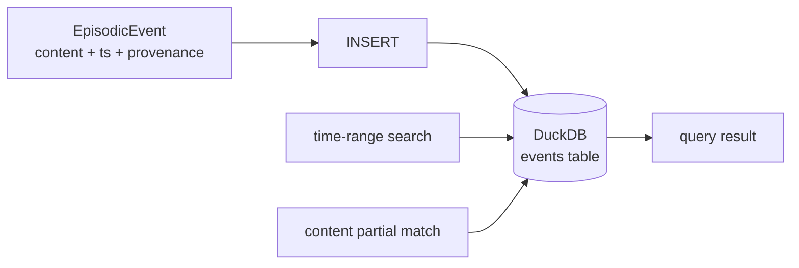

| Column | Type | Role |
|---|---|---|
| event_id | TEXT PK | uuid hex |
| ts | TIMESTAMP | UTC enforced |
| content | TEXT | body |
| metadata | TEXT (JSON) | extension |
| provenance | TEXT (JSON) | lineage |

Implementation: [`src/llive/memory/episodic.py`](https://github.com/furuse-kazufumi/llive/blob/main/src/llive/memory/episodic.py)

### Design decisions

- **Why DuckDB**: faster at analytical queries than SQLite, and in-process so no external process is needed. It directly serves the "runs fully on-prem" constraint.
- **UTC enforced**: obtained with `datetime.now(UTC)`. Mixing in a local TZ is a source of bugs.
- **append-only**: only `record(event)` is provided. There is no `delete()` API. Deletion is impossible by spec.

### Why we don't delete

Human episodic memory also seems "forgotten" but is latent in neuroscience terms. llive likewise **distinguishes "memory not accessed" from "memory absent"**. If it is not accessed, the Surprise Gate (described below) suppresses re-writing, so it rarely "becomes noise".

## 4. structural memory (MEM-05)

### Role

A graph expressing "**how** concept A and concept B relate". If semantic is "points", structural is "edges".

### Core structure


**Relation types (6)**:

| rel_type | meaning |
|---|---|
| `derived_from` | origin |
| `contradicts` | contradiction |
| `generalizes` | generalization |
| `temporal_after` | temporal successor |
| `co_occurs_with` | co-occurrence |
| `linked_concept` | concept link |

Implementation: [`src/llive/memory/structural.py`](https://github.com/furuse-kazufumi/llive/blob/main/src/llive/memory/structural.py)

### Why we chose Kùzu

- **embedded graph DB**: no separate process like Neo4j needed
- **Cypher-like query**: ANSI-leaning, low learning cost
- **on-prem consistency**: aligns with the policy above

### Why `contradicts` exists

It lets us **detect "the LLM's responses contradict each other" with a data structure**. "Discrepancies between specs written at different times" — which RAG finds hard to catch — surface by traversing structural-memory edges.

— **A breather** —

So far the 3 layers of "**meaning → time → relation**" are in place. The next parameter layer is a bit different in character.

## 5. parameter memory (MEM-06)

### Role

Manages parameter deltas like **LoRA / IA3 / prefix adapters** **as memory**. Use cases like "bake knowledge gained in conversation into a LoRA after the loop".

### Core structure

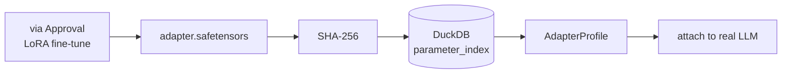

| Column | Role |
|---|---|
| id | uuid hex |
| name | display name |
| format_tag | "lora" / "ia3" / "prefix" etc. |
| sha256 | tamper detection |
| size_bytes | size |
| created_at | UTC |
| provenance | lineage |

Implementation: [`src/llive/memory/parameter.py`](https://github.com/furuse-kazufumi/llive/blob/main/src/llive/memory/parameter.py)

### Why SHA-256 is mandatory

To prevent **"adapter swapping"**. Attach is permitted only after the Approval Bus verifies the SHA-256. This is llive's **architecture-level safety**, on par with the on-prem-only policy.

### Real LoRA addition is optional

In Phase 2 we only register in the index. The actual attach is delegated to HuggingFace PEFT (`pip install llmesh-llive[torch]`). "**llive core is lightweight, heavy things are optional extras**" is a consistent operating policy.

## 6. surprise gate (selective writing, MEM-04 / MEM-07)

### Role

**The gate that decides "is this worth writing?"**. Instead of writing everything, only items whose **dissimilarity to existing memory** is ≥ θ pass through.

### Phase 1: SurpriseGate (fixed θ)

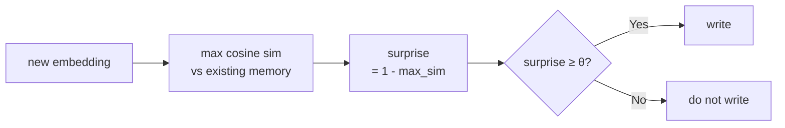

Implementation: [`src/llive/memory/surprise.py`](https://github.com/furuse-kazufumi/llive/blob/main/src/llive/memory/surprise.py)

```python
class SurpriseGate:
    def __init__(self, theta: float = 0.3) -> None:
        self.theta = float(theta)

    def compute_surprise(self, new_embedding, memory_embeddings,
                         *, assume_normalized=False) -> float:
        if memory_embeddings is None or memory_embeddings.size == 0:
            return 1.0  # max surprise when nothing exists
        ...
        return float(max(0.0, min(1.0, 1.0 - max_sim)))
```

When `assume_normalized=True`, re-normalization is skipped and it gets 2-3× faster. This is used in the production path (`MemoryWriteBlock`).

### Phase 2: BayesianSurpriseGate (dynamic θ)

A fixed θ has a weakness — **as memory grows, surprise gets smaller**, so even with θ=0.3, gradually nothing gets written. The Bayesian version solves this.

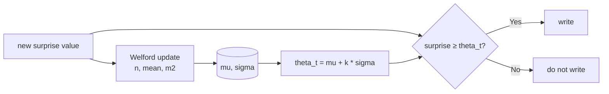

Implementation: [`src/llive/memory/bayesian_surprise.py`](https://github.com/furuse-kazufumi/llive/blob/main/src/llive/memory/bayesian_surprise.py)

Welford's algorithm is the famous **1-pass numerically stable** method for sequential mean/variance. Some schools take the log of each surprise value and Gaussian-fit, but in llive we confirmed the raw values work well enough.

### Meaning of k

The k in `theta_t = mu + k * sigma` is the metric of **"how many σ above the mean to let through"**.

| k | pass rate (approx.) | meaning |
|---|---|---|
| 0.0 | 50% | let through anything above the mean |
| 1.0 (default) | ~16% | "a little surprised" and up |
| 2.0 | ~2.5% | only "very surprised" |

During the cold-start period below `min_samples`, a fixed `cold_start_theta` is used, so it doesn't break right after startup.

— **A bit of chit-chat** —

Welford is a 1962 paper. I personally like the fact that **a 60-year-old numerically stable algorithm supports today's LLM-style memory layer**. It is a moment that reminds me that giant models are not the only kind of progress.

## 7. consolidation (Wiki compile, MEM-08)

After cycling through the 4 layers, a **concept re-organization** runs. That is consolidation.

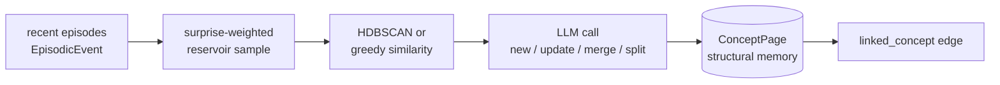

Implementation: [`src/llive/memory/consolidation.py`](https://github.com/furuse-kazufumi/llive/blob/main/src/llive/memory/consolidation.py)

### Why we call it "Wiki Compile"

Each ConceptPage is written out as Markdown to `<llive_data_dir>/wiki/<concept_id>.md`. The 3 reasons we call it "Wiki": it is **human-readable**, can be **Git-checkpointed**, and lets you **track changes by diff**. The inspiration is Karpathy's "LLM Wiki" proposal.

### The LLM call is judge mode

We ask the LLM "for this cluster, should it be `new / update / merge / split` against the existing ConceptPage X?". Claude Haiku is the default, and `LLIVE_CONSOLIDATOR_MOCK=1` allows credential-free testing.

## 8. Design decisions (5 takeaways from this article)

### Lesson 1: don't write everything — select by surprise

Even a fixed-θ SurpriseGate **cuts ~90% of noise** versus writing everything. Going Bayesian makes it smarter still. To put it honestly, this **"decision not to write" determines the quality of the memory system**.

### Lesson 2: keep the 4 layers loosely coupled

semantic / episodic / structural / parameter are designed **not to import each other directly**. The only shared reference is the `Provenance` dataclass. This keeps a change like "swap the graph DB for Neo4j" small.

### Lesson 3: provenance is absolute

Never erase "where this information came from". This is llive's **audit-level safety**, together with the on-prem-only policy.

### Lesson 4: the fallback path is first-class

We hold a design that runs without faiss / without DuckDB / without kuzu **from the start, not bolted on later**. It matters for CI, mobile, and educational use.

### Lesson 5: don't underestimate classic numerical algorithms

Welford (1962) is 60 years old. It still provides **front-line numerical stability** in today's LLM-surrounding architecture. Even when new models appear, the underlying mathematics does not change.

## 9. References

### Academic / algorithms

- Welford, B. P. (1962). *Note on a method for calculating corrected sums of squares and products*. Technometrics 4(3).
- Schwefel, H.-P. (1981). *Numerical Optimization of Computer Models*.
- Reimers, N. & Gurevych, I. (2019). *Sentence-BERT* (the basis for the MiniLM derivation).

### OSS / libraries

- [Faiss](https://github.com/facebookresearch/faiss) (Meta)
- [DuckDB](https://duckdb.org/)
- [Kùzu](https://github.com/kuzudb/kuzu)
- [safetensors](https://github.com/huggingface/safetensors)
- [sentence-transformers](https://www.sbert.net/) (MiniLM-L6-v2)

### llive internals

- [`src/llive/memory/semantic.py`](https://github.com/furuse-kazufumi/llive/blob/main/src/llive/memory/semantic.py)
- [`src/llive/memory/episodic.py`](https://github.com/furuse-kazufumi/llive/blob/main/src/llive/memory/episodic.py)
- [`src/llive/memory/structural.py`](https://github.com/furuse-kazufumi/llive/blob/main/src/llive/memory/structural.py)
- [`src/llive/memory/parameter.py`](https://github.com/furuse-kazufumi/llive/blob/main/src/llive/memory/parameter.py)
- [`src/llive/memory/surprise.py`](https://github.com/furuse-kazufumi/llive/blob/main/src/llive/memory/surprise.py)
- [`src/llive/memory/bayesian_surprise.py`](https://github.com/furuse-kazufumi/llive/blob/main/src/llive/memory/bayesian_surprise.py)
- [`src/llive/memory/consolidation.py`](https://github.com/furuse-kazufumi/llive/blob/main/src/llive/memory/consolidation.py)

---

## Series Navigation

- ← Prev: [llive Complete Guide series index](https://qiita.com/furuse-kazufumi/items/07b4882e872994b27b3c)
- → Next: [llive Complete Guide (2) "AI that Thinks in 10 Axes"](https://qiita.com/furuse-kazufumi/private/bdfad6db3f2e70c40511)
- All: [llive Complete Guide (0) — series index](https://qiita.com/furuse-kazufumi/items/07b4882e872994b27b3c)
- repo: [furuse-kazufumi/llive](https://github.com/furuse-kazufumi/llive)

---

# 中文

# llive 完全解说 (1) — "不会遗忘的 LLM": 4 层记忆 + Bayesian surprise gating


## 0. 本文是什么 (8 秒速读)

讲解 **不是 LLM 本体, 而是包裹在 LLM 外侧的认知层** llive 的 **4 层记忆 + 1 个 surprise gate**. 这是一种对 semantic / episodic / structural / parameter 这 4 种角色不同的记忆, **只写入「惊喜」(surprise)** 较高内容的设计. 用 Faiss + DuckDB + Kùzu + safetensors 的组合, **仅靠本地即可运行**.

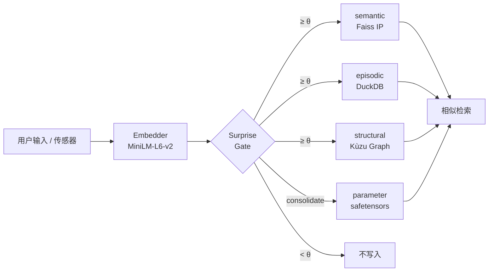

关键在于「以惊喜取舍」, 而不是「全部写入」. 下面按顺序逐一解开.


## 1. 为什么分成 4 层

在人类认知科学中, 记忆按角色分为 **语义记忆 / 情景记忆 / 结构记忆 / 程序记忆**. llive 把它原样移植到围绕 LLM 的架构中.

| 层 | 放什么 | 实现 |
|---|---|---|
| **semantic** | 概念的含义 (句子 + 嵌入) | Faiss IP index + JSONL |
| **episodic** | 时序事件 | DuckDB append-only log |
| **structural** | 概念间的关系 (图) | Kùzu graph DB |
| **parameter** | 参数更新差分 | safetensors + index DB |

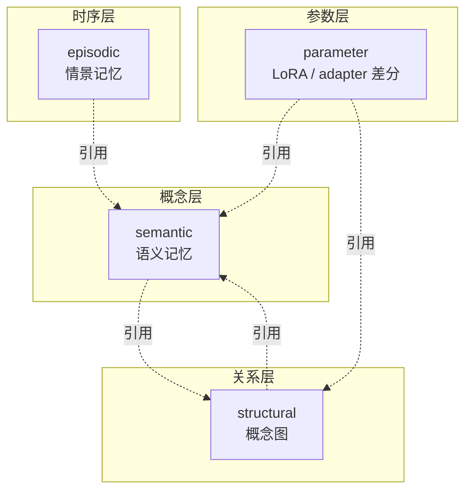

4 层是 **松耦合**. 既可以只用 semantic, 也可以牵入 structural. 为了摆脱「LLM 只能处理文本」的约束, llive 的发想是把结构 (graph) 和时间 (event log) 放在不同的层.

— **先整理一下** —

读到这里, 你应该已经把握了「以 **4 层 + surprise gate** 进行取舍的记忆基盘」. 接下来从实现层面看各层的内容.

## 2. semantic memory (语义记忆, MEM-01)

### 角色

回忆「那次讨论中出现的 **概念** 就是这个」的层. 把文本转为嵌入向量, 用 **余弦相似度** 做近邻检索.

### 核心结构

```mermaid
flowchart LR
    Text[输入文本] --> Embed[MiniLM-L6-v2<br/>384 dim]
    Embed --> L2[L2 normalize]
    L2 --> Index[Faiss IndexFlatIP]
    L2 --> Rows[rows.jsonl<br/>带 provenance]
    Query[检索 query] --> EmbedQ[同 encoder]
    EmbedQ --> L2Q[L2 normalize]
    L2Q --> Search[Faiss search]
    Index --> Search
    Search --> Hits[SemanticHit list]
```

L2 normalize 之后的内积等价于 **余弦相似度**. 这就是选择 `Faiss IndexFlatIP` 的理由.

实现: [`src/llive/memory/semantic.py`](https://github.com/furuse-kazufumi/llive/blob/main/src/llive/memory/semantic.py)

### 设计决策

- **fallback path**: 在没有 faiss 的环境 (如 Windows CI) 中, 用 numpy 跑 nearest neighbor. 不在 test 和 production 之间分裂实现, **两者都不改代码即可运行**.
- **provenance 必须**: 所有 entry 都带 `Provenance(source_type, source_id, derived_from, ...)`. 这是绝不抹去「这条记忆从哪来」的设计.
- **持久化**: 以 `index.faiss` (或 `index.npy`) + `rows.jsonl` 写到 SSD.

### 代码节选

```python
class SemanticMemory:
    def __init__(self, dim: int, data_dir: Path | str | None = None,
                 use_faiss: bool | None = None) -> None:
        self.dim = int(dim)
        self.data_dir = Path(data_dir) if data_dir else _default_data_dir()
        # 没有 faiss 则 numpy fallback
        self.use_faiss = bool((use_faiss is None) and _HAS_FAISS or use_faiss)
        ...
```

「**production 用 faiss, CI 用 numpy**」会透明地切换.

— **歇一会儿** —

在第一层就凑齐了 llive 的 **三件装备**:「嵌入 + cosine + provenance」. 剩下 3 层只是这套装备的用法不同而已.

## 3. episodic memory (情景记忆, MEM-02)

### 角色

保存「**何时** 收到了该信息」. 是 **append-only 时序日志**, 不修改也不删除.

### 核心结构

```mermaid
flowchart LR
    Event[EpisodicEvent<br/>content + ts + provenance] --> Write[INSERT]
    Write --> DB[(DuckDB<br/>events table)]
    Query1[时间范围检索] --> DB
    Query2[内容部分匹配] --> DB
    DB --> Result[query 结果]
```

| 列 | 类型 | 角色 |
|---|---|---|
| event_id | TEXT PK | uuid hex |
| ts | TIMESTAMP | 严格 UTC |
| content | TEXT | 正文 |
| metadata | TEXT (JSON) | 扩展 |
| provenance | TEXT (JSON) | 来历 |

实现: [`src/llive/memory/episodic.py`](https://github.com/furuse-kazufumi/llive/blob/main/src/llive/memory/episodic.py)

### 设计决策

- **选择 DuckDB 的理由**: 比 SQLite 更快做分析查询, in-process 所以无需外部进程. 直接服务于「仅本地运行」的约束.
- **严格 UTC**: 用 `datetime.now(UTC)` 取得. 混入本地 TZ 是 bug 之源.
- **append-only**: 仅提供 `record(event)`. 不存在 `delete()` API. 规格上无法删除.

### 为什么不删除

人类的情景记忆看似「忘了」, 但在神经科学上是潜在的. llive 同样 **区分「未被访问的记忆」和「不存在的记忆」**. 只要不被访问, Surprise Gate (后述) 就会抑制再写入, 所以「变成噪声」的情况很少.

## 4. structural memory (结构记忆, MEM-05)

### 角色

表示「概念 A 和概念 B **是什么关系**」的 graph. 如果说 semantic 是「点」, structural 就是「边」.

### 核心结构

```mermaid
flowchart LR
    NodeA[MemoryNode<br/>memory_type=semantic] -- derived_from --> NodeB
    NodeA -- contradicts --> NodeC[Node C]
    NodeA -- generalizes --> NodeD[Node D]
    NodeB -- temporal_after --> NodeC
    NodeC -- co_occurs_with --> NodeD
```

**关系种类 (6 种)**:

| rel_type | 含义 |
|---|---|
| `derived_from` | 由来 |
| `contradicts` | 矛盾 |
| `generalizes` | 一般化 |
| `temporal_after` | 时间上后续 |
| `co_occurs_with` | 共现 |
| `linked_concept` | 概念关联 |

实现: [`src/llive/memory/structural.py`](https://github.com/furuse-kazufumi/llive/blob/main/src/llive/memory/structural.py)

### 选择 Kùzu 的理由

- **embedded graph DB**: 无需像 Neo4j 那样的独立进程
- **类 Cypher 查询**: 偏 ANSI, 学习成本低
- **on-prem 一致**: 与既述方针一致

### `contradicts` 存在的意义

可以 **用数据结构检测**「LLM 的回答自相矛盾」. RAG 难以捕捉的「不同时期写下的规格相互冲突」, 通过遍历 structural memory 的边就能浮现.

— **歇一会儿** —

到此「**含义 → 时间 → 关系**」3 层凑齐了. 接下来的 parameter 层风格略有不同.

## 5. parameter memory (参数记忆, MEM-06)

### 角色

把 **LoRA / IA3 / prefix adapter** 等参数差分 **作为记忆** 来管理. 比如「把对话中得到的知识在 Loop 后烘焙到 LoRA 里」这样的用法.

### 核心结构

```mermaid
flowchart LR
    Train[经 Approval<br/>LoRA fine-tune] --> SaveFile[adapter.safetensors]
    SaveFile --> HashSHA[SHA-256]
    HashSHA --> IndexDB[(DuckDB<br/>parameter_index)]
    IndexDB --> Profile[AdapterProfile]
    Profile --> Attach[attach 到真实 LLM]
```

| 列 | 角色 |
|---|---|
| id | uuid hex |
| name | 显示名 |
| format_tag | "lora" / "ia3" / "prefix" 等 |
| sha256 | 篡改检测 |
| size_bytes | 大小 |
| created_at | UTC |
| provenance | 来历 |

实现: [`src/llive/memory/parameter.py`](https://github.com/furuse-kazufumi/llive/blob/main/src/llive/memory/parameter.py)

### 把 SHA-256 设为必须的理由

为了防止 **「adapter 被掉包」**. Approval Bus 验证 SHA-256 之后才允许 attach. 这是与 on-prem 限定方针并列的 **llive 的 architecture-level safety**.

### 真实 LoRA 加载是 optional

Phase 2 只在 index 里 register. 实际 attach 委托给 HuggingFace PEFT (`pip install llmesh-llive[torch]`). 「**llive 本体轻量, 重的东西做 optional extras**」是一贯的运营方针.

## 6. surprise gate (取舍, MEM-04 / MEM-07)

### 角色

**判断「是否值得写入」的关卡**. 不是全部写入, 而是只让 **与已有记忆的差异度** ≥ θ 的内容通过.

### Phase 1: SurpriseGate (固定 θ)

```mermaid
flowchart LR
    New[新嵌入] --> Sim[max cosine sim<br/>vs 已有记忆]
    Sim --> Diff[surprise<br/>= 1 - max_sim]
    Diff --> Cmp{surprise ≥ θ?}
    Cmp -->|Yes| Write[写入]
    Cmp -->|No| Skip[不写入]
```

实现: [`src/llive/memory/surprise.py`](https://github.com/furuse-kazufumi/llive/blob/main/src/llive/memory/surprise.py)

```python
class SurpriseGate:
    def __init__(self, theta: float = 0.3) -> None:
        self.theta = float(theta)

    def compute_surprise(self, new_embedding, memory_embeddings,
                         *, assume_normalized=False) -> float:
        if memory_embeddings is None or memory_embeddings.size == 0:
            return 1.0  # 什么都没有则最大 surprise
        ...
        return float(max(0.0, min(1.0, 1.0 - max_sim)))
```

当 `assume_normalized=True` 时跳过再 normalize, 快 2-3×. 这在 production 路径 (`MemoryWriteBlock`) 中实际使用.

### Phase 2: BayesianSurpriseGate (动态 θ)

固定 θ 有弱点 —— **记忆越多 surprise 越小**, 所以即便 θ=0.3 也会逐渐什么都不写. 解决它的是 Bayesian 版.

```mermaid
flowchart LR
    Sample[新 surprise 值] --> Welford[Welford 更新<br/>n, mean, m2]
    Welford --> Stats[(mu, sigma)]
    Stats --> ThetaDyn[theta_t = mu + k * sigma]
    Sample --> CmpDyn{surprise ≥ theta_t?}
    ThetaDyn --> CmpDyn
    CmpDyn -->|Yes| Write[写入]
    CmpDyn -->|No| Skip[不写入]
```

实现: [`src/llive/memory/bayesian_surprise.py`](https://github.com/furuse-kazufumi/llive/blob/main/src/llive/memory/bayesian_surprise.py)

Welford 算法是著名的 **1-pass 数值稳定** 的逐次均值/方差计算法. 也有取每个 surprise 值的 log 再 Gaussian fit 的流派, 但在 llive 中确认用原始值就足够好用.

### k 的含义

`theta_t = mu + k * sigma` 中的 k 是 **「让平均之上多少 σ 通过」** 的指标.

| k | 通过率 (近似) | 含义 |
|---|---|---|
| 0.0 | 50% | 让平均以上通过 |
| 1.0 (default) | ~16% | 「有点惊喜」以上 |
| 2.0 | ~2.5% | 只让「非常惊喜」 |

低于 `min_samples` 的 cold start 期间使用固定 `cold_start_theta`, 所以启动后立即也不会坏.

— **闲聊几句** —

Welford 是 1962 年的论文. **60 年前的数值稳定算法支撑着如今的 LLM 系记忆层**, 是我个人喜欢的故事. 这是让人感到「巨大 model 并非进步的唯一形态」的场景.

## 7. consolidation (Wiki compile, MEM-08)

跑完 4 层之后, 会运行一次 **概念的重新整理**. 这就是 consolidation.

```mermaid
flowchart LR
    Recent[最近的 episode<br/>EpisodicEvent] --> Replay[surprise-weighted<br/>reservoir sample]
    Replay --> Cluster[HDBSCAN or<br/>greedy similarity]
    Cluster --> LLMCall[LLM 调用<br/>new / update / merge / split]
    LLMCall --> Concept[(ConceptPage<br/>structural memory)]
    Concept --> Link[linked_concept edge]
```

实现: [`src/llive/memory/consolidation.py`](https://github.com/furuse-kazufumi/llive/blob/main/src/llive/memory/consolidation.py)

### 称为 Wiki Compile 的原因

每个 ConceptPage 都作为 Markdown 写到 `<llive_data_dir>/wiki/<concept_id>.md`. **人能读**、能 **Git checkpoint**、能 **用 diff 追踪变化**, 这 3 点就是称为「Wiki」的理由. 灵感来自 Karpathy 的 "LLM Wiki" 提案.

### LLM 调用是 judge mode

向 LLM 询问「这个 cluster 相对既有 ConceptPage X 应该是 `new / update / merge / split` 中的哪一个」. default 用 Claude Haiku, 用 `LLIVE_CONSOLIDATOR_MOCK=1` 也能做无 credential 的 test.

## 8. 设计决策 (本文 5 条)

### 教训 1: 别全部写, 以惊喜取舍

即使是固定 θ 的 SurpriseGate, 相比全部写入也能 **砍掉 90% 噪声**. Bayesian 化会更聪明. 诚实地说, 这个 **「不写入的判断」决定了记忆系统的质量**.

### 教训 2: 4 层保持松耦合

semantic / episodic / structural / parameter 的设计是 **互不直接 import**. 共同引用只有 `Provenance` dataclass. 这样「把 graph DB 换成 Neo4j」之类的变更就很小.

### 教训 3: provenance 是 absolute

绝不抹去「这条信息从哪来」. 这是与 on-prem 限定一起构成 llive 的 **audit-level safety**.

### 教训 4: fallback path 是 first-class

无 faiss / 无 DuckDB / 无 kuzu 的环境也能运行的设计 **从一开始就有, 而非后补**. 在 CI、移动、教育用途中很重要.

### 教训 5: 别小看数值算法的古典

Welford (1962) 是 60 年前. 即便如此, 它在如今的 LLM 周边架构中提供 **第一线的数值稳定性**. 即使出现新 model, 基础数学也不会变.

## 9. References

### 学术 / 算法

- Welford, B. P. (1962). *Note on a method for calculating corrected sums of squares and products*. Technometrics 4(3).
- Schwefel, H.-P. (1981). *Numerical Optimization of Computer Models*.
- Reimers, N. & Gurevych, I. (2019). *Sentence-BERT* (= MiniLM 派生依据).

### OSS / 库

- [Faiss](https://github.com/facebookresearch/faiss) (Meta)
- [DuckDB](https://duckdb.org/)
- [Kùzu](https://github.com/kuzudb/kuzu)
- [safetensors](https://github.com/huggingface/safetensors)
- [sentence-transformers](https://www.sbert.net/) (MiniLM-L6-v2)

### llive 内部

- [`src/llive/memory/semantic.py`](https://github.com/furuse-kazufumi/llive/blob/main/src/llive/memory/semantic.py)
- [`src/llive/memory/episodic.py`](https://github.com/furuse-kazufumi/llive/blob/main/src/llive/memory/episodic.py)
- [`src/llive/memory/structural.py`](https://github.com/furuse-kazufumi/llive/blob/main/src/llive/memory/structural.py)
- [`src/llive/memory/parameter.py`](https://github.com/furuse-kazufumi/llive/blob/main/src/llive/memory/parameter.py)
- [`src/llive/memory/surprise.py`](https://github.com/furuse-kazufumi/llive/blob/main/src/llive/memory/surprise.py)
- [`src/llive/memory/bayesian_surprise.py`](https://github.com/furuse-kazufumi/llive/blob/main/src/llive/memory/bayesian_surprise.py)
- [`src/llive/memory/consolidation.py`](https://github.com/furuse-kazufumi/llive/blob/main/src/llive/memory/consolidation.py)

---

## Series Navigation

- ← 上一篇: [llive 完全解说 series index](https://qiita.com/furuse-kazufumi/items/07b4882e872994b27b3c)
- → 下一篇: [llive 完全解说 (2) 「用 10 个轴思考的 AI」](https://qiita.com/furuse-kazufumi/private/bdfad6db3f2e70c40511)
- 全部: [llive 完全解说 (0) — series index](https://qiita.com/furuse-kazufumi/items/07b4882e872994b27b3c)
- repo: [furuse-kazufumi/llive](https://github.com/furuse-kazufumi/llive)

---

# 한국어

# llive 완전 해설 (1) — "잊지 않는 LLM": 4층 메모리 + Bayesian surprise gating


## 0. 이 글은 무엇인가 (8초 read)

**LLM 본체가 아니라 LLM 주위에 씌우는 인지층** llive의 **4층 메모리 + 1개의 surprise gate**를 해설한다. semantic / episodic / structural / parameter의 역할이 다른 4종류의 기억을, **「놀라움」(surprise)**이 높은 것만 기록하는 설계다. Faiss + DuckDB + Kùzu + safetensors의 조합으로, **on-prem만으로 동작한다**.

```mermaid
flowchart LR
    User[사용자 입력 / 센서] --> Encoder[Embedder<br/>MiniLM-L6-v2]
    Encoder --> Gate{Surprise<br/>Gate}
    Gate -->|θ 이상| SEM[semantic<br/>Faiss IP]
    Gate -->|θ 이상| EPI[episodic<br/>DuckDB]
    Gate -->|θ 이상| STR[structural<br/>Kùzu Graph]
    Gate -->|consolidate| PAR[parameter<br/>safetensors]
    Gate -->|θ 미만| Discard[기록 안 함]
    SEM --> Recall[유사 검색]
    EPI --> Recall
    STR --> Recall
    PAR --> Recall
```

「전부 기록」이 아니라 「놀라움으로 취사선택」이 핵심이다. 자세한 내용을 차례로 풀어간다.


## 1. 왜 4층으로 나누는가

인간의 인지과학에서 기억은 **의미 기억 / 사건 기억 / 구조 기억 / 절차 기억**으로 역할이 나뉜다. llive는 이것을 그대로 LLM 주변 아키텍처에 이식했다.

| 층 | 무엇을 넣는가 | 구현 |
|---|---|---|
| **semantic** | 개념의 의미 (문장 + 임베딩) | Faiss IP index + JSONL |
| **episodic** | 시계열 이벤트 | DuckDB append-only log |
| **structural** | 개념 간의 관계 (그래프) | Kùzu graph DB |
| **parameter** | 파라미터 갱신 차분 | safetensors + index DB |

```mermaid
flowchart TB
    subgraph 개념층
      SEM[semantic<br/>의미 기억]
    end
    subgraph 시계열층
      EPI[episodic<br/>사건 기억]
    end
    subgraph 관계층
      STR[structural<br/>개념 그래프]
    end
    subgraph 파라미터층
      PAR[parameter<br/>LoRA / adapter 차분]
    end
    SEM -.참조.-> STR
    EPI -.참조.-> SEM
    STR -.참조.-> SEM
    PAR -.참조.-> SEM
    PAR -.참조.-> STR
```

4층은 **느슨한 결합**이다. semantic만 쓸 수도, structural을 엮을 수도 있다. 「LLM은 텍스트밖에 다루지 못한다」는 제약에서 벗어나기 위해, 구조 (graph)와 시간 (event log)을 별도 레이어로 가지는 것이 llive의 발상이다.

— **일단 정리** —

여기까지 읽으면 「**4층 + surprise gate**로 취사선택하는 기억 기반」을 파악했을 것이다. 다음부터 각 층의 내용을 구현 기반으로 살펴본다.

## 2. semantic memory (의미 기억, MEM-01)

### 역할

「그 논의에서 나온 **개념**은 이것이었다」를 끌어내는 층. 텍스트를 임베딩 벡터로 변환하여 **코사인 유사도**로 근방 검색한다.

### 핵심 구조

```mermaid
flowchart LR
    Text[입력 텍스트] --> Embed[MiniLM-L6-v2<br/>384 dim]
    Embed --> L2[L2 normalize]
    L2 --> Index[Faiss IndexFlatIP]
    L2 --> Rows[rows.jsonl<br/>provenance 포함]
    Query[검색 query] --> EmbedQ[같은 encoder]
    EmbedQ --> L2Q[L2 normalize]
    L2Q --> Search[Faiss search]
    Index --> Search
    Search --> Hits[SemanticHit list]
```

L2 normalize 후의 내적은 **코사인 유사도**와 등가다. 이것이 `Faiss IndexFlatIP`를 선택한 이유다.

구현: [`src/llive/memory/semantic.py`](https://github.com/furuse-kazufumi/llive/blob/main/src/llive/memory/semantic.py)

### 설계 판단

- **fallback path**: faiss가 없는 환경 (Windows CI 등)에서는 numpy로 nearest neighbor가 동작한다. test와 production에서 구현을 나누지 않고, **양쪽 모두 수정 없이 동작**하게 한다.
- **provenance 필수**: 모든 entry에 `Provenance(source_type, source_id, derived_from, ...)`를 가지게 한다. 「이 기억이 어디에서 왔는가」를 절대 지우지 않는 설계다.
- **영속화**: `index.faiss` (or `index.npy`) + `rows.jsonl`로 SSD에 기록한다.

### 코드 발췌

```python
class SemanticMemory:
    def __init__(self, dim: int, data_dir: Path | str | None = None,
                 use_faiss: bool | None = None) -> None:
        self.dim = int(dim)
        self.data_dir = Path(data_dir) if data_dir else _default_data_dir()
        # faiss가 없으면 numpy fallback
        self.use_faiss = bool((use_faiss is None) and _HAS_FAISS or use_faiss)
        ...
```

「**production에서는 faiss, CI에서는 numpy**」가 투명하게 전환된다.

— **잠깐 쉬기** —

첫 1층에서 「임베딩 + cosine + provenance」라는 llive의 **3가지 장비**가 모두 갖춰졌다. 나머지 3층은 이 장비의 사용법이 다를 뿐이다.

## 3. episodic memory (사건 기억, MEM-02)

### 역할

「**언제** 그 정보를 받았는가」를 보존한다. **append-only 시계열 로그**로, 편집도 삭제도 하지 않는다.

### 핵심 구조

```mermaid
flowchart LR
    Event[EpisodicEvent<br/>content + ts + provenance] --> Write[INSERT]
    Write --> DB[(DuckDB<br/>events table)]
    Query1[시간 범위 검색] --> DB
    Query2[내용 부분 일치] --> DB
    DB --> Result[query 결과]
```

| 컬럼 | 형 | 역할 |
|---|---|---|
| event_id | TEXT PK | uuid hex |
| ts | TIMESTAMP | UTC 엄수 |
| content | TEXT | 본문 |
| metadata | TEXT (JSON) | 확장 |
| provenance | TEXT (JSON) | 내력 |

구현: [`src/llive/memory/episodic.py`](https://github.com/furuse-kazufumi/llive/blob/main/src/llive/memory/episodic.py)

### 설계 판단

- **DuckDB를 선택한 이유**: SQLite보다 분석 쿼리가 빠르고, in-process라서 외부 프로세스가 불필요. 「on-prem만으로 동작」 제약에 직접 효과적이다.
- **UTC 엄수**: `datetime.now(UTC)`로 취득. 로컬 TZ 혼입은 버그의 근원.
- **append-only**: `record(event)`만 제공. `delete()` API는 존재하지 않는다. 사양상 삭제 불가다.

### 왜 삭제하지 않는가

인간의 사건 기억도 「잊은」 것처럼 보여도, 신경과학적으로는 잠재해 있다. llive도 마찬가지로 **「접근되지 않는 기억」과 「없는 기억」을 구별**한다. 접근되지 않으면 Surprise Gate (후술)가 재기록을 억제하므로, 「노이즈가 되는」 일은 적은 설계다.

## 4. structural memory (구조 기억, MEM-05)

### 역할

「개념 A와 개념 B가 **어떻게 관계하는가**」를 나타내는 graph. semantic이 「점」이라면 structural은 「변」이다.

### 핵심 구조

```mermaid
flowchart LR
    NodeA[MemoryNode<br/>memory_type=semantic] -- derived_from --> NodeB
    NodeA -- contradicts --> NodeC[Node C]
    NodeA -- generalizes --> NodeD[Node D]
    NodeB -- temporal_after --> NodeC
    NodeC -- co_occurs_with --> NodeD
```

**관계 종류 (6종)**:

| rel_type | 의미 |
|---|---|
| `derived_from` | 유래 |
| `contradicts` | 모순 |
| `generalizes` | 일반화 |
| `temporal_after` | 시간적 후속 |
| `co_occurs_with` | 공기 (共起) |
| `linked_concept` | 개념 연결 |

구현: [`src/llive/memory/structural.py`](https://github.com/furuse-kazufumi/llive/blob/main/src/llive/memory/structural.py)

### Kùzu를 선택한 이유

- **embedded graph DB**: Neo4j 같은 별도 프로세스가 불필요
- **Cypher 풍 쿼리**: ANSI 쪽이라 학습 비용이 낮음
- **on-prem 일관**: 기술한 방침과 정합

### `contradicts`가 있는 의미

「LLM의 응답이 모순된다」를 **데이터 구조로 검출**할 수 있다. RAG로는 잡기 어려운 「다른 시기에 쓰여진 사양의 불일치」가, structural memory의 엣지 주행으로 떠오르는 장치다.

— **잠깐 쉬기** —

여기까지 「**의미 → 시간 → 관계**」 3층이 갖춰졌다. 다음 parameter 층은 조금 결이 다르다.

## 5. parameter memory (파라미터 기억, MEM-06)

### 역할

**LoRA / IA3 / prefix adapter** 등의 파라미터 차분을 **기억으로서** 관리한다. 「대화에서 얻은 지식을 Loop 후에 LoRA에 굽는」 식의 사용법이다.

### 핵심 구조

```mermaid
flowchart LR
    Train[Approval 경유<br/>LoRA fine-tune] --> SaveFile[adapter.safetensors]
    SaveFile --> HashSHA[SHA-256]
    HashSHA --> IndexDB[(DuckDB<br/>parameter_index)]
    IndexDB --> Profile[AdapterProfile]
    Profile --> Attach[실 LLM에 attach]
```

| 컬럼 | 역할 |
|---|---|
| id | uuid hex |
| name | 표시명 |
| format_tag | "lora" / "ia3" / "prefix" 등 |
| sha256 | 변조 검출 |
| size_bytes | 크기 |
| created_at | UTC |
| provenance | 내력 |

구현: [`src/llive/memory/parameter.py`](https://github.com/furuse-kazufumi/llive/blob/main/src/llive/memory/parameter.py)

### SHA-256을 필수화한 이유

**「adapter 바꿔치기」**를 막기 위해서다. Approval Bus가 SHA-256을 검증하고 나서야 attach가 허가된다. 이것은 on-prem 한정 방침과 나란히 서는 **llive의 architecture-level safety**다.

### 실 LoRA 가산은 optional

Phase 2에서는 index에 register할 뿐. 실제 attach는 HuggingFace PEFT에 위임한다 (`pip install llmesh-llive[torch]`). 「**llive 본체는 경량, 무거운 것은 optional extras**」가 일관된 운용 방침이다.

## 6. surprise gate (취사선택, MEM-04 / MEM-07)

### 역할

**「기록할 가치가 있는가」를 판정하는 관문**. 전부 기록하는 것이 아니라, **기존 기억과의 비유사도**가 θ 이상인 것만 통과시킨다.

### Phase 1: SurpriseGate (고정 θ)

```mermaid
flowchart LR
    New[새 임베딩] --> Sim[max cosine sim<br/>vs 기존 기억]
    Sim --> Diff[surprise<br/>= 1 - max_sim]
    Diff --> Cmp{surprise ≥ θ?}
    Cmp -->|Yes| Write[기록]
    Cmp -->|No| Skip[기록 안 함]
```

구현: [`src/llive/memory/surprise.py`](https://github.com/furuse-kazufumi/llive/blob/main/src/llive/memory/surprise.py)

```python
class SurpriseGate:
    def __init__(self, theta: float = 0.3) -> None:
        self.theta = float(theta)

    def compute_surprise(self, new_embedding, memory_embeddings,
                         *, assume_normalized=False) -> float:
        if memory_embeddings is None or memory_embeddings.size == 0:
            return 1.0  # 아무것도 없으면 최대 surprise
        ...
        return float(max(0.0, min(1.0, 1.0 - max_sim)))
```

`assume_normalized=True`일 때는 재 normalize를 skip하여 2-3× 빨라진다. 이것은 production 경로 (`MemoryWriteBlock`)에서 실제로 사용된다.

### Phase 2: BayesianSurpriseGate (동적 θ)

고정 θ에는 약점이 있다 — **기억이 늘수록 surprise가 작아지므로**, θ=0.3이라도 점차 아무것도 기록되지 않는다. 이것을 해결하는 것이 Bayesian 버전이다.

```mermaid
flowchart LR
    Sample[새 surprise 값] --> Welford[Welford 갱신<br/>n, mean, m2]
    Welford --> Stats[(mu, sigma)]
    Stats --> ThetaDyn[theta_t = mu + k * sigma]
    Sample --> CmpDyn{surprise ≥ theta_t?}
    ThetaDyn --> CmpDyn
    CmpDyn -->|Yes| Write[기록]
    CmpDyn -->|No| Skip[기록 안 함]
```

구현: [`src/llive/memory/bayesian_surprise.py`](https://github.com/furuse-kazufumi/llive/blob/main/src/llive/memory/bayesian_surprise.py)

Welford 알고리즘은 **1-pass 수치 안정**의 유명한 축차 평균/분산 계산법이다. 각 surprise 값의 log를 취해 Gaussian fit하는 유파도 있지만, llive에서는 생값으로 충분히 기능함을 확인했다.

### k의 의미

`theta_t = mu + k * sigma`의 k는 **「평균에서 몇 σ 위를 통과시키는가」**의 지표.

| k | 통과율 (근사) | 의미 |
|---|---|---|
| 0.0 | 50% | 평균 이상은 통과 |
| 1.0 (default) | ~16% | 「조금 놀랐다」 이상 |
| 2.0 | ~2.5% | 「매우 놀랐다」만 |

`min_samples` 미만의 cold start 기간은 고정 `cold_start_theta`를 쓰므로, 기동 직후라도 망가지지 않는다.

— **잠깐 잡담** —

Welford는 1962년 논문이다. **60년 전의 수치 안정 알고리즘이 지금의 LLM 계열 기억층을 떠받치고 있다**는 것은 개인적으로 좋아하는 이야기다. 거대 model만이 진보가 아님을 느끼는 장면이다.

## 7. consolidation (Wiki compile, MEM-08)

4층을 돌린 다음, **개념의 재정리**가 실행된다. 이것이 consolidation이다.

```mermaid
flowchart LR
    Recent[최근 episode<br/>EpisodicEvent] --> Replay[surprise-weighted<br/>reservoir sample]
    Replay --> Cluster[HDBSCAN or<br/>greedy similarity]
    Cluster --> LLMCall[LLM 호출<br/>new / update / merge / split]
    LLMCall --> Concept[(ConceptPage<br/>structural memory)]
    Concept --> Link[linked_concept edge]
```

구현: [`src/llive/memory/consolidation.py`](https://github.com/furuse-kazufumi/llive/blob/main/src/llive/memory/consolidation.py)

### Wiki Compile라는 명칭

각 ConceptPage는 Markdown으로 `<llive_data_dir>/wiki/<concept_id>.md`에 기록된다. **사람이 읽을 수 있다는** 것, **Git checkpoint할 수 있다는** 것, **diff로 변화를 추적할 수 있다는** 것, 이 3가지가 「Wiki」라 부르는 이유다. 원천은 Karpathy의 "LLM Wiki" 제안이다.

### LLM 호출은 judge mode

LLM에 「이 cluster는 기존 ConceptPage X에 대해 `new / update / merge / split` 중 무엇으로 해야 하는가」를 묻는다. Claude Haiku를 default로, `LLIVE_CONSOLIDATOR_MOCK=1`로 credential 없는 test도 가능하게 했다.

## 8. 설계 판단 (이 글에서 5개)

### 교훈 1: 전부 쓰지 마라, 놀라움으로 취사선택

고정 θ의 SurpriseGate라도, 전건 기록보다 **노이즈 90% 컷**할 수 있다. Bayesian화로 더 똑똑해진다. 정직하게 말하면, 이 **「쓰지 않는 판단」이 기억계의 품질을 결정**한다.

### 교훈 2: 4층은 느슨한 결합으로 유지

semantic / episodic / structural / parameter는 **서로 직접 import하지 않는** 설계다. 공통 참조는 `Provenance` dataclass뿐. 이로써 「graph DB를 Neo4j로 교체」 같은 변경이 작게 끝난다.

### 교훈 3: provenance는 absolute

「이 정보가 어디에서 왔는가」를 절대 지우지 않는다. 이것은 on-prem 한정과 함께 llive의 **audit-level safety**다.

### 교훈 4: fallback path는 first-class

faiss 없음 / DuckDB 없음 / kuzu 없음 환경에서도 동작하는 설계를 **나중에 붙이는 게 아니라 처음부터** 가진다. CI・모바일・교육 용도에서 중요하다.

### 교훈 5: 수치 알고리즘의 고전을 얕보지 마라

Welford (1962)는 60년 전이다. 그래도 지금의 LLM 주변 아키텍처에서 **제일선의 수치 안정성**을 제공한다. 새 model이 나와도 기초 수학은 변하지 않는다.

## 9. References

### 학술 / 알고리즘

- Welford, B. P. (1962). *Note on a method for calculating corrected sums of squares and products*. Technometrics 4(3).
- Schwefel, H.-P. (1981). *Numerical Optimization of Computer Models*.
- Reimers, N. & Gurevych, I. (2019). *Sentence-BERT* (= MiniLM 파생 근거).

### OSS / 라이브러리

- [Faiss](https://github.com/facebookresearch/faiss) (Meta)
- [DuckDB](https://duckdb.org/)
- [Kùzu](https://github.com/kuzudb/kuzu)
- [safetensors](https://github.com/huggingface/safetensors)
- [sentence-transformers](https://www.sbert.net/) (MiniLM-L6-v2)

### llive 내부

- [`src/llive/memory/semantic.py`](https://github.com/furuse-kazufumi/llive/blob/main/src/llive/memory/semantic.py)
- [`src/llive/memory/episodic.py`](https://github.com/furuse-kazufumi/llive/blob/main/src/llive/memory/episodic.py)
- [`src/llive/memory/structural.py`](https://github.com/furuse-kazufumi/llive/blob/main/src/llive/memory/structural.py)
- [`src/llive/memory/parameter.py`](https://github.com/furuse-kazufumi/llive/blob/main/src/llive/memory/parameter.py)
- [`src/llive/memory/surprise.py`](https://github.com/furuse-kazufumi/llive/blob/main/src/llive/memory/surprise.py)
- [`src/llive/memory/bayesian_surprise.py`](https://github.com/furuse-kazufumi/llive/blob/main/src/llive/memory/bayesian_surprise.py)
- [`src/llive/memory/consolidation.py`](https://github.com/furuse-kazufumi/llive/blob/main/src/llive/memory/consolidation.py)

---

## Series Navigation

- ← 이전: [llive 완전 해설 series index](https://qiita.com/furuse-kazufumi/items/07b4882e872994b27b3c)
- → 다음: [llive 완전 해설 (2) 「10개 축으로 사고하는 AI」](https://qiita.com/furuse-kazufumi/private/bdfad6db3f2e70c40511)
- 전체: [llive 완전 해설 (0) — series index](https://qiita.com/furuse-kazufumi/items/07b4882e872994b27b3c)
- repo: [furuse-kazufumi/llive](https://github.com/furuse-kazufumi/llive)
