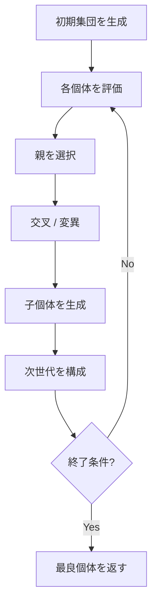
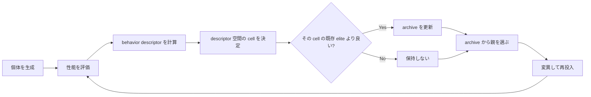
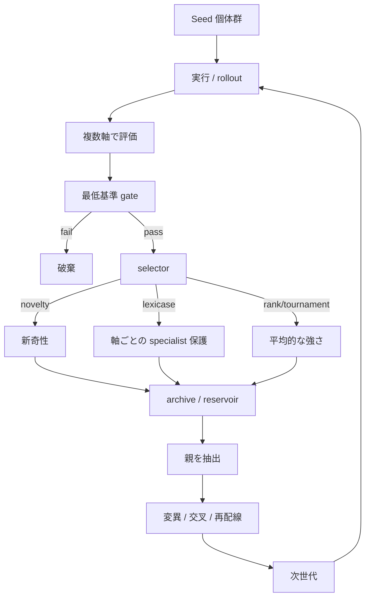
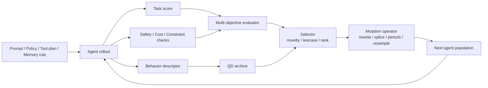
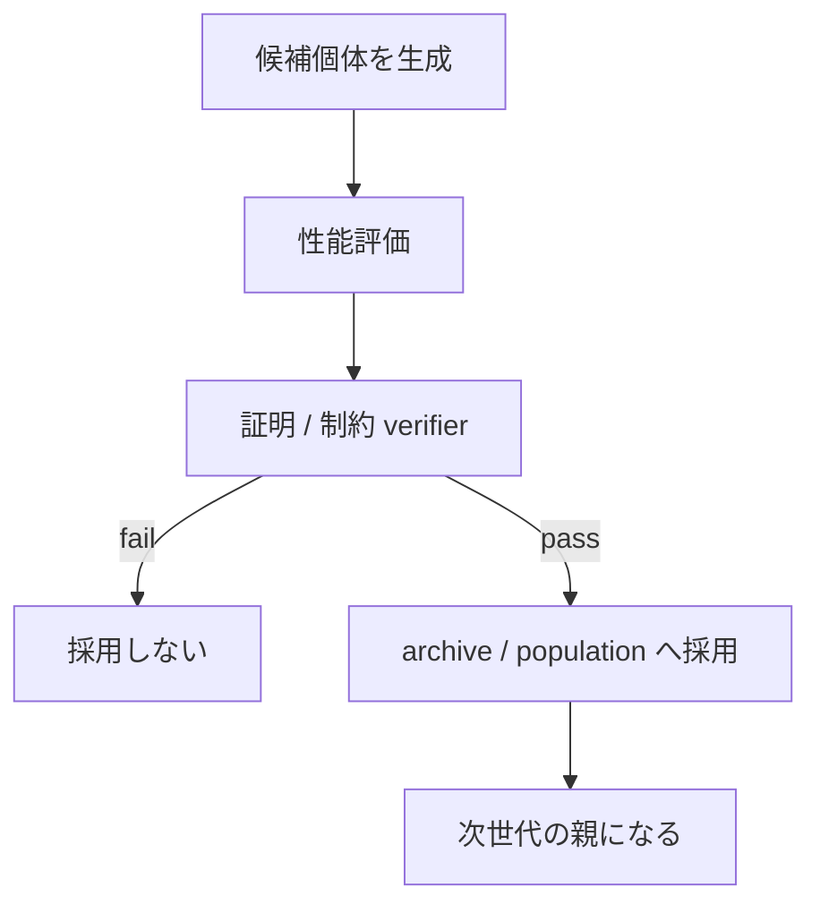

# 進化型プログラム入門 — GA / ES / GP / MAP-Elites までの違いと壊れどころを 1 本でつかむ

> **TL;DR:** 進化型プログラムの本質は「どう変異させるか」だけでなく「何を残すか」にある。GA / ES / GP / MAP-Elites などの違いを、用語・ブロック図・壊れどころ・最初の 1 本の実装順でまとめた入門ハブです。

> この記事は **「進化型プログラムって結局なにがどう違うの?」** を、用語表からブロック図まで一気に通す整理ノートです。教科書的な説明だけでなく、**実装でどこが壊れるか**まで含めます。
>
> 関連:
> - [FullSense 開発記事 — 読む順ガイド](https://qiita.com/furuse-kazufumi/items/ac398349ec42e40913f1)
> - [lldarwin / 進化 arc 総集編](https://qiita.com/furuse-kazufumi/items/6e107c7dfa0c261ee4d7)
> - [llcore 検証 arc 総集編](https://qiita.com/furuse-kazufumi/items/cc0713ab78a5b390df76)
> - 背景の grounding には、RAD の進化計算系コーパスと FullSense / `lldarwin` / `llcore` の設計メモを使っています。詳細な corpus 名は末尾の参考導線で拾えるようにしています。

> 急ぐ人向け:
> - **違いだけ先に知りたい** → 3. 流派の地図 — GA / ES / GP / NEAT / QD
> - **図で全体像を掴みたい** → 4. ブロック図で見る「現代の進化型プログラム」
> - **実装でどこが壊れるか知りたい** → 5. どこで壊れるか — 実装でよく踏む 6 つの罠
> - **何から作ればいいか知りたい** → 8. 最初の 1 本を実装するなら

---

## 0. 1 分 version

進化型プログラムをいちばん短く言うと、

> **候補をたくさん作り、測り、残し、少しずつ変えて、良いものが増えるかを見る計算**

です。

このとき流派が分かれるのは、主に **次の 4 点**です。

1. **何を遺伝子として持つか**
   数列なのか、木構造なのか、ニューラルネットの重みなのか、プログラムそのものなのか
2. **何を良いとみなすか**
   単一の fitness なのか、多目的なのか、新しさなのか、ニッチの被覆なのか
3. **どう残すか**
   上位だけ残すのか、軸ごとの specialist を残すのか、マスごとに champion を残すのか
4. **どこに安全装置を入れるか**
   何でも変異させるのか、証明や制約で gate をかけるのか

この記事の芯は 1 行で言うとこうです。

> **進化型プログラムの本質は「変異」よりも「何を残すか」の設計にある。**

変異器だけ良くても、淘汰器が壊れていると探索は早い段階で鈍りやすくなります。

### こんな人向け

- 遺伝的アルゴリズムは聞いたことがあるが、ES / GP / QD との違いが曖昧
- 論文は読めても、実装で何を差し替える話なのかが掴みにくい
- LLM / agent 系にも進化計算の発想がどこで効くか知りたい

---

## 1. まず用語を 1 枚で揃える

| 用語 | ひとことで | 何に相当するか |
|---|---|---|
| **genotype** | 遺伝子 | 内部表現。パラメータ列、木、コード、重みなど |
| **phenotype** | 発現した姿 | 実際に動く挙動。解、プログラム、エージェントの振る舞い |
| **fitness** | 良さの点数 | 精度、報酬、勝率、損失の逆、制約違反なし等 |
| **selection** | 親を選ぶ | 次世代に何を残すか |
| **mutation** | 小さな変化 | ノイズ追加、枝差し替え、重み摂動、命令挿入 |
| **crossover** | 交叉 | 2 個体の一部を混ぜる |
| **population** | 集団 | 候補解の束 |
| **elite** | 保存個体 | 良かった候補を次世代へ持ち越す |
| **descriptor** | 振る舞い座標 | 「どんなタイプの解か」を表す軸 |
| **archive** | 貯蔵庫 | 多様な良い解を保存する場所 |
| **novelty** | 新しさ | 既存の解とどれだけ違うか |
| **lexicase** | 軸を順番に見る選択 | 平均でなく specialist を残す仕組み |
| **minimal criterion** | 最低基準 | まず足切りしてから競わせる |
| **open-endedness** | 飽和しにくさ | 探索が早々に 1 点へ潰れない性質 |
| **deceptive landscape** | だまし地形 | 近くの山を登ると本命に届かない地形 |

### かみくだき

- **genotype** は設計図
- **phenotype** は実際に動いたもの
- **fitness** は採点
- **selection** はオーディション
- **archive** は「優勝者 1 人だけ」でなく「いろんな分野の代表を保管する棚」

です。

この 5 つを頭の中で混ぜないと、論文や実装の読みやすさがかなり変わります。

> 進化計算の話は用語が多いので、**雰囲気で読むとすぐ迷子になります。まず語彙を揃えるのが先**です。

### ☕ 休憩ポイント

ここまでで迷ったら、

- 遺伝子は何か
- 採点は何か
- 何を残すか

の 3 点だけ押さえれば先へ進めます。

---

## 2. まずは古典形 — いちばん普通の進化型プログラム

いちばん基本の流れはこれです。



この型はシンプルですが、逆に言うと **何をどこで差し替えるか** が流派の分かれ目です。

### 2.1 どこが差し替え点か

| ブロック | 差し替え候補 |
|---|---|
| 初期集団 | ランダム初期化、手設計 seed、既存モデルからの warm start |
| 評価 | 単一 fitness、多目的評価、制約付き評価、新奇性評価 |
| 親選択 | tournament、roulette、rank、lexicase |
| 変異 | ガウス摂動、ビット反転、木の枝差し替え、プロンプト編集 |
| 次世代構成 | generational、steady-state、elitism、archive 併用 |

進化計算の論文を読むときは、まず

> **この論文は 5 ブロックのどこをいじっているのか**

を見ると整理しやすいです。

---

## 3. 流派の地図 — GA / ES / GP / NEAT / QD

### 3.1 GA（Genetic Algorithm）

**もっとも教科書的な型**です。固定長の遺伝子列を持ち、交叉と変異で探索します。

- 強み: 分かりやすい、実装しやすい
- 弱み: 表現力が低いと「遺伝子は回っているが本質に触っていない」になりやすい

たとえば 100 個の数値を遺伝子として持つなら、GA は「100 個のつまみを少しずつ回す」感じです。

### 3.2 ES（Evolution Strategy）/ CMA-ES

こちらは **個体そのもの** だけでなく、**どう変異させるかの分布** も学ぶ系です。

- GA が「子を作る」
- ES は「良い子が出やすい揺らし方そのものを更新する」

と見ると分かりやすいです。

特に **CMA-ES** は連続値最適化で非常に強く、「高価な評価だが勾配が取りにくい」状況でよく出てきます。

### 3.3 GP（Genetic Programming）

ここでは遺伝子が **数列でなくプログラム木そのもの** です。

- ノード = 演算子
- 葉 = 変数や定数

を持つ木を交叉・突然変異させます。

つまり

> **パラメータを最適化するのでなく、式そのものを進化させる**

系です。

`llcore` でやっている「状態更新則や学習則の式を候補として扱う」は、この GP 的な発想にかなり近いです。

### 3.4 NEAT / HyperNEAT

これはニューラルネットの **重み** だけでなく **構造** も進化させる系です。

- ノード数
- 接続
- トポロジー

まで遺伝子に含めます。

要するに、

> **ネットワークの形そのものを手で決めない**

方向です。

### 3.5 QD（Quality Diversity）/ MAP-Elites

ここで一段、思想が変わります。

古典進化計算は「1 番良いものを探す」に寄りがちですが、QD は

> **いろんなタイプの良いものを同時に集める**

を目指します。

代表が **MAP-Elites** です。



MAP-Elites では「全体 1 位」よりも、

- このタイプの中では 1 位
- あのタイプの中では 1 位

を棚に分けて保管します。

だから **単一の champion に潰れにくい**。

### 3.6 novelty search

novelty search はさらに面白くて、性能より

> **今までと違う場所に行ったか**

を褒めます。

これが効くのは、だまし地形で「近視眼的に 1 位だけ追うと、同じ谷に全員落ちる」場合です。

ただし重要な honest disclosure があります。

- novelty は **行動の散らばり** を保つ
- でも **祖先系統の生存** までは保証しない

これは `lldarwin` で実際に踏んだ罠でした。  
行動多様性は保てても、系統多様性は中立浮動で潰れることがある。

つまり **多様性にも種類がある** ということです。

### 3.7 ε-lexicase selection

これはかなり重要です。

ふつうの選択は「全部の点数を足して平均上位を残す」方向に寄ります。  
でもそれだと、数学だけ天才、図工だけ天才、営業だけ天才、みたいな **specialist** が平均点に負けて消えます。

ε-lexicase は

- 評価 case を 1 つ選ぶ
- その case で良い個体だけ残す
- 次の case に進む

を繰り返します。

つまり

> **総合点でなく、科目ごとに勝っている奴を救う**

仕組みです。

`lldarwin` ではこれが中核でした。

### ☕ 休憩ポイント

流派名が増えてきた段階では、

- 1 位を選ぶ話か
- いろんな強い型を残す話か
- specialist を殺さない話か

の 3 区分で見ると、だいぶ追いやすくなります。

---

## 4. ブロック図で見る「現代の進化型プログラム」

ここからが本題です。今の進化型プログラムは、単なる「評価して変異」ではなく、だいたい複層化しています。

### 4.1 典型的な現代構成



ポイントは 3 つです。

1. **評価が複数軸**
   精度だけでなく、多様性、安全性、コスト、安定性まで見る
2. **selector が 1 種ではない**
   rank だけでなく novelty や lexicase が混ざる
3. **archive がある**
   「その場の勝者」だけでなく、あとで効く個体を残す

これが弱いと、長期では飽和や monoculture に寄りやすくなります。

### 4.2 LLM / agent 系での拡張

LLM やエージェントに持ち込むと、さらに 1 層増えます。



ここで難しくなるのは、

- 遺伝子が自然言語 prompt かもしれない
- 変異がコード編集かもしれない
- 評価が task success だけでなく cost や安全性を含む

点です。

つまり **「何を進化させているのか」が固定でない**。

これが、古典 GA をそのまま LLM へ移すと壊れやすい理由でもあります。

### ☕ 休憩ポイント

この段階で大事なのは、進化計算を「変異器」だけでなく

- evaluator
- archive
- gate

まで含む実装スタックとして見ることです。

---

## 5. どこで壊れるか — 実装でよく踏む 6 つの罠

### 5.1 満点インフレ

全員の評価がすぐ 1.0 になると、selection は実質ランダム化します。

- 足し算型 fitness
- 粗い proxy
- case が少なすぎる評価器

で起きやすいです。

`lldarwin` を設計した直接のきっかけもこれでした。

### 5.2 だまし地形

近くの坂を登ると、真の山頂に行けない地形です。

このとき

- hill-climb
- 単純 GA
- 平均最適化

は近場の山に吸われやすい。

ここで MAP-Elites や novelty の価値が出ます。

### 5.3 「行動多様性」と「系統多様性」を混同する

これは本当に重要です。

- **行動多様性**
  出てくる解のタイプが散っている
- **系統多様性**
  祖先や founder のラインが残っている

novelty は前者を守れても、後者を保証しないことがあります。

### 5.4 archive を置いただけで安心する

archive は大事ですが、**選択圧そのもの** が閉じていると救えません。

実際、`scalar + archive` だけでは open-endedness が成立しないことがあります。  
「貯蔵庫がある」ことと「淘汰が開放端」であることは別です。

### 5.5 高次元 descriptor 問題

QD は魅力的ですが、descriptor が高次元になると cell の大半が空になりがちです。

つまり、

> **多様性を守るつもりで、棚を作りすぎて誰も入らない**

状態です。

このときは

- descriptor を減らす
- 投影する
- factor-subspace に分ける

などが必要です。

### 5.6 安全 gate を入れない

これは `llcore` 側の教訓です。

もし進化対象が

- 状態更新則
- 学習則
- メモリ部品

のように「壊れたら暴走する」ものなら、評価後にただ上位を残すだけでは危ない。

そこで

> **採用前に sound cert を通す**

という設計が入ります。



進化型プログラムは「強いものを残す」だけではなく、対象によっては

> **壊れないものだけ残す**

層が必要になります。

### ☕ 休憩ポイント

ここまでで覚えておくと楽なのは、**進化型プログラムは mutate の工夫だけでなく、残し方と gate の工夫で性格が変わる**という点です。

GA / ES / GP / QD の名前を全部覚えなくても、

- 何を変えるか
- 何を残すか
- 何を危険として落とすか

の 3 問で見れば、だいたい迷子になりません。

---

## 6. FullSense ではどう使っているか

ここは具体例です。

### 6.1 `lldarwin` 側

`lldarwin` では、RAD の `evolutionary_computation` 系コーパス（設計時点で 616 docs 横断）を踏まえ、

- ε-lexicase
- novelty
- minimal criterion
- QD / MAP-Elites
- down-sampling
- neutral reservoir

を **新しいアルゴリズムを発明するのでなく、配線して束ねる** 方針を取りました。

つまり主張は

> **すでにある良い部品を、集約せずに同居させる**

ことです。

### 6.2 `llcore` 側

`llcore` では、進化の対象が「AI 部品の式そのもの」寄りなので、単に勝ち残らせるだけでは足りません。

そのため

- mutate
- evaluate
- certify
- adopt

の 4 段階を分け、**証明できたものだけ採用**する fail-closed 構造を取ります。

これは古典的な進化計算からすると少し異質ですが、

> **評価だけでなく採用にも gate がある進化型プログラム**

として見ると整理しやすいです。

### 6.3 ここが差別化軸

古典の進化計算は「もっと強い解を探す」が中心です。  
一方で FullSense 側は、

- specialist を殺さない selection
- archive による多様性保持
- さらに sound cert による採用 gate

まで入れています。

要するに

> **探索の自由度は上げるが、採用は厳しくする**

という設計です。

---

## 7. 進化型プログラムを読むときのチェックリスト

論文でも実装でも、私はまずこの 8 問で読みます。

1. 遺伝子は何か
2. phenotype は何か
3. fitness は単一か複数か
4. selector は何か
5. archive はあるか
6. descriptor は何か
7. monoculture をどう防ぐか
8. 壊れてはいけない対象なら、採用前 gate はあるか

この 8 問に答えられると、その進化型プログラムが

- 単なる GA なのか
- QD 系なのか
- novelty 系なのか
- open-ended を狙っているのか
- verifier 付きの特殊系なのか

がかなりクリアになります。

---

## 8. 最初の 1 本を実装するなら

「結局、最初に何を作ればいいのか」だけをかなり雑に言うと、

1. **固定長ベクトル + 単一 fitness + tournament selection**
2. **elitism を 1 本だけ入れる**
3. **評価ログを毎世代残す**
4. **満点インフレを見たら archive か novelty を疑う**

から始めるのが無難です。

### 8.1 最小構成

最小構成はこのくらいです。

```text
候補を N 個作る
→ 評価する
→ 上位を残す
→ 少し変異させる
→ 次世代へ回す
```

### 8.2 先に見たい壊れ方

この段階では、いきなり

- NEAT
- MAP-Elites
- novelty search
- ε-lexicase

を全部盛りにしないほうが、むしろ壊れ方を観察しやすいです。

先に見るべきは「高度な手法を積むこと」より、

- fitness が本当に識別しているか
- monoculture が起きていないか
- 評価器が proxy をハックされていないか

です。

> **最初の 1 本で勝つのでなく、最初の 1 本で壊れ方を見えるようにする**

と考えると、次の一歩を決めやすくなります。

---

## 9. まとめ

進化型プログラムは、「どう変異させるか」より **何を残すか** の設計問題です。

「突然変異して強いものを残す」という一文では全然足りません。

実際には

- **何を遺伝子にするか**
- **何を採点するか**
- **何を残すか**
- **多様性をどう守るか**
- **壊れてはいけないなら何で gate するか**

の設計問題です。

そのうえで、ざっくり地図を描くとこうなります。

- **GA**
  固定長遺伝子列の古典形
- **ES / CMA-ES**
  変異分布まで学ぶ連続最適化
- **GP**
  式やプログラム自体を進化
- **NEAT 系**
  構造も進化
- **novelty search**
  新しさを褒める
- **MAP-Elites / QD**
  多様な良い解を棚に残す
- **ε-lexicase**
  specialist を殺さない
- **verifier-gated evolution**
  壊れない候補だけ採用する

そして、現代の実務では最後の 1 行がかなり大事です。

> **進化は「どう変えるか」より「何を残すか」で壊れやすい。**

もし次に続けるなら、

1. `lldarwin` の「集約しない淘汰」を設計した話
2. `llcore` の「証明ゲート付き進化」を設計した話
3. `MAP-Elites` が効く地形と効かない地形を、図で見分ける話

のどれかが自然です。

---

## 10. 関連記事の入口

- [lldarwin / 進化 arc 総集編](https://qiita.com/furuse-kazufumi/items/6e107c7dfa0c261ee4d7)
- [llcore 検証 arc 総集編](https://qiita.com/furuse-kazufumi/items/cc0713ab78a5b390df76)
- [FullSense 開発記事 — 読む順ガイド](https://qiita.com/furuse-kazufumi/items/ac398349ec42e40913f1)

## 11. 参考文献 / 参考リソース

> 注: ここでの導線は「一次資料へ辿るための代表入口」であり、古典流派では出版社 / 著者公式の書誌ページを含みます。必ずしも全文無料公開を意味しません。

- John H. Holland, [*Adaptation in Natural and Artificial Systems*](https://mitpress.mit.edu/9780262581110/adaptation-in-natural-and-artificial-systems/) (1975 / MIT Press 1992 edition)
  - GA の古典的な出発点。この記事の「固定長遺伝子列を交叉と変異で回す」説明の原点。
- Nikolaus Hansen, ["The CMA Evolution Strategy: A Tutorial"](https://arxiv.org/abs/1604.00772) (2016)
  - ES / CMA-ES 系の代表的な入口。連続最適化で「変異分布まで更新する」感覚を掴みやすい。
- John R. Koza, [*Genetic Programming: On the Programming of Computers by Means of Natural Selection*](https://mitpress.mit.edu/9780262527910/genetic-programming/) (1992)
  - GP の古典。式やプログラム木そのものを進化させる発想の出発点。
- Kenneth O. Stanley, Risto Miikkulainen, ["Evolving Neural Networks through Augmenting Topologies"](https://nn.cs.utexas.edu/?stanley%3Aec02=) (2002)
  - NEAT の代表的な原典。重みだけでなく構造も進化させる流れの入口。
- Joel Lehman, Kenneth O. Stanley, ["Abandoning Objectives: Evolution through the Search for Novelty Alone"](https://www.cs.swarthmore.edu/~meeden/DevelopmentalRobotics/lehman_ecj11.pdf) (2011)
  - novelty search の代表的な入口。性能だけでなく「新しさ」を報酬にする理由が分かりやすい。
- Jean-Baptiste Mouret, Jeff Clune, ["Illuminating search spaces by mapping elites"](https://arxiv.org/abs/1504.04909) (2015)
  - MAP-Elites の代表的な原典。この記事の「棚に分けて elite を残す」説明に対応。
- William La Cava, Thomas Helmuth, Lee Spector, Jason H. Moore, ["A Probabilistic and Multi-Objective Analysis of Lexicase Selection and Epsilon-Lexicase Selection"](https://arxiv.org/abs/1709.05394) (2017 preprint / 2019 journal)
  - lexicase / ε-lexicase の入口。平均点でなく「特定ケースの specialist を残す」仕組みを、Pareto front 的にどう読むかまで追える。
- Matthew C. Fontaine, Julian Togelius, Stefanos Nikolaidis, Amy K. Hoover, ["Covariance Matrix Adaptation for the Rapid Illumination of Behavior Space"](https://arxiv.org/abs/1912.02400) (GECCO 2020)
  - CMA-ME 系の入口。MAP-Elites と CMA-ES をどう接続するかを追うときの補助線。
- RAD コーパスでの再確認メモ:
  - `evolutionary_computation_corpus_v2` と `evolution_corpus_v2` では、QD / novelty / CMA-ME / LLM 併用進化が厚く、この記事の差別化軸は新規手法提案ではなく**流派の位置関係を初心者向けに 1 本へ束ねること**にある。

<!-- llive:meta.tags=["evolutionary-computation","genetic-algorithm","map-elites","llcore","lldarwin"] target=any -->
