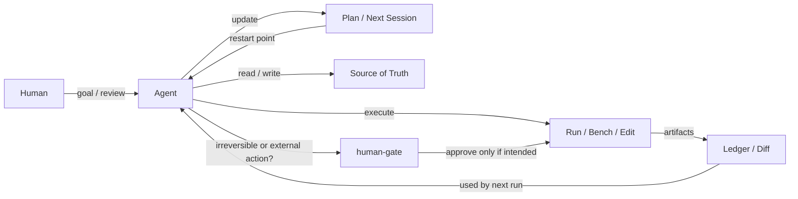
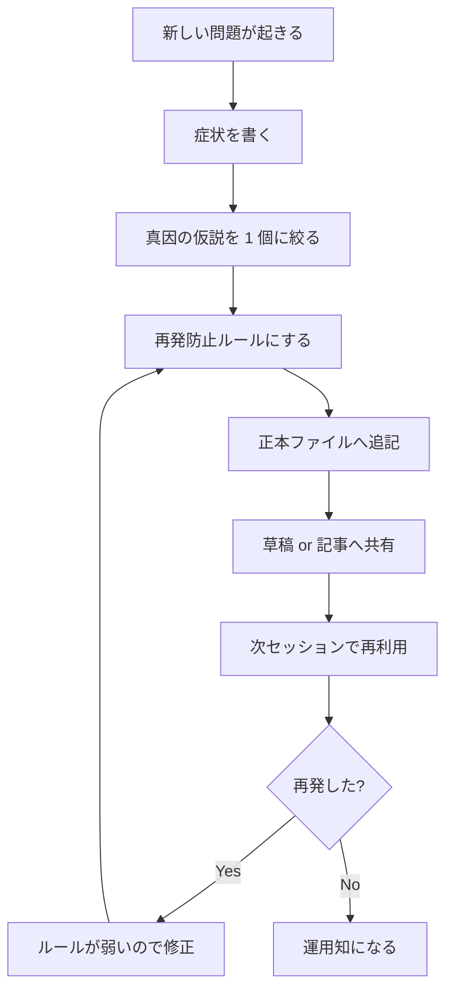

# AI と一緒に開発すると事故る 5 点と対策 — handoff / human-gate / diff / checkpoint

> **TL;DR:** AI 開発で先に壊れやすいのはモデル本体より `handoff / human-gate / diff / checkpoint` です。この記事は、実際に踏んだ 5 つの事故を「症状・真因・対策・残した再開導線」に分けて、次回の自分と次の AI が再利用できる形へ直した運用メモです。

> この記事は、私と AI が実際の開発で踏んだ問題と、そのとき何を直したかを、あとで再利用できる形にした共有メモです。  
> ただの「うまくいった話」ではなく、**どう壊れたか / 何を正本にしたか / どこを human-gate にしたか** を残します。
>
> 背景:
> - RAD の agent / security / loop 系コーパス
> - FullSense / `llcore` / `lldarwin` の最近の handoff と検証ログ
> - 「開発履歴」の続編ではなく、**運用上の失敗モード集**としての差別化
>
> 今回の grounding は、2026-06-17 時点でローカル再集計した **65 コーパス / 47,097 docs** 規模の RAD を背にしています。件数の内訳や近傍コーパスは「2. RAD で先に見えていた『共通の壊れ方』」でまとめます。
>
> 関連:
> - [FullSense 開発記事 — 読む順ガイド](https://qiita.com/furuse-kazufumi/items/ac398349ec42e40913f1)
> - [AI に AI を部下として使わせる #31 — Claude 主導 + Codex 配下の「二本柱」開発体制](https://qiita.com/furuse-kazufumi/items/71c2304718ad5829d2d7)
> - [#42 llterm 小話 — 沈黙する AI、156% を指すメーター、メニューに無い大盛り](https://qiita.com/furuse-kazufumi/items/75cd92ab2c683965f3ac)
>

## はじめに: コードは合っていたのに、セッションは迷子だった

あるとき私は、**「修正自体は終わっている」のに次のセッションがその修正へ着地できない**、という妙な事故を踏みました。

- 記事はある
- handoff もある
- でも再開すると、古い前提で別のところを触り始める

コードが壊れたわけではありません。  
壊れていたのは、**再開導線** と **責任境界** と **数字への態度** でした。

本稿は、その手の事故を「失敗談」として消費するのでなく、

> **次の自分と次の AI が、同じ穴に落ちないための運用部品**

としてまとめ直したものです。

この手の記事であとから効くのは、派手な成功談より

- どこでハマるか
- 何を 1 行ルールにしたか
- 明日から何を 1 つ増やせば事故率が下がるか

のほうです。

> 拾い読みガイド:
> - **再開で迷子になる話** → 3. 問題 1: handoff が正本でないと、次セッションが迷子になる
> - **publish / push の境界だけ見たい** → 4. 問題 2: 外部公開を自動化すると、便利さより先に事故る
> - **数字をどう疑うか知りたい** → 5. 問題 3: 「変に良い数字」は勝利でなく警報
> - **最後に運用だけ持ち帰りたい** → 8. 事故を単発で終わらせないための運用ループ / 12. まとめ

---

## 0. 1 分 version

AI と一緒に開発するとき、実際に壊れやすいのはコード本体だけではありません。

壊れやすいのはむしろ、

1. **引き継ぎ**
2. **公開境界**
3. **計測の信頼性**
4. **長時間ジョブの運用**
5. **差分のきれいさ**

です。

そして経験上、うまく回る構成はだいたい次です。



一言で言うと、

> **AI 開発は「賢い生成」より「壊れたときの着地地点」を設計したほうが強い**

です。

### 三行で言うと

- AI 開発で本当に壊れやすいのは、モデルより **handoff / human-gate / diff / checkpoint** です。
- しかもその失敗モードは、手元だけでなく RAD コーパス側でも繰り返し見受けられます。
- だから本稿は「どう作ったか」より、「**どう迷子になり、どう戻れるようにしたか**」を主役にします。

ここで先に出している `handoff / human-gate / diff / checkpoint` は**運用上の持ち帰りカテゴリ**で、後ろの `unsupported success / verifier / durable write / checkpoint + human-gate` はそれを RAD 側の失敗モードへ対応づける**分析レイヤ**です。

### 先に「明日から試せる一手」だけ欲しい人へ

1. **手書き handoff の正本** を 1 つ決める
2. publish / push / 削除は **human-gate** へ送る
3. 良すぎる数字は **勝利でなく警報** と扱う
4. 長時間ジョブは **checkpoint と再開地点** を先に作る
5. 自動ログは成果物差分から **分離** する

---

## 1. この記事をどう読むか

今回は、開発事故を「怖い話」として並べるのでなく、再利用しやすい 4 列で揃えます。

| 見る列 | 意味 |
|---|---|
| 症状 | 何が起きたか |
| 真因 | なぜそうなったか |
| 対策 | 何を固定ルールにしたか |
| 残した再開導線 | 次回の自分が読むべきファイルや参照メモ |

この形にしておくと、次に同じ事故が起きたとき、

- 記憶で思い出す
- 会話ログを漁る
- 雰囲気で再現する

を減らせます。

読む感触としては、

- 以前書いた「開発履歴」記事ほど時系列ではなく
- 以前書いた「体制論」記事ほど抽象でもなく
- 以前書いた「小話」記事よりは再利用寄り

の中間を狙っています。

---

## 2. RAD で先に見えていた「共通の壊れ方」

今回の話は、**たまたま私の環境だけで起きた事故として片づけにくい話です。**
RAD 側を引くと、**ローカルコーパス要約でも近い失敗モードが見受けられます。**

件数で言うと、今回の grounding に直接使った近傍だけでも

- `agents_corpus_v2`: 1,170 docs
- `hacker_corpus_v2`: 4,793 docs
- `loop_engineering_corpus_v2`: 97 docs
- `self_evolving_agents_corpus_v2`: 99 docs

ローカル再集計時点の RAD 全体は **65 コーパス / 47,097 docs** です。  
なのでこれは「たまたま似た論文を 1 本見つけた」というより、**ローカルコーパス要約でも繰り返し見える失敗モード**として読めます。

> honest disclosure:
> - 以下は RAD コーパスで拾った**近縁な外部研究の系統**です。
> - 上の 4 件 (`1,170 docs / 4,793 docs / 97 docs / 99 docs`) は **2026-06-17 時点のローカル再集計値**で、外部からそのまま再現できる数字ではありません。
> - `unsupported success` / `human-gate` / `verifier` / `durable write` / `checkpoint` は **FullSense / RAD 側の内製ラベル**です。本文末の appendix には `VLAA-GUI` / `Resilient Write` / `Crab` を**本文 4 類型の近傍にある実名ソース**として置き、`Measuring the Permission Gate` は `human-gate` 境界を見る**補助線**として別に添えています。
> - これら 4 本の arXiv URL / title / author は 2026-06-19 に一次情報で確認済みです。
> - ここでの役割は、「こういう失敗モードが外でも観測されている」という接地メモです。

| RAD 側の観察 | この記事での対応物 |
|---|---|
| **unsupported success**（本記事の整理語） | ベンチが妙に良い、公開状態を勘違いしたまま進む |
| **human-gate / permission boundary**（ローカル整理上の対応・補助線） | publish / push / 削除の境界だけは人間承認へ送る |
| **loop breaker / completeness verifier**（ローカル整理上の対応） | finish claim を疑う、再開点と成功条件を handoff に書く |
| **durable write / handoff envelope**（ローカル整理上の対応） | 書き込み失敗や中断があっても、次回再開できる形で残す |
| **checkpoint / restore semantics**（ローカル整理上の対応） | 長時間ジョブは死ぬ前提で区切り、戻り先を作る |

研究側で本文の主線に近かったのは、次の 4 つです。

1. 長時間 research harness で、  
   **「見た目は成功だが、証拠が足りない unsupported success」** を主要な失敗モードとして扱う型。
2. finish 時に direct evidence を要求する completeness verifier と、  
   同じ失敗を繰り返さない loop breaker を重く置く型。
3. 書き込み失敗そのものより、  
   **「失敗したのに structured signal が返らず、草稿と文脈を失う」**ことを問題化する型。
4. checkpoint を全部のターンでやるのでなく、  
   **recovery relevance があるところだけ切る**発想を取る型。

加えて、publish / push / 削除のような外部境界だけを **human-gate** に送る補助線として、permission-gate の coverage boundary を stress-test する型もあります。

つまり本稿の「5 点」は、**主線として持ち帰る 4 類型**と、そこを支える **補助線 1 つ（human-gate）** の 4+1 です。
記事全体の `5 点` は運用上の事故カテゴリ、ここで切り出している `4+1` は RAD 接地のための分析レイヤだと読めば十分です。

要するに持ち帰りたいのは、

> **handoff / verifier / durable write / checkpoint は、ローカルコーパス要約でも長時間運用の主機能として繰り返し現れる**

です。

### たとえで言うと

ここで言いたいのは、「AI は優秀な新人だが、机の引き出しのラベルを貼らないまま帰ると、翌朝の自分も別の新人も全員困る」という話です。

- handoff は引き出しのラベル
- verifier は「本当に閉店処理まで済んだか」を見る店長
- durable write はメモ帳でなく日報
- checkpoint は停電しても再開できるレジ締め

です。

---

## 3. 問題 1: handoff が正本でないと、次セッションが迷子になる

### 症状

- セッション再開時に「どこから続けるか」が曖昧になる
- 自動生成サマリと手書きメモが食い違う
- 存在しない commit hash や古い publish 状態が handoff に残る

### 真因

「要約してあるファイル」と「次回の正本として読むファイル」を混同すると、ここが壊れます。

特に危ないのは、**次の 3 つ**です。

- 自動生成サマリを手書き正本扱いする
- その場の口頭説明を handoff に転写しない
- hash や publish 状態を憶測で書く

です。

RAD 側でも、agent memory の失敗モードとして **stale memory** や **implicit conflict** は繰り返し出てきます。  
つまり「昔の記憶を持っている」のと「今の正しい状態を指せる」は別です。

### 対策

今回の運用では、次のように切り分けました。

- 手書き handoff の正本
- テーマ別の補助設計メモ
- Stop hook が作る現況スナップショット

つまり

> **自動要約は参照物、再開導線は手書き正本**

です。

### ☕ 休憩ポイント

この節の要点は 1 つだけです。  
**「まとめてある」ことと「次回そこから再開できる」ことは別。**

ここを混ぜると、ログは残っているのに作業は継続できない、という妙な事故になります。

### 残した再開導線

- 手書き handoff の正本
- シリーズ全体の背景メモ

### 明日から試せる最小ルール

```md
- 手書き handoff の正本を 1 ファイルだけ決める
- 自動生成 summary は snapshot 扱いにする
- commit hash / publish 状態は憶測で書かない
```

---

## 4. 問題 2: 外部公開を自動化すると、便利さより先に事故る

### 症状

- Qiita / dev.to / Team への書き込みが「ただの続き作業」に見えてしまう
- draft 更新と public publish の境界が曖昧になる
- 「確認は求めない」と「外部公開は human-gate」が衝突する

### 真因

**AI は与えられた目標に忠実**なので、

- どこまでがローカル整備か
- どこからが外部状態の変更か

を architecture 側で切っておかないと、善意でそのまま公開まで進みます。

ここは能力の問題というより、**責任境界の問題**です。

### 対策

今回のルールは単純で、

- ローカル草稿化までは自律
- `private: true` の整備までは自律
- publish / push / 外部アクションは human-gate

にしました。

Qiita の投稿数制限が強い以上、なおさら

> **公開を急ぐより、private draft を厚くしてから出す**

ほうが運用が安定します。

公開まわりは、料理で言えば「皿に出す前の味見」です。  
鍋の中で直せるうちは自律でよく、外へ出す瞬間だけ human-gate を置く。この分け方がいちばん揉めません。

### 残した再開導線

- #43 かみくだき版の草稿
- 進化型プログラム記事の草稿
- 本稿自身の草稿

### 明日から試せる最小ルール

```md
- push / publish / delete は自動実行しない
- irreversible action は handoff に 1 行残してから人間確認へ送る
- draft は `private: true` + `ignorePublish: true` から始める
```

---

## 5. 問題 3: 「変に良い数字」は勝利でなく警報

### 症状

- ベンチが異様に速い
- 精度が不自然に高い
- 進化が妙にきれいに収束する
- ところが中身を開くと attach 漏れや proxy の飽和だった

### 真因

AI 開発では、失敗だけでなく **成功らしきもの** も疑わないと危ないです。

`llive` でも `llcore` でも、実際に役に立ったのは

- 異常に速い数字を疑う
- 何を数えたのかを疑う
- 評価関数が本当に識別しているかを疑う

という、かなり地味な姿勢でした。

これは RAD の進化計算系でもよく出る話で、

- deceptive landscape
- specification gaming
- reward hacking
- proxy saturation

は全部この親戚です。

### 対策

運用ルールとして固定したのは次です。

1. **勝った理由を先に説明できない数字は公開しない**
2. **「測定方法そのもの」を 1 回疑う**
3. **null result も残す**
4. **良い数字より failure mode を再開導線として残す**

`llcore` 側でも、

- 「ANN 化 = 速い」は規模前提を隠す
- 自前グラフを教師にすると circularity を踏む
- 122 annotations という小ささ自体が設計を駆動する
- 広い topical query は recall を稼ぐが leaf cluster にノイズを返す
- API が死んでも corpus 側の構造化 fallback で前に進める

といった教訓が、派手な勝ち筋より後の設計に効きました。

ここは、以前書いた「使いたい数字を自分で捨てる」作法ともつながっています。  
読み手にとって面白いのは大勝利の数字ですが、あとで効くのはたいてい **捨てた数字の理由** のほうです。

### 残した再開導線

- `llcore` 側の研究シードメモ
- 手書き handoff の正本
- 進化型プログラム記事の草稿

### 明日から試せる最小ルール

```md
- 良すぎる数字は本文に入れる前に一次情報で 1 回止める
- 出典未確認なら「要一次確認」を残す
- 数字には取得日と数え方を付ける
```

### ☕ 休憩ポイント

ここまで読んだ段階で持ち帰るなら、**「良い数字」も failure mode と同じくらい疑う**だけで十分です。

- 速すぎる
- きれいすぎる
- 説明なしに勝ちすぎる

この 3 つが出たら、まず祝うのでなく止める。これだけで事故率はかなり下がります。

---

## 6. 問題 4: 長時間ジョブは、セッションと一緒に死ぬ

### 症状

- `run_in_background` 的な気持ちで流した長時間処理が、次に見たら消えている
- checkpoint 間隔が粗すぎて、死んだときの損失が大きい
- 「あとで回収すればいい」が成立しない

### 真因

エージェント環境のバックグラウンド実行は、ローカルの常駐ジョブと同じではありません。

つまり

> **会話が終わる = プロセスの寿命も怪しい**

です。

これは実務ではかなり大きく、PoC の設計そのものを変えます。

### 対策

`llcore` 側で強くなったのはここです。

- 長走ジョブは foreground 分割
- checkpoint は「件数」だけでなく「時間」でも切る
- 次回再開点を handoff に書く
- PC が弱いなら、重いものは Kaggle / GitHub Actions に投げる

つまり「速い計算を書く」より先に、

> **死んでも戻れる run を作る**

ほうが重要でした。

ここは RAD の checkpoint/restore 系ともかなり一致しています。  
重要なのは「全部保存する」ことではなく、

- どこで落ちても復元できるか
- どの副作用が recovery-relevant か
- 次回の自分が再開点を特定できるか

の 3 点でした。

### かみくだき

長時間ジョブは「走らせる」のが難しいのではなく、**途中で死んだあとに平静でいられる形にする**のが難しいです。

- 3 時間回ったあと落ちると痛い
- 30 分ごとに戻り先があれば痛みはかなり減る
- どこから再開するかが handoff に書いてあれば、次の自分も助かる

この 3 点がそろうと、家庭用 PC でもだいぶ戦えます。

### 残した再開導線

- `llcore` 側の研究シードメモ
- 手書き handoff の正本

### 明日から試せる最小ルール

```md
- 30 分を超える処理は「死んでも再開できるか」を先に考える
- 終了条件より再開地点を先に書く
- まとめて 1 回より、小さく checkpoint を切る
```

---

## 7. 問題 5: 差分が汚いと、履歴が学習データとして使えない

### 症状

- 自動ログ 1 行が記事差分に混ざる
- front matter の整形ゆれだけで差分が立つ
- 「何を変えた commit か」が読みづらくなる

### 真因

AI と一緒の開発では、commit は単なる保存点ではなく、

- 次の AI が読む履歴
- 次の人間がレビューする履歴
- 将来の記事の出典

でもあります。

なので diff が汚いと、単に気分が悪いだけではなく、**次の認知コストが上がる**。

### 対策

今回の実務ルールは次です。

- 自動ログは記事差分から外す
- 出自不明の front matter 整形は採らない
- handoff だけ先に進んで、本体が未追跡の状態を作らない

地味ですが、これはかなり効きます。

diff がきれいだと AI も人間も読めます。  
diff が汚いと、どちらも「雰囲気レビュー」になりがちです。

durable write 系の議論に引きつけると、ここは単なる趣味ではありません。  
**書き込みの durable surface が弱いと、draft も文脈も回復しにくい**からです。

ここは記事としても地味に効きます。  
履歴がきれいだと、あとで「この話どこから生えたんだっけ?」を追えるので、失敗談がただの愚痴で終わりません。

### 残した再開導線

- 本稿自身
- 手書き handoff の正本

### 明日から試せる最小ルール

```md
- 自動ログと成果物を同じ commit に混ぜない
- 追跡対象ノイズは handoff で明示する
- 「今回の差分は何か」を 1 行で言える状態を保つ
```

### ☕ 休憩ポイント

この節の芯は、**きれいな diff は美学ではなく再利用性**だということです。

- 次の人間が読む
- 次の AI が読む
- 将来の記事の出典にもなる

そう考えると、自動ログ 1 行でも「あとで読むコスト」を増やすので、雑に混ぜない理由がはっきりします。

---

## 8. 事故を単発で終わらせないための運用ループ

ここまでを、単発の事故報告で終わらせないための最小ループを書くとこうなります。



ポイントは、

- 感想で終わらせない
- 「何を読めば再開できるか」を明示する
- 次回の agent が同じ穴に落ちる前提で書く

です。

人間同士の引き継ぎでも大事ですが、AI 相手だとさらに効きます。  
AI は空気を読まず、書いてないことは普通に踏み抜くからです。

このへんは、以前書いた llterm 小話で出てきた「黙る」「読み落とす」「前提を持ち越しすぎる」ともつながっています。  
笑い話に見える現象が、そのまま durable な運用設計の論点になります。

### ☕ 休憩ポイント

ここまでで 1 行に縮めると、**事故を減らす最短路は、失敗談をルールへ落として handoff に残すこと**です。

問題を 1 回で絶滅させるのでなく、

- 起きた
- 名前を付けた
- 正本へ残した

までを 1 周として回すと、やっと運用知になります。

---

## 9. llcore の進捗から見えた、今いちばん共有価値のある気付き

最後に、最近の `llcore` で「記事化すると再利用価値が高い」と感じたものを 5 つだけ抜きます。

1. **RAD 接地を先にやると、新規性マップを 30 分で引ける**
   何を作るかより先に、既存系譜と failure mode を掴んだほうが速い。

2. **小さい教師データは、弱点ではなく設計制約として読む**
   `122 annotations` しかないなら、その小ささを前提に readout と gate を組む。

3. **role フィルタのような素朴な分離が、派手な埋め込み改善より効くことがある**
   corpus 混入で落ちた retrieval を、複雑な学習でなく role 制約で戻せる場面がある。

4. **null result は敗北記録でなく、次の設計を守る防波堤**
   「ANN 化しても速くならない」「sound gate は 1 判定の速さより reject 構造が効く」など。

5. **家庭用 PC の制約は、研究テーマを貧しくするのでなく、運用設計を賢くする**
   checkpoint / offload / fail-closed の感覚は、むしろここで鍛えられる。

### この節の温度感

「4.7 万件ある」「65 コーパスある」は、ただ盛りたいから書いている数字ではありません。  
ここで言いたいのは、**思いつきで語っているのでなく、ローカルコーパス要約の上で繰り返し見受けられた失敗モードを見ている**ということです。  
ただし、それでも一次情報と厳密な内訳は別途の検証を要する数字です。

---

## 10. 今ならこう直す

今回の 5 件をまとめて振り返ると、「最初からこうしておけばだいぶ減った」というものは次の 5 つでした。

### 10.1 最初に固定したかったもの

1. **手書き handoff の正本を最初の 1 日目で固定する**
   後から作ると、会話ログや自動要約が先に広がって drift しやすい。
2. **外部公開の境界を文面ではなく設定でも閉じる**
   `private: true` と `ignorePublish: true` を草稿の初手に入れる。
3. **良い数字を見た瞬間に「内訳」を取る**
   勝ったあとに疑うのでなく、勝ちそうに見えた瞬間に止める。

### 10.2 後から効いた運用ルール

4. **長時間ジョブは、実行コマンドより再開地点を先に書く**
   走らせ方より「死んだあとどう戻るか」のほうが長期では効く。
5. **ノイズ差分を「些細なこと」と思わない**
   自動ログ 1 行の混入でも、次の人間と次の AI の理解コストは確実に上がる。

要するに、改善の中心はモデル能力ではなく、

> **再開・承認・計測・記録の 4 面を先に設計すること**

でした。

---

## 11. 参考メモ (appendix)

この節では、**本文の流れを止めないために、外部系統メモと背景メモを最後にまとめています。**

### ここで見ている外部系統メモ

- unsupported success を中心失敗モードとして置く research harness 系
- completeness verifier / loop breaker / recover / search を中核に置く agent 系
- durable write surface / structured write error / handoff envelope を扱う write-resilience 系
- recovery relevance に応じた checkpoint/restore を扱う runtime 系

### 近い実名ソース

- **Qijun Han et al., "VLAA-GUI: Knowing When to Stop, Recover, and Search, A Modular Framework for GUI Automation"**  
  `unsupported success` そのものは本稿の整理語ですが、finish claim に direct evidence を要求する **Completeness Verifier** と、同じ失敗を反復しない **Loop Breaker** の組み合わせは、この系統の近い実名例として読めます。  
  [arXiv:2604.21375](https://arxiv.org/abs/2604.21375)
- **Justice Owusu Agyemang et al., "Resilient Write: A Six-Layer Durable Write Surface for LLM Coding Agents"**  
  `durable write surface` / `structured typed errors` / `task-continuity handoff envelopes` に対応する、書き込み失敗後も次回再開しやすくする系統の近い実名例です。  
  [arXiv:2604.10842](https://arxiv.org/abs/2604.10842)
- **Tianyuan Wu et al., "Crab: A Semantics-Aware Checkpoint/Restore Runtime for Agent Sandboxes"**  
  全ターン checkpoint ではなく、**recovery-relevant state** に応じて切る、という runtime / checkpoint 系の近い実名例です。  
  [arXiv:2604.28138](https://arxiv.org/abs/2604.28138)
- **Zimo Ji et al., "Measuring the Permission Gate: A Stress-Test Evaluation of Claude Code's Auto Mode"**  
  `human-gate` は本稿の運用語ですが、permission gate の coverage boundary を stress-test する外部系統として、この近傍に置いています。  
  [arXiv:2604.04978](https://arxiv.org/abs/2604.04978)

### この記事で参照している背景メモ

- `llcore` 側の教訓整理メモ
- handoff / human-gate / diff 汚染の運用整理メモ
- #43-#45 のシリーズ全体をつなぐ背景メモ

---

## 12. まとめ

AI と一緒に開発していて共有価値が高いのは、**成功談そのものより再開導線つきの失敗モード**でした。

だから本当に残したいのは、

- 「何が作れたか」
- 「どのモデルが強かったか」

だけではなく、

- **どこで迷子になったか**
- **何を正本にしたか**
- **どこを human-gate にしたか**
- **どの数字を疑ったか**

です。

もし一言で締めるなら、今のところの実感はこれです。

> **AI 開発の品質は、モデルの賢さだけでなく、引き継ぎの強さで決まる。**

### 最後に 1 つだけ持ち帰るなら

> **「AI が賢いか」より先に、「壊れたときに戻れるか」を設計する**

を選んでください。

### コメント歓迎

- handoff でハマった例
- human-gate をどこに置いているか
- 「良すぎる数字」をどう疑っているか

があれば、次の版で運用パターンとして取り込みやすいです。

## 13. 参考文献 / 参考リソース

- [FullSense 開発記事 — 読む順ガイド](https://qiita.com/furuse-kazufumi/items/ac398349ec42e40913f1)
- [#43 2026年、業界はAIに「手綱」と「輪」を名付けた — harness/loop engineering の試作スタックをローカルに組み始めた話](https://qiita.com/furuse-kazufumi/items/a96a15cb771fe5a57df6)
- [lldarwin 進化 arc 総集編](https://qiita.com/furuse-kazufumi/items/6e107c7dfa0c261ee4d7)
- [llcore 検証 arc 総集編](https://qiita.com/furuse-kazufumi/items/cc0713ab78a5b390df76)
- [Qijun Han et al., "VLAA-GUI: Knowing When to Stop, Recover, and Search, A Modular Framework for GUI Automation"](https://arxiv.org/abs/2604.21375)
- [Justice Owusu Agyemang et al., "Resilient Write: A Six-Layer Durable Write Surface for LLM Coding Agents"](https://arxiv.org/abs/2604.10842)
- [Tianyuan Wu et al., "Crab: A Semantics-Aware Checkpoint/Restore Runtime for Agent Sandboxes"](https://arxiv.org/abs/2604.28138)
- [Zimo Ji et al., "Measuring the Permission Gate: A Stress-Test Evaluation of Claude Code's Auto Mode"](https://arxiv.org/abs/2604.04978)
- `unsupported success` / `human-gate` / `verifier` / `durable write` / `checkpoint` 自体は、本稿では FullSense / RAD 側の整理語として使っている

<!-- llive:meta.tags=["ai-agent","handoff","human-gate","honest-disclosure","checkpoint"] target=any -->

<!-- REFERRAL -->

---

> ### ⚡ この連載は Claude Code と二人三脚で書いています
>
> 記事中の実装・検証・可視化は **Claude Code**(Anthropic の AI コーディング環境)と一緒に進めています。
> Claude Code は無料で試せます（提供条件は時期や地域で変わるため、最新の案内は公式を参照）。気に入って有料プランに登録される際、
> 下の紹介リンク経由だと筆者に「開発を続けるためのクレジット」が入り、この連載の継続を後押しできます。
>
> 👉 **無料で試す / 紹介リンク** → https://claude.ai/referral/0sqPw8E_lw

<!-- /REFERRAL -->

<!-- CTAIMG -->
<!-- CTAIMG_VARIANT: 149 -->


> 🗒️ *「百万円の前では些細な事だわ…！」— 紹介リンク由来の credits を前にすると、こっちのモラル相場まで試される感じがして笑えない、という強めのセルフツッコミ。*（© Forbidden shibukawa / SHUEISHA・『スナックバス江』）

<!-- /CTAIMG -->
