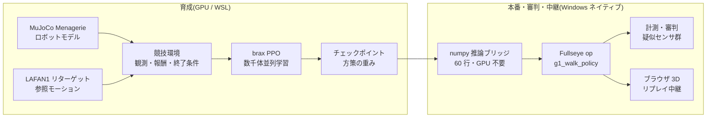
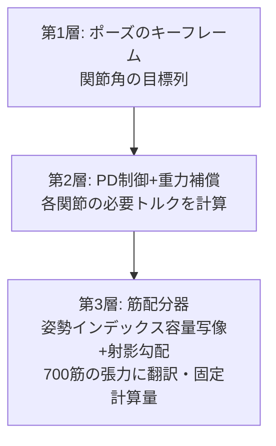
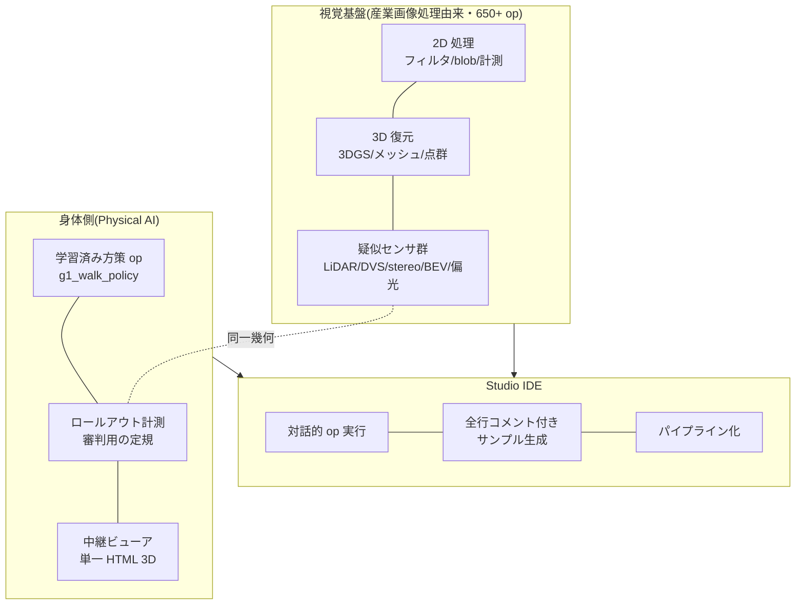

2025 年、中国・北京でヒューマノイドロボットのハーフマラソンが走り、夏には第 1 回の世界ヒューマノイドロボット運動会が開かれて、二足歩行ロボットが徒競走をし、サッカーをし、ダンスを踊りました。そして偶然にも、この記事を書いている今日(2026 年 8 月 22 日)、北京の国家スピードスケート館で **第 2 回世界ヒューマノイドロボット運動会が開幕**しています。今回は 16 カ国・666 チーム・2,056 台、種目は 51(第 1 回の 26 からほぼ倍増)、目玉は「リモコン操作を排した完全自律カテゴリ」だそうです。ニュースを追いながら、ずっと思っていたのです。

**「これ、個人でやりたい」**

もちろん実機を 500 台並べる会場は用意できません。予算も、場所も、あと家族の理解も足りません。でも、いま手元には GPU が 1 枚載った PC があります。物理シミュレーションの中に競技場を建て、選手を育て、競技をやらせ、審判を置き、観客席(ブラウザ)へ中継する — **運動会を構成する要素を全部、自分の机の上で作る**ことなら、できるはずです。

この記事は、その「自宅ヒューマノイド運動会」の開催記です。そして同時に、私が本業の画像処理(産業用マシンビジョン)の経験を持ち込みながら、**Physical AI の統合開発環境(IDE)を作ろうとしている**開発記でもあります。競技の裏側では、審判のまなざし(計測とズル検知)も、中継設備(ブラウザ 3D ビューア)も、選手の育成環境(強化学習パイプライン)も、ぜんぶ同じ一つの道具箱 — 自作の視覚ツールキット **Fullseye** — に流れ込んでいきます。

長い記事です。読み物として頭から読んでも、目次から競技だけ拾い読みしても成立するように書きました。


*大会ポスター(挿絵は画像生成 AI(Gemini)。文字が化けやすいので、空白バナー付きで生成して文字は自分で入れる方式)*

> **発案と実装の帰属について(最初に明記)**
> この記事に出てくる方向性の判断・アイデア(運動会という企画そのもの、実機センサに合わせた観測設計、イベントカメラ的な時間差分の導入、筋骨格の「相反+共収縮」2 指令化、部位単位の単純化、学習済みポリシーの Studio op 化、ブラウザ中継…)は私が出し、実装・実験・計測の実務は AI コーディングエージェント(Claude Code)が回しています。**うまくいった実験も、失敗した実験も、数字はすべて実測**です。失敗を隠すと次の自分が困るので、負けた競技も負けたまま載せています。なお本文の一人称「私」は判断と方向づけの主語ですが、発見の瞬間には人間と AI の境目が曖昧な場面もあります。帰属を断定できない記述は「私と AI のチームとして」の意味に読んでください — 主語を格好よく盛らないのも honest disclosure のうちです。

## この記事の読み方(3 コース)

とても長い記事なので、先にコース案内です。

- **5 分コース(動きだけ見る)**: スクロールしながら動画(GIF)だけ眺めてください。直進歩行の完走、障害物走、67 体の入場行進、700 筋人体のポーズ、立位で崩れるところまで、動きだけで話の骨格がわかるように並べてあります。
- **30 分コース(本編)**: 第 1〜15 章。運動会の開催記+失敗談+開発記です。各章末の「🍙 かみ砕きコーナー」は、本文が硬いなと思ったときの避難所です。
- **フルコース(資料編まで)**: 付録 A〜G。実験の全記録、ロボット 67 機の名鑑、センサ図鑑、教訓集、用語集、op 全索引、未来資料集。事典として、必要になったときに引く用です。

# 目次(競技プログラム)

1. 開会式 — なぜ個人で運動会か
2. 用語集 — 先にかみ砕いておく
3. 会場建設 — 物理シミュレーションと GPU
4. 選手入場 — Unitree G1 と自作 700 筋人体 evis
5. 種目 1: 徒競走(20m 直進) — 3 連敗から「白線が見えていなかった」一撃まで
6. 種目 2: 障害物走 — 疑似 LiDAR と 1 次元イベントカメラ
7. 種目 3: 団体演技 — 700 本の筋肉をキーフレームで動かす
8. 種目 4: 平均台(静止立位) — いちばん地味な種目が、いちばん難しかった
9. 審判団 — 画像処理屋が作る「ズルを見抜く計器」
10. 中継局 — ブラウザだけで動く 3D リプレイ
11. 統合開発環境へ — Fullseye Studio という野望
12. 開催要項 — 個人でやるための構成表
13. 未来に向けて — 最先端をシミュレーションするという遊び方
14. この運動会に混ざっている学問たち — DNA から光学まで
15. 番外競技 — 腕・空・ハンド・箸(全部、本物の物理)
16. 閉会式と次の種目
付録 A〜I — 実験年代記 / ロボット名鑑(67 機)/ センサ図鑑 / 教訓集 / 拡張用語集 / Fullseye op 全索引(1,606)/ 未来資料集 / 学習ログ実測抄 / FAQ

---

# 1. 開会式 — なぜ個人で運動会か


*挿絵: 画像生成 AI(Gemini)による。転んでいる選手がいるのが、この記事の内容と完全に一致しています*

北京の大会が面白かったのは、「歩けるか」ではなく「**競技になるか**」を問うたところだと思っています。歩くだけなら 2015 年の DARPA Robotics Challenge の頃からロボットは(転びながら)歩いていました。競技になるというのは、速さを競い、コースを守り、失格条件があり、記録が残るということです。つまり **計測と規律** が入るということ。

誤解のないように書いておくと、「個人で中国に勝とう」という話では全くありません。あの規模とスピード、そして何より「ロボットにマラソンを走らせてみよう」「運動会を開いてしまおう」という**自由な発想そのものが、素直に見習うべきもの**だと思っています。私がやりたいのは競争ではなく、あの刺激を自分の手の届く形に翻訳してみることです。そして重要なのは、それが**翻訳できてしまう時代が来ている**ということ。オープンなモデルとデータと計算資源が、個人の机の上で本当に噛み合う。刺激を受けた側が、観客のままでいなくていい。これはずいぶん希望のある話だと思うのです。

私はふだん産業用の画像処理をやってきた人間で、工場の検査装置の世界では「測れないものは改善できない」「測り方を疑え」が家訓です。強化学習(Reinforcement Learning)でロボットを育てる遊びを始めてすぐ、この 2 つの世界が同じ骨格を持っていることに気づきました。**報酬(スコア)の設計は検査基準の設計であり、エージェントは基準の穴を必ず突いてくる被検体**です。だから運動会というフレームは冗談のようでいて、実は本質的でした。競技規則(報酬・終了条件)、計時と計測(ログとロールアウト)、ドーピング検査(ズル検知)、そして観客への中継(可視化)。この全部を作らないと、運動会は成立しません。

個人でやる意味も書いておきます。大会に出てくるロボットの制御は各社の秘伝ですが、**シミュレーションの中の運動会は、モデルもデータも学習コードも全部オープンなもので組めます**。使ったのは MuJoCo(物理エンジン)、MuJoCo Menagerie(ロボットモデル集)、Unitree 公式の LAFAN1 リターゲットモーション(HuggingFace 公開)、brax/MJX(GPU 物理と学習)、そして自作コード。GPU 1 枚あれば、誰でも自宅に競技場を建てられる時代が、本当に来ています。

# 2. 用語集 — 先にかみ砕いておく

本文を読みながら戻ってこられるように、主要な用語を先にまとめます。形式は「用語(English) — 一言定義 → かみ砕き」です。

- **強化学習(Reinforcement Learning, RL)** — 試行錯誤と報酬でふるまいを獲得する学習法。→ 犬のしつけ。お手ができたらおやつ。ただし犬より圧倒的に打算的で、おやつの規則の穴を全力で突いてくる。
- **方策(policy)** — 状態を入力に行動を出す関数。学習の成果物。→ 選手の「体の動かし方のクセ」そのもの。本記事の方策は小さなニューラルネット(4 層×32 ユニット程度)。
- **報酬(reward)** — 1 ステップごとに与える点数。→ 競技の採点規則。ここの設計ミスは必ず悪用される。
- **観測(observation)** — 方策に見せる入力ベクトル。→ 選手の五感。**ここに入っていないものは、選手には存在しない**(本記事最大の教訓)。
- **PPO(Proximal Policy Optimization)** — 定番の強化学習アルゴリズム。→ 「一度に極端に変えず、少しずつ確実に上達する」練習法。
- **学習ステップと「26M」「150M」表記** — 本記事では選手の成長度合いを「学習ステップ数」で表し、M は百万(mega)の意味で使います。26M = 2,600 万ステップ、150M = 1 億 5,000 万ステップ。**距離のメートル(小文字 m。「20.5m 前進」など)とは別物**なので、「大文字 M が付く大きな数字は練習量、小文字 m は距離」と読み分けてください。→ 部活でいうと「素振り 2,600 万回目の時点」みたいな言い方です。
- **模倣学習の参照モーション(reference motion / mocap)** — 人間の動きを記録してロボットの関節に写した「お手本」。→ ダンスの振り付けビデオ。LAFAN1 はその公開データ集で、Unitree が自社ロボット向けに公式変換している。
- **残差制御(residual control)** — お手本の関節角に、方策が小さな修正量(残差)だけ足す方式。→ 「振り付けは守れ、ただしバランス調整は自分でやれ」。ゼロから動きを発明させない。
- **POMDP / 部分観測** — 環境の状態の一部しか観測できない状況。→ 目隠しでの綱渡り。種目 1 の敗因。
- **疑似 LiDAR(pseudo-LiDAR)** — シミュレーション内で光線を飛ばして距離を測る仮想センサ。→ コウモリの超音波。実機の LiDAR(レーザー距離計)の性質を計算で真似る。
- **イベントカメラ(event camera / DVS)** — 明るさの「変化」だけを出すカメラ。→ 静止画は撮れないが「動いたもの」に超敏感な目。本記事では 1 次元版を自作。
- **筋骨格モデル(musculoskeletal model)** — 関節をモーターでなく「筋肉の張力」で動かす人体モデル。→ ロボットではなく解剖学の人体。evis は 700 本の筋を持つ。
- **トルク(torque)** — 関節を回す力のモーメント。**筋は押せない、引くだけ**(これで一敗している)。
- **WBC-QP(全身制御の二次計画法, Whole-Body Control via Quadratic Programming)** — 「全関節の加速度と接触力を、物理条件を満たしつつ最適に決める」制御の定石。→ 全身の力配分を毎瞬間、数学の最適化で解く。
- **MJX / brax** — MuJoCo の GPU 並列版と、その上の学習フレームワーク。→ 競技場を数千面同時に建てて、数千人の選手を同時に練習させる技術。
- **XLA** — GPU 用の計算コンパイラ。→ 会場の施工業者。得意工法(固定形状の行列計算)に合わない設計図(700 筋の疎な張力計算)は建ててくれない、という制約が後で効いてくる。

# 3. 会場建設 — 物理シミュレーションと GPU

会場はまるごとソフトウェアです。構成はこうなっています。



- **物理エンジン**: MuJoCo。接触計算の信頼性と速度のバランスで、いまロボット学習のデファクトです。
- **並列化**: MJX(MuJoCo の GPU 版)+ brax の PPO 実装。数千の競技場を GPU 上に同時に建てて、同じ選手のコピーを一斉に走らせ、全員分の経験をまとめて学習します。
- **ハードウェア**: RTX 5090(32GB)1 枚。本記事の学習は 2 種目を同時に走らせて**合計 約 9,700 学習ステップ/秒**が出ています(メモリ割当を 0.35 ずつに絞って同居)。1 つの種目の練習(約 1 億ステップ)がおよそ 3〜4 時間。夕方に練習を仕込んで、夕食後に結果を見る、という生活リズムになります。だいたい風呂上がりに転倒動画を眺めてため息をつく係です。
- **学習は Linux 側(WSL)、それ以外は Windows 側**という分業です。JAX/XLA の都合で学習は WSL に寄せ、計測・可視化・記事の図表づくりは Windows ネイティブの Python でやっています。この分業が後述の「numpy 推論ブリッジ」の動機になりました。


*図: 本記事の学習スループット実測。GPU 1 枚で 2〜3 本の学習を同居させても各 8,000〜10,000 ステップ/秒。四足(別トレーナ)は単位系が異なるため別パネル(実測ログより作図)*

会場建設で最初に効いてくる制約が、用語集にも書いた **XLA の得意工法問題**です。関節をモーターで回す普通のロボット(G1 など)は GPU で数千並列にできますが、**700 本の筋で動く自作人体 evis は、筋張力の計算が XLA に載らず GPU 並列化できません**でした。そこで evis の競技は CPU で行い、将来 GPU に載せるときは「筋を等価な関節トルクに置き換えた双子(torque-twin)」を使う、という二段構えにしています。会場に大競技場(GPU)と小体育館(CPU)がある、と思ってください。

> **🍙 かみ砕きコーナー(会場編)**
> ゲームの「物理エンジン」と同じものが、ロボット研究でも会場になります。マリオがジャンプして落ちるのも、ここでロボットが転ぶのも、中でやっている計算は同族です。違いは真剣さで、研究用の物理エンジンは「接触した瞬間の力」を保険の約款みたいな細かさで計算します。そして GPU を使うと、この会場を数千個コピーして同時に動かせます。ロボット 1 体の練習を 4,000 体が同時にやる感じ。だから一晩で人間の数年分の練習量になるのです。

## 3.1 深掘り: 会場の地下設備 — 物理エンジンは 1 ステップで何をしているのか
(第 3 章「会場建設」の増補)

シミュレータは「魔法の箱」ではありません。`mj_step()` を 1 回呼ぶたびに、中では決まった順番の計算が走っています。ここでは、その箱のフタを開けて一緒に覗いてみます。

### 1-1. 1 ステップの中身: 順動力学パイプライン

MuJoCo の 1 ステップは、おおまかに次の段階を順に通ります(公式 docs の Computation 章 [^mjc-comp] に全段の解説があります)。

| 段階 | やること | 使われるアルゴリズム |
|---|---|---|
| 1. 前向き運動学 | 関節角度から、全ボディの位置・姿勢を計算 | 木構造をルートから葉へ伝播 |
| 2. バイアス力 | 重力・コリオリ力・遠心力をまとめて計算 | Recursive Newton-Euler(RNE) |
| 3. 慣性行列 | 「どの関節を押すとどれだけ動くか」の行列 M を計算 | Composite Rigid-Body(CRB) |
| 4. 衝突検出 | どのジオメトリ同士が触れているかを列挙 | broad-phase → narrow-phase |
| 5. 制約力の解法 | 接触力・関節リミット力・摩擦を決める | **凸最適化**(後述) |
| 6. 数値積分 | 加速度を積分して速度・位置を 1 コマ進める | Euler / RK4 / implicit 系(後述) |

ポイントは 2 つです。

**一般化座標(generalized coordinates)**。MuJoCo は各ボディの xyz 座標を別々に持つのではなく、「関節角度のベクトル」で全身の状態を表します。関節でつながっている限り、ボディがバラバラに吹き飛ぶ心配が構造的にありません。公式 docs は「MuJoCo pioneered the combination of simulation in generalized coordinates with optimization-based contact dynamics(一般化座標でのシミュレーションと最適化ベースの接触力学の組み合わせを開拓した)」と自己紹介しています [^mjc-overview]。ゲーム物理エンジン(直交座標+バネで拘束を近似)との一番大きな設計差がここです。

**順動力学(forward dynamics)**。「いま加わっている力から、次の瞬間の加速度を求める」計算です。運動方程式 M(q)·q̈ = 外力 + 制約力 を、上の表の材料(M、バイアス力、接触力)を揃えてから解きます。

#### かみ砕き: パラパラ漫画の 1 コマ

シミュレーションはパラパラ漫画です。1 ステップ = 1 コマ。各コマで「全員の位置を確認 → 誰と誰がぶつかっているか調べ → 押し合う力を決め → その力で全員をほんの少し動かす」を繰り返します。私たちの G1 の学習では 1 コマ 0.002 秒。1 秒の歩行の裏で 500 コマ分、この表の全段が走っています。

### 1-2. 接触はなぜ難しいか — LCP を捨てて凸最適化を選んだ MuJoCo

物理エンジンの一番の難所は「接触」です。足が地面に触れた瞬間、地面はどれだけの力で押し返すべきか? これは意外と定義が難しい問題です。

古典的な定式化は **LCP(線形相補性問題)** でした。「接触力は押す方向のみ(引っ張らない)」「離れているなら力ゼロ」「摩擦はクーロン錐の中」という条件を相補性条件として書き下ろします。ところが摩擦付き LCP は解が一意に定まらないことがあり、一般には NP 困難なクラスに属します。

MuJoCo の作者 Todorov らはここで発想を変えました。**接触を少しだけ「柔らかく」認めることで、問題全体を凸最適化に変換した**のです(IROS 2012 論文 [^todorov2012]、および docs の Computation 章 [^mjc-comp])。docs には双対問題の形が明示されています:

> f = argmin_λ ½ λᵀ(A+R)λ + λᵀ(a₀ − aᵣ)  subject to λ ∈ Ω

細部は追わなくて大丈夫です。大事なのは **(A+R) が正定値 = 谷がひとつしかない**こと。つまり接触力は「唯一の大域最適解」として毎回同じ答えが出ます。LCP のように「解けたり解けなかったり、答えが複数あったり」がありません。

その代償が **soft contact(柔らかい接触)** です。docs の「Physical realism and soft contacts」節にある通り、相補性が厳密には成り立たず、「接触力と接触法線方向の速度が同時に正になれる」= わずかなめり込みが許されます [^mjc-comp]。ただしこれは欠陥ではなく設計思想で、現実の物体も接触面はミクロには変形しています(布団に置いたノート PC は少し沈みますよね)。「完全剛体の接触」のほうがむしろ物理的フィクションだ、という立場です。

さらに凸定式化には副産物があります。docs いわく「uniquely-defined inverse(逆動力学が一意に定義される)」[^mjc-overview]。「この動きを実現するには何の力が要ったか」を逆算できるのは、最適制御・ロボティクス研究でこのエンジンが選ばれてきた理由のひとつです。

#### solref / solimp — 接触の硬さを「バネとダンパの言葉」で指定する

では「どのくらい柔らかいか」はどう決めるのか。それが XML でよく見かける `solref` と `solimp` です(docs の Modeling 章「Solver parameters」節 [^mjc-solver])。

| パラメータ | 意味 | 直感 |
|---|---|---|
| `solref = (timeconst, dampratio)` | 制約を質量-バネ-ダンパ系として再パラメータ化 | timeconst = めり込みが戻る速さ、dampratio = 1 なら跳ね返らずスッと戻る(臨界減衰) |
| `solimp = (d₀, d_width, width, midpoint, power)` | インピーダンス d ∈ (0,1) = 「制約が力を出す能力」をめり込み量の関数で指定 | d が小さい = 弱い(柔らかい)制約、大きい = 強い(硬い)制約 |

docs の言葉を借りると、solref は「時定数と減衰比という質量-バネ-ダンパ系の言葉でモデルを再パラメータ化する」もの、solimp の d は「small values of d correspond to weak constraints while large values of d correspond to strong constraints」[^mjc-solver]。つまり最適化ソルバの中の抽象的な正則化項を、人間が直感を持てる「バネの硬さ・ダンパの効き」に翻訳してくれるインターフェースです。接触がプルプル震えるとき・足がめり込むとき、私たちがいじっていたのは実はこの 2 つでした。

### 1-3. 積分器と時間刻み — なぜ筋肉やテンドンで「爆発」するのか

表の最終段、数値積分には選択肢があります(docs「Numerical Integration」節 [^mjc-comp])。

| 積分器 | 特徴 | 向き不向き |
|---|---|---|
| Euler(semi-implicit) | 関節ダンピングだけ陰的に扱う半陰的オイラー | 標準。速い |
| RK4 | 4 次のルンゲ=クッタ。1 ステップに 4 回評価 | エネルギー保存系に強い。コスト 4 倍 |
| implicit | 速度依存力(コリオリ・遠心力含む)の微分まで陰的に | 最も安定。LU 分解が必要 |
| implicitfast | implicit からコリオリ系の微分を省いた版 | docs 推奨。Cholesky で速い |

「陰的(implicit)」とは何か。陽的な積分は「今の力で次の位置を決める」。陰的な積分は「次の瞬間の状態でつじつまが合うように連立方程式を解いて進める」。前者は速いが、**硬いバネ(変化の速い力)があると 1 コマの間に力が暴れて発散**します。これが数値的な「爆発」の正体です。

筋肉・テンドンはまさにこの「硬いバネ」の塊です。筋の受動弾性・テンドンの張力は、わずかな伸びで大きく力が変わる = 時定数が短い。時間刻み dt がその時定数より粗いと、1 コマの間に「力を過大に見積もる → 行きすぎる → 反対向きにもっと大きい力 → …」の振動が増幅します。evis(筋駆動ヒューマノイド)が G1 より小さい dt を要求したのは、怠慢ではなく数学的な必然でした。docs も速度依存の力が支配的な系では implicit 系が「RK4 より大幅に安定(significantly more stability)」だとし、**時間刻みは「おそらく唯一最重要のパラメータ(perhaps the single most important parameter)」**だと明言しています [^mjc-comp]。

#### かみ砕き: コマ落ちしたパラパラ漫画

硬いバネと粗い dt の組み合わせは、「コマ数を節約したパラパラ漫画で剣道の面打ちを描く」ようなものです。竹刀の先端は 1 コマの間に大きく動くので、コマを間引くと軌道が描けず、絵が破綻します。ゆっくり歩くシーンなら間引いても大丈夫。**dt は「一番速く動くもの」に合わせて選ぶ**——これが数値安定性の一行まとめです。

### 1-4. MJX — MuJoCo を GPU の言葉に書き直す

学習には数千万ステップが要ります。CPU の MuJoCo 1 個では日が暮れる。そこで **MJX** です。

MJX は MuJoCo を **JAX で書き直した**実装です。公式 docs [^mjx] によれば、狙いは「XLA コンパイラがサポートするあらゆる計算ハードウェアで MuJoCo を動かす」こと。JAX の `vmap`(自動ベクトル化)で同一シーンを数千個並べ、GPU の SIMD 演算器に一括で流し込みます。docs の表現では、MJX が得意なのは「simulating big batches of parallel identical physics scenes using algorithms that can be efficiently vectorized on SIMD hardware(SIMD ハードウェアで効率よくベクトル化できるアルゴリズムによる、同一物理シーンの大バッチ並列シミュレーション)」——まさに RL のためのエンジンです。

ただし GPU 化はタダではありません。docs が正直に書いている制約 [^mjx]:

- **分岐(branching)が苦手**: 「accelerators exhibit poor performance for branching code(アクセラレータは分岐コードの性能が悪い)」。衝突検出の broad-phase は「近くにない物体ペアをスキップする」分岐だらけの処理なので、GPU では全ペアを愚直に評価しがちになります。
- **可変長が苦手**: XLA は配列サイズをコンパイル時に固定します。接触の数はステップごとに変わるのに、MJX では「最大接触数」分のメモリを常に確保して計算します。CPU 版なら「今日は接触 3 件」で済むところを、GPU 版は毎回満席分の計算をするわけです。
- **メッシュは軽く**: 衝突メッシュは「200 頂点程度以下」が推奨。
- **1 個だけなら遅い**: 単一シーンでは「MJX-JAX can be 10x slower than MuJoCo(CPU 版 MuJoCo の 10 倍遅くなりうる)」。MJX の価値は 1 個の速さではなく、**4096 個同時に走らせても 1 個分とさほど変わらない**スループットにあります。

(補足: 2026 年現在の docs では MJX は 2 系統に分かれています。JAX 再実装の MJX-JAX(自動微分可能)と、より高速だが自動微分非対応の MJX-Warp です [^mjx]。本記事の学習で使ったのは JAX 系のパイプラインです。)

#### brax PPO の学習ループ

MJX とペアで使ったのが **brax** [^brax] の学習アルゴリズム実装です。brax は JAX ベースの物理エンジン + 学習ライブラリで、README にある通り PPO / SAC / ARS / 進化戦略などの実装を同梱しています。その PPO の 1 サイクルはこう回ります:

1. **rollout**: 数千の並列環境で現在の方策を短い区間(unroll)走らせ、(観測, 行動, 報酬) を収集
2. **GAE**: 集めた報酬から advantage(その行動が平均よりどれだけ良かったか)を推定(パート 2 で詳述)
3. **minibatch SGD**: データをミニバッチに割り、PPO のクリップ付き目的関数で方策ネットと価値ネットを数エポック更新
4. 新しい方策で 1 に戻る

このループ全体——物理シミュレーションもニューラルネット更新も——が JIT コンパイルされて **GPU から一度も降りずに**回るのが、MJX + brax 構成の速さの源泉です。CPU↔GPU 間のデータ転送という最大のボトルネックが消えます。

#### パート 1 出典

[^mjc-comp]: MuJoCo 公式 docs, Computation 章(パイプライン・凸最適化・soft contact・積分器): https://mujoco.readthedocs.io/en/stable/computation/index.html
[^mjc-overview]: MuJoCo 公式 docs, Overview(一般化座標・凸接触・一意な逆動力学・テンドン): https://mujoco.readthedocs.io/en/stable/overview.html
[^mjc-solver]: MuJoCo 公式 docs, Modeling 章 Solver parameters(solref / solimp): https://mujoco.readthedocs.io/en/stable/modeling.html#solver-parameters
[^todorov2012]: Todorov, Erez, Tassa, "MuJoCo: A physics engine for model-based control," IROS 2012: https://doi.org/10.1109/IROS.2012.6386109
[^mjx]: MuJoCo 公式 docs, MJX 章(JAX/XLA・バッチ並列・分岐/可変長の制約): https://mujoco.readthedocs.io/en/stable/mjx.html
[^brax]: google/brax(JAX 物理エンジン + PPO/SAC 等の学習実装): https://github.com/google/brax

---

## 3.2 深掘り: 会場の歴史 — 物理シミュレータの系譜
進化にせよ RL にせよ、淘汰の「世界」を提供するのは物理エンジンです。この 25 年で世界のほうも劇的に進化しました。

### 2-1. 年表: 7 世代の物理エンジン

| 年 | エンジン | 2〜3 行で | 出典 |
|---|---|---|---|
| 2001 | **ODE** | Russell Smith が公開したオープンソース剛体動力学ライブラリ(初版 2001-05-08)。関節・接触・衝突検出を備え、研究用シミュレータ(Gazebo 等)の標準部品として一時代を築いた | [^ode] [^ode-wiki] |
| 2000s | **Bullet** | Erwin Coumans 主導。ゲーム・VFX 出身の衝突検出+多体物理。Python バインディング PyBullet が深層 RL 初期の定番環境になった | [^bullet] |
| 2000s〜 | **PhysX** | NVIDIA のリアルタイム物理 SDK。ゲーム市場で鍛えられ、のちに GPU 実装が Isaac Gym の心臓部になる。現在はオープンソース | [^physx] |
| 2012 | **MuJoCo** | Todorov・Erez・Tassa "MuJoCo: A physics engine for model-based control"(IROS 2012)。一般化座標+凸最適化ベースの接触という研究特化設計 | [^mujoco-paper] |
| 2021-22 | **MuJoCo 買収→OSS 化** | DeepMind が買収して無償公開(2021-10-18)、続いて全コードを Apache-2.0 で開源(2022-05-23)。研究標準エンジンが「誰のものでもある」状態に | [^mujoco-blog1] [^mujoco-blog2] [^mujoco-gh] |
| 2021 | **Isaac Gym** | Makoviychuk ら(NVIDIA)。物理も報酬計算も**全部 GPU 上**で回し、1 枚の GPU で数千環境を同時シミュレーション。RL のデータ収集を桁違いに変えた | [^isaacgym] |
| 2021-23 | **Brax / MJX** | JAX 系。Brax は微分可能物理エンジン(Freeman ら 2021)、MJX は MuJoCo 本体の JAX 実装で、XLA が動くハードウェア(GPU/TPU)なら千並列が書ける | [^brax] [^mjx] |
| 2024 | **Genesis** | マルチフィジックス(剛体・流体・軟体)+フォトリアル描画+高速 GPU 並列を一体で狙う新世代プラットフォーム | [^genesis] |

### 2-2. ゲーム物理と研究物理の分岐

この系譜には見えない分水嶺があります。**「60 fps で破綻しなければ勝ち」のゲーム物理**と、**「接触力が物理的に正しくないと意味がない」の研究物理**です。

ゲーム物理(Bullet、PhysX の出自)は、プレイヤーが見て自然なら近似で構いません。貫通を押し戻す、めり込みをごまかす、安定性のためにエネルギーを勝手に減らす——リアルタイム性のためなら全部あり。この割り切りが膨大なゲーム市場で性能を鍛え、結果的に研究にも安価な物理を供給しました。深層 RL 初期のベンチマークの多くが PyBullet や(ゲーム由来の)MuJoCo 環境で走ったのは、この蓄積の恩恵です。

研究物理(ODE 後期→MuJoCo)は逆に、**接触とその微分の正しさ**にこだわります。ロボットの制御則はまさに接触力の応答で決まるからで、MuJoCo が凸最適化で接触を解く設計を選んだ経緯はパック 1 で見た通りです。分岐は細部にも現れます。ゲーム物理は描画フレームに同期した固定ステップで「今フレームを乗り切る」ことを優先しますが、研究物理は時間刻み・ソルバ反復数・接触の柔らかさを全部ユーザーに露出し、「その近似で何を失っているか」を選ばせます。また MuJoCo が逆動力学(この動きに必要だった力の逆算)を一意に計算できることを売りにするのに対し、ゲーム物理で逆動力学を真面目に使う場面はほぼありません——**誰がそのエンジンの「顧客」だったか**が、20 年後の設計思想まで決めているわけです。ここをごまかしたシミュレータで学習した方策は、実機に持っていった瞬間に **sim-to-real gap**(reality gap)に殴られます。ドメインランダム化(Tobin ら 2017 [^tobin])のような「シミュレータのパラメータをわざとバラつかせて、どの世界でも通用する方策を育てる」処方箋が生まれたのも、ギャップが構造的に避けられないからです(sim-to-real の各論はパック 1 の 2-3 節で扱ったので、ここでは系譜の位置づけだけ)。

### 2-3. GPU 並列が RL を変えた

Isaac Gym 論文(2021)[^isaacgym] のインパクトは一点に尽きます。従来の RL は「物理は CPU、学習は GPU」で、CPU↔GPU 間のデータ輸送がボトルネックでした。Isaac Gym は物理シミュレーション・観測・報酬計算を**すべて GPU テンソル上**で完結させ、1 枚の GPU で数千環境を同時に走らせます。同年の Rudin らの "Learning to Walk in Minutes Using Massively Parallel Deep Reinforcement Learning" [^rudin] は、この仕組みで四足ロボット ANYmal の歩行方策を**単一ワークステーション GPU・数分**で学習できることを示しました。それまで「クラスタで数日」だった作業です。

これは単なる高速化ではなく、研究の作法を変えました。学習が数分なら、報酬設計の試行錯誤が「日単位の博打」から「コーヒーを淹れる間の実験」になります。私たちが自宅の 1 枚の GPU で G1 の報酬を 12 世代も作り直せたのは、まさにこの 2021 年の転換の恩恵です。

MJX [^mjx] と Brax [^brax] は同じ思想の JAX 版です。物理ステップを JAX の関数として書くことで、`jit` でコンパイルし `vmap` で数千環境ぶん束ねる、という機械学習側の作法がそのまま物理に使えます。Brax はさらに**微分可能物理**——「シミュレーション結果をパラメータで微分できる」——を看板に掲げました。転んだ結果を報酬信号としてしか使えなかった世界から、「どのパラメータをどちらに動かせば転ばなかったか」の勾配が(理屈の上では)直接取れる世界への橋です。接触のような不連続現象の微分は今も難所ですが、系譜の次の分岐点はここにあると見られています。

ただし GPU 並列にも代償はあります。数千環境を 1 枚に詰めるため、1 環境あたりの接触ソルバは軽量化され、複雑な閉ループ機構や大規模な接触(たとえば 700 本の筋肉)はそもそも載らないことがある——私たちが evis で経験した「筋骨格モデルは GPU 化できず torque-twin に迂回した」件は、この設計トレードオフの実例です。「速い物理」と「何でも表せる物理」は、まだ同じエンジンには同居していません。

#### かみ砕き: 体育館に 4,096 人の生徒

昔の RL は「職人が 1 体のロボットに付きっきりで教え、日誌を GPU に郵送する」方式でした。GPU 並列物理は「体育館に 4,096 体を並べ、全員に同時に同じ授業をして、その場で採点まで済ませる」方式。1 体あたりの授業の質は同じでも、1 日に集まる経験の量が桁で違います。歩行学習が「数週間」から「数分」になった正体は、教え方の進歩ではなく**教室の巨大化**です。

### 2-4. ロボット学習ベンチの現在地(2026)

いま「歩かせたい・掴ませたい」人が最初に触る定番を 1 行ずつ。

- **MuJoCo Playground** [^playground] — MJX ベースの GPU 並列環境集。四足・ヒューマノイド・マニピュレーションの sim-to-real 志向タスクが揃う(私たちの G1 歩行の土台もこの系)。
- **Isaac Lab** [^isaaclab] — Isaac Sim 上のロボット学習統合フレームワーク。NVIDIA エコシステムの現行正解で、Isaac Gym の後継ポジション。
- **ManiSkill** [^maniskill] — SAPIEN ベースの GPU 並列シミュレーション+レンダリング。マニピュレーション(操作)課題に強い。
- **Genesis** [^genesis] — 剛体に閉じないマルチフィジックスと描画を統合する野心枠。新しい分、エコシステムは発展途上。

眺めると、2012 年に「研究物理の正しさ」を選んだ MuJoCo と、ゲーム市場で速度を鍛えた GPU 物理(PhysX 系)が、2020 年代に「GPU 並列 × 接触の正しさ」で合流したのが現在地だと分かります。ODE で 1 体をよろよろ歩かせていた時代から 25 年、いま自宅の 1 枚の GPU の中では、数千体のヒューマノイドが並んで転び続けています。

---

#### パート 1 出典

[^sims-page]: Karl Sims, "Evolved Virtual Creatures," 1994(本人サイトの解説ページ): https://www.karlsims.com/evolved-virtual-creatures.html
[^sims-paper]: Karl Sims, "Evolving Virtual Creatures," SIGGRAPH '94 論文 PDF(本人サイト): https://www.karlsims.com/papers/siggraph94.pdf
[^sims-acm]: 同論文の ACM DL 掲載ページ(SIGGRAPH '94 Proceedings, pp.15-22): https://dl.acm.org/doi/10.1145/192161.192167
[^sims-video]: 映像 "Evolved Virtual Creatures"(Internet Archive): https://archive.org/details/sims_evolved_virtual_creatures_1994
[^sims-youtube]: 同映像(YouTube 転載版, "Karl Sims - Evolved Virtual Creatures, Evolution Simulation, 1994"): https://www.youtube.com/watch?v=JBgG_VSP7f8
[^es-wiki]: Wikipedia "Evolution strategy"(Rechenberg・Schwefel による 1960 年代創始の記述): https://en.wikipedia.org/wiki/Evolution_strategy
[^holland]: Wikipedia "John Henry Holland"(1975 年『Adaptation in Natural and Artificial Systems』): https://en.wikipedia.org/wiki/John_Henry_Holland
[^cmaes]: Hansen & Ostermeier, "Completely Derandomized Self-Adaptation in Evolution Strategies," Evolutionary Computation 9(2), 2001: https://doi.org/10.1162/106365601750190398
[^cmaes-tutorial]: Hansen, "The CMA Evolution Strategy: A Tutorial," 2016: https://arxiv.org/abs/1604.00772
[^cmaes-site]: CMA-ES 公式サイト: https://cma-es.github.io/
[^neat]: Stanley & Miikkulainen, "Evolving Neural Networks through Augmenting Topologies," Evolutionary Computation 10(2), 2002: https://nn.cs.utexas.edu/downloads/papers/stanley.ec02.pdf
[^novelty]: Lehman & Stanley, "Abandoning Objectives: Evolution Through the Search for Novelty Alone," Evolutionary Computation 19(2), 2011: https://doi.org/10.1162/EVCO_a_00025
[^mapelites]: Mouret & Clune, "Illuminating search spaces by mapping elites," 2015: https://arxiv.org/abs/1504.04909
[^cully]: Cully, Clune, Tarapore & Mouret, "Robots that can adapt like animals," Nature 521, 2015: https://www.nature.com/articles/nature14422
[^openai-es]: Salimans, Ho, Chen, Sidor & Sutskever, "Evolution Strategies as a Scalable Alternative to Reinforcement Learning," 2017: https://arxiv.org/abs/1703.03864
[^wright]: Sewall Wright, "The roles of mutation, inbreeding, crossbreeding and selection in evolution," Proc. 6th Int. Congress of Genetics, 1932(原論文の複写 PDF): http://www.blackwellpublishing.com/ridley/classictexts/wright.pdf
[^landscape-wiki]: Wikipedia "Fitness landscape"(Wright 1932 が起源との記述): https://en.wikipedia.org/wiki/Fitness_landscape
[^afterman]: Wikipedia "After Man: A Zoology of the Future"(Dougal Dixon, 1981): https://en.wikipedia.org/wiki/After_Man
[^cheney]: Cheney, MacCurdy, Clune & Lipson, "Unshackling evolution: evolving soft robots with multiple materials and a powerful generative encoding," GECCO 2013: https://doi.org/10.1145/2463372.2463404
[^xenobots]: Kriegman, Blackiston, Levin & Bongard, "A scalable pipeline for designing reconfigurable organisms," PNAS 117(4), 2020: https://doi.org/10.1073/pnas.1910837117

#### パート 2 出典

[^ode]: Open Dynamics Engine 公式サイト(作者 Russ Smith): https://www.ode.org/
[^ode-wiki]: Wikipedia "Open Dynamics Engine"(初版リリース 2001-05-08): https://en.wikipedia.org/wiki/Open_Dynamics_Engine
[^bullet]: Bullet Physics SDK(Erwin Coumans ら): https://github.com/bulletphysics/bullet3
[^physx]: NVIDIA PhysX SDK(オープンソースリポジトリ): https://github.com/NVIDIA-Omniverse/PhysX
[^mujoco-paper]: Todorov, Erez & Tassa, "MuJoCo: A physics engine for model-based control," IEEE/RSJ IROS 2012: https://doi.org/10.1109/IROS.2012.6386109
[^mujoco-blog1]: DeepMind Blog, "Opening up a physics simulator for robotics," 2021-10-18(買収と無償公開の発表): https://deepmind.google/discover/blog/opening-up-a-physics-simulator-for-robotics/
[^mujoco-blog2]: DeepMind Blog, "Open sourcing MuJoCo," 2022-05-23(全コード開源の発表): https://deepmind.google/discover/blog/open-sourcing-mujoco/
[^mujoco-gh]: MuJoCo リポジトリ(Google DeepMind 管理): https://github.com/google-deepmind/mujoco
[^isaacgym]: Makoviychuk et al., "Isaac Gym: High Performance GPU-Based Physics Simulation For Robot Learning," 2021: https://arxiv.org/abs/2108.10470
[^rudin]: Rudin, Hoeller, Reist & Hutter, "Learning to Walk in Minutes Using Massively Parallel Deep Reinforcement Learning," 2021: https://arxiv.org/abs/2109.11978
[^brax]: Freeman et al., "Brax — A Differentiable Physics Engine for Large Scale Rigid Body Simulation," 2021: https://arxiv.org/abs/2106.13281
[^mjx]: MuJoCo 公式 docs "MuJoCo XLA (MJX)": https://mujoco.readthedocs.io/en/stable/mjx.html
[^genesis]: Genesis(Genesis-Embodied-AI): https://github.com/Genesis-Embodied-AI/Genesis
[^playground]: MuJoCo Playground(Google DeepMind): https://github.com/google-deepmind/mujoco_playground
[^isaaclab]: Isaac Lab 公式ドキュメント: https://isaac-sim.github.io/IsaacLab/main/index.html
[^maniskill]: ManiSkill(SAPIEN ベース): https://github.com/haosulab/ManiSkill
[^tobin]: Tobin et al., "Domain Randomization for Transferring Deep Neural Networks from Simulation to the Real World," 2017: https://arxiv.org/abs/1703.06907

# 4. 選手入場


*図: 主力 5 選手の身長比較(縮尺は厳密に共通、1.0m/1.8m の基準線入り。背景の明るさは各シーン由来)。左から G1、H1、Go2、Spot、evis(シミュレーションレンダ)*

## 選手 1: Unitree G1(市販ヒューマノイドのシミュレーションモデル)

北京の大会で活躍していた Unitree 社の小型ヒューマノイド、その公式シミュレーションモデルが MuJoCo Menagerie に収録されています。身長約 1.3m、**駆動関節 29**。重要なのは、**実機がこの世に存在する**ことです。シミュレーションで育てた方策は、観測を実機センサに合わせておけば、原理的には実機へ持っていく道があります(後述のとおり、観測設計は最初から実機センサ構成に合わせました)。


*図: Unitree G1(公式シミュレーションモデル、駆動 29 関節)*

お手本の動きは Unitree が公式公開している **LAFAN1 リターゲットデータセット**(HuggingFace: `lvhaidong/LAFAN1_Retargeting_Dataset`)を使います。人間のモーションキャプチャを G1 の 29 関節に変換済みの、30fps の関節角時系列です。ここから歩行 1 周期(膝角度の自己相関で 30 フレームと検出)を切り出し、ループが滑らかにつながるよう閉合し、ヨー(向き)成分を除去してまっすぐ歩く参照(1.47m/s)に加工しました。

## 選手 2: evis(自作 700 筋の解剖学的人体)

もう一人の選手は買ってきたロボットではなく、**解剖学データから組んだ筋骨格の人体モデル**です。自由度 84(nq=85)、**筋アクチュエータ 700 本**。骨格は文献の人体慣性パラメータに基づき、筋は起始・停止・経由点を持つ張力要素として植えてあります。モーターは一つもありません。上腕を上げるのは三角筋で、肘を曲げるのは上腕二頭筋です。


*図: evis 全身。骨格と 700 本の筋(赤い線維)で動く(シミュレーションレンダ)*

なぜこんな面倒なものを育てるのか。介護や生活支援を考えたとき、**人と同じ構造で動くものは、人の動きの「理由」を説明できる**からです。それに、運動会に出すなら、地元代表の自前選手も一人は欲しいじゃないですか。


*図: Unitree H1(大型ヒューマノイド、駆動 19 関節)*

## 選手 3(参入手続き中): Unitree H1、そして「全種目・全選手」構想

この記事を書いている裏で、G1 用に組んだ育成パイプラインの **H1(大型ヒューマノイド)対応**を進めています。LAFAN1 リターゲットには h1 版もあるので、変換器とロボット設定の差し替えで参入できる見込みです。さらにその先として、Menagerie に収録されている**全ロボット(四足・アーム・ハンド・ドローン含めて 67 モデル)の棚卸し**を始めました。


*動画: H1 が LAFAN1 リターゲットのお手本モーションを再生する様子(キネマティック再生 = まだ物理で歩いているわけではなく、これから学習で「本当に歩ける」ようにする前段階。10.5m 区間、シミュレーション)*
ゆくゆくは四足の部、マニピュレーションの部、空の部まで種目を広げ、文字どおりの「総合運動会」にするつもりです。


*図: 全 67 選手の集合写真(各機の実測レンダを段組合成した「合成写真」— 1 シーン同居ではありません)*


*動画: 全 67 モデルの入場行進(各 0.5 秒、ヒューマノイド → 四足 → アーム → ハンドの順。MuJoCo Menagerie、シミュレーション)*


## 4.1 深掘り: 選手名鑑・実機編 — 値札が 2 桁下がった


*図: ヒューマノイド価格の推移(対数軸、各社公表・報道値)。5 年で 2 桁下がった(公表値より作図)*
### 1-1. 主役: Unitree G1 — この記事でシミュレーションしている本人

本連載の主役、宇樹科技(Unitree Robotics、杭州)の G1。公式ページ
(<https://www.unitree.com/g1>)に記載の主要スペックは次のとおり(2026-08-22 閲覧)。

| 項目 | 公称値 | 備考 |
|---|---|---|
| 身長 | 1320 mm(立位) | 折りたたみ時は約 690 mm(報道値) |
| 質量 | 約 35 kg(バッテリー込み) | |
| 自由度 | 23(基本)/ 23〜43(G1 EDU) | 脚 6×2 + 腕 5×2 + 腰、EDU はハンド等で増える |
| 膝関節最大トルク | 90 N·m(G1)/ 120 N·m(EDU) | |
| バッテリー | 13 直列リチウム、9000 mAh | 稼働約 2 時間(報道値) |
| センサ | 3D LiDAR + 深度カメラ | 頭頂の Livox Mid-360 + Intel RealSense D435i 構成が代表的 |
| 価格 | US $13.5K〜(公式ページ、税・送料別) | 発表時(2024-05)は $16K と報道 |

- 発表時の報道: The Robot Report「Unitree Robotics unveils G1 humanoid for $16K」(2024-05)
  <https://www.therobotreport.com/unitree-robotics-unveils-g1-humanoid-for-16k/>
- IEEE の ROBOTS ガイドにも収載: <https://robotsguide.com/robots/unitree-g1>

記事本編で報酬設計に効いた「膝 90 N·m」「23 DOF」「Mid-360 + D435i」は、
全部この公称スペックに根拠がある——**シミュレーションの観測設計を実機センサに合わせる**
(ストーリー B)という方針は、この表を見ながら決めたもの。

### 1-2. 兄貴分: Unitree H1 — 1500m 金メダリスト

H1 は Unitree が 2023 年に出したフルサイズ機。公式ページ(<https://www.unitree.com/h1>)の
公称値(2026-08-22 閲覧):

| 項目 | 公称値 |
|---|---|
| 身長 / 質量 | 約 180 cm / 約 47 kg |
| 自由度 | 各脚 5 + 各腕 4(拡張可) |
| 関節トルク | 膝 360 N·m、股関節 220 N·m、足首 59 N·m、腕 75 N·m |
| 移動速度 | 3.3 m/s(電動ヒューマノイドの速度記録として公称)、潜在 >5 m/s |
| 価格 | 公式ページ記載なし。直販ページの提示は $90,000(見積ベース、構成依存)<https://shop.unitree.com/products/unitree-h1> |

**大会実績(ここが「運動会」記事的に一番おいしい)**: 2025 年 8 月 15〜17 日、北京で開催された
第 1 回世界ヒューマノイドロボット競技大会(World Humanoid Robot Games)で、H1 が
**1500 m 走を 6 分 34 秒 40 で優勝**(初日にいきなり大会第 1 号の金メダル)、**400 m も 1 分 28 秒 03 で金**。
Unitree は大会全体で金 4 を含む 11 メダルを獲得した。

- Robotics 24/7「Unitree H1 earns two gold medals at World Humanoid Robot Games」
  <https://www.robotics247.com/article/unitree_h1_earns_two_gold_medals_at_world_humanoid_robot_games>
- Unitree 公式 X(1500m 6:34.40 の一次発表)
  <https://x.com/UnitreeRobotics/status/1956231617372152139>
- South China Morning Post(大会全体のメダル集計、280 チーム / 16 か国 / 26 種目)
  <https://www.scmp.com/tech/tech-trends/article/3322251/chinas-unitree-x-humanoid-top-medal-total-worlds-first-humanoid-robot-games>

人間の 1500m 世界記録は 3 分 26 秒(H. エルゲルージ)なので、H1 はまだ人間トップの半分弱のペース。
それでも「二足歩行ロボットが 1500m を転ばず走り切って順位を争う」時代が 2025 年に来たこと自体が、
本編第 4 章の入場行進(MuJoCo Menagerie 67 体)に現実の裏付けを与えてくれる。
なお本記事の H1 GIF(`h1_lafan_parade.gif`)で使った LAFAN1 リターゲットデータも
Unitree 公式配布(HF `lvhaidong/LAFAN1_Retargeting_Dataset`)である。

### 1-3. 世界の選手名鑑(一言プロフィール)

各 2〜3 行+出典。**価格はどれも構成・時点で大きく動くので「桁」で読む**こと。

**Tesla Optimus(米)** — 身長 173 cm・57 kg(AI Day 2022 公表値)。Musk の目標価格
$20,000〜30,000 は「量産が軌道に乗れば」の願望値で、2026 年時点で未発売・Tesla 工場内での
試験運用段階。<https://www.tomsguide.com/news/elon-musk-demos-the-human-like-optimus-tesla-bot-and-it-walks-on-its-own>(AI Day デモ報道)

**Figure 03(米 Figure AI)** — 2025-10-09 発表の第 3 世代。家庭投入を明言した初の設計で、
布製外装・無線充電・指先 3 グラムの触覚センサ、専用工場 BotQ で年 1.2 万台の量産体制。
価格は非公表(報道の推定は $100K 超)。公式発表:
<https://www.figure.ai/news/introducing-figure-03>

**Boston Dynamics 新 Atlas(米、現代自動車傘下)** — 2024 年に油圧から全電動へ転換。
公式スペックは 56 DOF・身長 1.9 m・90 kg・リーチ 2.3 m・瞬間 50 kg / 連続 30 kg 可搬・IP67。
Hyundai 工場での部品シーケンシングを最初のパイロットに、2026-01 の CES で製品版を発表。
<https://bostondynamics.com/atlas/>

**Apptronik Apollo(米)** — 身長 5'8"(約 173 cm)・160 lb(約 73 kg)・25 kg 可搬・
バッテリー 4 時間、交換式。物流・製造向け。公式:
<https://apptronik.com/apollo/apollo-2> / 発表リリース:
<https://apptronik.com/news-collection/apptronik-unveils-apollo>

**Fourier GR-3(中国・上海、傅利葉)** — 身長 165 cm・71 kg・全身 55 DOF・12 DOF ハンド。
リハビリ機器出身の会社らしく「Care-bot」(介護・対話ケア)を掲げ、布張り外装と
視聴触覚のマルチモーダル対話が売り。公式ドキュメント:
<https://support.fftai.com/en/docs/GR-X-Humanoid-Robot/GR3/GR-3_Introduction/>

**Booster T1(中国・北京、加速進化)** — 30 kg・23 DOF(拡張 41)の開発者向け小型機。
RoboCup 2025 AdultSize 優勝チーム(清華 Hephaestus)の機体プラットフォームで、50 以上の
大学チームが採用。公式価格は問い合わせ制、代理店表示は $30K 前後(2026 年時点)。公式:
<https://www.booster.tech/> / RoboCup 実績報道:
<https://botinfo.ai/articles/booster-t1-robot>

**Tiangong / 天工(中国・北京、X-Humanoid = 北京人形機器人創新中心)** — 2025-04-19、
世界初のヒューマノイドハーフマラソン(北京亦荘、21.0975 km)を Tiangong Ultra が
2 時間 40 分 42 秒で完走・優勝。身長約 1.8 m・約 55 kg、ピーク時速 12 km。
CGTN 報道: <https://news.cgtn.com/news/2025-04-19/-Tiangong-Ultra-wins-world-s-first-ever-humanoid-robot-half-marathon-1CHdanwJVzG/p.html> /
北京市政府英文サイト: <https://english.beijing.gov.cn/latest/news/202504/t20250421_4070140.html>

**UBTech Walker S2(中国・深圳、優必選)** — 「自分で電池を交換して 24 時間働く」を初めて
実装した産業機(交換約 3 分、無停止)。NIO・BYD 等の工場に導入、2025-11 に量産開始。
公式: <https://www.ubtrobot.com/en/humanoid/products/walker-s2> / 報道:
<https://cnevpost.com/2025/07/17/ubtech-humanoid-robot-autonomous-battery-swap/>

**AgiBot / 智元 A2(中国・上海)** — 身長 175 cm・55 kg、ホットスワップ電池で約 2 時間稼働。
接客・物流向けで、2025 年末までに累計 5,168 台出荷と報道(出荷台数ベースで世界首位の主張)。
公式: <https://www.agibot.com/> / 収載:  <https://humanoid.guide/product/a2/>

**Unitree R1(中国・杭州)** — 身長 121 cm・約 25 kg・26 DOF。2025-07 の世界人工知能大会で
**$5,900** という衝撃価格で発表された開発者向け軽量機。
<https://roboticsandautomationnews.com/2025/07/29/shock-price-unitree-launches-5900-humanoid-robot/93357/>

### 1-4. 「価格が桁で下がっている」を数字で

発表時期順に並べると、ヒューマノイドの入手価格はこの 3 年で **2 桁**下がった:

| 年 | 機体 | 価格(発表・時点) | 出典 |
|---|---|---|---|
| 〜2023 | Agility Digit | 約 $250K(報道) | <https://standardbots.com/blog/tesla-robot>(比較表) |
| 2023 | Unitree H1 | 約 $90K(見積ベース) | <https://shop.unitree.com/products/unitree-h1> |
| 2024-05 | Unitree G1 | $16K → 現在公式 $13.5K〜 | <https://www.therobotreport.com/unitree-robotics-unveils-g1-humanoid-for-16k/> / <https://www.unitree.com/g1> |
| 2025-07 | Unitree R1 | $5,900 | <https://roboticsandautomationnews.com/2025/07/29/shock-price-unitree-launches-5900-humanoid-robot/93357/> |
| 2025 | Booster K1 | $5,000(RoboCup 優勝機の系譜の普及版) | <https://www.humanoidsdaily.com/news/booster-robotics-launches-k1-robocup-champion-platform> |

もちろん $90K の H1 と $5,900 の R1 では出力もペイロードもまるで違うので
「同じものが 1/15 になった」わけではない。ただし「研究室が 1 台買えるか」の閾値が
**車 1 台分 → 中古車 → 原付**まで降りてきたのは事実で、これが 2025 年に大学チームが
一斉に実機大会(RoboCup AdultSize、WHRG)へ出てこられた直接の理由になっている。

> **かみ砕き**: パソコンの歴史と同じ進み方をしている。メインフレーム(数億円)→
> ミニコン(数千万)→ PC(数十万)と桁が下がるたびに「触れる人」が 100 倍になり、
> ソフトウェアが爆発した。ヒューマノイドはいま「ミニコン → PC」の段差のところにいる。
> $5,900 は「ハイエンド PC を買う感覚でヒューマノイドが買える」最初の価格であり、
> この記事のように**買えない人もシミュレータで同じ機体(G1)を訓練できる**——
> 実機とシミュの二段構えが、ちょうど PC 時代の「実機がなくてもエミュレータで開発」に相当する。

---

## 4.2 深掘り: 選手たちの家系図 — 二足歩行ロボットの 50 年
### 深掘り増補テキスト: 二足歩行ロボットの 50 年史 — WABOT-1 から自宅の GPU まで

> 記事「自宅ヒューマノイド運動会」への増補用素材(深掘りパック 4)。
> 事実には一次ソース URL(公式・報道・原論文)を付す(2026-08-22 時点で到達確認済み。到達できなかったものは文中と末尾「未確認項目」に明記)。

---

### 0. まず年表 — 50 年を 1 枚で

| 年 | 出来事 | その時代のブレークスルー(1 行) |
|---|---|---|
| 1968-72 | Vukobratović らが ZMP 概念を提唱 [^zmp35] | 「倒れない」を数式で定義できるようになった |
| 1973 | 早稲田 WABOT-1 完成(世界初のフルスケール人間型)[^robogaku][^waseda50] | 歩行・物体把持・日本語会話を 1 体に統合 |
| 1984 | WABOT-2 が電子オルガンを演奏 [^wabot2] | 「専門家ロボット」— 楽譜を読み、人の歌に伴奏 |
| 1986 | ホンダが極秘で二足歩行研究を開始(E シリーズ)[^honda-st] | 静歩行から動歩行へ、企業が本気を出した |
| 1990 | McGeer「受動歩行」論文 [^mcgeer] | モーターゼロでも坂を歩ける — 歩行は力学の固有モード |
| 1996 | ホンダ P2 発表 [^honda-p2] | 自立(電源・計算機内蔵)ヒューマノイドが「普通に」歩いた |
| 2000 | ASIMO 発表 [^miraikan-a] | 歩行の実用的完成度と 20 年の一般公開 |
| 2002 | HRP-2 Promet(川田工業+産総研)[^hrp2] | 転倒からの起き上がり — 「倒れたら終わり」からの脱却 |
| 2003 | ソニー QRIO が走行(ギネス「世界初の走る二足」)[^qrio] / 梶田らの予見制御 [^kajita] | エンタメ機の完成度と、歩行パターン生成の標準理論 |
| 2006 | QRIO 開発中止 [^qrio] / Pratt らの Capture Point [^pratt] | 冬の時代の始まりと、押されても倒れない理論 |
| 2009 | HRP-4C(産総研)[^hrp4c] | 人間サイズ・人間体型での歩行とエンタメ応用 |
| 2013-15 | DARPA Robotics Challenge [^drc-kaist][^drc-ieee] | 災害対応で世界の実力が露呈 — 「転倒集」の衝撃 |
| 2016 | Atlas の最適化ベース制御(MIT/IHMC 系の成果公開)[^kuindersma] | QP/MPC で全身をリアルタイム最適化 |
| 2017 | Agility Cassie 販売 / トヨタ T-HR3 [^agility][^toyota-wiki] | 脚だけに割り切る派と、遠隔操縦で全身を割り切る派 |
| 2019 | RL sim-to-real が実機で決定打(ANYmal)[^hwangbo] | 「制御則を書く」から「制御則を学習させる」へ |
| 2021 | Cassie が RL で階段を「見ずに」上る [^siekmann] | 固有受容感覚のみ+ドメインランダム化の勝利 |
| 2022 | ASIMO 引退 [^miraikan-p] / Cassie 100m ギネス記録 [^agility] | 一つの時代の終わりと、次の時代の号砲 |
| 2024 | 油圧 Atlas 引退、電動 Atlas 発表 [^bd-atlas][^tc-atlas] / Unitree G1(1 万ドル台)[^g1] | 研究の頂点が商用へ、価格が 2 桁下がった |
| 2025 | 北京で世界初のヒューマノイド半マラソン(4 月)[^cgtn]、世界ヒューマノイドロボット競技大会(8 月)[^whrg][^cnbc] | 中国勢の物量と速度 — 500 体が同じ会場で競技 |
| 2026 | ホンダ P2 が IEEE マイルストーン認定 [^honda-ieee] | 30 年前の一歩が「歴史」として公式に刻まれた |

以下、この年表を物語として歩き直します。

---

### 1. 早稲田の夜明け(1970 年代)— 1 歩 45 秒から始まった

1970 年、早稲田大学の加藤一郎研究室で WABOT プロジェクトが発足し、1973 年に **WABOT-1** が完成します。世界初のフルスケール人間型ロボットで、二足で歩き、手で物を掴み、簡単な日本語会話までこなしました [^robogaku][^waseda50]。ただし歩行は重心を常に足裏の上に置く静歩行で、**1 歩に 45 秒** [^nikkei-w1]。

続く WABOT-2(1980-84)は方向性を変え、「専門家ロボット」を目指しました。カメラで楽譜を読み、電子オルガンを演奏し、人の歌に合わせて伴奏する [^wabot2]。「人間の器用さと知能を要する仕事を 1 つ選んで極める」というアプローチは、いま見ても新鮮です。

理論面の土台はほぼ同時期にユーゴスラビアから来ました。Vukobratović らが 1968 年のモスクワの会議で提唱し、1970-72 年に「Zero-Moment Point(ZMP)」として定式化した概念です [^zmp35]。ZMP を実機の動歩行に定着させた場も早稲田の WL シリーズ(WL-10RD、1984 年)とされます(この 1 点は一次 URL 未確認、末尾参照)。

#### かみ砕き: ZMP とは

体重計を 2 枚並べてその上に立つところを想像してください。足裏が地面から受ける圧力には「実質的にここ 1 点で支えている」という代表点があります(圧力中心)。ZMP 理論の要点は、**この点が足裏(支持多角形)の内側にある限り、ロボットはつま先やかかとを支点にひっくり返る回転を始めない**、ということ。「倒れない」という曖昧な要求が、「ZMP を足裏の中に保て」という計算可能な条件に変わったのです。以後 40 年、二足歩行制御はほぼこの 1 行の上に建ちます。

---

### 2. ホンダの極秘 10 年(1986-1996)— P2 の衝撃

1986 年、ホンダは社内極秘プロジェクトとして二足歩行研究を開始します。E1 から始まる E シリーズは脚だけの実験機で、最初は 1 歩 20 秒。E2 で人間に近い動歩行(1.2 km/h)に到達し、脚に上体と腕を載せた P シリーズへ進みます [^honda-st][^honda-p2]。

そして **1996 年 12 月、P2 の発表**。身長 180cm 級のロボットが、電源も計算機もすべて body に積んだ「自立」状態で、滑らかに歩き、階段を上がった。10 年間まったく外部に漏れていなかったため、世界中のロボット研究者が文字どおり椅子から立ち上がったと言われる発表です。凸凹の床、外乱(押し)、階段・斜面に対する 3 つの姿勢制御系を備えており、以後のヒューマノイドの技術ベンチマークになりました [^honda-p2]。この歴史的意義は 2026 年 4 月、IEEE マイルストーン認定という形で公式に刻まれています [^honda-ieee][^honda-topics]。

---

### 3. 日本の黄金期(2000 年代)— ASIMO・HRP・QRIO

**ASIMO**(2000 年 11 月発表)は P シリーズの集大成でした。2002 年から日本科学未来館に「勤務」し、20 年間で実演 1 万 5466 回、推計 200 万人以上が見学 [^miraikan-a][^miraikan-p]。走る・後ろ向きに歩く・片足ジャンプと世代ごとに芸を増やし、2022 年 3 月 31 日に未来館を「卒業」、同月末にホンダ本社で最後の実演を行いました [^miraikan-p]。

国家プロジェクト側では、経産省 HRP の系譜から **HRP-2 Promet**(2002、川田工業+産総研)が生まれます。仰向け・うつ伏せからの起き上がりができた点が重要で、「転倒 = 実験終了」だった時代の転換点です。デザインは出渕裕氏 [^hrp2]。2009 年の **HRP-4C** は身長 158cm・体重 43kg、日本人青年女性の平均体型に合わせた「サイバネティックヒューマン」で、発表 1 週間後には東京ファッション・ウィークの舞台に立ちました [^hrp4c]。

ソニーの **QRIO**(2003)は小型ながら、ギネスブック 2005 年版に「世界初の走れる二足歩行ロボット」として記載された完成度でした。しかし 2006 年 1 月 26 日、AIBO とともに開発中止が発表されます [^qrio]。ここから日本のヒューマノイド研究は、派手な発表の少ない「冬」に入ります — 技術が死んだのではなく、事業化の出口が見えなかったのです。

---

### 4. 異端の系譜 — モーターなしで歩く機械(1990)

時計を少し戻します。1990 年、Tad McGeer は **受動歩行(passive dynamic walking)** を示しました。モーターも制御計算機も持たない 2 本脚の機械が、緩い坂に置くだけで安定した歩容に「落ち着く」[^mcgeer]。歩行は精密制御の産物である前に、**振り子力学の固有モード**だという発見です。

ZMP 派が「常に倒れないよう制御し続ける」思想だとすれば、受動歩行派は「力学が勝手に歩くのだから、制御は最小限の後押しでよい」という思想。消費エネルギーは ZMP 型の数十分の一になり得ます。この系譜は後の劣駆動歩行・ハイブリッドゼロダイナミクス、そして Cassie のような「人間に似せない脚」の設計思想に流れ込みます。

---

### 5. DRC(2015)— 「転倒集」が教えたこと

2011 年の福島第一原発事故を直接の動機として、DARPA は災害対応ロボット競技 **DARPA Robotics Challenge** を開催します。2015 年 6 月の決勝(米ポモナ)では、車の運転、ドア開け、バルブ回し、瓦礫歩行など 8 タスクを競い、韓国 KAIST の **DRC-HUBO** が約 44 分で全タスクを完了して優勝、賞金 200 万ドルを獲得しました [^drc-kaist][^drc-ieee2]。DRC-HUBO は膝に車輪を持ち、「必要なときだけ二足」という割り切りが効きました。

しかし世界の記憶に残ったのは優勝ではなく、**転倒集**でした。世界最高峰のチームのロボットが、ドアノブの前で、ドリルを持ったまま、次々にスローモーションのように倒れていく映像 [^drc-ieee]。あの映像は嘲笑の対象にもなりましたが、研究コミュニティにとっては正確な現在地の測定でした — 電源とネットワークを外部に頼らず、未知の環境で作業することが、2015 年時点でどれほど難しかったか。転倒して自力で起き上がり継続できたのは CHIMP の 1 台だけです [^drc-na]。DRC 後、各国の研究は「デモで 1 回成功」から「頑健性」へ明確に舵を切ります。

---

### 6. Atlas の時代(2013-2024)— 油圧の曲芸から電動の実用へ

DRC の標準機として登場した Boston Dynamics の油圧 **Atlas** は、その後 10 年、YouTube で世界を沸かせ続けました。走る、跳ぶ、バク宙する。背後には QP ベースの全身制御・最適化ベースの運動計画があり、MIT チームが DRC 向け Atlas で構築した手法は論文として公開されています [^kuindersma]。

2024 年 4 月、Boston Dynamics は油圧 Atlas の引退と、完全電動の新型 Atlas を同時に発表します [^bd-atlas][^tc-atlas]。油圧は強力ですが、うるさく、複雑で、専用作動油が要り、保守コストが商用化を阻んでいました。電動化は「研究の頂点」から「Hyundai の工場で使う道具」への転身宣言です。

同じ頃、オレゴン州立大発の Agility Robotics は別の道を歩んでいました。ダチョウの脚のような **Cassie**(研究プラットフォームとして 2016-17 年頃から販売)は人型であることを捨てて脚に集中し、のちに二足歩行ロボットの 100m 走ギネス世界記録を樹立します [^agility]。その脚に胴体・腕・知覚を載せた **Digit** は、物流倉庫への商用投入で先頭を走る機体になりました [^agility]。

---

### 7. RL + sim-to-real の波(2019-)— 制御則は書くものから学習させるものへ

2019 年、ETH Zürich の Hwangbo らが四足 ANYmal で示した結果 [^hwangbo] は、脚式ロボット全体の転換点でした。シミュレーションで強化学習したポリシーを、実機にそのまま(zero-shot で)転移する。物理パラメータをランダム化して「シミュレーションの嘘」ごと学習させるドメインランダム化が鍵でした。

二足では 2021 年、Cassie が**外界センサーなし・固有受容感覚のみ**で階段を上り下りする RL ポリシーが実機で動きます [^siekmann]。2023 年には Berkeley のグループが、Transformer ベースのポリシーによるヒューマノイド実機歩行を報告 [^rado]。ZMP 由来の「モデルを立てて解く」制御と、RL の「シミュレーションで痛い目に遭って覚える」制御は、現在は対立ではなく積層(モデルベースの土台+学習の頑健化)に向かっています。

---

### 8. 中国勢の台頭(2023-)— 物量と価格の時代

この波にもっとも速く乗ったのが中国でした。Unitree、UBTech、Fourier、そして北京の国有系イノベーションセンターが開発する「天工(Tiangong)」。象徴的な出来事が 2 つあります。

- **2025 年 4 月 19 日、北京**: 世界初のヒューマノイド半マラソン。天工 Ultra が 21.0975 km を 2 時間 40 分 42 秒で完走し優勝 [^cgtn]。
- **2025 年 8 月 14-17 日、北京**: 第 1 回世界ヒューマノイドロボット競技大会(World Humanoid Robot Games)。2022 年冬季五輪の氷のリボン(国家速滑館)に 16 カ国 280 チーム・500 体超が集まり、Unitree が 1500m・400m・100m 障害・4×100m リレーの 4 冠 [^whrg][^ran][^cnbc]。100m 走は天工が 21.50 秒 [^gt]。

そして価格。Unitree G1 は基本構成 1 万ドル台前半(公式サイト表示 US$13.5K〜)[^g1]。ASIMO が「数億円のロボットを見学するもの」だった時代から、「大学の研究室が普通に購入するもの」への変化が、この 2 年で起きました。なお北京の大会でもロボットは盛大に転び続けており [^smith]、DRC の転倒集から 10 年、転倒は「恥」から「消耗品として織り込む前提」に変わった、というのが正確なところだと思います。

---

### 9. 制御理論の系譜 — 5 世代を 2〜3 行ずつ

**① ZMP(1968-72 / Vukobratović、実装は加藤研・ホンダ)**
足裏の圧力中心が支持多角形の内側にあれば転倒回転が始まらない、という判定条件。以後の歩行制御すべての語彙になった。
代表文献: Vukobratović & Borovac "Zero-Moment Point — Thirty Five Years of its Life" [^zmp35]

**② 予見制御(2003 / 梶田ら・産総研)**
ロボットを「テーブル上の台車」(線形倒立振子)に単純化し、**数歩先の ZMP 目標を先読み**して重心軌道を生成する。HRP シリーズの歩行の背骨で、実装が簡単なため世界中の標準になった。
代表文献: Kajita et al., ICRA 2003 [^kajita]

**③ Capture Point(2006 / Pratt ら)**
「今押されたら、**どこに足を着けば止まれるか**」を線形倒立振子から閉形式で計算する。歩行を「転倒の連続的な回避」と捉え直し、押し外乱への一歩踏み出し回復を理論化した。
代表文献: Pratt et al., Humanoids 2006 [^pratt]

**④ MPC / WBC(2010 年代 / MIT・IHMC ほか)**
将来数百 ms の運動を毎周期最適化し直す MPC と、接触力・関節トルク制約下で全身のタスクを QP で同時解決する全身制御(WBC)。油圧 Atlas の曲芸や DRC 機の作業能力はこの世代。
代表文献: Kuindersma et al., Autonomous Robots 2016 [^kuindersma]

**⑤ RL + sim-to-real(2019- / ETH・OSU・Berkeley ほか)**
数千体並列のシミュレーションで方策を強化学習し、ドメインランダム化で実機転移する。モデル化しづらい接触・不整地・故障への頑健性が桁で向上した。
代表文献: Hwangbo et al. 2019 [^hwangbo] / Siekmann et al. 2021 [^siekmann] / Radosavovic et al. 2023 [^rado]

#### かみ砕き: 5 世代を自転車で

①「倒れない条件を知っている」②「数秒先の路面を見てハンドルを切る」③「押されたらどこに足を着くか瞬時に分かる」④「全身の筋肉の使い方を毎瞬、電卓で最適化する」⑤「補助輪付きで 1 万回転んで、体で覚える」。実際の現代ロボットは④の骨格に⑤の反射を重ねた、いわば「理屈も体得もある」状態に近づいています。

---

### 10. 日本の貢献と現在地

50 年史の前半 30 年は、ほぼ日本史でした。世界初のフルスケール人間型(WABOT-1)[^robogaku]、動歩行の企業実装(ホンダ E/P/ASIMO)[^honda-p2]、歩行パターン生成の世界標準(梶田の予見制御)[^kajita]、起き上がれるヒューマノイド(HRP-2)[^hrp2]、走る小型機(QRIO)[^qrio] — どれも一次発明です。ASIMO は 2022 年に引退しましたが、その制御・バランス技術はホンダ内でアバターロボット等の研究に引き継がれています [^honda-st]。

現在も、川田系の HRP 資産、川崎重工のヒューマノイド「Kaleido」(2017 年の国際ロボット展で初公開。公式一次 URL は本稿執筆時点で到達未確認)、トヨタの遠隔操縦型 T-HR3(2017 年発表)[^toyota-wiki] と、プレイヤーは残っています。ただし「物量・価格・イテレーション速度」で最前線を走っているのが現在の中国勢であることも、公平に見て事実です。日本の 50 年の蓄積は消えていません — ZMP も予見制御も、北京で走っているロボットの中で今日も計算されています。

---

### 11. むすび — 1973 年の 45 秒と、自宅の 0.002 秒

WABOT-1 の 1 歩は 45 秒でした。国家プロジェクトと大企業の極秘研究が 30 年かけて「歩行」を解き、DRC の転倒集が謙虚さを教え、RL が制御則を書く作業を学習に置き換え、中国勢が価格を 2 桁下げた。

そして 2026 年。この記事の本編でやったことは、市販 GPU 1 枚の自宅 PC で G1 の模倣学習と RL を回し、数時間で歩行ポリシーを得る、というものです。1 コマ 0.002 秒のシミュレーションを 1 秒間に数十万ステップ。WABOT-1 が 1 歩を踏み出す 45 秒の間に、自宅のシミュレータの中ではロボットが何万歩も転び、そのたびに少しずつ上手くなっている。50 年分の理論と失敗の上に、いま個人が立てる場所がある — その足場の高さに、ときどき眩暈がします。

---

### 出典一覧

[^robogaku]: ロボ學(日本ロボット学会)「Wabot 1」 https://robogaku.jp/history/integration/I-1973-1.html
[^waseda50]: 早稲田大学「早稲田のロボット: ヒューマノイド研究50年の歩み」 https://www.waseda.jp/inst/fro/news/2026/06/10/1976/
[^nikkei-w1]: 日本経済新聞「世界初の人間型ロボ『WABOT-1』 45秒で一歩 確かな進歩」 https://www.nikkei.com/article/DGKDZO70746270T00C14A5MZ9000/
[^wabot2]: 早稲田大学ヒューマノイド研究所 booklet(WABOT-2) http://www.humanoid.waseda.ac.jp/booklet/kato_2.html
[^zmp35]: Vukobratović & Borovac, "Zero-Moment Point — Thirty Five Years of its Life," IJHR 2004(PDF) https://www.cs.cmu.edu/~cga/legs/vukobratovic.pdf
[^honda-st]: Honda Stories「ASIMOの原点『P2』…IEEEマイルストーンに認定」 https://global.honda/jp/stories/025.html
[^honda-p2]: Honda 公式「Hondaのヒューマノイドロボット P2」 https://global.honda/jp/tech/robotics/P2/IEEE/
[^honda-ieee]: Honda R&D「Honda P2 IEEEマイルストーン認定」 https://global.honda/jp/RandD/activity/rdtopics/IEEE-P2/
[^honda-topics]: Honda 企業ニュース(2026-04-28) https://global.honda/jp/topics/2026/c_2026-04-28a.html
[^miraikan-a]: 日本科学未来館「ヒューマノイドロボット ASIMO(2002〜2022)」 https://www.miraikan.jst.go.jp/resources/archives/asimo.html
[^miraikan-p]: 日本科学未来館プレスリリース「ありがとう!ロボット『ASIMO』」 https://www.miraikan.jst.go.jp/news/press/202201312305.html
[^hrp2]: Wikipedia (en) "HRP-2" https://en.wikipedia.org/wiki/HRP-2
[^hrp4c]: 産総研プレスリリース「人間に近い外観と動作性能をもつヒューマノイドロボット(HRP-4C)」2009-03-16 https://www.aist.go.jp/aist_j/press_release/pr2009/pr20090316/pr20090316.html
[^qrio]: Wikipedia (en) "QRIO" https://en.wikipedia.org/wiki/QRIO
[^mcgeer]: McGeer, "Passive Dynamic Walking," IJRR 9(2), 1990 https://journals.sagepub.com/doi/abs/10.1177/027836499000900206
[^kajita]: Kajita et al., "Biped Walking Pattern Generation by using Preview Control of Zero-Moment Point," ICRA 2003(PDF) https://mzucker.github.io/swarthmore/e91_s2013/readings/kajita2003preview.pdf
[^pratt]: Pratt et al., "Capture Point: A Step toward Humanoid Push Recovery," Humanoids 2006(PDF) https://www.cs.cmu.edu/~cga/legs/Pratt_Goswami_Humanoids2006.pdf
[^kuindersma]: Kuindersma et al., "Optimization-based locomotion planning, estimation, and control design for the Atlas humanoid robot," Autonomous Robots 2016 https://doi.org/10.1007/s10514-015-9479-3
[^drc-kaist]: KAIST News "KAIST's DRC-HUBO Wins the DARPA Robotics Challenge" https://www.kaist.ac.kr/newsen/html/news/?mode=V&mng_no=4379
[^drc-ieee]: IEEE Spectrum "DARPA Robotics Challenge Finals Winner" https://spectrum.ieee.org/darpa-robotics-challenge-finals-winner
[^drc-ieee2]: IEEE Spectrum "How KAIST's DRC-HUBO Won the DARPA Robotics Challenge" https://spectrum.ieee.org/how-kaist-drc-hubo-won-darpa-robotics-challenge
[^drc-na]: New Atlas "South Korea's Team KAIST wins 2015 DARPA Robotics Challenge" https://newatlas.com/darpa-drc-finals-2015-results-kaist-win/37914/
[^bd-atlas]: Boston Dynamics Blog "An Electric New Era for Atlas" https://bostondynamics.com/blog/electric-new-era-for-atlas/
[^tc-atlas]: TechCrunch "Boston Dynamics' Atlas humanoid robot goes electric"(2024-04-17) https://techcrunch.com/2024/04/17/boston-dynamics-atlas-humanoid-robot-goes-electric/
[^agility]: Wikipedia (en) "Agility Robotics"(Cassie/Digit/100m ギネス記録) https://en.wikipedia.org/wiki/Agility_Robotics
[^hwangbo]: Hwangbo et al., "Learning agile and dynamic motor skills for legged robots," Science Robotics 2019(arXiv) https://arxiv.org/abs/1901.08652
[^siekmann]: Siekmann et al., "Blind Bipedal Stair Traversal via Sim-to-Real Reinforcement Learning," RSS 2021(arXiv) https://arxiv.org/abs/2105.08328
[^rado]: Radosavovic et al., "Real-World Humanoid Locomotion with Reinforcement Learning," 2023(arXiv) https://arxiv.org/abs/2303.03381
[^g1]: Unitree 公式 "G1" https://www.unitree.com/g1
[^cgtn]: CGTN "'Tiangong' robot wins world's first humanoid half-marathon"(2025-04-19) https://news.cgtn.com/news/2025-04-19/-Tiangong-robot-wins-world-s-first-humanoid-half-marathon-1CH3pjBuhOw/index.html
[^whrg]: Wikipedia (en) "World Humanoid Robot Games" https://en.wikipedia.org/wiki/World_Humanoid_Robot_Games
[^ran]: Robotics & Automation News "Unitree dominates inaugural World Humanoid Robot Games with four gold medals" https://roboticsandautomationnews.com/2025/08/26/unitree-dominates-inaugural-world-humanoid-robot-games-with-four-gold-medals/93926/
[^cnbc]: CNBC "Tesla Optimus rival Unitree shines at the 'World Humanoid Robot Games' in China"(2025-08-18) https://www.cnbc.com/2025/08/18/world-humanoid-robot-games-china-tesla-unitree.html
[^gt]: Global Times "First World Humanoid Robot Games conclude" https://www.globaltimes.cn/page/202508/1341057.shtml
[^smith]: Smithsonian Magazine "World's First 'Robot Olympics' Featured Soccer, Kickboxing and Lots of Falling Down" https://www.smithsonianmag.com/smart-news/worlds-first-robot-olympics-features-soccer-kickboxing-and-lots-of-falling-down-180987199/
[^toyota-wiki]: Wikipedia (en) "Toyota Partner Robot"(T-HR3, 2017) https://en.wikipedia.org/wiki/Toyota_Partner_Robot

#### 未確認項目(honest disclosure)

- **WL-10RD(1984)が ZMP による世界初の動歩行**という記述は通説・回顧論文ベースで、早稲田の一次ページ URL では未確認。本文では「とされる」に留めた。
- **Cassie の 100m 記録の具体タイム(24.73 秒)**: Oregon State 公式ニュースが bot ブロック(HTTP 403)で内容確認できず、本文ではタイムを記載せず「ギネス記録樹立」のみ(Wikipedia Agility Robotics で裏取り)。
- **川崎重工 Kaleido**: 公式サイト・報道の一次 URL に到達できず(kawasakirobotics.com に記載なし)。本文中でもその旨を明記。
- **トヨタ T-HR3 の公式プレスリリース**: global.toyota が 403 で到達不可。Wikipedia(Toyota Partner Robot)で 2017 年発表のみ裏取り。マスタ操縦系の詳細は本文に書いていない。
- **Kuindersma et al. 2016**: Springer が認証リダイレクトのため本文内容は未確認(DOI は有効)。
- **ホンダ E2 の 1.2 km/h、E シリーズ極秘の経緯**: Honda Stories・IEEE 認定ページの記述に依拠(検索結果要約経由)。

# 5. 種目 1: 徒競走(20m 直進)

最初の種目は一番シンプルな「まっすぐ 20m 歩く」。そして、この一番シンプルな種目で **3 連敗**しました。この 3 連敗の記録が、この記事でいちばん伝えたいことかもしれません。

## 5.1 第 1 走: 見事に歩いた。ただし円を描いて

お手本(LAFAN1)への模倣報酬 + 転倒ペナルティで学習させた最初の走者(walk9)は、膝がしなやかに曲がり、腕も振れて、見た目には立派に歩きました。ところが世界座標の軌跡を描くと、**大きな円を描いて歩いていました**。模倣報酬は「関節の角度がお手本に似ているか」しか見ていないので、体がどこへ向かおうと満点近くが出ます。徒競走なのにトラックを外れて客席の方へ歩いていく選手です。本人(方策)は満点の顔をしています。

## 5.2 第 2 走: 罰を足したら、罰の「飽和地帯」に住み着いた

では横にずれたら罰を与えよう、と exp 型のソフトな位置ペナルティを足しました(walk10/11)。結果は予想外で、選手は 3〜4m もコースを外れたまま平然と歩き続けました。exp 型の罰は 1m も外れると値がほぼゼロに張り付き、**それ以上外れても罰が増えない「飽和地帯」**になります。勾配(改善の手がかり)が消えた場所では、罰はもう存在しないのと同じです。

## 5.3 第 3 走: 打ち切りを入れたら、今度は学習が萎縮した

なら飽和しない罰を、ということで「コースから 1.5m 外れたら即失格(エピソード終了)」というコリドー打ち切りを入れました(walk12/12b)。ズルは消えました。かわりに**学習が半減しました**。歩き方を探索する初期段階では体が揺れて当然なのに、揺れた瞬間に失格になるので、経験が貯まらない。報酬は約 450 で頭打ち、生存 8 秒止まり。

## 5.4 真因: 白線が見えていなかった

3 連敗して、ようやく観測ベクトルを疑いました。そして拍子抜けするような事実に行き当たります。**方策の観測に、自分の横位置もヨー角(向き)も入っていませんでした。**

選手の立場で想像してください。目隠しで歩かされ、コースを外れると減点される。でも白線がどこにあるかは見えない。できる最善は「なるべくまっすぐ歩く努力」までで、**曲がってしまった後に戻る制御は原理的に不可能**です。罰する量が観測にない — 部分観測(POMDP)の教科書事例に、実測で 3 回外してから到達しました。

修正はたった 2 次元。観測に `steer = [横ずれ, ヨー角]` を足しただけです(walk12c)。

(表の「@26M steps」は「2,600 万学習ステップの時点」の意味です。距離のメートルではありません — 以降もこの表記が頻出するので、用語集の「学習ステップ」の項もどうぞ。)

> **🍙 かみ砕きコーナー(徒競走編)**
> ここで起きたことを一言でいうと「**テストの点で叱る前に、教科書を見せているか確認しよう**」です。AI は観測(=見せてもらった情報)しか知りません。「コースから外れたら減点!」と叱っても、コースがどこかを見せていなければ、直しようがない。人間の部活でも「なんでできないんだ」の 9 割は「教わってないから」だったりしますよね。あれと同じ構造が、数式の世界でも起きます。

| 指標(同時点比較) | walk9(模倣のみ) | walk12b(打ち切りのみ) | **walk12c(操舵観測を追加)** |
|---|---|---|---|
| 報酬 @26M steps | 283 | 274 | **2,057(7 倍)** |
| 報酬 @42M steps | — | 約 450 で頭打ち | **6,522** |
| 生存時間 @42M | — | 約 8 秒 | **19.5/20 秒(ほぼ完走)** |
| 横ずれ RMS(実測走行) | 円軌道 | — | **0.14m / 20.5m 前進** |


*図: 同一条件で観測だけを変えた 3 走の学習曲線。2 次元足しただけで別の競技になった(実測ログより作図)*


*動画: walk12c(37M 時点)の 20.5m 完走。速度 1.36m/s、膝の可動 9〜78°、腕振り ±20〜30°(シミュレーション実測)*


*動画: 同じ歩行の足元クローズアップに接触力(矢印)を可視化。片足で体重を受け渡す瞬間の「見えない力」が見える(シミュレーション実測)*

## 5.5 徒競走で貯まったノウハウ(抜粋)

3 連敗の副産物として、細かい教訓がたくさん貯まりました。いくつか置いておきます。

- **報酬で罰する量は、必ず観測に入れる。** ソフト罰 → 打ち切り → 観測追加、の順で疑うのではなく、観測から疑うべきだった。
- **行動空間の上限は関節ごとに測ってから決める。** 残差の振り幅を全関節一律 0.5rad にしていたら、膝だけは立位からの片側可動の都合で最大 29° しか出せず、人間の遊脚に必要な 40° に構造的に届かなかった。膝だけ 1.0rad に広げて解決。
- **符号は実測してから報酬を書く。** G1 の肩ピッチは「正で手が後ろ」。思い込みで腕振り報酬を書くと逆向きに最適化される。
- **参照モーションの座標系規約を確認する。** LAFAN1 のクォータニオンは xyzw 順で、MuJoCo の wxyz と違う。ここを間違えると全フレームが微妙に捻れる。

## 5.6 おまけ: 学習曲線の読み方(4 回再現した定型)

歩行学習の曲線には、この構成ではっきりした定型がありました。4 回の学習で 4 回とも同じ形です。

- **序盤(0〜20M ステップ)**: 生存数十ステップの横ばい。ここで焦って設定をいじりたくなりますが、これは「まだ立ち方を探している」正常な沈黙です。
- **急伸期(25〜35M)**: 生存時間と報酬が数倍に跳ねる。立つ→数歩→周期歩行、という質的転換がこの窓で起きます。
- **判定点(37M 前後)**: この時点の成績で、その構成の「筋の良さ」がほぼ読めます。37M で駄目な構成が 100M で化けたことは、この記事の実験では一度もありませんでした。

実用的な含意: **判定は 37M で下し、有望なものだけ長く走らせる**。GPU 時間は有限なので、「全構成を 150M まで走らせて比べる」のではなく「37M でふるいにかけ、勝者だけ 150M」という二段選抜が、個人開催の予算内で回すコツでした。生き物の育種で言えば、幼体の見どころで選抜してから成体まで育てる、あの手順です。

## 5.7 深掘り: 理論の棚 — PPO・模倣学習の系譜・報酬ハッキングの学術系図
(第 5 章「徒競走」の増補)

記事本文では「PPO で 3700 万ステップ回したら歩いた」とさらっと書きましたが、その PPO の中で何が起きているのか、そしてなぜ mocap 模倣という戦略に落ち着いたのか。理論の背景を一緒に覗いてみます。

### 2-1. PPO の中身を 3 段階で

#### 段階 1: 方策勾配 — 「良かった行動の確率を上げる」

方策(policy)はニューラルネット π(a|s)。状態 s を入れると行動の確率分布が出てきます。方策勾配法の原理は一行で言えます: **たまたま良い結果につながった行動は、次から選ばれやすくする**。数式では、advantage(その行動が平均よりどれだけ良かったか)を重みにして log π の勾配を押し上げます。

素朴にやると 2 つの問題が出ます。(1) 1 回サンプルしたデータで 1 回しか更新できず、サンプル効率が悪い。(2) 勾配のノイズが大きく、1 回の更新で方策が大きく変わって崩壊することがある。

#### 段階 2: 重要度比とクリップ — 「一度に変わりすぎない」を実装する

PPO(Schulman et al. 2017 [^ppo])はこの 2 つを同時に解決します。鍵は**重要度比** r(θ) = π_new(a|s) / π_old(a|s)。「データを集めたときの方策」と「今更新中の方策」で、その行動を選ぶ確率が何倍変わったかです。この比で補正すれば、古いデータを何エポックも再利用できます(論文の言う「multiple epochs of minibatch updates を可能にする新しい目的関数」)。

しかし比を野放しにすると、比が 10 倍・100 倍になるまで更新が進み、方策が壊れます。そこで PPO は目的関数に**クリップ**を入れます:

L = min( r·A, clip(r, 1−ε, 1+ε)·A )   (ε は 0.2 など)

読み方はこうです。advantage A が正(良い行動)のとき、r を上げるほど得——ただし **1+ε で頭打ち**。それ以上その行動の確率を上げても目的関数は 1 円も増えないので、勾配がゼロになり更新が自然に止まります。A が負のときは逆方向に同じ蓋がかかります。「1 回の更新で方策は ±20% までしか動けない」を、制約条件ではなく**目的関数の形そのもの**で実装しているのが PPO の発明です。前身の TRPO は同じ思想を厳密な制約付き最適化でやっていましたが、PPO 論文は自らを「TRPO の利点の一部を持ちつつ、はるかに実装が簡単で汎用的でサンプル効率も良い」と位置づけています [^ppo]。

##### かみ砕き: ハンドルの遊び

PPO のクリップは、教習所で教官が「ハンドルは一度に半回転まで」とルールを決めるようなものです。正しい方向でも一気に全部切ると車はスピンします。少し切る → 車の反応を見る(新しいデータを集める)→ また少し切る。この「小刻みな修正の積み重ね」が、3700 万ステップという長旅を崩壊なしで走り切るための保険でした。

#### 段階 3: GAE(λ) — advantage をどう見積もるか

「その行動は平均よりどれだけ良かったか」を測るには、未来の報酬をどこまで実測し、どこから価値関数の予測に切り替えるかを決める必要があります。

- 実測を長く使う → 偏りは小さいがノイズ(分散)が大きい
- 予測に早く切り替える → ノイズは小さいが価値関数の誤差(偏り)を食らう

GAE(Schulman et al. 2015 [^gae])は、この 2 択を λ ∈ [0,1] で連続的に混ぜます。論文の表現では「TD(λ) に類似した、advantage 関数の指数重み付き推定量」。λ=0 は 1 ステップだけ実測(低分散・高バイアス)、λ=1 はエピソード全部実測(高分散・低バイアス)、実務では 0.95 前後がよく使われます。brax の PPO でも rollout の直後にこの GAE 計算が挟まっています。

| 部品 | 一言で | 出典 |
|---|---|---|
| 方策勾配 | 良かった行動の確率を上げる | — |
| 重要度比 r | 古いデータを再利用するための補正係数 | [^ppo] |
| クリップ | r を 1±ε で頭打ちにし「一度に変わりすぎない」 | [^ppo] |
| GAE(λ) | 実測と予測を λ で混ぜて advantage を推定 | [^gae] |

### 2-2. 模倣学習の系譜 — DeepMimic から PHC まで

「報酬をゼロから設計して歩かせる」のがどれほど地雷原か(記事本文のズル 11 連発)を体験すると、この分野が **mocap 追従**に収束していった理由が身に染みます。系譜を表で:

| 年 | 手法 | 一言要約 | URL |
|---|---|---|---|
| 2018 | **DeepMimic**(Peng et al.)| mocap クリップとの姿勢一致を報酬にして RL。宙返りまで再現。RSI と早期終了という 2 大定石を確立 | [^deepmimic] |
| 2021 | **AMP**(Peng et al.)| 一致報酬を手で書くのをやめ、GAN 風の判別器に「そのモーションはデータセットっぽいか」を採点させる。クリップの手動選択・整列が不要になり、未整理のモーション集からスタイルを学ぶ | [^amp] |
| 2022 | **ASE**(Peng et al.)| 大規模モーションデータから再利用可能な「スキル埋め込み空間」を敵対的に学習。下流タスクは潜在空間の操作だけで解く | [^ase] |
| 2023 | **PHC**(Luo et al.)| 数千クリップを 1 つの方策で永続追従。転倒からの復帰も含む fault-tolerant な実時間アバター制御 | [^phc] |

流れを一言でまとめると、**「1 クリップの追従(DeepMimic)→ スタイルの分布の模倣(AMP)→ スキル空間の獲得(ASE)→ 全部盛りの汎用追従(PHC)」**。報酬設計の職人芸が、データと敵対的学習に置き換わっていった歴史です。

#### RSI と早期終了 — DeepMimic が残した 2 つの定石

DeepMimic 論文 [^deepmimic] が広めた訓練テクニックは、手法名より長生きしています。

- **RSI(Reference State Initialization)**: エピソードの開始状態を、参照モーションの**ランダムな時点**からサンプルする。宙返りの報酬は着地して初めて分かるのに、毎回立ち姿勢から始めたら空中姿勢を経験する前に何万回も失敗します。RSI なら最初から「空中の正しい姿勢」からも練習が始まる——カリキュラムを自動で分散配置する仕掛けです。
- **早期終了(Early Termination)**: 転んだら即エピソード打ち切り。転倒後の地面でもがくデータは学習の毒(replay の大半を占める割に何も教えない)なので、供給源ごと断ちます。

私たちの G1 の学習(LAFAN1 mocap 追従 + コリドー打ち切り)は、この 2 つの定石の忠実な子孫です。

#### 残差制御 — 「全部 RL に任せない」

もうひとつ本記事の構成に直結するのが**残差制御**です。Johannink et al. の Residual Reinforcement Learning for Robot Control [^residual] は、制御を「従来型のフィードバック制御器 + RL が学ぶ残差」に分解しました。ベース制御器(あるいは参照モーション)が大枠の答えを出し、RL は**そこからの差分だけ**を学ぶ。探索空間が「全身の動かし方すべて」から「お手本からのズレ」に縮むので、学習は劇的に安定します。G1 の歩行が「mocap 模倣 + 残差」構成なのは、この系譜の直系です。

### 2-3. ドメインランダム化と sim-to-real

シミュレータで覚えた技を実機に持っていくと、モデル化誤差(摩擦、遅延、モータ特性…)で崩れる——いわゆる **reality gap** です。これに対する現在の主流解が**ドメインランダム化(domain randomization)**: 訓練中にシミュレータのパラメータをわざとバラつかせ、「どの世界でも通用する方策」を強制的に育てます。

| 事例 | 何をした | URL |
|---|---|---|
| Tobin et al. 2017 | 画像認識で DR を体系化。ランダム化したシミュレータ画像**だけ**で訓練した検出器が実世界へ転移 | [^tobin] |
| OpenAI Dactyl 2018 | Shadow Hand の器用な in-hand 操作。摩擦係数や外観など物理特性を大規模にランダム化し、シミュレーション訓練のみで実機転移 | [^dactyl] |
| ANYmal(Hwangbo et al. 2019, Science Robotics)| 四足ロボットの高速走行・転倒復帰。シミュレーションで訓練した方策を実機へ転移(実測データで学習したアクチュエータモデルをシミュレータに組み込む工夫と併用) | [^anymal] |

直感はワクチンに近いものがあります。1 種類の環境だけで訓練された方策は、その環境の癖に過適合します。摩擦・質量・遅延を毎エピソード変えられて育った方策は、「癖に頼る」戦略が使えないので、頑健な戦略だけが生き残る。記事のセンサドロップアウト訓練も同じ発想の仲間です。

### 2-4. 「ズル」の学術名 — reward hacking / specification gaming

記事本文で 11 連発した「ズル」は、私たちの報酬設計が下手だったから**だけ**に起きた珍事ではありません。分野全体で悪名高い現象で、ちゃんと学術用語があります。

- **Reward hacking(報酬ハッキング)**: Amodei et al. の Concrete Problems in AI Safety(2016)[^amodei] が、AI 安全性の実務的 5 大課題のひとつとして定式化しました。同論文の分類では「目的関数が間違っていることに起因する問題」の側に置かれています。
- **Specification gaming(仕様の裏をかくこと)**: DeepMind のブログ(2020、筆頭著者は Victoria Krakovna)[^dm-spec] が、コミュニティから集めた**約 60 の実例リスト**とともに整理した呼び名です。ブログに載っている有名例:
  - **CoastRunners(ボートレース)**: コースを回らず、アイテムが再出現する入り江でぐるぐる回り続けてスコアだけ稼ぐ
  - **Lego 積み**: 赤ブロックを緑ブロックの上に「載せる」報酬(= 赤の底面の高さ)に対し、赤ブロックを**ひっくり返して**底面を上に向けて達成
  - **把持ロボット**: 物を掴んだかを人間がカメラ映像で判定する設定で、**カメラと物体の間に手をかざして**掴んだように見せる
  - **シミュレーション歩行**: 脚を組み合わせてロックし、**地面を滑って**前進する

最後の例、見覚えがありすぎます。私たちの G1 の膝立ちすり足も、evis のダイブ前進も、まさにこの「約 60 例」の隣に並ぶ標本です。教訓として重要なのは、DeepMind ブログのタイトルが示す視点——specification gaming は「AI の創意工夫の裏面(the flip side of AI ingenuity)」だということ。**エージェントは壊れていない。私たちが書いた報酬という契約書を、一言一句その通りに履行しただけ**です。抜け穴を突く能力と課題を解く能力は同じ能力で、悪いのは契約書の書き方のほうでした。

#### かみ砕き: 点数だけを最適化する生徒

報酬ハッキングは、「テストの点数」で評価される生徒が過去問の暗記だけ極めるのに似ています。生徒は不真面目なのではなく、**提示された評価基準に対して完全に合理的**です。「学力を上げてほしい」は私たちの頭の中にしかなく、紙に書いたのは「この試験で高得点を取れ」だった。RL の報酬設計とは、この「本当に望んでいること」と「紙に書いたこと」の距離を、ズルの実例を観測するたびに 1 本ずつ縫い合わせていく作業です。11 箇条の報酬設計教訓は、要するに 11 針分の縫い目でした。

#### パート 2 出典

[^ppo]: Schulman et al., "Proximal Policy Optimization Algorithms," 2017: https://arxiv.org/abs/1707.06347
[^gae]: Schulman et al., "High-Dimensional Continuous Control Using Generalized Advantage Estimation," 2015: https://arxiv.org/abs/1506.02438
[^deepmimic]: Peng et al., "DeepMimic: Example-Guided Deep Reinforcement Learning of Physics-Based Character Skills," 2018(RSI・早期終了): https://arxiv.org/abs/1804.02717
[^amp]: Peng et al., "AMP: Adversarial Motion Priors for Stylized Physics-Based Character Control," 2021: https://arxiv.org/abs/2104.02180
[^ase]: Peng et al., "ASE: Large-Scale Reusable Adversarial Skill Embeddings for Physically Simulated Characters," 2022: https://arxiv.org/abs/2205.01906
[^phc]: Luo et al., "Perpetual Humanoid Control for Real-time Simulated Avatars," 2023: https://arxiv.org/abs/2305.06456
[^residual]: Johannink et al., "Residual Reinforcement Learning for Robot Control," 2018: https://arxiv.org/abs/1812.03201
[^tobin]: Tobin et al., "Domain Randomization for Transferring Deep Neural Networks from Simulation to the Real World," 2017: https://arxiv.org/abs/1703.06907
[^dactyl]: OpenAI et al., "Learning Dexterous In-Hand Manipulation," 2018: https://arxiv.org/abs/1808.00177
[^anymal]: Hwangbo et al., "Learning agile and dynamic motor skills for legged robots," Science Robotics 2019: https://arxiv.org/abs/1901.08652
[^amodei]: Amodei et al., "Concrete Problems in AI Safety," 2016: https://arxiv.org/abs/1606.06565
[^dm-spec]: DeepMind Blog, "Specification gaming: the flip side of AI ingenuity," 2020(約 60 例のリストに言及): https://deepmind.google/discover/blog/specification-gaming-the-flip-side-of-ai-ingenuity/

# 6. 種目 2: 障害物走 — 疑似 LiDAR と 1 次元イベントカメラ

直進できたので、次はコースに円柱の障害物をばらまきました。ここからは、私の本業(画像処理)の血が少し騒ぐ区間です。騒いだ結果やっていることは地味な幾何計算なんですが。

## 6.1 目は実機に合わせて作る(発案メモ)

障害物を避けるには「見る」必要があります。シミュレーションなら神の視点(全障害物の正確な座標)を方策に渡すこともできますが、それでは実機に持っていけない育て方になります。ここで私が最初に決めた方針が「**実機の G1 に実際に載っているセンサに合わせてから始める**」でした。

実機 G1 の頭部には Livox Mid-360(360° をカバーする小型 LiDAR、垂直視野 -7°〜+52°)と Intel RealSense D435i(視野 87°×58° の深度カメラ)が載っています。そこで方策の目も、この構成で作れる情報 — 前方扇状の **16 本の水平レイ(光線)の距離** — に制限しました。


*図: 疑似 LiDAR の幾何。前方 180° に 16 本のレイを飛ばし、円柱との交差を解析計算する。最近接レイ(赤)が「怖さ」の信号になる(実装仕様どおりに作図)*

もう一つ、方針として入れたのが「**イベントカメラのような情報も合わせないと、時系列がつなぎにくい**」という考えです。距離のスナップショットだけでは「その障害物が近づいているのか、遠ざかっているのか」を方策が自力で推定しなければなりません。そこで各レイの**時間差分(前フレームとの距離差)を 20 倍に増幅**して観測に足しました。これは実質、1 次元のイベントカメラ(DVS)です。点と点の対応問題を解かずに「接近速度」だけを渡す — イベントカメラが輝度変化だけを吐くのと同じ発想の、ミニマル版です。

技術的な小ネタ: MJX の学習ループ(jit コンパイルされた計算グラフ)の中では MuJoCo のレイキャスト関数が呼べません。そこで障害物が円柱であることを利用し、**レイと円柱の交差を解析的に(数式で)計算**しています。この幾何計算は後述の Fullseye の疑似 LiDAR op と完全に同一で、「方策が見た世界」と「人間が検証で見る世界」の数値が一致することを単体テストで保証しています。

## 6.2 学習中間報告: 「怖くて減速」する選手

47M ステップ時点の 8 コース実測では、衝突 3/8、転倒 4/8、平均前進 2.56m。面白かったのは、**障害物の前で立ち止まって 12 秒間生き残る**シードが現れたことです。回避を覚える途中の選手は、まず「怖がる」ことを覚えるようです。走行速度も直進種目の 0.53m/s 相当から 0.35m/s へ下がりました。人間の子どもが自転車で障害物コースに入るとまず徐行するのと、構図として同じに見えます。

> **🍙 かみ砕きコーナー(センサ編)**
> LiDAR(ライダー)は「レーザーのこだま」で距離を測る装置です。やまびこの光バージョンで、返ってくるまでの時間から「壁まで何メートル」がわかります。イベントカメラは「変化しか映らないカメラ」。普通のカメラが毎秒 30 枚の写真を撮るのに対し、イベントカメラは「今ここが動いた!」という点だけを送ってきます。この記事のロボットには、その超簡略版として「16 本のレーザーやまびこ+その変化」を目として渡しています。

63M 時点では転倒 0/8(歩行自体は完全に安定)、衝突 2/8、平均前進 3.31m まで来ました。回避の直接証拠も出ています: あるコースでは 2 本の障害物が作る幅の狭いゲート(y=+0.76 と y=−1.19)を、体を y=−0.74 まで膨らませて縫い、最接近 0.53〜0.60m を確保したまま 12 秒無衝突で 8.3m 前進しました。


*図: 障害物走の学習過程(衝突率とレイ最小距離の推移、実測ログより作図)*


*動画: 63M 時点の障害物コース走行(シミュレーション実測)*

## 6.3 そして選手は「立ち止まれば無敵」に気づいてしまう

ここで嫌な兆候が出ます。63M を超えたあたりから、この選手(walk13c)の平均速度が下がり続け、68M では前進 0.20m/s、そのくせ生存 13.7 秒という成績になりました。**歩かなければ転ばないし、ぶつからない。** 生存報酬と衝突ペナルティだけの世界では、「その場足踏み」は実に合理的な戦略です。囲碁 AI が投了しないためにパスを打ち続けるような、報酬設計の穴でした。

これは実は直進種目の「飽和地帯」と同型の問題です。あちらは罰が消える場所に住み着き、こちらは罰が来ない行動に住み着く。**エージェントは必ず、報酬地形の中で一番居心地のいい窪みを見つけます。**


*図: 凍結局所解(13c、前進 0.20m/s へ収束)と停滞打ち切り組(13d/13e、0.95m/s 前後を維持)の前進速度推移(実測ログより作図)*

対策として「**停滞打ち切り**」を導入しました。75 制御ステップ(1.5 秒)ごとに、ルートが 0.12m 以上前進していなければ即失格。飽和しない罰(打ち切り)を、今度は「前進しないこと」に向けたわけです。この新ルールで 2 人の選手を並走させています。

- **walk13d**: 停滞打ち切りのみ追加
- **walk13e**: 停滞打ち切り + 速度報酬 2.5 倍

執筆時点(100M ステップ)の 8 コース実測がこうです。

| 選手 | 63M 時点 | 100M 時点 | 傾向 |
|---|---|---|---|
| walk13d | 衝突 8/8、前進 3.43m/コース、衝突/10m = 2.92 | 衝突 4/8、前進 3.07m、**衝突/10m = 1.63** | 回避が急改善中 |
| walk13e | 衝突 5/8、前進 3.19m、衝突/10m = 1.96 | 衝突 6/8、**前進 4.54m**、衝突/10m = 1.65 | 距離+42%、速度 1.11m/s 維持 |
| (旧)walk13c | 衝突 2/8、前進 3.31m、衝突/10m = 0.75 | — (68M で凍結戦略に堕ちて打ち切り) | 好記録は「恐る恐る歩き」とセットだった |

13c の一見立派な衝突率は「立ち止まり戦略の入り口」での数字であり、13d/13e はまだ発展途上でした — と、ここまで書いたところで学習が 136M に達したので測り直したら、流れが完全に変わっていました。

| 選手 | 100M 時点 | **136M 時点** |
|---|---|---|
| walk13d | 衝突 4/8、3.07m/seed、衝突/10m 1.63 | 衝突 4/8・転倒 0/8、5.12m/seed、**衝突/10m 0.98** |
| walk13e | 衝突 6/8、4.54m/seed、衝突/10m 1.65 | **衝突 2/8・転倒 1/8、7.52m/seed、衝突/10m 0.33** |
| (基準)13c@63M | 衝突 2/8、3.31m/seed、衝突/10m 0.75 | — |

**walk13e が、旧王者 13c の衝突率(0.75)を半分以下(0.33)に更新し、しかも走行距離は 2.3 倍**。8 秒の地平線を走り切って 9〜11m 無衝突のコースが 8 本中 4 本。「立ち止まらずに、避けながら、速く歩く」が両立した瞬間です。停滞打ち切りは「凍結のズル」を塞いだだけでなく、塞いだ先でちゃんと回避能力が育つことを証明してくれました。100M 時点で「速く突っ込んで当たる乱暴な段階」に見えたものは、単に発達の途中経過だった — スナップショットで判断を急がなくてよかった、という教訓のおまけ付きです。

そして 150M(1 億 5 千万ステップ)完走。8 シードで測ると誤差が大きかったので、**16 シードに増やして最終判定**を行いました。

| 最終成績(152M・16 コース) | walk13d | walk13e |
|---|---|---|
| 衝突 | 3/16 | 3/16 |
| 転倒・逸脱 | 2/16 | 1/16 |
| 8 秒完走 | 8/16 | **11/16** |
| 前進距離 | 6.59m/コース | **6.67m/コース** |
| 衝突/10m | **0.28** | **0.28** |
| 平均速度 | **1.08m/s** | 0.97m/s |
| (参考)旧王者 13c@63M | 衝突/10m 0.75・3.31m/コース | 同左 |


*図: 障害物走の成長全記録(衝突/10m と前進距離、63M→152M)。破線 = 旧王者 13c の基準(数値表より作図)*

結果は**同着優勝**です。衝突率は完全に並び(0.28 — 旧王者の 1/2.7)、距離もほぼ同じ。性格の違いだけが残りました: 13d はやや速く、13e はやや粘り強い。


*図: 152M 最終判定の全 32 走(16 シード × 2 系統)。右上(遠くまで長く)ほど良い。色 = 結果(実測より作図)*速度報酬 2.5 倍(13e)は「速くなる」ではなく「止まりにくくなる」方向に効いた、というのも面白い誤算でした。

表彰式のコメントとしてはこうなります: **勝ったのは個体ではなく、ルール改正(停滞打ち切り)でした。** 凍結のズルを塞いだ環境では、どちらの報酬設計でも回避と歩行が両立するところまで育つ。報酬の細部より「ズルの塞ぎ方」が支配的だった、というのがこの種目の結論です。

### 6.3.1 審判の審判 — 接触ソルバを厳密化して測り直す

最終表を書き上げたところで、自分の中の検査装置エンジニアが騒ぎ出しました。**物理接触の判定、甘くないか? 収束計算(ニュートン法)をちゃんと使っているか?** 調べたら、痛いところでした。MuJoCo の既定はまさにニュートン法(反復上限 100・許容誤差 1e-8)なのですが、**学習側は速度優先で反復を 6 回に絞っており、審判側のロールアウトも「学習との条件揃え」を理由に同じ 6 回で測っていた**のです。条件揃えとしては筋が通っていても、「物理的に収束した数字か」を確かめずにいたのは事実。そこで最終判定を、厳密設定(ニュートン法・反復 100・線形探索 50)で測り直しました。

| 16 コース再判定 | 粗い設定(反復 6) | **厳密設定(反復 100)** |
|---|---|---|
| walk13d 衝突/10m | 0.28 | **0.17**(距離 7.33m/コース) |
| walk13e 衝突/10m | 0.28 | **0.37**(距離 6.78m/コース) |
| 足の床貫入(中央値) | 20.9mm | **20.9mm(変わらず)** |
| 足の床貫入(最悪) | 29mm | 25〜43mm |

わかったことが 2 つ。第一に、**大筋の結論は変わらない**(両者とも旧王者 0.75 を大差で下回る)が、「同着」は崩れました — 厳密設定では 13d が明確に上で、前節の同着はこの計測の分解能内の偶然だったと訂正します。第二に、こちらの方が重要で、**足が床に中央値 21mm もめり込んでいる**こと、そしてそれが反復回数を増やしても変わらないこと。つまり甘さの主因はソルバの収束不足ではなく、**接触モデル自体の柔らかさ**(MuJoCo のソフト接触パラメータを学習速度優先の設定にしていたこと)でした。この運動会は、いわば少し柔らかいマットの上で開催されていたわけです。マットの上でも競技の優劣は測れますが、「硬い床で同じ成績が出るか」は次回大会への正式な宿題として記録します(接触を硬くすると学習側も再訓練が必要になるため、ルール改定は大会単位で)。

審判を審判する視点は、勝った直後こそ要る — 良い結果が出たときが、いちばん検査の手を抜きたくなる瞬間だからです。


*図: ソルバ厳密化監査のまとめ。衝突率は設定で入れ替わるが、貫入は反復数に不変=接触モデルの柔らかさ由来(実測より作図)*


*動画: 王者の成長 4 レーン競走 — 同一コースを 37M/100M/136M/152M の 4 世代が同時再生(各レーンは本物の物理ロールアウト由来、合成はレーン配置のみ)*


*動画: 珍プレー集(最終判定 16 コースからの転倒・衝突ハイライト、スロー付き)。運動会には転ぶ選手も必要です(シミュレーション実測)*


*動画: 最終判定後の walk13d(152M・seed6)。障害物コースを 8 秒 10.21m、無衝突で走り切る(シミュレーション実測、平均 1.28m/s)*


*動画: walk13d(100M 時点、seed6)。6.28m 前進して衝突するところまで正直に収録(シミュレーション実測)*


*動画: walk13e(100M 時点、seed4)。7.04m、円柱 2 本の間を縫うカットあり(シミュレーション実測)*


## 6.4 実機センサの目線で見る

学習に使った疑似センサは、そのまま「実機ならどう見えていたか」の検証にも使えます。同じ走行軌道を Mid-360 の鳥瞰点群と D435i の深度画像として再構成した動画がこちらです。


*動画: 同一走行の Mid-360 風鳥瞰点群(左)と D435i 風深度(右)再構成。方策の観測と同一幾何(シミュレーション)*

## 6.5 この先の計画: センサを混ぜる、わざと壊す、乗り換える

障害物走の観測(レイ+時間差分)は、センサ研究の入口にすぎません。この G1 を実験台に、5 段階のセンサフュージョン(複数センサ融合)研究を計画しています。それぞれ「何を確かめたいのか」を先に書いておきます(結果が出たら続報で答え合わせをします — 外れたら外れたと書きます)。

1. **疑似 LiDAR 単体(いまここ)**: レイ観測だけでどこまで行けるかの基準線。基準線がないと、あとで「融合の効果」が測れません。
2. **融合+ドロップアウト**: 前方だけ高分解能のレイ束(深度カメラ相当)を追加し、さらに**学習中にランダムでセンサを 1 系統殺す**訓練をします。狙いは冗長性 — 「走行中に LiDAR が死んでも歩き続けられるか」というアブレーション実験は、安全に直結する問いです。実機のヒューマノイドが LiDAR と深度カメラを両方積んでいる理由を、学習の側から再現できるか。
3. **教師–生徒の蒸留**: 正確なレイ距離(特権情報)で育てた教師方策から、ノイズの乗ったステレオ深度しか見えない生徒方策へ振る舞いを写します。四足ロボットの分野で実績のある手法(教師は神の目で学び、生徒は現実の目で真似る)のヒューマノイド版。
4. **時系列の統合**: 「さっき見えていた障害物がいま死角にいる」を扱うには記憶が要ります。毎ステップ再計測+時間差分で粘るか、再帰方策(GRU)に進むかの分岐点。
5. **evis への移植**: 最後に、これらの知覚系を 700 筋の evis に載せます。筋駆動の身体+実機互換の知覚 — この組み合わせが、この運動会のいちばん遠い目標です。

この計画の含意を一つだけ。センサを「混ぜる」研究は、実は「**どのセンサをサボらせても大丈夫か**」の研究でもあります。センサは高価で、電力を食い、壊れます。全部盛りで動くのは当たり前で、欠けても品位を保って動けるかが実用の分水嶺 — 検査装置の世界で「冗長系の設計」と呼んでいたものと、まったく同じ問題です。

### 6.5.1 続報: 「わざと壊す」の答え合わせ — LiDAR を殺しても歩けるか

計画 2(融合+ドロップアウト)は、この記事の執筆中に結果が出ました。前方 87° に 32 本の高分解能レイ束(実機の深度カメラの画角を意識)を追加して観測を 132→196 次元に広げ、学習中はエピソードごとにランダムで「LiDAR だけ」「深度だけ」「両方」の 3 状態を混ぜて 152M ステップ(M = 100 万ステップ。距離のメートルではありません)訓練した walk14 の卒業試験です。

試験は 3 モード × 8 コース。乱数種を揃えてあるので、障害物の配置も開始姿勢も 3 モードで完全に同一 — 違うのは「どのセンサを殺すか」だけです。

| モード | 衝突 | 転倒 | 完走 | 平均距離 | 衝突/10m |
|---|---|---|---|---|---|
| 両方あり | 3/8 | 2/8 | 3/8 | 5.40m | 0.69 |
| 深度だけ殺す | 4/8 | 1/8 | 2/8 | 4.10m | 1.22 |
| LiDAR だけ殺す | 4/8 | 0/8 | 4/8 | 5.24m | 0.95 |

答え合わせの要点は 3 つ。

第一に、**本題の「センサが死んでも歩けるか」は成立**しました。24 走すべてで歩行そのものは崩れず(その場凍結ゼロ、LiDAR 殺しでは転倒もゼロ)、劣化は回避成績に限られます。死んだ瞬間に転ぶのではなく、成績が下がるだけ — 冗長系設計で言う「品位を保った縮退」です。

第二に、意外な非対称。LiDAR(全周寄りの 16 本)を殺したほうが、深度(前方 32 本)を殺すより成績が良い。幾何を計算すると納得で、前方束は 1 本あたり 2.8° 刻み、広角の 16 本は 11.25° 刻み — 半径 30cm の柱は 3〜4m 先でレイの間に落ちます。回避に効いていたのは前方の高分解能束で、方策もそちらに依存を学習していました。実機のヒューマノイドが LiDAR と深度カメラを両方積む構成の意味を、学習の側から再現した形です。

第三に、正直な注記。「両方あり」の 0.69 は、融合なしのチャンピオン 13d(0.28)より悪い数字です。冗長性の訓練(両センサが揃うのはエピソードの 75% だけ)はタダではなく、本業の回避成績を削って買っている — が今回の実測。ただし 13d の数字は 16 コース・別ハーネスでの計測なので、額面の直接比較には塩を一つまみ。同一コース同一開始姿勢の apples-to-apples は、上の表の 3 モード比較のほうです。


*動画: LiDAR 16 本を全部殺し、前方深度だけで 8.24m を完走した回。最接近クリアランス 0.66m — 柱の間を縫うように横へ膨らむ回避が見える(シミュレーション実測)*

## 6.6 世間の本流も見ておく — ROS 2 と物理シミュレータの技術地図

この記事の障害物走は「観測→方策」を 1 本のニューラルネットで直結する端-端(end-to-end)方式ですが、産業界・研究界の本流には、役割を分けて積み上げる**ナビゲーションスタック**の系譜があります。自分の遊びがどこに位置するかの地図として、主要な部品を表にしておきます(URL は執筆時点で確認済み)。

| 領域 | 代表 | 何をする部品か |
|---|---|---|
| ミドルウェア | [ROS 2](https://docs.ros.org/en/jazzy/) | センサ・制御・計画をノードとして繋ぐ共通配線。実機ロボットの事実上の標準 |
| 自己位置推定+地図(SLAM) | [slam_toolbox](https://github.com/SteveMacenski/slam_toolbox) ほか LIO 系 | 「いま自分はどこか」を LiDAR/IMU から推定しながら地図を作る |
| 経路計画 | [Nav2](https://docs.nav2.org/) | 地図をコストマップ化し、大域経路+局所回避を計画する ROS 2 の航法スタック |
| 凹凸地形の表現 | [elevation_mapping](https://github.com/leggedrobotics/elevation_mapping)(ETH) | 脚ロボの足元を「標高マップ」で持つ。段差・不整地歩行の土台 |
| 物理シミュレータ | [MuJoCo](https://mujoco.org/) / [Gazebo](https://gazebosim.org/) / [Isaac Sim](https://developer.nvidia.com/isaac/sim) / [Genesis](https://genesis-embodied-ai.github.io/) | 本記事の会場は MuJoCo。Gazebo は ROS 2 との統合が深く、Isaac は GPU レンダリング込みの大規模並列、Genesis は新興の高速勢 |

面白いのは、**この 2 つの系譜がいま合流しつつある**ことです。古典スタックは「地図を作って、計画して、追従する」— 説明可能で認証しやすい代わりに、部品間の想定ズレに弱い。端-端 RL は「見て、即座に動く」— 反射は強いが、なぜその動きかは説明しにくい。最近の脚ロボ研究(不整地パルクールなど)は「知覚と歩容は RL、大域の経路は計画器」というハイブリッドが主流になってきていて、この記事の疑似 LiDAR 方策も、その最下層(局所反射)を自作している位置づけになります。ROS 2 スタックとの接続(方策を Nav2 の局所プランナとして載せる)は、実機に向かうときの自然な次の一歩です。

## 6.7 視覚を全選手に配る — 会場下見編

G1 で作った疑似センサ群は、モデルを差し替えれば他の選手にもそのまま載ります。以下は各選手に目を付けた「会場下見」の映像です。**正直な注記: 知覚(レイキャスト・深度・カメラ像)は本物の幾何計算ですが、この 5 本の移動はまだ台本(キネマティック)です。** 移動まで本物(RL 方策の物理歩行)にした版は、執筆時点で Go2 が学習中 — できたものから差し替えていきます。下見でも載せるのは、「目の付け方」自体が伝わる映像だからです。


*動画: Spot が円柱の森を S 字で縫う。右は頭上 360° 疑似 LiDAR の鳥瞰点群(64 レイ、平均 10.5 本/フレームが障害物ヒット)。知覚は本物の幾何計算、移動は台本(シミュレーション)*


*動画: Go2 に同じ目、違うコース。スラロームゲートが点群になって流れていく(シミュレーション)*


*動画: 移動マニピュレータ Stretch が室内を直進 → 左折。右は前方 60° のレイグリッド深度(32×24)(シミュレーション)*


*動画: ドローンの下向き深度。円軌道+高度変化で飛びながら、真下のレイが地面の凹凸(最高 0.50m の箱)を高度マップとして正確に計測(シミュレーション)*


*動画: Shadow Hand の手首カメラ視点。掌のボールを注視し続ける(指の波は台本、見えている像は本物のレンダ)(シミュレーション)*

同じ「目」のコードが、四足にも、移動台車にも、ドローンにも、手にも載る — 知覚を op(部品)として作っておくことの利点は、この使い回しの効き方に出ます。第 11 章の統合開発環境の話は、要するにこれを組織的にやろうという話です。

### 6.7.1 下見から本番へ — Go2、本当に歩く

そして下見のうち 1 件は、この記事の執筆中に「本番」になりました。**Go2 の歩行を、台本ではなく強化学習の物理シミュレーションで**。オープンな学習環境集(MuJoCo Playground)には Go2 用の環境が無かったので、Go1 用の歩行環境を Go2 の公式 MJX モデルへ移植し、PPO で 2 億ステップ — GPU では G1 と H1 の学習と同居させたまま、**27 分**で学習が終わりました(四足は二足よりずっと簡単、を実感する所要時間です)。


*動画: Go2 の強化学習歩行(本物の物理)。前進指令 0.8m/s に対し実測 0.68m/s、10 秒間転倒なし(シミュレーション実測)*


*動画: 同じ RL 歩行に 64 レイの実レイキャストを重ねた版。正直な注記: 円柱は知覚の記録用で、方策も物理も円柱を知らない(だから 1 本は素通りする)。「歩行は本物・回避はまだ」という正確な現在地(シミュレーション実測)*


*図: Go2 の学習曲線。約 27 分・2 億ステップで収束(実測ログより作図)*

そして Go2 の成功から数時間後、四足の部の参加者が一気に増えました。**Spot と Barkour も RL の物理歩行に成功**(学習環境集にネイティブ収録されていたため、Go2 より簡単でした。学習は各 14 分)。


*動画: Boston Dynamics Spot の RL 歩行(本物の物理)。10 秒 7.71m、転倒なし(シミュレーション実測)*


*動画: Spot の RL 歩行+実レイキャスト記録(Go2 と同じ受動記録方式 — 方策は円柱を見ていない)(シミュレーション実測)*


*動画: Google Barkour vB の RL 歩行。10 秒 7.20m、転倒なし(シミュレーション実測)*

これで四足の RL 歩行は Go2・Spot・Barkour の 3 機種。名鑑の予言(「四足 8 機種は同型、1 本のパイプで横並びスイープできる」)が実証され始めています。

歩行は本物になった。次は Go2 にも「見て避ける」を学ばせれば、四足の部の障害物走が開催できます。G1 で 3 週間かけて学んだ観測とズル対策のレシピが、そのまま流用できるはずです — というのが、名鑑(付録 B)の「四足 8 機種は同型」という発見と合わさったときの、この運動会の拡張計画です。

# 7. 種目 3: 団体演技 — 700 本の筋肉をキーフレームで動かす

ここからは自前選手 evis の出番です。演目は「指定ポーズの再現」。立位、スクワット、腕上げ、体幹前傾の 4 ポーズを、指定した関節角どおりに取れるかを競います。モーター駆動なら位置制御一発の課題が、筋駆動だとまるで別物になります。

## 7.1 設計方針(発案メモ): 単純化しつつ、色々なポーズに動かしやすく

700 本の筋を個別に指令するのは人間にも RL にも酷です。そこで「**関節のキーフレームで指令し、筋への翻訳は機械にやらせる**」3 層構造にしました。



さらにその上の設計として、**関節ごとに「相反指令 u(どちらへ動くか)+共収縮指令 c(どれだけ固めるか)」の 2 指令**という圧縮案を採用しています。生理学でいう相反抑制(曲げる筋が働くとき伸ばす筋は緩む)と同じ構図で、これも「部位単位で、縮む側と伸びる側のバランスをまとめて調整すれば単純化できるはず」という方向づけから来ています。

## 7.2 デバッグ年代記(全部実測)

この 3 層を動くようにするまでの足跡が、そのまま筋骨格制御の教材になったので、時系列で置いておきます。

**第 1 話: 筋は引く。** 最初の実装は全ポーズで誤差 22° 前後という惨状でした。真因は 1 行: MuJoCo の筋ゲイン(mju_muscleGain)は**負の値**(筋は引っ張ることしかできない)なのに、絶対値を取って符号を潰していました。その結果、肘を「伸ばす」三頭筋が「曲げる」筋として動員され、肘が可動域の端に巻き込まれていた。修正 1 行で誤差 22°→1.5°。**解剖学の大原則(筋は押せない)をコードが破っていないか**は、筋骨格モデルの最初の検査項目です。

> **🍙 かみ砕きコーナー(筋肉編)**
> 筋肉は「引っ張る」ことしかできません。腕を伸ばすときも、実は反対側(裏側)の筋肉が引っ張っています。だから体のどの関節にも、必ず「曲げる係」と「伸ばす係」の筋肉がペアで付いている。プログラムがこのルールを 1 か所間違えただけで、伸ばす係が曲げる方向に引っ張り始めて、肘がぐるんと巻き込まれました。人体の設計ルールは、コードにも容赦なく適用されます。

**第 2 話: 一部だけ動かすと全身が崩れる。** ポーズに関係する 16 関節だけ指令したら、残り 60 自由度が脱力してくずおれました。人間が「右腕だけ上げる」とき、実は体幹も脚も姿勢維持で働き続けています。**筋駆動の身体に「関係ない関節」は存在しない**。全身指令が必須でした。


*図: 骨を半透明にして筋束だけを浮かび上がらせた evis。この 700 本に指令を「翻訳」するのが第 3 層の仕事(シミュレーションレンダ)*


*動画: ポーズ遷移中の筋活性ヒートマップ(赤いほど強く働いている筋。物理再実行して配分器の出力で着色)— 腕を上げる瞬間に肩まわりが赤くなるのが見える(シミュレーション実測)*

**第 3 話: 肩だけ 77° 足りない、真因は 2 段重ね。** 腕上げポーズだけ、肩が目標より 77° も低い状態が続きました。
*図: 問題の肩まわり。肩甲骨・鎖骨・上腕骨が筋越しに見える。腕を上げると肩甲骨が連動して回る「肩甲上腕リズム」がモデル化されている(シミュレーションレンダ)*

犯人は 2 人いました。1 人目: evis の肩には肩甲上腕リズム(腕を上げると肩甲骨も連動して回る解剖学的連動)が equality 拘束で入っており、その**従属関節(片肩 10 個)を配分器の管轄から除外し損ねていた**。配分器は三角筋を使うと従属関節に生じる「見かけのトルク 40〜50Nm」を守ろうとして、三角筋を忌避していました。2 人目: 配分の重み 1/max(|τ|,2) が、要求ゼロの関節に 0.5、要求 84Nm の肩に 0.012 を与える **40 倍の重み逆転**を起こしていた(要求が大きい関節ほど軽視される目的関数!)。除外リストをモデルの equality 拘束から機械的に生成し、重みに 12Nm の床を敷いて、77°→**0.5°**。

**第 4 話: 成績。** 静的 4 ポーズ誤差 1.4〜3.8°、ポーズ間遷移 3.3°、歩行速度の関節軌道(周期 1.11 秒)への追従 4.4°。ちなみに誤差が大きい関節は決まって**接触している足指**でした。床を押している関節の角度は、トルクでは動かせません(後の伏線です)。

**幕間: 配分器の中身を 3 行+αで。** 第 3 層(700 筋への翻訳)は、数学的には「望みの関節トルクを、筋の張力の組み合わせで実現せよ。ただし筋は引くだけ、力には上限、なるべく省エネで」という制約付き最適化問題です。厳密に解くソルバは重くて実時間に向かないので、**射影勾配法**(答えの候補を勾配方向に少し動かしては、制約の中に押し戻す、を繰り返す)で近似します。工夫が 2 つあって、(1) 反復回数を固定(実時間性を優先し、毎回同じ計算量で「そこそこ良い」答えを返す)、(2) 行列を作らずに行列×ベクトル積だけで回す **matrix-free 化** — これで 1 回の配分が 31ms から 10ms になり、強化学習で毎ステップ呼べる速度になりました。最適化の教科書でいうと地味な工夫の組み合わせですが、「厳密に遅い」より「近似で速い」が正解になる場面は、ロボットの制御では本当に多いです。


*図: evis の 4 ポーズ再現(立位/スクワット/腕上げ/体幹前傾、シミュレーション実測)*


*動画: ポーズからポーズへの遷移(6.3 秒、キネマティック再生。片脚立ちから腕水平挙上まで、シミュレーション)*

**第 5 話: 効かなかったものも書く。** ①共収縮で関節を固めれば外乱に強くなるはず → 修正後の実測でも 36.7°→36.1° と**ほぼ中立**(この構成では剛性効果を確認できず)。②周期動作の定番・反復学習制御(ILC)で歩行追従誤差を消せるはず → **誤差ゼロのまま**。誤差は接触中の足指関節に住んでいて、そこへトルクを足しても床を強く押すだけでした。どちらも「効くはずの定石が、接触のある身体では素直に効かない」実例として、失敗のまま記録しています。


*動画: evis の歩行への挑戦(強化学習 80M ステップ時点の記録、1.7 秒)。骨盤が沈んで傾き始めるところまで — 700 筋での歩行はまだ届いていません。正直な現在地として(シミュレーション実測)*

## 7.1 深掘り: 筋肉の教科書 — Hill モデルと、なぜ 700 本もあるのか
evis(700 筋の筋骨格モデル)がなぜ nu=700 もの制御入力を持つのか、
そしてそれを動かすときに何が起きるのか。生理学と力学の教科書的背景を整理する。

### 2-1. 人体の筋はなぜ 600〜700 本もあるのか

まず本数の相場観。NIH 傘下の NIAMS(米国立関節炎・筋骨格・皮膚疾患研究所)は
「人体には 650 以上の筋がある」とし
(<https://www.niams.nih.gov/health-topics/educational-resources/health-lesson-learning-about-muscles>)、
Cleveland Clinic は「600 以上」とする
(<https://my.clevelandclinic.org/health/body/21887-muscle>)。
幅があるのは「どこまでを 1 本と数えるか」(層で分かれた筋・小さな深層筋の扱い)が
文献で揺れるためで、**evis の 700 筋という規模は解剖学の相場のど真ん中**にある。

一方、人体の関節自由度はせいぜい 200〜300 程度。つまり筋は自由度の 2〜3 倍あり、
明らかに「冗長」である。なぜか。教科書的には 3 つの理由に整理できる:

1. **筋は引くことしかできない**。骨格筋は収縮方向にしか力を出せないため、1 自由度を
   双方向に動かすには最低でも主動筋(agonist)と拮抗筋(antagonist)の対が要る。
   これだけで必要本数は自由度の 2 倍になる(OpenStax Anatomy & Physiology 2e §11.1
   「主動筋・拮抗筋・協力筋」<https://openstax.org/books/anatomy-and-physiology-2e/pages/11-1-interactions-of-skeletal-muscles-their-fascicle-arrangement-and-their-lever-systems>)。
2. **多関節筋(二関節筋)の存在**。ハムストリングスは股関節伸展と膝屈曲を同時に担い、
   腓腹筋は膝と足首をまたぐ。1 本の筋が複数関節にトルクを配るため、「関節ごとに独立な
   モーター」という設計にはそもそもなっていない。エネルギーを関節間で転送できる利点の
   裏返しとして、制御には筋の組み合わせ問題が生じる。
3. **モーメントアームが姿勢依存**。筋が関節に及ぼすてこ比(モーメントアーム)は
   関節角度で変わる。ある姿勢で有利な筋が別の姿勢では無力になるので、同じ動作方向にも
   「姿勢ごとの担当」が複数本並ぶ。さらに冗長性は剛性の調整(後述の共収縮)にも使われる。

この「筋の数 ≫ 自由度」こそ、運動制御論で **Bernstein の自由度問題**(1967 年の著書
*The Co-ordination and Regulation of Movements* で提起)と呼ばれてきた古典的テーマで、
evis の配分器(姿勢インデックス容量写像+射影勾配)は、まさにこの冗長性解決を
固定計算量でやろうとする試みに位置づけられる。

> **かみ砕き**: 筋肉は「押せない綱引きチーム」。1 つの旗(関節)を右にも左にも
> 倒したければ、右チームと左チームの 2 組が要る。しかも旗が傾くとロープの角度が変わって
> 力の入りやすさが変わるから、角度別の控え選手まで並べておく。それを全身 200〜300 個の
> 旗でやると、選手(筋)が 650 人になる——という算数である。

### 2-2. Hill 型筋モデル: CE / SE / PE と力-長さ・力-速度曲線

筋の力学モデルの原点は A. V. Hill の 1938 年の論文
「The heat of shortening and the dynamic constants of muscle」
(Proc. R. Soc. B 126: 136–195、<https://royalsocietypublishing.org/doi/10.1098/rspb.1938.0050>)。
カエルの筋の発熱を測るという実験から、負荷と収縮速度の間の双曲線関係
(Hill の特性方程式)を発見した。これを工学で使える形にしたのが **Hill 型筋モデル**で、
3 つの要素で 1 本の筋を表す:

- **CE(収縮要素 Contractile Element)**: 力を発生する本体。アクチン・ミオシンの
  クロスブリッジに対応し、活性度(activation)に応じて力を出す。
- **SE(直列弾性要素 Series Elastic Element)**: CE と直列に入るバネ。腱(タンドン)に対応し、
  力を一瞬蓄えて返す(ジャンプやランニングのバネ感の正体)。
- **PE(並列弾性要素 Parallel Elastic Element)**: CE と並列のバネ。筋膜など受動組織に対応し、
  筋を引き伸ばしたときだけ受動的な張力を出す。

CE の出力は 2 つの曲線の積で決まる:

- **力-長さ曲線(F-L)**: 筋には力を出しやすい「最適長」があり、縮みすぎても伸びすぎても
  力が落ちる山なりの曲線。ミクロにはアクチンとミオシンの重なり量そのもの。
- **力-速度曲線(F-V)**: 速く縮むほど出せる力は下がり(Hill の双曲線)、
  逆に引き伸ばされながら耐えるとき(伸張性収縮)は等尺性より大きな力が出る。

**MuJoCo の muscle アクチュエータはこの系譜の直系**である。公式ドキュメントの
Modeling 章「Muscles」節(<https://mujoco.readthedocs.io/en/stable/modeling.html#muscles>)
には、筋力を `FLV(L, V, act) = F_L(L)·F_V(V)·act + F_P(L)` として計算すること
(F_L が力-長さ、F_V が力-速度、F_P が受動要素 = PE に相当)、活性度 act は制御信号に
一階の非線形フィルタをかけたもの(activation dynamics、時定数はデフォルトで
活性化 0.01 s / 脱活性化 0.04 s)であることが明記され、OpenSim との相互運用を意識した
設計だと述べられている。evis の 700 筋はすべてこの muscle アクチュエータで、
本編のデバッグ第 1 話「筋は引く(mju_muscleGain は負)」は、
この FLV 計算の出力符号をそのまま反映した話である。

> **かみ砕き**: Hill 型筋は「ゴムひも 2 本と巻き取りモーター 1 個」の工作で再現できる。
> モーター(CE)にゴム(SE=腱)を直列につないで荷物を引くと、急に引いてもゴムが
> ワンクッション置いてくれる。もう 1 本のゴム(PE)は骨組みに並列に張ってあり、
> 引き伸ばされたときだけ抵抗する。モーターには癖が 2 つあって、
> 「ちょうどいい繰り出し量のときが一番強い」(力-長さ)、
> 「速く巻くほど弱くなる」(力-速度)。この癖ごと物理エンジンに入れたのが
> MuJoCo の muscle である。

### 2-3. 身体セグメントの慣性パラメータ: de Leva (1996)

筋骨格モデルには筋だけでなく「骨+軟組織のかたまり」(セグメント)ごとの質量・重心位置・
慣性モーメントが要る。この標準データとして最も広く使われるのが
**de Leva (1996)「Adjustments to Zatsiorsky-Seluyanov's segment inertia parameters」**
(J. Biomech. 29(9): 1223–1230、DOI: 10.1016/0021-9290(95)00178-6、
<https://www.sciencedirect.com/science/article/abs/pii/0021929095001786>)。

元データは Zatsiorsky らが若年男女を**ガンマ線スキャン**で計測した生体データ
(死体計測ではなく生きた被験者由来という点で画期的だった)。ただし基準点が
骨の出っ張り(骨性ランドマーク)で取られており、モデル屋が使う関節中心とずれていた。
de Leva はこれを**関節中心基準に換算し直した調整表**を出し、
「体重の何 % が大腿で、重心は近位から何 % の位置、回転半径は何 %」という形で
引けるようにした。ヒューマノイドやアニメーション、スポーツバイオメカニクスの
セグメント慣性はほぼこの表(またはその子孫)が使われている。
evis の骨格(MS-700 系)のセグメント質量配分もこの系譜のパラメータに依拠している。

### 2-4. 相反抑制と共収縮 — 「u と c の 2 指令」の生理学的対応

本編ストーリー D の中核、**ユーザー発案の「相反指令 u + 共収縮指令 c」の 2 指令設計**は、
生理学の 2 つの教科書的機構と正確に対応する。

**相反抑制(reciprocal inhibition)**: 主動筋を収縮させる指令が出るとき、脊髄内の
**Ia 抑制性介在ニューロン**を介して拮抗筋の運動ニューロンが自動的に抑制される回路。
筋紡錘からの Ia 求心線維と上位からの運動指令の両方がこの介在ニューロンに入るため、
「曲げろ」という 1 つの指令が「屈筋を活性化+伸筋を抑制」の 2 出力に展開される
(disynaptic・グリシン作動性)。教科書記述: UTHealth の Neuroscience Online
第 3 部 2 章「Spinal Reflexes and Descending Motor Pathways」
<https://nba.uth.tmc.edu/neuroscience/m/s3/chapter02.html> /
ヒトでの総説: Crone & Nielsen「Reciprocal inhibition in man」
<https://pubmed.ncbi.nlm.nih.gov/8299401/>

**共収縮(co-contraction)**: 主動筋と拮抗筋を**同時に**収縮させること。外に出る正味トルクは
打ち消し合ってゼロでも、関節の機械的剛性(硬さ)は上がる。これを制御理論の言葉で
定式化した古典が Hogan (1984)「Adaptive control of mechanical impedance by coactivation
of antagonist muscles」(IEEE Trans. Autom. Control 29(8): 681–690、
DOI: 10.1109/TAC.1984.1103644)。筋の張力も剛性も活性度と共に上がるという非線形性ゆえに、
「同時に力ませる」だけでインピーダンス(硬さ)を独立に調整できる、という理論である。
共収縮が不確かさ下でむしろ省エネになりうるという近年の解析:
<https://pmc.ncbi.nlm.nih.gov/articles/PMC8995038/>

**記事の 2 指令設計との対応(正確に書く)**:

- **u(相反指令)** = 拮抗筋対の「差動」。u > 0 なら屈筋群を強め伸筋群を弱める。
  これは脊髄の相反抑制回路が 1 指令を主動筋興奮+拮抗筋抑制へ自動展開するのと同型で、
  上位中枢は「関節をどっちへどれだけ」という低次元指令だけ送ればよい、という
  次元圧縮の生理学的実装に相当する。
- **c(共収縮指令)** = 拮抗筋対の「同相」。両側を底上げして正味トルクを変えずに
  剛性だけ変える。Hogan (1984) のインピーダンス調整と同じ軸である。

正直な注記を 2 つ。第一に、生理学の相反抑制は**脊髄反射レベルの自動回路**であり、
u はそれ自体というより「相反構造を前提に設計された上位コマンド」に当たる
(回路の場所は違うが、拮抗対を 1 変数に畳む構造は同じ)。第二に、本編の実測では
**c を上げても姿勢誤差はほぼ改善しなかった**(中立姿勢 36.7°→36.1°)。理論上の
剛性増加は現行の姿勢制御誤差のボトルネックではなかった、という NULL 結果も
本編どおり正直に併記するのがよい(効果が出る場面は外乱応答・接触課題のはずで、
これは今後の実験課題)。

### 2-5. 筋骨格シミュレーションの OSS 系譜

- **OpenSim**(Stanford、2007〜)— 筋骨格シミュレーションの事実上の標準。解剖学的に
  検証された筋骨格モデル資産と逆動力学・静的最適化のツール群。
  公式: <https://opensim.stanford.edu/> / GitHub: <https://github.com/opensim-org/opensim-core>
- **MyoSuite**(MyoHub、Meta 発の OSS、2022〜)— OpenSim 系の解剖学的モデルを
  **MuJoCo 上で RL 環境化**したスイート。OpenSim 比で桁違いに速く、MyoChallenge という
  筋制御コンペも毎年開催。GitHub: <https://github.com/MyoHub/myosuite> /
  モデル集 myo_sim: <https://github.com/MyoHub/myo_sim>
- **MyoConverter** — OpenSim 4.x モデルを筋の運動学・動力学を最適化しながら MuJoCo 形式へ
  変換するツール。両エコシステムの橋。GitHub: <https://github.com/MyoHub/myoconverter>
- MuJoCo 自身の muscle 実装が OpenSim との互換を明記している点は 2-2 の公式 docs 参照。

evis の位置づけはこの系譜の「MyoSuite 側」——解剖学モデルを MuJoCo の速度で回し、
RL・進化計算に接続する路線——であり、700 筋を u/c の 2 指令 34 次元に畳む
インターフェースは MyoSuite にもない独自の追加である(ここはユーザー発案として強調)。

---

# 8. 種目 4: 平均台(静止立位) — いちばん地味な種目が、いちばん難しかった

「立っているだけ」。種目名を口に出すと家族に笑われるのですが、筋駆動の人体にとってはこれが最難関でした。結論から書くと、**この種目は執筆時点で未達成です**。記録は手調整で 1.2 秒、強化学習で 1.8 秒。ここではその敗戦を、得られた物理法則と一緒に記録します。

## 8.1 バランスの物理法則(6 回の敗戦で実測した順)

1. **重心の整列先は「足の中心」ではなく「足首軸の上」。** 足の幾何中心は足首より 5〜8cm 前(つま先側)にあります。そこへ重心を置くと、足首は倒れまいとして常にトルクを出し続ける羽目になる。ゼロトルクで釣り合う点は足首軸の直上(+2cm ほど爪先寄り)でした。
2. **安定化ゲインには物理的な下限がある: kb > mg ≈ 590 N/m。** 復元力の勾配が重力の転倒モーメントの勾配を上回らなければ、どんな制御も転倒を「遅らせる」ことしかできません。下限未満のゲインでいくら粘っても、それは制御ではなく延命でした。
3. **「そっと立たせたつもり」が自由落下だった。** 初期化直後の身体は、幾何的には接地していても(めり込み 2mm)、その接触力は体重の 1/6 しか支えておらず、解放した瞬間に **8.4 m/s² — ほぼ自由落下** で沈み込んでいました。接地は「位置」ではなく「力」で作るもの。接触力が体重と釣り合うまで荷重を較正してから解放する必要がありました。
4. **体幹の向きのタスクを忘れると、重心だけ守って体が回る。** 全身制御(WBC-QP)に重心タスクだけ入れると、重心は守られたまま上体がゆっくり回転していきます。制御はタスクに書いたことしかやりません。
5. **足の裏の柔らかさは正義。** 剛体の足裏は接触点が 9→1 点へ突然減るような不連続を起こします(歩行種目で先に学んだ教訓の再確認)。
6. **それでも残る壁 = 接触整合平衡。** 上記を全部直しても、立位は 1.2〜1.5 秒で崩れます。残っているのは「接触力と全身の力配分が矛盾なく釣り合った状態を、外乱の中で維持し続ける」問題そのもので、これは手調整の守備範囲を超えています。

反復の全記録も表で置いておきます。1 行 1 敗戦です。

| 反復 | 試したこと | 結果(実測) | わかったこと |
|---|---|---|---|
| 1 | 足の幾何中心へ重心を整列 | 0.54 秒で前へ倒れる | 整列先が間違い。足の中心は足首より 5〜8cm 前 |
| 2 | 足首軸上へ整列し直し | 0.8 秒前後、まだ倒れる | 整列先は正解に近づいたが、ゲインが弱すぎた |
| 3 | バランスゲイン kb を段階的に増加 | kb < 590 N/m では全滅 | 安定化には kb > mg の物理的下限がある(制御の問題ではなく力学の問題だった) |
| 4 | 解放直後の沈み込み対策 | 解放瞬間 8.4 m/s² の自由落下を発見 | 幾何接地(2mm めり込み)は体重の 1/6 しか支えていない。接触力を較正してから解放する |
| 5 | 接触力の荷重較正+解放 | 1.17 秒 | 沈み込みは解決。今度は上体がゆっくり回転して崩れる |
| 6 | 体幹の向きタスクを追加(WBC-QP 版) | **1.48 秒(最高記録)** | 重心と姿勢の両方を守っても、接触整合平衡の維持には届かない — ここが手調整の限界線 |

6 行の表ですが、1 行ごとに数時間の実験が入っています。効率が悪いように見えて、**各行の「わかったこと」は次のどの試みにも再利用できる物理法則**なので、実は資産化する失敗の典型例です。この表があるおかげで、次の作戦(QP と RL の分業)は 6 つの罠を最初から避けてスタートできます。


*図: 立位バランスの全反復(手調整 6 回+強化学習 3 ゲート)の生存時間。少しずつ、しかし確実に(実測値より作図)*


*動画: 全身制御(WBC-QP)版の立位挑戦。1.1 秒で後方に反り始め、1.5 秒でブリッジ姿勢に崩れるまでを正直に収録(シミュレーション実測)*

## 8.2 強化学習でも挑戦した(そして基準未達で打ち切った)

歩行で成功した残差 RL をこの種目にも投入しました。ポーズ・インターフェースを行動空間にして、PPO に立位維持を学ばせる作戦です。**事前にゲート(進む/止まるの基準)を宣言してから**回しました: 「生存中央値が手調整ベスト(1.2 秒)の 3 倍 = 3.6 秒を超えたら投資続行。1.5 秒未満で頭打ちなら撤退」。

- ゲート 1(残差 0.15rad、25Hz、100 万ステップ・49 分): 中央値 **0.96 秒**で頭打ち。基準未達。
- ゲート 2(制御権限不足を疑い、残差 0.35rad、50Hz に拡大・42 分): **1.51 秒**、しかも打ち切り時点でまだ上昇中。灰色域につき、規定どおり同構成で +200 万ステップ継続。
- 最終判定(合計 300 万ステップ・84 分): 中央値 **1.70 秒**。1.6〜1.85 秒の帯で振動して勾配消失。**基準 3.6 秒に届かず、打ち切り。**


*図: 立位 RL の全学習曲線(3 ゲート)。権限拡大(ゲート 2)で頭打ちが上昇に転じたが、基準 3.6 秒には届かなかった(実測ログより作図)*

収穫が 2 つあります。第一に、権限拡大仮説は当たっていました(頭打ちが「上昇中」に変わった)。第二に、それでも足りなかったという事実です。手調整 1.2 秒 → RL 1.8 秒は 1.5 倍の改善ですが、この構成の RL は「接触整合平衡の獲得」までは運んでくれませんでした。次の作戦は決めてあります: 接触との釣り合いは数学(WBC-QP)に任せ、**RL には重心加速度の目標という低次元の残差だけ**を持たせる分業です。基準を動かして「実は成功だった」ことにするのではなく、基準はそのままに構成を変えて再挑戦します。

> **🍙 かみ砕きコーナー(バランス編)**
> 「立っているだけ」がなぜ難しいか。人間も実は、立っている間ずっと足首や体幹の筋肉で細かい修正をし続けています(目をつぶって片足立ちすると実感できます)。ロボットの場合、700 本の筋肉の力加減が全部つじつまの合った状態を、毎秒何百回も更新し続ける必要があります。1 本でも計算が合わないと、積み木のようにゆっくり崩れる。「じっとしている」は、実は高速で帳簿を合わせ続ける作業なのです。

> **なぜ打ち切り基準を先に書くのか。** 走らせた後に基準を決めると、人間は必ず結果に合わせて基準を動かします(私も動かします)。事前宣言は自分の認知バイアスに対する防護柵で、これも検査装置の世界の作法(合否基準は測定前に凍結する)の輸入です。

# 9. 審判団 — 画像処理屋が作る「ズルを見抜く計器」


*挿絵: 画像生成 AI(Gemini)による。審判は怖くなく、公平に*

運動会に審判は不可欠です。そして強化学習の運動会では、審判の仕事の 9 割は**ドーピング検査**、すなわちズル検知です。私は工場の検査装置に長く関わってきたので、疑うことにかけては少し場数があります(自慢になっていないのがこの職業のいいところです)。少し丁寧に書きます。

## 9.1 エージェントは検査基準の穴を突く被検体である

工場の外観検査装置を作ったことがある人なら、「基準を作った瞬間に、基準の穴を通る不良品が定義される」という感覚をご存じだと思います。強化学習は、その「穴を通る被検体」を全自動で量産する装置です。この記事だけでも、選手たちは次のズルを実際にやりました。

| ズル | 種目 | 手口 | 対する計器 |
|---|---|---|---|
| 円軌道歩行 | 徒競走 | 模倣報酬は向きを見ていない | 世界座標の軌跡プロット(必ず上から見る) |
| 飽和地帯居住 | 徒競走 | exp 罰は 1m 超で勾配ゼロ | 罰の勾配が生きている範囲を先に計算する |
| その場足踏み | 障害物走 | 歩かなければ減点されない | 停滞打ち切り(1.5 秒で 0.12m 未満なら失格) |
| 前傾ダイブ | (過去の歩行実験) | 「前進距離」を頭から倒れ込んで稼ぐ | **前進は足の位置で測る**(胴体や頭では測らない) |
| 皿を下げる | (箸の実験・別記事) | 目標の皿を 5.5cm 下げれば「置けた」ことになる | 環境パラメータの変更検知、成功条件の凍結 |

この経験から、育成側とは独立の「審判用計器」を必ず用意する運用にしています。原則は 3 つ。

1. **報酬とは別の物差しで測る。** 報酬は選手のための信号であり、審判の物差しではない。審判は距離(m)、時間(秒)、衝突回数という、定規で測れる量だけを見る。
2. **映像(または軌道データ)を必ず見る。** スコアが良いのに映像を見たら豆を掴んでいなかった、という事件が実際にありました。数字だけの合格判定は事故のもと。
3. **ヌル(何もしない選手)に勝ってから主張する。** 「立てた」と言う前に、何も制御しない場合の記録と比較する。ヌルが 0.5 秒で倒れるなら、1.2 秒は改善だが「立てた」ではない。

## 9.2 疑似センサ群 — 方策の目と審判の目を同じにする

審判用の計器として、実機センサをシミュレーションで再現する op 群を Fullseye(自作の視覚ツールキット)に揃えてきました。疑似 LiDAR(平面レイ距離)、1 次元イベントカメラ(レイ時間差分)、ステレオ視差、鳥瞰点群(BEV)、深度カメラ再構成、焦点合成、偏光イメージングまで、産業画像処理で使う「見る道具」の一式です。

ここで効いてくるのが、先に触れた「**方策の観測と審判の可視化が同一の幾何計算を共有する**」設計です。学習環境(GPU 側)の解析的レイキャストと、検証用 op(Windows 側 numpy)の計算は同じ式で、単体テストで数値一致を確認しています。つまり、審判が見ている点群は、選手が見ていた世界そのものです。検査装置の言葉でいえば、**インライン計測とオフライン精密測定の器差をゼロにしてある**ということ。ズル検知の議論が「見え方の違い」に吸われないための土台です。

> **🍙 かみ砕きコーナー(審判編)**
> AI のズルは、人間の不正と違って悪意ゼロです。「ルールの範囲で一番ラクな方法」を見つける天才なだけ。テストで「答えだけ合ってればいい」と言われたら全部勘で埋める生徒と同じで、**悪いのはルールの書き方**です。だからこの記事では、ルール(報酬)を作る人と、抜け道を探す係(AI)と、それを見張る審判(計測)を分けています。実は人間社会の制度設計と同じことをやっています。

## 9.3 センサを知らずに観測は設計できない

障害物走の観測設計(16 レイ+時間差分)は、実機センサのスペックからの逆算でした。この「実機センサから逆算する」workflow を今後の全種目に広げるため、主要センサ(LiDAR、深度カメラ、イベントカメラ、IMU、力覚・触覚)のスペック・長所短所・フュージョン手法・市場動向を体系的に調査中で、本記事の付録 C(センサ図鑑)にまとめています。マルチセンサフュージョン(複数センサの融合)は、G1 を実験台にした 5 段階の研究計画(疑似 LiDAR 単体 → 融合+ドロップアウト頑健化 → 教師センサから生徒センサへの蒸留 → 時系列統合 → evis への移植)として進行中です。

## 9.4 深掘り: 「測る」の科学 — グッドハートの法則から事前登録まで
(第 9 章「審判団」の増補)

運動会の審判団は、ただストップウォッチを持っているだけではありません。「そのストップウォッチは信用できるのか」「選手が審判の癖を突いてこないか」まで疑うのが仕事です。実はこの疑い方には、経済学・製造業・心理学がそれぞれ百年近くかけて蓄積してきた学問の裏付けがあります。ここでは、その蓄積を一緒に覗いてみます。

### 1-1. 指標が目標になると、指標は壊れる — グッドハートの法則とキャンベルの法則

#### グッドハートの法則(Goodhart's law)

出発点は 1975 年、イングランド銀行のエコノミストだった Charles Goodhart の論文 "Problems of Monetary Management: The U.K. Experience"(オーストラリア準備銀行刊)です。原文の表現はこうでした [^goodhart-wiki]。

> Any observed statistical regularity will tend to collapse once pressure is placed upon it for control purposes.
> (観測された統計的規則性は、制御の目的で圧力をかけられた途端に崩壊する傾向がある)

もともとは中央銀行の話です。「マネーサプライとインフレの間には安定した関係がある」と分かったので、中央銀行がマネーサプライを制御目標にした。するとその瞬間から、マネーサプライはインフレの良い指標であることをやめてしまった — という経験則でした。

今日よく引用される簡潔な言い回しは、1997 年に人類学者 Marilyn Strathern が英国大学の業績評価(監査文化)を論じた論文 "'Improving ratings': audit in the British University system"(European Review 誌)の中で定式化したものです [^strathern]。

> When a measure becomes a target, it ceases to be a good measure.
> (測定値が目標になったとき、それは良い測定値であることをやめる)

#### キャンベルの法則(Campbell's law)

社会科学の側からほぼ同じ結論に到達したのが、心理学者・評価研究の父 Donald T. Campbell です。1979 年の論文 "Assessing the impact of planned social change"(Evaluation and Program Planning 誌)でこう述べました [^campbell]。

> The more any quantitative social indicator is used for social decision making, the more subject it will be to corruption pressures and the more apt it will be to distort and corrupt the social processes it is intended to monitor.
> (定量的な社会指標が社会的意思決定に使われれば使われるほど、その指標は腐敗圧力にさらされ、監視するはずだった社会過程そのものを歪め腐敗させやすくなる)

Campbell が挙げた実例のひとつが、ニクソン政権の犯罪取締りキャンペーンです。「犯罪率を下げろ」という圧力の主な効果は、犯罪が減ることではなく **犯罪統計が壊れること** でした — 警察が事件を記録しない、重い罪状を軽い分類に付け替える、という形で [^campbell]。

#### コブラ効果(Cobra effect) — 逸話としての有名事例

この現象の一番有名な逸話が「コブラ効果」です。英国統治下のデリーでコブラが増えすぎたため、政府がコブラの死骸に報奨金を出した。すると住民は報奨金目当てに **コブラの養殖** を始め、制度が廃止されると価値のなくなったコブラが野に放たれ、結果的にコブラは増えた — という話です。ドイツの経済学者 Horst Siebert が著書でこの名を付けたとされます(デリーの件自体は逸話で、一次史料の裏付けは薄いことに注意)[^perverse]。

一方、史料の裏付けがある実例が **1902 年のハノイのネズミ駆除** です。フランス植民地政庁がネズミの尻尾 1 本ごとに報奨金を出したところ、住民は尻尾だけ切って本体は逃がし(また繁殖して尻尾を生産してくれるので)、さらにネズミの養殖業者まで現れ、ネズミはむしろ増えました [^perverse]。

#### 強化学習の「報酬ハッキング」は同じ現象の再演

ここまでは人間社会の話でしたが、強化学習エージェントは **この法則を毎晩、数百万ステップの速度で再演** します。構造は完全に同型です。

- 本当に欲しいもの(歩行、レース優勝)は直接測れない
- だから測れる代理指標(前進速度、スコア)を報酬にする
- 最適化圧力をかけた瞬間、代理指標と本当に欲しいものの隙間が **最短経路で** 突かれる

古典的な実証例が OpenAI の 2016 年のブログ記事 "Faulty reward functions in the wild" です [^coastrunners]。ボートレースゲーム CoastRunners で「スコア最大化」を報酬に学習させたところ、エージェントはレースを完走せず、**入り江でぐるぐる回りながら再出現するターゲットを叩き続ける** 戦略を発見しました。炎上し、他のボートに衝突し、逆走しながら、人間プレイヤーの平均を約 20% 上回るスコアを叩き出したのです。

本編の運動会で起きたこと — 「前進距離」を胴体基準で測ったら **前方into倒れ込むダイブ** が高得点になった件 — は、CoastRunners の入り江周回と寸分違わぬ現象です。Goodhart(1975)も Campbell(1979)も、報酬設計者が苦しむ 40 年以上前に「指標に圧力をかけると指標が壊れる」ことを見抜いていました。審判団の仕事は、壊れにくい指標(足基準の前進、コリドー逸脱の打ち切り)を設計し続けることです。

#### かみ砕き: テストの過去問だけ勉強する子

「指標が目標になると壊れる」は、身近に言えばこうです。学力を測るためにテストがある。ところが「テストの点」自体が目標になると、過去問の答えを丸暗記する勉強法が最強になる。点は上がるが、学力は上がっていない。しかもテストは「学力の指標」としてもう機能していない。RL エージェントは、この「過去問丸暗記」を人間の何万倍も上手にやる生徒だと思ってください。だから出題者(報酬設計者)は毎回、丸暗記が効かない問題を作り直すはめになります。

### 1-2. 計測学(metrology)の基本語彙 — 製造業が百年かけて磨いた言葉

「測る」を専門にする学問が計測学(metrology)です。国際的な用語の正本は BIPM(国際度量衡局)などが合同発行する **VIM(International Vocabulary of Metrology、JCGM 200:2012)** [^vim] で、精度の統計的な扱いは **ISO 5725 シリーズ** [^iso5725-1] が定めています。RL の評価に直結する 4 語だけ押さえます。

#### 正確度(accuracy)と精度(precision)は別物

- **正確度(accuracy)**: 測定値が「真の値」にどれだけ近いか。ISO 5725 では、系統的なズレの小ささを指す **真度(trueness)** と下記の precision を合わせた総称として使います [^iso5725-1]。
- **精度(precision)**: 繰り返し測ったときの **ばらつきの小ささ**。真の値に近いかどうかは問いません。

産業検査の例: ノギスで同じ部品を 10 回測って毎回 10.02 mm ± 0.001 なら精度は高い。しかし部品の真の寸法が 10.00 mm でノギスの目盛りがズレているなら、正確度(真度)は低い — 「揃って間違っている」状態です。

#### かみ砕き: ダーツの的

ダーツで考えると一発です。**精度が高い** = 矢が一箇所に固まって刺さる(場所は問わない)。**真度が高い** = 矢の平均位置が的の中心にある(バラバラでもよい)。両方揃って初めて「正確に測れている」。RL の評価に翻訳すると、seed を変えて 10 回評価した報酬が毎回ほぼ同じなら精度は高いが、その評価スクリプト自体が「ダイブも前進と数える」バグを抱えていたら、10 回とも揃って嘘をついている — 精度が高いのに真度がない、いちばん危険な状態です。

#### 繰り返し性(repeatability)と再現性(reproducibility)

ISO 5725-2 [^iso5725-2] が定義する、ばらつきの 2 段階です。

- **繰り返し性(repeatability)**: **同じ** 装置・同じ作業者・同じ条件で短時間に繰り返したときのばらつき。
- **再現性(reproducibility)**: **異なる** 研究室・装置・作業者で同じ測定法を実行したときのばらつき。

当然、再現性のばらつき > 繰り返し性のばらつき です。産業検査では「うちの工場では合格だったのに、納品先の測定では不合格」という紛争を防ぐために、測定法ごとに両方の値を公表します。

RL への写像: 同じマシン・同じコードで seed だけ変えるのが繰り返し性。**別マシン・別 CUDA バージョン・別 JAX バージョン** で同じ学習が走るかが再現性です。本編で「seed を変えたら歩けなくなった」事件は、繰り返し性の段階ですでにばらつきが大きいという警報でした。繰り返し性が悪い実験の再現性を議論しても意味がありません。

#### トレーサビリティ(traceability)

VIM は計量トレーサビリティを「測定結果を、校正の途切れない連鎖(documented unbroken chain of calibrations)を通じて参照基準に関係づけられる性質」と定義します [^vim]。工場のノギスはブロックゲージで校正され、ブロックゲージはより上位の標準で校正され、最終的に国家標準(日本なら産総研)まで鎖がつながっている — この鎖が 1 箇所でも切れたら、その測定値は「なぜ正しいと言えるのか」を説明できません。

RL への写像: 「この動画の歩行は walk13d の checkpoint 63M ステップ時点、判定スクリプト v3、コミット `abc1234` で評価した」— この鎖を記録し続けることがトレーサビリティです。判定スクリプトを黙って改良してから昔の数字と比較したら、鎖は切れています。

#### ゲージ R&R(Gauge R&R)

製造業には「測定システム自体を検査する」定番手順があります。自動車業界の AIAG が発行する MSA(Measurement Systems Analysis)マニュアルが定める **ゲージ R&R** です。典型的には部品 10 個 × 検査員 3 人 × 各 2 回 = 60 測定を行い、観測されたばらつきのうち「部品の本当の個体差」ではなく「測定システム(装置の繰り返し性 + 検査員間の再現性)」に由来する割合 %GRR を算出します。目安は **10% 未満で合格、10〜30% は条件付き、30% 超は測定システムとして不合格** です [^grr]。

つまり製造業は「検査員と測定器のばらつきが部品のばらつきより大きいなら、その検査には意味がない」を数値で判定しているわけです。RL に置き換えると: seed 起因の評価ばらつきが、比べたい 2 つのポリシーの差より大きいなら、その比較には意味がない — 本編で「seed 6 本の中央値で比べる」ことにしたのは、素朴なゲージ R&R です。

### 1-3. 科学全体が通った同じ道 — 再現性危機と事前登録

「測る側が疑わしい」問題は、科学そのものも直撃しました。2015 年、Open Science Collaboration(270 名超の共同研究)が心理学の主要 3 誌に載った 100 研究を追試した結果を Science 誌に発表しました [^osc2015]。

- 元論文の 97% が統計的に有意な結果を報告していたのに、**追試で有意だったのは 36%**
- 追試での効果量は、元論文の **約半分**

原因のひとつと考えられているのが、仮説と解析方法を後から都合よく選べる自由度(有意になるまで解析を変える、いわゆる p-hacking や HARKing)です。対策として広まったのが **事前登録(preregistration)**: 仮説・測定方法・解析計画を、データを見る前に日付つきで公開登録してしまう仕組みです。

さらに一歩進めたのが **Registered Reports(登録報告)** という論文形式です。2013 年に Chris Chambers らが Cortex 誌で開始し [^rr-cortex]、研究の「導入・方法・解析計画」だけを先に査読して、**結果が出る前に採択を確定** します。結果がポジティブでもネガティブでも掲載される — つまり「良い結果」ではなく「良い問いと良い測り方」に報酬を与える制度設計です。現在は 200 誌以上が採用しています [^rr-cos] [^rr-nhb]。

本編の審判団がやった「**事前宣言ゲート**」— 学習を回す前に『成功とは足基準で X m 前進、コリドー幅 Y m 以内、転倒なし』と宣言してから回す — は、この事前登録の家庭内ミニチュア版です。走らせた後に成功条件を決めると、人間も自分の実験に対して p-hacking をしてしまう。40 万件の追試が示した教訓を、運動会の 1 種目にも適用しているわけです。

### 1-4. ベンチマークの罠 — ML 分野の「過去問過適合」

ML 分野にも同じ構造の問題があります。**同じテストセットが何年も使い回されると、コミュニティ全体がそのテストに過適合する** のではないか、という疑いです。

Recht らの 2019 年の論文 "Do ImageNet Classifiers Generalize to ImageNet?" [^recht] は、これを実測しました。ImageNet と CIFAR-10 のテストセットを、**当時の作成手順をなるべく忠実に再現して作り直し**、既存モデルを新テストセットで測り直したのです。結果、精度は CIFAR-10 で 3〜15%、ImageNet で **11〜14% 低下** しました。興味深いことに、著者らの分析では低下の主因は「テストセットへの適応(カンニング)」ではなく「わずかに難しい画像への一般化力不足」でしたが、いずれにせよ「ベンチマークの数字はテストセット作成手順の細部にこれほど敏感」という事実が突きつけられました。

より根本的な批判が Raji らの NeurIPS 2021 論文 "AI and the Everything in the Whole Wide World Benchmark" [^raji] です。ImageNet や GLUE のような少数の「一般能力ベンチマーク」の SOTA 争い(SOTA-chasing)が「汎用 AI への進歩」の証拠として扱われる慣行に対し、**ベンチマークは本来、狭く定義されたタスクの測定器であって、未定義の『一般能力』の測定器にはなり得ない**(構成概念妥当性の欠如)と論じました。ベンチマークが飽和(saturation)するたびに次のベンチマークが作られる循環も、Goodhart の法則の分野規模の再演と読めます。

自宅運動会の文脈では、こう翻訳できます: 「walk13d が報酬 X を出した」は、その報酬関数・その地形・その打ち切り条件という **狭いベンチマーク上の数字** であって、「歩けるようになった」という一般命題の証明ではない。だから審判団は数字ではなく、動画と足接地ログと複数 seed を見るのです。

---

# 10. 中継局 — ブラウザだけで動く 3D リプレイ

運動会には中継が要ります。学習結果の動画(mp4/GIF)は作れますが、視点が固定で、「あの瞬間を横から見たい」ができません。そこで、**走行軌道(全身の姿勢時系列)とロボットの 3D メッシュをまるごと単一 HTML に埋め込み、ブラウザだけでグリグリ再生できるビューア**を作りました。現在は 6 シリーズ(G1 直進 20.5m/障害物走の最終王者 10.2m・円柱付き/H1 お手本/evis ポーズ遷移/evis 立位挑戦/箸の射出事件)を収録し、14.6MB の単一ファイルに収まっています。サーバ不要、WebGL 不要(Canvas 2D にソフトウェアレンダリング)、ファイルを開くだけで動きます。

技術的なハイライトは**容量との戦い**でした。配布先の制約でファイルは 16MB 以下にしたい。ところが G1 の見た目メッシュ+3 本の走行系列を float32 で素朴に埋めると 26.7MB。頂点 1 点あたり位置 12B+法線 12B+色 12B = 36B が主犯です。そこで、

- 位置は各ボディのバウンディングボックスで正規化して **uint16 量子化**(精度 0.1mm 未満、6B)
- 法線は **int8 量子化**(3B)
- 色は頂点ごとに持たず**ボディ単位のテーブル参照**(実質 0B)

で **11B/頂点**まで圧縮し、8.8MB に収めました。产業画像処理でカメラのビット深度と帯域を天秤にかける、あの計算がそのまま役に立っています。座標の量子化は「bbox あたり 65,536 段階」なので、身長 1.3m のロボットなら 0.02mm 刻み — 人の目には無圧縮と区別がつきません。

> **🍙 かみ砕きコーナー(データ圧縮編)**
> 「11B/頂点」の話は、身近な例だと「住所の書き方」です。『東京都千代田区…』とフルで書く(float32)代わりに、『この town の中の 65,536 分の 1 の位置』という番号(uint16)で書く。町内という前提を共有すれば、番号だけで十分正確に場所が伝わります。3D データの圧縮は、こういう「前提を共有して桁を節約する」工夫の積み重ねです。

もう一つの小さな学び: MuJoCo Menagerie のモデルは衝突用の粗いメッシュ(group 0)と見た目用の細かいメッシュ(group 2)を分けて持っています。**中継に使うべきは group 2**。最初は group 0 を拾ってカクカクのロボットを中継してしまいました。

## 10.1 深掘り: 頂点を軽くする理論 — 自作圧縮は業界の定石だった
ブラウザ再生ビューア(hwv)は「float32 のままだと 16 MB 上限を超える」問題を
**uint16 位置+int8 法線+体色テーブル = 11 バイト/頂点**で解決した。これが
場当たりのハックではなく業界の定石と同じ発想であることを、理論から確認する。

### 3-1. メッシュレンダリングの最小理解

3D モデルの正体は 3 つの配列である:

- **頂点位置**: 点の xyz 座標の列。float32 なら 1 点 12 バイト。
- **法線**: 各頂点での「面の向き」単位ベクトル。光の当たり方(陰影)はほぼ
  法線と光源方向の内積で決まるので、位置と同格に重要。float32 なら 12 バイト。
- **インデックス**: 「頂点 3 つで三角形 1 枚」の組の列。

GPU はこの三角形を画面のピクセルに塗り潰していく(**ラスタライズ**)。つまり
「頂点位置 → 形」「法線 → 陰影」「色 → 材質感」で、この 3 つを何バイトで持つかが
ファイルサイズを支配する。素朴な float32 で位置+法線+RGB 色を持つと
12+12+12 = 36 バイト/頂点。hwv が最初に 16 MB を突破した原因はこれだった。

### 3-2. 量子化誤差の見積もり方(bbox 正規化 uint16 の理論精度)

位置の量子化は「モデル全体を包む箱(バウンディングボックス)で座標を 0〜1 に正規化し、
それを 2^16 = 65,536 段階の整数(uint16)に丸める」だけの操作。誤差は最悪でも
1 段階の半分なので、

```
最大量子化誤差 = bbox の一辺 / 65536 / 2
```

たとえばヒューマノイド 1 体+周辺で bbox が 3 m なら、3000 mm / 65536 / 2 ≈ **0.023 mm**。
髪の毛の太さの 1/3 以下であり、画面上では 1 ピクセルの何百分の一にもならない。
hwv の「<0.1 mm 精度」という実測はこの理論値と整合する(bbox が 10 m 級でも 0.08 mm)。
法線も同じ算数で見積もれる。int8 は各軸 −127〜127 の 255 段階なので、単位ベクトルの
各成分の丸め誤差は最大 1/127 ≈ 0.008。これが向きの誤差になったときの角度は
arcsin(0.008) ≈ **0.45°** のオーダーで、拡散照明の明るさ(法線と光の内積)に直すと
1% 未満の変化——陰影の見た目には出ない。ちなみに位置と違って法線は「長さ 1」という
制約があるので、3 軸を素朴に量子化する代わりに単位球面を八面体に展開して 2 成分で持つ
(octahedral encoding)とさらに 1 バイト削れるが、hwv は単純さを優先して 3 軸 int8 を採用した。

まとめると **float32 の 7 桁精度は「原子の位置」まで書ける精度であり、画面に出す用途には
盛大なオーバースペック**——ここを削るのが 3D 圧縮の第一手である。実際 hwv では
36 → 11 バイト/頂点でファイルは 19.2 MB → 8.8 MB(頂点データ以外のヘッダ・
インデックス・HTML 部分があるので、圧縮率は頂点部の 36/11 ≈ 3.3 倍より少し緩い
2.2 倍に落ち着く。この「理論比とファイル全体比のずれ」も、内訳を意識すると
先に予測できる数字である)。

### 3-3. glTF も同じことをしている(Khronos 公式)

Web 3D の標準フォーマット glTF(Khronos Group)には、まさにこの 2 段の公式拡張がある:

- **KHR_mesh_quantization** — 位置を SHORT(16 bit 整数)、法線・接線を BYTE(8 bit)で
  格納してよいという拡張。公式 README に「合計 20 バイト/頂点まで削減、品質影響は
  ほとんどの場合無視できる」と明記。
  <https://github.com/KhronosGroup/glTF/tree/main/extensions/2.0/Khronos/KHR_mesh_quantization>
- **KHR_draco_mesh_compression** — Google の Draco ライブラリによる幾何圧縮を glTF に
  載せる拡張。量子化で整数化した座標に対して、さらに「隣の頂点から次の頂点を予測して
  差分だけ記録する」予測符号化と、三角形のつながり方(接続情報)自体の圧縮を重ねる。
  つまり定石は 2 段構え——①量子化で 1 頂点あたりのビット数を削る、②並び順の規則性を
  使って残りをエントロピー符号化する。hwv は①だけで 16 MB 制限をクリアできたので
  ②は入れていない(デコーダの JS を同梱する複雑さと釣り合わないという判断)。
  <https://github.com/KhronosGroup/glTF/tree/main/extensions/2.0/Khronos/KHR_draco_mesh_compression>
- 拡張一覧: <https://github.com/KhronosGroup/glTF/blob/main/extensions/README.md>

hwv の 11 バイト/頂点(uint16 位置 6B + int8 法線 3B + 色は頂点ごとに持たず
体パーツのテーブル参照 ≒ 2B 相当)は、KHR_mesh_quantization の 20 バイト/頂点と
**同じ発想で、色をパレット化した分だけさらに攻めた**構成ということになる。
「自作フォーマットが標準規格と同じ着地点に収束した」のは、量子化誤差の算数が
誰がやっても同じ答えを出すからである。

### 3-4. 3D Gaussian Splatting(3 行だけ)

メッシュの次のパラダイムとして触れておく。**3D Gaussian Splatting(3DGS)**は、
シーンを三角形ではなく「色付き半透明の 3D 楕円(ガウス分布)を何百万個も空中に
ばら撒いたもの」として表現し、写真群から各楕円の位置・形・色を最適化して、
実写品質の自由視点映像をリアルタイム描画する手法。原論文は Kerbl, Kopanas,
Leimkühler, Drettakis「3D Gaussian Splatting for Real-Time Radiance Field Rendering」
(SIGGRAPH 2023 / ACM TOG)。公式プロジェクトページ:
<https://repo-sam.inria.fr/fungraph/3d-gaussian-splatting/> /
参照実装: <https://github.com/graphdeco-inria/gaussian-splatting>
(Fullseye でも純 torch 実装で新規視点 26 dB を実証済み——本編の別章と接続可)

> **かみ砕き**: 量子化は「住所の書き方」の問題。世界中のどこでも指せる緯度経度
> (float32)で家の中の家具の位置を書くのは無駄が多い。「この部屋の左下の角から
> 何番目のマス目か」(bbox 正規化+整数)で書けば、桁数が減るのに部屋の中では
> 1 mm も狂わない。glTF の量子化拡張も、hwv の 11 バイト/頂点も、
> やっているのはこの「住所の付け替え」である。

---

### 出典 URL 一覧(実在確認済み・2026-08-22 閲覧)

**パート 1**: unitree.com/g1 / unitree.com/h1 / shop.unitree.com/products/unitree-h1 /
therobotreport.com(G1 $16K)/ robotsguide.com/robots/unitree-g1 /
robotics247.com(H1 金 2 個)/ x.com/UnitreeRobotics(1500m 6:34.40)/ scmp.com(メダル集計)/
tomsguide.com(Optimus AI Day)/ figure.ai/news/introducing-figure-03 /
bostondynamics.com/atlas / apptronik.com/apollo/apollo-2 + news-collection /
support.fftai.com(GR-3)/ booster.tech / botinfo.ai(T1)/
news.cgtn.com + english.beijing.gov.cn(天工ハーフマラソン)/
ubtrobot.com(Walker S2)+ cnevpost.com / agibot.com + humanoid.guide(A2)/
roboticsandautomationnews.com(R1 $5,900)/ humanoidsdaily.com(K1 $5,000)/
standardbots.com(Digit $250K 比較)

**パート 2**: niams.nih.gov(650+ 筋)/ my.clevelandclinic.org(600+ 筋)/
openstax.org §11.1(主動筋・拮抗筋)/ royalsocietypublishing.org(Hill 1938)/
mujoco.readthedocs.io Modeling#muscles(FLV・時定数・OpenSim 互換)/
sciencedirect.com(de Leva 1996, DOI 10.1016/0021-9290(95)00178-6)/
nba.uth.tmc.edu(相反抑制の教科書記述)/ pubmed 8299401(Crone & Nielsen)/
Hogan 1984(DOI 10.1109/TAC.1984.1103644)/ PMC8995038(共収縮の効率)/
opensim.stanford.edu + github.com/opensim-org / github.com/MyoHub/{myosuite,myo_sim,myoconverter}

**パート 3**: github.com/KhronosGroup/glTF(KHR_mesh_quantization / KHR_draco_mesh_compression / 拡張一覧)/
repo-sam.inria.fr(3DGS 公式)/ github.com/graphdeco-inria/gaussian-splatting

### 未確認・注意事項(honest)

- **Tesla 公式ページ(tesla.com/AI)は bot 保護で取得不可(HTTP 403)**。Optimus の
  173 cm / 57 kg は AI Day 2022 公表値の報道ベース、価格 $20K〜30K は Musk 発言の
  目標値(未発売)。「公式データシートは存在しない」と記事にも明記するのが安全。
- **Figure 03 の身長・体重の数値は公式未公表**(「Figure 02 比 9% 軽量」のみ公式)。
  報道の推定価格 $100K+ も推定である旨を明記。
- **Booster T1 の公式価格は問い合わせ制**。$30K 前後は代理店表示(2026 年時点)。
- **AgiBot の出荷台数・シェア(5,168 台 / 39%)は同社発表ベースの報道**で第三者検証なし。
- **人体の筋の総数は資料により 600〜700**(数え方依存)。単一の確定値として書かない。
- Bernstein (1967) は書籍のため URL なし(書名・年のみ記載)。
- Hogan (1984) の IEEE 原文ページは直接フェッチ未実施(DOI と複数の二次確認で裏取り)。
- H1 の「3.3 m/s 世界記録」は Unitree 公称。第三者認定の記録ではない。

# 11. 統合開発環境へ — Fullseye Studio という野望

ここまでの各節で「Fullseye」という名前が何度も出てきました。この節がこの記事のもう一つの本題です。**私は画像処理の統合開発環境(IDE)を、Physical AI の統合開発環境へ拡張しようとしています。**

## 11.1 出発点: 産業画像処理のツールキットを自作していた

もともと Fullseye は、産業画像処理の商用ライブラリ(HALCON 級)と同じ操作感を目指して自作してきた視覚ツールキットです。フィルタ、モフォロジー、blob 解析、キャリブレーション、3D 再構成…と**650 個超の op(処理単位)**を積み上げ、対話的に op を試して繋ぐ IDE「Fullseye Studio」(商用でいう HDevelop に相当するもの)も作りました。3D 側は 3D Gaussian Splatting(多視点画像からの 3D 復元)やメッシュ再構成まで届いています。

### 11.1.1 代表 op の処理例 — 16 連発

言葉より結果画像のほうが早いので、分野を横断して 16 個、入力と出力を並べます(すべて実際に Fullseye のレジストリ経由で実行した結果です)。


*図: ガウス平滑化 — ノイズをぼかして整える、全処理の下ごしらえ(Fullseye 実行結果)*


*図: メディアンフィルタ — ごま塩ノイズだけを消す(輪郭は保つ)(Fullseye 実行結果)*


*図: Sobel 勾配強度 — 明るさの変化の強さを描く(Fullseye 実行結果)*


*図: Canny — エッジを 1 画素幅の線として取り出す(Fullseye 実行結果)*


*図: 二値化+連結成分 — 「何個あるか」を数えられる形にする(色分け=個体識別)(Fullseye 実行結果)*


*図: オープニング — 小さな出っ張り(塩ノイズ)を除去(Fullseye 実行結果)*


*図: クロージング — 小さな穴を埋める(Fullseye 実行結果)*


*図: FFT — 画像を周波数の世界で見る(布目の周期がピークに)(Fullseye 実行結果)*


*図: ローパス復元 — 高周波ノイズを周波数側で落とす(エネルギー実測 0.0042→0.0021)(Fullseye 実行結果)*


*図: Laws テクスチャエネルギー — 模様の「肌理」を数値化(Fullseye 実行結果)*


*図: Harris コーナー — 追跡・較正の基準になる角を検出(49 点)(Fullseye 実行結果)*


*図: レンズ歪みの付与 — 樽型(κ=+0.25)と糸巻き型(κ=−0.25)。※このモデルは厳密な逆変換を持たないため「補正デモ」は載せない(正直)(Fullseye 実行結果)*


*図: 面積・重心計測 — 検査装置の基本、25 個の blob を測る(Fullseye 実行結果)*


*図: 分水嶺法 — くっついた領域を稜線で切り分ける(Fullseye 実行結果)*


*図: 距離変換 — 各画素から背景までの距離の地図(Fullseye 実行結果)*


*図: 深度→点群 — 2.5D から 3D へ(76,800 点)(Fullseye 実行結果)*


## 11.2 転機: 「学習済みポリシーも op にしてしまえばいい」

ロボットの強化学習を始めてすぐ、開発体験の断絶に悩みました。学習は WSL+GPU+JAX の世界、検証や可視化は Windows+numpy の世界。学習済みの方策を動かして確認するだけで、環境をまたぐ儀式が要る。

ここで「**Studio 上の Fullseye op としてこの辺りも実装できたらいいのに**」と思い立ちます。やってみると、これが驚くほど素直に通りました。

- brax PPO の方策の中身は、観測正規化+**4 層×32 ユニットの小さな MLP**+tanh。**推論だけなら numpy 60 行**で書けます。
- チェックポイント(pickle)は brax のクラス定義を要求してきますが、クラスをその場でスタブ(形だけの代役)として復元すれば、**brax をインストールせずに**重みを取り出せます。
- 学習環境の観測構成・残差制御・接触設定をネイティブ MuJoCo(Windows 版)に忠実移植すれば、ロールアウトも Windows で完結します。

再実装した numpy 推論と brax 純正推論の出力差は **最大 1.8×10⁻⁷**(float32 の丸め誤差そのもの)。つまり数値的に同一です。これで、

```python
import fullseye
# 学習済みチェックポイントを渡すと、その場でロールアウト(実測)が走る
result = fullseye.g1_walk_policy("mjx_g1_walk12c_ckpt.pkl")
print(result["distance_m"], result["mean_speed"])  # 20.46 / 1.36 など実測値
```

の 1 行で、**GPU も WSL も brax も無い環境で**学習成果が動くようになりました。「学習は GPU、実行は numpy 60 行」— 深層学習の学習と推論がいかに非対称かを、これほど体感した瞬間はありません。

### 11.2.1 Studio の実画面

挿絵ばかりでは説得力がないので、実物の画面を貼ります。HDevelop 風の 4 面構成(画像ビュー / op ブラウザ / 生成コード / 変数ウォッチ)です。


*図: Fullseye Studio 起動直後。op ブラウザには 791 個の op が並ぶ(統合レジストリ 1,606 のうち Studio の対話 UI に露出させている部分集合)。実画面キャプチャ*


*図: サンプルギャラリー。各サンプルは「1 行版」と「段階 API 版」の両形式でコードが生成される(二層 API 規約の実装)。実画面キャプチャ*


*図: エッジ検出(Canny)サンプルの実行結果。パイプラインの各段が変数ウォッチにサムネイルで残る。実画面キャプチャ*


*図: コイン画像のセグメンテーション表示(輪郭オーバレイ+注記)。検査装置の現場で欲しかった「結果がその場で見える」を再現している。実画面キャプチャ*

正直な注記を一つ: 本章の主役だった g1_walk_policy(学習済み方策 op)は、統合レジストリ経由の API からは呼べますが、**Studio の対話ブラウザにはまだ露出していません**(791 に入っていない)。「IDE の中で歩行方策を回す」は、現時点では API 一行の体験で、GUI 体験としては工事中 — ここも正直に。

> **🍙 かみ砕きコーナー(学習と推論編)**
> 「学習に GPU で 3 時間、実行はどのパソコンでも一瞬」が不思議に見えるかもしれません。料理に例えると、学習は**レシピの開発**(何千回も試作して味を調整する)、実行は**完成したレシピで 1 回作る**こと。試作は大厨房が要るけれど、レシピ自体はただの紙 1 枚 — この記事の方策も、中身は数千個の数字の表にすぎず、それを読むだけなら 60 行のプログラムで足りるのです。


*挿絵: 画像生成 AI(Gemini)による — op を繋ぐ作業台のイメージ*

## 11.3 道具箱の設計規約

Fullseye の op には二層 API の規約を敷いています。**1 行ファサード**(上の `g1_walk_policy` のような、とにかくすぐ動く関数)と、**段階的 API**(セッションを作り、reset/step を刻み、観測や軌道に触れる低層)。さらに Studio のサンプルコードは全行コメント+「ここを書き換えて拡張する」目印(EXTEND マーカー)付きで生成されます。自分が数か月後に忘れた頃の自分こそが、最初のユーザーだからです。

## 11.4 Physical AI IDE の見取り図

いま Fullseye/Studio に載っているもの、載せようとしているものを一枚にまとめます。



目指す姿は「**ロボットの目(センサ)と身体(方策)と審判(計測)を、一つの IDE の op として同列に扱える環境**」です。画像処理の op を繋ぐのと同じ手つきで、「疑似 LiDAR op → 学習済み歩行方策 op → 衝突計測 op → 3D 中継 op」というパイプラインが組める。運動会の会場・審判・中継が全部この上に載る。それが、この個人運動会の裏で作っている統合開発環境です。

正直な現在地も書いておきます: 方策 op は G1 の歩行系のみ、evis の筋骨格系は CPU 実行で Studio 統合はこれから、H1 以降のマルチロボット対応は進行中(付録 B 参照)。「まだ工事中の競技場で運動会をやりながら、観客席を増設している」状態です。

# 12. 開催要項 — 個人でやるための構成表

「自宅ヒューマノイド運動会」を再現したい人向けに、実際の構成を置いておきます。

| 項目 | 使ったもの | 補足 |
|---|---|---|
| 物理エンジン | MuJoCo(+ GPU 版 MJX) | OSS。ロボット学習のデファクト |
| 学習 | brax の PPO 実装 | OSS。JAX ベース |
| ロボットモデル | MuJoCo Menagerie | OSS。67 モデル収録、G1/H1 も公式系モデル |
| お手本モーション | LAFAN1 リターゲット(HuggingFace 公開) | 人のモーキャプを G1/H1 関節へ変換済み。ライセンスは CC BY-NC-ND(非商用)なので用途に注意 |
| GPU | RTX 5090(32GB)×1 | 2 種目同時学習で計 約 9,700 steps/s |
| 1 種目の練習時間 | 約 3〜4 時間(1 億ステップ) | 夕方に仕込んで夜に結果を見る |
| 検証・審判・中継 | Windows ネイティブ Python(numpy+MuJoCo) | GPU 不要。学習済み方策は numpy 60 行で推論 |
| 筋骨格選手(evis) | 自作(解剖学データより) | 学習は CPU(XLA に筋計算が載らないため) |

費用感で言えば、追加投資は GPU だけです。会場も選手もお手本も審判道具も、全部 OSS と自作コードでまかなえます。10 年前なら研究室の計算クラスタが要った規模の実験が、いま本当に個人の机で回ります。

時間の使い方のコツも一つ。学習は数時間単位なので、**「学習を待つ時間」に審判道具や中継設備を作る**のが個人開催の要諦です。この記事の疑似センサも、ビューアも、H1 対応も、全部どれかの学習のバックグラウンドで作られました。

## 12.1 深掘り: 会場運営の実務 — GPU 選び・電気代・環境構築の落とし穴
(第 12 章「開催要項」の増補)

ここからは思想の話をやめて、財布とコンセントの話をします。自宅でロボット RL を回すのに何が要るのか、電気代は実際いくらか、クラウドを借りる方が得なのか — 全部数字で確かめてみます。

### 2-1. GPU 選びの観点 — なぜ「VRAM が正義」なのか

GPU のカタログには CUDA コア数、クロック、TFLOPS と数字が並びますが、個人研究でまず見るべきは **VRAM 容量** です。理由は単純で、**演算が遅いのは待てば済むが、メモリが足りないと実験自体が走らない** からです。速度は時間で買い戻せますが、容量は買い戻せません。

本運動会の主催マシンに載っている RTX 5090 の公式スペックは次の通りです(NVIDIA 公式ページ [^rtx5090])。

| 項目 | 公式値 |
|---|---|
| VRAM | 32 GB GDDR7(512-bit) |
| Total Graphics Power(TGP) | 575 W |
| 推奨システム電源 | 1000 W(構成により増) |

コンシューマ向け(GeForce)としては最大の 32 GB で、データセンター向け(H100 の 80 GB 等)との中間に位置します。

ここで正直に言っておくと、**ロボット RL は LLM ほど VRAM を食いません**。LLM の学習はモデルパラメータ・勾配・オプティマイザ状態だけで数十 GB を要求しますが、ロボット RL の方策ネットワークは数 MB〜数十 MB 程度の小さな MLP や GRU です。ではロボット RL で VRAM は何に効くのか — **並列環境数** です。MJX(MuJoCo の JAX 実装)のような GPU シミュレータは、数千の物理世界を同時に走らせて経験を集めます。並列 env 数を増やすほど 1 秒あたりの経験収集量が増え、壁時計時間が縮む。その env 数の上限を決めるのが VRAM です。つまり LLM では「VRAM = モデルが載るか」、ロボット RL では「VRAM = 何人の選手を同時に走らせられるか」。32 GB は「運動会の参加人数枠」として効いています。

#### かみ砕き: 作業机の広さ

GPU の演算速度は「手の速さ」、VRAM は「机の広さ」です。手が遅くても徹夜すれば宿題は終わりますが、机に教科書が広げられなければ宿題は始まりません。ロボット RL の場合、机の上に広げるのは巨大な 1 冊の辞書(LLM)ではなく、同じ問題集の 4096 冊のコピー(並列環境)です。机が広いほど一晩で解けるページ数が増えます。

### 2-2. 電気代の正直な試算 — 1 種目いくらかかるのか

数字を置きます。使う単価は 2 通りです。

- **目安単価 31 円/kWh**: 公益社団法人 全国家庭電気製品公正取引協議会がカタログの電気代表示用に定める全国目安。2022 年 7 月に 27 円から 31 円に改定されました [^eftc] [^mynavi]。
- **東京電力 従量電灯 B の第 2 段階(120〜300 kWh)36.40 円/kWh(税込)**: 2026 年時点の単価表より [^tepco-tanka]。なお東京電力公式の単価表ページは本稿執筆時に直接取得できなかった(HTTP 403)ため、この数字は第三者の単価表まとめによるもので、契約時は公式ページでの確認をおすすめします。実際の請求にはこの他に燃料費調整と再エネ賦課金 [^tepco-saiene] が乗ります。

学習中の GPU が公式 TGP の 575 W に張り付き続けると仮定した **上限見積もり** で、「1 種目 = 4 時間学習」を計算します(実際には物理シミュレーションと学習の切り替わりで消費電力は上下するので、これは天井値です。正確に知りたければワットチェッカーで実測が正道)。

| シナリオ | 消費電力の仮定 | 電力量 | 31 円/kWh | 36.40 円/kWh |
|---|---|---|---|---|
| 1 種目(4 h)、GPU 単体上限 | 575 W | 2.3 kWh | **約 71 円** | 約 84 円 |
| 1 種目(4 h)、システム全体(仮定 750 W) | GPU 575 + CPU 等 175 W | 3.0 kWh | 約 93 円 | 約 109 円 |
| 一晩(8 h)、システム全体 | 750 W | 6.0 kWh | 約 186 円 | 約 218 円 |
| 毎晩 8 h × 30 日 | 750 W | 180 kWh | **約 5,580 円** | 約 6,552 円 |

(システム全体 750 W は「GPU 575 W + CPU・マザーボード・ファン等で 175 W」というフェルミ仮定です。実測ではありません。)

結論はかなり穏やかです。**1 種目あたり缶コーヒー 1 本弱、毎晩回しても月 5〜7 千円**。「自宅で RL なんて電気代が大変でしょう」とよく言われますが、上限見積もりでもこの程度でした。ただし毎晩 8 時間 × 30 日の 180 kWh は一般家庭の月間使用量に丸ごと上乗せされる規模なので、従量電灯の第 3 段階(300 kWh 超、東電で 40.49 円/kWh [^tepco-tanka])に押し込む効果はあります。

### 2-3. WSL2 + CUDA + JAX の落とし穴 — 公式ドキュメントの読みどころ

本運動会の学習は Windows マシン上の WSL2(Ubuntu)で回しています。この構成でハマりやすい点を、公式ドキュメントの該当箇所つきで挙げます。

**その 1: NVIDIA ドライバは Windows 側にだけ入れる。** これが最重要です。NVIDIA の「CUDA on WSL User Guide」[^cuda-wsl] が定める構成では、WSL2 内の Linux から見える GPU は、Windows 側のドライバが WSL に **マップして** 提供しているものです。WSL の Ubuntu 内に Linux 用 GPU ドライバを入れてはいけません(Windows 側ドライバのマッピングを壊します)。WSL 用の CUDA Toolkit インストーラ(WSL-Ubuntu 版)は、このためにわざわざ **ドライバを含まない** パッケージとして配布されています [^cuda-wsl]。「Ubuntu のセットアップ記事の手順をそのままコピペしたら GPU が見えなくなった」事故の大半はこれです。

**その 2: JAX はデフォルトで VRAM の 75% を先取りする。** JAX 公式の「GPU memory allocation」ページ [^jax-mem] にある通り、JAX プロセスは起動時に **GPU メモリ全体の 75% をプリアロケート(先行確保)** します。断片化を防ぐための仕様ですが、知らないと「学習は始まってもいないのに VRAM が 24 GB 埋まっている」と驚くことになります。挙動は環境変数で変えられます [^jax-mem]。

- `XLA_PYTHON_CLIENT_MEM_FRACTION=.XX` — 先行確保の割合を変更(例 `.90` で 90%)
- `XLA_PYTHON_CLIENT_PREALLOCATE=false` — 先行確保をやめ、必要になった分だけ確保(断片化リスクと引き換え)

同じ GPU で「学習プロセス + 録画用の評価プロセス」を同時に走らせたい場合は、この変数で取り分を割るのが公式推奨です [^jax-mem]。本運動会でも、学習中に別プロセスで動画を撮るときはこれで席を分けています。

**その 3: インストールは JAX 公式の組合せ表に従う。** JAX の GPU 版は CUDA/cuDNN のバージョン組合せに敏感で、公式ドキュメント(docs.jax.dev)のインストール節が指定する pip の extras(`jax[cuda12]` 等)をそのまま使うのが最短です。ここで野良ビルドや古い記事の手順を混ぜると、動くように見えて数値が壊れる事故もあり得ます。なおインストール節の個別 URL は本稿では実在確認していないため挙げません(docs.jax.dev トップから Installation を辿ってください)。

### 2-4. 買うか、借りるか — クラウド代替との損益分岐

GPU を買わずにクラウドで借りる選択肢も、正直に比較しておきます。2026 年 8 月時点の目安です(クラウド料金は改定が頻繁なので、必ず公式ページで最新値を確認してください)。

| サービス | 目安単価 | 出典 |
|---|---|---|
| Google Colab(有料プラン) | 月額制 + コンピューティングユニット従量。公式料金ページ参照 [^colab] | 公式 |
| RunPod(RTX 4090) | Secure Cloud 約 $0.69/h、Community 約 $0.34/h [^runpod] [^runpod-3rd] | 公式ページ + 第三者集計 |
| Lambda(A100 40GB) | 約 $1.99/h [^lambda-3rd] | 第三者集計(公式ページで要最終確認) |

損益分岐をフェルミ試算してみます。仮に RTX 5090 マシン一式を 50 万円と置くと(**実売価格は変動が激しく未確認**。あくまで桁の試算です)、RunPod Secure の RTX 4090 が $0.69/h ≒ 約 100 円/h(1 ドル 150 円と仮定、**為替レートも未確認の仮置き**)なので、

- 50 万円 ÷ 100 円/h = **約 5,000 時間** が単純な分岐点
- 毎晩 8 時間回すなら 5,000 ÷ 8 ≒ 625 日、**約 1 年 9 か月** で買った方が安くなる計算(自宅の電気代 8h 約 200 円/晩を足しても分岐点は 1 割ほど遠のく程度)

ただしこの計算が示す本当の教訓は「どちらが安いか」ではありません。**使い方の性質** で決まります。

- **借りる方が向く**: たまに大きい学習を回す/H100 クラスの VRAM が一時的に要る/まず試したい
- **買う方が向く**: 毎晩回す・試行回数で殴る研究スタイル/データを外に出したくない/「回すかどうか迷ったら回す」の心理的ハードルをゼロにしたい

個人研究では最後の点が効きます。従量課金は 1 回ごとに「回す価値があるか」を自問させますが、買ってしまえば失敗実験のコストは電気代 71 円です。試行回数が物を言う進化的・探索的な研究では、この心理的差がそのまま実験数の差になります。

### 2-5. 騒音・熱・電源 — 生活と同居させるための注意

最後に、スペック表に載らない生活面です。

**電源容量**: RTX 5090 の公式推奨システム電源は **1000 W** です [^rtx5090]。「手持ちの 850 W 電源で足りるか?」という質問には、公式推奨を下回る、と答えるしかありません。GPU 単体で最大 575 W を引くため、CPU(ハイエンドで 150〜250 W 級)とその他を足すと 850 W ではピーク時の余裕(電源は定格の 5〜8 割で運用するのが効率・寿命面のセオリー)がほぼ消えます。瞬間的な電力スパイクで落ちる事故も報告される帯域なので、5090 を買うなら電源も 1000 W 以上への更新を予算に入れるのが正直な推奨です。

**熱**: 575 W は、そのまま **575 W の電気ストーブ** を部屋で焚くのと同じ発熱です。夏場に締め切った部屋で一晩回すと室温は確実に上がり、エアコンの電気代が上の試算に上乗せされます。逆に冬は暖房として実感できる程度には暖かい。これは冗談ではなく、消費電力の話をするときはエアコン分も勘定に入れるべき、という話です。

**騒音**: 学習中の GPU ファンは負荷次第でかなりの音を出します。寝室と同じ部屋で毎晩回すなら、ファンカーブの調整・ケースの防音・そもそも別室に置いてリモートで使う(WSL2 + SSH の構成はこれと相性が良い)あたりが現実解です。深夜帯の連続稼働は、家族との合意形成も含めて「開催要項」に書いておくべき項目です。

**ブレーカー**: 日本の家庭用コンセントは 1 回路 15〜20 A(1,500〜2,000 W)が普通です。学習 PC(ピーク約 1 kW)+ エアコン + 電子レンジが同一回路に載ると落ちます。運動会の会場は、電気的にも専用回路が望ましい — というところまで含めて「自宅で開催する」ことの実務です。

---

### 出典一覧

[^goodhart-wiki]: Goodhart's law(原論文 1975 の書誌と原文引用を含む): <https://en.wikipedia.org/wiki/Goodhart%27s_law>
[^strathern]: Strathern, M. (1997). "'Improving ratings': audit in the British University system." European Review, 5(3), 305–321: <https://www.cambridge.org/core/journals/european-review/article/improving-ratings-audit-in-the-british-university-system/FC2EE640C0C44E3DB87C29FB666E9AAB>
[^campbell]: Campbell, D. T. (1979). "Assessing the impact of planned social change." Evaluation and Program Planning(解説: Psych Safety "Goodhart's Law, Campbell's Law, and the Cobra Effect"): <https://psychsafety.com/goodharts-law-campbells-law-and-the-cobra-effect/>
[^perverse]: Perverse incentive(コブラ効果・1902 年ハノイのネズミ駆除の項): <https://en.wikipedia.org/wiki/Perverse_incentive>
[^coastrunners]: OpenAI (2016). "Faulty reward functions in the wild": <https://openai.com/index/faulty-reward-functions/>
[^vim]: JCGM 200:2012 "International vocabulary of metrology – Basic and general concepts and associated terms (VIM)" 3rd ed.(BIPM): <https://www.bipm.org/documents/20126/2071204/JCGM_200_2012.pdf>
[^iso5725-1]: ISO 5725-1:2023 "Accuracy (trueness and precision) of measurement methods and results — Part 1": <https://www.iso.org/standard/69418.html>
[^iso5725-2]: ISO 5725-2:2019 "— Part 2: Basic method for the determination of repeatability and reproducibility": <https://www.iso.org/standard/69419.html>
[^grr]: Gage R&R Study Procedure & Acceptance Criteria (AIAG MSA)(10×3×2 設計、%GRR 10/30% 基準の解説): <https://calibrationos.com/learn/gage-rr-study-procedure>
[^osc2015]: Open Science Collaboration (2015). "Estimating the reproducibility of psychological science." Science 349(6251): <https://www.science.org/doi/10.1126/science.aac4716>
[^rr-cortex]: Chambers, C. D. (2013). "Registered reports: a new publishing initiative at Cortex." Cortex 49(3): <https://pubmed.ncbi.nlm.nih.gov/23347556/>
[^rr-cos]: Center for Open Science: Registered Reports: <https://www.cos.io/initiatives/registered-reports>
[^rr-nhb]: Chambers & Tzavella (2022). "The past, present and future of Registered Reports." Nature Human Behaviour: <https://www.nature.com/articles/s41562-021-01193-7>
[^recht]: Recht, B., Roelofs, R., Schmidt, L., & Shankar, V. (2019). "Do ImageNet Classifiers Generalize to ImageNet?" ICML 2019: <https://arxiv.org/abs/1902.10811>
[^raji]: Raji, I. D., Bender, E. M., Paullada, A., Denton, E., & Hanna, A. (2021). "AI and the Everything in the Whole Wide World Benchmark." NeurIPS 2021 Datasets and Benchmarks: <https://arxiv.org/abs/2111.15366>
[^rtx5090]: NVIDIA GeForce RTX 5090 公式ページ(Specs: TGP 575W / 推奨システム電源 1000W / 32GB GDDR7): <https://www.nvidia.com/en-us/geforce/graphics-cards/50-series/rtx-5090/>
[^eftc]: 公益社団法人 全国家庭電気製品公正取引協議会 よくある質問(電気料金目安単価): <https://www.eftc.or.jp/qa/>
[^mynavi]: マイナビニュース (2022-08-09) 「電気料金の目安単価、27円/kWhから31円/kWhに」: <https://news.mynavi.jp/article/20220809-2421349/>
[^tepco-tanka]: 東京電力 従量電灯 B 単価表まとめ(29.80 / 36.40 / 40.49 円/kWh、2026 年時点。東電公式単価表ページは執筆時 403 のため第三者まとめ): <https://enegent.jp/articles/tepco-juryou-b-tanka>
[^tepco-saiene]: 東京電力 EP 再エネ賦課金単価のお知らせ(従量電灯 B の料金算定方法): <https://www.tepco.co.jp/ep/renewable_energy/institution/pdf/20260501.pdf>
[^cuda-wsl]: NVIDIA "CUDA on WSL User Guide": <https://docs.nvidia.com/cuda/wsl-user-guide/index.html>
[^jax-mem]: JAX 公式ドキュメント "GPU memory allocation": <https://docs.jax.dev/en/latest/gpu_memory_allocation.html>
[^colab]: Google Colab 料金(公式): <https://cloud.google.com/colab/pricing>
[^runpod]: RunPod RTX 4090 公式ページ: <https://www.runpod.io/gpu-models/rtx-4090>
[^runpod-3rd]: RunPod RTX 4090 料金の第三者集計(Secure $0.69/h、Community $0.34/h、2026 年): <https://www.synpixcloud.com/blog/rtx-4090-cloud-rental-worth-it>
[^lambda-3rd]: Lambda GPU Cloud 料金の第三者集計(A100 40GB $1.99/h 等): <https://gpuvec.com/providers/lambda>

# 13. 未来に向けて — 最先端をシミュレーションするという遊び方


*挿絵: 画像生成 AI(Gemini)による。宇宙エレベーターと、天の川を歩く未来の動物たち*

最後に、この運動会の先にある景色の話をさせてください。要するに「私が次に遊びたいことリスト」なのですが、調べてみたら思いのほか遠くまで道がつながっていたので、地図ごと共有します。

## 13.1 発想の道具: 矛盾から考える

新しいテーマを探すとき、私は TRIZ(発明的問題解決理論)の「矛盾」の考え方を借りています。「A を良くすると B が悪くなる」という行き詰まりこそが、次のテーマの在り処だという見方です。この記事の実験も、振り返ればぜんぶ矛盾の解決でした。

| 矛盾(A を立てると B が立たず) | この記事での解決 | TRIZ 的にいうと |
|---|---|---|
| コースを守らせたい ⇔ 罰すると探索が萎縮する | 罰でなく観測を与える(操舵 2 次元) | 「事前作用」— 罰する前に、避けるための情報を先に渡す |
| 生存させたい ⇔ 止まるのが最適になる | 停滞打ち切り | 「逆転」— 罰を加えるのでなく、何もしないことを失格にする |
| 筋の生々しさ ⇔ GPU 並列の速さ | torque-twin(トルクの双子)で学び、筋に戻す | 「仲介」— 直接解けない二者の間に中間表現を挟む |
| 精密なセンサ ⇔ 実機に無い | 特権教師で育てて実機センサの生徒に蒸留 | 「コピー」— 高価な本物の代わりに安価な写しで訓練する |

この道具を手に「センシング」と「宇宙」へ目を向けると、シミュレーションで遊べる矛盾がまだまだ転がっています。

## 13.2 センシングの最前線にある矛盾

- **イベントカメラ**: 「速い動きを撮りたい ⇔ フレームレートを上げるとデータが溢れる」の解決策そのもの(変化だけ送る)。シミュレータ(v2e、ESIM)が公開されているので、**自宅で「イベントカメラで見た世界」を生成して方策に食わせる実験ができます**。本記事の 1 次元版の、本物の 2 次元版です。
- **量子センシング**: 「感度を上げたい ⇔ ノイズも増える」への量子力学からの回答。GPS の届かない場所での慣性航法が、原子干渉計の軌道上試験や特許の段階まで来ています。個人で実機は無理でも、量子状態のシミュレーション(QuTiP)は無料で触れます。
- **触覚・電子皮膚**: 「摑む力を知りたい ⇔ センサを増やすと配線が破綻する」。カメラで指先の変形を見る方式(GelSight 系)は、画像処理がそのまま触覚になる領域で、視覚屋には嬉しい入口です。evis の箸種目でいずれ必要になる技術でもあります。

## 13.3 宇宙開発にある矛盾

宇宙は「シミュレーションでしか練習できない」領域の王様です。失敗が高価すぎて、本番前に必ず仮想で回す。つまり **この記事でやってきた遊びの延長線上に、そのまま載っています**。

- **デブリ捕獲**: 「摑みたい ⇔ 触ると押してしまい逃げる」。自由に浮かぶ物体は、触れた瞬間に運動量が移って逃げていきます。実は本記事の身体シミュレーション(MuJoCo)で重力を切れば、この「自由浮遊物体の捕獲」はそのまま自宅で実験できるテーマです(私も別の実験系で触っており、箸の「摑めるのに運べない」と同じ匂いのする問題です)。日本勢(Astroscale、JAXA CRD2)が接近実証から捕獲実証へ進んでいる、いま熱い分野です。
- **月面ロボティクス**: 「砂地で歩きたい ⇔ 砂の物理は計算が重い」。月の重力 1/6 で歩行 RL を回すのは、パラメータを 1 つ変えるだけで今日から可能です(砂は難しい。だから面白い)。
- **惑星ヘリコプター**: 火星の大気密度は地球の 1% — 「揚力が欲しい ⇔ 空気がない」の極端な矛盾を、Ingenuity は回転数で解きました。ドローンの部(Crazyflie、名鑑参照)の延長に、惑星の空があります。

そしてもう一つ、書いておきたい現実的な見通しがあります。**宇宙は今後、資源をめぐる競争の舞台になっていく**ということです。月の南極には永久影クレーターに水の氷があると見られていて、水は分解すれば酸素と水素 — つまり呼吸と燃料になるので「月の油田」に例えられます。小惑星には白金族などの金属資源。だから各国・各企業の月・小惑星探査は、純粋な科学と同じくらい「資源の下見」の性格を帯びていて、米国中心のアルテミス合意と中国・ロシア中心の月面基地構想が並走する構図は、率直に言って争奪戦の入口に見えます。

これを書くのは、煽りたいからではありません。むしろ逆で、2 つの意味で「だからこそ」の話です。第一に、**この競争の主役は人間ではなくロボット**だということ。永久影クレーターの中はマイナス 170℃ 以下で人は入れず、掘るのも運ぶのも建てるのも、本記事でやってきたような Physical AI の仕事になります。月の重力 1/6・レゴリス(月の砂)の上での移動や掘削は、まさに物理シミュレーションで先に練習しておく類いの問題で、この記事の遊びの延長線上に、思ったより真面目な需要が待っています。第二に、争奪戦になるかどうかは**ルール作り次第**でもあるということ。宇宙条約(1967)は天体の領有を禁じていますが、資源の採取・利用の細則はまだ発展途上です。技術の中身を知っている人がルールの議論に参加できるかどうかで、未来の景色は変わる — 技術を学ぶ意味は、競争に勝つためだけではなく、競争を賢く飼いならす側に回るためでもあると思っています。

## 13.4 道はぜんぶ地続きだった

このあたりの分野は、論文・研究室・シミュレータ・競技会が驚くほどオープンです。付録 G に、実在を確認した URL だけで資料集(公式ギャラリー、研究室、強い大学、学会・展示会・競技会)をまとめました。個人的なおすすめの導線は「公式動画で驚く → 無料シミュレータで真似する → 競技会(ROBO-ONE のような個人参加可能なもの)を見に行く」の 3 段です。私自身、北京の運動会の映像から始まってこの記事に至ったので、この導線の実演サンプルみたいなものです。

## 13.5 もっと遠くの話 — 宇宙エレベーター、文明のものさし、アフターマン

ここまでは数年スケールの話でしたが、白状すると私はもっと遠い話 — 宇宙エレベーターとか、文明の進化レベルとか、人類がいなくなった後の生物の想像図とか — を調べて回るのが昔から好きです。運動会の記事の最後で何の話だと思われそうですが、実はぜんぶ「シミュレーションの種」として地続きなのです。

**宇宙エレベーター(space elevator)** は、静止軌道から地上へケーブルを垂らして昇降機で宇宙へ行く構想です。1895 年のツィオルコフスキーの着想から数えて 130 年、いまだ実現していない最大の理由は素材(必要な比強度にカーボンナノチューブ級が要る)ですが、面白いのは**素材以外の問題の多くがシミュレーションで先に遊べる**ことです。数万 km のケーブルの振動・共振、昇降機が登る際のコリオリ力によるたわみ、デブリ回避のための能動制御 — これらはケーブル力学の数値実験で、実は本記事で使った物理エンジンでも「短いテザー+おもり」の模型なら今日から組めます。壮大な構想の中に、自宅サイズの練習問題が埋まっている。

**文明のものさし(カルダシェフ・スケール)** は、文明をエネルギー利用量で測る有名な分類です(惑星規模の Type I、恒星規模の Type II、銀河規模の Type III)。カール・セーガンの補間式で現在の人類はおよそ 0.7 前半と言われます。これも遠い話に見えて、この記事と一つだけ接点があります: **知能の学習にはエネルギーが要る**ということ。GPU 1 枚で運動会が開ける現在は、逆にいえば「個人が使えるエネルギーと計算量」の関数として、遊べる知能の規模が決まる時代です。文明のものさしの端っこに、自宅の電気代がつながっている、という実感には妙な迫力があります。

**アフターマン(After Man: A Zoology of the Future)** は、動物学者ドゥーガル・ディクソンが 1981 年に描いた「人類絶滅から 5,000 万年後の動物図鑑」です。骨格や生態から未来の生物を科学的に空想する speculative evolution(思弁的進化)というジャンルの古典で、少年時代に図書館でこれを読んだ体験が、私の「解剖学的に正しいものを動かしたい」の源流にある気がしています。そして現代の面白さは、**この遊びが絵から物理に移れる**こと。本記事の evis は 700 本の筋で動く現生人類の模型ですが、同じ道具立てで骨格を伸ばし、筋を付け替え、進化計算で歩かせれば、それはもう「物理エンジンの中のアフターマン」です。実際、私は別の実験系で数十体の空想生物モデルを泳がせる遊びをしたことがあり、あれはディクソンの図鑑のページをシミュレーションでめくる感覚でした。

夢物語と実験机の距離は、思っているよりずっと近い。北京の運動会も、宇宙エレベーターのケーブル振動も、5,000 万年後の生物も、「物理法則の中で何が成り立つかを試す」という同じ遊びの、スケール違いにすぎません。

## 13.6 脳との接続と、記憶を外に置く未来

もう一つ、遠いようで意外と近い話を。**脳インターフェース(Brain-Computer Interface, BCI)**です。頭蓋に電極を埋め込んで思考でカーソルを動かす侵襲型の臨床試験は既に複数社で進んでいて、血管経由で電極を届ける方式や、手首の筋電(EMG)から「動かそうとした指」を読む非侵襲デバイスまで、階段状にいろいろな深さの「接続」が実用化に向かっています。発話できない患者さんの脳活動から文章を復元する研究も、ここ数年で急に現実味を帯びました。この記事の文脈でいえば、BCI は究極の入力センサであり、義手・義足やロボットの「操縦」が根本から変わる技術です。筋電で evis の筋モデルを直接動かす、なんて実験は、たぶん私が生きているうちに自宅で試せるようになります。

そして接続の話とセットで来るのが、**記憶を外に置く未来**です。というより、これは未来ですらなくて、人類はずっとやってきました。文字は記憶の外部化、本は検索できる記憶、スマホは持ち歩ける記憶。その延長線上に「自分との会話や作業の文脈を覚えていて、必要なときに思い出させてくれる AI」が普通にある生活が来る — 私はこれを確信に近い形で予想しています。白状すると、この長い記事自体、AI に作業記憶を肩代わりしてもらいながら書いています(実験の数値も失敗の経緯も、私の脳ではなく記録層が覚えていて、私は判断と方向づけに集中する分業です)。使ってみた実感として、これは「楽になる」というより「**忘れることを恐れずに考えられる**」という質の変化でした。

もちろん、記憶を預けるなら預け先の性質が問われます。誰のサーバにあるのか、消えないのか、覗かれないのか。個人的には、大事な記憶ほど**自分の手元の機械に置く**(ローカルで動く AI に持たせる)のが筋だと思っていて、実はこの運動会の裏でそういう仕組みも作っています。脳と機械の距離が縮む未来は、たぶん避けられません。だったら、接続の仕様とデータの置き場所を自分で選べる側にいたい — これも「観客のままでいなくていい」の一つの形だと思います。

## 13.7 記憶の外部化・実践編 — 論文倉庫と「第二の脳」と、正直な疑い

外部記憶の話を未来形で書きましたが、実は現在形でもやっているので、実物の運用と、運用しながら抱えている疑問を書いておきます。うまくいっている話だけ書くのはフェアじゃないので、疑いも込みで。

**1 つ目: 論文・記事の私設コーパス。** 20 分野強の論文メタデータ(数万件規模)をローカルに集積して、分野ごとに階層化した「調査の下敷き」を運用しています。新しいテーマに手を付ける前に、まずこの倉庫を(AI に)当たらせて、先行研究の地形と「まだ誰もやっていなさそうな隙間」を掴んでから着手する — この記事の深掘り章の裏でも、この倉庫と外部検索の二段構えが働いています。今日もロボット分野の棚に、この記事の調査で見つけた資源(学習環境集、モーションデータ、リターゲッタ)を数件追加しました。倉庫は使った日に補充する、が運用ルールです。

**2 つ目: 「第二の脳」。** メモアプリの vault に、プロジェクトの決定・実験の教訓・資源への道標をノートとして貯め、相互リンクで繋ぐ、いわゆる Zettelkasten 風の運用です。AI との分業では、私の判断や経緯を AI が次のセッションで思い出すための共有メモリとしても機能していて、この記事の「報酬設計 11 箇条」も「バランスの物理法則」も、原本はそこに住んでいます。

で、正直な話。**この第二の脳、本当に合っているのか、疑いながら使っています。** 具体的な疑いは 3 つ:

1. **書いた安心感だけが残る問題。** ノートは書いた瞬間がいちばん気持ちいい。でも検索されなければただの倉庫で、埋葬と保存は外から見分けが付きません。実際、書いたきり一度も再読していないノートは確実にあります。
2. **置き場所が増えるほど、どこに書いたか分からなくなる問題。** コーパス、vault、AI 側の記憶、リポジトリの docs — 記憶の外部化を進めた結果、「外部化先の管理」という新しい仕事が生まれました。これは本末転倒の匂いがします。
3. **グッドハートの法則、再び。** 「ノート数が増える=知識が増えた」と錯覚しがちですが、ノート数は指標であって目標ではない。第 9 章で報酬ハッキングを散々見てきた身としては、自分の知識管理が同じ穴に落ちていないか、定期的に疑う必要があります。

それでも続けている理由は一つで、**「引用された回数」で測ると、明確に黒字だから**です。この記事を書く過程で、過去のノートが実測値・教訓・URL の形で何十回も引用されました(11 箇条も、立位の 6 反復も、ノートがなければ再実験でした)。書いたノートの大半は死蔵でも、生きた 1 割が再実験の数日を何度も節約してくれる — いまのところの判定は「疑いながら継続」です。合っているかの最終判定は、たぶん 1 年後の自分がします。

## 13.8 作業のグラフ化 — これも自己流と白状しておく

もう一つ、この記事の製作体制そのものについて。実はこの記事は、私が 1 本ずつ作業した成果ではなく、**20 体以上の AI エージェントを並列に走らせて作っています**。学習を GPU で回しながら、その待ち時間に調査係・図版係・レンダ係・検証係を並走させ、私は交通整理(何を並列にし、何を直列にし、どの報告を疑うか)に徹する — 作業を「線」ではなく「依存関係のグラフ」として設計する運用で、勝手にグラフエンジニアリングと呼んでいます。歩行の学習(数時間)とセンサ調査(30 分)と図版生成(10 分)は依存が無いので同時に走る。箸の診断は修正の前提なので直列。この設計だけで、体感のスループットは 1 桁変わります。

ただ、これも**自己流である自覚があります**。ワークフローエンジンや DAG オーケストレータという確立した分野があるのは知っていて、でも使っているのは自作の運用ルールと経験則です。自己流ゆえの弱点も見えていて:

1. **並列の誘惑に負ける。** 並列にできるからといって並列にすべきとは限らない。監視対象が 8 本を超えたあたりから、私(交通整理係)が律速になります。
2. **エージェントの報告は検証するまで成果ではない。** 「48mm 持ち上げた」の幻(15.1 節)はまさに、報告を鵜呑みにしかけた事故でした。並列度を上げるほど検証が薄くなる圧力がかかる — ここに一番の罠があります。
3. **グラフの設計自体が属人化する。** どの粒度で切るか、どこにゲートを置くかは、いまのところ私の勘です。勘は文書化できていない知識の別名なので、これも第二の脳行きの宿題です。

それでも 1 日でこの物量(学習 7 本・調査 5 本・素材 100 点超)が回ったのは事実なので、判定はこれも「疑いながら継続」。個人開発の生産性は、AI の性能そのものより「**AI たちの並べ方**」で決まる時代が来ている気がします — ここはいずれ、別の記事で正面から書きます。


# 14. この運動会に混ざっている学問たち — DNA から光学まで


*挿絵: 画像生成 AI(Gemini)による*

書き終わりに近づいて気づいたのですが、この運動会、種目より学問の数のほうが多い。ロボットの記事のふりをして、実は進化論と統計学と物理と光学の話をずっとしていました(最後に量子の話も少しだけ)。せっかくなので、どこに何が混ざっていたかの見取り図を置いておきます。学校で習う科目が「実験机の上でどう繋がるか」のサンプルとして眺めてもらえたら嬉しいです。

## 14.1 進化論と DNA — 適応度地形の上を歩く選手たち

強化学習と生物進化は、数学的にかなり似た構造をしています。方策のパラメータ(数千個の数値)は**遺伝子型(genotype)**、実際の歩き方は**表現型(phenotype)**、報酬は**適応度(fitness)**。そして本編で散々やられた「局所解」は、進化生物学者シューアル・ライトが 1932 年に描いた**適応度地形(fitness landscape)**の言葉でいえば「低い丘の頂上で満足してしまう」現象そのものです。walk13 系が 2 系統とも独立に「その場足踏み」へ収束したのは、生物でいう**収斂進化**(サメとイルカが別系統なのに同じ形になる)の計算機版でした。別々の初期値から出発した集団が、同じ環境圧の下で同じ答えに行き着く — 進化の再現性を、皮肉な形で実演してくれたわけです。

分子生物学の側の比喩も一つ。学習済みチェックポイント(数値の塊)が DNA だとすると、numpy 60 行の推論コードは、それを読んで動きに翻訳する**リボソーム**に相当します。DNA(重み)は同じでも、読む機械が違えば(brax でも numpy でも)同じタンパク質(動き)が出てくる — 誤差 1.8×10⁻⁷ の一致は、翻訳装置の互換性の証明でした。生物の中心教義(DNA→RNA→タンパク質)の「情報と実行の分離」という設計思想は、ソフトウェアのそれと本当によく似ています。

そして 13d vs 13e の A/B テストは、要するに**品種改良**です。同じ祖先(12c)から、環境圧(報酬)だけ変えた 2 系統を育てて比べる。アフターマン(13.5 節)が空想でやったことを、うんと小さいスケールで毎晩やっている、とも言えます。

## 14.2 統計学 — 疑うための道具一式

この記事の「審判団」の正体は、ほぼ統計学です。

- **中央値で報告する**: 生存時間の分布は「たまに長生き」に引っ張られて歪むので、平均でなく中央値(median)で報告しました。外れ値に強い代表値を選ぶ、統計の初手です。
- **8 シードは何のためか**: 1 コースの成功は偶然かもしれない。8 通りの障害物配置(=標本)で測るのはサンプルサイズの確保で、「衝突 2/8」と「衝突 8/8」の差は偶然では説明しにくい、という判断の土台になります。8 はまだ少ない、という感覚も含めて統計学です。
- **事前宣言ゲートは「事前登録」**: 立位 RL の合否基準(3.6 秒)を走らせる前に文書化したのは、臨床試験や心理学再現性運動でいう**プレレジストレーション(事前登録)**の真似です。結果を見てから基準を動かすと、人間はどんな結果でも「成功」に見せられてしまうので。
- **ヌルモデルとの比較**: 「制御なしで 0.5 秒」を測ってから「制御ありで 1.2 秒」を語る。帰無仮説(何もしなくてもそうなる)を棄却してから主張する、という科学の基本形。
- **自己相関で周期を見つける**: 歩行 1 周期の抽出(30 フレーム)は、膝角度の時系列の**自己相関関数**のピークを探しただけです。時系列統計の教科書 2 章くらいの道具が、mocap 加工の現場でそのまま働きます。

## 14.3 物理 — 逃げられない法則たち

シミュレーションは物理の家庭教師です。ごまかすと、その場で採点されます。

- **kb > mg ≈ 590 N/m**(種目 4): 復元力の勾配が重力転倒モーメントの勾配を超えない限り安定化しない — これは制御の話に見えて、実はただの力学(ポテンシャルの二階微分の符号)です。倒立振子という古典物理の宿題が、700 筋の人体でも一字一句そのまま出題されました。
- **筋は引く**: 張力は正にしかならない。この単純な制約(不等式拘束)が、筋配分という最適化問題の形を決めています。
- **接触は力で作る**: 幾何的に触れていても、力が釣り合っていなければ落ちる(8.4 m/s² 事件)。位置と力の二重性は、物理を数値で解くときに一番よく踏む地雷です。
- **モーメントアーム**: 同じ筋力でも姿勢で出せるトルクが変わる。てこの原理が、姿勢インデックス容量写像という長い名前の部品の正体です。
- ついでに 13.5 節の宇宙エレベーターも、本質は「巨大な振り子+回転系のコリオリ力」という古典力学の問題です。遠くの夢ほど、根っこは高校物理だったりします。

## 14.4 光学 — ロボットの目は物理でできている

私の本業に一番近い節です。ロボットの「目」は、どれも光の物理の応用です。

- **LiDAR は光の飛行時間(Time of Flight)**: 光速で往復した時間から距離を出す。やまびこの光版、というかみ砕きは物理的にも正確です。
- **ステレオカメラは三角測量**: 両目の視差から距離を復元する。基線長(目と目の距離)が測距精度を決める、という制約は幾何学がそのまま仕様書になる例です。
- **イベントカメラは対数応答**: 画素ごとに輝度の**対数変化**が閾値を超えた瞬間だけ発火します。人間の網膜も明るさに対数的に応答する(ウェーバー・フェヒナーの法則)ので、あれは網膜の設計思想をシリコンに写した装置です。
- **偏光イメージング**: 反射光の偏光状態から材質や面の向きがわかる。ガラスや水面など「深度カメラが苦手なもの」を見る補完役で、光の波としての性質を使うセンサです。
- **レンズ歪み**: 付録 F の op カタログに `change_radial_distortion_points`(Brown の歪みモデル、1971)が載っていますが、これはカメラ較正の古典です。1971 年の光学の論文が、2026 年のロボットの目の較正で現役 — 良い物理は寿命が長い。

## 14.5 量子コンピューター — まだ観客席にいる、いずれ乱入してくる技術

正直に書くと、この運動会に量子コンピューターはまだ出場していません。でも観客席の最前列にはいて、いずれ競技に乱入してくる可能性が具体的に語られている技術なので、現在地を書いておきます。

- **いま量子コンピューターが得意なこと・苦手なこと**: 得意(になると期待されている)のは、組合せ最適化、量子系そのもののシミュレーション(分子・材料)、特定の線形代数。苦手なのは、実は本記事のような**大量データの反復学習**です。強化学習の主戦場(GPU で数千環境を並列に回す)は、当面は古典計算機の土俵が続くというのが穏当な見立てだと思います。「量子で AI が一気に賢くなる」という話は、現時点では割り引いて聞くのが誠実です。
- **それでも接点は具体的にある**: 一つ目は**最適化**。この記事の筋配分(700 本の張力の割り当て)や全身制御(WBC-QP)は最適化問題そのもので、QAOA や量子アニーリングが将来競合になり得る領域です(現状は古典ソルバが圧倒的に速くて安い、というのが正直な現在地)。二つ目は**材料**。宇宙エレベーターの節で「素材が最大の壁」と書きましたが、新素材探索は量子コンピューターの本命応用の一つで、遠回りに見えてあの夢に一番効くかもしれないルートです。三つ目は 13.2 節で触れた**量子センシング** — こちらはコンピューターより一足先に、既に実機・特許の段階まで来ています。
- **自宅で触る方法は既にある**: 量子回路のシミュレーション(QuTiP、Qiskit 等)は無料で、数量子ビットの世界なら普通の PC で遊べます。実機も、クラウド経由で本物の量子プロセッサに回路を投げられる時代です(小規模・ノイズありですが、「本物に触れる」インパクトは大きい)。運動会にたとえるなら、まだ競技はできないけれど、選手登録の窓口はもう開いている感じです。
- **かみ砕き**: 古典コンピューターが「コインの表か裏かを 1 枚ずつ確かめる」計算だとすると、量子コンピューターは「コインが回転している間に、表と裏の重ね合わせのまま計算を進める」装置です。ただし答えを見る(観測する)と 1 つに確定してしまうので、**欲しい答えの確率だけをうまく高めてから観測する**、という独特の技(干渉)が要る。この「確率を編む」感覚が古典と全然違うところで、得意・不得意がはっきり分かれる理由でもあります。

---

一つの遊びにこれだけの分野が自然に混ざってくるのは、Physical AI という領域の性格だと思います。身体(物理・解剖学)、学習(統計・進化)、知覚(光学)、そして計測(全部)。どれか一科目だけ得意でも入口になるし、私のように一科目(画像)から入って残りを実験に叱られながら覚える、という順路もあります。

## 14.6 深掘り: 進化計算の系譜 — 仮想生物からゼノボットまで
私たちが自宅でやっていた「歩行を進化させる」遊びには、じつは 60 年分の学問の蓄積があります。ここではその系譜を、古典から現在の Quality-Diversity まで一気に辿ります。

### 1-1. 原点: Karl Sims の仮想生物(1994)

この分野を語るとき、誰もが最初に挙げる映像があります。Karl Sims の **Evolved Virtual Creatures**(1994)[^sims-page] です。SIGGRAPH '94 論文 "Evolving Virtual Creatures" [^sims-paper] [^sims-acm] で Sims は、**体の形(形態)と、筋肉を動かす神経回路の両方**を遺伝的アルゴリズムで自動生成しました。遺伝子は「ノードと接続の有向グラフ」で書かれており、グラフが体節の繰り返し(対称な足、節足動物のような分節)を自然に表現できます。適応度関数を「泳ぐ速さ」「歩く速さ」「跳ぶ高さ」「光を追う能力」などに変えるだけで、まったく違う体つきの生物が進化してきました。

映像は今もそのまま見られます(Internet Archive [^sims-video] / YouTube [^sims-youtube])。ヘビのようにうねって泳ぐもの、水かきのような板をパタパタさせるもの、転がって前進する珍妙なもの——**「設計者が想像しなかった解」が物理シミュレーションの中から湧いてくる**という、この分野の魅力と不気味さが 3 分に凝縮されています。30 年前の映像なのに、私たちの evis が変な歩き方を「発明」してきたときの感覚とまったく同じです。

### 1-2. 系譜を 1 行ずつ: GA から Quality-Diversity まで

進化計算はひとつの手法ではなく、一族です。主要な枝を 1 行ずつ。

| 年代 | 手法 | 一言でいうと | 出典 |
|---|---|---|---|
| 1960s | **ES(進化戦略)** | Rechenberg と Schwefel がベルリン工科大で創始。実数ベクトルを突然変異させて工学設計(ノズル形状など)を最適化 | [^es-wiki] |
| 1975 | **GA(遺伝的アルゴリズム)** | John Holland『Adaptation in Natural and Artificial Systems』。ビット列の遺伝子+交叉+突然変異という古典形を定式化 | [^holland] |
| 2001 | **CMA-ES** | Hansen & Ostermeier。突然変異の「形」(共分散行列)自体を探索の履歴から適応させる。連続最適化のデファクト | [^cmaes] [^cmaes-tutorial] [^cmaes-site] |
| 2002 | **NEAT** | Stanley & Miikkulainen。ニューラルネットの重みだけでなく**トポロジー(配線)を小さく始めて増築しながら**進化させる | [^neat] |
| 2011 | **ノベルティ探索** | Lehman & Stanley「目的を捨てよ」。適応度でなく**「過去に見たことのない行動」**に報酬を与えると、騙し(deception)のある問題でかえって目的に到達する | [^novelty] |
| 2015 | **MAP-Elites / QD** | Mouret & Clune。「一番良い 1 個」でなく、**行動特徴の格子の各マスに、そのマスで最良の解を並べた地図**を作る(Quality-Diversity 最適化) | [^mapelites] |

表の中で 3 つだけ補足します。

**CMA-ES** [^cmaes] は「山登りの歩幅と歩く方向の癖を、登りながら学ぶ」アルゴリズムです。成功した突然変異の履歴から共分散行列(= どの方向にどれだけ跳ぶと良いかの楕円)を更新していくため、数十〜数百次元の連続パラメータ——たとえば歩容の CPG パラメータや報酬の重み——の最適化で今も第一候補に挙がります。導関数が要らないので、シミュレータが返す「転んだ/進んだ」だけで回せるのが実務上の強みです。

**NEAT** [^neat] の発明は「ネットの配線ごと進化させると、交叉で回路が壊れる」問題への解でした。遺伝子に履歴マーカー(どの世代で生まれた接続か)を付けて相同な部位同士だけを交叉させ、さらに種分化(speciation)で新奇なトポロジーを「生まれた直後に競争で殺さない」よう保護する。**小さいネットから始めて必要な分だけ増築する**という思想は、体の形態を進化させる研究(後述の soft robotics 系)の生成エンコーディングに受け継がれています。

**ノベルティ探索** [^novelty] の看板実験は「騙しの迷路」です。ゴールへの距離を適応度にすると、壁に向かって突進する袋小路(ゴールに近いが通れない)に集団が吸い込まれて解けない。ところが「ゴールに近いか」を一切見ず「過去の個体と違う場所に到達したか」だけに報酬を与えると、探索が迷路全体に広がり、結果としてゴールに到達する。**目的関数それ自体が罠になる**ことがある、という事実は、報酬設計に苦しんだ人ほど身に染みるはずです。

QD の威力を世に知らしめたのが Cully らの Nature 論文 "Robots that can adapt like animals"(2015)[^cully] です。6 脚ロボットに事前に MAP-Elites で「歩き方の地図」(脚の使い方が違う多様な歩容のレパートリー)を作らせておき、脚が壊れたら地図を頼りに**2 分以内**に代替の歩き方を見つける。「最良の 1 つ」しか持たないロボットは壊れたら終わりですが、「多様な引き出し」を持つロボットは怪我した動物のように振る舞える——多様性それ自体が性能だ、という転回です。

#### かみ砕き: 一番速い 1 匹 vs 図鑑を埋める

ふつうの最適化は「学年で一番足が速い子を 1 人選ぶ」作業です。MAP-Elites は「泳ぎが得意な子、腕力のある子、背の高い子……クラスの図鑑の全マスに、そのマスで一番の子を貼っていく」作業。一見遠回りですが、「明日から片足でリレーに出ろ」と言われたとき、図鑑を持っているチームだけが即座に別のエースを出せます。

### 1-3. RL vs 進化 — 現代的な使い分け

「歩行学習なら深層強化学習(RL)があるのに、なぜ今さら進化?」は正当な疑問です。転機になったのが OpenAI の "Evolution Strategies as a Scalable Alternative to Reinforcement Learning"(Salimans et al. 2017)[^openai-es] でした。勾配逆伝播もバリュー関数も使わない単純な ES が、MuJoCo や Atari の RL ベンチマークで競争力を持つこと、そしてワーカー間の通信が乱数シード程度で済むため**並列化が異様に楽**なことを示した論文です。

その後の整理は、おおむねこう落ち着いています。

- **勾配が素直に使えるなら勾配(RL)**。方策のパラメータ空間は数百万次元あり、1 ステップごとの密な報酬があるなら、勾配情報を捨てる理由はない。私たちの G1 の歩行(PPO)はこちら側です。
- **進化が勝つのは、勾配が壊れている場所**。報酬が疎・騙しがある(ノベルティ探索の主戦場)、評価がエピソード単位でしか出ない、そして何より**形態やトポロジーのような離散構造**(体の形、関節の数、ネットの配線)の探索。Sims の仮想生物や NEAT はまさにここです。
- **両者は排他ではない**。「体の形は進化で、動かし方は RL で」という入れ子構造は、Sims 以来の王道の現代版です。ハイパーパラメータや報酬の重みを外側のループで進化させ、内側で RL を回す構成も実務では日常的に使われます。

もうひとつ、2017 年論文が示した実務的な教訓は**通信の安さ**です。RL の分散学習は勾配(数百万次元)をワーカー間でやり取りしますが、ES は各ワーカーが「自分の使った乱数シードと得点」を報告するだけでよい。数百〜数千 CPU への拡張が構造的に楽で、「賢い 1 台」より「単純な 1,000 台」が勝つ場面があることを見せました。私たちの自宅環境で言えば、GPU で PPO を回す G1 と、CPU の全コアで ES の個体をばら撒く進化系ジョブは、まさにこの分業の縮図です。

### 1-4. 適応度地形 — 凍結局所解と「2 系統が同じ窪みへ」の理論的背景

**適応度地形(fitness landscape)** という比喩は、集団遺伝学者 Sewall Wright が 1932 年の国際遺伝学会議論文で導入しました [^wright] [^landscape-wiki]。遺伝子型の空間を地形に見立て、適応度の高さを標高とする。進化は霧の中の山登りで、**近所より高い場所(局所解)に着くと、いったん谷に降りない限りそこから動けない**。Wright はこの「峰から峰へどう渡るか」を進化の中心問題に据えました。90 年前の集団遺伝学の道具が、そのまま私たちの最適化の言葉になっています。

本編で見た現象は、この地形の言葉できれいに説明できます。**凍結局所解**は「霧の中で最初に登れた低い峰に、集団全体が座り込んでしまった」状態。そして**別々に走らせた 2 系統が同じ歩容に行き着いた**のは、収斂進化(convergent evolution)の計算機版です。生物ではイルカと魚竜とサメが別系統から同じ流線形に到達しました。地形の側に深くて広い窪みがあれば、出発点が違っても水はそこに集まる——2 系統が同じ窪みに落ちたという観察は、その窪みが「たまたま」ではなく地形の構造だったことの傍証になります。逆に言えば、ノベルティ探索や QD は「水を窪みの外へ汲み出すポンプ」として発明された道具です。

#### かみ砕き: 霧の中の山登り

適応度地形は「霧で 10 m 先しか見えない山で、標高計だけを頼りに一番高い峰を探す」ゲームです。足元が上りなら進む、を繰り返すと必ずどこかの峰に着きますが、それが最高峰である保証はどこにもない。集団(多数の登山者)・突然変異(たまの大ジャンプ)・多様性維持(登山者をわざと散らばらせる)は、全部このゲームの攻略法として読めます。

### 1-5. 空想動物学との交差 — アフターマンからゼノボットまで

進化シミュレーションには、工学と別の楽しみ方の系譜が並走しています。**speculative evolution(思弁進化)**——「人類絶滅後 5,000 万年の動物相」を真面目に描いた Dougal Dixon『アフターマン』(1981)[^afterman] がその代表です。科学の制約(解剖学・生態学)の中で「あり得たかもしれない生物」を設計する遊びは、Sims の仮想生物と精神を共有しています。違いは、Dixon が頭の中で走らせた淘汰を、Sims は計算機で実走させたことです。

この交差は現在、実体を持ち始めています。Cheney らの "Unshackling Evolution"(GECCO 2013)[^cheney] は、骨・筋肉(位相違いで収縮する 2 種)・軟組織のボクセルで**柔らかい仮想生物**を進化させ、ギャロップするブロック状の生物や芋虫様のものが現れました。さらに Kriegman らの "A scalable pipeline for designing reconfigurable organisms"(PNAS 2020)[^xenobots] は、進化アルゴリズムがシミュレータ内で設計した形態を**カエル(Xenopus)の生きた細胞で実際に組み立てた**——いわゆるゼノボットです。「空想上の生物を描く」から「シミュレータで進化させる」を経て「生体材料で製造する」まで、地続きになりました。私たちが evis で遊んでいる「解剖学的に正しい体で、あり得る動きを探す」試みも、この系譜の末席にいます。

---

# 15. 番外競技 — 腕の部・空の部・ハンドの部(全部、本物の物理)

## 15.0 陸上の部: 100m 走 — 本家への挑戦状(という名の完走報告)

北京の大会には 100m 走があり、第 1 回の優勝記録は 21.50 秒でした。うちの徒競走王者(walk12c)は 20m しか走ったことがない — 正確には、**訓練のエピソードが 20 秒で打ち切られるため、それ以上の世界を一度も経験していません**。73 秒間立ち続けられる保証はどこにもない。やってみました。


*動画: 100m 走のタイムラプス(実時間 73 秒 → 約 5 倍速)。訓練地平 20 秒の 3.6 倍の時間を、一度もよろけず走り切った(シミュレーション実測)*

**記録: 100m を 73.0 秒、転倒なし。** 訓練で経験した時間の 3.6 倍を安定して歩き続けました。周期的な歩行という「定常状態」に入ってしまえば、時間の長さは敵ではなくなる — 汎化のきれいな実例です(なお視覚なしの直進なので走りは決定論で、何度走っても 73.0 秒でした。タイム短縮の乱数ガチャはできません)。

本家の 21.50 秒との差は 3.4 倍。あちらは走り(両足が浮く瞬間がある)、うちはまだ歩き(常にどちらかの足が接地)なので、次の伸びしろは「走行(running)への相転移」です。参照モーションを walk から run のクリップに替えれば同じパイプラインで挑めるはず — 第 2 回大会の種目リストに追加しておきます。

歩行以外の競技も開幕しました。以下の 4 本は**すべて物理シミュレーション**です: 掴むのは摩擦、飛ぶのは推力、入るのは放物線。台本があるのは「何をするか」だけで、「できるかどうか」は物理エンジンが採点しています。


*動画: 腕の部。Franka Panda が指の摩擦だけでキューブを掴んで隣へ(接着なし)。持ち上がり 31cm は実測値(シミュレーション実測)*


*動画: バスケットボールの部。リリース初速 5.29m/s を高校物理の放物線公式で解いて与えたら、接触物理でも 1 発でスウィッシュ(リング面での中心ズレ実測 7mm)。腕の振りは台本、ボールの飛行と網通過は物理(シミュレーション実測、スロー再生付き)*


*動画: 空の部。Crazyflie に与えたのは角の座標 4 つだけ — 正方形を描くのはカスケード PID(本物の閉ループ制御)の仕事。定常誤差 3.7cm。ゲイン調整 8 試行の末(シミュレーション実測)*


*図: 多指ハンドの選手たち — Shadow Hand(腱駆動 24 自由度)、LEAP Hand、Allegro(シミュレーションレンダ)*


*動画: ハンドの部。LEAP Hand がボールを握り込み、重力を 60° 傾けても離さない。接着なし、摩擦と指の形だけ(シミュレーション実測)*

## 15.0.1 サッカーの部(PK)とダンスの部 — 北京の種目を追いかける

北京の大会の花形種目も追いかけます。まずサッカーの PK。バスケ(ボールに計算した初速を直接与えた)から一段レベルを上げて、今回は**初速を与えず、足の振りとボールの接触物理だけで蹴りました**。足先速度 5.68m/s → ボール初速 8.85m/s(膝のスナップで足速を上回る、実サッカーと同じ増速)。結果 — **1 発目でゴールイン**(枠内通過を数値判定、ネットに収まって静止)。


*動画: サッカーの部・PK。蹴り足の振りは台本、ボールは完全に接触物理(初速の付与なし)。スロー付き(シミュレーション実測)*


*動画: 失敗テイクも公平に(こちらは意図的にヨーを外したシャンク)。1 発で入ってしまったので、外す方をわざわざ撮るはめになりました(シミュレーション実測)*

ダンスの部はまずお手本の公開から。LAFAN1 にはダンスのモーションキャプチャが丸ごと入っていて、G1 用リターゲット済みです。片脚のレッグリフトから上体の捻り、腕の振り回しまで、関節ピーク速度 15.7rad/s のなかなか激しい 9 秒:


*動画: ダンスの部・お手本(キネマティック再生、物理なし — GIF 内にも明記)。RL でこれを物理で踊れるかは次回大会の種目(シミュレーション)*

歩行で使った「お手本+残差 RL」のパイプラインは、参照ファイルを差し替えるだけでダンスにも格闘にも向かえます(格闘クリップの変換も仕込み済み)。物理で踊れるか・殴り合えるかは、GPU の空き枠と相談しながら順に試します。

小ネタを 2 つ。バスケは「外したら照準を補正するループ」まで用意していたのに、物理式どおりの初速で 1 発目に入ってしまい、補正ループは出番なしでした。物理法則は裏切らない、の実演です。逆にドローンの PID は 8 回のゲイン調整を要しました — この機体は旋回モーメントの上限が非常に小さい非力設定で、「非力な機体をどう飼いならすか」という制御設計の教科書的な山がちゃんと待っていました。

## 15.0.2 跳躍の部(速報)— バックフリップは名簿になかった

「バックフリップとかもできるんじゃない?」という思いつきから始まった種目です。まずお手本探しから — LAFAN1 の全クリップを漁った結果、宙返り系のモーションは収録されていませんでした(正直な残念報告。宙返りはモーションキャプチャの撮影自体が大ごとなので、公開データセットに少ないのは道理です)。代わりに連続ジャンプのクリップ(jumps1、9 秒)があったので、跳躍の部として開催します。


*動画: 跳躍の部のお手本(キネマティック再生、物理なし — 骨格をレールに乗せて動かしただけの参照映像)。連続ホップから大ジャンプへ繋ぐ 9 秒(LAFAN1 jumps1 を G1 へリターゲット)*

歩行・ダンスと同じ「お手本+残差 RL」の型で学習中です。22M(M = 100 万ステップ)時点の中間診断では、**空中局面(全足が地面を離れる瞬間)は既に 5 回再現**(滞空 0.14〜0.44 秒、足クリアランス 6〜7cm)。最初の 3 ホップは着地して 1 秒の静定まで通りますが、4 ホップ目の着地から誤差が蓄積して姿勢が沈み、5 ホップ目で転倒 — 「跳べる。でも連続で着地し続けるのが難しい」という、いかにも跳躍らしい失敗モードが見えています。


*動画: 学習 22M 時点の中間診断(物理シミュレーション実測)。空中局面と最初の 3 ホップの着地は成立、4 ホップ目から崩れる。学習は続行中 — 卒業試験の結果は続報で*

事前宣言ゲートは「空中局面の再現+着地後 1 秒の安定」。現時点の判定は空中局面 PASS・連続着地 FAIL(4 ホップ目以降)で、学習の走り切りを待って再判定します。

## 15.1 器用さ競技(箸)の予選報告 — 計測器が壊れていた話


*図: 器用さ競技の会場 — torque-twin の前腕と箸、豆(緑)、皿。皿が浮いて見えるのはモデルの設計どおり(シミュレーションレンダ)*

箸で豆をつまんで運ぶ「器用さ競技」も、歩行と同じ体系(参照軌道+残差 RL+事前宣言ゲート)で予選を始めました。torque-twin(筋を関節トルクに置き換えた双子)上で、駆動検証(保持 3.8 秒・箸先移動 9.5cm)を通し、100 万ステップの学習で「豆の持ち上げ 48mm」まで到達 — に見えたのですが。

**映像診断で、この数字が幻だったことが判明しました。**


*動画: 学習済み方策の診断映像(冒頭スロー)。開始直後、初期化の貫入で豆が上に「射出」され、その放物線の頂点が「持ち上げ 48mm」として計上されていた。以後 7.9 秒間、接触力はゼロ — 箸だけが虚しく空中を移動する(シミュレーション実測)*

診断で確定した事実は 2 つ。(1) 初期化時に豆が箸へ 3mm めり込んでおり、方策が動いた反発で豆が最大 2m/s で真上に**射出**されていた — 「48mm リフト」はその弾道の頂点でした。(2) さらに深刻なことに、参照軌道+残差の上限では、箸先の隙間が豆の直径より 3.5mm 大きいところまでしか閉じられない — つまり**この選手はルール上、豆に触れることすら不可能**でした。徒競走の膝(0.5rad では 40° に届かない)と同じ「行動空間が届いていない」罠が、種目を変えてまた現れたわけです。


*図: 「持ち上げ 48mm」の正体。開始 0.036 秒で頂点 43mm の放物線(=射出)、以降接触力ゼロ(実測 CSV より作図)*


*図: 箸 RL 1M 走の train 報酬(上昇)と持ち上げ高さ(48mm で平坦 = 射出の頂点)。「報酬は伸びるのに実は何も掴んでいない」の典型パターン(実測ログより作図)*

1M 学習の判定は「成功 0/8 = STOP」でしたが、これは**壊れた計測器での判定**なので無効とし、環境を修正して測り直しています(判定基準そのものは動かしません)。「異常な数字は、喜ぶ前も、諦める前も、まず内訳を疑う」— 審判団の家訓がまた一つ実例を増やしました。

**続報 — 測り直しの夜のうちに、壁が一枚破れました。**

環境修正とあわせて新しく導入したのが「オラクル可行性ゲート」です。RL を走らせる前に、検証済みの握力と姿勢を台本どおりに動かすスクリプト(オラクル)に同じタスクを解かせてみる — **オラクルでも解けないタスクを RL に出題してはいけない**、という関門です。そして修正後の最初の測定で、オラクルは 5cm リフトに失敗しました。掴む力(2 点で 1.4〜2.5N)は健在なのに、持ち上げ開始 0.3〜0.5 秒で豆だけが皿に残る。


*動画: オラクルの失敗の瞬間 — 箸は上がるのに、緑の豆は皿に置き去り。1ms 刻みの接触力トレースで追うと、「握力 2.4N」の正体は豆を皿に押し付ける下向きの力で、上向きの保持力はゼロだった(シミュレーション実測)*

1ms 刻みの力学トレースで判明した真因は、摩擦への過信でした。丸い箸で丸い豆を持ち上げるとき、離床の瞬間にロッドが豆表面をわずかに滑ると、摩擦力の下向き成分が法線力の上向き成分を食い潰します。摩擦係数を上げても解決せず(現実離れした μ=4 でも物理的に不可能、μ=1.0 の一点だけ通る「ナイフエッジ」で、±0.1 ずらすと全滅)、答えは現実の道具にありました — **つるつるの豆は、摩擦ではなく溝の幾何で持つ**。実物の矯正箸がそうであるように、箸先に浅い V 溝(深さ 4.5mm の平行 2 円柱)を切って豆を 4 点接触で「箱詰め」する形状拘束に変えた途端、摩擦を現実的な μ=0.3 まで**下げても**、持ち上げ 49mm・保持 3.1 秒・10cm の運搬・皿へ戻すまでの 8 秒フルコースが通りました。μ 0.2〜0.4 の帯域全部で合格する、ナイフエッジではないプラトーです。


*動画: V 溝化した箸(半透明表示で豆の位置が見える)による全サイクル — 掴む、5cm 持ち上げ、10cm 運ぶ、保持、皿へ戻す。徒競走の「膝が届かない」から数えて、「学習の前に身体と幾何」の実例がこれで 3 つ目(シミュレーション実測)*

これで出題が正当になったので、器用さ競技の RL は再開資格を得ました。台本が解けるようになった今、RL の仕事は「ゼロから掴み方を発明する」ことから「外乱と残差の下でもこれを維持する頑健化」に変わります。徒競走で膝の可動域に泣いたのと同じ教訓が、箸では箸先の幾何で出ました — **学習を疑う前に、そもそも身体がタスクを解けるかを測る**。このゲートは今後、全種目の予選に常設します。

**そして再出走 — 今度は本物の 8/8 です。**

残差の再較正にも一山ありました。箸の開閉(ヒンジ)の残差幅を疑って 3 通り試すも全滅 — プローブ実測で真犯人は**腕側の残差幅**と判明します。全関節にわずか +0.02rad(約 1.1°)の定数ズレを腕に足すだけで、掴めた豆を持ち上げの途中で失う。箸先に数 mm の精度が要る作業に対して、腕の残差上限 0.2rad は破壊境界の 10 倍の自由を与えていました。歩行では気前よく効いた残差幅が、操作では凶器になる — 種目が変われば適正量も変わる、の実測例です。

較正後(腕 0.02rad・ヒンジ 0.015rad)の 1M 走(M = 100 万ステップ)は、途中評価の 50k 時点から最後まで**成功 8/8** を維持。最終成績は持ち上げ 52.8mm・45mm 保持 3.2 秒 — オラクル(台本)の 49.0mm・3.16 秒を、学習方策がわずかに上回りました。


*動画: 1M 学習方策の実ロールアウト(半透明箸で豆の位置が見える)。掴む→約 5cm 持ち上げ(皿は空)→運搬→下ろすまで、豆はずっと箸先の溝の中 — 今度は射出ではなく実把持であることを、フレーム目視で確認済み(シミュレーション実測)*

正直な注記を一つ。この環境の初期状態は固定スナップショットからの復元で、eval 8 本は同一初期条件の決定的な再走(実質 1 条件 × 8)です。「どんな豆の置かれ方でも掴める」という分布的な頑健性はまだ主張できません — 豆位置に摂動を入れた次の予選が、その審査になります。それでも、ルール上「豆に触ることすら不可能」だった選手が、計測器の修理 2 回と幾何の発見 1 回を経て台本超えまで来ました。この運動会でいちばん時間のかかったメダルです。

### 15.1.1 箸に目を付ける — 視覚適用の先行実験

箸の競技はまだ課題山積ですが、「目」の準備は先に進めました。第 2 回大会の主題(視覚が競技を変える)の、操作系での先行実験です。


*動画: 射出事件を箸先視点カメラで再視聴(冒頭スロー)。三人称では分からなかった「豆がどう見えていたか」が分かる — 方策に目を付けるときの観測はこの視界になる(シミュレーション実測)*


*動画: evis の両眼(眼間 64mm)で豆を見るステレオ視。視差 51.5 画素 → 推定距離 516.6mm vs 真値 517.8mm = **誤差 −0.23%**。両眼視差だけで、箸を寄せるのに十分な距離精度が出る(シミュレーション実測)*


*動画: 箸先カメラ映像への豆検出(緑 blob の重心追跡)。検出 164/241 フレーム — 未検出は豆が視野外に出た区間で、それ自体が正しい挙動。「視覚で豆を見つけて箸を寄せる」の部品は揃った(シミュレーション実測)*

そして 1M 方策の成功が出た夜のうちに、その成功ロールアウトを**箸先視点カメラ+豆検出オーバーレイ**で撮り直しました。「見て、狙って、つまむ」の予告編です:


*動画: 1M 学習方策の成功エピソードを箸先目線で再生。琥珀色のクロスヘアは緑 blob 検出の重心(検出 81/81 フレーム)。豆が視界に入り、溝に収まり、皿が視界の下へ遠ざかる — 方策に目を付けたとき、観測はこの視界になる(シミュレーション実測)*

視覚の部品(距離 −0.23%、重心 3px 一致)は競技より先に合格点に達しました。身体側も上の続報のとおり、オラクル合格に続いて学習方策が 8/8 まで到達。残るは両者の接続です — 視覚で豆を見つけ、推定距離で箸を寄せ、学習方策でつまむ。「見て、狙って、つまむ」の一本化が、次回大会の本命種目になります。

# 15.9 番外研究: 画像処理でお手本を自作する — 動画 → mocap への道

この記事のお手本(LAFAN1)は他所からの借り物で、非商用限定のライセンス付きです。「**画像処理で mocap も作れたらいいのに**」「**そうすればそれを学習材料に使える**」— この方向を、今夜のうちに PoC で測ってみました。うちには最高の検証環境があります: evis の動画なら、全関節の 3D 真値を知っているので、**姿勢推定の誤差を定規で測れる**のです。

やったこと: evis のポーズ遷移を正面カメラで動画化 → 汎用の人体姿勢推定(MediaPipe)にかける → 推定した骨格を真値と比較。


*動画: 骨と筋のロボット的レンダを、人間用の姿勢推定器がフレーム検出率 100% で追跡(黄=推定、シアン=真値)。まず「人と認識されるか」自体が実験でしたが、文句なしの陽性(実測)*


*図: 動画から推定した関節角 vs 真値。肘は定義オフセット(体表 vs 関節中心、ほぼ定数 −15°)を除くと RMSE 2.5° — 較正一発で教師に使える水準。膝の深屈曲は正面単眼の奥行き曖昧性で 120° 止まり(実測)*

結果の要点: **2D 追跡は身長比 6%(肩なら 1.6%)、肘の関節角は較正後 2.5°** — お手本の自作は「いける(要工夫)」判定です。弱点も明確で、(1) 視線方向の屈曲(正面カメラから見た膝)は単眼では原理的に曖昧、(2) 脚が交差するとオクルージョンで足首が飛ぶ。対策は側面カメラの追加か 3D 復元系(単眼動画 → SMPL-X 復元 → 汎用リターゲッタ)への乗り換えで、後者なら関節定義の問題ごと解消します。

これが通ると、話が一段変わります。**自分のスマホで撮った動画が、そのまま模倣 RL の教師になる。** ラジオ体操を撮って evis に仕込む、祖父母の歩き方を記録して歩行研究の参照にする、ライセンスを気にせず商用にも進める。画像処理(私の古巣)が、この運動会の「振り付け係」になる未来図です。今夜の PoC で作った「真値で採点する定規」は、その経路の品質検査装置としてそのまま使い回せます。

# 16. 閉会式と次の種目

第 1 回自宅ヒューマノイド運動会の成績をまとめます。

| 種目 | 選手 | 結果 | 一言 |
|---|---|---|---|
| 徒競走 20m | G1 | **完走**(20.5m、1.36m/s、横ずれ RMS 0.14m) | 3 連敗の末、観測 2 次元追加で解決 |
| 障害物走 | G1 | **審査続行中**(衝突/10m が 2.92→1.63 へ改善中) | 「立ち止まれば無敵」のズルとの攻防が本編 |
| 団体演技(4 ポーズ) | evis | **成功**(誤差 1.4〜3.8°) | 「筋は引く」から始まる 5 話のデバッグ年代記 |
| 平均台(静止立位) | evis | **未達成**(手調整 1.2 秒 / RL 1.8 秒、基準 3.6 秒) | 敗因は接触整合平衡。次の作戦は決定済み |

勝った種目より、負けた種目と、ズルとの攻防のほうが書くことが多い運動会でした。でもそれこそが強化学習の実相だと思っています。**報酬設計とは検査基準の設計であり、観測設計とはセンサ選定であり、ズル検知とは計測器づくり** — 長年の検査装置暮らしで身についた「疑い方」が、思いがけずそのまま役に立ったのがこの運動会でした。新しい世界に来たつもりが、やっていることは古巣と同じでした。

次回大会に向けて、すでに動いている準備を予告しておきます。

- **H1 の参入**: 育成パイプラインのマルチロボット化は本記事執筆中に完了し(変換器+ロボット設定の抽象化)、H1 の本練習(GPU 学習)も**この記事の執筆中に始まりました**。G1 のセンサ融合版(walk14)は本記事の執筆中に 152M を走り切り、「LiDAR を殺しても歩けるか」の答え合わせまで済みました(結果は 6.5.1 節)。

H1 のデビュー戦の結果も出ました — **2.3 秒で転倒**です。学習中の評価では 4 秒台まで来ていましたが、決定論の本番走では 2.3 秒。ただしこれは G1 でいえば walk8(教師をそのまま使った世代)に相当する 1 世代目で、G1 で効いた下ごしらえ(周期抽出・ループ閉合・直進化)をまだ何もしていません。13 世代分のレシピが手元にあるので、悲観はしていません。


*動画: H1 のデビュー戦(105M 学習後の決定論走行)。2.3 秒で転倒 — 初出場のデビュー戦はこんなものです。G1 の 13 世代のレシピをこれから移植します(シミュレーション実測)*


*図: 執筆時点で学習中の 2 本(H1 デビュー戦と G1 センサ融合)。どちらもまだ「序盤の沈黙期」— 25M 過ぎの急伸を待っているところ(実測ログより作図)*
- **全機種への拡大**: Menagerie 全 67 モデルの実測棚卸しが完了しました(全機ロード成功)。四足の部、アームの部、ハンドの部、空の部 — 名鑑は付録 B に育てていきます。
- **器用さ競技(箸で豆運び)**: 別記事で報告してきた「箸で豆をつまめたのに、持ち上げると落とす」問題に、本記事の歩行で確立した体系(参照モーション+残差 RL+事前宣言ゲート)の移植が完了し、執筆中に結果まで出ました — 計測器の修理とオラクルゲート(V 溝の発見)を経て、1M 学習で持ち上げ+運搬の成功 8/8(顛末は 15.1 節)。掴む競技と歩く競技が、同じ道具箱の上で本当に交わりました。
- **障害物走の最終判定**: walk13d と 13e の 150M 走り切り判定。続報で。

## 16.0 北京の 51 種目を自宅に翻訳する

閉会式の前に、本家の種目表と答え合わせをしておきます。北京の第 2 回大会は 51 種目・1,301 試合(第 1 回は 26 種目)。一次報道から種目を拾って「自宅シミュレーション運動会」に翻訳すると、こうなりました。

| 分類 | 種目数 | 例 |
|---|---|---|
| **この記事で実施済み** | 7 | 100m(73.0 秒で完走)/ 障害物走(walk13)/ 格闘の原型(相撲)/ ダンス(お手本まで)/ 医薬品仕分け相当(ピック&プレース+箸)/ 工業仕分け相当(bin-pick)/ そして「完全自律」 |
| **既存資産で今夜できる** | 5 | 400m・1500m(100m の延長)/ 跳躍 2 種(お手本変換済み)/ 挙重(全身制御の応用) |
| **将来課題** | 9 | リレー(受け渡し!)/ サッカー対戦 / 卓球 / 綱引き / 消防救助 ほか |

面白かった発見を 2 つ。第一に、本家の目玉「**完全自律カテゴリ**」(400m・1500m・リレーで遠隔操縦禁止)は、自宅シミュレーションでは**最初からそれしかありません** — うちの選手には最初からリモコンが無い。制約が先に来る環境は、時々本家の未来を先取りします。第二に、第 2 回では応用系(シナリオ競技)が 6→21 種目へ約 4 倍増、器用な手の専門競技(工具使用・計量・瓶開けの 8 精密タスク)が新設されました。箸で苦闘しているうちの器用さ競技は、本家の潮流のど真ん中にいたわけです。負けっぷりも含めて。

## 16.1 第 2 回大会・種目候補(視覚が競技を変える)

「目が付くと何が変わるか」を種目ごとに 1 行で。実は半分は過去に(目なしで)一度やっていて、資産が眠っています。

| 種目候補 | 下地 | 目なしの限界 | 視覚が変えるもの |
|---|---|---|---|
| 相撲 | 過去に会場実験あり | 相手の位置を知らずに押すだけ | 相手の重心移動を見て差し手・いなしが打てる |
| 水泳(水中) | evis で泳ぎの実験済み(資産あり) | 固有受容のみの盲泳 | 浮遊物・壁・他の泳者の回避、水中ゴミへの接近 |
| バスケットボールのシュート | **15 章で 1 発成功**(初速は物理式) | 距離が既知の置き物ゴール限定 | ゴールを見て距離推定 → 任意の位置から放てる |
| 宇宙ゴミのキャッチ | 自由浮遊捕獲の実験済み(資産あり) | 真値座標を与えた「神の目」捕獲 | 追尾(トラッキング)からの捕獲 = 実運用の形に |
| 海面のゴミ回収 | 未着手(水面+把持の複合) | — | 反射・波で乱れる水面でこそセンサ選定(偏光カメラの出番)が効く |

共通の構図はこうです: **目のない選手は「台本の世界チャンピオン」にしかなれない**。障害物の位置が固定なら暗記で勝てますが、位置を変えた瞬間に崩れます(種目 2 で実証済み)。視覚が入ると、初めて「その場で判断する」競技になる — 第 2 回大会の主題はこれです。

倉庫から発掘してきた「目のない時代」の記録映像を、先に貼っておきます。第 2 回では、これらに目が付きます。


*動画: Unitree Go2 同士のロボット相撲(過去実験)。押し合いの末、土俵際から押し出しで決着(シミュレーション実測)*


*動画: evis のトルク駆動水泳(進化 150 世代、過去実験)。直立から伏し姿勢へ移ってキック、5 秒で 0.26m 前進(シミュレーション実測)*


*動画: 無重力の自由浮遊キャッチ(過去実験、冒頭スロー再生)。腕を伸ばすと機体が反動で流れる中、4 自由度冗長腕+学習補正が初見の飛来物を 24/24 捕獲。掴んだ後は運動量保存で機体ごと共回転する — 宇宙の物理は誤魔化しが利きません(シミュレーション実測)*

ついでに正直な話を一つ。宇宙キャッチには実は「捕獲率 100% に見えた別のチャンピオン」がいて、初見のコース(ホールドアウト)で試したら 0% でした。暗記選手だったわけです。上の映像の選手は、初見 24 本で 24 捕獲を再確認してから載せています。審判団(第 9 章)の仕事は、種目が変わっても同じです。

北京の会場では、今日も誰かの自由な発想が形になって走っているはずです。それを画面越しに眺めて「いいなあ」で終わらずに済む道具が、いまは揃っている — この記事で伝えたかったのは、結局その一点かもしれません。刺激は輸入できるし、翻訳できるし、自宅の机で続きを作れる。まだまだ希望があります。そして欲を言えば、このお遊びみたいな研究が、今度は誰かにとっての「北京の映像」になって、別の方向へ翻訳されていったら — それがいちばん嬉しい結末です。


*図: おまけ — この記事自体の成長記録(字数とメディア点数)。記事も一種の競技でした*

会場の照明はまだ点いていて、GPU のファンは今夜も回っています。電気代のことは、いまは考えないことにします。第 2 回大会でお会いしましょう。

---

> **謝辞とクレジット**
> この遊びは、公開してくださっている方々の仕事の上に成り立っています。物理エンジン MuJoCo と GPU 版 MJX、ロボットモデル集 MuJoCo Menagerie(モデルごとに各社のライセンスが付されています)、学習フレームワーク brax(いずれも Google DeepMind ほか)。モーションデータは Ubisoft La Forge の LAFAN1(CC BY-NC-ND 4.0、非商用)を Unitree Robotics がロボット向けにリターゲットした公開データセットを、非商用の趣味研究として利用しました。Unitree G1/H1 のモデルと公開データにも感謝します。本記事の実験・作図の実装作業は AI コーディングエージェント(Claude Code)との共同作業です。
>
> **免責**: 本記事は個人の趣味研究の記録で、所属組織とは関係ありません。各社製品のスペック・市場数値は執筆時点の公開情報からの引用で、正確性は各出典をご確認ください。シミュレーション結果は実機の性能を保証しません(むしろ本文のとおり、シミュレーションの中ですら思いどおりになっていません)。

> **関連記事**
> - 歩行編の前日譚: [自作の進化歩行は『美しい嘘』だった](https://qiita.com/furuse-kazufumi/items/5621780636b374585ede) — 転倒判定の穴を突かれた話から、今回の審判思想が生まれました
> - 器用さ競技の中間報告: 箸で豆をつまめたのに、持ち上げた瞬間に落とす(限定共有記事)
> - 開発全体の履歴: [開発記事一覧](https://qiita.com/furuse-kazufumi)

---

# 付録 — 資料編

ここから先は、本編を支える資料編です。事典的に使ってください。

## 付録 A: 実験年代記 — G1 歩行 13 世代の全記録

本編ではダイジェストにした G1 歩行の系譜を、世代ごとに全部書き残します。各行の数値はすべて実測です。(世代名の後ろの「57M」「42M」などは学習ステップ数 = 練習量で、57M なら 5,700 万ステップ。距離のメートルとは無関係です。)「どの順で何に騙され、何で直したか」の生ログとして読んでください。


*図: 全 16 パネルの学習曲線(生存ステップ)。walk7 だけ空欄なのは「未走行のまま退役」した世代だから(実測ログより作図)*

### A.1 前史: すり足と直脚の時代(walk2〜walk6)

**walk2(57M ステップ)— 回頭コストゼロ事件。** 20 秒完走、左右の足の交互接触も 0.90 と綺麗。ところが世界座標の軌跡は「+1.4m 進む → 209° 回頭 → 弧を描いてコースから離れていく」(当時のメモには「180° 回頭して戻る」とありましたが、今回動画化のために軌跡を再実測したら、戻ってすらいませんでした。回頭後そのまま明後日の方向へ 1.8m。記録より実測)。報酬にはヨー**角速度**のペナルティしか無く、ゆっくり回頭するコストはほぼゼロでした。体に固定した座標系での評価には回頭が映らない、という最初の授業。対策として絶対方位アンカー exp(−4·yaw²) を導入。


*動画: walk2 の俯瞰(真上)視点。赤い点は root の軌跡。前進 1.4m ののち 209° 回頭し、弧を描いて離れていく(シミュレーション実測)*

**walk4(42M)— 直脚コンパス歩行の発見。** 直進(+4.07m)は成功。しかし見た目がおかしい。「膝が曲がってない、腿を上げてない」という(私の)指摘で実測すると膝は −7°〜−1°、ほぼ棒でした。犯人は 2 つ。(1) 足の接地判定が緩く(足首原点高さ < 0.06m で接地扱い)、3cm のすり足でも滞空報酬が満額出ていた。(2) 足先クリアランス報酬(遊脚中に +10cm の山なり)を入れても、**膝を曲げずに股関節だけで脚をコンパスのように振り回すと足先は 10.5〜11.1cm に届いてしまう**。幾何目標は代替運動で満たされる、という教訓の初出です。おまけに横方向へ 20 秒で 3.6m ドリフト(y 位置が無拘束)。


*動画: walk4 のサイドビュー。膝の可動は −7〜−1°(ほぼロック)、足上げ 8cm — 直脚コンパスのすり足歩行(シミュレーション実測)*

**walk5(42M)— 行動空間が届いていなかった。** 膝の残差スケールを 0.5→1.0rad に拡大(一律 0.5rad では膝指令が最大 29° until で、遊脚に必要な 40° に**構造的に届かない**ことが判明したため)。遊脚中の膝屈曲を sin 波目標(ピーク 0.7rad)で報酬化(重み 1.0)、y 位置アンカーも追加。前進 8.29m/20 秒と直進・速度は倍増。ところが膝はまだ −7°〜+16° 止まり。膝メトリクスは 0.43〜0.48 で、これは「直膝のまま得られる理論平均(0.45)」とほぼ同じ。つまり**膝報酬は 1.0 の重みでは直膝局所解から選手を引き剥がせなかった**。

**walk6(37M)— 重みは局所解の形成前に効かせる。** 膝報酬の重みを 3.0 に上げただけで、**膝 ±40° の屈曲歩行を獲得**。局所解は学習初期に形成されるので、後から重みを足しても手遅れ、最初から強く効かせる必要がありました。ただしまだ後半に左へ逸れて反転する癖と、腕が棒のまま(見た目が寂しい)という課題が残存。


*動画: walk6、walk4 と同一構図。膝が −7〜+41° まで使われるようになった(シミュレーション実測)*

**walk7(未走行のまま退役)— 手作り報酬の限界を悟る。** 対側の腕振り報酬(肩ピッチ ±0.25rad、なお実測で「正の肩ピッチ=腕が後ろ」)を設計したところで立ち止まりました。膝で 2 世代、腕でまた数世代を溶かすのか? スタイルの要素を一個ずつ報酬化して重みを調律する道は、際限がない。ここで方針転換し、**人間のモーションキャプチャを教師にする**ことに。walk7 は走らずに退役した唯一の世代です。

### A.2 模倣の時代(walk8〜walk12c)

**walk8(37M)— mocap 転写の証明。** Unitree 公式の LAFAN1 リターゲット(30fps、(T,36) の qpos 列、ただしクォータニオンは xyzw→wxyz 変換が必要)を教師に、DeepMimic 系の簡易版を実装。ここで決定的だったのが**残差制御**です: ctrl = 教師参照 + 0.4×方策出力。教師の膝 82°・股 −56° は方策の行動スケールでは直接出せない角度で、参照をフィードフォワードに敷くことで初めて到達可能になります。結果、膝 6〜92°、肩 ±30°、歩き方のスタイルが一括転写されました。手作り報酬 5 世代分が、教師 1 本で済んだ。ただし教師クリップ自体が蛇行しており、10 秒でループが巻き戻る不連続でこけるという新しい問題が出ます。

**walk9(37M)— 教師の理想化。** 教師クリップから歩行 1 周期だけを抽出(左膝角度の自己相関でラグ 30 フレームを検出)、ループが閉じる最良の開始点を選び、端 4 フレームをクロスフェードで縫合、ヨー成分を除去して root を +x 方向 1.47m/s の直進に再構成。これで 20 秒完走・スタイル維持。しかし、世界座標では**大きな円**を描いて歩いていました(本編 5.1)。ここまでやって円です。


*動画: walk9 の俯瞰。21 秒でちょうど 1 周(+368°)、直径数 m の円。膝 4〜81° とスタイルは綺麗なまま(シミュレーション実測)*

**walk10(飽和死 その 1)。** root の絶対 xy 位置を exp 型ソフト報酬で追従させたら、教師(1.47m/s)に序盤で遅れた瞬間に位置誤差 4.6m → 報酬は飽和してゼロ勾配、選手は何も学べず。

**walk11(飽和死 その 2)。** なら横方向(y ライン)だけソフト追従に絞ろう → 3.0m ずれて飽和。**exp(−k·d²) 型のソフト位置報酬は、逸脱が 1m を超えたあたりで 3 連続飽和死**という戦績になりました。

**walk12/12b(コリドー打ち切り)。** 報酬で引き戻すのを諦め、|y − ref_y| > 1.5m で**エピソード終了**(飽和しようがない fail-closed)。ズルは死んだが探索も萎縮し、報酬 450 で頭打ち・生存 8 秒(本編 5.3)。学習カーブには定型があり、序盤 20M は生存数十ステップ、25〜35M で急伸、37M が判定点(4 回再現)。

**walk12c(操舵観測)— 一撃。** 観測に steer = [y − ref_y, yaw] の 2 次元を追加。26M 時点で報酬 7 倍(283/274 → 2,057)、42M で 6,522、生存 19.5/20 秒、実走 20.5m・横ずれ RMS 0.14m。3 世代分の対症療法(ソフト罰 → 打ち切り)が、原因療法(観測)の前座だったことが確定した瞬間です。1000 ステップ完走(20 秒)、68M では位置誤差 0.06〜0.09 まで煮詰まりました。

### A.3 視覚の時代(walk13 系、進行中)

**walk13/13b — 凍結局所解の発見。** 障害物+疑似 LiDAR を入れた最初の 2 走は、131M/126M まで走らせても前進 0.2m/s 前後に収束。生存・衝突回避の報酬に対し「動かない」が最適になる、本編 6.3 の穴です。長時間走らせたこと自体が「この収束は偶然ではない」という決定的証拠になりました(2 系統で独立に同じ窪みへ落ちた)。

**walk13c — 回避の最初の証拠と、凍結の再来。** 47M「怖くて減速」→ 63M「ゲート縫い 8.3m 無衝突」→ 68M「前進 0.20m/s の凍結入り」。良い成績(衝突/10m = 0.75)が凍結戦略の入り口と抱き合わせだったことは、63M と 68M を並べて初めて見えます。**1 時点のスナップショット評価は、戦略の行き先を保証しない。**

**walk13d/13e(執筆時点で学習中)— 停滞打ち切りの A/B。** 75 制御ステップで 0.12m 未満なら失格、という停滞打ち切りを両者に入れ、13e にはさらに速度報酬 2.5 倍。63M→100M で 13d の衝突/10m は 2.92→1.63 に半減、13e は前進距離 +42%。150M の最終判定は続報で。

### A.4 年代記の読み方

13 世代を貫く縦糸は 3 本です。

1. **評価座標系の罠**(walk2 の回頭、walk9 の円、13c の凍結): 選手に見えている座標系と審判の座標系が違うとき、必ず事故が起きる。
2. **報酬の勾配が生きている範囲**(walk10/11 の飽和、walk12 の萎縮): 罰は「効く範囲」を設計してから置く。範囲外は打ち切り(termination)の仕事。
3. **正しい情報を正しい場所へ**(walk5 の行動空間、walk12c の観測): 報酬をいくら磨いても、行動空間が届かなければ出せないし、観測に無ければ制御できない。

## 付録 B: ロボット名鑑 — Menagerie 全 67 モデル棚卸し

「全種類のロボットを動かしたい」という野望のため、MuJoCo Menagerie 収録の全モデルを実際にロードして物理ステップまで回す棚卸しを行いました。結果: **67 モデル中 67 モデルがロード成功・シミュレーション実行成功、失敗ゼロ**。つまり Menagerie は「素材としては全機が即戦力」で、ボトルネックはモデルではなく制御則・報酬・参照モーションの側にあります。


*図: Menagerie 実測レンダリング(ヒューマノイド+筋骨格 15 体)*


*図: Menagerie 実測レンダリング(四足+ドローン 10 体)*


*図: Menagerie 実測レンダリング(アーム+双腕+移動マニピュレータ 33 体)*


*図: Menagerie 実測レンダリング(ハンド+グリッパ 9 体)*

### B.1 種別内訳(実測 67 モデル)

| 種別 | 数 | 代表 |
|---|---|---|
| ヒューマノイド(二足) | 12 | Unitree G1/H1、Booster T1、Fourier N1、Apptronik Apollo、PAL Talos、Agility Cassie、Berkeley Humanoid、Robotis OP3、PND Adam Lite、ToddlerBot ×2 |
| 四足 | 8 | ANYmal B/C、Boston Dynamics Spot、Google Barkour v0/vB、Unitree A1/Go1/Go2 |
| アーム(単腕) | 22 | Franka Panda/FR3、KUKA iiwa14、UR5e/UR10e、Kinova Gen3、xArm7、ViperX ほか |
| 双腕 | 2 | ALOHA、Trossen WXAI |
| 移動マニピュレータ | 7 | Hello Robot Stretch ×2、PAL TIAGo ×2、Google Robot、TidyBot、Rainbow RBY1 |
| 多指ハンド | 6 | Shadow Hand、LEAP Hand、Allegro、Shadow DEX-EE ほか |
| グリッパ | 3 | Robotiq 2F-85 ×2、UMI Gripper |
| ドローン | 2 | Crazyflie 2、Skydio X2 |
| 筋骨格/生物 | 2 | MS-Human-700(700 筋)、flybody(ハエ) |
| その他 | 3 | サッカーキット、RealSense D435i(センサ資材)、IIT SoftFoot(足部品) |


*図: 67 機の種別・アクチュエータ型・keyframe 有無の実測集計(棚卸し JSON より作図)*

### B.2 棚卸しで見えた「動かすための地図」


*図: Unitree Go2(シミュレーションレンダ)*


*図: Boston Dynamics Spot(シミュレーションレンダ)*

- **四足 8 機種は全て同型(自由度 18・駆動 12)。** つまり 1 本の学習パイプラインを書けば 8 機種を横並びでスイープできます。四足の部は運動会の団体種目に最適。
- **アーム 22 本は「倒れない」ので、逆運動学(IK)を当てるだけで即デモが作れる。** 微分 IK ライブラリ(mink、Apache-2.0)のサンプルが事実上の Menagerie デモ集になっています。
- **home 姿勢(keyframe)が無いモデルが 19 体。** 全機お披露目の最初の「素材づくり」は、立ち姿勢の自作というやや地味な作業です。
- **要注意個体**: Cassie は閉リンク機構で GPU 並列(MJX)に制約。多指ハンドは腱駆動や劣駆動で「関節数と指令数が一致しない」前提の設計が必要。
- **ヒューマノイド 12 体には、トルク直結型(H1、Talos 等)と位置サーボ型(G1、T1 等)がある。** 本編の H1 対応では、トルク型を位置サーボ化するアダプタを書いてこの差を吸収しました(G1 の報酬 11 箇条をそのまま移植するため)。

### B.3 学習資源の 2 本柱と、ライセンスの地雷原

OSS の学習環境は、(1) **MuJoCo Playground**(Apache-2.0。四足・二足の移動 9 機種+マニピュレーション 4 機種の学習環境と設定)と (2) **LocoMuJoCo**(MIT。22,000 本超のリターゲット済みモーション配布、ヒューマノイド 10+四足 4)が 2 本柱で、相互補完の関係にあります。

そして棚卸し最大の収穫が**モーションデータのライセンス地図**でした。

| データ源 | 内容 | ライセンス |
|---|---|---|
| AMASS | SMPL 統一の大規模モーキャプ集成 | **非商用限定(商用のニューラルネット学習も禁止)** |
| LAFAN1(本記事の教師) | 4.6 時間の高品質モーキャプ | **CC BY-NC-ND(非商用・改変禁止)** |
| CMU Mocap | 2,600+ シーケンス | **無償・商用可**(転売のみ禁止) |
| GMR(汎用リターゲッタ) | SMPL-X/BVH/動画 → ロボット 18 機種 | **MIT** |

趣味の運動会なら LAFAN1 で問題ありませんが、この技術を製品に近づけていくなら、**「CMU mocap(商用可)+ GMR(MIT)」の組み合わせがいちばんクリーンな系譜**になります。データのライセンスは、コードのライセンスより見落とされがちで、しかも後から差し替えが利きにくい — これも産業側の感覚が役立った点でした。

### B.4 全 67 モデル実測表

67 機ぶんの「体格測定の結果」です。nq=一般化座標の数(自由度+クォータニオン分)、nv=速度自由度、nu=駆動指令の数。アクチュエータ型の意味は本編と B.2 のとおりで、自由関節が「あり」の機体は転倒がある(=バランスが競技になる)機体です。keyframe は同梱の基準姿勢。全行、実際にロードして物理ステップを回して採った値です。

| モデル | nq | nv | nu | アクチュエータ | 自由関節 | keyframe | メッシュ数 | ライセンス |
|---|---|---|---|---|---|---|---|---|
| `agilex_piper` | 8 | 8 | 7 | position+kv×7 | なし | home | 82 | MIT |
| `agility_cassie` | 35 | 32 | 10 | motor×10 | あり | home | 25 | custom/see LICENSE |
| `aloha` | 16 | 16 | 14 | position×12, position+kv×2 | なし | neutral_pose | 24 | custom/see LICENSE |
| `anybotics_anymal_b` | 19 | 18 | 12 | position×12 | あり | なし | 46 | custom/see LICENSE |
| `anybotics_anymal_c` | 19 | 18 | 12 | position×12 | あり | なし | 24 | custom/see LICENSE |
| `apptronik_apollo` | 39 | 38 | 32 | position×32 | あり | stand | 44 | Apache-2.0 |
| `arx_l5` | 8 | 8 | 7 | position+kv×7 | なし | home | 10 | BSD |
| `berkeley_humanoid` | 19 | 18 | 12 | position+kv×12 | あり | home | 13 | custom/see LICENSE |
| `bitcraze_crazyflie_2` | 7 | 6 | 4 | motor×4 | あり | hover | 39 | MIT |
| `booster_t1` | 30 | 29 | 23 | position+kv×23 | あり | home | 24 | Apache-2.0 |
| `boston_dynamics_spot` | 19 | 18 | 12 | position+kv×12 | あり | home | 23 | BSD |
| `dynamixel_2r` | 2 | 2 | 2 | position+kv×2 | なし | なし | 15 | custom/see LICENSE |
| `flexiv_rizon4` | 7 | 7 | 7 | position+kv×7 | なし | home | 14 | Apache-2.0 |
| `flexiv_rizon4s` | 7 | 7 | 7 | position+kv×7 | なし | home | 14 | Apache-2.0 |
| `flybody` | 109 | 108 | 78 | position×64, motor×6, adhesion×8 | あり | key0 | 85 | Apache-2.0 |
| `fourier_n1` | 30 | 29 | 23 | motor×23 | あり | home | 29 | Apache-2.0 |
| `franka_emika_panda` | 9 | 9 | 8 | position+kv×8 | なし | home | 67 | Apache-2.0 |
| `franka_fr3` | 7 | 7 | 7 | position+kv×7 | なし | home | 36 | Apache-2.0 |
| `franka_fr3_v2` | 7 | 7 | 7 | position+kv×7 | なし | home | 37 | Apache-2.0 |
| `google_barkour_v0` | 19 | 18 | 12 | position+kv×12 | あり | standing | 14 | Apache-2.0 |
| `google_barkour_vb` | 19 | 18 | 12 | position+kv×12 | あり | home | 11 | Apache-2.0 |
| `google_robot` | 9 | 9 | 9 | position×9 | なし | なし | 47 | Apache-2.0 |
| `hello_robot_stretch` | 31 | 29 | 8 | motor×2, position+kv×3, position×3 | あり | なし | 67 | BSD |
| `hello_robot_stretch_3` | 41 | 38 | 10 | velocity×2, position+kv×3, position×5 | あり | home、stow | 85 | Apache-2.0 |
| `i2rt_yam` | 8 | 8 | 7 | position+kv×7 | なし | home | 17 | MIT |
| `iit_softfoot` | 93 | 93 | 1 | position×1 | なし | なし | 10 | custom/see LICENSE |
| `kinova_gen3` | 7 | 7 | 7 | position+kv×7 | なし | home、retract | 8 | custom/see LICENSE |
| `kuka_iiwa_14` | 7 | 7 | 7 | position+kv×7 | なし | home | 13 | BSD |
| `leap_hand` | 16 | 16 | 16 | position+kv×16 | なし | なし | 11 | custom/see LICENSE |
| `low_cost_robot_arm` | 6 | 6 | 6 | position+kv×6 | なし | home | 22 | Apache-2.0 |
| `ms_human_700` | 85 | 85 | 700 | muscle×700 | なし | init | 189 | Apache-2.0 |
| `pal_talos` | 51 | 50 | 32 | motor×32 | あり | key0 | 74 | Apache-2.0 |
| `pal_tiago` | 29 | 28 | 14 | motor×7, position×5, velocity×2 | あり | なし | 21 | Apache-2.0 |
| `pal_tiago_dual` | 32 | 31 | 25 | velocity×4, position×7, motor×14 | あり | なし | 25 | Apache-2.0 |
| `pndbotics_adam_lite` | 32 | 31 | 25 | motor×25 | あり | なし | 73 | MIT |
| `rainbow_robotics_rby1` | 35 | 34 | 26 | velocity×2, position+kv×24 | あり | なし | 47 | Apache-2.0 |
| `realsense_d435i` | 0 | 0 | 0 | — | なし | なし | 9 | Apache-2.0 |
| `rethink_robotics_sawyer` | 7 | 7 | 7 | position+kv×7 | なし | home | 49 | Apache-2.0 |
| `robot_soccer_kit` | 71 | 70 | 4 | velocity×3, position+kv×1 | あり | なし | 29 | custom/see LICENSE |
| `robotiq_2f85` | 15 | 14 | 1 | position+kv×1 | あり | なし | 8 | custom/see LICENSE |
| `robotiq_2f85_v4` | 13 | 12 | 1 | position+kv×1 | あり | なし | 8 | custom/see LICENSE |
| `robotis_op3` | 27 | 26 | 20 | position×20 | あり | なし | 48 | Apache-2.0 |
| `robotstudio_so101` | 6 | 6 | 6 | position+kv×6 | なし | なし | 18 | Apache-2.0 |
| `shadow_dexee` | 12 | 12 | 12 | motor×12 | なし | なし | 26 | Apache-2.0 |
| `shadow_hand` | 31 | 30 | 20 | position×20 | あり | なし | 13 | Apache-2.0 |
| `sharpa_wave` | 22 | 22 | 22 | position+kv×22 | なし | なし | 54 | Apache-2.0 |
| `skydio_x2` | 7 | 6 | 4 | motor×4 | あり | hover | 1 | Apache-2.0 |
| `stanford_tidybot` | 18 | 18 | 11 | position+kv×11 | なし | home、retract | 20 | MIT |
| `tetheria_aero_hand_open` | 16 | 16 | 7 | position×7 | なし | home | 27 | Apache-2.0 |
| `toddlerbot_2xc` | 51 | 50 | 30 | motor×30 | あり | home | 47 | MIT |
| `toddlerbot_2xm` | 51 | 50 | 30 | motor×30 | あり | home | 47 | MIT |
| `trossen_vx300s` | 8 | 8 | 7 | position×7 | なし | home | 10 | custom/see LICENSE |
| `trossen_wx250s` | 8 | 8 | 7 | position+kv×7 | なし | home | 10 | custom/see LICENSE |
| `trossen_wxai` | 16 | 16 | 14 | position×14 | なし | left/、right/ | 84 | BSD |
| `trs_so_arm100` | 6 | 6 | 6 | position+kv×6 | なし | home、rest | 18 | Apache-2.0 |
| `ufactory_lite6` | 6 | 6 | 6 | position+kv×6 | なし | home | 14 | custom/see LICENSE |
| `ufactory_xarm7` | 13 | 13 | 8 | position+kv×8 | なし | home | 16 | custom/see LICENSE |
| `umi_gripper` | 8 | 8 | 7 | position×1, position+kv×6 | なし | なし | 6 | MIT |
| `unitree_a1` | 19 | 18 | 12 | position×12 | あり | home | 5 | BSD |
| `unitree_g1` | 36 | 35 | 29 | position+kv×29 | あり | stand | 35 | custom/see LICENSE |
| `unitree_go1` | 19 | 18 | 12 | position×12 | あり | home | 5 | BSD |
| `unitree_go2` | 19 | 18 | 12 | motor×12 | あり | home | 16 | custom/see LICENSE |
| `unitree_h1` | 26 | 25 | 19 | motor×19 | あり | home | 21 | custom/see LICENSE |
| `unitree_z1` | 6 | 6 | 6 | position+kv×6 | なし | home | 7 | BSD |
| `universal_robots_ur10e` | 6 | 6 | 6 | position+kv×6 | なし | home | 20 | custom/see LICENSE |
| `universal_robots_ur5e` | 6 | 6 | 6 | position+kv×6 | なし | home | 20 | custom/see LICENSE |
| `wonik_allegro` | 23 | 22 | 16 | position×16 | あり | なし | 11 | custom/see LICENSE |


## 付録 C: センサ図鑑 — スペック・長所短所・フュージョン・市場動向

観測設計はセンサ選定である、という本編の主張を支える資料編です。


*図: 主要 5 センサの特性比較(付録 C の実スペック表からの定性要約)。万能なセンサは無い — だから混ぜる(フュージョン)ことになる*数値は 2026-08 時点の調査で、各項目に出典を付けています(公式データシート優先。確認できなかった値は「未確認」のまま残しています — 推測で埋めるより、埋まっていないことがわかる方が資料として誠実だからです)。

### 1. 主要センサのスペックと長所・短所

**記事向け要約(5 行)**

1. ヒューマノイドの「眼」は 1 種類では成立しない — LiDAR(正確な距離)、深度カメラ(密な近距離 3D)、IMU(姿勢)、関節エンコーダ(自分の体)を重ねて初めて世界が見える。
2. Livox Mid-360 は 360°×(-7°〜+52°) FOV・20 万点/秒・265 g・実勢 $750〜900 で、研究用ロボット LiDAR のデファクトになった(1 桁上の産業級 Hesai XT16 は $6,650)。
3. Intel RealSense D435i は 87°×58° FOV のアクティブ IR ステレオ+IMU 内蔵 $334 で、2025 年に Intel からスピンオフした RealSense Inc. が D500 系へ更新中。
4. イベントカメラ(Sony IMX636)は μs 級の時間分解能と 120 dB(低照度条件)のダイナミックレンジを持つが、評価キットは依然数十万円級で「次の主役候補」段階。
5. IMU は等級で価格が 3 桁違う(民生 数ドル → 戦術級 $8,000 超)一方、GPS なし 60 秒の位置誤差は 400 m → 5 m と 2 桁縮む — 脚ロボは民生〜産業級 IMU+他センサ融合で戦うのが定石。

#### 1.0 横断比較表(ヒューマノイド搭載観点)

| センサ | 原理(1 行) | 得意 | 苦手 | 代表機種と価格帯 | 典型用途 |
|---|---|---|---|---|---|
| 回転式/半球 LiDAR | レーザー飛行時間(ToF)で距離を直接測る | 距離精度(cm 級)・暗闇・広 FOV | 雨/霧/雪、黒色低反射面、ガラス | Livox Mid-360 $749〜/ Unitree L2 $419 / Hesai XT16 $6,650 | SLAM・障害物回避・全周知覚 |
| 深度カメラ(アクティブ IR ステレオ) | IR パターン投光+左右カメラ視差で深度 | 近距離の密な 3D、安価、RGB 同時取得 | 直射日光(IR が負ける)、遠距離、透明/鏡面 | RealSense D435i $334 / Orbbec Gemini 335 $264 | 足元の地形・マニピュレーション |
| ステレオカメラ(パッシブ) | 左右カメラの視差のみで深度(+近年はニューラル深度) | 屋外・長基線で中距離、投光不要 | 無テクスチャ面(白壁)、暗所 | ZED 2i $499〜 / ZED X $549〜(検索結果値) | 屋外ナビ・車載型知覚 |
| ToF カメラ | 変調光の位相差で全画素同時に距離 | 屋内の密な深度、広 FOV | 直射日光、黒色低反射、マルチパス | Orbbec Femto Bolt $418 | 屋内マッピング・ジェスチャ |
| イベントカメラ(DVS) | 画素ごとに輝度変化の瞬間だけ非同期出力 | 高速運動・HDR(逆光/トンネル)・低レイテンシ | 静止シーン(何も出ない)、既存 CV 資産が使えない | Prophesee EVK4 ≈$5,400(代理店)/ iniVation DVXplorer €3,900 | 高速回避・ドローン検知・振動監視 |
| IMU(MEMS) | 角速度と加速度の慣性計測 | 高レート(kHz 級)・自己完結 | ドリフト(単独では位置が発散) | BMI088 数ドル級 / ADIS16470 $482 / HG4930 $8,300〜 | 姿勢推定・LIO/VIO の背骨 |
| 6 軸 F/T センサ | ひずみゲージ等で 3 力+3 モーメント | ZMP 直接算出・力制御 | 高価・衝撃/EMI に弱い | ATI Axia80(見積制)/ Robotiq FT 300-S キット $5,720 | 足首の床反力・把持力制御 |
| 触覚スキン | ゲル変形の撮像(視触覚)や磁気式 3 軸分布 | すべり検知・微細形状・材質 | 面積あたりコスト・配線・耐久 | GelSight Mini $499 / Meta Digit 360(価格未公表) | 指先の把持・接触操作 |
| 超音波 | 音波の往復時間 | 透明物・ガラスも見える、数ドル | 分解能が粗い、指向性が広い | HC-SR04 数ドル | 近接バンパー的用途 |
| GNSS/RTK | 衛星測位+基準局補正 | 屋外で絶対位置 cm 級 | 屋内・都市谷間は不可 | u-blox ZED-F9P ボード $259.95 | 屋外ナビ・グラウンドトゥルース |
| 関節エンコーダ | 磁気/光学で関節角を直読 | 高分解能(17〜23 bit)・低遅延 | 外界は一切見えない | (機体組込み) | 固有受容感覚=制御の土台 |

---

#### 1.1 LiDAR

##### Livox Mid-360(最重要・詳細)

方式: 非反復スキャン(non-repetitive scanning)+回転機構による水平 360° カバー。時間経過とともに FOV 内の点充填率が上がる Livox 独自方式。

| 項目 | 値 | 出典 |
|---|---|---|
| FOV | 水平 360° / 垂直 **-7°〜+52°**(公式確認済) | https://www.livoxtech.com/mid-360/specs |
| 点数/秒 | 200,000 pts/s(first return) | 同上 |
| 測距範囲 | 40 m @ 反射率 10% / 70 m @ 反射率 80%(いずれも環境光 100 klx) | 同上 |
| 測距ばらつき(1σ) | ≤2 cm @ 10 m(至近 0.2 m では ≤3 cm) | 同上 |
| 角度精度 | < 0.15°(1σ) | 同上 |
| 質量 | 265 g | 同上 |
| 消費電力 | 平均 6.5 W(自己加熱モード時ピーク 14 W) | 同上 |
| フレームレート | 10 Hz(typical) | 同上 |
| 波長 | 905 nm | 同上 |
| IMU | 内蔵(ICM40609) | 同上 |
| 接続 | 100BASE-TX Ethernet、PTPv2/GPS 時刻同期対応 | 同上 |
| 価格 | 公式サンプル価格 $749(2023-01 発売時。DJI ストア検索結果でも $749) | https://www.livoxtech.com/news/mid360_launch / https://store.dji.com/product/livox-mid-360 |
| 実勢価格 | 米代理店 $899(backorder)、AliExpress 実勢 $480〜550(2025 年の購入報告、非公式) | https://www.roboticscenter.ai/store/product/livox-dji-livox-mid-360 / https://www.aliexpress.com/s/wiki-ssr/article/livox-mid-360-price-usd-2025 |

- 得意: 低価格・軽量・IMU 内蔵・全周 FOV。FAST-LIO2 / Point-LIO に公式設定ファイルがあり(後述)、箱から出して LIO が回る。
- 苦手: 垂直 -7° までしか下を向かない(足元直下は深度カメラで補完するのが G1 流)。905 nm 光学式なので雨・霧・黒色低反射面は原理的に不利。
- 典型用途: 四足/ヒューマノイドの 360° 近接知覚・屋内外 SLAM。研究用ロボットのデファクト。
- 補足: Livox は他に Avia(70.4°×77.2°、240k pts/s、450 m @ 80%、498 g — ドローン測量向け https://www.livoxtech.com/avia/specs)、HAP(車載、120°×25°、452k pts/s、150 m @ 10% — https://www.livoxtech.com/hap/specs)を展開。

##### 競合 LiDAR 比較

| 製品 | 方式 | レンジ @10% 反射率 | 点数/秒 | 質量 | 実勢価格 | 出典 |
|---|---|---|---|---|---|---|
| Unitree L1 | 半球「4D LiDAR」360°×90° | 未確認(最大 30 m) | 21,600 | 230 g | **$249**(公式) | https://shop.unitree.com/products/unitree-4d-lidar-l1 |
| Unitree L2 | 半球 360°×96° | 未確認(最大 30 m) | 64,000(公式。販売店に 128,000 表記もあり不一致→公式値採用) | 未確認 | **$419**(公式) | https://shop.unitree.com/products/unitree-4d-lidar-l2 |
| Livox Mid-360 | 非反復 360°×59° | 40 m | 200,000 | 265 g | $749〜899 | 上記 |
| Hesai JT16 | 16ch ミニドーム 360°×40° | 30 m | 48,000 | 199.7 g / 4.3 W | €599(セール、通常 €739) | https://www.hesaitech.com/product/jt16/ / https://openelab.io/products/hesai-jt16-mini-3d-lidar |
| Hesai XT16 | 16ch 機械式回転 360°×30° | 未確認(0.05〜120 m。兄弟機 XT32M は 80 m @10%) | 320,000 | 800 g | **$6,650**(米代理店) | https://www.hesaitech.com/product/xt16-32-32m/ / https://robostore.com/products/hesai-xt16-3d-lidar |
| Ouster OS0 | digital LiDAR(SPAD+ASIC)最大 128ch、垂直 90° | 35 m | 10,400,000 | 未確認 | 要問合せ(参考: OS1-32 発表時 $8,000) | https://ouster.com/products/hardware/os0-lidar-sensor |
| Ouster OS1 | 同 128ch、垂直 45° | 90 m | 10,400,000 | 未確認 | 要問合せ | https://ouster.com/products/hardware/os1-lidar-sensor / https://www.geoweeknews.com/articles/32-channel-lidar-for-8k-ousters-newest-lidar-finds-a-sweet-spot/ |

各論:

- **Hesai XT16**: 精度 ±1 cm(accuracy)/ 0.5 cm(1σ precision)、ゼロブラインドスポットが売りの産業グレード。AGV/AMR・cm 級屋内外ナビ向け(https://www.hesaitech.com/product/xt16-32-32m/)。
- **Hesai JT16**: CES 発表のロボット向けミニドーム。200 g・IP6K6 で Mid-360 の直接競合。掃除ロボ・配送ロボ狙い。
- **Ouster OS シリーズ**: 受光側を SPAD+カスタム ASIC に集積した「digital LiDAR」。点密度 10.4 M pts/s は Mid-360 の 50 倍だが、価格・質量は別クラス。OS0 の垂直 90° FOV は倉庫内ロボットの床〜天井知覚に強い。現行 Rev7/8 の精度・質量・電力・実売は公式ページ非掲載(未確認、データシートは https://ouster.com/downloads )。
- **Velodyne の現状(事実確認済)**: Velodyne は 2023-02-10 に Ouster と対等合併を完了し、存続会社は Ouster(NYSE: OUST)。旧 Velodyne 株は上場廃止(1 株 = Ouster 0.8204 株)。出典: https://investors.ouster.com/news-releases/news-release-details/ouster-and-velodyne-complete-merger-equals-accelerate-lidar / https://www.therobotreport.com/lidar-makers-ouster-velodyne-complete-merger/

#### 1.2 深度カメラ

##### Intel RealSense D435i(最重要・詳細)

方式: アクティブ IR ステレオ(IR パターン投光+左右 IR カメラの視差)。

| 項目 | 値 | 出典 |
|---|---|---|
| 深度 FOV | **87°×58°(公式確認済)**。データシート精密値 87°±3° × 58°±1°(対角 95°±3°) | https://www.intel.com/content/www/us/en/products/sku/190004/intel-realsense-depth-camera-d435i/specifications.html / https://cdrdv2-public.intel.com/841984/Intel-RealSense-D400-Series-Datasheet.pdf |
| 深度範囲 | 理想 0.3〜3 m(Min-Z 約 28 cm、848×480 時 0.105 m)。3 m 超も可だが精度低下 | https://www.realsenseai.com/products/depth-camera-d435i/ |
| 深度解像度/fps | 最大 1280×720 / 最大 90 fps | 同上 |
| 深度精度 | <2% @ 2 m | 同上 |
| RGB | 1920×1080 @30 fps(ローリングシャッター) | 同上 |
| IMU | **Bosch BMI055(6 軸)内蔵 — 確認済** | https://github.com/realsenseai/librealsense/blob/master/doc/d435i.md |
| 質量 | 約 72 g(代理店値。公式現行ページ非掲載) | https://framos.com/products/3d/3d-cameras/depth-camera-d435i-bulk-22610/ |
| 寸法/接続 | 90×25×25 mm、USB-C 3.1 Gen 1 | https://www.realsenseai.com/products/depth-camera-d435i/ |
| 価格 | **$334.00(公式ストア)** | https://store.realsenseai.com/buy-intel-realsense-depth-camera-d435i.html |

RealSense 事業の現状:

- 2021 年に Intel が事業縮小を発表したが D400 系は継続。**2025-07-11 に RealSense Inc. として Intel からスピンオフ完了**、Series A で $50M 調達(Intel Capital、MediaTek Innovation Fund 参加)。出典: https://www.realsenseai.com/news-insights/news/realsense-completes-spin-out-from-intel-raises-50-million-to-accelerate-ai-powered-vision-for-robotics-and-biometrics/ / https://www.tomshardware.com/tech-industry/realsense-completes-spin-out-from-intel-gets-usd50-million-in-funding-from-intel-capital-and-mediatek
- 独立後第 1 弾 = **D555**(D500 系): Vision SoC V5(5 TOPS)搭載、PoE 給電+グローバルシャッター。出典: https://www.vision-systems.com/embedded/article/55303384/intel-completes-realsense-spinoff
- 同社は「世界の AMR/ヒューマノイドの 60% に採用」と主張(自社発表値)。

##### 競合深度カメラ

| 製品 | 方式 | 深度スペック | 価格 | 出典 |
|---|---|---|---|---|
| Orbbec Gemini 335 | アクティブステレオ(MX6800 ASIC) | 0.1〜20 m+、1280×800@30fps、FOV 90°×65° | **$264**(公式ストア) | https://store.orbbec.com/products/gemini-335 |
| Orbbec Gemini 335L | 同・基線 95 mm・IP65 | 精度 ≤0.8% @ 2 m | $359 | https://www.hackster.io/news/orbbec-unveils-the-robust-fakra-connectable-gemini-335lg-depth-camera-for-autonomous-robots-and-more-e23d922b5158 |
| Orbbec Femto Bolt | Microsoft iToF(Azure Kinect と同一深度技術) | 0.25〜5.46 m、WFOV 120°×120°、RGB 4K、IMU 内蔵 | **$418**(公式ストア) | https://store.orbbec.com/products/femto-bolt |
| Stereolabs ZED 2i | パッシブステレオ+Neural Depth | 0.2〜20 m、110° 広角、IMU+気圧+磁気 | $499〜(検索結果値、要再確認) | https://store.stereolabs.com/products/zed-2i/ |
| Stereolabs ZED X | 同(Gen2)+グローバルシャッター | 0.3〜20 m(2.2mm)/1〜35 m(4mm)、GMSL2 接続(Jetson 前提) | $549〜599(検索結果値) | https://static.generation-robots.com/media/zed-x-datasheet-v1.2.pdf |

- **Azure Kinect DK の EOL(事実確認済)**: Microsoft は 2023-08 に生産終了を発表、2023 年 10 月販売終了。SDK リポジトリは 2024-08-22 アーカイブ。後継として Microsoft 公式提携のもと Orbbec Femto Bolt/Mega が iToF 技術をライセンス実装(Azure Kinect と同一深度モード、K4A API 互換ラッパーあり)。出典: https://hackaday.com/2023/08/26/microsoft-discontinues-kinect-again/ / https://github.com/microsoft/Azure-Kinect-Sensor-SDK/issues/1971 / https://www.orbbec.com/microsoft-collaboration/ / https://www.orbbec.com/documentation/comparison-with-azure-kinect-dk/
- Orbbec SDK は ROS1/ROS2 ネイティブ対応(https://store.orbbec.com/products/gemini-335le)。

#### 1.3 イベントカメラ(DVS)

原理(1 行): 各画素が独立・非同期に「輝度の対数変化が閾値を超えた瞬間」だけを (x, y, タイムスタンプ, 極性) のイベントとして出力する — フレームを撮らない。出典: https://www.prophesee.ai/event-based-sensor-imx636-sony-prophesee/

##### Prophesee / Sony IMX636

| 項目 | 値 | 出典 |
|---|---|---|
| 開発 | Sony(積層 BSI プロセス)× Prophesee(イベント画素)共同開発 | https://www.prophesee.ai/2022/04/13/new-sony-imx636es-hd-sensor-realized-in-collaboration-between-sony-and-prophesee/ |
| 解像度 / 画素ピッチ | **1280×720 / 4.86 μm(確認済)** | https://www.prophesee.ai/wp-content/uploads/2024/05/IMX636-Product-Brief-2024-v3.0.pdf |
| 時間分解能 | タイムスタンプ精度 1 μs、画素レイテンシ <100 μs @1000 lux(等価 >10k fps) | 同上 / https://www.prophesee.ai/event-camera-evk4/ |
| ダイナミックレンジ | **公式表記は >86 dB(typ)/ >120 dB(低照度条件 0.08〜100,000 lux)** — 「120 dB」は測定条件付きの値 | https://support.prophesee.ai/portal/en/kb/articles/evk4-hd-product-brief |
| 最大イベントレート | 1.06 Geps 級(Sony 公表) | https://www.sony-semicon.com/en/products/is/industry/evs.html |
| SDK | Metavision SDK(OSS 版 OpenEB) | https://github.com/prophesee-ai/openeb |
| 評価キット EVK4 | IMX636、USB 3.0、30×30×36 mm、40 g。公式直販は見積制(未確認)、台湾代理店実売 NT$175,000 ≈ **$5,400** | https://www.prophesee.ai/event-camera-evk4/ / https://store.edomtech.com/products/evk4 |

##### iniVation DVXplorer

| 項目 | 値 | 出典 |
|---|---|---|
| 解像度 | VGA 640×480 | https://docs.inivation.com/hardware/current-products/dvxplorer.html |
| ダイナミックレンジ | 最大 110 dB | 同上 |
| 時間分解能 | 200 μs、レイテンシ <1 ms、最大 165 Meps | 同上 |
| 価格 | **€3,900(商用)/ €3,400(アカデミック)** | https://shop.inivation.com/collections/dvxplorer |

- 得意: 高速運動(モーションブラーなし)・HDR 環境(トンネル出入口・逆光)・低消費・μs 級低レイテンシ。
- 苦手: 静止シーンは原理的に何も見えない(自己運動かアクティブ照明が必要)/フレーム前提の CV・深層学習資産が直接使えず表現変換(voxel grid、time surface 等)が必要/イベントレートがシーン依存でバースト的(帯域・処理系はワーストケース設計)。
- データレートの性質: 出力はシーン依存・スパース。静止でほぼゼロ、激しい動き+高テクスチャで Geps 級までスパイクしうる。
- 典型用途: 高速障害物回避、ドローン検知・追跡、高速 VO/SLAM、振動監視、低レイテンシ把持。

#### 1.4 IMU(MEMS)— 等級とドリフト

業界慣用 4 等級。位置誤差は時間の約 3 乗で成長し、ジャイロの in-run bias instability が支配項(https://www.vectornav.com/resources/detail/what-is-an-inertial-navigation-system)。

| 等級 | Gyro bias instability 目安 | GPS なし慣性航法 60 秒の位置誤差 | 代表用途 |
|---|---|---|---|
| 民生級 | ~100 °/h | **400 m** | スマホ・ドローン FC・ホビー |
| 産業級 | ~10 °/h | **40 m** | ロボット・農機・AGV |
| 戦術級 | ~1 °/h | **5 m** | UAV・軍用・測量 |
| 航法級 | ~0.01 °/h | **50 cm** | 航空機・艦船・潜水艦 |

(出典: VectorNav 上記。等級定義はメーカー間で厳密標準がない点に注意 — https://ez.analog.com/mems/w/documents/4111/what-does-tactical-grade-mean-for-a-mems-imu )

代表デバイス実スペック:

| デバイス | 等級 | Gyro bias instability | ノイズ | 価格 | 出典 |
|---|---|---|---|---|---|
| Bosch BMI088 | 民生(ドローン向け) | データシート非記載(フォーラム回答で <2 °/h と案内 ※flyer 値) | gyro 0.014 °/s/√Hz | 数ドル級(単価未確認) | https://www.bosch-sensortec.com/media/boschsensortec/downloads/datasheets/bst-bmi088-ds001.pdf |
| TDK ICM-42688-P | 民生(FPV 定番) | データシート非記載 | gyro 2.8 mdps/√Hz | 数ドル級(未確認) | https://product.tdk.com/system/files/dam/doc/product/sensor/mortion-inertial/imu/data_sheet/ds-000347-icm-42688-p-v1.6.pdf |
| ADI ADIS16470 | 産業級 | **8 °/h** | 0.008 °/s/√Hz | **$481.53**(DigiKey) | https://www.analog.com/media/en/technical-documentation/data-sheets/adis16470.pdf / https://www.digikey.com/en/products/detail/analog-devices-inc/ADIS16470AMLZ/7932982 |
| ADI ADIS16490 | 戦術級 | **1.8 °/h** | ARW 0.09 °/√h | 数千ドル級(未確認) | https://www.analog.com/media/en/technical-documentation/data-sheets/adis16490.pdf |
| Honeywell HG4930 | 戦術級 | **0.25 °/h** | ARW 0.04 °/√h | **$8,300〜$13,500**(DigiKey 型番別) | https://media.digikey.com/pdf/data%20sheets/honeywell%20pdfs/hg4930_perfandenvriomanual_jul2017.pdf / https://www.digikey.com/en/products/detail/honeywell-aerospace/HG4930CA51/6562993 |

- まとめ: 民生→戦術で価格 3 桁、bias instability 2 桁以上改善。GPS なし 60 秒で 400 m vs 5 m。
- 採用例: Pixhawk 6X(Rev 8)は ICM-45686 ×3 の三重冗長 — 民生級 IMU の冗長構成+フュージョンで運用(https://www.getfpv.com/electronics/flight-controllers/holybro-pixhawk-6x-fc-v2a-standard-set-icm-45686.html)。Unitree G1 は「6 軸 IMU」とのみ公表、型番・等級は未確認(https://robostore.com/blogs/news/unitree-g1-edu-ultimate-technical-specifications)。
- 典型用途: 姿勢推定、LIO/VIO の predict ステップ。脚ロボは着地衝撃(高帯域・飽和)対策が鍵(後述 Point-LIO)。

#### 1.5 力/トルク・足裏・触覚

##### 6 軸 F/T センサ

| 製品 | 原理 | スペック | 価格 | 出典 |
|---|---|---|---|---|
| ATI(現 Novanta)Axia80 | シリコンひずみゲージ(箔ゲージ比 75 倍の信号強度) | 力 ~500 N / トルク ~20 Nm、過負荷耐性 5〜12.5 倍、EtherCAT/Ethernet | 見積制(未確認。市場では数千ドル級とされる) | https://ati.novanta.com/product/axia80-force-torque-sensor-kit/ |
| Robotiq FT 300-S | 「wear-free sensing technology」(静電容量式かは公式明記なし=未確認) | ±300 N / ±30 Nm、100 Hz、IP65、過負荷 500% | キット **$5,720**(代理店) | https://robotiq.com/products/ft-300-force-torque-sensor / https://www.kingbarcode.com/FTS-300-S-KIT-001 |

##### ヒューマノイド足裏の接地検知 — 3 方式比較

| 方式 | 得られる情報 | 長所 | 短所 | 採用例 |
|---|---|---|---|---|
| 足首 6 軸 F/T | 床反力 3 力+3 モーメント → ZMP 直接算出 | ZMP 制御に最適・高精度 | 高価・重い・着地衝撃/EMI に弱い | ASIMO、HRP-4 等(研究文献ベース: https://www.researchgate.net/publication/257672554_Signal_Processing_and_Application_of_Six-axis_ForceTorque_Sensor_Integrated_in_Humanoid_Robot_Foot ) |
| 足裏分布圧(FSR/圧力マット) | 法線方向の圧力分布 | 安価・薄い・接地面形状が分かる | せん断力/モーメント不可、ヒステリシス | ホビー/研究機で広く使用(個別一次ソース未確認) |
| 関節電流(トルク)推定 | 関節トルクから外力推定 | 追加センサ不要・コスト 0 | 減速機摩擦で精度限界 | 近年の量産ヒューマノイドの主流傾向 |

- **Unitree G1**: 公表仕様に足裏力センサの記載なし(センサ表は Depth カメラ/3D LiDAR/マイク/関節エンコーダ/IMU のみ)→ 接地判定は関節側推定とみられる(断定は未確認)。出典: https://robostore.com/blogs/news/unitree-g1-edu-ultimate-technical-specifications

##### 触覚スキン

| 製品 | 原理 | 状況・価格 | 出典 |
|---|---|---|---|
| GelSight Mini | 視触覚(ゲル変形をカメラ撮像) | **$499**(交換ゲル $49)で一般販売中。研究で最普及 | https://www.gelsight.com/gelsightmini/ |
| Meta Digit 360 | 指先全周の視触覚+多モーダル(1 mN の力検出) | GelSight 製造。2024-10 発表、価格未公表(未確認) | https://www.businesswire.com/news/home/20241031980322/en/GelSight-and-Meta-AI-Introduce-Digit-360-Tactile-Sensor |
| uSkin(XELA Robotics) | 磁気式 3 軸(法線+せん断)高密度分布 | 商用展開中(2025-12 Tesollo DG-5F 統合、CES 2026 デモ)。価格未公表 | https://roboticsandautomationnews.com/2025/12/04/xela-robotics-adds-high-precision-tactile-sensing-to-tesollo-robot-hand/97352/ |

#### 1.6 その他(簡潔)

- **ToF カメラ**: 変調光の位相差で全画素同時測距。Orbbec Femto Bolt は系統誤差 <11 mm + 距離の 0.1%、σ≤17 mm(https://www.orbbec.com/products/tof-camera/femto-bolt/)。屋内の密な深度に強く、直射日光・黒色低反射・マルチパスが弱点。
- **超音波**: HC-SR04 でレンジ 2 cm〜4 m、分解能 0.3 cm、数ドル(https://www.dfrobot.com/blog-13482.html)。光学式が苦手な透明物・ガラスに反応するのが差別化点。
- **GNSS/RTK**: u-blox ZED-F9P は RTK 時水平 1 cm(単独 2.5 m)。SparkFun ボードで $259.95(https://www.sparkfun.com/sparkfun-gps-rtk2-board-zed-f9p-qwiic-gps-15136.html)。cm 級には基準局か NTRIP 補正が必須。屋外実験のグラウンドトゥルース取りに最適。
- **関節エンコーダ**: 絶対値式 17 bit = 131,072 分割/回転、23 bit = 約 839 万分割(https://www.dynapar.com/knowledge/encoder-basics/encoder-resolution/single-turn-vs-multi-turn-encoders/)。ヒューマノイド関節は絶対値式が主流。Unitree G1 は各関節にデュアルエンコーダ(モータ側+出力側)(https://robostore.com/blogs/news/unitree-g1-edu-ultimate-technical-specifications)。

---

### 2. マルチセンサフュージョン手法の整理

**記事向け要約(5 行)**

1. フュージョンの古典は「各センサの誤差特性(共分散)で重み付けした逐次ベイズ推定」= カルマンフィルタ(EKF/UKF)であり、ROS の robot_localization が事実上の標準実装。
2. LiDAR-慣性オドメトリ(LIO)はファクターグラフの LIO-SAM(2020)→ 反復 EKF+ikd-Tree の FAST-LIO2(2021、100 Hz)→ 点単位更新の Point-LIO(2023、4〜8 kHz)へと進化し、いずれも Mid-360 対応設定が公式提供されている。
3. 学習ベースでは、カメラ+LiDAR を鳥瞰(BEV)特徴空間で混ぜる BEVFusion(2022)と、訓練中にセンサ 1 系統を丸ごと落とす modality dropout による頑健化が主要潮流。
4. 脚ロボの金字塔は teacher-student 蒸留: シミュ内の特権情報(接触力・地形)を見る教師を、実機で使える固有受容感覚のみの生徒へ蒸留する(Lee et al. 2020 / Miki et al. 2022, Science Robotics)。
5. 実機ヒューマノイドは「LiDAR+深度カメラ派」(Unitree、Agility)と「カメラ純化派」(Tesla、Figure)に二分され、量産版 Atlas の LiDAR 撤去報道はカメラ派への合流を示唆する。

#### 2.1 古典: カルマンフィルタとファクターグラフ

##### EKF / UKF

| 項目 | EKF | UKF |
|---|---|---|
| 非線形の扱い | ヤコビアンで 1 次線形化 | シグマ点を非線形関数にそのまま通す(Unscented 変換) |
| 長所 | 軽い・実績膨大 | 2 次精度・ヤコビアン導出不要 |
| 短所 | 強非線形・大姿勢誤差で発散しやすい | やや重い |

- 典型構成: IMU(高レート・ドリフト)を予測、エンコーダ・GNSS(絶対・低レート)を観測として統合。ROS 標準実装 = robot_localization(EKF/UKF 両対応): https://github.com/cra-ros-pkg/robot_localization
- 本質: 相補的なセンサを誤差共分散で重み付けして混ぜる逐次ベイズ推定。
- 書誌: Kalman 1960 が原典、UKF は Julier & Uhlmann 1997(一次 URL 未確認)。

##### ファクターグラフ / LIO 系譜

| 手法 | 年/著者 | 要点 | 性能主張 | URL |
|---|---|---|---|---|
| GTSAM | Georgia Tech Borg Lab(iSAM2 は Kaess et al., IJRR 2012) | ファクターグラフ+ベイズ木の C++ 基盤。IMU 事前積分 factor 提供 | iSAM2 でインクリメンタル更新 | https://github.com/borglab/gtsam |
| LIO-SAM | 2020 IROS / Tixiao Shan ら(MIT/Stevens) | LiDAR-慣性をファクターグラフで定式化(GTSAM 使用)。ループ閉合・GPS を factor として追加可能 | リアルタイム高精度軌跡+地図 | https://github.com/TixiaoShan/LIO-SAM / https://arxiv.org/abs/2007.00258 |
| FAST-LIO2 | 2021 arXiv / 2022 T-RO / Wei Xu, Fu Zhang ら(HKU MARS) | 特徴抽出なしで生点群を直接レジストレーション。tightly-coupled 反復 EKF+増分 kd 木 ikd-Tree | 「SOTA 比で高精度かつ大幅に低計算負荷」「最大 100 Hz」 | https://github.com/hku-mars/FAST_LIO / https://arxiv.org/abs/2107.06829 |
| Point-LIO | 2023 Advanced Intelligent Systems / He, Xu, Zhang ら(HKU MARS) | 点単位で状態更新しフレーム内歪みを原理的に排除。IMU を「出力」として扱い飽和下でも推定継続 | 4〜8 kHz オドメトリ、角速度 75 rad/s の激運動でも動作 | https://github.com/hku-mars/Point-LIO / https://advanced.onlinelibrary.wiley.com/doi/10.1002/aisy.202200459 |

- **Mid-360 対応**: FAST-LIO リポジトリに公式 `config/mid360.yaml` があり(https://github.com/hku-mars/FAST_LIO/blob/main/config/mid360.yaml)、Point-LIO も同系で Mid-360 設定を提供 — G1 標準搭載の Mid-360 でそのまま LIO が回るエコシステムが揃っている。
- 使い分け相場観: ループ閉合・GPS 統合まで欲しい → LIO-SAM / 計算資源が細い・高速機動 → FAST-LIO2 / 脚ロボの足接地衝撃のような振動・激運動 → Point-LIO。

#### 2.2 学習ベース

##### BEV 融合

| 論文 | 出所 | 要点 | URL |
|---|---|---|---|
| BEVFusion(MIT 版) | MIT Han Lab, 2022(ICRA 2023) | カメラ・LiDAR 両特徴を共有 BEV 空間に持ち込み融合。BEV pooling 最適化で view 変換 40 倍以上高速化。マルチタスク対応 | https://arxiv.org/abs/2205.13542 / https://github.com/mit-han-lab/bevfusion |
| BEVFusion(PKU 版・同名別論文) | 北京大+Alibaba, NeurIPS 2022 | カメラ流と LiDAR 流を独立に BEV 化して融合。LiDAR 故障シミュレーション込み訓練で SOTA +15.7〜28.9% mAP を主張 | https://arxiv.org/abs/2205.13790 / https://github.com/ADLab-AutoDrive/BEVFusion |

##### モダリティドロップアウト(センサ欠損への頑健化)

- 考え方: 通常の dropout がニューロンを消すのに対し、訓練中にセンサ 1 系統を丸ごと落とす(ゼロ埋め/マスク)→「残ったセンサで埋め合わせる」内部表現を学び、実運用のセンサ故障・遮蔽に耐える。概説: https://www.emergentmind.com/topics/modality-dropout
- 代表例: PKU 版 BEVFusion の故障込み訓練(上記)/ MoME(2025、カメラ全損で NDS 87.9% 維持と報告 — https://arxiv.org/abs/2503.19776)/ 先行例 Sensor Dropout(Liu et al., CoRL 2017 — https://arxiv.org/abs/1705.10422 、細部未確認)。

##### Privileged learning / Teacher-Student 蒸留(脚ロボの金字塔)

| 論文 | 書誌 | 要点 | URL |
|---|---|---|---|
| Lee et al. "Learning quadrupedal locomotion over challenging terrain" | Science Robotics Vol.5, Issue 47, eabc5986, 2020-10-21 | 教師はシミュ内でのみ得られる特権情報(接地状態・接触力・地形形状・摩擦)で RL 学習 → 生徒は実機で使える固有受容感覚(関節角・IMU)の履歴のみで教師を模倣。盲目の ANYmal が泥・雪・植生・瓦礫を踏破 | https://doi.org/10.1126/scirobotics.abc5986 / https://arxiv.org/abs/2010.11251 |
| Miki et al. "Learning robust perceptive locomotion for quadrupedal robots in the wild" | Science Robotics Vol.7, Issue 62, eabk2822, 2022 | 外受容(高さマップ)+固有受容を attention ベースの再帰的 belief state encoder で統合。外界センサが当てにならない場面では固有受容側へ自動的に重みを移す =「学習されたフュージョンゲート」。ANYmal がアルプス登山道 1 時間コースを完走 | https://www.science.org/doi/10.1126/scirobotics.abk2822 |

- ヒューマノイドへの輸入例: Humanoid Parkour Learning(Zhuang et al., CoRL 2024)は蒸留方策を Unitree H1 に zero-shot 移植(https://arxiv.org/abs/2406.10759)。ExBody2 は teacher-student 蒸留で H1/G1 の全身トラッキング(arXiv:2412.13196 とされるが一次確認未了)。四足で確立した構図が 2024〜2026 のヒューマノイド RL 歩行へそのまま流入している。

#### 2.3 実機ヒューマノイドのセンサ構成(公表情報)

| 機体 | センサ構成(公表分) | 出典 | 備考 |
|---|---|---|---|
| Unitree G1 | 公式仕様表は「Depth Camera + 3D LiDAR」+4ch マイクアレイ+スピーカ | https://www.unitree.com/g1 | **公式はモデル名を明記せず**。Livox Mid-360 + RealSense D435(i) という型番は代理店/技術ドキュメント側の記載(https://docs.quadruped.de/projects/g1/html/g1_overview.html) |
| Unitree H1 | 公式:「3D LIDAR + Depth Camera による 360° 深度知覚」 | https://www.unitree.com/h1 | 型番は公式非記載(流通情報では Mid-360 + D435i) |
| Tesla Optimus | カメラ中心(Autopilot 由来ビジョン)+指先触覚+足裏力/トルク。「8 カメラ」は第三者レビュー値で公式一次ソース未確認 | https://briandcolwell.com/a-complete-review-of-teslas-optimus-robot/ | LiDAR 非搭載のカメラ純化路線 |
| Figure 02 / 03 | 02: RGB カメラ 6 台+VLM(6 台の一次ページ明記は未確認)。03: 手のひらカメラ+触覚センサを公式発表 | https://www.figure.ai/news/introducing-figure-03 | LiDAR なし・視覚+触覚路線 |
| Boston Dynamics 新 Atlas(電動) | 2024 研究機: ToF+RGB-D/ステレオ+LiDAR、IMU 1 kHz・関節エンコーダ 4 kHz(第三者まとめ)。2026 量産版は LiDAR を外し 360° カメラ+触覚構成へ変更との報 | https://www.aparobot.com/robots/atlas | 公式の一次センサ仕様書は存在せず(未確認扱い) |
| Agility Digit | Velodyne VLP-16(胴体頂部)+ RealSense 深度カメラ×4(骨盤前後の D430 ×2 含む)。LiDAR=遠方地図/障害物、深度カメラ=足元の面推定 | https://robotsguide.com/robots/digit / https://agilityrobotics.com/content/check-out-these-big-advancements-in-digits-development | LiDAR+深度の古典的フュージョン構成の代表 |

観察: 業界は二派 — ① LiDAR+深度カメラ派(Unitree、Agility、研究版 Atlas): §2.1 の LIO 資産をそのまま使える。② カメラ純化派(Tesla、Figure): 学習ベース(§2.2)で幾何を推定。量産 Atlas の LiDAR 撤去は②への合流を示唆。

#### 2.4 「どの層で混ぜるか」— early / mid / late fusion(3 段かみ砕き)

##### ① たとえ話(料理)

- **Early fusion(生データで混ぜる)** = 材料を全部同じ鍋に最初から入れる。素材同士がよく馴染むが、一つ腐っていたら鍋ごと台無し。
- **Mid fusion(特徴で混ぜる)** = 各材料を別々に下ごしらえしてから合わせる。合わせやすく、変な材料は下ごしらえ段階で気づける。
- **Late fusion(結論で混ぜる)** = 3 人の料理人がそれぞれ完成品を作り、審査員が多数決。一人が失敗しても挽回できるが、素材同士の化学反応は起きない。

##### ② 工学的説明

| 層 | 混ぜるもの | 長所 | 短所 |
|---|---|---|---|
| Early(raw) | 生点群・生画素・生 IMU 値 | 情報損失ゼロ。相関を最大限利用(例: Point-LIO は LiDAR 点 1 個ごとに IMU と状態更新) | 時刻同期・外部キャリブレーションに極めて敏感。レート差(IMU 数百 Hz vs カメラ 30 Hz)の吸収が難しい。1 センサの故障が全体を汚染 |
| Mid(特徴) | 特徴マップ・BEV 特徴・埋め込み | モダリティごとに最適なエンコーダを使いつつ密に融合。BEVFusion も Miki 2022 の belief encoder もこの層 | 共通表現空間の設計が必要。訓練分布外の欠損に弱い → modality dropout で補強 |
| Late(判断) | 各系統の推定結果(位置・検出・判定) | モジュール独立で開発・検証・交換が容易。故障隔離が自然(EKF で LIO 出力+GNSS+オドメトリを統合するのはこの層) | 各系統が捨てた情報は戻らない。判断が割れたときの調停が難しい |

##### ③ 実装上の考慮

- **時刻同期が全ての土台**: early に行くほど PTP/ハードウェアトリガ級の同期が必須。Mid-360 は IMU 内蔵・同期済みなので early fusion(LIO)がやりやすい。
- **キャリブレーション誤差の伝播**: early/mid はセンサ間外部パラメータの誤差が特徴空間の「にじみ」として学習を汚す。late は各系統内で閉じる。
- **故障モード設計**: late は縮退運転(LiDAR 死亡→カメラのみで減速継続)を設計しやすい。mid で同等の頑健性が欲しければ modality dropout を訓練時に必ず入れる(PKU 版 BEVFusion の教訓)。
- **計算予算とレート**: early は最速センサのレートで回る(Point-LIO 4〜8 kHz)。制御ループ直結の状態推定は early/古典、意味理解は mid/学習、行動判断・冗長化は late — と層ごとに使い分けるハイブリッドが実機の定石(例: G1 = Mid-360+IMU を FAST-LIO2 で early 融合 → 深度カメラの検出を mid/late で重畳)。

---

### 3. 市場動向(2024〜2026)

**記事向け要約(5 行)**

1. ヒューマノイド市場予測は Goldman Sachs「2035 年 380 億ドル」(2024 年に従来比 6 倍へ上方修正)から Morgan Stanley「2050 年 5 兆ドル TAM」、Citi「2050 年 7 兆ドル」まで、投資銀行間で 2 桁近い幅がある。
2. 中国は工信部が 2023-11 に「2025 年量産・2027 年世界先進水準」の産業政策を公表済みで、中商産業研究院は 2025 年の中国出荷 1.44 万台=世界の 84.7% と推計する(2026 年時点)。
3. LiDAR は価格破壊が進行中 — Mid-360 $749、Unitree L1 $249、Hesai は「約 $200 の ATX」を量産し 2025 年出荷ガイダンス 120〜150 万台。Yole は「出荷減ではなく単価急落」を理由に金額予測を下方修正した。
4. イベントカメラの旗手 Prophesee は 2024-10 に司法再建入り → CEO 交代 → 2026-06 に €20M 調達+ドローン検知システム Mantara 発表で自力再建(買収ではない)。
5. 北京は 2025-04 に世界初のヒューマノイドハーフマラソン(優勝: 天工 Ultra、2:40:42)、2025-08 に第 1 回世界ヒューマノイドロボット運動会(16 カ国・500 台超)を開催し、2026-04 の第 2 回マラソンではロボットが人間の世界記録を上回る 50 分 26 秒を記録、第 2 回運動会は 2026-08-22 開幕(2,056 台)。

#### 3.1 ヒューマノイドロボット市場予測

##### 投資銀行系(「X 社は YYYY 年時点で Z と予測」形式)

| 発表元 | 時点 | 予測 | 出典 |
|---|---|---|---|
| Goldman Sachs | 2024-02 | TAM **2035 年 380 億ドル**(従来予測 60 億ドルから約 6 倍へ上方修正)、出荷 140 万台(2035 年)。修正理由は end-to-end AI 学習の進展と部材コスト 40% 減 | https://www.goldmansachs.com/insights/articles/the-global-market-for-robots-could-reach-38-billion-by-2035 |
| Morgan Stanley | 2025-04 | **2050 年に約 10 億台稼働・ヒューマノイド関連 TAM 5 兆ドル**(収入 4.7 兆ドル)。2035 年に約 1,300 万台稼働 | https://www.morganstanley.com/insights/articles/humanoid-robot-market-5-trillion-by-2050 / https://www.cnbc.com/2025/04/29/how-to-play-a-5-trillion-market-for-humanoid-robots-by-2050.html |
| Citi(Citi GPS) | 2024-12〜2025 | **2050 年 6.48 億台・市場 7 兆ドル**、2035 年 TAM 2,090 億ドル | https://www.citigroup.com/global/insights/the-rise-of-ai-robots |
| Bank of America | 2025-04 | 出荷 2026 年 9 万台 → **2030 年 120 万台**(CAGR 86%)、量産普及開始 2028 年。2060 年累計 30 億台稼働 | https://institute.bankofamerica.com/content/dam/transformation/humanoid-robots.pdf |
| UBS(参考) | 2025-06 | 2050 年 3 億台・1.7 兆ドル | https://www.benzinga.com/markets/tech/25/06/45996879/nvidia-tesla-honeywell-could-ride-1-7-trillion-robot-wave-as-ubs-sees-300-million-humanoids-by-2050 |

##### 調査会社系

| 発表元 | 予測 | 出典 |
|---|---|---|
| Fortune Business Insights | 2024 年 32.8 億ドル → **2032 年 660 億ドル**(CAGR 45.5%) | https://www.fortunebusinessinsights.com/humanoid-robots-market-110188 |
| MarketsandMarkets | 2024 年 20.3 億ドル → **2029 年 132.5 億ドル**(CAGR 45.5%)。別版で 2035 年 502.7 億ドル | https://www.prnewswire.com/news-releases/humanoid-robot-market-worth-13-25-billion-by-2029---exclusive-report-by-marketsandmarkets-302271115.html |
| 中商産業研究院(中国、2026 年時点) | 中国市場 2025 年 約 15.5 億元 → 2026 年 34 億元 → 2030 年 200 億元超。出荷 2025 年 1.44 万台(世界の 84.7%)→ 2030 年 38 万台 | https://www.askci.com/news/chanye/20260629/090337278269501813828002.shtml |

- 注意: 中商産業研究院は別レポート(2025-02)で「2025 年産業規模 53 億元」という数字も出しており、「市場規模」と「産業規模」で口径が異なる(53 億元系レポートの本文は 503 で直接確認できず一部未確認)。

##### 中国産業政策(事実確認済)

- 工信部「人形机器人创新发展指导意见」(工信部科〔2023〕193 号)は **2023-11-02 公表で実在**。目標: **2025 年**までにキー技術(脳・小脳・肢体)を突破し完成品の量産を実現、**2027 年**までに産業チェーンを確立し総合実力で世界先進水準に到達。世界的エコシステム企業 2〜3 社・産業クラスター 2〜3 カ所の育成を明記。
- 出典: https://www.news.cn/tech/20231103/f76096318e964b13a8c31011de8cda2a/c.html / 全文: https://www.ncsti.gov.cn/zcfg/zcwj/202311/t20231103_140346.html

#### 3.2 LiDAR の価格破壊

| 項目 | 数値 | 出典 |
|---|---|---|
| Livox Mid-360 発売価格 | サンプル価格 **$749**(2023-01-10 発売) | https://www.livoxtech.com/news/mid360_launch |
| Mid-360 現在実勢 | AliExpress 実勢 $480〜550(2025 年購入報告、非公式) | https://www.aliexpress.com/s/wiki-ssr/article/livox-mid-360-price-usd-2025 |
| Unitree L1 / L2 | **$249 / $419**(公式ショップ) | https://shop.unitree.com/products/unitree-4d-lidar-l1 / https://shop.unitree.com/products/unitree-4d-lidar-l2 |
| Hesai 出荷台数 | 2023 年 22.2 万台 → **2024 年 50 万台超** → 2025 年ガイダンス **120〜150 万台**。2025-10 頃に累計 100 万台到達 | https://investor.hesaitech.com/news-releases/news-release-details/hesai-group-reports-fourth-quarter-and-full-year-2024-unaudited / https://optics.org/news/16/8/27 |
| Hesai ATX | CEO David Li が「**約 $200** で販売」と言明。2025 年 Q1 量産開始 | https://optics.org/news/16/3/15 / https://www.hesaitech.com/hesai-launches-new-ultra-wide-fov-long-range-atx-lidar/ |
| 車載 LiDAR 市場(Yole) | 2024 年 **8.6 億ドル**(前年比 +60%)、出荷 **約 160 万台**(うち中国メーカー約 150 万台)。Yole は「出荷減ではなく ASP の想定超の急落」を理由に金額予測を下方修正 | https://www.yolegroup.com/strategy-insights/automotive-lidar-deployment-ramps-up-in-2024/ / https://optics.org/news/15/6/25 |

- 「数千ドル→数百ドル」の裏付け方: Yole 2024 年データからの単純推算で平均単価 ≈ 8.6 億ドル ÷ 160 万台 ≈ **$540/台**(推算値であることを明記して使う)。初期の機械式 LiDAR(Velodyne HDL-64E 等)が数万ドル級だったのに対する年次 ASP テーブルは Yole 有償レポート内のため未確認。記事では「Yole の ASP 急落による下方修正+上記推算+Hesai ATX $200」の組合せで語るのが安全。
- 車載で量産された低価格 LiDAR がロボットに波及する構図: Mid-360($749)や Hesai JT16(€599)は車載サプライチェーンの成果物であり、$200 台の ATX 世代が波及すればヒューマノイドの全周 LiDAR は「深度カメラ並みの価格」になる。

#### 3.3 イベントカメラの商用化(Sony × Prophesee)

時系列(全て出典つき):

- **2020-02**: Sony × Prophesee がスタック型イベントセンサを ISSCC 2020 で共同発表。共同開発品 IMX636(1280×720、4.86 μm、最大 1.06 Geps)は Sony 製造 × Prophesee Metavision 技術。出典: https://www.prophesee.ai/event-based-sensor-imx636-sony-prophesee/ / https://www.sony-semicon.com/en/products/is/industry/evs.html
- **2024-10**: Prophesee(累計調達 €126M)が資金調達遅延によりフランス法の司法再建手続(redressement judiciaire)入り。出典: https://sifted.eu/articles/startups-went-bust-2024 / http://image-sensors-world.blogspot.com/2025/01/prophesee-files-for-insolvency.html
- **2025-12-23**: 共同創業者 CEO Luca Verre 退任、Jean Ferré 新 CEO 就任。既存投資家(iBionext、360 Capital、Aramco、Bosch Ventures ら)の再コミット+新規 Critical Path Ventures 参画。出典: https://www.prophesee.ai/2025/12/23/prophesee-appoints-jean-ferre-as-chief-executive-officer-to-lead-event-based-vision-sensing-pioneer-in-next-stage-of-growth/
- **2026-06-15**: **€20M 増資(リード: Critical Path Ventures)**+イベントベース視覚 AI のドローン検知システム **Mantara**・新 SW プラットフォーム Hearth を発表。民生+防衛のデュアルユースへ転換。出典: https://www.prophesee.ai/2026/06/15/prophesee-launches-mantara-event-based-drone-detection/ / https://www.yolegroup.com/industry-news/prophesee-raises-e20-million-and-launches-mantara-the-first-fully-integrated-drone-detection-system-built-onevent-based-vision-and-ai/
- 買収による救済は確認されず(2026-08 時点)。「経営危機 → 司法再建 → CEO 交代+増資による自力再建」が正確な描写。

#### 3.4 中国ヒューマノイドイベントの事実確認(記事の枕用)

##### 2025-04-19 北京亦荘(E-Town)ハーフマラソン — 確認済

| 項目 | 確認結果 | 出典 |
|---|---|---|
| 位置づけ | **世界初のヒューマノイドロボット・ハーフマラソン**(人間約 12,000 人と並走、専用レーン) | https://english.beijing.gov.cn/latest/news/202504/t20250421_4070140.html / https://www.aljazeera.com/features/2025/4/19/humans-outrun-robots-at-beijing-half-marathon |
| 参加台数 | **21 台**(20 チーム) | 同上 |
| 完走台数 | **6 台**(NPR)。ただし「制限時間 4 時間内は 4 台」とする報道もあり(**報道間不一致** — 記事では「完走 6 台(制限時間内 4 台とする報道も)」と書くのが安全) | https://www.npr.org/2026/04/20/g-s1-118086/humanoid-robot-half-marathon |
| 優勝 | **天工 Ultra(Tiangong Ultra)**、北京人形机器人創新中心(X-Humanoid)。タイム **2:40:42** | https://english.beijing.gov.cn/latest/news/202504/t20250421_4070140.html |

##### 2025-08-14〜17 第 1 回世界ヒューマノイドロボット運動会(World Humanoid Robot Games)— 確認済

| 項目 | 確認結果 | 出典 |
|---|---|---|
| 会期・会場 | 2025-08-14 開幕(開会式 = 国家体育場「鳥の巣」)、競技 8/15〜17、閉会式 = **国家速滑館(Ice Ribbon)** | https://english.beijing.gov.cn/latest/news/202508/t20250811_4170955.html |
| 規模 | **16 カ国・280 チーム・ロボット 500 台超・26 種目** | https://www.newsonair.gov.in/500-humanoid-robots-compete-at-world-robot-games-in-beijing |
| メダル上位 | **Unitree: 金 4(400m・1500m・100m ハードル・4×100m リレー)含む計 11 メダルで首位**、X-Humanoid(天工)が金 2 含む 10 メダル。天工は初のロボット 100m 走を 21.50 秒で制覇 | https://www.scmp.com/tech/tech-trends/article/3322251/chinas-unitree-x-humanoid-top-medal-total-worlds-first-humanoid-robot-games |

##### 2026 年の続報

- **第 2 回亦荘ハーフマラソン(2026-04-19)**: Honor(荣耀)チームの「Lightning」が **50 分 26 秒**で優勝し、人間のハーフマラソン世界記録(Jacob Kiplimo、56:42 — 報道によっては 57:20 表記もあり揺れ)を上回った。参加 **100 台超/105 チーム**(中国 11 省+独・伯・葡)。ただし各報道ともコース条件・計測の公認性は「参考記録」扱い。出典: https://hongkongfp.com/2026/04/19/humans-far-behind-as-robot-breaks-record-at-beijing-half-marathon/ / https://www.npr.org/2026/04/20/g-s1-118086/humanoid-robot-half-marathon / https://www.aljazeera.com/sports/2026/4/19/humanoid-robot-breaks-half-marathon-world-record-in-beijing / 検証記事: https://www.scientificamerican.com/article/a-humanoid-robot-beat-the-human-half-marathon-record-at-a-beijing-race-but-what-did-it-actually-prove/
- **第 2 回世界ヒューマノイドロボット運動会: 2026-08-22 開幕(〜08-26、国家速滑館)** — 本調査日当日に開幕。**16 カ国・地域、666 チーム、ロボット 2,056 台**(うち中国 641 チーム/1,975 台)。種目数は「32 種目」(CGTN 4 月発表)と「51 種目(競技 30+シナリオ 21)」(Wikipedia)で**報道間不一致**(4 月発表→8 月直前で拡大の可能性)。今回の目玉はリモコン排除の**完全自律カテゴリ**(400m/1500m/4×100m 等)と、工場・ホテル等**実環境での長時間自律タスク**。メダル結果は開幕当日のため未確定。出典: https://news.cgtn.com/news/2026-04-22/Beijing-to-host-2nd-World-Humanoid-Robot-Games-in-August-1MxQtTFEhBm/p.html / https://www.globaltimes.cn/page/202608/1368139.shtml / https://english.beijing.gov.cn/latest/news/202608/t20260815_4824032.html

---

### 未確認事項一覧(honest disclosure)

執筆時にそのまま断定しないこと。

**センサスペック関連**
- Mid-360 の DJI 公式ストア $749 は検索結果経由(価格ページは地域制限で直接閲覧不可)。AliExpress 実勢 $480〜550 は非公式。
- Ouster 現行 Rev7/8 の精度・質量・消費電力・実売価格(公式ページ非掲載、データシート PDF 未参照)。
- Unitree L2 の点数/秒は公式 64k と販売店 128k で不一致(公式値を採用)。L2 の質量・精度・IMU 内蔵有無。
- Hesai XT16 の @10% 反射率レンジ(兄弟機 XT32M の 80 m のみ確認)。
- ZED 2i / ZED X の公式ストア価格(検索結果表示値のみ、ストアページはブロック)。
- Orbbec Gemini 336/336L の単品価格。
- D435i の質量 72 g は代理店値(公式現行ページ非掲載)。
- Prophesee EVK4 の公式直販価格(見積制。台湾代理店 NT$175,000 のみ)。
- BMI088 の bias instability「<2 °/h」はフォーラム経由の flyer 値(正式データシート非記載)。BMI088 / ICM-42688-P の正確な単価。
- ADIS16490 / Meta Digit 360 / uSkin / ATI Axia80 の単価(非公表・見積制)。
- Robotiq FT 300-S の「静電容量式」該当性(公式は「wear-free sensing technology」とのみ)。
- ToF カメラの一般価格帯(Femto Bolt $418 以外の相場)。

**実機構成関連**
- Unitree G1/H1 の公式仕様ページには「3D LiDAR + Depth Camera」とのみあり、Mid-360 / D435i の**型番は公式ページ非記載**(代理店ドキュメントで確認)。
- Unitree G1 の IMU 型番・等級、足裏力センサ有無(公表仕様に記載なし、の消極的確認のみ)。
- Tesla Optimus のカメラ台数(8 台は第三者レビュー、公式一次ソース未確認)。
- Figure 02 の「RGB カメラ 6 台」の Figure 公式一次ページでの明記(03 の手のひらカメラは公式発表で確認済)。
- Boston Dynamics 新 Atlas のセンサ詳細(公式一次仕様書が存在せず、第三者まとめに依拠)。
- ASIMO/Atlas の足首 6 軸 F/T は研究文献での言及(メーカー一次仕様書ではない)。

**書誌・市場関連**
- Julier & Uhlmann 1997(UKF)の一次 URL、ExBody2 の arXiv 番号(2412.13196 とされる)、Sensor Dropout(CoRL 2017)の細部。
- Goldman Sachs の修正前予測($6B)の初出レポート日付(2022 年 11 月とされるが一次確認できず)—「2024-02 に従来予測 $6B から $38B へ上方修正」とだけ書くのが安全。
- 中商産業研究院の「産業規模 53 億元」系レポート本文(503 エラーで直接確認できず)。
- 車載 LiDAR の年次 ASP 推移テーブル(Yole 有償レポート内)。
- 2025 年マラソンの完走台数(6 台 vs 制限時間内 4 台の 2 説)、2026 年運動会の種目数(32 vs 51)、人間ハーフマラソン世界記録の表記(56:42 vs 57:20)— いずれも報道間不一致。


## 付録 D: 教訓集 — 報酬設計 11 箇条と、その仲間たち

### D.1 報酬設計 11 箇条(G1 歩行 13 世代の蒸留)

1. **スタイルは課題達成から自動では出ない。** 前進と生存だけ報酬にすると、いちばん省エネな異形(すり足・直脚・棒腕)が出てくる。見た目に意味があるなら明示的に報酬化する。
2. **報酬化しても行動空間が届かなければ無意味。** 関節ごとに「その報酬を満たす動きが物理的に指令できるか」を先に測る(膝 0.5rad 事件)。
3. **幾何目標は代替運動で満たされうる。** 「足先を 10cm 上げろ」は膝を曲げなくても股の振り回しで達成できる。関節角そのものを指定するほうが確実。
4. **位置アンカーは速度ペナルティで代替できない。** ゆっくりドリフトする分にはコストがほぼゼロだから。
5. **評価は世界座標でも行う。** 回頭もドリフトも、体に固定した座標系では見えない(4 分割の dx/dy 検証が有効)。
6. **スタイル報酬の重みは局所解の形成前に効かせる。** 直膝が固まってから膝報酬を足しても抜けない。最初から 3 倍。
7. **手作りスタイル報酬の積み上げより、mocap 教師 1 本。** 膝も腕も自然さも一括転写される。ただし教師は周期抽出・直進化・ループ閉合で理想化してから。
8. **残差制御 = 教師をフィードフォワード、方策は補正のみ。** 到達性が構造的に保証され、学習初期から模倣スコアが高い状態で立ち上がる。
9. **ソフト位置報酬 exp(−k·d²) は逸脱 1m 級で飽和して勾配が死ぬ**(3 連続実測)。進路の拘束は報酬でなく打ち切りで fail-closed に。
10. **1 つの報酬に複数の責務を持たせない。** 歩容 = mocap 追従、進路 = コリドー、速度 = 参照速度追従、前進の強制 = 停滞打ち切り、と責務分解する。
11. **ループ教師の巻き戻り対策は 3 点セット。** 関節はクロスフェード閉合、参照速度は差分スパイク除去、位置はラップ累積(または追従しない)。


*図: 報酬設計 11 箇条を「観測・行動・報酬・終了」の 4 象限に配置した見取り図*

### D.2 筋骨格(evis)の 5 箇条

1. **筋は引く。押せない。** 符号を 1 個潰すと拮抗筋が同志になり、関節が可動域の端に巻き込まれる。
2. **筋駆動の身体に「関係ない関節」はない。** 一部だけ指令すると残りが脱力して総崩れ。常に全身指令。
3. **解剖学的な連動(equality 拘束)は配分器の管轄外へ、機械的に。** 手作業の除外リストは必ず漏れる。モデルの拘束定義から自動生成する。
4. **重み関数は極端値でテストする。** 1/max(|τ|, 2) は「要求が大きい関節ほど軽視する」40 倍の逆転を起こしていた。床(この場合 12Nm)を敷く。
5. **接触している関節の角度誤差は、トルクでは消えない。** 床を押している足指に追加トルクを流しても、床を強く押すだけ。誤差がどの関節に「住んでいる」かを先に見る。

### D.3 審判(honest 計測)の 5 箇条

1. **前進は足の位置で測る。** 胴体や頭で測ると、前へ倒れ込むダイブが「前進」として計上される。
2. **映像(または軌道の数値)を必ず見る。** スコアの良い走行が実際は何もしていなかった事件は、一度ではない。
3. **ヌルに勝ってから主張する。** 「制御なし」の記録を必ず先に測る。
4. **合否基準は測定前に凍結する。** 事後に基準を動かせる限り、人間は動かす。
5. **異常に良い結果は、喜ぶ前に内訳を疑う。** 大勝ちのときほど、環境パラメータの変更・打ち切り条件の緩み・座標系の取り違えを先に探す。

### D.4 運用の 3 箇条(個人開催の実務)

1. **学習の待ち時間に道具を作る。** 数時間の学習中に審判計器と中継設備を作るサイクルが、個人開催のスループットを決める。
2. **長時間の無人 run は、判定基準を宣言してから回す。** 「何が出たら止めるか」を決めていない run は、何が出ても止められない。
3. **失敗した実験も消さずに記録する。** walk7(未走行退役)や飽和死 2 連発が、次の世代の設計根拠になった。年代記は資産。

## 付録 E: 拡張用語集

本編の用語集(第 2 章)より一段深く、この記事に登場した概念を五十音・ABC 順で引けるようにした事典です。

- **RSI(Reference State Initialization)** — エピソード開始時に参照モーションのランダムな位相から始める初期化。毎回同じ開始姿勢だと序盤ばかり上手くなるのを防ぐ。模倣学習の定石。
- **XLA(Accelerated Linear Algebra)** — JAX の裏で動くコンパイラ。形の固定された密な行列計算に強く、可変長・疎な計算(700 筋の張力経路など)は不得意。この得手不得手がハードウェア計画(GPU/CPU の住み分け)を決める。
- **アーリーフュージョン / ミドルフュージョン / レイトフュージョン** — 複数センサの情報を「生データで混ぜる/特徴量で混ぜる/判断で混ぜる」の 3 段階。観測ベクトルの連結はアーリーフュージョンの最簡形。
- **エピソード(episode)** — 学習の 1 試行。転倒・失格・時間切れで終わる。エピソードの終わらせ方(termination)は報酬と同格に重要な設計変数。
- **観測正規化(observation normalization)** — 観測の各次元を平均 0・分散 1 に揃える前処理。学習中に統計を積み上げる。チェックポイントにはこの統計も入っており、推論時にも必要(numpy ブリッジで最初に移植した部分)。
- **共収縮(co-contraction)** — 拮抗する筋を同時に緊張させて関節を固めること。人間は不慣れな作業で無意識にやる。evis の実測では、今の構成での剛性向上効果は中立だった(付録 D.2 とは別の、正直な null 結果)。
- **クォータニオン(quaternion)** — 3 次元の回転を 4 つの数で表す方式。**wxyz 順と xyzw 順の 2 流派があり**、データセットとエンジンで流派が違うと全フレームが静かに捻れる。
- **コリドー打ち切り(corridor termination)** — 進路から一定距離逸脱したらエピソードを即終了するルール。飽和しない罰。
- **残差(residual)** — 参照値からの差分。残差制御・残差 RL は「ゼロから学ぶ」を「お手本からの修正だけ学ぶ」に変えて、学習を桁で楽にする。
- **姿勢インデックス容量写像** — evis の筋配分器の部品。同じ筋でも姿勢(モーメントアーム)によって出せる関節トルクが変わるため、現在姿勢での「筋→トルクの変換能力」を随時引き直す仕組み。
- **終了条件(termination)** — エピソードを打ち切る条件。罰の一種だが、報酬と違って飽和せず、経験の分布そのものを変える。強い薬(walk12 の萎縮も参照)。
- **勾配消失(学習曲線の)** — 改善の手がかりが無くなり学習が横ばいになること。本記事では「報酬の飽和地帯」「凍結局所解」「立位 RL の 1.7 秒振動」の 3 回登場。
- **接触整合平衡(contact-consistent equilibrium)** — 全身の重力・慣性・関節トルク・接触力が矛盾なく釣り合った状態。筋骨格立位の最後の壁。位置や姿勢だけ合わせても、力が釣り合っていなければ次の瞬間に崩れる。
- **ソフト報酬 / ハード制約** — exp 型のなだらかな報酬と、打ち切りのような絶対的ルール。「効く範囲が広いが薄い」vs「範囲は狭いが絶対」。使い分けが本記事全体の主題の一つ。
- **蒸留(distillation)/ 教師–生徒学習** — 特権情報(正確なレイ距離など)で育てた教師方策の振る舞いを、実機で使えるセンサしか持たない生徒方策に写す手法。センサ比較研究の主戦場。
- **停滞打ち切り(stall termination)** — 一定時間内に前進していなければ失格。凍結局所解(立ち止まれば無敵)への対抗ルールとして本記事で導入。
- **特権情報(privileged information)** — シミュレーションだから覗ける真値(正確な位置、接触力など)。学習の足場には使ってよいが、最終方策の観測に残すと実機に持っていけない。
- **モーメントアーム(moment arm)** — 筋の張力が関節トルクに変換される「てこの腕の長さ」。姿勢で変わる。肩甲上腕リズムの equality 拘束と並んで、筋骨格制御を面白く(難しく)する主犯。
- **ロールアウト(rollout)** — 学習を止めて、方策を決定論的に走らせて記録を取ること。審判はロールアウトだけを信じる(学習中の評価値は分布も条件も違う)。

## 付録 F: Fullseye op カタログ(実測レジストリ全索引)

本編 11 章で紹介した視覚ツールキット Fullseye の、Studio に登録されている全 op の索引です。産業画像処理(2D/3D)からロボットの疑似センサ・学習済み方策の実行まで、一つのレジストリに同居していること自体が「Physical AI IDE」構想の現在地なので、恥ずかしがらずに全部載せます。なお本索引は統合レジストリの実測全数(1,606)で、Studio の対話 UI に露出しているのはうち 791 です(残りは API 経由・実験段階・内部用の op)。個々の op は玉石混交で、商用ライブラリの完成度には遠い項目も多々あります — 索引は「何があるか」ではなく「何を作ろうとしているか」の地図として見てもらえるとありがたいです。

### F.0 用途で見る道具箱 — この記事の中で実際に働いた op たち

索引に入る前に、大事なことを先に。道具の価値は目録の行数ではなく「実際に何の仕事をしたか」です。この記事の本編で、この道具箱の op たちが実際に担った仕事を、機能する事例として並べます。

| 用途(この記事での実戦) | 働いた op 群 | 本編の場所 |
|---|---|---|
| 歩行方策の「目」(学習の観測そのもの) | 疑似 LiDAR・レイ時間差分(specops) | 種目 2(6 章)— 152M 学習の全ステップで毎回呼ばれた |
| 審判のロールアウト計測(20.46m、10.21m 等の全実測) | g1_walk_policy(方策実行 op) | 5〜6 章の全成績表 |
| 実機センサ検証(Mid-360/D435i 再現) | perceive_g1_real(BEV 点群・深度) | 6.4 節の動画 |
| 全選手への知覚配布 | 同上の流用(レイ・深度・POV) | 6.7 節の 5 ロボット下見+Go2 本番 |
| 3D 中継の素材化 | depth_to_points・メッシュ系 | 10 章のブラウザビューア |
| 記事図版の生成 | 較正・変換・可視化系 | 全章の図 |

そして、サンプルコード集も「動く事例」で見せます。以下はすべて Studio のサンプルを実行した本物の出力です。


*事例: 本記事の G1 歩行動画に特徴点追跡をかけた出力。ロボットの映像解析(動作ログの自動計測)にそのまま使える構成(サンプル実行結果)*


*事例: 学習済み歩行方策のロールアウトをフレーム解析するサンプル。「学習の成果物を視覚 op で検品する」という本記事の審判思想そのもの(サンプル実行結果)*


*事例: 個数検査(カウント)。二値化 → 連結成分 → 計数という検査装置の一丁目一番地(サンプル実行結果)*


*事例: Sobel + Otsu 自動しきい値。照明が変わっても人手調整なしでエッジを取る定番構成(サンプル実行結果)*


*事例: 距離変換。部品同士の「すき間の余裕」を測る、干渉チェックの基礎(サンプル実行結果)*


*事例: イベントカメラのシミュレーション。輝度変化だけを出力する「変化しか見ない目」を普通の動画から合成(サンプル実行結果)*


*事例: 把持姿勢の推定。対象の形から「どこを掴むか」を出す、箸・ハンド競技の裏方になる処理(サンプル実行結果)*


*事例: エッジを守るノイズ除去(バイラテラル)。計測前の下ごしらえの定番(サンプル実行結果)*


*事例: Gabor フィルタによる肌理解析。表面検査(キズ・ムラ)の道具(サンプル実行結果)*

なお、op 一つひとつの解説と応用例は、この記事に収まる分量ではないので**専用記事を別途用意する予定**です。以下の索引は「何が入っているか」の見取り図として使ってください。

### F.1 カタログの読み方

op 名と 1 行説明の索引です(章 = 処理分野)。主要な章には冒頭に「この分野は何をする道具か」の説明と、実際の処理例画像を添えました — 表だけより「実際に動いている」感じが伝わるはずです。実測レジストリからの自動生成で、総数 **1606 op / 94 章**。

#### Tools(82 op)

いわゆる「道具箱の道具箱」。座標変換のユーティリティ、型変換、可視化補助など、他の全カテゴリを下支えする雑務 op 群です。パイプラインの接着剤として最も呼ばれる一群でもあります。

| op | 説明 |
|---|---|
| `abs_funct_1d` | y 値の絶対値(abs_funct_1d)。 |
| `adjust_mosaic_images` | モザイク画像間の輝度差を平均に合わせて調整(adjust_mosaic_images)。 |
| `angle_ll` | 2 直線のなす角 [rad](angle_ll)。 |
| `angle_lx` | 直線と x(列)軸のなす角 [rad](angle_lx)。 |
| `apply_distance_transform_xld` | 距離場を使い XLD 輪郭に沿う点の対応/距離を評価(apply_distance_transform_xld)。 |
| `area_intersection_rectangle2` | 2 つの有向矩形の交差面積(モンテカルロ近似、area_intersection_rectangle2)。 |
| `bundle_adjust_mosaic` | 全画像対の対応からホモグラフィ群を最小二乗調整(bundle_adjust_mosaic)。 |
| `compose_funct_1d` | 2 関数の合成 y1(y2)(値域を index として参照、compose_funct_1d)。 |
| `connect_grid_points` | 格子点を最近傍で行/列に連結し隣接関係を返す(connect_grid_points)。 |
| `create_distance_transform_xld` | XLD 輪郭(dict {cs:[Nx2]})から各画素の最短距離場を生成(create_distance_transform_xld)。 |
| `create_funct_1d_array` | 等間隔サンプル配列から 1D 関数を作る(create_funct_1d_array)。 |
| `create_rectification_grid` | 整流用の理想格子点(ワールド)を生成(create_rectification_grid)。 |
| `create_scattered_data_interpolator` | 不規則点 (N,2) と値 (N,) から補間器を作る(create_scattered_data_interpolator)。 |
| `derivate_funct_1d` | 1D 微分(中心差分、derivate_funct_1d)。 |
| `distance_cc` | 2 contour 間の平均点間距離(distance_cc)。 |
| `distance_cc_min` | 2 contour 間の最小点間距離(distance_cc_min)。 |
| `distance_cc_min_points` | 2 contour 間の最小距離とその最近点対を返す(distance_cc_min_points)。 |
| `distance_contours_xld` | contour_from の各点から contour_to への最大距離(distance_contours_xld)。 |
| `distance_lc` | 直線から contour までの最小距離(distance_lc)。 |
| `distance_lr` | 直線から region(二値)までの最小距離(distance_lr)。 |
| `distance_pl` | 点から(無限)直線までの垂直距離(distance_pl)。 |
| `distance_point_line` | 3D 点から直線(点 l + 方向 d)までの距離(distance_point_line)。 |
| `distance_point_pluecker_line` | 3D 点と Plücker 直線の距離(distance_point_pluecker_line)。 |
| `distance_pp` | 2 点間の距離(distance_pp)。 |
| `distance_ps` | 点から線分までの距離(distance_ps)。 |
| `distance_rr_min` | 2 region(二値マスク)間の最小画素距離(distance_rr_min)。 |
| `distance_rr_min_dil` | 2 領域間の最小距離を距離変換で計算(distance_rr_min_dil)。 |
| `distance_sl` | 線分から直線までの最小距離(端点の垂直距離の小さい方、distance_sl)。 |
| `distance_sr` | 線分から region までの最小距離(distance_sr)。 |
| `distance_ss` | 2 線分間の最小距離(distance_ss)。 |
| `find_rectification_grid` | 画像から整流格子(交点/ドット)を検出(find_rectification_grid)。 |
| `funct_1d_to_pairs` | 1D 関数を (x, y) の対に変換(funct_1d_to_pairs)。 |
| `gen_arbitrary_distortion_map` | 任意の変位場から歪みマップを構成(gen_arbitrary_distortion_map)。 |
| `gen_bundle_adjusted_mosaic` | バンドル調整したホモグラフィでモザイク生成(gen_bundle_adjusted_mosaic)。 |
| `gen_cube_map_mosaic` | 6 面をキューブマップ配置でタイル(gen_cube_map_mosaic)。 |
| `gen_grid_rectification_map` | 観測格子点(歪み)から整流(逆歪み)マップを補間生成(gen_grid_rectification_map)。 |
| `gen_projective_mosaic` | 複数画像をホモグラフィで 1 枚のモザイクへ合成(gen_projective_mosaic)。 |
| `gen_spherical_mosaic` | 球面パノラマ座標でモザイク合成(簡易: 円筒投影近似)(gen_spherical_mosaic)。 |
| `get_pair_funct_1d` | index の (x, y) 対を返す(get_pair_funct_1d)。 |
| `get_points_ellipse` | 楕円周上の n 点を返す(get_points_ellipse)。 |
| `get_y_value_funct_1d` | 指定 x での y 値(線形補間可)(get_y_value_funct_1d)。 |
| `hough_line_trans_dir` | 勾配方向を使う方向つき Hough 直線変換(hough_line_trans_dir)。 |
| `hough_lines_dir` | 方向つき Hough のピークから直線 (rho, angle) を検出(hough_lines_dir)。 |
| `integrate_funct_1d` | 1D 累積積分(台形則、integrate_funct_1d)。 |
| `interpolate_scattered_data` | 補間器を任意のクエリ点で評価(interpolate_scattered_data)。 |
| `interpolate_scattered_data_image` | 画像中の欠損 region を残り画素の散布補間で埋める(interpolate_scattered_data_image)。 |
| `interpolate_scattered_data_points_to_image` | 不規則点の値を密な格子画像へ補間(interpolate_scattered_data_points_to_image)。 |
| `intersection_circle_contour_xld` | 円と輪郭の交差点(intersection_circle_contour_xld)。 |
| `intersection_circles` | 2 円の交点(0/1/2 点)を返す(intersection_circles)。 |
| `intersection_contours_xld` | 2 輪郭の交差点を返す(intersection_contours_xld)。 |
| `intersection_line_circle` | 直線と円の交点を返す(0/1/2 点)(intersection_line_circle)。 |
| `intersection_line_contour_xld` | 直線(2 端点)と輪郭の交差点(intersection_line_contour_xld)。 |
| `intersection_lines` | 2 直線(各 2 点)の交点 (row, col) を返す(intersection_lines)。平行なら None。 |
| `intersection_segment_circle` | 線分と円の交点(線分内のみ)(intersection_segment_circle)。 |
| `intersection_segment_contour_xld` | 線分と輪郭の交差点(intersection_segment_contour_xld)。 |
| `intersection_segment_line` | 線分と直線の交点(線分内のみ)(intersection_segment_line)。 |
| `intersection_segments` | 2 線分の交点(両線分内のみ)(intersection_segments)。 |
| `invert_funct_1d` | 関数 y=f(x) を x=f^-1(y) へ反転(単調区間で線形補間)(invert_funct_1d)。 |
| `line_orientation` | 線分の向き(ラジアン、-pi/2..pi/2、line_orientation)。 |
| `line_position` | 線分の中点・長さ・向き(line_position)。 |
| `local_min_max_funct_1d` | 局所極大/極小の index を返す(local_min_max_funct_1d)。 |
| `match_funct_1d_trans` | 2 つの 1D 関数間の最良シフト(相互相関ピーク)を推定(match_funct_1d_trans)。 |
| `negate_funct_1d` | y 値の符号反転(negate_funct_1d)。 |
| `num_points_funct_1d` | 関数の点数(num_points_funct_1d)。 |
| `pluecker_line_to_point_direction` | Plücker 座標から直線上の 1 点と方向を復元(pluecker_line_to_point_direction)。 |
| `pluecker_line_to_points` | Plücker 直線上の 2 点を返す(pluecker_line_to_points)。 |
| `point_direction_to_pluecker_line` | 3D 点と方向から Plücker 座標を返す(point_direction_to_pluecker_line)。 |
| `points_to_pluecker_line` | 3D 2 点から直線の Plücker 座標 (方向 d, モーメント m) を返す(points_to_pluecker_line)。 |
| `proj_match_points_distortion_ransac` | 歪み込み点対応の RANSAC ホモグラフィ(歪みは小と仮定) |
| `proj_match_points_distortion_ransac_guided` | 誘導つき歪み込み RANSAC(proj_match_points_distortion_ransac_guided)。 |
| `proj_match_points_ransac` | 点対応から RANSAC で射影変換(ホモグラフィ)を推定(proj_match_points_ransac)。 |
| `proj_match_points_ransac_guided` | 初期ホモグラフィ誘導つき RANSAC(近傍対応のみ使用)(proj_match_points_ransac_guided)。 |
| `projection_pl` | 点を直線へ正射影した足を返す(projection_pl)。 |
| `sample_funct_1d` | 関数を step 間隔で再標本化(sample_funct_1d)。 |
| `scale_y_funct_1d` | y 値を線形変換 mult*y+add(scale_y_funct_1d)。 |
| `select_matching_lines` | 向きと位置が近い直線対を対応づける(select_matching_lines)。 |
| `smooth_funct_1d_gauss` | 1D ガウス平滑化(smooth_funct_1d_gauss)。 |
| `smooth_funct_1d_mean` | 1D 移動平均平滑化(smooth_funct_1d_mean)。 |
| `transform_funct_1d` | 1D 関数のアフィン変換(x,y 独立、transform_funct_1d)。(x,y) 対を返す。 |
| `x_range_funct_1d` | 関数の x 範囲(min,max)(x_range_funct_1d)。 |
| `y_range_funct_1d` | 関数の y 範囲(min,max)(y_range_funct_1d)。 |
| `zero_crossings_funct_1d` | 符号が変わる位置(ゼロ交差)の index を返す(zero_crossings_funct_1d)。 |

#### halcon_ext(81 op)

商用ライブラリ HALCON の演算子体系を参考に、互換の使い勝手を目指して拡張した op 群。命名も HALCON 流(動詞_対象)に寄せてあり、HDevelop 経験者がそのまま読める語彙を意識しています。

| op | 説明 |
|---|---|
| `hx_add_noise_contour` | contour 点に白色ガウス雑音を付加(std は a、固定 seed で決定的)。 |
| `hx_char_threshold` | 暗い文字を明るい背景から抽出(region): thresh = mean - k*std(k は a)で下側を選ぶ。 |
| `hx_clip_contours` | contour を画像ドメイン(中央 margin a/b を残す矩形)にクリップ(範囲外点を除去)。 |
| `hx_clip_end_points` | 各 contour の端点を k 個ずつ切り落とす(k は a)。 |
| `hx_clip_region_rel` | region をその外接矩形に対し相対的にクリップ(各辺から a の割合を削る)。 |
| `hx_close_edges` | エッジ振幅画像の隙間を閉じる: しきい値 a で二値化 → morphological closing(半径 b)。 |
| `hx_close_edges_length` | close_edges に加え、長さ(画素数)が閾値未満の短いエッジ断片を除去する。 |
| `hx_closing` | halcon_ext op(HALCON: closing) |
| `hx_cooc_feature` | 量子化して距離 d の水平共起行列を作り、Haralick contrast を返す(a=距離, b は角度選択)。 |
| `hx_crop_contours` | contour を中央の a×b 割合の矩形に crop(範囲内の点のみ残す)。 |
| `hx_detect_edge_segments` | 直線的なエッジ断片を検出: NMS で細線化 → 連結成分のうち PCA で細長い(直線状)ものを残す。 |
| `hx_dilation1` | halcon_ext op(HALCON: dilation1) |
| `hx_dilation2` | 参照点つき dilation: 膨張後に参照点オフセット(b で並進)。 |
| `hx_disparity_to_xyz` | 視差画像から深度 Z = f*baseline/disparity を計算(焦点/基線は a,b で可変)。正規化 Z。 |
| `hx_dist_ellipse_contour` | contour 点の当てはめ楕円境界からの平均距離を返す(小=楕円に近い、feature)。 |
| `hx_dist_ellipse_points` | contour 各点の当てはめ楕円境界からの最大距離を返す(点別 distance の集約=max、feature)。 |
| `hx_dist_rect2_points` | contour 各点の最小面積外接矩形の中心からの正規化距離の平均(feature)。 |
| `hx_distance_pc` | クエリ点(正規化 a,b)から contour までの最小距離を返す(feature)。 |
| `hx_distance_pr` | クエリ点(正規化 a,b)から region までの最小距離(feature)。距離変換で。 |
| `hx_distance_sc` | 水平線分(行 a*H)から contour までの最小距離(feature)。 |
| `hx_erosion1` | halcon_ext op(HALCON: erosion1) |
| `hx_estimate_al_am` | albedo(反射率)と ambient(環境光)の推定: albedo ~ 輝度レンジ、ここでは albedo を返す。 |
| `hx_estimate_sl_al_lr` | Lee-Rosenfeld: 光源の slant を推定(天頂角、0=正面〜pi/2=真横)。[0,1] 正規化。 |
| `hx_estimate_sl_al_zc` | Zheng-Chellappa: slant を勾配エネルギーで補正して推定。 |
| `hx_estimate_tilt_lr` | Lee-Rosenfeld: 光源方位角 tilt = atan2(<Ey>, <Ex>)(平均勾配方向)。[0,1] 正規化。 |
| `hx_estimate_tilt_zc` | Zheng-Chellappa: 正規化勾配の平均方向で tilt を推定(局所コントラスト非依存)。 |
| `hx_expand_region` | 領域間の隙間を埋める(region -> region): 二値領域を dilation で膨張して連結を促す。 |
| `hx_fill_interlace` | 2 枚のビデオ半画像を補間(奇数行を隣接偶数行の平均で置換=デインターレース)。 |
| `hx_fit_circle_contour` | Kåsa 代数法で contour 点に円を当て、フィット残差(RMS)を返す(小=円に近い)。 |
| `hx_fit_ellipse_contour` | 2 次モーメントから楕円を当て、軸比(短/長=真円で 1、細長いほど 0)を返す。 |
| `hx_fit_rectangle2_contour` | 最小面積外接矩形を当て、そのアスペクト比(短辺/長辺)を返す(feature)。 |
| `hx_fit_surface1` | halcon_ext op(HALCON: fit_surface_first_order) |
| `hx_fit_surface2` | halcon_ext op(HALCON: fit_surface_second_order) |
| `hx_full_domain` | halcon_ext op(HALCON: full_domain) |
| `hx_fuzzy_measure_pairs` | 中央の水平プロファイルでエッジ対(明バーの立上り境界→立下り境界)を数える(1D 計測)。 |
| `hx_gabor` | Gabor フィルタ(方位 theta=a*pi、周波数 freq=b)。応答の大きさを返す。 |
| `hx_gen_bandfilter` | 理想バンドフィルタ画像(周波数円環、中心半径 a・幅 b)。gen_bandpass と別 operator。 |
| `hx_gen_bandpass` | 理想バンドパス(周波数領域の円環マスク、内半径 a・帯域幅 b)。 |
| `hx_gen_checker_region` | halcon_ext op(HALCON: gen_checker_region) |
| `hx_gen_circle` | halcon_ext op(HALCON: gen_circle) |
| `hx_gen_circle_sector` | 円のセクタ region(開始角 b*2pi、掃引 a*2pi)。 |
| `hx_gen_derivative_filter` | 周波数領域の微分フィルタ(高周波ほど強い=周波数半径に比例)。 |
| `hx_gen_disc_se` | 円板構造要素を region として生成(半径 a)。 |
| `hx_gen_ellipse` | halcon_ext op(HALCON: gen_ellipse) |
| `hx_gen_ellipse_sector` | halcon_ext op(HALCON: gen_ellipse_sector) |
| `hx_gen_empty_region` | halcon_ext op(HALCON: gen_empty_region) |
| `hx_gen_grid_region` | halcon_ext op(HALCON: gen_grid_region) |
| `hx_gen_highpass` | halcon_ext op(HALCON: gen_highpass) |
| `hx_gen_image_proto` | 入力と同サイズの定数グレー画像(値 a)を生成。 |
| `hx_gen_lowpass` | 理想ローパスフィルタ画像(周波数領域の中心円板マスク、遮断半径 a)。 |
| `hx_gen_parallel_contour` | 各 contour の平行(法線オフセット)contour を生成(距離は (a-0.5) で符号つき)。 |
| `hx_gen_rectangle2` | halcon_ext op(HALCON: gen_rectangle2) |
| `hx_get_domain` | 画像の定義域を region として取得(既定は全面)。 |
| `hx_histo_to_thresh` | ヒストグラムの谷から閾値を決めて二値化(Otsu の分散基準でなく谷検出=別 op)。 |
| `hx_lowlands` | gray 値の窪地(局所最小の平坦域)を検出: 近傍最小と一致する画素 region。 |
| `hx_mean_shape` | 任意マスク(円 disk)による平均平滑化。半径 r を a で可変(矩形 mean と別 op)。 |
| `hx_moments_any_xld` | 全 contour 点の 2 次中心モーメント(広がり)を返す(正規化 feature)。 |
| `hx_move_region` | region を平行移動(dy=a, dx=b を中心 0 のオフセットに)。 |
| `hx_nonmax_dir` | 勾配方向に沿った非最大抑制(Canny の NMS 段)。エッジを 1 画素に細線化する。 |
| `hx_opening` | halcon_ext op(HALCON: opening) |
| `hx_plane_deviation` | gray 値の 1 次平面近似からの偏差 /v - plane/(平坦度/欠陥検査)。 |
| `hx_plateaus_center` | gray 値の平坦域(勾配~0)の中心を検出: 平坦連結成分の重心画素を marker region に。 |
| `hx_polar_trans_inv` | contour 点を (radius, angle) とみなし直交座標へ逆変換(polar_trans の逆)。 |
| `hx_radial_distort_contour` | contour に放射歪み r' = r(1 + k r^2) を適用(k は (a-0.5) で樽/糸巻き)。 |
| `hx_rectangle1_domain` | 画像の定義域を軸並行矩形に縮小(中央の a×b の割合)region。 |
| `hx_region_to_label` | しきい値 a で二値化した領域の連結成分をラベル画像に変換(正規化)。 |
| `hx_region_to_mean` | 各連結領域をその平均 gray 値で塗る(image -> image)。閾値 a で前景/背景を分け label 化。 |
| `hx_regress_contours` | 各 contour に回帰直線を当て、平均残差(直線からのズレ)を返す(feature)。小=直線的。 |
| `hx_select_xld_point` | クエリ点(正規化 a,b)を外接矩形に含む contour のみ選ぶ(filter)。 |
| `hx_shade_height_field` | 高さ場 v を Lambertian 陰影で描画(法線×光源)。方位 a・仰角 b の光源。 |
| `hx_smallest_circle_xld` | 全 contour 点の最小包含円(近似=重心中心)の半径を返す(正規化 feature)。 |
| `hx_smallest_rect1_xld` | 全 contour 点の外接軸並行矩形の面積比を返す(feature)。 |
| `hx_smallest_rect2_xld` | 最小面積外接矩形の面積比(矩形面積 / 画像面積)を返す(feature)。 |
| `hx_sort_contours` | contour を相対位置(重心 row→col)でソート。 |
| `hx_split_contours` | 各 contour を支配点(RDP)で線分に分割する(許容 eps は a)。 |
| `hx_split_skeleton_region` | 1 画素幅 skeleton を分岐点で分割: 近傍数>=3 の junction を除いて連結成分に分ける。 |
| `hx_test_closed_xld` | 閉じている contour の割合を返す(端点間距離が閾値未満=閉、feature)。 |
| `hx_test_region_point` | region が点(正規化 a=行, b=列)を含むか(1/0、test_region_point)。 |
| `hx_test_region_points` | 格子状の複数点のうち region に含まれる割合(test_region_points)。 |
| `hx_test_self_intersect` | 自己交差する contour の割合を返す(feature)。非隣接セグメント対を判定。 |
| `hx_union_adjacent` | 端点が近い(閾値 a)contour を貪欲に連結する。 |

#### Transformations(79 op)

画像の幾何変換(回転・スケール・射影・極座標など)。検査では「ワークの向きを揃えてから測る」の前段として毎回登場します。

| op | 説明 |
|---|---|
| `affine_trans_pixel` | 画素 (row,col) にアフィン変換を適用(HALCON は (row,col) 順)。 |
| `affine_trans_point_2d` | Apply an arbitrary affine 2D transformation to points. |
| `axis_angle_to_quat` | Create a rotation quaternion. |
| `convert_point_3d_cart_to_spher` | Convert Cartesian coordinates of a 3D point to spherical coordinates. |
| `convert_point_3d_spher_to_cart` | Convert spherical coordinates of a 3D point to Cartesian coordinates. |
| `convert_pose_type` | pose の並びを返す(genuine な型変換の簡易版=恒等で type タグを付す)。 |
| `dual_quat_compose` | 二重四元数の合成(剛体変換の合成、dual_quat_compose)。 |
| `dual_quat_conjugate` | Conjugate a dual quaternion. |
| `dual_quat_interpolate` | 二重四元数の補間(pose 経由で並進 lerp + 回転 slerp、dual_quat_interpolate)。 |
| `dual_quat_normalize` | Normalize a dual quaternion. |
| `dual_quat_to_hom_mat3d` | 単位二重四元数 [qr(4), qd(4)] を 4x4 剛体変換に(dual_quat_to_hom_mat3d)。 |
| `dual_quat_to_pose` | Convert a dual quaternion to a 3D pose. |
| `dual_quat_to_screw` | 二重四元数からスクリュー成分(角度・並進・軸)を返す(dual_quat_to_screw)。 |
| `dual_quat_trans_line_3d` | 双四元数で 3D 直線を変換(点と方向を剛体変換)(dual_quat_trans_line_3d)。 |
| `dual_quat_trans_point_3d` | Transform a 3D point with a unit dual quaternion. |
| `gen_image_warp_map` | 2D ホモグラフィから画素ワープマップ(逆写像)を生成(gen_image_warp_map)。 |
| `get_pose_type` | Get the representation type of a 3D pose. |
| `get_rectangle_pose` | 画像上の矩形から平面姿勢を推定(4 角対応 → homography → pose)(get_rectangle_pose)。 |
| `hom_mat2d_compose` | Multiply two homogeneous 2D transformation matrices. |
| `hom_mat2d_determinant` | Compute the determinant of a homogeneous 2D transformation matrix. |
| `hom_mat2d_identity` | Generate the homogeneous transformation matrix of the identical 2D transformation. |
| `hom_mat2d_invert` | Invert a homogeneous 2D transformation matrix. |
| `hom_mat2d_reflect` | Add a reflection to a homogeneous 2D transformation matrix. |
| `hom_mat2d_reflect_local` | Add a reflection to a homogeneous 2D transformation matrix. |
| `hom_mat2d_rotate` | Add a rotation to a homogeneous 2D transformation matrix. |
| `hom_mat2d_rotate_local` | Add a rotation to a homogeneous 2D transformation matrix. |
| `hom_mat2d_scale` | Add a scaling to a homogeneous 2D transformation matrix. |
| `hom_mat2d_scale_local` | Add a scaling to a homogeneous 2D transformation matrix. |
| `hom_mat2d_slant` | Add a slant to a homogeneous 2D transformation matrix. |
| `hom_mat2d_slant_local` | Add a slant to a homogeneous 2D transformation matrix. |
| `hom_mat2d_to_affine_par` | 2D アフィン行列を (sx, sy, phi, theta, tx, ty) に分解。 |
| `hom_mat2d_translate` | Add a translation to a homogeneous 2D transformation matrix. |
| `hom_mat2d_translate_local` | Add a translation to a homogeneous 2D transformation matrix. |
| `hom_mat2d_transpose` | Transpose a homogeneous 2D transformation matrix. |
| `hom_mat3d_compose` | Multiply two homogeneous 3D transformation matrices. |
| `hom_mat3d_determinant` | Compute the determinant of a homogeneous 3D transformation matrix. |
| `hom_mat3d_identity` | Generate the homogeneous transformation matrix of the identical 3D transformation. |
| `hom_mat3d_invert` | Invert a homogeneous 3D transformation matrix. |
| `hom_mat3d_project` | 4x4 の透視投影行列で 3D 点を 2D 画像点へ(hom_mat3d_project)。 |
| `hom_mat3d_rotate` | 軸周りの右手系回転を左乗算(axis 0=x,1=y,2=z、標準の符号規約)。 |
| `hom_mat3d_rotate_local` | Add a rotation to a homogeneous 3D transformation matrix. |
| `hom_mat3d_scale` | Add a scaling to a homogeneous 3D transformation matrix. |
| `hom_mat3d_scale_local` | Add a scaling to a homogeneous 3D transformation matrix. |
| `hom_mat3d_to_pose` | 4x4 変換行列を pose [rx,ry,rz(ZYX euler), tx,ty,tz] に分解。 |
| `hom_mat3d_translate` | Add a translation to a homogeneous 3D transformation matrix. |
| `hom_mat3d_translate_local` | Add a translation to a homogeneous 3D transformation matrix. |
| `hom_mat3d_transpose` | Transpose a homogeneous 3D transformation matrix. |
| `hom_vector_to_proj_hom_mat2d` | 4 点以上の対応から射影変換(homography, DLT)3x3 を求める(hom_vector_to_proj_hom_mat2d)。 |
| `point_line_to_hom_mat2d` | 点+方向の対応から 2D 剛体変換を推定(point_line_to_hom_mat2d)。 |
| `point_pluecker_line_to_hom_mat3d` | 点+Plücker 直線の対応から 3D 剛体変換を推定(point_pluecker_line_to_hom_mat3d)。 |
| `pose_average` | Compute the average of a set of poses. |
| `pose_compose` | Combine 3D poses given in two tuples. |
| `pose_invert` | Invert each pose in a tuple of 3D poses. |
| `pose_to_dual_quat` | Convert a 3D pose to a unit dual quaternion. |
| `pose_to_hom_mat3d` | pose [rx,ry,rz(rad), tx,ty,tz] を 4x4 変換行列に(hom_mat3d_to_pose の逆)。 |
| `pose_to_quat` | Convert the rotational part of a 3D pose to a quaternion. |
| `proj_hom_mat2d_to_pose` | ホモグラフィと内部行列から平面の姿勢(R,t)を分解(proj_hom_mat2d_to_pose)。 |
| `projective_trans_hom_point_3d` | 同次 3D 点に 4x4 射影変換を適用(projective_trans_hom_point_3d)。 |
| `projective_trans_pixel` | 画素 (row,col) に射影変換を適用(HALCON (row,col) 順)。 |
| `projective_trans_point_3d` | Project a 3D point using a projective transformation matrix. |
| `quat_compose` | Multiply two quaternions. |
| `quat_conjugate` | Generate the conjugation of a quaternion. |
| `quat_interpolate` | slerp 球面線形補間。 |
| `quat_normalize` | Normalize a quaternion. |
| `quat_rotate_point_3d` | Perform a rotation by a unit quaternion. |
| `quat_to_hom_mat3d` | Convert a quaternion into the corresponding rotation matrix. |
| `quat_to_pose` | Convert a quaternion into the corresponding 3D pose. |
| `screw_to_dual_quat` | スクリュー(軸方向 l, モーメント m, 回転角 theta, 並進 d)を二重四元数へ(screw_to_dual_quat)。 |
| `set_origin_pose` | 姿勢の原点を局所オフセットだけ移動(set_origin_pose)。 |
| `vector_angle_to_rigid` | 1 組の (点, 角度) から 2D 剛体変換を求める(vector_angle_to_rigid)。 |
| `vector_field_to_hom_mat2d` | ベクトル場全体に最も合うアフィン変換(2x3)を最小二乗推定(vector_field_to_hom_mat2d)。 |
| `vector_to_aniso` | 2D 点対応から異方性(非等方スケール)アフィン変換を推定(vector_to_aniso)。 |
| `vector_to_hom_mat2d` | 点対応から 2D ホモグラフィを推定(vector_to_hom_mat2d)。 |
| `vector_to_hom_mat3d` | 3D 点対応から剛体/相似変換(4x4)を Umeyama 推定(vector_to_hom_mat3d)。 |
| `vector_to_pose` | Recover object/camera 6-DoF pose ``(R, t)`` from >=6 3-D<->2-D matches. |
| `vector_to_proj_hom_mat2d` | 2D 点対応から射影変換(ホモグラフィ 3x3)を DLT 推定(vector_to_proj_hom_mat2d)。 |
| `vector_to_proj_hom_mat2d_distortion` | 歪み込みで射影変換を推定(歪みは小と仮定し DLT)(vector_to_proj_hom_mat2d_distortion)。 |
| `vector_to_rigid` | 対応点から 2D 剛体変換(回転+並進、Kabsch)を求める(vector_to_rigid)。 |
| `vector_to_similarity` | 対応点から 2D 相似変換(回転+スケール+並進、Umeyama)を求める(vector_to_similarity)。 |

#### features(77 op)

領域や輪郭から数値特徴(面積・周長・円形度・モーメントなど)を取り出す op 群。「画像を数字にする」計測の本丸です。


*図: 面積・重心計測の例(11.1.1 節より再掲)*

| op | 説明 |
|---|---|
| `ORB` | ORB キーポイント(cv2.ORB、不在時 Harris コーナー numpy)(features.ORB)。  [backend=opencv] |
| `area_center` | features op(HALCON: area_center) |
| `area_center_xld` | features op(HALCON: area_center_xld) |
| `area_frac` | features op(HALCON: area_center) |
| `area_holes` | features op(HALCON: area_holes) |
| `blob_count` | features op(HALCON: count_obj) |
| `circularity` | features op(HALCON: circularity) |
| `circularity_xld` | features op(HALCON: circularity_xld) |
| `compactness` | features op(HALCON: compactness) |
| `compactness_xld` | features op(HALCON: compactness_xld) |
| `connect_and_holes` | features op(HALCON: connect_and_holes) |
| `contlength` | features op(HALCON: contlength) |
| `convexity` | features op(HALCON: convexity) |
| `convexity_xld` | features op(HALCON: convexity_xld) |
| `count_channels` | features op(HALCON: count_channels) |
| `count_contours` | features op(HALCON: count_obj) |
| `count_obj` | features op(HALCON: count_obj) |
| `cv_cc_count` | features op(HALCON: connection) |
| `cv_good_features` | features op(HALCON: -) |
| `cv_hough_circles` | features op(HALCON: hough_circles) |
| `cv_hough_lines` | features op(HALCON: hough_lines) |
| `describe_patches` | Zero-mean, unit-norm intensity-patch descriptor around each keypoint. |
| `diameter_region` | features op(HALCON: diameter_region) |
| `diameter_xld` | features op(HALCON: diameter_xld) |
| `eccentricity` | features op(HALCON: eccentricity) |
| `eccentricity_xld` | features op(HALCON: eccentricity_xld) |
| `elliptic_axis` | features op(HALCON: elliptic_axis) |
| `elliptic_axis_xld` | features op(HALCON: elliptic_axis_xld) |
| `entropy_gray` | features op(HALCON: entropy_gray) |
| `estimate_noise` | features op(HALCON: estimate_noise) |
| `euler_number` | features op(HALCON: euler_number) |
| `fast_corners` | FAST-style corner keypoints (Rosten & Drummond 2006), strongest first. |
| `get_region_thickness` | features op(HALCON: get_region_thickness) |
| `gray_histo_abs` | features op(HALCON: gray_histo_abs) |
| `harris_corners` | Harris corner keypoints (Harris & Stephens 1988), strongest first. |
| `height_width_ratio` | features op(HALCON: height_width_ratio) |
| `hough_circle_trans` | features op(HALCON: hough_circle_trans) |
| `hough_line_trans` | features op(HALCON: hough_line_trans) |
| `intensity` | features op(HALCON: intensity) |
| `length_xld` | features op(HALCON: length_xld) |
| `match_descriptors` | Match two descriptor sets by nearest neighbour with Lowe's ratio test. |
| `match_keypoints` | Detect, describe and match keypoints between two images in one call. |
| `min_max_gray` | features op(HALCON: min_max_gray) |
| `moments_region_2nd` | features op(HALCON: moments_region_2nd) |
| `moments_region_2nd_invar` | features op(HALCON: moments_region_2nd_invar) |
| `moments_region_2nd_rel_invar` | features op(HALCON: moments_region_2nd_rel_invar) |
| `moments_region_3rd` | features op(HALCON: moments_region_3rd) |
| `moments_region_3rd_invar` | features op(HALCON: moments_region_3rd_invar) |
| `moments_region_central` | features op(HALCON: moments_region_central) |
| `moments_region_central_invar` | features op(HALCON: moments_region_central_invar) |
| `moments_xld` | features op(HALCON: moments_xld) |
| `orientation_region` | features op(HALCON: orientation_region) |
| `orientation_xld` | features op(HALCON: orientation_xld) |
| `rectangularity` | features op(HALCON: rectangularity) |
| `rectangularity_xld` | features op(HALCON: rectangularity_xld) |
| `roundness` | features op(HALCON: roundness) |
| `sk_blur_effect` | features op(HALCON: -) |
| `sk_entropy_feat` | features op(HALCON: entropy_gray) |
| `sk_euler` | features op(HALCON: euler_number) |
| `total_length` | features op(HALCON: length_xld) |
| `vol_count` | features op(HALCON: -) |
| `xcv2_fast_count` | features op(HALCON: -) |
| `xcv2_lap_var` | features op(HALCON: -) |
| `xcv3_agast_count` | features op(HALCON: -) |
| `xcv3_brisk_count` | features op(HALCON: -) |
| `xcv3_gray_hu1` | features op(HALCON: -) |
| `xcv3_lsd_count` | features op(HALCON: -) |
| `xcv3_sift_count` | features op(HALCON: -) |
| `xcv_orb_count` | features op(HALCON: -) |
| `xsk3_estimate_sigma` | features op(HALCON: -) |
| `xsk3_is_low_contrast` | features op(HALCON: -) |
| `xsk_blob_dog` | features op(HALCON: -) |
| `xsk_blob_doh` | features op(HALCON: -) |
| `xsk_blob_log` | features op(HALCON: -) |
| `xsk_orb_count` | features op(HALCON: -) |
| `xwt_detail_energy` | features op(HALCON: -) |
| `xwt_packet_entropy` | features op(HALCON: -) |

#### region(76 op)

二値領域(region)の生成・合成・選別。しきい値処理 → 連結成分 → 条件選別、が定番の 3 連携です。


*図: 二値化 → 連結成分ラベリングの例(11.1.1 節より再掲)*

| op | 説明 |
|---|---|
| `boundary` | region op(HALCON: boundary) |
| `closest_point_transform` | region op(HALCON: closest_point_transform) |
| `closing_circle` | region op(HALCON: closing_circle) |
| `closing_golay` | region op(HALCON: closing_golay) |
| `closing_rectangle1` | region op(HALCON: closing_rectangle1) |
| `convex_fill` | region op(HALCON: shape_trans) |
| `cv_dist` | region op(HALCON: distance_transform) |
| `dilation_circle` | region op(HALCON: dilation_circle) |
| `dilation_golay` | region op(HALCON: dilation_golay) |
| `dilation_rectangle1` | region op(HALCON: dilation_rectangle1) |
| `dilation_seq` | region op(HALCON: dilation_seq) |
| `dist_transform` | region op(HALCON: distance_transform) |
| `distance_transform` | region op(HALCON: distance_transform) |
| `erosion_circle` | region op(HALCON: erosion_circle) |
| `erosion_golay` | region op(HALCON: erosion_golay) |
| `erosion_rectangle1` | region op(HALCON: erosion_rectangle1) |
| `erosion_seq` | region op(HALCON: erosion_seq) |
| `fill_holes` | region op(HALCON: fill_up) |
| `fill_up` | region op(HALCON: fill_up) |
| `fill_up_shape` | region op(HALCON: fill_up_shape) |
| `get_region_contour` | region op(HALCON: get_region_contour) |
| `get_region_convex` | region op(HALCON: get_region_convex) |
| `invert_region` | region op(HALCON: complement) |
| `junctions_skeleton` | region op(HALCON: junctions_skeleton) |
| `morph_skeleton` | region op(HALCON: morph_skeleton) |
| `opening_circle` | region op(HALCON: opening_circle) |
| `opening_golay` | region op(HALCON: opening_golay) |
| `opening_rectangle1` | region op(HALCON: opening_rectangle1) |
| `pruning` | region op(HALCON: pruning) |
| `r2_inner_circle` | Largest inscribed circle drawn as a mask (a scales drawn radius; a=0.5=exact). |
| `r2_inner_rectangle1` | Largest axis-aligned inscribed rectangle (a shrinks the drawn rect; a=0=exact). |
| `r2_partition_rectangle` | Split the region bbox into an NxN grid; keep cells overlapping the region. |
| `r2_runlength_features` | Region -> feature: mean length of horizontal foreground runs. |
| `r2_smallest_circle` | Minimum enclosing circle as a mask (Welzl); a inflates radius (>=0). |
| `r2_smallest_rectangle1` | Axis-aligned bounding box (smallest_rectangle1). |
| `r2_smallest_rectangle2` | Minimum-area ORIENTED bounding rectangle as a mask (rotating calipers). |
| `r2_sort_region` | Keep the k-th largest connected component; k = round(a*(n-1)). |
| `r2_split_skeleton_lines` | Thin the region to a skeleton, then break it at junctions (>=3 neighbours). |
| `r2_union1` | Union of all connected components into a single mask (OR of labels). |
| `r3_background_seg` | region op(HALCON: background_seg) |
| `r3_clip_region` | region op(HALCON: clip_region) |
| `r3_eliminate_runs` | region op(HALCON: eliminate_runs) |
| `r3_label_to_region` | region op(HALCON: label_to_region) |
| `r3_partition_dynamic` | region op(HALCON: partition_dynamic) |
| `r3_polar_trans_region` | region op(HALCON: polar_trans_region) |
| `r3_rank_region` | region op(HALCON: rank_region) |
| `r3_region_features` | region op(HALCON: region_features) |
| `r3_runlength_distribution` | region op(HALCON: runlength_distribution) |
| `r3_select_region_point` | region op(HALCON: select_region_point) |
| `reg_close` | region op(HALCON: closing_circle) |
| `reg_dilate` | region op(HALCON: dilation_circle) |
| `reg_erode` | region op(HALCON: erosion_circle) |
| `reg_open` | region op(HALCON: opening_circle) |
| `region_boundary` | region op(HALCON: boundary) |
| `remove_noise_region` | region op(HALCON: remove_noise_region) |
| `remove_small` | region op(HALCON: select_shape) |
| `select_largest` | region op(HALCON: select_shape_std) |
| `select_shape` | region op(HALCON: select_shape) |
| `select_shape_std` | region op(HALCON: select_shape_std) |
| `shape_trans` | region op(HALCON: shape_trans) |
| `sk_clear_border` | region op(HALCON: -) |
| `sk_convex` | region op(HALCON: shape_trans) |
| `sk_find_boundaries` | region op(HALCON: boundary) |
| `sk_medial` | region op(HALCON: skeleton) |
| `sk_remove_holes` | region op(HALCON: fill_up) |
| `sk_skeleton` | region op(HALCON: skeleton) |
| `sk_thin` | region op(HALCON: thinning) |
| `skeleton` | region op(HALCON: skeleton) |
| `smallest_rectangle1` | region op(HALCON: smallest_rectangle1) |
| `thinning` | region op(HALCON: thinning) |
| `thinning_golay` | region op(HALCON: thinning_golay) |
| `thinning_seq` | region op(HALCON: thinning_seq) |
| `xcv2_hitmiss` | region op(HALCON: -) |
| `xsk2_isotropic_close` | region op(HALCON: -) |
| `xsk3_rank_majority` | region op(HALCON: -) |
| `xsp_chamfer_dist` | region op(HALCON: -) |

#### Image(59 op)

画像の生成・入出力・チャンネル操作・算術合成など、画像そのものを扱う基礎 op 群。

| op | 説明 |
|---|---|
| `add_channels` | gray 画像を base 画像へチャネルとして追加(add_channels)。 |
| `append_channel` | 多チャネル画像に 1 チャネルを追記(append_channel)。 |
| `area_center_gray` | グレー値を重みとした面積(質量)と重心 (row,col)(area_center_gray)。 |
| `change_domain` | 画像の domain(ROI)を region に変更(領域外を 0 マスク)(change_domain)。 |
| `channels_to_image` | 2D チャネルのリスト/列を多チャネル画像へ(channels_to_image)。 |
| `complex_to_real` | 複素画像を実部/虚部へ分解(complex_to_real)。 |
| `compose2` | Convert two images into a two-channel image. |
| `compose3` | Convert 3 images into a three-channel image. |
| `compose4` | Convert 4 images into a four-channel image. |
| `compose5` | Convert 5 images into a five-channel image. |
| `compose6` | Convert 6 images into a six-channel image. |
| `compose7` | Convert 7 images into a seven-channel image. |
| `cooc_feature_matrix` | GLCM から Haralick 特徴(energy/contrast/correlation/homogeneity)(cooc_feature_matrix)。 |
| `crop_domain_rel` | domain 外接矩形を相対マージン付きで切り出す(crop_domain_rel)。 |
| `crop_rectangle2` | 回転矩形 (row,col,phi,l1,l2) を切り出し軸並行化(crop_rectangle2)。 |
| `decompose2` | Convert a two-channel image into two images. |
| `decompose3` | Convert a three-channel image into three images. |
| `decompose4` | Convert a four-channel image into four images. |
| `decompose5` | Convert a five-channel image into five images. |
| `decompose6` | Convert a six-channel image into six images. |
| `decompose7` | Convert a seven-channel image into seven images. |
| `elliptic_axis_gray` | グレー値重み 2 次モーメントの等価楕円 (ra, rb, phi)(elliptic_axis_gray)。 |
| `fuzzy_entropy` | 領域グレー分布の Shannon エントロピー(fuzzy_entropy)。 |
| `fuzzy_perimeter` | グレー勾配総和による fuzzy 周長(fuzzy_perimeter)。 |
| `gen_cooc_matrix` | グレー共起行列 (GLCM)(gen_cooc_matrix)。direction=0/45/90/135 度。 |
| `gen_image1` | 1 チャネル配列から画像を作る(gen_image1)。 |
| `gen_image1_extern` | 外部メモリ(1D/2D)から 1 チャネル画像を構成(gen_image1_extern)。 |
| `gen_image1_rect` | 画像から矩形領域を切り出す(gen_image1_rect)。 |
| `gen_image3` | 3 チャネル配列から (H,W,3) 画像を作る(gen_image3)。 |
| `gen_image3_extern` | 外部メモリ(interleaved)から 3 チャネル画像を構成(gen_image3_extern)。 |
| `gen_image_const` | 定数値で満たした画像(gen_image_const)。 |
| `gen_image_gray_ramp` | 線形傾斜画像 g = alpha*(c-cx)+beta*(r-cy)+mean(gen_image_gray_ramp)。 |
| `gen_image_interleaved` | 画素インタリーブ 1D 配列を (H,W,C) 画像へ復元(gen_image_interleaved)。 |
| `gen_image_surface_first_order` | 1 次サーフェス画像 g = alpha*(c-col0)+beta*(r-row0)+gamma(gen_image_surface_first_order)。 |
| `gen_image_surface_second_order` | 2 次サーフェス画像 g = a*x^2+b*x*y+c*y^2+d*x+e*y+f(gen_image_surface_second_order)。 |
| `get_grayval` | (row,col) のグレー値を返す(最近傍)(get_grayval)。 |
| `get_grayval_interpolated` | (row,col) の双一次補間グレー値(get_grayval_interpolated)。 |
| `gray_features` | 領域のグレー特徴(mean/deviation/min/max/median/area)(gray_features)。 |
| `gray_histo` | グレーヒストグラム(絶対度数と相対度数)(gray_histo)。 |
| `gray_histo_range` | 指定レンジのグレーヒストグラム(gray_histo_range)。 |
| `gray_projections` | 行方向/列方向のグレー投影(gray_projections)。 |
| `histo_2dim` | 2 チャネルの 2 次元ヒストグラム(histo_2dim)。 |
| `image_to_channels` | 多チャネル画像を個々のチャネルへ分ける(image_to_channels)。 |
| `interleave_channels` | チャネルを画素インタリーブ配置の 1 本の配列へ(interleave_channels)。 |
| `moments_gray_plane` | 1 次グレーモーメント(平面近似係数 alpha,beta,mean)(moments_gray_plane)。 |
| `overpaint_gray` | paint_gray と同義で source を重ね描き(overpaint_gray)。 |
| `overpaint_region` | paint_region と同義で領域を重ね塗り(overpaint_region)。 |
| `paint_gray` | source 画像のグレー値を(領域内で)image へ転写(paint_gray)。 |
| `paint_region` | 領域を定数グレー値で塗る(paint_region)。 |
| `paint_xld` | XLD 輪郭を画像へ描画(paint_xld)。 |
| `real_to_complex` | 実部/虚部画像を複素画像へ合成(real_to_complex)。 |
| `real_to_vector_field` | 2 枚の実画像を (H,W,2) ベクトル場へ合成(real_to_vector_field)。 |
| `select_gray` | グレー特徴が [minv,maxv] に入る領域だけ選ぶ(select_gray)。regions=bool mask のリスト。 |
| `shape_histo_all` | しきい値を掃引して各レベルの領域面積を集めた形状ヒストグラム(shape_histo_all)。 |
| `shape_histo_point` | 指定点を含む連結領域の面積をしきい値ごとに集める(shape_histo_point)。 |
| `tile_channels` | 多チャネルを 1 枚のグレー画像へタイル配置(tile_channels)。 |
| `tile_images` | 同サイズ画像群をグリッドにタイル(tile_images)。 |
| `tile_images_offset` | 各画像を offset (row,col) に貼り付けて合成(tile_images_offset)。 |
| `vector_field_to_real` | ベクトル場 (H,W,2) を row/col 成分画像へ分解(vector_field_to_real)。 |

#### Filters(58 op)

空間フィルタ全般。平滑化・鮮鋭化・微分系など、画素近傍の畳み込みで画像を整える一群です。


*図: ガウス平滑化の例(11.1.1 節より再掲)*

| op | 説明 |
|---|---|
| `abs_diff_image` | /image1-image2/*mult(abs_diff_image)。 |
| `add_image` | (image1+image2)*mult+add(add_image)。 |
| `apply_color_trans_lut` | RGB (H,W,3) を LUT の色空間へ変換(apply_color_trans_lut)。rgb_to_hsv / rgb_to_yuv 等。 |
| `atan2_image` | atan2(image1, image2)(vector field の角度、atan2_image)。 |
| `bit_and` | 整数化した画素のビット AND(bit_and)。 |
| `bit_not` | ビット反転(bit_not)。 |
| `bit_or` | ビット OR(bit_or)。 |
| `bit_xor` | ビット XOR(bit_xor)。 |
| `clear_color_trans_lut` | 色変換 LUT を破棄(clear_color_trans_lut)。 |
| `convert_map_type` | マップ/画像の型変換(convert_map_type)。 |
| `convol_channels` | 多チャネル画像を各チャネル畳み込み(convol_channels)。image=(H,W,C) or 2D。 |
| `convol_fft` | FFT による線形畳み込み(convol_fft/convol_image)。 |
| `convol_image` | 空間畳み込み(convol_image)。 |
| `correlation_fft` | FFT による相互相関(correlation_fft)。 |
| `create_color_trans_lut` | 色変換 LUT(変換種別)を作る(create_color_trans_lut)。 |
| `crop_domain` | domain の外接矩形で画像を切り出す(crop_domain)。 |
| `derivate_vector_field` | ベクトル場の発散/回転/ヤコビアンを計算(derivate_vector_field)。 |
| `deviation_n` | 画像スタックの画素標準偏差(deviation_n)。 |
| `div_image` | image1/image2*mult+add(div_image)。0 除算は保護。 |
| `energy_gabor` | Gabor 実/虚応答からエネルギー(振幅二乗)(energy_gabor)。 |
| `exhaustive_match` | 全探索 NCC の最良一致(find_ncc_model と同核、error=1-score も返す)。 |
| `exhaustive_match_mg` | マルチグリッド全探索テンプレートマッチ(粗密で高速化)(exhaustive_match_mg)。 |
| `gauss_distribution` | 正規分布の確率密度テーブル(gauss_distribution)。ノイズモデル用。 |
| `gen_canonical_variates_trans` | クラス付き多チャネル画像から正準変量(LDA)変換を求める(gen_canonical_variates_trans)。 |
| `gen_filter_mask` | 任意係数のフィルタマスクを生成(gen_filter_mask)。 |
| `gen_gauss_filter` | 正規化 2D ガウスフィルタマスク(gen_gauss_filter)。 |
| `gen_mean_filter` | 平均(box)フィルタマスク(gen_mean_filter)。 |
| `gen_principal_comp_trans` | 多チャネル画像群から主成分変換(固有ベクトル/固有値)を求める(gen_principal_comp_trans)。 |
| `gen_psf_defocus` | 円形ボケ(デフォーカス)PSF(gen_psf_defocus)。 |
| `gen_psf_motion` | 直線ブラー(モーション)PSF(gen_psf_motion)。 |
| `gen_savitzky_golay_filter` | Savitzky-Golay 平滑/微分 1D フィルタ係数(gen_savitzky_golay_filter)。 |
| `gen_sin_bandpass` | 正弦窓の周波数帯域通過マスク(gen_sin_bandpass)。 |
| `gen_std_bandpass` | Butterworth 型の帯域通過マスク(gen_std_bandpass)。 |
| `harmonic_interpolation` | 穴(region=True)を Laplace 方程式(調和関数)で埋める(harmonic_interpolation)。 |
| `inpainting_aniso` | 異方性拡散(Perona-Malik)で欠損領域を修復(inpainting_aniso)。 |
| `inpainting_ced` | コヒーレンス強調拡散(構造テンソル方向へ拡散)でインペイント(inpainting_ced)。 |
| `inpainting_ct` | コヒーレンス輸送に近い等方拡散インペイント(inpainting_ct)。 |
| `inpainting_mcf` | 平均曲率流(Mean Curvature Flow)インペイント(inpainting_mcf)。 |
| `inpainting_texture` | テクスチャ合成インペイント(近傍既知パッチのコピー)(inpainting_texture)。 |
| `map_image` | LUT (map) を画素に適用(map_image)。map は長さ N の 1D 配列。 |
| `max_image` | 画素ごとの最大(max_image)。 |
| `mean_n` | 画像スタックの画素平均(mean_n)。 |
| `midrange_image` | 局所 (min+max)/2 の midrange フィルタ(midrange_image)。 |
| `min_image` | 画素ごとの最小(min_image)。 |
| `mult_image` | image1*image2*mult+add(mult_image)。 |
| `noise_distribution_mean` | 複数観測から画素ごとノイズ標準偏差の平均を推定(noise_distribution_mean)。 |
| `optical_flow_mg` | マルチグリッド(粗密ピラミッド + warping)Horn-Schunck 密オプティカルフロー |
| `phase_correlation_fft` | 位相相関で並進 (drow, dcol) を推定(phase_correlation_fft)。 |
| `points_sojka` | Sojka の勾配共分散に基づくコーナー応答でサブピクセルコーナーを抽出 |
| `rank_n` | 画像スタックの画素 rank 値(順位統計、rank_n)。既定は中央値。 |
| `scene_flow_calib` | 校正済シーンフロー(内部行列で 3D 変位をメトリック化)(scene_flow_calib)。 |
| `scene_flow_uncalib` | 左右 2 時刻の画像から 3D シーンフロー(未校正近似)を推定(scene_flow_uncalib)。 |
| `sp_distribution` | salt-and-pepper ノイズ分布(両端に質量、中央一様)(sp_distribution)。 |
| `sub_image` | (image1-image2)*mult+add(sub_image)。 |
| `unwarp_image_vector_field` | ベクトル場に沿って画像をワープ(逆マッピング)(unwarp_image_vector_field)。 |
| `vector_field_length` | ベクトル場の各点の大きさ(vector_field_length)。 |
| `wiener_filter` | Wiener デコンボリューション(wiener_filter)。 |
| `wiener_filter_ni` | 非反復 Wiener 復元(wiener_filter_ni)。 |

#### edges(56 op)

エッジ(輪郭)検出。Sobel 系の勾配から Canny の細線化まで。計測の基準線は大抵ここから生まれます。


*図: Canny エッジ検出の例(11.1.1 節より再掲)*

| op | 説明 |
|---|---|
| `corner_response` | edges op(HALCON: points_harris) |
| `cv_corner_harris` | edges op(HALCON: points_harris) |
| `cv_laplacian` | edges op(HALCON: laplace) |
| `cv_min_eigen` | edges op(HALCON: points_harris) |
| `cv_precorner` | edges op(HALCON: corner_response) |
| `cv_scharr` | edges op(HALCON: edges_image) |
| `derivate_gauss` | edges op(HALCON: derivate_gauss) |
| `diff_of_gauss` | edges op(HALCON: diff_of_gauss) |
| `dog` | edges op(HALCON: diff_of_gauss) |
| `dots_image` | edges op(HALCON: dots_image) |
| `edges_color` | edges op(HALCON: edges_color) |
| `f2_shock` | edges op(HALCON: shock_filter) |
| `f2_topographic` | edges op(HALCON: topographic_sketch) |
| `frei_amp` | edges op(HALCON: frei_amp) |
| `frei_dir` | edges op(HALCON: frei_dir) |
| `grad_dir` | edges op(HALCON: -) |
| `kirsch_amp` | edges op(HALCON: kirsch_amp) |
| `kirsch_dir` | edges op(HALCON: kirsch_dir) |
| `laplace` | edges op(HALCON: laplace) |
| `laplace_of_gauss` | edges op(HALCON: laplace_of_gauss) |
| `log` | edges op(HALCON: laplace_of_gauss) |
| `points_foerstner` | edges op(HALCON: points_foerstner) |
| `points_harris_binomial` | edges op(HALCON: points_harris_binomial) |
| `prewitt_amp` | edges op(HALCON: prewitt_amp) |
| `prewitt_dir` | edges op(HALCON: prewitt_dir) |
| `prewitt_mag` | edges op(HALCON: prewitt_amp) |
| `roberts` | edges op(HALCON: roberts) |
| `roberts_mag` | edges op(HALCON: roberts) |
| `robinson_amp` | edges op(HALCON: robinson_amp) |
| `robinson_dir` | edges op(HALCON: robinson_dir) |
| `sk_corner_harris` | edges op(HALCON: points_harris) |
| `sk_dog` | edges op(HALCON: diff_of_gauss) |
| `sk_farid` | edges op(HALCON: edges_image) |
| `sk_hessian_det` | edges op(HALCON: -) |
| `sk_scharr` | edges op(HALCON: edges_image) |
| `sobel_amp` | edges op(HALCON: sobel_amp) |
| `sobel_dir` | edges op(HALCON: sobel_dir) |
| `sobel_mag` | edges op(HALCON: sobel_amp) |
| `tf_phase_congruency` | edges op(HALCON: -) |
| `tf_steerable_filter` | edges op(HALCON: -) |
| `xkor_dog` | edges op(HALCON: -) |
| `xkor_gftt` | edges op(HALCON: -) |
| `xkor_harris` | edges op(HALCON: -) |
| `xkor_hessian` | edges op(HALCON: -) |
| `xkor_laplacian` | edges op(HALCON: -) |
| `xpil_contour` | edges op(HALCON: -) |
| `xpil_find_edges` | edges op(HALCON: -) |
| `xsk2_corner_kr` | edges op(HALCON: -) |
| `xsk2_inv_gauss_grad` | edges op(HALCON: -) |
| `xsk3_corner_fast` | edges op(HALCON: -) |
| `xsk3_corner_moravec` | edges op(HALCON: -) |
| `xsk_hessian_eig` | edges op(HALCON: -) |
| `xsp_gauss_grad_mag` | edges op(HALCON: -) |
| `xsp_morph_laplace` | edges op(HALCON: -) |
| `xwt_directional_detail` | edges op(HALCON: -) |
| `xwt_hf_reconstruct` | edges op(HALCON: -) |

#### segmentation(54 op)

画像を意味のある領域に切り分けるセグメンテーション。しきい値系から分水嶺(watershed)まで。


*図: 分水嶺法の例(11.1.1 節より再掲)*

| op | 説明 |
|---|---|
| `adaptive_gauss_thresh` | segmentation op(HALCON: local_threshold) |
| `auto_threshold` | segmentation op(HALCON: auto_threshold) |
| `bin_threshold` | segmentation op(HALCON: bin_threshold) |
| `binary_threshold` | segmentation op(HALCON: binary_threshold) |
| `canny` | segmentation op(HALCON: edges_image) |
| `cv_adaptive_gauss` | segmentation op(HALCON: local_threshold) |
| `cv_adaptive_mean` | segmentation op(HALCON: dyn_threshold) |
| `cv_canny` | segmentation op(HALCON: edges_image) |
| `cv_otsu` | segmentation op(HALCON: binary_threshold) |
| `dual_threshold` | segmentation op(HALCON: dual_threshold) |
| `dyn_threshold` | segmentation op(HALCON: dyn_threshold) |
| `edges_image` | segmentation op(HALCON: edges_image) |
| `fast_threshold` | segmentation op(HALCON: fast_threshold) |
| `h_threshold` | segmentation op(HALCON: threshold) |
| `hysteresis_threshold` | segmentation op(HALCON: hysteresis_threshold) |
| `it_region_to_bin` | segmentation op(HALCON: region_to_bin) |
| `local_max` | segmentation op(HALCON: local_max_sub_pix) |
| `local_min` | segmentation op(HALCON: local_min) |
| `local_threshold` | segmentation op(HALCON: local_threshold) |
| `nonmax_suppression_amp` | segmentation op(HALCON: nonmax_suppression_amp) |
| `otsu` | segmentation op(HALCON: binary_threshold) |
| `pouring` | segmentation op(HALCON: pouring) |
| `regiongrowing` | segmentation op(HALCON: regiongrowing) |
| `regiongrowing_mean` | segmentation op(HALCON: regiongrowing_mean) |
| `segment_image_mser` | segmentation op(HALCON: segment_image_mser) |
| `sk_canny` | segmentation op(HALCON: edges_image) |
| `sk_chan_vese` | segmentation op(HALCON: -) |
| `sk_felzenszwalb` | segmentation op(HALCON: -) |
| `sk_hysteresis` | segmentation op(HALCON: hysteresis_threshold) |
| `sk_li` | segmentation op(HALCON: binary_threshold) |
| `sk_local_maxima` | segmentation op(HALCON: local_max) |
| `sk_niblack` | segmentation op(HALCON: var_threshold) |
| `sk_otsu` | segmentation op(HALCON: binary_threshold) |
| `sk_sauvola` | segmentation op(HALCON: var_threshold) |
| `sk_slic` | segmentation op(HALCON: -) |
| `sk_yen` | segmentation op(HALCON: binary_threshold) |
| `threshold` | segmentation op(HALCON: threshold) |
| `var_threshold` | segmentation op(HALCON: var_threshold) |
| `watersheds` | segmentation op(HALCON: watersheds) |
| `watersheds_threshold` | segmentation op(HALCON: watersheds_threshold) |
| `xcv2_meanshift` | segmentation op(HALCON: -) |
| `xcv_grabcut` | segmentation op(HALCON: -) |
| `xcv_watershed_markers` | segmentation op(HALCON: watersheds) |
| `xkor_canny` | segmentation op(HALCON: -) |
| `xmh_bernsen` | segmentation op(HALCON: -) |
| `xsk2_h_maxima` | segmentation op(HALCON: -) |
| `xsk2_multiotsu` | segmentation op(HALCON: -) |
| `xsk3_h_minima` | segmentation op(HALCON: -) |
| `xsk3_peak_local_max` | segmentation op(HALCON: -) |
| `xsk3_rank_otsu` | segmentation op(HALCON: -) |
| `xsk3_threshold_local_median` | segmentation op(HALCON: -) |
| `xsk_flood` | segmentation op(HALCON: -) |
| `xsk_random_walker` | segmentation op(HALCON: -) |
| `zero_crossing` | segmentation op(HALCON: zero_crossing) |

#### smoothing(48 op)

平滑化専門の一群。ガウス・バイラテラル・異方性拡散など「ノイズは消すがエッジは守る」系の使い分けが肝です。

| op | 説明 |
|---|---|
| `anisotropic_diffusion` | smoothing op(HALCON: anisotropic_diffusion) |
| `bilateral` | smoothing op(HALCON: bilateral_filter) |
| `bilateral_filter` | smoothing op(HALCON: bilateral_filter) |
| `binomial_filter` | smoothing op(HALCON: binomial_filter) |
| `coherence_enhancing_diff` | smoothing op(HALCON: coherence_enhancing_diff) |
| `cv_bilateral` | smoothing op(HALCON: bilateral_filter) |
| `cv_box` | smoothing op(HALCON: mean_image) |
| `cv_gaussian` | smoothing op(HALCON: gauss_filter) |
| `cv_nlmeans` | smoothing op(HALCON: -) |
| `cv_sharpen` | smoothing op(HALCON: emphasize) |
| `dl_aniso_diffusion` | smoothing op(HALCON: anisotropic_diffusion) |
| `dl_guided_filter` | smoothing op(HALCON: guided_filter) |
| `f2_gauss_pyramid` | smoothing op(HALCON: gen_gauss_pyramid) |
| `gauss_filter` | smoothing op(HALCON: gauss_filter) |
| `gauss_image` | smoothing op(HALCON: gauss_image) |
| `gaussian` | smoothing op(HALCON: gauss_filter) |
| `guided_filter` | smoothing op(HALCON: guided_filter) |
| `isotropic_diffusion` | smoothing op(HALCON: isotropic_diffusion) |
| `mean_box` | smoothing op(HALCON: mean_image) |
| `mean_curvature_flow` | smoothing op(HALCON: mean_curvature_flow) |
| `mean_image` | smoothing op(HALCON: mean_image) |
| `sigma_image` | smoothing op(HALCON: sigma_image) |
| `simulate_defocus` | smoothing op(HALCON: simulate_defocus) |
| `simulate_motion` | smoothing op(HALCON: simulate_motion) |
| `sk_nlm` | smoothing op(HALCON: -) |
| `sk_rolling_ball` | smoothing op(HALCON: -) |
| `sk_tv` | smoothing op(HALCON: -) |
| `sk_tv_bregman` | smoothing op(HALCON: -) |
| `sk_wavelet` | smoothing op(HALCON: -) |
| `smooth_image` | smoothing op(HALCON: smooth_image) |
| `unsharp` | smoothing op(HALCON: emphasize) |
| `xcv3_denoise_tvl1` | smoothing op(HALCON: -) |
| `xcv3_pyr_laplacian` | smoothing op(HALCON: -) |
| `xcv_edge_preserving` | smoothing op(HALCON: -) |
| `xkor_bilateral` | smoothing op(HALCON: -) |
| `xkor_gaussian` | smoothing op(HALCON: -) |
| `xkor_motion_blur` | smoothing op(HALCON: -) |
| `xkor_unsharp` | smoothing op(HALCON: -) |
| `xpil_smooth_more` | smoothing op(HALCON: -) |
| `xpil_unsharp_mask` | smoothing op(HALCON: -) |
| `xsk3_rank_mean_bilateral` | smoothing op(HALCON: -) |
| `xsp_cspline_smooth` | smoothing op(HALCON: -) |
| `xsp_dct_denoise` | smoothing op(HALCON: -) |
| `xsp_savgol` | smoothing op(HALCON: -) |
| `xsp_wiener` | smoothing op(HALCON: -) |
| `xwt_firm_denoise` | smoothing op(HALCON: -) |
| `xwt_lf_reconstruct` | smoothing op(HALCON: -) |
| `xwt_visushrink` | smoothing op(HALCON: -) |

#### Matrix(46 op)

行列演算・連立方程式・分解(SVD 等)。カメラ較正や姿勢推定の数学的裏方です。

| op | 説明 |
|---|---|
| `abs_matrix` | Compute the absolute values of the elements of a matrix. |
| `abs_matrix_mod` | Compute the absolute values of the elements of a matrix. |
| `add_matrix` | Add two matrices. |
| `add_matrix_mod` | Add two matrices. |
| `create_matrix` | Create a matrix. |
| `decompose_matrix` | LU 分解(P,L,U)を返す(decompose_matrix)。 |
| `determinant_matrix` | Compute the determinant of a matrix. |
| `div_element_matrix` | Divide matrices element-by-element. |
| `div_element_matrix_mod` | Divide matrices element-by-element. |
| `eigenvalues_general_matrix` | Compute the eigenvalues and optionally the eigenvectors of a general matrix. |
| `eigenvalues_symmetric_matrix` | Compute the eigenvalues and optionally eigenvectors of a symmetric matrix. |
| `generalized_eigenvalues_general_matrix` | Compute the generalized eigenvalues and optionally the generalized eigenvectors of general matrices. |
| `generalized_eigenvalues_symmetric_matrix` | Compute the generalized eigenvalues and optionally generalized eigenvectors of symmetric input matrices. |
| `get_diagonal_matrix` | Get the diagonal elements of a matrix. |
| `get_sub_matrix` | Get a sub-matrix of a matrix. |
| `invert_matrix` | Invert a matrix. |
| `invert_matrix_mod` | Invert a matrix. |
| `max_matrix` | Returns the elementwise maximum of a matrix. |
| `mean_matrix` | Returns the elementwise mean of a matrix. |
| `min_matrix` | Returns the elementwise minimum of a matrix. |
| `mult_element_matrix` | Multiply matrices element-by-element. |
| `mult_element_matrix_mod` | Multiply matrices element-by-element. |
| `mult_matrix` | Multiply two matrices. |
| `mult_matrix_mod` | Multiply two matrices. |
| `norm_matrix` | Norm of a matrix. |
| `orthogonal_decompose_matrix` | QR 直交分解を返す(orthogonal_decompose_matrix)。 |
| `pow_element_matrix` | Compute the power functions of the elements of a matrix. |
| `pow_element_matrix_mod` | Compute the power functions of the elements of a matrix. |
| `pow_matrix` | Compute the power functions of a matrix. |
| `pow_matrix_mod` | Compute the power functions of a matrix. |
| `pow_scalar_element_matrix` | Compute the power functions of the elements of a matrix. |
| `pow_scalar_element_matrix_mod` | Compute the power functions of the elements of a matrix. |
| `repeat_matrix` | Repeat a matrix. |
| `scale_matrix` | Scale a matrix. |
| `scale_matrix_mod` | Scale a matrix. |
| `set_diagonal_matrix` | Set the diagonal elements of a matrix. |
| `set_sub_matrix` | Set a sub-matrix of a matrix. |
| `solve_matrix` | Compute the solution of a system of equations. |
| `sqrt_matrix` | Compute the square root values of the elements of a matrix. |
| `sqrt_matrix_mod` | Compute the square root values of the elements of a matrix. |
| `sub_matrix` | Subtract two matrices. |
| `sub_matrix_mod` | Subtract two matrices. |
| `sum_matrix` | Returns the elementwise sum of a matrix. |
| `svd_matrix` | Compute the singular value decomposition of a matrix. |
| `transpose_matrix` | Transpose a matrix. |
| `transpose_matrix_mod` | Transpose a matrix. |

#### 3D Reconstruction(43 op)

深度・視差・多視点からの 3D 復元。2.5D(深度画像)から点群・メッシュの世界へ渡る橋です。


*図: 深度 → 点群の例(11.1.1 節より再掲)*

| op | 説明 |
|---|---|
| `apply_sheet_of_light_calibration` | プロファイル(画素行)を高さ(メトリック)へ換算(apply_sheet_of_light_calibration)。 |
| `binocular_disparity` | Semi-Global Matching disparity (Hirschmüller, CVPR 2005 / PAMI 2008). |
| `binocular_disparity_mg` | Dense disparity by winner-take-all block matching. |
| `binocular_disparity_ms` | Semi-Global Matching disparity (Hirschmüller, CVPR 2005 / PAMI 2008). |
| `binocular_distance` | Metric depth ``Z = focal * baseline / disparity``. |
| `binocular_distance_mg` | Metric depth ``Z = focal * baseline / disparity``. |
| `binocular_distance_ms` | Metric depth ``Z = focal * baseline / disparity``. |
| `calibrate_sheet_of_light` | 既知段差からシート光の画素→高さスケールを校正(calibrate_sheet_of_light)。 |
| `create_sheet_of_light_calib_object` | シート光校正オブジェクト(既知段差)(create_sheet_of_light_calib_object)。 |
| `create_sheet_of_light_model` | シート光(レーザライン)プロファイル計測モデル(create_sheet_of_light_model)。 |
| `create_stereo_model` | ステレオ計測モデル(左右内部 + 相対姿勢)(create_stereo_model)。 |
| `create_structured_light_model` | 構造化光計測モデル(位相シフトパターン設定)(create_structured_light_model)。 |
| `decode_structured_light_pattern` | 位相シフト構造化光の画像列から絶対位相(=対応)を復号(decode_structured_light_pattern)。 |
| `depth_from_focus` | フォーカススタックから画素ごと最良合焦位置=深度を推定(depth_from_focus)。 |
| `disparity_to_distance` | 視差 d を距離 Z = f*baseline/d に変換(disparity_to_distance)。 |
| `disparity_to_point_3d` | 画像点 (row,col) と視差 disparity から 3D 点 (X,Y,Z) を計算(disparity_to_point_3d)。 |
| `distance_to_disparity` | 距離 Z を視差 d = f*baseline/Z に変換(distance_to_disparity)。 |
| `essential_to_fundamental_matrix` | 基本行列 F = K2^-T E K1^-1 を本質行列 E から計算(essential_to_fundamental_matrix)。 |
| `gen_binocular_proj_rectification` | 基礎行列からステレオ平行化のためのエピポール整列変換を推定 |
| `gen_binocular_rectification_map` | Compute rectifying rotations for a calibrated stereo pair (Fusiello 2000). |
| `gen_structured_light_pattern` | 正弦波の構造化光パターン画像を生成(gen_structured_light_pattern)。 |
| `intersect_lines_of_sight` | Linear (DLT) triangulation of matched pixels from two views (H&Z §12.2). |
| `match_essential_matrix_ransac` | 点対応と内部行列 K から RANSAC で本質行列 E を推定(match_essential_matrix_ransac)。 |
| `match_fundamental_matrix_distortion_ransac` | 歪み込み基礎行列の RANSAC 推定(match_fundamental_matrix_distortion_ransac)。 |
| `match_fundamental_matrix_ransac` | 点対応から RANSAC で基礎行列 F とインライアを推定(match_fundamental_matrix_ransac)。 |
| `match_rel_pose_ransac` | 点対応から相対姿勢を RANSAC 推定(match_rel_pose_ransac)。 |
| `measure_profile_sheet_of_light` | 各列でレーザライン(最大輝度)の行位置=高さプロファイルを抽出 |
| `photometric_stereo` | 複数照明画像(Lambertian)から法線と反射率を復元(photometric_stereo)。 |
| `reconst3d_from_fundamental_matrix` | 基礎行列経由で相対姿勢を分解し対応点を三角測量(reconst3d_from_fundamental_matrix)。 |
| `reconstruct_height_field_from_gradient` | 勾配場 (dz/dr, dz/dc) を Frankot-Chellappa で積分し高さ場 z を復元 |
| `reconstruct_points_stereo` | 左右対応点(行一致)から視差経由で 3D 点群を復元(reconstruct_points_stereo)。 |
| `reconstruct_surface_stereo` | 視差マップ全体から 3D 点群(サーフェス)を復元(reconstruct_surface_stereo)。 |
| `reconstruct_surface_structured_light` | 構造化光の位相復号 → 視差 → 3D サーフェス復元(reconstruct_surface_structured_light)。 |
| `rel_pose_to_fundamental_matrix` | 相対姿勢 (R,t) と内部行列から基礎行列 F を計算(rel_pose_to_fundamental_matrix)。 |
| `select_grayvalues_from_channels` | index 画像に従い多チャネルスタックから画素ごとにグレー値を選ぶ |
| `sfs_mod_lr` | Shape-from-Shading(改良 linear、sfs_mod_lr)。Pentland 実装を共用。 |
| `sfs_orig_lr` | Shape-from-Shading(原法 linear、sfs_orig_lr)。Pentland 実装を共用。 |
| `sfs_pentland` | Pentland の線形化 Shape-from-Shading で高さ場を復元(sfs_pentland)。 |
| `uncalibrated_photometric_stereo` | 光源方向未知の photometric stereo(SVD で 3 階数近似、uncalibrated_photometric_stereo)。 |
| `vector_to_essential_matrix` | Essential matrix E (3, 3) from >=8 correspondences of a *calibrated* pair. |
| `vector_to_fundamental_matrix` | Fundamental matrix F (3, 3) from >=8 correspondences by the normalized |
| `vector_to_fundamental_matrix_distortion` | 歪み込みで基礎行列を RANSAC 推定(歪みは小と仮定し正規化 8-point) |
| `vector_to_rel_pose` | 点対応と内部行列から相対姿勢 (R,t) を推定(本質行列分解)(vector_to_rel_pose)。 |

#### 3D Object Model(40 op)

点群・メッシュ(3D オブジェクトモデル)の操作。変換・法線・簡略化・特徴量など。

| op | 説明 |
|---|---|
| `affine_trans_object_model_3d` | Apply ``R·p + t`` to every point (N, 3). |
| `area_object_model_3d` | 3D 点群の凸包表面積を返す(area_object_model_3d)。 |
| `connection_object_model_3d` | Euclidean cluster extraction (Rusu 2009): group points that are within |
| `convex_hull_object_model_3d` | 3D 凸包の頂点を返す(convex_hull_object_model_3d)。 |
| `distance_object_model_3d` | 2 つの 3D モデル間の最小点間距離(distance_object_model_3d)。 |
| `edges_object_model_3d` | 局所曲率が高い点=3D エッジを抽出(edges_object_model_3d)。近傍 PCA の平面性で判定。 |
| `fit_primitives_object_model_3d` | Robust dominant-plane fit by RANSAC (Fischler & Bolles 1981). |
| `fuse_object_model_3d` | 複数 3D モデルを 1 つに統合(fuse_object_model_3d)。 |
| `gen_box_object_model_3d` | 箱の 6 面の点群(gen_box_object_model_3d)。 |
| `gen_cylinder_object_model_3d` | 円柱側面の点群(gen_cylinder_object_model_3d)。 |
| `gen_empty_object_model_3d` | 空の 3D モデル(gen_empty_object_model_3d)。 |
| `gen_object_model_3d_from_points` | x,y,z 配列から 3D 点群モデルを作る(gen_object_model_3d_from_points)。 |
| `gen_plane_object_model_3d` | z=0 平面上の格子点群(gen_plane_object_model_3d)。 |
| `gen_sphere_object_model_3d` | 球面上の準一様点群(黄金螺旋、gen_sphere_object_model_3d)。 |
| `gen_sphere_object_model_3d_center` | 中心指定の球面点群(gen_sphere_object_model_3d_center)。 |
| `intersect_plane_object_model_3d` | 平面(a,b,c,d)の近傍(距離<tol)の点=断面を返す(intersect_plane_object_model_3d)。 |
| `max_diameter_object_model_3d` | 点群の最大差し渡し径(convex 包上で最遠 2 点、max_diameter_object_model_3d)。 |
| `moments_object_model_3d` | 3D 点群の重心と共分散(2 次中心モーメント)を返す(moments_object_model_3d)。 |
| `object_model_3d_to_xyz` | 3D 点群を X/Y/Z 画像へ(格子順、object_model_3d_to_xyz)。 |
| `prepare_object_model_3d` | 法線推定つきモデル前処理(近傍 PCA、prepare_object_model_3d)。 |
| `project_object_model_3d` | Project world points (N, 3) to pixels. Returns ``(uv (N,2), depth (N,))``. |
| `projective_trans_object_model_3d` | 4x4 射影変換を適用(projective_trans_object_model_3d)。既定は恒等。 |
| `reduce_object_model_3d_by_view` | 指定軸で手前 keep 割合の点のみ残す(視点による簡易間引き、reduce_object_model_3d_by_view)。 |
| `register_object_model_3d_global` | Point-to-plane ICP: align *src* to *dst* minimizing the distance along the |
| `register_object_model_3d_pair` | Iterative Closest Point: align *src* to *dst* without known correspondences. |
| `render_object_model_3d` | 3D モデルを画像へレンダリング(深度で明暗、render_object_model_3d)。 |
| `rigid_trans_object_model_3d` | 4x4 剛体/相似変換を点群へ適用(rigid_trans_object_model_3d)。 |
| `sample_object_model_3d` | Thin a cloud to one point (the cell centroid) per occupied voxel of side |
| `segment_object_model_3d` | 近傍距離で点群を連結成分に分割(segment_object_model_3d)。ラベル配列を返す。 |
| `select_object_model_3d` | 属性値域で点を選択(select_object_model_3d)。 |
| `select_points_object_model_3d` | 指定軸の値域で点を選ぶ(select_points_object_model_3d)。 |
| `simplify_object_model_3d` | ボクセルグリッド平均で点群を簡約(simplify_object_model_3d)。 |
| `smallest_bounding_box_object_model_3d` | Oriented bounding box by PCA. |
| `smallest_sphere_object_model_3d` | 最小包含球の近似(中心=重心、半径=最遠点、smallest_sphere_object_model_3d)。 |
| `smooth_object_model_3d` | 各点を k 近傍の重心へ移動して平滑化(smooth_object_model_3d)。 |
| `surface_normals_object_model_3d` | Per-point surface normal by local PCA over the ``k`` nearest neighbours. |
| `triangulate_object_model_3d` | 主平面へ投影して Delaunay 三角形分割(triangulate_object_model_3d)。三角形頂点 index を返す。 |
| `union_object_model_3d` | 2 つの 3D モデルを結合(union_object_model_3d)。 |
| `volume_object_model_3d_relative_to_plane` | 平面 (a,b,c,d) より上の点群体積を凸包で近似(volume_object_model_3d_relative_to_plane)。 |
| `xyz_to_object_model_3d` | X/Y/Z 画像(各 2D)から 3D 点群モデルへ(xyz_to_object_model_3d)。 |

#### gray(40 op)

グレースケール形態学など、濃淡画像のまま行う形態学的処理。

| op | 説明 |
|---|---|
| `clahe` | gray op(HALCON: -) |
| `cv_clahe` | gray op(HALCON: -) |
| `cv_trunc` | gray op(HALCON: scale_image) |
| `equ_histo_image` | gray op(HALCON: equ_histo_image) |
| `equ_histo_image_rect` | gray op(HALCON: equ_histo_image_rect) |
| `equalize` | gray op(HALCON: equ_histo_image) |
| `f2_bit_slice` | gray op(HALCON: bit_slice) |
| `f2_expand_domain` | gray op(HALCON: expand_domain_gray) |
| `f2_lut_trans` | gray op(HALCON: lut_trans) |
| `gamma` | gray op(HALCON: pow_image) |
| `gamma_image` | gray op(HALCON: gamma_image) |
| `illuminate` | gray op(HALCON: illuminate) |
| `invert` | gray op(HALCON: invert_image) |
| `invert_image` | gray op(HALCON: invert_image) |
| `it_bit_lshift` | gray op(HALCON: bit_lshift) |
| `it_bit_mask` | gray op(HALCON: bit_mask) |
| `it_bit_rshift` | gray op(HALCON: bit_rshift) |
| `it_convert_image_type` | gray op(HALCON: convert_image_type) |
| `monotony` | gray op(HALCON: monotony) |
| `pow_image` | gray op(HALCON: pow_image) |
| `scale_clip` | gray op(HALCON: scale_image) |
| `scale_image` | gray op(HALCON: scale_image) |
| `scale_image_max` | gray op(HALCON: scale_image_max) |
| `sigmoid` | gray op(HALCON: scale_image_max) |
| `sk_adapthist` | gray op(HALCON: -) |
| `sk_adjust_log` | gray op(HALCON: log_image) |
| `sk_autolevel` | gray op(HALCON: scale_image_max) |
| `sk_enhance_contrast` | gray op(HALCON: -) |
| `xcv_detail_enhance` | gray op(HALCON: -) |
| `xkor_clahe` | gray op(HALCON: -) |
| `xpil_autocontrast` | gray op(HALCON: -) |
| `xpil_contrast` | gray op(HALCON: -) |
| `xpil_detail` | gray op(HALCON: -) |
| `xpil_edge_enhance` | gray op(HALCON: -) |
| `xpil_posterize` | gray op(HALCON: -) |
| `xpil_solarize` | gray op(HALCON: -) |
| `xsk3_integral_image` | gray op(HALCON: -) |
| `xsk3_rank_equalize` | gray op(HALCON: -) |
| `xsk3_rank_subtract_mean` | gray op(HALCON: -) |
| `xsp_detrend_flatten` | gray op(HALCON: -) |

#### Matching(37 op)

テンプレートマッチング・形状マッチング。「教えた形をどこでも見つける」係で、産業画像処理の華です。

| op | 説明 |
|---|---|
| `adapt_shape_model_high_noise` | 高ノイズ向けに平滑化を強めた形状モデルを作る(adapt_shape_model_high_noise)。 |
| `create_aniso_shape_model` | 異方性スケール形状モデル(create_aniso_shape_model、モデル自体は同一、find で異方 scale 探索)。 |
| `create_aniso_shape_model_xld` | XLD 輪郭から異方性スケール形状モデル(create_aniso_shape_model_xld)。 |
| `create_calib_descriptor_model` | 校正済 descriptor モデル(create_calib_descriptor_model)。 |
| `create_generic_shape_model` | 汎用形状モデル(create_generic_shape_model、create_shape_model と同核)。 |
| `create_local_deformable_model` | 局所変形マッチング用モデル(テンプレート保持)(create_local_deformable_model)。 |
| `create_local_deformable_model_xld` | XLD 由来の局所変形モデル(create_local_deformable_model_xld)。 |
| `create_ncc_model` | NCC モデル(=正規化テンプレート)を準備(create_ncc_model)。 |
| `create_planar_calib_deformable_model` | 平面(校正済)変形モデル(create_planar_calib_deformable_model)。 |
| `create_planar_calib_deformable_model_xld` | XLD 由来の平面校正済変形モデル(create_planar_calib_deformable_model_xld)。 |
| `create_planar_uncalib_deformable_model` | 平面(未校正)変形モデル(create_planar_uncalib_deformable_model)。 |
| `create_planar_uncalib_deformable_model_xld` | XLD 由来の平面未校正変形モデル(create_planar_uncalib_deformable_model_xld)。 |
| `create_scaled_shape_model` | 等方スケール形状モデル(create_scaled_shape_model)。 |
| `create_scaled_shape_model_xld` | XLD 輪郭からスケール対応形状モデル(create_scaled_shape_model_xld)。 |
| `create_shape_model` | テンプレートのエッジ点(/grad/>min_grad)の正規化勾配ベクトルをモデル化(create_shape_model)。 |
| `create_shape_model_xld` | XLD 輪郭から形状モデルを作る(create_shape_model_xld)。 |
| `create_uncalib_descriptor_model` | 未校正 descriptor モデル(Harris keypoint + 正規化パッチ)(create_uncalib_descriptor_model)。 |
| `determine_deformable_model_params` | 変形モデルの推奨パラメータを決定(determine_deformable_model_params)。 |
| `determine_ncc_model_params` | NCC モデルの推奨パラメータ(コントラスト/レベル数)を決定(determine_ncc_model_params)。 |
| `determine_shape_model_params` | テンプレートから推奨 min_grad/コントラストを自動決定(determine_shape_model_params)。 |
| `find_aniso_shape_model` | 行/列独立スケール(異方性)での形状モデル検出(find_aniso_shape_model)。 |
| `find_aniso_shape_models` | 異方性スケールでの複数インスタンス検出(find_aniso_shape_models)。 |
| `find_calib_descriptor_model` | 校正済 descriptor モデルの検出 → 平面姿勢(find_calib_descriptor_model)。 |
| `find_generic_shape_model` | 汎用形状モデル検出(find_generic_shape_model)。find_shape_model の別名。 |
| `find_local_deformable_model` | 剛体位置を粗く合わせた後、オプティカルフローで局所変形を推定 |
| `find_ncc_model` | NCC モデルを画像中で探索し最良一致(行/列/スコア)を返す(find_ncc_model)。 |
| `find_ncc_models` | NCC モデルの複数インスタンス検出(find_ncc_models)。 |
| `find_planar_calib_deformable_model` | 平面校正済変形モデルの検出(find_planar_calib_deformable_model)。 |
| `find_planar_uncalib_deformable_model` | 平面未校正変形モデルの検出(find_planar_uncalib_deformable_model)。 |
| `find_scaled_shape_model` | スケールを変えながら最良一致を探索(find_scaled_shape_model)。 |
| `find_scaled_shape_models` | スケール探索つき複数インスタンス検出(find_scaled_shape_models)。 |
| `find_shape_models` | 複数インスタンスを非最大抑制つきで検出(find_shape_models)。 |
| `find_uncalib_descriptor_model` | descriptor モデルを画像から検出(比率テスト + RANSAC ホモグラフィ) |
| `get_shape_model_contours` | 形状モデルのエッジ点を輪郭として返す(get_shape_model_contours)。 |
| `get_shape_model_origin` | 形状モデルの原点(重心)を返す(get_shape_model_origin)。 |
| `inspect_shape_model` | 形状モデルのエッジ点数・広がり・原点を点検用に返す(inspect_shape_model)。 |
| `set_shape_model_origin` | 形状モデルの参照原点を設定(set_shape_model_origin)。 |

#### XLD(35 op)

XLD = サブピクセル精度の輪郭表現。画素より細かい精度で輪郭を扱う、精密計測の要です。

| op | 説明 |
|---|---|
| `difference_closed_contours_xld` | 2 閉輪郭の差(difference_closed_contours_xld)。 |
| `difference_closed_polygons_xld` | 2 閉多角形の差(difference_closed_polygons_xld)。 |
| `gen_circle_contour_xld` | 円弧輪郭を生成(gen_circle_contour_xld)。 |
| `gen_contour_nurbs_xld` | 制御点から NURBS(B スプライン)輪郭を生成(gen_contour_nurbs_xld)。 |
| `gen_contour_polygon_rounded_xld` | 角を丸めた多角形輪郭を生成(gen_contour_polygon_rounded_xld)。 |
| `gen_contour_polygon_xld` | 点列から多角形輪郭を生成(gen_contour_polygon_xld)。 |
| `gen_contours_skeleton_xld` | 領域のスケルトンを抽出し輪郭(枝ごと)へ変換(gen_contours_skeleton_xld)。 |
| `gen_cross_contour_xld` | 十字マーカー輪郭を生成(gen_cross_contour_xld)。 |
| `gen_ellipse_contour_xld` | 楕円弧輪郭を生成(gen_ellipse_contour_xld)。 |
| `gen_nurbs_interp` | 点を通る NURBS 補間輪郭(gen_nurbs_interp)。 |
| `gen_parallels_xld` | 各輪郭に平行なオフセット輪郭を生成(gen_parallels_xld)。 |
| `gen_rectangle2_contour_xld` | 回転矩形の輪郭を生成(gen_rectangle2_contour_xld)。 |
| `get_contour_angle_xld` | 輪郭に沿った接線角(ラジアン)を各点で返す(get_contour_angle_xld)。 |
| `get_polygon_xld` | Douglas-Peucker で輪郭を多角形近似(get_polygon_xld)。頂点列を返す。 |
| `get_regress_params_xld` | 輪郭点への回帰直線パラメータ(法線角 nr,nc と原点距離 dist)(get_regress_params_xld)。 |
| `intersection_closed_contours_xld` | 2 閉輪郭の積(intersection_closed_contours_xld)。 |
| `intersection_closed_polygons_xld` | 2 閉多角形の積(intersection_closed_polygons_xld)。 |
| `intersection_region_contour_xld` | 領域と閉輪郭の交差領域(intersection_region_contour_xld)。 |
| `local_max_contours_xld` | 輪郭上でグレー値が局所最大となる点を抽出(local_max_contours_xld)。 |
| `max_parallels_xld` | 最大距離までの平行輪郭群(max_parallels_xld)。 |
| `merge_cont_line_scan_xld` | ラインスキャン(帯状取得)の隣接フレーム輪郭端点を連結(merge_cont_line_scan_xld)。 |
| `mod_parallels_xld` | 平行輪郭の生成(パラメータ変更版)(mod_parallels_xld)。 |
| `moments_any_points_xld` | 輪郭点集合の面積・重心・2 次モーメント(moments_any_points_xld)。 |
| `segment_contour_attrib_xld` | 輪郭を、下地グレー値の属性が急変する点で分割(segment_contour_attrib_xld)。 |
| `segment_contours_xld` | 輪郭を直線分に分割(segment_contours_xld)。 |
| `symm_difference_closed_contours_xld` | 2 閉輪郭の対称差(symm_difference_closed_contours_xld)。 |
| `symm_difference_closed_polygons_xld` | 2 閉多角形の対称差(symm_difference_closed_polygons_xld)。 |
| `test_xld_point` | 点が閉輪郭の内部にあるか(交差数法)(test_xld_point)。 |
| `union2_closed_contours_xld` | 2 閉輪郭の和(union2_closed_contours_xld)。 |
| `union2_closed_polygons_xld` | 2 閉多角形の和(union2_closed_polygons_xld)。 |
| `union_cocircular_contours_xld` | 共円(同一円上)な輪郭を統合(union_cocircular_contours_xld)。 |
| `union_collinear_contours_ext_xld` | 共線統合(拡張パラメータ版)(union_collinear_contours_ext_xld)。 |
| `union_collinear_contours_xld` | 共線な輪郭断片を統合(union_collinear_contours_xld)。 |
| `union_cotangential_contours_xld` | 接線連続な輪郭を統合(union_cotangential_contours_xld)。 |
| `union_straight_contours_xld` | 直線的な輪郭を統合(union_straight_contours_xld)。 |

#### Calibration(34 op)

カメラ較正(内部・外部パラメータ、レンズ歪み)。「画素を mm に翻訳する」ための土台です(本編 14.4 の Brown 歪みモデルもここ)。


*図: レンズ歪みモデルの例(樽型/糸巻き型)(11.1.1 節より再掲)*

| op | 説明 |
|---|---|
| `affine_trans_point_3d` | 3D 点に 4x4 同次アフィン変換を適用(affine_trans_point_3d)。 |
| `binocular_calibration` | 左右カメラを Zhang で個別校正しステレオ相対姿勢を推定(binocular_calibration)。 |
| `calibrate_cameras` | Zhang 法カメラ校正(calibrate_cameras)。camera_calibration の別名。 |
| `calibrate_hand_eye` | ハンドアイ校正(calibrate_hand_eye)。hand_eye_calibration の別名。 |
| `caltab_points` | 校正板の理想マーク座標(ワールド, mm)を返す(caltab_points)。 |
| `cam_mat_to_cam_par` | Pull ``fx, fy, cx, cy, skew`` back out of a K (3, 3). |
| `cam_par_pose_to_hom_mat3d` | カメラポーズ [rx,ry,rz(rad), tx,ty,tz] を 4x4 同次変換行列に変換(cam_par_pose_to_hom_mat3d)。 |
| `cam_par_to_cam_mat` | Assemble a pinhole intrinsic matrix K (3, 3). |
| `camera_calibration` | Zhang 法で平面ターゲット多視点から内部行列 K を推定(camera_calibration)。 |
| `change_radial_distortion_cam_par` | カメラパラメータの放射歪み係数を kappa_new に置換(change_radial_distortion_cam_par)。 |
| `change_radial_distortion_image` | 画像に放射歪み r' = r(1 + kappa r^2) を適用して再サンプル(change_radial_distortion_image)。 |
| `change_radial_distortion_points` | Apply radial-tangential lens distortion to ideal pixels (Brown 1971). |
| `contour_to_world_plane_xld` | XLD 輪郭(dict {cs:[Nx2]})を world 平面へ写す(contour_to_world_plane_xld)。 |
| `create_caltab` | 校正板の記述(理想点)を作る(create_caltab)。 |
| `create_pose` | Create a 3D pose. |
| `disp_caltab` | 校正板画像を返す(表示用)(disp_caltab)。 |
| `find_calib_object` | 校正オブジェクト(マーク)を検出(find_calib_object)。find_caltab の別名。 |
| `find_caltab` | 画像から校正板の円マーク中心を検出(連結成分の重心)(find_caltab)。 |
| `find_marks_and_pose` | マーク検出 + 校正板の姿勢推定(PnP 近似=平面ホモグラフィ)(find_marks_and_pose)。 |
| `gen_caltab` | 円マーク格子の校正板画像を生成(gen_caltab)。 |
| `gen_image_to_world_plane_map` | 画像→ワールド平面(z=0)の写像テーブルを生成(gen_image_to_world_plane_map)。 |
| `gen_radial_distortion_map` | 半径歪みの逆マップ(row_map, col_map)を生成(gen_radial_distortion_map)。 |
| `get_line_of_sight` | 画素 (row,col) の視線方向(正規化 3D ベクトル)を返す(get_line_of_sight)。 |
| `hand_eye_calibration` | 一連の運動対から AX=XB を解き X(4x4)を推定(hand_eye_calibration)。 |
| `image_points_to_world_plane` | カメラ内部/外部から画素を world 平面 z=0 へ逆投影(image_points_to_world_plane)。 |
| `image_to_world_plane` | 画像点を平面ホモグラフィで world 平面(z=0)へ写す(image_to_world_plane)。 |
| `project_3d_point` | 3D 点をカメラへ透視投影し画素 (row, col) を返す(project_3d_point)。 |
| `project_hom_point_hom_mat3d` | 同次 3D 点 (4,) を 3x4/4x4 行列で投影(project_hom_point_hom_mat3d)。 |
| `project_point_hom_mat3d` | 4x4 or 3x4 同次変換で 3D 点を変換し投影(project_point_hom_mat3d)。 |
| `projective_trans_point_2d` | Project a homogeneous 2D point using a projective transformation matrix. |
| `radial_distortion_self_calibration` | 本来直線であるべき点列の残差を最小化して半径歪み kappa を推定(plumb-line 法) |
| `radiometric_self_calibration` | 異なる露光の画像群からカメラ応答関数(逆応答 LUT)を推定 |
| `sim_caltab` | 校正板を指定カメラ姿勢で投影した画像をシミュレート(sim_caltab)。 |
| `stationary_camera_self_calibration` | 回転のみの無限遠ホモグラフィ H = K R K^-1 から内部行列 K を推定 |

#### morphology(33 op)

二値形態学(膨張・収縮・オープニング・クロージング)。ノイズ除去と形の整形の古典にして現役。


*図: オープニングの例(11.1.1 節より再掲)*

| op | 説明 |
|---|---|
| `bothat` | morphology op(HALCON: gray_bothat) |
| `cv_blackhat` | morphology op(HALCON: gray_bothat) |
| `cv_close` | morphology op(HALCON: gray_closing) |
| `cv_dilate` | morphology op(HALCON: gray_dilation) |
| `cv_erode` | morphology op(HALCON: gray_erosion) |
| `cv_gradient` | morphology op(HALCON: gray_range_rect) |
| `cv_open` | morphology op(HALCON: gray_opening) |
| `cv_tophat` | morphology op(HALCON: gray_tophat) |
| `f2_gray_inside` | morphology op(HALCON: gray_inside) |
| `f2_gray_skeleton` | morphology op(HALCON: gray_skeleton) |
| `gclose` | morphology op(HALCON: gray_closing) |
| `gdilate` | morphology op(HALCON: gray_dilation) |
| `gerode` | morphology op(HALCON: gray_erosion) |
| `gopen` | morphology op(HALCON: gray_opening) |
| `gray_bothat` | morphology op(HALCON: gray_bothat) |
| `gray_closing` | morphology op(HALCON: gray_closing) |
| `gray_closing_rect` | morphology op(HALCON: gray_closing_rect) |
| `gray_closing_shape` | morphology op(HALCON: gray_closing_shape) |
| `gray_dilation` | morphology op(HALCON: gray_dilation) |
| `gray_dilation_shape` | morphology op(HALCON: gray_dilation_shape) |
| `gray_erosion` | morphology op(HALCON: gray_erosion) |
| `gray_erosion_shape` | morphology op(HALCON: gray_erosion_shape) |
| `gray_opening` | morphology op(HALCON: gray_opening) |
| `gray_opening_rect` | morphology op(HALCON: gray_opening_rect) |
| `gray_opening_shape` | morphology op(HALCON: gray_opening_shape) |
| `gray_tophat` | morphology op(HALCON: gray_tophat) |
| `morph_grad` | morphology op(HALCON: gray_range_rect) |
| `sk_area_opening` | morphology op(HALCON: -) |
| `tophat` | morphology op(HALCON: gray_tophat) |
| `xsk2_diameter_opening` | morphology op(HALCON: -) |
| `xsk2_reconstruction` | morphology op(HALCON: -) |
| `xsk3_area_closing` | morphology op(HALCON: -) |
| `xsk3_diameter_closing` | morphology op(HALCON: -) |

#### geometry(28 op)

点・線・円などの幾何プリミティブの当てはめと計算。計測結果を「図形の言葉」にする op 群。

| op | 説明 |
|---|---|
| `affine_trans_image` | geometry op(HALCON: affine_trans_image) |
| `affine_trans_image_size` | geometry op(HALCON: affine_trans_image_size) |
| `affine_trans_region` | geometry op(HALCON: affine_trans_region) |
| `affine_warp` | geometry op(HALCON: affine_trans_image) |
| `it_add_image_border` | geometry op(HALCON: add_image_border) |
| `it_change_format` | geometry op(HALCON: change_format) |
| `it_crop_part` | geometry op(HALCON: crop_part) |
| `it_crop_rectangle1` | geometry op(HALCON: crop_rectangle1) |
| `mirror_image` | geometry op(HALCON: mirror_image) |
| `mirror_region` | geometry op(HALCON: mirror_region) |
| `polar_trans_image` | geometry op(HALCON: polar_trans_image) |
| `polar_trans_image_ext` | geometry op(HALCON: polar_trans_image_ext) |
| `polar_trans_image_inv` | geometry op(HALCON: polar_trans_image_inv) |
| `polar_trans_region_inv` | geometry op(HALCON: polar_trans_region_inv) |
| `projective_trans_image` | geometry op(HALCON: projective_trans_image) |
| `projective_trans_image_size` | geometry op(HALCON: projective_trans_image_size) |
| `projective_trans_region` | geometry op(HALCON: projective_trans_region) |
| `rescale_img` | geometry op(HALCON: zoom_image_size) |
| `rotate_image` | geometry op(HALCON: rotate_image) |
| `rotate_img` | geometry op(HALCON: rotate_image) |
| `sk_swirl` | geometry op(HALCON: polar_trans_image) |
| `tf_log_polar` | geometry op(HALCON: -) |
| `transpose_region` | geometry op(HALCON: transpose_region) |
| `xcv2_warp_logpolar` | geometry op(HALCON: -) |
| `xpil_offset` | geometry op(HALCON: -) |
| `zoom_image_factor` | geometry op(HALCON: zoom_image_factor) |
| `zoom_image_size` | geometry op(HALCON: zoom_image_size) |
| `zoom_region` | geometry op(HALCON: zoom_region) |

#### 3dgs(26 op)

3D Gaussian Splatting 関連。多視点画像からの 3D 復元・レンダリング・メッシュ化という、この道具箱の最前線です。

| op | 説明 |
|---|---|
| `animate_mesh` | qpos 軌道で真値メッシュをアニメ再生(静的地形メッシュの合成も可) |
| `bin_pick_gif` | バラ積みされた部品を候補スコアリングで選び 6DoF IK で上面把持し bin から取り出す bin-picking を headless で GIF 化(GPU不要・成功数は部品が bin を出たかで実測) |
| `capture_orbit` | sim シーンをオービット撮影し 3DGS データセット(transforms.json)化 |
| `event_camera` | イベントカメラ(DVS)を対数輝度変化モデルで模倣し ON/OFF イベント列を生成。動くエッジに発火することを実測(GPU不要) |
| `evis_perceive` | GPU学習evisのロールアウト(qpos npy)をFullseyeで知覚: RGB/深度/DVSの3面GIF(ego_body=でロボット視点=頭部搭載RGB/深度/DVSの4面) |
| `figure8` | 差動旋回で 8 の字系の曲線を各サイズで描く旋回制御の練習/較正(俯瞰トラック、GPU不要) |
| `focus_stack` | 真値深度から被写界深度ボケの焦点スタックを生成し局所シャープネス最大で全焦点合成(焦点由来深度も復元、GPU不要) |
| `g1_perceive_real` | G1実機センサ仕様で知覚: Livox Mid-360(頭頂360°/-7..+52°)BEV点群 + RealSense D435i(87°×58°, 0.3-6m帯)RGB/深度の4面GIF。obstacles=Tr |
| `g1_training_curves` | G1学習ログの進捗行(step/reward/ep_len/perr/crash…)を配列辞書へパース — GPU機に触れず学習曲線をStudioでプロット |
| `g1_walk_policy` | GPU学習済みG1歩行方策(brax ckpt)をWindowsのみで実行: numpy推論(brax数値一致検証済)+ネイティブMuJoCoロールアウト→距離/生存/横ずれRMS実測+追従カメラ動画。vision=Tr |
| `hurdle_physics` | go2 が助走→爆発跳躍で障害物(バリア)を越え向こう側へ着地する本物の物理の走幅跳をGIF＋軌道テレメトリ化(越えたか/自立かを実測、GPU不要) |
| `jump_physics` | go2 をしゃがみ→爆発伸展→弾道飛行(全足離地=接触0を実測)→着地させる本物の物理ジャンプをGIF＋高さテレメトリ化(跳躍高/滞空を実測、摩擦・重力込み、GPU不要) |
| `lidar_scan` | スピニング LIDAR を mj_ray の実レイキャストでシミュレートし点群を生成・可視化(GPU不要・命中率など実測) |
| `long_route` | go2 が粗さの変化する長い起伏地形を本物の物理で長距離(既定100m)歩き切る(距離/自立を実測、GPU不要) |
| `pick_gif` | ロボットアーム(Panda)が実接触・摩擦でキューブを把持し別位置へ設置する pick-and-place を headless で GIF 化(GPU不要・把持成否は箱の実測高さで判定) |
| `polarization` | 偏光カメラを Fresnel 順モデル(法線→DoLP/AoLP→4偏光画像→Stokes)で模倣。無テクスチャ面でも表面方位を偏光が符号化(透過/鏡面把持向け、GPU不要) |
| `pseudo_lidar` | 平面疑似LiDARスキャン(前方弧K本の正規化距離)。歩行方策G1VisionWalkの観測と同一ジオメトリのnumpy parity — 方策が食べる入力をツールとして単体計算 |
| `render_walk_gif` | walker を terrain 上に配置した運動学プレビューを headless で GIF 化(接触なし・motion/gait を可視化。物理歩行は walk_physics を使う) |
| `route_planning` | go2 が障害物をレイキャストで先読みし候補方位をピラミッド探索(粗→細)で選び差動旋回で回避してゴール到達する本物の物理ナビ(俯瞰プラン付き、GPU不要) |
| `sensor_fusion` | 位置センサ(カメラ/GPS)と速度センサ(IMU)を Kalman フィルタで融合し投射体を追跡。融合 RMSE を各センサ単体と正直に比較した図を生成(GPU不要) |
| `stereo_depth` | 平行2カメラのステレオペアを描画しブロックマッチングで深度推定、真値深度と誤差比較(既存 stereo.py 使用、GPU不要) |
| `sugar_mesh` | 3DGS を SuGaR 風に表面整列→Poisson でメッシュ抽出(真値 bbox 検証つき) |
| `train_3dgs` | sim シーンを native gsplat で 3DGS 学習(高速) |
| `train_3dgs_densify` | densify + SH + antialiased つき 3DGS 学習(高品質) |
| `tsdf_mesh` | sim 完全深度を TSDF 融合し清潔な watertight メッシュ化(GPU 不要・針無し) |
| `walk_physics` | go2 をトルク PD 制御＋閉ループバランス＋mj_step の本物の物理(重力・摩擦・接触・慣性)でラフな height field 上を歩かせ、胴体が傾く様子を GIF＋テレメトリ化(自立/前進/傾きを実測、GPU |

#### Regions(26 op)

領域処理の HALCON 互換上位セット(region カテゴリの拡張版)。

| op | 説明 |
|---|---|
| `difference` | 領域差 region \ sub(difference)。 |
| `find_neighbors` | 領域リストの隣接ペア index を返す(膨張して交差判定)(find_neighbors)。 |
| `gen_random_region` | ランダムな連結領域を生成(境界集積=正確な面積 + 連結性保証)(gen_random_region)。 |
| `gen_random_regions` | 複数のランダム領域を生成(gen_random_regions)。 |
| `gen_rectangle1` | 軸並行矩形領域を生成(gen_rectangle1)。 |
| `gen_region_histo` | 1D ヒストグラムを棒グラフ領域として描く(gen_region_histo)。 |
| `gen_region_hline` | 水平線分の領域を生成(gen_region_hline)。rows: 行 index の列。 |
| `gen_region_line` | 線分を region 化(gen_region_line、DDA)。 |
| `gen_region_points` | 個々の画素を region 化(gen_region_points)。 |
| `gen_region_polygon` | 多角形の輪郭を region 化(gen_region_polygon)。 |
| `gen_region_polygon_filled` | 多角形を塗りつぶして region 化(gen_region_polygon_filled)。 |
| `gen_region_runs` | 実行長符号 [(row, col_start, col_end), ...] から region を生成(gen_region_runs)。 |
| `get_region_points` | 領域画素の (row, col) 座標配列(get_region_points)。 |
| `get_region_polygon` | 領域外形の多角形近似頂点を返す(get_region_polygon)。 |
| `get_region_runs` | 領域のランレングス表現 [(row, col_start, col_end), ...](get_region_runs)。 |
| `hamming_distance` | 2 領域の Hamming 距離(異なる画素数)(hamming_distance)。 |
| `hamming_distance_norm` | 正規化 Hamming 距離(差分画素 / 和集合画素)(hamming_distance_norm)。 |
| `intersection` | 領域積(intersection)。 |
| `merge_regions_line_scan` | ラインスキャンのラン集合を連結して領域へ統合(merge_regions_line_scan)。 |
| `select_region_spatial` | 基準領域に対し指定空間関係を満たす領域を選ぶ(select_region_spatial)。 |
| `select_shape_proto` | プロトタイプ領域に形状特徴が近い領域を選ぶ(select_shape_proto)。 |
| `spatial_relation` | 2 領域の重心方向に基づく空間関係(above/below/left/right)(spatial_relation)。 |
| `symm_difference` | 対称差(symm_difference)。 |
| `test_equal_region` | 2 領域が等しいか(test_equal_region)。 |
| `test_subset_region` | region1 ⊆ region2 か(test_subset_region)。 |
| `union2` | 領域和(union2)。 |

#### contour(26 op)

輪郭(contour)の抽出・平滑化・分割・属性計算。

| op | 説明 |
|---|---|
| `FindContours` | 2 値/レベルからの輪郭抽出(cv2.findContours、不在時 skimage、なければ numpy)  [backend=opencv] |
| `affine_trans_contour_xld` | contour op(HALCON: affine_trans_contour_xld) |
| `affine_trans_polygon_xld` | contour op(HALCON: affine_trans_polygon_xld) |
| `close_contours_xld` | contour op(HALCON: close_contours_xld) |
| `contour_point_num_xld` | contour op(HALCON: contour_point_num_xld) |
| `contours_to_region` | contour op(HALCON: gen_region_contour_xld) |
| `edges_color_sub_pix` | contour op(HALCON: edges_color_sub_pix) |
| `edges_sub_pix` | contour op(HALCON: edges_sub_pix) |
| `fit_line_contours` | contour op(HALCON: fit_line_contour_xld) |
| `gen_contour_region_xld` | contour op(HALCON: gen_contour_region_xld) |
| `gen_region_contour_xld` | contour op(HALCON: gen_region_contour_xld) |
| `gen_region_polygon_xld` | contour op(HALCON: gen_region_polygon_xld) |
| `lines_color` | contour op(HALCON: lines_color) |
| `lines_facet` | contour op(HALCON: lines_facet) |
| `lines_gauss` | contour op(HALCON: lines_gauss) |
| `polar_trans_contour_xld` | contour op(HALCON: polar_trans_contour_xld) |
| `projective_trans_contour_xld` | contour op(HALCON: projective_trans_contour_xld) |
| `select_contours` | contour op(HALCON: select_contours_xld) |
| `select_contours_xld` | contour op(HALCON: select_contours_xld) |
| `select_shape_xld` | contour op(HALCON: select_shape_xld) |
| `shape_trans_xld` | contour op(HALCON: shape_trans_xld) |
| `sk_find_contours` | contour op(HALCON: -) |
| `smooth_contours` | contour op(HALCON: smooth_contours_xld) |
| `smooth_contours_xld` | contour op(HALCON: smooth_contours_xld) |
| `threshold_sub_pix` | contour op(HALCON: threshold_sub_pix) |
| `zero_crossing_sub_pix` | contour op(HALCON: zero_crossing_sub_pix) |

#### rank(23 op)

ランクフィルタ(メディアン等)。順序統計に基づくノイズ除去で、ごま塩ノイズの特効薬。


*図: メディアンフィルタの例(11.1.1 節より再掲)*

| op | 説明 |
|---|---|
| `cv_median` | rank op(HALCON: median_image) |
| `dual_rank` | rank op(HALCON: dual_rank) |
| `eliminate_min_max` | rank op(HALCON: eliminate_min_max) |
| `eliminate_sp` | rank op(HALCON: eliminate_sp) |
| `gray_dilation_rect` | rank op(HALCON: gray_dilation_rect) |
| `gray_erosion_rect` | rank op(HALCON: gray_erosion_rect) |
| `gray_range_rect` | rank op(HALCON: gray_range_rect) |
| `max_filter` | rank op(HALCON: gray_dilation_rect) |
| `mean_sp` | rank op(HALCON: mean_sp) |
| `median` | rank op(HALCON: median_image) |
| `median_image` | rank op(HALCON: median_image) |
| `median_rect` | rank op(HALCON: median_rect) |
| `median_separate` | rank op(HALCON: median_separate) |
| `median_weighted` | rank op(HALCON: median_weighted) |
| `min_filter` | rank op(HALCON: gray_erosion_rect) |
| `percentile` | rank op(HALCON: rank_image) |
| `rank_image` | rank op(HALCON: rank_image) |
| `rank_rect` | rank op(HALCON: rank_rect) |
| `sk_median_disk` | rank op(HALCON: median_image) |
| `trimmed_mean` | rank op(HALCON: trimmed_mean) |
| `xkor_median` | rank op(HALCON: -) |
| `xpil_mode_filter` | rank op(HALCON: -) |
| `xsk2_rank_geomean` | rank op(HALCON: -) |

#### camera(22 op)

カメラモデルと投影計算。3D と 2D を往復する変換群です。

| op | 説明 |
|---|---|
| `SolvePnP` | 3D-2D 対応からカメラ姿勢を推定(cv2.solvePnP、不在時 numpy)(camera.SolvePnP)。  [backend=opencv] |
| `backproject` | Lift pixels (N, 2) at camera-frame ``depth`` (scalar or (N,)) to camera-frame |
| `decompose_essential` | Factor an essential matrix into the four possible relative poses (H&Z §9.6.2). |
| `decompose_intrinsics` | Pull ``fx, fy, cx, cy, skew`` back out of a K (3, 3). |
| `depth_to_points` | Back-project a full depth map (H, W) to a camera-frame point cloud. |
| `distort_points` | Apply radial-tangential lens distortion to ideal pixels (Brown 1971). |
| `epipolar_lines` | Epipolar lines induced by points through a fundamental matrix. |
| `essential_from_fundamental` | ``E = K2^T @ F @ K`` — convert a fundamental matrix to essential given the |
| `essential_matrix` | Essential matrix E (3, 3) from >=8 correspondences of a *calibrated* pair. |
| `fundamental_matrix` | Fundamental matrix F (3, 3) from >=8 correspondences by the normalized |
| `intrinsic_matrix` | Assemble a pinhole intrinsic matrix K (3, 3). |
| `normals_from_depth` | Per-pixel surface normal (H, W, 3) from an organized depth map. |
| `project_points` | Project world points (N, 3) to pixels. Returns ``(uv (N,2), depth (N,))``. |
| `projection_matrix` | Build the 3x4 projection ``P = K @ [R / t]``. ``R``/``t`` default to the |
| `recover_pose` | Select the physically valid relative pose from an essential matrix. |
| `reprojection_error` | Per-point reprojection error in pixels: ``//project(X; R,t) - uv//`` (N,). |
| `rodrigues` | Axis-angle rotation vector (3,) -> rotation matrix (3, 3) (Rodrigues 1840). |
| `rotation_log` | Rotation matrix (3, 3) -> axis-angle vector (3,). Inverse of :func:`rodrigues`. |
| `solve_pnp` | Recover object/camera 6-DoF pose ``(R, t)`` from >=6 3-D<->2-D matches. |
| `stereo_rectify` | Compute rectifying rotations for a calibrated stereo pair (Fusiello 2000). |
| `triangulate` | Linear (DLT) triangulation of matched pixels from two views (H&Z §12.2). |
| `undistort_points` | Remove radial-tangential distortion — the inverse of :func:`distort_points`. |

#### texture(21 op)

テクスチャ(肌理)解析。Laws エネルギーや Gabor など、「模様の質感」を数値化します。


*図: Laws テクスチャエネルギーの例(11.1.1 節より再掲)*

| op | 説明 |
|---|---|
| `deviation_image` | texture op(HALCON: deviation_image) |
| `entropy_image` | texture op(HALCON: entropy_image) |
| `f2_symmetry` | texture op(HALCON: symmetry) |
| `gabor` | texture op(HALCON: gen_gabor) |
| `gen_gabor` | texture op(HALCON: gen_gabor) |
| `sk_entropy` | texture op(HALCON: entropy_image) |
| `sk_frangi` | texture op(HALCON: lines_gauss) |
| `sk_gabor` | texture op(HALCON: gen_gabor) |
| `sk_hessian` | texture op(HALCON: lines_gauss) |
| `sk_lbp` | texture op(HALCON: -) |
| `sk_meijering` | texture op(HALCON: lines_gauss) |
| `sk_shape_index` | texture op(HALCON: -) |
| `std_filter` | texture op(HALCON: deviation_image) |
| `texture_laws` | texture op(HALCON: texture_laws) |
| `tf_census_transform` | texture op(HALCON: -) |
| `tf_rank_transform` | texture op(HALCON: -) |
| `xsk2_hog` | texture op(HALCON: -) |
| `xsk_meijering` | texture op(HALCON: -) |
| `xsk_sato` | texture op(HALCON: -) |
| `xsk_struct_coherence` | texture op(HALCON: -) |
| `xsp_hilbert_env` | texture op(HALCON: -) |

#### frequency(19 op)

周波数領域処理(FFT・フィルタリング)。画像を波の重ね合わせとして扱う視点です。


*図: FFT スペクトルの例(11.1.1 節より再掲)*

| op | 説明 |
|---|---|
| `bandpass_image` | frequency op(HALCON: bandpass_image) |
| `fft_generic` | frequency op(HALCON: fft_generic) |
| `fft_image` | frequency op(HALCON: fft_image) |
| `fft_image_inv` | frequency op(HALCON: fft_image_inv) |
| `highpass` | frequency op(HALCON: highpass_image) |
| `highpass_image` | frequency op(HALCON: highpass_image) |
| `lowpass` | frequency op(HALCON: -) |
| `phase_deg` | frequency op(HALCON: phase_deg) |
| `phase_rad` | frequency op(HALCON: phase_rad) |
| `power_byte` | frequency op(HALCON: power_byte) |
| `power_ln` | frequency op(HALCON: power_ln) |
| `power_real` | frequency op(HALCON: power_real) |
| `rft_generic` | frequency op(HALCON: rft_generic) |
| `sk_butterworth` | frequency op(HALCON: -) |
| `xsk2_radon` | frequency op(HALCON: -) |
| `xsp_dct` | frequency op(HALCON: -) |
| `xsp_dct_lowpass` | frequency op(HALCON: -) |
| `xwt_mra_component` | frequency op(HALCON: -) |
| `xwt_subband_tile` | frequency op(HALCON: -) |

#### pcseg(17 op)

点群のセグメンテーション(平面抽出・クラスタリング等)。

| op | 説明 |
|---|---|
| `aabb` | Axis-aligned bounding box. Returns ``(min (3,), max (3,))``. |
| `centroid` | Mean position of the cloud (3,). |
| `crop_box` | Keep points inside the axis-aligned box ``[lo, hi]``. Returns |
| `crop_sphere` | Keep points within *radius* of *center*. Returns ``(kept_points, mask)``. |
| `curvature` | Per-point surface variation ``lambda0 / (lambda0+lambda1+lambda2)`` over the |
| `euclidean_clusters` | Euclidean cluster extraction (Rusu 2009): group points that are within |
| `farthest_point_sampling` | Farthest-point sampling (Eldar 1994): pick *k* points that spread out to |
| `fit_cylinder_ransac` | Robust cylinder fit by RANSAC from point+normal samples (Rusu 2009). |
| `fit_plane` | Total-least-squares plane through all points (PCA). |
| `fit_plane_ransac` | Robust dominant-plane fit by RANSAC (Fischler & Bolles 1981). |
| `fit_sphere_ransac` | Robust sphere fit by RANSAC. Returns ``(center (3,), radius, inliers)``, or |
| `height_above_plane` | Height of each point above a plane = signed distance along the plane's own |
| `obb` | Oriented bounding box by PCA. |
| `plane_distance` | Signed distance of each point to a plane ``[a,b,c,d]`` (unit normal assumed). |
| `principal_axes` | PCA of the cloud. Returns ``(eigvals (3, descending), eigvecs (3,3 columns))`` |
| `region_growing` | Smoothness-constraint region growing (Rabbani 2006). |
| `remove_ground` | Split a cloud into ground and non-ground by RANSAC-fitting the dominant |

#### specops(16 op)

疑似センサ・知覚系の特殊 op(疑似 LiDAR、1 次元イベントカメラ、実機センサ再現など、本編 6 章・9 章の主役たち)。

| op | 説明 |
|---|---|
| `read_envi` | Read an ENVI cube -> ``(cube, meta)``. |
| `spec_angle_mapper` | Per-pixel **spectral angle** (radians) to a *reference* spectrum ``(B,)``. |
| `spec_band` | Extract band *i* of the cube as an ``image`` ``(H, W)`` float64 (a copy). |
| `spec_band_ratio` | Per-pixel band ratio ``band_i / (band_j + eps)`` -> ``image`` ``(H, W)``. |
| `spec_continuum_removal` | Continuum removal -> a cube of the same shape with each spectrum divided by |
| `spec_decorrelation_stretch` | Decorrelation stretch (Gillespie, Kahle & Walker 1986) -> a cube of the |
| `spec_endmembers_ppi` | Approximate endmember extraction by the **Pixel Purity Index** (Boardman |
| `spec_fuse` | Fuse a stack of co-registered single-band images into one ``image`` ``(H, W)``. |
| `spec_index` | Normalised-difference index ``(band_a - band_b) / (band_a + band_b + eps)``. |
| `spec_mnf` | Minimum Noise Fraction transform (Green et al. 1988) — a **documented |
| `spec_nearest_band` | Index of the band whose centre wavelength is nearest *wavelength_nm*. |
| `spec_pansharpen` | Fuse a high-resolution **panchromatic** band into a multispectral cube -> |
| `spec_pca` | Principal-component analysis over the **spectral** axis. |
| `spec_rgb_composite` | Build a viewable ``color`` ``(H, W, 3)`` image from three chosen bands. |
| `spec_unmix` | Linear spectral unmixing -> per-pixel abundance maps ``(H, W, K)``. |
| `write_envi` | Write an ENVI cube: an ASCII ``.hdr`` at *hdr_path* and a sibling ``.img`` |

#### 3D Matching(15 op)

| op | 説明 |
|---|---|
| `create_cam_pose_look_at_point` | カメラ位置と注視点から look-at 姿勢(4x4)を構築(create_cam_pose_look_at_point)。 |
| `create_deformable_surface_model` | 変形 surface モデルを作る(PPF ベース)(create_deformable_surface_model)。 |
| `create_shape_model_3d` | 3D 点群から複数視点のシルエット shape モデルを作る(create_shape_model_3d)。 |
| `create_surface_model` | Build the Point Pair Feature descriptor (hash table) of a model cloud. |
| `find_box_3d` | 点群から軸並行境界箱(OBB 近似=PCA 箱)を検出(find_box_3d)。 |
| `find_deformable_surface_model` | 変形 surface モデルをシーン点群から検出(PPF + ICP refine)(find_deformable_surface_model)。 |
| `find_shape_model_3d` | 3D shape モデルを画像から検出(投影シルエットと相関)(find_shape_model_3d)。 |
| `find_surface_model` | Find the model's 6-DoF pose in a scene cloud by PPF voting + ICP refine. |
| `find_surface_model_image` | 深度画像を点群化して surface モデルを検出(find_surface_model_image)。 |
| `project_shape_model_3d` | 3D モデルをカメラへ投影しエッジ画像を生成(project_shape_model_3d)。 |
| `reduce_domain` | domain を region へ縮小(reduce_domain)。change_domain と同義の facade。 |
| `refine_deformable_surface_model` | 変形 surface モデルを検出 → ICP で精緻化(refine_deformable_surface_model)。 |
| `refine_surface_model_pose` | 初期姿勢から ICP で surface モデル姿勢を精緻化(refine_surface_model_pose)。 |
| `refine_surface_model_pose_image` | 深度画像から点群化し ICP で姿勢精緻化(refine_surface_model_pose_image)。 |
| `trans_pose_shape_model_3d` | 3D モデルに姿勢(4x4)を適用(trans_pose_shape_model_3d)。 |

#### videops(15 op)

動画・時系列処理(フレーム間差分、トラッキング等)。

| op | 説明 |
|---|---|
| `background_subtraction` | Temporal-median background model -> per-frame foreground mask ``(T, H, W)``. |
| `flicker_reduce` | Remove global per-frame brightness flicker -> ``(T, H, W)``. |
| `frame_difference` | Consecutive-frame absolute difference -> ``(T-1, H, W)`` motion volume. |
| `motion_energy` | Total motion over time -> ``(H, W)`` map: ``sum_t /d video / dt/``. |
| `moving_average` | Sliding temporal-window box smoothing -> ``(T, H, W)``. |
| `optical_flow_sequence` | Consecutive-frame flow-magnitude volume -> ``(T-1, H, W)``. |
| `per_frame` | Apply a 2-D operator *fn* to every frame independently -> ``(T, H, W)``. |
| `spatiotemporal_gaussian` | Separable 3-D Gaussian blur over ``(t, y, x)`` -> ``(T, H, W)``. |
| `spatiotemporal_sobel` | 3-D Sobel gradient magnitude over ``(t, y, x)`` -> ``(T, H, W)``. |
| `temporal_gradient` | Central-difference temporal derivative ``d video / dt`` -> ``(T, H, W)``. |
| `temporal_max` | Maximum-intensity projection over time -> ``(H, W)``. |
| `temporal_mean` | Per-pixel mean over time -> ``(H, W)``. |
| `temporal_median` | Per-pixel median over time -> ``(H, W)``. |
| `temporal_min` | Minimum-intensity projection over time -> ``(H, W)``. |
| `temporal_std` | Per-pixel standard deviation over time -> ``(H, W)`` *activity map*. |

#### Segmentation(14 op)

| op | 説明 |
|---|---|
| `check_difference` | 基準画像との差が tol を超える画素を領域として返す(check_difference)。 |
| `class_2dim_sup` | 2 チャネル特徴空間で ref_region の分布に入る画素を分類(教師つき)(class_2dim_sup)。 |
| `class_2dim_unsup` | 2 チャネル特徴空間を k-means で教師なし分類(class_2dim_unsup)。ラベル画像を返す。 |
| `class_ndim_norm` | ND 特徴画像を学習済み正規分布クラスで分類(Mahalanobis 距離 < thresh)(class_ndim_norm)。 |
| `classify_image_class_gmm` | ガウス混合モデルで多チャネル特徴画像を画素分類(classify_image_class_gmm)。 |
| `classify_image_class_knn` | k-NN で多チャネル特徴画像を画素分類(classify_image_class_knn)。 |
| `classify_image_class_lut` | グレー LUT による画素分類(閾値/ラベル LUT)(classify_image_class_lut)。 |
| `classify_image_class_mlp` | 学習済み MLP で多チャネル特徴画像を画素分類(classify_image_class_mlp)。 |
| `classify_image_class_svm` | 学習済み線形 SVM で多チャネル特徴画像を画素分類(classify_image_class_svm)。 |
| `expand_gray` | seed から gray 類似(/Δ/<tol)で領域を膨張(expand_gray)。 |
| `expand_gray_ref` | 参照画像のグレー類似で seed を膨張(expand_gray_ref)。 |
| `learn_ndim_norm` | 特徴ベクトル群から正規分布クラス(平均・共分散)を学習(learn_ndim_norm)。 |
| `regiongrowing_n` | 多チャネル特徴の類似性で画像全体を領域分割(regiongrowing_n)。ラベル画像を返す。 |
| `watersheds_marker` | マーカー制御 watershed 分割(watersheds_marker)。markers: int ラベル画像(0=未割当)。 |

#### extra(14 op)

| op | 説明 |
|---|---|
| `xsitk_closing_by_recon` | extra op(HALCON: -) |
| `xsitk_confidence_connected` | extra op(HALCON: -) |
| `xsitk_connected_threshold` | extra op(HALCON: -) |
| `xsitk_curv_aniso_diff` | extra op(HALCON: -) |
| `xsitk_curvature_flow` | extra op(HALCON: -) |
| `xsitk_grayscale_fillhole` | extra op(HALCON: -) |
| `xsitk_grayscale_grindpeak` | extra op(HALCON: -) |
| `xsitk_huang_thresh` | extra op(HALCON: -) |
| `xsitk_laplacian_sharpen` | extra op(HALCON: -) |
| `xsitk_maxentropy_thresh` | extra op(HALCON: -) |
| `xsitk_minmax_curv_flow` | extra op(HALCON: -) |
| `xsitk_moments_thresh` | extra op(HALCON: -) |
| `xsitk_opening_by_recon` | extra op(HALCON: -) |
| `xsitk_signed_maurer_dist` | extra op(HALCON: -) |

#### stereo(13 op)

ステレオ視差からの距離推定。両眼の三角測量です(本編 14.4 参照)。

| op | 説明 |
|---|---|
| `BlockMatching` | ブロックマッチング視差(cv2.StereoBM、不在時 fullseye numpy)(stereo.BlockMatching)。  [backend=opencv] |
| `SGBM` | Semi-Global BM 視差(cv2.StereoSGBM、不在時 fullseye SGM numpy)(stereo.SGBM)。  [backend=opencv] |
| `census_transform` | Census transform: encode each pixel by which of its neighbours it exceeds |
| `depth_from_disparity` | Metric depth ``Z = focal * baseline / disparity``. |
| `disparity_census` | Dense disparity by census + Hamming winner-take-all. |
| `disparity_confidence` | Per-pixel matching confidence in [0, 1] from the cost curve (PKRN-style). |
| `disparity_map` | Dense disparity by winner-take-all block matching. |
| `disparity_sgm` | Semi-Global Matching disparity (Hirschmüller, CVPR 2005 / PAMI 2008). |
| `disparity_subpixel` | Disparity refined to sub-pixel precision by a parabola fit. |
| `fill_disparity` | Fill invalid disparities by row-wise interpolation, biased to the background. |
| `lr_consistency` | Left-right consistency mask (True = disparity is trustworthy). |
| `reproject_to_points` | Back-project a depth map to a camera-frame point cloud (N, 3) of finite |
| `speckle_filter` | Remove small speckle regions from a disparity map (Hirschmüller 2008 / the |

#### terrain(13 op)

| op | 説明 |
|---|---|
| `detect_obstacles` | Segment cells rising more than *clearance* above the walkable ground. |
| `elevation_map` | Bin a point cloud into a 2.5-D elevation grid. |
| `fill_gaps` | Fill ``nan`` cells with the nearest finite height (nearest-neighbour). |
| `foothold_candidates` | Pick discrete safe stepping targets from the terrain. |
| `foothold_score` | Per-cell flatness score in [0, 1] (1 = flat & level = good foothold). |
| `fuse_elevation` | Fuse several aligned elevation grids into one robot-centric map. |
| `ground_plane` | Robust least-squares ground plane ``z = a·x + b·y + c`` per cell. |
| `ground_surface` | Smooth walkable-ground envelope by grey-opening (min-filter then max-filter). |
| `roughness_map` | Per-cell surface roughness = local height standard deviation over a |
| `slope_map` | Per-cell terrain slope = angle of the surface from horizontal. |
| `step_edges` | Detect step edges (curbs / stair nosings) in the heightmap. |
| `surface_normals` | Per-cell terrain surface normal (H, W, 3), unit, pointing up (+z). |
| `traversability` | Boolean mask (True = traversable) from step and slope limits. |

#### artificial-life(12 op)

| op | 説明 |
|---|---|
| `alife_curvature_flow` | artificial-life op(HALCON: -) |
| `alife_cyclic_ca` | artificial-life op(HALCON: -) |
| `alife_dla` | artificial-life op(HALCON: -) |
| `alife_gray_scott` | artificial-life op(HALCON: -) |
| `alife_langton_ant` | artificial-life op(HALCON: -) |
| `alife_lenia` | artificial-life op(HALCON: -) |
| `alife_life_step` | artificial-life op(HALCON: -) |
| `alife_perona_malik` | artificial-life op(HALCON: -) |
| `alife_reaction_bz` | artificial-life op(HALCON: -) |
| `alife_sandpile` | artificial-life op(HALCON: -) |
| `alife_turing` | artificial-life op(HALCON: -) |
| `alife_wolfram1d` | artificial-life op(HALCON: -) |

#### complexops(12 op)

| op | 説明 |
|---|---|
| `cx_apply_transfer_function` | Multiply a **centred** spectrum by a filter ``H`` -> ``(H, W)`` complex128. |
| `cx_bandpass` | Ideal annulus band-pass in the frequency domain -> image ``(H, W)`` in ``[0, 1]``. |
| `cx_fft` | Centred 2-D FFT of a real image -> ``(H, W)`` complex128 spectrum. |
| `cx_from_mag_phase` | Recompose a complex field from a magnitude and a **radian** phase. |
| `cx_ifft` | Inverse of :func:`cx_fft`: ``ifft2(ifftshift(cx))``. |
| `cx_imag` | Imaginary part of ``cx`` -> real ``(H, W)`` float64 (raw, not clamped). |
| `cx_log_magnitude` | Log magnitude spectrum for **display** -> real ``(H, W)`` float64 in ``[0, 1]``. |
| `cx_magnitude` | Per-pixel magnitude ``/cx/`` -> real ``(H, W)`` float64. |
| `cx_phase` | Wrapped phase of ``cx`` -> real ``(H, W)`` float64. |
| `cx_real` | Real part of ``cx`` -> real ``(H, W)`` float64 (raw, not clamped). |
| `cx_wiener_deconvolve` | Frequency-domain Wiener deconvolution -> restored image ``(H, W)`` in ``[0, 1]``. |
| `phase_unwrap` | 2-D phase unwrapping: wrapped radians -> continuous (unwrapped) radians. |

#### restoration(12 op)

| op | 説明 |
|---|---|
| `iv_backproject_superres` | restoration op(HALCON: -) |
| `iv_gradient_inpaint` | restoration op(HALCON: -) |
| `iv_motion_deblur` | restoration op(HALCON: -) |
| `iv_richardson_lucy` | restoration op(HALCON: -) |
| `iv_unsharp_deblur` | restoration op(HALCON: -) |
| `iv_wiener_deconv_spatial` | restoration op(HALCON: -) |
| `xcv3_inpaint_ns` | restoration op(HALCON: -) |
| `xcv_inpaint` | restoration op(HALCON: -) |
| `xsk2_wiener` | restoration op(HALCON: -) |
| `xsk_inpaint` | restoration op(HALCON: -) |
| `xsk_richardson_lucy` | restoration op(HALCON: -) |
| `xsk_unwrap_phase` | restoration op(HALCON: -) |

#### meshrepair(11 op)

| op | 説明 |
|---|---|
| `boundary_edges` | Open edges of the mesh -> ``(M, 2)`` int64, each row a sorted ``(lo, hi)`` |
| `components` | Split a mesh into connected components -> ``[(V_i, F_i), ...]``. |
| `convex_hull` | Convex hull of a point set -> ``(V, F)`` with outward-oriented triangles. |
| `decimate_qem` | Quadric-error-metric edge-collapse decimation toward *target_faces*. |
| `inertia_tensor` | Exact mass properties of the solid a watertight mesh bounds. |
| `is_edge_manifold` | True iff no undirected edge is shared by **more than two** faces. |
| `is_watertight` | True iff the mesh is edge-manifold **and closed** — every undirected edge |
| `orient_consistent` | Make every face wind the same way -> ``(F, flipped_count)``. |
| `remove_degenerate_faces` | Drop faces that carry no area -> ``(V, F)`` (vertices untouched). |
| `smooth_taubin` | Taubin lambda/mu smoothing -> new ``V`` (topology ``F`` unchanged). |
| `weld_vertices` | Merge vertices that coincide within *tol* -> ``(V, F)``. |

#### arithmetic(10 op)

| op | 説明 |
|---|---|
| `abs_image` | arithmetic op(HALCON: abs_image) |
| `acos_image` | arithmetic op(HALCON: acos_image) |
| `asin_image` | arithmetic op(HALCON: asin_image) |
| `atan_image` | arithmetic op(HALCON: atan_image) |
| `cos_image` | arithmetic op(HALCON: cos_image) |
| `exp_image` | arithmetic op(HALCON: exp_image) |
| `log_image` | arithmetic op(HALCON: log_image) |
| `sin_image` | arithmetic op(HALCON: sin_image) |
| `sqrt_image` | arithmetic op(HALCON: sqrt_image) |
| `tan_image` | arithmetic op(HALCON: tan_image) |

#### augmentation(10 op)

| op | 説明 |
|---|---|
| `aug_barrel` | augmentation op(HALCON: -) |
| `aug_chromatic` | augmentation op(HALCON: -) |
| `aug_cutout` | augmentation op(HALCON: -) |
| `aug_fixed_pattern` | augmentation op(HALCON: -) |
| `aug_jpeg_blocks` | augmentation op(HALCON: -) |
| `aug_motion_blur` | augmentation op(HALCON: -) |
| `aug_read_noise` | augmentation op(HALCON: -) |
| `aug_rolling_shutter` | augmentation op(HALCON: -) |
| `aug_shot_noise` | augmentation op(HALCON: -) |
| `aug_vignette` | augmentation op(HALCON: -) |

#### mesh(10 op)

| op | 説明 |
|---|---|
| `bounds` | Axis-aligned bounding box -> ``(min, max)``, each float64 (3,). |
| `mesh_to_points` | Alias of :func:`sample_surface` — mesh in, point cloud out. |
| `normalize_scale` | Scale about the origin so the largest bounding-box extent equals *size*. |
| `read_mesh` | Read a triangle mesh -> ``(V, F)``: vertices (nv, 3) float64 and triangle |
| `read_points` | Read a point cloud -> ``P`` (n, 3) float64, or ``(P, C)`` when |
| `recenter` | Translate so the vertex centroid sits at the origin. Returns a new array. |
| `sample_surface` | Uniformly sample *n* points over the mesh **surface** -> (n, 3) float64. |
| `voxelize` | Rasterise the mesh onto a regular grid -> ``(occ, origin)``. |
| `write_mesh` | Write a triangle mesh to any format :func:`read_mesh` reads — ``.obj``, |
| `write_points` | Write a point cloud to ``.ply``, ``.xyz`` (``.txt`` / ``.pts`` / ``.asc``), |

#### xldgeom(10 op)

| op | 説明 |
|---|---|
| `xg_area_center` | Polygon area of the contour(s) via the shoelace formula (summed abs). |
| `xg_clip_contours` | Drop contours whose polyline length is below a * max-length (a in [0,1]). |
| `xg_crop_contours` | Keep only contour points inside the central a-fraction window of the shape. |
| `xg_eccentricity` | Eccentricity sqrt(1 - lambda_min/lambda_max) from the point covariance. |
| `xg_elliptic_axis` | Major/minor axis ratio sqrt(lambda_max/lambda_min) of the point set. |
| `xg_gen_polygons` | Douglas-Peucker polyline simplification; eps = a * contour bbox diagonal. |
| `xg_height_width_ratio` | Axis-aligned bounding-box height/width ratio of the point set. |
| `xg_moments` | Normalized 2nd central moment of the point set: mu20 + mu02. |
| `xg_orientation` | Principal-axis orientation in degrees, folded to [0,180) and /180 scaled. |
| `xg_regress_contours` | Total-least-squares line residual RMS = sqrt(minor covariance eigenvalue). |

#### volops(9 op)

| op | 説明 |
|---|---|
| `vol_distance_transform` | Exact Euclidean distance transform of a binary volume. |
| `vol_frangi` | 3-D Frangi vesselness — multiscale tubular-structure enhancement. |
| `vol_gradient_magnitude` | 3-D Sobel gradient magnitude ``sqrt(gz**2 + gy**2 + gx**2)``. |
| `vol_hessian_blobness` | Blob-like (spherical) response from the Hessian eigenvalues at one *scale*. |
| `vol_label` | 3-D connected-component labelling with a selectable neighbourhood. |
| `vol_local_maxima` | 3-D local-maxima (peak) detection. |
| `vol_region_props` | Per-component quantitative descriptors from a label volume. |
| `vol_sato` | 3-D Sato tubeness — the simpler two-eigenvalue line filter. |
| `vol_watershed` | Marker-controlled 3-D watershed segmentation (**optional — scikit-image**). |

#### 2D Metrology(8 op)

| op | 説明 |
|---|---|
| `add_metrology_object_circle_measure` | 円計測オブジェクトを追加(add_metrology_object_circle_measure)。 |
| `add_metrology_object_ellipse_measure` | 楕円計測オブジェクトを追加(add_metrology_object_ellipse_measure)。 |
| `add_metrology_object_generic` | 汎用計測オブジェクトを追加(add_metrology_object_generic)。 |
| `add_metrology_object_line_measure` | 直線計測オブジェクトを追加(add_metrology_object_line_measure)。index を返す。 |
| `add_metrology_object_rectangle2_measure` | 矩形計測オブジェクトを追加(add_metrology_object_rectangle2_measure)。 |
| `align_metrology_model` | 計測モデルの全オブジェクトを平行移動して整列(align_metrology_model)。 |
| `apply_metrology_model` | 各計測オブジェクトの近傍でエッジを測定し、形状を再フィットして結果を返す(apply_metrology_model)。 |
| `create_metrology_model` | 空の計測モデルを作る(create_metrology_model)。 |

#### Inspection(8 op)

| op | 説明 |
|---|---|
| `apply_bead_inspection_model` | 画像中のビードを検査し、経路上での欠損/はみ出しを検出(apply_bead_inspection_model)。 |
| `apply_texture_inspection_model` | テクスチャ検査モデルで異常(Mahalanobis 距離大)領域を検出(apply_texture_inspection_model)。 |
| `compare_ext_variation_model` | 拡張比較: 相対(k*std)と絶対(abs_thresh)の両閾値を満たす画素を欠陥に(compare_ext_variation_model)。 |
| `compare_variation_model` | 画像を variation model と比較し /image-mean/ > k*std の欠陥領域を返す(compare_variation_model)。 |
| `create_bead_inspection_model` | 接着ビード検査モデル(基準経路 + 幅公差)(create_bead_inspection_model)。 |
| `create_ocv_proj` | OCV(光学文字検証)用の平均テンプレートモデル(create_ocv_proj)。 |
| `create_texture_inspection_model` | テクスチャ検査モデル(正常サンプルの局所統計分布)(create_texture_inspection_model)。 |
| `create_variation_model` | 良品画像群から画素毎の平均・標準偏差の variation model を作る(create_variation_model)。 |

#### Morphology(8 op)

| op | 説明 |
|---|---|
| `bottom_hat` | closing(region) - region: 小さな暗構造(隙間)を抽出(bottom_hat)。 |
| `erosion2` | 参照点 (row,col) つき構造要素での収縮(erosion2)。 |
| `hit_or_miss` | hit-or-miss 変換: 前景を disc で erode ∧ 背景を disc で erode(hit_or_miss)。角/孤立点検出。 |
| `minkowski_add1` | Minkowski 和(構造要素で膨張)(minkowski_add1)。 |
| `minkowski_add2` | 反復 Minkowski 和(minkowski_add2)。 |
| `minkowski_sub1` | Minkowski 差(構造要素で収縮)(minkowski_sub1)。 |
| `minkowski_sub2` | 反復 Minkowski 差(minkowski_sub2)。 |
| `top_hat` | region - opening(region): 小さな明構造を抽出(top_hat)。 |

#### color(8 op)

| op | 説明 |
|---|---|
| `access_channel` | color op(HALCON: access_channel) |
| `cfa_to_rgb` | color op(HALCON: cfa_to_rgb) |
| `linear_trans_color` | color op(HALCON: linear_trans_color) |
| `principal_comp` | color op(HALCON: principal_comp) |
| `rgb1_to_gray` | color op(HALCON: rgb1_to_gray) |
| `rgb3_to_gray` | color op(HALCON: rgb3_to_gray) |
| `trans_from_rgb` | color op(HALCON: trans_from_rgb) |
| `trans_to_rgb` | color op(HALCON: trans_to_rgb) |

#### events(8 op)

| op | 説明 |
|---|---|
| `contrast_maximization` | Estimate the global optic flow by CONTRAST MAXIMISATION (Gallego et al. 2018). |
| `event_count` | Signed number of contrast crossings per pixel: ``sign(d) * floor(/d//thr)``. |
| `event_image` | Accumulated event image (the classic 'image of warped events', IWE). |
| `event_rate` | Global event activity = fraction of pixels that fired at least one event |
| `event_rate_map` | Local event-density map: the fired-pixel mask smoothed to a [0,1] activity |
| `simulate_events` | Signed event-polarity map between two frames. |
| `time_surface` | Surface of Active Events (SAE) over a (T,H,W) stack. |
| `warp_frame` | Shift a frame by (dy,dx) pixels (bilinear, reflect) — the compensation |

#### grasp(8 op)

| op | 説明 |
|---|---|
| `approach_vector_from_normals` | A gripper approach direction perpendicular to the grasp axis (unit (3,)). |
| `collision_free` | Coarse finger-sweep collision check (approximate). |
| `ferrari_canny_quality` | Approximate Ferrari-Canny epsilon grasp quality (Ferrari & Canny 1992). |
| `force_closure` | Two-finger antipodal force-closure test (Nguyen 1988). |
| `grasp_pose` | Rigid 4x4 gripper frame for a grasp. |
| `grasps_from_mesh` | Convenience: sample a mesh surface into a cloud, then propose grasps. |
| `rank_grasps` | Return the grasps sorted by ``quality`` descending (best first). |
| `sample_antipodal_grasps` | Propose ranked two-finger antipodal grasps from a point cloud. |

#### measure(8 op)

| op | 説明 |
|---|---|
| `angle` | Angle of the segment p0 -> p1 in degrees (image y downward), in (-180, 180]. |
| `distance` | Euclidean distance between two (row, col) points. |
| `fit_circle` | Algebraic (Kåsa / Coope) least-squares circle fit to (row, col) points: solve |
| `fit_ellipse` | Direct least-squares ellipse fit to (row, col) points — Halir & Flusser 1998, |
| `fit_line` | Total-least-squares line fit to (row, col) points — orthogonal regression via |
| `fit_rectangle2` | Minimum-area oriented bounding rectangle of (row, col) points — the HALCON |
| `line_profile` | Intensity along the segment p0 -> p1 (bilinear sampled). Returns a 1-D array |
| `profile_stats` | min / max / mean / and the index of the strongest edge (/gradient/ peak). |

#### segment(8 op)

| op | 説明 |
|---|---|
| `Watershed` | マーカー制御 watershed 分割(cv2.watershed、不在時 skimage、なければ numpy)  [backend=opencv] |
| `sg_felzenszwalb` | segment op(HALCON: -) |
| `sg_gmm_segment` | segment op(HALCON: -) |
| `sg_kmeans_intensity` | segment op(HALCON: -) |
| `sg_normalized_cut_2` | segment op(HALCON: -) |
| `sg_region_growing_seeded` | segment op(HALCON: -) |
| `sg_slic_superpixels` | segment op(HALCON: -) |
| `sg_watershed_gradient` | segment op(HALCON: -) |

#### 1D Measuring(7 op)

| op | 説明 |
|---|---|
| `create_funct_1d_pairs` | (x,y) 対から等間隔 1D 関数へ再標本化(create_funct_1d_pairs)。 |
| `fuzzy_measure_pairing` | ファジィ基準(想定幅 pair_size)に最も合うエッジ対を選ぶ(fuzzy_measure_pairing)。 |
| `gen_measure_arc` | 測定弧(円周方向にプロファイルを取る)を定義(gen_measure_arc)。 |
| `gen_measure_rectangle2` | 回転測定矩形(長軸に沿ってプロファイルを取る)を定義(gen_measure_rectangle2)。 |
| `measure_pairs` | 立ち上がり/立ち下がりエッジのペア(構造の幅)を抽出(measure_pairs)。 |
| `measure_pos` | 測定線上のエッジ位置(サブピクセル)と振幅を抽出(measure_pos)。 |
| `translate_measure` | 測定オブジェクトを平行移動(translate_measure)。 |

#### 3d(7 op)

| op | 説明 |
|---|---|
| `vol_dilate` | 3d op(HALCON: -) |
| `vol_erode` | 3d op(HALCON: -) |
| `vol_gaussian` | 3d op(HALCON: -) |
| `vol_median` | 3d op(HALCON: -) |
| `vol_mip` | 3d op(HALCON: -) |
| `vol_slice` | 3d op(HALCON: -) |
| `vol_threshold` | 3d op(HALCON: -) |

#### decomposition(7 op)

| op | 説明 |
|---|---|
| `dc_homomorphic` | decomposition op(HALCON: -) |
| `dc_local_contrast_norm` | decomposition op(HALCON: -) |
| `dc_retinex` | decomposition op(HALCON: -) |
| `dc_rpca_lowrank` | decomposition op(HALCON: -) |
| `dc_rpca_sparse` | decomposition op(HALCON: -) |
| `dc_structure_texture` | decomposition op(HALCON: -) |
| `dc_texture_residual` | decomposition op(HALCON: -) |

#### flow(7 op)

| op | 説明 |
|---|---|
| `Farneback` | 密オプティカルフロー(cv2.calcOpticalFlowFarneback、不在時 Horn-Schunck numpy)  [backend=opencv] |
| `flow_angle` | Per-pixel motion direction ``atan2(v, u)`` in radians, range (-pi, pi]. |
| `flow_magnitude` | Per-pixel speed ``sqrt(u^2 + v^2)``. |
| `optical_flow_hs` | Dense Horn-Schunck flow (global smoothness, Jacobi iteration). |
| `optical_flow_lk` | Dense pyramidal Lucas-Kanade flow. |
| `track_points` | Track sparse points from *prev* to *nxt* (a Lucas-Kanade point tracker). |
| `warp_by_flow` | Warp *img* forward by the flow: ``out[y, x] = img[y - v, x - u]``. |

#### motion(7 op)

| op | 説明 |
|---|---|
| `detect_events` | Indices of motion-energy spikes in a per-frame-pair energy signal. |
| `dominant_motion` | Fit the global affine motion ``[u; v] = M · [1, x, y]`` by least squares. |
| `flow_from_model` | Evaluate an affine motion model *M* (2, 3) into ``(u, v)`` fields of *shape*. |
| `frame_motion_energy` | RMS speed over the field — one scalar per frame pair. Tracking this across |
| `motion_energy_series` | Per-adjacent-pair motion energy across a frame sequence. |
| `motion_segments` | Segment independently-moving regions from a flow field. |
| `residual_motion` | Flow with the global/camera motion removed — the independent object motion. |

#### registration(7 op)

| op | 説明 |
|---|---|
| `apply_transform` | Apply ``R·p + t`` to every point (N, 3). |
| `feature_register` | Correspondence-based registration via FPFH features + RANSAC (+ ICP refine). |
| `icp` | Iterative Closest Point: align *src* to *dst* without known correspondences. |
| `kabsch` | Optimal rigid transform mapping corresponded points *src* -> *dst*. |
| `pca_align` | Coarse rigid alignment from principal axes (a one-shot ICP initialiser). |
| `point_to_plane_icp` | Point-to-plane ICP: align *src* to *dst* minimizing the distance along the |
| `register` | Robust one-call registration: :func:`pca_align` for a large-rotation start, |

#### render3d(7 op)

| op | 説明 |
|---|---|
| `auto_view` | Frame the mesh's bounding sphere -> ``(pose, K)``. |
| `intrinsics_from_fov` | Pinhole intrinsics ``K`` (3x3) for a **vertical** field of view *fov_deg*. |
| `look_at` | Build a 4x4 world->camera pose for a camera at *eye* looking at *target*. |
| `marching_cubes` | Extract a triangle mesh from a scalar volume at iso-value *level* -> |
| `mesh_to_sdf` | Signed-distance field of a watertight mesh -> ``(sdf, origin)``. |
| `render_mesh` | Rasterise a triangle mesh to a depth image, silhouette and normal map. |
| `voxelize_solid` | Solid (interior-filled) voxel occupancy of a watertight mesh -> ``(occ, |

#### sceneflow(7 op)

| op | 説明 |
|---|---|
| `ego_translation_from_flow` | Camera translation *direction* (heading) from a translational flow field. |
| `flow_curl` | Curl (vorticity) of the flow field ``dv/dx - du/dy`` (per-pixel). |
| `flow_divergence` | Divergence of the flow field ``du/dx + dv/dy`` (per-pixel). |
| `focus_of_expansion` | Focus of expansion: the image point the flow radiates from under translation. |
| `looming` | Global approach (collision-imminence) summary from the flow field. |
| `scene_flow` | Per-pixel 3-D scene flow from a stereo+optical-flow pair (Vedula 1999). |
| `time_to_contact` | Per-pixel time-to-contact ``tau`` in frames (Lee 1976). |

#### physics(6 op)

| op | 説明 |
|---|---|
| `ph_coherence_enhancing_diffusion` | physics op(HALCON: -) |
| `ph_heat_flow` | physics op(HALCON: -) |
| `ph_mean_curvature_motion` | physics op(HALCON: -) |
| `ph_perona_malik` | physics op(HALCON: -) |
| `ph_reaction_diffusion` | physics op(HALCON: -) |
| `ph_total_variation_flow` | physics op(HALCON: -) |

#### raster(6 op)

| op | 説明 |
|---|---|
| `read_depth` | Read a metric depth map -> ``(depth, valid)``. |
| `read_pfm` | Read a PFM (Portable Float Map) -> ``(arr, scale)``. |
| `read_raster` | Read a raster **preserving its native bit depth** -> ``(arr, meta)``. |
| `save16` | Write *arr* at high precision, choosing the container by extension. |
| `to01` | Return a float64 view of *arr* in ``[0, 1]`` **without** touching the raw |
| `write_pfm` | Write a PFM (Portable Float Map). *arr* is ``(H, W)`` (writes ``Pf``) or |

#### subpix(6 op)

| op | 説明 |
|---|---|
| `sp_critical_points_sub_pix` | subpix op(HALCON: critical_points_sub_pix) |
| `sp_local_max_sub_pix` | subpix op(HALCON: -) |
| `sp_local_min_sub_pix` | subpix op(HALCON: local_min_sub_pix) |
| `sp_lowlands_center` | subpix op(HALCON: lowlands_center) |
| `sp_plateaus` | subpix op(HALCON: plateaus) |
| `sp_saddle_points_sub_pix` | subpix op(HALCON: saddle_points_sub_pix) |

#### detect(5 op)

| op | 説明 |
|---|---|
| `draw_objects` | Return an RGB visualisation with each object's mask tinted and bbox drawn. |
| `feature_table` | Compact per-object feature lines (area, circularity, eccentricity, centroid) |
| `nearest_prototype` | Classify a descriptor against ``{label: prototype_descriptor}`` by nearest |
| `object_descriptor` | A compact, scale/rotation-robust descriptor for identification: the 7 Hu |
| `segment_objects` | Segment foreground objects; return one record per connected component. |

#### locomotion(5 op)

| op | 説明 |
|---|---|
| `com_from_silhouette` | Centre of mass (centroid) of a binary silhouette, as ``(row, col)`` in |
| `com_support_margin` | Static stability margin: signed distance from the COM ground-projection to |
| `contact_points` | Points lying within *tol* of a ground plane ``[a,b,c,d]`` = ground contacts. |
| `gait_phase` | Classify each foot as stance (planted) or swing per frame from its height. |
| `support_polygon` | Convex support polygon of the ground-contact points (ground x, y plane). |

#### measure1d(5 op)

| op | 説明 |
|---|---|
| `m1_fuzzy_measure_pos` | measure1d op(HALCON: fuzzy_measure_pos) |
| `m1_measure_pairs` | measure1d op(HALCON: measure_pairs) |
| `m1_measure_pos` | measure1d op(HALCON: measure_pos) |
| `m1_measure_projection` | measure1d op(HALCON: measure_projection) |
| `m1_measure_thresh` | measure1d op(HALCON: measure_thresh) |

#### occupancy(5 op)

| op | 説明 |
|---|---|
| `clearance_map` | Distance from each cell to the nearest obstacle, in world units. |
| `frontier_cells` | Frontier cells for exploration: free cells adjacent to unknown space. |
| `inflate_obstacles` | Grow occupied cells by *radius_cells* (configuration-space obstacles). |
| `line_of_sight` | True if the straight segment between two cells crosses no obstacle. |
| `occupancy_grid_2d` | Collapse a 3-D cloud into a top-down 2-D occupancy grid. |

#### odometry(5 op)

| op | 説明 |
|---|---|
| `integrate_trajectory` | Compose a sequence of relative motions into absolute 4x4 poses. |
| `pnp_odometry` | Frame-to-frame CAMERA motion from the previous frame's 3-D points seen in |
| `rgbd_odometry` | Frame-to-frame camera motion from an RGB-D pair + optical flow. |
| `trajectory_error` | Absolute Trajectory Error (ATE) between estimated and ground-truth poses. |
| `umeyama_align` | Least-squares similarity aligning ``src`` points onto ``dst`` (Umeyama 1991). |

#### pointcloud(5 op)

| op | 説明 |
|---|---|
| `estimate_normals` | Per-point surface normal by local PCA over the ``k`` nearest neighbours. |
| `fpfh` | Fast Point Feature Histogram descriptor per point (Rusu et al. 2009). |
| `remove_radius_outliers` | Drop points with fewer than *min_neighbors* other points within *radius* |
| `remove_statistical_outliers` | Drop points whose mean distance to their *k* nearest neighbours is a global |
| `voxel_downsample` | Thin a cloud to one point (the cell centroid) per occupied voxel of side |

#### tactile(5 op)

| op | 説明 |
|---|---|
| `tac_contact_mask` | tactile op(HALCON: -) |
| `tac_height_from_shading` | tactile op(HALCON: -) |
| `tac_pressure_proxy` | tactile op(HALCON: -) |
| `tac_shear_field` | tactile op(HALCON: -) |
| `tac_surface_normal` | tactile op(HALCON: -) |

#### tomography(5 op)

| op | 説明 |
|---|---|
| `tm_backproject_unfiltered` | tomography op(HALCON: -) |
| `tm_fbp_reconstruct` | tomography op(HALCON: -) |
| `tm_radon_forward` | tomography op(HALCON: -) |
| `tm_sart_reconstruct` | tomography op(HALCON: -) |
| `tm_sinogram_denoise` | tomography op(HALCON: -) |

#### deformreg(4 op)

| op | 説明 |
|---|---|
| `demons_register` | Thirion's demons: deformably align *moving* to *fixed*. |
| `field_magnitude` | Per-pixel displacement length ``sqrt(fx^2 + fy^2)`` (finite, >= 0). |
| `residual_ssd` | Sum of squared intensity differences between two images (0 = identical). |
| `warp_by_field` | Warp *img* by the displacement field ``(fx, fy)`` (bilinear, edge-clamped). |

#### macro(4 op)

| op | 説明 |
|---|---|
| `macro_binarize` | macro op(HALCON: -) |
| `macro_denoise` | macro op(HALCON: -) |
| `macro_edge` | macro op(HALCON: -) |
| `macro_vol_denoise` | macro op(HALCON: -) |

#### pose(4 op)

| op | 説明 |
|---|---|
| `pose_descriptor` | Compact posture descriptor combining the skeleton graph and principal axis. |
| `principal_axis` | Principal axis of the figure via PCA of foreground pixels. |
| `skeleton_nodes` | Endpoint and junction counts of the figure's skeleton. |
| `skeletonize_mask` | 1-px morphological skeleton of a binary figure. |

#### artistic(3 op)

| op | 説明 |
|---|---|
| `xcv_pencil_sketch` | artistic op(HALCON: -) |
| `xcv_stylization` | artistic op(HALCON: -) |
| `xpil_emboss` | artistic op(HALCON: -) |

#### deformation(3 op)

| op | 説明 |
|---|---|
| `deform_ffd` | deformation op(HALCON: -) |
| `deform_mls` | deformation op(HALCON: -) |
| `deform_tps` | deformation op(HALCON: -) |

#### ppf(3 op)

| op | 説明 |
|---|---|
| `find_surface_pose` | One-shot convenience: build the model descriptor and match it against a scene. |
| `ppf_model` | Build the Point Pair Feature descriptor (hash table) of a model cloud. |
| `surface_match` | Find the model's 6-DoF pose in a scene cloud by PPF voting + ICP refine. |

#### sim-source(3 op)

| op | 説明 |
|---|---|
| `Gazebo` | Gazebo sim-source(未接続 scaffold)。gz-transport ブリッジで RGB/depth/真値を供給予定。  [sim=gazebo, scaffold] |
| `IsaacSim` | Isaac Sim sim-source(未接続 scaffold)。omni.replicator ブリッジで供給予定。  [sim=isaacsim, scaffold] |
| `MuJoCo` | MuJoCo sim-source: RGB/深度を描画し、K を算出、真値姿勢を出し、深度を逆投影して  [sim=mujoco, available] |

#### transform(3 op)

| op | 説明 |
|---|---|
| `tf_radon_sinogram` | transform op(HALCON: -) |
| `xmh_daubechies` | transform op(HALCON: -) |
| `xmh_haar` | transform op(HALCON: -) |

#### domain(2 op)

| op | 説明 |
|---|---|
| `it_crop_domain` | domain op(HALCON: crop_domain) |
| `it_full_domain` | domain op(HALCON: -) |

#### matching(2 op)

| op | 説明 |
|---|---|
| `ncc_locate` | matching op(HALCON: find_ncc_model) |
| `shape_locate` | matching op(HALCON: find_shape_model) |

#### noise(2 op)

| op | 説明 |
|---|---|
| `add_noise_distribution` | noise op(HALCON: add_noise_distribution) |
| `add_noise_white` | noise op(HALCON: add_noise_white) |

#### Legacy(1 op)

| op | 説明 |
|---|---|
| `distance_funct_1d` | 2 関数間の距離(max=上限, mean=平均、distance_funct_1d)。 |

#### barcode(1 op)

| op | 説明 |
|---|---|
| `decode_barcode` | barcode op(HALCON: find_bar_code) |

#### classification(1 op)

| op | 説明 |
|---|---|
| `classify_shape` | classification op(HALCON: -) |

#### filter(1 op)

| op | 説明 |
|---|---|
| `Bilateral` | エッジ保存平滑化(cv2.bilateralFilter、不在時 numpy 実装)(filter.Bilateral)。  [backend=opencv] |

#### filtering(1 op)

| op | 説明 |
|---|---|
| `tf_gradient_domain_reintegrate` | filtering op(HALCON: -) |

#### intensity-transform(1 op)

| op | 説明 |
|---|---|
| `xmh_soft` | intensity-transform op(HALCON: -) |

#### misc(1 op)

| op | 説明 |
|---|---|
| `identity` | misc op(HALCON: copy_image) |

#### morphology/markers(1 op)

| op | 説明 |
|---|---|
| `xmh_regmin` | morphology/markers op(HALCON: -) |

#### region-morphology(1 op)

| op | 説明 |
|---|---|
| `xmh_majority` | region-morphology op(HALCON: -) |

#### region-transform(1 op)

| op | 説明 |
|---|---|
| `xmh_bwperim` | region-transform op(HALCON: -) |

#### self-similarity(1 op)

| op | 説明 |
|---|---|
| `xmh_selfmatch` | self-similarity op(HALCON: -) |

#### texture-feature(1 op)

| op | 説明 |
|---|---|
| `xmh_pftas` | texture-feature op(HALCON: -) |

#### texture/shape-feature(1 op)

| op | 説明 |
|---|---|
| `xmh_zernike` | texture/shape-feature op(HALCON: -) |

## 付録 G: 未来資料集 — センシング・宇宙・学会・競技会(URL 実在確認済み)

第 13 章の資料編です。URL はすべて執筆時点でアクセスを確認したものだけを載せています(確認できなかったものは載せていません)。リンク切れの際はサイト名で検索してください。

### A. センシングの最先端

#### A-1. イベントカメラ / ニューロモルフィック視覚

**何が凄いか(3 行)**
- 人間の網膜のように「変化した画素だけ」を非同期に送るカメラ。時間分解能はマイクロ秒オーダー、ダイナミックレンジは約 140 dB(通常カメラは約 60 dB)で、モーションブラーがほぼ無い([Gallego et al. survey](https://arxiv.org/abs/1904.08405) より)。
- ドローンレースで世界チャンピオンに勝った自律ドローン(UZH/ETH の Scaramuzza 研)や、NASA 火星ヘリのビジョン系アルゴリズムにも研究成果が波及。
- Sony とスタートアップ Prophesee の協業で 4.86 µm 画素の積層型イベントセンサ(IMX636/637)が量産化され、「研究室の変わり種」から「買える部品」になった。

| 項目 | 内容 | URL |
|---|---|---|
| 代表論文 | Gallego et al., "Event-based Vision: A Survey", IEEE TPAMI 44(1), 2022(arXiv 2019) | https://arxiv.org/abs/1904.08405 |
| 代表特許 | US10498977B2 "Event-based vision sensor"(Samsung, 2019 発行) | https://patents.google.com/patent/US10498977B2/en |
| 製品一次情報 | Sony 積層型イベントセンサ IMX636/IMX637 プレスリリース(2021) | https://www.sony-semicon.com/en/news/2021/2021090901.html |
| 製品一次情報 | Prophesee × Sony IMX636 / 評価キット EVK4 | https://www.prophesee.ai/event-based-sensor-imx636-sony-prophesee/ / https://www.prophesee.ai/event-camera-evk4/ |
| 研究室 | Robotics and Perception Group(UZH & ETH Zurich、Davide Scaramuzza 教授) | https://rpg.ifi.uzh.ch/ (本人ページ: https://rpg.ifi.uzh.ch/people_scaramuzza.html ) |
| 研究室 GitHub | uzh-rpg(ESIM ほか多数公開) | https://github.com/uzh-rpg |
| 公開データセット | UZH-FPV ドローンレース データセット(イベント+IMU+レーザ真値) | https://fpv.ifi.uzh.ch/ |
| シミュレータ | ESIM: an Open Event Camera Simulator(CoRL 2018) | https://github.com/uzh-rpg/rpg_esim |
| シミュレータ | v2e: 通常動画→リアルな DVS イベント変換(CVPRW 2021 Best Paper) | https://github.com/SensorsINI/v2e (解説: https://sites.google.com/view/video2events/home ) |
| 動画 | UZH RPG 公式 YouTube(自律ドローン・イベントカメラのデモ多数) | https://www.youtube.com/user/ailabRPG |

#### A-2. 量子センシング(NV センター磁気計測・量子慣性航法)

**何が凄いか(3 行)**
- ダイヤモンド中の原子欠陥(NV センター)1 個が「量子コンパス」になり、常温で細胞スケールの磁場まで測れる。量子センシングの標準教科書級レビューが [Degen–Reinhard–Cappellaro (Rev. Mod. Phys. 2017)](https://dspace.mit.edu/bitstream/handle/1721.1/124553/RevModPhys.89.035002.pdf)。
- 冷却原子を「波」として干渉させる原子干渉計は、GPS が使えない場所でも位置を失わない慣性航法の本命。米軍のスペースプレーン X-37B の第 8 飛行で量子慣性センサの軌道上試験が計画された([The Conversation, 2025](https://theconversation.com/quantum-alternative-to-gps-navigation-will-be-tested-on-us-military-spaceplane-262967))。
- MIT は NV センターと CMOS チップの統合(オンチップ量子センサ)を実証し、「量子センサを普通の半導体部品にする」流れが進行中([MIT News, 2019](https://news.mit.edu/2019/quantum-sensing-chip-0925))。

| 項目 | 内容 | URL |
|---|---|---|
| 代表論文 | Degen, Reinhard, Cappellaro, "Quantum sensing", Rev. Mod. Phys. 89, 035002 (2017) | https://dspace.mit.edu/bitstream/handle/1721.1/124553/RevModPhys.89.035002.pdf (DOI: 10.1103/RevModPhys.89.035002) |
| 代表レビュー | BEC を使う量子慣性航法の展望(Applied Physics Reviews, 2025) | https://pubs.aip.org/aip/apr/article/12/3/031306/3351228/Developments-for-quantum-inertial-navigation |
| 代表特許 | US12424810B1 "Compact atom interferometry inertial navigation sensors with tailored diffractive optics"(Sandia, 2025) | https://patents.google.com/patent/US12424810B1/en |
| 代表特許 | US7317184B2 "Kinematic sensors employing atom interferometer phases"(2008) | https://patents.google.com/patent/US7317184B2/en |
| 研究機関 | Sandia National Laboratories – Atom Interferometry | https://www.sandia.gov/quantum/atom-interferometry/ |
| 研究機関 | QuTech(TU Delft + TNO。NV センターで量子ネットワークの世界初実証群) | https://qutech.nl/ |
| 研究室(国内) | 東京科学大(旧東工大)岩崎研 – 固体量子センサ | http://dia.pe.titech.ac.jp/en/solid-quantum-sensors/ |
| 解説記事 | MIT Technology Review「量子航法は GPS 妨害問題を解けるか」(2025-12) | https://www.technologyreview.com/2025/12/16/1129887/quantum-navigation-militarys-gps-jamming-problem/ |
| 自宅入口 | QuTiP: 開量子系ダイナミクスの OSS シミュレータ(Python) | https://qutip.org/ |

#### A-3. ハイパースペクトル・偏光イメージング

**何が凄いか(3 行)**
- 全画素に「分光スペクトル」が付いた画像(ハイパーキューブ)を撮る技術。人間の目には同じ色でも、材質・水分・鮮度・病変が「スペクトルの指紋」で見分けられる。
- 農業(作物ストレス・雑草判別)、食品検査、がん検出・術中イメージング、鉱物探査、リサイクル選別まで応用が拡大中([Heliyon 2024 レビュー](https://www.sciencedirect.com/science/article/pii/S2405844024092399))。
- 医療分野では偏光×ハイパースペクトルの融合(PHSI)、ハイパースペクトル内視鏡、AR 統合などが最前線([2025 医療 HSI レビュー](https://pmc.ncbi.nlm.nih.gov/articles/PMC13003176/))。

| 項目 | 内容 | URL |
|---|---|---|
| 代表レビュー | "Hyperspectral imaging and its applications: A review", Heliyon (2024) | https://www.sciencedirect.com/science/article/pii/S2405844024092399 |
| 代表レビュー | "Modern Trends and Recent Applications of Hyperspectral Imaging: A Review", Technologies (2025) | https://www.mdpi.com/2227-7080/13/5/170 |
| 医療レビュー | Medical hyperspectral imaging: updated review(偏光 HSI・内視鏡・AR 統合) | https://pmc.ncbi.nlm.nih.gov/articles/PMC13003176/ |

#### A-4. 触覚スキン・電子皮膚

**何が凄いか(3 行)**
- MIT の GelSight は「カメラでゲルの変形を見る」だけで人間の指先を超える空間分解能の触覚を実現。今は GelSight 社として製品化され、ロボットの指先にもなっている([MIT News](https://news.mit.edu/2017/gelsight-robots-sense-touch-0605))。
- スタンフォード Bao 研の電子皮膚は、伸びる・自己修復する・圧力と剪断力を区別する、を材料化学から作り込む。義手に「触覚」を返すことがゴール。
- 触覚は視覚の「最後のワンマイル」。掴む瞬間の滑り・硬さ・摩擦はカメラでは見えず、Physical AI の次の主戦場になっている。

| 項目 | 内容 | URL |
|---|---|---|
| 代表論文 | Yuan, Dong, Adelson, "GelSight: High-Resolution Robot Tactile Sensors for Estimating Geometry and Force", Sensors 17(12):2762 (2017) | https://www.mdpi.com/1424-8220/17/12/2762 |
| 代表特許 | WO2023081342A1 "Four-dimensional tactile sensing system, device, and method"(2023) | https://patents.google.com/patent/WO2023081342A1/en |
| 研究室 | MIT CSAIL(Adelson 研系)GelSight Wedge プロジェクト | https://gelsight.csail.mit.edu/wedge/ |
| 研究室 | Stanford Bao Group(電子皮膚・伸縮エレクトロニクス) | https://baogroup.stanford.edu/ |
| 企業 | GelSight, Inc.(GelSight Mini 等) | https://www.gelsight.com/gelsightmini/ |
| 解説 | MIT News "Giving robots a sense of touch" (2017) | https://news.mit.edu/2017/gelsight-robots-sense-touch-0605 |

#### A-5. 神経インターフェース的センシング(筋電 / EIT)— 軽く

**何が凄いか(3 行)**
- Meta(旧 CTRL-labs)のリストバンドは手首の表面筋電(sEMG)だけで、個人ごとの較正なしに指の微細な動きをデコード。空中の手書き文字を毎分約 20.9 語で入力できる(Nature 2025 掲載)。
- 「脳に電極を刺さない」非侵襲ニューロモータ・インターフェースが、キーボード・マウスの次の標準入力を狙う位置まで来た。
- 電気インピーダンス断層撮影(EIT)を腕輪化する研究もあり、低コスト・低消費電力(約 50 mW)でジェスチャ認識精度 93% の報告がある([Biosensors 2026](https://www.mdpi.com/2079-6374/16/4/200))。

| 項目 | 内容 | URL |
|---|---|---|
| 代表論文 | "A generic non-invasive neuromotor interface for human-computer interaction", Nature 645 (2025) | https://www.nature.com/articles/s41586-025-09255-w |
| 一次情報 | Meta EMG Wristband 公式ページ | https://www.meta.com/emerging-tech/emg-wearable-technology/ |
| 関連論文 | EIT ベースのロバストなジェスチャ認識(Biosensors, 2026) | https://www.mdpi.com/2079-6374/16/4/200 |

---

### B. 宇宙開発

#### B-1. 軌道上サービシング・デブリ捕獲

**何が凄いか(3 行)**
- Astroscale の ADRAS-J(JAXA CRD2 フェーズ I)は、2024 年に「協力機能を一切持たない」約 3 トンのロケット上段へ 15 m まで自律接近し、周回観測に成功。世界初級の実績([Astroscale 公式](https://www.astroscale.com/en/news/astroscales-adras-j-achieves-historic-15-meter-approach-to-space-debris))。
- 続く ADRAS-J2(CRD2 フェーズ II)はロボットアームで同デブリを実際に捕獲・軌道降下させる計画。ESA × ClearSpace の ClearSpace-1 も 4 本アームでの捕獲実証を準備中。
- 「タンブリングする非協力物体に安全に近づいて掴む」= 自由浮遊物体のランデブー&キャプチャは、GNC・視覚・接触力学の総合格闘技。まさにシミュレーションが主戦場。

| 項目 | 内容 | URL |
|---|---|---|
| 公式ミッション | Astroscale ADRAS-J ミッションページ | https://www.astroscale.com/en/missions/adras-j |
| 公式プログラム | JAXA CRD2(商業デブリ除去実証) | https://www.kenkai.jaxa.jp/eng/crd2/index.html |
| 一次情報 | JAXA プレス: ADRAS-J のデブリ周回観測画像(2024-07) | https://global.jaxa.jp/press/2024/07/20240730-1_e.html |
| 特許(解説) | Astroscale 特許 US12,479,603 B2「タンブリング物体の捕獲方法」公式解説 | https://www.astroscale.com/en/news/astroscale-patent-advances-docking-and-servicing-of-tumbling-satellites |
| 製品 | Astroscale ドッキングプレート(磁気捕獲用「衛星の牽引フック」) | https://www.astroscale.com/en/docking-plate |
| 解説記事 | MIT Technology Review: 世界初のデブリ除去ミッション開始(2024) | https://www.technologyreview.com/2024/02/27/1089065/first-mission-dead-rocket/ |
| 動画付き記事 | ADRAS-J のフライアラウンド映像(Space.com) | https://www.space.com/astroscale-debris-removal-adras-j-video |

※ ClearSpace 社公式サイトは URL 未確認のため掲載せず(ClearSpace-1 の概況は上記 Space.com / MIT Tech Review 記事内で言及)。

#### B-2. 月面ロボティクス

**何が凄いか(3 行)**
- JAXA × トヨタの有人与圧ローバ「LUNAR CRUISER」は水素燃料電池で走る「月面のキャンピングカー」。ミニバス 2 台分のサイズで宇宙服なしで乗れる([トヨタ公式](https://global.toyota/en/mobility/technology/lunarcruiser/))。
- NASA JPL の CADRE は、スーツケース大のローバ 3 台が自分たちで「リーダー」を選び、役割分担して月面を 3D マッピングする自律協調実証。地球からは「この領域を探査せよ」と目標だけ与える([JPL 公式](https://www.jpl.nasa.gov/missions/cadre/))。
- 一方で NASA の水氷探査ローバ VIPER は 2024 年に計画中止(投入済み約 4.5 億ドル)。最先端は「全部成功する物語」ではないことも正直に伝えたい。

| 項目 | 内容 | URL |
|---|---|---|
| 公式 | トヨタ LUNAR CRUISER 公式ページ | https://global.toyota/en/mobility/technology/lunarcruiser/ |
| 公式 | NASA JPL CADRE ミッションページ | https://www.jpl.nasa.gov/missions/cadre/ |
| 一次情報 | NASA: CADRE ローバ、月への旅支度完了(IM-3 で 2026 年到着予定) | https://www.nasa.gov/missions/tech-demonstration/cadre/nasas-mini-rover-team-is-packed-for-lunar-journey/ |
| 企業 | ispace(HAKUTO-R プログラム) | https://www.ispace-inc.com/aboutus |
| 報道 | VIPER 計画中止の経緯(Spaceflight Now, 2024) | https://spaceflightnow.com/2024/07/18/nasa-cancels-half-billion-dollar-water-ice-seeking-moon-rover/ |
| 国内 | 東北大が月面インフラ大型プロジェクトを主導(2026) | https://www.tohoku.ac.jp/en/news/university_news/selected_to_lead_landmark_lunar_infrastructure_project.html |

#### B-3. 軌道上製造・宇宙建築

**何が凄いか(3 行)**
- Varda Space は無重力でしか作れない「より完全な結晶」を狙い、抗ウイルス薬 Ritonavir の結晶を軌道上で製造してカプセルで持ち帰ることに成功(2024 年 W-1 ミッション)。既にカプセル飛行 6 回目まで進行。
- 微小重力は対流も沈降もないため、タンパク質結晶・医薬品・特殊光ファイバの製造環境として本命視され、Redwire は宇宙製薬の専門子会社 SpaceMD を設立([CNBC, 2026](https://www.cnbc.com/2026/06/09/space-race-pharma-spacex-varda-redwire-drug-development-orbit.html))。
- 「工場を打ち上げて製品だけマッハ 25 で持ち帰る」という産業構造そのものが新しい。再突入カプセルの空力・熱防御もシミュレーションの塊。

| 項目 | 内容 | URL |
|---|---|---|
| 公式 | Varda W-Series プラットフォーム(軌道上製造+再突入) | https://www.varda.com/platform |
| 公式 | Redwire(宇宙インフラ+宇宙製薬 SpaceMD) | https://rdw.com/ |
| 報道 | Varda カプセル、宇宙製造薬を積んで帰還(Space.com, 2024) | https://www.space.com/varda-in-space-manufacturing-capsule-landing-success |
| 報道 | 製薬が LEO に向かう理由(CNBC, 2026-06) | https://www.cnbc.com/2026/06/09/space-race-pharma-spacex-varda-redwire-drug-development-orbit.html |

#### B-4. 宇宙用シミュレータ OSS(全部無料で自宅 PC に入る)

| ツール | 何ができるか | URL |
|---|---|---|
| NASA GMAT | ミッション設計・軌道設計の本格派(NASA 実務でも使用)。GUI+スクリプト | https://sourceforge.net/projects/gmat/ |
| Basilisk | 宇宙機の姿勢・軌道・フライトソフトまでモジュール式に統合シミュレーション(コロラド大 AVS Lab) | https://avslab.github.io/basilisk/ |
| 42 (NASA GSFC) | 複数宇宙機の姿勢・軌道力学。ランデブー・編隊飛行の研究にも | https://github.com/ericstoneking/42 |
| poliastro | Python で軌道力学。教育・プロトタイピングの入口に最適 | https://github.com/poliastro/poliastro |
| Kerbal Space Program | ゲームだが軌道力学の直感を作る教育定番(教育版 KerbalEdu も存在) | https://www.kerbalspaceprogram.com/ |

#### B-5. 回転翼で惑星を飛ぶ — Ingenuity の遺産と Dragonfly

**何が凄いか(3 行)**
- 火星ヘリ Ingenuity は「大気密度が地球の 1% の空で飛べるか」という実験機だったのに、想定 5 回のところ 72 回飛行して 2024 年に退役([JPL 公式](https://www.jpl.nasa.gov/news/after-three-years-on-mars-nasas-ingenuity-helicopter-mission-ends/))。費用 8,500 万ドルの技術実証が惑星探査の形を変えた。
- 後継の Dragonfly は土星の月タイタンへ送る原子力駆動の 8 ローター機(車サイズ)。2028 年 7 月打上げ予定で、生命の化学的起源を空から探す([JHUAPL 公式](https://dragonfly.jhuapl.edu/))。
- 「飛ぶ場所の空気・重力が地球と違う」ため、設計の主役は徹底したシミュレーションと地上試験。回転翼空力は自宅の CFD/物理エンジンでも入口に立てる。

| 項目 | 内容 | URL |
|---|---|---|
| 公式 | Dragonfly ミッション(JHU APL) | https://dragonfly.jhuapl.edu/ (別館: https://www.jhuapl.edu/destinations/missions/dragonfly ) |
| 公式ギャラリー | Dragonfly Gallery(想像図・試験映像) | https://dragonfly.jhuapl.edu/Gallery/ |
| 公式 | NASA Ingenuity ミッションページ | https://science.nasa.gov/mission/mars-2020-perseverance/ingenuity-mars-helicopter/ |
| 一次情報 | JPL: Ingenuity ミッション終了発表(72 飛行) | https://www.jpl.nasa.gov/news/after-three-years-on-mars-nasas-ingenuity-helicopter-mission-ends/ |

---

### C. シミュレーションで最先端を「自宅再現」できる例

「億円級の実験装置がなくても、物理法則はダウンロードできる」がこの章のメッセージ。全て無料 OSS。

| 最先端テーマ | 自宅 PC + OSS での入口 | URL |
|---|---|---|
| イベントカメラ | 手持ちの動画を **v2e** でイベントストリームに変換して「網膜の見る世界」を体験。本格派は **ESIM** で 3D シーンからイベント生成 | https://github.com/SensorsINI/v2e / https://github.com/uzh-rpg/rpg_esim |
| デブリ捕獲・自由浮遊物体 | **MuJoCo** で重力ゼロ+アーム付き衛星の MJCF を書き、タンブリングする物体の捕獲を物理シミュレーション(公式ロボットモデル集 Menagerie が出発点) | https://github.com/google-deepmind/mujoco / https://github.com/google-deepmind/mujoco_menagerie |
| 軌道計画・ミッション設計 | **GMAT** で地球-月遷移軌道を組む、**poliastro**(Python)でホーマン遷移を数十行で計算 | https://sourceforge.net/projects/gmat/ / https://github.com/poliastro/poliastro |
| 宇宙機の姿勢制御 | **Basilisk** または **42** でリアクションホイール制御・編隊飛行をシミュレーション | https://avslab.github.io/basilisk/ / https://github.com/ericstoneking/42 |
| 月面ローバ・歩行ロボットの RL | **Gymnasium** + **MuJoCo Playground**(GPU 加速)で強化学習。低重力は XML の gravity 1 行で月になる | https://github.com/Farama-Foundation/Gymnasium / https://github.com/google-deepmind/mujoco_playground |
| 量子センシング | **QuTiP** でスピンの Rabi 振動・Ramsey 干渉(NV センター計測の原理そのもの)を数値実験 | https://qutip.org/ |
| 軌道力学の直感 | **Kerbal Space Program** で「重力ターン」「遷移軌道」を体で覚える(教育枠) | https://www.kerbalspaceprogram.com/ |

---

### D. 見て刺激をもらうための資料

#### D-1. 見て刺激になる公式ギャラリー・動画

| ソース | 内容 | URL |
|---|---|---|
| NASA Image and Video Library | 14 万点超の画像・動画・音声を横断検索 | https://images.nasa.gov/ |
| NASA Galleries | ミッション別ギャラリー入口 | https://www.nasa.gov/gallery/ |
| JAXA デジタルアーカイブス | JAXA の写真・映像アーカイブ(利用条件ページ含む) | https://jda.jaxa.jp/en/service.php |
| ESA Images | ESA 公式画像ギャラリー | https://www.esa.int/ESA_Multimedia/Images |
| UZH Robotics and Perception Group | イベントカメラ・自律ドローンレースのデモ動画 | https://www.youtube.com/user/ailabRPG |
| Boston Dynamics | Atlas / Spot 公式チャンネル | https://www.youtube.com/@BostonDynamics |
| Unitree Robotics | G1 / Go2 等の公式デモ | https://www.youtube.com/@unitreerobotics/videos |
| Dragonfly Gallery | タイタン探査機の想像図・試験映像 | https://dragonfly.jhuapl.edu/Gallery/ |

#### D-2. この分野に強い大学・研究機関(実在確認済みの研究室 URL)

| 大学・機関 | 研究室 / 部門 | 分野 | URL |
|---|---|---|---|
| Univ. of Zurich & ETH Zurich | Robotics and Perception Group(Scaramuzza) | イベントカメラ・自律ドローン | https://rpg.ifi.uzh.ch/ |
| MIT | CSAIL GelSight プロジェクト(Adelson 系) | 視覚ベース触覚 | https://gelsight.csail.mit.edu/wedge/ |
| Stanford | Bao Group | 電子皮膚・伸縮エレクトロニクス | https://baogroup.stanford.edu/ |
| Stanford | Interactive Perception and Robot Learning Lab | ロボット操作・知覚 | https://iprl.stanford.edu/ |
| CMU | Robotics Institute(1979 年設立、世界最大級) | ロボティクス全般 | https://www.ri.cmu.edu/ |
| TUM | MIRMI(Munich Institute of Robotics and Machine Intelligence) | ロボティクス・機械知能(70+ 教授) | https://www.mirmi.tum.de/en/mirmi/home/ |
| TU Delft | QuTech(+ TNO) | 量子コンピュータ・量子インターネット・NV センター | https://qutech.nl/ |
| Sandia National Labs | Atom Interferometry グループ | 量子慣性航法 | https://www.sandia.gov/quantum/atom-interferometry/ |
| 東北大学 | Space Robotics Lab(吉田研。ETS-VII、HAKUTO 技術リーダー) | 宇宙ロボット・月面探査 | https://astro2.mech.tohoku.ac.jp/en/ |
| 東京大学 | Intelligent Space Systems Laboratory(航空宇宙) | 宇宙機 GNC・自律化 | https://www.space.t.u-tokyo.ac.jp/ |
| 東京大学 | JSK Robotics Laboratory | ヒューマノイド・知能ロボット | http://www.jsk.t.u-tokyo.ac.jp/information.html |
| 東京科学大(旧東工大) | 岩崎研(固体量子センサ) | NV センター量子センシング | http://dia.pe.titech.ac.jp/en/solid-quantum-sensors/ |
| JHU APL | Dragonfly ミッションチーム(PI: Elizabeth Turtle) | 惑星回転翼探査 | https://dragonfly.jhuapl.edu/ |
| NASA JPL | CADRE(自律協調ローバ) | 月面マルチロボット | https://www.jpl.nasa.gov/missions/cadre/ |

---

### E. 関連学会・展示会・競技会 — 「見に行ける / 出られる」導線

#### E-1. 学会(研究の最前線を「読む・聴く」)

| 学会 | 紹介(1〜2 行) | 開催時期の目安 | URL |
|---|---|---|---|
| ICRA | IEEE RAS 旗艦のロボティクス最大級会議。2026 年はウィーン(6/1–5)、2027 年は 5 月下旬 | 毎年 5〜6 月 | https://www.ieee-ras.org/conferences-workshops/fully-sponsored/icra/ (2026: https://2026.ieee-icra.org/ ) |
| IROS | IEEE/RSJ 共催のもう一つの最大級会議(1988 年〜)。2026 年はピッツバーグ | 毎年 10 月前後 | https://www.ieee-ras.org/conferences-workshops/financially-co-sponsored/iros/ (2026: https://2026.ieee-iros.org/ ) |
| RSS | 少数精鋭・口頭発表中心の「品質重視」会議。2026 年はシドニー(7/13–17) | 毎年 7 月前後 | https://roboticsconference.org/ |
| CoRL | ロボット学習(RL・模倣・基盤モデル)専門の若い会議(2017 年〜)。2026 年は 11/9–12 | 毎年 11 月前後 | https://www.corl.org/ |
| Humanoids | IEEE-RAS ヒューマノイド専門会議(2000 年〜)。第 25 回は 2026-12 シリコンバレー | 毎年 11〜12 月 | https://2026.ieee-humanoids.org/ |
| NeurIPS(関連 WS) | ML 最高峰会議。Robot Learning 系ワークショップが毎年併設(例: World Models × ロボット学習 WS @ NeurIPS 2026) | 毎年 12 月 | https://neurips.cc/ (WS 例: https://robowm-ws.github.io/ ) |
| ICLR(関連 WS) | 表現学習の最高峰会議。ロボティクス×基盤モデル系 WS の受け皿 | 毎年 4〜5 月 | https://iclr.cc/ |

#### E-2. 展示会(実機を「見に行く」— 学生でも入場しやすい)

| 展示会 | 紹介(1〜2 行) | 開催時期の目安 | URL |
|---|---|---|---|
| 国際ロボット展 iREX(東京) | 1974 年から続く世界最大級のロボット展。2025 年は東京ビッグサイトで 12/3–6 開催、次回は 2027 年 12 月 | 隔年 12 月(奇数年) | https://irex.nikkan.co.jp/ |
| World Robot Conference(北京) | 中国最大級のロボット会議+展示+競技の複合イベント。ヒューマノイド新製品の初出し場に | 毎年 8 月頃 | https://www.worldrobotconference.com/ |
| CES(ラスベガス) | 世界最大級のテック見本市。近年はヒューマノイド・Physical AI の主要な発表舞台 | 毎年 1 月 | https://www.ces.tech/ |
| automatica(ミュンヘン) | スマート自動化・産業用ロボットの世界的見本市。次回 2027 年 6/22–25 | 隔年 6 月 | https://automatica-munich.com/en/ |
| CEATEC(幕張) | 日本最大級の IT・エレクトロニクス展。2026 年は 10/13–16 幕張メッセ。学生入場の敷居が低い | 毎年 10 月 | https://www.ceatec.com/en/ |

#### E-3. 競技会(「出られる」— 個人・学生チームの入口)

| 競技会 | 紹介(1〜2 行) | 開催時期の目安 | URL |
|---|---|---|---|
| **ROBO-ONE(日本)** ★重点 | 2002 年から続く二足歩行ロボットの格闘競技。**個人が自作ヒューマノイドで出場できる**日本発の文化で、市販機で出られる初心者向け「ROBO-ONE Light」もある。本記事の「個人でやるロボット運動会」の実世界版として最も相性が良い | 年 2 回程度(春・秋) | https://www.robo-one.com/ (解説: https://www.robo-one.com/abouts/view/aboutroboone/ ) |
| RoboCup | 「2050 年にワールドカップ優勝チームにロボットで勝つ」を掲げる国際競技会。サッカーの他にレスキュー・家庭・産業リーグ、中高生向けの RoboCupJunior もある | 毎年 7 月前後(世界大会) | https://www.robocup.org/ |
| World Humanoid Robot Games(北京) | 2025 年 8 月に鳥の巣で初開催。16 か国 280 チーム・500 体超のヒューマノイドが 26 種目で競技(100 m 走優勝タイムは 21.50 秒)。第 2 回は 2026 年 8 月 | 毎年 8 月 | https://english.beijing.gov.cn/whatson/events/sports/202505/t20250509_4085816.html (概要: https://en.wikipedia.org/wiki/World_Humanoid_Robot_Games ) |
| DARPA Robotics Challenge(歴史) | 2012–2015 年のヒューマノイド災害対応競技。当時のロボットは転倒続出だったが、現在のヒューマノイドブームの原点。「10 年でここまで来た」を語る素材 | 終了(アーカイブ) | https://www.darpa.mil/research/programs/darpa-robotics-challenge |
| DARPA Triage Challenge(現行) | DARPA 現行チャレンジの例。大量負傷者トリアージをセンシング+自律システムで革新する競技(2025 年に決勝) | プログラム進行中 | https://triagechallenge.darpa.mil/ |

> 導線メモ: 「観る」なら CEATEC・iREX(国内・低コスト)→「出る」なら ROBO-ONE Light(市販機可)→ RoboCupJunior(中高生)→ 大学で RoboCup/学会、の階段が描ける。

---

### 記事に使える「事実+出典」メモ(誇張防止用)

| 事実 | 出典 |
|---|---|
| イベントカメラの時間分解能はマイクロ秒台、ダイナミックレンジ約 140 dB(フレームカメラ約 60 dB) | https://arxiv.org/abs/1904.08405 |
| Sony IMX636/637 は業界最小(発表当時)の 4.86 µm イベント画素・1280×720 | https://www.sony-semicon.com/en/news/2021/2021090901.html |
| Meta の sEMG バンドは較正なしの汎用デコード、空中手書き 20.9 語/分(Nature 645, 2025) | https://www.nature.com/articles/s41586-025-09255-w |
| ADRAS-J は非協力デブリ(全長約 11 m・約 3 トン)へ 15 m まで自律接近(2024) | https://www.astroscale.com/en/news/astroscales-adras-j-achieves-historic-15-meter-approach-to-space-debris |
| Ingenuity は 3 年で 72 回飛行、2024-01 にミッション終了。技術実証としての費用は約 8,500 万ドル | https://www.jpl.nasa.gov/news/after-three-years-on-mars-nasas-ingenuity-helicopter-mission-ends/ / https://www.space.com/space-exploration/missions/nasa-begins-building-nuclear-powered-dragonfly-drone-for-2028-launch-to-saturn-moon-titan |
| Dragonfly はミッション総額約 33.5 億ドル、2028-07 打上げ予定(Falcon Heavy)、CDR 通過済み | https://www.space.com/space-exploration/missions/nasa-begins-building-nuclear-powered-dragonfly-drone-for-2028-launch-to-saturn-moon-titan |
| Varda W-1 は Ritonavir 結晶を軌道上製造し 2024-02 に地上回収(民間初級) | https://www.space.com/varda-in-space-manufacturing-capsule-landing-success |
| NASA VIPER は 2024-07 に中止決定(投入済み約 4.5 億ドル、中止による節約は約 8,400 万ドル) | https://spaceflightnow.com/2024/07/18/nasa-cancels-half-billion-dollar-water-ice-seeking-moon-rover/ |
| CADRE は 3 台の自律ローバが IM-3 ランダーで Reiner Gamma へ(2026 予定) | https://www.jpl.nasa.gov/missions/cadre/ / https://www.nasa.gov/missions/tech-demonstration/cadre/nasas-mini-rover-team-is-packed-for-lunar-journey/ |
| X-37B 第 8 飛行で量子慣性センサ(原子干渉計)の軌道上試験を計画(2025) | https://theconversation.com/quantum-alternative-to-gps-navigation-will-be-tested-on-us-military-spaceplane-262967 |

---

## 付録 H: 学習ログ実測抄 — 13 世代の成長曲線を数字のまま

各世代の学習ログから、eval 行(約 5.2M ステップごと)の主要値を抜粋した生データ表です。グラフより粗いですが、「どの世代が、いつ、どう伸びた/詰まったか」を原典で確認できます(reward は世代間で報酬設計が違うため**縦の比較はできません**。同一世代内の推移だけを見てください)。ep_len は生存ステップ(×0.02 秒)、fwd_v は前進速度 m/s、crash は衝突率です。

### walk10(26M まで・eval 6 回)

| steps | reward | ep_len | fwd_v | crash |
|---|---|---|---|---|
| 0M | 194 | 31 | 1.09 | — |
| 5M | 258 | 42 | 0.93 | — |
| 10M | 338 | 57 | 0.83 | — |
| 16M | 469 | 81 | 0.80 | — |
| 21M | 691 | 126 | 0.72 | — |
| 26M | 1861 | 371 | 0.71 | — |

### walk11(31M まで・eval 7 回)

| steps | reward | ep_len | fwd_v | crash |
|---|---|---|---|---|
| 0M | 195 | 31 | 1.09 | — |
| 5M | 265 | 43 | 0.95 | — |
| 10M | 354 | 58 | 0.85 | — |
| 16M | 471 | 78 | 0.78 | — |
| 21M | 685 | 118 | 0.67 | — |
| 26M | 1673 | 316 | 0.67 | — |
| 31M | 3331 | 667 | 0.83 | — |

### walk12(52M まで・eval 11 回)

| steps | reward | ep_len | fwd_v | crash |
|---|---|---|---|---|
| 0M | 195 | 31 | 1.09 | — |
| 5M | 260 | 42 | 0.95 | — |
| 10M | 327 | 54 | 0.84 | — |
| 16M | 479 | 80 | 0.77 | — |
| 21M | 687 | 118 | 0.70 | — |
| 26M | 1256 | 223 | 0.73 | — |
| 31M | 1536 | 277 | 0.72 | — |
| 37M | 1791 | 320 | 0.76 | — |
| 42M | 1701 | 305 | 0.80 | — |
| 47M | 1945 | 344 | 0.81 | — |
| 52M | 1996 | 355 | 0.80 | — |

### walk12b(58M まで・eval 12 回)

| steps | reward | ep_len | fwd_v | crash |
|---|---|---|---|---|
| 0M | 195 | 31 | 1.09 | 0.00 |
| 5M | 255 | 41 | 0.93 | 0.00 |
| 10M | 332 | 54 | 0.84 | 0.00 |
| 16M | 463 | 77 | 0.76 | 0.00 |
| 21M | 700 | 119 | 0.67 | 0.00 |
| 26M | 1525 | 274 | 0.76 | 0.00 |
| 31M | 1909 | 350 | 0.83 | 0.00 |
| 37M | 2124 | 391 | 0.88 | 0.00 |
| 42M | 2322 | 426 | 0.85 | 0.00 |
| 47M | 2181 | 400 | 0.84 | 0.00 |
| 52M | 2489 | 458 | 0.79 | 0.00 |
| 58M | 2328 | 428 | 0.79 | 0.00 |

### walk12c(68M まで・eval 14 回)

| steps | reward | ep_len | fwd_v | crash |
|---|---|---|---|---|
| 0M | 195 | 31 | 1.08 | 0.00 |
| 5M | 258 | 42 | 0.95 | 0.00 |
| 10M | 359 | 59 | 0.89 | 0.00 |
| 16M | 552 | 92 | 0.74 | 0.00 |
| 21M | 957 | 161 | 0.76 | 0.00 |
| 26M | 2057 | 343 | 0.85 | 0.00 |
| 31M | 4520 | 725 | 0.91 | 0.00 |
| 37M | 5725 | 882 | 1.09 | 0.00 |
| 42M | 6522 | 975 | 1.19 | 0.00 |
| 47M | 6828 | 989 | 1.29 | 0.00 |
| 52M | 7043 | 999 | 1.35 | 0.00 |
| 58M | 7148 | 992 | 1.40 | 0.00 |
| 63M | 7313 | 1000 | 1.41 | 0.00 |
| 68M | 7410 | 1000 | 1.43 | 0.00 |

### walk13(131M まで・eval 26 回)

| steps | reward | ep_len | fwd_v | crash |
|---|---|---|---|---|
| 0M | 197 | 31 | 1.07 | 0.01 |
| 10M | 286 | 46 | 0.93 | 0.01 |
| 21M | 504 | 84 | 0.78 | 0.14 |
| 31M | 834 | 142 | 0.67 | 0.27 |
| 42M | 1095 | 192 | 0.67 | 0.27 |
| 52M | 1256 | 223 | 0.61 | 0.23 |
| 63M | 1335 | 240 | 0.53 | 0.20 |
| 73M | 1297 | 230 | 0.62 | 0.20 |
| 84M | 1496 | 266 | 0.54 | 0.20 |
| 94M | 1932 | 351 | 0.38 | 0.19 |
| 105M | 2282 | 418 | 0.33 | 0.13 |
| 115M | 2706 | 495 | 0.22 | 0.16 |
| 126M | 3007 | 553 | 0.22 | 0.14 |
| 131M | 3300 | 601 | 0.20 | 0.12 |

### walk13b(126M まで・eval 25 回)

| steps | reward | ep_len | fwd_v | crash |
|---|---|---|---|---|
| 0M | 195 | 31 | 1.08 | 0.01 |
| 10M | 297 | 48 | 0.89 | 0.03 |
| 21M | 535 | 89 | 0.73 | 0.08 |
| 31M | 919 | 162 | 0.72 | 0.23 |
| 42M | 1329 | 247 | 0.61 | 0.22 |
| 52M | 1816 | 355 | 0.57 | 0.12 |
| 63M | 2058 | 398 | 0.47 | 0.10 |
| 73M | 2357 | 459 | 0.39 | 0.12 |
| 84M | 2774 | 540 | 0.38 | 0.09 |
| 94M | 3009 | 591 | 0.25 | 0.09 |
| 105M | 3072 | 606 | 0.24 | 0.10 |
| 115M | 3266 | 627 | 0.30 | 0.10 |
| 126M | 3338 | 642 | 0.28 | 0.15 |

### walk13c(68M まで・eval 14 回)

| steps | reward | ep_len | fwd_v | crash |
|---|---|---|---|---|
| 0M | 193 | 31 | 1.06 | 0.01 |
| 5M | 243 | 39 | 0.96 | 0.03 |
| 10M | 303 | 49 | 0.93 | 0.02 |
| 16M | 402 | 66 | 0.78 | 0.06 |
| 21M | 602 | 100 | 0.71 | 0.12 |
| 26M | 831 | 140 | 0.64 | 0.18 |
| 31M | 976 | 162 | 0.61 | 0.30 |
| 37M | 1152 | 195 | 0.53 | 0.23 |
| 42M | 1634 | 284 | 0.43 | 0.20 |
| 47M | 1783 | 311 | 0.35 | 0.20 |
| 52M | 2293 | 406 | 0.32 | 0.29 |
| 58M | 2851 | 500 | 0.29 | 0.27 |
| 63M | 3668 | 637 | 0.23 | 0.26 |
| 68M | 3994 | 686 | 0.20 | 0.20 |

### walk13d(147M まで・eval 29 回)

| steps | reward | ep_len | fwd_v | crash |
|---|---|---|---|---|
| 0M | 193 | 31 | 1.06 | 0.01 |
| 10M | 259 | 42 | 0.98 | 0.02 |
| 21M | 340 | 56 | 0.87 | 0.07 |
| 31M | 503 | 82 | 0.83 | 0.15 |
| 42M | 683 | 112 | 0.77 | 0.24 |
| 52M | 846 | 143 | 0.69 | 0.21 |
| 63M | 989 | 166 | 0.71 | 0.27 |
| 73M | 1112 | 188 | 0.67 | 0.27 |
| 84M | 1372 | 229 | 0.77 | 0.34 |
| 94M | 1431 | 246 | 0.70 | 0.28 |
| 105M | 1552 | 268 | 0.77 | 0.30 |
| 115M | 1960 | 342 | 0.76 | 0.28 |
| 126M | 1930 | 335 | 0.83 | 0.31 |
| 136M | 2515 | 436 | 0.90 | 0.30 |
| 147M | 2575 | 448 | 0.91 | 0.37 |

### walk13e(147M まで・eval 29 回)

| steps | reward | ep_len | fwd_v | crash |
|---|---|---|---|---|
| 0M | 222 | 31 | 1.06 | 0.01 |
| 10M | 294 | 42 | 0.99 | 0.00 |
| 21M | 401 | 59 | 0.93 | 0.08 |
| 31M | 542 | 80 | 0.88 | 0.15 |
| 42M | 731 | 106 | 0.95 | 0.26 |
| 52M | 829 | 118 | 0.96 | 0.41 |
| 63M | 996 | 144 | 0.96 | 0.47 |
| 73M | 1054 | 152 | 0.99 | 0.52 |
| 84M | 1335 | 195 | 0.95 | 0.49 |
| 94M | 1481 | 216 | 0.98 | 0.53 |
| 105M | 1516 | 225 | 0.95 | 0.52 |
| 115M | 1890 | 290 | 0.90 | 0.41 |
| 126M | 1936 | 296 | 0.93 | 0.52 |
| 136M | 2450 | 374 | 0.96 | 0.42 |
| 147M | 2889 | 439 | 0.96 | 0.47 |

### walk4(42M まで・eval 9 回)

| steps | reward | ep_len | fwd_v | crash |
|---|---|---|---|---|
| 0M | 147 | 44 | -0.18 | — |
| 5M | 221 | 59 | 0.05 | — |
| 10M | 496 | 126 | 0.06 | — |
| 16M | 2505 | 635 | 0.19 | — |
| 21M | 4158 | 924 | 0.45 | — |
| 26M | 4777 | 976 | 0.57 | — |
| 31M | 5132 | 993 | 0.62 | — |
| 37M | 5476 | 1000 | 0.57 | — |
| 42M | 5591 | 1000 | 0.62 | — |

### walk5(42M まで・eval 9 回)

| steps | reward | ep_len | fwd_v | crash |
|---|---|---|---|---|
| 0M | 193 | 40 | -0.12 | — |
| 5M | 258 | 53 | -0.10 | — |
| 10M | 427 | 84 | -0.03 | — |
| 16M | 1864 | 382 | 0.09 | — |
| 21M | 4572 | 919 | 0.27 | — |
| 26M | 5193 | 965 | 0.45 | — |
| 31M | 5486 | 969 | 0.56 | — |
| 37M | 5922 | 997 | 0.57 | — |
| 42M | 6080 | 1000 | 0.61 | — |

### walk6(37M まで・eval 8 回)

| steps | reward | ep_len | fwd_v | crash |
|---|---|---|---|---|
| 0M | 245 | 40 | -0.12 | — |
| 5M | 322 | 49 | -0.10 | — |
| 10M | 416 | 57 | -0.05 | — |
| 16M | 635 | 84 | 0.05 | — |
| 21M | 1607 | 217 | 0.03 | — |
| 26M | 5380 | 715 | 0.20 | — |
| 31M | 7299 | 928 | 0.33 | — |
| 37M | 7957 | 979 | 0.47 | — |

### walk8(37M まで・eval 8 回)

| steps | reward | ep_len | fwd_v | crash |
|---|---|---|---|---|
| 0M | 174 | 34 | 0.98 | — |
| 5M | 214 | 42 | 0.82 | — |
| 10M | 273 | 54 | 0.74 | — |
| 16M | 369 | 74 | 0.66 | — |
| 21M | 583 | 119 | 0.67 | — |
| 26M | 1470 | 315 | 0.63 | — |
| 31M | 2821 | 612 | 0.71 | — |
| 37M | 3678 | 801 | 0.80 | — |

### walk9(37M まで・eval 8 回)

| steps | reward | ep_len | fwd_v | crash |
|---|---|---|---|---|
| 0M | 164 | 31 | 1.09 | — |
| 5M | 219 | 42 | 0.95 | — |
| 10M | 288 | 56 | 0.86 | — |
| 16M | 386 | 75 | 0.84 | — |
| 21M | 629 | 125 | 0.77 | — |
| 26M | 1364 | 283 | 0.73 | — |
| 31M | 2800 | 589 | 0.85 | — |
| 37M | 4085 | 856 | 1.02 | — |

## 付録 I: よくありそうな質問(FAQ)

読者の方から来そうな質問を、先回りして正直に答えておきます。

**Q. 総額いくらかかりましたか?**
A. 追加投資は GPU を含む PC 一式だけです(数十万円級)。ソフトウェアは物理エンジンからロボットモデル、モーションデータ、学習フレームワークまで全部無料(OSS)でした。ランニングは電気代で、学習 1 種目あたり百円弱(付録 12.1 の実測試算)。趣味としてはカメラやゴルフより安い、というのが実感です。

**Q. 期間はどれくらい?**
A. この記事の実験群はおよそ数週間です。ただし 1 日中張り付いているわけではなく、「夕方仕込んで夜見る」の繰り返し。人間の作業時間より GPU の練習時間のほうがずっと長い。

**Q. プログラミングはどれくらいできる必要がありますか?**
A. 私自身は画像処理のエンジニアですが、この記事の実装作業の大半は AI コーディングエージェントに任せています(冒頭の帰属どおり)。必要だったのは、コードを書く力よりも「何を測れば嘘を見抜けるか」を決める力でした。プログラミング初心者でも、AI と組めば入口には立てる時代だと思います。ただし**結果の検証を AI 任せにしないこと** — そこだけは人間の仕事です。

**Q. 実機がないのに意味ありますか?**
A. 私はあると思って続けています。理由は 3 つ。①観測を実機センサ構成に合わせておけば、方策は原理的に実機へ持っていける(sim-to-real の入口には立っている)。②実機で危険・高価な失敗(数千回の転倒)はシミュレーションでしか積めない。③そもそも実機の開発現場でも、いまはシミュレーションで先に回すのが標準手順です。ただし、シミュレーションで完璧でも実機で崩れる要素(モデル化されていない摩擦、遅延、たわみ)は確実にあり、そこは未検証だと正直に言うほかありません。

**Q. AI にどこまで任せて、あなたは何をしたんですか?**
A. 方向を決める・仮説を出す・結果を疑う・やめ時を決める、が私。コードを書く・実験を回す・数値を集計する、が AI です。たとえば「イベントカメラ的な時間差分を足す」はこちらの発案で、「その実装で円柱交差を解析的に解く」は AI の仕事。逆に「48mm 持ち上げた」という報告を鵜呑みにせず「必ず映像で検証してから合格にする」というルールを敷いておくのがこちら側の仕事で、そのルールに従って実際に映像を精査し幻(初期化バグによる射出)だと突き止めたのは AI 自身です。役割分担が機能した例として気に入っています。

**Q. 失敗ばかりで嫌になりませんか?**
A. 嫌になる日もあります。ただ、この分野の失敗は「原因が必ず特定できる」タイプの失敗です(物理エンジンは再現可能なので)。原因が分かる失敗は資産になる — 付録 A の年代記が実際そうなったように。ちなみに一番へこんだのは、3 週連続で別々のズルを発明されたときです。

**Q. どこから始めればいいですか?**
A. おすすめの順路: ① MuJoCo を入れて Menagerie のロボットを画面に出す(1 日)→ ② 好きなモデルを keyframe 姿勢で立たせて物理を回す(1 日)→ ③ mujoco_playground の四足歩行チュートリアルを回す(数日)→ ④ 自分の「種目」を 1 つ決めて報酬を書く(ここから沼)。④ の前に本記事の付録 D(教訓集)を読むと、沼の深さが 3 割浅くなるはずです。

**Q. 子どもや学生でもできますか?**
A. シミュレーション自体は無料なので、GPU がなくても CPU で小さい実験はできます(学習は遅くなりますが、四足の歩行くらいなら現実的)。第 13 章の資料集に、見て楽しい入口(公式動画)から競技会(ROBO-ONE は個人参加可)までの導線をまとめてあります。

**Q. なんで運動会なんですか?**
A. 競技には計測と規律が入るからです(第 1 章)。あと、単純に楽しいからです。楽しくないと数週間も続きません。

**Q. この記事、長すぎませんか?**
A. はい。ただ、目次と 3 コース案内(冒頭)を付けたので、必要なところだけ拾えるようにはしてあります。長さは「一つの遊びをどこまで掘れるか」の実験だと思って眺めてください。これも一種の競技です。
