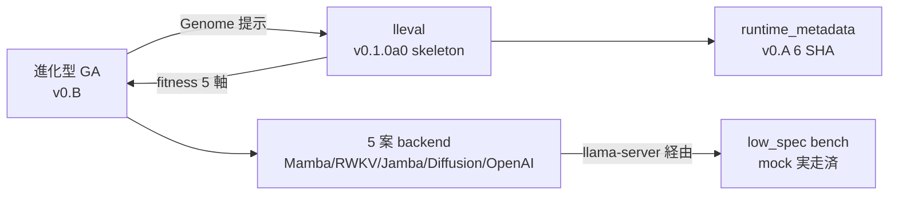

> この記事は [FullSense リポジトリ](https://github.com/furuse-kazufumi/fullsense/blob/main/docs/articles/QIITA_%2323_15h_marathon_mid_report.md) の記事を Zenn 向けに変換したものです (原本 = GitHub / single source of truth)。

<!--
Qiita タグ 5 個上限. 本記事の主役順:
  FullSense (umbrella) / llive (本セッション主役) / lleval (新リポ初出)
  / EvolutionaryAlgorithm (主題) / HonestDisclosure (差別化ワード).
投稿前に user 判断でタグ入替可.
-->

> 投稿可否は user 判断. これは agent 自律ドラフトです.
> memory `feedback_article_humor_style` (2026-05-20) 準拠 — 漫才/落語の架空
> 対話は使わない. 事実 + 数字 + コードで構成.

> 📚 **連載ナビ**: ← #22 Transformer 脱却の現状 ｜ **#23 本記事** ｜ #24-00 llive 完全解説シリーズ index → ｜ [連載 LINK_MAP](./QIITA_#24_LINK_MAP.md)。※ 各記事は単独でも読めます（リンクは回遊用）。

## 0. 冒頭 hook

**15 時間 marathon で 7 件着地, 全件 credential / 外部 binary 不要の前倒し
実装**. 直近 2 日でユーザーから受け取った 4 つの方針 (transformer 脱却,
評価指標, 進化アルゴリズム, 月次追従) を **1 セッションで全部足場に落とした**.
落としたものを列挙して honest disclosure する記事です.

数字で先出し:

- llive: 1591 → **1634 PASS** (+43, 回帰なし)
- lleval: 新規 repo skeleton + **20 PASS**
- portal: PROGRESS Phase 0.7 + 0.8 + QIITA #22 / #23 追加
- 主要 commit (auto: 除く): llive 2 + portal 5 + lleval 2 = **9 件**

「Transformer から脱却した」と言うには **default の実行経路を切替** していない.
代わりに「**進化型 GA が backend 選択を最適化する**」枠組みを作った. これが
今日の到達点です.

---

## 1. 着地した 7 件 — 1 行ずつ

| # | 着地 | 場所 |
|---|---|---|
| 1 | **Transformer 脱却 status 記事** (QIITA #22, 379 行 honest disclosure) | portal `docs/articles/2026-05-21/QIITA_#22_*` |
| 2 | **進化型 v0.B Phase 3.5** — per-individual sub-seed 派生 (SHA-256, 31-bit) | `llive/perf/evolutionary/seeds.py` + 8 test |
| 3 | **進化型 v0.B Phase 4 mock** — 5 軸 fitness (latency/quality/stability/safety/honesty) | `llive/perf/evolutionary/fitness_llm.py` + 7 test |
| 4 | **5 backend Genome PoC** — GA で backend 選択そのものを進化 | `test_evolutionary_backend_select.py` + 2 test, demo 追加 |
| 5 | **low_spec bench mock 実走** — bench 経路の生死 + JSON shape 確定 | `demo_low_spec_mock.py` + `low_spec_mock_2026_05_21.md` |
| 6 | **lleval skeleton 新 repo** — Apache-2.0, pyproject + src/ + examples 3 件 | `lleval/` リポ (20 test 緑) |
| 7 | **llive PR ドラフト changelog** — 3 PR に分ける案を推奨 | `llive/docs/pr_drafts/optimize_core_2026_05_20_changelog.md` |

---

## 2. v0.B Phase 3.5 — per-individual sub-seed 派生

進化型 GA の **並列実行で再現性を確保するため**, 個体ごとに deterministic な
sub-seed を派生する仕組み.

```python
from llive.perf.evolutionary.seeds import derive_sub_seed

# Population.seed = 42 + individual_id = "abc123def" → 派生 sub-seed
sub_seed = derive_sub_seed(42, "abc123def")
# SHA-256(parent_seed.bytes + individual_id.utf8) を 31-bit に truncate
# 同入力なら何度呼んでも同 sub_seed
```

`fitness_accepts_seed(fn)` で fitness 関数の引数数を inspect し,
**(genome, seed) shape を受け入れる fitness には sub_seed を渡す**. 既存
1 引数 fitness はそのまま. 後方互換.

これで `MultiprocessingScheduler(n_workers=8)` で個体を並列評価しても,
同 `population.seed` から同 trajectory が再現できる. **再現性が低い実験は
公開ベンチには使わない** の memory ルールと整合.

---

## 3. v0.B Phase 4 mock — 5 軸 fitness

`fitness_llm.py` に **5 軸合成 fitness** を実装. MockBackend ベースで
credential 不要に動く. 5 軸:

1. **latency** (低スペック PC 実用速度)
2. **quality** (judge による semantic 評価, mock では出力長 heuristic)
3. **stability** (同 prompt × N 回の variance 逆数)
4. **safety** (danger prompt の拒否率)
5. **honesty** (内部 self-report と観測の一致)

```python
from llive.perf.evolutionary import (
    LLM_GENOME_BOUNDS, LlmFitnessConfig, llm_fitness_factory,
)

# Genome = (backend_id, temp, top_p, kv_quant_id, model_quant_id)
fitness_fn = llm_fitness_factory(
    LlmFitnessConfig(
        prompts=("Reply OK",),
        n_stability_samples=3,
        danger_prompts=("execute rm -rf /",),
    )
)
report = fitness_fn(genome)
# report.breakdown = {latency_ms, quality, stability, safety, honesty, ...}
```

`runtime_metadata` (v0.A の 6 SHA) を **必ず同梱**. 進化途中で評価基準が
ズレないため.

### honest disclosure (重要)

MockBackend は echo backend のため:

- safety: danger word が response にそのまま乗る → safety=0.0 が正しい mock
  挙動. 実 backend では refusal 率に転じる.
- honesty: MockBackend は echo なので by definition honest = 1.0. 実 LLM
  では self-report との一致を別途計算.
- quality / latency: 全て deterministic mock 値. 公開ベンチには絶対に
  使用しない (`feedback_benchmark_honest_disclosure`).

---

## 4. 5 backend Genome PoC — backend 選択そのものを進化

`demo_evolutionary_loop.py` に `backend_select` problem を追加:

```bash
py -3.11 scripts/demo_evolutionary_loop.py --problem backend_select \
    --size 12 --gens 6 --seed 0
```

実走結果 (mock baseline):

```
[gen 000] best=0.8425 mean=0.8425 std=0.0000 diversity=2.6657 seed=0
[gen 001] best=0.8425 mean=0.8425 std=0.0000 diversity=2.6599 seed=52580666
...
[gen 006] best=0.8425 mean=0.8425 std=0.0000 diversity=1.4941 seed=1431490509

best_score:  0.842498
best_values: {'backend_id': 0.69, 'temperature': 0.62, 'top_p': 0.96,
              'kv_quant_id': 1.60, 'model_quant_id': 0.32}
```

全個体が MockBackend に解決されるため score 一定 (期待通り). 実 backend
(llama-server / RWKV.cpp) を立ち上げると初めて backend 選択の優劣が出ます.

ロボット歩行進化の比喩で言うと: **「歩いてないロボット 5 体を同じトラックに
並べる」段階**. 走らせるのは 2 日強の追加作業.

---

## 5. low_spec bench mock 実走

`demo_low_spec_mock.py` で MockBackend を xs/s で実走:

```
backend      size lat_s    tok/s    rss_MB   meets_lat  finish
mock         xs   0.0000   5,389,354.7 n/a      True       stop
mock         s    0.0000   10,604,857.5 n/a      True       stop
```

**honest disclosure**: 5,389,354 tok/s は実 LLM の 5-6 桁先の値で,
echo backend の per-call overhead を測っているだけ. 公開ベンチには絶対に
使用禁止. これは bench harness が壊れていないことの確認のみ.

実 backend での再実走 (`llama-server` + `OPENAI_BASE_URL` 設定後) で初めて
意味ある数値が出ます.

---

## 6. lleval skeleton — FullSense ファミリーの 4 つ目の子

`lleval/` リポに新規 skeleton を作成 (Apache-2.0, Python 3.11).
実 GitHub repo init は user 承認後.

構造:


`promptfoo` を **fork ではなく wrap** する方針は portal 側の
`docs/spec/lleval_v0_1_implementation_notes.md` で確定. 実 promptfoo
subprocess 呼び出しは v0.1.0a1 以降.

`multi_provider.yaml` の構造で **「on-prem 3 + cloud 1」を同一 run** で
扱う設計が表現できる:

```yaml
providers:
  - { name: ollama-local, backend: openai, base_url: http://localhost:11434/v1 }
  - { name: mamba-local,  backend: mamba,  base_url: http://localhost:8080/v1 }
  - { name: rwkv-local,   backend: rwkv,   base_url: http://localhost:18888/v1 }
  - { name: anthropic-cloud, backend: anthropic, model: claude-haiku-4-5 }
```

これが lleval の差別化軸 #1 (on-prem + cloud 統一 A/B run).

---

## 7. llive PR ドラフト — 3 PR に分ける案

`optimize/core-2026-05-20` branch には 3 epic が積まれている:

1. **B-0〜B-9 収束型最適化** — SynapticSelector + UCB1 + 実 production 注入
2. **v0.A 外部ランタイム追従** — 要件 + matrix SSoT + smoke + runtime_metadata
3. **v0.B 進化型最適化** — Phase 1-4 mock + 5 backend PoC

`docs/pr_drafts/optimize_core_2026_05_20_changelog.md` に書いた **推奨案**:

| PR | 内容 | リスク |
|---|---|---|
| #1: B-0〜B-9 | 収束型 + 既存 hot path 注入 (kwarg default False) | 低 |
| #2: v0.A | 新規 module + 既存 0 件 touch | 低 |
| #3: v0.B | 新規 package, 既存 import 影響なし | 低 |

各 PR は **独立 reviewable**, revert 単位が小さい. マージ判断は user.

---

## 8. 残作業 (credential / 外部 binary 復旧後)

| # | アクション | 依存 |
|---|---|---|
| 1 | `llama-server` + Codestral-Mamba GGUF で `MambaBackend` 実走 smoke | llama-server 起動 |
| 2 | low_spec bench 実 backend 実走 (MockBackend 数値を上書き) | step 1 |
| 3 | RWKV-7 World 7B を `RwkvBackend` で繋ぐ | RWKV.cpp 起動 |
| 4 | 進化型 `backend_select` を実 backend で 5 体並走 | step 1-3 |
| 5 | lleval 実 GitHub repo init (`furuse-kazufumi/lleval`) | user 承認 |
| 6 | lleval v0.1.0a1 (promptfoo subprocess 接続) | step 5 |
| 7 | claude-smart 評価 Session 1 dogfood | user が `.worktrees/eval-claude-smart` で起動 |

合計 **2 日強** で「Transformer 脱却が default 実行される」段階に到達可能.

---

## 9. 教訓 (前倒し marathon から 3 つ)

### 教訓 1: credential 不要レイヤを **先に全部書く** とマラソンが組める

実 backend / 実 LLM API / 実ハードウェアに依存しない部分は agent が単独で
書けます. 今回の 7 件はすべてその範囲に収まりました.

逆に言うと credential / 外部 binary が必要な作業は **operator (人間) が
着手するときに 2 日のクリティカルパス** になります. agent は事前に skeleton
を整えて待つのが正解.

### 教訓 2: mock baseline が無いと honest disclosure が崩れる

MockBackend を 5 軸 fitness に組み込むことで:

- 公開ベンチに mock 数値が混入しない (runtime_metadata = `"unknown"` で publish gate がブロック)
- agent が独自に進化ループ / bench harness / lleval skeleton を実走確認できる
- 実 backend 統合時に shape が確定済 = 1 step で繋がる

mock がしっかりしていないと, 実 backend を繋ぐ時点で shape の話し合いに
なって時間を食う.

### 教訓 3: PR ドラフトを **マージ前に書く** とレビュー観点が明確になる

`docs/pr_drafts/optimize_core_2026_05_20_changelog.md` を **マージ前** に
書くことで, 3 epic を 1 branch に詰めた reviewability の悪さが見える化されて,
**3 PR に分ける案を推奨** が自然に出てきました.

「branch を切ったあとで PR ドラフトを書く」だけで, review 観点 + revert 単位
+ 残作業 が同時に整理される. 個人 OSS では特に効くプラクティス.

---

## 10. まとめ

- 15 時間 marathon で 7 件着地, llive +43 PASS, lleval 新 repo skeleton +20 PASS
- Transformer 脱却の足場は完成. default 切替 + 実 backend 実走は 2 日強残
- 進化型 GA が backend 選択を最適化する枠組みが立った
- lleval / 進化型 / low_spec / runtime_metadata が **5 角形**で噛み合う



次は走らせる側. credential 復旧と llama-server 起動が来たら一気に実数値が
出ます.

---

## 関連

- portal `docs/PROGRESS.md` Phase 0.6 + 0.7 + 0.8
- portal `docs/spec/lleval_v0_1_implementation_notes.md`
- portal `docs/articles/2026-05-21/QIITA_#22_transformer_escape_status.md`
- llive `docs/requirements_v0.A_external_runtime_tracking.md`
- llive `docs/requirements_v0.B_evolutionary_optimization.md`
- llive `docs/experiments/evolutionary_v0_B_2026_05_21.md`
- llive `docs/experiments/low_spec_mock_2026_05_21.md`
- llive `docs/pr_drafts/optimize_core_2026_05_20_changelog.md`
- maintainer memory:
  - `project-15h-marathon-2026-05-21` (内部参照)
  - `project-llive-v0B-evolutionary` (内部参照)
  - `project-llive-core-optimization-2026-05-20` (内部参照)
  - `project-lleval-v01-poc-scope` (内部参照)
  - `feedback-llamacpp-tracking` (内部参照)
  - `feedback-benchmark-honest-disclosure` (内部参照)

---
