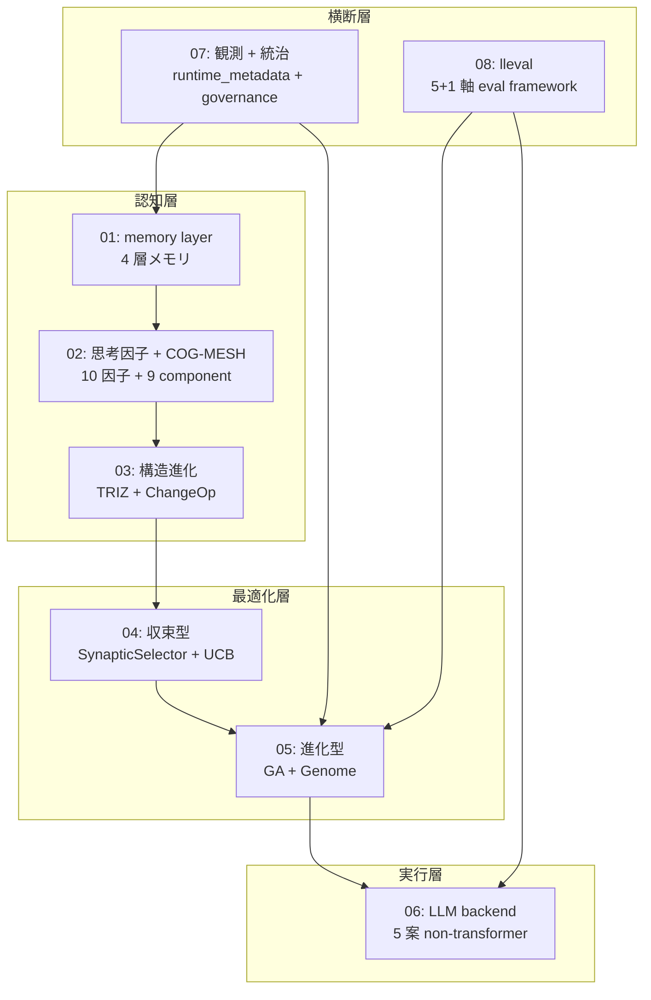

> この記事は [FullSense リポジトリ](https://github.com/furuse-kazufumi/fullsense/blob/main/docs/articles/QIITA_%2324_00_llive_tech_series_index.md) の記事を Zenn 向けに変換したものです (原本 = GitHub / single source of truth)。

# llive 完全解説 (0) — series index: 大分類 8 記事 + 全体図

> **コンセプト hook**: llive (FullSense ™ の思考層) を **構成する技術 / アルゴリズム
> を名称ごとに解説する** series の入口です. 1 記事に詰め込むと ~80k 字級になるため,
> **大分類 8 記事** に分割しました. 本 index は全体地図 — どの章で何を読めるかを示します.

## 0. この series について

llive は「LLM 本体ではなく LLM の周りに被せる認知 OS」です. その内部を **4 層
(認知 / 最適化 / 実行 / 横断) × 8 章** に分けて, 各章で具体的な class / function /
機能名まで降りて解説します. 各記事は次の共通構造を持ちます:

- **冒頭 hook** (8 秒で「これは何か」)
- 具体的な class / function 名まで降りた小節
- 実コードへの **GitHub link**
- **References** (学術 / OSS / 内部)
- **cross-link** (前 / 次 / 本 index / repo)

合計 **~80k 字**. ja Qiita + en Medium を並走します.

## 1. Series 構成 (8 大分類)

| # | タイトル (クリックで各章) | 中分類 | 公開 |
|---|---|---|---|
| 01 | [**memory layer** — 4 層メモリ](https://qiita.com/furuse-kazufumi/items/a5ebb3992e4c28862f47) | semantic / episodic / structural / parameter / surprise gating | 🟢 公開 |
| 02 | [**思考因子 + COG-MESH** — 10 因子と 9 component](https://qiita.com/furuse-kazufumi/items/bdfad6db3f2e70c40511) | 構造化 / 再構成 / 閉ループ / ... / proactive / quarantine / 5W1H | 🟢 公開 |
| 03 | [**構造進化 (TRIZ × Z3)**](https://qiita.com/furuse-kazufumi/items/fa0890f136636d495ea6) | TRIZ 40 原理 / ChangeOp / verifier / 9 画法 | 🟢 公開 |
| 04 | [**収束型最適化 (B-0〜B-9)**](https://qiita.com/furuse-kazufumi/items/e5093e4816b25c1bd4d0) | SynapticSelector / UCB1 / Hebbian / 本番 hot path | 🟢 公開 |
| 05 | [**進化型最適化 (v0.B/C/D/E)**](https://qiita.com/furuse-kazufumi/items/07b686ea311e06027f94) | Genome / Crossover / Tournament / Mutation / lineage | 🟢 公開 |
| 06 | [**LLM backend 層** — non-transformer](https://qiita.com/furuse-kazufumi/items/6da5a883fb2ed651edd8) | Mamba / Jamba / RWKV / Diffusion / 思考因子→SSM Δ Bridge | 🟢 公開 |
| 07 | [**観測 + 統治**](https://qiita.com/furuse-kazufumi/items/c5f2077a3399d3fc9b26) | runtime_metadata / Approval Bus / governance / honest disclosure | 🟢 公開 |
| 08 | [**lleval (eval framework)**](https://qiita.com/furuse-kazufumi/private/e49b7ab9027d93594402) | progressive size matrix / 5+1 軸 / judge rotation | 🟡 限定共有 |

> 🟢 公開 = Qiita ホーム / 検索結果に露出. 🟡 限定共有 = URL を知る人のみ閲覧. 公開昇格は連載順 (01 → 02 → … → 08) で順次予定.

## 2. 全体図 (8 layer の関係)

「**認知層 → 最適化層 → 実行層**」の縦が llive の処理 flow,
「**観測 + 統治**」「**lleval**」が横断層として全 layer に効く構造です.

## 3. 想定読者

- **エンジニア** (Python + LLM 基礎知識あり)
- **AI researcher** (LLM の周辺アーキテクチャに興味)
- **個人 OSS author** (実装パターンの参考)
- **企業 R&D** (on-prem LLM stack の検討材料)

## 4. 公開順 (週 2 本ペース)

| 週 | 公開記事 |
|---|---|
| Week 1 | 01 memory + 02 思考因子 |
| Week 2 | 03 構造進化 + 04 収束型 |
| Week 3 | 05 進化型 + 06 LLM backend |
| Week 4 | 07 観測統治 + 08 lleval |

各記事の en 版は Medium に並走します.

## 5. 連載を貫くテーマ — 「速い」は実装方法で桁が変わる

連載中核 #24-05 で扱う派生集団進化の hot path 3 つを Rust 化した実測:

- **RUST-15** persona_dissimilarity_pairwise: avg **x12.71** (batch)
- **RUST-16** collusion_score_kernel: avg **x66.70** (numpy 小 N hot path)
- **RUST-17b** novelty_score_batch (rayon + quickselect): avg **x9.32**

「**Rust 化 = 速い」は嘘 / 「numpy = 速い」も嘘** — 実装方法 (FFI 境界 / batch /
numpy zero-copy / 並列度 / partial sort) で結果が桁違いになります. この honest
disclosure の姿勢が連載全体の通奏低音です. 5 パターン判定表は #24-04 / #24-05 /
#24-07 で詳述します.

## 6. References (本 index)

- [furuse-kazufumi/llive](https://github.com/furuse-kazufumi/llive) — 本体 repo
- FullSense Spec v1.1 (llive `docs/`)
- 各章の References は個別記事に記載

---

## Series Navigation

- → 次: [llive 完全解説 (1) 「忘れない LLM」](https://qiita.com/furuse-kazufumi/items/a5ebb3992e4c28862f47)
- repo: [furuse-kazufumi/llive](https://github.com/furuse-kazufumi/llive)

---
