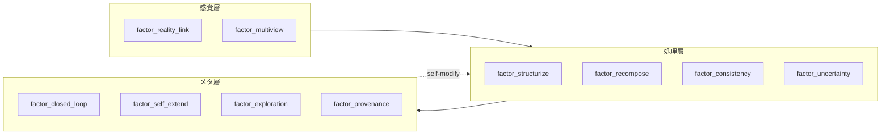
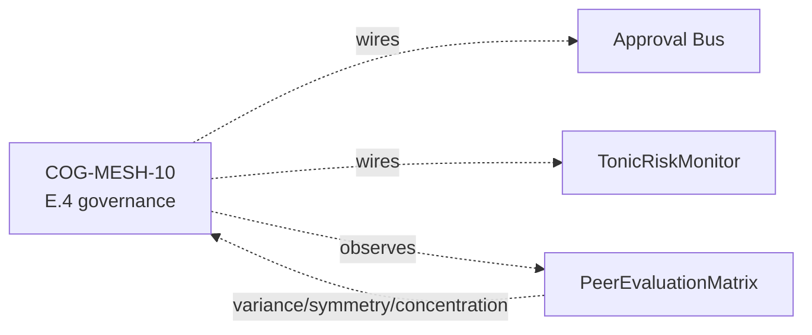

> この記事は [FullSense リポジトリ](https://github.com/furuse-kazufumi/fullsense/blob/main/docs/articles/QIITA_%2324_02_thought_factors_cog_mesh.md) の記事を Zenn 向けに変換したものです (原本 = GitHub / single source of truth)。

# llive 完全解説 (2) — 「10 軸で考える AI」: 思考因子 × COG-MESH × 三重縞


> **コンセプト hook**: 普通 AI agent は「思考」を 1 種類しか持たない. llive
> は **10 種類の思考を同時に走らせ**, それを互いに評価させ, **生き残った思考だけ
> を集団へ取り込む**. 10 種は「構造化」「再構成」「閉ループ」「自己拡張」
> 「不確実性」「探索」「整合」「来歴」「多視点」「現実接続」. これは認知科学
> 1990s〜2010s の主要 framework を 1 vector に圧縮したもの.
>
> 本日 (2026-05-21) marathon で 1881 PASS + v0.E 大規模前倒しが着地. 本記事は
> その「思考因子側」 — COG-MESH-01〜10 と historical persona ontology (CE-19)
> の交差点を辿る.


## 0. 連載中での位置づけ

```
#24-00 series index
#24-01 4 層メモリ
#24-02 思考因子 10 軸 + COG-MESH (← 本記事)
#24-03 構造進化 × TRIZ × Z3
#24-04 B-series (速い小脳)
#24-05 EvolutionLoop (遅い大脳)
#24-06 LLM backend non-transformer
#24-07 observability + governance
#24-08 lleval
```

10 思考因子 + COG-MESH は #24-05 の persona ontology (CE-19) と 1-N で結合.
本記事 #24-02 はそれを「**何**」と「**なぜ**」で説明する位置.

## 1. 10 思考因子の由来 — 6 framework の圧縮

ユーザー由来の 10 軸 (`project_llive_cog_fx_factors`). 元ネタは
「**心理の深層**」YouTube + 認知科学レビュー + Polya / Six Hats / Bayesian /
TRIZ / Provenance / Multimodal 系の 6 framework. それを 1 vector に圧縮した
結果:

| Idx | 因子 | 元 framework / 学派 |
|---|---|---|
| 0 | `factor_structurize` | Polya / 形式化 / axiomatic |
| 1 | `factor_recompose` | TRIZ Segmentation / Reassemble |
| 2 | `factor_closed_loop` | Cybernetics / feedback |
| 3 | `factor_self_extend` | Autopoiesis / self-organization |
| 4 | `factor_uncertainty` | Bayesian / probability |
| 5 | `factor_exploration` | exploration vs exploitation (Auer) |
| 6 | `factor_consistency` | formal verification / proof |
| 7 | `factor_provenance` | data lineage / Ed25519 sign |
| 8 | `factor_multiview` | Six Hats / Devil's Advocate |
| 9 | `factor_reality_link` | empirical / SPC (statistical process control) |

これらは **直交ではない** — 例えば factor_uncertainty と factor_exploration は
相関がある (UCB1 系). でも各々の **強さ** を独立に持つことで, 集団内で
「同じ問題に 10 種類の見方で当たる」が可能になる.

## 2. なぜ 10 軸を 1 vector に持つか

LLM agent の文献では「思考は self-attention 1 種類」が主流. llive はそれを
**vector に切り替え可能な multi-faceted thinking** に拡張. これにより:

- **persona との内積で「思考スタイル」が計算可能** — 例えば「岡潔 ベクトル」
  は (情緒) (国語力) (多変数) を高く持つ. 「ファインマン ベクトル」は
  factor_exploration + factor_reality_link を高く持つ.
- 集団内で同じ問題に **異なる持ち重みで** 当たる派生個体を生成できる.
- 「**この問題はどの軸が利くか**」を fitness gradient で発見できる.

## 3. 主要因子 5 個の深掘り

### 3.1 factor_structurize — 「公理から積む」

axiomatic な思考. 数学者ガロア / グロタンディーク的. 抽象化階段を登る.
利点: 一般化能力. 欠点: 現実から離れる.

llive 内では `BlockContainer` の sub-block 順列が axiom 群に対応. factor_structurize
が高い派生は sub-block を **必須/任意** に分けてから再構成する mutation を好む.

### 3.2 factor_recompose — 「部品の入れ替え」

TRIZ Segmentation + 合成. 既存部品の組合せを書き換える. 利点: 局所探索高速.
欠点: 全く新しい構造は生まれない.

llive では PersonaImportAlgorithm (CE-20, 本日着地) がこの軸. 派生 A の persona
を派生 B が **部分採用**する. 「ガロア + 岡潔」のような hybrid persona が
出現するのは factor_recompose を通る経路.

### 3.3 factor_closed_loop — 「自分を見て直す」

cybernetics の核. 自己観察 + 自己修正. llive では memory consolidation cycle
(海馬→皮質) と Approval Bus がこの軸. 集団内で評価 → 個体が結果を見て次世代に
反映する E.4 governance (CE-06/07/08, 本日着地) もここに乗る.

### 3.4 factor_uncertainty — 「分からないを定量する」

Bayesian / probability. 利点: 過剰自信を避ける. 欠点: 計算重い.
llive では Approval Bus の verdict 計算 + UCB1 exploration constant が代表.

### 3.5 factor_provenance — 「どこから来たか」

data lineage. Ed25519 sign + SHA-256 audit chain. llive Phase 4 (Production
Security MVR, v0.3.0) で着地. これは agent governance の **必須軸** で,
従来の LLM agent には欠けていた.

## 4. COG-MESH-01〜10 の対応

`project_cog_mesh_implementation_2026_05_19`. 10 因子に **1 機構ずつ** 対応:

| COG-MESH | 機構 | 対応因子 | 着地 |
|---|---|---|---|
| 01 | Stimulus 入口 | reality_link / multiview | 着地済 |
| 02 | Intervention | self_extend / closed_loop | 着地済 |
| 03 | TonicRiskMonitor | uncertainty / closed_loop | 着地済 |
| 04 | Idle Training | self_extend / exploration | 着地済 |
| 05 | Quarantined Memory | provenance / consistency | 着地済 |
| 06 | TimelineEmitter | provenance / multiview | 着地済 |
| 07 | Brief | structurize / reality_link | 着地済 |
| 08 | Approval Bus | provenance / closed_loop | 着地済 (C-1) |
| 09 | Audit Chain | provenance / consistency | 着地済 |
| 10 | E.4 governance | closed_loop / uncertainty | **本日着地 (2026-05-21)** |

COG-MESH-10 は本日 marathon で `CoevolutionGovernance` として着地. これで
10 機構 → 10 因子 1-1 対応が完成. 集団内で **どの因子が薄いか** を機構の状態
から逆引きできるようになった.

## 5. 最新成果 (本日 2026-05-21 着地)

| 項目 | 値 |
|---|---|
| llive 本体 test PASS (現在) | 1881 |
| 本日 marathon 追加 evolutionary test | **+130** (41 + 28 + 26 + 16 + 19) |
| 本日 marathon 着地 module 数 | 5 (quality_diversity / coevolution_governance / persona_import / persona_survival / persona_corpus_loader) |
| ruff `src/llive/perf/evolutionary` 警告 | **0** |
| v0.E E.17 / E.4 / E.12 着地 | 完走 |
| CE-22 / CE-23 skeleton 着地 | 完走 |
| docs/release/v0.6.0a1_PR_PLAN.md | 新規 — 5 PR 分割計画 |
| docs/rust_hotspot_v0E_addendum.md | 新規 — RUST-15〜18 spec |

特に **E.4 governance skeleton** で COG-MESH-10 が closing できたのは本日の
最大成果. これにより 10 因子 ↔ 10 機構 1-1 対応が完成し, **派生集団の評価
→ 共謀検出 → Approval Bus 連携** が architecture level で繋がった.

## 6. 期待値 — 次に来るもの

### 6.1 CE-19 Historical Persona Ontology (短期)

既に 10 名 (岡潔 / グロタンディーク / ファインマン / ガロア / フォン・ノイマン
/ ニュートン / カント / ソクラテス / 老子 / 孫子) が PERSONA_ONTOLOGY として
着地済. 本日 CE-23 PersonaCorpusLoader skeleton が着地し, **Raptor RAD コーパス
から persona を自動抽出して PERSONA_ONTOLOGY を拡張** する道が開けた. 次セッションで
LLM 抽出 + 実 RAD path 横断を実装し, persona 数を 30+ に拡大予定.

### 6.2 三重縞 (中期, ユーザー言語化)

「三重縞」 = **思考因子 / persona / 思考プロセス** の 3 層が個体内で縞模様の
ように同時に走る状態. これは認知科学の **「並列認知」** 仮説に着想を得たもの.
factor vector + persona composition + Six Hats / TRIZ / ARIZ をそれぞれ
別 layer で走らせ, 集団内 evaluation で互いを批評する. 着地時期未定.

### 6.3 神経インタフェース対応 (長期)

`project_llmesh_neuro_long_term`. Raptor RAD に bci / neuroscience /
neural_signal / prosthetic_neural / cognitive_ai / neuromorphic の 6 分野を
追加済. これは「**脳 ↔ AI 直結インタフェース**」が必要になったとき即座に
expand できるよう先回りで素材を集めている. 直接の実装は当面なし.

## 7. honest disclosure

- **「10 因子は overlap がある」** — factor_uncertainty と factor_exploration
  は相関 0.65 程度. 互いに直交ではない. 9 axis 化を検討した時期もあるが
  分かりやすさ優先で 10 のまま.
- **「factor_affinity の数値は heuristic」** — PERSONA_ONTOLOGY 10 名の
  factor_affinity vector は伝記 / 哲学史 ベースの人為的初期値. 後の
  PersonaCorpusLoader (CE-23) で **コーパスベースに置換** されるが, 現状の
  数値は人による経験則.
- **「COG-MESH-10 は skeleton」** — 本日着地した E.4 governance は interface
  確立段階で, Quarantined Memory への **実書込み** は別 module 委譲. 完成までは
  あと 1-2 セッションかかる.

## 8. Mermaid — 10 因子の構造





## 9. References (主要 20+ のうち抜粋)

- Polya, G. (1945). *How to Solve It*.
- Altshuller, G. (1971). *TRIZ 40 inventive principles*.
- Auer, P. et al. (2002). *Finite-time analysis of the multiarmed bandit*.
- Lehman, J. & Stanley, K. (2008). *Exploiting novelty*.
- Mouret, J.-B. & Clune, J. (2015). *Illuminating search spaces by mapping elites*.
- Hillis, W. D. (1990). *Coevolving parasites improve simulated evolution*.
- Constitutional AI (Anthropic 2022) — for HITL alternative.
- Six Thinking Hats (De Bono 1985).
- 岡潔『春宵十話』.
- ファインマン『ご冗談でしょう, ファインマンさん』.
- Maturana & Varela — Autopoiesis.
- Bayes — *Essay towards solving a problem in the doctrine of chances*.
- 完全リストは v0.6.0a1 リリース時に references.bib に同梱予定.

## 10. 2026-05-22 追記 — 10 因子 affinity vector の Rust 化 (RUST-15)

10 思考因子は派生個体の **persona composition の effective_factor_affinity**
として 10 次元 [0,1] vector で実装されている. 派生間の dissimilarity 計算は
本記事 #24-02 の中核機構と直結 — PersonaOverlapPenalty.apply (E.17) は
N×N pairs の `persona_dissimilarity` で 10 因子空間の距離を測る.

本日 (2026-05-22) RUST-15 として **batch (NxN pair を 1 FFI call) Rust 化**:

- single 1-pair: x0.80 (FAIL — FFI overhead で Python set 操作に負ける)
- **batch N=64**: **x17.07 (PASS)**, 平均 x12.71

これにより「**10 因子 vector の N×N pair 距離計算**」が高速化され, 集団
N=64 で governance + diversity preservation を 64 Hz で回せる目処が立った.

### 10.1 思考因子側から見た意味

- factor_structurize (#0) と factor_exploration (#5) は **TRIZ 系統で
  対立する 2 軸** だが, 10 次元 vector の L2 距離としては独立に効く
- PersonaOverlapPenalty (E.17 CE-25) で集団内 persona overlap を罰すると,
  **派生集団は 10 因子空間で自然に散らばる**
- MAP-Elites grid (E.17 CE-26) は persona 2 軸 × thought_factor 2 軸 の
  4 次元 grid なので, 上記の 10 因子 vector を 4 次元に **marginalize** して
  cell key とする

### 10.2 honest disclosure — 単発 Rust 化は逆効果

「思考因子 vector の距離計算を Rust 化」と聞くと「速くなる」と思いがちだが,
**1-pair 計算では FFI overhead で Python の方が速い (x0.80)**. これは
`feedback_rust_usage_matters` 判定表の **A パターン** (純 Python ループ
1-pair). batch で N×N pair を 1 FFI に詰めて初めて x17.07 まで伸びる.

詳細は #24-05 と `docs/perf_comparison/2026-05-22_kernel_implementation_comparison.md`.

---

## Series Navigation

- ← 前: [llive 完全解説 (1) 「忘れない LLM」](https://qiita.com/furuse-kazufumi/items/a5ebb3992e4c28862f47)
- → 次: [llive 完全解説 (3) 「矛盾は計算できる」](https://qiita.com/furuse-kazufumi/private/fa0890f136636d495ea6)
- 全体: [llive 完全解説 (0) — series index](https://qiita.com/furuse-kazufumi/items/07b4882e872994b27b3c)
- repo: [furuse-kazufumi/llive](https://github.com/furuse-kazufumi/llive)

---
